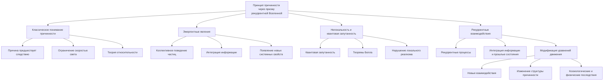

# Принцип причинности через призму эмергентных явлений и теории рекуррентной Вселенной

---

## Аннотация

В современной физике принцип причинности является фундаментальным постулатом, определяющим последовательность событий во времени. Однако открытия в области квантовой механики и теории информации ставят под вопрос абсолютность этого принципа. В данной работе рассматривается влияние нелокальных и рекуррентных взаимодействий на причинно-следственные связи в физике, особенно в контексте возможности влияния информации на прошлые состояния системы. Обсуждаются эмергентные явления и их роль в пересмотре традиционных понятий причинности.

### 1. Введение

Принцип причинности утверждает, что причина предшествует следствию, и что информация не может распространяться быстрее скорости света. Это основание классической физики и релятвистской теории Эйнштейна. Однако квантовая механика с ее феноменами запутанности и нелокальности бросает вызов этому пониманию.

### 2. Эмергентные явления в физике

Эмергентность — это свойство системы проявлять новые качества, не присущие ее отдельным элементам. В физике возникают ситуации, когда коллективное поведение частиц приводит к новым феноменам.

### 3. Эмергентная интеграция информации

В контексте квантовой информации, интеграция информации может приводить к появлению новых свойств системы. Квантовая запутанность является примером такого эмергентного свойства, где состояние всей системы не сводится к состояниям ее подсистем.

### 4. Нелокальные взаимодействия и квантовая запутанность

Квантовая запутанность демонстрирует, что измерение состояния одной частицы мгновенно влияет на состояние другой, независимо от расстояния между ними. Это приводит к нарушению локальности, установленной классической физикой.

### 5. Теоремы Белла

Джон Белл сформулировал неравенства, которые экспериментально подтверждают наличие квантовой нелокальности[^1^]. Эксперименты Алена Аспе и других подтвердили эти предсказания, показывая, что концепция локального реализма не соответствует наблюдениям[^2^].

### 6. Временная симметрия и возможность влияния на прошлое

В некоторых интерпретациях квантовой механики вводится концепция времени без строгого разделения на прошлое и будущее.

### 7. Теория поглощения Уилера–Фейнмана

Джон Уилер и Ричард Фейнман предложили модель, в которой электромагнитное взаимодействие является результатом обмена сигналами как в будущее, так и в прошлое[^3^].

### 8. Подход Ахаронова

Якир Ахаронов и его коллеги развили формулизм двух состояний, предполагающий, что состояние квантовой системы определяется как прошлыми, так и будущими измерениями[^4^].

### 9. Рекуррентные взаимодействия и их влияние на причинность

Рекуррентные взаимодействия предполагают циклическое влияние элементов системы друг на друга.

### 10. Петли причинности

Возможность существования замкнутых временных кривых в общей теории относительности, таких как решение Гёделя, допускает петли причинности[^5^]. Хотя такие решения считаются физически нереалистичными, они показывают гипотетическую возможность нарушения причинности.

### 11. Информация и влияние на прошлые состояния

Если информация может быть передана в прошлое или влиять на прошлые состояния системы, это радикально меняет наше понимание причинно-следственных связей.

### 12. Квантовые компьютеры и обратное вычисление

Квантовые алгоритмы, такие как алгоритм Дойча, демонстрируют ситуации, где результат вычисления может казаться определяющим выбор входных параметров[^6^].

### 13. Пересмотр причинно-следственных связей

Учитывая вышеизложенное, становится очевидным, что классическое понимание причинности требует пересмотра в свете новых открытий.

### 14. Квантовая теория информации и причинность

Квантовая информация предлагает новые способы понимания передачи и обработки информации, где традиционные ограничения причинности могут быть ослаблены.

### 15. Заключение

Развитие теорий, учитывающих эмергентные и рекуррентные взаимодействия, указывает на необходимость пересмотра фундаментальных принципов физики, включая причинность. Дальнейшие исследования в области квантовой информации и теории поля могут привести к созданию новой модели вселенной, где информация играет ключевую роль в структуре пространства-времени.

### 16. Список литературы

[^1^]: Bell, J. S. (1964). On the Einstein Podolsky Rosen paradox. *Physics Physique Физика*, 1(3), 195-200.
[^2^]: Aspect, A., Dalibard, J.,  Roger, G. (1982). Experimental test of Bell's inequalities using time-varying analyzers. *Physical Review Letters*, 49(25), 1804-1807.
[^3^]: Wheeler, J. A.,  Feynman, R. P. (1945). Interaction with the absorber as the mechanism of radiation. *Reviews of Modern Physics*, 17(2-3), 157-181.
[^4^]: Aharonov, Y., Bergmann, P. G.,  Lebowitz, J. L. (1964). Time symmetry in the quantum process of measurement. *Physical Review*, 134(6B), B1410-B1416.
[^5^]: Gödel, K. (1949). An example of a new type of cosmological solutions of Einstein's field equations of gravitation. *Reviews of Modern Physics*, 21(3), 447-450.
[^6^]: Deutsch, D. (1985). Quantum theory, the Church-Turing principle and the universal quantum computer. *Proceedings of the Royal Society of London. A. Mathematical and Physical Sciences*, 400(1818), 97-117.

---

Оглавление: 

- [ЭИРО framework](/README.md)

