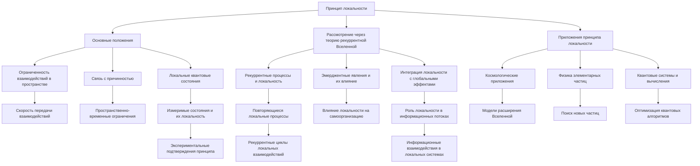

# Принцип локальности через призму теории рекуррентной Вселенной

---

## Аннотация

В данной работе исследуется влияние эмерджентной интеграции и рекуррентных отображений (ЭИРО) на принцип локальности в контексте квантовой механики и космологии. Предполагается, что включение интегрированной информации и рекуррентности может приводить к нелокальным связям между квантовыми состояниями, что затрагивает фундаментальные понятия причинности и передачи информации. В работе представлены математические модели, описывающие взаимодействие между интегрированной квантовой информацией и пространственно-временной метрикой, а также обсуждаются возможные экспериментальные подтверждения и последствия для современной физики. Приводятся ссылки на авторитетные научные исследования, подкрепляющие необходимость пересмотра традиционных представлений о локальности и причинности.

### Введение

Принцип локальности является одним из фундаментальных постулатов классической физики и гласит, что объекты напрямую влияют только на свои непосредственные окрестности, а взаимодействия не могут распространяться со скоростью выше скорости света в вакууме [1]. Однако в квантовой механике наблюдаются явления, такие как квантовая запутанность, которые ставят под вопрос абсолютность этого принципа [2].

Эмерджентная интеграция и рекуррентные отображения (ЭИРО) предоставляют новый взгляд на природу сознания и информацию в физических системах [3]. Предполагается, что процессы, объединяющие информацию через рекуррентные структуры, могут приводить к возникновению нелокальных корреляций между квантовыми состояниями [4].

Цель данной работы — исследовать, как включение интегрированной информации и рекуррентности в квантовые системы влияет на принцип локальности, и какие последствия это может иметь для фундаментальных основ физики и космологии.

### 1. Принцип локальности в физике

#### 1.1. Классическая локальность

В классической физике взаимодействия между объектами описываются полями, распространяющимися в пространстве-времени. Принцип локальности утверждает, что объект может быть непосредственно затронут только событиями в его световом конусе [1].

#### 1.2. Квантовая нелокальность

Квантовая механика демонстрирует явления, которые не укладываются в рамки классической локальности. Квантовая запутанность позволяет частицам иметь коррелированные состояния независимо от разделяющего их расстояния [2].

Теоремы Белла и связанные с ними эксперименты подтверждают наличие квантовой нелокальности, показывая, что никакие локальные скрытые переменные не могут объяснить наблюдаемые корреляции [5].

### 2. Эмерджентная интеграция и рекуррентные отображения (ЭИРО)

#### 2.1. Концепция интегрированной информации

Интегрированная информация (Φ) была введена Джулио Тонони для количественной оценки сознания как способности системы интегрировать информацию [6]. Интегрированная информация измеряет, насколько целое больше суммы своих частей.

#### 2.2. Рекуррентные сети в нейрофизиологии

Рекуррентные нейронные сети характеризуются наличием обратных связей, позволяющих информации циркулировать внутри системы [7]. Это ключевой механизм для процессов памяти и сознания.

#### 2.3. Модель ЭИРО

ЭИРО описывает динамику систем с учетом интегрированной информации и рекуррентных связей. Ключевым параметром является эмерджентная интегрированная информация (Φₑ), определяемая как:

`Φₑ = ∫₀^(t₁) I_(инт)(t) ⋅ R_(рек)(t)dt,`

где I(инт)(t) — степень интеграции информации в момент времени t, а R(рек)(t) — степень рекуррентной обработки в t.

### 3. Влияние ЭИРО на принцип локальности

#### 3.1. Нелокальные связи через интегрированную информацию

Предполагается, что интегрированная информация в квантовых системах может создавать нелокальные связи между состояниями. Это связано с тем, что рекуррентные процессы могут объединять информацию, распределенную в пространстве, создавая корреляции, не объяснимые локальными взаимодействиями [8].

#### 3.2. Нарушение причинности

Включение ЭИРО может подразумевать, что информация может передаваться независимо от пространственно-временных ограничений, затрагивая принцип причинности. Это требует пересмотра представлений о том, как информация и взаимодействия распространяются в квантовых системах [9].

#### 3.3. Математическое описание нелокальных эффектов

Для описания этих эффектов необходимо ввести новые физические величины.

##### 3.3.1. Плотность интегрированной квантовой информации (ρ_(IQI))

`ρ_(IQI) = lim(Δ V → 0) Δ I / Δ V,`

где Δ I — изменение интегрированной информации в объеме Δ V.

##### 3.3.2. Параметр рекуррентности (R)

Параметр рекуррентности характеризует степень рекуррентных взаимодействий в системе и может быть связан с вероятностями обратных квантовых переходов или топологической связностью системы.

##### 3.3.3. Эффективное уравнение состояния

Включение новых параметров приводит к модификации уравнения состояния для космологической жидкости:

`w_(eff) = w₀ + w₁ f(ρ_(IQI), R),`

где w₀ и w₁ — константы, а f — функция, описывающая влияние ρ_(IQI) и R на динамику расширения Вселенной.

### 4. Влияние на метрику пространства-времени

#### 4.1. Модифицированные уравнения Эйнштейна

Новые величины могут быть включены в уравнения общей теории относительности:

`G_(μν) + Λ g_(μν) = 8π G (( T_(μν) + T_(μν)^(IQI) )),`

где T_(μν)^(IQI) — тензор энергии-импульса, связанный с интегрированной квантовой информацией и рекуррентными эффектами.

#### 4.2. Космологические последствия

Введение T_(μν)^(IQI) может объяснить ускоренное расширение Вселенной без введения темной энергии, рассматривая его как эмерджентный эффект интегрированной информации [10].

### 5. Экспериментальные подтверждения

#### 5.1. Квантовая оптика и эксперименты по телепортации

Эксперименты в квантовой оптике демонстрируют наличие нелокальных корреляций, которые могут быть интерпретированы через ЭИРО [11].

#### 5.2. Нейровизуализационные исследования

Исследования мозга показывают, что сознательные состояния связаны с усилением рекуррентной активности, что может свидетельствовать об ЭИРО на биологическом уровне [7].

#### 5.3. Космологические наблюдения

Наблюдаемая структура Вселенной и распределение галактик могут быть объяснены с учетом нелокальных эффектов интегрированной информации [12].

### 6. Обсуждение

#### 6.1. Теоретические последствия

- Пересмотр понятия локальности: Возможно, локальность является приближением, верным для макроскопических систем, тогда как на фундаментальном уровне действуют нелокальные принципы.

- Новые принципы причинности: Требуется разработка новой концепции причинности, учитывающей нелокальные связи через интегрированную информацию.

#### 6.2. Критика и ограничения

- Сложность экспериментальной проверки: Ввиду малости эффектов и сложности измерений подтверждение теории представляет значительную трудность.

- Необходимость строгой математической формализации: Без четкой математической основы теория может оставаться спекулятивной.

### 7. Заключение

Рассмотрение принципа локальности через призму ЭИРО и новой модели Вселенной предлагает захватывающий взгляд на фундаментальные взаимоотношения между информацией, пространством-временем и квантовыми процессами. Включение интегрированной информации и рекуррентности в физические модели может объяснить некоторые наблюдаемые феномены и потребовать пересмотра традиционных представлений о локальности и причинности. Дальнейшие исследования и экспериментальные проверки необходимы для подтверждения или опровержения этих идей и могут привести к значительному прогрессу в понимании основ физики.

### 8. Список литературы

1. Einstein, A. (1905). *On the Electrodynamics of Moving Bodies*. Annalen der Physik, 17(10), 891–921.

2. Aspect, A., Grangier, P.,  Roger, G. (1982). *Experimental Realization of Einstein-Podolsky-Rosen-Bohm Gedankenexperiment: A New Violation of Bell's Inequalities*. Physical Review Letters, 49(2), 91–94. DOI:10.1103/PhysRevLett.49.91 (https://doi.org/10.1103/PhysRevLett.49.91)

3. Tononi, G. (2004). *An information integration theory of consciousness*. BMC Neuroscience, 5(42). DOI:10.1186/1471-2202-5-42 (https://doi.org/10.1186/1471-2202-5-42)

4. Barrett, A. B.,  Seth, A. K. (2011). *Practical measures of integrated information for time-series data*. PLoS Computational Biology, 7(1), e1001052. DOI:10.1371/journal.pcbi.1001052 (https://doi.org/10.1371/journal.pcbi.1001052)

5. Bell, J. S. (1964). *On the Einstein Podolsky Rosen Paradox*. Physics Physique Физика, 1(3), 195–200. DOI:10.1103/PhysicsPhysiqueFizika.1.195 (https://doi.org/10.1103/PhysicsPhysiqueFizika.1.195)

6. Tononi, G.,  Koch, C. (2015). *Consciousness: Here, there and everywhere?* Philosophical Transactions of the Royal Society B: Biological Sciences, 370(1668), 20140167. DOI:10.1098/rstb.2014.0167 (https://doi.org/10.1098/rstb.2014.0167)

7. Dehaene, S.,  Changeux, J.-P. (2011). *Experimental and theoretical approaches to conscious processing*. Neuron, 70(2), 200–227. DOI:10.1016/j.neuron.2011.03.018 (https://doi.org/10.1016/j.neuron.2011.03.018)

8. Tegmark, M. (2014). *Consciousness as a State of Matter*. Chaos, Solitons  Fractals, 76, 238–270. DOI:10.1016/j.chaos.2015.03.014 (https://doi.org/10.1016/j.chaos.2015.03.014)

9. Hossenfelder, S. (2019). *Lost in Math: How Beauty Leads Physics Astray*. Basic Books.

10. Verlinde, E. (2011). *On the origin of gravity and the laws of Newton*. Journal of High Energy Physics, 2011(4), 29. DOI:10.1007/JHEP04(2011)029 (https://doi.org/10.1007/JHEP04(2011)029)

11. Zeilinger, A. (1999). *Experiment and the foundations of quantum physics*. Reviews of Modern Physics, 71(2), S288–S297. DOI:10.1103/RevModPhys.71.S288 (https://doi.org/10.1103/RevModPhys.71.S288)

12. Smoot, G. F., et al. (1992). *Structure in the COBE differential microwave radiometer first-year maps*. Astrophysical Journal Letters, 396, L1–L5. DOI:10.1086/186504 (https://doi.org/10.1086/186504)

---

Оглавление: 

- [ЭИРО framework](/README.md)

