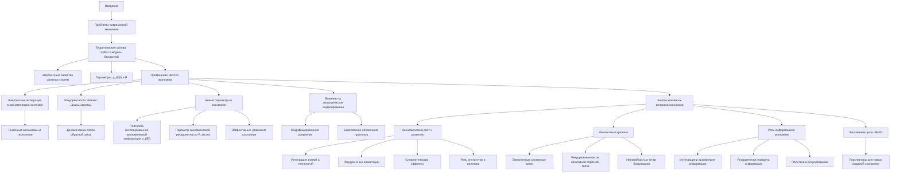

# Поиск новых теорий в экономике

---

## 1. Введение

Современная экономика сталкивается с комплексными проблемами, требующими новых теоретических подходов. Традиционные модели часто не учитывают нелинейные и динамические аспекты экономических систем. В то же время, в физике и нейронауках развиваются новые теории, такие как Теория Эмергентной Интеграции и Рекуррентного Отображения (ЭИРО), предлагающая перспективные инструменты для анализа сложных систем. Данная работа исследует возможность применения ЭИРО и концепций из новой модели Вселенной к экономике, с целью разработки новых теоретических основ.

**Теоретическая основа: ЭИРО и новая модель Вселенной**

ЭИРО утверждает, что сложные системы обладают эмергентными свойствами, возникающими из интеграции информации и рекуррентных взаимодействий. В физике вводятся новые параметры, такие как плотность интегрированной квантовой информации  ρ_(IQI)  и параметр рекуррентности  R , которые влияют на динамику системы и могут быть включены в модифицированные уравнения состояния.

### 2. Применение ЭИРО к экономике

#### 2.1. Эмергентная интеграция в экономических системах

Экономические системы состоят из множества взаимодействующих агентов, чьи коллективные действия приводят к возникновению новых свойств на макроуровне. Это соответствует концепции эмергентности в ЭИРО. Интеграция информации происходит через рыночные механизмы, институты и технологии, способствуя синхронизации и координации деятельности.

#### 2.2. Рекуррентность в экономике

Рекуррентные процессы в экономике проявляются через циклические явления, такие как бизнес-циклы, повторяющиеся кризисы и адаптивные ожидания агентов. Эти процессы можно моделировать с помощью рекуррентных взаимодействий, учитывая исторические данные и динамические петли обратной связи.

### 3. Новые параметры в экономической модели

#### 3.1. Плотность интегрированной экономической информации ρ_(IEI)

Аналогично  ρ_(IQI) , вводится плотность интегрированной экономической информации, характеризующая количество экономической информации, интегрированной в единице экономического пространства (рынок, отрасль) за определённый период:

`ρ_(IEI) = lim(Δ V → 0) Δ I / Δ V,`

где  Δ I  — изменение интегрированной информации,  Δ V  — объём экономического пространства.

#### 3.2. Параметр экономической рекуррентности R_(econ)

Этот параметр характеризует степень рекуррентных взаимодействий в экономике, например, повторяемость транзакций, долгосрочные контракты и устойчивые деловые отношения. Он может быть количественно оценен через вероятностные модели повторных взаимодействий между экономическими агентами.

#### 3.3. Эффективные уравнения состояния в экономике

Вводя новые параметры, можно определить эффективное уравнение состояния для экономической динамики:

`w_(eff) = w₀ + w₁ f(ρ_(IEI), R_(econ)),`

где  w₀  и  w₁  — экономические константы, а функция  f  описывает влияние интегрированной информации и рекуррентности на экономический рост и развитие.

### 4. Влияние на экономическое моделирование

#### 4.1. Модифицированные уравнения

Аналогично модифицированным уравнениям Эйнштейна для Вселенной, можно предложить модифицированные уравнения для экономики:

`G_(μν) + Λ g_(μν) = 8π G (( T_(μν) + T_(μν)ᴵᴱᴵ )),`

где  T_(μν)ᴵᴱᴵ  — тензор, связанный с интегрированной экономической информацией и рекуррентными эффектами. Эти уравнения могут описывать распределение ресурсов, инвестиционные потоки и другие макроэкономические показатели.

#### 4.2. Прогнозирование и управление

Использование байесовского обновления позволяет улучшить модели прогнозирования экономических процессов:

`P(θ | D) = P(D | θ) P(θ) / P(D),`

где  θ  — параметры модели,  D  — новые данные. Эта формула помогает обновлять вероятности экономических сценариев на основе поступающей информации.

### 5. Анализ ключевых вопросов экономики через призму ЭИРО

#### 5.1. Экономический рост и развитие

В рамках Теории Эмергентной Интеграции и Рекуррентного Отображения (ЭИРО), экономический рост рассматривается не просто как последовательное увеличение объёмов производства и потребления, а как эмергентный процесс, возникающий из сложных взаимодействий между экономическими агентами на разных уровнях системы.

**Интеграция знаний и технологий**: Одним из ключевых факторов роста является интеграция знаний, инноваций и технологий. Когда новые идеи и технологии распространяются и интегрируются в экономическую систему, они способствуют повышению производительности и созданию новых рынков. Это отражается в увеличении плотности интегрированной экономической информации  ρ_(IEI) , что способствует появлению эмергентных свойств системы.

**Рекуррентные инвестиции**: Повторяющиеся инвестиции в человеческий капитал, инфраструктуру и исследования создают рекуррентные петли положительной обратной связи. Такие инвестиции повышают уровень навыков и компетенций, ускоряют технологический прогресс и способствуют устойчивому экономическому развитию.

**Синергетические эффекты**: Взаимодействие между различными секторами экономики приводит к синергетическим эффектам, когда суммарный результат превышает простую сумму отдельных вкладов. Это является следствием эмергентной интеграции, где новые возможности и ценности возникают из взаимодействий между агентами.

**Роль институтов и политики**: Эффективные институты и экономические политики могут усиливать процессы эмергентной интеграции и рекуррентных взаимодействий, создавая благоприятную среду для инноваций и инвестиций. Это включает защиту прав собственности, поддержку исследований и разработок, развитие инфраструктуры и образование.

**Глобализация и сети**: В современном мире глобальные сети торговли и информации усиливают процессы интеграции, позволяя экономическим агентам участвовать в международных цепочках создания стоимости. Это расширяет возможности для роста, но также требует управления сложностью и рисками, связанными с глобальными взаимодействиями.

#### 5.2. Финансовые кризисы

Финансовые кризисы представляют собой сложные явления, которые можно объяснить через призму ЭИРО, принимая во внимание нелинейные динамики, эмергентные свойства и рекуррентные процессы.

**Эмергентные системные риски**: Взаимодействия между финансовыми институтами, рынками и инструментами могут приводить к возникновению системных рисков, которые не очевидны на уровне отдельных агентов. Плотность интегрированной экономической информации  ρ_(IEI)  может быть высокой, но если информация искажена или недоступна для всех участников, это может приводить к неправильной оценке рисков.

**Рекуррентные петли негативной обратной связи**: Во время кризиса рекуррентные процессы могут усиливать негативные тенденции. Продажи активов из-за паники приводят к снижению цен, что вызывает маржинальные звонки и дополнительные продажи, усиливая падение рынка. Это известный эффект домино, где рекуррентные взаимодействия между агентами усиливают кризис.

**Роль ожиданий и поведения**: Коллективное поведение, такое как иррациональный оптимизм или пессимизм, может быть моделировано как рекуррентные процессы, где ожидания агентов влияют на их действия, которые в свою очередь влияют на ожидания других. Такие динамики могут приводить к формированию пузырей и их последующему схлопыванию.

**Нелинейность и точки бифуркации**: Финансовые системы характеризуются нелинейными динамиками, где небольшие возмущения могут приводить к крупным изменениям из-за эмергентных свойств системы. Понимание этих процессов через ЭИРО позволяет выявлять потенциальные точки бифуркации и принимать меры для предотвращения или смягчения кризисных явлений.

**Регулирование и контроль**: Для предотвращения и управления кризисами важно учитывать эмергентные и рекуррентные свойства финансовых систем. Это включает в себя мониторинг системных рисков, повышение прозрачности информации, ограничение избыточной рекуррентности в виде сложных финансовых продуктов и установление механизмов стабилизации.

#### 5.3. Роль информации в экономике

Информация и её обработка занимают центральное место в экономике, а через призму ЭИРО этот аспект приобретает ещё более глубокое значение.

**Интеграция информации**: Экономические агенты постоянно обрабатывают и интегрируют информацию для принятия решений. Плотность интегрированной экономической информации  ρ_(IEI)  отражает, насколько эффективно информация распространяется и используется в системе. Высокая плотность свидетельствует о хорошо информированных агентах и эффективных рынках.

**Асимметрия информации**: Неравномерное распределение информации между агентами приводит к асимметриям, которые могут вызвать рыночные неэффективности, такие как моральный риск или неблагоприятный отбор. ЭИРО позволяет моделировать, как эти асимметрии влияют на эмергентные свойства системы и её динамику.

**Рекуррентная передача и обработка информации**: Информация передаётся и обновляется через рекуррентные взаимодействия, такие как повторяющиеся сделки, коммуникации и обучение. Эти процессы могут усиливать как позитивные, так и негативные эффекты. Например, рекуррентное распространение слухов или неверной информации может приводить к массовым заблуждениям и рыночным дисбалансам.

**Технологии и информация**: Современные технологии, такие как интернет, социальные сети и большие данные, значительно изменили способы сбора, обработки и распространения информации. Они увеличивают плотность интегрированной информации, но также создают новые вызовы, связанные с информационной перегрузкой и качеством данных.

**Принятие решений и рациональность**: Качество информации влияет на рациональность принятия решений. ЭИРО учитывает, что агенты действуют на основе ограниченной и иногда искажённой информации, что может приводить к отклонениям от рационального поведения. Понимание этих процессов важно для разработки моделей, отражающих реальное поведение агентов.

**Политика и регулирование информации**: Государственная политика может влиять на доступность и качество информации, например, через требования прозрачности, защиту данных и борьбу с дезинформацией. Это, в свою очередь, воздействует на эмергентные свойства экономической системы и её способность адаптироваться к изменениям.

### 6. Заключение

Детализированный анализ ключевых вопросов экономики через призму ЭИРО демонстрирует, что интеграция и рекуррентность являются фундаментальными аспектами, определяющими динамику экономических систем. Экономический рост и развитие зависят от эффективной интеграции информации и рекуррентных инвестиций, финансовые кризисы могут быть поняты как сбои в этих процессах, а информация играет центральную роль в формировании поведения агентов и функционировании рынков. Применение ЭИРО к экономике позволяет создавать более реалистичные модели и инструменты для прогнозирования и управления сложными экономическими явлениями.

Применение Теории Эмергентной Интеграции и Рекуррентного Отображения к экономике открывает новые перспективы для понимания сложных экономических явлений. Введение новых параметров и модифицированных уравнений позволяет более точно моделировать динамику экономических систем, учитывая эмергентные свойства и рекуррентные процессы. Дальнейшие исследования в этом направлении могут привести к разработке более устойчивых и адаптивных экономических моделей.

### 7. Список литературы

1. Tononi, G. (2004). "An information integration theory of consciousness". BMC Neuroscience.

2. Keynes, J. M. (1936). "The General Theory of Employment, Interest and Money". Macmillan.

3. Schumpeter, J. A. (1942). "Capitalism, Socialism and Democracy". Harper  Brothers.

4. Soros, G. (1987). "The Alchemy of Finance". Simon  Schuster.

---

- [ЭИРО framework](/README.md)
