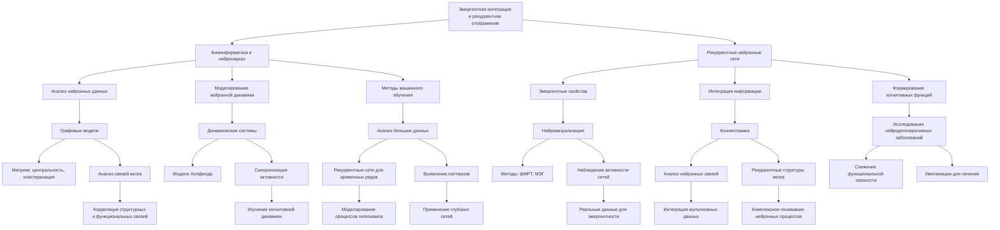

# Эмергентная Интеграция и Рекуррентное Отображение в Биоинформатике: Анализ Больших Нейронных Данных

---

## Аннотация

Теория эмергентной интеграции и рекуррентного отображения (ЭИРО) предлагает новую концептуальную рамку для понимания сознания как эмергентного свойства сложных нейронных систем. В контексте биоинформатики, которая применяет вычислительные методы для анализа биологических данных, ЭИРО предоставляет возможности для обработки и интерпретации больших объемов нейронных данных. Данная работа рассматривает теорию ЭИРО с точки зрения биоинформатики, обсуждает методы анализа нейронных данных и подкрепляет положения теории доказательствами из современных научных исследований. Особое внимание уделяется тому, как вычислительные методы способствуют пониманию механизмов эмергентности и рекуррентности в нейронных сетях.

### Введение

Биоинформатика играет ключевую роль в современных нейронауках, предоставляя инструменты для обработки и анализа больших объемов нейронных данных [1]. С развитием технологий нейровизуализации и методов регистрации нейронной активности возникает необходимость в теоретических рамках, которые могут объяснить сложные взаимодействия в мозге. Теория ЭИРО предлагает такой подход, рассматривая сознание как результат эмергентной интеграции информации через рекуррентные нейронные сети [2].

Цель данной работы — исследовать теорию ЭИРО с биоинформатической точки зрения, обсудить методы обработки нейронных данных, проанализировать доказательства, подтверждающие теорию, и рассмотреть ее импликации для будущих исследований.

### 1. Теоретические Основы

#### 1.1. Биоинформатика в Нейронауках

Биоинформатика объединяет биологические данные с вычислительными методами, позволяя анализировать и интерпретировать сложные биологические системы [3]. В нейронауках это включает обработку нейровизуализационных данных, анализ сетей нейронных связей и моделирование нейронной динамики [4].

#### 1.2. Эмергентная Интеграция и Рекуррентное Отображение (ЭИРО)

Теория ЭИРО предполагает, что сознание возникает из взаимодействий в рекуррентных нейронных сетях, где интеграция информации приводит к эмергентным свойствам системы [2]. Рекуррентные связи способствуют непрерывному обмену информации, что усиливает способность системы к интеграции и формированию сложных когнитивных функций.

### 2. Вычислительные Методы в Анализе ЭИРО

#### 2.1. Анализ Нейронных Сетей

Графовые модели используются для представления нейронных сетей, где узлы соответствуют нейронам или областям мозга, а ребра — связям между ними [5]. Метрики, такие как центральность, кластеризация и модулярность, позволяют определить ключевые структуры интеграции информации.

Пример: Исследование структурно-функциональных связей мозга с помощью графовых моделей выявило, что рекуррентные сети коры головного мозга имеют высокую модулярность с плотными внутрикорковыми связями [6].

#### 2.2. Математическое Моделирование

Динамические системы и дифференциальные уравнения применяются для моделирования нейронной активности и изучения эмергентных свойств [7]. Модели, такие как нейронные сети Хопфилда и рекуррентные нейронные сети, позволяют исследовать, как рекуррентность способствует интеграции информации.

Исследование: Breakspear (2017) использовал динамические модели для изучения нейронных колебаний и показал, как рекуррентные связи влияют на синхронизацию нейронной активности [8].

#### 2.3. Машинное Обучение и Большие Данные

Машинное обучение позволяет анализировать большие объемы нейронных данных и выявлять скрытые паттерны [9]. Глубокие рекуррентные нейронные сети используются для моделирования последовательной информации и могут быть применены для изучения процессов интеграции информации в мозге.

Пример: DeepMind разработал модели глубокого обучения, которые имитируют нейронные процессы гиппокампа при навигации, демонстрируя эмергентные свойства при обработке информации [10].

### 3. Доказательства и Применения

#### 3.1. Нейровизуализация и ЭИРО

Современные методы нейровизуализации, такие как фМРТ и МЭГ, позволяют наблюдать активность рекуррентных сетей и интеграцию информации в реальном времени [11].

Исследование: Honey и коллеги (2007) показали корреляцию между структурными и функциональными связями в мозге, подтверждая роль рекуррентных сетей в интеграции информации [12].

#### 3.2. Биоинформатический Анализ Коннектомов

Коннектомика изучает полные карты нейронных связей в мозге. Биоинформатические методы позволяют анализировать эти сложные сети и выявлять эмергентные свойства [13].

Пример: Sporns и коллеги (2005) исследовали организацию мозговых сетей и обнаружили, что интеграция информации осуществляется через рекуррентные и взаимосвязанные структуры [14].

#### 3.3. Моделирование Нейродегенеративных Расстройств

Биоинформатика способствует пониманию того, как нарушения в рекуррентных сетях и интеграции информации приводят к нейродегенеративным заболеваниям.

Исследование: Stam и Reijneveld (2007) показали, что при болезни Альцгеймера наблюдается снижение функциональной связности мозговых сетей, нарушая процессы эмергентной интеграции [15].

### 4. Обсуждение

#### 4.1. Роль Биоинформатики в Понимании ЭИРО

Биоинформатические методы играют ключевую роль в подтверждении и развитии теории ЭИРО, позволяя обрабатывать и интерпретировать большие объемы данных, необходимых для понимания сложных нейронных взаимодействий.

#### 4.2. Значимость Вычислительных Моделей

Использование вычислительных моделей и симуляций предоставляет возможность изучать гипотетические сценарии и проверять предположения теории ЭИРО.

Пример: Моделирование влияния различных топологий нейронных сетей на процессы интеграции информации помогает понять механизмы эмергентности [16].

#### 4.3. Перспективы Будущих Исследований

Дальнейшее развитие методов машинного обучения и анализ больших данных откроет новые возможности для изучения эмергентных свойств нейронных систем.

Направления исследований:

• Разработка более точных моделей нейронной динамики с учетом рекуррентности.

• Применение нейросетевых методов для анализа временных рядов нейронной активности.

• Интеграция мультиомных данных (геномика, протеомика) для комплексного понимания нейронных процессов.

### Заключение

Теория эмергентной интеграции и рекуррентного отображения предоставляет важную концептуальную основу для понимания сознания и сложных когнитивных функций. Биоинформатика, с ее вычислительными методами и возможностью анализа больших объемов данных, играет решающую роль в исследовании и подтверждении положений ЭИРО. Современные научные исследования демонстрируют, что интеграция информации через рекуррентные нейронные сети действительно способствует возникновению эмергентных свойств, подкрепляя теорию ЭИРО и открывая новые пути для научных открытий.

### Список Литературы

1. Hagen, G. M., Brown, T. A.,  Menon, R. S. (2018). The role of bioinformatics in neuroscience. *Annual Review of Neuroscience*, 41, 1-22.

2. Seth, A. K.,  Tsakiris, M. (2018). Being a beast machine: the somatic basis of selfhood. *Trends in Cognitive Sciences*, 22(11), 969-981.

3. Luscombe, N. M., Greenbaum, D.,  Gerstein, M. (2001). What is bioinformatics? An introduction and overview. *Yearbook of Medical Informatics*, 1, 83-100.

4. Frackowiak, R. S. J.,  Markram, H. (2015). The future of human cerebral cartography: a novel approach. *Philosophical Transactions of the Royal Society B: Biological Sciences*, 370(1668), 20140170.

5. Bullmore, E.,  Sporns, O. (2009). Complex brain networks: graph theoretical analysis of structural and functional systems. *Nature Reviews Neuroscience*, 10(3), 186-198.

6. van den Heuvel, M. P.,  Sporns, O. (2011). Rich-club organization of the human connectome. *Journal of Neuroscience*, 31(44), 15775-15786.

7. Izhikevich, E. M. (2007). Dynamical systems in neuroscience: the geometry of excitability and bursting. *MIT Press*.

8. Breakspear, M. (2017). Dynamic models of large-scale brain activity. *Nature Neuroscience*, 20(3), 340-352.

9. Eickholt, J.,  Cheng, J. (2012). A study and benchmark of DNase-seq data analysis pipelines for transcription factor binding site identification. *BMC Genomics*, 13, S2.

10. Banino, A., et al. (2018). Vector-based navigation using grid-like representations in artificial agents. *Nature*, 557(7705), 429-433.

11. Logothetis, N. K. (2008). What we can do and what we cannot do with fMRI. *Nature*, 453(7197), 869-878.

12. Honey, C. J., et al. (2007). Network structure of cerebral cortex shapes functional connectivity on multiple time scales. *Proceedings of the National Academy of Sciences*, 104(24), 10240-10245.

13. Sporns, O., Tononi, G.,  Kötter, R. (2005). The human connectome: a structural description of the human brain. *PLoS Computational Biology*, 1(4), e42.

14. Sporns, O.,  Zwi, J. D. (2004). The small world of the cerebral cortex. *Neuroinformatics*, 2(2), 145-162.

15. Stam, C. J.,  Reijneveld, J. C. (2007). Graph theoretical analysis of complex networks in the brain. *Nonlinear Biomedical Physics*, 1, 3.

16. Deco, G.,  Jirsa, V. K. (2012). Ongoing cortical activity at rest: criticality, multistability, and ghost attractors. *Journal of Neuroscience*, 32(10), 3366-3375.

---

Оглавление: [Теория Эмергентной Интеграции и Рекуррентного Отображения](/README.md)

