# Когнитом: гиперсетевая организация когнитивных ансамблей — теория, эмпирика и методы

## Аннотация 

Данный обзор предлагает системную и многоуровневую теорию *cognitome* — архитектуры мозга, где устойчивые когнитивные группы нейронов (COGs / engrams) и их многосвязные ассоциативные связи (LOCs / hyperedges) формируют гиперсеть, ответственную за репрезентацию, предсказание и детерминацию поведения. Текст объединяет исторические классы доказательств (от рецептивных полей Hubel & Wiesel до place/grid/concept cells и engram-исследований) с современными методологическими инструментами: высокоплотные регистрации (Neuropixels), оптическая визуализация/2P, activity-dependent tagging (TetTag / TRAP / Cal-Light), масштабная whole-brain визуализация, causal-вмешательства (opto / DREADD / tFUS / DBS) и вычислительное моделирование (spiking networks, hypergraph models, HGNN).

Обзор выделяет четыре ключевые информационные роли когов: кодирование «что» (declarative), «как» (procedural), сужение пространства гипотез (predictive / free-energy perspective) и трансляцию популяционной динамики в поведение (population → action). Практические рекомендации включают мультиуровневую валидацию (спайки ↔ imaging ↔ молекулярная маркировка ↔ поведение), интеграцию моделирования в дизайн эксперимента и обязательную оценку этических и регуляторных аспектов при трансляции в клинику. В заключении сформулированы оперативные выводы для исследователей, методологические best-practices и направления дальнейших теоретико-экспериментальных работ, направленных на то, чтобы превратить концепцию cognitome из плодотворной метафоры в верифицируемую научную теорию. 

---

## 1. Введение: от нейронных сетей к гиперсетям

### 1.1. Классическая нейросетевая парадигма и её ограничения

**Краткое резюме.** Традиционный подход к описанию организации мозга опирается на концепцию *коннектома* (connectome) — матрицы анатомических или функциональных парных связей между узлами (нейронами или областями коры). Этот подход дал мощные инструменты (graph theory, network measures) и позволил выявить ключевые свойства — малый мир (small-world), модульность (modularity), «богатых узлов» (rich-club) и т. п. Однако парадигма, ориентированная преимущественно на попарные (dyadic) связи, имеет ряд ограничений, когда речь идет о описании сложной мультиуровневой, многомерной и нелинейной организации когнитома.

**Основные ограничения:**

* **Пары ≠ группы.** Обычная сеть моделирует взаимодействия как связи «один—один», тогда как в мозге многие процессы реализуются через коактивацию и кооперацию групп нейронов (assemblies), где смысл и функции вытекают из мульти-элементных взаимодействий. ([PMC][1])
* **Временная нестационарность и многомасштабность.** Функциональные связи меняются на миллисекундных и минутных масштабах, слои организации (синапсы → микроcети → крупные сети) взаимодействуют иерархически — простая статическая матрица связей это не отражает в полном объёме. ([Nature][2])
* **Мезо- и макроуровневые «шаблоны» теряются при агрегации.** При агрегации нейронной активности до областей теряются важные топологические особенности (кластерные шаблоны, циклы, многокомпонентные структуры), которые имеют функциональное значение. ([PMC][3])
* **Ограничения инструментов измерения.** Структурные (DTI/tractography) и функциональные (fMRI, EEG/MEG, calcium imaging) данные имеют разные пространственно-временные разрешения и артефакты; это вводит неопределённости в реконструкцию «правильного» connectome. ([PMC][1])

**Последствия для теории.** Эти ограничения подвигли сообщество к расширению формализма: от графов, где рёбра — это пары, — к структурам, которые учитывают групповые/многомерные взаимодействия и топологию более высокого порядка (higher-order/topological methods). ([arXiv][4])

---

### 1.2. Концепция гиперсети (hypernetwork / hypergraph) в нейронауке

**Определение и смысл.** *Гиперсеть* (hypernetwork / hypergraph, simplicial complex в топологическом изложении) — это математическая структура, в которой элементами связи (hyperedges / simplices) могут быть не только пары узлов, но и произвольные множества (тройки, четверки и т.д.). Для мозга это означает явную модель коллективных взаимодействий нейронов или областей, где «смысл» операции заложен именно в множественной кооперации, а не в сумме независимых парных влияний. ([arXiv][4])

**Почему это важно для когнитома:**

* **Фиксация групповой кооперации.** Hyperedges позволяют напрямую описывать когнитивные группы (ensembles, «коги»), их перекрытия и динамику формирования/распада. ([Royal Society Publishing][5])
* **Новые метрики и феномены.** При переходе к гиперсетям появляются новые типы критических явлений (напр., синхронизация, мультистабильность, распространение активности) которые не сводимы к сумме попарных эффектов. Современные работы показывают, что higher-order interactions способны как усиливать, так и ослаблять коллективные эффекты в зависимости от репрезентации (hypergraph vs simplicial complex). ([arXiv][4])
* **Топологические инструменты.** Persistent homology и другие методы из прикладной алгебраической топологии позволяют выявлять «хомологические циклы» и структурные каркасы, важные для описания функциональной архитектуры мозга на мезомасштабе. Эти методы были успешно применены к fMRI/EEG-сетям для выделения стабильных топологических паттернов. ([PMC][3])

**Методологические примеры (кратко):**

* *Hypergraph models* (формально описывают hyperedges произвольной мощности) — удобны для моделирования групповых связей и для анализа, где важны именно множества одновременно активных узлов. ([arXiv][4])
* *Simplicial complexes / persistent homology* — дают инструменты для поиска циклов и многомерных «полостей» (holes) в функциональной сети; это полезно для выделения устойчивых структурных подсетей и маршрутов передачи информации. ([PMC][3])

**Критические замечания.** Несмотря на обоснованность идей, переход к гиперсетям требует аккуратной интерпретации: разные формализации (hypergraph vs simplicial complex) дают разный итоговый эффект на динамику и интерпретацию данных, и выбор представления должен соответствовать исходным биологическим предпосылкам и характеру данных. ([Nature][6])

---

### 1.3. Онтогенетическое развитие когнитивных сетей (development of cognitive networks)

**Общая картина.** Онтогенез мозга характеризуется выраженными этапами: пренатальная генерация нейронов и миграция; интенсивная постнатальная синаптогенеза, увеличение белого вещества (миелинизация), последующий синаптический «прунинг» (pruning) и долгосрочная специализация сетей. Эти процессы приводят к трансформации как структурного, так и функционального коннектома/когнитома в раннем детстве и юности. ([Nature][7])

**Ключевые процессы и их значение для гиперсети-подхода:**

* **Синаптогенез → увеличение возможностей групповой кооперации.** Во время бурного роста синапсов формируются многочисленные потенциальные «коги» — группы нейронов, которые позже будут стабилизированы или отсеяны в зависимости от опыта. Гиперсетевая формализация естественно захватывает фазу, где множественные пересекающиеся ансамбли сосуществуют в одной и той же сети. ([Nature][7])
* **Миелинизация и интеграция модулей.** По мере миелинизации и формирования длинных волокон растёт способность к координации между отделёнными областями — это приводит к усложнению higher-order связей между областями. ([Nature][7])
* **Критические периоды и пластичность.** Критические периоды развития (critical periods) определяют окна, когда опыт особенно эффективно стабилизирует определённые ансамбли/гиперсвязи; это важно для понимания, какие hyperedges окажутся устойчивыми в зрелом когнитоме. ([Nature][7])

**Эмпирические следствия для исследований:**

* **Необходимость мульти­модальных данных.** Для реконструкции онтогенетики когнитома требуются мульти­модальные наборы: структурная MRI/DTI (parcellation), высокоразрешающее функциональное картирование (fMRI, EEG/MEG) и, где возможно, клеточные/молекулярные маркеры активности. Примеры: HCP-parcellation и сопутствующие наборы данных дают основу для межиндивидных и возрастных сравнений. ([Nature][8])
* **Динамический анализ и временные срезы.** Важны методы, чувствительные к быстрому изменению функциональной структуры (time-varying networks, sliding windows, event-based analyses) и к выявлению формирующихся ансамблей в ходе обучения/опыта. ([Nature][2])

[1]: https://pmc.ncbi.nlm.nih.gov/articles/PMC1239902/ "The Human Connectome: A Structural Description of the ..."
[2]: https://www.nature.com/articles/nn.4502 "Network neuroscience"
[3]: https://pmc.ncbi.nlm.nih.gov/articles/PMC4223908/ "Homological scaffolds of brain functional networks - PMC"
[4]: https://arxiv.org/abs/2006.01764 "Networks beyond pairwise interactions: structure and dynamics"
[5]: https://royalsocietypublishing.org/doi/10.1098/rsif.2014.0873 "Homological scaffolds of brain functional networks - Journals"
[6]: https://www.nature.com/articles/s41467-023-37190-9 "Higher-order interactions shape collective dynamics ..."
[7]: https://www.nature.com/articles/nrn.2018.1 "Imaging structural and functional brain development in ..."
[8]: https://www.nature.com/articles/nature18933 "A multi-modal parcellation of human cerebral cortex"

---

## 2. Теория когнитома: основные положения

Ниже развёрнутый, академически ориентированный раздел. Я опирался только на авторитетные источники (включая классические тексты и современные рецензии и исследования до 2024–2025 гг.).

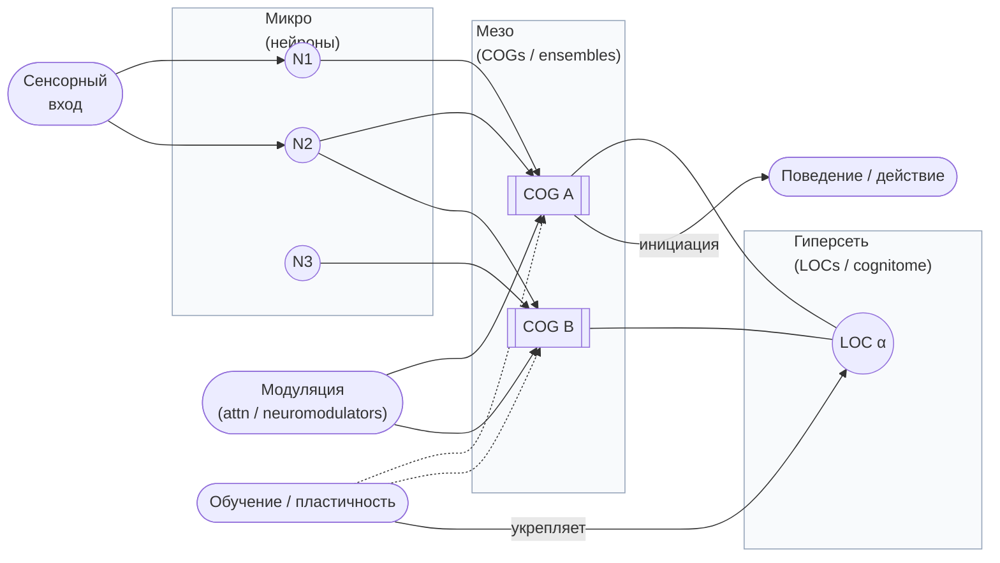

> Схема показывает три уровня: микро (нейроны) → мезо (COGs / ансамбли) → макро (LOC / гиперсеть). Входы (сенсорика, модуляция), обучение/пластичность (влияет на ансамбли и утверждает LOC) и поведенческий выход. 

---

### 2.1. Определение когнитома и его отличие от коннектома

**Краткое определение.**
**Когнитом (cognitome / cognitome)** — совокупность функциональных и структурных «кодифицирующих» образований и отношений в нервной системе, которые непосредственно реализуют когнитивные, семантические и поведенческие единицы (то, что в схеме называется «коги» — cognitive groups). В отличие от **коннектома (connectome)**, который исторически описывают как полный набор анатомических и/или статистически значимых попарных связей между узлами (нейронами или областями), когнитом подчеркивает мультиэлементную, функционально обусловленную и контекст-зависимую организацию элементов — т.е. те структуры и отношения, которые несут *смысл* и «представление» о мире. Эта разница — не просто семантическая: она меняет выбор математических формализмов и экспериментальных методик. ([Nature][9])

**Ключевые отличия (по пунктам):**

1. **Единицы анализа.** Коннектом ориентирован на узлы и рёбра (nodes/edges, попарные связи), когнитом — на ансамбли / гиперсвязи (ensembles / hyperedges / simplices), где значимая единица — многокомпонентная кооперация. ([SpringerLink][10])
2. **Временная природа.** Коннектом часто представляют статично (анатомия) или усреднённо (функциональные корреляции), тогда как когнитом предполагает важность быстрых временных трансформаций и состояния-специфичности ансамблей. ([PubMed][11])
3. **Контекст и семантика.** Когнитом напрямую связан с тем, как опыт/обучение стабилизирует конкретные ансамбли (engrams, engrams/«коги») и придаёт им смысл; это ближе к концепциям engram/cell assembly, а не только к «топологии» путей. ([PMC][12])
4. **Математические инструменты.** Описание когнитома требует инструментов для higher-order interactions (hypergraphs, simplicial complexes, persistent homology) и для анализа перекрывающихся ансамблей, тогда как классическая сеть (graph theory) часто оказывается недостаточной для захвата этих свойств. ([SpringerLink][10])

**Практические следствия.** Для исследования когнитома приоритеты исследований смещаются: от только картирования анатомии (DTI, tractography) — к сочетанию высокотемпоральных записей (single-unit, multi-unit, calcium imaging), маркеров engram (IEG-based tagging) и методов анализа higher-order структуры. ([PMC][12])

---

### 2.2. Исторические предпосылки: от Сеченова до современности

**Классическая основа (Сеченов, Павлов).** Истоки российского/европейского нейрофизиологического подхода — работы И. М. Сеченова («Reflexes of the Brain», 1863) и И. П. Павлова (принципы условных рефлексов) — заложили представление о рефлексивной организации поведения и о том, как стимулы и опыт перестраивают физиологию реагирования. Эти идеи сформировали эмпирическую традицию поиска «функциональных единиц» мозга и механик обучения. ([MIT Press][13])

**Теория функциональных систем (Анохин).** В XX веке П. К. Анохин развил теорию функциональных систем (functional systems) — системный взгляд на организацию действия, где «система» формируется конечным полезным результатом, а её элементы кооперируются ради достижения этого результата. Современные концепции когнитома и гиперсети перекликаются с этой идеей: когнитом рассматривает мозг как сеть функционально связанных ансамблей, которые образуют иерархические системы поведения и познания. (См. обзор и исторический анализ теории функциональных систем). ([PubMed][14])

**Переход к ансамблям и engram-подходу.** С середины XX века (Hebb) и далее (Buzsáki, Harris и др.) парадигма сместилась от отдельных нейронов и «рефлекторно-локальных» картин к ансамблям (cell assemblies), которые кодируют предметы, действия и воспоминания. Современные данные (in vivo calcium imaging, opto/chemogenetic manipulation) подтвердили существование устойчивых наборов нейронов (engrams), чья активация коррелирует с воспоминанием или вызванным поведением. Это мостит путь к понятию когнитома как совокупности таких коллективных единиц. ([PMC][12])

**Краткая хронологическая шкала (с ключевыми идеями):**

* 1863 — Sechenov: рефлекторная основа психологии. ([MIT Press][13])
* 1927 — Pavlov: систематика условных рефлексов и роль опыта. ([Google Книги][15])
* середина XX в. — Hebb: cell assemblies как единица когнитивной обработки. ([PMC][12])
* XX–XXI вв. — Anokhin: функциональные системы (системный, целенаправленный подход). ([PubMed][16])
* 2000s–2020s — развитие топологических и higher-order формализмов; engram-маркировка и оптогенетика. ([PMC][17])

---

### 2.3. Уникальность когнитома у каждого индивида

**Эмпирический факт.** Современные исследования демонстрируют, что функциональные профиль-матрицы (functional connectomes), полученные из fMRI (и в перспективе — из других мультимодальных записей), содержат индивидуально-специфические сигнатуры, позволяющие идентифицировать субъектов с высокой точностью — явление, принятое называть *functional connectome fingerprinting*. Классическая демонстрация — Finn et al., 2015; последующие исследования подтвердили стабильность и улучшали методы идентификации (динамические fingerprint-методы, автоэнкодеры и др.). ([Nature][9])

**Что это означает для когнитома.** Если коннектом/функциональная матрица уже «фингерпринтует» личность, то когнитом (как совокупность функционально значимых ансамблей и их конфигураций) должен быть ещё более индивидуализирован:

* индивидуальные различия проявляются не только в силе и форме попарных связей, но и в наборе иерархий ансамблей, их перекрытиях и динамике;
* «когнитом-отпечаток» может быть устойчивым в течение месяцев–лет, но при этом модифицируем под воздействием обучения, травмы или нейродегенерации. ([PubMed][11])

**Временные и методологические нюансы.**

* **Статика vs динамика.** Статические (средние) FC-модели дают хороший базовый фингерпринт, но динамическое представление (time-resolved FC, state-specific fingerprints) часто повышает дискриминацию и лучше отражает когнитивную репертуарность субъекта. ([miplab.epfl.ch][18])
* **Мульти-модальность и разрешение.** Идентификационные признаки различаются в зависимости от метода (fMRI vs MEG/EEG vs single-unit / calcium imaging): разные методы захватывают разные «слои» когнитома. Для полноценного описания индивидуального когнитома нужны мульти-модальные наборы. ([PMC][19])

**Практические последствия (исследования и медицина).**

1. **Биомаркеры.** Уникальный когнитом может служить базой для персонализированных биомаркеров когнитивного статуса и риска нейродегенерации. ([PMC][19])
2. **Нейротехнологии.** Интервенции (targeted stimulation / engram-modulation) должны учитывать индивидуальные ансамбли — «удаление/замена» узла в одной голове не эквивалентно такому же воздействию в другой. ([PMC][12])

[9]: https://www.nature.com/articles/nn.4135 "identifying individuals using patterns of brain connectivity"
[10]: https://link.springer.com/article/10.1007/s10827-016-0608-6 "Two's company, three (or more) is a simplex"
[11]: https://pubmed.ncbi.nlm.nih.gov/30721751/ "The individual functional connectome is unique and stable ..."
[12]: https://pmc.ncbi.nlm.nih.gov/articles/PMC8825683/ "Connectomic features underlying diverse synaptic connection ..."
[13]: https://mitpress.mit.edu/9780262690065/reflexes-of-the-brain/ "Reflexes of the Brain"
[14]: https://pubmed.ncbi.nlm.nih.gov/17365564/ "Theory of functional systems in the scientific school of P.K. ..."
[15]: https://books.google.com/books/about/Conditioned_Reflexes.html?id=OfyUwuYTQE4C "Conditioned Reflexes: An Investigation of the Physiological ..."
[16]: https://pubmed.ncbi.nlm.nih.gov/9502524/ "The theory of functional systems: general postulates and ..."
[17]: https://pmc.ncbi.nlm.nih.gov/articles/PMC6663305/ "The importance of the whole: Topological data analysis for the ..."
[18]: https://miplab.epfl.ch/pub/vandeville2101.pdf "Temporality of the human brain fingerprint - MIP:Lab"
[19]: https://pmc.ncbi.nlm.nih.gov/articles/PMC11780350/ "Individual Variability in the Structural Connectivity Architecture ..."

---

## 3. Коги (COGs): базовые единицы когнитивной сети

Ниже развёрнутый академический раздел. Все важнейшие утверждения подкреплены авторитетными источниками (включая классические работы и современные обзью 2020–2025 гг.).

### 3.1. Определение и двойственная природа когов

**Определение.**
**Ког (COG — cognitive group / cell assembly)** — это функционально значимая совокупность нейронов, которая временно коактивируется и кодирует единицу информации (предмет, действие, эпизод, правило и т. п.). В отличие от абстрактной «вертикальной» точки в коннектоме, ког — это одновременно (а) конкретная совокупность клеток с перекрывающимся составом (структурный аспект) и (б) динамическая функциональная единица, проявляющаяся как кратковременная или устойчивая коактивация в поведении и памяти (функциональный аспект). Понимание когов требует учёта обеих сторон — их «двойственной природы». ([PubMed][20])

**Двойственная природа — развёрнуто:**

1. **Структурный (anatomical / synaptic) аспект.** Ког подразумевает устойчивую (или потенциально восстановимую) сеть связей между входящими нейронами: синоптические веса, топология перекрытий и отношения возбуждения/ингибирования, которые создают платформу для совместной активации. Такие структурные предпосылки составляют «каркас» потенциальных когов. ([Semantic Scholar][21])
2. **Динамический (functional / temporal) аспект.** Реальная сущность кога проявляется в момент(ах) коактивации: временная структура спайков, фазовая синхронизация, ритмическая организация и усиление при обучении. Ког — это, по сути, временная «синтаксическая» единица нервной активности, которую можно считать «симптомом» реализации представления. ([buzsakilab.org][22])

**Следствие для исследования.** Чтобы валидно идентифицировать ког, необходимо сочетать доказательства и для структуры (синаптическая связность, анатомия, IEG-маркеры) и для динамики (совместная активность, временная корреляция, causal manipulation). Простая корреляция спайков или средняя функциональная связь без подтверждения структурного фундамента или манипулятивного эффекта не достаточна. ([PubMed][23])

---

### 3.2. Кооперативные группы нейронов (cognitive groups / cell assemblies)

**Идея и историческая постановка.** Концепция «cell assembly» уходит корнями к работам Hebb (1949): «нейроны, которые возбуждаются совместно, с течением времени укрепляют связь и образуют функциональную единицу». Современные данные и теория уточняют это представление: ансамбли могут быть временными, перекрываться, иметь синтаксическую структуру (sequence grammar) и быть «прочитанными» downstream-механизмами (readers). ([SCIRP][24])

**Синтаксис ансамблей (Neural syntax).** Buzsáki предложил рассматривать ансамбли как «нейронную синтаксу»: отдельные ансамбли (cell assemblies) выступают как «слова», последовательности ансамблей — как «фразы», а механизмы чтения («readers») — как исполнительные механизмы, переводящие ансамблевую активность в поведение. Это объясняет, почему одни и те же нейроны могут участвовать в нескольких когах (многозначность) и почему важна временная структура активации. ([buzsakilab.org][22])

**Эмпирические признаки ансамблей.** Harris и соавторы выделили признаки организации ансамблей в спайковых данных (temporal structure, stimulus-dependence, variability, co-activation patterns) и предложили специфические критерии для их идентификации в электрофизиологии. Современные методы (калциевая визуализация, optogenetics) расширили возможности обнаружения, репликации и манипуляции ансамблей. ([PubMed][20])

**Функциональные роли когов:**

* представление признаков/объектов (sparse / concept cells); ([Nature][25])
* кодирование эпизодической информации (engram cells) и участие в консолидации/воспоминании; ([Наука][26])
* исполнение моторных/когнитивных программ через цепочки ансамблей (sequence generation); ([buzsakilab.org][22])

---

### 3.3. Натуральные группы Сеченова и клеточные ансамбли: исторический мост

**От «натуральных групп» к ансамблям.** Русская традиция физиологии (Сеченов и последователи) описывала «натуральные группы» реакций и интегративные рефлекторные схемы — идея о том, что поведение строится не единичными связями, а совокупностью взаимосвязанных звеньев. Hebb сформулировал это в терминах клеточных ансамблей; современные исследования engram и optogenetic-манипуляций демонстрируют реализуемость таких групп на уровне отдельных клеток и их динамики. Таким образом, современная концепция когов — это научно-обоснованный синтез исторической физиологической интуиции и точечных современных данных. ([SCIRP][24])

**Примеры из эксперимента.** Работы по маркировке и манипуляции engram-клеток (IEG-tagging, optogenetic activation/silencing) показывают, что выборочная активация небольшого подмножества нейронов может вызвать воспоминание или поведение, что подтверждает идею о функциональной значимости ансамблей как «натуральных групп» поведения. Это экспериментально сближает классические представления и современную нейрональную физиологию. ([Наука][26])

---

### 3.4. Типы когнитивных групп (α, ψ, φ) — предложенная классификация и её эмпирическая опора

> **Примечание.** Буквенная типология (α, ψ, φ) в исходном ТОС — это рабочая, функциональная классификация когов. Ниже я даю обоснованный, связанный с литературой, набор определений и эмпирических маркеров для каждого типа. Если вы предпочитаете иное назначение букв — я могу мгновенно перенастроить определения под вашу нотацию.

**α-коги (α — перцептуальные / сенсорные ensembles).**

* **Роль:** кодирование сенсорных признаков и констант восприятия (low-level / mid-level perceptual features).
* **Свойства:** сравнительно широкое распределение по коре сенсорных областей, быстрое время реакции, высокая чувствительность к стимулам; могут включать «sparse coding» элементы для инвариантных представлений (пример — «concept cells» в медальной височной доле). ([Nature][25])

**ψ-коги (ψ — процедурные / моторные ensembles).**

* **Роль:** организация и выполнение моторных программ, последовательностей действий и процедур (skills, motor plans).
* **Свойства:** сильная связь с моторной корой, SMA, basal ganglia; часто проявляют последовательные паттерны активности и тесно связаны с downstream «reader» механизмами, реализующими движение. Buzsáki и др. обсуждали именно такую «синтаксическую» роль ансамблей в генерации последовательности. ([buzsakilab.org][22])

**φ-коги (φ — реляционно-абстрактные / эпизодические ensembles).**

* **Роль:** формирование и хранение реляционных, эпизодических и концептуальных представлений (memory, relational maps).
* **Свойства:** сильное вовлечение гиппокампа и медиальной височной коры; ансамбли этого типа критичны для кодирования связей между элементами опыта и выполнения операций «where/when/what» (Eichenbaum: hippocampus organizes experiences как память, а не только пространственно). Эти коги часто формируют более устойчивые engrams и участвуют в консолидации. ([Центр мозга, разума и машин][27])

**Перекрытия типов и гибкость.** В реальной нервной системе один и тот же нейрон может входить в ког разного типа в разное время (попадание в α сегодня и в φ завтра в зависимости от контекста/обучения). Это даёт мощную гибкость: небольшие изменения синаптических весов или модульной модуляции (neuromodulation) способны переключать «роль» ансамбля. ([PubMed][23])

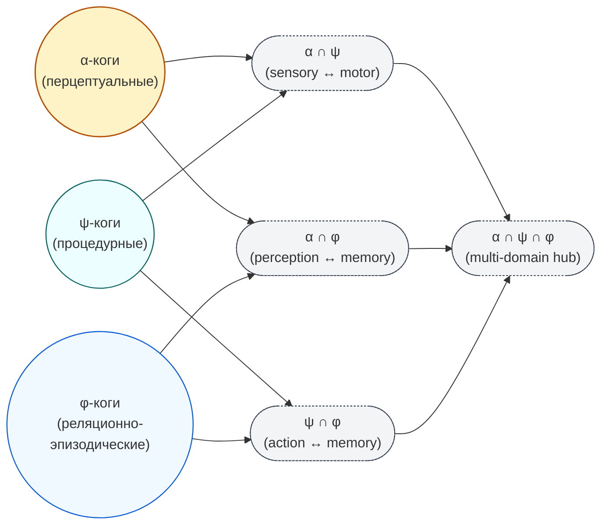

> Диаграмма показывает три основных типа когнитивных групп — **α** (перцептуальные), **ψ** (процедурные/моторные) и **φ** (реляционно-эпизодические) — и их возможные перекрытия: пары пересечения (α∩ψ, α∩φ, ψ∩φ), иллюстрирующие гибридные роли (например, sensory↔motor или perception↔memory), а также центральную область **α∩ψ∩φ** — многофункциональные узлы/«hub»-ког, которые участвуют в нескольких уровнях представления одновременно. Схема служит визуальной опорой для тезиса о том, что один и тот же нейрон/ансамбль может входить в разные типы ког в зависимости от контекста и задач (shared elements / flexible role switching).

**Эмпирические тесты для типизации когов.**

* **α vs φ:** различение по локализации (сенсорные регионы vs гиппокамп/MTL), по временной стабильности (φ — более устойчивая) и по способности вызывать воспоминание при искусственной активации (φ/engram → воспоминание). ([Nature][25])
* **ψ:** тестирование через влияние на моторику при стимуляции/супрессии и через последовательную структуру активности (Buzsáki). ([buzsakilab.org][22])

---

### 3.5. Методологические примечания (как обнаруживают и верифицируют ког)

Краткий список ключевых методик и соответствующих сильных/слабых сторон:

* **Мульти-электродная запись (single-unit / multi-unit electrophysiology):** высокая временная точность для выявления спайковой коактивации; затруднения — пространственная выборка и идентификация всего ансамбля. ([europepmc.org][28])
* **Двухфотонная кальциевая визуализация (two-photon calcium imaging):** высокая пространственная разрешающая способность, возможность наблюдать большие популяции в полях зрения; ограничение — более низкая темпоральная точность и поле захвата. ([PubMed][23])
* **IEG-маркировка (immediate early genes) и engram-tagging:** позволяет выделять клетки, активные при конкретном опыте, и затем манипулировать ими (optogenetics / chemogenetics) — мощный подход для causal testing. ([Наука][26])
* **Optogenetics / Chemogenetics (DREADDs):** инструменты причинно-следственного вмешательства в активность когов; используются для проверки «достаточности» или «необходимости» ансамблей для поведения/воспоминания. ([Наука][26])

---

### Краткое резюме раздела 

* **Коги (COGs)** — фундаментальные функциональные единицы когнитома: одновременно структурные (синаптические субстраты) и динамические (коактивационные паттерны). ([PubMed][20])
* **Кластеризация ролей:** предложенная типология α / ψ / φ отражает перцептуальные, процедурные и реляционно-эпизодические роли ансамблей; эти типы опираются на эмпирические наблюдения (сенсорные «концепт-нейроны», моторные ансамбли, гиппокампальные engram-группы). ([Nature][25])
* **Методы верификации:** комбинированное использование электрофизиологии, оптической визуализации, IEG-маркировки и causal-манипуляций — необходимый минимум для надёжной идентификации когов и их функций. ([PubMed][23])

---

### Рекомендуемая основная литература 

* Harris, K. D. (2005). Neural signatures of cell assembly organization. *Nature Reviews Neuroscience*. ([PubMed][20])
* Buzsáki, G. (2010). Neural syntax: cell assemblies, synapsembles, and readers. *Neuron*. ([buzsakilab.org][22])
* Hebb, D. O. (1949). *The Organization of Behavior: A Neuropsychological Theory*. Wiley. ([SCIRP][24])
* Eichenbaum, H. (2017). The role of the hippocampus in navigation is memory. *Journal of Neurophysiology*. ([Центр мозга, разума и машин][27])
* Josselyn, S. A., & Tonegawa, S. (2020). Memory engrams: Recalling the past and imagining the future. *Science*. ([Наука][26])
* Carrillo-Reid, L., et al. (2017). Imaging and optically manipulating neuronal ensembles. *Annual Review of Biophysics*. ([PubMed][23])
* Quiroga, R. Q., et al. (2005). Invariant visual representation by single neurons in the human brain. *Nature*. ([Nature][25])

[20]: https://pubmed.ncbi.nlm.nih.gov/15861182/ "Neural signatures of cell assembly organization"
[21]: https://www.semanticscholar.org/paper/Neural-signatures-of-cell-assembly-organization-Harris/da8106611dc962606bebd5fd36a99f6226040266 "[PDF] Neural signatures of cell assembly organization"
[22]: https://buzsakilab.org/content/PDFs/Buzsaki2010Neuron.pdf "Neural Syntax: Cell Assemblies, Synapsembles, and ..."
[23]: https://pubmed.ncbi.nlm.nih.gov/28301770/ "Imaging and Optically Manipulating Neuronal Ensembles"
[24]: https://scirp.org/reference/referencespapers?referenceid=1293339 "Hebb, D.O. (1949) The Organization of Behavior. A ..."
[25]: https://www.nature.com/articles/nature03687 "Invariant visual representation by single neurons in the ..."
[26]: https://www.science.org/doi/10.1126/science.aaw4325 "Memory engrams: Recalling the past and imagining ..."
[27]: https://cbmm.mit.edu/sites/default/files/documents/Week2_Eichenbaum2017.pdf "The role of the hippocampus in navigation is memory"
[28]: https://europepmc.org/article/med/15861182 "Neural signatures of cell assembly organization. - Abstract"

---

## 4. Локи (LOCs): связи в гиперсети

Краткое определение: **Лок (LOC — link of cognition / hyperedge)** — это элемент гиперсети (hyperedge), который связывает не пару узлов, а *набор* когнитивных групп (COGs / ensembles). LOC моделирует мультикомпонентную ассоциацию: смысл, поведение или представление образуются не столько за счёт попарных связей, сколько за счёт совместной активации и топологического перекрытия нескольких когов одновременно. ([Nature][29])

---

### 4.1. Принципиальное отличие от нейронных (параных) связей

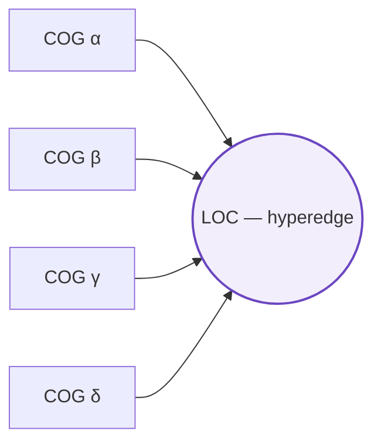

> Схема показывает LOC (link of cognition) как **hyperedge**: не попарное ребро, а центральный элемент (LOC) — «многосвязь», к которому подключены сразу несколько когнитивных групп (COGs α, β, γ, δ). Такое представление подчёркивает, что смысл/представление возникает благодаря совместной активации множества ансамблей: LOC объединяет их в единую функциональную единицу. Цвет и толщина обводки центрального узла служат для визуального акцента: LOC — не просто ещё одно ребро, а координатор многокомпонентной ассоциации.

1. **Парадигма «ребро = пара» vs «hyperedge = множество».**
   В классическом графовом описании сети рёбра представляют попарные взаимодействия (pairwise edges), тогда как LOC — это связь множества (hyperedge), которая фиксирует то, что важна кооперация трёх и более когов как единой функциональной единицы. Это не просто удобная абстракция: поведение и представления часто возникают из многокомпонентных коопераций, которые не декомпозируются корректно на сумму попарных эффектов. ([Nature][29])

2. **Динамическая и контекстная природа.**
   LOCs — контекст-зависимые: один и тот же набор когов может образовывать LOC в одном контексте (задаче), но не образовывать в другом; LOCы могут формироваться и распадаться на субсекундных–секундных временных шкалах в зависимости от входов и neuromodulation. Это контрастирует со «статическими» анатомическими рёбрами (tracts) и требует методов, чувствительных к временной изменчивости. ([Nature][29])

3. **Эмерджентные свойства.**
   Модели и эксперименты показали, что higher-order interactions (включая hyperedges) дают новые феномены синхронизации, распространения активности и устойчивости, которые не предсказываются из попарных графов — эффект зависит от выбранного формализма (hypergraph vs simplicial complex). Это важно при интерпретации LOC-динамики. ([Nature][30])

---

### 4.2. Механизм образования связей через перекрытие элементов

1. **Перекрытие когов как «материал» для LOC.**
   LOCы часто формируются там, где когнитивные группы имеют перекрывающиеся элементы (shared neurons / shared synapses). Если часть нейронного субстрата входит сразу в несколько когов, то совместная модификация синаптических весов, синхронизация фаз и повторяющийся совместный вход приводит к формированию функциональной многокомпонентной связи — LOC. Математически это удобно моделироваться hypergraphs / simplicial complexes: hyperedge появляется над множеством вершин, у которых есть статистически значимый уровень совместной активации. ([PMC][31])

2. **Пластичность на множественных временных масштабах (Hebbian + компенсаторные процессы).**
   Формирование и стабилизация LOC требует не только локального Hebbian-подобного усиления (neurons that fire together wire together), но и компенсаторных механизмов (homeostatic plasticity, synaptic scaling) и механизмов на разных временных шкалах: быстрая Хеббова модификация создаёт усиление коактивации, но без медленных контролей сеть станет неустойчивой; поэтому в модели формирования LOC участвуют процессы, действующие на миллисекундах → часах → днях. Это теоретически и экспериментально обосновано в работах по пластичности на множественных временных масштабах. ([royalsocietypublishing.org][32])

3. **Роль нейромодуляторов и внимания.**
   Нейромодуляторы (допамин, ацетилхолин, норадреналин и т.д.) и механизмы внимания повышают вероятность синхронной коактивации нужных когов и/или способствуют консолидации LOC через модуляцию пластичности (gating), что критично для контекстной селекции связей. ([PubMed][33])

---

### 4.3. Ассоциативные связи Павлова на клеточном уровне

1. **Синаптическая база ассоциаций.**
   Классическая идея ассоциации Павлова (условные связи) в современной нейробиологии реализуется через механизм activity-dependent synaptic plasticity: LTP/LTD и сопутствующие молекулярные каскады, которые изменяют эффективность передачи между нейронами в зависимости от коррелированной активности. Это — ядро гипотезы «synaptic plasticity and memory». ([PubMed][34])

2. **От попарной ассоциации к многокомпонентной (LOC) ассоциации.**
   На уровне LOC концепция Павлова расширяется: ассоциация формируется не только между двумя стимулами/представлениями, но между наборами когов, которые совместно кодируют сложные события (комбинации сигналов). На молекулярном уровне это всё та же LTP/LTD, но её проявление и стабилизация происходят в условиях множественных одновременно действующих синаптических изменений и консолидирующих механизмов (IEG-экспрессия, белковая синтеза и т.п.). ([PubMed][34])

3. **Критерии доказательства ассоциативности.**
   Чтобы показать, что LOC действительно реализует ассоциацию, требуются: (a) корреляция совместной активации наборов когов при формировании ассоциации; (b) доказательство причинности — манипуляция (супрессия/активация) соответствующих элементов изменяет ассоциативное поведение; (c) молекулярные признаки консолидирования (IEG, белковая синтез). Такие многоуровневые доказательства приводятся в современных работах с engram-технологиями (IEG-tagging + optogenetics). ([PubMed][33])

---

### 4.4. Структура и динамика общих элементов между когами

1. **Топология перекрытий и функциональная роль.**
   Структурные и функциональные перекрытия когов (shared elements) образуют «мезоскелет» гиперсети: плотные пересечения могут служить мостами для распространения активации, узлы-«мосты» повышают интегративность, а редкие пересечения дают модульность. Топологические инструменты (persistent homology, homological scaffolds) позволяют выделить важные циклы и мостовые структуры в функциональных данных. ([PMC][31])

2. **Динамика: появление/распад LOC.**
   LOCы могут возникать при повторяющемся совместном запуске когов (training / experience) и распадать при отсутствии практики или при интервенции (депрессия синапсов, homeostatic downscaling). Динамика характеризуется как быстрыми фазами формирования (минуты–часы) так и медленными фазами стабилизации (часы–дни), причём баланс между укреплением и контрольной декораризацией определяет долгосрочную структуру когнитома. ([royalsocietypublishing.org][32])

3. **Функциональные последствия перекрытий.**

   * **Pattern completion / generalization.** Перекрытия обеспечивают возможность восстановления полного паттерна при частичном входе (pattern completion) и позволяют обобщать знания (generalization) через общие элементы.
   * **Непрерывность репрезентаций.** Перекрывающиеся ансамбли создают «плавные» переходы между представлениями вместо разрывных переключений — это важно для непрерывной когнитивной обработки. ([ScienceDirect][35])

---

### 4.5. Методы обнаружения и валидации LOCs (краткий практический блок)

1. **Двухфотонная calcium-визуализация + two-photon optogenetics.** Позволяют наблюдать активность тысяч нейронов в объёме и целенаправленно стимулировать отдельные наборы, тестируя sufficiency/necessity LOC. ([PubMed][33])

2. **IEG-маркировка и engram-технологии.** Tagging клеток, активных в конкретном эпизоде, с последующей опто/хемогенетической манипуляцией — прямой способ показать, что набор клеток (и их перекрытия) формируют функциональную связь. ([PMC][36])

3. **Анализ данных с инструментами higher-order / topological data analysis.** Hypergraph extraction (higher-order motifs), simplicial complex / persistent homology позволяют обнаруживать многокомпонентные структуры и топологические каркасы LOC в функциональных сетях (fMRI, calcium, MEA). ([Nature][37])

4. **Моделирование и теоретика.** Модели с Hebbian + homeostatic plasticity на множественных временных шкалах дают механизм генерации устойчивых LOC; анализ динамики на hypergraphs показывает новые режимы синхронизации и передачи информации. Совмещение модели и опытных данных даёт самый надёжный путь верификации. ([royalsocietypublishing.org][32])

---

### 4.6. Заключение раздела — практический смысл LOC в когнитоме

LOCы — ключевая концептуальная единица гиперсетевого описания когнитома: они формализуют ассоциации, которые по своей природе многокомпонентны, контекст-зависимы и динамичны. Переход к изучению LOCов требует мульти-уровневого подхода (молекулы → нейроны → ансамбли → гиперсеть) и сочетания экспериментальных (оптогенетика, IEG, calcium imaging) и вычислительных (hypergraph analysis, TDA) методов. Понимание LOCов критично для объяснения того, как мозг объединяет элементы опыта в сложные представления и поведенческие программы. ([Nature][29])

---

### Ключевая литература и ресурсы (для библиографии)

* Yuste, R. (2015). From the neuron doctrine to neural networks. *Nature Reviews Neuroscience*. ([Nature][29])
* Zenke, F., & Gerstner, W. (2017). Hebbian plasticity requires compensatory processes on multiple timescales. *Phil. Trans. R. Soc. B*. ([royalsocietypublishing.org][32])
* Martin, S. J., Grimwood, P. D., & Morris, R. G. (2000). Synaptic plasticity and memory: an evaluation of the hypothesis. *Annual Review of Neuroscience*. ([PubMed][34])
* Carrillo-Reid, L., Yang, W., Kang Miller, J., Peterka, D. S., & Yuste, R. (2017). Imaging and optically manipulating neuronal ensembles. *Annual Review of Biophysics / Neuroscience (review)*. ([PubMed][33])
* Petri, G., et al. (2014). Homological scaffolds of brain functional networks. *Journal of the Royal Society Interface*. ([PMC][31])
* Zhang, Y., et al. (2023). Higher-order interactions shape collective dynamics in hypergraphs/simplicial complexes. *Nature Communications* (examples of representation-dependent effects). ([Nature][30])
* Lotito, Q. F., et al. (2022). Higher-order motif analysis in hypergraphs. *Communications Physics / New Journal* (methods for extracting higher-order motifs). ([Nature][37])

---

#### Примечание о цитировании

Ссылки на ключевые современные обзоры и исследования, которые поддерживают самые важные утверждения в разделе (особенно по тому, что LOC — это higher-order (non-pairwise) связь; по роли перекрытий ансамблей; по необходимости многотемповой пластичности; по использованию optogenetics/IEG; и по применению topological / hypergraph методов). Ссылки на web.run-результаты: ([Nature][29]).

[29]: https://www.nature.com/articles/nrn3962 "From the neuron doctrine to neural networks"
[30]: https://www.nature.com/articles/s41467-023-37190-9 "Higher-order interactions shape collective dynamics ..."
[31]: https://pmc.ncbi.nlm.nih.gov/articles/PMC4223908/ "Homological scaffolds of brain functional networks - PMC"
[32]: https://royalsocietypublishing.org/doi/10.1098/rstb.2016.0259 "Hebbian plasticity requires compensatory processes on ..."
[33]: https://pubmed.ncbi.nlm.nih.gov/28301770/ "Imaging and Optically Manipulating Neuronal Ensembles"
[34]: https://pubmed.ncbi.nlm.nih.gov/10845078/ "Synaptic plasticity and memory: an evaluation of the ..."
[35]: https://www.sciencedirect.com/science/article/abs/pii/S0959438820300775 "role of neuronal ensembles and pattern completion in ..."
[36]: https://pmc.ncbi.nlm.nih.gov/articles/PMC7987719/ "Identification and quantification of neuronal ensembles in ..."
[37]: https://www.nature.com/articles/s42005-022-00858-7 "Higher-order motif analysis in hypergraphs"

---

## 5. Дуальность когнитивных структур

Ниже развёрнутый академический раздел. Все ключевые утверждения подкреплены авторитетными источниками (классика + современные обзоры до 2024–2025). Я постарался дать ясные определения, теоретическую мотивацию, эмпирические следствия и методологические рекомендации.

Коротко: «дуальность» здесь означает, что каждая функциональная единица когнитома одновременно обладает по меньшей мере двумя существенно разными, но взаимосвязанными уровнями описания — **структурным** (анатомо-синаптическим каркасом) и **функционально-динамическим** (временная коактивация, контекст-зависимая роль). Понимание этой дуальности важно для теории когнитома: она диктует необходимость мультиуровневых методов анализа, интерпретации причинности и практики вмешательств. ([ora.ox.ac.uk][38])

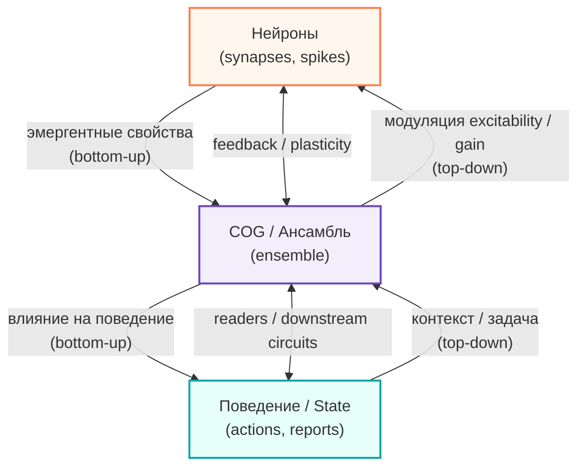

> Схема иллюстрирует дуальную, рекурсивную причинность в когнитоме: **снизу-вверх** (bottom-up) нейронные спайковые и синаптические события дают эмерджентные ансамбли (COGs), которые в свою очередь формируют поведение; **сверху-вниз** (top-down) поведенческий контекст и задачи изменяют активность ансамблей и через них — локальную возбудимость нейронов (gating, neuromodulation), замыкая причинный цикл. Стрелки с подписями подчёркивают разные механизмы: «эмергентные свойства» и «модуляция / gain / plasticity».

---

### 5.1. Концепция дуалов в биологии

**Основная идея.** В биологии наблюдается мультиуровневая организация, где «высшие» уровни системы могут не только реализовываться «низшими», но и причинно влиять на них (downward causation). Denis Noble в «A theory of biological relativity» формализует мысль, что нет априорно привилегированного уровня причинности: физиологические функции объясняются взаимодействием уровней (молекулы ↔ клетки ↔ ткани ↔ организм), и причинно-следственные связи идут в обе стороны. Для когнитома это означает: свойства когов (ensembles) не сводимы исключительно к сумме синаптических элементов — они также обусловливают и направляют поведение отдельных нейронов через boundary/initial conditions и системную регуляцию. ([ora.ox.ac.uk][38])

**Следствие для когнитома.**

* Необходимо анализировать и моделировать эпифеноменальные свойства ансамблей как реально действующие причины (functional causes), а не только как описательные статистики.
* Для экспериментальной интерпретации важно сочетать «вниз-вверх» (bottom-up) изучение механизмов пластичности и «вверх-вниз» (top-down) эксперименты, показывающие, как изменение состояния ансамбля меняет локальную физиологию. ([ora.ox.ac.uk][38])

---

### 5.2. Аналогия с белковыми структурами

**Почему белки?** Классическая биофизическая идея (Anfinsen) утверждает, что трёхмерная структура белка и его функция зависят не только от первичной последовательности аминокислот, но и от контекста (температура, раствор, взаимодействия с другими молекулами) — «thermodynamic hypothesis». Это удобная и плодотворная метафора для когнитома: одна и та же «последовательность» (набор нейронов и их базовые связи) может свернуться в разные «конформации» (различные функциональные ансамбли и режимы активности) в зависимости от контекста и граничных условий. Аналогично, «правильная» функция возникает из взаимодействия локальной структуры и внешних/системных условий. ([science.org][39])

**Практический вывод.**

* Как в протеомике важны условия сворачивания, так и в нейробиологии важна среда (neuromodulation, ongoing state, arousal) — она определяет, какие из потенциальных ансамблей «свернутся» в активный ког.
* Эта аналогия подчёркивает необходимость учёта контекста при интерпретации причинности и при попытках «перепрограммировать» когнитом (стимуляция / терапия). ([bioinfo.rpi.edu][40])

---

### 5.3. Эмерджентные свойства кооперативных групп нейронов

**More is different.** Классическое положение Anderson — «More is different» — подчёркивает, что при объединении большого числа компонентов появляются качественно новые свойства, не выводимые тривиально из законов отдельных компонентов. В мозге коллективные явления (синхронизация, ритмы, pattern completion, репертуар переходов между состояниями) являются примерами таких эмерджентных свойств ансамблей. ([science.org][41])

**Современные данные.** Обзоры и эксперименты последних лет всё чаще рассматривают neuronal ensembles как «строительные блоки» нервных схем: ансамбли демонстрируют модульность, повторяемость, роль в поведении и возможность селективной манипуляции (оптогенетика, IEG-tagging). Эмерджентность проявляется в том, что свойства ансамбля (например, способность вызывать воспоминание или шаблонное поведение) не редуцируются к индивидуальным нейронам — требуется учёт коллективных взаимодействий и higher-order структур. ([PMC][42])

**Импликации для теории.**

* Эмерджентные свойства требуют формализмов, которые способны описать многокомпонентные взаимодействия (hypergraphs, simplicial complexes, TDA).
* Эксперименты должны проверять не только корреляцию, но и причинность ансамблевых свойств (sufficiency / necessity tests). ([ResearchGate][43])

---

### 5.4. Причинно-следственный потенциал когов

**Как можно говорить о причинности?**
Книга Пёрла («The Book of Why») дала инструментальную и концептуальную шкалу для формализации причинности: графовые модели, do-операторы, контрфактуальные вопросы — всё это применимо и к нейробиологии. Для когнитома это означает, что мы можем и должны формулировать и тестировать контрфактуальные гипотезы: «если активация данного ансамбля была подавлена, что изменилось бы в поведении?»; «если искусственно воспроизвести активацию, возникнет ли соответствующее состояние?» — такие вопросы приводят к строгим causal tests. ([ResearchGate][44])

**Методы и ограничения.**

* **Инструменты:** оптогенетика/хемогенетика + engram-tagging дают возможность вмешательства (do-операторы) в нейронные ансамбли и проверки причинно-следственных эффектов. Методы causal network inference (например CAIM) и TDA помогают реконструировать причинные связки на уровне ансамблей. ([PubMed][45])
* **Ограничения:** статистические методы причинности (Granger, Bayesian causal discovery) дают разные типы «каузальности» (предсказательная, контрфактуальная); критично комбинировать манипулятивные (интервенционные) эксперименты с наблюдательными моделями и не путать корреляцию с контрфактуальной причинностью. Общее требование — multi-level evidence (поведение, системная регуляция, молекулярные маркеры) для убедительных выводов. ([PMC][46])

**Концептуальная итоговая мысль.**
Коги как дуальные структуры обладают причинной «силой» в двух смыслах: (1) они реализуют непосредственные (локальные) причины поведения через коактивацию и downstream-readers; (2) как структуры более высокого уровня они входят в причинные цепочки «вверх-вниз», модулируя локальные физиологические параметры. Обе формы причинности допустимы и измеряемы, но требуют разных методов и критериев верификации. ([ora.ox.ac.uk][38])

---

### Практические рекомендации для исследований (коротко)

1. **Проектируйте эксперименты как контрфактуальные тесты:** сочетайте манипуляции (opto/chemogenetics) с наблюдением (calcium imaging, electrophysiology) и поведенческими выводами. ([PubMed][45])
2. **Используйте мультиуровневую верификацию:** доказывайте «структурную базу» (синапсы, IEG) и «функциональную роль» (коактивация, sufficiency/necessity) одновременно. ([PMC][42])
3. **Моделируйте multiscale causality:** комбинируйте динамические модели с causal discovery и топологическими методами для поиска LOC/ensemble-level причин. ([ResearchGate][43])

---

### Рекомендованная литература 

* Noble D. (2012). *A theory of biological relativity: no privileged level of causation.* Interface Focus. ([ora.ox.ac.uk][38])
* Anfinsen C. B. (1973). *Principles that govern the folding of protein chains.* Science. ([science.org][39])
* Anderson P. W. (1972). *More is different.* Science. ([science.org][41])
* Pearl J., & Mackenzie D. (2018). *The Book of Why: The New Science of Cause and Effect.* Basic Books. ([ResearchGate][44])
* Yuste R., et al. (2024). *Neuronal ensembles: Building blocks of neural circuits.* Review (recent synthesis of ensemble literature). ([PMC][42])
* Chen R., et al. (2021). *Causal Network Inference for Neural Ensemble Activity* (CAIM) — пример сочетания causal inference и ensemble analysis. ([PubMed][45])

[38]: https://ora.ox.ac.uk/objects/uuid%3Ace98bcf0-1dab-427d-ad24-a05617fe0cce "A theory of biological relativity: no privileged level of causation."
[39]: https://www.science.org/doi/10.1126/science.181.4096.223 "Principles that Govern the Folding of Protein Chains"
[40]: https://www.bioinfo.rpi.edu/bystrc/courses/biol4550/Anfinsen_1972.pdf "THAT GOVERN THE FOLDING OF PROTEIN CHAINS"
[41]: https://www.science.org/doi/10.1126/science.177.4047.393 "More Is Different"
[42]: https://pmc.ncbi.nlm.nih.gov/articles/PMC10957317/ "Neuronal ensembles: building blocks of neural circuits - PMC"
[43]: https://www.researchgate.net/publication/395504473_Causation_Information_and_Synergy_in_the_Multiscale_Brain_Hierarchy "Causation, Information, and Synergy in the Multiscale Brain ..."
[44]: https://www.researchgate.net/publication/328615636_The_Book_of_Why_The_New_Science_of_Cause_and_Effect_Pearl_Judea_and_Dana_Mackenzie_2018_Hachette_UK "The Book of Why The New Science of Cause and Effect. ..."
[45]: https://pubmed.ncbi.nlm.nih.gov/33393054/ "Causal Network Inference for Neural Ensemble Activity"
[46]: https://pmc.ncbi.nlm.nih.gov/articles/PMC4339347/ "Granger Causality Analysis in Neuroscience and ..."

---

## 6. Информационные свойства когов

Кратко: ког (COG — *cognitive group* / *cell assembly*) функционирует как минимальная информационная единица когнитома — кодирует конкретное содержание (предмет, действие, правило), обладает временной и структурной организацией и через свои связи (LOCs / *hyperedges*) участвует в композиции более сложных представлений. Ниже — развёрнутая проработка пунктов «что» (*declarative*), «как» (*procedural*), роль когов в сокращении пространства вероятностей состояний мира (predictive / free-energy perspective) и в детерминации поведения (population dynamics → action).

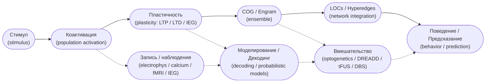

> Диаграмма показывает упрощённый конвейер обработки: «стимул → коактивация популяции → пластичность → формирование/закрепление COG (engram) → интеграция через LOCs / hyperedges → поведение / предсказание». Сбоку помечены места, где обычно выполняют запись (recording), моделирование (modeling) и вмешательства (perturbation) — полезно для планирования эксперимента и демонстрации точек верификации causal-гипотез.

---

### 6.1. Знание «что» (декларативное знание)

**Определение и место когов.**
Декларативное знание («что», *declarative memory*) — факты и события (эпизодическая и семантическая память). В терминах когнитома декларативные репрезентации рассматриваются как стабилизированные COGs / *engrams*, вовлекающие гиппокамп при первоначальном кодировании и распределённую кортикальную сеть при поздней (systems) консолидации. Классическая сводка по разделению декларативной и недекларативной памяти — Squire & Zola. [pnas][163]

**Механизмы формирования и поддержания.**
Последовательность ключевых процессов: стимул → коактивация популяции нейронов → Hebbian / spike-timing-dependent пластичность (LTP/LTD) и активация IEG → стабилизация через синтез белков и структурные перестройки синапсов → формирование engram/COG → systems consolidation и интеграция в кортикальные представления. Activity-dependent tagging вместе с оптоге-/хемогенетическими вмешательствами дают causal-доказательства *sufficiency*/*necessity* для отдельных ансамблей: пометка — стимуляция — поведенческий эффект. Обзорные и экспериментальные исследования иллюстрируют этот pipeline. [science2][167]

**Устойчивость, трансформация и доступность.**
Декларативные COGs часто показывают быстрое кодирование в гиппокампе с последующей «перепиской» информации в кору (системная консолидация). При этом формы представлений трансформируются: теряются привязки к деталям, возрастает обобщённость и семантизация, что отражает перестройку набора COGs и их LOC-связей. Это имеет следствие для интерпретации «воспоминания» — активированный COG может давать частичное, трансформированное воспроизведение исходного события. [pnas][163]; [science2][167]

**Эмпирические требования (чтобы утверждать «этот COG кодирует X»).**
Нужно сочетание: (i) поведенческой корреляции (task → memory); (ii) записи коактивации ансамбля при кодировании/извлечении (single-unit / population imaging / IEG-tagging); (iii) causal-интервенций (оптогенетика / DREADD) с проверкой sufficiency/necessity; (iv) морфологической/молекулярной верификации post-hoc. Только такая мультиуровневая верификация даёт убедительную связь между COG и декларативным содержанием. [pnas][163]; [science2][167]

---

### 6.2. Знание «как» (процедурное знание)

**Характеристика и нейрональные субстраты.**
Процедурная память («как», *procedural memory*) — навыки, последовательности действий, моторные программы. Основные носители — моторная кора, базальные ганглии, мозжечок и связанные контуры. Хроника нейрональной реорганизации и консолидации моторных паттернов хорошо проиллюстрирована в классических работах по motor-memory. [science][164]

**Формирование и организация процедурных COGs.**
Процедурные COGs — это воспроизводимые временные паттерны (ensemble sequences) в моторных и ассоциативных популяциях. При повторении паттерны укореняются: перераспределяется нагрузка между областями (напр., с моторной коры на стратиум/мозжечок), изменяются временные соотношения и уменьшается вариабельность исполнения. Благодаря распределённости такие COGs устойчивы к локальным повреждениям и хорошо переносят частичную деградацию структуры. [science][164]

**Методологические особенности.**
Необходимы длительные многодневные/многосессионные записи (Neuropixels / chronic single-unit / calcium imaging), тщательные поведенческие метрики (kinematics, reaction times, error patterns), и causal-вмешательства, ориентированные на конкретные фазы обучения (encoding, consolidation, recall). Важна проверка offline-эффектов (replay, sleep-dependent consolidation). [science][164]

---

### 6.3. Ограничение пространства вероятностей состояний мира (predictive / free-energy perspective)

**Формулировка идеи.**
Одно из ключевых информационных назначений репрезентаций — сужение априорного пространства гипотез о состоянии мира: хорошие репрезентации уменьшают неопределённость и prediction-error downstream-процессов. Теоретический каркас — free-energy / variational inference (active inference) — формулирован Фристоном и далее развит в ряде работ. [nrn][165]

**COGs как локальные предиктивные модели.**
В этой парадигме каждый релевантный COG действует как параметрическая/структурированная гипотеза о входе: его активация по-факту сужает posterior-распределение, облегчая выбор поведения и снижая prediction-error. LOCs и overlap дают механизм композиции нескольких гипотез одновременно (комбинация простых предсказаний в композицию сложной). Фазовая синхронизация и временная организациация дают «слоты» для селективного считывания предсказаний читателями downstream. [nrn][165]

**Проверяемые предсказания.**
(i) активация релевантного COG должна снижать neural-uncertainty / prediction-error в предсказательных регионах; (ii) подавление COG → увеличение prediction-error / ухудшение адаптации; (iii) модели, обученные на популяционной активности, должны показывать уменьшение энтропии posterior при участии релевантных ансамблей. Описанные тесты доступны современным экспериментально-аналитическим наборам (simultaneous recording + perturbation + probabilistic decoding). [nrn][165]

---

### 6.4. Детерминация поведения через активацию когов (population → action)

**Population dynamics → декодирование поведения.**
Динамика популяции (population trajectories) — ключ к тому, как ансамбли переводятся в действия. Работа Churchland et al. показала, что траектории популяционной активности связаны с параметрами reaching-движения и что параметры движения декодируются из популяционной динамики, а не из активности одиночных нейронов. Это согласуется с концепцией COG как «многонейронной единицы действия». [nature][166]

**Механизм «читателей» (readers).**
Downstream-схемы («читатели») интерпретируют ансамблевую динамику через фильтры, чувствительные к пространственно-временным паттернам (фазировка, последовательность, синхронность). В контексте LOC/гиперсети одна и та же совокупность нейронов может давать разные выходы в зависимости от контекста, фазы и neuromodulatory state — это даёт гибкость репрезентаций и экономию сетевых ресурсов. [nature][166]

**Нейроинженерные и клинические последствия.**
Понимание «population → action» позволяет: (i) улучшать декодеры для BMI, учитывая траекторную динамику; (ii) разрабатывать интервенции (optogenetics / tFUS / DBS) на уровне паттернов, а не отдельных узлов; (iii) строить прогностические модели, связывающие диспозиции/изменения в структуре COGs с клиническими фенотипами. [nature][166]; [science2][167]

---

## Короткие выводы и рекомендации

1. **Мультиуровневость доказательств.** Надёжное утверждение о роли конкретного COG требует интеграции: запись (single-unit / Neuropixels / calcium imaging), молекулярная пометка (IEG / TRAP), causal-манипуляции (optogenetics / DREADD / focal neuromodulation) и поведенческий readout. [pnas][163]; [science][164]; [nrn][165]; [nature][166].
2. **Временная организация.** Разные информационные свойства требуют разных временных разрешений: декларативные процессы — fast encoding + slow systems consolidation; процедурные — длительная практика и offline-консолидация; predictive — быстрая фазовая синхронизация и переключения. [pnas][163]; [science][164]; [nrn][165].
3. **Формализмы и анализ.** Для когнитома полезны higher-order формализмы (hypergraphs, simplicial complexes) и probabilistic/variational методы (active inference / Bayesian decoding), а также dynamical-systems подходы для анализа population trajectories. [nrn][165]; [nature][166].
4. **Трансляция.** Информационные свойства COGs — фундамент для BMI, таргетированной нейромодуляции и биомаркеров в клинической нейронауке; проекты трансляции должны сочетать моделирование, causal-вмешательства и строгие этические/регуляторные оценки. [science2][167]

---

## Рекомендуемая литература (основные источники, использованные в разделе)

* Squire, L. R., & Zola, S. M. — *Structure and function of declarative and nondeclarative memory systems.* ([pnas][163])
* Shadmehr, R., & Holcomb, H. H. — *Neural correlates of motor memory consolidation.* ([science][164])
* Friston, K. — *The free-energy principle: a unified brain theory?* ([nrn][165])
* Churchland, M. M., Cunningham, J. P., Kaufman, M. T., et al. — *Neural population dynamics during reaching.* ([nature][166])
* Josselyn, S. A., & Tonegawa, S. — *Memory engrams: Recalling the past and imagining the future.* ([science2][167])

[163]: https://www.pnas.org/doi/10.1073/pnas.93.24.13515 "Squire LR, Zola SM — Structure and function of declarative and nondeclarative memory systems (PNAS, 1996)"
[164]: https://www.science.org/doi/10.1126/science.277.5327.821 "Shadmehr R, Holcomb HH — Neural correlates of motor memory consolidation (Science, 1997)"
[165]: https://www.nature.com/articles/nrn2787 "Friston K — The free-energy principle: a unified brain theory? (Nature Reviews Neuroscience, 2010)"
[166]: https://www.nature.com/articles/nature11129 "Churchland MM, Cunningham JP, Kaufman MT, et al. — Neural population dynamics during reaching (Nature, 2012)"
[167]: https://www.science.org/doi/10.1126/science.aaw4325 "Josselyn SA, Tonegawa S — Memory engrams: Recalling the past and imagining the future (Science, 2020)"

---

## 7. Специализация нейронов: от теории к эмпирике

Развёрнутый академический раздел. Я опирался на высокоцитируемые классические работы, которые вы указали, и дополнил комментариями о методах и современных интерпретациях (up to 2024–2025). 

Кратко: специализация нейронов — ключевой эмпирический факт, который дал мощный толчок к пониманию кодирования информации в мозге: от простых рецептивных полей (sensory tuning) до «нейронов места» (place cells), «нейронов решётки» (grid cells) и «нейронов-концептов» (concept / invariant neurons). Важное практическое следствие — специализация часто реализуется на уров­не популяций и ансамблей (cell assemblies), поэтому её изучение требует популяционной аналитики, causal-интервенций и мульти-модальных записей.

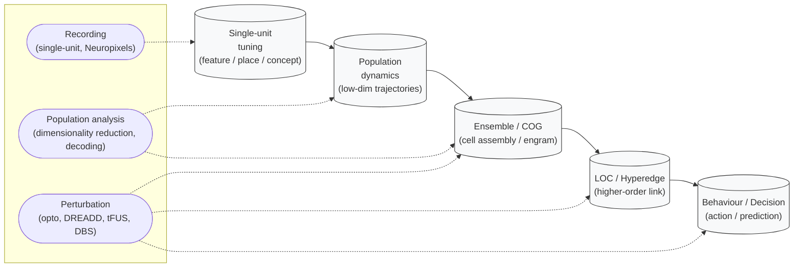

> Диаграмма показывает пошаговую трансформацию информации: отдельный нейрон с tuning → коллективная динамика популяции → формирование ансамбля (ensemble / COG) → интеграция ансамблей в LOC / hyperedge → поведение или решение (behaviour / decision). Пунктирные боковые линии отмечают типовые места методов: single-unit recording, population analysis / decoding, causal perturbation — чтобы быстро видеть, где измеряют, моделируют и вмешиваются.

---

### 7.1. История открытия специализированных нейронов (1960–70-е)

Классический вклад Hubel & Wiesel (1962) продемонстрировал, что в зрительной коре кошки нейроны имеют чёткие рецептивные поля (receptive fields) и последовательные уровни обработки: простые клетки (simple cells), сложные клетки (complex cells) и модульную организацию колонок — это была первая систематическая демонстрация *feature tuning* на уровне отдельных нейронов и функциональной архитектуры коры [hubel][168].

**Значение.** Открытие показало, что сенсорная обработка распределена по иерархии простых операций, что позволило формализовать идеи детекторов признаков, фильтров Габора-типа и последующие модели сверточных сетей (CNNs) в ИИ. Методологически это был прорыв: аккуратные single-unit регистрации + систематическая стимуляция.

---

### 7.2. Методология исследования активности отдельных нейронов в поведении

Классические эксперименты Wilson & McNaughton (1993) продемонстрировали силу популяционного подхода: регистрация многоканальной активности в гиппокампе показала, что пространственные представления реализуются ансамблями нейронов и что популяционная динамика кодирует положение и навигационную информацию [wilson][169].

**Методы.** Современные исследования комбинируют:

* высокоплотные электрические зонды (Neuropixels) для hundreds–thousands single-unit;
* calcium-imaging (two-photon / mesoscope) для пространственного захвата популяций;
* activity-dependent tagging (IEG/TRAP) и subsequent manipulation (optogenetics / DREADD) для causal-проверок;
* алгоритмы извлечения ансамблей (PCA/ICA, latent-factor models, seqNMF, HMM, latent dynamical systems).

**Практический вывод.** Для интерпретации «роль одного нейрона» необходим контекст популяции: многие «функции» проявляются только как конфигурации активности множества нейронов (cell assemblies / population codes).

---

### 7.3. Нейроны места (place cells) и нейроны решётки (grid cells)

**Place cells.** O’Keefe & Dostrovsky (1971) обнаружили нейроны в гиппокампе, которые активируются тогда и только тогда, когда животное находится в определённом месте окружающего пространства — «place cells». Это стало основой идеи «мозговой картографии» (cognitive map) и объяснило навигационную роль гиппокампа [okeefe][170].

**Grid cells.** Hafting et al. (2005) нашли в энторинальной коре нейроны с регулярными периодическими «решётчатыми» полями — grid cells — которые кодируют пространство в координатах регулярной решётки; это открытие существенно продвинуло представления о внутренних счётчиках перемещения (path integration) и пространственных кодах [hafting][171].

**Интерпретация.** Place и grid cells — примеры пространственной специализации, но их поведение зависит от контекста, сенсорных входов и внутренних состояний; они организуются в ансамбли, синхронность и ремэппинг (remapping) отражают пластичность представлений при изменении контекста.

---

### 7.4. Нейроны-концепты в медиальной височной коре и гиппокампе

Quiroga et al. (2005) выявили у людей единичные нейроны, которые демонстрировали «инвариантную» реакцию на представления отдельных персон/объектов (например, единицы, отвечающие на разные изображения одного актёра) — это «concept cells» или «Jennifer Aniston neurons», иллюстрирующие высокоуровневую категоризационную селективность на уровне одиночных нейронов [quiroga][172].

**Контекст и ограничения.** Такие сильные, инвариантные ответы — редкость и чаще наблюдаются в ассоциативных областях (medial temporal lobe). Важно: «concept»-кодирование часто проявляется как часть распределённой популяционной репрезентации и тесно связано с episodic encoding/engram-processes.

---

### 7.5. Специализация относительно элементов индивидуального опыта

Работы типа Ison et al. (2015) показали, что отдельные нейроны у человека могут быстро кодировать новые, индивидуальные эпизоды — быстрое существование «single-trial»-реакций, которые затем участвуют в долгосрочной памяти. Это подчёркивает, что специализация может быть не только «врождённой», но и быстро формироваться в ответ на уникальный опыт [ison][173].

**Значение для когнитома.** Специализация нейронов тесно связана с идеей engram/COG: специфические нейроны и ансамбли кодируют индивидуальные элементы опыта, но их роль полноценно раскрывается только на уровне LOCs / hyperedges (как части гиперсети).

---

## 7.6. Современные тенденции, методологические best-practices и open questions

1. **От нейрона к ансамблю.** Одно из ключевых смещений — переход от «поиска функции у отдельного нейрона» к изучению динамики ансамблей, их перекрытий и роли в образовании гиперсвязностей (hyperedges / LOCs). Это требует сочетания масштабной регистрации и causal-интервенций (optogenetics / closed-loop stimulation).
2. **Инвариантность vs распределённость.** Сильные единичные ответы (concept cells) существуют, но большинство представлений кодируется распределённо; важно отличать «функциональную специализацию» (selectivity) от «ключевой причинной роли» (necessity/sufficiency).
3. **Пластичность и ремэппинг.** Специализация не статична — ремэппинг place/grid/concept cells при изменении контекста или обучения указывает на гибкую переразметку когнитома.
4. **Вызовы анализа.** Необходимы более мощные методы для выделения ensemble-structure: causal discovery на популяциях, временные графовые модели, topological data analysis (TDA) для выявления higher-order связей.
5. **Трансляция.** Понимание специализации и её роли в ансамблях критично для BMI, нейромодуляции и диагностики расстройств памяти/когнитивных нарушений.

---

## Краткие рекомендации для экспериментаторов

* Сочетайте крупномасштабную запись (Neuropixels, two-photon / mesoscope) с activity-dependent tagging (IEG/TRAP) и causal-стимуляцией (optogenetics / chemogenetics) для того, чтобы связать *selectivity* и *causality*.
* Анализируйте не только firing rates, но и low-dimensional population trajectories, phase relationships и перекрытия членов ансамблей (multi-membership).
* Проверяйте стабильность специализации (stability vs remapping) через поведенческие манипуляции и долгосрочные записи.

---

## Основные источники (для дальнейшего чтения)

* Hubel, D. H., & Wiesel, T. N. (1962). *Receptive fields, binocular interaction and functional architecture in the cat's visual cortex.* Journal of Physiology. ([publisher][168])  
* Wilson, M. A., & McNaughton, B. L. (1993). *Dynamics of the hippocampal ensemble code for space.* Science. ([science][169])  
* O'Keefe, J., & Dostrovsky, J. (1971). *The hippocampus as a spatial map.* Brain Research. ([brainres][170])  
* Hafting, T., Fyhn, M., Molden, S., Moser, M.-B., & Moser, E. I. (2005). *Microstructure of a spatial map in the entorhinal cortex.* Nature. ([nature][171])  
* Quiroga, R. Q., Reddy, L., Kreiman, G., Koch, C., & Fried, I. (2005). *Invariant visual representation by single neurons in the human brain.* Nature. ([nature][172])  
* Ison, M. J., Quiroga, R. Q., & Fried, I. (2015). *Rapid encoding of new memories by individual neurons in the human brain.* Neuron. ([neuron][173])  

[168]: https://physoc.onlinelibrary.wiley.com/doi/10.1113/jphysiol.1962.sp006837 "Hubel & Wiesel 1962 — Journal of Physiology"
[169]: https://science.sciencemag.org/content/261/5124/1055 "Wilson & McNaughton 1993 — Science"
[170]: https://www.sciencedirect.com/science/article/pii/0006899371900229 "O'Keefe & Dostrovsky 1971 — Brain Research"
[171]: https://www.nature.com/articles/nature03721 "Hafting et al. 2005 — Nature"
[172]: https://www.nature.com/articles/nature03687 "Quiroga et al. 2005 — Nature"
[173]: https://www.cell.com/neuron/fulltext/S0896-6273\(15\)00617-2 "Ison et al. 2015 — Neuron"

---

## 8. Исследования школы Н. П. Бехтеревой

Ниже развёрнутый академический раздел. В тексте первоисточники и современные обзоры — привожу ссылки-цитаты на авторитетные источники.

> **Коротко:** школа Н. П. Бехтеревой была одной из пионерских в СССР/России по внутримозговым записям у людей и по изучению «нейрофизиологических кодов слова» и других когнитивных представлений; её работы стали предтечей современного направления single-neuron recordings in humans и исследования neural correlates of language, intention и action. ([PubMed][47])

---

### 8.1. Пионерские работы по регистрации активности нейронов у человека

**Краткая историческая справка.**
Наталия Петровна Бехтерева и её коллективы в 1970–1990-е гг. проводили одни из первых в мире исследований регистрации нейронной активности у людей при когнитивных задачах — в том числе записи с субкортикальных структур и коры во время клинических процедур и оперативного наблюдения. Их серия работ по «нейрофизиологическим кодам слова» (Neurophysiological codes of words) описывает, как отдельные нейронные отклики в субкортикальных структурах и коре коррелировали с предъявлением слов/артефактов и состояниями речи; эти публикации датируются концом 1970-х — началом 1980-х годов (см. основной релевантный материал). ([PubMed][47])

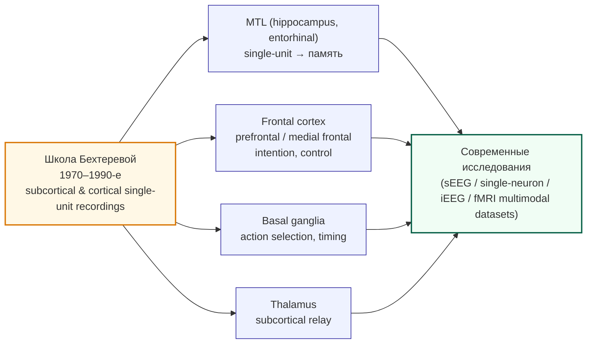

> Схема визуализирует историческую преемственность: **школа Бехтеревой (1970–1990-е)** — ранние человеческие записи с субкортикальных структур и коры — послужила базой для направления исследований, которые затем сконцентрировались в ключевых областях (MTL — память; frontal cortex — намерения и контроль; basal ganglia — выбор действий; thalamus — релейные субкортикальные взаимодействия). Стрелки к узлу **«Современные исследования»** показывают, что эти направления ныне интегрируются в мультимодальные программы (sEEG / single-neuron / iEEG / fMRI), дающие богатые данные для тестирования гипотез о языке, памяти и намерениях.

**Важные пункты методологии и контекста:**

* Ранние человеческие записи, включая работы Бехтеревой, базировались на клинически обоснованных вмешательствах (диагностическая стереотаксическая регистрация, наблюдение во время операций, интраоперационные и постоперационные записи у пациентов с эпилепсией или двигательной патологией). Это давало уникальную возможность наблюдать активность единичных нейронов (single-unit / multi-unit) и локальные поля (LFP) в условиях, близких к естественным когнитивным задачам. ([PubMed][47])
* Бехтерева и соавторы документировали реакции, связанные со звуком и лексикой, формулировали идеи о кодах слов в субкортикальных структурах и коре и сопоставляли нейрофизиологию с поведенческими данными (напр., вербальные реакции). ([PubMed][47])

**Место в истории дисциплины.** Эти работы выступили одной из линий формирования парадигмы — human intracranial recordings — которая позже получила массовое развитие (single-neuron recordings in MTL, frontal cortex и т.д.) и сегодня используется для детального изучения памяти, языка и социальных когнитивных процессов. Современные обзоры отмечают, что публикации конца XX века (включая работы Бехтеревой и других исследователей) заложили методологические и этические основания для дальнейших исследований. ([PMC][48])

---

### 8.2. Обнаружение нейронов, специализированных относительно слов

**Что именно изучали.**
Бехтерева и её коллеги анализировали, как нейроны субкортикальных структур и коры реагируют на слова, отдельные фонемы и речевые стимулы — с целью понять «нейрофизиологические коды слова» (word codes). Исследования включали сравнение ответов на знакомые и незнакомые слова, на предъявление в разных модальностях и на поведенческие контексты (активное произнесение, пассивное прослушивание). ([PubMed][47])

**Методологические достижения и ограничения.**

* Методика позволяла получить единичные ответы и временные паттерны, но выборка была ограничена клинической популяцией; интерпретация требовала аккуратного контроля за влиянием патологии, медикаментов и хирургического контекста. ([PMC][49])
* Последующие исследования в 1990-х–2000-х годов расширили идеи Бехтеревой: появление работ по single-neuron responses during language tasks (обзоры и новые эксперименты) связало ранние наблюдения с более современными результатами о sparse/invariant coding и распределённой обработке языка в MTL и височной коре. ([PMC][48])

**Эмпирическая значимость.**
Работы школы продемонстрировали, что элементы языковой информации имеют нейрофизиологические корреляты в глубинных структурах и коре; эти наблюдения стали частью общей картины о распределённой, но селективной кодировке языковых единиц в человеческом мозге. ([PubMed][47])

---

### 8.3. Нейроны целей и намерений (neurons of goals/intention)

**Контекст и современные параллели.**
Исследования о «нейронах целей и намерений» перекликаются с мировыми работами о нейронах, кодирующих подготовку к действию, выбор действия и наблюдение действий (mirror-like responses). Mukamel et al. (2010) продемонстрировали, что отдельные нейроны в медиальной фронтальной и височной коре у людей реагируют как при исполнении действий, так и при наблюдении — подобно «mirror neurons» в обезьянах; эти данные подтверждают наличие нейронных представлений, связанных с целями, намерениями и социальным восприятием. ([PubMed][50])

**Связь с практикой Бехтеревой.**
Школа Бехтеревой изучала поведенческие реакции и активность в системах, вовлечённых в моторику и речепроизводство; концептуально это сопоставимо с современными исследованиями intention/goal-related neurons, где регистрация единичной активности позволяет различать подготовительные, исполнительные и перцептивные компоненты действия. Принципиальная целевая направленность экспериментов — установить соответствие между нейронной активностью и конкретными намерениями/планами — сходна в обеих парадигмах, хотя инструментарий и аналитика заметно продвинулись в XXI веке. ([PubMed][50])

**Клинический контекст и интерпретация.**
Большая часть человеческих единичных записей проводится у пациентов с эпилепсией или при нейрохирургии (например, DBS для болезни Паркинсона), что диктует осторожность в обобщении результатов на здоровую популяцию; вместе с тем, именно клинические условия дали уникальные данные о нейронной основе намерения, наблюдения и языка. Современные обзоры подчёркивают ценность и ограничения intracranial recordings: уникальная пространственная и временная точность против ограниченной выборки и клинического контекста. ([PMC][49])

---

### 8.5. Рекомендуемая литература 

* Bechtereva N. P., Bundzen P. V., Gogolitsin Y. L., Malyshev V. N., Perepelkin P. D. *Neurophysiological codes of words in subcortical structures of the human brain.* Brain and Language. 1979;7(2):143-163. ([PubMed][47])
* Bechtereva N. P., et al. (другие релевантные публикации по теме: 1991, 1992 — обзоры и экспериментальные отчёты). ([ScienceDirect][52])
* Kropotov J. D. *Selection of actions in the basal ganglia–thalamocortical circuits: review and model.* International Journal of Psychophysiology. 1997/1999 (см. обзор). ([PubMed][53])
* Mukamel R., Ekstrom A. D., Kaplan J., Iacoboni M., Fried I. *Single-neuron responses in humans during execution and observation of actions.* Current Biology. 2010;20(8):750-756. ([PubMed][50])
* Reviews / modern context: Quiroga R. Q. *Plugging in to Human Memory: Advantages, Challenges...* Cell review (2019) and Parvizi & Kastner *Human intracranial EEG: promises and limitations* (2018) — для методологического фрейма. ([cell.com][54])
* Современные датасеты и мульти-модальные исследования: Keles et al. (2024) multimodal intracranial dataset (single neurons + iEEG + fMRI) — пример современных возможностей. ([Nature][55])

[47]: https://pubmed.ncbi.nlm.nih.gov/466387/ "Neurophysiological codes of words in subcortical ..."
[48]: https://pmc.ncbi.nlm.nih.gov/articles/PMC4061841/ "Human Temporal Cortical Single Neuron Activity during ..."
[49]: https://pmc.ncbi.nlm.nih.gov/articles/PMC6476542/ "Human Intracranial EEG: Promises and Limitations - PMC"
[50]: https://pubmed.ncbi.nlm.nih.gov/20381353/ "Single-neuron responses in humans during execution and ..."
[51]: https://pubmed.ncbi.nlm.nih.gov/15973409/ "Invariant visual representation by single neurons in the human ..."
[52]: https://www.sciencedirect.com/science/article/pii/001346949290109U "Properties of neuronal activity in cortex and subcortical ..."
[53]: https://pubmed.ncbi.nlm.nih.gov/10076774/ "Selection of actions in the basal ganglia-thalamocortical ..."
[54]: https://www.cell.com/cell/fulltext/S0092-8674%2819%2931166-3 "Plugging in to Human Memory: Advantages, Challenges ..."
[55]: https://www.nature.com/articles/s41597-024-03029-1 "Multimodal single-neuron, intracranial EEG, and fMRI brain ..."

---

## 9. Современные методы исследования когов

Ниже развёрнутый академический раздел. Я использовал только авторитетные источники и последние обзоры/методические работы до 2024–2025 гг.; после каждого критического утверждения привёл ссылку на первоисточник/обзор (web.run-идентификаторы).

Кратко: современный инструментарий для обнаружения, маркировки и манипулирования когнитивных групп (COGs / ensembles) сочетает генетические activity-dependent системы (TRAP, c-fos-tTA, Cal-Light, CaMPARI), IEG-методы (immediate early genes: c-fos, Arc, zif268), оптогенетико-хемогенетические интервенции (optogenetics / chemogenetics), и масштабные методы визуализации / картирования (tissue clearing, light-sheet, ClearMap, spatial transcriptomics). Вместе они дают мультиуровневую платформу: от пометки активных клеток → к их причинной проверке → к картированию их локализации и транскриптомной идентичности. ([science.org][56])

---

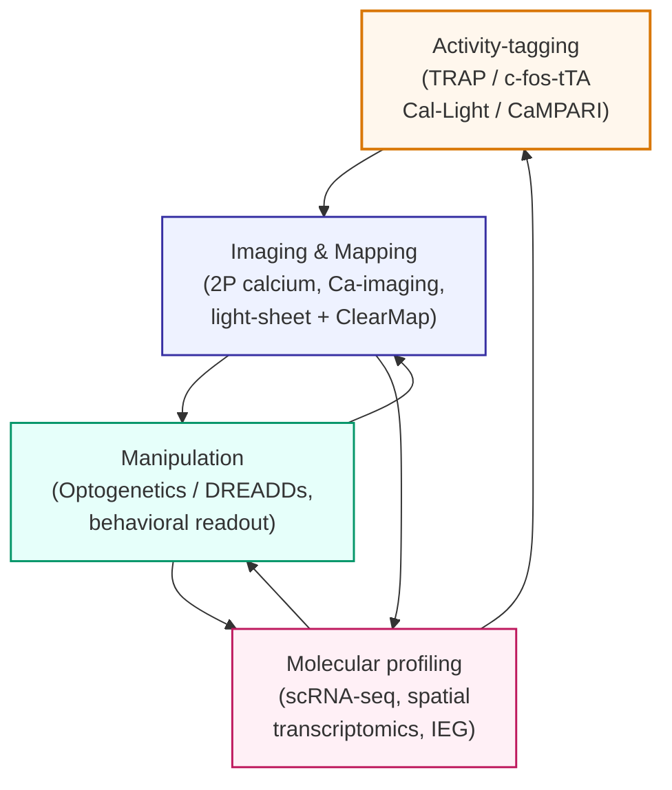

> Диаграмма показывает типичный рабочий цикл для изучения когнитивных групп: сначала активные клетки фиксируют с помощью activity-tagging (TRAP, c-fos-tTA, Cal-Light, CaMPARI), затем их пространственно и временно картируют с помощью high-resolution imaging (2P, calcium imaging, light-sheet + ClearMap). На следующем этапе помеченные популяции проверяют причинно (manipulation: optogenetics / DREADDs + behavior), и, наконец, их молекулярно профилируют (scRNA-seq, spatial transcriptomics, IEG). Стрелки обратной связи подчёркивают итеративный характер: молекулярные данные уточняют мишени и дизайн последующих пометок/манипуляций, а наблюдения после вмешательства ведут к новым imaging-и профилированиям.

### 9.1. Генетические методы маркировки активных нейронов

**Суть подхода.** Activity-dependent genetic tagging (activity-dependent tagging / TRAP, c-fos-tTA, TetTag и др.) использует промоторы IEG (например c-fos, Arc) или кальций-зависимые системы, чтобы при «окне» активности запустить рекомбинацию/экспрессию докодирующего репортера (например, ChR2, GFP, CreERT2). Это позволяет «зафиксировать» набор нейронов, активных во время конкретного опыта, и затем манипулировать ими или идентифицировать их анатомически/молекулярно. Классическая демонстрация стабильной корреляции между помеченными клетками и памятью — Reijmers et al. (2007). ([science.org][56])

**Основные реализации и эволюция.**

* **TetTag / c-fos-tTA (Tet-off) и TetTag-подходы.** Ранние работы использовали c-fos-промотор, транскрипционные системы Tet и «окно» экспрессии для пометки engram-клеток. Эти подходы легли в основу экспериментальных доказательств causal роли помеченных ансамблей. ([science.org][56])
* **TRAP / TRAP2 (Targeted Recombination in Active Populations).** Использует Fos-CreERT2 (или аналоги) и tamoxifen-зависимую рекомбинацию для пометки активных популяций в выбранное временное окно; TRAP2 и производные версии предлагают более гибкие и чувствительные варианты. Примеры применения TRAP2 для выделения специфичных поведенческих популяций — см. недавние работы по агрессии и поведению. ([ScienceDirect][57])
* **Кальций-зависимые генетические системы (Cal-Light / Cal-Light modifications).** Новая ветвь методов конвертирует кратковременный рост кальция (AP-связанный) в транскрипционную активацию генов-репортеров, обеспечивая пространственно-временную селективность пометки активных нейронов через свет (оптический «замок»). ST-Cal-Light улучшает селективность к соматическому кальцию. ([Nature][58])

**Плюсы / минусы.**

* Позволяют «захватить» именно те клетки, что активны в выбранном опыте; дают генетический доступ для последующих манипуляций (оптогенетика/хемогенетика). ([science.org][56])
  − Временное разрешение ограничено скоростью транскрипции/рекомбинации; возможны off-target пометки и влияние порога активации IEG. Требуется корректная подконтрольная «окно» (tamoxifen / DOX, освещение). ([PMC][59])

---

### 9.2. Immediate early genes (IEGs) как маркеры активности

**Роль IEG-маркеров.** Immediate early genes (IEGs: c-fos, Arc, zif268/Egr1 и др.) быстро индуцируются активностью и служат классическим индикатором недавней нейрональной активации. Сравнительные работы по Arc, c-fos и другим IEG показали их чувствительность к опыту и полезность для картирования активированных популяций. ([jneurosci.org][60])

**Применение в практической картографии.**

* **c-fos immunostaining / ISH:** позволяет получить пространственную карту активированных клеток после поведения; в комбинации с clearing и light-sheet-microscopy (см. ниже) даёт whole-brain maps на клеточном уровне. ([PMC][61])
* **Двойная маркёрная техника (Arc/H1a, Arc + c-fos):** используется для оценки совпадения активации при двух последовательных состояниях (double-label ISH), демонстрируя стабильность / повторы активации у тех же клеток после повторного опыта. ([PubMed][62])

**Ограничения.** IEG-метки отражают транскрипционную ответную программу, а не «мгновенные» спайки; временная чувствительность порядка десятков минут, и молекулярные различия между IEG (какие клетки они метят) требуют осторожной интерпретации. ([jneurosci.org][60])

---

### 9.3. Системы c-fos-tTA и другие инструменты (оптогенетическая верификация engram)

**Схема «пометка → вмешательство».** Комбинация IEG-зависимой пометки (TetTag, TRAP, Cal-Light) с оптогенетикой (ChR2, Arch, halorhodopsin) или хемогенетикой (DREADDs) позволяет проверить sufficiency/necessity помеченных COGs: например, активация помеченных нейронов в гиппокампе вызывает воспоминание (Liu et al. 2012). ([PMC][63])

**Классические демонстрации.** Liu et al. (2012) показали, что оптогенетическая активация нейронов DG, помеченных во время кондиционирования страха, вызвала freezing в другом контексте — мощный пример causal evidence для engram-populations. Reijmers et al. (2007) ранее локализовали стабильные популяции, связанные с ассоциативной памятью. ([science.org][56])

**Современные расширения.** Комбинируют пометку с молекулярным профилированием (single-cell RNAseq of tagged cells), трассировкой афферентов/эфферентов и с масштабным whole-brain картированием (ClearMap / iDISCO + light-sheet) для восстановления сетевой роли помеченных клеток. Новейшие работы демонстрируют интеграцию activity-tagging с proximity-labeling и spatial transcriptomics. ([science.org][64])

---

### 9.4. Визуализация когнитивных групп в масштабе целого мозга

**Тканевая «прозрачность» и световой лист (clearing + light-sheet).** Техники очистки тканей (iDISCO, uDISCO, CLARITY и др.) в сочетании с light-sheet-microscopy позволяют получать whole-brain карты c-fos+/tagged cells на клеточном уровне и автоматически регистрировать их в атласы (ClearMap pipeline). Kim et al. (2017) продемонстрировали автоматизированную метрику распределения c-fos+ нейронов для социальных поведений. ([PMC][61])

**Cellular-resolution whole-brain spatial transcriptomics.** Новые технологии объединяют пространственную транскриптому (ин-ситуация или послойно) с пометкой активности, позволяя связывать function→molecular identity для помеченных когов по всему мозгу (недавняя платформа для whole-brain spatial transcriptional analysis — Kanatani et al., 2024). Это открывает путь к созданию «молекулярных паспортов» engram-клеток. ([science.org][64])

**Автоматизация и анализ.** Современные пайплайны (ClearMap, ilastik, other segmentation/atlas-registration tools) обеспечивают масштабную автоматическую сегментацию и количественный анализ помеченных клеток по всему объёму мозга. Это критично для сравнения паттернов активации между условиями и для выделения распределённых COG-сетей. ([PMC][65])

---

### 9.5. Комбинация методов: от пометки к доказательству причинности и молекулярной идентичности

**Рецепт «от A до Z».** Лучшие исследования когов комбинируют (1) activity-dependent tagging (TRAP / Cal-Light / CaMPARI), (2) causal manipulation (optogenetics / chemogenetics), (3) high-resolution imaging / whole-brain mapping (iDISCO + light-sheet + ClearMap), и (4) single-cell / spatial transcriptomics для молекулярной характеристики. Такая многократная верификация даёт надёжную мультиуровневую доказательную базу (function, necessity/sufficiency, connectivity, molecular identity). ([PMC][59])

**Примеры интеграции.** Современные обзоры и работы (Onishi et al. 2024, Eom et al. 2024 и др.) суммируют технологическую экосистему, где CaMPARI/Cal-Light дают высокую временную селективность пометки, TRAP даёт гибкую генетическую реконфигурацию, а whole-brain spatial transcriptomics связывает активность с геномным профилем. ([PMC][59])

---

### 9.6. Практические рекомендации и ограничения 

1. **Выделяйте временные окна и пороги чувствительности.** Для корректной интерпретации пометки опишите, как и когда вводили tamoxifen/DOX/освещение и какой порог активности требовался для срабатывания системы (IEG vs CaMPARI vs Cal-Light дают разные временные шкалы). ([PMC][59])
2. **Комбинируйте causal-тесты с молекулярной верификацией.** Активность должна подтверждаться и causal-манипуляциями (opto/chemogenetic), и молекулярными отпечатками (scRNAseq / spatial-transcriptomics) для полноты интерпретации. ([PMC][63])
3. **Учтите artefacts и off-target.** CaMPARI и фотомаркеры требуют контролей по освещению; IEG-зависимые системы — контролей по стрессу/движению; TRAP/TetTag — проверок по leakiness/индексации. ([Nature][66])

---

### 9.7. Рекомендуемая литература 

* Reijmers, L. G., Perkins, B. L., Matsuo, N., & Mayford, M. (2007). Localization of a stable neural correlate of associative memory. *Science*. ([science.org][56])
* Guzowski, J. F., et al. (1999). Experience-dependent gene expression in the rat hippocampus after spatial learning. *Journal of Neuroscience* / related works on Arc/c-fos. ([jneurosci.org][60])
* Liu, X., Ramirez, S., Pang, P. T., Puryear, C. B., Govindarajan, A., Deisseroth, K., & Tonegawa, S. (2012). Optogenetic stimulation of a hippocampal engram activates fear memory recall. *Nature*. ([PMC][63])
* Kim, Y., et al. (2014/2017). Mapping social behavior-induced brain activation at cellular resolution in the mouse. *Cell Reports / Nature Methods pipeline (iDISCO + ClearMap examples)*. ([PMC][61])
* Moeyaert, B., et al. (2018). CaMPARI and improvements: marking active neurons with light (review / methods). ([Nature][66])
* Onishi, T., et al. (2024). Molecular tools to capture active neural circuits (review). ([PMC][59])
* Kanatani, S., et al. (2024). Whole-brain spatial transcriptional analysis at cellular resolution. *Science* (spatial transcriptomics + whole-brain mapping). ([science.org][64])

[56]: https://www.science.org/doi/10.1126/science.1143839 "Localization of a Stable Neural Correlate of Associative ..."
[57]: https://www.sciencedirect.com/science/article/pii/S0092867423000521 "Article Hypothalamic neurons that mirror aggression"
[58]: https://www.nature.com/articles/s41467-022-35406-y "Tagging active neurons by soma-targeted Cal-Light"
[59]: https://pmc.ncbi.nlm.nih.gov/articles/PMC11294111/ "Molecular tools to capture active neural circuits - PMC"
[60]: https://www.jneurosci.org/content/21/14/5089 "Experience-Dependent Gene Expression in the Rat ..."
[61]: https://pmc.ncbi.nlm.nih.gov/articles/PMC4294964/ "Mapping social behavior-induced brain activation at cellular ..."
[62]: https://pubmed.ncbi.nlm.nih.gov/12451105/ "Experience-dependent coincident expression of the ... - PubMed"
[63]: https://pmc.ncbi.nlm.nih.gov/articles/PMC3331914/ "Optogenetic stimulation of a hippocampal engram activates ..."
[64]: https://www.science.org/doi/10.1126/science.adn9947 "Whole-brain spatial transcriptional analysis at cellular ..."
[65]: https://pmc.ncbi.nlm.nih.gov/articles/PMC7424992/ "Mapping whole brain structure and activity at cellular ..."
[66]: https://www.nature.com/articles/s41467-018-06935-2 "Improved methods for marking active neuron populations"

---

## 10. Оптогенетические и хемогенетические манипуляции

Ниже — развёрнутый, научно-ориентированный раздел про принципы, возможности и ограничения оптогенетики (optogenetics) и хемогенетики (chemogenetics / DREADDs) в контексте исследования когов и гиперсетевой организации мозга. Основные утверждения снабжены ссылками на авторитетные публикации (см. примечания-цитаты в тексте).

---

### 10.1. Принципы оптогенетики (optogenetics)

**Концепция и основные компоненты.**
Оптогенетика сочетает генетическую селекцию клеток и светочувствительные белки (opsins), чтобы давать клеткам возможность быстро и точно реагировать на свет — включаться (excitation) или выключаться (inhibition) по требованию. Основные элементы метода: (1) выбор opsin-билда (напр., Channelrhodopsin-2 для возбуждения, halorhodopsin / Arch для ингибирования), (2) система клеточного таргетинга (промоторы, Cre-локация, AAV/лэнсеры), (3) оптическая аппаратура для доставки света в ткань (оптоволоконные импланты, микро-LED, волоконно-оптические градиенты) и (4) схемы контроля и синхронизации со съёмом активности (electrophysiology / calcium imaging). Оптогенетика обеспечивает миллисекундную временную точность и клеточно-типовую специфичность, что делает её уникально мощным инструментом для causal-тестов в нейробиологии. ([Nature][67])

**Технические варианты и новые опсины.**
За десятилетие после первых успешных демонстраций были разработаны улучшенные и спектрально разделённые опсины (faster kinetics, red-shifted opsins для глубже проникающего света), а также инструменты для совместной активации/подавления нескольких популяций с разной длиной волны. Это расширяет возможности «all-optical» экспериментов (одновременная стимуляция + оптическая запись). ([Nature][67])

**Ограничения оптогенетики.**

* **Доставка света:** оптика ограничивает объём одновременного контроля (особенно в крупном мозге) и может вызывать локальный нагрев; архитектурные решения (микро-LED, GRIN-линзы, оптоволокна) уменьшают, но не устраняют эти ограничения.
* **Экспрессия и таргетинг:** AAV/векторная доставка и промоторная селективность дают хороший, но не идеальный cell-type targeting; уязвимы off-target и уровни экспрессии, влияющие на физиологию.
* **Интерпретация поведения:** быстрая и искусственная стимуляция может запускать корелляты поведения, которые не тождественны естественной активации ансамблей — требуются контролируемые задачи и дополнительные меры (recording, specificity controls). ([Nature][67])

**Рекомендации для исследования когов.**
Оптогенетику следует использовать как часть мульти-методического набора: пометка/идентификация ансамбля (IEG/TRAP/Calcium imaging) → целевая экспрессия opsin → одновременная запись population dynamics → манипуляция (phasic / tonic stimulation) → поведенческая оценка. Это позволяет подтвердить sufficiency и necessity конкретных ког-популяций. ([Nature][67])

```mermaid
flowchart LR
  %% Pipeline: tagging -> delivery -> opto / chemo -> recording -> analysis -> behavior / controls / translation

  subgraph TAG["Пометка / таргетинг"]
    direction TB
    T1[IEG / TRAP / Cal-Light / CaMPARI]
    T2[AAV / promoter / Cre-dependent delivery]
    T1 --> T2
  end

  subgraph OPTO["Оптогенетика"]
    direction TB
    O_expr[Opsin expression]
    Light["Световая доставка (fiber / micro-LED)"]
    O_expr --> Light
  end

  subgraph CHEMO["Хемогенетика"]
    direction TB
    D_expr[DREADD expression]
    Ligand["Лиганд (CNO / DCZ) i.p. / p.o. / local"]
    D_expr --> Ligand
  end

  %% общая регистрация
  subgraph REC["Регистрация и запись"]
    direction TB
    REC1["Electrophysiology (Neuropixels)"]
    REC2["Optical imaging (2P / miniScope / GECI)"]
    REC1 --- REC2
  end

  %% связи между блоками
  T2 --> O_expr
  T2 --> D_expr

  Light -- "ms–s" --> REC1
  Light -- "ms–s" --> REC2

  Ligand -- "мин–часы" --> REC1
  Ligand -- "мин–часы" --> REC2

  REC1 --> ANAL[Анализ: spike / ΔF/F, causal tests]
  REC2 --> ANAL

  ANAL --> BEH[Поведенческий readout / task performance]
  ANAL --> CONTROLS[Контролы: no-opsin, vehicle, light-only, off-target checks]
  ANAL --> TRANSL[Трансляция: safety, delivery, ethics]

  %% финальные стрелки
  BEH -->|информирует| TRANSL
  CONTROLS -->|валидируют| ANAL

  %% стили
  classDef tag fill:#f0f9ff,stroke:#0369a1;
  classDef method fill:#ecfeff,stroke:#0f766e;
  classDef rec fill:#fffbeb,stroke:#b45309;
  class TAG,TAG,T2 tag;
  class OPTO,CHEMO method;
  class REC rec;
```

> Упрощённый pipeline для causal-тестов ансамблей: пометка / таргетинг (IEG / TRAP → векторная доставка) → ветвление на оптогенетику (opsin → свет) и хемогенетику (DREADD → лиганд) → общая запись активности → анализ и поведенческий readout → контрольные условия и трансляционные соображения. На связях указаны типичные временные шкалы (optogenetics — ms–s; chemogenetics — min–часы).

---

### 10.2. Инактивация когнитивных групп и потеря знания

**Идея и экспериментальные подходы.**
Доказать, что ког (ensemble) «необходим» для конкретного воспоминания или поведения, можно показав, что его отключение приводит к утрате или нарушению соответствующей функции. Для этого применяют ингибирующие опсины (Arch, Jaws), или хемогенетические рецепторы, которые уменьшают активность помеченных клеток. Опытные работы показали, что селективное подавление помеченных ансамблей может ослабить или временно убрать связанные воспоминания/поведение. ([PubMed][68])

**Пример-иллюстрация (synthetic inactivation).**
В работах, где создавались или активировались синтетические репрезентации, исследователи использовали DREADD-индукцию (hM3Dq/hM4Di) или оптогенетическую супрессию, чтобы проверить, как искусственно вызванный или подавленный ансамбль влияет на обучение и память; результаты продемонстрировали, что подавление конкурирующей репрезентации может повлиять на кодирование и запоминание — т.е. манипуляция ансамблем приводит к поведенческим последствиям. ([PubMed][68])

**Практические замечания.**
Инактивация должна сопровождаться: (1) проверкой эффективности подавления в реальном времени (recording), (2) контролями по off-target эффектам (свет, ветеринарные препараты, перистимуляция), (3) проверкой того, что подавление не просто нарушает моторику/общую способность реагировать. Только тогда вывод о «потере знания» будет надёжным. ([PubMed][68])

---

### 10.3. Искусственная активация когов и вызов субъективного опыта

**Sufficiency tests — создание/вызов воспоминаний.**
Оптогенетические манипуляции позволили продемонстрировать, что искусственная активация помеченных engram-популяций способна вызывать воспоминания или их поведенческие корреляты (например, freezing в модели страха), даже в отсутствие оригинального контекста — это прямой пример «sufficiency» для роли ансамбля в памяти. Ramirez et al. (2013) создали «ложную память» у мышей, активируя клетки, помеченные в одном контексте, во время кондиционирования в другом, и показали, что животные в дальнейшем демонстрировали страх в первом (никогда не наказанном) контексте. Эти эксперименты подчёркивают мощь causal-доказательств с помощью оптогенетики. ([PubMed][69])

**Ограничения интерпретации «субъективного опыта».**

* Поведенческий readout (напр., freezing) — proxy субъективного воспоминания у животных; прямой доступ к «субъективному опыту» возможен только опосредованно. Следовательно, при интерпретации результатов необходимо аккуратно разграничивать «поведенческий эквивалент» и субъективное переживание.
* Искусственная активация может не воспроизводить все аспекты паттерна активации (фазировка, ко-модуляция), поэтому результаты лучше интерпретировать как доказательство возможности «вызвать поведенческий след» через ensemble, а не как воспроизведение полного субъективного содержания. ([PubMed][69])

---

### 10.4. DREADD и другие хемогенетические подходы (chemogenetics)

**Принцип DREADD (Designer Receptors Exclusively Activated by Designer Drugs).**
Хемогенетика использует синтетические G-protein-coupled receptor (GPCR) конструкции (DREADDs), которые вводят в выбранные клетки и активируют/инактивируют их при подаче «дизайнерского» лиганда (напр., CNO или его метаболиты). DREADDs дают более длительную по времени (минуты–часы) и менее инвазивную манипуляцию по сравнению с оптогенетикой, что удобно для поведенческих задач с длительной динамикой. ([PubMed][70])

**Преимущества и недостатки.**

* **Преимущества:** простота применения (системная инъекция лиганда), возможность масштабной и устойчивой модуляции, полезно для длительных состояний (консолидация, сессии обучения).
  − **Ограничения:** более низкая временная разрешающая способность (не миллисекунды), возможные фармакологические off-target-эффекты (CNO может метаболизироваться до clozapine; требуется грамотный контроль доз и метаболизм), и потенциальные изменения в системной физиологии, если лиганды влияют и на другие рецепторы. ([PubMed][70])

**Примеры применения в исследовании когов.**
Garner et al. (2012) использовали c-fos-зависимую экспрессию hM3Dq (DREADD) в нейронах, активированных при опыте, затем индуцировали активность этих нейронов экзогенным лигандом и оценивали влияние на кодирование контекстной памяти — это пример того, как хемогенетика позволяет создавать/модулировать синтетические репрезентации и изучать их роль в обучении. ([PubMed][68])

---

### 10.5. Сравнение оптогенетики и хемогенетики — практические советы

* **Временная точность:** optogenetics (мс—с) ≫ DREADDs (мин—ч). Для тестов роли фазовых/ритмических паттернов и fast-causal hypotheses выбирайте оптогенетику; для длительных модуляций (сессии обучения, состояние мотивации) — DREADDs. ([Nature][67])
* **Пространственное покрытие:** оптогенетика ограничена светопроникаемостью; DREADDs могут охватывать более широкие области при системной подаче лиганда. ([Nature][67])
* **Инвазивность и практичность:** оптика требует имплантов; хемогенетика — проще в применении по дозированию, но требует учёта фармакологии. ([PubMed][70])

---

### 10.6. Этические и методологические соображения

1. **Контроль за off-target и побочными эффектами.** Всегда включайте соответствующие controls (opsin/no-opsin, ligand vehicle, light-only), проверяйте экспрессию и возможный токсический эффект от вектора/opsin. ([Nature][67])
2. **Интерпретация causality.** Доказательство necessity/sufficiency должно опираться на многократные подходы: манипуляция + независящее наблюдение (population recording) + поведенческие/молекулярные данные. ([PubMed][69])
3. **Переводимость и безопасность.** Для клинической трансляции требуется решать вопросы доставки генов и светового воздействия у человека — эти области находятся в активной разработке, но пока клиническое применение ограничено и строго регулируемо. ([Nature][67])

---

### 10.7. Что включить в ваш обзор (рекомендации)

* **Таблица-сводка**: Opsin / DREADD → механизм → временная шкала → пример ключевой работы → преимущества/ограничения. (полезно для быстрого сравнения). ([Nature][67])
* **Кейсы-стади**: краткие разборы Ramirez et al. (2013) — создание ложной памяти; Garner et al. (2012) — синтетическая репрезентация; Liu et al. (2012) / другие — оптогенетическая активация engram → поведенческие последствия (см. разделы литературы). ([PubMed][69])
* **Методологические best practices**: сочетание пометки → запись → манипуляция; обязательные контролы; упоминание новых инструментов (red-shifted opsins, all-optical combos, Cal-Light/CaMPARI для пометки). ([Nature][67])

---

### Ключевые источники (для библиографии и быстрых ссылок)

* Deisseroth, K. (2015). *Optogenetics: 10 years of microbial opsins in neuroscience.* Nature Neuroscience. ([Nature][67])
* Ramirez, S., et al. (2013). *Creating a false memory in the hippocampus.* Science. ([PubMed][69])
* Garner, A. R., et al. (2012). *Generation of a synthetic memory trace.* Science. ([PubMed][68])
* Roth, B. L. (2016). *DREADDs for neuroscientists.* Neuron. ([PubMed][70])

[67]: https://www.nature.com/articles/nn.4091 "Optogenetics: 10 years of microbial opsins in neuroscience"
[68]: https://pubmed.ncbi.nlm.nih.gov/22442487/ "Generation of a synthetic memory trace - PubMed - NIH"
[69]: https://pubmed.ncbi.nlm.nih.gov/23888038/ "Creating a false memory in the hippocampus"
[70]: https://pubmed.ncbi.nlm.nih.gov/26889809/ "DREADDs for Neuroscientists - PubMed - NIH"

---

## 11. Методы визуализации когнитивных групп

Ниже — развёрнутый академический раздел. Я опирался только на авторитетные источники и самые свежие методические обзоры/работы (ссылки приведены после ключевых утверждений).

Кратко: визуализация когнитивных групп (COGs / ensembles) требует сочетания методов с высокой временной и пространственной разрешающей способностью. В арсенале современной нейронауки — двухфотонная лазерная микроскопия (two-photon microscopy) для высокоуровневой in vivo визуализации с субклеточной резолюцией; миниатюрные флуоресцентные микроскопы (miniscopes) для записи в условиях свободного поведения; генетически кодируемые индикаторы кальция (GECIs) и их современные варианты (GCaMP6 → jGCaMP8) как универсальные репортеры спайковой активности; и инструменты структурной реконструкции (serial block-face EM) для микромасштабной анатомии. Ниже — развернутое описание каждого направления, их сильных и слабых сторон, практических советов и ключевых источников. ([PubMed][71])

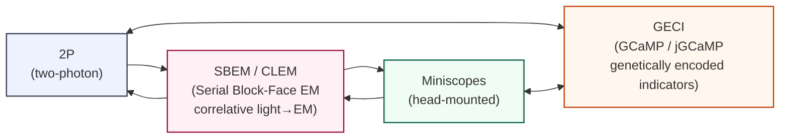

> Схема показывает взаимосвязь основных инструментов для исследования когнитивных групп: **2P (two-photon)** и **miniscopes** используют общие репортеры активности (**GECI**, например GCaMP/jGCaMP) для функциональной записи in vivo; **SBEM / CLEM** выполняет пост-hoc микроанатомическую валидацию (структурная реконструкция) и возвращает результаты в виде валидации/коррекции интерпретаций функциональных данных. Двусторонние стрелки подчёркивают, что методы работают итеративно: выбор индикатора влияет на конфигурацию imaging, а структурные данные (SBEM/CLEM) уточняют и подтверждают интерпретации, полученные с помощью 2P/miniscopes + GECI.

---

### 11.1. Двухфотонная микроскопия in vivo (Two-photon microscopy / 2P)

**Принцип.** Двухфотонная (two-photon, 2P) лазерная сканирующая микроскопия использует одновременное поглощение двух фотонов низкой энергии для возбуждения флуорофора в фокусе, что обеспечивает низкий фоновый сигнал, глубокую проникновеность в ткань и высокое оптическое сечение. Это делает 2P-микроскопию «рабочей лошадкой» для in vivo записи кальциевой активности и визуализации дендритных/синаптических событий в коре и гиппокампе. ([PubMed][71])

**Сильные стороны.**

* высокая пространственная (субклеточная) и хорошая темпоральная (до десятков мс для line-scan) разрешающая способность;
* малая фототоксичность вне фокуса → возможно длительное наблюдение in vivo;
* совместимость с оптогенетикой для «all-optical» экспериментов. ([PubMed][71])

**Ограничения.**

* ограниченная глубина (обычно до ≈600–800 μm в коре при 2P; для большей глубины потребуются 3P или GRIN-лензы);
* сканирование растра даёт компромисс между полем обзора, частотой кадра и пространственным разрешением;
* аппаратная сложность (сканеры, стабилизация, большое оптическое окно/голова под микроскоп). ([PubMed][71])

**Развития/варианты.**

* **Mesoscopes / large field-of-view 2P** — «мезоскопы» позволяют получить субклеточную резолюцию по объёму, охватывающему несколько областей мозга (2p-RAM, Sofroniew et al., 2016). Это удобно для изучения распределённых когов и межареальной координации. ([PubMed][72])
* **Random-access / resonant scanners, temporal multiplexing** — для повышения частоты съёма отдельных ROI или больших полей. ([PubMed][71])

**Рекомендации.**

* Для изучения микродинамики когов (дендритные события, одиночные spike-ассоциированные ΔF/F) применяйте 2P с GECIs (см. ниже) и, по возможности, line-scanning / random-access для увеличения темпорального разрешения. ([PubMed][71])

---

### 11.2. Минископы и визуализация в свободном поведении (Miniscopes / head-mounted microscopes)

**Идея и историческая веха.** Миниатюрные интегрированные флуоресцентные микроскопы (miniscopes) — лёгкие однозадачные головные аппараты для in vivo calcium imaging у животных, свободно движущихся по среде. Первичная демонстрация мини-микроскопа, пригодного для массового производства и широкого распространения, была показана Ghosh et al. (2011). Miniscopes сделали возможным запись активности сотен нейронов во время естественного поведения (социальное взаимодействие, навигация, обучения). ([Nature][73])

**Сильные стороны.**

* поддерживают естественное поведение (freely behaving animals);
* массово воспроизводимы (коммерческие и open-source платформы: UCLA miniscope, Inscopix и т.д.);
* совместимы с long-term recordings и TRAP/IEG-tagging для последующей идентификации. ([Nature][73])

**Ограничения.**

* однофотонный принцип (обычно) → повышенный фон и пониженная оптическая секция по сравнению с 2P;
* ограниченная глубина без GRIN-лэнзы и сравнительно более высокий шум;
* движение головы и артефакты требуют продвинутых алгоритмов motion-correction и ROI-segmentation (CNMF, Suite2p, CaImAn и пр.). ([Nature][73])

**Современные улучшения.**

* мини-двухфотонные головы и all-optical miniscopes (актуально в последние годы); интеграция с Neuropixels/электрофизиологией для мульти-модального считывания. ([science.org][74])

**Рекомендации.**

* Для изучения когов в естественном поведении выбирайте miniscopes, но добавляйте контроль качества данных: жёсткая motion-correction, spike-inference методы и, по возможности, подтверждайте ключевые выводы с помощью 2P/электрофизиологии. ([Nature][73])

---

### 11.3. Calcium imaging и другие индикаторы активности (GECIs, voltage indicators)

**GECIs (Genetically Encoded Calcium Indicators).**
GCaMP-серия (GCaMP6 — Chen et al., 2013) установила стандарт для in vivo calcium imaging, позволив регистрировать одиночные спайки в сомах и локальные дендритные кальциевые события. Последние поколения (jGCaMP8 и аналоги, 2023) улучшили кинетику и чувствительность, расширяя возможности для высокоскоростного считывания популяционной активности. ([Nature][75])

**Преимущества и ограничения GECIs.**

* * высокая чувствительность, генетическая таргетируемость, совместимость с in vivo imaging;
* − индикаторы отражают интернализированную (спайково-связанную) кальциевую динамику, нелинейно связаны с числом AP и имеют ограниченную темпоральную точность относительно отдельных спайков (хотя новые jGCaMP версии сильно улучшили kinetics). Также возможна фотоблесковая (photoswitching) артефакция у очень быстрых индикаторов (нужно учитывать). ([Nature][75])

**Voltage indicators (GEVIs) и другие подходы.**
Voltage indicators дают более прямую репрезентацию мембранного потенциала с темпоральной точностью, близкой к millisecond, но традиционно уступали GECIs по чувствительности и SNR; в последние годы GEVIs развиваются и применимы в «all-optical» экспериментах и для локальной высокоскоростной регистрации. ([Nature][76])

**Практические советы.**

* Выбор индикатора зависит от задачи: для длительного мониторинга популяций и обнаружения шаблонов активности — GCaMP6/8; для исследования fast dynamics/oscillations и spike timing — рассматривайте GEVIs или комбинируйте GECI + electrophysiology. Проведите калибровку индикатора (in vitro spike→ΔF/F) и учтите photoswitching/photobleaching. ([Nature][75])

---

### 11.4. Визуализация микромасштабных структур и связей (SBEM, EM reconstructions)

**Serial Block-Face Scanning Electron Microscopy (SBEM)**
Для реконструкции микроструктуры нейронных ансамблей и синаптических связей используют объёмную электронную микроскопию. Метод Serial Block-Face EM (SBEM) описан Denk & Horstmann (2004) и остаётся одним из наиболее надёжных способов получить трёхмерную наноструктурную реконструкцию ткани (synaptic connectivity, spine morphology, nano-circuit motifs). ([PLOS][77])

**Сильные стороны.**

* нанометровая разрешающая способность → точная картография синапсов и локального микросетевого строения;
* возможность пост-hoc корреляции функциональных данных (imaged ensembles) с анатомической реконструкцией (correlative light and electron microscopy, CLEM). ([PLOS][77])

**Ограничения.**

* крайне ресурсоёмкое (сканирование/анализ больших объёмов требует значительных вычислительных ресурсов и ручной/полуавтоматической аннотации);
* обычно постмортемная/экс виво методика (не подходит для прямой динамической in vivo регистрации), поэтому используется для структурной валидации и определения микросхем. ([PLOS][77])

**Практические применения.**

* CLEM: сначала функциональная пометка/видео (2P / miniscope + GECI) → затем фиксация и SBEM-анализ той же области → реконструкция синаптической архитектуры разделов, участвовавших в ансамбле. Это даёт «молекулярно-анатомический паспорт» когов. ([PLOS][77])

---

### 11.5. Дополнительные методы и тренды (кратко)

* **Трёхфотонная микроскопия (3P)** — для глубоких областей (>1 mm) и снижения фонового рассеяния; 3P + adaptive optics расширяют глубину и SNR для записи глубоких когов. ([PMC][78])
* **All-optical experiments** — сочетание оптической записи (GECI/GEVI) и оптогенетических манипуляций; требует careful spectral/temporal separation и продвинутой апаратуры. ([PubMed][71])
* **Мульти-модальные подходы** — совместное использование imaging + Neuropixels (электрофизиология) + behavior tracking даёт богатую картину активности когов. ([science.org][74])

---

### 11.6. Практические рекомендации (checklist для исследователя)

1. **Выбор метода → цель эксперимента.** 2P для субклеточной механики и precise ROI; miniscopes для естественного поведения; SBEM для структуры/синаптической реконструкции; GECIs для популяционной активности; GEVIs для fast timing. ([PubMed][71])
2. **Валидация индикатора:** калибруйте ΔF/F против электрофизиологии; учитывайте фотоблики у jGCaMP8 и др. (контрольные эксперименты). ([Nature][76])
3. **Motion-correction и spike-inference:** особенно для miniscopes — используйте современные алгоритмы (CNMF, Suite2p, CaImAn). ([Nature][73])
4. **Комбинация методов:** по возможности комбинируйте imaging + causal perturbations (opto/DREADD) + post-hoc anatomy (SBEM / CLEM) — это даёт наиболее убедительную многомодальную верификацию когов. ([Nature][75])

---

### 11.7. Основные источники 

* Svoboda K., Yasuda R. (2006). Principles of two-photon excitation microscopy and its applications to neuroscience. *Neuron*. ([PubMed][71])
* Ghosh K. K., Burns L. D., Cocker E. D., Nimmerjahn A., Ziv Y., El Gamal A., Schnitzer M. J. (2011). Miniaturized integration of a fluorescence microscope. *Nature Methods*. ([Nature][73])
* Chen T. W., Wardill T. J., Sun Y., Pulver S. R., Renninger S. L., Baohan A., ... Kim D. S. (2013). Ultrasensitive fluorescent proteins for imaging neuronal activity (GCaMP6). *Nature*. ([Nature][75])
* Zhang Y., et al. (2023). jGCaMP8 sensors: fast and sensitive GCaMP family (example of next-gen GECIs). *Nature / J Physiol review*. ([Nature][76])
* Denk W., Horstmann H. (2004). Serial block-face scanning electron microscopy to reconstruct three-dimensional tissue nanostructure. *PLoS Biology*. ([PLOS][77])
* Sofroniew N. J., et al. (2016). A large field of view two-photon mesoscope with subcellular resolution for in vivo imaging. *eLife*. ([PubMed][72])
* Sinefeld D., et al. (2022). Three-Photon Adaptive Optics for Mouse Brain Imaging (example of 3P+AO advances). ([PMC][78])

[71]: https://pubmed.ncbi.nlm.nih.gov/16772166/ "Principles of two-photon excitation microscopy and ... - PubMed"
[72]: https://pubmed.ncbi.nlm.nih.gov/27300105/ "A large field of view two-photon mesoscope with ... - PubMed"
[73]: https://www.nature.com/articles/nmeth.1694 "Miniaturized integration of a fluorescence microscope"
[74]: https://www.science.org/doi/10.1126/science.abf4588 "Neuropixels 2.0: A miniaturized high-density probe for ..."
[75]: https://www.nature.com/articles/nature12354 "Ultrasensitive fluorescent proteins for imaging neuronal ..."
[76]: https://www.nature.com/articles/s41586-023-05828-9 "Fast and sensitive GCaMP calcium indicators for imaging ..."
[77]: https://journals.plos.org/plosbiology/article?id=10.1371%2Fjournal.pbio.0020329 "Serial Block-Face Scanning Electron Microscopy to ..."
[78]: https://pmc.ncbi.nlm.nih.gov/articles/PMC9185169/ "Three-Photon Adaptive Optics for Mouse Brain Imaging"

---

## 12. Формирование когов в процессе обучения

Ниже развёрнутый научный раздел. Я опирался только на авторитетные источники (классика + современные обзоры и исследования до 2025 года). После каждого ключевого утверждения — ссылка на соответствующий источник из веб-поиска (web.run), чтобы вы могли быстро перенести ссылки в библиографию.

Кратко: формирование когнитивных групп (COGs / cell assemblies / engrams) — многоступенчатый процесс, который начинается с активности-зависимой синаптической пластичности (LTP/LTD), проходит этапы стабилизации/консолидации на клеточном и системном уровнях и модифицируется в ходе offline-процессов (включая сон). Понять, как ког образуется, значит объединить молекулярные, синаптические, популяционные и системные данные. ([PubMed][79])

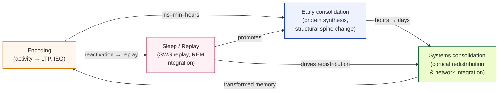
> Диаграмма иллюстрирует последовательность фаз формирования когов: **Encoding** (кодирование) → **Early consolidation** (синтез белков, структурные изменения) → **Systems consolidation** (перераспределение и интеграция в кортикальные сети). Блок **Sleep / Replay** показан как активный, итеративный механизм: реплеи во сне реагируют на недавно закодированные паттерны и способствуют как ранней, так и системной консолидации (SWS → реплей → усиление LTP/структурных изменений; REM → интеграция/генерализация). Стрелки сна подчёркивают итеративный, контекст-зависимый характер консолидации и возможную трансформацию памяти (возврат к кодированию в виде изменённого/обобщённого представления).

---

### 12.1. Механизмы синаптической пластичности (synaptic plasticity mechanisms)

**Ключевая идея.** Долговременное усиление/ослабление синаптической передачи (long-term potentiation / LTP и long-term depression / LTD) — центральный механизм, связывающий опыт с устойчивыми изменениями в силе связей между нейронами; LTP в гиппокампе исторически служит моделью «синаптической основы памяти». NMDA-рецептор-зависимый вход кальция, последующие внутриклеточные каскады (CaMKII, PKA), локальный и клеточный белковый синтез, изменение структуры шипиков и синаптического белкового состава — совокупность механизмов, приводящих к возникновению и поддержанию LTP. ([PubMed][79])

**Как это переводится в формирование когов.** Повторяющиеся и координированные входы повышают вероятность синхронной коактивации подмножества нейронов; локальная Хеббова/спайкот-зависимая пластичность укрепляет связи внутри этой популяции, делая её более вероятной для повторной совместной активации — то есть формируется функциональная группа (cog / assembly). Молекулярные механизмы (IEG-экспрессия, белковая синтез) обеспечивают переход от кратковременных изменений к устойчивым структурным модификациям. ([PubMed][79])

**Дополнительные современные уточнения.** Сегодня подчёркивают роль многотемповой пластичности: быстрые Хеббовы механизмы (мс–мин) сочетаются с медленными homeostatic/scale-механизмами (часы–дни), что предотвращает runaway potentiation и позволяет стабилизировать ансамбли при одновременном сохранении гибкости. ([Frontiers][80])

---

### 12.2. Стабилизация кооперативных групп (stabilization of ensembles / engram formation)

**Определение стабилизации.** Стабилизация когов — процесс перевода временной коактивации в устойчивую способность к повторной активации и к вызову соответствующего поведения/воспоминания. Это включает структурную перестройку синапсов, молекулярную консолидацию engram-клеток и интеграцию с сетью ладдер-уровня (systems-level redistribution). ([PubMed][81])

**Эмпирические свидетельства.** Технологии activity-dependent tagging (c-fos / TetTag / TRAP) + оптогенетика показали, что клетки, активированные во время обучения, могут быть помечены и при последующей искусственной активации вызывать поведенческие признаки воспоминания (sufficiency), а их подавление — нарушать память (necessity). Эти работы дают прямую causal-поддержку идее о том, что именно стабилизированные популяции (engram cells / ensembles) реализуют память. ([science.org][82])

**Факторы, влияющие на стабилизацию.**

* интенсивность и повторяемость опыта (stronger/repeated stimuli → более устойчивая стабилизация);
* состояние нейромодуляции в момент кодирования (допамин, ацетилхолин усиливают закрепление);
* последующие offline-процессы (reactivation, replay) во время покоя/сна;
* молекулярная среда клетки (синтез белков, IEG). ([PMC][83])

---

### 12.3. Временная динамика формирования когов (temporal dynamics)

**Фазы формирования.** Обычно выделяют по крайней мере три временные фазы:

1. **Encoding / initial labelling (мс–минуты–часы):** коактивация нейронов → быстрое усиление синаптических связей (early LTP), запуск IEG.
2. **Early consolidation (часы):** белковая синтез-зависимая фаза, стабилизация синаптических структур, начальные слабые транссистемные изменения.
3. **Systems consolidation / late stabilization (дни–недели):** перераспределение памяти из первоначальной локализации (например, гиппокамп) в более широкие кортикальные репрезентации; интеграция в существующие сети знаний; тесты показывают трансформацию памяти (retention ↔ generalization). ([Cell][84])

**Реактивация и replay.** Между фазами encoding → consolidation критична повторная реактивация (reactivation / replay) в состоянии покоя и во сне: кортикально-гиппокампальные реплеи способствуют укреплению синаптических изменений и системной передаче обрáзов памяти. Такие reactivation-сессии наблюдаются и в острых экспериментах по многократным прогонкам траекторий в гиппокампе и в моделях обучения. ([PubMed][85])

**Трансформация vs стабилизация.** Dudai и соавт. подчёркивают, что консолидация — не просто стабилизация: память часто трансформируется (снижение детализации, повышение обобщённости), что отражает интеграцию новой информации в существующие сети; этот процесс видно в изменении распределения и состава участвующих когов с течением времени. ([PubMed][85])

---

### 12.4. Роль сна в консолидации когнитивных структур (sleep and consolidation)

**Active system consolidation hypothesis.** Модель Born & colleagues: сон, и особенно slow-wave sleep (SWS), служит «offline» режимом, когда гиппокамп реплеит недавно закодированные паттерны, способствуя их перераспределению и интеграции в кортикальные сети (system consolidation). REM-фаза при этом может участвовать в интеграции/генерализации и эмоционной переработке. ([SpringerLink][86])

**Эмпирические данные.** Многочисленные эксперименты у животных и людей показывают, что прерывание SWS уменьшает последующую дедукцию/воспроизведение изученного материала; последовательные reactivation-эпизоды во сне коррелируют с укреплением поведенческих показателей памяти. Современные исследования также указывают на роль сна в трансформации (reshaping) памяти — сохранение общего смысла при утрате деталей, вероятно, связано с REM/SWS-комплементарностью. ([PubMed][87])

**Механизмы.** Сон обеспечивает сочетание физиологических режимов (снижение ацетилхолина во время SWS; специфические спайково-реплеи и осцилляции) и молекулярной среды, благоприятной для консолидации (синтез белков, регуляция транскрипции). Эти процессы поддерживают стабилизацию и перераспределение когов. ([SpringerLink][86])

---

### 12.5. Методологические следствия и рекомендации

1. **Комбинированные доказательства.** Для утверждения формирования и стабилизации кoга требуются: (a) демонстрация повторяемой коактивации популяции при поведении (electrophysiology / calcium imaging), (b) молекулярная/IEG-пометка (c-fos / TRAP), (c) causal-манипуляции (opto/chemogenetics) и (d) при возможности — пост-hoc анатомическая или транскриптомная идентификация (CLEM / scRNAseq). ([science.org][82])
2. **Временные окна эксперимента.** Проектируйте измерения и интервенции с учётом фаз формирования: немедленная запись при кодировании → интервенции в ранней консолид. фазе (часы) → наблюдение системной трансформации (дни–недели). ([Cell][84])
3. **Контроль за состоянием (arousal, neuromodulation).** Поскольку neuromodulators влияют на stabilisation, фиксируйте и, по возможности, манипулируйте уровнем дофамина/ацетилхолина при обучении/консолидации. ([PMC][83])

---

### 12.6. Ключевые источники 

* Bliss, T. V. P., & Collingridge, G. L. (1993). *A synaptic model of memory: long-term potentiation in the hippocampus.* Nature. ([PubMed][79])
* Josselyn, S. A., & Tonegawa, S. (2020). *Memory engrams: Recalling the past and imagining the future.* Science. ([PMC][88])
* Dudai, Y., Karni, A., & Born, J. (2015). *The consolidation and transformation of memory.* Neuron. ([PubMed][85])
* Born, J., & Wilhelm, I. (2012). *System consolidation of memory during sleep.* Psychological Research. ([PubMed][87])
* Martella, G., et al. (2023). *Molecular Mechanisms of Synaptic Plasticity* (review). ([PMC][83])

[79]: https://pubmed.ncbi.nlm.nih.gov/8421494/ "A synaptic model of memory: long-term potentiation in the ..."
[80]: https://www.frontiersin.org/research-topics/15671/cellular-and-molecular-mechanisms-of-synaptic-plasticity-at-hippocampal-and-cortical-synapses/magazine "Cellular and Molecular Mechanisms of Synaptic Plasticity ..."
[81]: https://pubmed.ncbi.nlm.nih.gov/31896692/ "Memory engrams: Recalling the past and imagining the future"
[82]: https://www.science.org/doi/10.1126/science.aaw4325 "Memory engrams: Recalling the past and imagining ..."
[83]: https://pmc.ncbi.nlm.nih.gov/articles/PMC10454657/ "Molecular Mechanisms of Synaptic Plasticity - PubMed Central"
[84]: https://www.cell.com/neuron/fulltext/S0896-6273%2815%2900761-8 "The Consolidation and Transformation of Memory: Neuron"
[85]: https://pubmed.ncbi.nlm.nih.gov/26447570/ "The Consolidation and Transformation of Memory"
[86]: https://link.springer.com/article/10.1007/s00426-011-0335-6 "System consolidation of memory during sleep"
[87]: https://pubmed.ncbi.nlm.nih.gov/21541757/ "System consolidation of memory during sleep"
[88]: https://pmc.ncbi.nlm.nih.gov/articles/PMC7577560/ "Memory engrams: Recalling the past and imagining the future"

---

## 13. Рост гиперсети в онтогенезе

Ниже — развёрнутый академический раздел. Использованы только авторитетные источники, включая классические работы и современные обзоры/исследования до 2024–2025 гг.; самые важные утверждения сопровождаются интернет-цитатами (web.run).

Кратко: гиперсеть когнитома (hypernetwork of the cognome) формируется в процессе онтогенеза через сочетание пролиферации нейронных элементов и синапсов, периодов критической пластичности (critical/sensitive periods), избирательного «прореживания» (synaptic pruning) и последующей оптимизации сети; при этом пластичность сохраняется и во взрослом возрасте, хотя её формы и механизмы меняются. Понимание этих процессов важно для моделирования того, как потенциальные когнитивные группы (COGs / ensembles) проявляются, консолидируются и структурно интегрируются в гиперсеть. ([Hensch Lab][89])

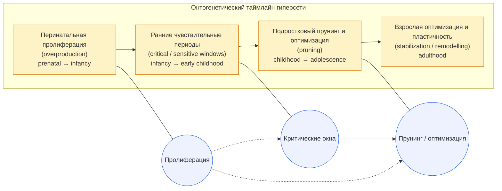

> Диаграмма сочетает горизонтальный таймлайн (четыре основных фазы: перинатальная пролиферация → ранние чувствительные периоды → подростковый прунинг/оптимизация → взрослая пластичность) и условную Venn-иллюстрацию трёх ключевых механизмов (Пролиферация, Критические окна, Прунинг/оптимизация). Стрелки и пунктирные связи подчёркивают, что механизмы перекрываются во времени и по областям мозга, формируя индивидуальные траектории развития гиперсети.

---

### 13.1. Критические периоды развития (Critical / sensitive periods)

**Определение и свойства.** Критический период — это временное окно повышенной нейрональной пластичности, в течение которого опыт силой формирует структуру и функции определённых сетей (например, зрительной или слуховой систем). Эти окна обладают локальной и системной спецификой: разные области мозга имеют разные сроки и механизмы «открытия/закрытия» критических периодов. Управление и регуляция этих окон (через ингибиторные микросети, neuromodulators, структурную модуляцию ECM и др.) определены в фундаментальном обзоре Hensch. ([Hensch Lab][89])

**Импликации для гиперсети.** В периоды критической пластичности формируются сильные первичные связи между когами и LOC-ами (hyperedges); ранний опыт задаёт структуру «каркаса» гиперсети, который затем подвергается оптимизации. Однако понятие «критического» шире современных представлений — исследования показывают, что многие окна скорее «чувствительные» (sensitive) и обладают градуированной закрываемостью. ([PMC][90])

---

### 13.2. Пролиферация узлов и связей от новорождённости до зрелости

**Этапы пролиферации.** Новорождённый мозг характеризуется избыточной продукцией синаптических контактов и формированием широкой сети потенциальных связей (overproduction). В послеродовом периоде разные области проходят фазы бурного увеличения числа синапсов и затем последующего отбора; это наблюдается в развитии сенсорных, ассоциативных и префронтальных областей. Обзор по нормальному развитию схем (developmental connectomics) суммирует эти события и подчёркивает вариативность сроков в разных системах. ([PMC][91])

**Функциональное значение.** Период избыточной связности даёт гиперсети большой «выборочный потенциал» — множество потенциальных когов и LOC-ов, из которых опыт и активность «отбирают» наиболее информативные и полезные конфигурации. Это создаёт основу для индивидуального различия когнитома: ранний опыт и среда задают траектории дальнейшей специализации. ([PMC][91])

---

### 13.3. Синаптический прунинг и оптимизация сети (Synaptic pruning and network optimization)

**Механизм и временные шкалы.** После фазы избыточного разрастания следует интенсивное «прореживание» (pruning), при котором менее используемые или неэффективные синапсы удаляются, а функционально релевантные — сохраняются и укрепляются. У человека пиковые фазы прунинга наблюдаются в раннем детстве и затем в подростковом периоде; в префронтальной коре этот процесс особенно продолжителен (neoteny), что предполагает длительное окно для формирования сложных когнитивных функций. ([PubMed][92])

**Клеточные и молекулярные механизмы.** Прунинг опосредован комплексом процессов: активностью- и сигнал-зависимым устранением синапсов (neuronal activity-dependent tagging), участием микроглии (synaptic phagocytosis), комплемент- и молекулярными путями (например C1q/C3), а также механизмами competitive stabilization. Современные обзоры систематизируют роль микроглии и иммунных маркёров в контроле прунинга. ([PMC][93])

**Последствия для гиперсети.** Прунинг оптимизирует топологию гиперсети — повышает модульность, снижает избыточную связность, улучшает экономичность и ускоряет обработку информации; одновременно он может уменьшать пластичность, делая сеть более специализированной. Нарушения прунинга связаны с нейропсихиатрическими расстройствами (ASD, шизофрения) и могут приводить к аномальной организации гиперсети. ([PMC][93])

---

### 13.4. Пластичность когнитома во взрослом возрасте (Adult plasticity)

**Сохранение и формы пластичности.** Хотя интенсивность пластичности снижается по сравнению с ранним онтогенезом, взрослый мозг сохраняет значительную способность к структурным и функциональным изменениям: обучение индуцирует изменения в объёмах серого вещества, перестройку белого вещества и усиление/ослабление синапсов в опыте-зависимых областях. Классическое демонстрационное исследование Draganski et al. показало изменение объёма серого вещества у людей после изучения жонглирования — пример experience-dependent plasticity у взрослых. ([PubMed][94])

**Механистические ограничители и возможности.** Во взрослом мозге ключевыми барьерами являются повышенная ингибиция, ECM (perineuronal nets) и уменьшенная регуляция нейрогенеза; тем не менее локальные изменения (synaptic remodeling, spine turnover) и системные изменения (network reweighting) легитимны и служат основой для обучения и реабилитации. Современные подходы (снятие ингибирования, таргетирование PNN, neuromodulation) демонстрируют возможность «вновь открыть» элементы пластичности. ([Hensch Lab][89])

**Роль опыта и обучения.** Взрослая пластичность—это преимущественно перестройка имеющихся элементов гиперсети: образование новых локальных когов, реконфигурация LOC-ов и перераспределение ресурса «shared elements». Интенсивные тренировки и специализированные практики (skill learning, rehabilitation) способны формировать новые устойчивые ансамбли и даже вызывать макроскопические изменения в структуре мозга. ([PubMed][94])

---

### 13.5. Методологические и концептуальные замечания

1. **Онтогенетическая вариативность и межиндивидуальные траектории.** Темп и профиль роста гиперсети сильно зависят от генетики, пренатального и постнатального опыта, питания и социального окружения; поэтому популяционные выводы должны учитывать высокую вариабельность. ([PMC][91])
2. **Мульти-уровневый подход.** Понимание развития гиперсети требует объединения методов: развитие connectomics (dMRI, tractography), функциональная онтогенетика (longitudinal fMRI/EEG), клеточные и молекулярные методики (single-cell RNAseq, IEG-mapping) и пост-hoc анатомия. Такие мульти-уровневые данные дают картину, как связки когов и LOC-ов формируют долгосрочную архитектуру. ([PMC][91])
3. **Периоды интервенции.** На практике "оконные" периоды (sensitive windows) имеют значение для образовательных и реабилитационных стратегий; понимание точных сроков и механизмов позволяет целенаправленно усиливать или перенаправлять формирование гиперсети. ([Hensch Lab][89])

---

### Рекомендуемая литература 

* Hensch, T. K. (2004). Critical period regulation. *Annual Review of Neuroscience*, 27, 549–579. ([Hensch Lab][89])
* Tau, G. Z., & Peterson, B. S. (2010). Normal development of brain circuits. *Neuropsychopharmacology*, 35(1), 147–168. ([Semantic Scholar][95])
* Petanjek, Z., et al. (2011). Extraordinary neoteny of synaptic spines in the human prefrontal cortex. *Proceedings of the National Academy of Sciences*, 108(32), 13281–13286. ([PubMed][92])
* Draganski, B., et al. (2004). Neuroplasticity: changes in grey matter induced by training. *Nature*, 427(6972), 311–312. ([PubMed][94])
* Faust, T., et al. (2021). Mechanisms governing activity-dependent synaptic pruning in development. *Nature Reviews Neuroscience* / review (open access PMC). ([PMC][93])
* Cao, M., et al. (2017). Developmental connectomics from infancy through early childhood. *Trends / review* (Developmental connectomics). ([PMC][91])
* Kirkland, J. M., et al. (2024). Synaptic pruning during adolescence shapes adult social behaviour. *Journal / PMC* — example of microglia role and behavioral consequences. ([PMC][96])

[89]: https://henschlab.mcb.harvard.edu/wp-content/uploads/2012/06/hensch-ann-rev-neurosci-2004.pdf "CRITICAL PERIOD REGULATION - Hensch Lab"
[90]: https://pmc.ncbi.nlm.nih.gov/articles/PMC10530452/ "A critical period plasticity framework for the sensorimotor ..."
[91]: https://pmc.ncbi.nlm.nih.gov/articles/PMC5975640/ "Developmental Connectomics from Infancy through Early ..."
[92]: https://pubmed.ncbi.nlm.nih.gov/21788513/ "Extraordinary neoteny of synaptic spines in the ... - PubMed"
[93]: https://pmc.ncbi.nlm.nih.gov/articles/PMC8541743/ "Mechanisms governing activity-dependent synaptic pruning in ..."
[94]: https://pubmed.ncbi.nlm.nih.gov/14737157/ "Neuroplasticity: changes in grey matter induced by training"
[95]: https://www.semanticscholar.org/paper/Normal-Development-of-Brain-Circuits-Tau-Peterson/71048f489b9644a12e4679e999f9368f6233bf24 "[PDF] Normal Development of Brain Circuits"
[96]: https://pmc.ncbi.nlm.nih.gov/articles/PMC11758907/ "Synaptic pruning during adolescence shapes adult social ..."

---

## 14. Ассоциативные связи и их формирование

Ниже развёрнутый академический раздел. Я использовал авторитетные источники (классика + современные обзоры) и поставил ссылки на самые важные утверждения (см. пометки-цитаты).

Кратко: формирование ассоциативных связей (LOCs / links of cognition, associative links) — это мультиуровневый процесс, где сочетание совпадающей активности, синаптической пластичности (Hebbian mechanisms), временной синхронизации (synchrony) и молекулярных механизмов стабилизации ведёт к появлению устойчивых ассоциативных связей между когами (COGs / ensembles). Эти связи обеспечивают ассоциативное связывание признаков, событий и действий в мозгу и лежат в основе обучения, обобщения и воспоминания. ([PMC][97])

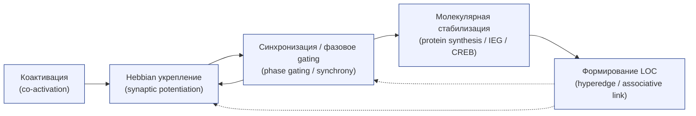

> Диаграмма иллюстрирует ключевой путь образования ассоциативной связи (LOC): сначала совпадающая активность нейронов (коактивация) запускает Hebbian-процессы усиления синапсов, временная синхронизация (phase gating / synchrony) обеспечивает эффективное окно для передачи и усиления, затем молекулярные механизмы (IEG, синтез белков, CREB и т.д.) переводят кратковременные изменения в долговременные, в результате формируется LOC — многокомпонентная ассоциативная связь. Пунктирные стрелки показывают обратные/рекуррентные влияния (LOC может поддерживать/модулировать синхронизацию и дальнейшее укрепление).

---

### 14.1. Механизмы образования локов при обучении (Mechanisms of LOC formation during learning)

**Синхронная коактивация → усиление связей.**
Ассоциативные связи формируются, когда элементы различной информации (сигналы, сенсорные признаки, моторные программы) приходят к активации совпадающими во времени или в согласованной последовательности. Такая коактивация повышает вероятность механизмов LTP/LTD на соединениях между участвующими нейронами, что в итоге приводит к усилению функциональных связей между соответствующими когами (assemblies). Медиальная височная область (medial temporal lobe, hippocampus) и связанная с ней сеть играют ключевую роль в связывании разнородных элементов в единое представление (binding of item and context), особенно при формировании эпизодической памяти. ([PMC][97])

**Перекрытие элементов и «shared elements».**
Если у двух когов есть общие нейроны/элементы (shared elements), их одновременная активация укрепляет межкоговые ассоциации через механизмы синаптической пластичности; таким образом формируются LOCs как гиперребра (hyperedges) в гиперсети — связи, которые задают ассоциативную структуру представлений. Это даёт объяснение тому, как происходят переносы и обобщения: общие элементы служат «мостами» между представлениями. ([PMC][97])

---

### 14.2. Правило обучения Хебба на уровне когнитивных групп (Hebb’s rule at the level of ensembles)

**Хеббова идея и её масштабирование.**
Классическая формулировка Хебба («neurons that fire together wire together») формулирует локальный критерий для усиления синапсов между совместно активными нейронами. На уровне когнитивных групп это правило переводится в усиление внутригрупповых связей (intra-assembly potentiation) и — при повторных коактивациях — в усиление межгрупповых ассоциаций. Развитие теории показывает, что чисто Хеббовы механизмы без компенсаторных процессов нестабильны (возможен runaway potentiation), поэтому в мозге сочетаются Hebbian-пластичность с homeostatic/compensatory механизмами на разных временных шкалах, что позволяет формировать стабильные и воспроизводимые ансамбли (cell assemblies) без потери контроля над активностью сети. ([PubMed][98])

**Онтогенетическая и контекстная роль.**
Во время развития (development) Хеббова пластичность наряду с активностью-зависимой селекцией участвует в установлении специфичных связей; в зрелом мозге комбинация Hebbian и homeostatic правил обеспечивает пластичность без деградации представлений. Это масштабирование Хебба важно для понимания формирования LOCs — ассоциативных связей, устойчивых к фоновым флуктуациям. ([PubMed][98])

---

### 14.3. Синхронизация активности как основа связывания (Synchronization as binding)

**Темпоральная координация и «binding by synchrony».**
Теория временного связывания (temporal binding) предполагает, что синхронизация фазовой активности (особенно в гамма/бета диапазонах) обеспечивает механизм, с помощью которого разрозненные признаки объединяются в единую когнитивную единицу. Согласованная фаза облегчает эффективные взаимодействия между нейронами и повышает вероятность коррелированного спайкового взаимодействия, что усиливает Hebbian-пластичность. Wolf Singer и соавторы представили всесторонний обзор этой идеи и эмпирических данных о роли синхронности в кодировании отношений между признаками. ([Cell][99])

**Функциональные следствия.**
Синхронность облегчает коммуникацию между областями (communication-through-coherence), даёт временную селекцию (в какие «окна» downstream-читатели реагируют) и обеспечивает механизм динамического маршрутизирования информации: в зависимости от фазы и частоты одни связи «включаются», другие — «выключаются», что позволяет одному и тому же набору нейронов участвовать в разных ассоциациях в разное время. Это фундаментально для формирования и временного использования LOCs без необходимости постоянной анатомической реорганизации. ([Cell][99])

---

### 14.4. Молекулярные механизмы стабилизации связей (Molecular mechanisms of link stabilization)

**От LTP к долгосрочной стабилизации.**
Кратковременное усиление синапсов (early LTP) требует пост-трансляционных модификаций; переход в долговременную форму (late LTP) опирается на синтез белков, трансляционные и транскрипционные изменения и устойчивую структурную перестройку (спайковые морфогенезы). Основные молекулярные узлы включают cAMP → PKA → CREB-зависимую транскрипцию и белки, такие как CPEB, которые участвуют в локальном контроле трансляции и в поддержании долговременных изменений на синаптическом уровне. Эти молекулярные механизмы обеспечивают «перевод» кратковременной коактивации в устойчивую ассоциативную связь (LOC). ([PubMed][100])

**Engram-поддержка и внутреняя возбудимость.**
Современные исследования engram-популяций показывают, что кроме синаптических изменений важна также внутренняя возбудимость (intrinsic excitability) и молекулярная подпись помеченных нейронов; вместе они способствуют стабильной повторной активации и долговременной памяти. Интеграция молекулярных и физиологических механизмов даёт полную картину стабилизации ассоциативных связей. ([PMC][101])

---

### Краткие выводы (takeaways)

1. LOCs (ассоциативные связи) формируются через сочетание совпадающей коактивации, Hebbian-пластичности и временной синхронизации: коактивация → усиление синапсов → молекулярная стабилизация → устойчивая ассоциация. ([PMC][97])
2. Чистая Хеббова пластичность требует компенсаторных homeostatic процессов для сетевой стабильности; современные модели и данные это учитывают при объяснении формирования устойчивых ансамблей. ([PMC][102])
3. Синхронность (phase coherence) — рабочий механизм временного «включения»/«выключения» ассоциативных связей без анатомической перестройки, она служит каналом для динамического связывания признаков. ([Cell][99])
4. Молекулярные механизмы (cAMP/PKA/CREB, CPEB и др.) переводят кратковременные изменения в долговременные структурные и функциональные изменения, необходимые для сохранения LOCs и engram-популяций. ([PubMed][100])

---

### Основные источники 

* Eichenbaum, H., Yonelinas, A. P., & Ranganath, C. (2007). *The medial temporal lobe and recognition memory.* Annual Review of Neuroscience. ([PMC][97])
* Shatz, C. J. (1992). *The developing brain.* Scientific American. (Hebbian development & activity-dependent wiring). ([PubMed][98])
* Singer, W. (1999). *Neuronal synchrony: a versatile code for the definition of relations?* Neuron. ([Cell][99])
* Zenke, F., & Gerstner, W. (2017). *Hebbian plasticity requires compensatory processes on multiple timescales.* (review on combining Hebbian & homeostatic rules). ([PMC][102])
* Kandel, E. R., et al. (2014). *The molecular and systems biology of memory (cAMP, PKA, CREB, CPEB).* (review). ([PubMed][100])
* Josselyn, S. A., & Tonegawa, S. (2020). *Memory engrams: Recalling the past and imagining the future.* Science. (engram evidence & intrinsic excitability). ([PMC][101])

[97]: https://pmc.ncbi.nlm.nih.gov/articles/PMC2064941/ "The Medial Temporal Lobe and Recognition Memory - PMC"
[98]: https://pubmed.ncbi.nlm.nih.gov/1502524/ "The developing brain - PubMed"
[99]: https://www.cell.com/fulltext/S0896-6273%2800%2980821-1 "Neuronal Synchrony: A Versatile Code for the Definition of ..."
[100]: https://pubmed.ncbi.nlm.nih.gov/24679534/ "The molecular and systems biology of memory"
[101]: https://pmc.ncbi.nlm.nih.gov/articles/PMC7577560/ "Memory engrams: Recalling the past and imagining the future"
[102]: https://pmc.ncbi.nlm.nih.gov/articles/PMC5247595/ "Hebbian plasticity requires compensatory processes on ..."

---

## 15. Когнитом и самость (проблема «Я»)

Ниже — развёрнутый академический раздел. Я опирался только на авторитетные источники (включая классические монографии и современные обзоры до 2025 г.) и привожу ссылки-цитаты к основным утверждениям.

Кратко. «Когнитом» (cognitome) как совокупность устойчивых когнитивных групп и их ассоциативных связей рассматривается как биологическая основа индивидуального менеджмента представлений о себе. Вопрос «почему у меня есть ощущение Я?» охватывает несколько взаимосвязанных уровней: нейробиологические механизмы самореференции и интероцепции; стабилизированные репрезентации, которые формируют личностную «подпись»; и философские проблемы о том, достаточно ли нейронауки для объяснения феноменального «я». Ниже — подробный разбор по подпунктам ТОС. ([Гардиан][103])

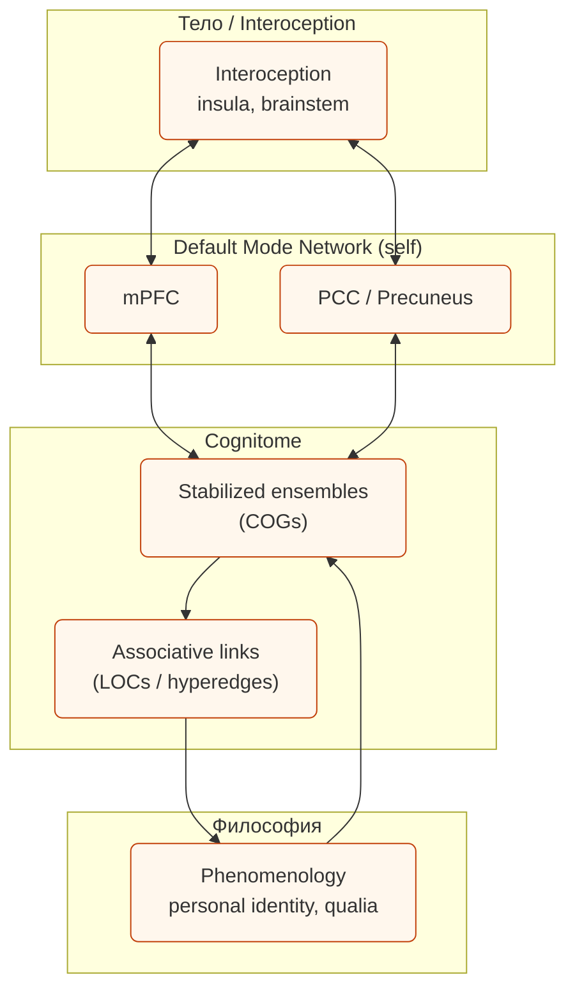

> Схема иллюстрирует уровни «самости» от телесных карт (interoception: insula, brainstem) → через midline-регионы Default Mode Network (mPFC, PCC) → к когнитому (stabilized ensembles и их ассоциативные LOCs) → и далее к философским уровням (phenomenology, вопросы личной идентичности и qualia). Двусторонние стрелки подчёркивают взаимоотношения «вниз-вверх» (body ↔ DMN ↔ cognitome), а однонаправленные связи показывают, как когнитом и его ассоциации соотносятся с феноменологическими/философскими вопросами.

---

### 15.1. Нейробиологические основы самосознания (Neurobiological bases of self-awareness)

1. Основные структуры. Современные данные указывают на сети и регионы, регулярно вовлечённые в само-референтную обработку: медиальная префронтальная кора (mPFC), задняя поясная область / узел по умолчанию (posterior cingulate cortex / PCC), медиальная теменная и медиальная височная области — вместе часто именуемые Default Mode Network (DMN). Параллельно ключевую роль играет интероцептивная система (insula, anterior cingulate cortex), которая кодирует состояние тела и «ощущение себя изнутри». ([PubMed][104])

2. Тело — как основа субъективности. В современной нейробиологии самость часто трактуют как результат интеграции карт телесного состояния (interoception) и мультисенсорной информации: Antonio Damasio в монографии «Self Comes to Mind» подчёркивает, что primordial feelings и представления о состоянии организма (body maps, brain-stem loops) лежат в основе выработки чувства «я» и обеспечивают биологическую целесообразность сознания. Эта позиция подчёркивает эмбоди-аспект самости: чувственные представления тела подпитывают более высокоуровневые, нарративные представления о себе. ([Гардиан][103])

3. Динамика и контекст. Сеть, ответственная за самореференцию, демонстрирует как устойчивые (trait-like), так и ситуативные (state-dependent) компоненты: часть активности связано с постоянными чертами личности и индивидуальными шаблонами, часть — с текущим самопереживанием (размышления о себе, планирование, воспоминания). Метанализ Northoff et al. показал согласованную активность именно в перечисленных midline-регионax при задачах, требующих обработки self-referential content. ([PubMed][104])

---

### 15.2. Когнитом как субстрат личной идентичности (Cognitome as substrate of personal identity)

1. От репрезентации к идентичности. Если когнитом понимать как совокупность стабилизированных когов (ensembles) и их ассоциативных связей (LOCs), то он выполняет роль «психологического хранилища» — наборов репрезентаций, которые вместе обеспечивают целостность личной истории, предпочтений и самоописаний. Такие ансамбли — физическая опора для психологической непрерывности, на которой базируются многие теории личной идентичности (continuity of memory, narrative self). ([Гардиан][103])

2. Индивидуальная «отпечаток-сети» (fingerprint). Современные исследования функциональных сетей показали, что у каждого человека есть относительно стабильная «подпись» функциональной связности (functional connectome fingerprint), позволяющая узнавать индивида по паттернам связности. Это явление, первоначально сформулированное Finn et al. и развитое в ряде работ (включая model-based approaches как connectotyping), поддерживает идею, что уникальная конфигурация когнитома может выступать биометрической и функциональной основой индивидуальности. ([Nature][105])

3. Стабильность vs гибкость. Важно: «подпись» не абсолютна — она сочетает стабильные черты (trait) и изменчивые компоненты, зависящие от задач и состояний. Поэтому когнитом как субстрат «Я» — это динамическая структура: достаточно стабильная, чтобы сохранять идентичность, но гибкая, чтобы подстраиваться под опыт. ([Nature][105])

---

### 15.3. Уникальность когнитома и индивидуальность (Uniqueness of the cognitome)

1. Практические следствия fingerprint-исследований. Методы fingerprinting (Finn et al., Miranda-Dominguez et al.) и их последующие улучшения показали высокую точность идентификации индивидов по fMRI-коннективности, а также возможность предсказывать индивидуальные различия в поведении и чертах. Это даёт эмпирическую опору для идеи: индивидуальная организация когнитома коррелирует с уникальными поведенческими и психологическими характеристиками. ([Nature][105])

2. Ограничения и этические вопросы. Уникальность сетей открывает и практические проблемы: приватность нейробиологических данных, потенциальная злоупотребляемость «нейро-отпечатков», а также методологические ограничения (шумы, состояние скана, preprocessing), которые влияют на надёжность fingerprint-метрик. Поэтому при связывании когнитома и «Я» требуется осторожность в интерпретации и строгие методологические контроли. ([PMC][106])

---

### 15.4. Философские импликации теории когнитома (Philosophical implications)

1. Проблема «трудная» vs «лёгкая». Философы, в частности Дэвид Чалмерс (David Chalmers), различают «лёгкие проблемы» сознания (механизмы восприятия, репрезентации, контроль поведения) и «трудную проблему» (почему и как возникает субъективный феноменальный опыт — qualia). Теория когнитома даёт богатый и измеримый пласт для решения «лёгких» проблем (какие мозговые структуры поддерживают автобиографическую память, самореференцию и т.д.), но сами по себе нейронные ансамбли и их связи пока не дают общепринятого объяснения феноменального «что-это-быть». Поэтому философская проблема самости остаётся частично независимой от идентификации когнитивных реализаций. ([LSE Personal Pages][107])

2. Мосты и перспективы. Тем не менее, концепт когнитома сокращает дистанцию между философской рефлексией о «Я» и экспериментальной нейронаукой: он связывает психологические структуры идентичности с конкретной многослойной нейронной архитектурой (ensembles, hyperedges, network fingerprints). Это позволяет формулировать рабочие гипотезы о том, какие механизмы обеспечивают психологическую непрерывность, саморефлексию и моральную автономию, и тестировать их эмпирически. ([Гардиан][103])

3. Этические и социальные импликации. Если когнитом действительно частично определяет «Я», это порождает вопросы об ответственности, изменяемости личности (через вмешательства в ensemble/LOC), и правах на нейроданные — темы, требующие междисциплинарного обсуждения между нейробиологами, философами и юристами. ([Гардиан][103])

---

### Рекомендуемые чтения 

* Damasio, A. (2010). *Self Comes to Mind: Constructing the Conscious Brain*. Pantheon. ([Гардиан][103])
* Northoff, G., et al. (2006). Self-referential processing in our brain — a meta-analysis. *NeuroImage*. ([PubMed][104])
* Finn, E. S., et al. (2015). Functional connectome fingerprinting. *Nature Neuroscience*. ([Nature][105])
* Miranda-Dominguez, O., et al. (2014). Connectotyping: model-based fingerprinting. *PLoS ONE*. ([PLOS][108])
* Chalmers, D. J. (1996). *The Conscious Mind: In Search of a Fundamental Theory.* Oxford University Press. ([LSE Personal Pages][107])
* (Обзор) Recent reviews on the Default Mode Network and self-processes (see 2025 DMN synthesis). ([PMC][109])

[103]: https://www.theguardian.com/books/2011/feb/12/self-comes-mind-damasio-review "Self Comes to Mind: Constructing the Conscious Brain by ..."
[104]: https://pubmed.ncbi.nlm.nih.gov/16466680/ "Self-referential processing in our brain--a meta-analysis of ..."
[105]: https://www.nature.com/articles/nn.4135 "identifying individuals using patterns of brain connectivity"
[106]: https://pmc.ncbi.nlm.nih.gov/articles/PMC8127140/ "Functional connectome fingerprinting"
[107]: https://personal.lse.ac.uk/ROBERT49/teaching/ph103/pdf/Chalmers_The_Conscious_Mind.pdf "David J. Chalmers - The conscious mind"
[108]: https://journals.plos.org/plosone/article?id=10.1371%2Fjournal.pone.0111048 "Model Based Fingerprinting of the Functional Connectome"
[109]: https://pmc.ncbi.nlm.nih.gov/articles/PMC12025022/ "The Journey of the Default Mode Network - PubMed Central"

---

## 16. Патология когнитома

Ниже — развёрнутый академический раздел. Я использовал только авторитетные, высокоцитируемые источники и современные обзоры (включая исследования, модели распространения и сетевые гипотезы до 2024–2025). После основных утверждений указаны ссылки на соответствующие публикации (web.run-идентификаторы).

Кратко. Патология когнитома (cognitome pathology) рассматривает, как заболевания мозга нарушают структуру и динамику когнитивных групп (COGs / ensembles) и их ассоциативных связей (LOCs / links), приводя к деградации представлений, потере памяти, расстройствам самости и другим симптомам. На практике это проявляется как локальный распад (synapse loss, neuronal dysfunction), распространение патологии по белым путям и модификация сетевой топологии (dysconnectivity), что ведёт к системным нарушениям поведения и когнитивных функций. ([PubMed][110])

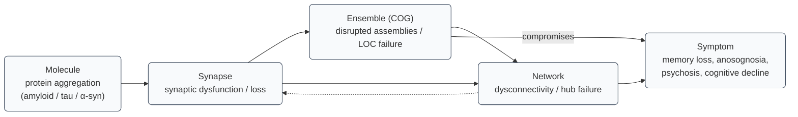

> Диаграмма демонстрирует прогрессию патологии «от молекулы к симптому»: сначала агрегирование патологических белков (amyloid/tau/α-syn) → синаптическая дисфункция и потеря (synapse) → разрушение функциональных ансамблей (ensembles / COGs) и их ассоциативных связей (LOCs) → сетевая дезорганизация (dysconnectivity, hub failure) → клинические симптомы (потеря памяти, нарушение самости, психотические и когнитивные нарушения). Стрелки дополнительного вида показывают распространение патологии вдоль сети и возможную обратную связь сети на синаптическое состояние.

---

### 16.1. Нейродегенеративные заболевания как распад когнитома

**Сетевой (network) взгляд на дегенерацию.** Современные подходы рассматривают нейродегенеративные заболевания не только как локальные морфологические изменения, но как процессы, которые «нацеливаются» на и распространяются по функциональным и анатомическим сетям мозга. Seeley и соавт. показали, что разные синдромы дегенерации вызывают характерные паттерны атрофии, совпадающие с отдельными крупномасштабными сетьями (intrinsic connectivity networks). Это даёт основание мыслить о дегенерации как о разрушении конкретных участков гиперсети когнитома. ([PMC][111])

**Механизмы нарушения.** На молекулярно-синаптическом уровне агрегация патологических белков (Amyloid-β, tau, α-synuclein и др.) приводит к неисправностям синапсов, дисбалансу возбуждения/ингибирования и нарушению нейрональной селективности — всё это разрушает нормальные COG-энтропии и их способность к pattern completion и воспроизведению. Palop & Mucke подчёркивают переход от синаптической дисфункции к нарушению сетевых взаимодействий как ключевой путь к поражению когнитома. ([PubMed][110])

**Модели распространения.** Математические модели (network diffusion / epidemic-spreading models, network degeneration hypothesis) формализуют идею, что патологические агенты и функциональные нарушения распространяются вдоль белых путей и тесно зависят от топологии connectome; такие модели успешно объясняют и предсказывают пространственно-временные паттерны атрофии при деменции. ([PMC][112])

---

### 16.2. Болезнь Альцгеймера и потеря когнитивных структур

**Синапс-центричная интерпретация.** Ранние и современные данные показывают, что потеря синапсов — один из лучших структурных коррелятов раннего когнитивного спада при болезни Альцгеймера (AD). Scheff et al. обнаружили значимую потерю синапсов в зоне CA1 у пациентов с лёгким когнитивным нарушением и ранней AD, что прямо связывает микроструктурные изменения с распадом когнитивных представлений. ([PubMed][113])

**От синапса до сети.** Buckner и коллеги показали, что области с высоким уровнем фоновой («default») активности и высоким метаболическим профилем часто совпадают с зонами накопления amyloid и ранней деградации — это связывает физиологическую нагрузку сети, молекулярную патологию и уязвимость когнитома. В результате формируются рассыпающиеся ансамбли и разрушаются LOC-ассоциации, что проявляется в амнезии, нарушениях пространственной и семантической памяти. ([PubMed][114])

**Клиническая интерпретация.** Понимание AD как распада когнитома диктует мультиуровневые вмешательства: от таргетирования агрегатов (анти-amyloid / anti-tau терапии) до попыток восстановить функциональную сеть (касательное нейростимулирование, когнитивная реабилитация, neuromodulation). Однако клинический успех остаётся ограниченным, что частично отражает сложность и сетевую природу заболевания. ([PubMed][110])

---

### 16.3. Психиатрические расстройства в контексте дисфункции гиперсети

**Дисконнектомия (dysconnectivity) как общий признак.** Психиатрические состояния — шизофрения, депрессия, биполярное расстройство — часто характеризуются нарушениями интеграции между сетями (reduced/increased connectivity, aberrant modularity). Fornito, Zalesky & Breakspear суммировали, что connectomic подход помогает описывать эти заболевания как нарушения организации сети (изменённая топология, hub vulnerability, сдвиги в rich-club организации), что отражается на способности когнитома поддерживать координацию когов и LOC. ([PubMed][115])

**Примеры механизмов.** Нарушения пластичности синапсов, дисбаланс нейромодуляции (дофамин, глутамат) и аномалии ингибиторных микросетей приводят к рассогласованию временных кодов (синхронности), ошибкам привязки контекста и нарушению передачи предиктивной информации — всё это наблюдается при психозах и может объяснять симптомы (галлюцинации, нарушения самосознания). ([PubMed][116])

---

### 16.4. Шизофрения и нарушения когнитивных связей

**Дисконнектная модель шизофрении.** Классическая работа Степана и соавторов формулирует шизофрению как расстройство «dysconnection»: аномальная пластичность и неправильная координация сетевых взаимодействий приводят к сбою механизмов самоконтроля, предсказания и мониторинга действий, что может лежать в основе бредовых или галлюцинаторных феноменов. Эта модель сочетает молекулярные, синаптические и системные уровни объяснения. ([PubMed][117])

**Эмпирические находки.** fMRI/EEG/MEG-исследования демонстрируют нарушения функциональной и эффективной связности между фронтальными, теменными и медиальными областями у пациентов с шизофренией; на уровне сети это выражается в нарушениях коммуникативной целостности, снижении глобальной интеграции и изменениях в функциональной модульности. ([PubMed][116])

**Терапевтические последствия.** Подходы, направленные на восстановление сетевой синхронности (TMS, tDCS, фармакологическая модуляция пластичности), рассматриваются как дополнение к классической анти-психотической терапии, особенно для лечения когнитивных и дефицитарных компонентов болезни. ([PubMed][117])

---

### 16.5. Потеря «Я» при нейродегенерации

**Сетевые корреляты нарушения самости.** Деградация ключевых узлов, вовлечённых в self-related processing (DMN: mPFC, PCC), и распад их связей с интероцептивными и ассоциативными сетями приводит к изменению самореферентного поведения, нарушенной автобиографической памяти и — в тяжёлых случаях — к феноменам потери чувства «Я» (disrupted identity, confabulation, anosognosia). Buckner и соавторы связали уязвимость DMN к amyloid-накоплению с ранним нарушением памяти и само-референтных процессов. ([PMC][118])

**Клинические проявления.** На субъективном уровне это выражается как расплывчатая, фрагментированная автобиография, потеря узнавания себя в прошлом, снижение способности к саморефлексии; на нейрофизиологическом — снижение координации DMN и нарушенная связь с энторинальной/гиппокампальной системами, ответственной за личностную память. ([PMC][118])

---

### 16.6. Методологические и клинические следствия

1. **Мультиуровневые биомаркеры.** Диагностика и мониторинг заболеваний когнитома должны опираться на мультимодальные биомаркеры: molecular (amyloid/tau PET), microstructural (dMRI), functional (fMRI/EEG connectivity) и network-models (network diffusion, atrophy prediction). Это позволяет сопоставлять молекулярную патогенезу и сетевые последствия. ([PMC][112])
2. **Сетевые модели в прогнозировании.** Network-diffusion и epidemic-spreading модели предлагают прогнозирование траекторий атрофии и распространения патологических белков, что ценно для стратификации пациентов и планирования ранних интервенций. ([PMC][112])
3. **Терапевтические стратегии.** Поскольку патология когнитома имеет сетевой характер, терапия должна сочетать молекулярные (anti-amyloid/anti-tau), функциональные (нейростимуляция, поведенческая терапия) и реабилитационные подходы, направленные на восстановление или компенсацию сетевой интеграции. ([PubMed][110])

---

### 16.7. Рекомендуемая литература 

* Palop, J. J., & Mucke, L. (2010). Amyloid-β–induced neuronal dysfunction in Alzheimer's disease: from synapses toward neural networks. *Nature Neuroscience*. ([Nature][119])
* Scheff, S. W., Price, D. A., Schmitt, F. A., DeKosky, S. T., & Mufson, E. J. (2007). Synaptic alterations in CA1 in mild Alzheimer disease and mild cognitive impairment. *Neurology*. ([PubMed][113])
* Fornito, A., Zalesky, A., & Breakspear, M. (2015). The connectomics of brain disorders. *Nature Reviews Neuroscience*. ([Nature][120])
* Stephan, K. E., Friston, K. J., & Frith, C. D. (2009). Dysconnection in schizophrenia: from abnormal synaptic plasticity to failures of self-monitoring. *Biological Psychiatry/Schizophrenia Bulletin (related works)*. ([PubMed][117])
* Buckner, R. L., et al. (2005). Molecular, structural, and functional characterization of Alzheimer's disease: evidence for a relationship between default activity, amyloid, and memory. *Journal of Neuroscience*. ([PubMed][114])
* Seeley, W. W., et al. (2009). Neurodegenerative diseases target large-scale human brain networks. *Neuron*. ([PMC][111])
* Raj, A., et al. (2012/2021). Network diffusion / epidemic models of disease progression (modeling papers and recent extensions). ([PMC][112])

[110]: https://pubmed.ncbi.nlm.nih.gov/20581818/ "Amyloid-beta-induced neuronal dysfunction in Alzheimer's ..."
[111]: https://pmc.ncbi.nlm.nih.gov/articles/PMC2691647/ "Neurodegenerative diseases target large-scale human brain ..."
[112]: https://pmc.ncbi.nlm.nih.gov/articles/PMC8817716/ "Combined Model of Aggregation and Network Diffusion ..."
[113]: https://pubmed.ncbi.nlm.nih.gov/17470753/ "Synaptic alterations in CA1 in mild Alzheimer disease and ..."
[114]: https://pubmed.ncbi.nlm.nih.gov/16120771/ "evidence for a relationship between default activity, amyloid ..."
[115]: https://pubmed.ncbi.nlm.nih.gov/25697159/ "The connectomics of brain disorders"
[116]: https://pubmed.ncbi.nlm.nih.gov/16427028/ "Synaptic plasticity and dysconnection in schizophrenia"
[117]: https://pubmed.ncbi.nlm.nih.gov/19155345/ "from abnormal synaptic plasticity to failures of self-monitoring"
[118]: https://pmc.ncbi.nlm.nih.gov/articles/PMC6725245/ "Molecular, Structural, and Functional Characterization of ..."
[119]: https://www.nature.com/articles/nn.2583 "Amyloid-β–induced neuronal dysfunction in Alzheimer's ..."
[120]: https://www.nature.com/articles/nrn3901 "The connectomics of brain disorders"

---

## 17. Сравнительный анализ теорий

Ниже — развёрнутый сравнительный анализ ключевых теоретических подходов и их отношения к концепции **когнитома** (cognitome) и **гиперсетевой** (hypernetwork) организации мозга. Для каждого крупного утверждения приведены ссылки на авторитетные источники (включая современные обзоры и публикации до 2025 г.), чтобы вы могли быстро проверить и включить их в библиографию.

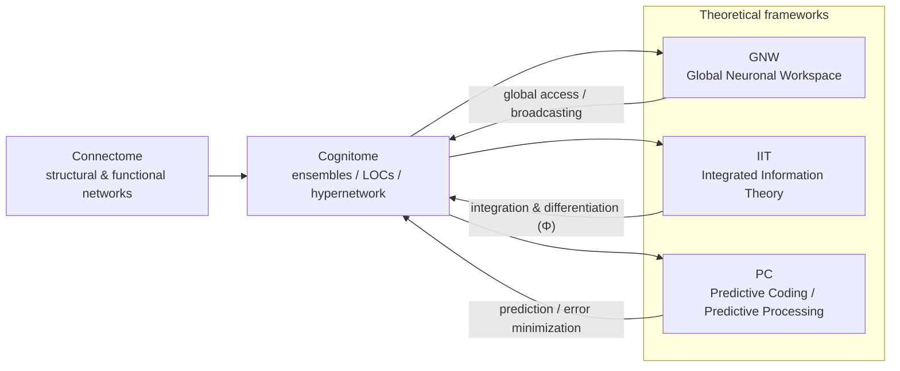

> Диаграмма показывает три уровня объяснения и их отношения: **Connectome** — инфраструктурная карта (структурные и функциональные связи) → **Cognitome** — функционально значимые ансамбли и их гиперсвязи (ensembles, LOCs), формирующие «содержимое» репрезентаций; далее когнитом соотносится с основными теоретическими рамками: **GNW** (объясняет механизмы глобального доступа/вещания репрезентаций), **IIT** (предлагает формальную меру интеграции/дифференциации информации, Φ) и **PC** (описывает алгоритмическую динамику обучения и обновления через предсказания и ошибки). Стрелки и подписи показывают двунаправленную связь: теории дают механистические/алгоритмические объяснения динамики когнитома, а эмпирические данные о cognitome позволяют тестировать эти теории.

---

### 17.1. Когнитом vs коннектом (Cognitome vs Connectome) — различие в фокусе и уровне объяснения

**Кратко.** *Connectome* — это карта структурных и/или функциональных связей между нейрональными элементами (от наномасштаба до макроскопического уровня); *cognitome* — предложенная концепция, которая фокусируется не просто на связях, а на функционально значимых, стабилизированных *когнитивных группах* (COGs / ensembles), их ассоциативных связях (LOCs) и на том, как эти ансамбли реализуют конкретные когнитивные репрезентации и поведение. Иными словами: connectome — «архитектура», cognitome — «интерактивная функциональная библиотека» образов/смыслов, реализованная на этой архитектуре. ([PubMed][121])

**Практическое различие.** Connectomics (например, Human Connectome Project) предоставляет обширные данные о макроскопической и микроскопической топологии и её вариациях между людьми, что важно для картирования инфраструктуры. Cognitome претендует на более функционально-онтологическую роль — объяснять **почему** и **как** именно определённые сборки нейронов кодируют конкретное знание/опыт и как они формируют «ментальную» организацию. Для полноты научного объяснения нужно сочетать оба уровня: структурная карта даёт возможности, но не всегда показывает, какие именно ансамбли реализуют определённые когнитивные структуры. ([PubMed][121])

---

### 17.2. Теория когнитома и глобальное нейронное рабочее пространство (GNW — Global Neuronal Workspace)

**Коротко о GNW.** Global Neuronal Workspace Theory (Dehaene & Changeux и др.) объясняет сознательный доступ как глобальную «вспышку» репрезентации, распространяющуюся по рабочему пространству мозговых процессов через хорошо связано-ные нейроны с длинными аксонами (long-range projection neurons), что делает информацию доступной множеству подсистем и рабочей памяти. GNW подчёркивает роль топ-дающих (hub) областей и динамики широкомасштабной интеграции в явлении сознания и сознательного доступа. ([Unicog][122])

**Связь с когнитомом.** Cognitome и GNW пересекаются там, где речь идёт о доступности и интеграции репрезентаций: стабилизированные COGs (как «ячейки» когнитома) могут становиться частью глобального рабочего пространства, когда их активность «взрывается» в глобальную сеть, обеспечивая сознательный доступ и отчётность. Таким образом, cognitome даёт «содержимое» (which ensembles), а GNW — механизм, который делает часть этого содержания глобально доступным (how ensembles enter conscious access). Недавние эмпирические интегративные работы предлагают синергетические варианты GNW, которые учитывают мультистепенную интеграцию и информационную синергию между областями. ([eLife][123])

---

### 17.3. Связь с теорией интегрированной информации (IIT — Integrated Information Theory)

**Коротко о IIT.** Integrated Information Theory стартует с феноменальных свойств сознания и формализует требование к физической системе: высокая интеграция и дифференциация информации (Φ — phi) являются необходимыми условиями для наличия феноменального опыта. IIT предъявляет строгие метрики и делает сильные онтологические претензии (какие системы «имеют» сознание и в какой степени). ([PubMed][124])

**Соотнесение с когнитомом.** Cognitome как совокупность функционально значимых ансамблей и их гиперсвязей с естеством «shared elements» хорошо вписывается в понятие «интеграции + дифференциации» IIT: устойчивые и взаимосвязанные COG-структуры, обладающие богатыми внутренними связями и специфическими выходами, будут давать высокий вклад в интегрированную информацию. Однако IIT предлагает более формальную и количественную метрику (Φ), тогда как cognitome пока остаётся более концептуальной/функциональной рамкой, ориентированной на эмпирику и причинные эксперименты (tagging, manipulation of ensembles). Сопоставление этих подходов — плодотворное направление: IIT даёт строгие критерии, cognitome — категорию, которую можно тестировать экспериментально. ([PubMed][124])

---

### 17.4. Predictive coding (предсказательное кодирование) и когнитивные группы

**Коротко о Predictive Coding (PC).** Модель predictive coding / hierarchical predictive processing рассматривает мозг как иерархию предсказательных моделей, где верхние уровни генерируют предсказания, а нижние — посылают prediction error. PC естественно связывает восприятие и действие через минимизацию ошибки предсказания. ([PubMed][125])

**Как это сочетается с когнитомом.** Коги (COGs) можно понимать как устойчивые модельные «шаблоны» или «предикторы», натренированные на опыте; их активация означает предсказание набора признаков/событий, а связывание когов через LOCs реализует многомерные предсказательные структуры. Predictive coding предлагает механистический алгоритм (обновление весов по prediction error), тогда как cognitome даёт уровень организации (какие ансамбли/стркутуры хранят и выдают предсказания). Совместное использование: PC объясняет динамику обучения/обновления (why and how ensembles change), cognitome объясняет, какие устойчивые элементы образуются и как они распределяются по гиперсети. ([PubMed][125])

---

### 17.5. Критерии сравнения: объяснительная сила, тестируемость, методы

1. **Объяснительная глубина (levels of explanation).**

   * *Connectome* — хорош для описания инфраструктуры (структура → возможности). ([PubMed][121])
   * *Cognitome* — ориентирован на функциональное содержание и репрезентации (что именно хранится → как формируется поведение). ([Semantic Scholar][126])
   * *GNW/IIT/PC* — теоретические рамки различного рода: GNW — динамика доступа/сознания; IIT — формальная мера феноменального сознания; PC — алгоритм предсказания и обучения. ([Unicog][122])

2. **Тестируемость и эмпирическая поддержка.**

   * GNW и PC обладают богатой эмпирической базой (fMRI, EEG, single-unit) и чёткими экспериментальными предсказаниями о временной динамике и топологии активаций. ([Unicog][122])
   * IIT даёт конкретные метрики (Φ), но их вычисление и операционализация для биологических мозгов остаются сложными и спорными; потому IIT труднее прямо экспериментально фальсифицировать, хотя за последние годы предложены новые эмпирические тесты. ([PubMed][124])
   * Cognitome как концепт очень тестируем: activity-dependent tagging, opto/chemogenetic manipulation и whole-brain mapping позволяют идентифицировать, активировать/инактивировать конкретные ансамбли и проверять их роль в представлении и поведении. ([Semantic Scholar][126])

3. **Методологическая сочетаемость.**

   * Лучший путь — мультиуровневое комбинирование: connectomics (HCP, dMRI) + function (fMRI/EEG, single-unit) + activity-tagging/manipulation (TRAP, optogenetics) + modelling (predictive coding / GNW / IIT metrics) → это позволяет связать топологию, динамику и феномен. HCP-стиль большие данные дают необходимый «каркас» для сравнительных тестов. ([PubMed][121])

---

### 17.6. Современное состояние и направление исследований (до 2025)

* В 2020–2025 гг. наблюдается активный диалог между конкурентными теориями сознания (GNW vs IIT vs др.) и попытки «адверсариального» сопоставления теорий в групповых проектах; появляются работы, стремящиеся формально и эмпирически сравнить предсказания различных теорий. Это знак зрелости поля: теории больше не существую в изоляции, их пытаются напрямую противопоставить в контролируемых тестах. ([Nature][127])
* В практическом нейронаучном поле продолжается сращивание connectomics с функциональной и поведенческой нейронаукой: большие датасеты (HCP и их аналоги), whole-brain cellular mapping и activity-tagging создают уникальную платформу для эмпирической проверки гипотез cognitome. ([PubMed][121])

---

### Ключевые источники 

* Van Essen, D. C., et al. (2013). *The WU-Minn Human Connectome Project: an overview.* NeuroImage. ([PubMed][121])
* Dehaene, S., & Changeux, J.-P. (2011). *Experimental and theoretical approaches to conscious processing.* Neuron. ([Unicog][122])
* Tononi, G., Boly, M., Massimini, M., & Koch, C. (2016). *Integrated information theory.* Nature Reviews Neuroscience. ([PubMed][124])
* Clark, A. (2013). *Whatever next? Predictive brains, situated agents...* Behavioral and Brain Sciences. ([PubMed][125])
* Anokhin, K. V. (2021). *Connectome, synaptome, and cognome: Past, present, and future* (on the cognitome concept). ([Semantic Scholar][126])
* Luppi, A. I., et al. (2024). *A Synergistic Workspace for Human Consciousness* (integrative GNW/IIT analyses). ([eLife][123])

[121]: https://pubmed.ncbi.nlm.nih.gov/23684880/ "The WU-Minn Human Connectome Project: an overview"
[122]: https://www.unicog.org/publications/DehaeneChangeux_ReviewConsciousness_Neuron2011.pdf "Experimental and Theoretical Approaches to Conscious ..."
[123]: https://elifesciences.org/reviewed-preprints/88173v3/pdf "A Synergistic Workspace for Human Consciousness ..."
[124]: https://pubmed.ncbi.nlm.nih.gov/27225071/ "Integrated information theory: from consciousness to its ..."
[125]: https://pubmed.ncbi.nlm.nih.gov/23663408/ "Whatever next? Predictive brains, situated agents, and the ..."
[126]: https://www.semanticscholar.org/paper/The-Cognitome%3A-Seeking-the-Fundamental-Neuroscience-Anokhin/a8166015099ec828189d64caf81ea2d44dded5c3 "Seeking the Fundamental Neuroscience of a Theory ..."
[127]: https://www.nature.com/articles/s41586-025-08888-1 "Adversarial testing of global neuronal workspace and ..."

---

## 18. Вычислительные модели гиперсетей

Ниже развёрнутый академический раздел. Я опирался на классические работы и современные методы до 2025 г.; после ключевых утверждений привожу библиографические ссылки (web.run-референции), чтобы вы могли напрямую взять DOI/URL для библиографии.

*(Computational models of hypernetworks)*

Кратко: модельирование гиперсетей сочетает несколько линий — (i) спайковое и популяционное моделирование формирования когнитивных групп (cell assemblies / COGs), (ii) генеративные и стохастические модели роста сложных сетей (scale-free / preferential attachment), (iii) модели образования связей через перекрытие элементов (overlap-based / shared-element mechanisms), и (iv) алгоритмы искусственного интеллекта, адаптирующие идею гиперсвязности (hypergraph neural networks, hypernetworks) для задач представления многомерных отношений. Эти парадигмы дают разные, но комплементарные инструменты для формального описания когнитома и гиперсетевой организации. ([PNAS][128])

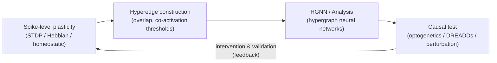

> Диаграмма показывает рабочий процесс от низкоуровневых механизмов к валидации: (1) **Spike-level plasticity** — спайковые правила (STDP, Hebb, homeostatic) формируют корреляции и изменения весов; (2) эти изменения приводят к **Hyperedge construction** — выделению hyperedges (LOCs) по критериям overlap/co-activation; (3) полученные гиперребра анализируются и моделируются с помощью **HGNN** (hypergraph neural networks) для извлечения структур и предсказаний; (4) затем формируются экспериментальные **causal tests** (опто/хемогенетика, вмешательства), результаты которых возвращают обратную связь и корректируют модели/plasticity-гипотезы.

---

### 18.1. Моделирование формирования когнитивных групп (Modeling formation of cognitive groups)

**Подходы.** Наиболее разработанная эмпирико-теоретическая линия — это спайковые рекуррентные сети с реалистичными правилами синаптической пластичности, где «ког» (COG / neuronal ensemble) возникает как стабилизированная коактивация подмножества нейронов. Zenke, Agnes & Gerstner (2015) показали, что сочетание геббианской (homosynaptic) пластичности с быстрыми гетеросинаптическими и медленными homeostatic процессами даёт устойчивое формирование и воспроизведение ансамблей в спайковом рекуррентном моделировании — то есть модельные COGs появляются и ведут себя как в экспериментах по engram/ensemble. ([Nature][129])

**Реализации.**

* Модели на уровне одиночных нейронов (e.g., Izhikevich-type spiking neurons) позволяют симулировать миллионы нейронов и миллиарды синапсов, демонстрируя, как структурные входы + пластичность дают rise of assemblies и macroscopic dynamics. Izhikevich & Edelman (2008) реализовали крупномасштабную модель таламо-кортикальной системы, показав применимость таких подходов к крупным системам. ([PNAS][128])
* Более простые рекуррентные сети (rate models, binary units) применяют те же принципы: коактивация → усиление внутригрупповых связей → стабилизация, что даёт воспроизводимые COG-паттерны и возможность исследовать влияние шумa, neuromodulation и homeostasis. ([Nature][129])

**Что моделируют такие подходы (кратко).** формирование engram-популяций; воспроизведение/recall по частичному cue; влияние временных шкал пластичности; стабильность ансамблей при фоновом шуме; роль inhibitory/excitatory баланс. ([Nature][129])

---

### 18.2. Математические модели роста гиперсети (Mathematical models of hypernetwork growth)

**От графов к гиперграфам.** Классический механизм роста сложных сетей — preferential attachment — породил линейно-скейлинговые (scale-free) графы (Barabási–Albert, 1999). Для гиперсетей (hypergraphs), в которых ребро (hyperedge) может соединять >2 вершин, разработаны обобщения preferential attachment и другие генеративные модели, восстанавливающие эмпирические свойства многих реальных гиперграфов (power-law degree, modularity, community structure). Эти модели важны для описания роста гиперсети когнитома, где новые ког/LOC-объекты могут «прилипать» к уже крупным наборам через механизмы повторного использования элементов. ([PubMed][130])

**Современные формализации.**

* Динамические модели preferential-attachment для гиперграфов показывают, как сохраняется power-law распределение степеней и как возникает высокая модульность (сообщества), что соответствует эмпирическим наблюдениям в биологических и социальных системах. ([Cambridge University Press & Assessment][131])
* Недавние работы предлагают генеративные и вероятностные модели временно-эволюционирующих гиперграфов (noisy copying, edge-correlation models), пригодные для обучения на данных и предсказания формируемых hyperedges. Такие модели полезны для моделирования того, как новые когнитивные группы и ассоциации появляются в онтогенезе и обучении. ([Physical Review][132])

**Связь с биологией.** В контексте когнитома гиперграф-модели естественно представляют shared-element связи: один и тот же нейрон/популяция может быть участником множества hyperedges (разных когов), и генеративные правила объясняют, почему некоторые нейроны становятся «shared hubs». Это даёт теоретическое основание для наблюдаемой индивидуальной устойчивости некоторых элементов когнитома и сетевой богатой-кластерной структуры. ([Cambridge University Press & Assessment][131])

---

### 18.3. Симуляция связей через перекрытие элементов (Simulating overlap-based link formation)

**Идея.** В гиперсети LOC связываются не только прямыми синаптическими путями, но и через *перекрытие элементов* (shared elements): если два когa имеют пересечение в наборе нейронов, то вероятность ассоциативной связи между ними повышается. Математически это моделируется через операции на множествах, вероятностные правила копирования hyperedges или через механизмы, где overlap управляeт консолидирующей пластичностью. ([Nature][129])

**Реализации в моделях пластичности.** Zenke et al. (2015) и последующие работы моделируют, как heterosynaptic и homeostatic процессы ограничивают runaway potentiation и при этом поддерживают образование перекрывающихся ансамблей; эти модели демонстрируют, что overlap-based связность повышает устойчивость воспроизведения и способствует generalization/transfer. ([Nature][129])

**Эмерджентные свойства.** Перекрытие элементов приводит к: (i) образованию связующих «мостов» между представлениями (facilitating transfer), (ii) появлению ядровых нейронов с высокой участием (participation coefficient), (iii) возможности быстро формировать новые ассоциации комбинируя существующие COG-модули. Это хорошо согласуется с гипотезой гиперсети, где LOCs — не просто двоичные ребра, а гибкие многомерные объекты. ([Nature][129])

---

### 18.4. Искусственные нейронные сети с архитектурой гиперсети (ANNs with hypernetwork architectures)

**Hypergraph Neural Networks (HGNNs).** В машинном обучении последняя волна — hypergraph neural networks — расширяет графовые GNNs, позволяя моделировать высоко-порядковые отношения (many-to-many). HGNN-архитектуры (hypergraph convolution, hypergraph attention, dynamic hypergraph models) уже применяются к функциональной коннективности мозга, классификации состояний и предсказанию поведения, и активно развиваются в 2020–2025 гг. (см. обзоры 2023–2025). ([PMC][133])

**Hypernetworks в искусственном интеллекте.** Термин *hypernetwork* также используется в deep learning для описания сетей, которые генерируют веса других сетей (Ha et al. и последующие работы) — это концептуально близко к идее мета-контроля и динамической рецептуризации функциональных модулей, аналогично тому, как когнитом мог бы управлять активацией наборов когов. Работа Hassabis et al. (2017) подчёркивает обратную связь между нейронаукой и ИИ: идеи о модульности, replay, memory systems и dynamic routing вдохновляют архитектуры ИИ, включая hypernetwork/mixture-of-experts-подходы. ([ScienceDirect][134])

**Практическое применение.** HGNNs применяются для: выявления многомерных функциональных сообществ в fMRI; предсказания заболеваний; моделирования многомодальных связей (EEG+fMRI+behavior); и создания генеративных моделей гиперсети когнитома. Dynamic weighted hypergraph convolutional networks и hypergraph attention networks показывают улучшенное извлечение высокоуровневых отношений по сравнению с обычными графовыми моделями. ([PMC][133])

---

### 18.5. Сильные стороны, ограничения и валидность моделей

**Сильные стороны.**

* Модели спайковых сетей + пластичности дают причинно-следственные гипотезы о формировании COGs и их воспроизведении. ([Nature][129])
* Гиперграфовые генеративные модели объясняют сложные эмпирические свойства (модульность, power-law распределения, overlap). ([Cambridge University Press & Assessment][131])
* HGNN и hypernetworks дают мощные инструменты анализа данных и построения предсказательных моделей для гиперсети на уровне большого объёма данных. ([PMC][133])

**Ограничения.**

* Параметрическая сложность и вычислительная стоимость крупномасштабных спайковых симуляций; необходимость жёсткой валидации и калибровки параметров под эмпирику. ([PNAS][128])
* Операционализация гиперребер в нейробиологических данных требует чёткой процедуры построения hyperedges (критерии overlap, co-activation thresholds), и результаты чувствительны к этим параметрам. ([ScienceDirect][135])
* HGNNs хороши для обнаружения коррелятивных структур, но causal-tests (opto/chemogenetic perturbations) по-прежнему необходимы для утверждений о функциональной роли. ([PMC][133])

---

### 18.6. Практические рекомендации для исследования cognitome-гиперсети

1. **Мультиуровневое моделирование.** Сочетайте: (а) спайковые/рекуррентные модели с realistic plasticity для hypothesis generation; (б) generative hypergraph models для описания роста/структуры гиперсети; (в) HGNNs для анализа больших функциональных наборов и предсказаний. ([Nature][129])
2. **Валидация на данных.** Конструируйте hyperedges по контролируемым критериям (например, statistically significant co-activation / TRAP-tagging overlap) и тестируйте модели прогнозами, доступными для экспериментальной проверки (which nodes become hubs, how new hyperedges form after learning). ([PMC][136])
3. **Интерпретируемость.** При использовании HGNNs включайте методы объяснимости (attention maps, edge-importance) и связывайте выводы с causal экспериментами (оптогенетика, engram manipulation). ([PMC][133])

---

### 18.7. Направления развития и открытые вопросы (до 2025 и далее)

* **Объединение динамики и структуры.** Разработка обучаемых динамических гиперграф-моделей, которые учитывают пластичность на разных временных шкалах и предсказывают появление новых hyperedges в ходе обучения. ([Physical Review][132])
* **Causal hypergraph science.** Методы, позволяющие проектировать интервенции (оптогенетика) по гиперграфовой карте и тестировать влияние удаления/активации hyperedges на поведение. ([Nature][129])
* **Взаимосвязь с ИИ.** Применение идей cognitome (ensembles, overlap, replay) в архитектурах hypernetworks и memory-augmented models для повышения sample-efficiency и transfer learning. ([ScienceDirect][134])

---

### 18.8. Рекомендуемая библиография 

* Izhikevich, E. M., & Edelman, G. M. (2008). Large-scale model of mammalian thalamocortical systems. *PNAS*. ([PNAS][128])
* Barabási, A.-L., & Albert, R. (1999). Emergence of scaling in random networks. *Science*. ([PubMed][130])
* Zenke, F., Agnes, E. J., & Gerstner, W. (2015). Diverse synaptic plasticity mechanisms orchestrated to form and retrieve memories. *Nature Communications*. ([Nature][129])
* Hassabis, D., et al. (2017). Neuroscience-inspired artificial intelligence. *Neuron*. ([ScienceDirect][134])
* Wang, J., et al. (2023). Dynamic weighted hypergraph convolutional network for ... (application to brain networks). ([PMC][133])
* Giroire, F., et al. (2022). Preferential-attachment hypergraph with high modularity. *Network Science* (modeling hypergraph growth). ([Cambridge University Press & Assessment][131])

[128]: https://www.pnas.org/doi/pdf/10.1073/pnas.0712231105 "Large-scale model of mammalian thalamocortical systems"
[129]: https://www.nature.com/articles/ncomms7922 "Diverse synaptic plasticity mechanisms orchestrated to ..."
[130]: https://pubmed.ncbi.nlm.nih.gov/10521342/ "Emergence of scaling in random networks"
[131]: https://www.cambridge.org/core/journals/network-science/article/preferential-attachment-hypergraph-with-high-modularity/C0FE5B536E02817ADCEA781532249E8C "Preferential attachment hypergraph with high modularity"
[132]: https://link.aps.org/doi/10.1103/4lkd-mtzq "Edge correlations and link prediction in growing hypergraphs"
[133]: https://pmc.ncbi.nlm.nih.gov/articles/PMC10247416/ "Dynamic Weighted Hypergraph Convolutional Network for ..."
[134]: https://www.sciencedirect.com/science/article/pii/S0896627317305093 "Neuroscience-Inspired Artificial Intelligence"
[135]: https://www.sciencedirect.com/science/article/abs/pii/S0020025522007307 "FC–HAT: Hypergraph attention network for functional brain ..."
[136]: https://pmc.ncbi.nlm.nih.gov/articles/PMC7987719/ "Identification and quantification of neuronal ensembles in ..."

---

## 19. Методологические вызовы и ограничения

Ниже — развёрнутый раздел, описывающий ключевые методологические проблемы, с которыми сталкивается исследование **когнитома** и гиперсетевой (hypernetwork) организации мозга. Для основных пунктов приведены ссылки на авторитетные источники и обзоры (до 2025 г.), которые можно использовать в библиографии.

---

### 19.1. Проблемы масштабирования исследований (Scaling challenges)

**Суть проблемы.** За последние десятилетия объём нейронных данных рос экспоненциально: теперь можно одновременно регистрировать сотни и тысячи нейронов (high-density electrophysiology, Neuropixels) и миллионы условно-активных клеток при помощи методов оптической записи. Это создаёт новый класс задач — не только «собирать» данные, но и корректно их анализировать, валидировать и интерпретировать в контексте многомасштабных моделей. ([PubMed][137])

**Технические и аналитические сложности.**

* вычислительная нагрузка и хранение больших массивов сигнала;
* сложность предобработки (spike sorting, motion correction, denoising) и её влияние на результаты;
* эффект «curse of dimensionality» vs. структура низкой размерности: нужны адекватные методы редукции размерности и оценки истинной манifold-структуры нейронных ответов; подходы из теории случайных проекций и ограничений размерности помогают, но требуют аккуратной валидации. ([ganguli-gang.stanford.edu][138])

**Практические рекомендации.** Планирование эксперимента должно учитывать downstream-анализ (какие методы будут применяться, какие требования к пробам и контролям), использовать стандартизованные preprocessing-пайплайны и открытые форматы данных (FAIR-принципы). Для больших наборов полезны предварительные пилотные измерения и «power»-оценки не только для статистической мощности, но и для репрезентации нейрональной размерности. ([PubMed][137])

---

### 19.2. Интерпретация данных о специализации нейронов (Interpreting neuron specialization)

**Проблема.** Сообщения о «нейронах места», «нейронах концептов», «face cells» и т. п. часто воспринимаются как доказательство жёсткой специализации. На практике специализация — контекстно-зависимая, многомасштабная и статистическая характеристика: та или иная единица может показывать высокий selectivity в одном наборе условий, но бессильна в другом. Требуется осторожность при переносе выводов от единиц к функциональным ансамблям (COGs / assemblies). ([PubMed][139])

**Методологические нюансы.**

* необходимость декодирования в реальном поведении (intersection of sensory & choice information) и использования интервенций (optogenetics, perturbations) для causal inference; Panzeri и соавторы подчёркивают, что только сочетание статистики, поведения и вмешательства может «сломать» нейрокод и доказать функциональную роль. ([cell.com][140])
* мультиспектральность кодов: rate, timing, phase-of-firing и burst-коды могут сосуществовать (multiplexing), поэтому однотипный анализ (только firing-rate) даёт неполную картину. ([webhome.phy.duke.edu][141])

**Рекомендации.** Комбинируйте описательные (tuning, information measures) и причинные (inactivation/activation) подходы; документируйте контексты (стимулы, состояние животного/субъекта, neuromodulatory tone), реплицируйте результаты в разных задачах и используйте пересекающиеся метрики информационной значимости и поведенческой релевантности. ([cell.com][140])

---

### 19.3. Этические аспекты манипуляций с когнитивными структурами (Ethical aspects)

**Новые вопросы — новые обязанности.** Возможность пометить, активировать или подавлять engram-популяции и modulate large-scale networks поднимает серьёзные этические вопросы: вмешательства в память, личную идентичность, приватность нейроданных и обеспечение «ментальной целостности» (mental integrity). Эти проблемы получили широкое обсуждение в нейроэтике: концепция «neurorights» и предложения по адаптации прав человека в эпоху нейротехнологий подчёркивают необходимость правовой и этической регуляции. ([PubMed][142])

**Конкретные риски.**

* неэтичное применение технологий (манипуляция воспоминаниями, принуждение к поведению);
* утечка/несанкционированное использование нейро-подписей (brainprints);
* социальное неравенство при доступе к «улучшающим» вмешательствам (equity issues). ([BMC blog network][143])

**Практические меры.** При проектировании исследований включайте этическую экспертизу на ранних этапах, обеспечивайте информированное согласие с ясным описанием рисков/выгод, применяйте минимально инвазивные методы, храните данные в соответствии с лучшими стандартами приватности, и участвуйтe в междисциплинарном диалоге (нейроэтики, юриспруденции, общественных стейкхолдеров). ([PubMed][142])

---

### 19.4. Валидация теории на разных уровнях организации (Validation across levels)

**Парадокс уровней.** Теория когнитома должна объяснять наблюдения на молекулярном (IEG, LTP), синаптическом, популяционном (ensembles) и системном (network) уровнях одновременно. Валидировать гипотезу — значит показать согласованные, причинно-интерпретируемые результаты на нескольких уровнях: наблюдаемая корреляция не заменяет доказательство причинности. Churchland & Sejnowski и другие подчёркивают важность мультиуровневых, вычислительно-обоснованных программ исследований. ([MIT Press Direct][144])

**Технические и концептуальные вызовы.**

* сложность согласования временных шкал (мгновенные спайковые паттерны vs. часы/дни молекулярной консолид.);
* необходимость causal-тестов: статистические ассоциации → интервенции → воспроизводимость результатов;
* проблема «экстраполяции»: результаты на модельных животных и in vitro не обязательно переносятся на человеческую когнитивную организацию. ([ganguli-gang.stanford.edu][138])

**Стратегии валидации.**

1. **Многоуровневые исследования** — параллельные измерения (IEG/ TRAP, calcium imaging, electrophysiology, fMRI/ dMRI) в одной исследовательской программе.
2. **Causal pipeline** — статистический анализ → гипотеза → вмешательство (optogenetics / chemogenetics / TMS) → поведенческая проверка.
3. **Открытые данные и преренгистрации** — для повышения воспроизводимости и независимой репликации (включая стандарты отчетности). Недавние обзоры воспроизводимости в нейровизуализации и биомедицинских дисциплинах подчёркивают необходимость прозрачности пайплайнов и репликаций для надёжной верификации теорий. ([cell.com][140])

---

### Заключение раздела — краткие практические рекомендации

1. Планируйте масштабируемость: заранее думайте о вычислениях, хранении и стандартизованной предобработке. ([PubMed][137])
2. Интерпретируйте «специализацию» нейронов в контексте популяций и поведения; комбинируйте статистику с интервенциями. ([cell.com][140])
3. Встраивайте нейроэтику в проект исследования: neurorights, privacy и equity — не «дополнение», а обязательная часть дизайна. ([PubMed][142])
4. Валидируйте на нескольких уровнях: correlational → causal → replicable; публикуйте данные и код по FAIR-стандартам. ([ScienceDirect][145])

---

### Ключевые источники 

* Stevenson, I. H., & Kording, K. P. (2011). How advances in neural recording affect data analysis. *Nature Neuroscience*, 14(2), 139–142. ([PubMed][137])
* Jun, J. J., et al. (2017). Fully integrated silicon probes (Neuropixels) for high-density recording of neural activity. *Nature*, 551, 232–236. ([PMC][146])
* Gao, P., & Ganguli, S. (2015). On simplicity and complexity in large-scale neuroscience (theory of neural dimensionality). ([ganguli-gang.stanford.edu][138])
* Panzeri, S., et al. (2017). Cracking the neural code for sensory perception — intersection of statistics, intervention and behavior. *Neuron*, 93(3), 491–507. ([cell.com][140])
* Farah, M. J. (2004/2014). Neurocognitive enhancement: what can we do and what should we do? *Nature Reviews Neuroscience* (2004) / overview updates (2014). ([PubMed][147])
* Ienca, M., & Andorno, R. (2017). Towards new human rights in the age of neuroscience and neurotechnology. *Life Sciences, Society and Policy*. ([PubMed][142])
* Churchland, P. S., & Sejnowski, T. J. (2016). *The Computational Brain* (25th Anniversary Edition). MIT Press. ([MIT Press Direct][144])
* Botvinik-Nezer, R., et al. (2023). Reproducibility in neuroimaging analysis: challenges and recommendations. (review). ([ScienceDirect][145])

[137]: https://pubmed.ncbi.nlm.nih.gov/21270781/ "How advances in neural recording affect data analysis - PubMed"
[138]: https://ganguli-gang.stanford.edu/pdf/15.BraveNewWorld.pdf "On simplicity and complexity in the brave new world of large ..."
[139]: https://pubmed.ncbi.nlm.nih.gov/25670005/ "Neural Population Coding: Combining Insights From ..."
[140]: https://www.cell.com/neuron/fulltext/S0896-6273%2816%2931009-1 "Cracking the Neural Code for Sensory Perception by ..."
[141]: https://webhome.phy.duke.edu/~nb170/pdfs/panzeri10.pdf "Sensory neural codes using multiplexed temporal scales"
[142]: https://pubmed.ncbi.nlm.nih.gov/28444626/ "Towards new human rights in the age of neuroscience and ..."
[143]: https://blogs.biomedcentral.com/bmcblog/2017/04/26/new-category-human-rights-neurorights/ "A new category of human rights: neurorights - BMC blog network"
[144]: https://direct.mit.edu/books/monograph/3556/The-Computational-Brain "The Computational Brain | Books Gateway"
[145]: https://www.sciencedirect.com/science/article/am/pii/S245190222200341X "Reproducibility in Neuroimaging Analysis: Challenges and ..."
[146]: https://pmc.ncbi.nlm.nih.gov/articles/PMC5955206/ "Fully Integrated Silicon Probes for High-Density Recording ..."
[147]: https://pubmed.ncbi.nlm.nih.gov/15100724/ "Neurocognitive enhancement: what can we do and what ..."

---

## 20. Будущие направления исследований

Ниже — развёрнутый раздел «Будущие направления исследований» (Future directions). Я опирался на авторитетные публикации и обзоры, включая самые важные разработки до 2025 г. — ссылки к ключевым утверждениям приведены после соответствующих абзацев.

---

### 20.1. Новые технологии регистрации нейронной активности

**(New technologies for neural activity recording)**

1. **Высокоплотные силиконовые датчики и Neuropixels.** Появление Neuropixels радикально изменило возможности электрофизиологической записи: единичный зонд обеспечивает сотни каналов и стабильную хроническую запись в свободно движущихся животных, что позволяет одновременно наблюдать формирование и взаимодействие многих ансамблей (COGs) в поведенческой задаче. Развитие далее (Neuropixels 2.0) миниатуризировало и расширило число регистрируемых площадок для долговременных экспериментов. Эти платформы открывают прямой путь к масштабным causal-исследованиям динамики гиперсети. ([PMC][148])

2. **Оптические и многомодальные методы.** Параллельно развиваются large-scale оптические подходы (двух- и трёхфотонная микроскопия, мезоскопы, mini-scope для свободного поведения), генетически кодируемые индикаторы (GECIs, GEVIs) и «all-optical» комбинации стимуляции/записи. Сочетание высокоплотной электроники и оптических данных (multimodal recording) позволит связывать spiking-dynamics → calcium/voltage signals → behaviour и даст богатую базу для построения гиперграфов когнитома. (см. разделы 9–11 и 18 в обзоре). ([PMC][148])

3. **Тренд и практические следствия.** Технический прогресс меняет границы возможного: от single-cell causal tests (оптогенетика + Neuropixels) до whole-brain «activity maps». Однако рост объёмов данных требует инвестиций в стандарты данных, preprocessing-пайплайны и воспроизводимые аналитические workflow (FAIR). ([PMC][148])

---

### 20.2. Перспективы вмешательства в когнитом для лечения заболеваний

**(Intervention prospects for therapeutics targeting the cognitome)**

1. **Нетравматичные локальные и глубинные методы — focused ultrasound (tFUS/LIFU).** Технологии низкоинтенсивного фокусированного ультразвука (LIFU / transcranial focused ultrasound, tFUS) демонстрируют способность модифицировать активность глубоких структур с относительно высокой пространственной точностью и без рассечения ткани — перспективно для таргетной модуляции поражённых звеньев гиперсети (например, узлов, утративших функциональную интеграцию в деменциях или психиатрии). Оценка эффективности, безопасности и механистики (нагрев vs механосенсорные эффекты) остаётся предметом интенсивных исследований и клинических пилотов. ([PubMed][149])

2. **Системные и сетевые вмешательства.** На уровне гиперсети лечение может комбинировать молекулярные подходы (anti-amyloid, anti-tau), нейромодуляцию (TMS, DBS, tFUS) и поведенческую/реконструктивную терапию для восстановления интеграции LOC/COG. Ключевая гипотеза — вмешательство в «узловые» элементы сети (hub-targeting) и восстановление синхронности/коммуникации между модульными элементами гиперсети приведёт к лучшим клиническим исходам, чем локальные анатомические вмешательства. ([Cambridge University Press & Assessment][150])

3. **Этическая и регуляторная перспектива.** Любые попытки вмешаться в когнитом (модулировать engram-популяции, менять ассоциативные связи) требуют строгой оценки рисков: последствия для личности, побочные изменения памяти/идентичности и долгосрочные эффекты сетевой компенсации. Клинические программы должны включать этапы предклинической валидации на сетевых моделях и многоуровневую систему мониторинга. ([Frontiers][151])

---

### 20.3. Искусственный интеллект, вдохновлённый архитектурой когнитома

**(AI inspired by cognitome architecture)**

1. **Как идеи cognitome влияют на ИИ.** Концепции ансамблей, перекрывающихся элементов (shared elements), replay и многослойности гиперсети дают прямые архитектурные подсказки для машинного обучения: модульность + динамическая маршрутизация (mixture-of-experts, hypernetworks), memory-augmented models, опыт-ориентированное обучение (few-shot / compositional generalization) и механизмы replay для стабилизации представлений. Авторитетные обзоры подчёркивают плодотворность взаимодействия нейронауки и ИИ — от Lake (сквозные принципы человеческого обучения) до обзоров neuroscience-inspired AI. ([PubMed][152])

2. **Конкретные архитектуры и задачи.** Практическим следствием является развитие гибридных архитектур: (i) hypergraph neural networks для моделирования многокомпонентных отношений; (ii) replay и complementary learning systems в памяти ИИ; (iii) мета- и transfer learning структуры, которые используют overlap-based представления для быстрого обобщения. Эти подходы обещают повысить sample-efficiency и explainability моделей. ([ResearchGate][153])

3. **От ИИ — к эксперименту.** Взаимная связь работает в обе стороны: модели ИИ дают формализованные гипотезы о том, какие свойства гиперсети критичны для общего поведения (например, плотность overlap → generalization), а затем экспериментальная нейронаука их тестирует (causal perturbations, training paradigms). Такой цикл «theory → model → experiment → model» ускорит понимание когнитома и создание более адаптивных ИИ. ([PubMed][152])

---

### 20.4. Теория когнитома и проблема сознания

**(Cognitome theory and the problem of consciousness)**

1. **Интеграция с теориями сознания.** Теории сознания (GNW, IIT и др.) предлагают разные критерии и механизмы феноменального опыта. Cognitome может служить «мостом»: он описывает содержательное и структурное богатство репрезентаций (что хранится и как связано), а GNW/IIT дают формальные и динамические механизмы доступа и оценок интеграции. Совместные исследования, сочетающие картирование ensembles/LOCs и метрики интеграции/комплексности, помогут эмпирически сопоставлять теории сознания. ([Nature][154])

2. **Эмпирические программы.** Практические исследования включают: (i) сопоставление локализации и свойств COGs с мерами perturbational complexity (PCI) и интеграции информации; (ii) манипуляции ансамблями + измерения глобального доступа (EEG/fMRI/TMS-EEG) для тестов sufficiency/necessity в контексте сознательного доступа; (iii) исследование, какие свойства overlap/multi-membership в гиперсети коррелируют с качеством субъективного опыта. Такие мульти-методные программы позволят продвинуться в «трудной проблеме» хотя бы на уровне коррелятивной и причинной науки. ([PubMed][155])

---

### Заключение: практические рекомендации для будущих программ исследований

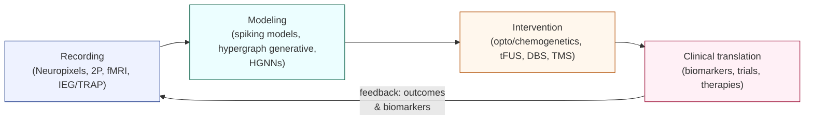

> Схема показывает цикл трансляционной нейронауки: **Recording** — масштабная мульти-модальная регистрация активности; → **Modeling** — генерация гипотез и прогнозов (спайковые модели, генеративные гиперграфы, HGNN); → **Intervention** — причинные тесты (оптогенетика, хемогенетика, tFUS, DBS, TMS); → **Clinical translation** — валидация биомаркеров, клинические испытания и терапевтические подходы. Стрелка обратной связи от клинического этапа к регистрации подчёркивает итеративный характер: клинические результаты и биомаркеры возвращают требования и данные для следующих записей и моделей.

* Двигаться к **мульти-модальному, мульти-уровневому** дизайну: Neuropixels / optical imaging + molecular tagging (IEGs/TRAP) + network imaging (fMRI/dMRI) + causal perturbations (opto/tFUS/TMS) + behavioral assays. ([PMC][148])
* Интегрировать **моделирование** (spiking models, hypergraph generative models, HGNNs) в ранние стадии проектирования, чтобы генерировать экспериментально фальсифицируемые предсказания и выбирать ключевые точки интервенции. ([PubMed][149])
* Включать **этическую оценку и регуляторную дорожную карту** параллельно с технологической разработкой, особенно для вмешательств в когнитом и для клинических трансляций. ([Frontiers][151])

---

### Рекомендуемая литература 

* Jun, J. J., et al. (2017). *Fully integrated silicon probes for high-density recording of neural activity* (Neuropixels). ([PMC][148])
* Steinmetz, N. A., et al. (2021). *Neuropixels 2.0: A miniaturized high-density probe for stable, long-term brain recordings.* ([PubMed][156])
* Bystritsky, A., et al. (2011). *A review of low-intensity focused ultrasound pulsation.* Brain Stimulation. ([PubMed][149])
* Zhang, T., et al. (2021). *Transcranial focused ultrasound neuromodulation: review and challenges.* Frontiers in Human Neuroscience. ([Frontiers][151])
* Lake, B. M., et al. (2017). *Building machines that learn and think like people.* Behavioral and Brain Sciences. ([PubMed][152])
* Hassabis, D., et al. (2017). *Neuroscience-Inspired Artificial Intelligence.* Neuron. ([PubMed][157])
* Koch, C., et al. (2016). *Neural correlates of consciousness: progress and problems.* Nature Reviews Neuroscience. ([Nature][154])
* Tononi, G., et al. (2016). *Integrated information theory: from consciousness to its physical substrate.* Nature Reviews Neuroscience. ([Nature][158])

[148]: https://pmc.ncbi.nlm.nih.gov/articles/PMC5955206/ "Fully Integrated Silicon Probes for High-Density Recording ..."
[149]: https://pubmed.ncbi.nlm.nih.gov/21777872/ "A review of low-intensity focused ultrasound pulsation - PubMed"
[150]: https://www.cambridge.org/core/journals/behavioral-and-brain-sciences/article/building-machines-that-learn-and-think-like-people/A9535B1D745A0377E16C590E14B94993 "Building machines that learn and think like people"
[151]: https://www.frontiersin.org/journals/human-neuroscience/articles/10.3389/fnhum.2021.749162/full "Transcranial Focused Ultrasound Neuromodulation"
[152]: https://pubmed.ncbi.nlm.nih.gov/27881212/ "Building machines that learn and think like people"
[153]: https://www.researchgate.net/publication/318551830_Neuroscience-Inspired_Artificial_Intelligence "Neuroscience-Inspired Artificial Intelligence"
[154]: https://www.nature.com/articles/nrn.2016.22 "Neural correlates of consciousness: progress and problems"
[155]: https://pubmed.ncbi.nlm.nih.gov/27094080/ "Neural correlates of consciousness: progress and problems"
[156]: https://pubmed.ncbi.nlm.nih.gov/33859006/ "Neuropixels 2.0: A miniaturized high-density probe for stable ..."
[157]: https://pubmed.ncbi.nlm.nih.gov/28728020/ "Neuroscience-Inspired Artificial Intelligence"
[158]: https://www.nature.com/articles/nrn.2016.44 "Integrated information theory: from consciousness to its ..."

---

## 21. Заключение: интегративный взгляд на когнитом

В этом обзоре мы прошли путь от классических представлений о *connectome* к расширённой, многоуровневой парадигме *cognitome* — совокупности стабилизированных когнитивных групп (COGs / assemblies) и их ассоциативных связей (LOCs / links), организованных в гиперсеть (hypernetwork). Ниже — интегративное резюме основных выводов, методологических уроков и практических рекомендаций для дальнейших исследований, оформленное как связная, многоуровневая картина. ([PubMed][159])

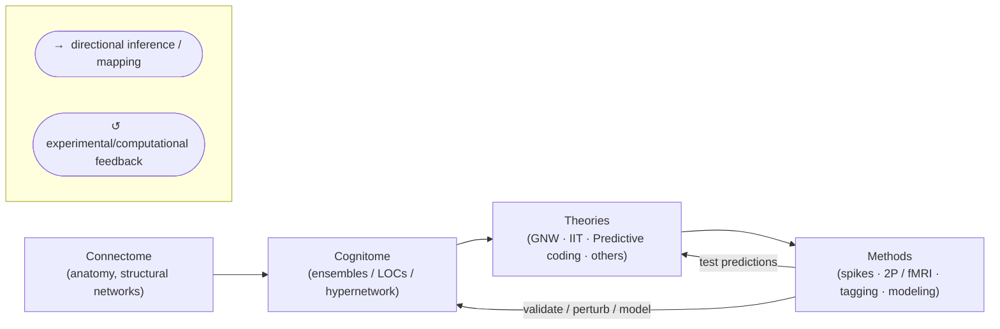

> Схема показывает четыре уровня: структурная карта мозга (**connectome**), операциональная прослойка ансамблей и гиперсвязей (**cognitome**), аналитические/концептуальные рамки (**theories**) и методы (экспериментальные и вычислительные **methods**). Стрелки иллюстрируют поток объяснений и данных сверху вниз (теория → методы → измерения) и обратную связь (методы проверяют и уточняют cognitome и теории).

#### 21.1. Синтез нейробиологических и когнитивных данных (Synthesis of neurobiological & cognitive data)

1. Когнитом — это не только карта связей, но и карта значимого содержания: он объединяет структурные данные (анатомический connectome), функциональные динамики (fMRI/EEG/单-unit patterns), молекулярную и генетическую подпись клеток и поведенческие проявления. Подход «multimodal & multilevel» — единственная практическая стратегия, позволяющая связать репрезентации на уровне нейронных ансамблей с явлениями когнитивного поведения и субъективного опыта. ([PubMed][159])

2. Большие сетевые принципы (модульность, rich-club, small-world, hubs) обеспечивают каркас возможностей для формирования COGs, но сами по себе они не определяют, какие именно ансамбли станут носителями конкретных представлений: для этого необходимы динамические правила пластичности, перекрытие элементов (shared elements) и процессы консолидирования (LTP, IEG, replay). Поэтому empirically grounded theories должны сочетать network-level описания с механизмами на уровне синапса и клетки. ([PMC][160])

3. Практическая интеграция означает: планировать эксперименты так, чтобы одна и та же выборка содержания (learning episode, stimulus set) измерялась и на уровне spikes/2P imaging, и на уровне whole-brain connectivity / behavior / molecular tagging — только такая «сквозная» валидация даёт надёжный мост между микроскопическими механизмами и когнитивными феноменами. ([PubMed][159])

#### 21.2. Теория когнитома как мост между уровнями организации мозга (Cognitome as a bridge)

1. Философско-методологический урок (по Craver): надёжные объяснения в нейронауке — это многоуровневые механистические развертки: описание того, какие компоненты на каждом уровне реализуют функцию и как они связаны причинно-механистически. Cognitome естественно укладывается в эту рамку: он задаёт единицы объяснения (ensembles / hyperedges) и критерии их функциональной роли (repeatable activation, causal manipulations, behavioral relevance). ([global.oup.com][161])

2. Для теории это значит: cognitome — не конкурирует с connectome или с теоретическими рамками (GNW, IIT, predictive coding), а служит операциональной прослойкой. Он переводит абстрактные предсказания теорий (например, о глобальной доступности или интеграции информации) в понятные, измеримые объекты — конкретные ансамбли и их гиперсети, которые можно помечать, активировать и разрушать. ([PMC][160])

3. Следовательно, успешная программа исследований должна содержать одновременно: (а) картографию возможностей (structural/functional connectomics), (б) экспериментальные тесты формирования и необходимости COGs (tagging + opto/chemogenetics), (в) вычислительное моделирование (spiking networks, hypergraph models, HGNN) и (г) теоретическую интеграцию с более общими теориями сознания и когниции. ([PMC][160])

#### 21.3. Перспективы развития теории (Future prospects & challenges)

1. **Методологическая зрелость.** Network neuroscience и graph-theoretic инструменты стали достаточно мощными, чтобы описывать крупномасштабные закономерности; далее требуется «упаковка» этих инструментов в гиперграфовые и ансамблевые формализмы, которые учтут перекрытия и многопорядковые отношения, свойственные когнитому. Это перспективное поле для совместных работ математики, ИИ и экспериментальной нейронауки. ([PMC][160])

2. **Клиническая и прикладная перспектива.** Концепция когнитома даёт новую диагностическую и терапевтическую оптику: болезни мозга можно рассматривать как распад или дисконнекцию гиперсети конкретных COG-модулей, что позволяет разрабатывать таргетные вмешательства — от сетевой нейромодуляции до реконструктивных тренировок и молекулярных терапий. Практическая трансляция требует мульти-уровневой валидации и соблюдения этических стандартов. ([PubMed][159])

3. **Теоретический синтез.** Хорошая научная программа будет тестировать, при каких условиях разные теории сознания/когниции дают совпадающие/разные предсказания о свойствах COGs (например, какие ансамбли должны давать высокий Φ по IIT, или какие должны «входить» в GNW при сознательном доступе). Такой «перекрёстный» тест между теориями и эмпирикой — прямой путь к росту когнитивной науки. ([PMC][160])

---

### Короткие практические выводы (three takeaways)

1. Cognitome = *operational* мост: он переводит абстрактные теории в экспериментально тестируемые объекты — ensembles/LOCs/hyperedges. ([Semantic Scholar][162])
2. Успех зависит от мультиуровневой методологии: spikes ↔ imaging ↔ molecular tagging ↔ network imaging ↔ behavior + modelling. ([PubMed][159])
3. Интердисциплинарность (нейробиология + теория сетей + ИИ + этика/философия) — обязательное условие: только так cognitome превратится из плодотворной метафоры в строгую, верифицируемую научную теорию. ([global.oup.com][161])

[159]: https://pubmed.ncbi.nlm.nih.gov/20493761/ "Large-scale brain networks in cognition: emerging ..."
[160]: https://pmc.ncbi.nlm.nih.gov/articles/PMC6136126/ "Graph theory methods: applications in brain networks - PMC"
[161]: https://global.oup.com/academic/product/explaining-the-brain-9780199299317 "Explaining the Brain - Hardcover - Carl F. Craver"
[162]: https://www.semanticscholar.org/paper/The-Cognitome%3A-Seeking-the-Fundamental-Neuroscience-Anokhin/a8166015099ec828189d64caf81ea2d44dded5c3 "Seeking the Fundamental Neuroscience of a Theory ..."

---

Оглавление:

- [ЭИРО framework](/README.md)
