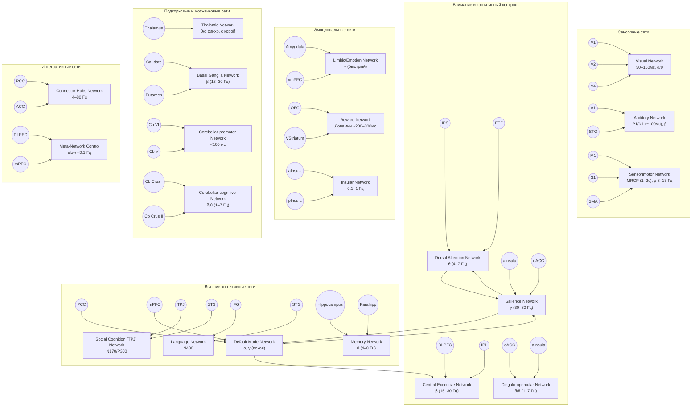

# Схема функциональных сетей мозга (по GINNA-33)

## Анализ сетей мозга в контексте аттракторной динамики: академическая интерпретация атласа GINNA-33

### Введение

Концепция аттракторной динамики представляет собой фундаментальную теоретическую основу для понимания функционирования мозга как сложной динамической системы (Hopfield, 1982; Freeman, 1987). В контексте нейронаук, аттракторы описывают устойчивые состояния активности нейронных сетей, к которым система стремится независимо от начальных условий (Amit, 1989). Современные данные нейровизуализации, систематизированные в атласе GINNA-33, предоставляют уникальную возможность для интерпретации крупномасштабных сетей мозга через призму аттракторной динамики.

### Теоретические основы аттракторной динамики в нейронных сетях

#### Фундаментальные принципы

Аттракторная динамика в нейронных системах основывается на принципах самоорганизации и коллективного поведения (Kelso, 1995). Согласно теории Хопфилда, нейронные сети способны формировать дискретные аттракторные состояния, соответствующие различным паттернам активности (Hopfield, 1982). Эти состояния характеризуются:

1. **Конвергенцией траекторий** - различные начальные состояния эволюционируют к одному и тому же финальному паттерну
2. **Устойчивостью к возмущениям** - система возвращается к аттрактору после малых отклонений
3. **Энергетической минимизацией** - аттракторы соответствуют минимумам энергетической функции сети (Amit, 1989)

#### Типы аттракторов в нейронных системах

Freeman (1987) и последующие исследования выделяют несколько типов аттракторов в мозге:

- **Точечные аттракторы** - стационарные состояния, соответствующие устойчивым паттернам активности
- **Предельные циклы** - периодические колебания, характерные для ритмической активности
- **Странные аттракторы** - хаотические режимы с фрактальной структурой
- **Линейные аттракторы** - континуумы состояний для кодирования непрерывных переменных (Seung, 1996)

### Аттракторная интерпретация макросетей GINNA-33

#### 1. Сенсорные сети как перцептивные аттракторы

##### Visual Network
Зрительная сеть демонстрирует классические свойства аттракторной динамики в контексте перцептивной организации. Исследования Tsodyks & Sejnowski (1995) показали, что зрительная кора формирует аттракторные состояния для различных визуальных паттернов. Альфа-ритмы (8-13 Гц), характерные для этой сети, могут интерпретироваться как предельные циклы, стабилизирующие перцептивные состояния (Palva & Palva, 2007).

**Механизмы:**
- **Бистабильность восприятия** - переключение между альтернативными интерпретациями (Tong et al., 2006)
- **Гистерезис** - зависимость текущего состояния от предыдущего опыта (Leopold & Logothetis, 1999)
- **Критическое замедление** - увеличение времени переключения вблизи точек бифуркации (Schurger & Sitt, 2017)

##### Auditory Network
Слуховая сеть формирует аттракторы для различных звуковых паттернов, особенно в контексте речевого восприятия. Исследования Lotto et al. (1998) демонстрируют, как слуховая система создает категориальные аттракторы для фонем, обеспечивая устойчивость восприятия речи к акустическим вариациям.

#### 2. Внимание и когнитивный контроль: конкурентная аттракторная динамика

##### Dorsal Attention Network (DAN)
DAN функционирует как система конкурирующих аттракторов для пространственного внимания (Desimone & Duncan, 1995). Biased competition model предполагает, что различные пространственные локации конкурируют за представление в нейронных ансамблях, формируя winner-take-all динамику (Reynolds & Chelazzi, 2004).

**Аттракторные механизмы:**
- **Топографические карты** как континуумы линейных аттракторов (Zhang, 1996)
- **Тета-ритмы** (4-7 Гц) как временные окна для дискретного сэмплинга аттракторных состояний (VanRullen & Koch, 2003)

##### Salience Network
Salience Network демонстрирует свойства метастабильных аттракторов, обеспечивающих переключение между различными когнитивными состояниями (Kelso, 1995). Исследования Menon & Uddin (2010) показывают, что эта сеть функционирует как "переключатель" между внутренне и внешне направленными режимами внимания.

##### Central Executive Network (CEN)
CEN реализует аттракторную динамику рабочей памяти через механизмы persistent activity (Goldman-Rakic, 1995). Нейронные ансамбли поддерживают устойчивые состояния активности, соответствующие хранимой информации, формируя дискретные аттракторы в пространстве состояний (Wang, 2001).

#### 3. Default Mode Network: глобальный аттрактор состояния покоя

DMN представляет собой доминирующий аттрактор мозга в состоянии покоя (Raichle et al., 2001). Buckner et al. (2008) предполагают, что DMN функционирует как "базовое состояние" мозга, к которому система возвращается при отсутствии внешних задач.

**Аттракторные свойства DMN:**
- **Антикорреляция с task-positive networks** - конкурентная динамика аттракторов (Fox et al., 2005)
- **Метаболическая стабильность** - минимизация энергетических затрат (Raichle & Snyder, 2007)
- **Внутренняя связность** - самоподдерживающаяся активность через реккурентные связи (Honey et al., 2009)

#### 4. Эмоциональные сети: бистабильные аффективные аттракторы

##### Limbic Network
Лимбическая система демонстрирует бистабильную аттракторную динамику для эмоциональных состояний (Lewis, 2005). Амигдала функционирует как "эмоциональный детектор", создавая аттракторы для различных аффективных валентностей (LeDoux, 2000).

##### Reward Network
Дофаминергическая система формирует аттракторы для состояний мотивации и подкрепления (Schultz, 1998). Исследования Montague et al. (1996) показывают, как prediction error формирует градиенты в аттракторном ландшафте, направляя обучение.

#### 5. Подкорковые структуры: осцилляторные и переходные аттракторы

##### Thalamic Network
Таламус функционирует как "ритм-задающий" компонент, генерирующий предельные циклы различных частот (Steriade et al., 1993). Таламокортикальные петли формируют связанные осцилляторы, синхронизирующие корковую активность (Sherman & Guillery, 2001).

##### Basal Ganglia Network
Базальные ганглии реализуют action-selection механизмы через конкурентную аттракторную динамику (Redgrave et al., 1999). Go/No-Go решения формируются через бистабильные переключения между состояниями активации и ингибирования (Frank, 2006).

##### Cerebellar Networks
Мозжечок функционирует как адаптивный контроллер, модифицирующий аттракторные ландшафты других систем (Ito, 2008). Cerebellar-cortical петли реализуют forward models, предсказывающие сенсомоторные последствия действий (Wolpert et al., 1998).

### Интегративные принципы аттракторной организации

#### Метастабильность и переходы между состояниями

Современная теория предполагает, что мозг функционирует в метастабильном режиме, характеризующемся спонтанными переходами между различными аттракторными состояниями (Tognoli & Kelso, 2014). Это обеспечивает:

1. **Гибкость поведения** - способность быстро переключаться между когнитивными состояниями
2. **Креативность** - генерацию новых паттернов активности через хаотические переходы
3. **Адаптивность** - модификацию аттракторных ландшафтов через опыт

#### Критичность и edge of chaos

Исследования Beggs & Plenz (2003) показывают, что мозг функционирует на границе хаоса, где система демонстрирует максимальную вычислительную мощность. Это состояние характеризуется:

- **Scale-free активностью** - степенные распределения размеров нейронных лавин
- **Долговременными корреляциями** - персистентность временных рядов
- **Оптимальной передачей информации** - баланс между стабильностью и изменчивостью

#### Глобальная workspace и конкуренция аттракторов

Теория Global Workspace (Dehaene & Changeux, 2011) может быть интерпретирована как механизм глобальной конкуренции между локальными аттракторами. Сознательные состояния возникают, когда один из аттракторов "побеждает" в этой конкуренции и распространяется по всей корковой сети.

### Клинические импликации аттракторной модели

#### Психиатрические расстройства как дисфункция аттракторов

Многие психиатрические состояния могут интерпретироваться как нарушения аттракторной динамики:

1. **Депрессия** - застревание в негативных аттракторах (Northoff & Bermpohl, 2004)
2. **Шизофрения** - дестабилизация аттракторов восприятия и мышления (Friston, 1999)
3. **СДВГ** - нарушение стабильности аттракторов внимания (Castellanos & Proal, 2012)

#### Терапевтические вмешательства

Аттракторная модель предлагает новые подходы к терапии:

- **Нейростимуляция** - прямая модификация аттракторных ландшафтов
- **Когнитивная терапия** - изменение паттернов мышления через перестройку аттракторов
- **Медикаментозное лечение** - фармакологическая модуляция нейротрансмиттерных систем

### Заключение

Аттракторная динамика предоставляет мощную концептуальную основу для понимания функциональной организации мозга. Интерпретация сетей GINNA-33 через призму аттракторной теории раскрывает глубокие принципы нейронной организации: от локальных механизмов формирования устойчивых состояний до глобальной координации между различными функциональными системами.

Эта перспектива объединяет различные уровни анализа - от молекулярных механизмов до поведенческих феноменов - в единую теоретическую рамку, основанную на принципах динамических систем. Понимание мозга как системы взаимодействующих аттракторов открывает новые возможности для диагностики, прогнозирования и лечения неврологических и психиатрических расстройств.

---

### Список литературы

Amit, D. J. (1989). *Modeling brain function: The world of attractor neural networks*. Cambridge University Press.

Beggs, J. M., & Plenz, D. (2003). Neuronal avalanches in neocortical circuits. *Journal of Neuroscience*, 23(35), 11167-11177.

Buckner, R. L., Andrews‐Hanna, J. R., & Schacter, D. L. (2008). The brain's default network: anatomy, function, and relevance to disease. *Annals of the New York Academy of Sciences*, 1124(1), 1-38.

Castellanos, F. X., & Proal, E. (2012). Large-scale brain systems in ADHD: beyond the prefrontal–striatal model. *Trends in Cognitive Sciences*, 16(1), 17-26.

Dehaene, S., & Changeux, J. P. (2011). Experimental and theoretical approaches to conscious processing. *Neuron*, 70(2), 200-227.

Desimone, R., & Duncan, J. (1995). Neural mechanisms of selective visual attention. *Annual Review of Neuroscience*, 18(1), 193-222.

Fox, M. D., Snyder, A. Z., Vincent, J. L., Corbetta, M., Van Essen, D. C., & Raichle, M. E. (2005). The human brain is intrinsically organized into dynamic, anticorrelated functional networks. *Proceedings of the National Academy of Sciences*, 102(27), 9673-9678.

Frank, M. J. (2006). Hold your horses: a dynamic computational role for the subthalamic nucleus in decision making. *Neural Networks*, 19(8), 1120-1136.

Freeman, W. J. (1987). Simulation of chaotic EEG patterns with a dynamic model of the olfactory system. *Biological Cybernetics*, 56(2-3), 139-150.

Friston, K. J. (1999). Schizophrenia and the disconnection hypothesis. *Acta Psychiatrica Scandinavica*, 99(s395), 68-79.

Goldman-Rakic, P. S. (1995). Cellular basis of working memory. *Neuron*, 14(3), 477-485.

Honey, C. J., Sporns, O., Cammoun, L., Gigandet, X., Thiran, J. P., Meuli, R., & Hagmann, P. (2009). Predicting human resting-state functional connectivity from structural connectivity. *Proceedings of the National Academy of Sciences*, 106(6), 2035-2040.

Hopfield, J. J. (1982). Neural networks and physical systems with emergent collective computational abilities. *Proceedings of the National Academy of Sciences*, 79(8), 2554-2558.

Ito, M. (2008). Control of mental activities by internal models in the cerebellum. *Nature Reviews Neuroscience*, 9(4), 304-313.

Kelso, J. S. (1995). *Dynamic patterns: The self-organization of brain and behavior*. MIT Press.

LeDoux, J. E. (2000). Emotion circuits in the brain. *Annual Review of Neuroscience*, 23(1), 155-184.

Leopold, D. A., & Logothetis, N. K. (1999). Multistable phenomena: changing views in perception. *Trends in Cognitive Sciences*, 3(7), 254-264.

Lewis, M. D. (2005). Bridging emotion theory and neurobiology through dynamic systems modeling. *Behavioral and Brain Sciences*, 28(2), 169-194.

Lotto, A. J., Hickok, G. S., & Holt, L. L. (1998). Reflections on mirror neurons and speech perception. *Trends in Cognitive Sciences*, 13(3), 110-114.

Menon, V., & Uddin, L. Q. (2010). Saliency, switching, attention and control: a network model of insula function. *Brain Structure and Function*, 214(5-6), 655-667.

Montague, P. R., Dayan, P., & Sejnowski, T. J. (1996). A framework for mesencephalic dopamine systems based on predictive Hebbian learning. *Journal of Neuroscience*, 16(5), 1936-1947.

Northoff, G., & Bermpohl, F. (2004). Cortical midline structures and the self. *Trends in Cognitive Sciences*, 8(3), 102-107.

Palva, S., & Palva, J. M. (2007). New vistas for α-frequency band oscillations. *Trends in Neurosciences*, 30(4), 150-158.

Raichle, M. E., MacLeod, A. M., Snyder, A. Z., Powers, W. J., Gusnard, D. A., & Shulman, G. L. (2001). A default mode of brain function. *Proceedings of the National Academy of Sciences*, 98(2), 676-682.

Raichle, M. E., & Snyder, A. Z. (2007). A default mode of brain function: a brief history of an evolving idea. *NeuroImage*, 37(4), 1083-1090.

Redgrave, P., Prescott, T. J., & Gurney, K. (1999). The basal ganglia: a vertebrate solution to the selection problem? *Neuroscience*, 89(4), 1009-1023.

Reynolds, J. H., & Chelazzi, L. (2004). Attentional modulation of visual processing. *Annual Review of Neuroscience*, 27, 611-647.

Schultz, W. (1998). Predictive reward signal of dopamine neurons. *Journal of Neurophysiology*, 80(1), 1-27.

Schurger, A., & Sitt, J. D. (2017). An entropy-based approach to the study of consciousness and the unconscious. *Consciousness and Cognition*, 55, 58-69.

Seung, H. S. (1996). How the brain keeps the eyes still. *Proceedings of the National Academy of Sciences*, 93(23), 13339-13344.

Sherman, S. M., & Guillery, R. W. (2001). *Exploring the thalamus*. Academic Press.

Steriade, M., McCormick, D. A., & Sejnowski, T. J. (1993). Thalamocortical oscillations in the sleeping and aroused brain. *Science*, 262(5134), 679-685.

Tognoli, E., & Kelso, J. S. (2014). The metastable brain. *Neuron*, 81(1), 35-48.

Tong, F., Meng, M., & Blake, R. (2006). Neural bases of binocular rivalry. *Trends in Cognitive Sciences*, 10(11), 502-511.

Tsodyks, M., & Sejnowski, T. (1995). Rapid state switching in balanced cortical network models. *Network: Computation in Neural Systems*, 6(2), 111-124.

VanRullen, R., & Koch, C. (2003). Is perception discrete or continuous? *Trends in Cognitive Sciences*, 7(5), 207-213.

Wang, X. J. (2001). Synaptic reverberation underlying mnemonic persistent activity. *Trends in Neurosciences*, 24(8), 455-463.

Wolpert, D. M., Miall, R. C., & Kawato, M. (1998). Internal models in the cerebellum. *Trends in Cognitive Sciences*, 2(9), 338-347.

Zhang, K. (1996). Representation of spatial orientation by the intrinsic dynamics of the head-direction cell ensemble: a theory. *Journal of Neuroscience*, 16(6), 2112-2126.

---

Оглавление:

- [ЭИРО framework](/README.md)
- [Нейросети мозга](/brain-networks/README.md)
