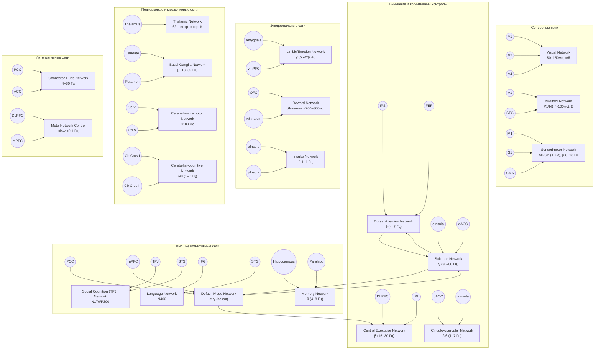

# Схема функциональных сетей мозга (по GINNA-33)

```mermaid
graph TB
  %% Сенсорные / Перцептивные сети
  subgraph "Сенсорные сети"
    V1((V1)) --> VN["Visual Network<br>50–150мс, α/θ"]
    V2((V2)) --> VN
    V4((V4)) --> VN
    A1((A1)) --> AN["Auditory Network<br>P1/N1 (~100мс), β"]
    STG((STG)) --> AN
    M1((M1)) --> SMN["Sensorimotor Network<br>MRCP (1–2с), μ 8–13 Гц"]
    S1((S1)) --> SMN
    SMA((SMA)) --> SMN
  end

  %% Внимание и когнитивный контроль
  subgraph "Внимание и когнитивный контроль"
    IPS((IPS)) --> DAN["Dorsal Attention Network<br>θ (4–7 Гц)"]
    FEF((FEF)) --> DAN
    AI((aInsula)) --> SAL["Salience Network<br>γ (30–80 Гц)"]
    ACC_Sal((dACC)) --> SAL
    DLPFC1((DLPFC)) --> CEN["Central Executive Network<br>β (15–30 Гц)"]
    IPL((IPL)) --> CEN
    ACC_Cing((dACC)) --> CON["Cingulo-opercular Network<br>δ/θ (1–7 Гц)"]
    InsA((aInsula)) --> CON
  end

  %% Высшие когнитивные сети
  subgraph "Высшие когнитивные сети"
    PCC((PCC)) --> DMN["Default Mode Network<br>α, γ (покоя)"]
    MPFC((mPFC)) --> DMN
    TPJ((TPJ)) --> TPJNet["Social Cognition (TPJ) Network<br>N170/P300"]
    STS((STS)) --> TPJNet
    IFG((IFG)) --> LANG["Language Network<br>N400"]
    STG2((STG)) --> LANG
    HPC((Hippocampus)) --> MEM["Memory Network<br>θ (4–8 Гц)"]
    PHG((Parahipp)) --> MEM
  end

  %% Эмоциональные сети
  subgraph "Эмоциональные сети"
    Amy((Amygdala)) --> LIMB["Limbic/Emotion Network<br>γ (быстрый)"]
    vmPFC((vmPFC)) --> LIMB
    OFCNode((OFC)) --> OFCNet["Reward Network<br>Допамин ~200–300мс"]
    VS((VStriatum)) --> OFCNet
    InsA2((aInsula)) --> INS["Insular Network<br>0.1–1 Гц"]
    InsP((pInsula)) --> INS
  end

  %% Подкорковые и мозжечковые сети
  subgraph "Подкорковые и мозжечковые сети"
    THAL((Thalamus)) --> THALNet["Thalamic Network<br>θ/α синхр. с корой"]
    Caud((Caudate)) --> BG["Basal Ganglia Network<br>β (13–30 Гц)"]
    Putamen((Putamen)) --> BG
    CbVI((Cb VI)) --> CPRE["Cerebellar-premotor Network<br><100 мс"]
    CbV((Cb V)) --> CPRE
    CbCrus1((Cb Crus I)) --> CCOG["Cerebellar-cognitive Network<br>δ/θ (1–7 Гц)"]
    CbCrus2((Cb Crus II)) --> CCOG
  end

  %% Интегративные / межсетевые шлюзы
  subgraph "Интегративные сети"
    PCC2((PCC)) --> HUB["Connector-Hubs Network<br>4–80 Гц"]
    ACC_Hub((ACC)) --> HUB
    DLPFC2((DLPFC)) --> META["Meta-Network Control<br>slow <0.1 Гц"]
    MPFC2((mPFC)) --> META
  end

  %% Межсетевые связи (Triple-network model)
  DMN --> CEN
  SAL --> DMN
  DMN --> SAL
  SAL --> DAN
  DAN --> SAL
```

