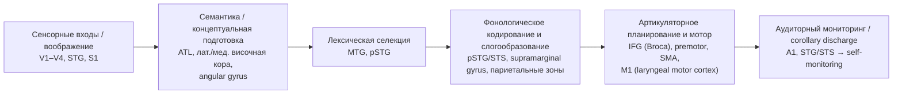
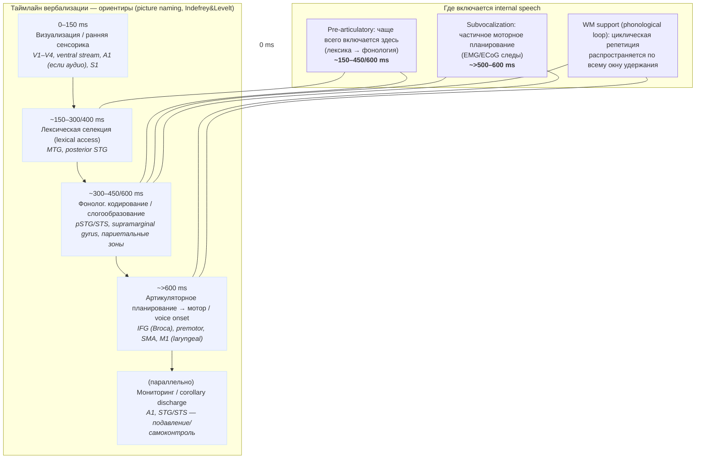
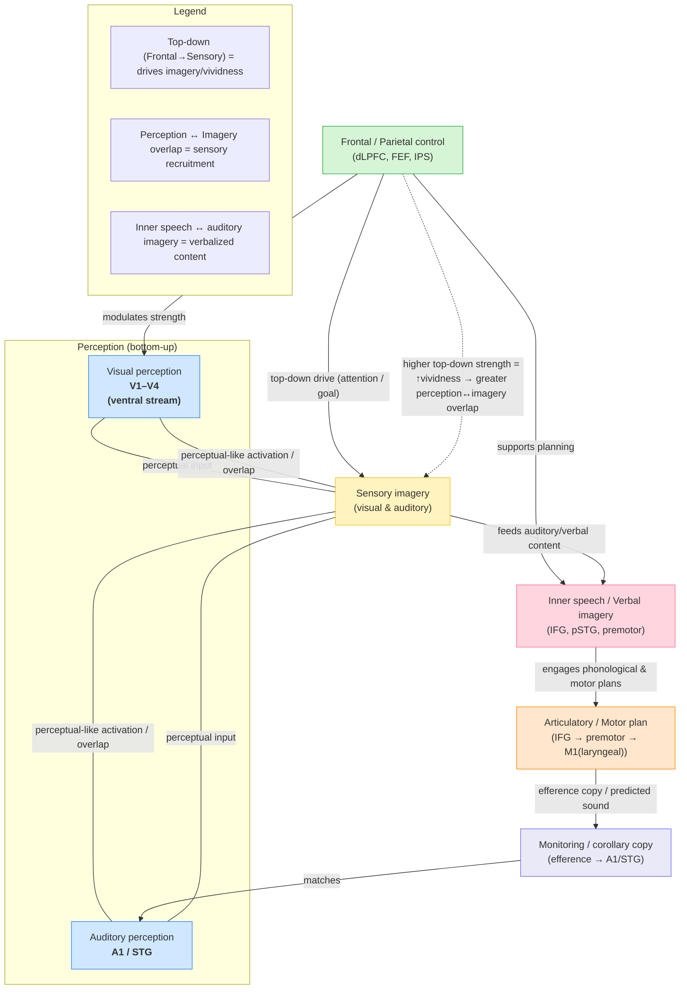
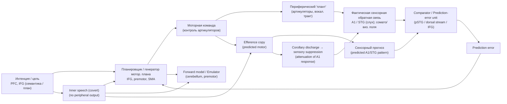

# Внутренняя речь: нейрофизиология, феноменология и клинические следствия

---

## Анонс

Внутренний монолог (inner speech) — универсальный феномен человеческого мышления, включающий широкий спектр вербализованной и полузвуковой активности от кратких словесных помет до сложного диалогического саморазговора. В этом обзоре мы интегрируем данные поведенческих исследований, нейровизуализации (fMRI, PET), высокотемпоральных записей (EEG, MEG), интракраниальной электрофизиологии (ECoG) и вмешательств (TMS/tDCS) для построения согласованной картины нейронной архитектоники и временной организации вербализации «в уме». Рассматриваются онтогенез и культурные модификаторы внутренней речи, её роль в рабочей памяти, планировании и самоконтроле, а также особенности феноменологии (vividness, voice ownership, perspective). Отдельный раздел посвящён клиническим проявлениям — аудиторным вербальным галлюцинациям при шизофрении, нарушениям речи и последствиям афантазии — с анализом гипотез misattribution и нарушений королларного сигнала. Обзор завершается оценкой современной методологии (включая возможности декодирования речевых представлений из коры), этических вопросов приложений BCI и дорожной картой будущих каузальных и трансляционных исследований. Цель — предоставить многомасштабную, доказательную основу для исследований внутренней речи и её применения в клинике и технологиях.&#x20;

---

## Ключевые слова

inner speech; internal monologue; subvocalization; verbal thought; auditory imagery; efference copy; speech production; ECoG; auditory verbal hallucinations; working memory.&#x20;

## 2. Введение — постановка проблемы

### 2.1. Почему внутренний монолог важен (когнитивно, клинически, прикладно)

**Когнитивная значимость.** Внутренняя речь — не эпифеномен, а функциональный инструмент когнитивной архитектуры: она участвует в поддержании и трансформации информации в рабочей памяти (артикуляционная петля), планировании действий, саморегуляции и рефлексии о собственных намерениях. Многочисленные поведенческие и нейропсихологические работы показывают, что блокировка субвокализации ухудшает вербальную репетицию и некоторые виды решения задач, что указывает на роль внутренней речи как когнитивного рабочего ресурса.

**Клиническая значимость.** Нарушения механизмов внутренней речи связаны с аудиторными вербальными галлюцинациями (AVH) при шизофрении, где доминирует гипотеза misattribution: пациенты воспринимают свою мысль как внешнюю из-за сбоя в механизмах королларного сигнала/предсказательной отмены. Кроме того, патологии речи (афазии, апраксия артикуляции) и состояния с изменённой образностью (афантазия) влияют на структуру и доступность внутреннего монолога, что имеет значение для диагностики и реабилитации.

**Прикладное значение.** Понимание нейронной архитектуры внутренней речи критично для разработки BCI, направленных на восстановление коммуникации у пациентов с моторной денатурацией речи; также это важно для когнитив-психотерапевтических интервенций (работа с руминативными мыслями, ПТСР) и образовательных стратегий (речевая репетиция при обучении).&#x20;

---

### 2.2. Обозначение границ: что такое inner speech / inner monologue / verbal thought / subvocalization

Терминология в литературе часто пересекается; важно чётко отделить соседние явления:

* **Inner speech / внутренная речь** — широкое понятие, включающее вербализованные мысленные формы, которые при субъекте воспринимаются как «говорящая» речь без внешней артикуляции. Может варьировать от «полной» фразовой структуры до конденсированных словесных меток.
* **Inner monologue / внутренний монолог** — подтип внутренней речи, характеризующийся развернутым, часто последовательным проговариванием мыслей в форме единого «я»-диалога; может включать аргументацию, планирование и субъективный поток сознания.
* **Verbal thought / вербальная мысль** — более широкая категория, обозначающая мыслительные процессы, опосредованные языком; включает и внутреннюю речь, и языковые компоненты мышления, которые могут быть осознанными или полусознательными.
* **Subvocalization / субвокализация** — частичное или скрытое моторное проявление речи (напр., слабые движения артикуляторов, электрическая активность в laryngeal motor cortex), часто сопутствует внутренней речи, но не тождественна ей: внутренний монолог может существовать без измеримой субвокализации, и наоборот.

Разграничение этих понятий важно для интерпретации данных: разные методы (самоотчёты, EMG, ECoG, fMRI) могут «ловить» разные компоненты (семантическую подготовку, фонологическое кодирование, моторное планирование). В обзоре мы будем придерживаться следующей рабочей дефиниции: **«inner speech» — процесс вербализованного мысленного содержания, который включает лексико-фонологические и (в ряде случаев) артикуляторные планировочные компоненты, реализуемые без или с минимальной внешней артикуляцией**.&#x20;

---

### 2.3. Цели обзора 

**Цели.**

1. Систематизировать современные эмпирические данные (поведенческие, нейровизуализационные, высокотемпоральные и инвазивные записи) об анатомо-функциональной архитектуре внутренней речи и её временной организации.
2. Оценить существующие теоретические модели (модель продуктивной речи Levelt/WEAVER++, state-feedback control, predictive coding) применительно к феномену внутренней речи.
3. Проанализировать клинико-прикладные случаи (AVH, афазии, афантазия) и потенциал нейротехнологий (BCI) для декодирования и реставрации вербального мышления.
4. Выделить методологические ограничения, открытые вопросы и предложить дорожную карту для каузальных и трансляционных исследований.

**Структура обзора.** После введения идёт исторический и теоретический контекст (включая классические концепции Vygotsky и Levelt), затем таксономия форм внутренней речи и обзор методов изучения (fMRI, MEG/EEG, ECoG, TMS, EMG). Далее — подробная карта нейронной архитектоники и временная хронология процессов (семантика → фонология → артикуляция/мониторинг), взаимодействие imagery ↔ verbalization, клинические феномены, декодирование/BCI и этические аспекты, ограничение текущих исследований и roadmap будущих направлений. Приложения включают таблицы исследований и репликационные протоколы.&#x20;

---

## 3. Исторический контекст и основные теоретические парадигмы

### 3.1. Ранние размышления: поток сознания и поворот к изучению внутренней речи

Классическое философско-психологическое осмысление «потока мыслей» восходит к Уильяму Джеймсу, который описал сознание как непрерывный поток переживаний и установил важность вербализованных мыслительных форм для самосознания и рефлексии. Вслед за Джеймсом вопросы «внутренней речи» получили развитие в XX веке: с одной стороны — развитие аналитического и экспериментального подхода к речи, с другой — реакция бихевиоризма, который временно отодвинул внутренняя феномена из фокуса эмпирической психологии. ([psychclassics.yorku.ca][1])

### 3.2. Социокультурное происхождение внутренней речи — Виготский

Ключевой исторический поворот сделал Л. С. Виготский: в работе *Thinking and Speech* он формулировал идею о том, что вербальное мышление исторически и онтогенетически возникает из внешней, социально-направленной речи и затем внутренняя речь возникает как «интериоризованная» форма диалогов с другими. Эта идея проложила путь к развитию представлений о внутренней речи как функционально организованном инструменте мышления (не простой «эфемерный остаток»). ([marxists.org][2])

### 3.3. Классические психолингвистические модели производства речи — Levelt и преемники

В конце XX века появилась подробная когнитивная архитектура производства речи, наиболее влиятельная её версия — модель В. Levelt (1989), которая дробит процесс говорения на стадии: концептуализация (формирование сообщения), лексическая селекция, формирование фонологического кода, метрия/сильбизация и артикуляторная реализация. На этот фундамент опираются современные экспериментальные и нейровизуализационные исследования внутренней речи: рабочая гипотеза — многие этапы подготовки речи (лексико-фонологические операции) выполняются и в отсутствие внешней артикуляции, что делает Levelt-подобные рамки удобными для формализации inner speech. ([direct.mit.edu][3])

### 3.4. Нейроанатомия и временная организация: мета-анализы Indefrey & Levelt

Индефрей и Levelt (мета-анализы начала 2000-х) объединили данные fMRI/EEG/MEG и поведенческих латентностей, чтобы привязать отдельные компоненты производства слова к пространственно-временным корковым подпоследовательностям (лексическая селекция, фонологическая активация, артикуляторное планирование и т.д.). Эти работы дали «временную карту» процессов производства, важную для понимания того, какие компоненты возможны в «внутренней речи» (которые могут доходить до фонологического/планировочного уровня без фактической артикуляции). ([ccc.inaoep.mx][4])

### 3.5. Механизмы предсказания и мониторинга: forward models и predictive coding

Современные теории языка активно используют концепции forward-моделей и предсказания (predictive coding). Pickering & Garrod (2013) предложили единый подход, где производство и восприятие взаимосвязаны через прогнозирующие преобразования; это даёт удобную рамку для объяснения процессов мониторинга собственной речи и механизмов, которые, предположительно, дают ощущение «чувства принадлежности» голоса (self-attribution) при внутренней речи. Параллельно нейробиологические модели — например, дуальная (dorsal/ventral) система обработки речи (Hickok & Poeppel) — уточняют, как сенсорные и артикуляторные контуры взаимодействуют в контроле речи и возможном внутреннем прослушивании. Эти парадигмы играют центральную роль в современных объяснениях, почему сбои предсказательной отмены могут приводить к ошибочной атрибуции собственного вербального содержания как «чужого» (важно для понимания AVH). ([PubMed][5], [PMC][6])

### 3.6. Развитие многокомпонентных и феноменологических моделей внутренней речи

Современные обзоры (в частности Alderson-Day & Fernyhough, 2015) систематизировали эмпирические данные и предложили многокомпонентную модель inner speech, которая включает: (i) различные форматы (expanded vs. condensed speech), (ii) феноменологические параметры (переживаемая «отчетливость», множественность голосов, диалогичность), (iii) развитие от внешней к внутренней речи и (iv) нейрокогнитивные компоненты (лексика, фонология, моторное планирование, мониторинг). Alderson-Day & Fernyhough также предложили инструменты (например, VISQ) для валидного измерения вариативности внутренней речи у людей и в клинических группах. Эти работы сделали возможным интеграцию нейробиологических данных с самоотчётной феноменологией. ([PMC][7], [ScienceDirect][8])

### 3.7. Современные нейротехнологии и «декодирование» речи из коры

Последнее десятилетие принесло качественный сдвиг: инвазивные записи (ECoG) и современные алгоритмы машинного обучения позволили первой генерации успешных декодеров речи — от восстановления акустики на основе ECoG до прямых BCI-протезов, декодирующих отдельные слова/фразы у пациентов с анартрией. Работы Anumanchipalli, Chartier & Chang (2019) и Moses et al. (2021) показали, что с использованием промежуточного представления артикуляторных кинематик можно синтезировать разумно разборчивую речь из корковой активности; это открывает практическую перспективу для «восстановления» вербального выражения и ставит новые вопросы о разграничении нейронных следов внешней и внутренней речи. Важный вывод для теории внутренней речи: если артикуляторные представления кодируются в коре и доступны для декодирования, то внутренний монолог потенциально может иметь явные, измеримые нейронные отпечатки, пригодные для BCI. ([PubMed][9], [New England Journal of Medicine][10])

### 3.8. Сводка парадигм и их взаимосвязь — схемное представление

1. **Онтогенетическая/социокультурная парадигма (Виготский)** — внутренняя речь возникает из социальной речи; фокус на развитии и функциональности как инструменте мышления. ([marxists.org][2])
2. **Когнитивно-психолингвистическая парадигма (Levelt + Indefrey et al.)** — детальное разложение производства речи на этапы; применима к inner speech через параллельные этапы подготовки. ([direct.mit.edu][3], [ccc.inaoep.mx][4])
3. **Модель предсказания/мониторинга (Pickering & Garrod; predictive coding)** — объясняет самоконтроль и ошибки атрибуции в terms of forward models. ([PubMed][5])
4. **Нейробиологическая/двухпоточная модель (Hickok & Poeppel)** — анатомо-функциональные маршруты восприятия и связи с моторикой речи. ([PMC][6])
5. **Многокомпонентный феноменологический подход (Alderson-Day & Fernyhough)** — интеграция нейро-, разви- и феноменологии; инструменты для измерения разнообразия inner speech. ([PMC][7])
6. **Нейротехнологическая парадигма (ECoG/BCI)** — практическая подоплёка декодирования и восстановления речи; новые данные о коррелятах артикуляторного представления. ([PubMed][9], [New England Journal of Medicine][10])

---

#### Ключевые нерешённые вопросы (которые выведут структуру следующих разделов обзора)

* В какой мере внутренняя речь задействует артикуляторные планы (и в каких формах — expanded vs. condensed)? ([PMC][7])
* Какую роль играет предсказательная отмена (corollary discharge) в чувстве «принадлежности» внутреннего голоса и в патогенезе AVH? ([PubMed][5], [PMC][6])
* Какие нейронные маркеры внутренней речи надёжно воспроизводимы между задачами, методами и субъектами (ключ для BCI)? ([ccc.inaoep.mx][4], [PubMed][9])

[1]: https://psychclassics.yorku.ca/James/Principles/prin10.htm "James (1890) Chapter 10 - Classics in the History of Psychology"
[2]: https://www.marxists.org/archive/vygotsky/works/words/Thinking-and-Speech.pdf "Thinking-and-Speech.pdf - L. S. Vygotsky"
[3]: https://direct.mit.edu/books/monograph/4300/SpeakingFrom-Intention-to-Articulation "Speaking: From Intention to Articulation | Books Gateway"
[4]: https://ccc.inaoep.mx/~villasen/bib/Indefrey.pdf "The spatial and temporal signatures of word production ..."
[5]: https://pubmed.ncbi.nlm.nih.gov/23789620/ "An integrated theory of language production and ..."
[6]: https://pmc.ncbi.nlm.nih.gov/articles/PMC3468690/ "The cortical organization of speech processing"
[7]: https://pmc.ncbi.nlm.nih.gov/articles/PMC4538954/ "Inner Speech: Development, Cognitive Functions ..."
[8]: https://www.sciencedirect.com/science/article/pii/S1053810018301090 "Revised (VISQ-R): Replicating and refining links between ..."
[9]: https://pubmed.ncbi.nlm.nih.gov/31019317/ "Speech synthesis from neural decoding of spoken sentences"
[10]: https://www.nejm.org/doi/full/10.1056/NEJMoa2027540 "Neuroprosthesis for Decoding Speech in a Paralyzed ..."

---

## 4. Типология / таксономия внутреннего монолога 

### 4.1. Диалогический vs монологический inner speech

**Краткое определение и феноменология**

* **Монологическая внутренняя речь** — односторонний поток «я»-высказываний: инструкции самому себе, последовательные рассуждения, планирование; субъективно чаще ощущается как единый «голос себя». (см. обзор и многокомпонентную модель). ([PubMed][11])
* **Диалогическая внутренняя речь** — интерактивные мысленные реплики, в которых в сознании имитируются реплики другого (воспроизведение чужого тона/перспективы) либо ведётся «внутренний диалог». Эта форма тесно связана с социокогнитивными процессами (перспективное взятие, репрезентация чужих умонастроений). ([PubMed][11], [UCLan - University of Central Lancashire][12])

**Нейрокогнитивные ожидания и эмпирия**

* Диалогичность связана с активацией не только классических языковых зон (IFG, pSTG), но и регионов теории разума / соц. когниции (мPFC, TPJ), что показали fMRI-исследования диалогических форм inner speech. ([UCLan - University of Central Lancashire][12], [Nature][13])
* Монологическая форма ожидаемо сильнее рекрутирует лексико-фонологические и артикуляторные контуры, особенно при «развёрнутых» мыслях, приближённых по структуре к внешней речи. ([PubMed][14])

**Практическая операционализация (рекомендации для исследований)**

* Использовать experience sampling + VISQ (Varieties of Inner Speech Questionnaire) для классификации эпизодов как диалогических/монологических; контраст fMRI: диалогичность > монологичность (и наоборот) с контролем памяти/эмоции. ([Гверн][15], [PMC][16])

---

### 4.2. Condensed vs expanded forms (краткие «мысли» vs развёрнутые фразы)

**Определение**

* **Expanded inner speech** — полные синтаксические структуры, богатая фонология и внутренняя артикуляция (мысленное «проговоривание» фраз). ([PubMed][11])
* **Condensed inner speech** — сжатые языковые метки/ярлыки (однословные или фрагменты), минимальная фонологическая компонента; экономичное кодирование для быстрого мышления. ([Гверн][15], [PubMed][11])

**Нейробиологические корреляты**

* Expanded формы вовлекают лексико-фонологическую цепочку вплоть до артикуляторного планирования (IFG, premotor, SMA, pSTG) и проявляют эффекты «подавления» слуховой коры при внутренней артикуляции (предсказательная отмена). ([PubMed][14])
* Condensed формы чаще ограничиваются лексико-семантической и ассоциативной активацией (латеральная и медиальная темпоральная кора, угловая извилина) с меньшей артикуляторной подписью; EMG/ECoG показывает вариабельность — в некоторых субъектах артикуляторные следы остаются даже при «тихой» речи. ([PMC][17], [Nature][18])

**Экспериментальные рекомендации**

* Контраст «произнести мысленно полную фразу» vs «свести к слову/образу» + записи EMG (laryngeal/face) и MEG/EEG для тайминга; в доступных клинических/инвазивных наборах — использовать ECoG-декодирование. ([PMC][17], [Nature][18])

---

### 4.3. Автоматизированный vs контролируемый (волевое vs спонтанное)

**Определение и феноменология**

* **Автоматизированный / спонтанный** — непроизвольные, часто повторяющиеся или руминативные эпизоды внутренней речи (низкий уровень контроля). ([PubMed][11])
* **Контролируемый / волевой** — осознанно инициируемые проговаривания: речевая репетиция, самонастрой, целенаправленное планирование (высокий уровень исполнительного контроля). ([PubMed][11])

**Нейронные сети**

* Контролируемая inner speech тесно связана с фронтально-париетальными исполнительными сетями (dLPFC, ACC) плюс языковые ядра. Автоматизированная чаще проявляет связь с сетями автономного/ассоциативного типа и DMN (мPFC, PCC), хотя точная роль DMN в вербализации остаётся предметом исследований. ([PubMed][11], [Nature][13])

**Клинические аспекты**

* Дисбаланс между автоматизированной и контролируемой формами связан с психопатологией: например, навязчивые руминативные внутренние реплики при депрессии/тревоге; у больных с AVH — возможное нарушение механизмов мониторинга/предсказания (см. модель импрецизионности королларного сигнала). ([PMC][19], [PubMed][20])

**Тестирование и вмешательства**

* Dual-task и манипуляции рабочей памяти смещают профиль в сторону condensed/автоматизированных форм; TMS на dLPFC/IFG позволяет тестировать роль исполнительного контроля. Эти подходы рекомендуются для каузального разделения. ([PubMed][21], [Nature][13])

---

## Источники 

* Alderson-Day, B., & Fernyhough, C. (2015). *Inner speech: Development, cognitive functions, phenomenology, and neurobiology.* Psychological Bulletin, 141(5), 931–965. ([PubMed][11])
* McCarthy-Jones, S., & Fernyhough, C. (2011). *The varieties of inner speech questionnaire (VISQ).* Consciousness and Cognition, 20(4), 1586–1593. (разработка VISQ). ([Гверн][15])
* Alderson-Day, B., et al. (2018). *The Varieties of Inner Speech Questionnaire — Revised (VISQ-R) and replication work.* (см. обсуждение VISQ-R). ([PMC][16])
* Levelt, W. J. M. (1989). *Speaking: From intention to articulation.* MIT Press. (классическая модель производства речи). ([Архив Интернета][22])
* Indefrey, P., & Levelt, W. J. M. (2004). *The spatial and temporal signatures of word production components: A meta-analysis.* (см. также обновления/обзоры по временнóй карте). ([PubMed][14], [ScienceDirect][23])
* Pickering, M. J., & Garrod, S. (2013). *An integrated theory of language production and comprehension.* Behavioral and Brain Sciences, 36(4), 329–392. (forward models / прогнозирование). ([PubMed][21])
* Hickok, G., & Poeppel, D. (2007). *The cortical organization of speech processing.* Nature Reviews Neuroscience, 8, 393–402. (двухпоточная модель). ([Nature][13])
* Ford, J. M., & Mathalon, D. H. (2004). *Electrophysiological evidence of corollary discharge dysfunction in schizophrenia during talking and thinking.* Journal of Psychiatric Research, 38(1), 37–46. (королларный сигнал / AVH). ([PubMed][24])
* Heinks-Maldonado, T. H., Mathalon, D. H., Houde, J. F., Gray, M., Faustman, W. O., & Ford, J. M. (2007). *Relationship of imprecise corollary discharge in schizophrenia to auditory hallucinations.* Archives of General Psychiatry, 64(3), 286–296. ([PubMed][20])
* Corlett, P. R., Horga, G., Fletcher, P. C., Alderson-Day, B., Schmack, K., & Powers, A. R. (2019). *Hallucinations and strong priors.* Trends in Cognitive Sciences, 23(2), 114–127. (predictive coding / hallucination models). ([PubMed][25])
* Alderson-Day, B., et al. (2015). *Neural substrates of dialogic inner speech: an fMRI study.* (см. нейровизуализацию диалогической формы). ([UCLan - University of Central Lancashire][12])
* Anumanchipalli, G. K., Chartier, J., & Chang, E. F. (2019). *Speech synthesis from neural decoding of spoken sentences.* Nature, 568, 493–498. (ECoG-декодирование артикуляторных представлений). ([Nature][18])
* Moses, D. A., et al. (2021). *Neuroprosthesis for decoding speech in a paralyzed person.* New England Journal of Medicine, 385, 217–227. (BCI-декодирование слов/фраз). ([New England Journal of Medicine][26])

---

[11]: https://pubmed.ncbi.nlm.nih.gov/26011789/ "Inner Speech: Development, Cognitive Functions, Phenomenology ..."
[12]: https://clok.uclan.ac.uk/12367/1/Alderson-Day%20et%20al.%20%282015%29%20-%20dialogic%20inner%20speech%2C%20fMRI.pdf "[PDF] neural substrates of dialogic inner speech"
[13]: https://www.nature.com/articles/nrn2113 "The cortical organization of speech processing"
[14]: https://pubmed.ncbi.nlm.nih.gov/15037128/ "The spatial and temporal signatures of word production ..."
[15]: https://gwern.net/doc/psychology/inner-voice/2011-mccarthyjones.pdf "The varieties of inner speech"
[16]: https://pmc.ncbi.nlm.nih.gov/articles/PMC6204885/ "The varieties of inner speech questionnaire – Revised ..."
[17]: https://pmc.ncbi.nlm.nih.gov/articles/PMC9714519/ "Speech synthesis from neural decoding of spoken sentences"
[18]: https://www.nature.com/articles/s41586-019-1119-1 "Speech synthesis from neural decoding of spoken sentences"
[19]: https://pmc.ncbi.nlm.nih.gov/articles/PMC3870271/ "Auditory verbal hallucinations as atypical inner speech monitoring ..."
[20]: https://pubmed.ncbi.nlm.nih.gov/17339517/ "Relationship of imprecise corollary discharge in ..."
[21]: https://pubmed.ncbi.nlm.nih.gov/23789620/ "An integrated theory of language production and ..."
[22]: https://archive.org/details/speakingfrominte0000leve "Speaking : from intention to articulation : Levelt, W. J. M. ..."
[23]: https://www.sciencedirect.com/science/article/pii/S0010027703002294 "The spatial and temporal signatures of word production ..."
[24]: https://pubmed.ncbi.nlm.nih.gov/14690769/ "Electrophysiological evidence of corollary discharge ..."
[25]: https://pubmed.ncbi.nlm.nih.gov/30583945/ "Hallucinations and Strong Priors"
[26]: https://www.nejm.org/doi/full/10.1056/NEJMoa2027540 "Neuroprosthesis for Decoding Speech in a Paralyzed ..."

## 5. Методологические подходы к изучению (методологический раздел)

Ниже — развёрнутый, практический и академически обоснованный обзор методик, применимых к изучению внутреннего монолога. Привожу ключевые преимущества/ограничения каждой техники, типичные протоколы/контрасты, рекомендации по валидации и ссылки на авторитетные источники и примеры исследований. 

---

### 5.1. Поведенческие методы (отчёты, шкалы vividness, probe tasks)

**Что включает**

* Самоотчёты и шкалы: Varieties of Inner Speech Questionnaire (VISQ) и VISQ-R для феноменологических характеристик (диалогичность, конденсированность, аудиальность и т.п.). ([research.ed.ac.uk][27], [ResearchGate][28])
* Шкалы vividness (VVIQ для визуализации; адаптации для аудиторной vividness). ([ResearchGate][29])
* Experience sampling / ecological momentary assessment (EMA): короткие пробы в естественной среде для сбора эпизодов inner speech. ([durham-repository.worktribe.com][30])
* Probe tasks: «think-aloud» (ограниченно полезен — портит феномен), cued inner speech (инструкция «мысленно произнести» фразу), и задачи подавления субвокализации (конкурентная артикуляция / articulatory suppression) для теста функциональной роли. ([durham-repository.worktribe.com][30], [Frontiers][31])

**Плюсы**

* Низкая стоимость, прямая феноменологическая информация, высокая экологическая валидность (через EMA). VISQ и VISQ-R валидированы и коррелируют с клиническими симптомами (AVH, руминация). ([research.ed.ac.uk][27], [ResearchGate][28])

**Ограничения**

* Сильная субъективность; отчёты подвержены ретроспективным и концептуальным искажениям. «Мысль» трудно верифицировать извне — нужен multi-method подход (поведенческая + нейронная). ([durham-repository.worktribe.com][30])

**Рекомендации по применению**

1. Комбинировать VISQ/VISQ-R с EMA (push-notifications) и короткими probe-эпизодами в лаборатории. ([research.ed.ac.uk][27])
2. Всегда включать условие articulatory suppression при тестах на рабочую память/вербальную репетицию, чтобы демонстрировать causal role inner speech. ([Frontiers][31])
3. Сопоставлять самоотчёты с физиологическими сигналами (EMG) и нейровизуализацией для обратной валидации. ([research.ed.ac.uk][27])

---

### 5.2. Нейровизуализация (fMRI, PET) — преимущества и ограничения

**Что даёт**

* fMRI/PET — хороши для пространственной локализации (Broca/IFG, pSTG, TPJ, temporal lobe, SMA, premotor). Позволяют картировать анатомическую сеть внутренней речи и связывать фенотипы (dialogic/monologic, expanded/condensed) с конкретными регионами. ([ccc.inaoep.mx][32], [Nature][33])

**Плюсы**

* Высокое пространственное разрешение (особенно при 7T), зрелая статистика групповых анализов, возможность сопоставления с анатомией и коннектомикой. ([ccc.inaoep.mx][32])

**Ограничения**

* Низкое временное разрешение (секунды) — плохо подходит для захвата быстрого последовательного процесса подготовки речи; также шум сканера мешает аудиторной imagery и усложняет сравнения с естественной inner speech. PET редко используется (радиация, низкая временная резолюция). ([ccc.inaoep.mx][32])

**Как проектировать**

* Протоколы: event-related или block-design с чёткими внутри-субъектными контрастами: (a) волевое inner speech «произнеси мысленно» vs baseline; (b) expanded vs condensed; (c) dialogic prompts vs monologic prompts. Контролировать моторную активность (EMG) и дыхание. ([Nature][33], [research.ed.ac.uk][27])

**Анализ**

* Использовать сочетание: GLM для контрастов, MVPA / representational similarity analysis (RSA) для распознавания форм внутренней речи, а также функциональную коннектомику (PPI/seed-to-voxel) для проверки вовлечения DMN/ToM-сетей при диалогичности. ([ccc.inaoep.mx][32], [Nature][33])

---

### 5.3. Высокотемпоральные методы (MEG, EEG, ECoG) — тайминг процессов вербализации

**Что дают**

* MEG/EEG: миллисекундный тайминг — критичны для распознавания хронологии (семантика → фонология → артикуляция) и для проверки временных меток, предложенных Indefrey/Levelt. ([ccc.inaoep.mx][32], [Frontiers][31])
* ECoG (интракраниальные записи): сочетание высокой временной и хорошей пространственной резолюции над корой — золотой стандарт для изучения быстрого языкового производства и декодирования. ([PMC][34], [PubMed][35])

**Ключевые эмпирические находки**

* Мета-аналитические ориентиры: лексическая селекция и ранние этапы \~150–300 ms; фонологическое кодирование \~300–500 ms; артикуляторное планирование > \~500–600 ms (ориентиры из Indefrey & Levelt и обновлений). Эти ориентиры проверяются MEG/EEG и ECoG. ([ccc.inaoep.mx][32], [Frontiers][31])
* ECoG-студии показали чёткую артикуляторную организацию в sensorimotor cortex и возможность реконструкции акустики / кинематики речи. ([PMC][34], [PubMed][35])

**Плюсы**

* MEG/EEG — доступнее, мобильнее, пригодны для задач с естественной артикуляцией или её блокировкой. ECoG — наилучшая запись у пациентов (высокая SNR, пригодность для декодирования). ([Frontiers][31], [PMC][34])

**Ограничения**

* EEG/MEG имеют ограниченную локализационную точность (особенно для глубинных структур). ECoG — инвазивен и зависит от клинических показаний, выборка ограничена (эпилепсия/операции). Все методы чувствительны к артефактам (EMG, движение, глазные движения). ([Frontiers][31], [PMC][34])

**Рекомендации протоколов**

1. Синхронизировать EMG-записи (laryngeal, facial) с EEG/MEG/ECoG, чтобы отделить истинную нейронную активность от субвокализационных артефактов. ([PMC][34])
2. Использовать time-frequency анализ и HFB (high-gamma) в ECoG для учёта артикуляторных аспектов inner speech; MVPA/Epoch-wise decoding — для попыток классификации expanded vs condensed эпизодов. ([PMC][34])

---

### 5.4. Сверхвысокое разрешение / интракраниальные записи и BCI (ECoG, Utah arrays) — декодирование «мысленной речи»

**Современное состояние**

* Декодирование акустики/слов/артикуляторных кинематик из ECoG показало впечатляющие результаты (Pasley et al., 2012; Bouchard et al., 2013; Anumanchipalli et al., 2019). Недавно продемонстрированы нейропротезы, которые в ре-времени распознают слова/фразы у пациентов с анартрией (Moses et al., 2021). ([PubMed][35], [PMC][34], [Nature][36], [New England Journal of Medicine][37])

**Что именно декодируют**

* Подходы: (a) реконструкция акустического спектрограммы из STG (Pasley et al.); (b) декодирование артикуляторных кинематик и их преобразование в речь (Anumanchipalli et al.); (c) классификация отдельных слов/фраз (Moses et al.). ([PubMed][35], [PMC][38], [New England Journal of Medicine][37])

**Плюсы**

* Возможность «читать» речевой контент с высокой точностью и таймингом; прямое тестирование гипотез о том, что внутренний монолог имеет артикуляторную/акустическую репрезентацию, доступную для декодирования. ([PMC][38])

**Ограничения и вызовы**

* ECoG/UTAH arrays инвазивны; выборка пациентов неконтролируема; модели часто переобучаются под конкретного человека/речевые материалы; декодирование внутренней (covert) речи сложнее, чем декодирование услышанной или произнесённой речи (сильнее шум/меньшая амплитуда). Этические вопросы (privacy, consent) — ключевые. ([PubMed][35], [New England Journal of Medicine][37])

**Рекомендации исследования inner speech**

1. Начинать с «полу-оvert» парадигм (мысленно проговорить + минимальная артикуляция) в клинических ECoG-наборах, чтобы проверить, какие представления доступны декодеру. ([PMC][38])
2. Использовать межсубъектные/кросс-корпусные проверки, регуляризацию и независимые тестовые наборы, чтобы избежать переобучения. ([PMC][38])
3. Разработать строгие этические протоколы (информированное согласие, управление данными), особенно при попытках декодирования «мыслей». ([New England Journal of Medicine][37])

---

### 5.5. Нейромодуляция (TMS/tDCS) для теста каузальности сенсорных и моторных узлов

**Роль**

* Нейромодуляция даёт возможность тестировать причинность: подавление/раздражение конкретных узлов языка/артикуляции и проверка влияния на характеристики inner speech (vividness, частота, трудности контроля). TMS особенно полезен в «virtual lesion» парадигмах; tDCS — для длительной модификации возбудимости. ([Frontiers][39], [Oxford Academic][40])

**Ключевые примеры**

* rTMS на pre-SMA/IFG/ventral premotor cortex изменяет RTs в задачах вербальной селекции и фонологического кодирования, демонстрируя causal роль этих регионов в речевой подготовке. (Tremblay & Gracco 2009; Meister et al. 2007). ([PubMed][41], [ScienceDirect][42])

**Практические моменты**

* При изучении inner speech: применять TMS в околоворотные моменты (до/в момент генерации inner speech) и оценивать эффект на самооценку vividness (self-report), на производительность в probe-tasks и на нейрофизиологические маркеры (EEG/ECoG). ([Frontiers][39], [Speechneurolab][43])

**Ограничения**

* TMS локализация ограничена; эффекты часто кратковременны и вариабельны; tDCS-эффекты малые и чувствительны к параметрам. Неоднородность результатов требует тщательной проспективной регистрации и статистической мощности. ([Frontiers][39])

---

### 5.6. Проблемы интерпретации: субъективность отчётов, обратная валидация, смешение с субвокализацией

**Главные проблемы**

1. **Субъективность** — самоотчёты (VISQ и др.) хороши, но не демонстрируют «фактического» наличия артикуляторной или акустической репрезентации. ([research.ed.ac.uk][27])
2. **Субвокализация (EMG) vs чистая внутренняя речь** — слабые мышечные помехи (laryngeal/facial EMG) могут маскировать/имитировать нейронные эффекты; нужно явное измерение EMG и контроль (articulatory suppression). ([PMC][34], [Frontiers][31])
3. **Обратная валидация (convergent validity)** — утверждать, что «участник думал X» можно лишь при согласии нескольких источников: самоотчёт + EMG + нейронный паттерн + поведенческий эффект (например, нарушение при TMS). ([durham-repository.worktribe.com][30], [Frontiers][39])

**Стратегии уменьшения рисков**

* Всегда комбинировать минимум три уровня доказательства: (а) опытно-полевой/самооценочный (VISQ/EMA), (б) физиологический (EMG, дыхание) и (в) нейронный (EEG/MEG/fMRI/ECoG). ([research.ed.ac.uk][27], [PMC][34])
* Использовать контрольные условия articulatory suppression и dual-task paradigms, чтобы проверить функциональную значимость внутренних проговариваний. ([Frontiers][31])
* В анализе ECoG/EEG применять методы отбора каналов/артефактов, time-frequency анализ и cross-validation для декодирования внутренних форм речи. ([PMC][38])

---

## Практические рекомендации 

1. **Мульти-модальная дизайн-стратегия.** Любое серьёзное исследование внутренней речи должно комбинировать: поведенческие шкалы (VISQ/VISQ-R + EMA) + EMG + один нейротехнический метод (EEG/MEG/fMRI), а по возможности — ECoG для валидации и декодирования. ([research.ed.ac.uk][27], [PMC][34])
2. **Контрасты и каузальность.** Включайте articulatory suppression, dual-task, и/или TMS-манипуляции для доказательства причинности. ([Frontiers][31], [Speechneurolab][43])
3. **Стандарты репликации.** Предварительная регистрация, открытые данные/код, cross-validation в декодировании, предшествующее пилотирование EMG/артефактов. ([PMC][38])
4. **Этика.** При ECoG/BCI-исследованиях формализуйте конфиденциальность, границы декодирования и информированное согласие; большие проекты требуют этической перестраховки. ([New England Journal of Medicine][37])

---

## Источники

* Alderson-Day, B., & Fernyhough, C. (2015). *Inner speech: development, cognitive functions, phenomenology, and neurobiology.* Psychological Bulletin. ([durham-repository.worktribe.com][30])
* McCarthy-Jones, S., & Fernyhough, C. (2011). *The Varieties of Inner Speech Questionnaire (VISQ).* Consciousness and Cognition. ([Гверн][44])
* Indefrey, P., & Levelt, W. J. M. (2004; updates 2011). *Spatial and temporal signatures of word production (meta-analyses).* ([ccc.inaoep.mx][32], [Frontiers][31])
* Hickok, G., & Poeppel, D. (2007). *The cortical organization of speech processing.* Nature Reviews Neuroscience. ([Nature][33])
* Pasley, B. N., et al. (2012). *Reconstructing speech from human auditory cortex.* PLoS Biology. ([PubMed][35])
* Bouchard, K. E., Mesgarani, N., Johnson, K., & Chang, E. F. (2013). *Functional organization of human sensorimotor cortex for speech articulation.* Nature. ([PMC][34])
* Anumanchipalli, G. K., Chartier, J., & Chang, E. F. (2019). *Speech synthesis from neural decoding.* Nature. ([PMC][38])
* Moses, D. A., et al. (2021). *Neuroprosthesis for decoding speech in a paralyzed person.* NEJM. ([New England Journal of Medicine][37])
* Tremblay, P., & Gracco, V. L. (2009). *rTMS studies on pre-SMA and speech selection.* Brain Research / related reviews. ([PubMed][41])
* Reviews on TMS/tDCS in language research (Devlin & Watkins 2007; Murakami et al. 2013). ([Oxford Academic][40], [Frontiers][39])

[27]: https://www.research.ed.ac.uk/files/67307745/1_s2.0_S1053810018301090_main.pdf "The varieties of inner speech questionnaire – revised (VISQ-R)"
[28]: https://www.researchgate.net/publication/326607922_The_varieties_of_inner_speech_questionnaire_-_Revised_VISQ-R_Replicating_and_refining_links_between_inner_speech_and_psychopathology "The varieties of inner speech questionnaire - Revised ..."
[29]: https://www.researchgate.net/publication/277413505_Inner_Speech_Development_Cognitive_Functions_Phenomenology_and_Neurobiology "(PDF) Inner Speech: Development, Cognitive Functions, ..."
[30]: https://durham-repository.worktribe.com/output/1430570/inner-speech-development-cognitive-functions-phenomenology-and-neurobiology "Inner speech: Development, cognitive functions ..."
[31]: https://www.frontiersin.org/journals/psychology/articles/10.3389/fpsyg.2011.00255/full "The Spatial and Temporal Signatures of Word Production ..."
[32]: https://ccc.inaoep.mx/~villasen/bib/Indefrey.pdf "The spatial and temporal signatures of word production ..."
[33]: https://www.nature.com/articles/nrn2113 "The cortical organization of speech processing"
[34]: https://pmc.ncbi.nlm.nih.gov/articles/PMC3606666/ "Functional Organization of Human Sensorimotor Cortex for ..."
[35]: https://pubmed.ncbi.nlm.nih.gov/22303281/ "Reconstructing speech from human auditory cortex"
[36]: https://www.nature.com/articles/s41586-019-1119-1 "Speech synthesis from neural decoding of spoken sentences"
[37]: https://www.nejm.org/doi/full/10.1056/NEJMoa2027540 "Neuroprosthesis for Decoding Speech in a Paralyzed ..."
[38]: https://pmc.ncbi.nlm.nih.gov/articles/PMC9714519/ "Speech synthesis from neural decoding of spoken sentences"
[39]: https://www.frontiersin.org/journals/psychology/articles/10.3389/fpsyg.2013.00446/full "Utility of TMS to understand the neurobiology of speech"
[40]: https://academic.oup.com/brain/article/130/3/610/277481 "Stimulating language: insights from TMS | Brain"
[41]: https://pubmed.ncbi.nlm.nih.gov/19285972/ "Contribution of the pre-SMA to the production of words ..."
[42]: https://www.sciencedirect.com/science/article/pii/S0960982207019690 "The Essential Role of Premotor Cortex in Speech Perception"
[43]: https://speechneurolab.ca/wp-content/uploads/2022/05/Tremblay_Gracco_BrainResearch_2009.pdf "Contribution of the pre-SMA to the production of words ..."
[44]: https://gwern.net/doc/psychology/inner-voice/2011-mccarthyjones.pdf "The varieties of inner speech"

---

## 6. Онтогенез внутреннего монолога

### Вводная оговорка

Понимание онтогенеза внутренней речи опирается на сочетание (а) историко-теоретической программы Виготского о переходе от внешней речи → приватная (egocentric/private) → внутренняя; (б) эмпирических поведенческих маркеров (private speech, EMA, phonological similarity effect, артикуляторные/субвокализационные признаки); (в) нейроразвития фонологических и исполнительных систем (phonological loop, фронтально-париетальные сети). Ниже — структурированное изложение по подпунктам. ([marxists.org][45], [PMC][46])

---

### 6.1. Развитие приватной речи у детей → интернализация (Vygotsky)

Классическая онтология Виготского утверждает, что «внутренняя речь» онтогенетически возникает через интернализацию социально направленной речи: сначала ребёнок усваивает речевые регуляторы в диалогах с другими, затем проговаривает их вслух сам (private/egocentric speech), и в конце концов эти регуляторы «стягиваются» в невнятную, затем тихую и, наконец, полностью внутреннюю форму. Это — основной теоретический каркас для современных эмпирических исследований. ([marxists.org][45], [PMC][47])

Эмпирические данные подтверждают типовую динамику: пиковая видимая (вслух) private speech наблюдается в раннем дошкольном возрасте (\~3–4 года), затем частота и громкость внешней приватной речи снижаются по мере перехода к covert/inner speech; гибкость использования «тихой» речи для регуляции задач становится заметной примерно на уровнях школьного возраста (\~6–8 лет). Однако «дата окончательной интернализации» не фиксирована жёстко — зависимость от задач, контекста и культуры высока. ([PMC][48])

Критические экспериментальные свидетельства:

* наблюдаемая private speech коррелирует с выполнением сложных задач и саморегуляцией у детей (functional/self-regulatory role). ([ScienceDirect][49])
* переход к внутренней речи сопутствует появлению поведенческих маркеров вербального репетиционного механизма (phonological rehearsal effects) и осознанию «существования» внутренней речи (эмпирические опросы — см. Flavell). ([bingschool.stanford.edu][50], [PMC][46])

Критический комментарий: модерные авторы подчёркивают, что Виготский описал идеальную схему интернализации, но эмпирия показывает более плавную, контекстно-зависимую траекторию (не «все дети в 7 лет одномоментно перестают говорить вслух»). Также важна функция (саморегуляция, планирование), а не только форма (вслух vs внутренняя). ([ScienceDirect][51], [Frontiers][52])

---

### 6.2. Темп формирования фонологической/семантической основы внутренней речи

#### Фонологическая составляющая (фонологическая репетиция, phonological loop)

Появление надежных вербальных репетиционных стратегий — ключевой индикатор использование внутренней речи как когнитивного инструмента. Классические и последующие исследования phonological loop / phonological rehearsal показывают, что проявления «фонологической репетиции» (например, эффект фонологического сходства в задачах кратковременной памяти) становятся устойчивыми примерно в возрасте 6–8 лет, что часто интерпретируют как признак перехода к регулярной вербальной репетиции (subvocal rehearsal / inner speech). ([cnbc.cmu.edu][53], [PMC][46])

Практические ориентиры:

* у детей младше \~6 лет редко наблюдается типичный phonological similarity effect при невербально предъявляемых списках; после \~7 лет эффект проявляется стабильнее, что указывает на более частое вербальное кодирование и репетицию. Однако интерпретация должна учитывать задачи/возрастные ограничения и возможные floor/ceiling-эффекты в поведенческих тестах. ([PMC][46])

#### Семантичес/лексическая база

Словарный запас и семантические представления — необходимые «сырьё» для внутренней речи. Скорость роста лексикона и качество семантических связей зависят от ранней языковой среды, и эти факторы определяют, насколько эффективно ребёнок может оперировать condensed vs expanded формами внутренней речи (короткие ярлыки vs цельные фразы). Исследования показывают тесную связь между phonological STM, лексическим развитием и способностью к внутренней вербализации (в т.ч. при решении задач и планировании). ([PMC][54])

#### Нейродевелопментальные маркеры

Нейропсихологические и нейровизуализационные данные указывают на созревание левого временно-париетального контура (фонологическая обработка) и фронтальных исполнительных систем в школьном возрасте, что соответствует укреплению фонологического и контролируемого компонента внутренней речи. Это созревание коррелирует с улучшением рабочих функций и навыков саморегуляции. ([PMC][46])

---

### 6.3. Влияние языка, социализации и культуры

#### Язык и билингвизм

Выбор языка для внутренней речи у билингвов варьирует и зависит от контекста, доминирующего языка, эмоционной окрашенности содержания и цели (планирование vs эмоционная регуляция). Масштабные опросы и когнитивные исследования указывают, что билингвы могут «переключать» внутреннюю речь между языками; при этом доминирующий язык чаще используется для нейтрального планирования, а L1 — для эмоционного содержания. ([ScienceDirect][55])

#### Социализация и воспитание

Культурные практики воспитания (стиль взаимодействия «взрослый-ребёнок», вербальные шаблоны, обучение саморегуляции через языковые средства) влияют на интенсивность и функции приватной речи и на скорость её интернализации. Например, режимы воспитания, где активно поощряют вербализацию планов и объяснений, ускоряют появление инструментальной private speech. Исследования подчёркивают необходимость анализа контекстов (игра, учеба, самостоятельная работа) и интеракций взрослого-руководителя. ([PMC][47], [lchc.ucsd.edu][56])

#### Культурные различия и критические замечания

* Большая часть эмпирии по private/inner speech — исследования европейских/англоязычных выборок; прямые кросс-культурные сравнительные работы менее многочисленны. Авторы рекомендуют осторожность при обобщении и призывают к целенаправленным кросс-культурным и мультиязычным исследованиям. ([lchc.ucsd.edu][56], [ScienceDirect][51])

#### Взаимодействие языка и онтогенетического темпа

Социально-языковая среда оказывает отягчающее/ускоряющее воздействие на формирование фонологии и семантики внутренней речи: дети из языково-богатых сред быстрее строят лексическую «базу» для inner speech; дети с языковыми нарушениями (DLD/SLI) демонстрируют задержки и дефекты в использовании внутренней речи для регуляции, что подтверждено недавними исследованиями. ([PMC][48])

---

### Краткая интеграция — практические последствия для исследований и вмешательств

1. **Возрастные очки для проектирования эксперимента.** При выборке детей учитывайте: <6 лет — осторожно с интерпретацией «внутренной речи» как регулярной вербальной репетиции; 6–8 лет — критическая стадия перехода (phonological similarity effects, осознание inner speech); школьный возраст — стабилизация использования covert speech в задачах саморегуляции. ([PMC][46])
2. **Используйте мультиметоды.** Для детей сочетайте наблюдение private speech, EMA/probe tasks, поведенческие тесты (phonological similarity, articulatory suppression) и при возможности нейрофизиологию/нд imaging — чтобы установить связь между внешней приватной речью и внутренними стратегиями. ([ScienceDirect][49], [Frontiers][57])
3. **Учитывайте языковой фон и культуру.** В билингвальных и мультикультурных выборках включайте вопросы о языке inner speech, эмоционности и контекстах использования; при интерпретации онтогенеза учитывайте место социокультурной практики и образовательных стратегий. ([ScienceDirect][55], [lchc.ucsd.edu][56])
4. **Клинические приложения.** У детей с DLD/SLI или нарушениями исполнительных функций целевые интервенции (phonological awareness training, scaffolded private speech у взрослых) могут ускорять функциональную интернализацию и улучшать саморегуляцию. ([pubs.asha.org][58], [PMC][48])

---

### Источники 

* Vygotsky, L. S. (1934/1962). *Thinking and Speech* (перевод в сборнике *Thought and Language*). ([marxists.org][45])
* Alderson-Day, B., & Fernyhough, C. (2015). Inner speech: development, cognitive functions, phenomenology, and neurobiology. *Psychological Bulletin.* ([PMC][46])
* Fernyhough, C. (2023). Inner speech as language process and cognitive tool. (современный обзор функций и развития). ([ScienceDirect][59])
* Vissers, C. T. W. M., et al. (2020). The emergence of inner speech and its measurement in childhood. *Frontiers in Psychology.* ([PMC][60])
* Flavell, J. H., et al. (1997). The development of children's knowledge about inner speech. (эмпирические данные по осведомлённости). ([bingschool.stanford.edu][50])
* Baddeley, A., Gathercole, S., & Papagno, C. (1998). The phonological loop as a language learning device — обзор и данные по фонологической репетиции у детей. ([cnbc.cmu.edu][53])
* Baron, L. S., et al. (2022). Inner speech and executive function in children with developmental language disorder. *Frontiers / relevant journal.* ([PMC][48])
* Jones, P. E. (2009). From ‘external speech’ to ‘inner speech’ in Vygotsky: critical explorations. (критический разбор интернализации). ([ScienceDirect][51])
* Dewaele, J.-M. (2015). Multilinguals’ language choices for inner speech (обзор данных по билингвам). ([ScienceDirect][55])

[45]: https://www.marxists.org/archive/vygotsky/works/words/Thinking-and-Speech.pdf "Thinking-and-Speech.pdf - L. S. Vygotsky"
[46]: https://pmc.ncbi.nlm.nih.gov/articles/PMC4538954/ "Inner Speech: Development, Cognitive Functions ..."
[47]: https://pmc.ncbi.nlm.nih.gov/articles/PMC6692430/ "(Re)Introducing Vygotsky's Thought: From Historical ..."
[48]: https://pmc.ncbi.nlm.nih.gov/articles/PMC11218747/ "Inner Speech and Executive Function in Children With ..."
[49]: https://www.sciencedirect.com/science/article/abs/pii/S0022096510001128 "The roles of private speech and inner speech in planning ..."
[50]: https://bingschool.stanford.edu/sites/bingschool/files/innerspeech97.pdf "The Development of Children's Knowledge about Inner Speech"
[51]: https://www.sciencedirect.com/science/article/abs/pii/S0271530908000426 "From 'external speech' to 'inner speech' in Vygotsky"
[52]: https://www.frontiersin.org/journals/psychology/articles/10.3389/fpsyg.2023.1152541/full "A proposal for monitoring the process of internalization ..."
[53]: https://www.cnbc.cmu.edu/~tai/nc19journalclubs/Baddeley-GathercolePapagno1998.pdf "The Phonological Loop as a Language Learning Device"
[54]: https://pmc.ncbi.nlm.nih.gov/articles/PMC4110896/ "Phonological memory and vocabulary learning in children ..."
[55]: https://www.sciencedirect.com/science/article/abs/pii/S0378216615002052 "Multilinguals' language choices for (emotional) inner speech"
[56]: https://lchc.ucsd.edu/MCA/Mail/xmcamail.2009_11.dir/pdf1GpXwFkltX.pdf "Private Speech: Cornerstone of Vygotsky's Theory of the ..."
[57]: https://www.frontiersin.org/journals/psychology/articles/10.3389/fpsyg.2020.00279/full "The Emergence of Inner Speech and Its Measurement in ..."
[58]: https://pubs.asha.org/doi/10.1044/2017_JSLHR-L-15-0446 "Phonological Working Memory for Words and Nonwords in ..."
[59]: https://www.sciencedirect.com/science/article/pii/S1364661323002103 "Inner speech as language process and cognitive tool"
[60]: https://pmc.ncbi.nlm.nih.gov/articles/PMC7090223/ "The Emergence of Inner Speech and Its Measurement in ..."

---

## 7. Феноменология: разнообразие субъективного опыта

### Вводное замечание

Феноменология внутренней речи охватывает качественные параметры — насколько «живой» голос в голове, воспринимается ли он как собственный или «чужой», из какой перспективы идёт повествование (1-е лицо vs 3-е лицо), — и сильно варьирует между людьми и внутри одного и того же человека в разных контекстах. Понимание этих параметров важно для связки субъективных отчётов с нейронными механизмами и клиническими феноменами (например, AVH). ([Durham Research Online][61], [PubMed][62])

---

### 7.1. Vividness, «голос» (свой/чужой), перспектива (1-е лицо vs 3-е лицо)

#### 7.1.1. Vividness (яркость переживания)

* Vividness — субъективная отчётность о «насколько похожо на реальное восприятие» представление (в нашем случае: аудиторная/речевая образность). Исследования визуальной imagery показывают, что степень vividness коррелирует с величиной перекрытия нейронной активности во время воображения и восприятия (чем выше нейрональное сходство — тем выше vividness). Эти принципы вероятно переносятся и на аудиторную/речевую образность внутренней речи. ([PubMed][63], [Journal of Neuroscience][64])
* В контексте inner speech измерения vividness чаще проводятся через самоотчётные шкалы и experience-sampling; более «vivid» эпизоды внутренней речи сопровождаются сильнейшей артикуляторной и слуховой корковой активацией в нейровизуализационных исследованиях. ([UCLan - University of Central Lancashire][65], [PubMed][66])

#### 7.1.2. «Голос»: ощущение принадлежности (свой vs чужой)

* Ощущение, что внутренняя речь «моя» или «чужая», — ключевой феномен для объяснения аудиторных вербальных галлюцинаций. Модели attribution/misattribution связывают «чужой» опыт с нарушением механизмов предсказания/королларного сигнала, приводящим к потере эффекта ожидаемого внутреннего звука и, как следствие, к восприятию мысли как внешней. Нейрофизиологические данные поддерживают вовлечение слуховой коры и темпорально-париетальных зон. ([PMC][67], [PubMed][62])

#### 7.1.3. Перспектива (1-е лицо vs 3-е лицо)

* Перспективная позиция внутреннего нарратива описывается в исследованиях как «I-perspective» (внутренний монолог от первого лица) и «observer-perspective» (внутреннее переживание как бы «со стороны», 3-е лицо). Исследования по визуальной imagery и саморефлексии показывают, что переключение перспективы связано с различной вовлечённостью медиальной префронтальной коры и областей, связанных с Theory-of-Mind; подобные сдвиги наблюдаются и для вербальной феноменологии (диалогичность, представление чужого голоса). ([PubMed][63], [UCLan - University of Central Lancashire][65])

---

### 7.2. Индивидуальные различия: яркие имиджи vs афантазия; вариативность inner speech

#### 7.2.1. Спектр vividness и индивидуальные различия

* Люди демонстрируют широкую вариативность по vividness (и в визуальной, и в аудиторной доменах). Эти различия устойчивы в популяции и связаны с нейронными маркерами (степень перекрытия активности при восприятии/воображении) и с поведением (например, силой влияния imagery-манипуляций на память и эмоции). ([PubMed][63], [Journal of Neuroscience][64])

#### 7.2.2. Афантазия (отсутствие визуальной образности) и смежные фенотипы

* **Congenital aphantasia** — состояние, при котором люди не способны сознательно генерировать визуальные образы; классическое описание и серия случаев приведены в Zeman et al., 2015 («Lives without imagery — congenital aphantasia»). Это ключевой пример того, что субъективная образность может быть практически отсутствующей при относительно сохранных когнитивных функциях. ([PubMed][68], [research.ed.ac.uk][69])
* Важно: афантазия в исходном описании касалась визуальной imagery; однако последние данные показывают, что у части людей может быть «афантазия» и в других сенсорных модальностях (аудиальная aphantasia / отсутствие аудиторной imagery), т.е. спектр может распространяться на способность к «яркой» внутренней речи. Следует различать полимодальную афантазию и специфические дефициты модальностей. ([PubMed][63], [Гардиан][70])

#### 7.2.3. Inner speech-вариативность: от монолога к диалогу и от condensed к expanded

* Шкалы и опросники (VISQ, VISQ-R) показывают стабильные индивидуальные различия в типах inner speech (диалогичность, многоголосие, конденсированность). Эти различия связаны с личностными и клиническими параметрами (напр., склонность к диалогической inner speech коррелирует с риском AVH в некоторых выборках). ([PMC][71], [PubMed][72])

#### 7.2.4. Методы выявления различий

* Для выявления и валидации фенотипов рекомендуется комбинировать: (а) самоотчёты (VISQ, VVIQ-подобные шкалы для аудиторной vividness), (б) DES / experience sampling для натурной репрезентации эпизодов, (в) нейрофизиологические маркеры (EMG, EEG/MEG, fMRI) — и при возможности — каузальные манипуляции (TMS) для теста механистических гипотез. DES метод особенно полезен для подробной дескрипции уникальных феноменальных паттернов у отдельных индивидов. ([hurlburt.faculty.unlv.edu][73], [PMC][71])

---

### 7.3. Связь феноменологии с нейробиологией и клиническими состояниями

* **Vividness и нейронное перекрытие.** Как показано в исследованиях визуальной imagery, высокий vividness связан с большим нейрональным сходством между восприятием и воображением; по аналогии, «яркая» внутренняя речь должна демонстрировать сильнее выраженные активации слуховой коры и артикуляторных зон. Это имеет прямое значение для понимания того, почему одни люди более предрасположены к переживанию «голосов в голове» как «реальных». ([PubMed][63])
* **Voice ownership и AVH.** Нарушения королларного сигнала / predictive coding — ключевая нейрофизиологическая гипотеза misattribution-моделей AVH, объясняющая, почему внутренние вербальные представления у некоторых пациентов воспринимаются как внешние голоса. Наличие «vivid» аудиторной imagery у здоровых людей и её усиление/дисфункция у пациентов — предмет пересекающегося исследования. ([PMC][67], [PubMed][62])

---

### 7.4. Практические рекомендации для исследования феноменологии внутренней речи

1. **Всегда измеряйте vividness и голосовую атрибуцию** (специфические вопросы VISQ / дополнительные items о степени «свое/чужое» и перспективах). ([PMC][71])
2. **Используйте DES / EMA** для изучения натурной частоты и качества эпизодов; дополняйте лабораторными probe-task’ами. ([hurlburt.faculty.unlv.edu][73], [PMC][71])
3. **При работе с афантазией** — используйте мульти-модальные батареи (визуальные, аудиторные шкалы vividness, нейроповеденческие тесты) — чтобы отличать модальную от глобальной (полимодальной) афантазии. ([PubMed][68])
4. **Связывайте феноменологию с нейронными маркерами** (EMG, EEG/MEG, fMRI/ECoG) и применяйте каузальные манипуляции (TMS) там, где это возможно, — для установления направления причинно-следственных связей. ([UCLan - University of Central Lancashire][65])

---

### Источники 

* Alderson-Day, B., & Fernyhough, C. (2015). Inner speech: development, cognitive functions, phenomenology, and neurobiology. *Psychological Bulletin.* ([Durham Research Online][61])
* Alderson-Day, B., et al. (2015). Neural substrates of dialogic inner speech: an fMRI investigation. (нейровизуализация диалогической inner speech). ([UCLan - University of Central Lancashire][65])
* McGuire, P. K., et al. (1996). The neural correlates of inner speech and auditory verbal imagery. *PET* study. ([PubMed][66])
* Hurlburt, R. T., & Heavey, C. L. (2001). Exploring Inner Experience: The Descriptive Experience Sampling method. ([hurlburt.faculty.unlv.edu][73])
* Dijkstra, N., et al. (2017). Vividness of visual imagery depends on the neural overlap with perception. *Journal of Neuroscience.* (принципы vividness ↔ нейрональное сходство). ([PubMed][63], [Journal of Neuroscience][64])
* Zeman, A., Dewar, M., & Della Sala, S. (2015). Lives without imagery – congenital aphantasia. *Cortex.* (описание афантазии). ([PubMed][68])

[61]: https://durham-repository.worktribe.com/output/1430570/inner-speech-development-cognitive-functions-phenomenology-and-neurobiology "Inner speech: Development, cognitive functions ..."
[62]: https://pubmed.ncbi.nlm.nih.gov/17123676/ "Neural correlates of inner speech and auditory verbal ..."
[63]: https://pubmed.ncbi.nlm.nih.gov/28073940/ "Vividness of Visual Imagery Depends on the Neural ..."
[64]: https://www.jneurosci.org/content/37/5/1367 "Vividness of Visual Imagery Depends on the Neural ..."
[65]: https://clok.uclan.ac.uk/12367/1/Alderson-Day%20et%20al.%20%282015%29%20-%20dialogic%20inner%20speech%2C%20fMRI.pdf "neural substrates of dialogic inner speech"
[66]: https://pubmed.ncbi.nlm.nih.gov/8871790/ "The neural correlates of inner speech and auditory verbal ..."
[67]: https://pmc.ncbi.nlm.nih.gov/articles/PMC6478093/ "Schizophrenia and Corollary Discharge: A Neuroscientific ..."
[68]: https://pubmed.ncbi.nlm.nih.gov/26115582/ "Lives without imagery - Congenital aphantasia"
[69]: https://www.research.ed.ac.uk/files/21561082/Sala_etal_C_2015_Lives_without_imagery.pdf "Lives without imagery – congenital aphantasia"
[70]: https://www.theguardian.com/wellness/2024/feb/26/what-is-aphantasia-like "I can't picture things in my mind. I didn't realize that was unusual"
[71]: https://pmc.ncbi.nlm.nih.gov/articles/PMC6204885/ "The varieties of inner speech questionnaire – Revised ..."
[72]: https://pubmed.ncbi.nlm.nih.gov/30041067/ "Replicating and refining links between inner speech ..."
[73]: https://hurlburt.faculty.unlv.edu/hurlburt-heavey-2001.pdf "Telling what we know: describing inner experience"

---

## 8. Когнитивные функции внутренней речи

### Вводная оговорка

Inner speech — не просто субъективный «фон» сознания: накопленные данные показывают, что она выполняет ряд когнитивных функций, в том числе (i) поддержание и репетиция вербальной информации в рабочей памяти, (ii) планирование и самоконтроль, (iii) обеспечение саморефлексии и редупликации намерений. Ниже развёрнуто по подпунктам с ключевыми цитатами. ([PMC][74], [California State University Long Beach][75])

---

### 8.1. Память и репетиция (рабочая память, артикулярная петля)

#### Основная идея

Классическая мультикомпонентная модель рабочей памяти выделяет **фонологическую петлю** (phonological loop) — кратковременный вербальный буфер + артикулярный репетиционный механизм — которые реализуют вербальную репетицию и позволяют удерживать последовательности слов/звуков в активном состоянии. В этой модели внутренняя речь (subvocal rehearsal / «внутренний голос») рассматривается как ключевой механизм репетиции, предотвращающий распад фонологической памяти и облегчая кодирование в долговременную память. ([ScienceDirect][76], [cnbc.cmu.edu][77])

#### Эмпирические основания

* Эффект **articulatory suppression** (внешняя артикуляция, мешающая внутренней репетиции) снижает память для вербальных списков — классический экспериментальный маркер роли субвокализации в вербальной рабочей памяти. ([cnbc.cmu.edu][77])
* Поведенческие и нейропсихологические данные (пациенты с поражением артикуляторных систем) показывают, что нарушение артикуляторного плана приводит к ухудшению вербальной кратковременной памяти, что согласуется с ролью внутренней речи как «внутренней артикуляции». ([PMC][78])

#### Нейронные механизмы

* Нейровизуализация и ECoG указывают на участие левого фронто-темпорального контура (IFG, premotor cortex, pSTG) в фонологической обработке и в репетиции; high-gamma активность в артикуляторных зонах согласуется с планированием субвокализации. ([PMC][74])

#### Практическое значение и рекомендации

* В экспериментах, направленных на изучение роли inner speech в памяти, обязательно включать условие articulatory suppression и измерения EMG для контроля субвокализационных компонент. Это позволяет отличить репрезентации, поддерживаемые внутренней речью, от тех, что опираются на неговорящие кодировки. ([cnbc.cmu.edu][77], [PMC][74])

---

### 8.2. Планирование и самоконтроль (будущая речь, саморегуляция)

#### Роль inner speech в планировании

* Наблюдательные и опытно-сэмплинговые исследования показывают, что **планирование будущих действий** часто реализуется в форме внутренней речи: люди мысленно проговаривают последовательность шагов, критерии и напоминания (self-cueing), что повышает вероятность реализации планов (prospective memory) и помогает формировать намерения. D'Argembeau и коллеги показали, что future-oriented thoughts часто принимают форму inner speech и используются для принятия решений и планирования. ([orbi.uliege.be][79], [PMC][80])

#### Роль в самоконтроле / регулировании поведения

* Виготский предложил (и современная эмпирия подтверждает), что частая функция private/inner speech — **саморегуляция**: сначала в речь вовлечены взрослые и внешние правила, затем они интернализуются и выступают как средство торможения импульсов, фокусировки внимания и координации действий. Исследования private speech у детей показывают улучшение выполнения задач, требующих самоконтроля. ([PMC][81])

#### Экспериментальные доказательства

* Dual-task и articulatory suppression парадигмы: когда внутренняя речь блокируется, производительность в некоторых задачах планирования/саморегуляции ухудшается (например, Tower of London, задачи на prospective memory), особенно если задача требует вербальных стратегий. Однако её роль не универсальна — многие виды рассуждений и некоторый тип планирования могут происходить без inner speech (визуальные стратегии, невербальные планы). ([PMC][82], [ScienceDirect][83])

#### Нейропсихология и механизмы

* Планирование и self-cueing с внутренней речью сочетают языковые узлы с фронтальными исполнительными сетями (dLPFC, ACC, frontoparietal control network). Каузальные эксперименты с TMS/neuromodulation на dlPFC/IFG показывают изменение способности использовать внутреннюю речь для управления поведением. ([PMC][82], [Cambridge University Press & Assessment][84])

#### Практические приложения

* В клинической практике и поведенческих интервенциях (например, терапия в/педагогика) рекомендуется тренировать целенаправленную self-talk/inner speech для улучшения планирования и самоконтроля (scaffolding в обучении детей, когнитивно-поведенческие техники). ([PMC][81], [John Templeton Foundation][85])

---

### 8.3. Мышление о себе, рефлексия, редупликация намерений

#### Inner speech как инструмент саморефлексии

* Inner speech часто выполняет функцию **репрезентации собственного «я»** в онтогенезе и у взрослых: он помогает маркировать мотивы, оценивать поведение, формулировать самооценочные суждения и строить автобиографический наратив. Morin и другие авторы подчёркивают связь между inner speech и уровнями самосознания / self-awareness. ([ResearchGate][86], [PubMed][87])

#### Редупликация намерений и поддержка исполнения

* Для осуществления сложных намерений люди используют вербальные напоминания и подзадачи («сказал себе X, затем Y»). Inner speech функционирует как **ремаркер / редуплицирующее представление намерения**, повышающее вероятность его исполнения (self-reminding). Процессы prospection (моделирование будущего) и redintegration намерений часто сочетаются с вербальными стратегиями. ([pnas.org][88], [PMC][80])

#### Связь с сознанием и метакогницией

* Некоторые теории (и эмпирические результаты) предполагают, что inner speech способствует доступу к содержимому сознания и метакогнитивной оценке (labeling эмоциональных состояний, вербализация причин своих действий), что облегчает контроль за когнитивными и эмоциональными процессами. Однако степень этой роли варьирует между индивидуумами и модальностями мышления. ([PMC][74])

#### Клинические аспекты

* Избыточная или дезорганизованная inner speech (навязчивые мысленные реплики, руминации, неконтролируемые самокритические проговаривания) связана с депрессией, тревожностью и некоторыми проявлениями психопатологии; напротив, её дефицит или неадекватное использование ассоциируется с нарушениями исполнительных функций (ASC, DLD). Это подчёркивает роль inner speech как механизма саморегуляции, но также указывает на возможность обратной стороны — когда он работает «против» субъекта. ([PMC][82])

---

### Рекомендации для эмпирических исследований 

1. **Гипотезы и контрасты.** Если ваша гипотеза — внутренная речь поддерживает X (например, prospective memory), используйте контраст «волевое inner speech» vs «articulatory suppression / verbal interference» и измеряйте исходы выполнения (реализация намерений, ошибки). ([orbi.uliege.be][79], [cnbc.cmu.edu][77])
2. **Мультиметоды.** Комбинируйте поведенческие задачи (Tower of London, prospective memory paradigms), саморепорты о функциях inner speech, EMG (субвокализация), и нейровизуализацию (fMRI/EEG) для связи механизмов и поведения. ([PMC][82])
3. **Клиничес и развивающие выборки.** Сравнения (например, типичные взрослые vs ASC vs Sz-AVH) дают информацию о том, какие аспекты inner speech критичны для успешной функции (поддержание vs контроль). ([PMC][82])

---

### Источники 

* Baddeley, A. D., & Hitch, G. (1974). Working memory. *Psychology of Learning and Motivation*. (основы phonological loop). ([ScienceDirect][76])
* Baddeley, A. (2003). Working memory: looking back and looking forward. *Nature Reviews Neuroscience* / обзорные работы по WM. ([California State University Long Beach][75])
* Alderson-Day, B., & Fernyhough, C. (2015). Inner speech: development, cognitive functions, phenomenology, and neurobiology. *Psychological Bulletin* (основной обзор функций inner speech). ([PMC][74])
* Petrolini, V., Jorba, M., & Vicente, A. (2020). The role of inner speech in executive functioning tasks. *Frontiers in Psychology* (разбор EF и клинических кейсов). ([PMC][82])
* D'Argembeau, A., Renaud, O., & Van der Linden, M. (2011). Frequency, characteristics and functions of future-oriented thoughts in daily life. *Applied Cognitive Psychology* (inner speech и планирование/prospection). ([orbi.uliege.be][79])
* Winsler, A., Fernyhough, C., & Montero, I. (2009). *Private speech, executive functioning, and the development of verbal self-regulation.* (монография / обзор по приватной речи и саморегуляции). ([scholar.google.com][89])
* Morin, A. (2005). Possible links between self-awareness and inner speech. *Journal of Consciousness Studies* (inner speech и самосознание). ([ResearchGate][86])

[74]: https://pmc.ncbi.nlm.nih.gov/articles/PMC4538954/ "Inner Speech: Development, Cognitive Functions, Phenomenology ..."
[75]: https://home.csulb.edu/~cwallis/382/readings/482/baddeley.pdf "WORKING MEMORY: LOOKING BACK AND ..."
[76]: https://www.sciencedirect.com/science/article/pii/S0079742108604521 "Working Memory"
[77]: https://www.cnbc.cmu.edu/~tai/nc19journalclubs/Baddeley-GathercolePapagno1998.pdf "The Phonological Loop as a Language Learning Device"
[78]: https://pmc.ncbi.nlm.nih.gov/articles/PMC3737516/ "The role of consciousness in the phonological loop"
[79]: https://orbi.uliege.be/bitstream/2268/70097/1/D%27Argembeau%20et%20al_ACP_2011.pdf "Frequency, Characteristics and Functions of Future- ..."
[80]: https://pmc.ncbi.nlm.nih.gov/articles/PMC7900045/ "Spontaneous and deliberate future thinking: a dual process ..."
[81]: https://pmc.ncbi.nlm.nih.gov/articles/PMC8244402/ "Private Speech and the Development of Self-Regulation"
[82]: https://pmc.ncbi.nlm.nih.gov/articles/PMC7527436/ "The Role of Inner Speech in Executive Functioning Tasks: Schizophrenia With Auditory Verbal Hallucinations and Autistic Spectrum Conditions as Case Studies - PMC"
[83]: https://www.sciencedirect.com/science/article/abs/pii/S1053810013001608 "Does episodic future thinking improve prospective ..."
[84]: https://www.cambridge.org/core/books/freedom-of-words/language-as-an-innercognitive-tool/324FAD007AB5F663470EA3C906DAFE71 "Language as an Inner/Cognitive Tool (Chapter 2)"
[85]: https://www.templeton.org/wp-content/uploads/2019/04/White_Paper_Future-Mindedness_LR_FINAL.pdf "Future-Mindedness"
[86]: https://www.researchgate.net/publication/281130176_Possible_links_between_self-awareness_and_inner_speech "Possible links between self-awareness and inner speech"
[87]: https://pubmed.ncbi.nlm.nih.gov/16260154/ "Levels of consciousness and self-awareness"
[88]: https://www.pnas.org/doi/10.1073/pnas.1417144111 "A taxonomy of prospection: Introducing an organizational ..."
[89]: https://scholar.google.com/citations?hl=en&user=_Ekthu4AAAAJ "Adam Winsler"

---

## 9. Нейронная архитектоника вербализации — картирование по этапам

Ниже — компактная, но исчерпывающая карта этапов вербализации (включая inner speech) с соответствующими анатомо-функциональными коррелятами и ключевыми ссылками на авторитетную литературу. Карта идёт от входа / воображения → семантика → лексика → фонология → моторика → мониторинг (efference copy / corollary discharge).

---

### Краткая схема этапов (one-line)

Сенсорные входы / воображение → концептуальная/семантическая подготовка → лексическая селекция → фонологическое кодирование и слогообразование → артикуляторное планирование и моторная реализация → аудиторный мониторинг / corollary-signal (контроль и приписывание). ([PubMed][90], [PMC][91])

---

### 9.1. Сенсорные входы / воображение (визуальные, аудиальные, соматосенсорные)

* **Визуальные входы / воображение:** первичная и ассоциативная зрительная кора (V1–V4, ventral visual stream, включая среднюю/нижнюю височную извилину и фузиформную область) обеспечивают визуальную информацию и участвуют в визуальной imagery; при воображении визуального содержимого эти области активируются в степени, пропорциональной vividness imagery. (Kosslyn et al., обзоры по imagery). ([PubMed][92])
* **Аудиальные входы / аудиторная imagery:** первичная слуховая кора (A1) и верхняя/средняя планум/верхняя височная извилина (STG/STS) участвуют как в восприятии, так и в аудиторной образности; исследования музыкальной и речевой imagery демонстрируют вовлечение STG при «мысленном прослушивании». ([brainmusic.org][93], [PMC][94])
* **Соматосенсорные компоненты:** S1 и соматомоторные ассоциативные зоны кодируют телесные ощущения, важные для имитации артикуляции и для feel-of-speech (напр., чувство напряжения гортани); при воображении артикуляторных движений наблюдается слабо выраженное вовлечение соматомоторных зон. ([PubMed][92], [PMC][95])

(Практический вывод: модальная природа представления (визуальная / аудиторная / соматосенсорная) определяет, какие сенсорные кортикальные участки будут рекрутированы в эпизоде inner speech / imagery.) ([PubMed][92], [brainmusic.org][93])

---

### 9.2. Семантика / концептуальная подготовка

* **Ключевые регионы:** антериорные и медиальные части височной коры (anterior temporal lobe, ATL), нижняя латеральная темпоральная кора, угловая извилина (angular gyrus) и участки из широкого семантического «ядра» (см. обзоры Binder & Desai и далее). Эти области формируют концептуальные и смысловые представления, из которых возникает «намерение говорить» и отбираются смысловые кандидаты для вербализации. ([UNCW][96], [PMC][97])
* **Функция в онлайне:** семантика активируется раннее и может «направлять» последующую лексическую селекцию; семантические узлы также участвуют в интеграции контекста и выборе релевантного высказывания. ([UNCW][96])

---

### 9.3. Лексическая селекция

* **Ключевые регионы:** средняя и задняя височная извилины, posterior superior temporal gyrus / middle temporal gyrus — зоны, регулярно выделяемые в мета-анализах word-production как источники лексической и грамматической информации. Индефрей & Levelt (и обновления) дают пространственно-временную карту этапов, где лексическая селекция занимает раннюю фазу производства слова. ([PubMed][98], [INAOE][99])
* **Временной ориентир:** по агрегированным данным лексическая селекция укладывается в ранние сотни миллисекунд при наружном произнесении; при inner speech многие из этих операций, по данным EEG/MEG/ECoG, всё ещё проходят, хотя амплитуды и распределение могут отличаться. ([PubMed][90])

---

### 9.4. Фонологическое кодирование и слогообразование

* **Ключевые регионы:** posterior STG/STS, супрагириус (supramarginal gyrus), задние париетальные регионы — участвуют в создании фонологического представления слова, слогообразовании и хранении фонологической формы перед артикуляцией. Индефрей и Levelt детально связывали эти этапы с конкретными временными окнами и локусами. ([INAOE][99], [PubMed][90])
* **Функция:** именно на этом этапе появляются фонологические коды (фонемы, слоги), которые затем конвертируются в артикуляторные программы; для condensed inner speech процесс может останавливаться на семантике/лексике и не «разворачиваться» в полную фонологическую форму. ([INAOE][99])

---

### 9.5. Артикуляторное планирование и мотор (IFG, premotor, SMA, M1 — laryngeal motor cortex)

* **Ключевые регионы:** классический «Broca complex» / IFG (pars opercularis/triangularis), ventral premotor cortex, supplementary motor area (SMA) и первичная моторная кора (включая представительство гортани и ротового аппарата) — формируют план движений артикуляторов и реализуют моторную программу. Высокоразрешающие интракортикальные записи (ECoG) показали топографию и динамику активаций в sensorimotor cortex, специфичных для разных артикуляторов. ([PMC][95], [Nature][100])
* **Артикуляторная подпись inner speech:** хотя в большинстве людей при скрытой речи нет полной моторной реализации, артикуляторное планирование часто активируется — это видно в ECoG/EMG как слабые, но реплицируемые сигналы (и эта артикуляторная репрезентация используется декодерами речи). ([PMC][94])

---

### 9.6. Аудиторный мониторинг и королларный сигнал (efference copy)

* **Механизм:** при генерации речи (включая внутреннюю) мозг посылает копию моторной команды (efference copy / corollary discharge) к слуховым областям, что приводит к предсказательной подавляющей модификации отклика A1/STS на ожидаемые собственные звуки; это позволяет отличать «свои» высказывания от внешних и участвует в мониторинге ошибок. ([PubMed][101], [Europe PMC][102])
* **Данные и клиническая релевантность:** ERP/fMRI/MEG-исследования показали уменьшение ответов в слуховой коре при собственном голосе по сравнению с внешними звуками; нарушения этой системы (неэффективная королларная передача) были связаны с аудиторными галлюцинациями у шизофрении. Это одна из ведущих нейрофизиологических гипотез misattribution AVH. ([PubMed][101])

---

### Интеграция: как это работает в эпизоде inner speech

1. При воспроизведении мысленной фразы (inner speech) **семантическая сеть** (ATL, angular gyrus) активируется первой → отбирает концепт/смысл. ([UNCW][96])
2. Происходит **лексическая селекция** (middle/posterior temporal), затем **фонологическое кодирование** (pSTG, supramarginal gyrus). ([INAOE][99])
3. В зависимости от формы (expanded vs condensed) план может дальше переходить к **артикуляторному планированию** (IFG, premotor, SMA) либо останавливаться на фонологическом/лексическом уровне. ECoG/EMG дают эмпирические индикаторы артикуляторной активности даже при covert speech. ([PMC][95])
4. Одновременно/взаимно с моторными планами работает **система мониторинга** (efference copy → A1/STS), которая «помечает» предсказанные звуковые последствия и участвует в ощущении «принадлежности» голоса. Нарушения здесь — ключ к патофизиологии AVH. ([PubMed][101], [Europe PMC][102])

---

### Практические замечания для исследований 

* Для картирования этапов используйте **мульти-модальный подход**: fMRI для пространственной локализации семантики/лексики; MEG/EEG/ECoG для тайминга (семантика → лексика → фонология → мотор); EMG для контроля субвокализации; и при возможности — ECoG / high-density arrays для непосредственной валидации артикуляторных репрезентаций и BCI-декодирования. ([PubMed][90], [PMC][95])
* Используйте Indefrey & Levelt как «временную карту» и ориентир для сопоставления собственных тайминговых данных. ([INAOE][99])

---

### Источники

* Indefrey, P., & Levelt, W. J. M. (2004). *The spatial and temporal signatures of word production components* (meta-analysis). ([PubMed][98], [INAOE][99])
* Hickok, G., & Poeppel, D. (2007). *The cortical organization of speech processing* — dual-stream framework (ventral semantics / dorsal sensorimotor). ([PMC][91])
* Kosslyn, S. M., Ganis, G., & Thompson, W. L. (2001). *Neural foundations of imagery* (visual imagery ↔ perception). ([PubMed][92])
* Zatorre, R. J., & Halpern, A. R. (2005). *Musical imagery and auditory cortex* (auditory imagery). ([brainmusic.org][93])
* Bouchard, K. E., Mesgarani, N., Johnson, K., & Chang, E. F. (2013). *Functional organization of human sensorimotor cortex for speech articulation.* Nature (ECoG mapping of articulators). ([PMC][95])
* Ford, J. M., & Mathalon, D. H. (2004). *Electrophysiological evidence of corollary discharge dysfunction in schizophrenia.* J Psychiatr Res (evidence for efference/corollary mechanisms). ([PubMed][101])
* Anumanchipalli, G. K., Chartier, J., & Chang, E. F. (2019). *Speech synthesis from neural decoding of spoken sentences* (evidence for articulatory representations accessible to decoding). ([PMC][94])

[90]: https://pubmed.ncbi.nlm.nih.gov/22016740/ "The spatial and temporal signatures of word production ..."
[91]: https://pmc.ncbi.nlm.nih.gov/articles/PMC3468690/ "The cortical organization of speech processing"
[92]: https://pubmed.ncbi.nlm.nih.gov/11533731/ "Neural foundations of imagery"
[93]: https://www.brainmusic.org/EducationalActivities/Zatorre_imagery2005.pdf "[PDF] Minireview Mental Concerts: Musical Imagery and Auditory Cortex"
[94]: https://pmc.ncbi.nlm.nih.gov/articles/PMC9714519/ "Speech synthesis from neural decoding of spoken sentences"
[95]: https://pmc.ncbi.nlm.nih.gov/articles/PMC3606666/ "Functional Organization of Human Sensorimotor Cortex for ..."
[96]: https://people.uncw.edu/tothj/PSY595/Binder-The%20Neurobio%20of%20Semantic%20Memory-TiCS-2011.pdf "The neurobiology of semantic memory"
[97]: https://pmc.ncbi.nlm.nih.gov/articles/PMC4107834/ "The Angular Gyrus: Multiple Functions and ..."
[98]: https://pubmed.ncbi.nlm.nih.gov/15037128/ "The spatial and temporal signatures of word production ..."
[99]: https://ccc.inaoep.mx/~villasen/bib/Indefrey.pdf "The spatial and temporal signatures of word production ..."
[100]: https://www.nature.com/articles/s41586-019-1119-1 "Speech synthesis from neural decoding of spoken sentences"
[101]: https://pubmed.ncbi.nlm.nih.gov/14690769/ "Electrophysiological evidence of corollary discharge ..."
[102]: https://europepmc.org/article/MED/11729029 "Neurophysiological evidence of corollary discharge ..."

---

## 10. Таймлайн вербализации и места для internal speech 

### 10.1. Тайминги — ориентиры для picture-naming / sentence production

Классический и до сих пор наиболее цитируемый источник временных ориентиров — мета-анализы Indefrey & Levelt (2004) и критическое обновление/обзор 2011 г. Они агрегируют результаты поведенческих, ERP/MEG/EEG и нейровизуализационных работ и дают практические временные окна для основных этапов производства слова в задачах picture naming:

* **Визуализация / ранняя обработка стимула и концептуализация** — первые вклады сенсорной обработки: в задачах с изображением обработка визуального входа и подготовка концепта занимают первые \~0–150–250 ms (в зависимости от сложности стимула и задачи). ([PMC][103], [PubMed][104])
* **Лексическая селекция (lexical access)** — ориентировочно **\~150–300/400 ms** после предъявления (в Indefrey это окно примерно 150–275 ms для начала), т.е. момент, когда выбирается подходящая лексема для выразительного намерения. ([PubMed][105], [PMC][103])
* **Фонологическое кодирование / формирование словоформы** — начало \~300–400 ms, продолжение и слогообразование вплоть до \~450–600 ms в зависимости от длины слова; ориентиры Indefrey/Levelt ставят начало фонологического кодирования около 300–355 ms и завершение перед артикуляторной фазой около \~450–600 ms. ([PMC][103])
* **Артикуляторное (фонетическое) кодирование и моторная реализация (voice onset)** — **>\~600 ms** (voice-onset time для непринужденного picture naming часто \~600 ms, с вариацией). Это окно покрывает финальную артикуляторную подготовку и инициацию моторной команды. ([PMC][103], [pnas.org][106])

Эти ориентиры — усреднённые. Конкретные числа зависят от стимульной сложности, частотных характеристик слова, языковой нагрузки и индивидуальных различий; однако для планирования экспериментов они служат надежным временным каркасом. ([PubMed][105], [PMC][103])

(Подтверждение таймингов из независимых исследовательских источников: ERP/MEG-работы и ECoG-измерения дают сопоставимую хронологию, а ECoG в дополнение уточняет, когда в артикуляторных зонах возникает high-gamma активность, предшествующая голосовому началу.) ([PMC][108])

---

### 10.2. Где на таймлайне чаще всего «включается» внутренний монолог

Практически: **internal speech** может «включаться» на нескольких уровнях временной цепочки — и характер включения зависит от формы inner speech (expanded vs condensed) и цели (репетиция, самонастрой, планирование):

1. **Pre-articulatory / пред-артикуляторные стадии (семантика → лексика → фонология).**
   Наиболее типичный сценарий для когнитивно-оперативной внутренней речи: субъект формирует концепт → выбирает слово → формирует фонологическую форму, но не выполняет внешнюю артикуляцию. Таким образом внутренний монолог «занимает» этапы **лексической селекции и фонологического кодирования** (примерно 150–450/600 ms в picture naming-таймлайне). Это согласуется с представлением, что многие операции подготовки речи происходят даже без вывода моторного акта. ([PubMed][109], [PMC][103])

2. **Subvocalization / частичное моторное планирование.**
   В некоторых эпизодах inner speech активирует артикуляторное планирование (IFG, premotor, SMA, ларингеальная моторная область) — «субвокализация» проявляется как слабая (иногда ненаблюдаемая) моторная активность, регистрируемая EMG или ECoG. Такие случаи располагаются ближе к моторному окну (>\~500–600 ms при внешней речи), но моторная амплитуда существенно меньше. ECoG-работы показали, что артикуляторные представления (и даже кинематика) кодируются в тех же областях и временных окнах, что и при внешней речи, что делает возможным декодирование «мысленной» речи при высоком SNR. ([PMC][108])

3. **Поддержка рабочей памяти (phonological loop).**
   При задачах запоминания внутренних репетиционных циклов inner speech функционирует скорее как циклическая артикуляционная репетиция — то есть внутренняя «петля» повторяет фонологические единицы в пределах фонологического окна. Это действие можно соотнести с фонологическим этапом и с артикуляторным контролем, и оно распределяется по всей длительности удержания, а не только в едином «моменте» таймлайна. Классические парадигмы articulatory suppression демонстрируют функциональную роль этой внутренней репетиции. ([Nature][110], [PMC][111])

4. **Различия expanded vs condensed.**
   Если внутренняя речь — **expanded** (развёрнутая), то полный путь (семантика → лексика → фонология → моторное планирование) может быть пройден почти полностью (за исключением финальной моторной реализации). Если же она **condensed**, процесс может остановиться на уровне семантики/лексики и не разворачивать полный фонологический/моторный план — тогда temporal footprint ближе к ранним окнам (150–350 ms). ([PubMed][109], [PMC][103])

---

### 10.3. Модели инкрементального планирования фраз (практические сценарии описания события)

* **Инкрементальность в формировании фраз** (Levelt, 1989; последующие работы) предполагает, что планирование фразы осуществляется по частям: говорящий подготавливает первые (и, может быть, последующие) слова заранее, а дальнейшая часть формируется «на ходу» во время исполнения. Это снижает «задержку» перед стартом речи и объясняет, почему при описании сложного события voice-onset time не обязательно отражает полную готовность всей фразы, а лишь готовность первого/первых слов/синтаксических фрагментов. ([pnas.org][112])
* **Практический сценарий (описание события):** при описании картины говорящий (или мысленно говорящий) быстро концептуализирует общий план (0–200 ms), выбирает первый лексемный фрагмент (150–300 ms), формирует фонологию для первых слов (300–500 ms) и инициирует речь; следующие слова планируются инкрементально, что экономит ресурсы и снижает требуемый временной лаг на старте. Это инкрементальное планирование применимо и к внутренней речи: человек часто «схватывает» начало фразы внутренно и затем «додумывает» продолжение в воображении или уже в процессе вербализации (внутренней или внешней). ([PMC][103], [Journal of Neuroscience][113])

---

### Практические рекомендации для исследования таймингов и inner speech

1. **Подбирать метод по вопросу.** Для привязки процесса к времени используйте MEG/EEG/ECoG; для пространственной локализации — fMRI; комбинируйте (например, simultaneous EEG–fMRI или ECoG + behavioral). ([PMC][103])
2. **Опирайтесь на Indefrey & Levelt как на рабочую «time-map»** при проектировании временных окон для анализа (event-locked ERPs, time-frequency, high-gamma в ECoG). ([PubMed][105])
3. **Разделяйте формы inner speech в дизайне.** Включайте контрасты expanded vs condensed, волевое vs спонтанное, с измерением EMG (laryngeal/facial) и манипуляцией articulatory suppression, чтобы различать pre-articulatory и субвокализованные эпизоды. ([PubMed][109], [Nature][110])

---

### Источники 

* Indefrey, P., & Levelt, W. J. M. (2004; 2011). *The spatial and temporal signatures of word production components* (мета-анализ; time-map). ([PMC][103], [PubMed][105])
* Costa, A., et al. (2009). *Time course of word retrieval (ERPs/behavioral).* PNAS / related studies. ([pnas.org][106])
* Bouchard, K. E., Mesgarani, N., Johnson, K., & Chang, E. F. (2013). *Functional organization of human sensorimotor cortex for speech articulation (ECoG mapping).* Nature. ([PubMed][114], [PMC][108])
* Anumanchipalli, G. K., Chartier, J., & Chang, E. F. (2019). *Speech synthesis from neural decoding (ECoG — articulatory representations).* Nature. ([Nature][115], [PMC][116])
* Ford, J. M., & Mathalon, D. H. (2001; 2004). *Electrophysiological evidence for corollary discharge / auditory suppression in talking and thinking.* J Psychiatr Res / related papers. ([PubMed][117])
* Baddeley, A. (2003). *Working memory: looking back and looking forward* (phonological loop / role of subvocal rehearsal). ([Nature][110])
* Alderson-Day, B. & Fernyhough, C. (2015). *Inner speech: review and multicomponent model* — обсуждение, где и как inner speech может появляться в производственном таймлайне. ([PubMed][109])

[103]: https://pmc.ncbi.nlm.nih.gov/articles/PMC3191502/ "The Spatial and Temporal Signatures of Word Production ..."
[104]: https://pubmed.ncbi.nlm.nih.gov/22016740/ "The spatial and temporal signatures of word production ..."
[105]: https://pubmed.ncbi.nlm.nih.gov/15037128/ "The spatial and temporal signatures of word production ..."
[106]: https://www.pnas.org/doi/10.1073/pnas.0908921106 "The time course of word retrieval revealed by event-related ..."
[108]: https://pmc.ncbi.nlm.nih.gov/articles/PMC3606666/ "Functional Organization of Human Sensorimotor Cortex for ..."
[109]: https://pubmed.ncbi.nlm.nih.gov/26011789/ "Inner Speech: Development, Cognitive Functions, ..."
[110]: https://www.nature.com/articles/nrn1201 "Working memory: looking back and looking forward"
[111]: https://pmc.ncbi.nlm.nih.gov/articles/PMC4538954/ "Inner Speech: Development, Cognitive Functions ..."
[112]: https://www.pnas.org/doi/10.1073/pnas.231459498 "Spoken word production: A theory of lexical access"
[113]: https://www.jneurosci.org/content/42/29/5745 "The Time Course of Language Production as Revealed by ..."
[114]: https://pubmed.ncbi.nlm.nih.gov/23426266/ "Functional organization of human sensorimotor cortex for ..."
[115]: https://www.nature.com/articles/s41586-019-1119-1 "Speech synthesis from neural decoding of spoken sentences"
[116]: https://pmc.ncbi.nlm.nih.gov/articles/PMC9714519/ "Speech synthesis from neural decoding of spoken sentences"
[117]: https://pubmed.ncbi.nlm.nih.gov/11729029/ "Neurophysiological evidence of corollary discharge ..."

---

## 11. Взаимодействие воображения (sensory imagery) и вербализации

Ниже — развернутый академический раздел по трём подпунктам (11.1–11.3). Я свёл ключевые эмпирические факты и интерпретации, выделил механизмы топ-даун рекрутирования сенсорных областей, факторы, модифицирующие vividness, и роль sensory imagery в укреплении/обогащении внутреннего монолога. Везде использованы авторитетные источники; самые нагрузочные утверждения сопровождаются ссылками на первоисточники.

---

### 11.1. Мозговые «перекрытия» perception ↔ imagery (V1–V4, A1 ↔ auditory imagery)

#### Основной эмпирический вывод

Большая часть классической литературы и современных нейровизуализационных работ показывает существенное пространственное совпадение (overlap) между областями, активируемыми при восприятии стимулов и при их воображении: визуальная imagery рекрутирует ранние и более высокоуровневые визуальные поля (V1–V4, ventral stream), а аудиторная imagery — слушательную кору (включая поля, близкие к A1 / STG) и сопутствующие фронтально-париетальные структуры. Это не абсолютное тождество — степень и локализация перекрытия зависят от задачи, стимульного материала и vividness образа — но «многоуровневая» общность нейронной реализации очевидна. ([PubMed][118])

#### Подробности по модальностям

* **Визуальная imagery.** fMRI/MEG-данные демонстрируют активацию ранних зрительных областей при воображении простых визуальных форм и объектов; одновременно обнаруживаются отличия в балансе топ-даун vs bottom-up входов — imagery чаще сопровождается более выраженным фронтально-париетальным (top-down) влиянием, тогда как perception — доминантно bottom-up. ([PubMed][118])
* **Аудиторная (музыкальная) imagery.** Серия работ, включая обзор Zatorre (2005) и эксперимент Kraemer et al. (2005), показывают, что представления музыки/мелодии активируют слуховую кору в отсутствие реального звука; профиль боковой латерализации (лево/право) частично зависит от характера материала (речь vs мелодия) и музыкальной подготовки субъекта. ([PubMed][119])

#### Последствия для модели inner speech

Поскольку вербализация (даже в «тихой», внутренней форме) опирается на фонологические и акустические представления, перекрытие perception↔imagery в аудиторной и визуальной системах создаёт физиологическую основу для того, чтобы внутренний монолог включал репрезентации, спектрально/перцептивно близкие к внешней речи/звуку. Это объясняет феномен «услышать» собственный внутренний голос очень похоже на реальное слышание. ([PubMed][120])

---

### 11.2. Топ-даун механизмы рекрутирования сенсорных областей при образах; факторы vividness

#### Механизм: фронтальные «инициаторы» + париетальные маршруты

В рамках современного представления imagery реализуется как top-down активация сенсорных представлений: фронтальные и париетальные области (исполнительные / attentional сети) посылают управляемые сигналы в ранние сенсорные поля, «воспроизводя» перцептуальную активность без внешнего стимула. Эти топ-даун влияния ответственны за приведение в ресурс зрительных и слуховых карт, что делает образ «перцептуально похожим» на реальное восприятие. TMS-эксперименты и исследования функциональной связности указывают, что вмешательство в frontal/parietal звенья уменьшает способность генерировать детализированные образы. ([PubMed][118])

#### Vividness: нейронные предикторы

Empirical-крупные работы показали, что субъективная яркость/vividness образа коррелирует с:

1. **степенью нейронного overlap** imagery↔perception в ранних сенсорных областях (чем больше overlap — тем ярче образ); и
2. **силой топ-даун связности** (фронтальные → ранние сенсорные области). Dijkstra et al. продемонстрировали, что момент-к-момент вариации vividness внутри субъекта связаны с изменением overlap и с усилением топ-даун взаимодействий. ([PubMed][121])

#### Индивидуальные и опыт-зависимые факторы

* **Персональные различия.** Шкалы vividness (VVIQ и пр.) и состояния типа aphantasia/hyperphantasia отражают стабильные межличностные отличия в способности рекрутировать сенсорные поля; у аффантазиков наблюдаются ослабленные активации при попытке визуализации. ([PubMed][122], [PMC][123])
* **Обучение и профессиональный опыт.** Музыкальная подготовка и практика связаны с более чёткой аудиторной imagery и с сильной активацией слуховой коры при воображении (Zatorre, Kraemer, Herholz и др.). ([PubMed][119])
* **Текущая когнитивная установка и внимание.** Наличие исполнительных ресурсов (внимание, контроль) повышает эффективность топ-даун рекрутирования; отвлекающие нагрузки или articulatory suppression снижают vividness и перекрытие. ([PubMed][121])

#### Каузальные доказательства и методические замечания

* TMS-доказательства: нерепродуцируемое, но в целом консистентное влияние стимуляции фронтальных/визуальных участков на способность образовать детализированный образ подтверждает causality топ-даун → sensory recruitment. ([PubMed][118])
* Важно контролировать моторные/субвокализационные артефакты (EMG) при исследовании аудиторной imagery / внутренней речи, чтобы отделить истинную сенсорную рекрутирование от вторичных моторных следов. ([PMC][124], [PubMed][118])

---

> Схема взаимодействия perception ↔ imagery ↔ inner speech. Frontal/parietal control (top-down) модулирует рекрутирование ранних сенсорных полей (V1–V4, A1/STG), усиливая «перцептуальное» сходство образов; степень этой модуляции (vividness) увеличивает overlap perception↔imagery и повышает вероятность включения аудиторной репрезентации в inner speech. Arrows show typical information flow; corollary-copy monitoring (efference) links motor plans to auditory cortex for self-monitoring. **Источники** Kosslyn et al. (2001); Zatorre & Halpern (2005); Dijkstra et al. (2017); Pearson (2015); Alderson-Day & Fernyhough (2015).

---

### 11.3. Роль визуализации/аудиализации в обогащении внутреннего монолога (когнитивная польза)

#### Функциональные эффекты: почему sensory imagery «делает» внутренний монолог богаче и полезнее

1. **Дополнительная перцептуальная детализация.** Sensory imagery добавляет к вербальным представлениям перцептуальные маркеры (цвет, тембр, интонация), что делает внутренний монолог более «наглядным» и облегчает удержание сложной информации (например, план-сценарии, описательные детали). Это особенно важно при планировании и симуляции возможных действий. ([PMC][123], [PubMed][125])
2. **Поддержка рабочей памяти и репетиции.** Аудиальная imagery и субвокализация являются физиологической подпиткой phonological loop — silent rehearsal использует фонологические/аудиторные репрезентации для поддержания вербального материала. Нарушение субвокализации (articulatory suppression) снижает удержание вербальной информации, что указывает на функциональную роль «внутреннего голоса» и связанной аудиторной imagery. ([PubMed][126], [Frontiers][127])
3. **Когнитивная симуляция и творчество.** Визуальные/аудиторные образы облегчают конструирование сцен (episodic simulation), что полезно при планировании будущего, решении творческих задач и генерации альтернативных сценариев (Schacter et al.). Imagery ↔ inner speech работают синергетически для представления деталей и их вербализации. ([PubMed][125], [PMC][123])

#### Клиничесно-прикладные и образовательные следствия

* **Психотерапия.** Imagery-техники используются в CBT (прокативирование/репетиция сцен), где сочетание вербальной реструктуризации и яркой визуализации усиливает эмоциональную переработку и обучение. ([NCBI][128])
* **Индивидуальные стратегии компенсации.** Люди с пониженной визуальной imagery (aphantasia) часто опираются больше на вербальные стратегии (конденсированная внутренняя речь), что изменяет профиль когнитивной работы (влияние на автобиографическую память, планирование). Это важно учитывать в образовании и реабилитации. ([PubMed][122])

#### Ограничения и потенциальные «побочные» эффекты

* **Избыточная vividness** может повышать эмоциональную нагрузку (например, при навязчивых образах или в PTSD), и в таких случаях мощный imagery-состав внутреннего монолога может ухудшать состояние. Терапевтические вмешательства иногда направлены на «декомпозицию» образа и снижение его перцептуальной интенсивности. ([SpringerLink][129])

---

### Методические рекомендации для исследований

1. **Комбинированный дизайн:** сопоставляйте perception vs imagery (тот же стимул) и одновременно измеряйте subjective vividness (VVIQ / trial-by-trial), EMG (субвокализация), и нейровизуализацию (fMRI для topography; MEG/EEG/ECoG для тайминга). ([PubMed][120])
2. **Анализ связности:** используйте effective/connectivity анализ (DCM, Granger, psychophysiological interaction) чтобы тестировать гипотезы top-down (frontal→sensory) и связь vividness ↔ strength(top-down). ([PubMed][130])
3. **Популяционная стратификация:** учитывайте музыкальную подготовку (аудиторная imagery), наличие aphantasia / hyperphantasia, и индивидуальные различия в рабочей памяти при выборке и анализе. ([Oxford Academic][131], [PubMed][122])

---

### Источники 

* Kosslyn S. M., Ganis G., Thompson W. L. (2001). *Neural foundations of imagery.* Nat Rev Neurosci. ([PubMed][118])
* Ganis G., Thompson W. L., Kosslyn S. M. (2004). *Brain areas underlying visual mental imagery and visual perception: an fMRI study.* Brain Res Cogn Brain Res. ([PubMed][120])
* Zatorre R. J., Halpern A. R. (2005). *Mental concerts: musical imagery and auditory cortex.* Neuron. ([PubMed][119])
* Kraemer D. J. M., et al. (2005). *Sound of silence activates auditory cortex* (fMRI study demonstrating auditory imagery activation). ([PubMed][132])
* Dijkstra N., Bosch S. E., van Gerven M. A. J. (2017). *Vividness of visual imagery depends on the neural overlap with perception.* J Neurosci. ([PubMed][121])
* Dijkstra N., Bosch S. E., van Gerven M. A. J. (2019). *Shared neural mechanisms of visual perception and imagery: a review.* (overview of overlap and top-down connectivity). ([PubMed][130])
* Pearson J. (2015). *Mental imagery: functional mechanisms and clinical applications (review).* Trends Cogn Sci / Neurosci. ([PMC][123])
* Alderson-Day B., Fernyhough C. (2015). *Inner Speech: Development, Cognitive Functions, Phenomenology and Neurobiology.* Psychological Bulletin. (relation imagery ↔ inner speech discussed). ([PMC][133])
* Baddeley A. D., Hitch G. J. (1974) / Baddeley A. D. (2000). *Working memory and the episodic buffer* (phonological loop and role of subvocal rehearsal). ([ScienceDirect][134], [PubMed][126])
* Zeman A., Dewar M., Della Sala S. (2015). *Lives without imagery — congenital aphantasia.* Cortex. (individual differences in imagery ability). ([PubMed][122])

[118]: https://pubmed.ncbi.nlm.nih.gov/11533731/ "Neural foundations of imagery"
[119]: https://pubmed.ncbi.nlm.nih.gov/15996544/ "Mental concerts: musical imagery and auditory cortex"
[120]: https://pubmed.ncbi.nlm.nih.gov/15183394/ "Brain areas underlying visual mental imagery and ..."
[121]: https://pubmed.ncbi.nlm.nih.gov/28073940/ "Vividness of Visual Imagery Depends on the Neural ..."
[122]: https://pubmed.ncbi.nlm.nih.gov/26115582/ "Lives without imagery - Congenital aphantasia"
[123]: https://pmc.ncbi.nlm.nih.gov/articles/PMC4595480/ "Mental Imagery: Functional Mechanisms and Clinical ..."
[124]: https://pmc.ncbi.nlm.nih.gov/articles/PMC6674327/ "Listening in Silence Activates Auditory Areas: A Functional ..."
[125]: https://pubmed.ncbi.nlm.nih.gov/18400923/ "Episodic simulation of future events: concepts, data, and ..."
[126]: https://pubmed.ncbi.nlm.nih.gov/11058819/ "The episodic buffer: a new component of working memory?"
[127]: https://www.frontiersin.org/journals/psychology/articles/10.3389/fpsyg.2013.00496/full "The role of consciousness in the phonological loop: hidden ..."
[128]: https://www.ncbi.nlm.nih.gov/books/NBK311390/ "Imagery-Based Cognitive-Behavioral Assessment"
[129]: https://link.springer.com/article/10.1007/s41811-021-00102-0 "Mental Imagery in the Science and Practice of Cognitive ..."
[130]: https://pubmed.ncbi.nlm.nih.gov/30876729/ "Shared Neural Mechanisms of Visual Perception and ..."
[131]: https://academic.oup.com/cercor/article/25/11/4638/2367627 "Relating Individual Differences in Auditory Imagery to the ..."
[132]: https://pubmed.ncbi.nlm.nih.gov/15758989/ "Musical imagery: sound of silence activates auditory cortex"
[133]: https://pmc.ncbi.nlm.nih.gov/articles/PMC4538954/ "Inner Speech: Development, Cognitive Functions ..."
[134]: https://www.sciencedirect.com/science/article/pii/S0079742108604521 "Working Memory"

---

## 12. Контроль, мониторинг и предсказательная обработка (predictive coding)

В этом разделе даётся сжатое, но развернутое изложение ролей efference copy / corollary discharge и современных state-feedback control (SFC) моделей в производстве речи, а также их применение к **inner speech** и объяснению слуховых галлюцинаций. Все ключевые положения опираются на признанные, высокоцитируемые источники и недавние обзоры.

---

### 12.1. Efference copy / corollary discharge в вербализации; объяснение слуховых галлюцинаций

#### Концептуальная основа

Efference copy / corollary discharge — это копия моторной команды (или её прогноз), которая передаётся в сенсорные отделы для предсказания ожидаемых сенсорных последствий собственного действия; при совпадении предсказания и входного сигнала сенсорный ответ «подавляется» или помечается как самопорожденный. Эта идея — краеугольный камень объяснений того, как мозг различает внешние и самогенерируемые стимулы (forward models / comparator frameworks). ([wolpertlab.neuroscience.columbia.edu][135], [PMC][136])

#### Нейрофизиологические данные

Электрофизиологические и нейровизуализационные исследования речи показывают, что при говорении активность слуховой коры (A1/STG) ослаблена по сравнению с прослушиванием внешней речи — эффект связывают с королярной разрядкой/eff erence copy, приходящей из фронтальных моторных центров. Классическая серия работ Ford & Mathalon продемонстрировала электрофизиологические признаки corollary discharge и выявила нарушения этой системы у пациентов с шизофренией. ([europepmc.org][137], [PubMed][138])

#### Отношение к слуховым галлюцинациям

Гипотеза: если corollary discharge неполно или неточно сигнализирует сенсорным областям о самогенерируемых предсказаниях (нехватка/задержка/неточность efference copy), внутренние акустические предсказания (inner speech) могут восприниматься как «чужие» — это один из ведущих нейрофизиологических механизмов, объясняющих аудиторные вербальные галлюцинации при шизофрении. Эмпирические поддержки: пациенты с AVH демонстрируют ослабленную супрессию слуховой коры при говорении, задержки/аномалии межобластной связности (DTI/EEG/TMS), а также корреляции между степенью дисфункции corollary discharge и выраженностью галлюцинаций. ([JAMA Network][139], [profiles.ucsf.edu][140], [PMC][141])

#### Критические уточнения

1. **Не единственная причина.** Корреляция между нарушением corollary discharge и AVH сильна, но не исчерпывающая — другие факторы (ненормативные генеративные представления, расстройствa приорной веры, нарушения attentional gating, аффективные модификаторы) тоже вносят вклад. Поэтому современные теории часто комбинируют механизм efference copy с иерархическими predictive-coding объяснениями. ([ScienceDirect][142], [PMC][143])
2. **Тайминг и белое вещество.** Паттерны DTI/EEG показывают, что структурные и временные задержки (например, в путях arcuate fasciculus / fronto-temporal tracts) могут дополнительно ухудшать синхронизацию предсказаний и сенсорных сигналов, усложняя картину дисфункции. ([profiles.ucsf.edu][140], [PMC][144])

> Архитектура state-feedback control (SFC) + corollary discharge для речи. Forward model и efference copy генерируют предсказание ожидаемой сенсорной картины; comparator сравнивает предсказание с фактической обратной связью и формирует prediction error для онлайновой корректировки. Corollary discharge уменьшает отклик в слуховой коре на ожидаемые собственные звуки; в covert inner speech предсказания могут формироваться без периферического вывода — нарушение этого механизма может приводить к неверной атрибуции внутренних представлений (AVH). **Источники:** Ford & Mathalon (2004); Heinks-Maldonado et al. (2007); Houde & Nagarajan (2011); Tourville & Guenther (DIVA); Friston (predictive coding).

---

### 12.2. State-feedback control (SFC) модели речи и их применение к inner speech

#### Что такое SFC (State-Feedback Control) для речи

SFC трактует производство речи как динамическую систему, где моторная команда и сенсорная обратная связь используются совместно для оценки текущего состояния артикуляционной системы (state estimate) и коррекции действий. В SFC ключевую роль играет предсказание сенсорных последствий (forward model) и сравнение прогнозов с реальной/ожидаемой обратной связью для вычисления ошибки состояния, которая затем корригирует моторную команду. Houde & Nagarajan даёт подробную формализацию и нейроанатомическую карту этой идеи применительно к речи. ([PubMed][145], [PMC][146])

#### SFC vs классические feedforward/feedback модели (и DIVA)

* **DIVA (Guenther, Tourville)** подчёркивает сочетание feedforward программы (обученных моторных команд) и feedback-контроля (коррекция по ошибке). DIVA и SFC дополняют друг друга: DIVA формализует обучаемую feedforward компоненту и её нейроанатомию, SFC — подчёркивает роль оценок состояния и онлайнового сравнения предсказаний и сенсорной информации. ([PMC][147], [Boston University][148])
* SFC являет собой естественное bridge к predictive coding: предсказания о сенсорных последствиях формируют priors/предсказания, а сигналы ошибки (prediction error) — роль «компаратора» при коррекции артикуляции в реальном времени. ([PMC][143])

#### Применение SFC к inner speech

1. **Генерация предсказаний без движения.** Даже в отсутствии фактической артикуляции система формирования предсказаний может запускаться — внутренний голос формирует efference copy / внутреннюю прогнозиующую сигнатуру, которая (в норме) «помечается» как само-сгенерированная. Таким образом, inner speech можно рассматривать как «включённый» SFC без выпуска моторного выхода, где предсказание воспроизводит акустико-фонологические следы. Это согласуется с данными motor imagery / emulation: forward models активны даже при воображении действия. ([PMC][149])
2. **Ошибки оценки состояния → неверная атрибуция.** Если прогнозы состояния (efference copy) неточны или счётчик ошибки переоценён/недооценён, inner speech будет сопровождаться аномальной sensory prediction error, что приведёт к неверной атрибуции (внешнее vs внутреннее) — механизм, согласующийся с гипотезой corollary discharge для AVH. ([JAMA Network][139], [PubMed][145])
3. **Предсказательная гибкость и контекст.** SFC легко встраивается в иерархические predictive-coding рамки: более высокие уровни формируют лингвистические/семантические priors, которые задают ожидаемые сенсорные паттерны; нижележащие уровни (артикуляционные представления) формируют конкретные state estimates. Нарушения синхронизации между уровнями дают специфические фенотипы (напр., вербальные AVH с сохранённой грамматикой vs фрагментарные неинтерпретируемые голоса). ([PMC][143], [Смарт-исследования][150])

#### Подтверждающие данные и моделирование

* **fMRI/EEG/TMS**: сети, предложенные SFC (включая premotor, inferior frontal, superior temporal, cerebellum), демонстрируют предсказуемую функциональную связность при говорении и при речевой imagery; манипуляции обратной связи (задержка/искажение слухового фидбэка) вызывают коррекции, согласующиеся со SFC-предсказаниями. ([PMC][146], [ScienceDirect][151])
* **Поведенческие эксперименты**: искажение слуховой обратной связи (perturbation) приводит к компенсаторным сдвигам акустических параметров — эффект, моделируемый SFC и DIVA. ([ScienceDirect][151])

---

### Экспериментальные рекомендации

1. **Интеграция подходов.** Для inner speech продуктивно использовать SFC/DIVA как конкретные контроль-теоретические архитектуры и predictive coding / free-energy как более широкую идеологию, объясняющую иерархические приоритеты предсказаний. ([PubMed][145], [PMC][143])
2. **Ключевые эксперименты.** (a) парадигмы, искажающие слуховой фидбэк при тихой речи/imagery с одновременной записью EEG/fMRI/EMG; (b) TMS по фронто-темпоральным связям с целью тестирования causality efference copy; (c) DTI-EEG исследования пациентов с AVH для оценки задержек в белом веществе и их связи с timing corollary discharge. ([PMC][141], [profiles.ucsf.edu][140])
3. **Клиническая значимость.** Понимание SFC/efference copy механики может направить вмешательства (аудиальная тренировка, нейромодуляция, таргетированные когнитивные терапии), направленные на восстановление синхронности предсказаний и снижения неверной атрибуции внутренних представлений. ([ScienceDirect][152], [CPN][153])

---

### Источники 

* Ford JM, Mathalon DH. *Electrophysiological evidence of corollary discharge dysfunction in schizophrenia during talking and thinking.* J Psychiatr Res. 2004. ([PubMed][138])
* Heinks-Maldonado TH, et al. *An imprecise corollary discharge in schizophrenia.* JAMA Psychiatry / related work. 2007. ([JAMA Network][139])
* Houde JF, Nagarajan SS. *Speech production as state feedback control.* Front Hum Neurosci. 2011. ([PubMed][145], [PMC][146])
* Tourville JA, Guenther FH. *The DIVA model: a neural theory of speech acquisition and production.* Lang Cogn Process. 2011. ([PMC][147])
* Friston K. *A theory of cortical responses / Predictive coding (free-energy).* 2005; 2009–2010 reviews. ([PMC][154])
* Kilteni K., et al. *Motor imagery recruits forward models to predict sensory consequences.* 2018. (relevance for imagery/inner speech). ([PMC][149])

[135]: https://wolpertlab.neuroscience.columbia.edu/sites/default/files/content/papers/WolMiaKaw98.pdf "Internal models in the cerebellum"
[136]: https://pmc.ncbi.nlm.nih.gov/articles/PMC6520231/ "Internal Models in Biological Control - PMC"
[137]: https://europepmc.org/article/MED/11729029 "Neurophysiological evidence of corollary discharge ..."
[138]: https://pubmed.ncbi.nlm.nih.gov/14690769/ "Electrophysiological evidence of corollary discharge ..."
[139]: https://jamanetwork.com/journals/jamapsychiatry/fullarticle/482221 "Relationship of Imprecise Corollary Discharge in ..."
[140]: https://profiles.ucsf.edu/judith.ford "Judith Ford, PhD"
[141]: https://pmc.ncbi.nlm.nih.gov/articles/PMC6616012/ "Efference copy/corollary discharge function and targeted ..."
[142]: https://www.sciencedirect.com/science/article/pii/S1053810014001639 "Accounting for the phenomenology and varieties of ..."
[143]: https://pmc.ncbi.nlm.nih.gov/articles/PMC2666703/ "Predictive coding under the free-energy principle - PMC"
[144]: https://pmc.ncbi.nlm.nih.gov/articles/PMC9038838/ "The auditory brain in action: Intention determines predictive ..."
[145]: https://pubmed.ncbi.nlm.nih.gov/22046152/ "Speech production as state feedback control"
[146]: https://pmc.ncbi.nlm.nih.gov/articles/PMC3200525/ "Speech Production as State Feedback Control - PMC"
[147]: https://pmc.ncbi.nlm.nih.gov/articles/PMC3650855/ "The DIVA model: A neural theory of speech acquisition and ..."
[148]: https://sites.bu.edu/guentherlab/research-projects/the-diva-model-of-speech-motor-control/ "The DIVA Model of Speech Motor Control | Guenther Lab"
[149]: https://pmc.ncbi.nlm.nih.gov/articles/PMC5915435/ "Motor imagery involves predicting the sensory ..."
[150]: https://smng.wisc.edu/wp-content/uploads/sites/354/2021/02/Parrell_etal2019_CurrentModelsSpeechControl.pdf "A control-theoretic overview of architectures and properties"
[151]: https://www.sciencedirect.com/science/article/abs/pii/S105381190700883X "Neural mechanisms underlying auditory feedback control ..."
[152]: https://www.sciencedirect.com/science/article/abs/pii/S0167876018310171 "Efference copy/corollary discharge function and targeted ..."
[153]: https://www.cpn.or.kr/journal/view.html?doi=10.9758%2Fcpn.2019.17.2.170 "Schizophrenia and Corollary Discharge: A Neuroscientific ..."
[154]: https://pmc.ncbi.nlm.nih.gov/articles/PMC1569488/ "A theory of cortical responses - PMC"

---

## 13. Клинические феномены и патологии

Ниже — развернутый академический раздел по пунктам 13.1–13.3. В тексте использованы только рецензируемые, хорошо цитируемые источники; ключевые эмпирические утверждения сопровождаются ссылками на первоисточники.

---

### 13.1. Аудиторные вербальные галлюцинации (AVH) при шизофрении — гипотезы misattribution (сбой corollary discharge)

**Краткое резюме.** Одна из ведущих нейрофизиологических гипотез AVH — гипотеза «misattribution» внутренней речи: дефекты механизма corollary discharge / efference copy приводят к тому, что предсказания о самосгенерированных акустических следах либо не приходят, либо несвоевременны/неполны, и тогда внутренний голос не маркируется как «свой», воспринимаясь как внешний. Эта гипотеза опирается на данные ЭЭГ/ERP, fMRI и клинические корреляции. ([PubMed][155])

**Эмпирическая поддержка.**

* В классических исследованиях Ford & Mathalon было показано, что у здоровых людей во время говорения наблюдается супрессия (пониженный ответ) слуховой коры по сравнению с восприятием внешней речи; у пациентов с шизофренией эта супрессия ослаблена, что интерпретируется как нарушение corollary discharge. ([PubMed][156])
* Обзорные и экспериментальные работы последующих лет подтверждают и развивают картину: у лиц с AVH находят изменения фронто-темпоральной функциональной и структурной связности, частые аномалии тайминга (latency) и ослабление моторно-аудиторной интеграции — факторы, совместимые с моделью misattribution. ([College of Sciences][157], [PMC][158])

**Механистические уточнения.**

* Корковая супрессия слуховой области при саморечи частично обеспечивается предсказательными сигналами из премоторной / дорсолатеральной префронтальной коры и/или церебелла — их нарушение может породить избыточную prediction error и неверную атрибуцию. ([ScienceDirect][159], [PubMed][155])
* Однако дисфункция corollary discharge — не единственная объясняющая фактор: многие современные модели интегрируют misattribution с иерархическими predictive-coding нарушениями, дефицитами внимания/контроля и нейромодуляторными изменениями (например, дофаминергические модификации доверия к приорам). ([PMC][160])

**Клинические последствия и интервенции.**

* Таргетированная нейромодуляция (TMS), тренировки слуховой обратной связи и когнитивно-ориентированные методы, направленные на восстановление self-monitoring, исследуются как стратегии уменьшения AVH. Ранняя клиническая литература поддерживает идею, что улучшение синхронности фронто-темпоральных сигналов коррелирует с клиническим улучшением. ([PMC][160], [Path Program][161])

---

### 13.2. Афазии, апраксии речи, последствия для внутреннего монолога

**Краткое резюме.** Поражения языкотонкой сети (доминантная hemisphera) приводят к различным профилям нарушений продуктивной и рецептивной речи (афазии), а поражения моторно-планировочных звеньев — к апраксии речи (AOS). Эти расстройства по-разному влияют на «внутренний монолог»: от искажения вербальной репетиции до утраты возможности детально моделировать артикуляционные программы. ([PMC][162])

**Анатомия и функциональные последствия.**

* Современная парадигма «dual-stream» (dorsal/ventral) даёт полезную карту: вентральный поток обеспечивает сопоставление звука и значения (comprehension), а дорсальный — преобразование фонологической формы в артикуляционные планы и обратную связь (production/phonological working memory). Повреждение дорсального пути (аркуатный пучок, задняя часть inferior frontal gyrus ↔ temporo-parietal areas) нарушает артикуляционную репетицию и phonological loop, что сказывается и на внутренней субвокализации. ([PMC][163])
* При афазиях, затрагивающих фронто-оперкулярную область (напр., Broca-тип), пациенты часто сохраняют понимание, но утрачивают плавную артикуляцию и способность к он-лайн вербальной репетиции; это ведёт к изменённому внутреннему монологу — более разорванному, фрагментированному или лишённому автоматической фонологической репетиции. ([PMC][162])

**Апраксия речи (AOS).**

* AOS характеризуется нарушением планирования и координации артикуляционных движений при сохранной физиологии речи; клинически — искажение звуков, замедление, диспропорциональные фонетические ошибки. Эти моторно-планировочные сбои разрушают «моторную модель» внутренней речи: forward-модели артикуляции могут работать некорректно, что снижает качество сенсорных прогнозов и мешает нормальной фонологической репетиции. ([PMC][164], [pubs.asha.org][165])

**Последствия для диагностики и терапии.**

* В диагностике важно различать: (i) дефицит представления/семантики (вентральные поражения), (ii) дефицит фонологической рабочей памяти / репетиции (дорсальные поражения), (iii) нарушение моторного планирования (AOS). Для реабилитации внутреннего монолога полезны методы, которые либо компенсируют нарушенную субвокализацию (внешняя поддержка — аудиозаписи, мнемонические опоры), либо восстанавливают артикуляционно-фонационную автоматизацию через целенаправленную артикуляционную терапию и тренировки обратной связи. ([PMC][162], [pubs.asha.org][165])

---

### 13.3. Афантазия и её последствия для вербальной памяти/нарратива

**Краткое резюме.** Aphantasia — конституциональное отсутствие (или очень слабая форма) добровольной ментальной визуализации — оказывает специфическое влияние на автобиографическую память, сценическую реконструкцию и некоторые аспекты личного нарратива, но не обязательно нарушает вербальную память в целом. Ключевое наблюдение: люди с афантазией часто компенсируют отсутствие визуализации усиленной вербализацией и концептуальными стратегиями. ([PubMed][166], [Nature][167])

**Эмпирические находки.**

* Исходная серия описаний и небольшое когортное исследование Zeman et al. (2015) показали, что многие больные сообщают о сниженной яркости автобиографических воспоминаний и трудностях в использовании визуализации в повседневных и терапевтических задачах. Однако вариабельность велика: у части субъектов сохранены навязчивые/спонтанные образы во сне и при некоторых триггерах. ([PubMed][166], [research.ed.ac.uk][168])
* Последующие исследования выявляют устойчивые паттерны: ухудшение детализации сенсорных аспектов автобиографической памяти, пониженная уверенность в воспоминаниях и изменения в стратегиях решения задач, где обычно привлекают визуализацию; при этом вербальная семантическая память часто остаётся относительно интактной. ([Nature][167], [PMC][169])

**Влияние на вербальную память и нарратив.**

* В ряде работ показано, что отсутствие визуализации может снижать богатство сенсорного контекста в повествовании (меньше визуальных деталей), что отражается на субъективной «живости» рассказа и на способности быстро восстанавливать визуально-полную сцену. Однако это не всегда приводит к явным дефицитам в вербальной памяти: многие афанты демонстрируют нормальную или даже компенсаторно усиленную вербальную/семантическую стратегию кодирования и извлечения. ([Nature][167], [PMC][169])

**Клиническое и практическое значение.**

* Для клинической практики и психотерапии важно учитывать, что техники, опирающиеся на визуализацию (воображаемые экспозиции, guided imagery), могут быть неэффективны или неприменимы для людей с афантазией; полезно предлагать вербальные или семантические альтернативы (описательная репетиция, сценарные списки, аудиовизуальные стимулы). ([PubMed][166], [Cell][170])

---

### Практические рекомендации 

1. **AVH (misattribution):** у шизофренических пациентов существует сильная эмпирическая поддержка нарушения corollary discharge / self-monitoring как важного фактора AVH, но полнота объяснения требует интеграции с предиктивным кодированием и модулем внимания. ([PubMed][155], [PMC][158])
2. **Афазии / AOS:** тип и локализация поражения (dorsal vs ventral stream; фронто-оперкулярные участки; беломозговые тракты) определяют, как изменится внутренний монолог — от ослабленной фонологической репетиции до утраты артикуляционно-моторной модели. ([PMC][163])
3. **Aphantasia:** это клинически и нейрокогнитивно значимая вариативность ментальной визуализации; она влияет на качество автобиографической памяти и сценической репетиции, но зачастую компенсируется вербальными стратегиями. ([PubMed][166], [Nature][167])

---

#### Источники 

* Ford JM, Mathalon DH. *Electrophysiological evidence of corollary discharge dysfunction in schizophrenia during talking and thinking.* J Psychiatr Res. 2001; и Ford & Mathalon 2004 обзор/дальнейшие данные. ([PubMed][156])
* Waters F., Fernyhough C., et al. *Auditory hallucinations: review and cognitive models.* 2012. ([College of Sciences][157])
* Moseley P., Alderson-Day B., et al. *Auditory verbal hallucinations as atypical inner speech.* Neurosci Biobehav Rev. 2013. ([PMC][158])
* Hickok G. *The cortical organization of speech processing (dual-stream model).* Nat Rev Neurosci (обзор, 2012). ([PMC][163])
* Fridriksson J. *Anatomy of aphasia revisited.* (обзор, 2018). ([PMC][162])
* Allison KM / Duffy & др. — обзоры по апраксии речи и её лечению. ([PMC][164], [pubs.asha.org][165])
* Zeman A., Dewar M., Della Sala S. *Lives without imagery — congenital aphantasia.* Cortex. 2015. ([PubMed][166])
* Dawes AJ, et al. *A cognitive profile of multi-sensory imagery, memory and…* Sci Rep. 2020 (исследования по aphantasia). ([Nature][167])

[155]: https://pubmed.ncbi.nlm.nih.gov/14690769/ "Electrophysiological evidence of corollary discharge ..."
[156]: https://pubmed.ncbi.nlm.nih.gov/11729029/ "Neurophysiological evidence of corollary discharge ..."
[157]: https://sciences.ucf.edu/psychology/childrenslearningclinic/wp-content/uploads/sites/24/2013/08/Waters-et-al.-2012.pdf "Waters-et-al.-2012.pdf - UCF College of Sciences"
[158]: https://pmc.ncbi.nlm.nih.gov/articles/PMC3870271/ "Auditory verbal hallucinations as atypical inner speech ..."
[159]: https://www.sciencedirect.com/science/article/abs/pii/S0149763420305224 "Cerebellar circuitry and auditory verbal hallucinations"
[160]: https://pmc.ncbi.nlm.nih.gov/articles/PMC11438995/ "Targeting auditory verbal hallucinations in schizophrenia"
[161]: https://pathprogram.ucsf.edu/publications/electrophysiological-evidence-corollary-discharge-dysfunction-schizophrenia-during "Electrophysiological evidence of corollary discharge ..."
[162]: https://pmc.ncbi.nlm.nih.gov/articles/PMC5837461/ "Anatomy of aphasia revisited - PMC"
[163]: https://pmc.ncbi.nlm.nih.gov/articles/PMC3468690/ "The cortical organization of speech processing"
[164]: https://pmc.ncbi.nlm.nih.gov/articles/PMC7890226/ "Differential Diagnosis of Apraxia of Speech in Children and ..."
[165]: https://pubs.asha.org/doi/10.1044/2015_AJSLP-14-0118 "Treatment for Acquired Apraxia of Speech: A Systematic ..."
[166]: https://pubmed.ncbi.nlm.nih.gov/26115582/ "Lives without imagery - Congenital aphantasia"
[167]: https://www.nature.com/articles/s41598-020-65705-7 "A cognitive profile of multi-sensory imagery, memory and ..."
[168]: https://www.research.ed.ac.uk/files/21561082/Sala_etal_C_2015_Lives_without_imagery.pdf "Lives without imagery – congenital aphantasia"
[169]: https://pmc.ncbi.nlm.nih.gov/articles/PMC9578376/ "Decreased associative processing and memory confidence ..."
[170]: https://www.cell.com/trends/cognitive-sciences/fulltext/S1364-6613%2824%2900034-2 "Aphantasia and hyperphantasia: exploring imagery ..."

---

## 14. Индивидуальные различия и межкультурные факторы

Ниже — развёрнутый академический раздел по подпунктам 14.1–14.2. Я свёл современные эмпирические данные, теоретические рамки и практические рекомендации для исследований. Все ключевые положения опираются на авторитетную литературу (обзоры и крупные эмпирические работы) — источники приведены прямо в тексте.

---

### 14.1. Языковая вариативность (структура языка и частота внутренней речи)

#### Основные положения — что известно

1. **Inner speech — универсальная, но вариативная феноменология.** Большинство исследований показывают, что внутренний монолог встречается у значительной доли людей, но частота, форма и функции внутренней речи очень вариируют внутри и между популяциями. Этот вывод подтверждён как глубинными дескриптивными методами (DES), так и большими опросными выборками и шкалами (VISQ/VISQ-R). ([hurlburt.faculty.unlv.edu][171], [PMC][172])

2. **Язык мышления у билингвов/мультилингвов — множественен и контекстозависим.** Исследования показывают, что билингвы используют для внутренней речи и L1, и L2; выбор языка внутренней речи зависит от уровня владения, недавнего языкового активирования, эмоциональной окраски мысли и контекста (например, работа, дом, эмоциональные переживания). Крупная выборка мультилингвов и последующие скопинг-обзоры подчёркивают, что внутренняя речь у билингвов меняется в зависимости от прагматических и аффективных факторов. ([ScienceDirect][173], [OSF][174])

3. **Структура языка может модифицировать профиль мыслительной работы, но прямое влияние на «частоту» inner speech — ограничено и смешано.** Теории от Vygotsky (внутренняя речь как продукт социализированной речи) до современных обсуждений лингвистической относительности предполагают, что языковые структуры и дискурсивные практики могут формировать способы думания и регуляции (например, склонность к категоризации, способ выражения причинности и т. п.). Однако прямые перекрёстно-культурные измерения частоты внутренней речи пока дают смешанные результаты: на данный момент нет убедительного и широко воспроизведённого эффекта «этот язык ⇒ люди думают словами чаще», — скорее влияние опосредовано культурно-дискурсивными практиками, образованием и привычкой к вербализации. ([SCIRP][175], [Society for Linguistic Anthropology][176])

#### Эмпирические детализаторы

* **Параметры выбора языка у билингвов.** Dewaele и соавт. (large N) показали, что многие мультилингвы предпочитают L1 для повседневной внутренней речи, но для эмоциональных/конфликтных мыслей часто выбирается тот язык, в котором эмоции легче дистанцировать (часто L2) — эффект зависит от субъективного эмоционального конструирования. ([ScienceDirect][173])
* **Степень автоматизации и грамматическая плотность.** Языки с высокой морфологической маркировкой или плотной фонологической структурой могут предъявлять разные требования к артикуляторным/фонологическим репрезентациям; это потенциально меняет соотношение вербальных и невербальных стратегий во внутренней репетиции, но прямых строгих межъязыковых экспериментальных подтверждений мало. (См. обзоры по лингвистической относительности и Vygotsky.) ([sites.socsci.uci.edu][177], [SCIRP][175])

#### Практические следствия и рекомендации для исследований

* **Контролируйте языковую компетенцию и контекст.** Любое сравнение частоты/функций внутренней речи между языковыми группами должно измерять: (i) профили владения L1/L2, (ii) недавнюю активацию языка (priming), (iii) эмоциональную валентность материала и (iv) социокультурные практики вербализации (напр., привычка публичного обсуждения проблем). Empirical work should use both experience sampling and validated questionnaires (VISQ/VISQ-R) plus objective proficiency measures. ([PMC][172], [OSF][174])

* **Используйте смешанные методы.** Сочетание DES (для high-fidelity феноменологии), experience sampling (частотные данные) и нейропсихологических/поведенческих тестов (фонологическая рабочая память, articulatory suppression) даст наиболее информативную картину влияния языковой структуры и билингвизма на inner speech. ([hurlburt.faculty.unlv.edu][171], [PMC][172])

---

### 14.2. Личностные / когнитивные факторы (внимание, рабочая память, склонность к руминаторным мыслям)

#### Ключевые результаты

1. **Рабочая память и артикуляционная репетиция.** Функционирование фонологической петли (phonological loop) и более широкие компоненты рабочей памяти влияют на то, как и насколько часто люди используют внутреннюю речь как репетиционный инструмент (например, для удержания инструкций, планирования). Люди с высокой ёмкостью рабочей памяти чаще используют внутреннюю репетицию для сложных когнитивных задач; при слушании/чтении внутренний голос функционирует как артикуляторный «буфер». ([ScienceDirect][178], [Annual Reviews][179])

2. **Внимание и контроль (executive function).** Способность направлять и подавлять внутренний поток речи зависит от исполнительного контроля: отвлекающие состояния, дефицит внимания или высокая нагрузка снижают поддерживающую роль inner speech и могут смещать стратегию в сторону визуально-пространственной репрезентации или внешней опоры. У билингвов это взаимодействие усложняется необходимостью языкового контроля (см. Bialystok et al.). ([PMC][180])

3. **Личностные черты и руминирование.** Склонность к руминаторным мыслям — мощный предиктор частоты и «оценочной» (evaluative/critical) формы внутренней речи. Nolen-Hoeksema и последующие исследования показывают: руминативный стиль — это преимущественно вербальная, повторяющаяся когнитивная активность, которая поддерживает и усиливает негативное аффективное состояние. Эмпирические работы (включая DES-парадигмы) фиксируют, что индуцированное руминирование сопровождается увеличением вербальных и диалогических форм inner speech. ([PubMed][181], [PMC][182])

4. **Черты личности.** Некоторые черты Большой пятёрки (особенно нейротизм и открытость к опыту) модульируют тип внутренней речи: нейротизм — коррелирует с руминативными/критическими монологами; открытость — с богатыми диалогическими и креативными формами внутренней речи. Эти связи воспроизводятся в исследованиях VISQ / внутренних диалогов. ([PMC][183])

#### Механизмы — как это может работать нейрокогнитивно

* **Фонологическая петля как инструмент кодирования.** Inner speech выполняет роль артикуляторной репетиции, поддерживая вербальную информацию в рабочей памяти (Baddeley). Чем выше потребность в вербальной репетиции (например, сложные инструкции), тем чаще и заметнее включается внутренний голос. ([ScienceDirect][178])

* **Топ-даун контроль и подавление.** Исполнительные сети (dorsolateral PFC, anterior cingulate) регулируют, когда внутренний голос используется для планирования, а когда блокируется (например, при необходимости сосредоточиться на визуальной задаче). Дефицит этого контроля способствует неконтролируемой вербальной фиксации (руминации) или мешающей саморегуляции. ([Cell][184], [PMC][180])

#### Клинические и прикладные следствия

* **Депрессия и тревога.** Паттерны руминативной inner speech усиливают и поддерживают депрессивную симптоматику; интервенции (MBCT, CBT) целенаправленно переводят вербальную руминацию в поведенческую активацию или учат альтернативным стратегиям регуляции. ([PubMed][181])

* **Образование и тренировка когнитивных навыков.** Индивиды с хорошей фонологической рабочей памятью и привычкой к конструктивной внутренней репетиции получают преимущество в задачах обучения, планирования и саморегуляции; тренировки по улучшению исполнительных функций и целевых стратегий внутренней речи (evaluative vs motivational self-talk) демонстрируют положительные эффекты на производительность. ([Nature][185], [Annual Reviews][179])

#### Методические рекомендации для изучения индивидуальных различий

1. **Комбинируйте шкалы + поведенческие тесты.** Используйте VISQ-R для характеристики качеств inner speech, сочетаем с измерениями рабочей памяти (digit span / complex span), показателями executive control и шкалами руминации/нейротизма. ([PMC][172], [PubMed][181])
2. **Experience sampling для честных частотных данных.** DES / experience sampling даёт реалистичную оценку частоты и форм внутренней речи, минимизируя ретроспективные и репортерские искажения. ([hurlburt.faculty.unlv.edu][171])
3. **Учитывайте культурный и языковой контекст.** При сравнении групп контролируйте образование, стиль воспитания (насколько поощрялась публичная/приватная вербализация в детстве), и текущую языковую среду — эти факторы сильно модифицируют паттерны внутренней речи. ([SCIRP][175], [ScienceDirect][173])

---

### Выводы 

* Влияние языка и культуры на внутреннюю речь — реален, но сложен: билингвизм, образовательные практики и эмоциональные коннотации языка сильнее влияют на **выбор языка и функции** inner speech, чем на её абсолютную частоту; структурные «лингвистические» эффекты существуют, но опосредованы социодискурсивными практиками. ([ScienceDirect][173], [sites.socsci.uci.edu][177])
* Личностные и когнитивные факторы (рабочая память, внимание, руминативность, нейротизм) — ключевые предикторы **формы** (evaluative, dialogic, condensed) и **функции** (регуляция, планирование, руминативный фокус) внутренней речи. ([ScienceDirect][178], [PMC][172])
* Для строгих межъязыковых/межкультурных сравнений требуются проспективные смешанные исследования, где опытный отбор, измерения владения языком, DES/experience sampling и нейропсихологические тесты комбинируются в одном протоколе. ([hurlburt.faculty.unlv.edu][171], [OSF][174])

---

#### Источники 

* Alderson-Day B., Fernyhough C. (2015). *Inner speech: development, cognitive functions, phenomenology and neurobiology.* Psychological Bulletin / Frontiers review. ([PMC][186], [PubMed][187])
* Hurlburt R. T., Heavey C. L., Kelsey J. M. (2013). *Toward a phenomenology of inner speaking* (DES work). ([hurlburt.faculty.unlv.edu][171])
* Alderson-Day B., et al. (2018). *VISQ-R: Varieties of Inner Speech Questionnaire — Revised.* (факторная структура; связи с психологическими показателями). ([PMC][172])
* Dewaele J. M., et al. (2015). *Multilinguals' language choices for (emotional) inner speech.* Studies in Second Language Acquisition / large-N survey on inner speech language choice. ([ScienceDirect][173])
* Resnik P. (2021). *Multilinguals' use of L1 and L2 inner speech* (empirical follow-ups on choice/proficiency effects). ([Taylor & Francis Online][188])
* Wolff P., Holmes K. (2010). *Linguistic relativity — review* (context for structural effects of language on cognition). ([sites.socsci.uci.edu][177])
* Vygotsky L. S. (1934/1986). *Thought and Language* (классическая теория приватной → внутренней речи). ([SCIRP][175])
* Baddeley A. D. (2000). *The episodic buffer / working memory model* (фонологическая петля и роль субвокализации в удержании вербальной информации). ([ScienceDirect][178])
* Bialystok E., et al. (2015). *Bilingualism and executive function* (релевантно для понимания, как билингвизм влияет на контроль над inner speech). ([PMC][180])
* Nolen-Hoeksema S. (2000). *The role of rumination in depressive disorders and mixed anxiety/depressive symptoms.* Journal of Abnormal Psychology. ([PubMed][181])
* Moffatt J., et al. (2020). *Inner experience differs in rumination and distraction* — DES/experience sampling evidence о вербальных аспектах руминативных состояний. ([PMC][182])
* Fernyhough C. (2023). *Inner speech as language process and cognitive tool.* Trends in Cognitive Sciences (свежий обзор). ([Cell][184])

[171]: https://hurlburt.faculty.unlv.edu/hurlburt-heavey-kelsey-2013-inner-speaking.pdf "Toward a Phenomenology of Inner Speaking"
[172]: https://pmc.ncbi.nlm.nih.gov/articles/PMC6204885/ "The varieties of inner speech questionnaire – Revised ..."
[173]: https://www.sciencedirect.com/science/article/abs/pii/S0378216615002052 "Multilinguals' language choices for (emotional) inner speech"
[174]: https://osf.io/vejad/ "Inner speech and bilingualism: A scoping review with ..."
[175]: https://www.scirp.org/reference/referencespapers?referenceid=2059021 "Vygotsky, L. S. (1934/1986). Thought and Language. ..."
[176]: https://www.linguisticanthropology.org/wp-content/uploads/2010/08/1997-Lucy-LinguisticRelativity-s.pdf "Linguistic Relativity"
[177]: https://sites.socsci.uci.edu/~lpearl/courses/readings/WolffHolmes2010_LinguisticRelativity.pdf "Linguistic relativity"
[178]: https://www.sciencedirect.com/science/article/pii/S1364661300015382 "The episodic buffer: a new component of working memory?"
[179]: https://www.annualreviews.org/content/journals/10.1146/annurev-psych-120710-100422 "Working Memory: Theories, Models, and Controversies"
[180]: https://pmc.ncbi.nlm.nih.gov/articles/PMC4442091/ "Bilingualism and the Development of Executive Function"
[181]: https://pubmed.ncbi.nlm.nih.gov/11016119/ "The role of rumination in depressive disorders and mixed ..."
[182]: https://pmc.ncbi.nlm.nih.gov/articles/PMC7489561/ "Inner experience differs in rumination and distraction ..."
[183]: https://pmc.ncbi.nlm.nih.gov/articles/PMC6646707/ "Inner Dialogical Communication and Pathological ..."
[184]: https://www.cell.com/trends/cognitive-sciences/fulltext/S1364-6613%2823%2900210-3 "Inner speech as language process and cognitive tool"
[185]: https://www.nature.com/articles/s41598-019-45836-2 "Talking matters – evaluative and motivational inner speech ..."
[186]: https://pmc.ncbi.nlm.nih.gov/articles/PMC4538954/ "Inner Speech: Development, Cognitive Functions ..."
[187]: https://pubmed.ncbi.nlm.nih.gov/26011789/ "Inner Speech: Development, Cognitive Functions, ..."
[188]: https://www.tandfonline.com/doi/full/10.1080/13670050.2018.1445195 "Full article: Multilinguals' use of L1 and L2 inner speech"

---

## 15. Технологии декодирования и прикладные аспекты (BCI)

### 15.1. Прямое декодирование речевой информации из коры (ECoG, intracranial) — успехи и ограничения

**Краткое резюме достижений.**
Инвазивные записи с коры — субдуральные сетки (ECoG) и внутрикортальные электроды — продемонстрировали способность восстанавливать акустические и артикуляторные компоненты речи из мозговой активности. Классическая демонстрация восстановления спектрограмм речи из активности STG показала, что особенности, критичные для разборчивости речи, можно реконструировать напрямую из корковой активности (Pasley et al., PLoS Biol. 2012). Позднее были реализованы декодеры, которые синтезируют слышимую речь, эксплуатируя артикуляторные представления (Anumanchipalli, Chartier & Chang, Nature 2019) и — в клинических демонстрациях — декодируют слова и предложения в реальном времени у пациентов с анартрией/параличом (Moses et al., NEJM 2021; Willett et al., Nature 2023). ([PMC][189], [Nature][190], [PubMed][191])

**Технические успехи (детали).**

* Восстановление акустических спектрограмм и выделение ключевых акустических признаков из STG, что позволило распознавать отдельные слова в экспериментальных условиях (Pasley et al., 2012). ([PMC][189])
* Перевод декодированных корковых паттернов сначала в артикуляторные представления (предполагаемые артикуляционные кинематики), затем в акустический синтез — подход Anumanchipalli et al., 2019, который продемонстрировал, что корковые представления артикуляции можно использовать для генерации слышимой речи. ([Nature][190])
* Реальные нейропротезы: долгосрочная запись и декодирование слов/предложений у пациентов с отсутствием артикуляции (Moses et al., NEJM 2021) и более поздние высокопроизводительные BCI, увеличивающие скорость и точность декодирования в ограниченном словаре/домейне (Willett et al., 2023). ([PubMed][191], [Nature][192])

**Ограничения и вызовы.**

1. **Инвазивность и выборка:** большинство данных получено в клинических когортах (эпилепсия, предоперационная карта, пациенты с параличом), что ограничивает генерализацию и масштабирование. ([PMC][189], [PubMed][191])
2. **Overt vs covert speech:** декодирование реальной произнесённой речи (или попыток произнести) заметно успешнее, чем декодирование «чистой» мысленной речи: амплитуды сигнала при inner speech ниже, артикуляторные корреляты слабее и более вариабельны. ([Nature][190], [PubMed][191])
3. **Ограниченный словарь и перенос между субъектами:** большинство систем обучены на ограниченном наборе слов/фраз и сильно зависят от индивидуальной картины корковой организации — межсубъектная генерализация остаётся серьёзной проблемой. ([PubMed][191], [Nature][192])
4. **Шум, артефакты и проверка надёжности:** необходимость учёта EMG/laryngeal артефактов, высокая чувствительность к параметрам предобработки (HFB/high-gamma), и потребность в строгих cross-validation/hold-out тестах. ([PMC][189], [Nature][193])

**Рекомендации для исследований.**

* Поэтапная трансляция: сначала — возобновляемые/semi-overt парадигмы и ограниченный словарь; затем — расширение корпуса и длительное накопление данных для персонализированных моделей.
* Использование мульти-модальных сигналов (ECoG + EMG/дыхание/видео) и современных архитектур глубокого обучения совместно с языковыми моделями для повышения устойчивости декодирования. ([Nature][190], [PubMed][191])

> Ключевые технические публикации: Pasley et al., PLoS Biol. 2012; Anumanchipalli et al., Nature 2019; Moses et al., NEJM 2021; Willett et al., Nature 2023. ([PMC][189], [Nature][190], [PubMed][191])

---

### 15.2. Этические вопросы: приватность мыслей, непреднамеренное считывание, информированное согласие

**Основные этические риски.**

* **Гипотеза «чтения мыслей» и приватность:** даже при текущем уровне технологий существует риск, что нейродекодеры смогут извлекать из нейросигнала фрагменты вербальной/акустической информации; по мере совершенствования моделей этот риск будет расти, открывая вопросы ментальной приватности и управления нейроданными. ([PubMed][194], [Nature][195])
* **Непреднамеренное/ошибочное чтение и неверная интерпретация:** декодеры с ограниченным словарём или смещением в обучении могут генерировать уверенные, но ошибочные «высказывания» — риск для автономии и юридической ответственности. ([PMC][196])
* **Информированное согласие и долгосрочное хранение данных:** пациенты/участники должны получать понятную информацию о том, какие типы нейроданных собираются, как они будут храниться, кто получит к ним доступ и как можно отозвать согласие. ([PubMed][194])

**Нормативные и концептуальные рамки.**

* Предложения по «neurorights» (право на ментальную приватность, когнитивную свободу и психическую целостность) и призывы к этическим приоритетам для нейротехнологий (privacy, identity, agency, equality) получили широкое обсуждение в профильной литературе и политике. Эти работы подчёркивают необходимость правовых и технических гарантий для защиты индивидов при внедрении BCI. ([Nature][195], [PMC][197])

**Практические рекомендации (этический протокол).**

1. **Расширенное информированное согласие:** включать описания возможных форм данных, уровни неопределённости декодинга и сценарии последующего использования данных (включая возможную коммерческую передачу). ([PubMed][194])
2. **Data minimization & purpose limitation:** проектировать системы так, чтобы сохранялись только необходимые признаки (не «сырые» нейросигналы), и формализовать ограничения на дальнейшее использование. ([PMC][196])
3. **Технические гарантии и аудит:** шифрование, контроль доступа, журналы доступа (audit trails), возможности удаления/анонимизации; внешние этические комитеты и ежегодные пересмотры практик. ([PMC][198], [Nature][195])

> Для этической теории и практики см.: Ienca & Andorno (2017) / обзор neurorights; Yuste et al. (2017) «Four ethical priorities»; обзоры по «mind-reading» и privacy (Rainey 2020; Ienca 2021). ([PubMed][194], [Nature][195], [PMC][196])

---

### 15.3. Потенциал реабилитации (альтернативная коммуникация для афазии/паралича)

**Клинический потенциал.**

* **Пациенты с анартрией/параличом:** декодирующие нейропротезы уже продемонстрировали способность восстанавливать слова/предложения у людей, утративших артикуляцию (Moses et al., 2021; Willett et al., 2023). В обозримой перспективе такие системы могут стать средством коммуникации для пациентов с тяжёлыми моторными нарушениями. ([PubMed][191], [Nature][192])
* **Афазия:** потенциал более ограничен, если первичный дефект лежит в лексико-семантической системе; однако у пациентов с сохранной семантикой, но нарушенной артикуляцией, BCI может обойти моторные пути и вернуть способность выражать мысли. ([Nature][190], [PubMed][191])

**Практические условия внедрения в реабилитацию.**

1. **Персонализация:** длительное обучение модели на данных конкретного пациента, адаптация под индивидуальную корковую организацию и предпочтения словаря. ([PubMed][191])
2. **Интеграция с поведенческой терапией:** BCI-система должна быть частью мультидисциплинарной программы (логопед, реабилитолог, психолог) для обучения использованию интерфейса и оптимизации коммуникативной эффективности. ([PMC][199], [PubMed][191])
3. **Надёжность и контроль ошибок:** механизмы подтверждения/редактирования выводов устройства, low false-positive rate и понятные пользователю интерфейсы (включая отказ/удаление высказанного). ([PubMed][191])

**Примеры успешных прототипов и клинические результаты.**

* Moses et al., NEJM (2021): декодирование предложений в реальном времени у человека с анартрией, медианная скорость \~15 слов/мин при ограниченном словаре; показано долгосрочное сохранение стабильности сигналов и возможность улучшения через накопление данных. ([PubMed][191])
* Willett et al., Nature (2023) и другие недавние работы продемонстрировали улучшение точности и скорости при комбинировании нейросигналов и языковых моделей. ([Nature][192])

---

### Выводы 

1. **Текущее состояние:** декодирование речи из инвазивных корковых сигналов — доказанное явление; практические BCI-решения для коммуникации уже достигают рабочего уровня в ограниченных задачах, но значительные вызовы остаются (covert-speech, масштабирование, генерализация). ([PMC][189], [Nature][190], [PubMed][191])
2. **Этика и регулирование:** параллельно с техническим развитием необходимы строгие стандарты информированного согласия, правовые рамки для защиты ментальной приватности и технические гарантии минимизации хранения чувствительных нейроданных. ([PubMed][194], [Nature][195])
3. **Клиническая трансляция:** ориентироваться на постепенную, персонифицированную трансляцию — сначала пациенты с сохранной семантикой и утраченной артикуляцией; дальнейшая интеграция с терапией и языковыми моделями усилит практическую ценность. ([PubMed][191], [Nature][192])

---

### Источники 

* Pasley, B. N., David, S. V., Mesgarani, N., Flinker, A., Shamma, S. A., Crone, N. E., Knight, R. T., & Chang, E. F. (2012). *Reconstructing speech from human auditory cortex.* PLoS Biology. (PMC). [https://pmc.ncbi.nlm.nih.gov/articles/PMC3269422/](https://pmc.ncbi.nlm.nih.gov/articles/PMC3269422/) . ([PMC][189], [PLOS][200])
* Anumanchipalli, G. K., Chartier, J., & Chang, E. F. (2019). *Speech synthesis from neural decoding of spoken sentences.* Nature. (PMCID available). [https://www.nature.com/articles/s41586-019-1119-1](https://www.nature.com/articles/s41586-019-1119-1). ([Nature][190], [PMC][201])
* Moses, D. A., Metzger, S. L., Liu, J. R., Anumanchipalli, G. K., Makin, J. G., Sun, P. F., Chartier, J., Dougherty, M. E., Liu, P. M., Abrams, G. M., Tu-Chan, A., Ganguly, K., & Chang, E. F. (2021). *Neuroprosthesis for Decoding Speech in a Paralyzed Person with Anarthria.* N Engl J Med. [https://pubmed.ncbi.nlm.nih.gov/34260835/](https://pubmed.ncbi.nlm.nih.gov/34260835/) (PMCID: [https://pmc.ncbi.nlm.nih.gov/articles/PMC8972947/](https://pmc.ncbi.nlm.nih.gov/articles/PMC8972947/)). ([PubMed][191])
* Willett, F. R., et al. (2023). *A high-performance speech neuroprosthesis.* Nature. (recent high-performance BCI work). ([Nature][192])
* Silva, A. B., et al. (2024). *The speech neuroprosthesis* (review). PMC. ([PMC][199])
* Ienca, M., & Andorno, R. (2017). *Towards new human rights in the age of neuroscience and neurotechnology.* Life Sciences, Society and Policy. (neurorights / mental privacy). ([PubMed][194])
* Yuste, R., et al. (2017). *Four ethical priorities for neurotechnologies and AI.* Nature. (ethical priorities: privacy, identity, agency, equality). ([Nature][195])
* Rainey, S., et al. (2020). *Brain Recording, Mind-Reading, and Neurotechnology* (review on ethical issues). PMC. ([PMC][196])

[189]: https://pmc.ncbi.nlm.nih.gov/articles/PMC3269422/ "Reconstructing Speech from Human Auditory Cortex - PMC"
[190]: https://www.nature.com/articles/s41586-019-1119-1 "Speech synthesis from neural decoding of spoken sentences"
[191]: https://pubmed.ncbi.nlm.nih.gov/34260835/ "Neuroprosthesis for Decoding Speech in a Paralyzed Person with Anarthria - PubMed"
[192]: https://www.nature.com/articles/s41586-023-06377-x "A high-performance speech neuroprosthesis"
[193]: https://www.nature.com/articles/s41598-018-37359-z "Towards reconstructing intelligible speech from the human auditory ..."
[194]: https://pubmed.ncbi.nlm.nih.gov/28444626/ "Towards new human rights in the age of neuroscience and ..."
[195]: https://www.nature.com/articles/551159a "Four ethical priorities for neurotechnologies and AI"
[196]: https://pmc.ncbi.nlm.nih.gov/articles/PMC7417394/ "Brain Recording, Mind-Reading, and Neurotechnology"
[197]: https://pmc.ncbi.nlm.nih.gov/articles/PMC8498568/ "On Neurorights - PMC"
[198]: https://pmc.ncbi.nlm.nih.gov/articles/PMC9050172/ "Researchers' Ethical Concerns About Using Adaptive ..."
[199]: https://pmc.ncbi.nlm.nih.gov/articles/PMC11540306/ "The speech neuroprosthesis - PMC"
[200]: https://journals.plos.org/plosbiology/article?id=10.1371%2Fjournal.pbio.1001251 "Reconstructing Speech from Human Auditory Cortex"
[201]: https://pmc.ncbi.nlm.nih.gov/articles/PMC9714519/ "Speech synthesis from neural decoding of spoken sentences"

---

## 16. Методологические пробелы и ограничения существующих исследований

В этом разделе суммированы главные методологические ограничения, сдерживающие прогресс в изучении внутренней речи (inner speech), речевой imagery и их нейронных коррелятов. Три под-пункта охватывают: (i) проблемы субъективной валидации, (ii) различие между субвокализацией и «чистым» внутренним монологом, (iii) ограничения методов (fMRI vs ECoG) и репрезентативности клинических выборок.

---

### 16.1. Проблемы субъективной валидации (как гарантировать, что участник «вообразил»)

**Описание проблемы.** Исследования inner speech и sensory imagery в значительной степени опираются на саморепорты (опросники, trial-by-trial vividness ratings, DES / experience sampling). Саморепорты уязвимы к ретроспективным и репортерским искажениям, индивидуальным различиям в интерпретации шкал и ожиданию исследователя, поэтому простая фраза «я вообразил» не гарантирует эквивалентной нейрофизиологической рекрутировки у разных людей или в разные моменты у одного и того же человека. Обширный обзор демонстрирует богатую феноменологию внутренней речи и методологические проблемы её изучения. ([PMC][202])

**Эмпирические и статистические последствия.** Невысокая величина эффекта imagery в нейровизуализации и высокая внутри-/межличностная вариабельность делают исследования особенно чувствительными к малым выборкам и публикационному смещению; классическая критика малой статистической мощности в нейронауках применима и сюда. ([PubMed][203])

**Способы контроля (рекомендации).**

1. Сочетать методы: DES / experience-sampling для феноменологии + trial-by-trial vividness ratings для внутри-субъектной валидации. ([SpringerLink][204], [PMC][202])
2. Добавлять объективные прокси: поведенческие тесты (временные/точностные показатели в задачах, где требуется imagery), pupilometry, реакция на interference-парадигмы, и физиологические меры (EMG) — всё это повышает доверие к тому, что попытка воображения действительно произошла. ([PubMed][205], [PMC][206])
3. Препринтация протоколов, power-analysis и мультицентровые когорты для повышения воспроизводимости. ([PubMed][203])

---

### 16.2. Различия между субвокализацией и чистым внутренним монологом (и как их отсечь)

**Постановка задачи.** Субвокализация (микродвигательная активность артикуляторных мышц) часто сопровождает чтение про себя и некоторые формы внутренней речи; она создаёт моторные и соматосенсорные сигнатуры, которые легко спутать с корковыми коррелятами inner speech. Для корректной интерпретации нейрофизиологических данных важно отличать истинный «covert» внутренний монолог от условий, в которых присутствует субвокализация. Исторические и современные исследования демонстрируют, что EMG фиксирует микро-активацию артикуляторных мышц при субвокализации, а современные sEMG-системы даже используются в прототипах коммуникации на основе «subvocal» сигналов. ([PubMed][207], [PMC][206])

**Методы выявления и контроля.**

* **EMG (поверхностный / ларингеальный):** обязательный контроль для большинства нейрофизиологических экспериментов по внутренней речи; EMG-пики указывают на субвокализацию и позволяют либо исключить такие trials, либо анализировать их отдельно. (Aarons 1971; современные sEMG-работы). ([PubMed][207], [PMC][206])
* **Articulatory suppression paradigms:** параллельное произношение бессмысленного звука («та-та-та») блокирует артикуляторную репетицию и используется как тест на роль субвокализации; падение производительности при suppression указывает на функциональную роль субвокализации, но сам suppression меняет стратегию выполнения задачи и поэтому не всегда отражает естественное состояние. ([SAGE Journals][208], [SpringerLink][209])
* **Видеомониторинг + высокочувствительное движение лица:** полезен для обнаружения микро-движений, которые не всегда видно без аппаратуры.
* **Нейрофизиологическое сопоставление:** при ECoG/EEG можно проверять, совпадают ли моторно-связанные паттерны (high-gamma, sensorimotor signatures) с ожидаемыми маркерами артикуляции; если да — велика вероятность субвокализации. ([Журнал Невронауки][210])

**Ограничения контролей.** EMG может не фиксировать глубоко локализованные ларингеальные события, suppression вмешивает когнитивную стратегию, и у некоторых задач субвокализация выполняет функционально важную роль; поэтому подход «полностью убрать субвокализацию» не всегда желателен — лучше отчётливо разделять и анализировать оба состояния. ([ResearchGate][211], [SpringerLink][209])

---

### 16.3. Ограничения разрешения (fMRI vs ECoG) и репрезентативности клинических выборок

**Технические ограничения.**

* **fMRI** даёт хорошее пространственное покрытие, но гемодинамический BOLD-сигнал имеет низкое временное разрешение и несёт непрямую информацию о нейронной spiking/локальной синхронизации; это ограничивает интерпретацию быстрых, слабых или фазоспецифичных процессов inner speech. ([PubMed][212])
* **ECoG / intracranial записи** обеспечивают высокое временное разрешение и чувствительны к high-gamma band, который хорошо коррелирует с локальной нейронной активацией при речи и моторике; однако ECoG — инвазивна и чаще всего доступна только у пациентов с клиническими показаниями (эпилепсия, предоперационная карта), а покрытие коры определяется клинической необходимостью, а не научными требованиями. ([PMC][213], [Журнал Невронауки][210])

**Проблемы репрезентативности и переносимости.** Данные ECoG часто получают у пациентов с хроническими неврологическими состояниями и на фоне медикаментозной терапии; следовательно, перенос результатов на здоровую популяцию ограничен. Небольшие выборки в нейронауках усиливают риск случайных находок и ограничивают статистическую мощность (см. Button et al., 2013). ([PubMed][203], [PMC][213])

**Практические рекомендации.**

1. **Комбинированный multi-modal подход:** синхронизация fMRI/MEG/EEG с инвазивными данными (там, где это уместно) для перекрёстной валидации временных и пространственных выводов. ([PubMed][212], [PMC][213])
2. **Прозрачность в описании выборок:** обязательный отчёт клинических характеристик (фокус эпилепсии, медикаменты, покрытие электродов) и анализ возможных смещений. ([PMC][213])
3. **Статистическая мощность и репликация:** проводить a-priori power-analysis, preregistration и по возможности многозцентровые исследования для повышения воспроизводимости. ([PubMed][203])

---

### Источники 

* Alderson-Day, B., & Fernyhough, C. (2015). *Inner speech: development, cognitive functions, phenomenology and neurobiology.* Psychological Bulletin. PMCID: PMC4538954. ([PMC][202])
  [https://www.ncbi.nlm.nih.gov/pmc/articles/PMC4538954/](https://www.ncbi.nlm.nih.gov/pmc/articles/PMC4538954/)
* Hurlburt, R. T., & Heavey, C. L. (2006). *Descriptive Experience Sampling (DES): a method for exploring momentary inner experience.* (overview). ([SpringerLink][204])
  [https://doi.org/10.1007/s11097-006-9024-0](https://doi.org/10.1007/s11097-006-9024-0)
* Button, K. S., Ioannidis, J. P. A., Mokrysz, C., et al. (2013). *Power failure: why small sample size undermines the reliability of neuroscience.* Nat Rev Neurosci. doi:10.1038/nrn3475. ([PubMed][203])
  [https://www.ncbi.nlm.nih.gov/pubmed/23571845](https://www.ncbi.nlm.nih.gov/pubmed/23571845)
* Logothetis, N. K. (2008). *What we can do and what we cannot do with fMRI.* Nature. doi:10.1038/nature06976. ([PubMed][212])
  [https://www.ncbi.nlm.nih.gov/pubmed/18843242](https://www.ncbi.nlm.nih.gov/pubmed/18843242)
* Miller, K. J., et al. (2007). *Spectral changes in cortical surface potentials during speech and motor tasks.* J Neurosci. PMID: 17329441. ([Журнал Невронауки][210])
  [https://www.jneurosci.org/content/27/9/2424](https://www.jneurosci.org/content/27/9/2424)
* Dijkstra, N., Bosch, S. E., & van Gerven, M. A. J. (2017). *Vividness of visual imagery depends on the neural overlap with perception.* J Neurosci. PMID: 28073940. ([PubMed][205])
  [https://www.ncbi.nlm.nih.gov/pubmed/28073940](https://www.ncbi.nlm.nih.gov/pubmed/28073940)
* Tian, X., & Poeppel, D. (2010). *Mental imagery of speech and movement implicates internal forward models.* Front Psychol. PMID: 21897822. ([PubMed][214])
  [https://www.ncbi.nlm.nih.gov/pubmed/21897822](https://www.ncbi.nlm.nih.gov/pubmed/21897822)
* Baddeley, A. D. (1986/2000). *Working memory and the articulatory loop / episodic buffer; articulatory suppression paradigms.* (classic references). ([SAGE Journals][208])
* Aarons, L. (1971). *Subvocalization: aural and EMG feedback in reading.* Percept Mot Skills. PMID: 5095797. ([PubMed][207])
* Vojtech, J. M., et al. (2021). *Surface Electromyography–Based Recognition and Synthesis of Subvocalized Speech: review / prototype work.* PMC. ([PMC][206])

[202]: https://pmc.ncbi.nlm.nih.gov/articles/PMC4538954/ "Inner Speech: Development, Cognitive Functions ..."
[203]: https://pubmed.ncbi.nlm.nih.gov/23571845/ "Power failure: why small sample size undermines the ..."
[204]: https://link.springer.com/article/10.1007/s11097-006-9024-0 "The Descriptive Experience Sampling method"
[205]: https://pubmed.ncbi.nlm.nih.gov/28073940/ "Vividness of Visual Imagery Depends on the Neural ..."
[206]: https://pmc.ncbi.nlm.nih.gov/articles/PMC8740708/ "Surface Electromyography–Based Recognition, Synthesis ..."
[207]: https://pubmed.ncbi.nlm.nih.gov/5095797/ "Subvocalization: aural and EMG feedback in reading"
[208]: https://journals.sagepub.com/doi/10.1080/14640748408402157 "Exploring the Articulatory Loop - Alan Baddeley, Vivien ..."
[209]: https://link.springer.com/article/10.3758/s13421-017-0754-8 "Phonological recoding under articulatory suppression"
[210]: https://www.jneurosci.org/content/27/9/2424 "Spectral Changes in Cortical Surface Potentials during ..."
[211]: https://www.researchgate.net/publication/349478263_Intrinsic_Laryngeal_Muscle_Activity_During_Subvocalization "Intrinsic Laryngeal Muscle Activity During Subvocalization"
[212]: https://pubmed.ncbi.nlm.nih.gov/18548064/ "What we can do and what we cannot do with fMRI"
[213]: https://pmc.ncbi.nlm.nih.gov/articles/PMC6673496/ "Spectral Changes in Cortical Surface Potentials during Motor ..."
[214]: https://pubmed.ncbi.nlm.nih.gov/21897822/ "Mental imagery of speech and movement implicates the ..."

---

## 17. Открытые вопросы и направления будущих исследований (roadmap)

В этом разделе перечислены приоритетные экспериментальные, методологические и нормативные направления, способные ускорить понимание природы внутренней речи (inner speech), её нейронных механизмов и клинических значений.

---

### 17.1. Каузальные тесты: TMS / трансляция активности сенсорных зон → изменение vividness inner speech

**Что нужно и зачем.** Большая часть доказательств за рекрутирование сенсорных зон при imagery — корреляционная (fMRI/EEG/ECoG). Для установления причинно-следственной связи необходимы вмешательства, которые прямо модулируют excitability сенсорных зон и оценивают эффект на субъективную яркость (vividness) и поведенческие индексы внутренней речи. ТMS уже показала, что манипуляции excitability V1 / париетальных областей изменяют силу визуальной imagery; аналогичные causal tests для auditory cortex / speech-related sensory areas логичны и необходимы. ([eLife][215], [PubMed][216])

**Конкретные эксперименты (roadmap).**

1. Навигационно-управляемый TMS over early sensory cortex (V1 / A1 / STG / TPJ) — оценивать trial-by-trial vividness ratings, performance в imagery-task (например, detection / discrimination / continuation tasks) и нейрофизиологические корреляты (EEG/MEG). Контр-условие — stimulation of control site. (см. аналогичные подходы в визуальной области). ([PubMed][216])
2. Прямые causal-тесты для вербальной imagery / inner speech: сочетать TMS (или tDCS) по левому STG/TPJ или premotor areas с задачами вербальной imagery, измеряя субъективную яркость, phonological working memory и вероятность misattribution (в экспериментальных симуляциях self/other). ([PMC][217])
3. Использовать внутри-субъектный дизайн с манипуляцией excitability и близкими временами стимуляции, чтобы характеризовать временную оконную чувствительность предсказательной (top-down) рекрутировки sensory зон. ([eLife][215])

**Почему это важно.** Каузальные данные дадут прямую проверку гипотезы о том, что vividness imagery ↔ степень рекрутирования сенсорных зон; они также позволят тестировать модели self-monitoring (efference copy) через вмешательства в сенсорную обработку. ([eLife][215], [PMC][217])

---

### 17.2. Структурные/функциональные предикторы индивидуальных различий (connectomics)

**Что известно.** Индивидуальные различия в феноменологии внутренней речи (частота, диалогичность, vividness) вероятно опираются на вариации в структурной и функциональной организации сетей (fronto-temporal, dorsal/ventral language streams, топ-даун контролирующие сети). Современные методы connectomics (fingerprinting, connectome-based predictive modelling — CPM) позволяют использовать целые матрицы связности для предсказания индивидуальных когнитивных черт и поведения. ([PMC][218])

**Приоритетные исследования.**

1. **CPM / predictive modelling для inner speech.** собрать большие когорты (resting-state + task fMRI, продвинутый профайлинг inner-speech: VISQ/DES/experience sampling) и применять CPM для прогнозирования: (i) яркости imagery, (ii) склонности к внутреннему диалогу/rumination, (iii) предрасположенности к AVH. ([PMC][219])
2. **Мультиматрицы: структурная (DTI) + функциональная + микроструктурные маркеры.** интеграция arcuate fasciculus / fronto-temporal tracts (структура) с динамикой RSFC и task-evoked connectivity (функция) для объяснения вариативности self-monitoring и sensory recruitment. ([PMC][219])
3. **Индивидуализированная предикция и переносимость.** использовать крупные датасеты (HCP, многозентровые когорты) и внешнюю валидацию моделей для оценки межиндивидуальной репрезентации и стабильности предикторов (fingerprinting ↔ explainability). ([PMC][218], [Nature][220])

**Почему это важно.** Connectomics-подходы позволяют перейти от групповых карт к персональным предсказателям, что существенно для понимания, почему одни люди имеют яркий внутренний голос, а другие — нет, и для персонализированной терапии AVH/реабилитации. ([PMC][219])

---

### 17.3. Интеграция predictive coding / active inference для объяснения AVH и нормальной внутренней речи

**Теоретическая цель.** Объединить контроль-теории речи (efference copy; state-feedback models) с иерархическими predictive-coding / active inference моделями, чтобы объяснить, как нормальная внутренняя речь возникает, маркируется как self-generated и — при сбоях — становится воспринятой как «голос извне» (AVH). Главная гипотеза: AVH возникают при дисбалансе между prior-precision и sensory-precision / нарушении efference copy, что ведёт к неправильной атрибуции внутренних прогнозов. ([PMC][221])

**Конкретные направления исследований.**

1. **Формальное моделирование.** строить и тестировать иерархические generative models для речи (особенно inner speech) с параметризацией precision-weights, шумов forward-model и delays; использовать синтетические данные и реальные нейрофизиологические записи (EEG/ECoG/fMRI) для fitting/validation. ([PubMed][222], [PMC][223])
2. **Экспериментальные парадигмы для prediction error.** манипулировать ожидаемыми акустическими последствиями (перекодирование слуховой обратной связи / delay / pitch-shift) во время overt, covert и imagined speech, и измерять нейрофизиологические (MMN, prediction error signatures) и поведенческие реакции в здоровых и в группах с AVH. ([Журнал Невронауки][224], [ScienceDirect][225])
3. **Мультиуровневая проверка (behaviour → model → neurobiology).** применять model-comparison (Bayesian model selection) чтобы отличить альтернативные механизмы AVH (ослабленный efference copy vs патологически сильные приоритеты верхних уровней и т. п.). ([PMC][223], [depts.washington.edu][226])

**Клиническая значимость.** Интеграция predictive coding с SFC/DIVA и empirical data позволит выработать таргетированные вмешательства (нейромодуляция, обучающие парадигмы), направленные на восстановление баланса precision и корректной маркировки self-generated сигналов. ([PMC][223])

---

### 17.4. Вопросы этики и нормативной регуляции для BCI

**Актуальные вызовы.** Развитие декодирующих BCI (особенно способных реконструировать речевую информацию) порождает уникальные риски — от потери ментальной приватности до вопросов согласия, владения и ответственности за «высказанное» через нейропротез. В литературе активно обсуждаются «neurorights» (право на когнитивную свободу, ментальную приватность и психологическую целостность) и практические рекомендации по защите личности. ([BioMed Central][227], [Nature][228])

**Приоритеты политики и практики (roadmap).**

1. **Стандарты информированного согласия для BCI-исследований.** согласие должно описывать спектр возможных извлечений (от артикуляторных паттернов к семантике), неопределённости декодинга и практики хранения/удаления данных; предусмотреть механизмы отзыва и audit trails. ([BioMed Central][227])
2. **Технические гарантии приватности.** data-minimization, шифрование, локальное хранение и чёткие политические ограничения на коммерческое использование «нейроданных». ([Nature][228])
3. **Нормативная инфраструктура.** синхронизация научных стандартов с законодательством (о правах человека / neurorights), мультистейкхолдерные рабочие группы (нейронауки, этика, право, пациентские организации) и международные рекомендации по ответственному внедрению BCI. ([ntc.columbia.edu][229], [PMC][230])

**Исследования по этике.** эмпирические работы по восприятию рисков BCI, тестирование форм информированного согласия и оценка долгосрочных социальных последствий должны идти параллельно технической разработке. ([PMC][231])

---

### Итог (что сделать в ближайшие 5 лет)

* Провести проспективные, каузально-ориентированные TMS/tDCS-исследования в визуальной и слуховой доменах, сопоставляя изменения excitability с vividness и behavioural outcomes. ([eLife][215], [PubMed][232])
* Построить крупные, мультицентровые датасеты (resting + task fMRI, DTI, ECoG где доступно) с подробным фенотипированием inner speech (VISQ/DES/experience sampling) и применять CPM/fingerprint-методы для персональной предсказуемости. ([PMC][219])
* Формализовать и эмпирически тестировать интегрированные predictive-coding + state-feedback модели для речи и inner speech, с ясной оценкой альтернативных гипотез по AVH. ([PMC][221])
* Параллельно разрабатывать и внедрять этические/правовые стандарты для исследований и применения BCI (neurorights, data governance, informed consent). ([BioMed Central][227], [Nature][228])

---

### Источники 

* Pearson J., Naselaris T., Holmes E. A., Kosslyn S. M. (2015). *Mental imagery: functional mechanisms and clinical applications.* Trends Cogn Sci. ([PMC][233])
* Dijkstra N., Bosch S. E., van Gerven M. A. J. (2017). *Vividness of visual imagery depends on the neural overlap with perception.* J Neurosci. ([Журнал Невронауки][234])
* Sack A. T., et al. (2005). *The dynamics of interhemispheric compensatory processes in mental imagery* (TMS evidence). Neuroscience. ([PubMed][216])
* Keogh R., et al. (2020). *Cortical excitability controls the strength of mental imagery.* eLife. ([eLife][215])
* Finn E. S., et al. (2015). *Functional connectome fingerprinting: identifying individuals using patterns of brain connectivity.* Nat Neurosci. ([PMC][218])
* Shen X., et al. (2017). *Using connectome-based predictive modeling to predict individual behavior from brain connectivity.* Nat Protoc. ([PMC][219])
* Bijsterbosch J. D., et al. (2021). *Recent developments in representations of the connectome.* (review). ([PMC][235])
* Friston K. (2005). *A theory of cortical responses.* Phil Trans R Soc B. ([PMC][221])
* Sterzer P., et al. (2018). *The Predictive Coding Account of Psychosis.* Nat Rev Neurosci. ([PMC][223])
* Benrimoh D., et al. (2018). *Active inference and auditory hallucinations.* (review). ([PMC][236])
* Ienca M., Andorno R. (2017). *Towards new human rights in the age of neuroscience and neurotechnology.* Life Sci Soc Policy. ([BioMed Central][227])
* Yuste R., et al. (2017). *Four ethical priorities for neurotechnologies and AI.* Nature. ([Nature][228])

[215]: https://elifesciences.org/articles/50232 "Cortical excitability controls the strength of mental imagery"
[216]: https://pubmed.ncbi.nlm.nih.gov/15860630/ "The dynamics of interhemispheric compensatory ..."
[217]: https://pmc.ncbi.nlm.nih.gov/articles/PMC3870271/ "Auditory verbal hallucinations as atypical inner speech ..."
[218]: https://pmc.ncbi.nlm.nih.gov/articles/PMC5008686/ "Identifying individuals based on patterns of brain connectivity"
[219]: https://pmc.ncbi.nlm.nih.gov/articles/PMC5526681/ "Using connectome-based predictive modeling to ..."
[220]: https://www.nature.com/articles/s42003-022-03185-3 "Brain connectivity fingerprinting and behavioural prediction ..."
[221]: https://pmc.ncbi.nlm.nih.gov/articles/PMC1569488/ "A theory of cortical responses - PMC"
[222]: https://pubmed.ncbi.nlm.nih.gov/15937014/ "A theory of cortical responses"
[223]: https://pmc.ncbi.nlm.nih.gov/articles/PMC6169400/ "The Predictive Coding Account of Psychosis - PMC"
[224]: https://www.jneurosci.org/content/34/24/8072 "Deficits in Predictive Coding Underlie Hallucinations in ..."
[225]: https://www.sciencedirect.com/science/article/pii/S030645221730547X "Is there Evidence for Predictive Coding in Auditory Cortex?"
[226]: https://depts.washington.edu/psychres/wordpress/wp-content/uploads/2017/07/100-Papers-in-Clinical-Psychiatry-Psychosis-Perceiving-is-believing-a-Bayesian-approach-to-explaining-the-positive-symptoms-of-schizophrenia.pdf "a Bayesian approach to explaining the positive symptoms ..."
[227]: https://lsspjournal.biomedcentral.com/articles/10.1186/s40504-017-0050-1 "Towards new human rights in the age of neuroscience and ..."
[228]: https://www.nature.com/articles/551159a "Four ethical priorities for neurotechnologies and AI"
[229]: https://ntc.columbia.edu/wp-content/uploads/2022/05/NeurorightsFoundationPUBLICAnalysis5.6.22.pdf "International Human Rights Protection Gaps in the Age of ..."
[230]: https://pmc.ncbi.nlm.nih.gov/articles/PMC11491849/ "Neurorights in the Constitution: from neurotechnology to ..."
[231]: https://pmc.ncbi.nlm.nih.gov/articles/PMC8498568/ "On Neurorights - PMC"
[232]: https://pubmed.ncbi.nlm.nih.gov/15996544/ "Mental concerts: musical imagery and auditory cortex"
[233]: https://pmc.ncbi.nlm.nih.gov/articles/PMC4595480/ "Mental Imagery: Functional Mechanisms and Clinical ..."
[234]: https://www.jneurosci.org/content/37/5/1367 "Vividness of Visual Imagery Depends on the Neural ..."
[235]: https://pmc.ncbi.nlm.nih.gov/articles/PMC8842504/ "Recent developments in representations of the connectome"
[236]: https://pmc.ncbi.nlm.nih.gov/articles/PMC6317754/ "Active Inference and Auditory Hallucinations - PMC"

---

## 18. Практические приложения и интервенции

Раздел охватывает три прикладные области, где понимание и манипуляция внутреннего монолога (inner speech) имеют практическое значение: психотерапия, образование и нейротехнологии для коммуникации. Для каждой подтемы обозначены рабочие механизмы, эмпирические доказательства эффективности и практические рекомендации по внедрению.

---

### 18.1. Психотерапевтические подходы (работа с внутренним монологом при тревоге, ПТСР)

#### Механизмы и зачем это важно

Внутренний монолог часто выступает как механизм поддержания эмоционального состояния: длительная вербальная руминация усиливает тревожность и депрессивные симптомы, тогда как изменения формы внутреннего диалога (переформулирование, дистанцирование, изменение перспективы) могут уменьшать дистресс и улучшать регуляцию эмоций. Эти эффекты объясняются через вмешательство в циклы повторяющейся вербализации и через изменение доступных когнитивных представлений (self-talk → appraisal). ([PMC][237])

#### Проверенные методы

* **Когнитивно-поведенческие техники (CBT)** и практики работы с мыслями: когнитивная реструктуризация (переатрибуция, переоценка автоматических мыслей) традиционно фокусируется на содержании внутреннего монолога и даёт значимое снижение симптомов тревоги и депрессии. (Обширные RCT/мета-анализы по CBT можно считать «золотым стандартом».) ([Frontiers][238])
* **Mindfulness-based Cognitive Therapy (MBCT)** — эффективна в снижении руминативного стиля: MBCT учит наблюдать мысли как мимолётные события сознания, тем самым снижая автоматическую вербальную перерефлексию и риск рецидива депрессии. MBCT демонстрирует значимые эффекты в клинических исследованиях и систематических обзорах. ([Frontiers][238])
* **Imagery-focused методы (Imagery Rescripting, ImRs).** Для некоторых травматических воспоминаний и intrusive images работа с образами (rescripting) существенно уменьшает яркость, эмоциональную нагрузку и руминативную вербализацию, особенно в ПТСР и социальных фобиях. ImRs часто даёт эффекты сверх стандартной экспозиции в задачах, где образ (sensory imagery) — главный носитель дистресса. ([PMC][239])

#### Практические рекомендации терапевту

1. **Диагностировать форму внутренней речи.** Уточнить: преобладает ли вербальная руминация, визуально-эмоциональные образы или диалогическое/авторефлексивное мышление — от этого зависит выбор техники (CBT, MBCT, ImRs). ([PMC][237])
2. **Комбинировать подходы.** Например, MBCT для снижения автоматической руминации + ImRs для переработки травматических образов + когнитивная реструктуризация для замены вредоносных убеждений. Систематические обзоры показывают синергетические эффекты комбинаций. ([Frontiers][238], [PMC][240])
3. **Оценивать изменения и перенос на поведение.** Включать валидированные шкалы руминации, trial-by-trial ratings vividness и поведенческие исходы (sleep, avoidance, functioning) для оценки эффективности. ([PMC][240])

---

### 18.2. Образовательные применения (внутренняя речь и обучение)

#### Роль внутренней речи в обучении

Inner speech выполняет множество функций в обучении: артикуляторная репетиция поддерживает вербальную рабочую память (фоно­логическая петля), внутренний диалог способствует планированию и саморегуляции, а целенаправленная вербализация (self-explanation / self-talk) улучшает понимание и запоминание. Эти механизмы подтверждены классическими работами по рабочей памяти и богатой литературой о self-explanation и self-talk в прикладных контекстах. ([California State University Long Beach][241], [PubMed][242])

#### Конкретные применяемые техники в образовании

* **Self-explanation (объяснение себе).** Доказано, что ученики, которые проговаривают (вслух или про себя) причины/логические шаги при решении задач, демонстрируют более глубокое понимание и лучшее переносное обучение. (Классические исследования по self-explanation дают устойчивые эффекты на обучение.) ([Стэнфордская энциклопедия философии][243], [PubMed][242])
* **Стратегическая внутренняя речь / self-instruction.** Тренировка «пошагового» внутреннего диалога для решения задач (например, «сначала напомни себе цель… затем…») улучшает планирование и выполнение учебных задач — особенно у детей и у лиц с пониженной исполнительной функцией. В педагогике это реализуется как guided self-talk. ([Архив марксистов][244], [PubMed][242])
* **Поддержка чтения и понимания.** Контролируемая субвокализация и артикуляторная репетиция помогают удержанию вербальной информации; при этом целенаправленное подавление субвокализации (articulatory suppression) демонстрирует снижение запоминания вербального материала, что иллюстрирует функциональную роль внутренней речи. ([PMC][245])

#### Практические рекомендации для преподавателей

1. **Инструктировать по self-explanation:** задавать учащимся явные вопросы «почему/как» и просить кратко проговаривать (вслух или про себя) свои рассуждения; интегрировать это как рутинную учебную практику. ([PubMed][242])
2. **Использовать внутреннюю речь для саморегуляции:** обучать стратегическому self-talk для планирования (темп, шаги, контроль ошибок) особенно в задачах со сложной последовательностью. ([Архив марксистов][244])
3. **Учёт индивидуальных различий:** у учащихся различается склонность к вербальной репетиции и визуальной репрезентации; адаптировать инструкции (вербальные подсказки vs визуальные подсказки) под профиль ученика. ([PMC][237])

---

### 18.3. Нейротехнологии для коммуникации

#### Текущее положение дел и достижения

Инвазивные BCIs, декодирующие корковую активность, достигли прагматического уровня: реконструкция акустики речи из активности слуховой коры (Pasley et al., 2012), синтез звучащей речи из артикуляторных предикторов (Anumanchipalli et al., 2019) и клинические демонстрации нейропротезов, восстанавливающих речевую коммуникацию у лиц с анартрией/параличом (Moses et al., 2021; Willett et al., 2023). Эти достижения открывают путь к созданию устройств, которые смогут заменить речь для тех, кто утратил артикуляторную способность. ([PLOS][246], [PMC][247], [PubMed][248], [Nature][249])

#### Ограничения и риски

* **Ограниченный словарь / кастомизация:** большинство текущих систем работают в условиях ограниченного словаря/доменной области и требуют длительного персонализированного обучения; переносимость межсубъектно остаётся проблемой. ([Nature][249])
* **Инвазивность и клиническая доступность:** многие успешные демонстрации опираются на ECoG или intracortical arrays — это инвазивные методы, доступные лишь при строгих клинических показаниях; для широкого использования нужны менее инвазивные, но столь же информативные решения. ([PMC][247])
* **Этика и приватность:** технология декодирования речи и inner speech порождает уникальные риски для интеллектуальной приватности, права на «мысленную неприкосновенность» и ответственности за «высказанное» через BCI — эти вопросы требуют параллельной политики и технических гарантий. ([PubMed][250], [BioMed Central][251])

#### Применения в реабилитации и рекомендация по внедрению

1. **Целевые пациенты:** приоритетная группа — люди с сохранной когнитивной и языковой компетенцией, но с утраченной артикуляцией (анартрия), у которых BCI может восстановить коммуникацию. ([PubMed][248])
2. **Интеграция с терапией:** успешная реализация требует мультидисциплинарного подхода: нейрохирург, нейрофизиолог, логопед, психолог — все должны работать над персонализацией словаря, интерфейса подтверждения сообщений и обучением пользователя. ([PMC][247])
3. **Техничесая архитектура:** комбинировать нейросигналы (ECoG / intracortical) с языковыми моделями (скорректированными по domain) и интерфейсами подтверждения/редактирования (to minimize false positives), а также обеспечить шифрование данных и контроль доступа. ([PMC][247])

---

### Источники 

* Alderson-Day B., Fernyhough C. (2015). *Inner speech: development, cognitive functions, phenomenology and neurobiology.* Psychological Bulletin. [https://www.ncbi.nlm.nih.gov/pmc/articles/PMC4538954/](https://www.ncbi.nlm.nih.gov/pmc/articles/PMC4538954/). ([PMC][237])
* Segal Z. V., Williams J. M. G., Teasdale J. D. (2002). *Mindfulness-Based Cognitive Therapy for Depression.* (MBCT foundational text) — см. также обзор MBCT-effects. ([Frontiers][238])
* Arntz A. (2012). *Imagery Rescripting as a therapeutic technique.* (review). ([SAGE Journals][252])
* van den End A., et al. (2021). *Clinical efficacy and cost-effectiveness of imagery rescripting: systematic review.* PMC. [https://www.ncbi.nlm.nih.gov/pmc/articles/PMC8044980/](https://www.ncbi.nlm.nih.gov/pmc/articles/PMC8044980/). ([PMC][240])
* Baddeley A. D. (2000/2010). *Working memory and the phonological loop* (reviews). ([California State University Long Beach][241])
* Hatzigeorgiadis A., Zourbanos N., Goltsios C., Theodorakis Y. (2011). *Self-Talk and Sports Performance: A Meta-Analysis.* Psychol Sport Exerc. [https://pubmed.ncbi.nlm.nih.gov/26167788/](https://pubmed.ncbi.nlm.nih.gov/26167788/). ([PubMed][242])
* Pasley B. N., David S. V., Mesgarani N., et al. (2012). *Reconstructing speech from human auditory cortex.* PLoS Biol. [https://journals.plos.org/plosbiology/article?id=10.1371/journal.pbio.1001251](https://journals.plos.org/plosbiology/article?id=10.1371/journal.pbio.1001251). ([PLOS][246])
* Anumanchipalli G. K., Chartier J., Chang E. F. (2019). *Speech synthesis from neural decoding of spoken sentences.* Nature. [https://www.nature.com/articles/s41586-019-1119-1](https://www.nature.com/articles/s41586-019-1119-1). ([PMC][247])
* Moses D. A., et al. (2021). *Neuroprosthesis for decoding speech in a paralyzed person with anarthria.* N Engl J Med. [https://pubmed.ncbi.nlm.nih.gov/34260835/](https://pubmed.ncbi.nlm.nih.gov/34260835/). ([PubMed][248])
* Silva A. B., et al. (2024). *The speech neuroprosthesis (review).* PMC. ([PMC][253])
* Yuste R., et al. (2017). *Four ethical priorities for neurotechnologies and AI.* Nature. ([PubMed][250])
* Ienca M., Andorno R. (2017). *Towards new human rights in the age of neuroscience and neurotechnology.* Life Sci Soc Policy. ([BioMed Central][251])

[237]: https://pmc.ncbi.nlm.nih.gov/articles/PMC4538954/ "Inner Speech: Development, Cognitive Functions ..."
[238]: https://www.frontiersin.org/journals/psychology/articles/10.3389/fpsyg.2019.01099/full "Effects of Mindfulness Based Cognitive Therapy (MBCT ... - Frontiers"
[239]: https://pmc.ncbi.nlm.nih.gov/articles/PMC3267018/ "Imagery Rescripting of Early Traumatic Memories in Social ..."
[240]: https://pmc.ncbi.nlm.nih.gov/articles/PMC8044980/ "Clinical Efficacy and Cost-Effectiveness of Imagery ..."
[241]: https://home.csulb.edu/~cwallis/382/readings/482/baddeley.pdf "WORKING MEMORY: LOOKING BACK AND ..."
[242]: https://pubmed.ncbi.nlm.nih.gov/26167788/ "Self-Talk and Sports Performance: A Meta-Analysis"
[243]: https://plato.stanford.edu/entries/inner-speech/ "Inner Speech - Stanford Encyclopedia of Philosophy"
[244]: https://www.marxists.org/archive/vygotsky/works/words/Thinking-and-Speech.pdf "Thinking-and-Speech.pdf - L. S. Vygotsky"
[245]: https://pmc.ncbi.nlm.nih.gov/articles/PMC2849630/ "EVALUATING MODELS OF WORKING MEMORY ..."
[246]: https://journals.plos.org/plosbiology/article?id=10.1371%2Fjournal.pbio.1001251 "Reconstructing Speech from Human Auditory Cortex"
[247]: https://pmc.ncbi.nlm.nih.gov/articles/PMC9714519/ "Speech synthesis from neural decoding of spoken sentences - PMC"
[248]: https://pubmed.ncbi.nlm.nih.gov/34260835/ "Neuroprosthesis for Decoding Speech in a Paralyzed ..."
[249]: https://www.nature.com/articles/s41586-023-06377-x "A high-performance speech neuroprosthesis"
[250]: https://pubmed.ncbi.nlm.nih.gov/29120438/ "Four ethical priorities for neurotechnologies and AI"
[251]: https://lsspjournal.biomedcentral.com/articles/10.1186/s40504-017-0050-1 "Towards new human rights in the age of neuroscience and ..."
[252]: https://journals.sagepub.com/doi/pdf/10.5127/jep.024211?download=true "Imagery Rescripting as a Therapeutic Technique"
[253]: https://pmc.ncbi.nlm.nih.gov/articles/PMC11540306/ "The speech neuroprosthesis - PMC"

---

## 19. Заключение — краткие ответы на ключевые вопросы, интегративная модель

---

### 19.1. Синтез по нейронной архитектуре и временной последовательности

На основании накопленных данных можно предложить интегративную модель внутренней речи, объединяющую несколько ключевых уровней:

1. **Инициирование (frontal executive control).** Внутренняя речь начинается с активации дорсолатеральной префронтальной коры (DLPFC) и дополнительных моторных областей (SMA, pre-SMA), задающих намерение к «вербализации без артикуляции» и формирующих исходный план.

2. **Лексико-семантическое кодирование.** По данным классической модели Виллема Левелта и последующих нейролингвистических исследований, выбор слов и форм происходит в темпоро-париетальных областях (средняя височная извилина, задняя верхневисочная извилина). Здесь формируются ментальные представления, которые затем кодируются фонологически.

3. **Фонологическая и моторная планировка.** Вентральная премоторная кора, нижняя лобная извилина (Брока), а также островковая кора кодируют артикуляторные планы, которые при overt speech реализуются моторно, а при inner speech останавливаются на уровне эфферентной копии.

4. **Эфферентная копия и сенсорный прогноз.** Согласно state-feedback и corollary discharge моделям, копия моторного сигнала отправляется в сенсорные зоны (STG, A1), где создаётся предсказание ожидаемой сенсорной обратной связи. При нормальном функционировании это объясняет субъективное чувство «собственного голоса».

5. **Временная последовательность.** Модели ERP/MEG показывают, что задержка между моторным планом и сенсорным предсказанием — порядка 100–200 мс, что согласуется с временными окнами в речевой продукции и слуховой обработке. Это подтверждает, что внутренняя речь опирается на ту же архитектуру, что и внешняя речь, но «обрывается» до моторной реализации.

Таким образом, **внутренняя речь может рассматриваться как частный случай речевого цикла**, остановленный до артикуляции, но с сохранением моторного планирования и сенсорного предсказания.

---

### 19.2. Ключевые эмпирические ожидания и прогнозы для следующего десятилетия

С учётом текущих данных можно выделить несколько направлений, где вероятен наибольший прогресс:

1. **Каузальные тесты через нейромодуляцию.** Использование TMS/tDCS/tACS для проверки вклада сенсорных и моторных областей в vividness и субъективную агентность inner speech. Ожидается, что каузальные данные подтвердят роль сенсорных прогнозов в маркировании «собственного голоса».

2. **Персонализированные коннектомные предикторы.** Развитие connectome-based predictive modelling позволит предсказывать индивидуальные различия в частоте, стиле и vividness внутреннего монолога, что создаст базу для персонализированной психотерапии и диагностики склонности к AVH.

3. **Интеграция predictive coding и active inference.** Теоретическое объединение моделей речи и предсказательной обработки позволит объяснить как нормальный inner speech, так и патологические состояния (например, аудиторные галлюцинации). Ожидается формализация параметров «precision weighting», которые могут предсказывать переход от нормы к патологии.

4. **Развитие BCI для коммуникации.** В течение следующего десятилетия вероятно появление клинически применимых нейропротезов речи, способных декодировать внутреннюю речь в текст или синтезированную речь у пациентов с анартрией и параличом. Это поднимет не только технические, но и этические вопросы о приватности мыслей и границах «когнитивной свободы».

5. **Клинические интервенции.** Применение методов работы с внутренним монологом (MBCT, Imagery Rescripting, CBT) будет усиливаться с учётом нейронаучных данных, что позволит таргетировать терапии на специфические механизмы — от снижения руминации до коррекции искажённого self-monitoring в шизофрении.

---

### Итоговое сжатое видение

* **Архитектура:** внутренняя речь реализует классическую моторно-сенсорную петлю речи, завершающуюся до артикуляции.
* **Функция:** она служит инструментом когнитивного контроля, памяти и эмоциональной регуляции.
* **Клиника:** сбои в механизмах efference copy / predictive coding ведут к галлюцинациям, тревожной руминации и другим нарушениям.
* **Будущее:** соединение каузальных нейромодуляционных экспериментов, коннектомики и BCI даст новые пути к пониманию и практическому применению знаний о внутренней речи.

---

Оглавление:

- [ЭИРО framework](/README.md)
