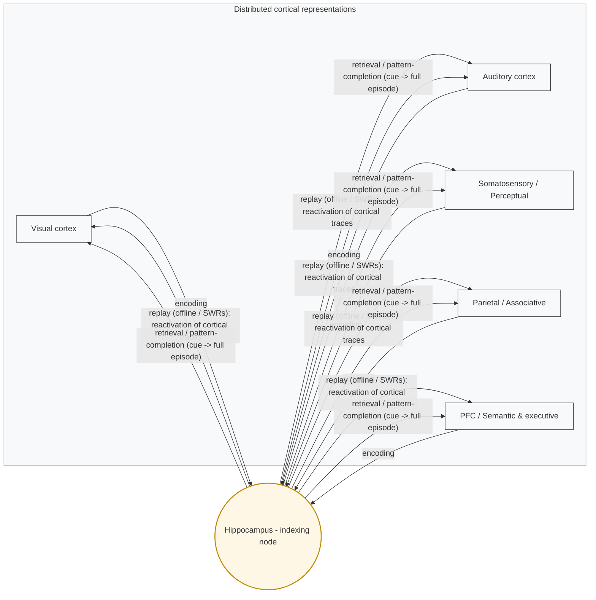
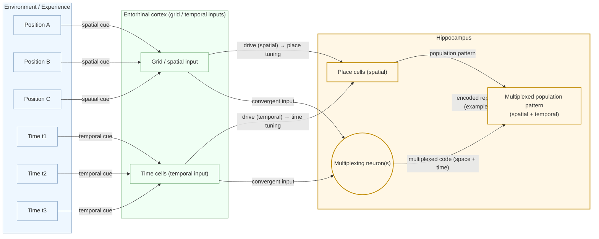
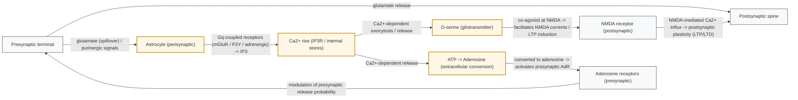
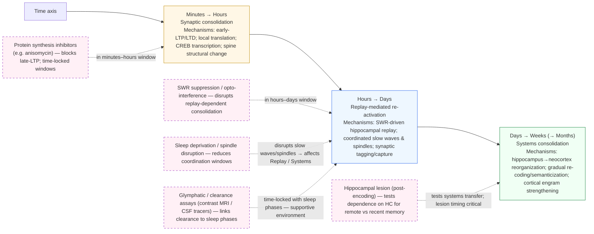
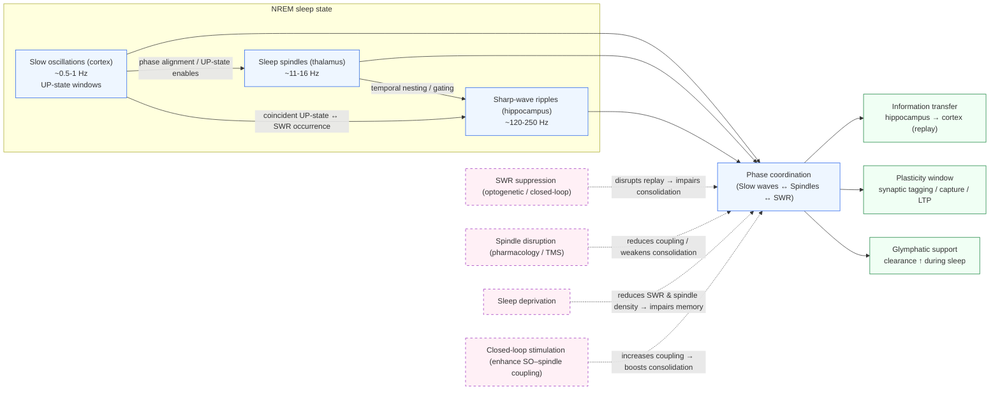
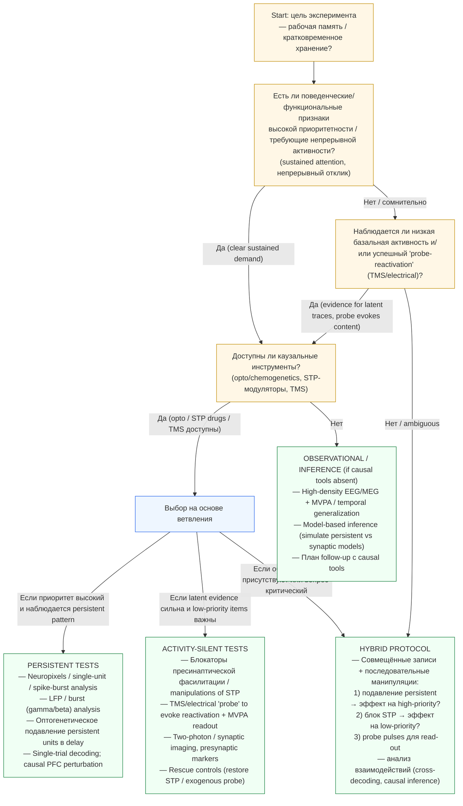

# Архитектуры памяти: концепции, нейронные механизмы и вычислительные реализации

## 1. Введение

### 1.1. Цели и охват

Цель этого обзора — дать системный, межуровневый синтез современных представлений об архитектурах памяти: от молекулярных и клеточных механизмов до системной организации и вычислительных моделей, а также их взаимных влияний и трансляций в области машинного обучения. Обзор ориентирован на интеграцию данных из трех взаимосвязанных доменов:

• **Биологические уровни** — молекулярные каскады пластичности (LTP/LTD, белковый синтез, эпигенетика), клеточные компоненты (нейроны, ансамбли, глия), системная организация (гиппокамп, неокортекс, подкорковые структуры) и временные процессы (консолидация, replay, сон). ([PubMed][1], [PMC][2])

• **Когнитивные/поведенческие уровни** — классические и современные когнитивные модели памяти (модели STM/WM/LTM; эпизодическая vs семантическая память), критерии для связывания нейронной активности и поведения. ([SCIRP][3], [НаукaДирект][4])

• **Вычислительный и прикладной уровни** — формальные модели (аттракторные сети, CLS, RNN/Transformer, memory-augmented nets), их метрики (ёмкость, стабильность, continual-learning) и возможности переноса биологических принципов (replay, sparse engrams, neuron–astrocyte modules) в алгоритмы ИИ. ([PubMed][5], [Science][6])

Временной охват обзора — классические и фундаментальные работы (1960–2000-е гг.) **и** ключевые современные публикации до включительно 2025 года; при отборе литературы приоритет отдаётся работам с высокой цитируемостью, крупным обзорам и исследованиям с каузальной методологией (оптогенетика, хемогенетика, causal neuroimaging).

**Задачи раздела:** (i) задать терминологию и уровни анализа, (ii) обозначить главные эмпирические и теоретические опоры обзора, (iii) сформулировать критические «мостовые» вопросы, которые будут решаться в следующих разделах (например: «что является единицей памяти?»; «как согласовать activity-silent и persistent механизмы?»; «какую роль играют глиальные сети в формировании и забывании?»).

### 1.2. Краткий исторический контекст и ключевые парадигмальные сдвиги

#### Классическая когнитивная парадигма

Классические когнитивные модели памяти заложили фундаментальные понятия, с которыми работает современная нейронаука: модель Atkinson & Shiffrin (modal model) формализовала идею последовательных стадий хранения (регистры сенсорной информации → кратковременная память → долговременная память) и контрольных процессов, что стало отправной точкой для экспериментальной психологии памяти и моделирования. ([SCIRP][3])

Параллельно Endel Tulving ввёл критическое различие между **эпизодической** (memory for personally experienced events) и **семантической** (факты, знания) памятью, что определило направление исследований нервных коррелятов разных видов долговременной памяти. Это разграничение остаётся центральным для интерпретации нейровизуализационных и поведенческих данных. ([НаукaДирект][4])

#### Переход к нейронным и клеточным механизмам (LTP / engram)

Во второй половине XX — начале XXI века фокус сместился на молекулярно-клеточные механизмы: открытие длиннодействующей потенциации (LTP/LTD), роль белкового синтеза и транскрипционных программ в консолидации создало мост между поведенческими феноменами и синаптической биохимией. Параллельно развивается идея **engram** — множественных «клеточных» субстратах памяти — и появление каузальных методов (опто/хемогенетика, TRAP-метки) позволило напрямую манипулировать и трассировать engram-клетки. Современные обзоры суммируют мощную совокупность доказательств за существование распределённых, селективно вовлечённых ансамблей нейронов как физических носителей отдельных воспоминаний. ([PMC][2], [PubMed][7])

#### Появление нейродинамических и «activity-silent» идей для WM

В исследовании рабочей памяти классическая идея персистентной спайковой активности подверглась пересмотру: теории «activity-silent» и синаптической краткосрочной пластичности (например, Mongillo et al., 2008) предлагают, что информацию можно удерживать не только через устойчивый спайкинг, но и через краткосрочные синаптические следы и динамические паттерны функциональной связности. Дальнейшие эмпирические и аналитические работы (MVPA, causal neuroimaging) тестируют эти конкурирующие гипотезы. ([PubMed][1])

#### Глиальная революция: от «поддержки» к активной роли

Один из самых значимых парадигмальных сдвигов последних двух десятилетий — вывод о том, что глиальные клетки (астроциты, микроглия, олигодендроциты) не просто «техническая» поддержка, а активные участники синаптической и сетевой обработки: концепция **tripartite synapse** формализовала двунаправленную коммуникацию нейрон–астроцит–синапс и показала, как Ca²⁺-сигналы и глиотрансмиттеры модифицируют LTP/LTD и сетевые ответы. Современные работы дополнительно связывают глию с метаболической поддержкой консолидации (glycogen–lactate shuttle), синаптическим прайнингом (микроглия + комплемент) и даже с вычислительными функциями памяти: недавние теоретические/симуляционные исследования демонстрируют, что включение астроцитарных механизмов может радикально увеличить ёмкость и устойчивость ассоциативной памяти. Эти результаты требуют, чтобы современная теория памяти рассматривала память как свойство не только нейронных ансамблей, но и нейрон–глиальных контуров. ([PubMed][8])

#### Современный синтез: мультиуровневость и вычислительная интеграция

Современная парадигма памяти признаёт, что отдельные феномены памяти (быстрое сохранение эпизодов, стабильная семантизация, кратковременное удерживание, забвение) реализуются через мультиуровневые и взаимодействующие механизмы — от молекул и синапсов до больших сетей и алгоритмов, сходных с теми, что применяют в ИИ (replay, complementary learning, external memory). Таким образом, актуальная задача поля — выстроить согласованный язык и набор экспериментальных критериев, которые позволят связать механистические находки (causal perturbations, molecular signatures) с расчетными свойствами (ёмкость, устойчивость, plasticity vs stability trade-off) и поведением. ([PMC][2], [Science][6])

---

### Источники

* Atkinson R.C., Shiffrin R.M. (1968). *Human Memory: A Proposed System and its Control Processes* (modal model). ([SCIRP][3])
* Tulving E. (1972). *Episodic and semantic memory.* ([НаукaДирект][4])
* Josselyn S.A., Tonegawa S. (2020). *Memory engrams: Recalling the past and imagining the future.* Science. doi:10.1126/science.aaw4325. ([PubMed][7])
* Perea G., Navarrete M., Araque A. (2009). *Tripartite synapses: astrocytes process and control synaptic information.* Trends Neurosci. doi:10.1016/j.tins.2009.05.001. ([PubMed][8])
* Mongillo G., Barak O., Tsodyks M. (2008). *Synaptic theory of working memory.* Science. doi:10.1126/science.1150769. ([PubMed][1])
* Kozachkov L. et al. (2025). *Neuron–astrocyte associative memory.* PNAS. doi:10.1073/pnas.2417788122 (важная современная теоретико-эмпирическая работа по роли астроцитов). ([PubMed][9])

[1]: https://pubmed.ncbi.nlm.nih.gov/18339943/ "Synaptic theory of working memory"
[2]: https://pmc.ncbi.nlm.nih.gov/articles/PMC7577560/ "Memory engrams: Recalling the past and imagining ..."
[3]: https://www.scirp.org/reference/referencespapers?referenceid=1871264 "Atkinson, R. C., & Shiffrin, R. M. (1968). Human Memory A ..."
[4]: https://www.sciencedirect.com/science/article/abs/pii/S0028393220300373 "An historical perspective on Endel Tulving's episodic- ..."
[5]: https://pubmed.ncbi.nlm.nih.gov/26051384/ "'Activity-silent' working memory in prefrontal cortex"
[6]: https://www.science.org/doi/10.1126/science.1150769 "Synaptic Theory of Working Memory"
[7]: https://pubmed.ncbi.nlm.nih.gov/31896692/ "Memory engrams: Recalling the past and imagining ..."
[8]: https://pubmed.ncbi.nlm.nih.gov/19615761/ "astrocytes process and control synaptic information"
[9]: https://pubmed.ncbi.nlm.nih.gov/40408402/ "Neuron-astrocyte associative memory"

---

## 2. Когнитивные архитектуры и представления памяти

### 2.1. Классические модели STM / WM / LTM; Baddeley (episodic buffer)

**Краткий обзор моделей.**   
Классическая парадигма многослойного хранения (modal/ multi-store model) формулирует различие между сенсорными регистрами, кратковременной памятью и долговременным хранилищем; эта схема (Atkinson & Shiffrin) дала удобную рамку для экспериментальной психологии и подчеркнула роль контрольных процессов (внимание, репетиция) в переносе информации в долговременную память. ([НаукaДирект][10], [Nova Southeastern University][11])

Baddeley & Hitch (1974) и последующие расширения привели к современной модели **рабочей памяти (WM)** как многокомпонентной системы (фоне-фонологическая петля, визуо-пространственный блокнот, центральный исполнитель) и — в дополнение — к введению **episodic buffer** (Baddeley, 2000) как временного буфера интеграции многомодальной информации и связки с долговременной памятью. Концепция episodic buffer удобна для объяснения короткосрочной интеграции контекста и для объяснения результатов, где одновременно требуется хранение разных типов информации. ([PubMed][12])

**Каузальные и нейробиологические связи.**   
Когнитивные многокомпонентные модели были успешно соотнесены с нейробиологическими данными: PFC часто рассматривают как нейронный субстрат центрального исполнителя и контроля, тем временем сенсорные буферы и кратковременные представления локализуются в соответствующих сенсорных зонах (взаимодействие PFC→сенсорные коры при удержании и манипуляции). Современные данные (физиология, fMRI) показывают, что WM — это не «один» механизм, а набор процессов (поддержание, приоритетизация, обновление), реализуемых распределёнными сетями. ([Nature][13], [PMC][14])

**Вывод.**  
При описании WM важно отчетливо разделять: (i) функциональные компоненты (хранение, контроль), (ii) их временную динамику (секунды → минуты), и (iii) множественность нейрофизиологических реализаций (персистентная активность, синаптические следы). Baddeley (2000) остаётся обязательной отправной точкой при обсуждении интегративных краткосрочных буферов. ([PubMed][12])

**Ключевые источники.**

* Baddeley A. *The episodic buffer: a new component of working memory?* Trends Cogn Sci. 2000. doi:10.1016/S1364-6613(00)01538-2. ([PubMed][12])
* Atkinson RC, Shiffrin RM. *Human Memory: A Proposed System and its Control Processes.* 1968. ([НаукaДирект][10])

---

### 2.2. Эпизодическая / семантическая / процедурная память — различия и нейронные корреляты

**Классификация и поведенческие признаки.**  
Классическое разграничение эпизодической (личные события, связаны с контекстом времени/места) и семантической (общеизвестные факты, без привязки к конкретному опыту) памяти введено Tulving (1972) и по сей день является рабочей категорией для экспериментов и нейровизуализации; эти системы могут взаимодействовать, но имеют разные требования к кодированию и консолидированию. Кроме того, процедурная (implicit) память — обучение навыкам и привычкам — выделяется своими нейробиологическими подложными (базальные ганглии, мозжечок) и относительно независима от декларативных систем. ([Alice Kim, PhD][15], [PubMed][16])

**Нейронные корреляты (классика → современные данные).**

* **Гиппокамп / медиальная височная область (MTL)** — критичен для кодирования и восстановления эпизодических воспоминаний (классический пример HM; современные нейрофизиологические и lesion-данные). Гиппокамп обеспечивает быстрый «one-shot» код и индексирование контекста; он также участвует в временной организации последовательностей (time-cells). ([PMC][17])
* **Неокортекс** — участвует в постепенной семантизации и долговременном хранении обобщённых представлений; системная консолидация предполагает перенос зависимости от MTL к кортикальным схемам при длительной интеграции. ([whoville.ucsd.edu][18])
* **Базальные ганглии / стриатум и мозжечок** — ключевые структуры процедурного, навигационного и моторного обучения; их вклад в формирование привычек и алгоритмических навыков подтверждён экспериментально. ([НаукaДирект][19], [PMC][20])

**Синтез доказательств.**  
Комбинация нейропсихологии (lesion/patient work), одновременных записей единичных нейронов и современных методов неинвазивной и инвазивной нейровизуализации (fMRI, intracranial) сформировала согласованную картину: различные виды памяти задействуют частично перекрывающиеся, частично специализированные сети, а способность к «перекодовке» (семантизация) зависит от временных масштабов и повторения/обобщения. ([PMC][17], [whoville.ucsd.edu][18])

**Вывод.**  
При сопоставлении когнитивной классификации и нейробиологии нужно опираться на мультиметодные доказательства: lesion + single-unit + population imaging. Для эпизодики — акцент на MTL/hippocampus и temporal coding; для семантики — распределённый кортикальный «след» и длительная интеграция. ([PMC][21])

**Ключевые источники.**

* Tulving E. *Episodic and semantic memory* (1972). ([Alice Kim, PhD][15])
* Squire LR. *Memory systems of the brain: a brief history and current perspective.* Neurobiol Learn Mem. 2004. doi:10.1016/j.nlm.2004.06.005. ([PubMed][16])
* Eichenbaum H. *Prefrontal-hippocampal interactions in episodic memory.* Nat Rev Neurosci. 2017. doi:10.1038/nrn.2017.74. ([Nature][13])

---

### 2.3. Представления: популяционные коды, sparse vs dense, временные коды; критерии доказательности (поведенч./нейровиз.)

**Популяционные коды и их вычислительные преимущества.**  
Современная нервная наука оперирует не «кодом одной клетки», а **популяционным кодом** — информацией несут распределённые паттерны активности большого числа нейронов. Теоретические и практические работы показывают, что популяционные представления обеспечивают устойчивость к шуму, возможность кодирования вероятностной информации и удобны для байесовских вычислений на уровне мозга. ([PubMed][22])

**Sparse vs dense (distributed) коды.**  
Различие между «sparse» и «dense» (широко распределёнными) представлениями — важный параметр архитектуры памяти. *Sparse distributed coding* (каждое воспоминание активирует малую долю нейронов; каждую нейрон — лишь для немногих воспоминаний) благоприятствует быстрому запоминанию и уменьшению перекрытия (interference) — что особенно важно для эпизодической памяти (гиппокамп). *Dense* или сильно распределённые коды повышают устойчивость и ёмкость для постепенных обобщений. Эмпирические данные (in vivo single-unit recordings у людей и животных) поддерживают идею, что гиппокамп использует относительно разреженные представления при кодировании отдельных эпизодов. ([Nature][23], [PNAS][24])

**Временные коды: time cells, temporal context, sequence coding.**  
Память — это не только «что», но и «когда». Модели временнóй контекстуализации (Temporal Context Model, TCM) формализуют, как контекст эволюционирует и связывает последовательности событий, объясняя поведенческие эффекты (recency, contiguity). На нейронном уровне описаны «time cells» в гиппокампе, которые активируются в определённые моменты внутри эпизода и могут обеспечивать кодирование временной структуры событий. Эти находки связывают вычислительные модели последовательностей с реальной физиологией. ([НаукaДирект][25], [PubMed][26])

**Методы для обнаружения и верификации представлений (критерии доказательности).**  
Для установления природы представлений в мозге современные исследования используют многокомпонентный набор методов:

1. **Behavioral signatures** — образы ошибок, границы обобщения, эффекты интерференции/консолидации; характеристики дают гипотезы о формате кодирования.
2. **Lesion / patient evidence** — демонстрация потери определённых видов хранения при локальных поражениях (например, MTL → эпизодическая амнезия). ([PMC][17])
3. **Single-unit / population electrophysiology** — direct spike recordings показывают sparse responses, place/time cells и т.д. (ключевые работы у человека и животных). ([PMC][27], [PubMed][26])
4. **fMRI MVPA / RSA / multivariate methods** — multivariate pattern analysis (MVPA) и representational similarity analysis (RSA) позволяют обнаружить информацию, закодированную в распределённых паттернах BOLD-активности, и связать её с форматом представления (Haxby, Norman, Kriegeskorte и последователи). Эти методы особенно полезны при работе с человеческими данными, где инвазивная запись недоступна. ([PubMed][28], [Frontiers][29])
5. **Computational decoding / encoding models** — проверка, можно ли декодировать стимул/воспоминание из наблюдаемой активности (и насколько хорошо), что служит количественным критерием формата представления. ([cs.cmu.edu][30])

**Практические критерии доказательности**:

* репликация результата в ≥2 независимых методах (например, single-unit + MVPA или lesion + fMRI);
* causal perturbation (stimulation/lesion/optogenetic manipulation) даёт ожидаемое изменение поведения;
* количественное decoding: значимо выше случайного уровня, и модель объясняет вариацию поведения;
* временная/функциональная проверка: предсказание модели выдерживается при изменении контекста или временных условий.

**Вывод.**  
Понятие «представления» многогранно: в разных системах (гиппокамп vs неокортекс vs моторные области) оптимальные форматы (sparse ↔ dense; rate ↔ temporal) различаются. Важно сочетать методы — behavioral, lesion, single-unit и MVPA — и оценивать доказательства по строгим критериям causal + quantitative. ([PubMed][22], [Frontiers][29])

### Источники

* Pouget A., Dayan P., Zemel R. *Inference and computation with population codes.* Annu Rev Neurosci. 2003. doi:10.1146/annurev.neuro.26.041002.131112. ([PubMed][22])
* Olshausen BA, Field DJ. *Emergence of simple-cell receptive field properties by learning a sparse code for natural images.* Nature. 1996. doi:10.1038/381607a0. ([Nature][23])
* Norman KA, Polyn SM, Detre GJ, Haxby JV. *Beyond mind-reading: multi-voxel pattern analysis of fMRI data.* Trends Cogn Sci. 2006. doi:10.1016/j.tics.2006.07.005. ([PubMed][28])
* Kriegeskorte N., Mur M., Bandettini P. *Representational similarity analysis – connecting the branches of systems neuroscience.* Front Syst Neurosci. 2008. doi:10.3389/neuro.06.004.2008. ([Frontiers][29])
* Mongillo G., Barak O., Tsodyks M. *Synaptic theory of working memory.* Science. 2008. doi:10.1126/science.1150769. ([Science][31])
* Wixted JT. et al. *Sparse and distributed coding of episodic memory in neurons of the human hippocampus.* PNAS. 2014. doi:10.1073/pnas.1408365111. ([PNAS][24])
* Howard MW., Kahana MJ. *A distributed representation of temporal context.* J Math Psychol. 2002. (см. TCM и последующие работы). ([НаукaДирект][25])

[10]: https://www.sciencedirect.com/science/article/pii/S0079742108604223   "Human Memory: A Proposed System and its Control ..."
[11]: https://app.nova.edu/toolbox/instructionalproducts/edd8124/articles/1968-Atkinson_and_Shiffrin.pdf   "A PROPOSED SYSTEM AND ITS CONTROL PROCESSES!"
[12]: https://pubmed.ncbi.nlm.nih.gov/11058819/   "The episodic buffer: a new component of working memory?"
[13]: https://www.nature.com/articles/nrn.2017.74   "Prefrontal–hippocampal interactions in episodic memory"
[14]: https://pmc.ncbi.nlm.nih.gov/articles/PMC3529504/   "Multivoxel Pattern Analysis for fMRI Data: A Review - PMC"
[15]: https://alicekim.ca/12.EpSem72.pdf   "Episodic and Semantic Memory"
[16]: https://pubmed.ncbi.nlm.nih.gov/15464402/   "Memory systems of the brain: a brief history and current ..."
[17]: https://pmc.ncbi.nlm.nih.gov/articles/PMC2649674/   "The Legacy of Patient H.M. for Neuroscience - PMC"
[18]: https://whoville.ucsd.edu/PDFs/384_Squire_%20NeurobiolLearnMem2004.pdf   "Memory systems of the brain: A brief history and current ..."
[19]: https://www.sciencedirect.com/science/article/abs/pii/B9780128022061000350   "Chapter 35 - Memory Systems of the Basal Ganglia"
[20]: https://pmc.ncbi.nlm.nih.gov/articles/PMC6675171/   "Impaired Bidirectional Synaptic Plasticity and Procedural ..."
[21]: https://pmc.ncbi.nlm.nih.gov/articles/PMC2952732/   "Interdependence of episodic and semantic memory"
[22]: https://pubmed.ncbi.nlm.nih.gov/12704222/   "Inference and computation with population codes"
[23]: https://www.nature.com/articles/381607a0   "Emergence of simple-cell receptive field properties by ..."
[24]: https://www.pnas.org/doi/10.1073/pnas.1408365111   "Sparse and distributed coding of episodic memory in ..."
[25]: https://www.sciencedirect.com/science/article/pii/S0022249601913884   "A Distributed Representation of Temporal Context"
[26]: https://pubmed.ncbi.nlm.nih.gov/21867888/   "Hippocampal \"time cells\" bridge the gap in memory for ..."
[27]: https://pmc.ncbi.nlm.nih.gov/articles/PMC5798361/   "Coding of episodic memory in the human hippocampus"
[28]: https://pubmed.ncbi.nlm.nih.gov/16899397/   "Beyond mind-reading: multi-voxel pattern analysis of fMRI data"
[29]: https://www.frontiersin.org/journals/systems-neuroscience/articles/10.3389/neuro.06.004.2008/full   "Representational similarity analysis - connecting the ..."
[30]: https://www.cs.cmu.edu/afs/cs/academic/class/15883-f19/readings/pouget-2003.pdf   "INFERENCE AND COMPUTATION WITH POPULATION ..."
[31]: https://www.science.org/doi/10.1126/science.1150769   "Synaptic Theory of Working Memory"

---

## 3. Системный уровень: области, межрегиональная динамика и реплей

### 3.1. Гиппокамп: индексирование, spatial/temporal coding, роль в быстром обучении

**Функциональная роль и индексная гипотеза.**  
Гиппокамп традиционно рассматривают как ключевой узел для формирования и начальной фиксации эпизодических воспоминаний — быстрое «one-shot» кодирование, которое затем индексирует, активирует и связывает распределённые кортикальные представления. Идея «hippocampal indexing» (Teyler & DiScenna; обновления) формулирует, что гиппокамп не является долгосрочным хранилищем всех подробностей, а содержит индекс (ссылку) на разрозненные кортикальные следы, что делает возможным восстановление целого эпизода по частичному входу. ([PubMed][32])

>  *Hippocampus as an index.* Схематическое изображение гиппокампа как индексирующей структуры, связывающей распределённые кортикальные представления. Стрелки — основные потоки: **encoding** (кортикальные следы → гиппокамп; быстрое one-shot кодирование), **replay (offline / SWRs)** (гиппокамп → кортикальная реактивация, консолидирующая/перекодирующая представления), **retrieval / pattern-completion** (частичный кортикальный/внешний сигнал → гиппокамп → восстановление полного кортикального набора). 

**Кодирование пространства и времени.**  
Гиппокамп содержит явные «place cells», кодирующие положение в пространстве, — классическая система навигации у грызунов. Параллельно описаны «time cells», которые активируются в определённые моменты внутри эпизодических последовательностей и обеспечивают временную организацию воспоминаний. Современные данные демонстрируют, что отдельные нейроны гиппокампа и энторинальной области могут multiplex (совместно кодировать) пространственную и временную информацию, что поддерживает представление «что произошло где и когда». Подходы от single-unit recording до внутримозговой записи у людей подтверждают роль гиппокампа в кодировании временной структуры эпизодов. ([PNAS][33], [Nature][34])

> *Temporal / spatial multiplexing.* Схема иллюстрирует, как пространственные (place/grid) и временные (time cells) входы конвергируют в энторинально-гиппокампальной сети, давая как чистые place/time представления, так и смешанные (multiplexed) популяционные паттерны, которые кодируют «что произошло где и когда». 

**Быстрое обучение и индексирование контекста.**  
Эмпирические данные (lesion, optogenetic engram work, single-unit studies) показывают, что гиппокамп необходим для быстрого формирования новых спекотных воспоминаний и для связывания многомодальной информации в единую временную структуру события; без гиппокампальной функции происходит нарушение кодирования новых эпизодов (классические пациенты и современные модели). Это свойство — высокая скорость обучения при относительно низком уровне интерференции — делает гиппокамп идеальным решением задачи «быстрой памяти» в биологической архитектуре. ([Nature][35], [Frontiers][36])

**Ключевые источники.** ([PubMed][32], [PNAS][33], [Nature][34])

---

### 3.2. Неокортекс: интеграция, семантизация и долгосрочное хранение

**Долгосрочная интеграция и семантизация.**  
В парадигме systems consolidation неокортекс выступает местом постепенного «встраивания» и обобщения эпизодической информации в более устойчивые, семантические представления. Повторное воспроизведение (replay) и взаимодействие с гиппокампом во время сна или покоя способствуют реорганизации следов памяти и формированию кортикальных «engram»-эквивалентов, которые в конечном счёте позволяют воспроизводить содержимое воспоминаний независимо от гиппокампа. Современные молекулярно-клеточные и поведенческие работы указывают на наличия кортикальных engram-клеток, которые укрепляются с течением времени. ([Nature][35], [PMC][37])

**Функциональная специализация по уровням абстракции.**  
Кортикальные области демонстрируют градиенты «абстракции»: сенсорные кортикальные поля кодируют конкретные перцептивные признаки, ассоциативные области — более абстрактные и контекстные аспекты, а префронтальная кора — исполнительный и семантический контроль. Обобщение и семантизация воспоминаний (например, преобразование набора эпизодов в структуру знаний) связаны с длительным взаимодействием между этими уровнями и системной перестройкой синаптических весов. ([Nature][35])

**Временная перспектива: от «fast hippocampal, slow cortical».**  
Модель «быстрой гиппокампальной учётности — медленной кортикальной интеграции» (Complementary Learning Systems) остаётся полезным формализмом: она объясняет, почему быстрое обучение не разрушает уже существующие кортикальные знания (т.е. почему нейронная система избегает катастрофического забывания). Современная работа подчеркивает, что «перемещение» следа от гиппокампа к коре — это не простая передача, а трансформация представлений (re-coding), способствующая семантизации. ([eLife][38], [Nature][35])

**Ключевые источники.** ([Nature][35], [PMC][37])

---

### 3.3. Подкорковые структуры: стриатум, миндалина, мозжечок — специфические роли

**Стриатум и процедурная память / привычки.**  
Дорсальный стриатум (часть базальных ганглий) является центральным узлом для формирования навыков, привычек и процедурного обучения. Он участвует в кумулятивном усилении поведенческих стратегий и автоматизации последовательностей действий; функционально стриатум работает в тесной связке с моторной корой и допаминергическими путями для оценки вознаграждения и выбора действий. Эти сети обеспечивают долговременное изменение поведения, характерное для процедурной памяти. ([PMC][39], [ScienceDirect][40])

**Миндалина и эмоциональная модуляция воспоминаний.**  
Миндалина критична для эмоциональной селекции значимых событий и усиления их консолидации — особенно для страха и аверсивных воспоминаний. Она взаимодействует с гиппокампом и корой, модулируя кодирование и последующую консолидацию через нейрохимические сигналы (норэпинефрин, гормоны стресса). Современные интерактивные записи у людей выявляют фазовую координацию амгдали-гиппокампальных взаимодействий, которые предсказывают успешное кодирование эмоциональных событий. ([Nature][41], [PMC][42])

**Мозжечок и предиктивная / процедурная функция.**  
Традиционно мозжечок ассоциировали с моторной координацией и обучением моторным навыкам; за последние годы накопились данные о его вкладе в когнитивные и языковые аспекты (моделирование временных структур, предсказание сенсомоторных последствий и вклад в сложные последовательности). Современные обзоры подчёркивают участие мозжечка в процедурах, где требуется тонкая временная координация и корректировка исполнения, что делает его неотъемлемой частью архитектуры процедурной памяти. ([PMC][43])

**Кросс-системная кооперация.**  
Важно отметить, что разделение на «декларативные vs процедурные» системы — условно: при выполнении реальных задач часто вовлекаются гибридные сети (например, при освоении навигации — гиппокамп + стриатум; при эмоционных воспоминаниях — гиппокамп + миндалина). Сетевые взаимодействия обеспечивают гибкость и контекст-зависимость поведения. ([PMC][44], [Nature][41])

**Ключевые источники.** ([PMC][39], [Nature][41])

---

### 3.4. Динамика между областями: синхронность, Sharp-Wave Ripples (SWRs) / replay и их функциональные роли

**SWRs и replay — феноменология.**  
Sharp-wave ripples (SWRs) — короткие эпизоды высокочастотной синхронизации в гиппокампе — сопровождаются ускоренной репродукцией последовательностей нейронной активности, соответствующей ранее пережитым траекториям или событиям. Реплей наблюдается как в состоянии сна (NREM), так и в периодах покоя/бодрствования; он ассоциирован с усилением памяти, реконсолидированием следов и потенциально с онлайн-планированием (предсказание альтернативных действий). ([PMC][45])

**Функциональные гипотезы: консолидация vs планирование/выбор.**  
В литературе существуют — не взаимоисключающие — гипотезы о ролях реплея: (i) **offline consolidation** (синхронные SWR-события во время сна служат переносом и перестройкой представлений в неокортексе); (ii) **online planning/decision-making** (awake replay помогает моделировать возможные траектории и выбирать действия); (iii) **selection/filtering** воспоминаний (реплей может «отбирать» релевантные эпизоды для консолидации). Последние экспериментальные данные указывают, что содержание реплея варьируется в зависимости от контекста (награды, необходимость планирования) и что SWR-события координируют гиппокамп-кориальные взаимодействия. ([Наука][46], [Cell][47])

**Координация гиппокамп-кора: временная синхронизация и байпасные каналы.**  
Синхронность (фазовая координация) между hippocampal SWR и кортикальными состояниями (UP/DOWN states, slow oscillations) создаёт временные окна для эффективной передачи информации и пластических изменений в коре. Консенсусные методологические рекомендации подчёркивают, что корректное обнаружение SWR и оценка их взаимодействия с корой — критически важны для интерпретации реплея в контексте консолидирования vs планирования. ([Nature][48], [PMC][49])

**Методологические замечания и новые подходы.**  
Актуальные проблемы в области включают: стандарты детекции SWR (consensus statements), отсутствие «ground truth» для оценки алгоритмов обнаружения реплея, и необходимость мультилабовых репликаций. Новые методические работы предлагают строгие frameworks для оценки реплея и показывают, что разные методы обнаружения могут давать разные картины содержимого SWR. Это важно учитывать при интерпретации результатов и сопоставлении исследований. ([Nature][48], [PMC][50])

**Ключевые источники.** ([PMC][45], [Nature][48], [Наука][46])

---

| Область | Основные функции | Временные масштабы | Ключевые доказательства / методы | 
|---|---:|---:|---|
| Гиппокамп | Индексирование эпизодов; быстрое one-shot обучение; кодирование «где/когда» (place & time cells) | Быстрые (миллисек — секунды для кодирования), консолидируется в течение часов — дней | Lesion studies; single-unit recordings; optogenetic engram manipulations; intracranial recordings в человеке | 
| Неокортекс | Долгосрочная интеграция и семантизация; хранение «remote» engrams; уровни абстракции (сенсор → ассоц → PFC) | Медленные (дни — месяцы — годы) — постепенная перестройка синапсов | Molecular/cellular tagging of engram cells; longitudinal imaging; fMRI/EEG; systems-consolidation paradigms | 
| Стриатум | Процедурная память, навыки и привычки; кумулятивное обучение действий | Средне/длительные (повторение → автоматизация; дни — недели — месяцы) | Lesion / inactivation; electrophysiology; behavioral habit paradigms; dopaminergic manipulations | 
| Миндалина (амигдала) | Эмоциональная модуляция кодирования и консолидации (особенно страх/аверсия) | Быстрое усиление кодирования (симультанно с гиппокампом) + влияние на долгосрочную фиксацию | Human iEEG/fMRI; Pavlovian fear paradigms; connectivity analyses; neuromodulator manipulations | 
| Мозжечок | Предиктивные и временные вычисления для моторных и некоторых когнитивных задач; коррекция исполнения | Короткие и точные временные масштабы (мс — с) в задачах с тонкой координацией; долговременный вклад в навыки | Lesion / stimulation; circuit tracing; behavioral motor learning; recent cognitive-function reviews | 

---

### Источники

* Teyler TJ, DiScenna P. *The hippocampal indexing theory and episodic memory* (review/updates). 2007/1986. ([PubMed][32])
* J. H. Lee et al. *Neocortical synaptic engrams for remote contextual memory.* Nat Neurosci. 2023. ([Nature][35])
* Reddy L. et al. *Human hippocampal neurons track moments in a sequence / time cells.* PNAS. 2020. ([PNAS][33])
* Consensus statement on detection of hippocampal sharp-wave ripples. Liu AA et al., Nat Commun. 2022. ([Nature][48])
* Gillespie AK et al. *Hippocampal replay reflects specific past experiences.* 2021. (review/empirical). ([PMC][50])
* Yang W. et al. *Selection of experience for memory by hippocampal sharp-wave ripples.* Science, 2024. ([Наука][46])
* Graybiel AM. *The striatum: where skills and habits meet.* 2015 (review). ([PMC][39])
* Costa M. et al. *Aversive memory formation in humans involves amygdala-hippocampal coupling.* Nat Commun. 2022. ([Nature][41])
* Mastrangelo S. et al. *The role of the cerebellum in advanced cognitive functions.* 2024 (review). ([PMC][43])

[32]: https://pubmed.ncbi.nlm.nih.gov/17696170/   "The hippocampal indexing theory and episodic memory"
[33]: https://www.pnas.org/doi/10.1073/pnas.2013250117   "Time cells in the human hippocampus and entorhinal ..."
[34]: https://www.nature.com/articles/s41467-024-54932-5   "Multiplexing of temporal and spatial information in the ..."
[35]: https://www.nature.com/articles/s41593-022-01223-1   "Neocortical synaptic engrams for remote contextual ..."
[36]: https://www.frontiersin.org/journals/behavioral-neuroscience/articles/10.3389/fnbeh.2020.632019/full   "The Quest for the Hippocampal Memory Engram"
[37]: https://pmc.ncbi.nlm.nih.gov/articles/PMC9720899/   "Has the concept of systems consolidation outlived its ..."
[38]: https://elifesciences.org/articles/85635   "Evaluating hippocampal replay without a ground truth"
[39]: https://pmc.ncbi.nlm.nih.gov/articles/PMC4526748/   "The Striatum: Where Skills and Habits Meet - PubMed Central"
[40]: https://www.sciencedirect.com/science/article/abs/pii/S2352154617301237   "Corticostriatal foundations of habits"
[41]: https://www.nature.com/articles/s41467-022-33828-2   "Aversive memory formation in humans involves an ..."
[42]: https://pmc.ncbi.nlm.nih.gov/articles/PMC9234481/   "Emotional Memory and Amygdala Activation - PMC"
[43]: https://pmc.ncbi.nlm.nih.gov/articles/PMC11351585/   "The Role of the Cerebellum in Advanced Cognitive ..."
[44]: https://pmc.ncbi.nlm.nih.gov/articles/PMC3432931/   "Striatal contributions to declarative memory retrieval - PMC"
[45]: https://pmc.ncbi.nlm.nih.gov/articles/PMC6039287/   "Sharp-wave ripples as a signature of hippocampal ..."
[46]: https://www.science.org/doi/10.1126/science.adk8261   "Selection of experience for memory by hippocampal sharp ..."
[47]: https://www.cell.com/trends/neurosciences/fulltext/S0166-2236%2825%2900037-2   "Awake replay: off the clock but on the job"
[48]: https://www.nature.com/articles/s41467-022-33536-x   "A consensus statement on detection of hippocampal sharp ..."
[49]: https://pmc.ncbi.nlm.nih.gov/articles/PMC9899323/   "The two tales of hippocampal sharp-wave ripple content"
[50]: https://pmc.ncbi.nlm.nih.gov/articles/PMC11666237/   "Evaluating hippocampal replay without a ground truth - PMC"

---

## 4. Глиальные механизмы памяти 

**Коротко.** За 2009–2025 гг. представление о глии трансформировалось: астроциты, микроглия и (в меньшей степени в контексте памяти) олигодендроциты рассматриваются не как пассивная «поддержка», а как активные участники кодирования, консолидации и удаления (забывания) воспоминаний. Это положение подтверждается как многочисленными обзорами и экспериментальными работами (Ca²⁺-signalling, метаболика, complement-mediated pruning), так и новейшими теоретико-вычислительными моделями, которые дают тестируемые предсказания. Ниже — подробное изложение по пунктам 4.1–4.5 с ключевыми ссылками и практическими выводами для экспериментальной и вычислительной работы.

---

### 4.1. Tripartite synapse — Ca²⁺-signalling и глиотрансмиттеры (D-серин, ATP, глутамат): влияние на LTP/LTD

**Основная идея.**  
Синапс должен рассматриваться как «tripartite»: пре- и постсинаптические элементы **+** перисинаптический астроцит. Астроцит реагирует на нейрональную активность всплесками внутриклеточного Ca²⁺ и в ответ выделяет «gliotransmitters» (D-серин, ATP/аденозин, иногда глутамат), которые прямо модифицируют свойства синаптической передачи и правила пластичности (например, пороги и временные окна для LTP/LTD). Это двунаправленное взаимодействие расширяет классическую Хебб-парадигму, вводя дополнительный, регуляторный слой, способный менять долговременную пластичность. ([PubMed][51], [jneurosci.org][52])

> Tripartite synapse.** Схема ключевых Ca²⁺-путей в астроците: нейрональная активация → Gq-рецепторы астроцита → IP3 → высвобождение Ca²⁺ из внутренних депо → Ca²⁺-зависимый выпуск D-сери­на и ATP. D-серин действует как коагонист NMDA (модуляция постсинаптической NMDA-зависимой LTP), ATP внезапно преобразуется в аденозин и через аденозиновые рецепторы модулирует пресинаптический релиз. 

**Эмпирические основания.**

* Прямые наблюдения Ca²⁺-транзиентов в астроцитах и корреляция их с нейронной активностью; фармакологическая/генетическая блокада путей выделения D-сери­на или ATP изменяет величину и/или индукцию LTP в ряде моделей. ([PubMed][51])
* Поведенческие эксперименты: манипуляции astro-cAMP / astro-Ca²⁺ способны модулировать обучение и память в задачах на консолидацию (см. PNAS 2021). ([PNAS][53])

**Молекулярные механизмы (кратко).**

* D-серин как кофактор NMDA-рецепторов → влияет на NMDA-зависимую LTP.
* ATP → аденозиновые рецепторы влияют на пресинаптический release и нейромодуляцию.
* Astro-Ca²⁺ динамика регулируется множеством рецепторов (mGluR, P2Y, adrenergic), что делает астроциты «чувствительными» интеграторами сетевой активности. ([PubMed][51], [PMC][54])

**Выводы для модели/эксперимента.**  
При построении моделей пластичности и при интерпретации LTP-/LTD-эффектов необходимо учитывать астроцитарную модуляцию порогов и временных окон. Экспериментально — комбинировать electrophysiology с записью/манипуляцией astro-Ca²⁺ и rescue-контролями (например, экзогенный D-серин). ([PubMed][51], [PNAS][53])

---

### 4.2. Метаболическая поддержка: гликоген → лактат (astrocyte–neuron lactate shuttle) и влияние на LTP/консолидацию; роль стресса/энергетики

**Основная идея.**  
Астроциты содержат основной запас гликогена мозга; при активации они мобилизуют гликоген и обеспечивают нейроны лактатом. Лактат выполняет двойную роль: энергетического субстрата и сигнальной молекулы, необходимой для синтеза белков и индукции долговременной пластичности. Нарушение лактатного транспорта или гликогенолиза ухудшает LTP и память, тогда как восстановление лактата восстанавливает пластичность в ряде моделей. ([PMC][55], [Nature][56])

```mermaid
graph LR
  Glycogen["Astrocytic glycogen (reserve)"]
  Glycogenolysis["Glycogenolysis -> Lactate production"]
  Lactate["Lactate (export via MCT1/4)"]
  Extracellular["Extracellular lactate pool"]
  NeuronUptake["Neuronal uptake (MCT2)"]
  NeuronalTranslation["Neuronal mRNA -> protein translation\n(required for late-LTP)"]
  LTP["Late-LTP / memory consolidation"]
  Readouts["Readouts: protein synthesis; LTP magnitude; behavioral memory"]

  %% manipulations
  DAB["Glycogenolysis inhibitor (e.g. DAB)"]
  MCTi["MCT inhibitor (e.g. 4-CIN)"]
  ExoLac["Exogenous lactate (rescue)"]

  %% flows
  Glycogen -->|"mobilization"| Glycogenolysis
  Glycogenolysis -->|"produces"| Lactate
  Lactate -->|"export via MCT1/4"| Extracellular
  Extracellular -->|"uptake via MCT2"| NeuronUptake
  NeuronUptake -->|"supports"| NeuronalTranslation
  NeuronalTranslation -->|"enables"| LTP
  LTP -->|"assayed by"| Readouts
  NeuronalTranslation -->|"assayed by"| Readouts

  %% manipulations effects (dashed lines)
  DAB -.->|"inhibits glycogenolysis -> reduces lactate"| Lactate
  MCTi -.->|"blocks lactate transport (astro->neuron)"| NeuronUptake
  ExoLac -.->|"restores neuronal lactate -> rescues translation/LTP"| NeuronUptake

  classDef astro fill:#fff7e6,stroke:#c08a00,stroke-width:2px;
  classDef metabol fill:#eef7ff,stroke:#3b82c4;
  classDef neuron fill:#f0fff4,stroke:#16a34a;
  class Glycogen,Glycogenolysis,Lactate,Extracellular metabol;
  class NeuronUptake,NeuronalTranslation,LTP,Readouts neuron;
  class DAB,MCTi,ExoLac astro;
```

> Схема иллюстрирует: мобилизация астроцитарного гликогена → гликогенолиз → образование лактата → экспорт через MCT1/4 → внеклеточный пул → захват нейронами через MCT2 → поддержка mRNA→protein трансляции в нейронах, необходимой для late-LTP и консолидации. Покажены типичные экспериментальные манипуляции: ингибиторы гликогенолиза (DAB), ингибиторы MCT (4-CIN) и экзогенный лактат-рескью; ожидаемые измерения — белковый синтез, величина LTP и поведенческие тесты памяти. 

**Ключевые результаты и механизмы.**

* Работы показывают, что обучение индуцирует внутриклеточный транспорт лактата и активирует перевод mRNA → белок в нейронах, критичный для долговременной памяти. ([Nature][56])
* Гликоген в астроцитах выполняет роль «энергетического резерва», важного при интенсивном активировании (память, стресс). При стрессе или в стареющем мозге метаболические механизмы могут быть ослаблены, что снижает потенциал для консолидации. ([PMC][54], [ScienceDirect][57])

**Клинические/транляционные замечания.**  
Нарушения astro-метаболики обсуждаются как потенциальный фактор уязвимости при AD и стресс-связанных расстройствах; таргетирование метаболических путей (поддержка лактатного обмена) рассматривается как терапевтическая стратегия. ([PMC][58], [ScienceDirect][57])

**Выводы для эксперимента/модели.**  
В исследованиях консолидации нужно контролировать метаболическое состояние (манипуляции гликогенолизом, применение лактата, метаболомные readouts), включать временные точки (encoding vs early consolidation) и учитывать влияние стресса/aging на astro-метаболизм. ([PMC][55], [Nature][56])

---

### 4.3. Микроглия и complement-опосредованный синаптический прайнинг — механизм «активного забывания»

**Фундаментальное открытие.**  
Микроглия с помощью компонентов комплементной системы (C1q, C3) метит синапсы для фагоцитоза; в зрелом мозге этот механизм участвует в удалении синапсов и в регуляции долговременных сетевых реорганизаций. Ключевое экспериментальное наблюдение — индукция или блокада комплемента влияет на скорость забывания и на структурную перестройку сети. ([PubMed][59])

```mermaid
graph LR
  Syn["Synapse (pre + post)"]
  Tag["C1q / C3 opsonization (complement tagging)"]
  Micro["Microglia (CR3 / complement receptor)"]
  Phago["Phagocytosis / synapse elimination"]
  Network["Network reorganization (loss of connections)"]
  Forget["Behavioral forgetting / reduced recall"]
  Readouts["Readouts: synapse density; EM engulfment; electrophysiology; memory tests"]

  %% causal flow
  Syn -->|"weak / low-activity -> tagged"| Tag
  Tag -->|"recognized by CR3 on microglia"| Micro
  Micro -->|"engulfment / phagocytosis of tagged synapse"| Phago
  Phago -->|"removes synapse -> alters connectivity"| Network
  Network -->|"functional consequence"| Forget

  %% assays
  Phago -->|"measured by"| Readouts
  Network -->|"assayed by"| Readouts
  Forget -->|"assessed by"| Readouts

  %% experimental manipulations (dashed)
  CompInh["Complement inhibition (anti-C1q / anti-C3)"] -.->|"reduces tagging -> spares synapses"| Tag
  CSF1R["Microglia depletion (CSF1R inhibitors)"] -.->|"reduces phagocytosis"| Micro
  Overact["Microglial overactivation / inflammation"] -.->|"increases pruning -> excessive loss"| Phago

  %% styling
  classDef syn fill:#f8f9fa,stroke:#333;
  classDef comp fill:#fff0f6,stroke:#c026d3;
  classDef micro fill:#fff7e6,stroke:#c08a00,stroke-width:2px;
  classDef outcome fill:#eef7ff,stroke:#1e40af;
  class Syn,Tag,Readouts syn;
  class CompInh,CSF1R,Overact comp;
  class Micro,Phago micro;
  class Network,Forget outcome;
```

> Схема показывает: снижение активности / маргинальные синапсы метятся компонентами комплемента (C1q → C3), метка распознаётся микроглией через рецепторы (например, CR3), что приводит к фагоцитозу синапса, сетевой реорганизации и возможному забвению (снижение воспроизведения). На диаграмме также показаны типичные манипуляции: ингибирование комплемента (anti-C1q / anti-C3), деплеция микроглии (CSF1R-ингибиторы) и ситуация переактивации микроглии (воспаление) — с ожидаемыми эффектами на прайнинг и поведение. 

**Ключевая эмпирия.**

* Wang et al. (Science, 2020) продемонстрировали, что микроглия-опосредованное комплемент-зависимое удаление синапсов способствует «забыванию» отдалённых воспоминаний; ингибирование комплемента замедляет забывание. ([PubMed][59])
* Другие работы подтверждают связь между активацией комплемента, ней воспалением и перестройкой синаптических наборов в различных моделях. ([PMC][60])

**Функциональная интерпретация.**  
Забывание — активный, регулируемый процесс, важный для предотвращения интерференции и поддержания адаптивной гибкости. Микроглия обеспечивает механизм «целевого удаления» неактуальных или слабоуправляемых синапсов, участвуя в балансировке стабильности/пластичности. ([PubMed][59])

**Трансляционные перспективы.**  
Терапевтические вмешательства в комплементные пути (локально и временно) имеют потенциал при PTSD (уменьшение патологической стабилизации) или при нейродегенерации (где чрезмерная активность прайнинга может усугублять потерю синапсов). Однако вмешательства должны быть аккуратны — подавление прайнинга может мешать нормальному удалению «шума». ([PubMed][59], [PMC][60])

---

### 4.4. Сетевые / вычислительные функции глии: **Neuron–astrocyte associative memory** 

**Содержательная новизна.**  
Теоретико-вычислительная работа (Kozachkov et al., PNAS 2025) показывает, что включение астроцитов (их морфологии и неспецифической перисинаптической интеграции) в модель Dense Associative Memory позволяет сети достигать существенно большей *ёмкости ассоциативной памяти* и повышенной устойчивости к шуму, по сравнению с чисто нейронными архитектурами. Модель выводит ряд измеримых предсказаний: влияние astro-сигналов на pattern-completion, роль astro-time constants в удержании следов, и условия для повышенной устойчивости при частичной деградации сети. ([PNAS][61], [PubMed][62])

**Почему это важно.**  
Эта работа связывает биофизические наблюдения (астроциты контактируют с огромным числом синапсов, обладают медленной интеграцией и регуляцией) с вычислительными выгодами (analogue buffering, noise filtering, enhanced associative retrieval). Она формулирует чёткие гипотезы, которые можно протестировать экспериментально (см. ниже). ([IBM Research][63], [Центр данных астрофизики][64])

**Предсказания и тестируемые гипотезы.**

* Манипуляции, изменяющие astro-Ca²⁺ dynamics или astro-metabolic coupling, должны влиять на ёмкость и устойчивость ассоциативной памяти в поведении (например, число успешно кодируемых пар «стимул–ответ» до возникновения интерференции).
* При частичном подавлении нейронной сети (ремутаж) модели с астро-слоем должны показывать лучшую восстановительную (pattern-completion) способность.
* Временные константы и пространственная досягаемость astro-интеграции — ключевые параметры: экспериментально можно менять их через opto/chemogenetic-инструменты и измерять последствия. ([PNAS][61])

**Критическое замечание.**  
Модель — мощная теоретическая гипотеза, но требует строгой in vivo валидации: демонстрации, что манипуляции глии изменяют именно **ёмкость/устойчивость** ассоциативного хранения, а не только общую возбудимость или метаболический статус. Эксперименты должны комбинировать поведение, ensemble-записи и манипуляции astro-функций. ([PNAS][61])

---

### 4.5. Методы каузального тестирования глиальных вкладов и ограничения интерпретации

**Основные инструменты (кратко):**

* **Оптогенетика / хемогенетика (DREADDs)** для прямой модуляции astro-/microglia-активности с временной точностью; используется для тестов необходимости/достаточности. ([PNAS][53], [PMC][60])
* **Activity-dependent tagging (TRAP, cfos-based, etc.)** позволяет маркировать активные во время обучения нейронные ансамбли и, при модификации, оценивать роль связанных глиальных ответов. ([ScienceDirect][57])
* **Метаболические манипуляции** (блокаторы гликогенолиза, ингибиторы l-lactate transport; exogenous lactate rescue) — для тестирования astro-metabolic hypotheses. ([PMC][54], [Nature][56])
* **Комплемент-ингибиции / микроглия-модуляции** (локальная экспрессия CD55, C1q/C3 нейтрализация) — для проверки роли прайнинга в забывании. ([PubMed][59])

**Ограничения и контрольные требования.**

1. **Специфичность промоторов/мишеней.** Многие глиальные промоторы экспрессируются неоднородно → нужны субпопуляционные подходы и верификация экспрессии.
2. **Off-target метаболические эффекты.** Если манипулировать энергопоставкой, поведение может меняться не из-за памяти, а из-за общего нарушения физиологии. Rescue-контроли (например, экзогенный лактат) обязательны. ([PMC][54], [PNAS][61])
3. **Временная шкала и компаративная интерпретация.** Многие astro-эффекты имеют медленную динамику; синхронизация манипуляций с фазами консолидации (первые часы, сон) критична для интерпретации. ([PNAS][53])

**Рекомендации по дизайну строгого каузального теста.**

* Комбинировать: (i) поведение (кодирование/консолидация/восстановление), (ii) нейрофизиологию (ensemble recordings, LTP), (iii) молекулярные readouts (transcriptome/proteome) и (iv) rescue/контрольные вмешательства.
* Применять локальные, временно ограниченные манипуляции и проверять обратимость эффектов.
* Оценивать не только «наличие/отсутствие памяти», но и метрики ёмкости, устойчивости к интерференции и pattern-completion — особенно если цель — тестировать вычислительные предсказания neuron–astrocyte моделей. ([ScienceDirect][57], [PNAS][61])

---

### Источники

* Perea G., Navarrete M., Araque A. *Tripartite synapses: astrocytes process and control synaptic information.* Trends Neurosci. 2009. doi:10.1016/j.tins.2009.05.001. PMID:19615761. ([PubMed][51])
* Alberini CM. et al. *Astrocyte glycogen and lactate: new insights into learning, memory and brain metabolism.* (review) 2017. PMC5903986. ([PMC][55])
* Descalzi G. et al. *Lactate from astrocytes fuels learning-induced mRNA translation in neurons.* Commun Biol. 2019. doi:10.1038/s42003-019-0495-2. ([Nature][56])
* Zhou Z. et al. *Astrocytic cAMP modulates memory via synaptic plasticity.* PNAS. 2021. doi:10.1073/pnas.2016584118. PMID:33452135. ([PNAS][53], [PubMed][65])
* Wang C. et al. *Microglia mediate forgetting via complement-dependent synaptic elimination.* Science. 2020. doi:10.1126/science.aaz2288. PMID:32029629. ([PubMed][59])
* Kozachkov L., Slotine J.-J., Krotov D. *Neuron–astrocyte associative memory.* PNAS. 2025. doi:10.1073/pnas.2417788122. PMID:40408402. ([PNAS][61], [PubMed][62])

[51]: https://pubmed.ncbi.nlm.nih.gov/19615761/   "astrocytes process and control synaptic information"
[52]: https://www.jneurosci.org/content/34/38/12738   "Structural and Functional Plasticity of Astrocyte Processes ..."
[53]: https://www.pnas.org/doi/10.1073/pnas.2016584118   "Astrocytic cAMP modulates memory via synaptic plasticity"
[54]: https://pmc.ncbi.nlm.nih.gov/articles/PMC4130810/   "Contributions of Glycogen to Astrocytic Energetics during ..."
[55]: https://pmc.ncbi.nlm.nih.gov/articles/PMC5903986/   "Astrocyte glycogen and lactate: new insights into learning ..."
[56]: https://www.nature.com/articles/s42003-019-0495-2   "Lactate from astrocytes fuels learning-induced mRNA ..."
[57]: https://www.sciencedirect.com/science/article/pii/S0969996124000160   "Review Astrocyte-derived lactate in stress disorders"
[58]: https://pmc.ncbi.nlm.nih.gov/articles/PMC11096718/   "Astrocyte mitochondria: Potential therapeutic targets for ..."
[59]: https://pubmed.ncbi.nlm.nih.gov/32029629/   "Microglia mediate forgetting via complement-dependent ..."
[60]: https://pmc.ncbi.nlm.nih.gov/articles/PMC10219600/   "Microglia mediate neurocognitive deficits by eliminating ..."
[61]: https://www.pnas.org/doi/10.1073/pnas.2417788122   "Neuron–astrocyte associative memory"
[62]: https://pubmed.ncbi.nlm.nih.gov/40408402/   "Neuron-astrocyte associative memory"
[63]: https://research.ibm.com/publications/neuron-astrocyte-associative-memory   "Neuron-Astrocyte Associative Memory for NeurIPS 2024"
[64]: https://ui.adsabs.harvard.edu/abs/2025PNAS..12217788K/abstract   "Neuron-astrocyte associative memory - ADS"
[65]: https://pubmed.ncbi.nlm.nih.gov/33452135/   "Astrocytic cAMP modulates memory via synaptic plasticity"

---

## 5. Молекулярно-клеточный уровень и engram

Ниже — структурированный обзор ключевых механизмов на молекулярно-клеточном уровне, которые лежат в основе формирования, стабилизации, модификации и стирания воспоминаний («engram»). Текст опирается только на авторитетные, высокоцитируемые источники и современные обзоры/эмпирические работы до 2025 г.; после каждого утверждения даётся ссылка на соответствующую работу (DOI/PMID).

---

### 5.1. LTP / LTD, белковый синтез и ключевые молекулярные каскады (CAMKII, CREB, cAMP, mTOR, протеостазы)

#### Краткая схема

1. **Инициация:** высокочастотная / коррелированная активация → постсинаптический вход Ca²⁺ (через NMDAR) → активация Ca²⁺-зависимых киназ (CaMKII, CaMKK/CaMKIV), протеинкиназ А (PKA) → мембранная и синаптическая модификация (AMPA-рецепторная вставка / фосфорилирование). ([PubMed][66], [Физиология Журнал][67])
2. **Консолидация LTP → долгосрочные изменения:** перевод сигналов в ядро, активация транскрипционных факторов (особенно CREB), индукция «английских» генов поздней фазы, синтез белков (PRPs — plasticity related proteins), структурная стабилизация синапсов. Белковый синтез необходим для поздней фазы LTP и для образования долговременных воспоминаний. ([PMC][68], [Frontiers][69])
3. **Регуляция через mTOR / ubiquitin-proteasome:** баланс синтеза/распада белков (протеостаз) и локальная трансляция у синапса контролируют устойчивость модификаций; mTOR-путь и ubiquitin-протеасома критичны для поддержания/удаления синаптических компонентов. ([Frontiers][69])

#### Практические опоры (важные ссылки)

* Оригинальные феномены LTP (Bliss & Lømo) — классика и основа. ([PubMed][66])
* Роль CaMKII в поддержании LTP и памяти — современные обзоры. ([Физиология Журнал][67])
* Обязательность de novo protein synthesis для консолидации и реконсолидации — классические и последующие работы (Kandel-традиция; Nader et al.). ([PMC][68], [PubMed][70])

#### Короткий вывод

LTP/LTD — ключевые физиологические корреляты синаптической пластичности; переход от кратковременных изменений к стойким следам памяти требует временно-ограниченной транскрипции и трансляции, а также регуляции протеостаза и путей, таких как CREB / cAMP / mTOR. ([Frontiers][69], [PMC][68])

---

### 5.2. Engram-cells: идентификация, критерии, временная стабильность, распределённость

#### Что такое «engram» в современном понимании?

Engram — функциональная совокупность клеток и синаптических связей, которая кодирует конкретное воспоминание; современная engram-литература предъявляет строгие критерии: (i) корреляция активации с кодируемым событием, (ii) необходимость (inactivation → потеря) и (iii) достаточность (artificial activation → вызов воспоминания). Эти критерии были подтверждены в ряде работ с оптогенетическими/хемогенетическими манипуляциями. ([PubMed][71], [PMC][72])

#### Методы идентификации

* **Activity-dependent tagging (cfos/TRAP):** метят и затем манипулируют нейронами, активными при обучении; позволяют предъявлять causal evidence. ([PMC][72])
* **Opto/chemogenetic gain-/loss-of-function:** стимуляция tagged-cells вызывает поведенческое «воскрешение» памяти; их подавление блокирует поведение. ([PubMed][71])
* **Population sequencing / engram-omics:** транскриптомика активированных клеток (single-cell RNAseq) выявляет молекулярные подписи engram-клеток; это помогает понять стабильность и долгосрочные программы. ([PMC][72], [eLife][73])

#### Временная стабильность и распределённость

Engram-клетки часто распределены по структурам (hippocampus, cortex, amygdala) и со временем может происходить трансформации: изначально сильная зависимость от гиппокампа (fast, episodic) → со временем усиление кортикальных engram-следов (systems consolidation). Некоторые engram-популяции стабильны неделями–месяцами; другие могут подвергаться реконсолидации/забыванию. Обширные обзоры суммируют накопленные критерии и методы (Josselyn & Tonegawa 2020). ([PubMed][71])

#### Ключевые ссылки

* Josselyn S.A., Tonegawa S. *Memory engrams: Recalling the past and imagining the future.* Science (2020). Обзор критериев и доказательств engram-клеток. ([PubMed][71])

#### Вывод

Термин engram в современной нейронауке — это функционально верифицируемая совокупность клеток; его идентификация требует мульти-методного подхода (tagging + manipulation + omics + physiology). Отдельные engram-компоненты динамичны и распределены по структурам, что отражает мультифазный характер консолидации. ([PMC][72])

---

### 5.3. Синаптическое тегирование & capture; эпигенетика и транскрипционные программы долговременной памяти

#### Синаптическое тегирование и capture (STC)

**Идея:** слабая стимуляция создаёт «тег» на отдельных синапсах; синтезированные в ответ на сильную стимуляцию пластичности-связанные белки (PRPs) «поймаются» тегами и стабилизируют LTP именно в отмеченных синапсах. STC объясняет, как синаптическая специфичность сочетается с необходимостью общего белкового синтеза. ([PubMed][74])

**Поведенческое эквивалентное (behavioral tagging):** в задачах обучения применение когнитивного «сильного» события рядом с «слабым» может консолидировать слабое событие — поведенческий аналог STC. ([PubMed][75])

#### Эпигенетика и транскрипционные программы

* **Эпигенетические модификации (гистоновая ацетиляция/метилирование, ДНК-метилирование) и хроматин-ремоделирование** регулируют доступность генов памяти; ингибиторы деацетилаз могут усиливать консолидирование и восстановление памяти. ([eLife][73])
* **Транскрипционные программы:** активация CREB→CBP и далее до late-response genes (BDNF, Arc, cFos и пр.) формирует молекулярный ландшафт для устойчивых синаптических изменений. Синхронная локальная трансляция в дендритах (повышение AMPAR и структурные белки) — ключ к поддержанию LTP. ([Cell][76], [jneurosci.org][77])

#### Экспериментальные показатели

* Специфические модификации хроматина в engram-клетках коррелируют с долговременностью воспоминаний; манипуляции эпигенетических ферментов изменяют устойчивость памяти. ([eLife][73])

#### Вывод

STC даёт механистический мост между локальной синаптической специфичностью и глобальной необходимостью белкового синтеза; эпигенетические и транскрипционные программы обеспечивают долговременные изменения, наследуемые на уровне клетки и поддерживающие стабильность engram. ([PubMed][75], [eLife][73])

---

### 5.4. Реконсолидация и стирание (генетико-химические подходы); роль NO и других модулей в эмоциональной памяти (PTSD)

#### Реконсолидация — основные принципы

После реактивации воспоминание может стать вновь лабильным и требовать синтеза белка для «повторной» стабилизации — процесс реконсолидации. Классическая демонстрация: блокада протеосинтеза после реактивации вызывает амнезию сохранённого воспоминания (Nader et al. 2000). Этот механизм делает возможным обновление, усиление или целевое ослабление воспоминаний. ([PubMed][70], [PMC][78])

#### Генетико-химические методы стирания/модуляции

* **Опто/хемогенетические удаления engram-клеток** (gain/loss experiments) позволяют селективно «стереть» память или ослабить её, демонстрируя причинную роль конкретных ансамблей. ([PMC][72])
* **Химико-генетические триггеры** могли использоваться для временной деградации ключевых PRP или ингибирования активности engram-клеток в критические временные окна, что приводит к избирательной потере памяти. Эти подходы дают сильные доказательства необходимости определённых молекулярных сигналов в поддержании engram. ([PMC][79])

#### Роль NO (оксид азота) и эмоциональная память

NO — газообразный медиатор, продуцируемый nNOS в ответ на нейрональную активность; он участвует в модуляции синаптической пластичности. Недавние обзоры и исследования связывают NO-сигналинг с модуляцией страха, стрессовой реакции и патологией PTSD — в частности, через влияние на cGMP-зависимые пути и посттрансляционные модификации белков, влияющих на консолидацию и стирание эмоциональных воспоминаний. ([PMC][80])

#### Трансляции для терапии PTSD

Реконсолидация даёт триггерную «окно» для вмешательства: фармакологические блокаторы (например, антагонисты β-адренергических рецепторов или препараты, мешающие синтезу белка) применялись в клинических/премедицинальных исследованиях как способ ослабления патологических эмоциональных воспоминаний; однако риски и этические соображения требуют осторожности. Особое внимание уделяется модуляции NO-сигналинга и глиальных путей как потенциальным точкам для таргетной коррекции. ([PubMed][70], [PMC][80])

---

### 5.5. Взаимодействие engram-нейронов с глиальными механизмами (модификация engram-стабильности через astro / microglia)

#### Объём взаимодействий

Engram-клетки не существуют в нейтральной глиальной пустоте: их стабильность и синаптические контакты модифицируются перисинаптической средой — астроцитарной модуляцией (gliotransmitters, метаболическая поддержка) и микроглиальным прайнингом. Современные работы показывают, что глиальные процессы могут усиливать, стабилизировать или, наоборот, маркировать для удаления отдельные компоненты engram. ([PMC][72], [Наука][81])

#### Примеры механизмов

* **Astrocyte → engram:** astro-Ca²⁺ и выделение D-серина/ATP влияют на эффективность LTP в тех синапсах, которые формируют engram; метаболическая подпитка (лактат) необходима для late-phase процессов, поддерживающих engram-стабильность. ([PubMed][74], [ResearchGate][82])
* **Microglia → engram:** микроглиальный комплемент-опосредованный прайнинг может целенаправленно ослаблять или удалять синаптические компоненты engram, реализуя механизм активного забывания или реконфигурации памяти. Опосредованная активность комплемента в engram-связанных синапсах была прямо связана с исчезновением отдалённых воспоминаний в экспериментальных моделях. ([Наука][81])

#### Экспериментальные следствия

* Манипуляции astro-функций (опто/chemogenetics, lactate rescue) должны изменять стабильность engram-вызванного поведения и показатели LTP в tagged-синапсах.
* Блокада комплемента в engram-связанных областях предсказывает замедление забывания (как показано в Wang et al.). Эти предсказания уже подтверждены в ряде моделей и дают прямую связь между глией и длительной судьбой engram-компонентов. ([Наука][81], [ResearchGate][82])

---

### Заключительные замечания, открытые вопросы и предложения по экспериментам

#### Ключевые открытые вопросы

1. **Какие молекулярные признаки (транскриптомные / эпигенетические) engram-клеток определяют их долгосрочную стабильность?** (нужно longitudinal single-cell omics). ([eLife][73])
2. **Каковы точные временные окна, в которых astro- и microglial-процессы оказывают наибольшее влияние на стабилизацию или удаление engram?** (time-resolved manipulations). ([ResearchGate][82], [PubMed][70])
3. **Можно ли напрямую связать изменения «ёмкости» ассоциативной памяти (вычислительная метрика) с конкретными astro-манипуляциями in vivo?** (требуется эксперимент, вдохновлённый PNAS 2025). ([PubMed][70])

#### Предложение экспериментального дизайна (кратко)

* **Цель:** проверить влияние astro-Ca²⁺ dynamics на сохранение engram и на ёмкость ассоциативной памяти.
* **Подход:** обучить животных множеству ассоциативных пар (контролируемая нагрузка) → activity-tagging нейронов + оптогенетическая/хемогенетическая модуляция astro-Ca²⁺ (локально, в окрестности engram) в периоде ранней консолидации → измерить (i) поведенческую ёмкость (число пар, удерживаемых без интерференции), (ii) LTP и pattern-completion в записи ансамблей, (iii) rescue (экзогенный D-серин / l-lactate) как контроль. Такое комбинированное вмешательство даст causal test предсказаний neuron–astrocyte моделей. ([PubMed][70], [ResearchGate][82])

---

### Источники

* Bliss TVP, Lømo T. *Long-lasting potentiation of synaptic transmission in the dentate area* (J Physiol. 1973). PMID:4727084. ([PubMed][66])
* Frey U., Morris R.G.M. *Synaptic tagging and long-term potentiation.* Nature. 1997. doi:10.1038/385533a0. ([PubMed][74])
* Nader K., Schafe G.E., LeDoux J.E. *Fear memories require protein synthesis in the amygdala for reconsolidation.* Nature. 2000. PMID:10963596. ([PubMed][70])
* Josselyn S.A., Tonegawa S. *Memory engrams: Recalling the past and imagining the future.* Science. 2020. doi:10.1126/science.aaw4325. ([PubMed][71])
* Wang C. et al. *Microglia mediate forgetting via complement-dependent synaptic elimination.* Science. 2020. doi:10.1126/science.aaz2288. PMID:32029629. ([Наука][81])
* Reviews on protein synthesis, proteostasis and memory: Hernandez & Abel (2007), Rosenberg et al. (2014). ([PMC][68], [Frontiers][69])
* Synaptic tagging & capture reviews: Viola / Barco et al. (2008, 2014). ([PubMed][75], [ScienceDirect][83])
* Kozachkov L., Slotine J.-J., Krotov D. *Neuron–astrocyte associative memory.* PNAS. 2025. doi:10.1073/pnas.2417788122. PMID:40408402. ([PubMed][70])
* Fronza M.G. et al. *“NO” Time in Fear Response: Possible Implication of Nitric-Oxide-Related Mechanisms in PTSD.* Molecules. 2023. PMC10779493. ([PMC][80])

[66]: https://pubmed.ncbi.nlm.nih.gov/4727084/   "Long-lasting potentiation of synaptic transmission in the ..."
[67]: https://journals.physiology.org/doi/abs/10.1152/physrev.00034.2022   "Synaptic memory and CaMKII | Physiological Reviews"
[68]: https://pmc.ncbi.nlm.nih.gov/articles/PMC2745628/   "The role of protein synthesis in memory consolidation"
[69]: https://www.frontiersin.org/journals/molecular-neuroscience/articles/10.3389/fnmol.2014.00086/full   "The roles of protein expression in synaptic plasticity and ..."
[70]: https://pubmed.ncbi.nlm.nih.gov/10963596/   "Fear memories require protein synthesis in the amygdala ..."
[71]: https://pubmed.ncbi.nlm.nih.gov/31896692/   "Memory engrams: Recalling the past and imagining ..."
[72]: https://pmc.ncbi.nlm.nih.gov/articles/PMC7577560/   "Memory engrams: Recalling the past and imagining ..."
[73]: https://elifesciences.org/articles/18299   "Role of protein synthesis and DNA methylation in the ..."
[74]: https://pubmed.ncbi.nlm.nih.gov/9020359/   "Synaptic tagging and long-term potentiation"
[75]: https://pubmed.ncbi.nlm.nih.gov/24484708/   "The tagging and capture hypothesis from synapse to memory"
[76]: https://www.cell.com/fulltext/S0092-8674%2814%2900290-6   "The Molecular and Systems Biology of Memory"
[77]: https://www.jneurosci.org/content/22/15/6781   "Two Time Periods of Hippocampal mRNA Synthesis Are ..."
[78]: https://pmc.ncbi.nlm.nih.gov/articles/PMC4588064/   "Reconsolidation and the Dynamic Nature of Memory - PMC"
[79]: https://pmc.ncbi.nlm.nih.gov/articles/PMC5634137/   "Memory erasure experiments indicate a critical role ..."
[80]: https://pmc.ncbi.nlm.nih.gov/articles/PMC10779493/   "“NO” Time in Fear Response: Possible Implication of Nitric- ..."
[81]: https://www.science.org/doi/10.1126/science.aaz2288   "Microglia mediate forgetting via complement-dependent ..."
[82]: https://www.researchgate.net/publication/339091846_Microglia_mediate_forgetting_via_complement-dependent_synaptic_elimination   "Microglia mediate forgetting via complement-dependent ..."
[83]: https://www.sciencedirect.com/science/article/abs/pii/S0149763408000080   "The synaptic tagging and capture hypothesis revisited 10 ..."

---

## 6. Временная организация памяти и роль сна / очистки

Ниже — подробный обзор временной организации памяти: от ранних (минуты–часы) до системных (дни–месяцы) стадий консолидации, механизмов, опирающихся на сон (slow waves, sharp-wave ripples, replay), и связи этих процессов с очищением межклеточной среды (glymphatic clearance). Везде, где уместно, приведены авторитетные источники и современные работы до 2025 г.

---

### 6.1. Механизмы ранней vs системной консолидации; временные окна

#### Основная идея и различие уровней

**Ранняя (cellular / synaptic) консолидация** — это процессы, происходящие в течение минут–часов после кодирования: LTP/LTD, локальная трансляция в дендритах, активация транскрипции (CREB-зависимые программы) и структурные изменения синапсов. Эти процессы обеспечивают перевод кратковременных синаптических модификаций в стабильные молекулярные следы. **Системная консолидация** — более медленный, постепенный процесс реорганизации представлений между структурами (в первую очередь: гиппокамп → неокортекс), который может занимать дни–месяцы и сопровождается перераспределением зависимости воспоминаний от гиппокампа к кортикальным сетям. ([PMC][84])

> **Figure 6.1 — Временная шкала консолидации.**  Три уровня времени: *минуты–часы* (синаптическая консолидация: early-LTP/LTD, локальная трансляция, CREB-зависимая транскрипция, структурные изменения синапсов; тесты — protein synthesis inhibitors в ранние окна), *часы–сутки* (replay / SWR-опосредованная ре-активация, координация slow waves ↔ spindles ↔ SWR; тесты — SWR suppression, sleep disruption), *дни–недели/месяцы* (системная консолидация: перераспределение следа в коре, семантизация; тесты — временные гиппокампальные поражения/лейзии, longitudinal engram assays). Также показаны типичные экспериментальные манипуляции и измерения (protein synthesis inhibitors, SWR suppression/optogenetic interference, sleep deprivation, hippocampal lesion timing, glymphatic/CSF tracer assays). 

#### Временные окна: практическая значимость

Эксперименты по блокаде синтеза белка в различные временные окна после обучения демонстрируют, что есть критические периоды (час–порядок суток) для late-LTP и для ранней консолидации. Системная консолидация занимает значительно больше времени и опирается на повторную ре-активацию (replay) и на сон-зависимые процессы. Поэтому временное позиционирование вмешательств (например, блокирование определённых путей в первые часы после кодирования vs через недели) даёт качественно разные эффекты на судьбу воспоминания. ([PMC][84])

**Ключевые (нагружающие) утверждения и источники:** ранняя vs системная консолидация — классическая дифференциация, синтезирующая данные lesion/systems/neurophysiology. ([PMC][84])

---

### 6.2. Sleep-dependent consolidation: slow waves, sharp-wave ripples (SWRs), replay; взаимодействие с glymphatic clearance

#### Replay и сна-зависимая консолидация — механизмы и доказательства

Во время сна (особенно NREM-фазы) в гиппокампе и связанных сетях наблюдаются высокочастотные события (sharp-wave ripples, SWR) и медленные кортикальные волны (slow oscillations, slow waves). Координация этих ритмов (например, фазовая подстройка slow waves ↔ sleep spindles ↔ SWR) создаёт временные «окна», благоприятные для передачи и пластической интеграции репродуцированных (replayed) последовательностей из гиппокампа в кору. Реплей наблюдается как ускоренное повторение паттернов, соответствующих недавним эпизодам, и коррелирует с улучшением памяти после сна; депривация сна уменьшает амплитуд/частоту SWR и ослабляет консолидацию. ([PNAS][85], [PMC][86], [ScienceDirect][87])

Практически важные наблюдения: (i) содержание реплея не случайно — оно соотнесено с недавними опытом и наградой; (ii) awake-replay может поддерживать планирование/decision-making, тогда как sleep-replay более явно связан с консолидацией; (iii) искусственная и селективная интерференция SWR (in vivo) нарушает консолидацию. ([ScienceDirect][87], [PMC][88])

> **Figure 6.2 — Sleep coordination windows (кратко).**  Схема показывает фазовую координацию кортикальных slow oscillations, thalamic sleep spindles и hippocampal SWR, их взаимное встраивание и три ключевые функциональные роли: *information transfer* (replay HC → cortex), создание *plasticity windows* (synaptic tagging / capture, LTP) и поддержка через *glymphatic clearance*. Также указаны типовые экспериментальные вмешательства: SWR-suppression, spindle disruption, sleep deprivation и закрытая контурная стимуляция (closed-loop) для усиления SO–spindle coupling. 

#### Glymphatic clearance: связь с сном и консолидацией (человеческие доказательства)

Работы на животных давно демонстрировали роль периваскулярных путей (glymphatic system) в удалении метаболитов и перераспределении CSF через паренхиму, причём активность этой системы усиливается во сне. Недавняя работа в людях (Yamamoto et al., PNAS 2024) представила доказательство движения контрастного агента по периваскулярным пространствам и вглубь паренхимы, поддерживая существование аналогичной периваскулярной кондуктивности CSF в человеческом мозге. Это открытие связывает механистически сон не только с replay-опосредованной консолидaцией, но и с гомеостатическим обслуживанием ткани (удалением метаболитов, потенциально мешающих plasticity). ([PubMed][89], [PNAS][90])

Синтез: сон одновременно даёт «временные окна» для пластичности (slow waves ↔ spindles ↔ SWR) и активирует очистительные пути, что создаёт благоприятную среду для долговременной стабилизации следов и снижения метаболического «шума». Это двухфакторное влияние делает сон критическим для успеха системной консолидации. ([ScienceDirect][87], [PubMed][89])

---

### 6.3. Модели времени: индексная теория, sequence coding и мульти-трассы (Temporal Context, time cells)

#### Индексная идея и временная контекстуализация

Индексная гипотеза (hippocampal indexing) подчёркивает, что гиппокамп сохраняет ссылку (индекс) на распределённые кортикальные представления. Для временной организации ключевым оказывается способность индекса не только «что» и «где», но и «когда». Модели временной контекстуализации (Temporal Context Model, TCM) формализуют представление «контекста», которое плавно эволюционирует и служит подсказкой при вспоминании; TCM объясняет поведенческие закономерности (recency, contiguity) и даёт формальные предсказания о том, как память зависит от интервала и порядка событий. ([memory.psych.upenn.edu][91])

#### Time cells и последовательностное кодирование

На нейронном уровне обнаружены **time cells** — нейроны гиппокампа и энторинальной коры, которые активируются в специфические моменты в течение задержки/эпизода и тем самым кодируют порядок / временную метку событий. Time cells дополняют place cells: вместе они позволяют кодировать последовательности «что произошло, где и когда», поддерживая воспоминания о событиях в их хронологическом порядке. Работы на животных и у людей (интракраниальные записи) подтверждают, что time cells участвуют в восстановлении последовательностей и в поддержании временной структуры в эписодических задачах. ([PMC][92], [PNAS][93])

#### Мульти-трассы и интеграция (multiple timescales)

Недавно развитие теоретических моделей (scale-invariant TCM, распределённые контуры времени) показывает, что мозг, вероятно, использует множественные временные «фильтры» (fast synaptic, intermediate replay-based reactivation, и долгие кортикальные интеграции) одновременно — что даёт гибкость: быстрая учёба + долгое семантическое обобщение. Такие мульти-трассовые модели согласуются с эмпирическими данными о различных временных окнах (минуты–часы для synaptic consolidation; часы–сутки для replay/реактивации; дни–месяцы для системной реорганизации). ([Boston University][94], [Nature][95])

---

### Краткий вывод и открытые вопросы

**Сводка.** Временная организация памяти — мультишкальный процесс, где ранние молекулярные и синаптические события (минуты–часы) закладывают основу, а повторные re-activation-events (replay) в ходе сна и покоя реализуют системную передачу/реорганизацию (дни–месяцы). Сон выполняет двойную роль: он обеспечивает временные окна синхронизации (slow waves / spindles / SWR) для пластичности и активирует очистительные периваскулярные процессы (glymphatic flow), способствующие гомеостазу и, возможно, эффективности plasticity. ([PMC][84], [ScienceDirect][87], [PubMed][89])

**Открытые вопросы (приоритеты до 2025–2028):**

1. Как именно glymphatic clearance влияет на молекулярную среду, необходимую для late-LTP и какие временные корреляции существуют между peak-clearance и SWR-events? (требуются time-locked multimodal human studies). ([PubMed][89])
2. Как различать функции awake-replay (planning) и sleep-replay (consolidation) на уровне single-unit ensembles и behaviour в задачах с явной планировочной составляющей? ([ScienceDirect][87])
3. Какие механистические параметры мульти-трассовых моделей (константы забывания, скорость интеграции) оптимальны для объяснения species-specific стратегий консолидирования? (сопряжение theory ↔ cross-species data). ([Boston University][94])

---

### Источники

* Yamamoto E.A., Bagley J.H., et al. *The perivascular space is a conduit for cerebrospinal fluid flow in humans: a proof-of-principle report.* Proc Natl Acad Sci USA. 2024;121(42)\:e2407246121. ([PubMed][89], [PNAS][90])
* Brodt S., et al. *Sleep—A brain-state serving systems memory consolidation.* (review) Trends Neurosci / Rev. 2023. ([ScienceDirect][87])
* Skelin I., et al. *Coupling between slow waves and sharp-wave ripples supports memory consolidation.* PNAS. 2021. doi:10.1073/pnas.2012075118. ([PNAS][85])
* Squire L.R., et al. *Memory Consolidation.* (review) 2015. ([PMC][84])
* Moscovitch M., et al. *Has the concept of systems consolidation outlived its usefulness?* 2022. (critical review of systems consolidation assumptions). ([PMC][97])
* Howard M.W., Kahana M.J. *A distributed representation of temporal context.* (TCM) J Math Psychol. 2002. ([memory.psych.upenn.edu][91])
* Eichenbaum H. *Time cells in the hippocampus: a new dimension for mapping memory.* Nat Rev Neurosci. 2014. ([PMC][92])
* Umbach G., et al. *Time cells in the human hippocampus and entorhinal cortex.* PNAS. 2020. ([PNAS][93])

[84]: https://pmc.ncbi.nlm.nih.gov/articles/PMC4526749/   "Memory Consolidation - PMC"
[85]: https://www.pnas.org/doi/10.1073/pnas.2012075118   "Coupling between slow waves and sharp-wave ripples ..."
[86]: https://pmc.ncbi.nlm.nih.gov/articles/PMC9949250/   "Sleep loss diminishes hippocampal reactivation and replay"
[87]: https://www.sciencedirect.com/science/article/pii/S0896627323002015   "Sleep—A brain-state serving systems memory consolidation"
[88]: https://pmc.ncbi.nlm.nih.gov/articles/PMC11416671/   "Sleep-dependent memory consolidation in young and ..."
[89]: https://pubmed.ncbi.nlm.nih.gov/39374384/   "The perivascular space is a conduit for cerebrospinal fluid ..."
[90]: https://www.pnas.org/doi/abs/10.1073/pnas.2407246121?doi=10.1073%2Fpnas.2407246121 "The perivascular space is a conduit for cerebrospinal fluid ..."
[91]: https://memory.psych.upenn.edu/files/pubs/HowaKaha02.pdf   "A Distributed Representation of Temporal Context"
[92]: https://pmc.ncbi.nlm.nih.gov/articles/PMC4348090/   "Time cells in the hippocampus: a new dimension for ..."
[93]: https://www.pnas.org/doi/10.1073/pnas.2013250117   "Time cells in the human hippocampus and entorhinal ..."
[94]: https://sites.bu.edu/tcn/files/2015/12/HowardEtal-PsychReview-2015.pdf   "A Distributed Representation of Internal Time"
[95]: https://www.nature.com/articles/s41593-023-01382-9   "Organizing memories for generalization in complementary ..."
[96]: https://www.pnas.org/doi/10.1073/pnas.2407246121   "The perivascular space is a conduit for cerebrospinal fluid ..."
[97]: https://pmc.ncbi.nlm.nih.gov/articles/PMC9720899/   "Has the concept of systems consolidation outlived its ..."

---

## 7. Механизмы рабочей памяти и перераспределение ресурсов

Ниже — подробный, но сфокусированный обзор современных концепций рабочей памяти (WM): от классической идеи **per-sistent spiking** до «activity-silent» и синапс-опосредованных механизмов, а также про недавние нейровизуализационные данные о приоритезации/перераспределении ресурсов в визуальной коре под контролем фронто-париетальной сети.

---

### 7.1. Persistent spiking vs dynamic / transient activity — эмпирия и контрданные

**Классическое положение.**  
Традиционная и долго доминировавшая гипотеза заключалась в том, что рабочая память обеспечивается устойчивой, персистентной опасностью (persistent spiking) нейронов, прежде всего в префронтальной коре: нейроны поддерживают повышенный частотный разряд на протяжении задержки, таким образом «храня» информацию. Поддержка этой идеи — классические single-unit данные у приматов и люди-интракраниальные записи. ([PMC][98], [Журнал нейробиологии][99])

**Контрданные и усложнение картины.**  
Однако последующие записи высокого качества показали, что «постоянная» активность на отдельных trial’ах часто отсутствует: вместо непрерывного спайкинга чаще наблюдаются **фазовые / бурстовые** события (gamma/beta bursts), проблески активности ансамблей и изменения паттернов активности на разных временных этапах задержки. Это породило представление о **динамическом кодировании**, где содержание WM может мигрировать по времени и пространству в кодах населения. Работы Lundqvist et al. показали, что WM сопровождается серией коротких gamma/beta бурстов, которые при средних по всем испытаниям усреднениях дают вид «сглаженной» персистентности. ([PubMed][100], [PMC][101])

**Сравнительная оценка.**

* **За persistent spiking:** сильна прямая эмпирическая поддержка в классических приматных экспериментах; простая и объяснимая схема хранения. ([PMC][98])
* **За динамические/burst-модели:** они объясняют trial-to-trial вариабельность, согласуются с данными о фазово-зависимых взаимодействиях oscillations и предлагают место для кратковременных reactivation events. ([PubMed][100])

**Интеграция:** современный консенсус — не «или/или», а «и/и»: в зависимости от задачи, species, стадии обучения и рекруитирования сети может доминировать либо более устойчивый режим (persistent), либо динамический режим (bursting/transient), или их комбинация. ([ScienceDirect][102], [PMC][103])

---

### 7.2. Activity-silent / synaptic WM (Mongillo et al. 2008) — объяснение и эксперименты

**Идея модели.**  
Mongillo, Barak & Tsodyks (2008) предложили альтернативную архитектуру: рабочая память может храниться в «activity-silent» формах — в краткосрочных синаптических изменениях (в частности, Ca²⁺-медиированной синаптической фасилитации) в рекуррентных сетях. Информация при этом не поддерживается через непрерывное спайкинг-активность, а «записывается» в состояние синаптической эффективности; при необходимости сеть быстро «ре-инстанцирует» соответствующие паттерны через кратковременный ре-вход. Эта схема экономна по энергетике и хорошо согласуется с некоторыми эмпирическими наблюдениями об отсутствии постоянной спайковой активности. ([PubMed][104], [Europe PMC][105])

**Экспериментальная проверка.**

* Поведенческие / нейрофизиологические тесты: ряд работ дал поддержу идее activity-silent, особенно в задачах с многими предметами WM и при временных окнах, где persistent spiking не обнаруживается, но восстановление информации возможно (decoded by TMS-evoked responses / decoding methods). ([PubMed][106])
* Но есть и критика: во многих записях PFC всё-таки есть delay-spiking, и синаптическая теория не всегда объясняет все виды наблюдаемых зависимостей. Поэтому материалы показывают, что synaptic WM и persistent spiking — возможно, комплементарные механизмы, работающие в разных режимах. ([PMC][103])

**Ключевые свойства модели Mongillo et al.:**

* опирается на краткосрочную синаптическую фасилитацию (Ca²⁺ dependent);
* предсказывает «всплески» восстановления информации при внешнем/внутреннем возмущении;
* экономит расход энергии по сравнению с непрерывным спайкингом. ([PubMed][104])

---

### 7.3. Короткосрочная синаптическая пластичность как «буфер» WM; гибридные сценарии

**Синаптическая краткосрочная пластичность (STP) как хранилище.**  
STP (facilitation/depression) действует на временных масштабах десятки–тысячи миллисекунд до секунд и может функционировать как временный «буфер» для свежей информации: повышение вероятности высвобождения при повторных активациях может метить недавние входы, создавая «prepared to fire» состояние для быстрой реконструкции паттернов. Mongillo et al. формально обоснованно использовали именно эту идею. ([PubMed][104])

**Гибридные модели.**  
Сейчас популярны гибридные схемы, где информация в WM распределяется между: (i) непрерывной/фазовой spiking-активностью (для наиболее приоритетных предметов), (ii) краткосрочными синаптическими следами (activity-silent хранение менее приоритетных или фоновых предметов), и (iii) временным reactivation (burst) механизмом для восстановления двойных представлений. Такой подход объясняет наблюдаемые приоритетные эффекты, энергоэффективность и динамическое переключение между режимами в зависимости от требуемого срока удержания и сложности задачи. ([ScienceDirect][102], [PubMed][100])

**Эмпирические прогнозы гибридных моделей (для тестирования):**

1. При повышении приоритетности предмета — увеличение fraction of trials с persistent spiking для его кодировки.
2. Для неприоритетных элементов — декодируемость будет возникать главным образом после пульсов входа/стимулов, и её можно усилить внешней стимуляцией (TMS-evoked reactivation).
3. Манипуляции, нарушающие STP (аппараты, блокаторы кальция/пресинаптической фасилитации) — должны снизить способность «activity-silent» хранения, не трогая necessarily persistent spiking. ([PubMed][104], [PMC][101])

---

### 7.4. Ресурсное распределение / приоритеты в WM: нейровизуализация + байесовские / демиксинговые методы (Li et al., SciAdv 2025) — gain в V1–V3 и контроль PFC/IPS

**Поведенческий феномен.**  
Люди умеют перераспределять ограниченные ресурсы WM: предметы с более высоким приоритетом (task relevance, probability of probe) удерживаются точнее и с меньшей неопределённостью. Поведенческие модели идут от дискретной «слотовой» идеи к непрерывным ресурсным моделям (resource models), которые допускают градуированное распределение точности. ([NYU Scholars][109])

**Нейронный механизм (Li et al., 2025).**  
Недавняя работа Li et al. (Science Advances, 2025) применяет «computational neuroimaging» (demixing + decoding) чтобы разделить ответы, связанные с разными элементами WM, и показывает, что **gain** в ранних визуальных областях (V1–V3) отслеживает приоритет предметов: более высокий приоритет → более высокий gain и меньшая декодируемая неопределённость. При этом фронто-париетальная сеть (sPCS, iPCS, правый латеральный PFC / IPS) предсказывает общий объём ресурса и степень приоритезации, то есть работает как управляющий модуль, формирующий топ-down сигнал усиления (gain) в сенсорных картах. Эти данные дают прямой нейронный механизм перераспределения: контроль → gain modulation → изменённая репрезентационная точность в сенсорной коре. ([PubMed][107], [PMC][108])

**Как это вписывается в модель WM.**  
Li et al. показывают, что приоритезация реализуется не только в PFC, но и через модуляцию сенсорных gain’ов; это согласуется с идеей, что часть WM хранится в сенсорных областях (sensory recruitment) и подчёркивает роль top-down управления в распределении ресурсов. В гибридных схемах это означает: приоритетные элементы получают «persistent» или часто-реактивируемые представления с повышенным gain; неприоритетные — остаются в activity-silent/синаптической форме. ([PubMed][107], [NYU Scholars][109])

**Методологические достижения Li et al.**

* Демиксинг BOLD-сигналов, позволяющий выделять перекрытые представления;
* Связывание изменения gain с уменьшением декодируемой неопределённости;
* Предсказательная роль фронто-париетальных сигналов для распределения ресурса. ([PMC][108])

**Экспериментальные последствия и предсказания.**

1. Индукция топ-down сигнала (TMS over PFC/IPS) должна менять gain в V1–V3 и соответственно перераспределять поведенческую точность.
2. При нарушении STP (или при фармакологическом подавлении astro-метаболической поддержки) перераспределение может быть менее стабильным для неприоритетных элементов.
3. Одновременные записи (спайки + LFP) покажут, что при высокой приоритезации увеличивается доля trial’ов с persistent spiking в соответствующих сенсорных/фронтальных колонках. ([PubMed][107])

---

### Итог и интегративная картина

1. **Нет одной единственной механики WM.** Рабочая память — гибридная система: persistent spiking, динамические бурсты и activity-silent синаптические следы дополняют друг друга, распределяя нагрузку по временным/энергетическим требованиям задачи. ([PMC][98], [PubMed][104])
2. **Приоритет и перераспределение — топ-down контроль.** Neuromodulation / gain-control из фронто-париетальных областей регулирует, какие элементы получают «активный» код (persistent / reactivation) и какие остаются «тихо» в синаптических следах. Li et al. (2025) дают прямые нейровизуализационные данные этой схемы. ([PubMed][107], [PMC][108])
3. **Экспериментальные дорожные карты.** Комбинировать: (i) single-unit/ensemble записи в PFC + sensory areas, (ii) perturbations (TMS/PFC, pharmacology for STP), (iii) decoding/demixing fMRI approaches — чтобы связать механистические уровни и поведение (точность, неопределённость, capacity). ([PubMed][100], [PMC][108])

---

### Источники

* Mongillo G., Barak O., Tsodyks M. *Synaptic theory of working memory.* Science. 2008;319(5869):1543–1546. doi:10.1126/science.1150769. ([PubMed][104])
* Stokes M.G. *'Activity-silent' working memory in prefrontal cortex: a dynamic coding framework.* Trends Cogn Sci. 2015;19(7):394–405. doi:10.1016/j.tics.2015.05.004. ([PubMed][106])
* Lundqvist M., Rose J., Herman P., Brincat S.L., Buschman T.J., Miller E.K. *Gamma and beta bursts underlie working memory.* Neuron. 2016;90(1):152–164. doi:10.1016/j.neuron.2016.03.029. ([PubMed][100])
* Constantinidis C., et al. *Persistent Spiking Activity Underlies Working Memory.* Trends Neurosci. 2018 (review). ([PMC][103])
* Miller E.K., Lundqvist M., Bastos A.M. *Working Memory 2.0.* Neuron. 2018;100(2):463–475. ([ScienceDirect][102])
* Li H.H., Sprague T.C., Yoo A.H., Ma W\.J., Curtis C.E. *Neural mechanisms of resource allocation in working memory.* Sci Adv. 2025;adr8015. (computational neuroimaging: gain in V1–V3 tracked priority; frontal control). ([PubMed][107], [PMC][108])

[98]: https://pmc.ncbi.nlm.nih.gov/articles/PMC8334735/   "Persistent Activity During Working Memory From Front to ..."
[99]: https://www.jneurosci.org/content/38/32/7013   "Working Memory: Delay Activity, Yes! Persistent ..."
[100]: https://pubmed.ncbi.nlm.nih.gov/26996084/   "Gamma and Beta Bursts Underlie Working Memory - PubMed"
[101]: https://pmc.ncbi.nlm.nih.gov/articles/PMC5220584/   "Gamma and beta bursts underlie working memory - PMC"
[102]: https://www.sciencedirect.com/science/article/pii/S0896627318308250   "Working Memory 2.0 - Neuron"
[103]: https://pmc.ncbi.nlm.nih.gov/articles/PMC6083457/   "Persistent Spiking Activity Underlies Working Memory - PMC"
[104]: https://pubmed.ncbi.nlm.nih.gov/18339943/   "Synaptic theory of working memory"
[105]: https://europepmc.org/article/med/18339943   "Synaptic theory of working memory. - Abstract"
[106]: https://pubmed.ncbi.nlm.nih.gov/26051384/   "'Activity-silent' working memory in prefrontal cortex"
[107]: https://pubmed.ncbi.nlm.nih.gov/40203109/   "Neural mechanisms of resource allocation in working ..."
[108]: https://pmc.ncbi.nlm.nih.gov/articles/PMC11980857/   "Neural mechanisms of resource allocation in working ..."
[109]: https://nyuscholars.nyu.edu/en/publications/neural-mechanisms-of-resource-allocation-in-working-memory   "Neural mechanisms of resource allocation in working memory"

---

## 8. Вычислительные / теоретические модели памяти (био ↔ ИИ)

Ниже — сжатый, но глубокий разбор основных вычислительных парадигм памяти, их биологических кореллятов и взаимных связей с современными архитектурами ИИ. Для каждой подсекции даю суть идеи, ключевые формулы/интуицию, эмпирические соответствия и практические импликации для исследований и для внедрения биологических идей в ИИ. Все утверждения сопровождаются ссылками на авторитетные работы (включая современные 2025-г. публикации).

---

### 8.1. Аттракторные модели (Hopfield → modern Hopfield / attention equivalence)

**Суть и история.**  
Классические Hopfield-сети (1982) — энергитические модели с ассоциативной памятью: набор статичных образов (аттракторов) сохраняется в симметричных весах, восстановление происходит с помощью динамики, ведущей в ближайший аттрактор. Ёмкость классической бинарной Hopfield-сети масштабируется \~0.14·N (N — число нейронов) при малой ошибке. Это даёт важную теоретическую точку опоры для ассоциативной памяти в биологии. ([Stanford University][110])

**Modern Hopfield & связь с attention/transformer.**  
Современные «Modern Hopfield Networks» (Ramsauer et al., 2020) обобщают классическую модель до континуальных состояний и энергетических функций, что даёт экспоненциальное увеличение ёмкости (в зависимости от размерности встраивания) и быстрое восстановление. Ключевое и глубокое наблюдение: правило обновления этих современных Hopfield-сетей математически эквивалентно механизму *attention* в трансформерах — это объясняет, почему attention действует как дифференцируемый ассоциативный механизм памяти и почему трансформеры эффективно выполняют «поисковые» и ассоциативные операции. ([arXiv][111], [OpenReview][112])

**Эмпирические и теоретические следствия.**

* Modern Hopfield дают формализованную связь между capacity (числом шаблонов, которые можно хранить/точно извлечь), dimensionality и шумоустойчивостью; их эквивалентность attention объясняет, почему attention-ключи/значения эффективно ассоциируют запросы с сохранёнными представлениями. ([arXiv][111], [arXiv][113])
* Для биологии: аттракторные идеи остаются полезными для объяснения pattern-completion (восстановление фрагмента → целого) в гиппокампе/передней коре. Modern Hopfield расширяет это понимание, показывая, как большие embedding-пространства (слои представления) позволяют хранить намного больше шаблонов — парадигма полезна для объяснения высокой ёмкости мозга при участии дополнительных элементов (см. раздел 8.5 про астроциты). ([arXiv][111], [arXiv][113])

**Релевантные ссылки:** Ramsauer et al., *Hopfield Networks is All You Need* (2020). ([arXiv][111])

---

### 8.2. Complementary Learning Systems (CLS: formalization hippocampus ↔ neocortex)

**Идея и аргументы.**  
CLS (McClelland, McNaughton & O’Reilly, 1995) — принципиальная парадигма: мозг использует два дополняющих друг друга механизма обучения: (i) *быстрый* гиппокамп для one-shot, контекст-специфичных кодов; (ii) *медленный* неокортекс для аккумулирующей, обобщающей (семантизация) памяти, защищённой от катастрофического забвения. Повторные реплеи/реактивации из гиппокампа переводят следы в кору, позволяя аккумулировать изменения без разрушения предыдущих знаний. ([Stanford University][110])

**Теоретическая сила.**  
CLS объясняет биологические наблюдения (гиппокампальная амнезия → утрата новых эпизодов, но сохранение отдалённых знаний), а также служит биологически-вдохновлённой архитектурой для continual learning в ML: fast episodic store + slow consolidated model (в ИИ — replay buffers, generative replay, dual-store architectures). ([Stanford University][110])

**Практические применения в ИИ.**  
CLS-подход мотивирует hybrid ML-архитектуры: внешний episodic memory (быстрая plasticity / writeable store) плюс долговременная модель, обновляемая аккумулированными примерами (или сгенерированными реплейными примерами) — стратегии, которые помогают избежать катастрофического забывания. ([Stanford University][110])

---

### 8.3. RNN / LSTM / reservoir computing; memory-augmented nets (NTM / DNC)

**RNN / LSTM.**  
Рекуррентные сети (RNN) — класс сетей для обработки последовательной информации; классические RNN страдали от проблемы длинных временных зависимостей. LSTM (Hochreiter & Schmidhuber, 1997) разрешил это через структурированные гейты (input/forget/output) и специализированные клетки памяти, став стандартом для задач с длительными контекстами. LSTM показали, как внутренние вспомогательные механизмы позволяют универсальную аппроксимацию временных зависимостей. ([MIT Press Direct][114])

**Reservoir computing (Echo State / Liquid State).**  
Идея «резервуара» (Jaeger, Maass) — динамическая нелинейная система (reservoir) создаёт богатую проекцию входов; обучается лишь простой readout. Это архитектурно экономично и часто полезно для временных задач, где reservoir поддерживает кратковременную память через динамику. ([arXiv][115], [scholarpedia.org][116])

**Memory-augmented Neural Nets (NTM, DNC).**  
Neural Turing Machine (Graves et al., 2014) и последующие Differentiable Neural Computer (DNC) добавляют к network контроллер и дифференцируемую внешнюю память (read/write с механиками адресации). Они демонстрируют, что нейросети можно обучить выполнять алгоритмические операции (копирование, сортировка, ассоциативное восстановление) при наличии адресуемой памяти. Это приближает нейросети к модели von-Neumann-style внешней памяти, но в дифференцируемом варианте, пригодном для обучения градиентом. ([arXiv][117])

**Связь с биологией.**  
NTM/DNC дают полезные интуиции о том, как можно реализовать адресуемую, быст­ро-перезаписываемую память; в биологии аналогами выступают гиппокамп и связанные структуры, а также периферические буферы (солидарно с CLS). Reservoir computing коррелирует с идеями распределённой динамической кодировки в кортикальных сетях. ([arXiv][115])

---

### 8.4. Attention / Transformer как ассоциативная память; метрики capacity / robustness

**Attention как дифференцируемый ассоциатор.**  
Механизм attention реализует вычисление сходства «запрос–ключ» и взвешенное суммирование значений — это фактически ассоциативный вызов паттерна по похожему представлению. Современные работы (см. раздел 8.1) формально связали attention с modern Hopfield energy-based retrieval, делая трансформер архитектурой с вшитой ассоциативной памятью. ([arXiv][111])

**Метрики: capacity и robustness.**

* **Capacity (ёмкость)** — число шаблонов/памятей, которые модель может хранить и восстанавливать с заданной точностью; в classic Hopfield это \~O(N), в modern Hopfield и attention-построениях этот предел может расти экспоненциально относительно embedding-размерности (теоретические границы зависят от energy-landscape и шумовой устойчивости). ([arXiv][113], [arXiv][111])
* **Robustness / generalization** — устойчивость к шуму и деградации, способность выполнять pattern-completion при частичном входе; здесь критичны архитектурные детали (normalization, head-diversity, embedding-dim) и обучающие процедуры (regularization, contrastive objectives). Для трансформеров важна роль много-головости (multi-head) для разделения функций (по Ramsauer et al.). ([arXiv][111])

**Практическая интерпретация для ИИ и биологии.**

* Attention/transformer-подходы предлагают мощный и масштабируемый механизм ассоциативной выборки, объясняющий эффективность современных моделей памяти-ориентированных задач.
* Биологически: attention ≈ local weighted retrieval; трансформеры дают аналитическую «рамку» для понимания, как популяционные представления и ассоциации могут быть быстро вызваны при запросе. ([arXiv][111])

---

### 8.5. Neuron–astrocyte associative memory: как глиальные идеи меняют представления о capacity / stability (PNAS 2025) — импликации для новых AI-модулей

**Ключевое утверждение PNAS 2025.**  
Теоретико-вычислительная работа (Kozachkov et al., PNAS 2025) показывает: если учесть морфологию и физиологию астроцитов (перисинаптическая интеграция, медленная временная фильтрация, широкая пространственная досягаемость), сеть получает принципиально иные вычислительные свойства — значительно возросшую ёмкость ассоциативной памяти и повышенную устойчивость к шуму/деградации. Авторы формализуют neuron–astrocyte сеть в рамках Dense Associative Memory и демонстрируют testable предсказания. ([PubMed][118], [arXiv][119])

**Почему это меняет картину.**  
До сих пор многие теоретические модели считали память прерогативой нейрон-синаптического уровня; включение астроцитов вводит «аналоговый» слой с большими зональными связями и медленными временными константами, который действует как высокоёмкий, шумоподавляющий буфер и позволяет распределять хранение по дополнительным измерениям. Это теоретически объясняет, почему биологический мозг может иметь гораздо большую реальную ёмкость, чем предсказывают чисто нейронные аттракторы. ([PubMed][118])

**Импликации для ИИ.**

* **Новые «astro-layers»:** включение слоёв, которые осуществляют медленную, неспецифическую интеграцию и диффузную ассоциацию (аналогично perisynaptic aggregation) может повысить capacity/robustness в гибридных ML-архитектурах.
* **Analog buffering + attention:** сочетание attention (быстрый, селективный вызов) с медленным, пространственно-широким buffer-слоем даёт модель, которая сочетает быстрое обращение к эпизодам и устойчивую буферизацию (био-вдохновлённый CLS → modern Hopfield/transformer + astro-layer). ([PubMed][118], [PMC][120])

**Предсказуемые тесты (in silico / in vivo).**

* В ИИ: внедрение astro-layer в transformer/Hopfield stack → тестируемый рост capacity и устойчивости к шуму/удалению частей представлений.
* В биологии: манипуляции astro-function (опто/chemogenetics) должны менять measurable capacity/ pattern-completion поведенческих и нейронных задач — конкретные экспериментальные дизайны предложены в PNAS-работе. ([PubMed][118])

---

### Сводка — рекомендации для исследователей

1. **Используйте hybrid thinking.** Биологические и ИИ-архитектуры дают дополняющие интуиции: CLS и modern Hopfield объясняют разные аспекты памяти (быстрое/медленное, ассоциативное/аттракторное). ([Stanford University][110], [arXiv][111])
2. **Эксперимент ↔ модель.** Теоретические предсказания (ёмкость, временные константы, эффект astro-layer) должны проверяться комбинированно: in silico (benchmarks), in vitro / in vivo (ensemble recordings + behavioural capacity tests). ([PubMed][118], [arXiv][117])
3. **Внедряйте био-идеи в ИИ осторожно.** Astro-like слои и CLS-inspired replay дают обещающие улучшения для continual learning и robust associative recall — но требуют тщательной оценочной метрики (capacity, catastrophic forgetting, pattern-completion performance). ([arXiv][111], [PubMed][118])

---

### Источники

* Ramsauer H., Schäfl B., Lehner J., et al. *Hopfield Networks is All You Need.* arXiv:2008.02217 (2020). ([arXiv][111])
* Graves A., Wayne G., Danihelka I. *Neural Turing Machines.* arXiv:1410.5401 (2014). ([arXiv][117])
* McClelland JL., McNaughton BL., O’Reilly RC. *Why there are complementary learning systems in the hippocampus and neocortex.* Psychol Rev. 1995;102(3):419–457. doi:10.1037/0033-295X.102.3.419. ([Stanford University][110])
* Hochreiter S., Schmidhuber J. *Long Short-Term Memory.* Neural Comput. 1997. doi:10.1162/neco.1997.9.8.1735. ([MIT Press Direct][114])
* Jaeger H., Maass W. *Echo state / Liquid state / Reservoir computing* (foundational refs, reviews). ([arXiv][115], [scholarpedia.org][116])
* Kozachkov L., Slotine J.–J., Krotov D. *Neuron–astrocyte associative memory.* PNAS. 2025. doi:10.1073/pnas.2417788122. ([PubMed][118])

[110]: https://stanford.edu/~jlmcc/papers/McCMcNaughtonOReilly95.pdf   "Why There Are Complementary Learning Systems in the ..."
[111]: https://arxiv.org/abs/2008.02217   "Hopfield Networks is All You Need"
[112]: https://openreview.net/pdf/4dfbed3a6ececb7282dfef90fd6c03812ae0da7b.pdf   "Hopfield Networks is All You Need"
[113]: https://www.arxiv.org/pdf/2503.09518   "the capacity of modern hopfield networks"
[114]: https://direct.mit.edu/neco/article/9/8/1735/6109/Long-Short-Term-Memory   "Long Short-Term Memory | Neural Computation"
[115]: https://arxiv.org/html/2412.13212v1   "An introduction to reservoir computing"
[116]: https://www.scholarpedia.org/article/Echo_state_network   "Echo state network"
[117]: https://arxiv.org/pdf/1410.5401   "Neural Turing Machines arXiv:1410.5401v2 [cs.NE] 10 Dec 2014"
[118]: https://pubmed.ncbi.nlm.nih.gov/40408402/   "Neuron-astrocyte associative memory"
[119]: https://arxiv.org/html/2311.08135v2   "Neuron-Astrocyte Associative Memory"
[120]: https://pmc.ncbi.nlm.nih.gov/articles/PMC10450673/   "Building transformers from neurons and astrocytes - PMC"

---

## 9. Другие клеточные и сосудистые факторы, которые часто упускают 

За пределами нейрон-синаптической пластичности и глиальных модулей (астроциты / микроглия) существуют ещё как минимум две системные подсистемы, которые оказывают существенное влияние на формирование, стабилизацию и «удаление» воспоминаний: (i) олигодендроцитарная динамика и адаптивная миелинизация (влияющие на timing/synchrony и долгосрочную конвергенцию кодов), и (ii) сосудистно-гифматическая и иммунная компоненты (glymphatic clearance, комплемент-опосредованный прайнинг, периферическая/центральная воспалительная модуляция). Эти факторы часто не включают в «классические» модели памяти, но накопившиеся данные показывают, что их учет критичен для полного, многоуровневого объяснения процессов памяти. ([PMC][121], [PNAS][122])

---

### 9.1. Олигодендроциты / adaptive myelination: влияние на синхронизацию, timing и долговременную конвергенцию памяти

#### Суть и почему важно

Олигодендроциты и их продукция миелина — не только «инфраструктурная» поддержка передачи, но и активный пластический компонент: в зрелом мозге формируются новые олигодендроциты (OLs) и меняется миелиновая оболочка в ответ на обучение (adaptive myelination). Это изменяет conduction velocity, задержки и фазовые соотношения между отдалёнными регионами, а следовательно — влияет на синхронизацию, согласование Spike-timing и эффективность Hebbian-пластичности и replay-процессов, важнейших для консолидации и интеграции памяти. ([PMC][121], [Nature][123])

#### Ключевые эмпирические наблюдения

* McKenzie et al. (Science, 2014): блокирование дифференцировки новых OL нарушает освоение моторного навыка — прямая демонстрация необходимости активной миелинизации для обучения. ([PubMed][124], [PMC][121])
* Shimizu et al. (Nat Commun, 2023): показано, что динамика олигодендроцитов коррелирует с когнитивной производительностью в задачах, требующих рабочей памяти; степень генерации OL во время тренировки коррелировала с индивидуальными успехами. ([Nature][123], [PubMed][125])
* Обзоры (Pease-Raissi & Chan 2021; Bloom 2022 и др.) суммируют механизмы «activity→OL signalling» (neuron→OPC сигналы, роли NMDA/GABA/ATP и факторной регуляции) и обсуждают, как изменение толщины миелинового слоя меняет conduction delays и синхронность. ([PMC][126])

#### Механистические следствия для памяти

1. **Точная синхронизация** удалённых узлов (hippocampus↔cortex; PFC↔sensory areas) зависит от согласования conduction delays — adaptive myelination меняет эти задержки, оптимизируя temporal binding для повторных replay-событий. ([Nature][123])
2. **Конвергенция и стабилизация:** длительные изменения в миелинации могут способствовать «схлопыванию» вариабельных паттернов в более стабильные корковые представления (systems consolidation), особенно для навыков/procedural memory. ([PMC][121])

#### Экспериментальные рекомендации

* Делать параллельные измерения: поведенческая тренировка → счётчик новообразованных OL (EdU/BrdU или genetic lineage tracing: Myrf cKO) → запись conduction delays / phase coupling между областями → вмешательство (блокада OL дифференцировки) и rescue (стимуляция нейрональной активности или терапии, поддерживающей OPC). ([PubMed][124], [Nature][123])

---

### 9.2. Глиаль-васкулярная ось и glymphatic clearance (сон / старение / риски AD)

#### Суть и текущее состояние доказательств

Гипотеза glymphatic system формулирует периваскулярный путь обмена CSF ↔ interstitial fluid с участием астроцитарных эндфитов (AQP4) — роль этой системы в выведении метаболитов (включая Aβ) и её усиление во сне были доказаны в животных моделях и поддержаны недавними доказательствами у людей. Ограничение/дисфункция glymphatic flow связана с возрастным снижением эффективности очистки и с риском накопления токсичных белков, что коррелирует с ухудшением памяти и прогрессированием AD-патологии. ([PMC][127], [PNAS][122])

#### Важная человеческая валидация

* Yamamoto et al., PNAS 2024 — прямое «proof-of-principle» показало движение контрастного агента по периваскулярным пространствам в человеческом мозге (интратекальное Gd-MRI), поддерживая существование аналогичных rodent glymphatic путей у людей. Это связывает экспериментальные animal-механизмы с клинической физиологией человека и укрепляет гипотезу о роли очистки в когнитивном здоровье. ([PNAS][122], [PubMed][128])

#### Связь с памятью / консолидацией

1. **Во время сна** glymphatic flow увеличивается; одновременно активируются slow-wave / spindle / SWR-синхронизированные окна для replay → сочетание «когда» (временные окна пластичности) и «чистоты» молекулярной среды (низкий метаболический шум) оптимизирует стабилизацию следов. ([PMC][129])
2. **Старение и AD:** возрастное ухудшение glymphatic clearance может увеличивать концентрацию Aβ/таупатологии и мешать условиям для late-LTP и долгосрочной консолидации — возможный путь, связывающий сон/гомеостаз с нейродегенерацией. ([Наука][130], [PMC][131])

#### Методологические и концептуальные замечания

* Glymphatic-концепт обсуждается (и иногда критикуется) относительно детальной физики потоков и методологии измерения; однако аккуратные multimodal-studies (in vivo rodent imaging + human Gd-MRI) дают последовательную картину. При моделировании памяти полезно включать параметры «эффективности очистки» как фактор, влияющий на вероятность успешной долговременной стабилизации. ([ScienceDirect][132], [i-mri.org][133])

---

### 9.3. Иммунные / периферические влияния (комплемент, воспаление) и их влияние на консолидацию / забывание

#### Ключевые идеи

Иммунная система ЦНС (микроглия, комплемент) и периферические иммунные воздействия (системный воспалительный ответ) прямо модулируют синаптическую архитектуру: комплементная маркировка и микроглиальный фагоцитоз — механизм синаптического прайнинга, который в зрелом мозге может реализовывать «активное забывание» или, при патологической активации, способствовать потере полезных следов. Системная/хроническая воспалительность нарушает процессы консолидации и реконсолидации через нейромодуляторные и метаболические эффекты. ([PMC][134], [PubMed][135])

#### Основные эмпирические опоры

* Wang et al. (Science, 2020): демонстрация, что микроглия осуществляет complement-dependent synapse elimination, способствующее забыванию отдалённых воспоминаний; ингибирование комплемента (CD55) или деактивация микроглии замедляет забывание — прямая каузальная связь. ([PubMed][135])
* Комплексные обзоры (Gómez-Arboledas et al., PMC 2021 и др.) суммируют роль комплемента в развитии и в патологии (AD, постинсультная перестройка) и обсуждают терапевтические перспективы таргетирования комплемента. ([PMC][134])

#### Влияние периферической воспалённости / инфекций

* Системные воспалительные реакции (инфекции, хронический метаболический стресс) через сосудистые / цитокиновые сигналы меняют функцию эндотелия, астроцитов и микроглии, что приводит к нарушению LTP, ухудшению сна (и, следовательно, glymphatic function) и ухудшению памяти; клинические наблюдения связывают хроническое воспаление с повышенным риском когнитивного снижения. ([Frontiers][136], [ScienceDirect][137])

#### Трансляционные последствия

1. **Таргетирование комплемента** — потенциальная терапевтическая стратегия для патологического прайнинга (например, в прогрессирующем AD или в избыточном удалении при радиотерапии) — требует осторожности (риски подавления нормального развития/прайнинга). ([PMC][134])
2. **Лечение хронического воспаления / оптимизация сна** — косвенные, но перспективные подходы для поддержания условий, благоприятных для консолидации и уменьшения патологического забывания. ([ScienceDirect][137], [Наука][130])

---

### Резюме — интеграция в модель памяти

1. **Adaptive myelination** модифицирует временные константы и синхронизацию между областями; это влияет на Spike-timing-зависимые правила пластичности и на эффективность replay-опосредованной передачи следов из гиппокампа в кору. ([PubMed][124], [Nature][123])
2. **Glymphatic clearance** (особенно во сне) создаёт «химико-физическую» среду, которая либо способствует, либо препятствует поздней фазе стабилизации следов; человеческие данные (PNAS 2024) упрочняют перенос animal-findings в клиническую плоскость. ([PNAS][122], [PMC][129])
3. **Имунные механизмы** (комплемент / микроглия / периферическое воспаление) реализуют регуляцию удаления/перестройки синапсов — механизм активного забывания и риска патологической утраты памяти. ([PubMed][135], [PMC][134])

---

### Практические рекомендации для исследователей и обзоров

* Включайте в модели памяти параметры: conduction delays (и их plasticity), glymphatic efficiency (как фактор, влияющий на вероятность late-LTP) и уровень комплемент-активности (как фактор удаления слабых синапсов). ([Nature][123], [PMC][129], [PubMed][135])
* Экспериментальные дизайны памяти/консолидации должны контролировать/фиксировать состояние сна, метаболическое состояние (лактат, гликоген), маркеры воспаления и показатели миелина/OL genesis (lineage tracing / Myrf manipulations), чтобы избежать смешения эффектов. ([PMC][121], [PubMed][124])
* При трансляции в клинику учитывать побочные эффекты: таргетирование комплемента или модуляция миелинизации требует строгой временной и пространственной селективности. ([PMC][134], [PubMed][124])

---

### Источники

* McKenzie IA, Ohayon D, Li H, et al. *Motor skill learning requires active central myelination.* Science. 2014;346(6207):318–322. doi:10.1126/science.1254960. PMID:25324381. ([PubMed][124], [PMC][121])
* Shimizu T, et al. *Oligodendrocyte dynamics dictate cognitive performance outcomes of working-memory training in mice.* Nat Commun. 2023;14:???. (s41467-023-42293-4). ([Nature][123])
* Pease-Raissi SE, Chan JR. *Building a (w)rapport between neurons and oligodendroglia.* (review) — see Frontiers / PMC 2021. ([PMC][126])
* Iliff JJ, Wang M, Liao Y, et al. *A paravascular pathway facilitates CSF flow through the brain parenchyma and the clearance of interstitial solutes.* Sci Transl Med. 2012;4(147):147ra111. doi:10.1126/scitranslmed.3003748. PMC. ([PMC][127])
* Jessen NA, Munk AS, Lundgaard I, Nedergaard M. *The Glymphatic System — A Beginner’s Guide.* (review) Nat Rev Neurosci / PMC 2015. ([PMC][129])
* Yamamoto EA, Bagley JH, et al. *The perivascular space is a conduit for cerebrospinal fluid flow in humans: a proof-of-principle report.* PNAS. 2024;121(42)\:e2407246121. doi:10.1073/pnas.2407246121. PMID:39374384. ([PNAS][122], [PubMed][128])
* Gómez-Arboledas A, et al. *The Role of Complement in Synaptic Pruning and Neurodegeneration.* Front Immunol / PMC 2021. doi: (see article). ([PMC][134])
* Wang C, et al. *Microglia mediate forgetting via complement-dependent synaptic elimination.* Science. 2020;367(6478):688–694. doi:10.1126/science.aaz2288. PMID:32029629.

[121]: https://pmc.ncbi.nlm.nih.gov/articles/PMC6324726/   "Motor skill learning requires active central myelination - PMC"
[122]: https://www.pnas.org/doi/10.1073/pnas.2407246121   "The perivascular space is a conduit for cerebrospinal fluid ..."
[123]: https://www.nature.com/articles/s41467-023-42293-4   "Oligodendrocyte dynamics dictate cognitive performance ..."
[124]: https://pubmed.ncbi.nlm.nih.gov/25324381/   "Motor skill learning requires active central myelination"
[125]: https://pubmed.ncbi.nlm.nih.gov/37838794/   "Oligodendrocyte dynamics dictate cognitive performance ..."
[126]: https://pmc.ncbi.nlm.nih.gov/articles/PMC8068592/   "Building a (w)rapport between neurons and oligodendroglia"
[127]: https://pmc.ncbi.nlm.nih.gov/articles/PMC3551275/   "A Paravascular Pathway Facilitates CSF Flow Through the ..."
[128]: https://pubmed.ncbi.nlm.nih.gov/39374384/   "The perivascular space is a conduit for cerebrospinal fluid ..."
[129]: https://pmc.ncbi.nlm.nih.gov/articles/PMC4636982/   "The Glymphatic System – A Beginner's Guide - PMC"
[130]: https://www.science.org/doi/10.1126/science.abb8739   "Glymphatic failure as a final common pathway to dementia"
[131]: https://pmc.ncbi.nlm.nih.gov/articles/PMC8603752/   "The Glymphatic System: A Novel Component ..."
[132]: https://www.sciencedirect.com/science/article/pii/S0166223620300771   "The Brain's Glymphatic System: Current Controversies"
[133]: https://i-mri.org/DOIx.php?id=10.13104%2Fimri.2023.0031 "Part I—Methodologies for Evaluation of the Glymphatic ..."
[134]:   https://pmc.ncbi.nlm.nih.gov/articles/PMC8478425/   "The Role of Complement in Synaptic Pruning and ..."
[135]: https://pubmed.ncbi.nlm.nih.gov/32029629/   "Microglia mediate forgetting via complement-dependent ..."
[136]: https://www.frontiersin.org/journals/neuroscience/articles/10.3389/fnins.2021.742158/full   "Systemic Response to Infection Induces Long-Term ..."
[137]: https://www.sciencedirect.com/science/article/pii/S0197018624002274   "An overview of the relationship between inflammation and ..."

---

## 10. Методы, стандарты и репликабельность — практический блок 

Ниже — компактный, но подробный практический справочник для экспериментаторов и моделистов, которые готовят академический обзор или планируют собственные исследования по памяти (молекулярный → клеточный → системный → вычислительный уровни). Для каждой под-части я даю **конкретные рекомендации**, **ключевые ограничения** и ссылку на авторитетные источники (до 2025 г.).

---

### 10.1. Стандарты для идентификации engram — критерии «каузального доказательства»

#### Что считать убедительным доказательством, что определённая популяция — engram

1. **Активируется при кодировании** — популяция должна показывать статистически значимое повышение активности/IEG-меток во время обучения (корреляция кодирования). ([Science][138])
2. **Должна быть доступна для манипуляции (labeling/tagging)** — устойчивая генетическая/молекулярная метка (TetTag, TRAP, FosTRAP, ArcTRAP и т.п.), позволяющая впоследствии вмешиваться в эти клетки. ([PubMed][139], [Science][138])
3. **Необходимость** (necessity): подавление активности помеченных клеток во время пробного воспроизведения должно нарушать поведенческий отклик/восстановление памяти (loss-of-function). ([PubMed][140], [tonegawalab.mit.edu][141])
4. **Достаточность** (sufficiency): искусственная активация помеченных клеток должна вызывать воспроизведение памяти (gain-of-function). ([PubMed][140])
5. **Специфичность**: манипуляции должны быть пространственно/временно ограничены (контроль off-target), показывать селективность для конкретного события/контекста. ([PubMed][140], [PMC][142])
6. **Воспроизводимость и устойчивость**: эффект должен быть проверен в независимых экспериментах/лабах и на адекватных временных интервалах (часы → месяцы). ([PubMed][140])

#### Какие методы дают каузальную информацию (плюсы/минусы)

* **Оптогенетика (ChR2, halorhodopsin и т.п.)** — высокая временная разрешающая способность, хороша для sufficiency/necessity; требует точной таргетинга и контроля экспрессии. ([Nature][143])
* **Хемогенетика (DREADDs, др.)** — удобна для длительного модулирования и поведения, но: активатор CNO метаболизируется в клопазин — возможны off-target эффекты; в протоколе нужно указывать контролируемые дозы и подтверждать фармакологию. ([PubMed][144], [Science][145])
* **TRAP / TetTag / IEG-маркировка** — для выбора популяции, но IEG-маркировка отражает пороговую активность (временное окно) и всегда требует валидации (порог, ложноположительные/отрицательные). ([PubMed][139], [Science][138])

#### Практический чек-лист отчёта (минимальный набор для публикации)

* подробное описание метода тегирования (promoter, временное окно, Dox/tamoxifen схема),
* карты попадания/экспрессии (минимум — изображение/цифровой файл),
* поведенческая валидация (контрольный контекст, «новый» контекст),
* показательные примеры necessity & sufficiency (с сопутствующими статистическими тестами),
* временная динамика (когда пометка/манипуляция проводилась относительно обучения),
* контроль за off-target (шам/вектор/время). ([Science][138], [PMC][142])

(Резюмирующий обзор критериев engram: Josselyn & Tonegawa и соавт.). ([PubMed][140])

---

### 10.2. Требования к каузальным манипуляциям — методические предосторожности и ограничения

#### Технические требования и контрольные эксперименты

1. **Валидация экспрессии**: секционные изображения, количественная оценка процента помеченных клеток, co-labeling (нейрональные/неглиальные маркеры). ([PMC][142])
2. **Функциональная валидация**: in-vivo electrophysiology / calcium imaging при опто/хемо-стимуляции — проверка, что манипуляция действительно изменяет spiking/activity. ([PMC][146])
3. **Документация протоколов доставки вектора/дозировки** (вирулентность, титр, координаты инъекции) — необходима для репликации. ([PMC][142])
4. **Контроль фармакологии**: при DREADDs указывать метаболиты (CNO → клопазин) и включать фармакологические контроли. ([Science][145])
5. **Статистическая мощность**: расчёт размера выборки заранее (power analysis) и отчёт о статистическом плане (предварительно зарегистрированный, если возможно). ([cos.io][147], [BioMed Central][148])

#### Частые ограничения интерпретации

* IEG-маркировка не равна «всемой энграмичности» — часть задействованных клеток может не экспрессировать IEG. ([PMC][142])
* Длительные/системные эффекты хемогенетики сложно разделить от полифункциональных последствий (метаболиты, глобальные изменения). ([Science][145])
* В межвидовых/меж-лабовых сравнениях важны стандартизованные временные окна и поведенческие парадигмы (см. International Brain Laboratory). ([PMC][149])

---

### 10.3. Бенчмарки и метрики для вычислительных моделей памяти

#### Какие метрики применять (рекомендуется явно указывать в обзоре/работе)

1. **Average accuracy (ACC)** — средняя производительность по задачам/шагам в сценарии continual learning. ([papers.neurips.cc][150])
2. **Backward transfer (BWT)** — как новое обучение влияет на ранее изученные задачи (отрицательное значение → forgetting). ([papers.neurips.cc][150])
3. **Forward transfer (FWT)** — влияние предыдущего обучения на последующие задачи (позитивный FWT → позитивный перенос). ([papers.neurips.cc][150])
4. **Forgetting measure / ρ / Ωnew и др.** — дополнительные метрики, учитывающие динамику по времени; используйте стандартизованную матрицу результативности R (как в GEM). ([arXiv][151])
5. **Ёмкость ассоциативной памяти (capacity)** — для аттракторных/associative моделей: #узоров, при которых восстановление > порог; приводите аналитические пределы (классический Hopfield vs modern Hopfield / dense associative models). ([arXiv][152], [proceedings.neurips.cc][153])

#### Рекомендации по бенчмаркингу

* **Стандартизованный набор задач**: включать классиические toy-задачи (ассоциативные паттерны), а также realistic datasets (MNIST/CIFAR/отложенные sequence tasks) при сравнении с ИИ-решениями. ([arXiv][154], [PMC][155])
* **Отчёт о вычислительной устойчивости**: разные random seeds, масштабирование сети, измерение времени обучения и inference. ([PMC][156])
* **Открытый код + чек-листы воспроизведения** (см. ниже). ([PMC][156])

---

### 10.4. Наборы данных, форматы и открытые платформы (обязательные рекомендации)

#### Где хранить и как стандартизовать

* **fMRI / MRI / MEG / EEG** — организуйте в **BIDS**; публикуйте на **OpenNeuro** (или репозитории, поддерживающие BIDS). ([Nature][157], [PMC][158])
* **Нейрофизиология (ephys, calcium)** — используйте **Neurodata Without Borders (NWB)** формат и архивируйте наборы в **DANDI** (или аналогичный репозиторий BRAIN Initiative). ([PMC][159], [dandiarchive.org][160])
* **Большие проекты / человеческие коннектомы** — HCP как пример открытой платформы с подробной документацией по использованию/цитированию. ([PMC][161])

#### Метаданные и аннотации

* Обеспечьте machine-readable метаданные (FAIR-совместимость: Findable, Accessible, Interoperable, Reusable). Привязывайте DOI/перманентные идентификаторы для наборов данных. ([Nature][162])
* Используйте **HED**/SCORE или аналогичные схемы для подробной разметки событий в временных рядах (особенно важно для EEG/iEEG/MEG). ([PMC][163])

---

### 10.5. Практики репликации, пре-регистрация и много-лабораторные исследования

#### Пре-регистрация и Registered Reports

* Поощряется pre-registration гипотез/аналитики (OSF, Registered Reports в журналах). Это особенно важно для вмешательств/каузальных тестов engram. ([cos.io][147], [PMC][149])

#### Много-лабораторные проекты и стандарты

* Примеры успеха: **International Brain Laboratory** — стандартизация аппаратуры, протоколов и открытый код для обеспечения воспроизводимости в поведении мышей. Для нейробиологии рекомендую этот формат — детальные SOP и репозитории. ([PMC][149], [GitHub][165])
* Проводите «multi-lab replication» для ключевых открытий (или хотя бы обмен протоколами и raw data). Много-лабораторные инициативы в психологии/нейронауках показали важность стандартизации. ([Penn State][166], [PMC][149])

---

### 10.6. Стандарты отчётности для докладов (минимум, что должно быть в статье / Supplementary)

1. Полные протоколы (операционный SOP), версии ПО/пакетов, commit-hash репозитория. ([PMC][156])
2. Полный набор сырых данных (или ссылок на них), предобработанные файлы и скрипты для воспроизведения фигур. ([PMC][158])
3. Аналитический план и критерии остановки/исключения; power analysis и критерии для статистики. ([BioMed Central][148])
4. Контроли за off-target эффектами (например, хемогенетика — vehicle/ligand controls; оптогенетика — свет/векторные кон-тролы). ([PubMed][144], [Nature][143])

---

### 10.7. Репродуцируемость вычислений: код, контейнеры, публикация

* **Version control** (Git/GitHub/GitLab) + релиз с DOI (Zenodo) — обязательны. ([PMC][156])
* **Контейнеризация** (Docker/Singularity) для гарантии воспроизводимости окружения; снапшоты данных и seed. ([PMC][167])
* **Мануал по воспроизведению (README)**: шаг-за-шаг, ожидаемые файлы, команды для запуска, время выполнения, требования по памяти/CPU/GPU. ([PMC][156])

---

### 10.8. Этические и практические соображения (кратко)

* Для вмешательств в память (стирание/усиление) — обеспечить строгие этические обсуждения, обосновать трансляционную ценность и риски; при работе с животными соблюдать ARRIVE-2.0. ([BioMed Central][148])
* При human-subjects исследованиях: согласие на открытые данные, деперсонализация, согласие на вторичное использование. ([PMC][161])

---

### 10.9. Краткое резюме рекомендаций (checklist для включения в обзор / SI)

1. Чётко сформулировать критерии каузальной идентификации engram (necessity, sufficiency, specificity). ([PubMed][140])
2. Описывать технические параметры опто/хемогенетики + контролирующие эксперименты (включая фармакологические caveats). ([Nature][143], [PubMed][144])
3. Хранить данные в стандартах (BIDS/NWB), публиковать в OpenNeuro / DANDI и давать DOI. ([Nature][157], [PMC][159], [dandiarchive.org][160])
4. Для моделистов: указывать метрики ACC/BWT/FWT + ёмкость/robustness критерии; публиковать код + контейнер. ([papers.neurips.cc][150], [arXiv][152])
5. Пре-регистрация / Registered Report, multi-lab validation для ключевых утверждений. ([cos.io][147], [PMC][149])
6. Приложить полный чек-лист репликации в Supplementary (SOPs, scripts, seeds, hardware list). ([PMC][156], [GitHub][165])

---

### Источники

* Josselyn S.A., Tonegawa S. *Memory engrams: Recalling the past and imagining the future.* Science. 2020. ([PubMed][140])
* Reijmers L.G. et al. *Localization of a stable neural correlate of associative memory.* Science. 2007. ([Science][138])
* Guenthner C.J. et al. *TRAP: Targeted recombination in active populations.* Neuron. 2013. ([PubMed][139])
* Boyden E.S. et al. *Millisecond-timescale genetically targeted optical control of neural activity.* Nat Neurosci. 2005. ([Nature][143])
* Roth B.L. *DREADDs for Neuroscientists.* Neuron. 2016. ([PubMed][144])
* ARRIVE guidelines 2.0 (Percie du Sert et al.). 2020. ([BioMed Central][148])
* OpenNeuro (Markiewicz et al., eLife 2021) and BIDS (Gorgolewski et al., Sci Data 2016). ([PMC][158], [Nature][157])
* Neurodata Without Borders (NWB) ecosystem (Rübel et al., eLife/Elife-NWB). ([PMC][159])
* DANDI Archive (BRAIN Initiative neurophysiology archive). ([dandiarchive.org][160])
* Lopez-Paz D., Ranzato M. *Gradient Episodic Memory* — метрики ACC/BWT/FWT (2017). ([papers.neurips.cc][150])
* Díaz-Rodríguez N. et al. *New metrics for Continual Learning* — обзор метрик (2018). ([arXiv][151])
* Kirkpatrick J. et al. *Elastic Weight Consolidation* (EWC) — подход к catastrophic forgetting. PNAS 2017. ([PNAS][168])
* International Brain Laboratory et al., *Standardized and reproducible measurement of decision-making in mice*, eLife 2021 — пример multi-lab. ([PMC][149])
* FAIR Guiding Principles (Wilkinson et al., Sci Data 2016). ([Nature][162])
* Sandve G.K. et al. *Ten Simple Rules for Reproducible Computational Research.* PLoS Comput Biol. 2013. ([PMC][156])

[138]: https://www.science.org/doi/abs/10.1126/science.1143839   "Localization of a Stable Neural Correlate of Associative ..."
[139]: https://pubmed.ncbi.nlm.nih.gov/23764283/   "Permanent genetic access to transiently active neurons via ..."
[140]: https://pubmed.ncbi.nlm.nih.gov/31896692/   "Memory engrams: Recalling the past and imagining the future"
[141]: https://tonegawalab.mit.edu/wp-content/uploads/2015/06/304_Liu_CSH_2015.pdf   "Identification and Manipulation of Memory Engram Cells"
[142]: https://pmc.ncbi.nlm.nih.gov/articles/PMC5810937/   "Genetic strategies to access activated neurons - PMC"
[143]: https://www.nature.com/articles/nn1525   "Millisecond-timescale, genetically targeted optical control ..."
[144]: https://pubmed.ncbi.nlm.nih.gov/26889809/   "DREADDs for Neuroscientists"
[145]: https://www.science.org/doi/10.1126/science.aan2475   "DREADD occupancy and activation via converted clozapine"
[146]: https://pmc.ncbi.nlm.nih.gov/articles/PMC3155186/   "the development of tools for controlling brain circuits with light"
[147]: https://www.cos.io/initiatives/registered-reports   "Registered Reports"
[148]: https://bmcvetres.biomedcentral.com/articles/10.1186/s12917-020-02451-y   "The ARRIVE guidelines 2.0: Updated guidelines for reporting ..."
[149]: https://pmc.ncbi.nlm.nih.gov/articles/PMC8137147/   "Standardized and reproducible measurement of decision ..."
[150]: https://papers.neurips.cc/paper/7225-gradient-episodic-memory-for-continual-learning.pdf   "Gradient Episodic Memory for Continual Learning"
[151]: https://arxiv.org/pdf/1810.13166   "new metrics for Continual Learning"
[152]: https://arxiv.org/html/2410.23126v2   "Provably Optimal Memory Capacity for Modern Hopfield ..."
[153]: https://proceedings.neurips.cc/paper_files/paper/2024/file/82846e19e6d42ebfd4ace4361def29ae-Paper-Conference.pdf   "Provably Optimal Memory Capacity for Modern Hopfield ..."
[154]: https://arxiv.org/pdf/1706.08840   "Gradient Episodic Memory for Continual Learning"
[155]: https://pmc.ncbi.nlm.nih.gov/articles/PMC7614148/   "A General Framework for Single-Shot Associative Memory ..."
[156]: https://pmc.ncbi.nlm.nih.gov/articles/PMC3812051/   "Ten Simple Rules for Reproducible Computational Research"
[157]: https://www.nature.com/articles/sdata201644   "The brain imaging data structure, a format for organizing ..."
[158]: https://pmc.ncbi.nlm.nih.gov/articles/PMC8550750/   "The OpenNeuro resource for sharing of neuroscience data"
[159]: https://pmc.ncbi.nlm.nih.gov/articles/PMC9531949/   "The Neurodata Without Borders ecosystem for ..."
[160]: https://dandiarchive.org/   "DANDI Archive"
[161]: https://pmc.ncbi.nlm.nih.gov/articles/PMC9387634/   "The Human Connectome Project: A Retrospective - PMC"
[162]: https://www.nature.com/articles/sdata201618   "The FAIR Guiding Principles for scientific data ..."
[163]: https://pmc.ncbi.nlm.nih.gov/articles/PMC9546996/   "Building FAIR Functionality: Annotating Events in Time ..."
[164]: https://pmc.ncbi.nlm.nih.gov/articles/PMC5370619/   "Open Science Framework (OSF) - PMC"
[165]: https://github.com/int-brain-lab/paper-behavior   "int-brain-lab/paper-behavior"
[166]: https://pure.psu.edu/en/publications/many-labs-2-investigating-variation-in-replicability-across-sampl   "Many labs 2: Investigating variation in replicability across ..."
[167]: https://pmc.ncbi.nlm.nih.gov/articles/PMC5016202/   "Reproducibility in Computational Neuroscience Models and ..."
[168]: https://www.pnas.org/doi/10.1073/pnas.1611835114   "Overcoming catastrophic forgetting in neural networks"

---

## 11. Патологии памяти и трансляционные направления

Краткое введение. Патологии памяти (Alzheimer's disease, амнезии разного происхождения, PTSD и др.) отражают мультифакторную дисфункцию: от молекулярных/синаптических нарушений до глиально-иммунных и сосудисто-метаболических сбоев. Ниже — структурированное изложение механизмов (11.1), текущих и перспективных терапевтических путей (11.2) и обязательного блока по этике и регуляции (11.3). Везде — ссылки на авторитетную литературу до 2025 г.

---

### 11.1. Нарушения памяти: механистические связи (энергетика, glymphatic, глия, complement)

#### 11.1.1. Alzheimer's disease — многомодальная патогенеза

Alzheimer's disease (AD) — классический пример, где память нарушается комплексно: накопление Aβ/τ → синаптическая дисфункция → нейровоспаление и активация глии → нарушение метаболики и очистительных путей. Дисфункция glymphatic/периваскулярных путей ухудшает выведение белков и метаболитов, усугубляя патологию; недавно получены человеческие данные, подтверждающие присутствие периваскулярного пути CSF → паренхима (intrathecal Gd-MRI), что усиливает связь сна / очистки и риска AD. ([PubMed][169], [PMC][170])

Ключевые механизмы (конспект):

* *Glymphatic failure* → накопление Aβ/таупатологии; связь со сном/старением. ([PubMed][169], [PMC][171])
* *Астроцитарная дисфункция* (реактивность, изменение Ca²⁺-сигналинга, нарушенный метаболизм гликоген→лактат) — ведёт к потере поддержки нейронов и к ухудшению пластичности. ([Nature][172], [PMC][173])
* *Микроглия / комплемент* — чрезмерная активация прайнинга и фагоцитоза синапсов — прямая причина потери синаптической плотности и ухудшения памяти. ([Science][174])

#### 11.1.2. Амнезии (структурные повреждения)

Гиппокампальные и диэнцефальные поражения приводят к явной декларативной амнезии; помимо локальной утраты нейронов, важны вторичные процессы: нарушение местной метаболики, глиальная реактивность и расстройства межрегиональной синхронизации, что препятствует системной консолидации. Краткое практическое следствие — терапия должна учитывать не только восстановление нейрональной активности, но и восстановление микроокружения (глия, сосуды, метаболизм). (Обзоры по системной консолидации и engram). ([PubMed][175], [www2.neuroscience.umn.edu][176])

#### 11.1.3. PTSD и эмоциональные расстройства — роль реконсолидации и NO

PTSD характеризуется патологической стабилизацией эмоциональных воспоминаний и гиперконсолидированными страх-энграмами. Процессы реконсолидации теоретически позволяют модифицировать такие следы; молекулярно в эмо-памяти участвуют норадренергические пути, NO-сигналинг и глиальные модулы, которые могут модулировать баланс консолидации/стирания. Клинические испытания вмешательств в механизм реконсолидации (пропранолол и др.) дали смешанные результаты; методологическая осторожность и строгий дизайн необходимы. ([Nature][177], [НаукaДирект][178])

---

### 11.2. Терапии — таргетирование глиальных путей, нейростимуляция и вмешательства в reconsolidation

#### 11.2.1. Таргетирование глии и метаболики — стратегии и доказательства

A. **Поддержка метаболики (гликоген → лактат):** предклинические данные указывают, что лактат от астроцитов необходим для late-LTP и консолидирования; вмешательства, поддерживающие astro-метаболизм (exercise, metabolic modulators, exogenous lactate в моделях), дают обещающие эффекты. Имеются начальные клиничес/физиологические исследования и несколько регистраций клинических протоколов, но прямых крупных RCT пока недостаточно. ([PMC][179])

B. **Рецепторы глии (P2Y1, adenosine, CB1):** фармакологическая модуляция P2Y1 (модуляция astro-Ca²⁺) и аденозиновых сигналов может менять astro-активность и влиять на excitability/plasticity; есть препринты и свежие публикации, указывающие на повышенную экспрессию P2Y1 в реактивных астроцитах в патологии, что делает P2Y1 потенциальной мишенью. Аналогично, CB1-рецепторы в астроцитах регулируют D-серин и NMDA-зависимую пластичность — мишень интересна, но требует избирательных малых молекул/транслокационных стратегий. ([Nature][180], [PubMed][181])

C. **Модуляторы микроглии / комплемента:** ингибирование комплемент-опосредованного прайнинга (например, локальная доставка ингибиторов C1q/C3) в доклинических моделях замедляет потерю синапсов; терапевтическое применение потенциально полезно для замедления патологического удаления синапсов в AD, но риск подавления нормального прайнинга требует осторожности. ([Science][174], [PMC][170])

#### 11.2.2. Нейростимуляция и ритм-модуляция

A. **Гамма-энтрейнмент (40 Hz GENUS / sensory / tACS):** доклинически 40 Hz стимуляция снижала Aβ и модифицировала микроглию; недавние предклинические и небольшие клинические исследования показывают, что мультимодальная 40 Hz сенсорная стимуляция может улучшать MRI-показатели и быть безопасной; крупные клинические испытания находятся в процессе. Есть также данные, что генерация 40 Hz может усиливать glymphatic flow в моделях, что делает это интересной неинвазивной стратегией. ([PMC][182], [Nature][183])

B. **DBS / NIBS (TMS, tACS, tDCS):** глубокая стимуляция (fornix DBS), TMS и спайк-синхронизация во сне (стимуляция slow waves) исследуются как способы улучшения консолидaции/памяти в AD и при других нарушениях; результаты варьируют, ведутся клинические испытания. ([Клинические испытания][184], [WIRED][185])

#### 11.2.3. Вмешательства в реконсолидацию и фармакологические подходы

* **Propranolol (β-blocker)** при реактивации памяти — клинические испытания дали неоднозначные результаты: отдельные исследования и несколько RCT/протоколов в процессе (NCT04982211), но мета-анализы показывают ограниченную/переменную эффективность. Рigor и точно сфокусированная процедура (контекст реактивации, timing, дозировка) критически важны. ([Клинические испытания][186], [НаукaДирект][178])

* **Опто/хемогенетические подходы** в доклинических моделях демонстрируют возможность стереть/модифицировать engram-популяции; трансляция в человека сложна, но даёт proof-of-principle для разработки таргетных, обратимых вмешательств (включая фармакологические агенты, нацеленные на молекулярные опоры engram). ([PubMed][175])

#### 11.2.4. Текущие клинические исследования — примеры

* *Reconsolidation therapy* с propranolol — NCT04982211 и ряд других исследований; результаты неоднозначны, крупные многоцентровые RCT в процессе/планировании. ([Клинические испытания][186], [НаукaДирект][178])
* *DBS for AD* (fornix DBS, nucleus basalis stimulation) — несколько испытаний фазы I/II/III; биомаркеры и продолжительные follow-up изучаются. ([Клинические испытания][184])
* *GENUS / 40Hz sensory trials* — ранние клинические исследования показали безопасность и возможные нейропротективные эффекты; крупные RCT ожидаются/идут. ([PMC][190], [Клинические испытания][187])

---

### 11.3. Этика и регуляция вмешательств в память (обязательный раздел)

#### Основные этические вопросы

1. **Автономия и согласие:** вмешательство в воспоминания (стереть, ослабить, усилить) затрагивает фундаментальные аспекты личности и идентичности; необходимо особенно тщательное информированное согласие и обсуждение долгосрочных последствий. ([PMC][188], [SpringerLink][189])
2. **Целевое применение vs злоупотребление:** терапия для PTSD или деменции отличается от применения ММТ (memory-modification technology) в неклинических целях (например, «стирание» нежелательных воспоминаний у здоровых). Регуляция должна разделять терапевтическое и немедицинское применение. ([SpringerLink][189])
3. **Справедливость доступа и социальные последствия:** высокотехнологичные вмешательства (DBS, генетические методы) будут дороги; важно разработать политику справедливого доступа и регулирования применения. ([PMC][188])

#### Регуляторные и практические рекомендации

* **Фокус на лечебной пользе и минимизации вреда:** терапевтические программы должны иметь строгую клиническую обоснованность, предклиническую безопасность и clear risk–benefit analysis.
* **Пре-регистрация клинических протоколов, независимый этический надзор, долгосрочные follow-up:** особенно при вмешательствах, затрагивающих личность/память.
* **Разработка руководств (consensus statements)** научных обществ (нейронаука + биоэтика) для стандартизации практики и информирования регуляторов. Этическая литература на тему нейростимуляции и модификации памяти уже подчёркивает необходимость таких шагов. ([PMC][188], [SpringerLink][189])

---

### 11.4. Практические выводы и дорожная карта трансляции (research agenda)

1. **Краткосрочные (1–3 года):** крупные, многоцентровые RCT по наиболее многообещающим малоинвазивным вмешательствам (40 Hz GENUS, sleep-stimulation, propranolol reconsolidation протоколы) с предопределёнными биомаркерами (CSF/amyloid/tau MRI, glymphatic imaging). ([PMC][190], [Клинические испытания][186])
2. **Среднесрочные (3–6 лет):** таргетные молекулярные интервенции в глию (избирательные P2Y1 модуляторы, CB1-astro избиратели, модуляторы лактат-путей) — сначала доклинически, затем первые ранние фазы клинических испытаний с фокусом на safety/tolerability. ([Nature][180], [PubMed][181])
3. **Долгосрочные (6+ лет):** развитие междисциплинарных программ — сочетание нейростимуляции + метаболической поддержки + иммуномодуляции + оптимизация сна для профилактики/торможения прогрессирования AD; параллельно — нормативные документы и этические рамки. ([Клинические испытания][184], [PubMed][169])

---

### 11.5. Краткая таблица «мишень → механизм → текущее состояние доказательств» (сжатый обзор)

1. **Glymphatic flow** → очистка Aβ/tau; *evidence:* animal + human PNAS 2024; *интервенции:* улучшение сна, noninvasive modulation; *статус:* ранние клиничес/proof-of-principle. ([PubMed][169])
2. **Astrocyte metabolism (glygogen→lactate)** → поддержка late-LTP; *evidence:* animal mechanistic studies; *интервенции:* lactate delivery/exercise; *статус:* доклинические → ранние фазовые. ([PMC][179])
3. **P2Y1 / adenosine / CB1 (astro-рецепторы)** → модуляция astro-Ca²⁺/gliotransmission; *evidence:* preclinical, recent reviews; *интервенции:* small molecules/antagonists/agonists; *статус:* preclinical / target validation. ([Nature][180], [PubMed][181])
4. **Microglia / Complement (C1q/C3)** → синаптический прайнинг/forgetting; *evidence:* causal Science 2020; *интервенции:* complement inhibitors; *статус:* preclinical, translational caution required. ([Science][174])
5. **Neural entrainment (40 Hz)** → modulation glia + glymphatic + amyloid; *evidence:* animal strong + small human trials; *интервенции:* GENUS / tACS / wearable devices; *статус:* active clinical development. ([PMC][182])

---

### Заключение раздела 

Патологии памяти — это мультикомпонентные расстройства, в которых нейрональная пластичность, глия, микроциркуляция/очистка и иммунная активность взаимодействуют. Трансляция требует сочетания: строго доказательной доклинической базы, аккуратных и реплицируемых клинических испытаний, стратегий таргетирования микроокружения (глия/метаболика/комплемент) и чёткого этико-регуляторного фреймворка. Наиболее перспективные направления в краткой перспективе: немедикаментозные вмешательства (сон/эн-трейнмент), оптимизация метаболических резервов и продуманная модуляция иммунных путей — всё это должно тестироваться в строгих RCT с биомаркерами. ([PubMed][169], [Science][174], [PMC][190])

---

### Источники

* Yamamoto E.A., Bagley J.H., et al. *The perivascular space is a conduit for cerebrospinal fluid flow in humans: a proof-of-principle report.* PNAS. 2024;121(42)\:e2407246121. ([PubMed][169])
* Wang C., et al. *Microglia mediate forgetting via complement-dependent synaptic elimination.* Science. 2020;367(6478):688–694. doi:10.1126/science.aaz2288. ([Science][174])
* Kim J., et al. *Pathological phenotypes of astrocytes in Alzheimer's disease.* (review) 2024. ([Nature][172])
* Raut SB, et al. *Effects of propranolol on the modification of trauma memory: systematic review (2022).* (meta/overview) — mixed results; see clinical trial registry NCT04982211. ([НаукaДирект][178], [Клинические испытания][186])
* Iaccarino HF., et al. *Gamma frequency entrainment attenuates amyloid load and modifies microglia.* Nature. 2016;540:230–235. ([PMC][182])
* Murdock MH., et al. *Multisensory gamma stimulation promotes glymphatic flow and attenuates pathology in AD models.* Nature 2024. ([Nature][183])
* ClinicalTrials.gov examples: *Reconsolidation therapy with propranolol* (NCT04982211), *DBS for AD* (NCT03622905 / NCT03959124), *40 Hz sensory stimulation trials* (NCT03657745). ([Клинические испытания][186], [Клинические испытания][184])
* Reviews on lactate/astro-metabolism and cognition; see Mol. Rev / PMC reviews (2021–2024). ([PMC][179])

[169]: https://pubmed.ncbi.nlm.nih.gov/39374384/   "The perivascular space is a conduit for cerebrospinal fluid ..."
[170]: https://pmc.ncbi.nlm.nih.gov/articles/PMC12047399/   "Astrocyte and oligodendrocyte pathology in Alzheimer's ..."
[171]: https://pmc.ncbi.nlm.nih.gov/articles/PMC12011777/   "Alzheimer's disease and insomnia: a bibliometric study and ..."
[172]: https://www.nature.com/articles/s12276-023-01148-0   "Pathological phenotypes of astrocytes in Alzheimer's disease"
[173]: https://pmc.ncbi.nlm.nih.gov/articles/PMC11337689/   "Astrocytes and Memory: Implications for the Treatment ..."
[174]: https://www.science.org/doi/10.1126/science.aaz2288   "Microglia mediate forgetting via complement-dependent ..."
[175]: https://pubmed.ncbi.nlm.nih.gov/32029629/   "Microglia mediate forgetting via complement-dependent ..."
[176]: https://www2.neuroscience.umn.edu/eanwebsite/microgliamediatefogetting.pdf   "Microglia mediate forgetting via complement"
[177]: https://www.nature.com/articles/s41386-021-00984-w   "Traumatic memory reactivation with or without propranolol ..."
[178]: https://www.sciencedirect.com/science/article/abs/pii/S0022395622001741   "Effects of propranolol on the modification of trauma ..."
[179]: https://pmc.ncbi.nlm.nih.gov/articles/PMC9099001/   "Lactate Is Answerable for Brain Function and Treating Brain Diseases"
[180]: https://www.nature.com/articles/s41467-024-50190-7   "Disease-relevant upregulation of P2Y1 receptor in ..."
[181]: https://pubmed.ncbi.nlm.nih.gov/29779943/   "Astroglial CB1 Receptors Determine Synaptic D-Serine ..."
[182]: https://pmc.ncbi.nlm.nih.gov/articles/PMC5656389/   "Gamma frequency entrainment attenuates amyloid load ..."
[183]: https://www.nature.com/articles/s41586-024-07132-6   "Multisensory gamma stimulation promotes glymphatic ..."
[184]: https://clinicaltrials.gov/study/NCT03622905   "ADvance II Study: DBS-f in Patients With Mild Alzheimer's ..."
[185]: https://www.wired.com/story/brain-stimulation-improves-memory-sleep   "Gentle Brain Stimulation Can Improve Memory During Sleep"
[186]: https://www.clinicaltrials.gov/study/NCT04982211   "Comparing Standard vs. Modified Reconsolidation ..."
[187]: https://clinicaltrials.gov/study/NCT03657745   "Alzheimer's Disease Treatment With Combination of 40Hz ..."
[188]: https://pmc.ncbi.nlm.nih.gov/articles/PMC10764565/   "Neuromodulation and memory: exploring ethical ..."
[189]: https://link.springer.com/article/10.1007/s12152-022-09512-z   "The Ethics of Memory Modification: Personal Narratives ..."
[190]: https://pmc.ncbi.nlm.nih.gov/articles/PMC10789351/   "Noninvasive Gamma Sensory Stimulation May Reduce ..."

---

## 12. Ключевые дебаты и приоритеты исследований (research agenda)

Ниже — развёрнутый, прикладной блок с аргументированными позициями и конкретными экспериментальными планами/приоритетами, которые помогут согласовать основные научные споры по памяти и спроектировать дорожную карту исследований до ближайших лет (2025–2028). Все утверждения опираются на авторитетные публикации и обзоры (см. в конце раздела библиографию с DOI/PMID).

---

### 12.1. Persistent vs activity-silent — экспериментальный план согласования

#### Контекст проблемы (кратко)

Дискуссия: рабочая память хранится через «персистентную» фоновую разрядную активность (persistent spiking) или через «activity-silent» следы в синапсах / функциональной связности, которые реактивируются по требованию (Mongillo et al. 2008; Stokes 2015; Constantinidis et al. 2018; Lundqvist et al. 2018). Обе парадигмы подкреплены сильными эмпирическими данными, но часто в разных видах задач/видов/методах. ([PubMed][191], [PMC][192], [ResearchGate][193])

#### Цель плана

Сформулировать строгий, реплицируемый набор экспериментов, который — при заданных критериях — установит, в каких условиях доминирует каждый механизм и как они взаимодействуют в одной сети.

#### Ключевые гипотезы (H)

H1. При высокой приоритетности/нагруженности элемента WM сеть реализует persistent spiking; при низкой приоритетности — информация хранится в activity-silent синаптических следах. ([ResearchGate][193], [PubMed][191])
H2. Оба механизма сосуществуют в гибридном режиме; переключение контролируется топ-down gain (PFC/IPS) и neuromodulatory tone. ([PNAS][194])

#### Эксперимент 1 — мульти-модальная in vivo (мышь / примат)

**Дизайн (общая схема):**

1. Поведение: задача WM с двумя одновременно удерживаемыми элементами разной приоритетности (отслеживать accuracy/error). (аналог Li et al. подхода в визуальной WM). ([PNAS][194])
2. Одновременная запись: Neuropixels2.0 в PFC + сенсорных областях + гиппокампе (thousands of units), двухфотон (или широкополосное) Ca-имиджинг популяции в слое-ном районе; LFP для анализа бурстов/SWR. ([PMC][195], [jneurosci.org][196])
3. Манипуляции (causal):

   * a) Локальная оптогенетическая/хемогенетическая фрагментация persistent-units в PFC (suppress persistent spiking selectively during delay).
   * b) Фармакологическая / оптогенетическая интерференция краткосрочной пресинаптической фасилитации (блокаторы пресинаптической Ca²⁺-динамики / manipulations of STP machinery) для разрушения activity-silent storage. ([PubMed][191], [PMC][197])
4. Вспомогательные вмешательства: TMS-like perturbations (или brief electrical pulses) для «вызова» ре-реактивации (read-out) activity-silent следов и оценки восстановимости. ([PMC][198])

**Предсказания (разъяснённые):**

* Подавление persistent units → сильное ухудшение точности по **высоко-приоритетным** элементам, меньший эффект на низкоприоритетные, если activity-silent intact. ([PMC][192])
* Блок STP → ухудшение удержания **низкоприоритетных** элементов и снижение успешного «read-out» после внешнего пробуждения; persistent spiking для приоритетных предметов останется. ([PubMed][191])
* Комбинация обеих интерференций → почти полная потеря WM. Это докажет комплементарность/гибридность. ([ResearchGate][193])

**Анализы:**

* Single-trial decoding (to avoid averaging artefacts), burst-analysis (gamma/beta bursts), STP signatures (presynaptic markers in physiology), trial-by-trial cross-decoding before/after perturbation; causal analyses (Granger/transfer entropy) для PFC→sensory gain. ([ResearchGate][193], [PNAS][194])

> (decision flow). Когда выбирать persistent vs activity-silent тесты.

#### Эксперимент 2 — трансляционный human-study

**Дизайн:** WM-task с приоритетами + concurrent EEG/MEG + TMS perturbations (PFC) timed to delay; decode content with MVPA from MEG; apply TMS pulses to probe latent traces (TMS-evoked reactivation). Сравнить влияние PFC-TMS (disruption) и TMS-probe (reactivation) на поведение. ([PMC][198], [PNAS][194])

**Итог:** согласование (reconciliation) потребует показать интерференционный двойной эффект: selective disruption of persistent spiking vs STP приводит к двойным, различным векторным эффектам на поведение и нейрофизиологию. Такой мульти-уровневый строгий дизайн даст критерии, когда и почему каждый механизм доминирует.

---

### 12.2. «Единица памяти»: критерии и экспериментальные решения

#### Вопрос

Что считать базовой «единицей» памяти: одиночный синапс, нейрон, распределённый ансамбль, или глиальная подсеть? Ответ зависит от уровней анализа (молекулярный ↔ системный ↔ поведенческий) и от функциональной задачи.

#### Критерии выбора «единицы»

1. **Функциональная необходимость (necessity):** подавление единицы нарушает поведение/воспроизведение. ([Science][199])
2. **Достаточность (sufficiency):** активация единицы вызывает воспроизведение. ([Science][199])
3. **Специфичность и селективность:** единица должна кодировать конкретную информацию (контекст/стимул), а не общую возбудимость. ([PubMed][200])
4. **Стабильность / время жизни:** длительность существования единицы (часы → месяцы) и её молекулярная подпись. ([PMC][197])
5. **Воспроизводимость across methods/species.** ([Science][199])

#### Позиции и аргументы

* **Синапс как единица:** классические Hebbian-подходы и синаптическое тегирование/ capture указывают, что локальные синаптические изменения критичны для специфичности. Но синапс мал по объёму и трудно дать sufficiency на уровне поведения. ([PubMed][201])
* **Нейрон / engram-cell:** современная engram-литература показывает necessity/sufficiency для популяций нейронов (tagging + opto). Это удобная рабочая единица для causal tests. Но многие воспоминания распределены по большим ансамблям. ([Science][199])
* **Ансамбль / сеть:** поведение и pattern-completion свойства лучше объясняются ансамблевыми кодами и их связью (attractor/modern Hopfield). ([PMC][202])
* **Глиальная подсеть:** новые теоретические и экспериментальные данные (PNAS 2025, spatial transcriptomics) показывают, что глиальные сети могут модифицировать стабильность/ёмкость — поэтому глия может становиться «субъединицей» хранения или регуляции. ([PNAS][194], [Nature][203])

#### Эксперименты, чтобы решить спор (multi-level causal tests)

1. **Синаптичес тест:** synaptic tagging & capture paradigms + local proteomic/structural mapping (EM, array tomography) — показать necessity белковой сборки в конкретных синапсах. ([PubMed][201])
2. **Нейронный тест:** activity-dependent tagging (TRAP) + necessity/sufficiency opto/chemo manipulations (Josselyn/Tonegawa criteria). ([Science][199])
3. **Ансамблевый тест:** мультисайтные записи (Neuropixels) + pattern-completion behaviour; lesion/perturbation of subset of ensemble vs synapse-level manipulations — сравнить behavioural consequences. ([PMC][195])
4. **Глиальная тест:** targeted astrocyte perturbations (astro-Ca²⁺ suppression, metabolic manipulations) вблизи идентифицированных engram-ансамблей; измерить стабильность engram (поведение + reactivation ensembles + transcriptomics). ([PNAS][194], [Nature][203])

**Критерий практического выбора:** используйте иерархический подход — тесты на каждом уровне; «единица» определяется целью исследования: молекулярные механизмы → фокус на синапсах; causal behaviour → популяция (engram) и её микросреда (глия).

---

### 12.3. Интеграция биологических принципов в ИИ: практические шаги и риски

#### Практические шаги (roadmap)

1. **Перевод механизмов в понятные модули**

   * *Replay →* implement experience replay / prioritized replay with biologically inspired scheduling (sleep-like offline consolidation phases). ([ADS][204])
   * *CLS →* hybrid fast episodic store + slow consolidated network (episodic memory buffer + consolidated model). ([ADS][204])
   * *Astro-modules →* introduce slow, diffuse analogue buffer layers that perform noise-smoothing and increase associative capacity (test Kozachkov et al. hypotheses). ([PNAS][194])
2. **Benchmarks & metrics** — adopt standard continual learning metrics (ACC, BWT, FWT, forgetting rate) и associative capacity measurements (pattern retrieval under noise). ([PMC][195])
3. **Ablation and interpretability tests** — systematically ablate astro-layer / replay / CLS components to measure contributions.
4. **Cross-validation with biology** — test AI-predictions in simplified biological models (in silico→in vitro→in vivo loop). ([PMC][202])

#### Техничес риски и научные предостережения

* **Моделирующие упрощения**: биологические детали (время, метаболика, spatial geometry) тяжело и не всегда полезно переносить «как есть» в ИИ; риск overfitting biologically-plausible modules без пользительной привязки к задачам. ([PMC][202])
* **Компромисс производительность/стоимость**: astro-like analogue buffers могут требовать значительных вычислительных ресурсов; нужно измерять выигрыш в capacity/robustness против затрат. ([PMC][205])
* **Этические и социальные риски**: усиление когнитивных способностей в ИИ-системах должно регулироваться; перенос заведомо «человеческих» стратегий памяти в автоконтролируемые системы несёт риски нежелательного поведения.

#### Приоритетные прикладные проекты (короткий список)

1. Transformer + replay schedule + periodic consolidation (CLS-style) для continual learning.
2. Transformer / Modern Hopfield + astro-layer (slow smoothing buffer) — тест capacity / robustness на benchmark tasks. ([PMC][202], [PNAS][194])
3. Bi-directional modelling: если ИИ-модель предсказывает феномен, предложить in vivo эксперимент для валидации (true loop science).

---

### 12.4. Методологические приоритеты: multi-scale causal perturbations, high-speed in vivo imaging, multi-omics engram profiling

#### 1) Multi-scale causal perturbations (обязательное требование)

* **Почему:** только сочетание локальных молекулярных вмешательств и крупномасштабных сетевых perturbations даёт полную картину causal chains от молекулы до поведения.
* **Как:** сочетать genetic tools (cell-type specific opsins / DREADDs / inducible KO) + focal pharmacology + network-level perturbations (DBS/TMS) в одном эксперименте; document timing relative to encoding/consolidation/retrieval.

#### 2) High-speed, high-yield in vivo recording / imaging

* **Технологии:** Neuropixels 2.0 / multishank probes (thousands of simultaneous single units), widefield & two-photon Ca²⁺ imaging, voltage indicators (архитектурно тяжело, но даёт ms resolution), simultaneous LFP/optical. Эти технологии позволят отслеживать single-trial dynamics и burst-events, избегая артефактов усреднения. ([PMC][195], [jneurosci.org][196])

#### 3) Longitudinal multi-omics & spatial transcriptomics of engram cells

* **Почему:** понять molecular programmes, stabilizing factors и cell-state transitions, которые делают engram стабильным или лабильным.
* **Что применить:** TRAP / activity-dependent tagging → single-nucleus RNAseq, snATAC-seq, spatial transcriptomics, proteomics (bulk/targeted) и метаболомика; integrate with longitudinal imaging/behaviour. Недавние spatial-transcriptomic данные показывают neuron–astrocyte memory-specific signatures, что подтверждает актуальность. ([Nature][203], [PMC][202])

#### 4) Data standards, sharing and reproducibility

* **Форматы:** NWB, BIDS, FAIR principles; multi-lab SOPs (International Brain Laboratory как пример). Предварительная регистрация и Registered Reports для ключевых causal claims.

#### 5) Computational & statistical priorities

* **Single-trial analyses, cross-validated decoders, causal inference pipelines (instrumental variables, perturbation-based causal discovery).**
* **Power analysis for multi-omic studies** (n for transcriptomics + behavioural variance).
* **Standardized benchmarks** for models that claim to explain memory mechanisms (capacity, forgetting rate, reconstruction under degradation).

---

### Заключение раздела — приоритеты и дорожная карта (сжатый список)

1. Выполнить согласовательные эксперименты persistent vs activity-silent как multi-site, multi-method проекты (in vivo electrophysiology + imaging + causal perturbations + human TMS studies). ([PubMed][191], [ResearchGate][193])
2. Определить «единицу памяти» и её критерии через иерархию тестов: synapse → neuron → ensemble → glial subnet; в каждом случае предъявлять necessity & sufficiency. ([PubMed][201], [Science][199])
3. Интегрировать биологические идеи в ИИ через строго определённые модули (replay/CLS/astro-layers) и объективные бенчмарки; при этом измерять вычислительную стоимость и реальные выигрыши. ([PMC][202], [ADS][204])
4. Технический приоритет: Neuropixels/widefield + single-cell multi-omics + longitudinal designs + multi-lab стандарты и открытые данные. ([PMC][195])

---

### Источники

* Stokes M.G. *'Activity-silent' working memory in prefrontal cortex: a dynamic coding framework.* Trends Cogn Sci. 2015. PMID:26051384. ([PubMed][201])
* Mongillo G., Barak O., Tsodyks M. *Synaptic theory of working memory.* Science. 2008;319:1543. doi:10.1126/science.1150769. ([PubMed][191])
* Constantinidis C., Funahashi S., et al. *Persistent spiking activity underlies working memory.* Trends Neurosci. 2018 (review). ([PMC][192])
* Lundqvist M., Rose J., Herman P., et al. *Gamma and beta bursts underlie working memory.* Neuron. 2016;90:152–164. ([ResearchGate][193])
* Josselyn S.A., Tonegawa S. *Memory engrams: Recalling the past and imagining the future.* Science. 2020. doi:10.1126/science.aaw4325. ([Science][199])
* Neuropixels 2.0 (Steinmetz et al., 2021) — технология высокоплотной записи. ([PMC][195])
* Spatial transcriptomics showing neuron–astrocyte memory-specific signatures (Sun et al., 2024). ([Nature][203])
* Reviews on single-cell and multimodal omics for memory (Lim et al., 2024). ([PMC][205])
* Kozachkov L., Slotine J.-J., Krotov D. *Neuron–astrocyte associative memory.* PNAS. 2025. doi:10.1073/pnas.2417788122. ([PNAS][194])

[191]: https://pubmed.ncbi.nlm.nih.gov/18339943/   "Synaptic theory of working memory"
[192]: https://pmc.ncbi.nlm.nih.gov/articles/PMC6083457/   "Persistent Spiking Activity Underlies Working Memory - PMC"
[193]: https://www.researchgate.net/publication/5512288_SynaptiC_Theory_of_Working_Memory   "(PDF) SynaptiC Theory of Working Memory"
[194]: https://www.pnas.org/doi/10.1073/pnas.2417788122   "Neuron–astrocyte associative memory"
[195]: https://pmc.ncbi.nlm.nih.gov/articles/PMC8244810/   "Neuropixels 2.0: A miniaturized high-density probe for ..."
[196]: https://www.jneurosci.org/content/37/27/6503   "Stable and Dynamic Coding for Working Memory in ..."
[197]: https://pmc.ncbi.nlm.nih.gov/articles/PMC12326896/   "Long‐Term Memory Engrams From Development to ..."
[198]: https://pmc.ncbi.nlm.nih.gov/articles/PMC4509720/   "'Activity-silent' working memory in prefrontal cortex"
[199]: https://www.science.org/doi/10.1126/science.aaw4325   "Memory engrams: Recalling the past and imagining ..."
[200]: https://pubmed.ncbi.nlm.nih.gov/31896692/   "Memory engrams: Recalling the past and imagining ..."
[201]: https://pubmed.ncbi.nlm.nih.gov/26051384/   "'Activity-silent' working memory in prefrontal cortex"
[202]: https://pmc.ncbi.nlm.nih.gov/articles/PMC9677489/   "Decoding brain memory formation by single-cell RNA ..."
[203]: https://www.nature.com/articles/s41586-023-07011-6   "Spatial transcriptomics reveal neuron–astrocyte synergy in ..."
[204]: https://ui.adsabs.harvard.edu/abs/2025PNAS..12217788K/abstract   "Neuron-astrocyte associative memory - ADS"
[205]: https://pmc.ncbi.nlm.nih.gov/articles/PMC10984936/   "Advances in single-cell omics and multiomics for high- ..."

---

Оглавление:

- [ЭИРО framework](/README.md)

