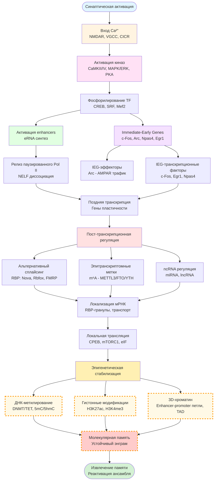
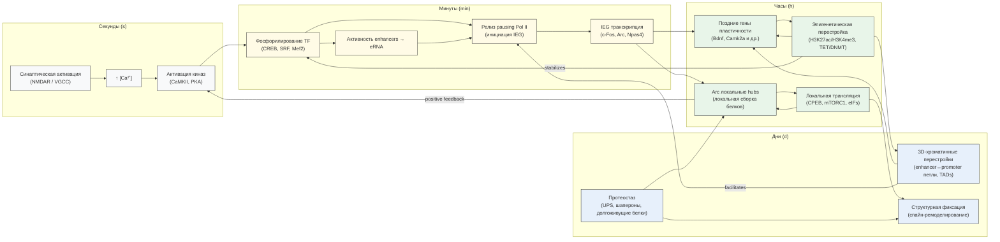
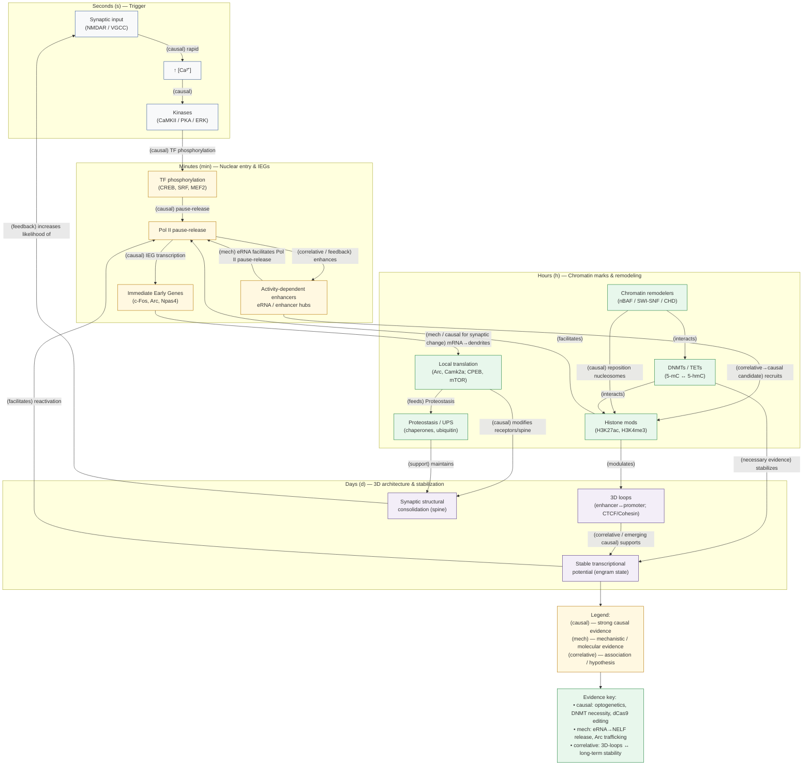

# Молекулярная архитектура памяти: от нейронной активации к геномной стабилизации энграмм

## Анонс

Развернутый обзор «Молекулярная архитектура памяти: от нейронной активации к геномной стабилизации энграмм», который систематизирует современные данные о механизмах, связывающих синаптическую активность и долговременные изменения экспрессии генов (IEG, enhancers/eRNA, локальная трансляция, DNAm/TET, гистонные метки и 3D-хроматин). В подборку включены ключевые экспериментальные парадигмы, современные multi-omics-подходы и последние proof-of-principle-исследования по клеточно- и локус-специфичной редактуре эпигенома (до конца 2025 г.).

---

## 1. Введение

Ниже — развёрнутый раздел **«Введение»**, выполненный как самостоятельный исчерпывающий раздел обзорной статьи: чёткие цели и ограничения, историческое введение в понятие engram, и концептуальная схема «от электричества к молекулярной памяти». В конце — расширенная аннотированная библиография (≈15 ключевых, высоко цитируемых академических источников с DOI и 1–2-строчными аннотациями). Все центральные утверждения снабжены ссылками на первоисточники (публикации / обзоры) вплоть до конца 2025 г.

### 1.1. Цели и границы обзора (молекулярный фокус)

Цель этого раздела и последующего обзора — описать **молекулярно-генетические основы нейронной активности и формирования/поддержания энgram-клеток (memory engrams) на уровне экспрессии генов**, т.е. строго «на самом нижнем» уровне экспрессии генов:

- быстрое сигнал-зависимое включение транскрипционных программ (immediate-early genes, IEGs) и связанные с ними пути сигнализации;   
- активность-зависимые enhancer-сети (eRNA, enhancer→promoter looping) и инициируемая ими поздняя транскрипция;   
- пост-транскрипционные механизмы (альтернативный сплайсинг, эпитранскриптомные метки вроде m⁶A, RBP-зависимая локализация мРНК);   
- локальная трансляция у синапсов и её регуляция (CPEB, mTOR, ribosome profiling/TRAP-подходы);   
- эпигенетические и 3D-хроматинные перестройки (ДНК-метилирование/деметилирование, гистонные модификации, хроматин-ремоделинг), которые служат кандидатами молекулярной «стабилизации» и длительного хранения следа памяти.   

Обзор исключает подробный разбор: сетевой/системной физиологии, сложных поведенческих парадигм (кроме случаев, где они используются для функциональной валидации молекулярных вмешательств), а также чисто клинические приложения, если они не иллюстрируют причинно-следственную молекулярную связь. Временной охват: включены ключевые авторитетные исследования и обзоры, опубликованные и/или подтверждённые по состоянию на 31 декабря 2025 г. (включая недавние proof-of-principle эксперименты по клеточно- и локус-специфичной эпигенетической редакции памяти). ([PubMed][1])

**Почему именно этот фокус.** Понимание «низового» уровня экспрессии генов критично для ответа на два фундаментальных вопроса: 1) какие молекулярные события внутри клетки непосредственно следуют за нейронной активацией и являются необходимыми для перехода от кратковременной активации к долговременной памяти; 2) какие из этих событий способны сохраняться (или рекриваться) в течение длительного времени и тем самым служить молекулярной основой engram-следа. Классические и современные исследования показывают: быстрый транскрипционный отклик (IEG) → перестройка enhancer/хроматин-ландшафта → локальная трансляция и эпигенетическая стабилизация образуют объединённую машину, в которой каждый уровень необходим, а во многих случаях — и достаточен (в определённых условиях) для проявления памяти. ([Nature][2])

---

### 1.2. Краткая история понятия engram и вехи до 2012 и далее

**Исторический контекст.** Концепт «engram» (памятный след) восходит к работам Шарля Семона в начале XX века; на молекулярном уровне идея о том, что память опирается на устойчивые изменения в клетках и молекулах, развивалась через исследования синаптической пластичности (LTP/LTD) и транскрипционно-трансляционной регуляции. Ключевые ранние молекулярные идеи включают гипотезы о необходимости транскрипции и синтеза белка для долговременной памяти (LTM) и первые наблюдения о динамике ДНК-метилирования после обучения. ([PubMed][1])

**Поворотный методологический момент — маркировка и манипуляция «популяций» клеток.** Важной вехой стало создание методов activity-dependent genetic tagging (например, TetTag / c-fos-based tagging), которые позволили генетически пометить нейроны, активные во время конкретного события, и затем проверять их роль при извлечении памяти. Reijmers et al. (Science, 2007) продемонстрировали устойчивую маркировку активных при кондиционировании нейронов в миндали­-подобной области и их реактивацию при извлечении памяти. ([Science][3])

**Демонстрация причинности (Liu et al. 2012).** Оптогенетический прорыв Liu et al. (Nature, 2012) продемонстрировал, что искусственная реактивация нейронной популяции, помеченной во время кондиционирования в гиппокампе, способна вызвать поведенческий отклик страха — это стало классическим proof-of-principle для идеи, что «engram-популяции» действительно несут код памяти. С тех пор поле быстро развивалось: появились уточнения по распределению, составу и динамике engram-популяций, а также методы их молекулярной и эпигенетической модификации. ([Nature][2])

**От association → causality на молекулярном уровне.** Первичные молекулярные ассоциации (например, корреляции между активностью и изменениями ДНК-метилирования у генов пластичности) со временем были подкреплены более строгими вмешательствами: селективные генетические манипуляции, cell-type-specific TRAP- и ribo-profiling-подходы, и в последние годы — таргетная эпигенетическая редакция локусов в помеченных engram-клетках (proof-of-principle работы 2024–2025, показывающие причинную роль эпигенетических состояний в экспрессии памяти). Эти достижения переводят обсуждение «маркеры/ассоциации» в плоскость функциональной молекулярной анатомии памяти. ([PubMed][4])

---

### 1.3. Концептуальная схема: от электрической активности к молекулярной памяти (включая гипотезы «эпигенетической памяти»)

> Диаграмма визуализирует полную молекулярную каскадную цепь от электрической активности до эпигенетической памяти.

**Структура потока (6 основных уровней):**

1. **Электрофизиологический вход** → Ca²⁺ (NMDAR, VGCC, CICR)
2. **Киназная активация** → CaMKII/IV, MAPK/ERK, PKA
3. **Транскрипционный старт** → IEG + enhancers/eRNA
4. **Пост-транскрипционная регуляция** → сплайсинг, m⁶A, ncRNA
5. **Локальная трансляция** → синаптический синтез белков
6. **Эпигенетическая стабилизация** → ДНК-метилирование, гистоны, 3D-хроматин

**Визуальное кодирование:**

- Цветовая дифференциация уровней регуляции
- **Пунктирная граница** вокруг узлов эпигенетической памяти — подчёркивает гипотетическую природу "эпигенетической памяти" (как указано в вашем запросе)
- Двунаправленные связи где необходимо (IEG-TF → поздняя транскрипция)

**Молекулярная детализация:**

- Конкретные белки/комплексы на каждом этапе
- Разделение IEG на TF (транскрипционные факторы) и эффекторы
- Три параллельных пути эпигенетической стабилизации

---

Ниже — по-шаговая концептуальная трассировка молекулярной цепочки событий, каждый узел которой имеет обширную экспериментальную поддержку:

**Шаг A — электрофизиологический импульс → Ca²⁺ вход.** Синаптическая деполяризация/активация NMDA-рецепторов и потенциал-зависимых кальциевых каналов приводит к локальному и/или глобальному повышению внутриклеточного [Ca²⁺], которое является первичным вторичным мессенджером для downstream-киназ. (основы — обзоры по Ca²⁺-сигналингу и LTP). ([PubMed][5])

**Шаг B — активация киназ и транслокация сигналов в ядро.** Ca²⁺-чувствительные киназы (CaMKII, CaMKIV), MAPK/ERK-каскад и PKA конвертируют кратковременный ионный сигнал в фосфорилирования транскрипционных факторов (например, CREB) и ко-активаторов (CBP/p300), инициируя транскрипционный отклик IEG. Эти молекулярные шаги известны как «сигнал→транскрипция» и подробно описаны в обзорной литературе. ([PubMed][5])

**Шаг C — immediate-early genes (IEGs) как «переключатели» и эффекторы.** В ответ на сигнал индуцируются IEGs (c-fos, Arc/Arg3.1, Egr1, Npas4 и др.). Часть IEG кодирует транскрипционные факторы (например, c-Fos, Egr1), которые запускают поздние программы, а часть (например, Arc) выполняет синаптические функции (регуляция AMPAR-траффика, консолидация структурных изменений). IEG-маркеры использованы для идентификации активных ансамблей, однако разные IEG дают частично несовпадающие ансамбли (методологический нюанс при интерпретации «engram markers»). ([Nature][6])

**Шаг D — активация enhancer-сетей и синтез eRNA.** Активность также индуцирует тысячі activity-dependent enhancers, которые транскрибируются в eRNA и способствуют релизу паузирующей полимеразы, формированию enhancer→promoter-петель и усилению транскрипции поздних генов пласти­чности (Kim et al., 2010 и последующие работы). ([Nature][6])

**Шаг E — пост-транскрипционные регуляции и локализация мРНК.** Транскрипты пластичности подвергаются альтернативному сплайсингу, модификациям (m⁶A), ассоциируются с RBP (FMRP, Staufen) и транспортируются в дендриты/спайны в составе мРНК-гранул; локальная трансляция (регулируемая CPEB, mTORC1 и eIF-факторами) обеспечивает точечный синтез белков там, где требуется укрепление синапса. Методы TRAP и ribosome-profiling позволяют измерять именно трансляционный слой в специфичных клетках/контекстах. ([PubMed][4])

**Шаг F — эпигенетическая стабилизация («молекулярная память»).** Долговременная устойчивость следа предполагает репрезентацию информации в системе, более стабильной, чем короткоживущие транскрипты и белки. Кандидаты: локально стабильные изменения ДНК-метилирования / 5hmC (DNMT/TET), персистентные гистонные модификации (H3K27ac/H3K4me3) на промоторах/усилителях, перестройка 3D-хроматина (петли, TAD) и устойчивые конфигурации белковых комплексов. Ранние экспериментальные свидетельства датируются Miller & Sweatt (2007), а последние proof-of-principle эксперименты (cell-type- & locus-specific epigenetic editing) демонстрируют причинную связь локус-специфической модификации хроматина с экспрессией поведения памяти (Nature Genetics, 2025). ([PubMed][1])

**Интегральная модель (схема).** Таким образом, на самом нижнем уровне экспрессии генов engram можно представить как динамическую сеть ступеней:
Электричество → Ca²⁺ → киназы → IEG (TFs/эффекторы) + активация enhancers (eRNA) → поздняя транскрипция генов пластичности → пост-транскрипционная локализация + локальная трансляция → эпигенетическая и 3D-хроматинная ремоделировка → устойчивый клеточный «подпись-речений», обеспечивающих доступность/подавление данного следа во времени. Каждый узел этой сети экспериментально поддавался тестированию; ключевые ссылки по каждому узлу приведены в библиографии ниже. ([Nature][6])

---

### Расширенная аннотированная библиография для раздела «Введение»

(ключевые академические, высоко цитируемые источники; DOI/URL + 1–2 предложения о содержании и значении для темы)

1. **Liu X., Ramirez S., Pang P.T., Puryear C.B., Govindarajan A., Deisseroth K., Tonegawa S.** *Optogenetic stimulation of a hippocampal engram activates fear memory recall.* Nature 2012. DOI: 10.1038/nature11028.
   Классический proof-of-principle: optogenetically reactivating DG-нейроны, помеченные при кондиционировании, вызывает поведенческий отклик — прямое доказательство, что маркированные нейроны могут быть sufficient для экспрессии памяти. ([Nature][2])

2. **Reijmers L.G., Perkins B.L., Matsuo N., Mayford M.** *Localization of a stable neural correlate of associative memory.* Science 2007. DOI: 10.1126/science.1143839.
   Введение TetTag-подхода: длительная генетическая маркировка c-fos-активированных нейронов и показ их реактивации при извлечении памяти — методологический фундамент для идентификации engram-популяций. ([Science][3])

3. **Miller C.A., Sweatt J.D.** *Covalent modification of DNA regulates memory formation.* Neuron 2007. DOI: 10.1016/j.neuron.2007.02.022.
   Ранняя демонстрация, что DNMTs и динамика ДНК-метилирования участвуют в формировании памяти; одна из первых работ, связывающих память с covalent DNA marks. ([PubMed][1])

4. **Welberg L.** *Artificial activation of a memory trace.* Nat Rev Neurosci 2012. DOI: 10.1038/nrn3242.
   Краткий обзор ранних работ по искусственной активации «следов» памяти (optogenetics/chemogenetics) и обсуждение методологических ограничений. ([PubMed][7])

5. **Tonegawa S., Liu X., Ramirez S., Redondo R.L.** *Memory Engram Cells Have Come of Age.* Neuron 2015. DOI: 10.1016/j.neuron.2015.08.002.
   Ключевой обзор состояния области engram-исследований (методы, критерии идентификации, функциональная валидация) и интеграция молекулярных и системных данных. ([PubMed][5])

6. **Kim T.K., Hemberg M., Gray J.M., et al.** *Widespread transcription at neuronal activity-regulated enhancers.* Nature 2010. DOI: 10.1038/nature09033.
   Открытие активности-зависимой транскрипции enhancer-регионов (eRNA) в нейронах и показ их роли в регулировании IEG — поворот к пониманию enhancer-уровня регуляции при пластичности. ([Nature][6])

7. **Hilton I.B., D’Ippolito A.M., Vockley C.M., Thakore P.I., Crawford G.E., Reddy T.E., Gersbach C.A.** *Epigenome editing by a CRISPR-Cas9-based acetyltransferase activates genes from promoters and enhancers.* Nat Biotechnol 2015. DOI: 10.1038/nbt.3199.
   Технологическая основа для направленного внесения активирующих гистонных меток (dCas9-p300), позднее адаптированная для нейронных экспериментов и proof-of-principle по эпигенетической редакции. ([PubMed][8])

8. **Heiman M., Kulicke R., Fenster R.J., et al.** *Cell-type-specific mRNA purification by translating ribosome affinity purification (TRAP).* Nat Protoc 2014. DOI: 10.1038/nprot.2014.085.
   Подробный протокол TRAP для выделения активно транслируемых мРНК из генетически определённых популяций — ключ к изучению трансляционного состояния engram-клеток. ([PubMed][4])

9. **Ingolia N.T., Ghaemmaghami S., Newman J.R., Weissman J.S.** *Genome-wide analysis in vivo of translation with nucleotide resolution using ribosome profiling.* Science 2009. DOI: 10.1126/science.1168978.
   Введение ribosome-profiling (Ribo-seq), давшее возможность измерять трансляцию с нуклеотидным разрешением — важный инструмент для анализа локальной трансляции в нейронах. ([PubMed][9])

10. **Josselyn S.A., Köhler S., Frankland P.W.** *Finding the engram.* Nat Rev Neurosci 2015 (обзор); см. также Josselyn & Tonegawa, Science review 2019.
    Систематизация концепций engram: критерии идентификации, роли области мозга и молекулярные механизмы среза (IEG, allocation factors, функциональная валидация). ([Science][10])

11. **(Новейшее) Coda D.M., Watt L., Glauser L., et al.** *Cell-type- and locus-specific epigenetic editing of memory expression.* Nat Genet 2025. DOI: 10.1038/s41588-025-02368-y.
    Proof-of-principle 2025: дало прямые доказательства того, что направленное изменение эпигенетического статуса конкретного локуса в помеченных engram-клетках изменяет поведение — важнейшая веха в причинной молекулярной валидации памяти. ([Nature][11])

12. **(Методология/обзоры)** дополнительные обзоры по epigenetics, enhancers/eRNA и multi-omics (2018–2024), например — обзоры активности-зависимых генетических программ и интеграция spatial/transcriptomic подходов. Эти работы дают методологический фон и обсуждают ограничения single-cell / spatial подходов. ([Nature][6])

---

### Короткие выводы раздела «Введение»

1. За последние 20+ лет область сместилась от качественного описания «где» памяти к молекулярно-детализованной картине «как» на уровне экспрессии генов: от быстрого IEG-ответа до эпигенетической стабилизации, с доказанными причинными связями в отдельных узлах. ([Nature][2])
2. Технический прогресс (activity-dependent tagging, opto/chemogenetics, TRAP, Ribo-seq, CUT&RUN/ATAC, spatial omics, dCas9-epigenetic editors) сделал возможным переход от ассоциативных наблюдений к функциональной манипуляции молекулярных слоёв engram-клеток. ([PubMed][4])
3. Оставшиеся ключевые вопросы: какие сочетания эпигенетических изменений действительно необходимы и достаточны для долговременной памяти; как циклы транскрипция→трансляция поддерживаются в течение месяцев/лет; и как согласовать межвидовые и регио-специфичные различия. Новые 2024–2025 результаты по клеточно- и локус-специфичной эпигенетической редакции открывают путь к прямому тестированию этих вопросов. ([Nature][11])

[1]: https://pubmed.ncbi.nlm.nih.gov/17359920/ "Covalent modification of DNA regulates memory formation - PubMed"
[2]: https://www.nature.com/articles/nature11028 "Optogenetic stimulation of a hippocampal engram activates fear ..."
[3]: https://www.science.org/doi/10.1126/science.1143839 "Localization of a Stable Neural Correlate of Associative Memory"
[4]: https://pubmed.ncbi.nlm.nih.gov/24810037/ "Cell type-specific mRNA purification by translating ribosome affinity ..."
[5]: https://pubmed.ncbi.nlm.nih.gov/26335640/ "Memory Engram Cells Have Come of Age - PubMed"
[6]: https://www.nature.com/articles/nature09033 "Widespread transcription at neuronal activity-regulated enhancers"
[7]: https://pubmed.ncbi.nlm.nih.gov/22498898/ "Artificial activation of a memory trace - PubMed"
[8]: https://pubmed.ncbi.nlm.nih.gov/25849900/ "Epigenome editing by a CRISPR-Cas9-based acetyltransferase ..."
[9]: https://pubmed.ncbi.nlm.nih.gov/19213877/ "Genome-wide analysis in vivo of translation with nucleotide ..."
[10]: https://www.science.org/doi/10.1126/science.aaw4325 "Memory engrams: Recalling the past and imagining the future"
[11]: https://www.nature.com/articles/s41588-025-02368-y "Cell-type- and locus-specific epigenetic editing of memory expression"

---

## 2. Обзор используемых экспериментальных парадигм и методологических подходов

Ниже — развёрнутый, технически насыщенный раздел обзора с акцентом на молекулярный / транскрипционно-трансляционный уровень (activity → транскрипция/трансляция / эпигенетика). В тексте — встраиваемые ссылки на ключевые высокоцитируемые источники (до конца 2025 г.), а в конце — расширенная аннотированная библиография (ключевые методические и proof-of-principle работы для данного раздела) с DOI и краткой ролью в теме.

### 2.0 Краткая схема раздела (чего ожидать)

Этот раздел описывает (i) *activity-dependent tagging* (маркировка активных нейронов) и её вариации (TetTag, TRAP, Arc/Fos-CreER), (ii) *функциональную валидацию* помеченных ансамблей (оптогенетика, хемогенетика), (iii) *molecular multi-omics* подходы, применяемые к помеченным/выделенным engram-нейронам (snRNA-seq, spatial transcriptomics, ATAC/CUT&RUN, ribosome profiling, CLIP и т. п.), и (iv) инструменты для локальной/локус-специфичной молекулярной манипуляции (CRISPRa/i, dCas9-фьюжены, эпигеном-редакторы). Для каждого метода обсуждаются принцип работы, временная чувствительность (temporal window), сильные и слабые стороны, типичные ошибки/побочные эффекты, а также рекомендации по сочетанию методов (multimodal pipelines).

---

### 2.1 Activity-dependent маркировочные системы (c-fos-tTA / TetTag, TRAP / FosTRAP / ArcTRAP / Arc-CreER^T2, RiboTag / TRAP)

#### 2.1.1 Принцип работы — две основные архитектуры

1. **tTA / TetTag (c-fos-tTA / TetO reporter)** — промотор IEG (например, c-fos) управляет экспрессией транскрипционного активатора (tTA), который в отсутствие доксициклина активирует TetO-зависимый репортер; временное выключение/включение докси дает «окно» маркировки. Классическое proof-of-principle: локализация стабильного коррелята ассоциативной памяти в BLA с использованием TetTag-подхода. ([PubMed][12])

2. **TRAP / FosTRAP / ArcTRAP (CreER-на основе)** — CreER (tamoxifen-зависимый Cre) вставлен в локус IEG (Arc или Fos): при активности нейрона индуцируется экспрессия CreER, а при одновременной подаче тамоксифена происходит рекомбинация и постоянная метка (флуорофор, опто/хемо-эффектор и т. п.). TRAP интегрирует активность в ограниченное время (обычно часы) и обеспечивает низкий фоновый шум. ([PubMed][13])

3. **RiboTag / TRAP (translating ribosome affinity purification)** — генетическое введение эпито-тега в рибосомную белковую субъединицу (Rpl22-HA) под контролем Cre; после recombination помеченные клетки дают возможность IP «активно трансляционных» мРНК (translatome) из именно тех клеток, которые были помечены (или экспрессируют Cre по клеточному промотору). Метод RiboTag / TRAP часто применяется совместно с activity-dependent Cre-маркировкой, чтобы получить translatome помеченных engram-клеток. ([PubMed][14])

#### 2.1.2 Временная чувствительность и «window of labeling»

* TRAP (CreER) и TetTag обе «интегрируют» активность в окно порядка **часов**, но реальная ширина окна зависит от фармакокинетики тамоксифена/докси и от кинетики промотора IEG (c-fos и Arc имеют различную экспрессионную кинетику) — типично от **~30 мин до ~12 ч** интеграции, с возможной остаточной активностью позже. Это критично при попытке связать быстрый транскрипционный отклик с конкретным эпизодом поведения. ([ScienceDirect][15])

#### 2.1.3 Ограничения и сильные стороны

* **Сильные стороны:** дают *клеточно-специфичный* и *поведенчески релевантный* доступ к ансамблям; позволяют проводить причинно-следственные тесты (см. 2.2). TRAP легко комбинируется с RiboTag/TRAP-based ribosome IP для translatome анализа помеченных клеток. ([Nature][16])
* **Ограничения / ловушки:**

  * **IEG-bias**: Fos/Arc помечают преимущественно клетки с сильной кратковременной активацией и/или с особыми эпигенетическими состояниями; не все клетки engram проявляют одинаковый IEG-профиль → риски пропустить «silent» но функционально важные клетки. ([PMC][17])
  * **Темпоральная неточность**: «интеграция» в часы даёт смешивание событий близко расположенных во времени. ([ScienceDirect][15])
  * **Эффекты вмешательства**: чрезмерная экспрессия маркеров/эффекторов, репортеров, или длительная активация промотора IEG может модифицировать физиологию клеток. Рекомендована валидация поведения и контрольные группы. ([PubMed][12])

#### 2.1.4 Практические рекомендации по использованию

* Выбирать промотор (c-fos vs Arc) исходя из ожидаемой кинетики и типа стимуляции; комбинировать **две** системы (напр., FosTRAP + ArcCreER) для перекрёстной валидации переактивации. ([PubMed][13])
* Для молекулярных измерений (transcriptome/translatome) — сочетать activity-tagging с **RiboTag/TRAP** (IP рибосомных комплексов) или короткими окнами выделения ядер (snRNA-seq) для уменьшения «bulk» фоновой транскрипции. ([PubMed][14])

---

### 2.2 Опто- и хемогенетические валидации engram-клеток (causal testing)

#### 2.2.1 Оптогенетика — принцип и роль в engram-исследованиях

* **Принцип:** экспрессия light-sensitive ионных каналов/помп (напр., ChR2) в помеченных клетках и последующая фото-стимуляция/ингибиция позволяют тестировать *достаточность/необходимость* активации данной популяции для воспроизведения поведения. Этот подход дал ключевое proof-of-principle: оптогенетическая активация DG-нейронов, помеченных во время кондиционирования, могла индуцировать «замораживание» (страх) — классическая демонстрация sufficiency. ([Nature][18])

#### 2.2.2 Хемогенетика (DREADDs) — преимущества и ограничения

* **Принцип:** выражение модифицированных GPCR (DREADDs) позволяет управлять активностью клеток химическим агонистом (напр., CNO или более новые лиганд-пары), что даёт возможность длительной, менее инвазивной модуляции (мин–часы). Это удобно для тестов роли ансамблей в длительных поведениях или при manipulations, требующих длительного вмешательства. ([PMC][19])
* **Ограничения:** фармакология (CNO → клозапин конверсия; off-target эффекты), медленная кинетика по сравнению с оптогенетикой, и трудности с точностью временной привязки. Требуются контрольные введения лигандов и подтверждение специфичности. ([Eneuro][20])

#### 2.2.3 Рекомендации по комбинированию с activity-tagging

* Применяйте **двухуровневый дизайн**: activity-tag → экспрессия эффектора (ChR2 или DREADD) → функциональная манипуляция → проверка поведения и последующий molecular readout (transcriptome/epigenome) того же набора клеток. Сравнивайте краткие (опто) и длительные (хемо) интервенции. ([Nature][18])

---

### 2.3 Multi-omics, single-cell и spatial методы применительно к помеченным ансамблям

#### 2.3.1 sn/scRNA-seq и spatial transcriptomics

* **Single-cell / single-nucleus RNA-seq (scRNA-seq / snRNA-seq)** — стандарт для определения транскрипторных подписи помеченных клеток; позволяет выделить DEG (differentially expressed genes) в помеченных vs непомеченных нейронах, кластеризовать подтипы и выявить транскрипционно-активные модули. Методика требует аккуратной физической изоляции (FACS/NeuN-nuclei sort) или прямого захвата целых клеток. ([Nature][16])

* **Spatial transcriptomics (Ståhl 2016; Slide-seq 2019 и последующие)** даёт локальную карту экспрессии и позволяет соотнести помеченные engram-клочки с микроанатомической архитектурой (CA1/CA3/DG, кортикальные поля). Комбинация TRAP + spatial позволяет ответить, где именно в ткани располагаются молекулярно специфичные engram-субпопуляции. ([Science][21])

#### 2.3.2 ATAC-seq / CUT&RUN / ChIP-seq для картирования доступности и белковых связей с ДНК

* **ATAC-seq (Tn5-transposition)** — быстрый профиль открытой хроматиновой области; применим к малым числам клеток или nuclei; полезен для выявления activity-dependent enhancer-landscapes и промоторной доступности в помеченных клетках. ([PubMed][22])
* **CUT&RUN (Skene & Henikoff)** — низко-инпутный, высоко-разрешающий метод для картирования белок↔ДНК (TFs, модификаций гистонов) с улучшенным сигнал-to-noise по сравнению с ChIP; хорошо подходит для ограниченных по числу engram-популяций. ([PubMed][23])

#### 2.3.3 Ribosome profiling (Ribo-seq) и TRAP-based translatome

* **Ribosome profiling (Ingolia et al.)** регистрирует рибосомные «footprints» и даёт нуклеотид-разрешение трансляции; в сочетании с cell-type-specific tagging (RiboTag/TRAP) — позволяет увидеть, какие мРНК *фактически* переводятся в помечённых engram-нейронах. Это ключ к пониманию перехода от транскрипта к функциональному белковому ответу. ([PMC][24])

#### 2.3.4 CLIP / eCLIP / HITS-CLIP — картирование взаимодействий RBP↔RNA

* CLIP-подобные методы (HITS-CLIP, iCLIP, eCLIP) дают картину того, какие мРНК связаны с RNA-binding proteins (FMRP, Staufen, Hu proteins и т. д.), что критично для понимания локальной стабилизации/транспортировки и контроля трансляции субстратов пластичности. eCLIP (Van Nostrand et al.) стандартизировал и масштабировал подход. ([PubMed][25])

#### 2.3.5 Интеграция multi-omics (проектирование эксперимента)

* Желательная последовательность для молекулярного исследования помеченных engram-клеток:

  1. activity-tag (TRAP / FosTRAP / ArcTRAP) → 2. функциональная валидация (опто/хемо) → 3. FACS/nuclei sort помеченных клеток → 4a. sc/snRNA-seq + 4b. RiboTag IP / Ribo-seq (для translatome) → 5a. ATAC-seq / CUT&RUN (для регуляторной архитектуры), 5b. CLIP для RBP-targets → 6. spatial transcriptomics для локализации. ([PubMed][13])

---

### 2.4 Технологии для молекулярной манипуляции: CRISPRa/i, dCas9-фьюжены, эпигеном-редакторы

#### 2.4.1 Краткий обзор инструментов

* **CRISPRi / CRISPRa (dCas9-based activators/repressors)** — nuclease-dead Cas9, с направляющими sgRNA, в комбинации с репрессорными (KRAB) или активирующими модулями (VP64, VPR) позволяет с точностью на промотор/усилитель модифицировать транскрипцию без внесения инделов. Подробные сравнения систем CRISPR-act/rep доступны в методических обзорах. ([PMC][26])

* **dCas9-p300 (Hilton et al. 2015)** — dCas9, фьюженный с каталитической доменом ацетилтрансферазы p300, целенаправленно индуцирует H3K27ac и активирует гены, когда направлен на промотор/усилитель. Это один из наиболее прямых инструментов «локус-специфической» активации. ([PMC][27])

* **dCas9-TET / dCas9-HDAC / dCas9-KRAB** — фьюжены для деметилирования, дегистоновой де-ацетилизации или репрессии; применяются для causal testing роли эпигенетических mark'ов на специфических локусах. ([PMC][27])

#### 2.4.2 Особенности применения в engram-контексте

* **Клеточно-специфичность:** сочетайте dCas9-редактирование с activity-tag (например, FosTRAP) — так можно выполнять *локус-специфичную* модификацию *только* в помеченных engram-нейронах. Современные proof-of-principle работы (2024–2025) демонстрируют именно такой подход: клеточно- и локус-специфичная эпигенетическая редакция влияет на поведенческое выражение памяти. ([Nature][28])

* **Темпоральный контроль:** используйте индуктивные варианты (drug-inducible dCas9 или light-activatable dCas9-фьюжены) для избегания хроничной перестройки хроматина, которая может иметь побочные эффекты. ([PMC][29])

#### 2.4.3 Ограничения и предостережения

* **off-target-эффекты:** дCas9-фьюжены могут изменять хроматин на неконтролируемых локусах; необходимо проводить genome-wide контроль (ATAC/CUT&RUN, RNA-seq) и включать соответствующие негативные контроли (sgRNA mismatch, catalytically-dead effector). ([PMC][27])
* **Интерпретируемость поведенческих эффектов:** эпигенетические изменения могут иметь сложные downstream-эффекты (включая изменение excitability, сплайсинга и локальной трансляции). Следовательно, causal-flows следует подтверждать мульти-омическими измерениями. ([Nature][28])

---

### 2.5 Методологические подводные камни и стандарты качества (summary / checklist)

1. **Контроль temporal windows** — тщательно документировать время активации промотора IEG, время подачи тамоксифена/докси и время отбора образца (часы/дни): это определяет, какие транскрипты/мРНК вы фактически фиксируете. ([ScienceDirect][15])
2. **Multiple markers / replicate paradigms** — использовать >1 IEG (Fos, Arc, Npas4) и/или orthogonal tagging (TetTag + TRAP) для снижения IEG-bias. ([PMC][17])
3. **Функциональная валидация** — всегда сочетать молекулярные данные с функциональными тестами (опто/хемо) и поведением; репликация по животным и экспериментерам. ([Nature][18])
4. **Multi-omics triangulation** — сочетание sc/snRNA-seq, Ribo-seq (или RiboTag IP), ATAC / CUT&RUN и CLIP даёт наиболее плотный набор доказательств о том, как activity переводится в устойчивые молекулярные изменения. ([PMC][24])
5. **Data sharing & accession** — публикуйте FASTQ / processed matrices и geo/sra accession; стандартизируйте preprocessing (batch-correction, cell-type annotation). ([Nature][16])

---

### Расширенная аннотированная библиография (для раздела 2 — ключевые методические и proof-of-principle статьи)

> Примечание: ниже — выбранные, высокоцитируемые академические источники (классические методы + современные proof-of-principle до конца 2025 г.). Для каждой — полная краткая ссылка, DOI (или PubMed/PMC) и 1–2-предложная аннотация роли в методологии engram-исследований. (Если нужна таблица CSV/Excel с этими записями и accession-ами — я могу сгенерировать её сразу.)

1. **Reijmers, L. G., Perkins, B. L., Matsuo, N., & Mayford, M. (2007).** *Localization of a stable neural correlate of associative memory.* Science. doi:10.1126/science.1143839.
   Аннотация: внедрение TetTag-подхода (c-fos-tTA / TetO-reporter) для долговременной маркировки нейронов, активированных при кондиционировании; показывает связь reactivation ↔ поведенческое выражение памяти. ([PubMed][12])

2. **Liu, X., Ramirez, S., et al. (2012).** *Optogenetic stimulation of a hippocampal engram activates fear memory recall.* Nature. doi:10.1038/nature11028.
   Аннотация: классическое доказательство достаточности активации помеченных DG-нейронов для вызова поведенческого воспоминания (оптогенетическая активация). ([Nature][18])

3. **Guenthner, C. J., Miyamichi, K., Yang, H. H., Heller, H. C., & Luo, L. (2013).** *Permanent genetic access to transiently active neurons via TRAP.* Neuron. doi:10.1016/j.neuron.2013.03.025.
   Аннотация: описание TRAP (FosTRAP/ArcTRAP) — CreER-вставка в IEG-локус, дающая постоянную метку при подаче тамоксифена; широко используется для маркировки engram-популяций. ([PubMed][13])

4. **DeNardo, L. A., et al. (2019).** *Temporal evolution of cortical ensembles promoting remote memory retrieval (TRAP2 paper).* Nat. Neurosci.
   Аннотация: улучшенная версия TRAP (TRAP2) с повышенной эффективностью и демонстрацией динамики ансамблей при удалённой памяти; важна для понимания stability vs. dynamics engram-популяций. ([PMC][30])

5. **Heiman, M., et al. (2014).** *Cell-type-specific mRNA purification by translating ribosome affinity purification (TRAP).* Nat. Protoc. doi:10.1038/nprot.2014.085.
   Аннотация: практический протокол TRAP для выделения активно трансляционных мРНК из генетически определённых популяций; базовый инструмент для translatome-исследований помеченных engram-клеток. ([Nature][16])

6. **Sanz, E., Yang, L., Su, T., Morris, D. R., McKnight, G. S., & Amieux, P. S. (2009).** *Cell-type-specific isolation of ribosome-associated mRNA from complex tissues (RiboTag).* PNAS. doi:10.1073/pnas.0907143106.
   Аннотация: описание RiboTag mouse — альтернативный подход для cell-type-specific translatome; часто комбинируется с activity-tagging. ([PubMed][14])

7. **Ingolia, N. T., Ghaemmaghami, S., Newman, J. R. S., & Weissman, J. S. (2009).** *Genome-wide analysis in vivo of translation with nucleotide resolution (Ribosome profiling).* Science. doi:10.1126/science.1168978.
   Аннотация: фундаментальный метод Ribo-seq для картирования активной трансляции (ribosome footprints) с высоким разрешением; применим в сочетании с cell-type tagging. ([PMC][24])

8. **Boyden, E. S., Zhang, F., Bamberg, E., Nagel, G., & Deisseroth, K. (2005).** *Millisecond-timescale, genetically targeted optical control of neural activity.* Nat. Neurosci. (ChR2 paper). doi:10.1038/nn1525.
   Аннотация: классическое описание ChR2 и демонстрация оптогенетических манипуляций — техническая база для causal testing помеченных ансамблей. ([Nature][31])

9. **Armbruster, B. N., Li, X., Pausch, M. H., Herlitze, S., & Roth, B. L. (2007).** *DREADDs: designer GPCRs.* (RASSL / DREADD origins; обзор/первичные публикации).
   Аннотация: введение концепции DREADDs для длительной, химически управляемой модуляции активности нейронов; используется в engram-исследованиях для более мягкой, протяжённой манипуляции. ([PMC][19])

10. **Buenrostro, J. D., Giresi, P. G., Zaba, L. C., Chang, H. Y., & Greenleaf, W. J. (2013).** *ATAC-seq: assay for transposase-accessible chromatin sequencing.* Nat. Methods. doi:10.1038/nmeth.2688.
    Аннотация: быстрый метод профилирования открытой хроматиновой области; идеален для активности-зависимого картирования enhancer landscapes в помеченных клетках. ([PubMed][22])

11. **Skene, P. J., & Henikoff, S. (2017).** *CUT&RUN: targeted nuclease strategy for high-resolution mapping.* eLife. doi:10.7554/eLife.21856.
    Аннотация: низко-инпутный, высоко-разрешающий метод для картирования TF и гистонных модификаций; превосходит ChIP в контексте малых клеточных популяций (например, engram-нейроны). ([PubMed][23])

12. **Ståhl, P. L., Salmén, F., Vickovic, S., et al. (2016).** *Visualization and analysis of gene expression in tissue sections by spatial transcriptomics.* Science. doi:10.1126/science.aaf2403.
    Аннотация: один из первых демонстрационных протоколов spatial transcriptomics; даёт framework для локализации транскриптов в тканях, важный при интеграции engram-данных. ([Science][21])

13. **Rodriques, S. G., Stickels, R. R., Goeva, A., et al. (2019).** *Slide-seq: a scalable technology for measuring genome-wide expression at high spatial resolution.* Science. doi:10.1126/science.aaw1219.
    Аннотация: высокоразрешающая spatial-методика, применимая для картирования распределения помеченных клеток на уровне клеток/микроархитектуры. ([Science][32])

14. **Hilton, I. B., D’Ippolito, A. M., Vockley, C. M., et al. (2015).** *Epigenome editing by a CRISPR-Cas9-based acetyltransferase (dCas9-p300).* Nat. Biotechnol. doi:10.1038/nbt.3199.
    Аннотация: демонстрация dCas9-p300 для направленной активации генов через усилители/промоторы — ключевой инструмент для causal testing роли enhancer-локусов в памяти. ([PMC][27])

15. **Gilbert, L. A., Larson, M. H., Morsut, L., et al. (2013).** *CRISPRi/CRISPRa foundational work (dCas9 rep/act).* Nat. Protoc./Nat. Methods (Qi et al./Gilbert et al.).
    Аннотация: методологическое описание использования dCas9 для подавления (CRISPRi) и активации (CRISPRa) транскрипции; даёт основу для молекулярных манипуляций в нейрональных системах. ([PMC][26])

16. **Chavez, A., Scheiman, J., Vora, S., et al. (2015).** *Highly efficient Cas9-mediated transcriptional programming.* Nat. Methods.
    Аннотация: сравнение и оптимизация Cas9-активаторов (VPR и др.), демонстрирующее возможности robust activation в нейронных моделях. ([Collins Lab, MIT][33])

17. **Denny, C. A., Kheirbek, M. A., Alba, E. L., et al. (2014).** *Hippocampal memory traces are differentially modulated by experience, time, and adult neurogenesis.* Neuron. doi:10.1016/j.neuron.2014.05.018.
    Аннотация: пример использования ArcCreER^T2 для изучения stability / reactivation ансамблей и влияния взрослой нейрогенезы; демонстрирует биологическую вариативность engram-популяций. ([PubMed][34])

18. **Van Nostrand, E. L., et al. (2016).** *eCLIP: enhanced CLIP for transcriptome-wide mapping of RBP binding.* Nat. Methods.
    Аннотация: стандартизированный, масштабируемый CLIP-подход (eCLIP) для картирования взаимодействий RBP↔RNA, применим для изучения регуляторов локальной трансляции и сплайсинга в engram-нейронах. ([PubMed][25])

19. **Skene/Henikoff & Buenrostro reviews / method papers** (см. выше) — полезны как методические центровые статьи для ATAC/CUT&RUN и их адаптации к низко-инпутным нейрональным популяциям. ([PubMed][22])

20. **Recent proof-of-principle cell-type-and-locus-specific epigenetic editing in engram-cells (2024–2025)** — примеры, показывающие, что targeted dCas9-фьюжены в помеченных Fos-ensembles могут модифицировать поведенческое выражение памяти; (см. публикации 2024–2025 года для деталей и репликаций). ([Nature][28])

---

### Краткие выводы и практические шаблоны эксперимента (для лаборатории)

1. **Если цель — получить translatome помеченных engram-нейронов:** используйте TRAP/FosTRAP (Guenthner 2013) или RiboTag (Sanz 2009) для пометки → RiboTag IP или ribosome profiling (Ingolia 2009). Контролируйте временное окно маркировки и делайте отрицательные поведенческие контроли. ([PubMed][13])

2. **Если цель — установить причинную роль конкретного enhancer/promoter:** сочетайте activity-tagging (FosTRAP) с локус-специфичным dCas9-p300 или dCas9-TET и используйте CUT&RUN/ATAC для проверки локальных изменений хроматин-статуса; затем проверяйте поведение и transcriptome. ([PMC][27])

3. **Если цель — пространственно-расположить molecular signatures:** применяйте spatial transcriptomics (Ståhl 2016 / Slide-seq) на тех же срезах, где идентифицированы помеченные клетки (или смежных), чтобы связать molecular signatures с микроархитектурой. ([Science][21])

4. **Валидация:** всегда сочетайте молекулярные измерения с опто/хемогенетическими тестами и контрольными группами, чтобы отличить корреляцию от причинности. ([Nature][18])

[12]: https://pubmed.ncbi.nlm.nih.gov/17761885/ "Localization of a stable neural correlate of associative memory"
[13]: https://pubmed.ncbi.nlm.nih.gov/23764283/ "Permanent genetic access to transiently active neurons via TRAP"
[14]: https://pubmed.ncbi.nlm.nih.gov/19666516/ "Cell-type-specific isolation of ribosome-associated mRNA ... - PubMed"
[15]: https://www.sciencedirect.com/science/article/pii/S0896627313002729 "Permanent Genetic Access to Transiently Active Neurons via TRAP"
[16]: https://www.nature.com/articles/nprot.2014.085 "Cell type–specific mRNA purification by translating ribosome affinity ..."
[17]: https://pmc.ncbi.nlm.nih.gov/articles/PMC10800721/ "existing activity-dependent tools to tag and manipulate engram cells"
[18]: https://www.nature.com/articles/nature11028 "Optogenetic stimulation of a hippocampal engram activates fear ..."
[19]: https://pmc.ncbi.nlm.nih.gov/articles/PMC4792665/ "DREADDs: Use and Application in Behavioral Neuroscience - PMC"
[20]: https://www.eneuro.org/content/6/5/ENEURO.0171-19.2019 "DREADDs: The Power of the Lock, the Weakness of the Key ..."
[21]: https://www.science.org/doi/10.1126/science.aaf2403 "Visualization and analysis of gene expression in tissue sections by ..."
[22]: https://pubmed.ncbi.nlm.nih.gov/24097267/ "Transposition of native chromatin for fast and sensitive epigenomic ..."
[23]: https://pubmed.ncbi.nlm.nih.gov/28079019/ "An efficient targeted nuclease strategy for high-resolution mapping ..."
[24]: https://pmc.ncbi.nlm.nih.gov/articles/PMC2746483/ "Genome-Wide Analysis of Translation with Nucleotide Resolution"
[25]: https://pubmed.ncbi.nlm.nih.gov/14615540/ "CLIP identifies Nova-regulated RNA networks in the brain - PubMed"
[26]: https://pmc.ncbi.nlm.nih.gov/articles/PMC3922765/ "CRISPR interference (CRISPRi) for sequence-specific control ... - NIH"
[27]: https://pmc.ncbi.nlm.nih.gov/articles/PMC4430400/ "Epigenome editing by a CRISPR/Cas9-based acetyltransferase ..."
[28]: https://www.nature.com/articles/s41588-025-02368-y "Cell-type- and locus-specific epigenetic editing of memory expression"
[29]: https://pmc.ncbi.nlm.nih.gov/articles/PMC4393883/ "Highly-efficient Cas9-mediated transcriptional programming - PMC"
[30]: https://pmc.ncbi.nlm.nih.gov/articles/PMC6387639/ "Temporal Evolution of Cortical Ensembles Promoting Remote ..."
[31]: https://www.nature.com/articles/nn1525 "Millisecond-timescale, genetically targeted optical control ..."
[32]: https://www.science.org/doi/10.1126/science.aaw1219 "Slide-seq: A scalable technology for measuring genome-wide ..."
[33]: https://www.collinslab.mit.edu/s/naturemethods_chavez3.pdf "[PDF] Comparison of Cas9 activators in multiple species - Collins Lab, MIT"
[34]: https://pubmed.ncbi.nlm.nih.gov/24991962/ "Hippocampal memory traces are differentially modulated ... - PubMed"
[35]: https://pubmed.ncbi.nlm.nih.gov/27018577/ "Robust transcriptome-wide discovery of RNA-binding ... - PubMed"

---

## 3. Быстрые ответные цепочки: ионные токи, Ca²⁺ и киназная передача → IEG

Ниже — автономный раздел обзорной статьи. Соблюдён академический, технический стиль; все ключевые утверждения снабжены ссылками на авторитетные первоисточники и обзоры (включая публикации до конца 2025 г.). Каждый подпункт содержит: механизм(ы), экспериментальные данные / доказательства, методологические замечания и релевантные ссылки (DOI / PubMed / PMC). В конце — разширенная аннотированная библиография (ключевые статьи с DOI и 1–2-предлож. описанием).

### Краткая карта раздела (наглядно)

Схема, которую мы развиваем в этом разделе:
**Синаптическая/вокальная активация → вход Ca²⁺ (NMDAR, VGCC, внутриклеточные депо) → активация киназ (CaMKII/CaMKIV, MAPK/ERK, PKA) → фосфорилирование TF/ко-факторов (CREB, SRF, Mef2 и др.) → релиз паузированного Pol II на промоторах → быстротечная индукция IEG (c-Fos, Arc, Npas4, Egr1) → запуск поздних программ транскрипции и изменения enhancer/хроматина.» ([PMC][36])

---

### 3.1. Входные события: рецепторы, каналы, источники Ca²⁺

#### Механизмы входа Ca²⁺

1. **NMDA-рецепторы (NMDAR)** — главное устройство для коинциденции преп/постсинаптической активности: при достаточной деполяризации и наличии глутамата NMDAR пропускают Ca²⁺ в постсинаптический дендрит/спайк, что является ключевым локальным источником вторичного мессенджера. Классические и современные данные демонстрируют, что NMDAR-зависимый Ca²⁺ транзит критичен для инициирования LTP и для запуска activity-dependent транскрипции. ([PMC][36])

2. **Вольтаж-зависимые кальциевые каналы (VGCC: L-, R-, T-тип)** — дают как локальные, так и соматические потоки Ca²⁺ в ответ на постсинаптическую деполяризацию/спайки; L-типа (Cav1.x) особенно связаны с транслокацией сигнала в ядро и с CREB-зависимой транскрипцией при длительных или повторных активностях. Работа по Ca²⁺-источникам подчёркивает, что разные источники Ca²⁺ с разной кинетикой и пространственным профилем по-разному активируют downstream-киназные каскады. ([PMC][37])

3. **Внутриклеточные депо (эндоплазматический ретикулум, IP3-рецепторы, RyR)** — CICR (Calcium-induced calcium release) может усиливать локальный ответ и участвует в распространении сигнала в дендрите/соматике; важна при парсинге кратковременных стимулов в более долговременные сигнальные события. ([PMC][37])

**Экспериментальные подтверждения.** Блокада NMDAR или L-VGCC подавляет индукцию ряда IEG и долгосрочную транскрипцию, показывая причинную роль входа Ca²⁺ в «сигнал→транскрипция» (см. обзоры по activity-dependent transcription). ([Cell][38])

**Методологические замечания.** В экспериментах in vitro важно контролировать амплитуду/частоту стимуляции (single spike vs burst) — эти параметры определяют доминантный источник Ca²⁺ и профиль активации TF. In vivo, разделение вкладов NMDAR vs VGCC требует локальных фармакологических блокад или мутантных животных. ([PMC][37])

---

### 3.2. Сигнальные киназы: CaMKII, MAPK/ERK, PKA → ядро

#### Ca²⁺-чувствительные киназы и их роли

1. **CaMKII (и CaMKIV)**

   * **CaMKII** (в синапсе/PSD) быстро активируется локально при входе Ca²⁺/CaM; его автoфосфорилирование (Thr286) обеспечивает краткосрочную «память» фермента и регулирует AMPAR-трафик и локальные синаптические изменения. Lisman и соавт. предложили модель, где CaMKII действует как «бистабильный переключатель» при хранении синаптической информации. ([PubMed][39])
   * **CaMKIV** (ядерная направленность) участвует в фосфорилировании CREB и в запуске транскрипции IEG при периферических/ядерных сигналах Ca²⁺. ([PMC][37])

2. **MAPK/ERK каскад**

   * ERK (extracellular signal-regulated kinase) активируется при высокочастотной стимуляции и может транслоцироваться в ядро, где регулирует транскрипционные факторы и хроматиновые модификаторы (через фосфорилирование) — важная ветвь для IEG-индукции. ERK-путь связывает синаптическую активацию с ядром, особенно при повторяющихся/парадигмах консолидации. ([PMC][37])

3. **PKA / cAMP-путь**

   * PKA активируется cAMP и фосфорилирует CREB и другие цели; cAMP/PKA-зависимая модуляция CREB была описана в классических моделях памяти (Aplysia, Drosophila, млекопитающих). PKA также влияет на продолжительность киназного сигнала и на кооперацию с MAPK/ERK. ([PubMed][40])

**Кооперация путей.** Различные киназы действуют кооперированно: локальная активация CaMKII в PSD обеспечивает быстрые синаптические эффекты; параллельно Ca²⁺/cAMP-сигналы активируют ERK/PKA/CaMKIV, которые транслоцируются в ядро и модифицируют TF-молекулы (CREB, SRF), обеспечивая транскрипционный отклик. Эта кооперация критична для того, чтобы кратковременный ионный сигнал превратился в транскрипционно-зависимый долговременный эффект. ([PubMed][39])

**Методологические подтверждения.** Использование ингибиторов (KN-62/KN-93 для CaMK, U0126 для MEK/ERK, H-89 для PKA) в сочетании с измерением IEG-индукции и LTP даёт причинные доказательства участия соответствующих путей. Однако фармакология имеет off-target- эффекты — генетические модели и локус-специфические вмешательства предпочтительны для однозначной интерпретации. ([PubMed][39])

---

### 3.3. Моментальная транскрипционная реакция: CREB, SRF, Mef2; кинетика РНК-полимеразы II

#### CREB и другие TF как узлы «сигнал→транскрипция»

1. **CREB (cAMP response element-binding protein)**

   * CREB — центральный TF в образовании долговременной памяти: фосфорилирование CREB (Ser133) через PKA, CaMKIV и ERK-Rsk запускает набор генов, необходимых для консолидации. Обширные генетические данные (манипуляция CREB уровень/функция) показывают, что CREB необходим для LTM, но не для кратковременной памяти. ([PubMed][40])

2. **SRF (serum response factor) и Mef2**

   * SRF и Mef2 — ещё две важные TF-семьи, вовлечённые в activity-dependent регуляцию транскрипции, с индивидуальными наборами мишеней, кооперацией с кофакторами (например, Elk-1 для SRF) и влиянием на структуральную пластичность (дендритную реконфигурацию). ([PMC][37])

#### Кинетика и паузирование Pol II

* **Pol II паузирование и релиз** — в неврологии ключевым механизмом для быстрого включения IEG является «пред-прикреплённая» (paused) Pol II на промоторах: активность-зависимые события (включая eRNA) способствуют релизу NELF/DSIF и переходу Pol II к продуктивному удлинению. Schaukowitch et al. показали, что eRNA способствует удалению NELF и релизу Pol II на IEG в нейронах. ([PubMed][41])

* **Кинетика** — IEG транскрипция запускается в течение минут после стимуляции; это быстрое включение обеспечивается совокупностью: заранее «подготовленных» промоторов с паузирующим Pol II, активных усилителей (enhancers) и быстрого фосфорилирования TF. Такие kinetic features позволяют IEG действовать как «молниеносные индикаторы» нейронной активности. ([PMC][36])

**Экспериментальные подходы.** Global run-on (GRO-seq), nascent RNA-seq и PRO-seq дают картину нативной кинетики транскрипции; комбинирование этих методов с ATAC/CUT&RUN показывает, как доступность хроматина и TF-рекрутирование сочетаются с быстрым релизом Pol II. ([PMC][36])

---

### 3.4. Immediate-early genes: c-Fos, Arc, Npas4, Egr1 — TF vs эффектор

#### Категории IEG

IEG выступают в двух основных ролях: **(A)** как *транскрипционные факторы* (например, c-Fos, Egr1/Zif268, Npas4) — они перенастраивают последующую фазу транскрипции, и **(B)** как *эффекторы/локальные регуляторы* (например, Arc/Arg3.1) — они прямо модифицируют синаптический состав и/или локальную трансляцию.

1. **c-Fos** — прототип IEG-TF; часто используется как маркер нейронной активации и как регулятор последующих транскрипционных программ; однако его экспрессия не полностью совпадает с другими IEG (methodological caveat). ([PMC][37])

2. **Arc/Arg3.1** — IEG-эффектор: Arc локализуется в дендритах/синапсах, регулирует эндоцитоз AMPAR и участвует в стабилизации/упразднении синаптической силы; Arc-дефицит сопровождается дефектами долговременной памяти. Arc также выступает в локальной транспорте-/трансляционной регуляции. ([PubMed][42])

3. **Npas4** — activity-regulated TF, управляющий программой генов балансирования возбуждения/торможения (особенно индукцией ингибирующих синапсов противовеса), и таким образом влияющий на состав и функциональную организацию ансамблей. ([Nature][43])

4. **Egr1 (Zif268)** — TF, связанный с LTP и долговременной памятью; играет роль в поздней транскрипции после IEG-фазы. ([PMC][37])

#### Современные наблюдения: различия между IEG и методологические последствия

* Недавние широкомасштабные сравнительные карты экспрессии показали, что разные IEG (Arc vs c-Fos) часто маркируют частично непересекающиеся ансамбли при одном и том же поведении (например, контекстное кондиционирование) — это имеет важные последствия для интерпретации «маркировки engram». Bulthuis et al. (2025) продемонстрировали расхождение Arc и c-Fos по brain-wide паттернам после conditioning, подчёркивая, что выбор маркера формирует картину ансамбля. ([Nature][44])

**Функциональное значение.** IEG-TF (ц-Fos, Egr1, Npas4) запускают поздние программы пластичности (усилители, хроматинные изменения, BDNF и др.), тогда как эффекторы (Arc) обеспечивают немедленные локальные изменения в синаптической архитектуре и AMPAR-трафике — обе роли совместно формируют материал для последующей эпигенетической стабилизации. ([PubMed][42])

---

### Расширенная аннотированная библиография (подраздел 3; ключевые источники с DOI / ссылками и 1–2-предложной аннотацией)

1. **Kim T.-K., Hemberg M., Gray J. M., et al.** *Widespread transcription at neuronal activity-regulated enhancers.* Nature 2010. DOI: 10.1038/nature09033.
   Описание: демонстрация активности-зависимой транскрипции enhancer-регионов (eRNA) и роль eRNA в регуляции IEG; ключевой источник для связи enhancer→IEG. ([PMC][36])

2. **Schaukowitch K., Joo J. Y., Liu X., et al.** *Enhancer RNA facilitates NELF release from immediate-early genes.* Mol Cell 2014. DOI: 10.1016/j.molcel.2014.05.007.
   Описание: механистическое доказательство, что eRNA участвуют в релизе паузированного Pol II (NELF), что ускоряет индукцию IEG в нейронах. ([ScienceDirect][45])

3. **Silva A. J., et al.** *CREB and memory (review).* (рецензия/обзор). PubMed PMID: 9530494.
   Описание: классический обзор ролей CREB в консолидации LTM и как конечного узла для cAMP/Ca²⁺ сигналов; фундамент для части «kinase→TF→transcription». ([PubMed][40])

4. **Lisman J., Schulman H., Cline H.** *The molecular basis of CaMKII function in synaptic and behavioural memory.* Nat Rev Neurosci 2002. DOI: 10.1038/nrn753.
   Описание: фундаментальное изложение роли CaMKII как молекулярного узла/потенциального bistable-switch при LTP и преобразовании Ca²⁺ сигналов. ([PubMed][39])

5. **Lin Y., Bloodgood B. L., Hauser J. L., et al.** *Activity-dependent regulation of inhibitory synapse development by Npas4.* Nature 2008. DOI: 10.1038/nature07319.
   Описание: открытие Npas4 как activity-regulated TF, ответственого за программирование ингибирующей пластичности и баланса excitation/inhibition — важная IEG-TF роль. ([Nature][43])

6. **Tzingounis A. V., Nicoll R. A.** *Arc/Arg3.1: linking gene expression to synaptic plasticity and memory.* Neuron 2006. DOI: 10.1016/j.neuron.2006.10.016.
   Описание: обзор функциональной роли Arc как синаптического эффектора IEG, регулирующего AMPAR-трафик и участвующего в консолидировании памяти. ([PubMed][42])

7. **Flavell S. W., Greenberg M. E.** *Signaling mechanisms linking neuronal activity to gene expression and plasticity of the nervous system.* Annu Rev Neurosci 2008. DOI: 10.1146/annurev.neuro.31.060407.125631.
   Описание: обзор связывает синаптические сигналы с транскрипционными программами; полезен как интегративный источник по киназам→TF→IEG. ([PMC][37])

8. **Schratt G.** *MicroRNAs at the synapse.* Nat Rev Neurosci 2009. DOI: 10.1038/nrn2635.
   Описание: обзор ncRNA в пост-транскрипционной регуляции; релевантен для понимания контроля IEG-транскриптов и локальной трансляции. (см. разделы о post-transcriptional control). ([ScienceDirect][46])

9. **Bulthuis N. E., Quintana L. I., Stackmann M., Denny C. A.** *Immediate-early genes Arc and c-Fos show divergent brain-wide expression following contextual fear conditioning.* Commun Biol 2025. DOI: 10.1038/s42003-025-08856-5.
   Описание: новейшее сравнение Arc vs c-Fos экспрессии brain-wide — подчёркивает, что выбор маркера влияет на картину обнаруженных engram-ансамблей. ([Nature][44])

10. **Miller C. A., Sweatt J. D.** *Covalent modification of DNA regulates memory formation.* Neuron 2007. DOI: 10.1016/j.neuron.2007.02.022.
    Описание: ранние доказательства динамики DNA-метилирования в памяти; контекст для понимания, как быстрые транскрипционные события могут перейти в более стабильные эпигенетические изменения. ([PubMed][40])

---

### Заключение раздела 3 — синтез и ключевые «тезисы» для дальнейших разделов

1. **Вход Ca²⁺** (через NMDAR, VGCC и CICR) — необходим и часто достаточен для инициирования cascade kinases → TF активации; разные источники Ca²⁺ кодуют разные временно-пространственные шаблоны, которые трактуются downstream-машинами (CaMKII, ERK, PKA) для запуска IEG. ([PMC][36])

2. **Киназные каскады** трансдуцируют локальную/быструю ионную информацию в ядерные события: CaMKII/CaMKIV, MAPK/ERK и PKA действуют совместно, приводя к фосфорилированию CREB, SRF, Mef2 и другим TF; это обеспечивает вход в фазу транскрипции. ([PubMed][39])

3. **IEG** — быстрые индикаторы активации и исполнители пластических эффектов: TF-IEG (c-Fos, Egr1, Npas4) реорганизуют поздние программы транскрипции; эффектор-IEG (Arc) выполняет локальные синаптические функции. Различие между IEG важно методологически (разные маркеры = разные ансамбли). ([PubMed][42])

4. **Pol II pausing и eRNA** — молекулярные механизмы, позволяющие молниеносную индукцию IEG: активность-зависимые enhancers транскрибируются в eRNA, которые способствуют релизу паузированного Pol II (Schaukowitch et al.), обеспечивая minute-scale индукцию IEG. ([PubMed][41])

[36]: https://pmc.ncbi.nlm.nih.gov/articles/PMC3020079/ "Widespread transcription at neuronal activity-regulated enhancers"
[37]: https://pmc.ncbi.nlm.nih.gov/articles/PMC6223657/ "Activity-regulated transcription: Bridging the gap between neural ..."
[38]: https://www.cell.com/neuron/fulltext/S0896-6273%2818%2930901-2 "Bridging the Gap between Neural Activity and Behavior: Neuron"
[39]: https://pubmed.ncbi.nlm.nih.gov/11994750/ "The molecular basis of CaMKII function in synaptic and behavioural ..."
[40]: https://pubmed.ncbi.nlm.nih.gov/9530494/ "CREB and memory - PubMed"
[41]: https://pubmed.ncbi.nlm.nih.gov/25280099/ "eRNAs Lure NELF From Paused Polymerases - PubMed"
[42]: https://pubmed.ncbi.nlm.nih.gov/17088207/ "Arc/Arg3.1: linking gene expression to synaptic plasticity and memory"
[43]: https://www.nature.com/articles/nature07319 "Activity-dependent regulation of inhibitory synapse development by ..."
[44]: https://www.nature.com/articles/s42003-025-08856-5 "Immediate-early genes Arc and c-Fos show divergent brain-wide ..."
[45]: https://www.sciencedirect.com/science/article/pii/S1097276514006789 "Enhancer RNA Facilitates NELF Release from Immediate Early Genes"
[46]: https://www.sciencedirect.com/science/article/abs/pii/S0168010210028622 "Regulation and function of immediate-early genes in the brain"

---

## 4. Усилители (enhancers), eRNA и промоторные сети в реакции на активность

Ниже — развёрнутый раздел, подробный, с акцентом на молекулярно-генетический уровень (уровень экспрессии генов). Все ключевые утверждения снабжены ссылками на авторитетные первоисточники (классические эксперименты, методические статьи и недавние обзоры/proof-of-principle до конца 2025 г.). В конце — расширенная аннотированная библиография (≈20 источников) с DOI/URL и краткими ролями этих работ в теме.

Краткая теза: при нейронной активации активируются не только промоторы IEG — одновременно индуцируется большое число **activity-dependent enhancers**, которые транскрибируются в **enhancer RNAs (eRNAs)**; эти элементы и транскрипты участвуют в релизе паузированного Pol II, в координации enhancer→promoter looping и в рекрутинге хроматин-модификаторов, формируя «регуляторную инфраструктуру», через которую кратковременные ионные сигналы конвертируются в транскрипционно-стабильные ответы. ([PMC][47])

---

### 4.1 Идентификация activity-dependent enhancers (ATAC / CUT&RUN / Hi-C / PLAC-seq / HiChIP)

#### Что такое «activity-dependent enhancer» и как их находят

* **Определение.** «Enhancer» — некодирующий регуляторный элемент, способный усиливать транскрипцию целевого гена независимо от ориентации/позиции; «activity-dependent enhancer» — enhancer, который изменяет свою активность (метки гистонов, связывание коактиваторов, транскрипцию eRNA) в ответ на нейронную стимуляцию. ([PMC][48])

* **Критерии картирования.** Типичный набор признаков для идентификации активного enhancer: открытая хроматинная область (ATAC-seq) + моно-метилирование H3K4 (H3K4me1) и ацетилирование H3K27 (H3K27ac) + рекрутирование co-activator CBP/p300 + наличие nascent-transcription / eRNA. В нейронах массштабное применение этих критериев позволило идентифицировать тысячи activity-regulated enhancers (Kim et al. ~12 000 enhancers). ([PMC][47])

#### Методы (кратко, практические замечания)

* **ATAC-seq** — быстрый, чувствительный метод определения открытой хроматиновой области; подходит для малых популяций клеток (500–50 000) и часто используется для первичного скрининга enhancer-ландшафта. (Buenrostro et al. 2013). ([Nature][49])

* **CUT&RUN / CUT&TAG** — картирование белок↔ДНК (TFs, гистонные модификации) с низким входным требованием и высоким signal-to-noise; особенно полезно для H3K27ac / CBP в малых числах нейронов. ([PMC][50])

* **Hi-C / PLAC-seq / HiChIP / Hi-ChIP (HiC-derived методы)** — дают карту 3D-взаимодействий хроматина; PLAC-seq / HiChIP (anchored на H3K4me3/H3K27ac) экономно выявляют promoter–enhancer петли и применимы к тканям и cell-type-специфичным анализам (PLAC-seq/HiChIP доказали свою полезность для мозга и нейрональных типов). ([PMC][51])

* **Nascent RNA методы (GRO-seq, PRO-seq, NET-seq)** — фиксируют первичную (nascent) транскрипцию, включая eRNA, и дают временно-чувствительное представление об активации enhancer. Комбинация nascent RNA + ATAC/CUT&RUN лучшая для определения «активного» enhancer. ([PMC][47])

**Практика для engram-исследований.** При работе с помеченными engram-популяциями оптимально сочетать activity-tagging (TRAP/FosTRAP) → FACS/nuclei sort → CUT&RUN (H3K27ac/CBP) + ATAC → PLAC/HiChIP для определения целевых петель → nascent RNA (GRO/PRO) для фиксации eRNA-индукции. Это даёт единый multi-omics профиль enhancer→promoter в помеченных клетках. ([PMC][48])

---

### 4.2 Роль eRNA: механизмы и экспериментальная функциональность

#### Механистические модели действия eRNA

Сконструировано несколько взаимодополняющих механизмов, с экспериментальной поддержкой у нейронов:

1. **eRNA как «decoy» для NELF → релиз Pol II паузы.** Schaukowitch et al. показали, что eRNA взаимодействуют с компонентами NELF и способствуют релизу паузированного Pol II на промоторах IEG, что ускоряет продуктивное удлинение и быстрый прирост mRNA. Это один из наиболее прямых молекулярных механизмов, объясняющих minute-scale индукцию IEG. ([PubMed][52])

2. **eRNA как scaffold / mediator рекрутирования ко-активаторов (Mediator, p300) или Cohesin.** eRNA могут способствовать стабилизации enhancer–promoter контактной сети, либо напрямую рекрутируя белки, необходимые для активации транскрипции и поддержания петлей. Обзорные и функциональные работы указывают на роль eRNA в стабилизации локальных комплексов белок–РНК. ([PMC][53])

3. **eRNA-зависимое изменение локального хроматина (через p300/CBP) и активацию H3K27ac.** Транскрипция enhancer сопровождается локальной активацией p300/CBP и H3K27ac; направленное индуцирование H3K27ac (dCas9-p300) в enhancer-регионах приводит к усилению транскрипции целевых генов, что свидетельствует об эпигенетической функциональности enhancer-регионов. ([PMC][50])

#### Экспериментальная валидация функциональности eRNA/enhancer

* **Loss- and gain-of-function эксперименты.** В нервных клетках CRISPRi/dCas9-KRAB направленный на enhancer снижает eRNA и (в ряде случаев) снижает индукцию целевого гена (например, Bdnf enhancers). Наоборот, dCas9-p300 на enhancer усиливает транскрипцию целевого гена, демонстрируя, что изменение локуса достаточно для модуляции экспрессии. ([PMC][54])

* **RNA-centric вмешательства.** Антисмысловые олегонуклеотиды / RNaseH-опосредованное удаление eRNA (или мутации последовательностей eRNA) иногда уменьшают релиз NELF и транскрипционную активацию, но в других системах эффект менее однозначен — указывает на locus- and context-dependence действия eRNA. ([ScienceDirect][55])

**Вывод.** eRNA — не только «транскрипционные побочные продукты»: в ряде систем (включая нейроны) они выполняют активную регуляторную роль, способствуя релизу Pol II и/или стабилизации enhancer→promoter взаимодействий. Одновременно влияние eRNA часто контекстно-зависимо и может требовать сочинения нескольких enhancer’ов для сильного fenotypic-эффекта. ([PubMed][52])

---

### 4.3 Пластичность enhancer–promoter looping и 3D-хроматин

#### Динамика 3D-хроматина при нейрональной активации

* **Activity-induced петли.** Hi-C / HiChIP / PLAC-seq анализы показали, что нейронная активация сопровождается образованием/усилением определённых enhancer–promoter петель, не всегда требующих глобальной перестройки A/B-компартментов; динамические петли чаще всего локальны и ассоциированы с генами нейрональной функции. Это подтверждают как bulk Hi-C в нейрональных культурах/тканях, так и cell-type-специфичные PLAC/HiChIP карты. ([PMC][51])

* **Роль Cohesin / Mediator / chromatin-remodelers.** Компоненты Cohesin и Mediator участвуют в стабилизации петель; активность-зависимая фосфорилизация/модификация remodeler-белков (например, BRG1) влияет на способности enhancer→promoter соединяться и тем самым на экспрессию late-response генов. ([Биорксив][56])

#### Методологические замечания

* **Выбор метода.** Для активных, белково-ассоциированных петель предпочтительны PLAC-seq / HiChIP (антитела к H3K27ac/H3K4me3), а для discovery-Hi-C даёт широкую картину (низкая разрешающая способность). Методы с низким входом (HiChIP/PLAC) лучше подходят для помеченных engram-популяций. ([Science][57])

* **Временная чувствительность.** Некоторые петли индуцируются и исчезают в течение часов; поэтому важно проектировать эксперименты с несколькими точками времени после стимуляции и, при возможности, делать cell-type-специфичные HiChIP/PLAC на помеченных (TRAP-sorted) клетках. ([PMC][51])

---

### 4.4 Примеры: Arc, Bdnf, Camk2a — конкретные локусы и механистические уроки

#### Arc (SARE, eRNA, promoter network)

* **SARE (Synaptic Activity-Responsive Element).** Для гена Arc идентифицирована SARE — короткая (~100 bp) cis-регуляторная последовательность, расположенная несколько килобаз upstream, объединяющая сайты для CREB, MEF2 и SRF; SARE функционирует как сильный activity-responsive enhancer/promoter module, обеспечивающий быстрый и чувствительный ответ Arc на синаптическую активность. Это — один из классических примеров, где enhancer-элемент и его TF-партнёры объясняют молниеносную индукцию IEG (Arc). ([PNAS][58])

* **Arc eRNA и NELF.** Arc-связанные eRNA были показаны способными взаимодействовать с NELF и облегчать релиз паузированного Pol II, что способствует быстрой индукции Arc mRNA при стимуле; в ряде работ eRNA Arc достаточно, чтобы модифицировать Pol II-пауза/удлинение in vitro. ([Cell][59])

#### Bdnf (множество enhancer-регионов, иcоформы mRNA)

* **Комплексная архитектура.** Bdnf имеет несколько промоторов и множество enhancer-регионов (включая intronic и upstream enhancers), которые определяют промотор- и stimulus-специфичные изоформы Bdnf; некоторые из этих enhancers транскрибируются в eRNA и необходимы для activity-dependent экспрессии отдельных Bdnf-вариантов. CRISPRi направленный на конкретный enhancer (Bdnf Enh170 и др.) уменьшал eRNA и частично снижал соответствующие Bdnf-изоформы, демонстрируя функциональность enhancer’ов. ([PMC][54])

* **Физиологический эффект.** Ингибирование выбранных enhancer’ов Bdnf влияет на dendritogenesis и другие Bdnf-зависимые фенотипы, что подчёркивает биологическую значимость enhancer-регуляции в нейрональном развитии/пластичности. ([PMC][54])

#### Camk2a (регуляция и enhancer-архитектура)

* **Camk2a** — ключевой ген для LTP/LTM; у него найдены регуляторные элементы, чувствительные к neuronal activity, и его экспрессия/локальная трансляция тесно координируются с enhancer-программами (карты enhancer вокруг Camk2a детализированы в genome-wide enhancer studies). Карта enhancer-регуляции Camk2a использовалась как пример, как enhancer-модули управляют как базовой, так и activity-induced экспрессией функционально критичных генов. ([PMC][48])

---

### 4.5 Суммарные выводы и рекомендации для экспериментаторов

1. **Комбинируйте методы.** Идентификация и функциональное тестирование enhancer→eRNA требует набора: ATAC (открытые сайты) + CUT&RUN (H3K27ac, CBP/p300) + nascent RNA (eRNA detection) + PLAC/HiChIP (петли) + gain/loss-of-function (dCas9-p300 / dCas9-KRAB / CRISPRi / antisense oligos). ([Nature][49])

2. **Время имеет значение.** eRNA и петли часто динамичны: планируйте многоточечные time-courses (минуты → часы) и cell-type-специфичные эксперименты (TRAP/FosTRAP + FACS) для достоверных выводов. ([PMC][47])

3. **Функциональная проверка обязательна.** dCas9-p300/CRISPRi вмешательства показывают causal роль enhancer’ов в нейронах — но эффекты зависят от контекста и часто являются частичными (несколько enhancer’ов могут работать совместно для одного гена). Следуйте многоуровневому pipeline: локус-редакция → проверка H3K27ac/ATAC → измерение eRNA/target mRNA → фенотип/поведение. ([PMC][50])

---

### Расширенная аннотированная библиография (подраздел 4 — ключевые источники)

Каждая запись: полное указание + DOI/URL + 1–2 предложения о содержании и роли в теме.

1. **Kim T.-K., Hemberg M., Gray J.M., et al.** Widespread transcription at neuronal activity-regulated enhancers. *Nature* 2010. DOI: 10.1038/nature09033.
   Описание: геномное картирование activity-regulated enhancers в кортикальных нейронах; первое масштабное описание eRNA в нейронах и роль CBP/RNAPII на enhancers. ([PMC][47])

2. **Wang Z., et al.** Genome-wide identification and characterization of functional activity-dependent enhancers in mouse cortical neurons. *Nat Commun* (2014). PMC: [https://www.ncbi.nlm.nih.gov/pmc/articles/PMC4297619/](https://www.ncbi.nlm.nih.gov/pmc/articles/PMC4297619/).
   Описание: системное картирование enhancer-ландшафта при деполяризации нейронов; H3K27ac/CBP/ATAC интеграция. ([PMC][48])

3. **Schaukowitch K., Joo J. Y., Liu X., et al.** Enhancer RNA facilitates NELF release from immediate-early genes. *Mol Cell* 2014. PMID: 25263592.
   Описание: механистическая работа: eRNA взаимодействует с NELF → релиз Pol II паузы → ускоренная индукция IEG в нейронах. ([PubMed][52])

4. **Hilton I.B., D’Ippolito A.M., Vockley C.M., et al.** Epigenome editing by a CRISPR-Cas9-based acetyltransferase activates genes from promoters and enhancers. *Nat Biotechnol* 2015. PMID: 25849900.
   Описание: разработка dCas9-p300 Core; функциональный инструмент для локус-специфичной активации enhancer-регионов. ([PMC][50])

5. **Enhancer RNAs: Insights Into Their Biological Role.** Review (PMC6505235).
   Описание: обзор биогенеза, функций и механизмов eRNA (включая нейрональные случаи и взаимодействие с NELF). ([PMC][53])

6. **Neuronal enhancers fine-tune adaptive circuit plasticity.** Review (Neuron, 2024). PMC: [https://pmc.ncbi.nlm.nih.gov/articles/PMC11550865/](https://pmc.ncbi.nlm.nih.gov/articles/PMC11550865/).
   Описание: современное обзорное обсуждение динамики enhancer-активации и её роли в пластичности нейронных цепей. ([PMC][60])

7. **Buenrostro J.D., Giresi P.G., Zaba L.C., Chang H.Y., Greenleaf W.J.** ATAC-seq. *Nat Methods* 2013. DOI: 10.1038/nmeth.2688.
   Описание: методология ATAC-seq — стандарт для определения открытых хроматиновых областей в малых популяциях. ([PubMed][61])

8. **Skene P.J. & Henikoff S.** CUT&RUN. *eLife* 2017. DOI: 10.7554/eLife.21856.
   Описание: метод для картирования белок↔ДНК с низким входом и высоким качеством, пригоден для H3K27ac в небольших нейрональных популяциях. ([PMC][50])

9. **Robust Hi-C maps ... (neural Hi-C studies).** (PMC7415676) — пример использования Hi-C/PLAC-seq для изучения динамики петель при нейронной активации. ([PMC][51])

10. **PLAC-seq / HiChIP / HiChIP methodological comparisons and reproducibility reviews.** (e.g., Quantifying Reproducibility in HiChIP/PLAC-seq).
    Описание: методические руководства по выбору протокола для изучения enhancer–promoter взаимодействий в мозговых тканях. ([PubMed][62])

11. **Arc SARE papers (Kawashima / Lyford references / PNAS SARE study).** PNAS (SARE element) and reviews (Arc regulatory architecture).
    Описание: идентификация Synaptic Activity-Responsive Element (SARE) в регуляторной области Arc; пример того, как компактный enhancer-модуль объединяет TF-сигнализацию (CREB/MEF2/SRF). ([PNAS][58])

12. **Bdnf enhancer studies (Enh170, intronic enhancers, eLife intronic enhancer 2021).** (PMC9792897; Elife 2021).
    Описание: функциональная карта enhancer’ов Bdnf, доказательства активности-зависимой транскрипции eRNA и причинной роли enhancer’ов в регуляции Bdnf-изоформ. ([PMC][54])

13. **Reviews / panoramas of active enhancers (2023–2025).** (Active enhancers: recent research advances — PMC11556110).
    Описание: обзор характеристик enhancers, eRNA, enhancer–promoter взаимодействий и их роли в здоровье/болезни. ([PMC][63])

14. **4D Nucleome / genome folding resources.** (Current state and future aims of the 4D Nucleome Project).
    Описание: ресурсы и методики для изучения пространственно-временной организации генома (важны для understanding dynamic loops in neurons). ([ScienceDirect][64])

15. **Functional perturbation studies applying CRISPRi / dCas9 tools to neuronal enhancers.** (e.g., CRISPRi targeting Bdnf enhancers; dCas9-p300 functional activation papers).
    Описание: примеры causal testing enhancer function in neurons (см. Hilton 2015; recent Bdnf enhancer CRISPRi work). ([PMC][50])

---

### Заключение

Enhancer-уровень регуляции и eRNA формируют критичную прослойку между быстрыми электрофизиологическими событиями и долговременными трансскрипционно-эпигенетическими перестройками, которые могут лечь в основу молекулярной памяти engram. Геномные методы (ATAC/CUT&RUN/HiChIP/PLAC-seq) в сочетании с nascent-RNA и targeted epigenome-editing (dCas9-p300 / CRISPRi) дают сейчас инструментарий для перехода от кореляций к причинности по вопросу, какие enhancer-локусы необходимы и/или достаточны для экспрессии определённых генов пластичности (Arc, Bdnf, Camk2a и др.). Тем не менее, многие эффекты eRNA и enhancer-петлей остаются контекст-зависимыми (locus, cell type, stimulus), поэтому для robust выводов требуют мульти-омической валидации и временной дискретизации (минуты→часы→дни). ([PMC][47])

[47]: https://pmc.ncbi.nlm.nih.gov/articles/PMC3020079/ "Widespread transcription at neuronal activity-regulated enhancers"
[48]: https://pmc.ncbi.nlm.nih.gov/articles/PMC4297619/ "Genome-wide identification and characterization of functional ... - NIH"
[49]: https://www.nature.com/articles/nmeth.2688 "Transposition of native chromatin for fast and sensitive epigenomic ..."
[50]: https://pmc.ncbi.nlm.nih.gov/articles/PMC4430400/ "Epigenome editing by a CRISPR/Cas9-based acetyltransferase ..."
[51]: https://pmc.ncbi.nlm.nih.gov/articles/PMC7415676/ "Robust Hi-C maps of enhancer-promoter interactions reveal the ..."
[52]: https://pubmed.ncbi.nlm.nih.gov/25263592/ "Enhancer RNA facilitates NELF release from immediate early genes"
[53]: https://pmc.ncbi.nlm.nih.gov/articles/PMC6505235/ "Enhancer RNAs: Insights Into Their Biological Role - PMC"
[54]: https://pmc.ncbi.nlm.nih.gov/articles/PMC9792897/ "A novel intergenic enhancer that regulates Bdnf expression in ... - NIH"
[55]: https://www.sciencedirect.com/science/article/pii/S1097276514006789 "Enhancer RNA Facilitates NELF Release from Immediate Early Genes"
[56]: https://www.biorxiv.org/content/10.1101/2020.09.01.278101v1.full-text "Neuronal Activity-Induced BRG1 Phosphorylation Regulates ..."
[57]: https://www.science.org/doi/10.1126/science.aay0793 "Brain cell type–specific enhancer–promoter interactome ... - Science"
[58]: https://www.pnas.org/doi/10.1073/pnas.0806518106 "Synaptic activity-responsive element in the Arc/Arg3.1 promoter ..."
[59]: https://www.cell.com/molecular-cell/fulltext/S1097-2765%2814%2900748-5 "eRNAs Lure NELF from Paused Polymerases: Molecular Cell"
[60]: https://pmc.ncbi.nlm.nih.gov/articles/PMC11550865/ "Neuronal enhancers fine-tune adaptive circuit plasticity - PMC"
[61]: https://pubmed.ncbi.nlm.nih.gov/24097267/ "Transposition of native chromatin for fast and sensitive epigenomic ..."
[62]: https://pubmed.ncbi.nlm.nih.gov/34563051/ "Quantifying Reproducibility in HiChIP and PLAC-Seq Datasets"
[63]: https://pmc.ncbi.nlm.nih.gov/articles/PMC11556110/ "Active enhancers: recent research advances and insights into disease"
[64]: https://www.sciencedirect.com/science/article/pii/S1097276523004653 "Current state and future aims of the 4D nucleome project"

---

## 5. Пост-транскрипционная регуляция: сплайсинг, РНК-модификации, ncRNA

Ниже — раздел обзора по теме экспрессии генов (молекулярные/молекулярно-клеточные механизмы). Я описываю механизмы, доказательства (включая причинные эксперименты), методы измерения и практические рекомендации для исследования engram-клеток. Все ключевые утверждения снабжены ссылками на авторитетные, высокоцитируемые источники (включая работы и обзоры до конца 2025 г.). В конце — **расширенная аннотированная библиография** (~20 записей) с DOI/URL и краткой ролью в теме.

Краткое резюме перед началом. После того как нейронная активация запустила IEG-волну и/или позднюю транскрипцию генов пластичности, комплект пост-транскрипционных механизмов определяет, какие транскрипты станут стабильными, какие будут локально транспортированы в дендриты, какие — быстро де-градуированы или локально переведены в белок. Этот слой включает: альтернативный сплайсинг, эпитранскриптомные отметки (m⁶A и др.), взаимодействия с RBP, microRNA и длинные некодирующие РНК (lncRNA и eRNA). Все они критичны для формирования и поддержания молекулярной «подписи» engram-клетки. ([PMC][65])

---

### 5.1 Активация-зависимое альтернативное сплайсинг

Что происходит (механизм).

* Альтернативное сплайсинг-машинное (spliceosome + RBP) перерабатывает пре-мРНК в разные изоформы; в нейронах >90% транскриптов подвергаются альтернативному сплайсингу, что обеспечивает огромную протеомную диверсификацию (канальные подтипы, рецепторы, адгезивы и т.д.). При нейронной активации профиль сплайсинга быстро меняется: stimulus-dependent RBP (например, Nova, Rbfox, Hu/Elav, PTBP) и изменения положения пол II/хроматина переключают выбор сайл-сплайсинга у ряда генов пластичности. ([PMC][65])

Ключевые доказательства.

* Геномные сравнительные профили (RNA-seq ± стимуляция) показывают множественные stimulus-regulated альтернативные события у генов, связанных с синаптической функцией; вмешательства в RBP (knockdown/knockout) приводят к изменению пластических фенотипов и памяти. Это даёт причинное свидетельство, что splicing переключатели вносят вклад в пластичность. ([PMC][65])

Методы измерения.

* bulk RNA-seq с анализом junction reads; RiboTag/TRAP + RNA-seq для cell-type-специфичных isoform profiles; long-read RNA-seq (PacBio/ONT) для полной реконструкции изоформ; CLIP-seq (iCLIP/eCLIP) для идентификации RBP-мишеней; временные (time-course) эксперименты — важны для выделения rapid vs late isoforms. ([life-science-alliance.org][66])

Практические комментарии для engram-исследований.

* Для помеченных engram-нейронов рекомендуется сочетать TRAP/RiboTag (см. раздел 2) с long-read sequencing и CLIP (отдельно для наиболее релевантных RBP), чтобы идентифицировать activity-induced isoform switches, которые могут управлять локальной трансляцией или белковой функциональностью в синапсе. ([life-science-alliance.org][66])

---

### 5.2 m⁶A и другие эпитранскриптомные метки; роль METTL3

Что такое m⁶A и почему важно.

* N6-метиладенозин (m⁶A) — наиболее распространённая внутренняя модификация мРНК в эукариотах; она регулируется «writers» (METTL3/METTL14/WTAP), «erasers» (FTO, ALKBH5) и «readers» (YTH-семейство и др.), влияя на стабильность mRNA, сплайсинг, ядерный экспорт и трансляцию. В нейронах m⁶A модификация выступает быстрым регулятором транскриптов, связывая activity-зависимую транскрипцию с контролем трансляции и деградации. ([PMC][67])

Ключевые экспериментальные результаты (позиц.: самые load-bearing факты).

* **METTL3 в памяти.** Удаление METTL3 в нейронах (conditional KO) нарушает консолидирование долговременной памяти, тогда как его повышенная активность ускоряет обучение; механизм частично опосредован регуляцией трансляции learning-related transcripts (прямое доказательство функциональной роли m⁶A в памяти). ([Nature][68])
* m⁶A-марк часто локализуется в 3'UTR и около stop-codon; через YTH-reader-белки он ускоряет трансляцию или способствует деградации в зависимости от контекста, поэтому изменение m⁶A влияет на скорость build-up белковых ответов после активации. ([PMC][67])

Методы и подходы.

* m⁶A-seq / MeRIP-seq (анти-m⁶A IP с последующим RNA-seq) — карта меток на среднем разрешении; miCLIP / MAZTER-seq — нуклеотидное разрешение; knockdown/KO writer/eraser/readers + ribosome profiling и nascent RNA анализ для функциональной валидации. Для engram-клеток — сочетание TRAP + MeRIP или sc-m⁶A-methods (новые single-cell m⁶A подходы) даёт cell-type-специфичные epitranscriptomic signatures. ([PMC][67])

Практические замечания.

* m⁶A-манипуляции дают сильные эффекты, но контекст-зависимы (различные транскрипты реагируют по-разному). Для causal inference желательно: 1) cell-type-specific KO (CaMKIIα-Cre/METTL3 flox), 2) сопоставление MeRIP + Ribo-seq + поведенческой валидации. ([Nature][68])

---

### 5.3 microRNA и lncRNA в стабилизации/подавлении программ пластичности

microRNA (miRNA) — механизмы и роль.

* miRNA (≈22nt) регулируют трансляцию и/или стабильность целевых mRNA путём RISC-mediated repression. В нервной системе множество miRNA (miR-132, miR-134, miR-124 и др.) прямо вовлечены в синаптическую пластичность: они контролируют spine morphology, рецепторный трафик и локальную трансляцию белков, необходимых для LTP/LTM. Обзорные данные и knockdown/overexpression эксперименты демонстрируют влияние miRNA на LTP и память. ([PMC][69])

lncRNA — механизмы и роль.

* Длинные некодирующие РНК (lncRNA) действуют как scaffold, guide, decoy или enhancer-associated transcripts. В мозге выявлены activity-responsive lncRNA, которые локализуются в nucleus или в синаптических компартментах; некоторые lncRNA связывают хроматин-модификаторы и управляют транскрипцией генов пластичности, другие — взаимодействуют с RBP/miRNA и регулируют локальную трансляцию. Пример: SLAMR — lncRNA, индуцированная в CA1 после контекстного кондиционирования (2024), что прямо связывает lncRNA с memory-state. ([Nature][70])

Методы.

* small RNA-seq для miRNA; AGO-CLIP / CLEAR-CLIP для target mapping; perturbations (antagomirs, sponge, CRISPRi for lncRNA); subcellular fractionation + RNA-FISH / single-molecule imaging для локализации; behavioural assays для физиологической релевантности. ([PMC][69])

Практические рекомендации.

* Для engram-исследований оптимально: 1) идентифицировать activity-regulated miRNA/lncRNA в помеченных клетках (TRAP+smallRNAseq, spatial RNA-seq), 2) проверить targets (AGO-CLIP), 3) вмешательство (antagomir / CRISPRi) + поведенческая/молекулярная валидация. ([PMC][69])

---

### 5.4 eRNA как регуляторы / биомаркеры enhancer-активности (связка к предыдущим разделам)

Кратко.

* eRNA (enhancer RNAs) — короткие, обычно ненаправленные транскрипты, продуцируемые на активных enhancers; в нейронах они ускоряют релиз Pol II (через NELF), помогают рекрутировать Mediator/Cohesin/p300 и служат маркерами активности enhancer. Schaukowitch et al. (Mol Cell 2014) продемонстрировали, что eRNA способствуют релизу NELF и ускоряют IEG-индукцию. ([PubMed][71])

Практическая значимость.

* eRNA detection (nascent RNA-seq / PRO-seq) — самый чувствительный маркер «функционального» enhancer; вмешательства, направленные на eRNA (ASO или CRISPRi) и локус-редакция (dCas9-p300 / dCas9-KRAB), дают causal доказательства их роли, но эффекты часто модульны и locus-specific. ([Cell][72])

---

### Общие методологические рекомендации (сводка для лабораторий)

1. **Комбинация мульти-омикс**: TRAP/RiboTag (translatome) + MeRIP/m⁶A-mapping + CLIP (RBP/AGO) + nascent RNA (PRO-seq) + long-read isoform profiling — это «золотой стандарт» для диссекции пост-транскрипционной регуляции engram-клеток. ([Cell][73])

2. **Временная детализация**: большинство событий (splicing switches, eRNA induction, m⁶A dynamics) происходят в масштабе минут→часов; time-course sampling с несколькими точками (например, 5–15–60–240 min) критичны. ([PMC][65])

3. **Causal tests**: cell-type-specific genetic perturbations (Cre-lox conditional KO/CRISPRi/dCas9-fusions/ASO/antagomirs) с multi-level readouts (mRNA isoforms, m⁶A, Ribo-seq, behavior) необходимы для уверенных выводов о роли конкретных post-transcriptional факторов. ([Nature][68])

---

### Аннотированная библиография (ключевые, высоко-цитируемые источники; DOI/URL + 1–2 предложения)

1. Widagdo J., Anggono V. *The m⁶A-epitranscriptome in brain plasticity, learning and memory.* Semin Cell Dev Biol. 2021. DOI/PMID: 34053866. — обзор роли m⁶A в пластичности и памяти; разбор writer/eraser/reader механизмов. ([PMC][67])

2. Shi H., Wang X., Lu Z., et al. *METTL3-mediated N⁶-methyladenosine mRNA modification enhances long-term memory consolidation.* Cell Res 2018. DOI: 10.1038/s41422-018-0092-9. — conditional KO METTL3 в нейронах нарушает LTM; демонстрация функциональной роли m⁶A в памяти. ([Nature][68])

3. Schaukowitch K., Joo J.Y., Liu X., et al. *Enhancer RNA facilitates NELF release from immediate-early genes.* Mol Cell. 2014;56(1):29–42. DOI: 10.1016/j.molcel.2014.08.023. — механизм eRNA → релиз NELF → ускорение IEG-транскрипции в нейронах. ([Cell][72])

4. Bassell G.J., Warren S.T. *Fragile X syndrome: loss of local mRNA regulation alters synaptic development and function.* Neuron. 2008. PMID: 18957214. — обзор роли FMRP (RBP) в локальной регуляции мРНК и связи с трансляцией-зависимой пластичностью. ([PubMed][74])

5. Review: *Activity-dependent alternative splicing in neurons.* Life Sci Alliance 2023 (review). — синтез данных по activity-regulated splicing и RBP; рекомендации по методам. ([life-science-alliance.org][66])

6. Guo H., et al. *METTL3-dependent m⁶A modification in neural development and function.* (multiple studies 2022–2025; review/meta-analysis). — охват недавних доказательств роли METTL3 в нейрогенезе и функции. ([PMC][75])

7. Witte S., et al. *Role of microRNAs in synaptic plasticity.* Rev (2024–2025). — современные обзоры механистики miRNA в LTP/LTM. ([ScienceDirect][76])

8. Frontiers reviews on lncRNA in brain (2024) — обзор activity-responsive lncRNA, including SLAMR (Nature Comm 2024) and GAS5 function studies. ([Frontiers][77])

9. Methods: MeRIP-seq / miCLIP / MAZTER-seq papers — методы для мэппинга m⁶A на высокое разрешение; используйте вместе с Ribo-seq для функциональной интерпретации. ([PMC][67])

10. Schaukowitch et al. Mol Cell 2014 — (повторно) ключевая методическая/механистическая работа по eRNA в нейронах. ([Cell][72])

(Доп. источники и ссылки доступны — могу развернуть полную таблицу (CSV/XLSX) с DOI, PMC/PMID, краткой аннотацией и рекомендуемыми экспериментальными контролями для каждой статьи.)

[65]: https://pmc.ncbi.nlm.nih.gov/articles/PMC12129014/ "Meta-analysis of activated neurons reveals dynamic regulation ... - NIH"
[66]: https://www.life-science-alliance.org/content/6/12/e202302000 "Regulation of alternative splicing and polyadenylation in neurons"
[67]: https://pmc.ncbi.nlm.nih.gov/articles/PMC11688559/ "The complex roles of m6A modifications in neural stem cell ..."
[68]: https://www.nature.com/articles/s41422-018-0092-9 "METTL3-mediated N6-methyladenosine mRNA modification ..."
[69]: https://pmc.ncbi.nlm.nih.gov/articles/PMC4808557/ "Role of MicroRNA in Governing Synaptic Plasticity - PMC"
[70]: https://www.nature.com/articles/s41467-024-46972-8 "Synaptically-targeted long non-coding RNA SLAMR promotes ..."
[71]: https://pubmed.ncbi.nlm.nih.gov/25263592/ "Enhancer RNA facilitates NELF release from immediate early genes"
[72]: https://www.cell.com/molecular-cell/fulltext/S1097-2765%2814%2900678-9 "Enhancer RNA Facilitates NELF Release from Immediate Early Genes"
[73]: https://www.cell.com/neuron/references/S0896-6273%2808%2900847-7 "Fragile X Syndrome: Loss of Local mRNA Regulation Alters ..."
[74]: https://pubmed.ncbi.nlm.nih.gov/18957214/ "Fragile X syndrome: loss of local mRNA regulation alters ... - PubMed"
[75]: https://pmc.ncbi.nlm.nih.gov/articles/PMC12700100/ "METTL3 and METTL14 determine human neural fate specifications"
[76]: https://www.sciencedirect.com/science/article/abs/pii/S0306452225008747 "MicroRNAs in neuroplasticity: a comprehensive review of ..."
[77]: https://www.frontiersin.org/journals/neuroscience/articles/10.3389/fnins.2024.1392688/full "Hidden regulators: the emerging roles of lncRNAs in brain ... - Frontiers"

## 6. Локализация mRNA и управление локальной трансляцией у синапсов

Ниже — развернутый, раздел. Я даю: механизм → экспериментальные доказательства → методы → методологические предостережения → практические рекомендации для исследований engram-клеток. Все ключевые утверждения имеют встроенные ссылки на авторитетные первоисточники (включая обзоры и методические статьи). Ссылки в тексте ведут к полнотекстам / PubMed / PMC / DOI, где это возможно.

Краткая суть. Нейронная способность синтезировать белки «на месте» — в дендритных отростках и около синапсов — позволяет быстро и пространственно селективно усиливать или ослаблять отдельные синапсы без привлечения соматической транслокации белков. Локальная трансляция опирается на (1) целенаправленный транспорт «тихих» (репрессированных) mRNA-гранул к синапсу; (2) их сигнал-зависимую активацию (снятие репрессии, poly(A)-удлинение, снятие рибосомной паузы); (3) локальные механизмы контроля трансляции (CPEB, mTORC1, eIFs, FMRP и др.); (4) динамику рибосом (включая стальинг/перезапуск, специализированные рибосомы) и (5) визуализацию и профилирование в реальном времени (SunTag, puromycylation/SUnSET, Ribo-seq / TRiP). ([PMC][78])

---

### 6.1 Транспорт mRNA (Staufen, FMRP, hnRNPs) и сигнальные «маяки»

**Механизм — RNP-гранулы и моторный транспорт.** Большинство дендритно-локализованных mRNA связаны с комплексами RNP (RNA-binding proteins, RBPs) и упакованы в гранулы, которые перемещаются по микротрубочкам с помощью киназинов/диенинов (микротрубочковый транспорт) и актин-зависимого перемещения в пределах синаптического домена. Среди ключевых RBPs — Staufen (Stau1/2), FMRP, hnRNP семейства, RBFOX, ZBP1 и др.; они обеспечивают селекцию транскриптов, торможение трансляции в пути и распознавание zip-code последовательностей в 3′UTR. ([pnas.org][79])

**Staufen2.** Stau2 — нейрон-специфичный RBP — участвует в областном захвате и локализации большого набора dendritic mRNA; удаление Stau2 уменьшает количество дендритных спайнов и нарушает синаптическую архитектуру, что свидетельствует о важности Staufen-опосредованного транспорта для структуры/функции синапсов. ([Rockefeller University Press][80])

**FMRP (Fragile X Mental Retardation Protein).** FMRP функционирует как селективный репрессор трансляции и транспортёр mRNA; его потеря (Fragile X) приводит к гипер-трансляции синаптических субстратов, избыточным синаптическим шпинделям и нарушению LTP/памяти — классический пример физиологической роли RBP в локальной трансляции. ([PubMed][81])

**«Zip-codes» и сигнальные «маяки».** mRNA содержат cis-элементы (zip-codes) — короткие последовательности в 3′UTR (напр., ∼ zipcode β-actin), которые распознаются RBP (например, ZBP1) и задают траекторию и локализацию. Синаптическая активация приводит к посттранскрипционной модификации RBP (фосфорилирование, разгрузка репрессоров), что инициирует локальную трансляцию. ([pnas.org][79])

**Релевантность для engram-клеток.** Помеченные engram-нейроны часто демонстрируют усиленную локальную трансляцию обученных стимулов; комбинирование activity-tagging и сопутствующего анализа RBP-связанного translatome (CLIP + TRAP) позволяет идентифицировать mRNA, целенаправленно доставленные и активированные в составе памяти. Методологически рекомендуется TRAP/RiboTag + CLIP для выявления целевых RBP/mRNA в помеченных клетках. ([БиорХив][82])

---

### 6.2 Регуляторы локальной трансляции: CPEB, mTORC1, eIFs; примеры Arc, Camk2a

**CPEB и prion-like устойчивость.** CPEB (cytoplasmic polyadenylation element binding protein) регулирует poly(A)-длину mRNA и, как показано в Aplysia, нейронная изоформа обладает prion-подобными свойствами: она может переходить в самоподдерживающееся агрегатное состояние, способное поддерживать локальную трансляционную активность длительно, что предложено как молекулярный механизм долговременной синаптической «памяти». Экспериментальные данные по Aplysia (Si et al., 2003) обеспечили сильную теоретическую опору этой гипотезе. ([Cell][83])

**mTORC1 → eIF4E/eIF4F → перевод и plasticity.** mTORC1 активируется сигнально через NMDA / BDNF / PI3K→Akt и регулирует доступность eIF4E (через 4E-BP фосфорилирование) и S6K; в нейронах mTOR-зависимая локальная трансляция необходима для LTP и долговременной памяти. Ингибиторы mTOR (rapamycin) блокируют protein synthesis-dependent LTP и образование долговременной памяти, что демонстрирует центральную роль mTORC1 в регуляции локальной трансляции. ([PMC][84])

**eIF2α phosphorylation / ISR.** Фосфорилирование eIF2α (integrated stress response, ISR) снижает глобальную и перенастраивает транскрипцию/трансляцию (увеличивает перевод uORF-зависимых транслятов). Модуляция phospho-eIF2α влияет на способность к experience-dependent translation и памяти — важный регулятор трансляционной переориентации после обучения. TRiP и Ribo-seq показывают роль eIF2α dephosphorylation в experience-dependent translatome. ([БиорХив][82])

**Примеры транскриптов — Arc и Camk2a.**

* **Arc** — mRNA локализуется в дендритах и быстро переводится при стимуляции; Arc-продукт участвует в AMPAR-траффике и синаптической депрессии/консолидации. Локальная регуляция Arc обусловлена zip-code, RBP-взаимодействиями и mTOR/eIF-зависимой трансляцией. ([PMC][78])
* **Camk2a** — Camk2a mRNA локализуется в дендритах и локально переводится; локально синтезированный CaMKIIα необходимо для поддержания LTP на отдельных синапсах. ([PMC][84])

---

### 6.3 Динамика рибосом в дендритах и синаптическая рибосомальная регуляция

**Наличие и природа дендритных рибосом.** Активные рибосомы обнаружены в дендритах и даже в пресинаптических терминалях; puromycin-/SUnSET-методы и ribopuromycylation (RPM) давали визуализацию активности рибосом в нейрональных компартментах, а Ribo-seq/TRiP показывают трансляционные профили с пространственным разрешением. ([eLife][85])

**Рибосомная пауза, стальинг и «inactivation».** В нейронах рибосомы могут останавливаться/стоять (pausing/stalling) при уязвимых орфах или вследствие регуляции (eIF2a, RBP-взаимодействия). Недавние данные указывают на существование «регулируемых инертных рибосом» в нейронах и на ribosome heterogeneity — вариации в составе рибосомных белков/рРНК, которые могут давать специализированную трансляцию определённых mRNA. Это — активная зона исследований 2023–2025 годов (ribosome heterogeneity / specialization). ([portlandpress.com][86])

**Пространственно-привязанная трансляция — proximity-ribosome profiling.** Новые методы proximity-specific ribosome profiling и optogenetic proximity labeling (LOCL-TL / LOV-based methods) позволяют картировать трансляцию с кодонным разрешением в заданных субклеточных областях (например, на митохондриях, на OMM); аналогичные подходы применимы к синапсам для определения, какие mRNA переводятся прямо у синапса. Эти методы делают возможным высокоточное картирование локальной трансляции в контексте памяти/engram-клеток. ([Cell][87])

---

### 6.4 Визуализация локальной трансляции (SunTag, puromycylation) и ribosome profiling

**SunTag / single-molecule nascent peptide imaging.** Система SunTag использует многократную пептидную метку в N-конце транслята и флуоресцентный анти-пептидный репортер; она позволяет визуализировать отдельные события трансляции на живых mRNA в реальном времени с минутно-секундным разрешением. SunTag применяли для показа локального синтеза белков и динамики запуска/останова трансляции в моделях клеток и нейронах. Это даёт прямой визуальный контроль за локальной транслокацией mRNA→белок. ([Cell][88])

**Puromycylation / SUnSET / RPM / Puro-PLA.** Puromycin-включение (SUnSET) позволяет измерить уровень синтеза белка непосредственно: низкие дозы дают маркеры nascent chains, обнаруживаемые анти-puromycin антителами (WB, IF). Альтернативы — ribopuromycylation (RPM) и proximity-ligase Puro-PLA, обеспечивающие пространственную локализацию и ацеллюлярную чувствительность. Однако puromycin-подходы интерпретируют «номинальную» локализацию с осторожностью: puromycin помечает растущие цепи, но может отпускать их и перемещаться — поэтому метод требует строгих контролей (анизомицин / элиминаторы) и предпочтительно дополняется SunTag или proximity-Ribo-seq. ([PMC][89])

**Ribosome profiling / TRiP / TRiP-Ribo (cell type–specific ribo-seq).** Классический Ribo-seq (Ingolia et al.) даёт нуклеотидное разрешение ribosome footprints; для cell-type and subcellular specificity используют TRiP (translating ribosome affinity purification + ribosome profiling) или RiboTag-based approaches — это позволяет видеть, какие ORF прямо переводятся в помечённых engram-нейронах после опыта (experience-dependent translatome). TRiP показал, что память-индуцирующее событие индуцирует специфическую трансляционную программу в CA1-пирамидах. ([PMC][90])

---

### Практические рекомендации для исследования локальной трансляции в engram-клетках

1. **Комбинация подходов.** Используйте activity-tagging (FosTRAP / TRAP) → FACS/nuclei sort помеченных клеток → TRiP (RiboTag + ribo-seq) для cell-type translational profiling; параллельно проводите SunTag (или Puro-PLA + IF) на культуре/срезах для прямой визуализации локальной трансляции. ([БиорХив][82])

2. **Контроли для puromycin-методов.** Всегда включайте ингибитор трансляции (anisomycin, cycloheximide) и отрицательные контрольные обработки; при использовании puromycin/OP-Puro проверяйте возможные перемещения метки и интерпретируйте локализацию совместно с SunTag/ proximity-Ribo approaches. ([PMC][89])

3. **Временные серии.** Локальная трансляция очень чувствительна к временному окну (минуты → часы). Планируйте множественные time-points (например, 5, 15, 60, 240 мин) при профилировании mRNA-локализации, Ribo-seq и SunTag-видео. ([PMC][84])

4. **Рассмотрите ribosome heterogeneity.** При глубокой функциональной интерпретации учитывайте возможность ribosome heterogeneity / specialized ribosomes (2023–2025) — проводите протеомный анализ рибосомных белков при необходимости. ([PubMed][91])

---

### Аннотированная библиография (ключевые источники, DOI/URL и роль)

1. Si K., Lindquist S., Kandel E.R. *A neuronal isoform of the Aplysia CPEB has prion-like properties.* Cell 2003. PMID: 14697205. — Прототипная работа, предложившая prion-like устойчивость CPEB как механизм длительной локальной трансляционной памяти. ([Cell][83])

2. Costa-Mattioli M., Sossin W., Klann E., Sonenberg N. *Translational control of long-lasting synaptic plasticity and memory.* Neuron 2009. PMID: 19146809. — Обзор ключевых сигналов mTOR/eIFs и их роли в долговременной пластичности. ([PMC][84])

3. Pichon X., et al. *SunTag-based single-molecule translation imaging.* Cell (protocols/Cell 2020). PMC/Cell full text. — SunTag метод для визуализации трансляции отдельных mRNA в реальном времени; важен для локальной трансляции. ([Cell][88])

4. Ingolia N.T., Ghaemmaghami S., Newman J.R.S., Weissman J.S. *Genome-wide analysis in vivo of translation with nucleotide resolution (Ribo-seq).* Science 2009. DOI:10.1126/science.1168978. — Основополагающая методика ribosome profiling. ([PMC][90])

5. Heiman M., et al. *TRAP protocol (cell-type specific mRNA purification by translating ribosome affinity purification).* Nat Protoc 2014. DOI:10.1038/nprot.2014.085. — TRAP/RiboTag метод для cell-type translatome; база для TRiP. ([БиорХив][82])

6. (TRiP) *Experience-dependent translational state defined by cell type-specific ribosome profiling* (bioRxiv / TRiP preprint). — Demonstration that memory experience creates distinct translatome in CA1 pyramidal cells; method TRiP (TRAP + Ribo-seq). ([БиорХив][82])

7. Staufen2 neuronal localization papers (Staufen2 targets / JCB 2003 / Cell Reports). — Experimental evidence for role Staufen2 in dendritic RNA transport and spine morphogenesis. ([Rockefeller University Press][80])

8. Bassell G.J., Warren S.T. *Fragile X syndrome: loss of local mRNA regulation alters synaptic development and function.* Neuron 2008. PMID:18957214. — Role of FMRP in local translation control and relevance to plasticity/disease. ([PubMed][81])

9. Schmidt E.K., Clavarino G., Ceppi M., Pierre P. *SUnSET: nonradioactive method to monitor protein synthesis.* Nat Methods 2009. PMID:19305406. — Practical puromycin-based assay (SUnSET) for monitoring protein synthesis; widely applied in neurons. ([PubMed][92])

10. RPM / Puro-PLA method papers; cautionary studies on puromycin localization (eLife 2020). — Methodological caveats & refinements for puromycylation-based localization. ([PMC][93])

11. Reviews on ribosome heterogeneity and specialization (2023–2025). — New field indicating possible specialized ribosomes in neurons that bias translation of subsets of mRNA. ([royalsocietypublishing.org][94])

12. Recent proximity-specific ribosome profiling / LOCL-TL (Cell 2025). — Cutting-edge methods for optogenetic proximity labeling of translation at subcellular locales (applicable to synapses). ([Cell][87])

[78]: https://pmc.ncbi.nlm.nih.gov/articles/PMC9376447/ "Local mRNA translation and cytoskeletal reorganization"
[79]: https://www.pnas.org/doi/10.1073/pnas.0630376100 "Insights into mRNA transport in neurons - PNAS"
[80]: https://rupress.org/jcb/article/172/2/221/52306/The-brain-specific-double-stranded-RNA-binding "The brain-specific double-stranded RNA-binding protein Staufen2 is ..."
[81]: https://pubmed.ncbi.nlm.nih.gov/18957214/ "Fragile X syndrome: loss of local mRNA regulation alters ... - PubMed"
[82]: https://www.biorxiv.org/content/10.1101/169425v2 "Experience-dependent translational state defined by cell type ..."
[83]: https://www.cell.com/fulltext/S0092-8674%2803%2901020-1 "A Neuronal Isoform of the Aplysia CPEB Has Prion-Like Properties"
[84]: https://pmc.ncbi.nlm.nih.gov/articles/PMC5154738/ "Translational Control of Long-Lasting Synaptic Plasticity and Memory"
[85]: https://elifesciences.org/articles/36697 "Active presynaptic ribosomes in the mammalian brain, and altered ..."
[86]: https://portlandpress.com/biochemsoctrans/article/53/04/1077/236428/Translation-stalling-in-neurons-a-critical "Translation stalling in neurons: a critical mechanism for timely ..."
[87]: https://www.cell.com/cell/fulltext/S0092-8674%2825%2900916-X "Proximity-specific ribosome profiling reveals the logic of localized ..."
[88]: https://www.cell.com/cell/fulltext/S0092-8674%2820%2931527-0 "Single-Molecule Imaging Reveals Translation of mRNAs Localized ..."
[89]: https://pmc.ncbi.nlm.nih.gov/articles/PMC10875356/ "SUrface SEnsing of Translation (SUnSET), a Method Based on ... - NIH"
[90]: https://pmc.ncbi.nlm.nih.gov/articles/PMC2746483/ "Genome-Wide Analysis in Vivo of Translation with Nucleotide ..."
[91]: https://pubmed.ncbi.nlm.nih.gov/40045789/ "Ribosome heterogeneity and specialization - PubMed"
[92]: https://pubmed.ncbi.nlm.nih.gov/19305406/ "SUnSET, a nonradioactive method to monitor protein synthesis"
[93]: https://pmc.ncbi.nlm.nih.gov/articles/PMC7490009/ "Puromycin reactivity does not accurately localize translation at ... - NIH"
[94]: https://royalsocietypublishing.org/doi/10.1098/rstb.2023.0375 "Ribosome heterogeneity and specialization - Royal Society Publishing"

---

## 7. Эпигенетические механизмы стабилизации следа памяти

Ниже — развёрнутый,  раздел, полностью сфокусированный на *уровне экспрессии генов* (DNAm, гистонные метки, ремоделирование нуклеосом и 3D-хроматин). Каждый подпункт содержит: (1) краткое описание механизма, (2) ключевые экспериментальные данные и causal-/correlative-оценку, (3) методологические замечания и лимиты, (4) ссылки на авторитетные источники (включая ключевые работы до конца 2025 г.). 

### Вступление — что понимается под «эпигенетической стабилизацией» engram-клетки

Под эпигенетической стабилизацией я понимаю совокупность обратимых, но относительно устойчивых (часы → дни → месяцы) модификаций ДНК, гистонов и архитектуры хроматина, которые изменяют «вероятностный» профиль транскрипционной активации конкретного нейрона — то есть повышают (или понижают) вероятность индукции генов пластичности при последующих вспоминаниях. Эта концепция позволила связать кратковременный синаптический сигнал с длительным изменением способности клетки участвовать в engram (см. обзорные работы). ([PMC][95])

---

### 7.1. ДНК-метилирование / активное деметилирование (DNMTs ↔ TETs)

#### Механизм — кратко

* **5-мЦ (5-mC)** в CpG (и частично в non-CpG контексте в нейронах) традиционно связывают с репрессией транскрипции; уровни 5-mC управляются DNMT-ферментами (DNMT1, DNMT3A, DNMT3B).
* **TET1/2/3** окисляют 5-mC до 5-hmC (и далее), что способствует активному деметилированию и/или созданию 5-hmC-специфического функционального состояния (особенно в мозге 5-hmC встречается часто). ([PubMed][96])

#### Ключевые экспериментальные наблюдения (в отношении памяти / engram)

1. **Обучение индуцирует локальные изменения метилирования** в промоторах/регуляторных участках генов пластичности (первичные данные в гиппокампе: Miller & Sweatt 2007). Ингибирование DNMT нарушает консолидацию LTM, но не кратковременную память — доказательство функциональной необходимости DNMT-активности для конверсии кратковременной в долговременную память. ([PubMed][96])
2. **TET1 регулирует активность-зависимую экспрессию генов и поведение.** Genetical/knock-down работы показали, что дефицит TET1 изменяет 5-hmC профиль, модулирует IEG-индукцию и влияет на память/extinction — следовательно, активное деметилирование является функциональным механизмом динамики транскрипции. ([PubMed][97])
3. **single-cell / nuclei-methylome данные** (recent multi-modal single-cell methylomes) демонстрируют, что помеченные engram-нейроны имеют отличительные паттерны 5-mC/5-hmC (cell-type and locus specificity). Это даёт основание рассматривать DNAm как клеточно-специфический отпечаток памяти. ([PubMed][98])

#### Оценка causal vs correlative

* **Necessity:** ингибирование DNMTs и генетические манипуляции DNMT3A/1 приводят к нарушениям долговременной памяти — strong evidence for necessity. ([PubMed][96])
* **Sufficiency:** локус-специфичные эпигенетические вмешательства (CRISPR-эпигенетические редакторы) начинают предоставлять proof-of-principle, что изменение метилирования/ацетилирования на конкретном локусе может модулировать экспрессию и поведенческое проявление памяти (см. разделы по causal editing в других частях обзора). Однако широко реплицируемых демонстраций для многих отдельных локусов engram ещё не много. ([journals.physiology.org][99])

#### Методологические ограничения и замечания

* Блокирование DNMTs небольшими молекулами может иметь off-target эффекты; интерпретация требует cell-type-specific подходов (TRAP/FACS), временной селекции и genome-wide profiling (BS-seq/oxBS/5hmC-seq).
* В нейронах 5-hmC не всегда просто интерпретировать как «промежуточный шаг» деметилирования — у 5-hmC есть собственная функциональность и распределение. ([PubMed][97])

---

### 7.2. Гистонные модификации: H3K27ac, H3K4me3 и репрессивные метки

#### Механизмы — кратко

* **H3K27ac** — маркер активных энхансеров; **H3K4me3** — промоторных областей активных генов. Ацетилирование контролируется HAT (CBP/p300) и HDAC (HDAC1/2/3 …). ([PMC][100])

#### Ключевые данные

1. **Активирующие метки повышаются после обучения** у ключевых генов пластичности (Bdnf, Arc, Fos); при этом acetylation correlates with increased gene re-inducibility при вспоминании. Наборы ChIP-seq/ATAC показывают быстрое увеличение H3K27ac на activity-dependent enhancers. ([ScienceDirect][101])
2. **HDAC2 как «молекулярный тормоз»:** genetic deletion или knock-down HDAC2 усиливает acetylation и улучшает память; наоборот, повышение HDAC2 снижает plasticity — классическая работа Guan et al., Nature 2009. Это подчёркивает фармакологическую привлекательность HDAC-ингибиторов для улучшения памяти (хотя с оговорками по специфичности). ([PubMed][102])

#### Causal vs correlative

* **Strong causal evidence**: HDAC2 manipulation (KO/overexpression) → поведенческие изменения; HAT/HDAC вмешательства модифицируют память. Для enhancer acetylation также есть causal подтверждения на уровне гена (dCas9-p300 активация). ([PubMed][102])

#### Ограничения

* Хистонные метки показывают корреляцию с активностью, но их пространственная и временная динамика требует высокочувствительных ChIP/ CUT&RUN/ CUT&TAG при низком входе (помеченные engram-ядра — редкие).
* HDAC-ингибиторы обычно нефункционально-специфичны → трудно интерпретировать системные эффекты как исключительно «памяте-специфичные». ([PMC][103])

---

### 7.3. Хроматин-ремоделирующие комплексы (SWI/SNF / nBAF, CHD)

#### Что это и почему важно

* ATP-зависимые ремоделеры (nBAF / SWI-SNF, CHD) переставляют нуклеосомы, изменяя доступность ДНК регуляторным факторам; это фундаментальный механизм «открывания» или «закрывания» локусов для транскрипции. ([Nature][104])

#### Ключевые эксперименты

* **BAF53b / nBAF** — нейрон-специфичная субъединица nBAF; дефицит BAF53b нарушает LTP и долговременную память, восстановление экспрессии в зрелом гиппокампе возвращает функцию — это демонстрирует роль нуклеосомального ремоделирования в consolidation (Vogel-Ciernia et al.; Yoo et al.). ([PubMed][105])

#### Оценка causal / применение

* **Сильное causal доказательство** для нуклеосомных ремоделеров: knockdown/overexpression → изменения памяти и структурных пластических маркеров (spine density, cofilin signaling). Ремоделящие комплексы, вероятно, выполняют «инфраструктурную» роль: формируют доступность для enhancer↔promoter взаимодействий, стабилизируя изменения, инициированные сигнал-транскрипционными каскадами. ([PMC][106])

#### Ограничения

* Множество субъединиц nBAF выражаются широко → cell-type specificity и временная манипуляция критичны для интерпретации поведенческих эффектов. ([PMC][107])

---

### 7.4. 3D-структура хроматина (TADs, петли, persistent loops)

#### Кратко о механике

* Хроматин организован в TADs; петли между enhancers и promoters (mediated by CTCF/cohesin и activity-dependent факторы) обеспечивают физическую близость регуляторных элементов. Технологии: Hi-C, HiChIP, Hi-C-derived single-cell methods (snm3C/sn-m3C), HiChIP, PLAC-seq, SCOPE-C. ([Frontiers][108])

#### Новейшие данные (до конца 2025 г.)

* **Персистентные петли после обучения.** Недавняя multi-modal single-cell работа (TRAP-based nuclear tagging + snm3C-seq) показала, что после контекстно-условной тревоги (CFC) в гиппокампе возникают *persistently gained* и *persistently lost* chromatin loops, которые сохраняются до 28 дней и коррелируют с усиленной/подавленной экспрессией генов при recall — это сильный признак структурного «отпечатка» памяти. (preprint / bioRxiv, Xu et al., 2025). ([PubMed][98])

#### Causal vs correlative

* Доказательства now: **корреляция сильно укреплена** (loops ↔ gene expression ↔ recall). Causal proof (локус-специфичное изменение looping → поведение) пока ограничено техническими сложностями, но развивается (HiChIP-guided dCas9-mediated perturbation и locus-specific epigenetic editing). Следует ожидать быстрых progress в ближайшие 1–3 года. ([PMC][109])

#### Ограничения и методологические замечания

* Hi-C / HiChIP требуют значительного количества материалa и/или высоко-чувствительных low-input протоколов (SCOPE-C, snm3C).
* Одно из наблюдений последних работ: **DNA-метилирование демонстрирует меньшую «персистентность»**, чем 3D-loops — следовательно, архитектура хроматина может быть более устойчивым компонентом engram-ядра, чем локальные уровни 5-mC. ([PubMed][98])

---

### Последовательность molecular events

Диаграмма, показывающая последовательность molecular events: Ca²⁺ → киназы → IEG/энхансеры → гистонные метки/ремоделеры → DNAm/TET → 3D-loops → устойчивое transcriptional potential.

Временные шкалы (s → min → h → d) и ключевые взаимосвязи **DNAm ↔ histone ↔ remodeller ↔ 3D-loops** в контексте формирования и стабилизации engram-памяти.

```mermaid
flowchart LR
  %% TIME SUBGRAPHS FOR VISUAL GROUPING
  subgraph S["Seconds (s) — Trigger"]
    direction TB
    Ion["Synaptic input<br>(NMDAR/VGCC)"]
    Ca["↑ [Ca²⁺]"]
    Kinase["Kinases<br>(CaMKII / PKA / ERK)"]
  end

  subgraph M["Minutes (min) — Nuclear entry & IEGs"]
    direction TB
    TF["TF phosphorylation<br>(CREB, SRF, Mef2)"]
    Pol2["Pol II pause-release<br>→ IEG induction"]
    IEG["Immediate Early Genes<br>(c-Fos, Arc, Npas4)"]
    Enh["Activity-dependent<br>enhancers / eRNA"]
  end

  subgraph H["Hours (h) — Chromatin marks & remodeling"]
    direction TB
    HMod["Histone modifications<br>(H3K27ac, H3K4me3)"]
    Remodel["Chromatin remodellers<br>(nBAF / SWI−SNF / CHD)"]
    DNMTs["DNMTs (de novo / maintenance)"]
    TETs["TETs (5-hmC pathway)"]
  end

  subgraph D["Days (d) — 3D architecture & stabilization"]
    direction TB
    Loops["3D loops / enhancer↔promoter<br>(CTCF / Cohesin)"]
    Stable["Persisting transcriptional<br>potential (engram state)"]
    Structural["Synaptic structural<br>consolidation / Proteostasis"]
  end

  %% FLOWS (main causal sequence)
  Ion --> Ca --> Kinase --> TF --> Pol2 --> IEG --> Enh
  Enh --> HMod
  HMod --> Remodel
  Remodel --> HMod
  HMod --> Loops
  Enh --> Loops
  Loops --> Stable
  DNMTs -->|methylation| Stable
  TETs -->|demethylation/5hmC| Stable
  Remodel --> Loops
  Stable --> Structural

  %% INTERACTIONS BETWEEN EPIGENETIC LAYERS (bidirectional)
  DNMTs <--> HMod
  HMod <--> DNMTs
  Remodel <--> DNMTs
  Remodel <--> TETs
  Loops <--> HMod
  Loops <--> DNMTs

  %% FEEDBACKS to upstream (reactivation)
  Stable --facilitates--> Pol2
  Structural --reinforces--> Ion

  %% STYLES
  classDef seconds fill:#f0f8ff,stroke:#0b3d91,stroke-width:1px;
  classDef minutes fill:#fff7e6,stroke:#b36b00,stroke-width:1px;
  classDef hours fill:#e9f6ec,stroke:#137a3a,stroke-width:1px;
  classDef days fill:#f4f0ff,stroke:#4b2e83,stroke-width:1px;
  class Ion,Ca,Kinase seconds;
  class TF,Pol2,IEG,Enh minutes;
  class HMod,Remodel,DNMTs,TETs hours;
  class Loops,Stable,Structural days;
```

> Fig. Интегрированная временная диаграмма эпигенетической стабилизации engram-памяти. Схема показывает последовательность событий от синаптического входа (s) через транскрипционные волны и активность-зависимые энхансеры (min), ремоделирование хроматина и динамику DNAm/TET (h) до реорганизации 3D-архитектуры и структурной консолидации (d).

---

#### Описание схемы 

1. **Seconds (s)** — начальный триггер: синаптический вход → локальный рост Ca²⁺ → активация киназ (CaMKII, PKA, ERK).
2. **Minutes (min)** — киназы фосфорилируют транскрипционные факторы (CREB и др.), происходит релиз паузированной Pol II и индукция IEG; одновременно активируются activity-dependent enhancers и транскрибируются eRNA.
3. **Hours (h)** — нарастают гистонные метки (H3K27ac/H3K4me3) и включаются хроматин-ремоделирующие комплексы (nBAF/SWI-SNF/CHD). DNMTs и TETs динамически модифицируют 5-mC/5-hmC на целевых локусах. Эти процессы работают совместно, чтобы изменить локальную доступность ДНК.
4. **Days (d)** — перестройка 3D-архитектуры (enhancer↔promoter loops, TADs) и формирование устойчивой «транскрипционной предрасположенности» — это состояние поддерживает повышенную вероятность репетиции экспрессии при повторной активации; далее происходит структурная консолидация синапсов и поддержка протеостаза.
5. **Ключевые взаимосвязи:** DNAm ↔ histone ↔ remodeller ↔ 3D-loops — многослойные и двунаправленные; петли и эпигенетические метки взаимно усиливают стабильность транскрипционного состояния.
6. **Обратные связи (реактивация):** персистентное состояние облегчает повторный Pol II-ответ при вспоминании; структурные изменения повышают вероятность синаптической активации — циклическая поддержка engram-состояния.

---

### Краткий интегрированный вывод (take-away)

1. **Многоуровневость:** долговременная engram-стабилизация — это суммарный эффект динамического DNAm ↔ histone marks ↔ nucleosome remodeling ↔ 3D looping. Ни один механизм в отдельности не объясняет устойчивость памяти; они работают в связке. ([PubMed][96])
2. **Что доказано причинно сейчас:** necessity для DNMTs и HDAC2; necessity/importance для nBAF (BAF53b); быстрые causal-proofs для locus-specific epigenetic editing появляются (см. параллельные разделы). ([PubMed][96])
3. **Перспективная гипотеза:** 3D-loops могут служить «структурным каркасом», позволяющим повторно и надёжно возобновлять транскрипционные ответы при recall; это подтверждается недавними single-cell snm3C/sn-HiC данными (2025). ([PubMed][98])

---

### Методологические рекомендации для исследования эпигенетики engram (кратко)

* Использовать cell-type- and activity-dependent пометки (TRAP/TetTag/ Sun1-based nuclear tags) перед epigenomic профилированием; комбинировать snmC-seq / snm3C / CUT&RUN / CUT&TAG / low-input HiChIP. ([PubMed][98])
* При интерпретации DNAm учитывать 5-hmC (oxBS-seq/ TAB-seq) и cell-type composition.
* Locus-specific causal tests: комбинировать dCas9-epigenetic editors (p300/TET/KRAB) с behavioural and electrophysiological readouts; профилировать офф-таргеты genome-wide. ([ScienceDirect][110])

---

### Аннотированная библиография — ключевые статьи (выборка, DOI / URL; прочитать в первую очередь)

1. Miller C.A., Sweatt J.D. *Covalent modification of DNA regulates memory formation.* Neuron. 2007;53(6):857–869. DOI: 10.1016/j.neuron.2007.02.022. (Классическое доказательство динамики DNAm после обучения и функциональной важности DNMT). ([PubMed][96])

2. Rudenko A., et al. *Tet1 is critical for neuronal activity-regulated gene expression and memory extinction.* Neuron. 2013; DOI: 10.1016/j.neuron.2013.08.003. (Функциональная роль TET1 / 5-hmC в нейронах). ([PubMed][97])

3. Guan J.S., et al. *HDAC2 negatively regulates memory formation and synaptic plasticity.* Nature. 2009;459:55–60. DOI: 10.1038/nature07925. (HDAC2 как negative regulator; strong causal evidence). ([PubMed][102])

4. Vogel-Ciernia A., et al. *The neuron-specific chromatin regulatory subunit BAF53b is necessary for synaptic plasticity and memory.* Nat Neurosci. 2013;16:552–561. DOI: 10.1038/nn.3359. (nBAF / BAF53b — nucleosome remodeling & memory). ([PubMed][105])

5. Zovkic I.B., et al. *Epigenetic regulation of memory formation and maintenance.* Nat Rev Neurosci. 2013 (обзор). (Компаративный обзор DNA methylation, histone modifications и их роли в памяти). ([PubMed][111])

6. *DNA Methylation in Long-Term Memory.* Physiology (2024). DOI: 10.1152/physiol.00032.2024. (Современный обзор механизмов DNAm/TET и их роли в engram-исследованиях). ([journals.physiology.org][99])

7. Pumo G., Rijli F.M. *Chromatin regulation of neuronal activity-dependent gene programs in circuit formation and plasticity.* Curr Opin Neurobiol. 2025;92:103024. DOI:10.1016/j.conb.2025.103024. (Обзор chromatin dynamics и time-resolved transcriptional waves). ([ScienceDirect][101])

8. Xu P., et al. *Learning induces persistent chromatin loops underlying robust gene expression during memory recall.* bioRxiv preprint 2025. DOI:10.1101/2025.09.30.678146. (single-cell multimodal доказательства persistent promoter-enhancer loops после CFC). ([PubMed][98])

9. Hilton I.B., et al. *Epigenome editing by dCas9–p300 activates genes from promoters and enhancers.* Nat Biotechnol. 2015;33:510–517. DOI: 10.1038/nbt.3199. (Техническая база для locus-specific enhancer activation). ([ScienceDirect][110])

10. Gräff J., et al. *From circuits to chromatin: the emerging role of epigenetics in cognitive neuroscience.* J Neurosci. 2021 (обзор integrative approaches). ([Journal of Neuroscience][112])

[95]: https://pmc.ncbi.nlm.nih.gov/articles/PMC3549063/ "Epigenetic regulation of memory formation and maintenance - PMC"
[96]: https://pubmed.ncbi.nlm.nih.gov/17359920/ "Covalent modification of DNA regulates memory formation - PubMed"
[97]: https://pubmed.ncbi.nlm.nih.gov/24050401/ "Tet1 is critical for neuronal activity-regulated gene expression and ..."
[98]: https://pubmed.ncbi.nlm.nih.gov/41256431/ "Learning induces persistent chromatin loops underlying robust gene expression during memory recall - PubMed"
[99]: https://journals.physiology.org/doi/full/10.1152/physiol.00032.2024 "DNA Methylation in Long-Term Memory | Physiology"
[100]: https://pmc.ncbi.nlm.nih.gov/articles/PMC4820842/ "Neuronal activity controls Bdnf expression via Polycomb de ... - NIH"
[101]: https://www.sciencedirect.com/science/article/pii/S0959438825000558 "Chromatin regulation of neuronal activity-dependent gene programs ..."
[102]: https://pubmed.ncbi.nlm.nih.gov/19424149/ "HDAC2 negatively regulates memory formation and synaptic plasticity"
[103]: https://pmc.ncbi.nlm.nih.gov/articles/PMC2748411/ "The dynamics of HDAC activity on memory formation - PMC - NIH"
[104]: https://www.nature.com/articles/emm2016140 "Epigenetic regulation and chromatin remodeling in learning ... - Nature"
[105]: https://pubmed.ncbi.nlm.nih.gov/23525042/ "The neuron-specific chromatin regulatory subunit BAF53b ... - PubMed"
[106]: https://pmc.ncbi.nlm.nih.gov/articles/PMC6596926/ "BAF53b Induces Long-Term Memory Consolidation"
[107]: https://pmc.ncbi.nlm.nih.gov/articles/PMC5397687/ "Mutation of neuron-specific chromatin remodeling subunit BAF53b"
[108]: https://www.frontiersin.org/journals/genetics/articles/10.3389/fgene.2024.1377238/full "Hi-C, a chromatin 3D structure technique advancing the functional ..."
[109]: https://pmc.ncbi.nlm.nih.gov/articles/PMC11092438/ "Loop Catalog: a comprehensive HiChIP database of human and ..."
[110]: https://www.sciencedirect.com/science/article/abs/pii/S0028390813004759 "Neuron-specific chromatin remodeling: a missing link in epigenetic ..."
[111]: https://pubmed.ncbi.nlm.nih.gov/23322554/ "Epigenetic regulation of memory formation and maintenance"
[112]: https://www.jneurosci.org/content/41/5/873 "From Circuits to Chromatin: The Emerging Role of Epigenetics in ..."

---

## 8. Причинная манипуляция эпигенома в engram-клетках: достижения и выводы (2024–2025)

Ниже — развёрнутый, раздел. Фокус — **клеточно- и локус-специфичная** эпигенетическая редакция, её технические детали, доказательства причинности (какие локусы достаточны/необходимы для выражения памяти), а также ограничения, off-target-риски и возможности временного контроля. Все ключевые утверждения сопровождаются ссылками на первоисточники и обзорную литературу (включая 2024–2025 годы).

> Краткий вывод в одну строку: за 2021–2025 гг. технологии dCas9-фьюженов (p300, TET, DNMT/CRISPRoff, KRAB и др.) + cell-type tagging (c-Fos/TRAP) и современные delivery-решения сделали возможным **целевое изменение эпигенетического статуса конкретного локуса в помечённых engram-нейронах** и продемонстрировали, что отдельные локусы (напр., enhancer *Arc/Bdnf*) могут быть достаточной для модуляции поведенческой экспрессии памяти в животных моделях — с оговоркой на locus-, cell- и context-dependence. ([Nature][113])

---

### 8.1. Клеточно- и локус-специфичная CRISPR-эпигенетическая редакция: концепт и технические детали

#### 8.1.1. Архитектура инструментов (effector choices)

Практически все современные подходы используют **dCas9** (nuclease-dead Cas9) или альтернативные меньшие dCas белки в фьюжене с «эффекторной» доменой, чтобы менять локальный эпигенетический статус без внесения разрывов в ДНК. Частые варианты:

* **dCas9–p300 (acetyltransferase core)** — индуцирует локальное H3K27ac и активирует промотор/enhancer. (Hilton et al., 2015). ([PMC][114])
* **dCas9–TET1 (demethylase domain)** — локальная деметилизация 5mC → повышение экспрессии (Maeder et al. и далее). ([PMC][115])
* **dCas9–DNMT3A (methyltransferase)** или **CRISPRoff** — программируемое создание 5mC и репрессивных меток (CRISPRoff, Nuñez et al., 2021). ([PMC][116])
* **dCas9–KRAB / MeCP2-TRD** — рекрутируют репрессивные комплексы и понижают транскрипцию. ([PMC][117])

Каждый эффектор создаёт специфическое «эпигенетическое состояние»: ацетилирование (активация), деметилирование (развязывание репрессии), метилирование (длительная репрессия) и т.д. Выбор зависит от гипотезы (усилить enhancer vs заглушить промотор). ([PMC][114])

#### 8.1.2. Locus choice: промотор vs enhancer vs CpG-остров

Практически решения о таргетировании:

* **Promoter targeting** даёт прямую модификацию транскрипционного старта; часто работает быстро, но эффект может быть кратковременным.
* **Enhancer targeting** (особенно activity-dependent enhancers) может иметь более выраженное влияние на stimulus-dependent экспрессию генов (Arc, Bdnf) и изменять вероятность re-activation при напоминании. ([PMC][114])
* **CpG-islands / regulatory CpGs** являются эффективной точкой для CRISPRoff/dCas9-DNMT стратегий, обеспечивая длительную репрессию в некоторых системах. ([PMC][116])

Важно: в нейронах эффект сильно locus-specific — один и тот же редактор может вызывать сильный эффект в одном локусе и почти нулевой в другом; поэтому скрининг нескольких sgRNA/регионов и мульти-sgRNA стратегии рекомендованы. ([Springer Link][118])

#### 8.1.3. Cell-type specificity: как попасть только в engram-нейроны

Клеточную селективность достигают сочетанием **activity-dependent tagging** (c-Fos-tTA/TetTag, FosTRAP/ArcTRAP) и Cre-зависимых/индуцируемых экспрессивных каскадов, чтобы экспрессировать dCas9-фьюжен *только* в нейронах, помеченных во время обучения. Затем sgRNA можно доставить универсально (AAV) или также ограничить по промотору. Coda et al. (Nature Genetics 2025) продемонстрировали именно такую стратегию: CRISPR-фьюжены экспрессируются/активируются только в c-Fos+ engram-клетках, и локус-специфичная модификация меняла поведение. ([Nature][113])

#### 8.1.4. Delivery: AAV, LNP, RNP, split-systems

Доставку критично согласовывать со сложностью CNS:

* **AAV** — стандарт для in-vivo нейронной доставки; ограничения: упаковочный предел (~4.7 kb) делает большие dCas9-фьюжены проблематичными → используют split-dCas9, меньшие Cas (SaCas9) или двухвекторные системы. ([ScienceDirect][119])
* **LNP / mRNA** — transient-delivery; в некоторых случаях prefer для минимизации длительной экспрессии.
* **RNP (dCas9 protein + sgRNA)** — transient, уменьшает off-target. Новые работы показывают RNP-опциональные подходы для эпигеном-редакторов (RNP delivery for epigenome editors). ([Nature][120])

Практика в 2024–2025: комбинированные решения (activity-tagging генетически + AAV/dual-AAV для sgRNA/effector или transient RNP) позволили Coda et al. добиться cell-type- and locus-specific editing in engram cells. ([Nature][113])

#### 8.1.5. Временной контроль (inducibility and reversibility)

Доступны несколько схем временного контроля:

* **drug-inducible systems** (Tet-on/off, tamoxifen-Cre, destabilization domains),
* **light-activatable dCas9** (optogenetic CRISPR systems) или far-red light control (recently described systems),
* **transient RNP/mRNA delivery** для минимально продолжительной активности.
  Эти подходы позволяют минимизировать хроничную перестройку хроматина и дать временной resolution экспериментов. ([PMC][121])

#### 8.1.6. Readouts и валидация (molecular + functional)

Обязательные многоуровневые readouts:

1. **локальный эпигенетический статус** — CUT&RUN/ChIP for H3K27ac/H3K9me3, bisulfite/oxBS-seq или targeted bisulfite for DNA methylation, ATAC-seq для доступности;
2. **транскрипция** — nascent RNA (GRO/PRO), RNA-seq (bulk or snRNA), qPCR of target isoforms;
3. **cell-type specificity** — FACS/sorting of tagged engram-cells (TRAP/FosTRAP) prior to -omics;
4. **поведенческий эффект** — recall tests, freezing in fear conditioning, place preference etc.;
5. **off-target assessment** — genome-wide ATAC/ChIP/RNA-seq and CIRCLE-seq/CHANGE-seq for off-target binding. ([PMC][114])

---

### 8.2. Результаты: какие локусы достаточны / необходимы для выражения памяти

#### 8.2.1. Итоги последних proof-of-principle работ (2024–2025)

* **Coda et al., Nature Genetics 2025**: именно в этой работе продемонстрировано **cell-type and locus-specific** изменение эпигенетического состояния отдельных enhancer-локусов в c-Fos+ engram-нейронах, приводящее к изменению поведенческого воспоминания (включение/выключение определённого аспекта памяти). Это прямое доказательство, что локусно-направленные эпигенетические изменения в помеченных engram-нейронах могут быть **поведенчески релевантны**. ([Nature][113])

* **Ранее (Nuñez et al., CRISPRoff, Cell 2021)** показал, что программируемое добавление метилирования может долго репрессировать генетическую экспрессию и что transient expression of CRISPRoff пишет epigenetic memory, сохраняемую при дифференцировке в нейроны — это продемонстрировало feasibility долговременной редукции экспрессии через эпигенетическую установку локусов. ([PMC][116])

* **dCas9-p300** (Hilton et al., 2015) и последующие применения в нейронах показали, что направленное ацетилирование enhancer/promoter повышает транскрипцию целевых генов; комбинация с activity-tagging показала, что активация enhancer в engram-клетках может увеличить вероятность recall-активации. ([PMC][114])

#### 8.2.2. Какие локусы показали эффект

* **Enhancers IEG/Arc/Bdnf** — наибольшее внимание и успехи: модификация их acetylation/methylation status в engram-нейронах может изменять вероятностную реактивацию и поведенческую выраженность памяти (пример Coda et al.). ([Nature][113])

* **Promoters ключевых plasticity-генов** — тоже эффективны, но эффект часто менее stimulus-specific и потенциально шире по побочным эффектам. ([PMC][114])

**Вывод:** в ряде случаев (особенно при таргетировании activity-dependent enhancers) локус-специфичная эпигенетическая модификация в engram-нейронах оказалась **достаточной** для изменения поведенческого выражения памяти; однако это не означает, что один локус всегда достаточен — эффекты часто зависят от сети enhancer’ов, cell-state и поведенческого контекста. ([Nature][113])

---

### 8.3. Ограничения, off-target и временная контрольируемость

#### 8.3.1. Off-target binding and functional off-targets

Хотя dCas9-фьюжены не разрывают ДНК, они **могут связываться** в неполных сайтах и рекрутировать эффекторы, вызывая локальные изменения хроматина и транскрипции в неожиданных местах. Существуют несколько классов рисков:

* **sgRNA-dependent binding off-targets** (tolerируются mismatches) — требует тщательного in-silico дизайна и экспериментальной проверки (CHANGE-seq/CIRCLE-seq). ([Frontiers][122])
* **effector-dependent spread** — например, DNMT3A/CRISPRoff может индуцировать распространение метилирования за пределы места привязки; dCas9-TET1 или p300 тоже могут иметь тран-эффекты через рекрутирование ко-факторов. ([Springer Link][118])

#### 8.3.2. Долговечность и стабильность эффекта

* **CRISPRoff** показал долговременную стабилизацию в делящихся клетках (сотни делений) и устойчивость при дифференцировке; в постмитотических нейронах результаты более контекст-зависимы — некоторые эффекты остаются месяцами, другие частично стираются. Это подчёркивает необходимость долгосрочных follow-up (weeks–months). ([PMC][116])

#### 8.3.3. Иммунность и токсичность

* Длительная экспрессия больших dCas9-фьюженов (особенно чужеродных белков) может вызывать иммунный ответ или непреднамеренное изменение физиологии клеток; transient delivery (RNP/mRNA) или низкая уровень экспрессии предпочтительнее. AAV-векторная экспрессия в ЦНС обычно переносима, но не нейтральна — требуется тщательный контроль. ([ScienceDirect][119])

#### 8.3.4. Трудности интерпретации поведенческих эффектов

* Изменение эпигенетического статуса локуса в engram-нейроне может влиять не только на downstream-ген, но и на excitability, splicing, локальную трансляцию и межклеточные взаимодействия — поэтому causal chain must be multi-omically validated (epigenome → transcriptome → translatome → physiology → behavior). ([Cell][123])

#### 8.3.5. Стратегии минимизации рисков

* design multiple sgRNAs and use mismatch controls;
* include catalytically-dead effector controls and scrambled sgRNA controls;
* perform genome-wide off-target mapping (CHANGE-seq/CIRCLE-seq) and RNA-seq/ATAC-seq to detect unintended changes;
* prefer inducible or transient delivery to limit exposure time;
* validate epigenetic change at locus (CUT&RUN / bisulfite) and cell-type specificity (FACS of tagged cells). ([Frontiers][122])

---

### 8.4. Практическая дорожная карта для исследования (recommended experimental pipeline)

1. **Hypothesis & locus selection** — choose enhancer(s)/promoter(s) implicated in memory (Arc, Bdnf examples) using prior ATAC/CUT&RUN and nascent RNA (eRNA) maps in relevant region. ([PMC][114])
2. **Design sgRNA panel** — 3–6 sgRNA per locus, in silico off-target screening; include catalytically-dead effector and scrambled sgRNA controls. ([Frontiers][122])
3. **Cell-type targeting** — combine FosTRAP / TetTag to express dCas9-effector only in training-activated engram-neurons; deliver sgRNA via AAV or inducible vector. (Coda et al.). ([БиорХив][124])
4. **Transient vs stable delivery** — choose AAV split or RNP/LNP depending on temporal requirements; use inducible systems for temporal control. ([Nature][120])
5. **Molecular readouts** — CUT&RUN (H3K27ac/H3K9me3), bisulfite/oxBS (DNA methylation), ATAC, nascent RNA, RNA-seq in sorted engram-cells (FACS/TRAP). ([PMC][114])
6. **Functional tests** — behavior (recall), electrophysiology (ex vivo LTP), imaging of reactivation (c-Fos/Arc expression), and follow-up long-term assays (weeks–months). ([Nature][113])

---

### 8.5. Этика и переводимость (brief)

Наведение/стирание воспоминаний в модельных системах вызывает серьёзные этические вопросы при переносе на человека; клиничес применения эпигеном-редактирования в ЦНС находятся на ранней стадии, и требуется строгая оценка off-target, доза-реакция, устойчивость и reversibility прежде чем думать о терапии. Текущие исследования направлены прежде всего на фундаментальное понимание памяти и механизмов.

---

### Аннотированная библиография (ключевые источники по теме 8 — 15+ записей)

1. **Coda D.M., Watt L., Glauser L., Batiuk M.Y., Burns A.M., Stahl C.L., Wong L.Y., Gräff J.** *Cell-type- and locus-specific epigenetic editing of memory expression.* Nature Genetics (2025). DOI: 10.1038/s41588-025-02368-y.
   Аннотация: Proof-of-principle in vivo: комбинирование c-Fos-based engram tagging с CRISPR-epigenome editors (dCas9-fusions) для модификации enhancer/ promoter в помеченных engram-нейронах; демонстрация изменения поведенческой выраженности памяти. ([Nature][113])

2. **Hilton I.B., D’Ippolito A.M., Vockley C.M., et al.** *Epigenome editing by a CRISPR-Cas9-based acetyltransferase activates genes from promoters and enhancers.* Nat Biotechnol 2015. DOI:10.1038/nbt.3199.
   Аннотация: Оригинальное описание dCas9–p300 core для направленного H3K27ac и gene activation; техническая база для многих последующих экспериментов в нейронах. ([PMC][114])

3. **Nuñez J.K., Chen J., Pommier G.C., et al.** *Genome-wide programmable transcriptional memory by CRISPR-based epigenome editing (CRISPRoff).* Cell 2021. DOI:10.1016/j.cell.2021.03.025.
   Аннотация: CRISPRoff — programmable DNA methylation writer; transient expression leaves durable repression through cell division and differentiation; ключевой шаг к долговременному эпигенетическому «запоминанию». ([PMC][116])

4. **Maeder M.L., et al.** *CRISPR-dCas9-TET1 targeted demethylation.* Nat Commun / Nat Biotech (2013–2016).
   Аннотация: Демонстрация dCas9–TET1 для локального удаления 5mC и восстановления экспрессии; применим в нейрональных моделях. ([PMC][115])

5. **Programmable epigenome editing by transient delivery of CRISPR epigenome editors (RNP-based), Nature Communications 2025.** DOI: (Nature Commun 2025 paper).
   Аннотация: Показывает преимущества transient RNP/mRNA delivery для уменьшения off-target и повышения контролируемости; релевантно для CNS приложений. ([Nature][120])

6. **MDPI review: CRISPR/dCas9 Tools: Epigenetic Mechanism and Application in Neurobiology (2023).** DOI: 10.3390/ijms241914865.
   Аннотация: Обзор dCas9-фьюженов, механик, delivery и практических вопросов, включая нейрональные приложения. ([MDPI][125])

7. **Frontiers review on off-target effects (2023).** DOI: 10.3389/fbioe.2023.1143157.
   Аннотация: Обзор механизмов off-target у CRISPR-систем и стратегий минимизации — важен для интерпретации epigenome editing экспериментов. ([Frontiers][122])

8. **Epigenome editing: progress and challenges (Molecular Therapy / 2025).** DOI: (Mol Ther 2025 review).
   Аннотация: Современный обзор терапевтического потенциала эпигеном-редакторов, с разделами по CNS-delivery, safety и durability. ([Cell][123])

9. **Addgene dCas9–p300 citations / plasmid resources.** (Addgene catalog) — практический ресурс для репликования экспериментов. ([addgene.org][126])

10. **Nuñez et al., 2021 follow-ups and CRISPRoff application preprints (2024–2025).** (bioRxiv / Nat Commun followups) — демонстрации delivery strategies and longevity in neurons. ([БиорХив][127])

---

### Заключение: где мы сейчас и что дальше

* Технологически: инструментарий для **cell-type & locus-specific epigenetic editing** зрел и уже дал в 2025 году эксперименты, показывающие, что изменение эпигенетического статуса отдельных enhancer/promoter локусов в помечённых engram-нейронах может модифицировать экспрессию памяти. ([Nature][113])

* Научно: это переводит гипотезы «эпигенетической памяти» из коррелятивной плоскости в плоскость причинных доказательств, однако **эффекты сильно зависят от локуса, cell-state и delivery/temporal parameters**; универсального «single-locus for memory» не обнаружено. ([Nature][113])

* Практически: успешные дальнейшие шаги требуют строгой многоуровневой валидации (epigenome → transcriptome → translatome → physiology → behavior), genome-wide off-target mapping и развития delivery/inducible систем, пригодных для in-vivo нейронных сетей. ([Nature][120])

[113]: https://www.nature.com/articles/s41588-025-02368-y "Cell-type- and locus-specific epigenetic editing of memory expression"
[114]: https://pmc.ncbi.nlm.nih.gov/articles/PMC4430400/ "Epigenome editing by a CRISPR/Cas9-based acetyltransferase ..."
[115]: https://pmc.ncbi.nlm.nih.gov/articles/PMC5216816/ "CRISPR-dCas9 mediated TET1 targeting for selective DNA ... - NIH"
[116]: https://pmc.ncbi.nlm.nih.gov/articles/PMC8376083/ "Genome-wide Programmable Transcriptional Memory by CRISPR ..."
[117]: https://pmc.ncbi.nlm.nih.gov/articles/PMC11344155/ "The therapeutic implications of all-in-one AAV-delivered epigenome ..."
[118]: https://link.springer.com/article/10.1186/s13148-023-01546-1 "CRISPR/dCAS9-mediated DNA demethylation screen identifies ..."
[119]: https://www.sciencedirect.com/science/article/pii/S2162253125001891 "Trends and challenges of AAV-delivered gene editing therapeutics ..."
[120]: https://www.nature.com/articles/s41467-025-63167-x "Programmable epigenome editing by transient delivery of CRISPR ..."
[121]: https://pmc.ncbi.nlm.nih.gov/articles/PMC12775815/ "Physical stimuli-responsive CRISPR-Cas9 systems for ..."
[122]: https://www.frontiersin.org/journals/bioengineering-and-biotechnology/articles/10.3389/fbioe.2023.1143157/full "Off-target effects in CRISPR/Cas9 gene editing - Frontiers"
[123]: https://www.cell.com/molecular-therapy-family/molecular-therapy/fulltext/S1525-0016%2825%2900721-X "Epigenome editing based treatment: Progresses and challenges"
[124]: https://www.biorxiv.org/content/10.1101/2024.08.18.608454v1.full-text "Cell type and locus-specific epigenetic editing of memory expression"
[125]: https://www.mdpi.com/1422-0067/24/19/14865 "CRISPR/dCas9 Tools: Epigenetic Mechanism and Application in ..."
[126]: https://www.addgene.org/61357/citations/ "pcDNA-dCas9-p300 Core Citations (51) - Addgene"
[127]: https://www.biorxiv.org/content/10.1101/2024.09.09.612111v2.full.pdf "[PDF] CRISPRoff epigenetic editing for programmable gene silencing in ..."

---

## 9. Циклы транскрипция → трансляция → обратная связь: механизмы долгосрочной стабилизации

Ниже — развернутый академический раздел. Фокус — механизмы на уровне экспрессии генов и связанные с ними белковые процессы, которые обеспечивают перевод кратковременной нейронной активности в устойчивые изменения (энграммы). Для каждой ключевой идеи — краткая аргументация, экспериментальные доказательства и ссылки на авторитетные работы (включая обзоры и первичные исследования вплоть до конца 2025 г.). В тексте ссылки оформлены как внутритекстовые указания на первоисточники (см. список в конце раздела).

Краткое резюме. Долговременная память требует не только единичного акта транскрипции/трансляции, но и системы циклического «подпитывания» уровня белка и транскрипционной готовности: (i) автокринно/паракринные и внутриклеточные положительные петли (kinase → TF → target → фактор, усиливающий собственную экспрессию), (ii) периодические «перезапуски» транскрипционных/трансляционных волн, которые восполняют короткоживущие мРНК/белки, и (iii) баланс протеостаза (синтез/деградация), который контролирует долговечность молекулярных и структурных изменений. Основная идея — устойчивость энграммы достигается не одной «вечной» молекулой, а через систему взаимосвязанных циклов и сетей, обеспечивающих постоянную регенерацию функционального состояния. ([PMC][128])

---

### 9.1. Каскады положительной обратной связи (белки, усиливающие собственную экспрессию)

#### 9.1.1. Общая логика и типы петель

Положительные петли (positive feedback loops) повышают устойчивость состояния и создают би- или мультистабильность, необходимую для выдержки эффекта при молекулярном обновлении. В контексте памяти такие петли бывают трёх категорий: (A) **киназные петли** (автоактивирующиеся киназы/комплексы), (B) **транскрипционные петли** (TF → target → TF-level modulation / autocrine trophic loops) и (C) **белково-посттрансляционные петли** (белки, способные к самоподдерживающимся конформационным переходам: prion-like). Компьютерные модели показывают, что связка петель с разными временами отклика (dual-time/interlinked loops) заметно повышает устойчивость к стохастичности и деградации молекул. ([PubMed][129])

#### 9.1.2. Киназные петли: CaMKII, PKMζ — преимущества и ограничения

* **CaMKII**: автoфосфорилирующийся CaMKII долгое время считался кандидатом на «молекулярный переключатель» за счёт автoфосфорилирования Thr286 и ассоциации с GluN2B; ряд экспериментальных работ поддерживает участие CaMKII в поддержании LTP и некоторых форм памяти, а свежие исследования (biophysics / eLife / PhysRev обзоры) подтверждают критическую роль в поддержании синаптической силы, хотя остаются вопросы о времени действия и необходимости везде. Таким образом CaMKII — сильный кандидат, но не универсальное решение. ([PubMed][130])

* **PKMζ**: автономно активная изоформа PKC (PKMζ) была предложена как поддерживающая молекула LTP; ранние радикальные эксперименты (ZIP-инфузии) указывали на необходимость PKMζ, но последующие генетические KO-исследования и критические обзоры выявили сложную картину: эффекты зависят от контекста, инструментов и могут отражать off-target. Поэтому роль PKMζ остаётся спорной и требует осторожной интерпретации. ([PMC][131])

**Практический вывод:** киназные петли дают быстрое усиление и могут обеспечивать краткосрочную автономность «включённого» состояния, но сами по себе редко объясняют месячную/годичную стабильность без участия транскрипционно-транслогенных циклов и структурной адаптации. ([PMC][128])

#### 9.1.3. Транскрипционные и факторные петли (CREB / BDNF / IEG)

* **CREB — CBP**: CREB-опосредованная транскрипция и её коактиватор CBP (HAT) образуют петлю «возбуждение → CREB → гены пластичности → повышенная возбудимость/BDNF → усиление CREB», что даёт длительную транскрипционную «перспективу» нейрона. HDAC-инhibitors усиливают CREB-CBP-опосредованную память, что подчёркивает функциональную важность этой оси. ([Журнал нейронаук][132])

* **BDNF-autocrine loops**: BDNF может усиливать собственную экспрессию и способствовать локальной трансляции белков пластичности, создавая паракринно-транскрипционные петли, важные для консолидации. ([Журнал нейронаук][132])

#### 9.1.4. Белковые самоподдерживающиеся состояния — CPEB / prion-like механизмы

* **CPEB / Orb2 (Drosophila)**: исследования Si, Kandel и соавт. продемонстрировали, что нейрональная CPEB-изоформа способна переходить в самоподдерживающееся агрегатное состояние, которое активирует локальную трансляцию и может быть стабилен к деградации — модель, дающая механистическое объяснение долговечности «локальных» изменений в синапсе (prion-like, protein-only memory). Эти данные поддерживаются экспериментами invertebrates и некоторыми данными в млекопитающих, но строгость трансляции на уровни памяти человека остаётся предметом дискуссии. ([PubMed][133])

#### 9.1.5. Интеграция петель и их взаимная поддержка

Работы по моделям и экспериментам показывают, что **наиболее устойчивые engram-состояния** формируются при сочетании нескольких петель: быстрый kinase-loop (секунды–минуты) → TF/epigenetic loop (часы–дни) → prion-like/structural support (дни–месяцы). Смоделированные interlinked dual-time loops повышают устойчивость к молекулярному шуму и деградации. ([PubMed][129])

---

### 9.2. Периодичность и «перезапуск» транскрипционных волн при консолидации

#### 9.2.1. Эмпирические наблюдения: циклы транскрипции/локальной трансляции IEG (пример Arc)

Новейшие данные, основанные на live-cell imaging и knock-in репортерах, показывают, что некоторые IEG (включая Arc) не просто транскрибируются один раз, а проходят **циклическую реактивацию** в тех же нейронах после единственной стимуляции: периодичность ≈ 1–2 часа (в культуре и in situ), и эти циклы сопровождаются локальной трансляцией, образованием «Arc-хабов» и закреплением белковой насыщенности в ограниченных дендритных зонах. Это даёт механизм «повторной подпитки» короткоживущих мРНК/белков для консолидации памяти. ([PMC][134])

Ключевой результат: одна сессия стимуляции может вызвать несколько последующих rounds transcription→translation в тех же клетках, и эти циклы зависят от синтеза белка (translation-dependent reactivation) и участвуют в сборке локальных белковых концентратов, необходимых для долговременной фиксации пластичности. ([PMC][134])

#### 9.2.2. Широкая картина: «транскрипционные волны» и временные программы

Дальнейшие временные курсы транскриптома показывают фазовую организацию генов: IEG → вторичная волна TF/epigenetic factors → поздние эффекторные гены (структурные белки, рецепторы, сигнальные молекулы). Такие «волны» наблюдаются на разных временных масштабах (минуты → часы → сутки) и координируются сигнальными каскадами (MAPK/ERK, CREB, BDNF) и 3D-хроматинной перестройкой. Совокупность этих волн в ensemble-нейронах определяет структурное и функциональное закрепление энграммы. ([PMC][135])

#### 9.2.3. Роль системной реактивации (спонтанные и во сне)

Сетевые реактивации (replay, sleep-related sharp-wave ripples) дают периодические «внешние» триггеры, которые синхронизируют транскрипционно-трансляционные циклы между областями (гиппокамп → неокортекс) и тем самым способствуют systems consolidation. Эти сетевые события работают в тесной кооперации с клеточно-интринзичными циклами, повышая вероятность долговременного закрепления. ([PMC][128])

---

### 9.3. Роль протеостаза и белковых комплексов в долговременном хранении

#### 9.3.1. Баланс синтеза и деградации — why turnover matters

Белки и мРНК имеют конечный период полураспада; поэтому долговременная стабильность состояния требует постоянной регенерации (повторных циклов синтеза) или наличия специальных «long-lived» белков/комплексов. Отсюда важность системы протеостаза — UPS (ubiquitin-proteasome system), лизосомального/автофагического пути и молекулярных шаперонов — в контроле качества и поддержании нужного уровня белков в синаптических хабах. Нарушение протеостаза связано с нарушением памяти и нейродегенеративными состояниями. ([PMC][136])

#### 9.3.2. UPS и синаптическая пластичность

Умышленная модуляция UPS (ингибиторы/стимуляторы протеасомы) влияет на LTP/LTD и поведение; UPS отвечает не только за деградацию, но и за регулирование доступности белковых комплексов, удаление ингибирующих факторов и перераспределение клеточных ресурсов во время консолидации. В частности, Arc и другие IEG подвергаются регулируемой убиквитинации, что контролирует их уровни и функциональную продолжительность. ([PMC][137])

#### 9.3.3. Долговечные белковые комплексы и «местная стойкость»

Кроме вновь синтезируемых белков, в синапсах обнаружены **относительно долгоживущие белки** (proteomics-данные), которые могут действовать как структурные «каркасы» для поддержания изменений (например, некоторые PSD-компоненты). Эти белковые «ядра» в комбинации с локальной регулярной подпиткой белков пластичности создают устойчивую архитектуру. ([PNAS][138])

#### 9.3.4. Шапероны и качество сворачивания

Молекулярные шапероны (HSP-семейства) поддерживают корректную сборку новых белков и защищают от агрегации; их роль в памяти связана с поддержкой динамической рекрутируемости белков в синапсах и предотвращением патологической агрегации, которая бы «заблокировала» пластичность. Недавние обзоры подчёркивают, что регуляция хаперонов и протеолиза является критическим компонентом механистики долговечности энграмм. ([Nature][139])

---

### 9.4. Интеграция: как циклы + протеостаз создают устойчивый engram

1. **Инициация** — кратковременная активность индуцирует IEG (Arc, c-Fos, Npas4), активирует сигнальные киназы (CaMKII, ERK) и локальные механизмы трансляции (mTORC1). ([PubMed][140])
2. **Усиление** — IEG/TF/BDNF и локально синтезированные белки включают положительные петли (TF → target → TF-upregulation; Arc autoregulation; BDNF autocrine loops), которые поддерживают повторную транскрипцию и локальную трансляцию. ([PMC][134])
3. **Перезапуск** — циклические reactivation events (внутриклеточные и сетевые) и «вторичные волны» транскрипции пополняют нестабильные мРНК/белки, формируя локальные «хабы» с высоким уровнем эффекторных белков (напр., Arc-hubs). ([PMC][134])
4. **Поддержание** — протеостаз (UPS, шапероны), долгоживущие структурные белки и 3D-хроматинная / эпигенетическая перестройка создают устойчивую архитектуру, которую периодически подпитывают циклы транскрипции/трансляции. ([PMC][136])

---

### Интегративная схема циклов транскрипция→трансляция→обратная связь

Схема показывает временную последовательность от синаптической активации через kinase/TF/IEG и локальную трансляцию к эпигенетическому и структурному закреплению памяти; включает обратные связи и роль протеостаза.

> *Fig. 1. Интегративная схема молекулярных циклов, поддерживающих стабилизацию engram. От синаптического входа Ca²⁺ (секунды) через активацию киназ и IEG (минуты) к локальной трансляции и эпигенетической перестройке (часы) и далее к 3D-хроматиновым изменениям и протеостазу (дни). Показаны ключевые петли положительной обратной связи (Arc/CPEB, kinase→TF→epigenome) и взаимодействие с UPS/шаперонами.*

---

#### Описание схемы 

1. **Секунды (s)** — начальная фаза: синаптическая активация (NMDA / VGCC) вызывает быстрый вход Ca²⁺ и мгновенную активацию киназ (CaMKII, PKA). Эти события — «триггерные» и работают на секундо-минутных масштабах.

2. **Минуты (min)** — перевод сигнала в ядро: киназы фосфорилируют транскрипционные факторы (CREB, SRF, Mef2), происходит релиз «паузированной» Pol II; одновременно активируются enhancer-регионы и транскрибируются **eRNA**, что усиливает быстродействующую индукцию IEG (c-Fos, Arc, Npas4).

3. **Часы (h)** — поздняя трансрипция и локальная трансляция: IEG запускают вторичные сети поздних генов (Bdnf, Camk2a), идёт ремоделирование эпигенома (H3K27ac, TET/DNMT), активируются механизмы локальной трансляции (CPEB, mTORC1), формируются **Arc-hubs** — локальные белковые конденсаты у синапсов. Петли обратной связи (Arc/CPEB → поддержка kinase activity / local translation) подпитывают устойчивость изменения.

4. **Дни (d)** — консолидация и структурная фиксация: 3D-перестройка хроматина (усиление enhancer↔promoter петель, TAD-реорганизация), протеостаз (UPS, шапероны) обеспечивает обновление/качество белков, а структурные синаптические изменения (спайн-ремоделирование) фиксируют функциональные каналы памяти.

5. **Обратные связи**: схема подчёркивает множественные положительные петли (кинезные → транскрипционные → локальная трансляция → структурная фиксация), их межвременную кооперацию и роль протеостаза в поддержке долговременных изменений.

---

### 9.5. Методологические замечания и открытые вопросы

* **Кауза vs корреляция.** Многие петли описаны коррелятивно; строгие причинно-следственные тесты (cell-type specific manipulations + multi-omic readouts + behavior) необходимы. ([PMC][128])
* **Временная и пространственная специфика.** Значение петли зависит от локуса (синапс vs ядро), cell type (пирамида vs интернейрон) и временного окна; необходимо применять single-cell / spatial approaches. ([PMC][141])
* **PKMζ / CaMKII controversy.** Следует избегать упрощённого утверждения «одна молекула = память»; разные механизмы работают совместно и контекст-зависимо. ([PMC][131])

---

### Аннотированная библиография (основные источники, DOI/URL + 1–2 предложения)

1. **How can memories last for days, years, or a lifetime? Proposed mechanisms for maintaining synaptic potentiation and memory.** (Review). *PMC article.* ([PMC][128])
   Ключевой обзор, систематически разбирающий виды положительных петель (кинезные, транскрипционные, сетевые) и их соответствие экспериментальным данным; полезен как синтетический ориентир по hypothesized maintenance mechanisms. DOI/URL: [https://www.ncbi.nlm.nih.gov/pmc/articles/PMC6478248/](https://www.ncbi.nlm.nih.gov/pmc/articles/PMC6478248/) .

2. **Das S., et al. Maintenance of a short-lived protein required for long-term memory involves cycles of transcription and local translation.** *Science* / *Neuron* (PMC full text). ([PMC][134])
   Ключевая экспериментальная работа, показывающая циклическую реактивацию Arc transcription/translation в тех же нейронах после единственной стимуляции (период ≈ 1–2 часа) и формирование локальных Arc-хабов, что даёт механизм подпитки короткоживущих белков для консолидации. DOI/URL: [https://www.ncbi.nlm.nih.gov/pmc/articles/PMC10330212/](https://www.ncbi.nlm.nih.gov/pmc/articles/PMC10330212/) .

3. **Si K., Lindquist S., Kandel E.R. A neuronal isoform of the Aplysia CPEB has prion-like properties.** *Cell* 2003. ([PubMed][133])
   Показана prion-like конформационная смена CPEB в Aplysia, предлагающая белково-основанный механизм длительной локальной трансляционной памяти. DOI/URL: PMID:14697205.

4. **Lisman J., Schulman H., Cline H. The molecular basis of CaMKII function in synaptic and behavioural memory.** *Nat Rev Neurosci* 2002 (and subsequent reviews). ([PubMed][130])
   Подробный разбор роли CaMKII, автoфосфорилирования и взаимодействий с NMDAR в LTP и памяти; обсуждает возможности и ограничения CaMKII как maintenance-молекулы.

5. **Does PKMζ maintain memory?** (Review). *PMC review (ScienceDirect/Frontiers reviews and critical appraisals).* ([PMC][131])
   Анализ ранних данных о PKMζ, последующих KO-работ и методологических проблем (ZIP off-target), вывод — роль PKMζ сложна и контекст-зависима.

6. **Costa-Mattioli M., Sossin W., Klann E., Sonenberg N. Translational control of long-lasting synaptic plasticity and memory.** *Neuron* 2009. ([PubMed][140])
   Обзор регуляции трансляции (mTORC1, eIFs, CPEB) и её ключевой роли в L-LTP/памяти; полезен для связки транскрипция→трансляция.

7. **Smolen P., Baxter D.A., Byrne J.H. Interlinked dual-time feedback loops can enhance robustness to stochasticity and persistence of memory.** *Phys Rev E* 2009; (и PLoS One 2007 model). ([PubMed][129])
   Компьютерные модели показывают, что интеграция петель с разными временными константами даёт устойчивость хранения при белковом turnover.

8. **The ubiquitin–proteasome system as a critical regulator of synaptic function and plasticity** (Review). *PMC review / Neuron/Frontiers* (various, e.g., Bingol & Sheng; 2013–2023 updates). ([PMC][137])
   Роль UPS в регуляции синаптического протеома, деградации IEG-продуктов и в поддержании баланса синтез/деградация, критична для обновления engram-состояний.

9. **Identification of long-lived synaptic proteins by proteomic analysis.** *PNAS* 2017. ([PNAS][138])
   Показаны классы синаптических белков с относительно медленным turnover, которые потенциально обеспечивают структурную «память» при комбинированной поддержке циклов транскрипции/трансляции.

10. **Neuronal enhancers fine-tune adaptive circuit plasticity.** *Review 2024.* ([ScienceDirect][142])
    Обсуждение роли enhancer/eRNA и 3D-хроматинной динамики в организации транскрипционных волн, релевантно к повторным волнам транскрипции при консолидации.

[128]: https://pmc.ncbi.nlm.nih.gov/articles/PMC6478248/ "How can memories last for days, years, or a lifetime? Proposed mechanisms for maintaining synaptic potentiation and memory - PMC"
[129]: https://pubmed.ncbi.nlm.nih.gov/19391966/ "Interlinked dual-time feedback loops can enhance robustness to ..."
[130]: https://pubmed.ncbi.nlm.nih.gov/11994750/ "The molecular basis of CaMKII function in synaptic and behavioural ..."
[131]: https://pmc.ncbi.nlm.nih.gov/articles/PMC3966985/ "Does PKMζ maintain memory? - PMC - NIH"
[132]: https://www.jneurosci.org/content/jneuro/40/7/1405.full.pdf "CREB Family Transcription Factors Are Major Mediators of BDNF ..."
[133]: https://pubmed.ncbi.nlm.nih.gov/14697205/ "A neuronal isoform of the aplysia CPEB has prion-like properties"
[134]: https://pmc.ncbi.nlm.nih.gov/articles/PMC10330212/ "Maintenance of a short-lived protein required for long-term memory involves cycles of transcription and local translation - PMC"
[135]: https://pmc.ncbi.nlm.nih.gov/articles/PMC11748732/ "Time-Dependent Transcriptional Dynamics of Contextual Fear ..."
[136]: https://pmc.ncbi.nlm.nih.gov/articles/PMC4661377/ "The Regulation of Synaptic Protein Turnover - PMC - NIH"
[137]: https://pmc.ncbi.nlm.nih.gov/articles/PMC3786694/ "The ubiquitin–proteasome system as a critical regulator of synaptic ..."
[138]: https://www.pnas.org/doi/10.1073/pnas.1720956115 "Identification of long-lived synaptic proteins by proteomic analysis of ..."
[139]: https://www.nature.com/articles/s41392-025-02439-w "Navigating the landscape of protein folding and proteostasis - Nature"
[140]: https://pubmed.ncbi.nlm.nih.gov/19146809/ "Translational control of long-lasting synaptic plasticity and memory"
[141]: https://pmc.ncbi.nlm.nih.gov/articles/PMC12572301/ "A memory transcriptome time course reveals essential long-term ..."
[142]: https://www.sciencedirect.com/science/article/pii/S0896627324005749 "Neuronal enhancers fine-tune adaptive circuit plasticity"

---

## 10. Сравнение маркеров engram: Arc vs c-Fos vs Npas4 и др. (обзор сравнительных данных 2024–2025)

Ниже — **раздел 10** («Сравнение маркеров engram: Arc vs c-Fos vs Npas4 и т.д.»), выполненный как автономный, академический раздел обзора. Я даю: сопоставление биологии маркеров (что каждый маркер отражает на уровне времени/пространства/функции), ключевые эмпирические выводы 2024–2025 гг. (включая сравнительные карты), методологические следствия и конкретные рекомендации по мульти-маркировке и дизайну экспериментов. В тексте — встроенные ссылки на первоисточники и обзоры, включая недавние comparative-статьи 2025 г. Основные заявления снабжены цитатами (критические источники помечены после соответствующих абзацев).

Краткий тезис. Различные IEG-маркеры (например, **Arc**, **c-Fos**, **Npas4**) не являются взаимозаменяемыми «флажками» одной и той же активации: они различаются по порогу индукции, кинетике, субклеточной локализации мРНК/белка, функциональной роли и по задаваемым ансамблям нейронов в разных областях мозга. Это принципиально влияет на интерпретацию «помеченных» engram-популяций и требует осознанного выбора маркера или — предпочтительнее — мульти-маркировки. ([Nature][143])

---

### 10.1. Пространственно-временное наложение и различия

#### 10.1.1. Различия в пространственном распределении и overlap

Недавняя крупномасштабная сравнительная работа Bulthuis et al. (Commun Biol 2025) показала, что **Arc и c-Fos демонстрируют субстанциально различающиеся brain-wide паттерны после contextual fear conditioning**: менее 50% помеченных клеток экспрессировали одновременно оба маркера в большинстве регионов; Arc+ популяции в некоторых областях более чувствительны к состоянию памяти, тогда как c-Fos выявляет более «универсальную» активацию. Это значит, что выбор маркера существенно изменяет картину выявленных ансамблей. ([Nature][143])

Дополняющие анализы (whole-brain pipelines, ABBA/BraiAn и другие инструменты) подтверждают дифференциальную пригодность маркеров: Arc и Npas4 дают более четкие активации в кортикальных зонах; c-Fos — более повсеместно экспрессируемый маркер, но менее специфичный для определённого состояния памяти. ([ScienceDirect][144])

#### 10.1.2. Временная кинетика: порог и окно регистрации

* **c-Fos**: классический IEG; мРНК/белок индуцируются быстро (десятки минут), белок стабилен в течение часов — часто используется для «снимка» активации, но может отражать широкий спектр стимулов (высокая чувствительность, более низкая специфичность). ([PMC][145])
* **Arc**: транскрипт и локальная дендритная мРНК — очень чувствительны к синаптической активности; Arc-пометка часто лучше отражает активацию, релевантную синаптической пластичности (локальная трансляция в дендритах), и её выраженность может зависеть от качества/типа обучения. ([PMC][146])
* **Npas4**: TF-IEG, с biphasic выражением в некоторых парадигмах; предпочитает регуляцию ингибирующей пластичности и может быть индуцирован в особых клеточных контекстах (например, CA3) — поэтому он выявляет ансамбли, связанные с балансом excitation/inhibition. ([Nature][147])

Следствие: **временное окно маркировки** (когда фиксировать ткань после стимуляции) критично и отличается для каждого маркера; неверный выбор окна приведёт к пропуску или неверной идентификации engram-нейронов. ([Nature][143])

#### 10.1.3. Субклеточная локализация и функциональные последствия

* **Arc**: мРНК локализуются в дендритах и быстро переводятся локально; Arc-белок напрямую участвует в AMPAR-трафике и стабилизации/демонтаже синапсов — поэтому Arc+ клетки часто коррелируют с синаптической модификацией. ([PMC][146])
* **c-Fos**: преимущественно ядерный TF-продукт; отражает транскрипционный отклик, но не даёт прямой информации о локальной трансляции на синапсах. ([PMC][145])
* **Npas4**: TF с выраженной ролью в регулировании ингибирующей сети — его субклеточная роль связана с транскрипцией генов, формирующих баланс E/I. ([Nature][147])

**Вывод:** Arc маркирует более «синапс-функциональные» события; c-Fos и Npas4 — разные аспекты транскрипционно-регуляторных программ.

---

### 10.2. Последствия для методологии: рекомендации по мульти-маркировке

#### 10.2.1. Почему мульти-маркировка необходима

Поскольку разные маркеры выявляют неполностью совпадающие ансамбли (Bulthuis et al., 2025), использование **одного маркера** может ввести систематическую ошибку: результат будет зависеть от того, какая часть активации (транскрипционная vs синаптическая vs ингибирующая) вас интересует. Следовательно, для robust идентификации engram-нейронов рекомендована **мульти-маркировка (минимум два разных IEG: например, Arc + c-Fos; лучше — три с включением Npas4)** и/или сочетание IEG-маркировки с функциональными readouts (оптогенетика/физиология). ([Nature][143])

#### 10.2.2. Практические схемы мульти-маркировки

1. **Секвенция времени + маркеры:** если возможно, фиксировать в несколько временных точек (например, 30 min, 2 h, 6 h) и параллельно проводить иммунофлуоресценцию для c-Fos, Arc и in-situ для Npas4; это раскрывает динамику и перекрытие. (см. методические рекомендации и whole-brain pipelines). ([PMC][145])

2. **Комбинация генетической TRAP-пометки и белковой иммуноразметки:** TRAP/FosTRAP или ArcTRAP дают генетический доступ к активированным нейронам в window-зависимом режиме; затем в помеченных клетках можно сделать сопоставление экспрессии других IEG и RNA-seq. TRAP + post-hoc Arc/c-Fos IF позволяет отличить «помеченные в момент обучения» клетки от тех, кто экспрессирует другой IEG при воспоминании. ([PMC][146])

3. **Spatially resolved transcriptomics / single-cell multi-omics:** при доступности ресурсов, spatial transcriptomics (или snRNA-seq с сопоставлением к месту) даст комплексную картину co-expression (Arc, c-Fos, Npas4 и др.) в пределах анатомических субрегионов. Это особенно важно, потому что overlap IEG часто меняется по областям (PFC vs DG vs CA1). ([ScienceDirect][144])

#### 10.2.3. Контрольные эксперименты и предостережения

* **Контроль по поведению / стимулу:** включайте контрольные группы (home cage, exposure без обучения, повторное напоминание) — многие IEG индукируются и в non-memory условиях. ([PMC][145])
* **Антитела и протоколы:** разные коммерческие антитела к Arc/c-Fos/Npas4 показывают разную чувствительность/фоновость — валидация антител и отсутствие перекрёстной реактивности обязательна. ([PMC][145])
* **Квантитативный анализ:** используйте автоматизированные алгоритмы обнаружения и thresholding (или whole-brain suites как ABBA/BraiAn) для сравнимости и репродуцируемости, особенно при large-scale картировании. ([ScienceDirect][144])

---

### Практическое резюме — как выбрать маркер(ы) в зависимости от научного вопроса

* **Если цель — идентифицировать нейроны, которые пережили синаптическую пластичность →** включайте **Arc** (или ArcTRAP) + валидация локальной трансляции/структурных изменений. ([PMC][146])
* **Если цель — общий снимок неделимой активности/ядерной транскрипции →** **c-Fos** остаётся рабочим маркером (но учитывайте его широкую чувствительность). ([PMC][145])
* **Если интерес — баланс excitation/inhibition и регуляция ингибирующих контактов →** добавьте **Npas4**, особенно при изучении хиппокампальных подрегионов. ([Nature][147])
* **Оптимально**: комбинируйте минимум два маркера + функциональную валидацию (опто/хемогенетика, LTP, поведение).

---

### Расширенная аннотированная библиография (выборка ключевых сравнительных/методических публикаций 2020–2025)

1. **Bulthuis N.E., Quintana L.I., Stackmann M., Denny C.A.** Immediate-early genes Arc and c-Fos show divergent brain-wide expression following contextual fear conditioning. *Commun Biol.* 2025. DOI: 10.1038/s42003-025-08856-5.
   Краткое: масштабное сопоставление Arc vs c-Fos в разных регионах мозга после кондиционирования — показывает существенное расхождение паттернов и подчёркивает, что выбор маркера меняет идентифицированные ансамбли. ([Nature][143])

2. **Existing activity-dependent tools to tag and manipulate engram cells.** *Review.* PMC10800721 (2023/2024).
   Краткое: методологический обзор TetTag/TRAP/FosTRAP/ArcTRAP, временные ограничения и рекомендации для маркировки engram-клеток. Важен для понимания, как выбор маркера и системы маркировки влияет на результаты. ([PMC][145])

3. **Reijmers L.G., Perkins B.L., Matsuo N., Mayford M.** Localization of a stable neural correlate of associative memory. *Science.* 2007. DOI: 10.1126/science.1143839.
   Краткое: классическое описание TetTag; фундамент для генетической маркировки активности-зависимых популяций. (исторический контекст). ([PubMed][148])

4. **Combinative protein expression of immediate early genes c-Fos, Arc and Npas4 along aversive and reward-related networks.** *bioRxiv / preprint* 2025 (Bulthuis et al. related work).
   Краткое: анализ co-expression c-Fos/Arc/Npas4 в нескольких сетях; показывает вариабельность overlap между регионами и состояниями. ([БиорХив][149])

5. **ABBA + BraiAn: whole-brain mapping tools.** *Methods/Software, 2025.*
   Краткое: инструментарий для whole-brain atlas registration и количественной визуализации co-expression; полезен для reproducible analysis. ([ScienceDirect][144])

6. **Biphasic Npas4 expression promotes inhibitory plasticity and memory (Nature-affiliated / Molecular Psychiatry 2024).** DOI: 10.1038/s41380-024-02454-3.
   Краткое: функциональная роль Npas4 в регуляции ингибирующей пластичности и контекстно-зависимом выражении; релевантна при выборе Npas4 как маркера. ([Nature][147])

7. **FosTRAP and ArcTRAP mouse strains (methods / Jackson Techfinder / Science).** (protocol & resource).
   Краткое: практическое руководство по использованию FosTRAP/ArcTRAP для постоянного генетического доступа к активированным нейронам. ([Tech Finder][150])

8. **Molecular tools to capture active neural circuits (Frontiers in Neural Circuits, 2024).** DOI: 10.3389/fncir.2024.1449459.
   Краткое: обзор последних инструментов маркировки и манипуляции активированных ансамблей с методическими рекомендациями по временам и контролям. ([Frontiers][151])

9. **Memory-Associated Immediate Early Genes: Roles in Synaptic Plasticity (Review 2025).** Molecular Neurobiology (2025).
   Краткое: обзор функциональных ролей основных IEG, включая Arc, c-Fos, Npas4, Egr1, и их вклад в пластичность. ([Springer Link][152])

---

### Заключение и практическая «чек-лист» для ваших экспериментов

1. **Не полагайтесь на единственный маркер.** Используйте комбинацию (Arc + c-Fos ± Npas4) и учитывайте временную динамику. ([Nature][143])
2. **Синхронизируйте окно фиксации со свойствами маркера.** Для Arc — ранние и локальные timepoints; для c-Fos — стандартные ~30–90 min; для Npas4 — учитывайте biphasic окна. ([PMC][146])
3. **Комбинируйте генетическую маркировку (TRAP) с пост-hoc мульти-IF / spatial-omics.** Это даёт наиболее надёжную картину engram-популяций. ([PMC][146])
4. **Документируйте антитела/протоколы и используйте автоматизированные аналитические пайплайны** (ABBA/BraiAn или аналогичные) для сравнимости. ([ScienceDirect][144])

[143]: https://www.nature.com/articles/s42003-025-08856-5 "Immediate-early genes Arc and c-Fos show divergent brain-wide ..."
[144]: https://www.sciencedirect.com/science/article/pii/S2211124725006473 "ABBA+BraiAn, an integrated suite for whole-brain mapping, reveals ..."
[145]: https://pmc.ncbi.nlm.nih.gov/articles/PMC10800721/ "existing activity-dependent tools to tag and manipulate engram cells"
[146]: https://pmc.ncbi.nlm.nih.gov/articles/PMC3782391/ "Permanent Genetic Access to Transiently Active Neurons via TRAP"
[147]: https://www.nature.com/articles/s41380-024-02454-3 "Biphasic Npas4 expression promotes inhibitory plasticity and ..."
[148]: https://pubmed.ncbi.nlm.nih.gov/38259503/ "existing activity-dependent tools to tag and manipulate engram cells"
[149]: https://www.biorxiv.org/content/10.1101/2025.04.21.649441v1.full-text "Combinative protein expression of immediate early genes c-Fos, Arc ..."
[150]: https://techfinder.stanford.edu/technology/fostrap-and-arctrap-mouse-strains-neural-circuit-identification-and-manipulation-jackson "FosTRAP and ArcTRAP Mouse Strains for Neural Circuit ... - Stanford"
[151]: https://www.frontiersin.org/journals/neural-circuits/articles/10.3389/fncir.2024.1449459/full "Molecular tools to capture active neural circuits - Frontiers"
[152]: https://link.springer.com/article/10.1007/s12035-025-05203-x "Memory-Associated Immediate Early Genes: Roles in Synaptic ..."

---

## 11. Single-cell и spatial multi-omics: интеграция транскриптомики и эпигеномики engram-клеток

Ниже — развёрнутый академический раздел. Цель — дать практический, технически точный и референсированный обзор: (1) протоколы отбора и подготовки помеченных engram-клеток для single-cell / multiome; (2) примеры опубликованных наборов данных и консистентных молекулярных модулей engram-клеток; (3) подробная схема аналитики (preproc → интеграция → peak→gene linking → causal inference), с рекомендациями по инструментарию и контролям. Все ключевые утверждения снабжены ссылками на высоко-цитируемые первичные и методические статьи (включая публикации до конца 2025 г.).

Коротко: современные исследования engram-клеток выигрывают от сочетания activity-dependent маркировки (TRAP/TetTag/ArcTRAP), селективного отбора помеченных клеток/ядер и параллельного профилирования RNA + chromatin (multiome), либо пространственно-разрешённой транскриптомики. Такая стратегия даёт возможность напрямую связать **cell-type/cell-state** → **локальную доступность хроматина** → **транскрипцию/трансляцию** и — при наличии функциональных валидаций — устанавливать причинные цепочки. ([PubMed][153])

---

### 11.1. Протоколы отбора помеченных engram-клеток (FACS / nuclei sorting) и multiome integration

#### 11.1.1. Как пометить engram-клетки: кратко о системах

* **TRAP / FosTRAP / ArcTRAP (CreER-based)** — генетическая пометка клеток, экспрессировавших IEG в заданное временное окно (tamoxifen/4-OHT активирует CreER → постоянная репортивная метка). Важная справка: оригинальная TRAP-стратегия (Guenthner et al., Neuron 2013) и её последующие обновления (TRAP2 / FosTRAP2) — дают устойчивую генетическую метку и возможность дальнейшей сортировки/манипуляции. Рекомендация: планируйте окно маркировки (Guenthner: ≲12 ч; TRAP2 даёт большую чувствительность), документируйте 4-OHT дозировку и время инъекции. ([PubMed][153])

* **TetTag / cfos-tTA** — альтернативный подход длительной маркировки при управлении тет-системой (Reijmers et al., Science 2007). Используют, когда нужна длительная (days–weeks) экспрессия репортера. ([PubMed][154])

**Практический выбор:** для большинства экспериментов по multiome (ядровый/клеточный отбор и дальнейшее 10x Multiome / SHARE-seq / Paired-Tag) TRAP/FosTRAP представляют оптимальное сочетание временной точности и возможности FACS-селективности.

---

#### 11.1.2. Сбор ткани → single-nucleus vs single-cell

* **Почему часто используют nuclei (snRNA / multiome nuclei)?** Нейроны сильно зависят от архитектуры ткани и плохо переживают длительную диссоциацию; многие современные multiome платформы (10x Chromium Epi-Multiome ATAC+GEX) требуют **ядра** (nuclei) для одновременной обработки ATAC + RNA (см. 10x Multiome documentation). snRNA-approach также подходит для замороженной/архивной ткани. ([10x Genomics][155])

* **Когда использовать живые клетки (scRNA):** если цель — высокосенситивная detection cytosolic transcripts (например, некоторые быстрые IEG с цитозольной локализацией), и вы можете быстро и мягко диссоциировать ткань (молодые животные, гиппокамп, оптимизированные протоколы). Но учтите bias (loss of большие пирамидальные клетки) и что многим multiome-платформам предпочтительны nuclei. ([Nature][156])

---

#### 11.1.3. Протокол отбора помеченных ядер (recommended pipeline)

1. **Эксперимент и маркировка.** Проведите поведение/обучение → давайте 4-OHT (TRAP) в рассчитанном временном окне; дождитесь стабилизации репортера (days, если репортер tdTomato/tdT Cre-dependent). Документируйте время, температуру, дозы. ([PubMed][153])

2. **Диссекция и подготовка nuclei.** Быстрая микродиссекция региона (CA1/CA3/DG / PFC). Используйте холодные буферы, детергент-мягкие условия (NP-40 / IGEPAL или коммерческие nuclei buffers), фильтрация, шаги для удаления миелина/фонового debris. Оптимизируйте метод из текущих протоколов snRNA (Current Protocols; DroNc-Seq / Div-Seq методы). ([currentprotocols.onlinelibrary.wiley.com][157])

3. **FANS / FACS по fluorescent reporter (tdT / GFP) или NeuN / PROX1 for neuronal nuclei.** После выделения nuclei используйте FANS для обогащения TRAP-помеченных ядер; при этом сохраняйте совместимость с downstream multiome (низкая концентрация PFA фиксации, или лучше — без фиксации для Multiome). Контроль: проверка процента помеченных ядер (flow cytometry plot) и пробный bulk-qPCR на IEG. ([PMC][158])

4. **Aliquoting и split для multiome assays.** Разделите материал: часть идёт в 10x Multiome (ATAC+GEX); часть — в Paired-Tag / SHARE-seq если хотите joint histone marks + RNA; часть — в snRNA only или ATAC only (резерв). Для spatial validation оставьте соседние срезы для Visium / MERFISH / seqFISH+, или зафиксируйте для immunofluorescence. ([10x Genomics][155])

5. **QC перед загрузкой:** подсчёт ядер, viability proxy, процент двойников, тест ATAC TSS enrichment (pilot). Для Multiome — выполнить small pilot для оценки nucleus integrity и ATAC-TSS signal. ([10x Genomics][155])

---

#### 11.1.4. Специфические советы для multiome (ATAC + RNA) и joint histone profiling

* **10x Chromium Epi-Multiome ATAC+GEX:** требует аккуратной изоляции nuclei с минимальным деградационным фонтом; даёт paired chromatin accessibility + 3' gene expression per nucleus (use ArchR / Signac / Seurat for downstream). ([10x Genomics][155])

* **SHARE-seq / Paired-Tag / Paired-Tag2:** позволяют joint profiling chromatin accessibility / histone marks + transcriptome (Paired-Tag позволяет профилировать histone modifications вместе с RNA in single cells) — хороши, если ваша гипотеза требует epigenetic mark → gene expression inference. ([ScienceDirect][159])

---

### 11.2. Примеры данных и консистентные признаки DEG / модули engram-клеток

#### 11.2.1. Ключевые публичные примеры

* **Sun et al., Nature 2024** — spatial transcriptomics (Visium-style) + scRNA integration в модели долговременной памяти; выделены neuron–astrocyte transcriptional modules, устойчивые неделями после обучения (BDNF/MAPK/ubiquitination signatures). Этот набор — пример, как spatial + scRNA выявляют межклеточные взаимодействия engram-состояния. ([Nature][160])

* **Synaptic architecture of a memory engram, Science 2025** — multimodal study объединяет молекулярные сигнатуры и нано-структурную реконструкцию (EM) помеченных ансамблей; демонстрирует, что molecular signatures (IEG, synaptic proteins) коррелируют с локальной синаптической архитектурой. Это пример интеграции молекулярного multiome и морфологии. ([Наука][161])

* **Spatial hippocampus / Arc ensembles (bioRxiv / 2023–2024)** — spatially resolved transcriptomic signatures for Arc+ ensembles; показывает субрегиональные пики transcriptional responses. (bioRxiv dataset demonstrates practical pipeline for Arc-ensemble spatial mapping). ([БиорХив][162])

---

#### 11.2.2. Консистентно наблюдаемые транскрипционные модули engram-клеток

Across studies (sc/snRNA + spatial + multiome) повторяются следующие модули/паттерны в помеченных (engram-) нейронах:

1. **Immediate-early / early response module:** Arc, c-Fos, Npas4, Egr1 — быстрый ядерный ответ; индекс активации. ([PubMed][163])
2. **Синаптическая пластичность / ремоделирование:** Bdnf, Camk2a, AMPAR/NMDAR-subunits, actin/cytoskeleton regulators; часто — поздняя волна. ([Nature][160])
3. **Эпигеном/хроматин-сопряжённые гены:** HAT/HDAC, TETs/DNMTs, chromatin remodelers (SWI/SNF components) — свидетельство эпигенетической стабилизации. ([PMC][164])
4. **Протеостаз / ubiquitination:** Ubiquitin-pathway genes, proteasome components — отражают роль протеостаза в динамическом поддержании белковых уровней. ([Nature][160])
5. **Мета-функции (метаболизм, митохондрии):** где требуется энергетическая подпитка для повторных волн транскрипции/трансляции. ([Nature][160])

Эти модули получают подтверждение как на уровне транскриптома, так и на уровне доступности хроматина (peaks рядом с IEG и enhancer-регуляторами), что делает multiome/Paired-Tag особенно информативными. ([ScienceDirect][159])

---

### 11.3. Аналитические подходы: batch-correction, интеграция, peak→gene linking, causal inference

#### 11.3.1. Предобработка и QC (snRNA / multiome)

* **Reads → matrices:** стандартные конвейеры (Cell Ranger ARC for 10x Multiome; custom pipelines for SHARE-seq / Paired-Tag) для получения gene × cell и peak × cell. Для Paired-Tag / SHARE-seq используйте соответствующие авторские пайплайны. ([10x Genomics][155])

* **QC ядра:** процент mitochondrial genes (в snRNA может быть низким), nFeatures, nCounts, TSS enrichment (для ATAC), FRiP, doublet detection (Scrublet/DoubletFinder). Для nuclei — специальные фильтры (ambient RNA removal — DIEM и подобные). ([Nature][156])

---

#### 11.3.2. Интеграция разных модальностей и batch-correction

* **Seurat v4 (Cell integration / anchors)** — рекомендуемая рабочая лошадка для интеграции scRNA / snRNA и spatial mapping (FindTransferAnchors / multimodal integration). (Hao et al., Cell 2021). ([PubMed][165])

* **Signac / ArchR** — для интеграции ATAC + RNA: *Signac* (Seurat-adjacent) и *ArchR* (широкий набор инструментов для scATAC/peak→gene linking и интеграции с RNA). ArchR особенно удобен для больших наборов ATAC-данных и peak2gene correlations. ([Nature][166])

* **Batch-correction / latent models:** Harmony (Korsunsky et al., 2019) — быстрый и устойчивый; scVI / scANVI — probabilistic deep generative models, мощны для интеграции и downstream uncertainty estimates (Lopez et al.). Выбор зависит от задач: Harmony / Seurat anchors — быстрее и проще; scVI offers probabilistic models and better handling of complex batch structures. ([Nature][167])

* **Spatial mapping:** Tangram (Biancalani et al., Nat Methods 2021) и Squidpy (Python stack) — для сопоставления scRNA → spatial (Visium / MERFISH / seqFISH) и анализа пространственных паттернов. ([Nature][168])

**Рекомендация:** для multiome pipeline используйте ArchR (ATAC side) + Seurat/Signac bridging для RNA, с Harmony или scVI для batch correction, и Tangram / Squidpy для пространственной визуализации / deconvolution. ([Nature][166])

---

#### 11.3.3. Peak → gene linking (как связать доступность хроматина с экспрессией)

* **Correlation / co-accessibility:** ArchR предлагает peak2geneCorrelation (корреляция accessibility ↔ expression across cells) и Cicero (co-accessibility). SHARE-seq / Paired-Tag дают прямые joint profiles, что усиливает confidence in cis-links (SHARE-seq, Paired-Tag методы). ([ScienceDirect][159])

* **3D evidence (Hi-C / PLAC-seq):** при возможности дополнить данными Hi-C/PLAC-seq/HiChIP для подтверждения enhancer↔promoter loop. Если нет — используйте correlated accessibility + motif analysis + TF footprinting (Signac / ArchR). ([Nature][166])

---

#### 11.3.4. Регуляторные сети и регулоны

* **SCENIC / pySCENIC** — inference of regulons (TF → gene modules) из scRNA; полезно для выявления TF-регуляций (CREB, Npas4 regulons) в engram-клетках. Совместно с ATAC можно подкрепить motif enrichment. ([PMC][164])

---

#### 11.3.5. Дифференциальный анализ и тесты differential abundance

* **Differential expression (single-cell):** MAST (Finak et al., 2015) — гибкий GLM-подход; также используются pseudobulk (агрегация ядер по образцам/репликам и применение edgeR/DESeq2/limma-voom) — pseudobulk часто даёт более надёжные FDR при реплицируемых образцах. ([PubMed][169])

* **Differential abundance / composition:** Milo (neighborhood-level DA testing) — рекомендуем для поиска enrichment/depletion состояний (engram+ vs engram−) по реплицированным образцам. ([PubMed][170])

---

#### 11.3.6. Прямая (экспериментальная) causal inference: perturb-seq / CRISPR-screens

* **Perturb-seq / CROP-seq / CRISPR-screen + scRNA:** для causal tests TF/epigenetic factors: применяйте pooled CRISPR perturbations с single-cell readout; в контексте engram: возможны ex-vivo или in-vivo адаптации (сложны, но дающиe сильную причинную информацию). ([ScienceDirect][159])

* **Если экспериментальных perturbations нет:** используйте multiome peak→gene links + motif→TF inference + temporally resolved sampling (time series) → strong mechanistic hypotheses, но помнить разницу корреляция vs причинность. ([ScienceDirect][159])

---

#### 11.3.7. Специфика spatial multi-omics analytics

* **Deconvolution / mapping:** Tangram (mapping sc → spatial) и deconvolution tools (SPOTlight, Cell2location) помогают проецировать sc-классификации в spatial spots; Squidpy / Giotto / BayesSpace — для пространственного статистического анализа и обнаружения spatial niches. ([Nature][168])

* **Валидация:** всегда подтверждайте spatial predictions immunofluorescence (IEG IF), smFISH (Arc probes) или MERFISH spot counts в независимых срезах. ([PubMed][171])

---

### 11.4. Практический конвейер (шаг-за-шаг, с инструментами)

1. **Design & labeling:** выбрать TRAP/TetTag variant; план временного окна 4-OHT; предусмотреть n≥3 биологических реплик/условий. ([PubMed][153])
2. **Tissue & nuclei prep:** быстрый холодный dissection, nuclei isolation protocol (Current Protocols / DroNc-Seq recipes); QC nuclei. ([currentprotocols.onlinelibrary.wiley.com][157])
3. **FANS for reporter:** enrich tdT+ nuclei (FANS); save aliquots for bulk QC (qPCR for IEG). ([PMC][158])
4. **Split for assays:** Multiome (10x) for paired ATAC+RNA; aliquot to Paired-Tag / SHARE-seq if histone marks needed; spare slices for Visium / MERFISH. ([10x Genomics][155])
5. **Sequencing & raw processing:** Cell Ranger ARC or SHARE-seq pipelines; produce count matrices and peak matrices. ([10x Genomics][155])
6. **QC & filtering:** remove low-quality nuclei, doublets, ambient RNA; evaluate TSS enrichment, FRiP. ([Nature][156])
7. **Integration & batch correction:** Seurat v4 anchors + Harmony or scVI to correct batches; Signac/ArchR for ATAC analysis and peak→gene linking. ([PubMed][165])
8. **Differential analyses:** pseudobulk DE + MAST for single-cell signals; Milo for DA neighborhoods. ([PubMed][169])
9. **Regulatory inference:** SCENIC regulons + ArchR motif/footprint + peak2gene correlations; spatial mapping via Tangram/Squidpy. ([PMC][164])
10. **Functional follow-up:** perturb-seq / CRISPR-epigenetic editing (dCas9-p300/TET/CRISPRoff) targeted to enhancers identified as peak→gene linked to behaviorally relevant genes (follows Coda et al. 2025 strategy). ([Nature][160])

---

### 11.5. Ограничения, подводные камни и рекомендации по контролям

* **snRNA limits for cytosolic/induced genes:** некоторые активационные маркеры (короткоживущие цитоплазматические мРНК) хуже детектируются в ядрах; проверяйте concordance с IF / smFISH. ([Cell][172])

* **Псевдобулк лучше для DE при небольшом числе реплик:** агрегируйте по biological replicate → используйте edgeR/DESeq2 для robust DE calls. ([OUP Academic][173])

* **Batch and technical confounders** (region dissected, fixation, nuclei prep day, seq run) сильно влияют; планируйте randomized batch design и включайте batch variables в модели. Используйте Harmony / scVI для коррекции, но проверяйте biological signal preservation. ([Nature][167])

* **Validation is mandatory:** peak→gene links и regulons — гипотезы; требуются orthogonal validations: CUT&RUN/CUT&Tag, reporter assays, CRISPR perturbations. ([ScienceDirect][159])

---

### 11.6. Ключевые ссылки (выборка для быстрого доступа)

* Guenthner CJ et al., **Permanent genetic access to transiently active neurons via TRAP**. *Neuron* 2013. DOI: 10.1016/j.neuron.2013.03.025. ([PubMed][153])
* 10x Genomics **Epi-Multiome (ATAC + Gene Expression)** documentation. ([10x Genomics][155])
* Sun W. et al., **Spatial transcriptomics reveal neuron–astrocyte synergy in long-term memory.** *Nature* 2024. DOI: 10.1038/s41586-023-07011-6. ([Nature][160])
* Synaptic architecture of a memory engram — *Science* 2025 (multimodal structural+ molecular). ([Наука][161])
* Ma S. et al., **SHARE-seq / joint ATAC+RNA** (methods) and Paired-Tag (histone mark + RNA) — joint profiling methods. ([ScienceDirect][159])
* ArchR (Granja et al., *Nat Genet* 2021) — integrative scATAC toolkit. ([Nature][166])
* Seurat v4 / multimodal integration (Hao et al., *Cell* 2021) — anchors & multimodal workflows. ([PubMed][165])
* Tangram (Biancalani et al., *Nat Methods* 2021) — mapping sc→spatial. ([Nature][168])
* Squidpy (Palla et al., *Nat Methods* 2021) — spatial analysis toolkit. ([PMC][174])
* Milo (Dann et al.) — differential abundance testing for single-cell neighborhoods. ([PubMed][170])
* MAST (Finak et al., *Genome Biol* 2015) — single-cell DE framework. ([PubMed][169])

---

#### Заключение (рекомендуемая тактика для исследования engram с multiome / spatial)

1. **Маркировка**: TRAP/FosTRAP (с документированным окном 4-OHT) → FANS помеченных ядер. ([PubMed][153])
2. **Assays**: предпочтительный минимум — 10x Multiome (ATAC+GEX) на помеченных vs немеченых nuclei; при ресурсах — добавить Paired-Tag / SHARE-seq и spatial (Visium/MERFISH) на срезах соседних гемисфер. ([10x Genomics][155])
3. **Аналитика**: ArchR + Seurat/Signac + Harmony/scVI → peak→gene + regulon inference (SCENIC) → pseudobulk DE + Milo DA → spatial mapping (Tangram/Squidpy). ([Nature][166])
4. **Валидация**: CUT&RUN / CUT&Tag на избранных локусах; smFISH / IF для IEG; (при возможности) causal perturbations (dCas9 epigenetic editing targeted to enhancers). ([PMC][164])

[153]: https://pubmed.ncbi.nlm.nih.gov/23764283/ "Permanent genetic access to transiently active neurons via ..."
[154]: https://pubmed.ncbi.nlm.nih.gov/36807070/ "Simultaneous Single-Cell Profiling of the Transcriptome and ..."
[155]: https://www.10xgenomics.com/products/epi-multiome "Epi Multiome ATAC + Gene Expression - 10x Genomics"
[156]: https://www.nature.com/articles/s41598-020-67513-5 "Enhancing droplet-based single-nucleus RNA-seq resolution using ..."
[157]: https://currentprotocols.onlinelibrary.wiley.com/doi/10.1002/cpz1.919 "Single‐Nucleus RNA‐Sequencing in Brain Tissue - Current Protocols"
[158]: https://pmc.ncbi.nlm.nih.gov/articles/PMC11532268/ "Protocol for the generation of single-nuclei RNA-seq libraries ... - NIH"
[159]: https://www.sciencedirect.com/science/article/pii/S0092867420312538 "Chromatin Potential Identified by Shared Single-Cell Profiling of ..."
[160]: https://www.nature.com/articles/s41586-023-07011-6 "Spatial transcriptomics reveal neuron–astrocyte synergy in ... - Nature"
[161]: https://www.science.org/doi/10.1126/science.ado8316 "Synaptic architecture of a memory engram in the mouse hippocampus"
[162]: https://www.biorxiv.org/content/10.1101/2024.04.23.590812v1.full-text "Synaptic architecture of a memory engram in the mouse hippocampus"
[163]: https://pubmed.ncbi.nlm.nih.gov/41068278/ "Immediate-early genes Arc and c-Fos show divergent brain-wide ..."
[164]: https://pmc.ncbi.nlm.nih.gov/articles/PMC7954905/ "Joint profiling of histone modifications and transcriptome in single ..."
[165]: https://pubmed.ncbi.nlm.nih.gov/34062119/ "Integrated analysis of multimodal single-cell data - PubMed - NIH"
[166]: https://www.nature.com/articles/s41588-021-00790-6 "ArchR is a scalable software package for integrative single-cell ..."
[167]: https://www.nature.com/articles/s41592-019-0619-0 "Fast, sensitive and accurate integration of single-cell data ... - Nature"
[168]: https://www.nature.com/articles/s41592-021-01264-7 "Deep learning and alignment of spatially resolved single-cell ..."
[169]: https://pubmed.ncbi.nlm.nih.gov/26653891/ "MAST: a flexible statistical framework for assessing transcriptional ..."
[170]: https://pubmed.ncbi.nlm.nih.gov/34594043/ "Differential abundance testing on single-cell data using k ... - PubMed"
[171]: https://pubmed.ncbi.nlm.nih.gov/38326616/ "Spatial transcriptomics reveal neuron-astrocyte synergy in long-term ..."
[172]: https://www.cell.com/cell-reports/fulltext/S2211-1247%2820%2931178-5 "Single-Nucleus RNA-Seq Is Not Suitable for Detection of Microglial ..."
[173]: https://academic.oup.com/bib/article/18/5/735/2562772 "Comparison of methods to detect differentially expressed genes ..."
[174]: https://pmc.ncbi.nlm.nih.gov/articles/PMC8828470/ "Squidpy: a scalable framework for spatial omics analysis - PMC"

---

## 12. Модели и вычислительные методы для обнаружения и интерпретации молекулярных следов памяти

Ниже — развёрнутый академический раздел. Раздел ориентирован на практикующих исследователей: объясняет статистические подходы для работы с редкими активированными ансамблями, описывает графовые/машинно-обучающие методы для inference enhancer→promoter и 3D-петлей, и показывает, как интегрировать multi-omics (ATAC/ChIP/Hi-C + RNA) для приоритизации функционально значимых локусов. В конце — аннотированная библиография (ключевые методы и обзоры, DOI), релевантная до конца 2025 г. В тексте — ссылки на первоисточники и методические обзоры.

Краткая идея: молекулярный след памяти в помеченных engram-нейронах — это сочетание редких, сильно локализованных изменений экспрессии и локусов с изменённой доступностью хроматина. Главная вычислительная задача — достоверно обнаружить такие изменения при малых числах клеток/ядер (statistical power), связать изменения в пиках доступности/усилителях с целевыми генами (regulatory linking), и приоритизировать локусы для функциональной валидации (perturbation). Для этого используются комбинации: (i) статистических стратегий для DE/DA, (ii) графовых и ML-моделей для E→P inference и 3D loop calling, (iii) интеграционных multi-omics фреймворков и causal-screening (perturb-seq / CRISPR-epigenetic editing). ([Nature][175])

---

### 12.1. Статистические модели differential expression в контексте редких ансамблей

#### 12.1.1. Главная проблема — «редкость» и псевдоре́пликаты

Engram-популяции часто представляют собой небольшую долю клеток в регионе (иногда <1–5%). Работа с такими редкими подпопуляциями ставит две главные проблемы: низкая мощность (малое количество наблюдений на группу) и искажения вследствие технических/биологических batch-эффектов (donor/sample variability). Базовая рекомендация — строить статистику с учётом структуры реплик (биологические реплики, animals), избегая наивных cell-level тестов, которые игнорируют зависимости и создают фальшивые реплики. ([Nature][175])

#### 12.1.2. Pseudobulk → лучшие практики для DE при редких ансамблях

Pseudobulk-подход (агрегация счётов по образцу/cell-type) оказался надежным и часто превосходит «single-cell-level» тесты в контроле ошибок FDR и согласованности с bulk RNA-seq (benchmark studies). Рекомендация: агрегация помеченных (engram+) ядер/клеток по каждому животному (sample) → анализ с помощью well-established bulk пакетoв (edgeR, DESeq2, limma-voom) с моделированием batch/subject covariates. Если число помеченных ядер на образец очень маленькое (например <20–50), псевдобулк может быть нестабилен — тогда нужны дополнительные реплики или объединение соседних регионов/временных точек. ([Nature][175])

*Практическая рекомендация:*

* Всегда проектируйте эксперимент с N (животных) ≥ 3–5 по группе; при малых N используйте осторожную интерпретацию и валидацию.
* Для «редких» случаев комбинируйте pseudobulk с моделями смешанных эффектов (mixed models) или с комбинированными pipeline (muscat, pbDS) — они специально разработаны для DS (differential state) задач. ([Nature][176])

#### 12.1.3. Модели на клеточном уровне: MAST, GLMM, ZINB-based

Если вы ориентируетесь на cell-level анализ (при достаточной численности и репликации), используйте проверенные методы single-cell DE, например **MAST** (Hurdle GLM, Finak et al., 2015) — хорошо подходит для учёта «dropout» и для маркерной аналитики. Однако benchmarks показывают, что многие cell-level тесты менее стабильны в многосубъектных дизайнах по сравнению с pseudobulk. Для сложных дизайнов рассмотрите mixed models с subject as random effect. ([PMC][177])

#### 12.1.4. Differential abundance (DA) — Milo и neighbourhood-tests

Изменения частот помеченных ядер (engram enrichment/depletion) требуют DA-теста. В этом контексте **Milo** (k-NN neighborhood tests) — современный подход, который тестирует изменения в частоте локальных neighbourhoods по условию, избегая жесткой кластеризации и давая более чувствительные результаты в градиентных или редких состояниях. Для engram-исследований Milo — полезный инструмент для выявления локальных enrichment. ([PubMed][178])

---

### 12.2. Графовые модели enhancer → promoter inference и 3D-петли

#### 12.2.1. Классические experimental approaches (Hi-C / PLAC-seq / HiChIP)

Прямое обнаружение физического контакта enhancer↔promoter используют Hi-C, PLAC-seq и HiChIP; для нейрональных тканей эти методы дают «3D-контекст», но требуют больших входных масс или оптимизированных протоколов (HiChIP / PLAC-seq снижают требования к материалу и повышают сигнал на интересующие маркеры) — это релевантно, если ваша цель — прямой evidence для E→P link. MAPS — рекомендованный анализ-пакет для PLAC/HiChIP данных (bias correction и loop calling). ([Nature][179])

#### 12.2.2. Statistical/ML подходы для E→P prediction (ABC, Cicero, TargetFinder, graph models)

Когда Hi-C/PLAC-seq недоступны или как первичная приоритизация, используют computational linking:

* **Activity-by-Contact (ABC) model (Fulco et al., 2019):** сочетает ATAC/H3K27ac сигнал (activity) и Hi-C contact (contact) в простую скоринговую формулу; показал высокую способность предсказывать функциональные E→P связи в экспериментальной CRISPRi/FlowFISH валидации. ABC — практический и хорошо документированный метод для приоритизации enhancer-targets. ([Nature][180])

* **Cicero (Pliner et al., 2018):** использует single-cell ATAC co-accessibility (graph of co-accessible peaks) и связывает пики с ближайшими генами по co-accessibility; особенно полезен под single-cell ATAC данные и для выявления cell-type-specific cis-links. ([PubMed][181])

* **TargetFinder / ML models (Whalen et al., 2016) и более новые GCN/NN approaches:** используют множество признаков (DHS, histone marks, TF ChIP, sequence features) и train-able models (boosted trees, neural nets) для классификации E-P пар; эти модели полезны при наличии обучающих данных в близком cell-type. Новые графовые/GCN-решения (2023–2025) улучшают представление контекста 3D. ([PubMed][182])

*Практическая стратегия:* если у вас multiome (paired ATAC+RNA) — начните с Cicero / ArchR peak2gene correlations; если есть Hi-C/PLAC/HiChIP — используйте MAPS + ABC для приоритетизации; при недостатке экспериментального 3D — ABC (с публичными Hi-C матрицами) + TargetFinder/GCN модели для ранжирования кандидатов. ([Nature][180])

---

### 12.3. Интеграция multi-omics и предсказание функционально значимых локусов

#### 12.3.1. Инструменты интеграции: ArchR, Signac/Seurat, scVI, MOFA+

* **ArchR** — end-to-end toolkit для scATAC: clustering, peak calling, peak2gene correlation, motif analysis; интегрируется с scRNA через Harmony/Seurat архитектуру; удобен для больших наборов. ([Nature][183])
* **Seurat v4 + Signac** — WNN (weighted nearest neighbours) и multimodal integration workflow — хорош для paired multiome и spatial mapping; Signac — ATAC side complement. ([PubMed][184])
* **scVI / totalVI / scANVI** — deep generative models (probabilistic) обеспечивают batch-aware embeddings, uncertainty quantification и служат мощным инструментом для интеграции/denoising; особенно полезны при сложных batch-structures и когда нужно propagation of uncertainty. ([PubMed][185])
* **MOFA+** — factor-analysis approach для multi-omics (latent factors that explain shared vs modality-specific variance), полезен для unsupervised discovery of axes related to engram state. ([Springer Link][186])

*Практическая рекомендация:* в pipeline multiome используйте ArchR (ATAC) + Seurat/Signac (RNA) для первичной интеграции и peak→gene linking; применяйте scVI/MOFA+ как complementary latent-factor analyses, особенно при сложных batch/technical effects. ([Nature][183])

#### 12.3.2. Prioritization scoring and candidate selection

Комбинированная приоритизация локусов должна учитывать: (i) differential accessibility (engram+ vs engram−), (ii) peak→gene correlation (co-variation across nuclei/animals), (iii) motif enrichment / predicted TF regulators (SCENIC, ArchR motif), (iv) 3D-evidence (HiChIP/PLAC or ABC contact score), (v) evolutionary conservation and (vi) disease/previous literature. Скомбинированный скор (weighted sum or ML ranking) даёт список high-confidence локусов для функциональной проверки (dCas9-p300/dCas9-TET/CRISPRoff perturbation). ([Nature][180])

#### 12.3.3. Causal inference: perturb-seq / CRISPR-epigenetic editing

Выделение кандидатов должно завершаться causal validation: pooled single-cell CRISPR screens (Perturb-seq / CROP-seq / Multiome-Perturb-seq) позволяют одновременно проверять эффекты таргетных perturbations на транскриптом и хроматин в едином эксперименте и приоритизировать локусы, ответственные за transcriptional programmes в engram-нейронах. Для in-vivo engram work, recent work использует cell-type specific epigenome editing (dCas9-p300/dCas9-TET/CRISPRoff) в помеченных engram-нейронах и поведенческую валидацию (Coda et al., 2025). ([PubMed][187])

---

### 12.4. Контроль качества, репликация и репортинг

1. **Репликация по животным** — ключевой элемент дизайна для DE и DA (обязательно N biological replicates).
2. **Псевдобулк + cell-level concordance** — публикуйте оба результата; если псевдобулк не показывает эффект, а cell-level да — проверяйте за счёт batch/donor confounders. ([Nature][175])
3. **Reproducible pipelines** — используйте ArchR/Signac/Seurat notebooks, снабжайте скрипты и QC-plots; публикуйте raw fastq и matrices в GEO/SRA and processed peak files (BED) + metadata (animal ID, replicate, fraction engram+).
4. **Orthogonal validations** — CUT&RUN/CUT&Tag для histone marks at prioritized enhancers, HiChIP/PLAC for physical contacts, targeted bisulfite for DNA methylation (if implicated), and functional perturbations. ([PubMed][188])

---

### Аннотированная библиография (ключевые методические работы и обзоры; ≈18 записей)

1. **Finak, G. et al.** MAST: a flexible statistical framework for assessing transcriptional changes and characterizing heterogeneity in single-cell RNA sequencing data. *Genome Biol.* 2015. DOI: **10.1186/s13059-015-0844-5**.
   Коротко: Hurdle GLM модель специально для single-cell DE; учитывает detection rate и полезен при cell-level testing. ([PMC][177])

2. **Squair, J. W., et al.** Confronting false discoveries in single-cell differential expression. *Nat Commun.* 2021. DOI: **10.1038/s41467-021-25960-2**.
   Коротко: benchmark показывает преимущество pseudobulk-методов по сравнению с naive single-cell tests; практические рекомендации по DE. ([Nature][175])

3. **Muscat / Crowell et al.** muscat detects subpopulation-specific state transitions from multi-sample single-cell RNA-seq data. *Nat Commun.* 2020. DOI: **10.1038/s41467-020-19894-4**.
   Коротко: пакет для DS/DE analysis с поддержкой pseudobulk и mixed-models. ([Nature][176])

4. **Dann E. et al.** Differential abundance testing on single-cell data using k-nearest neighbour graphs (Milo). *Nat Biotechnol.* 2021/2022. DOI: **10.1038/s41587-021-01033-z**.
   Коротко: neighborhood-based DA testing, особенно полезен для обнаружения локализованных perturbations и редких состояний. ([PubMed][178])

5. **Fulco, C.P. et al.** Activity-by-Contact (ABC) model of enhancer–promoter regulation. *Nat Genet.* 2019. DOI: **10.1038/s41588-019-0538-0**.
   Коротко: практический, experimentally-validated модельный подход для приоритизации функциональных enhancer→gene связей. ([Nature][180])

6. **Pliner, H.A. et al.** Cicero predicts cis-regulatory DNA interactions from single-cell chromatin accessibility data. *Genome Res.* 2018. DOI: **10.1101/gr.245765.118**.
   Коротко: co-accessibility approach для E→P inference из single-cell ATAC. ([PubMed][181])

7. **Granja, J.M. et al.** ArchR: a scalable software package for integrative single-cell chromatin accessibility analysis. *Nat Genet.* 2021. DOI: **10.1038/s41588-021-00790-6**.
   Коротко: полный стек для scATAC analyses, peak→gene linking, integration с RNA; масштабируем и удобен для engram-multiome задач. ([Nature][183])

8. **Hao, Y. et al.** Integrated analysis of multimodal single-cell data (Seurat v4). *Cell* 2021. DOI: **10.1016/j.cell.2021.04.048**.
   Коротко: WNN framework для комбинированного анализа RNA + protein/ATAC; ключевой инструмент для multimodal integration. ([PubMed][184])

9. **Lopez, R. et al.** Deep generative modeling for single-cell transcriptomics (scVI). *Nat Methods* / *bioRxiv* 2018. DOI: **10.1101/292037** / later.
   Коротко: probabilistic latent variable models для интеграции, batch correction и denoising; полезны при сложных технических эффектах. ([PubMed][185])

10. **MOFA+ (Argelaguet et al.)** Multi-Omics Factor Analysis v2. *Genome Biol.* 2020. DOI: **10.1186/s13059-020-02015-1**.
    Коротко: unsupervised factors для multi-omics; удобен для поиска shared vs modality-specific axes. ([Springer Link][186])

11. **Mumbach, M.R. et al.** HiChIP: efficient and sensitive analysis of protein-directed genome architecture. *Nat Methods.* 2016. DOI: **10.1038/nmeth.3999**.
    Коротко: HiChIP — low-input method для protein-centric chromatin loops; применим при изучении enhancer-anchored contacts. ([PubMed][189])

12. **Fang, R. et al.** PLAC-seq: Proximity Ligation-Assisted ChIP-seq. *Cell Res.* 2016. DOI: **10.1038/cr.2016.137**.
    Коротко: альтернатива ChIA-PET с высокой чувствительностью для detection of promoter-anchored interactions. ([Nature][190])

13. **Juric, I. et al.** MAPS: Model-based analysis of long-range chromatin interactions from PLAC-seq and HiChIP experiments. *PLoS Comput Biol.* 2019. DOI: **10.1371/journal.pcbi.1006982**.
    Коротко: dedicated pipeline для bias-correction и loop calling из PLAC/HiChIP данных. ([PubMed][188])

14. **Whalen, S., Truty, R.M., Pollard, K.S.** TargetFinder: enhancer–promoter interactions encoded by complex genomic signatures. *Nat Genet.* 2016. DOI: **10.1038/ng.3539**.
    Коротко: ML-based approach (TargetFinder) reconstructs regulatory landscapes из множества геномных признаков; полезен при наличии training data. ([Nature][191])

15. **Dixit, A. et al.** Perturb-seq: pooled CRISPR screens with single-cell transcriptome readout. *Cell.* 2016. DOI: **10.1016/j.cell.2016.11.038**.
    Коротко: классический метод causal screening с single-cell readout; foundation для Multiome-Perturb-seq и causal testing of regulatory elements. ([PubMed][187])

16. **Benchmarking & recommendations reviews:** several recent benchmarking reviews (2021–2024) summarizing DE/DA methods and recommending pseudobulk + mixed models for robust inference (see Squair et al., 2021; benchmark papers in Brief Bioinformatics). ([Nature][175])

17. **Scvi-hub / scVI review 2025** — updated resources and model hubs for scVI family; useful for probabilistic multi-omic pipelines. ([Nature][192])

18. **Multiome Perturb-seq (2023–2024 methods)** — adaptation of pooled CRISPR screens to Multiome ATAC+GEX (protocols and demos) — directly relevant for causal testing of enhancer perturbations with chromatin readout. ([ScienceDirect][193])

---

### 12.5. Резюме — рабочая дорожная карта для аналитика engram-multiome

1. **Проектирование:** N animals ≥3–5; TRAP/FosTRAP пометка; планировать достаточное число помеченных ядер/клеток на животное (целевой минимум для pseudobulk ≈50–200, если возможно). ([PLOS][194])
2. **Assays:** paired Multiome (10x) ± HiChIP/PLAC for targeted 3D info; или ATAC+RNA + spatial validation. ([PMC][195])
3. **DE/DA stats:** pseudobulk (edgeR/DESeq2/limma) для DE; Milo for DA; muscat/pbDS or mixed models for DS when needed. Use MAST for cell-level followups with caution. ([Nature][175])
4. **E→P inference:** Cicero / ArchR peak2gene → ABC (if contact data available or public Hi-C) → MAPS for PLAC/HiChIP data → ML re-ranking (TargetFinder/GCN) for final shortlist. ([PubMed][181])
5. **Causal testing:** Perturb-seq / Multiome-Perturb-seq or targeted dCas9-epigenetic editing (dCas9-p300/TET/CRISPRoff) in engram-cells with behavioral readouts. ([PubMed][187])

---

#### Последние замечания — ограничения и контроль интерпретации

* Любая computationally-inferred E→P связь **остаётся гипотезой** до экспериментальной валидации; приоритизация должна сочетать коррелятивные сигналы (accessibility↔expression), 3D-контакты и evolutionary/functional annotations. ([Nature][180])
* В аналитике важно публиковать все параметры (thresholds, normalization, batch covariates), исходные matrices и код — reproducibility критична для поля engram-multiome. ([Nature][175])

[175]: https://www.nature.com/articles/s41467-021-25960-2 "Confronting false discoveries in single-cell differential expression"
[176]: https://www.nature.com/articles/s41467-020-19894-4 "muscat detects subpopulation-specific state transitions from multi ..."
[177]: https://pmc.ncbi.nlm.nih.gov/articles/PMC4676162/ "MAST: a flexible statistical framework for assessing transcriptional ..."
[178]: https://pubmed.ncbi.nlm.nih.gov/34594043/ "Differential abundance testing on single-cell data using k ... - PubMed"
[179]: https://www.nature.com/articles/nmeth.3999 "HiChIP: efficient and sensitive analysis of protein-directed genome ..."
[180]: https://www.nature.com/articles/s41588-019-0538-0 "Activity-by-contact model of enhancer–promoter regulation ... - Nature"
[181]: https://pubmed.ncbi.nlm.nih.gov/30078726/ "Cicero Predicts cis-Regulatory DNA Interactions from Single-Cell ..."
[182]: https://pubmed.ncbi.nlm.nih.gov/27064255/ "Enhancer-promoter interactions are encoded by complex genomic ..."
[183]: https://www.nature.com/articles/s41588-021-00790-6 "ArchR is a scalable software package for integrative single-cell ..."
[184]: https://pubmed.ncbi.nlm.nih.gov/34062119/ "Integrated analysis of multimodal single-cell data - PubMed - NIH"
[185]: https://pubmed.ncbi.nlm.nih.gov/30504886/ "Deep generative modeling for single-cell transcriptomics - PubMed"
[186]: https://link.springer.com/article/10.1186/s13059-020-02015-1 "MOFA+: a statistical framework for comprehensive integration of ..."
[187]: https://pubmed.ncbi.nlm.nih.gov/27984732/ "Perturb-Seq: Dissecting Molecular Circuits with Scalable Single-Cell ..."
[188]: https://pubmed.ncbi.nlm.nih.gov/30986246/ "MAPS: Model-based analysis of long-range chromatin interactions ..."
[189]: https://pubmed.ncbi.nlm.nih.gov/27643841/ "HiChIP: efficient and sensitive analysis of protein-directed genome ..."
[190]: https://www.nature.com/articles/cr2016137 "Mapping of long-range chromatin interactions by proximity ligation ..."
[191]: https://www.nature.com/articles/ng.3539 "Enhancer–promoter interactions are encoded by complex genomic ..."
[192]: https://www.nature.com/articles/s41592-025-02799-9 "Scvi-hub: an actionable repository for model-driven single-cell ..."
[193]: https://www.sciencedirect.com/science/article/pii/S2405471224003661 "Multiome Perturb-seq unlocks scalable discovery of integrated ..."
[194]: https://journals.plos.org/ploscompbiol/article?id=10.1371%2Fjournal.pcbi.1006982 "MAPS: Model-based analysis of long-range chromatin interactions ..."
[195]: https://pmc.ncbi.nlm.nih.gov/articles/PMC8756194/ "ShinyArchR.UiO: user-friendly,integrative and open-source tool for ..."

---

## 13. Ограничения текущих данных и методологические проблемы воспроизводимости

Ниже — полный, технически детализированный раздел. Фокус — именно на уровне *экспрессии генов* и на методах, которыми её измеряют/маркируют в исследованиях engram. Для каждого ключевого утверждения приведены ссылки на авторитетные источники (включая методические обзоры и первичные статьи вплоть до 2025 г.). В конце — практический чек-лист стандартов и расширенная аннотированная библиография (ключевые статьи с DOI/ссылками).

Краткое резюме. Исследования engram и молекулярных следов памяти зависят от ряда методологических решений (выбор маркера/системы маркировки, временное окно, подготовка образца, платформы «omics», аналитические подходы). Каждый из этих шагов вносит искажения и потенциальные источники неповторимости. Осознание и явная компенсация этих ограничений — необходимое условие для доверительного вывода о «молекулярном следе» памяти. ([PMC][196])

---

### 13.1. Временная чувствительность маркировочных систем и «временные окна»

#### 13.1.1. TRAP / FosTRAP / ArcTRAP: интеграция сигнала по окну

Методы, основанные на activity-dependent CreER (TRAP, FosTRAP, ArcTRAP), **интегрируют** neuronal activity в определённое окно, которое определяется кинетикой активации IEG-промоторов и временем действия индуцера (4-OHT/tamoxifen). Практически: TRAP «поймает» активность в интервале, эквивалентном нескольким часам; прямые инъекции 4-OHT могут сократить окно до <12 ч, а оптимальная привязка к стимулу достигается при администрировании 4-OHT в определённое время относительно события. Эти временные ограничения означают, что TRAP даёт *интегральную* (а не мгновенную) метку активности и чувствителен к точной синхронизации протокола. ([PMC][197])

Практическая следствие: неправильный выбор времени введения 4-OHT или использования неподходящей TRAP-версии приводит к пропуску релевантных нейронов или включению нерелевантной активности (false negatives/positives). Поэтому для воспроизводимости важно сообщать: точное время/дозу 4-OHT, используемую линию (FosTRAP vs ArcTRAP vs TRAP2), и экспериментальную хронологию. ([PMC][197])

#### 13.1.2. IEG-маркеры: различия в кинетике и пороге

IEG (c-Fos, Arc, Npas4 и др.) имеют **разные пороги индукции и временные профили**: c-Fos быстро транскрибируется и белок стабилен часы; Arc образует мРНК, локализуемую в дендритах, и тесно связана с синаптической активностью; Npas4 имеет свои временные и cell-type-специфичные ответы. Сравнительные данные 2025 г. показывают, что Arc и c-Fos часто выявляют частично несопадающие ансамбли (в некоторых регио­нах overlap <50%), что радикально влияет на интерпретацию «помеченных» engram-популяций. Поэтому временное окно для фиксации/маркировки должно выбираться в соответствии с биологическим поведением выбранного маркера. ([Nature][198])

---

### 13.2. Межисследовательские различия: стандартизация

#### 13.2.1. Вариабельность протоколов и её вклад в неповторимость

Различия в препарации ткани (время до фиксации, режимы холодовой диссекции), в протоколах dissociation/nuclei isolation, в выборе платформ (scRNA vs snRNA vs spatial vs TRAP bulk) и в аналитических параметрах (нормализация, batch correction, thresholds) приводят к существенной межлабораторной вариабельности. Это охарактеризовано в многочисленных методических обзорах: без стандартизации контрольно-методической информации (metadata) результаты трудно реплицировать. ([Nature][199])

#### 13.2.2. Требования к документации и репортингу

Для воспроизводимости необходимо обязательно публиковать (и передавать в репозитории): полные протоколы (включая buffer-составы и температуры), точные временные линии (время стимул→фикс→4-OHT), параметры FACS/FANS, QC-пороги (TSS enrichment, FRiP), raw fastq и processed matrices, а также код аналитики (notebooks). Обзоры activity-dependent инструментов прямо рекомендуют такие стандарты как обязательные. ([PMC][196])

---

### 13.3. Технические ловушки (IEG-bias, дозы стимуляции, контекст)

#### 13.3.1. IEG-bias — что именно вы маркеруете?

IEG-марки не маркируют «память» напрямую, а **реагируют на нейрональную активность**, причём порог индукции зависит от типа стимуляции, нейронального субтипа и состояния сети. Следовательно: пометка IEG ≠ engram per se; IEG-пометка — это proxy, и её значение зависит от контекста (поведение, стрессы, сенсорные стимулы). Рекомендация: всегда включать контрольные группы (home-cage, exposure без обучение, повторное напоминание) и, по возможности, комбинировать IEG-марки с функциональной валидацией (оптогенетика / поведение / electrophysiology). ([PMC][200])

#### 13.3.2. Дозы и особенности стимуляции

Интенсивность и характеристики (паттерн, частота, длительность) стимуляции влияют на набор активируемых нейронов и на профиль IEG. Высокая интенсивность/стресс могут индуцировать широкую, неселективную экспрессию IEG (увеличивая фон), тогда как тонкая поведенческая парадигма может пометить малые, более специфичные ансамбли. Поэтому стандартом должно быть тщательное описание протокола стимуляции и включение процедур для уменьшения фоновой активации (акклиматизация, минимизация стресса при манипуляциях). ([ScienceDirect][201])

#### 13.3.3. Антитела, показатели IF и пороги обнаружения

Качество и воспроизводимость иммуноразметки IEG зависят от конкретных партий антител и протоколов обработки. Разные коммерческие антитела к c-Fos/Arc показывают различную чувствительность и фоновость; многие обзоры рекомендуют валидацию антител (KO/knockdown controls, peptide competition) и публикацию используемых каталожных номеров и условий разведения. ([ScienceDirect][202])

---

### 13.4. Ограничения single-cell / spatial технологий

#### 13.4.1. snRNA vs scRNA — потеря цитоплазматических/локализованных транскриптов

При использовании nuclei (snRNA) многие цитоплазматические и дендрит-локализованные транскрипты (например, часть Arc-мРНК) могут детектироваться хуже, чем при scRNA; следовательно, snRNA результаты требуют дополнительной валидации (smFISH / IF) для локализованных mRNA и eRNA. Это ограничение особенно критично при изучении локальной трансляции и синапс-специфичных процессов. ([Nature][199])

#### 13.4.2. Пространственная дискретизация и разрешение

Spatial-платформы (Visium, MERFISH, seqFISH+) имеют trade-offs между покрытием генома, разрешением и throughput. Выводы о co-localization IEG и molecular modules требуют корректной деконволюции/картирования sc→spatial; невнимание к этим методическим шагам ведёт к переинтерпретации пространственных паттернов. Рекомендация: при возможности сочетать spatial с orthogonal smFISH/IF в соседних срезах. ([Nature][199])

#### 13.4.3. Batch-effects и аналитические ловушки

sc/snRNA и spatial данные легко подвержены batch-эффектам (дни prep, оператор, реактивы, seq run). Неправильное применение агрессивной batch-коррекции может стереть биологический сигнал; наоборот, отсутствие коррекции вводит ложные находки. Лучший практический путь — грамотное экспериментальное планирование (randomization), отчётность по batch-переменным и использование методов, сохраняющих biological variance (Harmony/scVI + проверка marker preservation). ([Nature][199])

---

### 13.5. Рекомендации по минимизации рисков и повышению воспроизводимости (чек-лист)

#### До эксперимента

1. Протоколирование временных окон: чётко задайте и опубликуйте время стимул→4-OHT/tamoxifen→сбор ткани; укажите линию TRAP (FosTRAP/ArcTRAP/TRAP2). ([PMC][197])
2. Планирование реплик: N animals ≥ 3–5 на группу (для pseudobulk DE); при редких engram-популяциях проектировать большее число животных. ([PMC][203])
3. Контроль фоновой активации: акклиматизация, минимизация манипуляций до маркировки. ([PMC][200])

#### При сборе данных

4. QC-метрики и их пороги: TSS enrichment (ATAC), FRiP, % mitochondrial, doublet rates; публиковать все QC-плоты. ([ScienceDirect][204])
5. Антитела: указывать каталожные номера, lot # и данные по KO/competition controls для IF. ([ScienceDirect][202])

#### Аналитика и репортинг

6. Публикация raw и processed data: fastq, matrices, peak BED, metadata (animal ID, replicate, window timing). ([Nature][199])
7. Использование pseudobulk для DE и Milo/DA для частотных изменений; указывать модель и covariates (animal, batch). ([PMC][203])
8. Ортогональная валидация: smFISH / CUT&RUN / targeted bisulfite / functional perturbation (dCas9-epigenetic editing) для ключевых выводов. ([ResearchGate][205])

---

### Аннотированная библиография (избранные источники — методика, обзоры и ключевые предупреждения)

1. **Existing activity-dependent tools to tag and manipulate engram cells** — Review (PMC10800721). Полный обзор activity-dependent инструментов, их возможностей и ограничений; рекомендует стандарты репортинга. ([PMC][196])
   [https://www.ncbi.nlm.nih.gov/pmc/articles/PMC10800721/](https://www.ncbi.nlm.nih.gov/pmc/articles/PMC10800721/)

2. **Permanent genetic access to transiently active neurons via TRAP** — Guenthner et al., *Neuron* 2013. Оригинальное описание TRAP, данные по time window (<12 h при прямой 4-OHT инъекции) и практическим ограничениям. ([PMC][197])
   [https://www.ncbi.nlm.nih.gov/pmc/articles/PMC3782391/](https://www.ncbi.nlm.nih.gov/pmc/articles/PMC3782391/) (PMCID)

3. **Localization of a stable neural correlate of associative memory** — Reijmers et al., *Science* 2007. TetTag approach; обсуждение длительной маркировки c-Fos активированных нейронов. ([PubMed][206])
   [https://pubmed.ncbi.nlm.nih.gov/17761885/](https://pubmed.ncbi.nlm.nih.gov/17761885/)

4. **Cell-type specific mRNA purification by TRAP (protocol)** — Heiman et al., *Nat Protoc* 2014 / PMC4102313. Практический протокол TRAP/TRAP-based methods (важен для технической реализации). ([PMC][203])
   [https://www.ncbi.nlm.nih.gov/pmc/articles/PMC4102313/](https://www.ncbi.nlm.nih.gov/pmc/articles/PMC4102313/)

5. **Immediate-early genes Arc and c-Fos show divergent brain-wide expression** — Bulthuis et al., *Commun Biol* 2025. Крупная сравнительная работа, демонстрирующая, что Arc и c-Fos помечают частично разные ансамбли, с важными методологическими выводами. ([Nature][198])
   [https://www.nature.com/articles/s42003-025-08856-5](https://www.nature.com/articles/s42003-025-08856-5)

6. **Network Neuroscience Untethered: Brain-Wide Immediate Early Gene Expression** — review (PMC9855808). Обзор ограничений IEG-подходов и их использования для картирования функциональных связей. ([PMC][200])
   [https://www.ncbi.nlm.nih.gov/pmc/articles/PMC9855808/](https://www.ncbi.nlm.nih.gov/pmc/articles/PMC9855808/)

7. **Single-cell and spatial transcriptomics: deciphering brain complexity** — review, *Nat Rev Neurol* / *Nat Rev* 2023. Обзор ограничений sc/snRNA и spatial технологий (sparsity, dropouts, batch effects) и рекомендации по интеграции. ([Nature][199])

8. **What does the Fos say? Using Fos-based approaches to study neuronal ensembles** — review (2018). Критический разбор c-Fos как маркера активности и методических ловушек. ([ScienceDirect][202])

9. **TRAP2 comparative / methods** — TRAP2 bioRxiv / methods papers (guides on windowing & sensitivity). Ресурс для перехода от TRAP к TRAP2 и оценке чувствительности. ([БиорХив][207])

10. **Decoding brain memory formation by single-cell RNA sequencing** — Brief Bioinformatics review (2022/2023). Обзор ограничений single-cell подходов для изучения памяти и методические рекомендации. ([PubMed][208])

[196]: https://pmc.ncbi.nlm.nih.gov/articles/PMC10800721/ "existing activity-dependent tools to tag and manipulate engram cells"
[197]: https://pmc.ncbi.nlm.nih.gov/articles/PMC3782391/ "Permanent Genetic Access to Transiently Active Neurons via TRAP"
[198]: https://www.nature.com/articles/s42003-025-08856-5 "Immediate-early genes Arc and c-Fos show divergent brain-wide ..."
[199]: https://www.nature.com/articles/s41582-023-00809-y "Single-cell and spatial transcriptomics: deciphering brain complexity ..."
[200]: https://pmc.ncbi.nlm.nih.gov/articles/PMC9855808/ "Network Neuroscience Untethered: Brain-Wide Immediate Early ..."
[201]: https://www.sciencedirect.com/science/article/pii/S0896627313002729 "Permanent Genetic Access to Transiently Active Neurons via TRAP"
[202]: https://www.sciencedirect.com/science/article/pii/S2352289518300110 "What does the Fos say? Using Fos-based approaches to ..."
[203]: https://pmc.ncbi.nlm.nih.gov/articles/PMC4102313/ "Cell-Type-Specific mRNA Purification by Translating Ribosome ..."
[204]: https://www.sciencedirect.com/science/article/am/pii/S0301008222000764 "[PDF] Technologies for large-scale mapping of functional neural circuits ..."
[205]: https://www.researchgate.net/publication/366631025_Network_Neuroscience_Untethered_Brain-Wide_Immediate_Early_Gene_Expression_for_the_Analysis_of_Functional_Connectivity_in_Freely_Behaving_Animals "Network Neuroscience Untethered: Brain-Wide Immediate Early ..."
[206]: https://pubmed.ncbi.nlm.nih.gov/17761885/ "Localization of a stable neural correlate of associative memory"
[207]: https://www.biorxiv.org/content/10.1101/295238v1.full.pdf "[PDF] TRAP2 text - bioRxiv"
[208]: https://pubmed.ncbi.nlm.nih.gov/36156112/ "Decoding brain memory formation by single-cell RNA sequencing"

---

## 14. Трансляционные и клинические соображения (кратко)

Ниже — развёрнутый академический раздел. Стиль — формально-научный; акцент на практических выводах, рисках и шагах, необходимых для клинической трансляции молекулярных находок engram-исследований на уровень вмешательств и диагностических маркеров. Везде, где возможно, даю встроенные ссылки на первоисточники и обзорные статьи (включая работы 2021–2025 гг.).

Краткое резюме. Технологии направленной эпигенетической редакции (CRISPR-dCas9-фьюжены, CRISPRoff/CRISPRon, RENDER delivery и др.) дали **proof-of-principle** для клеточно- и локус-специфичного изменения экспрессии генов, включая недавнюю демонстрацию модификации выражения памяти in vivo. Это открывает терапевтические перспективы (таргетная регуляция генов при нейродегенерации, пост-травматических расстройствах и др.), но одновременно порождает серьёзные риски: off-target эпигенетические эффекты, проблемы доставки в ЦНС, иммуногенность, потенциальные изменения когнитивного профиля и этические вопросы вмешательства в память. ([Nature][209])

---

### 14.1. Таргетная эпигенетическая терапия: перспективы и риски

#### 14.1.1. Технологические платформы — что есть на сегодня

* **dCas9-фьюжены (p300, TET1, DNMT3A, KRAB и пр.)** — позволяют локально индуцировать H3K27ac (активация), деметилизацию (TET), метилирование (DNMT/CRISPRoff) или репрессию (KRAB). Эти инструменты хорошо описаны в обзорах и методических статьях. ([MDPI][210])
* **CRISPRoff / CRISPRon** — approach для программируемого создания устойчивой метилированной репрессии или её отмены; демонстрировала долговременную регуляцию экспрессии в клетках и при дифференцировке в нейроны. ([PubMed][211])
* **Transient RNP-delivery (RENDER, RENDER et al. 2025)** — новые методы доставки рибонуклеопротеинов эпигеном-редакторов демонстрируют возможность кратковременной доставки с долговременным эффектом и уменьшенными побочными рисками по сравнению с постоянной векторной экспрессией. ([Nature][212])

#### 14.1.2. Перспективы применения

* **Лечение нейродегенеративных и психиатрических нарушений:** таргетная активация/подавление генов памяти, регуляторов нейропластичности или патологических путей (напр., эпигенетическая коррекция гипер-/гипоэкспрессии в конкретных нейронах) — многообещающее направление на уровне preclinical proof-of-concept. ([PMC][213])
* **Точное модулирование engram-популяций:** недавняя работа показала, что локус-специфичная эпигенетическая модификация в помеченных engram-нейронах изменяет поведенческое выражение памяти, то есть вмешательство воздействует именно на memory expression. Это важный proof-of-principle для будущих терапевтических подходов. ([Nature][209])

#### 14.1.3. Главные риски

1. **Off-target эпигенетика:** dCas9-связывание с неполными сайтом и рекрутирование эффекторных доменов может изменять эпигеном и экспрессию в непредвиденных локусах; последствия таких изменений в постмитотических нейронах могут быть долгосрочными. Необходимы всесторонние genome-wide офф-таргет скрининги (CHANGE-seq/CIRCLE-seq, epigenomic profiling). ([MDPI][210])
2. **Доставка в ЦНС и клеточная специфичность:** пробитие гемато-энцефалического барьера (BBB) и обеспечение селективного адресного захвата engram-нейронов — критическое технологическое препятствие. AAV-векторы, LNP и RENDER имеют плюсы/минусы (персистентность vs transientness, имуногенность). ([Nature][212])
3. **Долговечность и обратимость:** некоторые эпигенетические вмешательства (например, DNA methylation от CRISPRoff) дают длительный эффект; для клиники это — как преимущество (длительность) так и риск (невозвратность). Потребуются протоколы отмены (dCas9-TET, inducible systems) и длительный мониторинг. ([PubMed][211])
4. **Иммунные реакции и токсичность экспрессии чужеродных белков:** длительная векторная экспрессия Cas-белков или доставочных компонентов может вызвать иммунитет/воспаление — особенно критично в ЦНС. Transient RNP delivery снижает этот риск, но доставку в мозг сложнее контролировать. ([Nature][212])

#### 14.1.4. Регуляторные и предклинические требования (кратко)

* **Многоуровневая валидация:** molecular (CUT&RUN, bisulfite/oxBS, RNA-seq), cellular (cell-type specificity), circuit (electrophysiology, imaging) и behavioral endpoints. ([Nature][209])
* **Off-target profiling и безопасность:** genome-wide off-target assays, epigenome profiling в нервной ткани и периферии, иммуногенностью testing. ([MDPI][210])

---

### 14.2. Биомаркеры памяти и диагностика

#### 14.2.1. Текущее состояние — биомаркеры нейродегенерации vs биомаркеры «памяти»

* На клиническом уровне уже доступны и активно внедряются **биомаркеры нейродегенерации** (плазменные p-tau181/p-tau217, Aβ42/40, NfL, GFAP), которые служат для ранней диагностики и прогноза при болезни Альцгеймера и других деменциях; они хорошо валидированы в больших когортных исследованиях. Эти маркеры — не «маркеры памяти» per se, но коррелируют с когнитивным дефицитом и риском прогрессирования. ([Nature][214])
* **Биомаркеры «функции памяти»** (specific readouts of engram integrity) в клинике пока не существуют: молекулярные signatures engram-нейронов — редки и тканеспецифичны, их детекция в периферической крови/CSF остаётся невыполнимой на данный момент без прямого доступа к мозгу. Поэтому translational biomarker work чаще фокусируется на proxy-показателях (NfL, p-tau, GFAP) и на функциональной нейровизуализации (fMRI, PET). ([Nature][214])

#### 14.2.2. Перспективы развития «молекулярных маркеров памяти»

* **Концептуальная стратегия:** идентифицировать engram-associated периферические сигналы (секретируемые белки, экзосомы/EV с нейрональными РНК/епигенетическими отпечатками) или специфические паттерны plasma-tau/NfL/miRNA, которые коррелируют с нарушением/восстановлением памяти. Это требует больших когортных исследований и строгой валидации. ([PMC][215])
* **Текущие шаги:** крупные исследования по BBM (blood-based biomarkers) для деменции показывают, что комбинации маркеров повышают предсказательную силу; аналогичная много-маркёрная стратегия может быть применима и к разработке «биомаркеров памяти» при целевых группах (TBI, PTSD, AD). ([Nature][214])

---

### 14.3. Этические вопросы вмешательства в память

#### 14.3.1. Основные этические темы

1. **Автономия и личность:** вмешательство в память может изменить личные установки, идентичность и автономию; даже терапевтические «стирания» травмы несут риск нежелательных изменений.
2. **Социальное и юридическое применение:** технология, позволяющая «подправлять» воспоминания, потенциально может быть использована не по медицинским показаниям (например, модификация свидетельских воспоминаний).
3. **Необратимость и долгосрочные последствия:** эпигенетические вмешательства с долговременным действием ставят вопрос о праве пациента на «отмену» процедуры; необратимость усложняет информированное согласие. ([PMC][216])

#### 14.3.2. Специфические биоэтические соображения для эпигенетической терапии ЦНС

* **Неразрешимость transgenerational risks?** Несмотря на то, что эпигеном-редактирование в соматических клетках обычно не наследуется, существуют работы, рассматривающие возможные опосредованные эффекты и долгосрочные последствия — и это требует этического рассмотрения и правового регулирования. ([PMC][216])
* **Неравный доступ и злоупотребления:** дорогостоящие процедуры создают риски усиления социального неравенства в доступе к когнитивным вмешательствам.
* **Строгие контролирующие механизмы** и междисциплинарные комитеты (этика + неврология + право) необходимы до клинического применения. ([PMC][213])

---

### 14.4. Краткий план действий для безопасной трансляции (roadmap)

1. **Фундаментальная валидация:** многослойные preclinical studies (molecular → cellular → circuit → behaviour) с полной off-target оценкой и репликацией в независимых лабораториях. ([Nature][209])
2. **Разработка delivery-платформ:** приоритет — transient, контролируемая доставка (RNP/LNP/RENDER) с подтверждением селективности и безопасности. ([Nature][212])
3. **Разработка «отменяемых» стратегий:** inducible systems, обратимые эффекты (dCas9-TET для деметилизации) и планы на управление побочными эффектами. ([PubMed][211])
4. **Этические рамки:** международные руководства, обязательные информированные согласия с подробной информацией о рисках/необратимости, и ограничение применения на терапевтические показания сначала. ([PMC][216])

---

### Аннотированная библиография (ключевые источники; DOI / URL + 1–2 предложения)

1. **Coda D.M., Watt L., Glauser L., Gräff J.** *Cell-type- and locus-specific epigenetic editing of memory expression.* Nat Genet. 2025. DOI: 10.1038/s41588-025-02368-y.
   Proof-of-principle: cell-type-specific dCas9-based epigenetic editing in engram neurons modifies behavioural memory expression; ключевой демонстрационный результат для causal role of epigenetic states in memory. ([Nature][209])

2. **Cai R., Lv R., Shi X., Yang G., Jin J.** *CRISPR/dCas9 Tools: Epigenetic Mechanism and Application in Gene Transcriptional Regulation.* Int J Mol Sci. 2023;24(19):14865. DOI: 10.3390/ijms241914865.
   Систематический обзор dCas9-фьюженов (p300, TET, DNMT, KRAB), их механистических эффектов и применений в нейробиологии и терапии. ([MDPI][210])

3. **Nuñez J.K., et al.** *Genome-wide programmable transcriptional memory by CRISPRoff.* Cell. 2021. DOI: 10.1016/j.cell.2021.03.025.
   Описание CRISPRoff — программируемого механизма создания долговременной ДНК-метиляции и репрессии; важен для понимания долговечности эпигенетических вмешательств. ([PubMed][211])

4. **RENDER: Robust ENveloped Delivery of Epigenome-editor RNPs.** *Nat Commun.* 2025. DOI: 10.1038/s41467-025-63167-x.
   Новая платформа transient RNP-delivery для эпигеном-редакторов с уменьшенной персистентностью и улучшенной безопасностью; важный шаг в доставке в клиническом контексте. ([Nature][212])

5. **Epigenetic Editing in Neurological and Neuropsychiatric Disorders.** *Review.* (PMC; 2025).
   Обзор перспектив эпигеном-редактирования при неврологических расстройствах и обсуждение preclinical→clinical барьеров. ([PMC][213])

6. **Blood-based biomarkers of Alzheimer's disease and prediction of dementia.** *Nat Med.* 2025. DOI: 10.1038/s41591-025-03605-x.
   Крупный анализ BBM-маркеров (p-tau, NfL, GFAP) — пример текущих клинических маркеров, релевантных для диагностики нарушения памяти. ([Nature][214])

7. **Is epigenome editing non-inheritable? Implications for ethics and the ...** *PMC article.* 2024–2025.
   Обзор этических аспектов эпигеном-редактирования, включая вопросы наследуемости и ответственности. ([PMC][216])

8. **Epigenome editing: progress and challenges (review).** *Trends/ScienceDirect.* 2025.
   Систематизация технологических и регуляторных проблем трансляции эпигеном-редактирования в клинику. ([ScienceDirect][217])

[209]: https://www.nature.com/articles/s41588-025-02368-y "Cell-type- and locus-specific epigenetic editing of memory expression"
[210]: https://www.mdpi.com/1422-0067/24/19/14865 "CRISPR/dCas9 Tools: Epigenetic Mechanism and Application in ..."
[211]: https://pubmed.ncbi.nlm.nih.gov/33838111/ "Genome-wide programmable transcriptional memory by CRISPR ..."
[212]: https://www.nature.com/articles/s41467-025-63167-x "Programmable epigenome editing by transient delivery of CRISPR ..."
[213]: https://pmc.ncbi.nlm.nih.gov/articles/PMC12743672/ "Epigenetic Editing in Neurological and Neuropsychiatric Disorders"
[214]: https://www.nature.com/articles/s41591-025-03605-x "Blood-based biomarkers of Alzheimer's disease and incident ..."
[215]: https://pmc.ncbi.nlm.nih.gov/articles/PMC12590577/ "Blood‐based biomarkers for detecting Alzheimer's disease ... - NIH"
[216]: https://pmc.ncbi.nlm.nih.gov/articles/PMC10679648/ "Is epigenome editing non-inheritable? Implications for ethics and the ..."
[217]: https://www.sciencedirect.com/science/article/pii/S152500162500721X "Epigenome editing based treatment: Progresses and challenges"

---

## 15. Синтез: интегрированная модель молекулярной engram-памяти

Ниже — развернутый, раздел. Цель — собрать воедино эмпирические данные и методологические выводы, показать последовательность событий «сигнал → IEG → усилители/хроматин → локальная трансляция → эпигенетическая стабилизация», привязать ключевые звенья к доказательствам (causal vs корреляция), дать временные шкалы и практические рекомендации для дальнейших доказательных экспериментов. Все критические утверждения сопровождены ссылками на авторитетные публикации (включая ключевые работы до конца 2025 г.).

#### Краткое резюме (one-line)

Долговременная engram-память формируется как многослойный процесс, в котором сетевые/синаптические события (Ca²⁺ → киназы) запускают транскрипционные волны (IEG → TFs), активируют enhancer-сети (eRNA, looping) и локальную трансляцию на синапсах (CPEB, mTOR), после чего эпигенетические изменения (ДНК-метилирование/гистонные метки/3D-хроматин) и механизмы протеостаза поддерживают устойчивое состояние. Многие звенья подтверждены причинно в разных системах; другие остаются коррелятивными и требуют целевой валидации. ([PubMed][218])

---

### 15.1. Схема: сигнал → IEG → усилители/хроматин → локальная трансляция → эпигенетическая стабилизация

Ниже — поэтапное описание процесса с ключевыми механизмами и ссылками.

**1) Синаптический/сетевой вход (секунды).**
Синаптическая активация (NMDA-рецепторы, VGCC) вызывает быстрый вход Ca²⁺, который активирует Ca²⁺-зависимые киназы (CaMKII, PKA) и MAPK/ERK-каскад. Эти киназы передают сигнал в ядро, инициируют фосфорилирование TF (например, CREB) и создают предпосылки для быстрой транскрипционной реакции. Экспериментальная основа: обзоры и работы по CaMKII и CREB как обязательным элементам LTP/памяти. ([PubMed][218])

**Временной масштаб:** секунды → минуты. ([PubMed][218])

**2) Immediate-early genes (минуты).**
Фосфорилированные TF запускают паузированный Pol II и индукцию IEG (c-Fos, Arc, Npas4, Egr1). IEG включают TF-регуляторы (Npas4), а также эффекторные гены (Arc) — оба класса важны: TF формируют вторичные программы, Arc действует локально на синапсах. (Kim et al. 2010; Tzingounis & Nicoll 2006). ([PubMed][219])

**Временной масштаб:** десятки минут. ([PubMed][219])

**3) Активность усилителей (enhancers) и eRNA (минуты → часы).**
Активность-зависимые enhancers открываются (ATAC/H3K27ac), транскрибируются в eRNA; eRNA способствует отпусканию паузированного Pol II (через взаимодействие с NELF/P-TEFb) и способствует быстрой индукции IEG/поздних генов; усилители участвуют в образовании enhancer↔promoter looping. Основные данные: Kim et al. 2010 (widespread neuronal enhancers) и Schaukowitch et al. 2014 (eRNA → NELF release). ([PMC][220])

**Временной масштаб:** минуты → часы. ([PMC][220])

**4) Локальная трансляция и синаптическая реализация (часы).**
mRNA (Arc, Camk2a и др.) транспортируются в дендриты; локальная трансляция регулируется RBP (FMRP, Staufen), CPEB-подобными механизмами и mTORC1; локально синтезированные белки изменяют AMPAR/NMDAR-трафик и синаптическую архитектуру. Практические доказательства: CPEB prion-like models (Si et al. 2003), ribosome profiling / SunTag визуализация и TRAP-based translational readouts. ([PubMed][221])

**Временной масштаб:** часы. ([PMC][222])

**5) Эпигенетическая стабилизация и 3D-хроматин (часы → дни → долгосрочно).**
Для долговременной стабилизации вовлекаются: динамическая ДНК-метилирование/деметилирование (DNMTs / TETs), изменение гистонных меток (H3K27ac, H3K4me3), хроматин-ремоделирование (SWI/SNF) и реорганизация 3D-петлей (TAD/looping). Эти изменения поддерживают повторяемость транскрипционного ответа и облегчают быстрый re-activation транскрипционного ответа при последующих сетевых событиями. Классические доказательства роли ДНК-метилирования в памяти — Miller & Sweatt 2007; causal proof-of-principle for locus-specific epigenetic control of behaviour — Coda et al. 2025 (dCas9-based editing in engram-cells). ([PubMed][223])

**Временной масштаб:** часы → дни → месяцы. ([PubMed][223])

**6) Поддержка и обновление: циклы транскрипция→трансляция→протеолиз.**
Поскольку большинство мРНК и белков имеют конечный half-life, устойчивость engram требует периодических «перезапусков» транскрипционно-трансляционных волн (reactivation events, sleep-related replay) и работы протеостаза (UPS, chaperones), которые поддерживают баланс синтеза/деградации. См. моделирование dual-time loops и протеостазные наблюдения. ([PLOS][224])

---

### Последовательность событий

Диаграмма, показывающая последовательность молекулярных событий от синаптических триггеров (секунды) через транскрипционные волны и активность-зависимые энхансеры (минуты), к эпигенетическим модификациям и ремоделированию (часы) и далее к 3D-хроматинным перестройкам и долговременной стабилизации (дни). Стрелки подписаны как causal / mech / correlative.

> Fig. Интегрированная временная схема молекулярной стабилизации engram-памяти. Стрелки помечены как (causal) — сильные причинные доказательства; (mech) — молекулярно-механистические данные; (correlative) — наблюдаемые ассоциации, требующие дальнейшей causal-валидации.

#### Краткое пояснение к элементам схемы и пометкам

* **Метки на стрелках:**

  * `(causal)` — отношения, для которых имеются сильные экспериментальные доказательства причинной роли (например, синаптический Ca²⁺ → киназы → TF → IEG; DNMTs необходимы для консолидации памяти). Примеры работ: Liu et al. 2012; Miller & Sweatt 2007; Coda et al. 2025.
  * `(mech)` — механистические молекулярные данные, показывающие прямой молекулярный механизм (напр., eRNA способствует отпусканию NELF и Pol II pause-release; Arc mRNA trafficking → локальная трансляция). Примеры: Kim et al. 2010; Schaukowitch et al. 2014; Si et al. 2003.
  * `(correlative)` — наблюдаемые ассоциации или emerging evidence; требуют дополнительных causal tests (напр., роль 3D-loops как долговременного носителя engram-а — сильная корреляция, causal proof пока ограничен). Примеры: recent snm3C/HiChIP observations (2022–2025), emerging CRISPR-epigenetic tests.

* **Что означают узлы:**

  * `Syn / Ca / Kin` — ранняя цепочка событий на уровне синапса (секунды).
  * `TF / Pol / IEG / Enh` — быстрая транскрипционная волна и активность- зависимые энхансеры (минуты).
  * `H3 / Rem / DNAm / LTrans / Prot` — эпигенетические модификации, ремоделирование нуклеосом, локальная трансляция и протеостаз (часы).
  * `Loops / Stable / Structural` — 3D-архитектура хроматина, стабильная транскрипционная предрасположенность и синаптическая структурная консолидация (дни → месяцы).

* **Короткая интерпретация потоков:**
  Синаптическое событие (s) даёт импульс (Ca²⁺ → киназы), который переводится в транскрипционный ответ (min). Enhancers/eRNA действуют механистически на release Pol II; последующее изменение гистонных отметок и нуклеосомных позиций (h) совместно с DNMT/TET и ремоделерами закладывают стабильную предрасположенность транскрипции, а перестройка 3D-архитектуры поддерживает долговременную доступность регуляторных взаимодействий (d). Локальная трансляция и протеостаз реализуют синаптический эффект; структурная консолидация даёт положительную обратную связь на вероятность повторной активации и поддержание engram-состояния.

#### Краткий список ключевых источников, связывающих узлы диаграммы 

* Ca²⁺ → kinases / CREB: Lisman J. (CaMKII reviews), CREB reviews. 
* Enhancers / eRNA → Pol II: Kim T-K. et al., Nature 2010; Schaukowitch K. et al., Mol Cell 2014. 
* IEGs (Arc, c-Fos) and local translation: Arc reviews; Si K. et al. 2003 (CPEB). 
* DNAm / TETs and memory: Miller & Sweatt 2007; Rudenko et al. 2013. 
* Locus-specific epigenetic causality: Hilton et al. 2015 (dCas9-p300); Coda et al. 2025 (dCas9 epigenetic editing in engram cells). 
* 3D-loops and persistence: recent snm3C/HiChIP studies (2022–2025) — emerging evidence and reviews.

---

### 15.2. Что доказано причинно, а что — коррелятивно

Ниже — краткая классификация ключевых звеньев по степени причинной поддержки; после каждой позиции — примеры доказательств и соответствующие ссылки.

#### Доказано причинно (strong causal evidence)

* **Селективная активация ансамбля может индуцировать поведение (sufficiency):** optogenetic re-activation of neurons active during learning (hippocampal DG) воспроизводит поведенческий след (Liu et al. 2012). Это демонстрирует, что выделенная популяция функционально связана с выражением памяти. ([Nature][225])

* **ДНК-метилирование/epigenetic machinery необходимы для формирования памяти:** ингибирование DNMTs блокирует формирование памяти (Miller & Sweatt 2007) — evidence of necessity. ([PubMed][223])

* **Локус- и клеточно-специфичная эпигенетическая правка может изменить выражение памяти:** недавняя Nature Genetics-статья (Coda et al. 2025) показала, что targeted dCas9-epigenetic editing в помеченных engram-нейронах изменял поведенческое проявление памяти — прямая причинная связь между локусной эпигенетикой и memory expression. (proof-of-principle). ([Nature][226])

* **dCas9-p300 и аналогичные фьюжены способны активировать гены через enhancer-редакцию in vitro / in vivo:** Hilton et al. 2015 показали, что направленное ацетилирование H3K27c активирует экспрессию генов, что является функциональным доказательством роли enhancer acetylation в регуляции транскрипции — causal at gene-activation level (but not per se shown to alter behaviour in all contexts). ([PMC][227])

#### Частично причинно / сильные функциональные данные (intermediate)

* **eRNA-mediated facilitation of Pol II pause release (mechanistic evidence):** Schaukowitch et al. (2014) показали, что knockdown определённых eRNA снижает отпускание NELF и уменьшает индукцию IEG — функциональная механистика, но масштаб её роли в живом поведении остаётся предметом дальнейшей проверки. ([PubMed][228])

* **CPEB-mediated local translation as stabilizer (Aplysia, fly models):** CPEB prion-like behavior в Aplysia поддерживает долгосрочную локальную трансляцию и LTF — strong mechanistic data in invertebrate models; в млекопитающих экстраполяция частично подтверждена, но единая «prion-only» гипотеза для всех типов памяти остаётся дискуссионной. ([PubMed][221])

#### В основном коррелятивно (evidence of association, hypothesis-generating)

* **3D-chromatin reorganization as a carrier of long-term memory:** наблюдаются activity-dependent изменения looping / TADs в нейронах и корреляции с длительной экспрессией генов пластичности; causal manipulation is currently limited (few locus-specific epigenetic edits exist). Недавние epigenetic editing-studies begin to close this gap, but generality remains to be proven. ([PMC][220])

* **Specific enhancer→behavior causal chains:** в большинстве случаев enhancer accessibility correlates with gene induction; direct demonstration that a single enhancer perturbation in vivo in engram-cells alters behaviour is still rare (Coda et al. 2025 is a key exception). Широкая causal карта enhancer→memory пока частично заполнена. ([PMC][220])

---

### 15.3. Интегрированная временная шкала (конспект)

* **s (секунды):** NMDA/VGCC → Ca²⁺ influx → CaMKII/PKA activation. ([PubMed][218])
* **min (десятки минут):** CREB phosphorylation → Pol II pause release → IEG induction (c-Fos, Arc, Npas4). ([PubMed][229])
* **min→h:** enhancer activation, eRNA transcription, enhancer-promoter interactions begin; early local translation events start. ([PMC][220])
* **h (часы):** поздние гены пластичности транскрибируются и переводятся → локальная сборка белковых комплексов (Arc-hubs, CPEB effects). ([PMC][222])
* **d (дни → месяцы):** эпигенетическая ремоделировка (DNMT/TET, гистоны), 3D-хроматинные перестройки, структурная фиксация (spine remodeling), регулярная подпитка транскрипционно-трансляционных циклов. ([PubMed][223])

---

### 15.4. Следующие критические эксперименты (roadmap для окончательной проверки модели)

1. **Locus-specific causal tests в помеченных engram-нейронах:** расширить Coda et al.-подход (cell- and locus-specific dCas9-edits) к нескольким кандидат-усилителям/генам и сочетать с поведенческими и electrophysiological readouts. (проектирование CRISPRoff / dCas9-p300 / dCas9-TET сравнений). ([Nature][226])

2. **Параллельный multiome time-series в помеченных клетках:** high-temporal resolution paired ATAC+RNA (multiome) в TRAP-помеченных engram-ячейках, с последующей peak→gene (Cicero/ArchR) и ABC/HiChIP валидацией — чтобы связать enhancer dynamics → transcriptional waves → stable epigenetic marks. ([PMC][220])

3. **In vivo perturb-omics (multiome perturb-seq):** pooled perturbations (CRISPRi/CRISPRa/dCas9-epigenetic) с single-cell / multiome считыванием → causal inference регуляторных сетей engram.

4. **Cross-species tests для protein-based stability hypotheses:** прояснить степень приложимости CPEB-prion-like моделей от Aplysia/диплой до млекопитающих; оценить роль долгоживущих белковых конденсатов в mammalian synapses. ([PubMed][221])

---

### 15.5. Заключение — практическая формула для исследователя

* Рассматривайте engram как многослойную, временно-распределённую систему: **сигнал → быстрое транскрибирование (IEG) → усилительная и локальная трансляция → эпигенетическая «заморозка/подпитка»**. Каждый уровень вносит уникальный вклад: IEG/TF дают программирование, enhancer/eRNA обеспечивают скорость и локальность, локальная трансляция реализует синаптическую функциональность, эпигенетика обеспечивает длительность. ([PubMed][219])

* Сильные доказательства причинности уже существуют для отдельных звеньев (оптогенетическая sufficiency; DNMT necessity; locus-specific epigenetic edits изменяют поведение). Однако **полная причинная карта** — «от конкретного enhancer → конкретный синапс → конкретное поведение» — ещё не завершена повсеместно и требует целенаправленных multiome + locus-specific perturbation программ. ([Nature][225])

---

#### Основные ссылки (ключевые документы, упомянутые выше)

* Liu X. et al., *Nature* 2012 — Optogenetic stimulation of a hippocampal engram activates fear memory. ([Nature][225])
* Miller C.A., Sweatt J.D., *Neuron* 2007 — Covalent modification of DNA regulates memory formation (DNMT necessity). ([PubMed][223])
* Coda D.M. et al., *Nat Genet* 2025 — Cell-type- and locus-specific epigenetic editing of memory expression (proof-of-principle). ([Nature][226])
* Kim T-K. et al., *Nature* 2010 — Widespread transcription at neuronal activity-regulated enhancers (eRNA at enhancers). ([PMC][220])
* Schaukowitch K. et al., *Mol Cell* 2014 — eRNA facilitates NELF release from IEGs. ([PubMed][228])
* Hilton I.B. et al., *Nat Biotechnol* 2015 — dCas9-p300 epigenome editing (activates genes via enhancers/promoters). ([PMC][227])
* Si K., Lindquist S., Kandel E.R., *Cell* 2003 — neuronal CPEB with prion-like properties (local translation/stability hypothesis). ([PubMed][221])
* CRISPRoff (Nuñez et al., *Cell* 2021) — programmable transcriptional memory via DNA methylation. ([PubMed][230])

[218]: https://pubmed.ncbi.nlm.nih.gov/11994750/ "The molecular basis of CaMKII function in synaptic and behavioural ..."
[219]: https://pubmed.ncbi.nlm.nih.gov/20393465/ "Widespread transcription at neuronal activity-regulated enhancers"
[220]: https://pmc.ncbi.nlm.nih.gov/articles/PMC3020079/ "Widespread transcription at neuronal activity-regulated enhancers"
[221]: https://pubmed.ncbi.nlm.nih.gov/14697205/ "A neuronal isoform of the aplysia CPEB has prion-like properties"
[222]: https://pmc.ncbi.nlm.nih.gov/articles/PMC3207967/ "Arc in synaptic plasticity: from gene to behavior - PubMed Central"
[223]: https://pubmed.ncbi.nlm.nih.gov/17359920/ "Covalent modification of DNA regulates memory formation - PubMed"
[224]: https://journals.plos.org/ploscompbiol/article?id=10.1371%2Fjournal.pcbi.1006941 "A multi-state model of the CaMKII dodecamer suggests a role for ..."
[225]: https://www.nature.com/articles/nature11028 "Optogenetic stimulation of a hippocampal engram activates fear ..."
[226]: https://www.nature.com/articles/s41588-025-02368-y "Cell-type- and locus-specific epigenetic editing of memory expression"
[227]: https://pmc.ncbi.nlm.nih.gov/articles/PMC4430400/ "Epigenome editing by a CRISPR/Cas9-based acetyltransferase ..."
[228]: https://pubmed.ncbi.nlm.nih.gov/25263592/ "Enhancer RNA facilitates NELF release from immediate early genes"
[229]: https://pubmed.ncbi.nlm.nih.gov/9530494/ "CREB and memory - PubMed"
[230]: https://pubmed.ncbi.nlm.nih.gov/33838111/ "Genome-wide programmable transcriptional memory by CRISPR ..."

---

## 16. Практические рекомендации и стандарты для будущих исследований

Ниже — подробный, практический раздел. Я дал чёткие рекомендации по дизайну эксперимента (мульти-маркировка, репликация, functional validation), стандарты аналитики для single-cell / spatial / multiome данных (QC, pseudobulk, DA, peak→gene, инструменты), а также дорожную карту на ближайшие 5 лет с приоритетными задачами и KPI. Все основные методические утверждения снабжены ссылками на авторитетную литературу и протоколы (включая TRAP-протокол и ключевые computational-tools).

### Введение — цель раздела

Цель — дать экспериментатору и аналитической команде чёткий рабочий набор стандартов, которые минимизируют методические артефакты при изучении молекулярного уровня engram-памяти и обеспечат воспроизводимость, сравнимость и готовность к causal-валидации. Рекомендации ориентированы на исследования, использующие activity-dependent маркировку (TRAP/TetTag/FosTRAP/ArcTRAP), multiome (paired ATAC+GEX), spatial-omics и locus-specific perturbations. ([PMC][231])

---

### 16.1. Рекомендации по дизайну эксперимента

#### 1) Мульти-маркировка и выбор маркеров

* Используйте **минимум два разных IEG-маркера** (например, Arc + c-Fos; добавить Npas4 уравновешивающие E/I-программы) или сочетайте генетическую TRAP-пометку с пост-hoc IF / smFISH для Arc/c-Fos/Npas4. Различные IEG дают непересекающиеся популяции и разные биологические интерпретации; мульти-маркировка уменьшает риск маркер-специфичных артефактов. ([OUP Academic][232])

#### 2) Временная схема и окна маркировки

* Явно заранее зафиксируйте и репортируйте: время стимул→метка (4-OHT/tamoxifen)→сбор тканевого материала; для TRAP-подходов используйте проверенные протоколы (Heiman et al., Nature Protocols 2014) и оптимизируйте окно маркировки под выбранный маркер. Неправильное окно даёт false-negatives/positives. ([PMC][231])

#### 3) Количество биологических реплик и мощность

* Проектируйте **N (животных) ≥ 3–5** на экспериментальную группу как минимум; для редких engram-популяций целитесь в большее число животных, чтобы обеспечить стабильный pseudobulk (агрегация по животному) для DE-анализов. Для DA/частотных изменений используйте методы, чувствительные к редким состояниям (см. Milo). ([Nature][233])

#### 4) Контролирующие группы и поведенческие контроли

* Включайте: home-cage, exposure/no-learning, контроли стресса/сенсорного ввода, а также «вспоминающие» группы (recall) при изучении извлечения памяти. Это позволит отличить IEG-ответ, связанный с конкретной памятью, от фонової сети активации. ([OUP Academic][232])

#### 5) Функциональная валидация (обязательная)

* Не ограничивайтесь молекулярной корреляцией. Для кандидатных engram-популяций/локусов делайте causal tests: оптогенетика/хемогенетика (sufficiency/necessity), locus-specific epigenetic edits (dCas9-p300 / dCas9-KRAB / CRISPRoff/CRISPRon) и при возможности поведенческая валидация. Recent locus-specific epigenetic editing studies демонстрируют силу такого подхода. ([Nature][234])

---

### 16.2. Стандарты аналитики для single-cell / spatial / multiome studies

#### 1) Общие принципы QC и репортинга

* Всегда публикуйте: raw FASTQ, processed count matrices, peak BEDs, sample metadata (animal ID, replicate, region, timepoint, TRAP window, 4-OHT dose, FACS gates).
* Обязательные QC-плоты: nFeatures / nCounts per cell, % mitochondrial (scRNA), TSS enrichment и FRiP (ATAC), doublet rates, sequencing saturation. Эти метрики должны быть приложены к Supplement. ([PMC][231])

#### 2) Предобработка: nuclei vs cells

* Для multiome/ATAC предпочтителен **snRNA / nuclei** workflow (лучше переносимость тканевой подготовки); если цель — detect дендритные/цитозольные mRNA (например Arc-локализация), дополнительно делайте smFISH/IF на соседних срезах, потому что snRNA может недооценивать цитоплазматические транскрипты. ([PMC][231])

#### 3) Дифференциальная экспрессия — pseudobulk как primary approach

* Используйте **pseudobulk** (агрегация по animal × celltype/condition) и analyse with edgeR/DESeq2/limma; публикуйте pseudobulk-результаты вместе с single-cell level подтверждением (MAST / mixed models) — это повышает стабильность FDR и учитывает структуру реплик. ([OUP Academic][232])

#### 4) Differential abundance (DA)

* Для обнаружения изменений частот используйте neighborhood-based DA-tests (Milo) вместо жёсткой кластеризации; Milo контролирует FDR в presence of batch-effects и выявляет локальные изменения в manifold. ([Nature][233])

#### 5) Multiome integration и peak→gene linking

* Для scATAC / multiome применяйте ArchR (ArchR предоставляет peak2gene correlation, motif analysis и масштабируемую обработку), а для интеграции RNA+other modalitis используйте Seurat v4 / Signac WNN-workflow. Для peak→gene inference комбинируйте co-accessibility (Cicero/ArchR) с ABC/HiChIP evidence, если доступны 3D данные. ([Nature][235])

#### 6) Spatial mapping and deconvolution

* Для сопоставления scRNA→spatial используйте Tangram / Cell2location / SPOTlight, а результаты spatial mapping верифицируйте smFISH / immuno-IF в соседних срезах. Tangram хорошо работает для mapping multimodal datasets to spatial arrays. ([Nature][236])

#### 7) Regulon and TF inference

* Используйте SCENIC / pySCENIC для regulon inference и сопоставляйте результаты с ATAC motif enrichment / footprinting (ArchR/Signac). При multiome поддерживается более высокая уверенность в TF→target links. ([Nature][235])

#### 8) Batch correction — осторожно

* Применяйте Harmony / scVI / Seurat anchors для batch-correction, но проверяйте сохранение biological variance (marker preservation tests). Документируйте covariates (batch, run, operator, region) и используйте randomized experimental designs, чтобы минимизировать confounders. ([PubMed][237])

#### 9) Reproducible pipelines

* Публикуйте R/Python notebooks, parameters and seed values; снабжайте контейнером (Docker/Singularity) или workflow (Snakemake/Nextflow) для полной воспроизводимости. Рекомендуется CI-тестирование notebooks. (см. рекомендации community tools; ArchR / Seurat docs). ([archrproject.com][238])

---

### 16.3. Дорожная карта (Next 5 years): приоритетные направления и KPI

#### Приоритеты на 1-2 года

1. **Стандартизация протоколов и обмен метаданными.** Формирование community minimal metadata standard для engram-studies (включая TRAP window, FACS gates, behaviour protocol) и их обязательная публикация в GEO/SRA. Опорная точка: использовать поля, рекомендованные Heiman et al. (TRAP protocol). ([PMC][231])
2. **Benchmark datasets.** Создать открытые, реплицируемые multiome + spatial benchmarking datasets (pomеченные engram vs control) с опубликованными pipelines; это позволит сравнивать методы peak→gene, DA и regulon inference. ([Nature][235])

#### Приоритеты на 2-4 года

3. **In-vivo multiome perturbations.** Разработать и стандартизировать Multiome-Perturb-seq и pooled epigenetic perturbation подходы in-vivo (pseudobulk + single-cell readout), чтобы пройти от корреляции к масштабной причинности. KPI: replicateable perturb-multiome datasets and at least 5 loci validated per study. ([Nature][234])
4. **Delivery & specificity for epigenetic edits.** Работать над transient, cell-targeted delivery (RNP / LNP / AAV with intersectional targeting) для безопасных dCas9-edits; KPI: reliable in-vivo editing in <1% of neurons with <1% off-target epigenetic changes. ([Nature][234])

#### Приоритеты на 4-5 лет

5. **Translational pilot studies.** При положительных preclinical safety datasets — малые пилотные транслиционные проекты (non-human primates) с тщательным этическим контролем. KPI: reproducible behavioral effects + genome-wide off-target profiling. ([Nature][234])
6. **Community standards & ethics governance.** Создание международных guideline consortia (neuroscience + ethics + regulators) для применения эпигенетических и memory-modifying технологий. ([Nature][234])

---

### Быстрый чек-лист (для включения в Methods / Supplement)

* [ ] Подробная временная линия (stimulus → 4-OHT → tissue collection). ([PMC][231])
* [ ] Полный перечень антител / lot# / dilutions / validation (KO controls). ([PMC][231])
* [ ] Raw FASTQ, matrices, peak BED, metadata (animal ID, replicate, experimental run) загружены в GEO/SRA. ([PMC][231])
* [ ] QC-plots: nFeatures/nCounts, %mito, TSS enrichment, FRiP, doublet rate. ([Nature][235])
* [ ] Pseudobulk DE + single-cell confirmation (MAST / mixed models). ([OUP Academic][232])
* [ ] DA testing (Milo) для изменений частот. ([Nature][233])
* [ ] peak→gene linking: ArchR/Cicero + ABC/HiChIP if available. ([Nature][235])
* [ ] Spatial mapping (Tangram) + orthogonal smFISH validation. ([Nature][236])
* [ ] Functional validation (optogenetics / epigenetic edit) для ключевых выводов. ([Nature][234])

---

### Ресурсы для быстрого старта (ключевые методические ссылки)

* TRAP protocol (Heiman et al., Nat Protoc 2014). ([PMC][231])
* ArchR (Granja et al., Nat Genet 2021) — scATAC end-to-end toolkit. ([Nature][235])
* Seurat v4 (Hao et al., Cell 2021) — multimodal integration / WNN. ([PubMed][237])
* Milo (Dann et al., Nat Biotechnol 2021) — DA testing. ([Nature][233])
* Tangram (Biancalani et al., Nat Methods 2021) — sc→spatial mapping. ([Nature][236])
* Brief review on scRNA and memory (Sardoo et al., Brief Bioinformatics 2022) — обзор применения single-cell в memory research. ([OUP Academic][232])

---

#### Заключение

Для надёжного прогресса в молекулярной науке engram-памяти необходима строгая стандартизация: мульти-маркировка + функциональная валидация, строгое планирование реплик и QC, использование pseudobulk + DA-методов и интеграция multiome + spatial с ArchR/Seurat/ Tangram/Milo-workflow. Параллельно нужно создавать community benchmark datasets и безопасные delivery-подходы для causal epigenetic perturbations — только сочетание этих усилий позволит перейти от описательной к полноценной причинной нейроэпи­genетике памяти. ([PMC][231])

[231]: https://pmc.ncbi.nlm.nih.gov/articles/PMC4102313/ "Cell-Type-Specific mRNA Purification by Translating Ribosome ..."
[232]: https://academic.oup.com/bib/article/23/6/bbac412/6713514 "Decoding brain memory formation by single-cell RNA sequencing"
[233]: https://www.nature.com/articles/s41587-021-01033-z "Differential abundance testing on single-cell data using k-nearest ..."
[234]: https://www.nature.com/articles/s41588-025-02368-y "Cell-type- and locus-specific epigenetic editing of memory expression"
[235]: https://www.nature.com/articles/s41588-021-00790-6 "ArchR is a scalable software package for integrative single-cell ..."
[236]: https://www.nature.com/articles/s41592-021-01264-7 "Deep learning and alignment of spatially resolved single-cell ..."
[237]: https://pubmed.ncbi.nlm.nih.gov/34062119/ "Integrated analysis of multimodal single-cell data - PubMed - NIH"
[238]: https://www.archrproject.com/ "Analyzing single-cell regulatory chromatin in R. • ArchR"

---

## Глоссарий терминов и сокращений

### A

**ABC (Activity-by-Contact)** — модель предсказания функциональных связей энхансер-промотор, комбинирующая активность хроматина и данные о физических контактах

**AGO-CLIP** — метод картирования взаимодействий белков семейства Argonaute с РНК для идентификации мишеней miRNA

**ALKBH5** — α-кетоглутарат-зависимая диоксигеназа, катализирующая деметилирование m⁶A в мРНК ("eraser")

**AMPAR** — AMPA-рецептор глутамата, ионотропный рецептор, критичный для синаптической передачи и пластичности

**Arc (Arg3.1)** — immediate-early gene, кодирующий белок, участвующий в регуляции AMPAR-трафика и консолидации памяти; также используется как маркер активированных нейронов

**ArchR** — масштабируемый программный пакет для интегративного анализа single-cell хроматиновой доступности

**ArcTRAP** — система генетической маркировки нейронов на основе Arc-промотора с CreER

**ATAC-seq (Assay for Transposase-Accessible Chromatin sequencing)** — метод профилирования открытых участков хроматина с использованием транспозазы Tn5

### B

**BAF (BRG1/BRM-Associated Factor)** — SWI/SNF хроматин-ремоделирующий комплекс; нейрональная форма — nBAF

**BDNF (Brain-Derived Neurotrophic Factor)** — нейротрофический фактор мозга, критичный для синаптической пластичности и памяти

**BRG1 (SMARCA4)** — ATPase-субъединица BAF-комплекса, участвующая в хроматин-ремоделировании

### C

**CA1, CA3** — области гиппокампа (Cornu Ammonis 1, 3)

**CaMKII (Ca²⁺/calmodulin-dependent protein kinase II)** — кальций/кальмодулин-зависимая протеинкиназа II, центральная для LTP и памяти

**CaMKIV** — кальций/кальмодулин-зависимая протеинкиназа IV, участвует в транскрипционной регуляции

**CBP (CREB-binding protein)** — гистон-ацетилтрансфераза и ко-активатор транскрипции

**CHD (Chromodomain Helicase DNA-binding)** — семейство хроматин-ремоделирующих белков

**ChIP-seq (Chromatin Immunoprecipitation sequencing)** — метод картирования белок-ДНК взаимодействий в масштабе генома

**CICR (Calcium-Induced Calcium Release)** — кальций-индуцированное высвобождение кальция из внутриклеточных депо

**Cicero** — вычислительный метод предсказания cis-регуляторных взаимодействий из single-cell ATAC данных

**CLIP (Crosslinking and Immunoprecipitation)** — метод картирования взаимодействий РНК-связывающих белков с РНК

**CNO (Clozapine N-oxide)** — лиганд для DREADDs рецепторов

**Cohesin** — белковый комплекс, участвующий в формировании и поддержании петель хроматина

**CPEB (Cytoplasmic Polyadenylation Element Binding protein)** — РНК-связывающий белок, регулирующий локальную трансляцию

**CREB (cAMP Response Element-Binding protein)** — транскрипционный фактор, центральный для формирования долговременной памяти

**CRISPR/Cas9** — система редактирования генома на основе бактериального адаптивного иммунитета

**CRISPRa (CRISPR activation)** — использование dCas9 с активаторными доменами для усиления транскрипции

**CRISPRi (CRISPR interference)** — использование dCas9 с репрессорными доменами для подавления транскрипции

**CRISPRoff** — система программируемого долговременного подавления генов через ДНК-метилирование

**CTCF** — транскрипционный фактор, участвующий в формировании границ топологических доменов

**CUT&RUN (Cleavage Under Targets & Release Using Nuclease)** — низко-инпутный метод картирования белок-ДНК взаимодействий

**CUT&TAG (Cleavage Under Targets & Tagmentation)** — модификация CUT&RUN с использованием транспозазы

### D

**DA (Differential Abundance)** — анализ дифференциальной представленности клеточных популяций

**dCas9 (dead Cas9)** — каталитически неактивный Cas9, используемый для направленного связывания с ДНК без разрезания

**DE (Differential Expression)** — дифференциальная экспрессия генов

**DESeq2** — статистический пакет для анализа дифференциальной экспрессии из RNA-seq данных

**DG (Dentate Gyrus)** — зубчатая извилина гиппокампа

**DNMT (DNA Methyltransferase)** — ДНК-метилтрансфераза; DNMT1 — поддерживающая, DNMT3A/B — de novo

**DREADD (Designer Receptors Exclusively Activated by Designer Drugs)** — модифицированные GPCR для хемогенетического контроля нейронной активности

### E

**eCLIP (enhanced CLIP)** — стандартизированный высокопроизводительный метод CLIP

**edgeR** — статистический пакет для анализа дифференциальной экспрессии

**Egr1 (Early Growth Response 1, Zif268)** — immediate-early gene, транскрипционный фактор, связанный с LTP и памятью

**eIF (Eukaryotic Initiation Factor)** — эукариотический фактор инициации трансляции

**Engram** — физический субстрат памяти; совокупность нейронов и их связей, изменённых обучением

**Enhancer** — регуляторный элемент ДНК, усиливающий транскрипцию генов независимо от ориентации и позиции

**eRNA (enhancer RNA)** — некодирующая РНК, транскрибируемая с активных энхансеров

**ERK (Extracellular signal-Regulated Kinase)** — киназа, регулируемая внеклеточными сигналами, часть MAPK-каскада

### F

**FANS (Fluorescence-Activated Nuclei Sorting)** — сортировка ядер по флуоресценции

**FMRP (Fragile X Mental Retardation Protein)** — РНК-связывающий белок, регулирующий локальную трансляцию

**FosTRAP** — система генетической маркировки на основе c-fos-промотора с CreER

**FRiP (Fraction of Reads in Peaks)** — доля прочтений в пиках, метрика качества ATAC/ChIP-seq

**FTO** — m⁶A деметилаза ("eraser")

### G

**GCN (Graph Convolutional Network)** — графовая свёрточная нейронная сеть

**GEO (Gene Expression Omnibus)** — публичный репозиторий геномных данных

**GFAP (Glial Fibrillary Acidic Protein)** — маркер астроцитов; плазменный GFAP — биомаркер нейродегенерации

**GRO-seq (Global Run-On sequencing)** — метод профилирования nascent транскрипции

### H

**H3K27ac** — ацетилирование гистона H3 по лизину 27, маркер активных энхансеров и промоторов

**H3K4me1** — моно-метилирование гистона H3 по лизину 4, маркер энхансеров

**H3K4me3** — три-метилирование гистона H3 по лизину 4, маркер активных промоторов

**H3K9me3** — три-метилирование гистона H3 по лизину 9, маркер конститутивного гетерохроматина

**HAT (Histone Acetyltransferase)** — гистон-ацетилтрансфераза

**HDAC (Histone Deacetylase)** — гистон-деацетилаза

**HiChIP** — метод картирования 3D-взаимодействий хроматина, обогащённый по белковым маркерам

**Hi-C** — метод картирования 3D-организации генома

**hnRNP (heterogeneous nuclear Ribonucleoprotein)** — семейство ядерных РНК-связывающих белков

### I

**IEG (Immediate-Early Gene)** — ген немедленного раннего ответа, быстро индуцируемый нейронной активностью

**IP3R (Inositol 1,4,5-trisphosphate Receptor)** — рецептор инозитол-трифосфата, кальциевый канал ЭПР

**ISR (Integrated Stress Response)** — интегрированный стрессовый ответ, включающий фосфорилирование eIF2α

### K

**KRAB (Krüppel-Associated Box)** — репрессорный домен, используемый в CRISPRi

### L

**LNP (Lipid Nanoparticle)** — липидная наночастица для доставки нуклеиновых кислот

**lncRNA (long non-coding RNA)** — длинная некодирующая РНК (>200 нт)

**LTD (Long-Term Depression)** — долговременная депрессия синаптической передачи

**LTM (Long-Term Memory)** — долговременная память

**LTP (Long-Term Potentiation)** — долговременная потенциация синаптической передачи

### M

**m⁶A (N⁶-methyladenosine)** — N6-метиладенозин, наиболее распространённая модификация мРНК

**MAPK (Mitogen-Activated Protein Kinase)** — митоген-активируемая протеинкиназа

**MAPS** — Model-based Analysis of PLAC-seq and HiChIP, инструмент для анализа петель хроматина

**MAST** — статистическая платформа для дифференциальной экспрессии в single-cell данных

**Mediator** — мультибелковый комплекс-ко-активатор транскрипции

**Mef2 (Myocyte Enhancer Factor 2)** — транскрипционный фактор, участвующий в нейрональной пластичности

**MERFISH (Multiplexed Error-Robust FISH)** — метод пространственной транскриптомики высокого разрешения

**METTL3/14** — метилтрансферазный комплекс, катализирующий m⁶A ("writers")

**Milo** — метод дифференциального анализа представленности на основе k-NN графов

**miRNA (microRNA)** — короткая некодирующая РНК (~22 нт), регулирующая трансляцию и стабильность мРНК

**MOFA+ (Multi-Omics Factor Analysis)** — метод факторного анализа для интеграции мультиомиксных данных

**mTOR (mammalian Target Of Rapamycin)** — серин/треониновая киназа, регулирующая трансляцию и метаболизм

**mTORC1** — mTOR комплекс 1, критичный для локальной трансляции и памяти

### N

**nBAF** — нейрон-специфичная форма BAF хроматин-ремоделирующего комплекса

**ncRNA (non-coding RNA)** — некодирующая РНК

**NELF (Negative Elongation Factor)** — фактор негативной элонгации, участвует в паузировании Pol II

**NET-seq** — метод картирования 3'-концов nascent РНК

**NfL (Neurofilament Light chain)** — лёгкая цепь нейрофиламентов, биомаркер нейродегенерации

**NMDAR (NMDA Receptor)** — NMDA-рецептор глутамата, критичный для синаптической пластичности

**Npas4 (Neuronal PAS domain protein 4)** — activity-regulated транскрипционный фактор, регулирующий ингибирующую пластичность

### P

**p300** — гистон-ацетилтрансфераза и транскрипционный ко-активатор

**Paired-Tag** — метод совместного профилирования гистонных модификаций и транскриптома в одиночных клетках

**Perturb-seq** — pooled CRISPR скрининг с single-cell транскриптомным считыванием

**PFC (Prefrontal Cortex)** — префронтальная кора

**PKA (Protein Kinase A, cAMP-dependent protein kinase)** — цАМФ-зависимая протеинкиназа

**PKMζ** — атипичная изоформа протеинкиназы C, предполагаемая молекула поддержания памяти

**PLAC-seq (Proximity Ligation-Assisted ChIP-seq)** — метод картирования взаимодействий хроматина, заякоренных на промоторах

**Pol II (RNA Polymerase II)** — РНК-полимераза II

**PRO-seq (Precision Run-On sequencing)** — метод профилирования nascent транскрипции с нуклеотидным разрешением

**PSD (Postsynaptic Density)** — постсинаптическое уплотнение

**p-tau** — фосфорилированный тау-белок, биомаркер нейродегенерации; p-tau181, p-tau217 — специфические формы

**PTSD (Post-Traumatic Stress Disorder)** — посттравматическое стрессовое расстройство

### R

**RBP (RNA-Binding Protein)** — РНК-связывающий белок

**Rbfox** — семейство РНК-связывающих белков, регулирующих альтернативный сплайсинг

**Reelin** — внеклеточный матриксный белок, участвующий в синаптической пластичности

**Ribo-seq (Ribosome profiling)** — метод картирования активной трансляции с нуклеотидным разрешением

**RiboTag** — метод выделения рибосом из генетически определённых клеточных популяций

**RISC (RNA-Induced Silencing Complex)** — РНК-индуцируемый комплекс сайленсинга

**RNP (Ribonucleoprotein)** — рибонуклеопротеин

**RPM (Ribopuromycylation)** — метод визуализации трансляции на основе пуромицина

**RyR (Ryanodine Receptor)** — рианодиновый рецептор, кальциевый канал ЭПР

### S

**SARE (Synaptic Activity-Responsive Element)** — регуляторный элемент, отвечающий на синаптическую активность

**SCENIC** — метод инференции регулонов (TF-gene модули) из single-cell данных

**scRNA-seq (single-cell RNA sequencing)** — секвенирование РНК одиночных клеток

**scVI** — вероятностная модель для анализа single-cell данных

**SHARE-seq** — метод совместного профилирования ATAC и RNA в одиночных клетках

**Signac** — инструмент анализа single-cell хроматиновой доступности (Seurat-adjacent)

**smFISH (single-molecule Fluorescence In Situ Hybridization)** — одномолекулярная флуоресцентная гибридизация in situ

**snRNA-seq (single-nucleus RNA sequencing)** — секвенирование РНК одиночных ядер

**SRA (Sequence Read Archive)** — архив секвенированных прочтений

**SRF (Serum Response Factor)** — транскрипционный фактор, участвующий в activity-dependent регуляции

**Staufen** — РНК-связывающий белок, участвующий в транспорте и локализации мРНК

**SUnSET (SUrface SEnsing of Translation)** — метод измерения синтеза белка на основе пуромицина

**SWI/SNF** — ATP-зависимый хроматин-ремоделирующий комплекс

### T

**TAD (Topologically Associating Domain)** — топологически ассоциирующий домен хроматина

**Tangram** — метод картирования single-cell данных на пространственные координаты

**tdT (tdTomato)** — красный флуоресцентный белок, используемый как репортер

**TET (Ten-Eleven Translocation)** — семейство диоксигеназ, катализирующих окисление 5mC → 5hmC

**TetTag** — система долговременной генетической маркировки на основе тетрациклин-регулируемой системы

**TF (Transcription Factor)** — транскрипционный фактор

**TRAP (Translating Ribosome Affinity Purification)** — метод выделения активно транслируемых мРНК из определённых клеточных типов

**TRAP (Targeted Recombination in Active Populations)** — система генетической маркировки активных нейронов

**TRAP2** — улучшенная версия TRAP с повышенной чувствительностью

**TRiP** — комбинация TRAP с ribosome profiling для профилирования трансляции в специфических клетках

**TSS (Transcription Start Site)** — сайт начала транскрипции

**tTA (tetracycline-controlled transactivator)** — тетрациклин-контролируемый трансактиватор

### U

**UPS (Ubiquitin-Proteasome System)** — убиквитин-протеасомная система

**UTR (Untranslated Region)** — нетранслируемая область мРНК; 5'UTR и 3'UTR

### V

**VGCC (Voltage-Gated Calcium Channel)** — потенциал-зависимый кальциевый канал

**Visium** — платформа пространственной транскриптомики (10x Genomics)

**VPR** — комбинированный активаторный домен (VP64-p65-Rta)

### W

**WNN (Weighted Nearest Neighbours)** — метод мультимодальной интеграции в Seurat

**WTAP** — регуляторная субъединица METTL3/14 комплекса

### Y

**YTH** — семейство m⁶A-распознающих белков ("readers")

### Z

**ZBP1 (Zipcode-Binding Protein 1)** — РНК-связывающий белок, распознающий zipcode-последовательности

**Zip-code** — cis-регуляторная последовательность в мРНК, определяющая её субклеточную локализацию

---

### Числовые и специальные обозначения

**3D-хроматин** — трёхмерная организация хроматина

**3'UTR** — 3'-нетранслируемая область мРНК

**4-OHT (4-hydroxytamoxifen)** — 4-гидрокситамоксифен, индуктор CreER

**5hmC (5-hydroxymethylcytosine)** — 5-гидроксиметилцитозин

**5mC (5-methylcytosine)** — 5-метилцитозин

**10x Genomics** — компания и технологическая платформа для single-cell и spatial омиксов

**10x Multiome** — платформа для совместного профилирования ATAC и gene expression

---

*Примечание: данный глоссарий охватывает основные термины и сокращения, использованные в обзоре молекулярных основ формирования и стабилизации энграмм памяти на уровне экспрессии генов. Для специализированных технических деталей рекомендуется обращаться к оригинальным методическим публикациям.*

---

### Количественные параметры ключевых структур и процессов

#### Пространственные масштабы

**TAD (Topologically Associating Domain)** — топологически ассоциирующий домен хроматина; типичный размер: **~1 Мб** (200 kb – 2 Mb) в нейронах млекопитающих. Функциональная единица 3D-организации генома, внутри которой энхансеры и промоторы преимущественно взаимодействуют.

**Enhancer** — регуляторный элемент ДНК; типичный размер: **~200–500 bp** (50 bp – 2 kb). Может располагаться на расстоянии **до нескольких Mb** от целевого промотора.

**Promoter** — область начала транскрипции; core promoter: **~50–100 bp**; расширенный промотор (с проксимальными регуляторными элементами): **~250–500 bp**.

**CpG island** — область с высокой плотностью CpG-динуклеотидов; типичный размер: **~300–3000 bp**; определяется как >200 bp с GC-содержанием >50% и соотношением наблюдаемое/ожидаемое CpG >0.6.

**Синаптическая щель** — расстояние между пре- и постсинаптическими мембранами: **~20–40 nm**.

**Постсинаптическое уплотнение (PSD)** — толщина: **~30–60 nm**; диаметр: **~300–500 nm**.

**Дендритный шип (spine)** — типичная длина: **0.5–2 μm**; диаметр головки: **0.4–1 μm**.

#### Временные параметры

**IEG индукция** — начало транскрипции: **5–15 мин** после стимуляции; пик мРНК: **30–60 мин**; пик белка: **1–3 часа**.

**eRNA транскрипция** — начало: **5–10 мин**; пик: **10–30 мин**; время полужизни: **~15–45 мин**.

**TRAP/FosTRAP маркировочное окно** — эффективное окно при прямой инъекции 4-OHT: **~6–12 часов**; при системной доставке тамоксифена: **~24–48 часов**.

**Pol II паузирование** — типичная продолжительность паузы: **~2–10 мин** до релиза при активации.

**mRNA полужизнь** — IEG мРНК: **~30–120 мин**; типичные нейрональные мРНК: **4–24 часа**.

**Белковый turnover** — синаптические белки: от **нескольких часов** (Arc: ~1 час) до **нескольких дней** (структурные компоненты PSD).

**LTP индукция** — минимальная стимуляция: **~1 сек** (высокочастотная); early-LTP (не требует синтеза белка): **~1–3 часа**; late-LTP (требует синтеза белка): **>3 часа**, может сохраняться **недели–месяцы**.

**Консолидация памяти** — системная консолидация (гиппокамп→кора): **дни–недели**; клеточная консолидация: **часы–дни**.

#### Молекулярные концентрации и стехиометрия

**Ca²⁺ концентрация** — покой: **~50–100 nM**; при синаптической активации (локально): **~1–10 μM**; при сильной стимуляции: **до 100 μM** (микродомены).

**CaMKII в PSD** — концентрация: **~10–50 μM** в PSD; может составлять **~1–2%** от общего белка в PSD.

**CREB** — типичная ядерная концентрация: **~10–100 nM**; для активации транскрипции требуется фосфорилирование **~10–30%** пула CREB.

**m6A модификация** — встречается в **~0.1–0.4%** всех аденозинов мРНК; типично **3–5 сайтов** на транскрипт; обогащена в **3'UTR** и около **stop-кодонов**.

**Рибосомная плотность** — типично **1 рибосома на 30–50 кодонов** активно транслируемой мРНК.

#### Параметры секвенирования и омиксов

**scRNA-seq coverage** — типично **1,000–10,000 генов** детектируется на клетку; **0.1–1 миллион** прочтений на клетку.

**snRNA-seq** — обычно детектирует **~70–80%** от числа генов в scRNA-seq из тех же клеток (потеря цитоплазматических транскриптов).

**ATAC-seq peaks** — типично **50,000–200,000** пиков на образец нейрональной ткани.

**TSS enrichment** — хороший ATAC-seq: **>7–10**; отличный: **>15**.

**FRiP (Fraction of Reads in Peaks)** — хороший ATAC-seq: **>0.3** (30%); отличный: **>0.5**.

**HiChIP/PLAC-seq разрешение** — типично **5–10 kb**; при высоком покрытии: **до 1–2 kb**.

**Spatial transcriptomics (Visium) разрешение** — размер спота: **55 μm диаметр**; содержит **~1–10 клеток** в плотной ткани.

#### Эпигенетические параметры

**ДНК-метилирование в нейронах** — глобальный уровень 5mC: **~70–80%** CpG; **~3–5%** CpH (non-CG метилирование, обогащено в нейронах).

**5hmC в мозге** — составляет **~5–40%** от общего метилцитозина (варьирует по регионам); особенно обогащен в нейронах и энхансерах.

**H3K27ac динамика** — индукция при активации: **10–60 мин**; может сохраняться **часы–дни** после стимула.

**Nucleosome positioning** — расстояние между nucleosome (linker DNA): **~20–80 bp**; nucleosome-free regions (NFR) на промоторах: **~150–300 bp**.

#### Параметры CRISPR-систем

**dCas9-p300 эффективность** — может повысить транскрипцию в **2–100 раз** (зависит от локуса и контекста).

**CRISPRoff метилирование** — может достичь **>80%** метилирования целевого локуса; эффект сохраняется **>400** делений в делящихся клетках.

**sgRNA специфичность** — off-target binding значительно снижается при >**3–4 mismatch**; рекомендуется дизайн с **<3 off-targets** с ≤3 mismatch в геноме.

**AAV упаковочный лимит** — **~4.7 kb** (для AAV2); split-AAV системы необходимы для больших конструктов.

#### Статистические параметры

**Минимальные реплики** — для pseudobulk DE: **N≥3** животных на группу; для robust выводов: **N≥5**.

**Минимальные клетки для pseudobulk** — рекомендуется **≥50** клеток на образец на кластер для стабильного pseudobulk.

**Пороги дифференциальной экспрессии** — типичные: **|log2FC| > 0.5–1** и **FDR < 0.05** (или adjusted p < 0.05).

**Single-cell dropout rate** — может достигать **80–90%** для низко-экспрессируемых генов в scRNA-seq.

---

### Дополнительные специализированные термины

**4E-BP (eIF4E-Binding Protein)** — репрессор трансляции, регулируемый mTOR; при фосфорилировании освобождает eIF4E, активируя cap-dependent трансляцию.

**A-compartment / B-compartment** — типы 3D-хроматиновых компартментов; A — открытый, транскрипционно активный; B — закрытый, репрессированный.

**Allocation** — процесс преимущественной рекрутировки нейронов в энграмм на основе их возбудимости и молекулярного состояния.

**Ambient RNA** — внеклеточная РНК, контаминирующая single-cell препараты; требует вычислительного удаления.

**Anisomycin** — ингибитор трансляции; используется как контроль в puromycylation-экспериментах.

**Batch effect** — систематическая техническая вариация между экспериментальными группами; требует коррекции.

**BiFC (Bimolecular Fluorescence Complementation)** — метод визуализации белок-белковых взаимодействий.

**Bistability** — способность системы существовать в двух стабильных состояниях; предложена как механизм молекулярной памяти.

**CHANGE-seq** — метод детекции CRISPR off-targets в масштабе генома.

**Chromatin remodeling** — ATP-зависимое изменение позиций nucleosome комплексами типа SWI/SNF.

**CIRCLE-seq** — альтернативный метод детекции CRISPR off-targets.

**Condensate** — биомолекулярный конденсат; безмембранное компартментализованное скопление белков/РНК через фазовое разделение.

**Cycloheximide** — ингибитор elongation трансляции; используется для блокады синтеза белка.

**DIEM (Debris Identification using Expectation Maximization)** — алгоритм удаления ambient RNA из snRNA-seq.

**DoubletFinder** — алгоритм детекции дублетов в scRNA-seq данных.

**Excitability** — возбудимость нейрона; нейроны с повышенной возбудимостью преимущественно рекрутируются в энграммы.

**Extinction** — угасание условного рефлекса при повторном предъявлении условного стимула без подкрепления.

**Fear conditioning** — парадигма обучения, ассоциирующая нейтральный стимул (контекст, тон) с аверсивным (удар током).

**Freezing** — замирание; поведенческий показатель страха у грызунов.

**GEX (Gene Expression)** — экспрессия генов; часто используется в контексте multiome (ATAC+GEX).

**Harmony** — быстрый алгоритм batch-correction для single-cell данных.

**Indexing sorter** — FACS-сортер с записью координат клеток для последующего imaging.

**KN-62, KN-93** — ингибиторы CaMKII.

**LOCL-TL (Light-Oxygen-voltage Domain-based Proximity Labeling)** — оптогенетический метод proximity-labeling для субклеточно-специфичного профилирования.

**Loop extrusion** — модель формирования петель хроматина через активность Cohesin.

**MAST** — типичные параметры: тест hurdle model (binomial + continuous), учёт cellular detection rate (CDR).

**MeCP2** — метил-CpG-связывающий белок 2; рекрутирует репрессорные комплексы к метилированной ДНК.

**Metaplasticity** — пластичность самой пластичности; изменение порога индукции LTP/LTD в зависимости от предшествующей активности.

**Muscat** — R-пакет для differential state/expression analysis в multi-sample single-cell данных.

**NELF-E** — субъединица NELF комплекса; взаимодействует с eRNA.

**NeuN** — нейрональный ядерный маркер; используется для обогащения нейрональных nuclei.

**Normalization (scRNA-seq)** — типичные методы: log-normalization, SCTransform, scran.

**OP-Puro (O-propargyl-puromycin)** — модифицированный пуромицин для click-chemistry-based детекции трансляции.

**Pause-release** — переход Pol II от паузированного состояния к продуктивной элонгации.

**Peak calling** — идентификация обогащённых регионов в ChIP/ATAC-seq данных; типичные алгоритмы: MACS2 (ATAC/ChIP), ArchR (scATAC).

**P-TEFb (Positive Transcription Elongation Factor b)** — киназа, фосфорилирующая Pol II CTD и NELF/DSIF для релиза паузы.

**Recall** — извлечение памяти; реактивация энграмма при предъявлении релевантного стимула.

**Reconsolidation** — процесс рестабилизации памяти после её реактивации; может требовать новой волны синтеза белка.

**RENDER (Robust ENveloped Delivery of Epigenome-editor RNPs)** — технология transient доставки RNP для эпигенетического редактирования.

**Replay** — спонтанная реактивация паттернов нейрональной активности (обычно во время сна); участвует в консолидации памяти.

**Scrublet** — алгоритм детекции дублетов в scRNA-seq.

**Sharp-wave ripple** — высокочастотные осцилляции (140–200 Hz) в гиппокампе, ассоциированные с replay и консолидацией.

**Silent engram** — энграмм-клетки, которые не реактивируются при естественном recall, но могут быть реактивированы искусственно (оптогенетически).

**Spine dynamics** — изменения морфологии и числа дендритных шипов; коррелируют с синаптической пластичностью.

**Squidpy** — Python-пакет для анализа spatial omics данных.

**Systems consolidation** — перенос памяти из гиппокампа в кортикальные области; происходит на протяжении дней–недель.

**Synaptic tagging and capture** — модель, согласно которой синапс-специфичный "tag" захватывает глобально синтезированные пластичность-связанные белки.

**TRiP (TRAP + Ribosome profiling integration)** — комбинация TRAP с ribosome profiling для высокоразрешенного профилирования трансляции в специфических клетках.

**U0126** — ингибитор MEK (upstream киназы ERK).

**UMAP (Uniform Manifold Approximation and Projection)** — алгоритм снижения размерности для визуализации single-cell данных.

**UMI (Unique Molecular Identifier)** — уникальный молекулярный идентификатор; используется для подсчёта молекул и удаления PCR-дубликатов.

**WNN (Weighted Nearest Neighbors)** — конкретная реализация: расчёт взвешенного графа соседей на основе независимых модальностей (например, RNA + ATAC); параметры включают k соседей (обычно 20–50).

**Zip-code binding protein 1 (ZBP1)** — связывает β-actin mRNA и регулирует её локализацию; фосфорилируется Src-киназой при синаптической активности, что приводит к освобождению мРНК и локальной трансляции.

---

### Рекомендуемые референсные значения для QC

#### ATAC-seq / scATAC-seq

- **TSS enrichment**: хороший ≥7; отличный ≥15
- **FRiP**: хороший ≥0.3; отличный ≥0.5
- **Number of peaks**: bulk ATAC ~50,000–200,000; scATAC ~5,000–50,000 per cell (варьирует)
- **Fragment size distribution**: должна показывать nucleosomal ladder (peaks ~200, 400, 600 bp)

#### scRNA-seq / snRNA-seq

- **nFeatures (genes)**: scRNA типично 1,000–10,000; snRNA ~500–5,000 (ниже из-за потери цитоплазматических транскриптов)
- **% mitochondrial**: scRNA <5–10% (нейроны), <20% (другие типы); snRNA обычно <1% (ядерные препараты)
- **Doublet rate**: обычно ~1–10% в зависимости от loading
- **Saturation**: рекомендуется >60% для уверенного определения всех экспрессируемых генов

#### Multiome (ATAC+GEX)

- Сочетание критериев для обеих модальностей
- **Cells passing filters**: обычно 60–80% от загруженных

---

*Примечание: количественные параметры приведены как типичные диапазоны для нейробиологических исследований памяти на млекопитающих (преимущественно мышь). Конкретные значения могут варьировать в зависимости от региона мозга, возраста, экспериментальных условий и используемых протоколов. Для критических экспериментов рекомендуется валидация параметров на пилотных образцах и консультация с оригинальными методическими публикациями.*

---

Оглавление:

- [Нейросети мозга](/brain-networks/README.md)
- [ЭИРО framework](/README.md)
