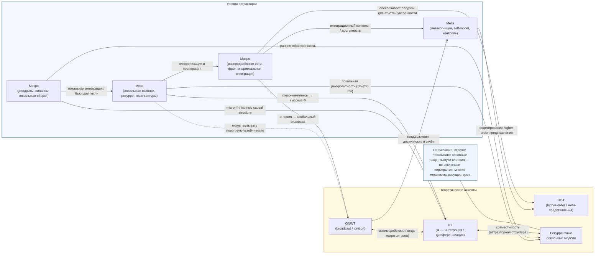

# Нейрофизиологические механизмы квалиа: аттракторно-динамический подход к трудной проблеме сознания

## Введение

**Мотивация.** Современная когнитивная нейронаука добилась значительных успехов в объяснении так называемых «лёгких» проблем сознания — механизмов восприятия, внимания, рабочей памяти и т.д. Однако «трудная» проблема (почему и как субъективный феноменальный опыт — квалиа — возникает из материи) остаётся непреодолимо сложной и требует интеграции эмпирических, формальных и философских подходов. В последние годы поле переживает методологический сдвиг: от отдельных доказательных серий к согласованным, *adversarial* исследованиям, где конкурирующие теории (в частности Global Neuronal Workspace — GNWT и Integrated Information Theory — IIT) формализуют контрастные предсказания и подвергаются проспективным, пререгистрированным экспериментам. Такой подход повышает фальсифицируемость и ускоряет выделение подтверждённых/опровергнутых механизмов. ([PLOS][1], [Nature][2])

**Цель статьи.** Синтезировать современные эмпирические данные и теоретические рамки, показать, какие элементы (динамика аттракторов, многомасштабная интеграция, временная синхронизация, метакогнитивные петли) выглядят наиболее устойчивыми к проверкам, и предложить конкретные тестируемые предсказания и экспериментальные протоколы, позволяющие продвинуться в разрешении «трудной» проблемы без спекулятивных постулатов.

---

## 1. Теоретические основы: от «лёгких» к «трудной» проблеме

### 1.1. «Лёгкие» проблемы и функциональная архитектура

«Лёгкие» проблемы — это класс задач о функциональных механизмах: какие процессы обеспечивают различение стимулов, формирование моторных команд, удержание информации и т. п. Нейронаука объясняет эти задачи через локальные и глобальные вычислительные процессы: рекуррентные сети, обработку в континууме времени, рабочую память и распределённые представления. GNWT, HOT и рекуррентные модели дают чёткие архитектурные предложения для многих «лёгких» феноменов (broadcasting, higher-order representation, recurrent processing). Эти объяснения тестируемы и обычно опираются на поведенческие парадигмы и нейроизмерения (BOLD, EEG/MEG, iEEG). ([ScienceDirect][3])

### 1.2. Переход к «трудной» проблеме: требования к объяснению

Переход к «трудной» проблеме требует дополнительных критериев: (а) **фальсифицируемость** (теория должна давать контрастные, специфичные предсказания), (б) **конкретные мостовые законы** — не метафизические авторитеты, а эмпирически проверяемые правила, связывающие динамику нейронных систем с феноменальными свойствами, (в) **многоуровневая согласованность** — согласование микро (синаптического/дендритного), мезо (локальные аттракторные поля) и макро (сеть областей) уровней. Современная парадигма adversarial collaboration как раз направлена на то, чтобы вынудить теории формулировать такие специфичные предсказания и подвергнуть их строгому тестированию. ([PLOS][1], [Nature][2])

---

## 2. Операционализация сознания и метрические инструменты 

### 2.1. Что мы измеряем: субъективные отчёты и поведенческие индексы

На практике «наличие феноменального опыта» у исследуемого субъекта обычно устанавливают через поведенческие индикаторы и субъективные отчёты — *reports* — которые остаются золотым стандартом в экспериментальной парадигме для людей. Однако важно понимать, что report сам по себе не тождествен феноменальному содержанию: отчёт — результат сложного взаимодействия самого содержания, доступа к нему, метакогнитивных механизмов и внешних факторов (мотивация, задача, способность к вербализации). Это порождает три ключевые методологические проблемы, которые должны учитываться в любом эксперименте:

1. **Reportability vs. phenomenology.** Отчёт отражает доступную для системы (и для экспериментатора) информацию, а не обязательно всю полноту феноменального содержания; следовательно, различают «содержание опыта» и «доступность» этого содержания для отчёта/поведения. Эта дихотомия — центральный предмет дискуссий между GNWT/HOT/IIT и мотивирует использование специальных парадигм (см. ниже). ([PubMed][1], [PLOS][2])

2. **Типы отчётов и их ограничения.** Практикуются три основных подхода к сбору субъективности:

   * **принудительные отклики (forced-choice) с оценкой уверенности;** полезны для снижения ответной ошибки и вынужденного выражения внешнего поведения, но смешивают способность угадывать и доступность опыта; метрики уверенности (confidence) дают важную дополнительную шкалу метакогнитивного доступа.
   * **градуированные субъективные шкалы (PAS — Perceptual Awareness Scale и другие):** PAS (4-балльная шкала) и её вариации используются для различения степеней переживаемой ясности («не видел — неясно — почти ясно — ясно»). PAS хорошо работает при аккуратной инструкции, но вызывает методологические споры о том, отражает ли он истинную градуированность чувствования либо когнитивную оценку. ([PMC][3], [PubMed][4])
   * **отсроченные/отложенные репорты (delayed reports):** применяются, чтобы минимизировать влияние моментальной подготовительной активности, но сами по себе вносят дополнительные рабочие-памятные и контрольные процессы (влияние рабочей памяти/инструкций). ([PubMed][5])

3. **No-report / covert measures.** В ответ на проблему конфаундации отчёта с NCC появились *no-report* парадигмы (например, использование поведенческих индикаторов, которые не требуют непосредственного вербального отчёта — eye-tracking, pupilometry, опосредованные рефлексы). Эти парадигмы уменьшают пост-перцептуальные артефакты, но не устраняют полностью проблему: участники могут бессознательно или спонтанно рефлексировать, а отсутствие отчёта не гарантирует отсутствие метакогнитивной активности (так называемая «бored-monkey» проблема). Поэтому современные исследования рекомендуют комбинировать report и no-report условия и прямо сравнивать их (пререгистрация гипотез для обеих веток). ([PubMed][5], [PMC][6])

**Практические рекомендации (2.1).**
(а) всегда включать несколько индикаторов: forced-choice + confidence + PAS (или эквивалент) и, по возможности, no-report контроль; (б) пререгистрировать критерии «сознание/не-сознание» и план аналитики; (в) оценивать метакогнитивную эффективность (meta-d′ / meta-ROC) как отдельную переменную, чтобы отделять отчётность от содержания. Эти рекомендации в настоящее время — стандарт хорошей практики в adversarial-проектных протоколах. ([PLOS][7], [PubMed][8])

---

### 2.2. Нейровизуализационные метрики: fMRI (BOLD), MEG/EEG, iEEG — что измеряет каждая технология и как интерпретировать

Различные нейроизмерительные методы предоставляют взаимодополняющие, но не идентичные окна в динамику мозга; ключ к корректной интерпретации — учитывать их пространственно-временные ограничения и то, какие аспекты NCC они лучше всего захватывают.

**fMRI / BOLD.**

* Сильные стороны: высокая пространственная разрешающая способность, удобство картирования крупных сетей (фронтопариетальная, темпоральная, и т.д.), хорош для выявления нарушений связности и коррелятов «игниции» в распределённых областях.
* Ограничения: низкая временная разрешающая способность (секунды), BOLD — косвенная метрика (метаболическая/гемодинамическая реакция) и часто отражает интегральную активность, которую трудно однозначно интерпретировать как «информационную доступность» или causal-влияние. На практике BOLD полезна для картирования «где» происходят изменения, но требует поддержки временно точных методов для «когда» и «как» (например, совместные MEG/EEG записи или моделирование ковариаций). ([PubMed][1], [ScienceDirect][9])

**MEG/EEG (включая ERP).**

* Сильные стороны: миллисекундная временная резолюция; ERPs (например, ранние негативности — VAN/PAN, поздние компоненты P3/P3b) и частотная синхронизация (гамма, бета/альфа) полезны для оценки хронологии перцептуальных и пост-перцептуальных процессов.
* Ограничения: плохо локализуют глубинные структуры; интерпретация компонент сложна (P3b — предмет активного дебата: маркер доступа/отчёта vs. пост-перцептуальная обработка). Современные работы показывают, что ранние негативности (VAN / Perceptual Awareness Negativity, PAN) иногда лучше кореллируют с перцептуальным содержанием, тогда как P3b часто сопровождает отчёт/включение в глобальную рабочую сеть. Поэтому критично сочетать ERPs с временно-пространственными методами и контрольными условиями (report vs no-report). ([PMC][10], [jneurosci.org][11])

**iEEG / инвазивная электрофизиология.**

* Сильные стороны: высокая локальная пространственная и временная точность; позволяет измерять локальные поля, многоканальную динамику и локальные индикаторы рекуррентной активности (включая локальные высокочастотные осцилляции). iEEG особенно ценна в контексте тестов предсказаний о том, являются ли локальные рекуррентные взаимодействия достаточными для феноменального содержания.
* Ограничения: ограниченная выборка (пациенты с эпилепсией), неполное покрытие коры; необходимость аккуратной интерпретации с учётом патологии пациентов и хирургических условий. ([PubMed][1])

**Комбинированный мультимодальный подход.**
Оптимально использовать мульти-методные записи (fMRI + MEG/EEG + iEEG там, где возможно) или по крайней мере сопоставлять результаты из разных методик в пререгистрированных дизайнах. Такой подход позволяет разделять «локальную рекуррентность» от «глобальной игниции» и видеть, как BOLD-карты соотносятся с быстрыми ERP/осцилляциями. Adversarial-протоколы (пререгистрация предсказаний GNWT vs IIT) прямо требуют мультимодальности для честного контраста. ([PLOS][7], [PubMed][8])

---

### 2.3. Информационно-теоретические и вычислительные меры (Φ, PCI, LZC, mutual information, decoding)

Современные подходы к количефикации «интеграции» и «дифференциации» информации в мозге варьируются от строгих формул IIT до практических прокси-метрик, пригодных для экспериментальных данных.

**IIT / Φ (phi).**
IIT 4.0 формализует набор аксиом и постулатов, переводя их в вычислимые меры причинно-эффектной мощности системы (новые определения intrinsic information и структур качеств опыта). Однако прямой расчёт Φ для больших нейробиологических систем остаётся вычислительно затратным и чувствительным к модели (единицы, дискретизация, параметры). Поэтому IIT даёт мощную теоретическую рамку, но её эмпирическое применение часто использует упрощённые прокси-метрики или локализованные вычисления. ([PMC][12], [arXiv][13])

**Perturbational Complexity Index (PCI) и его варианты.**
PCI (TMS-EEG + Lempel-Ziv компрессия) — практический, теоретически мотивированный индикатор способности мозга генерировать сложные, распределённые и дифференцированные ответы на внешнюю пертурбацию. PCI надёжно дискриминирует уровни сознания (wakefulness vs. sleep vs. анестезия; также используется в клинике для оценки DoC) и служит хорошей «оценкой уровня» сознания, хотя не измеряет содержание. Были предложены ускорённые варианты (PCI^ST) и региональные версии; тонкости обработки (бинаризация, нормализация, выбор позиции стимуляции) влияют на значение. ([PubMed][14], [PMC][15])

**Сложность и энтропийные меры (LZC, PLZC, sample entropy).**
Lempel-Ziv и его модификации (Permutation LZ, PLZC) применяются к спонтанной и реактивной электрической активности; в ряде работ снижение LZC коррелирует с утратой сознания при анестезии и в расстройствах сознания, однако чувствительность к артефактам и выбору параметров требуют осторожной интерпретации. ([PMC][16], [PLOS][17])

**Информационные меры: mutual information, transfer entropy, effective connectivity.**
Эти оценки помогают анализировать, насколько информация передаётся между регионами, и решают вопрос о направлении причинно-следственных влияний; transfer entropy / Granger-варианты и model-based effective connectivity (DCM, state-space) дают разные перспективы. Они полезны для тестирования предсказаний о интеграции распределённых сетей (GNWT) и локальной причинно-эффектной структуры (IIT). Ограничение — высокая чувствительность к шуму и необходимости большого объёма данных. ([PubMed][1])

**Декодирование / MVPA / Temporal Generalization.**
Методы машинного декодирования (MVPA) и временная генерализация (temporal generalization method) позволяют отслеживать, какое представление в какой момент времени присутствует в паттерне активности и как устойчиво оно хранится. Это даёт эмпирические критерии для локальной рекуррентной обработки (коррелаты содержания) и для глобальной «broadcast» (шифт в перекрываемости и устойчивости представлений). Декодирование также позволяет формализовать контрастные предсказания: например, GNWT ожидает широкую и длительную доступную для декодирования сигнализацию, тогда как локальная рекуррентность предсказывает более кратковременные и локализованные декодируемые сигналы. ([PubMed][18], [UNICOG - Cognitive Neuroimaging Lab][19])

---

### 2.4. Проблемы интерпретации, взаимные ограничения и компромиссы

Ни одна из перечисленных мер не даёт «прямого» доступа к феноменальному опыту; каждая — инструмент с сильными и слабым сторонами, и их сочетание — требование надёжной интерпретации.

**Ключевые конфаунды и источники ошибок:**

* **Reverse inference.** Локальная активация или компонент ERP не обязательно означает присутствие феноменального содержания — подобные выводы требуют строгой контрастной логики и пререгистрации гипотез. ([jneurosci.org][11])
* **P3b и другие ERP-маркеры.** P3b традиционно ассоциировался с «игницией»/доступом, но экспериментальные работы показывают, что P3b может отражать пост-перцептуальные процессы (отчёт/контроль) и не обязательно непосредственно коррелировать с самим содержанием; параллельно выделяют ранние отрицательные компоненты (VAN/PAN), которые в ряде случаев лучше коррелируют с содержанием. Поэтому необходимо проектировать условия, отделяющие отчёт/выполнение от чистой перцепции (report vs no-report). ([PMC][10])
* **Чувствительность и специфичность Φ/PCI.** Φ — мощная теоретическая мера, но трудно аппроксимируется на больших мозговых сетях; PCI — практичный прокси уровня сознания, но он измеряет *уровень*, а не содержание. Разные метрики могут указывать на разные свойства (уровень vs содержание vs доступность). ([PMC][12], [PubMed][14])
* **Методологическая неоднородность.** Различия в препроцессинге, выборе параметров и аналитических пайплайнах приводят к низкой воспроизводимости; именно поэтому пререгистрация, открытые данные и adversarial-стандарты (сравнение прямо противоположных предсказаний) сейчас становятся обязательным требованием для серьёзных утверждений. ([PLOS][7], [PubMed][8])

**Рекомендации по минимизации ошибок (практика):**

1. **Мульти-методность.** По возможности комбинировать BOLD + MEG/EEG + (iEEG/TMS-EEG) и использовать как коррелятивные, так и каузальные интервенции (TMS, фармакология). ([PubMed][1])
2. **Пререгистрация контрастных предсказаний.** Особенно в adversarial-дизайнах: чётко объявлять, какие наблюдения будут считаться доказательством одной теории против другой. ([PLOS][7], [PubMed][8])
3. **Комбинация report / no-report.** Одновременно включать обе ветви и измерять метакогнитивную эффективность, чтобы различать контрибуты отчёта и содержание. ([PubMed][5], [PMC][6])
4. **Открытость и стандартизация.** Делать доступными данные и код; публиковать параметры симуляций/вычислений Φ и предобработки PCI; использовать общепринятые бенчмарки для сравнительного анализа. ([Frontiers][20], [pure.knaw.nl][21])

---

## Краткое резюме подраздела

Операционализация сознания требует сочетания аккуратно сконструированных поведенческих индикаторов (forced-choice, PAS, confidence, no-report), мульти-модальной нейроперфорации (fMRI, MEG/EEG, iEEG, TMS-EEG) и набора информации-теоретических и статистических метрик (Φ / IIT-инструменты, PCI, LZC, mutual information, decoding). Ключевой практический принцип — пререгистрировать контрастные предсказания и использовать множественные, независимые индикаторы для разделения содержания опыта, доступа к нему и пост-перцептуальных процессов. Современные инициативы по adversarial-тестированию и стандартизации (Melloni et al. protocol; Cogitate/Nature project) реализуют эти требования и формируют лучшие практики для поля. ([PLOS][7], [PubMed][8], [PMC][12])

[1]: https://pubmed.ncbi.nlm.nih.gov/38447578/ "An integrative, multiscale view on neural theories ..."
[2]: https://journals.plos.org/ploscompbiol/article?id=10.1371%2Fjournal.pcbi.1011465 "Integrated information theory (IIT) 4.0 - Research journals"
[3]: https://pmc.ncbi.nlm.nih.gov/articles/PMC8672240/ "The Perceptual Awareness Scale—recent controversies ..."
[4]: https://pubmed.ncbi.nlm.nih.gov/34925909/ "The Perceptual Awareness Scale-recent controversies and ..."
[5]: https://pubmed.ncbi.nlm.nih.gov/26585549/ "Extracting the True Neural Correlates of Consciousness"
[6]: https://pmc.ncbi.nlm.nih.gov/articles/PMC9130851/ "The No-Report Paradigm: A Revolution in Consciousness ..."
[7]: https://journals.plos.org/plosone/article?id=10.1371%2Fjournal.pone.0268577 "An adversarial collaboration protocol for testing contrasting ..."
[8]: https://pubmed.ncbi.nlm.nih.gov/40307561/?fc=None&ff=20250517114750&utm_campaign=None&utm_content=1V_PRf-wigmvSPfOUX24LRPUd9z0ARqsOWLr2f-R0beykJ_kU&utm_medium=rss&v=2.18.0.post9+e462414 "Adversarial testing of global neuronal workspace and ..."
[9]: https://www.sciencedirect.com/science/article/pii/S0896627324000886 "An integrative, multiscale view on neural theories of ..."
[10]: https://pmc.ncbi.nlm.nih.gov/articles/PMC4189413/ "Isolating neural correlates of conscious perception from ..."
[11]: https://www.jneurosci.org/content/40/25/4925 "Distinguishing the Neural Correlates of Perceptual ..."
[12]: https://pmc.ncbi.nlm.nih.gov/articles/PMC10581496/ "Integrated information theory (IIT) 4.0: Formulating the ..."
[13]: https://arxiv.org/abs/2212.14787 "Integrated information theory (IIT) 4.0: Formulating the properties of phenomenal existence in physical terms"
[14]: https://pubmed.ncbi.nlm.nih.gov/23946194/ "A theoretically based index of consciousness independent ..."
[15]: https://pmc.ncbi.nlm.nih.gov/articles/PMC5132045/ "Stratification of unresponsive patients by an independently ..."
[16]: https://pmc.ncbi.nlm.nih.gov/articles/PMC5086801/ "Propofol anesthesia reduces Lempel-Ziv complexity of ..."
[17]: https://journals.plos.org/plosone/article?id=10.1371%2Fjournal.pone.0133532 "Complexity of Multi-Dimensional Spontaneous EEG ..."
[18]: https://pubmed.ncbi.nlm.nih.gov/28590686/ "Decoding the Dynamics of Conscious Perception"
[19]: https://www.unicog.org/publications/1-s2.0-S1364661314000199-main.pdf "Characterizing the dynamics of mental representations"
[20]: https://www.frontiersin.org/journals/psychology/articles/10.3389/fpsyg.2024.1341430/full "Quantifying empirical support for theories of consciousness"
[21]: https://pure.knaw.nl/portal/files/1314823078/Storm2024.pdf "An integrative, multiscale view on neural theories of ..."

---

## 3. Эмпирическая основа и сравнительное тестирование теорий 

### 3.1. Подход «adversarial testing»

**Концепция и мотивация.**
Adversarial collaboration — это заранее организованная, проспективная методология, в которой представители конкурирующих теоретических школ (например, GNWT и IIT) совместно формулируют чёткие, контрастные и пререгистрированные предсказания, согласуют критерии интерпретации результатов и заранее определяют аналитические пайплайны. Цель — устранить пост-hoc объяснения, снизить эффект публикационного смещения и повысить фальсифицируемость теорий путём прямого сравнения на одном и том же наборе данных. Такая методология была формализована в протоколе Melloni и соавт. (PLOS One, 2023) и реализована в крупном многоцентровом проекте Cogitate, результаты которого опубликованы в *Nature* (2025). Эти инициативы подчёркивают необходимость пререгистрации, открытости данных и заранее согласованных критериев фальсификации. ([PMC][23], [Nature][24])

**Ключевые элементы протокола (практическая дорожная карта).**

1. **Пререгистрация детализированных предсказаний и аналитических планов.** Для каждой теории формулируются точные, операциональные предсказания по локализации (какие области должны активироваться), по временной динамике (какие компоненты ERP/осцилляций должны появиться и когда), и по информационной структуре (какие метрики интеграции/дифференциации должны измениться). Эти предсказания записываются в публичный протокол до начала сбора данных. ([PMC][23])
2. **Открытые данные, код и пайплайны.** Весь аналитический код, конвейеры предобработки и наборы данных выкладываются в репозитории (зависит от этических ограничений), чтобы независимые группы могли воспроизвести результаты и проверить чувствительность к аналитическим решениям. Это уменьшает ризик «researcher degrees of freedom». ([Nature][24])
3. **Согласование контрастных условий.** Экспериментальные условия выбираются так, чтобы теории давали прямо противоположные предсказания (например, условие А: локальная рекуррентность присутствует, но глобальный broadcast минимален; условие Б: ожидается задействование фронтопариетальной сети и сильный P3b). Наличие таких «дизайнов разногласий» — сердце adversarial approach. ([PMC][23])
4. **Мультимодальность и каузальные вмешательства.** Для честной проверки включают мульти-методные записи (см. раздел 3.2) и — где возможно — каузальные методы (TMS, фармакологические манипуляции), чтобы не ограничиваться корреляционными выводами. ([Nature][24])

**Аналитические практики и критерии фальсификации.**

* Пререгистрированные *decision rules* (какие статистические тесты и пороговые критерии считаются поддержкой или опровержением той или иной теории).
* Использование **мультивариантных** и **байесовских** стратегий для оценки поддержки гипотез (Bayes factors, model comparison), а также *multiverse analyses* и *sensitivity analyses*, чтобы показать устойчивость выводов к аналитическим выборам.
* Чёткая отчетность о негативных результатах (что важно в adversarial-рамке). ([PMC][23], [Nature][24])

**Практическое значение.**
Adversarial testing уже привёл к реорганизации ожиданий в полях NCC: проекты Melloni (протокол) и Cogitate (многоцентровый эксперимент) показывают, как вынуждение теорий к конкретике повышает качество эмпирики и снижает спекуляцию. ([PMC][23], [Nature][24])

---

### 3.2. Мультимодальные исследования (fMRI + MEG/EEG + iEEG + TMS-EEG)

**Почему мультимодальность необходима.**
Поскольку разные методы предоставляют разные окна (BOLD — «где»; EEG/MEG — «когда»; iEEG — «локально и быстро»; TMS-EEG/PCI — «каузальность и потенциал интеграции»), только их сочетание позволяет строить непротиворечивую картину NCC и дифференцировать локальные и глобальные механизмы. Мультимодальные подходы также облегчают проверку контрастных предсказаний (локальная рекуррентная обработка vs. глобальная игниция) за счёт сопоставления временной шкалы (ERP/осцилляции) и пространственной топографии (fMRI, source-reconstructed MEG, iEEG). ([Frontiers][25], [PMC][26])

**Типичные мультимодальные дизайны и аналитика.**

* **Параллельные сессии MEG и fMRI** (необязательно одновременно) с общей экспериментальной процедурой и последующей совместной интеграцией данных (source localization + fusion/Joint ICA / representational similarity analysis). Такой подход позволяет связать ERP-линии времени с конкретными областями BOLD-активации. ([Frontiers][25])
* **Комбинация iEEG + fMRI** у пациентов (или iEEG + high-density EEG у здоровых) — даёт возможность валидировать локальные сигнатуры iEEG в рамках глобальной BOLD-картины; публичные наборы iEEG-fMRI (например, Berezutskaya et al.) демонстрируют полезность таких данных для репликации и методов. ([Nature][27])
* **TMS-EEG и PCI** — пертурбация корковых узлов с последующей оценкой сложности ответа (PCI) служит каузальным тестом способности сети к интеграции; это особенно ценно для проверки предсказаний о «уровне» интеграции/сознания (но не напрямую о содержании). ([PMC][28])

**Практические ограничения и способы их смягчения.**

* **Несинхронные измерения.** Одновременная запись MEG+fMRI технически сложна; часто проводят параллельные сессии и затем применяют методы cross-modal fusion; важно держать экспериментальные условия очень сходными. ([Frontiers][25])
* **iEEG-смещение выборки.** Выборка пациентов с iEEG ограничена по анатомии и здоровью; это создаёт возможный селективный зазор. Рекомендуется использовать iEEG для гипотез проверки, а не как единственный источник обобщения. ([Nature][27])
* **Совместимость аналитики.** Пререгистрируйте схемы интеграции (какие метрики BOLD будут совмещены с какими временными метриками), чтобы избежать post-hoc подгонки. ([PMC][23])

---

### 3.3. Поведенческие парадигмы и контр-предсказания между GNWT, IIT, HOT и рекуррентными моделями

**Выбор парадигм как средство создания юридически «контрастных» условий.**
Правильный выбор поведенческих парадигм позволяет поставить теории в ситуацию, где их предсказания расходятся. Ниже — наиболее часто используемые парадигмы и то, какие контр-предсказания они делают возможными.

**1) Протоколы маскирования (backward/forward masking, metacontrast).**

* *Почему полезно:* можно кратко ограничить время, в течение которого локальные рекуррентные процессы развиваются, при этом не допуская глобальной игровой «игниции».
* *Контрастные предсказания:* GNWT предсказывает, что при маскировании не наступит глобального broadcast и поэтому не будет P3b и отчёта; рекуррентные/локальные теории предсказывают, что при достаточной локальной рекуррентности может сохраниться феноменальное содержание без широкого P3b; IIT может предсказать локальную интеграцию (Φ) даже при отсутствии широкого broadcast. Эксперименты с пререгистрацией критериев различий и мульти-методной записью дают прямое сопоставление. ([PMC][23])

**2) Attentional blink / rapid serial visual presentation (RSVP).**

* *Почему:* позволяет отделить кратковременную исключаемость элементов из доступа; GNWT предсказывает пропуски broadcast, IIT — возможные локальные интеграции. Подробный временной анализ ERPs и декодирования тут критичен. ([ScienceDirect][29])

**3) Binocular rivalry / bistable perception.**

* *Почему:* перцептуальное содержание меняется без изменений сенсорного ввода; это позволяет исследовать корреляты контента при стабильной сенсорной стимуляции.
* *Контраст:* локальные/сенсорные корелляты (V1–V4) vs. более широкие ассоциационные сети; no-report варианты (включая eye-tracking) позволяют минимизировать отчётные артефакты. ([Frontiers][30], [PMC][26])

**4) No-report paradigms.**

* *Почему:* устраняют прямое вмешательство отчёта и помогают отделить NCC от их предпосылок и последствий.
* *Ограничение:* как указывал Block и другие, отсутствие репорта не гарантирует отсутствие пост-перцептуальных процессов (внутренние метакогнитивные операции могут продолжаться). Поэтому рекомендуется параллельное включение report / no-report условия и прямое сравнение. ([ScienceDirect][31], [Frontiers][30])

**5) No-report + Kausal interventions (TMS).**

* Комбинация no-report парадигм с TMS по локальным сенсорным областям или по фронтопариетальной сети позволяет тестировать: разрушает ли локальная пертурбация содержание (поддерживая локальные теории), или нужна пертурбация глобальной сети для разрушения репортируемости и/или содержания (поддерживая GNWT). ([PMC][28], [Nature][24])

**Контрастные предсказания основных теорий (кратко):**

* **GNWT:** резкая, всеобъемлющая «игниция» фронтопариетальной сети; появление поздней P3b и расширяемой декодируемости; зависимость от broadcast для reportability. ([Nature][24])
* **IIT:** феноменальность связана с локально/регионами высокой интеграции (высокое Φ); не требует широкого GNW-подобного broadcast для некоторого класса квалиа; предсказания количественно сложны и требуют расчёта причинно-эффектной структуры. ([PMC][26])
* **HOT (Higher-Order):** сознание требует представления состояния на более высоком уровне — роль метакогнитивных систем критична; предсказывает сильную роль фронтальных/мета-регионов для reportability и уверенности. ([PubMed][32])
* **Рекуррентные/локальные модели:** ранняя локальная рекуррентность (50–200 мс) может быть достаточной для содержания; глобальная активизация не обязательна для всех видов содержания. ([PMC][26])

**Стратегии построения адверсариальных условий.**

* **Временное расщепление:** манипулировать задержкой между локальной рекуррентностью и временем, когда global broadcast может возникнуть (короткие ISI), — это создаёт «логическую щель», где одни теории предсказывают наличие опыта, а другие — нет.
* **Функциональная изоляция:** кратковременная интерференция (TMS) с локальным узлом при сохранённом глобальном фоне и наоборот.
* **Информационные контрасты:** условия, при которых декодируемость локального содержания высока, но глобальная интеграция низка (и наоборот).
  Все эти условия должны быть пререгистрированы и сопровождаться мульти-методной записью и заранее определёнными критериями интерпретации. ([PMC][23], [Nature][24])

---

### Основные источники и ссылки

* Melloni L. et al. (2023). *An adversarial collaboration protocol for testing contrasting predictions of global neuronal workspace and integrated information theory.* PLOS One. ([PMC][23])
* Cogitate Consortium (2025). *Adversarial testing of global neuronal workspace and integrated information theories of consciousness.* Nature. ([Nature][24])
* Reviews on multimodal integration and methods: Frontiers Research Topic (multimodal approaches, 2024–2025). ([Frontiers][25])
* No-report paradigms and debates: Duman et al. (2022) review; Block critique (2019); recent empirical no-report analyses (Cohen 2024). ([Frontiers][30], [ScienceDirect][31], [PMC][26])
* P3b / VAN debate and awareness negativities: Dembski et al. (2021) and subsequent reviews. ([ScienceDirect][33], [PubMed][34])
* Perturbational Complexity Index (PCI) and TMS-EEG methods: key reviews and empirical studies (Sinitsyn et al. 2020; subsequent PCI work). ([PMC][28], [BioRxiv][35])

[22]: https://pubmed.ncbi.nlm.nih.gov/37847724/ "Integrated information theory (IIT) 4.0: Formulating the ..."
[23]: https://pmc.ncbi.nlm.nih.gov/articles/PMC9916582/ "An adversarial collaboration protocol for testing contrasting ..."
[24]: https://www.nature.com/articles/s41586-025-08888-1 "Adversarial testing of global neuronal workspace and ..."
[25]: https://www.frontiersin.org/research-topics/56812/multimodal-approaches-to-investigating-neural-dynamics-in-cognition-and-related-clinical-conditions-integrating-eeg-meg-and-fmri-data/magazine "Multimodal Approaches to Investigating Neural Dynamics ..."
[26]: https://pmc.ncbi.nlm.nih.gov/articles/PMC11558846/ "Neural signatures of visual awareness independent ..."
[27]: https://www.nature.com/articles/s41597-022-01173-0 "Open multimodal iEEG-fMRI dataset from naturalistic ..."
[28]: https://pmc.ncbi.nlm.nih.gov/articles/PMC7760168/ "Detecting the Potential for Consciousness in Unresponsive ..."
[29]: https://www.sciencedirect.com/science/article/pii/S0149763425000533 "Unpacking the complexities of consciousness: Theories ..."
[30]: https://www.frontiersin.org/journals/human-neuroscience/articles/10.3389/fnhum.2022.861517/full "The No-Report Paradigm: A Revolution in Consciousness ..."
[31]: https://www.sciencedirect.com/science/article/abs/pii/S1364661319302360 "What Is Wrong with the No-Report Paradigm and How to Fix It"
[32]: https://pubmed.ncbi.nlm.nih.gov/36763595/ "An adversarial collaboration protocol for testing contrasting ..."
[33]: https://www.sciencedirect.com/science/article/abs/pii/S1364661321001467 "Perceptual awareness negativity: a physiological correlate ..."
[34]: https://pubmed.ncbi.nlm.nih.gov/34172384/ "Perceptual awareness negativity: a physiological correlate ..."
[35]: https://www.biorxiv.org/content/10.1101/2020.01.08.898775.full "Assessing the Intra- and Inter-Subject Reliability of ..."

---

## 4. Нейрофизиологическая архитектура квалиа 

### 4.1. GWT, IIT и другие — краткое сопоставление (ключевые предсказания)

**Global Neuronal Workspace (GNWT).**
GNWT утверждает, что сознание возникает тогда, когда информация «выходит» за пределы локальных сенсорных обработок и попадает в глобальную рабочую область, где она «broadcasts» — т.е. становится доступна широкому набору систем (память, язык, планирование действий). Эмпирически это формализуется как внезапное, масштабное усиление активности («ignition») и увеличение степени декодируемости представлений по широкой фронтопариетальной сети; часто сопутствует поздняя P3/P3b-ERP-компонента. GNWT даёт чёткие предсказания о временнóй последовательности (поздняя глобальная активизация, correlate P3b) и о распределении (широкая фронтопариетальная вовлечённость) активностей, которые легко формализовать для adversarial-тестов. ([PMC][36], [cell.com][37])

**Integrated Information Theory (IIT).**
IIT формулирует феноменальность как свойство «интегрированной информации» подсистемы; качество опыта определяется структурой причинно-эффектной мощности подсистемы, а количество — величиной Φ (и связанных с ней формализмов в IIT 4.0). IIT 4.0 предлагает более точную математику для оценки intrinsic information и качества опыта и поэтому даёт формальные, хотя вычислительно затратные, предсказания о том, какие подсистемы потенциально феноменальны. В контексте нейрофизиологии это переводится в требования к определённой структурной/каузальной организации (высокая интеграция при одновременной большой дифференциации). IIT предсказывает, что локальные компактные комплексы с высокой Φ могут иметь феноменальность даже при ограниченной глобальной «broadcast» активности. ([PLOS][38], [arXiv][39])

**Higher-Order Theories (HOT) и метакогнитивные подходы.**
HOT и смежные теории утверждают, что сознание требует наличия представлений более высокого порядка, которые представляют себе (или «самому себе») наличие первого порядка представлений. На практике это делает метакогнитивные системы (включая отдельные фронтальные узлы) критически важными для отчётности и чувственного самоосознавания. HOT предсказывает корреляцию между метакогнитивной активностью (confidence, error monitoring) и наличием отчётов о сознании; из этого следует, что манипуляции метакогниции должны влиять на репортируемость даже при неизменной первом-ордной репрезентации. ([PubMed][40], [Oxford Academic][41])

**Рекуррентные локальные модели.**
Эта группа моделей подчёркивает, что ранняя рекуррентная обработка в сенсорных корковых контурах (локальная обратная связь) может быть достаточной для возникновения феноменального содержания. Они предсказывают более ранние корелляты (временные окна \~50–200 мс) и локальную декодируемость содержимого без обязательной вовлечённости фронтальных сетей. Такие модели особенно привлекательны в объяснении быстрых восприятельных феноменов и некоторых no-report результатов. ([ScienceDirect][42])

**Сопоставление и практические выводы.**
Эти теории дают частично пересекающиеся, частично расходящиеся предсказания по трём осям: (а) пространственное распределение (локальные vs глобальные сети), (б) временная динамика (ранние локальные vs поздняя глобальная составляющая), (в) роль метакогниции (необязательная/обязательная для отчёта). Adversarial-дизайны для тестирования этих различий — ключ к прогрессу: нужно пререгистрировать, какие наблюдения (например, наличие локальной рекуррентности + отсутствие P3b при наличии отчёта/без отчёта) будут трактоваться как поддержка конкретной теории. ([ScienceDirect][42], [Nature][43])

---

### 4.2. Иерархическая организация аттракторов (сенсорные → перцептуальные → концептуальные)

>  Схема сопоставления уровней аттракторов и теорий сознания. Стрелки показывают основные уровни и механизмы, на которые делает ставку каждая теория (через: Φ — интеграция, broadcast/ignition, higher-order представления, локальная рекуррентность).

**Концепция многоуровневых аттракторов.**
Аттракторно-динамическая перспектива рассматривает мозг как систему, в которой популяции нейронов формируют устойчивые паттерны активности — «аттракторы» — на множестве временных и пространственных шкал. Нижний уровень (микро) — быстрые локальные паттерны, связанные с детектированием признаков; средний уровень (мезо) — устойчивые перцептуальные представления (object-level attractors), поддерживаемые локальной рекуррентностью; верхний уровень (макро/мета) — концептуальные и семантические состояния, интегрированные в широкую сеть, включая рабочую память и метакогнитивные структуры. Переходы между этими уровнями (бифуркации, связывания) соответствуют сменам содержимого сознания и вариациям его отчетливости и длительности. ([PMC][44], [eLife][45])

**Как это соотносится с GNWT и IIT.**

* В терминах GNWT макро-аттрактор, достигший порога устойчивости и вовлекающий глобальную сеть, проявится как «игниция» и broadcast; такой переход обеспечивает доступность для репорта и действия.
* В терминах IIT высокое Φ часто связано с определённой структурой аттракторного набора (каузально-неразложимой подсистемы); аттракторная устойчивость на мезо/микроуровне может соответствовать локальной интеграции с высоким Φ.
  Таким образом, и GNWT, и IIT могут быть формализованы в рамках аттракторно-динамической картины, причём их различие — в том, какие уровни и свойства системы они считают ключевыми для феноменальности. Это превращает многие философские разногласия в эмпирически тестируемые гипотезы о порогах устойчивости, времени релаксации и распределении связности. ([PMC][44], [PLOS][38])

**Эмпирические индикаторы аттракторности.**
Измеряемые признаки включают: длительность релаксации после возмущения (autocorrelation times), устойчивость траекторий в фазовом пространстве, устойчивые шаблоны активности в representational space (RSA), и зависимость от шума (noise-induced transitions). Недавно предложенные методы извлечения large-scale attractor dynamics из функциональных данных (connectome-based attractor analysis) дают инструменты для проверки этих предсказаний на реальных fMRI/EEG/iEEG наборах. ([eLife][45], [PMC][44])

---

### 4.3. Темпоральная синхронизация и связывание

**Роль осцилляций и межчастотного взаимодействия.**
Осцилляции на разных частотных диапазонах играют различную роль в организации многомасштабной динамики: гамма-диапазон (≈30–100 Hz) часто ассоциируют с локальным связыванием и быстрыми перцептуальными процессами; тета/альфа/бета-диапазоны — с межобластной координацией, управлением вниманием и «лишением» ненужных сигналов. Важным механизмом является межчастотная связность (например, theta–gamma coupling), которая может поддерживать организацию множественных элементов в единую рабочую память и контекстуальную интеграцию. Однако последние обзоры подчёркивают, что простая формула «гамма = сознание» слишком упрощённа: гамма вовлечена во множество процессов (включая локальную обработку и метаболическую кооперацию), и её связь с феноменом зависит от контекста, локуса и сопутствующих сетевых состояний. ([eLife][46], [ScienceDirect][47])

**Короткие vs длинные временные окна.**
Короткие окна высокой частоты (гамма) могут формировать перцептуальные аттракторы, тогда как более длинные низкочастотные осцилляции создают «интеграционные окна», в которых происходит глобальная синхронизация и broadcast. Такая временная декомпозиция объясняет, почему локальные перцепции могут возникать быстро, а доступность/репорт — с более длинной задержкой, требующей согласованной активности на низких частотах между распределёнными сетями. ([ScienceDirect][47], [PMC][48])

**Практические замечания по измерению.**
Измерение осцилляций и cross-frequency coupling требует аккуратной предобработки (удаление артефактов, корректная фильтрация) и статистики, устойчивой к multiple comparisons. Интерпретация causal-ролей осцилляций выигрывает от сочетания с пертурбационными методами (TMS) и моделированием (спайково-полевые модели, mean-field), которые связывают осцилляционные режимы с конкретной динамикой аттракторов. ([eLife][46], [ScienceDirect][47])

---

### 4.4. Метакогнитивные механизмы (ACC, PCC, фронтопариетальный контроль)

**Функции и корреляты.**
Области медиальной и латеральной фронтальной коры — включая anterior cingulate cortex (ACC), dorsolateral PFC (dlPFC) и regions of posterior cingulate cortex (PCC)/precuneus — регулярно вовлекаются в метакогнитивные процессы: мониторинг ошибок, оценка уверенности, переключение стратегий, а также подготовку и формирование отчётов. ACC, в частности, связывают с обнаружением конфликтов, адаптацией поведения и переработкой ошибок; PCC/precuneus — с саморефлексией и аспектами default mode network, которые могут формировать долгоживущие мета-аттракторы. ([Nature][43], [ScienceDirect][49])

**Трекеры/контролёры vs необходимые компоненты содержания.**
Ключевой эмпирический вопрос: являются ли эти фронтальные/медиальные области **необходимыми** для самого феноменального содержания или они исполняют роль «трекеров/контролёров», обеспечивая отчётность и интеграцию? HOT и некоторые версии GNWT приписывают фронту важную роль для отчётности и доступности; есть данные, что повреждение отдельных фронтальных участков не всегда уничтожает феноменальность (случаи локальных лезий), что поддерживает тезис о том, что фронтальные области скорее модулируют доступность и контроль, чем создают само содержание. Тем не менее, adversarial-эксперименты и каузальные вмешательства (TMS) продолжают уточнять эти границы, и последние мульти-методные данные указывают на гибридную картину: фронтальные регионы критичны для отчёта/метакогниции, но не всегда необходимы для базового содержательного опыта. ([PubMed][40], [ScienceDirect][42])

**Практическое следствие для исследований.**
Чтобы различить роль этих областей как «трекеров» или «необходимых компонентов», необходимо пререгистрированно сравнивать условия с прямыми каузальными вмешательствами (фокальный TMS по ACC/dlPFC) и условиями, где локальная перцепция поддерживается (например, сильная локальная рекуррентность) при минимальном участии фронта. Adversarial-дизайны специально включают такие манипуляции. ([PubMed][50], [Nature][43])

---

## Краткое резюме раздела

1. GNWT, IIT, HOT и локальные рекуррентные модели предлагают различающиеся, но частично совместимые видения архитектуры квалиа; главное различие — в том, какие уровни (локальные vs глобальные) и какие механизмы (broadcast vs интегральная каузальная мощность vs метапредставления) считаются необходимыми. ([PMC][36], [PLOS][38])
2. Аттракторно-динамическая рамка даёт удобный язык для интеграции этих подходов: различие между уровнями аттракторов и пороговыми переходами делает теории эмпирически тестируемыми (через измерения устойчивости, времена релаксации, cross-frequency coupling и causal perturbations). ([PMC][44], [eLife][45])
3. Роль осцилляций и метакогнитивных областей остаётся сложной и контекстуальной: современные данные указывают на множественные механизмы, где осцилляции поддерживают связь между уровнями аттракторов, а фронтальные области обеспечивают мониторинг/доступ, но не всегда являются источником самих квалиа. ([ScienceDirect][47], [Nature][43])

[36]: https://pmc.ncbi.nlm.nih.gov/articles/PMC8770991/ "Conscious Processing and the Global Neuronal ..."
[37]: https://www.cell.com/neuron/fulltext/S0896-6273%2824%2900159-4 "Stanislas Dehaene: Neuron"
[38]: https://journals.plos.org/ploscompbiol/article?id=10.1371%2Fjournal.pcbi.1011465 "Integrated information theory (IIT) 4.0 - Research journals"
[39]: https://arxiv.org/abs/2212.14787 "Integrated information theory (IIT) 4.0: Formulating the properties of phenomenal existence in physical terms"
[40]: https://pubmed.ncbi.nlm.nih.gov/21737339/ "Empirical support for higher-order theories of conscious ..."
[41]: https://academic.oup.com/nc/article/2020/1/niz020/5803146 "Awareness as inference in a higher-order state space"
[42]: https://www.sciencedirect.com/science/article/pii/S0896627324000886 "An integrative, multiscale view on neural theories of ..."
[43]: https://www.nature.com/articles/s41467-024-50388-9 "Anterior cingulate cortex provides the neural substrates for ..."
[44]: https://pmc.ncbi.nlm.nih.gov/articles/PMC10939345/ "Sources of richness and ineffability for phenomenally ..."
[45]: https://elifesciences.org/reviewed-preprints/98725 "Connectome-Based Attractor Dynamics Underlie Brain ..."
[46]: https://elifesciences.org/articles/100238 "The gamma rhythm as a guardian of brain health"
[47]: https://www.sciencedirect.com/science/article/pii/S2352154624000846 "Theta–gamma coupling as a ubiquitous brain mechanism"
[48]: https://pmc.ncbi.nlm.nih.gov/articles/PMC11810546/ "Gamma and Theta/Alpha-Band Oscillations in the ..."
[49]: https://www.sciencedirect.com/science/article/pii/S2352154625000658 "The default mode network and the complex dynamics of ..."
[50]: https://pubmed.ncbi.nlm.nih.gov/37847724/ "Integrated information theory (IIT) 4.0: Formulating the ..."

---

## 5. Молекулярно-генетические механизмы и пластичность 

### 5.1. Нейротрансмиттеры и модуляция сознательных состояний

Современная нейронаука рассматривает нейромодуляторы как факторы, фундаментально влияющие на вероятность возникновения, устойчивость и «формат» феноменального опыта через три основных механизма: (i) модуляция возбудимости и сигнал-шум отношения нейронных популяций (gain control), (ii) сдвиг в динамических режимах сети (например, в режимах синхронизации и фазовых «окон»), (iii) долговременные эффекты на пластичность и состояние синаптической сети. Ниже — сводка по основным системам и релевантным данным.

1. **Locus coeruleus — норадреналин (LC–NE).**
   LC–NE система действует как «арбитр» состояний бдительности/мотивации: тонус LC и режимы её спайковой активности (тоническая vs. phasic/burst) определяют глобальную возбудимость коры, усиливают отношение сигнал/шум и модулируют распределение ресурсов внимания. Экспериментальные исследования (включая комбинированные оптогенетику, флюоресцентную фотометрю и fMRI) показывают, что разные режимы LC приводят к качественно различным шаблонам активации: умеренная тоническая активация поддерживает ассоциативную обработку, тогда как burst-активация смещает систему в режим усиленной сенсорной обработки. Эти механизмы напрямую влияют на условия, при которых локальные аттракторы могут перейти в более глобально устойчивые состояния — и, следовательно, на вероятность «игниции» и доступности содержания для репорта. ([Nature][51])

2. **Дофамин (DA).**
   Дофамин традиционно связывают с кодированием prediction error и с подкреплением, но современные обзоры расширяют его роль до более общей модуляции верований/оценки неопределённости и управлением «гейна» обучения и мотивации. Через эти механизмы дофамин может косвенно влиять на то, какие представления становятся приоритетными для глобальной обработки (например, через усиление ожидаемых/важных стимулов), а также на пластичность, поддерживающую образование и удержание мезо-/макроаттракторов. Эмпирические данные о прямом влиянии DA на содержание сознания пока ограничены, но её воздействие на предсказания и выделение значимого входа делает её важным переменным в моделях аттракторно-динамической эмергенции опыта. ([PMC][52], [ScienceDirect][53])

3. **Ацетилхолин (ACh).**
   ACh ассоциирован с модуляцией внимания, пластичности и режимов кортикальной обработки: он усиливает локальную чувствительность к входам и способствует быстрым переходам между состояниями (state switching). Недавние записи показали, что динамика ацетилхолинергической передачи предсказывает спонтанные переходы между бдительным и менее интегрированным состоянием, а фармакологические манипуляции по-разному влияют на обработку предсказаний и величину prediction error. В контексте NCC, ACh помогает регулировать «окна интеграции», в которых локальные рекуррентные петли способны сформировать устойчивые перцептуальные аттракторы. ([cell.com][54], [eneuro.org][55])

4. **Серотонин (5-HT).**
   Серотонинергическая система оказывает широчайшее, контекстно-зависимое влияние на корковые и подкорковые сети: она участвует в регуляции настроения и тревоги, модуляции пластичности и, по ряду новых данных, в глобальной реактивности сети и восстановлении активации после подавления (включая клинические состояния). Оптогенетические и фармакологические исследования демонстрируют, что активация серотонинергических ядёр способна вызывать широкие, хотя рецепторно-зависимые, эффекты в мозге; это указывает на то, что 5-HT может менять «ландшафт» аттракторов (например, снижая барьеры между ними или изменяя время релаксации). В свете интереса к психоделикам (5-HT2A-агонисты) и их сильному влиянию на содержательное богатство переживаний, серотонин представляет собой важную мишень для изучения изменений качества опыта. ([Nature][56], [ScienceDirect][57])

5. **Анестетики и общие уроки о динамике.**
   Клинически и экспериментально анестетики — мощный инструмент для тестирования гипотез про NCC: разные анестетики (пропофол, кетамин, изофлуран и др.) действуют на разные молекулярные мишени (GABA\_A-рецепторы, NMDA-рецепторы, и пр.), но многие исследования сходятся на одном общем феномене — нарушении интеграции и рекуррентной динамики, снижении топ-даун/бидирекциональной связи и изменении репертуара состояний (repertoire collapse). Анализы динамического баланса интеграции/дифференциации и меры вроде PCI показывают надёжную корреляцию с потерей сознания при анестезии; это подчёркивает, что молекулярные вмешательства, меняющие синаптические свойства, переходят к системному уровню через разрушение устойчивости аттракторов. ([PMC][58])

**Практические следствия и экспериментальные стратегии.**

* Фармакологические и нейромодуляторные манипуляции — прямой путь тестирования ролей разных neuromodulatory systems в формировании и стабильности аттракторов: сочетание фармакологии с мульти-модальной записью (iEEG / MEG / fMRI) и пререгистрацией предсказаний по временному профилю и интеграции даёт высокий экспериментальный контроль.
* Оптогенетика в моделях животных — метод для causal dissection (пример: различие tonic vs burst LC activity и их разные системные эффекты). ([Nature][51])

---

### 5.2. Генетические корреляты и пластичность

**Генетика и endophenotypes.**
Прямые генетические маркёры феноменального содержания пока не выявлены: феноменальность — сложный, динамический и мультифакторный фенотип, что делает прямую генетическую «сигнатуру» маловероятной в обозримом будущем. Вместо этого современная стратегия — искать генетические ассоциации с *эндофенотипами*: устойчивыми нейрофизиологическими характеристиками (EEG-ритмы, показатели функциональной связности, графовые метрики connectome), которые сами по себе влияют на вероятность формирования устойчивых аттракторов. GWAS и candidate-gene исследования для EEG-параметров, граф-метрик и когнитивных эндофенотипов демонстрируют, что некоторые генетические варианты влияют на свойства сети (например, гены, связанные с синаптической функцией, ионными каналами, регуляторами E/I-баланса), что опосредованно может менять склонность к определённой динамике аттракторов. ([PMC][59], [Nature][60])

**Гены, пластичность, рецепторы.**
Функциональная пластичность, опосредованная NMDA-рецепторами и downstream signalling (Ca2+-зависимые пути), лежит в основе способности нейронных сетей формировать и стабильно удерживать аттракторы. Мутации и полиморфизмы в генах, кодирующих компоненты синаптического аппарата (NMDAR subunits, scaffolding proteins, neuroligin/neurexin families), изменяют параметры пластичности и E/I-баланса, что теоретически меняет статистику переходов между состояниями сети и, следовательно, вероятность и качество феноменального содержания. Клинически это проявляется в когнитивных и перцептуальных нарушениях при нарушениях NMDA-функции и при ряде нейропсихиатрических состояний. ([PMC][61], [ScienceDirect][62])

**Методологические и перспективные направления.**

* **GWAS on neuroimaging phenotypes:** крупные мета-аналитические подходы, где нейровизуологические показатели (EEG спектры, fMRI connectivity, graph metrics) используются как фенотипы для GWAS, дают наиболее перспективный путь к выявлению генов, влияющих на динамику сетей. Эти результаты затем можно тестировать на функциональных моделях (оптогенетика, iPSC-нейроны). ([PMC][63])
* **Наследуемость и множественная детерминация:** важно учитывать, что генетические эффекты обычно малы и многогенные; практический путь — объединять многомодальные данные (генотип → экспрессия/протеом → нейрофизиология → поведение) и строить causal-pathway модели.
* **Фармакогенетика:** вариации в генах, кодирующих метаболизм нейромедиаторов (например, COMT, MAO, транспортёры), модифицируют ответ на психостимулянты и фармакологические восстановления сознания у пациентов с DoC; это важный потенциальный translational мост. ([PMC][63])

---

## 5.3. Краткие заключения и рекомендации для исследований

1. **Молекулярные системы модулируют вероятность и формат феноменального опыта** через управление возбудимостью, режимами синхронизации и пластичностью; LC–NE, ACh, DA и 5-HT — ключевые игроки, но их эффекты контекстуальны (режим активности, рецепторные подтипы, состояние сети). ([Nature][51], [cell.com][54], [PMC][52])
2. **Анестетики дают конструктивную модель для исследования системной уязвимости интеграции:** несмотря на молекулярное разнообразие их мишеней, общий системный эффект — утрата интеграции и разрушение динамической устойчивости — свидетельствует о центральной роли сетевой динамики в поддержке сознания. ([PMC][58])
3. **Генетика имеет значение как источник вариации нейрофизиологических эндофенотипов,** но прямые «гены сознания» — маловероятная цель. Стоит фокусироваться на GWAS и интегративных подходах, связывающих генетический фон с конкретными нейрофизиологическими параметрами (EEG, connectivity, plasticity markers). ([PMC][59], [Nature][60])

[51]: https://www.nature.com/articles/s41593-024-01755-8 "Tonic and burst-like locus coeruleus stimulation distinctly ..."
[52]: https://pmc.ncbi.nlm.nih.gov/articles/PMC8116345/ "Dopamine, Updated: Reward Prediction Error and Beyond"
[53]: https://www.sciencedirect.com/science/article/pii/S0168010223001384 "Prediction error in dopamine neurons during associative ..."
[54]: https://www.cell.com/cell-reports/fulltext/S2211-1247%2824%2901159-8 "Cortical acetylcholine dynamics are predicted by ..."
[55]: https://www.eneuro.org/content/11/7/ENEURO.0542-23.2024 "Acetylcholine Neurons Become Cholinergic during Three ..."
[56]: https://www.nature.com/articles/s41467-024-48489-6 "Optogenetic activation of dorsal raphe serotonin neurons ..."
[57]: https://www.sciencedirect.com/science/article/abs/pii/S0166432822002388 "Serotonin and consciousness – A reappraisal"
[58]: https://pmc.ncbi.nlm.nih.gov/articles/PMC11502666/ "Measuring the dynamic balance of integration and ..."
[59]: https://pmc.ncbi.nlm.nih.gov/articles/PMC11482091/ "Neurogenetics of Brain Connectivity: Current Approaches ..."
[60]: https://www.nature.com/articles/s41398-024-03195-1 "Endophenotype 2.0: updated definitions and criteria for ..."
[61]: https://pmc.ncbi.nlm.nih.gov/articles/PMC11509972/ "NMDA Receptors: Distribution, Role, and Insights into ..."
[62]: https://www.sciencedirect.com/science/article/abs/pii/S000632232401552X "NMDA Receptor–Modulating Treatments for Cognitive and ..."
[63]: https://pmc.ncbi.nlm.nih.gov/articles/PMC10527550/ "Genome-wide association studies: utility and limitations for ..."

---

## 6. Интегративная модель возникновения квалиа 

### 6.1. Многоуровневая аттракторная архитектура: микро/мезо/макро/метааттракторы

**Идея и мотивация.**
Интегративная модель представляет мозг как иерархическую систему вложенных аттракторов — устойчивых паттернов популяционной активности, которые реализуются на разных пространственно-временных шкалах и выполняют разные функциональные роли. Такая рамка объединяет идеи «локальной рекуррентности», «мезо-аттракторов» для удержания перцептов и «макро-аттракторов/игниции» для глобальной доступности; она также даёт понятную карту для сопоставления GNWT, IIT и HOT: разные теории ставят акценты на разных уровнях аттракторной иерархии. Эта многоуровневая перспектива опирается на классические и современные модели аттракторов и на эмпирические наблюдения устойчивых популяционных траекторий в данных iEEG/MEG/fMRI. ([PubMed][64], [PMC][65])

**Определения уровней (операционализация).**

* *Микроаттракторы* — локальные микросхемы (дендритные и синаптические субкомпоненты) и быстрое спутанное взаимодействие небольших ансамблей; оперируют на миллисекундах и определяют начальную селекцию сенсорных признаков.
* *Мезоаттракторы* — колонковые/локально-сетевые устойчивые шаблоны, поддерживаемые рекуррентной связностью; их время жизни типично в диапазоне десятков — сотен миллисекунд (например, 50–300 мс), что согласуется с требованиями к перцептуальному удержанию.
* *Макроаттракторы* — распределённые, стабилизированные сетевые конфигурации (фронтопариетальная «игниция», глобальные рабочие пространства), которые обеспечивают широкую доступность информации и интеграцию с исполнительными и мотивационными системами.
* *Метааттракторы* — долгоживущие, устойчивые режимы метакогнитивной/самомодели, которые связывают перцептуальные содержимое с целями, намерениями и вербальными отчётами.
  Каждый уровень характеризуется собственным пространственно-временным масштабом, длиной автокорреляции, размерностью траекторий и степенью интеграции/дифференциации. Эти характеристики — операциональная сеть для эмпирической проверки модели. ([PubMed][64], [ScienceDirect][66])

> *Рис. 2. Фазовое пространство с несколькими потенциальными «колодцами» (аттракторами) и примерами траекторий, сходящимися в различные устойчивые состояния. Стрелки — поле динамики (градиент потенциала).*
  

**Как перейти от слова к измерению (эмпирические индикаторы аттракторности).**
Чтобы превратить «аттрактор» в измеримый объект, используются наборы метрик и методов:

* **временные характеристики**: время релаксации (autocorrelation decay), dwell time (время пребывания в шаблоне), частота переключений;
* **топологические признаки в фазовом/латентном пространстве**: устойчивые «колодцы» в реконструированном ландшафте, малое локальное расстояние между траекториями в одного аттрактора; извлечение низко-размерных манифолдов и анализ их локального потока (on-manifold flow). Новые методы представления и анализа (representational geometry, MARBLE и др.) позволяют вычислять локальные поля и картировать динамику на манифолдах для сравнения с предсказаниями аттракторно-динамической модели.
* **информационно-динамические метрики**: изменение mutual information, transfer entropy, measures of integrated information (прокси-Φ) между компонентами сети.
* **статистика ответной устойчивости при возмущениях**: оценка ответа на TMS-пертурбации (PCI) как тест интеграции/дифференциации.
  Методологические инструменты — MVPA/decoding, RSA, manifold learning, dynamical systems fitting — дают богатый набор индикаторов, позволяющий распознавать и сравнивать микро/мезо/макроаттракторы в данных. ([Nature][67], [PMC][65], [ScienceDirect][68])

>   *Пример симуляции: быстрый микро-переменный x и медленный макро-переменный y; демонстрируется многомасштабная динамика и влияние макро на микро через гиперболический тангенс.*

>   *Проекции траекторий высокоразмерной динамики на 2D (PCA), иллюстрирующие манипуляцию притяжениями к различным аттракторам.*

**Тестируемые предсказания.**

* Если мезоаттрактор достаточен для феноменального содержания, то при условиях, где возникает устойчивая локальная рекуррентность (доказанная iEEG/MEG), но отсутствует глобальная P3b/широкая\_FRONT\_активация, субъективность по отчетам должна сохраняться (или быть частично отчётной) — это прямой тест между локальными/рекуррентными моделями и GNWT.
* Если макроаттрактор (игниция) необходим для reportability, то вмешательства, разрушающие способность к broadcast (например, фармакологически или TMS по фронту), должны уменьшать репортируемость и PCI, но не обязательно разрушать локальные перцепты, если микро/мезоаттракторы остаются функциональными. Эти эксперименты требуют мультимодальной реализации и пререгистрации критериев интерпретации. ([PubMed][64], [ScienceDirect][68])

---

### 6.2. Критические и фазовые переходы

**Критичность как функциональная точка работы.**
Существует существенный объём теоретических и эмпирических работ, указывающих, что нейрональные сети часто оперируют близко к критической точке — границе между упорядоченным и хаотическим режимами. Это состояние повышает динамическую чувствительность, вариативность реагирования и информационную ёмкость, что выгодно для обработки и передачи информации на множестве шкал. Такие свойства — большая вариабельность состояний, длинные корреляции и распределения с тяжёлыми хвостами — наблюдаются в нейрофизиологических данных и моделях, и обсуждаются как потенциально важные для феноменальности. ([ScienceDirect][69], [Journal of Neuroscience][70])

**Фазовые переходы и возникновение игниции.**

> *Временной ряд моделируемого параметра (k) и ответной величины силы аттрактора (r). При пересечении порога происходит быстрый переход («игниция») к высокому значению r.*

> *Диаграмма бифуркации (равновесия vs параметр)*

Переход от мезо-к макро-режиму можно формализовать как бифуркацию фазового пространства: при накоплении входной силы (sensory drive, top-down gain, neuromodulatory tone) локальная динамика пересекает порог, и система «скользит» в более глобально интегрированное состояние — это и есть эмпирически наблюдаемая «игниция». На уровне данных это сопровождается резким ростом межрегиональной корреляции, увеличением времени релаксации и ростом мер сложности; обратные переходы (например, под действием анестетиков) демонстрируют collapse репертуара состояний и снижение интеграции. ([Journal of Neuroscience][70], [PMC][71])

**Эмпирические наблюдения (анестезия, сон, пробуждение).**
Клинические и экспериментальные данные показывают, что при потере сознания (пропофол, изофлуран, глубокий сон) наблюдается снижение сложностной реакции на пертурбации (PCI), уменьшение богатства функциональных состояний и стабилизация в более стереотипные конфигурации; восстановление сознания коррелирует с восстановлением динамической сложности и увеличением вариабельности состояний. Эти наблюдения согласуются с идеей, что сознание связано с работой сети вблизи критической границы, где репертуар возможных аттракторов велик и легко переходящ. ([PubMed][72], [PMC][71], [ScienceDirect][73])

**Как проверять критичность и бифуркации в эксперименте.**

* Анализ критических индикаторов: power-law распределения (avalanche sizes), увеличенная корреляционная длина, длина релаксации;
* Сравнение состояния до/после пертурбации (TMS-EEG) и оценка изменения PCI/LZC;
* Фармакологические манипуляции (анестетики, neuromodulators) с измерением репертуара состояний;
* Симуляции и model-based inference (fitting of biophysical network models) для оценки, как изменение параметров (gain, E/I balance) приводит к переходам. Эти подходы уже показали связь между снижением интеграции и потерей сознания в нескольких исследованиях. ([PMC][74], [ScienceDirect][68])

---

### 6.3. Информационно-теоретические принципы

**IIT и Φ — формальная база и практические ограничения.**
IIT 4.0 даёт формальную процедуру для оценки intrinsic cause–effect structure подсистемы и, теоретически, позволяет вычислить качество и количество опыта (Φ-структуру). Это важный теоретический мост между динамикой и феноменальностью, но прямое применение Φ к реальным мозговым системам трудно из-за комбинаторной сложности и чувствительности к выбору единиц/моделей; поэтому практическое использование IIT в нейробиологии часто опирается на локальные/аппроксимационные подходы и на тестирование качественных предсказаний IIT (какие подсистемы являются candidate substrates). ([PMC][75], [arXiv][76])

**Практические и комплементарные метрики.**

* **PCI (Perturbational Complexity Index)** — эмпирический прокси, сочетающий интеграцию и дифференциацию ответа на TMS; показатель уровня «готовности» к сознанию и чувствителен к анестезии/DoC. PCI измеряет способность сети генерировать разностные, сильно распределённые ответы при внешней пертурбации. ([PubMed][72])
* **Алгоритмическая сложность (LZC) и энтропия** — оценивают богатство и разнообразие сигналов; применимы как к спонтанным, так и к реактивным данным.
* **Transfer entropy / effective connectivity / mutual information** — оценивают направление и силу информационных потоков (важно для теста causal structure, требуемой IIT).
* **Representational geometry / neural manifolds** — изучение устойчивости траекторий в латентном пространстве, их размерности и локального потока (on-manifold dynamics) даёт прямые индикаторы аттракторности и устойчивости представлений; методы MARBLE и прочие recent manifold tools облегчают это. ([Nature][67], [ScienceDirect][77])

**Связь между информационными метриками и аттракторно-динамическими свойствами.**
Аттракторно-динамическая модель предсказывает конкретные соотношения: устойчивые аттракторы имеют низкую локальную энтропию внутри своего «колодца» и высокую регулярность траекторий; в то же время богатый репертуар аттракторов повышает общую дифференциацию и LZC/энтропию ответов на пертурбации. Интеграционные меры (transfer entropy, PCI) должны быть высоки в состоянии, где макроаттракторы возможны; Φ (в той форме, в которой его можно приближённо вычислить) должен коррелировать с устойчивостью и степенью взаимообусловленности элементов в подсистеме. Сопоставление прямых вычислений Φ (в малых моделях) с прокси-метриками в больших данных — практическая стратегия проверки теории. ([PMC][75], [PubMed][72])

**Методологические замечания.**

* Необходимо сочетать causal perturbations (TMS), временно-пространственные записи и manifold/dynamical analyses; только такой мульти-подход даст возможность связать информацию-теоретические индексы с реальными аттракторно-динамическими процессами.
* Интерпретация Φ и её прокси требует прозрачности в предположениях о единицах и дискретизации; авторы должны пререгистрировать свои аппроксимации и делать sensitivity analyses. ([arXiv][76], [Nature][67])

---

## Заключительные тестируемые предсказания и дорожная карта

1. **Деление труда между уровнями.** Эксперименты с пререгистрацией должны выявить условия, при которых локальная рекуррентность даёт феноменальное содержание (подтверждаемое репортом и декодируемостью) при отсутствии глобальной P3b/высокой PCI; обратное — когда разрушение макро-связности снижает reportability, но сохраняет локальные перцепты. (тест: комбинированный iEEG/MEG/fMRI + маскирование + локальный TMS). ([PubMed][64], [ScienceDirect][68])

2. **Критичность и репертуар состояний.** Если сознание связано с работой сети близко к критичности, то манипуляции, уменьшающие критичность (анестетики, сильное подавление E/I), должны вызывать сжатие репертуара состояний, уменьшение LZC/PCI и сдвиг в распределении dwell times. (тест: фармакология + PCI + manifold analysis). ([ScienceDirect][69], [PMC][71])

3. **Информационные подписи аттракторов.** Стабильные аттракторы должны проявляться как локальные низко-размерные манифолды с устойчивым потоком и низкой локальной энтропией; сложность ответа на TMS должна коррелировать с наличием макро-аттракторов и с прокси-Φ. (тест: MARBLE / manifold flow + TMS-EEG / PCI). ([Nature][67], [PubMed][72])

---

### Основные источники 

* Albantakis L. et al., *Integrated Information Theory (IIT) 4.0.* PLoS Comput Biol / PMC (2023). ([PMC][75])
* Khona M., et al., *Attractor and integrator networks in the brain.* Review (2022). ([PubMed][64])
* Vyas S., et al., *Computation Through Neural Population Dynamics.* PMC review (2020). ([PMC][65])
* O’Byrne J., et al., *How critical is brain criticality?* Feature review (2022). ([ScienceDirect][69])
* Casali A.G., et al., *Perturbational Complexity Index (PCI).* (2013) and validation studies (Casarotto 2016). ([PubMed][72], [PMC][78])
* Luppi A.I., et al., *Brain network integration dynamics associated with loss of consciousness.* (2021). ([PMC][71])
* MARBLE / representation learning methods and manifold tools (Gosztolai et al., 2025; Chung 2021). ([Nature][67], [ScienceDirect][77])

[64]: https://pubmed.ncbi.nlm.nih.gov/36329249/ "Attractor and integrator networks in the brain"
[65]: https://pmc.ncbi.nlm.nih.gov/articles/PMC7402639/ "Computation Through Neural Population Dynamics - PMC"
[66]: https://www.sciencedirect.com/science/article/pii/S0959438823001435 "Network attractors and nonlinear dynamics of neural ..."
[67]: https://www.nature.com/articles/s41592-024-02582-2 "MARBLE: interpretable representations of neural ..."
[68]: https://www.sciencedirect.com/science/article/abs/pii/S1935861X19302207 "A fast and general method to empirically estimate the ..."
[69]: https://www.sciencedirect.com/science/article/abs/pii/S0166223622001643 "Feature Review How critical is brain criticality?"
[70]: https://www.jneurosci.org/content/43/45/7642 "Critical-like Brain Dynamics in a Continuum from Second"
[71]: https://pmc.ncbi.nlm.nih.gov/articles/PMC8127159/ "Brain network integration dynamics are associated with ..."
[72]: https://pubmed.ncbi.nlm.nih.gov/23946194/ "A theoretically based index of consciousness independent ..."
[73]: https://www.sciencedirect.com/science/article/pii/S105381192500196X "The changes in neural complexity and connectivity ..."
[74]: https://pmc.ncbi.nlm.nih.gov/articles/PMC10248073/ "A scoping review for building a criticality-based conceptual ..."
[75]: https://pmc.ncbi.nlm.nih.gov/articles/PMC10581496/ "Integrated information theory (IIT) 4.0: Formulating the ..."
[76]: https://arxiv.org/abs/2212.14787 "Integrated information theory (IIT) 4.0: Formulating the properties of phenomenal existence in physical terms"
[77]: https://www.sciencedirect.com/science/article/pii/S0959438821001227 "Neural population geometry: An approach for ..."
[78]: https://pmc.ncbi.nlm.nih.gov/articles/PMC5132045/ "Stratification of unresponsive patients by an independently ..."

---

# 7. Предсказания, фальсификация и тестируемые гипотезы

## 7.1. Ключевые контрастные предсказания (операционально)

Ниже — конкретные, контрастные предсказания, которые прямо ставят в оппозицию интегративную аттракторно-динамическую модель (далее — «АТМ») с GNWT, IIT и HOT. Для каждой гипотезы приведено, какие наблюдения будут считаться поддержкой, а какие — фальсификацией.

### A. Временной порядок: локальная рекуррентность vs глобальная игниция

**АТМ (операционально).**

* Предсказание: феноменальное содержание часто коррелирует с устойчивой локальной рекуррентностью (мезо-аттракторы, \~50–300 мс). Глобальная фронтопариетальная «игниция» (макроаттрактор) чаще отвечает за reportability / интеграцию с исполнительными системами, но не является необходимым условием для каждого qualium.
* Ожидаемый сигнал: локальные iEEG/MEG-подписи рекуррентной активности и локальное устойчивое декодируемое представление (sustained MVPA) в отсутствие / слабости P3b и широкого увеличения BOLD-connectivity.

**GNWT (операционально).**

* Предсказание: феноменальность почти всегда сопровождается внезапной глобальной игницией — резким увеличением широкого фронтопариетального активационного паттерна и поздней ERP-компонентой P3b; без этого broadcast — отсутствует феноменальный опыт.
* Ожидаемый сигнал: при reportable trials — обязательная P3b, широкая и длительная декодируемость по фронто-париетальной сетке; при absence of P3b — отсутствие субъективного опыта.

**Фальсификация / поддержка.**

* Поддержка АТМ: воспроизводимые случаи (в нескольких субъектах/сессиях), где субъективный отчёт согласуется с локальной устойчивой рекуррентной активностью + устойчивым декодированием, но без P3b / широкомасштабной BOLD-игниции.
* Фальсификация классической GNWT: демонстрация статистически надёжных и воспроизводимых контекстов, где субъективное содержание существует без P3b / широкого broadcast (с учётом контроля report/no-report и метакогнитивных переменных).
  (Протоколы adversarial collaboration дают практическую схему пререгистрации таких тестов и критериев.) ([PMC][79], [Nature][80])

---

### B. Интеграция-дифференциация (Φ / прокси) vs доступность для отчёта

**IIT (операционально).**

* Предсказание: высокая интеграция-дифференциация (Φ, или корректно подобранные прокси) в подсистеме должна коррелировать с феноменальным содержанием независимо от того, доступно ли оно для отчёта (reportability). Качественная структура опыта отражается в причинно-эффектной структуре подсистемы.

**АТМ (операционально).**

* Предсказание: высокая Φ связана с устойчивостью аттракторов; однако если высокоинтегрированная подсистема не связана (functional coupling) с системами доступа/репорта, содержание может быть «изолировано» (phenomenal but not reportable).
* Следствие: в no-report условиях можно найти высокие Φ-прокси вместе с сигнатурами локальной перцептуальной удержки, даже если внешний отчёт отсутствует.

**Фальсификация / поддержка.**

* Поддержка IIT: обнаружение высоких значений Φ-проксей (и их стабильной корреляции с самыми надёжными свидетельствами субъективности) в условиях, где reportability отключён (no-report), и репликация этого эффекта в множестве условий и субъектов.
* Слабая поддержка IIT: если Φ-прокси оказываются ненадёжно связаны с отчетностью и/или не предсказывают содержание в no-report условиях, особенно при одновременном наличии локальных устойчивых аттракторов.
  (Практическая реализация: пререгистрировать используемые прокси Φ, предобработку и критерии значимости; см. IIT 4.0 за формальной постановкой и Melloni/Cogitate за примерами.) ([PLOS][81], [PMC][79])

---

### C. Роль метакогниции (HOT) vs содержание «в себе»

**HOT (операционально).**

* Предсказание: высшие мета-представления (фронтопариетальные/вентромедиальные узлы) необходимы для полного субъективного отчёта и сознательной само-рефлексии; вмешательства в метакогнитивные узлы уменьшают reportability и уверенность, возможно, не затрагивая начальное перцептуальное содержание.

**АТМ (операционально).**

* Предсказание: метакогнитивные системы формируют метааттракторы, которые связывают содержание с намерениями/действиями; разрушение этих систем разрушает reportability и уверенность, но локальные перцепты и аттракторы могут оставаться (временно), то есть феномен может существовать «помимо» возможности отчёта.

**Фальсификация / поддержка.**

* Фальсификация HOT: демонстрация устойчивого феноменального содержания (поведенческие индикаторы no-report / биологические proxy) при селективном подавлении фронтальных мета-узлов, без восстановления reportability; если при этом субъективность сохраняется, классическая HOT требует переосмысления.
  (Эти контрастные вмешательства — ключевой элемент adversarial протоколов.) ([PubMed][83], [Nature][80])

---

## 7.2. Предложенные экспериментальные протоколы — пошагово (операциональные версии)

Ниже — готовые к пререгистрации протоколы, каждая парадигма снабжена входными данными, записями, вмешательствами и заранее объявленными decision-rules.

### Протокол A: «Маскирование + report/no-report + мультимодальность (iEEG/MEG/fMRI)»

**Цель.** Тест временной последовательности: локальная рекуррентность ↔ глобальная игниция.

**Дизайн.**

* Стимулы: визуальные объекты короткой длительности (e.g., 16–50 ms) с backward masking; варьировать SOA/ISI (например 10–100 ms) чтобы получить условия «локальная рекуррентность завершена, но broadcast ещё не начался» vs «достаточно времени для broadcast».
* Условия: report (стандартный вербальный/forced-choice + confidence / PAS) и no-report (задание на повед. индикатор независимый от предметного содержимого, eye-tracking).
* Запись: iEEG (пациенты) + MEG/EEG (набольшая когорте) + fMRI (параллельные сессии).
* Анализы (пререгистрировать):

  1. Time-resolved MVPA: локальные декодеры (высокая локальная decodability \~50–300 ms?).
  2. ERPs: VAN window (≈150–250 ms) и P3b window (≈300–600 ms); заранее установить окна и ROIs.
  3. Functional connectivity / BOLD spread: predefine ROIs (sensory cortices, lateral frontal, inferior parietal) и measure broadcast as sustained cross-regional increase in BOLD/MEG coherence.
  4. Causal analyses: transfer entropy / directed connectivity between sensory and frontal nodes.
* Decision rules (preregistered):
  • **Поддержка АТМ** если: в ≥X% участников (пререгистрировать X, например 60%), в условии «короткий SOA» наблюдается значимая локальная декодируемость, субъективный отчёт (по forced-choice/confidence) выше chance, но **P3b отсутствует** (Bayes factor BF10 < 1/3 for P3b amplitude increase) и глобальная BOLD-spread не растёт; результаты воспроизводятся в независимой когорте.
  • **Поддержка GNWT** если: reportability почти всегда сопровождается P3b и широким broadcast (statistically significant across subjects), и нет условий с устойчивым декодированием + report без P3b.
* Множественная проверка: Multiverse analyses / sensitivity analyses по preprocessing/decoding параметрам; опубликовать полный код и preregistration.
  (Этот протокол соответствует рекомендациям Melloni et al. и Cogitate.) ([PMC][79], [Nature][80])

---

### Протокол B: «No-report binocular rivalry / iEEG + PCI + Φ-proxies»

**Цель.** Проверка связи Φ-прокси с феноменом независимо от отчётности.

**Дизайн.**

* Парадигма: binocular rivalry или stroboscopic alternation с no-report индикаторами (eye-tracking, involuntary behaviour) + параллельные report trials.
* Запись: iEEG (где возможно) или high-density EEG/MEG; дополнительно TMS-EEG (PCI) в отдалённых сессиях.
* Анализы (пререгистрировать):

  1. Вычисление Φ-проксей: ограниченные подсистемы (локальные конгломераты каналов) с заранее определённой дискретизацией и модели — пререгистрировать конкретный алгоритм (e.g., small-scale IIT computations or empirical Φ proxies).
  2. PCI: TMS-EEG response complexity (standard pipeline, Casarotto/Casali methods).
  3. Compare Φ/PCI between report vs no-report epochs that nevertheless show behavioural indices of awareness (e.g., eye-tracking switches).
* Decision rules:
  • **Поддержка IIT** если: Φ-прокси и/или PCI остаются высокими и статистически не отличаются между report и no-report aware epochs, и предсказывают содержание (decode) независимо от report.
  • **Отрицание IIT как достаточной** если: Φ-прокси/PCI не предсказывают присутствие субъективности в no-report aware epochs, особенно когда локальные меры (sustained decoding) — да.
  (Важно: IIT-расчёты чрезвычайно чувствительны к разбиению на единицы — пререгистрируйте аппроксимации.) ([PLOS][81], [PMC][84])

---

### Протокол C: «Фокусированный TMS (сенсорный узел) vs фронтальный TMS — двойной-манипуляционный дизайн»

**Цель.** Каузально разделить роль локальных мезо-аттракторов и фронтальных систем доступности/метакогниции.

**Дизайн.**

* Условия: 2×2 factorial — (а) TMS по локальной сенсорной области (фазосинхронно с стимулом) vs sham; (б) TMS по dorsolateral PFC / inferior parietal (пост-стимульный) vs sham.
* Задача: маскируемая визуальная детекция / forced-choice + confidence + no-report indicators.
* Запись: EEG/MEG (гибкий), опционально iEEG.
* Анализы: сравнить эффект TMS\_local на локальную декодируемость и субъективность; сравнить эффект TMS\_frontal на P3b, reportability и confidence; проверять interaction effects.
* Decision rules:
  • **Поддержка АТМ** если: локальный TMS разрушает локальную декодируемость и субъективность при сохранении (или меньшем изменении) глобальных BOLD/ERP индексов; фронтальный TMS уменьшает reportability и confidence, но локальные декодируемые признаки per se остаются (или частично сохранены).
  • **Поддержка GNWT/HOT** если: фронтальный TMS разрушает и report, и сам content (локальное декодирование) в условиях, где локальная рекуррентность ранее была достаточной.
  (Пререгистрировать точные тайминги TMS, позиции, intensities, и статистические критерии; контролировать non-specific effects.) ([PubMed][85], [Nature][80])

---

### Протокол D: «Фармакологическая манипуляция + manifold / dwell-time analysis»

**Цель.** Тест критичности и collapse репертуара состояний (анестезия / neuromodulators).

**Дизайн.**

* Интервенция: лёгкие/средние дозы пропофола или изофлурана (контролируемая седация) или субанестетический кетамин; альтернативно — neuromodulator agonists/antagonists (LC, ACh manipulations) у здоровых добровольцев/животных.
* Запись: EEG/MEG + fMRI (до/во время/после).
* Анализы: manifold learning (latent trajectories), dwell-time statistics, LZC/entropy, PCI (TMS-EEG при допустимости), autocorrelation times, avalanche statistics.
* Decision rules:
  • **Поддержка АТМ (criticality hypothesis)** если: с понижением сознательного состояния наблюдается сжатие репертуара состояний (уменьшение LZC/entropy), сокращение dwell-time распределений в сторону длинных, увеличение stereotypy; восстановление состояния — обратимый эффект.
  • **Отрицание** если: показатели репертуара и критичности не связаны с уровнем субъективности/поведения в предсказуемой манере при репликации в независимых выборках. ([PMC][84], [ScienceDirect][86])

---

## 7.3. Конкретные критерии интерпретации, фальсификации и статистические decision-rules

Чтобы избежать post-hoc трактовки, необходимо заранее и чётко определить критерии «поддержки» и «опровержения». Предлагаемая структура — соответствует рекомендациям Melloni / Cogitate:

### 1) Пререгистрация

* Полная пререгистрация гипотез, предсказаний, аналитических шагов (включая preprocessing, time-windows, ROIs, decoding pipelines), decision-rules и альтернативных анализов. ([PMC][79])

### 2) Мульти-метрики и иерархия доказательств

* Для «поддержки» теории требуется **комбинация** независимых метрик (например, локальная decoding + behavioral report + отсутствие P3b = поддержка АТМ по одному сценарию). Одной метрики недостаточно.
* Для «фальсификации» требовать воспроизводимости в независимой когорте и устойчивости результатов к multiverse analyses (т.е. изменения pipeline не должны приводить к противоположным выводам). ([Nature][80])

### 3) Статистические thresholds и Bayesian подход

* Использовать сочетание классических p-values и Bayes factors: например, требовать BF10 > 10 как «достаточная поддержка» и BF10 < 0.1 как «сильное опровержение» для ключевых эффектов (P3b presence/absence, global broadcast).
* Для декодирования: применять cluster-based permutation tests с preregistered cluster-def and alpha, а также report effect sizes (AUC, Cohen’s d) и confidence intervals.

### 4) Репликация и cross-site validation

* Для «строгой фальсификации» эффект должен быть воспроизведён в независимом центре (особенно важно для iEEG и pharmacology). Cogitate и Melloni-протоколы — примеры мультицентровых решений. ([Nature][80], [PMC][79])

### 5) Анализ возможных альтернативных объяснений

* Каждый результат должен пройти sensitivity analyses: (i) исключение артефактов/поступлений; (ii) проверка влияния attention / working memory / expectation; (iii) проверка влияния мотивации/verification biases (особенно в report conditions); (iv) control for response-related motor preparation signals.

---

## 7.4. Потенциальные результаты и их интерпретация — «карта возможных исходов»

(Кратко — как читать результаты в контексте конкурирующих теорий.)

1. **Case: устойчивое локальное decoding + subjective report + отсутствие P3b / broadcast** → сильная поддержка АТМ / локальных рекуррентных моделей; классическая GNWT требует пересмотра в части обязательности глобальной игниции. Требуется репликация. ([PMC][79])

2. **Case: высокие Φ-прокси (и/или PCI) в no-report aware epochs** → поддержка IIT (особенно если такие Φ-симптомы стабильны и предсказывают содержательное различие). ([PLOS][81], [PMC][84])

3. **Case: фронтальный вмешательства разрушают и report, и локальное decoding** → сильная evidence for necessary role of front in content (поддержка HOT/GNWT variant) — но требует исключения non-specific effects. ([PubMed][85])

4. **Case: фармакологическая подавление/анестезия сжатие репертуара и падение PCI/LZC** → поддержка модели criticality/АТМ о важности репертуара интеграции для сознания. ([PMC][84], [ScienceDirect][86])

---

## 7.5. Практические методологические замечания и риски

1. **report vs no-report confound** — no-report парадигмы уменьшают, но не устраняют метакогнитивные процессы; всегда сочетайте оба условия и используйте objective proxies. ([Frontiers][87], [ScienceDirect][88])
2. **Чувствительность Φ-аппроксимаций** — IIT-метрики сильно зависят от выбранной дискретизации/единиц; пререгистрируйте аппроксимации и публикуйте sensitivity analyses. ([PLOS][81])
3. **Мультимодальность — обязательна** для честного теста: BOLD даёт «где», MEG/EEG «когда», iEEG «как локально», TMS-EEG / PCI добавляют каузальную меру. ([Nature][80], [PMC][79])
4. **Мощность / выборка** — iEEG-исследования будут иметь малые N; планируйте мультицентровые когорты и репликации через совместные репозитории (Cogitate-style). ([Nature][80])

---

## 7.6. Резюме — что будет считаться «убедительным» доказательством

1. **Чёткая пререгистрация** гипотез и аналитики. ([PMC][79])
2. **Мульти-метрическое согласие**: поведенческий+, локальный neural signature + (отсутствие/наличие) P3b/broadcast + (низкие/высокие) Φ-прокси/PCI — в сочетании дают persuasive support. ([PMC][84], [PLOS][81])
3. **Воспроизводимость в независимых выборках и устойчивость к альтернативным пайплайнам** — обязательное требование для фальсификации/подтверждения (adversarial collaborations — путь к этому). ([Nature][80], [PMC][79])

---

### Короткий список практических материалов для пререгистрации (шаблон)

* Чёткие эндпоинты (primary outcomes): например, presence/absence P3b (predefined window), local decoding AUC in sensory ROI (window), Φ-proxy value (defined algorithm), PCI value (standard pipeline).
* Decision rules: критерии статистической поддержки (p, BF), минимальные требования воспроизводимости (replicate in ≥1 independent sample), и sensitivity analyses.
* Полный аналитический код и данные (open repository).

[79]: https://pmc.ncbi.nlm.nih.gov/articles/PMC9916582/ "An adversarial collaboration protocol for testing contrasting ..."
[80]: https://www.nature.com/articles/s41586-025-08888-1 "Adversarial testing of global neuronal workspace and ..."
[81]: https://journals.plos.org/ploscompbiol/article?id=10.1371%2Fjournal.pcbi.1011465 "Integrated information theory (IIT) 4.0 - Research journals"
[82]: https://www.frontiersin.org/journals/human-neuroscience/articles/10.3389/fnhum.2022.861517/full "The No-Report Paradigm: A Revolution in Consciousness ..."
[83]: https://pubmed.ncbi.nlm.nih.gov/40307561/?fc=None&ff=20250517114750&utm_campaign=None&utm_content=1V_PRf-wigmvSPfOUX24LRPUd9z0ARqsOWLr2f-R0beykJ_kU&utm_medium=rss&v=2.18.0.post9+e462414 "Adversarial testing of global neuronal workspace and ..."
[84]: https://pmc.ncbi.nlm.nih.gov/articles/PMC5132045/ "Stratification of unresponsive patients by an independently ..."
[85]: https://pubmed.ncbi.nlm.nih.gov/36763595/ "An adversarial collaboration protocol for testing contrasting ..."
[86]: https://www.sciencedirect.com/science/article/pii/S0896627324000886 "An integrative, multiscale view on neural theories of ..."
[87]: https://www.frontiersin.org/journals/human-neuroscience/articles/10.3389/fnhum.2022.861517/full "The No-Report Paradigm: A Revolution in Consciousness ..."
[88]: https://www.sciencedirect.com/science/article/abs/pii/S1364661319302360 "What Is Wrong with the No-Report Paradigm and How to Fix It"

---

## 8. Разрешение парадоксов Чалмерса 

### 8.1. «Объяснительный разрыв» и мостовые законы (bridge laws)

**1) От философского задания к эмпирической программе.**
Чалмерс сформулировал *explanatory gap* как трудность перехода от физических/нейрофизиологических описаний к феноменальным качествам опыта (qualia). Вместо философского абстрактного ответа мы предлагаем переводить этот «разрыв» в строго эмпирическую задачу: формулировать количественно выраженные, пререгистрируемые *bridge laws* — стохастические правила, связывающие измеримые нейродинамические параметры с вероятностью и характеристиками феноменального содержания. Такой подход совместим с текущими инициативами по adversarial testing (пререгистрация, заранее согласованные контрастные предсказания, открытые данные). ([PMC][89], [PubMed][90])

**2) Что такое «bridge law» — математическая/операционная формулировка.**
Практический (тестируемый) bridge law имеет вид прогностической модели — условной вероятности феноменального события $Y$ (или его характеристики $k$) при наблюдаемом векторе нейродинамических регрессоров $X$:

$$
P(Y=k \mid X) = f\big(\beta_0 + \sum_i \beta_i X_i\big),
$$

где $X$ включает (пререгистрированные и точно определённые) метрики, релевантные для аттракторно-динамики: например, dwell-time $D$ (время пребывания в локальном манифолде / аттракторе), локальная интеграция $I$ (Φ-прокси, mutual information), степень broadcast-coupling $C$ (фронтопариетальная effective connectivity), measures of repertoire (LZC/entropy), PCI и др. Функция $f$ — link (логит, пробит), а параметры $\beta$ оцениваются и строго тестируются на независимых когортах. Формализация переводит «мост» из слов в конкретные, фальсифицируемые предсказания. (См. рекомендации по preregistration/adversarial design.) ([PMC][89], [ScienceDirect][91])

**3) Примеры конкретных bridge-утверждений и как их тестировать**

— *Bridge-1 (динамический порог — «мезо-аттрактор → феномен»).*
**Формулировка.** Существует пороговая комбинация параметров $T_D, I_0$ такие, что если локальный мезо-аттрактор демонстрирует $D \ge T_D$ И $I \ge I_0$, то с высокой вероятностью (пререгистрированная p и BF критерии) на этом trial возникает отчетливое феноменальное содержание определённого типа (например, «цвет», «форма»).
**Операционализация.** Пререгистрировать точные алгоритмы вычисления $D$ (sliding-window autocorrelation / dwell distribution on manifold), $I$ (выбранный Φ-proxy или локальная mutual information), decision-rule (например, AUC≥0.80 / BF10>10 в валидационной когорте). Сравнивать report и no-report условия, включить iEEG/MEG/EEG и, где возможно, fMRI-connectivity. Подобные пререгистрируемые контрасты были описаны как ключевые в Melloni et al. и в Cogitate/Cogitate-style протоколах. ([PMC][89], [ARC-COGITATE][92])

— *Bridge-2 (доступность vs содержание — «fronto-parietal coupling как модуль»).*
**Формулировка.** Параметр $C_{FP}$ (мера фронтопариетального coupling / broadcast-readiness) преимущественно влияет на доступность/отчётность (reportability, confidence, глобальную декодируемость), тогда как само содержательное представление определяется локальными параметрами $D, I$.
**Тест.** Фокальные каузальные вмешательства (пост-стимульный TMS по dlPFC/IPS, фармакологические манипуляции) должны снижать reportability и P3b/BOLD-spread, при этом локальные $D,I$ остаются близкими к исходным и локальные декодеры сохраняют представление. Если фронтальный TMS последовательно уничтожает и $D,I$, и содержание, то роль фронта следует считать более «содержательной», а не только «доступовой». Melloni et al. и последующие adversarial-дизайны показывают, как заранее формулировать такие контрасты. ([PMC][89], [PubMed][90])

**4) Методологические требования для bridge-проверок (чтобы «мост» был научным).**
— жёсткая пререгистрация (метрики, preprocessing, time-windows, ROIs, decision rules);
— мультимодальность (time-resolved electrophysiology + fMRI + perturbational assays, напр. TMS-EEG/PCI);
— каузальные вмешательства (TMS, фармакология, optogenetics в животных) для перехода от корреляции к каузальности;
— sensitivity / multiverse analyses и репликация в независимых выборках (адверсариальные проекты ориентированы на такие требования). ([PMC][89], [ScienceDirect][91])

**Практическое замечание.** Bridge-laws не обязательно абсолютны: ожидается, что параметры порогов будут контекстно-зависимы (влияние neuromodulatory tone, attention, task set). Но требование — формализованная статистическая связь, воспроизводимая и устойчивая к аналитическим вариациям. ([ScienceDirect][91])

---

### 8.2. Философский зомби, каузальность и «информационная необходимость»

**1) Переформулирование «зомби» в эмпирические термины.**
Классическая идея «философского зомби» трудно тестируема в исходном виде. Эмпирически релевантная версия: можно ли создать (или найти) две системы/состояния, которые функционально (input–output и поведение) эквивалентны, но имеют существенно разные интеграционные/динамические подписи (PCI, Φ-proxy, repertoire size) и которые различаются по надёжным проксям субъективности (report, no-report indicators)? Если поведенческая эквивалентность совместима с различием интеграции и с различием в феноменальных проксях — тогда «зомби» остаются практической возможностью; если же поведение и интеграция идут в связке с феноменальностью, то практические зомби — маловероятны. Перевод вопроса в такую форму делает его эмпирически тестируемым (с оговорками по надежности прокси). ([PLOS][93], [ScienceDirect][91])

**2) IIT: «информационная необходимость» как проверяемая гипотеза.**
IIT-4.0 формализует идею, что феноменальность соотносится с внутренней причинно-эффективной интеграцией (Φ) и её структурой; в строгом прочтении ненулевой Φ у подсистемы подразумевает наличие опыта. Практическая проверка этой претензии требует двух вещей: (i) надёжных прокси для Φ применимо к живым системам (PCI, causal density, transfer entropy и др.); (ii) каузальных вмешательств, которые селективно изменяют интеграцию без разрушения базовой локальной обработки. Если селективное снижение интеграции (и её прокси) неизменно ведёт к исчезновению феноменальных проксей — это сильная эмпирическая поддержка жёсткой интерпретации IIT; обратное (интеграция меняется, но феноменальные прокси не следуют) — ослабляет жёсткую версию IIT и требует переосмысления. ([PLOS][93], [PMC][94])

**3) Конкретные эмпирические дизайны (практические «зомби-тесты»).**
— *Функциональная эквивалентность при разной интеграции*: использовать фармакологию/neuromodulation (изменение E/I, NMDA/GABA), TMS-perturbations и моделирование так, чтобы два состояния имели близкие input–output функции, но различную PCI/Φ-signature; сравнить субъективные прокси (report/no-report, behavioural signatures). ([PLOS][93], [ScienceDirect][91])
— *Симулируемые/нейроморфные системы vs биологические*: сопоставлять интеграционные метрики и функциональное поведение — осторожно: различие «единиц» усложняет интерпретацию, но подход может прояснить, какие свойства структуры/динамики необходимы. ([arXiv][95])

**4) Ограничения и интерпретация результатов.**
— Технически: прямой вычислительный расчёт Φ для больших биологических сетей остаётся вычислительно тяжёлым; потому эмпирические тесты опираются на аппроксимации/прокси (PCI, causal density, mutual information). ([PLOS][93])
— Философски: даже если эмпирия покажет надёжную корреляцию/каузальность интеграции↔феноменальности, это не автоматом «решает» философскую формулировку Чалмерса в метафизическом плане, но существенно сужает поле правдоподобных ответов и переводит проблему в операционально проверяемую плоскость. ([PMC][94])

---

### 8.3. Мета-проблема сознания: рефлексивные петли, self-model и «почему это кажется загадкой»

**1) Что такое мета-проблема и почему она важна.**
Мета-проблема спрашивает: почему у нас существует интуитивное ощущение, что сознание «неподдающееся объяснению»? На уровне механизмов это может быть следствием архитектур само-моделирования и метакогнитивных петель — систем, которые представляют собственные внутренние состоя­ния для целей контроля и отчётности. HOT и Attention-Schema Theory (Graziano) дают конкретные, тестируемые механизмы построения такого самопредставления; эти идеи логично интерпретировать в терминах мета-аттракторов: устойчивых верхнеуровневых режимов, которые формируют компактную «модель» собственного внимания и состояния. ([PubMed][96], [PMC][97])

**2) Как аттракторно-динамическая рамка объясняет «чувство загадочности».**
В многоуровневой аттракторно-динамической модели локальные/мезо-аттракторы формируют содержательное представление; мета-аттракторы (фронтопариетальные/медиальные сети) формируют self-models и metacognitive maps. Поскольку самомодель по определению представляет «сниженные»/компактные описания первого порядка (для эффективности управления), она не реплицирует все низкоуровневые детали — это архитектурное ограничение создаёт ощущение «непобеждаемой» разницы между «физикой» и «опытом». Иными словами, ощущение «загадочности» — это продукция мета-архитектуры, а не доказательство метафизической непознаваемости. Эта гипотеза совместима с HOT/AST и предлагает оперативные предсказания о том, как манипуляции self-model повлияют на мета-интуиции. ([PMC][97], [ScienceDirect][91])

**3) Эмпирические тесты мета-проблемы (операционализация «mystery-feeling»).**
— *Измерение*: ввести шкалы прямого отчёта о восприятии «понятности»/«загадочности» опыта вместе с классическими метакогнитивными метриками (confidence, meta-d′) и нейронными коррелятами (ACC, vmPFC/PCC, fronto-parietal coupling). Предсказание: усиление активности/синхронности мета-аттракторов повышает субъективную «мистериозность», даже при неизменном базовом перцептуальном содержании. ([PMC][97])
— *Манипуляции*: VR-иллюзии тела, rubber-hand, TPJ-TMS; тестировать, уменьшает ли ослабление self-model выражение «мистериозности» при сохранении локального содержания — это подтвердит роль мета-аттракторов. ([PMC][97])

**4) Интеграция с adversarial-фреймворком.**
Все вышеописанные контрастные предсказания ( bridge-1/2, зомби-тесты, мета-манипуляции) следует включать в adversarial-протоколы: пререгистрация предсказаний, независимые критерии подтверждения/фальсификации, открытый код и мультицентровая репликация (пример — Cogitate). Такой методологический стандарт минимизирует пост-hoc трактовки и повышает ценность результатов для сужения философского «пространства гипотез». ([PMC][89], [PubMed][90])

---

## Короткий практический список действий (roadmap для пререгистрации и тестов)

1. **Сформулировать 2–4 bridge-laws** в виде регрессио­нных/probit-моделей с пререгистрированными метриками $D,I,C,PCI,LZC$ и decision-rules (AUC/BF критерии). ([PMC][89])
2. **Составить adversarial-protocol** с контрастными условиями (маскирование short vs long SOA; report vs no-report; focal TMS sensory vs frontal; pharmacology) и заранее оговорить критерии интерпретации. ([PMC][89], [PubMed][90])
3. **Включить perturbational assays** (TMS-EEG/PCI) и manifold/manifold-dynamics analyses (dwell times, state repertoire) для привязки к критичности/аттракторному ландшафту. ([ScienceDirect][91], [PLOS][93])
4. **Опубликовать пререгистрацию, пайплайны и код** и провести мультицентровые репликации (Cogitate-style). ([PubMed][90])

---

### Ключевые источники 

* Melloni L. et al., *An adversarial collaboration protocol for testing contrasting predictions of GNWT and IIT.* PLoS ONE (2023). ([PMC][89])
* Cogitate Consortium, *Adversarial testing of GNWT and IIT.* Nature (2025). ([PubMed][90])
* Storm JF. et al., *An integrative, multiscale view on neural theories of consciousness* (review). Neuron / ScienceDirect (2024). ([PubMed][98], [ScienceDirect][91])
* Albantakis L. et al., *Integrated Information Theory (IIT) 4.0.* PLoS Comput Biol / PMC (2023). ([PLOS][93])
* Kirkeby-Hinrup A., *Quantifying empirical support for theories of consciousness.* Frontiers in Psychology (2024). ([PMC][99])
* Lau H. et al., *Empirical support and formulations of Higher-Order Theories* (review). (см. обзорную литературу о HOT). ([PubMed][96], [PMC][97])

[89]: https://pmc.ncbi.nlm.nih.gov/articles/PMC9916582/ "An adversarial collaboration protocol for testing contrasting ..."
[90]: https://pubmed.ncbi.nlm.nih.gov/40307561/?fc=None&ff=20250517114750&utm_campaign=None&utm_content=1V_PRf-wigmvSPfOUX24LRPUd9z0ARqsOWLr2f-R0beykJ_kU&utm_medium=rss&v=2.18.0.post9+e462414 "Adversarial testing of global neuronal workspace and ..."
[91]: https://www.sciencedirect.com/science/article/pii/S0896627324000886 "An integrative, multiscale view on neural theories of ..."
[92]: https://www.arc-cogitate.com/project "What is COGITATE"
[93]: https://journals.plos.org/ploscompbiol/article?id=10.1371%2Fjournal.pcbi.1011465 "Integrated information theory (IIT) 4.0 - Research journals"
[94]: https://pmc.ncbi.nlm.nih.gov/articles/PMC10606349/ "The Fundamental Tension in Integrated Information Theory ..."
[95]: https://arxiv.org/abs/2212.14787 "Integrated information theory (IIT) 4.0: Formulating the properties of phenomenal existence in physical terms"
[96]: https://pubmed.ncbi.nlm.nih.gov/21737339/ "Empirical support for higher-order theories of conscious ..."
[97]: https://pmc.ncbi.nlm.nih.gov/articles/PMC3318767/ "Higher order thoughts in action: consciousness as an ..."
[98]: https://pubmed.ncbi.nlm.nih.gov/38447578/ "An integrative, multiscale view on neural theories ..."
[99]: https://pmc.ncbi.nlm.nih.gov/articles/PMC10979646/ "Quantifying empirical support for theories of consciousness"

---

## 9. Методологические ограничения, проблемы репликации и альтернативные объяснения

* **Статистические ловушки.** Множественное тестирование, выбор параметров фильтрации и post-hoc подбор аналитики могут давать ложные позитивы. Необходима пререгистрация и открытые пайплайны (пример — Cogitate open data). ([Nature][2])
* **Проблема масштаб-зависимости.** Метрики интеграции и Φ зависят от выбора единиц и масштаба; сопоставление результатов разных групп требует стандартизации.
* **Reverse inference.** Интерпретация активаций как «сознание» опасна без конвергентной доказательной базы; важно комбинировать поведенческие и нейропоказатели.
* **Клиническая и межвидовая экстраполяция.** Результаты на людях не обязательно переносятся на животных или машины; критерии сознания в других организмах требуют адаптации и осторожности.
* **Альтернативные объяснения.** Некоторые феномены можно объяснить через локальные обработчики без присущей феноменальности — это требует строгих дизъюнктивных тестов.

---

## 10. Философские и прикладные следствия

### 10.1. Панпсихизм vs эмергентизм

**Краткая постановка проблемы.**
IIT — особенно в последних формулировках (IIT 4.0) — предлагает формальную процедуру привязки структуры причинно-эффективной мощности (Φ и связанная с ней причинно-эффективная структура) к качеству опыта. Это дало почву для прочтений, в которых ненулевое Φ трактуется как «долевая» феноменальность у любых систем с интегрированной информацией, что близко к панпсихистским интуициям. Такие интерпретации породили как защитников, так и серьёзных критиков IIT; критические работы подчёркивают именно онтологические и методологические сложности перехода от формулы к выводу «всё (или почти всё) частично сознательно». ([PubMed][100], [PMC][101])

**Аттракторно-динамическая интерпретация — как «сгладить» крайности.**
Аттракторно-динамическая рамка предлагает иной акцент: не «наличие некоторой абстрактной информационной меры» само по себе, а совокупность измеримых системных свойств, которые вместе формируют надёжную эмпирическую подложку для приписывания феноменальности. Ключевые компоненты такого подхода:

1. **Структурная интеграция**, измеряемая разными прокси (PCI, causal density, Φ-аппроксимации, mutual information) — но важна не абсолютная величина одной метрики, а её место в профиле системы и согласованность нескольких метрик. ([PubMed][100], [Frontiers][102])
2. **Динамическая устойчивость аттракторов** — наличие локально стабильных, достаточно длительных траекторий (dwell-time, низкая локальная энтропия в «провалах» фазового пространства), которые поддерживают репрезентацию содержимого. Такой критерий отделяет кратковременные информационные всплески от «встроенного» содержательного состояния. ([ScienceDirect][103])
3. **Связность с уровнями «доступа/мета»** (broadcast-coupling, coupling to meta-attractors) — способность содержательного аттрактора быть интегрированным в более высокоуровневые регуляторные/метакогнитивные режимы, что обуславливает reportability и поведенческую значимость. ([ScienceDirect][103], [PLOS][104])

Если требовать одновременно выполнения порогов по всем трём классам (интеграция *и* устойчивость *и* мета-связность), тогда вывод «всякая система с Φ>0 — частично сознательна» теряет свою безусловность: панпсихистская экстремальная интерпретация смягчается в пользу «квалифицированного эмергентного подхода», в котором феноменальность — результат сочетания структурно-динамических критериев и функциональной включённости системы в регуляторные сети. Это переводит предмет обсуждения из онтологии в плоскость проверяемых порогов и мульти-метрик. ([PubMed][100], [ScienceDirect][103])

**Практический вывод для исследователей и философов.**
При обсуждении «панпсихизма vs эмергентизм» полезно разделять (i) чисто математическую формулу (ненулевая Φ как формальный факт), (ii) нормативно-философский шаг (переход к выводу о наличии феноменальности) и (iii) прикладную методику (операциональные пороги и мульти-метрики). Аттракторно-динамический подход настаивает: ответ на вопрос «есть ли феноменальность» лучше давать через согласованные эмпирические критерии и пререгистрации decision-rules, а не через нематематизированные метафизические интуиции. ([PubMed][100], [Frontiers][102])

---

### 10.2. Границы сознания: растения, животные, машины — операциональные правила

**Общая парадигма оценки «границ».**
Практически пригодная процедура оценки должна быть многослойной: проверять доказательства по трём кластерам (интеграция, устойчивость, мета-включённость; см. выше) и требовать конвергенции доказательств из разных методов (поведенческие proxy, electrophysiology, perturbational assays, информационные индексы). Такую многоуровневую / мульти-метрическую стратегию недавно акцентировали в интегративных обзорах и в документах по adversarial testing. ([ScienceDirect][103], [PLOS][104])

**Растения.**
Электрофизиологические и биохимические колебания в растениях демонстрируют сложную динамику и внутрисистемную коммуникацию, однако до сих пор не существует убедительных данных о том, что у растений формируются распределённые, долгоживущие аттракторы с признаками causal-density и repertoire, сопоставимыми с кортикальными системами животных. Рекомендация: любые претензии на «феноменальность» у растений должны опираться на повторяемые мульти-модальные измерения (электрическая активность, трансляционные perturbations, behaviour-like outputs), а не только на отдельные биофизические факты. ([ScienceDirect][103])

**Животные.**
Подход «S1–S3» (см. чек-лист ниже) даёт практическую дорожную карту: для каждого вида проводить species-appropriate поведенческие тесты (no-report proxies, spontaneous preference, conditional responding), параллельно регистрировать нейродинамику и, если можно, делать perturbational assays (в животных — оптогенетика/фокальные электростимуляции) для оценки causal-density/PCI-подобных метрик. В ряде позвоночных уже обнаружены сигнатуры, близкие к человеческим NCC, но интерпретация требует осторожности и контекстной адаптации. Общее правило — избегать прямых экстраполяций от одного таксона к другому без строгой верификации эндофенотипов. ([PMC][105], [ScienceDirect][103])

**Машины и ИИ.**
Функциональная рекуррентность, обучаемость и даже вербализация не равнозначны феноменальности. Для машин требуются дополнительные доказательства: демонстрация не только репрезентаций и рекуррентной обработки, но и **реализации** структурно-каузальной интеграции и устойчивых аттракторов на реализации (hardware/software) уровне; демонстрация, что пертурбации системы приводят к сложным, интеграционным ответам (аналог PCI/TMS-EEG). Кроме того, следует выяснить, насколько архитектурные отличия (веса в нейросети vs синаптические/биофизические взаимодействия) влияют на интерпретацию интеграции и причинно-эффективной мощности: без этого любые претензии о «сознании» ИИ будут преждевременны. Ряд обзоров по искусственной сознательности подчёркивает необходимость разработать и согласовать индикаторы и этические протоколы до массового применения таких выводов. ([PMC][106], [ScienceDirect][107])

**Практический чек-лист для оценки «границ»** (операционально; применим к пациенту/виду/системе):

1. S1 — интеграция: PCI / Φ-proxy / causal density / transfer entropy (несколько индексов);
2. S2 — устойчивость: dwell-time на манифолде, низкая локальная энтропия внутри состояний, стабильность представления;
3. S3 — мета-модуляция: способность содержимого входить в глобальные режимы (broadcast-coupling), корреляция с behavioral/no-report proxies;
4. Репликация: повторные сессии, мульти-лабораторные проверки;
5. Этическая оценка при положительных результатах (см. §10.3). ([Nature][108], [ScienceDirect][103])

---

### 10.3. Этические соображения

**Главный принцип — precautionary conservatism.**
Из-за риска как ложно-положительных (ошибочно приписать субъективность), так и ложно-отрицательных (пропустить существующий опыт) выводов, подход к этическим последствиям должен быть осторожным: в случаях, когда мульти-метрическая комбинация сигналов указывает на возможную феноменальность (см. чек-лист S1–S3), необходимо подключать мультидисциплинарные и этические комиссии, ограничивать интерпретации и применять более строгие практики ухода / обращения. Эта позиция согласуется с рекомендациями в последних методических и этических обсуждениях. ([PMC][109], [PubMed][110])

**Клиническая практика (пациенты с расстройствами сознания).**
PCI и perturbational assays уже используются для стратификации пациентов и для прогнозирования восстановления, но клинические решения (включая end-of-life care) не должны опираться только на один индекс. Рекомендуется: мульти-сессионные измерения, подтверждение несколькими методами (PCI + fMRI + поведенческие тесты), прозрачная коммуникация с семьями и включение этических консультантов в решения. Такое требование особенно подчёркивается в литературе, посвящённой indicators/criteria и их этическим последствиям. ([PubMed][111])

**Этика исследований на животных и ИИ.**
— *Животные:* если экспериментальные данные указывают на возможную феноменальность у вида, исследовательские комитеты обязаны пересмотреть допустимые процедуры (минимизация боли/стресса, пересмотр гуманитарных эндпоинтов). ([PMC][105])
— *ИИ и нейроморфные системы:* до появления убедительной, воспроизводимой мульти-метрики феноменальности, присвоение морального статуса машинам преждевременно; одновременно разработчики и регуляторы обязаны подготовить протоколы действий (legal/ethical contingency plans) на случай обнаружения «сильных» сигналов. Работа по индикаторам и их этическому анализу уже идёт и должна быть интегрирована с техническими исследованиями. ([ScienceDirect][107], [PMC][106])

**Коммуникация и публичная политика.**
Исследователи обязаны подчёркивать неопределённости своих выводов в публичных заявлениях, избегать гиперболы (как в сторону «ИИ уже сознателен», так и в сторону «нет никаких оснований беспокоиться»), и активно вовлекать общественность и policy-makers в обсуждение критериев и порогов. Рекомендации по open science (пререгистрация, публикация пайплайнов и данных) помогают уменьшать риск неправильных интерпретаций. ([PLOS][104], [Nature][108])

---

## Итог 

1. Аттракторно-динамическая рамка переводит спор «панпсихизм vs эмергентизм» в измеримую плоскость: феноменальность рассматривается как результат совокупности интегративных, динамических и мета-интеграционных критериев, а не как автоматический вывод из одной числовой меры. ([PubMed][100], [ScienceDirect][103])
2. Границы сознания у растений, животных и машин следует оценивать по унифицированному мульти-метрическому чек-листу (S1–S3) и только при конвергенции доказательств делать этически и практично значимые выводы. ([Nature][108], [PMC][105])
3. Этический принцип — precautionary conservatism, мультидисциплинарная верификация и прозрачная коммуникация — должен направлять клинические, исследовательские и политические решения в этой чувствительной области. ([PMC][109], [PubMed][110])

---

### Основные источники 

* Albantakis L. et al., *Integrated Information Theory (IIT) 4.0* (PLoS Comput Biol, 2023). ([PubMed][100])
* Storm J.F. et al., *An integrative, multiscale view on neural theories of consciousness* (2024 review). ([ScienceDirect][103])
* Melloni L. et al., *An adversarial collaboration protocol…* (PLOS ONE, 2023) и Cogitate Consortium *Adversarial testing…* (Nature, 2025) — методологические стандарты adversarial testing. ([PMC][113], [Nature][108])
* Kirkeby-Hinrup A., *Quantifying empirical support for theories of consciousness* (Frontiers in Psychology, 2024) — методология оценки эмпирической поддержки теорий. ([Frontiers][102])
* Farisco M., *Ethical implications of indicators of consciousness in artificial systems* (2024) и обзорные материалы по этике ИИ/искусственной феноменальности. ([ScienceDirect][107], [ResearchGate][114])
* Reviews on PCI and perturbational assays (Casali et al. / followups) — практические методы оценки уровня сознания в клинике. ([PubMed][111], [Oxford Academic][115])

[100]: https://pubmed.ncbi.nlm.nih.gov/37847724/ "Integrated information theory (IIT) 4.0: Formulating the ..."
[101]: https://pmc.ncbi.nlm.nih.gov/articles/PMC10606349/ "The Fundamental Tension in Integrated Information Theory ..."
[102]: https://www.frontiersin.org/journals/psychology/articles/10.3389/fpsyg.2024.1341430/full "Quantifying empirical support for theories of consciousness"
[103]: https://www.sciencedirect.com/science/article/pii/S0896627324000886 "An integrative, multiscale view on neural theories of ..."
[104]: https://journals.plos.org/plosone/article?id=10.1371%2Fjournal.pone.0268577 "An adversarial collaboration protocol for testing contrasting ..."
[105]: https://pmc.ncbi.nlm.nih.gov/articles/PMC11496166/ "Neuroscience of animal consciousness: still agnostic after all"
[106]: https://pmc.ncbi.nlm.nih.gov/articles/PMC10710150/ "Artificial consciousness: the missing ingredient for ethical AI?"
[107]: https://www.sciencedirect.com/science/article/abs/pii/S2589295924000146 "The ethical implications of indicators of consciousness in ..."
[108]: https://www.nature.com/articles/s41586-025-08888-1 "Adversarial testing of global neuronal workspace and ..."
[109]: https://pmc.ncbi.nlm.nih.gov/articles/PMC10979646/ "Quantifying empirical support for theories of consciousness"
[110]: https://pubmed.ncbi.nlm.nih.gov/38447578/ "An integrative, multiscale view on neural theories ..."
[111]: https://pubmed.ncbi.nlm.nih.gov/23946194/ "A theoretically based index of consciousness independent of ..."
[112]: https://pmc.ncbi.nlm.nih.gov/articles/PMC9916582/ "An adversarial collaboration protocol for testing contrasting ..."
[113]: https://pmc.ncbi.nlm.nih.gov/articles/PMC9916582/ "An adversarial collaboration protocol for testing contrasting ..."
[114]: https://www.researchgate.net/publication/359383039_Indicators_and_criteria_of_consciousness_ethical_implications_for_the_care_of_behaviourally_unresponsive_patients "(PDF) Indicators and criteria of consciousness: ethical ..."
[115]: https://academic.oup.com/nc/article/2023/1/niad016/7202202 "About the compatibility between the perturbational complexity index ..."

---

Оглавление:

- [ЭИРО framework](/README.md)

