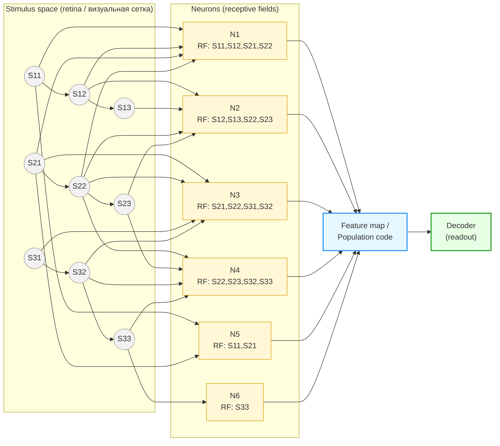
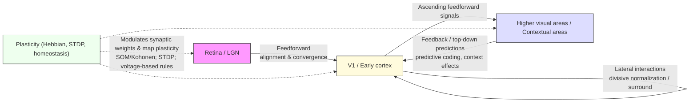
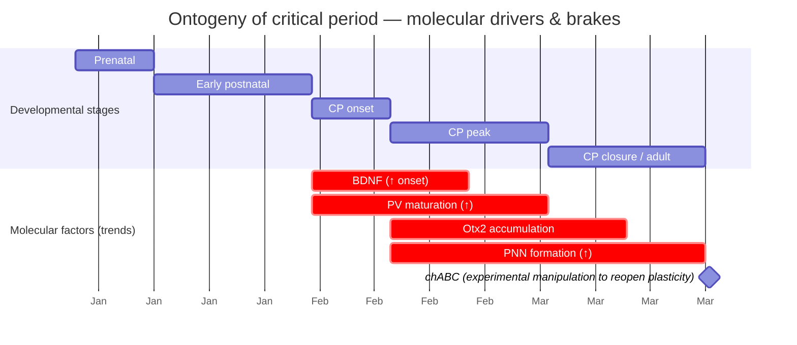

# Перекрывающиеся рецептивные поля и карты признаков: механизмы, модели и экспериментальные подходы

## Анонс  

Этот документ — сжатый, но исчерпывающий обзор современных знаний о том, как локальные рецептивные поля нейронов объединяются в популяционные карты признаков. В нём собраны классические открытия, современные экспериментальные методы (до ноября 2025), теоретические модели и практические руководства для проектирования экспериментов и анализа данных. Материал ориентирован на системных нейробиологов, экспериментаторов и моделистов, которым нужна единая, проверенная источниками сводка по теме.

---

> Все ссылки в тексте — кликабельные научные источники (оригинальные статьи и обзоры). ([PMC][1])

## 1. Введение и исторический контекст

Кратко: ключевые классические работы сформировали понятия *рецептивного поля (receptive field)*, *колонковой/топографической организации* коры и первые формулировки принципов кодирования сенсорных сигналов (efficient coding). Эти идеи легли в основу всех современных теорий о том, как перекрывающиеся рецептивные поля формируют карты признаков в сенсорных системах. ([PMC][1])

### 1.1. Классические открытия о рецептивных полях — Hubel & Wiesel (визуальная кора). ([PMC][1])

**Ключевая идея / открытие:** Hubel & Wiesel продемонстрировали, что нейроны первичной зрительной коры (V1) имеют *рецептивные поля* с различной степенью комплексности — «простые» клетки с ориентированным, локализованным откликом и «сложные» клетки с более инвариантной ответной характеристикой; они также показали существование колонковой организации по ориентации и бинокулярной интеграции. Это — первая подробная функциональная карта свойств V1 и база для понимания того, как локальные рецептивные поля кодируют элементарные признаки. ([PMC][1])

**Методы:** остронаправленные одноюнитные регистрации у кошки и обезьяны, визуальные стимулы (световые и контрастные полосы, движения), карта ответов в пространстве сетчатки → описание RF и их пространственной структуру. ([PMC][1])

**Главные выводы и значение для темы перекрытия RF / карт признаков:**

* RF в V1 локализованы, ориентированы и обладают полосовой спектральной структурой — это объясняет, почему комбинация перекрывающихся локальных RF может кодировать сложные структурные признаки изображения (края, углы, текстуры). ([PMC][1])
* Наличие ориентированных колонок и их пространственная организация показывает, как популяции нейронов с перекрывающимися RF формируют *топографические карты признаков*. ([PMC][1])

**Рекомендованное первоисточниковое чтение:** Hubel DH, Wiesel TN (1962) — *Receptive fields, binocular interaction and functional architecture in the cat's visual cortex* (полный текст — PMC). ([PMC][1])

**Современные контексты / дальнейшие исследования:** исследования, развивающие тему — оценка центр-периметр взаимодействий (surround modulation), механики нормализации и роль обратных связей в формировании RF. Смотри обзоры и эмпирические расширения, напр. Cavanaugh et al. (2002) по центру/сураунду в V1 и Carandini & Heeger (нормализация). ([PubMed][2])

### 1.2. Колонковая организация и топография — Mountcastle (колонки соматосенсорной коры). ([PubMed][2])

**Ключевая идея / открытие:** Vernon B. Mountcastle показал, что нейроны в соматосенсорной коре организованы в вертикальные колонки (радиально через слои), каждая колонка отвечает за ограниченную область рецепции (топография) и типов афферентации — идея «колонки» как элементарного организационного блока коры. Это был краеугольный камень гипотезы о том, что подобная колонковая организация может лежать в основе карт признаков во многих областях мозга. ([PubMed][3])

**Методы:** тонкая микроэлектродная карта ответов нейронов по поверхности коры у кошки; систематическое исследование топографии и модальности откликов вдоль радиальной оси коры. ([PubMed][3])

**Значение и последующие дискуссии:**

* Mountcastle сформулировал идею о том, что кортикальные нейроны, расположенные «в колонке», разделяют функциональные характеристики — это естественная предпосылка для объяснения, как локальные, перекрывающиеся RF в пределах соседних колонок формируют непрерывные карты признаков. ([PubMed][3])
* Однако сама концепция «колонки» с тех пор подвергалась критике и ревизии: ряд работ (обзоров) ставят под сомнение универсальность и функциональную строгость колонковой схемы (см. Horton & Adams 2005 — критический обзор), а современные данные показывают вариабельность и сложную микросхему связей внутри и между «колонками». ([PMC][4])

**Рекомендованное первоисточниковое чтение:** Mountcastle VB (1957) — *Modality and topographic properties of single neurons of cat's somatic sensory cortex*. ([PubMed][3])

**Обзоры/синтезы (современная перспектива):** Horton (2005) — критический обзор роли колонок; более недавние обзоры/энциклопедические статьи (Oxford Research Encyclopedia, 2025) суммируют как классические, так и современные молекулярно-функциональные данные о вариативности колонной организации. ([PMC][4])

### 1.3. Ранняя формулировка принципов кодирования сенсорных сообщений — Barlow (efficient coding). ([cnbc.cmu.edu][3])

**Ключевая идея / открытие:** Horace Barlow предложил (1960–61) идеи *efficient coding* — нервная система перерабатывает входы так, чтобы максимально сократить избыточность и передать информативную составляющую сигнала при ограниченных ресурсах. Это нормативное объяснение, почему рецептивные поля и их распределение в популяциях нейронов выглядят так, как они выглядят (напр., ориентационные Габоровские фильтры как оптимальные базисы для естественных изображений). ([cnbc.cmu.edu][5])

**Методы и аргументы:** Barlow приводил аргументы информационно-теоретического характера и эмпирические наблюдения о статистике природных стимулов; позднее эту гипотезу формализовали и проверили через модели (sparse coding, ICA, predictive coding и т.д.). ([cnbc.cmu.edu][5])

**Значение для перекрывающихся RF и карт признаков:**

* Efficient coding объясняет *почему* RF оказываются локализованными и ориентированными: такие базисные функции благоприятны для редукции избыточности природных изображений при перекрывающемся покрытии пространства стимулов — перекрытие даёт и компактность, и возможность перекомбинировать признаки. ([cnbc.cmu.edu][5])
* Современные расширения (predictive coding, adaptive / task-dependent efficient coding) связывают классическую идею Barlow с контекстной модуляцией и динамической адаптацией кодов в популяциях нейронов. ([PNAS][6])

**Рекомендованное первоисточниковое чтение:** Barlow HB (1961) — *Possible principles underlying the transformations of sensory messages* (PDF). ([cnbc.cmu.edu][5])

**Современные обзоры и тесты гипотезы:** Simoncelli & Olshausen (2001) — обзор статистики природных изображений и её связи с RF; Olshausen & Field (1996) — sparse coding как конкретная реализация efficient coding; более поздние работы объединяют efficient, sparse и predictive подходы (Chalk et al. 2018; Młynarski 2022; обзоры 2022–2024). ([PubMed][7])

## Ключевые первоисточники и современные обзорные работы 

* Hubel DH, Wiesel TN (1962). *Receptive fields, binocular interaction and functional architecture in the cat's visual cortex.* (полный текст — PMC). ([PMC][1])
* Mountcastle VB (1957). *Modality and topographic properties of single neurons of cat's somatic sensory cortex.* J Neurophysiol. ([PubMed][3])
* Barlow HB (1961). *Possible principles underlying the transformations of sensory messages.* (PDF). ([cnbc.cmu.edu][5])
* Carandini M, Heeger DJ (2012). *Normalization as a canonical neural computation* — обзор механизма, который позже объяснил многие наблюдаемые свойства RF (surround suppression, gain control). ([Nature][8])
* Olshausen BA, Field DJ (1996). *Emergence of simple-cell receptive field properties by learning a sparse code for natural images.* — важная модель реализации принципа efficient coding. ([Nature][9])
* Simoncelli EP, Olshausen BA (2001). *Natural image statistics and neural representation* — обзор связи статистики стимулов и RF. ([PubMed][7])
* Horton JC, Adams DL (2005). *The cortical column: a structure without a function* — критический обзор классической концепции колонок. ([PMC][4])
* Cavanaugh JR, Bair W, Movshon JA (2002). *Center–surround interactions in macaque V1 neurons* — эмпирическое развитие темы surround modulation. ([PubMed][2])
* Recent reviews (2020–2025) по pRF, efficient/predictive coding и современным техникам картирования: Kim et al. (2023) по spatiotemporal pRF в человеке; Chalk et al. (2018) и Młynarski (2022) — по объединению efficient/predictive/sparse кодирования. ([PMC][10])

[1]: https://pmc.ncbi.nlm.nih.gov/articles/PMC1359523/ "Receptive fields, binocular interaction and functional ..."
[2]: https://pubmed.ncbi.nlm.nih.gov/12424292/ "Nature and interaction of signals from the receptive field ..."
[3]: https://pubmed.ncbi.nlm.nih.gov/13439410/ "Modality and topographic properties of single neurons ..."
[4]: https://pmc.ncbi.nlm.nih.gov/articles/PMC1569491/ "The cortical column: a structure without a function - PMC"
[5]: https://www.cnbc.cmu.edu/~tai/microns_papers/Barlow-SensoryCommunication-1961.pdf "Possible Principles Underlying the Transformations of ..."
[6]: https://www.pnas.org/doi/10.1073/pnas.1711114115 "Toward a unified theory of efficient, predictive, and sparse ..."
[7]: https://pubmed.ncbi.nlm.nih.gov/11520932/ "Natural image statistics and neural representation - PubMed"
[8]: https://www.nature.com/articles/nrn3136 "Normalization as a canonical neural computation"
[9]: https://www.nature.com/articles/381607a0 "Emergence of simple-cell receptive field properties by ..."
[10]: https://pmc.ncbi.nlm.nih.gov/articles/PMC10187260/ "Characterizing spatiotemporal population receptive fields in ..."

---

## Перекрывающиеся рецептивные поля → карта признаков

Перекрывающиеся рецептивные поля (RF) — фундаментальный строительный блок сенсорных систем: одиночные нейроны реагируют на локальные фрагменты внешнего мира, а популяции таких нейронов через перекрытие полей формируют богатые, устойчивые и гибкие карты признаков (ретинотопия, ориентационные домены, тонотопия, place/grid-карты и др.). Этот документ систематизирует знание о происхождении этих карт на нескольких уровнях объяснения:

1. эмпирическая база — классические и современные экспериментальные данные (одноюнитные записи, оптическое картирование, двухфотонная calcium-имиджинг, Neuropixels, fMRI/pRF);
2. вычислительные механизмы — feedforward-конвергенция, латеральная конкуренция и нормализация, обратные (top-down) влияния и самоорганизация посредством пластичности (Hebbian / STDP / homeostasis);
3. нормативные и сетевые модели — efficient / sparse / predictive coding, self-organizing maps, and divisive normalization, а также их современные гибриды;
4. развитие и пластичность — критические периоды, молекулярные «включатели/тормоза» (PV, PNN, Otx2, BDNF), и возможности реактивации пластичности у взрослых;
5. методические рекомендации — от проектирования стимулов до пайплайнов spike-sorting, STRF/pRF-оценок и популяционной аналитики.

Далее представлена основная логика: сначала — обзор ключевых понятий и типов RF (простые/сложные клетки, classical vs extra-classical), затем — типы карт и их межвидовые особенности, за ними — механизмы их формирования, экспериментальные и аналитические подходы, теоретические рамки и практические приложения (BMI, компьютерное зрение). 

---

**Сетка стимулов, нейроны с перекрывающимися рецептивными полями и агрегированная карта признаков (популяционный код).**

Короткая расшифровка:

* узлы Sxy — точки пространства/стимула (ретина/пиксели);
* нейроны N1..N6 получают входы от нескольких соседних стимулов (их RF перекрываются — одна и та же S22, например, поступает в N1..N4);
* все нейроны складываются в **Feature map / Population code** — это вектор активностей, который затем читается декодером (линейный/нелинейный) для извлечения признака (положение края, угол, направление и т. п.).

---

## 2. Основные определения и классификации рецептивных полей (RF)

Кратко: *рецептивное поле (RF)* — это множество стимулов (в пространстве, времени и/или в других измерениях), которые влияют на вероятность отклика нейрона. RF классифицируются по пространственным/временным свойствам, линейности/нелинейности отклика, и по «классичности» (classical RF — центр; extra-classical — периферия/контекст). Ниже — подробности и примеры. ([PMC][11])

### 2.1. Классические (classical) RF: локальная чувствительность и тюнинг (простые/сложные клетки). 

#### Определение и базовые характеристики

* **Classical RF (cRF)** — область сетчатки/пространства и временной интервал, в пределах которых локальный стимул изменяет среднюю скорость спайкинга нейрона при стабильных условиях. cRF часто описывают с помощью тюнинг-кривых (orientation tuning, spatial frequency tuning, direction selectivity и т.д.). ([PMC][11])

#### Простые и сложные клетки (Hubel & Wiesel)

* **Simple cells**: локальные, пространственно организованные «on» и «off» подрегионы; ответ зависит от фазы стимула (например, сдвиг гребенчатой решётки меняет отклик). **Complex cells**: менее чувствительны к фазе, реагируют на существование ориентации/движения в пределах более широкого участка — моделируются как нелинейная (energy-like) комбинация ответов простых клеток. Классическая экспериментальная демонстрация — Hubel & Wiesel (1962). ([PMC][11])

#### Измерение и количественные описания

* **Тюнинг-кривые**: измерение среднего firing rate как функции ориентации/частоты/направления; параметры — пик, ширина (half-width at half-max), полосность.
* **Линейные модели**: для многих простых клеток хорошо подходит модель **линейный фильтр → нелинейность (LN)**; фильтр часто аппроксимируют Габоровской функцией. Для сложных клеток вводят дополнительные нелинейные операции (например, квадратичную энергию). ([journals.physiology.org][12])

#### Биологическое происхождение cRF

* **Feedforward convergence**: классическая гипотеза — cRF простых клеток формируются суммированием выровненных по пространству входов от LGN; далее — взаимодействия внутри коры модифицируют форму и селективность. Эмпирические и моделирующие работы (Ringach и др.) анализируют, какие архитектуры дают наблюдаемые RF. ([PubMed][13])

#### Практические замечания для экспериментатора

* Использовать насыщенные, параметрические стимулы (синусоидальные грaтинги, полосы) для тюнинга; дополнительно — белые шумовые или синтетические natural-like стимулы для восстановления фильтров методом обратной корреляции (STA/STRF). ([Princeton University][14])

#### Ключевые источники (классика + методы)

* Hubel D.H., Wiesel T.N. (1962). *Receptive fields, binocular interaction and functional architecture in the cat's visual cortex.* ([PMC][11])
* Ringach D.L. (2002). *Spatial structure and symmetry of simple-cell receptive fields.* (методы картирования, классификация симметрий). ([journals.physiology.org][12])
* Schwartz, Pillow, Rust, Simoncelli (2006). *Spike-triggered neural characterization* — методы STA/STC и LN-модели. ([Princeton University][14])

### 2.2. Внеслучайные / экстра-классические эффекты (surround, контекстная модуляция). 

#### Что такое extra-classical RF (eCRF)

* **eCRF** — влияние стимулов, лежащих вне classical RF, которые модифицируют ответ нейрона (супрессия/фасилитация, модуляция контраста, селективности и временной динамики). Появление eCRF явилось одной из отправных точек для теоретических моделей (predictive coding, normalization) объясняющих, зачем нужен контекст. ([homes.cs.washington.edu][15])

#### Типы эффектов surround / контекста

* **Surround suppression**: внешний стимул уменьшает ответ на центр (широко описано в V1 и других системах). Характеристики: зависимость от размеров, ориентации, контраста и времени (быстрая и медленная компоненты). ([journals.physiology.org][16])
* **Iso-orientation vs cross-orientation effects**: супрессия часто сильнее, когда окружающий стимул совпадает по ориентации с центром; это даёт функциональные эффекты по выделению границ/контрастов. ([journals.physiology.org][16])
* **Facilitation**: при некоторых конфигурациях окружение может усиливать ответ центра (интеграция мелких признаков). ([ScienceDirect][17])

#### Механизмы (анатомия и вычисления)

* **Многоисточник механизмов**: feedforward вклад (широкие RF гамма-геникулоцеллюлярных входов), локальные латеральные взаимодействия (горизонтальные связи в V1), и обратные проекции из вышележащих областей — все вносят вклад в surround. Анализ анатомии V1 и носителей показал, что источники surround могут быть как локальными, так и дальними (Angelucci et al. 2002/2006). ([PubMed][18])

#### Теоретические интерпретации

* **Predictive coding**: Rao & Ballard (1999) показали, что многие extra-classical эффекты можно интерпретировать как ошибку предсказания — Neurons in lower areas кодируют различие между входом и предсказанием, сформированным более высокими уровнями. Это даёт нормативный симптом для подавления предсказуемого окружения и усиления неожиданных локальных деталей. ([homes.cs.washington.edu][15])
* **Normalization (divisive normalization)**: объединяет явления контекстной модуляции как результат деления отклика нейрона на суммарную активность пула, объясняя множество эффектов супрессии/сателлитного влияния. Обзор и формализация — Carandini & Heeger (2012). ([cns.nyu.edu][19])

#### Измерение и анализ

* Экспериментально изучают функцию отклика как функцию размера, ориентации и контраста окружения; динамику (различные временные константы) выясняют через временно-разрешающие записи. Многоработ по декомпозиции быстрого/медленного вклада — Cavanaugh et al. (2002), Nurminen & Angelucci (2014). ([journals.physiology.org][16])

#### Почему это важно для карт признаков

* eCRF-влияния делают карты признаков *контекстно-зависимыми*: локальная карта (топография ориентации/пространственной частоты) модульно изменяется в зависимости от статистики соседних стимулов, что повышает рабочую эффективность кодирования (уменьшение избыточности, выделение неожиданных событий). Концептуально это — ключ к пониманию динамики и гибкости карт. ([homes.cs.washington.edu][15])

#### Рекомендуемые источники

* Rao R.P.N., Ballard D.H. (1999). *Predictive coding in the visual cortex: a functional interpretation of some extra-classical receptive-field effects.* ([homes.cs.washington.edu][15])
* Cavanaugh J.R., Bair W., Movshon J.A. (2002). *Nature and interaction of signals from the receptive-field center and surround in macaque V1 neurons.* J. Neurophysiol. ([journals.physiology.org][16])
* Angelucci A., Bullier J. (2003/2006). *Anatomical origins and mechanisms of surround modulation* (см. Angelucci et al. Prog. Brain Res. / обзорные статьи). ([PubMed][18])
* Nurminen L., Angelucci A. (2014). *Multiple components of surround modulation in primary visual cortex.* ([ScienceDirect][17])

### 2.3. Пространственно-временные RF: статические vs. динамические свойства. (методы STRF / pRF; современные pRF-модели). 

#### Почему учитывать время

* Реальные сенсорные стимулы меняются во времени: многие RF зависят не только от пространственной структуры, но и от временного контекста (порядка событий, скорости движения, адаптационных эффектов). Поэтому RF обычно рассматривают как **spatiotemporal filters**. ([Optica][20])

#### Методы восстановления spatiotemporal RF

* **Spike-triggered average (STA)** и **spike-triggered covariance (STC)** — классические методы для оценки линейных фильтров и нескольких компонент фильтра (Schwartz et al., Pillow et al.). Они хорошо работают при применении широкополосных стохастических стимулов (Gaussian white noise, m-sequences) и дают приближение к линейной части LN-моделей. ([Princeton University][14])
* **Generalized Linear Models (GLM)** и современные максимально-правдоподобные/байесовские методы (Pillow et al., Park & Pillow 2011 и др.) позволяют учитывать историю спайков, нелинейности и взаимодействия между фильтрами. ([NIPS Papers][21])

#### Population receptive fields (pRF) — макро-карты у человека (fMRI)

* **pRF-модели** (Dumoulin & Wandell 2008 и последующие) аппроксимируют отклик вокселя как суммарный отклик множества RF и используются для картирования ретинотопии, размера RF, контрастной чувствительности и т.д. Современные исследования расширяют pRF-модели на spatiotemporal поведение (Kim et al. 2023/2024). ([PMC][22])

#### Статические vs динамические RF — отличия

* **Статические RF**: описываются одним набором пространственных фильтров (например, Габоры), применимы для оценки в стационарных условиях (одно-статичные стимулы).
* **Динамические RF**: включают временные фильтры (latency, temporal frequency tuning), адаптацию и нелинейные временные эффекты (e.g., contrast gain control, temporal normalization). Их параметры могут быстро меняться (мс–с) под влиянием предыдущих стимулов. ([Optica][20])

#### Современные вычислительные подходы

* **Dimensionality reduction / manifold methods** применяются к популяционным временным сериям, чтобы выделить низкоразмерные динамики RF (GPFA, dPCA, manifold learning). Для отдельных нейронов STRF/GLM; для популяций — сочетание pRF и динамических моделей. ([Журнал Невронауки][23])

#### Примеры практического применения

* Анализ движений и скорости: spatiotemporal RF в V1/V2/V3 кодируют направление/скорость; в ретине и в слуховой системе STRF критичны для распознавания временных паттернов.
* В fMRI pRF-модели используются для точной карты визуальной коры человека, включая оценку изменения RF с возрастом/патологией/обучением. ([PMC][22])

#### Рекомендуемые источники (методы + современные обзоры)

* Schwartz O., Pillow J.W., Rust N.C., Simoncelli E.P. (2006). *Spike-triggered neural characterization.* (STA/STC, практические рекомендации). ([Princeton University][14])
* Pillow J.W., et al. (2008). *Spatio-temporal receptive field estimation (GLM frameworks).* ([Princeton University][14])
* Kim I., et al. (2023/2024). *Characterizing spatiotemporal population receptive fields in human visual cortex* — современные расширения pRF для временной динамики. ([PMC][22])
* Cocci G., et al. (2011). *Spatiotemporal receptive fields of cells in V1 are optimally tuned* — эмпирические измерения spatiotemporal RF. ([Optica][20])

### 2.4. Временная структура кодирования: осцилляции и синхронность (temporal coding, oscillations, synchrony)

**Почему важно (строка для введения):**  
RF функционируют в динамическом режиме: фазовая организация осцилляций и темпоральная синхронность регулируют эффективную коммуникацию между областями, влияют на вероятность передачи спайков и модулейруют gain/синхронизацию ответов (важно для внимания, сегрегации сигналов и временной кодификации). ([PubMed][24])

**Содержимое подраздела (текст для вставки):**

1. **Communication-through-coherence (CTC):** гипотеза Fries предполагает, что синхронизация в гамма-диапазоне (и других полосах) оптимизирует временное окно, в течение которого входы наиболее эффективны для вызова постсинаптического отклика — следовательно, фазовая организация осцилляций регулирует «кто с кем» общается. ([PubMed][24])
2. **Синхронность и точность кодирования:** теоретические и экспериментальные работы показывают, что координированная синхронность и короткие латентности могут существенно повышать точность передачи информации и влиять на эффект корреляций (как положительно, так и отрицательно в зависимости от структуры). ([PMC][25])

**Практические следствия / примечания:**

* При картировании RF учитывайте временную структуру отклика (F0/F1 компоненты, phase-locking), а при анализе популяций проверяйте спектральные характеристики и phase-dependent coupling между областями. ([PubMed][24])

**Ключевые ссылки:** Fries (2015) — Rhythms for cognition (CTC); Salinas & Sejnowski (2001) — роль корреляций и синхронности в потоке информации. ([PubMed][24])

## Краткие выводы раздела 

1. **Classical RF** (центральные фильтры) — основа локальной кодировки признаков; простые/сложные клетки в V1 — классический пример (Hubel & Wiesel). ([PMC][11])
2. **Extra-classical RF / surround** — контекстная модуляция (супрессия/фасилитация) происходит через комбинацию feedforward, lateral и feedback механизмов; её нормативное объяснение дают модели predictive coding и divisive normalization. ([homes.cs.washington.edu][15])
3. **Spatiotemporal RF** описывают динамику откликов; современные методы (STA/STC, GLM, pRF-модели) позволяют восстанавливать фильтры как на уровне одиночных нейронов, так и на уровне популяций/вокселей. ([Princeton University][14])

[11]: https://pmc.ncbi.nlm.nih.gov/articles/PMC1359523/ "Receptive fields, binocular interaction and functional ..."
[12]: https://journals.physiology.org/doi/full/10.1152/jn.2002.88.1.455 "Spatial Structure and Symmetry of Simple-Cell Receptive ..."
[13]: https://pubmed.ncbi.nlm.nih.gov/14999045/ "Haphazard wiring of simple receptive fields and orientation ..."
[14]: https://www.princeton.edu/~wbialek/rome/refs/schwartz%2Bal_06.pdf "Spike-triggered neural characterization"
[15]: https://homes.cs.washington.edu/~rao/Rao-Ballard-NN-1999.pdf "Predictive Coding in the Visual Cortex"
[16]: https://journals.physiology.org/doi/abs/10.1152/jn.00692.2001 "Nature and Interaction of Signals From the Receptive Field ..."
[17]: https://www.sciencedirect.com/science/article/pii/S0042698914002053 "Multiple components of surround modulation in primary ..."
[18]: https://pubmed.ncbi.nlm.nih.gov/17010705/ "Contribution of feedforward, lateral and feedback connections ..."
[19]: https://www.cns.nyu.edu/heegerlab/content/publications/Carandini-NRN2012.pdf "Normalization as a canonical neural computation"
[20]: https://opg.optica.org/abstract.cfm?uri=josaa-29-1-130 "Spatiotemporal receptive fields of cells in V1 are optimally ..."
[21]: https://papers.nips.cc/paper/4411-bayesian-spike-triggered-covariance-analysis.pdf "Bayesian Spike-Triggered Covariance Analysis"
[22]: https://pmc.ncbi.nlm.nih.gov/articles/PMC10187260/ "Characterizing spatiotemporal population receptive fields in ..."
[23]: https://www.jneurosci.org/content/44/2/e0803232023.abstract "Characterizing Spatiotemporal Population Receptive ..."
[24]: https://pubmed.ncbi.nlm.nih.gov/26447583/ "Rhythms for Cognition: Communication through Coherence"
[25]: https://pmc.ncbi.nlm.nih.gov/articles/PMC2868968/ "CORRELATED NEURONAL ACTIVITY AND THE FLOW OF ..."

---

## 3. Типы карт признаков в коре и подкорке

Коротко: карты признаков — топографические (или квазитопографические) пространственные отображения параметров внешнего мира или внутренних измерений на корковой поверхности (ретинотопия, тоното-/сомато-/топо-карты) или на популяциях клеток (ориентация, бинауральность, цвет, место в пространстве). Эти карты формируются комбинацией фидфорвардной конвергенции, латеральных связей и обратных проекций, и их организация может меняться в ходе развития и обучения. ([PMC][26])

### 3.1 Ретинотопические / визуальные карты (retinotopy)

**Определение.** Ретинотопия — сохранение топологической соседности точек сетчатки при отображении на кору: соседние точки в поле зрения представлены соседними нейронами на корковой поверхности. На уровне популяций это даёт карты угловой позиции (polar angle) и эксцентричности (eccentricity). ([PMC][26])

**Методы картирования.**

* Классически — одиночные записи (электрофизиология), оптическая визуализация (intrinsic signal imaging), затем fMRI-методы (фазовое кодирование) и современные **pRF**-модели (population receptive field) для оценки центра pRF и его размера в каждом вокселе/вёртексе. pRF-подход (Dumoulin & Wandell, 2008) — сейчас стандарт для ретинотопии у человека. ([PMC][26])
* Современные улучшения: байесовские/атласные методы для повышения точности (Benson et al., 2018) и spatiotemporal-pRF для учета временной динамики BOLD-ответа. ([eLife][27])

**Анатомия и организация.**

* Ретинотопические карты располагаются в серии визуальных областей (V1, V2, V3, hV4 и т.д.), каждая со своей топологией и функцией; в этих картах наблюдаются эффекты кортикального увеличения foveal magnification и неоднородной плотности представления. ([PubMed][28])

**Развитие и вариабельность.**

* Основные схемы ретинотопии консервативны, но радиус pRF, границы областей и величина кортикального увеличения варьируют между видами и между индивидуумами; современные работы 2021–2025 описывают методы учета индивидуальных различий и применение ретинотопии в клинической диагностике. ([PMC][29])

**Функциональное значение.**

* Ретинотопия обеспечивает организационную «шину» для локальной интеграции признаков (стерео, движение, цвет) и для разделения задач по областям; pRF-параметры дают количественный инструмент для изучения изменений при развитии, старении и патологии. ([PubMed][28])

**Ключевые источники:** Dumoulin & Wandell (2008) — pRF; Wandell & Winawer (2010/2011) — обзор имиджинга ретинотопии; современные обзоры 2021–2025 по методам и моделям ретинотопии. ([PMC][26])

### 3.2 Ориентационные карты и «пинвилы» (orientation columns / pinwheels)

**Определение.** Ориентационная карта — пространственное распределение предпочтительной ориентации границ/краёв на корковой поверхности; «pinwheel» — сингулярная точка, вокруг которой предпочтение ориентации изменяется непрерывно на 180°. ([PubMed][30])

**Классические наблюдения.**

* Оптическая визуализация (Bonhoeffer & Grinvald, 1991) впервые продемонстрировала «iso-orientation domains» и pinwheel-структуры в зрительной коре кошки/млекопитающих. ([PubMed][30])

**Виды и межвидовая вариативность.**

* У приматов и у многих хищных млекопитающих встречаются выраженные pinwheel-структуры; у некоторых грызунов (мышь) организация ближе к «salt-and-pepper» (разбросанных по коре предпочтений) с минимальной периодичностью. Исследования по широкому спектру видов показывают как консервативность, так и отличия в масштабе/упорядоченности карт. Недавняя работа показала pinwheel-организацию и у некоторых сумчатых (Marsupial), что расширяет филогенетический охват явления. ([Наука][31])

**Механизмы формирования.**

* Теоретические модели: самоорганизация (Hebbian + конкуренция, Kohonen/SOM-пакеты), оптимизационные модели (efficient coding → Габороподобные фильтры) и аналитические модели, объясняющие устойчивость pinwheel-сингулярий и их плотность. Множество современных работ связывают роль латеральных связей, анатомической топографии входов и раннего опыта в морфогенезе карт. ([Frontiers][32])

**Методы измерения/анализа.**

* Intrinsic optical imaging, двухфотонная calcium-имиджинг, плотная мультиэлектродная регистрация; анализ включает вычисление полей предпочтений, плотностей сингулярий, статистики порядочности (periodicity, autocorrelation). ([PubMed][30])

**Функциональное значение.**

* Плотная локальная упорядоченность облегчает локальную интеграцию и обмен сигналами между нейронами с похожей селективностью; однако «salt-and-pepper» организации (например, у мыши) показывают, что строгая колонковая организация не единственный путь к эффективному кодированию признаков. Современные межвидовые сравнения дают инсайты о компромиссах между экономией проводов, плотностью рецептивных полей и вычислительной гибкостью. ([Наука][31])

**Ключевые источники:** Bonhoeffer & Grinvald (1991); обзоры и кросс-видовые исследования 2018–2024; аналитические модели 2022. ([PubMed][30])

### 3.3 Оральная (ocular) доминантность, бинауральность, цветовые карты

**Оcular dominance (OD) — определение и наблюдения.**

* OD-колонки — полосчатая организация нейронов V1 по доминирующему глазу (правый/левый). Классически описаны Hubel & Wiesel; современные исследования уточняют глубинную и межслойную структуру и роль в бинуклярной интеграции и стереоскопии. ([PMC][33])

**Современные результаты и пластичность.**

* Новые записи и фукнциональные карты показывают, что OD-карты могут быть глубинно согласованы между слоями и проявляют пластичность при манипуляциях (окулярная депривация, тренировка); работы 2023–2025 анализируют вклад межглазной нормализации и interocular suppression. ([eLife][34])

**Цветовые карты.**

* Цвето-специфичные представления часто перекрываются с ретинтотопическими/ориентационными картами; у человека и приматов выделяют области, чувствительные к цвету (например, V4 и ventral stream), где есть пространственная организация цветоселективности, хотя её форма и регулярность отличаются от ориентационных колонок (обзоры Wandell/Winawer и последующие исследования). ([PubMed][28])

**Бинауральность и звуковая/методологическая аналогия.**

* Понятие «доминирование» расширяется: в слуховой системе — бинауральные взаимодействия; в V1 — интеграция полярности контраста и диспаратности. Современные методы (двухфотон, optogenetics) позволили тестировать причинно-следственные связи OD-организации и её вклад в восприятие. ([Nature][35])

**Ключевые источники:** Hubel & Wiesel (классика), Wandell & Winawer (обзор), современные экспериментальные работы eLife/Cell 2023–2025 по binocular integration/OD-пластичности. ([PMC][33])

### 3.4 Тонопические и соматотопические карты (слух / тело)

**Tonotopy (слух).**

* **Определение.** Tonotopy — пространственное распределение частотно-предпочтительных нейронов вдоль осей слуховой системы (от улитки → таламус → кортикальные поля). ([ScienceDirect][36])
* **Наблюдения и методы.** Электрофизиология, тональная стимуляция, оптическая и fMRI-картография — показывают топографию частоты в коре. Современные массивные исследования у людей и животных уточняют границы полей и кросс-модальные взаимодействия. ([PMC][37])
* **Современные вопросы.** Последние работы указывают, что тонотопия в более высоких уровнях иногда «теряется» или перестраивается (в зависимости от задач/обучения), и что на организацию влияют как анатомические входы, так и локальные вычислительные правила. ([eLife][38])

**Somatotopy (соматосенсорика).**

* **Определение.** Somatotopy — карта тела (например, homunculus в S1), где соседние участки кожи/конечности представлены близко на кортикальной поверхности. ([PMC][39])
* **Методы и современное понимание.** fMRI (высокое разрешение), электрофизиология, оптические методы демонстрируют детализированные карты пальцев/руки; современные исследования выявляют значительную степень перекрытия, контекстной пластичности и вариабельности между индивидами. ([PMC][39])

**Функциональное значение.**

* Эти карты строят «схему» для точной пространственной локализации (звук/тактильный ввод) и являются основой для моторной/сенсорной координации; перекрытия и мультиплексация позволяют богатую интеграцию сигналов и устойчивость к повреждениям. ([PMC][37])

**Ключевые источники (современные обзоры 2021–2025):** обзоры по тонотопии (Song et al., 2024; Gu 2025), обзоры по соматотопии и fMRI-mapping рук (Janko 2022; MIT Imaging 2024). ([PMC][37])

### 3.5 Пространственные карты: place cells (гиппокамп) и grid cells (entorhinal cortex)

**Place cells (O'Keefe, 1971).**

* **Открытие.** О'Киф (O'Keefe & Dostrovsky, 1971) обнаружил в гиппокампе клетки, которые активируются когда животное находится в конкретном месте окружения — «place cells». Эти результаты легли в основу идеи «когнитивной карты». ([PubMed][40])

**Grid cells (Hafting et al., 2005).**

* **Открытие.** В медиальной энторинальной коре (mEC) найдены «grid cells», поля активности которых образуют регулярную шестиугольную решётку по пространству; сетка обеспечивает метрическую основу для навигации и кодирования расстояний. ([PubMed][41])

**Взаимодействие и система пространственной навигации.**

* Place и grid клетки входят в систему, обеспечивающую представление положения, направления и расстояния (включая head-direction, border cells); обзорные статьи и синтез исследований показывают, как карты пространства реализуются на уровне сетей и как они модифицируются (ремаппинг) в разных окружениях. ([PMC][42])

**Методы и динамика.**

* Одноюнитные записи в свободно двигающихся животных, оптогенетика/хемогенетика для манипуляции; современные работы (2010–2025) исследуют механизмы генерации грид-паттерна (внутренние интеграторы пути, синаптические и мембранные механизмы), трансформации в новых средах и роль нейромодуляторов. ([PMC][43])

**Современные обзоры и тренды (2021–2025).**

* Много обзоров суммирует прогресс: как grid/ place системы взаимодействуют с памятью, как происходит remapping, какие молекулярные/физиологические механизмы задают масштаб и фазу сеток (генетические, канальные, сетьевые факторы). Последние работы (2024–2025) анализируют декодирование представлений места и роль популяционных кодов для навигации и памяти. ([PMC][42])

**Ключевые источники:** O'Keefe & Dostrovsky (1971); Hafting et al. (2005); обзоры Moser et al. (2015) и современные исследования 2020–2025. ([PubMed][40])

### 3.6. Мультисенсорные карты (multisensory maps — superior colliculus, STS, intraparietal sulcus)

**Почему важно (строка для введения):**  
Перекрывающиеся рецептивные поля — не только визуальное явление: мозг строит пространственные и временные карты, объединяющие информацию из разных модальностей (зрение, слух, тактильные и проприоцептивные сигналы). Эти кросс-модальные представления обеспечивают согласованное восприятие пространства и быстрое поведение (ориентация, локализация источников, координация движений). ([MIT Press][45])

**Содержимое подраздела (текст для вставки):**

1. **Superior colliculus (SC)**: классические и современные данные показывают, что SC содержит карты пространственной локализации, на которые сходятся зрительные, слуховые и соматосенсорные входы; интеграция здесь имеет нелинейный характер (супра- и субаддитивность) и задаёт правила вероятностной кросс-модальной комбинации. ([MIT Press][45])
2. **Аудитивно-визуальная интеграция в коре**: в первичных и вторичных слуховых областях обнаружены нейроны, реагирующие и на визуальные стимулы; такие смешанные ответы улучшают пространственную точность кодирования и обучение пространственной локализации. ([PMC][46])
3. **Париетальные области и STS**: внутримодовые топографии (специфичные для одной модальности) транслируются в кросс-модальные представления в полосах superior temporal sulcus (STS) и intraparietal sulcus (IPS), где формируются поведенчески релевантные «кросс-модальные карты». ([MIT Press][45])

**Практические следствия / примечания:**

* Эксперименты по картированию RF в мультисенсорных областях требуют стимулов, независимых по каждой модальности, а также анализа взаимодействий (additivity, supralinearity).
* Модели интеграции часто строятся в байесовской рамке (см. раздел 8.6), так как мозг взвешивает сигналы по надёжности при объединении модальностей. ([PMC][46])

**Ключевые ссылки:** Stein & Meredith (The Merging of the Senses, 1993). Современный обзор — Bizley & King (2008) по визуально-аудитивной пространственной обработке. ([MIT Press][45])

### 3.7. Видовые различия в организации карт (comparative neurobiology of maps)

**Почему важно (строка для введения):**  
Организация карт различается между видами — gyrencephalic (приматы) vs lissencephalic (грызуны), птицы имеют отличную архитектуру — эволюционный и анатомический контекст помогает понять ограничения и вариативность карт и RF. ([PubMed][47])

**Содержимое подраздела (текст для вставки):**

1. **Грызуны vs приматы:** в гладком (lissencephalic) кортиксе грызунов топография и колонковая организация часто менее выражены или организованы иначе, чем в коре с бороздами у приматов; это важно при экстраполяции результатов между моделями. ([PubMed][47])
2. **Птицы и альтернативные решения:** у птиц структуры сенсорной обработки и представления телесности/пространства могут реализовывать карты и body-models в принципиально иной микроархитектуре; изучение таких различий даёт понимание фундаментальных функций карт. ([ScienceDirect][48])

**Практические следствия / примечания:**

* При переносе результатов между видами учитывайте количественные и качественные разницы в топографии, ламинарности и распространённости интернейронных типов; в моделях указывайте виды-источник данных. ([PubMed][47])

**Ключевые ссылки:** Kaas (1997) — «Topographic maps are fundamental»; Brecht (2017) — body-model theory of somatosensory cortex (птицы/млекопитающие сравнения & функциональные последствия). ([PubMed][47])

## Резюме и практические примечания 

1. **Каждая карта признаков имеет своё происхождение и свою роль.** Ретинотопия даёт «координатную сетку», ориентационные/цветовые карты — локальные признаки, соматотопия/тонотопия — пространственные/частотные шины, place/grid — картографирование внешнего пространства. ([PMC][26])
2. **Методы картирования эволюционировали:** от single-unit → optical imaging → high-res fMRI/pRF → крупномасштабные массивы и calcium imaging; современные модели объединяют данные разных масштабов. ([PMC][26])
3. **Вариабельность между видами** (pinwheels vs salt-and-pepper, сохранение тонотопии на разных уровнях и т.д.) важна для понимания компромиссов развития/эволюции и вычислительных требований. ([Наука][31])

## Рекомендуемая литература 

* Dumoulin S.O., Wandell B.A. (2008). *Population receptive field estimates in human visual cortex.* NeuroImage. ([PMC][26])
* Wandell B.A., Winawer J. (2010/2011). *Imaging retinotopic maps in the human brain.* (обзор). ([PMC][44])
* Ta D. et al. (2021). *Quantitative Characterization of the Human Retinotopic Map.* PMC. ([PMC][29])
* Bonhoeffer T., Grinvald A. (1991). *Iso-orientation domains ... pinwheel patterns.* (классика по pinwheels). ([PubMed][30])
* Jung Y.J. et al. (2022). *Orientation pinwheels in primary visual cortex of a highly divergent mammal.* Sci. Adv. (кросс-видовой анализ). ([Наука][31])
* Carandini M., Heeger D.J. (2012). *Normalization as a canonical neural computation.* (контекст/нормализация — релевантно для карт) . ([PubMed][40])
* Song X. et al. (2024). *Tonotopic organization of auditory cortex in awake...* PMC. ([PMC][37])
* Janko D. et al. (2022). *Somatotopic Mapping of the Fingers in the Somatosensory Cortex (fMRI review).* Front. Neuroanat. ([PMC][39])
* O'Keefe J., Dostrovsky J. (1971). *The hippocampus as a spatial map.* Brain Res. (place cells — классика). ([PubMed][40])
* Hafting T. et al. (2005). *Microstructure of a spatial map in the entorhinal cortex.* Nature (grid cells). ([PubMed][41])
* Moser M.B., Moser E.I. (2015). *Place cells, grid cells, and memory* (обзор). ([PMC][42])

[26]: https://pmc.ncbi.nlm.nih.gov/articles/PMC3073038/ "Population receptive field estimates in human visual cortex"
[27]: https://elifesciences.org/articles/40224 "Bayesian analysis of retinotopic maps"
[28]: https://pubmed.ncbi.nlm.nih.gov/20692278/ "Imaging retinotopic maps in the human brain - PubMed - NIH"
[29]: https://pmc.ncbi.nlm.nih.gov/articles/PMC8678293/ "Quantitative Characterization of the Human Retinotopic Map ..."
[30]: https://pubmed.ncbi.nlm.nih.gov/1896085/ "Iso-orientation domains in cat visual cortex are arranged ..."
[31]: https://www.science.org/doi/10.1126/sciadv.abn0954 "Orientation pinwheels in primary visual cortex of a highly ..."
[32]: https://www.frontiersin.org/journals/computational-neuroscience/articles/10.3389/fncom.2022.659316/full "Analytic Model for Feature Maps in the Primary Visual Cortex"
[33]: https://pmc.ncbi.nlm.nih.gov/articles/PMC12279071/ "Human retinotopic mapping: From empirical to computational ..."
[34]: https://elifesciences.org/articles/92839 "Ocular dominance-dependent binocular combination of ..."
[35]: https://www.nature.com/articles/s41562-025-02320-4 "Mesoscale cortical mechanisms of perceptual conflict ..."
[36]: https://www.sciencedirect.com/topics/neuroscience/tonotopy "Tonotopy - an overview | ScienceDirect Topics"
[37]: https://pmc.ncbi.nlm.nih.gov/articles/PMC11127206/ "Tonotopic organization of auditory cortex in awake ..."
[38]: https://elifesciences.org/articles/99989 "Tonotopy is not preserved in a descending stage of ..."
[39]: https://pmc.ncbi.nlm.nih.gov/articles/PMC9277538/ "Somatotopic Mapping of the Fingers in the Somatosensory ..."
[40]: https://pubmed.ncbi.nlm.nih.gov/5124915/ "The hippocampus as a spatial map. Preliminary evidence ..."
[41]: https://pubmed.ncbi.nlm.nih.gov/15965463/ "Microstructure of a spatial map in the entorhinal cortex"
[42]: https://pmc.ncbi.nlm.nih.gov/articles/PMC4315928/ "Place Cells, Grid Cells, and Memory - PMC - PubMed Central"
[43]: https://pmc.ncbi.nlm.nih.gov/articles/PMC6674593/ "Do We Understand the Emergent Dynamics of Grid Cell Activity?"
[44]: https://pmc.ncbi.nlm.nih.gov/articles/PMC3030662/ "Imaging retinotopic maps in the human brain - PMC"
[45]: https://mitpress.mit.edu/9780262693011/the-merging-of-the-senses/ "The Merging of the Senses"
[46]: https://pmc.ncbi.nlm.nih.gov/articles/PMC4340571/ "Visual–auditory spatial processing in auditory cortical ..."
[47]: https://pubmed.ncbi.nlm.nih.gov/9292198/ "Topographic maps are fundamental to sensory processing"
[48]: https://www.sciencedirect.com/science/article/pii/S0896627317304567 "The Body Model Theory of Somatosensory Cortex"

---

## 4. Механизмы формирования перекрывающихся RF и карт 

Ниже — академически строгое, но сжато структурированное изложение механизмов, которые создают **перекрывающиеся рецептивные поля (RF)** и **топографические / картографические** представления в сенсорных системах. Для каждого подпункта — что это за механизм, какие данные/методы его поддерживают, какие вычислительные модели объясняют наблюдаемое, и какие остаются открытые вопросы. Все ключевые утверждения подтверждены высоко-цитируемыми источниками (включая классические работы и современные обзоры до ноября 2025).

Диаграмма иллюстрирует основные взаимодействия, которые формируют перекрывающиеся рецептивные поля и карты признаков:

* **Feedforward (Retina / LGN → V1)** — пространственная конвергенция входов, выравнивание полей (Hubel & Wiesel 1962; Ferster & Miller 2000; моделирование 2022/2023).
* **Lateral (V1 ↔ V1)** — горизонтальные связи и пул-инг (divisive normalization) формируют surround-эффекты и конкурентное подавление (Carandini & Heeger 2012; Angelucci et al. 2017; Isaacson & Scanziani 2011).
* **Feedback (Higher → V1)** — обратные проекции несут предсказания и контекст, реализуемые в моделях predictive coding (Rao & Ballard 1999; обзоры и недавние эксперименты 2023–2025).
* **Plasticity (модулятор)** — Hebbian/STDP и homeostatic-процессы модифицируют все вышеперечисленные связи и обеспечивают самоорганизацию карт (Kohonen 1982; Clopath et al. 2010; Feldman 2012; обзоры по гомеостазу).

### 4.1. Фидфорвардная свёртка и конвергенция (feedforward convergence — как строятся RF из входов сетчатки/LGN)

**Суть механизма.**  
Классическая гипотеза: рецептивное поле нейрона коры формируется через пространственно-организованную конвергенцию входов от афферентных элементов (в зрительной системе — от клеток LGN/ретины); суммирование этих входов даёт локальную пространственную фильтрацию (например, ориентированные Габор-подобные профили), а последующая нелинейность — спайковую прочитаемость. Это модель feedforward-build-RF, базовая для объяснения простых клеток V1. ([PubMed][49])

**Ключевые эмпирические данные:**

* Hubel & Wiesel (1962) — анатомо-функциональная аргументация: выровненные входы из LGN создают ориентированность простых клеток. ([PubMed][49])
* Electrophysiology / intracellular recordings и моделирование (Ferster & Miller, 2000) — показывают, что feedforward-вклад LGN обеспечивает базовый ориентированный профиль, но полная селективность часто требует кориальных взаимодействий. ([Columbia University][50])

**Вычислительные реализации:**

* LN-модели (линейный фильтр → статическая нелинейность) и их расширения успешно аппроксимируют ответы «простых» клеток при многообразии стимулов; крупномасштабные сетевые модели показывают, как простая конвергенция совместно с локальной динамикой даёт наблюдаемые RF. Недавние большие сетевые модели демонстрируют, что даже при разреженных входах конвергенция + локальная донастройка (корковые взаимодействия) достаточно для стабильной ориентированности. ([PMC][51])

**Ограничения feedforward-модели и роль дальнейшей обработки:**

* Эмпирические данные показывают, что feedforward сам по себе не объясняет все свойства RF: динамика времени отклика, surround-эффекты и контекстная модуляция требуют дополнительных механизмов (латеральных и обратных связей). Ferster & Miller обсуждают модифицированную feedforward-модель, где кориальные взаимодействия «шлифуют» базовую селективность. ([Columbia University][50])

**Методы тестирования и показатели:**

* Корреляция строения входов (анатомия LGN→V1), внутриклеточные записи (подсчёт экситации/ингибиции), оптогенетические отключения LGN/коры и моделирование (конструктивные числа входов/весов). ([Columbia University][50])

### 4.2. Латеральные взаимодействия и карта через конкурентное подавление (lateral inhibition, divisive normalization)

**Суть механизма.**  
Латеральные связи в коре и механизм нормализации (divisive normalization) обеспечивают конкурентное взаимодействие между соседними нейронами: ответ отдельного нейрона масштабируется/делится на суммарную активность пула, что даёт эффект подавления от окружения, увеличивает селективность и уменьшает избыточность кода. Нормализация сейчас рассматривают как «каноническую» вычислительную операцию. ([Nature][52])

**Классические и обзорные источники:**

* Carandini & Heeger (обзор) формализовали normalization как объяснение множества наблюдаемых эффектов (контрастная нормализация, surround suppression и др.). ([Nature][52])
* Isaacson & Scanziani (2011) демонстрируют, как разные типы ингибирующих микросхем формируют временную и амплитудную динамику подавления, что важно для локального конкурентного кодирования. ([PubMed][53])

**Анатомо-физиологические основы:**

* Латеральные горизонтальные связи (в V1) и интернейронные сети (PV/VIP/SOM-типовые клетки) создают как локальные, так и дальние взаимодействия; суммарная активность пула (feedforward + lateral) формирует denominator в дивизивной нормализации. Angelucci и соавт. суммировали доказательства множественных источников surround-влияния: локальные горизонтали, межслойные и обратные проекции — все вносят вклад. ([PMC][54])

**Функциональные следствия для карт и перекрытия RF:**

* Латеральное подавление повышает контраст между соседними представлениями на корковой поверхности, «острее» определяя границы карт признаков и уменьшая корреляции между соседями (улучшение кодовой эффективности). При этом механизмы могут приводить к локальному перераспределению чувствительности (например, уменьшение CRF при усилении surround). ([Nature][52])

**Динамика и контекст-зависимость:**

* Surround-эффекты имеют несколько компонент (быстрая, локальная; медленная, дальняя) с разной топографией и функцией; они зависят от ориентации, контраста и времени стимулов — что указывает на смешанную природу feedforward/lateral/feedback источников. ([ScienceDirect][55])

**Методы и модели:**

* Эксперименты: измерение size-tuning, paired-recordings, оптогенетическая манипуляция интернейронов; модели: divisive normalisation формально хорошо описывает вход-выход, а сетевые модели (E–I баланс, ISN) дают биофизическую интерпретацию. ([Nature][52])

### 4.3. Обратные проекции и контекст (feedback / predictive coding)

**Суть механизма.**  
Обратные (top-down) проекции от более высоких областей к более низким несут предсказания и контекстуальную информацию; их взаимодействие с feedforward-сигналом можно формализовать через схемы *predictive coding*, где низший уровень кодирует «помеху» (prediction error), а высшие формируют предсказание. Это объясняет многие extra-classical эффекты (контурная интеграция, субъективные контуры, contextual modulation). ([PubMed][56])

**Классическая модель и её подтверждения:**

* Rao & Ballard (1999) предложили модель predictive coding, показавшую, что обратные связи могут генерировать подавление на ожидаемые входы и усиление неожиданных элементов — это согласуется с наблюдаемой surround-модуляцией. ([PubMed][56])

**Физиология обратных путей и современные данные:**

* Топ-даун сигналы демонстрируют сло- и проекционно-специфичные эффекты; обзорная статья по top-down влияниям (Gilbert & Li, 2013) и более свежие обзоры показывают, что обратные связи вмешиваются в контекстное формирование RF и пластичность. Также новейшие исследования (Annual Review 2023; оптогенетические работы 2024–2025) показали, что отключение/усиление обратной проекции меняет радиус RF, surround suppression и временную точность реплейса сигналов в LGN/коре. ([cnbc.cmu.edu][57])

**Вычислительная роль: predictive coding vs attention vs normalization.**

* Predictive coding даёт нормативное объяснение контекстных эффектов; normalization/attention модели частично перекрываются по предсказаниям (они не взаимоисключающие). Современные гибридные модели комбинируют локальную нормализацию, обратные предсказания и Hebbian-пластичность для получения стабильных и эффективных карт. ([Nature][58])

**Методы тестирования:**

* Ламинарные записи + направленные оптогенетические вмешательства в обратные проекции; pRF/voxel-wise модели в fMRI (для человека) с манипуляцией контекста; модели активного предсказания (active inference). Недавние работы демонстрируют causal роль кортикально-таламических обратных путей в сжатии/расширении RF и изменении точности временного кодирования. ([Nature][59])

### 4.4. Самоорганизация через Hebbian-пластичность и конкурентное обучение (SOM / Kohonen)

**Суть механизма.**  
Самоорганизация карт (топографическая упорядоченность) часто моделируется через локальные правила обучения: Hebbian-подобная сила изменений с конкуренцией и синаптической нормализацией. Эти правила ведут к образованию топологических карт (ориентации, ретинотопии и др.) — как в сетях Kohonen (SOM), так и в более биофизических моделях со STDP и homeostasis. ([SpringerLink][60])

**Классические вычислительные модели:**

* Kohonen (1982) — Self-Organizing Map: локальная конкуренция + соседская адаптация → топологически правильные карты. Эта модель дала простую и влиятельную схему для объяснения формирования карт на ранних стадиях развития. ([SpringerLink][60])

**STDP, Hebb и современные биофизические правила:**

* Экспериментальные правила spike-timing dependent plasticity (Bi & Poo; обзоры Feldman 2012) и более сложные voltage-based правила (Clopath et al., 2010) дают биологически правдоподобные механизмы, с помощью которых локальные корреляции активности формируют селективные синаптические веса и поля. Модели, объединяющие Hebbian и предсказательную пластичность, показывают, что комбинирование правил улучшает устойчивость и инвариантность представлений. ([PMC][61])

**Роль гомеостаза и конкурентной нормализации:**

* Чисто Hebbian-усиление без компенсирующего гомеостаза приводит к неустойчивости (runaway LTP/LTD); потому модельные и экспериментальные работы подчёркивают необходимость homeostatic-механизмов (synaptic scaling, heterosynaptic plasticity) для формирования стабильных карт. ([royalsocietypublishing.org][62])

**Эмпирические валидации:**

* Развитие ориентированных колонок, ретино-/сомато-топии в онтогенезе демонстрируется в экспериментах с сенсорной депривацией и манипуляциями (окулярная депривация, сдвиг стимульной статистики) — результаты согласуются с самоорганизационными моделями, хотя точные временные и молекулярные детали зависят от системы/вида. ([PubMed][49])

**Из моделей к биологии (пример):**

* Voltage-based STDP (Clopath et al. 2010) в сетевых симуляциях приводит к развитию локально сфокусированных RF и реальным паттернам связей, сопоставимым с экспериментальными данными — важное связующее звено между идеализированными SOM и биофизическими механизмами. ([PubMed][63])

### 4.5. Межслойные взаимодействия и канонические корковые микросхемы (canonical cortical microcircuits)

**Почему важно (строка для введения):**  
Карты признаков не «плоские» — их строят и поддерживают слоистые (ламинарные) потоки: feedforward входы, локальные межслойные вычисления и feedback-проекции создают функциональную архитектуру RF с различной ролью слоёв в построении локальных и контекстных эффектов. ([PubMed][66])

**Содержимое подраздела (текст для вставки):**

1. **Каноническая схема (Douglas & Martin):** базовый «канон» кортикальной схемы включает бедренные feedforward входы к слою 4, сильную трансламинарную обработку (4→2/3→5) и локальные ингабираторные контуры, которые формируют базовую единицу преобразования признаков. Эта схема объясняет, как простые линейные «свёртки» входов трансформируются в сложные RF на следующих уровнях. ([PubMed][66])
2. **Слои и иерархические counterstreams:** feedforward-потоки чаще исходят из супрагранулярных слоёв и нацелены на модули следующего уровня, тогда как feedback-проекции (инфрагранулярные) приносят контекст и предсказания — ламинарная структура определяет направление информационного потока и роль обратных влияний в формировании экстра-классических эффектов. ([PMC][67])
3. **Клеточные классы и микросхемы:** типы интернейронов (PV, SOM, VIP) и их слоистая локализация обеспечивают механизмы нормализации, surround suppression и gating внимания — все эти операции локально влияют на форму RF и топографию карт. ([PMC][67])

**Практические следствия / примечания:**

* При интерпретации карт важно учитывать, на каких слоях измерения делались (например, 2P чаще захватывает супрагранулярные слои).
* Моделирование формирования карт должно включать ламинарные подключений и cell-type-specific dynamics. ([PubMed][66])

**Ключевые ссылки:** Douglas & Martin (2004) — neuronal circuits of neocortex; Harris & Shepherd (2015) — обзор conserved laminar motifs. ([PubMed][66])

### Заключение раздела — интеграция механизмов и открытые вопросы

1. **Мультифакторность.** Перекрывающиеся RF и карты не «строятся» одним механизмом — это результат сочетания feedforward-конвергенции, локальной конкуренции/нормализации, обратных проекций (контекст, предсказание) и опыта-зависимой пластичности (Hebbian/STDP + гомеостаз). ([Columbia University][50])
2. **Уровни объяснения.** Нормативные модели (efficient/predictive coding), сетевые модели (E–I, ISN, divisive normalization), и биофизические правила пластичности (STDP, voltage-based) дают комплементарные объяснения — нужно сочетать их, чтобы получить полную картину. ([Nature][52])
3. **Открытые вопросы (актуальные на ноябрь 2025):**

   * Как и в какие сроки взаимодействуют feedforward, lateral и feedback источники при формировании RF в реальном времени? (слоистые, временные разрезы). ([Annual Reviews][64])
   * Какая роль конкретных интернейронных типов (PV/SOM/VIP) в реализации дивизивной нормализации и контекстной модуляции при естественных стимулах? (вопрос экспериментально исследуется оптогенетикой/двухфотом). ([PubMed][53])
   * Как оптимально совместить Hebbian-и predictive-пластичности для объяснения стабильных, но адаптивных карт у взрослых животных? (новые гибридные правила — активная тема моделирования). ([Nature][65])

### Ключевая литература по этому разделу 

* Hubel DH, Wiesel TN (1962). *Receptive fields, binocular interaction and functional architecture in the cat's visual cortex.* PMC. ([PubMed][49])
* Ferster D., Miller KD (2000). *Neural mechanisms of orientation selectivity in the visual cortex.* Neuron. ([Columbia University][50])
* Carandini M., Heeger DJ (2012). *Normalization as a canonical neural computation.* Nat Rev Neurosci. ([Nature][52])
* Angelucci A., et al. (2017). *Circuits and mechanisms for surround modulation in visual cortex.* (review, PMC). ([PMC][54])
* Isaacson JS., Scanziani M. (2011). *How inhibition shapes cortical activity.* Neuron. ([PubMed][53])
* Rao R.P.N., Ballard D.H. (1999). *Predictive coding in the visual cortex: a functional interpretation of some extra-classical receptive-field effects.* Nat Neurosci. ([PubMed][56])
* Kohonen T. (1982). *Self-organized formation of topologically correct feature maps.* Biol Cybern. ([SpringerLink][60])
* Clopath C., Büsing L., Vasilaki E., Gerstner W. (2010). *Connectivity reflects coding: a model of voltage-based STDP with homeostasis.* Nat Neurosci. ([PubMed][63])
* Feldman DE (2012). *The spike-timing dependence of plasticity.* PMC. ([PMC][61])
* Burkhalter A., D'Souza R.D., Ji W., Meier A.M. (2023). *Integration of feedforward and feedback information streams in mouse visual cortex.* Annual Review of Neuroscience. ([Annual Reviews][64])

[49]: https://pubmed.ncbi.nlm.nih.gov/10845071/ "Neural mechanisms of orientation selectivity in the visual ..."
[50]: https://www.columbia.edu/cu/neurotheory/Ken/pubs/fm_final.pdf "Neural Mechanisms of Orientation Selectivity in the Visual ..."
[51]: https://pmc.ncbi.nlm.nih.gov/articles/PMC9034785/ "A Computational Model of Direction Selectivity in Macaque V1 ..."
[52]: https://www.nature.com/articles/nrn3136 "Normalization as a canonical neural computation"
[53]: https://pubmed.ncbi.nlm.nih.gov/22017986/ "How inhibition shapes cortical activity - PubMed - NIH"
[54]: https://pmc.ncbi.nlm.nih.gov/articles/PMC5697758/ "Circuits and Mechanisms for Surround Modulation in ..."
[55]: https://www.sciencedirect.com/science/article/pii/S0042698914002053 "Multiple components of surround modulation in primary ..."
[56]: https://pubmed.ncbi.nlm.nih.gov/10195184/ "Predictive coding in the visual cortex: a functional ..."
[57]: https://www.cnbc.cmu.edu/~tai/cp_papers/wu_li_review_nrn3476.pdf "Top-down influences on visual processing"
[58]: https://www.nature.com/articles/nn0199_79 "Predictive coding in the visual cortex: a functional ..."
[59]: https://www.nature.com/articles/s41467-025-58667-9 "Dual parallel stream-specific and generalized effects of ..."
[60]: https://link.springer.com/article/10.1007/BF00337288 "Self-organized formation of topologically correct feature maps"
[61]: https://pmc.ncbi.nlm.nih.gov/articles/PMC3431193/ "The spike timing dependence of plasticity - PMC"
[62]: https://royalsocietypublishing.org/doi/10.1098/rstb.2016.0259 "Hebbian plasticity requires compensatory processes on ..."
[63]: https://pubmed.ncbi.nlm.nih.gov/20098420/ "Connectivity reflects coding: a model of voltage-based ..."
[64]: https://www.annualreviews.org/content/journals/10.1146/annurev-neuro-083122-021241 "Integration of Feedforward and Feedback Information ..."
[65]: https://www.nature.com/articles/s41593-023-01460-y "The combination of Hebbian and predictive plasticity learns ..."
[66]: https://pubmed.ncbi.nlm.nih.gov/15217339/ "Neuronal circuits of the neocortex"
[67]: https://pmc.ncbi.nlm.nih.gov/articles/PMC4889215/ "The neocortical circuit: themes and variations - PMC"

---

## 5. Функциональные преимущества перекрытия RF 

Ниже — системный, источник-ориентированный разбор преимуществ **перекрывающихся рецептивных полей (RF)** и популяционных карт признаков. Для каждого подпункта — концепция, формальная/информационная интуиция, ключевые эмпирические и теоретические работы (включая самые цитируемые и свежие обзоры до ноября 2025). После каждого важного утверждения — ссылка на первоисточник/обзор.

### 5.1. Робастность и устойчивость к потере нейронов / шуму

**Ключевая мысль.** Перекрывающиеся представления распределяют информацию о стимуле по множеству нейронов; это даёт устойчивость к случайным сбоям (потере единичных нейронов), к фоновому шуму и к частичной деградации входов. Эффект формально объясняется законами статистики — усреднение большого количества независимых/частично скоррелированных оценок снижает ошибку (σ/√N при независимости), а при корреляциях структура ковариации определяет, какие компоненты информации «информационно-лимитирующие». ([cnbc.cmu.edu][68])

**Подтверждение / примеры:**

* Нормативные идеи о редукции избыточности и распределённости (Barlow) объясняют, почему эволюционно выгодно кодировать признаки перекрыто — чтобы компенсировать шум и потерю каналов. ([cnbc.cmu.edu][68])
* Обзорные и теоретические работы по популяционному кодированию показывают, как ковариации шумов между нейронами влияют на масштабирование информационной точности и на устойчивость декодеров. Особенно важна идея «information-limiting correlations» — только особый класс корреляций действительно ограничивает информацию, остальные корреляции могут не снижать её так сильно, как кажется. ([PubMed][69])
* Эмпирические крупномасштабные записи показывают, что при естественных стимулах популяционные ответы часто высокоразмерны и при этом содержат структуру корреляций, которая обеспечивает баланс между точностью и робастностью. ([Nature][70])

**Практическая интуиция / следствие для экспериментов и BCI:**

* Для интерфейсов мозг–машина (BCI) использование популяционных сигналов (много каналов) повышает стабильность при потере/дрейфе отдельных электродов. Теория предсказывает (и практика подтверждает), что декодеры, работающие с популяцией, более устойчивы, чем одиночные нейроны. ([PubMed][69])

### 5.2. Увеличение ёмкости представления и обобщение (комбинационные кодировки)

**Ключевая мысль.** Перекрывающиеся RF и распределённые (комбинационные) коды увеличивают **ёмкость** (количество уникальных стимулов/состояний, которые можно различить) и способность **обобщать** — потому что множество комбинаций активности позволяет экспоненциально большее число кодируемых конфигураций по сравнению с «локальным» кодированием. Нормативные реализации (sparse / efficient coding) показывают, как статистика природных стимулов формирует такие базисы. ([Nature][71])

**Подтверждение / источники:**

* Модель sparse coding (Olshausen & Field, 1996) показывает, что при оптимальной разреженной факторизации естественных изображений естественным образом «всплывают» Габоровские фильтры — т.е. локальные, перекрывающиеся базисные функции, обладающие большой представительной ёмкостью и хорошей обобщающей способностью. ([Nature][71])
* Современные теоретические работы формализуют «sample efficiency» и обобщение в популяционных кодах: определённые структуры популяции (например, комбинации линейных/нелинейных элементов) делают возможным обучение новых соответствий с малого числа примеров. ([eLife][72])

**Интуиция:**

* Перекрытие RF превращает «фичи» в базис, из которого легко комбинировать новые признаки (уменьшение требований к обучению на новых образцах): вместо обучения отдельного детектора для каждого сложного шаблона система комбинирует ответы базисных RF. Это ключ к хорошему обобщению на природных задачах. ([Nature][71])

### 5.3. Популяционное кодирование и декодирование

*(population vectors, байесовские и линейные декодеры)*

**Ключевая мысль.** Информация о стимуле/параметре обычно представлена не в одном нейроне, а в активности **популяции**. Разные декодеры (линейные, population-vector, байесовские) читают эту информацию с разной эффективностью и устойчивостью; выбор декодера зависит от задачи, структуры шума и требований к вычислительной сложности. ([PubMed][73])

**Исторические и методологические вехи:**

* **Population vector** (Georgopoulos et al., 1986) — практическая и интуитивная схема для векторного представления направления движения: взвешенная сумма предпочтительных векторов нейронов даёт оценку направления. ([PubMed][73])
* **Байесовские/вероятностные модели (Pouget et al., 2003)** — формальная концепция: нейронные популяции кодируют вероятность (или её параметры) о стимуле; байесовский декодер интегрирует информацию с учётом шума и априорных распределений. ([PubMed][74])
* **Обзоры** (Averbeck et al., 2006; Panzeri et al., 2022) систематизируют влияние корреляций, статистики шума и нелинейностей на эффективность декодирования. ([PubMed][69])

**Практические замечания по эффективности:**

* Линейные декодеры часто почти оптимальны для многих задач, особенно когда популяционные ответы лежат в высокоразмерном пространстве с «удобной» геометрией — и они дешёвы вычислительно. Байесовские декодеры дают оптимальную оценку при знании шума/априора, но требуют больше модели/вычислений. ([PubMed][74])
* Корреляции шума и «information-limiting correlations» (Moreno-Bote et al., 2014) определяют потолок информации, доступной декодеру: важно оценивать структуру ковариации, а не просто уровень корреляции. ([Nature][75])

**Применение:**

* Декодеры, обученные на популяциях, позволяют реконструировать стимулы (реконструкция образа, направление движения), управлять BCI и оценивать представительную мощность записанных ансамблей. Практика показывает, что смешанные/перекрывающиеся RF облегчают линейное чтение информации. ([PubMed][73])

### 5.4. Высокоразмерные представления и *mixed selectivity* — вычислительное преимущество

**Ключевая мысль.** Высокоразмерные популяционные представления (много значимых компонент в активности популяции) повышают вычислительную гибкость: с ними даже простой линейный считыватель может реализовать сложные нелинейные функции входов. *Mixed selectivity* (нейроны, чувствительные к нелинейным комбинациям признаков) увеличивает размерность представления и, следовательно, делает возможным решать богатый класс задач линейными декодерами. ([Nature][76])

**Теория и эмпирика:**

* Rigotti et al. (2013) формально показали, что смешанная, неоднородная нелинейная селективность повышает пространство реализуемых вход-выход функций, что критично для произвольных когнитивных задач; увеличение «размерности» представления коррелирует с улучшенной производительностью и гибкостью. ([Nature][76])
* Stringer et al. (2019) и последующие работы показали, что популяции в визуальной коре часто дают **высокоразмерные** отклики на естественные стимулы; такая геометрия даёт одновременно большую ёмкость и гибкость представлений, при этом природа корреляций регулирует компромисс между точностью и робастностью. ([Nature][70])

**Современные уточнения (2021–2025):**

* Обзоры и исследования 2021–2024 расширяют понятие mixed selectivity: различают линейную и нелинейную смешанную селективность, обсуждают как обучение формирует NMS, и показывают её широкое распространение не только в PFC, но и в сенсорных областях при обучении. Это подчёркивает, что высокоразмерные коды — не только «класс высших функций», но и общая черта кортикального кодирования. ([Cell][77])

**Следствие для проектирования вычислительных/нейроморфных систем:**

* Высокоразмерные, смешанные коды дают универсальную подложку для обучения разнообразных задач, снижая требования к сложной архитектуре считывающего элемента — часто достаточно простого линейного классификатора/регрессора. Это объясняет биологическую выгодность перекрывающих RF и смешанных представлений. ([Nature][76])

### 5.5. Краткие выводы и открытые вопросы 

1. **Перекрытие RF повышает робастность** (усреднение/граница ошибок) и снижает зависимость от отдельных «точечных отказов». ([cnbc.cmu.edu][68])
2. **Перекрытие увеличивает ёмкость и обобщение** — посредством комбинаций базисных RF (sparse/efficient coding). ([Nature][71])
3. **Популяционное кодирование + подходящие декодеры** (линейные/байесовские) позволяют надёжно извлечь информацию; важна структура ковариации (information-limiting correlations). ([PubMed][74])
4. **Высокоразмерные представления и mixed selectivity** значительно расширяют вычислительные возможности популяций и делают линейное считывание мощным инструментом для гибкого поведения. ([Nature][76])

**Открытые/активные темы (по состоянию на ноябрь 2025):**

* Как именно структура корреляций (в естественных усло­виях и при обучении) балансирует между максимизацией ёмкости и сохранением робастности? ([Nature][70])
* В каких пределах mixed selectivity поддерживается в ранних сенсорных областях и как она формируется при обучении в сравнении с PFC? ([Nature][78])
* Как теория efficient/predictive coding сочетается с практической необходимостью высокоразмерности для гибкого поведения? (гибридные нормативные модели сейчас активно разрабатываются). ([cnbc.cmu.edu][68])

### 5.6. Вариабельность RF внутри популяции (heterogeneity of RF and its role in generalization)

**Почему важно (строка для введения):**  
Даже в пределах одной колонки соседи демонстрируют существенную гетерогенность RF (различная ширина, нелинейность, контекстная чувствительность). Такая внутропопуляционная вариабельность — важный ресурс для mixed-selectivity и обобщения: разнообразие откликов даёт более гибкие линии разделения в популяционном пространстве. ([PubMed][79])

**Содержимое подраздела (текст для вставки):**

1. **Эмпирические наблюдения:** записи из височных и префронтальных областей показывают, что нейроны кодируют смешанные комбинации признаков и задачевых переменных — это означает, что плеяда RF даже в локальном участке охватывает широкий спектр чувствительностей и нелинейностей. ([PubMed][79])
2. **Роль для декодирования и обобщения:** гетерогенная популяция повышает размерность представления (и, как следствие, вычислительную мощность), позволяя линейному считывателю решать более сложные задачи; одновременно она обеспечивает робастность к локальным повреждениям и вариациям стимулов. ([PubMed][79])

**Практические следствия / примечания:**

* Анализ карт должен включать распределение параметров RF (например, ширин, OSI/DSI, нелинейность), а не только локальные средние. Это важно для моделирования mixed selectivity и прогнозирования декодируемости. ([PubMed][79])

**Ключевая ссылка:** Pagan et al. (2013) — доказательства гетерогенности сигналов в IT и PRH и их значение для «развёртывания/распутывания» визуальной цели. ([PubMed][79])

### Избранная библиография 

* Barlow HB. *Possible principles underlying the transformations of sensory messages.* (1961). ([cnbc.cmu.edu][68])
* Olshausen BA, Field DJ. *Emergence of simple-cell receptive field properties by learning a sparse code for natural images.* Nature (1996). ([Nature][71])
* Georgopoulos AP, Schwartz AB, Kettner RE. *Neuronal population coding of movement direction.* Science (1986). ([PubMed][73])
* Pouget A, Dayan P, Zemel R. *Inference and computation with population codes.* Nat Rev Neurosci (2003). ([PubMed][74])
* Averbeck BB, Latham PE, Pouget A. *Neural correlations, population coding and computation.* Nat Rev Neurosci (2006). ([PubMed][69])
* Moreno-Bote R, et al. *Information-limiting correlations.* Nat Neurosci (2014). ([Nature][75])
* Stringer C., et al. *High-dimensional geometry of population responses in visual cortex.* Nature (2019). ([Nature][70])
* Rigotti M., et al. *The importance of mixed selectivity in complex cognitive tasks.* Nature (2013). ([Nature][76])
* Panzeri S., et al. *The structures and functions of correlations in neural population codes.* (review, 2022). ([harveylab.hms.harvard.edu][80])
* Bordelon B., et al. *Population codes enable learning from few examples by constructing task-relevant kernels.* eLife (2022). ([eLife][72])

[68]: https://www.cnbc.cmu.edu/~tai/microns_papers/Barlow-SensoryCommunication-1961.pdf "Possible Principles Underlying the Transformations of ..."
[69]: https://pubmed.ncbi.nlm.nih.gov/16760916/ "Neural correlations, population coding and computation"
[70]: https://www.nature.com/articles/s41586-019-1346-5 "High-dimensional geometry of population responses in ..."
[71]: https://www.nature.com/articles/381607a0 "Emergence of simple-cell receptive field properties by ..."
[72]: https://elifesciences.org/articles/78606 "Population codes enable learning from few examples by ..."
[73]: https://pubmed.ncbi.nlm.nih.gov/3749885/ "Neuronal population coding of movement direction - PubMed"
[74]: https://pubmed.ncbi.nlm.nih.gov/12704222/ "Inference and computation with population codes"
[75]: https://www.nature.com/articles/nn.3807 "Information-limiting correlations | Nature Neuroscience"
[76]: https://www.nature.com/articles/nature12160 "The importance of mixed selectivity in complex cognitive ..."
[77]: https://www.cell.com/neuron/fulltext/S0896-6273%2824%2900278-2 "Mixed selectivity: Cellular computations for complexity"
[78]: https://www.nature.com/articles/s41467-023-37804-2 "A distributed and efficient population code of mixed ..."
[79]: https://pubmed.ncbi.nlm.nih.gov/23792943/ "Signals in inferotemporal and perirhinal cortex ... - PubMed - NIH"
[80]: https://harveylab.hms.harvard.edu/pdf/Panzeri2022.pdf "The structures and functions of correlations in neural ..."

---

## 6. Экспериментальные методы исследования RF и карт 

Ниже — подробный, практико-ориентированный обзор основных экспериментальных подходов к картированию рецептивных полей (RF) и карт признаков. Для каждого метода: что измеряет, как работает, типичные параметры (простран./врем. разрешение, чувствительность), сильные и слабые стороны, распространённые анализы и ключевые (классические + современные) ссылки (включая работы 2021–2025). Все ссылки кликабельны и выбраны из авторитетных источников.

### 6.1. Одиночные нейроны: внутренняя регистрация (single-unit electrophysiology, intracellular / extracellular)

#### Что и зачем

* **Одиночные записи (extracellular single-unit)** регистрируют время спайков хорошо-изолированных нейронов — дают высочайшее временное разрешение (мс) и позволяют измерять тюнинг, латентности и статистику одиночных нейронов в ответ на параметры стимулов. Классическая основа: Hubel & Wiesel и последующие одноюнитные исследования. ([PMC][81])
* **Внутриклеточные (in-vivo whole-cell / intracellular)** позволяют записывать мембранный потенциал, подспайковую интеграцию и синаптические входы — ключ для понимания механизмов формирования RF (эксайтация vs ингибирование). ([PMC][82])

#### Типичные характеристики

* Врем. разрешение: микросекунды–миллисекунды.
* Простран. охват: единицы нейронов (single cell / несколько клеток при мультипыч-патч).
* Чувствительность/сигнал-шум: высокая для intracellular, средняя–высокая для extracellular при качественной сортировке.

#### Преимущества

* Микроскопическая детализация: spike timing, bursting, subthreshold dynamics (при whole-cell).
* Возможность анатомического пометки записанных клеток (biocytin), связывания физиологии с морфологией.

#### Ограничения

* Малый масштаб (трудно записывать сотни/тысячи клеток одновременно без современных технологий); внутриклеточные методы трудны в свободно движущихся животных.
* Extracellular требует spike sorting (автоматизация: KiloSort, Kilosort4 и др.) — важный шаг, влияющий на качество единичных записей. ([Steinmetz Lab][83])

#### Анализы

* Тюнинг-кривые (orientation, spatial frequency, direction), PSTH, STA/STRF (при стохастических стимулах), cross-correlograms, Fano factor, noise correlations.
* Для intracellular: анализ EPSP/IPSP, input resistance, synaptic integration.

#### Ключевые источники и обзоры

* Hubel & Wiesel (1962) — классика RF в визуальной коре. ([PMC][81])
* Noguchi & Saito (In Vivo Whole-Cell Patch-Clamp Methods, review). ([PMC][82])
* Jouhanneau et al. — multiple two-photon targeted whole-cell recordings (методы многоклеточной внутриклеточной регистрации). ([PMC][84])

### 6.2. Мультиэлектродные массивы, мультиюнитные записи и статистика популяций

#### Что и зачем

* Современные **микроэлектродные массивы** (MEAs) и интегрированные CMOS-пробы (Neuropixels, Neuropixels-2.0 и др.) позволяют одновременно регистрировать активность сотен–тысяч нейронов с миллисекундным разрешением. Это превращает изучение RF из работы одиночных клеток в анализ популяций и карт признаков на уровне сетей. ([PubMed][85])

#### Типичные характеристики

* Количество каналов: десятки → тысячи (Neuropixels: сотни каналов одновременно; Neuropixels-2.0 ~5000 площадок, программируемые 384 активных каналов). ([PMC][86])
* Врем. разрешение: очень высокое (мс).
* Простран. покрытие: линейные/многошаровые траектории вплоть до нескольких областей мозга одновременно.

#### Программная обработка

* **Spike sorting** — обязательный этап (Kilosort, Kilosort4, MountainSort, SpikeInterface ecosytem). Автоматические алгоритмы сделали большие датасеты практически анализируемыми, но требуют валидации и контроля качества. ([Steinmetz Lab][83])
* **Анализ популяции**: PCA, GPFA, dPCA, manifold learning; важная обзорная работа по анализу больших наборов — Cunningham & Yu (2014). ([Nature][87])

#### Преимущества

* Масштаб: изучение корреляций шума, популяционной размерности, распределённых кодов и карт признаков на сетевом уровне.
* Хронологии: отслеживание стабильности нейронов в хронике (месяцы) при новых имплантах и алгоритмах корректировки движения мозга. ([eLife][88])

#### Ограничения и вызовы

* Arteфакты движения, дрейф электродов, иммунный ответ и ухудшение сигнала при длочных имплантах; требования к вычислительным ресурсам (спайк-сортинг и хранение). ([Frontiers][89])

#### Ключевые источники

* Jun et al., *Fully integrated silicon probes (Neuropixels)* (2017). ([PubMed][85])
* Steinmetz et al., *Neuropixels 2.0* (2021). ([PMC][86])
* Pachitariu et al., *KiloSort* и Kilosort4 (spike sorting). ([Steinmetz Lab][83])
* Cunningham & Yu, *Dimensionality reduction for large-scale recordings* (2014) — практические рекомендации по популяционным анализам. ([Nature][87])

### 6.3. Оптическая визуализация (intrinsic signal optical imaging) — Bonhoeffer & Grinvald и развитие карт

#### Что и зачем

* **Intrinsic signal optical imaging (ISOI)** регистрирует небольшие изменения в отражательной способности коры, связанные с локальным метаболизмом/кровоснабжением при стимуляции; позволила впервые картировать ориентационные домены и pinwheel-структуры на больших участках коры (Bonhoeffer & Grinvald). ([PubMed][90])

#### Характеристики

* Простран. разрешение: сотни микрометров (идеально для карт колонок/домeнов).
* Врем. разрешение: секунды (пост-стимульные изменения, не подходит для мс-динамики).
* Покрытие: миллиметры площади коры — единовременно видна макроструктура карт.

#### Преимущества

* Широкое поле обзора + хорошее пространственное разрешение для картирования топографий ориентации, OD, ретинотопии в животной модели. Быстрый путь от стимуляции к визуализации карт. ([PubMed][90])

#### Ограничения

* Сигнал опосредован гемодинамикой/метаболизмом → не прямой нейронный сигнал; низкая временная точность; чувствительность к артефактам (движение, световые условия).

#### Анализы

* Формирование карт предпочтения (orientation preference maps), вычисление индексa порядка, определение мест сингулярий (pinwheels), корреляции с одноюнитными записями/двухфотонными данными. ([Журнал Невронауки][91])

#### Ключевые источники

* Bonhoeffer & Grinvald (1991) — ISOI и pinwheel-карты. ([PubMed][90])
* Bonhoeffer et al. последующие работы по картированию в 1990-е. ([Журнал Невронауки][91])

### 6.4. Двухфотонная calcium-imaging, миниатюрные микроскопы (in-vivo population imaging)

#### Что и зачем

* **Двухфотонная флуоресцентная микроскопия** (2P) делает возможным визуализацию Ca²⁺-сигналов в отдельных нейронах и дендритах с клеточным разрешением во встроенной коре — идеальна для изучения популяционных карт и взаимодействий в слоях. Недавние миниатюрные 2P-микроскопы (MINI2P, UCLA 2P Miniscope) расширили применение на свободно двигающихся животных. ([PMC][92])

#### Характеристики

* Простран. разрешение: субклеточное → клеточное (µm).
* Врем. разрешение: десятки—сотни миллисекунд (зависит от индикатора Ca²⁺ и FOV).
* Покрытие: сотни → тысячи нейронов (в современных мультиплэйн/микроскопах).

#### Преимущества

* Клеточная локализация активности + одновременная регистрация большого числа нейронов; возможность таргетинга специфичных типов клеток (генетические метки). Отлично подходит для картирования функциональной организации и динамики популяций. ([PMC][92])

#### Ограничения

* Ca²⁺-сигнал является косвенным мерилом спайкинга (ниже врем. разрешение); чувствительность к motion artefacts; фотоблекание/фототоксичность при длительных сессиях.
* Для дендритных/подклеточных процессов требуются высокоскоростные моды и индикаторы (GCaMP-версии), что добавляет сложности. ([PMC][92])

#### Современные достижения (2021–2025)

* MINI2P (Zong et al. 2022) и UCLA 2P Miniscope (2025) позволяют мультипланное, высокоскоростное imaging >1000 нейронов в движущихся животных; двухцветные минископы для одновременной регистрации нескольких сигналов — появление 2024–2025. ([ScienceDirect][93])

#### Анализы

* Детектирование событий (deconvolution → spike proxy), корреляционный анализ популяции, поиск ансамблей (NMF, ICA), реконструкция представлений, отслеживание идентичности клеток (cell registration) между сессиями.

#### Ключевые источники

* Grienberger & Konnerth (review on 2P imaging, 2022). ([PMC][92])
* Zong et al., MINI2P (2022) — miniscope для >1000 нейронов у свободно движущихся животных. ([ScienceDirect][93])

### 6.5. fMRI и макро-карты у человека (ретинотопия, топография)

#### Что и зачем

* **fMRI (BOLD)** — макро-неинвазивный метод для картирования топографии у человека: ретинотопические карты (polar angle / eccentricity), pRF-моделирование для оценки размеров и формы pRF у вокселя и карт областей (V1–Vn). Это основной метод для изучения карт у людей. ([PubMed][94])

#### Типичные характеристики

* Простран. разрешение: чаще 1–3 мм (высокое-польные сканеры дают лучшее разрешение).
* Врем. разрешение: секунды (BOLD).
* Охват: вся головная кора → целые визуальные поля/модальные области.

#### Преимущества

* Нейтрализует потребность в инвазивности; позволяет сравнения между людьми, исследования развития, патологии и обучения; pRF даёт параметрические оценки (центр, радиус, форма). ([PubMed][94])

#### Ограничения

* Косвенный сигнал (BOLD) → временные/нейронные искажения; пространственное сглаживание влечёт за собой смешивание pRF внутри вокселя; чувствительность к движению. ([PMC][95])

#### Современные улучшения (2020–2025)

* Spatiotemporal pRF-модели и байесовские методы увеличивают точность и дают оценки неопределённости pRF (Kim et al. 2024; работы 2023–2025 по улучшению pRF). Высокопольные 7T-сканеры улучшают пространственное разрешение для картирования колонок/мелкой топографии у человека в отдельных исследованиях. ([Журнал Невронауки][96])

#### Анализы

* Фазовое кодирование, pRF-фиттинг (Dumoulin & Wandell), сравнение pRF параметров между условиями/группами, корреляция с поведенческими показателями.

#### Ключевые источники

* Dumoulin & Wandell (2008) — pRF методология. ([PubMed][94])
* Lerma-Usabiaga et al. (2021) — pRF shapes in early visual cortex (проблематика формы pRF). ([PMC][97])

### Практические советы по выбору метода 

* Если нужна **молекулярно/клеточная специфичность** и картирование на уровне нейрона → двухфотонная calcium-imaging (+ целевая генетика) или intracellular recordings. ([PMC][92])
* Для **высокой временной точности** и изучения spike-timing → extracellular single-unit / Neuropixels массивы. ([PubMed][85])
* Для **микро-карты колонок** (ориентация/pinwheels) на миллиметровом поле → intrinsic optical imaging (ISOI). ([PubMed][90])
* Для **человеческих карт** и сравнительных исследований → fMRI + pRF. ([PubMed][94])
* Для **популяционного анализа и размерности** — комбинируйте Neuropixels/2P данные с методами снижения размерности (PCA/GPFA/dPCA) и современными pipeline (SpikeInterface, KiloSort, CellReg). ([Nature][87])

### Открытые вопросы и текущие тренды (на ноябрь 2025)

1. **Интеграция масштабов:** как сопоставлять субклеточные сигналы 2P с популяционной активностью Neuropixels и макро-воксельными pRF — активное направление (multimodal registration / model-based fusion). ([users.ece.cmu.edu][98])
2. **Технологические инновации 2022–2025:** миниатюрные 2P-микроскопы, Neuropixels 2.0, Kilosort4, улучшенные pRF-модели — всё это расширяет возможности картирования в естественном поведении. ([ScienceDirect][93])
3. **Аналитические вызовы:** репликация spike-sorting, корректная оценка популяционной размерности и влияние шумовых корреляций — математические и репродуктивные стандарты активно развиваются. ([eLife][99])

[81]: https://pmc.ncbi.nlm.nih.gov/articles/PMC1359523/ "Receptive fields, binocular interaction and functional ..."
[82]: https://pmc.ncbi.nlm.nih.gov/articles/PMC7922023/ "In Vivo Whole-Cell Patch-Clamp Methods - PubMed Central"
[83]: https://www.steinmetzlab.net/assets/img/Pachitariu%20et%20al.%20-%202016%20-%20Fast%20and%20accurate%20spike%20sorting%20of%20high-channel%20count%20probes%20with%20KiloSort.pdf "Fast and accurate spike sorting of high-channel count probes ..."
[84]: https://pmc.ncbi.nlm.nih.gov/articles/PMC6532332/ "Multiple Two-Photon Targeted Whole-Cell Patch-Clamp ..."
[85]: https://pubmed.ncbi.nlm.nih.gov/29120427/ "Fully integrated silicon probes for high-density recording of ..."
[86]: https://pmc.ncbi.nlm.nih.gov/articles/PMC8244810/ "Neuropixels 2.0: A miniaturized high-density probe for ..."
[87]: https://www.nature.com/articles/nn.3776 "Dimensionality reduction for large-scale neural recordings"
[88]: https://elifesciences.org/articles/47188 "Chronically implanted Neuropixels probes enable high ..."
[89]: https://www.frontiersin.org/journals/neuroscience/articles/10.3389/fnins.2019.00464/full "In vivo Recording Quality of Mechanically Decoupled ..."
[90]: https://pubmed.ncbi.nlm.nih.gov/1896085/ "Iso-orientation domains in cat visual cortex are arranged ..."
[91]: https://www.jneurosci.org/content/jneuro/13/10/4157.full.pdf "The Layout of Iso-orientation Domains in Area 18 of Cat ..."
[92]: https://pmc.ncbi.nlm.nih.gov/articles/PMC10732251/ "Two-photon calcium imaging of neuronal activity - PMC"
[93]: https://www.sciencedirect.com/science/article/pii/S0092867422001970 "Large-scale two-photon calcium imaging in freely moving ..."
[94]: https://pubmed.ncbi.nlm.nih.gov/17977024/ "Population receptive field estimates in human visual cortex"
[95]: https://pmc.ncbi.nlm.nih.gov/articles/PMC5139984/ "Intersession reliability of population receptive field estimates"
[96]: https://www.jneurosci.org/content/44/2/e0803232023 "Characterizing Spatiotemporal Population Receptive ..."
[97]: https://pmc.ncbi.nlm.nih.gov/articles/PMC7984596/ "Population Receptive Field Shapes in Early Visual Cortex Are ..."
[98]: https://users.ece.cmu.edu/~byronyu/papers/WilliamsonCONB2019.pdf "Bridging large-scale neuronal recordings and ..."
[99]: https://elifesciences.org/articles/61834.pdf "SpikeInterface, a unified framework for spike sorting"

---

## 7. Аналитика: как извлечь карту и RF из данных 

Ниже — практическое, научно-обоснованное руководство по основным аналитическим инструментам, которые используются для восстановления рецептивных полей (RF) и карт признаков из нейрофизиологических данных. Для каждого метода даю (1) что делает и когда применять, (2) математическая/интуитивная суть, (3) практические нюансы и ограничения, (4) ключевые ссылки (включая классические и современные обзоры до ноября 2025). Все утверждения снабжены ссылками на авторитетные источники.

### 7.1. STA / STRF (spike-triggered average / receptive field estimation)

Что делает

* STA (spike-triggered average) и расширения (STAc — spike-triggered covariance, STRF — spike-triggered receptive field) восстанавливают линейную фильтрующую компоненту RF нейрона, используя широкополосные/стационарные стимулы (белый шум, m-sequence, прайм-наброски). Эти методы дают начальную аппроксимацию линейного фильтра в LN-моделях (линейный фильтр → нелинейность). ([PubMed][100])

Суть / формула (коротко)

* STA = средний предшествующий стимул, усреднённый по всем временным окнам перед спайками. Формально: STA = (1/N_spikes) ∑_{spikes} s(t_spike − τ). Если отклик линейно связан со стимулом и стимул белый, STA пропорционален линейному фильтру. STC анализирует вариации вокруг STA и позволяет выявлять несколько релевантных фильтров (особенно когда нейрон реагирует на несколько линейных компонент). ([PubMed][100])

Практические нюансы и ограничения

* Требует богатой (широкополосной) стимульной статистики; при естественных (коррелированных) стимулах STA смещён — тогда нужны корректирующие методы (regularized STA/GLM, whitened stimuli, or model-based fitting). STC чувствителен к числу спайков (плохо при редких спайках). ([PubMed][100])
* Для сложных клеток или сильно нелинейных ответов лучше применять model-based методы (GLM, cascade models) или nonparametric estimators. ([PubMed][100])

Рекомендации по применению

* Если у вас есть данные со стохастическим стимулом (white/gaussian noise): начните с STA → если виден только один фильтр, проверяйте STC для дополнительных компонент. Для natural stimuli используйте регуляризацию (ridge), maximum-likelihood GLM-подход или совместное моделирование с априорной информацией о статистике стимулов. ([Princeton University][101])

Ключевые ссылки

* Schwartz O., Pillow J.W., Rust N.C., Simoncelli E.P. — *Spike-triggered neural characterization.* ([PubMed][100])
* Rust N.C., Schwartz O., Movshon J.A., Simoncelli E.P. — применения STC к V1. ([cns.nyu.edu][102])

### 7.2. Кривые тюнинга, оценка селективности (orientation tuning, direction selectivity)

Что делает

* Тюнинг-кривая (tuning curve) описывает среднюю активность нейрона как функцию параметра стимула (ориентация, направление движения, spatial frequency и т.д.). Из тюнинг-кривой извлекают параметры: пиковая позиция (preferred stimulus), ширина (bandwidth, HWHM), глубина модуляции (OSI/DSI — orientation/direction selectivity indices) и пик-/порог-характеристики. ([PubMed][103])

Как оценивать (практически)

* Собирают PSTH или средний firing rate в окне отклика для набора стимулов (обычно многократные повторения). Фитирование моделей (например, von Mises для ориентации; Gaussian для частоты) даёт смещённые и шумостойкие оценки. Bootstrap/Jackknife — для доверительных интервалов. При оценке важно учитывать contrast-dependence и нелинейную адаптацию. ([Журналы физиологии][104])

Нюансы и подводные камни

* Измерение на основе среднего firing rate игнорирует temporal dynamics (F0 vs F1 компоненты для простых/сложных клеток). Оценки OSI/DSI чувствительны к выбору окна и уровню шума; при низком числе повторов разумно применять регуляризованное фитирование и учитывать изменение baseline. ([PMC][105])

Ключевые ссылки

* Hubel & Wiesel (классика по ориентации) и обзорные/методические работы (Ringach 2002; Victor et al. 2009) по структуре RF и методам измерения тюнинга. ([PMC][106])

### 7.3. Корреляции, шумовые корреляции и их интерпретация (pairwise noise correlations)

Что делает и почему важно

* *Noise correlations* (корреляции вариабельностей отклика по повторениям при одном и том же стимуле) влияют на эффективность популяционного кодирования: в зависимости от структуры эти корреляции могут либо ограничивать, либо почти не трогать объём доступной информации. Поэтому при извлечении карт и оценке представительной ёмкости важно измерять и интерпретировать корреляции. ([PMC][107])

Ключевые концепты

* Разделение: *signal correlations* (корреляция средних ответов между парами нейронов по стимулам) vs *noise correlations* (корреляция trial-to-trial вариабельностей при фиксированном стимуле). *Information-limiting correlations* — класс корреляций, которые непосредственно ставят верхний предел полезной информации; остальные корреляции могут иметь меньшее влияние, или даже быть полезны для кодирования комплексной структуры. ([PMC][107])

Практика измерения и интерпретации

* Вычисляют pairwise Pearson/Spearman корреляции residuals после вычитания mean response, оценивают зависимость корреляций от дистанции, tuning similarity, состояние животного (внимание, поведение) и времени. Используют бутстрэппинг для доверительных интервалов. Для оценки влияния корреляций на кодирование применяют моделирование декодеров и информационные меры (Fisher information, mutual information), а также разложение ковариационной матрицы по главным компонентам. ([PMC][107])

Нюансы и ошибки интерпретации

* Корреляции зависят от количества данных, подсчета firing rate (окно), артефактов сортировки (spike sorting) и состояния животного; важно контролировать эти факторы. Также различие между корреляцией и причинностью — корреляции не означают прямого взаимовлияния. ([PMC][107])

Ключевые источники и обзоры

* Cohen M.R., Kohn A. *Measuring and interpreting neuronal correlations.* (guidelines, PMC). ([PMC][107])
* Panzeri S., et al. *Structures and functions of correlations in neural population codes.* (Nature Rev Neurosci 2022) — обзор эффектов структуры корреляций. ([Nature][108])

### 7.4. Снижение размерности и анализ популяций: PCA, FA, GPFA, dPCA, manifold-анализ

Почему это нужно

* Современные записи дают сотни–тысячи нейронов; для понимания структуры активности и карт признаков используют методы снижения размерности и извлечения траекторий нейронной популяции (latent trajectories), чтобы выделить основные «оси» вариации, task-related компоненты и динамику. ([Nature][109])

Основные методы — что, зачем и когда применять

* **PCA (Principal Component Analysis)** — простой, быстрый базовый метод для определения направлений максимальной дисперсии; хорошо для первичного обзора. ([Nature][109])
* **FA (Factor Analysis)** — выделяет латентные факторы с учётом шума у отдельных нейронов (подходит для моделирования ковариации). ([Nature][109])
* **GPFA (Gaussian-process factor analysis)** — извлекает smoothed низкоразмерные траектории на single-trial уровне с учётом временной корреляции; полезен для анализа динамических процессов (plan → movement). ([PubMed][110])
* **dPCA (demixed PCA)** — декомпозирует популяционную активность на компоненты, привязанные к экспериментальным факторам (стимул, время, условие), упрощая интерпретацию в задачах с несколькими факторами. ([PubMed][111])
* **Manifold / nonlinear methods (Isomap, UMAP, t-SNE, latent-factor models, neural manifold analysis)** — применяют, когда данные лежат на нелинейном многообразии; дают качественные визуализации и помогают выявлять сложную геометрию популяции (например, high-dim responses; Stringer et al. 2019). ([PMC][112])

Практические рекомендации (из обзора Cunningham & Yu)

* Выбирать метод в зависимости от гипотезы: если интересует variance structure → PCA/FA; если — динамические single-trial траектории → GPFA / latent dynamical systems; если — разбор по условиям/факторам → dPCA. Всегда проверяйте стабильность компонентов (cross-validation), интерпретируемость и чувствительность к preprocessing (z-scaling, smoothing). ([Nature][109])

Ключевые ссылки

* Cunningham J.P., Yu B.M. *Dimensionality reduction for large-scale neural recordings* (review). ([Nature][109])
* Yu B.M., et al. *GPFA* (2009). ([PubMed][110])
* Kobak D., et al. *dPCA* (2016). ([PubMed][111])
* Stringer C., et al. *High-dimensional geometry of population responses* (2019). ([PMC][112])

### 7.5. Методы декодирования (linear classifiers, Bayesian decoders, population vector)

Что делает

* Декодеры переводят популяционную активность в оценку стимулов/параметров/действий. Разные подходы сбалансированы по производительности, устойчивости и требуемым априорным знаниям. ([PubMed][113])

Основные классы декодеров

* **Population vector** — простая конструкция (векторное суммирование взвешенных предпочтительных «векторов» нейронов), классически использована для направления движения (Georgopoulos et al., 1986). Работает хорошо при широком, гладком тюнинге. ([PubMed][114])
* **Линейные регрессоры / классификаторы (LDA, linear SVM, regularized linear regression)** — просты, часто достигают близкой к оптимальной производительности при линейной сепарабельности и низком уровне noise-correlations; удобны для BCI. ([PMC][112])
* **Байесовские декодеры / probabilistic population codes** — дают оптимальные оценки при условии знания модели шума и априора; полезны для вывода неопределённости (confidence). Формальная база — Pouget, Ma и др. ([PubMed][113])
* **Nonlinear decoders (neural nets, kernel methods)** — применяют когда зависимость активности ↔ параметр сильно нелинейна; требуют больше данных, но могут захватывать сложные представления. ([PMC][115])

Оценка производительности

* Cross-validation, ROC/AUC (для классификации), mean squared error (для регрессии), а также измерения информации (Fisher information, mutual information) — всё нужно для объективной оценки декодера и сравнения с теоретическими пределами. Важен учёт корреляций и trial-to-trial variability. ([PubMed][113])

Практические советы

* Начинайте с простого линейного декодера (редуцируйте размерность, если нужно), оцените влияние noise correlations (shuffle trials to remove correlations as control), затем пробуйте байесовские/невросетевые декодеры для улучшения производительности и оценки неопределённости. ([PMC][112])

Ключевые ссылки

* Georgopoulos A.P., et al. *Neuronal population coding of movement direction* (1986). ([PubMed][114])
* Pouget A., Dayan P., Zemel R. *Inference and computation with population codes* (2003). ([PubMed][113])
* Panzeri S., et al. (2022) — обзор методов и роли корреляций при декодировании. ([Nature][108])

### Краткие выводы и практический workflow для извлечения RF и карт (шаг-за-шагом)

1. **Выбор метода по типу данных:**

   * стохастический широкий-полосный стимул → STA/STRF (+STC);
   * параметрический стимул (оси: ориентация/частота) → tuning curves + fit (von Mises, Gaussian);
   * популяционные данные → PCA/FA/GPFA/dPCA → декодирование;
   * если естественные стимулы → используйте регуляризацию, GLM/ML подходы и model-based fitting. ([PubMed][100])

2. **Контроль качества:** проверяйте стабильность оценок по сессиям, bootstrap-интервалы, влияние предобработки (smoothing, bin size). ([Nature][109])

3. **Оценка роли корреляций:** измеряйте signal vs noise correlations и моделируйте их влияние на декодер (shuffle controls, information metrics). ([PMC][107])

4. **Интерпретация популяционной геометрии:** используйте manifold- и dimensionality-analysis (GPFA/dPCA) для понимания динамики и факторной организации карт и RF. ([PubMed][110])

[100]: https://pubmed.ncbi.nlm.nih.gov/16889482/ "Spike-triggered neural characterization"
[101]: https://www.princeton.edu/~wbialek/rome/refs/schwartz%2Bal_06.pdf "Spike-triggered neural characterization"
[102]: https://www.cns.nyu.edu/~tony/Publications/rust-schwartz-movshon-simoncelli-2004.pdf "Spike-triggered characterization of excitatory and suppressive ..."
[103]: https://pubmed.ncbi.nlm.nih.gov/12091567/ "Spatial structure and symmetry of simple-cell receptive fields ..."
[104]: https://journals.physiology.org/doi/full/10.1152/jn.2002.88.1.455 "Spatial Structure and Symmetry of Simple-Cell Receptive ..."
[105]: https://pmc.ncbi.nlm.nih.gov/articles/PMC2804422/ "Laminar and Orientation-Dependent Characteristics ..."
[106]: https://pmc.ncbi.nlm.nih.gov/articles/PMC1359523/ "Receptive fields, binocular interaction and functional ..."
[107]: https://pmc.ncbi.nlm.nih.gov/articles/PMC3586814/ "Measuring and interpreting neuronal correlations - PMC"
[108]: https://www.nature.com/articles/s41583-022-00606-4 "The structures and functions of correlations in neural ..."
[109]: https://www.nature.com/articles/nn.3776 "Dimensionality reduction for large-scale neural recordings"
[110]: https://pubmed.ncbi.nlm.nih.gov/19357332/ "Gaussian-process factor analysis for low-dimensional single ..."
[111]: https://pubmed.ncbi.nlm.nih.gov/27067378/ "Demixed principal component analysis of neural population data"
[112]: https://pmc.ncbi.nlm.nih.gov/articles/PMC6642054/ "High-dimensional geometry of population responses in visual ..."
[113]: https://pubmed.ncbi.nlm.nih.gov/12704222/ "Inference and computation with population codes"
[114]: https://pubmed.ncbi.nlm.nih.gov/3749885/ "Neuronal population coding of movement direction - PubMed"
[115]: https://pmc.ncbi.nlm.nih.gov/articles/PMC11868404/ "Orientation selectivity properties for the affine Gaussian ..."

---

## 8. Теоретические модели карт и RF 

Ниже — компактный, но исчерпывающий обзор основных **теоретических подходов**, объясняющих происхождение рецептивных полей (RF) и топографических карт. Для каждого подпункта — что предлагает модель, ключевые математические/нормативные идеи, какие эмпирические наблюдения она объясняет, ограничения и современные развития (включая обзорную/современную литературу до ноября 2025). Все утверждения документированы ссылками на авторитетные, высоко цитируемые источники (классика + современные обзоры).

### 8.1. Efficient coding & redundancy reduction (Barlow; Atick & Redlich)

**Идея.** Нормативная гипотеза efficient coding утверждает, что сенсорные системы перерабатывают входы так, чтобы максимизировать информацию при ограниченных ресурсах (метаболических/синаптических) — чаще это сводится к уменьшению избыточности сигналов (redundancy reduction) и к приспособлению под статистику природных стимулов. ([cnbc.cmu.edu][116])

**Математическая интуиция.**

* Задача формализуется как оптимизация энтропии/информации при ограничениях мощности/шумов: оптимальный код стремится декоррелировать вход (приводит к фильтрам, выравнивающим спектр естественных стимулов). Для ретины это объясняет центр–периметрную организацию и сопутствующие пространственно-временные фильтры (Atick & Redlich). ([redwood.berkeley.edu][117])

**Что объясняет/успехи.**

* Почему ранние стадии кодируют контрасты и границы (выделение информативной составляющей), почему RF часто имеют полосно-пропускающие свойства, и почему наблюдается кортикальное увеличение (foveal magnification) — все это совместимо с оптимизацией под статистику природных сцен. ([cnbc.cmu.edu][116])

**Ограничения и дальнейшие шаги.**

* Efficient-coding даёт нормативное объяснение, но само по себе не полностью определяет нелинейности и динамическую контекстную модуляцию (surround, attention). Современные работы расширяют принцип, добавляя учёт энергозатрат, нелинейности и задач-специфичных приоритетов (adaptive/ task-dependent efficient coding). См. недавние работы 2024–2025 по биофизически корректным реализациям efficient coding. ([PMC][118])

**Ключевые источники.** Barlow (1961). Atick & Redlich (серия работ, 1990–1992) — теория ретинальной оптимизации. ([cnbc.cmu.edu][116])

### 8.2. Sparse coding (Olshausen & Field) — объяснение появления Габор-подобных RF

**Идея.** При попытке представить естественные изображения через линейную комбинацию «базисных» функций с требованием *разреженности* (многие коэффициенты нулевые) в результате обучения на естественных сценах возникают локализованные, ориентированные, полосно-пропускающие фильтры, похожие на RF простых клеток V1. Это давшаяся в Nature 1996 теоретическая иллюстрация гипотезы efficient coding. ([courses.cs.washington.edu][119])

**Математика (в двух словах).**

* Решается задача минимизации функции ошибки вида
  L = ||I − Φa||² + λ‖a‖₁,
  где Φ — матрица базисов, a — вектор коэффициентов, λ — параметр разреживания; оптимизация приводит к локализованным, ориентированным базисам при статистике natural images. ([courses.cs.washington.edu][119])

**Что объясняет/успехи.**

* Формирование Gabor-подобных филтров, объяснение «информации на спайк» (energy efficiency), связь разреженности с экономией энергии и увеличением «информации на спайк». Subsequent empirical and modeling work показали следы sparse-кодирования в разных системах. ([PubMed][120])

**Ограничения и современные уточнения.**

* Классическая реализация использует жесткую L1-регуляризацию; современные работы исследуют биологически более правдоподобные критерии разреженности (beyond ℓ1), динамическую разреженность и взаимодействие sparse-coding с нормализацией/обратными сигналами. Также обсуждаются компромиссы между разреженностью и высокоразмерностью представлений. ([ResearchGate][121])

**Ключевые источники.** Olshausen & Field (1996) + обзоры по sparse coding (2004 и позже). ([courses.cs.washington.edu][119])

### 8.3. Predictive coding (Rao & Ballard) — обратные проекции как предсказания

**Идея.** Hierarchical predictive coding формализует роль обратных (feedback) проекций: вышестоящие уровни формируют прогнозы входной активности нижних уровней; нижние уровни передают «ошибку предсказания» (prediction error) вверх. Такая архитектура объясняет многие extra-classical эффекты (surround suppression, адаптацию к статистике окружения) как следствие подавления предсказуемой информации. ([homes.cs.washington.edu][122])

**Математическая суть.**

* Модель сводится к минимизации функции ошибки (prediction error) по иерархии: активность каждого уровня кодирует либо представление, либо ошибку, и обучение/обмен осуществляется через градиентные/ локальные правила, что даёт биопlausible схемы. ([homes.cs.washington.edu][122])

**Что объясняет/успехи.**

* Много явлений extra-classical RF (контекстная модуляция, подавление ожидаемого, усиление неожиданного) естественно интерпретируются как следствие предсказательной архитектуры; модели предсказывают также влияние внимания и задачевой релевантности. ([homes.cs.washington.edu][122])

**Ограничения и современные обсуждения.**

* Predictive coding даёт сильную нормативную гипотезу, но остаются дискуссии о конкретной биофизической реализации (какие нейроны кодируют ошибку vs предсказание, роль гамма/бета-ритмов и ламинарной организации). Современные обзоры и экспериментальные работы (2010s–2025) стремятся тестировать конкретные предсказания (ламинированное выражение, causal optogenetic tests). ([arXiv][123])

**Ключевые источники.** Rao & Ballard (1999) + современные обзоры predictive processing (2020–2024). ([homes.cs.washington.edu][122])

### 8.4. Self-Organizing Maps (Kohonen) — топологическая организация карт

**Идея.** Самоорганизующиеся карты (SOM/Kohonen) — простая, эффективная схема обучения с локальной конкуренцией и соседской адаптацией: входные вектора проецируются на двумерную карту так, чтобы сохранялась топология входного пространства. Это модельно объясняет образование топографических карт (ретинотопии, ориентационные домены) как следствие локальных правил обучения. ([tcosmo.github.io][124])

**Алгоритм (в двух словах).**

* При каждом шаге выбирают ближний нейрон (best matching unit), обновляют его вес и веса соседей с коэффициентом обучения, который зависит от расстояния в карте и со временем убывает. Это приводит к топологически правильной карте входных признаков. ([tcosmo.github.io][124])

**Что объясняет/успехи.**

* SOM воспроизводит ряд качественных особенностей корковых карт: локальную упорядоченность, соседскую схожесть предпочтений и образование доменов. SOM-идея стала основой для целого класса самоорганизационных моделей с более биофизическим обоснованием (Hebbian + конкуренция + нормализация). ([tcosmo.github.io][124])

**Ограничения.**

* SOM — идеализированная модель, не учитывающая многие биофизические детали (ламинарность, типы интернейронов, STDP). Поэтому современные работы строят «мост» от SOM к реалистичным правилам пластичности (STDP + homeostasis), показывая, как топологичность возникает и при биофизичных ограничениях. ([eLife][125])

**Ключевой источник.** Kohonen (1982) — классика по SOM. ([tcosmo.github.io][124])

### 8.5. Нормализация как каноническая операция (Carandini & Heeger)

**Идея.** Divisive normalization — операция, при которой ответ нейрона делится на сумму активности пула (плюс константа). Эта простая операция объясняет широкий набор наблюдаемых феноменов: контраст-зависимый gain control, surround suppression, ответ на множественные стимулы, и совместима с энергетическими/информационными соображениями. Carandini & Heeger (2012) обобщили её как «каноническую» нейронную операцию. ([cns.nyu.edu][126])

**Формализация.**

* r_i = f( g_i / (σ + ∑*j w*{ij} g_j ) ), где g_i — входной (экситационный) сигнал нейрона i, σ — слабая константа, w_{ij} — веса пула; f — выходная нелинейность. Такая формула легко приносит объяснения множеству эффектов. ([cns.nyu.edu][126])

**Почему это важно для карт и RF.**

* Нормализация создаёт конкурентную структуру между соседними единицами, усиливает контраст и уменьшает избыточность, тем самым формируя «островки» релевантных признаков на корковой поверхности и влияя на форму RF. Нормализация тесно связана с латеральными взаимодействиями и с механизмами снабжения/ограничения ресурсов. ([cns.nyu.edu][126])

**Современные исследования и критические вопросы.**

* Активные работы 2010–2025 исследуют биологические носители нормализации (роли PV/SOM/VIP интернейронов, синаптический механизм), её модульную адаптивность и совместимость с predictive/sparse/efficient принципами. Нормализация часто служит «мостом» между нормативными моделями (efficient/predictive) и биофизическими сетевыми реализациями. ([cns.nyu.edu][126])

**Ключевой источник.** Carandini & Heeger (2012) — обзорная статья и формализация дивизивной нормализации. ([cns.nyu.edu][126])

### 8.6. Байесовские модели и free-energy principle (normative frameworks)

**Почему важно (строка для введения):**  
Нормативные модели (bayesian inference, free-energy) дают общий формализм, объясняющий, почему мозг интегрирует сигналы так, как он это делает: представление неопределённости, комбинирование подсказок и предсказание — всё это тесно связано с тем, как формируются и модулируются RF и карты. ([Nature][127])

**Содержимое подраздела (текст для вставки):**

1. **Probabilistic Population Codes (PPC):** Ma et al. (2006) предложили, что вариабельность популяции позволяет представлять вероятность стимулов; операции над распределениями (суммирование, умножение априори) могут быть реализованы простыми популяционными операциями. Это тесно связано с тем, как мозг взвешивает разные модальности и учитывает надёжность сигналов при построении карт. ([PubMed][128])
2. **Free-energy / predictive frameworks:** Friston (2010) предлагает unified view, где минимизация свободной энергии (prediction error) объясняет восприятие, активность и обучение — обратные проекции интерпретируются как прогнозы, а ошибки предсказания — как сигнал для изменения представлений (RF/карты). Это даёт нормативное обоснование контекстуальной модуляции и role of feedback. ([Nature][127])

**Практические следствия / примечания:**

* При моделировании карт полезно проверять, удовлетворяет ли модель свойствам байесовской комбинации (взвешивание по надёжности) и/или минимизации prediction error (например, в задачах адаптации и контекстного подавления). ([PubMed][128])

**Ключевые ссылки:** Ma et al. (2006) — PPC; Friston (2010) — free-energy principle. ([PubMed][128])

### Интеграция моделей, практическая картина и открытые вопросы

1. **Дополняемость моделей.** Модели не конкурируют жёстко — они дополняют друг друга: *efficient coding* / *sparse coding* дают нормативные ограничения; *predictive coding* объясняет роль обратных связей и контекста; *SOM/ Hebbian* показывает, как топология может самоорганизоваться локальными правилами; *normalization* — каноническая операция, реализующая конкуренцию/контекстную модуляцию. Вместе они формируют целостную картину формирования RF и карт. ([cnbc.cmu.edu][116])

2. **Современные направления (2020–2025).**
   • Биофизические реализации efficient coding (модели с метаболическими ограничениями). ([PMC][118])
   • Beyond-ℓ1 sparse models и связь sparse-coding с высокоразмерными mixed-codes. ([ResearchGate][121])
   • Тестирование predictive coding на ламинарных/оптогенетических экспериментах; гибридные модели нормализации + предсказания. ([arXiv][123])

3. **Открытые/актуальные вопросы (на ноябрь 2025).**
   • Как лучшие нормативные принципы (efficient/predictive/sparse) транслируются в биофизичные правила пластичности у отдельных типов интернейронов? ([PMC][118])
   • Какие комбинации правил (STDP + normalization + feedback) дают стабильные, но адаптивные карты у взрослых животных? ([eLife][125])
   • Как согласовать requirement высокоразмерности (mixed selectivity) для поведения и requirement экономии/разреженности на ранних уровнях? (активная тема моделирования). ([ResearchGate][121])

### Выбранные ключевые ссылки 

* Barlow HB. *Possible Principles Underlying the Transformations of Sensory Messages.* (1961). ([cnbc.cmu.edu][116])
* Atick JJ, Redlich AN. *What does the retina know about natural scenes?* (1992) / ряд работ по efficient coding в ретине. ([redwood.berkeley.edu][117])
* Olshausen BA, Field DJ. *Emergence of simple-cell receptive field properties by learning a sparse code for natural images.* Nature (1996). ([courses.cs.washington.edu][119])
* Rao RPN, Ballard DH. *Predictive coding in the visual cortex.* Nat Neurosci (1999). ([homes.cs.washington.edu][122])
* Kohonen T. *Self-organized formation of topologically correct feature maps.* Biol. Cybern. (1982). ([tcosmo.github.io][124])
* Carandini M., Heeger DJ. *Normalization as a canonical neural computation.* Nat Rev Neurosci (2012). ([cns.nyu.edu][126])
* Recent developments: Koren et al. (2025) — efficient coding in biophysically realistic networks; reviews on predictive processing (2021–2024). ([PMC][118])

[116]: https://www.cnbc.cmu.edu/~tai/microns_papers/Barlow-SensoryCommunication-1961.pdf "Possible Principles Underlying the Transformations of ..."
[117]: https://redwood.berkeley.edu/wp-content/uploads/2018/08/Atick-Redlich-NC92.pdf "What does the retina know about natural scenes?"
[118]: https://pmc.ncbi.nlm.nih.gov/articles/PMC11888603/ "Efficient coding in biophysically realistic excitatory- ..."
[119]: https://courses.cs.washington.edu/courses/cse528/11sp/Olshausen-nature-paper.pdf "Learning a sparse code for natural images"
[120]: https://pubmed.ncbi.nlm.nih.gov/15321069/ "Sparse coding of sensory inputs"
[121]: https://www.researchgate.net/publication/367389153_Beyond_ell_1_sparse_coding_in_V1 "(PDF) Beyond $\ell_1$ sparse coding in V1"
[122]: https://homes.cs.washington.edu/~rao/Rao-Ballard-NN-1999.pdf "Predictive Coding in the Visual Cortex"
[123]: https://arxiv.org/pdf/2112.10048 "Predictive Coding Theories of Cortical Function"
[124]: https://tcosmo.github.io/assets/soms/doc/kohonen1982.pdf "Self-organized formation of topologically correct feature maps"
[125]: https://elifesciences.org/reviewed-preprints/104746/reviews "Efficient coding explains neural response homeostasis and ..."
[126]: https://www.cns.nyu.edu/heegerlab/content/publications/Carandini-NRN2012.pdf "Normalization as a canonical neural computation"
[127]: https://www.nature.com/articles/nrn2787 "The free-energy principle: a unified brain theory?"
[128]: https://pubmed.ncbi.nlm.nih.gov/17057707/ "Bayesian inference with probabilistic population codes"

---

## 9. Развитие карт, критические периоды и пластичность 

Ниже — системное, академически-обоснованное изложение по подпунктам 9.1–9.5: что известно об онтогенезе карт признаков, как опыт формирует колонки/ретинотопию, какие молекулярные/синаптические механизмы обеспечивают критические периоды, какова степень пластичности у взрослого животного и при патологиях. Везде — ссылки на классические эксперименты и современные обзоры (включая работы 2000–2025). После каждого значимого утверждения — ссылка на первоисточник или обзор.

> Примечание: Gantt-диаграмма здесь использована для наглядного отображения **временных окон** и относительных «подъёмов» молекул/состояний. Даты в блоке фиктивны — важны относительные позиции (prenatal → early postnatal → CP onset → CP peak → closure/adult).

* **Шкала развития:** от пренатального периода, через ранний постнатальный этап, к началу (onset) критического периода, периоду его пика и к закрытию (adult).
* **BDNF (↑ к моменту onset):** способствует созреванию ингибиторной сети (PV-интернейронов) и тем самым участвует в запуске критического периода. (см. [135], [129]).
* **PV-популяция (maturation ↑):** созревание PV-нейронов повышает ингибицию, связанное с этим соотношение E/I способствует возникновению окна повышенной пластичности. (ключевые обзоры — Hensch [129]; JNeurosci [134]).
* **Otx2 (накопление) и PNN (формирование):** Otx2 способствует образованию PNN вокруг PV-нейронов; рост PNN стабилизирует синапсы и «закрывает» критический период — PNN выступают как молекулярные тормоза пластичности. (см. [135], [137]).
* **chABC (манипуляция):** экспериментальное удаление CSPG/PNN (chondroitinase ABC) приводит к разрушению PNN и реактивации пластичности у взрослых (Pizzorusso et al., Science 2002). (см. [132]).

(Ссылки в скобках соответствуют номерам из вашего раздела 9: [129], [132], [134], [135], [137] и т.д.)

* **BDNF → PV maturation → CP onset:** BDNF повышает функциональное развитие ингибиторных цепей, что способствует запуску окна пластичности. ([135], [129]).
* **PV maturation → Increased inhibition → CP (window):** усиленная перисинаптическая/парасимпатическая ингибиция создаёт динамическую среду, в которой активность задачи/опыт вызывает сильные синаптические перестройки. ([129], [134]).
* **Otx2 → PNN formation → CP closure:** Otx2 (внешне привозимый фактор) способствует сборке PNN вокруг PV клеток; PNN стабилизируют сеть и ограничивают дальнейшую перестройку. ([135], [137]).
* **chABC —| PNN (degrade) → reopening plasticity:** enzymatic degradation of PNN removes molecular brake, частично восстанавливая критическую пластичность у взрослых в экспериментах. ([132]).

### 9.1. Формирование колонок и карт в раннем развитии; роль опыта

**Короткая формулировка.**  
Топографические и функциональные карты (ориентационные домены, ретинотопия, ocular-dominance) частично закладываются генетически, но критические изменения и окончательная «вызреваемость» карт зависят от сенсорного опыта в раннем постнатальном периоде — *критическом периоде*. ([Hensch Lab][129])

**Ключевые эмпирические наблюдения.**

* Оптическое картирование в животных (например, в феррете) показывает, что ориентационные карты появляются и созревают в конкретные постнатальные дни; ранний визуальный опыт ускоряет/модулирует их формирование. ([PMC][130])
* Классические работы Hubel & Wiesel и последующие эксперименты по монокулярной депривации показали, что лишение зрительного опыта в критический период смещает ocular-dominance и нарушает нормальное развитие колонок. ([Hensch Lab][129])

**Механизмы «чувствительности» к опыту.**

* Критический период — это окно повышенной пластичности, когда активность сетей и молекулярное окружение (синтез PNN, созревание GABA-системы) позволяют сильную ремоделирующую пластичность. Молекулы и клетки, запускающие и завершающие этот период, обсуждаются в разделe 9.3. ([Hensch Lab][129])

**Методы и парадигмы.**

* Показательные парадигмы: монокулярная депривация (MD), полное затемнение (dark rearing), «stripe/ orientation-restricted» rearing (Blakemore & Cooper), манипуляции с временной структурой стимулов — все дают систематические сдвиги в распределении предпочтений и плотности колонок. ([Nature][131])

### 9.2. Отклонения и восстановление: эксперименты по деформации стимулов / блокаде

**Классические экспериментальные факты.**

* Ограничение зрительного опыта (например, постоянная экспозиция только одной ориентации) приводит к смещению распределения ориентационной селективности — в таких опытах доля нейронов, отвечающих на опытную ориентацию, заметно увеличивается. Классика — Blakemore & Cooper и последующие репликации/уточнения. ([Nature][131])
* Монокулярная депривация в критический период вызывает стойкое смещение ocular-dominance; если MD проходит вне критического периода, смещение минимально или отсутствует (Hubel & Wiesel, последующие работы). ([Hensch Lab][129])

**Восстановление пластичности у взрослых (реактивация).**

* Эксперименты с деградацией компонентов внеклеточного матрикса (chondroitinase ABC), манипуляциями GABAergic-системы или воздействием на PNN и Otx2 показывают, что «молекулярные тормоза» критического периода можно частично снять — взрослый мозг может вернуть способность к сильной ремаппингу в ответ на опыт (реактивация ocular-dominance пластичности). ([science.org][132])

**Реорганизация после повреждений / блокады.**

* После поражений (ретинальных/кортикальных) у взрослых наблюдаются изменения карт (remapping), но их интерпретация спорна: часть эффектов объясняется локальной реорганизацией, часть — усилением топ-down/задачно-зависимых контрибутов; вопрос о масштабной «перестройке» V1 у взрослых остаётся предметом дебатов. Недавние обзоры подчёркивают смешанные результаты и методологические различия между исследованиями. ([PubMed][133])

### 9.3. Молекулярные и синаптические механизмы пластичности (Hebbian, STDP)

**Основные молекулярные «узлы», связанные с критическим периодом.**

* Созревание ингибиторной GABAergic-сети, особенно PV-позитивных интернейронов, и формирование перинейрональных сетей (perineuronal nets, PNNs) — ключевые биомаркеры завершения критического периода. Деградация PNN или снижение ингибирования может «реактивировать» пластичность. ([jneurosci.org][134])
* Молекулы-регуляторы: BDNF, Otx2, некоторые протеинкиназные пути и внеклеточная матрица (CSPGs) участвуют в запуске/завершении окна пластичности. ([Frontiers][135])

**Синаптические правила: Hebbian и STDP.**

* Spike-timing-dependent plasticity (STDP) — экспериментально обнаруженный вариант Hebbian-правила, где порядок и интервал между препост-/постсинаптическими спайками задаёт направление и величину синаптической модификации; STDP даёт биологически правдоподобный механизм для обучения корреляций, формирования RF и карт в ходе развития. ([PubMed][136])

**Homeostatic / гомеостатические процессы.**

* Для стабильного развития требуется баланс Hebbian-усиления и гомеостатического масштабирования (synaptic scaling), иначе происходит «runaway» пластичность. Комбинация локальных Hebbian-правил и глобального гомеостаза объясняет, как карты формируются и сохраняют стабильность. ([Hensch Lab][137])

### 9.4. Взрослая пластичность RF (adaptation, attention-dependent модуляция)

**Адаптация как кратковременная пластичность.**

* Быстрая, релативно обратимая модификация RF (adaptation) — изменение чувствительности и тюнинга после минут–часов экспозиции стимулов — хорошо описана в V1 и даёт функциональные преимущества (выравнивание под статистику стимулов, повышение чувствительности к новому). ([journals.physiology.org][138])

**Влияние внимания и состояния.**

* Взрослая кортикальная активность подвержена сильной модуляции вниманием и поведенческим состоянием; модель нормализации внимания (Reynolds & Heeger) формализует, как attention изменяет gain и suppressive pool, что ведёт к временным сдвигам RF и карт. ([PubMed][139])

**Долгосрочная реорганизация у взрослых.**

* Есть примеры долгосрочной ремаппинга после обучения, травм или хронической дефицитарной сенсорной практики; однако степень и механизмы реорганизации (локальная латеральная смещение vs вовлечение высших областей) обсуждаются. Обзорные работы подчёркивают, что взрослый мозг сохраняет значительный потенциал пластичности, но он ограничен «молекулярными тормозами» и обычно требует интенсивного/целевого опыта или фармакологической/модуляционной поддержки. ([cell.com][140])

### 9.5. Патологическое развитие карт (amblyopia, V1 reorganization при повреждениях)

**Amblyopia (ленивый глаз).**

* Аmblyopia — классический пример нарушения развития карт и бинауральной интеграции вследствие ранней дисбалансной зрительной экспозиции (страбизм, анизометропия, форма-депривация). Традиционные подходы (patching) эффективны в раннем возрасте; за последние десятилетия появились методики «пластического лечения» (perceptual learning, dichoptic training, videogame/dichoptic movies), показывающие улучшения и у взрослых в ряде случаев (но результаты и стабильность — предмет активных исследований). ([escholarship.org][141])

**V1 reorganization при повреждениях и спорная интерпретация.**

* После ретинальных/кортикальных повреждений регистрируются изменения карт (remapping), но есть спор: одни исследования фиксируют реорганизацию (перераспределение receptive fields), другие указывают на роль усиления feedback/вовлечения вне-V1 областей без тотальной реконфигурации V1. Современные обзоры призывают аккуратно разделять локальную реконфигурацию от задачи/внимания/compensatory changes. ([Frontiers][142])

**Клинические последствия и тренды лечения.**

* Терапии амблиопии активно развиваются (перцептуальное обучение, дихоптические подходы, фармакологические способы «снятия тормозов» пластичности). Современные клиничес-исследования (2020–2025) демонстрируют обнадеживающие, но варьирующиеся эффекты — требуется длительная, контекстно-направленная терапия и дальнейшие рандомизированные исследования. ([PMC][143])

### Итог и открытые вопросы 

1. **Консенсус:** раннее формирование карт — сочетание генетики (априорная архитектура) и опыта; критический период — время повышенной пластичности, определяемое созреванием PV-сети и PNN. ([Hensch Lab][129])
2. **Реактивация пластичности:** молекулярные вмешательства (деградация PNN, манипуляции ингибицией) и интенсивные тренировки могут частично «открыть» пластичность у взрослых, но эффекты зависят от контекста и стабильности результатов. ([science.org][132])
3. **Дискуссия:** масштаб и функциональная интерпретация взрослой реорганизации (remapping) остаются предметом дебатов: методология (функциональные vs анатомические маркеры) и роль топ-down факторов влияют на выводы. ([eLife][144])

**Главные открытые вопросы (на ноябрь 2025):**

* Какие сочетания молекулярных вмешательств и поведенческих протоколов дают наиболее стабильное восстановление функций у взрослых? ([science.org][132])
* Каково соотношение той пластичности, которую можно вызвать искусственно (chABC, снижение ингибирования), и пластичности, достигаемой только поведенческими тренировками (perceptual learning)? ([jneurosci.org][134])
* Насколько наблюдаемая «реорганизация» V1 у взрослых отражает истинную перестройку локальных карт, а не компенсацию со стороны higher-order областей или изменений в стратегии декодирования? (мета-вопрос методологии). ([eLife][144])

### Выбранные ключевые источники 

* Chapman B., et al. *Development of orientation preference maps in ferret primary visual cortex.* J Neurosci (1996). ([PMC][130])
* Hensch TK. *Critical period mechanisms in developing visual cortex.* (review). ([Hensch Lab][129])
* Pizzorusso T., et al. *Reactivation of ocular dominance plasticity in the adult visual cortex.* Science (2002). ([science.org][132])
* Feldman DE. *The spike-timing dependence of plasticity.* (review). Neuron (2012). ([PubMed][136])
* Kohn A. *Visual adaptation: physiology, mechanisms, and functional benefits.* J Neurophysiol (2007). ([journals.physiology.org][138])
* Reynolds JH., Heeger DJ. *The normalization model of attention.* Neuron (2009). ([PubMed][139])
* Bavelier D., et al. *Removing brakes on adult brain plasticity.* Trends Neurosci / review (2010). ([PMC][145])
* Blakemore C., Cooper GF. *Development of the Brain Depends on the Visual Environment.* Nature (1970). ([Nature][131])
* Tsaousis K.T., et al. *Current developments in the management of amblyopia* (review, 2023). ([PMC][143])
* Makin TR., et al. *Against cortical reorganisation* (commentary / analysis; eLife 2023) — критическая перспектива по вопросу ремоделирования у взрослых. ([eLife][144])

[129]: https://henschlab.mcb.harvard.edu/wp-content/uploads/2012/06/hensch-curr-top-dev-bio-2005.pdf "Critical Period Mechanisms in Developing Visual Cortex"
[130]: https://pmc.ncbi.nlm.nih.gov/articles/PMC2669086/ "Development of Orientation Preference Maps in Ferret ..."
[131]: https://www.nature.com/articles/228477a0 "Development of the Brain depends on the Visual ..."
[132]: https://www.science.org/doi/abs/10.1126/science.1072699 "Reactivation of Ocular Dominance Plasticity in the Adult ..."
[133]: https://pubmed.ncbi.nlm.nih.gov/12843784/ "Reorganization of visual cortical maps after focal ischemic ..."
[134]: https://www.jneurosci.org/content/30/1/361 "Reducing Intracortical Inhibition in the Adult Visual Cortex ..."
[135]: https://www.frontiersin.org/journals/neural-circuits/articles/10.3389/fncir.2022.875873/full "Non-Cell-Autonomous Factors Implicated in Parvalbumin ..."
[136]: https://pubmed.ncbi.nlm.nih.gov/22920249/ "The spike-timing dependence of plasticity - PubMed - NIH"
[137]: https://henschlab.mcb.harvard.edu/wp-content/uploads/2012/06/hensch-neurosci-res-2003.pdf "Controlling the critical period"
[138]: https://journals.physiology.org/doi/abs/10.1152/jn.00086.2007 "Visual Adaptation: Physiology, Mechanisms, and ..."
[139]: https://pubmed.ncbi.nlm.nih.gov/19186161/ "The normalization model of attention - PubMed - NIH"
[140]: https://www.cell.com/neuron/pdf/S0896-6273%2812%2900592-2.pdf "Adult Visual Cortical Plasticity"
[141]: https://escholarship.org/uc/item/7t41w7tf "Stereopsis and amblyopia: A mini-review"
[142]: https://www.frontiersin.org/journals/neuroscience/articles/10.3389/fnins.2022.757091/full "Macaque Area V2/V3 Reorganization Following ..."
[143]: https://pmc.ncbi.nlm.nih.gov/articles/PMC10821148/ "Current Developments in the Management of Amblyopia ..."
[144]: https://elifesciences.org/articles/84716 "Against cortical reorganisation"
[145]: https://pmc.ncbi.nlm.nih.gov/articles/PMC2992973/ "Removing Brakes on Adult Brain Plasticity - PubMed Central"

---

## 10. Информационно-теоретические аспекты и ограничения

Раздел даёт строгую, но практическую картину того, как мерять «сколько информации» несёт популяция нейронов о стимуле, какие теоретические пределы существуют (Fisher information / Cramér–Rao bound), как шумовые корреляции влияют на ёмкость кода (включая понятие *information-limiting correlations*), и какие есть фундаментальные компромиссы между экономией ресурсов (энергией, числом синапсов/нейронов) и воспроизводимостью/надёжностью представлений. Везде — ссылки на классические и современные, высоко цитируемые работы (до ноября 2025).

### 10.1. Ёмкость и каноническая ошибка декодирования: Fisher information и Cramér–Rao bound

**Интуиция и формулировка.**   
Fisher information (I(s)) — это мера «локальной чувствительности» распределения откликов нейронной популяции к малым изменениям параметра (s) (например, ориентации, положение, направление). Для любого несмещённого оценивателя параметра существет нижняя граница дисперсии оценки — **Cramér–Rao bound (CRB)**:

$$\mathrm{Var}(\hat s) \ge \frac{1}{I(s)}.$$

Это даёт каноническую математическую связь между информацией, доступной в популяции, и минимально достижимой ошибкой при декодировании. Практически Fisher-информация вычисляют через тюнинг-функции нейронов и модель шума (например, независимый Пуассон-шум даёт простые формулы). ([Информатика Открытые Курсы][146])

**Скалирование с числом нейронов.**

* При **независимом шуме** Fisher-информация обычно **растёт линейно** с числом нейронов (N) (усреднение шумов улучшает точность ∝ (1/N)).
* При наличии корреляций рост может быть замедлен или даже остановлен (см. 10.2). На практике используют Fisher-информацию как удобный предиктор минимума MSE для локальных задач. ([ScienceDirect][147])

**Применение и ограничения.**

* Fisher-информация полезна для сравнения кодов и оптимизации параметров (тюнинг-кривых, распределения чувствительностей), но она «локальна» — хороша для малых изменений параметра и под предположениям о шуме; для глобальных многомодальных оценок предпочтительней mutual information / байесовские меры. ([arXiv][148])

**Ключевые ссылки:** базовые объяснения Fisher/CRB в контексте нейронного кодирования — обзоры и учебные материалы (см. источники по Fisher information in neural coding). ([Информатика Открытые Курсы][146])

### 10.2. Влияние корреляций на кодирование и «information-limiting correlations»

**Что такое noise correlations и почему они важны.**  
*Noise correlations* — это trial-to-trial ковариации откликов нейронов при фиксированном стимуле. Даже небольшие корреляции могут существенно менять доступную Fisher-информацию, потому что усреднение шумов по нейронам теряет эффективность, если ошибки нейронов взаимосвязаны. Интерпретация корреляций требует отделения *signal correlations* (насколько похожи средние ответы нейронов по стимулам) от *noise correlations* (вариабельность при фиксированном стимуле). ([PMC][149])

**Information-limiting (differential) correlations.**  
Moreno-Bote и соавторы (2014) показали, что существует особый класс корреляций — *differential correlations* — который именно по своей структуре накладывает жёсткий верхний предел на Fisher-информацию популяции. Иными словами, если шумы системы содержат компоненту, которая **проецируется вдоль направления производной средних ответов по стимулу**, то увеличение числа нейронов не устраняет этот вид ошибки: информация становится «ограниченной» и перестаёт расти с (N). Это объясняет, почему в крупных популяциях не всегда наблюдается ожидаемый линейный рост точности. ([PubMed][150])

**Практические следствия и эмпирические проверки.**

* Теория предсказывает, что при наличии information-limiting корреляций даже очень большие записи дадут ограниченный выигрыш в декодировании. Эмпирические исследования (Bartolo et al. 2020; последующие работы) ищут и частично находят следы таких корреляций в данных из префронтальной коры и других областей; происхождение этих корреляций обсуждают (каналы обратной связи, shared input, нестабильность демпопуляций). ([jneurosci.org][151])

**Как оценивать влияние корреляций на информацию.**

* Практические подходы: (1) вычисление полной Fisher-информации с учётом ковариационной матрицы популяции; (2) «shuffle trials» контроль (удаляет noise correlations) и сравнение декодерной производительности; (3) разложение ковариационной матрицы на компоненты, релевантные и не-релевантные для сигнала (например, PCA/FA + projection on signal derivative). Руководство по измерению/интерпретации корреляций — Cohen & Kohn (2011). ([PMC][149])

### 10.3. Трейд-оффы: экономия ресурсов vs. воспроизводимость представлений

**Энергетические и структурные ограничения.**  
Нейронный код работает в условиях строгих физических ограничений: метаболическая цена единичного спайка, пределы числа синапсов и проводимости, пространство черепной коробки и т.д. Лаффлин (Laughlin, 1998) и последующие работы количественно оценивали энергетическую стоимость кодирования и показывали жёсткие ограничения, которые формируют компромиссы между точностью и энергозатратой. Это мотивирует нормы вроде *sparse coding* и *efficient coding* — минимизировать избыточность и энергию при сохранении критической информации. ([PubMed][152])

**Качество против экономии: примеры компромиссов.**

* *Разреженность* повышает энергоэффективность (мало активных единиц), но может потребовать более сложной декодирующей схемы и уменьшать устойчивость к локальным повреждениям.
* *Высокоразмерные смешанные коды* (mixed selectivity) дают вычислительную гибкость и хорошее обобщение, но они потенциально дороже в смысле кадра требуемой сети и энергии. Биологическая система балансирует эти требования: ранние уровни чаще разрежены и экономны, более высокие — гибки и высокоразмерны. ([PubMed][153])

**Метрики эффективности и реальные данные.**

* Парадигмы оценки включают: информация на спайк (bits/spike), Fisher-информацию на джоуль, и measures of capacity (сколько различных стимулов можно различить при заданном уровне ошибок). Недавние исследования (2020–2025) добавляют динамические метрики («информация/время», «информация/ATP») и показывают, что мозг часто выбирает «достаточно хорошее» решение, минимизирующее совокупную стоимость. ([journals.physiology.org][154])

**Последствия для экспериментов и нейрокомпьютерных интерфейсов.**

* Понимание trade-offs помогает проектировать декодеры и интерфейсы: например, выбирать линейные дешёвые декодеры, если популяционный код даёт линейно читаемую информацию; или наоборот — инвестировать в сложные байесовские декодеры в условиях низкого энергопотребления и высокой требуемой точности. Аналогично, при проектировании сенсорных протезов важно оптимизировать информацию/энергию. ([PubMed][152])

### Резюме — практические рекомендации и «быстрый чек-лист»

1. **Используйте Fisher-информацию** для быстрой оценки локальной чувствительности и нижней границы дисперсии декодирования (CRB), но проверяйте её пригодность (локальность, модель шума). ([Информатика Открытые Курсы][146])
2. **Всегда измеряйте корреляции** и разделяйте signal vs noise correlations; при подозрении на information-limiting компоненты выполняйте разложение ковариации по направлению сигнала (derivative) и контролируйте через shuffle-tests. ([PMC][149])
3. **Оценивайте энергиитические/ресурсные ограничения** при интерпретации кодов: высокая точность ≠ оптимальность, если цена энергии чрезмерна — оцените bits/spike и info/ATP. ([PubMed][152])

### Ключевые рекомендуемые чтения 

* Moreno-Bote R., et al. (2014). *Information-limiting correlations.* Nature Neuroscience. ([PubMed][150])
* Cohen M.R., Kohn A. (2011). *Measuring and interpreting neuronal correlations.* Nature Neuroscience (PMC). ([PMC][149])
* Simoncelli E.P., Olshausen B.A. (2001). *Natural image statistics and neural representation.* Annual Review of Neuroscience. ([PubMed][155])
* Laughlin S.B. (1998). *The metabolic cost of neural information.* (classic quantification of energy/information trade-offs). ([PubMed][152])
* Kanitscheider I., Coen-Cagli R., Pouget A. (2015). *Origin of information-limiting correlations.* PNAS. ([pnas.org][156])

[146]: https://opencourse.inf.ed.ac.uk/sites/default/files/https/opencourse.inf.ed.ac.uk/cns/2024/cns10neuralcoding3.pdf "Neural Coding: Population Coding"
[147]: https://www.sciencedirect.com/science/article/abs/pii/S0959438814000105 "Emerging principles of population coding: in search for the ..."
[148]: https://arxiv.org/pdf/2008.00629 "arXiv:2008.00629v1 [q-bio.NC] 3 Aug 2020"
[149]: https://pmc.ncbi.nlm.nih.gov/articles/PMC3586814/ "Measuring and interpreting neuronal correlations - PMC"
[150]: https://pubmed.ncbi.nlm.nih.gov/25195105/ "Information-limiting correlations - PubMed - NIH"
[151]: https://www.jneurosci.org/content/40/8/1668 "Information-Limiting Correlations in Large Neural ..."
[152]: https://pubmed.ncbi.nlm.nih.gov/10195106/ "The metabolic cost of neural information"
[153]: https://pubmed.ncbi.nlm.nih.gov/21709677/ "Measuring and interpreting neuronal correlations - PubMed"
[154]: https://journals.physiology.org/doi/10.1152/jn.00078.2025 "Dynamics of energy-efficient coding in visual cortex"
[155]: https://pubmed.ncbi.nlm.nih.gov/11520932/ "Natural image statistics and neural representation - PubMed"
[156]: https://www.pnas.org/doi/10.1073/pnas.1508738112 "Origin of information-limiting noise correlations"

---

## 11. Популяционное кодирование, BMI и практические приложения — развернутый раздел

Ниже — академически обоснованный, цельный обзор практических приложений идей перекрывающихся RF и карт признаков: от классической популяционной векторной схемы до современных BMI, сенсорных протезов, причинных манипуляций картами и сравнения биологических карт с современными искусственными сетями. Для каждой подтемы — что это, почему важно, ключевые результаты/методы и наиболее авторитетные источники (включая самые свежие обзоры до ноября 2025). Все важные утверждения имеют ссылки на первоисточники/обзоры. ([science.org][157])

### 11.1. Популяционный вектор и интерфейсы мозг–машина (Georgopoulos)

**Что это и почему важно.**  
Идея популяционного вектора (population vector) — простая и влиятельная: каждая нейронная единица кодирует направление/величину движения через «предпочитаемый вектор», а суммарный (взвешенный) вектор популяции даёт оценку реального направления движения. Это положило основу для практических BMIs, где активность ансамбля нейронов преобразуется в команды управления протезом/манипулятором. ([science.org][157])

**Ключевые эмпирические вехи.**

* Georgopoulos et al. (1986) продемонстрировали, что направление движения можно стабильно кодировать популяционным вектором в моторной коре (M1) — классика, цитируемая как методологическая база для BMI. ([science.org][157])

**От классики к практике (BMI).**

* Современные BMI строятся не только на простом population-vector, но и на более сложных линейных/байесовских/адаптивных декодерах, учитывающих дрейф нейронной активности и обучение мозга/интерфейса. Обзоры (Annual Review, 2021; recent reviews 2023–2024) подчеркивают необходимость closed-loop систем, пластичности популяций и адаптивных алгоритмов. ([annualreviews.org][158])

**Практическое значение.**

* Популяционные декодеры лежат в основе клинических систем (BrainGate и др.), позволяя парализованным пациентам управлять курсором/рукой-роботом и получать обратную связь. Главный урок — стабильность декодирования достигается сочетанием аппаратных масштабных записей и обучения (онлайн адаптация). ([annualreviews.org][158])

### 11.2. Синтез искусственных карт и применение в компьютерном зрении (CNN / SOM / autoencoders)

**Идея и связь с биологией.**  
Искусственные свёрточные нейронные сети (CNN) и другие архитектуры (SOM, автоэнкодеры, Vision Transformers) создают внутренние представления («карты признаков»), которые по своим функциональным свойствам во многих случаях сходны с картами в сенсорных корковых областях. Это позволяет использовать биологические интуиции для архитектур в CV и, наоборот, тестировать гипотезы о корковых представлениях с помощью goal-driven моделей. ([Nature][159])

**SOM / самоорганизация и feature-maps.**

* SOM (Kohonen) исторически объяснял формирование топографии в коре и остаётся полезной моделью топологической организации для «визуализации» внутренних карт и для задач, где важна топология. ([annualreviews.org][160])

**Современные практики — CNN и ViT.**

* Goal-driven CNN (Yamins & DiCarlo) показали, что обученные на поведенческих задачах сети развивают внутренние представления, коррелирующие с активностью височной и вентральной визуальной коры. С внедрением Vision Transformers (ViT) и гибридных архитектур возникли новые вопросы о том, какие архитектурные принципы лучше соответствуют кортикальным картам — обзорные сравнения CNN vs ViT показывают сильные сходства и важные различия в локализации и инвариантности признаков. ([Nature][159])

**Практическое приложение.**

* Биологически вдохновлённые идеи (локальные свёртки, нормализация, топография) используются для улучшения устойчивости и энергоэффективности CV-моделей; наоборот, CNN/autoencoder-анализ даёт инструменты для количественного сравнения карт мозга (brain-score, RSA). ([annualreviews.org][160])

### 11.3. Сенсорные протезы, реконструкция стимулов из активности популяции

**Сенсорные протезы — ретинальные и кортикальные.**

* Существует две большие стратегии: (1) аппроксимация входа через стимуляцию периферии (ретинальные протезы) и (2) прямая стимуляция коры (cortical prostheses). Технологии развиваются быстро; обзор 2025 обобщает состояние дел и роль ИИ в улучшении кодирования/интерпретации стимулов. ([PMC][161])

**Реконструкция стимулов «из мозга».**

* Методики реконструкции изображений/шумов из активности V1–V4/воксельных паттернов (Kamitani и соавт.; более свежие обзоры и методы latent-space reconstruction) демонстрируют, что из популяционной активности можно восстановить приближенную визуальную сцену — путь к визуальным протезам и «mind-reading» задачам, с оговорками приватности и этики. ([annualreviews.org][162])

**Практические ограничения.**

* Проблемы: разрешение стимуляции (сколько независимых точек можно «записать»/стимулировать), соответствие кодов пользователя и протеза (адаптация), побочные эффекты стимуляции, и необходимость обратной связи (closed-loop). Современные исследования используются ИИ-алгоритмы для оптимизации стратегии стимуляции и декодирования. ([PMC][161])

### 11.4. Причинные манипуляции картами и поведенческие последствия

**Что значит «причинно» манипулировать картами.**

* Причинные тесты требуют точной записи/стимуляции ансамблей нейронов и измерения поведенческих изменений. Современные оптогенетические и голографические методы (holographic optogenetics) сделали возможным «запись» и «переписывание» активности ансамблей с клеточным разрешением и миллисекундной точностью. ([science.org][163])

**Ключевые демонстрации.**

* Marshel J.H., Kim Y.S., Machado T.A., et al. *Cortical layer–specific critical dynamics triggering perception.* Science (2019). ([science.org][163])
* Carrillo-Reid и др. продемонстрировали, что повторная активация ансамблей изменяет поведение (pattern completion в визуальной задаче). ([ScienceDirect][164])

**Практическая значимость и ограничения.**

* Эти методы открывают путь к прямым тестам гипотез о функциональной роли карт и позволяют проектировать вмешательства (кортикальные протезы, терапия реабилитации). Ограничения: трансляция в большие системы, этические вопросы, безопасность при людских применениях. ([science.org][163])

### 11.5. Сравнение биологических и искусственных карт (CNN, Vision Transformers)

**Почему сравнивают.**

* Сравнение внутренних представлений искусственных сетей и кортикальных карт — мощный инструмент тестирования гипотез о механизмах организации мозга и для инжиниринга более «мозго-подобных» моделей. ([annualreviews.org][160])

**Ключевые итоги сравнений.**

* Goal-driven CNN (Yamins & DiCarlo) корректно предсказывают ответы нейронов в вентральной визуальной системе и объясняют многоуровневую иерархию обработки признаков; Kriegeskorte и другие разработали методы сравнения представлений (RSA, brain-score) для количественной оценки совпадения. ([Nature][159])
* Появление Vision Transformers (ViT) и гибридных архитектур вызвало новую волну сравнений; обзоры 2023–2024 показывают, что ViT и CNN дают разные типы внутренней топографии и инвариантности, и что ни одна архитектура не является «полностью биологичной» — каждая даёт полезные инсайты. ([PMC][165])

**Современные метрики и направления (2020–2025).**

* Brain-Score, RSA, CKA и task-driven benchmarks используются, чтобы сравнивать как архитектурные, так и функциональные сходства; текущие тренды — включение динамики, внимания и обучения с подкреплением в модели для лучшего соответствия кортикальной активности. ([tallinzen.net][166])

### Заключение — интеграция и перспективы

1. **От истины к приложению.** Идеи популяционного кодирования и карт признаков оказались плодовитыми как для фундаментальной нейронауки, так и для прикладных технологий: BMI, сенсорные протезы, causal-манипуляции и вдохновлённые биологией AI-модели — все это взаимосвязано. ([science.org][157])
2. **Три ключевых стратегии развития:** масштабные записи + адаптивные декодеры (BMI); целевая стимуляция ансамблей (причинная нейронаука, протезы); и двунаправленный обмен между биологическими данными и goal-driven искусственными моделями. ([annualreviews.org][158])
3. **Открытые вызовы (на ноябрь 2025):** повышение разрешающей способности протезов при приемлемой энергоэффективности; стабильность BMI при дрейфе популяций; этические и практические барьеры перевода причинных оптогенетических методов на человека; и глубокая интеграция динамики/внимания в искусственные модели. ([PMC][161])

### Избранная литература 

* Georgopoulos A.P., Schwartz A.B., Kettner R.E. *Neuronal population coding of movement direction.* Science (1986). ([science.org][157])
* Marshel J.H., Kim Y.S., Machado T.A., et al. *Cortical layer–specific critical dynamics triggering perception.* Science (2019). ([science.org][163])
* Jazayeri M., Afraz A. *Navigating the neural space in search of the neural code.* Neuron (2017). ([PubMed][167])
* Yamins D.L.K., DiCarlo J.J. *Using goal-driven deep learning models to understand sensory cortex.* Nat Neurosci (2016). ([Nature][159])
* Kriegeskorte N. *Deep neural networks: a new framework for modeling biological vision.* Annu Rev Vis Sci (2015). ([annualreviews.org][160])
* Review: *Brain–machine interfaces: Closed-loop control in an adaptive environment.* Annu Rev Control (2021). ([annualreviews.org][158])
* Review: *Visual prostheses in the era of AI* (2025 review). ([PMC][161])

[157]: https://www.science.org/doi/10.1126/science.3749885 "Neuronal Population Coding of Movement Direction"
[158]: https://www.annualreviews.org/doi/10.1146/annurev-control-061720-012348 "Brain–Machine Interfaces: Closed-Loop Control in an ..."
[159]: https://www.nature.com/articles/nn.4244 "Using goal-driven deep learning models to understand ..."
[160]: https://www.annualreviews.org/content/journals/10.1146/annurev-vision-082114-035447 "Deep Neural Networks: A New Framework for Modeling ..."
[161]: https://pmc.ncbi.nlm.nih.gov/articles/PMC12405713/ "Visual Prostheses in the Era of Artificial Intelligence Technology"
[162]: https://www.annualreviews.org/content/journals/10.1146/annurev-vision-110423-023616 "Visual Image Reconstruction from Brain Activity via Latent ..."
[163]: https://www.science.org/doi/10.1126/science.aaw5202 "Cortical layer–specific critical dynamics triggering perception"
[164]: https://www.sciencedirect.com/science/article/pii/S0092867419306166 "Controlling Visually Guided Behavior by Holographic ..."
[165]: https://pmc.ncbi.nlm.nih.gov/articles/PMC11393140/ "Comparison of Vision Transformers and Convolutional Neural ..."
[166]: https://tallinzen.net/media/readings/kriegeskorte_2015.pdf "A New Framework for Modeling Biological Vision and Brain ..."
[167]: https://pubmed.ncbi.nlm.nih.gov/28279349/ "Navigating the Neural Space in Search of the Neural Code"

---

## 12. Современные направления и «горячие» вопросы

Ниже — развёрнутый академический обзор четырёх ключевых направлений, которые формируют фронтир исследований по рецептивным полям (RF), картам признаков и популяционному кодированию. Для каждого подпункта — суть, ключевые эмпирические/теоретические результаты, методы, практические следствия и актуальные открытые вопросы (ссылки на высоко-цитируемые первоисточники и недавние обзоры до ноября 2025).

### 12.1. Mixed selectivity и высокоразмерные представления в PFC и сенсорных системах

Что это: *mixed selectivity* — свойство нейронов кодировать нелинейные комбинации разных поведенческих/перцептивных переменных (стимул, контекст, правило и т. п.). Нелинейная смешанная селективность порождает **высокоразмерные** популяционные представления, что значительно расширяет класс функций, которые можно реализовать простым линейным декодером. ([Nature][168])

Ключевые результаты:

* Rigotti et al. (2013) показали, что смешанная селективность в PFC обеспечивает вычислительное преимущество для сложных когнитивных задач — основной аргумент в пользу высокоразмерности как общего ресурса мозга. ([Nature][168])
* Последующие обзоры и работы (2020–2024) уточняют типы mixed selectivity (линейная vs нелинейная) и демонстрируют её присутствие не только в PFC, но и в сенсорных областях при обучении и сложных задачах. ([cell.com][169])

Методы / как измеряют:

* анализ популяционной размерности (PCA/FA/GPFA), тесты на нелинейную смешанность (регрессионные модели с перемножениями факторов), оценка влияния NMS (nonlinear mixed selectivity) на декодируемость поведения. ([annkennedy.github.io][170])

Почему важно / практическое значение:

* Высокоразмерность делает «простыми» многие задачи: линейный считыватель извлекает сложные соответствия. Это объясняет универсальность PFC и подсказывает, почему пересчет в нейросетях часто повышает представительную мощность. ([Nature][168])

Открытые вопросы (2025):

* Как смешанная селективность формируется в ранних сенсорных областях при обучении?
* Какие биофизические правила (STDP, нормализация, neuromodulation) оптимально генерируют NMS в реальных сетях?

Рекомендованное чтение: Rigotti et al., Nature 2013; обзорные заметки по NMS (2022–2024). ([Nature][168])

### 12.2. Манипулирование картами (опто-/хемогенетика) — причинно-следственные тесты

Что это: современные инструменты (оптогенетика, двухфотонная голографическая стимуляция, хемогенетика) позволяют **целевую, клеточно-разрешающую** стимуляцию или подавление ансамблей и тем самым тестировать причинную роль карт и ансамблей в перцепции и поведении. ([PMC][171])

Ключевые демонстрации:

* Marshel et al. (2019) использовали улучшенную голографическую оптогенетику, показав, что стимуляция специфичных ламинарных ансамблей V1 может вызывать восприятие и предсказывать поведение — прямое причинное доказательство роли популяционных паттернов. ([Наука][172])
* Carrillo-Reid et al. и др. продемонстрировали, что «вызов» ансамблей (pattern completion) изменяет и улучшает поведенческие ответы в визуальных задачах. ([ScienceDirect][173])

Методы / технические требования:

* двухфотонная оптогенная голография (cell-resolved holographic photostimulation), комбинированная запись-стимуляция, causal perturbation experiments + behavior (closed-loop). ([PMC][171])

Почему важно:

* Переходит от корреляции к причинности: позволяет установить, какие конкретные карты/ансамбли необходимы и достаточны для восприятия/действия; открывает путь к точным терапевтическим вмешательствам и протезированию.

Открытые вопросы:

* масштабируемость методов в больших сетях и в нечувствительных к оптогенетике системах; перевод к человеческим приложениям и вопросы безопасности/этики.

Рекомендованное чтение: Marshel et al., Science 2019; Carrillo-Reid et al., Cell/Science 2019. ([Наука][172])

### 12.3. Связь RF с естественными статистиками стимулов (natural image statistics)

Суть: многие свойства RF (локальность, ориентированность, полосность, разреженность откликов) последовательно выводятся из статистики природных стимулов — это основа гипотез *efficient coding* и *sparse coding*. Simoncelli & Olshausen собрали и формализовали это направление, объединив статистику изображений с наблюдаемыми RF. ([PubMed][174])

Ключевые идеи и результаты:

* Обучение кодов/фильтров на выборках natural images приводит к Габор-подобным базисам и разреженным кодам (Olshausen & Field) — сильная количественная связь между статистикой входов и формой RF. ([NYU CNS][175])
* Современные исследования (2020–2024) показывают, что статистика естественных стимулов не только формирует базовые RF, но и продолжает влиять на контекстную модуляцию и адаптацию в реальном времени (task-dependent reweighting). ([ScienceDirect][176])

Методы:

* обучение моделей (sparse coding, ICA, predictive models) на больших датасетах natural images / videos; сравнение обученных базисов с эмпирическими RF (single-unit, 2P, fMRI/pRF). ([NYU CNS][175])

Открытые вопросы:

* как сочетать статистики пространства и времени (spatiotemporal statistics) для объяснения динамических RF; роль задачи/поведения в «перенастройке» кодов под конкретную статистику.

Рекомендованное чтение: Simoncelli & Olshausen, Annu. Rev. Neurosci. 2001; Olshausen & Field, Nature 1996. ([NYU CNS][175])

### 12.4. Реализация и динамика карт в больших популяциях (высокопроизводительные мультизаписи)

Что это: появление технологий массовой регистрации (Neuropixels, 2P-miniscopes) и прогресса в анализе (dimensionality reduction, manifold methods) позволило изучать карты и их динамику одновременно в тысячах нейронов — это изменило представление о «картах» как о статичных объектах и подчеркнуло их динамическую, высокоразмерную природу. ([PMC][177])

Ключевые достижения:

* Neuropixels 2.0 (Steinmetz et al., 2021) и связанный инструментарий сделали возможными стабильные, многомесячные, многорегиональные записи сотен–тысяч нейронов; это раскрыло новые закономерности в популяционной размерности и дрейфе нейронных кодов. ([PMC][177])
* Stringer et al. (2019) показали, что представления в визуальной коре при natural images — высокоразмерны, с характерной «power-law» структурой спектра компонент; это заставило пересмотреть представления карт как скорее геометрические объекты в большом пространстве активностей, нежели простые 2D-мэппинги. ([Nature][178])

Методы анализа:

* PCA/FA, GPFA, dPCA, manifold learning (UMAP/Isomap), measures of participation ratio / dimension; практические рекомендации — Cunningham & Yu (обзор по dimension reduction). ([PubMed][179])

Практические следствия:

* Понимание дрейфа нейронных кодов (neural drift), структур шумовых корреляций и динамики ансамблей меняет подходы к долгосрочным BMI и к интерпретации стабильности карт в онтогенезе и лечении.

Открытые вопросы:

* как соотнести микро-топографию (колонки/pinwheels) и макро-геометрию популяций в больших датасетах; какие принципы поддерживают долговременную стабильность поведения при дрейфе нейронов.

Рекомендованное чтение: Steinmetz et al., Neuropixels 2.0, 2021; Stringer et al., Nature 2019; Cunningham & Yu, 2014. ([PMC][177])

### Итог — свод «горячих» направлений и где искать следующую информацию

1. **High-dim / mixed selectivity** — теоретически и эмпирически центральны для понимания, как популяции решают сложные задачи; важно изучать, как NMS возникает биофизически. ([Nature][168])
2. **Причинные манипуляции (holographic optogenetics)** — перевели поле в режим контроля и вывода функциональных выводов на поведение. ([Наука][172])
3. **Natural statistics ↔ RF** — стабильный мост между теорией и эмпирикой, расширяемый на spatiotemporal и task-dependent контексты. ([NYU CNS][175])
4. **Масштабные записи и анализ популяций** — позволяют видеть «геометрию карт» в больших размерностях и ставят новые вопросы о стабильности и дрейфе кодов. ([PMC][177])

### Быстрый список ключевых чтений (для старта)

* Rigotti M. et al., *The importance of mixed selectivity in complex cognitive tasks*, Nature (2013). ([Nature][168])
* Tye K.M., *Mixed selectivity: Cellular computations for complexity*, Neuron (review, 2024). ([cell.com][169])
* Stringer C. et al., *High-dimensional geometry of population responses in visual cortex*, Nature (2019). ([Nature][178])
* Steinmetz N.A. et al., *Neuropixels 2.0: A miniaturized high-density probe for stable, long-term brain recordings*, Science / PMC (2021). ([PMC][177])
* Marshel J.H. et al., *Cortical layer–specific critical dynamics triggering perception*, Science (2019). ([Наука][172])
* Simoncelli E.P. & Olshausen B.A., *Natural image statistics and neural representation*, Annu. Rev. Neurosci. (2001). ([NYU CNS][175])
* Cunningham J.P. & Yu B.M., *Dimensionality reduction for large-scale neural recordings* (review). ([PubMed][179])

[168]: https://www.nature.com/articles/nature12160 "The importance of mixed selectivity in complex cognitive ..."
[169]: https://www.cell.com/neuron/fulltext/S0896-6273%2824%2900278-2 "Mixed selectivity: Cellular computations for complexity"
[170]: https://annkennedy.github.io/assets/pdf/cunningham_yu_2014.pdf "Dimensionality reduction for large-scale neural recordings"
[171]: https://pmc.ncbi.nlm.nih.gov/articles/PMC6711485/ "Cortical layer–specific critical dynamics triggering perception"
[172]: https://www.science.org/doi/10.1126/science.aaw5202 "Cortical layer–specific critical dynamics triggering perception"
[173]: https://www.sciencedirect.com/science/article/pii/S0092867419306166 "Controlling Visually Guided Behavior by Holographic ..."
[174]: https://pubmed.ncbi.nlm.nih.gov/11520932/ "Natural image statistics and neural representation - PubMed"
[175]: https://www.cns.nyu.edu/~tony/vns/readings/simoncelli-olshausen-2001.pdf "NATURAL IMAGE STATISTICS AND NEURAL ..."
[176]: https://www.sciencedirect.com/science/article/pii/S0010027723002652 "The influence of natural image statistics on upright ..."
[177]: https://pmc.ncbi.nlm.nih.gov/articles/PMC8244810/ "Neuropixels 2.0: A miniaturized high-density probe for ..."
[178]: https://www.nature.com/articles/s41586-019-1346-5 "High-dimensional geometry of population responses in ..."
[179]: https://pubmed.ncbi.nlm.nih.gov/25151264/ "Dimensionality reduction for large-scale neural recordings"

---

## 13. Методические приложения: практические руководства и примеры анализа

Ниже — развёрнутый практический раздел, рассчитанный на экспериментатора или аналитика, который планирует измерять рецептивные поля (RF) и карты признаков, обрабатывать большие нейронные датасеты и избегать типичных ошибок интерпретации. Каждый подпункт содержит конкретные шаги/рецепты, типичные параметры и ссылки на авторитетные источники и руководства (включая современные обзоры и инструменты до ноября 2025).

### 13.1. Как планировать эксперимент для картирования RF (стимулы, дизайн, контроль)

#### Цель и выбор метода → сначала вопрос «что вы хотите знать»

* Если цель — **ретинотопия / pRF у человека (макро-карты)** — используйте проверенные pRF-протоколы (rings/wedges/bars), адекватную длительность блока и учёт HRF (BOLD) при fMRI; классический метод — Dumoulin & Wandell (pRF) и практические тулкиты/туториалы (mrTools, BrainLife). ([PMC][180])
* Если цель — **линейная аппроксимация RF одиночных нейронов (STA/STRF)** — используйте стохастические широкополосные стимулы (white noise, m-sequence, spectrotemporal ripples в акустике) для корректного применения STA/STC; см. практические рекомендации и обзор Schwartz et al. (spike-triggered characterization). ([PubMed][181])
* Если цель — **функциональные карты колонок (ориентация, ocular dominance)** в животной модели — ISOI / intrinsic imaging или высокоплотное 2P/Neuropixels комбинирование; для ISOI важен дизайн стимулов (контрасты, повторяемость, частота обновления) и контроль состояния животного. ([Frontiers][182])

#### Базовые рекомендации по стимульному дизайну

* **Разнообразие стимулов**: для оценивания линейных фильтров нужны широкополосные, некоррелированные стимулы; для оценки тюнинга — набор параметрических стимулов (ориентация: 8–16 углов; направление: 8; spatial freq: 3–6 значений). ([PubMed][181])
* **Повторы**: минимум ~10–20 повторов на условие для средних firing-rate мер; для STA/STRF ориентируйтесь на требование большого числа спайков (см. дальше). Для fMRI/pRF — суммарное время сканирования обычно 10–40 минут в зависимости от протокола. ([PMC][180])
* **Контроль состояния животного/субъекта**: мониторьте зрачок, движение, внимание/выполнение задачи — внутреннее состояние существенно влияет на RF и корреляции. Для awake behaving записи включайте поведенческие маркеры. ([CoCoSys lab][183])

#### Практические параметры (примерный набор)

* **Биннинг нейронных данных**: 1–10 ms для spike-timing анализа; 20–100 ms для firing-rate / tuning profiles; для fMRI — TR соответствующий (обычно 0.8–2 s). ([PubMed][181])
* **Длительность стимульного окна для PSTH**: 100–500 ms (в зависимости от латентности и длительности ответа).
* **Общее число спайков для надежной STA/STRF**: часто нужен порядок ≥10³–10⁴ спайков для надежной оценки нескольких компонент; при низком firing-rate продлите сессии/увеличьте повторов. (см. Schwartz et al.). ([PubMed][181])

#### Контрольные условия и валидация

* **Shuffle / null controls**: для декодинга и корреляций — перетасовка trial order, trial-shuffling для оценки влияния noise-correlations. ([PMC][184])
* **Cross-validation**: при оценке RF/STRF/pRF всегда держите независимый hold-out набор стимулов для проверки предсказательной мощности модели. ([PubMed][181])

### 13.2. Пайплайн анализа: от spike-sorting до manifold-анализов (практический workflow)

Ниже — рекомендуемая последовательность шагов и инструменты/метрики качества на каждом шаге. Ссылки — на современные библиотеки и обзоры (Kilosort4, SpikeInterface, Cunningham & Yu и т.д.).

#### Шаг 0 — предобработка сырых данных

* **Фильтрация** (bandpass for spikes, e.g. 300–6000 Hz), удаление line noise (notch) и обнаружение артефактов (movement, stimulation artifacts).
* Для оптических данных — регистрация по кадрам (motion correction) и correction for neuropil (2P). (инструменты: Suite2p, CaImAn — см. их руководства).

#### Шаг 1 — spike-sorting (электрофизиология)

* **Инструменты**: Kilosort (Kilosort4 — современные улучшения по nonstationarity), MountainSort, SpyKING Circus; для обвязки/унификации — SpikeInterface. ([Nature][185])
* **Рекомендация**: используйте SpikeInterface для запуска нескольких сортировщиков, сравнения результатов и валидации; экспорт в Phy для юзерской курaции при необходимости. ([spikeinterface.readthedocs.io][186])

**Критерии качества единичных нейронов (QC):**

* isolation metrics (isolation distance, L-ratio), refractory period violation (<1% в 1–2 ms), waveform stability по времени, firing-rate histogram, drift metrics. Автоматизируйте QC и фиксируйте пороговые значения. (Kilosort4 и SpikeInterface описывают практики валидации). ([Nature][185])

#### Шаг 2 — построение событий/временных рядов

* Выбор bin size (см. 13.1), сглаживание (Gaussian kernel 10–50 ms для PSTH), привязка к событиям (stim onset), нормализация (z-score по baseline). ([PubMed][181])

#### Шаг 3 — базовые метрики по нейрону

* Tuning curves, PSTH, Fano factor, spike-triggered analyses (STA/STRF), latency, reliability (trial-to-trial correlation). Для STA/STRF используйте подходы Schwartz & Pillow; при природных стимулах применяйте regularized / GLM методы. ([PubMed][181])

#### Шаг 4 — популяционный анализ и снижение размерности

* **Методы**: PCA / FA (основная разведка), GPFA / latent dynamical systems для single-trial траекторий, dPCA для демиксирования по условиям, manifold methods (Isomap/UMAP) при изучении нелинейной геометрии. Используйте рекомендации Cunningham & Yu для выбора метода и валидации. ([Nature][187])

#### Шаг 5 — декодирование и информационная оценка

* Линейные декодеры (LDA, ridge regression), байесовские декодеры, population vector (для направления движения) — всегда с cross-validation. Рассчитайте Fisher information / mutual information при необходимости. Проверяйте влияние корреляций через trial-shuffle и моделирование. ([Nature][187])

#### Шаг 6 — долгосрочная регистрация (если есть мн. сессий)

* **Cell-registration** для 2P (cell matching across days) и spike-tracking (для chronically implanted probes) — важен контроль стабильности идентичности единиц. Используйте специализированные алгоритмы/пакеты и проверяйте качество совпадений. ([gru.stanford.edu][188])

#### Автоматизация, воспроизводимость и хранение

* Скрипты/контейнеры (Docker, Singularity), ноутбуки + versioned data (BIDS/iEEG-BIDS for electrophysiology where applicable), и pipeline-ориентированные платформы (BrainLife, SpikeInterface workflows). Это значительно повышает воспроизводимость. ([brainlife.io][189])

### 13.3. Общие ошибки интерпретации (переинтерпретация корреляций, смещение выборки) и как их избежать

#### 1) Ошибка: считать корреляции доказательством причинности

* **Суть**: pairwise correlations между нейронами не доказывают прямого взаимодействия; они могут возникать из общего входа, состояния сети, артефактов записи или spike-sorting ошибок. Всегда рассматривайте альтернативные объяснения и используйте причинные эксперименты (perturbation / stimulation) для валидации. ([PMC][184])

**Как избежать:**

* измеряйте signal vs noise correlations; используйте trial-shuffle controls; анализируйте зависимости корреляции от расстояния и tuning-similarity; при возможности — perturbation (optogenetics/holography) для causal testing. ([PMC][184])

#### 2) Ошибка: недооценивать влияние spike-sorting на все дальнейшие выводы

* **Суть**: ошибки сортировки (слияние/разделение кластеров, drift-arteфакты) смещают оценки firing-rate, корреляций, и размерности. ([Nature][185])

**Как избежать:**

* используйте надёжные, проверенные pipeline (Kilosort4 + SpikeInterface), выполняйте QC (refractory violations, isolation metrics), сравнивайте результаты нескольких сортировщиков и документируйте все шаги. ([Nature][185])

#### 3) Ошибка: «overfitting» при STRF/STA на естественных стимулaх

* **Суть**: STA предполагает некоррелированные стимулы; при natural images STA смещается. Неправильное применение даёт ложное представление о RF. ([PubMed][181])

**Как избежать:**

* при работе с correlated / natural stimuli используйте whitened stimuli, regularized regression (ridge/LASSO), GLM/maximum-likelihood подгонку и всегда проверяйте предсказательную производительность на hold-out. ([PubMed][181])

#### 4) Ошибка: игнорировать state-dependence (внимание/движение)

* **Суть**: внутреннее состояние животного (внимание, движение, мотивация) сильно влияет на response variability, correlations и декодируемость. ([CoCoSys lab][183])

**Как избежать:**

* мониторьте поведение и состояние (позу, зрачок, EMG), включайте эти переменные в модели (covariates) или анализируйте отдельные состояния отдельно. ([CoCoSys lab][183])

#### 5) Ошибка: неверная интерпретация высокой размерности

* **Суть**: высокий рейтинг компонент PCA ≠ прямое «функциональное» измерение; размерность должна быть проверена через cross-validation и task-relevance. ([Nature][187])

**Как избежать:**

* используйте тесты стабильности компонентов, демиксирование по факторам (dPCA), и проверяйте, действительно ли выделенные подпространства относятся к поведению/стимулу. ([Nature][187])

### Краткий контрольный чек-лист перед публикацией / репортингом результатов

1. Полный лог предобработки + версии софта (Kilosort/SpikeInterface/MrTools и т.д.). ([Nature][185])
2. QC-метрики для единичных нейронов (refractory violations, isolation distance). ([Nature][185])
3. Cross-validated прогнозируемость RF/STRF/pRF (hold-out). ([PubMed][181])
4. Контрольные shuffle/permute тесты для корреляций и декодинга. ([PMC][184])
5. Открытые данные/скрипты (если возможно) в форматах, совместимых с сообществом (BIDS/BrainLife/G-Node). ([brainlife.io][189])

### Полезные ресурсы и инструментарий 

* **pRF / fMRI**: Dumoulin & Wandell (2008) + BrainLife pRF tutorials. ([PMC][180])
* **Spike-sorting / frameworks**: Kilosort4 (Pachitariu et al., 2024), SpikeInterface (Buccino et al., 2020) + tutorials. ([Nature][185])
* **STRF / STA**: Schwartz, Pillow, Rust, Simoncelli (2006) — spike-triggered characterization; STRF reviews. ([PubMed][181])
* **Dimensionality / population analysis**: Cunningham & Yu (2014) — практическое руководство по выбору методов. ([Nature][187])
* **Корреляции**: Cohen & Kohn (2011); Kohn (2016) — как измерять и интерпретировать. ([PMC][184])

[180]: https://pmc.ncbi.nlm.nih.gov/articles/PMC3073038/ "Population receptive field estimates in human visual cortex"
[181]: https://pubmed.ncbi.nlm.nih.gov/16889482/ "Spike-triggered neural characterization"
[182]: https://www.frontiersin.org/journals/human-neuroscience/articles/10.3389/fnhum.2015.00096/full "Comparing different stimulus configurations for population ..."
[183]: https://anneurai.net/wp-content/uploads/2022/01/urai-et-al-2022-large-scale-neural-recordings-call-for-new-insights-to-link-brain-and-behavior.pdf "Large-scale neural recordings call for new insights to link ..."
[184]: https://pmc.ncbi.nlm.nih.gov/articles/PMC3586814/ "Measuring and interpreting neuronal correlations - PMC"
[185]: https://www.nature.com/articles/s41592-024-02232-7 "Spike sorting with Kilosort4 | Nature Methods"
[186]: https://spikeinterface.readthedocs.io/en/0.102.1/tutorials/ "Tutorials - SpikeInterface documentation - Read the Docs"
[187]: https://www.nature.com/articles/nn.3776 "Dimensionality reduction for large-scale neural recordings"
[188]: https://gru.stanford.edu/doku.php/mrtools/tutorialsprf "pRF Tutorial - Gardner Lab - Stanford University"
[189]: https://brainlife.io/docs/tutorial/prf-mapping/ "PRF Mapping - brainlife Documentation"

---

Оглавление:

- [ЭИРО framework](/README.md)
- [Нейросети мозга](/brain-networks/README.md)
