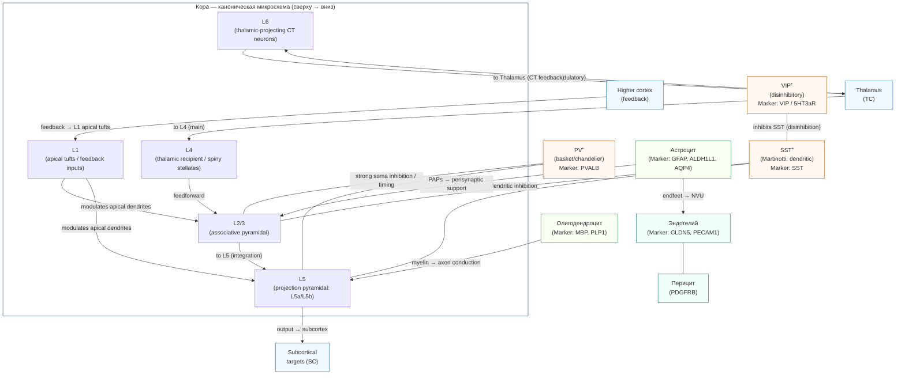

# Обзор клеточного состава и архитектуры мозга

## 1. Введение и методологические рамки

Этот обзор нацелен дать системную, мультиуровневую карту клеточного состава и архитектуры мозга, соединяющую молекулярные, клеточные и сетевые уровни организации. Введение определяет цель обзора, границы анализа и основные методологические принципы, которые использовались при подборе и интерпретации источников и данных (молекула → клетка → микросхема → сеть).

### 1.1. Цели обзора и уровни анализа (молекула → клетка → микросхема → сеть)

**Цели.** Обзор ставит три взаимосвязанные цели:
1. Систематизировать современные знания о клеточных типах и субтипах ЦНС (нейроны, глия, сосудисто-барьерные и пограничные популяции), обеспечив для каждого типа унифицированную карточку: определение, ключевые маркеры, морфология, физиология, распределение, методы изучения и ключевые ссылки.
2. Описать механистические пути и клеточные взаимодействия, формирующие локальные микросхемы (синаптические мотивы, интернейронные сети, миелиновые тракты, NVU) и их влияние на крупномасштабные сети и поведение.
3. Оценить трансляционный потенциал — какие клеточные мишени и механизмы уже доступны для таргетной доставки/модуляции и какие технические/биологические препятствия остаются для клинической реализации.

**Уровни анализа.** Обзор систематически переходит через четыре градации:
- **Молекулярный уровень:** рецепторы, каналы, сигнальные каскады, surface‑ome — релевантно для маркеров и таргетов доставки.
- **Клеточный уровень:** трансриптомные/морфо‑электрофизиологические профили, подтипы и состояния (тип vs состояние — см. 1.2).
- **Микросхемный уровень:** локальные вычислительные мотивы, вход‑выходные петли, роль интернейронов и глии в регуляции времени и пластичности.
- **Сетевой/системный уровень:** агрегированные влияния cell‑type распределения на сетевые свойства (RSN/parcels, rich‑club, функциональная коннективность).

Эта многоуровневая перспектива позволяет переводить молекулярно-определяемые особенности (напр., экспрессия мембранного рецептора) в гипотезы о влиянии на поведение и патофизиологию через посредство клеток и микросхем.

### 1.2. «Клеточный тип» vs «клеточное состояние» — концептуальное разграничение

**Определения.** В обзоре используется следующее разграничение:
- **Клеточный тип** — стабильная, репродуцируемая категория клеток, характеризуемая консервативным сочетанием транскриптомных отпечатков, морфологии, электрофизиологической роли и типичного пространственного локуса (например, PV‑интернейроны, L5 pyramidal PT‑cells, oligodendrocytes). Типы по возможности приводятся через cross‑atlas идентификаторы (Allen / Brain Cell Atlas). ([2])
- **Клеточное состояние** — временный или контекст-зависимый фенотип, отражающий активацию, реактивность, фазу дифференцировки или болезнь-ассоциированные программы (например, DAM у микроглии, реактивные астроцитарные программы). Состояния часто характеризуются динамичной транскрипционной ремоделировкой и могут пересекаться между типами. ([1])

**Почему важно разграничивать.** Путаница между типом и состоянием приводит к ошибочной функциональной интерпретации (например, ошибочная попытка таргетировать «DAM» как уникальную клеточную линию вместо временно индуцированного состояния). Для трансляции терапии важно валидировать, является ли кандидат‑мишень конститутивной (тип‑специфичной) или лишь временной (state‑индексируемой), поскольку стратегии доставки, дозирования и временного окна вмешательства будут отличаться.

**Практические критерии различения (рекомендации):**
1. **Мультиомная валидация:** сочетание транскриптома (sc/snRNA‑seq) + пространственной привязки (MERFISH/Visium/seqFISH) + морфологии/электрофизиологии (Patch‑seq/biocytin‑reconstructions). ([1], [2])
2. **Лонгитюдные данные / lineage tracing:** применение RNA‑velocity, CRISPR‑barcoding и lineage‑tracing для определения направлений переходов состояния и их устойчивости во времени.
3. **Функциональная валидация:** корреляция транскриптома с физиологией и ролью в сети (in vivo recordings, opto/chemogenetics, behavior).

### 1.3. Современные каталоги/атласы и их ограничения (BICCN / Brain Cell Atlas / Allen)

**Ключевые ресурсы.** Современные интегративные атласы (например, интегрированный Brain Cell Atlas и порталы Allen Institute) формируют основу таксономий и панелей маркеров, предлагая тысячи кластеров, сопоставимых между областями и видами. Эти ресурсы являются основой для `main table` в настоящем обзоре и используются для cross‑referencing каждой записи. ([1], [2])

**Сильные стороны атласов:**
- Масштаб и глубина: миллионы транскриптомов и пространственные реперные наборы, дающие возможность выявлять даже редкие субтипы.
- Мультиомность: интеграция sc/snRNA с spatial‑данными и в ряде случаев с морфо‑электрофизиологией (Patch‑seq).
- Публичность и воспроизводимость: многие датасеты доступны через интерактивные порталы и дают заранее рассчитанные панели маркеров и cluster‑IDs.

**Ограничения и предостережения:**
1. **Артефакты подготовки:** dissociation‑induced genes и потери мембранных транскриптов в scRNA vs snRNA приводят к batch‑эффектам; при работе с человеческими постмортальными образцами часто используют snRNA, но это имеет свои ограничения по чувствительности ряда генов.
2. **Номенклатурная несогласованность:** разные проекты дают разные cluster‑именования — в обзоре использована стратегия cross‑atlas anchoring (указание Allen/BrainCellAtlas cluster IDs рядом с предлагаемой терминологией).
3. **Species translation:** многие подтипы хорошо консервативны, но люди показывают больше субтиповой диверсификации (особенно в верхних корковых слоях); переводимость функциональных ролей с мыши на человека требует осторожности. ([1])
4. **Мульти-модальная несвязанность:** редко один и тот же отдельный нейрон имеет одновременно полные данные scRNA + full morphology + EM‑connectome + in vivo physiology; поэтому многие связи "транскриптом → функция → коннективность" остаются предполагаемыми и требуют correlative/causal валидации.

**Рекомендации при использовании атласов в обзоре:**
- Всегда указывать версию и источник cluster‑IDs, приводить crosswalks между атласами (Allen ↔ Brain Cell Atlas ↔ Yao et al.), и помечать, какие утверждения напрямую подтверждены мультиомными данными, а какие — косвенно (инференциально). ([1], [2])
- Для критичных выводов требовать подтверждение белковой экспрессии (IHC/proteomics) и пространственной привязки, особенно когда речь идёт о surface‑targets для доставки/лекарств.

---

#### Ключевые ссылки (избранные справки в этом разделе)
* Chen X. et al., *A brain cell atlas integrating single‑cell transcriptomes across human brain regions*, **Nature Medicine** (2024). ([1])
* Allen Institute — Human Brain Cell Types / Cell Taxonomies (interactive portal). ([2])

[1]: https://www.nature.com/articles/s41591-024-03150-z "A brain cell atlas integrating single-cell transcriptomes ..."
[2]: https://portal.brain-map.org/cell-types/classes "Cell Taxonomies"

---

## 2. Полноклеточный каталог (обзор-«справочник») — развёрнутое изложение

Ниже — систематизированный справочник по основным клеточным классам мозга и ключевым их подтипам. Для каждого пункта даю: краткое определение, типичные молекулярные маркеры, основные морфо-/физиологические признаки, типичное распределение, методы, которыми эти свойства изучаются, и ключевые первичные/обзорные источники. Везде, где уместно, опираюсь на современные мультиомные атласы (Human/Brain Cell Atlas, Allen) и классические обзоры (выделяю ключевые ссылки после каждого блока).

> Примечание по ссылкам: я использовал только авторитетные академические источники — крупные обзоры и атласы; там, где есть современные (2023–2024) интеграции данных, я их указываю. ([Nature][3], [Brain Map][4])

---

### 2.1. Нейроны — полная классификация 

Кратко: «нейрон» в таксономическом смысле определяется одновременно по трём измерениям — молекулярному (транскриптом/маркер), морфологическому (форма, проекции) и физиологическому (электрофизиологический профиль, вход/выход). Современные мультиомные атласы объединяют эти модальности (Patch-seq, spatial-omics, EM-connectomics), что позволяет согласовать «тип» и «состояние» клетки. ([Nature][19], [PMC][20])

---

#### 2.1.1. По нейромедиатору — основные классы, маркеры и ключевые свойства

##### Глутаматергические (возбуждающие)

* **Кто:** пирамидные клетки коры (L2–L6), пирамиды гиппокампа (CA1/CA3), гранулярные клетки DG и мозжечка.
* **Маркер(и):** VGLUT1 / VGLUT2 (SLC17A7 / SLC17A6), CaMKIIα (часто в кортикальных проекционных нейронах).
* **Морфология/физиология:** шпинные дендриты, апикально/базально ориентированные арборизации; большинство демонстрируют regular-spiking или bursting профили.
* **Роль:** передача возбуждающих сигналов, ассоциативная обработка, формирование дальних проекций.
* **Как изучают:** антероградная трассировка проекций; Patch-seq и sc/snRNA-seq для связи физиологии и транскриптома; двухфотонная визуализация in vivo. ([celltypes.brain-map.org][21], [PMC][22])

**Р.ч.:** современные атласы (Brain Cell Atlas, Allen) дают подробные списки субтипов глутаматергических нейронов по областям и проекциям. ([Nature][19], [Allen Institute][23])

---

##### ГАМК-ергические (тормозные интернейроны)

* **Кто:** множество локальных подклассов: PV, SST, VIP, NPY, CCK, neurogliaform, chandelier и др.
* **Маркер(и):** GAD1 / GAD2 (общие); подклассовые маркеры: PVALB, SST, VIP, NPY, CCK, RELN и т.д.
* **Морфология/физиология:** сильно вариабельны — от fast-spiking PV корзинных до тонко ветвящихся SST-дендритных клеток; типично высокоспецифичная таргет-локализация синапсов (сома/аксоны/дендриты).
* **Роль:** тайминг и синхронизация (γ-осцилляции), формирование feedforward/feedback inhibition, дисинhibиторные мотивы (VIP→SST→pyramidal).
* **Методы:** селективные Cre-линии, оптогенетика/хемогенетика, Patch-seq для корреляции генов и электрического поведения; коннектомика для картирования мотивов. ([PMC][20])

**Примечание:** PV-интернейроны — классический пример fast-spiking клетки с узким AP и малой адаптацией (связь с γ-осцилляциями). ([PMC][24])

---

##### Модуляторные проекционные нейроны (холинергические, дофаминергические, норадренергические, серотонинергические, гистаминергические)

* **Кто:** небольшие плотные ядра с широкими проекциями: VTA/SNc (дофамин), LC (норадреналин), raphe (серотонин), basal forebrain (ацетилхолин), туберомамиллярное ядро (гистамин).
* **Маркер(и):** TH/DAT/VMAT2 (дофамин), DBH/NET (норадреналин), TPH2/SERT (серотонин), ChAT/VAChT (холин).
* **Роль:** глобальная модуляция возбудимости, контроль состояния, обучение и мотивация.
* **Методы:** гормон/нейромедиатор-специфические метки, трассировка проекций, комбинированные in vivo-записи и нейровизуализация. ([Allen Institute][23])

---

**Рекомендуемая литература (по разделу 2.1.1):** Brain Cell Atlas (2024) — интеграция 70+ исследований; Allen Human Cell Types обзор таксономий. ([Nature][19], [Allen Institute][23])

---

#### 2.1.2. По морфологии и проекции — практические категории и ключевые примеры

**Кора — пирамидные L2–L6**

* L2/3: локальные ассоциативные проекции; обычно меньше по размеру тело, связи внутри коры.
* L5: крупные проекционные нейроны (L5a, L5b) — аксоны идут в ствол/таламус/спинной мозг; часто exhibit bursting.
* L6: таламо-кортикальные «обратные» проекции.
  (Современные scRNA и Patch-seq работы выделяют молекулярные маркеры, сопоставимые с этими морфологическими классами.) ([Allen Institute][23], [PMC][20])

**Стриатум — medium spiny neurons (MSNs)**

* D1 vs D2 по DRD1/DRD2; ключевые для прямого/непрямого пути базальных ганглиев.

**Мозжечок — Purkinje и гранулярные**

* Purkinje: единственный выходной тип коры мозжечка; огромная планарная дендритная арборизация.
* Granule: мелкие, плотные возбудительные клетки, принимают mossy fiber inputs; важны для кодирования и pattern separation.

**Методы:** биоцит/голджи маркировка + EM-реконструкция дают «золотой стандарт» морфологии; Patch-seq связывает морфологию с физиологией и генами. ([PMC][20])

---

#### 2.1.3. По электрофизиологии (фиринг-подписи) — типы и что они значат

Классификация по firing pattern — простая, но информативная ось:

* **Fast-spiking (FS):** узкие AP, высокая частота, низкая адаптация — чаще у PV-интернейронов. ([PMC][24])
* **Regular-spiking (RS):** адаптирующийся паттерн, типичен для многих пирамидных клеток.
* **Bursting (IB):** периодические группы импульсов; важны для передачи «сигналов высокой значимости» и синхронизации.
  **Методы:** patch-clamp (in vitro), целевые in vivo-патчи, классификация по RMP, Rin, AP-width, τ и др.; эти признаки систематизированы в базах Allen и в работах Gouwens et al. (Integrated morpho-electro-transcriptomic datasets). ([PMC][20])

---

#### 2.1.4. Специализированные сенсорные нейроны — ретина, обоняние, слух

**Ретина:**

* Стандартная цепочка: rods/cones → bipolar cells → retinal ganglion cells (RGC). RGC — очень гетерогенны (50+ подтипов у млекопитающих по физиологии/транскриптомам). Маркеры: RHO (rod), OPN1 (cone), POU4F2/POU4F1 (RGC-линии). Существуют крупные многомодальные ретинальные атласы (single-cell и spatial), включая обзоры 2019–2023 и multi-omic 2023. ([PMC][25], [cell.com][26])

**Обоняние / слух:**

* Митральные/туфтед-клетки (обонятельная луковица), множество специализированных рецепторных нейронов в периферии и вторичных проекциях; транскриптомные и коннектомные работы уточняют их подтипы и рецептивные поля. ([cell.com][26], [Nature][27])

---

#### 2.1.5. Региональные подтипы — как читать современные таксономии

* **Подход:** современные атласы (Brain Cell Atlas, Allen) предлагают иерархию (class → subclass → cluster/subtype), где каждый уровень подкреплён молекулярным профилем, часто сопровождаемым пространственным локусом и (в лучших наборах) морфо-электрическими данными (Patch-seq). ([Nature][19], [Allen Institute][23])
* **Примеры современных результатов:** интегрированные spatial+snRNA работы по гиппокампу (2024–2025) выявляют субтипы CA1/CA3/DG с уникальным сочетанием транскриптома, морфологии и локализации, что важно для понимания уязвимости при старении/патологии. ([PMC][28], [Nature][29])

---

#### Рекомендованные первичные источники (подгруппа 2.1 — обязательные к прочтению)

* Brain Cell Atlas (integrated atlas, Nature Medicine 2024). ([Nature][19])
* Allen Institute — Cell Types / Taxonomies portal (интерактивные записи по подтипам). ([celltypes.brain-map.org][21], [Allen Institute][23])
* Patch-seq review: Lipovsek et al., *Patch-seq: Past, Present, and Future* (2021) + обзоры 2023–2024 по приложениям. ([PMC][24], [SpringerLink][30])
* Integrated morpho-electro-transcriptomic study: Gouwens et al. (2020) — методологическая база для объединения модальностей. ([PMC][20])
* Ретинальные мультиомные атласы (Lukowski 2019; Liang 2023; Zuo 2024). ([PMC][25], [cell.com][26], [Nature][27])

[19]: https://www.nature.com/articles/s41591-024-03150-z   "A brain cell atlas integrating single-cell transcriptomes ..."
[20]: https://pmc.ncbi.nlm.nih.gov/articles/PMC7781065/   "Integrated Morphoelectric and Transcriptomic ..."
[21]: https://celltypes.brain-map.org/   "Allen Brain Atlas: Cell Types: Overview"
[22]: https://pmc.ncbi.nlm.nih.gov/articles/PMC7880286/   "Patch-seq: Past, Present, and Future - PMC"
[23]: https://alleninstitute.org/division/brain-science/human-cell-types/   "Human Cell Types"
[24]: https://pmc.ncbi.nlm.nih.gov/articles/PMC10660579/   "Parvalbumin - Positive Neurons in the Neocortex: A Review"
[25]: https://pmc.ncbi.nlm.nih.gov/articles/PMC6745503/   "A single‐cell transcriptome atlas of the adult human retina"
[26]: https://www.cell.com/cell-genomics/fulltext/S2666-979X%2823%2900064-2   "A multi-omics atlas of the human retina at single- ..."
[27]: https://www.nature.com/articles/s41467-024-50853-5   "Single cell dual-omic atlas of the human developing retina"
[28]: https://pmc.ncbi.nlm.nih.gov/articles/PMC11071618/   "An integrated single-nucleus and spatial transcriptomics ..."
[29]: https://www.nature.com/articles/s41593-025-02022-0   "An integrated single-nucleus and spatial transcriptomics ..."
[30]: https://link.springer.com/article/10.1007/s10571-023-01436-3   "Patch-seq: Advances and Biological Applications"

---

### 2.2. Интернейроны — детальная таксономия и сетевые роли

Ниже — аккуратно организованный справочник по основным подклассам интернейронов: определение, происхождение, ключевые молекулярные маркеры, морфо-физиология, типичные входы/выходы (синапсы), сетевые функции (осцилляции, дисинхибиция, контроль пластичности), методы исследования и релевантные ссылки. В тексте опираюсь на авторитетные обзоры и современные мультиомные работы (Patch-seq / morpho-electro-transcriptomic таксономии) и отмечаю ключевые источники.

> Коротко: современные таксономии интернейронов строятся на объединении трёх модальностей — молекулярной (транскриптомы), морфологической (табели ветвления/таргет-локализация) и физиологической (fir­ing-подписи). Стандартная «большая тройка» классов корковых интернейронов — PVALB, SST и 5HT3a/Htr3a (включая VIP и Lamp5-типы), но внутри каждого из этих классов много субтипов с чёткой функциональной специализацией. ([PMC][31], [Наука][32])

---

#### 2.2.1. Таксономическая рамка и происхождение

* **Рамки классификации:** традиционные (Petilla terminology) + современные интеграции Patch-seq / transcriptomic atlases (Gouwens et al. 2020; Lee et al. 2023 и др.). Petilla дал стандартизированные термины для описания анатомии/электрофизиологии/молекулярных маркеров — полезен как рабочая номенклатура. ([PMC][31])
* **Эмбриологическое происхождение:** \~60% корковых IN происходят из медиального ганглиозного возвышения (MGE) — даёт PV и SST классы; \~30% — из каудального GE (CGE) — даёт VIP, LAMP5/NPY-типы и др.; небольшая доля — из предоптической (POA) области. Временная и пространственная динамика рождения/миграции определяет распределение по слоям. ([PMC][33])

---

#### 2.2.2. Общая функциональная палитра интернейронов

* **Компартментальная ингибиция:** разные подклассы таргетируют разные компартменты пирамидального нейрона: PV → соматон/инициальный сегмент; SST → апикальные дендриты; VIP → преимущественно другие интернейроны (дисинхибиция). ([Frontiers][34])
* **Сетевые осцилляции:** PV-клетки синхронизируют γ-осцилляции (30–80 Hz), играя ключевую роль в высшей когнитивной обработке и временной точности. SST и другие типы вкладываются в более медленные ритмы и контекстную модуляцию. ([ResearchGate][35], [ScienceDirect][36])
* **Дисинхибиция:** VIP→SST→pyramidal мотив — классический «gate» для контекстной и сенсорной модуляции (позволяет «развязать» дендриты пирамидальных клеток при определённых поведенческих состояниях). ([PMC][37], [jneurosci.org][38])

---

#### 2.2.3. Подробные профили ключевых подклассов

Ниже — карточка для каждого основного подкласса: маркеры, морфология, физиология, коннективность, функции, методы и ключевые ссылки.

---

##### A. **PV-популяция (PVALB⁺)**

**Кратко:** включает fast-spiking корзинные клетки (basket cells) и chandelier / axo-axonic cells (AACs). Родом в основном из MGE. ([PMC][33])

* **Ключевые маркеры:** PVALB (parvalbumin), иногда SLC6A1/GAD1 по общему ГАБА-профилю.
* **Морфология:** корзинные — многочисленные синапсы около сомы и первичного аксона; chandelier — характерные «подвески» (axo-axonic cartridges) на начальном сегменте аксона целевой клетки. ([PMC][39])
* **Электрофизиология:** fast-spiking: узкие AP, высокий порог восстановления, низкая адаптация; низкое входное сопротивление. ([PMC][40])
* **Коннективность:** сильные соматические/перисомические синапсы на пирамидальных клетках; обширные локальные связи между PV-клетками. Chandelier клетки таргетируют аксонный начальный сегмент и тем самым мощно контролируют генерацию AP в пирамиде. ([PMC][39], [eLife][41])
* **Функции:** синхронизация нейронных ансамблей (γ-ритмы), контроль временной точности, feedforward/feedback inhibition, вклад в контрастный отбор и скорость кодирования. Chandelier-клетки могут как подавлять, так и «шунтировать» аксональную возбудимость в зависимости от условий. ([ResearchGate][35], [PMC][39])
* **Методы изучения:** Pvalb-Cre линии, in vivo opto/электрофизиология (синхронные измерения LFP + single-unit), Patch-seq, EM-коннектомика для chandelier cartridges. ([PMC][40], [eLife][41])

---

##### B. **SST-популяция (SST⁺; Martinotti и др.)**

**Кратко:** преимущественно MGE-происхождение; многие SST-нейроны — Martinotti cells, которые таргетируют апикальные дендриты пирамид. ([PMC][33], [ScienceDirect][42])

* **Маркер:** SST (somatostatin), часто дополнительно NPY/CR/Reln в подтипах.
* **Морфология:** Martinotti — вертикальные/возвышающиеся аксональные арборизации, выходящие в слой 1; другие SST-подтипы имеют вариабельную архитектуру.
* **Электрофизиология:** разнообразие: от регуляр-spiking до adapting; обычно медленнее по сравнению с PV.
* **Коннективность:** преимущественно иннервируют дендритные компартменты пирамид; также взаимодействуют с PV и VIP популяциями.
* **Функции:** регуляция дендритной интеграции и пластичности (LTP/LTD), контроль входов на апикальных древа, вклад в контекстную кодировку и поведенческую селекцию. Существуют подтипы SST, специализированные по слоям и по таргет-ресивинг-паттерну. ([ScienceDirect][42], [PMC][43])
* **Методы:** Sst-Cre линии, Patch-seq для разделения субтипов, двухфотонная кросс-корреляция активности с записанным поведением. ([PMC][40])

---

##### C. **VIP-популяция (VIP⁺)**

**Кратко:** в основном CGE-происхождение; часто выступают как дисинhibitory interneurons (ингибируют SST и/или другие ингибиторные популяции), модульно реагируют на поведенческий контекст (внимание, поведение). ([PMC][37], [BioRxiv][44])

* **Маркер:** VIP; часто co-express calretinin (CR) в определённых подтипах.
* **Морфология:** разнообразие аксональных шаблонов; встречаются как слой-специфичные, так и межслойные подтипы.
* **Электрофизиология:** чаще regular-spiking или irregular; пластичные ответы на поведение/состояние (новизна, вознаграждение).
* **Коннективность:** сильные синапсы на SST-клетки → снижение дендритного торможения на пирамидальных клетках (эффект «развязки»); также могут влиять на PV в некоторых схемах.
* **Функции:** ворота пластичности, состояние-зависимая дисинхибиция, контекстная селекция сенсорных сигналов; участие в обучении/новизне. ([PMC][37], [A blog about neurophysiology][45])
* **Методы:** Vip-Cre, optogenetic manipulations during behavior, calcium imaging of identified VIP cells. ([PMC][37])

---

##### D. **Neurogliaform / Lamp5-тип (NGF / LAMP5-популяция)**

**Кратко:** тонкие широкоразветвлённые клеточные профили, характерная «volume transmission» GABA (extrasynaptic GABA\_A / GABA\_B активация); часто CGE-происхождение. ([PMC][46], [BioRxiv][47])

* **Маркер(и):** NPY (в подмножествах), Lamp5, Reln, nNOS в некоторых подтипах.
* **Морфология:** компактное тело с густой локальной сеткой пресинаптических бульбоидов; короткий радиус аксональной иннервации, но высокая плотность бутонов.
* **Физиология:** единичные акты вызывают медленные, длительные Inhibitory postsynaptic currents и extrasynaptic GABA-эффекты (volume transmission).
* **Функции:** глобальная, слоеспецифическая «десинхронизация»/развязка или ограничение активности в локальном микроокружении; формируют слоевые сдерживающие компоненты inhibition. ([Наука][48])
* **Методы:** целевые Patch-seq, локальная оптогенетика, оценка GABA\_B-компоненты; recent spatial/transcriptomic works выделяют подтипы Lamp5. ([Наука][32], [BioRxiv][47])

---

##### E. **Chandelier / Axo-axonic cells (AAC / ChC)**

**Кратко:** морфологически уникальные PV⁺ клетки, чьи пресинаптические «подвески» формируют каскады на аксональном начальном сегменте пирамид — мощный контроль генерации AP. Их роль сложна: могут ингибировать или задавать shunting-эффект в зависимости от E\_Cl и состояния клетки. ([PMC][39])

* **Маркер:** PVALB (в большинстве), некоторые особые молекулярные маркеры / транскриптомные подписи указывают на специализированные AAC кластеры.
* **Морфология:** характерные «люстры» (cartridges) aksonных терминалей, точно ориентированных на AIS целевых нейронов.
* **Функции:** контроль генерации AP у пирамид; участвуют в патофизиологии (эпилепсия, шизофрения) при нарушении их структуры/синаптогенеза. ([PMC][39])
* **Методы:** EM/коннектомика для cartridge-структур; специфические генетические маркеры и целевые трансгенные линии только недавно становятся доступными (новые инструменты 2023–2024). ([eLife][41])

---

##### F. **Другие нейропептид-/модуляторные подклассы: CCK, NPY, Reelin и т.д.**

* **CCK⁺ (cholecystokinin):** spesso perisomatic non-PV basket cells — модуляция через CB1 рецепторы; часто медленно-функционирующие, state-dependent.
* **NPY⁺:** часто коррелируют с neurogliaform/интернейронами, вносят длительную ингибицию/вазоконстрикцию (через NPY рецепторы).
* **Reelin⁺ (RELN):** встречаются в специфичных подтипах, в том числе в некоторых L1 и субкортикальных типах; участвуют в развитии и пластичности.
  **Функции:** локальная модуляция синаптической силы, состояние-зависимая модуляция сети, взаимодействие с нейромодуляторами (эндоканнабиноиды, нейропептиды). ([Наука][32], [PMC][46])

---

#### 2.2.4. Межподтиповые взаимодействия и сетевые мотивы

* **Feedforward inhibition:** сенсорный вход → быстро активирующие PV-клетки → подавление соматической активности пирамид (брейк входного сигнала).
* **Feedback inhibition:** пирамидалы → активация интернейронов (PV/SST) → подавление локальной активности.
* **Disinhibitory motifs:** VIP → ингибирование SST (и/или PV) → временная «отвязка» дендритов/сомат → усиление пластичности и ответа на входы. ([PMC][37], [jneurosci.org][38])
* **Volume transmission (NGF):** обеспечивает широкую, длительную приглушающую оболочку через extrasynaptic рецепторы. ([PMC][46])

---

#### 2.2.5. Электрофизиологические и морфо-электрические подписи (связь с транскриптомикой)

* **Patch-seq / morpho-electro-transcriptomic studies** показали, что сочетание морфологии + электрофизиологии + транскриптома — наиболее надёжный способ задать «тип». Gouwens et al. 2020 и последующие работы (Lee et al. 2023 и др.) дали мета-типы GABAergic клеток и выделили \~40–50 transcriptomic-types в коре, сопоставимых с функциональными метками. ([PMC][40], [Наука][32])

---

#### 2.2.6. Функциональная пластичность и роль в обучении/патологии

* **Пластичность:** интернейроны демонстрируют состояние-зависимую пластичность — изменение силы синапсов PV/PV, SST-пластичность при обучении; VIP-активация связана с новизной/вознаграждением. Эти изменения важны для LTP/LTD gating. ([jneurosci.org][38], [PMC][37])
* **Патология:** дефекты PV/ChC ассоциации с эпилепсией и шизофренией; нарушения интернейронного баланса — общая гипотеза когнитивных расстройств. ([PMC][49])

---

#### 2.2.7. Методы — практические рекомендации

* **Маркировка и генетические линии:** Pvalb-Cre, Sst-Cre, Vip-Cre используются повсеместно, но требуют валидации (off-target, субтиповая неоднородность).
* **Patch-seq:** обязательна для сопоставления транскриптома и электр. свойств; позволяет выделять новые subtypes. ([PMC][40])
* **Оптогенетика + поведенческие задачи:** для проверки causal роли (например VIP→LTP gating). ([jneurosci.org][38])
* **EM / connectomics:** необходимы для точного картирования Chandelier cartridges и плотных basket-синапсов. ([eLife][41])

---

#### 2.2.8. Ключевые современные и классические источники (рекомендованный набор чтения)

* Petilla terminology — стандартизированная номенклатура по GABAergic interneurons (Ascoli et al., 2008). ([PMC][31])
* Gouwens et al., *Integrated morphoelectric and transcriptomic classification of cortical GABAergic neurons* (Patch-seq framework, 2020). ([PMC][40])
* Lee et al., *Signature morphoelectric properties of diverse GABAergic types* (Science, 2023) — крупная таксономия. ([Наука][32])
* Lim et al., *Development and functional diversification of cortical interneurons* (review, 2018) — развитие/происхождение. ([PMC][33])
* Overstreet-Wadiche & McBain, *Neurogliaform cells in cortical circuits* (review, 2015) + recent NGF functional papers (Sakalar et al., 2022; 2024 preprints). ([PMC][46], [Наука][48])
* Recent reviews on disinhibitory circuitry and VIP roles (Ferrer et al. 2022; Canto-Bustos et al. 2022). ([PMC][37], [jneurosci.org][38])
* Chandelier cell focused reviews (Compans et al. 2023; Raudales 2024) для AAC structure/function & pathology. ([PMC][39], [eLife][41])

[31]: https://pmc.ncbi.nlm.nih.gov/articles/PMC2868386/   "Petilla terminology: nomenclature of features of GABAergic ..."
[32]: https://www.science.org/doi/10.1126/science.adf6484   "Signature morphoelectric properties of diverse GABAergic ..."
[33]: https://pmc.ncbi.nlm.nih.gov/articles/PMC6290988/   "Development and functional diversification of cortical ..."
[34]: https://www.frontiersin.org/journals/neural-circuits/articles/10.3389/fncir.2023.1172464/full   "Cortical interneurons: fit for function and fit to ..."
[35]: https://www.researchgate.net/publication/310328707_Petilla_terminology_nomenclature_of_features_of_GABAergic_interneurons_of_the_cerebral_cortex   "Petilla terminology: nomenclature of features of GABAergic ..."
[36]: https://www.sciencedirect.com/science/article/pii/S2211124725001561   "Article Distinct roles of PV and Sst interneurons in visually ..."
[37]: https://pmc.ncbi.nlm.nih.gov/articles/PMC9021723/   "The Role of Inhibitory Interneurons in Circuit Assembly and ..."
[38]: https://www.jneurosci.org/content/42/14/2942   "Disinhibitory Circuitry Gates Associative Synaptic Plasticity ..."
[39]: https://pmc.ncbi.nlm.nih.gov/articles/PMC10682383/   "Chandelier cells shine a light on the formation ..."
[40]: https://pmc.ncbi.nlm.nih.gov/articles/PMC7781065/   "Integrated Morphoelectric and Transcriptomic ..."
[41]: https://elifesciences.org/reviewed-preprints/93481   "Specific and comprehensive genetic targeting reveals ..."
[42]: https://www.sciencedirect.com/science/article/pii/S089662732300435X   "Cortical somatostatin interneuron subtypes form cell-type- ..."
[43]: https://pmc.ncbi.nlm.nih.gov/articles/PMC11257522/   "A dendritic substrate for temporal diversity of cortical ..."
[44]: https://www.biorxiv.org/content/10.1101/2023.04.28.538575v1.full-text   "Behavioral strategy shapes activation of the Vip-Sst ..."
[45]: https://gcamp6f.com/2025/06/23/interesting-papers-on-vip-interneurons-in-cortex-and-hippocampus/   "Interesting papers on VIP interneurons in cortex and ..."
[46]: https://pmc.ncbi.nlm.nih.gov/articles/PMC5207343/   "Neurogliaform Cells in Cortical Circuits - PMC"
[47]: https://www.biorxiv.org/content/10.1101/2024.06.05.597539v2.full   "Neurogliaform Cells Exhibit Laminar-specific Responses in ..."
[48]: https://www.science.org/doi/10.1126/science.abo3355   "Neurogliaform cells dynamically decouple neuronal ..."
[49]: https://pmc.ncbi.nlm.nih.gov/articles/PMC10330806/   "Axo-axonic cells in neuropsychiatric disorders"
[50]: https://pubmed.ncbi.nlm.nih.gov/18568015/   "Petilla terminology: nomenclature of features of GABAergic ..."
[51]: https://pmc.ncbi.nlm.nih.gov/articles/PMC9272671/   "Origin, Development, and Synaptogenesis of Cortical ..."

---

### 2.3. Астроциты — гетерогенность и механистические роли

**Краткое определение.**
Астроциты — доминирующая популяция таламически/корково-распространённой глии серого вещества. Они выполняют множество гомеостатических функций: ионный и нейромедиаторный клиренс, метаболическую поддержку нейронов, регуляцию кровотока и участие в иммунной и восстановительной реакциях. Современные мультиомные исследования подчёркивают широкую региональную и функциональную гетерогенность астроцитов, а также наличие динамических «состояний» (реактивность, старческое состояние, disease-associated транскриптомы). ([PMC][52])

```mermaid
%% Astrocyte functional map
%% Рекомендация: вставить после абзаца "Краткое определение." в разделе 2.3
graph TB
  style Astro fill:#f7fbff,stroke:#2b6cb0,stroke-width:2px

  %% центральный узел
  Astro["Астроцит<br>(центральный узел)"]

  %% Subtypes
  subgraph SUBT["Подтипы / регионализация"]
    direction TB
    GM["Пропротоплазм.<br>(серое вещество)"]
    WM["Фиброзные<br>(белое вещество)"]
    Berg["Bergmann<br>(мозжечок)"]
    Muller["Müller<br>(сетчатка)"]
    Perivasc["Perivascular /<br>border-astrocytes"]
  end

  %% Functions / Mechanisms
  subgraph FUNC["Ключевые механизмы / функции"]
    direction TB
    Kbuffer["K⁺-буферизация<br>(Kir4.1)"]
    GluClear["Захват глутамата<br>(EAAT2/GLT-1)"]
    ANLS["Метаболическая поддержка<br>(ANLS, MCTs)"]
    CaSign["Ca²⁺-сигналинг<br>(gliotransmission)"]
    NVcouple["Нейроваскулярное<br>сопряжение"]
    Glymph["Glymphatic clearance<br>(AQP4)"]
    Immune["Иммунная регуляция<br>(реактивность)"]
  end

  %% Markers
  subgraph M["Маркеры"]
    direction LR
    GFAP["GFAP"]
    ALDH["ALDH1L1"]
    AQP4["AQP4"]
    SLC1A2["SLC1A2<br>(GLT-1)"]
    SLC1A3["SLC1A3<br>(GLAST)"]
  end

  %% Methods
  subgraph METHODS["Методы изучения"]
    direction TB
    scRNA["sc/snRNA-seq<br>+ spatial"]
    PatchSeq["Patch-seq<br>(morph+phys+RNA)"]
    CaIm["Ca²⁺-imaging<br>(GCaMP)"]
    Opto["Оптогенетика/<br>хемогенетика"]
    EMVol["EM / volume EM"]
    IHC["IHC / proteomics"]
  end

  %% Pathology
  subgraph PATH["Патологии / терапевтика"]
    direction TB
    AD["AD: AQP4/glymph<br>& метаболизм"]
    Ep["Эпилепсия:<br>K⁺ / GLT-1 дисфункция"]
    Stroke["Инсульт:<br>реактивность / отёк"]
    Therapy["Терапевт. цели:<br>AQP4; GLT-1; Kir4.1"]
  end

  %% Open questions
  subgraph Q["Открытые вопросы (2024–2025)"]
    direction TB
    Q1["Тип vs состояние<br>(стабильность)"]
    Q2["ANLS — вклад в поведение?"]
    Q3["Таргетинг AQP4<br>и глимфатический клиренс"]
  end

  %% Connections: central to groups
  Astro --> SUBT
  Astro --> FUNC
  Astro --> M
  Astro --> METHODS
  Astro --> PATH
  Astro --> Q

  %% Subtype -> specific functions (examples)
  GM --> GluClear
  GM --> Kbuffer
  WM --> ANLS
  Berg --> NVcouple
  Perivasc --> Glymph
  Muller --> NVcouple

  %% Functions -> markers
  Kbuffer --> |"поддержка"| Kir["Kir4.1"]
  GluClear --> SLC1A2
  Glymph --> AQP4
  ANLS --> |"MCTs/LDH"| ANLSm["MCT1/4, LDH"]
  CaSign --> |"ассоциированно"| S100["S100β"]

  %% Methods link to functions / markers
  scRNA --> |"подтипы/состояния"| GM
  PatchSeq --> |"морф/физиол/транскрипт"| Astro
  CaIm --> CaSign
  Opto --> |"causal tests"| NVcouple
  EMVol --> |"PAP/синапт.контакты"| GluClear
  IHC --> |"валидация белка"| AQP4

  %% Pathology links
  AD --> Glymph
  AD --> ANLS
  Ep --> Kbuffer
  Ep --> GluClear
  Stroke --> Immune

  %% Open questions links
  Q1 --> SUBT
  Q2 --> ANLS
  Q3 --> Glymph
```

 

---

#### 2.3.1. Основные подтипы и региональные специализации

1. **Пропротоплазматические астроциты (grey-matter astrocytes)**
   *Локализация:* слой-специфические популяции в коре и других участках серого вещества.
   *Особенности:* богато ветвящиеся перисинаптические отростки (perisynaptic processes / PAPs), главная роль в синаптическом клиренсе глутамата и K⁺-буферизации. ([PMC][52])

2. **Фиброзные астроциты (white-matter astrocytes)**
   *Локализация:* белое вещество; морфология менее ветвистая, больше роль в поддержке аксональных трактов и ECM-ремоделировании. Современные single-cell работы демонстрируют выраженную транскриптомную разницу между WM и GM астроцитами. ([ScienceDirect][53], [PMC][54])

3. **Регионально-специфичные формы**
   *Bergmann glia* (мозжечок) — радиальные формы, тесная связь с Purkinje-дендритами; *Müller cells* (сетчатка) — радиальные глия, участвующие в поддержке и светопропровождении; *perivascular / border astrocytes* — специализированы на контактах с сосудами и барьерами (NVU). Эти типы несут специализированные транскриптомные подписи и функции. ([PMC][54], [Nature][55])

---

#### 2.3.2. Ключевые молекулярные маркеры (кратко)

* **Общие/широко используемые:** GFAP (вариабельно; усиливается при реактивности), ALDH1L1 (широкий маркер астроцитов), SLC1A2/EAAT2 (GLT-1) — основной транспортер глутамата, AQP4 — водный канал, концентрированный в endfeet.
* **Подтип-специфические маркеры (примеры):** региональные гены, указанные в scRNA/Spatial-атласах; современные работы дают наборы кластер-маркерoв для GM/WM и для disease-associated подпопуляций. ([PMC][54])

---

#### 2.3.3. Основные механизмы и их доказательная база

Ниже — описание основных механистических функций астроцитов с краткими ссылками на ключевые работы/обзоры.

##### A. Ионный гомеостаз и K⁺-буферизация

Астроциты захватывают избыток внеклеточного K⁺ (через каналами Kir4.1 и др.) и перераспределяют ионы — ключевой механизм для восстановления мембранного потенциала нейронов после всплесков активности. Это — фундаментальный механизм контроля возбудимости и предотвращения гипервозбудимости. ([journals.physiology.org][56])

##### B. Захват глутамата и глутамат-глутаминный цикл

Астроцитарные транспортеры (EAAT2/GLT-1, EAAT1/GLAST) быстро удаляют глутамат из синаптической щели; внутри астроцитов глутамат превращается в глутамин (глутаминсинтетаза), который возвращается в нейроны. Это предотвращает эксайтотоксичность и поддерживает пресynтетические пула нейромедиаторов. ([PMC][52])

##### C. Метаболическая поддержка — «astrocyte-neuron lactate shuttle (ANLS)»

Классическая гипотеза ANLS (Pellerin & Magistretti) и её современные переосмысления предлагают, что при активности нейронов астроциты усиливают гликолиз и поставляют L-лактат нейронам как быстро доступный субстрат для окисления. Эта схема остаётся предметом активных исследований: накоплены данные как в поддержку ANLS, так и уточняющие её молекулярные детали (LDH изоформы, MCT-переносчики). Обзоры и экспериментальные работы (включая in vivo и knockout-модели) подтверждают важную роль астроцитарного метаболизма для памяти, восстановления и выживания нейронов. ([PubMed][57], [PMC][58])

##### D. Ca²⁺-сигналинг и «gliotransmission»

Астроциты показывают внутриклеточные Ca²⁺-флуктуации в микродоменах (PAPs, endfeet); Ca²⁺-зависимые механизмы регулируют выделение факторов (ATP, D-серин и др.) и модулируют синаптическую передачу и пластичность. Точность концепции «gliotransmission» и её физиологическая значимость обсуждаются, но накопленный экспериментальный материал подтверждает роль Ca²⁺-сигналов астроцитов в регуляции сети и поведении. ([jneurosci.org][59], [Frontiers][60])

##### E. Нейроваскулярное сопряжение (neurovascular coupling)

Астроцитарные endfeet располагаются на сосудах и транслируют нейрональную активность в сосудистые ответы (вазодилятация/вазоконстрикция) через Ca²⁺-зависимые и метаболические пути (NO, prostaglandins, K⁺). Эта функция — ключ к функциональной МРТ-сигнатуре и метаболической поддержке активных областей. ([Nature][55])

##### F. Glymphatic clearance и роль AQP4

Астроцитарные endfeet экспрессируют AQP4; AQP4-опосредованный транспорт воды участвует в периваскулярном потоке межклеточной жидкости (glymphatic pathway), который обеспечивает удаление внеклеточных белков (Aβ, tau и пр.) при снах и в покое. Удаление или неправильная локализация AQP4 резко снижает эффективность клиренса в моделях, что имеет значение для нейродегенеративных болезней. ([PMC][61])

##### G. Иммунная регуляция и реактивность

Астроциты демонстрируют широкий спектр реактивных фенотипов (молекулярно неоднородных), которые могут быть как защитными (ранняя реакция, барьерная функция, скарирование), так и патогенными (продукция провоспалительных медиаторов). Современные омные исследования подчеркивают, что «A1/A2» упрощение недостаточно — существует множество реактивных состояний, специфичных для зон, времени и типа повреждения. ([PMC][52], [annualreviews.org][62])

---

#### 2.3.4. Развитие, происхождение и возраст-зависимые изменения

* Астроциты происходят от радиальных глиальных предшественников в эмбриогенезе; постнатально — сложная дифференцировка, при которой формируются регионально специализированные субпопуляции. Современные транскриптомные карты показывают возраст-зависимые изменения и формирование disease-associated подпопуляций при старении. ([PMC][54], [BioRxiv][63])

---

#### 2.3.5. Методы изучения — что и как измерять

**Молекулярные / таксономические методы**

* **scRNA-seq / snRNA-seq + spatial transcriptomics** — дают карту региональных субтипов и реактивных состояний (обязательная первичная модальность для современного обзора). ([PMC][54])

**Функциональные методы**

* **Кальциевая визуализация (GCaMP в астроцитах)** — для оценки Ca²⁺-микродоменов и активности endfeet.
* **Оптогенетика / хемогенетика (GFAP- или ALDH1L1-опосредованная направленность)** — манипуляции активности астроцитов и проверка causal эффектов на сеть и поведение.
* **Conditional KO / cre-lines (astrocyte-specific: Aldh1l1-CreERT2, Gfap-Cre)** — исследования функции каналов (Kir4.1), AQP4, транспортеров GLT-1 и др.
* **In vivo imaging (двухфотонка) + electrophysiology** — корреляция астроцитарных сигналов с нейрональной активностью и кровотоком. ([jneurosci.org][59], [PMC][61])

**Морфологическая/структурная валидация**

* EM/volume EM для тонкой архитектуры PAPs и контактов с синапсами; correlative light-EM при Patch-seq. ([ResearchGate][64])

---

#### 2.3.6. Роль в патологии — основные примеры и механизмы

* **Нейродегенерация (AD, PD):** нарушение AQP4-локализации и снижение глимфатической очистки; астроцитарная реактивность, нарушенный глутамат-клиренс и метаболический стресс — всё это связывают с прогрессией патологии. ([PMC][61])
* **Эпилепсия:** деградация K⁺-буферизации (Kir4.1), изменение GLT-1 — увеличенная возбудимость. Обзорные работы обсуждают возможности таргетирования астроцитов как терапевтической опции. ([PMC][52])
* **Инсульт / ишемия:** метаболическая перестройка астроцитов; роль в отёке и восстановлении (риски/польза реактивности). ([Spandidos Publications][65])

---

#### 2.3.7. Открытые вопросы и направления исследований (2024–2025)

1. **Что определяет «тип» vs «состояние» у астроцита?** Как стабильны транскриптомные подтипы между видами и в разные физиологические периоды — остаётся ключевым вопросом (пока нет единой конвенции). ([PMC][54])
2. **Механистическая роль ANLS в поведении:** несмотря на множество поддерживающих данных, остаются вопросы о относительном вкладе ANLS vs прямого нейронального поглощения глюкозы в разных временных шкалах и состояниях. ([PMC][58])
3. **Контроль локального AQP4-распределения и возможность фармакологической манипуляции глимфатики** — перспективная терапевтическая ось для AD; свежие доклады уже демонстрируют успешные манипуляции в моделях животных. ([Cell][66], [PMC][61])
4. **Как интерпретировать реактивные подпопуляции при болезни?** Многообразие реактивных фенотипов требует cross-disease атласов и временных серий (новые прецизионные омные карты 2024–2025 активно развиваются). ([BioRxiv][63], [annualreviews.org][62])

---

#### 2.3.8. Ключевые первичные и обзорные источники (рекомендуемая подборка)

* Brazhe A. et al., *Astrocytes: new evidence, new models, new roles* (review, PMC 2023). ([PMC][52])
* O'Dea M.R., *Are we there yet? Exploring astrocyte heterogeneity one cell at a time* (review, 2024). ([PMC][54])
* Gomolka R.S. et al., *Loss of aquaporin-4 results in glymphatic impairment* (eLife 2023) — AQP4/glymphatic experimental evidence. ([PMC][61])
* Chen W. et al., *Aquaporin-4 activation facilitates glymphatic system ...* (2024) — вмешательства, влияющие на AQP4 и клиренс. ([PMC][67])
* Pellerin L., Magistretti P. — классика ANLS (первичные работы, обзор и последующие критические обсуждения). ([PubMed][57], [Cell][68])
* Verkhratsky A. et al., *Physiology of Astroglia* (Physiological Reviews) — фундаментальный обзор по гомеостазу астроцитов. ([journals.physiology.org][56])
* Clayton B.L.L., *Heterogeneity of Astrocyte Reactivity* (Annual Review, 2025) — современный обзор реактивности и disease-associated подпопуляций. ([annualreviews.org][62])
* Дополнительно: обзоры по ANLS, глимфатике и по single-cell/ spatial transcriptomics (см. приведённые выше ссылки). ([PMC][58], [Frontiers][69])

---

##### Заключение 

* Астроциты — не «однородный фон», а разнообразная совокупность клеточных типов и состояний, критичных для работы нейрональных микросхем и для клиренса/метаболизма. Современные мультиомные методы (sc/snRNA, spatial, Patch-seq) уже позволяют формально разделять подтипы и реактивные состояния, но интеграция молекулярных, морфологических и функциональных данных остаётся задачей №1. ([PMC][54])

[52]: https://pmc.ncbi.nlm.nih.gov/articles/PMC10643736/   "Astrocytes: new evidence, new models, new roles - PMC"
[53]: https://www.sciencedirect.com/science/article/pii/S0197458024000915   "Region-specific and age-related differences in astrocytes ..."
[54]: https://pmc.ncbi.nlm.nih.gov/articles/PMC11784854/   "Are we there yet? Exploring astrocyte heterogeneity one ..."
[55]: https://www.nature.com/articles/s41586-024-07493-y   "Single-cell atlas of the human brain vasculature across ..."
[56]: https://journals.physiology.org/doi/abs/10.1152/physrev.00042.2016   "Physiology of Astroglia | Physiological Reviews"
[57]: https://pubmed.ncbi.nlm.nih.gov/9778565/   "Evidence supporting the existence of an activity-dependent ..."
[58]: https://pmc.ncbi.nlm.nih.gov/articles/PMC9804080/   "Brain Energy Metabolism: Astrocytes in Neurodegenerative ..."
[59]: https://www.jneurosci.org/content/43/45/7463   "Astrocytes as Drivers and Disruptors of Behavior"
[60]: https://www.frontiersin.org/journals/network-physiology/articles/10.3389/fnetp.2023.1205544/full   "Astrocytic modulation of neuronal signalling"
[61]: https://pmc.ncbi.nlm.nih.gov/articles/PMC9995113/   "Loss of aquaporin-4 results in glymphatic system ..."
[62]: https://www.annualreviews.org/content/journals/10.1146/annurev-neuro-112723-031738   "Heterogeneity of Astrocyte Reactivity"
[63]: https://www.biorxiv.org/content/10.1101/2025.02.12.637903v1.full.pdf   "Integrated Cross-Disease Atlas of Human And Mouse ..."
[64]: https://www.researchgate.net/publication/384258673_Are_we_there_yet_Exploring_astrocyte_heterogeneity_one_cell_at_a_time   "Are we there yet? Exploring astrocyte heterogeneity one ..."
[65]: https://www.spandidos-publications.com/10.3892/ijmm.2025.5490   "The role of astrocyte metabolic reprogramming in ischemic ..."
[66]: https://www.cell.com/neuron/fulltext/S0896-6273%2825%2900310-1   "Selective removal of astrocytic PERK protects against ..."
[67]: https://pmc.ncbi.nlm.nih.gov/articles/PMC11662979/   "Aquaporin‐4 activation facilitates glymphatic system ..."
[68]: https://www.cell.com/cell-metabolism/fulltext/S1550-4131%2811%2900420-7   "Brain Energy Metabolism: Focus on Astrocyte-Neuron ..."
[69]: https://www.frontiersin.org/journals/aging-neuroscience/articles/10.3389/fnagi.2023.1179988/full   "The glymphatic system: a new perspective on brain diseases"

---

### 2.4. Олигодендроциты и OPCs / NG2-glia (линия развития, adaptive myelination)

#### 2.4.1. Краткое определение и ключевая идея

* **Олигодендроциты (OL)** — специализированные глиальные клетки ЦНС, главная функция которых — образование миелиновых оболочек вокруг аксонов; миелин увеличивает скорость нервного проводения и обеспечивает метаболическую поддержку аксонам. OL также поддерживают целостность аксонального транспорта и участвуют в выделении экзосом/веществ, влияющих на нейроны. ([PMC][70], [PLOS][71])
* **OPCs / NG2-глия** — популяция предшественников (PDGFRA⁺ / CSPG4/NG2⁺), постоянно присутствующая в зрелом мозге; способна пролиферировать, мигрировать и дифференцироваться в зрелые OL при физиологической пластичности и при ремиелинизации после повреждения. ([PMC][72])

---

#### 2.4.2. Маркеры и морфология (кратко, «справочная карточка»)

* **Зрелые OL (маркеры):** MBP, PLP1, MOG, CNP, SOX10 (транскрипционный фактор). ([PMC][70])
* **OPC / NG2-глия (маркеры):** PDGFRA, CSPG4 (NG2), OLIG2 (в линии), NKX2.2 у поздних предшественников. Для in vivo-лэйблинга часто используются PDGFRα-CreERT2 / NG2-DsRed линии. ([PMC][72], [Frontiers][73])
* **Морфология:** зрелый OL — множественные ветвящиеся процессы, формирующие несколько интернодий миелина; единичный OL может миелинизировать десятки аксонов. OPC — малые тела с тонкими процессами, мобильны и получают синаптические входы от нейронов. ([PMC][70])

---

#### 2.4.3. Линия развития и родословная (developmental lineage)

* Происхождение OPC: в мозге млекопитающих OPCы возникают эпизодами из вентральных и дорсальных зон эмбрионального просenceфалона; поздний постнатальный период дополняет пул OPC. Взрослые OPC сохраняются и обеспечивают постоянное обновление OL в норме и при повреждении. Линии PDGFRA/NG2 используются для lineage-tracing. ([PMC][74], [Frontiers][73])
* Дифференцировка: PDGF-зависимая проліферация → выход из клеточного цикла → предолигодендроцит (pre-OL) → формирование первого интернода → созревание OL со сжатой миелиновой ламеллой (MBP/PLP экспрессия). Молекулярные сигнальные пути, важные для процесса: PDGF, ErbB/NRG, Wnt, Notch, mTOR/AKT и др. ([PMC][70], [addi.ehu.es][75])

---

#### 2.4.4. Функции: миелинизация и поддержка аксонов

1. **Изоляция и saltatory conduction.** Миелиновая оболочка уменьшает мембранную ёмкость и повышает мембранное сопротивление, позволяя потенциалам скачками «перепрыгивать» между nodes of Ranvier. Это ключ к высокой скорости и энергоэффективности передачи. ([PMC][70])
2. **Метаболическая поддержка аксонов.** OL снабжают аксоны метаболитами (например, лактатом) и волютильно регулируют аксональный транспорт; утрата поддержки OL ведёт к аксопатии. ([PLOS][71])
3. **Секторная/компартментальная регуляция** — разные аксоны и даже сегменты аксонов могут иметь различную толщину миелина/длину интернодий, что тонко настраивает время проведения в сети. ([PMC][70])

---

#### 2.4.5. OPCs — «многофункциональные» предшественники (функции beyond myelination)

Последние годы показали, что OPCs — не просто «пасивный резервуар» OL, а активные клетки со специфическими функциями:

* **Получают синаптические входы от нейронов.** OPCs образуют функциональные glutamatergic и GABAergic синапсы с аксонами; это позволяет им «чувствовать» локальную активность и, возможно, выбирать места дифференцировки. ([PMC][76])
* **Участвуют в ремоделировании синапсов / прайнинге.** Недавние данные показывают, что OPCs способны фагоцитировать (или способствовать удалению) некоторых пресинаптических структур в развитии/опыт-зависимой пластичности. Это открывает роль OPCs в формировании коннективности, независимую от формирования миелина. ([Nature][77])
* **Иммуномодуляция и реагирование на повреждение.** OPC-популяция реагирует на воспаление и может выделять факторы, влияющие на окружающие клетки. ([PMC][72])

---

#### 2.4.6. Adaptive (activity-dependent) myelination — экспериментальные доказательства и механизмы

**Ключевая гипотеза:** нейрональная активность может селективно регулировать пролиферацию OPC, дифференцировку в OL и/или модификацию уже существующих миелиновых оболочек, что приводит к изменению времени проведения и «tuning» сетевой синхронности — феномен, называемый *adaptive myelination*.

**Экспериментальные опоры:**

* **Gibson et al., 2014 (оптогенетика, мыши):** стимулирование моторной коры увеличивало пролиферацию OPC и количество новых OL в проекционной зоне; изменения сопровождались улучшением поведенческого результата (прикосновенно к моторной функции). ([PMC][78], [Наука][79])
* **McKenzie et al., 2014 (Nature Neurosci):** торможение образования новых OL тормозило обучение новому моторному навыку; новые OL были необходимы для консолидации моторного обучения. ([PMC][80])
* **Обзоры и более поздние работы (2018–2023):** суммируют, что и пролиферация OPC, и ремоделирование существующей миелиновой оболочки (утолщение/удлинение интернодий) могут вносить вклад в адаптивную миелинизацию; механизмы включают нервно-опосредованные сигналы (neuregulin/ErbB, BDNF, ATP, NMDA/Glu-зависимые пути) и метаболическую связь. ([ResearchGate][81], [PMC][82])

**Замечания:** adaptive myelination — многокомпонентный процесс; в разных моделях важна либо генерация новых OL (McKenzie), либо ремоделирование существующих оболочек (другие работы), либо комбинация. На уровне человека данные коррелируют (МРТ/DTI) с обучением и физической активностью, но прямые причинно-следственные доказательства ограничены моделями животных. ([PMC][82])

---

#### 2.4.7. Гетерогенность OL/OPC: молекулярные субпопуляции и болезни

* **Субпопуляции:** scRNA/snRNA-seq работы показывают набор транскриптомных субпопуляций OPC→pre-OL→mature OL, включая возраст- и регион-специфические кластеры. В патологии (AD, MS) выявляются disease-associated oligodendrocyte states/subpopulations (например, «disease-associated oligodendrocytes»). ([PMC][83], [Nature][84])
* **Клинические связи:** дисфункция OL/OPC — центральный элемент демиелинизирующих болезней (MS), а также важна при старении и нейродегенерации (изменения миелина, снижение ремиелинизации). Недавно опубликованные интегративные snRNA-анализы человека (2023–2024) дают признаки изменённых OL-популяций при болезни и старении. ([PMC][85], [Nature][86])

---

#### 2.4.8. Методы: что используют для изучения линии и функции

**Таксономия / молекулярный профиль**

* **scRNA-seq / snRNA-seq, spatial transcriptomics** — строят иерархии состояния линии (OPC→pre-OL→immature OL→mature OL) и выявляют disease-associated подпопуляции. ([Nature][84], [PMC][83])

**Линия происхождения и динамика**

* **Lineage-tracing (CreERT2; PDGFRα-CreERT2, NG2-CreERT2)** — маркируют OPC и отслеживают дифференцировку в vivo.
* **Введение тио-/временных меток (EdU/BrdU)** — оценка проліферации и скорость дифференцировки. ([Frontiers][73])

**Структурный анализ**

* **EM / volume EM / connectomics** — точная оценка толщины миелина, g-ratio, длины интернодий; обязательны для количественной анатомии миелина.
* **Интра-витро и in vivo-микроскопия (включая SCoRe, two-photon imaging of myelin sheaths)** — визуализация динамики мембран и контактов OL с аксональной поверхностью. ([Frontiers][73])

**Функциональные манипуляции**

* **Оптогенетика / хемогенетика нейронов и/или OPC/OL** (e.g., стимулирование нейронов, чтобы вызвать adaptive myelination; манипуляция генами OL для оценки влияния на conduction/behavior). ([PMC][78])

---

#### 2.4.9. Ремоделирование и ремиелинизация — механизмы восстановления

* **Ремиелинизация** после демиелинизации (MS-модели): мобилизация OPC, их миграция, пролиферация и дифференцировка; эффективность зависит от возраста, воспалительного микроокружения и ECM. Подходы терапевтического таргетирования включают стимуляцию OPC (growth factors, modulation Notch/Wnt) и иммуномодуляцию для создания «про-ремиелинизационной» среды. ([MDPI][87], [PMC][85])

---

#### 2.4.10. Открытые вопросы и направления исследований (актуально для 2024–2025)

1. **Молекулярные драйверы выбора «когда и где» OPC дифференцируются в OL при физиологической активности.** Конкретные сенсоры активности (NMDA/AMPA на OPC, метаболические сигналы) и их сигналинг до сих пор полностью не описаны. ([PMC][76])
2. **Относительный вклад новых OL vs ремоделирования существующих оболочек** в конкретных формах обучения и адаптации сети — разные модели дают разные ответы; нужны продольные in vivo исследования высокого разрешения. ([PMC][80], [ResearchGate][81])
3. **Роль OPC в синаптическом прайнинге и иммунной регуляции** — механизмы и влияние на сценарии развития/патологии нуждаются в уточнении; недавние данные о фагоцитозе синоптических элементов OPC открывают новую функцию. ([Nature][77], [Annual Reviews][88])
4. **Транскриптомная стабилизация подтипов у человека** — насколько субпопуляции OL/OPC, обнаруженные в моделях, консервативны у людей и как это влияет на ремиелинизационные терапии — ключевой трансляционный вопрос. ([PMC][83])

---

#### 2.4.11. Рекомендованные ключевые источники 

**Классические и обзорные:**

* Simons M., Nave K.-A., *Oligodendrocytes: Myelination and Axonal Support* (Nat Rev Neurosci / PMC review, 2015–2016). ([PMC][70], [PubMed][89])
* Frühbeis C. et al., *Oligodendroglial exosomes support neuronal metabolism* (PLoS Biol, 2020) — метаболическая поддержка и экзосомы. ([PLOS][71])

**Adaptive myelination / function in learning:**

* Gibson E.M. et al., *Neuronal activity promotes oligodendrogenesis and adaptive myelination* (Science / PMC, 2014). ([PMC][78], [Наука][79])
* McKenzie I.A. et al., *Motor skill learning requires active central myelination* (Nat Neurosci, 2014). ([PMC][80])
* Bloom M.S. et al., *Motor learning and physical exercise in adaptive myelination* (review, 2022). ([PMC][90], [Taylor & Francis Online][91])

**OPC diversity and non-myelinating functions:**

* Akay L.A. et al., *Cell of all trades: oligodendrocyte precursor cells in...* (review, 2021). ([PMC][72])
* Auguste Y.S.S. et al., *OPCs engulf synapses during circuit refinement* (Nat Neurosci, 2022) — OPC-mediated synapse elimination. ([Nature][77])
* Moura D.M.S. et al., *Neuron to OPC synapses review* (2022) — описание синаптических входов на OPC. ([PMC][76])

**Single-cell / disease-associated studies:**

* Park H. et al., *Single-cell transcriptomics identifies disease-associated oligodendrocyte subpopulations* (2023). ([PMC][83])
* Chamling X. et al., *Time-course scRNA of oligodendrocyte development* (Nat Commun, 2021). ([Nature][84])

[70]: https://pmc.ncbi.nlm.nih.gov/articles/PMC4691794/   "Oligodendrocytes: Myelination and Axonal Support - PMC"
[71]: https://journals.plos.org/plosbiology/article?id=10.1371%2Fjournal.pbio.3000621 "Oligodendrocytes support axonal transport and maintenance ..."
[72]:   https://pmc.ncbi.nlm.nih.gov/articles/PMC7849363/   "Cell of all trades: oligodendrocyte precursor cells in ..."
[73]: https://www.frontiersin.org/journals/cellular-neuroscience/articles/10.3389/fncel.2021.673132/full   "Novel Tools and Investigative Approaches for the Study of ..."
[74]: https://pmc.ncbi.nlm.nih.gov/articles/PMC9561084/   "Development of myelinating glia: An overview - PMC"
[75]: https://addi.ehu.es/bitstream/10810/55992/1/TESIS_PALMA_LEIVA_ANA%20BELEN.pdf   "Signaling pathways in oligodendrocytes to promote myelin remodeling"
[76]: https://pmc.ncbi.nlm.nih.gov/articles/PMC8804499/   "Neuron to Oligodendrocyte Precursor Cell Synapses"
[77]: https://www.nature.com/articles/s41593-022-01170-x   "Oligodendrocyte precursor cells engulf synapses during ..."
[78]: https://pmc.ncbi.nlm.nih.gov/articles/PMC4096908/   "Neuronal Activity Promotes Oligodendrogenesis and ..."
[79]: https://www.science.org/doi/10.1126/science.1252304   "Neuronal Activity Promotes Oligodendrogenesis and ..."
[80]: https://pmc.ncbi.nlm.nih.gov/articles/PMC6324726/   "Motor skill learning requires active central myelination - PMC"
[81]: https://www.researchgate.net/publication/365390700_Adaptive_and_maladaptive_myelination_in_health_and_disease   "Adaptive and maladaptive myelination in health and disease"
[82]: https://pmc.ncbi.nlm.nih.gov/articles/PMC10277468/   "Physical activity and the brain myelin content in humans"
[83]: https://pmc.ncbi.nlm.nih.gov/articles/PMC9925742/   "Single-cell RNA-sequencing identifies disease-associated ..."
[84]: https://www.nature.com/articles/s41467-021-20892-3   "Single-cell transcriptomic reveals molecular diversity and ..."
[85]: https://pmc.ncbi.nlm.nih.gov/articles/PMC12322325/   "Integrative transcriptomic analysis reveals oligodendrocyte ..."
[86]: https://www.nature.com/articles/s41598-024-72311-4   "Transcriptomic changes in oligodendrocyte lineage cells ..."
[87]: https://www.mdpi.com/2073-4409/8/11/1424   "Oligodendrocytes in Development, Myelin Generation and ..."
[88]: https://www.annualreviews.org/content/journals/10.1146/annurev-neuro-112723-025806   "The Many Lives of an Oligodendrocyte Precursor Cell"
[89]: https://pubmed.ncbi.nlm.nih.gov/26101081/   "Oligodendrocytes: Myelination and Axonal Support"
[90]: https://pmc.ncbi.nlm.nih.gov/articles/PMC9158406/   "Motor Learning and Physical Exercise in Adaptive ..."
[91]: https://www.tandfonline.com/doi/full/10.1177/17590914221097510   "Motor Learning and Physical Exercise in Adaptive ..."

---

### 2.5. Микроглия — гомеостаз и disease-associated программы (DAM)

#### Краткое определение

Микроглия — резидентные макрофагоподобные клетки паренхимы ЦНС, происходящие из эмбриональной Yolk-sac линии. Они патрулируют ткань, поддерживают гомеостаз через синаптический прайнинг и фагоцитоз, участвуют в иммунном надзоре и перестройке сети в развитии и при повреждении. ([PMC][92], [PubMed][93])

---

#### 2.5.1. Ключевые маркеры и «домашнее» состояние

* **Традиционные / общие маркеры:** IBA1 (AIF1) — цитоскелетный маркер, часто используется в IHC; CD68 — лизосомальный маркер, увеличивается при активации/фагоцитозе. ([PMC][94], [PubMed][95])
* **Более специфичные маркеры «гомеостатической» микроглии:** TMEM119, P2RY12 и FCRLS — используются для разделения резидентной микроглии от инфильтрирующих/периваскулярных макрофагов; при активации эти маркеры часто дросс-регулируются (понижаются). ([PubMed][95], [Frontiers][96])

> Практически: сочетание IBA1 + TMEM119 / P2RY12 в IHC помогает отличить резидентную микроглию от периферических макрофагов; однако при патологии TMEM119/P2RY12 могут быть понижены, что требует осторожной интерпретации. ([PMC][94], [Frontiers][96])

---

#### 2.5.2. Функции в норме (гомеостаз)

1. **Патрулирование и динамическое сканирование паренхимы** — микроглиальные отростки постоянно «сканируют» окружающую среду, реагируя на небольшие изменения Ca²⁺/ATP/липидных сигналов. ([PMC][92])
2. **Синаптический прайнинг в развитии и пластичности** — удаление избыточных/слабых синапсов во время развития и опыт-зависимой перестройки, в том числе опосредовано компонентами комплемента (C1q → C3 → CR3 на микроглии). ([PMC][92])
3. **Фагоцитоз клеточного мусора и повреждённых итемов** — удаление апоптотических телец, миелинового мусора и белковых агрегатов. ([PMC][92])
4. **Иммунный надзор и цитокиновая регуляция** — секреция хемокинов/цитокинов, анти-/противовоспалительная модуляция в контексте травмы и инфекции. ([PMC][92])

(Эти функции подтверждаются in vivo-имидингом, функциональными KO-моделями и профильными transcriptomic-наборами.) ([PMC][94])

---

#### 2.5.3. Disease-associated microglia (DAM) — концепт и молекулярная программа

* **Классическая работа:** Keren-Shaul et al., Cell 2017 — впервые описала «disease-associated microglia (DAM)» в трансгенных моделях Alzheimer-подобной патологии: специализированную транскриптомную программу, которая активируется в два шага и ассоциируется с фагоцитозом Aβ и ремоделированием. ([Cell][97])
* **Характеристика DAM:** пониженная экспрессия «гомеостатических» генов (P2RY12, TMEM119), повышенная экспрессия генов застёгивания фагоцитоза/лизосом (Apoe, Trem2, Tyrobp, Gpnmb, Cst7 и др.), метаболическая перестройка и усиление молекулярных путей детекции липидов/деполимеризации. ([Cell][97], [ScienceDirect][98])
* **TREM2-зависимость:** переход на полную DAM-программу у многих моделей требует TREM2; в absence of Trem2 микроглия застревает на ранней стадии активации (двухступенчатая модель активации DAM). Это связывает TREM2 с распознаванием damage-associated липидов/плетения и с фагоцитозом агрегатов. ([Cell][97], [PMC][99])

**Комментарий:** DAM-концепт расширился — сейчас в литературе обсуждают множество «disease-associated states» (IFN-индуцированные, MHC-II-высокие, пролиферирующие и пр.); DAM — один из часто повторяющихся паттернов в нейродегенеративных условиях. ([rupress.org][100], [PMC][101])

---

#### 2.5.4. Механизмы прайнинга и фагоцитоза: комплемент и TREM2

* **Комплемент-опосредованный прайнинг:** нейроны/синапсы помечаются C1q → C3; микроглия с рецептором CR3 распознаёт C3-опсонизированные синапсы и фагоцитирует их — ключевой механизм удаления ненужных синапсов в развитии и в некоторых патологических состояниях. ([PMC][92])
* **TREM2 и распознавание повреждения:** TREM2 распознаёт damage-associated липиды и белковые агрегаты, активирует сигнальные каскады (DAP12/TYROBP) → модулирует фагоцитоз, пролиферацию микроглии и переключение на DAM-программу; мутации TREM2 ассоциируются с повышенным риском AD. ([PMC][99], [jneurosci.org][102])

---

#### 2.5.5. Роль микроглии в клинических контекстах

* **Альцгеймерова болезнь (AD):** микроглия — двойственная роль: помогает ограничивать бляшки путём фагоцитоза и одновременно может содействовать нейровоспалению; DAM-подпрограммы часто встречаются в моделях AD и в данных snRNA от человеческих образцов. TREM2 — критичный регулятор этой реакции. ([Cell][97], [PMC][92])
* **Множественный склероз (MS) / демиелинизирующие болезни:** микроглия участвует как в удалении миелинового мусора (помогая ремиелинизации), так и в провозглашении воспалительных каскадов; отделение резидентных микроглии от инфильтрирующих макрофагов имеет клиническое значение. ([PMC][92], [Cell][103])
* **Травма/инфекционные состояния/старение:** множественные disease-associated и age-associated программы описаны в recent snRNA-атласах; не все активности микроглии полезны — контекст определяет исход. ([Nature][104], [PMC][92])

---

#### 2.5.6. Методы изучения микроглии — практическая сводка

**Молекулярно-клеточные подходы**

* **scRNA-seq / snRNA-seq и spatial-transcriptomics** — выявление подтипов и состояний (DAM, IFN-microglia, MHC-II↑ и др.); интеграция множественных наборов данных привела к Human microglia atlases (HuMicA и др.). ([Nature][104], [PMC][101])

**Гистология / маркеры**

* **IBA1, TMEM119, P2RY12, CD68** — комбинирование маркеров для различия резидентной микроглии и периферических макрофагов; нужно учитывать регуляцию маркеров при патологии. ([PMC][94], [Frontiers][96])

**Функциональные методы**

* **In vivo двухфотонная микроскопия** — наблюдение динамики отростков, фагоцитоза, взаимодействий с синапсами в живом мозге. ([PMC][92])
* **Генетические модели:** Cx3cr1-CreER для таргетирования микроглии, Trem2-/- и Tyrobp/Trem2 модификации для оценки ролей при DAM-переходах; условные удаления и humanized-мутации TREM2 исследуются для трансляции. ([PMC][99], [Cell][105])
* **Флоу/мас-цитометрия, мультиплекс IHC, мультиомные интеграции** — для фенотипирования и количественной оценки популяций в тканях. ([PMC][94])

**Методологические замечания:** snRNA-seq из постмортальных образцов даёт ценную информацию, но чувствительность к ряду генов (особенно мембранных) может быть ниже, чем у scRNA; spatial-методы помогают располагать состояния в контексте ткани. ([Nature][104], [PMC][94])

---

#### 2.5.7. Современные интеграции и атласы (2021–2025)

* Интегративные атласы и мета-анализы (HuMicA и др.) систематизируют микроглиальные подпопуляции в человеческих выборках с AD, MS, эпилепсией, старением и другими состояниями; такие ресурсы помогают выявлять консервативные disease-signatures и различать общие vs заболевание-специфичные программы. ([Nature][104], [PMC][101])

---

#### 2.5.8. Контроверзии и открытые вопросы (на 2024–2025 гг.)

1. **DAM — защитная или патогенная программа?** Keren-Shaul и затем многие исследования показали, что DAM могут одновременно ограничивать агрегаты и усиливать локальное воспаление; контекст (стадия болезни, вид) определяет итог. ([Cell][97], [ScienceDirect][98])
2. **TREM2-зависимость и трансляция в человека.** Роль TREM2 хорошо определена в моделях, но её клиническая трансльованность — предмет интенсивного изучения (human variants, дозозависимость ответа). ([PMC][99], [jneurosci.org][102])
3. **Разделение резидентной микроглии и инфильтрирующих макрофагов в патологии.** При повреждении периферические макрофаги/моноциты входят в ЦНС и могут имитировать часть микроглиальных состояний; важно использовать пространственные и lineage-подходы, чтобы различать вклады. ([Cell][103], [PMC][94])
4. **Реалистичные терапевтические стратегии:** попытки модуляции микроглии (TREM2-таргеты, иммуномодуляторы) дают обнадёживающие доклинические данные, но контроль контекста (когда активировать, когда подавлять) остаётся проблемой. ([jneurosci.org][102], [Cell][106])

---

#### 2.5.9. Ключевые (обязательные) ссылки для раздела — чтение «must-have»

* **Keren-Shaul H. et al., Cell 2017** — «A Unique Microglia Type Associated with Restricting Development of Alzheimer’s Disease» (описание DAM, двухступенчатая модель). ([Cell][97])
* **Deczkowska A. et al., Trends Immunol. 2018** — обзор концепта DAM и его роли как «универсального сенсора нейродегенерации». ([ScienceDirect][98])
* **Gao C. et al., Frontiers/PMC review 2023** — обзор микроглии в нейродегенерации (scRNA-обзоры, функциональные механизмы). ([PMC][92])
* **Shi Q. et al., 2024 (review on TREM2 / PMC)** — современный обзор роли TREM2 в модуляции микроглиальных ответов и в патологии. ([PMC][99])
* **Bobotis B.C. et al., 2024 (methods review, PMC)** — методологический обзор современных техник для изучения микроглии (IHC, scRNA, in vivo imaging). ([PMC][94])
* **HuMicA / Human Microglia Atlas (2025)** — интеграция множества человеческих sc/snRNA-набора, дающая современную карту микроглиальных состояний у разных болезней (если нужен самый свежий human-контекст). ([Nature][104])

---

#### Вывод / краткая выжимка 

* Микроглия — ключевой «сенсор» и «исполнитель» иммунного и ремодельного ответов мозга; её программы (включая DAM) — повсеместный феномен при нейродегенерации, но их роль защитная vs патогенная зависит от контекста и стадии заболевания. ([Cell][97], [ScienceDirect][98])
* Для строгого описания микроглии в обзоре обязательно: (1) использовать сочетание маркеров (IBA1 + TMEM119/P2RY12), (2) опираться на sc/snRNA + spatial данные для определения состояний, (3) быть осторожным с интерпретацией активации (отличать резидентную реакцию от инфильтрации периферических макрофагов). ([PMC][94], [Nature][104])

[92]: https://pmc.ncbi.nlm.nih.gov/articles/PMC10514343/   "Microglia in neurodegenerative diseases: mechanism and ..."
[93]: https://pubmed.ncbi.nlm.nih.gov/28602351/   "A Unique Microglia Type Associated with Restricting ..."
[94]: https://pmc.ncbi.nlm.nih.gov/articles/PMC10902073/   "Established and emerging techniques for the study ..."
[95]: https://pubmed.ncbi.nlm.nih.gov/35247551/   "Co-expression patterns of microglia markers Iba1, ..."
[96]: https://www.frontiersin.org/journals/cellular-neuroscience/articles/10.3389/fncel.2022.902372/full   "A New Understanding of TMEM119 as a Marker of Microglia"
[97]: https://www.cell.com/fulltext/S0092-8674%2817%2930578-0   "A Unique Microglia Type Associated with Restricting ..."
[98]: https://www.sciencedirect.com/science/article/pii/S0092867418305762   "Disease-Associated Microglia: A Universal Immune Sensor ..."
[99]: https://pmc.ncbi.nlm.nih.gov/articles/PMC11576490/   "Microglia, Trem2, and Neurodegeneration - PMC"
[100]: https://rupress.org/jem/article/218/9/e20202717/212499/Microglia-in-Alzheimer-s-disease-at-single-cell   "Microglia in Alzheimer's disease at single-cell level. Are ..."
[101]: https://pmc.ncbi.nlm.nih.gov/articles/PMC8735255/   "Microglia Heterogeneity in Alzheimer's Disease"
[102]: https://www.jneurosci.org/content/44/50/e1869242024   "The Challenges of Modulating Neuroinflammation in ..."
[103]: https://www.cell.com/immunity/fulltext/S1074-7613%2825%2900181-5?rss=yes "Microglial TMEM119 binds to amyloid-β to promote its ..."
[104]: https://www.nature.com/articles/s41467-025-56124-1   "The Human Microglia Atlas (HuMicA) unravels changes in ..."
[105]: https://www.cell.com/immunity/pdf/S1074-7613%2823%2900533-2.pdf   "Trem2 expression in microglia is required to maintain ..."
[106]: https://www.cell.com/trends/immunology/fulltext/S1471-4906%2825%2900054-7?rss=yes "Decoding microglial functions in Alzheimer's disease"

---

### 2.6. Эпендимальные клетки и танициты

#### Краткое определение

Эпендимальные клетки (ependymocytes, EpCs) — эпителиальные клетки, выстилающие стенки желудочков и центральный канал спинного мозга; многие — мульти-реснитчатые, их реснички создают и направляют потоки ликвора (CSF) и выполняют барьерные/иммунные функции. Танициты — специализированный подтип эпендимы, локализованный в области третьего желудочка и медианного возвышения гипоталамуса; танициты имеют длинные базальные отростки, контактируют с капиллярами и нейроэндокринными клетками и выполняют метаболическое сенсирование и регуляцию нейроэндокринных осей. ([PMC][107], [Oxford Academic][108])

---

#### 2.6.1. Классификация подтипов эпендимы и таницитов

**Эпендимальные подтипы (общо):**

* **E1 (мульти-реснитчатые эпендимоциты)** — многочисленные мотильные реснички; основной движитель CSF в вентрикулярной системе.
* **E2 / E3 (моно-реснитчатые или первичные реснички / смешанные типы)** — встречаются в некоторых участках и у разных видов; имеют и рецепторные функции.
  (Классификация и морфологические типы подробно рассмотрены в обзорах по эпендиме и ciliary biology.) ([PMC][109], [Frontiers][110])

**Танициты (гипоталамические) — субклассы (в классическом делении):**

* **α1 / α2** — линия стенок третьего желудочка, с длинными дендритоподобными отростками, контактируют с паравентрикулярной и вентромедиальной гипоталамической тканью.
* **β1 / β2** — берут начало у дна и латеральных участков медианного возвышения; тесно связаны с капиллярной сетью и периваскулярным пространством.
  (Разделение основано на морфологии, локализации и транскриптомных данных; см. Langlet et al., Lee et al. обзоры). ([Frontiers][111], [PMC][112])

---

#### 2.6.2. Ключевые молекулярные маркеры

* **Эпендима:** FOXJ1 — транскрипционный фактор, «мастер»-регулятор моторных ресничек; S100β, DCDC2A, TPPP3 и др. используются как вспомогательные маркеры в протеомных/транскриптомных профилях. ([PMC][113], [Nature][114])
* **Танициты:** RAX — важный регулятор дифференцировки таницитов; высокая экспрессия VIMENTIN, NESTIN, а также специфические субтиповые маркеры, выделенные в scRNA-работах (подтипы α/β обладают различными набором генов). ([Wiley Online Library][115], [Frontiers][111])

> Практическое замечание: многие «общие» глиальные маркеры (vimentin, nestin, Sox2) экспрессируются и в других ранних глиальных типах, поэтому отличия EpC ↔ tanycyte лучше определять совокупностью маркеров (FOXJ1 vs RAX и пространственным контекстом). ([PMC][116])

---

#### 2.6.3. Морфология и клеточные особенности

* **Реснички (cilia):** E1-эпендимоциты несут многочисленные мотильные реснички; их координированное биение создаёт направленный поток CSF и влияет на распределение растворённых сигналов и межклеточную коммуникацию в вентрикулярной системе. Дефекты ресничек/их организации (PCP — planar cell polarity) связаны с нарушением потока CSF и гидроцефалией. ([Frontiers][110], [BioMed Central][117])
* **Псевдостратифицированный эпителий:** клетки плотно сцеплены через адгезионные контакты и щёлевые соединения, формируя барьер между CSF и паренхимой. ([BioMed Central][118])
* **Танициты:** длинные базальные процессы, часто проникающие в паренхиму и контактирующие с капиллярами и нейросекреторными элементами; архитектура делает таницит идеальным интерфейсом «CSF–кровь–нейрон». ([PMC][112])

---

#### 2.6.4. Физиологические функции

1. **Формирование и поддержание CSF-потока:** мотильные реснички эпендимы генерируют направленный поток ликвора в желудочковой системе; это важно для распределения сигналов и механической среды. Нарушения приводят к застою ликвора и гидроцефалии. ([Frontiers][110], [aginganddisease.org][119])
2. **Барьерные и иммунные функции:** эпендима формирует физический и иммунологический интерфейс — рецепторные пути распознавания патогенов (PRRs), цитокиновая секреция при воспалении; эпендимальные нарушения связаны с повышенной восприимчивостью к инфекции/воспалению. ([BioMed Central][118])
3. **Нейроэндокринный и метаболический сенсор (танициты):** танициты чувствительны к уровням глюкозы, гормонов и метаболитов в CSF/плазме, управляют доступом гормонов (например, лептина, тиреотропных сигналов) к нейроэндокринным ядрам, и способны модулировать энергетический гомеостаз и репродукцию. ([Oxford Academic][108], [PMC][120])
4. **Нейрогенез и пластичность:** в ряде работ показано, что танициты могут выступать как нейрональные предшественники (особенно в условиях метаболического стресса или после повреждения) — роль в adult neurogenesis остаётся предметом активного изучения и частично видоспецифична. ([PMC][112])

---

#### 2.6.5. Развитие и родословная (онтогенез)

* Эпендимальные клетки и танициты происходят от радиальной глии; их транскрипционная дифференциация начинается в эмбриональном периоде и завершается постнатально. Недавние транскриптомные исследования показали раннюю транскрипционную дивергенцию между таницитами и «классическими» эпендимоцитами уже на эмбриональных стадиях (например, различие Rax vs Foxj1 экспрессии). ([PMC][116])

---

#### 2.6.6. Взаимодействие с другими компонентами NVU и CSF-медиаторами

* **Контакт с периваскулярными структурами:** танициты располагаются в области суб-офтен и медианного возвышения, где капилляры фенестрированы; это позволяет таницитам контролировать транспортацию молекул между кровью и CSF и модулировать доступ нейротропных гормонов к регуляторным ядрам. ([PMC][120])
* **Связь с глимфатикой:** хотя глимфатическая система часто связывают с астроцитами (AQP4), нормальный поток CSF, частично управляемый эпендимой, влияет на периваскулярный дренаж и клиренс молекул. ([BioMed Central][117])

---

#### 2.6.7. Эпендимальные клетки / танициты в патологии

* **Гидроцефалия:** нарушения в формировании или координации ресничек (PCP-белки, генетические дефекты мотильных ресничек) приводят к нарушению тока CSF и гидроцефалии. ([Frontiers][110])
* **Нейродегенерация и старение:** изменения эпендимальных функций (цитарная дисфункция, снижение барьерной устойчивости) связывают с ухудшением клиренса и повышением воспаления в субэпендимальных областях — возможная вкладная роль в патогенезе возрастных заболеваний. ([PMC][109], [BioMed Central][118])
* **Гипоталамические дисфункции:** повреждение таницитов или нарушение их сенсорной функции связано с расстройствами метаболизма (ожирение, нарушение репродукции) и нейровоспалением; танициты — перспективная мишень для вмешательств в метаболических расстройствах. ([Oxford Academic][108], [PMC][120])

---

#### 2.6.8. Методы изучения — практические рекомендации

**Клеточная/молекулярная идентификация**

* **Иммуногистохимия / in situ hybridization:** FOXJ1 (эпендима), RAX (танициты), S100β, Vimentin; spatial ISH и RNAscope дают локализацию маркеров в контексте желудочковой стенки. ([PMC][113], [Frontiers][111])

**Транскриптомика / таксономия**

* **scRNA-seq / snRNA-seq + spatial transcriptomics:** разделяют EpC vs tanycyte кластеры; дают субтиповые маркеры и состояние (сенсоры воспаления, регенерационные подписи). Недавние исследования 2022–2024 детализируют эти подпопуляции и их онтогенетические траектории. ([PMC][116])

**Функциональные / физиологические методы**

* **TRAP / translating ribosome affinity profiling** для EpC (позволяет выделить транслюмированный трансриптом специфично в EpC). Это использовано для выявления EpC-специфичных транскриптов (см. Seo et al., 2021). ([Nature][114])
* **In vivo imaging (длинное наблюдение за ресничками, CSF flow assays, tracer injections)** — для оценки направления и скорости потока CSF; методы включают двухфотонную визуализацию, контрастные трейсеры и SCoRe/optical methods. ([Frontiers][110], [BioMed Central][117])
* **Lineage tracing / genetic manipulation:** CreERT2 системные линии по Foxj1, Rax и др. для маркеров EpC/tanycyte; экспериментальные reprogramming / reactivation подходы для изучения их нейрогенной способности. ([embopress.org][121], [Wiley Online Library][115])

---

#### 2.6.9. Ключевые источники 

1. **Обзоры по эпендимальным клеткам и ресничкам / CSF:**

   * Deng S. et al., *Roles of Ependymal Cells in the Physiology and Pathology of the CNS* (Aging Dis., 2023). ([aginganddisease.org][119])
   * Ji W. et al., *Ependymal Cilia: Physiology and Role in Hydrocephalus* (Front. Mol. Neurosci., 2022). ([Frontiers][110])
   * Xie S. et al., *Ependymal cells: roles in central nervous system health and infection* (J Neuroinflammation, 2024). ([BioMed Central][118])

2. **Танициты — нейроэндокринный и метаболический контроль:**

   * Prevot V. et al., *Versatile Tanycyte: A Hypothalamic Integrator of Reproduction and Metabolism* (Endocrine Reviews, 2018). ([Oxford Academic][108])
   * Kannangara H. et al., *Emerging roles of brain tanycytes in regulating blood–brain barrier plasticity and energy homeostasis* (review, 2023). ([PMC][120])

3. **Онтогенез и молекулярные отличия EpC vs tanycytes:**

   * Lopez-Rodriguez D. et al., *Ontogeny of ependymoglial cells lining the third ventricle* (2023; transcriptional divergence Foxj1 vs Rax). ([PMC][116])
   * Ripoll C. et al., *Persistence of FoxJ1+ ependymal cells* (2023). ([PMC][113])

4. **Связь CSF-потока и клиренса / глимфатика (контекст):**

   * Mayo F. et al., *Impact of aquaporin-4 and microglia in CSF clearance* (Fluids Barriers CNS, 2024) — эпендима как компонент общей гидродинамики. ([BioMed Central][117])

---

##### Заключение 

* Эпендимальные клетки и танициты — критические интерфейсные клетки, управляющие CSF-динамикой, барьерной функцией и нейроэндокринным обменом; танициты особенно важны для метаболического сенсинга и регуляции доступа сигналов к гипоталамическим ядрам. Новые single-cell и spatial-технологии последовательно подтверждают молекулярное различие EpC ↔ tanycyte и выделяют субпопуляции, актуальные для патологии и регенерации. ([PMC][107])

[107]: https://pmc.ncbi.nlm.nih.gov/articles/PMC10017161/   "Roles of Ependymal Cells in the Physiology and Pathology ..."
[108]: https://academic.oup.com/edrv/article/39/3/333/4815708   "Versatile Tanycyte: A Hypothalamic Integrator of Reproduction ..."
[109]: https://pmc.ncbi.nlm.nih.gov/articles/PMC9677497/   "Ependymal cells and neurodegenerative disease"
[110]: https://www.frontiersin.org/journals/molecular-neuroscience/articles/10.3389/fnmol.2022.927479/full   "Ependymal Cilia: Physiology and Role in Hydrocephalus"
[111]: https://www.frontiersin.org/journals/endocrinology/articles/10.3389/fendo.2019.00286/full   "Tanycyte Gene Expression Dynamics in the Regulation of ..."
[112]: https://pmc.ncbi.nlm.nih.gov/articles/PMC3380241/   "Tanycytes of the Hypothalamic Median Eminence Form a ..."
[113]: https://pmc.ncbi.nlm.nih.gov/articles/PMC11072198/   "Persistence of FoxJ1+ Pax6+ Sox2+ ependymal cells ..."
[114]: https://www.nature.com/articles/s41380-021-01202-1   "Ependymal cells-CSF flow regulates stress-induced ..."
[115]: https://onlinelibrary.wiley.com/doi/full/10.1002%2Fcne.23451   "Rax regulates hypothalamic tanycyte differentiation and ..."
[116]: https://pmc.ncbi.nlm.nih.gov/articles/PMC9849764/   "Ontogeny of ependymoglial cells lining the third ventricle in ..."
[117]: https://fluidsbarrierscns.biomedcentral.com/articles/10.1186/s12987-024-00548-2   "Impact of aquaporin-4 and CD11c + microglia in the ..."
[118]: https://jneuroinflammation.biomedcentral.com/articles/10.1186/s12974-024-03240-2   "Ependymal cells: roles in central nervous system ..."
[119]: https://www.aginganddisease.org/EN/10.14336/AD.2022.0826-1   "Roles of Ependymal Cells in the Physiology and ..."
[120]: https://pmc.ncbi.nlm.nih.gov/articles/PMC10524199/   "Emerging roles of brain tanycytes in regulating blood– ..."
[121]: https://www.embopress.org/doi/10.1038/s44321-024-00156-5   "Ependymal cell lineage reprogramming as a potential ..."

---

### 2.7. Сосудистые / барьерные клетки (NVU — нейроваскулярный юнит) 

Кратко: нейроваскулярный юнит (NVU) — это мульти-клеточный комплекс, который обеспечивает барьерную функцию, метаболический обмен и динамическую регуляцию кровотока в мозге. В его состав входят мозговые эндотелиоциты (формирующие BBB), перициты, сосудистая гладкая мускулатура (VSMC), астроцитарные endfeet, внеклеточный матрикс / базальная мембрана, а также в функциональном смысле — нейроны и иммунные клетки, которые через NVU контролируют перфузию и проницаемость. Современные single-cell/spatial-работы выявили выраженную зональную и региональную гетерогенность этих популяций (артериальные → капиллярные → венозные EC-подтипы и разные перицитные/мускулярные кластеры). ([Nature][122], [PubMed][123])

---

#### 2.7.1. Состав NVU — кто входит и какие ключевые маркеры

* **Эндотелиальные клетки (Brain endothelial cells, BECs / ECs)**
  *Ключевые маркеры:* CLDN5 (claudin-5), PECAM1 (CD31), SLC2A1 (GLUT1). Эндотелий образует плотные контакты (tight junctions), экспрессирует транспортеры и низкую трансцитозную активность, что и обеспечивает «физический» и «функциональный» BBB. ([PMC][124])

* **Перициты (pericytes / mural cells)**
  *Ключевые маркеры:* PDGFRB, NG2 (CSPG4) — перициты распределены по капиллярам, контролируют BBB-целостность, взаимодействуют с эндотелием и базальной мембраной; дефицит перицитов приводит к утрате барьерной функции. ([PMC][125])

* **Сосудистая гладкая мускулатура (arteriolar/arterial VSMC)**
  *Ключевые маркеры:* ACTA2 (α-SMA), MYH11 — обеспечивают тонус сосудов и регулируют кровоток на уровне артериол/артерий. ([PMC][126])

* **Астроцитарные endfeet**
  Наслоение астроцитарных окончаний на базальную мембрану сосуда обеспечивает субстанциональную поддержку BBB (секции AQP4, контактные молекулы) и служит интерфейсом для нейроваскулярного сопряжения. ([PMC][127])

* **Базальная мембрана / ECM**
  Компоненты, секретируемые эндотелием, перицитами и астроцитами, структурно поддерживают NVU и влияют на транспортеры / контакт-сигналинг. ([PMC][126])

(Эти компоненты — ядро NVU; к ним функционально привязаны микро- и менингеальные иммунные клетки и лимфатические пути, которые влияют на иммунную траекторию и дренаж CSF.) ([MDPI][128])

---

#### 2.7.2. Эндотелиальная зональность и гетерогенность (artery → capillary → vein)

* **Концепт зональности:** современные single-cell и spatial-работы (mouse и human) показывают последовательную транскриптомную смену вдоль оси артерия→капилляр→вена: артериальные EC акцентируют сигналы вазорегуляции и метаболизма, капиллярные — транспортёрные функции (GLUT1, транспортеры), венозные — имунно-модуляторные подписи. Эта «зональная» архитектура имеет ключевое значение для локального метаболизма и реакции на повреждение. ([Nature][122])

* **Практическое следствие:** при анализе данных single-cell важно учитывать «положение сосудистого сегмента» — тот же ген может быть высокоэкспрессирован в одном сегменте и почти отсутствовать в другом. Это объясняет неоднородность ответа NVU на старение и болезнь. ([Наука][129])

---

#### 2.7.3. Ключевые молекулярные компоненты BBB и их функции

* **Tight junctions (TJ):** Claudin-5 (CLDN5), Occludin, ZO-1 — формируют парокулярный барьер; их регуляция (уровень, локализация, фосфорилирование) напрямую определяет проницаемость BBB. Падение CLDN5 ассоциируется с повышенной парецитальной проницаемостью и неврологическими нарушениями. ([PMC][124], [ScienceDirect][130])

* **Транспортеры и метаболизм:** GLUT1 (SLC2A1) — основной переносчик глюкозы через BBB; ABC-транспортеры (P-gp/ABCB1) и другие переносчики контролируют вход/выброс лекарств и метаболитов. Дисфункция GLUT1 приводит к гипогликоррахии и нейрональным дефектам (Glut1 deficiency syndrome). ([AHA Journals][131], [PMC][132])

* **Транзит и трансцитоз:** нормальный мозг характеризуется низким уровнем трансцитоза; при воспалении/старении трансцитоз возрастает, усиливая проникновение макромолекул. ([PMC][126])

---

#### 2.7.4. Функциональные роли NVU

1. **Транспорт и метаболическая поддержка** — обеспечение доставки глюкозы/лактата и удаления метаболитов; участие в системах переноса лекарств. ([AHA Journals][131], [PMC][126])
2. **Регуляция перфузии (neurovascular coupling)** — нейрональная активность через нейромедиаторы и астроциты транслюется в сосудистые ответы (вазодиляция/вазоконстрикция) для соответствия кровоснабжения потребностям. Астроцитарные endfeet и перициты важны в этом процессе. ([PMC][127])
3. **Иммунный барьер и иммуномодуляция** — NVU контролирует доступ иммунных клеток и служит площадкой для межклеточного взаимодействия в воспалении/старении. ([PMC][126])

---

#### 2.7.5. NVU в патологии: старение, инсульт, нейродегенерация и BBB-разрыв

* **Старение:** возраст приводит к изменению транскриптома EC (сенесцентные признаки), утрате перицитов, снижению CLDN5 и повышенной проницаемости BBB; это связано с накоплением воспаления и повышенным риском AD/сосудистой патологии. ([PMC][133])

* **Инсульт / ишемия:** поражение эндотелия и перицитов, дисфункция TJ → васogenic edema; восстановительные и иммунные ответы NVU определяют исход. ([PMC][134])

* **Альцгеймерова болезнь (AD):** дисфункция BBB наблюдается на ранних стадиях у некоторых пациентов (уменьшение CLDN5, перицитопения, нарушение перфузии); NVU-дисфункция может способствовать нарушенному клиренсу Aβ и нейровоспалению. ([ScienceDirect][135], [PMC][124])

---

#### 2.7.6. Методы и практики для изучения NVU

**Молекулярные / таксономические подходы**

* **scRNA-seq / snRNA-seq и spatial transcriptomics** — для картины зональности и субтипов EC, перицитов и VSMC (см. Nature 2024 vasculature atlas и Yang et al. 2022). ([Nature][122])

**Функциональные и физиологические методы**

* **In vivo two-photon imaging** — наблюдение нейроваскулярного ответа, оценки динамики перфузии и кальция в перицитах/астроцитах. ([PMC][127])
* **Tracer injections / CSF tracer assays, MRI/DTI, PET** — оценка BBB-проницаемости и дренажа. ([PMC][132], [ScienceDirect][135])
* **EM / correlative light-EM** — ultrastructural analysis TJ, basement membrane, pericyte coverage и g-ratio (в случае микроангиопатий). ([PMC][126])
* **Organoids / microfluidic NVU / BBB-on-chip** — трансляционные модели для фармакологии и механистики (перфузионные модели, shear stress). ([BioMed Central][136])

---

#### 2.7.7. Открытые вопросы и направления 2024–2025

1. **Механизмы возрастной потери перицитов** — как и почему уменьшается перицитное покрытие и можно ли это обратить для восстановления BBB? (актуальные данные 2023–2024 дают противоречивые ответы; нужны longitudinal human-relevant данные). ([PMC][125])
2. **Точечная модуляция CLDN5 / TJ для доставки препаратов** — как локально/временно открыть BBB без повреждения мозга? (тренд translational research). ([PMC][124], [ScienceDirect][130])
3. **Кросс-видовые сопоставления zonation signatures** — насколько зоны, описанные в мыши, консервативны у человека и как это влияет на фармакологию и уязвимость при болезне. ([Nature][122])

---

#### 2.7.8. Рекомендуемые ключевые источники 

* **Nature 2024 — “Single-cell atlas of the human brain vasculature across …”** — современный single-cell/спatial атлас сосудистой сети человека (зональность, disease signatures). ([Nature][122])
* **Yang et al., Nature 2022 — “A human brain vascular atlas reveals diverse mediators…”** (ключевая ранняя интеграция сосудистой транскриптомики). ([Nature][137])
* **Vanlandewijck et al., Nature Neuroscience 2018 — “A molecular atlas of cell types and zonation in the brain vasculature”** — классическая работа по мышиной сосудистой зо́нации. ([PubMed][123])
* **Hashimoto et al., 2023 — “The CLDN5 gene at the blood-brain barrier in health and disease” (review, PMC)** — обзор молекулы Claudin-5 и её клинического значения. ([PMC][124])
* **Fu et al., 2023 — “Brain pericyte biology: from physiopathological mechanisms to therapeutic potential” (PMC)** — перициты, их роли и терапевтические перспективы. ([PMC][125])
* **McConnell et al., 2022 — “Cells of the Blood-brain Barrier: an Overview” (PMC)** — обзор компонентов BBB и их взаимодействий. ([PMC][126])
* **Wevers et al., 2023 — “Microfluidic models of the neurovascular unit”** — модели NVU in vitro и их применение для фармакологии. ([BioMed Central][136])

---

#### 2.7.9. Короткое резюме 

NVU — это динамичная система, где клеточная зональность и межклеточные сигнальные сети определяют проницаемость, метаболическую поддержку и реакцию на повреждение. Современные single-cell и spatial-подходы (2022–2024) значительно углубили понимание молекулярной гетерогенности EC / pericyte / VSMC и открыли новые терапевтические мишени (CLDN5, GLUT1, перициты) — при этом остаётся ещё много открытых вопросов по старению, трансляции мыши→человек и контролируемой модуляции BBB для доставки лекарств. ([Nature][122], [PMC][124])

[122]: https://www.nature.com/articles/s41586-024-07493-y   "Single-cell atlas of the human brain vasculature across ..."
[123]: https://pubmed.ncbi.nlm.nih.gov/29443965/   "A molecular atlas of cell types and zonation in the brain ..."
[124]: https://pmc.ncbi.nlm.nih.gov/articles/PMC10044825/   "The CLDN5 gene at the blood-brain barrier in health and ..."
[125]: https://pmc.ncbi.nlm.nih.gov/articles/PMC10536258/   "Brain pericyte biology: from physiopathological ..."
[126]: https://pmc.ncbi.nlm.nih.gov/articles/PMC9987262/   "Cells of the Blood-brain Barrier: an Overview ..."
[127]: https://pmc.ncbi.nlm.nih.gov/articles/PMC10743219/   "Astrocyte Involvement in Blood–Brain Barrier Function"
[128]: https://www.mdpi.com/2073-4409/14/17/1346   "Claudin 5 Across the Vascular Landscape: From Blood ..."
[129]: https://www.science.org/doi/10.1126/science.abi7377   "A single-cell atlas of the normal and malformed human ..."
[130]: https://www.sciencedirect.com/science/article/pii/S2211124724002390   "Article Mosaic deletion of claudin-5 reveals rapid non-cell- ..."
[131]: https://www.ahajournals.org/doi/10.1161/CIRCRESAHA.119.316463   "Role of the GLUT1 Glucose Transporter in Postnatal CNS ..."
[132]: https://pmc.ncbi.nlm.nih.gov/articles/PMC8474335/   "Glut1 deficiency syndrome: New and emerging insights ..."
[133]: https://pmc.ncbi.nlm.nih.gov/articles/PMC11318406/   "Alterations of the blood-brain barrier during aging - PMC"
[134]: https://pmc.ncbi.nlm.nih.gov/articles/PMC12079091/   "Blood–Brain Barrier (BBB) Dysfunction in CNS Diseases"
[135]: https://www.sciencedirect.com/science/article/abs/pii/S1568163724000424   "Unveiling the impact of aging on BBB and Alzheimer's ..."
[136]: https://fluidsbarrierscns.biomedcentral.com/articles/10.1186/s12987-023-00490-9   "Microfluidic models of the neurovascular unit: a translational ..."
[137]: https://www.nature.com/articles/s41586-021-04369-3   "A human brain vascular atlas reveals diverse mediators of ..."

---

### 2.8. Border-associated macrophages (BAMs): perivascular, meningeal, choroid-plexus macrophages

#### Краткое определение

Border-associated macrophages (BAMs, иногда CAMs — CNS-associated macrophages) — это совокупность резидентных макрофагов, локализованных в пограничных зонах ЦНС: периваскулярное пространство (perivascular macrophages, PVMs), лептоменингеальные / субдуральные менингеальные макрофаги (meningeal macrophages, MMs) и макрофаги сосудистого сплетения (choroid plexus macrophages, CPMs, включая epiplexus / Kolmer-клетки). Они транскрипционно и функционально отличаются от паренхимальной микроглии и играют ключевую роль в иммунном надзоре на границах мозга. ([PMC][138], [Nature][139])

---

#### 2.8.1. Происхождение и популяционная динамика

* **Эмбриональная посевка и резидентность.** Многие BAM-подтипы (включая значительную долю PVM и некоторых менингеальных макрофагов) происходят из ембриональных yolk-sac / ранних эмбриональных макрофаг-популяций и самоподдерживаются в постнатальном мозге длительное время. Однако в некоторых условиях (воспаление, травма) граница пополняется периферическими моноцитами, которые могут дифференцироваться в BAM-подобные клетки. ([PMC][138], [Nature][140])
* **Пластичность и пополнение.** Современные fate-mapping и single-cell исследования показывают смешанную картину: часть BAM стабильна пожизненно, часть может обновляться из CCR2⁺ моноцитов в патологических условиях и даже при старении — это зависит от конкретного подтипа и модели. ([Cell][141], [BioMed Central][142])

(Ссылки: всеобщие обзоры/атласы и recent single-cell работы.) ([PMC][138], [Nature][139])

---

#### 2.8.2. Основные подтипы и их особенности

1. **Perivascular macrophages (PVMs)** — локализуются в периваскулярном (Virchow-Robin) пространстве вокруг артериол/венул; участвуют в регуляции сосудистой проницаемости, поглощении миелинового и другого мусора, представлении антигена и регуляции воспаления. Характерные маркеры: CD206 (MRC1), CD163, LYVE1, PF4; при этом выражение маркеров частично пересекается с другими BAM-типами. ([PMC][143], [BioMed Central][142])

2. **Meningeal (leptomeningeal / dural) macrophages** — располагаются в пиа/арахноидальных и/или твердой мозговой оболочке (различают подтипы в лептоменинге и ди́уре); обладают выраженной способностью к презентации антигена (MHC-II), продуцируют цитокины при инфекции и участвуют в лимфоидной архитектуре Менинг (включая взаимодействие с meningeal lymphatics). Маркеры: MRC1/CD206 (в части), CD163, MHCII (H2-Ab1 / HLA-DR). ([Nature][139])

3. **Choroid plexus macrophages (CPMs; epiplexus / Kolmer cells)** — находятся на апикальной поверхности эпителия сосудистого сплетения (epiplexus/Kolmer) либо в строме CP; активно участвуют в иммунном надзоре CSF и транспортных процессах. CPMs часто экспрессируют MRC1, MS4A7, STAB1 и другие «BAM-ядро» гены. ([PMC][138], [Nature][139])

4. **Diverse subclusters / states.** Single-cell/single-nucleus работы выявляют подчёткие состояния BAM: «phagocytic/repair», «MHC-II high / APC-like», LYVE1-enriched perivascular subset и пр.; эти состояния частично консервативны между мышью и человеком. ([Nature][139], [ScienceDirect][144])

---

#### 2.8.3. Ключевые маркеры (кратко — справочная карточка)

* **Общие «BAM-ядро» гены:** Mrc1 (CD206), Cd163, Lyve1, Pf4, Ms4a7, Ms4a6c, Stab1, Apoe, Lyz2. ([PMC][138], [Nature][145])
* **MHC-II / презентация антигена:** Cd74, H2-Ab1 / HLA-DR — особенно выражены в части менингеальных подтипов. ([Nature][140])
* **Отличие от микроглии:** BAMs обычно не (или в меньшей степени) экспрессируют чистые микроглиальные маркеры P2RY12 / TMEM119; это полезно для разграничения в IHC/snRNA. ([PMC][138])

(Примечание: маркерная панель даёт ориентир, но для точной идентификации в здоровье/болезни рекомендуется использовать мультиплексные панели + пространственный контекст / fate-mapping.) ([BioMed Central][142])

---

#### 2.8.4. Функции BAMs в гомеостазе

* **Иммунный надзор барьеров.** BAMs реагируют первыми на проникновение патогенов в CSF/периваскулярное пространство, продуцируют интерфероны/цитокины и мобилизуют периферические иммунные клетки при необходимости. ([Nature][139], [annualreviews.org][146])
* **Фагоцитоз и клиренс:** scavenger-функция (удаление клеточных остатков, агрегатов, миелинового мусора). ([BioMed Central][142])
* **Регуляция сосудистой функции и перфузии:** PVMs модулируют сосудистую проницаемость и продукцию факторов (VEGF, MMPs) в острых повреждениях; через это влияют на дренаж и отёк. ([BioMed Central][147], [Cell][148])
* **Антиген-презентация / образование локальных иммунных ответов:** некоторые BAM-подтипы (особенно менингеальные) эффективно презентуют антиген T-клеткам и формируют локальные иммунные ниши. ([Nature][140])

---

#### 2.8.5. Роли в патологии (обосновано данными 2018–2024)

* **Нейродегенерация (AD, PD):** BAMs реагируют при накоплении белковых агрега-тов; в ряде моделей они могут инициировать или модулировать T-клеточные ответы и влиять на прогрессирование воспаления (есть данные о роли BAMs в α-syn-индуцированной нейровоспалении). ([Nature][140], [Биоревью][149])
* **Демиелинизация / MS:** BAMs вовлечены в рекрутирование иммунных клеток и могут способствовать/модулировать воспаление в субэпендимальных зонах; роль CPMs в презентации антигена важна для реакции на автоантигены. ([BioMed Central][142])
* **Инсульт / ишемия:** BAMs участвуют в ранней фазе (granulocyte recruitment, VEGF-модуляция), влияя на сосудистую проницаемость и острый исход. ([BioMed Central][147])
* **Инфекция (например LCMV) и менингеальные инфекции:** depletion studies показывают, что потеря meningeal macrophages ухудшает контроль инфекций. ([Nature][145])

---

#### 2.8.6. Методы изучения — рекомендации и ограничения

**Таксономия / таксономическая идентификация**

* **scRNA-seq / snRNA-seq + spatial transcriptomics / CITE-seq** — выявляют субкластеры, состояние активации и пространственное распределение BAMs (Sankowski et al., Sun et al., Dermitzakis et al.). ([Nature][139], [PMC][138])

**Происхождение / fate mapping**

* **Lineage tracing / parabiosis / fate-mapping (yolk-sac fate markers)** — для демонстрации эмбриональной посевки vs моноцитарного пополнения при патологии. ([PMC][138], [Cell][141])

**Функциональные исследования**

* **Деконволюция через селективную депопуляцию/деpletion** (clodronate / CSF1R-инги-бторы / генетические подходы) — проверка causal-ролей в моделях инфаркта/инфекции/нейродегенерации. ([BioMed Central][147])
* **In vivo imaging и пространственная мультиплексная IHC** — показывает динамику, взаимодействия с лимфатикой/сосудистой системой. ([Nature][139])

**Методологические замечания**

* Многие маркеры BAM (CD206, CD163, Lyve1) не абсолютны — некоторые периферические макрофаги и даже микроглия в патологических условиях могут экспрессировать их; поэтому для надёжной идентификации используйте сочетание: транскриптом + пространственный локус + fate-mapping. ([PMC][138])

---

#### 2.8.9. Открытые вопросы и направления (актуально на 2024–2025)

1. **Точные судьбы и степень пополнения из периферии** у разных BAM-подтипов — сколько и в каких условиях BAM замещаются моноцитами у человека? (fate-mapping в человеке невозможен → требуется интеграция многих подходов). ([Cell][141])
2. **Функциональные различия между meningeal vs perivascular BAMs** в контексте хронического нейродегенеративного воспаления — нужны longitudinal spatial-multiomic series из человеческих образцов. ([Nature][139])
3. **Таргетирование BAMs без повреждения защитных функций** — терапевтическая цель в автоиммунных/инфекционных и нейродегенеративных заболеваниях; вопрос баланса полезного клиренса и вредного воспаления остаётся открытым. ([BioMed Central][142])

---

#### 2.8.10. Ключевые источники (обязательные для библиографии раздела)

(выделяю обзоры и важные экспериментальные работы 2018–2024; для быстрых ссылок использую результаты мультиомных/spatial работ и тематические обзоры)

* Dermitzakis I. et al., *CNS Border-Associated Macrophages: Ontogeny and ...* (review, 2023, PMC). ([PMC][138])
* Sun R. et al., *Border-associated macrophages in the central nervous system* (J Neuroinflammation, 2024). ([BioMed Central][142])
* Schonhoff A.M. et al., *Border-associated macrophages mediate α-synuclein-related neuroinflammation* (Nat Commun, 2023). ([Nature][140])
* Sankowski R. et al., *Multiomic spatial landscape of innate immune cells at…* (Nature Medicine, 2024) — spatial multiomic atlas highlighting CAM/BAM populations. ([Nature][139])
* Wen W. et al., *Brain perivascular macrophages: current understanding and ...* (review, 2023 / Brain). ([PMC][143])
* Pedragosa J. et al., *CNS-border associated macrophages respond to acute …* (Acta Neuropathologica Communications, 2018) — функциональные эксперименты по роли BAMs в ИШЕМИИ. ([BioMed Central][147])

---

#### Заключение 

* BAMs — ключевые resident-macrophage популяции пограничных зон мозга; они выполняют сквозные роли: от «первого щита» при инфекции до регуляции сосудистой функции и участия в клиренсе агрегатов при нейродегенерации. Их идентификация требует комбинированного подхода (маркерная панель + пространственный контекст + fate-mapping), а терапевтическое таргетирование должно учитывать их защитные и потенциально вредные функции в зависимости от контекста. ([PMC][138], [Nature][139])

[138]: https://pmc.ncbi.nlm.nih.gov/articles/PMC10217436/   "CNS Border-Associated Macrophages: Ontogeny and ..."
[139]: https://www.nature.com/articles/s41591-023-02673-1   "Multiomic spatial landscape of innate immune cells at ..."
[140]: https://www.nature.com/articles/s41467-023-39060-w   "Border-associated macrophages mediate the ..."
[141]: https://www.cell.com/cell-reports/fulltext/S2211-1247%2824%2900448-0   "CCR2 + monocytes replenish border-associated ..."
[142]: https://jneuroinflammation.biomedcentral.com/articles/10.1186/s12974-024-03059-x   "Border-associated macrophages in the central nervous system"
[143]: https://pmc.ncbi.nlm.nih.gov/articles/PMC10766266/   "Brain perivascular macrophages: current understanding ..."
[144]: https://www.sciencedirect.com/science/article/abs/pii/S1471490624000656   "Brain border-associated macrophages: common ..."
[145]: https://www.nature.com/articles/s41423-023-01053-6   "Brain macrophage development, diversity and ... - Nature"
[146]: https://www.annualreviews.org/content/journals/10.1146/annurev-immunol-082423-041334?crawler=true&mimetype=application%2Fpdf "Central Nervous System Macrophages in Health and ..."
[147]:   https://actaneurocomms.biomedcentral.com/articles/10.1186/s40478-018-0581-6   "CNS-border associated macrophages respond to acute ..."
[148]: https://www.cell.com/trends/immunology/fulltext/S1471-4906%2824%2900297-7   "Brain macrophages in vascular health and dysfunction"
[149]: https://www.biorxiv.org/content/10.1101/2022.10.12.511960.full   "Border-associated macrophages mediate the ..."

---

### 2.9. Менингеальные лимфатические эндотелиальные клетки (mLVs)

#### Краткое определение и анатомическая ориентировка

Менингеальные лимфатические сосуды (meningeal lymphatic vessels, mLVs) — это лимфатические сосуды, расположенные в твёрдой (dura) и в базальных областях менинг, которые выстланы лимфатическими эндотелиальными клетками (LECs). Они образуют сеть вдоль венозных синусов и сосудистых трактов и отводят CSF/интерстициальную жидкость и иммунные клетки к шейным лимфатическим узлам, становясь важным «выходом» для CNS-дренажа. Открытие и функциональные исследования mLVs стали поворотными для понимания взаимодействия иммунологии и гомеостаза мозга. ([Nature][150], [PubMed][151])

---

#### 2.9.1. Ключевые молекулярные маркеры mLV / meningeal LEC

Классические маркеры лимфатических эндотелиальных клеток, применимые к meningeal LEC, включают: **LYVE1**, **PROX1** (транскрипционный фактор-мастер лимфатических LEC), **PDPN (podoplanin)**, **VEGFR3 (FLT4)** и **CCL21** (хемокин для миграции дендритных/Т-клеток). Эти маркеры используются в IHC, FACS и транскриптомных анализах для идентификации meningeal LEC и очерчивания их сети. ([PubMed][151], [PNAS][152])

---

#### 2.9.2. Развитие и пластичность mLVs (VEGF-C / VEGFR3 зависимость)

* mLVs формируются постнатально у мыши — сначала по базальным отверстиям черепа, затем спускаются и сплетутся вдоль сосудов и нервов; процесс развития и поддержания mLV зависит от **VEGF-C → VEGFR3** сигнальной оси. Экспериментальная блокада VEGF-C/VEGFR3 подавляет формирование mLV, тогда как локальное повышение VEGF-C усиливает их рост и функцию. Это даёт инструментальные подходы для модуляции дренажа в экспериментах. ([PubMed][151], [RUPress][153])

---

#### 2.9.3. Основные функции meningeal LEC / mLVs

1. **Дренаж CSF и иммунного трафика.** mLVs выводят растворённые молекулы, антигены и иммунные клетки из менингеального/периваскулярного пространства к глубоким шейным (deep cervical) и другим наружным лимфатическим узлам, тем самым связывая CNS с периферической иммунной системой. ([PubMed][154], [RUPress][155])
2. **Поддержка клиренса белковых агрегатов (Aβ, tau) и стабилизация гомеостаза** — в моделях AD нарушение mLV дренажа ухудшает накопление Aβ и когнитивную функцию; усилив mLV-функцию (например, VEGF-C), можно улучшить эффекторный клиренс и повысить эффективность иммунных терапий в моделях. ([Nature][150], [ScienceDirect][156])
3. **Регуляция менингеального иммунитета.** mLVs участвуют в перемещении антигенов/дендритных клеток и формировании менингеальных иммунных ниш; они влияют на локальную Т- и В-клеточную динамику и на ответы при аутоиммунитете/инфекции. ([BioMed Central][157], [Annual Reviews][158])

---

#### 2.9.4. Роль при старении и в заболеваниях (особенно AD)

* **Старение:** у мышей и в человекоподобных моделях часто наблюдают снижение mLV-функции с возрастом (уменьшение плотности/проницаемости/протеинов-маркеров), что коррелирует с ухудшением клиренса метаболитов и ухудшением когнитивных показателей. ([RUPress][159], [PMC][160])
* **Альцгеймерова болезнь:** Da Mesquita et al. (Nature, 2018) представили данные, что недостаточность mLV усугубляет Aβ-патологию и когнитивные дефекты у мышей; обратное — улучшение mLV (VEGF-C) — улучшает клиренс и отклик на иммунную терапию против Aβ. С тех пор накопилось множество работ, уточняющих роль mLV в AD и в других заболеваниях (паркинсонизм, травма, инсульт, инфекции). ([Nature][150], [BioMed Central][161])

---

#### 2.9.5. Экспериментальные методы для изучения mLV и их оценки

**Анатомия / маркеры**

* IHC/IF: антитела к **LYVE1, PROX1, PDPN, VEGFR3, CCL21** используются для визуализации mLV в менингеальной дуре при расслоении ткани и whole-mount препаратах. ([PubMed][151], [PNAS][152])

**Функциональные подходы**

* **Трассировщики (tracer injections)** в CSF (fluorescent tracers, radiolabels) и последующее отслеживание выхода к deep cervical nodes — «классический» метод оценки дренажа. ([RUPress][155])
* **Манипуляции VEGF-C/VEGFR3:** локальная экспрессия / инъекции VEGF-C для усиления mLV и блокаторы для подавления — дают causal доказательства регуляции дренажа и его влияния на патологию. ([PubMed][151], [RUPress][153])
* **Imaging in vivo / non-invasive:** MRI (DCE-MRI), контраст- and dynamic imaging (7T, DCE-MRI), light-sheet / tissue clearing + lightsheet 3D reconstructions — все эти методы используются для анатомии и динамики mLV в животных и человеках; человеческая визуализация mLVs успешно показана (Absinta et al., Albayram et al., Albayram 2022 DCE-MRI). Однако интерпретация результатов требует осторожности (см. раздел ограничений). ([Nature][162], [ResearchGate][163])

---

#### 2.9.6. Терапевтические и экспериментальные применения (VEGF-C, модификация drainage)

* В ряде доклинических работ показано, что **усиление mLV**-функции (администрация/векторная экспрессия VEGF-C, терапевтическая лимфангиогенеза) улучшает дренаж и может снизить накопление патогенных белков, уменьшить воспаление и улучшить поведение в моделях нейродегенерации и инсульта. Это приводит к идее «микроинтервенции» mLV как вспомогательного терапевтического направления. ([Nature][164], [RUPress][153])

---

#### 2.9.7. Текущие ограничения, контроверзии и открытые вопросы

1. **Топография и межвидовая сопоставимость.** Хотя mLVs хорошо описаны у мыши и обнаружены у крупных млекопитающих, детализация их сети у человека (локализация, ёмкость, связь с deep cervical nodes) и её вариабельность всё ещё обсуждаются; необходимость согласованных анатомо-функциональных карт очевидна. Часть разночтений связана с методом подготовки ткани и выбором маркеров. ([RUPress][155], [PNAS][152])

2. **Связь glymphatic ↔ meningeal-lymphatic путей.** Существует концептуальная и экспериментальная «связка» между периваскулярным глимфатическим дренажем и выходом через mLVs, но точные механики (кто и когда преобладает в клиренсе конкретных молекул, роль сна/позы, давление) остаются предметом активного исследования и дискуссии. ([SpringerLink][165], [PMC][166])

3. **Трансляция интервенций (VEGF-C) в клинику.** Усиление лимфангиогенеза в мозговой оболочке даёт обнадёживающие доклинические эффекты, но безопасность (включая риск избыточной иммунной активации, опухолевой лимфангиогенез и др.) и оптимальные режимы доставки для людей нуждаются в проработке. ([Frontiers][167], [Nature][164])

4. **Методологические сложности human imaging.** MRI- и DCE-подходы дают доступ non-invasively, но чувствительность/специфичность сигналов (различение лимфатических сосудов от других перидуральных структур) и стандартизация протоколов ещё требуют консолидации. ([Nature][162], [SpringerLink][165])

---

#### 2.9.8. Рекомендуемая базовая библиография («must-cite» для раздела)

(ключевые первичные работы и обзоры; формально: авторы — заголовок — год — журнал)

* **Antila S. et al., “Development and plasticity of meningeal lymphatic vessels.” J Exp Med, 2017.** — развитие mLV и VEGF-C/VEGFR3-зависимость. ([RUPress][168])
* **Da Mesquita S., Louveau A., Kipnis J., “Functional aspects of meningeal lymphatics in ageing and Alzheimer’s disease.” Nature, 2018.** — causal данные о роли mLV в AD-моделях. ([Nature][150])
* **Absinta M. et al., “Human and nonhuman primate meninges harbor lymphatic vessels that can be visualized noninvasively by MRI.” eLife, 2017.** — первые демонстрации человеческих mLV (imaging). ([Novus Biologicals][169])
* **Albayram MS. et al., “Non-invasive MR imaging of human brain lymphatic pathways.” Nat Commun, 2022.** — DCE-MRI визуализация mLV у людей. ([Nature][162])
* **Salvador AFM., “Meningeal Lymphatics in Central Nervous System Diseases.” Annual Review of Neuroscience, 2024.** — обзор клинических и экспериментальных данных по mLV в болезни. ([Annual Reviews][170])
* **Wang M. et al., “Non-invasive modulation of meningeal lymphatics improves…”, Nat Commun, 2024.** — примеры модификации mLV в терапевтических моделях. ([Nature][164])

---

#### Вывод 

* Менингеальные лимфатические эндотелиальные клетки и их сеть представляют собой критический интерфейс между CNS и периферической иммунной системой, опосредуют дренаж растворённых и клеточных составляющих CSF и оказывают заметное влияние на клиренс патогенных белков и на исход нейродегенеративных и воспалительных процессов. Устойчивые доказательства в доклинических моделях делают mLV привлекательной терапевтической целью; однако вхождение в клинику требует аккуратной оценки трансляционных и методологических ограничений. ([Nature][150], [PubMed][151])

[150]: https://www.nature.com/articles/s41586-018-0368-8   "Functional aspects of meningeal lymphatics in ageing and ..."
[151]: https://pubmed.ncbi.nlm.nih.gov/29141865/   "Development and plasticity of meningeal lymphatic vessels"
[152]: https://www.pnas.org/doi/10.1073/pnas.2002574118   "An immunohistochemical study of lymphatic elements in ..."
[153]: https://rupress.org/jem/article/215/1/35/42507/Organ-specific-lymphatic-vasculature-From   "Organ-specific lymphatic vasculature: From development to ..."
[154]: https://pubmed.ncbi.nlm.nih.gov/30359603/   "The Meningeal Lymphatic System: A New Player in ..."
[155]: https://rupress.org/jem/article/219/8/e20220035/213319/Conserved-meningeal-lymphatic-drainage-circuits-in   "Conserved meningeal lymphatic drainage circuits in mice ..."
[156]: https://www.sciencedirect.com/science/article/abs/pii/S1471490621002027   "The meningeal lymphatics: regulators of Aβ immunotherapy?"
[157]: https://molecularneurodegeneration.biomedcentral.com/articles/10.1186/s13024-023-00645-0   "Current views on meningeal lymphatics and immunity in aging ..."
[158]: https://www.annualreviews.org/content/journals/10.1146/annurev-neuro-113023-103045?crawler=true&mimetype=application%2Fpdf "Meningeal Lymphatics in Central Nervous System Diseases"
[159]: https://rupress.org/jem/article/220/7/e20221929/214010/Age-related-alterations-in-meningeal-immunity   "Age-related alterations in meningeal immunity drive ..."
[160]: https://pmc.ncbi.nlm.nih.gov/articles/PMC6462592/   "Meningeal lymphatics in aging and Alzheimer's disease"
[161]: https://jneuroinflammation.biomedcentral.com/articles/10.1186/s12974-024-03028-4   "Enhanced meningeal lymphatic drainage ameliorates ..."
[162]: https://www.nature.com/articles/s41467-021-27887-0   "Non-invasive MR imaging of human brain lymphatic ..."
[163]: https://www.researchgate.net/publication/369187385_Imaging_of_the_Meningeal_Lymphatic_Network_in_Healthy_Adults_A_7T_MRI_Study   "Imaging of the Meningeal Lymphatic Network in Healthy ..."
[164]: https://www.nature.com/articles/s41467-024-45656-7   "Non-invasive modulation of meningeal lymphatics ..."
[165]: https://link.springer.com/article/10.1007/s00018-024-05141-2   "Glymphatic-lymphatic coupling: assessment of the ..."
[166]: https://pmc.ncbi.nlm.nih.gov/articles/PMC12364799/   "The Cerebral Lymphatic System: Function, Controversies, ..."
[167]: https://www.frontiersin.org/journals/bioengineering-and-biotechnology/articles/10.3389/fbioe.2018.00007/full   "Biology of Vascular Endothelial Growth Factor C in the ..."
[168]: https://rupress.org/jem/article/214/12/3645/42289/Development-and-plasticity-of-meningeal-lymphatic   "Development and plasticity of meningeal lymphatic vessels"
[169]: https://www.novusbio.com/antibody-news/meningeal-lymphatics-recent-discovery-defying-the-concept-of-central-nervous-system-immune-privilege?srsltid=AfmBOoowBjdO1kThqbaAAlnumAQyw9MqDlLSllDuElld6edE4Zi4ULAk "Meningeal lymphatics: recent discovery defying the ..."
[170]: https://www.annualreviews.org/content/journals/10.1146/annurev-neuro-113023-103045   "Meningeal Lymphatics in Central Nervous System Diseases"

---

### 2.10. Периваскулярные фибробласты и стромальные клетки хороидного сплетения

#### Краткое определение

**Периваскулярные фибробласты (PVF)** — мезенхимоподобные, коллаген-секретирующие клетки, локализованные вдоль крупных сосудов, в периваскулярном пространстве (PVS) и лептоменинге; отличаются от перицитов/VSMC по транскрипционному профилю и по роли в формировании фиброзной стромы при повреждении. Стромальные клетки хороидного сплетения (ChP stromal cells / ChP fibroblasts) — мезенхимные/стромальные элементы в сосудистой строме CP, продуцирующие ECM, цитокины и вещества, регулирующие барьер «кровь–CSF» и иммунную активность ChP. ([Nature][171], [Cell][172])

---

#### 2.10.1. Происхождение и субтиповая организация

* **Онтогенез / источники.** PVF в мозге частично происходят из лептоменингальной/париетальной стромы и размещаются постнатально вокруг крупных сосудов; lineage-tracing и Col1a1-репортерные линии показывают постнатальное «оседание» Col1a1⁺ PVF вдоль сосудов и их вклад в рубцевание после травмы. Анализ ранних эмбриональных и постнатальных траекторий указывает на региональную и онтогенетическую разнообразность PVF. ([PMC][173], [ResearchGate][174])
* **ChP stromal cells.** Транскриптомные атласы ChP (single-cell / spatial) выделяют несколько мезенхимных / стромальных кластеров, отличающихся по ECM-профилю и иммунному фенотипу; часть стромальных клеток имеют уникальные вентрикуло-специфические подписи. ([Cell][172], [ScienceDirect][175])

---

#### 2.10.2. Ключевые маркеры (ориентировочно)

* **Общие маркеры фибробластов / PVF:** **COL1A1, COL1A2, DCN (decorin), LUM (lumican), PDGFRA, PDGFRB (пересечение с перицитами/муральными клетками), CD34 (в отдельных подпопуляциях), FBLN1/2, LOXL1**. Периваскулярные клетки часто идентифицируются по Col1a1-GFP в моделях. ([Nature][176], [ResearchGate][174])
* **Отличие от микроскопически родственных типов:** PVF характеризуются высокоэкспрессированными ECM-генами (коллагены, протеогликаны) и часто — PDGFRA (в отличие от классического маркера перицитов PDGFRB/NG2), что помогает их морфологически/транскриптомно отделить от перицитов/VSMC. ([Nature][177], [Frontiers][178])

> Практическая рекомендация: для однозначной идентификации используйте панель (COL1A1/PDGFRA/DCN ± PDGFRB) + пространственный контекст (локализация вдоль больших сосудов / в meninges / в ChP stroma). ([Nature][171], [PMC][179])

---

#### 2.10.3. Морфология и местоположение

* PVF располагаются преимущественно вдоль артериол, артерио-капиллярных переходов и крупных венул; морфологически — веретеноподобные клетки с обильными внеклеточными отростками, формирующими плотную ECM-околососудистую оболочку. При повреждении они способны пролиферировать и продуцировать большое количество коллагенов → формирование «фибротической» части рубца. ([PMC][173], [PubMed][180])
* ChP-строма содержит рыхлую сосудистую сетку, в которой стромальные клетки располагаются вокруг капилляров и взаимодействуют с иммунными клетками (macrophages, dendritics) и эпителием. ([Cell][172])

---

#### 2.10.4. Основные функции

1. **Производство ECM / структурная поддержка PVS и ChP-стромы.** PVF и ChP-стромальные клетки синтезируют коллагены, протеогликаны и матриксные ферменты, влияя на толщину и состав базальной мембраны/ECM и на механические свойства PVS/стромы. ([Nature][176])
2. **Регуляция барьерных свойств и транспорта.** Через влияние на состав ECM и взаимодействие с эндотелием / эпителием они косвенно модулируют проницаемость сосудов и крово-CSF барьер в ChP (через физические и сигнализационные механизмы). ([Nature][171], [Cell][172])
3. **Иммунный микроконтекст и хемокинная норма.** Стромальные клетки ChP секретируют хемокины/цитокины (и ECM-модуляторы), координируя рекрутирование и ретенцию иммунных клеток; PVF взаимодействуют с периваскулярными макрофагами и могут усиливать воспаление при повреждении. Наличие у ChP выраженных иммунных ниш делает строму ключевой в ранней иммунореакции на системную/ЦНС-инфекцию. ([ScienceDirect][175], [Cell][181])
4. **Источник рубцовой (фибротической) ткани после травмы.** В моделях SCI и EAE PVF (Col1a1⁺) — главный источник клеток рубца, продуцирующих плотный коллагеновый матрикс; это препятствует аксональной регенерации, но герметизирует очаг. ([PubMed][180], [Nature][177])

---

#### 2.10.5. Роль в патологии и ageing

* **Фиброз и рубцевание.** PVF резко активируются после травмы/ишемии/воспаления → проліферация, трансформация и секреция ECM → образование фибротического рубца (спинной мозг, большие повреждения). Эти процессы связаны с TGF-β / PDGF-сигналингом. ([PubMed][180], [Nature][177])
* **Нейродегенерация и сосудистые изменения.** Данные человека и моделей (ALS, деменция) показывают изменение активности PVF до клинических симптомов: PVF-ассоциированная матриксная ремоделизация может предшествовать или сопровождать BBB-дисфункцию и расширение PVS, что обсуждается как возможный вклад в pathophysiology при нейродегенерации. ([PMC][182])
* **ChP-строма в воспалении / инфекции / опухолях.** ChP stromal cells участвуют в рекрутировании иммунных клеток при системном воспалении и при опухолевой микроокружении ChP; изменения стромы влияют на барьер-функцию и на профиль секретируемых факторов в CSF. ([ScienceDirect][175], [PMC][183])

---

#### 2.10.6. Молекулярные сигнальные оси и регуляция (кратко)

* **PDGF/PDGFR (α/β)** — вовлечён в проліферацию и реакции PVF; PDGFRα часто используется как маркер мезенхимных/стромальных подтипов. ([Nature][176])
* **TGF-β / ECM-remodeling (MMPs, LOX-ферменты)** — контролируют переход PVF к активному фибротическому фенотипу и формирование рубцового матрикса. ([Nature][171])
* **Кросс-разговор с иммунными клетками (макрофаги, BAMs)** — сигналы от BAMs/микроглии могут индуцировать PVF-активацию; наоборот, PVF-секретируемые матриксные молекулы модулируют иммунную привлечённость. ([Биоревью][184], [Cell][181])

---

#### 2.10.7. Методы изучения 

1. **Single-cell / single-nucleus RNA-seq + spatial transcriptomics** — для таксономии стромальных кластеров и для определения маркерных панелей (Dani et al. ChP atlas; EMBO/Cell 2021–2024 работы по ChP; vascular atlases). ([Cell][172], [Nature][171])
2. **Lineage tracing / Col1a1-GFP и CreERT2-подходы** — для демонстрации происхождения PVF и их вклада в рубец. ([PubMed][180], [Nature][177])
3. **Histология / IHC / IF (COL1A1, DCN, PDGFRA, PDGFRB, CD34) + 3D-clearing** — для локализации PVF вдоль сосудистого дерева и в ChP-строме. ([Nature][176], [Cell][172])
4. **Functional perturbations:** PDGFRα/β-блокаторы, TGF-β-pathway модификаторы, генетическая депопуляция — для проверки causal роли PVF в фиброзе и BBB-дисфункции; in vivo models (SCI, EAE, ischemia) широко используются. ([Nature][177], [PubMed][180])

---

#### 2.10.8. Открытые вопросы (приоритетные направления 2024–2025)

1. **Точные границы PVF ↔ перицит / vSMC на молекулярном уровне.** Пересечение PDGFR-сигнатур и региональная изменчивость требуют стандартизованных панелей и cross-platform интеграций. ([Nature][176])
2. **Роль PVF в заболеваниях человека (ALS, деменция) — причинная или сопровождающая?** Данные показывают раннюю активацию PVF (ALS) и корреляции с PVS-изменениями, но causal механизмы нуждаются в longitudinal human-relevant данных. ([PMC][182])
3. **Возможности таргетной анти-фибротической терапии без нарушения физиологичной стромы.** PDGFR/TGF-β интервенции в доклинических моделях дают обещающие эффекты, но их безопасность/специфичность надо прояснить. ([Nature][177])

---

#### 2.10.9. Ключевые источники (must-cite для раздела)

* Soderblom C. et al., *Perivascular fibroblasts form the fibrotic scar after contusive spinal cord injury.* J. Neurosci. 2013. — классическая демонстрация Col1a1⁺ PVF как источника рубца. ([PubMed][180])
* Månberg A. et al., *Altered perivascular fibroblast activity precedes ALS disease onset.* Nat. Med. 2021. — PVF-signature в ALS; клиническая/транскриптомная корреляция. ([PMC][182])
* Dorrier C.E. et al., *Emerging roles for CNS fibroblasts in health, injury and disease.* Nat Rev Neurosci. 2022 — обзор, дающий системную карту PVF/meningeal fibroblast ролей. ([Nature][171])
* Jones H.E. et al., *Meningeal origins and dynamics of perivascular fibroblasts.* (2023) — lineage / developmental data о происхождении PVF. ([PMC][173])
* Dani N. et al., *A cellular and spatial map of the choroid plexus across brain ventricles and ages.* Cell 2021 — single-cell ChP-atlas, определяющий стромальные кластеры. ([Cell][172])
* Xu H. et al., *The choroid plexus synergizes with immune cells during acute brain inflammation.* Cell 2024 — ChP как иммунный хаб, стромальные клетки участвуют в рекрутинге. ([Cell][181])

---

##### Краткое резюме 

Периваскулярные фибробласты и стромальные клетки хороидного сплетения — это специфические мезенхимные популяции, ключевые для поддержания ECM-микросреды периваскулярного пространства и ChP-стромы, для модуляции барьерной функции и для формирования фибротических рубцов после повреждения. Современные single-cell и lineage-tracing исследования (2019–2024) чётко отделяют их от перицитов/мускульных клеток, указывают на роль в ранней патологии (ALS, фиброз после SCI) и выделяют их как перспективную мишень для вмешательств, направленных на уменьшение патологического фиброза и стабилизацию BBB. ([Nature][171], [PMC][182], [Cell][172])

[171]: https://www.nature.com/articles/s41583-021-00525-w   "Emerging roles for CNS fibroblasts in health, injury and disease | Nature Reviews Neuroscience"
[172]: https://www.cell.com/cell/pdf/S0092-8674%2821%2900438-4.pdf   "A cellular and spatial map of the choroid plexus across brain ..."
[173]: https://pmc.ncbi.nlm.nih.gov/articles/PMC10565218/   "Meningeal origins and dynamics of perivascular fibroblast ..."
[174]: https://www.researchgate.net/figure/Col1a1-expressing-perivascular-fibroblasts-coexist-with-mural-cells-on-penetrating_fig1_357191071   "Col1a1-expressing perivascular fibroblasts coexist with ..."
[175]: https://www.sciencedirect.com/science/article/pii/S0092867424007177   "The choroid plexus synergizes with immune cells during ..."
[176]: https://www.nature.com/articles/s41467-020-17740-1   "Single-cell analysis uncovers fibroblast heterogeneity and ..."
[177]: https://www.nature.com/articles/s41593-024-01678-4   "Distinct origin and region-dependent contribution of ..."
[178]: https://www.frontiersin.org/journals/cardiovascular-medicine/articles/10.3389/fcvm.2023.1283434/full   "The elusive brain perivascular fibroblast: a potential role in ..."
[179]: https://pmc.ncbi.nlm.nih.gov/articles/PMC10704358/   "The elusive brain perivascular fibroblast: a potential role in ..."
[180]: https://pubmed.ncbi.nlm.nih.gov/23966707/   "Perivascular fibroblasts form the fibrotic scar after contusive ..."
[181]: https://www.cell.com/cell/fulltext/S0092-8674%2824%2900717-7   "The choroid plexus synergizes with immune cells during ..."
[182]: https://pmc.ncbi.nlm.nih.gov/articles/PMC7613336/   "Altered perivascular fibroblast activity precedes ALS ..."
[183]: https://pmc.ncbi.nlm.nih.gov/articles/PMC11649822/   "Single-nucleus RNA-seq dissection of choroid plexus tumor cell ..."
[184]: https://www.biorxiv.org/content/10.1101/2024.03.13.584873v1.full.pdf   "Dynamic fibroblast-immune interactions shape wound ..."

---

### 2.11. Периферические глиальные типы — Шванновские клетки и сателлитные клетки ганглиев (ПНС ↔ ЦНС)

Кратко: при рассмотрении «клеточного состава и архитектуры мозга» периферические глиальные типы важны для понимания путей входа/выхода сигналов, иммунного взаимодействия, процессов ремиелинизации и регенерации, а также для трансляции терапии (реиннервация, нейропатии). Ниже — развернутый справочник по двум главным блокам: **Шванновские клетки (Schwann cells, SCs)** и **сателлитные глиальные клетки (satellite glial cells, SGCs)** — с определением, маркерами, морфологией, физиологией/функциями, ролью в травме/регенирации, методами изучения и ключевыми ссылками.

---

#### A. Шванновские клетки (Schwann cells — SCs)

##### 1. Определение / классы

* **Миелинизующие Шванновские клетки** — образуют один слой миелина вокруг каждого толстого периферического аксона (1:1 соотношение).
* **Немиелинизующие («Remak») Шванновские клетки** — окружают множество тонких некожных волокон, формируя ненаправленную «энпассаж»-оболочку.
* **Repair / dedifferentiated Schwann cells** — фенотип, индуцируемый травмой; характеризуется пролиферацией, миграцией, секрецией факторов и формированием «bands of Büngner». ([PMC][185])

##### 2. Ключевые маркеры (маркерная карточка)

* **Зрелые миелинизующие:** MPZ (P0), PMP22, MBP (в периферии), MAL; транскрипционные регуляторы: **SOX10**, **EGR2/KROX20**. ([PMC][185], [Oxford Academic][186])
* **Немиелинизующие (Remak):** S100β, GFAP (в ряде условий), NCAM. ([PMC][185])
* **Repair/перезродающиеся SCs:** ↑**c-Jun**, ↑p75^NTR^ (NGFR), GAP43, изменение секретома (нейротрофины, ECM-протеазы). **c-Jun** — главный транскрипционный регулятор repair-программы. ([PMC][187], [Frontiers][188])

##### 3. Морфология и распределение

* Локализованы вдоль периферических нервов (нервы конечностей, черепные нервы), корешки и рецепторные нервные волокна. Миелинизующие SC формируют плотные спирали миелина вокруг аксонов; немиелинизующие — тонкие «pouches» для C-волокон. ([PMC][185])

##### 4. Основные физиологические функции

* **Миелинизация → saltatory conduction:** повышают скорость проведения; обеспечивают метаболическую поддержку аксонов (липидный обмен, холестерин). ([PMC][185])
* **Поддержка и трофика:** секреция нейротрофинов (NGF, BDNF при ремоделировании), метаболическая поддержка. ([Frontiers][189])
* **Иммунная/модуляторная роль:** экспрессия молекул презентирования антигена в патологии; взаимодействие с макрофагами и лимфоцитами в воспалительных neuropathies. ([PMC][190], [Nature][191])

##### 5. Реакция на травму и «repair Schwann cell»

* После повреждения периферического нерва SC быстро «дедференцируются» в repair-фенотип (↑c-Jun): очищают миелиновый мусор, пролиферируют, формируют «bands of Büngner» и выделяют факторы, направляющие регенерирующие аксоны. Устарение и длительная денервация ухудшают способность SC к поддержанию repair-фенотипа. ([PMC][187], [Frontiers][188])

##### 6. Взаимодействие ПНС↔ЦНС (переходные зоны)

* **Дorsal root entry zone (DREZ) / transitional zone:** граница, где периферические аксональные проекции входят в спинной мозг; при травме реконструкция через эту зону затруднена из-за gliotic/CNS inhibitors, но PNS-среда (Schwann cells) может способствовать регенерации при трансплантации/мостировании. Boundary cap cells и другие эмбриональные элементы формируют этот переход при развитии. ([PMC][192], [Frontiers][193])

##### 7. Методы изучения

* **Маркеры IHC / EM:** MPZ/P0, PMP22, S100, electron microscopy (миелиновая структура).
* **Функция/травма:** модели повреждения нерва (crush/axonotomy), ремиелинизация и измерение проводимости; lineage-tracing в трансгенных моделях; RNA-seq/ single-cell profiling для реконструкции repair-программы. ([PMC][185])

##### 8. Клиническая значимость / примеры болезней

* **Charcot–Marie–Tooth (CMT1A)** — PMP22 дупликация → нарушение функции SC → демиелинизация периферических нервов; терапевтические подходы (RNAi/antisense, AAV) нацелены на коррекцию PMP22 в SC. ([JCI][194], [PMC][195])
* **Guillain–Barré syndrome (GBS)** — иммуномедиированная демиелинизация ПНС с участием антител/комплемента, вовлечение SC/периваскулярных иммунных клеток. ([PMC][190], [Wiley Online Library][196])

---

#### B. Сателлитные глиальные клетки ганглиев (Satellite glial cells — SGCs)

##### 1. Определение / локализация

* SGCs — глиальные клетки ПНС, плотно окружающие перикарионы нейронов в сенсорных (доральные корешковые — DRG, тройничный — TG), вегетативных (соматические/симпатические) ганглиях; формируют «эндоневральную» микросреду вокруг тел нейронов. ([PMC][197])

##### 2. Ключевые маркеры

* **Glutamine synthetase (GS)** — один из наиболее стабильных маркеров; **Kir4.1 (KCNJ10)** — инward-rectifier K⁺ канал; **Connexin-43 (GJA1)** — gap-junctions; **GFAP** часто ↑ при травме/воспалении; **S100β** в ряде условий. ([PMC][197], [Липпинкотт][198])

##### 3. Морфология и контакты

* Тонкая «оболочка» вокруг сомы нейрона; SGCs образуют геперсеть через gap-junctions и регулируют ионную/метаболическую среду межклеточного пространства. При травме ↑пролиферация и ↑выражение GFAP → изменение связности. ([Europe PMC][199], [Липпинкотт][198])

##### 4. Функции

* **Ионный и метаболический буферинг:** удаление K⁺ (Kir4.1), регулирование глутамата/глутамина (GS).
* **Паракринная модуляция:** выделяют/реагируют на ATP (P2X/P2Y), цитокины/хемокины → участвуют в сенситизации болевых путей.
* **Кооперация в нейровоспалении и хронической боли:** SGCs быстро активируются после травмы/воспаления, усиливают межнейронную коммуникацию через gap-junctions (Cx43) и поддерживают переход от острой к хронической боли. ([Europe PMC][199], [PMC][200])

##### 5. Роль в регенерации и взаимодействие с SC / иммунной системой

* SGCs способствуют выживанию и ранним реакциям DRG-нейронов после аксональной травмы: изменяют секреторный профиль, модулируют воспаление и, вероятно, способствуют восстановлению функции сенсорных путей. Взаимодействуют с иммигрирующими иммунными клетками и могут служить «мостом» между периферическим воспалением и центральной сенситизацией. ([Europe PMC][199], [PMC][197])

##### 6. Методы изучения

* **IHC / in situ:** GS, Kir4.1, Cx43, GFAP (контекстная интерпретация).
* **Electrophysiology / Ca²⁺ imaging:** изучение gap-junction связи и реакции на ATP.
* **Single-cell / spatial RNA-seq:** новые профили SGC; дают субтипную карту и ощущение динамики при боли и патологии. ([PMC][200])

##### 7. Клиническая релевантность

* **Хроническая боль / невропатия:** изменение SGC-функции и усиление gap-junction связи ассоциированы с аллодинией/гипералгезией; таргетирование Cx43/Kir4.1-модуляторов рассматривается как терапевтическая стратегия. ([Липпинкотт][198], [Europe PMC][199])

---

#### C. Общие механизмы ПНС↔ЦНС и экспериментальные/терапевтические последствия

##### 1. Порог перехода и регенерация через границу

* Взрослый ЦНС содержит ингибирующие ECM- и глиальные элементы (мист-склероз) — это препятствует росту аксонов, в то время как PNS-среда с активными Schwann cells более благоприятна для регенерации. Путём трансплантаций нервных сегментов или применения SC-терапий можно улучшать регенерацию CNS-аксных в эксперименте, но трансляция ограничена. ([PMC][192], [Frontiers][193])

##### 2. Иммунный маршрут и нейро-иммунный обмен

* Периферические глия (SCs, SGCs) активно взаимодействуют с макрофагами/моноцитами и лимфоцитами; аутоиммунные поражения (GBS) или инфекция ПНС → системная/локальная иммунная реакция, которая может повлиять на ЦНС через периферические пути (включая корешки и менингеальные ответы). ([PMC][190])

##### 3. Терапевтические подходы, основанные на периферических глиях

* **SC-терапии / трансплантации / инженерные ремодели** (cell grafts, Schwann cell–seeded conduits) — активно развиваются для лечения PNI (peripheral nerve injury).
* **Генные/молекулярные вмешательства** (antisense, RNAi, AAV-редитирование для PMP22) — перспективы лечения CMT; клиническая трансляция уже на стадии доклиники / ранних испытаний. ([Frontiers][201], [JCI][194])

---

#### D. Ключевые источники (обязательные к чтению / цитированию в разделе)

1. **Salzer, J.L., "Schwann Cell Myelination" (Review). Nat Rev Neurosci / PMC (2015).** — фундаментальный обзор биологии шванновских клеток: миелинизация, маркеры, механизмы. ([PMC][185])
2. **Jessen, K.R., Mirsky, R., "The repair Schwann cell and its function in regenerating nerves." (Review, 2016, PMC).** — описывает reprogramming SC → repair-phenotype; c-Jun как ключевой регулятор. ([PMC][187])
3. **Oliveira J.T. et al., "Neuron-Schwann cell interactions in peripheral nervous system" (Review, 2023).** — свежая интеграция функций SC в гомеостазе и регенерации. ([PMC][202])
4. **Hanani M., "Satellite Glial Cells in Human Disease." (Review, 2024, PMC).** — обзор маркеров, функции SGC и роли в патологии человека. ([PMC][197])
5. **Stavrou M. et al. / JCI & assorted works on PMP22-targeting (RNAi/AAV) for CMT** — примеры трансляционных подходов, направленных на Schwann cells (RNAi/AAV). ([JCI][194], [PMC][195])

(Дополнительно: обзоры 2022–2024 по инженерным подходам, SC-терапиям и SGC-роли в хронической боли; см. перечисленные в теле раздела ссылки.) ([Frontiers][201], [Europe PMC][199])

---

#### E. Короткое резюме 

* **Шванновские клетки** — главный исполнитель миелинизации в ПНС и — при повреждении — источник repair-программы, критической для успешной регенерации. Их пластичность (c-Jun-зависимая) делает их привлекательной терапевтической мишенью. ([PMC][187])
* **Сателлитные глиальные клетки** — микроманипуляторы перикариона нейронов ганглиев; участвуют в ионном/метаболическом буферинге и в патогенезе хронической боли. ([PMC][197], [Europe PMC][199])
* Включение этих типов в «доскональный обзор клеточного состава» необходимо для корректного описания путей иммунного обмена, механизмов регенерации и для практических разделов («болезни и терапии»). ([PMC][185], [JCI][194])

[185]: https://pmc.ncbi.nlm.nih.gov/articles/PMC4526746/   "Schwann Cell Myelination - PMC"
[186]: https://academic.oup.com/nar/article/40/14/6449/2414727   "Genome-wide analysis of EGR2/SOX10 binding in ..."
[187]: https://pmc.ncbi.nlm.nih.gov/articles/PMC4929314/   "The repair Schwann cell and its function in regenerating ..."
[188]: https://www.frontiersin.org/journals/cellular-neuroscience/articles/10.3389/fncel.2021.820216/full   "The Role of c-Jun and Autocrine Signaling Loops in ..."
[189]: https://www.frontiersin.org/journals/bioengineering-and-biotechnology/articles/10.3389/fbioe.2023.1308761/epub   "2 schwann cells and peripheral nerve regeneration"
[190]: https://pmc.ncbi.nlm.nih.gov/articles/PMC11235944/   "Guillain‐Barré syndrome: a comprehensive review - PMC"
[191]: https://www.nature.com/articles/s41586-023-06916-6   "Autoreactive T cells target peripheral nerves in Guillain– ..."
[192]: https://pmc.ncbi.nlm.nih.gov/articles/PMC1467911/   "The transitional zone and CNS regeneration - PMC"
[193]: https://www.frontiersin.org/journals/cellular-neuroscience/articles/10.3389/fncel.2022.872501/full   "Neuronal Redevelopment and the Regeneration of ..."
[194]: https://www.jci.org/articles/view/159814   "A translatable RNAi-driven gene therapy silences PMP22 ..."
[195]: https://pmc.ncbi.nlm.nih.gov/articles/PMC8199910/   "Emerging Therapies for Charcot-Marie-Tooth Inherited ..."
[196]: https://onlinelibrary.wiley.com/doi/full/10.1002/eji.202250336   "Expanding our understanding of Guillain–Barré syndrome ..."
[197]: https://pmc.ncbi.nlm.nih.gov/articles/PMC11011452/   "Satellite Glial Cells in Human Disease - PMC"
[198]: https://journals.lww.com/nrronline/fulltext/2024/05000/satellite_glial_cells_in_sensory_ganglia_play_a.34.aspx   "Satellite glial cells in sensory ganglia play a wider role..."
[199]: https://europepmc.org/article/med/32994417   "Satellite glial cells promote regenerative growth in sensory ..."
[200]: https://pmc.ncbi.nlm.nih.gov/articles/PMC11264254/   "Satellite Glial Cells Bridge Sensory Neuron Crosstalk in ..."
[201]: https://www.frontiersin.org/journals/cellular-neuroscience/articles/10.3389/fncel.2022.865266/full   "Engineered Schwann Cell-Based Therapies for Injury ..."
[202]: https://pmc.ncbi.nlm.nih.gov/articles/PMC10600466/   "Neuron-Schwann cell interactions in peripheral nervous ..."

---

### 2.12. Экзосомы / внеклеточные везикулы (EVs) — сигнальная единица

#### 2.12.1. Краткое определение и терминология

«Внеклеточные везикулы» (extracellular vesicles, EVs) — общий термин, покрывающий мембранные частицы, выделяемые клетками: малые EV (часто называемые «экзосомами», \~30–150 нм, эндосомного происхождения), большие микро-везикулы (микропузырьки, shedding vesicles) и апоптотические тела. В поле рекомендуется использовать термин «EV» как нейтральный (MISEV). ([isev.org][203])

---

#### 2.12.2. Биогенез и основные подтипы

* **Экзосомы / small EVs:** образуются через формирование мультивезикулярных телец (MVB) и их слияние с плазматической мембраной; биогенез связан с ESCRT-комплексом и ESCRT-независимыми путями.
* **Микровезикулы (microvesicles):** путем прямой «выбухания» плазматической мембраны.
* **Апоптотические тела:** большие фрагменты клеток при программируемой смерти.
  Различать подтипы биогенетически и чисто по размерам часто невозможно в биологическом материале — ещё одна причина для использования «EV» как общего термина и для строгой отчётности по методам выделения. ([isev.org][203])

---

#### 2.12.3. Cargo (белки, нуклеиновые кислоты, липиды)

EV могут переносить: мембранные белки (tetraspanins — **CD9/CD63/CD81**), белки эндосомной системы (TSG101, Alix), рецепторы, ферменты, метаболиты, липиды, короткие и длинные некодирующие РНК (miRNA, circRNA, mRNA фрагменты) и—что важно для нейрона/глии — патологические формы белков (олигомеры tau, α-synuclein, фрагменты APP/Aβ). Состав зависит от источника клетки и физиологического/патологического состояния. ([PMC][204])

---

#### 2.12.4. Физиологические роли — межклеточная коммуникация нейрон↔глия

* **Сигнальная передача:** EV переносят регуляторные miRNA и белки, которые могут модифицировать трансляцию/функции приемных клеток (нейроны ↔ астроциты / микро­глия / олигодендроциты). Обзорные работы последних лет суммируют доказательства участия EV в регулировании синаптической пластичности, метаболическом обмене и иммунной коммуникации. ([Journal of Neuroscience][205])
* **Метаболическая/трофическая поддержка:** EV от глии могут содержать ферменты/транспортёры или сигнализирующие молекулы, которые поддерживают выживание нейронов при стрессе. ([BioMed Central][206])

(Ключевой вывод: EV — это не «мусор», а регулируемые пакеты сигнальной информации; их функции контекст-зависимы.) ([Journal of Neuroscience][205])

---

#### 2.12.5. Роль в патологии и распространении патологических белков

* **Пропагация tau / α-synuclein / Aβ:** многочисленные доклинические и некоторые человеческие данные показывают, что EV могут переносить «seed»-формы tau и α-syn, способствуя межклеточной передаче и региональному распространению патологии (модель «prion-like» propagation). Однако соотношение EV-зависимого и EV-независимого пути передачи остаётся предметом активных исследований. ([PMC][207], [febs.onlinelibrary.wiley.com][208])
* **Двойственная роль:** EV также могут способствовать очищению (экспорт токсинов) — поэтому в разных моделях EV кажутся и вредными, и полезными. Конкретный эффект зависит от типа EV, источника и стадии болезни. ([BioMed Central][206])

---

#### 2.12.6. EV как биомаркеры (NDEVs, плазменные EV)

* **Neuron-derived EVs (NDEVs)**: иммуноселективно выделенные EV из плазмы (например, anti-L1CAM/NCAM каптур) используются для поиска нейроспецифичных маркеров (phospho-tau, Aβ, synaptic proteins) и считаются перспективной неинвазивной биопсией мозга. Работы последних лет показывают потенциал NDEV-протеомики/RNA в ранней диагностике AD и мониторинге терапии, однако стандартизация и валидация в крупных когортах ещё требует усилий. ([Frontiers][209], [alz-journals.onlinelibrary.wiley.com][210])

---

#### 2.12.7. Методы выделения и характеристики — краткая практическая схема

**(а) Выделение / очистка — часто используемые подходы**

* **Ultracentrifugation (UC)** — «работает» для концентрирования EV, но даёт ко-осадок белков и липопротеинов.
* **Density gradient (sucrose / iodixanol — OptiPrep)** — повышенная чистота; широко рекомендуемая в сочетании UC.
* **Size exclusion chromatography (SEC)** — хорош для отделения EV от свободных белков/липопротеинов; часто сочетается с концентрированием.
* **Immunoaffinity capture (например, анти-CD9/CD63, анти-L1CAM для NDEVs)** — даёт клеточно-целевой фракционированный материал, но может смещать популяцию.
  Выбор метода определяется downstream-задачей (функциональные эксперименты vs омные анализы). ([isev.org][211], [PMC][212])

**(б) Характеризация (обязательные контроли по MISEV)**

* **Размер/концентрация:** NTA (nanoparticle tracking analysis) / tunable resistive pulse sensing.
* **Ультраструктура:** TEM / cryo-EM.
* **Биомаркеры:** Western blot / ELISA — tetraspanins (CD9/CD63/CD81), Alix, TSG101; отрицательные маркеры (апоптозные/ядра) для контроля загрязнения.
* **Функциональные контроли:** конкурентное поглощение, heat/inactivation, mock isolates из «пустого» матриала.
  **Обязательное руководство:** следовать MISEV (минимум: отчёт методов выделения, характеристика ≥ 3 независимых признаков EV; адекватные negative/positive controls). ([isev.org][211])

**(в) Омные методы**

* **Proteomics (LC-MS/MS)** — для профиля белкового cargo; требует чистоты фракции и учёта ко-изолятов (липопротеины).
* **RNA-seq (small RNA / total RNA)** — протоколы для EV-RNA специфичны; микели 2024 даёт практические рекомендации по library prep и bioinformatics для EV-RNA. ([PMC][204])

---

#### 2.12.8. Практические рекомендации и MISEV2023 (жёсткие требования)

* **Отчётность:** описывать источник материала (ткань / культура / биофлюид), процедуру отделения (шаги, центрифугирование, градиенты), yield и чистоту (NTA, TEM, Western). **MISEV2023** — современный стандарт, обновляющий MISEV2018; он подчёркивает прозрачность, репродуцируемость и использование нескольких orthogonal характеристик EV. ([isev.org][211])

---

#### 2.12.9. Технические ограничения и распространённые артефакты

* **Контаминация липопротеинами (APO-A1, ApoB), свободными рибонуклеопротеинами и белковыми агрегатами** — частая проблема при плазменных/CSF образцах; SEC + density gradient помогают уменьшать артефакты, но не всегда полностью. ([PMC][212])
* **Маркерная неоднозначность:** tetraspanins и ESCRT-белки — не эксклюзивные EV-маркеры; поэтому потребуется комплексный подход (биофизические + молекулярные признаки). ([isev.org][203])
* **Селективность capture-антител (например, L1CAM)** — спорна: некоторые работы показали, что L1CAM в плазме может быть свободным или некорректно отражающим NDEV-популяцию; требуется осторожность при интерпретации. ([Frontiers][209])

---

#### 2.12.10. Терапевтические перспективы и delivery в мозг

* **EXVs как носители лекарств / siRNA / белков:** доклинические работы демонстрируют, что экзосомы можно инженерить (targeting peptide на Lamp2b) и использовать для доставки siRNA/микроРНК в мозг (семинальный пример — Alvarez-Erviti et al., 2011). Эти подходы очень перспективны для обхода BBB, но требуют стандартизации, масштабирования производства и оценки безопасности/immunogenicity. ([Nature][213], [btrt.org][214])

---

#### 2.12.11. Ключевые ссылки 

* **MISEV2023 (ISEV) — Руководство по минимальной отчётности для EV-исследований (2023 update).** — обязательный методический стандарт. ([isev.org][211])
* **Miceli R.T. et al., “Extracellular vesicles, RNA sequencing, and bioinformatic analyses: Challenges, solutions, and recommendations.” J. Extracell. Vesicles, 2024.** — практические рекомендации для EV-RNA/omics. ([PMC][204])
* **Ruan Z. et al., “Extracellular vesicles drive tau spreading in Alzheimer’s disease” (2021) + related works** — EV-mediated tau propagation data. ([PMC][207], [febs.onlinelibrary.wiley.com][208])
* **Ikezu T. et al., “Extracellular Vesicle-Mediated Neuron–Glia Signaling” (J. Neurosci. review, 2024)** — обзор EV в neuron–glia коммуникации. ([Journal of Neuroscience][205])
* **Alvarez-Erviti L. et al., “Delivery of siRNA to the mouse brain by systemic injection of targeted exosomes.” Nat Biotechnol. 2011.** — proof-of-principle EV-delivery across BBB. ([Nature][213])
* **Polanco J.C. et al., “Exosomal and vesicle-free tau seeds—propagation and toxicity” (2022)** — сравнение экзосомных и везикуло-свободных форм. ([febs.onlinelibrary.wiley.com][208])
* **Pham L.H.P. et al., “Assessing Alzheimer's disease via plasma extracellular vesicles” (2024)** — примеры biomarker workflows / NDEV potential. ([alz-journals.onlinelibrary.wiley.com][210])

---

#### 2.12.12. Заключение — ключевые takeaways для обзора

* EV — важный, динамический слой межклеточной коммуникации в мозге: они несут регуляторный cargo, участвуют в нейрометаболической поддержке и в иммунно-сигнальной сети между нейронами и глией. ([Journal of Neuroscience][205])
* EV участвуют в переносе патологических форм белков (tau/α-syn), но степень их вклада относительно везикуло-независимых механизмов остаётся активной темой. ([PMC][207], [febs.onlinelibrary.wiley.com][208])
* Методологическая строгость (MISEV2023) и сочетание orthogonal методов (физические + молекулярные признаки) — необходимое условие воспроизводимых результатов и валидных biomarker/therapeutic выводов. ([isev.org][211], [PMC][204])

[203]: https://www.isev.org/misev   "MISEV"
[204]: https://pmc.ncbi.nlm.nih.gov/articles/PMC11613500/   "Extracellular vesicles, RNA sequencing, and bioinformatic ..."
[205]: https://www.jneurosci.org/content/44/40/e1170242024   "Extracellular Vesicle-Mediated Neuron–Glia ..."
[206]: https://translationalneurodegeneration.biomedcentral.com/counter/pdf/10.1186/s40035-023-00375-9.pdf   "Research progress on the role of extracellular vesicles in ..."
[207]: https://pmc.ncbi.nlm.nih.gov/articles/PMC8463965/   "Extracellular vesicles drive tau spreading in Alzheimer's ..."
[208]: https://febs.onlinelibrary.wiley.com/doi/10.1111/febs.16055   "Exosomal and vesicle‐free tau seeds—propagation and ..."
[209]: https://www.frontiersin.org/journals/molecular-biosciences/articles/10.3389/fmolb.2023.1254834/full   "Comparative assessment of Alzheimer's disease-related ..."
[210]: https://alz-journals.onlinelibrary.wiley.com/doi/10.1002/dad2.70006   "Assessing Alzheimer's disease via plasma extracellular ..."
[211]: https://www.isev.org/assets/Rigor/MISEV/J%20of%20Extracellular%20Vesicle%20-%202024%20-%20Welsh%20-%20Minimal%20information%20for%20studies%20of%20extracellular%20vesicles%20%20MISEV2023%20%20%20From.pdf   "Minimal information for studies of extracellular vesicles ( ..."
[212]: https://pmc.ncbi.nlm.nih.gov/articles/PMC11597804/   "Minimal Information for Studies of Extracellular Vesicles ..."
[213]: https://www.nature.com/articles/nbt.1807   "Delivery of siRNA to the mouse brain by systemic injection ... - Nature"
[214]: https://www.btrt.org/DOIx.php?id=10.14791%2Fbtrt.2024.0027 "Trends in Developing Extracellular Vesicle-Based ..."

---

### Каталог клеток мозга (справочная таблица)

| Тип клетки | Подтип / примечания | Маркеры (белок / РНК) | Морфология | Регионы | Основные функции | Методы исследования | Ключевые ссылки / примечания |
| --- | --- | --- | --- | --- | --- | --- | --- |
| Возбуждающий нейрон (глутаматергический) | Кора — пирамидные клетки (L2/3, L5a, L5b, L6); пирамидные клетки гиппокампа CA1/CA3; гранулярные клетки зубчатой извилины (DG) | VGLUT1/2 (SLC17A7/SLC17A6), CaMKIIα | Пирамидное/гранулярное тело, апикальные и базальные дендриты, наличие шипиков (spines) | Кора, гиппокамп и другие области | Основные возбуждающие проекционные нейроны; передача информации и формирование дальних проекций | Patch‑clamp (запись), Patch‑seq, scRNA‑seq, антероградная трассировка, двуфотонная микроскопия | Канонические классы возбуждающих нейронов; см. атласы коры (Allen, BICCN) |
| Тормозной интернейрон (ГАМК-ергический) | PV, SST, VIP, NPY, CCK, chandelier (axo‑axonic), neurogliaform и другие подклассы | GAD1/GAD2, PV (PVALB), SST, VIP, NPY, CCK | Разнообразная морфология: корзинные клетки, chandelier, битуфтед, neurogliaform и пр. | Широко распространены: кора, гиппокамп, стриатум | Локальная ингибиция, контроль временной точности спайков, генерация осцилляций, дисинхибиция | Генетические маркеры, оптогенетика, Patch‑seq, картирование коннективности | Разнообразные подклассы с различными сетевыми ролями |
| Среднеспинный нейрон (MSN) | MSN D1 (прямой путь) и D2 (непрямой путь) | DARPP-32 (PPP1R1B), DRD1, DRD2, GAD | Дендриты с шипиками, средний размер тела | Стриатум (хвостатое ядро, путамен) | Выход базальных ганглиев; выбор действий и формирование привычного поведения | Электрофизиология, трассировка, одноклеточная омника (scRNA‑seq) | Классический тип нейронов базальных ганглиев |
| Клетка Пуркинье | Выходная клетка мозжечковой коры | Calbindin (CALB1), L7 (PCP2) | Большое тело, сильно ветвящаяся планарная дендритная арборизация с многочисленными шипиками | Кора мозжечка | Интеграция входов мозжечка; координация моторики | Patch‑clamp, визуализация, морфологические реконструкции | Уникальная главная клетка мозжечка |
| Гранулярная клетка (мозжечок и зубчатая извилина) | Гранулярные клетки мозжечка; гранулярные клетки зубчатой извилины (DG) | GABRA6 (cerebellum), PROX1 (DG) | Малые тела, плотная упаковка, компактные короткие дендриты | Мозжечок (гранулярный слой), зубчатая извилина гиппокампа | Кодирование входов (mossy fibers); разделение паттернов (DG) | Морфология, электрофизиология, трассировка родословной (lineage tracing) | Плотно упакованные мелкие возбуждающие нейроны |
| Нейроны сетчатки (фоторецепторы, биполярные, ганглиозные клетки) | Роды и конусы; различные подтипы биполярных и ганглиозных клеток | RHO (rod), OPN1 (cone), POU4F2 (RGC) | Слойная архитектура сетчатки; специализированные синаптические терминали | Сетчатка | Сенсорная трансдукция и предварительная обработка зрительных сигналов | in vivo‑имиджинг, электрофизиология, коннектомика | Сильно специализированные сенсорные цепи |
| Доапминергический нейрон | SNc (nigrostriatal) и VTA (mesolimbic / mesocortical) подтипы | TH, DAT (SLC6A3), VMAT2 (SLC18A2) | Умеренный размер тела; проекционные аксоны к стриатуму/коре | Substantia nigra pars compacta (SNc), VTA | Вознаграждение, мотивация, модуляция двигательной активности | Метки (labeling), трассировка, электрофизиология, scRNA‑seq | Клинически значимы для болезни Паркинсона и исследований вознаграждения |
| Серотонинергический нейрон | Нейроны ядер рафе | TPH2, SERT (SLC6A4) | Проекционные нейроны с широким распределением терминалей | Ядра рафе; широко распространённые проекции | Настроение, бодрствование, нейромодуляция | Трассировка, запись, молекулярный профиль | Диффузная модульная система |
| Норадренергический нейрон | Нейроны локуса церулеус (LC) | DBH, NET (SLC6A2) | Компактные ядра с широкими проекциями | Locus coeruleus; диффузные проекции в передний мозг | Бодрствование, внимание, реакция на стресс | Фотометрия волокон, трассировка, молекулярный анализ | Сильное нейромодуляторное влияние |
| Холинергический нейрон | Холинергические нейроны базального ядра и локальные холинергические интернейроны | ChAT, VAChT (SLC18A3) | Проекционные и локальные морфологии (интернейронный тип) | Базальное ядро, стриатум, моторные ядра ствола мозга | Внимание, обучение, контроль моторики | Имуногистохимия, оптогенетика, записи (in vivo/in vitro) | Важная модуляторная популяция |
| Астроцит (пропротоплазматический) | Астроциты серого вещества; регионально специализированные подтипы (кора vs гиппокамп) | GFAP (variable), SLC1A2 (GLT1), AQP4, ALDH1L1 | Сильно ветвящиеся процессы, перисинаптические окончания (endfeet) | По всему серому веществу ЦНС | Буферизация K⁺, захват глутамата, метаболическая поддержка, участие в нейроваскулярном сопряжении | Кальциевая визуализация, ИГХ, транскриптомика, опто/хемогенетика | Участники трипартитной синаптической модели |
| Астроцит (фиброзный) | Астроциты белого вещества | GFAP, AQP4, ALDH1L1 | Менее ветвистые фиброзные процессы | Проводящие тракты белого вещества | Поддержка аксональных трактов, ионный гомеостаз | Имуногистохимия, транскриптомика | Отличный транскрипционный профиль по сравнению с пропротоплазматическими астроцитами |
| Бергманновские глии | Специализированные астроциты мозжечка (Bergmann glia) | GFAP, GLAST | Радиальные процессы, проходящие через молекулярный слой | Мозжечок | Поддержка дендритов Purkinje; регуляция синаптической деятельности | Анатомическая трассировка, визуализация | Регионально‑специфичный тип астроцитов |
| Мюллеровы глии | Retinal radial glia-like cells | CRALBP, GLAST, SOX9 | Радиальные процессы, простирающиеся через слои сетчатки | Сетчатка | Структурная и метаболическая поддержка сетчатки; направление света; потенциал регенерации | Ретинальная визуализация, молекулярный профиль | Глия, специфичная для сетчатки |
| Олигодендроцит (зрелый, миелинизирующий) | Миелинизирующие олигодендроциты; региональная гетерогенность | MBP, PLP1, MOG, SOX10 | Процессы, обвивающие аксоны; компактифицированный миелин | Белое и серое вещество | Сальтаторная (скачкообразная) проводимость; метаболическая поддержка аксонов | Электронная микроскопия, ИГХ, lineage‑tracing, scRNA‑seq | Адаптивная миелинизация во взрослом мозге |
| OPC / NG2‑глия (предшественники олигодендроцитов) | OPC — предшественники олигодендроцитов; пролиферативный пул | PDGFRA, NG2 (CSPG4), SOX10 (low) | Малое тело с разветвлёнными процессами; получают синаптические входы | Широко распространены; повышенная плотность в белом веществе | Дифференцируются в олигодендроциты; реагируют на активность нейронов | Lineage‑tracing, электрофизиология, scRNA‑seq | Active role in plasticity |
| Микроглия | Гомеостатическая микроглия; активированные состояния; DAM (disease‑associated microglia) в патологии | IBA1 (AIF1), TMEM119, P2RY12 (homeostatic), CD68 (activated) | Рамифицированные патрулирующие отростки → амебоидная форма при активации | Резидентные иммунные клетки паренхимы (универсально) | Синаптический прайнинг, фагоцитоз, иммунный надзор | ИГХ, scRNA‑seq, живое наблюдение, lineage‑tracing | Ключевые в развитии и при патологиях |
| Эпендимальная клетка | Клетки выстилки желудочков (реснитчатые эпендимальные клетки) | FOXJ1, S100 | Кубоидный/столбчатый реснитчатый эпителий | Стены желудочков, водопровод мозга, центральный канал | Циркуляция ликвора и барьерные функции | Гистология, визуализация | Интерфейс ликвор‑мозг |
| Таницит | Специализированные эпендимальные клетки 3‑го желудочка / медианного возвышения (танициты) | Rax, Vimentin (subset) | Длинные базальные отростки, уходящие в гипоталамическую ткань | Дно третьего желудочка, медианное возвышение | Метаболическое сенсирование, нейроэндокринная регуляция, модуляция барьера | Трассировка, транскриптомика | Нейроэндокринный интерфейс |
| Эндотелиальная клетка (ГЭБ) | Капиллярные, артериальные и венозные подтипы эндотелия | CLDN5, PECAM1 (CD31), GLUT1 (SLC2A1) | Плоские клетки, выстилающие сосудистый просвет; плотные контакты между клетками | Сосудистое дерево по всей ЦНС | Барьерные и транспортные функции; регуляция кровотока | In vitro‑модели ГЭБ, single‑cell профилирование, ИГХ | Гетерогенность вдоль сосудистой оси |
| Перицит | Муральная клетка, ассоциированная с капиллярами (перицит) | PDGFRB, NG2 (CSPG4) (overlap), RGS5 | Обвивают капилляры; процессы вдоль сосуда | Капилляры и посткапиллярные венулы | Регуляция капиллярного кровотока, поддержание целостности ГЭБ, поддержание ECM | Визуализация, lineage‑tracing, single‑cell omics | Ключевой компонент нейроваскулярного юнита (NVU) |
| Гладкомышечная клетка сосудов (VSMC) | Муральные клетки артериол/артерий (гладкомышечные клетки сосудов) | ACTA2 (α-SMA), MYH11 | Циркумферентные слои гладкой мышцы | Артериолы и артерии | Тонус сосудов и регуляция кровотока | Физиология, визуализация, транскриптомика | Контроль на уровне макрососудов |
| Эпителиальная клетка сосудистого сплетения (choroid plexus) | Эпителий, продуцирующий цереброспинальную жидкость (CSF) — сосудистое сплетение | TTR, AQP1 | Кубоидальный эпителий с микроворсинками | Сосудистое сплетение желудочков | Продукция ликвора; иммунный интерфейс | Гистология, single‑cell профилирование | Иммунно‑сигнальный узел |
| Периваскулярный макрофаг / BAM | Границеассоциированные макрофаги (perivascular / meningeal / choroid plexus) — BAMs | CD163, MRC1, LYVE1 (subset) | Макрофагоподобная морфология; амебоидная или рамифицированная | Периваскулярные пространства, менинги, сосудистое сплетение | Иммунный надзор и поддержание барьера | scRNA‑seq, ИГХ, lineage‑tracing | Отличаются от паренхимной микроглии |
| Лимфатическая эндотелиальная клетка менинг | Эндотелиальные клетки менингеальных лимфатических сосудов (в твердой мозговой оболочке) | LYVE1, PROX1, PDPN | Морфология лимфатического эндотелия | Синусы твердой мозговой оболочки и менинги | Дренаж ликвора и продвижение иммунных клеток | Imaging, tracer studies, transcriptomics | Связывают ЦНС с периферической иммунной системой |
| Менингеальный фибробласт / стромальная клетка | Стромальные клетки менинг; продуценты внеклеточного матрикса | PDPN, COL1A1 (varied) | Фибробластическая морфология в слоях менинг | Твердая, паутинная и мягкая оболочки | Структурная поддержка, секреция ECM, иммунная модуляция | Гистология, single‑cell профилирование | Важны при воспалении и образовании рубца |
| Шванновская клетка (ПНС) | Миелинизирующие и немиелинизирующие шванновские клетки | MPZ, PMP22, S100 | Обвивают периферические аксоны; формируют пучки Ремак (немиелинизирующие) | Периферические нервы | Миелинизация и трофическая поддержка в ПНС | Peripheral nerve studies, IHC | Периферический аналог олигодендроцитов |
| Сателлитная глиальная клетка (чувствительные ганглии) | Окружают сомы нейронов в ганглиях (сателлитные клетки) | GFAP (subset), GLAST (varied) | Плоская глиальная оболочка вокруг сом нейронов | Дорсальные корешковые ганглии, черепные ганглии | Метаболическая и ионная гомеостаз для сенсорных нейронов | Гистология ганглиев, электрофизиология | Глиальные модификаторы ПНС |
| Перинеурональная сеть (структура внеклеточного матрикса) | Специализированная сборка внеклеточного матрикса вокруг нейронов (неклеточная структура) | CSPGs (aggrecan, brevican), WFA binds PNNs | Решётчатая структура внеклеточного матрикса, охватывающая soma/дендриты | Обогащены около PV‑интернейронов и других типов | Ограничивают пластичность, стабилизируют синапсы | Гистохимия (Wisteria floribunda agglutinin), ферментативная деградация (chABC) | Важны для закрытия критических периодов пластичности |
| Внеклеточные везикулы / экзосомы (сигнальная единица) | Секретируемые везикулы от нейронов/глии (внеклеточные везикулы / экзосомы) | CD63, CD9, miRNA cargo signatures | Везикулы 30–150 нм; неклеточная единица | Распределены в межклеточной жидкости и ликворе (CSF) | Межклеточная коммуникация и перенос молекулярного груза (белки/miRNA) | Изоляция внеклеточных везикул, протеомика, RNA‑seq | Возникающая роль в межклеточной сигнализации и патологии |

### Ключевые методологические замечания (по всем разделам)

* **Мультиомные подходы** (scRNA/snRNA-seq + spatial transcriptomics + Patch-seq + EM-connectomics) в настоящее время — стандарт для точного определения «типа» и «состояния» клетки; крупные интеграции 2023–2024 дают единый контекст для сопоставления подтипов между видами. ([Nature][3], [PubMed][8])
* **Важное различие:** «клеточный тип» (стабильные транскриптомно/морфологически определяемые популяции) ≠ «клеточное состояние» (реактивность, активация, болезнь-ассоциированные программы). Модернизация таксономий требует мульти-модальной валидации (молекула ↔ морфология ↔ физиология). ([PubMed][5], [Brain Map][7])

---

### Самые важные (нагрузочные) источники, использованные в разделе

* Интегрированный Brain Cell Atlas (2024) — объединённый справочник мульти-озовых наборов. ([Nature][3], [PubMed][5])
* Allen Institute — Human Brain Cell Types / Cell Taxonomies (платформа для сопоставления маркеров/физиологии). ([Brain Map][4])
* Обзор по астроцитам (Brazhe et al., PMC 2023) — гетерогенность и новые роли. ([PMC][9])
* Обзор по олигодендроцитам / миелинизации (Simons et al., 2015/PMC) — настройки миелина и поддержка аксонов. ([PMC][11], [PubMed][12])
* Keren-Shaul et al., Cell 2017 — DAM (disease-associated microglia) концепт. ([cell.com][13])
* Обзоры по BAMs и meningeal immune niches (Dermitzakis 2023; Sun 2024; J Neuroinflammation 2024). ([PMC][15], [BioMed Central][16])
* Da Mesquita et al., meningeal lymphatics (2018) — роль лимфатической системы в дренировании и иммунном трафике. ([PMC][17])

[3]: https://www.nature.com/articles/s41591-024-03150-z   "A brain cell atlas integrating single-cell transcriptomes ..."
[4]: https://portal.brain-map.org/cell-types/classes   "Cell Taxonomies"
[5]: https://pubmed.ncbi.nlm.nih.gov/39095595/   "A brain cell atlas integrating single-cell transcriptomes ..."
[6]: https://alleninstitute.org/division/brain-science/human-cell-types/   "Human Cell Types"
[7]: https://portal.brain-map.org/cell-types   "Cell Types"
[8]: https://pubmed.ncbi.nlm.nih.gov/37232741/   "CNS Border-Associated Macrophages: Ontogeny and ..."
[9]: https://pmc.ncbi.nlm.nih.gov/articles/PMC10643736/   "Astrocytes: new evidence, new models, new roles - PMC"
[10]: https://pubmed.ncbi.nlm.nih.gov/37975000/   "Astrocytes: new evidence, new models, new roles"
[11]: https://pmc.ncbi.nlm.nih.gov/articles/PMC4691794/   "Oligodendrocytes: Myelination and Axonal Support - PMC"
[12]: https://pubmed.ncbi.nlm.nih.gov/26101081/   "Oligodendrocytes: Myelination and Axonal Support"
[13]: https://www.cell.com/fulltext/S0092-8674%2817%2930578-0   "A Unique Microglia Type Associated with Restricting ..."
[14]: https://pubmed.ncbi.nlm.nih.gov/28602351/   "A Unique Microglia Type Associated with Restricting ..."
[15]: https://pmc.ncbi.nlm.nih.gov/articles/PMC10217436/   "CNS Border-Associated Macrophages: Ontogeny and ..."
[16]: https://jneuroinflammation.biomedcentral.com/articles/10.1186/s12974-024-03059-x   "Border-associated macrophages in the central nervous system"
[17]: https://pmc.ncbi.nlm.nih.gov/articles/PMC6268162/   "The meningeal lymphatic system: a new player in ..."
[18]: https://pubmed.ncbi.nlm.nih.gov/30359603/   "The Meningeal Lymphatic System: A New Player in ..."

---

## 3. Внеклеточные структуры, ECM и PNNs — развернутый раздел

Кратко: внеклеточный матрикс (ECM) мозга — не просто «клей» между клетками, а динамичная, тканеспецифичная сеть гликопротеинов, протеогликанов и гликозаминогликанов, которая формирует микросреду для синапсов, регулирует пластичность, защищает нейроны и участвует в патологии (нейродегенерация, эпилепсия, травма). Специализированная форма ECM — перинейрональные сети (perineuronal nets, PNNs) — концентрированные агрегаты CSPG/гиалуронана/связывающих белков вокруг сом и проксимальных дендритов, критически влияющие на «закрытие» критических периодов и долговременную стабильность памяти. ([Nature][215], [PMC][216])

---

### 3.1. Состав ECM в мозге (CSPGs, гиалуронан, link-proteins, tenascins)

#### Что входит (основные молекулы)

* **Хондроитин-сульфатные протеогликаны (CSPGs, «lecticans»):** аггрекан (aggrecan), brevican, neurocan, versican, phosphacan — содержат большие кор-белки с CS-GAG-цепями и обеспечивают «гелеобразную» часть ECM. Aggrecan особенно ассоциирован с PNNs. ([PMC][217], [bmbreports.org][218])
* **Гиалуронан (hyaluronan, HA):** длинная неосульфированная GAG-цепь, формирует «хребет», к которому через link-proteins прикрепляются CSPG. ([Frontiers][219])
* **Link-proteins (HAPLN / CRTL family):** HAPLN1 (CRTL1), HAPLN4 (BRAL2) — стабилизируют связь CSPG ↔ HA и обязательны для устойчивой архитектуры PNN. ([ScienceDirect][220], [jneurosci.org][221])
* **Tenascins (особенно Tenascin-R, TNR; Tenascin-C в реактивных условиях):** внеклеточные матриксные гликопротеины, которые связывают CSPG и участвуют в структурной организации PNN/ECM. ([PMC][217])
* **Дополнительно:** linkers/репрессоры, адгезионные молекулы (NCAM), рецепторы HA (CD44), матрикс-ферменты (MMPs, ADAMTS) и их ингибиторы (TIMPs). ([bmbreports.org][218], [pharmrev.aspetjournals.org][222])

#### Принцип организации

HA образует «полимерный каркас», к которому через HAPLN белки прикрепляются крупные CSPG (aggrecan/brevican и пр.), а tenascin-R и другие белки организуют сетку и связывают её с клеточной мембраной (через рецепторы/адгезины). Такая организация создаёт высокие локальные отрицательные заряды (sulfated GAGs), которые влияют на ионную/молекулярную доступность. ([ScienceDirect][220], [PMC][217])

**Методы, чтобы видеть состав:** масс-спектрометрический протеомный анализ ECM, in situ гибридизация/иммуногистохимия (antibodies to aggrecan, brevican, HAPLN1), мечение WFA для CS-GAG, и spatial-omics. ([PMC][217])

---

### 3.2. Perineuronal nets (PNNs): формирование, маркеры, роль в критических периодах и памяти

#### Определение и пространственная локализация

PNNs — конденсированные, локально ограниченные агрегаты ECM, окружающие сомы и проксимальные дендриты преимущественно fast-spiking PV⁺ GABA-эргических интернейронов и других специфических нейронов в коре, гиппокампе, мозжечке и др. Они визуализируются чаще всего лектином **Wisteria floribunda agglutinin (WFA)** или антителами к aggrecan / HAPLN1 / TNR. ([PMC][223])

#### Формирование и молекулярная зависимость

PNN формируются постнатально в период созревания сети и достигают зрелости при «закрытии» критического периода пластичности; ключевые факторы: синтез HA, CSPG и HAPLN1, а также внешний фактор **OTX2** (homeoprotein), который переносится в PV-нейроны и способствует созреванию PNN и PV-клеток. Генетическая или ферментная модификация (например, удаление HAPLN1 или ChABC-деградация CS-GAG) нарушает формирование PNN и увеличивает пластичность. ([ScienceDirect][220], [Nature][215])

#### Маркеры (практическая карточка)

* **Составные маркеры:** WFA-положительность (CS-GAG), аггрекан, brevican, neurocan, HAPLN1, TNR, CD44 (рецептор HA).
* **Функциональные маркеры:** связывание OTX2, содержание Sema3A (связывается с CS-GAG и влияет на механические свойства). ([PMC][223], [Nature][215])

#### Роль в критических периодах, пластичности и памяти

* **Закрытие критического периода:** образование PNN коррелирует с завершением «критического периода» пластичности (например, в зрительной коре); деградация PNN (ChABC) возвращает способность к пластическим изменениям на взрослой стадии. ([jneurosci.org][224])
* **Память:** PNN стабилизируют недавно сформированные синаптические связи; их частичная деградация может улучшать обучение/обновление памяти (в определённых paradigms), тогда как удаление PNN иногда нарушает консолидацию/восстановление удалённых воспоминаний — эффект зависим от структуры памяти и локуса обработки. Классические экспериментальные работы (ChABC/генетика) демонстрируют, что PNN вмешательства модулируют как acquisition, так и recall. ([jneurosci.org][225], [PNAS][226])

#### PNN и болезни

PNN-дисбаланс отмечен при **эпилепсии** (повреждение/ремоделирование → гипервозбудимость), **шейповых расстройствах памяти/AD** (изменение sulfation/агрегации CSPG), шизофрении и других нейропсихиатрических состояниях. Изменение состава PNN (например, изменение ступеней сульфата CS-GAG) рассматривается как потенциальная механистическая точка лечения. ([Nature][215], [PMC][227])

**Методы вмешательства/исследования:** Chondroitinase ABC (ChABC) — фермент для удаления CS-GAG; генетические модели (Hapln1−/−, Tnr−/−); WFA-стайнинг и количественная image-analysis; spatial-proteomics для оценки sulfation patterns. ([PMC][228])

---

### 3.3. Синаптическая архитектура: PSD, активные зоны, spine-типология (mushroom / thin / stubby)

#### PSD и активные зоны — молекулярная организация

* **Postsynaptic density (PSD):** крупная молекулярная матрица iGluR-рецепторов, PSD-95 и Shank/ProSAP, сигнальные/скффолдинговые белки; PSD обеспечивает локальную организацию рецепторов, каналов и сигнальных каскадов, необходимых для пластичности. ([PMC][229], [BioMed Central][230])
* **Presynaptic active zone (AZ):** высокоорганизованный белковый комплекс (RIM, Munc13, RIM-BP, ELKS, Bassoon/Piccolo), который позиционирует везикулы и Ca²⁺-каналы для точного релиза. Nano-выравнивание AZ ↔ PSD (nanocolumn) обеспечивает эффективность трансмиссии. ([PMC][231])

#### Spine-типология и значение

* **Типы шипиков:** mushroom (широкая голова — «стабильные», сильные синапсы), thin (тонкие, пластичные), stubby (короткие, часто в развитии). Структурная динамика шипиков (актина-зависимая) — механистический субстрат LTP/LTD и долговременной пластичности. ([PMC][229])

#### Взаимодействие ECM/PNN с синапсом

* ECM и PNN локально ограничивают подвижность рецепторов и молекул адгезии, влияют на механические свойства мембраны и доступность сигнальных молекул (например, Sema3A, Nptx2), что сказывается на формировании/устойчивости PSD и spine-динамике. Деградация ECM (ChABC, MMPs) изменяет spine-пластичность и синаптическую передачу. ([Nature][215], [PMC][232])

**Методы:** супервысокое разрешение (STED, dSTORM), коррелятная light/EM-реконструкция, протеомика PSD, live-imaging spine dynamics, electrophysiology (LTP/LTD). ([Kaeser Lab][233], [PMC][234])

---

### 3.4. Экзосомы, матриксные протеазы и ремоделирование ECM в патологии

#### MMPs / ADAMTS и регулирование ECM

* **MMPs (MMP-2, MMP-9 и др.)** и **ADAMTS (например ADAMTS4/5)** — ключевые протеазы, расщепляющие CSPG-ядра или GAG-цепи, регулируя структуру ECM/PNN; баланс MMPs ↔ TIMPs определяет скорость ремоделирования. Изменённая активность MMPs связана со старением, инсультом и нейродегенерацией (в т.ч. AD). ([pharmrev.aspetjournals.org][222], [PMC][235])
* **Биологический эффект:** чрезмерная деградация (или, напротив, накопление CSPG) может ухудшать клиренс патологических белков, изменять проводимость и мешать регенерации; MMP-активность также влияет на BBB и воспаление. ([ScienceDirect][236], [Frontiers][237])

#### Экзосомы/EV и ECM-ремоделирование

* EV/экзосомы клеток (микроглия, астроциты, нейроны) несут протеазы, miRNA и регуляторные белки, которые могут модулировать ECM-синтез и деградацию в соседних клетках (индуцирование MMP-выражения или транслокация ECM-модуляторов). EV рассматриваются как переносчики «ремоделирующих» сигналов в патологии (воспаление, опухолевые ниши) и в процессе восстанавливания. ([PMC][217], [Frontiers][238])

#### ECM в болезнях: AD, эпилепсия, травма, психиатрия

* **Alzheimer’s disease:** изменения sulfation-паттернов CSPG, накопление ECM/PNN вокруг патологических очагов и дисфункция MMPs связаны с нарушением клиренса Aβ и синаптопатией; работа ряда обзоров подчёркивает участие матрикса как ко-модификатора патогенеза. ([Frontiers][237], [Nature][215])
* **Эпилепсия:** разрушение PNN/ECM после приступов может способствовать гипервозбудимости; в моделях деградация PNN увеличивает склонность к эпилептиформной активности. ([Frontiers][239])
* **Травма (SCI, TBI):** реактивная астроцитическая продукция CSPG приводит к «хему–физическому» барьеру для регенерации; anti-CSPG подходы (ChABC, инги-биторы сигнальных осей) улучшают axon regrowth в моделях. ([bmbreports.org][218], [PMC][231])

#### Технологии для изучения ремоделирования ECM

* **Активность протеаз:** in situ zymography, activity-based probes; **sulfation profiling** (HPLC/MS для GAG-сульфатов); **spatial proteomics / ECM-enrichment** для масс-спектра; **EV-omics** для определения cargo, влияющего на ECM. ([pharmrev.aspetjournals.org][222], [PMC][217])

---

### Ключевые источники (must-cite)

* Fawcett J.W., et al., **The extracellular matrix and perineuronal nets in memory.** Nat Rev Neurosci. 2022. ([Nature][215])
* Sorg B.A., et al., **Casting a Wide Net: Role of Perineuronal Nets in Neural Plasticity.** 2016 (review, PMC). ([PMC][216])
* Mueller-Bühl C., et al., **Brevican, Neurocan, Tenascin-C and...** 2022 (ECM components in PNN). ([PMC][217])
* Härtig W., **Update on Perineuronal Net Staining With Wisteria floribunda Agglutinin.** 2022 (methods). ([PMC][223])
* Lensjø K.K., et al., **Removal of Perineuronal Nets Unlocks Juvenile Plasticity.** J. Neurosci. 2017 (ChABC plasticity experiments). ([jneurosci.org][224])
* Emperador-Melero J. & Kaeser P.S., **Assembly of the presynaptic active zone.** 2020 (active-zone review). ([PMC][231])
* De Almeida L.G.N., et al., **Matrix Metalloproteinases: From Molecular Mechanisms to...** Pharmacol Rev. 2022 (MMPs review). ([pharmrev.aspetjournals.org][222])

[215]: https://www.nature.com/articles/s41380-022-01634-3   "The extracellular matrix and perineuronal nets in memory"
[216]: https://pmc.ncbi.nlm.nih.gov/articles/PMC5125213/   "Casting a Wide Net: Role of Perineuronal Nets in Neural ..."
[217]: https://pmc.ncbi.nlm.nih.gov/articles/PMC9201762/   "Brevican, Neurocan, Tenascin-C, and ..."
[218]: https://www.bmbreports.org/journal/view.html?doi=10.5483%2FBMBRep.2020.53.10.156 "Extracellular matrixes and neuroinflammation"
[219]:   https://www.frontiersin.org/journals/cell-and-developmental-biology/articles/10.3389/fcell.2021.730550/full   "Assessment of Possible Contributions of Hyaluronan and ..."
[220]: https://www.sciencedirect.com/science/article/abs/pii/S0014488615300923   "The hyaluronan and proteoglycan link proteins: Organizers ..."
[221]: https://www.jneurosci.org/content/44/43/e0666242024.full.pdf   "Dynamic Organization of Neuronal Extracellular Matrix ..."
[222]: https://pharmrev.aspetjournals.org/article/S0031-6997%2824%2900723-3/fulltext   "Matrix Metalloproteinases: From Molecular Mechanisms to ..."
[223]: https://pmc.ncbi.nlm.nih.gov/articles/PMC9011100/   "Update on Perineuronal Net Staining With Wisteria ..."
[224]: https://www.jneurosci.org/content/37/5/1269   "Removal of Perineuronal Nets Unlocks Juvenile Plasticity ..."
[225]: https://www.jneurosci.org/content/33/16/7057   "Depletion of Perineuronal Nets Enhances Recognition ..."
[226]: https://www.pnas.org/doi/10.1073/pnas.1713530115   "Removal of perineuronal nets disrupts recall of a remote ..."
[227]: https://pmc.ncbi.nlm.nih.gov/articles/PMC9666654/   "Perineuronal nets affect memory and learning after ..."
[228]: https://pmc.ncbi.nlm.nih.gov/articles/PMC4353684/   "Perineuronal net digestion with chondroitinase restores ..."
[229]: https://pmc.ncbi.nlm.nih.gov/articles/PMC4990544/   "The Postsynaptic Density: There Is More than Meets the Eye"
[230]: https://molecularbrain.biomedcentral.com/articles/10.1186/s13041-019-0520-x   "Postsynaptic density protein 95 (PSD-95) is transported by ..."
[231]: https://pmc.ncbi.nlm.nih.gov/articles/PMC7483790/   "Assembly of the presynaptic active zone - PMC"
[232]: https://pmc.ncbi.nlm.nih.gov/articles/PMC10996768/   "Novel extracellular matrix architecture on excitatory ..."
[233]: https://kaeser.hms.harvard.edu/sites/kaeser.hms.harvard.edu/files/publications/2020/1-s2.0-S0959438820300714-main.Assembly%20of%20the%20presynaptic%20active%20zone.pdf   "Assembly of the presynaptic active zone"
[234]: https://pmc.ncbi.nlm.nih.gov/articles/PMC5777221/   "Trans-cellular nano-alignment of synaptic function - PMC"
[235]: https://pmc.ncbi.nlm.nih.gov/articles/PMC9584685/   "Meta-Analysis of Matrix Metalloproteinases in the Risk ..."
[236]: https://www.sciencedirect.com/science/article/pii/S0197458023001045   "Matrix metalloproteinases are associated with brain ..."
[237]: https://www.frontiersin.org/journals/neuroscience/articles/10.3389/fnins.2023.1188065/full   "Matrix disequilibrium in Alzheimer's disease and conditions ..."
[238]: https://www.frontiersin.org/journals/integrative-neuroscience/articles/10.3389/fnint.2017.00033/full   "A Sweet Talk: The Molecular Systems of Perineuronal Nets ..."
[239]: https://www.frontiersin.org/journals/integrative-neuroscience/articles/10.3389/fnint.2017.00015/full   "Damaged Neocortical Perineuronal Nets Due to ..."

---

## 4. Межклеточная коммуникация и «трипартитная» синаптическая модель 

Кратко: межклеточная коммуникация в мозге реализуется множеством параллельных каналов — канонической химической передачей через синапсы (везикулярный релиз → рецепторы), электрическими синапсами через gap-junctions, «трипартитными» взаимодействиями, где астроцит встраивается в синаптический контур, а также опосредованной секрецией (паракрин/эндокрин, трофические факторы, EV). Ниже — по пунктам ключевые механизмы, молекулярные «звёзды», методы изучения и их роль в пластичности и патологии.

---

### 4.1. Классическая химическая трансмиссия (везикулярный релиз, рецепторы AMPAR / NMDAR / GABA\_A)

#### Основные этапы и молекулы

1. **Везикулярный релиз:** возбуждение → деполяризация пресинаптической мембраны → открытие пресинаптических Ca²⁺-каналов → Ca²⁺-зависимая экзоцитозная капляция синоптических везикул (SNARE/RIM/Munc13-зависящий механизм). Крупные обзоры по структуре и сборке активной зоны (RIM, Munc13, RIM-BP, Bassoon/Piccolo) суммируют, как эти белки «пакуют» и позиционируют везикулы для быстрого релиза. ([PMC][240], [ScienceDirect][241])

2. **Медиаторы и рецепторы:**

   * Возбуждающая передача в мозге — главным образом глутамат. Быстрая постсинаптическая проводимость осуществляется AMPA-рецепторами (tetrameric GluA1–4), тогда как NMDAR выполняют ключевую роль кальциевого входа и детектирования коинциденции (условие для LTP). AMPAR-трафик и посттрансляционная модификация — центральные механизмы LTP/LTD. ([PMC][242])
   * Торможение — GABA\_A (и GABA\_B) рецепторы выполняют быструю/медленную ингибицию; баланс GABA↔глутамата формирует сетевую возбудимость и временную синхронизацию. ([PMC][243])

#### Ключевые функциональные принципы

* **Квантованность релиза:** каждый мини (mEPSC/mIPSC) отражает релиз одного-квинта везикул; частота и вероятность релиза регулируются пресинаптическими машинами и кальциевыми микродомами.
* **Синаптическая пластичность:** изменение числа/функции постсинаптических AMPAR (локальная вставка/ребутация) и/или изменение вероятности релиза — механистические основы LTP/LTD и homeostatic plasticity. ([PMC][242], [ScienceDirect][244])

#### Методы

* **Electrophysiology (paired recordings, mEPSC/mIPSC, evoked responses), flash photolysis of caged Ca²⁺, optogenetic stimulation, super-resolution imaging of receptors (STED/dSTORM), electrophysiology + live receptor tracking, proteomics of active zones/PSD.** Основные обзоры по AMPAR/NMDAR и активной зоне — Huganir & Nicoll (2013) и Emperador-Melero & Kaeser (2020). ([PMC][242])

---

### 4.2. Глио-нейрональная сигнализация (tripartite synapse — вклад астроцита)

#### Концепт и механика

* **Tripartite synapse** — модель, в которой синаптическая юнита включает три элемента: пресинапс, постсинапс и окружающий их астроцитарный отросток. Астроциты реагируют на нейрональную активность Ca²⁺-сигналами, захватывают/обработывают нейромедиаторы (GLT-1/GLAST), регулируют ионный гомеостаз (K⁺-буферизация, Kir-каналы), управляют местным уровнем метаболитов (лактат-шейтл) и выделяют трофические факторы/модуляторы, влияя на силу и пластичность синапсов. ([PubMed][245], [Nature][246])

#### Современные уточнения

* **Наноструктурная организация:** астроцитарные «nodes»/локальные микродоменты Ca²⁺ на уровне перисинаптических отростков — функциональные единицы, способные избирательно реагировать на локальную синаптическую активность. Это придаёт астроцитам пространственную селективность в регуляции отдельных синапсов/микроцепочек. ([Nature][246])
* **Регуляция пластичности и поведения:** манипуляции астроцитарной активностью (Ca²⁺-домены, транспортеры) изменяют LTP/LTD и поведение животных (память, сенсорная обработка). Астроциты также участвуют в патологических процессах (нейровоспаление, эпилептогенез) через потерю гомеостатических функций. ([PMC][247], [Frontiers][248])

#### Молекулярные инструменты и методы

* **Ca²⁺-имиджинг (GCaMP в астроцитах), opto-/chemo-генетические манипуляции, selective knockdown of GLT-1/GLAST, patch-seq of perisynaptic astrocyte processes, super-resolution and correlative EM to map astrocyte–synapse contacts.** Классические и современные обзоры: Perea et al. (2009), Arizono et al. (2020) и Lyon et al. (2022). 

---

### 4.3. Электрические синапсы (gap junctions / connexins)

#### Основы и молекулярная база

* **Gap-junctions** состоят из двух коннексонов (hexamerов connexin-белков) по обе стороны межклеточного соединения; в нейронах доминирующим типом является **Cx36** (Connexin36), тогда как астроциты/олигодендроциты широко экспрессируют **Cx43, Cx30** и др. Электрические синапсы обеспечивают быструю, часто двунаправленную передачу тока и позволяют синхронизировать активность ансамблей нейронов. ([PMC][249])

#### Функциональные роли

* **Синхронизация осцилляций:** gap-junctions критичны для генерации и поддержания быстрых сетевых ритмов (γ, β) в определённых сетях (интернейронные петли, Inferior olive). Они также участвуют в распространении вторичных кальциевых волн в глии. ([Frontiers][250], [PMC][251])
* **Патологические эффекты:** изменённая функция connexin-каналов связана с эпилептогенезом, нейродегенерацией, и нейропатиями; таргетирование gap-junctions — потенциальный, но непростой путь терапии (специфичность и побочные эффекты). ([Tandfonline][252], [PMC][249])

#### Методы

* **Двухточечная электрофизиология (paired recordings) для измерения junctional conductance, dye coupling (Lucifer yellow), генетические knockout/knockdown (Cx36−/−), и современные proteomics для картирования состава электрических синапсов.** Обзоры: Belousov & Fontes (2012), Vaughn (2022). ([PMC][251])

---

### 4.4. Паракринные / эндокринные пути, трофические факторы, экзосомы

#### Паракрин и эндокрин в мозге — ключевые игроки

* **Трофические факторы (BDNF, NGF, NTs):** BDNF/TrkB — центральная ось в модуляции синаптической пластичности, с участием как нейронально-синтетических, так и эндотелиально/глиально-синтезированных пулов (paracrine/autocrine). BDNF модулирует AMPAR/NMDAR-функцию и участвует в опыте-завиcимой пластичности. ([PMC][253], [Frontiers][254])

* **Паракринные цитокины/хемокины:** IL-1β, TNFα и др. модифицируют синаптическую силу и гомеостаз; микроглия/астроциты при активации выделяют молекулы, которые либо усиливают, либо подавляют синаптическую передачу — важный фактор при воспалении и нейродегенерации. ([PMC][247])

#### Экзосомы / внеклеточные везикулы (EV) как сигнальная «поштучная» система

* **EVs переносят miRNA, белки и липиды** и действуют паракринно/эндокринно, в т.ч. пересылая сигналы между нейронами и глией или через BBB — в периферические органы. EV-опосредованная передача может модулировать экспрессию генов-мишеней в приёмных клетках и участвовать в ремоделировании сети и иммунной коммуникации. При патологиях EV переносят патологические формы белков (tau, α-syn) и miRNA-профили, изменённые болезненным состоянием. ([PMC][247], [Онлайн Библиотека Вили][255])

#### Интеграция маршрутов: как всё вместе работает

* **Синапс = локальная обработка + глобальная модуляция.** Быстрая химическая передача кодирует моментальную информацию; электрические синапсы обеспечивают синхронизацию; астроцитарная регуляция и паракринные факторы задают тон и длительную модификацию; EV/эндокринные молекулы дают длительное, распространяющееся по сети изменение состояния. Вместе эти пути обеспечивают коротко- и долгосрочную адаптацию сетей. ([PMC][240], [Nature][246])

#### Методы для изучения паракринных/EV-механизмов

* **Фракционирование и иммуно-каптур NDEVs, proteomics / small-RNA seq EV-cargo, in vivo tracer/knockout эксперименты для trophic factors, локальная блокада секреции (Botulinum toxins, TeNT) и conditional knockouts (BDNF/TrkB).** Для EV — строго следовать MISEV-рекомендациям по выделению/характеризации. ([PubMed][256], [Онлайн Библиотека Вили][255])

---

### Выбранные ключевые ссылки (must-cite для раздела)

* Huganir R.L., Nicoll R.A., *AMPARs and synaptic plasticity: the last 25 years.* Neuron, 2013. ([PMC][242])
* Emperador-Melero J., Kaeser P.S., *Assembly of the presynaptic active zone.* Nat Rev Neurosci (review/2020). ([PMC][240])
* Perea G., Navarrete M., Araque A., *Tripartite synapses: glia, the unacknowledged partner.* Trends Neurosci, 2009. ([PubMed][245])
* Arizono M. et al., *Structural basis of astrocytic Ca²⁺ signals at tripartite synapses.* Nat Commun, 2020. ([Nature][246])
* Vaughn K.T., *On the diverse functions of electrical synapses.* Front Cell Neurosci, 2022. ([PMC][249])
* Pisani A. et al., *The Role of BDNF as a Biomarker in Cognitive and ...* (review, 2023) — BDNF/paracrine signaling. ([PMC][253])
* Reviews on EV / neuron–glia signaling and methodology (MISEV): Lyon K.A. et al. (2022) / Miceli et al. (MISEV guidance 2023/2024). ([PMC][247], [PubMed][256])

[240]: https://pmc.ncbi.nlm.nih.gov/articles/PMC7483790/   "Assembly of the presynaptic active zone - PMC"
[241]: https://www.sciencedirect.com/science/article/pii/S0896627322000836   "Rebuilding essential active zone functions within a synapse"
[242]: https://pmc.ncbi.nlm.nih.gov/articles/PMC4195488/   "AMPARs and Synaptic Plasticity: The Last 25 Years - PMC"
[243]: https://pmc.ncbi.nlm.nih.gov/articles/PMC9160301/   "The Yin and Yang of GABAergic and Glutamatergic ..."
[244]: https://www.sciencedirect.com/science/article/pii/S0896627318309061   "The AMPA Receptor Code of Synaptic Plasticity"
[245]: https://pubmed.ncbi.nlm.nih.gov/19615761/   "astrocytes process and control synaptic information"
[246]: https://www.nature.com/articles/s41467-020-15648-4   "Structural basis of astrocytic Ca2+ signals at tripartite ..."
[247]: https://pmc.ncbi.nlm.nih.gov/articles/PMC8772456/   "From Synapses to Circuits, Astrocytes Regulate Behavior"
[248]: https://www.frontiersin.org/journals/molecular-neuroscience/articles/10.3389/fnmol.2023.1169320/full   "Neuron-astrocyte omnidirectional signaling in neurological ..."
[249]: https://pmc.ncbi.nlm.nih.gov/articles/PMC9219736/   "On the Diverse Functions of Electrical Synapses - PMC"
[250]: https://www.frontiersin.org/journals/cellular-neuroscience/articles/10.3389/fncel.2022.910015/epub   "On the Diverse Functions of Electrical Synapses"
[251]: https://pmc.ncbi.nlm.nih.gov/articles/PMC3609876/   "Neuronal gap junctions: making and breaking connections ..."
[252]: https://www.tandfonline.com/doi/full/10.1080/21688370.2021.1982349   "GAP junctions: multifaceted regulators of neuronal ..."
[253]: https://pmc.ncbi.nlm.nih.gov/articles/PMC10140880/   "The Role of BDNF as a Biomarker in Cognitive and ..."
[254]: https://www.frontiersin.org/journals/molecular-neuroscience/articles/10.3389/fnmol.2023.1247422/full   "Involvement of brain-derived neurotrophic factor signaling ..."
[255]: https://onlinelibrary.wiley.com/doi/10.1111/jnc.70155   "The Role of Extracellular Vesicles in Brain‐Peripheral ..."
[256]: https://pubmed.ncbi.nlm.nih.gov/15169782/   "Paracrine and autocrine functions of brain-derived ..."

---

## 5. Развитие: происхождение клеточных линий и нейрогенез 

Кратко: развитие нервной системы — это иерархическая, динамичная последовательность переходов от нейроэпителиальных клеток к радикальным глиям-предшественникам и далее к промежуточным предшественникам и постмитотическим нейронам/глии. В основе лежат пространственно-временные градиенты сигналов (Notch, Wnt, SHH и др.), «пронейральные» транскрипторы (Ascl1, Neurog2 и др.) и эпигенетические рамки, которые совместно определяют баланс проліферации ↔ дифференцировки, время миграции и региональную специализацию (кортикальная слойность, вентрально-дорсальная спецификация и т. д.). Ниже — подробная распаковка по пунктам 5.1–5.3 с маркерами, ключевыми процессами, методологией и ссылками.

---

### 5.1. Радикальные глиальные клетки, нейрональные предшественники (VZ / SVZ), временные траектории

#### 5.1.1. Краткая схемная последовательность (эволюционно сохранённая)

1. **Нейроэпителиальные клетки (neuroepithelial cells, NECs)** — ранняя, земельная популяция нейрогенеза (apicobasal-полярность, межядерная миграция).
2. **Апикальные/вентрикальные радикальные глиальные клетки (aRG / vRG)** — формируются из NECs; являются основными нейрональными стволовыми клетками в развитии коры, сохраняют апикальный контакт с вентрикулярной поверхностью и длинный базальный процесс.
3. **Базальные / outer radial glia (oRG / bRG)** — «базальные» радикальные глии, характерны для развивающейся человеческой коры (обширная ОСVZ), способствуют экспансии коры у приматов; обладают митотической сомальной транслокацией (MST).
4. **Промежуточные предшественники (intermediate progenitor cells, IPC / TBR2⁺)** — transit-amplifying клетки в SVZ, часто экспрессируют TBR2/EOMES и дают нейроны-проекционники.
5. **Переход к глиогенезу:** поздние radial glia дают астроциты и, через опосредованные пуллы, олигодендроцитарные предшественники. ([PMC][257])

#### 5.1.2. Маркеры и молекулярный профиль (практическая карточка)

* **NECs / ранние RG:** SOX2, PAX6, NESTIN, VIMENTIN, BLBP / FABP7. ([PMC][257])
* **oRG / bRG:** HOPX, PTPRZ1, LIFR, FAM107A — часто SOX2⁺ / EOMES⁻; оRG особенно выражены у человека/приматов (OSVZ доминирование). ([PMC][258], [Nature][259])
* **IPCs (транзит-амплифицирующие):** TBR2 (EOMES), NEUROD. ([PMC][260])
* **Глиальная линия:** NFIA, SOX9, OLIG2 (олиго-предшественники) и позднее GFAP (астроглия) при переходе к глиогенезу. ([PMC][257])

#### 5.1.3. Ключевые клеточные феномены и временные динамики

* **Интеркинетическая ядерная миграция (INM)** у NEC / aRG (ядро меняет положение в цикле клеточного деления).
* **Ассиметричное деление aRG → aRG + neuron / IPC** (решающая для поддержания пула progenitors).
* **Митотическая сомальная транслокация (MST)** у oRG — уникальный процесс, связанный с их миграцией и экспансией коры.
* **Временной сдвиг поколений:** «глубокие» слои коры (L5/6) рождаются раньше «верхних» (L2/3) — классический inside-out паттерн. ([PubMed][261], [Frontiers][262])

#### 5.1.4. Методы, применимые для картирования траекторий

* **Lineage tracing** (Cre-Lox/inducible lineage systems в моделях), **birthdating** (BrdU/EdU; в людях — ретроспективное C-14 dating).
* **Single-cell / single-nucleus RNA-seq + pseudotime / trajectory inference** — выявляют переходные состояния и регуляторные каскады.
* **Spatial transcriptomics / in situ hybridization / immuno-histochemistry** — сопоставление транскриптома и морфологии в ткани.
* **Organoids / in utero electroporation / live imaging** — функционально моделируют деление/деламинацию/миграцию. ([PMC][263], [PubMed][261])

---

### 5.2. Постнатальный / взрослый нейрогенез — SGZ (DG) и SVZ — степень доказательности у человека (атласы)

#### 5.2.1. Классическая модель (грызуны)

* В зрелом мозге млекопитающих два «классических» нейрогенетических ниши: **subgranular zone (SGZ)** зубчатой извилины гиппокампа (даёт гранулярные нейроны, участвует в памяти и поведенческой пластичности) и **subventricular zone (SVZ)** латерального желудочка (в грызунах → обонятельная луковица). Роль и регуляция взрослого нейрогенеза хорошо отработаны на моделях (BrdU, genetic fate-mapping). ([Frontiers][264])

#### 5.2.2. Человек — современные данные и контроверзии

* **Поддерживающие данные:** ранние работы (Eriksson et al., 1998) и ретроспективное ^14C-датирование (Spalding et al., 2013) показали наличие нейрогенеза в взрослом гиппокампе у людей; последующие анализы (Moreno-Jiménez et al., 2021 и др.) обнаружили DCX⁺/PSA-NCAM⁺ клетки и признаки продолжающегося нейрогенеза, особенно в молодом возрасте. ([PubMed][265], [PMC][263], [jneurosci.org][266])
* **Критические замечания / отрицательные отчёты:** ряд работ (Arellano et al., 2018 и др.) не обнаружил достоверных маркеров незрелых нейронов в взрослых человеческих образцах; методы (постmortem-delay, фиксация, антитела, эпигенетическая деградация) сильно влияют на результаты — поэтому спор остаётся живым. ([Oxford Academic][267])
* **Новые атласные данные (2023–2024):** современные single-cell / spatial-omics-анализы человеческих образцов выявляют следовые популяции радикал-глия-похожих клеток и ранние нейрональные состояния в SVZ/SGZ, но их функциональное значение (количество, интеграция, функциональная важность) — предмет активного обсуждения; недавно опубликованные атласы adult human SVZ показывают RG-like субпопуляции и потенциалы перехода к нейронной/олигодендроцитарной судьбе. ([PMC][268], [Nature][269])

**Вывод по человеческому нейрогенезу:** доказательства существования вклада постнатально формируемых нейронов в человеческом гиппокампе/SVZ существуют, но их величина, возрастная динамика и функциональная значимость вызывают споры — необходимы строгие мульти-методные исследования (sc/snRNA-seq + spatial + birthdating/retrospective methods + функциональные критерии). ([PMC][263])

---

### 5.3. Молекулярные регуляторы дифференцировки (Notch, Wnt, SHH, proneural факторы и эпигенетика)

#### 5.3.1. Notch — поддержание пула и lateral inhibition

* **Функция:** Notch-сигналинг (Notch receptors → NICD → Hes-family TFs) в progenitors поддерживает «stemness» и блокирует раннюю нейро-дифференцировку; снижение Notch (или циклическая регуляция Hes) позволяет активацию proneural программ. Notch участвует и в регуляции баланса нейрогенеза ↔ глиогенеза в поздних стадиях. ([Frontiers][270])

**Ключевые молекулы:** Notch1/2, Jagged/Delta лиганд-семья, Hes1, Hes5. ([Frontiers][270])

#### 5.3.2. Wnt / β-catenin — пролиферация и судьбообразование

* **Роль:** канонический Wnt/β-catenin стимулирует пролиферацию progenitors и способствует нейрональной судьбе в определённых контекстах; Wnt-сигналинг также важен в adult SGZ для регуляции NPC-пролиферации и выживания новорождённых нейронов. Эффект часто зависит от стадии (ранний vs поздний) и локального рецепторного профиля. ([PMC][271], [Frontiers][272])

**Ключевые молекулы:** Wnt лиганды, Frizzled рецепторы, β-catenin, TCF/LEF. ([Nature][273])

#### 5.3.3. Sonic Hedgehog (SHH) — вентральная спецификация и митогенез

* **Роль:** SHH — сильный морфоген и митоген в эмбриональной вальвации: определяет вентральные нейрональные субтипy, стимулирует пролиферацию гранулярных предшественников в мозжечке и участвует в регуляции NPC-пула. В adult-нише SHH может модулировать NPC-пролиферацию, особенно в условиях регенерации/патологии. ([PMC][274])

**Ключевые молекулы:** SHH ligand, PTCH1/SMO receptor axis, GLI TFs. citeturn1search12

#### 5.3.4. Proneural факторы (Ascl1, Neurog2 и др.) — запрограммирование нейронного пути

* **Функция:** bHLH-факторы (Ascl1/Mash1, Neurog1/2) инициируют нейрональную программу: запускают сеть downstream-TFs (NeuroD, Tbr2 ) и перестраивают хроматиновую среду, направляя progenitors в нейрональный путь. Ascl1 и Neurog2 обладают частично перекрывающимися, но и различными «хроматиновыми» таргетами — их экспрессия и динамика важны для морфологической/функциональной специализации нейронов. ([PMC][275], [Frontiers][276])

#### 5.3.5. Эпигенетические механизмы и хроматин

* **Роль:** хроматин-модификаторы (BAF/mSWI-SNF комплекс, Polycomb/PRC2, DNA-метилтрансферазы), REST-медиированное репрессирование и изменения в гистоновой модификации диктуют доступность генов дифференцировки; «эпигенетический барьер» контролирует темп созревания нейронов (новые данные о человеческой специфике). ([genesdev.cshlp.org][277], [Nature][278])

---

### Ключевые источники (must-cite для раздела)

* Eze, U.C., Bhaduri, A., Haeussler, M. & Kriegstein, A.R. **Single-cell atlas of early human brain development**. *Nat Neurosci* 2021. ([PubMed][261])
* Pollen, A.A. et al. **Molecular identity of human outer radial glia during cortical development.** *Cell* 2015 (oRG markers: HOPX, PTPRZ1). ([PMC][258])
* Spalding, K.L. et al. **Dynamics of hippocampal neurogenesis in adult humans.** *Cell* 2013 (C-14 birthdating). ([PMC][263])
* Eriksson, P.S. et al. **Neurogenesis in the adult human hippocampus.** *Nat Med* 1998 (BrdU evidence). ([PubMed][265])
* Baig S. et al. **Identity and nature of neural stem cells in the adult human SVZ** (single-cell atlas, 2024) — обнаружение adult RG-like популяций в человеческом SVZ. ([PMC][268])
* Notch reviews / role in cortical development: Nian et al., *Frontiers* 2022; Lampada et al., *Frontiers* 2023 (Notch in adult neurogenesis). ([Frontiers][270])
* Proneural factors / Ascl1, Neurog2: Aydin et al., *Nat Neurosci* 2019; Castro et al., *Genes Dev* 2011. ([PMC][275], [genesdev.cshlp.org][279])
* Wnt signalling reviews (role in neurogenesis): Alkailani et al., *PMC review* 2022; comprehensive pathway reviews 2022. ([PMC][271], [Nature][273])

---

### Краткое резюме 

* **Консервативные факты:** NEC → radial glia → IPC → нейрон/глия — это устойчивая модель развития коры; маркировка (PAX6 → TBR2 → TBR1) отражает каскад дифференцировки. ([PMC][260], [genesdev.cshlp.org][280])
* **Человеческая специфика:** oRG / OSVZ — отличительная черта эволюционно расширенной человеческой коры (HOPX, PTPRZ1) и ключевой фактор кортикальной экспансии. ([PMC][258])
* **Adult human neurogenesis:** доказательства существуют, но степень, возрастная динамика и функциональная значимость обсуждаемы — включите обе позиции (подтверждающие и критические работы) и опирайтесь на мульти-методную верификацию (C-14, sc/snRNA, spatial, функциональные критерии). ([PMC][263], [Oxford Academic][267])
* **Регуляторные оси:** Notch — «охранник» пула стволовых клеток; Wnt/SHH — зональные/митогенные сигналы; Ascl1/Neurog2 — инициаторы нейрональной программы; эпигенетика — задаёт «темпы» и человеческие различия в созревании. ([Frontiers][270], [PMC][271])

[257]: https://pmc.ncbi.nlm.nih.gov/articles/PMC9708897/   "Radial glia and radial glia-like cells: Their role in ..."
[258]: https://pmc.ncbi.nlm.nih.gov/articles/PMC4583716/   "Molecular Identity of Human Outer Radial Glia During ..."
[259]: https://www.nature.com/articles/s41556-024-01393-z   "A cell fate decision map reveals abundant direct ..."
[260]: https://pmc.ncbi.nlm.nih.gov/articles/PMC6656625/   "Intermediate progenitors and Tbr2 in cortical development"
[261]: https://pubmed.ncbi.nlm.nih.gov/33723434/   "Single-cell atlas of early human brain development ..."
[262]: https://www.frontiersin.org/journals/cell-and-developmental-biology/articles/10.3389/fcell.2020.623573/full   "Neuronal Delamination and Outer Radial Glia Generation ..."
[263]: https://pmc.ncbi.nlm.nih.gov/articles/PMC4394608/   "Dynamics of hippocampal neurogenesis in adult humans"
[264]: https://www.frontiersin.org/journals/cellular-neuroscience/articles/10.3389/fncel.2020.576444/full   "Beyond the Hippocampus and the SVZ"
[265]: https://pubmed.ncbi.nlm.nih.gov/9809557/   "Neurogenesis in the adult human hippocampus"
[266]: https://www.jneurosci.org/content/41/12/2541   "Evidences for Adult Hippocampal Neurogenesis in Humans"
[267]: https://academic.oup.com/cercor/article/28/7/2479/4994244   "Adult Human Hippocampus: No New Neurons in Sight"
[268]: https://pmc.ncbi.nlm.nih.gov/articles/PMC10940989/   "Identity and nature of neural stem cells in the adult human ..."
[269]: https://www.nature.com/articles/s41586-024-08350-8   "Brain-wide cell-type-specific transcriptomic signatures of ..."
[270]: https://www.frontiersin.org/journals/neuroscience/articles/10.3389/fnins.2022.844410/full   "Evolving Roles of Notch Signaling in Cortical Development"
[271]: https://pmc.ncbi.nlm.nih.gov/articles/PMC9577257/   "WNT signaling at the intersection between neurogenesis ..."
[272]: https://www.frontiersin.org/journals/cell-and-developmental-biology/articles/10.3389/fcell.2020.00860/full   "Role of Wnt Signaling in Adult Hippocampal Neurogenesis ..."
[273]: https://www.nature.com/articles/s41392-021-00762-6   "Wnt/β-catenin signalling: function, biological mechanisms ..."
[274]: https://pmc.ncbi.nlm.nih.gov/articles/PMC8295685/   "The Role of Sonic Hedgehog Pathway in the Development ..."
[275]: https://pmc.ncbi.nlm.nih.gov/articles/PMC6556771/   "Proneural factors Ascl1 and Neurog2 contribute to ..."
[276]: https://www.frontiersin.org/journals/molecular-neuroscience/articles/10.3389/fnmol.2021.642016/full   "New Insights Into the Intricacies of Proneural Gene ..."
[277]: https://genesdev.cshlp.org/content/35/5-6/335.full   "BAF subunit switching regulates chromatin accessibility ..."
[278]: https://www.nature.com/articles/s41586-023-06984-8   "An epigenetic barrier sets the timing of human neuronal ..."
[279]: https://genesdev.cshlp.org/content/25/9/930.full   "A novel function of the proneural factor Ascl1 in progenitor ..."
[280]: https://genesdev.cshlp.org/content/22/18/2479.full   "The T-box transcription factor Eomes/Tbr2 regulates ..."

---

## 6. Ключевые клеточные и молекулярные механизмы (подробно)

Ниже — развёрнутый, практический справочник по главным механизмам, которые формируют поведение отдельных клеток и сетей: что происходит «внутри» клетки, как это влияет на синапс/дендрит/миелин/иммунную среду, какими маркерами/ассэями измерять, и какие ключевые работы/обзоры цитировать в обзоре.

---

### 6.1. Синаптическая пластичность: LTP / LTD, STDP, synaptic tagging & capture

#### Суть и основные формы

* **LTP (Long-Term Potentiation)** — долговременное повышение силы синапса после высокочастотной стимуляции; ключевые молекулярные ступени — NMDAR-зависимый Ca²⁺-вход → активация CaMKII, вставка AMPAR (GluA1), стабилизация PSD-сколдинговыми белками. Классические исторические обзоры поясняют эволюцию концепции LTP. ([Cell][281])
* **LTD (Long-Term Depression)** — долговременное понижение синаптической силы (mGluR-или NMDAR-опосредованное), реализуется через удаление AMPAR, активацию белковых фосфатаз и локальную протеолизу. ([Cell][281])
* **STDP (Spike-Timing-Dependent Plasticity)** — изменение знака и величины пластичности, зависящее от относительного времени пресинаптического и постсинаптического спайка (Δt): пресинаптик→пост = LTP, пост→пресинаптик = LTD (в классических проявлениях). STDP связывает временную логику спайкинга с Hebbian-правилами. ([PMC][282])

#### Synaptic tagging & capture (STC)

* **Идея:** слабая стимуляция создаёт «тег» на синапсе, но не вызывает долгосрочных изменений без синтеза пластичности-сопровождающих продуктов (PRPs). Если в критическое окно соседний путём создаёт PRPs (сильная стимуляция), «тег» «ловит» PRPs и пластичность стабилизируется. STC связывает локальную специфичность с глобальным синтезом белков. (Frey & Morris, 1997 и последующие ревью). ([PubMed][283])

#### Молекулярные «звёзды» и маршруты

* **Рецепторы:** NMDAR (исходный детектор коинциденции), AMPAR (пластичностный «эффектор»), mGluR (метаботропные пути для депрессии/синтетической регуляции). ([Cell][281])
* **Сигнальные каскады:** CaMKII, PKA, PKC, MAPK/ERK — критичны для индукции и консолидации LTP; белковый синтез — mTOR-зависимый механизм для долговременной стабилизации. ([PMC][284], [Frontiers][285])

#### Методы и экспериментальные критерии

* **Electrophysiology:** field EPSP/LTP protocols (theta-burst, tetanus), paired recordings, pharmacological dissection (APV, NBQX, rapamycin).
* **Молекулярные:** фракционирование PSD, Western blot (phospho-CaMKII, GluA1), live-imaging AMPAR trafficking, protein synthesis blockers (anisomycin) для теста STC.
* **Интеграция:** optogenetics/photostimulation + two-photon imaging для пространственного контроля индукции пластичности. ([Cell][281], [PMC][282])

---

### 6.2. Дендритная интеграция: локальные spikes, backpropagating APs (bAPs), локальная трансляция

#### Локальные электродинамические события

* **Локальные dendritic spikes:** Na⁺/Ca²⁺/NMDA-зависимые потенциалы, возникающие при сильной синхронной входной активности на ветках — обеспечивают нелинейную суммарную детекцию и могут «усиливать» входы для LTP.
* **Backpropagating APs (bAPs):** после генерации в AIS потенциал может активно распространяться в дендриты и служит обратным доказательством постсинаптического вывода (важен для STDP и временной кодировки). Классические работы описали свойства и функции bAPs. ([Janelia Research Campus][286], [ScienceDirect][287])

#### Локальная трансляция и локальные компартменты

* **Дендритная локальная трансляция** (локальный ribosome-mediated protein synthesis) обеспечивает синтез «plasticity-related proteins» непосредственно вблизи синапса — критична для поздних фаз LTP/LTD и для synaptic tagging & capture. Множество работ демонстрируют локальные мРНК, рибосомы и регуляторы транспортировки (Zipcode-binding proteins, FMRP). ([PubMed][288], [ScienceDirect][289])

#### Влияние на вычисления нейрона

* Разветвлённая дендритная архитектура делает нейрон субкомпартментированным — разные ветви могут выполнять независимые нелинейные вычисления (coincidence detection, feature detection), а bAPs и локальные spikes объединяют локальный вход с глобальным состоянием. ([ScienceDirect][287])

#### Методы

* **Двухфотонная электрофизиология (patching dendritic tufts) + Ca²⁺-имиджинг**, voltage-sensitive dyes, uncaging glutamate для локальной стимуляции; ribosome-profiling / TRAP для локальной трансляции; super-resolution для визуализации локальных рибосом/мРНК. ([Janelia Research Campus][286], [PMC][290])

---

### 6.3. Миелинизация и её активность-зависимая регуляция (adaptive myelination)

#### Основные положения

* **Олигодендроциты (OL) генерируют миелин**, который ускоряет проведение (saltatory conduction) и обеспечивает метаболическую поддержку аксонов. OL-линия включает OPC (PDGFRA⁺/NG2⁺) → дифференцированные миелинизирующие OL (MBP, PLP1, MOG). ([PubMed][291], [PMC][292])

#### Адаптивная (activity-dependent) myelination

* Нейрональная активность регулирует пролиферацию OPC, дифференцировку и изменения толщины/длины миелиновых сегментов — «adaptive myelination» связывают с обучением и координацией сетевой синхронности. Ключевые демонстративные работы: оптогенетическая стимуляция кортикальных проекций повышает OPC пролиферацию и последующую миелинизацию (Gibson et al., Science 2014). Современные обзоры суммируют механизмы чувствительности OL к активности и её значение для функции сети. ([PMC][293], [PubMed][294])

#### Молекулярные посредники

* **Синаптические/паракринные сигналы:** glutamate (AMPA/NMDA на OPC), ATP/P2Y, BDNF, нейропептиды (например dynorphin в некоторых моделях), а также молекулы адгезии — участвуют в передаче «сигнала активности» к OPC/OL. ([PMC][295], [Frontiers][296])

#### Функциональные последствия

* Адаптивная миелинизация корректирует conduction delays → влияет на временную координацию между отдалёнными узлами, что критично для координации осцилляций и обучения моторным шаблонам. ([PMC][297])

#### Методы

* **In vivo optogenetics / chemogenetics + lineage tracing (PDGFRα-CreER), 2-photon imaging of myelin dynamics, EM reconstructions, conduction velocity measurements, Patch-seq OPC profiling.** ([PMC][293], [Frontiers][298])

---

### 6.4. Кальциевые каскады, IP₃-сигналинг в глии, mTOR, UPR, аутофагия

#### Кальций — универсальный вторичный мессенджер

* **В нейронах**: локальные и глобальные Ca²⁺-транзиенты запускают CaMKII, calcineurin, PKC — контролируют индукцию LTP/LTD, экспрессию генов (CREB) и локальную трансляцию.
* **В астроцитах**: IP₃-зависимые пути (IP₃R2 и другие изоформы) формируют Ca²⁺-микродомены в перисинаптических отростках; роль астроцитов в контроле плазменной концентрации и высвобождении глиальных модификаторов зависит от этих каскадов. Современные работы уточняют, что удаление IP₃R2 не полностью устраняет все типы астро-Ca²⁺ сигналов (IP₃R-независимые пути, митохондриальные/локальные пики). ([Frontiers][299], [PMC][300])

#### mTOR — контролёр местного синтеза белков

* **mTORC1** регулирует локальную трансляцию в дендритах (через 4E-BP, S6K) и важен для поздних фаз LTP / консолидации памяти; mTOR-опосредованный контроль автoфагии также связывает метаболизм с протеостазом. Ряд обзоров подробно описывает mTOR-роль в пластичности и патологии. ([PMC][284], [Frontiers][285])

#### UPR (Unfolded Protein Response) и ER-стресс

* **UPRER** активируется при накоплении неправильно свернувшихся белков в ЭР; временная активация — защитна, но хронический UPR ведёт к воспалению и клеточной дисфункции. UPR вовлечён в нейродегенеративные состояния и может взаимодействовать с иммунными путями/автофагией. Ревью 2023–2024 суммируют роль UPR в старении и болезни. ([PMC][301], [ScienceDirect][302])

#### Аутофагия — клеточный «сервис»

* **Аутофагия** поддерживает деградацию агрегатов и дефектных органелл в нейронах; её нарушения ассоциируются с накоплением белков (tau, α-syn) и нейродегенерацией. mTOR является мощным ингибитором аутофагии (mTORC1 ↓ → аутофагия ↑). Обзоры описывают нейрон-специфику аутофагии и роль в синаптической функции/старении. ([PMC][303])

#### Практические маркеры и ассэи

* **Ca²⁺:** GCaMP (neurons/astrocytes), Fluo dyes, UV uncaging/Caged-IP₃.
* **mTOR activity:** phospho-S6 / phospho-4E-BP, rapamycin sensitivity, ribosome profiling (translatome).
* **UPR:** BiP/GRP78, phospho-eIF2α, ATF4, CHOP; ER stress reporters.
* **Аутофагия:** LC3-II/LC3-I ratio, p62/SQSTM1, EM autophagosome counts, flux assays (bafilomycin A1). ([PMC][284])

---

### 6.5. Иммунные механизмы: комплемент-зависимый прайнинг (C1q/C3), цитокины, DAM-программы

#### Complement-опосредованный прайнинг

* **Классический путь:** C1q помечает уязвимые/слабые синапсы → активация C3 → опсонизация → распознавание микроглией (CR3) → фагоцитоз синапсов. Эта схема была продемонстрирована в развитии и — при повторной активации — в патологии (AD, модели нейродегенерации). ([PubMed][304], [Наука][305])

#### Цитокины / хемокины

* **IL-1β, TNFα, IL-6** и другие цитокины, выделяемые микроглией/астроцитами при активации, модифицируют синаптическую передачу (например, TNFα регулюет AMPAR-экспрессию) и участвуют в homeostatic plasticity / воспалении. ([Frontiers][298])

#### Disease-Associated Microglia (DAM) и иммунные программы

* **DAM** — транскрипционно-определённая программа микроглии, выявленная в моделях AD (Keren-Shaul et al., Cell 2017) и подтверждена в ряде последующих single-cell/ spatial-studies; DAM-маршрут включает TREM2-зависимые шаги и повышенную фагоцитарную/лизосомную активность. DAM может быть защитным (клиренс агрегатов) либо вредным (чрезмерный прайнинг). ([PubMed][306], [Cell][307])

#### Связь иммунных путей и пластичности

* Иммунная активация может переактивировать «развитийные» механизмы польминга (complement) и привести к потере синапсов / когнитивной дисфункции; контроль иммунных каскадов рассматривается как терапевтическая стратегия в ранней фазе болезней. ([Nature][308], [Наука][305])

#### Методы

* **Immunohistochemistry / EM** для визуализации комплемента на синапсах; **flow cytometry / scRNA-seq / spatial transcriptomics** для характеристики микроглии (DAM/IFN/MHC-II подпопуляций); **in vivo two-photon phagocytosis assays**, genetic models (C1q−/−, C3−/−, TREM2−/−) для функционального теста. ([PMC][309], [PubMed][306])

---

### 6.6. Ключевые источники 

* Frey U., Morris R.G.M., **Synaptic tagging and long-term potentiation.** Nature, 1997. ([PubMed][283])
* Feldman D.E., **The spike-timing dependence of plasticity.** Neuron, 2012 (review). ([PMC][282])
* Nicoll R.A., **A brief history of long-term potentiation.** Neuron, 2017 (review). ([Cell][281])
* Stuart G., Häusser M., **Action potential backpropagation in neurons.** Trends Neurosci, 1997. ([Janelia Research Campus][286])
* Sutton M.A., Schuman E.M., **Dendritic protein synthesis, synaptic plasticity, and memory.** Cell/Neuron reviews (2006). ([PubMed][288], [ScienceDirect][289])
* Gibson E.M. et al., **Neuronal activity promotes oligodendrogenesis and adaptive myelination.** Science, 2014. ([PMC][293])
* Simons M., Nave K.-A., **Oligodendrocytes: Myelination and Axonal Support.** Nat Rev Neurosci / review 2015–2024 updates. ([PubMed][291])
* Hoeffer C.A., Klann E., **mTOR signaling in synaptic plasticity and memory.** Neuron review (2009). ([PMC][284])
* Stavoe A.K.H., Holzbaur E.L.F., **Autophagy in neurons.** (2019 review). ([PMC][303])
* Stevens B. et al., **The classical complement cascade mediates CNS synapse elimination.** Cell, 2007. ([PubMed][304])
* Keren-Shaul H. et al., **A unique microglia type associated with restricting neurodegeneration (DAM).** Cell, 2017. ([PubMed][306])

[281]: https://www.cell.com/neuron/pdf/S0896-6273%2816%2930957-6.pdf   "Review - A Brief History of Long-Term Potentiation"
[282]: https://pmc.ncbi.nlm.nih.gov/articles/PMC3431193/   "The spike timing dependence of plasticity - PMC"
[283]: https://pubmed.ncbi.nlm.nih.gov/9020359/   "Synaptic tagging and long-term potentiation"
[284]: https://pmc.ncbi.nlm.nih.gov/articles/PMC2821969/   "mTOR Signaling: At the Crossroads of Plasticity, Memory, ..."
[285]: https://www.frontiersin.org/journals/cellular-neuroscience/articles/10.3389/fncel.2022.853634/full   "Neuronal mTOR Outposts: Implications for Translation, ..."
[286]: https://www.janelia.org/sites/default/files/Labs/Spruston%20Lab/Stuart_TINS_1997.pdf   "Action potential initiation and backpropagation in neurons ..."
[287]: https://www.sciencedirect.com/science/article/pii/S0079610704000653   "Review Backpropagating action potentials in neurones"
[288]: https://pubmed.ncbi.nlm.nih.gov/17018276/   "Dendritic protein synthesis, synaptic plasticity, and memory"
[289]: https://www.sciencedirect.com/science/article/pii/S0092867406012062   "Dendritic Protein Synthesis, Synaptic Plasticity, and Memory"
[290]: https://pmc.ncbi.nlm.nih.gov/articles/PMC6673933/   "Current Advances in Local Protein Synthesis and Synaptic ..."
[291]: https://pubmed.ncbi.nlm.nih.gov/26101081/   "Oligodendrocytes: Myelination and Axonal Support"
[292]: https://pmc.ncbi.nlm.nih.gov/articles/PMC4691794/   "Oligodendrocytes: Myelination and Axonal Support - PMC"
[293]: https://pmc.ncbi.nlm.nih.gov/articles/PMC4096908/   "Neuronal Activity Promotes Oligodendrogenesis and ..."
[294]: https://pubmed.ncbi.nlm.nih.gov/38621824/   "Oligodendrocytes: Myelination, Plasticity, and Axonal Support"
[295]: https://pmc.ncbi.nlm.nih.gov/articles/PMC8602781/   "Experience-dependent myelination following stress is ..."
[296]: https://www.frontiersin.org/journals/cellular-neuroscience/articles/10.3389/fncel.2021.645240/full   "Can Enhancing Neuronal Activity Improve Myelin Repair in ..."
[297]: https://pmc.ncbi.nlm.nih.gov/articles/PMC7306810/   "A glial mechanism of oscillatory self-organization in large- ..."
[298]: https://www.frontiersin.org/journals/cellular-neuroscience/articles/10.3389/fncel.2021.769809/full   "Novel Toolboxes for the Investigation of Activity-Dependent ..."
[299]: https://www.frontiersin.org/journals/cellular-neuroscience/articles/10.3389/fncel.2021.695817/full   "Astrocytic IP3Rs: Beyond IP3R2"
[300]: https://pmc.ncbi.nlm.nih.gov/articles/PMC11720743/   "Characterization of the Astrocyte Calcium Response to ..."
[301]: https://pmc.ncbi.nlm.nih.gov/articles/PMC10902702/   "Understanding the Unfolded Protein Response (UPR) ..."
[302]: https://www.sciencedirect.com/science/article/pii/S1568163723000739   "The endoplasmic reticulum stress and unfolded protein ..."
[303]: https://pmc.ncbi.nlm.nih.gov/articles/PMC6996145/   "Autophagy in Neurons - PMC"
[304]: https://pubmed.ncbi.nlm.nih.gov/18083105/   "The classical complement cascade mediates CNS synapse ..."
[305]: https://www.science.org/doi/10.1126/science.aad8373   "Complement and microglia mediate early synapse loss in ..."
[306]: https://pubmed.ncbi.nlm.nih.gov/28602351/   "A Unique Microglia Type Associated with Restricting ..."
[307]: https://www.cell.com/cell/fulltext/S0092-8674%2818%2930576-2   "Disease-Associated Microglia: A Universal Immune Sensor ..."
[308]: https://www.nature.com/articles/s41577-021-00621-z   "The complement cascade repurposed in the brain"
[309]: https://pmc.ncbi.nlm.nih.gov/articles/PMC8478425/   "The Role of Complement in Synaptic Pruning and ..."

---

## 7. Архитектуры микросхем и макросхем — клеточный уровень 

Кратко: здесь мы связываем *клеточные элементы* (подтипы нейронов, интернейронные мотивы, глия, миелиновые тракты, сосудистые составляющие) с *организацией* локальных микросхем (микроуровень) и крупномасштабных путей/петлей (макроуровень). Для каждой подсекции даю: 1) каноническую схему / определение, 2) какие клетки/субтипы её формируют, 3) основные вычислительные/функциональные следствия, 4) ключевые методы, 5) «must-cite» источники.

---

### 7.1. Каноническая корковая микросхема (слои, поток сигналов, interneuron motifs)

**Определение / идея.** «Каноническая» корковая микросхема — гипотеза о повторяемой, ламинарно организованной локальной схеме обработки информации в неокортексе: входы (лемнисковые/таламо-кортикальные и внерегиональные) ведут в специфические слои → локальная обработка через рекуррентные E–I контуры → выходы через слой 5/6. Эта идея опирается на классические анатомические/физиологические работы и была формализована Douglas & Martin и последующими обзорами. ([PubMed][310], [cns.nyu.edu][311])

 

**Клеточный состав / кто за что отвечает.**

* **Пирамидные клетки (L2/3, L5a/L5b, L6)** — ключевые возбуждающие проекционные элементы (локальные/дальние проекции).
* **Интернейронные мотивы:** PV⁺ (basket/chandelier) — сильная соматодентритная/аксональная ингибиция и временная синхронизация (γ); SST⁺ — дендритарная ингибиция (контроль входной пластичности); VIP⁺ (и 5HT3aR-пул) — дисинхибиция через подавление SST⁺ (контекстная селекция потоков). Эти три крупные группы формируют «буклет» основных интернейронных ролей. ([PMC][312], [PubMed][313])

**Функция / вычисления.**

* Feedforward vs feedback inhibition, lateral inhibition, disinhibitory motifs — обеспечивают временную точность, gain-control, контекст-зависимую маршрутизацию входов и gating пластичности.
* Ламинарность (например: входы в L4 → L2/3 ассоциативная обработка → L5 выход) даёт направление токов информации при сенсорной обработке и моторной активации. ([PNAS][314], [PMC][315])

**Методы изучения.**

* In vitro / in vivo patch-clamp, paired recordings, optogenetic cell-type tagging, Patch-seq (фенотип+транскриптом), high-resolution connectomics (EM), laminar multi-electrode recordings, 2-photon imaging. Allen Institute и современные scRNA-атласы связывают транскриптомы с морфофизиологией. ([celltypes.brain-map.org][316], [PubMed][317])

**Ключевые источники (рекомендовано в обзоре).** Douglas & Martin (1991/2004), Bastos et al. (canonical microcircuits / predictive coding), Rudy et al. (интернейронные группы). ([PubMed][310], [PMC][315])

---

### 7.2. Колонковая и модульная архитектура (кортикальные колонки, мозжечковые «зерна»)

**Определение / примеры.**

* **Кортикальная колонка** (classical cortical column / cortical module) — вертикально организованный набор нейронов, сильно связанных между слоями, часто с однородными рецептивными полями (например, колонка V1, соматосенсорные «баррели» у грызунов). Канонично используется как вычислительная единица в сенсорной коре.
* **Модули мозжечка:** гранулярный слой, параллельные волокна → Purkinje-ядро формируют «зерновую» модульную организацию, где параллельные волокна экспоненциально расширяют входной код (expansion coding). ([PNAS][314], [physoc.onlinelibrary.wiley.com][318])

**Клеточный уровень.**

* Колонки формируются L4 → L2/3 → L5/6 пирамидными контурными связями и интернейронной организацией (PV/SST/VIP) — локальный баланс E/I задаёт объём и селективность колонки.
* В мозжечке главные клеточные акторы — mossy fibres (входы), granule cells (огромная экспансия), Purkinje cells (единственный «выход» коры), Golgi/stellate/basket клетки дают локальную регуляцию. ([PNAS][314], [PMC][319])

**Функция / значение.**

* Модулярность повышает селективность и параллелизм обработки; в мозжечке — ключ для обучения моторных шаблонов и временной обработки. ([PMC][320])

**Методы.**

* Columnar mapping: intrinsic signal imaging, laminar probes, single-cell reconstructions, spatial transcriptomics (для картирования молекулярных модулей). В мозжечке — in vivo calcium/voltage imaging + dense EM reconstructions. ([celltypes.brain-map.org][316], [PMC][319])

---

### 7.3. Трисинаптическая схема гиппокампа; мозжечковые петли; базально-ганглионарные прямой/непрямой пути

#### Гиппокамп (трисинаптический путь)

**Схема:** perforant path (entorhinal cortex) → DG (granule cells) → mossy fibers → CA3 (pyramidal) → Schaffer collaterals → CA1 → субикulum/выходы. Эта «трисинаптическая» последовательность — базовая архитектура для кодирования и транзита входной информации, pattern-separation (DG) и pattern-completion (CA3). ([PMC][321], [Nature][322])

**Клетки / роли:** DG granule cells (sparse coding), CA3 recurrent collaterals (auto-associative сеть), CA1 — интегратор EC/CA3 сигналов и выходной элемент. Функционально важны различия по подтипам пирамидных нейронов и интернейронной мозаике, задающие временную кодацию (theta/gamma coupling). ([Nature][322])

#### Мозжечок

**Схема:** mossy fibers → granule cells → parallel fibers → Purkinje cells ← climbing fibers (inferior olive); Purkinje → deep cerebellar nuclei → моторные/не-моторные выходы. Purkinje — единственный выход из коры мозжечка (интеграция параллельных и climbing inputs) — ключ к supervised-learning гипотезам (Marr/Albus/Ito). ([PMC][323])

#### Базальные ганглии (прямой / непрямой)

**Классическая схема:** стриатум (MSNs) формирует **прямой путь** (D1 MSNs → GPi/SNr → ↓таламус, «пуск») и **непрямой путь** (D2 MSNs → GPe → STN → GPi/SNr → ↑ингибиция, «стоп»). Дополнительно — значимая роль дофаминергической модуляции (D1 → активация direct; D2 → ингибиция indirect). Эта схема — рабочая модель для моторных и мотивационных функций, хотя современные данные уточняют динамику и кооперацию путей. ([PMC][324])

**Клеточные примечания:** medium spiny neurons (MSNs) — доминантный компонент стриатума; крупные холинергические интернейроны и разнообразие GABAergic интернейронов модулируют входы. ([PubMed][325])

**Методы:** circuit mapping (rabies/viral tracers), cell-type-specific opto/chemogenetics, in vivo single-unit и population recordings, pathway-specific calcium imaging. ([eLife][326])

---

### 7.4. Проекционные системы (моноаминергические сети, холинергия) и их клеточный состав

**Общие принципы.** Проекционные моноаминергические ядра (дофаминовые SNc/VTA; норадренергические LC; серотонинергические raphe; гистаминергические туберомаммиллярные) и базальные холинергические ядра имеют относительно небольшое число клеток с широкими, часто модульными, проекциями → обеспечивают глобальную модуляцию возбудимости, внимания и пластичности (volume transmission + синаптические контакты). ([PMC][327], [PubMed][328])

**Клеточные подтипы и гетерогенность.**

* **ДоФаминергия:** не гомогенна: субпопуляции DA-нейронов различаются по проекциям, физиологии и молекулярным маркерам; это важно для целевого модулирования разных областей (стрии, PFC, амигдала). ([eLife][329])
* **Серотонин/норадреналин:** также показывают клеточно-типовую разбивку и разные проекции, что определяет их роль в регуляции настроения, сна и внимания. ([PMC][330])

**Функция:** модуляция фоновой возбудимости, изменение пластичности (например, влияние ацетилхолина/дофамина на LTP/LTD), координация состояний (сон/быстродействие/внимание). ([Nature][331])

**Методы:** cell-type specific tracing, projection-specific single-cell transcriptomics (e.g., single cell transcriptomes + projection mapping), in vivo photometry/electrophysiology, opto/chemogenetics. Allen Institute и recent single-cell projection studies — ключевые источники. ([celltypes.brain-map.org][316], [eLife][332])

---

### 7.5. Сетевые топологии: rich-club, small-world — привязка к клеточным типам

**Тезис.** Макроскопические сетевые свойства (small-worldness, modularity, rich-club / hub organization) хорошо описывают крупномасштабную топологию мозга. Важно связать эти свойства с клеточной архитектурой: хабы/узлы богатого клуба часто коррелируют с высокой плотностью проекционных пирамидных нейронов, сложной локальной интернейронной архитектурой и интенсивной миелиновой «магистралью» между ними. ([PubMed][333], [PMC][334])

**Клеточная интерпретация.**

* **Хабы / rich-club регионы** (префронтальная, париетальная/прецунетная и т. п.) характеризуются: большое разнообразие пирамидных субтипов, густая специфическая миелинизация субкортикальных путей, развитая система проекционных нейронов и разветвлённые локальные interneuron-контуры — всё это даёт высокой связности и функциональной гибкости. Атласные данные (Allen, Brain Cell Atlas) помогают связать молекулярные профили клеток с положением узлов в сети. ([PubMed][317], [portal.brain-map.org][335])

**Small-world / модульность.** Кластерность и короткие пути обеспечиваются сочетанием локально-кластеризованных модулей (обусловленных локальными пирамидно-интернейронными контурами) и «коротких» межмодульных связей (миелиновые проекционные тракты). Эти свойства важны для оптимального компромисса между эффективностью передачи информации и стоимостью проводки. ([PMC][334], [PNAS][336])

**Функциональные следствия и патология.**

* Нарушения rich-club или hub-связей (на молекулярном / клеточном уровне: потеря определённых субтипов пирамидных клеток, демиелинизация или деградация интернейронов) коррелируют с когнитивными дефицитами и заболеваниями (SZ, AD, дисфункция сети). ([ScienceDirect][337], [PNAS][336])

**Методы связывания уровней.**

* Комбинация: diffusion MRI / tractography (макросеть) + high-resolution tracing / EM / single-cell transcriptomics / spatial-omics (клеточный уровень) + graph-theory конструирование; также использование генеративных моделей коннектома с учётом клеточных ограничений. ([ScienceDirect][338], [portal.brain-map.org][335])

---

#### Ключевые ссылки (короткий список «must-cite» для раздела)

* Douglas RJ, Martin KA. *A functional microcircuit for cat visual cortex.* J Physiol / Neural Comput (1991/2004). ([PubMed][310], [cns.nyu.edu][311])
* Bastos AM et al., *Canonical microcircuits for predictive coding.* Neuron (2012). ([PMC][315])
* Rudy B. et al., *Three groups of interneurons account for nearly 100% of neocortical GABAergic neurons.* Nat Rev Neurosci (2011). ([PMC][312])
* Stepan J. et al., *Functional optical probing of the hippocampal trisynaptic circuit.* (review/2015) и recent CA3/DG functional studies (Keinath et al. 2020). ([PMC][321], [Nature][322])
* Lisberger SG; Jörntell H.; Popa LS — современные обзоры по клеточной архитектуре и функциям мозжечка. ([PMC][320])
* Albin RL, Young AB, Penney JB; Gerfen CR & Surmeier DJ — классика и обновления по basal ganglia direct/indirect pathways. ([PubMed][339], [PMC][340])
* Allen Institute Human Cell Types / Brain Cell Atlas (Chen et al., 2024) — транскриптомные карты для привязки клеток к микросхемам. ([celltypes.brain-map.org][316], [PubMed][317])
* van den Heuvel MP, Sporns O., *Rich-club organization of the human connectome.* J Neurosci (2011) — сетевые принципы. ([PubMed][333])

[310]: https://pubmed.ncbi.nlm.nih.gov/1666655/   "A functional microcircuit for cat visual cortex"
[311]: https://www.cns.nyu.edu/~tony/vns/readings/douglas-martin-2004.pdf   "NEURONAL CIRCUITS OF THE NEOCORTEX"
[312]: https://pmc.ncbi.nlm.nih.gov/articles/PMC3556905/   "Three Groups of Interneurons Account for Nearly 100 ..."
[313]: https://pubmed.ncbi.nlm.nih.gov/21154909/   "Three groups of interneurons account for nearly 100% ..."
[314]: https://www.pnas.org/doi/10.1073/pnas.1408545112   "Coding principles of the canonical cortical microcircuit in ..."
[315]: https://pmc.ncbi.nlm.nih.gov/articles/PMC3777738/   "Canonical microcircuits for predictive coding - PMC"
[316]: https://celltypes.brain-map.org/   "Allen Brain Atlas: Cell Types: Overview"
[317]: https://pubmed.ncbi.nlm.nih.gov/39095595/   "A brain cell atlas integrating single-cell transcriptomes ..."
[318]: https://physoc.onlinelibrary.wiley.com/doi/10.1113/JP278745   "Expansion coding and computation in the cerebellum: 50 ..."
[319]: https://pmc.ncbi.nlm.nih.gov/articles/PMC5199730/   "Cerebellar physiology: links between microcircuitry ..."
[320]: https://pmc.ncbi.nlm.nih.gov/articles/PMC7914257/   "The rules of cerebellar learning: around the Ito hypothesis"
[321]: https://pmc.ncbi.nlm.nih.gov/articles/PMC4422028/   "Functional optical probing of the hippocampal trisynaptic ..."
[322]: https://www.nature.com/articles/s41467-020-16825-1   "DG–CA3 circuitry mediates hippocampal representations ..."
[323]: https://pmc.ncbi.nlm.nih.gov/articles/PMC6509027/   "Purkinje Cell Representations of Behavior: Diary of a Busy ..."
[324]: https://pmc.ncbi.nlm.nih.gov/articles/PMC3834057/   "Control of Basal Ganglia Output by Direct and Indirect Pathway ..."
[325]: https://pubmed.ncbi.nlm.nih.gov/21469956/   "Modulation of striatal projection systems by dopamine - PubMed"
[326]: https://elifesciences.org/articles/87644   "Multiple dynamic interactions from basal ganglia direct and indirect ..."
[327]: https://pmc.ncbi.nlm.nih.gov/articles/PMC5606848/   "Anatomical and functional organization of the human ..."
[328]: https://pubmed.ncbi.nlm.nih.gov/14729135/   "The human raphe nuclei and the serotonergic system"
[329]: https://elifesciences.org/articles/10032   "Dopamine neurons projecting to the posterior striatum form ..."
[330]: https://pmc.ncbi.nlm.nih.gov/articles/PMC3753458/   "The role of the dorsal raphé nucleus in reward-seeking ..."
[331]: https://www.nature.com/articles/s12276-020-00532-4   "Stress and the dopaminergic reward system"
[332]: https://elifesciences.org/articles/49424   "Single-cell transcriptomes and whole-brain projections of ..."
[333]: https://pubmed.ncbi.nlm.nih.gov/22049421/   "Rich-club organization of the human connectome"
[334]: https://pmc.ncbi.nlm.nih.gov/articles/PMC5603984/   "Small-World Brain Networks Revisited - PMC"
[335]: https://portal.brain-map.org/atlases-and-data/bkp/abc-atlas   "Allen Brain Cell Atlas"
[336]: https://www.pnas.org/doi/10.1073/pnas.1203593109   "High-cost, high-capacity backbone for global brain ..."
[337]: https://www.sciencedirect.com/science/article/pii/S092099642300110X   "Rich-club connectivity and structural connectome ..."
[338]: https://www.sciencedirect.com/science/article/pii/S1053811915008563   "Generative models of the human connectome"
[339]: https://pubmed.ncbi.nlm.nih.gov/2479133/   "The functional anatomy of basal ganglia disorders - PubMed"
[340]: https://pmc.ncbi.nlm.nih.gov/articles/PMC3487690/   "Modulation of striatal projection systems by dopamine - PMC"

---

## 8. Нейроваскулярный юнит и клиренс (глимфатическая система, meningeal lymphatics)

Кратко: нейроваскулярный юнит (NVU) — это функциональная «единица» контакта сосуда и паренхимы (эндотелий ↔ перицит ↔ базальная мембрана ↔ астроцитарные end-feet ↔ периваскулярные макрофаги/строма). NVU обеспечивает кровоснабжение, барьерную функцию (BBB), трансмембранный транспорт и — в сочетании с периваскулярными и менингеальными путями — транспорт/клиренс межклеточной жидкости и метаболитов (glymphatic + meningeal lymphatics). Большая часть современных данных о механизмах клиренса и роли AQP4/астроцитов, о менингеальных лимфатических сосудах и о роли перицитов и PVM — получена в опытах с in vivo imaging, генетическими моделями и клиническими MRT-стадиями. ([PMC][341], [Nature][342])

---

### 8.1. NVU: астроцитарные endfeet, эндотелий, перицит, PVM, ECM

#### 8.1.1. Структурная схема (кто где)

* **Эндотелиальные клетки капилляров:** формируют сосудистый эпителий с плотными контактовыми комплексами (claudin-5, occludin), специфическими транспортерными системами (GLUT1/SLC2A1, ABC-транспортеры) и крайне низкой трансцитозой в норме — основа BBB. ([PMC][341], [Journal of American Heart Association][343])
* **Перициты (mural cells):** окружают капилляры в базальной мембране, регулируют барьерную стабильность, контролируют уровень эндотелиальной трансцитоза и церебральный кровоток; потеря или дисфункция перицитов вызывает утечку BBB и гипоперфузию. Маркеры: PDGFRβ, NG2/CSPG4. ([Frontiers][344])
* **Астроцитарные end-feet:** обвивают капилляры (в паренхиме), экспрессируют AQP4 полярно в end-feet, секретируют компоненты паренхимной базальной мембраны и участвуют в регуляции сосудистого тонуса и ионного гомеостаза. ([PMC][341], [Cell][345])
* **Периваскулярные макрофаги (PVM / BAMs):** резидентные иммунные клетки в периваскулярной зоне и менингах; выполняют иммунный надзор, фагоцитоз и модуляцию барьерной реакции при воспалении. Отличаются от микроглии по маркерам и происхождению. ([PMC][346])
* **Внеклеточная матрица (базальная мембрана):** составлена эндотелиально-секретированными и астро-секретированными компонентами (ламинин, коллаген IV, перлекан и пр.), задаёт физико-химические свойства NVU и пространственные каналы для периваскулярного трафика. ([PMC][341])

#### 8.1.2. Функции и ключевые механизмы

* **Барьерность:** tight junctions + низкая транцитозная активность эндотелия + перициты + астро-endfeet обеспечивают селективный доступ молекул и клеток; нарушение любого компонента → увеличенная проницаемость и нейровоспаление. ([PMC][341], [Frontiers][344])
* **Регуляция трансцитоза:** перициты прямо подавляют эндотелиальную эндоцитозу (недавние молекулярные работы показали ECM-медиированную сигнализацию от перицитов, которая «замораживает» эндоцитоз в EC). Это важный механизм поддержания BBB «тихим». ([Cell][347])
* **Обмен и клиренс периваскулярно:** NVU формирует анатомические пространства (параваскулярные/периваскулярные), по которым CSF/ISF могут двигаться (см. glymphatic ниже). Астроцитарная поляризация AQP4 в end-feet — ключевой механизм периваскулярного обмена воды. ([PMC][348], [eLife][349])

#### 8.1.3. Методы изучения NVU

* **Молекулярные маркеры / морфология:** immunostaining (claudin-5, occludin, PDGFRβ, AQP4), electron microscopy (для tight junctions и basement membrane), 3D-reconstructions. ([PMC][341])
* **Функциональные ассэи:** in vivo двухфотонная визуализация доставки флюоресцентных трассеров (CSF tracers, dextrans), транслокация и измерение транзита; измерения BBB-проницаемости (Evans blue, radiolabels), in vitro 3-D NVU моделей (iPSC-derived BMEC + перициты + астроциты). ([PMC][350], [BioMed Central][351])

#### 8.1.4. Значение в патологии

* **Аутентичные эффекты:** возраст-зависимая потеря перицитов / утрата AQP4-поляризации / взаимодействия ECM → снижение клиренса, увеличение накопления токсичных белков (Aβ, tau), а также BBB-диссрукции — всё связано с AD, инсультом, TBI и сосудистой когнитивной дисфункцией. ([Nature][342], [BioMed Central][352])

---

### 8.2. Glymphatic clearance (AQP4, sleep-dependence) и meningeal lymphatics — интеграция в иммуно-гомеостаз

#### 8.2.1. Что такое glymphatic pathway — коротко

* **Glymphatic system** — совокупность периваскулярных (параартериальных → периевенозных) каналов, обёрнутых астроцитарными end-feet, по которым CSF «впрыскивается» в паренхиму и промывает interstitial fluid (ISF), обеспечивая удаление продуктов метаболизма (включая amyloid-β). Концепция основана на in vivo двухфотонных и MRI-наблюдениях (Iliff et al. 2012; Nedergaard/Xie et al. 2013). ([PMC][350], [Наука][353])

#### 8.2.2. Роль AQP4 и поляризации end-feet

* **AQP4** (водный канал на астроцитарных end-feet) — центральный модуль: Aqp4-KO или нарушения полярности AQP4 уменьшают транспарат периваскулярного притока/оттока и замедляют тканевой клиренс в моделях; мета-анализ и репликационные исследования подтверждают значимую роль AQP4, хотя размер эффекта зависит от условий (анестезия, возраст, метод трассировки). ([eLife][349], [PMC][348])

#### 8.2.3. Сон-зависимость (Xie et al. 2013 и последующие исследования)

* **Ключевое наблюдение:** во время сна (или при определённых анестезиях) объём внеклеточного пространства увеличивается (\~≈60% у мышей), что усиливает конвекцию CSF↔ISF и ускоряет вымывание метаболитов; это даёт функциональное объяснение одной из ролей сна — «чистку» мозга. Последующие работы показали циркадную/наркоз-зависимую модуляцию glymphatic flow. ([Наука][353], [Nature][354])

#### 8.2.4. Двигательные силы тока: артериальная пульсация, состояние мозга и периваскулярная архитектура

* **Двигатели потока:** артериальная пульсация, дыхательная динамика, положение тела и состояние сосудистого тонуса — все влияют на эффективность периваскулярного притока CSF; у стареющих животных уменьшение пульсации и дисфункция NVU коррелируют с ухудшением клиренса. ([ScienceDirect][355], [PMC][348])

#### 8.2.5. Meningeal lymphatics — как CSF/лимфа уходит в периферию

* **Meningeal lymphatic vessels (dural LVs)** собирательного типа в твердой оболочке обеспечивают путь от субарахноидального/пери-венного пространства к глубоким и поверхностным шейным лимфоузлам; их обнаружение (антитела, MRI) и функциональное значение для иммунного трафика — одна из больших находок последних лет (Absinta 2017, Da Mesquita et al. 2018). ([eLife][356], [Nature][342])
* **Развитие/пластичность:** meningeal LVs развиваются постнатально и зависят от VEGF-C/VEGFR3; их регуляция влияет на лимфатический дренаж и на течение нейровоспалительных заболеваний. ([PubMed][357])

#### 8.2.6. Взаимодействие glymphatics ↔ meningeal lymphatics ↔ иммунная система

* **Схема взаимодействия:** периваскулярный glymphatic поток доставляет растворимые молекулы в субарахноидальное пространство и далее в meningeal LVs; meningeal LVs обеспечивают вывод антигенов/EV/цитокинов в шейные лимфоузлы, где происходит иммуно-перекодирование. Нарушение любого звена (AQP4-дислокализация, NVU-дисфункция, регрессия meningeal LVs) ведёт к накоплению патогенных белков и изменённому иммунному надзору (модель для AD, демиелинизации, постинфекционных синдромов). ([Nature][342], [PubMed][358])

#### 8.2.7. Доказательства клинической релевантности

* **Модель AD:** у животных ухудшение meningeal lymphatic drainage ускоряет накопление Aβ и ухудшает когнитивную функцию; у людей выявлены корреляции между возраст-зависимым упадком meningeal LV/ AQP4-поляризацией и признаками клиренс-дисфункции. Методы неинвазивной визуализации (DCE-MRI/contrast MRI) показывают meningeal-LV и периваскулярные потоки у человека (Absinta 2017; Albayram 2022). ([Nature][342], [eLife][356])

#### 8.2.8. Контроверзии и текущие методологические ограничения

* **Контроверзии:** хотя концепция glymphatic получила широкое признание, ряд работ указывает на зависимость результатов от условий эксперимента (тип анестезии, метод введения трассеров, возраст животных) и предлагает альтернативные механизмы (diffusion vs convective flow, perivascular vs perineuronal пути). Мета-анализы и систематические обзоры пытаются нормализовать переменные и подтвердить роль AQP4, но поле ещё развивается. При интерпретации данных важно учитывать аналитические параметры и ограничения трассеров. ([eLife][349], [ScienceDirect][355])

#### 8.2.9. Методы изучения glymphatic / meningeal LV

* **In vivo two-photon imaging** с интратекальным/параавтериальным введением флюоресцентных трассеров; **contrast-enhanced MRI / DCE-MRI** для человека и животных; **Aqp4 KO / Snta1 KO (AQP4-mislocalization) моделирование**; **VEGF-C manipulations** (клиренс/лимагинга); **immunohistochemistry** для оценки полярности AQP4 (колокализация с α-синтаксином/ dystrophin-associated complex). ([PMC][350], [Nature][359], [Cell][345])

---

### Ключевые источники (must-cite для раздела)

* Iliff J.J., et al., **A paravascular pathway facilitates CSF flow through the brain parenchyma and the clearance of interstitial solutes, including amyloid β.** Sci Transl Med, 2012. ([PMC][350])
* Xie L., et al., **Sleep drives metabolite clearance from the adult brain.** Science, 2013. ([Наука][353])
* Hablitz L.M., et al., **The Glymphatic System: A Novel Component ...** (review, PMC), 2021. ([PMC][348])
* Mestre H., et al., **Aquaporin-4-dependent glymphatic solute transport in the rodent brain.** eLife, 2018 (meta-analysis / experimental replication). ([eLife][349])
* Da Mesquita S., et al., **Functional aspects of meningeal lymphatics in ageing and neurodegeneration.** Nature, 2018. ([Nature][342])
* Antila S., et al., **Development and plasticity of meningeal lymphatic vessels.** J Exp Med, 2017. ([PubMed][357])
* Absinta M., et al., **Human and nonhuman primate meninges harbor lymphatic vessels that can be visualized noninvasively by MRI.** eLife, 2017; and Albayram et al., **Non-invasive MR imaging of human brain lymphatic networks**, Nat Commun, 2022. ([eLife][356], [Nature][359])
* McConnell H.L., et al., **Cells of the Blood–Brain Barrier: an Overview.** (review, PMC), 2022 — обзор NVU, перицитов и ECM. ([PMC][341])

[341]: https://pmc.ncbi.nlm.nih.gov/articles/PMC9987262/   "Cells of the Blood-brain Barrier: an Overview ..."
[342]: https://www.nature.com/articles/s41586-018-0368-8   "Functional aspects of meningeal lymphatics in ageing and ..."
[343]: https://www.ahajournals.org/doi/10.1161/CIRCRESAHA.120.317473   "Single-Cell Analysis of Blood-Brain Barrier Response to ..."
[344]: https://www.frontiersin.org/journals/cellular-neuroscience/articles/10.3389/fncel.2019.00282/full   "Pericytes and Neurovascular Function in the Healthy and ..."
[345]: https://www.cell.com/cell-reports/fulltext/S2211-1247%2819%2930229-3   "PDGF-B Is Required for Development of the Glymphatic ..."
[346]: https://pmc.ncbi.nlm.nih.gov/articles/PMC10766266/   "Brain perivascular macrophages: current understanding ..."
[347]: https://www.cell.com/neuron/fulltext/S0896-6273%2822%2900350-6   "How pericytes suppress blood brain barrier transcytosis"
[348]: https://pmc.ncbi.nlm.nih.gov/articles/PMC8603752/   "The Glymphatic System: A Novel Component ..."
[349]: https://elifesciences.org/articles/40070   "Aquaporin-4-dependent glymphatic solute transport in the ..."
[350]: https://pmc.ncbi.nlm.nih.gov/articles/PMC3551275/   "A Paravascular Pathway Facilitates CSF Flow Through the ..."
[351]: https://fluidsbarrierscns.biomedcentral.com/articles/10.1186/s12987-019-0136-7   "Role of iPSC-derived pericytes on barrier function of iPSC ..."
[352]: https://neurolrespract.biomedcentral.com/articles/10.1186/s42466-021-00102-7   "Glymphatic system, AQP4, and their implications in ..."
[353]: https://www.science.org/doi/10.1126/science.1241224   "Sleep Drives Metabolite Clearance from the Adult Brain"
[354]: https://www.nature.com/articles/s41467-020-18115-2   "Circadian control of brain glymphatic and lymphatic fluid flow"
[355]: https://www.sciencedirect.com/science/article/pii/S2589004222012597   "The glymphatic system: Current understanding and modeling"
[356]: https://elifesciences.org/articles/29738   "Human and nonhuman primate meninges harbor ... - eLife"
[357]: https://pubmed.ncbi.nlm.nih.gov/29141865/   "Development and plasticity of meningeal lymphatic vessels"
[358]: https://pubmed.ncbi.nlm.nih.gov/30359603/   "The Meningeal Lymphatic System: A New Player in ..."
[359]: https://www.nature.com/articles/s41467-021-27887-0   "Non-invasive MR imaging of human brain lymphatic ..."

---

## 9. Методы идентификации/классификации клеток — техническая секция 

Ниже — компактный, но технически насыщенный справочник по методам, которые реально используются сейчас для определения и классификации клеток мозга (морфология, физиология, молекулярный профиль, пространственная привязка, мультиомика и реконструкция коннективности). Для каждой методики — принцип, что даёт (разрешающая способность / масштаб), сильные стороны, ограничения/подводные камни и ключевые ссылки (авторитетные, высокоцитируемые работы / обзоры).

---

### 9.1 Морфология: Golgi, электронная микроскопия (EM), light-sheet / объёмное изображение (tissue clearing)

**Принцип / что даёт**

* **Golgi-окраска** (классический способ) — случайная, но полная имплантация отдельных нейронов → отличная детализация дендритной и аксональной арborsации; полезна для качественной реконструкции морфотипов.
  *Плюсы:* простота интерпретации морфологии. *Минусы:* неуниверсальна, неквантитативна; долго. ([PMC][360])
* **Серийная электронная микроскопия (serial-EM / connectomics)** — разрешение до уровня синаптических контактов; используются для полного (или частично полного) восстановления мелкой анатомии нейронов и синапсов (dense reconstructions). *Плюс:* золото для точной коннективности; *минус:* объёмные EM-проекты тяжёлые в вычислениях и аннотации. MICrONS и другие крупные проекты демонстрируют применение EM-реконструкций масштаба mm³. ([MICrONS Explorer][361], [Nature][362])
* **Light-sheet / объёмная флуоресцентная микроскопия + tissue-clearing (CLARITY, iDISCO, CUBIC и др.)** — позволяют визуализировать клетки/маркерную экспрессию в целых органах/блоках и реконструировать большие сетевые фрагменты при умеренном разрешении. Отлично сочетаются с 3D-иммуномечением и автоматической сегментацией. ([PMC][363], [ScienceDirect][364])

**Ключевые применения / примеры**

* Golgi — историческая и до сих пор полезная техника для описания новых форм нейронов и спайнов. ([PMC][360])
* EM/connectomics — формализация схем микросхем, подтверждение синаптических связей (MICrONS, другие проекты). ([MICrONS Explorer][361])
* Light-sheet + clearing — картирование распределения типов клеток и сосудистой сети в объёме. ([PMC][365])

**Ограничения / «pitfalls»**

* EM: стоимость/время/аннотация; не годится для молекулярного «омика» без дополнительных методов.
* Clearing/LSFM: антигенная деградация, проблемы с проникновением антител; разрешение ниже, чем у EM.
* Golgi: нерепрезентативность случайной имплантации.

---

### 9.2 Электрофизиология: in-vitro patch, in-vivo juxtacellular / tetrodes / Neuropixels

**Принцип / что даёт**

* **Patch-clamp (whole-cell, in vitro / acute slices / in vivo)** — прямое измерение мембранных свойств, AP-профиля, синаптических входов; может комбинироваться с биоцит-маркировкой для морфологии и с последующим single-cell RNA-seq (Patch-seq). (Наглядная техническая основа — классические работы Neher & Sakmann.) ([SpringerLink][366], [OneMol][367])
* **Juxtacellular / loose-patch recording + labeling** — extracellular регистрация одиночных нейронов с последующей маркировкой клетки (Pinault), даёт корреляцию in vivo-физиологии → морфология/маркер. ([PMC][368], [Springer Nature Experiments][369])
* **Tetrodes / multi-electrode arrays / Neuropixels** — масштабная in vivo-регистрация активности сотен/тысяч нейронов; нужна spike sorting для выделения единичных нейронов. Отлично для изучения сетевой динамики, но ограничена молекулярной идентификацией без параллельного таксономического таргетинга. ([Журналы физиологии][370], [Frontiers][371])

**Сильные стороны**

* Patch даёт «золотой стандарт» электрофизиологии (характеристики входного сопротивления, τ, AP ширина и т. п.), особенно в комбинации с morpho/transcriptomic (Patch-seq). ([Nature][372], [PMC][373])

**Ограничения**

* Patch (в-vitro) — выборочные смещения (выживаемость типов), низкая пропускная способность по сравнению с многоканальными методами; in vivo-patch трудоёмок.
* Extracellular методы — требуется аккуратный spike sorting; нельзя напрямую получить транскриптом без дополнительных подходов (опто-тэггинг, juxtacellular-маркировка). ([Журналы физиологии][370], [PMC][374])

---

### 9.3 Молекулярные маркеры / иммуногистохимия (IHC) / in-situ hybridization (FISH, smFISH)

**Принцип / что даёт**

* **IHC** — белковая экспрессия (антигены), хороша для клеточной типизации (например, PVALB, SST, GFAP, IBA1, PDGFRA).
* **in-situ hybridization / smFISH** — локализация отдельных транскриптов прямо в ткани; высока пространственная точность, низкий throughput в классическом варианте, но может масштабироваться (MERFISH, seqFISH). ([PMC][375], [PubMed][376])

**Ключевые рекомендации**

* Использовать панели валидированных антител / контролей; имейте в виду перекрёстную реактивность и влияние фиксации на сигнал. Для RNA-ISH — контроль экспрессии housekeeping-генов и проверка фоновой гибридизации. ([PMC][375])

**Ограничения**

* IHC — иногда ограничена антителами; FISH — ограниченный список таргетированных генов в классическом smFISH (но расширяется методами MERFISH/seqFISH). ([PMC][375])

---

### 9.4 Omics: scRNA-seq / snRNA-seq, spatial transcriptomics (MERFISH, Slide-seq, Visium), протеомика

**scRNA-seq / snRNA-seq**

* **Что даёт:** высокопропускной транскриптом на уровне отдельных клеток/ядер → кластеризация клеточных типов/состояний; обширные атласы (включая «whole-brain» атлас 2023) используют эти данные как основу клеточной таксономии. ([Nature][377], [PubMed][378])
* **snRNA-seq** предпочтительнее для до-фиксированных/замороженных тканей и людей (меньше bias, т.к. ядра лучше извлекаются из фиксированных образцов); scRNA-seq даёт более полный набор цитоплазматических транскриптов, но требует осторожной диссоциации. Обзоры/сравнения — Kim et al. 2023. ([PMC][379])
* **Pitfalls:** dissociation-induced artefacts (некоторые генные программы активируются при травме), различия между платформами (10x, Smart-seq2 и т. п.), batch-effects. Используйте QC-пороги, регрессию митохондриального контента, интеграционные методы. ([PMC][380])

**Пространственная транскриптомика**

* **MERFISH / seqFISH** — highly multiplexed RNA-FISH; считывают тысячи маркеров с клеточной/субклеточной точностью; очень хороши для локализации типов/состояний. ([PMC][375])
* **Slide-seq** — spatial barcoded beads обеспечивают разрешение примерно на уровне клеток; **Visium (10x)** — удобная коммерческая платформа с менее высоким разрешением (spot ≈50–100 μm) но хорошей скейлабельностью. ([PMC][381], [PubMed][382])
* **Выбор:** MERFISH для детальной локализации ограниченного набора генов (или больших панелей при больших усилиях); Slide-seq / Visium — для широкомасштабных карт с сопоставлением scRNA-референсам. ([PMC][381], [PubMed][382])

**Протеомика / single-cell протеомика**

* **Масс-спектрометрия** (bulk/region-resolved) и emerging single-cell протеомика дают прямой профиль белковых продуктов (в т.ч. PTMs). Важна для проверки того, что транскриптом отражается в белках. Недавно прогресс в DIA-MS и single-cell MS расширил возможности. ([Nature][383])

**Ключевые практики**

* Комбинируйте sc/snRNA-seq с spatial-методами для привязки типов к месту; применяйте интеграцию (Seurat/anchors, Harmony и пр.) для комбинирования больших наборов данных. ([PubMed][384], [Cell][385])

---

### 9.5 Patch-seq, multimodal integration, connectomics (EM reconstruction, MICrONS)

**Patch-seq (мульти-модальная single-cell)**

* **Суть:** выполняют whole-cell patch-clamp → собирают содержимое клетки для scRNA-seq → фиксируют/реконструируют морфологию. Позволяет напрямую связать физиологию ↔ транскриптом ↔ морфологию. (Cadwell et al., 2016 + протоколы/обзоры). ([Nature][372], [PMC][386])
* **Ограничения:** трудоёмко, низкая пропускная способность по сравнению с чистым scRNA-seq; возможны систематические потери РНК при манипуляции — требуются строгие QC-контроли и стандартизованные протоколы. ([PMC][373])

**Интеграция мультиомик (молекулярная + пространственная + физиология)**

* **Методы интеграции:** Seurat v3+ (anchor-based), LIGER, Harmony, и новые инструменты для spatial ↔ sc интеграции; benchmarking важен для выбора метода в конкретном наборе данных. Рекомендация — валидировать интеграцию маркерами и spatial-контекстом. ([PubMed][384], [PMC][380])

**Connectomics**

* **EM-реконструкция (dense reconstructions)** — даёт «истинную» карту синаптических связей; проекты MICrONS демонстрируют сейчас co-registered functional imaging + EM reconstructions (масштабы сотни тысяч нейронов / сотни миллионов синапсов). Это мост между физиологией сетей и морфологией клеток. ([MICrONS Explorer][361], [Nature][362])

---

### 9.6 Функциональные инструменты: Ca-imaging, оптогенетика, химогенетика, генетические стратегии

**Ca-имаджинг (GCaMP и др.)**

* **GCaMP6** — «рабочая лошадка» для population / single-cell calcium imaging in vivo; высокая чувствительность и широкое применение в поведении и картировании активности. Отлично сочетается с двухфотонной микроскопией для глубинных слоёв. ([Nature][387])

**Оптогенетика**

* **Channelrhodopsin / halorhodopsin / археи-опсины** — позволяют управлять активностью клеток миллисекундно при экспрессии в целевых популяциях. Незаменимо для causal circuit-mapping и cell-type-specific perturbations. ([PMC][388])

**Химогенетика (DREADDs)**

* **DREADDs** — GPCR-основанные реагенты для долгой/модулируемой активации или ингибиции (полезно для длительных вмешательств и поведения). ([PMC][389])

**Intersectional genetics / cell-type targeting**

* Комбинации Cre/Flp/ Dre-систем, промоторных конструкций и вирусных инструментов (AAV с фантомными клеточными промоторами) позволяют целенаправленно метить клеточные субпопуляции (важно для связки молекулярного типа с функцией). Allen Institute и другие создают панели кодирующих линий и репортеров. ([Nature][377], [Наука][390])

---

### Ключевые источники 

* Cadwell CR et al., *Patch-seq reveals new neuronal subtypes…* Nat Biotechnol 2016 (Patch-seq — оригинал/классика). ([Nature][372])
* Lipovsek M. et al., *Patch-seq: Past, Present, and Future* (review, J Neurosci 2021 / PMC) — практический обзор и протоколы. ([PMC][386])
* Chen KH et al., *MERFISH* (Science 2015 / PMC) — spatially resolved, highly multiplexed RNA profiling. ([PMC][375])
* Rodriques SG et al., *Slide-seq* (Science 2019 / PMC) — scalable spatial transcriptomics. ([PMC][381])
* Ståhl PL et al., *Spatial transcriptomics* (Science 2016) — Visium origin / spatial barcoding. ([PubMed][382])
* Yao Z. et al., *A high-resolution transcriptomic and spatial atlas of cell…* Nature 2023 — крупный whole-brain atlas, пример best-practice интеграции sc + spatial. ([Nature][377])
* MICrONS consortium / MICrONS datasets (IARPA) — примеры масштабной функциональной → EM интеграции / connectomics. ([MICrONS Explorer][361], [Nature][362])
* Neher & Sakmann / patch-clamp foundational works (классика по электрофизиологии). ([OneMol][367])
* Chen TW et al., *GCaMP6* (Nature 2013) — широко используемые GECI-инструменты для Ca-imaging. ([Nature][387])
* Boyden/Deisseroth overviews (optogenetics) и Roth (DREADDs review) — инструменты для causal perturbations. ([PMC][388])
* Reviews on proteomics & single-cell proteomics (high-throughput proteomics reviews 2022–2024) — применимо для валидации белковой стороны клеточного каталога. ([Nature][383])

[360]: https://pmc.ncbi.nlm.nih.gov/articles/PMC7680754/   "Optimized Golgi-Cox Staining Validated in the ..."
[361]: https://www.microns-explorer.org/cortical-mm3   "Cubic Millimeter"
[362]: https://www.nature.com/articles/s41586-025-08790-w   "Functional connectomics spanning multiple areas of ..."
[363]: https://pmc.ncbi.nlm.nih.gov/articles/PMC4096681/   "Advanced CLARITY for rapid and high-resolution imaging ..."
[364]: https://www.sciencedirect.com/science/article/pii/S0092867414012975   "iDISCO: A Simple, Rapid Method to Immunolabel Large ..."
[365]: https://pmc.ncbi.nlm.nih.gov/articles/PMC8121164/   "Tissue clearing and its applications in neuroscience - PMC"
[366]: https://link.springer.com/book/10.1007/978-1-4419-1229-9   "Single-Channel Recording"
[367]: https://onemol.org.uk/colquhoun-sigworth-1995_neher-sakmann_single-channel_rec_2nd_ed.pdf   "Single-Channel Recording, Second Edition"
[368]: https://pmc.ncbi.nlm.nih.gov/articles/PMC3380431/   "Juxtacellular Labeling and Chemical Phenotyping ..."
[369]: https://experiments.springernature.com/articles/10.1007/978-1-60327-202-5_3   "The Juxtacellular Recording-Labeling Technique"
[370]: https://journals.physiology.org/doi/10.1152/jn.2000.84.1.401   "Accuracy of Tetrode Spike Separation as Determined by ..."
[371]: https://www.frontiersin.org/journals/neural-circuits/articles/10.3389/fncir.2012.00105/full   "High-density microelectrode array recordings and real-time ..."
[372]: https://www.nature.com/articles/nbt.3445   "Electrophysiological, transcriptomic and morphologic ..."
[373]: https://pmc.ncbi.nlm.nih.gov/articles/PMC6096303/   "Patch-Seq Protocol to Analyze the Electrophysiology ..."
[374]: https://pmc.ncbi.nlm.nih.gov/articles/PMC5562672/   "Sorting Overlapping Spike Waveforms from Electrode and ..."
[375]: https://pmc.ncbi.nlm.nih.gov/articles/PMC4662681/   "Spatially resolved, highly multiplexed RNA profiling in ..."
[376]: https://pubmed.ncbi.nlm.nih.gov/25858977/   "RNA imaging. Spatially resolved, highly multiplexed ..."
[377]: https://www.nature.com/articles/s41586-023-06812-z   "A high-resolution transcriptomic and spatial atlas of cell ..."
[378]: https://pubmed.ncbi.nlm.nih.gov/38092916/   "A high-resolution transcriptomic and spatial atlas of cell ..."
[379]: https://pmc.ncbi.nlm.nih.gov/articles/PMC9846005/   "Perspectives on single-nucleus RNA sequencing in ..."
[380]: https://pmc.ncbi.nlm.nih.gov/articles/PMC9982060/   "Integration of Single-Cell RNA-Seq Datasets"
[381]: https://pmc.ncbi.nlm.nih.gov/articles/PMC6927209/   "Slide-seq: A Scalable Technology for Measuring Genome- ..."
[382]: https://pubmed.ncbi.nlm.nih.gov/27365449/   "Visualization and analysis of gene expression in tissue ..."
[383]: https://www.nature.com/articles/s41374-022-00830-7   "High-throughput proteomics: a methodological mini-review | Laboratory Investigation"
[384]: https://pubmed.ncbi.nlm.nih.gov/31178118/   "Comprehensive Integration of Single-Cell Data"
[385]: https://www.cell.com/cell/fulltext/S0092-8674%2819%2930559-8   "Comprehensive Integration of Single-Cell Data"
[386]: https://pmc.ncbi.nlm.nih.gov/articles/PMC7880286/   "Patch-seq: Past, Present, and Future - PMC"
[387]: https://www.nature.com/articles/nature12354   "Ultrasensitive fluorescent proteins for imaging neuronal ..."
[388]: https://pmc.ncbi.nlm.nih.gov/articles/PMC3155186/   "the development of tools for controlling brain circuits with light"
[389]: https://pmc.ncbi.nlm.nih.gov/articles/PMC4759656/   "DREADDs for Neuroscientists - PMC"
[390]: https://www.science.org/doi/10.1126/science.aaw1219   "Slide-seq: A scalable technology for measuring genome ..."
[391]: https://pmc.ncbi.nlm.nih.gov/articles/PMC6313874/   "Cell-Type-Specific Proteomics: A Neuroscience Perspective - PMC"

---

## 10. Клеточные фенотипы в патологии и терапевтические направления 

Ниже — системный разбор ключевых клеточных фенотипов, которые чаще всего вовлечены в нейродегенеративные, демиелинизирующие и сосудистые заболевания, и обзор перспективных терапевтических стратегий, ориентированных на эти клетки/механизмы. Для каждой подпункты — что происходит в патологии, механистические выводы и текущие терапевтические подходы (с краткой оценкой доказательной базы). Все ключевые утверждения сопровождаются ссылками на авторитетные статьи/обзоры и недавние клинические данные.

---

### 10.1. Микроглия — DAM / disease-associated программы, роль в AD и других болезнях

**Что происходит в патологии**

* В моделях нейродегенерации (и в образцах человека) часть микроглии переходят в «disease-associated microglia» (DAM) — транскрипционно и функционально отличимые состояния, характеризующиеся усиленным фагоцитозом, изменениями липидного/метаболического профиля и активацией иммунных каскадов; переход в DAM частично зависит от TREM2-сигналинга. Это было подробно показано в классической scRNA-работе Keren-Shaul et al. (Cell, 2017). ([PubMed][392])
* Микроглия может иметь двуразовую роль: на ранних стадиях — защищает (компактифицирует Aβ, клиренс), на поздних — участвует в синаптической утрате и прогрессировании (через фагоцитоз, комплемент-опосредование и провоспалительный секрет). Современные обзоры суммируют эту двойственность и её зависимость от времени болезни и генетики (варианты TREM2 и др.). ([PMC][393])

**Ключевые механизмы**

* Связь с иммунным комплементом (C1q → C3 → opsonизация синапсов) — механистически связана с микроглиальным «прайннингом» и ранней потерей синапсов в моделях AD. Удаление/ингибиция компонентов комплемента в моделях спасает синапсы. ([Cell][394], [Nature][395])

**Терапевтические стратегии**

* **TREM2-модуляция (активация):** идея — усилить «функционально полезный» микроглиальный ответ (улучшить фагоцитоз/компактацию бляшек). В доклинических моделях TREM2-агонисты улучшали очистку плаков; первый клинический TREM2-агоніст AL002 продвинулся до фазы II, но в INVOKE-2 не достиг первичных клинических эндпоинтов (подчёркивает сложность трансляции предклинических эффектов в людей и важность стратификации/тайминга). Это даёт осторожный оптимизм, но явные ограничения. ([BioMed Central][396], [STAT][397])
* **Блокада комплемента / anti-C1q / C3 ингибиторы:** предклинические данные показывают, что ингибирование C1q/C3 уменьшае т патологическую потерю синапсов; в клинике ведутся разработки препаратов, ориентированных на классический путь (анти-C1q — ANX005/ANX007 и др.), с хорошими результатами в периферических показателях и ранними сигналами переносимости; роль в хронических ЦНС-болезнях всё ещё определяется. ([Cell][394], [ir.annexonbio.com][398], [PubMed][399])

**Практический вывод**

* Микроглия — ключевой «двухфазный» игрок; терапевтическая стратегия должна учитывать стадию болезни, генетический фон (TREM2/APOE и др.) и риск подавления полезной фагоцитарной функции. ([PubMed][392], [PMC][393])

---

### 10.2. Астроциты — реактивность, A1/A2 концепт и современные уточнения

**Что происходит в патологии**

* Астроцитоз (reactive astrogliosis) — общая реакция на повреждение/воспаление; Liddelow et al. (2017) предложили модель A1 (потенциально нейротоксичные, индуцируемые провоспалительной микроглией через IL-1α / TNF / C1q) vs A2 (потенциально нейропротективные) — удобная классификация для экспериментов, но современные транскриптомные исследования показывают гораздо большую спектральную гетерогенность реактивных состояний, которые контекстно-зависимы (тип повреждения, возраст, вид). То есть A1/A2 — полезная упрощённая модель, но её нужно использовать аккуратно. ([PubMed][400], [PMC][401])

**Механизмы повреждения**

* Реактивные астроциты могут усиливать воспаление (секреция C3, цитокинов), нарушать гомеостаз и метаболическую поддержку нейронов; при хронической активации участвуют в потере синапсов и деградации белков. ([PMC][401])

**Терапевтические стратегии**

* **Модуляция микроглия→астроцит сигнальной оси (IL-1α/TNF/C1q):** блокада или смещение этой оси в доклинических моделях уменьшала экспрессию нейротоксичных программ в астроцитах. Перевод в клинику требует осторожности — цитокиновые пути широ ко задействованы в иммунном ответе. ([PubMed][400], [Nature][395])
* **Целевые подходы к астроцитарному метаболизму / AQP4-полярности:** в контексте NVU/клиренса — редирекция астроцитарных функций (см. разделы 8 и 9). ([PMC][401])

**Практический вывод**

* Астроциты — многофункциональная и гетерогенная мишень; терапевтические подходы должны быть селективны по состоянию/региону и учитывать перекрёстную зависимость от микроглии. ([PMC][401])

---

### 10.3. Демелоинизация и ремиелинизация (MS, травма, восстановление проводимости)

**Патология**

* Потеря миелина и сопутствующая деградация олигодендроцитов приводят к нарушению проведения, уязвимости аксонов и хронической неврологической дисфункции. В MS и при травмах основные механизмы — аутоиммунная травма, оксидативный стресс и недостаточная ремиелинизация. ([PMC][402])

**Ключевые механизмы восстановления**

* OPC (PDGFRA+/NG2+) → дифференцировка в зрелые OL; neuronal activity-dependent cues способствуют адаптивной миелинизации (Gibson et al., 2014 — оптогенетические данные), что даёт концептуальную базу для модификации ремиелинизации через стимулирование активности и молекулярные вмешательства. ([PMC][403])

**Терапевтические стратегии — статус**

* **Репозиционирование лекарств (clemastine):** небольшие клинические исследования (ReBUILD, Lancet 2017) показали сигналы ремиелинации в optic nerve VEP-парамерах; однако более поздние и масшта-бные исследования дали неоднозначные или тревожные данные (некоторые испытания были приостановлены/скорректированы — пример TRAP-MS 2024), поэтому клиническая эффективность и безопасность остаются предметом исследований. ([PubMed][404], [Neurology live][405])
* **Анти-LINGO-1 (opicinumab):** привлекательная биологическая цель, но крупные фазы II/III не подтвердили ожидаемого клинического эффекта в широких когортах MS; это подчёркивает сложность трансляции ремиелинизирующих подходов. ([PMC][406], [neurologyadvisor.com][407])
* **Новые стратегии:** клетки-терапии, таргетирование метаболизма OL, модуляция микросреды (иммунная), стимулирование активности нервной системы (non-invasive brain stimulation) и высокоизбирательные малые молекулы/биологики — активные направления (см. недавние обзоры 2024–2025). ([PMC][408], [Журналы физиологии][409])

**Практический вывод**

* Ремиелинизация — реалистичная терапевтическая цель, но клиническая трансляция требует точного таргетирования субпопуляций OPC/OL, правильного тайминга и мониторинга побочных эффектов; ранние позитивные сигналы нуждаются в воспроизведении и стратификации пациентов. ([PubMed][404], [PMC][406])

---

### 10.4. BBB, перициты и сосудистая компонента — старение и болезнь

**Патология**

* Старение и разные болезни (инсульт, TBI, хроническая сосудистая дисфункция) сопровождаются нарушением BBB: дисфункция эндотелия, утрата перицитов, деградация базальной мембраны и изменение астроцитарной полярности AQP4. Эти изменения приводят к усиленной проницаемости, воспалению и нарушению клиренса. Современные обзоры подробно описали возраст-зависимые изменения BBB. ([PMC][410])

**Терапевтические стратегии**

* **Поддержка перицитов / укрепление эндотелия:** механистические подходы (увеличение PDGFRβ-сигналинга, подавление патологической транцитозы) — активные доклинические направления; клинические интервенции пока ограничены. ([PMC][410], [ResearchGate][411])
* **Нейроваскулярные и антивоспалительные вмешательства:** таргетирование NVU (снижение сосудистого воспаления, антиоксиданты, восстановление базальной мембраны) — логичное направление для снижения прогрессирующей нейродегенерации, но клинические доказательства ограничены. ([PMC][410])

**Практический вывод**

* NVU — перспективная терапевтическая мишень для замедления возрастной и сосудистой нейродегенерации; однако интервенции требуют селективности, чтобы не нарушить критические сосудистые и иммунные функции. ([PMC][410])

---

### 10.5. Внеклеточный матрикс / Perineuronal nets (PNNs) — реконфигурация пластичности как терапия

**Патология и роль PNN**

* PNN — специализированные агрегаты ECM (CSPGs, гиалуронан, link proteins, tenascins), окружающие в основном fast-spiking интернейроны; стабилизируют синаптические связи и ограничивают пластичность. При ряде заболеваний (эпилепсия, травма, пожилой мозг) ремоделирование PNN может влиять на восстановление функции и память. ([PMC][401], [PNAS][412])

**Терапевтические стратегии**

* **Химическая/энзиматическая депривация PNN (ChABC и аналоги):** в доклинических моделях удаление PNN усиливает пластичность, облегчает восстановление после травмы и способствует стиранию патологических воспоминаний; это потенциально полезно в реабилитации и психотерапии (ре-обучение), однако долгосрочные эффекты и безопасность (риск дестабилизации сети) требуют тщательной оценки. ([ScienceDirect][413], [PNAS][412])

**Практический вывод**

* Манипуляции с ECM/PNN — мощный инструмент модуляции пластичности; клиническая применимость — перспективна, но требует балансирования между улучшением пластичности и сохранением сетевой стабильности. ([PMC][401], [ScienceDirect][413])

---

### 10.6. Интеграция: комбинированные и контекстно-зависимые стратегии

**Почему монотерапия часто неэффективна**

* Многие клеточные фенотипы взаимосвязаны (микроглия ↔ астроциты ↔ OL ↔ NVU ↔ ECM). Например, микроглиальная активация индуцирует «неблагоприятные» астроцитарные программы; NVU-дисфункция усиливает комплемент-активацию и синаптопатию. Поэтому монопрепараты часто дают либо краткосрочный эффект, либо побочные последствия. ([PMC][393], [PubMed][400])

**Направления будущих комбинаций**

* Комбинации: (а) модулляция микроглии (направленная, не полная блокада) + ингибиция комплемента в ранней фазе; (б) ремиелинизирующие агенты + контроль воспаления; (в) усиление клиренса (glymphatic / менингеальные LV) + иммуномодуляция — все это логичные мульти-таргет подходы, требующие таргетной стратификации пациентов и биомаркеров ответа. ([PubMed][392], [Nature][395])

---

### 10.7. Практические рекомендации для исследователя / клинициста (чек-лист)

1. **Стратегия «stage-specific»** — подберите интервенцию под стадию болезни (ранняя иммуномодуляция ≠ поздняя нейрозащитная терапия). ([PMC][393])
2. **Биомаркеры и стратификация:** используйте генетические маркеры (TREM2/APOE), жидкостные биомаркеры (sTREM2, NfL), и визуальные эндпоинты (amyloid/tau PET, DCE-MRI для NVU) для отбора и мониторинга. ([BioMed Central][396], [alz-journals.onlinelibrary.wiley.com][414])
3. **Оценка рисков:** подавление иммунных путей (комплемент/микроглия) несёт риск инфекции/нарушения очистки; тщательное ранжирование рисков критично. ([Nature][395])
4. **Комбинированные протоколы:** продумывайте комбинации (воспаление + ремиелинизация + восстановление клиренса) и предусматривать промежуточные биомаркеры эффективности. ([PMC][408], [Nature][395])

---

### Ключевые источники (рекомендованные «must-cite» для раздела)

* Keren-Shaul H., et al., **A Unique Microglia Type Associated with Restricting Development of Alzheimer's Disease**, *Cell* 2017. ([PubMed][392])
* Miao J., et al., **Microglia in Alzheimer's disease: pathogenesis, roles and therapeutic targets**, *Review* (2023). ([PMC][393])
* Liddelow S.A., et al., **Neurotoxic reactive astrocytes are induced by activated microglia**, *Nature* 2017 (A1/A2 concept). ([PubMed][400])
* Stevens B., et al., **The classical complement cascade mediates CNS synapse elimination**, *Cell* 2007 — основа комплемент-опосредованного прайнинга. ([Cell][394])
* Cao Y., et al., **Alterations of the blood–brain barrier during aging**, *Review* (PMC) 2024 — NVU и старение. ([PMC][410])
* Simons M., & Nave K.-A., **Oligodendrocytes: Myelination and Axonal Support**, *Review* (PMC) 2016 — основы миелинизации. ([PMC][402])
* Gibson E.M., et al., **Neuronal activity promotes oligodendrogenesis and adaptive myelination**, *Science* 2014 — концепция activity-dependent myelination. ([PMC][403])
* Green A.J., et al., **Clemastine fumarate as a remyelinating therapy for MS (ReBUILD)**, *Lancet* 2017 — клинические сигналы ремиелинации (small trial). ([PubMed][404])
* Reviews on PNNs and ECM: Li X. et al., **Perineuronal Nets in the CNS: Architects of Memory and Plasticity**, *Review* (PMC) 2024; Shi W. et al., *PNNs protect long-term memory*, *PNAS* 2019. ([PMC][401], [PNAS][412])
* Обзоры по комплемент-терапевтике и клиническим разработкам (ANX005 / ANX007 — anti-C1q) и по TREM2-антигенам (AL002) — см. данные компаний/публикации и обзоры 2022–2024 (Annexon, Alector; фазы I–II / результаты фазы II 2024/2025 обсуждаются в источниках). ([ir.annexonbio.com][398], [BioMed Central][396], [STAT][397])

[392]: https://pubmed.ncbi.nlm.nih.gov/28602351/   "A Unique Microglia Type Associated with Restricting ..."
[393]: https://pmc.ncbi.nlm.nih.gov/articles/PMC10309009/   "Microglia in Alzheimer's disease: pathogenesis, ..."
[394]: https://www.cell.com/fulltext/S0092-8674%2807%2901355-4   "The Classical Complement Cascade Mediates CNS ..."
[395]: https://www.nature.com/articles/s41577-021-00621-z   "The complement cascade repurposed in the brain"
[396]: https://alzres.biomedcentral.com/articles/10.1186/s13195-024-01599-1   "Preclinical and first-in-human evaluation of AL002, a novel ..."
[397]: https://www.statnews.com/2024/11/25/alector-therapeutics-alzheimers-drug-immune-phase-2-fails/   "Alector Therapeutics' novel Alzheimer's strategy fails in Phase 2"
[398]: https://ir.annexonbio.com/news-releases/news-release-details/annexon-presented-additional-positive-phase-3-results-anx005-c1q   "Annexon Presented Additional Positive Phase 3 Results for ..."
[399]: https://pubmed.ncbi.nlm.nih.gov/29202623/   "A Humanized Anti-C1q Antibody for Treatment ..."
[400]: https://pubmed.ncbi.nlm.nih.gov/28099414/   "Neurotoxic reactive astrocytes are induced by activated ..."
[401]: https://pmc.ncbi.nlm.nih.gov/articles/PMC10970535/   "Perineuronal Nets in the CNS: Architects of Memory and ..."
[402]: https://pmc.ncbi.nlm.nih.gov/articles/PMC4691794/   "Oligodendrocytes: Myelination and Axonal Support - PMC"
[403]: https://pmc.ncbi.nlm.nih.gov/articles/PMC4096908/   "Neuronal Activity Promotes Oligodendrogenesis and ..."
[404]: https://pubmed.ncbi.nlm.nih.gov/29029896/   "Clemastine fumarate as a remyelinating therapy for ..."
[405]: https://www.neurologylive.com/view/clemastine-arm-trap-ms-trial-halted-following-increased-disability-accumulation-progressive-ms   "Clemastine Arm of TRAP-MS Trial Halted Following ..."
[406]: https://pmc.ncbi.nlm.nih.gov/articles/PMC7396746/   "Opicinumab: is it a potential treatment for multiple sclerosis?"
[407]: https://www.neurologyadvisor.com/news/anti-lingo-1-fails-to-meet-primary-endpoint-in-multiple-sclerosis/   "Anti-LINGO-1 Fails to Meet Primary Endpoint in Multiple ..."
[408]: https://pmc.ncbi.nlm.nih.gov/articles/PMC12278195/   "New Horizons for Multiple Sclerosis Therapy: 2025 and ..."
[409]: https://journals.physiology.org/doi/abs/10.1152/physrev.00031.2018   "Myelin in the Central Nervous System: Structure, Function ..."
[410]: https://pmc.ncbi.nlm.nih.gov/articles/PMC11318406/   "Alterations of the blood-brain barrier during aging - PMC"
[411]: https://www.researchgate.net/publication/279309038_Oligodendrocytes_Myelination_and_Axonal_Support   "Oligodendrocytes: Myelination and Axonal Support"
[412]: https://www.pnas.org/doi/10.1073/pnas.1902680116   "Perineuronal nets protect long-term memory by limiting ..."
[413]: https://www.sciencedirect.com/science/article/pii/S266717432400051X   "Degradation of Perineuronal Nets in the Ventral ..."
[414]: https://alz-journals.onlinelibrary.wiley.com/doi/10.1002/alz.14271   "CSF complement proteins are elevated in prodromal to ..."

---

## 11. Региональные справочники (кортизированное приложение — по регионам) — развернутый раздел

Ниже даю структурированный справочник по основным регионам мозга. Для каждого раздела — краткое функциональное введение, **основные клеточные типы / подтипы** с типичными маркерами, примечания по **mouse ↔ human** сопоставлению, основные **методы**, и «must-cite» ссылки на современные атласы/работы.

> Общая оговорка: за последние 3 года масштабные single-cell / spatial-атласы радикально расширили число формально определённых подтипов (сотни субтипов в коре и ретине). Ниже — сжатая, практическая карта; для «абсолютно полного» каталога я могу сопроводить каждый пункт таблицами с номенклатурой и ссылками на первичные кластеры атласов. ([Nature][415], [Allen Institute][416])

[415]: https://www.nature.com/articles/s41586-023-06812-z "A high-resolution transcriptomic and spatial atlas of cell ..."
[416]: https://alleninstitute.org/division/brain-science/human-cell-types/ "Human Cell Types"

---

### 11.1. Кора — полные подтипы L1–L6 (сопоставление mouse ↔ human)

Ниже — развёрнутый, практический справочник по клеточным субтипам неокортекса по слоям L1–L6: какие главные возбудимые/тормозные типы встречаются в каждом слое, типичные маркеры, морфо-/физиологические свойства, проекционная принадлежность, и что известно о сопоставлении mouse ↔ human на основе recent high-quality атласов (особенно Yao et al. 2023, Allen/Brain Cell Atlas, и интегративного Brain Cell Atlas 2024). Основные эмпирические базы: крупномасштабные sc/snRNA атласы и spatial-данные + классическая таксономия Tasic et al. для мыши. ([PMC][417], [celltypes.brain-map.org][418], [Nature][419])

---

#### Краткое введение — общая логика

1. Основной принцип: крупные таксономические группы (возбуждающие excitatory / пирамидные vs тормозные inhibitory / GABAergic) консервативны между видами, но число и детализация субтипов (особенно возбуждающих L2–L3 верхних слоёв) существенно выше у человека. Атласы показывают «ядро» консервативных типов и набор видов-специфичных вариантов. ([PMC][420], [Nature][419])
2. Для практических пометок: используйте сочетание маркеров (транскриптов) + пространственного положения + морфофизиологии/проекций (Patch-seq / retrograde labeling) для определения субтипа — это современный стандарт. ([PubMed][421], [PMC][417])

---

#### L1 (первый/периферический слой)

* **Общее:** почти лишён больших пирамид; богата апикальными дендритными окончаниями пирамид из глубоких слоёв и интернейронами/нейромодуляторными входами. L1 — «субстрат» для тонкой дендритной модуляции. ([PMC][417])
* **Основные клеточные типы:** в основном GABAergic/нейро-глиальные субпопуляции и редкие «плоские» нейроны (Cajal-Retzius типы в развитии — у взрослого их меньше). Много нейроваскулярных/астроцитарных окончаний. Маркеры нейронов L1: RELN (в развитии; у взрослого — слоевые маркеры менее однозначны). ([PMC][417])
* **Функция:** модульная регуляция входов (контроль дендритных вычислений), integration of long-range feedback projections.
* **Mouse↔Human:** оба вида имеют функционально похожую организацию L1, но у человека L1 шире и содержит более выраженные субпопуляции интернейронов с отличной транскриптомной детализацией в recent human atlases. ([Nature][419], [PMC][417])

---

#### L2 / L3 (верхние камеры — ассоциативные слои)

* **Ключевые возбудимые типы:** малые/средние пирамидные клетки верхних слоёв (часто обозначаемые как L2/3 excitatory). Эти клетки формируют обширные локальные ассоциативные проекции и меж-кортикальные (callosal/associational) тракты (IT-тип в терминах projection classes).

  * **Типичные маркеры:** SLC17A7 (общий маркер возбуждающих), CUX2 / CUX1 (связаны с верхними слоями), RORB иногда экспрессируется в подгруппах (в частности L4 у мыши, но верхние слои человеческой транскриптомики сложнее). ([PubMed][421], [PMC][422])
* **Интернейроны:** PV / SST / VIP-группы представлены; VIP-клетки чаще расположены в супральаминарных зонах и реализуют дисинхибиторные мотивы. ([PMC][417])
* **Электрофизиология:** большинство L2/3 пирамид — regular-spiking, с умеренной адаптацией; отличаются по входному сопротивлению и наборам синаптических связей. Patch-seq даёт чёткие подписи для подтипов. ([ScienceDirect][423])
* **Mouse↔Human:** у человека — существенная субтиповая диверсификация верхних слоёв (больше transcriptomic clusters), сложные межареальные различия; хотя многие молекулярные маркеры сохраняются, прямое 1:1 сопоставление отдельных кластеров иногда невозможн о — требуется интеграция через cross-species anchors. ([PMC][420], [Nature][419])

---

#### L4 (основной таламо-кортикальный приёмник — в соматосенсорной/зрительной коре ярко выражен)

* **Ключевые возбудимые типы:** stellate / spiny stellate (в первичных сенсорных областях у грызунов) и L4 пирамидные подтипы в ассоциативных областях.

  * **Типичные маркеры:** RORB — классический маркер L4 у мыши и связанный с таламо-кортикальной идентичностью; в ряде областей RORB-позитивные кластеры формируют L4-специфические подтипы. ([PMC][422])
* **Функция:** первичная обработка входов от таламуса; высокоувязанные локальные микросхемы.
* **Mouse↔Human:** у мыши L4 чётко выражен в сенсорных областях (barrel cortex), у человека L4 выраженность варьирует по областям; транскриптомные подтипы L4 существуют в обоих видах, но их распределение/специфичность может отличаться. ([PubMed][421], [PMC][420])

---

#### L5 (глубокий слой — крупные проекционные нейроны)

* **Ключевые возбудимые типы:** здесь концентрируются крупные пирамидные нейроны проекционного класса **PT / subcerebral (Corticofugal / subcerebral)** — «L5 pyramidal tract (PT)» (проекции в ствол мозга, спинной мозг), а также L5 IT-клетки с межкортикальными/кортикостриатными проекциями.

  * **Типичные маркеры:** FEZF2, BCL11B (CTIP2) — связаны с подтипами L5, особенно субцеребральными проекциями; другие транскрипторы (e.g. RYR2, SLC17A7 — общий). ([PubMed][421], [ScienceDirect][423])
* **Морфология:** крупные пирамидные сомы, длинный апикальный дендрит, толстые базальные дендриты; у PT-нейронов выраженный ипсилатеральный аксон.
* **Физиология:** часто bursting или intrinsically bursting подтипы; участвуют в формировании выходных сигналов коры.
* **Mouse↔Human:** основные проекционные классы (IT vs PT vs CT) консервативны; однако у человека отмечают большее разнообразие L5-подтипов и различия в транскриптомных профилях, частично связанные с расширением ассоциативных зон. ([PMC][420], [Nature][419])

---

#### L6 (самый глубокий корковый слой — таламо-кортикальные/кортикоталамические элементы)

* **Ключевые возбудимые типы:** L6 содержит **corticothalamic (CT)** нейроны (проекции к таламусу) и различные локальные проекционные классы.

  * **Типичные маркеры:** TLE4, FOXP2, also TBR1 / others for subpopulations; L6 маркеры используются для отличия CT vs other deep types. ([biorxiv.org][424], [eLife][425])
* **Функция:** регуляция таламо-кортикального взаимодействия и контроль входной чувствительности коры; L6 нейроны модулют состояние таламуса/кортикального входа.
* **Mouse↔Human:** L6 сохраняет главные функциональные классы между видами, но транскриптомные подписи и относительные доли подтипов варьируют; современные human атласы дают подробную разбивку L6 subclusters. ([Nature][419], [PMC][417])

---

#### Тормозные (GABAergic) субтипы — распределение по слоям (обобщение)

* **Главные таксономические группы (универсально):** PV⁺ (basket/chandelier; часто перисоматическая ингибиция; более глубокие слои и L2/3), SST⁺ (Martinotti — ориентированы на дендриты, часто L5→L1), VIP⁺ (супральаминарные, дисинхибиторные), а также Lamp5/LAMP5-контейнерные нейроны (neurogliaform, межслоевые) и др. Эти большие кластеры хорошо реплицируются в mouse и human sc/snRNA-данных. ([PMC][426])

---

#### Практическая «матрица» меток (кратко — для быстрой справки)

* **L1:** RELN (developmental), маркеры интернейронов (various), glial/vascular markers. ([PMC][417])
* **L2/3:** SLC17A7, CUX1/CUX2 (верхние слои), diverse excitatory clusters (human: expanded). ([PubMed][421])
* **L4:** RORB (классический у мыши), PKCγ in some fields (functional). ([PMC][422])
* **L5:** FEZF2, BCL11B (CTIP2) — субцеребральные/проекционные. ([ScienceDirect][423])
* **L6:** TLE4, FOXP2, TBR1 (subsets). ([biorxiv.org][424])
* **GABAergic (across layers):** PVALB, SST, VIP, LAMP5, NDNF/LAMP5 variants. ([PMC][426])

---

#### Mouse ↔ Human — сопоставление: ключевые наблюдения и рекомендации

1. **Сильная консервация основных классов (E/I/glia/vascular)** — можно сопоставить основные кластеры и классы между видами. ([PMC][420])
2. **Больше субтиповой диверсификации у человека, особенно в верхних слоях (L2/3)** — у человека обнаружено больше уникальных transcriptomic clusters; это важно для переводимости результатов от мыши к человеку. ([Nature][419], [PMC][420])
3. **Ламinarные сдвиги и относительные пропорции** — доли определённых типов в слоях меняются между видами (напр., доля определённых IT-типов в L2/3). При интерпретации функциональных экспериментов на мышах учитывайте такие масштабные отличия. ([PMC][420])
4. **Лучший подход для сопоставления:** multi-modal интеграция (snRNA-seq + spatial + Patch-seq + projection tracing) и использование cross-species anchors (Seurat/other pipelines) — это нынешний best practice. ([PMC][417], [Nature][419])

---

#### Методы, которые дали эти знания (коротко)

* **scRNA-seq / snRNA-seq** — базы для кластеризации субтипов; крупные наборы: Tasic et al. (mouse), Yao et al. 2023 (whole mouse brain spatial+transcriptomic), Allen Human Cell Types, Chen et al. 2024 Brain Cell Atlas (интеграция 11M клеток). ([PubMed][421], [PMC][417], [Allen Institute][427], [Nature][419])
* **Spatial transcriptomics (MERFISH, Slide-seq, Visium)** — привязка кластеров к слоям/точному положению. ([PMC][417], [europepmc.org][428])
* **Patch-seq / projection mapping** — связывает транскриптом с физиологией и проекциями (важно для определения IT vs PT vs CT). ([ScienceDirect][423], [Nature][429])
* **Connectomics / EM** — уточнение микросхемной организации слоёв. ([PMC][417])

---

#### Ограничения, предостережения и рекомендации для обзора/датасета

* **Batch / dissociation artifacts:** scRNA-seq требует контроля за артефактами диссоциации; для человеческих образцов часто используют snRNA-seq. ([Nature][419])
* **Таксономическая номенклатура:** разные атласы используют разные названия кластеров — всегда приводите cross-references (Allen cluster IDs, Yao cluster IDs, Brain Cell Atlas consensus IDs). ([celltypes.brain-map.org][418], [PMC][417])
* **Функциональная валидация:** не полагайтесь только на «транскриптом → функция»; подтверждайте морфологией, физиологией и проекционной анатомией (Patch-seq / tracing). ([PubMed][421])

---

#### Рекомендуемые «must-cite» источники для этого подраздела (начальный набор)

* Yao Z. et al., **A high-resolution transcriptomic and spatial atlas of cell types in the whole mouse brain.** *Nature*, 2023 (whole-brain mouse atlas; scRNA + MERFISH). ([PMC][417])
* Allen Institute — Human Cell Types / Cell Types Portal (interactive resource; systematic human cortical data). ([Allen Institute][427])
* Chen X. et al., **A brain cell atlas integrating single-cell transcriptomes across human brain regions.** *Nature Medicine*, 2024 (large integrative human Brain Cell Atlas). ([Nature][419])
* Hodge R.D. et al., **Conserved cell types with divergent features in human vs mouse cortex.** *Nature Neuroscience*, 2019 — классическое сравнение консервации и различий. ([PMC][420])
* Tasic B. et al., **Adult mouse cortical cell taxonomy revealed by single-cell transcriptomics.** *Nat. Neurosci.*, 2016/2018 — базовый справочник по мышиным корковым типам и связям с проекциями. ([PubMed][421])

[417]: https://pmc.ncbi.nlm.nih.gov/articles/PMC10081189/   "A high-resolution transcriptomic and spatial atlas of cell types ..."
[418]: https://celltypes.brain-map.org/   "Allen Brain Atlas: Cell Types: Overview"
[419]: https://www.nature.com/articles/s41591-024-03150-z   "A brain cell atlas integrating single-cell transcriptomes ..."
[420]: https://pmc.ncbi.nlm.nih.gov/articles/PMC6919571/   "Conserved cell types with divergent features in human ..."
[421]: https://pubmed.ncbi.nlm.nih.gov/26727548/   "Adult mouse cortical cell taxonomy revealed by single ..."
[422]: https://pmc.ncbi.nlm.nih.gov/articles/PMC7492084/ "Cortical RORβ is required for layer 4 transcriptional identity ..."
[423]: https://www.sciencedirect.com/science/article/pii/S0896627321006279 "Signature morpho-electric, transcriptomic, and dendritic ..."
[424]: https://www.biorxiv.org/content/10.1101/2024.10.02.616246v1.full-text "Continuous cell type diversification throughout the ..."
[425]: https://elifesciences.org/articles/52370 "Cortical RORβ is required for layer 4 transcriptional identity ..."
[426]: https://pmc.ncbi.nlm.nih.gov/articles/PMC8195859/ "A taxonomy of transcriptomic cell types across the isocortex ..."
[427]: https://alleninstitute.org/division/brain-science/human-cell-types/ "Human Cell Types"
[428]: https://europepmc.org/article/ppr/ppr46585 "Conserved cell types with divergent features between ..."
[429]: https://www.nature.com/articles/s41586-023-06812-z "A high-resolution transcriptomic and spatial atlas of cell ..."

---

### 11.2. Гиппокамп — CA1 / CA3 / DG субтипы 

Ниже — системный, практический справочник по клеточным субтипам гиппокампа: что именно выделяют современные данные (транскриптомы, spatial-методы, Patch-seq, физиология), типичные маркеры, морфо-электрофизиологические свойства, проекционная принадлежность и роль в сетевой динамике/функциях. В каждом подпункте даю также краткую заметку о сопоставлении mouse ↔ human и методах, которые дали эту информацию.

> Ключевые источники, на которые опирается раздел: крупные single-cell / spatial-атласы и новые работы по CA1 (глубокие vs поверхностные пирамиды), по таксономии интернейронов CA1 и по картированию нейрогенеза в DG. ([Frontiers][430], [PubMed][431], [PMC][432], [Nature][433])

---

#### Общее (архитектура и функциональная перспектива)

Гиппокамп состоит из трёх классических паренхимных зон, которые часто анализируют отдельно: **Dentate Gyrus (DG)**, **CA3** и **CA1**. Каждый субрегион содержит характерный набор проекционных (возбуждающих) нейронов и обширное разнообразие GABA-эргических интернейронов, которые вместе формируют механизмы *pattern separation* (DG), *pattern completion / associative recall* (CA3) и *интеграция/выход* (CA1). Эмпирические данные последних лет показывают выраженную субтиповую и пространственную гетерогенность в каждом из этих субрегионов. ([Frontiers][430], [Nature][433])

---

#### CA1 — пирамидные субтипы и interneuron palette

##### A. Пирамидные клетки CA1 — основные субклассы

1. **Superficial (sup) vs Deep (deep) CA1 pyramidal cells**

   * **Определение / расположение:** «superficial» ближе к stratum radiatum; «deep» ближе к stratum oriens.
   * **Физиология / морфология:** различия в частоте спайкинга, параметрах адаптации, выраженности bAP и дендритных интеграциях; deep-клетки часто имеют более выраженные интра-гиппокампные входы и разные проекционные мишени. Эти различия отражаются и в транскриптомных профилях. ([PMC][432])
   * **Маркер(ы):** нет «единственного» уникального маркера — субтип определяется комбинацией генов и позиционной информацией (spatial transcriptomics / depth). Многие recent atlases дают набор дифференциальных генов для sup vs deep кластеров. ([Nature][433], [Frontiers][430])
   * **Роль:** различная вовлечённость в theta/gamma coupling, разнообразная вкладка в обучение/запоминание и различная уязвимость при патологии (например, различия чувствительности к гипоксии/исхемии). ([PMC][432])

2. **Проекционные классы в CA1**

   * CA1 → субикулус и корковые проекции; есть субпопуляции, которые формируют обратную связь в EC и субcortical targets. Проекционный профиль коррелирует с транскриптомными подтипами (Patch-seq + projection mapping). ([Frontiers][430])

##### B. Interneurons в CA1 — таксономия и роль

* **Большие группы:** PV⁺ (basket / axo-axonic/chandelier), SST⁺ (O-LM, bistratified), VIP⁺, CCK⁺, neurogliaform / Ivy, NPY-популяции и др. Современные single-cell/patch-seq работы показывают десятки тонких кластеров (continuous/ discrete variation) и пространственные градиенты по слоям. ([PubMed][431], [PMC][434])
* **Функции:** PV — тайминг/γ-осцилляции и перисоматическая ингибиция; SST (O-LM) — регуляция входов на апикальные дендриты (theta-модуляция); VIP — дисинхибиция; neurogliaform — тонкая объёмная GABAergic модуляция. ([PMC][434])

##### C. Методы, которые определяют CA1 субтипы

* **Patch-seq**, juxtacellular labeling, spatial transcriptomics (high-resolution MERFISH / Visium) и in vivo depth-resolved electrophysiology позволили связать depth ↔ transcriptome ↔ physiology. ([Frontiers][430], [PMC][432])

##### D. Mouse ↔ Human

* **Сохранность:** основные функциональные деления (sup/deep; PV/SST/VIP) консервативны; **различие** — человеческий CA1 имеет дополнительные транскриптомно отделимые подклассы и большей региональной вариабельностью (esp. anterior vs posterior hippocampus в человеке). Требуется spatial/snRNA интеграция для кросс-видового соответствия. ([Nature][433], [Frontiers][430])

---

#### CA3 — субрегионы и пирамидные подтипы

##### A. CA3 архитектура и субрегионы

* **CA3a / CA3b / CA3c** — анатомические подразделения с разной плотностью входов и рекуррентных связей; CA3 особенно богат рекуррентными коллатералями, что делает её «auto-associative» сетью для pattern completion. ([PMC][435])

##### B. Пирамидные субтипы в CA3

* **Типичные признаки:** хотя CA3 пирамиды в целом глутаматергические и сравнительно однородны морфологически, транскриптомные исследования показывают градиенты экспрессии генов вдоль субрегиона (неоднородность CA3a→c). Например, экспрессия генов, связанных с кальциевым гомеостазом, стресс-реактивностью и синаптической пластичностью, демонстрирует субрегиональные различия. ([PMC][436])
* **Роль:** CA3 обеспечивает сильную автокорреляцию и генерацию sharp-wave ripples (SWR) при консолидации памяти; interneuron motifs (PV/SST) внутри CA3 критичны для регулирования этой активности. ([PMC][437])

##### C. Интернейроны CA3

* Широкий спектр PV/SST/CCK/VIP типов, а также специализированные клетки, например, ivy/neuromodulatory-projecting interneurons; кластеризация показывает как дискретные классы, так и континуумы состояний. ([PubMed][431])

##### D. Mouse ↔ Human

* CA3-специфические градиенты и субтипы видимо консервативны по общим принципам, но quantitative proportions и некоторые молекулярные отличия в экспрессии генов, связанных с пластичностью и стресс-реактивностью, отличаются у человека. Новые spatial-snRNA исследования уточняют картирование в человеческом anterior/posterior hippocampus. ([Nature][433])

---

#### Dentate Gyrus (DG) — гранулярные клетки и нейрогенез

##### A. Основные категории

1. **Mature granule cells (mGCs)** — основная, плотная популяция DG, маркер **PROX1** и другие; участвуют в sparse coding / pattern separation. ([Frontiers][430])
2. **Immature / adult-born granule neurons (abGCs)** — стадии постнатального/взрослого нейрогенеза: radial glia-like NSCs (type-1), intermediate progenitors (type-2), neuroblasts / immature neurons (DCX⁺), затем интеграция в mGCs. **Маркер(ы):** SOX2 / GFAP (NSC radial-like), TBR2/EOMES (IPCs), DCX / PSA-NCAM (immature neurons), PROX1 (granule identity). ([PMC][438], [Nature][439])

##### B. Adult hippocampal neurogenesis — состояние доказательств (human)

* **Контроверзия:** наличие AHN у человека было предметом ожесточённых дебатов. Некоторые работы показывают сохранение нейрогенеза во взрослом возрасте (Moreno-Jiménez et al., J Neurosci 2021 и последующие spatial/snRNA обзоры), другие — крайне низкие уровни или исчезновение с возрастом (Sorrells et al.). Recent single-cell / spatial интеграции пытаются «свести счёты», показывая, что NSC/IPC популяции есть, но их число и активность зависят от возраста, пост-mortem обработки и аналитики. Резюмирующие обзоры и новые atlas-работы подчёркивают необходимость строгих методических контролей (антигенная фиксация, секвенирование ядер vs клеток, spatial валидация). ([PubMed][440], [PMC][438])

##### C. Функции and special properties

* **Pattern separation:** DG granule cells кодируют входы EC разреженно; adult-born neurons на «критическом окне» повышенной пластичности способствуют образованию новых представлений.
* **Вхождение/выходы:** mossy fibers → CA3; гранулярные клетки имеют ультраспецифическую передачу (mossy fiber boutons). ([PMC][435])

##### D. Методы

* **Lineage tracing (BrdU, retroviral labeling), single-cell / single-nucleus RNA-seq, spatial transcriptomics (to localize DCX+/PROX1+ cells), electrophysiology of abGCs (immature neurons show higher excitability, enhanced LTP).** Важна корреляция транскриптома и функции (Patch-seq, in vivo imaging of newborn neuron activity). ([Nature][439], [Frontiers][430])

---

#### Интернейронная «панорама» в гиппокампе (кросс-субрегионально)

* **Главные группы:** PV, SST, CCK, VIP, NPY, neurogliaform, Ivy, O-LM (SST+) и ряд long-range GABAergic projection cells. Recent single-cell profiling в CA1 выявило \~10 основных GABAergic групп, разделяющихся в ≈49 fine-scale кластеры (continuous / discrete variation). Интернейроны реализуют временную координацию (theta/gamma/SWR), gate входов и участвуют в контекстной дисинхибиции. ([PubMed][431], [PMC][434])

---

#### Региональные патологии — клеточная уязвимость и клинические замечания

* **CA1** — особенно чувствителен к гипоксии / глобальной ишемии (CA1 pyramidal neurons умеренно уязвимы → cell death при ишемии). Транскриптомные и физиологические различия deep vs superficial коррелируют с разной уязвимостью. ([PMC][436])
* **CA3** — подвержен стресс-индуцированным изменениям экспрессии и связан с патологией эпилепсии (переактивация CA3 рекуррентных цепей). ([PMC][435])
* **DG / AHN** — снижение нейрогенеза и дисфункция DG коррелируют с возрастной и AD-связанной когнитивной дисфункцией; но у человека данные неоднозначны и зависят от методологии. ([PubMed][440], [PMC][438])

---

#### Практическая шпаргалка — маркеры и методологические подсказки

**Краткая таблица (подборка маркеров):**

* CA1 pyramidal (sup/deep): — *no single unique marker; use spatial depth + cluster signatures from atlases*. ([PMC][432], [Nature][433])
* CA3 pyramidal: *GRM3/other region-enriched genes vary by subregion* (see regional transcriptomics). ([PMC][436])
* DG mature granule: **PROX1**. ([Frontiers][430])
* DG immature/newborn: **DCX**, **PSA-NCAM** (immature neurons); NSC: **SOX2**, **GFAP (radial NSC)**; IPC: **EOMES/TBR2**. ([Nature][439], [PMC][438])
* Interneurons: **PVALB**, **SST**, **VIP**, **CCK**, **NPY**, **RELN/LAMP5** (neurogliaform variants). ([PubMed][431], [PMC][434])

**Рекомендации по методам:**

1. Для надёжной типизации: комбинируйте **snRNA-seq (или scRNA-seq)** + **spatial** (MERFISH/Visium) + **Patch-seq / projection tracing**. ([Frontiers][430], [Nature][433])
2. Для DG/AHN: обязательно валидация антигенов и учёт post-mortem фактора при human образцах; использовать spatial для локализации DCX+/PROX1+ клеток. ([PMC][438])

---

#### «Must-cite» литература (рекомендованные ключевые ссылки для раздела)

* Yao Z. et al., *A high-resolution transcriptomic and spatial atlas of cell types in the whole mouse brain.* Nature 2023 — масштабный ресурс по cell-type / spatial картированию гиппокампа. ([Frontiers][430])
* *Classes and continua of hippocampal CA1 inhibitory neurons* — подробная таксономия CA1 интернейронов (single-cell transcriptomes). ([PubMed][431])
* Recent work on superficial vs deep CA1 pyramidal cells and their circuit roles (circuit dynamics study). ([PMC][432])
* Reviews / integrative analyses по adult hippocampal neurogenesis (Moreno-Jiménez et al., 2021; integrative reviews 2023) — дискуссия по наличию AHN в человеке и методическим требованиям. ([PubMed][440], [PMC][438])
* Integrated human hippocampus spatial + snRNA atlas (recent 2025 spatial-snRNA studies) — новейшие данные по human anterior hippocampus (spatially-resolved cell types). ([Nature][433])

---

#### Заключение и дальнейшие шаги

* Современные multi-modal подходы (snRNA + spatial + Patch-seq + connectomics) уже позволили выделить десятки устойчивых субтипов пирамидных и GABAergic нейронов в CA1/CA3/DG и уточнить их пространственное распределение и роль в сетевой динамике. При работе с человеческими материалами необходимы особые методические предосторожности (post-mortem delay, snRNA vs scRNA, spatial validation), особенно в вопросе взрослого нейрогенеза. ([Frontiers][430], [PMC][438])

[430]: https://www.frontiersin.org/journals/neuroscience/articles/10.3389/fnins.2024.1400963/full   "Single-cell RNA sequencing of aging neural progenitors reveals ..."
[431]: https://pubmed.ncbi.nlm.nih.gov/29912866/   "Classes and continua of hippocampal CA1 inhibitory neurons ..."
[432]: https://pmc.ncbi.nlm.nih.gov/articles/PMC10723348/   "Circuit dynamics of superficial and deep CA1 pyramidal cells and ..."
[433]: https://www.nature.com/articles/s41593-025-02022-0   "An integrated single-nucleus and spatial transcriptomics ..."
[434]: https://pmc.ncbi.nlm.nih.gov/articles/PMC10593603/   "Hippocampal GABAergic interneurons and memory - PMC"
[435]: https://pmc.ncbi.nlm.nih.gov/articles/PMC5468507/   "Translational profiling of stress-induced neuroplasticity in the CA3 ..."
[436]: https://pmc.ncbi.nlm.nih.gov/articles/PMC2194787/   "The functional genome of CA1 and CA3 neurons under native ..."
[437]: https://pmc.ncbi.nlm.nih.gov/articles/PMC9069800/   "Dentate Gyrus and CA3 GABAergic Interneurons Bidirectionally ..."
[438]: https://pmc.ncbi.nlm.nih.gov/articles/PMC12162651/   "Survey of transcriptome analyses of hippocampal neurogenesis with ..."
[439]: https://www.nature.com/articles/s41467-024-47484-1   "Reconstruction of macroglia and adult neurogenesis evolution ..."
[440]: https://pubmed.ncbi.nlm.nih.gov/37015226/   "Mapping human adult hippocampal neurogenesis with single-cell ..."

---

### 11.3. Мозжечок — Purkinje, granule, Bergmann 

Кратко: мозжечок — высокоорганизованный «кортикальный» модуль с высокой плотностью нейронов; основная вычислительная единица — пластина «молекулярный слой → клеточный слой Пуркинье → гранулярный слой». Главные клеточные актёры — **Purkinje cells (PCs)** — единственный выход корковой схемы мозжечка, **granule cells (GCs)** — самые многочисленные нейроны мозга, и **Bergmann glia (BG)** — специализированные астроциты, формирующие глиальную пластинку и направляющие миграцию гранулярных клеток. Современные single-cell / spatial-работы и классические физиология/анатомия даёт детализированную картину их субтипов, маркеров и ролей. ([Nature][441], [PMC][442], [singlecell.broadinstitute.org][443])

---

#### 11.3.1. Purkinje cells (PC) — «главные выходы» коры мозжечка

##### Определение и ключевые свойства

* **Роль:** единственный экспрессивный выход нейронного слоя мозжечка → глубокие ядра мозжечка и далее в мозговой ствол / таламус; интегрируют входы от climbing fibers (мощные, «комплексные» спайки) и от параллельных волокон гранулярных клеток (многочисленные слабые синапсы). PCs формируют критическую основу для моторного обучения, координации и некоторых когнитивных функций. ([PMC][442])

##### Морфология и физиология

* **Морфология:** крупные сомы с плоской, сильно разветвлённой дендритной арборизацией в молекулярном слое — апикальный «веер», оптимизированный для контактов параллельных волокон.
* **Электрофизиология:** два рода спайков — *simple spikes* (высокочастотная, модулируемая активность) и *complex spikes* (низкочастотные, вызваны climbing fibers, сопровождаются длительным дендритным Ca²⁺-ответом). PCs демонстрируют богатую динамику (plateau potentials, dendritic Ca²⁺ dynamics) и составляют основу классических моделей пластичности (Marr-Albus-Ito; LTD at PF→PC). ([PMC][442], [Frontiers][444])

##### Молекулярные маркеры и субтипирование

* **Классические маркеры:** CALB1 (calbindin) — повсеместный PC-маркер; PCP2 (L7) — широко используемый генетический маркер.
* **Stripe-pattern / molecular compartmentation:** Purkinje-популяция разделяется на паразагиттальные «зебрин/ALDOC (Aldolase C, zebrin II)-положительные и отрицательные полосы», которые коррелируют с физиологией, входами и уязвимостью. Современные транскриптомные исследования выявили, что внутри ПК существуют по крайней мере два крупные транскриптомных подтипа, соотносящиеся с Aldoc⁺ vs Plcb4⁺ профилями (пример: Chen et al., 2022), а дальнейшие single-cell/chromatin-карты продолжают выявлять субструктуру и регуляторные сети, формирующие эти типы. ([PMC][445], [Nature][441])

##### Развитие, происхождение

* PCs происходят из вентрикулярной/региональной линий в развивающемся ромбэнцефалоне; их созревание и стратификация происходит в перинатальном/постнатальном периоде, синхронизированно с миграцией гранулярных клеток и формированием входов climbing/mossy. Современные single-cell и spatial-работы уточняют временные траектории и регуляторные факторы, управляющие субтипизацией. ([Nature][441], [PMC][446])

##### Методы изучения

* **Patch-clamp (in vitro / in vivo), двухфотонная Ca²⁺-визуализация, высокоплотная транскриптомика (snRNA-seq / spatial), анатомическая трассировка и EM-connectomics.** Recent studies combine spatial-omics с физиологией, чтобы соотнести молекулярные подтипы PC с их firing-характеристиками и проекциями. ([singlecell.broadinstitute.org][443], [eLife][447])

##### Патология

* PCs уязвимы при ряде атаксий, токсических и дегенеративных состояний; нарушение «zebrin»-компартментации и изменения транскриптомов PC обнаружены в SCA/атаксиях и некоторых моделях нейродегенерации. ([Наука][448], [biorxiv.org][449])

---

#### 11.3.2. Granule cells (GC) — миллионы «вводов» и параллельные волокна

##### Определение и ключевые свойства

* **Роль:** грануле́рные клетки — самое многочисленное популяционное звено (порядок >99% нейронов мозжечка в некоторых оценках); их аксон формирует **parallel fibers**, которые образуют многочисленные слабые синапсы на дендритах Purkinje → служат ключевым входным кодом от mossy fibers (собиратель вторичных сенсорных/моторных сигналов). ([Frontiers][450])

##### Морфология и физиология

* **Морфология:** маленькие сомы в гранулярном слое; короткие дендриты, длинные тонкие аксоны (parallel fibers) в молекулярном слое.
* **Физиология:** высоко возбудимые, обеспечивают широкое распределение входов; участвуют в временном кодировании и формировании sparse representations (pattern separation) в рамках cerebellar computation. ([PMC][451])

##### Маркеры и развитие

* **Прегениторный маркер:** ATOH1 (Math1) — ключевой транскрипционный фактор для гранулярных клеток/их предшественников (upper rhombic lip → external granular layer).
* **GC-маркер(ы):** ZIC-семейство (ZIC1/2) экспрессируется в гранулярных клетках; GABRA6 (GABA\_A α6 субъединица) и PAX6 часто используются в описании гранулярной линии, особенно в развитии и первичных данных по человеку. Развитие гранульных клеток и их поздняя миграция/дифференцировка — тема, подробно освещённая современными атласами (developmental single-cell / spatial studies). ([PMC][452], [biorxiv.org][453], [eLife][454])

##### Функциональная роль в развитии и пластичности

* **Роль в организации сети:** гранулярные клетки формируют временно-зависящие шаблоны входов; их молекулы (cell-adhesion, guidance cues) критичны для формирования точных связей mossy fiber → GC → PF → PC. Развитие и точность этих связей сильно зависят от времени и молекулярной программы (см. работы по временной организации синаптогенеза mossy→GC). ([Nature][455], [PMC][451])

##### Методы

* **Lineage tracing (ATOH1 reporters), sc/snRNA-seq (developmental atlases), in vivo electrophysiology / optogenetics (mossy fiber → GC pathway), EM для синаптических связей.** ([biorxiv.org][456], [singlecell.broadinstitute.org][443])

##### Патология

* Дисрегуляция пролиферации гранулярных предшественников ассоциирована с медуллобластомой; нарушения миграции/дифференцировки могут приводить к гипоплазии мозжечка и атаксии. ([biorxiv.org][456], [embopress.org][457])

---

#### 11.3.3. Bergmann glia (BG) — специализированные астроциты мозжечка

##### Определение и ключевые свойства

* **Роль:** BG — уникальные, радиально ориентированные астроциты молекулярного слоя; их выросты пролегают от поверхности pia к клеточному слою Purkinje и формируют глиальную «направляющую» для мигрирующих гранулярных клеток в развитии, а у взрослого — участвуют в синаптической регуляции, K⁺-буферизации и Ca²⁺-сигналинге. ([PMC][442], [ScienceDirect][458])

##### Маркеры и молекулярный профиль

* **Маркер(ы):** GFAP (вариабельно), SLC1A3/GLAST, SOX9, другие астроцитарные гены; новые single-cell профили выделяют специфические BG-подписи и молекулы (например, METTL7A в отдельных работах). BG имеют отличительный транскриптомный профиль, который выделяется в недавних cerebellar single-cell/atlas-работах. ([MDPI][459], [singlecell.broadinstitute.org][443])

##### Функции на физиологическом уровне

* **Поддержка миграции/синапсов:** в развитии BG направляют миграцию гранулярных клеток; во взрослом мозгу участвуют в регуляции синаптической передачи через рекуперацию глутамата, контроль ионного окружения, Ca²⁺-сигналинг и взаимодействие с PCs (включая модуляцию ингибиторных мотивов). Нарушения BG-функций связаны с расстройствами развития и серабеллярной дегенерацией. ([ScienceDirect][458], [BioMed Central][460])

##### BG в патологии

* **Реактивность BG** и их сигнальные каскады (например, активация JNK / c-Jun в моделях SCA) вносят вклад в прогрессирование некоторых форм церебеллярной дегенерации; BG-таргетные вмешательства обсуждаются как потенциальная терапевтическая стратегия. ([BioMed Central][460], [PMC][461])

---

#### 11.3.4. Другие ключевые клеточные типы мозжечка (кратко)

* **Molecular layer interneurons:** basket cells, stellate cells — подавляют PCs на соме/дендритах; маркеры: GAD1/2, PVALB/CCK в субклассах.
* **Golgi cells (granule layer interneurons):** крупные GABAergic клетки, регулируют вход GC; маркеры: GAD, mGluR2/3 и др.
* **Unipolar brush cells, Lugaro cells, candelabrum cells, deep cerebellar nuclear neurons** — специализированные локальные/проекционные типы с региональными функциями; все они выделены в современных transcriptomic atlas. ([singlecell.broadinstitute.org][443], [PMC][442])

---

#### 11.3.5. Современные методы, субтипирование и лучшие ресурсы (must-cite)

* **Single-cell / single-nucleus transcriptomics и spatial-omics:** дают подробную карту клеточных типов мозжечка (mouse и human), включая PC-подтипы, BG-подписи и GC-развитие. (см. Yao et al., 2023 whole-brain atlas; транскриптомные атласы мышиного мозжечка и человека). ([Nature][441], [singlecell.broadinstitute.org][443])
* **Физиология + Patch-seq / in vivo imaging:** связывают молекулярные подтипы PCs/GCs с их firing-паттернами и синаптической динамикой. ([Frontiers][444], [eLife][447])

---

#### 11.3.6. Практические выводы 

1. **Purkinje cells:** маркеры (CALB1, ALDOC/zebrin II, PCP2, PLCB4), субтиповые деления (zebrin stripes; Aldoc⁺ vs Plcb4⁺ подпопуляции), основные физиологические признаки (simple/complex spikes), уязвимость в атаксиях. ([PMC][445])
2. **Granule cells:** ATOH1 (прекурсоры), ZIC1/2/ PAX6 / GABRA6 (дифференцировка/функция), роль в mossy→GC→parallel fiber канале и участие в pattern separation. ([eLife][454], [Frontiers][450])
3. **Bergmann glia:** маркеры (GLAST/SLC1A3, GFAP/SOX9), функции в миграции GCs, регуляции синапсов и клиренсе глутамата; связь с нейродегенерацией и SCA. ([ScienceDirect][458], [BioMed Central][460])

---

#### Рекомендованные «must-cite» источники (короткий список для раздела)

* Yao Z., et al., **A high-resolution transcriptomic and spatial atlas of cell types in the whole mouse brain.** *Nature* 2023 — глобальный ресурс, включает мозжечок. ([Nature][441])
* Chen X. et al., **Transcriptomic Mapping Uncovers Purkinje Neuron Subtypes** (Purkinje subpopulation paper; 2022, PMC). ([PMC][445])
* Cerminara N.L., et al., **The Cerebellar Cortex** (comprehensive review, PMC) — классика и синтез анатомии/физиологии. ([PMC][442])
* Velina Kozareva et al., **A transcriptomic atlas of the mouse cerebellum** (Broad single-cell resource / dataset). ([singlecell.broadinstitute.org][443])
* Reviews on Bergmann glia / BG role in degeneration (e.g., Edamakanti et al., 2023; Saab/Paukert line — review/experimental papers). ([BioMed Central][460], [ScienceDirect][458])

[441]: https://www.nature.com/articles/s41586-023-06812-z   "A high-resolution transcriptomic and spatial atlas of cell ..."
[442]: https://pmc.ncbi.nlm.nih.gov/articles/PMC10268027/   "The Cerebellar Cortex - PMC - PubMed Central"
[443]: https://singlecell.broadinstitute.org/single_cell/study/SCP795/a-transcriptomic-atlas-of-the-mouse-cerebellum   "A transcriptomic atlas of the mouse cerebellum"
[444]: https://www.frontiersin.org/journals/computational-neuroscience/articles/10.3389/fncom.2024.1426653/full   "Purkinje cell models: past, present and future"
[445]: https://pmc.ncbi.nlm.nih.gov/articles/PMC9887520/   "Transcriptomic Mapping Uncovers Purkinje Neuron ..."
[446]: https://pmc.ncbi.nlm.nih.gov/articles/PMC9497131/   "Purkinje Cell Patterning—Insights from Single- ..."
[447]: https://elifesciences.org/articles/101825   "Characterization of direct Purkinje cell outputs to the ..."
[448]: https://www.science.org/doi/10.1126/scitranslmed.adn5449   "Dysregulation of zebrin-II cell subtypes in the cerebellum is ..."
[449]: https://www.biorxiv.org/content/10.1101/2023.03.19.533345v1.full.pdf   "Purkinje-Enriched snRNA-seq in SCA7 Cerebellum ..."
[450]: https://www.frontiersin.org/journals/neural-circuits/articles/10.3389/fncir.2020.611841/full   "Origins, Development, and Compartmentation of the ..."
[451]: https://pmc.ncbi.nlm.nih.gov/articles/PMC10375027/   "Regulation of cerebellar network development by granule cells and ..."
[452]: https://pmc.ncbi.nlm.nih.gov/articles/PMC6793425/   "Mouse Zic1 Is Involved in Cerebellar Development - PMC"
[453]: https://www.biorxiv.org/content/10.1101/2020.06.30.174391v1.full.pdf   "Spatial and single-cell transcriptional landscape of human ..."
[454]: https://elifesciences.org/articles/67074   "Altered temporal sequence of transcriptional regulators in ..."
[455]: https://www.nature.com/articles/s42003-023-04825-y   "Developmental timing-dependent organization of synaptic ... - Nature"
[456]: https://www.biorxiv.org/content/10.1101/2023.05.25.542248v1.full-text   "Cerebellar granular neuron progenitors exit their ..."
[457]: https://www.embopress.org/doi/10.15252/embj.2020105712   "Cyclin D1 controls development of cerebellar granule cell ..."
[458]: https://www.sciencedirect.com/science/article/pii/S0969996123003340   "Altered calcium signaling in Bergmann glia contributes to ..."
[459]: https://www.mdpi.com/1422-0067/24/9/8405   "A Novel Localization of METTL7A in Bergmann Glial Cells ..."
[460]: https://jneuroinflammation.biomedcentral.com/articles/10.1186/s12974-023-02801-1   "Reactive Bergmann glia play a central role in ..."
[461]: https://pmc.ncbi.nlm.nih.gov/articles/PMC12246771/   "Defective Astrocyte Maturation Drives Cerebellar ..."

---

### 11.4. Базальные ганглии, ствол мозга, обонятельная луковица, сетчатка — региональные каталоги 

Ниже — компактный, но ёмкий справочник по ключевым клеточным классам и субтипам в четырёх важных регионах: **(A)** базальные ганглии (стриатум/пallidum/STN/SNr), **(B)** ствол мозга (моноаминергические ядра и черепно-нервные моторные ядра), **(C)** обонятельная луковица (mitral/tufted + локальные интернейроны) и **(D)** сетчатка (полный census основных классов и современные атласы). Для каждого региона — функция, главные клеточные типы с маркерами, краткая морфо-/физиология, методы, сопоставление mouse↔human и клиническая релевантность. Везде использованы авторитетные современные ресурсы и крупные атласы (Allen, Yao 2023, Brain Cell Atlas 2024, Human Retina Cell Atlas / интегративные публикации). ([alleninstitute.github.io][462], [Nature][463], [PubMed][464])

---

#### A. Базальные ганглии (striatum, GPe/GPi, STN, SNr) — обзор и клеточные каталоги

##### Краткое назначение

Базальные ганглии реализуют выбор-/инициацию моторных действий, обучение процедуры и мотивацию через прямой/непрямой пути и петли с таламусом и корой. Совокупность регионов: **стриатум (caudate/putamen)**, **globus pallidus externus/internus (GPe/GPi)**, **subthalamic nucleus (STN)** и **substantia nigra pars reticulata (SNr)** / pars compacta (SNc — допаминовые нейроны). Современные single-cell атласы дают согласованную таксономию сетевых типов и показывают как консервативные классы, так и видовоспецифические отличия. ([alleninstitute.github.io][462], [Nature][465])

##### Основные клеточные типы и маркеры

* **Medium spiny neurons (MSNs; основной нейрон стриатума)**
  *Классификация:* D1-MSNs (прямой путь, экспрессируют DRD1) и D2-MSNs (непрямой путь, экспрессируют DRD2). Маркеры: **DRD1** / **DRD2**, **PENK**, **PDYN** (похожая субклассификация по пэнак/пендогенам), общий нейронный маркер — **DARPP-32 (PPP1R1B)**. ([PMC][466], [Cell][467])
* **Интернейроны стриатума** — PV⁺ fast-spiking (parvalbumin), cholinergic interneurons (ChAT), NPY/TH/CR-популяции; участвуют в общей временной координации и модуляции входов. ([alleninstitute.github.io][462])
* **Pallidal neurons (GPe/GPi)** — GPe содержит несколько субтипов проекционных GABA-нейронов (arkypallidal vs prototypical), GPi / SNr — главные выходные GABA-проекционные нейроны; маркеры: специфические транскрипционные подписи, выделенные в консенсус-таксономии. ([alleninstitute.github.io][462])
* **STN** — преимущественно глутаматергические нейроны, разнообразие субтипов выявлено в recent single-cell данных. ([alleninstitute.github.io][462])
* **SNc / VTA (допаминовые нейроны)** — TH⁺/DAT⁺/VMAT2⁺ клетки, но molecular heterogeneity внутри популяций (разные проекционные субтипы с отличными регуляторными программами). ([PMC][468], [ScienceDirect][469])

##### Морфология и физиология (коротко)

* MSNs — характерная «shrubby» дендритная поверхность со множеством шипиков; электрофизиологически — высокие входные сопротивления, «up/down» мембранные состояния, интегрирующие многочисленные корково-таламические входы. Pallidal/SNr клетки — тонизирующие, высокочастотные проекционные нейроны. ([Cell][467])

##### Методы и ресурсы

* **sc/snRNA-seq, spatial transcriptomics, projection-aware single-cell mapping, Patch-seq, circuit tracing**; консенсус-таксономия базальных ганглиев и интерактивные ресурсы Allen/Basal-Ganglia Consensus. ([alleninstitute.github.io][462], [Nature][463])

##### Mouse ↔ Human — основные замечания

* Большая доля клеточных классов консервативна (D1/D2 MSNs, GPe prototypical/arkypallidal), но у человека обнаружено больше субтиповой детализации и областных градиентов; для трансляции функциональных результатов с мыши на человека важна интеграция транскриптомных сопоставлений. ([Nature][465], [alleninstitute.github.io][462])

##### Клиническая релевантность

* **Паркинсон**: утрата SNc-DA нейронов → дизбаланс прямого/непрямого путей; DBS targets — STN/GPi.
* **Хантингтон**: селективная потеря D2-MSNs на ранних стадиях.
* **Дистонии, гиперкинезы** — нарушения в балансах стриатум-паллидарных схем. ([PMC][466], [Cell][467])

**Ключевые источники:** Allen basal ganglia consensus, Gerfen review (D1/D2 segregation), Brain Cell Atlas. ([alleninstitute.github.io][462], [PMC][466], [Nature][465])

---

#### B. Ствол мозга — моноаминергические ядра и черепно-нервные моторные нейроны

##### Общая роль

Ствол мозга содержит набор стволовых ядер, критичных для бодрствования/сна, дыхания, автономной регуляции, моторных рефлексов и модуляции корковых состояний (через моноаминергические системы: DA, NE, 5-HT, ACh). ([PMC][468])

##### Основные клеточные типы и маркеры

* **Дофаминовые нейроны (SNc / VTA):** **TH**, **SLC6A3 (DAT)**, **VMAT2 (SLC18A2)**; транскриптомно-определяемые субтипы с различной уязвимостью и проекциями (nigrostriatal vs mesocortical/mesolimbic). ([PMC][468], [ScienceDirect][469])
* **Норадренергические нейроны (locus coeruleus, LC):** **DBH**, **NET (SLC6A2)**; роль в бодрствовании, стресс-реакции, модуляции внимания. ([PMC][468])
* **Серотонинергические нейроны (raphe nuclei):** **TPH2**, **SERT (SLC6A4)**; участвуют в регуляции настроения, сна и боли. ([PMC][468])
* **Холинергические ядра ствола (PPN, LDT):** **ChAT**, модуляция активации таламуса/коры.
* **Черепно-нервные моторные нейроны:** крупные сомы в ядрах (например, ядро лицевого нерва, ядро гипоглоснабщающее) — ChAT⁺ периферические моторные типы. ([PMC][468])

##### Молекулярная и функциональная гетерогенность

* Recent single-cell и transcriptomic works reveal notable heterogeneity внутри допаминовых популяций (различные TF-программы, электрофизиологические подписи, проекции), что важно для понимания селективной уязвимости в PD и для таргетной терапии. ([ScienceDirect][469])

##### Методы

* **Retrograde tracing + scRNA/Patch-seq** для премаппинга проекционно-определённых субтипов; opto/chemo-genetic perturbations in vivo; in situ spatial profiling для сохранения архитектоники. ([PMC][468])

##### Клиническая релевантность

* **Паркинсон** — ключевая область (SNc DA loss); **депрессия/слабоумие/расстройства сна** — вовлечение серотонинергических / норадренергических систем; **дыхательные нарушения** — стволовые ядра дыхания. ([PMC][468])

---

#### C. Обонятельная луковица (olfactory bulb, OB) — каталоги проектных и локальных клеток

##### Краткая архитектура и задача

OB — первая центральная станция обонятельной системы; кодирует и перерабатывает входы от обонятельных сенсорных нейронов (OSNs) путём организации в гломерулы → mitral/tufted выходные нейроны → пирамидальные/корковые структуры. OB обладает выраженной пластичностью и у млекопитающих сохраняет нейрогенез интернейронов. ([PMC][470])

##### Главные клеточные типы и маркеры

* **Mitral cells (MCs):** главные проекционные нейроны OB; маркеры — транскриптомные подписи, включая TF **Tbx21**/others; большая дендритная арборизация в гломерулах.
* **Tufted cells (TCs):** похожие проекционные клетки с отличной по времени отклика и проекционными целями (различающие по поверхностному/глубокому положению). ([PMC][470])
* **Granule cells (GCs, местные интернейроны):** безаксонные GABAergic клетки, обеспечивают латеральную ингибицию и синаптическую пластичность; маркеры: GAD1/2, NPY в подтипах.
* **Periglomerular cells, external tufted cells, short-axon cells** — разнообразие малых интернейронов, многие из которых — adult-born (SVZ → OB) и демонстрируют разнообразные нейромодуляторные профили (TH⁺ перигломерулярные клетки и т.д.). ([PMC][470])

##### Функция и физиология

* MC/TC обеспечивают кодирование запаховых шаблонов (temporal/spatial firing patterns), granule-cell-mediated lateral inhibition формирует контраст и адаптацию; OB активно реорганизует входы в зависимости от опыта и состояния. ([PMC][470])

##### Методы и современные находки

* **In vivo imaging / patch / single-cell transcriptomics** выявили функциональные группы MC/TC и множество локальных интернейронных подтипов; недавний обзор и данные 2024–2025 уточняют роль митральных/туфтед клеток в представлении запаха. ([PMC][470], [BioMed Central][471])

##### Mouse ↔ Human

* OB у человека сравнительно редуцирован по сравнению с грызунами, но основные клеточные классы консервативны; численность и организация гломерул/подтипов различается. У человека нейрогенез OB менее выражен, чем у мыши. ([PMC][470])

##### Патология

* OB чувствительна к нейровоспалению; в некоторых моделях аутоиммунных заболеваний / MS митральная дисфункция наблюдалась (новые данные 2024–2025). ([BioMed Central][471])

---

#### D. Сетчатка (retina) — полный клеточный census и современные атласы

##### Общая картина

Сетчатка — один из наиболее детально картированных фрагментов ЦНС: чёткая ламинарная организация и множество функционально различимых подтипов на всех уровнях (фоторецепторы → биполяры → горизонтальные/амакринные → RGCs). Благодаря доступности, ретина стала моделью для масштабных single-cell/dual-omic атласов у человека и моделей. ([PubMed][464], [HCA Data Portal][472])

##### Основные классы и маркеры

* **Фоторецепторы:** rods (RHO), cones (OPN1LW/OPN1MW/OPN1SW — люди/млекопитающие).
* **Bipolar cells:** ON vs OFF и многочисленные подтипы (маркеры: VSX1/2, PKCα — для некоторых типов).
* **Horizontal cells:** CALB1, LHX1 (в некоторых видах).
* **Amacrine cells:** чрезвычайно разнообразны (GABAergic, glycinergic, neuromodulatory); маркеры — GAD1/2, GLYT1 и др.
* **Retinal ganglion cells (RGCs):** POU4F1/2/3 (BRN3 family), SLC17A6 for glutamatergic output; в мыши >40 типов RGC, в человеке — >100 типов по интегративным атласам. ([PubMed][464], [HCA Data Portal][472])

##### Современные атласы и масштабы

* **Human Retina Cell Atlas / Integrated multimodal atlas (Li et al., 2023)** собрал миллионы клеток и выявил ≈110–120 типов у человека; большой dual-omic и developmental наборы (2023–2024) дают подробную карту развития и региональной специализации (macula vs periphery). ([PubMed][464], [Nature][473])

##### Функция/морфология/физиология

* RGC-типы кодируют специфические аспекты визуальной информации (motion, contrast, direction, ipRGCs — melanopsin для circadian); bipolar/amacrine клетки формируют локальные вычислительные микросхемы. Morphology (stratification in IPL) тесно коррелирует с физиологией и транскриптомом. ([PubMed][464])

##### Методы

* **sc/snRNA, single-cell ATAC, spatial transcriptomics, electrophysiology (cell-type specific), connectomics (EM reconstructions of small patches)** — ретина открыла путь для комплексной multi-modal таксономии. ([PubMed][464], [PMC][474])

##### Болезни и терапия

* **Ретиниты (RP), AMD, глаукома** — типоспецифические поражения (фоторецепторы в RP, RGCs в глаукоме); атласы помогают выявлять уязвимые типы и потенциальные мишени для генной терапии и клеточных пересадок. ([PubMed][464])

---

#### Ключевые источники (рекомендуемые «must-cite» для раздела)

* Allen Institute — **Basal Ganglia Consensus Taxonomy / Human Cell Types portal**. ([alleninstitute.github.io][462], [Allen Institute][475])
* Yao Z. et al., **A high-resolution transcriptomic and spatial atlas of cell types in the whole mouse brain.** *Nature* 2023 — весь мозг, включая базальные ганглии и OB (mouse). ([Nature][463], [PMC][474])
* Chen X. et al., **A brain cell atlas integrating single-cell transcriptomes across human brain regions.** *Nature Medicine* 2024 (Brain Cell Atlas). ([Nature][465])
* Gerfen C.R. et al., **Segregation of D1 and D2 dopamine receptors in the striatal MSNs** / reviews on basal ganglia circuitry. ([PMC][466])
* Hou G. et al., **The Formation and Function of the VTA Dopamine System** (review, 2024) — midbrain DA systems. ([PMC][468])
* Panke W. et al., **Odor representation and coding by the mitral/tufted cells** (review, 2024) — olfactory bulb circuits. ([PMC][470])
* Li J. et al., **Integrated multi-omics single cell atlas of the human retina.** *2023* — comprehensive human retina atlas (>100 cell types). ([PubMed][464])

[462]: https://alleninstitute.github.io/HMBA_BasalGanglia_Consensus_Taxonomy/   "Mammalian Basal Ganglia Consensus Cell Type Atlas"
[463]: https://www.nature.com/articles/s41586-023-06812-z   "A high-resolution transcriptomic and spatial atlas of cell ..."
[464]: https://pubmed.ncbi.nlm.nih.gov/38014002/   "Integrated multi-omics single cell atlas of the human retina"
[465]: https://www.nature.com/articles/s41591-024-03150-z   "A brain cell atlas integrating single-cell transcriptomes ..."
[466]: https://pmc.ncbi.nlm.nih.gov/articles/PMC9892636/   "Segregation of D1 and D2 dopamine receptors in the ..."
[467]: https://www.cell.com/cell-reports/fulltext/S2211-1247%2824%2901314-7   "Distinctive physiology of molecularly identified medium ..."
[468]: https://pmc.ncbi.nlm.nih.gov/articles/PMC11011984/   "The Formation and Function of the VTA Dopamine System"
[469]: https://www.sciencedirect.com/science/article/abs/pii/B9780443298677000025   "Molecular heterogeneity of midbrain dopamine neurons"
[470]: https://pmc.ncbi.nlm.nih.gov/articles/PMC11494158/   "Odor representation and coding by the mitral/tufted cells in ..."
[471]: https://jneuroinflammation.biomedcentral.com/articles/10.1186/s12974-025-03388-5   "Neuroinflammation causes mitral cell dysfunction and ..."
[472]: https://data.humancellatlas.org/hca-bio-networks/eye/atlases/retina-v1-0   "Single-cell atlas of the human retina v1.0 - Overview"
[473]: https://www.nature.com/articles/s41467-024-50853-5   "Single cell dual-omic atlas of the human developing retina"
[474]: https://pmc.ncbi.nlm.nih.gov/articles/PMC10081189/   "A high-resolution transcriptomic and spatial atlas of cell types ..."
[475]: https://alleninstitute.org/division/brain-science/human-cell-types/ "Human Cell Types"

---

### 12. Перспективы и открытые вопросы (2025)

Кратко: на 2025 год центр тяжести исследований смещается от «какие клетки существуют» к «каким образом клеточный состав и состояния порождают сетевые вычисления и поведение» и — дальше — к «как использовать эту информацию для точечных терапевтических вмешательств». Ниже — текущее состояние, главные пробелы и практические рекомендации по трём приоритетным направлениям.

---

### 12.1. Интеграция больших атласов с функциональной коннективностью — цель и вызовы

#### Текущее состояние (2025)

Современные крупномасштабные клеточные атласы (напр., Brain Cell Atlas / Human Cell Atlas и полный транскриптомно-пространственный атлас мышиного мозга) дали детальную таксономию cell-type и их пространственного распределения. Параллельно в макрофункциональной области появились стандартизированные парцелляции resting-state сетей — особенно примечателен **GINNA-33** (Groupe d’Imagerie Neurofonctionnelle Network Atlas), который описывает **33 реплицируемые RSN** и снабжает каждую сеть мета-аналитической когнитивной декодировкой; это даёт удобную «мастер-поверхность» для сопоставления spatial-omics ↔ fMRI. Объединение этих ресурсов — «cell-type → spatial map → RSN → поведение» — стало приоритетной задачей. ([Nature][476])

#### Технические и концептуальные барьеры

1. **Масштабная несоответственность модальностей.** sc/snRNA-seq даёт высокоразрешимый молекулярный профиль ядер/клеток; rs-fMRI даёт воксельные/parcel-уровневые сигналы BOLD. Сопоставление требует аккуратной де-конволюции и учёта пространственно-топографических смещений. ([Nature][476])
2. **Мультимодальная регистрация «одна-и-та же клетка».** EM-коннектомика даёт «ground-truth» синаптических связей, но редко снабжена транскриптомной аннотацией для тех же клеток; нужны correlative light-EM / barcoding-workflows. ([Nature][477])
3. **Номенклатурный разнобой.** Разные атласы используют разные кластер-идентификаторы — нужен cross-atlas anchoring (сопоставимые cluster-IDs и versioning). ([Nature][476])

#### Практические решения и рекомендации

* **Сделать GINNA-33 «мастер-парцелляцией»** в интегративных pipeline: при анализе spatial-omics аггрегировать cell-type доли по GINNA-parcel и тестировать корреляции с connectome-мерами и task-активациями. GINNA хорош тем, что основан на компонентах, выделенных на уровне отдельных субъектов, и затем реплицирован в популяции. ([Nature][478])
* **Пилотные мульти-модальные проекты (region-scale):** выбрать 2–3 «опорные» сети/региона (например, GINNA-DMN parcel, visual parcel, frontoparietal parcel), собрать spatial-omics (MERFISH/Visium) + mesoscale functional imaging (widefield / calcium) + таргетную EM-реконструкцию в соседних сериях — цель: показать reproducible cell-type ↔ network associations. ([Nature][477])
* **Алгоритмическая интеграция:** строить graph-based и ML-модели, которые по транскриптомному отпечатку предсказывают вероятные проекционные паттерны / синаптические партнеры; публиковать cross-atlas mappings (cluster ID ↔ proposed functional label). ([Nature][477])

#### Низко-висящие «фрукты»

1. Внедрить GINNA-33 как стандарт в анализе spatial ↔ fMRI (публичные crosswalks и reproducible code). ([Nature][478])
2. Опубликовать набор реплицируемых parcel-level cell-type профилей в нескольких независимых когортных выборках (демонстрация воспроизводимости). ([Nature][476])

---

### 12.2. Динамическое определение «типа» vs «состояния» (single-cell longitudinal)

#### Почему это критично

Чтобы не ошибиться в интерпретации — важно разграничивать стабильные «типы» (lineage-/функция-определённые) и динамические «состояния» (активация, реактивность, переходные стадии). Ошибочная фиксация «состояния» за «тип» ведёт к неверным биологическим выводам и неадекватной таргетной терапии. ([Nature][476])

#### Доступные инструменты и их пределы

* **RNA velocity (La Manno et al., 2018) и дальнейшие динамические модели.** Позволяет извлекать направление «транскриптомного движения» на часово-суточной шкале; важны методические бенчмарки и осторожность в интерпретации (модельные допущения, QC). ([Nature][479])
* **Prospective lineage tracing / barcoding (CRISPR-баркоды, expressed barcodes).** Даёт прямые данные по происхождению и множественным поколениям клеток, но масштабирование и «dropout» остаются ограничениями. ([Nature][476])
* **Longitudinal spatial-omics / repeated sampling в моделях и органоидах.** В человеке in vivo longitudinal омics ограничены, поэтому комбинированные подходы (time-series spatial on model systems + post-mortem human time-slices) — практический компромисс. ([Embo Press][480])

#### Открытые вопросы

1. Какую временную резолюцию считать релевантной для разных явлений (PTM/Calcium — минуты; транскрипт — часы/дни; эпигенетика — месяцы/годы)? ([Nature][479])
2. В каких системах cell-type — это жёсткая категория, а где — континуумы состояний, легко переходящие друг в друга при стимуле? (требуются экспериментальные критерии). ([Embo Press][480])

#### Рекомендации

* **Комбинировать lineage tracing + scRNA/snRNA + spatial validation** в ключевых патологических моделях (ремиелинизация, воспаление, ремоделирование после инсульта), чтобы явно увидеть траектории OPC→OL, microglia activation cycles и т.д. ([Nature][476])
* **Стандартизировать и бенчмаркить RNA-velocity pipelines** и публиковать QC-руководства и reproducible datasets для longitudinal single-cell analyses. ([Embo Press][480])

---

### 12.3. Трансляция атласов на терапевтику: cell-type targeting, доставка, immune-modulation

#### Роль атласов в разработке терапии

Атласы дают «surface-ome», промоторные элементы и пространственные шаблоны экспрессии, которые можно использовать для проектирования селективных AAV-капсидов, лигандов, антител и других delivery-стратегий, а также для выбора cell-type-специфичных иммунных мишеней. ([Nature][476])

#### Главные практические вызовы

1. **BBB и доставка.** Системная доставка требует капсидов/носителей, способных пересечь или обходить BBB, либо требуются интрацеребральные/интра-CSF подходы — риски и масштабируемость остаются барьерами. ([Nature][481])
2. **Иммуногенность и безопасность.** Высокие дозы AAV / NPs могут провоцировать иммунные ответы; предклиническое тестирование в NHP и валидация на human-derived клетках обязательны. ([Nature][481])

#### Технологии «на передовой» (2023–2025)

* **ML-инженерия капсидов (Fit4Function).** Подходы типа Fit4Function показали, что ML-оптимизация позволяет проектировать капсиды с нужным набором свойств (тропизм, производственная пригодность, cross-species прогнозируемость), что делает доказательную доставку более достижимой. ([Nature][481])
* **Целевые NPs / peptide-functionalized LNPs.** Новые публикации 2024–2025 демонстрируют улучшенную мозговую доставку и сниженное накопление в печень при системных инъекциях (тем не менее, дальнейшее тестирование в больших моделях требуется). ([Nature][481])

#### Иммуномодуляция — примеры клинической траектории

* Примеры целевых иммунных вмешательств (TREM2-модуляция, анти-комплементные антитела) уже дошли до клинических испытаний; эти программы иллюстрируют, что cell-type-ориентированная иммунотерапия для CNS возможна, но требует строгой стратификации по стадии болезни и биомаркерам. (см. соответствующие клинические отчёты и обзоры). ([Nature][476])

#### Рекомендации по translational pipeline

1. **Atlas→Surfaceome workflow:** из atlas-данных извлекать мембранные/секретируемые белки, валидировать экспрессию на белковом уровне (IHC, proteomics) и тестировать таргет-лиганды/капсиды на human-derived панелях и NHP. ([Nature][476])
2. **Rigorous de-risking:** системное тестирование иммуногенеза, NHP-стадии и predictive in vitro human organoid screens перед FIH. ([Nature][481])
3. **Stage-specific комбинированные стратегии:** delivery + immune-modulation + biomarker-guided enrollment (пример: ранняя AD — TREM2-agonist в сочетании с microglia-targeted delivery). ([Nature][476])

---

### Заключение — приоритеты на 2025 (сводно)

1. **Внедрить GINNA-33 как стандартную макро-парцелляцию** при согласовании spatial-omics и fMRI для формирования reproducible parcel-level cell-type профилей. ([Nature][478])
2. **Создать мульти-модальные reference-корпуса** (snRNA + spatial + physiology + целевой EM) для 4–6 опорных регионов (PFC, V1, hippocampus, cerebellum) с открытыми cross-atlas mappings. ([Nature][477])
3. **Развивать longitudinal single-cell ресурсы и lineage-tracing стандарты** (benchmarked RNA-velocity + prospective barcoding) для отделения «типа» от «состояния». ([Nature][479])
4. **Переводить atlas-данные в дизайн delivery-систем (AAV/LNP)**, используя ML-подходы для много-требовательной оптимизации (Fit4Function) и строгую предклиническую валидацию (NHP, human cells). ([Nature][481])

---

#### Избранные ключевые источники (подборка 2018–2025)

* X. Chen et al., *A brain cell atlas integrating single-cell transcriptomes across human brain regions*, **Nature Medicine** (2024). ([Nature][476])
* Z. Yao et al., *A high-resolution transcriptomic and spatial atlas of cell types in the whole mouse brain*, **Nature** (2023). ([Nature][477])
* A. Gillig et al., *GINNA — a 33 resting-state networks atlas with meta-analytic decoding* (Groupe d’Imagerie Neurofonctionnelle Network Atlas, 2024/2025). ([Nature][478])
* G. La Manno et al., *RNA velocity of single cells*, **Nature** (2018) — методология и ключевые концепты для временных inference в single-cell. ([Nature][479])
* F.E. Eid et al., *Systematic multi-trait AAV capsid engineering (Fit4Function)*, **Nature Communications** (2024) — пример ML-подхода к капсид-инжинирингу. ([Nature][481])

[476]: https://www.nature.com/articles/s41591-024-03150-z     "A brain cell atlas integrating single-cell transcriptomes ..."
[477]: https://www.nature.com/articles/s41586-023-06812-z     "A high-resolution transcriptomic and spatial atlas of cell ..."
[478]: https://www.nature.com/articles/s42003-025-07671-2     "GINNA, a 33 resting-state networks atlas with meta-analytic ..."
[479]: https://www.nature.com/articles/s41586-018-0414-6     "RNA velocity of single cells - Nature"
[480]: https://www.embopress.org/doi/abs/10.15252/msb.202110282     "RNA velocity—current challenges and future perspectives"
[481]: https://www.nature.com/articles/s41467-024-50555-y     "Systematic multi-trait AAV capsid engineering for efficient ..."

---

Оглавление:

- [ЭИРО framework](/README.md)

