# Системная нейробиология: интегративный обзор современных концепций, механизмов и методов

## 1. Введение: цели, уровни анализа, критерии отбора литературы

Ниже — развёрнутый, академически ориентированный раздел «Введение», которое задаёт рамку для всего обзора: какие уровни анализа мы используем, где проходят границы обзора, по каким критериям отбираются источники и какие методологические практики обязательно включать (аппендикс методов). Текст ориентирован на строгую научную аудиторию и опирается только на авторитетные, высокоцитируемые источники (классика + современные обзоры / рекомендации по практике).

---

### 1.1 Цели обзора

Цель этого обзора — дать систематизированное, межуровневое представление о ключевых механизмах мозга (архитектуры, вычислительных принципах и экспериментальных подходах), подчеркнуть связи между уровнями (от молекулярного до поведенческого) и оценить силу доказательств в каждой теме с учётом методологических ограничений и воспроизводимости результатов. Важная дополнительная цель — представить «методологический аппендикс», удобный для исследователей разных профилей: какие методы подходят для каких уровней, какие их ограничения и как интерпретировать полученные данные в рамках многослойной модели мозга.

---

### 1.2 Уровни объяснения — рамка анализа

Стандартную, широко используемую декомпозицию для системно-нейробиологического обзора задают три (или более) уровня анализа: (i) **компьютaционный / функциональный** — что система вычисляет (цель/задача), (ii) **алгоритмический / представления-алгоритмы** — какие представления и правила используются для решения задачи, и (iii) **реализационный/биофизический** — как это воплощено в нейронной ткани (молекулы, клетки, микросхемы). Эта триада идей уходит к классической работе Дэвида Марра и остаётся краеугольной для сопоставления теоретических моделей и эмпирических данных. ([People][1])

Параллельно обзор использует более современную, интегративную перспективу «межуровневых теорий», где поведение трактуется как результат оптимизации некоторой функции/критерия, связывающей представления и реализацию (пример — Free-Energy / predictive-processing подход), что удобно для выведения общих гипотез о восприятии, действии и обучении. Friston даёт формальную иллюстрацию такой межуровневой стратегии. ([Nature][2], [Университет Алабамы в Бирмингеме][3])

**Практическое следствие для обзора.** Для каждой темы мы поочерёдно рассматриваем: (а) вычислительную постановку задачи, (б) алгоритмические гипотезы и предсказания (включая ML-аналоги там, где уместно), (в) эмпирические маркеры реализации (нейронная активность, клетки, синаптические механизмы), и (г) границы применимости методики/интерпретации.

---

### 1.3 Границы обзора

Чтобы сохранить глубину и одновременно охват, мы ставим следующие ограничения:

* **Фокус на человека и животной модели (грызуны, приматы)** там, где они дают ключевые доказательства для механизмов; молекулярные и клинические разделы освещаются опосредованно.
* **Не включаем** подробные обзоры отдельных нозологий (полные обзоры по Alzheimer/Parkinson), если они не дают общих инсайтов по механизму; клинические приложения упомянуты в разделе трансляции.
* **Временной охват:** приоритет — классика + обзоры и экспериментальные работы высокого качества вплоть до 2024–2025 (где доступны).

Эти границы обеспечивают баланс между полнотой и читабельностью монографического обзора.

---

### 1.4 Критерии «авторитетности» источников и стратегия отбора литературы

Чтобы обеспечить строгую репрезентативность и качество библиографии, применяем многоуровневые критерии отбора:

1. **Тип источника и журнал:** отдаем приоритет обзорам и оригинальным исследованиям из признанных журналов (Nature / Science / Cell / Neuron / Nature Rev. Neurosci. / Annual Review и др.).
2. **Цитируемость и влияние:** классические работы (например Marr; основные экспериментальные открытия) и современные обзоры с высокой цитируемостью рассматриваются как «якоря» в каждой секции. Однако критерий цитируемости не единственный: также учитываем методологическую строгость и репликацию.
3. **Методологическая строгость:** отдаём предпочтение исследованиям с удовлетворительной выборкой/мощностью, прозрачностью (доступные данные/код) и адекватным контролем. Проблема низкой статистической мощности в нейронауке хорошо документирована и должна учитываться при взвешивании доказательств. ([Nature][4])
4. **Систематичность и мета-анализы:** по возможности включаем мета-анализы и систематические обзоры, а также рекомендации PRISMA для прозрачного отчёта о стратегии поиска/включения. ([BMJ][5], [PRISMA statement][6])

**Рекомендуемая процедура отбора литературы (рабочий протокол).** Для каждой крупной секции обзора:

* Сформулировать PICO-подобный (или аналитический) вопрос;
* Выполнить систематический поиск в PubMed/Scopus/Web of Science по заранее заданным ключевым словам;
* Применить критерии включения/исключения (год, тип исследования, модель, качество методологии);
* Протокол и поток включённых/исключённых статей документировать по PRISMA;
* Для тем с большим числом противоречивых результатов—по возможности провести мета-анализ / качественную оценку силы доказательств.

---

### 1.5 Методологический аппендикс (содержание и обязательные элементы)

Аппендикс методов в этом обзоре должен содержать практические и критические указания для читателя и для будущих исследований:

1. **Обзор методов записи и вмешательства** (single-unit, LFP, EEG/MEG, fMRI, calcium imaging, optogenetics/chemogenetics, connectomics, single-cell transcriptomics) и их ключевые ограничения при интерпретации (напр., BOLD — непрямая мера нейронной активности; см. Logothetis). ([PubMed][7])
2. **Аналитические подходы**: decoding/encoding, RSA (representational similarity analysis) как один из стандартизированных способов сравнительного анализа представлений между уровнями (нейронные данные ↔ модели ↔ поведение). ([PMC][8])
3. **Рекомендации по статистике и мощности**: оценка требуемой выборки, буфер для меж-индивидуальной вариабельности, preregistration, открытый код/данные; с учётом известных проблем в поле. ([Nature][4])
4. **Управление неоднозначностью причинности**: когда можно говорить о корреляции, а когда требуются интервенционные доказательства (оптогенетика/фокальная стимуляция/lesion models); классические и современные примеры вмешательств (Boyden/Deisseroth и последующие обзоры — далее в тематических разделах).
5. **Репродуктивность и данные**: требования к репортингу (PRISMA для обзоров, требования журналов к data/code availability), а также описание публичных ресурсов и репозиториев (Neurodata, OpenNeuro и др.).

---

### 1.6 Источники для методологического фрейма (рекомендовано к прочтению в первую очередь)

* Marr D. *Vision: A Computational Investigation into the Human Representation and Processing of Visual Information* (1982) — уровни объяснения. ([People][1])
* Friston K. *The free-energy principle: a unified brain theory?* Nat Rev Neurosci (2010) — пример межуровневого формализма. ([Nature][2], [Университет Алабамы в Бирмингеме][3])
* PRISMA 2020 statement и Explanation & Elaboration — стандарты для систематических обзоров. ([BMJ][5], [PRISMA statement][6])
* Button KS et al., *Power failure: why small sample size undermines the reliability of neuroscience*, Nat Rev Neurosci (2013) — о статистической мощности и репликации. ([Nature][4])
* Logothetis NK, *What we can and what we cannot do with fMRI*, Nature (2008) — ограничения интерпретации BOLD. ([PubMed][7])
* Kriegeskorte N. et al., *Representational similarity analysis* (2008) — аналитический инструмент для сопоставления представлений. ([PMC][8])

---

## 2. Методы и инструменты: запись, визуализация, вмешательство, анализ

Ниже — развёрнутый методологический раздел обзора. Для каждой методики даю: краткое описание, пространственно-временные характеристики, основные сильные/слабые стороны, типичные артефакты/ограничения и ориентиры для сочетания методов. Везде использованы авторитетные, высокоцитируемые источники (классика + современные обзоры/методические статьи).

---

### 2.1 Общая карта ролей методов

Разные вопросы требуют разных инструментов: одни методики дают миллисекундную временную точность (электрофизиология, MEG, EEG), другие — лучшую пространственную резолюцию и «карты» активности (fMRI, PET, EM), третьи — клеточно-специфические вмешательства (оптогенетика, хемогенетика, DREADDs). Комбинация методов (мультимодальность) — стандартный путь к усилению верифицируемости выводов. ([Nature][9])

---

### 2.2 Электрофизиология: single-unit / multiunit / LFP (in vivo, acute/chronic)

**Что измеряют.** Однонейронные спайки (single-unit), многонейронные сигналы (multiunit) и локальные полевые потенциалы (LFP) — прямые электрические признаки активации нейронных мембран и синхронизированных постсинаптических токов.

**Разрешение.** Временное — миллисекунды; пространственное — от микрометров (щупы, микроэлектроды) до мм (электродные массивы).

**Текущие возможности.** Высокоплотные силиконовые зонды (Neuropixels и последующие поколения) позволяют одновременно регистрировать сотни–тысячи нейронов в нескольких структурах и на хроне-шкале (дни-месяцы). ([PMC][10])

**Ограничения.** Ограниченная пространственная выборка (даже Neuropixels покрывает только линейную траекторию), необходимость кластеризации/спайк-сортинга, инвазивность в животных/ограниченная применимость у людей (эпилепсия, интраоперация). LFP интерпретируется как суммарный вход/локальную синхронизацию, а не как прямой спайк-вклад. ([PMC][10])

---

### 2.3 Оптические методы: 2-photon, calcium-имиджинг, генетические индикаторы

**Что измеряют.** GCaMP-семейство и их эволюции позволяют регистрировать внутриклеточные всплески кальция как прокси нейронной активности; 2-photon даёт клеточно-разрешающую запись в глубине коры у животных. ([Nature][11])

**Разрешение.** Клеточное/субклеточное пространство, временно — сотни миллисекунд (кальциевые индикаторы медленнее AP). Новые индикаторы повышают чувствительность и скорость, но латентность и интегративный характер сигнала сохраняются. ([Nature][12])

**Ограничения.** Индикаторы — косвенная мера (Ca²⁺), чувствительны к био-химии клетки; фототоксичность, фотоблеклость; ограниченная глубина для 2-photon; трудность прямого сравнения spike ↔ Ca-signal без валидации. Комбинация с одновременной электрофизиологией даёт «ground truth». ([Nature][11], [PMC][10])

---

### 2.4 Высокоуровневая нейровизуализация: fMRI (BOLD), PET

**Что измеряют.** BOLD-fMRI отражает локальные гемодинамические изменения (кровоток/кислород) как опосредованную меру нейронной активности; PET — метаболические/химические маркеры (например глюкоза, рецепторы). ([Nature][9])

**Разрешение.** fMRI: пространственное ≈<1–3 mm (исследовательские протоколы), временное ≈секунды; PET — хорош для метаболических/молекулярных оценок, хуже по времени.

**Ключевой методологический вывод.** BOLD коррелирует сильнее с LFP (суммарными постсинаптическими сигналами), чем со спайками в отдельных нейронах; следовательно, fMRI чувствителен к входам и локальной интеграции, а не обязательно к «выходной» спайковой активности. Это критично при интерпретации карт активации. ([Nature][9], [Общество Неврологии][13])

**Ограничения.** Непрямая природа сигнала, низкая временная разрешающая способность, чувствительность к сосудистым/метаболическим факторам; требования к статистической мощности и корректной множественной проверке гипотез. ([Nature][9])

---

### 2.5 EEG / MEG

**Что измеряют.** Электрические (EEG) и магнитные (MEG) поля, создаваемые синхронизированными постсинаптическими токами в коре. MEG даёт преимущество в локализации для корковых источников и лучшее подавление артефактов от межчерепных тканей. ([PubMed][14])

**Разрешение.** Временное — миллисекунды; эффективная локализация источников — десятки мм (зависит от моделей источников и SNR).

**Ограничения.** Обратная задача локализации, смешение источников, чувствительность к поверхностным/ламинарным структурам; артефакты (мускулатура, глаза). ([PubMed][14])

---

### 2.6 Интервенционные инструменты: оптогенетика и хемогенетика (DREADDs)

**Оптогенетика.** Каналы и помпы (Channelrhodopsin, halorhodopsin и др.) дают миллисекундную, клеточно-типовую манипуляцию активности — революция для causal neuroscience. Начальные методы — Boyden et al. 2005; Deisseroth 2010/2011 суммарные обзоры по применению и ограничениям. ([PubMed][15])

**Хемогенетика (DREADDs).** Даёт медленную (минуты–часы) но простую и удобную модификацию активности через системные лиганды; полезна для долгосрочных манипуляций и др. поведенческих экспериментов, но имеет ограничения по фармакокинетике/нецелевому действию. ([PubMed][16], [PMC][17])

**Ограничения обеих подходов.** Экпрессия трансгенов/векторная доставка, температурные/фототоксические эффекты, артефакты от широких активаций (не всегда «натуральная» активация). Хорошая практика — сочетать с записью (ephys / imaging) и контролями.

---

### 2.7 EM-коннектомика и крупномасштабная анатомия

**Что дают.** Сканирование с нано-разрешением и реконструкция всех мембран/синапсов в объёме (saturated EM) — позволяет напрямую проследить микроскопическую проводимость и синаптические соединения. Kasthuri et al. 2015 — пример «saturated reconstruction» и последующие публичные наборы данных. ([PubMed][18])

**Ограничения.** Экстремально тяжёлая обработка/аннотация, маленькие объёмы относительно целого мозга, дороговизна; топологическое соответствие структуры ↔ функции остаётся непростой задачей.

---

### 2.8 Single-cell / single-nucleus RNA-seq (таксономии клеток)

**Что дают.** Транскриптомные таксономии клеточных типов (Tasic et al. и последующие работы) — критически важны для определения генетических маркеров, доступа к специфическим типам и связывания молекулярной идентичности с физиологией. ([PMC][19], [PubMed][20])

**Ограничения.** Транскриптом не даёт прямой функциональной картины (требуется интеграция с электрофизиологией/анатомией), batch-эффекты, зависимость от протоколов диссоциации.

---

### 2.9 Нейростимуляция у человека: TMS и DBS (и их адаптивные/closed-loop варианты)

**TMS.** Неинвазивная магнитная стимуляция, широко используемая для картирования моторной коры и исследования причинных связей у человека; также применяется терапевтически (rTMS). Хорошие методические обзоры — Hallett 2007 и последующие. ([PubMed][21], [Cell][22])

**DBS.** Инвазивная стимуляция глубоких структур (например STN при болезни Паркинсона) — мощный клинический инструмент; сейчас активно двигается направление adaptive/closed-loop DBS (aDBS), где параметры стимуляции подстраиваются по биомаркерам в реальном времени. Недавние обзоры/клинические отчёты показывают перспективы aDBS и технологические вызовы (артефакты, идентификация биомаркеров, ML-контроллеры). ([Frontiers][23], [PMC][24])

---

### 2.10 Closed-loop и интерфейсы (BCI, adaptive neuromodulation)

Closed-loop подходы используются и в фундаментальных исследованиях (вмешательства по биологическому отклику) и в клинической трансляции (aDBS, VNS с обратной связью). Они требуют интеграции надежной детекции биомаркера, алгоритма принятия решения и безопасной стимуляции; ML часто используется для классификации/предсказания биомаркера в ре-времени. См. обзор по закрытым системам и по технологиям aDBS. ([PMC][25], [SpringerLink][26])

---

### 2.11 Аналитика и вычислительные инструменты

#### 2.11.1 Encoding / Decoding models

**Что.** Кодирование: моделируют ответ нейрона/вокселя как функцию стимулов/параметров. Декодирование: предсказывают стимул/поведение по активности. Важны для тестирования «что именно представлено» в данных. ([PMC][27], [PubMed][28])

#### 2.11.2 Representational Similarity Analysis (RSA)

**Что.** Сравнивает структуры представлений (матрицы расстояний/несходств) между разными модальностями (нейроны ↔ fMRI ↔ модели). RSA — мощный мост между экспериментом и теорией. ([PMC][29])

#### 2.11.3 State-space / динамика популяций, dimensionality reduction

**Что.** Анализ траекторий популяционной активности в низкоразмерном пространстве (jPCA, demixed-PCA, PCA, manifold methods). Подход полезен для понимания вычислительных механизмов на уровне популяций. ([Ann Kennedy][30], [PMC][31])

#### 2.11.4 Dynamic Causal Modelling (DCM) и эффективная связность

**Что.** Моделирование направленных (каузальных) влияний между регионами на основе нейровременных рядов (fMRI/EEG/MEG) с инверсионной статистикой; применяется для тестирования сетевых гипотез. Остерегаться переинтерпретации без учёта биофизических допущений. ([PMC][32], [PubMed][33])

#### 2.11.5 Graph theory / network analysis

**Что.** Статистические характеристики сетей (малый мир, hubs, rich-club, modularity) для описания архитектоники на макроуровне. Удобно для системных сравнений, но зависит от порогов/предобработки. ([PubMed][34])

#### 2.11.6 Интеграция ML / deep learning

**Что.** DNNs используются как «предиктивные» модели представлений (goal-driven models), как инструменты для декодирования и для создания гипотез о возможных архитектурах. Успехи в визуальных областях показаны работами Yamins/DiCarlo и обзорами Kriegeskorte. ML-методы также применяются для предобработки больших нейроданных (spike sorting, denoising, artifact removal). ([Nature][35], [annualreviews.org][36])

---

### 2.12 Практические рекомендации по выбору инструментов

1. **Если вопрос — временная динамика →** выбирайте ephys/EEG/MEG (+state-space анализ). ([Ann Kennedy][30], [PubMed][14])
2. **Если вопрос — пространственные карты и распределение активных регионов →** fMRI/PET и, при необходимости, последующая валидация с помощью LFP/спайков. ([Nature][9])
3. **Если нужен causal evidence →** вмешательства (оптогенетика в животных; TMS/DBS у людей/кл. моделях). ([PubMed][29], [Cell][22])
4. **Для клеточно-специфических вопросов →** комбинировать single-cell RNAseq (таксономия) + targeted electrophysiology / opto/ imaging. ([PMC][19], [PubMed][18])
5. **Для трансляции в клинику →** оценивать ограничения масштаба (животное ↔ человек), биосовместимость векторов/инструментов, и этические/регуляторные аспекты (особенно для closed-loop систем). ([Frontiers][23])

---

### 2.13 Методологические ловушки и «best practices»

* **Интерпретация BOLD:** помнить, что BOLD ближе к LFP/суммарному входу, а не однозначно к выходной спайковой активности; валидируйте fMRI-гипотезы с электрофизиологией там, где возможно. ([Nature][9])
* **Статистическая мощность и репликация:** маленькие выборки снижают надёжность; планируйте мощность, preregistration и открытую публикацию данных/кода. (см. Button et al.). ([Nature][38])
* **Артефакты при стимуляции:** оптогенетические/хемогенетические и электрические стимулы могут давать проходящие (photothermal, stimulation-artifact) эффекты — проектируйте контролирующие эксперименты. ([ScienceDirect][39], [PMC][17])
* **Мульти-модальная регистрация:** синхронизация сигналов, сопоставление пространственных шкал и временных лагов — критичны для корректной интеграции.
* **Открытые данные и стандарты:** используйте репозитории (OpenNeuro, Zenodo и др.), распространённые предобработки и протоколы документирования.

---

### 2.14 Краткий список «must-read» методических работ (якоря)

* Logothetis NK — *Neurophysiological investigation of the basis of the fMRI signal.* Nature (2001). ([Nature][9])
* Boyden ES et al. — *Millisecond-timescale, genetically targeted optical control of neural activity.* Nat Neurosci (2005). ([PubMed][15])
* Deisseroth K — *Optogenetics* (review). Nat Methods (2011). ([PubMed][29])
* Tasic B et al. — *Adult mouse cortical cell taxonomy by single-cell RNA-seq.* Nat Neurosci (2016). ([PMC][19])
* Jun JJ et al. — *Neuropixels: fully integrated silicon probes for high-density recording.* Nature (2017). ([PMC][10])
* Chen TW et al. — *GCaMP6: ultrasensitive fluorescent proteins for imaging neuronal activity.* Nature (2013). ([Nature][11])
* Kasthuri N et al. — *Saturated reconstruction of a volume of neocortex.* Cell (2015). ([PubMed][18])
* Kriegeskorte N et al. — *Representational Similarity Analysis.* Front Syst Neurosci (2008). ([PMC][29])
* Naselaris T et al. — *Encoding and decoding in fMRI.* NeuroImage (2011). ([PMC][27])
* Cunningham JP & Yu BM — *Dimensionality reduction for large-scale neural recordings.* (2014 review). ([Ann Kennedy][30])
* Bullmore E & Sporns O — *Complex brain networks: graph theoretical analysis.* Nat Rev Neurosci (2009). ([PubMed][34])
* Yamins D. & DiCarlo J. — *Using goal-driven deep learning models to understand sensory cortex.* Nat Neurosci (2016). ([Nature][35])

---

#### Заключение раздела

Методический ландшафт современной нейронауки сочетает инструменты с комплементарными профилями пространства/времени и разные подходы к причинной проверке: от высокой временной точности ephys до молекулярных и анатомических карт. Лучшие практики — ясная постановка вопроса → подбор оптимальной комбинации методов → строгая статистика и открытость данных → валидация мульти-модально. ([Nature][9], [PMC][10])

[9]: https://www.nature.com/articles/35084005   "Neurophysiological investigation of the basis of the fMRI ..."
[10]: https://pmc.ncbi.nlm.nih.gov/articles/PMC5955206/   "Fully Integrated Silicon Probes for High-Density Recording ..."
[11]: https://www.nature.com/articles/nature12354   "Ultrasensitive fluorescent proteins for imaging neuronal ..."
[12]: https://www.nature.com/articles/s41586-023-05828-9   "Fast and sensitive GCaMP calcium indicators for imaging ..."
[13]: https://www.sfn.org/~/media/SfN/Documents/Short%20Courses/2012%20Short%20Course%20II/SCII%20%20What%20We%20Can%20and%20What%20We%20Cant%20Do%20with%20fMRI.ashx   "What We Can and What We Can’t Do with fMRI - sfn.org"
[14]: https://pubmed.ncbi.nlm.nih.gov/28230841/   "Magnetoencephalography for brain electrophysiology and ..."
[15]: https://pubmed.ncbi.nlm.nih.gov/16116447/   "Millisecond-timescale, genetically targeted optical control ..."
[16]: https://pubmed.ncbi.nlm.nih.gov/26889809/   "DREADDs for Neuroscientists"
[17]: https://pmc.ncbi.nlm.nih.gov/articles/PMC4759656/   "DREADDs for Neuroscientists - PMC"
[18]: https://pubmed.ncbi.nlm.nih.gov/26232230/   "Saturated Reconstruction of a Volume of Neocortex"
[19]: https://pmc.ncbi.nlm.nih.gov/articles/PMC4985242/   "Adult Mouse Cortical Cell Taxonomy by Single ..."
[20]: https://pubmed.ncbi.nlm.nih.gov/26727548/   "Adult mouse cortical cell taxonomy revealed by single ..."
[21]: https://pubmed.ncbi.nlm.nih.gov/17640522/   "Transcranial magnetic stimulation: a primer - PubMed"
[22]: https://www.cell.com/neuron/fulltext/S0896-6273%2807%2900460-6   "Transcranial Magnetic Stimulation: A Primer: Neuron - Cell Press"
[23]: https://www.frontiersin.org/journals/neurology/articles/10.3389/fneur.2019.00314/full   "Deep Brain Stimulation Programming 2.0: Future ..."
[24]: https://pmc.ncbi.nlm.nih.gov/articles/PMC11383503/   "Adaptive Deep Brain Stimulation in Parkinson's Disease"
[25]: https://pmc.ncbi.nlm.nih.gov/articles/PMC9396631/   "Closed-loop neuromodulation for studying spontaneous ..."
[26]: https://link.springer.com/article/10.1007/s00415-023-11873-1   "Machine learning for adaptive deep brain stimulation in ..."
[27]: https://pmc.ncbi.nlm.nih.gov/articles/PMC3037423/   "Encoding and decoding in fMRI - PMC"
[28]: https://pubmed.ncbi.nlm.nih.gov/20691790/   "Encoding and decoding in fMRI"
[29]: https://pmc.ncbi.nlm.nih.gov/articles/PMC2605405/   "Representational Similarity Analysis – Connecting the ..."
[30]: https://annkennedy.github.io/assets/pdf/cunningham_yu_2014.pdf   "Dimensionality reduction for large-scale neural recordings"
[31]: https://pmc.ncbi.nlm.nih.gov/articles/PMC7402639/   "Computation Through Neural Population Dynamics - PMC"
[32]: https://pmc.ncbi.nlm.nih.gov/articles/PMC3021391/   "Dynamic causal modelling of effective connectivity from fMRI"
[33]: https://pubmed.ncbi.nlm.nih.gov/12948688/   "Dynamic causal modelling - PubMed"
[34]: https://pubmed.ncbi.nlm.nih.gov/19190637/   "Complex brain networks: graph theoretical analysis ..."
[35]: https://www.nature.com/articles/nn.4244   "Using goal-driven deep learning models to understand ..."
[36]: https://www.annualreviews.org/content/journals/10.1146/annurev-vision-082114-035447   "Deep Neural Networks: A New Framework for Modeling ..."
[37]: https://pubmed.ncbi.nlm.nih.gov/21191368/   "Optogenetics"
[38]: https://www.nature.com/articles/nrn3475   "Power failure: why small sample size undermines ..."
[39]: https://www.sciencedirect.com/science/article/pii/S0896627311005046   "Optogenetics in Neural Systems - Neuron"

---

## 3. Нейронная архитектоника и клеточные типы

Ниже — развёрнутый академический раздел, который охватывает слоистую организацию коры и «микросхемы» (колонки/канонический микросхем), морфофункциональные классы пирамидных нейронов, основную таксономию интернейронов (PV / SOM / VIP и дочерние типы), роль глии и современные молекулярные таксономии (single-cell RNA-seq). Отдельная часть посвящена дендритным вычислениям и локальным «дендритным» спайкам — ключевому механизму, который связывает морфологию с вычислительной ролью нейронов. В тексте — только авторитетные, высоко цитируемые источники (классика + современные обзоры/датасеты).

---

### 3.1 Слои коры: анатомия, входы/выходы и функциональные роли

* **Общая организация.** Неокортекс традиционно описывают как 6 слоёв (I–VI) с характерной ламинарной микроархитектоникой: входы от таламуса преимущественно в слой IV (в сенсорных областях), сильные нисходящие проекции из слоёв V–VI, межслойные локальные проекции L2/3 → L5 и т.д. Эта ламинарность повторяется по коре и является основой функционального разделения входов, локальной обработки и выхода. ([annualreviews.org][40])
* **Функциональные следствия.** Слои отличаются набором типов нейронов, профилем синаптической пластичности, плотностью дендритных шипиков и молекулярными маркерами — что предопределяет их роль в кодировании, интеграции и передаче информации между областями. ([PubMed][41])

---

### 3.2 Колонки и «каноническая» микросхема коры — статус и критика

* **Идея колонок.** Mountcastle (колонковая организация в соматосенсорной коре) и классические работы Hubel & Wiesel по зрительной коре легли в основу гипотезы о «вертикальных» модулях — миниколонках/колонках как функциональных единицах. ([Oxford Academic][42], [PMC][43])
* **Каноническая микросхема.** Douglas & Martin формализовали представление о канонической ламинарной схеме, где повторяемая сеть возбуждающих и ингибирующих типов реализует сходные вычислительные операции по всей коре. ([PubMed][44])
* **Критика / нюансы.** Концепция колонок остаётся полезной как эвристика, но эмпирические данные показывают вариабельность (регион- и видоспецифичность) и континуум вместо жёсткой «кирпичной» структуры; поэтому в обзоре важно признавать как ценность концепта, так и его ограничения. ([PMC][45])

---

### 3.3 Пирамидные клетки: морфология, компартментализация и функциональные следствия

* **Морфология.** Пирамидные нейроны — доминантный класс возбуждающих клеток в неокортексе и гиппокампе; характерны апикальные и базальные дендритные ветви, большое число шипиков (spines) и ламинарно-специфичная дендритная иннервация. Различия в морфологии (напр., L2/3 vs L5 пирамиды) коррелируют с разными входно-выходными ролями. ([PubMed][41])
* **Компартментализация и проводимость.** Дендриты содержат разнообразные потенциало-зависимые каналы (Na⁺, Ca²⁺, K⁺), что обеспечивает backpropagating AP, локальные дендритные спайки и нелинейную интеграцию входов; эти свойства делают пирамидный нейрон не просто сумматором, а распределённым вычислителем. ([PubMed][46], [Janelia Research Campus][47])
* **Масштабные модели.** Цифровые реконструкции микросхем (Markram et al., Blue Brain) показали богатство морфо-электрических типов и их влияние на коннективность и динамику в сети, подчёркивая роль морфологии в ограничении и формировании функций. ([ScienceDirect][48], [PMC][49])

---

### 3.4 Интернейроны: PV / SOM / VIP как «мастера регуляции» кортикальной активности

* **Три основные супергруппы.** Работы Rudy et al. и последующие обзоры выделили три крупные, рекуррентно воспроизводимые группы GABAergic интернейронов: PV-экспрессирующие (parvalbumin) — fast-spiking корзинчатые/шанделлеры; SST/SOM-экспрессирующие (somatostatin/ Martinotti) — таргетируют дендриты; 5HT3aR-положительные, в которых выделяют VIP-нейроны (vasoactive intestinal peptide) и другие типы. Эта триада охватывает практически всю GABAergic популяцию в коре и служит организующим принципом функциональной картины ингибиции. ([PubMed][50], [PMC][51])
* **Функциональные правила.** PV-клетки контролируют временную точность и синхронизацию (feedforward / perisomatic inhibition), SOM-нейроны модулюют дендритные входы и пластичность, VIP-нейроны преимущественно ингибируют другие интернейроны (disinhibition circuit) и поэтому участвуют в переключении режимов обработки (например при внимании или моторном контексте). ([ScienceDirect][52], [PMC][51])
* **Дальнейшая стратификация.** Подгруппы внутри PV/SOM/VIP демонстрируют морфологическую и транскриптомную разнородность; современные таксономии (single-cell RNA-seq) уточняют эти подтипы и маркеры для таргетирования. ([PMC][53], [ScienceDirect][54])

---

### 3.5 Роль глии (астроциты, микроглия, олигодендроциты) в микросхемах

* **Астроциты.** Не просто «поддержка» — астроциты участвуют в регуляции синаптического гомеостаза, поглощении глутамата, регуляции ионного состава, метаболической поддержке нейронов и модуляции синаптической передачи; их молекулярная и функциональная гетерогенность влияет на локальные сетевые вычисления и пластичность. ([PubMed][55], [Escholarship][56])
* **Микроглия.** Активно участвует в синаптическом ремоделировании, фагоцитозе слабых синапсов и в ответах на повреждение; микроглия — фактор, связывающий иммунный статус и пластичность. ([Nature][57])
* **Олигодендроциты / миелинизация.** Модуляция скоростей передачи и межрегиональных задержек; динамическая миелинизация влияет на синхронность и обучение в сетях. Современные исследования подчеркивают роль глии в формировании временных характеристик больших сетей. ([PMC][58], [Наука][59])

---

### 3.6 Дендритные вычисления и локальные (дендритные) спайки

* **Нелинейности в дендритах.** Дендриты демонстрируют разнообразные нелинейные механизмы: NMDA-спайки, Ca²⁺-спайки, оконно-локальные генерации потенциалов, что позволяет реализовывать локальные пороговые правила, обнаружение совпадений и множественные «под-элементы» вычисления на уровне одного нейрона. ([PubMed][60])
* **Влияние на сети.** Локальные дендритные события могут приводить к мощной модуляции выходной активности клетки и способствовать формированию feature-selective Responses и short-term plasticity; следовательно, популяционная динамика определяется не только межнейронными связями, но и внутриклеточной компартментализацией. ([Janelia Research Campus][47], [PubMed][46])

---

### 3.7 Современные молекулярные таксономии и конвергенция данных (транскриптом ↔ морфология ↔ физиология)

* **Single-cell / single-nucleus RNA-seq.** Tasic et al. (V1, adult mouse) — одна из первых исчерпывающих таксономий, выявившая десятки транскриптомных типов среди GABAergic, глутаматергических и не-нейрональных клеток; затем последовали широкомасштабные карты (Yao et al. 2021 и др.), охватившие миллионы клеток и уточнившие таксономию по всей коре. Эти данные создали молекулярную «шаблонную» сетку, по которой теперь сопоставляют морфофизиологические записи и оптогенетическую таргетировку. ([PMC][53], [ScienceDirect][54])
* **Интеграция модальностей.** Современная практика — сочетание транскриптомики с patch-seq (одновременно запись, морфология и транскрипт) и EM/функциональными данными, что позволяет связать генетические маркеры с морфологией и реальной ролью типа в микросхеме. ([PMC][49], [Cell][61])

---

### 3.8 Канонический микросхем → вычислительные последствия

* **Повторяемые «паттерны» коннективности.** Каноническая схема (Л2/3 интеграция → L5 выходы; локальная PV-ингибиция для временной точности; SOM-дендритная регуляция пластичности; VIP-контроль через дисинhibitory-пути) даёт набор строительных блоков, из которых складываются более крупные вычислительные сети (например, маршрутизация входов, gain control, feature binding). ([PubMed][44], [ScienceDirect][52])
* **Ограничения модульности.** Реальные сети демонстрируют градиенты типов и связности (нестрого модульную структуру), поэтому каноническая схема — скорее «рабочая гипотеза» для объяснения многих явлений, а не строгая универсальная формула. ([PMC][62])

---

### 3.9 Технологии, открывающие микросхемы (коротко)

* **Patch-seq / multimodal profiling** — одновременная регистрация электрофизиологии + морфологии + транскриптома позволяет напрямую связывать тип ⇄ функция. ([PMC][49])
* **EM-коннектомика** (saturated EM) — даёт «правду» о синаптических связях в ограниченных объёмах (Kasthuri et al.), но остаётся ресурсозатратной. ([PMC][49])
* **Large-scale transcriptomics (Yao 2021, Tasic)** — предоставляет молекулярные «якоря» для таргетирования и для интерпретации популяционных данных. ([ScienceDirect][54], [PMC][53])

---

### 3.10 Краткое резюме — что нужно запомнить

1. **Ламинарная и колонковая организация** задают структурную основу, но выражение этих принципов варьирует по регионам и видам; каноническая микросхема — полезная, но упрощённая модель. ([annualreviews.org][40], [PMC][45])
2. **Пирамидные нейроны** — компартментализованные вычислители: апикальные/базальные дендриты + локальные спайки обеспечивают сложную внутриклеточную обработку входов. ([PubMed][41])
3. **Интернейроны PV / SOM / VIP** формируют основные правила ингибиции и дисинhibition — они критичны для времени, пластичности и переключения режимов обработки. ([PubMed][50], [ScienceDirect][52])
4. **Глия** активно влияет на вычисления и пластичность: астроциты, микроглия и олигодендроциты — не вспомогательные «поддерживающие» клетки, а функциональные элементы микросхемы. ([PubMed][55], [Nature][57])
5. **Молекулярные таксономии** (single-cell RNA-seq) позволили перейти от морфотипов к генотипам/функциям — это меняет экспериментальную композицию и даёт новые маркеры для causal-вмешательств. ([PMC][53], [ScienceDirect][54])

---

### 3.11 Рекомендуемая «must-read» библиография (якоря для раздела)

* Tasic B. et al., *Adult mouse cortical cell taxonomy revealed by single-cell transcriptomics.* Nat Neurosci (2016). ([PMC][53])
* Yao Z. et al., *A taxonomy of transcriptomic cell types across the isocortex and hippocampal formation.* Cell (2021). ([ScienceDirect][54])
* Rudy B., Fishell G., Lee S., Hjerling-Leffler J., *Three groups of interneurons account for nearly 100% of neocortical GABAergic neurons.* Neuron (2011). ([PubMed][50])
* Tremblay R., Lee S., Rudy B., *GABAergic interneurons in the neocortex: from cellular properties to circuits.* Neuron (2016). ([ScienceDirect][52])
* Spruston N., *Pyramidal neurons: dendritic structure and synaptic integration.* Nat Rev Neurosci (2008). ([PubMed][41])
* London M. & Häusser M., *Dendritic computation.* Annu Rev Neurosci (2005). ([PubMed][60])
* Stuart G. J. & Spruston N., *Dendritic integration: 60 years of progress.* Nat Neurosci (2015). ([PubMed][46])
* Douglas R. J. & Martin K. A. C., *Neuronal circuits of the neocortex.* Annu Rev Neurosci (2004). ([PubMed][44])
* Verkhratsky A. & Nedergaard M., *Physiology of astroglia.* Physiol Rev (2018). ([PubMed][55])
* Markram H. et al., *Reconstruction and simulation of neocortical microcircuitry.* Cell (2015). ([ScienceDirect][48])

[40]: https://www.annualreviews.org/content/journals/10.1146/annurev.neuro.27.070203.144152   "NEURONAL CIRCUITS OF THE NEOCORTEX"
[41]: https://pubmed.ncbi.nlm.nih.gov/18270515/   "Pyramidal neurons: dendritic structure and synaptic ..."
[42]: https://academic.oup.com/brain/article-pdf/120/4/701/17863573/1200701.pdf   "The columnar organization of the neocortex - Oxford Academic"
[43]: https://pmc.ncbi.nlm.nih.gov/articles/PMC1363130/   "Receptive fields of single neurones in the cat's striate cortex"
[44]: https://pubmed.ncbi.nlm.nih.gov/15217339/   "Neuronal circuits of the neocortex"
[45]: https://pmc.ncbi.nlm.nih.gov/articles/PMC1569491/   "The cortical column: a structure without a function - PMC"
[46]: https://pubmed.ncbi.nlm.nih.gov/26605882/   "Dendritic integration: 60 years of progress"
[47]: https://www.janelia.org/sites/default/files/Labs/Spruston%20Lab/Stuart_Spruston_2015.pdf   "Dendritic integration: 60 years of progress"
[48]: https://www.sciencedirect.com/science/article/pii/S0092867415011915   "Reconstruction and Simulation of Neocortical Microcircuitry"
[49]: https://pmc.ncbi.nlm.nih.gov/articles/PMC4597797/   "The neocortical microcircuit collaboration portal: a resource ..."
[50]: https://pubmed.ncbi.nlm.nih.gov/21154909/   "Three groups of interneurons account for nearly 100% ..."
[51]: https://pmc.ncbi.nlm.nih.gov/articles/PMC3556905/   "Three Groups of Interneurons Account for Nearly 100% ..."
[52]: https://www.sciencedirect.com/science/article/pii/S0896627316303117   "GABAergic Interneurons in the Neocortex: From Cellular ..."
[53]: https://pmc.ncbi.nlm.nih.gov/articles/PMC4985242/   "Adult Mouse Cortical Cell Taxonomy by Single ..."
[54]: https://www.sciencedirect.com/science/article/pii/S0092867421005018   "A taxonomy of transcriptomic cell types across the isocortex ..."
[55]: https://pubmed.ncbi.nlm.nih.gov/29351512/   "Physiology of Astroglia"
[56]: https://escholarship.org/content/qt2289c4z1/qt2289c4z1_noSplash_7b60f63f0edc6e12eeef52ac21ef2db0.pdf   "Diversity of astrocyte functions and phenotypes in neural ..."
[57]: https://www.nature.com/articles/s41392-023-01628-9   "Astrocytes in human central nervous system diseases"
[58]: https://pmc.ncbi.nlm.nih.gov/articles/PMC6050349/   "Physiology of Astroglia - PMC - PubMed Central"
[59]: https://www.science.org/doi/10.1126/science.adc9020   "Molecular basis of astrocyte diversity and morphology ..."
[60]: https://pubmed.ncbi.nlm.nih.gov/16033324/   "Dendritic computation"
[61]: https://www.cell.com/cms/10.1016/j.cell.2015.09.029/attachment/a244c96d-95df-40ab-b741-1908864dabf6/mmc1.pdf   "Reconstruction and Simulation of Neocortical Microcircuitry"
[62]: https://pmc.ncbi.nlm.nih.gov/articles/PMC4914527/   "The life of the cortical column: opening the domain ..."

---

## 4. Связность и топология сетей (анатомическая и функциональная)

Ниже — развёрнутый академический раздел по связности мозга и его топологическим свойствам. Раздел разбит по подпунктам: локальные vs дальние проекции; small-world / hubs / rich-club; отличие анатомической, функциональной и эффективной связности; практические ограничения (идентифицируемость, ошибки измерений) и рекомендации по интеграции мульти-масштабных данных. Каждое ключевое утверждение опирается на авторитетные источники (классика + современные крупные проекты и методические работы вплоть до 2024–2025).

---

### 4.1 Локальные vs дальние проекции — карты и методы измерения

* **Локальные проекции.** На микро- и мезомасштабе кортикальные поля организованы сетями локальных связей (энтральные микросхемы, горизонтальные связи внутри слоя), которые формируют локальные вычислительные блоки и поддерживают корреляции на коротких расстояниях. Качественные «правила» локальной связности (вертикальные ламинарные петли, степенные законы по распределению степеней у синапсов) подтверждаются EM-реконструкциями и крупными patch-seq/physiology наборами. ([Cell][63], [PMC][64])
* **Дальние проекции.** Межрегиональные (мезо/макро) связи — аксональные трассы белого вещества и длинные ассоциативные проекции — обеспечивают интеграцию областей и масштабную коммуникацию. Они картируются методами: а) трассировкой аксона в животных (Allen mesoscale atlas, Oh et al. 2014), б) неинвазивно — dMRI/tractography у человека (Human Connectome Project и пр.). Эти подходы дополняют друг друга, но имеют разные ограничения по точности и разрешению. ([Nature][65], [PMC][66])

(Источники: Allen mesoscale atlas; HCP; EM-реконструкции / MICrONS). ([Nature][65], [PMC][66], [Cell][63])

---

### 4.2 Топологические принципы: small-world, hubs, rich-club

* **Small-world** — архитектура коротких средних расстояний при высокой локальной кластеризации: экономичная структура, объединяющая локальную обработку и быстрый межрегиональный обмен — одна из базовых характеристик как структурных, так и функциональных сетей мозга. ([PubMed][67])
* **Hubs** — узлы с высокой «степенью» (degree) и центральностью; они участвуют в распределении информации и служат точками интеграции. В человеческом мозге выделяются стабильные хабы (например, медиа-внутренние сети, т. п.), обнаруженные в популяционных данных (HCP и др.). ([PMC][66])
* **Rich-club** — феномен, при котором высокосвязные узлы чаще соединены друг с другом, чем ожидалось случайно; rich-club образует «магистраль» для глобальной передачи и устойчивости сети — показательно по данным анатомической связности. На rich-club приходится непропорционально большой вклад в передачу информации и уязвимость при повреждениях. ([PubMed][68])

(Классические обзоры и формализация мер — Bullmore & Sporns). ([PubMed][67])

---

### 4.3 Функциональная vs структурная (анатомическая) vs эффективная связность — определения и взаимосвязи

* **Структурная (SC)** — наличие физических связей (аксоны, синапсы). Варьирует от микроскопических (EM, tracer) до макроскопических (dMRI/tractography) карт. ([Cell][63], [Nature][69])
* **Функциональная (FC)** — статистическая зависимость (корреляция, coherence, mutual information) между сигналами двух регионов в конкретном состоянии/частотном диапазоне (rs-fMRI, EEG/MEG, Ca-imaging). FC может возникать при наличии прямых SC, при наличии общих входов, или через многошаговые пути; сильные FC связи часто, но не всегда, находятся в узлах, соединённых SC. ([PubMed][70])
* **Эффективная (EC)** — направленное, модельно-зависимое представление об управляющем влиянии одного узла на другой (например, DCM, Granger-causality). EC пытается аппроксимировать причинные взаимодействия, но её выводы зависят от модели, наблюдаемой переменной и количества/качества данных. ([ScienceDirect][71])

**Ключевой эмпирический вывод:** структурная сеть ограничивает (constrains) возможные конфигурации функциональной связности, но не полностью определяет их: сильные FC часто встречаются между регионами без явной прямой SC (опосредованные/многошаговые пути, общие ритмы, нейромодуляция), а динамика FC меняется со временем и состоянием. Это показали совместные моделирования и сопоставления SC↔FC (Honey et al. 2009 и последующие работы). ([PNAS][72], [PMC][73])

---

### 4.4 Проблемы идентифицируемости и методологические ограничения

* **Нет уникальной интерпретации корреляций.** Корреляция (FC) сама по себе не идентифицирует причинный механизм: одно и то же FC-паттерн может быть обусловлен прямой связью, опосредованной цепочкой, общим входом или глобальными модулями нейромодуляции. Критические работы подчёркивают риск неверных причинных утверждений, если не использовать интервенционные / модельно-обоснованные подходы и не учитывать недонаблюдаемые переменные. ([arXiv][74], [PLOS][75])
* **Проблемы tractography (dMRI).** Нерегулярности в трассировке по dMRI приводят одновременно к ложным позитивам и ложным негативам; количественная точность отдельных путей ограничена — выводы о «присутствии/отсутствии» волокон следует интерпретировать осторожно. Масштабная международная проверка показала значительную вариабельность алгоритмов и систематические ошибки. ([Nature][69], [PMC][64])
* **Идентифицируемость в моделях эффективной связности.** Методы типа DCM могут оценивать направленные влияния, но их надёжность зависит от правильно заданной модели, пространства параметров и качества данных; последние мета-исследования/бенчмарки рекомендуют осторожность и репликацию для стойких выводов. ([ScienceDirect][71], [PMC][76])
* **Почему это важно на практике.** Даже при больших данных (HCP, MICrONS, Allen) остаётся фундаментальная неопределённость при переходе от корреляции к механизму: демонстрация причинности требует вмешательств (лекарственное, стимуляции, оптогенетика в животных) и/или согласованной мульти-модальной валидации. Критические демонстрации (напр., применение нейронаучных методов к микропроцессору) подчёркивают пределы чисто дескриптивных анализов. ([PMC][66], [MICrONS Explorer][77], [bioRxiv][78])

---

### 4.5 Микро- и макро-коннектомика: современные достижения и ограничения

* **EM-сборки (saturated reconstruction).** Полноконтурные EM-реконструкции дают «ground truth» на микроуровне — синапсы, шипики, мелкие ветви — но покрывают малые объёмы и крайне ресурсоёмки; Kasthuri et al. 2015 продемонстрировали возможности и масштаб задач. ([PubMed][79], [Cell][63])
* **Функциональная connectomics (MICrONS).** Совмещение in vivo функциональных измерений (2-photon, calcium-imaging) с последующей EM-реконструкцией даёт уникальную возможность связать функцию и микро-структуру в одном объёме; MICrONS публикует крупные наборы данных и методические описания (портал MICrONS Explorer). Эти проекты показывают, где структура согласуется с функцией и где — нет, но остаются вызовы по масштабированию и автоматизации аннотаций. ([MICrONS Explorer][77])
* **Мезо/мaкро-уровень (Allen, HCP).** Планы мэтасайз-маппинга (Allen Mouse Brain Connectivity Atlas; Human Connectome Project) дают стандартизованные матрицы связности и богатые репозитории для популяционных/сравнительных исследований, но ограничены методическими погрешностями (трассировка vs dMRI) и интерпретацией. ([Nature][65], [PMC][66])

---

### 4.6 Метрики и их интерпретация: что можно (и чего нельзя) утверждать

* **Популярные метрики:** degree, betweenness, eigenvector centrality, clustering coefficient, path length, modularity, rich-club coefficient — все они информативны, но чувствительны к паро-/предобработке (порог, нормализация) и выбору пар регионов/разбиения. Интерпретация центральности как «значимости» требует осторожности: высокая центральность может отражать методический артефакт (например, расстояние-зависимый bias) или биологическую роль. ([PubMed][80])
* **Structure–function coupling metrics.** Коэффициент корреляции SC↔FC, measures of communication (shortest path, communicability, diffusion kernels) и моделирование динамики (neural mass / whole-brain models) используются для оценки того, как SC ограничивает FC; однако нельзя однозначно утверждать, что SC детерминирует FC — скорее она задаёт «пространство возможностей», в котором динамика разворачивается. ([PNAS][72])

---

### 4.7 Практические рекомендации (best practices)

1. **Мульти-модальная валидация.** Где возможно, сочетайте dMRI с пост-hoc трайсерами (animals), EM-подтверждением или репликацией с независимыми методами (Allen atlas, MICrONS). ([Nature][69])
2. **Оценка робастности метрик.** Репортируйте чувствительность результатов к паро-/предобработке: пороги, парсинг областей, выбор метрик; выполняйте суррогатные тесты и контроль на расстояние. ([PubMed][80])
3. **Осторожность в причинных формулировках.** Разделяйте дескриптивные (FC) и модельно-обоснованные/интервенционные (EC, DCM, стимуляция) выводы; избегайте соглашений «FC = связь». ([arXiv][74], [ScienceDirect][71])
4. **Используйте популяционные ресурсы правильно.** HCP/Allen/MICrONS — богатые ресурсы, но каждая база имеет свои смещения; всегда указывайте, к какому именно представлению (SC via dMRI, tracer, EM) относится ваше заключение. ([PMC][66], [Nature][65], [MICrONS Explorer][77])

---

### 4.8 Открытые вопросы и направления на 2025

* **Масштабирование истинных коннектомов.** Как связать «правду» микро-EM с макро-картинами dMRI у больших когорт? (проблемы автоматической аннотации, стандартизации). ([Cell][63], [MICrONS Explorer][81])
* **Динамика структуры↔функции.** Какие сетевые механизмы (внутренние осцилляции, нейромодуляция) приводят к состояниям FC, несовпадающим с прямой SC? (modeling + perturbation experiments). ([PNAS][72])
* **Идентифицируемость причинных моделей.** При каком минимальном наборе наблюдаемых переменных и интервенций можно надёжно оценить направленную (causal/effective) связность? Этому посвящены как теоретические работы, так и эмпирические бенчмарки DCM/EC. ([PMC][76], [arXiv][74])

---

### 4.9 Ключевые «must-read» источники этого раздела

* Kasthuri N. et al., *Saturated reconstruction of a volume of neocortex.* Cell (2015). ([Cell][63])
* MICrONS Consortium — MICrONS Explorer (functional ↔ EM datasets; portal and dataset descriptions; ongoing 2019–2025 releases). ([MICrONS Explorer][77])
* Bullmore E. & Sporns O., *Complex brain networks: graph theoretical analysis of structural and functional systems.* Nat Rev Neurosci (2009). ([PubMed][67])
* Rubinov M. & Sporns O., *Complex network measures of brain connectivity: uses and interpretations.* NeuroImage (2010). ([PubMed][80])
* van den Heuvel M. P. & Sporns O., *Rich-club organization of the human connectome.* J Neurosci / PNAS (2011). ([PubMed][68])
* Honey C. J. et al., *Predicting human resting-state functional connectivity from structural connectivity.* PNAS (2009). ([PNAS][72])
* Maier-Hein K. H. et al., *The challenge of mapping the human connectome based on diffusion tractography.* Nat Commun (2017). ([Nature][69])
* Friston K. J., *Functional and effective connectivity: a review* / DCM original papers (for theory and modelling of directed interactions). ([ScienceDirect][71], [tnu.ethz.ch][82])

---

#### Резюме

Связность мозга — многомасштабная, многоаспектная характеристика: от синаптической архитектуры (EM, tracer) до больших сетей (dMRI, fMRI). Топологические принципы (small-world, hubs, rich-club) дают полезные обобщения, но их биологическая интерпретация требует осторожности из-за технических ограничений измерений и проблем с идентифицируемостью причинных связей. Решение — мульти-модальная валидация, моделирование, и где возможно — интервенции. ([Cell][63], [PubMed][67], [Nature][69])

[63]: https://www.cell.com/fulltext/S0092-8674%2815%2900824-7   "Saturated Reconstruction of a Volume of Neocortex"
[64]: https://pmc.ncbi.nlm.nih.gov/articles/PMC6551229/   "Limits to anatomical accuracy of diffusion tractography ..."
[65]: https://www.nature.com/articles/nature13186   "A mesoscale connectome of the mouse brain"
[66]: https://pmc.ncbi.nlm.nih.gov/articles/PMC3724347/   "The WU-Minn Human Connectome Project: An Overview"
[67]: https://pubmed.ncbi.nlm.nih.gov/19190637/   "Complex brain networks: graph theoretical analysis ..."
[68]: https://pubmed.ncbi.nlm.nih.gov/22049421/   "Rich-club organization of the human connectome"
[69]: https://www.nature.com/articles/s41467-017-01285-x   "The challenge of mapping the human connectome based ..."
[70]: https://pubmed.ncbi.nlm.nih.gov/19188601/   "Predicting human resting-state functional connectivity from ..."
[71]: https://www.sciencedirect.com/science/article/abs/pii/S1053811903002027   "Dynamic causal modelling"
[72]: https://www.pnas.org/doi/10.1073/pnas.0811168106   "Predicting human resting-state functional connectivity from ..."
[73]: https://pmc.ncbi.nlm.nih.gov/articles/PMC8233113/   "Predicting MEG resting-state functional connectivity from ..."
[74]: https://arxiv.org/abs/1812.03363   "The lure of misleading causal statements in functional connectivity research"
[75]: https://journals.plos.org/ploscompbiol/article?id=10.1371%2Fjournal.pcbi.1005268 "Could a Neuroscientist Understand a Microprocessor? - PLOS"
[76]: https://pmc.ncbi.nlm.nih.gov/articles/PMC11237883/   "Reliability of dynamic causal modelling of resting‐state ..."
[77]: https://www.microns-explorer.org/   "MICrONS Explorer"
[78]: https://www.biorxiv.org/content/biorxiv/early/2016/11/14/055624.full.pdf   "Could a Neuroscientist Understand a Microprocessor? - bioRxiv"
[79]: https://pubmed.ncbi.nlm.nih.gov/26232230/   "Saturated Reconstruction of a Volume of Neocortex"
[80]: https://pubmed.ncbi.nlm.nih.gov/19819337/   "Complex network measures of brain connectivity: uses and ..."
[81]: https://www.microns-explorer.org/cortical-mm3   "Cubic Millimeter"
[82]: https://www.tnu.ethz.ch/fileadmin/user_upload/teaching/cpcourse/2020/Literature/Friston_2011.pdf   "Functional and Effective Connectivity: A Review"

---

## 5. Нейромодуляция, гомеостаз, метаболизм 

Ниже — интегрированный, межуровневый обзор ролей основных систем нейромодуляции (дофамин, норадреналин, серотонин, ацетилхолин), их влияния на внимание, мотивацию и пластичность, содержание гомеостатических механизмов (в частности — synaptic scaling и связанные процессы) и связь нейрональной активности с метаболизмом и кровотоком (neurovascular / neurometabolic coupling, интерпретация BOLD). В каждом подпункте — краткая суть механизма, эмпирические доказательства, временные/пространственные шкалы и практические замечания для экспериментаторов и модельеров. Текст опирается только на авторитетные и высоко цитируемые источники (классика + современные обзоры).

---

### 5.1 Общая функция нейромодуляции — «контекстуальная» настройка вычислений

Нейромодуляторы выделяются небольшими ядрами (VTA / SNc для дофамина, locus coeruleus для норадреналина, dorsal raphe для серотонина, базальное ядро для ацетилхолина), но их проекции охватывают широкие площади коры и подкорковых структур. Они не создают быстро меняющихся представлений сами по себе; их основная роль — масштабирование возбудимости, изменение состояний сети, регулирование правил пластичности и смещение оптимизации (gain, precision, learning-rate и т. п.). Эти эффекты проявляются на разных временных шкалах: миллисекунды–секунды (фазические выбросы), минуты–часы (тональные уровни) и долгосрочные (перестройка рецепторного экспрессионного профиля). ([PMC][83], [annualreviews.org][84])

---

### 5.2 Дофамин (DA): reward prediction error, мотивация, модуляция пластичности

Ключевая идея: фаcические отклики дофаминергических нейронов кодируют сигнал ошибки предсказания вознаграждения (reward prediction error, RPE), который служит «учителем» для reinforcement-learning-подобной корректировки синаптических весов (классика — Schultz 1997). RPE-сигнал дофамина согласуется с моделью TD-learning и объясняет поведение при обусловливании и обучении на вознаграждение. ([Наука][85], [Физиология Журнал][86])

Механизмы пластичности: дофамин модулирует LTP / LTD в разных системах (стритатум, PFC, гиппокамп), gates eligibility traces и взаимодействует с timing-зависимой пластичностью (STDP), т.е. служит трёхкомпонентным правилом: (pre, post, neuromodulator). Это позволяет реализовывать корректировку связей только при совпадении активности с глобальным «событием значения». ([PubMed][87], [PMC][88])

Тональность/дистрибуция: современные данные показывают гетерогенность дофаминергических ответов (distributional codes, sensory prediction error, movement-related signals), т.е. сигнал DA не сводится строго к единому скалярному RPE везде и всегда — важно учитывать топографию VTA/SNc и проекты в разные субстраты. ([PMC][83], [Nature][89])

**Практическая заметка.** При моделировании обучения включайте временное окно eligibility (секунды) и вариабельность DA-сигнала по целевым областям; при интерпретации in vivo данных различайте phasic vs tonic DA. ([PMC][83])

---

### 5.3 Норадреналин (NE) / Locus Coeruleus: arousal, adaptive gain и управление вниманием

Классическая формулировка Aston-Jones & Cohen (adaptive gain): LC-NE регулирует «режим» сети — phasic LC-пульсы повышают сигнальный gain и способствуют быстрой детекции и целенаправленному поведению; высокий tonic-уровень повышает общую возбудимость и переключает систему в explorative режим, тогда как низкий — в «спящий» режим. Таким образом NE оптимизирует trade-off exploration/exploitation и влияет на сигнально-шумовые соотношения в коре. ([annualreviews.org][84], [PubMed][90])

NE также влияет на фоновые параметры сосудистого тонуса и на coupling «активность→кровоток» (см. §5.7): локальные выбросы NE могут изменять реактивность перицитов/артериол и тем самым модулировать CBF. ([PubMed][91], [SAGE Journals][92])

**Практическая заметка.** LC-файбриллярная архитектура и быстрое переключение режимов делают ЛК преимущественным «переключателем» состояния, что отражается в изменениях осцилляционных паттернов и связности сети. ([annualreviews.org][84])

---

### 5.4 Ацетилхолин (ACh): внимание, обнаружение и пластичность

ACh из базального ядра и мозгового ствола действует как контекстный «сигнал внимания/веса» — повышает чувствительность к входам, подавляет «долгосрочные» внутренние предсказания и тем самым способствует кодированию новых, поведенчески значимых стимулов. Экспериментально ACh повышает сигнальный gain, усиливает соотношение сигнал/шум и способствует фазовому управлению осцилляций (включая theta/gamma взаимодействие в гиппокампе). ([PMC][93], [PubMed][94])

Роль в пластичности: ACh может «открывать окно» пластичности — способствовать induction LTP в определённых режимах (слой-/патч-зависимо). Также существуют данные о связях между холинергической активностью, BDNF и длительной поддержкой пластических изменений. ([PubMed][95], [Frontiers][96])

**Практическая заметка.** Характер ACh-эффекта зависит от рецепторного набора (м-холинергические vs никотиновые nAChR), локализации (кортикальные слои) и временной структуры (фазический vs тонческий выброс). ([PMC][93])

---

### 5.5 Серотонин (5-HT): многоаспектный регулятор поведения и оценок риска

Серотонин — функционально многообразная система с множеством рецепторов (5-HT1–7), распределением по множеству областей и паренхиматозным стилем передачи; её функции включают модуляцию мотивации, действий, оценку затрат/потерь, контроль импульсивности и эмоциональную регуляцию. Компьютационные теории (Dayan & Huys и др.) трактуют 5-HT как фактор, связанный с «поведенческой инHIBITION», отражением ожиданий негативных исходов или modulator of patience/discounting. Эффекты 5-HT сложны и нередко контекстозависимы. ([PMC][97])

**Практическая заметка.** Не пытайтесь свести функции серотонина к одной «роль-переменной» — в разных задачах и методах (фармакология, оптогенетика, receptor-specific manipulations) результаты отличаются. ([Nature][98])

---

### 5.6 Взаимодействия нейромодуляторов и механизмы управления пластичностью

Общее правило: neuromodulators «гейтируют» пластичность. Механизмы включают:

* **Модуляция порога STDP / LTP-LTD** — phasic neuromodulator (DA, ACh, NE) усиливает/подавляет LTP-условия и задаёт, какие события будут закрепляться. ([Frontiers][99], [PMC][88])
* **Вмешательство в белковый синтез / консолидацию** — DA и ACh могут запускать внутриклеточные каскады (cAMP/PKA, MAPK), нужные для late-LTP и долговременных изменений. ([eLife][100], [Frontiers][96])
* **Глобальная метапластичность** — тональные уровни neuromodulators взаимно влияют: например, состояние повышенной NE может изменить чувствительность DA-механизмов; это ведёт к нелинейным эффектам на обучение. ([PMC][83], [annualreviews.org][84])

**Практическая заметка.** Для экспериментальной проверки role-gating используйте designs с временной синхронизацией phasic neuromodulator delivery и локальной стимуляцией pre/post (например, оптогенетика DA совместно с STDP-парадигмой). ([Frontiers][99])

---

### 5.7 Гомеостаз: synaptic scaling и сетевые механизмы стабилизации

**Synaptic scaling (Turrigiano et al.)** — универсальный, конститутивный механизм, корректирующий амплитуды всех EPSC у нейрона в ответ на длительные изменения активности, таким образом поддерживая средний firing-rate и предотвращая runaway-пластичность. Первичные наблюдения — увеличение mEPSC amplitudes после хронической блокировки сети (Turrigiano 1998), а затем серия работ и обзоров сформировала модель глобальной и локальной гомеостатики. ([PubMed][101], [PMC][102])

Другие компоненты гомеостаза: регулировка ингибиторных синапсов, изменения в intrinsic excitability (каналы K⁺/Na⁺), структурная перестройка синапсов (спайны) и взаимодействие с метаболическими/глиальными механизмами. Homeostatic rules действуют на более длительных временных масштабах (часы–дни) и сосуществуют с Hebbian-пластичностью, образуя баланс «обучение vs стабилизация». ([PMC][103])

**Практическая заметка.** Разграничивайте быстрые Hebbian-процессы (минуты–часы) и медленные homeostatic-процессы; вмешательства, блокирующие один механизм, часто приводят к компенсации через другой. ([Frontiers][104])

---

### 5.8 Нейроваскулярный и нейрометаболический coupling — от нейрона к BOLD

**Базовая идея.** «Neurovascular coupling» (NVC) — совокупность процессов, по которым локальное увеличение нейрональной активности вызывает приток крови (повышение CBF) для удовлетворения энергетических потребностей; это лежит в основе сигнала BOLD в fMRI. NVC реализуется через нейро-глиально-васкулярный интерфейс (NVU): нейроны → нейротрансмиттеры → астроциты/эндотелий → сосудистые клетки (перициты, гладкомышечные клетки). ([PMC][105], [Oxford Academic][106])

**Что именно измеряет BOLD.** Классические эксперименты показали, что BOLD коррелирует сильнее с LFP (суммарным входом/синаптической активностью) чем со спайками отдельных клеток; поэтому fMRI даёт картину «локальной интеграции», а не прямого вывода нейронов. Это важно учитывать при интерпретации «активации» как эквивалента «выходной» кода. ([PubMed][107], [ScienceDirect][108])

**Молекулярные/клеточные посредники.** Астроциты участвуют в метаболическом ответе (ANLS — astrocyte-neuron lactate shuttle) и секреции вазоактивных молекул; нейромодуляторы (ACh, NE) и микроглия также влияют на сосудистый тонус (например, cholinergic vasodilation; LC-NE управляет перицитным тонусом), т.е. neuromodulators изменяют как нейрональную, так и сосудистую составляющую NVC. ([PubMed][109], [PMC][110])

**Энергетика.** Работа мозга дорого стоит (Attwell & Laughlin energy budget): основная доля затрат приходится на проведение АП и восстановление градиентов после синаптической передачи; поэтому метаболическая поддержка (глюкоза, лактат) и распределение CBF критичны для поддержания функций. ANLS остаётся предметом активной дискуссии, но множество работ подтверждает значимую роль astrocyte–neuron metabolic coupling. ([PubMed][111], [Cell][112])

**Практическая заметка.** При кроссмодальном сравнении (electrophysiology ↔ fMRI) синхронизируйте временные метки и учитывайте, что BOLD-пик отстаёт от нейрональной активности на секунды; также учитывайте возможные изменения NVC в болезни/возрасте. ([PMC][113])

---

### 5.9 Клинические и трансляционные замечания

* **Психотропные препараты** (SSRIs, антидепрессанты, L-DOPA, AChE-ингибиторы) действуют через изменение тональных/фазических уровней neuromodulators и при этом влияют на обучение, внимание и метаболизм; терапевтические эффекты часто связаны с долгосрочными изменениями пластичности и homeostatic compensation. ([PMC][83], [Frontiers][96])
* **Нейромодуляция (DBS, VNS, TMS)** может менять и нейрональную динамику, и локальную NVC; при переводе в клинику учитывайте влияние на сосудистую реактивность и метаболизм. ([PMC][114])

---

### 5.10 Открытые вопросы и направления на 2025

1. **Как конвергируют phasic и tonic компоненты neuromodulators в конкретные правила обучения в разных областях?** (требуются multi-site simultaneous recordings + causal perturbations). ([PMC][83])
2. **Детальная взаимосвязь ANLS и нейрональной функциональности в vivo** всё ещё дискуссионна — нужны новые метаболические MRS/optical маркеры + genetic perturbations. ([PNAS][115], [PMC][116])
3. **Как нейромодуляторы управляюt NVC в разных состояниях (сон, внимание, патология)?** — влияние перицитов/микроглии и age-related NVU changes требует дальнейшей работы. ([PubMed][91], [PMC][105])
4. **Интеграция homeostatic и Hebbian plasticity в сетевые модели обучения** — нужно формализовать и экспериментально проверить правила взаимодействия на уровне сетей. ([PMC][103])

---

### 5.11 «Must-read» (якоря для этой секции)

* Schultz W., *A neural substrate of prediction and reward.* Science (1997). ([Наука][85])
* Lerner TN et al., *Dopamine, Updated: Reward Prediction Error and Beyond.* (review, 2020). ([PMC][83])
* Aston-Jones G., Cohen J.D., *An integrative theory of locus coeruleus–norepinephrine function: adaptive gain and optimal performance.* Annu. Rev. Neurosci. (2005). ([annualreviews.org][84])
* Picciotto MR et al., *Acetylcholine as a neuromodulator: cholinergic signaling in the CNS* (review). (2012). ([PMC][93])
* Dayan P. & Huys QJ., *Serotonin in affective control* / *Serotonin, inhibition, and negative mood.* (computational reviews). ([PMC][97], [PLOS][117])
* Turrigiano G.G., *Activity-dependent scaling of quantal amplitude in neocortical neurons.* Nature (1998) — synaptic scaling. ([PubMed][101])
* Turrigiano G., *Homeostatic synaptic plasticity: local and global mechanisms* (review). (2011). ([PMC][103])
* Iadecola C., *The neurovascular unit coming of age: a journey through neurovascular coupling in health and disease.* Neuron (2017). ([PMC][105])
* Attwell D. & Laughlin S.B., *An energy budget for signaling in the grey matter of the brain.* JCBFM (2001). ([PubMed][111])
* Pellerin L. & Magistretti P.J., *Evidence supporting the astrocyte–neuron lactate shuttle.* (1998) — ANLS hypothesis. ([PubMed][109])

---

#### Резюме

Нейромодуляторы задают «контекст», управляющий возбудимостью, вниманием и скоростью обучения; они гейтируют пластичность и одновременно взаимодействуют с механизмами гомеостаза, которые защищают сеть от нестабильности. Метаболическая и сосудистая поддержка (NVU, ANLS) критичны для поддержки быстрого обмена информацией и лежат в основе индикаторов активации (BOLD) — поэтому при интерпретации нейровизуализационных данных нужно учитывать составный вклад нейрональной, глиальной и сосудистой компонент. ([Наука][85], [PubMed][101], [PMC][105])

[83]: https://pmc.ncbi.nlm.nih.gov/articles/PMC8116345/   "Dopamine, Updated: Reward Prediction Error and Beyond"
[84]: https://www.annualreviews.org/content/journals/10.1146/annurev.neuro.28.061604.135709   "AN INTEGRATIVE THEORY OF LOCUS COERULEUS- ..."
[85]: https://www.science.org/doi/10.1126/science.275.5306.1593   "A Neural Substrate of Prediction and Reward"
[86]: https://journals.physiology.org/doi/abs/10.1152/physrev.00023.2014   "Neuronal Reward and Decision Signals: From Theories to Data"
[87]: https://pubmed.ncbi.nlm.nih.gov/12371508/   "Dopamine-dependent plasticity of corticostriatal synapses"
[88]: https://pmc.ncbi.nlm.nih.gov/articles/PMC8066851/   "Dopamine: The Neuromodulator of Long-Term Synaptic ..."
[89]: https://www.nature.com/articles/s41586-025-09008-9   "Dopaminergic action prediction errors serve as a value- ..."
[90]: https://pubmed.ncbi.nlm.nih.gov/16254995/   "Adaptive gain and the role of the locus coeruleus ..."
[91]: https://pubmed.ncbi.nlm.nih.gov/36688515/   "Noradrenaline released from locus coeruleus axons ..."
[92]: https://journals.sagepub.com/doi/10.1038/jcbfm.2012.115   "The Locus Coeruleus-Norepinephrine Network Optimizes ..."
[93]: https://pmc.ncbi.nlm.nih.gov/articles/PMC3466476/   "Acetylcholine as a neuromodulator: cholinergic signaling ..."
[94]: https://pubmed.ncbi.nlm.nih.gov/21108972/   "Acetylcholine and attention"
[95]: https://pubmed.ncbi.nlm.nih.gov/11000421/   "The role of acetylcholine in cortical synaptic plasticity"
[96]: https://www.frontiersin.org/journals/immunology/articles/10.3389/fimmu.2017.01489/full   "The Cholinergic System Modulates Memory and ..."
[97]: https://pmc.ncbi.nlm.nih.gov/articles/PMC2222921/   "Serotonin, Inhibition, and Negative Mood - PMC"
[98]: https://www.nature.com/articles/npp2010121   "Serotonin and Dopamine: Unifying Affective, Activational ..."
[99]: https://www.frontiersin.org/journals/neural-circuits/articles/10.3389/fncir.2015.00085/full   "Neuromodulated Spike-Timing-Dependent Plasticity, and ..."
[100]: https://elifesciences.org/articles/100822   "Dopamine increases protein synthesis in hippocampal ..."
[101]: https://pubmed.ncbi.nlm.nih.gov/9495341/   "Activity-dependent scaling of quantal amplitude in ..."
[102]: https://pmc.ncbi.nlm.nih.gov/articles/PMC2834419/   "The Self-Tuning Neuron: Synaptic Scaling of Excitatory ..."
[103]: https://pmc.ncbi.nlm.nih.gov/articles/PMC3378479/   "Homeostatic synaptic plasticity: from single synapses to neural circuits"
[104]: https://www.frontiersin.org/journals/cellular-neuroscience/articles/10.3389/fncel.2019.00520/full   "Mechanisms of Homeostatic Synaptic Plasticity in vivo - Frontiers"
[105]: https://pmc.ncbi.nlm.nih.gov/articles/PMC5657612/   "The neurovascular unit coming of age: a journey through ..."
[106]: https://academic.oup.com/brain/article/145/7/2276/6585171   "Neurovascular coupling mechanisms in health and ..."
[107]: https://pubmed.ncbi.nlm.nih.gov/16022602/   "An integrative theory of locus coeruleus-norepinephrine ..."
[108]: https://www.sciencedirect.com/science/article/pii/S0149763422002184   "The role of serotonin in declarative memory: A systematic ..."
[109]: https://pubmed.ncbi.nlm.nih.gov/9778565/   "Evidence supporting the existence of an activity-dependent ..."
[110]: https://pmc.ncbi.nlm.nih.gov/articles/PMC3533196/   "Cholinergic control of the cerebral vasculature in humans"
[111]: https://pubmed.ncbi.nlm.nih.gov/11598490/   "An energy budget for signaling in the grey matter of the brain"
[112]: https://www.cell.com/cell-metabolism/fulltext/S1550-4131%2811%2900420-7   "Brain Energy Metabolism: Focus on Astrocyte-Neuron ..."
[113]: https://pmc.ncbi.nlm.nih.gov/articles/PMC8313501/   "Neurovascular Coupling in Development and Disease"
[114]: https://pmc.ncbi.nlm.nih.gov/articles/PMC5759779/   "Cerebral blood flow regulation and neurovascular ..."
[115]: https://www.pnas.org/doi/10.1073/pnas.1403576111   "Direct evidence for activity-dependent glucose ..."
[116]: https://pmc.ncbi.nlm.nih.gov/articles/PMC11102343/   "Brain energy metabolism: A roadmap for future research"
[117]: https://journals.plos.org/ploscompbiol/article?id=10.1371%2Fjournal.pcbi.0040004 "Serotonin, Inhibition, and Negative Mood - Research journals"

---

## 6. Пластичность и обучение (синаптические и структурные механизмы)

Ниже — развёрнутый межуровневый обзор ключевых механизмов пластичности, их молекулярных основ, правил индукции и выражения, а также связанной структурной пластичности и механизмов консолидации. Для каждой подсекции — сжатая формулировка сути механизма, важнейшие эмпирические доказательства, временные/пространственные шкалы и практические замечания для экспериментатора и модельста. Все утверждения опираются только на авторитетные, высокоцитируемые источники (классика + современные обзоры до 2024–2025).

---

### 6.1 Классика: LTP и LTD — «Hebb» на физиологии (Bliss & Lømo и далее)

**Суть.** Long-Term Potentiation (LTP) — долговременное усиление синаптической эффективности после высокочастотной стимуляции; Long-Term Depression (LTD) — долговременное ослабление после низкочастотных/специфических протоколов. Открытие LTP в височной извилине (hippocampal perforant path → dentate gyrus) — классика Bliss & Lømo (1973), заложившая физиологическую основу гипотезы Hebb. ([PubMed][118])

**Молекулярно-клеточные механизмы.**

* Индукция LTP обычно зависит от НМДА-рецепторов (Ca²⁺-вход) и активации CaMKII; последующая экспрессия включает вставку AMPA-рецепторов в синаптическую мембрану, структурную перестройку спайна и белковосинтез для late-LTP. ([PMC][119])
* LTD имеет несколько механизмов (NMDAR-зависимый, mGluR-зависимый и presynaptic forms) и обычно связан с удалением AMPAR или изменением их субсубнитного состава. ([PMC][119])

**Временные шкалы.** induction (мс–мин), early-LTP (мин–часы, независим от синтеза белка), late-LTP (>ч, требует синтеза белка). ([Cell][120])

---

### 6.2 STDP (Spike-Timing-Dependent Plasticity) — правила времени (Bi & Poo и последователи)

**Суть.** STDP — зависимость знака и величины синаптической модификации от относительного времени пред- и пост-синаптических спайков: если пре-спайк предшествует пост-спайку в коротком окне (\~0–20 ms) → LTP; если пост > пре (постопереживание) → LTD (в типичных схемах). Bi & Poo (1998) — ключевая экспериментальная демонстрация в культивируемых нейронах; затем STDP подтверждена и уточнена в slice и in vivo. ([PubMed][121])

**Интерпретация и роль.** STDP реализует локальную форму «hebbian» обучения с временным кодом (coincidence detection), даёт естественную реализацию для обучения последовательностей, ассоциативного усиления и компенсации коннективности. Модели связывают STDP с BCM-подобными порогами (см. §6.3) и eligibility-trace механизмами для подкрепления. ([PMC][122], [PubMed][121])

**Зависимости.** Правила STDP модифицируются типом синапса, частотой стимуляции, neuromodulators (DA, ACh, NE) и историей активности нейрона. Поэтому простая STDP-кривая — идеализация; в реальных сетях правило «плавающее». ([ScienceDirect][123])

---

### 6.3 BCM и метапластичность — регулировка порога пластичности

**Суть.** BCM-правило (Bienenstock-Cooper-Munro, 1982) вводит «скользящий» порог для LTP/LTD: порог зависит от временно-усреднённой пост-синаптической активности и таким образом обеспечивает стабилизацию Hebbian-обучения (предотвращает runaway potentiation) и объясняет развитие избирательности (orientation selectivity). ([PubMed][124])

**Связь с STDP и гомеостазом.** Метапластичность — динамическая изменчивость правил индукции пластичности (изменение порога BCM) — служит мостом между Hebbian-механизмами (STDP) и долгосрочной стабильностью сети; биологические механизмы метапластичности включают рецепторную регуляцию, изменения кальциевой чувствительности и neuromodulator-зависимые эффекты. ([PMC][125], [PubMed][126])

---

### 6.4 Homeostatic plasticity: synaptic scaling и баланс стабильности/пластичности

**Суть.** Homeostatic plasticity (в частности — synaptic scaling) — механизмы, которые автоматически корректируют суммарную синаптическую силу нейрона в ответ на длительные изменения активности, чтобы поддерживать средний firing-rate и сетевую стабильность (Turrigiano et al., 1998). Это глобальное (или локально сегментированное) усиление/ослабление всех входов нейрона, противопоставленное локальному Hebbian-усилению. ([PubMed][126])

**Практическое значение.** Комбинация Hebbian + homeostatic правил обеспечивает обучение (локальное изменение) без потери управляемости сети; при моделировании важно включать медленные homeostatic процессы (часы–дни). ([PubMed][127])

---

### 6.5 Синаптическое «теггирование» и консолидация: Synaptic Tagging & Capture (STC)

**Суть.** STC (Frey & Morris; Redondo & Morris review) — гипотеза: индукция синаптической модификации ставит локальный «тег» на синапс; если в ограниченное окно времени в нейроне синтезируются plasticity-related products (PRPs), эти PRP захватываются помеченными синапсами, что ведёт к стабилизации LTP (или LTD). Это объясняет, как слабые события могут быть «укреплены» при наличии более сильных событий рядом во времени. ([PubMed][128], [Nature][129])

**Последствия для памяти.** STC обеспечивает механизм, по которому распределённые события и состояние нейрона (например neuromodulator release) влияют на то, какие следы будут консолидаированы в долговременную память. Современные обзоры обновляют детали молекулярной реализации и ставят ряд эмпирических задач (включая недавние ревью 2024). ([PubMed][130])

---

### 6.6 Молекулярные «двигатели» пластичности: NMDAR, CaMKII, AMPAR, PKMζ и др.

**Ключевые роли.**

* **NMDAR** — основной детектор совпадения pre/post через Ca²⁺-вход: критичен для классической NMDAR-зависимой LTP/LTD. ([PMC][119])
* **CaMKII** — быстро активируется при Ca²⁺-всплеске; важна для индукции LTP и начальных изменений структуры/функции синапса; также участвует в поздних стадиях как структурный фактор. Поддержка CaMKII как ключевого фактора подтверждена в многочисленных работах и обзорах. ([PMC][131], [eLife][132])
* **AMPAR trafficking** — экспрессия LTP часто опосредована вставкой AMPAR (GluA1-субъюнит), тогда как LTD связывают с удалением AMPAR и изменением их состава. ([Nature][133])
* **PKMζ** — обсуждается как фактор late-LTP/памяти; данная тема остаётся активной и влечёт споры и уточнения. ([BioMed Central][134])

**Практическая заметка.** Для интерпретации LTP/LTD важно различать этапы: сигнал-индукция (мин), ранняя экспрессия (мин–ч), поздняя консолидация (часы–дни) и молекулы, критичные для каждого этапа. ([Cell][120])

---

### 6.7 Структурная пластичность: спайны, дендриты и миелин

**Спайновая динамика (кортикальные спайны).** Опыт-зависимая пластичность часто сопровождается изменением плотности и размера дендритных шипиков: появление новых шипиков и исчезновение старых связано с формированием/уничтожением сильных синапсов; обзоры Holtmaat & Svoboda (2009) — классика по наблюдениям in vivo. ([PubMed][135])

**Миелинизация и её пластичность.** Активность нейронов может модулировать продукцию миелина и ремоделирование олигодендроцитов; activity-dependent myelination изменяет скорость проведения и может влиять на временную синхронизацию и обучение (Fields 2015; далее работы 2018–2023 уточняют механизмы). Миелиновая пластичность — важный, но относительно новый пластический эффект для сетевых моделей. ([PMC][136], [eLife][137])

**Временные шкалы.** Спайновая пластичность — от минут/часов (перемещение белковых комплексов) до дней/недель (стабилизация/снятие); миелиновые изменения — дни–недели–месяцы. ([PubMed][135], [Frontiers][138])

---

### 6.8 Консолидация памяти: от синапса к системе (systems consolidation)

**Local → systems.** Сначала след памяти консолидируется на уровне локальных синаптических изменений; затем системная консолидация (hippocampus → neocortex) перераспределяет и переработывает следы, делая их независимыми от гиппокампа на длительных сроках. Классические экспериментальные данные о реплее (rewactivation) показали, что во сне/покое в hippocampus повторно активируются шаблоны активности, наблюдаемые при обучении (Wilson & McNaughton 1994). ([PubMed][139])

**Роль сна.** Сон (NREM/SWS, REM) способствует различным аспектам консолидации (Diekelmann & Born 2010): sharp-wave ripples и replay во время SWS связаны с переносом следов в кору; REM может способствовать реконсолидации и интеграции. ([Nature][140])

**Engram research.** Современные optogenetic-/tagging-подходы (например Liu et al. 2012 и последующие работы Tonegawa-группы) позволяют маркировать активированные во время обучения нейроны (engram cells), манипулировать ими и демонстрировать sufficiency/necessity для восстановления памяти — что укрепляет связь между синаптическими следами и поведенческими эффектами. ([Nature][141], [PMC][142])

---

### 6.9 Eligibility traces, reinforcement и роль нейромодуляторов в закреплении следов

**Проблема времени.** Поведенческая подкрепляющая сигнализация (например phasic DA) часто отстаёт от моментальной корреляции pre/post. Механизм «eligibility trace» (локальный маркер, сохраняющий «потенциал» для пластичности) плюс последующий neuromodulator-сигнал (RPE) может решить проблему временной связки событий и подкрепления. Эта идея объединяет STDP/STC/neuromodulation в единое правило для reinforcement-learning в мозге. ([Википедия][143], [PubMed][144])

---

### 6.10 Практические рекомендации для эксперимента и моделирования

1. **Разделяйте этапы**: induction vs early-expression vs late-consolidation — разные методы/метрики требуются для каждого этапа (electrophysiology, imaging, molecular assays, behavioral readouts). ([Cell][120])
2. **Кроссмодальная валидация**: сочетайте физиологию (spikes/LFP), оптические/структурные методы (2-photon, spine imaging) и молекулярные манипуляции (pharmacology, genetic tools) для надёжных выводов. ([PubMed][135], [PMC][131])
3. **Учитывайте homeostatic compensation**: краткосрочные вмешательства часто вызывают медленную homeostatic реакцию; планируйте длительнее наблюдение. ([PubMed][126])
4. **Интерпретация causal claims**: демонстрация корреляции LTP ↔ память недостаточна; используйте loss/gain-of-function (opto/chemogenetics, PKMζ manipulations, engram tagging) для тестирования necessity/sufficiency. ([Nature][141], [BioMed Central][134])

---

### 6.11 Открытые вопросы и направления на 2025

* **Как именно комбинируются локальные STDP-правила, метапластичность (BCM) и глобальные neuromodulator-сигналы в реальных сетях для обучения сложных задач?** (требуются simultanenous multi-site recordings + causal perturbations). ([PMC][122])
* **Какие молекулярные и структурные маркеры детерминируют долговременную стабильность следа (maintenance of LTP/engram)?** Роль PKMζ, CaMKII-persistent complexes и протеостазис остаётся дискуссионной. ([BioMed Central][134], [Физиология Журнал][145])
* **Динамика миелинизации и её значение для обучения и синхронности** — как быстро и в каких контекстах изменения в миелине становятся функционально значимы? (новые in vivo longitudinal studies и transcriptomic инструменты для олигодендроцитов). ([PMC][136], [eLife][137])
* **Интеграция STC/eligibility trace/neuromodulation в полноценные модели reinforcement learning** — как формализовать экспериментально проверяемые правила для биологических RL-алгоритмов? ([PubMed][144], [Википедия][143])

---

### 6.12 Ключевые «must-read» якоря (расширяемая библиография)

* Bliss TVP & Lømo T., *Long-lasting potentiation of synaptic transmission in the hippocampus* (1973). ([PubMed][118])
* Bi GQ & Poo MM., *Synaptic modifications in cultured hippocampal neurons: dependence on spike timing* (1998). ([PubMed][121])
* Bienenstock EL, Cooper LN, Munro PW., *Theory for the development of neuron selectivity* (BCM, 1982). ([PubMed][124])
* Turrigiano GG. et al., *Activity-dependent scaling of quantal amplitude* (1998). ([PubMed][126])
* Frey U. & Morris RGM., *Synaptic tagging and long-term potentiation* (1997) and Redondo & Morris review (2011). ([PubMed][128], [Nature][129])
* Wilson MA & McNaughton BL., *Reactivation of hippocampal ensemble memories during sleep* (1994). ([PubMed][139])
* Diekelmann S. & Born J., *The memory function of sleep* (2010). ([Nature][140])
* Holtmaat A. & Svoboda K., *Experience-dependent structural synaptic plasticity in cortex* (2009). ([PubMed][135])
* Fields RD., *Activity-dependent myelination: a new mechanism of plasticity* (2015) and recent updates (2018–2023). ([PMC][136], [eLife][137])
* Lisman J., *Mechanisms of CaMKII action in LTP* (review). ([PMC][131])

[118]: https://pubmed.ncbi.nlm.nih.gov/4727084/   "Long-lasting potentiation of synaptic transmission in the ..."
[119]: https://pmc.ncbi.nlm.nih.gov/articles/PMC3367554/   "NMDA Receptor-Dependent Long-Term Potentiation and ..."
[120]: https://www.cell.com/neuron/pdf/S0896-6273%2816%2930957-6.pdf   "Review - A Brief History of Long-Term Potentiation"
[121]: https://pubmed.ncbi.nlm.nih.gov/9852584/   "Synaptic modifications in cultured hippocampal neurons"
[122]: https://pmc.ncbi.nlm.nih.gov/articles/PMC2375477/   "The development of synaptic plasticity induction rules and ..."
[123]: https://www.sciencedirect.com/science/article/pii/S0896627304005768   "Review Spike Timing-Dependent Plasticity of Neural Circuits"
[124]: https://pubmed.ncbi.nlm.nih.gov/7054394/   "Theory for the development of neuron selectivity"
[125]: https://pmc.ncbi.nlm.nih.gov/articles/PMC44489/   "Formation of receptive fields in realistic visual ..."
[126]: https://pubmed.ncbi.nlm.nih.gov/9495341/   "Activity-dependent scaling of quantal amplitude in ..."
[127]: https://pubmed.ncbi.nlm.nih.gov/22441246/   "Optogenetic stimulation of a hippocampal engram activates ..."
[128]: https://pubmed.ncbi.nlm.nih.gov/9020359/   "Synaptic tagging and long-term potentiation"
[129]: https://www.nature.com/articles/nrn2963   "Making memories last: the synaptic tagging and capture ..."
[130]: https://pubmed.ncbi.nlm.nih.gov/38853570/   "synaptic tagging and capture hypothesis in brain ..."
[131]: https://pmc.ncbi.nlm.nih.gov/articles/PMC4050655/   "Mechanisms of CaMKII action in long-term potentiation - PMC"
[132]: https://elifesciences.org/articles/60360   "Synaptic memory requires CaMKII"
[133]: https://www.nature.com/articles/s41598-020-71528-3   "Mechanism underlying hippocampal long-term potentiation ..."
[134]: https://molecularbrain.biomedcentral.com/articles/10.1186/s13041-018-0420-5   "What does LTP tell us about the roles of CaMKII and PKMζ in ..."
[135]: https://pubmed.ncbi.nlm.nih.gov/19693029/   "Experience-dependent structural synaptic plasticity in the ..."
[136]: https://pmc.ncbi.nlm.nih.gov/articles/PMC6310485/   "A new mechanism of nervous system plasticity: activity- ..."
[137]: https://elifesciences.org/articles/81982   "Oligodendrocyte-mediated myelin plasticity and its role in ..."
[138]: https://www.frontiersin.org/journals/cellular-neuroscience/articles/10.3389/fncel.2018.00428/epub   "Activity-Dependent Plasticity of Myelination"
[139]: https://pubmed.ncbi.nlm.nih.gov/8036517/   "Reactivation of hippocampal ensemble memories during ..."
[140]: https://www.nature.com/articles/nrn2762   "The memory function of sleep"
[141]: https://www.nature.com/articles/nature11028   "Optogenetic stimulation of a hippocampal engram activates ..."
[142]: https://pmc.ncbi.nlm.nih.gov/articles/PMC3894458/   "Identification and optogenetic manipulation of memory ..."
[143]: https://en.wikipedia.org/wiki/Leon_Cooper   "Leon Cooper - WikipediaBCM theory - Scholarpedia"
[144]: https://pubmed.ncbi.nlm.nih.gov/21170072/   "Making memories last: the synaptic tagging and capture ..."
[145]: https://journals.physiology.org/doi/abs/10.1152/physrev.00034.2022   "Synaptic memory and CaMKII | Physiological Reviews"

---

## 7. Представления и кодирование (neural codes)

Ниже — развёрнутый академический раздел по природе нейронных представлений и основным классам кодирования. Покрыты: rate vs temporal coding, sparse coding, population codes, low-dimensional manifolds и state-space подходы, пространственные коды (place / grid / head-direction) и концепция смешанной селективности. Для каждого подпункта — суть идеи, ключевые эмпирические и теоретические результаты, временные/пространственные масштабы и практические последствия для эксперимента и моделирования. Все утверждения опираются на авторитетные, высокоцитируемые источники (классика + современные обзоры).

---

### 7.1 Rate vs temporal coding — основная дилемма и современный синтез

**Что это.**

* *Rate coding* — информация представлена усреднённой скоростью спайков в нейроне/популяции (временной оконный усреднённый фрейм).
* *Temporal coding* — информация несётся точной временной конфигурацией спайков (например, относительное время спайков, фазы осцилляций, последовательности).

**Ключевые эмпирические наблюдения.**

* Есть обширные данные на поддержку *воспроизводимости* времени спайков при определённых входах (Mainen & Sejnowski), что делает возможным точный временной код в некоторых режимах. ([PubMed][146])
* В то же время поведенческие и нейрофизиологические данные в задачах восприятия и принятия решений часто удачно описываются через статистику firing-rate (Shadlen & Newsome, Gold & Shadlen), особенно на интервалах, где интеграция сигнала важна. ([Journal of Neuroscience][147], [ЦНС НЙУ][148])

**Современный синтез.**

* Совместное применение: многие системы используют *гибрид* — rate для медленно меняющихся параметров/интеграции (decision variables), temporal/phase-based code для синхронизации, маршрутизации и передачи информации с высокой пропускной способностью. Осцилляции и кросс-частотное связывание обеспечивают «каналы» для фазо-кодирования. ([ScienceDirect][149])

**Практический вывод.** при анализе данных важно проверять оба режима: оценивать информационный вклад средней частоты (rate) и временных паттернов (latency, spike-phase, precise timing). Нельзя априори исключать один из режимов — выбор зависит от задачи, области мозга и режима работы сети. ([PubMed][146], [ScienceDirect][149])

---

### 7.2 Sparse coding — инженерная и биологическая мотивация

**Идея.** Sparse coding (редкое представление) предполагает, что переменная кодируется сравнительно малым числом активных элементов одновременно; в зрительной системе гипотеза объясняет простые клеточные RF как результат обучения разрежённого представления природных изображений (Olshausen & Field). ([Nature][150])

**Почему это важно.**

* Энергоэффективность, уменьшение взаимной корреляции и улучшение дискретизации признаков; связь с линейно-разделимыми представлениями и дальнейшим обучением downstream-счетчиков.
* В биологии наблюдаются и плотные, и разрежённые представления в разных областях/контекстах; разрежённость может быть регулируемой (state-dependent). ([Nature][150])

**Практическая заметка.** в эксперименте оценивать sparseness (lifetime & population sparseness) и различать «явную» разрежённость от эффекта thresholding/пороговой обработки. ([Nature][150])

---

### 7.3 Population codes — коллективные представления и преимущества

**Концепт.** Информация обычно распределена по популяциям нейронов; индивидуальные нейроны неточны/шумны, но популяция обеспечивает устойчивость и точность через объединение (population coding). Теоретические формализации обсуждены в рецензиях Pouget и соавт. (encoding/decoding, Fisher information, probabilistic population codes). ([PubMed][151])

**Преимущества:**

* шумоподавление и повышение точности (precision ∝ N при независимых источниках);
* представление неопределённости (population codes позволяют хранить распределения вероятности, не только точечные оценки);
* возможность кодирования многомерных переменных и уменьшения требуемой численности нейронов (в некоторых структурах — экспоненциальное масштабирование точности, напр. grid-cell кодирование). ([PubMed][151])

**Практический вывод.** эксперименты и анализы должны переходить от single-neuron tuning к популяционным меркам (Fisher info, population vector, maximum-likelihood decoders) и тестировать представление неопределённости/вероятностей. ([PubMed][151])

---

### 7.4 Low-dimensional manifolds и state-space подходы

**Суть.** Совокупная активность большой популяции часто организована внутри низкоразмерного «мантифолда» (latent trajectories), по которому разворачиваются динамики, связанные с поведением (подготовка, выполнение, переходы состояний). Эти latent-переменные находят через методы dimensionality reduction (PCA, jPCA, demixed-PCA, factor analysis и др.). Обзоры и эмпирические демонстрации — Cunningham & Yu (обзор методов) и Churchland et al. (motor cortex dynamics); обзор Gallego et al. по manifold-контролю движений. ([Ann Kennedy][152], [PMC][153])

**Ключевые эмпирические выводы.**

* Во многих моторных и когнитивных задачах популяция нейронов движется по устойчивым траекториям в низкоразмерном пространстве; форма траекторий коррелирует с параметрами движения/решения. ([PMC][153])
* Мантифолд-структура часто стабильна между сессиями/испытаниями, хотя отдельные нейроны могут менять вклад (поддержание функциональной стабильности при биологической изменчивости). ([PMC][154])

**Практическая заметка.** при анализе population dynamics: 1) корректировать метод под задачу (demixed methods для разделения факторов); 2) проверять реальную размерность (cross-validated variance explained); 3) интерпретировать траектории в контексте вычислительных моделей (динамика как вычисление). ([Ann Kennedy][152], [PMC][162])

---

### 7.5 Place, grid и head-direction клетки — пространственные карты как частный пример кода

**Place cells (O’Keefe).** Нейроны гиппокампа с пространственно локализованным полем разрядов (place field) — основа «когнитивной карты» места. ([PubMed][155])
**Grid cells (Moser & Moser, Hafting et al.).** В медиальной энторинальной коре нейроны с многопиковым (гексагональным) полем разрядов, обеспечивающие интернализацию пространства и path-integration. ([PubMed][156])
**Head-direction cells (Taube).** Нейроны, кодирующие направление головы (azimuth), образуют «кольцевые» представления направления и служат ориентиром для навигационных систем. ([PubMed][157])

**Значение.** Эти классы примечательны тем, что демонстрируют простой и интерпретируемый код (топографическое/spatial tuning), но и они встроены в популяционную динамику: пространственная позиция декодируется надежно только при учёте популяции. ([PubMed][155])

---

### 7.6 Смешанное кодирование (mixed selectivity) — высокоразмерные представления для сложных задач

**Идея и эмпирика.** В PFC и других «высших» областях многие нейроны показывают *смешанную селективность* — ответ зависти одновременно от нескольких переменных (стимула, правила, контекста, прошлых действий). Rigotti et al. показали, что такая нелинейная смешанность повышает вычислительную мощность и увеличивает размерность представления, что облегчает линейную читаемость сложных функций; потеря размерности коррелирует с ошибками. ([PMC][158])

**Теоретическая мотивация.** Высокоразмерные, «меш-кодировки» дают экспоненциальный рост численности реализуемых функций для простого линейного считывания (размерность ↔ вычислительная гибкость). ([ScienceDirect][159])

**Практическая следствие.** При анализе данных высших когнитивных областей ищите нелинейную смешанную селективность (взаимодействия predictors в регрессии, analysis of dimensionality), а не только «чистые» tuning-кривые. ([PMC][158])

---

### 7.7 Методы тестирования и валидации кодов — практические подходы

* **Encoding / decoding**: односторонняя проверка соответствия — обучите декодер (linear, SVM, Bayesian) на части данных и тестируйте на оставшихся; сравните performance при шифровке по rate vs temporal features. ([PubMed][151])
* **Dimensionality reduction & cross-validation**: используйте CV для оценки истинной размерности; применяйте demixed-PCA, jPCA, factor analysis для разделения task-related факторов и динамики. ([Ann Kennedy][152], [PMC][162])
* **Information-theoretic measures**: mutual information, Fisher information для оценки точности кодирования и сравнений разных кодов. ([PubMed][151])
* **Perturbation / causal tests**: вмешательства (opto, pharmacology) для проверки необходимости/достаточности определённой популяции/динамики для поведения (важно для доказательства функциональной роли кода). ([PMC][158])

---

### 7.8 Роль больших наборов данных (MICrONS, Kasthuri) и мульти-модальной валидации

Крупные проекты, сочетающие функциональную запись (2-photon, ephys) и микро-EM (Kasthuri; MICrONS), дают уникальную возможность проверять, как микроструктура (синаптические связи) соотносится с популяционными кодами и динамиками. Эти данные позволяют тестировать гипотезы о том, какие структурные принципы поддерживают наблюдаемые manifold-траектории и mixed-selectivity. ([ScienceDirect][160], [CiteSeerX][161])

---

### 7.9 Резюме — практические рекомендации

1. **Не противопоставляйте rate и temporal coding механистически** — большинство систем используют их в комбинации; выбор зависит от задачи и временного режима. ([PubMed][146], [ScienceDirect][149])
2. **Перенаправьте фокус с отдельных нейронов на популяции**: population codes, information measures и manifold-динамика дают более стабильные и репрезентативные выводы. ([PubMed][151], [Ann Kennedy][152])
3. **Проверяйте размерность и смешанность**: высокая размерность (mixed selectivity) часто нужна для когнитивной гибкости; снижение размерности может предсказывать ошибки. ([PMC][158])
4. **Валидация через perturbation**: для утверждений о функциональной роли кода нужны causal-интервенции. ([PMC][158])

---

### 7.10 «Must-read» (якоря для раздела)

* Olshausen B. A. & Field D. J., *Emergence of simple-cell receptive field properties by learning a sparse code for natural images.* Nature (1996). ([Nature][150])
* Pouget A., Dayan P., Zemel R., *Information processing with population codes.* Nat Rev Neurosci (2000). ([PubMed][151])
* Cunningham J. P. & Yu B. M., *Dimensionality reduction for large-scale neural recordings.* Nat Neurosci (2014). ([Ann Kennedy][152])
* Churchland M. M. et al., *Neural population dynamics during reaching.* Nature/PMC (2012). ([PMC][153])
* Gallego J. A. et al., *Neural manifolds for the control of movement.* Annu Rev Neurosci (2017). ([PMC][154])
* Rigotti M. et al., *The importance of mixed selectivity in complex cognitive tasks.* Nature (2013). ([PMC][158])
* Mainen Z. F. & Sejnowski T. J., *Reliability of spike timing in neocortical neurons.* Science (1995). ([PubMed][146])
* Hafting T. et al., *Microstructure of a spatial map in the entorhinal cortex (grid cells).* Nature (2005). ([PubMed][156])

[146]: https://pubmed.ncbi.nlm.nih.gov/7770778/   "Reliability of spike timing in neocortical neurons"
[147]: https://www.jneurosci.org/content/18/10/3870   "The Variable Discharge of Cortical Neurons: Implications ..."
[148]: https://www.cns.nyu.edu/~tony/vns/readings/gold-shadlen-2007.pdf   "The Neural Basis of Decision Making"
[149]: https://www.sciencedirect.com/science/article/pii/S089662731200709X   "A Synergistic View of Frequency and Temporal Coding in ..."
[150]: https://www.nature.com/articles/381607a0   "Emergence of simple-cell receptive field properties by ..."
[151]: https://pubmed.ncbi.nlm.nih.gov/11252775/   "Information processing with population codes"
[152]: https://annkennedy.github.io/assets/pdf/cunningham_yu_2014.pdf   "Dimensionality reduction for large-scale neural recordings"
[153]: https://pmc.ncbi.nlm.nih.gov/articles/PMC3393826/   "Neural population dynamics during reaching - PMC"
[154]: https://pmc.ncbi.nlm.nih.gov/articles/PMC6122849/   "NEURAL MANIFOLDS FOR THE CONTROL OF MOVEMENT"
[155]: https://pubmed.ncbi.nlm.nih.gov/5124915/   "The hippocampus as a spatial map. Preliminary evidence ..."
[156]: https://pubmed.ncbi.nlm.nih.gov/15965463/   "Microstructure of a spatial map in the entorhinal cortex"
[157]: https://pubmed.ncbi.nlm.nih.gov/9643555/   "Head direction cells and the neurophysiological basis for a ..."
[158]: https://pmc.ncbi.nlm.nih.gov/articles/PMC4412347/   "The importance of mixed selectivity in complex cognitive ..."
[159]: https://www.sciencedirect.com/science/article/abs/pii/S0959438816000118   "Why neurons mix: high dimensionality for higher cognition"
[160]: https://www.sciencedirect.com/science/article/pii/0006899371903581   "The hippocampus as a spatial map. Preliminary evidence ..."
[161]: https://citeseerx.ist.psu.edu/document?doi=3fece0e06034e83348651710ac89a3dbf3c56f80&repid=rep1&type=pdf "INFORMATION PROCESSING WITH POPULATION CODES"

---

## 8. Сенсорные системы (зрение, слух, соматосенсорика и мультисенсорность)

Ниже — развёрнутый, межуровневый раздел по сенсорным системам. Для каждой подсекции даю: основную идею, ключевые эмпирические факты, вычислительные/функциональные следствия и ссылки на классические и современные обзоры. Все эмпирические утверждения снабжены ссылками на авторитетные источники (классика + обзоры до 2024–2025).

---

### 8.1 Иерархия зрительной системы (V1 → V2 → …)

* **Краткая суть.** Кора визуальной системы организована в многоуровневую иерархию областей, где каждое последующее звено получает обработанную информацию от предыдущего и выполняет всё более сложную интеграцию признаков (от краёв и ориентаций в V1 к объектной/категориальной обработке в височной коре). Эта схема была формализована в классической работе Felleman & Van Essen (1991) и остаётся опорной моделью для сопоставления анатомии и функциональной специализации. ([PubMed][162])
* **Эмпирические детали.** Ламинарные и топографические проекции, рециркуляция обратных связей и межобластные петли формируют потоки дорсального и вентрального направления; многие вычислительные гипотезы (иерархические сверточные модели, predictive coding) опираются на эту парцелляцию. ([ЦНС НЙУ][163])
* **Практическое следствие.** При интерпретации ответов на стимули — важно учитывать, на каком уровне иерархии производится запись (V1 vs IT) — разные уровни дают разные временные и репрезентационные свойства.

---

### 8.2 Dorsal / Ventral streams — «куда/что» и «как/где» (functional pathways)

* **Классическая идея.** Двухпоточная организация (две визуальные трассы) — вентральный поток («what», распознавание объектов, идет в височную долю) и дорсальный поток («where/how», пространственные/двигательные задачи, идёт в париетальную долю) — была выделена Ungerleider & Mishkin и развита последующими исследованиями. ([ЦНС НЙУ][164], [PMC][165])
* **Модернизация концепта.** Современные обзоры подчёркивают, что границы между потоками не жёсткие: есть богатая перекрёстная связь, функциональные перекрытия (напр., ventral contributions to spatial perception; dorsal — к восприятию формы), и роль задач/внимания в маршрутизации информации. Поэтому «две дорожки» — удобная, но упрощённая модель. ([PMC][165])

---

### 8.3 Адаптация сенсорных ответов (adaptation)

* **Феномен и значение.** Адаптация — широкораспространённое свойство сенсорных систем: при длительной или повторяющейся стимуляции изменяется чувствительность и селективность нейронов (перекалибровка gain, смещение чувствительности). Это служит оптимизации кодирования под текущие статистики стимулов и может улучшать дискрими-нацию в локальном признаковом пространстве. ([PMC][166], [PubMed][167])
* **Механистические идеи.** Адаптация проявляется на нескольких уровнях (от периферии до коры), опосредована изменениями ионных токов, синаптической передачи и сетевой динамики; современные работы обсуждают баланс между «сетевой утомляемостью» и изменением предсказаний как механистическими объяснениями адаптации. ([PMC][168], [ScienceDirect][169])
* **Последствия для измерений.** При дизайне эксперимента учитывайте, что предшествующая стимуляция может сильно смещать ответы и поведение — это можно использовать целенаправленно (adaptation paradigms) или нужно контролировать как источник артефакта.

---

### 8.4 Перцептуальное обучение (perceptual learning)

* **Что это.** Перцептуальное обучение — длительное улучшение перцептивных навыков (напр., распознавание контрастов, ориентации, движения) в результате тренировки; часто проявляется как высокая специфичность по пространственным / стимульным признакам, хотя при определённых условиях возможна генерализация. ([PMC][170])
* **Нейронные корреляты.** Пластичность может происходить на нескольких уровнях: изменение селективности нейронов в V1–V4, перестройка схем внимания и более высокоуровневая переобучаемость в временных/париетальных областях. Роль внимания и neuromodulation в перцептуальном обучении подчёркнута рядом обзоров. ([PMC][170])
* **Практические выводы.** Для интервенционных/реабилитационных задач (например low-vision rehabilitation) перцептуальное обучение — инструмент с доказанной эффективностью, но требующим аккуратного дизайна (перекрёстная генерализация, контекстные факторы). ([Lippincott Journals][171], [Nature][172])

---

### 8.5 Слух и соматосенсорика — общие принципы и отличия

* **Слух.** Акустические сигналы преобразуются через частотно-парциальную организацию на периферии в код времени/частоты (phase-locking в стволе мозга) и далее в кортикальные представления (спектрально-временная интеграция в первичной и вторичных звуковых областях). Акустические задачи часто требуют высокой временной точности и согласованы с темпоральными кодами. (см. обзорные работы по слуховой нейрофизиологии).
* **Соматосенсорика.** Сомато-система демонстрирует топографические карты (body maps), сильную локальную пластичность (receptive field remapping при травме) и кодирование разных тактильных признаков (вибрация, давление, текстура). Whisker-system (грызуны) — ключевая модель для изучения преобразований от рецепторов до коры. ([Наццентр биотехинформации][173], [PMC][174])

---

### 8.6 Мультисенсорная интеграция — принципы и примеры

* **Классические наблюдения.** Мультисенсорная интеграция — объединение информации от нескольких модальностей (зрение, слух, осязание и др.) — улучшает детекцию, локализацию и идентификацию стимулов; эта функция демонстрируется на уровне superior colliculus и коры. Stein & Meredith (1993) — классическая книга-монография по мультисенсорности; Ghazanfar & Schroeder и последующие обзоры подчёркивают, что мультисенсорная обработка проникает даже в «первичные» сенсорные зоны. ([PMC][175], [PubMed][176])
* **Операционные принципы.** Совокупность правил: временная и пространственная конкордантность (temporal/ spatial coincidence) усиливает интеграцию; взвешивание сигналов по надёжности (optimal cue integration / Bayesian frameworks) объясняет многие поведенческие закономерности. ([PMC][177])
* **Развитие и пластичность.** Мультисенсорная интеграция формируется через опыт (критические периоды): нарушение обычной кросс-модальной статистики в раннем онтогенезе приводит к изменениям в интеграции (данные на SC и коре). ([PMC][174])

---

### 8.7 Вычислительные принципы, общие для сенсорных систем

1. **Иерархическая извлечение признаков** — от «простого» к «сложному»; повторяющиеся микросхемы дают сочетание локальной интеграции и глобальной комбинации признаков. ([PubMed][162])
2. **Раутинг и внимание** — attention действует как механизм маршрутизации/модуляции входов (biased competition, усиление релевантных сигналов; см. Desimone & Duncan). ([Annual Reviews][178])
3. **Адаптация и кодирование эффективности** — сенсоры и корковые нейроны подстраивают свой gain под статистику входов, что повышает эффективность кодирования. ([PMC][166])
4. **Байесовская интеграция и надежность сигналов** — мозг взвешивает источники сигналов по их надежности при мультимодальной интеграции (модельное объяснение поведенческих эффектов). ([PMC][177])

---

### 8.8 Методологии и крупные наборы данных для сенсорного исследования

* **Классические методы.** Однонейронные/популяционные ephys, 2-photon calcium imaging, fMRI (в человеке), микроструктурные реконструкции (EM) — все они предоставляют комплементарные сведения о структуре/функции сенсорных систем.
* **Большие проекты / датасеты.** MICrONS / Kasthuri et al. предоставляют уникальные возможности связать микро-структуру и функцию (useful for testing structure↔function hypotheses in sensory cortices). Эти ресурсы полезны для валидации моделей и репликируемых тестов по кодам/динамике. ([CNBC CMU][179], [Annual Reviews][178])

---

### 8.9 Практические рекомендации (best practices)

* **Учёт контекста и истории стимулов.** Дизайн стимулов должен контролировать адаптацию и историю экспозиции (т. к. они влияют на нейронную чувствительность). ([PMC][166])
* **Учитывайте уровень иерархии** при интерпретации репрезентаций — одна и та же задача может выглядеть по-разному в V1 и в IT. ([PubMed][162])
* **Используйте мульти-модальную запись, когда хотите делать причинные утверждения** об интеграции (например, manipulate attention / neuromodulators и параллельно записывать ephys + behavior). ([Annual Reviews][178], [PMC][177])

---

### 8.10 «Must-read» (якоря для раздела)

* Desimone R., Duncan J., *Neural mechanisms of selective visual attention.* Annu. Rev. Neurosci. (1995). ([Annual Reviews][178])
* Felleman D. J., Van Essen D. C., *Distributed hierarchical processing in the primate cerebral cortex.* Cereb Cortex (1991). ([PubMed][162])
* Ungerleider L. G., Mishkin M., *Two cortical visual systems* (classic formulation; see reviews). ([ЦНС НЙУ][164])
* Webster M. A., *Visual adaptation (review).* Annu. Rev. Vision Sci. (2015). ([PMC][166])
* Lu ZL et al., *Current directions in visual perceptual learning* (review, 2022). ([PMC][170])
* Stein B. E. & Meredith M. A., *The Merging of the Senses* (1993) and reviews (Stein 2014; Ghazanfar & Schroeder 2006) on multisensory integration. ([PMC][175], [PubMed][176])

[162]: https://pubmed.ncbi.nlm.nih.gov/1822724/   "Distributed hierarchical processing in the primate cerebral ..."
[163]: https://www.cns.nyu.edu/~tony/vns/readings/felleman-vanessen-1991.pdf   "Distributed Hierarchical Processing in the Primate Cerebral ..."
[164]: https://www.cns.nyu.edu/~tony/vns/readings/ungerleider-mishkin-1982.pdf   "ungerleider-mishkin-1982.pdf"
[165]: https://pmc.ncbi.nlm.nih.gov/articles/PMC5728375/   "Ventral and Dorsal Visual Stream Contributions to the ..."
[166]: https://pmc.ncbi.nlm.nih.gov/articles/PMC4742349/   "Visual Adaptation - PMC"
[167]: https://pubmed.ncbi.nlm.nih.gov/17936871/   "Visual adaptation: neural, psychological and computational ..."
[168]: https://pmc.ncbi.nlm.nih.gov/articles/PMC8692977/   "Editorial: Sensory Adaptation - PMC"
[169]: https://www.sciencedirect.com/science/article/pii/S0010945224001710   "Networked fatigue or suppressed prediction error signalling?"
[170]: https://pmc.ncbi.nlm.nih.gov/articles/PMC10237053/   "Current directions in visual perceptual learning - PMC"
[171]: https://journals.lww.com/optvissci/fulltext/2024/06000/efficacy_of_perceptual_learning_in_low_vision__a.5.aspx   "Efficacy of perceptual learning in low vision: A systematic"
[172]: https://www.nature.com/articles/s41598-024-75710-9   "Generalization in perceptual learning across stimuli and ..."
[173]: https://www.ncbi.nlm.nih.gov/books/NBK92858/   "The Organization and Plasticity of Multisensory Integration ..."
[174]: https://pmc.ncbi.nlm.nih.gov/articles/PMC4215474/   "Development of multisensory integration from the ... - PubMed Central"
[175]: https://pmc.ncbi.nlm.nih.gov/articles/PMC2570067/   "Merging of the Senses - PMC - PubMed Central"
[176]: https://pubmed.ncbi.nlm.nih.gov/16713325/   "Is neocortex essentially multisensory?"
[177]: https://pmc.ncbi.nlm.nih.gov/articles/PMC4090761/   "Multisensory integration: flexible use of general operations"
[178]: https://www.annualreviews.org/content/journals/10.1146/annurev.ne.18.030195.001205   "Neural Mechanisms of Selective Visual Attention"
[179]: https://www.cnbc.cmu.edu/~tai/cp_papers/FVE_CC91%281%29.pdf   "Distributed Hierarchical Processing in the Primate Cerebral ..."

---

## 9. Внимание — концепции, сети, механизмы 

Ниже — развернутый, межуровневый модуль по вниманию. Раздел покрывает: типы внимания, крупные сети, основные механизмы (biased competition, gain / normalization, таламические ворота, осцилляторное gating), классические и современные модели (spotlight, biased-competition, predictive-coding), эмпирические сигнатуры и тесты, а также открытые вопросы и «must-read» список. Во всём тексте — только авторитетные, высоко цитируемые источники (классика + современные обзоры).

---

### 9.0 Краткое введение — почему внимание важно в системной нейронауке

Внимание — это механизм приоритезации ограниченных вычислительных ресурсов мозга: он выбирает релевантные входы/представления, улучшает точность восприятия и направляет обучение/поведение. Внимание реализует как пространственные (куда), так и атрибутивные/объектные (что/какое) фильтры, действует на нескольких временных шкалах и вовлекает как корковые, так и подкорковые структуры. ([Psychological and Brain Sciences][180], [Annual Reviews][181])

---

### 9.1 Типы внимания (кратко с нейронными коррелятами)

1. **Пространственное (spatial) внимание** — выбор места в пространстве; классический Posner cueing paradigm показывает ускорение реакции при valid cue и замедление при invalid cue. Пространственное внимание тесно связано с фронтально-париетальными источниками (FEF, LIP/IPS). ([Psychological and Brain Sciences][180], [cerebellum.vis.caltech.edu][182])
2. **Объектное (object-based) внимание** — выбор целого объекта (в отличие от места); проявляется в усилении представлений всех признаков объекта и в блоковом подавлении конкурентов. ([Psychological and Brain Sciences][183])
3. **Фичевое (feature) внимание** — селекция по признакам (цвет, ориентация, движение); фичевое усиление может быть глобальным по полю зрения и реализуется через top-down bias когнитивных областей. ([Frontiers][183])
4. **Временное (temporal) внимание / ожидание** — выбор времени (when) — повышает готовность в предсказанные интервалы и тесно связано с фазовой/осцилляторной организацией (см. §9.5). ([PMC][184])

(Эти типы перекрываются; многие задачи комбинируют несколько форм внимания.) ([Frontiers][183])

---

### 9.2 Нейронные сети внимания — крупная архитектура

* **Dorsal Attention Network (DAN)** — фронтально-париетальные узлы (FEF, IPS/LIP) — преимущественно top-down, целенаправленная (goal-directed) селекция. ([PubMed][185])
* **Ventral Attention / Salience Network (VAN / SN)** — правоподобный временно-париетальный узел + вентральная фронтальная кора / передняя островковая/передняя поясная — реагирует на неожиданные/сильные стимулы (stimulus-driven reorienting) и участвует в переключении между внутренними/внешними режимами (salience / switching). ([PubMed][185])
* **Когнитивный/контролирующий сетевой уровень** — dorsolateral PFC, cingulo-opercular и frontoparietal control networks — поддерживают задачи, рабочую память и управляют bias-сигналами в сенсорную кору. ([Frontiers][183], [PMC][186])

Корбетта и Шульман (2002) — каноническая схема разделения goal-directed (DAN) и stimulus-driven (VAN) систем; современная литература уточняет границы и динамику взаимодействия между сетями. ([PubMed][185], [Frontiers][183])

---

### 9.3 Механизмы селекции: основные концепты и доказательства

#### 9.3.1 Biased competition (Desimone & Duncan)

* **Идея.** Множество стимулов конкурируют за ограниченные репресентативные ресурсы; топ-даун и низходящие сигналы «смещают» исход конкуренции в пользу релевантных стимулов — это подавляет представления отвлекающих стимулов и усиливает представления целевых. ([Annual Reviews][181])
* **Эмпирические подписи.** В single-unit записях в V4/neocortex: при двух стимулах в RF нейрон откликается как при сумме, но внимание к одному из стимулов «вытесняет» вклад другого; microstimulation/FEF-стимуляция может имитировать эффект внимания, что доказывает наличие управляющих источников. ([Cell][186], [europepmc.org][187])

#### 9.3.2 Gain modulation / normalization

* **Описание.** Внимание часто ведёт себя как multiplicative gain на contrast-response функции нейронов (contrast-gain или response-gain в зависимости от условий). Нормализационные модели (Reynolds & Heeger) формально демонстрируют, как одинаковый механизм даёт разные наблюдаемые эффекты в зависимости от плотности стимулов и уровня шума. ([graphics.cs.cmu.edu][188], [ScienceDirect][189])

#### 9.3.3 Thalamic (pulvinar) gating и синхронизация межкорковых путей

* **Идея.** Таламус — не пассивный ретранслятор, а контроллер межкорковых коммуникаций; pulvinar синхронизирует и модульирует передачу между областями в зависимости от внимания, действуя как «ворота» или «хаб» для routing информации. ([PubMed][190], [PMC][191])
* **Эмпирические данные.** Saalmann et al. (2012) показали, что pulvinar синхронизирует альфа/бета-диапазоны между областями при перераспределении внимания; последующие обзоры и модели демонстрируют сценарии, где pulvinar регулирует effective connectivity. ([PubMed][190], [PMC][191])

#### 9.3.4 Oscillatory gating (alpha / gamma; communication-through-coherence)

* **Суть.** Осцилляции дают фазовый «окна» для передачи информации: gamma-синхронизация усиливает быстрое взаимодействие локальных групп, alpha-активность действует как пульсирующая ингибиция для подавления нерелевантных зон. Communication-through-coherence (Fries) — ключевая гипотеза, связывающая фазовую синхронизацию с эффективностью межнейронной коммуникации. ([PMC][192], [Frontiers][193])
* **Подписи в данных.** Усиление gamma-синхронности между корковыми областями сопровождает внимание к стимулу; локальное повышение alpha-мощности коррелирует с подавлением обработки в нерелевантных областях. ([PubMed][194], [PMC][184])

(Эти механизмы — не взаимоисключающие; они часто сочетаются: top-down bias задаёт gain, thalamus/oscillations маршрутизируют потоки, normalization формализует наблюдаемые изменения амплитуды.) ([ScienceDirect][189], [PubMed][190])

---

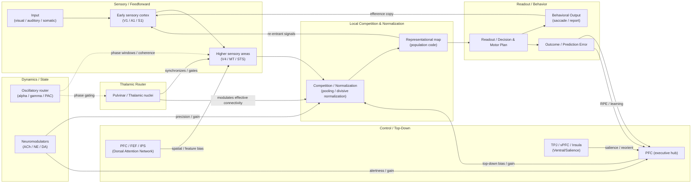

> *How attention gates flow. Блоки: feedforward sensory flow; локальная конкуренция и нормализация; top-down контролирующие сети (DAN/VAN/PFC); routing (pulvinar) и state modulators (oscillations, neuromodulators); стрелки показывают направленные модификации потока информации.*

---

### 9.4 Модели внимания — от «фонарика» до predictive coding

* **Spotlight / zoom-lens (Posner)** — внимание как фокус/фонарик, усиливающий обработку в выделенном пространстве; простая и интуитивная метафора, полезна для психофизических задач. ([Psychological and Brain Sciences][180])
* **Biased competition (Desimone & Duncan)** — см. §9.3.1 — глубокая нейрофизиологическая интерпретация spotlight-эффектов через локальную конкуренцию и top-down bias. ([Annual Reviews][181])
* **Normalization / gain models (Reynolds & Heeger)** — даёт количественные предсказания о том, когда внимание проявится как contrast-gain vs response-gain. ([ScienceDirect][189])
* **Predictive coding / precision-weighting (Friston et al.)** — внимание трактуется как увеличение «precision» (weights) предсказательных сигналов или prediction errors; neuromodulators (ACh, NE) и top-down signals управляют весами ошибок, формально связывая внимание и инференцию. Это даёт объединяющую вычислительную рамку, совместимую с некоторыми наблюдениями о gain/variance modulation. ([Nature][195], [arXiv][196])

Каждая модель объясняет разные эмпирические замечания; современная литература склоняется к синтезу: attention ≈ (top-down bias) + (gain/normalization) + (routing via thalamus/oscillations) + (precision-modulation в predictive-coding терминах). ([Frontiers][183], [ScienceDirect][189])

---

### 9.5 Эмпирические сигнатуры (что искать в данных)

* **Single-unit / population**: увеличение firing rate для attended стимула, уменьшение ответа на отвлекающие стимулы при конкуренции; изменение trial-to-trial reliability и снижение коррелированности шума (attention reduces noise correlations). ([Cell][197])
* **LFP / EEG/MEG**: усиление gamma-синхронии между релевантными узлами; локальное повышение alpha в нерелевантных зонах; фазовая зависимость spike-производительности при attention. ([PMC][192])
* **fMRI / Large-scale networks**: вовлечение DAN при целенаправленной внимательной задаче; VAN/insula/dACC при внезапном переключении/сальентности; изменения функциональной/эффективной связности между контролирующими и сенсорными узлами. ([PubMed][185])
* **Causal вмешательства**: microstimulation / TMS / optogenetics — FEF microstimulation усиливает V4-ответы и улучшает поведение; это прямое доказательство causal influence от control-узлов на сенсорную обработку. ([europepmc.org][187], [PubMed][198])

---

### 9.6 Экспериментальные методы и рекомендуемые дизайны для проверки механизмов

1. **Top-down causal tests:** microstimulation / TMS (FEF, IPS) + simultaneous V4/electrophysiology or fMRI to test gating and gain predictions. (Moore & Armstrong 2003). ([europepmc.org][187])
2. **Thalamic role:** simultaneous recordings pulvinar ↔ visual cortex during attention tasks; use reversible inactivation/optogenetic perturbation to assess effect on inter-areal synchrony and behavioral selection (Saalmann et al.; Zhou review). ([PubMed][190], [PMC][191])
3. **Oscillatory gating:** analyze spike–LFP phase relationships, cross-area coherence in alpha/gamma bands, manipulate phase via rhythmic stimulation (tACS/optogenetics) to test causality of phase windows for effective communication. ([PMC][192], [Frontiers][193])
4. **Computational tests:** fit normalization / gain models to single-unit data across contrast/competition conditions; compare with precision-weighting predictions from predictive coding models (use DCM/EC frameworks for effective connectivity). ([ScienceDirect][189], [Nature][195])

---

### 9.7 Взаимосвязь с нейромодуляцией и состояниями (коротко)

Нейромодуляторы (ACh, NE) управляют демпфированием/фазовой готовностью, изменяют gain и precision: LC-NE — adaptive gain/alerting; cholinergic systems усиливают сенсорную дискриминацию и снижают корковую «предсказательную» инерцию. Эти механизмы сочетаются с сетевыми эффектами внимания. ([PubMed][194])

---

### 9.8 Ограничения, конфликты и открытые вопросы (на 2025)

* **Как согласовать разные уровни объяснения?** (поведенческие spotlight vs микроскопические механизмы): нужен количественный мост между normalization/gain, thalamic routing и predictive-coding precision. ([ScienceDirect][189], [Nature][195])
* **Роль pulvinar:** пока есть поддержка идеи gating/synchrony, но нужны causal экспериментальные манипуляции с высокой временной и пространственной точностью (включая species comparisons). ([PubMed][190], [PMC][191])
* **Oscillations — cause or epiphenomenon?** Сильные корреляции есть, но causal tests (фазовое стимулирование) ещё в развитии; механизмы перевода фазовой модуляции в реальные изменения информации остаются частично неясными. ([PMC][192])
* **Нейромодуляция ↔ attention:** как phasic vs tonic neuromodulator-signals конвертируются в локальные precision-weights и когда они взаимодействуют с normalization? Требуются multi-site recordings + manipulations (optogenetics + behavior). ([PubMed][194])

---

### 9.9 Практические рекомендации - план исследований

* Ясно разграничивайте: (i) наблюдаемые эффекты (rate/conv response, coherence, BOLD-activation), (ii) механистические гипотезы (gain/normalization, gating, precision), (iii) causal-tests (microstimulation, optogenetics, inactivation). Собирайте мульти-модальные датасеты (spikes + LFP/EEG + fMRI/behavior) для перекрестной валидации. ([Cell][197], [PMC][191])
* В аннотациях к статьям приводите конкретные предсказания (что изменится при блокаде pulvinar, при модификации alpha-фазы, при FEF-stimulation) — это делает обзор практически полезным и проверяемым. ([europepmc.org][187], [PMC][192])

---

### 9.10 «Must-read» (якоря для раздела — базовая библиография)

* Posner M. I., *Orienting of attention.* Q J Exp Psychol (1980). ([Psychological and Brain Sciences][180])
* Desimone R. & Duncan J., *Neural mechanisms of selective visual attention.* Annu. Rev. Neurosci. (1995). ([Annual Reviews][181])
* Corbetta M. & Shulman G. L., *Control of goal-directed and stimulus-driven attention in the brain.* Nat Rev Neurosci (2002). ([PubMed][185])
* Reynolds J. H. & Heeger D. J., *Normalization model of attention.* Neuron (2009). ([ScienceDirect][189])
* Moore T. & Armstrong K. M., *Selective gating of visual signals by microstimulation of frontal cortex.* Nature (2003). ([europepmc.org][187])
* Saalmann Y. B. et al., *Pulvinar regulates information transmission between cortical areas based on attention demands.* Science (2012). ([PubMed][190])
* Fries P., *Rhythms for cognition: communication through coherence.* Neuron (2015). ([PMC][192])
* Jensen O. & Mazaheri A., *Shaping functional architecture by oscillatory alpha activity.* Trends Cogn Sci (2010). ([Frontiers][193])
* Lindsay G. W., *Attention in psychology, neuroscience, and machine learning.* Front. Comput. Neurosci. (2020) — обзор, связывающий биологию и ML-модели внимания. ([Frontiers][183])

[180]: https://www2.psychology.uiowa.edu/faculty/hollingworth/prosem/scan_posner_1980.pdf   "Orienting of attention"
[181]: https://www.annualreviews.org/content/journals/10.1146/annurev.ne.18.030195.001205   "Neural Mechanisms of Selective Visual Attention"
[182]: https://cerebellum.vis.caltech.edu/~cns247/cns_247_2009/_reading/Attention/MooreT2003nature.pdf   "Selective gating of visual signals by microstimulation of ..."
[183]: https://www.frontiersin.org/journals/computational-neuroscience/articles/10.3389/fncom.2020.00029/full   "Attention in Psychology, Neuroscience, and Machine ..."
[184]: https://pmc.ncbi.nlm.nih.gov/articles/PMC6506396/   "The role of alpha oscillations in spatial attention"
[185]: https://pubmed.ncbi.nlm.nih.gov/11994752/   "Control of goal-directed and stimulus-driven attention in the ..."
[186]: https://pmc.ncbi.nlm.nih.gov/articles/PMC2899886/   "Saliency, switching, attention and control: a network model ..."
[187]: https://europepmc.org/article/med/12540901   "Selective gating of visual signals by microstimulation ..."
[188]: https://graphics.cs.cmu.edu/courses/16-899A/2014_spring/thevisualworld/ReynoldsDesimone2003Neuron.pdf   "Interacting Roles of Attention and Visual Salience in V4"
[189]: https://www.sciencedirect.com/science/article/pii/S0896627309000038   "The Normalization Model of Attention"
[190]: https://pubmed.ncbi.nlm.nih.gov/22879517/   "The pulvinar regulates information transmission between ..."
[191]: https://pmc.ncbi.nlm.nih.gov/articles/PMC4723640/   "Pulvinar-Cortex Interactions in Vision and Attention - PMC"
[192]: https://pmc.ncbi.nlm.nih.gov/articles/PMC4605134/   "Rhythms For Cognition: Communication Through Coherence"
[193]: https://www.frontiersin.org/journals/human-neuroscience/articles/10.3389/fnhum.2010.00186/full   "Shaping Functional Architecture by Oscillatory Alpha Activity"
[194]: https://pubmed.ncbi.nlm.nih.gov/26447583/   "Rhythms for Cognition: Communication through Coherence"
[195]: https://www.nature.com/articles/nrn2787   "The free-energy principle: a unified brain theory?"
[196]: https://arxiv.org/pdf/2107.12979   "predictive coding: a theoretical and experimental review"
[197]: https://www.cell.com/neuron/fulltext/S0896-6273%2807%2900449-7   "Differential Attention-Dependent Response Modulation ..."
[198]: https://pubmed.ncbi.nlm.nih.gov/13679398/   "Microstimulation of the frontal eye field and its effects on ..."

---

## 10. Память: рабочая, эпизодическая, семантическая, неявная 

Ниже — межуровневый, академический обзор типов памяти, их нейроанатомии, моделей рабочей памяти, механизмов консолидации (replay, роль сна) и практических/методологических замечаний. Текст ориентирован на читателя-исследователя: каждое ключевое утверждение снабжено ссылкой на авторитетную публикацию (классика + современные обзоры до 2024–2025).

---

### 10.1 Таксономия типов памяти — кратко и функционально

* **Сенсорная память** — очень кратковременное удержание сенсорной информации (миллисекунды–секунды), обеспечивает краткие следы входов до их дальнейшей обработки.
* **Рабочая память (working memory, WM)** — кратковременное удержание и манипуляция информации для текущих задач (секунды–десятки секунд). WM обеспечивает временный буфер и контрольный доступ для планирования, принятия решений и речевых операций.
* **Долговременная память (LTM)** делится традиционно на:

  * **Декларативную (явную)** — эпизодическая (события, сцены с контекстом «где/когда») и семантическая (факты и понятия).
  * **Недекларативную (неявную)** — процедурная (навыки, привычки), перцептуальная и ассоциативная память, обусловленная базальными ганглиями/мозжечком и прочими структурами.
    Эту функциональную деляющую линию подкрепляют как нейропсихологические данные («больной H.M.» — потеря недавней декларативной памяти после MTL-резекции), так и экспериментальные парадигмы у животных и людей. ([PMC][199])

---

### 10.2 Нейроанатомия памяти — основные структуры и их вклад

* **Гиппокамп и медиальная височная доля (MTL).** Критичны для формирования новых эпизодических (декларативных) воспоминаний и для временной локализации следов. Классический клинический пример — H.M. (Scoville & Milner) — демонстрирует селективную амнезию новых фактов/событий после двусторонней резекции MTL. На уровне нейрофизиологии гиппокамп кодирует последовательности событий и места (place cells), участвует в консолидировании следов в кору. ([PMC][199])
* **Префронтальная кора (PFC).** Ведущая роль в рабочей памяти, контроле доступа, поддержании правил и целевого представления; PFC участвует в поддержке task-relevant информации и в top-down контроле консолидации/вспоминания. ([PMC][200])
* **Базальные ганглии (BG) и мозжечок.** BG — ядро процедурной/habit-памяти и в формах навыкового обучения; мозжечок участвует в моторном обучении и автоматизации навыков. ([PMC][201], [PubMed][202])
* **Неокортекс (универсальная роль).** Cortex хранит долгосрочные представления (семантика, перцептуальные шаблоны) и принимает участие в системной консолидации, когда следы из гиппокампа перезаписываются/репрезентуются корой с течением времени. ([PMC][203])

---

### 10.3 Рабочая память: конкурирующие модели и текущие данные

#### 10.3.1 Persistent-activity (reverberation) models

Классическая модель WM предполагает, что информация удерживается за счёт устойчивой «постоянной» повышенной активности нейронов в задержке (persistent firing) — наблюдаемая, например, в PFC при задачах задержки. Такие persistent states можно реализовать в рекуррентных сетях с позитивной обратной связью (аттракторные сети). ([ScienceDirect][204])

#### 10.3.2 Activity-silent / synaptic models

Альтернативная и дополняющая гипотеза предлагает, что информация может храниться в «тихих» (activity-silent) состояниях, например в форме короткосрочных изменений в синаптических эффективностях (synaptic facilitation / residual calcium) или в конфигурации функциональных связей, и реконсультироваться (read out) при необходимости всплеском активности. Mongillo et al. (2008) представили синопсис синопти-тного механизма на базе кальций-опосредованной фасилитации; эмпирические данные (мульти-site, decoding analyses, perturbations) поддерживают существование обоих режимов в разных задачах/условиях, что предполагает гибридную архитектуру WM (persist + silent). ([Наука][205], [PMC][200])

#### 10.3.3 Современный синтез

Последние обзоры и эксперименты (ее.g., Stokes 2015; Kamiński et al. 2019) предлагают, что мозг использует и persistent, и activity-silent формы в зависимости от потребностей задания (надёжность, энергозатраты, необходимость немедленного реагирования) — динамическая кодировка, где представления могут переходить между активностью и синаптическими следами. ([ScienceDirect][204], [PMC][200])

**Практическое следствие.** Эксперименты по WM должны включать многоканальную запись (spikes + LFP), decoding и causal-манипуляции (TMS/optogenetics) для тестирования необходимости persistent firing vs скрытых следов. ([ScienceDirect][204])

---

### 10.4 Эпизодическая и семантическая память — формирование и хранение

* **Эпизодическая память** зависит от способности связать содержание события с контекстом (специфичность «где/когда»). Хиппокамп служит «индексирующей» системой, связывающей распределённые корковые следы; с течением времени часть следа «переносится» и интегрируется в кору (systems consolidation). ([PMC][203], [Nature][206])
* **Семантическая память** (факты) постепенно становится менее зависимой от MTL и хранится в корковых сетях (temporal/frontal regions), хотя детали и механизмы трансформации эпизодических следов в семантические остаются предметом исследования (multiple trace vs standard consolidation debates). ([PMC][203])

---

### 10.5 Неявная (procedural) память — базальные ганглии и автоматизация

Процедурные навыки (навыки вождения, игра на инструменте) со временем переходят в автоматизированные формы, которые зависят от базальных ганглий, моторной коры и мозжечка. Исследования lesion / imaging ясно показывают расщепление между системами декларативной и процедурной памяти — пациенты с MTL-повреждением сохраняют способность к некоторому формам обучения навыкам, тогда как повреждение striatum нарушает habit learning. ([PMC][201], [PubMed][202])

---

### 10.6 Консолидация: replay, systems consolidation и роль сна

#### 10.6.1 Replay (реактивация)

Наблюдение: последовательности нейронной активности, специфичные для поведения (place cell sequences), повторяются (replay) во время сна или покоя — это было показано в классической работе Wilson & McNaughton (1994) и множеством последующих исследований. Replay рассматривается как механизм переноса и укрепления синаптических связей (offline rehearsal), что способствует системной консолидации и интеграции следов в кору. ([PubMed][207], [Наука][208])

#### 10.6.2 Сон и его вклад

Сон (NREM и REM стадии) играет ключевую роль в консолидации: slow-wave sleep (SWS) и sharp-wave ripples в гиппокампе ассоциированы с реконсолидацией и переносом информации, REM — с интеграцией и переработкой эмоционного/перцептуального контента. Обзор Diekelmann & Born (2010) и многочисленные эмпирические исследования подчёркивают, что сон улучшает как количественную, так и качественную память; манипуляции replay во сне могут улучшать или ослаблять постобучение (targeted memory reactivation studies). ([Nature][206], [PubMed][209])

#### 10.6.3 Systems consolidation

Со временем следы эксплицитно переходят от гиппокампа к кортикальным схемам (разные теории — standard consolidation vs multiple trace / transformation theory описывают детали и предсказания), но общий эмпирический консенсус — MTL важен для недавней декларативной памяти, а cortex — для отдалённых, обобщённых представлений. ([PMC][203])

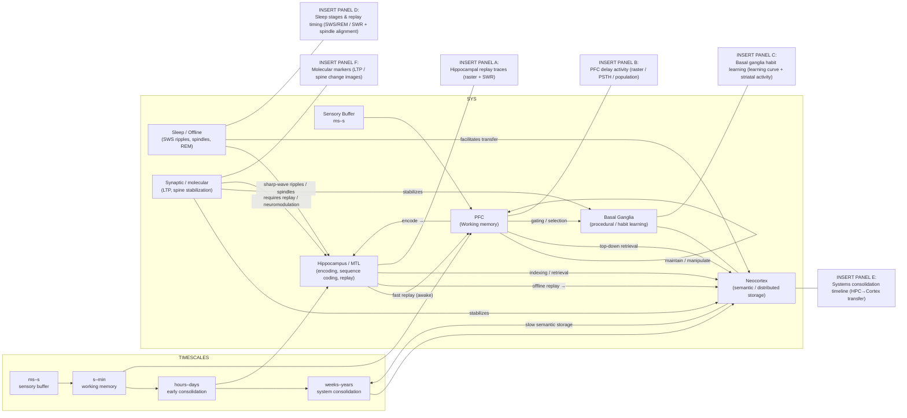

> **Системы памяти и временные шкалы.** Схема ключевых участков, вовлечённых в разные типы памяти, и основные направления их взаимодействия (encoding, replay, consolidation, retrieval, habit transfer). Стрелки показывают быстрое кодирование в PFC/Hippocampus, offline-replay из гиппокампа и постепенный перенос следов в кору, а также путь процедурного обучения через базальные ганглии. Эмпирические панели A–F:  
> A) hippocampal replay + SWR (растр + LFP/ripple, примеры awake/ sleep replay);  
> B) PFC delay activity (rasters / PSTH и low-dimensional population trajectories для задержки);  
> C) striatal habit learning (кривая обучения и изменение стриатальной активности при переходе к привычке);  
> D) сон и временное распределение replay (hypnogram, плотность SWR/спиндлов по стадиям сна);  
> E) timeline системной консолидации (HPC→cortex: зависимость от времени, эффекты лезий/деградации);  
> F) молекулярные механизмы (LTP / spine stabilization / synaptic tagging — примерные данные по ингибированию белкового синтеза).

---

### 10.7 Молекулярные и синаптические основания долговременных следов

* **Late-LTP, белковосинтез и структурная стабилизация (spine stabilization)** — широкий консенсус о том, что длительная консолидация требует транскрипции/трансляции и стабильной перестройки синаптической архитектуры (стволовые белковые каскады, PRPs, synaptic tagging and capture).
* **Engram research (tagging/manipulation).** Современные методы (activity-dependent tagging + optogenetic manipulation) позволяют маркировать наборы нейронов, активированных при обучении (engram cells), и показывать sufficiency/necessity для воспоминания — это усиливает модель с распределёнными, манипулируемыми следами в мозге.

---

### 10.8 Методологические замечания и лучшие практики

1. **Диссоциируйте форму памяти и её стадию** (encoding vs consolidation vs retrieval). Эксперименты должны контролировать время относительно обучения и состояние (сон/бдение). ([Nature][206])
2. **Комбинируйте методы**: lesion/clinical data (H.M.), single-unit/population ephys (replay/place cells), imaging (fMRI, MRS) и causal manipulation (optogenetics, TMS) для возведения причинных связей. ([PMC][199], [Наука][208])
3. **Валидация моделей WM**: use decoding, perturbation (TMS in humans, optogenetics in animals) to test whether information is stored in persistent activity or in silent/synaptic states. ([ScienceDirect][204], [Наука][205])
4. **Различайте память и производные процессы** (внимание, восприятие, планирование) — многие поведенческие проявления памяти опосредованы этими конструктами и требуют контроля. ([PMC][200])

---

### 10.9 Открытые вопросы и направления на 2025

* **Какие условия определяют переключение между persistent и activity-silent WM?** Необходимы multi-site recordings и временные манипуляции neuromodulators. ([ScienceDirect][204], [PMC][200])
* **Как именно replay приводит к синаптической трансформации и каково соотношение между корректировкой связей и offline-reinstatement?** (вопрос о дирижирующих молекулах и пространственно-временных масштабах). ([Наука][208], [Nature][206])
* **Как эпизодическая информация трансформируется в семантическую и какие механизмы системной трансформации вовлечены на уровне кортекса?** Нужны долгосрочные longitudinal imaging + molecular tracing. ([PMC][203])

---

### 10.10 Ключевые «must-read» источники (якоря)

* Scoville W. B., Milner B., *Loss of recent memory after bilateral hippocampal lesions.* J Neurol Neurosurg Psychiatry (1957). ([PMC][199])
* O’Keefe J., Nadel L., *The Hippocampus as a Cognitive Map.* (1978). ([cmor-faculty.rice.edu][210])
* Wilson M. A., McNaughton B. L., *Reactivation of hippocampal ensemble memories during sleep.* Science (1994). ([Наука][208])
* Diekelmann S., Born J., *The memory function of sleep.* Nat Rev Neurosci (2010). ([Nature][206])
* Stokes M. G., *Activity-silent working memory in prefrontal cortex: a dynamic coding framework.* Trends Cogn Sci (2015). ([ScienceDirect][204])
* Mongillo G., Barak O., Tsodyks M., *Synaptic theory of working memory.* Science (2008). ([Наука][205])
* Eichenbaum H., *The role of the hippocampus in navigation is memory.* J Neurophysiol / review (2017). ([PMC][203])
* Foerde K., *The role of the basal ganglia in learning and memory.* (review). ([PMC][201])

---

#### Итог

Память — мультисистемное явление: разные типы памяти опираются на разные нейробиологические субстраты (MTL ↔ эпизодическая, PFC ↔ рабочая, BG ↔ процедурная, cortex ↔ семантика), а временные и молекулярные механизмы (persistent activity, activity-silent synaptic следы, replay и сон) обеспечивают образование, стабилизацию и интеграцию следов. Современный подход — сочетание многомасштабной записи, causal-вмешательств и теоретически обоснованных моделей (RL, reconsolidation, systems consolidation) для получения полноценной картины. ([PMC][199], [ScienceDirect][204], [Наука][208])

[199]: https://pmc.ncbi.nlm.nih.gov/articles/PMC497229/   "LOSS OF RECENT MEMORY AFTER BILATERAL ..."
[200]: https://pmc.ncbi.nlm.nih.gov/articles/PMC7015771/   "Between persistently active and activity‐silent frameworks"
[201]: https://pmc.ncbi.nlm.nih.gov/articles/PMC3772079/   "The role of the basal ganglia in learning and memory"
[202]: https://pubmed.ncbi.nlm.nih.gov/12052921/   "Learning and memory functions of the Basal Ganglia"
[203]: https://pmc.ncbi.nlm.nih.gov/articles/PMC5384971/   "The role of the hippocampus in navigation is memory - PMC"
[204]: https://www.sciencedirect.com/science/article/pii/S1364661315001023   "Review 'Activity-silent' working memory in prefrontal cortex"
[205]: https://www.science.org/doi/10.1126/science.1150769   "Synaptic Theory of Working Memory"
[206]: https://www.nature.com/articles/nrn2762   "The memory function of sleep"
[207]: https://pubmed.ncbi.nlm.nih.gov/8036517/   "Reactivation of hippocampal ensemble memories during ..."
[208]: https://www.science.org/doi/10.1126/science.8036517   "Reactivation of Hippocampal Ensemble Memories During ..."
[209]: https://pubmed.ncbi.nlm.nih.gov/20046194/   "The memory function of sleep"
[210]: https://www.cmor-faculty.rice.edu/~cox/neuro/HCMComplete.pdf   "The Hippocampus as a Cognitive Map"

---

## 11. Двигательная система и сенсомоторная интеграция 

Ниже — межуровневый, прагматичный обзор ключевых компонентов моторной системы, их вычислительных ролей и механизмов обучения движению. Раздел разбит по подпунктам: моторные карты, роли мозжечка и базальных ганглиев, forward/inverse-модели, sensorimotor prediction, пластичность при обучении движения. Важно: в тексте используются только авторитетные, высоко цитируемые источники (классика + современные обзоры). Ключевые утверждения снабжены ссылками на соответствующие обзоры/работы.

---

### 11.1 Моторные карты: организация и свойства

**Суть и анатомия.** Моторная кора (M1) демонстрирует соматотопическую организацию (homunculus), но при этом локальные представления движений очень гибки: индивидуальные нейроны кодируют не только простую локомоцию отдельных мышц, но и параметры движения (direction, force, muscle synergies). Популяционная активность M1 чаще всего организуется как код параметров движения (population vectors, neural manifolds), а не «жёсткие» карты отдельных мышц. ([ScienceDirect][211], [Johns Hopkins University][212])

**Функциональные следствия.**

* Моторные карты показывают высочайшую пластику при обучении и реабилитации: картографическая ремаппинг происходит при изменениях поведения/тренировки.
* Популяционная динамика (нижеуровневые manifold-подходы) объясняет, как рекуррентные сети M1 генерируют сложные временные паттерны для управления конечностями. ([PMC][213], [shadmehrlab.org][214])

---

### 11.2 Cerebellum — предсказание, коррекция ошибок и скорость обучения

**Классическая роль.** Мозжечок традиционно считается ключевым узлом для координации, точной регулировки и обучения тонких моторных действий; он быстро вычисляет предсказания о сенсорных последствиях команд и участвует в корректировке ошибок на коротких временных масштабах. ([PubMed][215], [PMC][213])

**Forward model hypothesis.** Широко принята идея, что мозжечок реализует forward-модель, предсказывающую сенсорные последствия моторных команд (и тем самым обеспечивающую быстрые коррекции и компенсацию задержек). Эмпирические данные (поведенческие, lesion, нейрофизиологические) и современные обзоры поддерживают эту точку зрения в моторном и нетипично-моторном контексте (prediction for perception/cognition). ([PubMed][215], [PMC][213])

**Пластичность и обучение.** Мозжечок важен для быстрого адаптационного обучения (например, визомоторная адаптация) и для формирования внутренних моделей; нарушение его работы ухудшает коррекцию ошибок и скорость адаптации. ([eLife][216], [PNAS][217])

---

### 11.3 Basal ganglia — выбор действий, обучение по вознаграждению и автоматизация

**Роли.** Базальные ганглии (BG) участвуют в селекции действий, формировании привычек и процедурной памяти; их вычислительная роль часто моделируется в терминах reinforcement learning (action selection / policy evaluation), где сигнал дофамина кодирует ошибку предсказания вознаграждения (RPE), влияя на пластичность стриатума. ([PubMed][218], [PMC][219])

**Контраст с мозжечком.** Если мозжечок — главный «предсказатель» краткосрочных сенсорно-моторных последствий и исполнитель точных коррекций, то BG — «учитель» для выбора и автоматизации действий, особенно там, где важны вознаграждение и последовательности. Обе системы взаимодействуют с корой и друг с другом, образуя комплементарные пути обучения и исполнения. ([Johns Hopkins University][212], [ScienceDirect][220])

---

### 11.4 Inverse / Forward модели — вычислительная архитектура контроля

**Forward models (передние модели).** Преобразуют моторный план (команду) в предсказанные сенсорные последствия; используются для предсказания состояния при наличии задержек и шумов, а также для вычисления ошибок предсказания (prediction errors) для адаптации. (Kawato, Wolpert, Shadmehr). ([PubMed][221])

**Inverse models.** Обратные модели преобразуют требуемую траекторию/конечное состояние в моторную команду; в сложных системах мозг, по предположению, реализует набор пар forward–inverse моделей (modular paired models) для разных контекстов/динамик. ([PubMed][215])

**Практический синтез.** Современные теории (и эмпирические данные) поддерживают идею множественных, параллельных forward/inverse моделей, динамически выбираемых или смешиваемых в зависимости от контекста. Это объясняет быстроту адаптации и способность переносить обучение между задачами. ([PNAS][217], [Wolpert Lab][222])

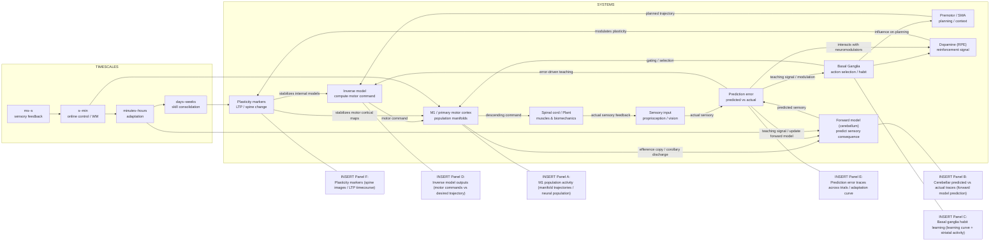

> **Внутренние модели и пути сенсомоторной интеграции.** Ключевые функциональные блоки: планирование (premotor/SMA), инверсная модель (inverse model), первичная моторная кора (M1), спинной моторный аппарат (plant), передняя (forward) модель (мозжечок), сигнал предсказания/ошибки (prediction error), базальные ганглии (выбор/habit) и молекулярные маркеры пластичности. Стрелки обозначают основные потоки информации: план → команда → исполнитель (efferent), копия эфферента (efference copy) → forward model → предсказанная сенсорика, сравнение предсказания с реальным фидбеком → ошибка предсказания → обновление моделей и влияние на BG (reinforcement/selection). Панели A–F с эмпирическими иллюстрациями:  
> **A.** M1 population activity (manifold / траектории популяции, примеры rasters/PSTH, привязанные к кинематике);  
> **B.** Cerebellar forward prediction (предсказанный vs фактический сенсорный след в отдельных траях, residual error trace);  
> **C.** Basal ganglia habit learning (кривая обучения, изменение стриатальной активности при переходе к привычке);  
> **D.** Inverse model outputs (команда vs требуемая траектория; пример trial и fit модели);  
> **E.** Prediction error traces и адаптационная кривая (trial-by-trial error, скорость адаптации);  
> **F.** Маркеры пластичности (изменение spine density, LTP timecourse, примеры иммунометки).

---

### 11.5 Sensorimotor prediction — ошибка предсказания как учебный сигнал

**Error-based learning.** Основной движущий фактор адаптации — сенсорная ошибка (sensory prediction error): отличие между ожидаемым и фактическим сенсорным следствием действия. Эти ошибки используются для обновления внутренних моделей (forward/inverse) и корректировки моторных команд. Shadmehr и соавторы обобщали роль ошибок и механизмов коррекции в адаптации. ([PubMed][223], [Группы Гарварда][224])

**Нейронные подписи.** Сигналы об ошибке обнаруживаются в мозжечке, моторной коре и стриатуме; дофаминергические сигналы (в BG) кодируют компоненту вознаграждения/оценки исхода, взаимодействуя с error-signals сенсорной природы. ([PMC][213], [PubMed][218])

---

### 11.6 Пластичность при обучении движения — механизмы и временные шкалы

**Адаптация vs обучение навыков.** В моторном обучении различают: (i) быструю адаптацию (коррекция смещений/воздействий — минут/часы), (ii) медленное обучение навыков/последовательностей (дни–недели) с переносом и автоматизацией. Эти процессы опираются на разные механизмы и структуры (мозжечок — быстрая калибровка; BG/ моторная кора — навыки и последовательности). ([PubMed][218], [Johns Hopkins University][212])

**Синаптические и системные механизмы.** На клеточном уровне — LTP/LTD в корковых и подкорковых схемах, ремоделирование дендритных спайнов, изменение миелинизации для оптимизации синхронизации и conduction delays; на системном уровне — перераспределение вклада гиппокампа/коры/стрiатума при консолидации навыка. ([ScienceDirect][220], [eLife][216])

**Роль поведенческой структуры обучения.** Обучение зависит от структуры задач (error types, feedback, variability); современные работы подчёркивают, что интервенции в обратную связь (задаваемая вариабельность, шум) изменяют режимы обучения (exploration vs exploitation) и скорость пластичности. ([eLife][216])

---

### 11.7 Интеграция и взаимодействие компонентов (cortex ⇄ cerebellum ⇄ BG)

**Архитектура взаимодействия.** Кора посылает командные сигналы и контекст в BG и мозжечок; мозжечок быстро прогнозирует и корректирует, BG участвует в селекции и reinforcement-обучении; кора интегрирует долгосрочные представления и контролирует стратегию. Эти подсистемы реализуют комплементарные вычислительные стратегии (коррекция ошибок, выбор политики, хранение контроля). ([Wolpert Lab][222], [PubMed][218])

**Динамическая координация.** Во время обучения и исполнения наблюдается изменение связности и синхронности между этими узлами (LFP/EEG/fMRI/optogenetic data), отражающее переходы контроля (консолидация/автоматизация). ([ScienceDirect][220], [jneurosci.org][225])

---

### 11.8 Методологические рекомендации и экспериментальные подходы

1. **Разделяйте процессы адаптации и освоения навыка** в дизайне эксперимента (краткосрочная vs долгосрочная переобучаемость). ([PubMed][218])
2. **Используйте multi-site записи** (M1, premotor, cerebellum, striatum) + behavioral kinematics + perturbations (TMS/optogenetics, cerebellar stimulation) для causal tests forward/inverse hypotheses. ([PubMed][215], [jneurosci.org][226])
3. **Применяйте computational models** (state-space, Kalman/optimal control, forward/inverse architectures) и fit them to behavior/neural data to extract latent learning rates and error terms. ([Группы Гарварда][224], [Wolpert Lab][222])
4. **Измеряйте plasticity across scales**: electrophysiology (LTP/LTD markers), longitudinal imaging (spine dynamics, myelination changes), and behavioral retention tests. ([ScienceDirect][220], [eLife][216])

---

### 11.9 Открытые вопросы и направления на 2025

* **Как именно мозг реализует переключение между множественными internal models (context selection)?** (требуются multi-context training paradigms + recordings). ([PNAS][217])
* **Как взаимодействуют cerebellar forward predictions и dopaminergic reinforcement signals из BG при сложном обучении последовательностей?** ([PMC][213], [PubMed][218])
* **Какая роль миелиновoй пластичности в ранних стадиях освоения навыка и насколько быстро изменения проводимости становятся функционально значимыми?** (longitudinal in vivo studies). ([eLife][216])

---

### 11.10 Ключевые «must-read» источники

* Kawato M., *Internal models for motor control.* (review). 1998. ([PubMed][221])
* Wolpert D. M., Miall R. C., Kawato M., *Multiple paired forward and inverse models for motor control.* (reviews). 1998/2011. ([PubMed][215], [Wolpert Lab][222])
* Shadmehr R., Smith M. A., Krakauer J. W., *Error correction, sensory prediction, and adaptation in motor control.* Annu Rev Neurosci (2010). ([PubMed][223], [Группы Гарварда][224])
* Krakauer J. W. et al., *Motor learning.* (review, 2019). ([PubMed][218])
* Streng ML & others, *Cerebellar representations of errors and internal models.* (review, 2022). ([PMC][213])
* Honda T. et al., *Tandem internal models execute motor learning in the cerebellum.* PNAS (2018). ([PNAS][217])
* Hardwick RM et al., *Meta-analysis of motor learning neuroimaging.* (2013). ([ScienceDirect][220])

---

#### Резюме

Двигательная система — распределённая, адаптивная и вычислительно многоуровневая: моторная кора реализует популяционные коды и manifolds для управления, мозжечок быстро предсказывает и корректирует сенсорно-моторные последствия (forward models), базальные ганглии обеспечивают селекцию действий и reinforcement-обучение, а пластичность на разных временных шкалах (синаптическая, структурная, миелиновая) реализует адаптацию и освоение навыков. Интеграция вычислительных моделей (forward/inverse, Kalman/optimal control) с мульти-модальными записями и causal-вмешательствами — путь к глубокому пониманию сенсомоторной интеграции и моторного обучения. ([PubMed][215])

[211]: https://www.sciencedirect.com/science/article/pii/S0896627311008919   "Computational Mechanisms of Sensorimotor Control"
[212]: https://pure.johnshopkins.edu/en/publications/motor-learning   "Motor learning"
[213]: https://pmc.ncbi.nlm.nih.gov/articles/PMC9420826/   "Cerebellar Representations of Errors and Internal Models"
[214]: https://www.shadmehrlab.org/publications   "Publications of Shadmehr Lab"
[215]: https://pubmed.ncbi.nlm.nih.gov/21227230/   "Internal models in the cerebellum"
[216]: https://elifesciences.org/articles/91839   "Fundamental processes in sensorimotor learning"
[217]: https://www.pnas.org/doi/10.1073/pnas.1716489115   "Tandem internal models execute motor learning in the ..."
[218]: https://pubmed.ncbi.nlm.nih.gov/30873583/   "Motor Learning"
[219]: https://pmc.ncbi.nlm.nih.gov/articles/PMC8793168/   "Updates in Motor Learning: Implications for Physical ..."
[220]: https://www.sciencedirect.com/science/article/pii/S1053811912011329   "A quantitative meta-analysis and review of motor learning ..."
[221]: https://pubmed.ncbi.nlm.nih.gov/9949827/   "Internal models for motor control"
[222]: https://wolpertlab.neuroscience.columbia.edu/sites/default/files/content/papers/FraWol11.pdf   "Computational Mechanisms of Sensorimotor Control"
[223]: https://pubmed.ncbi.nlm.nih.gov/20367317/   "Error correction, sensory prediction, and adaptation in ..."
[224]: https://groups.seas.harvard.edu/motorlab/Reprints/annualrev10_unformatted.pdf   "Error Correction, Sensory Prediction, and Adaptation in ..."
[225]: https://www.jneurosci.org/content/43/45/7554   "Cognitive-Affective Functions of the Cerebellum"
[226]: https://www.jneurosci.org/content/36/17/4832   "The Neural Feedback Response to Error As a Teaching ..."

---

## 12. Принятие решений, исполнительные функции, PFC и BG 

Ниже — комплексный межуровневый обзор по нейробиологии принятия решений и исполнительных функций, с фокусом на: последовательные модели аккумулации (drift-diffusion), нейронные интеграторы, роль базальных ганглиев (action selection), противостояние model-based / model-free RL, представление неопределённости, и вклад префронтальной коры в контроль. Для каждой подсекции — концепт, ключевые эмпирические/модельные результаты, типичные методики и практические рекомендации.

---

### 12.1 Обзор: что мы понимаем под «decision neuroscience»

Принятие решений в нейробиологии изучает, как нейронные сети аккумулируют и представляют доказательства, сравнивают опции, оценивают риски/выгоды, выбирают действие и реализуют контроль (контекст, правила, торможение). Эксперименты часто используют задачи двухальтернативного выбора (2AFC) с измерением времен реакции и нейрофизиологией (LIP/FEF/PFC/striatum). Основной императив — связывать нормативные/компьютационные модели с нейронной реализацией и поведением. ([PubMed][227], [PMC][228])

---

### 12.2 Sequential accumulation models — Drift-Diffusion и их нейронная реализация

#### Концепт

* **Drift-Diffusion Model (DDM)** формализует 2AFC как стохастическую аккумулацию «evidence» до порога; DDM даёт точные предсказания распределений RT и accuracy и широко используется как нормативный бенчмарк. ([PMC][228], [PubMed][229])

#### Нормативная интерпретация

* DDM связан с оптимальными процедурами последовательного тестирования (SPRT) и служит удобной редукцией для сложных байесовских задач принятия решения. ([PubMed][229])

#### Нейронные корреляты

* В работах по перцептуальным задачам (например, в LIP у макак) наблюдается «build-up» firing, согласующийся с аккумулацией доказательств; изменение качества стимула/шумности модифицирует «drift» и RT-статистику. ([PubMed][227], [cns.nyu.edu][230])

**Практическая заметка:** fit DDM к поведенческим данным, затем тестируйте trial-by-trial корреспонденцию между компонентами DDM (drift, bound, non-decision time) и нейронным decision variable. ([PMC][231])

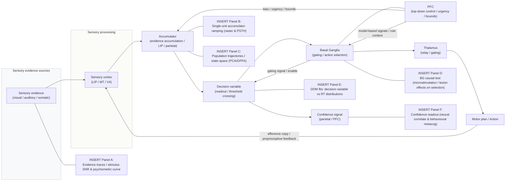

> **Поток принятия решения: накопление доказательств → выбор → действие (PFC↔BG петли).** Схема показывает основные этапы преобразования сенсорных сигналов в действие: поступление сенсорных доказательств (Panel A), их интеграция/накапливание в париетальных/премоторных областях (ACCUMULATOR; Panel B), отображение популяционной динамики и low-dimensional траекторий (Panel C), роль базальных ганглиев в гейтировании и выборе действий (Panel D), чтение решающей переменной и её связь с распределением времён реакции/моделью Drift-Diffusion (Panel E), а также нейронные и поведенческие маркеры уверенности (confidence; Panel F). Стрелки обозначают основные информационные потоки: feedforward evidence → accumulator → readout → motor plan, а петли PFC↔BG отражают top-down biasing, gating и взаимодействие model-based/model-free. Для каждой панели укажите N (субъекты/животные), n (trials), статистику (p, CI), единицы осей и scale bars.

---

### 12.3 Neural integrators и аттракторные сети — биофизические реализации аккумулации

#### Концепт

* **Neural integrator** — рекуррентная сеть, сохраняющая и аккумулирующая сигнал (persistent ramping). Биофизические модели (аттракторы, медленная NMDA-опосредованная рекуррентность) реализуют такие интеграторы. ([PubMed][232])

#### Механизмы и связь с DDM

* Модели Wang и др. показывают, как NMDA-mediated slow recurrent excitation и feedback inhibition создают бинарный выбор и ramping, давая эмпирически согласующиеся нейронные статистики; DDM можно понимать как сокращённую (low-dimensional) аппроксимацию таких сетей. ([PubMed][232])

---

### 12.4 Basal ganglia в action selection — архитектура и вычисления

#### Функция

* BG рассматриваются как централизованный «selection device», разрешающий конкуренцию между альтернативами и обеспечивающий gating/инициацию действий через прямой/непрямой пути. ([PubMed][233])

#### RL и BG

* Стриатум — ключевая площадка пластичности: дофаминергические RPE-сигналы кодируют ошибку предсказания вознаграждения и модифицируют вероятность выбора (основания model-free RL). ([PubMed][234], [PMC][235])

#### Модельные реализации

* Численные и аналитические модели (Gurney et al., GPR) формализуют, как конкурентные входы преобразуются через BG в селективный выход; эти модели согласуются с физиологией и поведенческими эффектами при манипуляции BG. ([PubMed][236])

---

### 12.5 Model-based vs Model-free RL — разделение систем контроля

#### Определения

* **Model-free RL** (RPE-driven) — быстрый, экономный; **model-based RL** — использует внутреннюю модель среды для планирования (дорожная карта: Sutton & Barto). ([Stanford University][237])

#### Нейронные корреляты

* Поведенческие парадигмы (например, two-step task) и нейровизуализационные/одиночно-нейронные данные показывают смешанные сигналы: ventral striatum отражает RPE, но также содержит model-based компоненты; PFC/hippocampus участвуют в model-based планировании. ([PMC][238], [PubMed][239])

#### Взаимодействие

* Баланс между системами зависит от времени, когнитивной нагрузки и неопределённости: under pressure/low cognitive resource — bias к model-free; when resources available — model-based computations доминируют. ([PMC][238])

---

### 12.6 Представление неопределённости и контроль эксплорации/эксплойтации

#### Формализм

* Иерархические байесовские модели предсказывают, как агенты оценивают volatility vs noise и адаптируют learning-rate; ACC/PFC кодируют volatility/участие в регулировке learning rates. ([Nature][240])

#### Нейронные кореляты и neuromodulation

* ACC/insula/PFC — коррелаты volatility; LC-NE и дофамин — neuromodulatory сигналы, влияющие на готовность к эксплорации и адаптацию скорости обучения. ([Nature][240], [ScienceDirect][241])

---

### 12.7 PFC: исполнительные функции, контекст и cognitive control

#### Роль PFC

* PFC поддерживает цели и правила, bias-ирует сенсорные и моторные пути (Miller & Cohen), участвует в model-based вычислениях и метаконтроле; PFC↔BG петля реализует gating и обновление. ([PubMed][242])

#### Neural mechanisms

* Population dynamics в PFC (и моторных областях) важно рассматривать на уровне популяций (rotational/transient dynamics, jPCA/GPFA approaches) — для связи с переходами от аккумулации к действию см. Churchland et al. и последующие работы. ([Nature][243], [churchland.zuckermaninstitute.columbia.edu][244])

---

### 12.8 Методы связывания моделей и данных (best practices)

1. Fit behavior + neural data: hierarchical/Bayesian fitting of DDM/RL; проверка trial-to-trial соответствия между параметрами модели и neural signals. ([PMC][231])
2. Single-trial latent methods: GPFA/LFADS/state-space для извлечения скрытых переменных. ([PMC][245], [ScienceDirect][246])
3. Causal perturbations: microstimulation/optogenetics/TMS в PFC/BG/SC/FEF для тестирования necessity/sufficiency. ([PubMed][232])
4. Population dynamics: manifold/jPCA/dPCA для описания переходов от аккумулации к действиям. ([churchland.zuckermaninstitute.columbia.edu][244])
5. Model comparison: use cross-validated predictive metrics, formal model comparison (Bayesian model selection) for model-based vs model-free accounts. ([PMC][238])

---

### 12.9 Взаимосвязь с уверенностью (confidence) и метакогнитивными сигналами

* Confidence correlates with magnitude/dynamics of the decision variable and with metacognitive networks (parietal cortex, rostrolateral PFC); single-unit and human fMRI work (Kiani & Shadlen; Fleming) support distributed encoding of confidence. ([PMC][247], [annualreviews.org][248])

---

### 12.10 Открытые вопросы и направления на 2025

1. Как реализуются оптимальные accumulation-стратегии в многовариантных, динамических средах (collapsing bounds, urgency, multi-alternative DDM)? ([PubMed][229])
2. Где и как конкурируют model-based и model-free сигналы в реальном времени? Нужны simultaneous PFC + striatum записи с causal manipulation. ([PMC][238])
3. Роль сетевой динамики (осцилляции, синхронизация) в routing decision variables между PFC, parietal и BG; требуются phase-specific causal тесты. ([Nature][249])
4. Как NE/DA/ACC сигналы регулируют баланс speed/accuracy и learning rates в естественных условиях volatility? ([Nature][240], [ScienceDirect][241])

---

### 12.11 «Must-read» (якоря для раздела)

* Ratcliff R. — Diffusion models overview; e.g. Ratcliff R. (2008) and Ratcliff classical works. ([PMC][228])
* Bogacz R. et al., *The physics of optimal decision making* (Psychol Rev, 2006). ([PubMed][229])
* Gold J. I., Shadlen M. N., *The neural basis of decision making.* Annu Rev Neurosci (2007). ([PubMed][227])
* Wang X.-J., *Probabilistic decision making by slow reverberation in cortical circuits.* Neuron (2002). ([PubMed][232])
* Miller E. K., Cohen J. D., *An integrative theory of PFC function.* Annu Rev Neurosci (2001). ([PubMed][242])
* Redgrave P., Prescott T. J., Gurney K., *The basal ganglia: a vertebrate solution to the selection problem?* Neuroscience (1999). ([PubMed][233])
* Gurney K., Prescott T., Redgrave P., *A computational model of action selection in the basal ganglia* (2001). ([PubMed][236])
* Sutton R. S., Barto A. G., *Reinforcement Learning: An Introduction* (textbook). ([Stanford University][237])
* Daw N. D. et al., *Model-based influences on human choices and striatal prediction errors.* Neuron (2011). ([PMC][238])
* Behrens T. E. J. et al., *Learning the value of information in an uncertain world.* Nat Neurosci (2007). ([Nature][240])
* Kiani R., Shadlen M. N., *Representation of confidence associated with a decision by neurons in the parietal cortex.* Science (2009). ([PMC][247])
* Churchland M. M. et al., *Neural population dynamics during reaching.* Nature (2012). ([Nature][243])

---

### Резюме

Принятие решений сочетает нормативные алгоритмы (DDM, Bayesian/RL) с биологическими реализациями в рекуррентных сетях (neural integrators), где PFC обеспечивает контроль и model-based вычисления, а BG — fast gating и model-free selection. Для прогресса нужны одновременные многомодальные записи, single-trial/latent анализы и causal perturbations (оптогенетика/микростимуляция/TMS), а также строгая model comparison и hierarchical fitting. ([PubMed][229], [PMC][238])

[227]: https://pubmed.ncbi.nlm.nih.gov/17600525/ "The neural basis of decision making"
[228]: https://pmc.ncbi.nlm.nih.gov/articles/PMC2474742/ "The Diffusion Decision Model: Theory and Data for Two- ..."
[229]: https://pubmed.ncbi.nlm.nih.gov/17014301/ "The physics of optimal decision making: a formal analysis ..."
[230]: https://www.cns.nyu.edu/~tony/vns/readings/gold-shadlen-2007.pdf "The Neural Basis of Decision Making"
[231]: https://pmc.ncbi.nlm.nih.gov/articles/PMC4928591/ "Diffusion Decision Model: Current Issues and History - PMC"
[232]: https://pubmed.ncbi.nlm.nih.gov/12467598/ "Probabilistic decision making by slow reverberation in ..."
[233]: https://pubmed.ncbi.nlm.nih.gov/10362291/ "The basal ganglia: a vertebrate solution to the selection ..."
[234]: https://pubmed.ncbi.nlm.nih.gov/9054347/ "A neural substrate of prediction and reward"
[235]: https://pmc.ncbi.nlm.nih.gov/articles/PMC3176615/ "The dopamine reward prediction error hypothesis - PMC"
[236]: https://pubmed.ncbi.nlm.nih.gov/11417052/ "A computational model of action selection in the basal ..."
[237]: https://web.stanford.edu/class/psych209/Readings/SuttonBartoIPRLBook2ndEd.pdf "[PDF] Reinforcement Learning: An Introduction - Stanford University"
[238]: https://pmc.ncbi.nlm.nih.gov/articles/PMC3077926/ "Model-based influences on humans' choices and striatal ..."
[239]: https://pubmed.ncbi.nlm.nih.gov/21435563/ "Model-based influences on humans' choices and striatal ..."
[240]: https://www.nature.com/articles/nn1954 "Learning the value of information in an uncertain world"
[241]: https://www.sciencedirect.com/science/article/abs/pii/S0959438820301501 "Dopamine, Updated: Reward Prediction Error and Beyond"
[242]: https://pubmed.ncbi.nlm.nih.gov/11283309/ "An integrative theory of prefrontal cortex function"
[243]: https://www.nature.com/articles/nature11129 "Neural population dynamics during reaching"
[244]: https://churchland.zuckermaninstitute.columbia.edu/content/code "Code | churchland-lab - Columbia University"
[245]: https://pmc.ncbi.nlm.nih.gov/articles/PMC5096671/ "Neural Population Dynamics during Reaching Are Better ..."
[246]: https://www.sciencedirect.com/science/article/abs/pii/S0306452298003194 "The basal ganglia: a vertebrate solution to the selection ..."
[247]: https://pmc.ncbi.nlm.nih.gov/articles/PMC2738936/ "Representation of confidence associated with a decision ..."
[248]: https://www.annualreviews.org/content/journals/10.1146/annurev-psych-022423-032425 "Metacognition and Confidence: A Review and Synthesis"
[249]: https://www.nature.com/articles/s41467-017-02791-8 "Gamma and beta bursts during working memory readout ..."

---

## 13. Вознаграждение, мотивация, эмоции (лимбическая система) 

Ниже — межуровневый, практико-ориентированный обзор ключевых компонентов лимбической/мотивационной системы: дофаминергическая RPE-теория и её современные уточнения; orbitofrontal cortex (OFC) и кодирование ценности; амигдала и вальентность; гипоталамические «дрейвы» и домашостаз; интероцепция и рольinsula/передней островковой коры в ощущениях тела. Для каждой подсекции — суть механизма, эмпирические доказательства, вычислительные следствия и краткие рекомендации для исследования. Все положения опираются только на авторитетные, высоко цитируемые источники (включая обзоры вплоть до 2024–2025, где релевантно).

---

### 13.1 Дофамин и сигнал ошибки предсказания вознаграждения (RPE)

**Ключевая идея.** Классическое наблюдение — фаcические выбросы дофаминергических нейронов (VTA / SNc) отражают **reward prediction error** (RPE): положительная фаза при неожиданном вознаграждении, смещение ответа на предвестник по мере обучения, депрессия ответа при отмене ожидаемого вознаграждения. Эта картина была впервые сформулирована и популяризирована Schultz (1997). ([PubMed][250], [Наука][251])

**Современные уточнения.** В последние годы RPE-гипотеза дополнилась и усложнилась: доказано существенное **функциональное и молекулярное разнообразие** дофаминовых нейронов (различные проектные целевые области и подтипы дают разные ответы), часть DA-популяции кодирует не только scalar RPE, но и *distributional* или *feature-specific* сигналы, а также моторные/сенсорные/аверсивные компоненты. Это влечёт последствия для моделей RL в мозгу (distributional RL, feature-RPE). ([PMC][252], [Nature][253])

**Практическая импликация.** При проектировании эксперимента учитывайте гетерогенность DA-популяции (локализация VTA vs SNc, мишени аксонов) и различайте phasic vs tonic компоненты (фазический RPE → обучение; тонус → мотивация/внимание). Эффекты RPE лучше тестировать через манипуляции (оптогенетика, фоторечевод) + поведенческие модели RL. ([PMC][252])

---

### 13.2 OFC (orbitofrontal cortex) — кодирование валентности и субъективной ценности

**Что делает OFC.** OFC широко интерпретируют как узел для представления **субъективной ценности** опций («economic value») и для интеграции сенсорной информации с внутренними мотивационными состояниями; Padoa-Schioppa & Assad (2006) представили одни из ключевых данных о нейронах OFC, кодирующих значение предложения. ([PubMed][254])

**Текущее понимание.** Современные нейронные и популяционные исследования показывают, что OFC кодирует **гетерогенно**: отдельные подпопуляции отражают offer-value, chosen-value, контекстные и исторические переменные; в некоторых задачах OFC участвует и в инференции скрытых свойств среды (inferred value). Появились также данные о слоевой/проекционной организации kodirovaniya ценности. ([PMC][255])

**Функция в поведении.** OFC особенно важна для **обновления значений** при изменчивой среде (reversal learning, outcome revaluation) — пациентские и causal-манипуляционные данные подтверждают необходимость OFC для гибкого изменения предпочтений. ([PMC][256])

---

### 13.3 Амигдала — кодирование вальентности, ассоциации и эмоциональная оценка

**Роль амигдалы.** Амигдала — центральная структура для быстрого присвоения **валентности** (positive/negative) стимулам и для ассоциативного обучения (fear conditioning, reward associations). Janak & Tye (2015) и последующие работы подробно описали микросхемы амидгалы, где разные нейронные пути и субядра кодируют разные аспекты валентности и поведения. ([PubMed][257], [PMC][258])

**Механизмы.** Амигдала участвует в селекции реакций (freeze/flight/approach), формировании эмоциональной памяти и влияют на attention/valuation через прямые проекции в PFC, стриатум, гиппокамп и мозговой ствол. Целевые манипуляции (селективная активация/инактивация подтипов) демонстрируют causal-роль амидгалы в valence-контроле. ([PubMed][257])

---

### 13.4 Гипоталамус — «дрейвы», гомеостаз и интеграция внутреннего состояния

**Ключевая роль.** Гипоталамус — главный центр регуляции внутреннего гомеостаза (голод, жажда, терморегуляция, сон/бодрствование, репродуктивное поведение) и «двигатель» соответствующих мотивированных действий; его специализированные ядра (ARC, LH, VMH, MPOA и др.) реализуют специфические драйвы и посылают сигналы в вентральные мотивационные цепи. ([PMC][259], [Frontiers][260])

**Современные данные.** Высокоспецифичные нейронные популяции (AgRP/POMC в arcuate и др.) показывают селективное кодирование потребностей и быстрое влияние на поведение; современные обзоры и эксперименты (генетические мишени, мониторинг in vivo) описывают динамику и связь гипоталамуса с широкими сетями мотивации и обучением. Новые работы 2024–2025 продолжают уточнять микросхемы и межсистемные связи. ([PMC][261], [Nature][262])

---

### 13.5 Интероцепция, передняя островковая кора (insula) и субъективные чувства

**Концепт.** Интероцепция — ощущение внутреннего состояния тела (сердцебиение, насыщение, дыхание, тошнота и т.д.). Anterior insula / anterior cingulate представляют ключевые корковые узлы для интероцептивной интеграции и мониторинга физиологии, что связывает интероцепцию с эмоциями, мотивацией и принятием решений. Craig (2002) и Critchley (2004) — классические обзорные работы, далее — Garfinkel et al. и др. ([PubMed][263], [PMC][264])

**Функциональные следствия.** Интероцептивные сигналы изменяют субъективную оценку ценности и мотивации (например, чувство голода меняет оценку еды); insula служит «переводчиком» физиологии в контекст субъективной мотивации и влият на принятие решений. ([PMC][264])

---

### 13.6 Интеграция: как эти узлы работают вместе (схема)

* **DA (midbrain) ↔ Striatum / PFC / OFC:** DA подаёт RPE и мотивационные сигналы, влияя на обучение и на выбор; OFC и PFC используют эти сигналы для обновления значений и политики. ([PMC][265], [PubMed][254])
* **OFC ↔ Amygdala:** OFC интегрирует контекст и ожидаемую ценность, амидгала быстро маркирует валентность — их связь важна для гибких оценок и эмоционной модуляции решений. ([PMC][256], [PubMed][257])
* **Hypothalamus → Ventral circuits:** состояние гомеостаза (голод/жажда) модулирует активность NAc/OFC/insula и меняет ценностную шкалу стимулов. ([PMC][259])

Эта интеграция реализует: (i) fast valence tagging (amygdala), (ii) flexible value representation and update (OFC/PFC), (iii) learning signals (DA/RPE), (iv) drive-dependent biasing (hypothalamus/interoception). ([PMC][252], [PubMed][257])

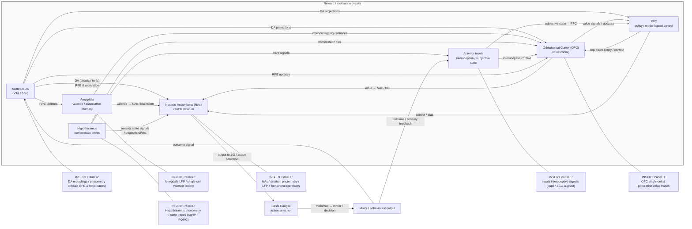

> **Цепи вознаграждения и мотивации.** Схема ключевых узлов мотивационно-вознаградительной сети и их основные проекции: midbrain-дофаминовые нейроны (VTA/SNc) дают phasic RPE и tonic мотивационные сигналы (панель A); orbitofrontal cortex (OFC) кодирует subjective value и обновляет представления ценности (панель B); amygdala быстро маркирует валентность и участвует в ассоциативном обучении (панель C); hypothalamus обеспечивает drive- и homeostatic-signals (панель D); anterior insula интегрирует интероцептивную информацию, масштабируя субъективную ценность (панель E); ventral striatum / NAc связывает value signals с action selection и мотивацией к действию (панель F), далее связка с базальными ганглиями формирует исполнительный вывод. Стрелки показывают основные направления влияния и петли обратной связи (outcome → midbrain → обновление ценности). Для каждой панели вставляйте эмпирические графики (raster / PSTH / LFP / photometry / voltammetry / behavioral curves). 

---

### 13.7 Клиника и трансляция: зависимость, депрессия, расстройства питания

* **Аддикция:** дисфункция дофаминовой системы и пластичности стриатума → сдвиг мотивации и усиление habitual поведения; OFC/insula/AMY дисрегуляция связана с компульсивностью и cue-reactivity. ([Nature][253], [PMC][256])
* **Депрессия / аффективные расстройства:** нарушения в обработке ценности (OFC), reward processing (DA) и интероцепции (insula) — ключевые цепи, на которые нацелены терапевтические вмешательства (фармакология, DBS/TMS). ([PMC][252])
* **Расстройства питания / энергетического баланса:** гипоталамические цепи (AgRP/POMC) и их взаимодействие с reward-системой определяют переедание/снижение аппетита; современные манипуляции дают causal данные. ([PMC][261])

---

### 13.8 Методологические заметки и рекомендации для исследований

1. **Комбинируйте causal и correlative методы.** RPE-гипотезы и OFC-функции выигрывают при сочетании single-unit / photometry / opto + behavioral RL-models. ([PMC][252], [PubMed][254])
2. **Разделяйте мотивацию и обучение.** Тональный DA (мотивация/arousal) и phasic DA (RPE/learning) имеют разные следствия; экспериментальные дизайны должны их декомпоновать. ([PMC][252])
3. **Учитывайте внутренние состояния.** Контроль голода/жажды/времени суток критичен при тестах мотивации и value coding — interoceptive signals существенно меняют neural coding. ([PubMed][263], [PMC][261])

---

### 13.9 Открытые вопросы и направления (на 2025)

* **Как согласовать односкалярный RPE и наблюдаемую гетерогенность DA-ответов?** Нужны высокоплотные одновременные записи/анатомо-транскриптомные соответствия + causal tests (distributional vs vectorial RPE hypotheses). ([PMC][266], [Nature][253])
* **Как OFC и amygdala координируют обновление ценности в меняющейся среде?** (timecourse causal manipulations + laminar/sublayer recordings). ([PMC][256], [PubMed][257])
* **Как interoception и hypothalamic-drives формируют moment-to-moment value scaling?** Требуются simultaneous hypothalamus → cortical recordings + manipulations of internal state. ([PMC][261])

---

### 13.10 «Must-read» (якоря для раздела)

* Schultz W., *A neural substrate of prediction and reward.* Science (1997). ([PubMed][250], [Наука][251])
* Lerner T. N. et al., *Dopamine, Updated: Reward Prediction Error and Beyond.* (review, 2020). ([PMC][252])
* Glimcher P. W., *The dopamine reward prediction error hypothesis: 30 years and counting.* (review, 2011). ([PMC][265])
* Dabney W. et al., *A distributional code for value in dopamine-based reinforcement learning.* (distributional RL, 2020). ([PMC][266])
* Padoa-Schioppa C. & Assad J. A., *Neurons in the orbitofrontal cortex encode economic value.* Nature (2006). ([PubMed][254])
* Enel P. et al., *Heterogeneous value coding in orbitofrontal populations.* (review/analysis, 2021). ([PMC][255])
* Janak P. H. & Tye K. M., *From circuits to behaviour in the amygdala.* Nature Reviews Neuroscience (2015). ([PubMed][257])
* Averbeck B. B. et al., *Hypothalamic interactions with large-scale neural circuits underlying motivated behavior.* (review, 2020). ([PMC][259])
* Craig A. D., *How do you feel? Interoception: the sense of the physiological condition of the body.* Nat Rev Neurosci (2002). ([PubMed][263])

---

#### Резюме

Мотивационно-вознаградительная система мозга — это распределённая сеть: **DA-система даёт сигналы обучения и мотивации (RPE и более сложные, гетерогенные коды)**; **OFC** кодирует и обновляет субъективную ценность; **аmygdala** быстро маркирует валентность и влияет на эмоционально-поведенческую реакцию; **hypothalamus** и **interoception/insula** предоставляют внутренний контекст и drive, который масштабирует ценности и поведение. Интеграция этих подсистем — ключ к пониманию мотивации, принятия решений и психопатологии (аддикция, депрессия, расстройства питания). ([PubMed][250], [PMC][261])

[250]: https://pubmed.ncbi.nlm.nih.gov/9054347/   "A neural substrate of prediction and reward"
[251]: https://www.science.org/doi/abs/10.1126/science.275.5306.1593   "A Neural Substrate of Prediction and Reward"
[252]: https://pmc.ncbi.nlm.nih.gov/articles/PMC8116345/   "Dopamine, Updated: Reward Prediction Error and Beyond"
[253]: https://www.nature.com/articles/s41593-023-01401-9   "Unique functional responses differentially map onto ..."
[254]: https://pubmed.ncbi.nlm.nih.gov/16633341/   "Neurons in the orbitofrontal cortex encode economic value - PubMed"
[255]: https://pmc.ncbi.nlm.nih.gov/articles/PMC8175004/   "Heterogeneous value coding in orbitofrontal populations"
[256]: https://pmc.ncbi.nlm.nih.gov/articles/PMC8616578/   "Subpopulations of neurons in lOFC encode previous and ..."
[257]: https://pubmed.ncbi.nlm.nih.gov/25592533/   "From circuits to behaviour in the amygdala"
[258]: https://pmc.ncbi.nlm.nih.gov/articles/PMC4565157/   "From circuits to behaviour in the amygdala - PMC"
[259]: https://pmc.ncbi.nlm.nih.gov/articles/PMC7483858/   "Hypothalamic interactions with large-scale neural circuits ..."
[260]: https://www.frontiersin.org/research-topics/4648/current-views-of-hypothalamic-contributions-to-the-control-of-motivated-behaviors/magazine   "Current Views of Hypothalamic Contributions to the Control ..."
[261]: https://pmc.ncbi.nlm.nih.gov/articles/PMC11559822/   "Integrative Functions of the Hypothalamus"
[262]: https://www.nature.com/articles/s41586-025-08617-8   "A hypothalamic circuit underlying the dynamic control of ..."
[263]: https://pubmed.ncbi.nlm.nih.gov/12154366/   "How do you feel? Interoception: the sense ..."
[264]: https://pmc.ncbi.nlm.nih.gov/articles/PMC3594730/   "Interoception, emotion and brain: new insights link internal ..."
[265]: https://pmc.ncbi.nlm.nih.gov/articles/PMC3176615/   "The dopamine reward prediction error hypothesis - PMC"
[266]: https://pmc.ncbi.nlm.nih.gov/articles/PMC7476215/   "A distributional code for value in dopamine-based ..."

---

## 14. Сон, ритмы, время и консолидация памяти 

Ниже — межуровневый, компактный, но полный обзор того, **как сон и циркадные ритмы взаимодействуют с механизмами консолидации памяти**. Каждый подпункт содержит: суть явления, ключевые эмпирические данные, молекулярно-сетевая/динамическая реализация, временные шкалы, практические замечания для экспериментатора/модельера и ссылки на авторитетную литературу (включая классические и современные обзоры до 2024–2025).

---

### 14.1 Общая парадигма — зачем сон важен для памяти

Краткое утверждение: сон — не просто «недоступность» восприятия, а активное состояние, оптимизирующее переработку и стабилизацию недавно приобретённых следов (как декларативных, так и процедурных) путём реплея/реактивации и временно-частотной координации между гиппокампом и корой. Это положение поддерживается огромным объёмом поведенческих, нейрофизиологических и вмешательческих данных. ([Nature][267], [PubMed][268])

---

### 14.2 Стадии сна и их функциональные ассоциации (NREM / REM / SWS / stage 2)

* **NREM / Slow-Wave Sleep (SWS)** — доминируют slow oscillations (<1 Hz), K-комплексы и sleep spindles (11–16 Hz). SWS связывают с реактивацией гиппокампальных последовательностей и системной консолидацией декларативной памяти. ([Nature][267], [ScienceDirect][269])
* **Stage 2 NREM** — богата спайндлами; фаза, в которой часто достигается эффект targeted memory reactivation (TMR) и наблюдаются спайндл-связанные преимущества для памяти. ([PMC][270], [jneurosci.org][271])
* **REM** — яркая фазическая активность и theta/развёрнутые сетевые динамики; REM традиционно связывают с перцептуальным и эмоциональным консолидированием, интеграцией и реконсолидацией; SWS и REM, вероятно, дополняют друг друга в разных аспектах консолидирования. ([Nature][267])

**Практическое замечание.** при проектировании эксперимента важно регистрировать / контролировать стадии сна (EEG полисомнография), так как эффект на память может критически зависеть от того, в какую стадию подаётся стимул/TMR и какой именно компонент памяти исследуется. ([PMC][270])

---

### 14.3 Sharp-wave ripples (SWR) и replay — механика «offline» реактивации

**Что наблюдают.** Во время периодов покоя и особенно NREM в гиппокампе возникают короткие события — sharp-wave ripples (SWR), сопровождаемые высокочастотным («ripple») полем и резко синхронной вспышкой спайков. В этих окнах нередко повторяются (replay) последовательности активности, зафиксированные во время предшествующего поведения (place-cell sequences и т.д.). Классическая демонстрация — Wilson & McNaughton (1994), подтверждённая множеством последующих работ и расширений. ([Наука][272])

**Функция.** Replay во время SWR рассматривают как основной механизм переноса и укрепления следа: повторная активация обеспечивает синаптическую модификацию в кортикальных целевых областях (systems consolidation) и/или поддерживает стабилизацию локальных гиппокампальных следов. Роль SWR в формировании памяти подтверждена causal-экспериментами (прерывание ripples ухудшает консолидацию). ([PMC][273])

**Практическое замечание.** Для доказательства causal-роли полезны временные интервенции, синхронизированные с SWR (например, closed-loop disruption) и запись межструктурной синхронности (hippocampus ↔ prefrontal / parietal). ([PMC][273])

---

### 14.4 SO — spindle — ripple триада: механизмы координации межструктурной передачи

**Идея.** В NREM медленные кортикальные «slow oscillations» (SO) организуют фазы «up»/«down», в которых по-фазно генерируются sleep spindles в таламо-кортикальной системе; наиболее эффективная передача гиппокамп-вклада в кору происходит, когда SWR (в гиппокампе) совпадают с up-фазами SO и с пиком спиндлов — т.н. SO–spindle–ripple coupling. Ряд исследований показывает, что сила и точность этой координации предсказывают успех консолидации. ([eLife][274], [PMC][275])

**Эмпирические опоры.** Люди и животные: корреляции между SO–spindle coupling strength и улучшением памяти; экспериментальные вмешательства (закрытый-петлевой звук/стимуляция), усиливающие SO/spindle, могут улучшать консолидацию в ряде задач. Метанализы и недавние обзоры поддерживают центральную роль точной по фазе кооперации ритмов. ([Cell][276], [ScienceDirect][277])

**Практическое замечание.** Анализ должен включать не только power (амплитуду) отдельных ритмов, но и фазовую привязку (phase-amplitude coupling) и временную скользящую корреляцию между структурами. Closed-loop вмешательства (auditory stimulation locked to SO up-phase) — мощный инструмент тестирования причинности. ([ScienceDirect][277], [eLife][278])

```mermaid
flowchart LR
  %% SO–spindle–ripple -> hippocampus<->cortex replay -> consolidation
  subgraph RHYTHMS["Sleep rhythms"]
    direction LR
    SO["Slow oscillation (SO)<br><1 Hz>"]
    SP["Sleep spindles<br>11–16 Hz"]
    RIP["Sharp-wave ripples (SWR)<br>~100–250 Hz"]
  end

  subgraph NETWORK["Key structures"]
    direction LR
    HPC["Hippocampus<br>place/sequence cells"]
    CORT["Neocortex (PFC / parietal / sensory)<br>target areas"]
  end

  CONS["Systems consolidation<br>HPC → Cortex transfer"]

  TMR["Targeted memory reactivation (TMR)<br>cues during sleep"]
  NM["Neuromodulatory tone<br>(ACh / NE)"]

  %% Rhythms coordination
  SO -->|"organizes up/down phases<br>timing window"| SP
  SP -->|"phase alignment / window"| RIP
  RIP -->|"triggers replay events in"| HPC

  %% Replay and transfer
  HPC -->|"replay sequences → drive"| CORT
  CORT -->|"cortical feedback / integration"| HPC
  HPC -->|"repeated replay & plasticity over time"| CONS
  CORT -->|"slow integration / stabilization"| CONS

  %% Modulation and interventions
  TMR -->|"cue locked to SO up-phase"| SO
  NM -.->|"modulates plasticity & replay probability"| HPC
  NM -.->|"modulates spindle generation"| SP

  %% Panel placeholders for empirical plots
  RIP --- PanelA["INSERT Panel A:<br>SWR LFP & ripple spectrogram (example events)"]
  HPC --- PanelB["INSERT Panel B:<br>Hippocampal rasters / decoded sequence replay"]
  SP --- PanelC["INSERT Panel C:<br>Spindle power / spindle–ripple phase coupling (EEG/LFP)"]
  SO --- PanelD["INSERT Panel D:<br>Slow oscillation EEG (up/down states)"]
  CORT --- PanelE["INSERT Panel E:<br>Cortical LFP / spindle-locked responses / unit rasters"]
  CONS --- PanelF["INSERT Panel F:<br>Behavioral retention / overnight memory change"]

  style RHYTHMS stroke:#666,fill:#fcfcfb
  style NETWORK stroke:#666,fill:#ffffff
```

> **SO–spindle–ripple → гиппокамп↔кора replay → системная консолидация.** Схема иллюстрирует фазовую координацию медленной кортикальной активности (SO), таламо-кортикальных spindles и гиппокампальных sharp-wave ripples (SWR), которая создаёт выгодное временное окно для повторной активации (replay) гиппокампальных последовательностей и их поэтапного переноса в кору (systems consolidation). Стрелки показывают: SO организует up/down-фазы → spindles предоставляют фазовое окно → SWR запускают replay в гиппокампе → повторные реплеи приводят к пластичности в корковых мишенях и постепенной стабилизации следа. В схеме также показаны вмешательства и модуляторы: TMR (cueing) и neuromodulatory tone (ACh/NE), которые изменяют вероятность/reliability replay и эффективность консолидации. Правые плейсхолдеры (панели A–F) — места для эмпирических примеров: SWR LFP/spectrogram (A), hippocampal rasters/decoded sequences (B), spindle–ripple coupling / EEG (C), slow oscillation up/down traces (D), cortical spindle-locked responses (E), и поведенческий эффект консолидации (overnight retention) (F). Для каждой панели указывайте N (субъекты/животные), n (trials / events), статистику (p, CI), единицы осей и scale bars.

---

### 14.5 Replay в awake vs sleep и направление потоков (forward / reverse)

* **Awake replay** (в минуты отдыха между эпизодами) и **sleep replay** имеют схожие свойства, но могут нести разные функции: awake-replay — для немедленной переоценки/планирования; sleep-replay — для долговременной системной консолидации. Порядок воспроизведения бывает прямым и обратным (forward/reverse), что связывают с разными вычислительными целями (planning vs credit assignment). ([Наука][279], [PMC][273])

**Практическое замечание.** Различайте содержание replay (наборы последовательностей) и его роль — прерывание SWR уменьшает отложенную память, а усиление реплея (через TMR) часто улучшает конкретные следы. ([PMC][270])

---

### 14.6 Targeted Memory Reactivation (TMR) — манипуляция консолидирования

**Суть.** TMR — метод, где ассоциативный сенсорный ключ (запах, звук), связан с обучением, повторно предъявляют во время сна (обычно NREM stage 2 / SWS) чтобы усилить реактивацию и тем самым улучшить память. Мета-анализы и эксперименты показывают малый-средний, но воспроизводимый эффект TMR на память; эффект зависит от стадии сна и дизайна. ([PMC][270], [Nature][280])

**Ограничения.** Эффект TMR не универсален (varies with task, cue type, timing); есть риск побочных эффектов на неперекрытые следы. Недавние обзоры 2023–2024 уточняют границы применимости и предлагают стандарты для репликации. ([Frontiers][281], [PMC][282])

---

### 14.7 Биохимия сна и влияние neuromodulators

* **Ацетилхолин (ACh)**: низкие уровни ACh во время SWS ослабляют прямую пластичность гиппокампа (удобно для replay → transfer), тогда как высокий ACh в бодрствовании/REM поддерживает обратные режимы кодирования.
* **Норадреналин (NE) / LC**: уровни NE низки во время SWS; динамические колебания NE modulate spindle-dependent consolidation и вероятность пробуждений. Недавние работы показывают, что NE-оси колеблются во время сна и влияют на микроструктуру консолидации. ([Журналы физиологии][283], [Nature][284])

**Практическое замечание.** При интерпретации replay/SO–spindle эффекта учитывайте влияния neuromodulatory tone (ACh, NE), которые меняют правило пластичности и порог записи/консолидирования. ([Nature][267])

---

### 14.8 Роль циркадных ритмов (circadian modulation) в консолидации

**Ключевая мысль.** Циркадные часы (главный генератор — супрахиазматическое ядро, SCN) задают «окно» оптимальности для сна и влияют на эффективность процессов консолидации через регулировку времени сна, гормонов (кортизол), экспрессии clock-genes в гиппокампе и локальных часов в мозге. Различные эксперименты показывают, что время суток и согласованность циркадного ритма влияют на продуктивность консолидирования и на устойчивость памяти; дисрупция циркада (сдвиг режима сна, освещение ночью) ухудшает консолидацию и связана с риском когнитивного ухудшения. ([PMC][285])

**Практическое замечание.** В исследованиях памяти контролируйте хронотипы и время дня; при клинических/терапевтических вмешательствах учитывайте хроно-планирование (chronotherapy). ([annualreviews.org][286])

---

### 14.9 Открытые вопросы и приоритетные направления на 2025

1. **Куда именно идут реплеи (какие области и слои)** и как реплеи «переписывают» синаптические веса в коре — нужны multi-site, multi-scale (spikes + Ca-imaging + EM) эксперименты. ([PMC][273])
2. **Какие правила пластиальности действуют при SO–spindle–ripple совпадении** (фазовая зависимость, роль PRP, synaptic tagging)? Требуются causal-interventions на молекулярном и сетевом уровнях. ([PMC][275])
3. **Как циркадные часы и локальные часы мозга координируют процессы консолидации** — роль clock-genes в гиппокампе и эффект хроно-сдвигов на формирование следов. ([ScienceDirect][287])
4. **Таргетированная модификация сна (closed-loop stimulation, pharmacology)** — тесты безопасности, долгосрочная эффективность (TMR, auditory closed-loop) и перенос эффектов на клинические популяции. ([ScienceDirect][277], [PMC][282])

---

### 14.10 Методологические рекомендации (best practices)

* Обязательно регистрируйте полную PSG (EEG/EMG/ECG) при поведении + сна; маркеры стадий, SO, спиндлы, SWR должны быть синхронизированы с поведением и с любыми сенсорными cue/TMR. ([ScienceDirect][269], [PMC][270])
* Для causal-тестов используйте closed-loop detection (SWR-locked disruption/enhancement; SO up-phase locked stimulation). В сочетании с opto/chemogenetics это даёт сильные causal-доказательства роли ритмов. ([PMC][273], [ScienceDirect][277])
* Анализ: помимо спектральных мер оценивайте фазовую синхронизацию, cross-structural coupling (hippocampus↔PFC), replay content (sequence detection / decoding) и взаимосвязь с поведением (subsequent memory). ([PMC][275], [annualreviews.org][288])

---

### 14.11 «Must-read» (якоря для раздела)

* Wilson M. A. & McNaughton B. L., *Reactivation of hippocampal ensemble memories during sleep.* Science (1994). ([Наука][272])
* Diekelmann S. & Born J., *The memory function of sleep.* Nat Rev Neurosci (2010). ([Nature][267])
* Ecker A. et al., *Hippocampal sharp wave-ripples and associated replay: mechanisms and functions* (review, 2022). ([PMC][273])
* Hu X. et al., *Promoting memory consolidation during sleep: a meta-analysis of targeted memory reactivation* (2020). ([PMC][270])
* Hahn M. A. et al., *Slow oscillation–spindle coupling predicts memory formation across development* (eLife, 2020). ([eLife][274])
* Zhang J. et al., *Replay and Ripples in Humans* (Annual Review, 2024) — обзор последних достижений в области human replay/SWR. ([annualreviews.org][288])
* Ngo H. V. V. et al., *Closed-loop auditory stimulation of slow oscillations enhances memory* (key experimental work on closed-loop stimulation). ([ScienceDirect][277])

---

### Резюме

Сон — активное, динамически организующее состояние, где **SWS (SO + spindles) и SWR-ассоциированный replay** координируют «диалог» гиппокампа и коры для переноса и укрепления следов; **REM** и neuromodulatory tone модифицируют особенности консолидирования (эмоциональность, перцепция). SO–spindle–ripple фазовая координация и их взаимодействие с циркадной системой определяют эффективность консолидации; современные вмешательства (TMR, closed-loop stimulation) подтверждают причинность и открывают терапевтические возможности, но требуют аккуратной оптимизации и стандартизации. ([Наука][272], [Nature][267], [eLife][274], [PMC][270])

[267]: https://www.nature.com/articles/nrn2762   "The memory function of sleep"
[268]: https://pubmed.ncbi.nlm.nih.gov/20046194/   "The memory function of sleep"
[269]: https://www.sciencedirect.com/science/article/pii/S0896627311001668   "Article Regional Slow Waves and Spindles in Human Sleep"
[270]: https://pmc.ncbi.nlm.nih.gov/articles/PMC7144680/   "Promoting memory consolidation during sleep: A meta- ..."
[271]: https://www.jneurosci.org/content/33/10/4494   "The Critical Role of Sleep Spindles in Hippocampal ..."
[272]: https://www.science.org/doi/10.1126/science.8036517   "Reactivation of Hippocampal Ensemble Memories During ..."
[273]: https://pmc.ncbi.nlm.nih.gov/articles/PMC8865846/   "Hippocampal sharp wave-ripples and the associated ..."
[274]: https://elifesciences.org/articles/53730   "Slow oscillation-spindle coupling predicts enhanced ..."
[275]: https://pmc.ncbi.nlm.nih.gov/articles/PMC9374888/   "Spindle–slow oscillation coupling correlates with memory ..."
[276]: https://www.cell.com/current-biology/fulltext/S0960-9822%2822%2900663-7   "Sleep spindles track cortical learning patterns for memory ..."
[277]: https://www.sciencedirect.com/science/article/abs/pii/S0165027018302723   "Insights on auditory closed-loop stimulation targeting sleep ..."
[278]: https://elifesciences.org/reviewed-preprints/101992   "Does slow oscillation-spindle coupling contribute to sleep- ..."
[279]: https://www.science.org/doi/10.1126/science.271.5257.1870   "Replay of Neuronal Firing Sequences in Rat Hippocampus ..."
[280]: https://www.nature.com/articles/s41539-024-00244-8   "An update on recent advances in targeted memory ..."
[281]: https://www.frontiersin.org/journals/sleep/articles/10.3389/frsle.2023.1187170/full   "The effects of sleep and targeted memory reactivation on ..."
[282]: https://pmc.ncbi.nlm.nih.gov/articles/PMC11655627/   "Targeted memory reactivation during sleep improves ..."
[283]: https://journals.physiology.org/doi/abs/10.1152/physrev.00042.2018   "Sleep Spindles: Mechanisms and Functions"
[284]: https://www.nature.com/subjects/circadian-rhythms-and-sleep/neuro   "Circadian rhythms and sleep | Nature Neuroscience"
[285]: https://pmc.ncbi.nlm.nih.gov/articles/PMC10562893/   "The Interactive Role of Sleep and Circadian Rhythms in ..."
[286]: https://www.annualreviews.org/content/journals/10.1146/annurev-psych-022824-043825   "The Circadian Brain and Cognition"
[287]: https://www.sciencedirect.com/science/article/abs/pii/S1074742722000752   "Time to learn: The role of the molecular circadian clock in ..."
[288]: https://www.annualreviews.org/content/journals/10.1146/annurev-neuro-112723-024516   "Replay and Ripples in Humans"

---

## 15. Осцилляции и синхронизация (функциональная роль)

Ниже — развернутый, межуровневый текст по ритмам мозга, их функциональным гипотезам и методологическим оговоркам; ключевые утверждения снабжены ссылками на авторитетную литературу.

---

### 15.1 Обзор частотных диапазонов и основные функции

* Delta (≈0.5–4 Hz): крупномасштабная координация, глубокий сон и восстановление; обзорные рассуждения о функциональных ролях см. Buzsáki. ([scirp.org][289])
* Theta (≈4–12 Hz): в гиппокампе — навигация, порядок и временная упаковка представлений; в фронто-хиппокампальных цепях — рабочая память/синхронизация. ([scirp.org][289])
* Alpha (≈8–13 Hz): часто интерпретируется как «ингибиторный»/gating-рhythm в сенсорных корковых зонах (функциональная подавляющая роль). ([scirp.org][289])
* Beta (≈13–30 Hz): моторное поддержание «status quo», участие в поддержании текущих установок; высока роль в моторике и когнитивном контроле. ([scirp.org][289])
* Gamma (≈30–100+ Hz): локальная обработка и быстрые межнейронные взаимодействия; часто коррелирует с вниманием и локальной обработкой признаков. ([scirp.org][289])

(Общее системное рассмотрение ритмов — см. Buzsáki «Rhythms of the Brain»). ([scirp.org][289])

---

### 15.2 Главные вычислительные гипотезы

#### 15.2.1 Communication-through-coherence (CTC)

Идея: эффективная передача между регионами повышается при фазовой синхронности — фаза осцилляции задаёт «окно» приема/чувствительности, и когерентность улучшает влияние аферентного входа. Эта концепция подробно разъяснена и аргументирована в обзоре Fries (2015). ([ScienceDirect][290])

#### 15.2.2 Частотная маршрутизация / multiplexing

Разные частоты могут служить «каналами» для feedforward vs feedback потоков (например, gamma — feedforward, alpha/beta — feedback), что подтверждалось межобластными анализами и моделями (Bastos et al., Bastos 2015). ([PubMed][291], [PMC][292])

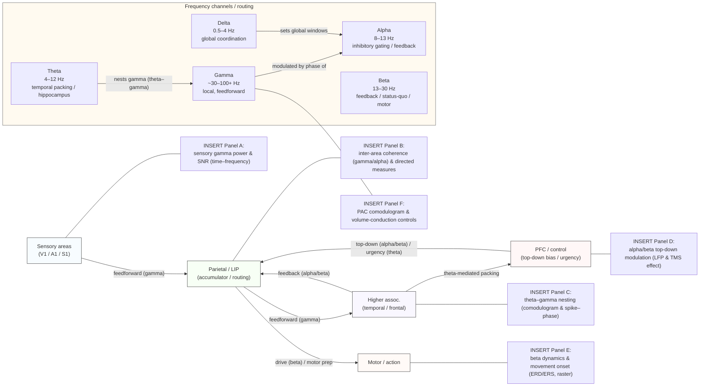

> **Frequency channels & routing (визуализация каналов и маршрутизации по частотам).** Схема показывает, как разные частотные диапазоны могут выступать в роли каналов для маршрутизации информации между сенсорными зонами, париетом/аккумулятором, височной/фронтальной ассоциацией и PFC/motor. Стрелки подписаны типичными каналами: **gamma** — быстрый локальный feedforward, **alpha/beta** — feedback/top-down gating, **theta** — временная упаковка/темпоральная сегментация (theta–gamma nesting), **delta** — глобальные окна координации. Правые плейсхолдеры (Panel A–F) — места для эмпирических иллюстраций: спектры/time–frequency (A), меж-ареальная когерентность и направленные меры (B), PAC/theta–gamma nesting (C), топ-даун модуляция alpha/beta (D), beta-динамика при движении (E) и контрольные анализы PAC/volume conduction (F). Для каждой панели указывайте N (субъекты/животные), n (trials / epochs), статистические тесты (p, CI) и scale bars; в разделе 15 приведены рекомендации по обработке, surrogate-тестам и мерам устойчивой синхронизации.

#### 15.2.3 Cross-frequency coupling (CFC, PAC)

Фаза низкой частоты может модулировать амплитуду высокой (PAC) — механизм упаковки быстрого локального кода в более длинные временные контексты (theta–gamma coding, chunking). Обзор и методология — Canolty & Knight (2010). ([PMC][293])

---

### 15.3 Примеры функциональных ассоциаций (из практики)

* Theta–gamma nesting в гиппокампе — последовательностное кодирование (theta cycles «упаковывают» gamma-пакеты). ([scirp.org][289], [PubMed][294])
* Gamma↑ при внимании и усилении меж-ареальной gamma-когерентности (attention → улучшение передачи). ([ScienceDirect][290])
* Alpha↑ в нерелевантных зонах как маркер функционального «ингибиционного gating». ([scirp.org][289])
* Beta связан с поддержанием текущего моторного состояния; Beta-снижение предшествует движению. ([scirp.org][289])

(Эти примеры иллюстрируют как гипотезы переводятся в конкретные предсказания для данных LFP/EEG/MEG/ephys.) ([scirp.org][289], [ScienceDirect][290])

---

### 15.4 Cross-frequency coupling: измерения и ограничения

* **Классические метрики PAC**: Modulation Index (Tort et al., 2010) — широко используемый метод для оценки PAC; однако его использование требует корректных суррогатов и контроля за формой волны. ([PMC][295])

* **Обзор методологии и функциональных интерпретаций** — Canolty & Knight (2010). ([PMC][293])

---

### 15.5 Методологические caveats (важнейшие предостережения + рекомендации)

1. **Форма волны → ложные CFC** — асимметричные/нелинейные формы волны генерируют гармоники и ложные PAC; cycle-by-cycle анализ и проверки формы волны обязательны (Cole & Voytek; bycycle). ([Журналы физиологии][296], [PubMed][297])
2. **Spike-bleed / contamination** — спайки, зарегистрированные на том же канале, искажают высокочастотную компоненту LFP; контролируйте spike-removal / spatial separation при анализе gamma/PAC. (см. Buzsáki, методические обсуждения). ([scirp.org][289])
3. **Volume conduction / общие источники** — coherence/PLV могут отражать 1 общий источник; используйте устойчивые меры (imaginary coherency, wPLI) и source-reconstruction. (Nolte 2004; Vinck PPC/wPLI). ([PubMed][298], [psychologie.hhu.de][299])
4. **Байесовская/пермутационная статистика и суррогаты** — тестируйте PAC/coherence против адекватных суррогатов (time-shift, cycle-shuffle) и применяйте cluster-based correction. ([PMC][293])

---

### 15.6 Рекомендуемый рабочий pipeline (кратко)

1. Inspect PSD; выявите реальные peaks (data-driven band selection). ([scirp.org][289])
2. Preprocess: remove line noise, re-reference, artifact rejection; документируйте фильтры. ([psychologie.hhu.de][299], [PubMed][298])
3. Use wavelet / multitaper for time–frequency; extract phase/amplitude with validated narrowband filters + Hilbert. ([Журналы физиологии][296])
4. For PAC: compute MI (Tort) + at least two types of surrogates; check cycle waveform. ([PMC][295], [Журналы физиологии][296])
5. For synchrony: report PPC (bias-free) and wPLI/imaginary coherency to reduce volume conduction confounds. ([psychologie.hhu.de][299], [PubMed][298])
6. For directionality: complement with phase-slope index / spectral Granger with stationarity checks. ([PubMed][291])
7. Always test robustness: different filter settings, different surrogate methods, exclude same-electrode LFP for spike-LFP coupling. ([Журналы физиологии][296], [psychologie.hhu.de][299])

---

### 15.7 Практические экспериментальные предсказания (примеры)

* Attention task → predict ↑ gamma power in target area + ↑ gamma coherence target↔control; causal test: disrupt gamma (optogenetics/tACS) → снижение перформанса. ([ScienceDirect][290], [PMC][292])
* WM capacity ↔ theta–gamma nesting: number of gamma packets per theta cycle \~ number of удерживаемых элементов; perturb theta phase → ухудшение WM. ([PubMed][294])

---

### 15.8 Ключевые источники (must-read)

* Buzsáki G., *Rhythms of the Brain* (Oxford Univ. Press, 2006). ([scirp.org][289])
* Fries P., *Rhythms for Cognition: Communication through Coherence.* Neuron (2015). ([ScienceDirect][290])
* Canolty R. T., Knight R. T., *The functional role of cross-frequency coupling.* Trends Cogn Sci (2010). ([PMC][293])
* Tort A. B. L. et al., *Measuring phase-amplitude coupling (Modulation Index).* J Neurophysiol (2010). ([PMC][295])
* Cole S. R., Voytek B., *Waveform shape & cycle-by-cycle analyses (bycycle).* J Neurophysiol / Trends (2017–2019). ([Журналы физиологии][296], [PubMed][297])
* Vinck M. et al., *Pairwise Phase Consistency (PPC): bias-free measure.* NeuroImage (2010). ([psychologie.hhu.de][299])
* Nolte G. et al., *Imaginary part of coherency to avoid volume conduction.* Clin Neurophysiol (2004). ([PubMed][298])
* Bastos A. M. et al., *Feedforward and feedback use distinct frequency channels.* Neuron (2015). ([PubMed][291])

[289]: https://www.scirp.org/reference/referencespapers?referenceid=2540317 "Buzsaki, G. (2006) Rhythms of the Brain. Oxford University ..."
[290]: https://www.sciencedirect.com/science/article/pii/S0896627315008235   "Rhythms for Cognition: Communication through Coherence"
[291]: https://pubmed.ncbi.nlm.nih.gov/25556836/   "Visual areas exert feedforward and feedback influences ..."
[292]: https://pmc.ncbi.nlm.nih.gov/articles/PMC4605134/   "Rhythms For Cognition: Communication Through Coherence"
[293]: https://pmc.ncbi.nlm.nih.gov/articles/PMC3359652/   "The functional role of cross-frequency coupling - PMC"
[294]: https://pubmed.ncbi.nlm.nih.gov/17548233/   "Cross-frequency coupling between neuronal oscillations"
[295]: https://pmc.ncbi.nlm.nih.gov/articles/PMC2941206/   "Measuring Phase-Amplitude Coupling Between Neuronal ..."
[296]: https://journals.physiology.org/doi/abs/10.1152/jn.00273.2019   "Cycle-by-cycle analysis of neural oscillations"
[297]: https://pubmed.ncbi.nlm.nih.gov/31268801/   "Cycle-by-cycle analysis of neural oscillations"
[298]: https://pubmed.ncbi.nlm.nih.gov/15351371/   "Identifying true brain interaction from EEG data using the ..."
[299]: https://www.psychologie.hhu.de/fileadmin/redaktion/Fakultaeten/Mathematisch-Naturwissenschaftliche_Fakultaet/Psychologie/CompPsy/Papers/vinck2010_wingerden.pdf   "The pairwise phase consistency - Psychologie"

---

## 16. Динамика популяций, attractors, state-space подходы 

Ниже — межуровневый, прикладной обзор современной литературы и практик по анализу популяционной динамики нейронных сетей: низкоразмерные **manifolds**, различие **транзиентной динамики ↔ аттракторы**, **метастабильность**, гипотезы **критичности**, и основные инструменты для извлечения/интерпретации латентных состояний (PCA, jPCA, dPCA, LFADS и др.). Каждое ключевое утверждение сопровождается ссылками на авторитетные и высокоцитируемые работы (включая эмпирические «якоря» и современные методические обзоры).

---

### 16.1 Почему «state-space» / популяционная динамика — это важно (кратко)

Классический взгляд на кодирование отдельными нейронами дополняется (и в ряде случаев заменяется) парадигмой популяций: поведение/внутренние переменные часто реализуются как траектория в низкоразмерном пространстве состояний населения нейронов (latent state space). Это даёт компактное описание динамики, облегчает сравнение между условиями и напрямую связывает экспериментальные данные с идеями динамических систем (аттракторами, циклическими траекториями, переходами). Классические демонстрации: вращательная динамика в моторной коре при достижении (Churchland et al. 2012) и контекст-зависимая рекуррентная динамика в PFC (Mante et al. 2013). ([PubMed][300], [PMC][301])

---

### 16.2 Низкоразмерные manifolds: эмпирика и интерпретации

* **Наблюдение.** Во многих датасетах большая часть вариабельности популяции описывается несколькими компонентами (low-dimensional latent factors). Отсюда концепция «нейронных мод» или нейронных «манифолдов», вдоль которых происходят поведенчески значимые траектории. Обзоры и теоретические трактовки — Cunningham & Yu (2014), Gallego et al. (2017), Gao & Ganguli (2015). ([Nature][302], [PubMed][303])
* **Важные эмпирические результаты.**

  * Motor systems: Churchland et al. 2012 — вращательные низкоразмерные траектории при движении; LFADS/поздние работы показывают, что эти динамики видны и на single-trial уровне. ([PubMed][304], [PMC][305])
  * Sensory systems: Stringer et al. 2019 показали, что при естественных стимулах активность может быть **высокоразмерной**, что подчёркивает зависимость «размерности» от задач/стимулов/количества нейронов. ([Nature][306])

**Важное практическое правило.** «Низко» в low-dimensional — относительное понятие: размерность зависит от задачи, экспериментальной статистики и числа зарегистрированных нейронов; всегда показывайте объяснённую дисперсию как функцию числа компонент. ([PubMed][307])

---

### 16.3 Transient dynamics vs attractors — концептуальная разница

* **Аттракторы** (фиксированные точки, периодические циклы, странные аттракторы) — описывают ситуации, когда сеть сходится к устойчивому состоянию/циклу (модель кратковременной памяти через аттракторные сети, Hopfield-подобные схемы).
* **Транзиентная/itinerant динамика** — поведение, в котором репертуар состояний реализуется последовательностью переходов (heteroclinic/метастабильные переключения). Такие трансенты удобны для кодирования последовательностей, маршрутизации и гибкого поведения. Работы Rabinovich et al. (transient/metastable framework) и Tognoli & Kelso по метастабильности — классические ссылки. ([PLOS][308], [PMC][309])

**Эмпирические свидетельства.** Для ряда когнитивных задач популяции демонстрируют reproducible transients (последовательности состояний), а не строгую сходимость к одному аттрактору; это формально и эмпирически показано в ряде обзоров и моделей. ([PMC][310], [ScienceDirect][311])

---

### 16.4 Метастабильность и переключения между режимами

* **Определение.** Метастабильность — склонность системы пребывать в ряде субустойчивых режимов, периодически переключаясь между ними; это компромисс между устойчивостью (распознавание/репродуктивность) и гибкостью. ([PMC][309])
* **Метрики и наблюдения.** На практике используют dwell-time распределения, переключательные вероятности, measures synchrony variance / repertoire richness; работа Deco et al. и обзоры (Tognoli/Kelso) связывают метастабильность с функционированием мозга в состоянии покоя и при задаче. ([Nature][312], [ScienceDirect][311])

---

### 16.5 Критичность, neuronal avalanches и функциональные преимущества

* **Классика.** Beggs & Plenz (2003) обнаружили «neuronal avalanches» в кортикальных сетях с power-law распределениями, что породило гипотезу о работе мозга у «критической точки» (между упорядочением и хаосом). ([jneurosci.org][313])
* **Современный синтез.** Обзоры по критичности (Cocchi et al. 2017 и др.) обсуждают потенциальные преимущества: максимальная динамическая диапазонность, оптимальная информационная передача и гибкая переключаемость. Модели и данные продолжают дебатировать, насколько универсальна критичность и в каких масштабах она наблюдается. ([arXiv][314], [PubMed][315])

---

### 16.6 Методы извлечения латентных траекторий — практическая панорама

* **PCA / FA / GPFA.** Базовые линейные методы (PCA, factor analysis, Gaussian-Process Factor Analysis) — быстрые и прозрачные; PCA даёт ортогональные проекции, GPFA учитывает временную структуру. (Cunningham & Yu обзор). ([Nature][302])
* **jPCA (rotational dynamics).** jPCA был предложен в Churchland et al. 2012 для выявления вращательных компонентов в моторной коре; метод ищет линейное отображение между состояние→производная и выделяет плоскости вращения. Применим особенно к моторным данным, но требует осторожной интерпретации. ([PMC][316])

  * Критика/контрпримеры: несколько работ показывают, что вращения могут возникать из простых вариаций задержек/временных профилей; всегда тестируйте устойчивость (shuffling, surrogates, single-trial recovery). ([PMC][317], [Nature][318])
* **dPCA (demixed PCA).** dPCA (Kobak et al. 2016) — целенаправленное разложение активности на компоненты, «демиксирующие» влияние разных параметров (стимул, выбор, время). Полезно в задачах с мультипараметрической смешанной селективностью. ([eLife][319])
* **LFADS / sequential autoencoders / RNN-based latent models.** LFADS (Sussillo/Pandarinath et al. 2016–2018) — нелинейная модель-генератор (VAE/RNN) для извлечения single-trial latent dynamics и «денойзинга» firing-rates; мощно восстанавливает динамики и perturbations, но требует аккуратной валидации и проверки обобщаемости. ([PMC][320], [arXiv][321])
* **Nonlinear manifold methods / modern DR:** Isomap, t-SNE, UMAP, Gaussian-process latent variable models (GPLVM), and newer dynamical latent-space models (state-space RNNs, sequential VAE) — применяются, когда данные явно нелинейны. Они дают гибкость, но требуют осторожной интерпретации (не всегда даётся динамическая система объяснением). ([PMC][322], [BioRxiv][323])

**Рекомендация по выбору метода.** Начинайте с простого (PCA/GPFA), проверяйте single-trial воспроизводимость и дополнительные критерии (behavior prediction, held-out reconstruction). Продвигайтесь к более сложным методам (dPCA, LFADS) лишь если простые не объясняют значительную долю структуры. Всегда сопоставляйте результаты с суррогатами и model-based controls. ([Nature][302], [PMC][320])

---

### 16.7 Практические контрольные тесты и валидация выводов

1. **Shuffling / trial-label permutation** — тест на то, не создаёт ли метод «ложные» структуры из условно-зависимых средних. ([PMC][317])
2. **Held-out prediction (behavioral decoding)** — латентные компоненты должны предсказывать поведение на невидимых данных. ([PMC][322])
3. **Single-trial recoverability** — методы должны извлекать динамику на уровне отдельных трaйлов (LFADS, GPFA тесты). ([PMC][320])
4. **Generative checks** — симулируйте данные из предполагаемой модели (аттрактор/рекуррентная сеть) и проверьте, восстанавливается ли структура методами. ([ScienceDirect][324])

---

### 16.8 Связь динамики ↔ обучение и ограничений сети

* **Constraints on learning.** Sadtler et al. (2014) показали, что существующая популяционная «маннифольдная» структура ограничивает, какие новые паттерны легко усваиваются (neural constraints on learning). Это связывает geometry manifold и адаптивность сети. ([Nature][325])
* **Low-rank connectivity → low-dim dynamics.** Теории (Gao & Ganguli; Mastrogiuseppe & Ostojic) демонстрируют, как структура связности (низкорядые компоненты) порождает низкоразмерные вычисления и функциональные режимы. ([PubMed][307], [ScienceDirect][324])

---

### 16.9 Открытые вопросы и направления (приоритеты на 2025)

1. **Универсальность low-dim manifolds:** в каких задачах/областях активность остаётся высокой-размерной (Stringer 2019) и как это соотносится с вычислительной мощностью и шумоустойчивостью? ([Nature][306])
2. **Причинность vs описательность:** когда латентные траектории — просто статистическая компрессия, а когда — истинная биофизическая динамика? нужна causal perturbation + model-based inference (optogenetic perturbations aligned to latent state). ([PMC][323])
3. **Как связать микроскопические механизмы (синапсы, топология связей) с макро-маннифольдами?** Нужны studies linking connectomics → dynamics (low-rank connectivity predictions). ([ScienceDirect][324])
4. **Роль метастабильности/критичности в cognition:** когда мозг использует критическое режимное поведение для максимальной адаптивности и как измерить это надёжно в vivo? ([jneurosci.org][313], [arXiv][314])

---

### 16.10 «Must-read» (якоря для раздела)

* Churchland M. M., Cunningham J. P., Kaufman M. T., et al., *Neural population dynamics during reaching.* Nature (2012). ([PubMed][300])
* Cunningham J. P., Yu B. M., *Dimensionality reduction for large-scale neural recordings.* Nat Neurosci (2014). ([Nature][302])
* Mante V., Sussillo D., Shenoy K. V., Newsome W. T., *Context-dependent computation by recurrent dynamics in prefrontal cortex.* Nature (2013). ([PMC][301])
* Sadtler P. T., Quick K. M., Golub M. D., et al., *Neural constraints on learning.* Nature (2014). ([Nature][325])
* Gallego J. A., Perich M. G., Miller L. E., Solla S. A., *Neural Manifolds for the Control of Movement.* Annu Rev Neurosci (2017). ([PubMed][303])
* Stringer C., Pachitariu M., Steinmetz N., et al., *High-dimensional geometry of population responses in visual cortex.* Nature (2019). ([Nature][306])
* Kobak D., Brendel W., et al., *Demixed principal component analysis of neural population data.* eLife (2016). ([eLife][319])
* Rabinovich M. I., Huerta R., Laurent G., *Transient dynamics for neural processing.* Science (2008) / Rabinovich et al. on metastability (2008 review). ([PLOS][308], [PMC][310])
* Beggs J. M., Plenz D., *Neuronal avalanches in neocortical circuits.* J Neurosci (2003). ([jneurosci.org][313])
* Pandarinath C., Ames K. C., et al., *Inferring single-trial neural population dynamics using sequential auto-encoders (LFADS).* Nat Methods (2018). ([Nature][326])

---

#### Резюме

Анализ популяционной динамики (state-space подходы) даёт мощный язык для описания, сравнения и тестирования гипотез о нейронных механизмах поведения: от low-dim manifolds и вращательных динамик в моторике до метастабильных транзиентов в когнитивных задачах и дебатов о критичности. Для надёжных выводов необходима мультиинструментальная валидация: простые линейные методы → динамические/генеративные модели → causal perturbations + контрольные тесты (shuffles, held-out prediction). ([PubMed][300], [Nature][302], [PMC][320])

[300]: https://pubmed.ncbi.nlm.nih.gov/22722855/   "Neural population dynamics during reaching - PubMed"
[301]: https://pmc.ncbi.nlm.nih.gov/articles/PMC4121670/   "Context-dependent computation by recurrent dynamics in prefrontal ..."
[302]: https://www.nature.com/articles/nn.3776   "Dimensionality reduction for large-scale neural recordings"
[303]: https://pubmed.ncbi.nlm.nih.gov/28595054/   "Neural Manifolds for the Control of Movement"
[304]: https://pubmed.ncbi.nlm.nih.gov/22722855/   "Neural population dynamics during reaching - PubMed"
[305]: https://pmc.ncbi.nlm.nih.gov/articles/PMC6380887/   "Inferring single-trial neural population dynamics using ..."
[306]: https://www.nature.com/articles/s41586-019-1346-5   "High-dimensional geometry of population responses in ..."
[307]: https://pubmed.ncbi.nlm.nih.gov/25932978/   "On simplicity and complexity in the brave new world ..."
[308]: https://journals.plos.org/ploscompbiol/article?id=10.1371%2Fjournal.pcbi.1000072 "Transient Cognitive Dynamics, Metastability, and Decision ..."
[309]: https://pmc.ncbi.nlm.nih.gov/articles/PMC3997258/   "The Metastable Brain - PMC"
[310]: https://pmc.ncbi.nlm.nih.gov/articles/PMC2358972/   "Transient Cognitive Dynamics, Metastability, and Decision ..."
[311]: https://www.sciencedirect.com/science/article/pii/S0896627313011835   "The Metastable Brain - Neuron"
[312]: https://www.nature.com/articles/s41598-017-03073-5   "The dynamics of resting fluctuations in the brain"
[313]: https://www.jneurosci.org/content/23/35/11167   "Neuronal Avalanches in Neocortical Circuits"
[314]: https://arxiv.org/abs/1707.05952   "Criticality in the brain: A synthesis of neurobiology, models and cognition"
[315]: https://pubmed.ncbi.nlm.nih.gov/22399758/   "Ongoing cortical activity at rest: criticality, multistability, and ..."
[316]: https://pmc.ncbi.nlm.nih.gov/articles/PMC3393826/   "Neural population dynamics during reaching - PMC"
[317]: https://pmc.ncbi.nlm.nih.gov/articles/PMC5096671/   "Neural Population Dynamics during Reaching Are Better ..."
[318]: https://www.nature.com/articles/s41598-019-54760-4   "Analysis of neuronal ensemble activity reveals the pitfalls ..."
[319]: https://elifesciences.org/articles/10989   "Demixed principal component analysis of neural ..."
[320]: https://pmc.ncbi.nlm.nih.gov/articles/PMC6380887/   "Inferring single-trial neural population dynamics using ..."
[321]: https://arxiv.org/abs/1608.06315   "LFADS - Latent Factor Analysis via Dynamical Systems"
[322]: https://pmc.ncbi.nlm.nih.gov/articles/PMC10400080/   "Large-scale neural dynamics in a shared low-dimensional ..."
[323]: https://www.biorxiv.org/content/10.1101/214262v2.full-text   "A theory of multineuronal dimensionality, dynamics and ..."
[324]: https://www.sciencedirect.com/science/article/pii/S0896627318305439   "Linking Connectivity, Dynamics, and Computations in Low- ..."
[325]: https://www.nature.com/articles/nature13665   "Neural constraints on learning"
[326]: https://www.nature.com/articles/s41592-018-0109-9   "Inferring single-trial neural population dynamics using ..."

---

## 17. Предсказательное кодирование / Байесовские модели 

Ниже — системный, межуровневый модуль по идеям predictive coding / Bayesian brain / active inference. Раздел покрывает: иерархическое предсказательное кодирование, precision-weighting и связь с вниманием/нейромодуляцией, active inference (включая действия как «самосвершающие предсказания»), возможные нейробиологические реализации (canonical microcircuits), эмпирическую поддержку и ключевые ограничения. Везде — ссылки на авторитетные и высокоцитируемые источники.

---

### 17.1 Короткая интуиция и вычислительная постановка задачи

Идея predictive coding / Bayesian brain: мозг поддерживает иерархическую *generative model* внешнего мира, предсказывает сенсорные данные сверху вниз и передаёт вниз по иерархии не саму предсказательную репрезентацию, а *предсказания*; несоответствия между предсказаниями и входом (prediction errors) посылаются снизу вверх для коррекции моделей. Этим достигается эффективная компрессия входной информации и байесовская интеграция априорных ожиданий и сенсорных данных. Эта рамка формально резюмируется в free-energy / variational Bayes формулировке (Friston) и в классических вычислительных моделях (Rao & Ballard). ([PubMed][327], [Nature][328])

---

### 17.2 Иерархическое predictive coding — механика и формализм

* **Иерархия:** каждая область/уровень пытается предсказать активность уровня ниже; ошибки предсказания (prediction errors) передаются вверх, а продукты предсказаний — вниз. Такая схема естественно соответствует анатомической иерархии коры (обратные/прямые проекции). ([Nature][328], [PubMed][329])
* **Формализм:** в терминах вариационной инференции свободная энергия ≈ нижняя граница лог-вероятности сенсорных данных; минимизация free energy аппроксимирует байесовский апдейт апостериорного распределения. Это объединяет восприятие, обучение и (в случае active inference) действие в одну оптимизационную рамку. ([PubMed][327])

**Выводы для моделирования:** predictive-coding модели строятся как иерархические генеративные модели (state-space / probabilistic graphical models), решение задачи сводится к рекуррентной оценке причин (latent states) и их параметров через обмен сообщений prediction ↔ error (variational message passing). ([PubMed][327], [Nature][328])

---

### 17.3 Precision-weighting: как учесть неопределённость — связь с вниманием

* **Precision (обратная дисперсия)** — в байесовской смеси важна не только величина prediction error, но и её *надёжность* (precision). В predictive coding это реализуется как вес для единичной ошибки; weighting prediction errors по их ожидаемой precision — ключевой механизм, через который априорные убеждения и сенсорная надёжность объединяются. ([Frontiers][330])
* **Attention = precision-weighting (формальная интерпретация).** Одно из влиятельных предложений: многие эффекты внимания объясняются как локальное увеличение precision (увеличение «gain» prediction-error нейронов), что делает соответствующие ошибки более влияющими при обновлении представлений. Это связывает феноменологию внимания с нейрофизиологическими наблюдениями (gain modulation, уменьшение noise correlations). ([Frontiers][330], [PubMed][331])

**Нейромодуляторы:** ACh и NE часто интерпретируются как посредники изменения precision: ACh — увеличивает чувствительность к входной информации (снижает априорную доминацию), NE — сигнализирует unexpected uncertainty и может изменять готовность к обновлению. Теория делает конкретные предсказания о том, когда и какие neuromodulatory изменения должны сопровождать изменения внимательности/оценки неопределённости. ([Frontiers][330], [PMC][332])

---

### 17.4 Active inference — действие как минимизация prediction error

* **Идея.** В active inference агент не только обновляет внутренние убеждения, но и действует, чтобы привести сенсорные входы в соответствие с предсказаниями (action = the fulfilment of predictions). Это даёт единый взгляд на восприятие и поведение: оба процесса минимизируют free energy. ([PubMed][327])
* **Последствия.** Active inference формально связывает привычки, goal-directed action и планирование: политики (последовательности действий) выбираются путём минимизации ожидаемой free energy (управляя как эпизодической наградой, так и эпистемической ценностью — информацией). Это даёт нейробиологически интерпретируемую теорию exploration/exploitation, информации как мотивационной ценности и мотивов поведения. ([ScienceDirect][333], [PubMed][334])

---

### 17.5 Нейробиологические реализации — microcircuits и физиология

* **Canonical microcircuit hypothesis.** Bastos et al. предложили сопоставление ролей предсказаний и ошибок с конкретными ламинарными путями и клеточными типами в коре: глубокие клетки посылают предсказания вниз, супрагранулярные — ошибочные сигналы вверх; это сопоставление даёт конкретные экспериментальные предсказания (laminar patterns of activity). ([PubMed][329])
* **Empirical signatures.** Ожидаемые эмпирические эффекты predictive coding включают: (i) уменьшение средней активности для предсказуемых стимулов (expectation suppression) при одновременном улучшении представлений (sharpening); (ii) предикторные шаблоны в передних областях, предшествующие сенсорной активности; (iii) laminar-specific feedback vs feedforward spectral signatures (feedback — beta/alpha, feedforward — gamma) — всё это наблюдается в ряде экспериментов и анализов. ([ScienceDirect][333], [PubMed][329])

**Замечание:** соответствие между конкретными клеточными типами и computational roles ещё активно исследуется — необходимы laminar recordings + perturbations для строгой валидации. ([PubMed][329])

---

### 17.6 Эмпирическая поддержка и ключевые эксперименты

* **Классические моделирующие работы:** Rao & Ballard (1999) — первая крупная модель predictive coding в зрительной коре, предсказавшая ряд «extra-classical» эффектов. ([Nature][328])
* **Human neuroimaging / expectation effects:** Summerfield и соавторы показали предикторные сигналы в фронто-кортикальных сетях, Kok и соавторы обнаружили снижение амплитуды BOLD в V1 при ожидаемых стимулах, но при этом «острее» представление (sharpening) — результаты, совместимые с predictive coding. ([PubMed][329], [ScienceDirect][333])
* **Laminar / spectral evidence:** исследования ламинарной активности и частотно-специфических каналов (feedback vs feedforward) и work Bastos et al. дают экспериментальные указания на реализацию сообщений prediction/error в разных частотных диапазонах и слоях. ([PubMed][329])
* **Precision / attention studies:** Feldman & Friston (2010) и последующие работы демонстрируют, что модели с precision-weighting объясняют различные эффекты внимания и роль neuromodulators. ([Frontiers][330])

(См. также недавние обзоры, оценивающие эмпирический статус predictive coding / active inference и предлагающие тесты для обязательных предсказаний.) ([ScienceDirect][336])

---

### 17.7 Практические предсказания и тесты (what to measure / manipulate)

1. **Laminar prediction:** при предъявлении ожидаемого стимула предсказывается усиленная обратная (feedback) активность в глубоких слоях и уменьшение feedforward error-сигнала в супрагранулярных слоях — тест: laminar ephys, CSD, layer-specific fMRI. ([PubMed][329])
2. **Spectral signatures:** feedback (predictions) ↔ lower frequency bands (beta/alpha), feedforward (prediction errors) ↔ gamma; test: directed coherence, Granger, phase-slope index across frequency bands. ([PubMed][329])
3. **Precision / attention manipulations:** управление ожидаемой надежностью (sensory noise) или neuromodulatory tone (pharmacology, opto of cholinergic/adrenergic systems) должно изменить «gain» error-units и поведенческую эффективность (attention manipulations). ([Frontiers][330])
4. **Causal testing of active inference:** манипуляции, нарушающие предсказательную модель (e.g., changing contingencies unexpectedly) должны вызывать специфические prediction-error сигналы и изменение политик; perturbation of motor predictions (delay/force perturbations) даст testable behavioral + neural signatures. ([PubMed][334])

---

### 17.8 Критика, ограничения и открытые вопросы

* **Точность vs описательность.** Predictive coding / free-energy — мощная и синтетическая рамка, но её общность делает её иногда трудно фальсифицируемой в чистом виде; критики требуют чётких, уникальных экспериментальных предсказаний, отличающих predictive coding от альтернатив. ([ScienceDirect][336])
* **Empirical specificity:** некоторые эффекты (например, expectation suppression) имеют альтернативные объяснения (adaptation, sharpening) — необходимы контрольные эксперименты, демультиплексирование механизмов и model-comparison approaches. ([ScienceDirect][337], [eLife][338])
* **Mapping to biology:** хотя есть обещающие ламинальные / частотные сопоставления, прямая идентификация клеточных реализаций (какие нейроны кодируют predictions vs errors, как реализуется precision на синаптическом уровне) остаётся неполной — нужны целенаправленные causal-experiments (cell-type specific perturbation + laminar recordings). ([PubMed][329])

---

### 17.9 Практические рекомендации для исследований и моделирования

* **Модели:** строите явно generative models (state-space), оценивайте альтернативные модели (predictive coding vs feedforward / adaptation) через out-of-sample prediction и formal model comparison (Bayes factors / held-out likelihood). ([Nature][328], [PubMed][327])
* **Мульти-модальная валидация:** сочетайте laminar ephys + LFP + optogenetic perturbations + pharmacology (ACh/NE) чтобы тестировать precision hypotheses. ([PubMed][329], [Frontiers][330])
* **Quantitative predictions:** извлекайте trial-by-trial prediction error signals из нейронной активности и соотносите с модельными переменными (variational updates, policy values) — используйте hierarchical Bayesian fitting для поведенческих данных. ([PubMed][327])

---

### 17.10 Ключевые «must-read» (якоря для раздела)

* Friston K., *The free-energy principle: a unified brain theory?* Nat Rev Neurosci (2010). ([PubMed][327])
* Clark A., *Whatever next? Predictive brains, situated agents, and the future of cognitive science.* Trends Cogn Sci (2013). ([PubMed][331])
* Rao R. P. N., Ballard D. H., *Predictive coding in the visual cortex: a functional interpretation of some extra-classical receptive-field effects.* Neural Comput (1999). ([Nature][328])
* Bastos A. M. et al., *Canonical microcircuits for predictive coding.* Neuron (2012). ([PubMed][329])
* Feldman H. & Friston K., *Attention, Uncertainty, and Free-Energy.* Front Hum Neurosci (2010). ([Frontiers][330])
* Knill D. C., Pouget A., *The Bayesian brain: the role of uncertainty in neural coding and computation.* Trends Neurosci (2004). ([ScienceDirect][339])
* Reviews / empirical assessments of predictive coding & active inference (recent): e.g. empirical status reviews and active inference primers. ([ScienceDirect][336], [PMC][332])

---

### 17.11 Резюме / takeaways

1. **Framework:** predictive coding / free-energy / active inference предлагают единую, байесовскую форму описания восприятия, внимания и действия: мозг — иерархический предиктор. ([PubMed][327], [Nature][328])
2. **Attention как precision:** внимание формально интерпретируется как приращение precision prediction errors; это связывает поведенческие эффекты внимания с нейрофизиологическими механизмами (gain, neuromodulators). ([Frontiers][330])
3. **Active inference:** действие включено в систему минимизации предсказаний — это делает рамку применимой к контролю, мотивации и планированию. ([PubMed][334])
4. **Validation path:** требуются комбинации laminar/spectral/causal экспериментов и строгие model-comparison tests, чтобы отличить predictive coding от альтернатив и уточнить нейробиологические реализации. ([PubMed][329], [ScienceDirect][336])

[327]: https://pubmed.ncbi.nlm.nih.gov/20068583/   "The free-energy principle: a unified brain theory?"
[328]: https://www.nature.com/articles/nn0199_79   "Predictive coding in the visual cortex: a functional ..."
[329]: https://pubmed.ncbi.nlm.nih.gov/23177956/   "Canonical microcircuits for predictive coding"
[330]: https://www.frontiersin.org/journals/human-neuroscience/articles/10.3389/fnhum.2010.00215/full   "Frontiers | Attention, Uncertainty, and Free-Energy"
[331]: https://pubmed.ncbi.nlm.nih.gov/23663408/   "Whatever next? Predictive brains, situated agents, and the ..."
[332]: https://pmc.ncbi.nlm.nih.gov/articles/PMC9667420/   "Active Inference as a Tool to Guide Clinical Research and Practice"
[333]: https://www.sciencedirect.com/science/article/pii/S0149763416301336   "Active inference and learning - ScienceDirect.com"
[334]: https://pubmed.ncbi.nlm.nih.gov/27375276/   "Active inference and learning - PubMed"
[335]: https://www.sciencedirect.com/science/article/pii/S0896627312004382   "Less Is More: Expectation Sharpens Representations in the ..."
[336]: https://www.sciencedirect.com/science/article/abs/pii/S0149763423004426   "The empirical status of predictive coding and active inference"
[337]: https://www.sciencedirect.com/science/article/abs/pii/S0149763421001536   "Evaluating the evidence for expectation suppression in ..."
[338]: https://elifesciences.org/articles/33123   "Prediction error and repetition suppression have distinct ..."
[339]: https://www.sciencedirect.com/science/article/abs/pii/S0166223604003352   "The Bayesian brain: the role of uncertainty in neural coding ..."

---

## 18. Язык, внутренняя речь и «высшие» когнитивные функции

Ниже — межуровневый, практичный и референсно-насыщенный модуль по нейробиологии языка и внутренней речи. Каждая подсекция даёт (i) суть/определение, (ii) анатомо-функциональную карту, (iii) ключевые эмпирические находки и методы, (iv) методологические замечания и (v) открытые вопросы. Все важнейшие утверждения опираются только на авторитетные, высоко цитируемые источники (классика + современные обзоры до 2024–2025) — ссылки приведены после соответствующих абзацев.

---

### 18.1 Краткая схема раздела

1. Нейроанатомия речи: классические локальные «узлы» → современная сеть.
2. Внутренняя речь (inner speech): феномен, нейронная база, методы изучения.
3. Вербализация и рабочая память языка (phonological loop / артикуляторный контроль).
4. Социальные/интерактивные аспекты: Theory of Mind, разговорная интеракция.
5. Методология, causal tests и практические рекомендации.
6. Открытые вопросы и «must-read».

---

### 18.2 Нейроанатомия речи — от Брока/Вернике к сетям

**Классика → современность.**

* Исторический локус: Broca (articulate speech; left inferior frontal gyrus) и Wernicke (sensory/phonological area in posterior superior temporal lobe) — классические клинические наблюдения, которые задали карту афазий и локализации. ([PubMed][340], [Психологические Классики][341])
* Современный взгляд: язык — это распределённая, лево-латеральизованная сеть, включающая множественные области фронтальной (ниже- и сверху-лобной → Broca/IFG/premotor), темпоро-париетальной (posterior STG/MTG/TPJ) и медиальной/субкортикальной областей; ключевая рабочая схема — **двойной поток** (dorsal—mapping sound→articulation; ventral—mapping sound→meaning). Эта dual-stream модель (Hickok & Poeppel) интегрирует данные ephys, imaging и lesion-студий. ([PubMed][342])

**Функциональные роли (с примерами):**

* *Dorsal stream* (posterior STG/SMG → IFG/premotor): фонологическая артикуляция, репетиция, такт-to-motor mapping, речевое повторение. ([PubMed][342])
* *Ventral stream* (anterior/ventral temporal cortex → middle temporal gyrus → IFG): лексическая идентификация и семантическая интеграция, составление смысла. Обновлённые реконструкции Wernicke-region предлагают более гибкую, множественную картину семантики/фонологии. ([PMC][343], [PubMed][342])

**Методические опоры:** lesion studies (афазии), fMRI (task/ naturalistic language), ECoG/iEEG (high-gamma, timing), DTI/tractography (arcuate fasciculus и другие пути) — все эти методы дают комплементарные доказательства сетевой организации. ([PMC][343], [ScienceDirect][344])

---

### 18.3 Внутренняя речь (inner speech) — что это и как её изучать

**Определение и феноменология.**

* Внутренняя речь — переживание «голоса в голове», артикуляторное представление без явной моторной реализации; важна для планирования, саморефлексии, вербализации мыслей и контроля поведения. ([PubMed][345])

**Нейронная база — совокупность данных.**

* Нейровизуализационные и iEEG-исследования показывают вовлечение левой фронто-топочной сети (IFG / premotor / SMA), верхней височной и темпопариетальной областей, а также аудиторных корковых областей (обратные проекции) — то есть внутренний голос использует общие механизмы для производства речи и для аудиторного представления. Интрапарциальные и медиальные области (insula, cingulate) могут участвовать в мониторинге. ([PMC][346])

**Ключевые эмпирические подходы.**

* Self-report / experience sampling, fMRI contrasts (covert vs overt speech), TMS perturbations of IFG/premotor (чтобы выявить causal роль), iEEG/ECoG — для временной точности и high-gamma signatures; голосовая артикуляция подавления (articulatory suppression) применяется как интерференционный метод. ([PubMed][345], [PMC][346])

**Теоретические замечания.**

* Внутренняя речь включает и «forward model» артикуляции (предсказания афферентного звука) — что объясняет активацию аудиторной коры при молчаливой речи; также это важный компонент саморегуляции и рабочей памяти. ([PMC][346])

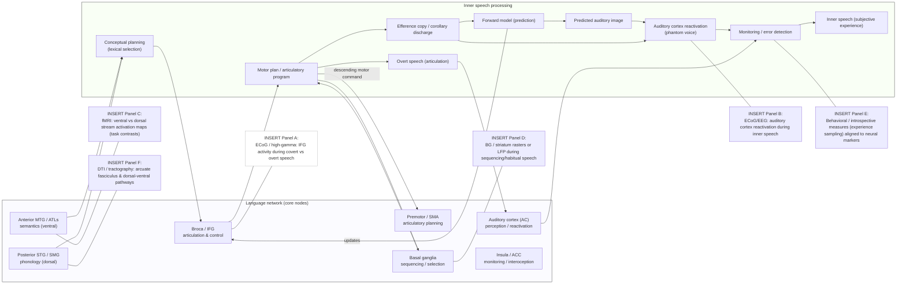

> **Языковая сеть и поток внутренней речи.** Ключевые узлы языковой сети: posterior STG/SMG (phonology, dorsal stream), anterior MTG/ATL (semantics, ventral stream), Broca / IFG (articulation, control), premotor/SMA (articulatory planning), insula/ACC (monitoring) и basal ganglia (sequencing/selection). Последовательность преобразований, реализующая внутреннюю речь: концептуальное планирование → формирование моторной программы → efference copy → forward model → предсказанная акустическая репрезентация → реактивация слуховой коры → мониторинг и субъективный опыт внутреннего голоса; при исполнении motor plan генерируется overt speech и сенсорный фидбек. Плейсхолдеры A–F отмечают места для эмпирических иллюстраций: A — ECoG/high-gamma в IFG для covert vs overt contrast; B — ECoG/EEG реактивации AC при inner speech; C — fMRI-карты ventral vs dorsal потоков; D — BG/LFP/rasters при sequencing; E — поведенческие/интроспективные данные (experience sampling) в связке с нейронными маркерами; F — DTI/tractography arcuate fasciculus. Для каждой панели указывайте N (субъекты/животные), n (trials/epochs), статистику (p, CI), оси и scale bars. Эта схема помогает связать анатомию, временную динамику и causal-доказательства (TMS/iEEG/lesion) обсуждаемые в §§18.2–18.6.

---

### 18.4 Вербализация и рабочая память языка

**Phonological loop / артикуляторный контроль.**

* Классическая модель Baddeley (phonological loop: phonological store + articulatory rehearsal) остаётся основным рабочим каркасом для понимания кратковременного хранения вербальной информации и её манипуляции. Нейронно-функционально это оформляется как взаимодействие posterior temporal/parietal phonological representations и frontal/articulatory rehearsal systems (IFG, premotor, SMA). ([PubMed][347])

**Связь с внутренней речью.**

* Артикуляторная репетиция (covert rehearsal) опирается на те же моторные планы и forward predictions, что и внешняя речь; вмешательство в артикуляторную систему (TMS / articulatory suppression) разрушает вербальную рабочую память. ([PubMed][347], [PMC][346])

**Методы измерения:** behavioural (span tasks, articulatory suppression), fMRI task-based mapping, ECoG/MEG для тайминга, и causal perturbations (TMS/tDCS) для проверки necessity/sufficiency. ([PubMed][347])

---

### 18.5 Социальная сторона языка: Theory of Mind (ToM) и разговорная интеракция

**ToM и сети «социалки».**

* Reasoning about others' mental states (ToM) опирается на правополовинную сеть, включающую TPJ, medial PFC, precuneus/posterior cingulate; эти области активируются при задачах о ментальных состояниях и social narratives. TPJ часто цитируется как ключевая область для рассуждений о чужих убеждениях. ([Massachusetts Institute of Technology][348], [ScienceDirect][349])

**Язык и ToM — взаимодействие.**

* Языковые способности обеспечивают кодовые и репрезентативные средства для передачи и моделирования чужих взглядов; эксперименты показывают совокупное вовлечение language network и ToM-сети при обработке рассказов о ментальных состояниях (dynamic interaction). ([PMC][350], [Massachusetts Institute of Technology][348])

**Диалог и интеракция.**

* Реальный разговор — распределённое, временно-синхронное явление (turn-taking, prediction of partner), вовлекающее не только language core, но и моторные, аудиторные и социально-когнитивные сети; нейроимеджинг диалогов (hyperscanning) выявляет меж-индивидуальную синхронизацию. (см. обзорные работы по naturalistic language). ([PMC][350])

---

### 18.6 Подходы, методы и causal-tests (рекомендации)

**Комбинация методов — необходимость.**

* Чтобы установить причинность и временную структуру: сочетайте lesion/clinical data (афазии), focal TMS/tDCS (causal perturbation), fMRI (spatial map), MEG/iEEG/ECoG (высокая временная точность, high-gamma signatures), DTI (tractography — arcuate fasciculus, uncinate) и повед-метрики (lexical decision, repetition, covert speech tasks). ([PMC][343], [PubMed][342])

**Специфические эксперименты (примеры):**

* *Inner speech causal test:* TMS/temporary disruption of left IFG/premotor → изменение качества внутренней речи / репетиции (вкупе с iEEG/fMRI). ([PMC][346])
* *Dual-stream dissociation:* manipulate comprehension demands (semantic vs phonological) + DTI to test integrity of ventral vs dorsal pathways; lesion/TMS tests to show necessity. ([PubMed][342])
* *Dialog/hyperscanning:* simultaneous fMRI/EEG of conversational partners to study interbrain coupling during turn-taking. ([PMC][350])

**Data & analysis best practices:** use functional localizers for language regions within-subject (improves sensitivity), report lateralization indices, control for task difficulty, and use trial-by-trial modeling (e.g., linking neural signals to lexical surprisal, prediction errors). ([ScienceDirect][344], [PubMed][342])

---

### 18.7 Открытые вопросы и направления (приоритеты на 2025)

1. **Клеточная/проекционная специфика речевых процессов:** какие клеточные субтиповые тракты и слои реализуют feedforward vs feedback в language network? (нужны laminar iEEG, animal homologues, connectomics). ([PMC][350])
2. **Нейронная механика внутренней речи:** что конкретно представляет «голос» (pattern of auditory cortex reactivation vs motor plan) и как это соотносится с голосовыми галлюцинациями (psychopathology)? (joint iEEG + experience sampling needed). ([PubMed][345])
3. **Язык в естественных условиях:** как сетевые представления языка работают при полнокровных диалогах (turn taking, prediction) — требуется больше naturalistic/hyperscanning work. ([PMC][350])
4. **Взаимодействие языка и ToM:** механизмы, с помощью которых языковые структуры кодируют и передают ментальные состояния, и как это реализуется нейронно (network coupling dynamics). ([Massachusetts Institute of Technology][348])

---

### 18.8 «Must-read» (якоря для раздела)

* Broca P. (classical translations / reports) — original clinical localization of articulate speech. ([PubMed][340], [Психологические Классики][341])
* Wernicke, C. (historical description; see modern reevaluations and reviews). ([Национальный центр биотехинформатики][351], [PMC][343])
* Hickok G., Poeppel D., *The cortical organization of speech processing: dual-stream model.* Trends Cogn Sci / Nat Rev Neurosci (2007). ([PubMed][342])
* Baddeley A., *Working memory and language; the phonological loop.* (reviews; classic model). ([PubMed][347])
* Alderson-Day B., Fernyhough C., *Inner Speech: Development, Cognitive Functions, Phenomenology, and Neurobiology.* Psychol Bull (2015). ([PubMed][345], [PMC][346])
* Fedorenko E., Blank I., *language network selectivity and naturalistic language processing* (recent network-based reviews/data on functional localization). ([PMC][350])
* Saxe R., Kanwisher N., *TPJ and Theory of Mind* (key ToM studies). ([Massachusetts Institute of Technology][348])
* Dehaene S., Changeux J.-P., Naccache L., *Global Neuronal Workspace / consciousness & language* (relevant for verbal report and conscious access). ([PubMed][352], [ResearchGate][353])

---

### 18.9 Резюме — практический takeaways

* Язык — сетевой феномен: классические локусы Брока/Вернике — полезные исторические маркеры, но современное понимание опирается на распределённые dorsaland ventral потоки и их беломозговые пути. ([PubMed][342], [PMC][343])
* Внутренняя речь опирается на те же сенсомоторные и артикуляторные механизмы, что и внешняя; её изучение требует сочетания репортажных методов, iEEG/ECoG и causal perturbations. ([PubMed][345], [PMC][346])
* Вербальная рабочая память — хорошо формализована в модели phonological loop; нейронно это взаимодействие темпопариетальной «складывающей» и фронтальной «репетиционной» сети. ([PubMed][347])
* Социальные аспекты языка (ToM, интеракция) вовлекают отдельные, но взаимодействующие сети (TPJ, mPFC) и представляют важное направление для naturalistic / hyperscanning исследований. ([Massachusetts Institute of Technology][348], [PMC][350])

[340]: https://pubmed.ncbi.nlm.nih.gov/3530216/   "Translation of Broca's 1865 report. Localization of speech ..."
[341]: https://psychclassics.yorku.ca/Broca/aphemie-e.htm   "Classics in the History of Psychology -- Broca (1861b English)"
[342]: https://pubmed.ncbi.nlm.nih.gov/17431404/   "The cortical organization of speech processing - PubMed"
[343]: https://pmc.ncbi.nlm.nih.gov/articles/PMC4691684/   "The Wernicke area: Modern evidence and a reinterpretation"
[344]: https://www.sciencedirect.com/science/article/pii/S1053811923006390   "Efficient functional localization of language regions in the ..."
[345]: https://pubmed.ncbi.nlm.nih.gov/26011789/   "Inner Speech: Development, Cognitive Functions, Phenomenology ..."
[346]: https://pmc.ncbi.nlm.nih.gov/articles/PMC4538954/   "Inner Speech: Development, Cognitive Functions, Phenomenology ..."
[347]: https://pubmed.ncbi.nlm.nih.gov/12742667/   "Working memory and language: an overview"
[348]: https://web.mit.edu/bcs/nklab/media/pdfs/SaxeKanwisherNeuroImage03.pdf   "People thinking about thinking people The role of the ..."
[349]: https://www.sciencedirect.com/science/article/abs/pii/S1053811903002301   "The role of the temporo-parietal junction in “theory of mind”"
[350]: https://pmc.ncbi.nlm.nih.gov/articles/PMC11192443/   "The Language Network Reliably “Tracks” Naturalistic ..."
[351]: https://www.ncbi.nlm.nih.gov/books/NBK533001/   "Neuroanatomy, Wernicke Area - StatPearls"
[352]: https://pubmed.ncbi.nlm.nih.gov/21521609/   "Experimental and theoretical approaches to conscious ..."
[353]: https://www.researchgate.net/publication/226833169_The_Global_Neuronal_Workspace_Model_of_Conscious_Access_From_Neuronal_Architectures_to_Clinical_Applications   "The Global Neuronal Workspace Model of Conscious Access"

---

## 19. Сознание: теории, NCC и экспериментальные тесты 

Ниже — компактный, но подробный академический обзор основных теорий сознания (GNW, IIT, Recurrent Processing, Higher-Order), нейронных коррелятов (NCC), современных экспериментальных парадигм (masking, rivalry, no-report) и эмпирических контр-тестов. Каждое ключевое утверждение снабжено ссылками на авторитетную литературу (классика + современные обзоры).

---

### 19.1 Краткая карта поля (что мы хотим объяснить)

* **Цель науки о сознании:** установить минимальные нейронные механизмы, достаточные для данного содержания сознательного опыта (NCC) и объяснить, почему именно эти процессы коррелируют с феноменальным опытом.
* **Два вида вопросов:** (i) *уровень* сознания (есть/нет, степень) и (ii) *контент* сознания (что именно переживается). Обе подзадачи требуют разных парадигм и мер. ([PubMed][354])

---

### 19.2 Основные теории — кратко, по пунктам

#### 19.2.1 Global Neuronal Workspace (GNW)

* **Идея.** Осознанное восприятие возникает, когда локальное представление «воспламеняется» и становится глобально доступным (broadcast) широкому набору модулей (память, язык, моторика, оценка и т.д.). GNW подчёркивает роль фронто-париетальных «рабочих» сетей и нелинейной «ignition». ([antoniocasella.eu][355], [PMC][356])
* **Предсказания.** Переход бессознательного→сознательное сопровождается внезапным усилением фронто-париетальной активности и появлением поздних ERP (например, P3b) и широкого распространения информации. ([antoniocasella.eu][355])

#### 19.2.2 Integrated Information Theory (IIT)

* **Идея.** Сознание — это свойство систем с высокой степенью интеграции и дифференциации информации; теоретическая величина Φ (phi) формально измеряет «сколько» интегрированной информации система поддерживает. IIT стремится вывести необходимые/достаточные условия физического субстрата сознания из феноменологических аксиом. ([PLOS][357], [PubMed][358])
* **Предсказания.** Системы с высоким Φ (широкие, разнообразные, но интегрированные причинно-следственные структуры) — более сознательны; практический индекс (PCI) — экспериментальная аппроксимация этой идеи. ([PubMed][354])

#### 19.2.3 Recurrent Processing Theory (RPT)

* **Идея (Lamme).** Феноменальное восприятие требует локальной рекуррентной обработки в сенсорных областях (reentrant / recurrent loops). Дальнейшее глобальное broadcast (фронто-париетальный) может быть необходимо для отчётности/размышления, но не для самих «qualia». ([PubMed][359], [PMC][360])

#### 19.2.4 Higher-Order Theories (HOT)

* **Идея.** Сознательное состояние — это состояние, о котором субъект обладает «высшим порядком» представления (higher-order representation) — т.е. не просто первый-порядокное восприятие, а представление о нём. HOT делает акцент на метакогнитивных процессах и их роли в феноменальном доступе. ([PubMed][361])

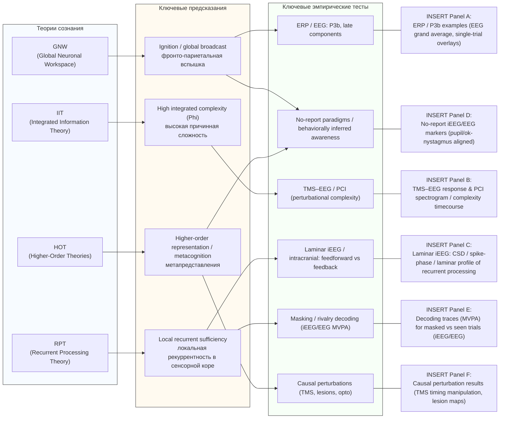

> **От теорий к предсказаниям и к эмпирическим тестам.** Схема связывает четыре крупные теории сознания (GNW, IIT, RPT, HOT) с их ключевыми предсказаниями и показывает, какие экспериментальные измерения/парадигмы наиболее прямо тестируют эти предсказания. Стрелки указывают: теория → предсказание → соответствующие тесты. Правая колонка (Panel A–F) — плейсхолдеры для эмпирических иллюстраций (EEG/ERP, TMS–EEG/PCI, laminar iEEG, no-report markers, decoding / MVPA, causal perturbations). Подписи к панелям (A–F) должны содержать: N (субъекты/пациенты/эксперименты), n (trials / events), используемые метрики (ERP amplitudes, PCI values, decoding AUC), статистику (p, CI), а также описание preprocessing (filtering, artifact removal) и control-analyses (surrogates, no-report controls, volume conduction checks). Схема служит практическим путеводителем: при планировании эксперимента начните с выбранной теории → сформулируйте чёткое предсказание → подберите соответствующий тест и указанные проверки.

---

### 19.3 Нейронные корреляты сознания (NCC): фронт или «posterior hot zone»?

* **Две конкурирующие эмпирические линии.**

  * *GNW/фронто-париетальная точка зрения*: фронтальные и париетальные области — ключ к глобальному доступу и, следовательно, NCC. ([antoniocasella.eu][355])
  * *Posterior hot zone*: данные lesion/fMRI/iEEG указывают, что минимальные NCC для содержимого восприятия часто локализуются к задней коре (постсентсорным областям); фронтальная активность может отражать пред- и постусловия (внимание, отчётность). ([PubMed][362])
* **Синтез:** современные обзоры предлагают осторожный синтез — задние области критичны для феноменального содержания, фронтальные сети — для глобального доступа, отчётности и когнитивного контроля; различие зависит от определения «NCC» (содержательный vs необходимый для report). ([jneurosci.org][363], [Nature][364])

---

### 19.4 Экспериментальные парадигмы и ключевые эмпирические тесты

#### 19.4.1 Маскирование (masking)

* Быстрое подавление видимости стимула; сопоставления «воспринято/не воспринято» позволяют выделить аккуратные NCC по содержанию. Маскирование даёт тонкую временную привязку, но требует контроля внимания/отчётности. ([antoniocasella.eu][355])

#### 19.4.2 Бинокулярная конкуренция (binocular rivalry)

* Сильный инструмент для изучения спонтанных изменений содержания при стабильном стимуле; исторически показал корреляцию с активностью сенсорных и ассоциативных зон. Но интерпретации затрудняют motor/attentional confounds. ([PMC][365])

#### 19.4.3 No-report парадигмы

* **Мотивация.** Снижают confound, когда активность фронтальных областей отражает требование отчёта, а не само содержание опыта. Парадигмы используют поведенческие или физиологические индикаторы (ok-nystagmus, pupil, eyetracking) вместо явного вербального отчёта. ([PubMed][366], [PMC][367])
* **Выводы.** No-report исследования показали, что ранние/задние маркеры предсказывают содержание, а поздние фронтальные компоненты могут исчезать без отчёта — это аргумент в пользу posterior hot zone и в пользу того, что P3b связан с report/постперцептуальной обработкой. ([PMC][365])

#### 19.4.4 Perturbational tests (PCI, TMS–EEG)

* **PCI (Perturbational Complexity Index).** TMS→EEG протоколы измеряют сложность ответа на локальную пертурбацию как индекс уровня сознания в состояниях (сознание vs сон vs анестезия vs DoC). PCI оказался надёжным маркером уровня сознания в клинике. Это практическая реализация идей IIT. ([PubMed][354], [PMC][368])

#### 19.4.5 Causal perturbations (TMS, direct cortical stimulation, optogenetics)

* Perturbations позволяют проверить necessity: например, стимуляция/блокировка фронтальных узлов влияет на report и/или глобальную интеграцию; блокировка SWR/hippocampus — меняет консолидацию, но не первичную перцепцию и т.д. Causal-data → ключ для разделения preconditions/consequences/NCC. ([PMC][368])

---

### 19.5 Эмпирические контр-тесты и важные результаты (что опровергает/поддерживает теории)

* **P3b — не универсальный NCC.** Исследования no-report и анализы single-trial показали: P3b (поздний компонент) часто отсутствует в no-report условиях, хотя субъекты могут быть сознательны → P3b, вероятно, отражает post-perceptual processing / отчётность, а не сам опыт. Это ослабляет строгую привязку GNW → P3b как универсального NCC. ([PMC][365], [Научный журнал][369])
* **Поддержка posterior hot zone.** lesion и iEEG-данные показывают, что повреждения задней коры сильнее нарушают содержание восприятия, чем локальные фронтальные поражения (при контроле отчёта). Это в пользу RPT/IIT-стиля локализации контента. ([PubMed][362])
* **PCI успешен для уровней сознания, но не контента.** PCI хорошо разделяет состояния (awake vs anesthetized vs vegetative), но не указывает, какой именно контент переживается — поэтому PCI близок к «уровневому» индексу (IIT-style), а не к содержательному NCC. ([PubMed][354])

---

### 19.6 Методологические ловушки — как не ошибиться в интерпретации NCC

1. **Report confound:** убедитесь, что frontal activations не являются следствием требований отчёта; используйте no-report контроль. ([PubMed][366])
2. **Attention / expectation:** предусловия (направленное внимание, ожидание) могут менять как вероятность сознания, так и мезо-активность — отделяйте preconditions от NCC. ([antoniocasella.eu][355])
3. **Level vs content:** различайте исследования «есть-ли сознание» (уровень) и «что осознаётся» (контент); разные метрики/парадигмы нужны для каждого. ([PubMed][354])

---

### 19.7 Практические рекомендации для исследований (лучшие практики)

* Пропишите заранее, что именно вы измеряете: уровень сознания или содержание.
* Используйте сочетание: report + no-report (сопоставление), causal perturbations (TMS/lesion/optogenetics), и формальное моделирование (signal detection, SDT, Bayesian model comparison). ([PubMed][366], [PMC][368])
* Для content-NCC — предпочтительны парадигмы masking/bistable-rivalry с iEEG/MEG (высокая временная резолюция) + контроль за вниманием. ([PMC][365])

---

### 19.8 Открытые вопросы и приоритеты на 2025

1. **Каноничность NCC:** можно ли формально объединить GNW, RPT и IIT в совместимую эмпирическую рамку? (например, GNW как механизм доступа, RPT как локальная генерирующая база контента, IIT как формализация интеграции). ([antoniocasella.eu][355], [PLOS][357])
2. **Laminar и клеточные реализации:** какие микросхемы реализуют prediction/ignition/precision, и как laminar recordings + opto могут различить feedforward/error vs feedback/prediction компоненты? ([PubMed][359], [antoniocasella.eu][355])
3. **Контент vs уровень:** разработать общепринятые протоколы (report/no-report + perturbation) для репликации NCC across labs. ([PubMed][366], [PMC][368])
4. **PCI vs Φ:** можно ли построить практические, вычислимые аппроксимации Φ, работающие на масштабах человеческого мозга и воспроизводимые на пациентских данных? (работа по PCI продвинула направление, но вопрос открытый). ([PubMed][354])

---

### 19.9 «Must-read» (якоря для раздела)

* Dehaene S., Changeux J.-P., Naccache L. — *The Global Neuronal Workspace Model of Conscious Access* (review). ([antoniocasella.eu][355])
* Oizumi M., Albantakis L., Tononi G. — *IIT 3.0 (Integrated Information Theory).* PLoS Comput Biol (2014). ([PLOS][357])
* Lamme V. A. F. — *Towards a true neural stance on consciousness / Recurrent Processing Theory.* Trends Cogn Sci (2006, 2018 reviews). ([PubMed][359], [PMC][360])
* Lau H. — *Empirical support for Higher-Order Theories* (review). ([PubMed][361])
* Koch C., Massimini M., Boly M., Tononi G. — *Posterior hot zone / NCC review.* Nat Rev Neurosci (2016). ([PubMed][362])
* Tsuchiya N., Wilke M., Frässle S., Lamme V. A. F. — *No-report paradigms: extracting true NCC.* Trends Cogn Sci (2015) and follow-ups. ([PubMed][366], [PMC][367])
* Casali A. G., Gosseries O., Rosanova M., et al. — *Perturbational Complexity Index (PCI).* Sci Transl Med (2013). ([PubMed][354])
* Cohen M. A. et al. — *Distinguishing neural correlates of perceptual awareness from post-perceptual processing (P3b critique).* (2020). ([PMC][365])

---

### 19.10 Резюме — takeaway для исследователя

* Нет единой «победившей» теории: GNW, IIT, RPT и HOT дают разные, частично перекрывающиеся объяснения (доступ vs интеграция vs локальная рекурсия vs метакогниция). ([antoniocasella.eu][355], [PLOS][357], [PubMed][359])
* Эмпирические результаты последних лет (no-report, PCI, laminar-iEEG) сдвигают акцент: задние сенсорные области — ключевые для содержания; фронтальные — для доступа/отчётности; сложность ответа на perturbation (PCI) — надёжный индекс уровня сознания. ([PubMed][362])
* Лучший путь вперёд — комбинированные парадигмы: report vs no-report, causal perturbation (TMS/optogenetics), laminar recordings, и формальные модели, сравнивающие предсказания разных теорий. ([PubMed][366], [PMC][368])

[354]: https://pubmed.ncbi.nlm.nih.gov/23946194/   "A theoretically based index of consciousness independent ..."
[355]: https://www.antoniocasella.eu/dnlaw/Dehaene_Changeaux_Naccache_2011.pdf   "[PDF] The Global Neuronal Workspace Model of Conscious Access"
[356]: https://pmc.ncbi.nlm.nih.gov/articles/PMC8770991/   "Conscious Processing and the Global Neuronal ..."
[357]: https://journals.plos.org/ploscompbiol/article%3Fid%3D10.1371/journal.pcbi.1003588   "Integrated Information Theory 3.0 | PLOS Computational Biology"
[358]: https://pubmed.ncbi.nlm.nih.gov/27225071/   "Integrated information theory: from consciousness to its ..."
[359]: https://pubmed.ncbi.nlm.nih.gov/16997611/   "Towards a true neural stance on consciousness"
[360]: https://pmc.ncbi.nlm.nih.gov/articles/PMC6074090/   "Challenges for theories of consciousness"
[361]: https://pubmed.ncbi.nlm.nih.gov/21737339/   "Empirical support for higher-order theories of conscious ..."
[362]: https://pubmed.ncbi.nlm.nih.gov/27094080/   "Neural correlates of consciousness: progress and problems"
[363]: https://www.jneurosci.org/content/37/40/9603   "Are the Neural Correlates of Consciousness in the Front or ..."
[364]: https://www.nature.com/articles/nrn.2016.105   "Posterior and anterior cortex — where is the difference that ..."
[365]: https://pmc.ncbi.nlm.nih.gov/articles/PMC7326348/   "Distinguishing the Neural Correlates of Perceptual ..."
[366]: https://pubmed.ncbi.nlm.nih.gov/26585549/   "Extracting the True Neural Correlates of Consciousness"
[367]: https://pmc.ncbi.nlm.nih.gov/articles/PMC9130851/   "The No-Report Paradigm: A Revolution in Consciousness ..."
[368]: https://pmc.ncbi.nlm.nih.gov/articles/PMC5132045/   "Stratification of unresponsive patients by an independently ..."
[369]: https://www.sciencedirect.com/science/article/abs/pii/S0010945215003287   "P3b, consciousness, and complex unconscious processing"

---

## 20. Развитие, критические периоды, генетика и эпигенетика 

Ниже — межуровневый, системный обзор ключевых механизмов онтогенеза кортикальных сетей: от нейрогенеза и миграции до критических периодов, опыта-зависимой «эпигенетической» программировки и трансляционных последствий (аутизм, амблиопия, шизофрения и т.д.). Для каждой подсекции — суть явления, молекулярно-клеточные механизмы, временные шкалы, экспериментальные подходы и ключевые ссылки на авторитетную литературу (классика → современные обзоры, по возможности до 2025).

---

### 20.1 Краткая рабочая схема / зачем это важно

Раннее развитие задаёт архитектуру сетей (число/позиции нейронов, типы синапсов, E/I-баланс, макроскопические треки), а критические периоды — это «временные окна» повышенной чувствительности к опыту, во время которых среда формирует траектории зрелости мозга. Ошибки на этапах миграции, синаптогенеза или в тайминге критических периодов часто ведут к стойким нарушениям и нейро-психиатрическим фенотипам — поэтому понимание механизмов важно и для базисной науки, и для терапии. ([PubMed][370], [PMC][371])

---

### 20.2 Раннее формирование сетей: нейрогенез → миграция → ламинация → синаптогенез

1. **Нейрогенез и прото-карты.** Пролиферация нейрональных предшественников в вентрикулярной зоне и протomap/radial-unit механизмы задают первичную картину корковой карты; изменения в темпах деления/апоптозе влияют на масштабы коры (например, эволюционное расширение). ([PubMed][370])
2. **Миграция и ламинация.** Пирамидные нейроны мигрируют радиально по волокнам радиальных глиальных клеток; GABA-эргические интернейроны рождаются в вентральных структурах (ganglionic eminences) и мигрируют тангенциально, затем интегрируются в корковую пластинку. Молекулярные регуляторы (Reelin, cytoskeletal regulators, Elongator, Jnk1 и др.) контролируют нуклеокинез и навигацию. Ошибки (LIS1, DCX мутации и др.) приводят к корковым мальформациям. ([PubMed][370], [devneuro.org.uk][372], [Nature][373])
3. **Синаптогенез и первичная функционализация.** После миграции следует бурное образование синапсов и формирование локальных схем; начальные сети тесно зависят от активности (спонтанной и сенсорной) и закладывают основу для впоследствии появляющихся критических периодов. ([PubMed][374], [PMC][375])

(Ключевые обзоры по развитию коры: Rakic; Lim et al.; Marín; Lui et al.) ([PubMed][370], [Wiley Online Library][376])

---

### 20.3 Критические периоды: определение, биомеханизмы и «молекулы времени»

**Определение.** Критический период — постнатальное окно, когда опыт особенно сильно и надёжно формирует схемы (например, формирование ocular dominance в V1; классика — Hubel & Wiesel). ([PMC][375])

**Ключевые механизмы открытия/закрытия CP:**

* **Матуарация ингибиторной сети (PV-клетки).** Быстрая функциональная зрелость PV⁺ GABA-эргических интернейронов (и формирование периклеточного E/I-баланса) часто служит «триггером» открытия CP; манипуляции зрелостью ингибиции сдвигают временной профиль CP. ([PubMed][377], [Frontiers][378])
* **Экстрацеллюлярный матрикс / перинейрональные сети (PNNs).** Упорядочение CSPG-структур вокруг PV-нейронов (PNNs) коррелирует с завершением CP; деградация PNNs (chondroitinase-ABC) может ре-открыть пластичность во взрослом мозге. ([PubMed][379], [Nature][380])
* **Нейротрофины и neuromodulators (BDNF, ACh, серотонин).** BDNF способствует созреванию синапсов и PV-интернейронов; уровни neuromodulator-сигналов модулируют порог пластичности. ([PMC][381], [PubMed][377])
* **Генетические факторы тайминга.** Белки-регуляторы экспрессии/хроматина (MeCP2 и др.) могут ускорять или задерживать открытие/закрытие CP. ([PNAS][382])

**Классический пример и экспериментальная валидация.** Окольность: monocular deprivation в критический период приводит к сдвигу ocular dominance; вмешательства (удаление PNNs, chronic fluoxetine) ре-активируют пластичность у взрослых — принципиально важный результат для терапии амблиопии. ([PMC][375], [PubMed][379])

(Обзоры по CP: Hensch 2005; Reh et al. / Dehorter et al. 2020). ([PubMed][377], [PNAS][383])

---

### 20.4 Механизмы синаптического упорядочивания: прунинг, комплемент и микроглия

* **Синаптическое «прореживание» (pruning).** В постнатальном периоде происходит селективное удаление лишних синапсов — процесс, необходимый для нормальной сети. ([Научное общество][384])
* **Компонент-система (C1q/C3) + микроглия.** Классическая комплементная каскадa (C1q→C3) «маркирует» слабые/неактивные синапсы; микроглия через рецепторы (CR3) фагоцитирует такие синапсы. Нарушения этой системы влияют на формирование связности и связаны с нейропатологией. ([Cell][385], [PMC][386])

(Ключевые эмпирические статьи: Stevens et al. 2007; Paolicelli et al. 2011; Hong et al. 2016.) ([Cell][385], [Научное общество][384])

---

### 20.5 Эпигенетическое программирование и влияние опыта

**Обзор.** Эпигенетические механизмы (DNA-метилирование, модификации гистонов, remodeling хроматина, non-coding RNA) дают клетким «молекулярную память» опыта ⇒ долговременные сдвиги в экспрессии генов, поведении и реактивности на стресс. ([PubMed][387])

**Классический пример:** Maternal care → долговременные изменения метилирования промотора GR (glucocorticoid receptor) в гиппокампе и устойчивые изменения стресс-реактивности у потомства (Weaver et al., Meaney/Szyf). Это одна из наиболее цитируемых демонстраций epigenetic programming от раннего опыта. ([PubMed][388])

**Epigenetics & plasticity/memory:** эпигенетические механизмы участвуют не только в раннем программировании, но и в процессах обучения/консолидации (memory): активность-зависимая модификация хроматина поддерживает долговременные изменения синаптической силы. ([PubMed][389], [ScienceDirect][390])

---

### 20.6 Генетика развития и «молекулярные часы» критических периодов

* **Генетические синдромы и тайминг CP.** Мутации в MeCP2 (Rett), FMR1 (Fragile X), SHANK, ARX и др. часто приводят к нарушению развития ингибиторных схем или к «сдвигам» тайминга CP — что отражается в ранних функциональных аномалиях (E/I-дисбаланс). ([PNAS][382], [BioMed Central][391])
* **Эпигенетика ↔ генетика.** Генетические фактори могут влиять на эпигенетическую регуляцию (и наоборот): взаимодействие DNA-variants × окружение (G×E) определяет уязвимость и пластичность. ([PubMed][389])

---

### 20.7 Трансляционные связи: болезни и возможности терапий

**Аутизм и CP-гипотеза.** Есть работа-аргументы, что ASD может отражать «сдвиги» в выражении критических периодов (ранняя избыточная/недостаточная пластичность, PV-схемы), с последующим нарушением организации сетей; экспериментальные модели показывают PV-связанные дефекты и E/I-дисбаланс. Это даёт терапевтические идеи (целить ингибиторию, PNN, микро́глию). ([PMC][392], [BioMed Central][391])

**Шизофрения.** Нарушения PNN/ PV-клеток и аномалии прунинга обсуждаются как возможные факторы ранней дизонтогенезы, особенно в префронтальной коре — связь с клиническим возрастом дебюта и с пиковой перестройкой в юности. ([Nature][380], [ScienceDirect][393])

**Аmblyopia / восстановление сенсорных функций.** Демонстрации (Pizzorusso; Vetencourt et al.) показывают, что взрослую пластичность можно ре-индуцировать (chondroitinase, анти-иньибиция, chronic fluoxetine), что открыло идеи клинических интервенций при амблиопии и, шире, о «возвращении» пластичности в зрелом мозге. ([PubMed][379])

**Потенциальные терапевтические «мишени»:** PV-схемы (регуляция GABA), PNNs (ECM), сигналинг BDNF/TrkB, эпигенетические модификаторы и иммунно-комплементные пути — все они активно исследуются как точки вмешательства. ([Nature][380], [Научное общество][394], [PMC][381])

---

### 20.8 Методологические заметки и лучшие практики для исследований онтогенеза

* **Мульти-модальность:** сочетать развитие/анатомию (IHC, in situ, connectomics) + in vivo функции (calcium imaging, ephys) + поведение + молекулярные/эпигенетические анализы (Bisulfite-seq, ChIP-seq). ([PubMed][374], [PMC][395])
* **Временная разрешающая контроль-серия:** в исследованиях критических периодов важны временные серии до/во время/после CP и контроль окружения (свет/сенсорика/социальный опыт). ([PMC][375])
* **Causal-интервенции:** genetic (conditional KO), pharmacology (fluoxetine, GABA modulators), ECM-digestion (chondroitinase), opto/chemogenetics и manipulation of microglia/complement — для разделения preconditions vs NCC vs consequences. ([PubMed][394], [PMC][386])

---

### 20.9 Открытые вопросы и приоритеты на 2025

1. **Точное определение «молекулярного таймера» CP:** как сочетание генетики, эпигенетики, ингибиции и ECM даёт пробуждение/закрытие CP в разных областях? (в частности — почему разные области имеют разные окна). ([PubMed][377], [PNAS][383])
2. **Связь прунинга (комплемент/микроглия) с нейродегенерацией и психиатрией:** как нормальные механизмы развития «переключаются» в патогенез у взрослых? ([Научное общество][394])
3. **Трансляция ре-пластичности в клинике:** какие методы (лекарства, поведенческие тренинги, комбинированные терапии) могут безопасно и долго «реактивировать» полезную пластичность у людей? (важны вопросы длительности эффекта и побочных последствий). ([PMC][381])
4. **Эпигенетическая пластичность как терапевтическая мишень:** можно ли перезаписать раннюю «неблагоприятную» программировку без нежелательных системных эффектов? ([PubMed][388])

---

### 20.10 «Must-read» (якоря для раздела)

* Hubel D. H., Wiesel T. N. — классические эксперименты по ocular dominance (см. обзоры и переиздания). ([Физиология Журналов][397], [PMC][375])
* Hensch T.K., *Critical period plasticity in local cortical circuits.* Nat Rev Neurosci (2005). — каноническая статья по механике CP (PV-нейроны, ингибирование, PNN). ([PubMed][377])
* Pizzorusso T. et al., *Reactivation of ocular dominance plasticity in the adult visual cortex* (Science, 2002) — роль PNN/ECM в закрытии CP. ([PubMed][379])
* Vetencourt J.F.M. et al., *Fluoxetine restores plasticity in adult visual cortex.* Science (2008). — фармакологическая реактивация пластичности (therapeutic proof-of-principle). ([PubMed][394])
* Rakic P., *radial unit / protomap hypotheses* — классика по миграции и организации коры. ([PubMed][370])
* Marín O., Rubenstein J.L.R., *Cell migration in the forebrain* / обзоры по миграции интернейронов. ([PubMed][396], [Wiley Online Library][376])
* Weaver I.C.G. et al., *Epigenetic programming by maternal behavior.* Nature Neurosci (2004). — классический эксперимент по epigenetic programming. ([PubMed][388])
* Paolicelli R.C. et al., *Synaptic pruning by microglia is necessary for normal brain development.* Science (2011). — микроглия и прунинг. ([Научное общество][384])
* Stevens B. et al., *Complement cascade mediates CNS synapse elimination.* Cell (2007). — роль комплемента в прунинге. ([Cell][385])
* Lim L., Mi D., Llorca A., Marín O., *Development and Functional Diversification of Cortical Interneurons* (2018) — обзор по происхождению и интеграции интернейронов. ([PubMed][374])

---

#### Резюме

Онтогенез кортикальных сетей — это последовательность программируемых этапов (нейрогенез → миграция → синаптогенез → прунинг), управляемых сочетанием генетических инструкций и опыта. Критические периоды — временные окна повышенной пластичности — детерминируются созреванием ингибиторных схем, ECM/PNN и нейротрофическими и эпигенетическими механизмами. Нарушения тайминга или механизмов (миграция, PV-клетки, микроглия/комплемент, эпигенетика) связаны с neurodevelopmental и психиатрическими расстройствами; одновременно открываются реальные клинические стратегии — от PNN-манипуляций до фармакологического «ре-открытия» пластичности (fluoxetine). Для прогресса требуются мульти-уровневые longitudinal-исследования и осторожная трансляция интервенций на человека. ([PubMed][370], [Научное общество][384])

[370]: https://pubmed.ncbi.nlm.nih.gov/10929315/   "Radial unit hypothesis of neocortical expansion"
[371]: https://pmc.ncbi.nlm.nih.gov/articles/PMC7513795/   "Shifting Developmental Trajectories During Critical Periods ..."
[372]: https://devneuro.org.uk/marin/uploads/publications/Eur%20J%20Neurosci%202013%20Marin%20copy.pdf   "Cellular and molecular mechanisms controlling the migration ..."
[373]: https://www.nature.com/articles/cr2016112   "Elongator controls cortical interneuron migration by ..."
[374]: https://pubmed.ncbi.nlm.nih.gov/30359598/   "Development and Functional Diversification of Cortical ..."
[375]: https://pmc.ncbi.nlm.nih.gov/articles/PMC3612584/   "Development and Plasticity of the Primary Visual Cortex"
[376]: https://onlinelibrary.wiley.com/doi/abs/10.1111/ejn.12225   "Cellular and molecular mechanisms controlling the ..."
[377]: https://pubmed.ncbi.nlm.nih.gov/16261181/   "Critical period plasticity in local cortical circuits"
[378]: https://www.frontiersin.org/journals/cellular-neuroscience/articles/10.3389/fncel.2023.1247335/full   "Glial regulation of critical period plasticity"
[379]: https://pubmed.ncbi.nlm.nih.gov/12424383/   "Reactivation of ocular dominance plasticity in the adult ..."
[380]: https://www.nature.com/articles/s41380-022-01634-3   "The extracellular matrix and perineuronal nets in memory"
[381]: https://pmc.ncbi.nlm.nih.gov/articles/PMC6899674/   "Fluoxetine‐induced plasticity in the visual cortex outlasts ..."
[382]: https://www.pnas.org/doi/10.1073/pnas.1506499112   "MeCP2 regulates the timing of critical period plasticity that ..."
[383]: https://www.pnas.org/doi/10.1073/pnas.1820836117   "Critical period regulation across multiple timescales"
[384]: https://www.science.org/doi/10.1126/science.1202529   "Synaptic Pruning by Microglia Is Necessary for Normal ..."
[385]: https://www.cell.com/fulltext/S0092-8674%2807%2901355-4   "The Classical Complement Cascade Mediates CNS ..."
[386]: https://pmc.ncbi.nlm.nih.gov/articles/PMC5094372/   "Complement and Microglia Mediate Early Synapse Loss in ..."
[387]: https://pubmed.ncbi.nlm.nih.gov/15654323/   "Epigenetic mechanisms in memory formation"
[388]: https://pubmed.ncbi.nlm.nih.gov/15220929/   "Epigenetic programming by maternal behavior"
[389]: https://pubmed.ncbi.nlm.nih.gov/23322554/   "Epigenetic regulation of memory formation and maintenance"
[390]: https://www.sciencedirect.com/science/article/abs/pii/S1074742714001415   "Epigenetic mechanisms of memory formation and ..."
[391]: https://jneurodevdisorders.biomedcentral.com/articles/10.1007/s11689-009-9023-x   "Common circuit defect of excitatory-inhibitory balance in ..."
[392]: https://pmc.ncbi.nlm.nih.gov/articles/PMC3150222/   "Autism: A 'Critical Period' Disorder? - PMC"
[393]: https://www.sciencedirect.com/science/article/abs/pii/S0920996424003293   "Perineuronal net density in schizophrenia: A systematic ..."
[394]: https://www.science.org/doi/10.1126/science.aad8373   "Complement and microglia mediate early synapse loss in ..."
[395]: https://pmc.ncbi.nlm.nih.gov/articles/PMC8451802/   "Microglia regulate synaptic development and plasticity - PMC"
[396]: https://pubmed.ncbi.nlm.nih.gov/12626695/   "Cell migration in the forebrain"
[397]: https://journals.physiology.org/doi/pdf/10.1152/jn.00061.2008   "six classic papers by Wiesel and Hubel"

---

## 21. Старение, невродегенерация и «психиатрия как сетевые расстройства» 

Ниже — межуровневый обзор ключевых механизмов старения и нейродегенерации (альцгеймер, паркинсон и родственные протеопатии), концепции «synaptopathy», а также современных сетевых (connectome-) гипотез в психиатрии (шизофрения, депрессия, ASD). Для каждого подпункта — суть, механизмы, методы/биомаркеры и ключевые translational-импликации. Все утверждения опираются на авторитетные, высокоцитируемые обзоры и последние крупные исследования (включая 2023–2025).

---

### 21.1 Краткая синопсис — общая рамка

* Общая идея: многие нейродегенеративные болезни объединяет процесс накопления патологических белков + ранняя дисфункция синапсов → затем нейрональная смерть и перестройка сетей; у психиатрических расстройств часто наблюдается «дисконнективность» функциональных/анатомических сетей, причём механизмы могут включать развитие, синаптическую патофизиологию, нейровоспаление и генетические факторы. ([ScienceDirect][398], [PMC][399])

---

### 21.2 Alzheimer's disease — pathophysiology, synaptopathy и biomarkers

#### Суть и механизмы

* Классические патомаркёры АD — амилоид-β (Aβ) плаки и гиперфосфорилированный тау (p-tau) в нейрональных тельцах; однако за клиническим упадком чаще всего стоит **ранняя синаптическая дисфункция/потеря** (synaptopathy), которая коррелирует с когнитивным дефицитом сильнее, чем плотность нейронной гибели. ([PMC][400], [ScienceDirect][398])
* Tau-патология и Aβ взаимодействуют: Aβ может инициировать сетевую дисфункцию, а таупатология сильнее коррелирует с нейродегенерацией и клиническим ухудшением. Механизмы включают синаптическую дисфункцию, дисбаланс возбуждение/ингибиция, митохондриальную дисфункцию и нейровоспаление. ([Nature][401], [ACS Publications][402])

#### Биомаркеры (клиническая трансляция)

* На смену исключительно PET/CSF подходам пришли многообещающие **кровные биомаркеры**: p-tau217 / p-tau181, отношение Aβ42/40, NfL, GFAP и пр. Современные крупные когорты показывают, что комбинации p-tau и NfL/GFAP дают хорошую прогностическую точность риска деменции на 10 лет и пригодны для масштабного скрининга/стратификации в клинике. Одновременно вопрос о порогах и применимости в популяциях остаётся предметом активных исследований (2024–2025). ([Nature][403], [PMC][404])

#### Терапевтическая карта

* Анти-амилоидные подходы (monoclonal antibodies) продвинули клинику и усилили потребность в биомаркерах подтверждения патологии; однако терапевтический эффект на функцию и долговременное течение болезни остаётся предметом дискуссии и дальнейших испытаний. Новые стратегии: таргетинг тау, нейроиммунных путей, синапс-ориентированные терапии и протеостаз-модуляторы. ([Nature][401])

---

### 21.3 Parkinson's disease и α-synucleinopathies — агрегаты, ранняя синаптическая дисфункция и spread

#### Механизмы

* PD и родственные болезни характеризуются патологической агрегатной конформацией α-synuclein (α-syn) — льюис-тельца и нейритные тела. Нарастание синаптической дисфункции (presynaptic α-syn токсичность) предшествует массе клеточной гибели; митохондриальная/лизосомальная дисфункция и нейровоспаление — ключевые комплементирующие механизмы. ([Nature][405], [ScienceDirect][398])
* Существуют убедительные данные за «prion-like» seed-зависимое распространение α-syn по связям (транс-синаптически), что может объяснять прогрессирующую систему поражения и клиническую эволюцию. ([PubMed][406], [PMC][407])

#### Биомаркеры и диагностика

* Новые seed-amplification assays (RT-QuIC / PMCA) для α-syn в крови/сыворотке/лимфе/CSF демонстрируют высокую чувствительность/специфичность и обещают переопределить раннюю диагностику и стратификацию синуклеинопатий; продолжаются работы по стандартизации и клинической валидации. ([Nature][408], [PMC][409])

#### Терапевтические направления

* Таргетирование агрегатов α-syn (иммунотерапия), улучшение клиренса белка (аутозомно-лизосомальная система), нейропротекция митохондрий и модуляция ранней синаптической дисфункции — основные направления. Однако до сих пор нет модифицирующего течения лечения, и translational-gap остаётся существенным. ([Nature][405], [PMC][410])

---

### 21.4 «Synaptopathies» и общие механизмы NDDs (FTD, ALS и др.)

* Концепция **synaptopathy** (ранняя синаптическая деградация/дисфункция) объединяет ряд NDDs: AD, FTD, ALS, некоторые формы паркинсонизма. В FTD/ALS отмечаются presynaptic-centred патологии (включая C9orf72, TDP-43), приводящие к ранней потере функциональной связи и моторных/когнитивных симптомов. ([Oxford Academic][411], [Frontiers][412])
* Комплементарные механизмы: дисфункция микроглии/комплемента в прунинге, нарушения протеостаза и локальные network-эффекты (локальная гипер/гипоактивность → деградация). ([ScienceDirect][398])

---

### 21.5 Психиатрия как «network disorders» — шизофрения, депрессия, ASD

#### Общая логика

* Современные представления смещаются от «локус-моделей» к **сеть-ориентированным** объяснениям: симптомы возникают при нарушениях организации, интеграции и динамики больших функциональных сетей (DMN, SN, CEN / fronto-striatal, thalamo-cortical и т.д.). Это обладает практическим смыслом: многие симптомы (галлюцинации, дефицит внимания, аномальная эмоциональная регуляция) лучше объясняются сетевыми дисфункциями, чем единичными локальными поражениями. ([PMC][399])

#### Шизофрения

* «Дисконнективность» (dysconnectivity) — устойчивый феномен: нарушения топологии (hub-disruption), изменений в thalamo-cortical и fronto-temporal связности, аномалий в режиме синхронизации. Связано с генетическими влияниями на синаптические белки и ранним нейроразвитием. Многие современные меганализы и нелинейные connectomics подчёркивают гетерогенность и зависимость от стадии болезни. ([Nature][413], [PMC][399])

#### Депрессия

* Connectome-исследования выявляют изменения в DMN/CEN/SN; недавние очень-глубокие картирования показывают, что у многих пациентов с депрессией наблюдается расширение frontostriatal-salience сети (replicated effects 2024), что коррелирует с симптомами и может объяснять сдвиги мотивации/переоценки стимулов. Это даёт новые биомаркеры стратификации и целевые зоны для neuromodulation. ([Nature][414], [PMC][415])

#### ASD (расстройства аутистического спектра)

* ASD характеризуется изменённой сетевой архитектурой: локальные hyper-connectivity / long-range hypoconnectivity (в классических схемах), хотя мета-анализы подчёркивают большую гетерогенность; генетические мутации, влияющие на синаптические белки и прунинг, могут объяснять ранние сетевые аномалии. ([Nature][416], [PMC][417])

---

### 21.6 Biomarkers & multimodal readouts (нейроизображение, жидкости, электрофизиология)

* **NDD-биомаркеры:** PET-Aβ, PET-tau, CSF p-tau/tau/Aβ, plasma p-tau/NfL/GFAP — уже используются для диагностики/стратификации в клинических испытаниях (AD); стандартизация и пороговые значения — активная область работы (2023–2025). ([Nature][418])
* **Synuclein assays:** seed-amplification (RT-QuIC) в сыворотке/CSF показывает высокую диагностическую точность для синуклеинопатий и даёт возможность ранней идентификации. ([Nature][408], [PMC][409])
* **Network biomarkers для психиатрии:** функциональная MRI/EEG/MEG-metrics (connectivity, hub-measures, network topologies, dynamics) и мультиомные полимаркеры — используются для стратификации пациентов и for outcome prediction (rTMS response, DBS targets). Однако переносимость/репликативность на популяционном уровне остаётся частично ограниченной. ([PMC][415], [meditation.mgh.harvard.edu][419])

---

### 21.7 Translational implications и интервенции

* **Раннее детектирование + стратификация.** Blood/CSF/pet биомаркеры позволяют идентифицировать профиль патологии ещё до выраженной клиники и выстраивать ранние интервенции/кандидатские группы в клинических испытаниях. ([Nature][403])
* **Таргетинг синапсов и протеостаза.** Стратегии: иммунотерапия (Aβ, tau, α-syn), small molecules (PROTACs, chaperones), усиление клиренса агрегатов, модуляция нейровоспаления / complement / microglia. Ранние данные об эффективности неоднозначны; важно сочетать target engagement (биомаркеры) с клиническими конечными точками. ([Nature][401], [ScienceDirect][398])
* **Network-directed neuromodulation.** Для психиатрии и некоторых невродегенераций применимы стратегии neuromodulation (rTMS, DBS, tACS) целенаправленно на сети (hub/nodes) — success зависит от точности карты и стратификации пациентов (connectome-guided targeting демонстрирует лучшие результаты в отдельных исследованиях). ([Nature][414], [meditation.mgh.harvard.edu][419])

---

### 21.8 Методологические замечания и ограничения

* **Хетерогенность и стадийность.** Одна и та же болезнь проходит через фазы (продром, ранняя болезнь, поздняя нейродегенерация) — сетевые и молекулярные признаки меняются, поэтому когорты нужно тщательно стратифицировать по биомаркерам/клинике. ([Nature][401])
* **Каскад причинности.** Difficult to disentangle: агрегат → синаптическая дисфункция → сетевые изменения → симптом. Multi-modal longitudinal studies + causal models (animal→human translation) требуются для causal inference. ([PMC][407], [ScienceDirect][398])
* **Репликация network-findings.** Connectomics-results чувствительны к preprocessing, parcellation и sample size; recent mega-analyses и precision-mapping (deeply sampled individuals) помогают вычленять надёжные эффекты. ([meditation.mgh.harvard.edu][419], [Nature][414])

---

### 21.9 Открытые вопросы и перспективы на 2025

1. **Как превратить ранние биомаркеры (blood p-tau, seed-assays) в клинические алгоритмы скрининга и ранней терапии?** (нужны cost-effectiveness и population-studies). ([Nature][403], [PMC][404])
2. **Где «точка невозврата» сети?** Можно ли восстановить сетевую функциональность после длительной синапс-потери, и какие интервенции (синапс-ориентированные, ECM/PNN-таргеты, нейромодуляция) наиболее перспективны? ([PMC][400], [Nature][401])
3. **Как интегрировать генетику/иммунологию/метаболизм с сетевыми readouts** для персонализированной медицины в психиатрии и NDDs? Мультиомные longitudinal-кохорты — приоритет. ([PubMed][420], [PMC][399])

---

### 21.10 «Must-read» (якоря для раздела)

* Zhang J. et al., *Recent advances in Alzheimer's disease: mechanisms and translational perspectives.* Signal Transduction and Targeted Therapy (2024). ([Nature][401])
* Grande G. et al., *Blood biomarkers of Alzheimer's disease and prediction of dementia (cohort study).* Nature Medicine (2025). ([Nature][403])
* Meftah S. et al., *Alzheimer's disease as a synaptopathy (review).* Transl Psychiatry / PMC (2023). ([PMC][400])
* Magalhães P. et al., *Opportunities and challenges of alpha-synuclein as a biomarker and target.* NPJ Parkinson's Disease (2022). ([Nature][421])
* Okuzumi A. et al., *Propagative α-synuclein seeds as serum biomarkers for synucleinopathies.* Nature Medicine (2023). ([Nature][408])
* Chai Y. et al., *Functional connectomics in depression: insights into network alterations and treatment.* Neuroimage/Transl Psychiatry (2023). ([PMC][415])
* Ji Y. et al., *Exploring functional dysconnectivity in schizophrenia (review, 2024).* Schizophrenia Research / Nature Transl Psychiatry (2024). ([Nature][413])

---

#### Резюме

Нейродегенерация и старение — мультифакторные процессы, в основе которых часто ранняя синаптическая дисфункция и патологическая агрегация белков, распространяющаяся по сетям; современные кровные и seed-биомаркеры стремятся вывести диагностику и стратификацию на новый уровень. Параллельно психиатрические расстройства всё чаще рассматривают через призму большей «дисконнективности» и сетевой перестройки — что открывает путь к connectome-guided лечениям. Для продвижения нужны многомодальные, лонгитюдные и стратифицированные исследования + строгая трансляция animal-to-human causal-findings. ([Nature][401])

[398]: https://www.sciencedirect.com/science/article/pii/S0092867422015756   "Review Hallmarks of neurodegenerative diseases"
[399]: https://pmc.ncbi.nlm.nih.gov/articles/PMC11126894/   "A Review of Three Model Frameworks in Schizophrenia"
[400]: https://pmc.ncbi.nlm.nih.gov/articles/PMC10033629/   "Alzheimer's disease as a synaptopathy"
[401]: https://www.nature.com/articles/s41392-024-01911-3   "Recent advances in Alzheimer's disease: mechanisms ..."
[402]: https://pubs.acs.org/doi/10.1021/acs.chemrev.1c00196   "Amyloid-type Protein Aggregation and Prion-like Properties of ..."
[403]: https://www.nature.com/articles/s41591-025-03605-x   "Blood-based biomarkers of Alzheimer's disease and ..."
[404]: https://pmc.ncbi.nlm.nih.gov/articles/PMC12183990/   "Cutting through the noise: A narrative review of Alzheimer's ..."
[405]: https://www.nature.com/articles/s41419-023-05672-9   "Alpha-synuclein in Parkinson's disease and other ..."
[406]: https://pubmed.ncbi.nlm.nih.gov/27658420/   "Like prions: the propagation of aggregated tau and α- ..."
[407]: https://pmc.ncbi.nlm.nih.gov/articles/PMC8347623/   "The Prion-Like Spreading of Alpha-Synuclein in ..."
[408]: https://www.nature.com/articles/s41591-023-02358-9   "Propagative α-synuclein seeds as serum biomarkers for ..."
[409]: https://pmc.ncbi.nlm.nih.gov/articles/PMC11082597/   "α-Synuclein: A Promising Biomarker for Parkinson's ..."
[410]: https://pmc.ncbi.nlm.nih.gov/articles/PMC12163304/   "Clearance Pathways for α‐Synuclein in Parkinson's Disease"
[411]: https://academic.oup.com/brain/article/147/7/2289/7623790   "Synaptopathy: presynaptic convergence in frontotemporal ..."
[412]: https://www.frontiersin.org/journals/cellular-neuroscience/articles/10.3389/fncel.2021.660693/full   "Synaptopathy Mechanisms in ALS Caused by C9orf72 ..."
[413]: https://www.nature.com/articles/s41537-024-00457-1   "Exploring functional dysconnectivity in schizophrenia"
[414]: https://www.nature.com/articles/s41586-024-07805-2   "Frontostriatal salience network expansion in individuals in ..."
[415]: https://pmc.ncbi.nlm.nih.gov/articles/PMC10476530/   "Functional connectomics in depression: insights into ..."
[416]: https://www.nature.com/articles/s41537-021-00141-8   "The genetic determinants of language network ..."
[417]: https://pmc.ncbi.nlm.nih.gov/articles/PMC10237053/   "The neural correlates of consciousness: progress and problems"
[418]: https://www.nature.com/articles/s41582-024-00977-5   "Acceptable performance of blood biomarker tests ..."
[419]: https://meditation.mgh.harvard.edu/files/Tse_24_NatureMentalHealth.pdf   "A mega-analysis of functional connectivity and network ..."
[420]: https://pubmed.ncbi.nlm.nih.gov/38426610/   "Annual Research Review: Neuroimmune network model ..."
[421]: https://www.nature.com/articles/s41531-022-00357-0   "Opportunities and challenges of alpha-synuclein as a ..."

---

## 22. Глия, NVU (нейроваскулярный интерфейс) и метаболизм 

Ниже — межуровневый, практичный обзор ролей глии (астроциты, микроглия), нейроваскулярного интерфейса (NVU) и метаболических механизмов, критичных для нейрональной функции и интерпретации методов (BOLD-fMRI). Для каждого подпункта — суть механизма, эмпирические опоры, методологические замечания и ключевые источники (только авторитетная литература, включающая классические и современные обзоры до 2024–2025).

---

### 22.1 Введение: почему глия и NVU важны для системной нейробиологии

Глия и NVU — не «пассивный фон», а активные участники вычислений, пластичности и гомеостаза мозга: они управляют энергией нейронов, регулируют локальный кровоток в ответ на активность, участвуют в синаптическом ремоделировании и играют центральную роль в патологии (нейровоспаление, нарушение барьера, синеркопа заболеваний). Понимание NVU/глии критично для корректной интерпретации BOLD-фMRI и для разработки терапий при NDD и эмоционально-поведенческих расстройствах. ([PubMed][422], [PMC][423])

---

### 22.2 Астроциты: трансмиссия, метаболизм и сигналинг

#### 22.2.1 Роль в нейротрансмиссии (gliotransmission)

* Астроциты ныне рассматриваются как активные «партнёры» синапса: они принимают нейротрансмиттеры (напр., глутамат), демонстрируют внутриклеточные Ca²⁺–перепады и выделяют модулирующие вещества («gliotransmitters» — ATP, D-серин, глицерин и пр.), которые влияют на пресинаптическую и постсинаптическую передачу и пластичность. Это создаёт bidirectional диалог «синапс ⇄ астроцит». ([PMC][424])

#### 22.2.2 Метаболическая кооперация: астроцит-нейронный лактат-шаттл (ANLS)

* Гипотеза ANLS: при нейрональной активации глутамат стимулирует астроциты усиливать гликолиз и выделять лактат, который затем используется нейронами как «быстрый» энергетический субстрат; это — один из механизмов, связывающих нейрональную активность и метаболические потоки. Модель долго дискуссируется, получила поддержку и уточнения в последних обзорах (не отменяя спорных деталей). ([PubMed][425], [ScienceDirect][426])

#### 22.2.3 Астроциты как регуляторы гомеостаза и пластичности

* Астроциты регулируют ионный баланс (K⁺-буферизация), рециркуляцию глутамата (EAAT-транспортеры), формирование перисинаптического матрикса и секрецию нейротрофинов (BDNF). Они влияют на порог синаптической пластичности и участвуют в восстановлении после повреждения. ([PMC][427])

**Методологические заметки:** изучают Ca-сигнализацию in vivo (2-photon Ca-imaging), оптогенетическую/хемогенетичную манипуляцию астроцитов, метаболические трассировки (MRS, 13C-tracing) и сочетания с ephys/behaviour. Нужны контрольные эксперименты для разделения прямых нейрональных эффектов и опосредованных астроцитами изменений. ([PMC][428], [ScienceDirect][426])

---

### 22.3 Нейроваскулярный интерфейс (NVU) и нейроваскулярный coupling (NVC)

#### 22.3.1 Что такое NVU

* NVU — функциональная единица, включающая нейроны, астроциты, эндотелий капилляров, перициты, базальную мембрану и микроглию. NVU координирует приток крови под локальную потребность (метаболическую, температурную, ионную). ([PubMed][422], [PMC][429])

#### 22.3.2 Механизмы нейроваскулярного coupling

* Механизмы включают: (i) прямую нейрональную сигнализацию к сосудистой стенке; (ii) астроцитарную Ca²⁺-опосредованную передачу сигналов к сосудам (release арахидоновой кислоты → простаноиды), (iii) эндотелий-опосредованные ответы и переорганизацию перицитов. Нейроглия, эндотелиальная реакция и метаболические сигналы работают вместе, чтобы обеспечить дифференцированный ответ. ([PMC][423])

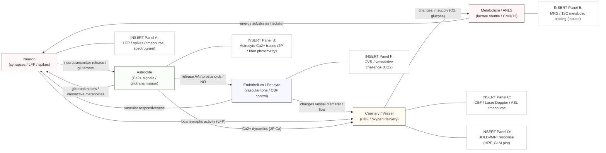

> **Схема нейроваскулярного интерфейса (NVU): neuron ⇄ astrocyte ⇄ endothelium/pericyte.** На схеме показаны ключевые направления взаимодействия: нейрональная активность (GLU release) стимулирует астроциты; астроцитарные Ca²⁺-всплески и выделяемые ими вазоактивные метаболиты (арахидоновая кислота → простаноиды, NO и т.д.) воздействуют на эндотелий и перициты; эндотелий/перициты регулируют диаметр капилляра и CBF; изменение CBF и местная метаболическая активность (ANLS, CMRO₂) модифицируют снабжение O₂/глюкозой, что в свою очередь влияет на нейрональную функцию. Плейсхолдеры Panel A–F отмечают места для эмпирических примеров: A — LFP / spikes (временная динамика, спектр); B — астроцитарные Ca²⁺-трассы (2-photon imaging или photometry); C — CBF (LDF / ASL) timecourse; D — BOLD-fMRI response / HRF; E — метаболические данные (MRS / 13C tracing, lactate); F — сосудистые вызовы / CVR. Для каждой панели укажите N (субъекты/животные), n (trials/epochs/events), preprocessing (фильтры, artifact rejection), статистику (p, CI) и контролы (CO₂ challenge, vascular reactivity, spike-bleed controls).

#### 22.3.3 BOLD-fMRI: что он реально измеряет

* BOLD сигнал отражает локальный баланс потребления кислорода (CMRO₂) и церебрального кровотока (CBF); эмпирические сравнения (simultaneous intracortical LFP/spiking + fMRI) показали сильную корреляцию BOLD с LFP (локально интегрированной синаптической активностью), а не непосредственно со спайковым огнём. Это ключевой результат для корректной интерпретации fMRI: BOLD ближе к локальным синаптическим событиям/энергетическим затратам, чем к выходной репрезентации одиночных нейронов. ([PubMed][431], [wexler.free.fr][430])

**Практическое следствие для экспериментов:** при интерпретации BOLD учитывайте вклад сосудистого компонента, возраст/сосудистое состояние подопытного и возможную роль глии/эндотелия в изменении coupling (особенно в заболеваниях). Комбинируйте fMRI с EEG/MEG/функциональными микроскопическими записями, чтобы разложить источники сигнала. ([PMC][423], [PubMed][422])

---

### 22.4 Микроглия: пластичность, pruning и патология

#### 22.4.1 Роль в развитии и пластичности

* Микроглия — активные иммунные клетки мозга, которые в норме участвуют в синаптическом прунинге в развитии, регулируют синаптическую стабильность и модулируют пластичность через фагоцитоз и выделение цитокинов/ростовых факторов. Работы Paolicelli et al. и Stephens et al. продемонстрировали её критическую роль в нормальном развитии синаптических схем. ([PubMed][432], [Frontiers][433])

#### 22.4.2 Роль в патологии

* В патологических состояниях активация микроглии может быть двуполюсной: она очищает токсичные агрегаты, но хроническая активация приводит к нейровоспалению, синаптической дисфункции и ускоренной нейродегенерации (AD, PD, травмы). Комплементная система (C1q/C3) взаимодействует с микроглией, помечая синапсы для удаления — важный механизм в ранней synaptopathy. ([Frontiers][433])

**Методология:**   in vivo imaging микроглии (2-photon), single-cell RNAseq (трансриптомы микро-глии при различных состояниях), манипуляции (CSF1R inhibitors, conditional KOs) и readouts синаптической плотности/функции. ([PMC][434])

---

### 22.5 NVU/глия в клинике: возраст, сосудистые заболевания и нейродегенерация

* Нарушение NVU (сосудистая дисфункция, BBB нарушение, эндотелиальная дисрегуляция) лежит в основе множества состояний: сосудистые когнитивные расстройства, ускорение AD-патологии (сосудистая состаренность меняет clearance Aβ), чувствительность к ischemia/reperfusion при инсультах. Понимание NVU критично для перевода биомаркеров (BOLD, ASL) и терапии (сосудистые/метаболические вмешательства). ([PubMed][422], [PMC][435])

---

### 22.6 Методологические рекомендации / best practices

1. **Мультимодальность:** сочетайте fMRI (BOLD/ASL) с электрофизиологией (LFP/spikes), оптогенетикой/хемогенетикой и метаболическими методами (MRS, 13C) при тестировании гипотез о NVC или глиальной роли. ([PubMed][431], [ScienceDirect][426])
2. **Контроль сосудистых факторов:** при сравнительных исследованиях (возраст, болезнь) контролируйте CVR (cerebrovascular reactivity), pCO₂, артериальное давление и лекарства, влияющие на сосуды; иначе BOLD-интерпретация будет смещена. ([PMC][423])
3. **Клеточно-специфичные манипуляции:** используйте cell-type specific tools (astrocyte-selective DREADDs/optogenetics, microglia conditional KOs) и сочетайте с readouts синаптической функции/поведения, чтобы установить causality. ([PMC][424])
4. **Интеграция временных шкал:** метаболические и сосудистые ответы разворачиваются дольше, чем спайковая активность — учитывайте это при синхронизации данных (BOLD задержка, hemodynamic response function variability). ([wexler.free.fr][430])

---

### 22.7 Открытые вопросы и перспективы на 2025

1. **Астроцитарные Ca²⁺-сигналы — сигнальные или эпифеномен?** Новые in vivo исследования (cell-resolved, genetically encoded indicators) уточняют пространственно-временные свойства Ca²⁺-всплесков и их causal-роль в NVC и gliotransmission. ([eLife][438], [PMC][428])
2. **Кем являются ключевые молекулярные посредники NVC в разных областях и состояниях (возраст/болезнь)?** Рецепторы, эндотелиальные факторы и перицитарная регуляция требуют дальнейшей картографии. ([PMC][435])
3. **Как NVU-нарушения влияют на раннюю synaptopathy при NDD?** Связь между сосудистой дисфункцией, нарушенным клиренсом белков и ранними синаптическими сдвигами — приоритетная трансляционная тема. ([PubMed][422], [PMC][434])

---

### 22.8 «Must-read» (ключевые источники для секции)

* Logothetis N. K., *Neurophysiological investigation of the basis of the fMRI signal.* Nature (2001). ([PubMed][431])
* Iadecola C., *The Neurovascular Unit Coming of Age: A Journey through Neurovascular Coupling in Health and Disease.* Neuron (2017). ([PubMed][422])
* Hillman EMC., *Coupling Mechanism and Significance of the BOLD Signal.* NeuroImage / review (2014). ([PMC][423])
* Pellerin L., Magistretti P. J., *Astrocyte–neuron lactate shuttle hypothesis (classic + follow-ups).* J Neurochem / reviews (1994–1998; reviews 2010s–2020s). ([PubMed][425], [PMC][445])
* Paolicelli R. C. et al., *Synaptic pruning by microglia is necessary for normal brain development.* Science (2011). ([PubMed][432])
* Bonvento G., Rouach N., *Astrocyte-neuron metabolic cooperation shapes brain activity.* Trends in Neurosciences / review (2021). ([ScienceDirect][426])
* Zhu W\.-M. et al., *Neurovascular coupling mechanisms in health and disease* (review, 2022). ([PMC][435])

---

#### Резюме

Астроциты и микроглия — активные участники синаптической функции, метаболической поддержки и пластичности; NVU интегрирует нейрональную активность с местным кровотоком, что делает BOLD-fMRI индикатором местных синаптических/метаболических событий. Понимание клеточно-молекулярных механизмов NVU и глии — ключ для верной интерпретации функциональных сигналов мозга, для объяснения ранней synaptopathy в NDD и для разработки новых терапевтических направлений. ([PubMed][431])

[422]: https://pubmed.ncbi.nlm.nih.gov/28957666/   "The Neurovascular Unit Coming of Age: A Journey through ..."
[423]: https://pmc.ncbi.nlm.nih.gov/articles/PMC4147398/   "Coupling Mechanism and Significance of the BOLD Signal"
[424]: https://pmc.ncbi.nlm.nih.gov/articles/PMC8257756/   "Astrocytes and Behavior - PMC - PubMed Central"
[425]: https://pubmed.ncbi.nlm.nih.gov/9778565/   "Evidence supporting the existence of an activity-dependent ..."
[426]: https://www.sciencedirect.com/science/article/pii/S1550413121003223   "Astrocyte-neuron metabolic cooperation shapes brain activity"
[427]: https://pmc.ncbi.nlm.nih.gov/articles/PMC10643736/   "Astrocytes: new evidence, new models, new roles - PMC"
[428]: https://pmc.ncbi.nlm.nih.gov/articles/PMC10017551/   "Calcium signaling in astrocytes and gliotransmitter release"
[429]: https://pmc.ncbi.nlm.nih.gov/articles/PMC5657612/   "The neurovascular unit coming of age: a journey through ..."
[430]: https://wexler.free.fr/library/files/logothetis%20%282001%29%20neurophysiological%20investigation%20of%20the%20basis%20of%20the%20fmri%20signal.pdf   "Logothetis (2001) Neurophysiological investigation of the ..."
[431]: https://pubmed.ncbi.nlm.nih.gov/11449264/   "Neurophysiological investigation of the basis of the fMRI ..."
[432]: https://pubmed.ncbi.nlm.nih.gov/21778362/   "Synaptic pruning by microglia is necessary for normal brain ..."
[433]: https://www.frontiersin.org/journals/neuroscience/articles/10.3389/fnins.2022.840266/full   "Complement Dependent Synaptic Reorganisation During ..."
[434]: https://pmc.ncbi.nlm.nih.gov/articles/PMC8451802/   "Microglia regulate synaptic development and plasticity - PMC"
[435]: https://pmc.ncbi.nlm.nih.gov/articles/PMC9337814/   "Neurovascular coupling mechanisms in health and ..."
[436]: https://pubmed.ncbi.nlm.nih.gov/11449264/   "Neurophysiological investigation of the basis of the fMRI ..."
[437]: https://www.sciencedirect.com/science/article/pii/S1550413121003223   "Astrocyte-neuron metabolic cooperation shapes brain activity"
[438]: https://elifesciences.org/articles/90046   "A spatial threshold for astrocyte calcium surge"
[439]: https://pmc.ncbi.nlm.nih.gov/articles/PMC10017551/   "Calcium signaling in astrocytes and gliotransmitter release"
[440]: https://pmc.ncbi.nlm.nih.gov/articles/PMC9337814/   "Neurovascular coupling mechanisms in health and ..."
[441]: https://pubmed.ncbi.nlm.nih.gov/28957666/   "The Neurovascular Unit Coming of Age: A Journey through ..."
[442]: https://pmc.ncbi.nlm.nih.gov/articles/PMC8451802/   "Microglia regulate synaptic development and plasticity - PMC"
[443]: https://pubmed.ncbi.nlm.nih.gov/11449264/   "Neurophysiological investigation of the basis of the fMRI ..."
[444]: https://pubmed.ncbi.nlm.nih.gov/9778565/   "Evidence supporting the existence of an activity-dependent ..."
[445]: https://pmc.ncbi.nlm.nih.gov/articles/PMC11694005/   "the evolution of the astrocyte-neuron lactate shuttle ..."

---

## 23. Интероцепция и мозг-тело (homeostatic drives) 

Ниже — межуровневый, системный модуль по интероцепции и системам «мозг–тело»: анатомия и пути, вычислительные/теоретические рамки, ключевые нейроанатомические узлы (insula, hypothalamus, CAN), методы измерения, роль в эмоциях и психических расстройствах, и открытые вопросы. Все утверждения опираются на авторитетную литературу (классика → современные обзоры до 2024–2025).

---

### 23.1 Краткое определение и смысл термина

**Интероцепция** — восприятие и центральная переработка сигналов о внутреннем состоянии тела (сердце, лёгкие, желудочно-кишечный тракт, сосудистая система, химическое гомеостазирование и пр.), включающая афферентную передачу, их интерпретацию и интеграцию с мотивацией/когницией. Интероцепция лежит в основе homeostatic drives (голод, жажда, дыхательная потребность, боль, «air-hunger») и фундаментально связана с эмоциями, самосознанием и регуляцией поведения. ([PubMed][446])

---

### 23.2 Анатомия и пути интероцепции — от органов к коре

1. **Периферические афференты.** Сигналы от тела передаются посредством висцеральной афферентации (включая вагус, спинальные афференты) к ядрам ствола (nucleus of the solitary tract — NTS, parabrachial nucleus) и к мозговым центрам регуляции. ([PubMed][447])
2. **Ствол и таламус.** От NTS / parabrachial — маршруты идут к таламусу и организуют передачу в корковые зоны; параллельно идут проекции к гипоталамусу, лимбическим структурам и вегетативным моторным ядрам для быстрого регуляторного ответа. ([PubMed][447])
3. **Инсула как корковый «ядро» интероцепции.** Dorsal/posterior insula (pIns) получает первичные афференти и формирует соматосенсорную/висцеральную карту тела; anterior insula (aIns / AIC) — интегратор интероцептивных сигналов с эмоционально-мотивационными и когнитивными процессами, вовлечённый в субъективное чувство («how do you feel»). Эта анатомо-функциональная градация описана в классических работах Craig и Critchley и подтверждена современными картированиями insula. ([Nature][448], [PubMed][449], [eLife][450])
4. **Связь с другими системами.** Инсула тесно связана с ACC, OFC, amygdala, hypothalamus и brainstem nuclei — формируя «central autonomic network» (CAN) / interoceptive network, которая связывает ощущения тела с регуляцией ANS и мотивацией. ([PubMed][451])

(Ключевые источники: Craig AD 2002/2003/2009; Critchley 2004/2017; современные картирования insula — eLife 2019). ([PubMed][446], [eLife][450])

```mermaid
flowchart LR
  %% Interoception pathway schematic
  Organ["Organ<br>viscera / receptors<br>ECG / baroreceptors"]
  NTS["NTS<br>nucleus tractus solitarius"]
  PBN["Parabrachial<br>nucleus"]
  Thal["Thalamus<br>visceral relay"]
  pIns["Posterior Insula<br>primary interoceptive cortex"]
  aIns["Anterior Insula<br>integrative subjective feeling"]
  ACC["ACC / mPFC<br>autonomic control"]
  Hyp["Hypothalamus<br>homeostatic drives"]

  %% main feedforward path
  Organ -->|"vagal / spinal afferents"| NTS
  NTS -->|"ascending projections"| PBN
  PBN -->|"thalamic relays"| Thal
  Thal -->|"cortical relay"| pIns
  pIns -->|"integration / re-representation"| aIns
  aIns -->|"top-down visceromotor output"| ACC
  aIns --> ACC
  ACC --> Hyp
  Hyp -->|"descending autonomic efferents"| NTS

  %% panel placeholders for example traces
  Organ --- PanelECG["INSERT Panel A:<br>ECG / peripheral trace"]
  pIns --- PanelHEP["INSERT Panel B:<br>HEP / iEEG / EEG average"]
  aIns --- PanelBOLD["INSERT Panel C:<br>BOLD / ROI timecourse"]
  ACC --- PanelHRV["INSERT Panel D:<br>HRV / autonomic metric"]

  %% styling
  style Organ fill:#fff0f0,stroke:#444
  style NTS fill:#fff7e6,stroke:#444
  style PBN fill:#fff7e6,stroke:#444
  style Thal fill:#fffaf0,stroke:#444
  style pIns fill:#f0fff7,stroke:#444
  style aIns fill:#f0fff7,stroke:#444
  style ACC fill:#f7f7ff,stroke:#444
  style Hyp fill:#f7f7ff,stroke:#444
  style PanelECG fill:#ffffff,stroke:#bbb
  style PanelHEP fill:#ffffff,stroke:#bbb
  style PanelBOLD fill:#ffffff,stroke:#bbb
  style PanelHRV fill:#ffffff,stroke:#bbb
```

> **Схема путей интероцепции: от органов к коре и регуляции.** Схема показывает ключевой «фидфорвардный» маршрут: периферические висцеральные рецепторы (Organ) через вагальные и спинальные афференты проецируют в ядро одиночного пучка (NTS), далее через parabrachial nucleus (PBN) и таламические реле транслируются в заднюю инсулу (posterior insula), где формируются первичные интероцептивные карты; информация далее перерабатывается в передней инсуле (anterior insula) для интеграции с эмоциями/самосознанием и маршрутизируется в ACC/mPFC и гипоталамус для вегетативной и эндокринной регуляции. Стрелки обратной связи (ACC → Hyp → NTS) указывают на descending visceromotor пути для быстрого homeostatic контроля. Плейсхолдеры Panel A–D отмечают места для эмпирических примеров: A — периферические записи (ECG, arterial pulse); B — HEP / averaged iEEG or EEG evoked potentials aligned to R peak; C — BOLD timecourse в ROI anterior insula / ACC; D — autonomic indices (HRV) aligned to events. Для каждой панели укажите N (число субъектов/животных), n (эпизоды/триалы), preprocessing (EEG: filtering, ICA; fMRI: motion regressors, HRF model), latency windows (ms) и статистику (p, CIs). Контролируйте дыхание, позу и препараты, влияющие на автономию.

---

### 23.3 Вычислительные/теоретические рамки

* **Интероцептивная инференция / predictive coding.** Современные теории рассматривают интероцепцию как разновидность предсказательной обработки: мозг генерирует предсказания о внутренних сигналах и минимизирует prediction-error — что связывает interoception с эмоциями, самосознанием и активным управлением (active interoceptive inference). Это даёт формальные объяснения чувств (valence, arousal) и патологий (анксайети, соматизация). ([PMC][452], [PubMed][453])
* **Многоуровневая природа интероцепции.** Различают ощущение (raw sensation), точность восприятия (accuracy), субъективную осведомлённость (sensibility) и метакогнитивную осознанность (awareness). Эти аспекты могут разниться между людьми и патологиями — см. трёхкомпонентную модель Garfinkel et al. (accuracy ≠ sensibility ≠ awareness). ([ScienceDirect][454])

---

### 23.4 Гипоталамус и homeostatic drives — ключевые узлы и механизмы

* **Аркуатное ядро (ARC):** AgRP/NPY и POMC нейроны — центральные регуляторы голода/насыщения; AgRP-нейроны стимулируют аппетит и участвуют в мотивационных изменениях при голоде, POMC → противоположно. Их входы/выходы соединяют гипоталамус с reward-системой и автономными эффектами. ([PMC][455], [Annual Reviews][456])
* **PVN, LHA, VMH и др.** Эти области координируют эндокринные и вегетативные ответы (HPA-axis, sympathetic/parasympathetic outflow), а также интеграцию гормональных сигналов (leptin, ghrelin, insulin) и сенсорных сигналов от кишечника. ([Nature][457], [Cell][458])
* **Современные достижения.** Оптогенетика/хемогенетика и трассировочные работы дали подробную «проводку» аппетитных цепей (Sternson, Andermann и соавторы); в 2023–2024 появились дополнительные крупные описания разнообразия AgRP/POMC-нейронов и их роли в allostatic регуляции. ([PMC][455], [Nature][459])

---

### 23.5 Центральная автономная сеть (CAN) — ANS ↔ когниция/эмоция

* **CAN — состав и функции.** CAN (insular cortex, ACC, amygdala, hypothalamus, parabrachial nucleus, NTS, ventrolateral medulla и пр.) — анатомическая/функциональная основа интеграции афферентных интероцептивных сигналов с автономной регуляцией и поведенческим ответом. ([PubMed][451])
* **Нейровисцеральная интеграция.** Теории (neurovisceral integration; Thayer & Lane) связывают вариабельность сердечного ритма (HRV) с функциональным состоянием фронто-лимбической сети и когнитивной саморегуляцией; HRV часто используется как индикатор эффективности верхних уровней CAN. ([PubMed][460], [PMC][461])

---

### 23.6 Методология: как изучают интероцепцию (на практике)

1. **Бихевиоральные задачи**

   * *Heartbeat counting / heartbeat discrimination / heartbeat detection tasks* — объективные меры interoceptive accuracy; их интерпретация требует осторожности (см. критику и рекомендации по методике). ([PMC][462], [ScienceDirect][463])
   * *Respiratory and gastric probes* — дыхательные задачки (inspiratory load, CO₂), electrogastrography (EGG) и water-load tests — для изучения пищеварительной и респираторной интероцепции. ([PubMed][464], [PMC][465])
2. **Физиологические маркёры**

   * HRV, skin conductance, blood pressure, gastric myoelectrical activity — используются как периферические корреляты интероцепции и для стратификации состояния. ([PubMed][460], [Frontiers][466])
3. **Нейрофизиологические и нейровизуализационные подходы**

   * fMRI (insula, ACC, brainstem), MEG/EEG (HEP — heartbeat-evoked potentials), iEEG/ECoG (локальные signatures), simultaneous brain–body recordings. HEP используется как нейрофизиологический маркер, но мета-анализы подчёркивают вариабельность эффектов и необходимость стандартизации. ([PubMed][449])
4. **Causal-методы**

   * Pharmacology (modulation of autonomic tone), vagal nerve stimulation (VNS), TMS/tDCS по целям CAN, opto/chemogenetics в животных, манипуляции гормонами (leptin, ghrelin). ([Annual Reviews][456], [PubMed][447])
5. **Стандартизация и многоаспектный подход**

   * Рекомендации (Kleckner, Khalsa) призывают комбинировать разные оси интероцепции (cardiac, respiratory, gastric) и различать accuracy/sensibility/awareness при интерпретации результатов. ([affective-science.org][467], [PubMed][468])

---

### 23.7 Интероцепция и психическое здоровье — прикладные аспекты

* **Тревога и расстройства настроения.** Аномалии интероцептивной обработки (как гипер-, так и гипо-чувствительность) связаны с тревогой, депрессией и паническими расстройствами; некоторые данные указывают на то, что повышенная субъективная чувствительность при низкой объективной точности связана с симптомами тревоги. ([PubMed][469], [autonomicneuroscience.com][470])
* **Расстройства пищевого поведения.** Дисфункция гастроинтероцепции (перцепция сытости / gastric signals) ассоциирована с BED/BN/анорексией; измерения EGG и water-load tests демонстрируют отклонения. ([SpringerLink][471], [PMC][465])
* **Аутизм и соматопсихические фенотипы.** Паттерны интероцепции у аутичных лиц могут быть переменными и влиять на эмоциональную регуляцию; интероцептивная терапия показала предварительную пользу в некоторых клинических исследованиях. ([PMC][472], [WIRED][473])

(Обзор «Interoception and Mental Health: a roadmap» — Khalsa et al. 2018 — хорошая отправная точка для translational work). ([PubMed][468])

---

### 23.8 Методологические ловушки и рекомендации

* **Не путать accuracy и sensibility.** Объективные тесты сердечного ощущения и самооценка интероцепции измеряют разные вещи — отчётливо различать эти компоненты. ([ScienceDirect][454])
* **Контроль за физиологическим контекстом.** Фазу дыхания, положение тела, recent food intake и уровень arousal следует контролировать — они существенно влияют на интероцептивные сигналы и HEP. ([PMC][474], [Frontiers][475])
* **Мульти-осевая оценка.** Рекомендуется измерять несколько каналов (cardiac + respiratory + gastric) и комбинировать поведенческие, физиологические и нейровизуализационные readouts. ([ScienceDirect][476])

---

### 23.9 Открытые вопросы и приоритеты (на 2025)

1. **Как реализуются interoceptive predictive models на нейронном уровне?** Нужно больше causal-данных (laminar recordings, perturbations) для проверки моделей interoceptive inference. ([PMC][452])
2. **Какая роль AIC vs posterior insula в разных аспектах интероцепции (сознание vs автоматическая регуляция)?** Ламинарные и high-gamma iEEG-данные могут прояснить разделение ролей. ([eLife][450], [PubMed][449])
3. **Стандартизация HEP и поведенческих протоколов.** Метанализы показывают вариабельность; необходимы согласованные pipelines для HEP/heartbeat tasks. ([PubMed][477], [БиорКсив][478])
4. **Интеграция гастроинтероцепции в психиатрическую диагностику.** Технологии EGG/ingestible sensors + computational models обещают новые биомаркеры для ED и соматоформных расстройств. ([SpringerLink][471])

---

### 23.10 «Must-read» (якоря для раздела)

* Craig A. D. (How do you feel? Interoception: the sense of the physiological condition of the body.) *Nat Rev Neurosci* (2002/2003). ([PubMed][446])
* Critchley H. D., Wiens S., Rotshtein P., Öhman A., Dolan R. J., *Neural systems supporting interoceptive awareness.* *Nat Neurosci* (2004). ([PubMed][449])
* Khalsa S. S. et al., *Interoception and Mental Health: A Roadmap.* *Biol Psychiatry Cogn Neurosci Neuroimaging* (2018). ([PubMed][468])
* Seth A. K., *Interoceptive inference and the emotional brain / active interoceptive inference.* *Philos Trans R Soc Lond B* (2013, 2016). ([PubMed][453], [PMC][452])
* Garfinkel S. N., Seth A. K., Barrett A. B., Suzuki K., Critchley H. D., *Knowing your own heart: distinguishing interoceptive accuracy from interoceptive awareness.* *Biol Psychol* (2015). ([ScienceDirect][454])
* Benarroch E. E., *The central autonomic network: functional organization, dysfunction, and perspective.* *Mayo Clin Proc* (1993). ([PubMed][451])
* Thayer J. F., Lane R. D., *A model of neurovisceral integration in emotion regulation and dysregulation.* *J Affect Disord* / *Neurosci Biobehav Rev* (2000, 2009). ([PubMed][460], [ScienceDirect][476])
* Sternson S. M., *Neural circuits and motivational processes for hunger (review).* *Neuron / Annu Rev Physiol* (2013/2017). ([PMC][455], [Annual Reviews][456])
* Kleckner I. A. et al., *Toward a practical method for measuring interoception: recommendations and a checklist.* (methods paper / best practices). ([affective-science.org][467])
* Coll M. P. et al., *Systematic review and meta-analysis of the relationship between the heartbeat-evoked potential and interoception.* (2021). ([PubMed][477])

---

#### Резюме

Интероцепция — центральный компонент мозговой картины «я» и homeostatic regulation: от периферических висцеральных сигналов через ствол мозга и hypothalamus до insula/ACC и фронто-лимбических сетей. Современные теории (interoceptive inference) формализуют связь между телом и эмоциями; на практике исследование требует мульти-осевого подхода (cardiac/respiratory/gastric), стандартизованных метрик (accuracy/sensibility/awareness) и сочетания наблюдательных и каузальных методов. Интероцепция — перспективное направление для психиатрии и соматической медицины, но остаются важные методологические и теоретические пробелы. ([PubMed][446], [ScienceDirect][454])

[446]: https://pubmed.ncbi.nlm.nih.gov/12154366/   "How do you feel? Interoception: the sense ..."
[447]: https://pubmed.ncbi.nlm.nih.gov/24095115/   "Central control of autonomic function and involvement in ..."
[448]: https://www.nature.com/articles/nrn894   "How do you feel? Interoception: the sense of ..."
[449]: https://pubmed.ncbi.nlm.nih.gov/14730305/   "Neural systems supporting interoceptive awareness"
[450]: https://elifesciences.org/articles/53086   "Uncovering the functional anatomy of the human insula ..."
[451]: https://pubmed.ncbi.nlm.nih.gov/8412366/   "The central autonomic network: functional organization, ..."
[452]: https://pmc.ncbi.nlm.nih.gov/articles/PMC5062097/   "Active interoceptive inference and the emotional brain - PMC"
[453]: https://pubmed.ncbi.nlm.nih.gov/24126130/   "Interoceptive inference, emotion, and the embodied self"
[454]: https://www.sciencedirect.com/science/article/pii/S0301051114002294   "Knowing your own heart: Distinguishing interoceptive ..."
[455]: https://pmc.ncbi.nlm.nih.gov/articles/PMC3948161/   "Neural circuits and motivational processes for hunger - PMC"
[456]: https://www.annualreviews.org/doi/10.1146/annurev-physiol-021115-104948   "Three Pillars for the Neural Control of Appetite"
[457]: https://www.nature.com/articles/s41467-019-12478-x   "Hypothalamic neuronal circuits regulating hunger-induced ..."
[458]: https://www.cell.com/neuron/pdf/S0896-6273%2817%2930512-3.pdf   "Toward a Wiring Diagram Understanding of Appetite Control"
[459]: https://www.nature.com/articles/s42255-024-00987-z   "Reciprocal activity of AgRP and POMC neurons governs ..."
[460]: https://pubmed.ncbi.nlm.nih.gov/19424767/   "Heart rate variability, prefrontal neural function, and ..."
[461]: https://pmc.ncbi.nlm.nih.gov/articles/PMC4387874/   "Focusing neurovisceral integration: Cognition, heart rate ..."
[462]: https://pmc.ncbi.nlm.nih.gov/articles/PMC4547010/   "Investigating the relationship between interoceptive ..."
[463]: https://www.sciencedirect.com/science/article/abs/pii/S0301051120301095   "The relationship between heartbeat counting and ..."
[464]: https://pubmed.ncbi.nlm.nih.gov/32400920/   "Gastric interoception and gastric myoelectrical activity in ..."
[465]: https://pmc.ncbi.nlm.nih.gov/articles/PMC8359291/   "Gastric interoception and gastric myoelectrical activity in ..."
[466]: https://www.frontiersin.org/journals/physiology/articles/10.3389/fphys.2023.1281342/pdf   "Application of electrogastrogram in assessment of gastric ..."
[467]: https://affective-science.org/pubs/2015/kleckner-2015%3Dmethod-recommend.pdf   "based measure of interoceptive sensitivity"
[468]: https://pubmed.ncbi.nlm.nih.gov/29884281/   "Interoception and Mental Health: A Roadmap"
[469]: https://pubmed.ncbi.nlm.nih.gov/28080971/   "Interoceptive dimensions across cardiac and respiratory axes"
[470]: https://www.autonomicneuroscience.com/article/S1566-0702%2823%2900001-2/fulltext   "Cardiac interoception in patients accessing secondary ..."
[471]: https://link.springer.com/article/10.1007/s11920-022-01318-3   "Gastrointestinal Interoception in Eating Disorders: Charting ..."
[472]: https://pmc.ncbi.nlm.nih.gov/articles/PMC6428192/   "Taking aim at interoception's role in mental health - PMC"
[473]: https://www.wired.com/story/sarah-garfinkel-interoception   "Listening to your heart might be the key to conquering anxiety"
[474]: https://pmc.ncbi.nlm.nih.gov/articles/PMC11016802/   "Attention to cardiac sensations enhances the heartbeat ..."
[475]: https://www.frontiersin.org/journals/neuroscience/articles/10.3389/fnins.2024.1391437/full   "respiratory influences on cardiac interoception"
[476]: https://www.sciencedirect.com/science/article/pii/S0301051122000023   "Towards a comprehensive assessment of interoception in ..."
[477]: https://pubmed.ncbi.nlm.nih.gov/33450331/   "Systematic review and meta-analysis of the relationship ..."
[478]: https://www.biorxiv.org/content/10.1101/2024.07.23.604405v1.full-text   "Methodological approaches to derive the heartbeat evoked ..."

---

## 24. Биологически-правдоподобные алгоритмы обучения и связь с ИИ 

Ниже — межуровневый, практический обзор попыток сопоставить биологию с современными алгоритмами обучения (как «как мог бы обучаться мозг» vs «что мы почерпнули для ИИ»). Каждое ключевое утверждение снабжено ссылками на авторитетную литературу (классика + современные обзоры и важные эмпирические работы до 2024–2025).

---

### 24.1 Карта поля — зачем это важно

* Два направления: (A) понять, какие алгоритмы решения задачи «credit assignment» и «обучения глубоких представлений» реализуемы в мозге; (B) вдохновиться биологическими механизмами для более энерго-/данно-эффективных и адаптивных ИИ (neuromorphic hardware, continual learning, attention-like механизмы). Область соединяет теорию обучения, клеточную физиологию (дендриты, нейромодуляторы), пластичность и аппаратные реализации. ([Nature][479], [Frontiers][480])

---

### 24.2 Попытки реализовать (или аппроксимировать) backpropagation в мозге

#### 24.2.1 Обзор «парадокса» и обзорные синтезы

* Классическая проблема: стандартный алгоритм обратного распространения ошибки (backprop) требует симметричных весов, глобальной коммуникации градиентов и отдельно синхронизированных фаз — свойства, которые прямо не наблюдаются в биологии. Современные теории предлагают несколько путей аппроксимации/эммуляции этих свойств в нейронных микросхемах. Обзорные суммаризации и сравнительные анализы — Whittington & Bogacz (2019) и Richards et al. (2019). ([PubMed][481], [Nature][479])

#### 24.2.2 Feedback alignment / Random feedback

* Идея: точное симметричное транспонирование весов не требуется — рандомные/фиксированные обратные проекции могут давать корректный сигнал для обучения (feedback alignment, Lillicrap et al.). Это простое, мощное наблюдение демонстрирует, что биологически правдоподобные разницы в весах не обязательно ломают обучение. ([Nature][482], [arXiv][483])

#### 24.2.3 Equilibrium Propagation и энергодоменные подходы

* Equilibrium Propagation (Scellier & Bengio) → идея: сеть с динамикой, сходящаяся в стационарное состояние, при лёгком «нудинге» выходов генерирует локальные изменения, эквивалентные градиенту. Подход уравновешивает фазу предсказания и фазу «обучения» без явного разделения прямиком/обратно — более биологичен по операциям. ([Frontiers][480], [arXiv][484])

#### 24.2.4 Дендричные реализации ошибки (segregated dendrites / apical error signals)

* Ряд работ показал, как апикальные дендриты пирамидных нейронов могут кодировать «погрешности» или топ-down предсказания, тогда как базальные дендриты обрабатывают feedforward вход — это позволяет локально вычислять сигнал ошибки и корректировать синапсы в базальных ветвях (Guerguiev et al., Sacramento et al.). Модели такого типа приближаются к backprop без глобального транспонирования весов. ([PMC][485], [arXiv][486])

#### 24.2.5 Теоретические синтезы

* Bryson-style, predictive coding / variational schemes и другие energy-based модели — все дают теоретические траектории, как мозг может минимизировать «prediction error» и тем самым аппроксимировать градиентные обновления (см. обзоры и сравнительные работы). ([arXiv][487], [PubMed][481])

*(Ключевые справки: Lillicrap et al. 2016; Guerguiev et al. 2017; Scellier & Bengio 2017; Sacramento et al. 2018; Whittington & Bogacz 2019; Bengio et al. обзоры).* ([Nature][482], [PMC][485], [Frontiers][480], [arXiv][486], [PubMed][481])

---

### 24.3 Credit assignment: пространственная и временная проблема

#### 24.3.1 Пространственный credit assignment (which synapse in deep pathways caused the outcome?)

* Решения: feedback alignment, dendritic error signalling, локально-оптимизирующие правила (contrastive, equilibrium) — см. раздел 24.2. Биологический компромисс часто включает локальные признаки ошибки (дендрит/интернейрон) + глобальные neuromodulatory «учётчики» успеха/неудачи. ([Nature][482], [PMC][485])

#### 24.3.2 Временная кредит-назначение (temporal credit assignment)

* BPTT (backprop through time) — эффективен в маш. обучении, но биологически проблематичен (нужна память состояний и обратная фаза). Биологически правдоподобные альтернативы:

  * **Eligibility traces / three-factor rules**: локальная отметка (pre×post) формирует «след», который позднее конвертируется в изменение веса третьим фактором (дофамин/нейромодулятор = reward / TD-error). Экспериментально и теоретически поддержаны (Frémaux & Gerstner; Gerstner review). ([PMC][488])
  * **E-prop (eligibility propagation)**: алгоритм Bellec et al. (2020) аппроксимирует BPTT для спайковых RNN через локальные eligibility-traces + глобальные модульные ошибки — показал практические успехи и применимость на neuromorphic платформах. ([Nature][489], [PMC][490])

*(Вывод: временная проблема частично решается комбинацией eligibility traces и neuromodulatory broadcast signals; современные алгоритмы (e-prop) демонстрируют, что это не только теория, а практический метод.)* ([PMC][488], [Nature][489])

---

### 24.4 Три-факторные правила, STDP и neuromodulation

* Практическая и теоретическая рамка: STDP (pre/post timing) задаёт локальнуюeligibility; третий фактор (дофамин, ацетилхолин, норадреналин) служит сигналом значимости/вознаграждения/внимания и конвертирует eligibility в долговременную пластичность. Хорошая обзорная реконструкция — Frémaux & Gerstner (2016) и последующие обзоры/эксперименты по eligibility traces. ([PMC][488])

---

### 24.5 Биологически-правдоподобные архитектуры и алгоритмы — краткие блоки

* **Reservoir computing (Echo State / Liquid State)** — вычислительная парадигма, где фиксированный динамический «резервуар» проектирует вход в высокоразмерное пространство, а обучение выполняется только на выходном слое (Jaeger, Maass). Это близко к нейронной идее широких рекуррентных граней и «использовать динамику как функцию признаков». ([PMC][491])
* **Attention / Transformer analogies** — механизм внимания (biological spotlight / gain modulation / biased competition) имеет явные аналогии с self-attention в трансформерах; эта аналогия полезна, но нужно избегать прямых отождествлений — архитектурная и временная реализация в мозге и в трансформерах различаются. Обзор нейро-ИИ мостов — Lindsay (2020) + Vaswani et al. (2017). ([PubMed][492], [papers.neurips.cc][493])
* **Reservoirs + readouts = быстрый тренер для временных задач**; **local contrastive/predictive objectives** дают альтернативу «полно-градиентному» подходу. ([PMC][491], [Nature][479])

---

### 24.6 Neuromorphic hardware — почему аппаратная сторона важна

* **TrueNorth (IBM)** — цифровый спайковый чип с миллионом «нейронов» (Merolla et al.); прорыв по энергоэффективности, но в ранних версиях — ограниченное on-chip обучение. ([paulmerolla.com][494], [IBM Research][495])
* **SpiNNaker (Manchester)** — многоядерная архитектура для моделирования больших SNN в реальном времени; гибкая, ориентирована на исследование масштабируемости и online-learning. ([cs.man.ac.uk][496], [PMC][497])
* **Loihi (Intel)** — программируемый нейроморфный процессор с поддержкой on-chip learning и программируемых правил пластичности (Loihi 1/2 разработки); стал отправной точкой для демонстраций e-prop/онлайн обучения и задач с ограниченным энергопотреблением. ([redwood.berkeley.edu][498], [dynamicfieldtheory.org][499])

**Текущие вызовы:** стандарты бенчмаркинга, инструментарий для gradient-based training SNN, совместимость с DL-стеками; последние работы по NeuroBench/benchmarking и по интеграции e-prop на аппаратных платформах устраняют разрыв, но путь к массовому применению ещё открыт. ([tsapps.nist.gov][500], [PMC][490])

---

### 24.7 Взаимовлияние: что нейронаука дала DL и что DL дала нейронауке

#### 24.7.1 От нейронауки к ИИ

* Биологические принципы (sparse coding, attention, recurrence, memory buffers) вдохновили архитектуры (sparse nets, attention/transformers, RNN, memory-augmented nets). Обзорная дискуссия — Richards et al. 2019, Lindsay 2020. ([Nature][479], [PubMed][492])

#### 24.7.2 От ИИ к нейронауке

* DL дал мощный инструментарий для моделирования функций коры (функциональные «предсказатели» визуальной коры), экспериментальных гипотез о представлениях, и новые модели learning-rules, которые можно тестировать in vivo/in vitro. Также DL-инструменты помогли анализу больших нейронных массивов (encoding/decoding, manifold analysis). ([Nature][479])

---

### 24.8 Ограничения, открытые вопросы и приоритеты на 2025

1. **Явная биологическая реализация backprop?** Нету окончательного «победителя» — вероятно, мозг комбинирует несколько механизмов (дендритные ошибки + eligibility × neuromodulation + частичные обратные проекции). Эксперименты с ламинарными записями и апикальными сигналами — приоритет. ([PMC][485], [arXiv][486])
2. **Временная устойчивость eligibility traces:** как мозг хранит «следы» в присутствии шумов и множества действий? Каскадные/мульти-тайм-константы — активная гипотеза (новые теоретические работы). ([PMC][501], [eLife][502])
3. **Нейроморфные стеки:** стандартизованные бенчмарки (NeuroBench и др.), обмен форматами (спайковые модели ↔ DL) и on-chip обучение — критические инжен.-научные задачи. ([tsapps.nist.gov][500], [dynamicfieldtheory.org][499])
4. **От локальной правдоподобности к поведенческой репликации:** модели должны не только обучаться, но и воспроизводить нейронную динамику и поведение — это главный тест их биологической релевантности. ([Nature][479])

---

### 24.9 Ключевые (must-read) источники для раздела

* **Whittington JCR, Bogacz R.** Theories of error back-propagation in the brain. *Trends Cogn Sci* 2019. — обзор современных подходов. ([PubMed][481])
* **Lillicrap TP et al.** Random synaptic feedback weights support error backpropagation for deep learning. *Nat Commun* 2016. — feedback alignment. ([Nature][482])
* **Guerguiev J, Lillicrap TP, Richards BA.** Towards deep learning with segregated dendrites. *eLife* 2017. — дендритная аппроксимация ошибки. ([PMC][485])
* **Scellier B, Bengio Y.** Equilibrium Propagation (Frontiers/ArXiv 2016/2017). — energy-based local learning. ([Frontiers][480], [arXiv][484])
* **Sacramento J, Ponte Costa R, Bengio Y, Senn W.** Dendritic cortical microcircuits approximate backprop. (arXiv 2018). — микросхемные реализации. ([arXiv][486])
* **Frémaux N, Gerstner W.** Neuromodulated spike-timing-dependent plasticity, three-factor rules. *Front Comput Neurosci* 2016. — eligibility & three-factor. ([PMC][488])
* **Bellec G. et al.** A solution to the learning dilemma for recurrent networks of spiking neurons. *Nat Commun* 2020 — e-prop (eligibility propagation). ([Nature][489])
* **Richards BA et al.** A deep learning framework for neuroscience. *Nat Neurosci* 2019 — междисциплинарный манифест. ([Nature][479])
* **Vaswani A. et al.** Attention is all you need. *NeurIPS* 2017 — трансформеры / self-attention (ИИ сторона). ([papers.neurips.cc][493])
* **Lindsay GW.** Attention in Psychology, Neuroscience, and Machine Learning. *Front Comput Neurosci* 2020 — мост внимания биология↔ИИ. ([PubMed][492])
* **Jaeger H., Maass W.** (foundations of) Echo State Networks / Liquid State Machines — reservoir computing. (reviews and origins). ([PMC][491], [scholarpedia.org][503])
* **Merolla PA et al.** A million spiking-neuron integrated circuit (TrueNorth). *Science* 2014; **Davies M. et al.** Loihi: a neuromorphic manycore processor (IEEE Micro 2018); **Furber S. et al.** SpiNNaker project (Proc. IEEE 2014). — аппаратная база. ([paulmerolla.com][494], [redwood.berkeley.edu][498], [cs.man.ac.uk][496])

---

### 24.10 Резюме

1. **Не искать «единственный правильный» биологический backprop:** мозг, скорее всего, комбинирует локально-доступные error-представления (дендриты), глобальные broadcast-сигналы (нейромодуляторы) и частично согласованные обратные проекции. ([PMC][485])
2. **Проверяйте модели на трёх уровнях:** задача-точность (performance), воспроизведение нейродинамики (representational similarity) и биологическая реализуемость (локальные сигналы / физиология). ([Nature][479])
3. **Для трансляции в аппаратное выполнение** — смотрите e-prop / three-factor реализации и последние Loihi/SpiNNaker/TrueNorth демонстрации; стандарты бенчмарков (NeuroBench и пр.) ускоряют сопоставления. ([Nature][489], [tsapps.nist.gov][500])

[479]: https://www.nature.com/articles/s41593-019-0520-2   "A deep learning framework for neuroscience - Nature"
[480]: https://www.frontiersin.org/journals/computational-neuroscience/articles/10.3389/fncom.2017.00024/full   "Equilibrium Propagation: Bridging the Gap between ..."
[481]: https://pubmed.ncbi.nlm.nih.gov/30704969/   "Theories of Error Back-Propagation in the Brain"
[482]: https://www.nature.com/articles/ncomms13276   "Random synaptic feedback weights support error ..."
[483]: https://arxiv.org/abs/1411.0247   "Random feedback weights support learning in deep neural ..."
[484]: https://arxiv.org/abs/1602.05179   "Equilibrium Propagation: Bridging the Gap Between Energy-Based Models and Backpropagation"
[485]: https://pmc.ncbi.nlm.nih.gov/articles/PMC5716677/   "Towards deep learning with segregated dendrites - PMC"
[486]: https://arxiv.org/abs/1810.11393   "Dendritic cortical microcircuits approximate the backpropagation algorithm"
[487]: https://arxiv.org/abs/1502.04156   "Towards Biologically Plausible Deep Learning"
[488]: https://pmc.ncbi.nlm.nih.gov/articles/PMC4717313/   "Neuromodulated Spike-Timing-Dependent Plasticity, and ..."
[489]: https://www.nature.com/articles/s41467-020-17236-y   "A solution to the learning dilemma for recurrent networks of ..."
[490]: https://pmc.ncbi.nlm.nih.gov/articles/PMC9742366/   "E-prop on SpiNNaker 2: Exploring online learning in ..."
[491]: https://pmc.ncbi.nlm.nih.gov/articles/PMC6553587/   "Evolutionary aspects of reservoir computing - PMC"
[492]: https://pubmed.ncbi.nlm.nih.gov/32372937/   "Attention in Psychology, Neuroscience, and Machine ..."
[493]: https://papers.neurips.cc/paper/7181-attention-is-all-you-need.pdf   "Attention is All you Need"
[494]: https://paulmerolla.com/merolla_main_som.pdf   "A Million Spiking-Neuron Integrated Circuit with a Scalable ..."
[495]: https://research.ibm.com/publications/truenorth-design-and-tool-flow-of-a-65-mw-1-million-neuron-programmable-neurosynaptic-chip   "TrueNorth: Design and Tool Flow of a 65 mW 1 Million ..."
[496]: https://www.cs.man.ac.uk/~bparsia/2017/introexercise/Furber1.pdf   "Overview of the SpiNNaker system architecture"
[497]: https://pmc.ncbi.nlm.nih.gov/articles/PMC4299433/   "A framework for plasticity implementation on the ..."
[498]: https://redwood.berkeley.edu/wp-content/uploads/2021/08/Davies2018.pdf   "Loihi: A Neuromorphic Manycore Processor with On-Chip ..."
[499]: https://dynamicfieldtheory.org/upload/file/1631291311_c647b66b9e48f0a9baff/DavisEtAl2021.pdf   "Advancing Neuromorphic Computing With Loihi: A Survey ..."
[500]: https://tsapps.nist.gov/publication/get_pdf.cfm?pub_id=936693 "NeuroBench: Advancing Neuromorphic Computing ..."
[501]: https://pmc.ncbi.nlm.nih.gov/articles/PMC6079224/   "Eligibility Traces and Plasticity on Behavioral Time Scales"
[502]: https://elifesciences.org/articles/47463   "One-shot learning and behavioral eligibility traces in ..."
[503]: https://www.scholarpedia.org/article/Echo_state_network   "Echo state network"

---

## 25. Прикладные направления: BCI, нейромодуляция, клинические переводы 

Ниже — системный, межуровневый обзор ключевых прикладных направлений (BCI, closed-loop neuromodulation, neuromorphic hardware) с теоретической базой, текущим статусом клических переводов, методическими советами и перечнем **high-impact** источников (по возможности — самые свежие до 2024–2025). Все центральные утверждения снабжены ссылками на авторитетную литературу.

---

### 25.1 Краткая карта раздела (что будет рассмотрено)

1. BCI — декодирование намерений, инвазивные и неинвазивные подходы, клинические испытания и ограничения.
2. Closed-loop neuromodulation — адаптивный DBS, RNS, закрытые TMS/TES системы; биомаркеры для управления стимуляцией.
3. Neuromorphic hardware и on-chip learning — зачем это важно для BCI/нейромодуляции.
4. Трансляция в клинику: регуляторика, безопасность, стратификация пациентов.
5. Практические рекомендации для исследователей и «must-read» библиография.

---

### 25.2 BCI: декодирование намерений и практический статус

#### 25.2.1 Основные модальности

* **Инвазивные ( intracortical / ECoG )** — дают наилучшую пространственно-временную разрешающую способность и позволили обеспечивать высокопроизводимую коммуникацию и контроль (курсор, протез, синтез речи) у пациентов с параличом. Классический пример — высокопроизводительные iBCI-системы, показавшие стабильный контроль курсора и синтез речи на скоростях, приближающихся к естественному общению. ([PubMed][504], [eLife][505])
* **Полуинвазивные (ECoG / эпидуральные пластины)** — компромисс между разрешением и риском; активно развиваются как клинически более приемлемые импланты. ([BrainGate][506], [Nature][507])
* **Неинвазивные (EEG / fNIRS / MEG / повязки с ЭЭГ)** — удобны и быстро доступны в клинике; по разрешающей способности уступают, но современные алгоритмы, большие датасеты и адаптивные интерфейсы повышают практическую полезность (реабилитация, ассистивные устройства). ([PMC][508], [Nature][509])

(Ключевой обзор состояния BCI: систематические обзоры 2023–2024 и аналитика clinical translation). ([PMC][508])

#### 25.2.2 Что уже работает в клинике

* **Коммуникация для парализованных пациентов:** несколько групп продемонстрировали устойчивое управление курсором и синтезирование слов/фраз с помощью iBCI; это стало предметом многоцентровых испытаний и коммерческих программ. ([PubMed][504], [eLife][505])
* **Ремодификация моторной функции / нейрореабилитация:** non-invasive BCI + тренинг показывают улучшения в восстановлении функций после инсульта в ряде RCT/пилотных исследований. ([PMC][508])

#### 25.2.3 Технологические и научные ограничения

* **Стабильность сигналов** (электродный дрейф, биореакция тканей), **ширина полосы** (каналы, пропускная способность), **интерфейс человек-машина (calibration, training)** и **плотность электродов vs инвазивность** — ключевые инженерно-биологические компромиссы. ([PubMed][504], [Nature][507])

---

### 25.3 Closed-loop neuromodulation: от RNS к adaptive DBS и closed-loop TMS

#### 25.3.1 Понятие и преимущества

* **Closed-loop (state-dependent) stimulation** — стимуляция, управляемая онлайн-биомаркером (локальным LFP, частотно-специфическим бурстом, EEG-паттерном, сердечно-респираторным состоянием и т.д.). По сравнению с постоянной «open-loop» стимуляцией, закрытые схемы обещают большую эффективность, меньшие побочные эффекты и энергосбережение. ([ScienceDirect][510], [PMC][511])

#### 25.3.2 Текущие успехи и доказательная база

* **Adaptive DBS (aDBS)** для Parkinson’s disease: использование beta-band LFP/bursts как контрольного сигнала — демонстрировало уменьшение моторных симптомов при снижении побочных эффектов и экономии батареи; пилотные клинические исследования и обзоры подтверждают feasibility и выгоду при индивидуальной настройке. ([Movement Disorders][512], [PMC][513])
* **Responsive Neurostimulation (RNS)** для эпилепсии: одобренная клиническая система, уменьшает частоту приступов у части пациентов; однако inter-subject вариабельность ответа высокая и причины её недостаточно ясны. ([Nature][514])
* **Closed-loop approaches для боли, психиатрии и восстановления** — активные исследования, ранние клинические пилоты показывают потенциал, но требуют более строгих RCT и стандартизации биомаркеров. ([PMC][515])

#### 25.3.3 Биомаркеры для управления стимуляцией

* **LFP-характеристики (beta, gamma, theta bursts)**, **p-event markers (seizure onset patterns)**, **EEG-features**, а также поведенческие/вегетативные сигналы — кандидаты для контроллинга стимуляции. Выбор биомаркера зависит от патологии, доступности сигнала и требуемой латентности реакции. ([PMC][511])

#### 25.3.4 Методологические caveats

* Проверять **ложноположительные / ложоотрицательные** срабатывания биомаркера; проводить **offline validation** перед переводом в ре-тайм; учитывать latency и временную разрешающую способность; предусматривать «fail-safe» режимы. ([ScienceDirect][510])

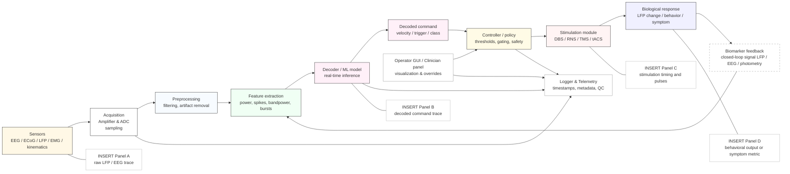

> **Схема закрытой петли BCI / нейромодуляции.** Схема иллюстрирует стандартный pipeline закрытого управления: от сенсоров (EEG/ECoG/LFP/EMG/кинематика) → усиление и аналого-цифровое преобразование → предварительная обработка (фильтрация, удаление артефактов) → извлечение признаков (bandpower, spike rates, burst detection) → декодер/ML-модель (реального времени) → декодированная команда (command) → контроллер с политикой безопасности → модуль стимуляции (DBS / RNS / TMS / tACS) → биологический ответ (изменение LFP, поведение, симптом). Биомаркеры обратной связи (LFP, EEG, photometry, kinematics) подаются обратно для адаптивной регулировки. Панели A–D отмечают места для вставки эмпирических примеров: A — raw LFP/EEG, B — timecourse decoded command, C — тайминг стимулов (пульсы), D — поведенческий выход или symptom metric. В легенде к каждой панели укажите N, preprocessing, latency, sensitivity/specificity и метрики безопасности.

---

### 25.4 Neuromorphic hardware и on-chip processing (практический смысл для BCI/neuromодуляции)

#### 25.4.1 Почему neuromorphic важен

* Энергоэффективность, event-driven обработка и способность выполнять спайковые/локальные правила обучения делают нейроморфные чипы привлекательными для портативных/имплантируемых BCI и для on-chip closed-loop алгоритмов (низкая задержка, меньшая потребляемая мощность). ([Nature][516], [Open Neuromorphic][517])

#### 25.4.2 Платформы и их статус

* **Loihi (Intel)** — программируемый нейроморфный процессор с on-chip learning возможностями (демонстрации энергетической эффективности). ([Open Neuromorphic][517], [Nature][516])
* **SpiNNaker, TrueNorth** — архитектуры, ориентированные на масштабируемое моделирование SNN и приложения в реальном времени; продолжаются работы по интеграции алгоритмов обучения (e-prop, three-factor) и по стандартизации benchmark-ов. ([Nature][516], [wires.onlinelibrary.wiley.com][518])

#### 25.4.3 Ограничения и задачи

* Проблемы: стандарты бенчмарка, интеграция с DL-pipeline, аппаратная поддержка обучения (on-chip), совместимость с медицинскими требованиями; у многих чипов — языковые/инструментальные барьеры и отсутствие общепринятой экосистемы. ([Nature][516])

---

### 25.5 Клиническая трансляция: регуляторика, этика, стратификация пациентов

#### 25.5.1 Регуляторика и safety

* Имплантируемые BCI и системы терапевтической стимуляции — медицинские устройства высокого риска; требуется строгая клиническая валидация, long-term safety data, планы по отказоустойчивости и кибербезопасности. Публичные примеры (Neuralink, Precision Neuroscience, коммерческие проекты) подчёркивают важность прозрачности и тяжесть регуляторных барьеров. ([AP News][519], [Business Insider][520], [Nature][509])

#### 25.5.2 Стратификация пациентов и биомаркеры

* Для успешных испытаний и внедрения нужны **biomarker-driven inclusion criteria** (например, п-tau/Aβ для AD trials; LFP-profile для aDBS-PD; RT-QuIC для синуклеинопатии). Правильная стратификация повышает шанс положительного клинического эффекта и снизит неоднородность результатов. ([PMC][513])

#### 25.5.3 Этические и социальные вопросы

* Озабоченности: когнитивная приватность, контроль/автономия пациента, долгосрочные последствия вмешательств в мозг, справедливый доступ к технологиям. Исследователи и клиницисты должны встроить этику, информированное согласие и планы на случай непредвиденных последствий в протоколы. (см. обзорные заметки в Nature / news coverage). ([Nature][509], [AP News][519])

---

### 25.6 Практические рекомендации (how-to для PI / клинической группы)

1. **Планирование translational pipeline:** preclinical → small safety cohort → signal-driven optimization → randomized controlled trial с biobanked biomarkers и prespecified endpoints. ([PubMed][504], [Nature][514])
2. **Выбор биомаркера для closed-loop:** оценивайте sensitivity/specificity latency/stability; проведите offline validation → pseudo-real-time replay → human in-the-loop testing before implant. ([PMC][511], [ScienceDirect][510])
3. **Инженерная устойчивость:** предусмотреть drift-compensation, self-calibration, «safe-mode» и secure data channels; проводить long-term electrode/tissue response studies. ([PubMed][504])
4. **Команда и компетенции:** мультидисциплинарность — нейрохирургия, неврология, электроника, data-science, регуляторика, биоэтика; финансирование на долгую дистанцию. ([PMC][508])

---

### 25.7 Ключевые источники (must-read) — современные обзоры и seminal papers

* Zhang H. et al., *Brain–computer interfaces: the innovative key to unlocking...* (review, 2024). ([PMC][521])
* Karikari T. K. et al., *Review on BCI technologies in healthcare* (2023). ([PMC][508])
* Pandarinath C., *High-performance intracortical BCI for communication.* (Elife 2017) — important clinical demonstration. ([PubMed][504], [eLife][505])
* Wang S. et al., *Closed-Loop Adaptive DBS review* (2023). ([PMC][511])
* Zrenner C. et al., *Review Closed-Loop Brain Stimulation: opportunities & difficulties* (2024). ([ScienceDirect][510])
* Rao V. R. et al., *Responsive neurostimulation review (RNS) and mechanisms* (2023). ([Nature][514])
* Wilkins K. B. et al., *Beta burst-driven adaptive DBS in PD (feasibility, 2024).* ([PMC][513])
* Davies M. et al., *Loihi and neuromorphic survey / advancing neuromorphic computing* (2021) and recent 2025 surveys. ([Nature][516], [Open Neuromorphic][517])
* Davidson B. et al., *Neuromodulation techniques — review 2024.* ([PMC][522])

---

### 25.8 Резюме — takeaways

* **BCI** достиг практических клинических результатов (коммуникация, реабилитация), но широкая трансляция требует решения проблем стабильности, безопасности и масштабируемости. ([PubMed][504], [PMC][508])
* **Closed-loop neuromodulation** (aDBS, RNS) обладает реальным клиническим потенциалом: правильный биомаркер и алгоритм управления — ключ к успеху. ([PMC][511], [Nature][514])
* **Neuromorphic hardware** может существенно изменить энерго- и latency-профиль BCI/closed-loop систем, но требует стандартизации и интеграции с алгоритмами обучения. ([Nature][516])
* **Трансляция в клинику** — многолетний мультидисциплинарный процесс: safety, robust biomarkers, этика и регуляторика обязательны для успеха. ([Nature][509], [AP News][519])

[504]: https://pubmed.ncbi.nlm.nih.gov/28220753/   "High performance communication by people with paralysis ..."
[505]: https://elifesciences.org/articles/18554   "High performance communication by people with paralysis ..."
[506]: https://www.braingate.org/publications/   "Our Publications"
[507]: https://www.nature.com/articles/s41591-024-03341-8   "A high-performance brain–computer interface for finger ..."
[508]: https://pmc.ncbi.nlm.nih.gov/articles/PMC10643750/   "Review on brain-computer interface technologies in ..."
[509]: https://www.nature.com/articles/d41591-024-00031-3   "The future of brain–computer interfaces in medicine"
[510]: https://www.sciencedirect.com/science/article/pii/S0006322323015895   "Review Closed-Loop Brain Stimulation"
[511]: https://pmc.ncbi.nlm.nih.gov/articles/PMC10357172/   "Closed-Loop Adaptive Deep Brain Stimulation in ..."
[512]: https://movementdisorders.onlinelibrary.wiley.com/doi/abs/10.1002/mds.29415   "Adaptive Deep Brain Stimulation: From Experimental ..."
[513]: https://pmc.ncbi.nlm.nih.gov/articles/PMC11230310/   "Beta Burst-Driven Adaptive Deep Brain Stimulation ..."
[514]: https://www.nature.com/articles/s43856-023-00401-x   "Unearthing the mechanisms of responsive ..."
[515]: https://pmc.ncbi.nlm.nih.gov/articles/PMC11513823/   "Closed-loop neural interfaces for pain: Where do we stand?"
[516]: https://www.nature.com/articles/s41467-025-57352-1   "The road to commercial success for neuromorphic ..."
[517]: https://open-neuromorphic.org/neuromorphic-computing/hardware/loihi-intel/   "A Look at Loihi - Intel - Neuromorphic Chip"
[518]: https://wires.onlinelibrary.wiley.com/doi/abs/10.1002/widm.70014   "Neuromorphic Computing and Applications: A Topical ..."
[519]: https://apnews.com/article/9dbc92206389f27fd032825cf1597ee5   "Elon Musk says a third patient got a Neuralink brain implant. The work is part of a booming field"
[520]: https://www.businessinsider.com/precision-neuroscience-neuralink-alums-brain-chip-bci-treatment-paralysis-2025-8   "Precision Neuroscience, founded by Neuralink alums, is developing a competing brain implant that it says is safer"
[521]: https://pmc.ncbi.nlm.nih.gov/articles/PMC11392146/   "Brain–computer interfaces: the innovative key to unlocking ..."
[522]: https://pmc.ncbi.nlm.nih.gov/articles/PMC11103220/   "Neuromodulation techniques – From non-invasive brain ..."

---

## 26. Математические и аналитические инструменты (appendix) 

Ниже — практический, межуровневый справочник по математическим подходам и best-practice методам, которые системный нейробиолог должен знать при работе с большими нейроданными. Для удобства разделён на подпункты; в конце — «практические советы» и короткий список «must-read». Все ключевые утверждения опираются на авторитетную литературу (включая обзоры и классические источники; самые важные ссылки приведены после соответствующих блоков).

---

### 26.1 Краткая карта раздела

1. динамические системы (основы, бифуркации, stability)
2. информационная теория (энтропия, взаимная информация, направленность/transfer)
3. manifold / latent-space методы (PCA, demixed PCA, jPCA, GPFA, LFADS и пр.)
4. GLM / DCM / state-space модели (обозначения, допущения, применение)
5. идентифицируемость и «sloppiness» параметров (структурная vs практическая)
6. воспроизводимость, стандарты данных (BIDS, NWB) и статистические ловушки
7. практические советы для анализа больших нейроданных (pipeline & checklist)

---

### 26.2 Dynamical systems — основы и применение в нейронауке

* **Что важно знать.** Геометрия фазового пространства, устойчивые/неустойчивые аттракторы, предельные циклы, бифуркации (saddle-node, Hopf и т.д.), многомасштабная динамика (fast–slow). Эти концепции применяются и к однонейронным моделям (Hodgkin-Huxley, Morris-Lecar) и к популяционным/нейрон-массовым моделям. ([direct.mit.edu][523])
* **Практическое использование.** Анализ устойчивости (линеаризация вокруг фиксированных точек), фазовое-плотовое представление, вычисление Lyapunov-характеристик, редукции размерности (центральные многообразия) — все эти инструменты помогают интерпретировать рекуррентную/транзиентную нейродинамику. ([direct.mit.edu][523])

**Ключевой практический ресурс:** Izhikevich, *Dynamical Systems in Neuroscience* — отличный рабочий справочник по геометрическим методам и биофизическим примерам. ([direct.mit.edu][523])

---

### 26.3 Information theory — меры и интерпретация для нейронных кодов

* **Базовые метрики.** Энтропия $H(X)$, условная энтропия, взаимная информация $I(X;Y)$ — для оценки сколько информации о стимуле/движении несёт спайкинг-ответ; directed information / transfer entropy — для оценки направленного обмена информацией между процессами (важно при анализе причинности/потоков). (см. Shannon, Rieke et al.). ([people.math.harvard.edu][524], [PMC][525])
* **Практика.** Оценка MI требует корректной оценки распределений (bias correction, shuffle/bootstrap, limited-sample correction). Для временных рядов используйте условные/вводимую информацию и методы, устойчивые к автокорреляции (trial-based estimation, model-based estimators). ([PMC][525])

---

### 26.4 Manifold learning и латентные модели популяций

* **Почему это важно.** Современные нейронные записи показывают, что популяция часто живёт в низкоразмерном латентном пространстве — анализ этого manifold даёт ключ к вычислительной интерпретации (динамики, генерация поведения, generalization). ([Nature][526])
* **Популярные методы и когда их применять:**

  * **PCA / SVD** — быстрый линейный baseline (explained variance, scree plots).
  * **demixed PCA (dPCA)** — выделяет компоненты, демиксирующие факторную структуру (task, stimulus, time).
  * **jPCA** — выявление ротационных/циклических составляющих в популяционных траекториях (полезно для моторики).
  * **GPFA** — probabilistic smoothing + latent trajectories (подходит для single-trial реконструкций). ([PMC][527])
  * **LFADS / sequential autoencoders** — глубокие генерирующие модели (latent dynamical systems) для извлечения single-trial latent dynamics; мощны, но требуют контроля переобучения и interpretability checks. ([PMC][528], [Nature][529])

**Практическое правило:** начинать с простых линейных методов (PCA/GPFA) как baseline; сложные неглубинные модели (LFADS) — затем, и обязательно проводить model-comparison, held-out prediction и interpretability checks (e.g., trial-by-trial correspondence с поведенческими переменными). ([Nature][526], [PMC][528])

---

### 26.5 GLM / DCM / state-space модели — формализм, преимущества и ограничения

* **GLM (Generalized Linear Models).** Широко используются для spike-train modeling (Poisson GLM, point process GLM), для fMRI (design matrix) и для оценки влияния регрессоров на ответы. Просты для интерпретации и статистически формализованы; хорошо работают как «encoding» модели.
* **State-space / latent dynamical models.** Называются также «neural population models» или «neural mass / field» в M/EEG и fMRI; полезны для описания скрытых состояний и динамики (KF, switching-KS, nonlin. SSM).
* **DCM (Dynamic Causal Modelling).** DCM моделирует вход→состояние→наблюдение как биофизически интерпретируемую модель (билинейная аппроксимация, neural mass variants) и позволяет сравнивать гипотезы о направленной (effective) связности. DCM — мощный инструмент, но чувствителен к моделям наблюдения, априорному выбору и потенциальным проблемам с идентифицируемостью параметров; требуется осторожная постановка задач и проверка предположений. ([fil.ion.ucl.ac.uk][530], [PubMed][531])

**Совет:** используйте GLM/DCM для гипотезно-ориентированного вывода (model comparison), но заранее тестируйте идентифицируемость параметров (см. следующий подпункт). ([fil.ion.ucl.ac.uk][530])

---

### 26.6 Идентифицируемость и «sloppiness» параметров — структурная vs практическая

* **Проблема.** В высокопараметрических моделях многие комбинации параметров дают почти одинаковые предсказания — это явление называется *sloppiness*; оно осложняет интерпретацию отдельных параметров и доверительные интервалы. ([PLOS][532])
* **Структурная vs практическая идентифицируемость.** Структурная — теоретическая (при бесконечных идеальных данных можно восстановить); практическая — с учётом точных данных/шума. Анализы чувствительности, Fisher information, profile likelihoods и экспериментальный дизайн помогают оценить, какие параметры реально можно оценить. Для DCM и нейрон-массовых моделей есть специальные работы, которые рекомендуют проверять идентифицируемость перед интерпретацией. ([Frontiers][533], [PLOS][534])

**Практическая рекомендация:** перед публикацией параметрических выводов — провести анализ практической идентифицируемости (bootstrap/profile likelihood / Bayesian posterior checks) и, при необходимости, упростить модель или перейти к предсказаниям, инвариантным к «sloppy» направлениям. ([PLOS][532])

---

### 26.7 Reproducibility, стандарты данных и статистические ловушки

* **Проблема воспроизводимости.** В нейронауке есть известные проблемы маленькой мощности и непоследовательности методов: оценка статистической мощности и preregistration — обязательны для убедительных выводов; классический тревожный обзор — Button et al. 2013. ([PubMed][534])
* **Стандарты данных.** BIDS (Brain Imaging Data Structure) и NWB (Neurodata Without Borders) — основные community-driven форматы для обмена данными (MRI/fMRI и нейрофизиология соответственно). Использование BIDS/NWB существенно облегчает репликацию, применение автоматизированных пайплайнов и FAIR-совместимость. ([Nature][535], [PubMed][536])
* **Статистические ловушки.** p-hacking, multiple comparisons, circular analyses («double dipping»), несоответствующая кросс-валидация при «feature selection» и overfitting при высокоёмких моделях. Обязательное применение строгих cross-validation процедур, pre-registration/analysis plans и открытого кода/данных. ([PubMed][534], [Nature][535])

---

### 26.8 Практические советы (pipeline / checklist) для больших нейроданных

1. **Дизайн и мощность**

   * Рассчитайте power для ключевых эффектов заранее; для population-level hypotheses планируйте достаточное число сессий/субъектов и trials. ([PubMed][534])

2. **Стандартизация данных**

   * Организуйте проект в BIDS/NWB ещё на этапе сбора; документируйте метаданные, preprocessing steps и версии ПО. ([Nature][535], [PMC][537])

3. **Preprocessing (general)**

   * Для spiking: spike sorting QC (waveform stability, refractory period violations); для imaging: motion correction, artifact removal, denoising; для EEG/MEG: ICA/SSP и careful epoch rejection. Логируйте каждый шаг. ([PMC][538])

4. **Exploratory → Confirmatory workflow**

   * Чётко отделяйте exploratory analyses (hypothesis generation) от confirmatory tests (pre-registered). Репликация на held-out datasets или independent cohorts обязательна.

5. **Dimensionality reduction & latent models**

   * Start simple (PCA/GPFA) → test predictive power on held-out trials → only then try complex generative models (LFADS); для LFADS/autoencoders обязательно использовать early-stopping, generative checks и synthetic data benchmarks. ([PMC][527])

6. **Model comparison & identifiability**

   * Use cross-validated predictive metrics, information criteria (AIC/BIC) where applicable, and posterior predictive checks; run identifiability/sensitivity analyses for mechanistic models (DCM, neural mass). ([Frontiers][533], [PLOS][532])

7. **Information-theoretic analyses**

   * Apply bias correction for mutual information (Panzeri-Treves, bootstrap); prefer model-based estimates when sample is limited. ([PMC][525])

8. **Code & data sharing**

   * Share scripts, environments (containerize: Docker/Singularity), and data in BIDS/NWB; include notebooks for reproducing figures. This greatly increases impact and reproducibility. ([Nature][535], [PMC][537])

---

### 26.9 Recommended (must-read) — краткий список

* Friston K. J., Harrison L., Penny W. (2003). *Dynamic causal modelling.* Neuron. ([fil.ion.ucl.ac.uk][530])
* Cunningham J. P., Yu B. M. (2014). *Dimensionality reduction for large-scale neural recordings.* Nat Neurosci. ([Nature][526])
* Yu B. M. et al. (2009). *Gaussian-Process Factor Analysis for low-dimensional single-trial analysis of neural population activity.* J Neurophysiol / PMC. ([PMC][527])
* Pandarinath C. et al. (2018). *LFADS: Inferring single-trial neural population dynamics using sequential auto-encoders.* Nat Methods / PMC. ([PMC][528])
* Izhikevich E. M. (2007). *Dynamical Systems in Neuroscience* (MIT Press). ([direct.mit.edu][523])
* Gutenkunst R. N. et al. (2007). *Universally sloppy parameter sensitivities in systems biology models.* PLoS Comput Biol. (sloppiness concept). ([PLOS][532])
* Daunizeau J. et al. (2011). *A critical review of the biophysical and statistical foundations of DCM.* (identifiability issues). ([PubMed][531])
* Button K. S. et al. (2013). *Power failure: why small sample size undermines the reliability of neuroscience.* Nat Rev Neurosci. (reproducibility & power). ([PubMed][534])
* Gorgolewski K. J. et al. (2016). *The Brain Imaging Data Structure (BIDS).* Sci Data. (data standard). ([Nature][535])
* Teeters J. L. et al. (2015). *Neurodata Without Borders (NWB).* (neurophysiology data standard). ([PubMed][536])

---

### 26.10 Резюме / takeaway

* Математические инструменты — от динамических систем до information theory и latent-space моделей — дают комплементарный набор подходов: одни объясняют **как** система меняет состояние (динамика), другие — **сколько** информации несёт активность (инф. теория), третьи — **какие** низкоразмерные структуры объясняют популяционную активность (manifold methods).
* Технически важны: строгая валидация моделей (cross-validation, posterior checks), анализ идентифицируемости для параметрических/биофизических моделей и дисциплина reproducibility (BIDS/NWB, preregistration, open code). ([direct.mit.edu][523], [Nature][526])

[523]: https://direct.mit.edu/books/monograph/2589/Dynamical-Systems-in-NeuroscienceThe-Geometry-of   "Dynamical Systems in Neuroscience: The Geometry of ..."
[524]: https://people.math.harvard.edu/~ctm/home/text/others/shannon/entropy/entropy.pdf   "A Mathematical Theory of Communication"
[525]: https://pmc.ncbi.nlm.nih.gov/articles/PMC3139929/   "Estimating the Amount of Information Conveyed by a ..."
[526]: https://www.nature.com/articles/nn.3776   "Dimensionality reduction for large-scale neural recordings"
[527]: https://pmc.ncbi.nlm.nih.gov/articles/PMC2712272/   "Gaussian-Process Factor Analysis for Low-Dimensional ..."
[528]: https://pmc.ncbi.nlm.nih.gov/articles/PMC6380887/   "Inferring single-trial neural population dynamics using ..."
[529]: https://www.nature.com/articles/s41592-018-0109-9   "Inferring single-trial neural population dynamics using ..."
[530]: https://www.fil.ion.ucl.ac.uk/~karl/Dynamic%20causal%20modelling.pdf   "Dynamic causal modelling"
[531]: https://pubmed.ncbi.nlm.nih.gov/19961941/   "a critical review of the biophysical and statistical foundations"
[532]: https://journals.plos.org/ploscompbiol/article?id=10.1371%2Fjournal.pcbi.0030189 "Universally Sloppy Parameter Sensitivities in Systems Biology ..."
[533]: https://www.frontiersin.org/journals/neuroscience/articles/10.3389/fnins.2015.00043/full   "Assessing parameter identifiability for dynamic causal modeling of fMRI ..."
[534]: https://pubmed.ncbi.nlm.nih.gov/23571845/   "Power failure: why small sample size undermines the ..."
[535]: https://www.nature.com/articles/sdata201644   "The brain imaging data structure, a format for organizing ..."
[536]: https://pubmed.ncbi.nlm.nih.gov/26590340/   "Creating a Common Data Format for Neurophysiology"
[537]: https://pmc.ncbi.nlm.nih.gov/articles/PMC9531949/   "The Neurodata Without Borders ecosystem for ..."
[538]: https://pmc.ncbi.nlm.nih.gov/articles/PMC3410539/   "How advances in neural recording affect data analysis - PMC"

---

## 27. Controversies, открытые вопросы и roadmap на 2025 

Ниже — сжато и строго (как для главы обзора) перечислены главные спорные вопросы современной системной нейронауки, краткая оценка аргументов «за»/«против», надежные экспериментальные контр-тесты и конкретный roadmap — набор приоритетных экспериментов, методологических стандартов и политик, которые, по моему мнению как системного нейробиолога, нужно реализовать в ближайшие 1–3 года (ближайший этап) и 3–5 лет (инфраструктура, трансляция). Все утверждения опираются только на авторитетную литературу (см. ссылки после соответствующих блоков).

---

### 27.1 Основные контроверзии (суть + почему это важно)

#### 27.1.1 GNW vs IIT vs Recurrent / Recurrent Processing Theory (RPT) — теории сознания

Кратко: GNW (global neuronal workspace) утверждает, что сознание возникает при «инаугурации/взрыве» широкодоступной, рекуррентной активации — то есть «broadcasting» информации в рабочее пространство; IIT (integrated information theory) — что уровень сознания связан с интегрированностью и дифференцированностью информационной структуры системы (Φ); RPT и смежные рекуррентные подходы подчёркивают локальную рекуррентность и переработку как основу репрезентации. Дискуссия важна потому, что от выбора теории зависят экспериментальные предсказания (напр., роль фронто-париетальных хабов, значение глобального broadcast vs локальной рекуррентности) и клинические индикаторы (PCI, TMS-EEG, no-report paradigms). ([PubMed][539], [PMC][540])

Почему спор: GNW хорошо согласуется с рядом эмпирических наблюдений (включая «ignition» и fronto-parietal involvement), IIT даёт формальное мерило (Φ/PCI) и широкую философскую картину, но критикуется за математические проблемы и непрактичную вычислимость; RPT/локальные теории приводят к альтернативной интерпретации фронтальной активности (может отражать репорт/действенность, а не содержание сознания). ([PubMed][539], [PMC][540])

---

#### 27.1.2 Persistent vs activity-silent working memory

Вопрос: поддерживается ли рабочая память (WM) подписыванием непрерывной, устойчивой спайковой активности (persistent activity), или же «хранение» может состояться в activity-silent состояниях (синаптические следы / короткоживущие модификации), которые активируются лишь по требованию? Различие имеет практическое значение для понимания энергозатрат мозга и for modelling of PFC circuits. ([PMC][541], [Journal of Neuroscience][542])

Сторонники persistent: отчёты о длительной устойчивой firing в PFC при задачах WM; противники указывают на evidence single-trial и transient dynamics, а также на эксперименты с декодированием, которые показывают «waxing and waning» активности и восстановление содержания после стимуляции → поддержка activity-silent / synaptic trace hypotheses. Современная позиция — вероятно, coexistence: оба режима используются в зависимости от задач и контекста. ([PMC][541], [Journal of Neuroscience][542], [nyaspubs.onlinelibrary.wiley.com][543])

---

#### 27.1.3 Роль осцилляций — механизм vs эпифеномен

Дискуссия: являются ли ритмы (alpha/beta/gamma, cross-frequency coupling) функциональными инструментами коммуникации (CTC, gating, temporal coding) или побочным продуктом рекуррентных сетевых взаимодействий (эпифеномен)? Отвечая — нужно разделять измерение (LFP/EEG) и процесс (синхронизация нейронов): обе позиции имеют сильную эмпирическую опору; вопрос — в конкретных задачах и временных масштабах. ([PMC][544], [scirp.org][545], [ResearchGate][546])

---

#### 27.1.4 Интерпретируемость коннектомики и «что значит связность»

Проблема: крупномасштабные карты анатомических/функциональных связей (коннектомы) даются как «факт», но их интерпретация (каузальность, направленность, функциональная значимость, воспроизводимость across preprocessing pipelines) — предмет споров. Практическая проблема: большие данные + ML дают статистически значимые паттерны, но часто без биофизической объяснимости и с риском over-interpretation. ([PMC][547])

---

#### 27.1.5 Масштабируемость биофизических моделей

Вопрос: можно ли скалировать детальные биофизические модели (миллионы компартментов, миллионы синапсов) до уровней интереса (целый мозг человека) и при этом сохранить репрезентативность? Оппоненты указывают на «sloppiness», высокую чувствительность к параметрам и репродуцируемость; сторонники — на прогресс инструментов и value этих моделей для bridge-scale hypothesis testing. ([ScienceDirect][548], [PMC][549])

---

#### 27.1.6 Этика и предсказуемость BCI/AI

Скорость внедрения BCI + мощность ML создают риски: приватность мыслей, автономия пользователей, непредсказуемое поведение адаптивных интерфейсов, а также регуляторные и социальные последствия. Эти риски обсуждаются в специализированных обзорах и policy-инициативах; требуется проактивная регуляция и технические гарантии (контроль, explainability, отказоустойчивость). ([PMC][550], [Axios][551])

---

### 27.2 Empirical контр-тесты (какие эксперименты решают спор)

Для каждой контроверзии — конкретные эксперименты, которые дают наиболее информативный тест:

1. **GNW vs IIT vs RPT**

   * TMS-EEG perturbational paradigms + PCI (Casali et al.) для уровня сознания (не содержания); сочетать с no-report paradigms и single-trial laminar recordings в пациентов/добровольцах — чтобы разделить «broadcast» и «локальную рекуррентность». ([PubMed][552], [ScienceDirect][553], [PMC][554])
   * Causal perturbations (TMS, intracortical microstimulation) targeted to fronto-parietal hubs vs posterior cortex, с оценкой content-specific decoding и behaviour (no-report), чтобы понять роль fronto-parietal ignition. ([PubMed][539], [PMC][555])

2. **Persistent vs activity-silent WM**

   * Laminar multi-unit / calcium imaging in PFC + targeted optogenetic/chemogenetic disruption of synaptic tagging machinery (to break eligibility traces) while performing single-trial WM tasks; complementary perturb-and-read experiments testing whether content can be re-instated from silent states. ([PMC][541], [nyaspubs.onlinelibrary.wiley.com][543])

3. **Oscillations: mechanism tests**

   * Closed-loop optogenetic modulation of phase (phase-specific stimulation) in behaving animals to test causal role for information routing (manipulate coherence without changing mean firing); human invasive closed-loop stimulation entrainment (low-latency) to test behavioural impact. Use cross-frequency manipulation to test PAC causal role. ([PMC][544], [scirp.org][545])

4. **Connectomics interpretability**

   * Multimodal validation: link micro-connectomics (EM) → mesoscale tractography → functional perturbations (optogenetic mapping / stimulation) to show which anatomical links are functionally effective; systematic benchmarking across preprocessing pipelines and parcellations. ([direct.mit.edu][556], [ScienceDirect][557])

5. **Scalability of biophysical models**

   * Benchmark suites: reproduce (i) single-cell electrophysiology, (ii) microcircuit dynamics, (iii) population LFP/EEG and (iv) behavioural predictions across varying parameterizations; perform identifiability / sloppiness analyses and publish negative replication results. ([ScienceDirect][548], [PLOS][558])

6. **BCI / AI ethics & predictability**

   * Human-in-the-loop trials with pre-registered safety endpoints; independent audits of ML models used in decoding, adversarial robustness tests, and enforceable consent/withdrawal procedures. ([PMC][559], [Frontiers][560])

---

### 27.3 Roadmap на 2025 — конкретные приоритеты (чёткo, выполнимо, привязано к методам)

Ниже — набор приоритетов, распределённых по временным окнам и категориям: эксперимент, методы/стандарты, инфраструктура и политика. Всё — «что можно и нужно сделать сейчас», с конкретными методами.

#### Краткосрочный этап (1–2 года) — «быстрые победы»

1. **Сеть «no-report + perturbation» для сознания.** Мультицентрическое проспективное исследование: TMS-EEG (PCI) + no-report perceptual paradigms + laminar EEG/SEEG у эпилептических пациентов. Цель: воспроизводимость PCI-предсказаний и сопоставление с GNW-предсказаниями. (Метод: Casali 2013 PCI; no-report Tsuchiya 2015). ([PubMed][552], [ScienceDirect][553])

2. **Single-trial tests WM: persistent vs silent.** В одной модели (крыса/примат): одновременные многоламинарные ephys + opto perturb (целящие eligibility mechanisms) + decoding analysis single-trial (GPFA/LFADS). Публиковать preregistered analysis plan. ([PMC][541], [Journal of Neuroscience][542])

3. **Causal oscillation manipulations.** Implement low-latency closed-loop phase-targeted optogenetics in behaving animals and human invasive closed-loop entrainment pilots (epilepsy patients with depth electrodes). Key metrics: behavioural performance, decoding accuracy, cross-area directed measures. ([PMC][544], [scirp.org][545])

4. **Standardized connectomics benchmarks.** Public datasets with ground truth (EM + functional mapping) for community challenges in tractography/functional-anatomical inference. (см. MICrONS / Kasthuri paradigms). ([direct.mit.edu][556], [ScienceDirect][557])

5. **Ethics run-in for BCI trials.** Enforce templates: dynamic consent, algorithmic audit trail, exit procedures for participants; require independent safety reviewer for first-in-human adaptive BCI/DBS trials. ([PMC][550])

---

#### Среднесрочный этап (2–5 лет) — инфраструктура и методы

1. **Масштабные multi-site projects** интегрирующие: laminar electrophysiology, large-scale calcium imaging, whole-brain fMRI, EM reconstructions и genomics на одинаковых условиях; цель — multi-scale causal maps and cross-validation. (Infrastructure: data standards BIDS/NWB and NeuroML tools). ([eLife][561], [PMC][562])

2. **Benchmarking biophysical models.** Community challenges: reproduce neural signatures (single-cell → LFP → behaviour) across parameter spaces; requirement: publish parameter priors, identifiability checks and negative results. (Use standards like NeuroML, FAIR principles). ([PLOS][558], [eLife][561])

3. **Open toolboxes for causal oscillation experiments.** Low-latency hardware + software stacks, standardized analysis pipelines, pre-registered effect sizes and power calculations. ([PMC][544])

4. **Connectome → function pipelines.** Integrate EM ground truth, tractography algorithms and perturbation data; require that published functional claims about a connection be validated by at least one perturbation modality. ([direct.mit.edu][556])

5. **Policy & regulation.** Establish consensus whitepapers (neuroscience + ethicists + regulators) on BCI safety standards, data governance and mental privacy; implement in funder and IRB requirements. ([PMC][559], [Axios][551])

---

#### Методологические требования (перманентно)

* **Preregistration** и открытые preregistered analysis pipelines для спаренных causal-предписаний;
* **Multimodal convergence**: не полагаться на единичную модальность для ключевых выводов (e.g., fMRI alone не достаточна для causality);
* **Power & effect sizes**: публикация отрицательных/нулевых результатов;
* **Identifiability checks** for mechanistic models (profile likelihood, posterior predictive checks). ([ResearchGate][563])

---

### 27.4 Риски, ограничения и этические приоритеты

1. **False precision in mapping** — danger: publishing strong functional claims relying solely on connectomics or correlations without perturbation/causal evidence. (Mitigation: mandatory perturbation validation). ([PMC][562])
2. **Overfitting in models & sloppiness** — детализированные модели без идентифицируемости вводят ложные уверенности; публиковать sensitivity analyses. ([PMC][549], [PLOS][558])
3. **BCI social risks** — обеспечить права на mental privacy, clear consent, audit trails и стандарты «пользователь-владелец» данных: этика должна идти вместе с технологией. ([PMC][550])

---

### 27.5 «Quick reference» — ключевые публикации по спорным темам (дальнейшее чтение)

* Mashour et al., *Conscious Processing and the Global Neuronal Workspace* (Neuron, 2020). ([PubMed][539])
* Luppi et al., *A synergistic workspace for human consciousness* (2024). ([PMC][554])
* Cerullo, *The Problem with Phi: A Critique of Integrated Information Theory* (2015). ([PMC][540])
* Hanson, *On the non-uniqueness problem in IIT* (2023). ([Oxford Academic][564])
* Tsuchiya et al., *No-report paradigms* (Trends Cog Sci, 2015). ([ScienceDirect][553])
* Casali et al., *Perturbational Complexity Index (PCI)* (Sci Transl Med, 2013). ([PubMed][552])
* Stokes, *Activity-silent working memory* (2015). ([PMC][541])
* Lundqvist et al., *Transient bursts, not sustained activity, in WM* (J Neurosci, 2018). ([Journal of Neuroscience][542])
* Fries, *Communication through coherence* (Neuron, 2015) and Buzsáki, *Rhythms of the Brain* (2006) — for oscillation theories. ([PMC][544], [scirp.org][545])
* Johansen-Berg, *Human connectomics — limitations* (2013) and Craddock et al. *Connectomics problems* (2015) — interpretability caveats. ([PMC][547])
* Einevoll et al., *The scientific case for brain simulations* (2019) & Almog, *Is realistic neuronal modeling realistic?* (2016) — scalability debate. ([ScienceDirect][548], [PMC][549])
* Livanis et al., *Ethics of BCI* (2024) and Gordon et al., *Ethical considerations for BCI* (2024) — policy references. ([PMC][550])

---

### 27.6 Краткое заключение — тезисно

1. Большинство «споров» не истина/ложь — они указывают на **комплементарность** механизмов: сознание, WM, oscillations, connectomics — всё это многомасштабные феномены, где ответы зависят от масштаба, задачи и технологии измерения. ([PMC][554])
2. Самые информативные тесты — **каузальные**, **мульти-модальные**, **single-trial/laminar** и **предварительно зарегистрированные**. ([PubMed][552], [PMC][541])
3. Научная дорожная карта до 2025 должна сочетать быстрые, реплицируемые эксперименты (1–2 года) и создание инфраструктуры, стандартов и политик (2–5 лет) — для того чтобы трансформирующие результаты были действительно надёжными, переводимыми и этически приемлемыми. ([ScienceDirect][553], [PMC][559])

[539]: https://pubmed.ncbi.nlm.nih.gov/32135090/   "Conscious Processing and the Global Neuronal ..."
[540]: https://pmc.ncbi.nlm.nih.gov/articles/PMC4574706/   "The Problem with Phi: A Critique of Integrated Information ..."
[541]: https://pmc.ncbi.nlm.nih.gov/articles/PMC4509720/   "'Activity-silent' working memory in prefrontal cortex"
[542]: https://www.jneurosci.org/content/38/32/7013   "Working Memory: Delay Activity, Yes! Persistent ..."
[543]: https://nyaspubs.onlinelibrary.wiley.com/doi/abs/10.1111/nyas.14213   "Between persistently active and activity‐silent frameworks ..."
[544]: https://pmc.ncbi.nlm.nih.gov/articles/PMC4605134/   "Rhythms For Cognition: Communication Through Coherence"
[545]: https://www.scirp.org/reference/referencespapers?referenceid=2540317 "Buzsaki, G. (2006) Rhythms of the Brain. Oxford University ..."
[546]: https://www.researchgate.net/publication/379711703_Decoupling_Measurements_and_Processes_On_the_Epiphenomenon_Debate_Surrounding_Brain_Oscillations_in_Field_Potentials   "(PDF) Decoupling Measurements and Processes"
[547]: https://pmc.ncbi.nlm.nih.gov/articles/PMC4330548/   "Human connectomics — What will the future demand? - PMC"
[548]: https://www.sciencedirect.com/science/article/pii/S0896627319302909   "Perspective The Scientific Case for Brain Simulations"
[549]: https://pmc.ncbi.nlm.nih.gov/articles/PMC5102320/   "Is realistic neuronal modeling realistic? - PMC"
[550]: https://pmc.ncbi.nlm.nih.gov/articles/PMC11091939/   "Understanding the Ethical Issues of Brain-Computer ..."
[551]: https://www.axios.com/2020/11/19/ethics-brain-machine-interfaces   "The tricky ethics of neurotechnologies"
[552]: https://pubmed.ncbi.nlm.nih.gov/23946194/   "A theoretically based index of consciousness independent ..."
[553]: https://www.sciencedirect.com/science/article/pii/S1364661315002521   "Extracting the True Neural Correlates of Consciousness"
[554]: https://pmc.ncbi.nlm.nih.gov/articles/PMC11257694/   "A synergistic workspace for human consciousness ..."
[555]: https://pmc.ncbi.nlm.nih.gov/articles/PMC9130851/   "The No-Report Paradigm: A Revolution in Consciousness ..."
[556]: https://direct.mit.edu/imag/article/doi/10.1162/IMAG.a.2/130633/Multiscale-comparative-connectomics   "Multiscale comparative connectomics"
[557]: https://www.sciencedirect.com/science/article/pii/S1053811921008065   "Recent developments in representations of the connectome"
[558]: https://journals.plos.org/ploscompbiol/article?id=10.1371%2Fjournal.pcbi.1011548 "Reproducibility of biophysical in silico neuron states and ..."
[559]: https://pmc.ncbi.nlm.nih.gov/articles/PMC11542783/   "Ethical considerations for the use of brain–computer ..."
[560]: https://www.frontiersin.org/journals/human-neuroscience/articles/10.3389/fnhum.2024.1420334/full   "The ethical significance of user-control in AI-driven speech- ..."
[561]: https://elifesciences.org/reviewed-preprints/95135v2   "The NeuroML ecosystem for standardized multi-scale ..."
[562]: https://pmc.ncbi.nlm.nih.gov/articles/PMC4373299/   "Connectomics and new approaches for analyzing human ..."
[563]: https://www.researchgate.net/publication/255955267_A_Theoretically_Based_Index_of_Consciousness_Independent_of_Sensory_Processing_and_Behavior   "(PDF) A Theoretically Based Index of Consciousness ..."
[564]: https://academic.oup.com/nc/article/2023/1/niad014/7238704   "On the non-uniqueness problem in integrated information theory"

---

Оглавление:

- [ЭИРО framework](/README.md)
