# Нейрофизиология агентности — от молекул до феноменологии

## Аннотация

Данный обзор — всесторонняя междисциплинарная синтезационная работа «Нейрофизиология агентности — от молекул до феноменологии», охватывающая теоретические основания, вычислительные модели, нейронную и микросхемную физиологию, нейрохимию, временную динамику, методы исследования, развитие и эволюцию агентности, клинику, вмешательства, социальные и технологические приложения, а также этические и правовые последствия. 

Цель обзора — объединить данные разных уровней объяснения (molecular → cellular → systems → phenomenology) и предоставить практический roadmap для экспериментальных исследований и клических трансляций в период 2015–2025 гг. Рассмотрены классические и современные парадигмы: comparator models (efference copy, forward models), Bayesian cue integration, predictive coding / free-energy и active inference; сопоставлены implicit (например, intentional binding) и explicit (judgement of agency) меры; проанализированы ключевые узлы сети агентности (SMA/pre-SMA, M1, PPC/TPJ, cerebellum, ACC, insula, basal ganglia, thalamus) и их взаимодействие в рамках больших сетей (DMN, salience network, sensorimotor network). Отдельные разделы посвящены микросхемным механизмам (пирамидные нейроны, интернейроны, кортико-подкорковые петли), нейромодуляции (дофамин, ацетилхолин, серотонин, норадреналин), временным шкалам (ms–s), а также современным методам (EEG/MEG, fMRI/DCM, PET, ECoG, TMS, tDCS, optogenetics, BCI). В клинической части обзора обсуждаются нарушения агентности при шизофрении, OCD, FMD, паркинсонизме и деперсонализации; рассматриваются терапевтические подходы — нейромодуляция, фармакология, нейро-обратная связь и психотерапия.

Ключевые выводы:

* Агентность — распределённый, иерархический феномен, который лучше всего объясняется гибридными моделями (компаратор + байесовская интеграция + predictive coding) с центральной ролью precision-модуляции.
* Дисфункции в различных уровнях (микросхемы, нейромодуляция, сети) приводят к различным формам нарушения SoA; следовательно, мультидисциплинарные и мультимодальные подходы — необходимы для диагностических и терапевтических приложений.
* Этические и правовые импликации нейротехнологий требуют разработки стандартов информированного согласия, защиты ментальной приватности и политики доступа (neurorights).

Рекомендации: пререгистрация, многолабораторные репликации, мультимодальные протоколы и вычислительная фенотипизация (computational phenotyping) для продвижения трансляционных исследований и клинической практики.

**Ключевые слова:** агентность (sense of agency, SoA), feeling of agency (FoA), judgement of agency (JoA), comparator model, predictive coding, active inference, SMA, TPJ, cerebellum, dopamine, intentional binding. 

## **ЧАСТЬ I. КОНЦЕПТУАЛЬНЫЕ И ТЕОРЕТИЧЕСКИЕ ОСНОВЫ**

### 1. Введение: агентность как многоуровневый феномен

#### 1.1 Определения и таксономия: *feeling of agency* vs *judgement of agency* vs *sense of ownership*

**Агентность (sense of agency, SoA)** — это многослойное явление, которое обычно подразделяют на по крайней мере два независимых уровня.

1. **Feeling of agency (FoA; чувство агентности, непроизвольный/предполагаемый опыт контроля)** — это предшествующий концептуализации, нерефлексивный, «непосредственный» феномен: лёгкое, чувственное ощущение того, что действие исходит от меня. FoA связывают с несознательными сенсомоторными механизмами (forward models, efference copy), и она часто измеряется неявными поведенческими эффектами (например, intentional binding — «временное сжатие» между действием и следствием). ([PubMed][1])

2. **Judgement of agency (JoA; суждение об агентности, attributional judgement)** — более высокий, концептуально-рефлексивный уровень: осознанное суждение «я сделал это» или «это было сделано мной». JoA опирается на интеграцию различных информационных индикаторов: моторные предсказания, сенсорные доказательства, контекстуальные/социальные сигналы и объяснительные (концептуальные) схемы. Synofzik et al. предложили двухшаговую (two-step) модель, где FoA формирует непроизвольный вход, а затем происходит дальнейшая концептуальная обработка и формируется JoA. ([PubMed][1])

3. **Sense of ownership (SoO; чувство принадлежности тела)** — ощущение «это моё тело / это моё движение», которое формально отличается от SoA, но часто взаимодействует с ней (например, в rubber-hand illusion). SoO больше связан с мультимодальным перцептивным самопрослеживанием (visuotactile, proprioceptive cues) и с представлением тела, тогда как SoA — с чувством авторства деятельности. ([discovery.ucl.ac.uk][2])

**Ключевые практические замечания по таксономии.**

* FoA и JoA могут расходиться: можно испытывать «чувство» авторства без последующего концептуального признания (или наоборот).
* Методологически это важно: разные методики (неявные vs. явные) захватывают разные уровни опыта, поэтому выводы о «потере агентности» зависят от выбранного индикатора. ([PubMed][1])

---

#### 1.2 Историческая перспектива: от Джеймса и Липпса до современной когнитивной нейронауки

**Классические корни.** В философии и психологии обсуждение самости и волеобладания идёт от работ Уильяма Джеймса (William James) и европейских феноменологов к рубежу XIX–XX вв.; идея о том, что мы обладаем особым субъективным чувством инициирования действий, — одна из центральных тем. На рубеже XX в. Theodor Lipps и позднее феноменологи уделяли внимание интерсубъективности и ощущению «я», что заложило основу для дифференциации ownership vs agency. ([academia.edu][3])

**Классика нейропсихологии/нейрофизиологии.** В 1980-х — 1990-х годах начались эксперименты, которые поставили под вопрос традиционные интуиции о временной последовательности намерения и действия: знаменитый эксперимент Либета (Libet, 1985) выявил readiness potential (RP), предваряющее сознательное чувство намерения, что породило длительные философские и эмпирические дебаты о природе воли и времени сознания. ([Cambridge University Press & Assessment][4])

**Современная когнитивная нейронаука.** В последние 20–30 лет усилилось внимание к тому, как сенсомоторные предсказания (forward/internal models), корригирующие механизмы и многомодальная интеграция дают начало чувству агентности; работа Patrick Haggard и коллег систематизировала властные эмпирические данные и предложила картину, где SoA возникает как результат взаимодействия моторных предсказаний, сенсорной обратной связи и высших когнитивных оценок. Современные обзоры суммируют множество нейровизуализационных, электрофизиологических и стимуляционных данных. ([discovery.ucl.ac.uk][2])

---

#### 1.3 Междисциплинарный контекст: философия действия, психология, нейробиология, искусственный интеллект

**Философия действия** (philosophy of action) даёт языковую и концептуальную основу: различения намеренности, причинности, ответственности и моральной вменяемости. Философы предлагают критерии для различения описательных (как ощущается агентность) и нормативных (что значит быть ответственным агентом) вопросов. ([academia.edu][3])

**Психология и экспериментальные парадигмы** предлагают операционализации (intentional binding, sensory attenuation, explicit attribution tasks), изучают влияние внимательности, ожиданий и социальных контекстов на SoA. Современные психофизические подходы подчёркивают необходимость мультиметодной верификации (implicit vs explicit measures). ([publires.unicatt.it][5])

**Нейробиология** соединяет эти уровни с конкретными мозговыми структурами и механизмами: моторная кора (M1, SMA/pre-SMA), parietal cortex (PPC, TPJ), мозжечок, передняя поясная кора (ACC), островок (insula) и пр. Исследования на людях (fMRI, EEG/MEG, TMS, ECoG) и животных (electrophysiology, optogenetics) дают доказательства причастности этих систем к предсказательной обработке, мониторингу ошибок и формированию чувства авторства. ([discovery.ucl.ac.uk][2])

**Искусственный интеллект и робототехника** (AI, embodied AI, robotics) — практические лаборатории для тестирования вычислительных гипотез агентности: можно реализовать forward models, reinforcement learning (RL) и predictive coding в агентных системах и проверять, какие архитектуры и сигналы дают «поведенчески измеримый» признак агентности. Это пересечение также помогает уточнять, какие компоненты SoA чисто биологичны, а какие — вычислительны и реплицируемы в машинах. ([discovery.ucl.ac.uk][2])

---

#### 1.4 Методологические вызовы: измерение субъективного опыта, multiple levels of explanation

**1) Множественность мер и их рассогласование.** Разные методики (intentional binding — implicit, явные рейтинги — explicit, поведенческие маркеры) часто дают частично несогласующиеся результаты. Это отражает разницу между FoA и JoA и требует осторожности при интерпретации «нарушения агентности». Систематические обзоры подчёркивают необходимость мультиметодного дизайна и конвергентной валидации. ([publires.unicatt.it][5])

**2) Временная чувствительность и причинно-следственная интерпретация.** События на уровне миллисекунд (readiness potentials, ERPs) и на уровне секунд/минут (рефлексивные суждения) требуют разных инструментов (EEG/MEG vs fMRI vs поведенческие протоколы). Интерпретация причинности между нейрофизиологическими предикторами и субъективными отчётами остаётся сложной задачей (корреляция ≠ каузальность); здесь полезны стимуляционные (TMS, DBS) и интервенционные подходы. ([Cambridge University Press & Assessment][4])

**3) Индивидуальная вариабельность и патологические случаи.** Агентность сильно варьирует между индивидами и нарушается при шизофрении, FMD, деперсонализации и др. Это открывает возможность модельно-ориентированной психиатрии, но также требует мощных выборок и репликации. ([publires.unicatt.it][5])

**4) Социальный и контекстуальный вклад.** Социальная информированность, совместные действия и культурные различия модифицируют SoA (парадигмы joint action, «we-agency»). Новые обзоры подчёркивают, что SoA не только индивидуальное свойство моторной системы, но и социально контекстуальное явление. ([PMC][6])

**Практические рекомендации (кратко).** для надёжных исследований SoA:

* комбинировать implicit и explicit меры;
* использовать мультимодальные записи (EEG + fMRI при необходимости, TMS для каузальности);
* включать репликации и pre-registration;
* анализировать individual differences через hierarchical / Bayesian модели;
* быть осторожными при экстраполяции нейрофизиологии на философские выводы о свободе воли. ([discovery.ucl.ac.uk][2])

---

##### Основные источники (выбранные для этого раздела)

* Haggard, P. (2017). *Sense of agency in the human brain.* Nature Reviews Neuroscience. ([discovery.ucl.ac.uk][2])
* Synofzik, M., Vosgerau, G., & Newen, A. (2008). *Beyond the comparator model: A multifactorial two-step account of agency.* Consciousness and Cognition. ([PubMed][1])
* Gallagher, S. (2000). *Philosophical conceptions of the self: implications for cognitive science.* Trends in Cognitive Sciences. ([academia.edu][3])
* Libet, B. (1985). *Unconscious cerebral initiative and the role of conscious will in voluntary action.* Behavioral and Brain Sciences. ([Cambridge University Press & Assessment][4])
* Moccia, L., et al. (2024). *Sense of agency and its disturbances: Systematic review targeting intentional binding in neuropsychiatric disorders.* Psychiatry and Clinical Neurosciences. ([publires.unicatt.it][5])

[1]: https://pubmed.ncbi.nlm.nih.gov/17482480/ "Beyond the comparator model: a multifactorial two-step ..."
[2]: https://discovery.ucl.ac.uk/1545235/1/Haggard_Sense_agency_human_brain.pdf "1 Sense of agency in the human brain Patrick Haggard ..."
[3]: https://www.academia.edu/2363112/Gallagher_S_2000_Philosophical_conceptions_of_the_self_implications_for_cognitive_science "Gallagher, S. 2000. Philosophical conceptions of the self"
[4]: https://www.cambridge.org/core/services/aop-cambridge-core/content/view/D215D2A77F1140CD0D8DA6AB93DA5499/S0140525X00044903a.pdf/unconscious-cerebral-initiative-and-the-role-of-conscious-will-in-voluntary-action.pdf "unconscious-cerebral-initiative-and-the-role-of-conscious- ..."
[5]: https://publires.unicatt.it/en/publications/sense-of-agency-and-its-disturbances-a-systematic-review-targetin "Sense of agency and its disturbances: A systematic review ..."
[6]: https://pmc.ncbi.nlm.nih.gov/articles/PMC10864478/ "Sense of agency in joint action: a critical review of we- ..."

---

### 2. Философские и феноменологические рамки

Ниже — развёрнутый раздел. Для каждого крупного утверждения приведены ссылки на авторитетные источники, включая классиков феноменологии, ключевые публикации по нейронауке воли и современные работы по нейроэтике (до 2025 г.).

---

#### 2.1 Интенциональность и «телесное я» (Merleau-Ponty, embodied cognition)

**Основная идея.** У Мерло-Понти (Merleau-Ponty) и последователей феноменологии тело (the lived body, *corps vécu*) не является лишь объектом перцепции — оно первично в структуре восприятия и интенциональности: воспринимающий субъект уже «встроен» в мир через телесно-моторные возможности. Это положение даёт философскую основу для представления о том, что чувство себя как действующего субъекта (agentive self) возникает на базе перцептуально-двигательных схем, а не как чисто рефлексивное когнитивное суждение. ([Void Network][7])

**Современная интерпретация — embodied cognition.** Современная теория «воплощённого познания» (embodied cognition) развивает и конкретизирует эти идеи, разделяя понятия *body schema* (неосознаваемая моторно-перцептивная система, обеспечивающая действие) и *body image* (осознанные представления о теле). Это имеет прямое значение для различения чувства принадлежности тела (sense of ownership) и чувства авторства действия (sense of agency): первые опираются на мультимодальную перцепцию тела, вторые — на согласование моторных предсказаний и сенсорной обратной связи. ([ResearchGate][8])

**Связь с вычислительными теориями.** И феноменологические, и «воплощённые» подходы легко сочетаются с идеями predictive processing и free-energy (предсказательная обработка, минимизация предсказательной ошибки): тело предоставляет ожидания о сенсорных следствиях действий, а несоответствие между предсказанием и входом становится сигналом для переработки и коррекции агентности. Это позволяет связать «первично-перцептуальную» структуру Merleau-Ponty с формальными нейронаучными моделями. ([fil.ion.ucl.ac.uk][9])

---

#### 2.2 Ясперс: критерии самосознания (активность, единство, идентичность, границы)

**Классическое формулирование.** Карл Ясперс (Karl Jaspers) в рамках феноменологии и клинической психопатологии выделял несколько формальных аспектов опыта «я» (self-experience), которые традиционно интерпретируются как: (1) ощущение собственной активности (feeling of activity), (2) чувство единства/целостности (unity), (3) чувство личной идентичности (identity), и (4) границы или различение «я/не-я» (boundaries). Эти аспекты используются психопатологами как дескрипторы нарушений самосознания при шизофрении, деперсонализации и других состояниях. ([Karger Publishers][10])

**Функциональный смысл критериев.**

* *Активность* (feeling of activity) — субъективное ощущение, что психическое состояние или действие инициированы «мной». Нарушение проявляется в явлениях пассивности (passivity experiences, delusions of control).
* *Единство и идентичность* — ощущение непрерывности собственного «я» во времени; разрыв здесь очевиден в дереализации/анозогнозии.
* *Границы* — различение собственных мыслей/движений и чужих/внешних; нарушение даёт феноменологию «вторжения» (thought insertion, alien control).

Эти феноменологические критерии полезны для согласования клинических описаний с нейронаучными гипотезами: например, дефекты в механизмах внутренней обратной связи (efference copy / corollary discharge) могут объяснять субъективные ощущения «не-мое» в плане активности. ([Karger Publishers][10])

---

#### 2.3 Проблема свободы воли и компатибилизм в нейронауке

**Классические эмпирические вызовы.** Известные эксперименты по временнóй последовательности намерения и действия (Libet, 1985) показали, что готовящая электрическая активность мозга — readiness potential (RP) — предшествует субъективному отчёту о намерении на сотни миллисекунд, что породило вопрос: не иллюзия ли наша сознательная воля? ([Cambridge University Press & Assessment][11])

**Современные уточнения и альтернатива.** Последующие исследования внесли важные уточнения: fMRI-предсказания намерения за секунды до сознательной осведомлённости (Soon et al., 2008) и модели аккумулирующего шума (Schurger et al., 2012) показывают, что ранние нейронные предсказания не однозначно означают «отсутствие свободы» — они могут отражать подготовку, фоновую динамику или предрасположенность, а не наложенную детерминацию окончательного выбора. ([Nature][12])

**Философская интерпретация — компатибилизм.** Современные философы и нейроэтики (включая обзоры по теме) предлагают совместить нейронаучные данные с компатибилистским пониманием ответственности: моральная ответственность и практическая свобода не требуют метафизической «невпечатливости» причин; достаточно того, чтобы действия были результатом интегрированных причин, включающих чувства, убеждения и планы агента (то есть агент как причинный узел остаётся релевантен). Roskies (2010) и последующие обзоры подчёркивают, что нейронаука проливает свет на механизмы, но не автоматически опровергает условия ответственности — вопрос требует концептуального уточнения. ([annualreviews.org][13])

**Практическое следствие для исследования агентности.** Нужно различать (а) описательные нейрофизиологические факты о предшествующей активности, (б) интерпретации этих фактов как «уничтожающих» свободу и (в) нормативные выводы о вменяемости/ответственности. Исследования должны сочетать точную временную картину (EEG/MEG), моделирование (accumulator, hierarchical Bayesian) и философскую ясность о том, какие условия ответственности считаются релевантными. citeturn5search0turn0search15

---

#### 2.4 Агентность и моральная ответственность: нейроэтические импликации

**Нейронаука в зале суда и моральная практика.** Доказательства о нейрофизиологических факторах поведения (например, опухоли, повреждения лобных долей, эффекты DBS) уже влияли на юридические аргументы и клинические рекомендации: нейронаука может смягчать или уточнять степень ответственности в отдельных случаях, но не даёт универсального «освобождения» от моральной / правовой ответственности. Анализ показывает, что научные данные — один из множества факторов, которые суды и общества учитывают при распределении вины и наказания. ([ResearchGate][14])

**Neurorights и защитные механизмы.** Развитие нейротехнологий (BCI, нейроимиджинг, нейромодуляция) подняло вопросы о «невидимых вмешательствах» в ментальную сферу: предложены концепции neurorights — право на когнитивную свободу, ментальную приватность, целостность и психологическую непрерывность. Это имеет прямое отношение к агентности: если внешние технологии способны выявлять или модифицировать ментальные состояния, то автономия и ответственность подвергаются новым рискам. ([BioMed Central][15])

**Этические дилеммы: усиление, вмешательство, распределение ответственности.** Тема включает несколько практических проблем: использование нейромодуляции для «коррекции» антисоциального поведения; допинг когнитивной функции (enhancement) и вопросы равного доступа; возможность «чтения мыслей» и предиктивная профилактика поведения (предиктивная полиция). Авторы современной нейроэтики (включая монографии 2023–2024) предлагают осторожный нормативный подход: комбинация прозрачности, регуляции, принципов информированного согласия и защиты ментальной приватности. ([philpapers.org][16])

**Ключевые практические рекомендации (кратко)**

* не делать прямых нормативных выводов о вине только на основании нейрофизиологии;
* использовать нейронаучные данные как одно из доказательств в комплексной оценке;
* обеспечивать правовую и этическую защиту при применении BCI/нейромодуляции;
* разрабатывать политику neurorights и стандарты информированного согласия. ([BioMed Central][15])

---

##### Краткий синтез и мост к эмпирике

Феноменологические рамки (Merleau-Ponty, Jaspers) дают понятия и дескрипторы для описания опытной стороны агентности (интенциональность, чувство активности, границы «я»). Современные вычислительные и нейробиологические модели (predictive processing, forward models, accumulator models) предоставляют механистические гипотезы о том, как эти переживания могут возникать из нейронной динамики. Философские дебаты о свободе воли и компатибилизме показывают, что нейронаука поднимает важные эмпирические вопросы, но не решает автоматически нормативных проблем — для этого необходима междисциплинарная интеграция (neurophenomenology, neuroethics, правовая экспертиза). ([Void Network][7])

---

##### Основные источники, использованные в разделе (выборка)

* Merleau-Ponty, M. *Phenomenology of Perception* (1945). ([Void Network][7])
* Gallagher, S. *How the Body Shapes the Mind* (Oxford, 2005). ([ResearchGate][8])
* Varela, F. J. (1996). *Neurophenomenology: A methodological remedy for the hard problem.* Journal of Consciousness Studies. ([unstable.nl][17])
* Clark, A. (2013). *Whatever next? Predictive brains, situated agents, and the future of cognitive science.* Behavioral and Brain Sciences. ([PubMed][18])
* Libet, B. (1985). *Unconscious cerebral initiative and the role of conscious will in voluntary action.* Behavioral and Brain Sciences. ([Cambridge University Press & Assessment][11])
* Schurger, A., et al. (2012). *An accumulator model for spontaneous neural activity prior to self-initiated movement.* PNAS. ([pnas.org][19])
* Soon, C. S., et al. (2008). *Unconscious determinants of free decisions in the human brain.* Nature Neuroscience. ([Nature][12])
* Roskies, A. L. (2010). *How does neuroscience affect our conception of volition?* Annual Review of Neuroscience. ([annualreviews.org][13])
* Ienca, M., & Andorno, R. (2017). *Towards new human rights in the age of neuroscience and neurotechnology.* Life Sciences, Society and Policy. ([BioMed Central][15])
* May, J. (2023). *Neuroethics: Agency in the Age of Brain Science.* Oxford University Press. ([philpapers.org][16])

[7]: https://voidnetwork.gr/wp-content/uploads/2016/09/Phenomenology-of-Perception-by-Maurice-Merleau-Ponty.pdf "Maurice Merleau-Ponty: Phenomenology of Perception"
[8]: https://www.researchgate.net/publication/246392739_How_the_Body_Shapes_the_Mind "(PDF) How the Body Shapes the Mind"
[9]: https://www.fil.ion.ucl.ac.uk/~karl/NRN.pdf "The free-energy principle: a unified brain theory?"
[10]: https://karger.com/psp/article/46/5/330/284969/Jaspers-the-Body-and-Schizophrenia-The-Bodily-Self "Jaspers, the Body, and Schizophrenia: The Bodily Self"
[11]: https://www.cambridge.org/core/journals/behavioral-and-brain-sciences/article/unconscious-cerebral-initiative-and-the-role-of-conscious-will-in-voluntary-action/D215D2A77F1140CD0D8DA6AB93DA5499 "Unconscious cerebral initiative and the role of conscious ..."
[12]: https://www.nature.com/articles/nn.2112 "Unconscious determinants of free decisions in the human ..."
[13]: https://www.annualreviews.org/doi/10.1146/annurev-neuro-060909-153151 "How Does Neuroscience Affect Our Conception of Volition?"
[14]: https://www.researchgate.net/publication/309149908_Neuroethics_and_Responsibility "Neuroethics and Responsibility"
[15]: https://lsspjournal.biomedcentral.com/articles/10.1186/s40504-017-0050-1 "Towards new human rights in the age of neuroscience and ..."
[16]: https://philpapers.org/rec/MAYNAI "Neuroethics: Agency in the Age of Brain Science"
[17]: https://unstable.nl/andreas/ai/langcog/part3/varela_npmrhp.pdf "NEUROPHENOMENOLOGY A Methodological Remedy for ..."
[18]: https://pubmed.ncbi.nlm.nih.gov/23663408/ "Whatever next? Predictive brains, situated agents, and the ..."
[19]: https://www.pnas.org/doi/10.1073/pnas.1210467109 "An accumulator model for spontaneous neural activity prior ..."

---

## **ЧАСТЬ II. ВЫЧИСЛИТЕЛЬНЫЕ И НЕЙРОННЫЕ МЕХАНИЗМЫ**

### 3. Вычислительные модели: от компаратора до активного инференса

Ниже — развёрнутый научный раздел. Для каждого блока приведены авторитетные источники (включая классические статьи и современные обзоры до 2025 г.).

---

#### 3.1 Модель компаратора (comparator model): *efference copy*, *corollary discharge*, *forward models*

**Коротко.** Классическая «компараторная» модель объясняет чувство авторства (sense of agency) через сравнение двух сигналов: предсказанного сенсорного следствия (на основе *efference copy* / *forward model*) и фактического сенсорного входа. Если разница (prediction error) мала — действие приписывают себе; если большая — ощущение контроля снижается. Эта схема была развита в контексте моторного контроля и сенсомоторной интеграции (internal models). ([PubMed][20])

**Ключевые компоненты.**

* *Efference copy* — копия моторной команды, передаваемая системе прогнозов.
* *Forward model* — внутренняя модель, которая предсказывает последствия моторной команды в сенсорном пространстве (когда, где и какие стимулы появятся).
* *Comparator* — механизм, вычисляющий разницу между предсказанным и реальным сенсорным сигналом; большая рассогласованность ведёт к снижению FoA и возможным аномалиям агентности (например, феномены пассивности при шизофрении). ([PubMed][20])

**Доказательства.** Поддержка модели исходит из нескольких источников: поведенческие эффекты (sensory attenuation, intentional binding), нейровизуализация (активация parietal / cerebellar зон в задачах предсказания) и наблюдения патологий (пациенты со шизофрении иногда демонстрируют дефицит в сенсомоторном прогнозировании). Однако простая версия компаратора не объясняет всех эмпирических феноменов (см. раздел 3.5). ([PubMed][21])

---

#### 3.2 Оптимальная оценка (optimal cue integration): *Bayesian weighting*, *sensory precision*

**Идея.** Современные подходы трактуют формирование ощущения агентности как результат байесовской интеграции множества «индикаторов» (cues): моторных предсказаний, сенсорной обратной связи, контекстных/социальных сигналов и когнитивных убеждений. Каждый индикатор имеет свою надёжность (precision); мозг взвешивает сигналы пропорционально их precision — это классический принцип optimal cue integration. ([PubMed][22])

**Формализация (интуитивно).** В базовой форме байесовское обновление можно записать как:

$$P(\text{agent} \mid \text{data}) \propto P(\text{data} \mid \text{agent}) , P(\text{agent}),$$

где *likelihood* отражает, насколько сенсорные данные соответствуют предсказанию «я сделал это», а *prior* — предварные ожидания/контекст. В практических моделях likelihood часто зависит от precision (обратной дисперсии) сенсорных каналов: чем выше precision входящих данных, тем большую «весу» они получают при интеграции. ([PubMed][23])

**Эмпирические следствия.** Модели байесовской интеграции успешно описывают:

* почему intentional binding уменьшается при высокой сенсорной неопределённости;
* как контекст/ожидания (priors) могут «сдвигать» приписывание авторства;
* индивидуальную вариативность — различия в precision (например, у некоторых пациентов с психозом). ([PubMed][23])

---

#### 3.3 Predictive coding / Free-energy principle: минимизация ошибки предсказания, *active inference*

**Общая картина.** Predictive coding — архитектурная идея: мозг постоянно генерирует предсказания о входных сигналах и передаёт вниз по иерархии только ошибку предсказания (prediction error). Free-energy principle (Friston) — более широкая нормирующая теория: организмы минимизируют «free energy» (вариацию на отрицательную log-вероятность сенсорных входов), что формально эквивалентно минимизации surprises через байесовскую инверсию. *Active inference* расширяет это на действия: агент действует так, чтобы минимизировать ожидаемую ошибку предсказания (т.е. приводит сенсорный поток в соответствие с предсказанием, либо корректирует предсказание). ([Nature][24])

**Применение к агентности.** В этом фрейме SoA — результат успешной «предсказательной игры»: если иерархия предсказаний согласована и prediction errors контролируются (с учётом precision), агент испытывает контроль. Active inference дополнительно связывает моторные команды с уменьшением предсказаний о сенсорных данных (действия «делают правдой» предсказание), что формально объединяет perception и action. Этот подход даёт мощные объяснения для: sensory attenuation, роли attention (как модулятора precision) и патологий, где precision assignment нарушен (например, психоз). ([Nature][24])

**Критические замечания.** Несмотря на широкую привлекательность, predictive coding / free-energy framework часто критикуют за трудность эмпирической фальсификации и за то, что он может быть слишком гибок (констрактор объяснять почти всё). Поэтому важны конкретные, тестируемые имплементации active inference для задач агентности. ([ResearchGate][25])

---

#### 3.4 Иерархические модели: *nested prediction loops*, оптимизация precision

**Идея.** Мозг организован иерархически: низшие уровни (сенсомоторные) делают быстрые простые предсказания, высшие — медленные абстрактные прогнозы (намерения, планы). Sense of agency формируется в результате согласования предсказаний на разных уровнях — от кинематических деталей до интенций. Precision (оценка надёжности ошибки) оптимизируется в зависимости от задач/контекста, что позволяет системе гибко переключаться между источниками информации. ([Nature][24])

**Пример функционального эффекта.** При резком внешнем вмешательстве (непредвиденное сопротивление движению) низкоуровневые prediction errors увеличиваются; если верхние уровни приписывают высокую precision низкоуровневым сигналам, агент осознаёт расхождение и SoA падает. Если же приоритет даётся верхним прогнозам (или prior силён), агент может «сохранить» ощущение контроля, объясняя рассогласование как внешнее, несущественное. ([Nature][24])

**Нейрофизиологические корреляты.** Иерархическая обработка предполагает распределённые нейросети: сенсомоторная кора и мозжечок — низший уровень, parietal и prefrontal — высшие уровни, с обратными и прямыми связями, которые кодируют предсказания и ошибки. Современные DCM / effective-connectivity исследования пытаются эмпирически выявить эти потоки и тестировать гипотезы о precision-модуляции. ([PubMed][26])

---

#### 3.5 Two-step account (Synofzik et al.): *feeling → judgement*, ретроспективное взвешивание

**Суть модели.** Synofzik, Vosgerau и Newen (2008) предложили двухшаговую (two-step) мультифакторную модель агентности:

1. первичный непрямой уровень — *feeling of agency* (FoA): быстрый, автоматический, основанный на интеграции сенсомоторных индикаторов;
2. вторичный уровень — *judgement of agency* (JoA): рефлексивное, концептуальное суждение, где участвуют более высокоуровневые объяснительные процессы (социальный контекст, намерения, убеждения). ([PubMed][22])

**Ключевые последствия.** Важный вклад — идея ретроспективного (post-hoc) взвешивания информации: JoA может корректировать или даже опровергнуть первоначальный FoA, опираясь на доказательства, в том числе внешние свидетельства или причинные рассуждения. Это объясняет эмпирические случаи диссоциации между implicit и explicit мерами (напр., нормальный intentional binding вместе с пониженным явным приписыванием авторства, и наоборот). ([PubMed][22])

**Интеграция с байесовским фреймом.** Two-step account хорошо ложится на Bayesian picture: FoA — это быстрое, «локальное» приращение апостериори вероятности агентства, а JoA — более сложное вычисление с учётом priors и широкого набора cue-weights. Таким образом Synofzik et al. предлагают гибридную, мультифакторную архитектуру, совместимую с predictive coding. ([PubMed][22])

---

#### 3.6 Сравнение и интеграция моделей: текущие дебаты (2023–2025)

**Основные линии спора.**

1. **Функциональная достаточность компаратора vs. многофакторные модели.** Простая компараторная схема удачна для моторных предсказаний, но не охватывает влияние контекста и социальных сигналов; поэтому мультифакторные/байесовские модели (Synofzik, Apps & Tsakiris) предлагают расширение. ([PubMed][21])
2. **Predictive coding / active inference: мощный, но проверяемый ли фрейм?** Фрейм обещает объединение perception/action/learning, однако критики указывают на нехватку конкретных, фальсифицируемых предсказаний в широких формулировках; последние эмпирические работы (2020–2025) предлагают более конкретные императивы и тесты (precision-manipulations, DCM-тестирование). ([ResearchGate][25])
3. **Роль времени и «кто-когда» (readiness vs. attribution).** Модели аккумулирующей случайной активности (Schurger et al., 2012) переосмыслили интерпретацию readiness potential; нынешний консенсус: ранняя нейронная динамика не обязательно отменяет агентность, но меняет её механистические объяснения — требуют совместного моделирования «когда» (timing) и «почему/чему» (causal attribution). ([PubMed][27])

**Новые интегративные тенденции (2023–2025).**

* **Гибридные модели.** Сочетание компаратора (низкий уровень) + байесовской интеграции (взвешивание cues) + иерархического predictive coding выглядит всё более плодотворным: каждая архитектура покрывает разные аспекты SoA и вместе даёт более полную картину. ([PubMed][22])
* **Precision-centric экспериментальные тесты.** Современные эксперименты фокусируются на манипуляции precision (через сенсорный шум, внимание, фармакологию) и смотрят, как это влияет на implicit/explicit measures; такие тесты прямее различают конкурирующие гипотезы. ([PubMed][23])
* **Computational psychiatry.** Predictive processing и active inference используются для моделирования нарушений SoA в психических расстройствах (шизофрения, FMD), где ключевой механизм — аномальная оценка precision; это направление даёт тестируемые клинические гипотезы и терапевтические предсказания. ([OUP Academic][28])

**Практические рекомендации для исследований.**

* комбинировать поведенческие (implicit/explicit) paradigms с манипуляциями precision;
* строить и сравнивать формальные (computational) моделей — компараторные, байесовские и active inference — на одних и тех же данных;
* использовать DCM / effective-connectivity для проверки иерархических прогнозов;
* применять подходы computational psychiatry для проверки клинической валидности моделей. ([PubMed][27])

---

#### Заключение (кратко)

Вычислительные модели агентности образуют спектр: от простых моторных компараторов (efference copy + forward models) → через байесовскую оптимальную интеграцию cue-weights (precision) → к широким иерархическим predictive coding / active inference теориям. Современная тенденция — интеграция: гибридные формализации (два шага Synofzik + precision-модуляция Friston) дают наилучшее объяснение эмпирических данных и предлагают чёткие эмпирические тесты (manipulate precision; compare implicit/explicit measures; DCM-tests). Для практических исследований рекомендуется строить конкретные, фальсифицируемые реализации активного инференса и байесовских моделей и напрямую сравнивать их на единых наборах данных. ([PubMed][20])

---

##### Выбранные ключевые источники (для этой главы)

* Wolpert, D. M., Ghahramani, Z., & Jordan, M. I. (1995). *An internal model for sensorimotor integration.* Science. ([PubMed][20])
* Friston, K. (2010). *The free-energy principle: a unified brain theory?* Nature Reviews Neuroscience. ([Nature][24])
* Synofzik, M., Vosgerau, G., & Newen, A. (2008). *Beyond the comparator model: A multifactorial two-step account of agency.* Consciousness and Cognition. ([PubMed][22])
* Blakemore, S. J., Wolpert, D. M., & Frith, C. D. (2002). *Abnormalities in the awareness of action.* Trends in Cognitive Sciences. ([PubMed][21])
* Apps, M. A., & Tsakiris, M. (2014). *The free-energy self: A predictive coding account of self-recognition.* Neuroscience & Biobehavioral Reviews. ([PubMed][23])
* Schurger, A., et al. (2012). *An accumulator model for spontaneous neural activity prior to self-initiated movement.* PNAS. ([PubMed][27])
* Rossetti, I., et al. (2025). *Dissecting Sense of Agency in Schizophrenia: A Predictive Coding Approach.* Schizophrenia Bulletin (advance article). ([OUP Academic][28])

[20]: https://pubmed.ncbi.nlm.nih.gov/7569931/ "An internal model for sensorimotor integration"
[21]: https://pubmed.ncbi.nlm.nih.gov/12039604/ "Abnormalities in the awareness of action"
[22]: https://pubmed.ncbi.nlm.nih.gov/17482480/ "Beyond the comparator model: a multifactorial two-step ..."
[23]: https://pubmed.ncbi.nlm.nih.gov/23416066/ "a predictive coding account of self-recognition"
[24]: https://www.nature.com/articles/nrn2787 "The free-energy principle: a unified brain theory?"
[25]: https://www.researchgate.net/publication/375964643_The_Empirical_Status_of_Predictive_Coding_and_Active_Inference "The Empirical Status of Predictive Coding and Active ..."
[26]: https://pubmed.ncbi.nlm.nih.gov/20068583/ "The free-energy principle: a unified brain theory?"
[27]: https://pubmed.ncbi.nlm.nih.gov/22869750/ "An accumulator model for spontaneous neural activity prior ..."
[28]: https://academic.oup.com/schizophreniabulletin/advance-article/doi/10.1093/schbul/sbaf054/8157747 "Dissecting Sense of Agency in Schizophrenia: A Predictive ..."

---

### 4. Нейронная архитектура агентности: системный уровень

#### 4.1 Моторная система: M1, PMC, SMA / pre-SMA

**Функция.** Моторная кора обеспечивает планирование, инициацию и исполнение моторных команд; разные поля специализируются: первичная моторная кора (M1) — конечная моторная команда и её кинематическая реализация; премоторная кора (PMC) — селекция и подготовка действий в зависимости от внешних сигналов; дополнительная моторная область (SMA / pre-SMA) — внутреннее планирование, подготовка и намерение (volition). Именно активность в SMA / pre-SMA часто предшествует сознательному переживанию намерения. ([discovery.ucl.ac.uk][29])

**Эмпирические данные.**

* Электрофизиология и ECoG: кластерная предактивация нейронов в медиальной фронтальной коре (SMA) прогнозирует наступление добровольного движения за сотни миллисекунд до сознательного отчёта. Это хорошо иллюстрирует связь между ранней нейронной динамикой и поздними субъективными отчётами о намерении. ([PMC][30])
* TMS / lesion data: интерференция в SMA и premotor системах модифицирует подготовку и ощущение контроля над действием; M1-стимуляция влияет на параметры исполнения, но не всегда меняет субъективное ощущение авторства. Обзор Haggard суммирует эти множественные доказательства. ([discovery.ucl.ac.uk][29])

**Открытые вопросы.** Как соотносятся «когда» (timing) и «почему» (атрибуция) — часть сложной картины: ранняя подготовка не означает автоматическое лишение агентности, но требует многослойного объяснения (см. разделы о вычислительных моделях). ([PMC][30])

---

#### 4.2 Мозжечок: внутренние модели, предсказание сенсорных последствий, координация

**Функция.** Мозжечок традиционно связан с моторной координацией и обучением — он формирует и поддерживает *forward/internal models*, предсказывая сенсорные последствия движений и корректируя моторные команды для уменьшения prediction error. В последние годы роль мозжечка рассматривают шире: он участвует в предсказательной обработке временных и пространственных аспектов, включая «не-моторные» предсказания (например, в языке и когнитивных процессах). ([PMC][31])

**Эмпирические данные.**

* Физиология и модельные исследования показывают, что клетки Пуркинье и циркуиты мозжечка кодируют расхождения между предсказанием и входом и передают «ошибки» в кору для коррекции.
* Клинические наблюдения: поражения мозжечка приводят к нарушению точности предсказаний и, косвенно, к аномалиям в ощущении контроля при выполнении точных действий. ([PMC][31])

**Роль в SoA.** Мозжечок поддерживает точность сенсомоторных предсказаний; при его дисфункции увеличивается prediction error, что может снизить *feeling of agency* при тонких моторных задачах. ([Frontiers][32])

---

#### 4.3 Теменная кора: PPC, angular gyrus, supramarginal gyrus, TPJ

**Функция.** Теменная кора (posterior parietal cortex, PPC) и соседние зоны (angular gyrus, supramarginal gyrus, temporoparietal junction — TPJ) критичны для мультисенсорной интеграции тела, пространственной репрезентации self/other и атрибуции причинности действий. TPJ особенно часто ассоциируется с различением «своё/чужое» и нарушениями целостности self (например, out-of-body experiences). ([science.org][33])

**Ключевые эксперименты.**

* Стимуляция правой теменной области вызывала у пациентов интенсивное ощущение желания/намерения двигаться (Desmurget et al., 2009), что демонстрирует причинную роль parietal-предположений в формировании волевых переживаний. ([science.org][33])
* fMRI-исследования показывают корреляцию активности TPJ / angular gyrus с изменениями в явных суждениях об агентности (JoA) и с ситуациями, когда атрибуция действия смещается на внешние источники. ([PubMed][34])

**Заключение.** parietal-зоны — критический узел для интеграции сенсорных следствий и контекстуальных сигналов, влияющих на приписывание авторства. ([science.org][33])

---

#### 4.4 Префронтальная кора: dorsolateral PFC, medial PFC, orbitofrontal cortex

**Функция.** Префронтальные регионы поддерживают высшие когнитивные аспекты агентства:

* dorsolateral PFC (dlPFC) — когнитивный контроль, мониторинг и рабочая память;
* medial PFC (mPFC) — self-referential processing, интеграция намерений и ценностей;
* orbitofrontal cortex (OFC) — оценка последствий действий и интеграция вознаграждений/рисков. ([discovery.ucl.ac.uk][29])

**Эмпирические данные.** fMRI и lesion-данные показывают, что dlPFC вовлечён в явные суждения об агентности (JoA), а mPFC — в обработку self-related информации. OFC/ventromedial субъорты связаны с моральным/оценочным компонентом решений, влияя на мотивацию и интеграцию наград — косвенно модифицируют намерения и чувство контроля. ([discovery.ucl.ac.uk][29])

**Комментарий.** Эти зоны действуют на более высоком абстрактном уровне—они формируют priors, учат о контексте и вносят концептуальные корректировки в JoA. ([discovery.ucl.ac.uk][29])

---

#### 4.5 Передняя поясная кора (ACC): мониторинг конфликта, обнаружение ошибок, volition

**Функция.** ACC (anterior cingulate cortex) — узел мониторинга конфликтов, error detection и мотивационно-волевых процессов. Он участвует в оценке необходимости корректирующих действий и сигнализирует для повышения внимания и перераспределения ресурсов. Поэтому ACC тесно связан с процессами, которые меняют ощущение контроля, особенно в ситуациях конфликта/ошибки. ([jneurosci.org][35])

**Эмпирические данные.** ERP-компонент error-related negativity (ERN), ассоциируемый с ACC, увеличивается при ошибках и консистентно коррелирует с мониторингом действия у субъектов; ACC-активация часто сопутствует уменьшению SoA при обнаружении несоответствия между ожидаемым и фактическим результатом. ([jneurosci.org][35])

---

#### 4.6 Островок (insula): интероцепция и аффективная оценка действий

**Функция.** Передняя островковая кора (anterior insula) отвечает за «перераспаковку» интероцептивной информации — отслеживание внутренних сигналов (сердцебиение, дыхание, висцеральные ощущения) — и участвует в формировании субъективных чувств. Как «перепредставление» внутреннего состояния, островок связывает соматические ощущения с оценкой значимости действий, эмоциями и ощущением контроля. ([PubMed][36])

**Сетевой контекст.** Островок — ключевой вуз *salience network* (совместно с dACC) и выступает «переключателем» между сетями (DMN vs task-positive), что делает его важным для обнаружения релевантных событий и перераспределения ресурсов — это прямо влияет на precision-взвешивание предсказаний и, как следствие, на SoA. ([PMC][37])

---

#### 4.7 Базальные ганглии: отбор действий, dopamine-dependent reinforcement, habit vs goal-directed

**Функция.** Базальные ганглии (BG) — центральный узел отбора действий и обучения через подкрепление. Фазические ответы дофаминовых нейронов кодируют сигнал reward prediction error (RPE) и определяют обучение по вознаграждению, влияя на то, какие действия становятся предпочтительными (goal-directed) или автоматическими (habitual). Это имеет прямое отношение к агентности: мотивация, выбор и приписывание авторства зависят от BG-сигналов и дофаминергической модуляции. ([PubMed][38])

**Эмпирические следствия.**

* Нарушение дофаминовой системы (например, болезнь Паркинсона) ведёт к апатии, снижению инициирования действий и изменению баланса goal-directed vs habit контролей, что модифицирует субъективное чувство контроля и мотивации.
* Нейромодуляция BG (DBS) и фармакология (L-DOPA, др.) изменяют мотивацию и чувство agency в клиническом контексте. ([PMC][39])

---

#### 4.8 Таламус и ретикулярная система: arousal, binding информации

**Функция.** Таламус — центральный «релей» и модулатор корковых взаимодействий; он участвует в поддержании arousal / уровня бодрствования (через взаимодействие с восходящей ретикулярной формацией — ARAS) и в синхронизации распространяющихся корковых паттернов, что важно для «биндинга» информации между областями. Через эти функции таламус влияет на способность интегрировать предсказания и сенсорный ввод, а значит — и на условия, в которых возникает ощущение агентности. ([PMC][40])

**Эмпирические аспекты.**

* Центротреальные ядра таламуса регулируют готовность коры к обработке и участвуют в поддержании координированной активности при повышенных когнитивных требованиях; повреждения таламуса или нарушения ARAS резко снижают способность к целостной интеграции, что сказывается и на реакциях, связанных с агентностью. ([PubMed][41])

---

#### 4.9 Сетевая архитектура: DMN, Salience network, Sensorimotor network

**Функция больших сетей.** Чувство агентности не локализуется в одной области — это сетевая функция, возникающая из взаимодействия нескольких крупномасштабных сетей:

* *Default mode network (DMN)* — самореферентная обработка, автобиографическая интеграция, устойчивое представление «я»; роль в длительной идентичности и self-referential priors. ([PubMed][42])
* *Salience network (SN; anterior insula + dACC)* — выделение релевантных сигналов, переключение между внутренними и внешними режимами; модуляция precision и «включение» task-positive сетей. ([PMC][37])
* *Sensorimotor network* — собственно исполнение и сенсомоторная интеграция (M1, premotor, parietal, cerebellum). ([discovery.ucl.ac.uk][29])

**Интеграция и динамика.** Агентность — результат согласованной работы этих сетей: DMN предоставляет контекстуальные priors о себе, SN регулирует, какие сигналы получать и с какой надёжностью (precision), а sensorimotor network реализует предсказания/действия и корректирует их через сенсорные ошибки. Современные обзоры подчёркивают, что динамическое переключение и effective connectivity между сетями (DCM, Granger, time-frequency coupling) критично для устойчивого SoA. ([Stanford Medicine][43])

---

#### Синтез и открытые вопросы (кратко)

1. **Многоуровневость.** Агентность — явление распределённое: от низкоуровневых сенсомоторных предсказаний (мозжечок, M1, PPC) до высокоуровневых self-представлений (mPFC, DMN). Эмпирические данные (ECoG, TMS, стимуляция parietal, lesion-studies) подтверждают причинную вкладку разных узлов. ([PMC][30])

2. **Кто-когда-как.** Ранние нейронные сигналы (SMA preactivation) предвосхищают сознательное намерение, но их функция — подготовительная, а не редукционистски «отменяющая» агентность; окончательная приписка авторства зависит от последующей интеграции на parietal/prefrontal уровнях и от оценки precision. ([PMC][30])

3. **Нейрохимия и динамика.** Дофамин и BG-сигналы определяют мотивационную компоненту и обучение; ацетилхолин и норадреналин влияют на attention/precision; все эти модулатры меняют вероятностное взвешивание сигналов, что сказывается на SoA. ([PubMed][38])

4. **Методологические следствия.** Для сопоставления наблюдений необходимы мультимодальные подходы: high-density EEG/ECoG (время), fMRI/DCM (связность), TMS/стимуляция (каузальность), фармакология (нейромодуляция), plus behavioural implicit/explicit measures. ([discovery.ucl.ac.uk][29])

---

##### Рекомендуемая литература (выборка по этому разделу)

* Haggard, P. (2017). *Sense of agency in the human brain.* Nature Reviews Neuroscience. ([discovery.ucl.ac.uk][29])
* Desmurget, M., et al. (2009). *Movement intention after parietal cortex stimulation in humans.* Science. ([science.org][33])
* Farrer, C., & Frith, C. D. (2002). *Experiencing oneself vs another person as being the cause of an action.* NeuroImage. ([PubMed][34])
* Fried, I., et al. (2011). *Internally generated preactivation of single neurons ... predicts volition.* Neuron. ([PMC][30])
* Cullen, K. E. (2023). *Internal models of self-motion: neural computations by the vestibular/cerebellar systems.* (review). ([PMC][31])
* Craig, A. D. B. (2009). *How do you feel—now? The anterior insula and human awareness.* Nature Reviews Neuroscience. ([PubMed][36])
* Menon, V. (2010/2015). *Salience network and network switching.* (reviews). ([PMC][37])
* Schultz, W. (2015). *Neuronal reward and decision signals.* Physiological Reviews. ([PubMed][38])

---

#### Диаграмма сетевой архитектуры ощущения агентности (Sense of Agency, SoA). 

```mermaid
flowchart LR
  %% Subnetworks
  subgraph Sensorimotor_Network["Sensorimotor network"]
    direction TB
    SMA["SMA / pre-SMA<br/><i>(intention, volition)</i>"]
    PMC["PMC<br/><i>(action selection, preparation)</i>"]
    M1["M1<br/><i>(motor execution)</i>"]
    Cereb["Cerebellum<br/><i>(forward / internal models)</i>"]
  end

  subgraph Parietal["Parietal / Multisensory"]
    direction TB
    PPC["PPC<br/><i>(multisensory integration)</i>"]
    AG["Angular gyrus<br/><i>(agency attribution)</i>"]
    SMG["Supramarginal gyrus<br/><i>(body schema)</i>"]
    TPJ["TPJ<br/><i>(self/other distinction)</i>"]
  end

  subgraph Prefrontal["Prefrontal network"]
    direction TB
    mPFC["mPFC<br/><i>(self-referential priors)</i>"]
    dlPFC["dlPFC<br/><i>(cognitive control & monitoring)</i>"]
    OFC["OFC / vmPFC<br/><i>(value & outcome evaluation)</i>"]
  end

  ACC["ACC<br/><i>(conflict / error monitoring)</i>"]
  Insula["Insula<br/><i>(interoception / salience)</i>"]
  BG["Basal ganglia<br/><i>(action selection, RPE)</i>"]
  Thal["Thalamus / ARAS<br/><i>(arousal, relay)</i>"]

  subgraph Large_Scale["Large-scale networks (context)"]
    direction LR
    DMN["DMN<br/><i>(self-models, autobiographical)</i>"]
    SN["Salience Network<br/><i>(switching, precision)</i>"]
  end

  %% Core flows
  SMA -->|plans / intentions| PMC
  PMC -->|prepared command| M1
  M1 -->|motor command| Sensorimotor_Network

  %% Efference copy / forward model
  M1 -.->|efference copy / corollary discharge| Cereb
  SMA -->|update forward model| Cereb
  Cereb -->|prediction / prediction error| Thal
  Thal -->|relay prediction-error signals| PPC

  %% Sensory integration & attribution
  PPC --> AG
  PPC --> TPJ
  TPJ -->|informs| mPFC
  AG -->|feeds agency judgment| dlPFC

  %% Basal ganglia loops
  BG -->|action selection / RPE| Thal
  Thal -->|gates to cortex| PMC
  dlPFC -->|top-down control| PMC

  %% Error / monitoring
  M1 -->|sensory feedback| PPC
  PPC -->|mismatch detected| ACC
  ACC -->|signal to adjust| dlPFC
  ACC -->|enhance attention via| Insula

  %% Salience / switching / precision
  Insula --> SN
  ACC --> SN
  SN -->|switch / modulate precision| DMN
  SN -->|switch / modulate precision| Sensorimotor_Network

  %% Self priors and contextual integration
  DMN -->|self-priors / context| mPFC
  mPFC -->|modulates attribution priors| AG
  OFC -->|value signals| mPFC
  OFC -->|influence on action values| BG

  %% Cross-links (summary)
  Cereb ---|timing & coordination| Sensorimotor_Network
  TPJ ---|self-other conflict| ACC
  BG ---|habit vs goal-directed| PMC

  classDef cortical fill:#f9f,stroke:#333,stroke-width:1px;
  classDef subcortical fill:#fffbcc,stroke:#333,stroke-width:1px;
  class SMA,PMC,M1,PPC,AG,SMG,TPJ,dlPFC,mPFC,OFC,ACC,Insula cortical;
  class Cereb,BG,Thal subcortical;
```

##### Короткое пояснение к ветвям диаграммы 

* **SMA → PMC → M1** — последовательность: волевое намерение (SMA/pre-SMA) формирует план, PMC готовит и селектирует действие, M1 исполняет. (см. Haggard, 2017; Fried et al., 2011).
* **Efference copy → Cerebellum → Thalamus → PPC** — corollary discharge и forward models: мозжечок предсказывает сенсорные последствия, возвращает prediction/error через таламус в parietal для сравнения с фактическим сенсорным вводом. (Wolpert et al., 1995; Kawato & Wolpert).
* **PPC / TPJ / AG → mPFC / dlPFC** — parietal интегрирует сенсорный результат и контекст, TPJ участвует в self/other attribution; angular gyrus и parietal передают сигналы для явного суждения об агентности (JoA) и для контроля (dlPFC). (Desmurget et al., 2009; Farrer & Frith, 2002).
* **ACC / Insula / Salience Network** — ACC фиксирует несоответствия/конфликты (ERN), Insula кодирует интероцептивную значимость; вместе как Salience Network они переключают ресурсы между DMN (само-контекст) и sensorimotor network, а также регулируют precision (Friston et al.; Menon).
* **Basal ganglia + dopamine** — BG кодируют RPE, влияют на выбор действий (goal-directed vs habitual) и мотивацию; через петли через таламус модифицируют PMC/DLPFC — это влияет на инициирование и ощущение контроля. (Schultz; Balleine literature).
* **DMN / mPFC** — долгосрочные self-priors и autobiographical контекст обеспечивают «ожидания себя», которые входят в байесовский/priors баланс во время приписки авторства.

[29]: https://discovery.ucl.ac.uk/1545235/1/Haggard_Sense_agency_human_brain.pdf "1 Sense of agency in the human brain Patrick Haggard ..."
[30]: https://pmc.ncbi.nlm.nih.gov/articles/PMC3052770/ "Internally generated preactivation of single neurons in ..."
[31]: https://pmc.ncbi.nlm.nih.gov/articles/PMC10591839/ "Internal models of self-motion: neural computations by the ..."
[32]: https://www.frontiersin.org/journals/cellular-neuroscience/articles/10.3389/fncel.2023.1095157/full "The role of the cerebellum in sequencing and predicting ..."
[33]: https://www.science.org/doi/10.1126/science.1169896 "Movement Intention After Parietal Cortex Stimulation in ..."
[34]: https://pubmed.ncbi.nlm.nih.gov/11848702/ "Experiencing oneself vs another person as being the ..."
[35]: https://www.jneurosci.org/content/39/50/9878 "The Salience Network: A Neural System for Perceiving and ..."
[36]: https://pubmed.ncbi.nlm.nih.gov/19096369/ "How do you feel--now? The anterior insula and human ..."
[37]: https://pmc.ncbi.nlm.nih.gov/articles/PMC2899886/ "Saliency, switching, attention and control: a network model of ..."
[38]: https://pubmed.ncbi.nlm.nih.gov/26109341/ "Neuronal Reward and Decision Signals: From Theories to Data"
[39]: https://pmc.ncbi.nlm.nih.gov/articles/PMC3124757/ "Goal-directed and habitual control in the basal ganglia"
[40]: https://pmc.ncbi.nlm.nih.gov/articles/PMC3387430/ "Neuroanatomic Connectivity of the Human Ascending Arousal ..."
[41]: https://pubmed.ncbi.nlm.nih.gov/18591473/ "Central thalamic contributions to arousal regulation and ..."
[42]: https://pubmed.ncbi.nlm.nih.gov/11209064/ "A default mode of brain function - PubMed - NIH"
[43]: https://med.stanford.edu/content/dam/sm/scsnl/documents/Neuron_2023_Menon_20_years.pdf "20 years of the default mode network: A review and synthesis"

---

### 5. Микросхемы и клеточная нейрофизиология

Ниже — развернутый, научно-ориентированный раздел. Все эмпирические утверждения поддержаны авторитетной литературой (включая обзоры и оригинальные работы вплоть до 2024–2025 гг.). В конце — краткая подборка «core» источников для дальнейшего чтения.

---

#### Введение — зачем микросхемы важны для агентности

Чувство агентности (sense of agency) возникает не только на уровне больших сетей и когнитивных априори — ключевые механизмы закладываются в локальных микросхемах: свойства пирамидных нейронов, профиль входов и выходов, взаимодействие различных классов интернейронов, тандем коры ↔ подкорка и синхронизация осцилляций. Эти микроуровневые свойства определяют, как формируются предсказания, как кодируются и передаются ошибки предсказания, как реализуется селекция действий и как задаётся временная точность (timing) — все эти процессы критичны для возникновения FoA/JoA. ([PMC][44])

---

##### 5.1 Пирамидные нейроны моторной коры: свойства, connectivity

**Ключевые свойства.** Пирамидные клетки (pyramidal neurons) — основная эксцитаторная популяция неокортекса; пирамидные клетки глубоких слоев (layer 5, layer 6) имеют крупные дендритные деревья, апикальные «туфы» и особые электрофизиологические режимы (dendritic calcium spikes, NMDA-спайки), которые позволяют интегрировать кортикальные и тальамо-кортикальные входы в нелинейном, компартментном виде. Эти клеточные свойства делают L5 нейроны мощными «компараторами» и источниками проекций к подкорковым структурам (corticospinal, corticothalamic, corticostriatal). ([PMC][44])

**Connectivity и функциональное значение для агентности.**

* Различие subtypes: intratelencephalic (IT) vs pyramidal tract (PT) клетки обеспечивают разные «выходы» и различную роль в передаче прогноза/команды — IT преимущественно в corticostriatal/коллатеральных связях, PT → моторные тракты. Такое разделение формирует параллельные «каналы» для хранения priors, формирования motor commands и обучения. ([PubMed][45])
* Дендритная интеграция апикального и соматического входа (apical amplification) позволяет L5 нейронам сочетать «верхнеуровневые» намерения (представления в PFC) с «низкоуровневыми» сенсомоторными сигналами — критично для согласования намерения и исполнения (в модели forward/inverse). ([Frontiers][46])

**Методы и доказательства.** Patch-clamp in vitro, in vivo juxtacellular/ECoG, optogenetics и срез-записи показали нелинейную роль дендритов в генерации выходной активности и пластичности — ключ для понимания, как на клеточном уровне реализуется подготовка и исполнение действия. ([PMC][44])

---

##### 5.2 Интернейроны и локальные цепи: баланс возбуждения — торможения (E/I balance)

**Главные классы интернейронов.** В неокортексе выделяют три крупные молекулярно-функциональные группы: паравальбумин-позитивные (PV), соматостатин-позитивные (SST) и VIP-позитивные интернейроны. Каждая группа выполняет специфические роли: PV — быстрое перисоматическое торможение и генерация гамма-ритмов; SST — модуляция дендритной интеграции; VIP — дисингирующая роль через подавление других интернейронов. Такое разнонаправленное торможение позволяет гибко регулировать точность (precision) и временную сегментацию корковых ответов. ([PubMed][47])

**E/I balance и агентность.** Поддержание подходящего соотношения возбуждения/торможения критично для стабильного кодирования prediction errors: чрезмерное возбуждение усиливает шум и ложные prediction errors; избыточное торможение «гасит» значимую вариативность. Нарушения E/I баланса отмечены при ряде расстройств, где страдает SoA (например, шизофрения, FMD), что указывает на микросхемную основу аномалий приписывания авторства. ([PubMed][47])

**Динамика и осцилляции.** PV-клетки участвуют в генерации гамма-оси (30–80 Hz), которые важны для локальной синхронизации и биндирования входов; SST-снижение активности переводит сеть в более «демонстративный» режим дендритной интеграции (важно для апикальной усиленной обработки предсказаний). Эти микросхемные механизмы лежат в основе временной точности агентности. ([PubMed][47])

---

##### 5.3 Корково-подкорковые петли: motor loops, cognitive loops (corticostriatal, corticothalamic)

**Corticostriatal (кортикостриатальные) петли.** Кортикостриатальная проекция — ключ для отбора действий и обучения через подкрепление. Разные классы кортикальных пирамидальных нейронов формируют специфические паттерны входов в стриатум; там в силу дофаминергического RPE происходит обучение ассоциативных ценностей действий. Эти петли реализуют переход от goal-directed к habitual контролю, что напрямую влияет на мотивационную/агентную сторону поведения. ([PubMed][45])

**Corticothalamic и thalamocortical loops.** Л5 пирамидные клетки посылают кортикоталамические проекции, тогда как таламо-кортикальные петли обеспечивают синхронизацию и релейную функцию для передачи и биндирования информации между областями. Роль таламуса в координации межкорковой коммуникации и state-dependent gating (arousal) делает его критичным для того, чтобы предсказания и сенсорные ошибки «дошли» в нужное время и в нужном контексте. ([PMC][48])

**Импликации для агентности.** Корково-подкорковые петли обеспечивают: 1) селекцию и усиление моторных команд (BG), 2) согласование временной структуры действий (таламус/мозжечок), 3) обучение по вознаграждению (дофамин) — все это формирует условия для надёжного ощущения контроля. ([PubMed][45])

---

##### 5.4 Мозжечковые microzones и параллельные волокна: learning internal models

**Архитектура и microzones.** Мозжечный кортикул организован в микрозоны — компактные функциональные единицы, каждая из которых получает уникальный набор входов от моховидных волокон (mossy fibers) и climbing fibers и проектирует через клетки Пуркинье в соответствующие ядра мозжечка (deep cerebellar nuclei). Microzone-архитектура поддерживает высокоточную временную обработку и локальную пластичность, необходимую для обучения internal models (forward/inverse). ([PMC][49])

**Параллельные волокна и пластичность.** Параллельные волокна (parallel fibers) обеспечивают широкую дивергенцию входов, а climbing fibers несут сигнал ошибок/супервизии, индуцируя LTP/LTD в синапсах параллельных волокон → Purkinje. Эти механизмы реализуют коррекцию предсказаний и формирование внутренней модели движений с высокой временной точностью. ([PMC][49])

**Современные данные и концептуальные уточнения (до 2024–2025).** Новые исследования подчёркивают, что cerebellar microzones работают в кооперации (distributed synergistic plasticity) и что расчёт internal models распределён между корой и подкорковыми ядрами (nuclei), с возможной ролью мозжечка и в когнитивных прогнозах. Это расширяет классическую моторную роль мозжечка и включает его в общую архитектуру предсказательной обработки, релевантной для SoA. ([biorxiv.org][50])

---

##### 5.5 Таламо-кортикальные осцилляции: роль синхронизации

**Ритмы и биндирование.** Осцилляции различной частоты (theta, alpha, beta, gamma) и их межчастотное взаимодействие поддерживают временную координацию между локальными микросхемами и большими сетями. Beta-диапазон (≈13–30 Hz) часто ассоциируется со статус-кво моторной системы и предсказательной стабилизацией; gamma — с локальной синхронизацией и передачей сенсорной информации; theta/alpha — с широкими когнитивными циклами и навигацией по приоритетам. ([PMC][51])

**Таламус как координатор.** Таламические ядра, включая «центральные» и «ассоциативные», могут синхронизировать корковые области посредством релейных и циклических взаимодействий; через это таламус влияет на gating информации, на состояние готовности (arousal) и на возможность интеграции предсказаний и входов в едином временном окне. ([ResearchGate][52])

**Последствия для агентности.** Когда синхронизация нарушена (например, при патологических генерализованных колебаниях или нарушении thalamocortical coupling), способность сети быстро и точно интегрировать предсказания и sensory feedback страдает — это ведёт к искажению timing-метрик, снижению достоверности cue-weights и, как следствие, к изменённому ощущению контроля. ([PMC][53])

---

#### Методы исследования микросхем и практические рекомендации

**Ключевые методологии:** patch-clamp (in vitro / in vivo), juxtacellular and single-unit recordings, multi-electrode arrays / Neuropixels, 2P calcium imaging, opto/chemogenetics (cell-type selective perturbations), single-cell transcriptomics (для типизации), EM reconstructions (connectomics). Эти методы в комбинации позволяют связать клеточную физиологию с микро- и макросетевой функцией агентности. ([PMC][44])

**Экспериментальные стратегии против проверяемости моделей SoA:**

1. Манипулировать E/I баланс (оптогенетически/фармакологически) и измерять влияние на implicit/explicit measures SoA. ([PubMed][47])
2. Таргетировать dendritic processing (SST-/PV-модуляция) и смотреть на изменения в timing и intentional binding. ([Frontiers][46])
3. Исследовать роль cerebellar microzones в предсказаниях через локальную блокаду/стимуляцию climbing fibers и измерение поведенческих компенсаций. ([PMC][49])

---

#### Краткий синтез — как клеточные механизмы порождают агентность

* Пирамидные нейроны (особенно L5) обеспечивают «компиляцию» намерений и сенсорных предсказаний через компартментную дендритную интеграцию;
* Интернейроны задают временную структуру, модулируют precision и контролируют локальную синхронизацию (важно для кодирования prediction error);
* Корково-подкорковые петли (corticostriatal, corticothalamic, cerebellar loops) обеспечивают селекцию, обучение и временную точность действий;
* Мозжечковые microzones реализуют высокоточную коррекцию предсказаний;
* Таламо-кортикальная синхронизация гарантирует, что все компоненты обмениваются информацией в правильные сроки.

В совокупности эти микросхемные механизмы формируют физическую (нейрональную) основу для вычислительных процессов (forward models, prediction error, precision weighting), реализующих чувство агентности. ([PMC][44])

---

#### Рекомендуемая «core» литература (быстрый список для чтения)

* Shepherd, G. M. G. (2013). *Corticostriatal connectivity and its role in disease.* Nature Reviews Neuroscience. ([PubMed][45])
* D'Angelo, E., & Casali, S. (2013). *Seeking a unified framework for cerebellar function and dysfunction.* Frontiers in Neural Circuits. ([PMC][49])
* Kawato, M., & Wolpert, D. (1998). *Internal models for motor control.* Novartis Foundation Symposium. ([PubMed][54])
* Tremblay, R., Lee, S., & Rudy, B. (2016). *GABAergic interneurons in the neocortex.* (review). ([PubMed][47])
* Larkum, M. E., et al. (2018). *A perspective on cortical layering and layer-spanning neuronal elements.* Frontiers in Neuroanatomy. ([Frontiers][46])
* Wolpert, D. M. (1998). *Internal models in the cerebellum.* (review). ([PubMed][55])
* Mease, R. A., et al. (2021). *Corticothalamic pathways from layer 5: emerging roles in ...* (review). ([PMC][48])
* Lindquist, B. E., et al. (2023). *Thalamocortical circuits in generalized epilepsy* (review—thalamocortical physiology & oscillations). ([PMC][53])

[44]: https://pmc.ncbi.nlm.nih.gov/articles/PMC6001033/ "Specialized Subpopulations of Deep-Layer Pyramidal ..."
[45]: https://pubmed.ncbi.nlm.nih.gov/23511908/ "Corticostriatal connectivity and its role in disease - PubMed"
[46]: https://www.frontiersin.org/journals/neuroanatomy/articles/10.3389/fnana.2018.00056/full "A Perspective on Cortical Layering and Layer-Spanning ..."
[47]: https://pubmed.ncbi.nlm.nih.gov/27477017/ "GABAergic Interneurons in the Neocortex - PubMed - NIH"
[48]: https://pmc.ncbi.nlm.nih.gov/articles/PMC8458899/ "Corticothalamic Pathways From Layer 5: Emerging Roles in ..."
[49]: https://pmc.ncbi.nlm.nih.gov/articles/PMC3541516/ "Seeking a unified framework for cerebellar function and ..."
[50]: https://www.biorxiv.org/content/10.1101/2024.09.10.612222v4.full.pdf "the cerebellar microzone computation, a hypothesis"
[51]: https://pmc.ncbi.nlm.nih.gov/articles/PMC8815448/ "Visual Thalamocortical Mechanisms of Waking State ..."
[52]: https://www.researchgate.net/publication/364913804_Functional_Connections_of_Cortical_Areas_A_New_View_from_the_Thalamus "Functional Connections of Cortical Areas - Thalamus"
[53]: https://pmc.ncbi.nlm.nih.gov/articles/PMC10192143/ "Thalamocortical circuits in generalized epilepsy"
[54]: https://pubmed.ncbi.nlm.nih.gov/9949827/ "Internal models for motor control"
[55]: https://pubmed.ncbi.nlm.nih.gov/21227230/ "Internal models in the cerebellum"

---

### 6. Нейрохимия и нейромодуляция агентности 

Ниже — детальный, научно ориентированный обзор роли основных нейромодуляторов и фармакологических вмешательств в формировании ощущения агентности (sense of agency — SoA). Для каждого важного утверждения приведены ссылки на авторитетную литературу (классические обзоры и современные работы до 2024–2025 гг.).

---

#### Введение — почему нейромодуляция важна для SoA

Нейромодуляторы (дофамин, серотонин, ацетилхолин, норадреналин, а также системы ГАМК/глутамат) не просто «подкрашивают» мозг: они масштабируют точность (precision) предсказаний, регулируют порог инициирования действий, задают режимы внимания/арousal и канализируют обучение через reward prediction errors (RPE). Через эти механизмы нейромодуляция меняет вес информации при интеграции сигналов (bottom-up vs top-down), а значит — влияет на то, какие события мы приписываем себе и с какой уверенностью (feeling/judgement of agency). ([PMC][56])

---

##### 6.1 Дофамин (dopamine): прогнозирование награды, RPE, мотивация и инициация

**Ключевые функции.** Фазические всплески дофамина кодируют reward prediction error (RPE) и участвуют в обучении по подкреплению; тональный уровень дофамина влияет на мотивацию, готовность действовать и выбор между goal-directed и habitual контролем. ([PMC][56])

**Связь с агентностью.**

* Дофамин формирует сигналы, которые повышают «вес» (salience/precision) действиях, приводя к большей вероятности инициировать действие и к усилению связи «действие → эффект» (action–effect binding), что измеряют в paradigms типа intentional binding. Некоторые исследования показывают, что повышение доступности дофамина (например, при приёме L-DOPA у пациентов с болезнью Паркинсона) усиливает эффект связывания действий и их последствий, то есть может усиливать ощущение авторства. В то же время недостаток дофамина может ослаблять такую связь и снижать инициирование действий. ([PLOS][57])
* Дофамин также участвует в формировании «тенденции к действию» (go bias): повышенный дофамин облегчает переход от планирования к исполнению, что меняет временные характеристики подготовки и субъективное ощущение «я инициирую». ([PMC][56])

**Ограничения и нюансы.** Эффекты не тривиальны: роль дофамина в когнитивном контроле описывают как «инвертированное U-образное» (inverted-U) — слишком мало или слишком много дофамина ухудшают функции, связанные с контролем и рабочей памятью, что косвенно влияет и на JoA/FoA. ([PubMed][58])

---

##### 6.2 Серотонин (serotonin, 5-HT): импульсивность, уверенность, депрессия и ангедония

**Ключевые функции.** Серотонинергическая система (различные ядра шва, DRN/ MRN и многочисленные рецепторные подтипы) влияет на терпение/импульсивность, обработку вознаграждений и наказаний, регуляцию настроения и мотивации; её модуляция затрагивает оценку стоимостей, склонность к ожиданию и чувствительность к негативным исходам. ([Nature][59])

**Связь с агентностью.**

* Гипофункция серотонина связана с повышенной импульсивностью и снижением способности удерживать длительные намерения — это уменьшает вероятность планирования долгосрочных намеренных действий и может уменьшать чувство контролируемости. ([Nature][59])
* В депрессии/ангедонии изменения серотонина связаны с пониженной мотивацией и сниженным ощущением агентности (чувство «не-контроля», learned helplessness), что подтверждается клиническими наблюдениями и фармакологическими эффектами SSRI. Недавние исследования прямой модуляции серотонина у людей показали изменения в aversive learning и behavioral inhibition. ([PMC][60])

**Рецепторная сложность.** Разные 5-HT-рецепторы (5-HT1A, 5-HT2A и др.) имеют разнообразные, иногда противоположные эффекты — поэтому влияние на SoA будет зависеть от того, какие подсистемы задействованы (например, 5-HT2A участвует в действии психоделиков, влияющих на self-representations). ([Nature][59])

---

##### 6.3 Ацетилхолин (acetylcholine, ACh): внимание и precision-weighting

**Ключевая идея.** В рамках теоретической парадигмы predictive coding/active inference ацетилхолин предложен как главный модулятор *precision* сенсорных сигналов (особенно expected uncertainty). ACh повышает усиление (gain) «нижестоящих» сенсорных сигналов, позволяя им иметь больший вес при интеграции с предсказаниями. ([jneurosci.org][61])

**Импликации для SoA.**

* Когда ACh повышен (например, в состояниях повышенной требовательности к вниманию), sensory evidence получает больший вес относительно высокоуровневых priors → это может усиливать роль фактического сенсорного фидбека в приписывании авторства (т.е. если сенсорика доминирует, человек сильнее опирается на «факт» исполнения/результата).
* Наоборот, при низкой холинергической функции контекстуальные ожидания (priors) могут доминировать, что изменит способ, которым субъекты интерпретируют связь действие→эффект. Экспериментальные и моделирующие данные (Moran et al.) поддерживают идею, что ACh критичен для trial-by-trial регулировки precision и learning. ([jneurosci.org][61])

---

##### 6.4 ГАМК / глутамат (GABA / glutamate): E/I-баланс и стабильность представлений

**Ключевые функции.** Глутамат — основной эксцитатор, ГАМК — основной ингибитор. Их соотношение (E/I balance) определяет сетевую возбудимость, переходы между режимами синхронизации, генерацию осцилляционных паттернов и способность кодировать/удерживать сигналы. Патологии E/I-баланса наблюдаются при шизофрении, депрессии, эпилепсии и др. ([PMC][62])

**Связь с агентностью.**

* Дисбаланс E/I может увеличить шум в кодировании prediction errors или, напротив, заглушить релевантные сигналы, нарушая точность timing-метрик (важных для intentional binding) и снижая надёжность cue-weights, что ведёт к искаженному ощущению авторства. ([science.org][63])
* Лекарственные вмешательства, изменяющие GABAergic transmission (например, бензодиазепины) или NMDA-антагонисты (кетамин), влияют на восприятие тела, время и целостность self — кетамин даёт кратковременные dissociative состояния, связанные с нарушением границ self/other и изменением SoA в экспериментах. ([Nature][64])

---

##### 6.5 Норадреналин (norepinephrine, NE): arousal и unexpected uncertainty

**Ключевая идея.** NE (основной источник — locus coeruleus) регулирует arousal и кодирует *unexpected uncertainty* — резкие, неожиданные изменения в статистике среды. NE переключает режимы обработки, усиливает phasic ответы и способствует перераспределению внимания/ресурсов в ответ на неожиданные события. ([PMC][65])

**Импликации для SoA.**

* При высоких phasic NE-событиях система «перестраивается», приоритеты меняются и высокоуровневые priors могут быстро обновляться. Это может резко изменить приписывание авторства: неожиданное несоответствие между действием и результатом (высокая unexpected uncertainty) может привести к потере доверия к собственной инициативе и снижению SoA. ([gatsby.ucl.ac.uk][66])

---

##### 6.6 Фармакологические манипуляции: L-DOPA, психоделики, GABAergic drugs и др.

**L-DOPA / допаминергические препараты.** В клинической практике у пациентов с болезнью Паркинсона L-DOPA влияет не только на двигательные симптомы, но и на параметры обучения и action–effect binding. Несколько исследований показывают усиление action–effect связывания под допаминергической терапией, хотя результаты неоднородны и зависят от дозы, стадии болезни и задач. ([PLOS][57])

**Психоделики (5-HT2A агонисты; например, псилоцибин, LSD).** Теории вроде REBUS (Carhart-Harris & Friston) предполагают, что классические серотонинергические психоделики ослабляют precision высокоуровневых priors, что приводит к «расслаблению» самоконструкта, изменению self-representations и часто к чувству «потери контроля» или ego-dissolution — опыт, прямо затрагивающий феноменологии агентности. Эмпирические исследования подтверждают изменение self-/body-representation и уменьшение структурированности иерархии обработки при приёме психоделиков. ([PMC][67])

**NMDA-антагонисты (кетамин).** Кетамин индуцирует dissociative состояния, уменьшает neural distinction между self- и non-self и нарушает предсказательную обработку — это приводит к сдвигам в SoA и intentional binding, поэтому кетамин часто используется как фармакологическая модель «психотоподобных» нарушений агентности. ([Nature][64])

**GABAergic препараты (бензодиазепины).** Бензодиазепины подавляют тревожность и могут снижать бдительность; их влияние на SoA прямо изучено мало, но через снижение сенсорной чувствительности и ослабление бодрствования они потенциально меняют доступность сенсорной информации и, следовательно, вес её при атрибуции действий. Долгосрочное применение влияет на когнитивную роль, мотивацию и, в некоторых случаях, субъективный контроль над поведением. ([MDPI][68])

**Примечание по интерпретации фармакологии.** Фармакологические эффекты редко «чисты»: большинство препаратов затрагивают несколько систем и имеют неочевидные дозозависимые и контекстуальные эффекты. Поэтому выводы о прямой причинно-следственной связи между конкретным нейромедиатором и SoA требуют аккуратного дизайна (перекрёстные плацебо-контролируемые исследования, задачная зависимость, поведенческие и нервные маркеры). ([PMC][67])

---

#### Практические выводы и экспериментальные рекомендации

1. **Мульсис­тeмный подход.** SoA — результат взаимодействия нескольких нейромодуляторов; исследования, ограничивающиеся одной системой, дают неполную картину. Комбинации фармакологии + neuroimaging/EEG/TMS дают большую причинную интуицию. ([jneurosci.org][61])

2. **Precision-manipulation как экспериментальная ось.** Эксперименты, которые целенаправленно манипулируют precision (через ACh-факторы или через сенсорную достоверность), и одновременно меняют мотивацию/инициацию (через DA), помогут рассечь вклад отдельных компонентов. ([jneurosci.org][61])

3. **Клинические приложения.** Лечение, которое меняет дофамин/серотонин (PD, депрессия, шизофрения), может модифицировать SoA; это важно учитывать при интерпретации жалоб пациентов («нечувство контроля») и в разработке терапевтических стратегий. ([SpringerLink][69])

---

#### Короткая аннотированная подборка ключевых источников (для чтения)

* Schultz W. (2015). *Neuronal reward and decision signals: From theories to data.* Physiol Rev. — классический обзор ролей дофамина в RPE и мотивации. ([PubMed][70])
* Cools R., D'Esposito M. (2011). *Inverted-U–shaped dopamine actions on human working memory and cognitive control.* Biol Psychiatry. — теория дозозависимого эффекта DA на контроль. ([PubMed][58])
* Moran R. J., et al. (2013). *Free energy, precision and learning: The role of cholinergic neuromodulation.* J Neurosci. — формализация роли ACh в precision-weighting. ([jneurosci.org][61])
* Carhart-Harris R. L., Friston K. J. (2019). *REBUS and the anarchic brain: Toward a unified model of the brain action of psychedelics.* Pharmacol Rev. — REBUS-интерпретация психоделиков и последствий для self/agency. ([PMC][67])
* Salvan P., et al. (2023). *Serotonin regulation of behavior via large-scale systems.* Nature Neuroscience — картирование больших эффектов серотонина. ([Nature][59])
* Pérez-González D., et al. (2024). *Acetylcholine modulates the precision of prediction error in auditory cortex.* eLife — эмпирическое подтверждение холинергического влияния на precision. ([eLife][71])
* Yu A. J., Dayan P. (2005). *Uncertainty, neuromodulation, and attention.* Neuron — концепция expected vs unexpected uncertainty (ACh vs NE). ([gatsby.ucl.ac.uk][72])
* Sohal V. S., Rubenstein J. L. R. (2019). *Excitation–inhibition balance as a framework for neuropsychiatric disease.* Nat Rev Neurosci — обзор E/I-баланса. ([PMC][62])
* Kaldewaij R., et al. (2024). *Ketamine reduces the neural distinction between self- and other-related bodily signals.* Neuropsychopharmacology — пример NMDA-антагониста, влияющего на bodily self и SoA. ([Nature][64])

[56]: https://pmc.ncbi.nlm.nih.gov/articles/PMC4491543/ "Neuronal Reward and Decision Signals: From Theories to Data"
[57]: https://journals.plos.org/plosone/article?id=10.1371%2Fjournal.pone.0214069 "Dopamine and sense of agency: Determinants in personality ..."
[58]: https://pubmed.ncbi.nlm.nih.gov/21531388/ "Inverted-U-shaped dopamine actions on human ... - PubMed"
[59]: https://www.nature.com/articles/s41593-022-01213-3 "Serotonin regulation of behavior via large-scale ..."
[60]: https://pmc.ncbi.nlm.nih.gov/articles/PMC11315928/ "Direct serotonin release in humans shapes aversive learning ..."
[61]: https://www.jneurosci.org/content/33/19/8227 "Free Energy, Precision and Learning: The Role ..."
[62]: https://pmc.ncbi.nlm.nih.gov/articles/PMC6742424/ "Excitation-inhibition balance as a framework for ..."
[63]: https://www.science.org/doi/10.1126/sciadv.abg8411 "Excitatory-inhibitory balance modulates the formation and ..."
[64]: https://www.nature.com/articles/s41386-024-01906-2 "Ketamine reduces the neural distinction between self- and ..."
[65]: https://pmc.ncbi.nlm.nih.gov/articles/PMC8215268/ "Locus Coeruleus Norepinephrine in Learned Behavior"
[66]: https://www.gatsby.ucl.ac.uk/~dayan/papers/ydnips02.pdf "Expected and Unexpected Uncertainty: ACh and NE in the ..."
[67]: https://pmc.ncbi.nlm.nih.gov/articles/PMC6588209/ "REBUS and the Anarchic Brain: Toward a Unified Model of the ..."
[68]: https://www.mdpi.com/2077-0383/7/2/17 "Benzodiazepines I: Upping the Care on Downers"
[69]: https://link.springer.com/article/10.1007/s00702-025-02893-4 "Levodopa treatment: impacts and mechanisms throughout ..."
[70]: https://pubmed.ncbi.nlm.nih.gov/26109341/ "Neuronal Reward and Decision Signals: From Theories to Data"
[71]: https://elifesciences.org/articles/91475 "Acetylcholine modulates the precision of prediction error in ..."
[72]: https://www.gatsby.ucl.ac.uk/~dayan/papers/yud2005.pdf "Uncertainty, Neuromodulation, and Attention"

---

### 7. Временная динамика: от миллисекунд до секунд

Ниже — развёрнутый раздел по временной динамике, важной для понимания возникновения ощущения агентности (sense of agency, SoA). Я даю краткие описания механизмов, эмпирические данные и методологические замечания; все ключевые утверждения подкреплены авторитетными источниками (включая классические работы и современные обзоры до 2024–2025 гг.).

---

#### 7.1 Readiness potential (Bereitschaftspotential) и спонтанная активность

**Что это.** Readiness potential (RP, Bereitschaftspotential) — медленное нарастание электрической активности, регистрируемое в EEG перед добровольным, самоинициированным движением, впервые описанное в классической работе Либета (Libet, 1985). RP традиционно интерпретировали как нейрофизиологический предшественник волевого намерения. ([cdn.hackaday.io][73])

**Пересмотр классической интерпретации.** Начиная с работ 2000–2010-х связь RP ↔ сознательное намерение была пересмотрена: Haggard et al. (2002) показали сложность временной привязки субъективных отчётов и ERP-компонент; Schurger et al. (2012) предложили альтернативную модель — *leaky stochastic accumulator* — в которой RP отражает накопление спонтанных флуктуаций нейронной активности до порога принятия решения «когда» двигаться, особенно в задачах без внешних временных подсказок. Это означает, что RP может частично отражать статистическую динамику сети, а не однозначно «неосознанную инициацию» волевого акта. ([PubMed][74])

**Практический вывод.** RP — важный маркер подготовки движения и сетевой динамики, но его нельзя напрямую читать как «показывающий: сознание не инициирует действие». Нужно моделировать накопление (accumulator) и учитывать задачные параметры при интерпретации RP-данных. ([pnas.org][75])

---

#### 7.2 Сенсомоторные задержки и temporal binding

**Temporal binding (intentional binding).** Temporal binding — сжатие субъективного интервала между действием и следствием (action–effect) — часто используется как неявный показатель SoA. Эффект впервые детально описан и затем широко исследован; его величина чувствительна к задержкам между действием и эффектом, к контексту и к социальным условиям. ([SpringerLink][76])

**Сенсомоторные задержки.** Временная задержка между моторным актом и сенсорным последствием (sensory delay) критически влияет на ощущение контроля: с увеличением задержки связь действие→эффект ослабевает, что уменьшает как явные (explicit) суждения об агентности, так и неявные (implicit) индексы, такие как intentional binding. Различные исследования показывают нелинейность эффекта: критические пороги часто лежат в диапазоне сотен миллисекунд (см. §7.3). ([PMC][77])

**Контекстуальные модификаторы.** Temporal binding усиливается в социальных контекстах и при высокой согласованности ожиданий об исходе; напротив, неожиданные результаты или несоответствие моторной предвосхищаемости ослабляют binding. Это поддерживает представление о том, что TB отражает байесовскую интеграцию предсказаний и сенсорного фидбека. ([PMC][77])

---

#### 7.3 Окно интеграции для agency (≈200–400 ms)

**Эмпирическая находка.** Множество исследований указывают на временное «окно интеграции» для приписывания авторства: явные оценки агентности и многие экспериментальные эффекты (включая уменьшение intentional binding) заметно ослабевают при задержках действия–эффекта, превышающих примерно 200–400 миллисекунд. Это число не абсолютно — зависит от задачи, модальности (зрительная/слуховая) и контекста — но служит полезным практическим ориентиром при проектировании экспериментов. ([ResearchGate][78])

**Механистическая интерпретация.** Это окно согласуется с ограничениями временной интеграции нервных механизмов: корково-подкорковые петли, осцилляционные фазы и латентности передачи накладывают границы того, какие события могут быть эффективно сопоставлены и "связаны" как причинно обусловленные. Для задержек > ~400 ms требуется дополнительная реконструкция причинности на основе когнитивных траекторий (ретроспективный JoA), и тогда SoA сильнее зависит от контекстных priors, чем от мгновенных сенсорных доказательств. ([PMC][77])

**Замечание о вариативности.** Некоторые недавние работы (2023–2024) указывают на сложную картину: в отдельных задачах binding проявляется при 200 ms, но исчезает или меняется при 400–600 ms; социальные факторы или высокая предсказуемость могут расширить эффективное окно. Экспериментаторы должны отчётливо указывать используемые delay-уровни и интерпретировать результаты с учётом этих границ. ([Nature][79])

---

#### 7.4 Осцилляции и фазовая синхронизация: theta, alpha, beta, gamma

**Роль осцилляций.** Колебательные ритмы мозга разных частот обеспечивают временное «упаковку» информации и межрегиональную синхронизацию, что критично для связывания предсказаний и сенсорных входов в едином временном окне. Разные частоты выполняют разные функции:

* **Gamma (≈30–80 Hz)** — локальная синхронизация и передача «высокопробной» сенсорной информации; связана с моментами точечного кодирования и биндирования.
* **Beta (≈13–30 Hz)** — часто интерпретируется как сигнальная «поддержка status-quo» в моторных системах; снижение бета-мощности сопровождает переход к действию и обновлению предсказаний. Engel & Fries (2010) предложили идею бета как маркера поддержания текущего состояния. ([PubMed][80])
* **Theta/alpha (4–12 Hz)** — более широкие циклы, вовлечённые в межрегиональную коммуникацию, контроль внимания и фазовое кодирование, помогают «разбивать» поток информации на интеграционные окна. ([PubMed][80])

**Фазовая синхронизация и SoA.** Фазовая синхронизация между моторными и сенсорными областями (например, premotor ⇄ auditory cortex) повышает вероятность корректного связывания действия и последствия в пределах временного окна; диссинхронизация или несоответствие фаз уменьшают точность timing-кодирования и ослабляют SoA. Осцилляционные маркеры также изменяются в патологиях, где SoA нарушена. ([PubMed][80])

**Практика измерения.** В исследованиях полезно комбинировать time–frequency анализ (частотно-временной спектр), фазовую синхронизацию (PLV, phase-locking value), и cross-frequency coupling (например, theta–gamma PAC), чтобы оценить, какие осцилляционные взаимодействия предсказывают сильную или слабую привязку действия→эффект. ([PubMed][80])

---

#### 7.5 Event-related potentials (ERPs): N1, P300, error-related negativity (ERN)

**N1 / early sensory components.** Компонент N1 (≈80–150 ms от стимула) отражает раннюю сенсорную обработку и чувствителен к предсказательной ослабленности самогенерируемых стимулов (sensory attenuation). При совпадении предсказания и входа N1 амплитуда часто уменьшается — это физиологический след сенсомоторного предсказания, связанный с FoA. ([PubMed][74])

**P300 / late cognitive components.** P300 (≈250–500 ms) ассоциирован с процессами оценки значимости, обновления модели и сознательной обработкой последствий. Ранние работы показали связь между поздними P3-компонентами и явными суждениями об агентности (JoA): большие P3-реакции при обработке ожидаемых/соответствующих эффектов коррелируют с сильными оценками авторства. Recent ERP studies (например, Vastano et al., 2020) связывают вариации P300 с величиной intentional binding. ([PubMed][81])

**ERN (error-related negativity).** ERN/Ne — ранний компонент (~50–100 ms после ошибки), связанный с мониторингом ошибок и источником в ACC. Изменение величины ERN фиксируется при манипуляциях agency: снижение контроля над действием (или внешняя атрибуция результата) может модифицировать ERN-реакцию, что указывает на связь между объективным мониторингом ошибок и субъективной припиской авторства. Недавние исследования показывают, что изменения уровня агентства изменяют параметры error-monitoring. ([PMC][82])

**Интеграция ERP и фазовых маркеров.** Комбинация ERP-анализов (точечные ответы) и time–frequency методов (осцилляции/фазовый контекст) предоставляет наиболее глубокое понимание временной динамики: ранние ERP-компоненты отражают автоматические сенсорные предсказания, P3 — когнитивную/оценочную стадию, ERN — мониторинг и коррекцию. ([SpringerLink][76])

---

#### Синтез: от миллисекунд к секундам — как всё складывается в SoA

1. **Момент «когда» (milliseconds):** RP и ранние осцилляции формируют подготовку и момент перехода от планирования к исполнению; фазы гамма/бета и ранние ERP (N1) кодируют первичную согласованность предсказаний и сенсорного входа. ([pnas.org][75])
2. **Окно связывания (hundreds of ms):** в интервале ~200–400 ms происходит эффективное связывание action→effect; в этом окне интеграция предсказаний и фидбека с учётом precision формирует FoA и влияет на implicit measures (temporal binding). ([ResearchGate][78])
3. **Поздние стадии (сотни ms → секунды):** P300 и рефлексивные процессы строят JoA — отражают ретроспективное перенормирование и учет контекстов/priors, особенно когда задержки или несоответствия требуют объяснения. ERN сигнализирует о нарушениях и может инициировать перерасчёт attribution. ([SpringerLink][76])

---

#### Методологические рекомендации и практические советы

* **Комбинируйте методы:** высокоплотная EEG/MEG (время) + fMRI (локализация) + TMS (каузальность) дают наиболее надёжные интерпретации. ([PubMed][74])
* **Явные vs. неявные меры:** всегда включайте и explicit (self-report) и implicit (intentional binding, temporal estimation) индикаторы — они отражают разные временные и когнитивные уровни. ([PMC][77])
* **Манипулируйте delay и precision:** систематическая варьировка задержек action→effect (например, 0–600 ms) и точности сенсорных сигналов (шум/сигнал) помогает диссоциировать автоматические и рефлексивные стадии SoA. ([ResearchGate][78])
* **Моделируйте накопление:** при интерпретации RP используйте модели накопления (accumulator) и статистические проверки (single-trial analyses), чтобы отличать фоновую динамику от подготовительной активности. ([pnas.org][75])

---

#### Ключевые источники (избранная подборка для раздела)

* Libet, B. (1985). *Unconscious cerebral initiative and the role of conscious will in voluntary action.* Behavioral and Brain Sciences. ([semanticscholar.org][83])
* Haggard, P., Clark, S., & Kalogeras, J. (2002). *Voluntary action and conscious awareness.* Nature Neuroscience. ([PubMed][74])
* Schurger, A., et al. (2012). *An accumulator model for spontaneous neural activity prior to self-initiated movement.* PNAS. ([pnas.org][75])
* Engel, A. K., & Fries, P. (2010). *Beta-band oscillations — signalling the status quo?* Current Opinion in Neurobiology. ([PubMed][80])
* Ruess, M., et al. (2018). *Intentional binding of visual effects.* (empirical methods review). ([SpringerLink][76])
* Vogel, D. H. V., et al. (2021). *Temporal binding is enhanced in social contexts.* Sci Rep. ([PMC][77])
* Zapparoli, L., et al. (2024). *Self-other distinction modulates the sense of self-agency.* Sci Rep / Nat Sci (2024). ([Nature][79])
* Silver, C. A., et al. (2024). *The time course of Temporal Binding in social and non-social contexts.* (review). ([PMC][84])
* Vastano, R., et al. (2020). *Action selection conflict and intentional binding: An ERP study.* Neuropsychologia. ([PubMed][81])

[73]: https://cdn.hackaday.io/files/12318527013312/Neurophysiology%20of%20Consciousness%201993%20Libet.pdf "Unconscious cerebral initiative and the role of conscious ..."
[74]: https://pubmed.ncbi.nlm.nih.gov/11896397/ "Voluntary action and conscious awareness"
[75]: https://www.pnas.org/doi/10.1073/pnas.1210467109 "An accumulator model for spontaneous neural activity prior ..."
[76]: https://link.springer.com/article/10.3758/s13414-017-1479-2 "Intentional binding of visual effects"
[77]: https://pmc.ncbi.nlm.nih.gov/articles/PMC8500892/ "Temporal binding is enhanced in social contexts - PMC"
[78]: https://www.researchgate.net/publication/258102310_The_time_windows_of_the_sense_of_agency "The time windows of the sense of agency | Request PDF"
[79]: https://www.nature.com/articles/s41598-024-80880-7 "Self-other distinction modulates the sense of self-agency ..."
[80]: https://pubmed.ncbi.nlm.nih.gov/20359884/ "Beta-band oscillations--signalling the status quo?"
[81]: https://pubmed.ncbi.nlm.nih.gov/32088407/ "Action selection conflict and intentional binding: An ERP ..."
[82]: https://pmc.ncbi.nlm.nih.gov/articles/PMC10859172/ "Group Differences in Agency Modulate Error Monitoring"
[83]: https://www.semanticscholar.org/paper/Unconscious-cerebral-initiative-and-the-role-of-in-Libet/91ac5be13863401a85d8165b1ca273fa82dfddde "Unconscious cerebral initiative and the role of conscious ..."
[84]: https://pmc.ncbi.nlm.nih.gov/articles/PMC11836101/ "The time course of Temporal Binding in social and ..."

---

## **ЧАСТЬ III. ЭМПИРИЧЕСКИЕ МЕТОДЫ И ПОКАЗАТЕЛИ**

### 8. Психофизические и поведенческие меры

Ниже — развёрнутый раздел. Все важнейшие утверждения подкреплены авторитетными публикациями (классика + современные обзоры и эмпирия до 2024–2025 гг.). После каждого крупного блока — ссылки на исходные статьи.

---

#### 8.1 Intentional binding — «временное притяжение» эффекта к действию

**Определение и смысл.** Intentional binding (IB, temporal binding) — сокращение субъективного интервала между добровольным действием и его внешним следствием (например, звуком): действие воспринимается «более поздним», а следствие — «более ранним», чем в реальности. IB часто используется как неявный (implicit) индикатор sense of agency (SoA): сильный binding ассоциируется с более сильным ощущением авторства. ([PubMed][85])

**Парадигмы измерения.** Типичный протокол: участник нажимает кнопку; через фиксированную задержку (например, 250 ms) звучит тон. Испытуемому предлагают оценить (а) момент нажатия по «вращающемуся циферблату» или (б) момент тона; отклонения от контрольных условий используются для расчёта величины binding. ([PubMed][85])

**Ограничения и критика.** IB — мощный инструмент, но он не лишён проблем: методологические конфаунды (влияние задачевой установки, motor timing biases, различия между «action binding» и «outcome binding») и несоответствие с явными суждениями в некоторых контекстах требуют осторожности; см. обзоры и критику методов. Тем не менее, множественные исследования подтверждают связь IB с добровольностью действия и с манипуляциями предсказуемости/ответа. ([PubMed][85])

(Ключевые источники: Haggard et al. 2002; Moore & Obhi 2012). ([PubMed][86])

---

#### 8.2 Явные суждения: шкалы, forced-choice и agency attribution (Explicit judgements)

**Что измеряют.** Явные (explicit) меры — прямые вопросы/шкалы: «Чувствовали ли вы, что вы вызвали тон?»; forced-choice задачи про авторство; рейтинговые шкалы уверенности. Эти меры захватывают рефлексивную, концептуальную составляющую — judgement of agency (JoA). ([PubMed][85])

**Плюсы/минусы.** Плюсы: прямая валидность для субъективного опыта, простота интерпретации. Минусы: подверженность когнитивным и социальным искажениям, низкая чувствительность к автоматическим процессам (FoA). Поэтому рекомендуют комбинировать explicit и implicit подходы. ([PubMed][85])

**Практика.** Рекомендуется применять стандартизованные шкалы (например, простые Likert-вопросы по автотсверджению авторства), включать forced-choice в условиях сомнений и сопоставлять ответы с IB/нейрофизиологическими маркерами. ([PubMed][85])

---

#### 8.3 Sensory attenuation — ослабление самогенерируемых ощущений

**Сущность явления.** Sensory attenuation — снижение субъективной интенсивности и/или нейронной реакции на сенсорные события, вызванные собственными действиями (в сравнении с одинаковым внешним стимулом). Это классическая эмпирическая поддержка компараторной модели: ожидаемый сенсорный вход «отменяется» или уменьшается. ([Nature][87])

**Эмпирия.** Примеры: самопроизвольный прикос к коже воспринимается менее «щекочущим»; ответ в слуховой коре на самопроизведённый звук снижен (животные и люди, single-unit и fMRI/EEG данные). Современные обзоры и экспериментальные работы демонстрируют стабильность эффекта в разных модальностях, но также указывают на зависимость от контекста, задачевой установки и сенсорной достоверности. ([Nature][87])

**Ограничения.** Некоторые исследования (и обзоры) показывают, что attenuation не всегда требует motor predictive signals (были наблюдения attenuation при контекстных объяснениях) — т.е. механизм может быть множественным. Тем не менее attenuation остаётся важным поведенческим маркером предсказательной сенсомоторной обработки, релевантной для FoA. ([Frontiers][88])

(Ключевые источники: Blakemore et al., 1998; Rummell et al., 2016; обзоры 2021). ([Nature][87])

---

#### 8.4 Action monitoring tasks: обнаружение ошибок и post-error slowing

**Что это измеряет.** Action monitoring paradigms (error detection tasks, Go/No-Go, Flanker, conflict tasks) изучают способность обнаруживать ошибки, корректировать поведение и адаптировать стратегию. Post-error slowing (PES) — увеличение RT на триале после ошибки — используется как маркер восстановления контроля. ERN (error-related negativity) — электрофизиологический correlate мониторинга ошибок. ([PMC][89])

**Связь с агентностью.** Хорошая система мониторинга ошибок поддерживает адаптивную переработку attribution: при обнаруженной ошибке JoA и FoA могут скорректироваться (например, уменьшиться чувство контролируемости). Наблюдения указывают, что патологии, где monitoring и PES искажаются, часто сопряжены с нарушениями SoA. ([Frontiers][90])

**Методологические замечания.** При интерпретации PES важно учитывать контроль сложности задачи, speed–accuracy tradeoffs и влияние мотивированности; современные рекомендации предлагают оптимизировать дизайн для различения стратегического замедления и автоматических эффектов. ([PMC][89])

---

#### 8.5 Proprioceptive drift и Rubber Hand Illusion — связь ownership ↔ agency

**Rubber Hand Illusion (RHI).** В классическом протоколе участнику синхронно стряхивают реальную руку (спрятанную) и резиновую видимую руку; многие испытывают ощущение «принадлежности» резиновой руки (sense of ownership, SoO) и смещение ощущения положения собственной руки (proprioceptive drift). RHI показывает, что мультимодальная visuotactile синхронность изменяет body-representation и чувство ownership. ([PubMed][91])

**Связь ownership ↔ agency.** SoO и SoA взаимодействуют: усиление ownership через RHI может изменять последующие приписывания авторства (например, когда видимая рука выполняет действие, человек может испытывать иллюзорную агентность); одновременно, манипуляции agency (нарратив, ожидаемый контроль) модифицируют степень proprioceptive drift. Но эти явления не тождественны: можно испытывать ownership без сильной агентности и наоборот. ([PMC][92])

**Практика.** RHI даёт полезный инструмент для изучения взаимодействия SoO и SoA; рекомендуется измерять как субъективные отчёты, так и объективный proprioceptive drift и поведенческие следствия (reaching tasks, action reproduction). ([PMC][92])

---

#### 8.6 Virtual hand / avatar paradigms: манипуляции визуальной обратной связи

**Почему важно.** VR/парадигмы с аватаром позволяют точечно изменять визуальную обратную связь (задержки, искажения, несовпадение движений), что делает их мощным средством для манипуляции SoA и SoO в экологически валидных условиях. Они позволяют варьировать congruency, perspective (1PP vs 3PP), agency attribution в масштабе реального времени. ([PMC][93])

**Ключевые находки.**

* First-person embodiment в VR создаёт сильный эффект ownership и может усиливать чувство контроля; синхронность движений и отсутствие задержки повышают SoA/SoO. ([PMC][93])
* Увеличение задержки или искажение движения снижает IB и явные оценки agency; однако социальный контекст, ожидания и обучение иногда смещают эти эффекты. Недавний обзор SoA в HMI подчёркивает применение VR/AR для изучения механик agency и дизайна человеко-машинного интерфейса. ([MDPI][94])

**Практические рекомендации.** Для точных выводов комбинируйте VR-манипуляции (latency, gain, visuomotor rotation) с IB, explicit scales, RHI-подобными метриками и EEG/MEG для отслеживания временной динамики. ([MDPI][94])

---

#### Общие методологические рекомендации и интеграция мер

1. **Мультиметодность.** Комбинируйте implicit (IB, sensory attenuation) и explicit (ratings, forced-choice) меры, а также поведенческие (PES, action monitoring) и нейрофизиологические (ERP/EEG, fMRI) маркеры — только так можно разложить FoA vs JoA и понять механизмы. ([PubMed][85])
2. **Контроль по задержкам и контексту.** Варьируйте action→effect delay (порог ~200–400 ms важен для binding) и учитывайте социальный контекст/ожидания. ([PubMed][85])
3. **Внутрипредметные дизайны и power.** Из-за большой индивидуальной вариативности рекомендуются within-subject дизайны и power-аналитика. ([PubMed][85])
4. **Учет confounds.** Учитывайте motor timing biases, attentional load, and demand characteristics; включайте контрольные условия (external, involuntary movements). ([psychologie.uni-wuerzburg.de][95])

---

#### Выбранные ключевые источники (быстрая шпаргалка)

* Haggard, P., Clark, S., & Kalogeras, J. (2002). *Voluntary action and conscious awareness.* Nature Neuroscience. (original IB studies). ([PubMed][86])
* Moore, J. W., & Obhi, S. S. (2012). *Intentional binding and the sense of agency: A review.* Consciousness and Cognition. ([PubMed][85])
* Blakemore, S. J., Wolpert, D., & Frith, C. (1998). *Central cancellation of self-produced tickle sensation.* Nature Neuroscience. (sensory attenuation). ([Nature][87])
* Tsakiris, M., & Haggard, P. (2005). *The rubber hand illusion revisited: Visuotactile integration and self-attribution.* JEP:HPP. ([PubMed][91])
* Rohde, M., Di Luca, M., & Ernst, M. O. (2011). *The rubber hand illusion: feeling of ownership and proprioceptive drift.* (review/empirical). ([PMC][92])
* Rummell, B. P., Klee, J. L., & Sigurdsson, T. (2016). *Attenuation of responses to self-generated sounds in auditory cortex.* eLife / J Neurosci (animal single-unit support). ([PMC][96])
* Slater, M., Spanlang, B., Sanchez-Vives, M. V., & Blanke, O. (2010). *First person experience of body transfer in virtual reality.* PLoS ONE. (VR embodiment). ([PMC][93])
* Schroder, H. S., et al. (2019). *Optimizing assessments of post-error slowing.* (methodological review). ([PMC][89])
* Yu, X., et al. (2024). *The Sense of Agency in Human–Machine Interaction: A Comprehensive Review.* Applied Sciences. (HMI / VR review). ([MDPI][94])

[85]: https://pubmed.ncbi.nlm.nih.gov/22240158/ "Intentional binding and the sense of agency: a review"
[86]: https://pubmed.ncbi.nlm.nih.gov/11896397/ "Voluntary action and conscious awareness"
[87]: https://www.nature.com/articles/nn1198_635 "Central cancellation of self-produced tickle sensation"
[88]: https://www.frontiersin.org/journals/human-neuroscience/articles/10.3389/fnhum.2021.704668/full "Sensory Attenuation in the Auditory Modality as a Window ..."
[89]: https://pmc.ncbi.nlm.nih.gov/articles/PMC6982543/ "Optimizing Assessments of Post-Error Slowing - PubMed Central"
[90]: https://www.frontiersin.org/journals/human-neuroscience/articles/10.3389/fnhum.2014.01072/full "Post-error action control is neurobehaviorally modulated ..."
[91]: https://pubmed.ncbi.nlm.nih.gov/15709864/ "The rubber hand illusion revisited: visuotactile integration ..."
[92]: https://pmc.ncbi.nlm.nih.gov/articles/PMC3125296/ "The Rubber Hand Illusion: Feeling of Ownership and ..."
[93]: https://pmc.ncbi.nlm.nih.gov/articles/PMC2868878/ "First Person Experience of Body Transfer in Virtual Reality"
[94]: https://www.mdpi.com/2076-3417/14/16/7327 "The Sense of Agency in Human–Machine Interaction ..."
[95]: https://www.psychologie.uni-wuerzburg.de/fileadmin/06020330/Methoden/Publikationen/Intentional_Binding_-_Merely_A_Procedural_Confound_preprint.pdf "Intentional Binding – Merely A Procedural Confound?"
[96]: https://pmc.ncbi.nlm.nih.gov/articles/PMC6604922/ "Attenuation of Responses to Self-Generated Sounds in ..."

---

### 9. Нейровизуализация и электрофизиология

Ниже — развернутый, практично-ориентированный обзор основных методов мозговых измерений, которые применяются для изучения ощуще́ния агентности (sense of agency, SoA). Для каждого метода даются: принципы, что он может/не может показать по SoA, сильные и слабые стороны, типичные анализы и практические рекомендации. Ключевые утверждения подкреплены недавно опубликованными и классическими авторитетными работами (2009–2025).

---

#### 9.1 fMRI — BOLD-сигнал, сетевая (functional) и эффективная (effective) связность; DCM

**Что измеряет и зачем важно для SoA.**  
fMRI регистрирует BOLD-ответ — косвенный маркер локального метаболического / нейроваскулярного ответа и поэтому хорош для картирования пространственной локализации узлов сети агентности (PPC, TPJ, SMA, premotor, cerebellum, insula, basal ganglia, medial PFC и др.). fMRI особенно полезен для изучения больших сетей, их корреляций (functional connectivity, FC) и направленных взаимодействий (effective connectivity). ([PLOS][97])

**Functional vs. effective connectivity.**  

* *Functional connectivity (FC)* — статистическая зависимость (корреляция, coherence) BOLD-сигналов между регионами; полезна для обнаружения сетевых паттернов, но не показывает направление влияния.
* *Effective connectivity* (например, Dynamic Causal Modelling, DCM) пытается модельно оценить причинные / направленные взаимодействия между узлами и хорошо подходит для проверки гипотез о том, какие компоненты сети «ведут» обновление предсказаний или мониторинг ошибок при нарушении агентности. Руководства по DCM и групповому анализу (PEB) — обязательное чтение при работе с effective connectivity. ([PubMed][98])

**Примеры выводов для SoA.**  
Метанализы показывают, что снижение SoA связано с повышенной активностью/участием парето-височных областей и подкорковых структур; при этом «нормальная» SoA не даёт однозначного единого локуса — важно рассматривать взаимодействия сети. Это подчёркивает ценность DCM/PEB-подходов для тестирования гипотез о перераспределении влияния между узлами. ([PLOS][97])

**Ограничения и практические замечания.**

* Гемодинамическая задержка (~4–6 с) ограничивает временную разрешающую способность — fMRI плохо фиксирует миллисекундную динамику подготовки движения и binding-эффекты.
* Предпочтительны задачи с блок- или event-related дизайном, чёткой регрессорной моделью и тщательной моделью HRF; при анализе эффективной связности используйте строго формализованные (a priori) модели и сравнение моделей. ([PubMed][98])

---

#### 9.2 PET — визуализация нейромедиаторов (дофамин, серотонин и пр.)

**Что измеряет и зачем.**
PET позволяет прямо измерять распределение рецепторов/транспортёров и изменение субстратного обмена лигандов (например, [^11C]raclopride для D2/D3, [^18F]FDOPA для синтеза дофамина). Для SoA PET ценен, когда ставят вопрос о роли конкретных нейромодуляторов (дофамин в прогнозировании награды и инициации, серотонин в уверенности/импульсивности и т.д.). ([PMC][99])

**Примеры применения.**
FDOPA и другие радиолиганд-подходы используются в исследованиях патологии (шизофрения, Parkinson’s) и в экспериментальных манипуляциях L-DOPA; PET даёт ценную фармакологическую привязку нейрохимии к поведенческим маркерам SoA. ([PMC][100])

**Ограничения.**
низкая временная разрешающая способность, радиационная нагрузка, стоимость и необходимость специализированных радиолигандов. PET лучше использовать для гипотез «какой нейромедиатор/рецептор вовлечён», а не для модельных временных цепочек.

---

#### 9.3 EEG / MEG — миллисекундная временная резолюция, source localization

**Сильные стороны.**
EEG и MEG дают миллисекундное разрешение и поэтому незаменимы при изучении RP (readiness potential), ERPs (N1, P300, ERN) и осцилляционной / фазовой динамики (theta/alpha/beta/gamma), критичной для временной интеграции в SoA. MEG часто обеспечивает более точную локализацию касательно корковых источников; объединение EEG+MEG повышает точность inverse-решения. ([PubMed][101])

**Source localization — что важно.**
Методы: дипольный подход, distributed inverse (sLORETA/LAURA/MNE), beamformers (LCMV), Bayesian / sparse решения и комбинирование M/EEG + индивидуального MRI для построения точной головы-модели. Простая регистрация сенсоров → 3D-раскодирование даёт базовую локализацию, но точность зависит от качества head-model, количества каналов, шумов и предположений инверсии. ([PMC][102])

**Глубинные / субкортикальные источники.**
Локализация глубинных структур (таламус, базальные ганглии) по M/EEG сложна; новые алгоритмы (sparse priors, joint M/EEG fusion) и высокоплотные системы повышают шансы, но априорные ограничения и multimodal validation (ECoG/fMRI) по-прежнему рекомендуются. ([ResearchGate][103])

**Практика для SoA.**
EEG/MEG — основной инструмент для изучения RP, ERPs и осцилляций, связанных с предсказаниями и мониторингом ошибок; комбинируйте с source-reconstruction и, при возможности, с fMRI или ECoG для валидации локальных выводов. ([PMC][102])

---

#### 9.4 TMS (транскраниальная магнитная стимуляция) — причинный (causal) интерференс

**Почему TMS важен.**
TMS — единственный широко доступный неинвазивный инструмент для кратковременной «выключки» / «модуляции» корковых участков у людей: позволяет тестировать каузальные гипотезы (например, роль TPJ, SMA, premotor в формировании SoA). MEP (motor-evoked potential) служит практически-физиологическим read-out’ом для моторной возбудимости. ([PubMed][104])

**Примеры в SoA-исследованиях.**
Ряд работ показал, что вмешательство в правую TPJ или SMA с помощью TMS изменяет поведенческие индикаторы SoA (явные оценки, intentional binding). rTMS/tTMS-интервенции также используются в исследованиях функциональных неврологических расстройств и деперсонализации. ([PubMed][105])

**Ограничения.**
пространственная фокусировка ограничена (~1–2 см поверхностной коры), затруднён доступ к глубинным структурам; интерпретация эффекта требует учета сетевых реакций (TMS-induced remote effects). Для causal выводов рекомендуется сочетать TMS с EEG/fMRI (TMS-EEG, TMS-fMRI) и использовать контрольные (sham/vertex) протоколы. ([PubMed][104])

---

#### 9.5 tDCS / tACS — модуляция возбудимости и осцилляций (non-invasive electrical stimulation)

**Коротко о методах.**

* *tDCS* — постоянный слабый ток (анод/катод) для изменения возбудимости коры; эффекты часто небольшие и вариабельные, зависят от полярности, положения электродов и индивидуальных факторов.
* *tACS* — переменный ток для «энтрайнмента» осцилляций (alpha, theta, beta и т.д.), целится на модификацию фазовой/частотной динамики. ([PMC][106])

**Доказательная база.**
Систематические обзоры и мета-анализы показывают смешанные результаты: в одних задачах есть ожидаемые изменения поведения/нейрофизиологии, в других — эффект равен плацебо; tACS даёт более прямой путь к манипуляции осцилляций (entrainment), но результаты чувствительны к параметрам и индивидуальным резонансным частотам. Руководства по клиническому использованию tDCS и методологическим стандартам выдержаны в ряде публикаций (Lefaucheur et al. и др.). ([semanticscholar.org][107])

**Применимость к SoA.**
tDCS/tACS используются, чтобы проверить роль конкретных частот/областей (например, фронто-париетальные осцилляции) в подготовке действия и временной интеграции; результаты указывают на возможность модуляции индикаторов SoA, но эффект мал и требует строгой контрольной процедуры и достаточной выборки. ([Frontiers][108])

---

#### 9.6 Интракраниальная запись (ECoG, sEEG, single-unit) у пациентов

**Что даёт iEEG / single-unit.**
Интракраниальная электрофизиология (ECoG, sEEG, single-unit) дает уникальное сочетание высокой временной и пространственной (иногда — микро-) резолюции: позволяет наблюдать preactivation / ramping neuronal activity (предсказание волевого акта), фазовую динамику, локальные спектральные изменения и causal responses, которые не видны неинвазивно. Классические single-unit данные Fried et al. (2011) показали предактивацию нейронов medial frontal cortex, предсказывающую волю за сотни миллисекунд. ([PMC][109])

**Стюдии стимуляции и инсайты.**
Интракраниальная стимуляция (direct electrical stimulation, DES) в хирургии пробуждения дала ключевые наблюдения: стимуляция правой нижней париетальной области вызывала субъективные желания/намерения двигаться (Desmurget et al., 2009), что подчёркивает роль паретально-премоторной сети в генезе ощущения намерения. ([science.org][110])

**Ограничения.**
выборка пациентов, клинический контекст (эпилепсия, опухоли), ограниченная топография электродов — всё это требует осторожной генерализации. Тем не менее iEEG — «золотой стандарт» для проверки гипотез о микродинамике волевого акта и SoA. ([PMC][111])

---

#### 9.7 Интраоперационная стимуляция (Desmurget, Penfield legacy)

**Что это даёт.**
Интраоперационная электрическая стимуляция коры при оперативном вмешательстве (DES), как в работах Penfield и более поздних Desmurget et al., позволяет индуцировать субъективные переживания (urge, intention, иллюзии движения). Эти исследования служат прямым подтверждением того, что локальные корковые активации могут создать феноменологию намерения и моторной осознанности. ([science.org][110])

**Критика и интерпретация.**
Некоторые авторы указывают, что DES не всегда однозначно активирует (а может дизактивировать) сети и что эффект зависит от параметров стимуляции; тем не менее результаты дают сильную причинную связь между паретально-премоторными регионами и субъективностью агентности. ([europepmc.org][112])

---

#### Рекомендации по интеграции методов (multimodal best practices)

1. **Комбинируйте модальности по вопросу.** Для вопросов локализации + сетевой организации — fMRI (+DCM). Для временной динамики — EEG/MEG. Для каузальности — TMS (с TMS-EEG или TMS-fMRI когда возможно). Для нейрохимии — PET. Для «микродинамики» — ECoG/single-unit. ([PubMed][98])
2. **DCM / effective connectivity** — используйте при проверке направленных гипотез о перераспределении влияний в сети агентности; применяйте групповой PEB-анализ для устойчивых выводов. ([PubMed][98])
3. **Валидация source-reconstruction** — когда используете EEG/MEG-локализацию, по возможности валидируйте модель с помощью fMRI / ECoG или симуляций; обеспечьте индивидуальную MR-анатомию и точную регистрацию сенсоров. ([PMC][102])
4. **Статистика и power** — исследования SoA часто дают небольшие эффекты и большую межиндивидуальную вариативность → планируйте достаточную мощность, preregistration и мультимодельную проверку гипотез. ([PLOS][97])
5. **Клиничесные и этические соображения** — при работе с инвазивными записями и стимуляцией требуются строгие клинические протоколы и информированное согласие; интерпретация феноменологических отчётов пациентов должна учитывать контекст стимуляции. ([PMC][111])

---

#### Выбранные ключевые источники (рекомендуемые для углублённого чтения)

* Desmurget, M., et al. (2009). *Movement intention after parietal cortex stimulation in humans.* Science. ([science.org][110])
* Fried, I., Mukamel, R., & Kreiman, G. (2011). *Internally generated preactivation of single neurons in human medial frontal cortex predicts volition.* Neuron. ([PMC][109])
* Bestmann, S., & Krakauer, J. W. (2015). *The uses and interpretations of the motor-evoked potential for understanding behaviour.* Experimental Brain Research. ([PubMed][104])
* Zeidman, P., et al. (2019). *A guide to group effective connectivity analysis, part 1: First level analysis with DCM for fMRI.* NeuroImage. ([PubMed][98])
* Zito, G. A., Wiest, R., & Aybek, S. (2020). *Neural correlates of sense of agency in motor control: a neuroimaging meta-analysis.* PLoS ONE. ([PLOS][97])
* Baillet, S. (2017). *Magnetoencephalography for brain electrophysiology and imaging.* Nature Neuroscience (review on MEG/EEG source imaging). ([PubMed][101])
* Michel, C. M., et al. (2019). *EEG Source Imaging: A practical review of the analysis steps.* (practical pipeline). ([PMC][102])
* Post, M. R., et al. (2021). *The chemical tools for imaging dopamine release* (review of molecular/PET tools). ([PMC][99])
* Lefaucheur, J.-P., et al. (evidence-based guidelines on tDCS — method standards); and Elyamany, O., et al. (2020) review on tACS mechanisms. ([semanticscholar.org][107])
* Mercier, M. R., et al. (2022). *Advances in human intracranial electroencephalography.* (review on iEEG methods). ([PMC][111])

[97]: https://journals.plos.org/plosone/article?id=10.1371%2Fjournal.pone.0234321 "Neural correlates of sense of agency in motor control"
[98]: https://pubmed.ncbi.nlm.nih.gov/31226497/ "A guide to group effective connectivity analysis, part 1"
[99]: https://pmc.ncbi.nlm.nih.gov/articles/PMC8532025/ "The Chemical Tools for Imaging Dopamine Release - PMC"
[100]: https://pmc.ncbi.nlm.nih.gov/articles/PMC10369152/ "An automatic analysis framework for FDOPA PET neuroimaging"
[101]: https://pubmed.ncbi.nlm.nih.gov/28230841/ "Magnetoencephalography for brain electrophysiology and ..."
[102]: https://pmc.ncbi.nlm.nih.gov/articles/PMC6458265/ "EEG Source Imaging: A Practical Review of the Analysis Steps"
[103]: https://www.researchgate.net/publication/356845868_A_unified_view_on_beamformers_for_MEEG_source_reconstruction "A unified view on beamformers for M/EEG source ..."
[104]: https://pubmed.ncbi.nlm.nih.gov/25563496/ "The uses and interpretations of the motor-evoked potential ..."
[105]: https://pubmed.ncbi.nlm.nih.gov/32329986/ "Transcranial Magnetic Stimulation Over the Right ..."
[106]: https://pmc.ncbi.nlm.nih.gov/articles/PMC7867505/ "Transcranial alternating current stimulation (tACS): from basic ..."
[107]: https://www.semanticscholar.org/paper/Evidence-based-guidelines-on-the-therapeutic-use-of-Lefaucheur-Antal/a3535decd397e34936e29e292d9ee82a73b6951b "[PDF] Evidence-based guidelines on the therapeutic use of ..."
[108]: https://www.frontiersin.org/journals/psychiatry/articles/10.3389/fpsyt.2020.00598/full "A Meta-Analysis of Transcranial Direct Current Stimulation ..."
[109]: https://pmc.ncbi.nlm.nih.gov/articles/PMC3052770/ "Internally generated preactivation of single neurons in ..."
[110]: https://www.science.org/doi/10.1126/science.1169896 "Movement Intention After Parietal Cortex Stimulation in ..."
[111]: https://pmc.ncbi.nlm.nih.gov/articles/PMC10190110/ "Advances in human intracranial electroencephalography ..."
[112]: https://europepmc.org/article/med/20203033 "Comment on \"Movement intention after parietal cortex ..."

---

### 10. Вычислительное моделирование и нейронные сети 

Ниже — подробный научный обзор основных классов вычислительных моделей, используемых для изучения и моделирования агентности (sense of agency — SoA). Для каждого блока указаны важнейшие идеи, типичные архитектуры, как модель соотносится с эмпирикой по агентности, сильные/слабые стороны и ключевые ссылки (включая современные работы до 2024–2025 гг.).

---

#### 10.1 Spiking neural networks (SNNs): имитация моторных команд и forward models

Что это и зачем.
Spiking neural networks (SNN) — класс биологически правдоподобных сетей, где информация кодируется отдельными спайками (spikes) и временной структурой spike-trains. В отличие от rate-based сетей, SNN естественно моделируют миллисекундную темпоральность, латентности и фазовые коды, что делает их естественным выбором для симуляции моторных команд, временных forward-models и корково-подкорковых петлей, релевантных для SoA.

Как SNN реализуют forward models.
SNN могут обучаться предсказывать сенсорные последствия собственных действий (forward models) через правила пластичности, основанные на временной корреляции (STDP) и/или через комбинацию с обучением по вознаграждению (STDP-RL) или эволюционными стратегиями; современные подходы используют surrogate gradients для прямого градиентного обучения глубоких SNN и для end-to-end контроля. Это позволяет строить модели, которые одновременно предсказывают последствия и генерируют управляющие команды.

Связь с агентностью.
Поскольку SoA во многом определяется совпадением предсказания → фидбек (forward model accuracy) и временной точностью, SNN обеспечивают природный инструмент для исследования того, как дискретность спайков, задержки и шум влияют на intentional binding, sensory attenuation и пороги инициации действия.

Сильные/слабые стороны.

* Плюсы: высокая темпоральная точность, биологическая правдоподобность, совместимость с neuromorphic hardware.
  – Минусы: сложность тренировки, вычислительная цена, всё ещё меньшая зрелость toolchain по сравнению с deep rate-based сетями (хотя это быстро меняется: см. обзоры 2024–2025).

Ключевые ссылки: Haşegan et al. (2022) — SNN для RL-контроля; обзор методов тренировки SNN (2024).

---

#### 10.2 Reinforcement learning (RL) models: actor-critic, temporal-difference learning

Классическая формализация.
Reinforcement learning (RL) формализует обучение через награды и штрафы; центральные алгоритмы — temporal-difference (TD) learning и actor-critic архитектуры — дают простое и мощное объяснение тому, как агенты учатся связывать действия с будущими последствиями, обновляя value-функции и политики. Эти алгоритмы тесно связаны с нейрофизиологией дофаминовой системы (reward prediction error, RPE).

Как RL моделирует компоненты агентности.

* *TD / RPE* → объясняет обучение по вознаграждению, усиление ассоциаций action→outcome, мотивацию и bias к действию; нейрофизиологическая параллель — дофаминерги́ческие фаcические всплески.
* *Actor-critic* модели дифференцируют выбор действия (actor) и его оценку (critic), что даёт естественную схему для моделирования различий между goal-directed и habitual контролем (важно для клинических сценариев SoA).

Сильные/слабые стороны.

* Плюсы: богатая теория, доказанная связь с биологией (DA-RPE), широкий инструментарий (Deep RL для высокоразмерных задач).
  – Минусы: классические RL-подходы плохо учитывают неопределённость и epistemic value (информационную составляющую) без дополнительных расширений; также возникают трудности с sample-efficiency в физических задачах. Активная область — интеграция RL и active inference / Bayesian подходов.

Ключевые ссылки: Sutton & Barto (2018) — фундамент; обзоры actor-critic и современные отличия.

---

#### 10.3 Deep learning подходы: VAE, predictive coding networks (PredNet) и self-supervised predictive models

VAE и вероятностное представление.
Variational autoencoders (VAE) — генеративные латентно-переменные модели, которые обучаются одновременному аппроксимированию апостериорного распределения и генерации данных; они представляют полезную формализацию «предсказательной» компонентной обработки (learning latent causes) и служат инфраструктурой для моделирования world-models у агентов.

Predictive coding networks и PredNet.
Архитектуры, вдохновлённые predictive coding, организуют слои так, что каждый слой предсказывает входы нижележащего, а далее передаются только prediction errors. PredNet (Lotter et al., 2016) — практическая реализация идеи для видео-предсказания; последние работы (2024–2025) изучают, насколько такие сети воспроизводят нейронные сигнатуры временной адаптации и предсказательной обработки. Это делает их подходящими для моделирования процессов, лежащих в основе SoA (prediction → error → attribution).

Self-supervised predictive models & world models.
Современные deep-learning подходы (world models, video-prediction, contrastive predictive coding) позволяют агентам учиться представлениям среды без явных наград, что улучшает sample efficiency и даёт основу для планирования/прогнозирования в embodied settings — важная предпосылка для формирования «алгоритмической» агентности у искусственных агентов.

Сильные/слабые стороны.

* Плюсы: мощные представления, масштабируемость, простота интеграции с RL.
  – Минусы: не всегда биологически правдоподобны; объяснимость и связь с физиологией требуют дополнительных усилий.

---

#### 10.4 Bayesian brain models: hierarchical inference, predictive coding и active inference

Теоретическая база.
Идея «Bayesian brain» — мозг как машина байесовского вывода. Hierarchical Bayesian models и predictive coding предлагают формальную архитектуру, где верхние уровни генерируют priors, а нижние — sensory likelihoods; mismatch формирует prediction errors, которые распространяются и корректируют представления. Friston и соавторы развили это в рамки free-energy / active inference, объединяющие восприятие и действие в одну оптимизационную задачу (минимизация expected free energy).

Почему это важно для SoA.
SoA может быть формализована как следствие правильной (или искажённой) иерархической интеграции priors и sensory evidence: precision-weighting prediction errors определяет, какой сигнал «побеждает» при атрибуции авторства; active inference дополнительно включает выбор политики, которая минимизирует ожидаемую неопределённость и достигает предписанных состояний — это объясняет и интенцию, и контроль.

Сильные/слабые стороны.

* Плюсы: интегративная теория, напрямую связывает нейрофизиологию (precision ↔ neuromodulators) с вычислениями.
  – Минусы: математическая сложность, трудности эмпирической валидации и чёткой реализации в больших сетях; активная область «мостов» между AIF/PP и RL/deep-learning.

Ключевые ссылки: Friston et al. (2017) — Active Inference: a Process Theory; обзор predictive coding (Rao & Ballard, 1999).

---

#### 10.5 Robotics и embodied AI: тестирование агентности в искусственных агентах

Почему embodiment важен.
Проверка агентности в автономных системах требует не только «когнитивной» архитектуры, но и физического (или виртуального) воплощения: задержки сенсомоторики, шум актуаторов, необходимость предсказания последствий действий — всё это ставит реальные требования к тому, как агент формирует представления о себе и своих эффектах на мир. Поле Embodied AI и developmental neurorobotics активно использует модели (SNN, active inference, deep world models) для тестирования свойств «прото-agentности».

Практические примеры и современные тренды (2020–2025).

* Активное применение active inference/PP в роботическом контроле (case studies).
* Интеграция больших моделей (LLMs) с физическим контролем для планирования (2024–2025) и проекты по embodied large-language-model robots (2025).
* Тесты agentivity: intentional binding-подобные поведенческие задачи для роботов/агентов, оценка «контролируемости» и предсказательной точности их world-models. Эти направления формируют мост между экспериментальной когнитивной наукой и engineering.

Сильные/слабые стороны.

* Плюсы: экологическая валидность, возможность causal вмешательств, тестирование причинно-следственных гипотез.
  – Минусы: высокая инженерная сложность, сложность воспроизводимости, вопросы переносимости результатов с робота на биологического агента.

---

#### Интеграция подходов и рекомендации для исследований SoA

1. **Мульти-уровневая валидация.** Чтобы связать вычислительную модель с феноменологией SoA, полезно сочетать: SNN / neuromorphic (микродинамика) ↔ predictive-coding / VAE (представления) ↔ RL (learning & RPE) ↔ embodied robotics (контекст и поведение).

2. **Мосты между теориями.** Active inference формально соединяет Bayesian-hierarchical inference с выбором действий; исследования, которые сопоставляют AIF-предсказания с RL-агентами (и с биологической записью), наиболее перспективны для объяснения механизмов агентности.

3. **Емпирическая проверка.** Предсказания моделей (напр., как уменьшение precision или увеличение sensor delay влияет на intentional binding и на policy selection) надо тестировать и в лабораторных задачах у людей, и в embodied-симуляциях / роботах — двунаправленная проверка укрепляет выводы.

4. **Инструменты.** При работе с SNN используйте современные surrogate-gradient методы и neuromorphic hardware; для predictive coding — комбинируйте PredNet-style архитектуры и VAE-базированные world models; для RL — actor-critic с model-based компонентой повышает sample efficiency в физических задачах.

---

#### Ключевые (core) источники для дальнейшего чтения

* Friston K., FitzGerald T., Rigoli F., Schwartenbeck P., Pezzulo G. (2017). *Active Inference: A Process Theory.* Neural Computation.
* Rao R. P. N., Ballard D. H. (1999). *Predictive coding in the visual cortex: a functional interpretation...* Nature Neuroscience / Neural Computation lineage.
* Sutton R. S., Barto A. G. (2018). *Reinforcement Learning: An Introduction* (2nd ed.).
* Lotter W., Kreiman G., Cox D. (2016). *Deep Predictive Coding Networks for Video Prediction (PredNet).* (seminal engineering instantiation of predictive coding).
* Haşegan D., et al. (2022). *Training SNNs for control: STDP-RL and hybrid methods.* Frontiers in Computational Neuroscience (example SNN control).
* Zhou C., et al. (2024). *Direct training high-performance deep spiking neural networks.* (review of SNN training advances).
* Pio-Lopez L., et al. (2016). *Active inference and robot control: a case study.* J R Soc Interface — application of AIF to robotics.
* Recent reviews on Embodied AI / Embodied AGI (2024–2025) summarising trends in testing agency on robots and virtual agents.

---

## **ЧАСТЬ IV. РАЗВИТИЕ И СРАВНИТЕЛЬНАЯ НЕЙРОБИОЛОГИЯ**

### 11. Онтогенез агентности 

Ниже — подробный, научно-ориентированный обзор развития агентности (sense of agency — SoA) от рождения до подросткового периода. Для каждого подпункта приведены авторитетные источники (включая классические работы и современные обзоры вплоть до 2025 г.). После основного текста — краткая подборка ключевой литературы для углублённого чтения.

---

#### Вводная ремарка

Онтогенез агентности рассматривается как постепенное становление множества взаимодействующих механизмов: сенсомоторной чувствительности к контингентности (contingency detection), формирования внутренних моделей (forward/internal models), развития причинного понимания и намерений, различения self ↔ other и созревания исполнительного контроля. Эти процессы реализуются на фоне мозгового созревания (особенно префронтальной коры) и зависят от сенсомоторного опыта и социального взаимодействия. ([PubMed][113])

---

##### 11.1 Сенсомоторное развитие в младенчестве: contingency detection

**Что происходит.** С рождения (и даже перинатально) младенцы демонстрируют чувствительность к контингентным связям между собственными движениями и сенсорными последствиями — они быстро учатся замечать, когда внешние события следуют за их действиями с ожидаемой временной структурой. Контингентность служит фундаментальной «подсказкой» для выделения себя как агента, поскольку повторяющаяся причинно-следственная связь «мое движение → эффект» позволяет младенцу связывать моторную команду и её следствие. ([PubMed][113])

**Эмпирические данные.** Классические и современные эксперименты показывают, что младенцы различают контингентные и неконтингентные события (ориентация, улыбка, ручные реакции) и что социальная обратная связь от взрослого (social biofeedback) усиливает внимание к собственным действиям. ([Taylor & Francis][114])

---

##### 11.2 Развитие forward models и предсказаний (первый год жизни)

**Становление внутренних моделей.** В течение первых месяцев–года жизни у детей формируются простые internal/forward models, позволяющие предсказывать сенсорные последствия собственных действий и окружения. Эти формирующиеся предсказания повышают способность к прогнозированию и к быстрому обновлению моделей при изменении статистики среды. ([PMC][115])

**Роль моторного опыта.** Нарастающий моторный опыт (хватание, reaching, ползание) улучшает точность предсказаний: моторное повторение и обучение через обратную связь помогают формировать временные и пространственные ожидания, которые необходимы для точного связывания действия и эффекта — одного из ядровых компонентов FoA. ([jlupub.ub.uni-giessen.de][116])

---

##### 11.3 Появление intentionality и понимание причинности (2–3 года)

**Переход к намерениям.** В возрасте ~2–3 лет у ребёнка появляются более явные проявления intentionality: дети начинают демонстрировать планирование действий, преднамеренные способы достижения целей и объяснительную причинно-целевую интерпретацию событий (why/for what). Это возраст, в котором простая контингентность дополняется представлениями о намерениях как внутренних причинах действий. ([semanticscholar.org][117])

**Развитие причинного мышления.** Исследования по causal learning показывают, что к 2–3 годам дети уже оперируют более сложными представлениями о причинности (включая эксперименты с «blicket detector» и версионные задачи), то есть способны делать абстрактные выводы о том, какие объекты/агенты вызывают эффект, и связывать это с собственным действием/намерением. Это критически важно для перехода от чувствования контроля (FoA) к рефлексивному суждению об агентности (JoA). ([PMC][118])

---

##### 11.4 Развитие self–other discrimination: зеркальная стадия, theory of mind

**Ранние формы различения self/other.** Уже в первые месяцы младенцы демонстрируют способности отличать собственные движения от движений другого в зеркале и на экране — это предшествует полноценному «mirror self-recognition», которое обычно проявляется ближе ко второму году. Rochat описал уровни становления самосознания, начиная с распознавания контингентного образа и до более абстрактных представлений «Я как объект». ([journalpsyche.org][119])

**Развитие Theory of Mind (ToM).** Более сложное различение намерений других (ToM) возрастает в дошкольном возрасте (~4 год и далее) и тесно связано с развитием социальной агентности — умением понимать чужие намерения и отличать их от собственных. Процесс взаимодействует с развитием эмпатии, имитации и наблюдательной учебы. ([PMC][118])

---

##### 11.5 Подростковый период: созревание префронтальной коры и executive control

**Нейронная база.** Префронтальная кора (PFC), критичная для исполнительного контроля (executive function), принятия решений, торможения и рефлексивного контроля поведения, продолжает созревать вплоть до позднего подросткового возраста и даже третьего десятилетия. Это созревание меняет баланс между импульсивностью и целенаправленным контролем, что напрямую отражается на контроле за инициированием действий и на рефлексивных оценках агентности. ([Nature][120])

**Функциональные последствия.** У подростков наблюдается улучшение способности к метакогнитивному мониторингу, удержанию целей и интеграции сложных социальных норм — всё это расширяет JoA (judgement of agency) и повышает способность к ответственному выбору и моральной оценке действий. ([PMC][121])

---

##### 11.6 Нейропластичность и критические / чувствительные периоды

**Критические и чувствительные периоды.** Ряд доменов (язык, зрительное развитие, социальные навыки) демонстрируют «чувствительные» или «критические» окна, когда определённые виды опыта особенно эффективно формируют функциональную организацию мозга; нарушения во время этих периодов (например, дефицит сенсорного ввода, сильный стресс) могут приводить к длительным последствиям для способности формировать точные internal models и для развития SoA. ([PMC][122])

**Влияние среды и опекающих.** Социальная обратная связь, обеспечиваемая родителями и окружающими, значительно влияет на развитие агентности: заботливые, контингентные взаимодействия способствуют формированию чувствительности к собственным действиям и интерпретациям их последствий; наоборот, нестабильная или не контингентная среда может ослаблять развитие надежных предсказаний и уверенности в собственных действиях. ([MDPI][123])

---

#### Методологические замечания и рекомендации для исследований онтогенеза SoA

1. **Мультиметодный дизайн.** Для изучения ранних проявлений агентности рекомендуется сочетать поведенческие paradigms (contingency paradigms, expectation violation, looking-time), физиологические маркеры (EEG/ERPs у младенцев), а также longitudinal designs для отслеживания изменения forward models и социального обучения. ([PMC][115])

2. **Эксперименты на манипуляции опыта.** Исследования, которые манипулируют моторным опытом (например, ускоренное обучение grasping/locomotion) и затем измеряют изменение предсказательной точности, предоставляют сильные доказательства причинной роли опыта в формировании internal models. ([jlupub.ub.uni-giessen.de][116])

3. **Predictive processing как интегративная рамка.** Predictive-processing / active inference подходы предлагают теоретический каркас для объяснения, как на ранних этапах сенсомоторный опыт трансформируется в иерархические priors и как precision-weighting развивается параллельно с нейромодуляторными системами — современные обзоры и эмпирия (2018–2025) развивают эту перспективу. ([ResearchGate][124])

---

#### Ключевые источники (рекомендуемая «core» библиография)

* Rochat, P. (2003). *Five levels of self-awareness as they unfold early in life.* Consciousness and Cognition. ([journalpsyche.org][119])
* Gergely, G., & Watson, J. S. (1999). *Contingency perception and the social-biofeedback model.* (chapter). ([Taylor & Francis][114])
* von Hofsten, C. (2004). *An action perspective on motor development.* (review). ([PubMed][113])
* Köster, M., et al. (2020). *Making Sense of the World: Infant Learning From a Predictive Processing Perspective.* (review). ([PMC][125])
* Ego, C., et al. (2015). *Development of internal models and predictive abilities for sensorimotor control.* J Neurophysiol / review. ([PMC][115])
* Nagai, Y. (2019). *Predictive learning: its key role in early cognitive development.* (Royal Society discussion). ([royalsocietypublishing.org][126])
* Meltzoff, A. N., et al. (2012). *Learning about causes from people: observational causal learning.* (review). ([PMC][118])
* Kolk, S. M., et al. (2022). *Development of prefrontal cortex.* (review on PFC maturation). ([Nature][120])
* Nelson, C. A. III, et al. (2020). *Early adversity and critical periods: neurodevelopmental consequences.* (review). ([PMC][122])
* Recent 2024–2025 reviews on predictive processing and development (e.g., Marais 2025; developmental framework papers). ([PMC][127])

[113]: https://pubmed.ncbi.nlm.nih.gov/15165552/ "An action perspective on motor development"
[114]: https://www.taylorfrancis.com/chapters/edit/10.4324/9781410604194-7/early-socio-emotional-development-contingency-perception-social-biofeedback-model-gy%C3%B6rgy-gergely-john-watson "Early Socio-Emotional Development: Contingency Perception ..."
[115]: https://pmc.ncbi.nlm.nih.gov/articles/PMC4760460/ "Development of internal models and predictive abilities for ..."
[116]: https://jlupub.ub.uni-giessen.de/server/api/core/bitstreams/c5310d7c-5c75-4ee6-a183-bf9b222aa5fe/content "Infants' predictive minds: The role of motor experience"
[117]: https://www.semanticscholar.org/paper/Five-levels-of-self-awareness-as-they-unfold-early-Rochat/d43c1c9643fdeade2ca7447491bc9c29cccf76c6 "Five levels of self-awareness as they unfold early in life"
[118]: https://pmc.ncbi.nlm.nih.gov/articles/PMC3649070/ "Learning About Causes From People: Observational Causal ..."
[119]: https://journalpsyche.org/articles/0xc100.pdf "Five levels of self-awareness as they unfold early in life"
[120]: https://www.nature.com/articles/s41386-021-01137-9 "Development of prefrontal cortex"
[121]: https://pmc.ncbi.nlm.nih.gov/articles/PMC8617292/ "The role of prefrontal cortex in cognitive control and executive ..."
[122]: https://pmc.ncbi.nlm.nih.gov/articles/PMC8092448/ "Early Adversity and Critical Periods: Neurodevelopmental ..."
[123]: https://www.mdpi.com/2227-9067/12/6/724 "Parental Perspectives and Infant Motor Development"
[124]: https://www.researchgate.net/publication/339925942_Making_Sense_of_the_World_Infant_Learning_From_a_Predictive_Processing_Perspective "(PDF) Making Sense of the World: Infant Learning From a ..."
[125]: https://pmc.ncbi.nlm.nih.gov/articles/PMC7243078/ "Making Sense of the World: Infant Learning From a Predictive ..."
[126]: https://royalsocietypublishing.org/doi/10.1098/rstb.2018.0030 "Predictive learning: its key role in early cognitive development"
[127]: https://pmc.ncbi.nlm.nih.gov/articles/PMC11795830/ "Predictive coding and attention in developmental cognitive ..."

---

### 12. Сравнительная нейробиология: агентность у животных 

Ниже — подробный обзор эмпирии и интерпретаций по проявлениям агентности (или её «прото» форм) у разных таксонов. Во всех местах, где приводитcя эмпирическая или обзорная информация, я даю ссылку на авторитетную публикацию (включая классические работы и современные обзоры до 2025 г.).

---

#### 12.1 Operant conditioning и contingency learning у грызунов

**Поведение и парадигмы.** Грызуны (кроли, крысы, мыши) демонстрируют богатый набор форм оперантного обусловливания (operant conditioning) и обучения контингентностям (contingency learning): обучение по подкреплению, обучение по сигналу, reversal learning, условные места, поведение с отсроченным подкреплением и т. д. Современные методики (touchscreen, head-fixed operant rigs, автоматизированные домовые платформы) позволяют проводить строгие, high-throughput исследования поведенческой гибкости и контингентного обучения. ([PMC][128])

**Нейронные механизмы.** Нейрофизиологические исследования показали, что отдельные нейроны моторной коры могут быть обусловлены (operantly conditioned) на повышение/понижение активности в ответ на подкрепление, что демонстрирует возможность формирования «инструментальных» нейронных паттернов и представлений о причинности на уровне отдельных клеток. До́фаминовые сигналы (RPE) в стриатуме и вентральной тегментальной области (VTA) кодируют предсказания награды и ошибку предсказания, что обеспечивает усиление действий, приводящих к желаемым эффектам — базовую нейрохимическую опору для оперантного обучения. ([nature.com][129])

**Вывод для агентности.** У грызунов хорошо изучены механизмы goal-directed vs habitual поведения; эти различия соответствуют разной степени «контролируемости» действия и поэтому релевантны для моделирования аспектов агентности (включая клинические состояния, где смещён баланс habit ↔ goal-directed). ([nature.com][129])

---

#### 12.2 Приматы: self-recognition, планирование и использование орудий (tool use)

**Self-recognition (mirror test) и феноменология.** Классический марк-тест Gallup (1970) продемонстрировал, что большие человекообразные обезьяны (особенно шимпанзе) могут проявлять поведение, совместимое с mirror self-recognition (MSR). Репликации и критические обзоры подчёркивают, что MSR — надёжный феномен у некоторых видов (great apes), но чувствительность теста к методологии и мотивации испытуемого делает интерпретацию сложной. ([courses.washington.edu][130])

**Планирование и использование орудий.** Приматы демонстрируют сложные формы планирования поведения и инструментального использования: хранение и перенос инструментов, выбор инструментов для будущего использования, последовательное планирование действий (stacked tool use). Нейробиологические исследования у макак и людей выявили фронто-париетальную сеть (prefrontal cortex, parietal areas), которая участвует в планировании, представлениях о целях и предсказании следствий действий. ([ResearchGate][131])

**Вывод для агентности.** У приматов наблюдается выраженная способность к рефлексивному планированию и к формированию представлений о собственных намерениях; эти способности приближают их к тому, что можно было бы описать как высокоуровневую агентность, включающую и самосознание в некоторых измерениях (но вопрос о феноменальном субъективном опыте остаётся предметом дебатов). ([pubmed.ncbi.nlm.nih.gov][132])

---

#### 12.3 Птицы (corvids): инструментальное использование, планирование, «episodic-like» память

**Когнитивные достижения corvids.** Корвовые птицы (scrub jays, ravens, crows) демонстрируют впечатляющие когнитивные навыки: кеширование и восстановление запасов с признаками episodic-like memory, инструментарную гибкость, планирование и даже поведение, сравнимое с barter/предвидением будущих потребностей. Исследования Clayton & Dickinson (1998) и последующие демонстрируют, что корвовые способны учитывать время и условия при восстановлении запасов, а более поздние работы показывают гибкое планирование инструментального поведения. ([PMC][133])

**Нейробиология и параллели с млекопитающими.** Хотя анатомия мозга птиц отличается (например, отсутствие «неокортекса» в млекопитающих смысле), их задние теленцефалонные структуры (nidopallium, mesopallium) демонстрируют функциональную эквивалентность многим когнитивным функциям кортикальных областей млекопитающих. Нейрофизиологические и нейроанатомические исследования указывают на конвергентную эволюцию механизмов, поддерживающих сложное планирование и представления о причинах. ([SpringerLink][134])

**Вывод для агентности.** Корвовые показывают «прото-агентные» способности: планирование, предвидение и целенаправленное использование инструментов. Эти данные подчёркивают, что сложная агентная поведёнка может эволюционировать в различной морфологической «подложке». ([PMC][133])

---

#### 12.4 Мозжечковые структуры у разных видов

**Сравнительная анатомия и функции.** Мозжечок (cerebellum) широко распространён у всех позвоночных и имеет хорошо консервантуемые микроархитектурные элементы (пуркинье-клетки, зернистый слой и т.д.). Современные сравнительные обзоры подчёркивают, что у разных видов мозжечок адаптированы не только для моторной координации, но и для когнитивных и предсказательных функций (cerebello-cerebral loops), что делает мозжечок важным кандидатом для реализации forward models в эволюционном контексте. ([PMC][135])

**Эволюционная роль.** У приматов и птиц наблюдается расширение и специализированные связи мозжечка с ассоциативными областями, что позволяет ему участвовать в предсказании сенсорных последствий действий и в обучении внутренним моделям; это поддерживает гипотезы о том, что cerebellar circuits способствуют эволюции более точных forward models. ([PMC][135])

---

#### 12.5 Эволюция forward models: от рыб до млекопитающих

**Наличие предсказательных процессов у разных таксонов.** Forward- и inverse-модели как функциональная идея (прогнозировать последствия действий и инвертировать их в моторные команды) встречаются у широкого круга животных — от простых двигательных паттернов у червей и рыб до сложных предсказаний у птиц и млекопитающих. Нейро-механо-модели forward-control в locomotion показывают, что базовые элементы предсказательного контроля могут быть реализованы в простых сетях и теломеханике, а далее усложняться с ростом сенсомоторной сложности и кортикальных связей. ([royalsocietypublishing.org][136])

**Последствия для агентности.** По мере эволюции систем предсказания и обратной связи увеличивалась точность и временная разрешающая способность внутренних моделей — это позволяло формировать более надёжные ассоциации action→effect и, как следствие, более устойчивые формы контроля и ощущение «влияния» на среду (причём в разных биологических «реализациях»). ([royalsocietypublishing.org][136])

---

#### 12.6 Можем ли мы говорить о «протоагентности»?

**Определение и шкала.** Понятие «протоагентность» (proto-agency) обычно используют для описания базовых форм goal-directed, contingent и self-generated поведения, которое не обязательно включает феноменальное самосознание, но демонстрирует ключевые функциональные признаки агентности: инициирование действий, представление о следствиях, конструирование поведения ради целей. В научной литературе вопрос о том, где провести границу между «просто реакцией» и «агентной» деятельностью, остаётся активным и частично концептуальным. ([Frontiers][137])

**Аргументы за/против приписывания agency животным.**

* За: многие виды демонстрируют целенаправленные поведенческие стратегии, планирование и предсказание последствий; с функциональной точки зрения это оправдывает говорить об агентстве (по крайней мере в инструментальном смысле). ([nature.com][138])
* Против: некоторые философы и биологи предупреждают против антропоморфной интерпретации и требуют чёткого исследования механизмов и тестируемых критериев (см. критические обзоры и дискуссии вокруг «biological agency» как понятия). ([OUP Academic][139])

**Практический вывод.** В прикладных и эмпирических исследованиях полезно работать с градуированной шкалой: от простых контингентных реакций → goal-directed действия → планирование и инструментальное поведение → сложные формы self-representation. Такой подход позволяет аккуратно соотнести уровни поведенческой «агентности» с соответствующими нейрофизиологическими механизмами у разных видов. ([Frontiers][137])

---

#### Ключевые источники (избранные для раздела)

* Gallup, G. G. Jr. (1970). *Chimpanzees: Self-recognition.* Science. ([courses.washington.edu][130])
* Anderson, J. R., & Gallup, G. G. Jr. (review). *Mirror self-recognition: a review and critique of attempts to promote and engineer self-recognition in primates.* (2015). ([pubmed.ncbi.nlm.nih.gov][132])
* Clayton, N. S., & Dickinson, A. (1998). *Episodic-like memory during cache recovery by scrub jays.* Nature. ([PMC][133])
* Kabadayi, C., & Osvath, M. (2017). *Ravens parallel great apes in flexible planning for tool-use and bartering.* Science. ([nature.com][138])
* Magielse, N., et al. (2022). *A comparative perspective on the cerebello-cerebral system and its link to cognition.* (review). ([PMC][135])
* Garcia-Garcia, M. G., et al. (2020). *Operant conditioning of motor cortex neurons reveals…* Nature Scientific Reports (example of neuron conditioning in rodents). ([nature.com][129])
* Veit, W. (2025). *Dimensions of Corvid Consciousness* (review). ([SpringerLink][134])
* Reviews and perspectives on animal agency and welfare: Littlewood et al. (2023); Read (2024) — полезны для практических и концептуальных рамок. ([Frontiers][137])

---

#### Заключение и рекомендации для исследователей

1. **Мультитаксонный подход.** Сопоставление поведения и нейробиологии у грызунов, птиц и приматов даёт более полное понимание, какие элементы агентности являются консервативными (contingency detection, basic forward-like prediction), а какие — эволюционно производными (сложное планирование, self-representation). ([nature.com][129])

2. **Осторожность в терминах.** Приписывать «человеческую» агентность нелюдям следует аккуратно: лучше говорить о градуированной «прото-агентности» и опираться на чёткие критерии (goal-directedness, representation of consequences, planning). ([OUP Academic][139])

3. **Инструменты и дизайны.** Для исследований полезны: автоматизированные operant-paradigms у грызунов, ecologically valid tool-use tasks у птиц, controlled mirror/mark-tests и нейровизуализация у приматов; сопоставление этих данных через общие измерители (contingency sensitivity, temporal prediction accuracy, planning horizon) позволит формализовать уровни агентности. ([PMC][128])

[128]: https://pmc.ncbi.nlm.nih.gov/articles/PMC9882199/ "An Open-Source Platform for Head-Fixed Operant and ..."
[129]: https://www.nature.com/articles/s41598-020-77090-2 "Operant conditioning of motor cortex neurons reveals ..."
[130]: https://courses.washington.edu/ccab/Gallup%20on%20mirror%20test.pdf "The Mirror Test Gordon G. Gallup, Jr., James R. Anderson, ..."
[131]: https://www.researchgate.net/publication/287624299_Chimpanzees_plan_their_tool_use "Chimpanzees plan their tool use | Request PDF"
[132]: https://pubmed.ncbi.nlm.nih.gov/26341947/ "Mirror Self-Recognition: A Review and Critique of Attempts ..."
[133]: https://pmc.ncbi.nlm.nih.gov/articles/PMC11449162/ "Is episodic-like memory like episodic memory? - PMC"
[134]: https://link.springer.com/article/10.1007/s10071-025-01949-y "Dimensions of corvid consciousness | Animal Cognition"
[135]: https://pmc.ncbi.nlm.nih.gov/articles/PMC10657313/ "A Comparative Perspective on the Cerebello-Cerebral System ..."
[136]: https://royalsocietypublishing.org/doi/10.1098/rstb.2017.0374 "From head to tail: a neuromechanical model of forward ..."
[137]: https://www.frontiersin.org/journals/veterinary-science/articles/10.3389/fvets.2023.1284869/full "The agency domain and behavioral interactions: assessing ..."
[138]: https://www.nature.com/articles/s41598-020-80515-7 "Testing two competing hypotheses for Eurasian jays' ..."
[139]: https://academic.oup.com/jeb/article/38/2/143/7920097 "Biological agency: a concept without a research program"

---

## **ЧАСТЬ V. КЛИНИКА И ПАТОЛОГИЯ**

### 13. Шизофрения и психотические расстройства 

Ниже — систематизированный обзор ключевых феноменов, вычислительных и нейробиологических механизмов, нейрохимии и современных обзоров по тому, как нарушается ощущение агентности (sense of agency, SoA) при шизофрении и смежных психотических состояниях. Все утверждения опираются на авторитетные публикации (классика и современные обзоры 2018–2025).

---

#### 13.1 Симптомы пассивности: delusions of control, thought insertion

Delusions of control (бред контроля) и thought insertion (вкладывание мыслей) — «первые» (first-rank) психотические симптомы, при которых пациенты описывают свои движения, действия или мысли как навязанные извне или «приписываемые» другому источнику. Эти феномены рассматриваются не только как клинические описания, но и как ключевые симптоматические проявления нарушения механизмов приписывания авторства и самоконтроля. ([PubMed][140])

Клинически бред контроля сопряжён с ощущением, что «я не контролирую» свои движения; thought insertion — ощущением, что некоторые мысли не «мои». Эти феномены часто коррелируют с тяжестью позитивной симптоматики (галлюцинаций, бреда) и сопровождаются когнитивными дефицитами мониторинга и интерпретации внутренних сигналов. ([PubMed][141])

---

#### 13.2 Дефициты self-monitoring и нарушения efference copy / corollary discharge

Классическая гипотеза (comparator / forward-model framework) утверждает, что нормальная SoA опирается на предсказания о сенсорных последствиях собственных действий (efference copy / corollary discharge, forward model) и на сравнение предсказанного с фактическим сенсорным фидбеком (comparator). При шизофрении предполагается нарушение этой системы — либо в генерации efference copy, либо в сравнении предсказания и факта — что приводит к неверной атрибуции источника действий/внутренних событий. ([PubMed][140])

Нейрофизиологические данные поддерживают эту идею: есть данные о нарушениях кортико-корковых и кортико-подкорковых сигналов, связанных с внутренней речью и мониторингом (например, изменения EMG/EEG при «inner speech»), которые согласуются с дефектом королярного развёртывания сигналов. Такие дефекты рассматриваются как механизм, через который внутренние события становятся «чужими» (например, голосовые галлюцинации). ([PMC][142])

---

#### 13.3 Predictive coding models: аномалии precision-weighting (computational psychiatry)

Современная вычислительная интерпретация психоза и нарушений агентности опирается на predictive coding / Bayesian frameworks: мозг непрерывно формирует предсказания (priors) и сравнивает их с сенсорными данными; важный параметр — precision (точность, обоснованность) предсказаний и ошибок предсказаний. При психозе наблюдаются аномалии precision-weighting: либо чрезмерный вес априорных убеждений (over-precise priors), либо аномальная чувствительность к шумным сенсорным сигналам (aberrant salience). Оба сценария могут приводить к патологической атрибуции причинности и неверным суждениям об агентности. ([PMC][143])

Эта рамка объединяет феноменологию (бред, голосовые галлюцинации, бред контроля) с нейрофизиологией и нейрохимией: precision часто соотносят с действием нейромодуляторов (например, дофамин, ацетилхолин), что даёт конкретные гипотезы для эмпирической проверки. Недавние вычислительные и эмпирические исследования подтверждают, что у пациентов с шизофренией изменены параметры интеграции priors vs. sensory evidence, и это прямо влияет на SoA. ([PMC][143])

---

#### 13.4 Нейронные корреляты: гиперактивность TPJ, дефициты мозжечка и дисконнективность сетей

Нейровизуализационные исследования выделяют несколько ключевых регионов, часто ассоциируемых с нарушениями агентности при шизофрении:

* **Temporoparietal junction (TPJ)**: усилённая/дисфункциональная активность или аномальная функциональная связность TPJ связана с нарушениями self–other attribution, голосовыми галлюцинациями и ощущениями «чужих» действий; TPJ участвует в мультисенсорной интеграции и переработке agency-cues. ([PMC][144])
* **Мозжечок (cerebellum)**: растёт число работ, указывающих на структурные и функциональные изменения мозжечка у шизофреников; cerebellar-cortical дисконнективность может нарушать forward-modeling и тайминг предсказаний, что объясняет часть нарушений самоконтроля. Последние систематические обзоры и исследования (2022–2025) подчёркивают роль cerebellum в когнитивных и предсказательных функциях при шизофрении. ([PMC][145])

Кроме того, обнаруживаются широкие паттерны дисконнективности (dysconnectivity) между корковыми и подкорковыми узлами (включая базальные ганглии, thalamus), что согласуется с концепцией системной деградации предсказательных цепочек. ([OUP Academic][146])

---

#### 13.5 Нейрохимия: гипердофаминергия, глутаматерги́ческие нарушения и их связь с SoA

**Дофамин (DA).** Классическая и современная литература указывает на повышение субкортикальной дофаминовой активности (особенно в стрiатуме) как ключевой фактор, связанный с позитивной симптоматикой и феноменом aberrant salience. Повышенная дофаминовая передача может искажать кодирование reward prediction errors (RPE) и precision сигналов, что прямо влияет на атрибуцию значимости и авторства. ([PubMed][147])

**Глутамат / NMDA-гипофункция.** Концепция NMDA-гипофункции и более широкие глутаматергические нарушения обеспечивают альтернативную/дополняющую гипотезу: блокада NMDA-рецепторов индуцирует психозоподобные состояния у здоровых людей (кетамин), изменяет осцилляции и thalamocortical dynamics и может нарушать синхронизацию и предсказательную обработку — следовательно, участвовать в патогенезе нарушений SoA. Современные обзоры подчеркивают сложную взаимосвязь между DA и glutamate системами. ([PMC][148])

Практически, эти нейрохимические гипотезы обосновывают фармакологические интервенции (антипсихотики, NMDA-модуляторы) и мотивируют мульти-модальные PET/функциональные исследования для сопоставления нейрохимии с поведением и ощущением агентности. ([biologicalpsychiatryjournal.com][149])

---

#### 13.6 Современные обзоры 2024–2025 и интеграция доказательств

* **Систематические ревью по SoA** (Moccia et al., 2023/2024) систематизировали исследования intentional binding и других поведенческих индикаторов SoA в неврологических и психиатрических популяциях, подчёркнув неоднородность результатов и влияние методологических факторов (лекарственная терапия, временные искажения, когнитивные дефициты). ([PMC][150])
* **Робастная вычислительная интеграция**: недавняя работа Rossetti et al. (2025) подробно рассматривает SoA в шизофрении через призму predictive coding — авторы контролируют возможные конфаунды (временное восприятие, медикация, исполнительные функции) и показывают, какие компоненты SoA устойчиво нарушены в клинических когортах. ([OUP Academic][151])

Общие выводы современных обзоров: нарушение SoA при шизофрении — мультифакторное явление, где взаимодействуют: дефекты предсказательных механизмов (efference copy / comparator), системная дисконнективность (TPJ, cerebellum, thalamus, BG), и нейрохимические дисбалансы (DA, glutamate). При этом эмпирические данные указывают на большой вклад методологии (вариативность paradigms, влияние медикаментов), что требует строгих многомодальных и пререгистированных исследований. ([PubMed][152])

---

#### Практические и клинические импликации (кратко)

1. **Диагностика и фенотипирование.** Поведенческие тесты SoA (intentional binding, agency attribution tasks) вкупе с нейрофизиологией (EEG/ECoG, fMRI, PET) могут служить биомаркерами подтипов дисфункции (например, преимущественно корковые vs. преимущественно нейрохимические). ([PubMed][152])
2. **Терапевтические направления.** Помимо стандартных антипсихотиков (DA-антагонисты), существуют разработки в области NMDA-модуляторов и neuromodulation (TMS/tDCS targeting TPJ or cerebellum) как потенциальных вмешательств при пассивности/AVH; мета-аналитические данные пока предварительны. ([PMC][153])
3. **Исследовательские рекомендации.** Требуются longitudinal, multimodal (behavioral + EEG/fMRI + PET) исследования с контролем медикаментов и когнитивных функций; Computational-psychiatry модели (predictive coding / active inference) дають конкретные, тестируемые гипотезы о precision-параметрах у пациентов. ([PMC][143])

---

#### Короткая аннотированная библиография (рекомендуемые «core» источники)

* Frith, C. D., Blakemore, S. J., & Wolpert, D. M. (2000). *Explaining the symptoms of schizophrenia: Abnormalities in the awareness of action.* Brain Research Reviews. ([PubMed][140])
* Blakemore, S. J., Wolpert, D. M., & Frith, C. D. (2002). *Abnormalities in the awareness of action.* Trends in Cognitive Sciences. ([PubMed][154])
* Sterzer, P., Adams, R. A., Fletcher, P., et al. (2018). *The Predictive Coding Account of Psychosis.* Biological Psychiatry. ([PMC][143])
* Moccia, L., et al. (2023/2024). *Sense of agency and its disturbances: A systematic review targeting the intentional binding effect in neuropsychiatric disorders.* Psychiatry and Clinical Neurosciences / PMC. ([PMC][150])
* Rossetti, I., et al. (2025). *Dissecting Sense of Agency in Schizophrenia: A Predictive Coding Perspective.* Schizophrenia Bulletin (advance article). ([OUP Academic][151])
* Whitford, T. J., et al. (2017). *Neurophysiological evidence of efference copies to inner speech.* eLife (inner speech / corollary discharge). ([PMC][142])
* Howes, O. D., & Nour, M. M. (2009–2016 reviews). *Dopamine hypothesis and aberrant salience.* (key reviews on DA in psychosis). ([PubMed][147])
* Kruse & colleagues (2022) / Hu (2014). *Glutamatergic dysfunction and NMDA hypofunction hypotheses.* ([Nature][155])
* Faris et al. (2024). *The role of the cerebellum in schizophrenia and cognition.* (systematic review on cerebellar involvement). ([PMC][145])

[140]: https://pubmed.ncbi.nlm.nih.gov/10719163/ "Explaining the symptoms of schizophrenia: abnormalities ..."
[141]: https://pubmed.ncbi.nlm.nih.gov/40476873/ "Dissecting Sense of Agency in Schizophrenia: A Predictive ..."
[142]: https://pmc.ncbi.nlm.nih.gov/articles/PMC5714499/ "Neurophysiological evidence of efference copies to inner ..."
[143]: https://pmc.ncbi.nlm.nih.gov/articles/PMC6169400/ "The Predictive Coding Account of Psychosis - PMC"
[144]: https://pmc.ncbi.nlm.nih.gov/articles/PMC7219936/ "Temporoparietal Junction Functional Connectivity in Early ..."
[145]: https://pmc.ncbi.nlm.nih.gov/articles/PMC11116653/ "New clues for the role of cerebellum in schizophrenia and the ..."
[146]: https://academic.oup.com/schizophreniabulletin/advance-article/doi/10.1093/schbul/sbaf087/8161280 "Cerebellar–Basal Ganglia Dysconnectivity in Schizophrenia"
[147]: https://pubmed.ncbi.nlm.nih.gov/19325164/ "The dopamine hypothesis of schizophrenia: version III"
[148]: https://pmc.ncbi.nlm.nih.gov/articles/PMC4363164/ "The glutamate hypothesis of schizophrenia - PubMed Central"
[149]: https://www.biologicalpsychiatryjournal.com/article/S0006-3223%2822%2901366-X/fulltext "Integrating the Neurodevelopmental and Dopamine ..."
[150]: https://pmc.ncbi.nlm.nih.gov/articles/PMC11488622/ "Sense of agency and its disturbances: A systematic review ..."
[151]: https://academic.oup.com/schizophreniabulletin/advance-article/doi/10.1093/schbul/sbaf054/8157747 "Dissecting Sense of Agency in Schizophrenia: A Predictive ..."
[152]: https://pubmed.ncbi.nlm.nih.gov/37755315/ "A systematic review targeting the intentional binding effect ..."
[153]: https://pmc.ncbi.nlm.nih.gov/articles/PMC9815121/ "Cerebellar stimulation in schizophrenia: A systematic review ..."
[154]: https://pubmed.ncbi.nlm.nih.gov/12039604/ "Abnormalities in the awareness of action"
[155]: https://www.nature.com/articles/s41398-022-02253-w "Glutamatergic dysfunction in Schizophrenia"

---

### 14. Другие неврологические и психиатрические расстройства 

Ниже — подробный обзор того, как нарушается ощущение агентности (sense of agency, SoA) при ряде неврологических и психиатрических состояний. Все значимые утверждения подкреплены авторитетными источниками (включая обзоры и эмпирические работы до 2024–2025 гг.).

---

#### 14.1 Обсессивно-компульсивное расстройство (OCD): чрезмерное checking, дефициты agency

Клиническая картина. При OCD типично навязчивое «проверяющее» поведение (checking), сомнения в выполнении действия и повторные ритуалы — это сопровождается субъективной неуверенностью в том, что действие действительно было выполнено «правильно» или «полностью». Такие феномены тесно связаны с нарушением ощущением контроля (SoA) и увеличением ретроспективных стратегий проверки. ([PubMed][156])

Механизмы и доказательства. Gentsch et al. (2012) показали, что у пациентов с OCD есть признаки дисфункции forward-model механизмов и аномалии в сенсомоторной предсказательной обработке, что проявляется в изменённых маркерах sensory attenuation и intentional binding — то есть предсказания последствий собственных действий ослаблены или ненадёжны, что порождает чрезмерный checking. ([PubMed][156])

Практические выводы. Для исследования OCD полезно использовать VR/контингентные парадигмы (симуляция «проверки плиты/замка»), измерения intentional binding и neurophysiological маркеры (EEG/ERP по N1/P3) в связке с фармакологией и когнитивно-поведенческой терапией. ([PubMed][156])

---

#### 14.2 Деперсонализация / дереализация (depersonalization/derealization)

Клиническая картина. Деперсонализация характеризуется чувством отчуждения от собственного тела, действий и эмоций (disembodiment, emotional numbing). Пользовательская феноменология включает ощущение, что действия «не мои», потерю эмоциональной связности с поступками и искажение ощущений тела. ([PubMed][157])

Нейробиологические находки. Обзоры указывают на селективное нарушение self-awareness, дисбаланс межсетевых взаимодействий (insula, medial PFC, TPJ) и аномалии в интероцептивной обработке, что согласуется с ослаблением сигнала ownership и с нарушениями интеграции предсказаний и чувств. ([PubMed][157])

Клинические следствия. Терапевтические подходы включают психотерапию, интервенции, ориентированные на интероцепцию и сенсомоторную интеграцию, и экспериментальные neuromodulation-подходы; в исследованиях важно отделять поражение ownership (SoO) от изменений SoA. ([PubMed][157])

---

#### 14.3 Болезнь Паркинсона (Parkinson’s disease): дофаминергические нарушения, апатия, agency

Симптоматика. У пациентов с Parkinson’s disease (PD) нарушения моторики сочетаются с апатией, снижением инициативы и изменениями мотивации — все эти явления влияют на субъективное чувство контроля и авторства действий. ([PMC][158])

Нейрохимия и поведение. Дофаминергический дефицит в nigrostriatal- и мезолимбических путях меняет скорость инициирования действий, чувствительность к вознаграждению и обработку RPE (reward prediction error), что отражается на мотивации и на компонентах SoA. Лечение L-DOPA/допаминэргические агенты улучшают моторные параметры, но их влияние на SoA и апатию сложное и модифицируется дозировкой и клиническим фенотипом. ([PMC][158])

Клинические рекомендации. Измерения SoA у PD полезно сочетать с оценкой апатии, мотивационных шкал и экспериментальных заданий на добровольность/инициацию действий; возможны перспективы neuromodulation и реабилитации, направленной на восстановление инициативы. ([PMC][158])

---

#### 14.4 Синдром «чужой руки» (Alien hand syndrome): диссоциация ownership ↔ agency

Сущность синдрома. Alien hand syndrome (AHS) — редкая неврологическая патология, при которой пациенты описывают одну конечность как действующую «сама по себе», без контроля волевой воли; при этом проявляется явная диссоциация между ощущением владельца конечности (ownership) и контролем за её действиями (agency). ([PMC][159])

Нейронные корреляты. AHS часто ассоциируется с поражениями фронто-париетальных связей, медиальной и латеральной поверхностей мозолистого тела и/или supplementary motor area; lesion- and stimulation-studies (включая DES) показывают, что нарушение интеграции моторных команд и сенсорного фидбека создаёт феномен involuntariness. ([PMC][159])

Исследовательские выводы. AHS — «естественный эксперимент» для отделения SoO и SoA: полезно комбинировать клиническое наблюдение, нейровизуализацию (fMRI, DTI), интраоперационную стимуляцию и detailed behavioral assays. ([tandfonline.com][160])

---

#### 14.5 Анозогнозия (anosognosia) — неосознавание дефицита после инсульта

Клиническая картина. Anosognosia for hemiplegia (AHP) — частная форма, когда пациент не осознаёт паралич контралатеральной стороны; это явление связано с поражением правого полушария и нарушением явных механизмов мониторинга и атрибуции действий. ([PubMed][161])

Теоретические подходы. Модели связывают anosognosia с нарушением сравнения ожидаемого эффекта (forward model) и фактического сенсорного фидбека, с дисконнективностью межрегиональных потоков (париетальная/префронтальная дисфункция) и с нарушениями интерпретации собственной активности. Практические руководства подчёркивают важность стандартизованных оценок и мультидисциплинарного подхода к реабилитации. ([PubMed][161])

---

#### 14.6 Функциональные двигательные расстройства (FMD): конверсия, sense of involuntariness

Клиническая картина. FMD (functional movement disorders) включают непроизвольные движения без видимой структурной патологии, часто сопровождающиеся отчётом о «неволевом» характере движений. SoA у таких пациентов обычно нарушена: пациенты испытывают движения как непроизвольные, хотя поведенческие и нейрофизиологические следы показывают сложное взаимодействие внимания, ожидания и предсознательных паттернов. ([PMC][162])

Современные исследования. Обзоры 2023–2024 подчёркивают мультифакторность FMD (психологические, неврологические и нейрофизиологические компоненты) и предлагают model-based подходы (измерения SoA, контроль внимания, функциональная связность) для понимания механизмов involuntariness. ([PMC][162])

Клинические последствия. Подходы к лечению включают физиотерапию, психотерапию (CBT), и в перспективе neuromodulation; исследования SoA помогают подбирать поведенческие вмешательства, направленные на восстановление контроля. ([PMC][162])

---

#### 14.7 Депрессия: снижение мотивации, learned helplessness, пассивность

Клинические особенности. При депрессии часто наблюдаются снижение инициативы, анергия и ощущение утраты контроля; теории learned helplessness объясняют пассивность как результат обобщённого ожидания отсутствия контроля над результатами. Эти изменения тесно связаны с ухудшением SoA, мотивации и оценкой ценности действий. ([tandfonline.com][163])

Нейрохимия и когнитивная функция. Депрессия связана с нарушениями нейромодуляции (серотонин, дофамин) и с изменениями в системах вознаграждения, что влияет на принятие решений и восприятие собственной эффективности (self-efficacy), соответствуя снижению явных и неявных маркеров SoA. Интервенции, усиливающие воспринимаемый контроль (behavioral activation), улучшают субъективную агентность. ([PMC][164])

---

#### 14.8 Аутизм (ASD): atypical sensory prediction, особенности agency

Теоретические рамки. Модель predictive processing в ASD предполагает, что атипичная оценка предсказаний и их precision (или нарушения в учёте сенсорной шумихи) может вести к затруднениям в интеграции действий и последствий — что влияет на SoA. Эмпирические данные разноречивы: часть работ фиксирует уменьшение некоторых индикаторов предсказательной обработка, но есть и исследования, указывающие на сохранность базовых predictive механизмов в специфичных задачах. ([Nature][165])

Поведенческие проявления. У некоторых людей с ASD наблюдаются особенности в сенсомоторной интеграции, повышенная чувствительность к задержкам и несоответствиям в визуомоторной обратной связи, что может модифицировать как implicit (IB, sensory attenuation), так и explicit оценки авторства. Исследования рекомендуют индивидуализированный подход и multimodal testing. ([Nature][165])

---

#### Интеграция, методологические замечания и практические рекомендации

1. **Мультимодальность измерений.** Во всех перечисленных расстройствах рекомендуется комбинировать поведенческие парадигмы (intentional binding, sensory attenuation, agency ratings) с нейрофизиологией (EEG/ERP, fMRI), нейрохимическими методами (при необходимости PET) и клиническими шкалами. ([PubMed][156])
2. **Дискриминация SoO vs SoA.** В дизайне исследований важно различать sense of ownership (SoO) и sense of agency (SoA): разные расстройства проявляют различную картину (напр., AHS — сильная диссоциация SoO↔SoA; деперсонализация — преимущественно SoO нарушения). ([PMC][159])
3. **Конфounding факторы.** Учитывайте медикаментозную терапию (особенно в PD и шизофрении), общий уровень моторных ограничений, когнитивные дефициты и коморбидную психологическую симптоматику при интерпретации SoA-измерений. ([PMC][158])

---

#### Выбранные ключевые источники для раздела (рекомендуемое чтение)

* Gentsch, A., Schütz-Bosbach, S., Endrass, T., et al. (2012). *Dysfunctional forward model mechanisms and aberrant sense of agency in obsessive-compulsive disorder.* Biological Psychiatry. ([PubMed][156])
* Sierra, M., & David, A. S. (2011). *Depersonalization: A selective impairment of self-awareness.* Consciousness and Cognition. ([PubMed][157])
* Park, J. E., et al. (2024). *Functional Movement Disorders: Updates and Clinical Perspectives.* (review). ([PMC][162])
* Jenkinson, P. M., et al. (2011). *Unawareness after stroke: a review and practical guide to understanding, assessing and managing anosognosia.* J Clin Exp Neuropsychol. ([PubMed][161])
* Braun, N., et al. (2018). *The Senses of Agency and Ownership: A Review.* Frontiers in Psychology. (includes alien hand, ownership↔agency). ([PMC][159])
* Béreau, M., et al. (2023). *Apathy in Parkinson’s Disease: clinical patterns and neurobiology.* (review). ([PMC][158])
* Shi, Z., et al. (2025). *Predictive processing in autism spectrum disorder.* (review). ([PMC][166])

[156]: https://pubmed.ncbi.nlm.nih.gov/22305109/ "Dysfunctional forward model mechanisms and aberrant ..."
[157]: https://pubmed.ncbi.nlm.nih.gov/21087873/ "Depersonalization: a selective impairment of self-awareness"
[158]: https://pmc.ncbi.nlm.nih.gov/articles/PMC10297386/ "Apathy in Parkinson's Disease: Clinical Patterns and ..."
[159]: https://pmc.ncbi.nlm.nih.gov/articles/PMC5911504/ "The Senses of Agency and Ownership: A Review - PMC"
[160]: https://www.tandfonline.com/doi/full/10.1080/13854046.2025.2557973 "Post‑stroke disorders of ownership and agency, alien ..."
[161]: https://pubmed.ncbi.nlm.nih.gov/21936643/ "Unawareness after stroke: a review and practical guide to ..."
[162]: https://pmc.ncbi.nlm.nih.gov/articles/PMC11300393/ "Functional Movement Disorders: Updates and Clinical ..."
[163]: https://www.tandfonline.com/doi/full/10.1080/02699931.2022.2141002 "Learned helplessness revisited: biased evaluation of goals ..."
[164]: https://pmc.ncbi.nlm.nih.gov/articles/PMC11919012/ "Enhancing Agency in Individuals with Depressive Symptoms"
[165]: https://www.nature.com/articles/s41598-023-38708-3 "Intact predictive processing in autistic adults: evidence from ..."
[166]: https://pmc.ncbi.nlm.nih.gov/articles/PMC11994323/ "Predictive Processing in Autism Spectrum Disorder"

---

### 15. Нейромодуляция и терапевтические вмешательства 

Ниже — подробный академический обзор терапевтических подходов, направленных на восстановление или модификацию ощущений агентности (sense of agency — SoA), волевой активности и мотивации. Везде, где доступны современные эмпирические или обзорные данные (включая 2023–2025 гг.), они процитированы из авторитетных источников.

---

#### 15.1 rTMS и tDCS для восстановления agency (депрессия, FMD)

Краткая схема. Невинвазивные методы: repetitive transcranial magnetic stimulation (rTMS, включая iTBS) и transcranial direct current stimulation (tDCS) используются для модуляции коррелятов контроля действий и мотивации — типичные мишени: dorsolateral prefrontal cortex (DLPFC), presupplementary motor area (pre-SMA), и правый temporoparietal junction (rTPJ). Эти области вовлечены в исполнительный контроль, формирование намерений и мультисенсорную интеграцию — ядровые компоненты SoA. ([PubMed][167])

Эмпирические данные. В депрессии синтактически показано, что стимуляция левого DLPFC (iTBS/rTMS) улучшает не только настроение, но и субъективные показатели инициативы и контроля; ряд работ 2023–2024 указывает на улучшение «agency»-релевантных показателей (например, усилие, волевую активность) после стимуляции DLPFC. В FND/FMD предварительные исследования направлены на рTPJ и SMA: есть доказательства, что таргетированная rTMS по rTPJ/правому IPL может модифицировать SoA в экспериментальных и пилотных клиникахких фазах. Тем не менее, рандомизированные контролируемые многосайтовые данные всё ещё ограничены и неоднородны по протоколам. ([onlinelibrary.wiley.com][168])

Механизмы и практические соображения. TMS/tDCS влияют на возбудимость корковых узлов, а через них — на сетевую динамику (TMS-EEG/TMS-fMRI методики позволяют отслеживать изменения пластичности и связности), что объясняет наблюдаемые поведенческие эффекты. Для клинической трансляции важны: выбор мишени (rTPJ vs DLPFC vs SMA), протокол (частота, интенсивность, iTBS vs классический rTMS), и сочетание с поведенческими задачами (CBT, реабилитация) для закрепления изменений. ([PubMed][167])

(Ключевые обзоры/исследования: Pascual-Leone et al., TMS-EEG (2011); недавние обзоры rTMS/tDCS 2024–2025.) ([PubMed][167])

---

#### 15.2 Deep brain stimulation (DBS): влияние на волю и мотивацию

Краткая картина. DBS — инвазивный метод, применяемый при паркинсонизме, дистонии, неконтролируемом OCD и в экспериментальных протоколах при терапии-резистентной депрессии. Подкорковые мишени (subthalamic nucleus — STN, globus pallidus internus — GPi, nucleus accumbens) критичны для движения, мотивации и решения «инициировать/не инициировать» действие. ([Cambridge University Press & Assessment][169])

Эмпирические находки. Последние исследования показывают, что DBS (особенно стимуляция STN у паркинсоников) может изменять порог принятия волевых решений и ускорять нейродинамику волевых актов — исследования 2023–2024 демонстрируют causal-эффекты STN-стимуляции на voluntary decision-making. Отдельные пациенты сообщают субъективные изменения в ощущении «авторства» поведения или перемены в чертах личности; однако крупные обзоры указывают, что данные по «изменению личности/agency» часто основаны на case reports и качественных исследованиях и что систематических эмпирических подтверждений для широких утверждений недостаточно. ([Nature][170])

Этические и клинические импликации. Поскольку DBS меняет баланс между моторной функцией и мотивацией, следует внимательно отслеживать вопросы автономии, информированного согласия и возможного воздействия на самоощущение пациента. В клинической практике важны: тщательный подбор пациентов, предоперационная оценка волевых функций/agency, постоперационный мониторинг психической адаптации и мультидисциплинарное ведение. ([PMC][171])

---

#### 15.3 Neurofeedback и BCI: тренировка агентности

Принцип. Neurofeedback (NF) и brain–computer interfaces (BCI) дают человеку обратную связь о собственной мозговой активности в реальном времени, что позволяет обучаться сознательной или полу-сознательной регуляции целевых нейросубстратов. Это делает NF/BCI естественным инструментом для тренировки аспектов контроля и ощущения «я-действую». ([PubMed][172])

Данные о SoA. Ряд исследований показывает, что прозрачность обратной связи (feedback transparency), соответствие между субъективным действием и визуальным/аудиальным представлением результата, а также непосредственная связь между выполняемым действием (или моторной имитацией) и отображаемым сигналом усиливают восприятие контроля и облегчают обучение. Нейрофидбэк, нацеленный на узлы агентности (например, рTPJ, SMA), и BCI-контроль внешних устройств могут повышать implicit и explicit показатели SoA; однако эффект сильно зависит от дизайна feedback, обучаемости индивидуума и задачевого контекста. ([biorxiv.org][173])

Практическое применение. Для реабилитации (FMD, постинсультная моторная реабилитация) BCI+NF показывают перспективы: улучшение моторной функции часто сопровождается субъективным восстановлением контроля (часто измеряемым как улучшение SoA), особенно при сочетании с моторной тренировкой и задачами с четкой причинно-следственной связью между действием и эффектом. ([PMC][174])

---

#### 15.4 Психотерапия и metacognitive training: восстановление агентности

Роль психотерапии. Психотерапевтические методы (CBT, behavioral activation, метакогнитивная терапия и Metacognitive Training — MCT) нацелены на восстановление контроля над поведением, изменение негативных убеждений о собственной способности действовать и повышение метакогнитивных навыков (monitoring, attribution). MCT особенно изучается при психозах для уменьшения когнитивных искажающих стратегий, которые могут сопровождаться нарушением SoA (например, при бреде контроля). ([PubMed][175])

Эмпирические эффекты. Систематические обзоры последних лет показывают, что MCT и CBT-ориентированные интервенции дают умеренные эффекты на клинические симптомы и метакогнитивные способности; есть данные, что улучшение метакогнитивной регуляции часто коррелирует с восстановлением более адаптивных суждений об авторстве действий и снижением патологической пассивности/неуверенности. Тем не менее прямые исследования, специально измеряющие изменения SoA до/после терапии (с объективными и неявными маркерами), всё ещё ограничены. ([PubMed][175])

Комбинация с neuromodulation. Сочетание психотерапии (MCT/CBT, behavioral activation) с TMS/tDCS или NF показывает синергетический потенциал: neuromodulation может „открыть окно пластичности“, а психотерапия — закрепить новые поведенческие стратегии, что эффективнее восстанавливает ощущение контроля в долгосрочной перспективе. ([PubMed][167])

---

#### 15.5 Фармакотерапия: pro-dopaminergic, антипсихотики, новые агенты

Dopaminergic agents. В расстройствах, где снижение мотивации и апатия — центральные симптомы (Parkinson’s disease, некоторые формы депрессии), pro-dopaminergic стратегии (L-DOPA, дофамин-агонисты) часто улучшают инициативу и скорость волевых актов, что опосредованно повышает субъективное чувство контроля; эффект зависит от дозы и профиля побочных явлений (импульсивность, ICD). ([PMC][176])

Антипсихотики и SoA. В психозах антипсихотики, блокирующие D2-рецепторы, уменьшают позитивную симптоматику (где SoA выраженно нарушена), но могут иметь побочные эффекты на мотивацию и когницию; современные обзоры 2024–2025 подчёркивают необходимость учитывать влияние лекарств на когнитивные и мотивационные компоненты SoA при интерпретации клинических эффектов. ([PMC][177])

Новые и экспериментальные агенты. Исследуются NMDA-модуляторы, холинергические вмешательства и другие нейромодуляторы (например, таргетирование noradrenaline / acetylcholine для precision-weighting в predictive coding). Кроме того, психоделики и их рамки (REBUS) изучаются как средства перестройки предсказательной архитектуры, что теоретически может изменять параметры SoA (хотя в клинической практике это пока экспериментально и требует осторожности). ([PMC][178])

Клиническое сочетание. На практике фармакотерапия часто комбинируется с neuromodulation и психотерапией; оптимизация последовательности и дозировки с учётом целей восстановления агентности — актуальная исследовательская задача. ([MDPI][179])

---

#### Итоги и практические рекомендации для исследователя/клинициста

1. **Мультимодальные интервенции** (neurostimulation + behavioral training/CBT/MCT + при необходимости фармакотерапия) дают наилучшие шансы на восстановление устойчивых изменений SoA; одно лишь «стимулирование» без поведенческой привязки даёт менее устойчивые результаты. ([PubMed][167])
2. **Выбор мишени критичен.** Для повышения инициативы/мотивации — DLPFC, для влияния на опыт авторства — rTPJ / right IPL / SMA, для изменения порогов волевой инициации — STN/ventral striatum (в контексте DBS). ([PMC][180])
3. **Оценка эффекта.** Включайте сочетание: (i) субъективных шкал SoA, (ii) implicit measures (intentional binding, sensory attenuation), (iii) нейрофизиологии (TMS-EEG, EEG/ERPs, fMRI) и (iv) клинических/функциональных исходов. ([PubMed][172])
4. **Этика и информированное согласие.** Особенно важно при DBS и при экспериментальных сочетаниях neuromodulation+psychedelics: обсуждать возможные изменения самоощущения, мотивации и личности, обеспечить мониторинг и поддержку. ([PMC][171])

---

#### Выбранные ключевые источники (core reading)

* Pascual-Leone A., et al. (2011). *Characterizing brain cortical plasticity and network dynamics with TMS-EEG and TMS-fMRI.* Brain Topography. ([PubMed][167])
* Sitaram R., Ros T., et al. (2017). *Closed-loop brain training: the science of neurofeedback.* Nature Reviews Neuroscience. ([PubMed][172])
* Lefaucheur J-P., et al. (2024). *Clinical neurophysiology in the treatment of movement disorders / neuromodulation review.* (review of rTMS/tDCS/DBS). ([PMC][181])
* Wang Y., et al. (2024). *Subthalamic stimulation causally modulates human voluntary decision-making.* Nature-parkinsonism article. ([Nature][170])
* Rossetti I., et al. (2025). *Dissecting Sense of Agency in Schizophrenia: A predictive coding perspective* (for combined pharmacological and neuromodulatory implications). ([OUP Academic][182])
* Sitaram R., et al. (2017). *Closed-loop brain training: the science of neurofeedback.* Nature Reviews Neuroscience. ([PubMed][172])

[167]: https://pubmed.ncbi.nlm.nih.gov/21842407/ "Characterizing brain cortical plasticity and network dynamics ..."
[168]: https://onlinelibrary.wiley.com/doi/abs/10.1155/2024/3135532 "Enhancing Agency in Individuals with Depressive ..."
[169]: https://www.cambridge.org/core/journals/acta-neuropsychiatrica/article/stimulationinduced-side-effects-after-deep-brain-stimulation-a-systematic-review/01078271B9C688C2FC72961436757D1C "Stimulation-induced side effects after deep brain stimulation"
[170]: https://www.nature.com/articles/s41531-024-00807-x "Subthalamic stimulation causally modulates human ..."
[171]: https://pmc.ncbi.nlm.nih.gov/articles/PMC12385989/ "Current Neuroethical Perspectives on Deep Brain Stimulation ..."
[172]: https://pubmed.ncbi.nlm.nih.gov/28003656/ "Closed-loop brain training: the science of neurofeedback"
[173]: https://www.biorxiv.org/content/10.1101/2024.02.27.582270v2.full.pdf "Agency accounts for the effect of feedback transparency on ..."
[174]: https://pmc.ncbi.nlm.nih.gov/articles/PMC11922947/ "Efficacy and safety of brain–computer interface for stroke ..."
[175]: https://pubmed.ncbi.nlm.nih.gov/40263269/ "Metacognitive training for psychosis (MCT): a systematic ..."
[176]: https://pmc.ncbi.nlm.nih.gov/articles/PMC11310074/ "Dissociable effects of dopaminergic medications on ..."
[177]: https://pmc.ncbi.nlm.nih.gov/articles/PMC11047912/ "The Effect of Antipsychotics on Cognition in Schizophrenia ..."
[178]: https://pmc.ncbi.nlm.nih.gov/articles/PMC12110000/ "Delayed Effects of tDCS Combined with Cognitive ..."
[179]: https://www.mdpi.com/2077-0383/13/8/2216 "Treatment of Apathy in Parkinson's Disease and ..."
[180]: https://pmc.ncbi.nlm.nih.gov/articles/PMC10868242/ "Non-invasive neuromodulation of the right temporoparietal ..."
[181]: https://pmc.ncbi.nlm.nih.gov/articles/PMC11418354/ "Clinical Neurophysiology in the treatment of movement ..."
[182]: https://academic.oup.com/schizophreniabulletin/advance-article/doi/10.1093/schbul/sbaf054/8157747 "Dissecting Sense of Agency in Schizophrenia: A Predictive ..."

---

## **ЧАСТЬ VI. СОЦИАЛЬНАЯ, КОЛЛЕКТИВНАЯ И РАСШИРЕННАЯ АГЕНТНОСТЬ**

### 16. Социальная агентность и *joint action* 

Ниже — систематизированный обзор феноменологии коллективной агентности, её нейронных оснований и эмпирических механизмов координации действий. Все важные утверждения подкреплены высокоцитируемыми источниками (включая обзоры и современные работы до 2025 г.).

---

#### 16.1 We-agency: феноменология коллективной интенциональности

Понятие **we-agency** (или *joint/collective agency*) обозначает субъективное ощущение «мы делаем это вместе», когда действие воспринимается как совместное достижение общей цели, а не как сумма отдельных индивидуальных действий. Феноменология включает: ощущение совместного контроля, чувство ответственности за общий результат и изменение субъективной границы «я/мы». Классические философские модели shared intention показывают, что «совместное намерение» может иметь разные уровни (от простого согласования действий до глубокой интеграции намерений). ([philpapers.org][183])

Однако концепт we-agency сейчас активно обсуждается: критические обзоры указывают, что эмпирических данных, однозначно подтверждающих существование единого «коллективного» агентного опыта, ещё недостаточно, и предлагают более парсимоничные рамки — описывать SoA в joint action через совокупность индивидуальных процессов координации и атрибуции, а не через новую категорию «мы-агентности». ([Frontiers][184])

---

#### 16.2 Нейронные механизмы: mirror-neurons и mentalizing-сеть

Две ключевые нейронные системы, вовлечённые в совместные действия и понимание других, — это **mirror-neuron system** и **mentalizing / theory-of-mind network**. Mirror-neurons (первоначально описанные у макак) активируются как при выполнении действия, так и при наблюдении такого же действия у другого; это обеспечивает нейронную основу для сопереживания, имитации и предсказания ближайших моторных последствий действий партнёра. ([PubMed][185])

Сеть ментализации (mentalizing network), включающая **temporoparietal junction (TPJ)**, **medial prefrontal cortex (mPFC)** и соседние структуры, критична для более высокоуровневого представления намерений, убеждений и целей партнёров — то есть для «чтения» умысла другого и корректировки собственной стратегии совместного действия. Взаимодействие mirror-system и mentalizing-сети обеспечивает сочетание «подражательной» и «инференционной» составляющих социального предсказания. ([PubMed][186])

---

#### 16.3 Координация действий: coupling и предсказание другого

Успешная совместная деятельность опирается на несколько когнитивно-нейронных механизмов: (i) **shared representations** — репрезентации задач и ожидаемых эффектов, (ii) **predictive coupling** — способность предсказывать поведение партнёра и синхронизировать собственные действия (temporal alignment, phase coupling), и (iii) **complementary vs. imitative mapping** — различие между действием «как я» (imitation) и действием «как нужно для общей цели» (complementary coordination). Эти механизмы реализованы через временную синхронизацию осцилляций, повышение функциональной связности между моторными и парие-талъными узлами и динамическую адаптацию предсказательных моделей. ([PubMed][187])

Эмпирически различают сценарии: при имитации партнёра (imitative joint action) требуется сильная моторная «согласованность», при комплементарных задачах — гибкая координация предсказаний о роли партнёра; нейронные подписи этих режимов частично различаются (см. fMRI/EEG-данные по complementary vs imitative tasks). ([PMC][188])

---

#### 16.4 Leadership и followership в joint action

Роли **leader / follower** в совместных действиях имеют специфические поведенческие и нейронные корреляты. Нейровизуализационные исследования показывают, что роль лидера часто связана с повышенной активности в областях, связанных с планированием и инициацией (SMA, premotor, lateral PFC), тогда как роль последователя коррелирует с усиленной активностью в системах, отслеживающих чужие действия и осуществляющих sensorimotor coupling. Одновременно, эксперименты демонстрируют, что опыт и навыки в определённой роли (leadership expertise) модифицируют паттерны активации: у «опытных лидеров» повышается роль-специфическая активация при исполнении лидирующей функции. ([Frontiers][189])

Практически, лидерство и следование — это динамически меняющиеся роли, в которых участники постоянно адаптируют свои предсказательные модели друг о друге; устойчивые лидерские стратегии могут снижать когнитивную нагрузку на последователей, но одновременно сокращать ощущение совместного контроля у них (вопрос разницы в субъективной SoA между лидером и последователем остаётся предметом эмпирических исследований). ([Frontiers][189])

---

#### 16.5 Критика концепта we-agency (Le Besnerais 2024)

Критический обзор Le Besnerais и соавт. (2024) подчёркивает, что идея единой «we-agency» пока не подтверждена надёжными данными: авторы указывают на методологические пробелы, на риск экстраполяции феноменологии из задач с сильной координацией и рекомендуют описывать ощущение агентности в совместных действиях через сочетание индивидуальных SoA-компонент и процессов координации, а не вводить новую онтологическую категорию «мы-агентность». Они предлагают отказаться от термина we-agency до тех пор, пока не будет устойчивых доказательств единообразного фенотипа. ([Frontiers][184])

Это замечание важно: оно побуждает исследователей чётко различать феноменологию (субъективные отчёты о «мы-чувстве») и функциональные механизмы координации, а также требовать мульти-методных доказательств (поведенческих, нейрофизиологических, качественных отчётов), прежде чем вводить новые концепты.

---

#### Практические рекомендации для исследований joint action и социальной агентности

1. **Дизайн задач.** Используйте сочетание имитативных и комплементарных задач, включайте манипуляции shared goal vs. individual goal, а также вариации leader↔follower ролей для диссоциации разных аспектов совместной агентности. ([PubMed][187])
2. **Методы записи.** Применяйте **hyperscanning** (EEG/MEG/fMRI одновременно у двух и более участников), анализ фазовой синхронизации, межиндивидуальной корреляции BOLD и модели effective connectivity, чтобы фиксировать динамику сетевой координации. ([PMC][188])
3. **Оценка феноменологии.** Всегда комбинируйте объективные метрики координации с субъективными шкалами SoA (explicit judgements) и implicit measures (напр., intentional binding в dyadic tasks), чтобы соотнести феноменологию и механизмы. ([PubMed][187])
4. **Теоретические модели.** Развивайте компьютерные/Bayesian-модели предсказаний в социальном контексте (predictive coding for joint action) и формализуйте, как precision-weighting и mutual prediction дают эффект «совместного контроля». ([PubMed][187])
5. **Критическая осторожность.** Следуйте призыву Le Besnerais (2024): не объявляйте existence of a distinct we-agency без убедительных, многометодных подтверждений; лучше работать с градуированной шкалой «уровней совместной агентности». ([Frontiers][184])

---

#### Ключевые источники для углублённого чтения

* Sebanz, N., Bekkering, H., & Knoblich, G. (2006). *Joint action: Bodies and minds moving together.* Trends in Cognitive Sciences. ([PubMed][187])
* Rizzolatti, G., & Craighero, L. (2004). *The mirror-neuron system.* Annual Review of Neuroscience. ([PubMed][185])
* Pacherie, E. (2013). *Intentional joint agency: Shared intention lite.* Synthese. ([philpapers.org][183])
* Le Besnerais, M., et al. (2024). *Sense of agency in joint action: A critical review of we-agency.* Frontiers in Psychology. ([PMC][190])
* Cheng, X., et al. (2022). *Distinct neural couplings to shared goal and action during joint action* (fMRI hyperscanning / coordination study). ([PMC][188])
* Chauvigné, L. A. S., et al. (2018). *Role-Specific Brain Activations in Leaders and Followers during Joint Action.* Frontiers in Human Neuroscience. ([Frontiers][189])

[183]: https://philpapers.org/rec/PACIJA "Intentional joint agency: shared intention lite"
[184]: https://www.frontiersin.org/journals/psychology/articles/10.3389/fpsyg.2024.1331084/full "Sense of agency in joint action: a critical review of we-agency"
[185]: https://pubmed.ncbi.nlm.nih.gov/15217330/ "The mirror-neuron system"
[186]: https://pubmed.ncbi.nlm.nih.gov/16701204/ "The neural basis of mentalizing"
[187]: https://pubmed.ncbi.nlm.nih.gov/16406326/ "Joint action: bodies and minds moving together"
[188]: https://pmc.ncbi.nlm.nih.gov/articles/PMC9527463/ "Distinct neural couplings to shared goal and action ..."
[189]: https://www.frontiersin.org/journals/human-neuroscience/articles/10.3389/fnhum.2018.00401/full "Role-Specific Brain Activations in Leaders and Followers ..."
[190]: https://pmc.ncbi.nlm.nih.gov/articles/PMC10864478/ "Sense of agency in joint action: a critical review of we- ..."

---

### 17. Расширённая агентность: инструменты, технологии, embodiment 

Ниже — развёрнутый научный обзор ключевых тем, касающихся расширения агентности (extended agency) через инструменты, протезы и человеко-машинные интерфейсы. Все основные утверждения подкреплены авторитетными источниками (включая обзоры и эмпирические работы до 2025 г.).

---

##### 17.1 Tool use и расширение body schema

Классическая идея, подтверждённая в экспериментальной нейробиологии, состоит в том, что инструмент (tool) при регулярном использовании «встраивается» в представление тела (body schema) — т.е. мозг расширяет границы периперсонального пространства и перераспределяет сенсомоторные репрезентации так, будто инструмент становится продолжением руки. Эта гипотеза опирается на данные single-unit записей у макак и на поведенческие эксперименты у людей; обзор Maravita & Iriki (2004) суммарно показывает, как сенсомоторная карта и мультисенсорная интеграция изменяются при использовании инструментов. ([PubMed][191])

Практически это означает, что успешное внедрение инструмента в body schema облегчает предсказание его последствий и тем самым повышает контроль и субъективное чувство «я-действую» по отношению к результатам, реализуемым через инструмент. Эффект зависит от контингентности (насколько действие → эффект надёжно связываются), временной точности и доступности сенсорной обратной связи. ([PubMed][191])

---

##### 17.2 Prosthetics и agency: embodiment искусственных конечностей

Современные нейро- и робототехнические протезы стремятся не только восстанавливать моторную функцию, но и обеспечивать чувство embodiment — сочетание **ownership** (чувство принадлежности конечности) и **agency** (чувство контроля над её движениями). Практические стратегии: двунаправленные интерфейсы (bidirectional neural interfaces), тактильная и кинестетическая обратная связь, а также калибровка управления для уменьшения задержек и снижения ошибок предсказания. Марк-пример — работа Marasco et al. (2018), где добавление вибрационно-индуцированных кинестетических иллюзий к нейро-машинному интерфейсу позволило ампутантам быстро обрести ощущение контроля и улучшить точность управления протезом. ([PubMed][192])

Систематические обзоры последних лет подчёркивают, что embodiment у пользователей протезов — многомерный феномен (ownerhip, agency, интеграция в peripersonal space), который лучше всего подкрепляется комбинированной сенсорной обратной связью (тактильной + кинестетической) и короткими латенциями управления. Стандартизация мер и протоколов оценки embodiment — активная тема (см. обзоры 2022–2023). ([PMC][193])

---

##### 17.3 Brain–computer interfaces (BCI): прямой контроль устройств

BCI / brain-machine interfaces (BMI) обеспечивают прямую связь между мозговой активностью и внешними устройствами (роботическими руками, курсорами, экзоскелетами). Обзор Lebedev & Nicolelis (2017) суммирует принципы двунаправленных интерфейсов: чтение намерений (decoding) и обратная сенсорная интеграция (encoding) — ключевой рецепт для достижения устойчивой агентности при контроле искусственных эффекторов. ([PubMed][194])

Критически важны: 1) надёжность декодирования намерений (чтобы команды соответствовали преднамеренным актам), 2) скорость и качество обратной связи (визуальной/тактильной/кинестетической) для разрешения prediction → feedback loop, 3) обучение пользователя (neuroplastic adaptation). Исследования показывают, что наличие согласованной обратной связи и короткой задержки прямо повышает implicit и explicit маркеры SoA при управлении BCI. ([PMC][195])

---

##### 17.4 Экзоскелеты и wearable robotics

Экзоскелеты (exoskeletons) и носимые роботы расширяют физические возможности пользователя и ставят вопрос: в каких условиях «система + пользователь» воспринимается как единое тело. Для embodiment экзоскелетов важны стабильность мехатронной интеграции, временная согласованность команд и тактильная обратная связь, а также опыт повторяющегося использования (habit, training). Недавние полевые и лабораторные исследования показывают, что длительная эксплуатация промышленных/реабилитационных экзоскелетов может приводить к формированию элементов ownership и повышению «readiness-to-hand», но эффект варьирует в зависимости от дизайна и задач. ([PubMed][196])

В реабилитации нижних конечностей embodiment экзоскелета ассоциируется с лучшей моторной функцией и кортикальной реорганизацией; при этом критически важна адаптивная (assist-as-needed) помощь, позволяющая пользователю участвовать в акте в той мере, в какой он способен, что поддерживает формирование предсказательных моделей. ([ResearchGate][197])

---

##### 17.5 Феномен «tool-embodiment» в нейровизуализации

Нейровизуализационные исследования (fMRI, EEG, ECoG, single-unit in animals) демонстрируют, что интеграция инструментов и протезов сопровождается изменением карт соматосенсорных и моторных представлений, изменениями в периперсональном пространстве и усилением функциональной связности между сенсомоторными, парие-талъными и премоторными областями. Работы по декодированию активности показывают, что у некоторых пользователей протезов нейронные представления руки и протеза могут частично совпадать, но проявляется большая межиндивидуальная вариабельность: не у всех пользователей возникает «полная» нейрональная репрезентация как у биологической конечности. ([PLOS][198])

Практически это означает, что нейровизуализация может быть использована как объективный инструмент для оценки степени embodiment и механизмов, лежащих в его основе; однако связь между нейронными маркерами и субъективными ощущениями (ownership, agency) оказывается сложной и нелинейной, что подчёркивает необходимость комбинированных измерений (поведение + self-report + нейроданные). ([PMC][199])

---

#### Интеграция: как обеспечить устойчивую расширённую агентность (практические рекомендации)

1. **Бидирекциональность**: двунаправленные интерфейсы (интент → действие, сенсорная «энкодировка» ← пользователь) существенно повышают и точность управления, и ощущение агентности. ([PubMed][194])
2. **Снижение задержек и повышение контингентности**: минимальные латенции между намерением и наблюдаемым эффектом и постоянная контингентность усиливают интеграцию инструмента в body schema. ([PMC][199])
3. **Многомодальная обратная связь**: сочетание визуальной, тактильной и кинестетической информации даёт наиболее устойчивое чувство ownership + agency. ([PubMed][192])
4. **Тренировка и нейропластичность**: обучение пользователя и адаптивные алгоритмы (co-adaptive BCI) ускоряют нейронную реорганизацию и способствуют долгосрочному embodiment. ([PubMed][194])
5. **Оценка мультидименсионально**: комбинируйте поведенческие показатели (task performance), implicit-метрики (например, изменения в reaction times, sensory attenuation), субъективные опросники и нейроданные (EEG/fMRI/PET), чтобы полно оценить степень расширённой агентности. ([PMC][199])

---

#### Ключевые источники (core reading)

* Maravita A., Iriki A. (2004). *Tools for the body (schema).* Trends in Cognitive Sciences. ([PubMed][191])
* Marasco P. D., Hebert J. S., Sensinger J. W., et al. (2018). *Illusory movement perception improves motor control for prosthetic hands.* Science Translational Medicine. ([PubMed][192])
* Lebedev M. A., Nicolelis M. A. L. (2017). *Brain-Machine Interfaces: From Basic Science to Neuroprostheses and Neurorehabilitation.* Physiological Reviews. ([PubMed][194])
* Zbinden J., et al. (2022). *Prosthetic embodiment: systematic review on definitions, measures and experimental paradigms.* (open access). ([PMC][193])
* Segil J. L., et al. (2022). *Measuring embodiment: A review of methods for prosthetic users.* (review). ([PMC][199])
* Maimon-Mor R. O., et al. (2020). *Is an artificial limb embodied as a hand? Brain decoding in prosthesis users.* PLoS Biology. ([PLOS][198])
* Recent reviews on BCI and HMI (2024–2025) summarizing advances in bidirectional interfaces and embodiment. ([PMC][195])

[191]: https://pubmed.ncbi.nlm.nih.gov/15588812/ "Tools for the body (schema)"
[192]: https://pubmed.ncbi.nlm.nih.gov/29540617/ "Illusory movement perception improves motor control for ..."
[193]: https://pmc.ncbi.nlm.nih.gov/articles/PMC8962549/ "Prosthetic embodiment: systematic review on definitions ..."
[194]: https://pubmed.ncbi.nlm.nih.gov/28275048/ "Brain-Machine Interfaces: From Basic Science to ..."
[195]: https://pmc.ncbi.nlm.nih.gov/articles/PMC11392146/ "Brain–computer interfaces: the innovative key to unlocking ..."
[196]: https://pubmed.ncbi.nlm.nih.gov/40836710/ "Embodiment of Occupational Exoskeletons as Developing ..."
[197]: https://www.researchgate.net/publication/366313683_Embodiment_for_Robotic_Lower-Limb_Exoskeletons_A_Narrative_Review "(PDF) Embodiment for Robotic Lower-Limb Exoskeletons"
[198]: https://journals.plos.org/plosbiology/article?id=10.1371%2Fjournal.pbio.3000729 "Is an artificial limb embodied as a hand? Brain decoding in ..."
[199]: https://pmc.ncbi.nlm.nih.gov/articles/PMC9797051/ "Measuring embodiment: A review of methods for prosthetic ..."

---

### 18. Агентность в виртуальной реальности и человек-машинном взаимодействии 

Ниже — подробный, академически выдержанный обзор ключевых тем о том, как виртуальная реальность (VR) и человек-машинные интерфейсы (HMI) влияют на ощущение агентности (sense of agency — SoA). Для основных утверждений привожу современные и авторитетные источники (включая обзоры 2024 года и профильные эмпирические работы).

---

#### 18.1 Avatar embodiment и sense of presence

**Краткая суть.** В VR «аватар-эмбодимент» (avatar embodiment) — это феномен, при котором пользователь ощущает виртуальное тело (или его часть) как своё: сочетаются чувство обладения (sense of ownership, SoO) и контроль (SoA). Связанный феномен — «sense of presence» (чувство присутствия) — усиливает влияние визуально-кинестетической конгруэнции на SoA. Классическое экспериментальное доказательство: Slater и соавторы показали, что перспектива первого лица и правдоподобная сенсорная интеграция создают сильный эффект «переноса тела» в VR, что фиксируется и субъективно, и физиологически. ([PLOS][200])

**Механизмы.** Embodiment в VR опирается на мультисенсорную интеграцию: совпадение визуального, тактильного и проприоцептивного сигнала (temporal/spatial congruency) улучшает предсказание action→outcome и тем самым повышает SoA. При этом верхние слои когнитивной оценки (explicit judgements) могут оставаться чувствительными к топ-даун информации (знание о том, что «это виртуальное тело»), поэтому SoO и SoA иногда диссоциируют. ([PLOS][200])

---

#### 18.2 Влияние задержек и рассогласований на SoA в VR

**Латентность и несинхронность.** Один из самых стабильных эффектов — уменьшение SoA при увеличении задержки между действием и наблюдаемым в VR эффектом. Исследования, специально выделяющие роль latency (и jitter — нерегулярных задержек), показали, что даже небольшие несинхронности (сотни миллисекунд, в зависимости от модальности) приводят к снижению ощущения авторства и к изменению стратегий исполнения (например, переход «ждать-и-смотреть»). Современные работы 2019–2024 подтверждают: чем выше задержка или её непредсказуемость, тем сильнее деградирует SoA. ([dl.acm.org][201])

**Временные пороги и модальность.** Пороговое влияние задержки зависит от модальности действия (рука, взгляд, голос) и от типа обратной связи: для моторных действий пороги можно оценить в десятках–сотнях миллисекунд; для глазодвижений и gaze-based HCI существуют свои особенности (см. недавние gaze-studies). Jitter (нестабильная задержка) часто хуже переносится, чем стабильная, потому что нарушает предсказуемость и precision-веса в интегративной модели. ([pmc.ncbi.nlm.nih.gov][202])

---

#### 18.3 Teleoperation и distributed agency

**Teleoperation (дистанционное манипулирование).** В сценариях teleoperation чувство агентности распределяется между оператором, интерфейсом и удалённым исполнительным устройством (манипулятором/роботом). Для сохранения SoA критично: (i) обеспечение низкой латентности и предсказуемости отклика; (ii) ясная маппировка управления (mapping) между намерением оператора и действиями робота; (iii) обратная сенсорная информация (haptic/visual/sonic) для реконструкции action→effect loop. Обзор Yu et al. (2024) систематизирует эти факторы для HMI в целом и подчёркивает teleoperation как одну из центральных областей. ([MDPI][203])

**Distributed agency и обучение.** В распределённых системах оператор может чувствовать уменьшение контроля (out-of-the-loop), особенно при высокой автоматизации. Однако при грамотном дизайне (адаптивная автоматизация, прозрачные прогнозы машины, co-adaptive интерфейсы) SoA можно поддерживать или восстанавливать; кроме того, наличие SoA положительно коррелирует с более быстрым обучением операторов управлению удалёнными системами и с их уверенностью в принятии решений. ([pmc.ncbi.nlm.nih.gov][204])

---

#### 18.4 Автономные системы: attribution agency — человек vs машина

**Атрибуция агентности.** Когда система действует автономно (например, ассистенты вождения, автономные роботы), возникает вопрос: кому приписывать агентность и ответственность — человеку-оператору или машине? Исследования показывают, что с ростом уровня автономии субъективное ощущение контроля человека снижается, даже когда его вклад остаётся значимым; одновременно доверие и приемлемость системы зависят от прозрачности её действий и способности объяснять свои решения (explainability). Yu et al. (2024) подчёркивают, что повышение прозрачности и предсказуемости автоматизации помогает сохранить человеческую SoA. ([MDPI][203])

**Практические риски.** Нечёткая агентивность ведёт к этической и операционной проблематике: сниженная SoA у оператора ухудшает способность к экстренному вмешательству (takeover), повышает риск errors of omission и осложняет распределение ответственности в инциденте. Это — одна из причин, почему дизайн HMI должен включать механизмы «вовлечения» оператора и ясные индикаторы, кто «в данный момент» контролирует систему. ([ResearchGate][205])

---

#### 18.5 Design principles для HMI (transparency, predictability, control)

**Ключевые принципы дизайна.** На базе обзора Yu (2024) и работ по neuroergonomics/«out-of-the-loop» выделяются практические принципы для HMI, обеспечивающие и поддерживающие SoA:

* **Transparency (прозрачность):** система должна ясно показывать текущую цель, своё внутреннее состояние и предполагаемые действия (intention signalling), чтобы человек мог предугадывать её поведение. ([MDPI][203])
* **Predictability (предсказуемость):** поведение автоматизации должно быть консистентным и предсказуемым (минимум непредсказуемых переключений), либо обоснованно объясняемым, если оно меняется. ([MDPI][203])
* **Controllability (контролируемость):** оператор должен иметь надёжные способы влиять на систему (гранулярность контроля) и чёткие механизмы быстрого возвращения «в цикл» при необходимости (takeover). ([pmc.ncbi.nlm.nih.gov][204])
* **Temporal fidelity (временная точность):** минимизируйте задержки и их вариативность (jitter); давайте предсказуемые временные шаблоны обратной связи для сохранения action→effect integrity. ([dl.acm.org][201])
* **Adaptive assistance & co-adaptation:** автоматизация должна адаптироваться под навыки и состояние оператора (assist-as-needed, adaptive autonomy), а интерфейс — обучаться вместе с пользователем (co-adaptive BCI/HMI). ([MDPI][206])

**Измерение и валидация.** Для оценки SoA в HMI рекомендуются комбинированные метрики: (i) явные шкалы (self-report), (ii) implicit-меры (intentional binding / time-estimation paradigms — применяются и в HMI/teleoperation), (iii) объективная производительность и (iv) нейрофизиологические маркеры/показатели вовлечённости. Практические примеры: экспериментальные работы по intentional binding в условиях автоматизации (Bristol et al. / Thales studies) и gaze-contingent delay-исследования. ([research-information.bris.ac.uk][207])

---

#### Короткий практический чек-лист для разработчика HMI / VR-инженера

1. минимизируйте задержки и jitter; измерьте временные пороги для целевых модальностей; ([dl.acm.org][201])
2. проектируйте явную индикаторную систему «who controls now» (intention signalling / takeover cues); ([MDPI][203])
3. комбинируйте визуальную и тактильную обратную связь в критичных задачах teleoperation/VR; ([PLOS][200])
4. внедряйте адаптивную автоматизацию и co-adaptive интерфейсы, чтобы поддерживать SoA при изменении уровня экспертизы оператора; ([pmc.ncbi.nlm.nih.gov][204])
5. валидируйте SoA мультимодально (explicit + implicit + performance + neurophysiology). ([research-information.bris.ac.uk][207])

---

#### Основная литература (для быстрого доступа)

* Yu, H., Du, S., Kurien, A., van der Loos, H. (2024). *The Sense of Agency in Human–Machine Interaction Systems.* Applied Sciences. ([MDPI][203])
* Slater, M., Spanlang, B., Sanchez-Vives, M. V., Blanke, O. (2010). *First person experience of body transfer in virtual reality.* PLoS ONE. ([pmc.ncbi.nlm.nih.gov][208])
* Berberian, B., et al. (2012). *The out-of-the-loop Brain: A neuroergonomic approach of the human–automation interaction.* Annual Review of Control / related publications. ([ResearchGate][205])
* Winkler, P., et al. (2020). *How latency, action modality and display modality influence the sense of agency: a virtual reality study.* Presence / Virtual Reality Research. ([dl.acm.org][201])
* Kim, J., et al. (2024). *Sense of agency at a temporally-delayed gaze-contingent display with jittery delays.* Frontiers / PMC. ([pmc.ncbi.nlm.nih.gov][202])
* Cesari, V., et al. (2024). *Sense of Agency and Skills Learning in Virtual-Mediated contexts.* Brain Sciences (review). ([MDPI][206])

[200]: https://journals.plos.org/plosone/article?id=10.1371%2Fjournal.pone.0010564 "First Person Experience of Body Transfer in Virtual Reality"
[201]: https://dl.acm.org/doi/abs/10.1007/s10055-019-00403-y "How latency, action modality and display ..."
[202]: https://pmc.ncbi.nlm.nih.gov/articles/PMC12139658/ "Sense of agency at a temporally-delayed gaze-contingent ..."
[203]: https://www.mdpi.com/2076-3417/14/16/7327 "Sense of Agency in Human-Machine Interaction"
[204]: https://pmc.ncbi.nlm.nih.gov/articles/PMC7154497/ "A Neuroergonomics Approach to Mental Workload ..."
[205]: https://www.researchgate.net/publication/320281887_The_Out-Of-The-Loop_Brain_A_neuroergonomic_approach_of_the_human_automation_interaction "The Out-Of-The-Loop Brain: A neuroergonomic approach ..."
[206]: https://www.mdpi.com/2076-3425/14/4/350 "Sense of Agency and Skills Learning in Virtual-Mediated ..."
[207]: https://research-information.bris.ac.uk/en/publications/sense-of-agency-in-human-machine-interaction "Sense of Agency in Human-Machine Interaction"
[208]: https://pmc.ncbi.nlm.nih.gov/articles/PMC2868878/ "First Person Experience of Body Transfer in Virtual Reality"

---

## **ЧАСТЬ VII. СПЕЦИАЛЬНЫЕ ТЕМЫ И ПОГРАНИЧНЫЕ ОБЛАСТИ**

### 19. Агентность мыслей и ментальных действий 

Ниже — подробный, академически выдержанный обзор различий и перекрёстков между агентностью действий и агентностью мыслей, их методологических и теоретических оснований, ролью mind-wandering и метакогниции, феноменом *thought insertion* в психозах и современными (2024–2025) попытками унификации. Все ключевые утверждения опираются на высокоцитируемые или недавние авторитетные источники (включая работы 2024–2025).

---

#### 19.1 Различия *agency for thoughts* vs. *agency for movements*

Классическое различие. Ощущение авторства за движения (agency for bodily actions) и ощущение авторства за мысли (agency for thoughts) перекрываются функционально, но накладывают разные требования на систему предсказаний и на возможность внешней верификации. Действие можно напрямую соотнести с кинестетическим и сенсорным фидбеком, что даёт богатую, временно точную обратную связь (action→outcome loop). Мысль — внутреннее событие: здесь нет внешнего сенсорного следа, было ли «мысль выполнена» часто оценивается интерпретативно и ретроспективно. Эти отличия обосновывают частичную диссоциацию механизмов SoA для мыслей и для движений. ([pmc.ncbi.nlm.nih.gov][209])

Функциональные следствия. Поскольку для мыслей отсутствует непосредственный сенсорный след, агентность мыслей опирается сильнее на внутренние предсказания, on-line monitoring и метакогнитивные процессы (re-representation). Это объясняет, почему «ошибки» агентности в мышлении (например, сомнение в происхождении мысли) проявляются иначе, чем в моторной сфере. ([pmc.ncbi.nlm.nih.gov][209])

---

#### 19.2 Mind wandering и контроль над мыслью (mind wandering & control over thought)

Определение и феноменология. *Mind wandering* (самопроизвольный увод внимания внутрь, internal-driven thought) — частая форма внутренней ментальной активности, при которой контроль над направлением мыслей снижается. Различают «aware» (meta-aware) и «unaware» mind wandering; степень мета-осознания критически меняет восприятие контроля. ([pmc.ncbi.nlm.nih.gov][210])

Механизмы контроля. Современные обзоры и экспериментальные данные рассматривают mind-wandering как результат переключения между task-positive и default-mode сетями, а способность «контролировать» поток мыслей сводится к эффективности executive control и метакогнитивного мониторинга (т.е. возможности re-represent thoughts и принять контрольную интервенцию). Подходы, рассматривающие mind-wandering как «switching» подчёркивают роль когнитивной гибкости и готовности переключаться обратно на целевую деятельность. ([pmc.ncbi.nlm.nih.gov][210])

Импликации для агентности. Частые или «неосознаваемые» mind-wandering-эпизоды уменьшают ощущение агентности за ход мыслей (reduced subjective control), тогда как улучшение мета-осознанности (meta-awareness) восстанавливает контроль и ощущение «я-инициатор» для мыслительных актов. ([pmc.ncbi.nlm.nih.gov][210])

---

#### 19.3 Метакогниция и мониторинг ментальных состояний (metacognition & monitoring)

Роль метакогниции. Метакогниция — способность представлять, оценивать и регулировать собственные когнитивные процессы (planning, monitoring, confidence). Современные обзоры подчёркивают, что метакогнитивный мониторинг (meta-monitoring) — центральный компонент, через который субъективное ощущение контроля над мыслями формируется и поддерживается: без репрезентации собственной ментальной активности (re-representation) сложно судить о том, кто «генерировал» мысль. ([annualreviews.org][211])

Архитектура и уровни. Метакогниция включает локальные (trial-by-trial confidence, immediate monitoring) и глобальные (обобщённые убеждения о своей контролируемости) уровни; оба влияют на ощущение агентности. Современные рекомендации по исследованию метакогниции подчёркивают необходимость разделять (i) измерения метакогнитивной точности (metacognitive sensitivity), (ii) субъективной уверенности и (iii) регуляторных стратегий. ([annualreviews.org][211])

Практическая сторона. В экспериментах по агентности мыслей полезно включать метакогнитивные шкалы (confidence ratings), paradigm-based measures (report probes for mind-wandering), и нейрофизиологические маркеры мониторинга (ERP-компоненты, фоновая активность DMN/ACC). ([annualreviews.org][211])

---

#### 19.4 *Inserted thoughts* (вкладывание мыслей) в психозах

Феномен и клиническая значимость. *Thought insertion* — симптом психоза, при котором пациент воспринимает некоторые мысли как «внесённые» извне. Это крайняя форма нарушения агентности мыслей: обычный механизм приписывания авторства даёт сбой, и внутренние события интерпретируются как внешние. ([OUP Academic][212])

Теории и эмпирические данные. Различные объяснения объединяют (i) нарушения механизмов внутренней речи / corollary discharge / efference copy для мыслей, (ii) сбои в метакогнитивном re-representation, и (iii) вербально-доксастические (belief-based) интерпретации аномального опыта. Современные экспериментальные подходы к TI включают парадигмы, моделирующие искажения внутренней речи, и нейровизуализацию (связи между SMA, medial PFC, temporal regions), а также исследования взаимосвязи с голосовыми галлюцинациями. Недавние обзоры и исследования (2024–2025) уточняют, что TI — мультифакторный феномен, где перцептуально-опытовые аномалии взаимодействуют с нарушенной интерпретацией (belief updating). ([OUP Academic][212])

Исследовательские следствия. Для понимания TI необходим мультимодальный подход: параллельное измерение феноменологии (качественные интервью), поведения (manipulations of inner speech), и нейробиологии (EEG/fMRI, effective connectivity). ([OUP Academic][212])

---

#### 19.5 Современные модели (2024–2025): попытки единых (unified) framework’ов

Predictive / forward models extended. В традиционной парадигме comparator/forward model агентность объяснялась тем, что события, предсказанные собственной моторной командой (efference copy), воспринимаются как принадлежащие себе. Новые усилия направлены на то, чтобы расширить эту логику на сферу мыслей: если мысль предсказана внутренней моделью и подтверждена мониторингом, она ощущается как «своя». Oliver Lukitsch (2025) предложил «integral forward model», который формально связывает агентность мыслей и действий: ключевая идея — агентность возникает тогда, когда внутренние предсказания успешно сопоставляются с эмпирическими сигналами (внешними или внутренними). Это даёт согласованную теоретическую опору, но также подчёркивает ограничения — разные типы событий (движения vs мысли) предъявляют разные вычислительные и временные требования к системе предсказания. ([pmc.ncbi.nlm.nih.gov][209])

Роль метакогниции и re-representation. Вместе с predictive-framework современная литература подчёркивает необходимость добавлять уровни метакогнитивной репрезентации (meta-representation / metacognition): даже при корректной внутренней предсказательной механике для мыслей требуется процесс re-representation, позволяющий сформировать вербализуемое ощущение «я-мыслитель». Это совместимо с философскими работами о «opacity» самопознания (Carruthers), и с эмпирическими данными о dissociations между experience и meta-consciousness (Schooler). ([pmc.ncbi.nlm.nih.gov][209])

Интегративный вывод. Современные unified-подходы (2024–2025) предлагают гибридные модели: core predictive machinery (forward/comparator) + precision/weighting (Bayesian/predictive coding notions) + метакогнитивная re-representation. Эти модели дают конкретные, тестируемые гипотезы (напр., о роли точности предсказаний и качестве метакогнитивного мониторинга в генерации/утрате SoA для мыслей). Однако эмпирические доказательства ещё неполны: требуется больше прямых сравнительных экспериментов, манипулирующих predictability и metacognitive access для мыслей и движений. ([pmc.ncbi.nlm.nih.gov][209])

---

#### Практические рекомендации для экспериментаторов

1. При сравнении агентности мыслей и движений используйте **параллельные задачи**, где меняются предсказуемость и наличие внешнего фидбека (например, манипуляции с предсказуемостью внутренней речи vs. внешних моторных эффектов). ([pmc.ncbi.nlm.nih.gov][209])
2. Включайте **метакогнитивные измерения** (confidence, probe-reports, meta-awareness checks) — они критичны для интерпретации субъективной агентности мыслей. ([annualreviews.org][211])
3. Для изучения *thought insertion* комбинируйте феноменологические интервью с экспериментальными моделями и нейровизуализацией; контролируйте медикаментозные и когнитивные конфаунды. ([OUP Academic][212])
4. Тестируйте параметр **precision / prediction error weighting** и роль нейромодуляторов (DA/ACH) в задачах на агентность — это даст связь вычислительных гипотез с нейрохимией. ([pmc.ncbi.nlm.nih.gov][209])

---

#### Короткая аннотированная библиография (рекомендуемое чтение)

* Lukitsch, O. (2025). *An integral forward model of agency experience in thought and action.* Frontiers in Psychology. ([pmc.ncbi.nlm.nih.gov][209])
* Schooler, J. W. (2002). *Re-representing consciousness: Dissociations between experience and meta-consciousness.* Trends in Cognitive Sciences, 6(8), 339–344. ([labs.psych.ucsb.edu][213])
* Carruthers, P. (2011). *The Opacity of Mind: An Integrative Theory of Self-Knowledge.* Oxford University Press. ([OUP Academic][214])
* Wong, Y. S. (2022). *Reconceptualizing mind wandering from a switching perspective.* (review). ([pmc.ncbi.nlm.nih.gov][210])
* Fleming, S. M. (2024). *Metacognition and Confidence: A Review and Synthesis.* Annual Review of Psychology (metacognition review). ([annualreviews.org][211])
* López-Silva et al. / Synthese (2024). *Doxastic approaches to thought insertion; experimental and conceptual analyses.* ([ResearchGate][215])
* Skipper, J. I. (2025 preprint). *Inner speech and the neurobiology of psychosis.* bioRxiv. ([biorxiv.org][216])

[209]: https://pmc.ncbi.nlm.nih.gov/articles/PMC11799553/ "An integral forward model of agency experience in thought ..."
[210]: https://pmc.ncbi.nlm.nih.gov/articles/PMC9928802/ "Reconceptualizing mind wandering from a switching perspective"
[211]: https://www.annualreviews.org/content/journals/10.1146/annurev-psych-022423-032425 "Metacognition and Confidence: A Review and Synthesis"
[212]: https://academic.oup.com/book/54237/chapter/422447614 "Experimental Approaches to Understanding Thought Insertion"
[213]: https://labs.psych.ucsb.edu/schooler/jonathan/sites/labs.psych.ucsb.edu.schooler.jonathan/files/pubs/1-s2.0-s1364661302019496-main.pdf "dissociations between experience and meta- consciousness"
[214]: https://academic.oup.com/book/5254 "The Opacity of Mind: An Integrative Theory of Self-Knowledge"
[215]: https://www.researchgate.net/publication/383273496_Making_sense_of_the_doxastic_approach_to_thought_insertion "Making sense of the doxastic approach to thought insertion"
[216]: https://www.biorxiv.org/content/10.1101/2025.08.22.671634v1.full.pdf "Inner speech and the neurobiology of psychosis"

---

### 20. Свободная воля, детерминизм и нейробиология решений 

Ниже — подробный академический обзор классических экспериментов и современных интерпретаций, контроверсий и практических последствий для философии и права. Все важные утверждения снабжены ссылками на авторитетную литературу (включая работы до 2025 г.).

---

#### 20.1 Libet-парадигма и её критика: readiness potential revisited

Классический эксперимент Бенджамина Либета (Libet, 1985) показал, что так называемый **readiness potential (RP)** — медленное отрицательное нарастание электрической активности моторных областей — начинается в среднем за ≈550 ms до произвольного движения, тогда как субъективное «чувство намерения» (W-time / *urge to move*) приходило примерно за ≈200 ms до движения. Либет интерпретировал эти данные так, что «инициатива» на уровне мозга предшествует осознанию намерения, и предположил, что сознательное «волевое» вмешательство, возможно, выполняет скорее отзывную или разрешающую функцию («veto»), чем инициацию акта. ([Cambridge University Press & Assessment][217])

Критика Libet-парадигмы многочисленна и многоуровнева: методологические вопросы (точность времени «W» — субъективных отчётов), статистические усреднения (RP виден при усреднении по множеству испытаний, но не обязательно в каждом отдельном), и то, что лабораторные «произвольные» движения мало похожи на сложные, мотивированные решения жизненного масштаба. Позже были предложены альтернативные объяснения RP (см. ниже). ([PubMed][218])

---

#### 20.2 Spontaneous neural fluctuations vs. «истинная» воля: аккумуляторная (accumulator) модель Шурже

Альтернативную интерпретацию предложил Schurger et al. (2012). Они предложили модель **стх накопления фоновых нейронных флуктуаций** (stochastic accumulator): RP — это не сигнатура детерминированной преднамеренной подготовки, а результат усреднения случайных накоплений нейронной активности, которые иногда пересекают порог и приводят к движению. В этой модели «произвольное» действие возникает, когда фоновая активация случайно достигает пороговой величины; субъективное ощущение намерения при этом может следовать за пороговым событием и не обязательно быть его причиной. Это поясняет, почему RP наблюдается в усреднённых данных, но не обязательно предсказывает конкретное одноразовое решение. ([pnas.org][219])

Практическое следствие: RP сам по себе не доказывает эпифеноменальность сознания — он может отражать статистическую характеристику динамики нейронных сетей, а не причинный предиктор «решения» в нормальном, значимом смысле. ([pnas.org][219])

---

#### 20.3 «Ранние предсказания» и исследования Soon et al. (fMRI): интерпретационные ограничения

Работы типа Soon, Haynes и соавт. (2008) показали, что паттерны активности в префронтальной и париетальной коре могут позволять статистически предсказывать выбор «лево/право» за несколько секунд (до ~10 s) до субъективного осознания решения. Эти результаты часто интерпретировали как «мозг решает раньше нас». Однако важно подчеркнуть: предсказательная точность была значительно ниже 100% (обычно ~60–70%), зависела от особенностей задачи (простые выборы, отсутствие реальной значимости), и может отражать не «непосредственное намерение», а предрасположенности, подготовительные установки или продолжительную динамику подготовительного состояния. ([Charité – Universitätsmedizin Berlin][220])

Вывод: fMRI-предсказуемость показывает, что некоторые компоненты решения накапливаются заранее в сетях высокого уровня, но это не эквивалентно доказательству, что сознание не имеет каузальной роли в более сложных, мотивированных решениях. ([Charité – Universitätsmedizin Berlin][220])

---

#### 20.4 Сознание и каузальная эффективность (consciousness and causal efficacy)

Философско-эмпирический спор сводится к вопросу: являются ли сознательные намерения причиной действий (causally efficacious) или эпифеноменом? Альфред Мили и другие философы разрабатывали аргументы в защиту эффективности сознательных намерений: Mele (2009) показывает, что ни Libet, ни другие классические эксперименты не опровергают роль сознательных намерений в типичных волевых актах, особенно если принять более сложные модели намерения и времени отчёта субъекта. Roskies (2010) и более поздние обзоры приходят к выводу, что нейронаука выявляет механизмы, важные для волюнтивности, но не даёт однозначного эмпирического основания для утверждения, что свободная воля исчезает. ([ResearchGate][221])

Современный консенсус многих исследователей: нейрофизиологические данные требуют аккуратной интерпретации и более богатых экспериментальных paradigms (например, значимые решения, оценка ролей metacognition, агентивности и мотивации) прежде чем делать философские заключения о свободе воли. ([PubMed][218])

---

#### 20.5 Философские интерпретации: compatibilism vs. libertarianism (и промежуточные позиции)

Философские реакции на нейроданные различаются:

* **Compatibilism** (совместимость детерминизма и ответственности) утверждает, что моральная ответственность и практические понятия воли не требуют метафизической «свободы от детерминизма»; важны способности к контролю, рациональности и саморегуляции. Многие совместимости считают, что нейронаука не разрушает юридические и моральные основания ответственности. ([sfu.ca][222])

* **Libertarianism** настаивает на существовании глубокого, недетерминированного момента свободы; нейронаука в этой парадигме обычно рассматривается как не убедившая противников либертарианства.

* Есть и **прагматические/инструментальные позиции** (например, Mele), которые фокусируются на эмпирически доступной эффективности намерений и на том, какие данные нужны для вывода о практической каузальности сознания. ([ResearchGate][221])

Философские подходы часто рекомендуют переосмыслить, а не отвергать, понятия ответственности и воли: даже при частичной предопределённости поведенческих актов причина и контроль могут сохранять нормативное значение. ([sfu.ca][222])

---

#### 20.6 Практические следствия для юриспруденции и ответственности (neurolaw)

Нейронаука уже влияет на право — но не путём автоматического «аннулирования» ответственности: она предоставляет инструменты для оценки состояния вины, недостатков контроля (например, неврологические повреждения, патологии), оценки риска рецидива и выбора реабилитационных стратегий. Henry Greely и другие подчёркивают возможность сдвига от чистых вопросов «ответственности» к практическим решениям о лечении и управлении риском (treatment, risk management), а не к немедленному списанию ответственности. ([kuscholarworks.ku.edu][223])

Основные практические выводы для правоприменения:

* Нейродоказательства могут быть релевантны в отдельных случаях (например, повреждение мозга, серьёзные расстройства), но интерпретация должна быть осторожной и контекстуализированной. ([jneurosci.org][224])
* Массовое использование «сканера мозга» для предсказания ответственности или вины противоречиво и пока не оправдано (технические, этические и практические ограничения). ([annualreviews.org][225])
* Правовые системы вероятно будут медленно интегрировать нейронаучные данные через институциональные практики (экспертизы, рекомендации), а не радикально менять базовые представления о вине и наказании. ([kuscholarworks.ku.edu][223])

---

#### 20.7 Резюме — что можно твердо сказать (и чего не следует делать на основании текущих данных)

1. **Твердо:** RP и ранние предсказания показывают, что мозг формирует подготовительные и предрасполагающие состояния до субъективного осознания; эти феномены дают важную информацию о временной и функциональной организации принятия решений. ([Cambridge University Press & Assessment][217])
2. **Не твердо:** из этого нельзя однозначно вывести, что сознание никогда не оказывает причинного влияния на значимые, мотивированные решения — такие выводы требуют широкого массива данных и внимательной философской работы. ([ResearchGate][221])
3. **Практически:** в праве нейронаука уже полезна для оценок в отдельных клинических/экспертных ситуациях, но не служит заменой комплексной юридической оценки ответственности. ([kuscholarworks.ku.edu][223])

---

#### 20.8 Рекомендации для исследователей (экспериментаторов и теоретиков)

* Разрабатывать **ecologically valid paradigms** (значимые решения, экономические/социальные последствия), а не ограничиваться «нажми-кнопку» задачами. ([ResearchGate][226])
* Совмещать **мультимодальные методы**: EEG (RP), single-unit / intracranial, fMRI (предсказуемость), поведенческие и метакогнитивные измерения. ([pnas.org][219])
* Формулировать **четкие вычислительные гипотезы** (accumulator models, predictive coding) и тестировать их в разнообразных условиях. ([pnas.org][219])
* Для юридических приложений — сотрудничать с экспертами в праве и этике, развивать стандарты интерпретации нейроданных. ([papers.ssrn.com][227])

---

#### Основная литература (для быстрого доступа)

* Libet, B. (1985). *Unconscious cerebral initiative and the role of conscious will in voluntary action.* Behavioral and Brain Sciences. ([Cambridge University Press & Assessment][217])
* Schurger, A., Sitt, J. D., & Dehaene, S. (2012). *An accumulator model for spontaneous neural activity prior to self-initiated movement.* PNAS. ([pnas.org][219])
* Soon, C. S., Brass, M., Heinze, H.-J., & Haynes, J.-D. (2008). *Unconscious determinants of free decisions in the human brain.* Nature Neuroscience. ([Charité – Universitätsmedizin Berlin][220])
* Roskies, A. L. (2010). *How does neuroscience affect our conception of volition?* Annual Review of Neuroscience. ([sfu.ca][222])
* Mele, A. R. (2009). *Effective Intentions: The Power of Conscious Will.* Oxford University Press. ([ResearchGate][221])
* Haggard, P. (2008). *Human volition: towards a neuroscience of will.* Nature Reviews Neuroscience. ([PubMed][218])
* Greely, H. T. (2008). *Neuroscience and criminal justice: Not responsibility but treatment.* Kansas Law Review. ([kuscholarworks.ku.edu][223])
* Shen, F. X. (Law and neuroscience reviews; 2018 ff.) — обзоры по развитию neurolaw и практическим применениям. ([papers.ssrn.com][227])

[217]: https://www.cambridge.org/core/journals/behavioral-and-brain-sciences/article/unconscious-cerebral-initiative-and-the-role-of-conscious-will-in-voluntary-action/D215D2A77F1140CD0D8DA6AB93DA5499 "Unconscious cerebral initiative and the role of conscious ..."
[218]: https://pubmed.ncbi.nlm.nih.gov/19020512/ "Human volition: towards a neuroscience of will"
[219]: https://www.pnas.org/doi/10.1073/pnas.1210467109 "An accumulator model for spontaneous neural activity prior ..."
[220]: https://www.charite.de/fileadmin/user_upload/portal/charite/presse/pressemitteilungen/2008/Haynes_UnconsciousDeterminants_NN2008.pdf "Unconscious determinants of free decisions in the human ..."
[221]: https://www.researchgate.net/publication/265401884_Effective_Intentions_The_Power_of_Conscious_Will "(PDF) Effective Intentions The Power of Conscious Will"
[222]: https://www.sfu.ca/~kathleea/docs/annurev-neuro-060909-153151.pdf "How Does Neuroscience Affect Our Conception of Volition?"
[223]: https://kuscholarworks.ku.edu/bitstreams/3520f4d5-f92b-4de4-aa26-693c984941f7/download "Neuroscience and Criminal Justice: Not Responsibility but ..."
[224]: https://www.jneurosci.org/content/33/45/17624 "Law and Neuroscience"
[225]: https://www.annualreviews.org/doi/10.1146/annurev-criminol-011518-024433 "Neuroscience and the Criminal Justice System"
[226]: https://www.researchgate.net/publication/345356180_Studying_volition_with_actions_that_matter_Combining_the_fields_of_neuroeconomics_and_the_neuroscience_of_volition "(PDF) Studying Volition With Actions That Matter"
[227]: https://papers.ssrn.com/sol3/Delivery.cfm/SSRN_ID2942499_code1321340.pdf?abstractid=2942499&mirid=1 "LAW AND NEUROSCIENCE 2.0 Francis X. Shen*"

---

### 21. Агентность и креативность 

Ниже — подробный, научно-ориентированный обзор связей между ощущением агентности (sense of agency, SoA) и творческими процессами. Все основные утверждения опираются на авторитетные, высоко цитируемые источники (включая работы до 2025 г.). Я в тексте пометил источники для ключевых утверждений — эти ссылки особенно нагрузочны для аргументации. ([PLOS][1])

---

#### 21.1 Spontaneity vs. control в творческих процессах

Творчество обычно рассматривают как баланс между спонтанностью (spontaneity, generation) и целенаправленным контролем (deliberate control, evaluation). Спонтанные процессы генерируют неожиданные ассоциации и варианты; контролирующие процессы (executive control, cognitive control) отбирают, уточняют и внедряют наиболее уместные варианты. Современные теории creative cognition подчёркивают, что успешное творчество требует динамической кооперации этих двух режимов: временами система «ослабляет» самоконтроль, чтобы позволить свободную генерацию, а затем включает контроль для отбора и реализации идей. ([ResearchGate][229])

В контексте агентности это означает: ощущение «я-инициатор» при творческом акте может проявляться по-разному — в спонтанных фазах ощущение контролируемой инициативы часто снижается (что субъективно описывают как «поток», flow), но в фазе отборки/редакции SoA возвращается и становится критерием авторства идеи. Прямые эмпирические сравнения показывают, что разные компоненты SoA (implicit vs explicit) по-разному реагируют на баланс spontaneity/control. ([ResearchGate][229])

---

#### 21.2 Insight и «Aha!» момент: нейронные корреляты

Момент инсайта («Aha!») — пример внезапного перехода от вариантов к осмысленному решению. Нейронаучные исследования показывают повторяющиеся паттерны: предрешенческие изменения в альфа/тета-диапазонах, усиление внутреннего внимания (DMN-related states), а в момент инсайта — кратковременные высокочастотные (gamma) вспышки в правой передней височной области; затем следует активация областей, связанных с вознаграждением и эмоциональной оценкой (субгенуальный/вентральный сети). Эти находки суммированы в обзоре Kounios & Beeman (2014). ([PubMed][230])

Связь с агентностью: инсайт часто сопровождается сильным субъективным ощущением авторства идеи и высокой уверенности (sudden subjective «я нашёл»). Это указывает, что механизмы, порождающие инсайт, включают не только автоматические ассоциативные процессы, но и быстрый срыв в глобальной оценочной системе, которая приписывает авторство и вознаграждение. ([PubMed][230])

---

#### 21.3 Improvisation (музыка, танец): real-time agency

Импровизация — чистый пример real-time creativity, где агентность и контроль смешиваются в динамике исполнения. Классическая работа на эту тему — fMRI-исследование джазовой импровизации (Limb & Braun, 2008): при импровизации наблюдалась **деактивация dorsolateral prefrontal cortex (DLPFC)** (снижение самоконтроля/интернализованного мониторинга) и **активация medial prefrontal regions** (самоинициируемое творчество, самовыражение). Это интерпретируют как нейронную «расшивку» препятствий для спонтанной генерации при одновременной сохранённой координации моторики и аудио-перцепции. ([PLOS][228])

Недавние гиперсканинговые и EEG-работы показывают также меж-мозговую синхронизацию (brain-to-brain coupling) между исполнителями в кооперативной импровизации, что указывает на распределённую, социальную составляющую агентности в совместном творчестве. Такие данные подчёркивают, что real-time agency при импровизации включает как внутриболоционные изменения контроля, так и сетевые межиндивидуальные механизмы. ([pmc.ncbi.nlm.nih.gov][231])

---

#### 21.4 Default Mode Network (DMN) и creative thinking

Исследования функциональной связности выявили важную роль **default mode network (DMN)** в творчестве: DMN поддерживает свободную генерацию ассоциаций, внутренние сценарии и мысленное моделирование — то есть те процессы, которые дают исходный материал для творческого отбора. Однако творчество наиболее эффективно, когда DMN взаимодействует с сетями когнитивного контроля (executive control network) — то есть между «генерацией» и «редакцией» должна быть интерактивная согласованность. Beaty et al. (2014/2016) прямо показали, что творческие способности коррелируют с повышенной функциональной связностью между DMN и фронтальными контрольными областями. Более широкие обзоры DMN подчёркивают её роль в воображении, автобиографическом мышлении и спонтанных мыслях — всех функциях, релевантных креативности. ([PubMed][232])

В терминах агентности: когда DMN-процессы доминируют, субъективное ощущение авторства может ощущаться как «источник» идей, но явный контроль и внедрение идеи в действие требует участия контрольных сетей, что возвращает ощущение волевого авторства в фазе реализации. ([PubMed][232])

---

#### Методологические рекомендации и измерения (как исследовать SoA в креативности)

1. **Парадигмы**: сочетайте задачи на генерацию идей (divergent thinking, alternate uses) с задачами на импровизацию (music/dance) и задачами на инсайт (remote associates, insight problems). ([ResearchGate][229])
2. **Мультиметодность**: комбинируйте fMRI (BOLD, functional connectivity), EEG (time–frequency прединсайтные модификации и gamma-burst), и при возможности гиперсканинг для совместных задач. ([PubMed][230])
3. **SoA-метрики**: используйте и explicit-опросники (self-report sense of authorship; flow scales), и implicit-меры (time-estimation / intentional binding адаптации для креативных действий), а также объективные индексы качества и оригинальности решений. ([ResearchGate][229])
4. **Дизайн анализа**: исследуйте динамику переключения между DMN и executive networks (dynamic functional connectivity, sliding-window), а также фазовые паттерны EEG вокруг момента инсайта/импровизации. Недавние работы призывают тестировать гипотезы о «switching» и «coupling» как ключевых механизмах творчества. ([Nature][233])

---

#### Открытые вопросы и перспективы (2024–2025)

* Как именно формируется субъективное ощущение авторства в быстрой смене генерации ↔ редактирования? Какие временные диапазоны критичны для SoA при импровизации? (нужны высоко-временные EEG-/MEG-дизайны). ([PLOS][228])
* Как социальная синхронизация (brain-to-brain coupling) изменяет индивидуальную SoA в совместной творческой деятельности? (гиперсканинг и поведенческий анализ). ([pmc.ncbi.nlm.nih.gov][231])
* Какие нейрохимические и нейромодуляторные механизмы (дофамин, норадреналин) модулируют переход между спонтанностью и контролем в творчестве? (возможные фармакологические тесты). ([pmc.ncbi.nlm.nih.gov][234])

---

#### Ключевые источники (core reading)

* Limb, C. J., & Braun, A. R. (2008). Neural substrates of spontaneous musical performance: An fMRI study of jazz improvisation. *PLoS ONE*, 3(2): e1679. ([PLOS][228])
* Beaty, R. E., Benedek, M., Silvia, P. J., & Schacter, D. L. (2016). Creativity and the default network: A functional connectivity analysis of the creative brain at rest. *Neuropsychologia*, 64, 92–98. ([PubMed][232])
* Kounios, J., & Beeman, M. (2014). The cognitive neuroscience of insight. *Annual Review of Psychology*, 65, 71–93. ([PubMed][230])
* Menon, V. (2023). Twenty years of the default mode network: a review and synthesis. *Nature Reviews Neuroscience* (review on DMN function and interactions). ([pmc.ncbi.nlm.nih.gov][234])
* Ramírez-Moreno, M. A., et al. (2023). Brain-to-brain communication during musical improvisation (hyperscanning study). *Scientific Reports / PMC*. ([pmc.ncbi.nlm.nih.gov][231])
* Chen, Q., et al. (2025). Dynamic switching between brain networks predicts creative idea generation. *Nature Communications* (dynamic switching model for creativity). ([Nature][233])

[228]: https://journals.plos.org/plosone/article?id=10.1371%2Fjournal.pone.0001679 "An fMRI Study of Jazz Improvisation | PLOS One"
[229]: https://www.researchgate.net/publication/318233009_Spontaneous_and_controlled_processes_in_creative_cognition   "Spontaneous and controlled processes in creative cognition"
[230]: https://pubmed.ncbi.nlm.nih.gov/24405359/   "The cognitive neuroscience of insight"
[231]: https://pmc.ncbi.nlm.nih.gov/articles/PMC10558998/   "Brain-to-brain communication during musical improvisation"
[232]: https://pubmed.ncbi.nlm.nih.gov/25245940/   "A functional connectivity analysis of the creative brain at rest"
[233]: https://www.nature.com/articles/s42003-025-07470-9   "Dynamic switching between brain networks predicts ..."
[234]: https://pmc.ncbi.nlm.nih.gov/articles/PMC10524518/   "20 years of the default mode network: a review and synthesis"

---

### 22. Агентность и изменённые состояния сознания 

Ниже — систематизированный и научно-обоснованный обзор того, как различные изменённые состояния сознания (hypnosis, meditation, psychedelics, sleep/lucid dreaming, anaesthesia, flow) модифицируют ощущение агентности (sense of agency — SoA), какие механизмы за этим стоят и как это можно измерять. Для каждой важной выдержки приведены авторитетные источники (включая обзоры и эмпирические работы до 2025 г.).

---

#### 22.1 Гипноз: dissociation и involuntariness

Краткая суть. При гипнотическом состоянии часто наблюдается субъективное ощущение **involuntariness**: человек выполняет действие, но воспринимает его как не полностью собственное или «навязанное». Характерно расхождение между фактическим контролем (повторяемое, целенаправленное поведение) и ощущением контроля — то есть феноменальная **диссоциация** между действием и ощущением авторства. ([uni-salzburg.elsevierpure.com][235])

Теоретическая рамка. **Cold control theory** (Dienes & Perner, 2007) объясняет гипнотические ответы как результат нормальной исполнительной способности без соответствующей мета-представляющей (higher-order) мысли о контроле: агент может исполнять действие преднамеренно, но «не иметь» вторичного (higher-order) представления об этом акте, что приводит к ощущению involuntariness. Эта теория формализует различие между «control» и «awareness of control» и поэтому даёт предсказуемые экспериментальные гипотезы (например, манипуляции вторичных мыслей должны изменять ощущение involuntariness). ([uni-salzburg.elsevierpure.com][235])

Нейробиология и эмпирия. Нейроизображение гипнотических состояний показывает изменения в областях, связанных с метакогницией и самосознанием (мPFC, ACC, insula), а также модуляции в сетях, отвечающих за мониторинг действий. Эксперименты с временной оценкой (time-estimation) и intentional binding демонстрируют уменьшение implicit-маркеров SoA в ряде гипнотических установок. ([pmc.ncbi.nlm.nih.gov][236])

Методы/рекомендации. Для изучения SoA при гипнозе полезно сочетать: (i) поведенческие тесты (например, suggestion-driven motor tasks), (ii) implicit-метрики (intentional binding, sensory attenuation) и (iii) мета-опросы о субъективном опыте. Также важно контролировать внушаемость и фармакологические/психологические конфаунды. ([uni-salzburg.elsevierpure.com][235])

---

#### 22.2 Медитация: metacognitive awareness и detachment

Краткая суть. Практики внимательности (mindfulness) и медитации часто усиливают **metacognitive awareness** (репрезентацию собственных мыслей и чувств) и одновременно способствуют переживанию «отстранённости» (detachment) от автоматических реакций. Это порождает двоякое воздействие на SoA: с одной стороны — улучшение мониторинга и контроля над вниманием (увеличение ощущения агентности контроля умственной активности); с другой стороны — снижение идентичности с мыслями (reduced ownership of mental events), что субъективно ощущается как уменьшение «его-чувства» для автоматических импульсов. ([pmc.ncbi.nlm.nih.gov][237])

Эмпирические данные. Мета-анализы показывают, что MBI (mindfulness-based interventions) улучшают функции исполнительного контроля (attention, working memory), что косвенно поддерживает способность «контролировать» мысли и действия. Одновременно исследования времени восприятия и intentional binding в медитирующих демонстрировали изменения временной оценки действий и эффектов, согласующиеся с изменённой интеграцией action→outcome. ([pmc.ncbi.nlm.nih.gov][237])

Практическое значение. Медитационные тренировки перспективны для восстановления или повышения способности мета-мониторинга в клинических группах (стресс, депрессия), где SoA может быть нарушена. Эксперименты должны измерять и поведенческие, и нейрофизиологические маркеры (EEG/ERP, функциональная связность DMN/ECN). ([pmc.ncbi.nlm.nih.gov][237])

---

#### 22.3 Психоделики: ego dissolution и потеря агентности

Феноменология. Психоделики (psilocybin, LSD, DMT и др.) часто вызывают **ego-dissolution** — субъективное ослабление границ «я», уменьшение self-referential processing и изменение ощущения агентности: многие участники сообщают о «потере контроля» над потоками мысли и восприятия, иногда это описывают как освобождение, иногда — как тревожный опыт. ([pmc.ncbi.nlm.nih.gov][238])

Теоретические механизмы. REBUS (RElaxed Beliefs Under pSychedelics) — интеграция free-energy / predictive coding и «entropic brain» гипотезы — предлагает, что психоделики уменьшают precision (вес) высокоуровневых приоритетов (priors), что ослабляет top-down контроль и усиливает влияние снизу-вверх сигналов. Результат — более «анархичное» течение восприятия и мышления, что объясняет ego-dissolution и изменение SoA (снижение контроля и исчезновение устоявшихся ожиданий об «я как агенте»). ([pmc.ncbi.nlm.nih.gov][238])

Эмпирия. Нейровизуализация показывает деконфигурацию Default Mode Network (DMN) и усиление энтропии сигналов в коре в состоянии на психоделиках; шкалы ego-dissolution и исследования временной организации восприятия подтверждают связь между DMN-дисрупцией и потерей self-boundaries. Результаты согласуются с отчетами о временной «потере» авторства действий и мыслей у части участников. ([pmc.ncbi.nlm.nih.gov][238])

Этические и клинические аспекты. В терапевтических контекстах временная «потеря» SoA может способствовать переоценке паттернов мышления и терапии (например, при депрессии), но несёт риски (тревога, плохой трип). Необходимо аккуратное сеттинг-контролируемое применение и сопровождение. ([Nature][239])

---

#### 22.4 Сон и сновидения: агентность во сне, lucid dreaming и metacontrol

Lucid dreaming. **Lucid dreams** — состояния, когда спящий осознаёт, что он спит, и в значительной мере может контролировать действия во сне; это пример частичного восстановления SoA в онтологически изменённом состоянии сознания. Исследования Voss et al. (2009) показали, что lucid dreaming сочетает признаки сна и бодрствования в ЭЭГ/физиологии и сопровождается субъективным возрастанием агентности партнёра (dreamer) по сравнению с обычным сновидением. ([PubMed][240])

Механизмы. Lucidity часто ассоциируется с активацией фронтальных структур, повышением метакогнитивного мониторинга и восстановлением awareness of dreaming; это делает lucid dreaming удобной моделью для изучения механики возвращения SoA в условиях снижения сенсорной привязки. ([PubMed][240])

Sleep without lucidity. В обычных (non-lucent) снах агентность часто ограничена: действия и мысли воспринимаются как автоматические, и ощущение «я-контролирую» может отсутствовать. Эти различия дают экспериментальную возможность изучать метакогнитивные и нейронные условия SoA. ([OUP Academic][241])

---

#### 22.5 Анестезия и седация: постепенная утрата агентности

Краткая суть. Анестезия и глубокая седация последовательно нарушают сознание, восприятие и motor control; ощущение агентности пропадает на этапах потери сознания (loss of consciousness, LOC) и постепенно восстанавливается при выходе. Нейробиологические исследования показывают, что анестетики диссоциируют обработку внешних стимулов, нарушают связность корковых сетей (включая DMN) и подавляют способность формировать интегрированные action→outcome-модели, что напрямую лишает субъект SoA. ([pnas.org][242])

Клинические и методологические нюансы. Разные агенты (propofol, ketamine, dexmedetomidine) имеют отличные профили: например, кетамин может индуцировать феномены отделённого опыта и галлюцинаций, а пропофол — предсказуемое снижение кортикальной активности. Для исследования потери агентности полезны paradigms с периодическим стимулом и отчётами после восстановления (post-hoc reports), а также нейрофизиологические маркеры (EEG-фреймворки, single-unit в животных). ([pnas.org][242])

---

#### 22.6 Flow states: optimal experience и «loss of self-consciousness»

Определение и феноменология. **Flow** — переживание глубокого погружения в задачу (Csikszentmihalyi): высокая концентрация, слияние действия и сознания (merging), чувство контроля и одновременно снижение самосознания. В терминах SoA flow — интересная смесь: субъективно человек ощущает себя «делающим» без усилий (high implicit agency), но reflective self-awareness (explicit self-monitoring) снижается. ([Frontiers][243])

Нейронаучные данные. Обзоры нейронауки flow отмечают изменения в сети исполнительного контроля (эффективная автоматизация), смещение баланса между контролем и автоматизмом, и потенциальное снижение activity в областях, связанных с саморефлексией. Однако эмпирические данные по flow разрозненны из-за трудностей его экспериментального индукцирования и измерения (flow трудно фиксировать «на лету»). ([pmc.ncbi.nlm.nih.gov][244])

Практические следствия. Flow-состояния повышают производительность и субъективное благополучие; для SoA они показывают, что высокий implicit agency и низкий explicit self-monitoring могут сосуществовать и быть адаптивными. Исследования flow полезны для понимания, как перестроение контроля (от явного к автоматическому) влияет на субъективную агентность. ([Frontiers][243])

---

#### Сравнительный синтез и механистические выводы

1. **Два пути изменения SoA.** Изменённые состояния влияют на агентность либо через ослабление *top-down* контроля/priors (психоделики, REBUS), либо через изменение метакогнитивного доступа (гипноз — cold control; медитация — повышение metacognitive access), либо через утрату интегративной кортикальной связности (анестезия). ([pmc.ncbi.nlm.nih.gov][238])
2. **Implicit vs explicit SoA.** В ряде состояний (flow, lucid dreaming, некоторые аспекты медитации)implicit-маркеры контроля (временное слияние действия и результата, эффективность исполнения) остаются высокими, тогда как explicit-оценки (рефлексивный отчёт) снижаются — или наоборот (гипноз: контроль есть, но явное ощущение контроля снижается). Это подчёркивает необходимость многомерного измерения SoA. ([pmc.ncbi.nlm.nih.gov][236])
3. **Нейронная архитектура.** Типичные сети, вовлечённые в модификацию SoA: DMN (self-referential processing), executive/control networks (dorsolateral PFC, ACC), insula (interoception), и моторно-париетальные схемы (action monitoring). Разные состояния смещают баланс этих сетей по-разному. ([pmc.ncbi.nlm.nih.gov][245])

---

#### Методологические рекомендации (измерения и проекты)

* Всегда комбинируйте **subjective reports** (анкетные шкалы, моментальные probes) с **implicit** метриками (intentional binding, sensory attenuation, reaction times) и нейроданными (EEG time-frequency, fMRI connectivity). ([pmc.ncbi.nlm.nih.gov][236])
* Манипулируйте **predictability/precision** (например, варьируя ожидаемость исходов) чтобы тестировать REBUS-подобные гипотезы в контексте изменения SoA. ([pmc.ncbi.nlm.nih.gov][238])
* Для гипноза: применять контроль внушаемости и тестировать роль вторичных мыслей (higher-order representations). ([uni-salzburg.elsevierpure.com][235])
* Для психоделиков: использовать масштабированные шкалы ego-dissolution и динамические нейронные маркеры DMN/entropy. ([pmc.ncbi.nlm.nih.gov][246])

---

#### Ключевые источники (core reading)

* Carhart-Harris, R. L., & Friston, K. J. (2019). **REBUS and the anarchic brain: Toward a unified model of the brain action of psychedelics.** *Pharmacological Reviews / Neuropsychopharmacology review.* ([pmc.ncbi.nlm.nih.gov][238])
* Cross-validation of the Ego Dissolution Inventory and related work (Lynn et al., 2023) — шкалы и измерения ego-dissolution. ([pmc.ncbi.nlm.nih.gov][246])
* Dienes, Z., & Perner, J. (2007). **Executive control without conscious awareness: the cold control theory of hypnosis.** (chapter/paper). ([uni-salzburg.elsevierpure.com][235])
* Zainal, N. H., et al. (2023). **Mindfulness enhances cognitive functioning: meta-analysis** (MBIs and EF). PMC review. ([pmc.ncbi.nlm.nih.gov][237])
* Voss, U., Holzmann, R., Tuin, I., & Hobson, J. A. (2009). **Lucid dreaming: a state of consciousness with features of both waking and non-lucid dreaming.** *Sleep*, 32(9), 1191–1200. ([PubMed][240])
* Krom, A. J., et al. (2020). **Anesthesia-induced loss of consciousness disrupts processing** (PNAS) — нейронные корреляты LOC и утраты интеграции. ([pnas.org][242])
* Gold, J., & colleagues (2020). **A review on the neuroscience of flow states.** (systematic review). ([pmc.ncbi.nlm.nih.gov][244])

[235]: https://uni-salzburg.elsevierpure.com/en/publications/executive-control-without-conscious-awareness-the-cold-control-th   "Executive control without conscious awareness: The cold ..."
[236]: https://pmc.ncbi.nlm.nih.gov/articles/PMC6849514/   "Time perception and the experience of agency in meditation ..."
[237]: https://pmc.ncbi.nlm.nih.gov/articles/PMC10902202/   "Mindfulness Enhances Cognitive Functioning: A Meta ..."
[238]: https://pmc.ncbi.nlm.nih.gov/articles/PMC6588209/   "REBUS and the Anarchic Brain: Toward a Unified Model of the Brain ..."
[239]: https://www.nature.com/articles/s44271-024-00120-6   "An Integrated theory of false insights and beliefs under psychedelics"
[240]: https://pubmed.ncbi.nlm.nih.gov/19750924/   "Lucid dreaming: a state of consciousness with features ..."
[241]: https://academic.oup.com/sleep/article/32/9/1191/2454513   "Lucid Dreaming: a State of Consciousness with Features of ..."
[242]: https://www.pnas.org/doi/10.1073/pnas.1917251117   "Anesthesia-induced loss of consciousness disrupts ..."
[243]: https://www.frontiersin.org/journals/psychology/articles/10.3389/fpsyg.2022.899621/full   "Development of Flow State Self-Regulation Skills and ..."
[244]: https://pmc.ncbi.nlm.nih.gov/articles/PMC7551835/   "A Review on the Role of the Neuroscience of Flow States in ..."
[245]: https://pmc.ncbi.nlm.nih.gov/articles/PMC10032309/   "Default Mode Network Modulation by Psychedelics - PubMed Central"
[246]: https://pmc.ncbi.nlm.nih.gov/articles/PMC10729006/   "Cross-validation of the ego dissolution scale - PubMed Central"

---

### 23. Эмоции, мотивация и аффективная окраска агентности 

Ниже — подробный, академически выдержанный обзор того, как эмоции и мотивация взаимодействуют с чувством агентности (sense of agency, SoA). Везде используются авторитетные, высоко цитируемые источники (включая обзоры и эмпирические работы до 2025 г.). Для удобства важнейшие утверждения снабжены ссылками на соответствующие публикации.

---

#### 23.1 Pleasure of agency: награждающий эффект контроля

Субъективное ощущение контроля само по себе часто прино­сит удовольствие и рассматривается как наградный стимул: успешное действие → ожидаемый положительный исход → усиление мотивации повторять действие. Это согласуется с классической ролью дофамина в кодировании reward prediction error (RPE) и подкреплениях: когда действие контролируется и приводит к ожидаемому (или превышающему ожидания) вознаграждению, дофаминергические сигналы укрепляют поведение и повышают воспринимаемую агентность. ([pmc.ncbi.nlm.nih.gov][247])

Эмпирические данные. Работы по поведенческой экономике и экспериментальной психологии показывают, что субъективная оценка «контроля» повышается при положительных исходах и что люди предпочитают условия с возможностью контроля даже при равных объективных выгодах (value of control). Также есть данные, что фармакологические манипуляции, изменяющие дофаминергическую передачу, влияют на параметры perception of agency. ([PLOS][248])

Практическое применение. В дизайне вмешательств (реабилитация, обучение) полезно включать ранние, предсказуемые успехи и обратную связь, чтобы усилить «pleasure of agency» и мотивацию к обучению. ([pmc.ncbi.nlm.nih.gov][247])

---

#### 23.2 Frustration и learned helplessness при потере контроля

Классическая теория. Длительное ощущение отсутствия контроля по отношению к значимым негативным стимулам может привести к **learned helplessness** — устойчивому снижению попыток влиять на результаты и к депрессивным симптомам (Seligman). Этот феномен показывает, что отсутствие агентности не только меняет субъективные переживания, но и нарушает последующее обучение (труднее переломить ожидаемость неэффективности действий). ([ppc.sas.upenn.edu][249])

Связь с SoA и мотивацией. Потеря контроля приводит к фрустрации, снижению усилий и снижению чувствительности к вознаграждению; в терминах агентности это — уменьшение как явных (explicit), так и неявных (implicit) маркеров SoA, что ухудшает способность к goal-directed behaviour. Механистически вовлечены сети оценки негативных исходов, стресс-реакции и изменения дофаминергической пластичности. ([pmc.ncbi.nlm.nih.gov][250])

Клинико-практическое. Интервенции должны восстанавливать ощущение контрольности через структурированные возможности причинно-следственной связи (contingency training), когнитивную переработку атрибуций и поощрение успешных контролируемых действий. ([ppc.sas.upenn.edu][249])

---

#### 23.3 Anxiety, uncertainty и их влияние на SoA

Неопределённость и тревога. Тревожные состояния часто связаны с повышенной чувствительностью к неопределённости (uncertainty) и сниженным доверием к собственным предсказаниям. Современные взгляды рассматривают тревогу как «расстройство обучения неопределённости»: при высокой неопределённости precision оценок падает, что ведёт к снижению уверенности в причинности собственных действий и, следовательно, к снижению SoA. ([pmc.ncbi.nlm.nih.gov][251])

Экспериментальные находки. Исследования показывают, что увеличение неопределённости (непредсказуемые последствия, высокая латентность, переменный feedback) уменьшает как субъективное ощущение контроля, так и объективную эффективность принятия решений; тревога усиливает эту взаимосвязь. В модели predictive-coding это объясняется изменением precision-weighting: менее точные предсказания приводят к меньшей интеграции action→outcome. ([pmc.ncbi.nlm.nih.gov][250])

Профилактика и вмешательства. Для уменьшения вредного влияния тревоги на SoA полезны меры, повышающие предсказуемость и контролируемость окружения (прозрачная обратная связь, обучение управлению неопределённостью, снижение jitter в технических интерфейсах). ([pmc.ncbi.nlm.nih.gov][250])

---

#### 23.4 Pride, guilt, shame: эмоции, связанные с авторством (self-conscious emotions)

Классификация и роль. Самосознательные эмоции (self-conscious emotions) — гордость (pride), вина (guilt), стыд (shame) — тесно связаны с восприятием авторства и оценкой своих действий по социальным и моральным стандартам. Эти эмоции требуют репрезентации «я» и сравнения действий с нормами; поэтому SoA является одним из входных компонентов, формирующих соответствующие эмоциональные реакции. ([rpforschools.net][252])

Нейропсихологические корреляты. Guilt/shame чаще ассоциируются с активностью в мPFC и с сетями, отвечающими за социальную оценку и theory of mind; pride часто сопровождается активацией мотивационно-вознаграждающих областей (включая вентральную стриатумную систему). Эти эмоции могут усиливать или уменьшать дальнейшую мотивацию к действию в зависимости от контекста и интерпретации авторства. ([rpforschools.net][252])

Эксперименты и измерения. Для исследования влияния самосознательных эмоций на SoA полезно сочетать сценарии с социальной обратной связью (оценки других), измерения self-conscious affect (анкеты), и нейровизуализацию reward/social networks. ([rpforschools.net][252])

---

#### 23.5 Интероцепция и embodied emotions в контексте действий

Роль интероцепции. Переработка внутренних сигналов (interoception) — дыхания, сердцебиения, желудочно-кишечных сенсаций — через переднюю островковую кору (anterior insula) формирует фоновые ощущения «я чувствую», которые интегрируются с когнитивной оценкой действий и их последствий. Интероцептивные сигналы оказывают влияние на уверенность и на оценку контролируемости действий — т.е. на SoA. ([PubMed][253])

Эмпирические данные. Активация AIC коррелирует с субъективной яркостью ощущений, эмоциональной окраской и степенью уверенности; вмешательства, меняющие интероцептивную чувствительность (biofeedback, дыхательные практики), модифицируют эмоциональные реакции и иногда влияют на оценку контроля. Это означает, что embodied-emotion процессы составляют важный компонент формирования ощущения авторства и мотивационной окраски действий. ([PubMed][253])

---

#### Интеграция: связующая модель (кратко)

Affective processing ↔ SoA — это двунаправленная система: аффекты и мотивация модулируют восприятие контроля (через valuation, dopaminergic reinforcement, precision-weighting), а ощущение контроля влияет на обработку эмоциональных результатов действий и на дальнейшую мотивацию и обучение. Современные обзоры подчеркивают, что понимание SoA требует учёта эмоционального контекста, интероцептивных сигналов и нейромодуляторных механизмов (особенно дофамин). ([pmc.ncbi.nlm.nih.gov][250])

---

#### Методологические рекомендации (для исследований и практики)

1. **Мультимодальность:** комбинируйте явные шкалы SoA (self-report), implicit-метрики (intentional binding, sensory attenuation), поведенческие показатели (performance, persistence) и нейроданные (fMRI, EEG, markers of dopaminergic function). ([pmc.ncbi.nlm.nih.gov][254])
2. **Манипуляции мотивации:** в экспериментах варьируйте valence и magnitude outcomes (положительные vs отрицательные) и измеряйте, как это влияет на SoA и мотивацию. ([ResearchGate][255])
3. **Тестирование неопределённости:** напрямую манипулируйте уровнем uncertainty (jitter, probabilistic contingencies) чтобы проверить влияние тревоги/неопределённости на SoA. ([ResearchGate][256])
4. **Интеракция интероцепции:** включайте интероцептивные вмешательства (biofeedback, дыхание) при изучении эмоционного влияния на SoA. ([PubMed][253])

---

#### Рекомендуемая литература (core reading)

* Kaiser J., et al. (2021). *The interplay between affective processing and sense of agency: a review.* (обзор по эмоциям ↔ SoA). ([pmc.ncbi.nlm.nih.gov][250])
* Wenke D., Fleming S. M., Haggard P. (2010). *Subliminal priming of actions influences sense of control over effects of action.* Cognition. ([PubMed][257])
* Seligman, M. E. P. (1975). *Learned Helplessness: On Depression, Development, and Death.* (классика по утрате контроля). ([ppc.sas.upenn.edu][249])
* Craig A. D. (2009). *How do you feel—now? The anterior insula and human awareness.* Nature Reviews Neuroscience. ([PubMed][253])
* Tracy J. L., Robins R. W. (2004). *Putting the self into self-conscious emotions: a theoretical model.* Psychological Inquiry. ([rpforschools.net][252])
* Schultz W. (2015). *Neuronal reward and decision signals: From theories to data.* Physiological Reviews (дофамин и RPE). ([pmc.ncbi.nlm.nih.gov][247])

[247]: https://pmc.ncbi.nlm.nih.gov/articles/PMC4491543/ "Neuronal Reward and Decision Signals: From Theories to Data"
[248]: https://journals.plos.org/plosone/article?id=10.1371%2Fjournal.pone.0214069 "Dopamine and sense of agency: Determinants in personality ..."
[249]: https://ppc.sas.upenn.edu/sites/default/files/learnedhelplessness.pdf "learned helplessness martin ep seligman, ph.d.1"
[250]: https://pmc.ncbi.nlm.nih.gov/articles/PMC8481378/ "The Interplay Between Affective Processing and Sense of ..."
[251]: https://pmc.ncbi.nlm.nih.gov/articles/PMC10475148/ "Anxiety as a disorder of uncertainty - PubMed Central - NIH"
[252]: https://www.rpforschools.net/articles/ASP/Tangney%2C%20Tracy%20%26%20Robins%202007%20The%20self-conscious%20emotions%20-%20Theory%20and%20Research.pdf "THE SELF-CONSCIOUS EMOTIONS"
[253]: https://pubmed.ncbi.nlm.nih.gov/19096369/ "How do you feel--now? The anterior insula and human ..."
[254]: https://pmc.ncbi.nlm.nih.gov/articles/PMC11488622/ "Sense of agency and its disturbances: A systematic review ..."
[255]: https://www.researchgate.net/publication/366968562_Influence_of_Emotional_Outcome_Valence_on_Sense_of_Agency_in_a_Free_Choice_Task "Influence of Emotional Outcome Valence on Sense ..."
[256]: https://www.researchgate.net/publication/341780717_Effort_Uncertainty_and_the_Sense_of_Agency "(PDF) Effort, Uncertainty, and the Sense of Agency"
[257]: https://pubmed.ncbi.nlm.nih.gov/19945697/ "Subliminal priming of actions influences sense of control ..."

---

### 24. Культурные и кросс-культурные аспекты агентности 

Ниже — систематизированный обзор того, как культура, язык и религиозные представления формируют восприятие агентности (sense of agency — SoA), какими путями это происходит на поведенческом и нейробиологическом уровнях, и какие методологические подходы рекомендуются для кросс-культурных исследований. Все ключевые утверждения опираются на авторитетные источники (классика + современные публикации до 2025 г.), отмеченные в конце раздела.

---

#### 24.1 Индивидуалистические vs. коллективистские культуры: self-construal

Классическая идея: культура формирует «конструкцию Я» (self-construal). В индивидуалистических обществах (например, большинство западных стран) «Я» часто конструируется как автономный агент, подчёркивается личная независимость и личная ответственность; в коллективистских культурах (например, многие общества Восточной и Южной Азии) «Я» более интерзависимо, самоконцепт включает социальные роли и отношения. Это влияет на то, как люди воспринимают контроль над событиями и собственную роль в причинно-следственных цепочках: в культурах с независимым self агентивные акты чаще интерпретируются как индивидуальные достижения, в интерзависимых — как результат кооперации, контекста и социальных ожиданий. ([Massachusetts Institute of Technology][258])

Эмпирические следствия для SoA: ожидаем и наблюдаем сдвиг в том, какие компоненты SoA люди подчеркивают — в культурах «independent» больше весят explicit-оценки персональной ответственности и авторства; в «interdependent» культурах сильнее задействованы контекстуальные и социальные факторы при приписывании агентности (например, склонность объяснять события через отношения и роль других агентов). Это не означает отсутствия индивидуального чувства контроля в коллективистских культурах, но меняет его феноменологию и этическую окраску. ([ppw.kuleuven.be][259])

---

#### 24.2 Attribution styles и locus of control в разных культурах

Понятия: **attribution styles** (стили объяснения причин поведения) и **locus of control** (внутренний vs внешний локус контроля) демонстрируют культурные вариации. Исследования показывают, что в ряде азиатских и африканских выборок люди чаще склонны приписывать исход событий внешним факторам (context, social norms, fate), тогда как в западных выборках сильнее выражен внутренний локус контроля. Вместе с тем, распределения не бинарны и зависят от социо-экономического и исторического контекста. ([pmc.ncbi.nlm.nih.gov][260])

Практическое значение: в задачах на SoA и в клинической практике важно учитывать культурные модели объяснения — например, вмешательства, подаваемые как усиливающие «личный контроль», могут быть малоадекватны в сообществе с сильным межзависимым самосознанием; наоборот, усилия, которые акцентируют распределённую ответственность и социальный контекст, могут быть более эффективны. ([pmc.ncbi.nlm.nih.gov][260])

---

#### 24.3 Языковые различия: агентивные конструкции и грамматика

Язык формирует и отражает способы кодирования агентности. Грамматические средства (active vs passive voice, middle constructions, agentless phrasing) влияют на то, как люди представляют причинность и авторство. Экспериментальные работы показывают, что лингвистическая формулировка происшествия (например, «X caused Y» vs. «Y happened» или пассивные конструкции) влияет на запоминание агентов, оценку ответственности и юридические выводы. Недавние исследования подтверждают: грамматическая маркировка агента может менять приписания ответственности и даже восприятие событий. ([glossa-journal.org][261])

Следствие для SoA-исследований: при проектировании задач важно контролировать лингвистические формулировки (instruction wording, attribution phrasing), переводить опросники с учётом типичных агентивных конструкций целевого языка и проверять, не индуцирует ли язык систематические смещения в отчётах о контроле. ([pmc.ncbi.nlm.nih.gov][262])

---

#### 24.4 Религиозные концепции: divine agency, fate, karma

Религиозные и мировоззренческие представления модифицируют приписания причинности и ощущения контроля. В системах, где сильна вера в **divine agency** (божественное провидение), или в судьбу/fate, люди чаще интерпретируют значимые события как определяемые трансцендентными силами; в культурах, где доминирует идея кармы, причинность связывается с моральной справедливостью действий в долгосрочной перспективе. Эти убеждения влияют на восприятие ответственности, мотивацию к контролю и эмоциональную оценку событий — например, вера в карму может поддерживать представление о моральной причинности и тем самым усилить личное чувство ответственности в моральных контекстах, несмотря на признаваемую роль судьбы. ([MDPI][263])

Практическая заметка: религиозные схемы стоит учитывать при интерпретации данных по SoA (особенно в вопросах moral agency — вина/ответственность), а также при разработке интервенций — религиозные рамки могут усиливать или ослаблять отклик на попытки повысить ощущение контроля. ([MDPI][263])

---

#### 24.5 Нейробиологические универсалии vs. культурная пластичность

Универсалии и вариативность. Современная культурная нейронаука показывает: существуют базовые нейронные механизмы, вовлечённые в агентность (моторные, парие-талъные, префронтальные сети), которые консервативны у людей, но их функциональная активация, связность и кооперация подвержены культурной модуляции — через развитие, обучение, языковую практику и социальные нормы. То есть нейронные «строительные блоки» универсальны, но их использование и относительные весы зависят от культурного опыта и задач среды. ([PubMed][264])

Эмпирические примеры. Культурные исследования с нейровизуализацией показывают вариации в активации self-referential сетей (mPFC/DMN) при задачах самосознания у представителей разных культур; адаптация инструментов измерения SoA (например, валидация шкал в японском контексте) подтверждает необходимость учёта культурных различий в операционализации феномена. ([pmc.ncbi.nlm.nih.gov][265])

---

#### Методологические рекомендации для кросс-культурных исследований SoA

1. **Культурно-чувствительные переводы и валидация шкал.** Переводите опросники и парадигмы с процедурой back-translation и валидируйте конструкты в целевой популяции (пример: адаптация Tapal SoAS в Японии). ([pmc.ncbi.nlm.nih.gov][265])
2. **Контроль языковых эффектов.** Явно тестируйте влияние грамматических форм (active/passive, agentive framing) на ключевые измерения SoA; включайте лексические контрольные условия. ([pmc.ncbi.nlm.nih.gov][262])
3. **Мультиметодный подход.** Комбинируйте self-report, implicit-меры (intentional binding), поведение и нейровизуализацию, чтобы отличать различия в отчётах от различий в механизмах. ([dl.acm.org][266])
4. **Учитывайте религиозные/мировоззренческие рамки.** Включайте меры религиозности и представлений о судьбе/карме для статистической коррекции и интерпретации. ([MDPI][263])
5. **Долгосрочные и лонгитюдные дизайны.** Изучайте, как культурный опыт (воспитание, образование, билингвизм) формирует нейронную пластичность, связанную с SoA. ([pmc.ncbi.nlm.nih.gov][267])

---

#### Краткий синтез (takeaway)

* Культура не «стерильно» отменяет биологию агентности — фундаментальные нейронные механизмы существуют — но культура формирует, какие аспекты SoA акцентируются, какие объяснения причин используются и какие эмоционально-нормативные последствия приписываются авторству. ([Massachusetts Institute of Technology][258])
* Язык и религиозные убеждения — мощные медиаторы восприятия агентности: грамматические формы и мировоззренческие схемы изменяют атрибуцию, память и юридические выводы. ([pmc.ncbi.nlm.nih.gov][262])
* Для корректной интерпретации кросс-культурных данных по SoA требуется мульти-методная и культурно-чувствительная методология. ([pmc.ncbi.nlm.nih.gov][265])

---

#### Выбранная литература (core reading)

* Markus, H. R., & Kitayama, S. (1991). *Culture and the self: Implications for cognition, emotion, and motivation.* Psychological Review. ([Massachusetts Institute of Technology][258])
* Mesquita, B., & Markus, H. R. (2003). *Culture and Emotion: Models of agency as sources of* (chapter). ([ppw.kuleuven.be][259])
* Chiao, J. Y. (2009). *Cultural neuroscience: a once and future discipline.* (overview of methods and findings). ([PubMed][264])
* Kitayama, S., & Uskul, A. K. (2010). *Cultural neuroscience of the self: understanding the social grounding of brain function.* Social Cognitive and Affective Neuroscience. ([OUP Academic][268])
* Krumov, K. D., et al. (2022). *Health locus of control in a pandemic situation: cross-cultural differences.* (example of locus of control variation). ([pmc.ncbi.nlm.nih.gov][260])
* Petersen, D., et al. (2025). *Agentive linguistic framing affects responsibility assignments.* Frontiers / PMC (linguistic framing and agency). ([pmc.ncbi.nlm.nih.gov][262])
* Lehtonen, T. (2022). *Belief in karma: cultural evolution, cognition and motivations.* MDPI Religions. ([MDPI][263])

[258]: https://web.mit.edu/curhan/www/docs/Articles/15341_Readings/Influence_Compliance/Markus_Kitayama_1991_Culture_and_the_self.pdf "Culture and the Self: Implications for Cognition, Emotion, ..."
[259]: https://ppw.kuleuven.be/cscp/documents/mesquita/mesquita-markus-2003-culture-and-emotion-models-of.pdf "Culture and Emotion Models of Agency as Sources of ..."
[260]: https://pmc.ncbi.nlm.nih.gov/articles/PMC10501430/ "Health locus of control in a pandemic situation: cross-cultural ..."
[261]: https://www.glossa-journal.org/article/id/5720/ "Grammatical encoding of agency in Asturian middle ..."
[262]: https://pmc.ncbi.nlm.nih.gov/articles/PMC12092423/ "Agentive linguistic framing affects responsibility assignments ..."
[263]: https://www.mdpi.com/2077-1444/14/1/52 "Belief in Karma: The Belief-Inducing Power of a Collection ..."
[264]: https://pubmed.ncbi.nlm.nih.gov/19874977/ "Cultural neuroscience: a once and future discipline"
[265]: https://pmc.ncbi.nlm.nih.gov/articles/PMC11409729/ "Measuring general sense of agency: a Japanese adaptation ..."
[266]: https://dl.acm.org/doi/10.1145/3503252.3531303 "Multidimensional Analysis of Sense of Agency During Goal ..."
[267]: https://pmc.ncbi.nlm.nih.gov/articles/PMC11751442/ "Neural reshaping: the plasticity of human brain and artificial ..."
[268]: https://academic.oup.com/scan/article/5/2-3/111/1662496 "Cultural neuroscience of the self: understanding the social ..."

---

## **ЧАСТЬ VIII. МЕТОДОЛОГИЧЕСКИЕ И МЕТАТЕОРЕТИЧЕСКИЕ ВОПРОСЫ**

### 25. Measurement и операционализация: проблемы и решения

Ниже — развёрнутый, практический и источниками обоснованный обзор проблем измерения **чувства агентности (sense of agency, SoA)** и стратегий их решения. Для каждого ключевого утверждения приведены ссылки на авторитетные исследования и обзоры (включая литературу до 2024–2025 гг.).

---

#### 25.1 Implicit vs. explicit measures: корреляция и диссоциация

**Кратко.** В исследованиях SoA принято различать *explicit* (самоописи, рейтинги, атрибуции) и *implicit* (поведенческие/перцептуальные корреляты) показатели. Часто они коррелируют, но значимые диссоциации — обычное явление: изменения в intentional binding или sensory attenuation не всегда сопровождаются сдвигами в самооценке контроля и наоборот. Это фундаментальный факт, который накладывает ограничения на интерпретацию результатов и требует многомерного подхода. ([PubMed][269])

**Практическая импликация.** Не следует интерпретировать изменение одного показателя (например, уменьшение binding) как «доказательство» изменения субъективной агентности без сопоставления с явными отчетами и поведением в задаче. Рекомендуется всегда сочетать минимум один implicit- и один explicit-мера в одном дизайне. ([PubMed][269])

---

#### 25.2 Multi-method approaches: triangulation данных

**Почему важно.** Треангуляция (triangulation) объединяет поведенческие задачи (intentional binding, delay/contingency paradigms), явные шкалы (Likert-оценки, attribution judgments, SoAS) и нейрофизиологию (EEG/ERP, fMRI, TMS). Такой мультиметодный дизайн помогает выявлять, какие компоненты SoA меняются на уровне восприятия, действий или метакогниции, и уменьшает риск ложных выводов. ([pmc.ncbi.nlm.nih.gov][270])

**Рекомендации по дизайну.** Используйте параллельные подзадачи, которые манипулируют ключевыми параметрами (predictability, delay, outcome valence) и собирают: (i) явные отчёты, (ii) implicit-показатели (binding, sensory attenuation), (iii) поведенческую эффективность (accuracy, RT, persistence), (iv) нейроданные — чтобы отличие в одном домене можно было тестировать на наличие перекрёстной валидации. ([Frontiers][271])

---

#### 25.3 Individual differences и надежность (reliability) показателей

**Проблема.** Многие индикаторы SoA показывают низкую или умеренную тест-retest-надёжность и высокую между-индивидуальную вариативность — особенно implicit-метрики в коротких лабораторных сессиях. Поэтому результаты на уровне группы могут не реплицироваться на уровне индивидуума. ([pmc.ncbi.nlm.nih.gov][272])

**Современные разработки.** Работа по «computational phenotyping» подчёркивает необходимость оценивать психометрические свойства параметров, получаемых из моделирования (раздел 25.5), и оптимизировать paradigms так, чтобы извлекаемые параметры были стабильны и интерпретируемы в единицах поведения. Schurr et al. (2024) и Limongi et al. (2024) предлагают методику оценки надежности вычислительных параметров и рекомендуют долгие/многоэпизодные сборы данных или агрегацию задач для повышения надежности. ([pmc.ncbi.nlm.nih.gov][272])

**Практические советы.**

* рассчитывайте *a priori* power и тест-retest (минимум N для желаемой надежности), включайте повторные сессии;
* при сравнении индивидов используйте агрегированные метрики (несколько задач/сессий) и/или параметрические оценки через моделирование;
* валидируйте шкалы (переводы, культурная адаптация) в целевой выборке (пример — адаптация SoAS). ([pmc.ncbi.nlm.nih.gov][273])

---

#### 25.4 Ecological validity: lab tasks vs. real-world agency

**Проблема внешней валидности.** Типичные лабораторные задачи («нажми кнопку», короткие action→effect циклы) слаго отражают сложные, мотивационно значимые акты из реальной жизни (долгосрочные планы, социальные действия). Следовательно, выводы о SoA, основанные только на «микро-задачах», ограничены. ([OUP Academic][274])

**Как повысить экологичность.**

* включать задачи с реальными последствиями (вознаграждение/убыток), социальную обратную связь, совместные действия (joint action paradigms);
* использовать naturalistic-experimental approaches: VR/AR, полевые записи, длительные дневниковые методики (experience sampling), и BCI/embodiment-парадигмы;
* сочетать лабораторные индикаторы с цифровыми следами (digital phenotyping) и поведенческими логами (online tasks, interaction logs). Эти стратегии увеличивают переносимость результатов в реальную жизнь. ([Frontiers][271])

---

#### 25.5 Computational phenotyping: извлечение латентных параметров

**Идея.** Вместо единичных наблюдаемых метрик, моделирование (Bayesian models, accumulator/RL models, hierarchical models) позволяет извлекать механистические параметры (precision, prediction error weight, decision threshold, prior bias), которые служат «computational phenotype» индивида. Такие параметры лучше связывают поведение с нейробиологией и клиническими признаками. ([Princeton University][275])

**Достоинства и ограничения.** Модели дают механизм-ориентированные гипотезы и повышают интерпретируемость, но требуют: (i) хорошего дизайна задач (чтобы параметры были идентифицируемы), (ii) проверки надежности параметров (test–retest), (iii) осторожной связи параметров с психометрией. Недавние работы подчёркивают, что параметры моделирования сами по себе нуждаются в оценке психометрической устойчивости и клинической валидности. ([pmc.ncbi.nlm.nih.gov][272])

**Рекомендации по применению.**

1. Проектируйте задачи под конкретную модель: убедитесь, что поведение действительно информативно о параметрах, которые вы хотите оценить. (см. руководства Daw 2011 по trial-by-trial моделям). ([Princeton University][275])
2. Оценивайте надежность параметров: включайте повторные блоки/сессии, используйте hierarchical (multi-level) fitting для повышения стабильности оценок. ([pmc.ncbi.nlm.nih.gov][276])
3. Сопоставляйте вычислительные параметры с явными/implicit-мерами и нейроданными (cross-level validation). Применяйте модельные предсказания для проекции в нейросигнатуры и клинические исходы (пример — иерархический анализ SoA в шизофрении). ([Nature][277])

---

#### Краткая методическая сводка (checklist для исследователя)

* Всегда комбинируйте **explicit + implicit + поведение + нейроданные**. ([PubMed][269])
* Проектируйте **парадигмы с манипуляцией predictability / delay / contingency / valence** (эти параметры демонстрируют сильные эффекты на SoA). ([PubMed][278])
* Оценивайте **надежность** метрик до публикации сравнительных/индивидуальных выводов; агрегируйте данные при необходимости. ([pmc.ncbi.nlm.nih.gov][272])
* При использовании моделирования следуйте практикам: *design-for-identifiability*, hierarchical fitting, psychometric validation of parameters. ([Princeton University][275])
* Проверяйте **экологичность**: включайте задачи с реальными последствиями, VR или опытную выборку (experience sampling) для повышения валидности. ([Frontiers][271])

---

#### Короткая рекомендованная библиография (core reading)

* Moore, J. W., & Obhi, S. S. (2012). *Intentional binding and the sense of agency: A review.* Consciousness and Cognition. ([PubMed][269])
* Wen, W. (2019). *Does delay in feedback diminish sense of agency? A review.* Consciousness and Cognition. ([PubMed][278])
* Chambon, V., Sidarus, N., & Haggard, P. (2014). *From action intentions to action effects: How does the sense of agency come about?* Frontiers in Human Neuroscience. ([pmc.ncbi.nlm.nih.gov][270])
* Daw, N. D. (2011). *Trial-by-trial data analysis using computational models.* Decision Making, Affect, and Learning. ([Princeton University][275])
* Tapal, A., et al. (2017). *The Sense of Agency Scale (SoAS).* Frontiers in Psychology. ([pmc.ncbi.nlm.nih.gov][273])
* Schurr, R., et al. (2024). *Dynamic computational phenotyping of human cognition.* Nature Human Behaviour. ([pmc.ncbi.nlm.nih.gov][272])
* Patzelt, E. H., et al. (2018). *Computational Phenotyping: Using Models to Understand Behavior.* Trends/Review. ([pmc.ncbi.nlm.nih.gov][279])

[269]: https://pubmed.ncbi.nlm.nih.gov/22240158/ "Intentional binding and the sense of agency: a review"
[270]: https://pmc.ncbi.nlm.nih.gov/articles/PMC4030148/ "From action intentions to action effects: how does the sense of ..."
[271]: https://www.frontiersin.org/journals/human-neuroscience/articles/10.3389/fnhum.2014.00320/full "From action intentions to action effects: how does the ..."
[272]: https://pmc.ncbi.nlm.nih.gov/articles/PMC11132988/ "Dynamic computational phenotyping of human cognition - PMC"
[273]: https://pmc.ncbi.nlm.nih.gov/articles/PMC5600914/ "The Sense of Agency Scale: A Measure of Consciously ..."
[274]: https://academic.oup.com/nc/article/2020/1/niaa019/5890345 "Measures of agency | Neuroscience of Consciousness"
[275]: https://www.princeton.edu/~ndaw/d10.pdf "Trial-by-trial data analysis using computational models"
[276]: https://pmc.ncbi.nlm.nih.gov/articles/PMC11674655/ "Increasing the Construct Validity of Computational ..."
[277]: https://www.nature.com/articles/s41537-024-00512-x "Hierarchical analysis of the sense of agency in schizophrenia"
[278]: https://pubmed.ncbi.nlm.nih.gov/31173998/ "Does delay in feedback diminish sense of agency? A review"
[279]: https://pmc.ncbi.nlm.nih.gov/articles/PMC7219680/ "Computational Phenotyping: Using Models to Understand ..."

---

### 26. Статистические и аналитические подходы 

Ниже — практичный, академически обоснованный обзор статистических и аналитических методов, которые сейчас считаются «must-have» в исследованиях агентности (sense of agency, SoA). Для основной методологической опоры я привёл авторитетные источники (включая классические и современные работы до 2025 г.) — самые важные ссылки помечены в тексте.

---

#### 26.1 Hierarchical / multilevel modeling для nested data

Почему важно. Данные в исследованиях агентности почти всегда «вложены»: повторные измерения внутри участников, trials внутри задач, участники внутри групп/центров. Обычные одноуровневые регрессии игнорируют эту структуру и дают смещённые стандартные ошибки и ошибочные обобщения. Многоуровневое (hierarchical / multilevel) моделирование позволяет явно моделировать вариабельность на каждом уровне (random intercepts и random slopes), оценивать индивидуальные эффекты и одновременно получать общие (population-level) эффекты. Это особенно важно при изучении individual differences в SoA. ([Cambridge University Press & Assessment][280])

Практика.

* Используйте многоуровневые модели для RT, binding-оценок, шкал SoA и нейроданных (например, trial-by-trial BOLD/EEG амплитуды).
* Для малых выборок участников выгодно применять байесовские иерархические подходы (shrinkage/partial pooling), которые стабилизируют оценки индивидуальных параметров.
* Проверяйте предположения: остатки, автокорреляцию в residuals (особенно в time-series), влияние outliers и leverage-точек. ([Cambridge University Press & Assessment][280])

Инструменты: lme4/brms (R), Stan (см. ниже) — последний удобен для гибкого байесовского иерархического фиттинга. ([jstatsoft.org][281])

---

#### 26.2 Bayesian inference и model comparison

Почему важно. Байесовский подход естественно работает с иерархиями, даёт полные апостериорные распределения для параметров, допускает явное кодирование априорной информации и предоставляет продвинутые методы оценки предсказательной силы моделей (включая LOO-CV и WAIC). Для выбора между конкурирующими гипотезами и вычислительными моделями (например, разное формализации precision-weighting в predictive coding) байесовская модельная проверка и сравнение — стандартный инструмент. ([SpringerLink][282])

Практика model comparison:

* Oценка предсказательной способности через LOO-CV / PSIS-LOO или WAIC (Vehtari, Gelman, Gabry). Не полагайтесь только на AIC/BIC при работе с иерархическими или сложными байесовскими моделями. ([SpringerLink][282])
* Диагностика сходимости MCMC (R̂, effective sample size), posterior predictive checks (PPC) и sensitivity to priors — обязательны.
* Для large-scale / high-dimensional нейроданных используйте регуляризованные байесовские модели или варьянты (VB) с осторожной валидацией. ([jstatsoft.org][281])

Инструменты: Stan (Hamiltonian Monte Carlo / NUTS), brms (интерфейс к Stan для R), PyMC — хорошо документированы и широко используются. ([jstatsoft.org][281])

---

#### 26.3 Machine learning для классификации «агентивных» состояний

Задачи. ML полезен, когда цель — прогноз/классификация состояний (напр., low vs high SoA, распознавание момента инсайта, detection of alien-hand episodes), извлечение сложных пространственных/темпоральных паттернов и создание биомаркеров. Однако ML — это не «волшебная пуля»: важны корректные схемы кросс-валидации, контроль утечек (data leakage) и интерпретируемость. ([Frontiers][283])

Ключевые практики:

* Для оценки прогнозной способности используйте корректную, вложенную (nested) кросс-валидацию при тюнинге гиперпараметров; избегайте leave-one-out в малых выборках (Varoquaux et al.). ([PubMed][284])
* Отчёт по метрикам: AUC, precision/recall, balanced accuracy; для регрессии — MAE/median absolute error, не только корреляция. ([PubMed][285])
* Интерпретируемость: используйте простые модели (regularized logistic/linear models) или методы объяснения (SHAP, permutation importance), и всегда проверяйте, какие признаки (time-frequency, connectivity metrics, computational model parameters) дают вклад. ([Frontiers][283])

Pitfalls: small-N neuroimaging gives large variance in cross-validation estimates — plan sufficiently large samples or aggregate across sessions/subjects. ([PubMed][284])

---

#### 26.4 Network analysis и graph theory для brain connectivity

Контекст. Агентность — сетевой феномен: взаимодействие моторных, парие-полярных, предфронтальных и интероцептивных узлов. Network neuroscience предоставляет инструменты для анализа этой структурной и функциональной связности: графовые метрики (degree, clustering, modularity, controllability), динамическая функциональная связность и мультислойные сети. ([Nature][286])

Практика анализа:

* Статистика на графах: сравнение локальных и глобальных метрик, контроль за несколькими сравнениями (permutation testing, network-based statistic).
* Динамика: использовать sliding-window или state-based подходы для выявления переходов network states, особенно при trial-by-trial изменениях SoA.
* Effective connectivity: для тестирования направленных взаимодействий применяют Dynamic Causal Modelling (DCM) или Granger-type методы; DCM даёт модель-ориентированную оценку причинных взаимодействий между областями. ([PubMed][287])

Рекомендация: комбинируйте network-metrics с моделями (например, регрессировать trial-by-trial вариабельность SoA на изменения modularity / controllability), и используйте permutation-based inference для контроля false positives. ([Nature][286])

---

#### 26.5 Causal inference: mediation, moderation, structural equation modeling

Цель. Часто нужно не только «коррелировать» изменения в нейро- и поведенческих маркерах с SoA, но и тестировать механизмы (например, опосредование эффекта нейростимуляции на SoA через изменение connectivity). Современные методы каузального вывода дают инструменты для этого: медиаторный анализ (causal mediation), инструментальные переменные (IV), difference-in-differences, структурные уравнения (SEM), а также формализм контрафактов (counterfactuals) по Pearl. ([PubMed][288])

Практика:

* Для медиаторного анализа используйте подходы Imai et al. с sensitivity analysis (помогают оценить, насколько результаты чувствительны к нарушению предположений). ([PubMed][288])
* SEM и path-models удобны для моделирования латентных конструктов (latent SoA factor), но требуют больших выборок и проверки идентифицируемости модели.
* DCM + Bayesian model selection можно рассматривать как «каузально-ориентированную» модель для effective connectivity; сочетание DCM и causal mediation (например, тестирование «DCM-parameter → mediator → SoA») — мощный, но сложный дизайн. ([PubMed][287])

Критические требования: чёткая формулировка контрафактуальных предпосылок, тесты на скрытую переменную (sensitivity analyses), и — при возможности — рандомизация / интервенции для укрепления каузальных выводов.

---

#### Практические рабочие пайплайны и чек-лист (пример)

1. Пре-регистрация гипотез и анализ-плана (опр. primary outcomes, covariates, correction for multiple comparisons).
2. EDA → выбор features (trial-level, subject-level) → проверка multicollinearity.
3. Fit hierarchical Bayesian model (brms/Stan) для основных эффектов (population + subject slopes). Провести posterior predictive checks и sensitivity to priors. ([jstatsoft.org][281])
4. Параллельно: ML pipeline (feature standardization → nested CV → model selection → interpretation). Соблюдать nested CV и report multiple metrics. ([PubMed][284])
5. Network analysis: compute static/dynamic connectivity → graph metrics → permutation tests; если нужно — fit DCM for directed effects and compare models. ([Nature][286])
6. Causal checks: mediations (Imai framework), sensitivity analyses; при доступе к интервенциям — IV / randomized contrasts. ([PubMed][288])

---

#### Инструменты и ресурсы (коротко)

* **Stan / brms / PyMC** — байесовская оценка и иерархические модели. ([jstatsoft.org][281])
* **scikit-learn / nilearn / MNE-Python** — классическое ML и декодинг нейроданных (с рекомендациями по CV от Varoquaux). ([Frontiers][283])
* **SPM / DCM toolboxes** — Dynamic Causal Modelling (Friston et al.). ([PubMed][287])
* **networkx / Brain Connectivity Toolbox (BCT)** — graph metrics и network analyses. ([Nature][286])

---

#### Ключевые источники (core reading — самые важные ссылки)

* Friston K. J., Harrison L., Penny W. (2003). *Dynamic causal modelling.* NeuroImage. — основа для effective connectivity / DCM. ([PubMed][287])
* Gelman A., & Hill J. (2006). *Data analysis using regression and multilevel/hierarchical models.* Cambridge Univ. Press — руководство по иерархическим моделям. ([Cambridge University Press & Assessment][280])
* Bassett D. S., & Sporns O. (2017). *Network neuroscience.* Nature Neuroscience — обзор графовых методов в нейронауке. ([Nature][286])
* Vehtari A., Gelman A., Gabry J. (2017). *Practical Bayesian model evaluation using LOO and WAIC.* — современные практики байесовского model comparison. ([SpringerLink][282])
* Pearl J. (2009). *Causality: Models, reasoning, and inference.* Cambridge Univ. Press — формализм контрафактуальных каузальных выводов. ([Cambridge University Press & Assessment][289])

(доп. источники: Imai et al. — causal mediation; Varoquaux — cross-validation in neuroimaging; Carpenter et al. — Stan). ([PubMed][288])

[280]: https://www.cambridge.org/highereducation/books/data-analysis-using-regression-and-multilevel-hierarchical-models/32A29531C7FD730C3A68951A17C9D983 "Data Analysis Using Regression and Multilevel ..."
[281]: https://www.jstatsoft.org/v076/i01 "Stan: A Probabilistic Programming Language"
[282]: https://link.springer.com/article/10.1007/s11222-016-9696-4 "Practical Bayesian model evaluation using leave-one-out ..."
[283]: https://www.frontiersin.org/journals/neuroinformatics/articles/10.3389/fninf.2014.00014/full "Machine learning for neuroimaging with scikit-learn"
[284]: https://pubmed.ncbi.nlm.nih.gov/27989847/ "Assessing and tuning brain decoders: Cross-validation, ..."
[285]: https://pubmed.ncbi.nlm.nih.gov/31774490/ "Establishment of Best Practices for Evidence for Prediction"
[286]: https://www.nature.com/articles/nn.4502 "Network neuroscience"
[287]: https://pubmed.ncbi.nlm.nih.gov/12948688/ "Dynamic causal modelling"
[288]: https://pubmed.ncbi.nlm.nih.gov/20954780/ "A general approach to causal mediation analysis"
[289]: https://www.cambridge.org/core/books/causality/B0046844FAE10CBF274D4ACBDAEB5F5B "Causality"

---

### 27. Репликация, воспроизводимость и открытая наука 

Ниже — подробный, практический и источниками обоснованный обзор ключевых проблем репликации и воспроизводимости в психологии и нейронауке, современных инструментов и практик открытой науки (open science), а также рекомендаций для проектирования воспроизводимых исследований по агентности (sense of agency, SoA). Все ключевые утверждения имеют ссылки на авторитетные источники (включая обзоры и крупные инициативы до 2025 г.).

---

#### 27.1 Replication crisis в психологии и нейробиологии

Краткая характеристика. «Кризис репликации» обозначил системную проблему: многие классические результаты в психологии и смежных областях оказываются трудноповторимыми при независимых репликациях, особенно при использовании более высоких мощностей — пример знаковой многолаборатной проверки Open Science Collaboration 2015, где средний размер эффекта в репликациях оказался примерно вдвое меньше, чем в оригиналах. Аналогичные опасения возникли и в нейронауке (малые N, множественные сравнения, аналитическая гибкость). ([science.org][290])

Причины (сводно): низкая мощность (small-N), p-hacking / researcher degrees of freedom, отсутствие preregistration, отсутствие доступа к исходным данным и коду, плохая репортинг-практика, смещённость публикаций (publication bias). В нейровизуализации добавляются технические проблемы: сложные pipelines, отсутствие стандартов формата данных и метаданных. ([pmc.ncbi.nlm.nih.gov][291])

Практический вывод: любой проект по SoA должен заранее предусматривать меры по повышению воспроизводимости (прегистрация, открытые данные и материалы, стандарты формата для нейроданных, достаточная мощность и многоуровневые дизайны). ([pnas.org][292])

---

#### 27.2 Pre-registration и Registered Reports

Смысл и преимущества. **Preregistration** — фиксация гипотез, основных методов и предопределённых анализов до сбора данных — уменьшает риск post-hoc анализа и HARKing (hypothesizing after results are known). Registered Reports (RR) — формат рецензирования «по-сути» до сбора данных: статьи проходят peer review на этапе введения/методов; при одобрении журнал гарантирует публикацию результатов независимо от исхода (если соблюдены предложенные методы). Это напрямую борется с publication bias и стимулирует качественный дизайн. ([pnas.org][292])

Эмпирические эффекты. Registered Reports уже показали пользу: улучшение статистической мощности планов, более строгая спецификация анализа и снижение «фальшивых» положительных результатов; однако RR всё ещё составляют малую долю публикуемой экспериментальной литературы (исследования 2013–2023 показывают низкую распространённость RR в экспериментальной психологии). ([direct.mit.edu][293])

Рекомендации. По возможности используйте preregistration (OSF, AsPredicted) или подавайте Registered Report для ключевых гипотез по SoA; если RR невозможен, публикуйте план в виде preprint + preregistration. ([pnas.org][292])

---

#### 27.3 Open data, open materials, code sharing (FAIR, BIDS, COBIDAS и др.)

Стандарты и платформы. Открытость данных и материалов — базовый элемент воспроизводимости. Принципы **FAIR** (Findable, Accessible, Interoperable, Reusable) дают прикладную рамку для организации данных и метаданных. Для нейровизуальных данных существуют отраслевые стандарты: **BIDS** (Brain Imaging Data Structure) — формат организации MRI/EEG/MEG/fNIRS данных; **COBIDAS** (OHBM) — рекомендации по отчётности и обмену. Использование OSF/Zenodo/GitHub для материалов и кода и репозиториев для нейроданных (OpenNeuro) облегчает повторное использование. ([Nature][294])

Практическая реализация:

* публикуйте анонимизированные данные и скрипты (или — если есть ограничения этики — детальные синтетические примеры и инструкции для воспроизведения);
* используйте стандарт BIDS для MRI/EEG → упрощается запуск автоматических пайплайнов и QA;
* снабжайте README, provenance, версиями ПО (containerization — Docker/Singularity) и лицензиями (наприклад, CC-BY / MIT). ([Nature][295])

---

#### 27.4 Meta-analysis и systematic reviews — лучшие практики

Прозрачность и репортинг. Для синтеза литературы используются стандарты **PRISMA 2020** (обновлённый чек-лист и flow-diagram) — обязательны при систематических обзорах и мета-анализах. Ключевые моменты: чётко описанная стратегия поиска, критерии включения/исключения, оценка риска смещения (risk-of-bias), методы обработки зависимостей между эффектами, предрегистрация протокола (PROSPERO) и sensitivity analyses. ([bmj.com][296])

Специфика по агентности. В полях SoA и смежных областях высокая гетерогенность парадигм (intentional binding, explicit judgements, sensory attenuation) требует предсказуемой кодировки переменных и, при необходимости, многоуровневых мета-аналитических моделей, учитывающих nested structure (effect sizes внутри задач/исследований). ([osf.io][297])

---

#### 27.5 Multi-lab collaborations в agency research

Зачем и как. Многоцентровые проекты (Many Labs, Registered Replication Reports, international consortia) повышают мощность, позволяют оценивать проявление эффектов в разных выборках и повышают доверие к результатам. Примеры: Many Labs projects и Open Science Collaboration продемонстрировали ценность координированных репликативных усилий. Для SoA проекты multi-lab особенно полезны ввиду сильной чувствительности эффектов к нюансам парадигмы и культуры. ([econtent.hogrefe.com][298])

Организационные моменты. Успешные мульти-лабораторные проекты требуют: стандартизированных протоколов (preregistration), централизованных площадок для данных (OpenNeuro/OSF), единых скриптов анализа (контейнеры), обучение локальных команд, и прозрачной политике авторства/доступа к данным. ([Nature][295])

---

#### Практические рекомендации — чек-лист для проектов по SoA

1. Прегистрация исследования (OSF/AsPredicted) + подумать о Registered Report для ключевой гипотезы. ([pnas.org][292])
2. План мощности (power analysis) и, при возможности, multi-lab дизайн для повышения внешней валидности. ([science.org][290])
3. Стандартизируйте данные (BIDS для нейроданных), используйте контейнеры (Docker/Singularity) и публикуйте код (GitHub) + данные (OpenNeuro/OSF/Zenodo) с лицензионной ясностью. ([Nature][295])
4. Применяйте чек-листы и отчётность: COBIDAS для MRI, PRISMA для обзоров/мета-анализов; делайте available analysis scripts и provenance. ([humanbrainmapping.org][299])
5. Используйте multi-method подход и preregistered analysis pipeline; выполняйте posterior/predictive checks (байес), sensitivity analyses и report null results. ([Nature][294])

---

#### Ключевые источники (core reading)

* Open Science Collaboration (2015). *Estimating the reproducibility of psychological science.* Science. ([science.org][290])
* Munafò, M. R., et al. (2017). *A manifesto for reproducible science.* Nature Human Behaviour. ([direct.mit.edu][293])
* Nosek, B. A., et al. (2018). *The preregistration revolution.* PNAS. ([pnas.org][292])
* Wilkinson, M. D., et al. (2016). *The FAIR Guiding Principles for scientific data management and stewardship.* Scientific Data. ([Nature][294])
* Gorgolewski, K. J., et al. (2016). *The Brain Imaging Data Structure (BIDS).* Scientific Data. ([Nature][295])
* Nichols, T. E., et al. (OHBM COBIDAS). *Best Practices in Data Analysis and Sharing in Neuroimaging using MRI.* (COBIDAS report). ([humanbrainmapping.org][300])
* Page, M. J., et al. (2021). *PRISMA 2020 statement.* BMJ. ([bmj.com][296])
* Many Labs Consortium (2014/2017). *Many Labs replication projects.* ([econtent.hogrefe.com][298])

[290]: https://www.science.org/doi/10.1126/science.aac4716 "Estimating the reproducibility of psychological science"
[291]: https://pmc.ncbi.nlm.nih.gov/articles/PMC5685169/ "Best practices in data analysis and sharing ..."
[292]: https://www.pnas.org/doi/10.1073/pnas.1708274114 "The preregistration revolution"
[293]: https://direct.mit.edu/qss/article/doi/10.1162/qss_a_00364/128600/Prevalence-of-Registered-Reports-in-experimental "Prevalence of Registered Reports in experimental ..."
[294]: https://www.nature.com/articles/sdata201618 "The FAIR Guiding Principles for scientific data ..."
[295]: https://www.nature.com/articles/sdata201644 "The brain imaging data structure, a format for organizing ..."
[296]: https://www.bmj.com/content/372/bmj.n71 "The PRISMA 2020 statement: an updated guideline for ..."
[297]: https://osf.io/82fth/ "estimating the reproducibility of psychological science.pdf"
[298]: https://econtent.hogrefe.com/doi/abs/10.1027/1864-9335/a000178 "A “Many Labs” Replication Project: Social Psychology"
[299]: https://www.humanbrainmapping.org/cobidas/ "COBIDAS"
[300]: https://www.humanbrainmapping.org/files/2016/COBIDASreport.pdf "Best Practices in Data Analysis and Sharing in ..."

---

### 28. Междисциплинарная интеграция и будущие направления 

Ниже — систематизированный и практически ориентированный обзор путей интеграции уровней объяснения (от молекул до феноменологии), методологических подходов (neurophenomenology, computational psychiatry), а также ключевых этических и технологических вызовов (neuroethics, AI & agency). Все ключевые утверждения опираются на авторитетные источники, включая классические работы и современные обзоры до 2024–2025 гг. (цитаты приведены после соответствующих блоков).

---

#### 28.1 Bridging levels — от молекул к феноменологии

Проблема. Агентность (sense of agency, SoA) — многоуровневое явление: её можно описывать на уровне молекул (синаптическая пластичность, нейромодуляторы), клеток и локальных микросхем (нейронные сборки, осцилляции), систем и сетей (cortico-subcortical loops, DMN/salience/sensorimotor networks), а также на уровне поведения и первого лица (subjective reports, phenomenology). Ключевая научная задача — не просто перечислить корреляты на каждом уровне, а построить формальные (computational / mechanistic) мости, которые позволят прогнозировать феноменологические отчёты по измеримым биологическим параметрам. ([Nature][301])

Методы интеграции.

1. **Многоуровневое моделирование (multiscale modelling)** — от биофизических моделей нейронов и синапсов до иерархических байесовских/активно-инференционных моделей, которые оперируют параметрами, напрямую интерпретируемыми на уровне нейромодуляции (precision, RPE и т. п.). Frameworks типа Free-Energy / Active Inference дают формальный язык для связи между предсказаниями нейронных ансамблей и поведением/ощущениями. ([Nature][301])
2. **Computational phenotyping** — извлечение латентных параметров (precision, prior bias, learning rates) из экспериментального поведения/нейроданных и сопоставление их с молекулярными и фармакологическими манипуляциями (например, L-DOPA, серотонинергические вмешательства). Такой подход нужен для трансляции от механики к терапии. ([SpringerLink][302])

Практические рекомендации для исследований: планировать задачи и собираемые сигналы так, чтобы параметры модели были идентифицируемы (design-for-identifiability), одновременно собирать метрики первого лица и нервные маркеры в высоком временном разрешении (EEG/MEG) и в пространственном (fMRI, PET для нейромедиаторов). ([Nature][301])

---

#### 28.2 Neurophenomenology: сочетание первого-лица и третьего-лица методов

Идея и обоснование. **Neurophenomenology** (Varela) — методологический проект, который предлагает сочетать строгие, структурированные описания первого-лицевого опыта (phenomenological reports) с нейронаучными измерениями, чтобы сделать субъективный опыт воспроизводимым и аналитически полезным для науки. Varela подчёркивал необходимость натренировать участников (или использовать качественно-обученных референтов) для получения надёжных феноменологических данных и сопоставления их с нейродинамикой. ([unstable.nl][303])

Примеры применений и методы. Интервенционные протоколы, где участники дают пошаговые репорты и вспомогательные шкалы (micro-phenomenology, elicitation techniques), синхронизируются с высокочастотной электрофизиологией или fMRI. Такие дизайны полезны для изучения переходов в ощущении агентности (напр., момент инсайта, афект-интенсивные эпизоды, эпизоды потока). Neurophenomenology делает первый-лицо данные достоверной «целевой переменной» для вычислительных моделей. ([unstable.nl][303])

Рекомендации. Внедрять тренированные методики сбора феноменологических отчётов (elicitation questionnaires, micro-phenomenology), стандартизировать протокол отчётов (time-locked prompts), и включать их как обязательный слой данных в многоуровневые проекты. Это повышает ценность субъективных данных для проверки механистических гипотез. ([unstable.nl][303])

---

#### 28.3 Computational psychiatry: precision medicine и клиничесная трансляция

Концепция. **Computational psychiatry** предлагает описывать психические расстройства (включая нарушения SoA при шизофрении, FMD и т. д.) через вычислительные параметры — learning rates, prior precisions, aberrant RPE — что открывает путь к «precision psychiatry»: персонализированным прогнозам, стратификации пациентов и таргетированным вмешательствам. Montague et al. заложили концептуальные основы, а более поздние обзоры разрабатывают инструменты для клинической трансляции. ([PubMed][304])

Примеры и возможности. Применение иерархических Bayesian/active-inference моделей к trial-by-trial данным может выделять подгруппы пациентов с разными механистическими дефицитами (например, гипер-precision priors vs. гипо-чувствительность к RPE), и давать рекомендации по терапии (фармакологическая/поведенческая/нейромодуляция). Современные обзоры (2023–2025) подчёркивают необходимость large-scale data, стандартизации и мультицентровых коопераций для клинической применения. ([SpringerLink][302])

Практические шаги. Интегрировать computational phenotyping в клинические популяции, собирать мультиомные и нейроизображательные данные параллельно с моделями поведения, и валидировать параметры как прогностические биомаркеры (response to treatment). ([SpringerLink][302])

---

#### 28.4 Neuroethics — последствия для понимания ответственности

Проблема и вызовы. Развитие нейротехнологий и нейронаук ставит под сомнение традические представления об автономии, ответственности и личной вине: если поведение и волевые акты можно объяснить в терминах нейронных механик, как это влияет на юридические и моральные практики? Neuroethics как поле изучает эти последствия и предлагает правовые/нормативные ответы (privacy, mental integrity, informed consent при BCI/нейростимуляции). ([neuroethics.upenn.edu][305])

Ключевые вопросы для агентности.

* Как нейронаучные данные о нарушенной SoA (напр., delusions of control) должны учитываться в оценке вины и ответственности?
* Какие правовые гарантии нужны для защиты «мозговых данных» и для регуляции вмешательств, которые изменяют субъективное чувство контроля?
* Нужно ли вводить новые права (neuro-rights) для защиты ментальной приватности и автономии? Обсуждение этих вопросов уже перешло в политические и правовые круги. ([PubMed][306])

Практика. Исследователи по агентности обязаны включать этическую оценку в дизайн исследований (informed consent, data governance), сотрудничать с юристами/этиками и сообщать о возможных последствиях трансляции (например, нейромодуляция мотивации, влияние на судебную ответственность). ([neuroethics.upenn.edu][305])

---

#### 28.5 AI и agency — сравнение biological vs. artificial agents

Определения и различия. Понятие «agency» для искусственных систем (artificial agents) отличается от биологического: у машин может быть **functional autonomy** (способность действовать без постоянного внешнего контроля), но отсутствуют субъективные first-person переживания (по крайней мере, пока). Обсуждения о moral/attributive agency для AI акцентируют условия, при которых нам уместно приписывать агентность и ответственность — и какие правовые/этические механизмы это требует. Современная литература критически оценивает попытки напрямую переносить человеческую концепцию moral agency на AI. ([SpringerLink][307])

Исследовательские вызовы. Для науки об агентности полезно:

1. формализовать множества признаков, которые делают систему «агентом» (autonomy, intentionality-like planning, capacity for error/learning, capacity to represent others),
2. разрабатывать экспериментальные сравнения (behavioral, computational) между биологическими агентами и искусственными системами при одинаковых задачах (embodied robotics, closed-loop BCI). Это помогает выявить, какие компоненты SoA являются биологически обусловленными, а какие — функционально достижимыми в машино-агентах. ([SpringerLink][307])

Этичесско-практический итог. С развитием автономных систем нужно сочетать технические решения (explainability, audit trails, predictable control) с юридическими нормами (accountability, standards for human oversight) и с глубоким философским анализом, чтобы не путать «показательную» агентность с истинной автономией субъекта. ([SpringerLink][307])

---

#### 28.6 Конкретные рекомендации и дорожная карта на 5–10 лет

1. **Проекты multi-scale & multi-modal.** Когортные исследования, где собираются: молекулярные (профили нейромедиаторов), нейроизображение (fMRI/PET/EEG), поведение (trial-by-trial) и структурированные first-person отчёты. Анализ — через иерархические/байесовские и актив-инференционные модели. ([Nature][301])
2. **Neurophenomenological pipelines.** Внедрять стандартизованные методики elicitation и time-locked first-person reporting в экспериментальные протоколы SoA (особенно в исследованиях инсайта, потока, галлюцинаторных состояний). ([unstable.nl][303])
3. **Computational psychiatry translation.** Создать мультицентровые реестры computational phenotypes при шизофрении, FMD и депрессии с целью валидации прогностических параметров и тестирования таргетных вмешательств. ([SpringerLink][302])
4. **Этические рамки и регулирование.** Разработать практические гайды по informed consent для нейротехнологий, policies по защите мозговых данных и pilot-регламенты для использования нейромодуляции, влияющей на ощущение контроля. ([neuroethics.upenn.edu][305])
5. **Сравнительная исследовательская программа AI vs human agency.** Определить benchmark-задачи (embodied control, delayed feedback, social attribution) и тестировать разные классы систем (человеко-агенты, животные, роботы, автономные алгоритмы) с однообразными метриками SoA (implicit + explicit). ([SpringerLink][307])

---

#### Основные источники (core reading)

* Varela, F. J. (1996). *Neurophenomenology: A methodological remedy for the hard problem.* Journal of Consciousness Studies. ([unstable.nl][303])
* Montague, P. R., et al. (2012). *Computational psychiatry.* Trends in Cognitive Sciences. ([PubMed][304])
* Friston, K. (2010). *The free-energy principle: a unified brain theory?* Nature Reviews Neuroscience. ([Nature][301])
* Friston, K. (2017). *Active Inference: A Process Theory.* Neural Computation. ([PubMed][308])
* Seth, A. K. (2014). *A predictive processing theory of sensorimotor contingencies.* (predictive processing perspective). ([pmc.ncbi.nlm.nih.gov][309])
* Genin, K., et al. (2024). *Computational psychiatry and the evolving concept of a...* (review on paradigms and clinical translation). ([SpringerLink][302])
* Farah, M. J. (overview). *Neuroethics: The Ethical, Legal, and Societal Impact of Neuroscience.* (review). ([neuroethics.upenn.edu][305])
* Ienca, M., & Andorno, R. (2017). *Towards new human rights in the age of neuroscience and neurotechnology.* (policy perspective). ([PubMed][306])
* Zafar, M., et al. (2025). *Normativity and AI moral agency* (discussions of moral agency for AI — recent perspectives). ([SpringerLink][307])

[301]: https://www.nature.com/articles/nrn2787 "The free-energy principle: a unified brain theory?"
[302]: https://link.springer.com/article/10.1007/s11229-024-04741-6 "Computational psychiatry and the evolving concept of a ..."
[303]: https://unstable.nl/andreas/ai/langcog/part3/varela_npmrhp.pdf "NEUROPHENOMENOLOGY A Methodological Remedy for ..."
[304]: https://pubmed.ncbi.nlm.nih.gov/22177032/ "Computational psychiatry - PubMed - NIH"
[305]: https://neuroethics.upenn.edu/wp-content/uploads/2015/06/farah-Neuroethics-The-Ethical-Legal-and-Societal-Impact-of-Neuroscience.pdf "[PDF] Neuroethics: The Ethical, Legal, and Societal Impact of Neuroscience"
[306]: https://pubmed.ncbi.nlm.nih.gov/28444626/ "Towards new human rights in the age of neuroscience ... - PubMed"
[307]: https://link.springer.com/article/10.1007/s43681-024-00566-8 "Normativity and AI moral agency | AI and Ethics"
[308]: https://pubmed.ncbi.nlm.nih.gov/27870614/ "Active Inference: A Process Theory"
[309]: https://pmc.ncbi.nlm.nih.gov/articles/PMC4037840/ "A predictive processing theory of sensorimotor contingencies"

---

## **ЧАСТЬ IX. СПЕЦИАЛИЗИРОВАННЫЕ ПРИЛОЖЕНИЯ**

### 29. Агентность в клинической практике: assessment и intervention 

Ниже — подробный практический обзор оценочных инструментов и клинических вмешательств, связанных с чувством агентности (sense of agency, SoA). Все значимые факты поддержаны авторитетными источниками (включая обзоры и эмпирические работы 2016–2025 гг.), ссылки стоят после соответствующих абзацев.

---

#### 29.1 Clinical scales и questionnaires (SoA-specific)

##### Основные инструменты

* **The Sense of Agency Scale (SoAS)** — самотест, разработанный Tapal et al. (2017), предназначен для оценки устойчивых убеждений об агентности (beliefs about being an agent) в трёх доменах: контроль над телом, умом и ближайшей средой. SoAS — одно из наиболее цитируемых и используемых явных (explicit) измерений SoA в клинических и исследовательских выборках. ([pmc.ncbi.nlm.nih.gov][310])

##### Другие шкалы и меры

* Шкалы общего locus of control, шкалы деперсонализации/дереализации и стандартизованные опросники по мотивации/апатии используются как сопутствующие оценки, т.к. SoA часто коррелирует с этими конструкциями (но не совпадает с ними). ([pmc.ncbi.nlm.nih.gov][311])

##### Практические рекомендации по применению

* Комбинируйте **explicit** (SoAS, attribution questions) и **implicit** (см. раздел 29.2) инструменты: явные отчёты отражают верования и убеждения, тогда как implicit-метрики (intentional binding, sensory attenuation) более чувствительны к кратковременным изменениям и механизмам self-monitoring. ([pmc.ncbi.nlm.nih.gov][310])
* При использовании SoAS в клинических группах — валидируйте перевод/культурную адаптацию и оценивайте чувствительность к изменению (responsiveness) в рамках longitudinal-дизайна. ([pmc.ncbi.nlm.nih.gov][310])

---

#### 29.2 Neuropsychological batteries (поведенческие и нейрофизиологические измерения)

##### Классические и полезные парадигмы

* **Intentional binding** (implicit temporal binding between действие и эффект) — одна из наиболее надёжных implicit-метрик SoA и часто используется в сочетании с явными отчётами. Обзор и систематизация эффектов intentional binding по парадигмам доступны в недавних сводках. ([PubMed][312])
* **Sensory attenuation** (центральная отмена сенсорных сигналов при самогенерированных действиях) — важный маркер self-monitoring и forward-model functioning.
* **Action monitoring tasks** (error detection, post-error slowing), **reaction time / choice tasks** и задания с манипуляцией ожиданий/задержек (delay/contingency manipulations) — полезны для профилирования механизмов контроля. ([pmc.ncbi.nlm.nih.gov][311])

##### Нейрофизиологические добавки

* **EEG/ERP** (readiness potential, ERN), **MEG** — для временной динамики self-initiated actions; **fMRI**/**PET** — для пространственной локализации и нейрохимии (например, PET для оценки допаминергии при паркинсонизме или шизофрении). ([pmc.ncbi.nlm.nih.gov][311])

##### Практика оценки

* В клинической диагностике рекомендуется формировать батарею, сочетающую: (i) SoAS/explicit шкалы, (ii) intentional binding task, (iii) action monitoring paradigm, (iv) нейрофизиологическое (EEG/fMRI) дополнение при доступе к оборудованию — это даёт многомерный профиль дефицитов агентности. ([pmc.ncbi.nlm.nih.gov][310])

---

#### 29.3 Rehabilitation protocols: motor и cognitive

##### Функциональные двигательные расстройства (FND) и физиотерапия

* Для пациентов с моторными проявлениями FND (conversion / functional motor disorder) — специализированная физиотерапия с акцентом на нормализацию движения, переработку убеждений о невозможности движения и восстановление контроля показала клиническую эффективность в рандомизированных и мультицентровых исследованияи. Проекты с учаcтием специалистов-физиотерапевтов демонстрируют улучшение симптоматики и функционального исхода. ([thelancet.com][313])

##### Реабилитация моторики и обучение контролю

* Подходы, основанные на повторном обучении (skill relearning), снабжении предсказуемой обратной связи (augmented feedback) и задачах с постепенным увеличением контроля, способствуют восстановлению forward-models и ощущения авторства действий. Такие протоколы особенно важны в постинсультной реабилитации и при FND. ([thelancet.com][313])

##### Когнитивная реабилитация и поведенческие интервенции

* Когнитивно-психологические интервенции, направленные на переработку атрибуций (attribution retraining), повышение чувства контроля и уменьшение learned helplessness, демонстрируют пользу при депрессии и тревоге, где SoA снижена. Комбинированные программы, включающие поведенческую активацию и тренинг навыков, усиливают мотивацию и ощущение контроля. ([pmc.ncbi.nlm.nih.gov][314])

---

#### 29.4 Agency-based therapies для психиатрических расстройств

##### Нейростимуляция (TMS / iTBS / DBS)

* **TMS / iTBS**: доказательства того, что нейромодуляция фронтальных областей (напр., левый DLPFC) может усиливать мотивацию и элементы SoA при депрессивных симптомах, появляются в недавних рандомизированных и пилотных исследованиях (iTBS shown to modulate aspects of agency-related performance). Однако эффекты специфичны к протоколу и требуют репликации. ([pmc.ncbi.nlm.nih.gov][314])
* **DBS** (deep brain stimulation) в моторных и аффективных расстройствах влияет на волевые и мотивационные аспекты; есть клинические сообщения о влиянии DBS на принятие решений и субъективную волю, что требует тщательной предоперационной этической оценки. ([pmc.ncbi.nlm.nih.gov][315])

##### Neurofeedback и BCI

* **Neurofeedback** (EEG-based) может позволять пациентам «тренировать» паттерны активности, связанные с контролем и вниманием; есть исследования, показывающие улучшение показателей и прямую связь между обучением нейрофидбека и улучшением поведения/agency-показателей. Тем не менее, клинические доказательства разной силы; необходимы крупные контролируемые исследования. ([PubMed][316])

##### Психотерапевтические методы

* **Когнитивно-поведенческие техники**, **metacognitive training**, интервенции, направленные на переработку убеждений о контроле и повышение чувствительной к ошибкам мониторинговой функции (action monitoring), демонстрируют положительные эффекты в OCD, депрессии и FND. Computational-informed терапевтические подходы (целевые модели по precision/prior) — перспективное направление. ([ResearchGate][317])

---

#### 29.5 Мониторинг treatment response через SoA-metrics

##### Почему важно

* Метрики SoA (explicit + implicit) могут служить как показатели промежуточного результата (intermediate outcome) в лечении: изменения в intentional binding, SoAS или action monitoring могут предшествовать клиническому улучшению или идентифицировать механистические ответы на интервенцию. ([PubMed][312])

##### Практические протоколы мониторинга

* Для RCT и клинической практики рекомендуется: (i) baseline-оценка SoAS + intentional binding + нейро/поведенческие маркеры; (ii) повторные измерения в ключевые моменты терапии (mid-treatment, post-treatment, follow-up); (iii) сопровождение нейростимуляции/нейрофидбека поведенческими задачами для выявления кратковременных neural/behavioral changes. ([pmc.ncbi.nlm.nih.gov][314])

##### Примеры применений

* В пилотных исследованиях iTBS к левому DLPFC у людей с депрессивной симптоматикой наблюдали улучшение показателей agency и корреляцию этих изменений с клиническим улучшением; в исследованиях FND — физиотерапевтические программы улучшали симптомы и повышали субъективную уверенность в контроле движений. Эти данные указывают, что SoA-метрики могут быть информативны для оценки эффективности вмешательств. ([pmc.ncbi.nlm.nih.gov][314])

---

#### 29.6 Ограничения, риски и рекомендации по внедрению в клинику

* **Гетерогенность эффектов и методик.** Различные парадигмы SoA дают частично несопоставимые результаты; клинические рекомендации должны опираться на мультиметодные батареи. ([PubMed][312])
* **Этические вопросы и информированное согласие.** Вмешательства, изменяющие субъективное ощущение контроля (нейростимуляция, DBS, BCI), требуют детального информированного согласия и мониторинга возможных изменений идентичности/волевых переживаний. ([Frontiers][318])
* **Нужна проспективная репликация.** Многообещающие пилотные результаты (нейрофидбек, TMS/iTBS, физиотерапия при FND) требуют крупномасштабных RCT и multi-site репликаций для выработки клинических стандартов. ([PubMed][316])

---

#### Краткие практические рекомендации для клинициста–исследователя

1. Включите **SoAS** в базовую оценку пациентов с подозрением на нарушения агентности. ([pmc.ncbi.nlm.nih.gov][310])
2. Формируйте **мультимодальную батарею**: SoAS + intentional binding (implicit) + action-monitoring + стандартизованные нейропсихологические тесты; дополняйте EEG/fMRI при доступе. ([PubMed][312])
3. Для FND — используйте доказательные протоколы специализированной физиотерапии; для депрессии/апатии — рассматривайте комбинацию поведенческих методов и нейромодуляции (iTBS/TMS) в рамках контролируемых исследований. ([thelancet.com][313])
4. Для новых вмешательств (neurofeedback, DBS, BCI) внедряйте строгие протоколы мониторинга SoA и этическое сопровождение, заранее прегистрируйте протоколы и публикуйте открытые данные. ([pmc.ncbi.nlm.nih.gov][319])

---

#### Выбранная литература (core reading)

* Tapal, A., et al. (2017). *The Sense of Agency Scale: A measure of consciously perceived control over one's mind, body, and the immediate environment.* Frontiers in Psychology. ([pmc.ncbi.nlm.nih.gov][310])
* Metcalfe, J., & Greene, M. J. (2007). *Metacognition of agency.* Journal of Experimental Psychology: General. ([columbia.edu][320])
* Moccia, L., et al. (2024). *A systematic review targeting the intentional binding effect* (review of IB paradigms). ([PubMed][312])
* Nielsen, G., et al. (2024). *Specialist physiotherapy for functional motor disorder* (Lancet trial/review). ([thelancet.com][313])
* Zito, G. A., et al. (2023). *Self-modulation of the sense of agency via neurofeedback.* (pilot/experimental study). ([PubMed][316])
* Marzbani, H., Rezaei, M., & et al. (2016). *Neurofeedback: A comprehensive review on system design, methodology and clinical applications.* Clinical Neurophysiology review. ([pmc.ncbi.nlm.nih.gov][319])
* Hernández-Sauret, A., et al. (2024). *Use of transcranial magnetic stimulation (TMS) for studying and modulating cognition.* Review. ([pmc.ncbi.nlm.nih.gov][321])

[310]: https://pmc.ncbi.nlm.nih.gov/articles/PMC5600914/ "The Sense of Agency Scale: A Measure of Consciously ..."
[311]: https://pmc.ncbi.nlm.nih.gov/articles/PMC9038858/ "Investigating the sense of agency and its relation to ..."
[312]: https://pubmed.ncbi.nlm.nih.gov/37755315/ "A systematic review targeting the intentional binding effect ..."
[313]: https://www.thelancet.com/journals/laneur/article/PIIS1474-4422%2824%2900135-2/fulltext "Specialist physiotherapy for functional motor disorder in ..."
[314]: https://pmc.ncbi.nlm.nih.gov/articles/PMC11919012/ "Enhancing Agency in Individuals with Depressive Symptoms"
[315]: https://pmc.ncbi.nlm.nih.gov/articles/PMC11531569/ "Subthalamic stimulation causally modulates human voluntary ..."
[316]: https://pubmed.ncbi.nlm.nih.gov/37750349/ "Self-modulation of the sense of agency via neurofeedback ..."
[317]: https://www.researchgate.net/publication/319643855_The_Sense_of_Agency_Scale_A_Measure_of_Consciously_Perceived_Control_over_One%27s_Mind_Body_and_the_Immediate_Environment "(PDF) The Sense of Agency Scale: A Measure ..."
[318]: https://www.frontiersin.org/journals/integrative-neuroscience/articles/10.3389/fnint.2017.00011/full "Autonomy in Depressive Patients Undergoing DBS- ..."
[319]: https://pmc.ncbi.nlm.nih.gov/articles/PMC4892319/ "Neurofeedback: A Comprehensive Review on System Design ..."
[320]: https://www.columbia.edu/cu/psychology/metcalfe/PDFs/Metcalfe%20Greene.pdf "Metacognition of Agency"
[321]: https://pmc.ncbi.nlm.nih.gov/articles/PMC11525394/ "Use of transcranial magnetic stimulation (TMS) for studying ..."

---

### 30. Агентность в образовании и обучении 

Ниже — подробный академический обзор ключевых концепций, эмпирии и практических рекомендаций по работе с **ученической агентностью (student agency)** и смежными педагогическими понятиями. Все основные утверждения опираются на авторитетные источники (классика + современные обзоры и мета-исследования до 2024–2025 гг.). После блока с основными тезисами — практические рекомендации и предложения по дальнейшим исследованиям.

---

#### 30.1 Student agency: автономия и мотивация

Определение и конструкты. «Ученическая агентность» (student agency) — способность учащегося сознательно управлять своими мыслями, мотивацией и действиями, целенаправленно влиять на образовательный процесс и добиваться результатов. Концептуально агентность связана с self-efficacy, goal-setting, intentionality и саморегуляцией (self-regulation). Классические теоретические основания — социально-познавательная теория (social cognitive theory) Альберта Бандуры, где агентность рассматривается как центральное свойство человеческого функционирования (personal, proxy и collective modes of agency). ([annualreviews.org][322])

Мотивация и агенция. Агентность усиливает внутреннюю мотивацию (intrinsic motivation) через контроль, выбор и возможность влиять на результаты; чувство компетентности и ожидания успеха (outcome expectations, self-efficacy) — медиаторы этой связи. Теории саморегуляции (Zimmerman) описывают agentic cycle: планирование → действие → мониторинг → рефлексия (forethought → performance → self-reflection), что обеспечивает устойчивое развитие учебной автономии. ([people.bath.ac.uk][323])

Ключевая эмпирия. Современные обзоры показывают, что инициативы, направленные на развитие student agency, связаны с повышением вовлечённости, мотивации и часто — академической успеваемости, особенно при сочетании с целенаправленной поддержкой (scaffolding) и структурой заданий. Однако эффекты модеруются возрастом, предметной областью и уровнем начальных навыков. ([International Baccalaureate®][324])

---

#### 30.2 Scaffolding и transfer of control

Сущность scaffolding. Поддержка (scaffolding) — педагогический приём, при котором учитель или инструмент временно берёт на себя часть контроля над задачей, снижая сложность и давая подсказки, чтобы ученик мог выполнить задание выше собственного уровня на момент начала работы; затем поддержка постепенно снимается (fading), что обеспечивает transfer of control — переход контроля от наставника к учащемуся. ([sciencedirect.com][325])

Эффективные практики. Систематические обзоры подтверждают: scaffolding эффективен в увеличении понимания, навыков решения проблем и — при условии правильно спроектированного fading — в развитии автономии. Важны: диагностическое оценивание зоны ближайшего развития (zone of proximal development), адаптивность подсказок и явная метаинструкция по саморегуляции. ([sciencedirect.com][326])

Механизм transfer of control. Хорошо спроектированный скэффолдинг включает (1) моделирование стратегии, (2) совместное выполнение (guided practice), (3) постепенное уменьшение внешней опоры и (4) развитие метакогнитивных навыков для самостоятельного применения. Этот процесс одновременно повышает самоэффективность (self-efficacy) и даёт практические навыки само-контроля. ([sciencedirect.com][325])

---

#### 30.3 Error-based learning и metacognitive awareness

Роль ошибок. Ошибки в обучении — не столько провал, сколько центральный источник информации для обучения: error-based learning (или learning from errors) предполагает, что анализ расхождений между ожидаемым и фактическим результатом (prediction error) стимулирует адаптацию стратегий и укрепление знания. В образовательном контексте это связывается с формированием устойчивой агентности: умение «читать» собственную ошибку → корректно планировать следующие шаги → усиливать контроль. ([sciencedirect.com][327])

Metacognition. Осознанность о собственных когнитивных процессах (metacognitive awareness) включает мониторинг, оценку и регуляцию — и является посредником между полученной ошибкой и адаптивной изменённой стратегией. Интервенции, которые обучают учиться на ошибках (error reflection prompts, guided error analysis), повышают и метакогнитивные навыки, и готовность к автономным действиям. ([sciencedirect.com][327])

Практические приемы. Включать в задания циклы «попытка — получение обратной связи — рефлексия — новая попытка», использовать формирующее оценивание (formative assessment) и поощрять открытое обсуждение ошибок; при этом важно создать психологическую безопасность (safe error climate), чтобы ошибки воспринимались как обучающий ресурс. ([sciencedirect.com][327])

---

#### 30.4 Technology-enhanced learning: балансирование autonomy / guidance

Возможности и риски TEL. Технологии (adaptive learning systems, intelligent tutoring systems, educational analytics, VR/AR) расширяют возможности персонализации, дают мгновенную обратную связь и позволяют моделировать scaffolded tasks. Правильно настроенные системы могут увеличить agency, предоставляя выбор, прозрачность и кастомизацию путей обучения. Однако «цифровая опора» также может чрезмерно направлять, снижая инициативу учащегося, если интерфейс убирает возможности принятия решений. ([ResearchGate][328])

Дизайн баланса. Рекомендации по дизайну: (a) давать учащемуся контролируемые варианты выбора (choice architecture), (b) обеспечивать прозрачную обратную связь (explainable feedback), (c) применять адаптивный scaffold с постепенным уменьшением подсказок, (d) встраивать метакогнитивные подсказки и рефлексивные задания. Исследования EC-TEL и обзоры 2021–2024 подчёркивают: TEL наиболее эффективна для агентности, когда сочетает автономию выбора с поддержкой на уровне задач. ([invest-alliance.eu][329])

Мониторинг и данные. Learning analytics дают полезные цифровые следы (engagement, choice patterns, time-on-task), которые можно использовать для диагностики уровня агентности и динамической подстройки scaffold. Однако необходимо соблюдать этические нормы (privacy, consent) при сборе данных учащихся. ([ResearchGate][328])

---

#### 30.5 Growth mindset и attribution training

Теоретическая основа. Growth mindset (установки на рост) — идея Кэрол Двек: убеждение, что способности и интеллект можно развивать через усилия и стратегию, а не фиксированную природу (fixed mindset). Growth mindset повышает настойчивость, восприимчивость к обратной связи и склонность использовать ошибки для развития — то есть косвенно поддерживает развитие агентности. ([amazon.fr][330])

Эмпирическая картина. Мета-анализы и обзоры последних лет показывают гетерогенные эффекты: в ряде контекстов интервенции по growth mindset дают положительный эффект на мотивацию и достижения, особенно у уязвимых групп; в других — эффекты малы или исчезают при контроле качества внедрения. Критические факторы эффективности: качество вмешательства, интеграция в учебную среду, сочетание с конкретными стратегиями (scaffolding, feedback) и учёт индивидуальных различий. Поэтому mindset-интервенции работают лучше как часть комплексной программы, а не как разрозненная «пилюля мотивации». ([pmc.ncbi.nlm.nih.gov][331])

Attribution training. Параллельное направление — тренинг атрибуций: учить учащихся связывать успехи/неудачи с контролируемыми причинами (усилия, стратегии), а не с постоянными характеристиками. Attribution retraining часто интегрируется с growth mindset и повышает склонность к самостоятельной регуляции поведения. ([people.bath.ac.uk][323])

---

#### Практические рекомендации для преподавателя и школ

1. **Проектируйте задания с постепенным scaffold**: чёткие цели → демонстрация → совместная практика → fading → самостоятельность. (см. §30.2). ([sciencedirect.com][326])
2. **Встраивайте циклы error-based learning**: требуйте рефлексии над ошибкой, давайте структурированные вопросы для анализа (what was expected? what happened? what next?). Создавайте безопасную среду для ошибок. ([sciencedirect.com][327])
3. **Используйте TEL как инструмент, а не замену педагога**: давайте выбор в цифровых путях, внедряйте explainable feedback и регулярно уменьшайте подсказки. Следите за цифровыми индикаторами автономии. ([ResearchGate][328])
4. **Комбинируйте mindset-интервенции с практическими стратегиями** (self-regulated learning trainings, goal-setting, strategy instruction) — отдельный growth-seed малоэффективен. ([pmc.ncbi.nlm.nih.gov][331])
5. **Измеряйте агентность многомерно**: self-report (self-efficacy, agency scales), поведение (choice frequency, persistence), и, где возможно, процессные данные (learning analytics, time-on-task). Это позволит отслеживать transfer of control и эффективность вмешательств. ([International Baccalaureate®][324])

---

#### Направления для исследований (кратко)

* **Experimental tests of fading schedules**: какие параметры scaffold → оптимальный transfer of control для разного возраста/предмета? ([sciencedirect.com][325])
* **TEL × metacognition**: какие интерфейсные решения лучше всего развивают metacognitive awareness и автономию? ([invest-alliance.eu][329])
* **Mechanisms of growth-mindset heterogeneity**: какие модераторы (SES, prior achievement, cultural context) объясняют вариабельность эффектов? (см. необходимость гетерогенно-настроенных мета-анализов). ([pmc.ncbi.nlm.nih.gov][331])
* **Longitudinal studies**: как устойчиво развивается агентность в годы обучения и какие школьные практики дают долгосрочный transfer? ([International Baccalaureate®][324])

---

#### Выбранные ключевые источники (core reading)

* Bandura, A. (2001). *Social cognitive theory: An agentic perspective.* Annual Review of Psychology. ([annualreviews.org][322])
* Zimmerman, B. J. (2002). *Becoming a self-regulated learner: An overview.* Theory into Practice. ([people.bath.ac.uk][323])
* Dweck, C. S. (2006). *Mindset: The New Psychology of Success.* (book). ([amazon.fr][330])
* Brandt, W. C. (2024). *A review of the literature on student agency* (comprehensive review/report). ([International Baccalaureate®][324])
* Ertugruloglu, E. (2023). *Scaffolding: a critical thematic review.* (review of scaffolding research). ([sciencedirect.com][325])
* Sun, L., et al. (2023). *Systematic review of teacher scaffolding in game-based learning.* (review). ([sciencedirect.com][326])
* EC-TEL / Technology-Enhanced Learning proceedings (2021–2024) — reviews on TEL design and agency implications. ([invest-alliance.eu][329])
* Tipton, E. (2023). *Why Meta-Analyses of Growth Mindset...* (heterogeneity in mindset interventions). ([pmc.ncbi.nlm.nih.gov][331])

[322]: https://www.annualreviews.org/content/journals/10.1146/annurev.psych.52.1.1 "Social Cognitive Theory: An Agentic Perspective"
[323]: https://people.bath.ac.uk/edspd/Weblinks/PGCES%20ULL%20articles/Learning%20to%20Learn/Zimmerman%202002%20TiP.pdf "Becoming a Self-Regulated Learner: An Overview"
[324]: https://ibo.org/globalassets/new-structure/research/pdfs/student-agency-final-report.pdf "A REVIEW OF THE LITERATURE ON STUDENT AGENCY"
[325]: https://www.sciencedirect.com/science/article/pii/S1747938X2300043X "Scaffolding what, why and how? A critical thematic review ..."
[326]: https://www.sciencedirect.com/science/article/pii/S1747938X23000398 "A systematic literature review of teacher scaffolding in ..."
[327]: https://www.sciencedirect.com/science/article/abs/pii/S0361476X2500044X "Learning from errors: deliberate errors enhance learning"
[328]: https://www.researchgate.net/publication/385631227_Technology-Enhanced_Learning_Environments_Improving_Engagement_and_Learning "Technology-Enhanced Learning Environments: Improving ..."
[329]: https://www.invest-alliance.eu/docs/files/upload_2022/DigitalToolsandLearning/978-3-030-86436-1.pdf "Technology-Enhanced Learning for a Free, Safe, and ..."
[330]: https://www.amazon.fr/Mindset-Psychology-Carol-S-Dweck/dp/0345472322 "Mindset: The New Psychology of Success : Dweck, Carol ..."
[331]: https://pmc.ncbi.nlm.nih.gov/articles/PMC10495100/ "Why Meta-Analyses of Growth Mindset and Other ..."

---

### 31. Спорт, моторное обучение и экспертность 

Ниже — систематизированный академический обзор ключевых феноменов и механизмов в области моторного обучения и спортивной экспертности: от приобретения навыка до состояния «потока» (flow). Утверждения опираются на высокоцитируемые классические и современные источники (включая публикации до 2024–2025 гг.). После каждого содержательного блока указаны соответствующие источники.

---

#### 31.1 Skill acquisition: от сознательного контроля к автоматизации

Стадии и общая картина. Классический взгляд на обучение моторике (Fitts & Posner и последующие модели) описывает переход от «cognitive» (ознакомление, сознательное планирование) к «associative» (деградация ошибок, стабилизация) и затем к «autonomous» (automaticity) этапам. На уровне поведения это проявляется в уменьшении вариабельности, ускорении и снижении потребности в внимании; на нейронном уровне — переход от обширной фронопариетальной активации к более локализованным, экономичным схемам (снижение требований когнитивного контроля, рост роли моторных и подкорковых систем). ([PMC][332])

Нейронные механизмы автоматизации. Автоматизация сопровождается изменением паттернов активации (уменьшение активности dorsolateral PFC, увеличенная эффективность в моторных областях и базальных ганглиях) и перераспределением функциональных соединений (более «эффективная» сеть исполнения). Эти изменения отражают повышение «когнитивной эффективности» и снижение затрат на онлайн-контроль. ([PMC][332])

Практическое следствие. Тренировочные программы должны обеспечивать достаточный объём цельной практики (deliberate practice), вариативность условий и постепенное усложнение задач, чтобы способствовать переходу к автоматичности. ([PMC][332])

---

#### 31.2 Choking under pressure: когда агентность рушится

Две основные объяснительные парадигмы. Проблема «choking under pressure» (резкое падение исполнения при стрессе/мотивационном давлении) объясняется двумя основными теориями: (1) **distraction theories** — давление отвлекает внимание от ключевых аспектов задачи (task-irrelevant thoughts, worries), что снижает доступность рабочей памяти и нарушает исполнение; (2) **explicit monitoring theories** — под давлением исполнители склонны возвращать внимание к автоматическим процессам (conscious control), «перекручивая» их и тем самым разрушая автоматность. Оба механизма могут сосуществовать и действовать в зависимости от типа задачи и особенностей исполнителя. ([David Yun Dai, Ph.D.][333])

Нейробиологические корелляты. При «choking» наблюдают увеличенную активацию областей, связанных с контролем и тревогой (dorsomedial/dorsolateral PFC, anterior cingulate), а также изменения в автономной нервной системе — повышенную реактивность, что дополнительно ухудшает тонкую моторику. ([PMC][334])

Управление риском «choking». Практики, которые снижают тревогу и улучшают автоматичность (преимущественно implicit- learning, external focus, overlearning, стресс-экспозиция и тренировочные ритуалы), уменьшают вероятность срыва под давлением. Тренинги по управлению вниманием и режимы арousal-regulation (дыхательные техники, когнитивные стратегии) также эффективны. ([David Yun Dai, Ph.D.][333])

---

#### 31.3 Mental imagery, motor imagery и internal simulation

Теоретические основы. Идея «нейронной симуляции» действий предполагает, что моторная система активируется не только при выполнении, но и при воображении (motor imagery) и наблюдении действий — это даёт нейрофизиологическую базу для ментальной репетиции навыков. Jeannerod предложил концепцию, согласно которой motor imagery использует те же представления (forward models, efference copy-like процессы), что и исполнение, за исключением завершающего моторного вывода. ([PubMed][335])

Эмпирические данные. Современные мета-и систематические обзоры подтверждают значительное перекрытие нейронных субстратов моторной имитации и реального исполнения (M1, PMC, SMA, парие-талъные сети, базальные ганглии, церебеллум), при этом есть и различия по силе/локализации активации. Motor imagery улучшает выполнение через консолидацию моторных программ и усиление «предсказательных» репрезентаций. ([PMC][336])

Практическое применение. Mental practice (включая визуализацию и kinesthetic imagery) — эффективное дополнение к физической практике, особенно когда физическая практика ограничена (травмы, travel). Для максимального эффекта imagery должен быть структурирован (включать sensory details, temporal fidelity) и сочетаться с физической репетицией. ([PubMed][335])

---

#### 31.4 Feedback schedules и развитие внутренних моделей (internal models)

Типы обратной связи. Ключевые параметры обратной связи (feedback) — частота (KR frequency), задержка, самоуправляемая (self-controlled) vs. навязанная (yoked) обратная связь, формулировка (normative vs. informational) и формат (терминальная KR vs. оперантная KP). Исследования показывают, что и частота, и контроль над обратной связью существенно влияют на обучение: низкая/интервальная KR обычно способствует долговременному сохранению навыка, а self-controlled feedback часто улучшает мотивацию и обучение. ([SpringerLink][337])

Связь с internal models. Обратная связь формирует сигналы ошибочной предсказуемости (prediction errors), которые используются системой для калибровки forward models и повышения точности предсказаний сенсорных последствий действий. Сбалансированная обратная связь (достаточная, но не избыточная) стимулирует более точную настройку внутренних моделей. ([PMC][338])

Рекомендации для тренеров. По возможности давать спортсмену частичный контроль над получаемой обратной связью (self-controlled KR), планировать уменьшение частоты KR по мере обучения, использовать задержки, которые подталкивают к внутреннему мониторингу, а также комбинировать внешнюю и внутреннюю (augmented) обратную связь для укрепления internal models. ([SpringerLink][337])

---

#### 31.5 Flow (поток) в спортивной деятельности

Определение и ключевые компоненты. Flow — состояние полной погружённости и оптимальной работоспособности, связанное с высокой концентрацией, потерей самосознания и ощущением лёгкости действия. В спорте flow ассоциируют с оптимальным исполнением и ощущением контроля, но феномен сложен и многогранен. ([PMC][339])

Нейроcognitive аспекты. Исследования показывают переход от контролируемого к автоматическому управлению при вхождении в flow: снижение активности контролирующих фронтальных зон, повышение когнитивной эффективности, синхронизация сетей, поддерживающих сенсомоторную интеграцию. Flow часто связан с оптимальным соотношением челленджа и навыков и с прозрачностью обратной связи. ([PMC][339])

Тренинговые выводы. Практики, способствующие flow: чёткое установление целей, немедленная обратная связь, оптимальный баланс вызова/навыков (challenge-skill balance), умение управлять вниманием и арousal. Flow-training программы показывают перспективу, но требуют дальнейшего рандомизированного тестирования. ([ResearchGate][340])

---

#### Практическая сводка для тренеров и исследователей

* Комбинируйте **масштабную физическую практику** с **структурированными сессиями mental imagery** для экономии нагрузки и усиления internal models. ([PubMed][335])
* Поощряйте **external focus of attention** (фокус на эффекте движения), так как это улучшает производительность и обучение на практике. ([gwulf.faculty.unlv.edu][341])
* Применяйте **self-controlled feedback schedules** и постепенно уменьшайте частоту KR для повышения долговременного сохранения навыка. ([SpringerLink][337])
* Тренируйте управление вниманием и арousal, чтобы снизить риск «choking under pressure» (напр., экспозиционные тренировки, ритуалы, дыхательные техники). ([David Yun Dai, Ph.D.][333])
* Разрабатывайте условия, способствующие flow (ясные цели, немедленная обратная связь, соответствие сложности), и проверяйте их эффект на объективные показатели исполнения. ([PMC][339])

---

#### Core reading (рекомендуемая литература)

* Wulf, G. (2013). *Attentional focus and motor learning: A review of 15 years.* International Review of Sport and Exercise Psychology. ([gwulf.faculty.unlv.edu][341])
* Jeannerod, M. (2001). *Neural simulation of action: A unifying mechanism for motor cognition.* NeuroImage. ([PubMed][335])
* Beilock, S. L., & Carr, T. H. (2001). *On the fragility of skilled performance: What governs choking under pressure?* Journal of Experimental Psychology: General. ([David Yun Dai, Ph.D.][333])
* Poldrack, R. A., et al. (2005). *The neural correlates of motor skill automaticity.* — обзор нейронных основ автоматизации. ([PMC][332])
* St. Germain, L., et al. (2023). *Exercising choice over feedback schedules during practice* — исследования self-controlled feedback. ([SpringerLink][337])
* Gold, J., et al. (2020). *A Review on the Role of the Neuroscience of Flow States.* — обзор нейрокогнитивных основ flow. ([PMC][339])
* Mustile, M., et al. (2024). *Neural correlates of motor imagery and execution in real-world dynamic behavior.* — современные мета/систематические обзоры. ([PMC][336])

[332]: https://pmc.ncbi.nlm.nih.gov/articles/PMC6725010/ "The Neural Correlates of Motor Skill Automaticity - PMC"
[333]: https://www.david-dai.net/s/BeilockCarr2001.pdf "On the Fragility of Skilled Performance: - David Yun Dai, Ph.D."
[334]: https://pmc.ncbi.nlm.nih.gov/articles/PMC2708085/ "Choking and Excelling Under Pressure in Experienced ..."
[335]: https://pubmed.ncbi.nlm.nih.gov/11373140/ "Neural simulation of action: a unifying mechanism for motor ..."
[336]: https://pmc.ncbi.nlm.nih.gov/articles/PMC11224467/ "Neural correlates of motor imagery and execution in real ..."
[337]: https://link.springer.com/article/10.3758/s13423-022-02170-5 "Exercising choice over feedback schedules during practice ..."
[338]: https://pmc.ncbi.nlm.nih.gov/articles/PMC11066222/ "Evaluating the influence of feedback on motor skill learning ..."
[339]: https://pmc.ncbi.nlm.nih.gov/articles/PMC7551835/ "A Review on the Role of the Neuroscience of Flow States in ..."
[340]: https://www.researchgate.net/publication/322676335_Flow_training_flow_states_and_performance_in_elite_Athletes "Flow training, flow states, and performance in elite Athletes"
[341]: https://gwulf.faculty.unlv.edu/wp-content/uploads/2018/11/Wulf_AF_review_2013.pdf "Attentional focus and motor learning: a review of 15 years"

---

### 32. Музыка, искусство и перформанс 

Ниже — систематизированный, междисциплинарный обзор ключевых феноменов, механизмов и эмпирических результатов, относящихся к агентности в музыкальном и перформативном контексте. Все ключевые положения опираются на авторитетные источники (классика + современные обзоры и эмпирия до 2024–2025 гг.) — для основных утверждений указаны релевантные ссылки.

---

#### 32.1 Performer–instrument coupling: расширенная агентность (extended agency, embodiment of the instrument)

Описание феномена. Для профессионального музыканта инструмент часто перестаёт восприниматься как внешний объект и интегрируется в “body schema” — возникает чувство «слияния» исполнителя и инструмента, при котором моторные намерения и сенсорные последствия воспринимаются как часть единого агентного акта. Это явление можно рассматривать как частный случай расширенной агентности (extended agency / tool-embodiment), где граница «Я — инструмент» смещается в сторону включения объекта в субъектную агентность. Эмпирическая и теоретическая литература подчёркивает множественные уровни интеграции: перцептивно-моторные (сенсомоторная синхронизация), когорентно-эмоциональные (оценка выражения) и когнитивно-экспрессивные (намерения, стиль). ([researchgate.net][342])

Практическая значимость. Понимание performer–instrument coupling важно для педагогики (развитие техники и экспрессии), для дизайна музыкальных инструментов и интерфейсов (mapping, affordances) и для нейротехнологических приложений (инструменты-ассистенты, электронные интерфейсы), где эргономика и сенсомоторная обратная связь критичны для ощущения контроля и выразительности. ([nime.org][343])

---

#### 32.2 Improvisation и real-time decision making

Нейрофизиология импровизации. Исследование Limb & Braun (fMRI) выявило устойчивую картину при джазовой импровизации: относительная деактивация dorsolateral prefrontal cortex (снижение самоконтроля/цензуры) и повышение активности medial prefrontal regions, а также вовлечение сенсорно-моторных областей — что интерпретируется как нейронный профиль спонтанного творческого действия и «потока». Эти результаты поддерживают идею, что успешная импровизация сочетает снижение избыточного топ-down контроля с усилением внутренних генеративных процессов и sensorimotor coupling. ([PLOS][344])

Когнитивная модель принятия решений в реальном времени. Improvisation требует быстрого предсказания последствий действия, мониторинга отклонений и адаптации поведения «на ходу» — т. е. работы внутренних forward-models и гибкого перераспределения внимания между собственной моторикой, партнёрами и акустическим результатом. На практике это выражается в умении балансировать между преднамеренностью (intentional control) и оставлением пространства для неожиданного (openness), что и даёт ощущение авторства и креативности одновременно. ([PLOS][344])

---

#### 32.3 Audience perception of performer agency (восприятие агентности со стороны зрителя/слушателя)

Как аудитория приписывает агентность. Наблюдатели оценивали агентность исполнителя по множеству сигналов: визуальные маркеры (жесты, движение корпуса), кинематические особенности (точность, экспрессивность), синхронизация звука и движения, а также по контексту (известность, жанр). Исследования показывают, что аудитория не только декодирует намерения исполнителя, но и «симулирует» их (vicarious simulation), что усиливает ощущение причастности и восприятие контроля исполнителя над результатом. ([research-repository.griffith.edu.au][345])

Социальные и эстетические эффекты. Восприятие высокой мастерской агентности (virtuosity, expressive control) усиливает эстетическое удовольствие, доверие к исполнителю и воспринимаемую автентичность выступления; визуальная выразительность и «чёткая» причинно-следственная связь между движением и звуком повышают у зрителя впечатление авторства. ([researchgate.net][346])

---

#### 32.4 Collaborative music making: синхронизация, предвидение и лидерство (joint action)

Механизмы координации. Ансамблевая музыка — это классический пример joint action, где участники поддерживают синхронизацию через три когнитивных механизма: внимание (shared temporal reference), предвидение (anticipation / prediction of co-performers’ actions) и адаптация (online corrections). На нейронном уровне это подкреплено явлениями neural entrainment (синхронизация осцилляций с ритмом) и sensorimotor coupling, которые облегчают точное временное выравнивание и экспрессивное согласование. ([PMC][347])

Лидерство и распределённая агентность. В ансамбле агентность часто распределена: у лидера (leader) более выраженная роль по инициации структуры и темпа, у остальных — функция адаптации и координации; тем не менее в оптимальных случаях возникает «we-agency» — коллективное чувство контролируемого действия, при котором участники испытывают совместное авторство над музыкальным результатом. Современные исследования критикуют идею единого «we-agent» и подчёркивают, что коллективная агентность — динамический эффект взаимодействия индивидуальных чувств контроля и распределённых ролей. ([PMC][347])

---

#### 32.5 Neuroaesthetics of agency: удовольствие мастерства (pleasure of mastery) и вознаграждение

Нейронные механизмы удовольствия от музыки. Музыкальные переживания, связанные с контролем и мастерством (как у исполнителя, так и у слушателя, переживающего авторство/причастность), вовлекают допаминергические системы вознаграждения (ventral striatum, nucleus accumbens), а также сети, связанные с оценкой и автобиографическим self-processing (medial PFC, DMN). Экспериментальные данные и фармакологические вмешательства показывают, что допамин модулирует интенсивность музыкального удовольствия и предсказательную обработку музыки. ([PMC][348])

Pleasure of mastery. Чувство мастерства (mastery) — ощущение, что действие выполнено успешно и в соответствии с намерением — само по себе вознаграждающе и укрепляет мотивацию на дальнейшее обучение. В контексте исполнительства это выражается и у музыканта (удовлетворение от контроля над инструментом/фразой), и у аудитории (наслаждение от наблюдения виртуозности и причинно-следственной ясности исполнения). Нейроаэстетические подходы рассматривают удовольствие мастерства как интеграцию сенсомоторного успеха, эмоциональной оценки и смысловой интерпретации. ([MDPI][349])

---

#### Заключение и практические следствия

1. **Agentic experience в музыке многослойна.** Она включает преемственность от сенсомоторной интеграции и embodiment инструмента до коллективных процессов joint action и до субъективной оценки мастерства слушателем. ([researchgate.net][342])
2. **Импровизация — важный лабораторный кейс** для изучения баланса между контролем и спонтанностью (полезна как модель «потока» и креативности). ([PLOS][344])
3. **Для практики исполнителя и педагога**: развивать техникy, которая укрепляет performer–instrument coupling (technical fluency + multisensory feedback), тренировать предвидение и адаптацию в ансамбле (antiphonal practice, predictive exercises), а также использовать mental imagery/mental practice для повышения internal models. ([instrumentslab.org][350])
4. **Дизайнеры инструментов и интерфейсов** должны целенаправленно проектировать отображение (mapping) и тактильную/аудиальную обратную связь, чтобы поддержать ощущение контроля и выразительности. ([nime.org][343])

---

#### Выбранная литература (рекомендованное core reading)

* Limb, C. J., & Braun, A. R. (2008). *Neural substrates of spontaneous musical performance: an fMRI study of jazz improvisation.* PLoS ONE. ([PLOS][344])
* Novembre, G., & Keller, P. E. (2014). *A conceptual review on action–perception coupling in the musicians' brain: What is it good for?* Frontiers in Human Neuroscience. ([PMC][347])
* Keller, P. E., Novembre, G., & Loehr, J. (2016). *Musical ensemble performance: Representing self, other and joint action outcomes.* (chapter). ([giacomonovembre.com][351])
* Weineck, K., et al. (2022). *Neural synchronization is strongest to the spectral flux of slow rhythms.* (entrainment / synchronization). ([PMC][352])
* Ferreri, L., & Zatorre, R. J. (2019). *Dopamine modulates the reward experiences elicited by music.* (causal evidence on dopaminergic role). ([PMC][348])
* Brown, A. R., Gifford, T., & Voltz, B. (2013). *Factors affecting audience perceptions of agency in human–computer musical partnerships.* (audience perception). ([research-repository.griffith.edu.au][345])

[342]: https://www.researchgate.net/publication/312592236_The_merging_of_musician_and_musical_instrument_incorporation_presence_and_the_levels_of_embodiment "(PDF) The merging of musician and musical instrument"
[343]: https://www.nime.org/proceedings/2010/nime2010_088.pdf "Mapping Out Instruments, Affordances, and Mobiles"
[344]: https://journals.plos.org/plosone/article?id=10.1371%2Fjournal.pone.0001679 "An fMRI Study of Jazz Improvisation | PLOS One"
[345]: https://research-repository.griffith.edu.au/server/api/core/bitstreams/1f63267f-db91-5137-acac-849e0df1fa2e/content "Factors affecting audience perceptions of agency in human ..."
[346]: https://www.researchgate.net/publication/326996767_Performers_and_an_Active_Audience_Movement_in_Music_Production_and_Perception "Performers and an Active Audience: Movement in Music ..."
[347]: https://pmc.ncbi.nlm.nih.gov/articles/PMC4139714/ "A conceptual review on action-perception coupling in the ..."
[348]: https://pmc.ncbi.nlm.nih.gov/articles/PMC6397525/ "Dopamine modulates the reward experiences elicited by music"
[349]: https://www.mdpi.com/2076-328X/12/5/154 "Musical Enjoyment and Reward: From Hedonic Pleasure to ..."
[350]: https://instrumentslab.org/data/andrew/mice_chi2022.pdf "Interface Size, Identity and Embodiment in Digital Musical ..."
[351]: https://www.giacomonovembre.com/wp-content/uploads/2024/07/Keller_etal_2016.pdf "Representing Self, Other and Joint Action Outcomes"
[352]: https://pmc.ncbi.nlm.nih.gov/articles/PMC9467512/ "Neural synchronization is strongest to the spectral flux of slow ..."

---

### 33. Военные, авиационные и высокорисковые приложения 

Ниже — развернутый академический обзор ключевых проблем, механизмов и практических рекомендаций, связанных с ощущением агентности (sense of agency), ситуационной осведомлённостью (situation awareness) и взаимодействием человека с автономными системами в военных, авиационных и других высокорисковых доменах. Все центральные положения опираются на высокоцитируемые научные работы и авторитетные отчёты (1997–2025). После основных разделов — практические рекомендации и список ключевых источников.

---

#### 33.1 Human–autonomy teaming: доверие (trust) и опора (reliance)

Суть проблемы. Переход от традиционной автоматизации к настоящей автономии (autonomy) меняет природу командной работы: человек и автономный агент становятся полноценными «партнёрами» (human–autonomy teaming, HAT), разделяют задачи и принимают совместные решения. Успех HAT определяется не только технической надёжностью агента, но и социально-психологическими факторами: доверием (trust), предсказуемостью поведения агента, понятностью (transparency / explainability) его решений и корректной распределённостью ролей. Ошибочная или чрезмерная доверчивость (over-reliance, complacency) ведёт к опасной деградации человеческого контроля; недостаточное доверие — к недоиспользованию возможностей системы. ([PMC][353])

Ключевые механизмы. На уровень доверия влияют: прозрачность (explanations, traceability), надежность в реальных условиях, согласованность ожиданий (calibration of trust) и возможность оператора контролировать/корректировать поведение агента (human-on-the-loop / human-in-the-loop interfaces). Исследования HAT подчёркивают также важность «социальных» сигналов (timing, turn-taking, signalling intent) — даже для небиологических агентов — чтобы облегчать координацию и распределение задач. ([PMC][353])

(Load-bearing citations: обзор HAT; классика по людям и автоматизации.) ([PMC][353])

---

#### 33.2 Situation awareness (SA) и потеря навыков ручного управления (loss of manual control / out-of-the-loop)

Определение и риск. **Situation awareness (SA)** — способность воспринимать релевантные элементы среды, понимать их значение и прогнозировать будущее состояние системы. Автономность систем часто уменьшает нагрузку на оператора и одновременно снижает его SA: операторы «выходят из петли» (out-of-the-loop, OOTL), теряют умение замечать редкие события, быстрее отвлекаются (mind wandering) и хуже реагируют в критических ненормальных ситуациях. Это классическая проблема human–automation interaction, задокументированная в широком наборе исследований. ([journals.sagepub.com][354])

Нейрокогнитивные и поведенческие механизмы. При длительном надзоре за автономной системой наблюдаются снижение тонуса мониторинга, рост mind-wandering и уменьшение готовности к немедленной интервенции; нейрофизиологические исследования фиксируют изменения в осцилляциях и ERP-показателях, связанные с ослаблением error-detection и внимательных процессов при OOTL. Эти механизмы критически важны в авиации, ПВО и управлении роботизированными платформами. ([Frontiers][355])

(Load-bearing citation: Endsley — lessons from human–automation research; Berberian — neuroergonomic approach to OOTL.) ([journals.sagepub.com][354])

---

#### 33.3 Training: поддержание агентности при автоматизации

Цель тренинга. Задача тренировок — сохранить у оператора оперативный контроль, высокую SA и способность быстро входить в цикл ручного управления в критических ситуациях. Это достигается через сочетание процедурного обучения, симуляций с аварийными сценариями, тренинга по калибровке доверия и практик, поддерживающих мониторинг (vigilance). ([journals.sagepub.com][354])

Эффективные методы

* **Table-top и симуляционные упражнения с ненадёжной автоматикой** — тренируют переключение из режима надзора в режим ручного управления;
* **Variable-reliability training** (включая планы, когда автоматике иногда «вводят» ошибки) — помогает калибровать доверие и избегать комплаенси (complacency);
* **Интервенции по поддержанию SA** — периодические активные проверки, адаптивные оповещения, «вызовы» для оператора (engagement prompts), а также дизайн интерфейсов, повышающий прозрачность и предсказуемость поведения системы;
* **Neuroergonomic approaches** — использование биосигналов (EEG, pupillometry) для мониторинга состояния оператора и динамической подстройки уровня автоматизации или предоставления «пробуждающих» сигналов. ([Frontiers][355])

Показатели успеха. Успешная подготовка измеряется через восстановление быстроты и качества ручного вмешательства, устойчивость SA в стрессовых сценариях и адекватную калибровку доверия (operator trusts when appropriate). ([journals.sagepub.com][354])

(Load-bearing citation: Gouraud / Berberian on mind-wandering and neuroergonomics; Endsley on SA lessons.) ([Frontiers][355])

---

#### 33.4 Этические аспекты: ответственность (accountability) и автономное оружие (autonomous weapons)

Ключевые вопросы. Переход к автономным эффектирующим системам (особенно к тем, что могут применять летальную силу — lethal autonomous weapon systems, LAWS / AWS) ставит фундаментальные вопросы ответственности: кто отвечает за ошибочные решения системы (оператор, разработчик, командир, производитель)? Как обеспечить соответствие международному гуманитарному праву (IHL)? Возможно ли обеспечить достаточный человеческий надзор (meaningful human control)? Эти вопросы обсуждаются и в академии, и на уровнях международной политики и права. ([UNIDIR → Building a more secure world.][356])

Практические и правовые вызовы. Техническая непрозрачность (black-box models), вероятность ошибок сенсоров в сложной обстановке и распределённость цепочек ответственности затрудняют отнесение вины и применение правовых норм. Международные отчёты и правовые обзоры указывают на необходимость чётких рамок human-in/-on/-out-the-loop, audit trails, процедур проверки и требований к explainability и traceability поведения автономных систем. ([UNIDIR → Building a more secure world.][356])

Политические и правозащитные оценки. Ряд организаций (международные и НКО) поднимают вопрос о риске нарушения прав человека и гуманитарных принципов при широком применении AWS, рекомендуя строгие регуляторные ограничения или запреты на автономное применение летальной силы. Научные и политические дискуссии 2020–2025 годов подчёркивают, что решение проблемы ответственности требует сочетания технических мер, правовых норм и политической воли. ([UNIDIR → Building a more secure world.][356])

(Load-bearing citations: UNIDIR/ICRC analyses; comparative definitions and accountability frameworks.) ([UNIDIR → Building a more secure world.][356])

---

#### Практические рекомендации (для военных / авиации / операционных команд)

1. **Дизайн HAT с акцентом на transparency и controllability.** Обеспечьте explainable outputs, trace logs, и возможность быстрого переключения уровня автономии. ([PMC][353])
2. **Тренинги с variable-reliability и emergency-injection сценариями.** Регулярно моделируйте отказ автоматических подсистем в симуляторах, чтобы поддерживать навыки ручного управления и SA. ([journals.sagepub.com][354])
3. **Мониторинг оператора и адаптивные интерфейсы.** Используйте поведенческие и биомаркерные индикаторы (eye-tracking, EEG, pupillometry) для оценки уровня вовлечённости/внимания и динамически подстраивайте уровень автоматизации. ([PMC][357])
4. **Политики по ответственности и audit trails.** Для всех критических решений внедрять журналы решений (decision logs), требования к explainability и формирование цепочек ответственности задолго до развертывания AWS. ([UNIDIR → Building a more secure world.][356])
5. **Интеграция этики в проектирование и обучение.** Обучение должно включать не только технические процедуры, но и правовые/этические сценарии, подготовку к принятию решений в условиях неопределённости и понимание последствий автоматизированных решений. ([UNIDIR → Building a more secure world.][356])

---

#### Направления дальнейших исследований (2025+)

* **Quantified HAT benchmarks:** разработка общих бенчмарков для оценки качества командной работы человек–автономный агент (включая metrics для trust calibration и SA). ([PMC][353])
* **Neuroergonomic countermeasures для OOTL:** тестирование adaptive alerts и биосигнал-triggered re-engagement протоколов. ([sciencedirect.com][358])
* **Правовые-технические рамки ответственности:** междисциплинарные исследования, которые объединяют законодательство, технические аудит-механизмы и практики верификации поведения ИИ. ([UNIDIR → Building a more secure world.][356])

---

#### Core reading (рекомендуемая литература)

* Parasuraman, R., & Riley, V. (1997). *Humans and automation: Use, misuse, disuse, abuse.* Human Factors. ([journals.sagepub.com][359])
* Endsley, M. R. (2017). *From here to autonomy: Lessons learned from human–automation research.* Human Factors. ([journals.sagepub.com][354])
* Berberian, B., Somon, B., Sahaï, A., & Gouraud, J. (2017). *The Out-Of-The-Loop Brain: A neuroergonomic approach of the human–automation interaction.* Annual Reviews in Control / conference outputs. ([sciencedirect.com][358])
* O’Neill, T., et al. (2020/2022). *Human–Autonomy Teaming: A Review and Analysis of the Empirical Literature.* (review; PMC). ([PMC][353])
* UNIDIR / ICRC reports on Autonomous Weapon Systems and human oversight (policy/legal analyses). ([UNIDIR → Building a more secure world.][356])

[353]: https://pmc.ncbi.nlm.nih.gov/articles/PMC9284085/ "Human–Autonomy Teaming: A Review and Analysis of the ..."
[354]: https://journals.sagepub.com/doi/10.1177/0018720816681350 "From Here to Autonomy - Mica R. Endsley, 2017"
[355]: https://www.frontiersin.org/journals/human-neuroscience/articles/10.3389/fnhum.2018.00383/full "Out of the Loop, in Your Bubble: Mind Wandering Is ..."
[356]: https://unidir.org/wp-content/uploads/2023/05/UNIDIR-on-Lethal-Autonomous-Weapons-Final.pdf "UNIDIR on Lethal Autonomous Weapons"
[357]: https://pmc.ncbi.nlm.nih.gov/articles/PMC10078105/ "Brain mechanisms of automated conflict avoidance simulator ..."
[358]: https://www.sciencedirect.com/science/article/pii/S1367578817301116 "The out-of-the-loop Brain: A neuroergonomic approach ..."
[359]: https://journals.sagepub.com/doi/10.1518/001872097778543886 "Humans and Automation: Use, Misuse, Disuse, Abuse"

---

## **ЧАСТЬ X. СИНТЕЗ И ПЕРСПЕКТИВЫ**

### 34. Большие нерешенные вопросы (Open Questions 2025)

Ниже — развёрнутый, целенаправленный обзор главных нерешённых вопросов по теме агентности (sense of agency, SoA) к 2025 году, с указанием релевантной современной литературы. Для каждого подпункта — что известно, где пробелы и какие экспериментальные / теоретические стратегии могут помочь. Ключевые современные источники (2014–2025) приведены после соответствующих абзацев.

---

#### 34.1 Unified theory: можно ли объединить все уровни объяснения?

Что вопрос значит. Под «унифицированной теорией» понимают модель (или семейство моделей), которая последовательно связывает молекулярные и нейрохимические механизмы → клеточные и сетевые процессы → вычислительные алгоритмы (forward models, predictive coding, active inference) → поведенческие и феноменологические проявления SoA.

Что известно и где разрыв. На практике существует несколько успешных «мостов»: forward/comparator-models связывают корреляты M1/мозжечка с sensory attenuation; predictive-processing / active inference даёт формальную рамку для precision-weighting и интеграции cue-integration; computational psychiatry применяет эти идеи для клинических феноменов. Тем не менее остаётся проблема согласования уровня «біофизики» (ионные, нейромодуляторные эффекты) с уровнями высшей когниции и субъективного опыта — в каком смысле параметр «precision» (в predictive models) коррелирует с конкретной нейромодуляторной динамикой и как это объясняет феноменологию агентности. Современные обзоры предлагают конвергирующие дорожки (active inference → practical unification), но прямо «полной» унификации пока нет. ([sciencedirect.com][360])

Что делать дальше (исследовательская дорожная карта).

* Сфокусированные «адверсариальные» (adversarial) сравнения теорий — экспериментально поставленные контрастные предсказания для predictive processing vs. comparator vs. RL-моделей и их тестирование в одном наборе данных. ([arXiv][361])
* Мульти-уровневые эксперименты (от PET/молекулярной фармакологии до EEG/fMRI и поведенческих measure), с интегрированной моделизацией (hierarchical Bayesian / DCM) для прямой привязки параметров модели к нейрохимическим маркерам. ([sciencedirect.com][360])

Ключевые ссылки: Pezzulo et al. (active inference review), Dutta (integrative review 2025). ([sciencedirect.com][360])

---

#### 34.2 Hard problem: как вычисления порождают субъективное чувство агентности?

Чёткая формулировка. «Hard problem» (т. е. объяснение качественной стороны субъективного опыта) остаётся непреодолённым для любой вычислительной/нейрофизиологической теории сознания; применительно к агентности вопрос звучит: почему именно «этот» набор предсказаний, коррекций и метакогнитивных оценок субъективно переживается как «я управляю»? (David Chalmers — «hard problem»). ([consc.net][362])

Текущие подходы и ограничения. Многие современные подходы (predictive processing, global workspace, IIT) дают механистические объяснения корреляции и функциональной роли, но расходятся в ответе на «почему феноменально». Некоторые авторы предлагают «прагматические» стратегии: (i) отделять «экспланandum» (что нужно объяснить) на более малыe феноменологические компоненты; (ii) сосредоточиться на межуровневой корреляции и прагматическом достоверном объяснении (what works clinically/technically), оставляя «жёсткую» философскую проблему отдельной. Но окончательного решения нет. ([consc.net][362])

Исследовательские возможности.

* Осторожные междисциплинарные проекты «neurophenomenology» (совмещение первых-лицо описаний и третье-лицо нейроизмерений) для дробления феноменального ощущения на измеримые компоненты.
* Работа по предикативности (prediction) и влиянию интероцепции — как именно интероцептивные сигналы и их обработка формируют «ощущение авторства». ([Frontiers][363])

Ключевая ссылка (философская отправная точка): Chalmers (1995). ([consc.net][362])

---

#### 34.3 Thoughts vs. actions: единый механизм или параллельные системы?

Проблема. Возникает вопрос — одна ли и та же архитектура, создающая SoA для движений (agency for action), отвечает и за агентность в отношении мыслей/ментальных актов (agency for thoughts), или это разные, хотя и пересекающиеся системы? Новые результаты указывают на оба варианта: есть общие вычислительные принципы (предсказание последствий, мониторинг расхождений), но различия в constraints (временные окна, сенсорные сигналы, доступность контекстной информации) могут требовать частичной дивергенции механизмов. ([PMC][364])

Современные аргументы. Недавние теоретические предложения (включая попытки «интегральной» forward-model account для мыслей) пытаются унифицировать (Lukitsch 2025), но критики указывают на эмпирические различия (разная временная динамика, роль интероцепции, степень ретроспективного vs. проспективного взвешивания). В клиническом контексте нарушения agency мыслей (например, thought insertion) имеют частично отличную нейрофизиологию от нарушений моторной агентности, что поддерживает модель частичной независимости. ([Frontiers][365])

Экспериментальные тесты.

* Сопоставимые парадигмы для мыслей и действий (аналогичные задачи на предсказание/monitoring) с записью EEG/fMRI и сравнительным анализом временной динамики;
* Использование фармакологических манипуляций и neuromodulation (TMS/tDCS) для проверки общности/различия механизмов. ([PMC][364])

Ключевые ссылки: Lukitsch (2025), Moccia (2023 review on disturbances). ([Frontiers][365])

---

#### 34.4 Individual differences: почему такая вариабельность в SoA?

Явление. Межиндивидуальная вариабельность в выраженности SoA огромна: одни люди постоянно отчётливо ощущают контроль, у других это ощущение колеблется и легко нарушается. Причины — генетические, развитие, личности (self-efficacy, locus of control), нейрохимические (чувствительность допамина/серотонина), сенсорные стили и жизненный опыт (травмы, обучение). ([PMC][366])

Современные эмпирические шаги. Новые модели предлагают формализацию вариабельности через **Bayesian individual-difference parameters** (например, различия в prior strength и precision weighting). Недавние предварительные исследования (preprints 2025) моделируют, как вариация в байесовских параметрах приводит к разным SoA-профилям. Это даёт путь к вычислительному фенотипированию (computational phenotyping) для клинической стратификации. ([biorxiv.org][367])

Рекомендации по исследованию.

* Большие датасеты (N >> 100) с мультиметодной батареей (self-report, implicit tasks, нейровизуализация, генетика, психометрия) и иерархическим байесовским моделированием;
* Longitudinal-исследования для отделения стабильных trait-факторов от state-вариаций (стресс, усталость, медикация). ([biorxiv.org][367])

---

#### 34.5 Development: nature vs. nurture в формировании агентности

Ключевые эмпирические проблемы. Когда именно появляется минимальная агентность у детей? Классические paradigms contingency learning показывали ранние способности к детекции зависимости «действие→результат», но интерпретации различаются. Современные исследования infancy (eye-tracking, gaze-contingent paradigms) подтверждают, что в пределах первого года жизни появляются признаки контролирующего поведения и предсказательной активности, однако точные механизмы (learning rules, роль социального фидбека) и временные рамки требуют уточнения. ([srcd.onlinelibrary.wiley.com][368])

Nature vs. Nurture. Имеют место оба вклада: биологическая готовность (сенсомоторные и нейрональные предрасположенности) + ранний опыт (контингентное взаимодействие с родителями, обучение инструментальному действию). Критические периоды и пластичность остаются активной областью исследования. ([sciencedirect.com][369])

Методология. Больше longitudinal- и межкультурных исследований, применение нейро-поведенческих парадигм, а также применение computational learning models (RL, predictive models) к детским данным. ([srcd.onlinelibrary.wiley.com][368])

---

#### 34.6 Artificial consciousness: могут ли машины испытывать SoA?

Разделение понятий. В дискуссиях различают: (a) **поведенческая/функциональная агентность** машин (машина действует автономно и может быть приписана ответственностью), (b) **субъективная агентность** — наличие феноменального «чувства» быть агентом. Большинство нейронаучных работ (например, Dehaene et al. 2017) подчёркивают, что хотя архитектуры машин могут эмулировать многие коррелаты сознательной обработки (C1/C2), это не автоматически даёт феноменальный опыт. ([sidkouider.com][370])

Современные позиции и концепты (2023–2025). Появляютcя критические обзоры по «искусственной агентности» и дискуссии о том, что машинная агентность может быть «производной» (derivative) от человеческой (социальной, институциональной) или же обладать «внутренней» формой. Одновременно развивается направление «explainable AI + active inference» для создания систем, чья поведенческая прозрачность повышает восприятие SoA у людей, но это ещё не решение вопроса о феноменальном переживании у машины. ([Frontiers][371])

Исследовательские и этические следствия. Технические исследования должны идти в паре с философскими и юридическими обсуждениями: что значит «отвечаемость», «права» и «ответственность», если машины начнут демонстрировать поведенческие признаки agentic behaviour? Рекомендация — междисциплинарные roadmaps (тех-этика-право) и осторожный регуляторный подход. ([Frontiers][371])

---

#### Итог — приоритетные направления 2025–2030 (конкретно)

1. **Adversarial, multi-theory experiments**: проектировать эксперименты, которые прямо фальсифицируют предсказания конкурирующих моделей (comparator vs predictive vs RL). ([arXiv][361])
2. **Мультиуровневое соответствие (multi-scale mapping)**: от нейромодуляции/метаболизма → DCM/EEG параметры → поведение/SoA. ([PMC][372])
3. **Computational phenotyping** крупных когорт для индивидуальных различий (bayesian parameter recovery). ([biorxiv.org][367])
4. **Neurophenomenology** и longitudinal infancy-studies для уточнения ontogeny агентности. ([srcd.onlinelibrary.wiley.com][368])
5. **Этическо-правовые дорожные карты** по искусственной агентности и автономным системам. ([Frontiers][371])

---

#### Рекомендуемая core-литература (для старта чтения)

* Chalmers, D. J. (1995). *Facing Up to the Problem of Consciousness.* ([consc.net][362])
* Seth, A. K. (2014). *A predictive processing theory of sensorimotor contingencies.* ([PubMed][373])
* Dehaene, S., Lau, H., & Kouider, S. (2017). *What is consciousness, and could machines have it?* Science. ([sidkouider.com][370])
* Pezzulo, G., et al. (2024). *Active inference as a theory of sentient behavior* (review). ([sciencedirect.com][360])
* Moccia, L., et al. (2023). *Sense of agency and its disturbances: A systematic review.* ([PMC][366])
* Le Besnerais, M., et al. (2024). *Sense of agency in joint action: a critical review of we-agency.* ([Frontiers][374])
* Dutta, A. (2025). *Integrating predictive coding and optimal control frameworks* (review). ([PMC][372])
* Lukitsch, O. (2025). *An integral forward model of agency experience in thought and action.* ([PMC][364])
* Corcoran, A. W. (2025). *Comparing IIT, predictive processing and other theories* (review). ([arXiv][361])
* Silvanto, J. (2025). *Interoception, insula, and agency: a predictive coding perspective.* ([Frontiers][363])

[360]: https://www.sciencedirect.com/science/article/pii/S0301051123002612 "Review Active inference as a theory of sentient behavior"
[361]: https://arxiv.org/pdf/2509.00555 "Integrated information and predictive processing theories ..."
[362]: https://consc.net/papers/facing.pdf "Facing Up to the Problem of Consciousness"
[363]: https://www.frontiersin.org/journals/psychology/articles/10.3389/fpsyg.2025.1564251/full "Interoception, insula, and agency: a predictive coding ..."
[364]: https://pmc.ncbi.nlm.nih.gov/articles/PMC11799553/ "An integral forward model of agency experience in thought ..."
[365]: https://www.frontiersin.org/journals/psychology/articles/10.3389/fpsyg.2025.1524904/pdf "An integral forward model of agency experience in thought ..."
[366]: https://pmc.ncbi.nlm.nih.gov/articles/PMC11488622/ "Sense of agency and its disturbances: A systematic review ..."
[367]: https://www.biorxiv.org/content/10.1101/2025.02.19.639190v1.full-text "Bayesian Integration in Sense of Agency: Understanding ..."
[368]: https://srcd.onlinelibrary.wiley.com/doi/full/10.1111/cdev.70022 "to 10‐Months‐Old Infants in a Gaze‐Contingent Eye Tracking ..."
[369]: https://www.sciencedirect.com/science/article/pii/S0163638325000426 "A quarter century of research on infant contingency learning"
[370]: https://sidkouider.com/wp-content/uploads/2018/06/ExternalLink_Dehaene-et-al_Science_2017.pdf "What is consciousness, and could machines have it?"
[371]: https://www.frontiersin.org/journals/psychology/articles/10.3389/fpsyg.2024.1449320/full "Interrogating artificial agency"
[372]: https://pmc.ncbi.nlm.nih.gov/articles/PMC12025756/ "Literature Review for Integrating Predictive Coding and ..."
[373]: https://pubmed.ncbi.nlm.nih.gov/24446823/ "A predictive processing theory of sensorimotor contingencies"
[374]: https://www.frontiersin.org/journals/psychology/articles/10.3389/fpsyg.2024.1331084/full "Sense of agency in joint action: a critical review of we-agency"

---

### 35. Интегративные концептуальные framework'и: попытки унификации

Ниже — развернутый аналитический обзор основных интегративных концептуальных рамок в современной когнитивной науке и нейронауке, которые претендуют на объяснение агентности (sense of agency, SoA) и связанные с ней явления. Для каждого подпункта — суть идеи, как она относится к агентности, сильные стороны, критика и практические/исследовательские следствия. Где возможно, приводятся современные (до 2025) авторитетные источники.

---

#### 35.1 Predictive processing как мета-теория

Кратко. Predictive processing (PP) — семейство идей, в центре которых стоит предположение, что мозг постоянно генерирует предсказания о сенсорных входах и минимизирует предсказательную ошибку (prediction error) путём обновления представлений и/или изменения сенсорных причин (action). PP выступает как унифицирующая рамка для восприятия, внимания и частично — действий. ([PubMed][375])

Применение к агентности. В PP ощущение агентности объясняют как результат успешного соответствия предсказаний (forward models) и получаемых сенсорных последствий, а также как последствия точечной настройки (precision-weighting) сигналов, которые определяют, какие cue-ы будут «весить» при атрибуции авторства. Таким образом SoA — не отдельный механизм, а возникающее свойство системы предсказаний и их коррекции. ([PubMed][375])

Сильные стороны. PP даёт формально-выражаемую систему (байесовская оптимизация), совместимую с эмпирией о forward models и intentional binding, и объединяет восприятие и действие в единой оптимизационной задаче. ([PubMed][375])

Критика и ограничения. Критики указывают на опасность чрезмерной объяснительной растяжимости («just-so»), проблемы с операционализацией ключевых понятий (например, precision на нейрохимическом уровне) и на то, что PP сама по себе не решает феноменальные вопросы сознания или детализирует, как именно ретроспективные суждения (judgements of agency) формируются из множества cue-ов. ([ResearchGate][376])

Исследовательские следствия. Тесты PP в области агентности требуют манипуляций precision (например, фармакологически — ацетилхолин/донор-норадреналинные манипуляции), а также сопоставления вычислительных параметров (извлечённых из моделей) с нейрофизиологическими маркерами. ([activeinference.github.io][377])

---

#### 35.2 Active inference и embodied cognition

Кратко. Active inference — формализация free-energy principle (FEP), в которой действие и восприятие рассматриваются как два способа минимизации вариационной свободной энергии; система либо меняет свои представления, либо изменяет мир (через действие). Эта рамка подчёркивает воплощённость (embodiment) агентности: тела и среда являются неотъемлемой частью вычислений. ([Nature][378])

Применение к агентности. Active inference естественно описывает, как агент посредством предсказаний о сенсорных последствиях своих действий «берёт на себя» ответственность за эффекты — то есть ощущение контроля вырастает из того, что действия минимизируют ожидаемую неопределённость/ошибку. Embodied аспект делает акцент на роли интероцепции и сенсомоторных взаимодействий в формировании субъективного чувства авторства. ([PubMed][379])

Сильные стороны. Active inference обеспечивает связку между биологическими (энергетическими) аргументами, вычислительной формализацией и поведенческими предсказаниями; хорошо согласуется с наблюдениями о роли мозжечка, базальных ганглиях и сенсомоторных петлях в motor control. ([activeinference.github.io][377])

Критика. Сложность формализма и трудности прямой верификации параметров (а также риск перенасыщения объяснительной силы) — главные недостатки. Вопрос о том, как варьирующиеся биохимические состояния (нейромодуляторы) соотносятся с параметрами active inference (например, precision), остаётся предметом активных исследований. ([Nature][378])

---

#### 35.3 Enactivism и sensorimotor contingencies

Кратко. Enactivism и sensorimotor accounts (O’Regan & Noë) подчёркивают, что восприятие и сознание — не пассивное представление мира, а активное овладение правилами взаимодействия организм–среда (sensorimotor contingencies). Перцепция и агентность рассматриваются как освоение закона причинно-следственных связей между движениями и изменениями сенсорного потока. ([nivea.psycho.univ-paris5.fr][380])

Применение к агентности. С этой точки зрения SoA вырастает из освоения и овладения sensorimotor contingencies: человек чувствует себя агентом тогда, когда он умеет предвидеть и контролировать закономерности преобразования своих актов в эффекты. Enactivism делает сильный акцент на практике, социальности и истории взаимодействия. ([nivea.psycho.univ-paris5.fr][380])

Сильные стороны. Фреймворк объясняет embodied и периферическую природу агентности, даёт богатую феноменологическую картину и предлагает практические педагогические и реабилитационные подходы. ([nivea.psycho.univ-paris5.fr][380])

Критика. Enactivism менее формализована, чем PP/active inference, что затрудняет количественные предсказания и прямую интеграцию с нейрофизиологическими данными; также остаётся вопрос о том, как связывать sensorimotor mastery с высоким уровнем метакогниции (explicit judgements). ([ResearchGate][376])

---

#### 35.4 Global Workspace Theory (GWT) и agency

Кратко. Global Neuronal Workspace (GNW) / Global Workspace Theory (GWT) — теория сознания, где информация становится «доступной» и широко распространённой по мозгу (broadcasting) при достижении порога глобального рабочего пространства; это даёт содержанию доступ для отчётности, суждений и контролируемых действий. ([PMC][381])

Применение к агентности. GWT даёт удобную рамку для объяснения *explicit judgements of agency*: когда результат действия «всплывает» в глобальную рабочую память, он становится доступным для рефлексивного суждения и приписывания авторства. Таким образом GWT более естественно объясняет отчётливые, ретроспективные аспекты SoA, чем момент-к-мгновенности sensorimotor matching. ([PMC][381])

Сильные стороны. Чёткая нейроанатомическая гипотеза (fronto-parietal workspace), ясные предсказания о временной динамике доступа в сознание, и соответствие наблюдаемым ERP/fMRI паттернам. ([PMC][381])

Критика и интеграция. GWT хорошо сочетается с PP/active inference на уровне функциональности (например, information becomes globally available when prediction errors trigger broadcast), но остаётся дискуссия о направлениях причинности между глобальной доступностью и субъективным чувством контроля. ([PMC][381])

---

#### 35.5 Integrated Information Theory (IIT) — перспективы для агентности

Кратко. Integrated Information Theory (IIT) начинает с феноменологических свойств опыта и формулирует требования к физическим системам (интеграция и информационная специализация) для наличия сознания; в IIT главный показатель — Φ (phi), мера интегрированной информации. ([Nature][382])

Связь с агентностью. IIT предлагает более фундаментальный подход к проблеме «имеет ли система субъективный опыт», поэтому потенциально может претендовать и на объяснение феноменального аспекта SoA (т.е. «чувства» быть агентом) — но IIT менее напрямую связывает эти измерения с моторными предсказаниями и поведенческими маркерами, которые лежат в основе большинства исследований агентности. ([Nature][382])

Критика. IIT даёт мощный философско-математический аппарат, но критики указывают на проблемы практической оценки Φ в мозговых системах, на трудности с объяснением функциональной роли сознания и на разрыв между измерениями интеграции и конкретными проявлениями контроля и авторства. Поэтому IIT даёт ценные перспективы для феноменального уровня, но требуется согласование с более «операциональными» рамками (PP, GWT) для объяснения SoA в прикладных исследованияи. ([Nature][382])

---

#### Сопоставление рамок и пути интеграции — кратко

1. **PP / Active inference** — отлично объясняют динамику предсказаний и роль precision в формировании ощущений контроля; хороши в связывании восприятия и действия. ([activeinference.github.io][377])
2. **Enactivism / sensorimotor** — подчёркивают роль тела, среды и истории взаимодействий; сильны в феноменологии embodiment. ([nivea.psycho.univ-paris5.fr][380])
3. **GWT** — даёт механизм для explicit judgements и глобального доступа информации; полезна для объяснения ретроспективных отчётов о агентности. ([PMC][381])
4. **IIT** — даёт перспективу на феноменальный уровень (why-experience), но мало связана с механиками действия/предсказания. ([Nature][382])

Интеграция возможна: объединять PP/active inference (как вычислительную основу) + enactivism (embodied constraints и развитие) + GWT (механизм глобального доступа для явного суждения) + IIT (философская перспектива феноменальности). Такая многослойная архитектура остаётся предметом активной разработки. ([PubMed][375])

---

#### Практические рекомендации для исследователей (2025+)

* Проводить **adversarial experiments**, которые прямо сравнивают предсказания PP, GWT и альтернатив (например, manipulate precision vs. manipulate global broadcast) в одном протоколе. ([ResearchGate][376])
* Разрабатывать **мультиуровневые меры**: вычислительная параметризация (bayesian parameter recovery) + нейрофизиология (EEG/fMRI/PET) + поведение + первое-лицо отчёты. ([activeinference.github.io][377])
* Исследовать **мосты** между теоретическими уровнями: например, как параметры active inference коррелируют с метриками глобальной доступности (GWT) и с интеграционными показателями (IIT). ([activeinference.github.io][377])

---

#### Рекомендуемая core-литература (для старта чтения)

* Friston, K. (2010). *The free-energy principle: a unified brain theory?* Nature Reviews Neuroscience. ([Nature][378])
* Friston, K., et al. (2017). *Active inference: A process theory.* Neural Computation. ([PubMed][379])
* Clark, A. (2013). *Whatever next? Predictive brains, situated agents, and the future of cognitive science.* Behavioral and Brain Sciences. ([PubMed][375])
* O’Regan, J. K., & Noë, A. (2001). *A sensorimotor account of vision and visual consciousness.* Behavioral and Brain Sciences. ([PubMed][383])
* Tononi, G., et al. (2016). *Integrated information theory: From consciousness to its physical substrate.* Nature Reviews Neuroscience. ([Nature][382])
* Mashour, G. A., et al. (2020). *Conscious Processing and the Global Neuronal Workspace.* (review). ([PMC][381])

[375]: https://pubmed.ncbi.nlm.nih.gov/23663408/ "Whatever next? Predictive brains, situated agents, and the ..."
[376]: https://www.researchgate.net/publication/354376083_Understanding_Predictive_Processing_A_Review "(PDF) Understanding Predictive Processing. A Review"
[377]: https://activeinference.github.io/papers/process_theory.pdf "Active Inference: A Process Theory - Free Energy Principle"
[378]: https://www.nature.com/articles/nrn2787 "The free-energy principle: a unified brain theory?"
[379]: https://pubmed.ncbi.nlm.nih.gov/27870614/ "Active Inference: A Process Theory"
[380]: https://nivea.psycho.univ-paris5.fr/OREGAN-NOE-BBS/ORegan%3BNoe.BBS.pdf "A sensorimotor account of vision and visual consciousness"
[381]: https://pmc.ncbi.nlm.nih.gov/articles/PMC8770991/ "Conscious Processing and the Global Neuronal Workspace ..."
[382]: https://www.nature.com/articles/nrn.2016.44 "Integrated information theory: from consciousness to its ..."
[383]: https://pubmed.ncbi.nlm.nih.gov/12239892/ "A sensorimotor account of vision and visual consciousness"

---

### 36. Технологические тренды и будущие исследовательские платформы 

Ниже — подробный обзор наиболее значимых технологических трендов и платформ, которые формируют будущее исследований в области агентности (sense of agency) — от крупных нейровизуализационных проектов до VR/AR-платформ, высокоплотной электро/магнетофизиологии, оптогенетики и BCI. За каждое утверждение даю ссылки на авторитетные источники (включая обзоры и крупные проекты до 2025 г.).

---

#### 36.1 Large-scale neuroimaging: Human Connectome Project, UK Biobank

* **Что это.** Большие популяционные проекты (Human Connectome Project, UK Biobank) собирают стандартизированные мультимодальные данные (структурное МРТ, диффузионную МРТ, fMRI, поведенческие и демографические метаданные), что даёт возможность исследовать межиндивидуальную вариабельность связности, корреляты поведения и генетические ассоциации на уровни N тысячи. HCP заложил стандарты для предобработки и высококачественной съёмки; UK Biobank расширил масштабы до десятков/сотен тысяч сканов и постоянно пополняет базу. ([PMC][384])
* **Значение для исследований агентности.** Позволяют: (1) выделять нейросетевые предикторы индивидуальных различий в SoA; (2) проводить популяционные корреляции между структурной/функциональной связностью и метриками агентности; (3) строить нормативные репозитории для clinical-comparative work. ([PMC][384])

---

#### 36.2 Высокоплотная EEG/MEG и source localization нового поколения

* **High-density EEG.** Современные системы EEG с сотнями электродов и улучшенными алгоритмами inverse-modeling повышают точность локализации источников, позволяют лучше связывать ERPs/осцилляции с локальными генераторами и исследовать временную динамику SoA (мс-шкала). Новые методы учёта индивидуальной анатомии (MRI-based head models) и автоматизированные pipelines улучшают верифицируемость source-reconstructions. ([sciencedirect.com][385])
* **OPM-MEG (wearable MEG).** Оптично-помпируемые магнетометры (OPM) делают MEG «ношeбным», меньше чувствительным к движениям головы, с лучшей пространственной и чувствительной отдачей в некоторых сетях — это открывает экспериментальные дизайны с естественным поведением (например, виртуальная реальность в движении) и улучшенную локализацию сетей, вовлечённых в агентность. ([PMC][386])

---

#### 36.3 Optogenetics и chemogenetics (животные модели)

* **Оптогенетика.** Технологии, позволяющие манипулировать активностью определённых популяций нейронов с высокой пространственно-временной точностью, стали стандартным инструментом в исследовании причинно-следственных связей между нейрональными цепями и поведением. Обзоры фиксируют широкое применение оптогенетики для деконструкции моторных, предсказательных и мотивационных контуров. ([Nature][387])
* **Chemogenetics.** DREADDs и подобные подходы дают длительную, управляемую модуляцию активности и используются для тестирования длительных эффектов изменения нейромодуляции (например, дофаминергической) на поведение, обучение и явления, релевантные SoA.
* **Значение.** Эти методы позволяют получать causal-доказательства для внутренних моделей, роли отдельных узлов (мозжечок, базальные ганглии, передние отделы) и нейромодуляторов в формировании контроля и ощущении авторства. ([Nature][387])

---

#### 36.4 Advanced BCI: closed-loop, adaptive algorithms

* **Тренд.** Переход от открытых BCI («read-only») к замкнутым (closed-loop) системам, где запись нейроактивности используется в реальном времени для модификации стимула/вознаграждения или изменения режима модуляции. Современные BCIs используют адаптивные обучающие алгоритмы, deep-learning для feature-extraction и reinforcement learning для оптимизации взаимодействия. ([PMC][388])
* **Приложимость к агентности.** Closed-loop BCI дают инструмент для целенаправленного изменения параметров контроля (например, усиление/ослабление обратной связи, манипуляция latency) и проверки как изменения внешних условий влияют на SoA; также перспективны для реабилитации и нейрофидбека, направленного на восстановление ощущения контроля. ([PMC][388])

---

#### 36.5 VR/AR platforms для экологически валидных экспериментов

* **Возможности.** VR/AR дают контролируемую, но экологически валидную среду для манипуляций задержками, сенсорной несогласованностью, аватарной инкарнацией и дистанционной кооперацией — все они влияют на SoA и ownership (например, studies с avatar embodiment, delayed feedback). Современные обзоры подчёркивают важность иммерсивности и presence для передачи эффектов в область реального восприятия. ([sciencedirect.com][389])
* **Преимущества.** Позволяют масштабировать эксперименты, создавать сложные joint-action и teleoperation сценарии, интегрировать с биофидбеком и BCI, а также проводить полевые/длительные исследования, недоступные в лабораторных условиях. ([sciencedirect.com][389])

---

#### 36.6 Big data, AI-assisted discovery, digital phenotyping

* **Big data & AI.** Машинное обучение и large-scale analytics (incl. representation learning, graph-neural nets) ускоряют поиск паттернов в мультимодальных данных (neuroimaging + behavior + genetics). AI-assisted инструментарием становятся алгоритмы для feature-selection, causal discovery и генерации гипотез. ([Nature][390])
* **Digital phenotyping.** Непрерывный сбор данных с носимых устройств и смартфонов (movement, speech, heart rate, digital behavior) дает «цифровые фенотипы», которые можно связать с измерениями SoA в реальном мире — важный ресурс для long-term и «ecological» исследований психических состояний. Новые обзоры 2024–2025 подчеркивают клинический потенциал digital phenotyping при условии заботы об этике и приватности. ([Nature][391])

---

#### Практические рекомендации и комбинации платформ

1. **Мульти-платформенная стратегия.** Лучшие исследования агентности объединяют: (i) крупные популяционные датасеты (HCP/UK Biobank) для норм и индивидуальных различий; (ii) высокоплотную временную динамику (EEG/OPM-MEG) для миллисекундных процессов; (iii) causal-манипуляции в животных моделях (optogenetics/chemogenetics); (iv) экосистемные функциональные тесты в VR/AR и closed-loop BCI. ([PMC][384])
2. **Интеграция данных и моделирование.** Применять hierarchical Bayesian / DCM и ML-пайплайны для связывания параметров моделей (precision, prediction error dynamics) с нейрофизиологическими маркерами и цифровыми фенотипами. ([PMC][384])
3. **Этика и приватность.** При digital phenotyping и BCI жёстко соблюдать правила конфиденциальности, объяснимости (explainability) моделей и информированного согласия. ([Nature][391])

---

#### Ключевые источники для углубления (core reading)

* Van Essen, D. C., et al. (2013). *The WU-Minn Human Connectome Project: An overview.* NeuroImage. ([PMC][384])
* UK Biobank imaging pages / updates (datasets, 100k milestone 2025). ([UK Biobank][392])
* Brookes, M. J., et al. (2022). Reviews on **OPM-MEG** and wearable MEG systems. ([sciencedirect.com][393])
* Deisseroth, K. (2015). *Optogenetics: 10 years of microbial opsins in neuroscience.* Nature Neuroscience. ([Nature][387])
* Jin, W., et al. (2024). *EEG-based adaptive closed-loop BCIs: review.* (closed-loop, adaptive algorithms). ([PMC][388])
* Reviews on VR/AR immersion and presence (2020–2024). ([sciencedirect.com][389])
* Reviews on digital phenotyping and AI in health (2024–2025). ([Nature][391])

[384]: https://pmc.ncbi.nlm.nih.gov/articles/PMC3724347/ "The WU-Minn Human Connectome Project: An Overview - PMC"
[385]: https://www.sciencedirect.com/science/article/abs/pii/B9780444640321000060 "EEG source localization"
[386]: https://pmc.ncbi.nlm.nih.gov/articles/PMC9805039/ "Wearable OPM‐MEG: A changing landscape for epilepsy"
[387]: https://www.nature.com/articles/nn.4091 "Optogenetics: 10 years of microbial opsins in neuroscience"
[388]: https://pmc.ncbi.nlm.nih.gov/articles/PMC11449715/ "Electroencephalogram-based adaptive closed-loop brain ..."
[389]: https://www.sciencedirect.com/science/article/pii/S294967802400014X "A systematic literature review on user factors to support the ..."
[390]: https://www.nature.com/articles/s41598-024-59440-6 "ANTsX neuroimaging-derived structural phenotypes of UK ..."
[391]: https://www.nature.com/articles/s41746-025-01602-5 "The comprehensive clinical benefits of digital phenotyping"
[392]: https://www.ukbiobank.ac.uk/discoveries-and-impact/major-achievements/the-worlds-largest-imaging-project-reaches-milestone-of-100000-scans/ "World's largest imaging project reaches milestone of ..."
[393]: https://www.sciencedirect.com/science/article/pii/S0166223622001023 "Review Magnetoencephalography with optically pumped ..."

---

### 37. Этические, юридические и социальные импликации (ELSI) 

Ниже — подробный, критически ориентированный обзор ключевых этических, правовых и социальных вопросов, которые возникают при разработке и применении нейротехнологий, релевантных ощущению агентности (sense of agency, SoA). Все центральные положения опираются только на авторитетные академические и институциональные источники (включая работы и обзоры до 2025 г.) — после каждого блока даю ссылки на первоисточники.

---

#### 37.1 Ответственность при нарушениях агентности (insanity defence, criminal responsibility)

Что стоит на кону. Нейронаука меняет представления о контроле над поведением и о причинах девиантных актов: показания о нейробиологических коррелятах риска, импульсивности или нарушенной саморегуляции могут влиять на оценку вины и меру наказания. Это порождает вопросы юридической ответственности, применимости традиционных категорий (mens rea, insanity defence) и использования нейротехнических данных в суде. ([kuscholarworks.ku.edu][394])

Ключевые проблемы и пределы доказательности. Нейровизуализация и нейропсихологические данные часто объясняют корреляции, но не дают простого каузального «вина/невиновен» — риск ошибочной интерпретации высок (reverse inference). Эксперты призывают осторожность: нейдоказательства могут информировать о рисках и необходимости лечения, но не автоматически исключают ответственность. Юридические системы требуют чётких критериев применимости — например, демонстрации значимого нарушения когнитивных или волевых функций, наличия причинно-следственной связи и т. п. ([kuscholarworks.ku.edu][394])

Практические выводы. 1) использовать нейронаучные данные в суде только при строгой методологической экспертизе; 2) развивать стандарты экспертных отчётов и критерии допустимости; 3) сочетать подходы «ответственность vs. лечение» — системы могут интегрировать медицинные интервенции при сниженной контролируемости поведения. ([kuscholarworks.ku.edu][394])

---

#### 37.2 Neuroenhancement: должны ли мы усиливать SoA? (neuroenhancement, cognitive/motor enhancement)

Суть дебатов. Терапевтическое применение нейромодуляции и фармакологии (для восстановления утраченного контроля) часто признаётся оправданным; вопрос спорный — должны ли здоровых людей поощрять к усилению памяти, внимания или моторного контроля (а следовательно SoA)? Это поднимает вопросы справедливости, давления к улучшению (coercive enhancement), подлинности достижений (authenticity) и долгосрочных рисков для здоровья. ([wires.onlinelibrary.wiley.com][395])

Этические аргументы «за/против». Аргументы «за» включают расширение возможностей и повышение качества жизни; аргументы «против» — возможный вред, усиление неравенства, эрозия социального согласия о стандартах честной конкуренции. Медицинская этика требует, чтобы вмешательства для enhancement имели доказанную безопасность и оправданную пользую, а политики — предусматривали регулирование доступа. ([wires.onlinelibrary.wiley.com][395])

Рекомендации политики. Разработать прозрачные регуляции, отличающие терапевтическое использование от enhancement, проводить долгосрочные исследования безопасности и социального воздействия, включать общественность в обсуждение допустимых практик. ([wires.onlinelibrary.wiley.com][395])

---

#### 37.3 Privacy и autonomy в эру brain-reading (neuroprivacy, mental privacy)

Опасности. С ростом доступности нейроданных (EEG, fMRI, BCI telemetry) появляется риск «чтения мыслей» (mind-reading) — либо прямого, либо через косвенные признаки (inferences): предсказание эмоций, намерений, психических состояний. Это ставит под угрозу приватность (privacy) и автономию личности: кто владеет нейроданными, как они хранятся, кому доступны результаты и как используются? ([pmc.ncbi.nlm.nih.gov][396])

Нормативные инициативы. Учёные и юристы предлагают новые «нейроправа» (neurorights), включая право на ментальную приватность и право на психологическую непрослушиваемость. Международные организации (UNESCO) и авторы (Ienca & Andorno) выдвигают аргументы в пользу расширения существующих прав человека и создания регуляций для защиты нейроданных и ментальной автономии. ([BioMed Central][397])

Практические меры защиты. Технические: de-identification, differential privacy, edge-processing (данные остаются на устройстве), secure consent frameworks; правовые: классификация нейроданных как «sensitive personal data», audit trails, запреты на недобровольный сбор/использование. Социальные: просвещение населения о рисках и правах. ([pmc.ncbi.nlm.nih.gov][396])

---

#### 37.4 Informed consent при BCI и нейромодуляции

Особенности согласия. BCI (особенно инвазивные) и методы нейромодуляции (DBS, rTMS closed-loop) требуют расширенного подхода к информированному согласию: риски и потенциальные эффекты на личность, волю и agency должны быть объяснены, включать долгосрочные неопределённости, возможность изменения переживания собственной воли и опции по отмене/извлечению устройства. Уязвимые группы (пациенты с когнитивными нарушениями) нуждаются в отдельной процедуре оценки способности к согласию. ([pmc.ncbi.nlm.nih.gov][398])

Этические и практические требования. 1) многоэтапное информированное согласие (ongoing consent), 2) независимая этическая экспертиза и мониторинг, 3) обязательные протоколы по возврату данных и управлению побочными эффектами, 4) участие представителей пациентов в разработке информационных материалов. Современные обзоры указывают на пробелы в практике и необходимость стандартизации. ([pmc.ncbi.nlm.nih.gov][398])

---

#### 37.5 Социальные последствия: неравенство в доступе к нейротехнологиям (inequality, distributive justice)

Риск усугубления неравенства. Как и любая технологическая инновация, нейротехнологии (лечебные и enhancement) могут усилить социальное и экономическое неравенство, если доступ останется привилегией узких групп. Это касается глобального распределения технологий (страны/регионы), внутригрупповой доступности (богатые vs. бедные) и институционального использования (работодатели, военные). UNESCO и исследования подчёркивают необходимость учитывать эти риски при политике внедрения. ([ЮНЕСКО][399])

Политические ответы. Регуляторные рамки, механизмы субсидирования терапевтического доступа, международные соглашения по этичному использованию и мониторинг коммерциализации, особенно когда технологии применяются вне клинического контекста (нейромаркетинг, workplace surveillance). Образование и повышение информированности населения также ключевые меры. ([ЮНЕСКО][399])

---

#### Резюме рекомендаций (policy & practice)

1. **Признать нейроданные как чувствительные** — рассматривать их в категориях «sensitive personal data» с соответствующими правовыми гарантиями (запрет недобровольного сбора, требования к шифрованию, аудит). ([pmc.ncbi.nlm.nih.gov][396])
2. **Разрабатывать стандарты информированного согласия** для BCI/нейромодуляции (ongoing consent, прозрачность рисков, права на отмену). ([pmc.ncbi.nlm.nih.gov][398])
3. **Разграничивать терапию и enhancement** в регулировании, с особым вниманием к справедливому доступу и долгосрочной безопасности. ([wires.onlinelibrary.wiley.com][395])
4. **Внедрять технологические меры приватности** (edge processing, differential privacy) и независимые oversight-инстанции. ([pmc.ncbi.nlm.nih.gov][396])
5. **Интегрировать этику в разработку** (ethics-by-design), включая участие пациентов/общественности при создании продуктов и политик. ([pmc.ncbi.nlm.nih.gov][400])

---

#### Core reading (рекомендуемая литература для дальнейшего изучения)

* Farah, M. J. (2004). *Neurocognitive enhancement: what can we do and what should we do?* Nature Reviews Neuroscience. ([PubMed][401])
* Farah, M. J. (2014). *Cognitive enhancement* (review). WIREs Cognitive Science. ([wires.onlinelibrary.wiley.com][395])
* Ienca, M., & Andorno, R. (2017). *Towards new human rights in the age of neuroscience and neurotechnology.* Life Sciences, Society and Policy. ([BioMed Central][397])
* Greely, H. T. (2008). *Neuroscience and criminal justice: Not responsibility but treatment.* Kansas Law Review. ([kuscholarworks.ku.edu][394])
* Jwa, A. S., et al. (2022). *Addressing privacy risk in neuroscience data.* (review). ([pmc.ncbi.nlm.nih.gov][396])
* Brown, C. M. L. (2024). *Neurorights, Mental Privacy, and Mind Reading* (review). ([SpringerLink][402])
* UNESCO. *Ethics of Neurotechnology* (policy resources and statements). ([ЮНЕСКО][399])

[394]: https://kuscholarworks.ku.edu/bitstreams/3520f4d5-f92b-4de4-aa26-693c984941f7/download "Neuroscience and Criminal Justice: Not Responsibility but ..."
[395]: https://wires.onlinelibrary.wiley.com/doi/abs/10.1002/wcs.1250 "Cognitive enhancement - Farah - 2014"
[396]: https://pmc.ncbi.nlm.nih.gov/articles/PMC9444136/ "Addressing privacy risk in neuroscience data - PubMed Central"
[397]: https://lsspjournal.biomedcentral.com/articles/10.1186/s40504-017-0050-1 "Towards new human rights in the age of neuroscience and ..."
[398]: https://pmc.ncbi.nlm.nih.gov/articles/PMC12362645/ "Informed consent competency assessment for brain-computer ..."
[399]: https://www.unesco.org/en/ethics-neurotech "Ethics of neurotechnology"
[400]: https://pmc.ncbi.nlm.nih.gov/articles/PMC12334599/ "Ethical gaps in closed-loop neurotechnology: a scoping review"
[401]: https://pubmed.ncbi.nlm.nih.gov/15100724/ "Neurocognitive enhancement: what can we do and what ..."
[402]: https://link.springer.com/article/10.1007/s12152-024-09568-z "Neurorights, Mental Privacy, and Mind Reading | Neuroethics"

---

### 38. Глобальные исследовательские инициативы и коллаборации 

Ниже — подробный обзор ключевых глобальных инициатив и коллабораций, задающих инфраструктуру, методологию и политику для больших мульти-уровневых исследований мозга, — с указанием их миссии, масштаба, основных достижений (до 2025 г.) и значимости для исследований агентности (sense of agency, SoA).

---

#### 38.1 BRAIN Initiative (USA)

**Кратко о проекте.** BRAIN Initiative (Brain Research through Advancing Innovative Neurotechnologies) — крупная американская программа, объявленная в 2013 г., с целью ускорить разработку инструментов и карт мозга для понимания динамики нейронных систем. Инициатива объединяет NIH, DARPA, NSF и частные фонды и финансирует технологии высокого разрешения, новые методы регистрации/модуляции активности и ресурсы открытых данных. ([braininitiative.nih.gov][403])

**Масштаб и достижения.** За десятилетие BRAIN профинансировала сотни проектов, способствовала появлению новых классов электродных технологий, оптических методов, Neuropixels-подобных решений, а также аналитических ресурсов для больших наборов данных (см. обзор к 10-летию). Эти инструменты сделали возможным локальное и широ-масштабное картирование активности и causal-манипуляции на уровне популяций нейронов. ([sciencedirect.com][404])

**Почему это важно для агентности.** BRAIN создаёт технологическую «низовую» инфраструктуру (high-resolution recording, causal perturbation), необходимую для исследования нейронных контуров, ответственных за предсказания, контроль действий и временную динамику, — то, что составляет расчётную и физиологическую основу SoA. Проекты, развиваемые в рамках BRAIN, часто дают инструменты и данные, которые можно применять для multi-level исследований агентности (от single-unit до сетевых взаимодействий). ([sciencedirect.com][404])

---

#### 38.2 Human Brain Project (Europe)

**Кратко о проекте.** Human Brain Project (HBP) — европейский флагманский проект (EU Flagship), стартовавший как 10-летняя инициатива по созданию интегрированной инфраструктуры для мульти-модального изучения мозга: базы данных, моделирования, нейроинформатики и вычислительных платформ. HBP сосредоточился на стандартах данных, цифровых инфраструктурах (EBRAINS) и симуляционных платформах. ([PubMed][405])

**Актуальный статус (оценки по 2023–2024 гг.).** Независимый экспертный отчёт (10-летняя оценка) отмечает существенный вклад HBP в создание инфраструктуры, инструментария и социотехнических практик; часть Partnering Project схемы завершилась в 2023 г. Однако подход HBP — развивать цифровую экосистему (data sharing, reproducible pipelines) — оставляет полезные ресурсы для исследователей по всему миру. ([ebrains.eu][406])

**Почему это важно для агентности.** EBRAINS и инструменты HBP облегчают объединение мульти-модальных данных (механистические модели, fMRI, DTI, кодируемые репозитории) и дают вычислительные платформы для тестирования теоретических моделей SoA (active inference, predictive coding) в масштабируемых симуляциях и подключённых к реальным данным анализах. ([PubMed][405])

---

#### 38.3 China Brain Project

**Кратко о проекте.** China Brain Project (часто именуемый «Brain Science and Brain-like Intelligence Technology») — национальная стратегическая инициатива Китая, фокусирующаяся на механизмах когнитивных функций, нейро-маркерах заболеваний и развитии мозгоподобных ИИ (brain-inspired AI). Проект включает большие молекулярные и многомодальные инициативы (включая multi-omics-атлас — CBMAP). ([OUP Academic][407])

**Актуальные разработки.** На 2024–2025 гг. появились крупные усилия по созданию много-омных атласов человеческого мозга, стандартизированию баз данных и развитию отечественных платформ BCI и нейротехнологий; это делает китайскую программу одним из глобальных игроков в нейроинфраструктуре. ([Nature][408])

**Почему это важно для агентности.** Китайские инициативы расширяют этнокультурное и генетическое представительство в базах данных мозга (важно для generalizability исследований SoA), поставляют масштабные molecular/atlas-данные, которые можно сочетать с поведением и нейровизуализацией для трансляционной работы по патологиям, где нарушена агентность (шизофрения, FMD и др.). ([Nature][408])

---

#### 38.4 International Brain Laboratory (IBL)

**Кратко о проекте.** International Brain Laboratory (IBL) — пример успешной виртуальной «мега-лаборатории»: коалиция экспериментальных и теоретических групп, стандартизирующих задачи, протоколы и открыто публикуя крупные данные нейронной активности (Neuropixels) во время сложного поведения (decision making). ([International Brain Laboratory][409])

**Масштаб и недавние итоги.** IBL опубликовала крупные датасеты, включающие активность сотен тысяч нейронов и карты активности по десяткам/сотням областей мозга в задачах принятия решений; недавняя работа 2025-го года представила «brain-wide map» активности во время сложного поведения. Эти данные — важнейший ресурс для проверки гипотез об общем кодировании действий, предсказаний и решений. ([viz.internationalbrainlab.org][410])

**Почему это важно для агентности.** IBL-подход демонстрирует, как стандартизованные межлабораторные протоколы и открытые большие нейронные датасеты позволяют исследовать нейронную динамику, необходимую для моделирования предсказательных процессов и выбора действий — центральных для вычислительных теорий SoA. Кроме того, методология IBL (репликативность, стандартизованные задачи) служит примером организации multi-site проектов по агентности. ([viz.internationalbrainlab.org][410])

---

#### 38.5 Multi-site consortia по агентности (существующие примеры и пробелы)

**Текущее состояние.** В отличие от больших инфраструктурных программ (BRAIN, HBP, China Brain Project), крупных глобальных консорциумов, целиком посвящённых исключительно «sense of agency», немного — исследование агентности чаще интегрировано в более широкие проекты (joint action, social cognition, computational psychiatry) либо финансируется национальными/региональными грантами (ANR, ERC, NIH U-series). Примеры — ANR-проекты по «Sense of agency in joint action» и другие французские проекты, национальные мульти-центровые исследования адаптивности SoA. ([Agence nationale de la recherche][411])

**Причины и последствия.** Agentность — мультидисциплинарная тема (философия, психология, нейронаука, HCI), поэтому консорциумы чаще формируются как тематические проекты внутри больших инициатив (например, HBP/EBRAINS, BRAIN-funded networks) или как сетевые multi-lab проекты (по примеру IBL). Отсутствие единой глобальной коалиции «по агентности» создаёт пространство для инициатив — но также требует стандартов (measure harmonization, pre-registration, shared protocols) для объединения данных. Анализ управления и практик работы в консорциумах подчёркивает необходимость чёткой governance, data stewardship и RRI (responsible research and innovation). ([BioMed Central][412])

**Практическая рекомендация.** Для создания успешного multi-site consortia по агентности следует: (1) стандартизовать ключевые paradigms (intentional binding, agency attribution tasks, VR paradigms); (2) обеспечить единые data standards и pipelines (EBRAINS/HBP, OpenNeuro и пр.); (3) распределить governance (контролёр данных, этика, GDPR-совместимость) и (4) встроить планы по репликации и открытой науке. Примеры ANR и IBL демонстрируют жизнеспособные модели. ([Agence nationale de la recherche][411])

---

#### Связь с трансляционной и нормативной повесткой (RDoC и computational psychiatry)

Исследовательские инициативы всё активнее используют трансдиагностические подходы (RDoC) и computational psychiatry, что предоставляет полезную рамку для изучения патологий агентности (например, шизофрения, FMD). RDoC предлагает ориентир — изучать дисфункции по измеримым биологическим и поведенческим осям, что облегчает интеграцию данных из крупных инфраструктур в клиническую трансляцию. ([PubMed][413])

---

#### Резюме: что дают эти инициативы исследованиям агентности

1. **Инструменты и технологии** (BRAIN, HBP) — дают доступ к новым методам записи/модуляции и вычислительным платформам; это позволяет тестировать causal-гипотезы о механизмах SoA. ([sciencedirect.com][404])
2. **Большие данные и атласы** (China Brain Project, HBP, IBL) — обеспечивают репрезентативные и детализированные наборы, важные для сравнения норм и патологии, межпопуляционной репрезентативности и cross-species work. ([Nature][408])
3. **Методологические модели консорциумов** (IBL, ANR-проекты) — показывают, как строить стандартизованные мульти-сайтовые исследования, критичные для воспроизводимости и power в SoA-исследованиях. ([viz.internationalbrainlab.org][410])

---

#### Практические шаги для исследователей (как включиться)

* **Подключиться к существующим инфраструктурам**: зарегистрировать проекты на EBRAINS, использовать ресурсы BRAIN, обращаться к открытым IBL-датасетам. ([humanbrainproject.eu][414])
* **Формировать multi-site proposals**: опираться на шаблоны IBL/ANR и механизмы Horizon Europe/HBP партнёрств для финансирования совместных исследований по SoA. ([humanbrainproject.eu][414])
* **Стандартизовать меры**: согласовать наборы поведенческих парадигм и нейровизуализационных протоколов для совместимости данных (intentional binding, VR delays, EEG/MEG pipelines). ([Agence nationale de la recherche][411])

---

#### Рекомендуемая литература и ресурсы (для входа и цитирования)

* Insel, T. R., et al. (2010). *Research Domain Criteria (RDoC): Toward a new classification framework for research on mental disorders.* Am J Psychiatry. ([PubMed][413])
* Van Essen, D. C., et al. (2013). *The WU-Minn Human Connectome Project: An overview.* NeuroImage. ([ebrains.eu][406])
* Amunts, K., et al. (2016). *The Human Brain Project: Creating a European research infrastructure to decode the human brain.* Neuron. ([PubMed][405])
* International Brain Laboratory (IBL) — публичные датасеты и ресурсы. ([International Brain Laboratory][409])
* Обзор состояния BRAIN Initiative (10-year review). ([sciencedirect.com][404])

[403]: https://braininitiative.nih.gov/about/overview "Overview | BRAIN Initiative - NIH"
[404]: https://www.sciencedirect.com/science/article/pii/S089662732400655X "NeuroView BRAIN @ 10: A decade of innovation"
[405]: https://pubmed.ncbi.nlm.nih.gov/27809997/ "The Human Brain Project: Creating a European Research ..."
[406]: https://www.ebrains.eu/news-and-events/independent-expert-report-the-human-brain-project-significantly-advanced-neuroscience "Independent expert report: The Human Brain Project ..."
[407]: https://academic.oup.com/nsr/article/4/2/258/3052681 "Mu-ming Poo: China Brain Project and the future of Chinese ..."
[408]: https://www.nature.com/articles/s41380-025-03250-3 "The China Brain Multi-omics Atlas Project (CBMAP)"
[409]: https://www.internationalbrainlab.com/ "International Brain Laboratory"
[410]: https://viz.internationalbrainlab.org/ "IBL public website - International Brain Laboratory"
[411]: https://anr.fr/Project-ANR-16-CE28-0014 "Sense of Agency in Joint Action"
[412]: https://lsspjournal.biomedcentral.com/articles/10.1186/s40504-020-00109-z "Governance of research consortia: challenges of ..."
[413]: https://pubmed.ncbi.nlm.nih.gov/20595427/ "toward a new classification framework for research on ..."
[414]: https://www.humanbrainproject.eu/en/collaborate-hbp/partnering-projects/project-overview/ "Project Overview"

---

### 39. Практические рекомендации для исследователей

Ниже — развернутый практический набор рекомендаций и «чек-листов» для проектирования, проведения, анализа и отчётности исследований по агентности (sense of agency, SoA). Все пункты ориентированы на высокую репродуцируемость, этичность и соответствие современным стандартам (включая положения 2023–2025 гг.).

---

#### 39.1. Дизайн экспериментов: power analysis, контролы, планирование

**Ключевая мысль.** Низкая статистическая мощность и «исследовательская свобода» (researcher degrees of freedom) — главные причины неповторимости результатов; планируйте мощность и ограничения заранее. ([PubMed][415])

Практические шаги:

1. Выполняйте формальную **анализ мощности** (power analysis) с учётом ожидаемого эффекта, альфа-уровня и требуемой мощности; для сложных коллективных/сеть-ориентированных/связностных исследований используйте симуляции (Monte-Carlo) или байесовские подходы для оценки требуемого n. Примеры важности — обзор Button et al., 2013 и крупные исследования по нейровизуализации (BWAS). ([PubMed][415])
2. Для нейровизуализации учитывайте trade-off «размер выборки vs длительность сканирования» — недавние работы показывают, что для устойчивых ассоциаций в BWAS требуются сотни-тысячи участников или значительно увеличенное время сканирования/репликация. Планируйте мультисайтовые когорты или повторные сессии при ограниченном бюджете. ([pmc.ncbi.nlm.nih.gov][416])
3. Предусмотрите **контрольные условия** (sensorimotor control, sensory only, action without effect и т.п.), случайную последовательность, балансировку порядковых эффектов и контроль за вниманием/настроением. Описывайте все манипуляции чётко в протоколе.
4. Минимизируйте и документируйте «researcher degrees of freedom»: заранее укажите inclusion/exclusion критерии, обработку артефактов, процедуру обработки данных (preprocessing), способы коррекции множественной проверки. Резервируйте решения, требующие экспертного вмешательства, и описывайте их.
5. Используйте **registered reports / preregistration** (OSF, ClinicalTrials.gov или аналог) — до сбора данных описывайте гипотезы, первичные и вторичные исходы, статистические планы и критерии остановки. Это уменьшает HARKing и p-hacking. ([PubMed][417])

---

#### 39.2. Reporting standards и репортаж исследований

**Ключевая мысль.** Следуйте принятым чек-листам для конкретных типов исследований (randomized trials, systematic reviews, neuroimaging, EEG/MEG и т.д.). ([BioMed Central][418])

Рекомендации:

* **Клинические рандомизированные исследования** — CONSORT 2010: используйте чек-лист и flow-diagram для отчёта рандомизации, слепых оценок, анализов по протоколу/по намерению лечить. ([BioMed Central][418])
* **Систематические обзоры / мета-анализы** — PRISMA (27 пунктов + flow chart). Приложите поиск по базам, критерии включения/исключения, оценку качества. ([PubMed][419])
* **Нейровизуализация (MRI, fMRI)** — COBIDAS / OHBM best-practice report (COBIDAS) для описания preprocessing, статистики, correction for multiple comparisons, sharing of unthresholded maps и пр. Отчётность по ROI/whole-brain должна быть прозрачной. ([pmc.ncbi.nlm.nih.gov][420])
* **Электрофизиология (EEG/MEG/iEEG)** — используйте EEG-BIDS / MEG-BIDS для организации данных и COBIDAS-MEEG рекомендации по препроцессингу и репортингу. Это улучшает воспроизводимость и совместимость наборов данных. ([PubMed][421])
* Включайте **репозитории для данных и карт** (OpenNeuro для BIDS-совместимых наборов, NeuroVault для карт fMRI и т.д.) и ссылку на исходные скрипты/pipeline (GitHub, GitLab, Zenodo). ([openneuro.org][422])

---

#### 39.3. Этическое сопровождение и информированное согласие

**Ключевая мысль.** Защита персональных данных, информированное согласие и прозрачность вторичного использования — обязательны; в ЕС надо учитывать GDPR и рекомендации EDPB. ([NCBI][423])

Практика:

1. При сборе нейроданных (особенно iEEG, клинические записи) подготовьте протокол информированного согласия с отдельными пунктами о **open sharing**, вторичном использовании, сроках хранения и рисках ре-идентификации.
2. Анонимизируйте/псевдонимизируйте данные и документируйте применённые процедуры; сохраняйте ключи доступа отдельно. Для трансграничных проектов уточняйте локальные и международные правила (GDPR для ЕС). ([NCBI][423])
3. Если применяется нейромодуляция / TMS / DBS / фармакология — оформляйте отдельные этические документы, безопасность и мониторинг побочных эффектов, план прекращения вмешательства.
4. Для публикации пред-регистраций/открытого обмена указывайте, какие части данных будут общедоступны, а какие — по запросу (controlled access) ввиду чувствительности.

---

#### 39.4. Data management plans (DMP), FAIR и стандартизация данных

**Ключевая мысль.** План управления данными (DMP) — не формальность: он повышает качество, переиспользуемость и соблюдение нормативов; придерживайтесь принципов FAIR. ([Nature][424])

Рекомендации:

1. На этапе заявки/протокола подготовьте **DMP**: типы данных, форматы, метаданные, стандарты (BIDS), места хранения, схемы доступа, план архивирования и критерии удаления. Используйте шаблоны DCC, funders' guidance и требования института. ([dcc.ac.uk][425])
2. Придерживайтесь принципов **FAIR** (Findable, Accessible, Interoperable, Reusable) — структурируйте метаданные, присваивайте DOI/ARK, используйте общепринятые онтологии и форматы (BIDS для НИР). ([Nature][424])
3. Для электрофизиологии — применяйте **EEG-BIDS / MEG-BIDS / iEEG-BIDS**; для МРТ — COBIDAS рекомендации и BIDS-структуру; это облегчает автоматизацию и последующее воспроизведение. ([PubMed][421])
4. Выбирайте площадки для репозитория: **OpenNeuro** (BIDS-совместимые наборы), Zenodo (архивация совместно со скриптами), NeuroVault (карты) и т.п. Документируйте лицензию (CC BY, CC0 и т.д.). ([openneuro.org][422])

---

#### 39.5. Dissemination: open access, preprints, code sharing, registered reports

**Ключевая мысль.** Открытая публикация (preprints + open access), совместный доступ к данным и коду ускоряют проверку, критику и кумуляцию знаний. ([biorxiv.org][426])

Практика:

1. **Preprints** (bioRxiv / medRxiv / openRxiv) — публикуйте препринт перед или одновременно с отправкой в журнал; это даёт быстрый фидбек и повышает видимость результатов (особенно для методов и dataset-публикаций). Убедитесь, что пре-публикация согласована с этикой и правилами фандера. ([biorxiv.org][426])
2. **Код и пайплайны** — публикуйте полный анализный код и окружение (requirements.txt, Docker/Container, workflow — Snakemake/Nextflow), храните в GitHub/GitLab и снабжайте DOI через Zenodo. Это облегчает воспроизведение.
3. **Registered reports** — по возможности используйте формат Registered Reports для ключевых гипотез; журнал подтверждает публикацию после peer review протокола, что снижает публикационный сдвиг и повышает достоверность. ([cos.io][427])
4. Отчётность о негативных/незначимых результатах — публикуйте или выкладывайте в репозитории; это уменьшает publication bias.
5. Укажите в материалах доступа: способ воспроизведения результатов «от сырца до фигуры» (raw data → preprocessing → statistical models → figures), включая seed-значения и случайность RNG, версии библиотек.

---

#### 39.6. Контроль качества и аналитические рекомендации

**Ключевая мысль.** Автоматизируйте QC-потоки и документируйте решения по отбросу/коррекции данных. Используйте многоуровневые аналитические подходы и открыто показывайте альтернативные спецификации. ([pnas.org][428])

Рекомендации:

* Внедрите автоматические шаги QC (motion thresholds, bad channels, artefact detection) и сохраняйте отчёты QC вместе с данными (HTML/JSON отчёты).
* Для нейровизуализации используйте стандартизованные pipeline (fMRIPrep, MRIQC и т.д.), регистрируйте версии и параметры.
* Рассмотрите **multiverse analysis / specification curves** или sensitivity analyses, чтобы показать, как результаты зависят от аналитических решений.
* Для многомерных/вложенных данных применяйте **hierarchical/multilevel models** и/или байесовские методы для корректной учёта вложенности (subjects, sites, sessions). ([pnas.org][428])

---

#### 39.7. Шаблон чек-листа (короткий) — что включить в протокол и публикацию

1. Цель(и), гипотезы, первичные/вторичные исходы.
2. Power analysis: ожидаемый эффект, n, метод оценки. ([PubMed][415])
3. Полный протокол процедуры (paradigm, тайминги, инструкции).
4. Inclusion/exclusion критерии и plan for missing data.
5. Preprocessing pipelines (точные параметры, версии ПО). ([pmc.ncbi.nlm.nih.gov][420])
6. Statistical analysis plan: модели, контроль множественной проверки, критерии значимости.
7. DMP: формат, метаданные, репозиторий, доступ. ([Nature][424])
8. Ethical approvals, информированное согласие, GDPR-соответствие (если применимо). ([NCBI][423])
9. План распространения: preprint, репозитории, лицензии, timeline. ([biorxiv.org][426])

---

#### 39.8. Короткий список «must-read / must-use» (инструменты и документы)

* Button et al., 2013 — power & reproducibility проблемы. ([PubMed][415])
* Marek et al., 2022 — масштаб и проблемы BWAS (нейровизуализация). ([pmc.ncbi.nlm.nih.gov][416])
* PRISMA 2009; CONSORT 2010 — шаблоны отчётов для обзоров и RCT. ([PubMed][419])
* COBIDAS / OHBM report (MRI) и EEG-BIDS (Pernet et al., 2019) — стандарты репортинга и организации нейроданных. ([pmc.ncbi.nlm.nih.gov][420])
* FAIR Guiding Principles (Wilkinson et al., 2016) — управление данными. ([Nature][424])
* Nosek et al. (preregistration, registered reports) — механизмы повышения прозрачности. ([PubMed][417])
* OpenNeuro / Zenodo / GitHub — платформы для данных и кода. ([openneuro.org][422])

---

##### Заключение (коротко)

Качество исследований по агентности (и вообще в когнитивной нейронауке) определяется не только интересной гипотезой, но и тщательным планированием: адекватной мощностью, прозрачной предрегистрацией, соблюдением reporting standards (CONSORT/PRISMA/COBIDAS/BIDS), корректной DMP/FAIR-практикой и соблюдением этических требований (GDPR и локальные регуляции). Следование перечисленным практикам заметно повышает шансы на воспроизводимость, быстрый вклад в поле и успешную трансляцию в клику/прикладные приложения. ([PubMed][415])

[415]: https://pubmed.ncbi.nlm.nih.gov/23571845/ "Power failure: why small sample size undermines the ..."
[416]: https://pmc.ncbi.nlm.nih.gov/articles/PMC8991999/ "Reproducible brain-wide association studies require ..."
[417]: https://pubmed.ncbi.nlm.nih.gov/29531091/ "The preregistration revolution - PubMed - NIH"
[418]: https://bmcmedicine.biomedcentral.com/articles/10.1186/1741-7015-8-18 "CONSORT 2010 Statement: updated guidelines for reporting ..."
[419]: https://pubmed.ncbi.nlm.nih.gov/19621072/ "Preferred reporting items for systematic reviews and meta- ..."
[420]: https://pmc.ncbi.nlm.nih.gov/articles/PMC5685169/ "Best practices in data analysis and sharing ..."
[421]: https://pubmed.ncbi.nlm.nih.gov/31239435/ "EEG-BIDS, an extension to the brain imaging data structure for ..."
[422]: https://openneuro.org/ "OpenNeuro.org"
[423]: https://www.ncbi.nlm.nih.gov/books/NBK543521/ "The EU's General Data Protection Regulation (GDPR) in a ..."
[424]: https://www.nature.com/articles/sdata201618 "The FAIR Guiding Principles for scientific data management ..."
[425]: https://www.dcc.ac.uk/resources/data-management-plans/guidance-examples "Example DMPs and guidance | DCC"
[426]: https://www.biorxiv.org/ "bioRxiv.org - the preprint server for Biology"
[427]: https://www.cos.io/initiatives/registered-reports "Registered Reports"
[428]: https://www.pnas.org/doi/10.1073/pnas.2203020119 "Improving power in functional magnetic resonance imaging ..."

---

## **ЧАСТЬ XI. ЗАКЛЮЧЕНИЕ И БИБЛИОГРАФИЯ**

### 40. Заключительный синтез

#### 40.1. От нейронов к феноменологии: что мы узнали?

Ключевой результат последних двух десятилетий — это согласование разных уровней объяснения агентности: вычислительные (forward models, comparator, predictive coding/active inference), системные (моторная, паретальная, премоторная и медиальная префронтальная сети), и феноменальные (feeling of agency vs. judgement of agency vs. ownership). Экспериментальные данные показывают, что SoA — не единичный механизм, а многоуровневая композиция: предсказательные (prospective) компоненты, зависящие от внутренних моделей и намерений, и ретроспективные (retrospective) компоненты, сравнивающие предсказания с сенсорными результатами. Это согласуется с обзорами, которые связывают роль фронто-паретальных связей и cerebellar/internal-model computations с субъективным опытом авторства. ([Nature][429])

#### 40.2. Ключевые достижения последнего десятилетия (2015–2025)

1. **Концептуальная интеграция** — активное развитие predictive-processing / active inference как фреймворка, объединяющего перцепцию, действие и мотивацию (вариационные/байесовские формализации, precision-weighting). Это дало глобальную гипотезу для SoA (precision = доверие к предсказаниям vs. входящим сигналам). ([PubMed][430])
2. **Точные нейрофизиологические данные** — интракраниальные записи у пациентов и single-unit исследования выявили предактивацию нейронных ансамблей в медиальной фронтальной коре за сотни мс до отчёта о «решении», что добавляет масштаб микро- и мезоуровней к феноменологии волевого акта. ([pmc.ncbi.nlm.nih.gov][431])
3. **Клинико-тематические сдвиги** — систематические обзоры 2023–2025 выявляют сдвиги в понимании нарушений SoA при шизофрении, паркинсонизме, деперсонализации и др., а также расширяют эмпирические парадигмы (intentional binding, interoceptive indices). ([PubMed][432])
4. **Технологии вмешательства и мониторинга** — прогресс в closed-loop neurofeedback/BCI, многоукладных нейромодуляциях (TMS/tDCS/DBS) и VR-парадигмах позволил экспериментально манипулировать чувствами авторства и изучать causal-effects. ([Nature][433])

#### 40.3. Критические пробелы в знаниях (gaps)

1. **Многообразие мер (implicit vs explicit)** — implicit-индексы (intentional binding, sensory attenuation) и явные суждения (explicit judgments) регулярно дают несогласованные результаты в разных выборках; это затрудняет сопоставление выводов и мета-анализы. Последние обзоры подчёркивают необходимость стандартизации протоколов. ([PubMed][432])
2. **Мост между уровнями** — пока нет надёжной, репрезентативной методологии, которая бы количественно «мостила» молекулярные/нейромодуляторные механизмы (дофамин/ацетилхолин и т.п.) с сетевыми BOLD/EEG-маркерaми и с субъективным отчётом агенции у одного и того же индивида в больших выборках. ([Nature][434])
3. **Косвенность корреляций** — множество нейровизуализационных исследований показывают ассоциации, но мало репликаций с каузальной манипуляцией (TMS, DBS) и мало многолаборных, проспективных когортных данных. ([Nature][429])
4. **Индивидуальные различия и клиническая гетерогенность** — различия в SoA между индивидуумами и между клиническими подгруппами остаются плохо объяснёнными (роли времени болезни, медикаментозного статуса, интероцепции и т.д.). Последние систематические обзоры подчёркивают неоднородность данных в 2024–2025 гг. ([PubMed][435])

#### 40.4. Roadmap — что делать дальше (research agenda)

(краткий, практический план по направлениям и методам)

1. **Многоуровневые, проспективные исследования**

   * Скоординированные мульти-модальные батчи (EEG+fMRI+PET+pharmacology + behavioural SoA tasks) в крупных выборках для извлечения латентных параметров (precision, prediction error, volatility). Рекомендуется pre-registration и multi-site протоколы. ([PubMed][436])

2. **Кауза и вмешательства**

   * Систематические TMS/tDCS/DBS-исследования с параллельной оценкой субъективных и объективных индексов SoA; закрытые петли (closed-loop) BCI и нейрофидбэк для восстановления нарушенной агентности. ([Nature][433])

3. **Унификация теорий**

   * Развивать гибридные модели, объединяющие comparator-framework (efference copy / corollary discharge) и predictive processing (precision-weighting). Математическая формализация должна быть проверяема на поведенческих задачах и на данных single-trial. ([Nature][434])

4. **Развитие и сравнительная биология**

   * Лонгитюдные исследования развития (младенчество → детство → подростковый возраст) и сравнительные исследования у животных для реконструкции эволюции forward-models и агентности. ([PubMed][436])

5. **Open science и стандарты**

   * Pre-registration, открытые данные/код, стандартизованные протоколы измерения intentional binding и explicit judgments, много-лабораторные репликационные проекты. Это уменьшит влияние small-sample bias и повысит воспроизводимость. (см. рекомендации по репликации/PRISMA и пр.). ([PubMed][432])

#### 40.5. Трансляционные возможности: от лаборатории к клинике и обществу

1. **Диагностика и фенотипирование** — комбинированные SoA-метрики могут стать частью цифрового фенотипирования психиатрических и неврологических расстройств (например, маркеры для ранней идентификации рисков шизофрении или FMD). ([PubMed][435])
2. **Терапевтические вмешательства** — neuromodulation (rTMS, DBS), targeted pharmacology (L-DOPA, препараты, меняющие precision) и neurofeedback/BCI — перспективные подходы для восстановления agency; однако необходимы крупные RCT и мультидисциплинарные протоколы. ([Nature][433])
3. **Технологии помощи (prosthetics, BCI, VR)** — улучшение embodiment и контроля протезов, про-активный дизайн человек-машина (HMI) с учётом SoA (transparency, predictability) — прямые примеры применения научного знания в инженерии. ([Nature][429])
4. **Этика и политика** — с развитием методов чтения и модификации мозговых состояний необходимо параллельно разрабатывать нормы информированного согласия, приватности нейроданных и доступности технологий. (см. обсуждение neuroethics в литературе.) ([Nature][429])

---

### Краткое резюме

* Агентность — мультикомпонентный феномен; последние 10 лет дали мощные интегративные теоретические рамки (predictive processing / active inference) и точные эмпирические данные (интракраниальные записи, нейромодуляция, клинические мета-анализы). ([PubMed][430])
* Главные вызовы — стандартизация мер, построение каузальных мостов между уровнями (молекула → сеть → феномен), и перевод находок в клинические и инженерные приложения. ([Nature][429])
* Приоритеты на ближайшее десятилетие: крупные многоуровневые когорты, закрытые-петлевые вмешательства, открытая наука и интегрированные вычислительные модели, проверяемые на данных разных масштабов.

[429]: https://www.nature.com/articles/nrn.2017.14 "Sense of agency in the human brain"
[430]: https://pubmed.ncbi.nlm.nih.gov/27870614/ "Active Inference: A Process Theory"
[431]: https://pmc.ncbi.nlm.nih.gov/articles/PMC3052770/ "Internally generated preactivation of single neurons in ..."
[432]: https://pubmed.ncbi.nlm.nih.gov/37755315/ "A systematic review targeting the intentional binding effect ..."
[433]: https://www.nature.com/articles/nrn.2016.164 "Closed-loop brain training: the science of neurofeedback"
[434]: https://www.nature.com/articles/nrn2787 "The free-energy principle: a unified brain theory?"
[435]: https://pubmed.ncbi.nlm.nih.gov/38925210/ "Sense of agency in schizophrenia: A reconciliation ..."
[436]: https://pubmed.ncbi.nlm.nih.gov/26365173/ "Active Inference, homeostatic regulation and adaptive ..."

---

### 41. Аннотированная библиография — Must-Read источники 

Ниже — сжатые аннотации к ключевым работам, организованные по подразделам, с указанием того, **почему** каждая работа важна для исследования агентности (sense of agency, SoA). Ключевые термины на английском приведены в скобках. После каждой аннотации — ссылка на первоисточник/рецензию (авторитетные академические записи и рецензии).

---

##### 41.1. Фундаментальные классические работы (pre-2000)

* **Wolpert, D. M., Ghahramani, Z., & Jordan, M. I. (1995). *An internal model for sensorimotor integration.* Science.**
  Кратко: вводит идею внутренних моделей (forward/inverse models) как механизмов предсказания сенсорных последствий движений — краеугольный камень современных объяснений SoA через сопоставление предсказания и реального чувства. Обязательно для понимания моторно-обусловленных коррекций и компараторных моделей. ([PubMed][437])

* **Wegner, D. M. (2002). *The Illusion of Conscious Will.***
  Кратко: классическая философско-психологическая монография, ставящая под сомнение эссенциальную роль сознательного намерения как причинного фактора действия; значима для обсуждения феноменологии ощущения вины/авторства и для интерпретаций Libet-парадигмы. ([MIT Press][438])

* **Frith, C. D., Blakemore, S. J., & Wolpert, D. M. (2000). *Explaining the symptoms of schizophrenia: Abnormalities in the awareness of action.* Brain Research Reviews.**
  Кратко: классическая сводка о том, как нарушения механизмов мониторинга действий (efference copy, forward models) могут объяснять симптомы «потери агентности» в психозе. Базовая клиническая точка зрения. ([PhilPapers][439])

---

##### 41.2. Ключевые обзоры и теоретические статьи (2000–2015)

* **Haggard, P., Clark, S., & Kalogeras, J. (2002). *Voluntary action and conscious awareness.* Nature Neuroscience.**
  Кратко: экспериментальный и концептуальный разбор intentional binding и связей между движением, предсказаниями и сознательным ощущением намерения — база для психофизики SoA. ([PubMed][440])

* **Synofzik, M., Vosgerau, G., & Newen, A. (2008). *Beyond the comparator model: A multifactorial two-step account of agency.* Consciousness and Cognition.**
  Кратко: развивает двухступенчатую модель (feeling → judgement), вводит идею ретроспективного взвешивания сигналов — важна для интеграции компараторных и когнитивно-интерпретативных подходов. ([PubMed][441])

* **Friston, K. (2010). *The free-energy principle: a unified brain theory?* Nature Reviews Neuroscience.**
  Кратко: предлагает predictive coding / free-energy framework, дающий формальный язык для объяснения того, как мозг минимизирует предсказательную ошибку — ключевой мета-парадигм для современных моделей SoA и active inference. ([Nature][442])

* **Moore, J. W., & Obhi, S. S. (2012). *Intentional binding and the sense of agency: A review.* Consciousness and Cognition.**
  Кратко: всесторонний обзор методологии intentional binding, её ограничения и соотношение с явным (explicit) чувством агентности. Практическое руководство по применению парадигмы. ([sciencedirect.com][443])

* **Apps, M. A., & Tsakiris, M. (2014). *The free-energy self: A predictive coding account of self-recognition.* Neuroscience & Biobehavioral Reviews.**
  Кратко: пример применения predictive processing к самопознанию/агентности — полезно при попытке мостить теории моторного контроля и самопредставлений. ([PubMed][444])

---

##### 41.3. Современные достижения (2016–2025)

* **Haggard, P. (2017). *Sense of agency in the human brain.* Nature Reviews Neuroscience.**
  Кратко: современный интегративный обзор нейронных коррелятов SoA, методы, открытые вопросы — «must-read» для входа в literature post-2010. ([Nature][445])

* **Moccia, L., et al. (2024). *Sense of agency and its disturbances: A systematic review and theoretical integration.* Psychiatry and Clinical Neurosciences.**
  Кратко: недавний систематический обзор клинических нарушений SoA (шизофрения, FMD и др.), анализ моделей predictive coding в клиническом контексте — полезен для translational research. ([PubMed][446])

* **Rossetti, A., et al. (2025). *Dissecting Sense of Agency in Schizophrenia: A Predictive Coding Approach.* Schizophrenia Bulletin.**
  Кратко: свежая (2025) статья, представляющая эмпирическое/модельное разделение компонент SoA у пациентов и предлагающая testable predictions для precision-weighted inference в психозе. Важна для клинической computational psychiatry. ([OUP Academic][447])

* **Le Besnerais, M., et al. (2024). *Sense of agency in joint action: A critical review of we-agency.* Frontiers in Psychology.**
  Кратко: критический обзор концепта «we-agency» и эмпирических методов изучения коллективной агентности — рекомендуем для раздела о социальном аспекте агентности. ([Frontiers][448])

* **Lukitsch, O. (2025). *An integral forward model of agency experience in thought and action.* Frontiers in Psychology.**
  Кратко: недавняя попытка объединить агентность мыслей и действий через единый forward-model подход — полезна при разработке unified frameworks. ([pmc.ncbi.nlm.nih.gov][449])

* **Yu, H. (2024). *The Sense of Agency in Human–Machine Interaction: A Comprehensive Review.* Applied Sciences.**
  Кратко: систематизация исследований SoA в HMI/HR-interaction, практические рекомендации по дизайну интерфейсов (transparency, predictability) — обязателен при прикладных HCI/VR/robotics задачах. ([MDPI][450])

---

##### 41.4. Методологические руководства (измерения и парадигмы)

* **Moore, J. W., & Obhi, S. S. (2012). *Intentional binding and the sense of agency: A review.***
  Кратко: (повторно) — подробности реализации, статистические pitfall’ы, рекомендации по дизайну экспериментов с intentional binding. ([sciencedirect.com][443])

* **Wen, W. (2019). *Does delay in feedback diminish sense of agency? A review.* Consciousness and Cognition.**
  Кратко: обзор влияния задержек обратной связи на SoA — важен для проектирования экспериментов в VR/HMI/teleoperation. ([sciencedirect.com][451])

* **Chambon, V., et al. (2014). *From action intentions to action effects: How does the sense of agency come about?* Frontiers in Human Neuroscience.**
  Кратко: обзор мультипроцессных источников SoA (prospective vs. retrospective) и их нейронных коррелятов — полезен при построении multi-method исследований. ([pmc.ncbi.nlm.nih.gov][452])

---

##### 41.5. Книги и монографии (рекомендованные для углубленного чтения)

* **Wegner, D. M. (2002). *The Illusion of Conscious Will.*** — обзор выше. ([MIT Press][438])
* **Gallagher, S. (2005). *How the Body Shapes the Mind.*** — ключевая монография по embodiment, важная для феноменологического уровня и для связи восприятия/действия. ([OUP Academic][453])
* **Mele, A. R. (2009). *Effective Intentions: The Power of Conscious Will.*** — философско-эмпирический разбор эффективности намерений. ([OUP Academic][454])
* **Carruthers, P. (2011). *The Opacity of Mind: An Integrative Theory of Self-Knowledge.*** — релевантно для дискуссий о самопознании и метапознании. ([OUP Academic][455])

---

#### Рекомендации по чтению и использованию библиографии

1. **Для быстрого старта (theory → methods → clinic):** Haggard (2017) → Moore & Obhi (2012) → Moccia (2024). ([Nature][445])
2. **Если цель — вычислительные модели:** начать с Wolpert et al. (1995) и Friston (2010), затем читать Synofzik (2008) и Lukitsch (2025). ([PubMed][437])
3. **При разработке эксперимента в VR/HMI:** Wen (2019) + Yu (2024) — для параметров задержки, прозрачности автоматики и практических рекомендаций. ([sciencedirect.com][451])

[437]: https://pubmed.ncbi.nlm.nih.gov/7569931/ "An internal model for sensorimotor integration"
[438]: https://mitpress.mit.edu/9780262731621/the-illusion-of-conscious-will/ "The Illusion of Conscious Will"
[439]: https://philpapers.org/rec/FRIETS "Explaining the symptoms of schizophrenia: Abnormalities ..."
[440]: https://pubmed.ncbi.nlm.nih.gov/11896397/ "Voluntary action and conscious awareness"
[441]: https://pubmed.ncbi.nlm.nih.gov/17482480/ "Beyond the comparator model: a multifactorial two-step ..."
[442]: https://www.nature.com/articles/nrn2787 "The free-energy principle: a unified brain theory?"
[443]: https://www.sciencedirect.com/science/article/abs/pii/S1053810011002881 "Intentional binding and the sense of agency: A review"
[444]: https://pubmed.ncbi.nlm.nih.gov/23416066/ "a predictive coding account of self-recognition"
[445]: https://www.nature.com/articles/nrn.2017.14 "Sense of agency in the human brain"
[446]: https://pubmed.ncbi.nlm.nih.gov/37755315/ "A systematic review targeting the intentional binding effect ..."
[447]: https://academic.oup.com/schizophreniabulletin/advance-article/doi/10.1093/schbul/sbaf054/8157747 "Dissecting Sense of Agency in Schizophrenia: A Predictive ..."
[448]: https://www.frontiersin.org/journals/psychology/articles/10.3389/fpsyg.2024.1331084/full "Sense of agency in joint action: a critical review of we-agency"
[449]: https://pmc.ncbi.nlm.nih.gov/articles/PMC11799553/ "An integral forward model of agency experience in thought ..."
[450]: https://www.mdpi.com/2076-3417/14/16/7327 "The Sense of Agency in Human–Machine Interaction ..."
[451]: https://www.sciencedirect.com/science/article/abs/pii/S1053810018305609 "Does delay in feedback diminish sense of agency? A review"
[452]: https://pmc.ncbi.nlm.nih.gov/articles/PMC4030148/ "From action intentions to action effects: how does the sense of ..."
[453]: https://academic.oup.com/book/5762 "How the Body Shapes the Mind | Oxford Academic"
[454]: https://academic.oup.com/book/3554 "Effective Intentions: The Power of Conscious Will"
[455]: https://academic.oup.com/book/5254 "The Opacity of Mind: An Integrative Theory of Self-Knowledge"

---

Оглавление:

- [ЭИРО framework](/README.md)
