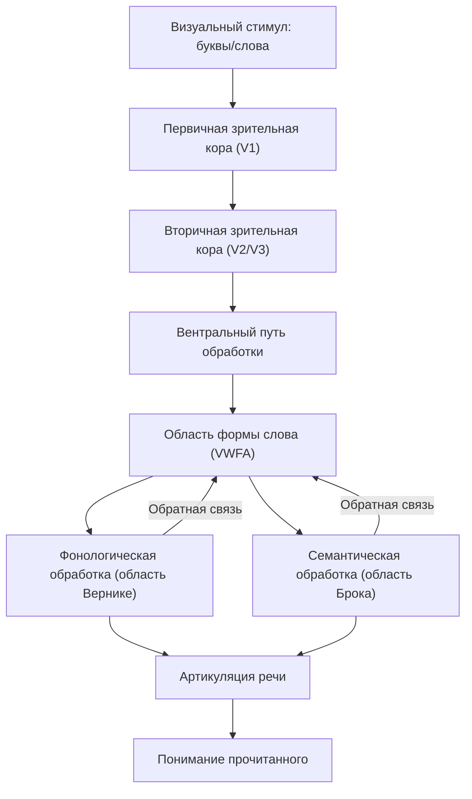

# Описание Reading (Visual Word-Form) Network (VWFA) 

**Краткое содержание.**
Reading (Visual Word-Form) Network, центральным компонентом которого является VWFA в левом вентрально–заднем отделе окципитально-височной коры, отвечает за быструю и автоматизированную обработку буквенных форм. Эта сеть включает несколько анатомических узлов (VWFA, латеральная окципитальная кора, задняя часть фузиформной извилины) и ключевых беломозговых трактов (ILF, VOF, IFOF, дугообразный тракт), обеспечивающих связи с языковыми областями. VWFA активируется при задачах на опознавание слов и лексическое решение, а её функциональная и структурная организация коррелирует с навыками чтения и патологией (дислексия, алексия).

## **Reading (Visual Word-Form) Network (VWFA)**

### **Ключевая функция:**

VWFA обеспечивает распознавание и категоризацию буквенных форм, выступая «предстанцией» для последующей лексико-семантической обработки в языковых зонах ([Eneuro][1], [Википедия][2]).

### **Анатомия:**

* **Visual Word-Form Area (VWFA):** локализована в левой вентрально-задней части окципитально-височного перехода, охватывает задний фузиформный гирус ([Eneuro][1], [MIT Press Direct][3]).
* **Lateral Occipital Cortex (LOC):** обеспечивает предварительную обработку визуальных объектов перед «подачей» информации в VWFA ([ScienceDirect][4]).
* **Posterior Fusiform Gyrus:** интегрирует глифы и формы букв в целостные представления ([MIT Press Direct][3]).

### **Ключевые траты / подсети:**

* **Inferior Longitudinal Fasciculus (ILF):** основной ассоциативный тракт, соединяющий окципитальную и височно-окципитальную кору, ключевой для передачи визуальной информации в VWFA ([PubMed][5], [PMC][6]).
* **Vertical Occipital Fasciculus (VOF):** вертикальный тракт, соединяющий VWFA с дорсальной зрительной сетью и зонами внимания ([PubMed][5], [PNAS][7]).
* **Inferior Fronto-Occipital Fasciculus (IFOF):** проводит сигналы от окципитальной коры к фронтальным языковым областям, участвует в интеграции визуальной формы и фонологии ([Nature][8]).
* **Arcuate Fasciculus:** связывает VWFA через височную кору с нижней лобной извилиной, поддерживая фонологические и тактические процессы при чтении ([Nature][8]).

### **Основные характеристики работы:**

* **Задачи:** максимальная активация VWFA наблюдается при опознании реальных слов, сравнении с псевдословами и лексических решениях ([ScienceDirect][9], [Cell][10]).
* **Paradigms:**

  * *Resting-state fMRI* выявляет два подсубрегиона (VWFA-1, VWFA-2) с разной функциональной связанностью: VWFA-1 — с ранними визуальными зонами, VWFA-2 — с языковыми и лобными областями ([Wiley Online Library][11]).
  * *Task-based fMRI* показывает усиление BOLD-сигнала в VWFA при чтении непрерывного текста, именовании и визуальной презентации буквенных строк ([Cell][10]).

### **Практические значения:**

* **Корреляция с навыками чтения:** величина активации VWFA и целостность ILF/IFOF связаны со скоростью и точностью чтения у детей и взрослых ([ScienceDirect][4], [ScienceDirect][12]).
* **Патология:** аномалии структуры ILF и VOF ассоциируются с дислексией и алексией (чистая алексия после повреждений VWFA), что подтверждает её ключевую роль в ортографическом доступе ([PMC][6], [PNAS][7]).
* **Реабилитация:** нейрофидбек-тренировка VWFA позволяет добровольцам самостоятельно регулировать активность и улучшать показатели лексического решения задач ([Nature][13]).

### **Краткие примеры:**

* Участники показывали повышение селективности VWFA после обучения новому шрифту, что сопровождалось усилением связей ILF и IFOF ([Eneuro][1], [PMC][14]).
* В исследовании с нейрофидбеком группа «up-regulation» достигла существенного прироста скорости решения лексических задач после нескольких сеансов ([Nature][13]).

### **Ключевые обзоры:**

1. **Lerma-Usabiaga G. et al., 2018.** “Converging evidence for functional and structural segregation within the left ventral occipitotemporal cortex in reading”. *PNAS*. \[[https://doi.org/10.1073/pnas.1803003115](https://doi.org/10.1073/pnas.1803003115)] ([ScienceDirect][4])
2. **Yeatman J. D. et al., 2014.** “The vertical occipital fasciculus: A century of controversy resolved by in vivo measurements”. *PNAS*. \[[https://doi.org/10.1073/pnas.1418503111](https://doi.org/10.1073/pnas.1418503111)] ([PNAS][7])
3. **Demystifying Visual Word Form Area**, bioRxiv, 2023. Использует precision fMRI для детализации ответов VWFA на визуальные и невизуальные стимулы ([BioRxiv][15])
4. **Engaging in word recognition elicits highly specific modulations in VWFA**, *Current Biology*, 2023. Отмечает неожиданные эффекты внимания на активацию VWFA ([Cell][16])
5. **Self-regulation of VWFA activation with real-time fMRI neurofeedback**, *Sci. Rep.*, 2023. Демонстрирует возможность волевой регуляции VWFA и улучшения чтения ([Nature][13])

[1]: https://www.eneuro.org/content/11/7/ENEURO.0228-24.2024 "Reading Reshapes Stimulus Selectivity in the Visual Word Form Area"
[2]: https://en.wikipedia.org/wiki/Visual_word_form_area "Visual word form area"
[3]: https://direct.mit.edu/imag/article/doi/10.1162/imag_a_00196/121385/The-position-of-visual-word-forms-in-the "The position of visual word forms in the anatomical and ..."
[4]: https://www.sciencedirect.com/science/article/pii/S0010945223000151 "Early reading skills and the ventral occipito-temporal cortex ..."
[5]: https://pubmed.ncbi.nlm.nih.gov/22632810/ "Anatomy of the visual word form area: adjacent cortical circuits and ..."
[6]: https://pmc.ncbi.nlm.nih.gov/articles/PMC6156142/ "Functional Anatomy of the Inferior Longitudinal Fasciculus"
[7]: https://www.pnas.org/doi/10.1073/pnas.1418503111 "The vertical occipital fasciculus: A century of controversy resolved by ..."
[8]: https://www.nature.com/articles/s41598-023-33231-x "Stronger functional connectivity during reading contextually ... - Nature"
[9]: https://www.sciencedirect.com/science/article/pii/S2589004224027081 "Demystifying visual word form area visual and nonvisual response ..."
[10]: https://www.cell.com/current-biology/pdfExtended/S0960-9822%2823%2900182-3 "Engaging in word recognition elicits highly specific modulations in ..."
[11]: https://onlinelibrary.wiley.com/doi/full/10.1002%2Fhbm.26655 "Distinct patterns of functional connectivity for subregions of the ..."
[12]: https://www.sciencedirect.com/science/article/abs/pii/S0093934X22001195 "The relationship between reading abilities and the left ..."
[13]: https://www.nature.com/articles/s41598-023-35932-9 "Self-regulation of visual word form area activation with real-time ..."
[14]: https://pmc.ncbi.nlm.nih.gov/articles/PMC11285298/ "Reading Reshapes Stimulus Selectivity in the Visual Word Form Area"
[15]: https://www.biorxiv.org/content/10.1101/2023.06.15.544824v2.full-text "Demystifying the Visual Word Form Area - bioRxiv"
[16]: https://www.cell.com/current-biology/fulltext/S0960-9822%2823%2900182-3 "Engaging in word recognition elicits highly specific modulations in ..."

---

---

Оглавление:

- [ЭИРО framework](/README.md)
- [Нейросети мозга](/brain-networks/README.md)

