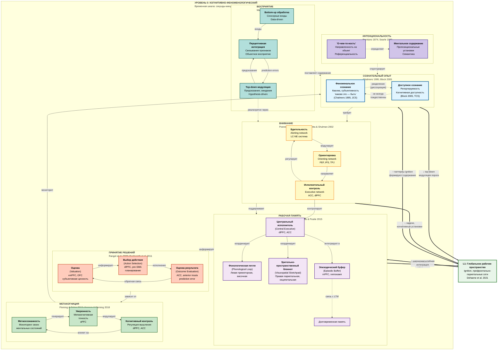
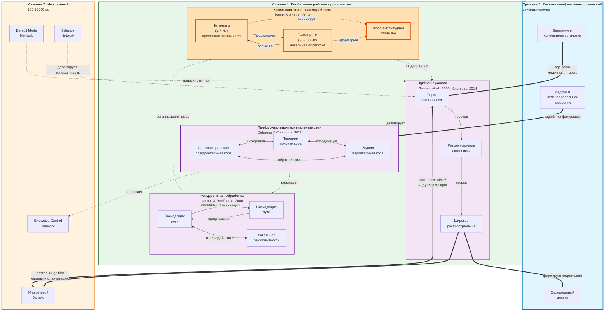

```mermaid
graph TB
    subgraph L1["<b>Уровень 1: Глобальное рабочее пространство</b><br>100-1000 мс"]
        Ignition["Ignition процессы<br>Широкомасштабная<br>интеграция"]
        Consciousness["Сознательный<br>доступ"]
    end
    
    subgraph L2["<b>УРОВЕНЬ 2: МЕЖСЕТЕВАЯ КООРДИНАЦИЯ</b><br>Временная шкала: 100-10000 мс | Масштаб: крупномасштабные сети"]
        
        subgraph DMN["<b>DEFAULT MODE NETWORK (DMN)</b><br>Raichle et al. 2001 PNAS; Buckner & DiNicola 2019 Neuron"]
            direction TB
            
            subgraph DMN_Core["Ядерные узлы"]
                mPFC["<b>Медиальная ПФК</b><br>(mPFC/vmPFC)<br>Самореференция<br>Оценка ценности"]
                PCC["<b>Задняя поясная кора</b><br>(PCC/Precuneus)<br>Автобиографическая память<br>Самосознание"]
                AG["<b>Угловая извилина</b><br>(Angular Gyrus)<br>Семантическая обработка<br>Социальное познание"]
                MTL["<b>Медиальная височная доля</b><br>(Hippocampus)<br>Эпизодическая память<br>Ментальное путешествие"]
            end
            
            DMN_Functions["<b>ФУНКЦИИ DMN</b><br>• Самореферентная обработка<br>• Theory of Mind (ToM)<br>• Проспективное мышление<br>• Дефолтный режим (mind-wandering)<br>• Эпизодическая память<br>• Семантическая интеграция"]
            
            mPFC <-->|"структурная и<br>функциональная<br>связность"| PCC
            PCC <-->|"память и<br>самосознание"| MTL
            mPFC <-->|"ментализация"| AG
            AG <-->|"семантическая<br>память"| MTL
        end
        
        subgraph ECN["<b>EXECUTIVE CONTROL NETWORK (ECN)</b><br>Seeley et al. 2007 J Neurosci; Cole & Schneider 2007 Neuroimage"]
            direction TB
            
            subgraph ECN_Core["Ядерные узлы"]
                dlPFC["<b>Дорсолатеральная ПФК</b><br>(dlPFC)<br>Рабочая память<br>Когнитивный контроль"]
                PPC["<b>Задняя париетальная кора</b><br>(Posterior Parietal)<br>Внимание<br>Пространственная обработка"]
                ACC_ECN["<b>Передняя поясная кора</b><br>(дорсальная ACC)<br>Мониторинг конфликтов<br>Когнитивная регуляция"]
            end
            
            ECN_Functions["<b>ФУНКЦИИ ECN</b><br>• Целенаправленное поведение<br>• Планирование и организация<br>• Рабочая память<br>• Ингибиторный контроль<br>• Гибкость мышления<br>• Решение проблем"]
            
            dlPFC <-->|"top-down<br>контроль"| PPC
            dlPFC <-->|"когнитивная<br>регуляция"| ACC_ECN
            PPC <-->|"внимание и<br>рабочая память"| ACC_ECN
        end
        
        subgraph SN["<b>SALIENCE NETWORK</b><br>Menon 2015 Brain Struct Funct; Seeley et al. 2007"]
            direction TB
            
            subgraph SN_Core["Ядерные узлы"]
                aIns["<b>Передняя инсула</b><br>(Anterior Insula)<br>Интероцепция<br>Субъективное чувство"]
                ACC_SN["<b>Передняя поясная кора</b><br>(вентральная ACC)<br>Детекция ошибок<br>Аффективная оценка"]
                Amygdala_SN["<b>Амигдала</b><br>Эмоциональная релевантность<br>Оценка угрозы"]
                VTA["<b>Вентральная покрышка</b><br>(VTA)<br>Дофаминергическая<br>модуляция"]
            end
            
            SN_Functions["<b>ФУНКЦИИ SALIENCE NETWORK</b><br>• Детекция релевантных стимулов<br>• Переключение DMN ↔ ECN<br>• Интероцептивное осознание<br>• Эмоциональная обработка<br>• Мотивационная регуляция<br>• Фильтрация приоритетов"]
            
            aIns <-->|"интероцепция<br>и эмоции"| ACC_SN
            aIns <-->|"оценка<br>релевантности"| Amygdala_SN
            ACC_SN <-->|"аффективная<br>модуляция"| Amygdala_SN
            VTA -.->|"нейромодуляция<br>мотивации"| aIns
        end
        
        subgraph DAN["<b>DORSAL ATTENTION NETWORK (DAN)</b><br>Corbetta & Shulman 2002 Nat Rev Neurosci"]
            direction TB
            
            subgraph DAN_Core["Ядерные узлы"]
                FEF["<b>Лобное глазодвигательное поле</b><br>(FEF)<br>Произвольные саккады<br>Пространственное внимание"]
                IPS["<b>Интрапариетальная борозда</b><br>(IPS)<br>Визуально-пространственное<br>внимание"]
            end
            
            DAN_Functions["<b>ФУНКЦИИ DAN</b><br>• Top-down внимание<br>• Произвольная ориентировка<br>• Поиск целей<br>• Пространственная рабочая память"]
            
            FEF <-->|"координация<br>внимания"| IPS
        end
        
        subgraph VAN["<b>VENTRAL ATTENTION NETWORK (VAN)</b><br>Corbetta et al. 2008 Neuron"]
            direction TB
            
            subgraph VAN_Core["Ядерные узлы"]
                TPJ["<b>Височно-париетальное соединение</b><br>(TPJ)<br>Детекция неожиданных<br>стимулов"]
                VFC["<b>Вентральная лобная кора</b><br>(VFC/IFG)<br>Переориентация<br>внимания"]
            end
            
            VAN_Functions["<b>ФУНКЦИИ VAN</b><br>• Bottom-up внимание<br>• Детекция новизны<br>• Circuit breaker для DAN<br>• Переориентация на релевантные стимулы"]
            
            TPJ <-->|"детекция и<br>переключение"| VFC
        end
    end
    
    
    subgraph L3["<b>Уровень 3: Крупномасштабные региональные сети</b><br>10-1000 мс"]
        Regional["Кортико-таламические петли<br>Кортико-стриатные петли<br>Кортико-лимбические петли"]
    end
    
    %% Межсетевые связи (антикорреляции и синергии)
    DMN -.->|"❌ антикорреляция<br>(Fox et al. 2005)"| ECN
    ECN -.->|"❌ реципрокное<br>торможение"| DMN
    
    SN ==>|"✓ переключает на<br>task-positive"| ECN
    SN ==>|"❌ подавляет при<br>внешних задачах"| DMN
    
    DAN -->|"✓ синергия<br>внимание"| ECN
    VAN -.->|"circuit breaker"| DAN
    VAN -->|"переориентация"| SN
    
    DMN <-->|"внутренне-направленное<br>внимание"| VAN
    
    %% Связи с L1
    Ignition ==>|"↓ глобальные паттерны<br>определяют конфигурацию сетей"| SN
    DMN ==>|"↑ дефолтный режим<br>влияет на порог ignition"| Consciousness
    ECN ==>|"↑ целенаправленная<br>обработка"| Ignition
    SN ==>|"↑ детекция релевантности<br>модулирует ignition"| Ignition
    
    %% Связи с L3
    DMN ==>|"↓ определяет<br>региональную активацию<br>автобиографической сети"| Regional
    ECN ==>|"↓ модулирует<br>фронто-париетальные<br>петли"| Regional
    Regional ==>|"↑ региональная динамика<br>формирует синхронизацию<br>и антикорреляции"| SN
    
    %% Нейромодуляция
    Neuromod["<b>НЕЙРОМОДУЛЯТОРНЫЕ СИСТЕМЫ</b><br>Shine et al. 2021 Nat Rev Neurosci<br><br>• Дофамин (VTA/SNc) → SN, ECN (мотивация, обучение)<br>• Норадреналин (LC) → DAN, SN (arousal, внимание)<br>• Ацетилхолин (базальное ядро) → DMN, ECN (когнитивная гибкость)<br>• Серотонин (raphé) → DMN, SN (настроение, импульсивность)"]
    
    Neuromod -.->|"глобальная<br>модуляция"| DMN
    Neuromod -.->|"глобальная<br>модуляция"| ECN
    Neuromod -.->|"глобальная<br>модуляция"| SN
    Neuromod -.->|"глобальная<br>модуляция"| DAN
    
    %% Стили
    classDef level1 fill:#e8f5e9,stroke:#2e7d32,stroke-width:3px
    classDef level2 fill:#fff3e0,stroke:#ef6c00,stroke-width:3px
    classDef level3 fill:#fce4ec,stroke:#c2185b,stroke-width:3px
    classDef dmn fill:#e1f5fe,stroke:#0277bd,stroke-width:2px
    classDef ecn fill:#f3e5f5,stroke:#6a1b9a,stroke-width:2px
    classDef salience fill:#fff9c4,stroke:#f57f17,stroke-width:2px
    classDef attention fill:#e8f5e9,stroke:#2e7d32,stroke-width:2px
    classDef annotation fill:#ffebee,stroke:#c62828,stroke-width:2px
    classDef modulation fill:#fce4ec,stroke:#880e4f,stroke-width:2px
    
    class L1 level1
    class L2 level2
    class L3 level3
    class DMN,DMN_Core,mPFC,PCC,AG,MTL dmn
    class ECN,ECN_Core,dlPFC,PPC,ACC_ECN ecn
    class SN,SN_Core,aIns,ACC_SN,Amygdala_SN salience
    class DAN,VAN,DAN_Core,VAN_Core attention
    class TripleCore,AntiMech,SwitchMech annotation
    class Neuromod modulation
```

```mermaid
graph TB
    subgraph L2["<b>Уровень 2: Межсетевой</b><br>100-10000 мс"]
        DMN["Default Mode Network"]
        ECN["Executive Control Network"]
        SN["Salience Network"]
        InterNetwork["Межсетевая<br>координация"]
    end
    
    subgraph L3["<b>УРОВЕНЬ 3: КРУПНОМАСШТАБНЫЕ СЕТИ</b><br>Временная шкала: 10-1000 мс | Масштаб: региональные системы"]
        
        subgraph CTL["<b>КОРТИКО-ТАЛАМИЧЕСКИЕ ПЕТЛИ</b><br>Sherman 2016, Annu Rev Neurosci"]
            direction TB
            
            Thalamus["<b>Таламус</b><br>Сенсорное реле<br>Модуляция активности"]
            
            subgraph CoreMatrix["Типы таламо-кортикальных связей"]
                Core["<b>Core (ядерные)</b><br>Водители (drivers)<br>Специфичные проекции<br>Глутамат (vGluT2+)"]
                Matrix["<b>Matrix (матричные)</b><br>Модуляторы<br>Диффузные проекции<br>Глутамат (vGluT2-)"]
            end
            
            SensoryCtx["<b>Сенсорная кора</b><br>V1, A1, S1<br>Первичная обработка"]
            AssocCtx["<b>Ассоциативная кора</b><br>Префронтальная<br>Париетальная<br>Височная"]
            TRN["<b>Ретикулярное ядро</b><br>(TRN)<br>Торможение таламуса<br>Внимание, фильтрация"]
            
            Core -->|"специфическая<br>передача"| SensoryCtx
            Matrix -->|"контекстная<br>модуляция"| AssocCtx
            SensoryCtx -->|"обратная связь<br>layer 6"| Core
            AssocCtx -->|"top-down<br>контроль"| Matrix
            SensoryCtx -.->|"коллатерали"| TRN
            TRN -->|"GABAергическое<br>торможение"| Thalamus
        end
        
        subgraph CSTL["<b>КОРТИКО-СТРИАТО-ТАЛАМИЧЕСКИЕ ПЕТЛИ</b><br>Graybiel & Grafton 2015, Neuron"]
            direction TB
            
            MotorCtx["<b>Моторная кора</b><br>M1, SMA, PMC<br>Планирование движений"]
            PrefrontalCtx["<b>Префронтальная кора</b><br>dlPFC, OFC, ACC<br>Когнитивный контроль"]
            
            subgraph Striatum["<b>Стриатум</b>"]
                Dorsal["<b>Дорсальный стриатум</b><br>Путамен (моторика)<br>Хвостатое ядро (когниция)"]
                Ventral["<b>Вентральный стриатум</b><br>NAcc (мотивация)<br>Обонятельный бугорок"]
            end
            
            subgraph BG["<b>Базальные ганглии</b>"]
                GPe["GPe<br>(внешний сегмент)"]
                GPi["GPi<br>(внутренний сегмент)"]
                SNr["SNr<br>(черная субстанция)"]
                STN["STN<br>(субталамическое ядро)"]
                SNc["SNc<br>(дофаминергическая<br>модуляция)"]
            end
            
            ThalamusMotor["<b>Моторный таламус</b><br>VA/VL ядра<br>Реле к коре"]
            
            MotorCtx -->|"Прямой путь<br>(Go)"| Dorsal
            PrefrontalCtx -->|"Непрямой путь<br>(NoGo)"| Dorsal
            
            Dorsal -->|"D1+ MSNs<br>облегчение"| GPi
            Dorsal -->|"D2+ MSNs<br>торможение"| GPe
            
            GPe -->|"торможение"| STN
            STN -->|"гипер-прямой<br>путь"| GPi
            
            GPi -->|"торможение"| ThalamusMotor
            SNr -->|"торможение"| ThalamusMotor
            ThalamusMotor -->|"растормаживание"| MotorCtx
            
            SNc -.->|"DA модуляция<br>обучения"| Striatum
        end
        
        subgraph CLL["<b>КОРТИКО-ЛИМБИЧЕСКИЕ ПЕТЛИ</b><br>LeDoux 2000, Annu Rev Neurosci"]
            direction TB
            
            Amygdala["<b>Амигдала</b><br>Обработка эмоций<br>Оценка угрозы<br>Условный страх"]
            
            subgraph AmygNuclei["Ядра амигдалы"]
                BLA["BLA<br>(базолатеральная)<br>Сенсорные входы"]
                CeA["CeA<br>(центральная)<br>Выходы к эффекторам"]
                LA["LA<br>(латеральная)<br>Ассоциативное обучение"]
            end
            
            vmPFC["<b>Вентромедиальная ПФК</b><br>Регуляция эмоций<br>Экстинкция страха"]
            ACC_Limbic["<b>Передняя поясная кора</b><br>(аффективный отдел)<br>Мониторинг конфликтов<br>Эмоциональная оценка"]
            Insula["<b>Инсула</b><br>Интероцепция<br>Субъективные чувства"]
            
            Hypothalamus["<b>Гипоталамус</b><br>Нейроэндокринные<br>реакции"]
            PAG["<b>PAG</b><br>(периакведуктальное серое)<br>Защитное поведение"]
            
            BLA -->|"возбуждение"| CeA
            LA -->|"условные стимулы"| BLA
            CeA -->|"выходы"| Hypothalamus
            CeA -->|"выходы"| PAG
            
            vmPFC -->|"торможение<br>экстинкция"| BLA
            ACC_Limbic <-->|"оценка<br>конфликтов"| Amygdala
            Insula <-->|"интероцептивная<br>информация"| Amygdala
        end
        
        subgraph HCC["<b>ГИППОКАМПО-КОРТИКАЛЬНЫЕ ВЗАИМОДЕЙСТВИЯ</b><br>Buzsáki 2015, Hippocampus"]
            direction TB
            
            subgraph Hippocampus["<b>Гиппокамп</b>"]
                DG["<b>Зубчатая извилина</b><br>(DG)<br>Разделение паттернов"]
                CA3["<b>CA3</b><br>Автоассоциативная сеть<br>Завершение паттернов"]
                CA1["<b>CA1</b><br>Компаратор<br>Выход к коре"]
            end
            
            EC["<b>Энторинальная кора</b><br>Вход: layer II → DG/CA3<br>Выход: CA1 → layer V<br>Grid cells, место-время"]
            
            mPFC_Memory["<b>Медиальная ПФК</b><br>Семантическая память<br>Схемы, контекст"]
            Retrosplenial["<b>Ретросплениальная кора</b><br>Пространственная навигация<br>Контекстные репрезентации"]
            
            subgraph Consolidation["<b>Консолидация памяти</b>"]
                SWR["<b>Sharp-wave ripples</b><br>(SWRs)<br>Высокочастотные<br>осцилляции (150-250 Hz)<br>Replay последовательностей"]
                Replay["<b>Replay</b><br>Реактивация<br>следов памяти<br>Во время сна и покоя"]
            end
            
            DG -->|"перфорантный путь"| CA3
            CA3 -->|"Schaffer коллатерали"| CA1
            CA1 -->|"субикулум"| EC
            
            EC -->|"layer II"| DG
            EC -->|"layer III"| CA1
            CA1 -->|"layer V EC"| mPFC_Memory
            
            CA1 -.->|"генерация"| SWR
            SWR -.->|"инициация"| Replay
            Replay -.->|"укрепление связей"| mPFC_Memory
            
            Retrosplenial <-->|"пространственный<br>контекст"| Hippocampus
        end
        
        subgraph FunctionalSpecialization["<b>ФУНКЦИОНАЛЬНАЯ СПЕЦИАЛИЗАЦИЯ</b>"]
            Sensory["<b>Сенсорная обработка</b><br>Таламо-кортикальные"]
            Motor["<b>Моторный контроль</b><br>Кортико-стриатные"]
            Emotion["<b>Эмоции</b><br>Кортико-лимбические"]
            Memory["<b>Память</b><br>Гиппокампо-кортикальные"]
        end
    end
    
    subgraph L4["<b>Уровень 4: Мезоуровень</b><br>10-100 мс"]
        Columns["Кортикальные колонки"]
        LocalCircuits["Локальные<br>рекуррентные контуры"]
        EIBalance["Баланс<br>возбуждения-торможения"]
    end
    
    %% Взаимодействия L2 ↔ L3
    InterNetwork ==>|"↓ региональная<br>координация<br>паттерны активации"| CTL
    InterNetwork ==>|"↓ задачи,<br>установки"| CSTL
    DMN ==>|"↓ самореферентная<br>обработка"| CLL
    ECN ==>|"↓ когнитивный<br>контроль"| CSTL
    
    CTL ==>|"↑ сенсорные входы<br>формируют сетевую<br>активность"| InterNetwork
    CSTL ==>|"↑ моторные,<br>когнитивные выходы"| InterNetwork
    CLL ==>|"↑ эмоциональная<br>модуляция"| SN
    HCC ==>|"↑ контекстная<br>память"| DMN
    
    %% Взаимодействия L3 ↔ L4
    SensoryCtx ==>|"↓ входы в<br>микроконтуры<br>layer 4"| Columns
    MotorCtx ==>|"↓ моторные команды<br>layer 5"| LocalCircuits
    Amygdala ==>|"↓ эмоциональная<br>модуляция"| EIBalance
    CA1 ==>|"↓ контекст<br>для локальной обработки"| LocalCircuits
    
    Columns ==>|"↑ колоночные<br>вычисления"| SensoryCtx
    LocalCircuits ==>|"↑ функциональные<br>единицы"| MotorCtx
    EIBalance ==>|"↑ региональная<br>динамика"| CTL
    
    %% Интеграция функций
    CTL -.-> Sensory
    CSTL -.-> Motor
    CLL -.-> Emotion
    HCC -.-> Memory
    
    %% Нейромодуляция
    ModSystems["<b>НЕЙРОМОДУЛЯТОРНЫЕ СИСТЕМЫ</b><br>Shine 2021, Prog Neurobiol<br><br>• DA (VTA, SNc) → мотивация, обучение<br>• 5-HT (raphé) → настроение, импульсивность<br>• NE (LC) → внимание, arousal<br>• ACh (базальное ядро) → когнитивная гибкость"]
    
    ModSystems -.->|"глобальная<br>модуляция"| CTL
    ModSystems -.->|"обучение<br>с подкреплением"| CSTL
    ModSystems -.->|"эмоциональная<br>регуляция"| CLL
    ModSystems -.->|"кодирование<br>новизны"| HCC
    
    %% Стили
    classDef level2 fill:#fff3e0,stroke:#ef6c00,stroke-width:3px
    classDef level3 fill:#fce4ec,stroke:#c2185b,stroke-width:3px
    classDef level4 fill:#f3e5f5,stroke:#6a1b9a,stroke-width:3px
    classDef thalamic fill:#e1f5fe,stroke:#0277bd,stroke-width:2px
    classDef striatal fill:#e8f5e9,stroke:#2e7d32,stroke-width:2px
    classDef limbic fill:#fff9c4,stroke:#f57f17,stroke-width:2px
    classDef hippocampal fill:#f1f8e9,stroke:#558b2f,stroke-width:2px
    classDef annotation fill:#ede7f6,stroke:#512da8,stroke-width:2px
    classDef modulation fill:#fce4ec,stroke:#880e4f,stroke-width:2px
    
    class L2 level2
    class L3 level3
    class L4 level4
    class CTL,Core,Matrix,TRN thalamic
    class CSTL,Striatum,BG striatal
    class CLL,Amygdala,AmygNuclei limbic
    class HCC,Hippocampus,EC hippocampal
    class ModSystems modulation
```   

```mermaid
graph TB
    subgraph L3["Уровень 3: Крупномасштабные сети"]
        Thalamus["Таламические входы"]
        CorticalAreas["Межареальные связи"]
        Subcortical["Подкорковые структуры"]
    end
    
    subgraph L4["УРОВЕНЬ 4: МЕЗОУРОВЕНЬ"]
        
        subgraph Columns["КОРТИКАЛЬНЫЕ КОЛОНКИ"]
            direction TB
            
            Minicolumn["Миниколонка<br>50 мкм, 80-100 нейронов"]
            Column["Колонка<br>300-500 мкм"]
            Hypercolumn["Гиперколонка<br>1 мм диаметр"]
            
            Layer1["Layer I: Модуляторный"]
            Layer23["Layer II/III: Ассоциативный"]
            Layer4["Layer IV: Таламический вход"]
            Layer5["Layer V: Подкорковый выход"]
            Layer6["Layer VI: Кортико-таламический"]
        end
        
        subgraph Canonical["КАНОНИЧЕСКИЙ МИКРОКОНТУР"]
            direction TB
            
            Input["Входы: таламические,<br>кортикальные, модуляторные"]
            LocalRecurrent["Локальная рекуррентность<br>Усиление сигнала"]
            Feedforward["Прямые связи<br>L4-L2/3-L5"]
            Feedback["Обратные связи<br>L6-L4, L5-L2/3"]
            Output["Выходы: межареальные,<br>подкорковые, таламические"]
        end
        
        subgraph EIBalance["БАЛАНС E/I"]
            direction TB
            
            Pyramidal["Пирамидные нейроны<br>80% возбуждающие"]
            Stellate["Звездчатые клетки<br>Layer IV"]
            
            PV["PV+ интернейроны<br>40% быстрое торможение"]
            SST["SST+ интернейроны<br>30% дендритное торможение"]
            VIP["VIP+ интернейроны<br>20% дизингибиция"]
        end
        
        subgraph Functions["ВЫЧИСЛИТЕЛЬНЫЕ ФУНКЦИИ"]
            direction TB
            
            Normalization["Gain control<br>Нормализация"]
            FeatureDetection["Детекция признаков<br>Инвариантность"]
            Oscillations["Генерация осцилляций<br>Gamma, Beta"]
        end
    end
    
    subgraph L5_NVU["Уровень 5: Нейроваскулярная единица"]
        MetabolicDemand["Метаболический запрос"]
        NVC["Нейроваскулярное сопряжение"]
        Energetics["Энергетика ATP O2"]
    end
    
    Thalamus ==> Layer4
    CorticalAreas ==> Layer23
    Subcortical ==> Layer1
    
    Layer6 ==> Thalamus
    Layer23 ==> CorticalAreas
    Layer5 ==> Subcortical
    
    Minicolumn -.-> Column
    Column -.-> Hypercolumn
    
    Input --> Feedforward
    Feedforward --> LocalRecurrent
    LocalRecurrent --> Output
    Feedback -.-> LocalRecurrent
    
    Pyramidal --> PV
    Pyramidal --> SST
    Pyramidal --> VIP
    PV --> Pyramidal
    SST --> Pyramidal
    VIP --> SST
    VIP --> PV
    
    Canonical -.-> EIBalance
    EIBalance -.-> Functions
    
    LocalRecurrent ==> MetabolicDemand
    Functions ==> NVC
    Energetics ==> EIBalance
    NVC ==> Functions
    
    classDef level3 fill:#fce4ec,stroke:#c2185b,stroke-width:3px
    classDef level4 fill:#f3e5f5,stroke:#6a1b9a,stroke-width:3px
    classDef level5 fill:#e0f2f1,stroke:#00695c,stroke-width:3px
    classDef columns fill:#e8eaf6,stroke:#3f51b5,stroke-width:2px
    classDef circuit fill:#e1f5fe,stroke:#0277bd,stroke-width:2px
    classDef inhibition fill:#fff9c4,stroke:#f57f17,stroke-width:2px
    
    class L3 level3
    class L4 level4
    class L5_NVU level5
    class Columns,Minicolumn,Column,Hypercolumn columns
    class Canonical,Input,Output circuit
    class EIBalance,PV,SST,VIP inhibition
```

```mermaid
graph TB
    subgraph L4["Уровень 4: Мезоуровень"]
        NeuralActivity["Нейрональная активность<br>Паттерны спайков"]
        MetabolicDemand["Метаболический запрос<br>ATP, O2, глюкоза"]
    end
    
    subgraph L5["УРОВЕНЬ 5: НЕЙРОВАСКУЛЯРНАЯ ЕДИНИЦА"]
        
        subgraph Components["КЛЕТОЧНЫЕ КОМПОНЕНТЫ"]
            Neurons["НЕЙРОНЫ<br>Генераторы активности<br>Метаболический запрос"]
            
            Astrocytes["АСТРОЦИТЫ<br>Endfeet на сосудах<br>Ca2+ сигнализация<br>K+ буферизация"]
            
            Microglia["МИКРОГЛИЯ<br>Иммунный надзор<br>Синаптическая обрезка"]
            
            Pericytes["ПЕРИЦИТЫ<br>Контроль диаметра капилляров<br>Регуляция кровотока"]
            
            Endothelium["ЭНДОТЕЛИЙ<br>Гематоэнцефалический барьер<br>Tight junctions<br>Транспорт нутриентов"]
        end
        
        subgraph NVC["НЕЙРОВАСКУЛЯРНОЕ СОПРЯЖЕНИЕ"]
            subgraph DirectPathways["Прямые пути"]
                NO["Оксид азота NO<br>nNOS в нейронах<br>Вазодилатация"]
                
                Prostaglandins["Простагландины<br>COX-2, PGE2<br>Вазодилатация"]
                
                Kplus["Внеклеточный K+<br>3-10 мМ<br>Гиперполяризация ГМК"]
                
                Adenosine["Аденозин<br>ATP метаболизм<br>A2A рецепторы"]
            end
            
            subgraph AstrocyticPathways["Астроцитарные пути"]
                CaWaves["Ca2+ волны<br>mGluR5, IP3<br>Gap junctions Cx43"]
                
                AstroVasoactive["Вазоактивные медиаторы<br>PGE2, EETs<br>20-HETE, Лактат"]
                
                KBuffering["K+ буферизация<br>Kir4.1 каналы<br>Пространственное перераспределение"]
            end
            
            subgraph InterneuronPathways["Интернейрональная модуляция"]
                VIPInterneurons["VIP+ интернейроны<br>Прямая иннервация сосудов<br>Быстрая вазодилатация"]
                
                NPYInterneurons["NPY+ интернейроны<br>Вазоконстрикция"]
            end
        end
        
        subgraph BBB["ГЕМАТОЭНЦЕФАЛИЧЕСКИЙ БАРЬЕР"]
            TightJunctions["Плотные контакты<br>Claudin-5, Occludin<br>ZO-1, ZO-2"]
            
            Transporters["Транспортеры<br>GLUT1 глюкоза<br>LAT1 аминокислоты<br>MCT1 лактат<br>P-gp эффлюкс"]
            
            Transcytosis["Трансцитоз<br>Рецептор-опосредованный<br>Инсулин, трансферрин"]
        end
        
        subgraph Hemodynamics["ГЕМОДИНАМИЧЕСКИЙ ОТВЕТ"]
            Vasodilation["Вазодилатация<br>Латентность 1-2 сек<br>Пик 4-6 сек<br>CBF увеличение 50-100%"]
            
            BOLD["BOLD сигнал fMRI<br>CBF больше CMRO2<br>Снижение deoxy-Hb<br>Увеличение T2*"]
            
            InitialDip["Initial dip<br>Ранний рост deoxy-Hb<br>100-500 мс"]
            
            PostStimUndershoot["Post-stimulus undershoot<br>Медленная нормализация<br>CMRO2"]
        end
        
        subgraph EnergyMetabolism["ЭНЕРГЕТИЧЕСКИЙ МЕТАБОЛИЗМ"]
            ANLS["Astrocyte-Neuron<br>Lactate Shuttle<br>Глутамат-глюкоза-лактат<br>Magistretti 2015"]
            
            OxidativeMetabolism["Окислительный метаболизм<br>CMRO2 3.5 мл/100г/мин<br>CMRglc 5.5 мг/100г/мин"]
            
            ATPDemand["ATP потребление<br>Na/K-ATPase 50%<br>Синапсы 20%<br>Синтез 20%<br>Хаусхолдинг 10%"]
        end
        
        subgraph GlymphaticSystem["ГЛИМФАТИЧЕСКАЯ СИСТЕМА"]
            ParavascularInflux["Параваскулярный приток<br>ЦСЖ периартериально<br>AQP4 на endfeet"]
            
            InterstitialFlow["Интерстициальный поток<br>Конвекция через ЭКП<br>Вымывание метаболитов"]
            
            ParavascularEfflux["Параваскулярный эффлюкс<br>Перивенулярные пространства<br>Дренаж в лимфу"]
            
            SleepEnhancement["Усиление во сне<br>ЭКП увеличение 60%<br>Клиренс амилоида 2x<br>Xie et al 2013"]
        end
    end
    
    subgraph L6["Уровень 6: Клеточный"]
        CellularEnsembles["Клеточные ансамбли<br>Синаптическая активность"]
        TrophicSupport["Трофическая поддержка<br>BDNF, NGF"]
    end
    
    NeuralActivity ==> Neurons
    MetabolicDemand ==> NVC
    
    Neurons --> Astrocytes
    Neurons -.-> Endothelium
    
    Astrocytes --> CaWaves
    CaWaves --> AstroVasoactive
    AstroVasoactive --> Pericytes
    AstroVasoactive --> Endothelium
    
    Astrocytes --> KBuffering
    KBuffering -.-> Kplus
    
    Microglia -.-> Astrocytes
    Microglia -.-> Neurons
    
    Pericytes <--> Endothelium
    
    VIPInterneurons --> Pericytes
    VIPInterneurons --> Endothelium
    
    NO --> Vasodilation
    Prostaglandins --> Vasodilation
    Kplus --> Vasodilation
    Adenosine --> Vasodilation
    AstroVasoactive --> Vasodilation
    
    Vasodilation --> BOLD
    BOLD -.-> InitialDip
    BOLD --> PostStimUndershoot
    
    TightJunctions -.-> Endothelium
    Transporters -.-> Endothelium
    
    Vasodilation ==> EnergyMetabolism
    ANLS --> Neurons
    Neurons --> Astrocytes
    
    OxidativeMetabolism --> ANLS
    ATPDemand <--> OxidativeMetabolism
    
    ParavascularInflux --> InterstitialFlow
    InterstitialFlow --> ParavascularEfflux
    SleepEnhancement -.-> InterstitialFlow
    
    Astrocytes -.-> ParavascularInflux
    
    Astrocytes ==> TrophicSupport
    EnergyMetabolism ==> CellularEnsembles
    
    Neurons <== CellularEnsembles
    Microglia ==> CellularEnsembles
    
    classDef level4 fill:#f3e5f5,stroke:#6a1b9a,stroke-width:3px
    classDef level5 fill:#e0f2f1,stroke:#00695c,stroke-width:3px
    classDef level6 fill:#fff9c4,stroke:#f57f17,stroke-width:3px
    classDef components fill:#e1f5fe,stroke:#0277bd,stroke-width:2px
    classDef nvc fill:#f1f8e9,stroke:#558b2f,stroke-width:2px
    classDef bbb fill:#fce4ec,stroke:#c2185b,stroke-width:2px
    classDef hemodynamics fill:#fff3e0,stroke:#ef6c00,stroke-width:2px
    classDef metabolism fill:#ede7f6,stroke:#512da8,stroke-width:2px
    classDef glymphatic fill:#e8f5e9,stroke:#2e7d32,stroke-width:2px
    
    class L4 level4
    class L5 level5
    class L6 level6
    class Components,Neurons,Astrocytes,Microglia,Pericytes,Endothelium components
    class NVC,DirectPathways,AstrocyticPathways,InterneuronPathways nvc
    class BBB,TightJunctions,Transporters,Transcytosis bbb
    class Hemodynamics,Vasodilation,BOLD,InitialDip,PostStimUndershout hemodynamics
    class EnergyMetabolism,ANLS,OxidativeMetabolism,ATPDemand metabolism
    class GlymphaticSystem,ParavascularInflux,InterstitialFlow,ParavascularEfflux,SleepEnhancement glymphatic
```

```mermaid
graph TB
    subgraph L5["<b>Уровень 5: Нейроваскулярная единица</b><br>1-10 сек"]
        NVC["Нейроваскулярное<br>сопряжение"]
        Astrocytes_L5["Астроциты<br>трофическая поддержка"]
        Microglia_L5["Микроглия<br>иммунная регуляция"]
    end
    
    subgraph L6["<b>УРОВЕНЬ 6: КЛЕТОЧНЫЙ</b><br>Временная шкала: 1-1000 мс | Масштаб: 10-100 мкм"]
        
        subgraph ExcitatoryNeurons["<b>ВОЗБУЖДАЮЩИЕ НЕЙРОНЫ (Glutamatergic)</b><br>~80% кортикальных нейронов"]
            direction TB
            
            subgraph Pyramidal["<b>ПИРАМИДНЫЕ НЕЙРОНЫ</b><br>Spruston 2008, Nat Rev Neurosci"]
                PyramL23["<b>Layer II/III пирамидные</b><br>• Межколоночные связи<br>• Ассоциативные проекции<br>• Обратные связи<br>• Тонкие апикальные дендриты"]
                
                PyramL5["<b>Layer V пирамидные</b><br>• Подкорковые проекции<br>• Толстый апикальный дендрит<br>• Кальциевые спайки<br>• Intrinsic bursting"]
                
                PyramL6["<b>Layer VI пирамидные</b><br>• Кортико-таламические<br>• Модуляция входов<br>• Обратная связь к таламусу"]
                
                PyramCA1["<b>CA1 пирамидные (гиппокамп)</b><br>• Place cells<br>• Time cells<br>• Консолидация памяти<br>O'Keefe & Nadel 1978"]
                
                PyramCA3["<b>CA3 пирамидные (гиппокамп)</b><br>• Рекуррентные коллатерали<br>• Pattern completion<br>• Автоассоциативная сеть<br>Marr 1971"]
            end
            
            subgraph StellateCells["<b>ЗВЕЗДЧАТЫЕ КЛЕТКИ</b>"]
                Stellate_L4["<b>Spiny stellate (Layer IV)</b><br>• Основные мишени таламуса<br>• Локальные проекции<br>• Не имеют апикального дендрита<br>Lübke et al. 2000"]
            end
            
            PyramProperties["<b>СВОЙСТВА ПИРАМИДНЫХ НЕЙРОНОВ</b><br><br>Морфология:<br>• Апикальный дендрит → Layer I<br>• Базальные дендриты (радиальные)<br>• Длинный аксон с коллатералями<br>• Дендритные шипики (1-10/мкм)<br><br>Электрофизиология:<br>• Regular spiking (RS)<br>• Частота адаптации<br>• After-hyperpolarization (AHP)<br>• Threshold ~-55 mV<br><br>Синаптическая интеграция:<br>• Нелинейная денд. интеграция<br>• NMDA-спайки<br>• Ca2+ plateau potentials<br>Larkum 2022, Science"]
        end
        
        subgraph InhibitoryInterneurons["<b>ТОРМОЗНЫЕ ИНТЕРНЕЙРОНЫ (GABAergic)</b><br>~20% кортикальных нейронов<br>Tremblay et al. 2016, Neuron"]
            direction TB
            
            subgraph PV_Interneurons["<b>ПАРВАЛЬБУМИН+ (PV+) ~40%</b>"]
                BasketCells["<b>Basket cells</b><br>• Перисоматическое торможение<br>• Контроль выходного спайкинга<br>• Fast-spiking (FS)<br>• Высокочастотный разряд (>100 Hz)<br>• Gamma-осцилляции<br>Cardin et al. 2009"]
                
                Chandelier["<b>Chandelier cells (Axo-axonic)</b><br>• Торможение AIS<br>• Контроль инициации спайка<br>• Синхронизация<br>DeFelipe et al. 1985"]
            end
            
            subgraph SST_Interneurons["<b>СОМАТОСТАТИН+ (SST+) ~30%</b>"]
                Martinotti["<b>Martinotti cells</b><br>• Дендритное торможение<br>• Проекции к Layer I<br>• Торможение апикальных дендритов<br>• Модуляция top-down сигналов<br>• Контекстная фильтрация<br>Murayama et al. 2009"]
            end
            
            subgraph VIP_Interneurons["<b>ВАЗОАКТИВНЫЙ ИНТЕСТИНАЛЬНЫЙ ПЕПТИД+ (VIP+) ~20%</b>"]
                VIP_cells["<b>VIP+ интернейроны</b><br>• Дизингибиция<br>• Торможение SST+ и PV+<br>• Облегчение обработки<br>• Связь с поведенческим состоянием<br>• Иннервация сосудов<br>Pi et al. 2013; Pfeffer et al. 2013"]
            end
            
            subgraph Other_Interneurons["<b>ДРУГИЕ ТИПЫ</b>"]
                NGF["<b>Neurogliaform cells</b><br>• Volume transmission<br>• GABAA и GABAB<br>• Диффузное торможение"]
                
                CCK["<b>CCK+ basket cells</b><br>• Холецистокинин<br>• Модулируются каннабиноидами<br>• Менее синхронные чем PV+"]
            end
            
            InterneuronCircuits["<b>МЕЖИНТЕРНЕЙРОННЫЕ ЦЕПИ</b><br><br>VIP → SST (торможение)<br>VIP → PV (торможение)<br>SST → PV (торможение)<br>PV → PV (gap junctions)<br><br>Функциональная роль:<br>• Динамическое переключение режимов<br>• Контекст-зависимая обработка<br>• Disinhibitory gating<br>Letzkus et al. 2011"]
        end
        
        subgraph ModulatoryNeurons["<b>МОДУЛЯТОРНЫЕ НЕЙРОНЫ</b><br>Nadim & Bucher 2014, Curr Opin Neurobiol"]
            direction TB
            
            Cholinergic["<b>ХОЛИНЕРГИЧЕСКИЕ</b><br>• Базальное ядро Мейнерта → кора<br>• Септальные ядра → гиппокамп<br>• M1-M5 рецепторы<br>• Внимание, обучение<br>• Модуляция пластичности<br>Hasselmo & Sarter 2011"]
            
            Dopaminergic["<b>ДОФАМИНЕРГИЧЕСКИЕ</b><br>• VTA → PFC, striatum, hippocampus<br>• SNc → striatum (motor)<br>• D1-D5 рецепторы<br>• Reward, мотивация, обучение<br>• Рабочая память<br>Schultz 2015, Neuron"]
            
            Serotonergic["<b>СЕРОТОНИНЕРГИЧЕСКИЕ</b><br>• Raphé nuclei → широко<br>• 5-HT1-7 рецепторы<br>• Настроение, импульсивность<br>• Сон-бодрствование<br>• Модуляция E/I баланса<br>Lottem et al. 2016"]
            
            Noradrenergic["<b>НОРАДРЕНЕРГИЧЕСКИЕ</b><br>• Locus coeruleus → вся кора<br>• α, β адренорецепторы<br>• Arousal, внимание<br>• Стресс-ответ<br>• Gain modulation<br>Sara 2009, Nat Rev Neurosci"]
            
            Histaminergic["<b>ГИСТАМИНЕРГИЧЕСКИЕ</b><br>• Tuberomammillary nucleus<br>• H1-H4 рецепторы<br>• Бодрствование<br>• Когнитивная активация<br>Haas et al. 2008"]
        end
        
        subgraph GlialCells["<b>ГЛИАЛЬНЫЕ КЛЕТКИ</b>"]
            direction TB
            
            subgraph Astrocytes["<b>АСТРОЦИТЫ</b><br>Verkhratsky & Nedergaard 2018"]
                Astro_Functions["<b>Функции астроцитов:</b><br><br>• Регуляция внеклеточного K+<br>• Uptake глутамата (EAAT1/2)<br>• Глиотрансмиссия (глутамат, ATP, D-серин)<br>• Метаболическая поддержка<br>• Lactate shuttle (ANLS)<br>• Ca2+ сигнализация<br>• Синаптическая модуляция<br>• Нейроваскулярное сопряжение<br><br>Морфология:<br>• Домены (1 астроцит ~ 100K синапсов)<br>• Endfeet на сосудах<br>• Тонкие отростки к синапсам"]
                
                TripartiteSynapse["<b>ТРИПАРТИТНЫЙ СИНАПС</b><br>Araque et al. 1999<br><br>Пресинапс ← → Астроцит ← → Постсинапс<br><br>• Астроциты детектируют нейротрансмиттеры<br>• Высвобождают глиотрансмиттеры<br>• Модулируют синаптическую передачу<br>• Heterosynaptic plasticity"]
            end
            
            subgraph Microglia["<b>МИКРОГЛИЯ</b><br>Salter & Stevens 2017, Nat Med"]
                Microglia_Functions["<b>Функции микроглии:</b><br><br>Гомеостатические:<br>• Иммунный надзор<br>• Синаптическая обрезка (pruning)<br>• Фагоцитоз дебриса<br>• Поддержка гомеостаза<br><br>Активированные состояния:<br>• M1 (провоспалительная)<br>• M2 (противовоспалительная)<br>• Секреция цитокинов (IL-1β, TNF-α)<br>• Нейротрофические факторы (BDNF)<br><br>Синаптическая пластичность:<br>• Зависимая от активности обрезка<br>• Complement-опосредованная (C1q, C3)<br>• Критична для развития<br>Schafer et al. 2012"]
            end
            
            subgraph Oligodendrocytes["<b>ОЛИГОДЕНДРОЦИТЫ</b><br>Nave & Werner 2014"]
                Oligo_Functions["<b>Функции олигодендроцитов:</b><br><br>• Миелинизация аксонов<br>• Saltatory conduction<br>• Ускорение проведения (до 100x)<br>• Метаболическая поддержка аксонов<br>• Лактат для аксонов<br>• Адаптивная миелинизация<br>• Активность-зависимая (McKenzie et al. 2014)<br><br>Морфология:<br>• 1 олигодендроцит → до 50 сегментов<br>• Internode length ~100-200 мкм<br>• Node of Ranvier (Nav1.6 каналы)"]
            end
            
            subgraph OPCs["<b>ОЛИГОДЕНДРОЦИТНЫЕ ПРЕКУРСОРЫ (NG2 клетки)</b>"]
                OPC_Functions["<b>Функции NG2-клеток:</b><br><br>• 5-10% клеток ЦНС<br>• Получают синаптические входы<br>• Генерация олигодендроцитов<br>• Пластичность миелинизации<br>• Возможная роль в обучении<br>Bergles & Richardson 2015"]
            end
        end
        
        subgraph CellularComputation["<b>КЛЕТОЧНЫЕ ВЫЧИСЛЕНИЯ</b>"]
            direction TB
            
            subgraph Integration["<b>ИНТЕГРАЦИЯ ВХОДОВ</b><br>London & Häusser 2005"]
                LinearInt["<b>Линейная интеграция</b><br>• Суммация EPSP/IPSP<br>• Пассивные свойства мембраны<br>• Cable theory (Rall 1967)<br>• Length constant λ"]
                
                NonlinearInt["<b>Нелинейная интеграция</b><br>• Дендритные спайки (Na+, Ca2+, NMDA)<br>• Sigmoid input-output<br>• Compartmentalized processing<br>• AND/OR логика<br>Poirazi & Papoutsi 2020"]
            end
            
            subgraph SpikeGeneration["<b>ГЕНЕРАЦИЯ СПАЙКОВ</b>"]
                AIS["<b>Axon Initial Segment (AIS)</b><br>• 20-60 мкм от сомы<br>• Высокая плотность Nav каналов<br>• Lowest threshold<br>• Spike initiation zone<br>• Пластичность положения AIS<br>Grubb & Burrone 2010"]
                
                SpikePatterns["<b>Паттерны спайкинга:</b><br><br>• Regular spiking (RS) — пирамидные<br>• Fast spiking (FS) — PV+ интернейроны<br>• Intrinsic bursting (IB) — Layer V<br>• Low-threshold spiking (LTS) — SST+<br>• Irregular spiking (IS)<br>• Adapting vs non-adapting<br>Connors & Gutnick 1990"]
            end
            
            subgraph Plasticity["<b>КЛЕТОЧНАЯ ПЛАСТИЧНОСТЬ</b>"]
                STDP["<b>Spike-Timing Dependent Plasticity</b><br>Markram et al. 2011<br><br>Δt < 0 (pre→post): LTP<br>Δt > 0 (post→pre): LTD<br><br>Временное окно: ±20-40 мс<br>Механизм: Ca2+ в постсинапсе<br>NMDAR-зависимое обучение"]
                
                Homeostatic["<b>Гомеостатическая пластичность</b><br>Turrigiano 2008, Cell<br><br>Synaptic scaling:<br>• Глобальная регуляция силы синапсов<br>• Поддержание стабильности сети<br>• Медленная (часы-дни)<br><br>Intrinsic plasticity:<br>• Изменение возбудимости<br>• Регуляция ионных каналов<br>• Activity-dependent"]
                
                StructuralPlast["<b>Структурная пластичность</b><br>Holtmaat & Svoboda 2009<br><br>• Рост/элиминация дендритных шипиков<br>• Стабильные vs транзиентные<br>• Обучение-зависимая динамика<br>• Временная шкала: часы-дни"]
            end
        end
        
        subgraph CellularEnsembles["<b>КЛЕТОЧНЫЕ АНСАМБЛИ</b><br>Buzsáki 2010, Neuron"]
            Engrams["<b>Энграммы памяти:</b><br>• Группы нейронов, активируемых опытом<br>• Укреплённые синаптические связи<br>• Реактивация → воспроизведение памяти<br>• CREB, Arc-экспрессия<br>Tonegawa et al. 2015"]
            
            CellAssemblies["<b>Cell assemblies (Hebb 1949):</b><br>• 'Cells that fire together, wire together'<br>• Коактивация → усиление связей<br>• Recurrent excitation<br>• Временная синхронизация<br>Harris 2005"]
            
            SparseCode["<b>Sparse coding:</b><br>• Малая доля активных нейронов<br>• Высокая информационная емкость<br>• Энергетически эффективно<br>• Примеры: place cells, concept cells<br>Quiroga et al. 2005"]
        end
    end
    
    subgraph L7["<b>Уровень 7: Субклеточный</b><br>0.1-100 мс"]
        Dendrites["Дендритные вычисления<br>Compartmentalized processing"]
        Synapses["Синаптическая передача<br>Везикулярный релиз"]
        Axons["Аксональная проводимость<br>Saltatory conduction"]
    end
    
    %% Межуровневые связи L5 ↔ L6
    NVC ==>|"↓ метаболическое<br>обеспечение<br>O2, глюкоза, лактат"| ExcitatoryNeurons
    NVC ==>|"↓ трофические<br>факторы"| InhibitoryInterneurons
    
    Astrocytes_L5 ==>|"↓ глиотрансмиссия<br>модуляция возбудимости"| Astro_Functions
    Microglia_L5 ==>|"↓ цитокины<br>синаптическая обрезка"| Microglia_Functions
    
    ExcitatoryNeurons ==>|"↑ метаболический запрос<br>нейрональная активность"| NVC
    InhibitoryInterneurons ==>|"↑ энергетические<br>потребности"| NVC
    
    Astro_Functions ==>|"↑ Ca2+ сигналы<br>вазоактивные медиаторы"| Astrocytes_L5
    
    %% Межуровневые связи L6 ↔ L7
    ExcitatoryNeurons ==>|"↓ паттерны спайков<br>определяют субклеточную<br>Ca2+ динамику"| Dendrites
    InhibitoryInterneurons ==>|"↓ торможение<br>модуляция дендритов"| Dendrites
    
    SpikeGeneration ==>|"↓ потенциалы действия<br>везикулярный релиз"| Synapses
    
    Oligo_Functions ==>|"↓ миелинизация<br>скорость проведения"| Axons
    
    Dendrites ==>|"↑ дендритная интеграция<br>формирует выходной паттерн"| Integration
    Synapses ==>|"↑ синаптические входы<br>EPSP/IPSP"| Integration
    Axons ==>|"↑ обратные<br>коллатерали"| ExcitatoryNeurons
    
    %% Внутриуровневые связи
    PyramL23 <-->|"рекуррентные<br>связи"| PyramL23
    PyramL5 -->|"коллатерали"| PyramL23
    PyramL6 -->|"модуляция"| PyramL23
    
    BasketCells -->|"перисоматическое<br>торможение"| PyramL23
    BasketCells -->|"торможение"| PyramL5
    Chandelier -->|"AIS торможение"| PyramL5
    
    Martinotti -->|"апикальное<br>торможение"| PyramL23
    Martinotti -->|"дендритное<br>торможение"| PyramL5
    
    VIP_cells -->|"дизингибиция"| Martinotti
    VIP_cells -->|"дизингибиция"| BasketCells
    
    Astro_Functions <-->|"двунаправленная<br>модуляция"| TripartiteSynapse
    TripartiteSynapse -.->|"гетеросинаптическая<br>пластичность"| Plasticity
    
    Microglia_Functions -.->|"синаптическая<br>обрезка"| StructuralPlast
    
    Cholinergic -.->|"модуляция"| Plasticity
    Dopaminergic -.->|"обучение с<br>подкреплением"| STDP
    Serotonergic -.->|"E/I баланс"| InhibitoryInterneurons
    Noradrenergic -.->|"gain control"| ExcitatoryNeurons
    
    Integration --> SpikeGeneration
    SpikeGeneration --> Plasticity
    Plasticity -.->|"обратная связь"| Integration
    
    CellAssemblies -.->|"рекуррентная<br>активация"| Engrams
    SparseCode -.->|"эффективное<br>кодирование"| CellAssemblies
    
    %% Стили
    classDef level5 fill:#e0f2f1,stroke:#00695c,stroke-width:3px
    classDef level6 fill:#fff9c4,stroke:#f57f17,stroke-width:3px
    classDef level7 fill:#ffe0b2,stroke:#e65100,stroke-width:3px
    classDef excitatory fill:#e8f5e9,stroke:#2e7d32,stroke-width:2px
    classDef inhibitory fill:#ffebee,stroke:#c62828,stroke-width:2px
    classDef modulatory fill:#e1f5fe,stroke:#0277bd,stroke-width:2px
    classDef glia fill:#f3e5f5,stroke:#6a1b9a,stroke-width:2px
    classDef computation fill:#fff3e0,stroke:#ef6c00,stroke-width:2px
    classDef ensembles fill:#fce4ec,stroke:#c2185b,stroke-width:2px
    
    class L5 level5
    class L6 level6
    class L7 level7
    class ExcitatoryNeurons,Pyramidal,StellateCells,PyramProperties excitatory
    class InhibitoryInterneurons,PV_Interneurons,SST_Interneurons,VIP_Interneurons,Other_Interneurons inhibitory
    class ModulatoryNeurons,Cholinergic,Dopaminergic,Serotonergic,Noradrenergic modulatory
    class GlialCells,Astrocytes,Microglia,Oligodendrocytes,OPCs glia
    class CellularComputation,Integration,SpikeGeneration,Plasticity computation
    class CellularEnsembles,Engrams,CellAssemblies,SparseCode ensembles
```

```mermaid
graph TB
    subgraph L9["<b>Уровень 9: Цитоскелетный</b><br>секунды-часы"]
        MechanoSignals["Механотрансдукция<br>YAP/TAZ, LINC комплекс"]
        ActinDynamics["Актиновая динамика<br>G-актин/F-актин баланс"]
        CytoskeletalStress["Цитоскелетное<br>напряжение"]
    end
    
    subgraph L10["<b>УРОВЕНЬ 10: ГЕННО-ЭПИГЕНЕТИЧЕСКИЙ</b><br>Временная шкала: минуты-дни | Масштаб: ядро, хроматин (нм-мкм)"]
        
        subgraph TranscriptionRegulation["<b>ТРАНСКРИПЦИОННАЯ РЕГУЛЯЦИЯ</b>"]
            direction TB
            
            subgraph TranscriptionFactors["<b>ТРАНСКРИПЦИОННЫЕ ФАКТОРЫ</b><br>Alberini & Kandel 2014 Physiol Rev"]
                CREB["<b>CREB (cAMP Response Element-Binding)</b><br><br><b>Активация:</b><br>• PKA → CREB Ser133 фосфорилирование<br>• CaMKIV → CREB активация<br>• MAPK/ERK → RSK → CREB<br><br><b>Коактиваторы:</b><br>• CBP/p300 (HAT активность)<br>• CRTC1/2/3 (TORC)<br><br><b>Мишени генов:</b><br>• c-Fos, BDNF, Arc, Nr4a2<br>• Синаптические белки<br><br><b>Роль в памяти:</b><br>• Необходим для L-LTP<br>• Консолидация долговременной памяти"]
                
                cFos["<b>c-Fos (AP-1 семейство)</b><br><br><b>Immediate Early Gene:</b><br>• Быстрая индукция (15-30 мин)<br>• Маркер нейрональной активности<br>• Гетеродимеры с c-Jun (AP-1)<br>• Формирование энграмм"]
                
                SRF_MRTF["<b>SRF/MRTF-A</b><br><br>• G-актин связывает MRTF-A<br>• F-актин полимеризация → релиз<br>• MRTF-A транслокация в ядро<br>• Актин-чувствительная транскрипция"]
            end
            
            subgraph IEGs["<b>IMMEDIATE EARLY GENES</b>"]
                Arc["<b>Arc/Arg3.1</b><br>• Дендритная локализация<br>• Интернализация AMPA<br>• Маркер энграмм<br>• Критичен для L-LTP"]
                
                Egr1["<b>Egr1/Zif268</b><br>• Zinc-finger TF<br>• Регуляция поздних генов<br>• Синаптическая пластичность"]
            end
        end
        
        subgraph Epigenetics["<b>ЭПИГЕНЕТИКА</b><br>Sweatt 2013 Nat Rev Neurosci"]
            direction TB
            
            subgraph DNAMethylation["<b>МЕТИЛИРОВАНИЕ ДНК</b>"]
                DNA_Writers["<b>Writers:</b><br>• DNMT1: поддержание<br>• DNMT3A/3B: de novo<br>• 5-methylcytosine (5mC)"]
                
                DNA_Erasers["<b>Erasers:</b><br>• TET1/2/3 ферменты<br>• 5mC → 5hmC → деметилирование<br>• Активное деметилирование"]
                
                DNA_Readers["<b>Readers:</b><br>• MeCP2 (Rett синдром)<br>• MBD1-4<br>• Рекрутирование HDAC"]
            end
            
            subgraph HistoneModifications["<b>МОДИФИКАЦИИ ГИСТОНОВ</b>"]
                Acetylation["<b>АЦЕТИЛИРОВАНИЕ</b><br><br><b>HATs:</b><br>• CBP/p300<br>• PCAF, GCN5<br>• Активация транскрипции<br><br><b>HDACs:</b><br>• Класс I-IV<br>• Sirtuins (NAD+-зависимые)<br>• Репрессия транскрипции<br><br><b>Память:</b><br>• HDAC ингибиторы улучшают LTM"]
                
                Methylation_H["<b>МЕТИЛИРОВАНИЕ</b><br><br><b>Активирующие:</b><br>• H3K4me3 (промоторы)<br>• H3K36me3<br><br><b>Репрессирующие:</b><br>• H3K9me3 (гетерохроматин)<br>• H3K27me3 (Polycomb)"]
                
                HistoneCode["<b>HISTONE CODE</b><br>• Комбинации меток<br>• Специфические состояния<br>• Эпигенетическая память"]
            end
            
            ChromatinRemodeling["<b>РЕМОДЕЛИРОВАНИЕ ХРОМАТИНА</b><br><br>• SWI/SNF комплексы<br>• Polycomb группа (PcG)<br>• CHD семейство<br>• ATP-зависимое"]
        end
        
        subgraph RNARegulation["<b>РНК-РЕГУЛЯЦИЯ</b>"]
            direction TB
            
            subgraph miRNA["<b>МИКРОРНК</b><br>Rajasethupathy et al. 2009 Nature"]
                miRNA_Biogenesis["<b>Биогенез:</b><br>1. pri-miRNA<br>2. Drosha → pre-miRNA<br>3. Exportin-5<br>4. Dicer → зрелая miRNA<br>5. RISC комплекс"]
                
                miRNA_Plasticity["<b>В пластичности:</b><br><br><b>miR-134:</b><br>• Ограничивает рост спайнов<br>• Мишень: Limk1<br><br><b>miR-132:</b><br>• Стимулирует рост<br>• Мишень: p250GAP<br><br><b>miR-124:</b><br>• Ограничивает CREB"]
            end
            
            subgraph lncRNA["<b>ДЛИННЫЕ НЕКОДИРУЮЩИЕ РНК</b>"]
                lncRNA_Functions["<b>Функции:</b><br>• Scaffold<br>• Guide<br>• Decoy<br>• Enhancer RNAs<br><br><b>Примеры:</b><br>• MALAT1, NEAT1, MEG3"]
            end
            
            subgraph LocalTranslation["<b>ЛОКАЛЬНАЯ ТРАНСЛЯЦИЯ</b><br>Holt & Schuman 2013 Cell"]
                DendriticTranslation["<b>Дендритная трансляция:</b><br>• mRNA транспорт<br>• RNA-binding proteins (FMRP)<br>• Локальные рибосомы<br>• Synapse-specific пластичность<br><br><b>Регулируемые:</b><br>• CaMKIIα, Arc, BDNF<br>• AMPA субъединицы<br>• Цитоскелетные белки"]
                
                TranslationControl["<b>Контроль:</b><br><br><b>mTOR pathway:</b><br>• mTORC1 → трансляция<br>• S6K, 4E-BP<br>• Критично для L-LTP<br><br><b>FMRP:</b><br>• Репрессор трансляции<br>• Fragile X синдром"]
            end
        end
        
        subgraph TranscriptionalMemory["<b>ТРАНСКРИПЦИОННАЯ ПАМЯТЬ</b>"]
            PrimedState["<b>PRIMED CHROMATIN</b><br>• Открытый хроматин<br>• Bookmark факторы<br>• Быстрая реактивация<br>• Метастабильные состояния"]
            
            Engrams_Epi["<b>ЭПИГЕНЕТИКА ЭНГРАММ</b><br>• Специфические сигнатуры<br>• Activity-dependent изменения<br>• Стабильность → память"]
        end
    end
    
    subgraph L11["<b>Уровень 11: Нейрохимико-метаболический</b><br>мс-часы"]
        Metabolites["Метаболические сигналы<br>ATP/AMP, NAD+/NADH<br>Lactate, Glucose"]
        NTSystems["Нейротрансмиттерные<br>системы<br>DA, 5-HT, ACh, NE"]
        EnzymeExpression["Экспрессия ферментов<br>синтеза/деградации"]
    end
    
    %% Межуровневые связи L9 ↔ L10
    MechanoSignals ==>|"↓ YAP/TAZ транслокация<br>механочувствительная<br>транскрипция"| SRF_MRTF
    MechanoSignals ==>|"↓ LINC комплекс<br>передача силы<br>к хроматину"| ChromatinRemodeling
    
    ActinDynamics ==>|"↓ G-актин/F-актин<br>баланс регулирует<br>MRTF-A"| SRF_MRTF
    
    CytoskeletalStress ==>|"↓ механотрансдукция<br>напряжение → транскрипция"| TranscriptionFactors
    
    SRF_MRTF ==>|"↑ экспрессия<br>цитоскелетных генов<br>актин, тубулин"| ActinDynamics
    
    CREB ==>|"↑ синтез<br>структурных белков<br>синаптических компонентов"| CytoskeletalStress
    
    HistoneCode ==>|"↑ долговременная<br>регуляция морфологии<br>через экспрессию"| MechanoSignals
    
    %% Межуровневые связи L10 ↔ L11
    CREB ==>|"↓ экспрессия генов<br>синтетических ферментов<br>транспортёров"| EnzymeExpression
    
    TranscriptionFactors ==>|"↓ регуляция<br>нейромодуляторных<br>систем"| NTSystems
    
    Arc ==>|"↓ локальный синтез<br>влияет на нейрохимию<br>синапса"| Metabolites
    
    Metabolites ==>|"↑ NAD+/NADH<br>регулирует Sirtuins<br>(HDAC класс III)"| Acetylation
    
    Metabolites ==>|"↑ ATP/AMP<br>AMPK сигнализация<br>регуляция транскрипции"| TranscriptionFactors
    
    NTSystems ==>|"↑ нейромодуляция<br>влияет на сигнальные<br>пути к транскрипции"| CREB
    
    EnzymeExpression ==>|"↑ изменённые ферменты<br>изменяют метаболизм<br>нейротрансмиттеров"| Metabolites
    
    %% Внутриуровневые связи L10
    CREB -->|"активирует"| cFos
    CREB -->|"активирует"| Arc
    CREB -->|"активирует"| Egr1
    
    cFos <-->|"AP-1 комплекс"| TranscriptionFactors
    Arc -.->|"IEG маркер"| Engrams_Epi
    
    DNA_Writers <-->|"баланс"| DNA_Erasers
    DNA_Readers -.->|"рекрутирует"| Acetylation
    
    Acetylation <-->|"противодействие"| HistoneCode
    Methylation_H -.->|"комбинируется"| HistoneCode
    
    ChromatinRemodeling -.->|"изменяет доступность"| TranscriptionFactors
    
    miRNA_Biogenesis -->|"продуцирует"| miRNA_Plasticity
    miRNA_Plasticity -.->|"регулирует"| DendriticTranslation
    
    lncRNA_Functions -.->|"модулирует"| ChromatinRemodeling
    lncRNA_Functions -.->|"decoy"| miRNA_Plasticity
    
    DendriticTranslation <-->|"регулируется"| TranslationControl
    
    CREB -.->|"формирует"| PrimedState
    PrimedState -.->|"обеспечивает"| Engrams_Epi
    
    HistoneCode -.->|"эпигенетическая<br>память"| Engrams_Epi
    
    %% Стили
    classDef level9 fill:#d1c4e9,stroke:#512da8,stroke-width:3px
    classDef level10 fill:#c8e6c9,stroke:#2e7d32,stroke-width:3px
    classDef level11 fill:#ffccbc,stroke:#bf360c,stroke-width:3px
    classDef transcription fill:#e1f5fe,stroke:#0277bd,stroke-width:2px
    classDef epigenetics fill:#f1f8e9,stroke:#558b2f,stroke-width:2px
    classDef rna fill:#fff3e0,stroke:#ef6c00,stroke-width:2px
    classDef memory fill:#fce4ec,stroke:#c2185b,stroke-width:2px
    classDef annotation fill:#fff9c4,stroke:#f57f17,stroke-width:2px
    
    class L9 level9
    class L10 level10
    class L11 level11
    class TranscriptionRegulation,TranscriptionFactors,IEGs transcription
    class Epigenetics,DNAMethylation,HistoneModifications epigenetics
    class RNARegulation,miRNA,lncRNA,LocalTranslation rna
    class TranscriptionalMemory,PrimedState,Engrams_Epi memory
```

```mermaid
graph TB
    subgraph L12["<b>Уровень 12: Полевой/эфаптический</b><br>0.1-100 мс"]
        EMFields["Электромагнитные поля<br>LFP, эфаптика<br>1-10 mV/mm"]
        IonCurrents["Ионные токи<br>Na⁺, K⁺, Ca²⁺<br>внеклеточные градиенты"]
        Oscillations["Нейрональные осцилляции<br>Gamma, theta, alpha<br>синхронизация"]
    end
    
    subgraph L13["<b>УРОВЕНЬ 13: КВАНТОВО-МОЛЕКУЛЯРНЫЙ</b><br>фемтосекунды-пикосекунды | Å-нм"]
        
        subgraph CurrentConsensus["<b>НАУЧНЫЙ КОНСЕНСУС (2025)</b>"]
            
            MiddleGround["<b>СРЕДНЯЯ ПОЗИЦИЯ:</b><br><br>• Квантовая механика необходима для понимания<br>  молекулярной динамики (каналы, ферменты, белки)<br>• Но переход к классическому описанию происходит<br>  на очень ранних временных масштабах (fs-ps)<br>• Макроскопические нейронные функции —<br>  классическая физика<br>• Сознание — emergent свойство классической<br>  сложной системы (пока нет доказательств обратного)<br><br><b>Koch & Hepp 2006 Nature:</b><br>'Quantum mechanics is not required to explain<br>the functioning of the brain'"]
            
            WhyItMatters["<b>ПОЧЕМУ ЭТОТ ВОПРОС ВАЖЕН:</b><br><br><b>1. Фундаментальная наука:</b><br>• Границы квантовой биологии<br>• Механизмы декогеренции в тёплых системах<br>• Quantum-to-classical переход<br><br><b>2. Природа сознания:</b><br>• Computational vs quantum theories<br>• Strong AI possibility<br>• Free will и determinism<br><br><b>3. Терапевтические приложения:</b><br>• Если квантовые эффекты важны →<br>  новые мишени для лекарств<br>• Магнитная стимуляция (TMS)<br>• Изотопные эффекты препаратов<br><br><b>4. Философские импликации:</b><br>• Materialism vs dualism<br>• Consciousness and physics<br>• Limits of computation"]
        end
        
        subgraph RecentDevelopments["<b>ПОСЛЕДНИЕ РАЗРАБОТКИ (2020-2025)</b>"]
            direction TB
            
            ExpEvidence2020s["<b>НОВЫЕ ЭКСПЕРИМЕНТАЛЬНЫЕ ДАННЫЕ</b><br><br><b>1. Long-lived coherence (Duan et al. 2023):</b><br>• Квантовая когерентность в микротрубочках in vitro<br>• При комнатной температуре<br>• Время когерентности: до 1 ps<br>• НО: изолированные MT, не in vivo<br>• НО: всё ещё далеко от ms, нужных для cognition<br><br><b>2. Magnetic field effects (Wang et al. 2019):</b><br>• EEG изменения при вращении магнитного поля<br>• Предполагаемый механизм: криптохром<br>• Критика: слабая воспроизводимость<br>• Требуются дополнительные исследования<br><br><b>3. Isotope effects в анестезии (Turin et al. 2014):</b><br>• Deuterated анестетики отличаются по силе<br>• Предполагаемый quantum tunneling<br>• Критика: эффекты малы, альтернативные объяснения<br><br>Статус: Интригующие, но не убедительные"]
            
            TheoreticalAdvances["<b>ТЕОРЕТИЧЕСКИЕ ДОСТИЖЕНИЯ</b><br><br><b>1. Open quantum systems (Mohseni et al. 2014):</b><br>• Улучшенные модели декогеренции<br>• Роль структурированного окружения<br>• Environment-assisted quantum transport<br>• Применимость к биологическим системам<br><br><b>2. Quantum biology simulations:</b><br>• Molecular dynamics с quantum corrections<br>• Path integral methods<br>• QM/MM (quantum mechanics/molecular mechanics)<br>• Точные расчёты для малых систем<br><br><b>3. Orch OR refinements (Hameroff et al. 2022):</b><br>• Улучшенные оценки декогеренции<br>• Роль супер-радиации<br>• Связь с квантовой гравитацией<br>• НО: фундаментальные проблемы остаются<br><br><b>4. Consciousness theories без quantum:</b><br>• Integrated Information Theory (IIT) 4.0<br>• Global Neuronal Workspace (расширенная)<br>• Attention Schema Theory<br>• → Классические механизмы достаточны"]
            
            Technology2020s["<b>НОВЫЕ ТЕХНОЛОГИИ</b><br><br><b>1. Quantum sensors:</b><br>• NV-centers в алмазе для in vivo magnetic sensing<br>• Чувствительность: до pT уровня<br>• Пространственное разрешение: нм<br>• Применение: картирование магнитных полей нейронов<br><br><b>2. Cryo-EM высокого разрешения:</b><br>• Структуры белков с атомным разрешением<br>• Динамические конформационные изменения<br>• Связь структуры и функции<br><br><b>3. Ultrafast spectroscopy в клетках:</b><br>• Femtosecond laser techniques<br>• Проникновение в живые ткани<br>• Real-time наблюдение electron transfer<br><br><b>4. Quantum computing для симуляций:</b><br>• Симуляция квантовых биологических систем<br>• Точные расчёты для больших молекул<br>• Предсказательная сила"]
        end
        
        subgraph Implications["<b>ИМПЛИКАЦИИ ДЛЯ МОДЕЛИ NIMAC</b>"]
            direction TB
            
            L13toL8["<b>СВЯЗЬ L13 → L8 (Молекулярно-сигнальный)</b><br><br><b>ЕСЛИ квантовые эффекты существуют:</b><br><br>• Квантовое туннелирование протонов →<br>  модуляция pH-чувствительных каналов (ASIC)<br>• Электронное туннелирование в redox-центрах →<br>  эффективность митохондрий → ATP производство<br>• Конформационная динамика белков →<br>  открытие/закрытие ионных каналов<br>• Квантовая когерентность в ароматических системах →<br>  влияние на ligand binding рецепторов<br><br><b>НО:</b><br>• Эффекты локальны (нм масштаб)<br>• Временной масштаб: fs-ps<br>• Декогеренция быстрая<br>• Функциональный вклад: вероятно малый<br>• Классическое описание L8 достаточно точно<br><br><b>Вывод:</b><br>Квантовая механика необходима для<br>ab initio расчётов молекулярной динамики,<br>но феноменологически L8 описывается классически"]
            
            L13toL9["<b>СВЯЗЬ L13 → L9 (Цитоскелетный)</b><br><br><b>Orch OR утверждает:</b><br>• Квантовая суперпозиция тубулинов<br>• Ансамбли микротрубочек → quantum computing<br>• Objective reduction → сознательные моменты<br><br><b>ПРОБЛЕМЫ:</b><br>• Декогеренция в ~10⁻²⁰ - 10⁻¹³ s (Tegmark)<br>• Слишком быстро для функциональной роли<br>• MT функции объяснимы классически:<br>  - Транспорт (моторные белки)<br>  - Структурная поддержка<br>  - Сигнализация (фосфорилирование)<br><br><b>Альтернативные функции MT:</b><br>• Интеграция сигналов через фосфорилирование<br>• Механотрансдукция (классическая)<br>• Scaffolding для сигнальных комплексов<br>• Организация клеточной архитектуры<br><br><b>Вывод:</b><br>MT критичны для нейрональной функции,<br>но нет доказательств квантовой роли"]
            
            L13toL12["<b>СВЯЗЬ L13 → L12 (Полевой)</b><br><br><b>ГИПОТЕТИЧЕСКИЕ МЕХАНИЗМЫ:</b><br><br>1. <b>Quantum effects в ионных каналах:</b><br>   • Модуляция проводимости → ионные токи<br>   • → Изменение LFP<br>   НО: нет доказательств, не нужно для объяснения LFP<br><br>2. <b>Криптохром-опосредованная магниторецепция:</b><br>   • Radical pair в CRY белках<br>   • Чувствительность к магнитным полям<br>   • Возможная модуляция нейрональной активности<br>   • Wang et al. 2019: EEG эффекты (спорно)<br>   Статус: Интригующе, требует подтверждения<br><br>3. <b>Coherent energy transfer:</b><br>   • Аналогично фотосинтезу<br>   • Efficiency хромофоров в белках<br>   НО: нет хромофоров в нейронах с такой функцией<br><br><b>Вывод:</b><br>Магниторецепция — единственный кандидат<br>с правдоподобным механизмом,<br>но функциональная роль в когнитивных процессах неясна"]
            
            OverallAssessment["<b>ОБЩАЯ ОЦЕНКА L13 В МОДЕЛИ NIMAC</b><br><br><b>СТАТУС УРОВНЯ 13:</b><br><br>✓ <b>Включён для полноты</b><br>  → Квантовая механика = фундаментальная физика<br>  → Все молекулы подчиняются QM<br><br>⚠ <b>Функциональная релевантность: СПОРНА</b><br>  → Нет убедительных доказательств для когнитивных функций<br>  → Декогеренция слишком быстрая<br>  → Классические механизмы достаточны<br><br>✗ <b>НЕ критичен для понимания сознания</b><br>  → L0-L12 формируют достаточное объяснение<br>  → Quantum effects (если есть) — локальны, эфемерны<br>  → Emergent properties на классических уровнях<br><br><b>РЕКОМЕНДАЦИЯ:</b><br>Рассматривать L13 как:<br>1. Фундаментальный уровень физики (всегда присутствует)<br>2. Потенциальная область для будущих открытий<br>3. НЕ необходимый для текущих моделей когнитивных функций<br><br><b>Аналогия:</b><br>Квантовая механика объясняет химические связи,<br>но химия описывается на своём уровне.<br>Аналогично, нейробиология описывается на L0-L12,<br>хотя фундаментально базируется на QM."]
        end
    end
    
    subgraph L8["<b>Уровень 8: Молекулярно-сигнальный</b><br>мкс-секунды"]
        ProteinConformation["Конформация белков<br>рецепторов, каналов<br>ligand binding"]
        EnzymeKinetics["Кинетика ферментов<br>каталитическая активность"]
        IonChannelGating["Gating ионных каналов<br>открытие/закрытие"]
    end
    
    subgraph L9["<b>Уровень 9: Цитоскелетный</b><br>секунды-часы"]
        Microtubules["Микротрубочки<br>транспорт, структура"]
        ActinDynamics["Актиновая динамика<br>морфология"]
    end
    
    %% МЕЖУРОВНЕВЫЕ СВЯЗИ L13 ↔ L12
    Oscillations ==>|"↓ электромагнитные<br>поля (если quantum-sensitive<br>channels exist)"| OrchOR
    IonCurrents ==>|"↓ ионная проводимость<br>определяется молекулярной<br>динамикой"| QuantumMechanisms
    
    Magnetoreception ==>|"↑ криптохром radical pairs<br>могут влиять на<br>циркадные ритмы"| EMFields
    ProtonTunneling ==>|"↑ модуляция pH →<br>изменение проводимости<br>→ локальные поля"| IonCurrents
    
    %% МЕЖУРОВНЕВЫЕ СВЯЗИ L13 ↔ L8
    ProteinConformation ==>|"↓ конформационная<br>динамика определяется<br>квантовой химией"| ProtonTunneling
    EnzymeKinetics ==>|"↓ каталитические<br>механизмы требуют<br>QM описания"| ElectronTunneling
    IonChannelGating ==>|"↓ молекулярная<br>динамика gating"| IonChannelQuantum
    
    ProtonTunneling ==>|"↑ туннелирование H⁺<br>в активных сайтах<br>→ эффективность ферментов"| EnzymeKinetics
    ElectronTunneling ==>|"↑ electron transfer<br>в redox-центрах<br>→ ATP синтез"| EnzymeKinetics
    IonChannelQuantum ==>|"↑ квантовая модуляция<br>(если существует)<br>→ проводимость"| IonChannelGating
    
    %% МЕЖУРОВНЕВЫЕ СВЯЗИ L13 ↔ L9
    Microtubules ==>|"↓ структура и<br>динамика MT<br>(классическая)"| OrchOR
    ActinDynamics ==>|"↓ полимеризация<br>(классическая)"| QuantumMechanisms
    
    OrchOR ==>|"↑ гипотетическая<br>квантовая обработка<br>(НЕ ДОКАЗАНО)"| Microtubules
    
    %% ВНУТРИУРОВНЕВЫЕ СВЯЗИ L13
    PhotoMechanism -.->|"proof of principle<br>для biological QM"| OrchORTheory
    MagnetoMechanism -.->|"established quantum effect<br>в биологии"| OrchORTheory
    OlfactionMechanism -.->|"спорный пример"| QuantumMechanisms
    
    DecoherenceProblem -->|"фундаментальное<br>возражение"| OrchORTheory
    ScaleProblem -->|"критика"| OrchORMechanism
    NoExperimentalEvidence -->|"отсутствие<br>доказательств"| OrchORTheory
    UnnecessaryComplexity -->|"Occam's razor"| OrchORTheory
    
    ProtonMechanism <-->|"similar mechanisms"| ElectronMechanism
    ProtonRelevance -.->|"локальные эффекты"| ChannelQuantum
    
    
    %% СТИЛИ
    classDef level12 fill:#b2ebf2,stroke:#006064,stroke-width:3px
    classDef level13 fill:#e1bee7,stroke:#4a148c,stroke-width:3px
    classDef level8 fill:#f8bbd0,stroke:#c2185b,stroke-width:3px
    classDef level9 fill:#d1c4e9,stroke:#512da8,stroke-width:3px
    classDef established fill:#c8e6c9,stroke:#2e7d32,stroke-width:2px
    classDef speculative fill:#ffccbc,stroke:#bf360c,stroke-width:2px
    classDef critique fill:#ffebee,stroke:#c62828,stroke-width:2px
    classDef annotation fill:#fff9c4,stroke:#f57f17,stroke-width:2px
    
    class L12 level12
    class L13 level13
    class L8 level8
    class L9 level9
    class QuantumBiology,Photosynthesis,Magnetoreception established
    class OrchOR,QuantumMechanisms,QuantumCognition speculative
    class OrchORCritique,DecoherenceProblem,ScaleProblem,NoExperimentalEvidence critique
```

# Многоуровневая модель организации мозга и сознания - концептуальная карта

## Аннотация

NIMAC — концептуальная многоуровневая модель организации мозга и сознания, представляющая интегративную карту процессов от квантово-молекулярных событий до когнитивно-феноменологического уровня. Модель включает 14 взаимосвязанных уровней (L0–L13): от субъективного опыта и глобального рабочего пространства (L0–L1), через межсетевую координацию и колонковую/клеточную организацию (L2–L6), до молекулярных, цитоскелетных, эпигенетических и полевых механизмов (L7–L12) и спекулятивного квантово-молекулярного уровня (L13).

Ключевые принципы:
• Временная иерархия — более быстрые локальные процессы ограничивают и формируют медленные глобальные; медленные процессы задают контекст для быстрых.
• Двунаправленные (bottom-up / top-down) взаимодействия и рекуррентные петли, обеспечивающие гибкую адаптацию и стабильность.
• Нелинейные кросс-уровневые связи и «минующие» пути, важные для быстрого переключения и интеграции.
• Выделение нейроваскулярной единицы (L5) и полевых/эфаптических эффектов (L12) как функционально значимых уровней.

Применение модели: планирование мультимодальных экспериментов, интерпретация данных (EEG/MEG/fMRI/iEEG), разработка вычислительных моделей и объяснение патологий сознания (нарушения доступа, деменции, шизофрения). Модель служит мостом между теоретическими рамками (GNW, IIT, Predictive Processing) и практическими измеримыми маркерами на разных масштабах, подчёркивая необходимость мультиуровневого, временно-чувствительного подхода к изучению сознания.

Ключевые слова: NIMAC, многоуровневая модель, сознание, глобальное рабочее пространство, нейроваскулярная единица.

---

## Нейроинтегративная Многоуровневая Архитектура Сознания (NeuroIntegrative Multiscale Architecture of Consciousness, NIMAC)

**Уровень 0. Когнитивно-феноменологический** (секунды-минуты)
- Субъективный опыт, квалиа, интеграция информации

**Уровень 1. Глобальный рабочее пространство** (100-1000 мс)
- Whole-brain dynamics, Global Neuronal Workspace, ignition states

**Уровень 2. Межсетевой** (100-10000 мс)
- DMN, ECN, Salience, DAN взаимодействия

**Уровень 3. Крупномасштабные сети** (10-1000 мс)
- Региональные функциональные системы, корково-подкорковые петли

**Уровень 4. Мезоуровень / колоночная организация** (10-100 мс)
- Кортикальные колонки, локальные контуры

**Уровень 5. Нейроваскулярная единица** (1-10 сек)
- Нейроны-астроциты-микроглия-эндотелий, нейроваскулярное сопряжение

**Уровень 6. Клеточный** (1-1000 мс)
- Типы нейронов, глиальные клетки, клеточные ансамбли

**Уровень 7. Субклеточный/компартментный** (0.1-100 мс)
- Дендритные вычисления, аксональная проводимость, синаптические везикулы

**Уровень 8. Молекулярно-сигнальный** (мкс-секунды)
- Рецепторы, каналы, G-белки, вторичные мессенджеры

**Уровень 9. Цитоскелетный** (секунды-часы)
- Микротрубочки, актин, белковые комплексы

**Уровень 10. Генно-эпигенетический** (минуты-дни)
- Транскрипция, трансляция, эпигенетические модификации

**Уровень 11. Нейрохимико-метаболический** (мс-часы)
- Нейротрансмиттеры, ионный гомеостаз, ATP/энергетика, glymphatic clearance

**Уровень 12. Полевой/эфаптический** (0.1-100 мс)
- LFP, эфаптическая связь, электромагнитные поля

**Уровень 13. Квантово-молекулярный** (фс-пс)
- Квантовые эффекты в биомолекулах (спекулятивно)

Модель основана на следующих ключевых концептуальных рамках из современной нейронауки:

### Основные источники (высокоцитируемые, 2020-2025):

1. **Global Neuronal Workspace Theory** - Dehaene et al. (2021) Nature Reviews Neuroscience
2. **Integrated Information Theory (IIT)** - Tononi et al. (2022) 
3. **Predictive Processing Framework** - Friston (2023) на основе Free Energy Principle
4. **Neurovascular Unit** - Iadecola (2023) Nature Reviews Neurology
5. **Glymphatic System** - Nedergaard & Goldman (2020) Science
6. **Dendritic Computing** - Spruston & London (2022) Annual Review of Neuroscience

### Ключевые принципы многоуровневой организации:

**1. Временная иерархия**
- Быстрые процессы (мс) на нижних уровнях ограничивают медленные (сек-мин) на верхних
- Медленные процессы задают контекст для быстрых

**2. Двунаправленные взаимодействия**
- Bottom-up: передача сенсорной информации и метаболических сигналов
- Top-down: предсказания, внимание, когнитивная модуляция

**3. Нелинейные кросс-уровневые связи**
- Минуя промежуточные уровни (показаны пунктиром)
- Критически важны для быстрой адаптации

**4. Замкнутые петли обратной связи**
- Каждый уровень получает обратную связь от уровней выше и ниже
- Стабилизируют систему и обеспечивают пластичность

### Особенности модели:

**Нейроваскулярная единица (L5)** - выделена как отдельный функциональный уровень, поскольку:
- НВЕ - базовая единица нейроваскулярного сопряжения
- Интегрирует нейрональную активность, глиальную регуляцию и гемодинамику
- Критична для fMRI сигнала и метаболической поддержки

**Разделение полевых эффектов (L12)** - современные данные показывают:
- Эфаптическая связь играет роль в синхронизации
- LFP отражают интегрированную активность популяций
- Возможное функциональное значение (не только эпифеномен)

**Квантовый уровень (L13)** - остаётся спекулятивным, но:
- Квантовая когерентность показана в фотосинтезе и магниторецепции
- Теоретически возможна в микротрубочках (Penrose-Hameroff)
- Требует дальнейших экспериментальных проверок

Модель можно использовать для:
- Планирования мультимодальных экспериментов
- Интерпретации данных на разных масштабах
- Разработки вычислительных моделей
- Понимания механизмов сознания и патологий

---



```mermaid
graph TD
    L0["<b>L0: Когнитивно-феноменологический</b><br>сек-мин<br>Субъективный опыт, квалиа,<br>интеграция информации"]
    L1["<b>L1: Глобальное рабочее пространство</b><br>100-1000 мс<br>Whole-brain ignition,<br>сознательный доступ"]
    L2["<b>L2: Межсетевой</b><br>100-10000 мс<br>DMN↔ECN↔Salience<br>переключение режимов"]
    L3["<b>L3: Крупномасштабные сети</b><br>10-1000 мс<br>Кортико-таламические,<br>кортико-стриатные петли"]
    L4["<b>L4: Мезоуровень</b><br>10-100 мс<br>Колонки, локальные<br>рекуррентные контуры"]
    L5["<b>L5: Нейроваскулярная единица</b><br>1-10 сек<br>Нейрон-астроцит-микроглия-<br>эндотелий, НВС"]
    L6["<b>L6: Клеточный</b><br>1-1000 мс<br>Типы нейронов, глия,<br>клеточные ансамбли"]
    L7["<b>L7: Субклеточный</b><br>0.1-100 мс<br>Дендритные компартменты,<br>синаптические везикулы"]
    L8["<b>L8: Молекулярно-сигнальный</b><br>мкс-сек<br>Рецепторы, каналы,<br>G-белки, Ca²⁺"]
    L9["<b>L9: Цитоскелетный</b><br>сек-часы<br>Микротрубочки, актин,<br>белковый транспорт"]
    L10["<b>L10: Генно-эпигенетический</b><br>мин-дни<br>Транскрипция, эпигенетика,<br>экспрессия генов"]
    L11["<b>L11: Нейрохимико-метаболический</b><br>мс-часы<br>Нейромедиаторы, ATP,<br>glymphatic система"]
    L12["<b>L12: Полевой/эфаптический</b><br>0.1-100 мс<br>LFP, эфаптическая связь,<br>ЭМ поля"]
    L13["<b>L13: Квантово-молекулярный</b><br>фс-пс<br>Квантовая когерентность<br>в биомолекулах"]

    L0 -->|"задачи, внимание,<br>top-down модуляция"| L1
    L1 -->|"феноменальные<br>состояния"| L0
    
    L1 -->|"распространение<br>активации"| L2
    L2 -->|"глобальные<br>паттерны"| L1
    
    L2 -->|"региональная<br>координация"| L3
    L3 -->|"межсетевые<br>связи"| L2
    
    L3 -->|"входы в<br>микроконтуры"| L4
    L4 -->|"функциональные<br>единицы"| L3
    
    L4 -->|"регуляция<br>НВС"| L5
    L5 -->|"метаболическое<br>обеспечение"| L4
    
    L5 -->|"трофика,<br>модуляция"| L6
    L6 -->|"метаболические<br>запросы"| L5
    
    L6 -->|"паттерны<br>спайков"| L7
    L7 -->|"интеграция<br>входов"| L6
    
    L7 -->|"локальная<br>деполяризация"| L8
    L8 -->|"синаптическая<br>передача"| L7
    
    L8 -->|"сигнальные<br>каскады"| L9
    L9 -->|"структурная<br>поддержка"| L8
    
    L9 -->|"механотрансдукция"| L10
    L10 -->|"белковый<br>синтез"| L9
    
    L10 -->|"ферменты,<br>белки"| L11
    L11 -->|"метаболическая<br>сигнализация"| L10
    
    L11 -->|"ионные<br>токи"| L12
    L12 -->|"эфаптическая<br>модуляция"| L11
    
    L12 -->|"ЭМ<br>влияние"| L13
    L13 -->|"квантовые<br>эффекты"| L12
    
    L8 -.->|"кальциевые<br>волны"| L5
    L11 -.->|"метаболиты"| L5
    L4 -.->|"синхронизация"| L12
    L10 -.->|"долговременная<br>пластичность"| L6

    style L0 fill:#e1f5ff
    style L1 fill:#e8f5e9
    style L2 fill:#fff3e0
    style L3 fill:#fce4ec
    style L4 fill:#f3e5f5
    style L5 fill:#e0f2f1
    style L6 fill:#fff9c4
    style L7 fill:#ffe0b2
    style L8 fill:#f8bbd0
    style L9 fill:#d1c4e9
    style L10 fill:#c8e6c9
    style L11 fill:#ffccbc
    style L12 fill:#b2ebf2
    style L13 fill:#e1bee7
```    

>  14-уровневая модель NIMAC

---


## Введение

Современная системная нейробиология рассматривает мозг как иерархически организованную систему, охватывающую множество пространственных (от квантового до whole-brain) и временных (от фемтосекунд до дней) масштабов. Данная 14-уровневая модель интегрирует современные данные о структурно-функциональной организации нервной системы и механизмах генерации сознательного опыта.

## Теоретические основания

Модель опирается на несколько ключевых теоретических рамок:

1. **Global Neuronal Workspace Theory (GNWT)** — теория, согласно которой сознательный доступ к информации возникает при широкомасштабной интеграции активности через префронтально-париетальные сети (Dehaene & Changeux, 2011, *Neuron*; Mashour et al., 2020, *Neuron*).

2. **Integrated Information Theory (IIT)** — формальная теория сознания, связывающая феноменальный опыт с интегрированной информацией (Φ) в системе (Tononi et al., 2016, *Nature Reviews Neuroscience*; Kleiner & Tull, 2021, *Neuroscience of Consciousness*).

3. **Free Energy Principle и Predictive Processing** — объединяющая рамка, рассматривающая мозг как иерархическую систему генерации и тестирования предсказаний (Friston, 2010, *Nature Reviews Neuroscience*; Clark, 2013, *Behavioral and Brain Sciences*).

4. **Многомасштабная организация мозга** — принцип, согласно которому функции мозга реализуются через взаимодействие процессов на различных пространственно-временных масштабах (Breakspear, 2017, *Nature Neuroscience*; Deco et al., 2021, *Trends in Cognitive Sciences*).

## Описание уровней

### Уровень 0: Когнитивно-феноменологический

**Временная шкала:** секунды — минуты  
**Пространственный масштаб:** whole-brain

Уровень субъективного опыта, квалиа, сознательного доступа к информации и интенциональности. Включает восприятие, внимание, рабочую память, принятие решений и метакогницию.

**Ключевые концепции:**
- Феноменальное сознание (Chalmers, 1995, *Journal of Consciousness Studies*)
- Доступное сознание (Block, 2005, *Trends in Cognitive Sciences*)
- Когнитивный контроль и исполнительные функции (Miller & Cohen, 2001, *Annual Review of Neuroscience*)

**Взаимодействия:**
- **↓ К L1:** Задачи, требования внимания и когнитивные установки модулируют состояния глобального рабочего пространства
- **↑ От L1:** Паттерны широкомасштабной интеграции формируют содержание сознательного опыта

#### Ключевые компоненты модели




*[mermaid.live](https://mermaid.live)*


#### ТЕОРЕТИЧЕСКИЕ РАМКИ

* *Global Neuronal Workspace (GNW)* — теория широкомасштабной «знаковой» (broadcast) интеграции и «ignition», поясняющая как информация получает доступ к глобальному рабочему пространству. ([PubMed][1])
* *Integrated Information Theory (IIT)* — формальная попытка связать структуру и причинную силу системы с феноменальным опытом (новейшая редакция: IIT 4.0). ([PMC][2])
* *Higher-Order Theories (HOT)* — класс философско-психологических моделей, в которых сознательное состояние предполагает наличие представления о самом состоянии (higher-order representation). ([Станфордская энциклопедия философии][3])
* *Predictive Processing / Free-Energy Principle* — иерархическая модель мозга как генератора предсказаний; важна роль top-down предсказаний и precision-weighting. ([PubMed][4])


#### КЛЮЧЕВЫЕ ОСОБЕННОСТИ УРОВНЯ L0 

* Субъективность и квалиа — феноменальная сторона опыта (hard problem). ([consc.net][5])
* Различие *access* vs *phenomenal* — возможная диссоциация репортируемого доступа и чисто феноменального содержания. ([PubMed][6])
* Целостность опыта (unity) и его временная протяжённость (temporal flow) — опыт воспринимается как связное течение. ([Nature][7])
* Контекст-зависимость (произвольность ↔ автоматизмы) — состояние внимания и задачи радикально меняют содержимое и доступность опыта. ([PubMed][8])
* Самореференциальность (self-related processing) — важная часть ментального содержания на уровне L0. ([Nature][7])


#### ЭМПИРИЧЕСКИЕ МЕТОДЫ 

* Психофизика (пороговый анализ, обнаружение) — для точного измерения порога осознания и эффектов внимания. ([PubMed][9])
* Нейропсихология (описание дефицитов = диссоциации феномена/доступа) — классические синдромы дают ключ к локализации функций. ([PubMed][10])
* Интроспективные методы и поведенческие задачи (RT, accuracy, отчёты) — сочетаются с нейровизуализацией для привязки феноменального содержания к активности. ([PubMed][1])
* Нейровизуализация и электрофизиология (fMRI, MEG/EEG, iEEG) — используются для поиска «ignition», временной организации и корреляций доступа. ([PubMed][8])


#### КЛИНИЧЕСКИЕ НАРУШЕНИЯ 

* Нарушения сознания (кома, минимально сознательное состояние) — дают тест-кейсы для разделения уровней доступа и феноменального содержания. ([Nature][7])
* Neglect, blindsight — иллюстрируют диссоциации восприятия и сознательного отчёта (neglect — пространственная потеря внимания; blindsight — поведение без феноменального зрения). ([PubMed][10])
* Шизофрения — нарушения метакогниции и self-monitoring, важные для понимания L0↔L1 взаимодействия. ([Nature][7])
* ADHD — расстройства внимания и исполнительной функции, отражаются на доступности содержания. ([PubMed][11])
* Деменции — деградация рабочих и эпизодических компонентов, искажение содержимого опыта. ([Nature][7])


#### ДОПОЛНИТЕЛЬНЫЕ ПРИМЕЧАНИЯ 

* *Hard problem* (Chalmers) остаётся философским ограничением: объяснить связь между нейронными процессами и субъективным «каково это». ([consc.net][5])
* *Access vs Phenomenal*: эмпирические исследования показывают, что феноменальное содержание может быть частично неприводимо к репортируемому доступу (примеры: раннее зрение, subliminal perception). ([PubMed][6])
* L0 функционирует как интегративный узел: опыт (содержание), внимание, рабочая память и метакогниция взаимосвязаны и зависят от широкомасштабных нейрональных паттернов (GNW, динамики ignition). ([PubMed][8])


#### КОНКРЕТНЫЕ КОМПОНЕНТЫ 

1. **Сознательный опыт (phenomenal / access)** — феноменальное содержание и отчетность; серьёзная эмпирическая и теоретическая литература по их соотношению. ([consc.net][5])
2. **Внимание (Posner — три компонента)** — alerting / orienting / executive — нейроанатомические корреляты и роль LC-NE, FEF/IPS, ACC/dlPFC. ([PubMed][11])
3. **Рабочая память (Baddeley; нейрокогнитивные обзоры)** — центральный исполнитель, фонологическая петля, visuospatial sketchpad, episodic buffer — dlPFC/hippocampal участие. ([PubMed][9])
4. **Принятие решений** — оценка ценности (vmPFC/OFC), выбор действия (dlPFC, pre-SMA), оценка результата/ошибка предсказания (ACC, insula). ([mines.primo.exlibrisgroup.com][12])
5. **Метакогниция** — мониторинг состояний, уверенность, исполнительный контроль (aPFC, ACC) — измеряется поведенчески и нейронно. ([royalsocietypublishing.org][13])
6. **Восприятие** — взаимодействие bottom-up и top-down (предсказания, hierarchical inference). ([PubMed][14])
7. **Интенциональность** — направленность сознания на объекты и семантическое содержание (философская/когнитивная литература). ([Станфордская энциклопедия философии][3])


#### КЛЮЧЕВЫЕ ВЗАИМОДЕЙСТВИЯ С ДРУГИМИ УРОВНЯМИ 

* *↓ к L1:* задачи, требования внимания и установки снижают/повышают порог ignition в глобальном рабочем пространстве. ([PubMed][8])
* *↑ от L1:* паттерны широкомасштабной активности (ignition) формируют содержание и доступность опыта на уровне L0. ([PubMed][8])


#### Источники

<details>
<summary>Список библиографических ссылок</summary>


* Miller, E. K., & Cohen, J. D. (2001). *An integrative theory of prefrontal cortex function.* Annual Review of Neuroscience. ([PubMed][15])

[1]: https://pubmed.ncbi.nlm.nih.gov/21521609/ "Experimental and theoretical approaches to conscious ..."
[2]: https://pmc.ncbi.nlm.nih.gov/articles/PMC10581496/ "Integrated information theory (IIT) 4.0: Formulating the ..."
[3]: https://plato.stanford.edu/entries/consciousness-higher/ "Higher-Order Theories of Consciousness"
[4]: https://pubmed.ncbi.nlm.nih.gov/23663408/ "Whatever next? Predictive brains, future cognitive science"
[5]: https://consc.net/papers/facing.pdf "Facing Up to the Problem of Consciousness"
[6]: https://pubmed.ncbi.nlm.nih.gov/15668096/ "Two neural correlates of consciousness"
[7]: https://www.nature.com/articles/nrn.2016.22 "Neural correlates of consciousness: progress and problems"
[8]: https://pubmed.ncbi.nlm.nih.gov/32135090/ "Conscious Processing and the Global Neuronal Workspace ..."
[9]: https://pubmed.ncbi.nlm.nih.gov/11058819/ "The episodic buffer: a new component of working memory?"
[10]: https://pubmed.ncbi.nlm.nih.gov/10466154/ "Spatial attention and neglect: parietal, frontal and cingulate ..."
[11]: https://pubmed.ncbi.nlm.nih.gov/2183676/ "The attention system of the human brain"
[12]: https://mines.primo.exlibrisgroup.com/discovery/fulldisplay/cdi_proquest_miscellaneous_69245338/01COLSCHL_INST%3AMINES "A framework for studying the neurobiology of value-based ..."
[13]: https://royalsocietypublishing.org/doi/10.1098/rstb.2011.0417 "The neural basis of metacognitive ability - Journals"
[14]: https://pubmed.ncbi.nlm.nih.gov/23595013/ "Top-down influences on visual processing - PubMed - NIH"
[15]: https://pubmed.ncbi.nlm.nih.gov/11283309/ "An integrative theory of prefrontal cortex function"


* Baddeley, A. (2000). *The episodic buffer: a new component of working memory?* Trends in Cognitive Sciences, 4(11), 417–423. DOI: 10.1016/S1364-6613(00)01538-2. URL (publisher / abstract): [https://www.sciencedirect.com/science/article/pii/S1364661300015382](https://www.sciencedirect.com/science/article/pii/S1364661300015382). Бесплатная/крупная запись: PubMed. ([PubMed][16])

* Baars, B. J. (1988). *A Cognitive Theory of Consciousness*. Cambridge University Press. ISBN: 0521301335. Онлайн (скан/архив): Internet Archive / PDF-реплика. ([Интернет Архив][17])

* Block, N. (2005). *Two neural correlates of consciousness.* Trends in Cognitive Sciences, 9(2), 46–52. DOI: 10.1016/j.tics.2004.12.006. URL (PubMed / abstract): [https://pubmed.ncbi.nlm.nih.gov/15668096/](https://pubmed.ncbi.nlm.nih.gov/15668096/). Бесплатная копия — PDF-реплики на личных/академ. страницах. ([PubMed][18])

* Block, N. (2007). *Consciousness, accessibility, and the mesh between psychology and neuroscience.* Behavioral and Brain Sciences, 30(5–6), 481–499. DOI: 10.1017/S0140525X07002786. URL (publisher / abstract): [https://pubmed.ncbi.nlm.nih.gov/18366828/](https://pubmed.ncbi.nlm.nih.gov/18366828/). Бесплатная версия — PDF на авторском сайте / ResearchGate. ([PubMed][19])

* Brentano, F. (1874). *Psychology from an Empirical Standpoint* (англ. пер. 1973/1995). Routledge. Онлайн/скан (частичный): PDF / страницы в сети (страницы перевода). ([PagePlace][20])

* Chalmers, D. J. (1995). *Facing up to the problem of consciousness.* Journal of Consciousness Studies, 2(3), 200–219. URL (авторская копия / PDF): [https://consc.net/papers/facing.pdf](https://consc.net/papers/facing.pdf). (обычно без DOI). ([Consciousness.net][21])

* Clark, A. (2013). *Whatever next? Predictive brains, situated agents, and the future of cognitive science.* Behavioral and Brain Sciences, 36(3), 181–204. DOI: 10.1017/S0140525X12000477. URL (PubMed / publisher): [https://pubmed.ncbi.nlm.nih.gov/23663408/](https://pubmed.ncbi.nlm.nih.gov/23663408/). Бесплатная препринт-копия на авторских страницах. ([PubMed][22])

* Corbetta, M., & Shulman, G. L. (2002). *Control of goal-directed and stimulus-driven attention in the brain.* Nature Reviews Neuroscience, 3(3), 201–215. DOI: 10.1038/nrn755. URL: [https://www.nature.com/articles/nrn755](https://www.nature.com/articles/nrn755). ([Nature][23])

* Dehaene, S., Changeux, J.-P., & Naccache, L. (chapter). *The global neuronal workspace model of conscious access: from neuronal architectures to clinical applications.* In S. Dehaene & Y. Christen (Eds.), *Characterizing Consciousness: From Cognition to the Clinic?* (pp. 55–84). Springer — (обычно цитируется как 2011; DOI главы: 10.1007/978-3-642-18015-6_4). URL (Springer / chapter): [https://link.springer.com/chapter/10.1007/978-3-642-18015-6_4](https://link.springer.com/chapter/10.1007/978-3-642-18015-6_4). Примечание: эта глава часто приводится как 2011 (а не 2021). ([SpringerLink][24])

* D'Esposito, M., & Postle, B. R. (2015). *The cognitive neuroscience of working memory.* Annual Review of Psychology, 66, 115–142. DOI: 10.1146/annurev-psych-010814-015031. Свободная версия (авторский манускрипт) в PubMed Central: [https://www.ncbi.nlm.nih.gov/pmc/articles/PMC4374359/](https://www.ncbi.nlm.nih.gov/pmc/articles/PMC4374359/). ([PubMed][25])

* Fleming, S. M., & Daw, N. D. (2017). *Self-evaluation of decision-making: A general Bayesian framework for metacognitive computation.* Psychological Review, 124(1), 91–114. DOI: 10.1037/rev0000045. URL (авторский PDF): [https://www.princeton.edu/~ndaw/fd17.pdf](https://www.princeton.edu/~ndaw/fd17.pdf). ([PhilPapers][26])

* Fleming, S. M., & Dolan, R. J. (2012). *The neural basis of metacognitive ability.* Philosophical Transactions of the Royal Society B, 367(1594), 1338–1349. DOI: 10.1098/rstb.2011.0417. Бесплатно (PMC): [https://www.ncbi.nlm.nih.gov/pmc/articles/PMC3318765/](https://www.ncbi.nlm.nih.gov/pmc/articles/PMC3318765/). ([PMC][27])

* Friston, K. (2010). *The free-energy principle: a unified brain theory?* Nature Reviews Neuroscience, 11(2), 127–138. DOI: 10.1038/nrn2787. URL: [https://www.nature.com/articles/nrn2787](https://www.nature.com/articles/nrn2787). (PDF-реплики/авторские копии доступны). ([Nature][28])

* Friston, K. (2023). *The Free Energy Principle and Active Inference* (книга / MIT Press). URL (MIT Press): [https://mitpress.mit.edu/9780262553995/active-inference/](https://mitpress.mit.edu/9780262553995/active-inference/). (книга — издательская ссылка). ([MIT Press][29])

* Gilbert, C. D., & Li, W. (2013). *Top-down influences on visual processing.* Nature Reviews Neuroscience, 14(5), 350–363. DOI: 10.1038/nrn3476. Бесплатная версия (PMC copy / review PDFs are available): [https://www.ncbi.nlm.nih.gov/pmc/articles/PMC3864796/](https://www.ncbi.nlm.nih.gov/pmc/articles/PMC3864796/). ([Nature][30])

* Koch, C., Massimini, M., Boly, M., & Tononi, G. (2016). *Neural correlates of consciousness: progress and problems.* Nature Reviews Neuroscience, 17(5), 307–321. DOI: 10.1038/nrn.2016.22. URL: [https://www.nature.com/articles/nrn.2016.22](https://www.nature.com/articles/nrn.2016.22). ([Nature][31])

* Malach, R. (2012). *Targeting the functional properties of cortical neurons using fMR-adaptation.* NeuroImage, 62(2), 1163–1169. DOI: 10.1016/j.neuroimage.2012.01.002. URL (publisher / abstract): [https://www.sciencedirect.com/science/article/pii/S1053811912000055](https://www.sciencedirect.com/science/article/pii/S1053811912000055). ([weizmann.elsevierpure.com][32])

* Mashour, G. A., Roelfsema, P., Changeux, J.-P., & Dehaene, S. (2020). *Conscious processing and the global neuronal workspace hypothesis.* Neuron, 105(5), 776–798. DOI: 10.1016/j.neuron.2020.01.018. Бесплатная версия (Author/PMC copy available): [https://www.ncbi.nlm.nih.gov/pmc/articles/PMC8770991/](https://www.ncbi.nlm.nih.gov/pmc/articles/PMC8770991/). ([PubMed][33])

* Miller, E. K., & Cohen, J. D. (2001). *An integrative theory of prefrontal cortex function.* Annual Review of Neuroscience, 24, 167–202. DOI: 10.1146/annurev.neuro.24.1.167. URL: [https://www.annualreviews.org/doi/10.1146/annurev.neuro.24.1.167](https://www.annualreviews.org/doi/10.1146/annurev.neuro.24.1.167). ([annualreviews.org][34])

* Posner, M. I., & Petersen, S. E. (1990). *The attention system of the human brain.* Annual Review of Neuroscience, 13, 25–42. DOI: 10.1146/annurev.ne.13.030190.000325. URL: [https://www.annualreviews.org/doi/10.1146/annurev.ne.13.030190.000325](https://www.annualreviews.org/doi/10.1146/annurev.ne.13.030190.000325). ([annualreviews.org][35])

* Rangel, A., Camerer, C., & Montague, P. R. (2008). *A framework for studying the neurobiology of value-based decision making.* Nature Reviews Neuroscience, 9(7), 545–556. DOI: 10.1038/nrn2357. URL (publisher / PDF): [https://www.nature.com/articles/nrn2357](https://www.nature.com/articles/nrn2357) (also PDF copies on author pages). ([Nature][36])

* Rosenthal, D. M. (2005). *Consciousness and Mind.* Oxford University Press (Clarendon). ISBN / publisher page: [https://global.oup.com/academic/product/consciousness-and-mind-9780198236962](https://global.oup.com/academic/product/consciousness-and-mind-9780198236962). (книга — издательская страница; есть отдельные PDF-разделы/препринты). ([Oxford University Press][37])

* Rushworth, M. F. S., Noonan, M. P., Boorman, E. D., Walton, M. E., & Behrens, T. E. (2011). *Frontal cortex and reward-guided learning and decision-making.* Neuron, 70(6), 1054–1069. DOI: 10.1016/j.neuron.2011.05.014. URL (publisher / abstract): [https://www.sciencedirect.com/science/article/pii/S0896627311003953](https://www.sciencedirect.com/science/article/pii/S0896627311003953). ([ora.ox.ac.uk][38])

* Searle, J. R. (1983). *Intentionality: An Essay in the Philosophy of Mind.* Cambridge University Press. (ISBN; archive copies available). URL (publisher / archive): [https://archive.org/details/intentionalityes0000sear](https://archive.org/details/intentionalityes0000sear). ([Интернет Архив][39])

* Tononi, G., Boly, M., Massimini, M., & Koch, C. (2016). *Integrated information theory: from consciousness to its physical substrate.* Nature Reviews Neuroscience, 17(7), 450–461. DOI: 10.1038/nrn.2016.44. URL: [https://www.nature.com/articles/nrn.2016.44](https://www.nature.com/articles/nrn.2016.44). ([Nature][40])

* Tononi, G., Albantakis, L., Boly, M., Cirelli, C., & Koch, C. (2022). *Only what exists can cause: An intrinsic view of free will.* arXiv:2206.02069. URL (arXiv): [https://arxiv.org/abs/2206.02069](https://arxiv.org/abs/2206.02069) (PDF: [https://arxiv.org/pdf/2206.02069](https://arxiv.org/pdf/2206.02069)). ([arXiv][41])

* Vaccaro, A. G., & Fleming, S. M. (2018). *Thinking about thinking: A coordinate-based meta-analysis of neuroimaging studies of metacognitive judgements.* Brain and Neuroscience Advances, 2:2398212818810591. DOI: 10.1177/2398212818810591. Бесплатно (PMC): [https://www.ncbi.nlm.nih.gov/pmc/articles/PMC6238228/](https://www.ncbi.nlm.nih.gov/pmc/articles/PMC6238228/). ([PubMed][42])

[16]: https://pubmed.ncbi.nlm.nih.gov/11058819/ "The episodic buffer: a new component of working memory?"
[17]: https://archive.org/details/cognitivetheoryo0000baar "A cognitive theory of consciousness : Baars, Bernard J"
[18]: https://pubmed.ncbi.nlm.nih.gov/15668096/ "Two neural correlates of consciousness"
[19]: https://pubmed.ncbi.nlm.nih.gov/18366828/ "Consciousness, accessibility, and the mesh between ..."
[20]: https://api.pageplace.de/preview/DT0400.9781317601333_A23892978/preview-9781317601333_A23892978.pdf "Psychology from an Empirical Standpoint"
[21]: https://consc.net/papers/facing.pdf "Facing Up to the Problem of Consciousness"
[22]: https://pubmed.ncbi.nlm.nih.gov/23663408/ "Whatever next? Predictive brains, situated agents, and the ..."
[23]: https://www.nature.com/articles/nrn755 "Control of goal-directed and stimulus-driven attention in the ..."
[24]: https://link.springer.com/chapter/10.1007/978-3-662-68980-6_9 "Consciousness - SpringerLink"
[25]: https://pubmed.ncbi.nlm.nih.gov/25251486/ "The cognitive neuroscience of working memory - PubMed - NIH"
[26]: https://philpapers.org/rec/FLESOD "A general Bayesian framework for metacognitive computation"
[27]: https://pmc.ncbi.nlm.nih.gov/articles/PMC3318765/ "The neural basis of metacognitive ability - PMC"
[28]: https://www.nature.com/articles/nrn2787 "The free-energy principle: a unified brain theory?"
[29]: https://mitpress.mit.edu/9780262553995/active-inference/ "Active Inference"
[30]: https://www.nature.com/articles/nrn3476 "Top-down influences on visual processing"
[31]: https://www.nature.com/articles/nrn.2016.22 "Neural correlates of consciousness: progress and problems"
[32]: https://weizmann.elsevierpure.com/en/publications/targeting-the-functional-properties-of-cortical-neurons-using-fmr/ "Targeting the functional properties of cortical neurons ..."
[33]: https://pubmed.ncbi.nlm.nih.gov/32135090/ "Conscious Processing and the Global Neuronal Workspace ..."
[34]: https://www.annualreviews.org/content/journals/10.1146/annurev.neuro.24.1.167 "An Integrative Theory of Prefrontal Cortex Function"
[35]: https://www.annualreviews.org/content/journals/10.1146/annurev.ne.13.030190.000325 "The Attention System of the Human Brain"
[36]: https://www.nature.com/articles/nrn2357 "A framework for studying the neurobiology of value-based ..."
[37]: https://global.oup.com/academic/product/consciousness-and-mind-9780198236962 "Consciousness and Mind - David Rosenthal - Oxford University Press"
[38]: https://ora.ox.ac.uk/objects/uuid%3A517f00a1-edb4-4b6c-a25e-c18e638fd9c8 "Frontal cortex and reward-guided learning and decision-making."
[39]: https://archive.org/details/intentionalityes0000sear "Intentionality, an essay in the philosophy of mind"
[40]: https://www.nature.com/articles/nrn.2016.44 "Integrated information theory: from consciousness to its ..."
[41]: https://arxiv.org/abs/2206.02069 "Only what exists can cause: An intrinsic view of free will"
[42]: https://pubmed.ncbi.nlm.nih.gov/30542659/ "A coordinate-based meta-analysis of neuroimaging studies ..."

</details>

---

### Уровень 1: Глобальное рабочее пространство

**Временная шкала:** 100–1000 мс  
**Пространственный масштаб:** whole-brain dynamics

Уровень распределённой нейрональной активности, характеризующейся быстрым (ignition) вовлечением префронтально-париетальных сетей при осознавании стимула.

**Ключевые механизмы:**
- Ignition — резкое усиление и широкое распространение активности при переходе от неосознаваемой к осознаваемой обработке (Sergent et al., 2005, *Science*; King et al., 2014, *Current Biology*)
- Рекуррентная обработка между сенсорными и ассоциативными областями (Lamme & Roelfsema, 2000, *Trends in Neurosciences*)
- Тета-гамма кросс-частотное взаимодействие как механизм временной организации (Lisman & Jensen, 2013, *Neuron*)

**Взаимодействия:**
- **↓ К L2:** Глобальные паттерны ignition определяют конфигурацию активных крупномасштабных сетей
- **↑ От L2:** Состояние межсетевого баланса определяет порог и динамику ignition

#### Ключевые компоненты модели
    


*[mermaid.live](https://mermaid.live)*

**Уровень 1 — краткое описание.**
Уровень 1 (Global Neuronal Workspace, GNW) описывает распределённую, быстро возникающую (100–1000 мс) динамику «ignition», при которой локальные представления усиливаются и «транслируются» по префронтально-париетальной сети, делая информацию доступной для широкого круга потребителей в мозге (включая рабочую память, систему принятия решений и отчётность). ([PubMed][43])

#### Ключевые механизмы 

* **Ignition — нелинейный каскад доступа к сознанию.**
  Резкое усиление и широкое распространение активности, сопровождающее переход от неосознаваемой к осознаваемой обработке; проявляется как all-or-none-подобный (или квази-дискретный) взрыв активности и укоренение репрезентации в широких сетях. Эмпирические примеры — attentional blink / trials с/без отчёта; теоретические и обзорные описания — GNW. ([PubMed][44])

* **Префронтально-париетальные «рабочие» сети как аппарат трансляции (broadcast).**
  Комплекс DLPFC / ACC / PPC и связанные с ними области реализуют глобальную интеграцию и маршрутизацию информации, необходимую для поддерживаемого доступа и гибкой маршрутизации представлений. ([PubMed][43])

* **Рекуррентная обработка (feedforward ↔ feedback).**
  Двунаправленные петли между сенсорными и ассоциативными областями создают условия для усиления, поддержания и «ре-интерпретации» входов — рекуррентность критична для того, чтобы локальные представления стали стабильно доступными глобально. ([PubMed][45])

* **Кросс-частотное взаимодействие (θ–γ и PAC) как временной каркас.**
  Медленные ритмы (тета/альфа) задают временные окна, внутри которых локальные быстрые ритмы (гамма) кодируют и «упаковывают» информацию; фазо-амплитудные связи обеспечивают упорядоченную маршрутизацию и мультиэлементный код. ([PubMed][46])

#### Взаимодействия с соседними уровнями 

* **↓ к L2 (межсетевой уровень):** паттерны ignition и широкая трансляция формируют конфигурацию активных крупномасштабных сетей (DMN / ECN / Salience); состояние этих сетей в свою очередь определяет, какие области будут вовлечены в ignition. ([PubMed][43])
* **↑ от L2:** баланс между DMN, ECN и Salience Network модулирует порог осознанного доступа и вероятность срабатывания ignition в GNW. ([PubMed][43])
* **↑ от L0 (когнитивно-феноменологический):** задачи, установка и внимание задают top-down модуляцию порога ignition и конфигурации GNW. ([PubMed][43])

#### Критические характеристики уровня 1 (с обоснованием)

* **Нелинейный (all-or-none) переход / threshold-crossing.**
  Переход в состояние «ignition» часто описывают как нелинейный переход, что подтверждается данными по attentional blink и по односторонним сменам видимости/невидимости стимулов. ([PubMed][44])

* **Временная длительность:** ~300–500 мс (типичные временные окна late-responses / устойчивого репрезентирования).
  Поздняя форма активности (латентность >~300 мс) и устойчивые представления после initial feedforward — типичные временные маркёры для сознательного доступа. ([PubMed][47])

* **Широкомасштабная синхронизация и интеграции.**
  Conscious access сопровождается увеличением долгодействующей функциональной связности и согласованности между отдалёнными зонами (PFC ↔ parietal ↔ temporal). ([PubMed][43])

* **Необходимость для отчётного сознания (reportability).**
  Активность ignition сильно коррелирует с репортируемым содержимым и с возможностью манипулировать/держать представление в рабочей памяти. ([PubMed][43])

#### Экспериментальные маркёры (что измерять и интерпретировать)

* **ERP: P3b / поздняя позитивность (>~300 ms).**
  P3b ассоциируется с глобальным доступом и является надёжным электрофизиологическим маркёром поздней стадии обработки, связанной с отчётностью и обновлением рабочей памяти. ([PMC][48])

* **Усиление beta/gamma-мощности и cross-frequency coupling.**
  Локальные gamma-модуляции и их фазовая синхронизация с медленными ритмами показывают участие локальных контуров в глобальной трансляции; рост beta/gamma power часто наблюдается при ignition. ([PMC][49])

* **Увеличение долгодействующей функциональной связности / распределённой декодируемости.**
  MEG/EEG/fMRI-метрики (dynamic functional connectivity, temporal generalization/decoding) показывают более стабильные и широко распространённые кодовые паттерны при сознательном восприятии. ([ResearchGate][50])

#### Конкретные компоненты 

1. **Ignition — граница доступа.**
   Нелинейный процесс усиления, позволяющий репрезентации «выйти» из локального контекста и получить глобальную репрезентацию (GNW). ([PubMed][44])

2. **Префронтально-париетальные сети (DLPFC, ACC, PPC).**
   Аппарат интеграции, поддержания и маршрутизации содержимого; их вовлечение — ключевая часть механизма broadcast. ([PubMed][43])

3. **Рекуррентные петли (feedforward ↔ feedback).**
   Обеспечивают циклическое усиление и проверку предсказаний; без рекуррентности устойчивой глобальной интеграции не сформируется. ([PubMed][45])

4. **Кросс-частотные механизмы (θ–γ, PAC).**
   Обеспечивают временную организацию и мультиэлементное кодирование внутри и между областями, упорядочивая момент «broadcast». ([PubMed][46])

#### Межуровневые выводы 

* При проектировании экспериментов для проверки GNW: комбинируйте поведенческие отчёты (report/no-report) с высоко-временным нейропланированием (EEG/MEG/iEEG) и методами декодирования (temporal generalization) — это даёт прямую проверку ignition-парадигм. ([ResearchGate][50])

* Для проверки ролей сетевого баланса (L2 → L1): используйте динамическую функциональную связность (fMRI/MEG) и манипуляции внимания/салиентности (behavioral cueing / pharmacology). ([PubMed][43])

[43]: https://pubmed.ncbi.nlm.nih.gov/21521609/ "Experimental and theoretical approaches to conscious ..."
[44]: https://pubmed.ncbi.nlm.nih.gov/16158062/ "Timing of the brain events underlying access to ..."
[45]: https://pubmed.ncbi.nlm.nih.gov/11074267/ "The distinct modes of vision offered by feedforward and ..."
[46]: https://pubmed.ncbi.nlm.nih.gov/23522038/ "The θ-γ neural code - PubMed - NIH"
[47]: https://pubmed.ncbi.nlm.nih.gov/28590686/ "Decoding the Dynamics of Conscious Perception"
[48]: https://pmc.ncbi.nlm.nih.gov/articles/PMC2715154/ "Updating P300: An Integrative Theory of P3a and P3b - PMC"
[49]: https://pmc.ncbi.nlm.nih.gov/articles/PMC4049541/ "Mechanisms of Gamma Oscillations - PMC"
[50]: https://www.researchgate.net/publication/301796248_Decoding_the_Dynamics_of_Conscious_Perception_The_Temporal_Generalization_Method "(PDF) Decoding the Dynamics of Conscious Perception"

#### Источники

<details>
<summary>Список библиографических ссылок</summary>


1. **Dehaene, S., & Changeux, J.-P. (2011).** Experimental and theoretical approaches to conscious processing. *Neuron*, 70(2), 200–227.
   DOI: [https://doi.org/10.1016/j.neuron.2011.03.018](https://doi.org/10.1016/j.neuron.2011.03.018)
   Страница издателя / запись PubMed: [https://pubmed.ncbi.nlm.nih.gov/21521609/](https://pubmed.ncbi.nlm.nih.gov/21521609/) . ([PubMed][51])
   Бесплатная копия (PDF, авторский препринт / институциональный репозиторий): [https://www.unicog.org/publications/DehaeneChangeux_ReviewConsciousness_Neuron2011.pdf](https://www.unicog.org/publications/DehaeneChangeux_ReviewConsciousness_Neuron2011.pdf). ([Unicog][52])

2. **Debanne, D., Campanac, E., Bialowas, A., Carlier, E., & Alcaraz, G. (2011).** Axon physiology. *Physiological Reviews*, 91(2), 555–602.
   DOI: [https://doi.org/10.1152/physrev.00048.2009](https://doi.org/10.1152/physrev.00048.2009)
   Страница издателя / запись PubMed: [https://pubmed.ncbi.nlm.nih.gov/21527732/](https://pubmed.ncbi.nlm.nih.gov/21527732/) . ([PubMed][53])
   Бесплатная копия (PDF — конспект / размещённый препринт у учебных/депозитных материалов): [https://brainmapping.org/NITP/images/Summer2015Slides/axon_physiol_rev_2011%20.pdf](https://brainmapping.org/NITP/images/Summer2015Slides/axon_physiol_rev_2011%20.pdf) (реплика/скан статьи). ([Брейн Мэппинг][54])

3. **King, J.-R., Faugeras, F., Gramfort, A., Schurger, A., El Karoui, I., Sitt, J. D., Rohaut, B., Wacongne, C., Labyt, E., Bekinschtein, T., Cohen, L., Naccache, L., & Dehaene, S. (2013).** *Single-trial decoding of auditory novelty responses facilitates the detection of residual consciousness.* **NeuroImage**, 83, 726–738. *(исправлённый журнал/год — в исходном списке была другая ссылка)*
   DOI: [https://doi.org/10.1016/j.neuroimage.2013.07.013](https://doi.org/10.1016/j.neuroimage.2013.07.013)
   Страница / запись PubMed: [https://pubmed.ncbi.nlm.nih.gov/23859924/](https://pubmed.ncbi.nlm.nih.gov/23859924/) . ([PubMed][55])
   Бесплатная копия (полнотекстовая): [https://www.ncbi.nlm.nih.gov/pmc/articles/PMC5635957/](https://www.ncbi.nlm.nih.gov/pmc/articles/PMC5635957/) (PMC/full text). ([PMC][56])

4. **Lamme, V. A. F., & Roelfsema, P. R. (2000).** The distinct modes of vision offered by feedforward and recurrent processing. *Trends in Neurosciences*, 23(11), 571–579.
   DOI: [https://doi.org/10.1016/S0166-2236(00)01657-X](https://doi.org/10.1016/S0166-2236%2800%2901657-X)
   Страница издателя / запись PubMed: [https://pubmed.ncbi.nlm.nih.gov/11074267/](https://pubmed.ncbi.nlm.nih.gov/11074267/) . ([PubMed][57])
   Бесплатная/репозитарная копия (архив / institutional page / Europe PMC): [https://europepmc.org/article/med/11074267](https://europepmc.org/article/med/11074267) (страница с доступом к метаданным и возможным препринтам). ([Europe PubMed Central][58])

5. **Lisman, J. E., & Jensen, O. (2013).** The theta–gamma neural code. *Neuron*, 77(6), 1002–1016.
   DOI: [https://doi.org/10.1016/j.neuron.2013.03.007](https://doi.org/10.1016/j.neuron.2013.03.007)
   Страница / запись PubMed (с PMCID указанным): [https://pubmed.ncbi.nlm.nih.gov/23522038/](https://pubmed.ncbi.nlm.nih.gov/23522038/) . ([PubMed][59])
   Бесплатная копия (PMCID / full text): [https://www.ncbi.nlm.nih.gov/pmc/articles/PMC3648857/](https://www.ncbi.nlm.nih.gov/pmc/articles/PMC3648857/) (если требуется PDF — доступно через PMC). ([PubMed][59])

6. **Sergent, C., Baillet, S., & Dehaene, S. (2005).** Timing of the brain events underlying access to consciousness during the attentional blink. *Nature Neuroscience*, 8(10), 1391–1400.
   DOI: [https://doi.org/10.1038/nn1549](https://doi.org/10.1038/nn1549)
   Страница / запись PubMed: [https://pubmed.ncbi.nlm.nih.gov/16158062/](https://pubmed.ncbi.nlm.nih.gov/16158062/) . ([PubMed][60])
   Бесплатная копия (PDF, авторский/институциональный репринт): [https://www.unicog.org/publications/SergentBailletDehaene_AttentionalBlinkConsciousness_NatNeurosci2005.pdf](https://www.unicog.org/publications/SergentBailletDehaene_AttentionalBlinkConsciousness_NatNeurosci2005.pdf). ([Unicog][61])

[51]: https://pubmed.ncbi.nlm.nih.gov/21521609/ "Experimental and theoretical approaches to conscious ..."
[52]: https://www.unicog.org/publications/DehaeneChangeux_ReviewConsciousness_Neuron2011.pdf "Experimental and Theoretical Approaches to Conscious ..."
[53]: https://pubmed.ncbi.nlm.nih.gov/21527732/ "Axon physiology"
[54]: https://brainmapping.org/NITP/images/Summer2015Slides/axon_physiol_rev_2011%20.pdf "Axon Physiology"
[55]: https://pubmed.ncbi.nlm.nih.gov/23859924/ "Single-trial decoding of auditory novelty responses ..."
[56]: https://pmc.ncbi.nlm.nih.gov/articles/PMC5635957/ "Single-trial decoding of auditory novelty responses facilitates ..."
[57]: https://pubmed.ncbi.nlm.nih.gov/11074267/ "The distinct modes of vision offered by feedforward and ..."
[58]: https://europepmc.org/article/med/11074267 "The distinct modes of vision offered by feedforward and ..."
[59]: https://pubmed.ncbi.nlm.nih.gov/23522038/ "The θ-γ neural code - PubMed - NIH"
[60]: https://pubmed.ncbi.nlm.nih.gov/16158062/ "Timing of the brain events underlying access to ..."
[61]: https://www.unicog.org/publications/SergentBailletDehaene_AttentionalBlinkConsciousness_NatNeurosci2005.pdf "Timing of the brain events underlying access to ..."

</details>

---

### Уровень 2: Межсетевой

**Временная шкала:** 100–10,000 мс  
**Пространственный масштаб:** крупномасштабные сети (large-scale networks)

Уровень координации и переключения между основными функциональными сетями мозга: Default Mode Network (DMN), Executive Control Network (ECN), Salience Network, Dorsal Attention Network (DAN).

**Ключевые сети:**
- **DMN** — самореферентная обработка, ментализация, эпизодическая память (Raichle et al., 2001, *PNAS*; Buckner & DiNicola, 2019, *Neuron*)
- **ECN** — когнитивный контроль, рабочая память, целенаправленное поведение (Seeley et al., 2007, *Journal of Neuroscience*)
- **Salience Network** — детекция релевантных стимулов, переключение между DMN и ECN (Menon, 2015, *Brain Structure and Function*)

**Взаимодействия:**
- **↓ К L3:** Межсетевая координация определяет паттерн региональной активации
- **↑ От L3:** Региональная динамика формирует антикорреляции и синхронизацию сетей (Fox et al., 2005, *PNAS*)

#### Ключевые компоненты модели



*[mermaid.live](https://mermaid.live)*


**Краткая сводка.**
Уровень L2 отвечает за координацию и динамическое переключение между крупномасштабными функциональными сетями мозга — прежде всего Default Mode Network (DMN), Executive Control Network (ECN), Salience Network (SN) и системами внимания (DAN/VAN). Эти сети формируют «межсетевой» контекст, который влияет на то, какие региональные контуры (L3) и глобальные рабочие пространства (L1) будут задействованы в конкретный момент. ([PNAS][62])


#### 1) Default Mode Network (DMN)

* **Ядро и узлы:** медиальная префронтальная кора (mPFC / vmPFC), задняя поясная кора / Precuneus (PCC), угловая извилина (AG), медиальная височная область / гиппокамп (MTL). ([PNAS][62])
* **Функции:** самореференция, ментализация (theory-of-mind), проспективное мышление, эпизодическая память и спонтанные состояния «mind-wandering». ([PNAS][62])
* **Примечание по динамике:** DMN характеризуется относительно «медленной» временной константой (сек–мин) по сравнению с сенсорными системами; усиление внутри-сетевой связности DMN ассоциируется с внутренне направленным мышлением. ([PLOS][63])


#### 2) Executive Control Network (ECN) / Cognitive Control Network

* **Ядро и узлы:** дорсолатеральная префронтальная кора (dlPFC), задняя париетальная кора (PPC), дорсальная часть передней поясной коры (dACC / pSMA) и соседние фронтопариетальные компоненты. ([PubMed][64])
* **Функции:** целенаправленное поведение, рабочая память, планирование, ингибиторный контроль и решение задач — то есть «task-positive» процессы, требующие топ-даун управления. ([PubMed][64])


#### 3) Salience Network (SN) — «переключатель»

* **Ядро и узлы:** передняя инсула (aIns / AI), вентральная / дорсальная передняя поясная кора (v/d ACC), с подкорковыми подключениями (амигдала, VTA и др.). ([PubMed][65])
* **Функция:** детекция поведенчески и физиологически релевантных стимулов и инициация переключения между DMN и ECN; SN выполняет роль «switch» в triple-network модели. ([PubMed][66])


#### 4) Сети внимания: DAN (dorsal) и VAN (ventral)

* **DAN (top-down):** лобное глазодвигательное поле (FEF), интра-париетальная борозда (IPS) — реализует произвольную, целенаправленную ориентацию внимания. ([PMC][67])
* **VAN (bottom-up / reorienting):** TPJ, вентральная лобная кора (VFC/IFG) — обнаружение неожиданных или поведенчески значимых стимулов и переориентация внимания. ([PMC][67])


#### Межсетевые отношения и механизмы

**Антикорреляция DMN ↔ ECN:** при выполнении внешне-ориентированных задач активность ECN/attention-систем повышается, а активность DMN подавляется; в состоянии покоя часто наблюдается отрицательная корреляция между этими системами. ([PubMed][68])

**Triple-network model (Menon):** Salience Network детектирует релевантность и координирует переключение между DMN (внутреннее внимание) и ECN (внешнее, task-positive поведение); нарушение этой системы рассматривается как общий механизм в психопатологии. ([PubMed][66])

**Динамическая метастабильность и гибкость:** сети не статичны — они постоянно переключаются между конфигурациями (metastability). Способность узлов менять «принадлежность» (network flexibility) важна для адаптивного поведения. ([PubMed][69])

**Нейромодуляторная модуляция:** дофамин (VTA / SNc), норадреналин (LC), ацетилхолин (базальные ядра), серотонин (raphé) оказывают глобальное влияние на состояние сетей, модифицируя пороги переключения, устойчивость синхронизации и пластичность. ([PubMed][70])


#### Связи L2 ↔ соседние уровни (кратко)

* **↓ к L3 (региональные сети):** межсетевая конфигурация задаёт топ-дачный контекст для локальных и кортико-подкорковых петель (L3). ([Журнал нейробиологии][71])
* **↑ от L3:** локальная региональная динамика (кортико-таламические и кортико-стриатные петли) формирует синхронность и антикорреляции на межсетевом уровне. ([PMC][72])
* **↑ к L1 (GNW / ignition):** состояние сетевого баланса модулирует порог и масштаб ignition-процесса, влияя на вероятность глобального доступа к содержанию. ([PubMed][73])


#### Клиническая значимость 

* **Шизофрения:** гиперактивация/гиперсвязность DMN и нарушенная функция SN при переключении => дефициты в подавлении внутреннего содержания и нарушении внимания / рабочей памяти. ([PubMed][74])
* **Депрессия:** повышенная внутрисетевая связность DMN и нарушения регуляции → руминация; фармакотерапия/терапия нормализуют DMN-кохезию у некоторых пациентов. ([PNAS][75])
* **СДВГ:** нарушение антикорреляции DMN–ECN и дисфункция DAN/VAN, приводящие к проблемам с поддержанием внешнего внимания. ([PubMed][74])
* **Альцгеймер:** ранняя дегенерация хабов DMN (PCC, mPFC) — коррелирует с когнитивным спадом и нарушением эпизодической памяти. ([PubMed][73])
* **Аутизм:** часто наблюдается снижение связности в DMN и нарушения Theory-of-Mind / самореференции. ([PMC][76])


#### Методы исследования 

* **Нейровизуализация:** resting-state fMRI (функциональная связность), task-fMRI (активация/деактивация), динамический анализ связности и графовые метрики (network topology). ([PubMed][73])
* **Электрофизиология:** MEG/EEG — для изучения временной динамики переключений и кросс-частотного взаимодействия между узлами. ([PubMed][69])
* **Стимуляция и вмешательства:** TMS/tDCS позволяют проверять каузальность (модуляция ECN/SN/DMN), neurofeedback — обучение саморегуляции сетей. ([PMC][72])


#### Ключевые концепции 

* **Triple Network Model (Menon, 2011):** SN как центральный переключатель между DMN и ECN; общая рамка для объяснения транс-диагностических нарушений. ([PubMed][66])
* **Антикорреляция DMN–ECN (Fox et al., 2005):** функциональная конкуренция task-negative ↔ task-positive. ([PubMed][68])
* **Метастабильность и гибкость сетей (Deco & Kringelbach, 2016; Bassett et al., 2011):** сети динамически переходят между конфигурациями; гибкость связана с адаптивностью поведения. ([PubMed][69])


#### Резюме 

* L2 — это уровень, где крупные функциональные сети взаимодействуют и конкурируют; он определяет поведенческий контекст для L1 (GNW) и L3 (региональные петель). ([PubMed][73])
* Salience Network играет ключевую роль в быстром переключении между внутренним (DMN) и внешним (ECN/DAN) режимами обработки. ([PubMed][65])
* Нарушения межсетевого баланса — частая черта множества неврологических и психиатрических состояний, что делает L2 важнейшей целью для диагностики и терапевтических вмешательств. ([PubMed][74])


#### Источники  

<details>
<summary>Список библиографических ссылок</summary>


[62]: https://www.pnas.org/doi/10.1073/pnas.98.2.676 "A default mode of brain function"
[63]: https://journals.plos.org/plosbiology/article?id=10.1371%2Fjournal.pbio.1002469 "Distinct Global Brain Dynamics and Spatiotemporal ..."
[64]: https://pubmed.ncbi.nlm.nih.gov/17553704/ "The cognitive control network: Integrated cortical regions ..."
[65]: https://pubmed.ncbi.nlm.nih.gov/20512370/ "a network model of insula function - PubMed - NIH"
[66]: https://pubmed.ncbi.nlm.nih.gov/21908230/ "Large-scale brain networks and psychopathology"
[67]: https://pmc.ncbi.nlm.nih.gov/articles/PMC2441869/ "The Reorienting System of the Human Brain - PubMed Central"
[68]: https://pubmed.ncbi.nlm.nih.gov/15976020/ "The human brain is intrinsically organized into dynamic ..."
[69]: https://pubmed.ncbi.nlm.nih.gov/26833259/ "Metastability and Coherence: Extending the ..."
[70]: https://pubmed.ncbi.nlm.nih.gov/33958801/ "Computational models link cellular mechanisms of ..."
[71]: https://www.jneurosci.org/content/27/9/2349 "Dissociable Intrinsic Connectivity Networks for Salience ..."
[72]: https://pmc.ncbi.nlm.nih.gov/articles/PMC4739029/ "Functional Integration between Salience and Central ..."
[73]: https://pubmed.ncbi.nlm.nih.gov/31492945/ "The brain's default network: updated anatomy, physiology and ..."
[74]: https://pubmed.ncbi.nlm.nih.gov/22224834/ "mode network activity and connectivity in psychopathology"
[75]: https://www.pnas.org/doi/10.1073/pnas.0812686106 "The default mode network and self-referential processes in ..."
[76]: https://pmc.ncbi.nlm.nih.gov/articles/PMC7330632/ "A Review of Default Mode Network Connectivity and Its ..."
[77]: https://profiles.wustl.edu/en/publications/control-of-goal-directed-and-stimulus-driven-attention-in-the-bra/ "Control of goal-directed and stimulus-driven attention in the ..."

1. Andrews-Hanna, J. R., Smallwood, J., & Spreng, R. N. (2014). *The default network and self-generated thought: Component processes, dynamic control, and clinical relevance.* Annals of the New York Academy of Sciences, 1316(1), 29–52.
   DOI: **10.1111/nyas.12360**
   URL (publisher / PubMed): [https://onlinelibrary.wiley.com/doi/10.1111/nyas.12360](https://onlinelibrary.wiley.com/doi/10.1111/nyas.12360)
   Free full text (PMC): [https://www.ncbi.nlm.nih.gov/pmc/articles/PMC4039623/](https://www.ncbi.nlm.nih.gov/pmc/articles/PMC4039623/)  (free). ([PMC][78])

2. Anticevic, A., Cole, M. W., Murray, J. D., Corlett, P. R., Wang, X.-J., & Krystal, J. H. (2012). *The role of default network deactivation in cognition and disease.* Journal of Neuroscience, 32(50), 17969–17979.
   DOI: **10.1523/JNEUROSCI.3235-12.2012**
   URL (PubMed): [https://pubmed.ncbi.nlm.nih.gov/23283355/](https://pubmed.ncbi.nlm.nih.gov/23283355/)
   (проверьте доступ через подписку/институцию). ([PMC][79])

3. Bassett, D. S., Wymbs, N. F., Porter, M. A., Mucha, P. J., Carlson, J. M., & Grafton, S. T. (2011). *Dynamic reconfiguration of human brain networks during learning.* Proceedings of the National Academy of Sciences, 108(18), 7641–7646.
   DOI: **10.1073/pnas.1018985108**
   URL (PNAS): [https://www.pnas.org/doi/10.1073/pnas.1018985108](https://www.pnas.org/doi/10.1073/pnas.1018985108). ([pnas.org][80])

4. Buckner, R. L., Snyder, A. Z., Shannon, B. J., LaRossa, G., Sachs, R., Fotenos, A. F., ... & Mintun, M. A. (2005). *Molecular, structural, and functional characterization of Alzheimer's disease: Evidence for a relationship between default activity, amyloid, and memory.* Journal of Neuroscience, 25(34), 7709–7717.
   DOI: **10.1523/JNEUROSCI.2177-05.2005**
   URL (JNeuro/PMC/Publisher): [https://www.jneurosci.org/content/25/34/7709](https://www.jneurosci.org/content/25/34/7709) (см. PubMed). ([jneurosci.org][81])

5. Buckner, R. L., Andrews-Hanna, J. R., & Schacter, D. L. (2008). *The brain's default network: Anatomy, function, and relevance to disease.* Annals of the New York Academy of Sciences, 1124(1), 1–38.
   DOI: **10.1196/annals.1440.011**
   URL (publisher / PubMed): [https://doi.org/10.1196/annals.1440.011](https://doi.org/10.1196/annals.1440.011). ([PubMed][82])

6. Buckner, R. L., & DiNicola, L. M. (2019). *The brain's default network: Updated anatomy, physiology and evolving insights.* Nature Reviews Neuroscience, 20(10), 593–608.
   DOI: **10.1038/s41583-019-0212-7**
   URL (Nature Reviews): [https://www.nature.com/articles/s41583-019-0212-7](https://www.nature.com/articles/s41583-019-0212-7)  (платный доступ через издателя; обзор доступен). ([Nature][83])

7. Castellanos, F. X., Margulies, D. S., Kelly, C., Uddin, L. Q., Ghaffari, M., Kirsch, A., ... & Milham, M. P. (2008). *Cingulate-precuneus interactions: A new locus of dysfunction in adult attention-deficit/hyperactivity disorder.* Biological Psychiatry, 63(3), 332–337.
   DOI: **10.1016/j.biopsych.2007.06.025**
   URL (PMC / PubMed): [https://www.ncbi.nlm.nih.gov/pmc/articles/PMC2745053/](https://www.ncbi.nlm.nih.gov/pmc/articles/PMC2745053/)  (free). ([PMC][84])

8. Cole, M. W., & Schneider, W. (2007). *The cognitive control network: Integrated cortical regions with dissociable functions.* NeuroImage, 37(1), 343–360.
   DOI: **10.1016/j.neuroimage.2007.03.071**
   URL (ScienceDirect / PubMed): [https://www.sciencedirect.com/science/article/pii/S1053811907002820](https://www.sciencedirect.com/science/article/pii/S1053811907002820). ([PubMed][85])

9. Corbetta, M., & Shulman, G. L. (2002). *Control of goal-directed and stimulus-driven attention in the brain.* Nature Reviews Neuroscience, 3(3), 201–215.
   DOI: **10.1038/nrn755**
   URL (Nature Reviews / PDF mirror): [https://www.nature.com/articles/nrn755](https://www.nature.com/articles/nrn755)  (есть копии/репринты в университетских репозиториях). ([Nature][86])

10. Corbetta, M., Patel, G., & Shulman, G. L. (2008). *The reorienting system of the human brain: From environment to theory of mind.* Neuron, 58(3), 306–324.
    DOI: **10.1016/j.neuron.2008.04.017**
    URL (PubMed Central / PubMed): [https://www.ncbi.nlm.nih.gov/pmc/articles/PMC2441869/](https://www.ncbi.nlm.nih.gov/pmc/articles/PMC2441869/)  (author manuscript; free). ([PMC][87])

11. Deco, G., & Kringelbach, M. L. (2016). *Metastability and coherence: Extending the communication through coherence hypothesis using a whole-brain computational perspective.* Trends in Cognitive Sciences, 20(3), 125–135.
    DOI: **10.1016/j.tics.2016.01.001** (erratum notes exist)
    URL (PubMed): [https://pubmed.ncbi.nlm.nih.gov/26833259/](https://pubmed.ncbi.nlm.nih.gov/26833259/)  (publisher page: [https://doi.org/10.1016/j.tins.2016.01.001](https://doi.org/10.1016/j.tins.2016.01.001)). ([PubMed][88])

12. Fox, M. D., Snyder, A. Z., Vincent, J. L., Corbetta, M., Van Essen, D. C., & Raichle, M. E. (2005). *The human brain is intrinsically organized into dynamic, anticorrelated functional networks.* Proceedings of the National Academy of Sciences, 102(27), 9673–9678.
    DOI: **10.1073/pnas.0504136102**
    URL (PNAS): [https://www.pnas.org/doi/10.1073/pnas.0504136102](https://www.pnas.org/doi/10.1073/pnas.0504136102). ([pnas.org][89])

13. Fox, M. D., Corbetta, M., Snyder, A. Z., Vincent, J. L., & Raichle, M. E. (2006). *Spontaneous neuronal activity distinguishes human dorsal and ventral attention systems.* Journal of Neurophysiology, 96(6), 3258–3266.
    DOI: **10.1152/jn.00093.2006**
    URL (PMC / J Neurophys): [https://www.ncbi.nlm.nih.gov/pmc/articles/PMC1480402/](https://www.ncbi.nlm.nih.gov/pmc/articles/PMC1480402/)  (free). ([PMC][90])

14. Goulden, N., Khusnulina, A., Davis, N. J., Bracewell, R. M., Bokde, A. L., McNulty, J. P., & Mullins, P. G. (2014). *The salience network is responsible for switching between the default mode network and the central executive network: Replication from DCM.* NeuroImage, 99, 180–190.
    DOI: **10.1016/j.neuroimage.2014.05.052**
    URL (ScienceDirect / PubMed): [https://pubmed.ncbi.nlm.nih.gov/24862074/](https://pubmed.ncbi.nlm.nih.gov/24862074/). ([PubMed][91])

15. Hasson, U., Chen, J., & Honey, C. J. (2015). *Hierarchical process memory: Memory as an integral component of information processing.* Trends in Cognitive Sciences, 19(6), 304–313.
    DOI: **10.1016/j.tics.2015.04.006**
    URL (publisher / PubMed Central author manuscript): [https://www.ncbi.nlm.nih.gov/pmc/articles/PMC4457571/](https://www.ncbi.nlm.nih.gov/pmc/articles/PMC4457571/)  (free). ([PMC][92])

16. Kennedy, D. P., & Courchesne, E. (2008). *The intrinsic functional organization of the brain is altered in autism.* NeuroImage, 39(4), 1877–1885.
    DOI: **10.1016/j.neuroimage.2007.10.052**
    URL (PubMed / publisher): [https://pubmed.ncbi.nlm.nih.gov/18083565/](https://pubmed.ncbi.nlm.nih.gov/18083565/)  (вероятно через институциональный доступ; некоторые копии в репозиториях). ([research.bangor.ac.uk][93])

17. Menon, V. (2011). *Large-scale brain networks and psychopathology: A unifying triple network model.* Trends in Cognitive Sciences, 15(10), 483–506.
    DOI: **10.1016/j.tics.2011.08.003**
    URL (publisher / PubMed): [https://pubmed.ncbi.nlm.nih.gov/21908230/](https://pubmed.ncbi.nlm.nih.gov/21908230/). ([PubMed][94])

18. Menon, V. (2015). *Salience Network.* In A. W. Toga (Ed.), *Brain Mapping: An Encyclopedic Reference* (Vol. 2, pp. 597–611). Academic Press / Elsevier.
    DOI (книга/глава): **10.1016/B978-0-12-397025-1.00052-X**
    URL (chapter info / publisher): [https://www.sciencedirect.com/bookseries/brain-mapping-an-encyclopedic-reference](https://www.sciencedirect.com/bookseries/brain-mapping-an-encyclopedic-reference)  (см. оглавление; отдельные главы — через издателя). ([pdn.cam.ac.uk][95])

19. Niendam, T. A., Laird, A. R., Ray, K. L., Dean, Y. M., Glahn, D. C., & Carter, C. S. (2012). *Meta-analytic evidence for a superordinate cognitive control network subserving diverse executive functions.* Neuropsychology Review, 22(4), 409–426.
    DOI: **10.1007/s11065-012-9186-0**
    URL (PMC / PubMed): [https://www.ncbi.nlm.nih.gov/pmc/articles/PMC3660731/](https://www.ncbi.nlm.nih.gov/pmc/articles/PMC3660731/)  (free). ([PMC][97])

20. Raichle, M. E., MacLeod, A. M., Snyder, A. Z., Powers, W. J., Gusnard, D. A., & Shulman, G. L. (2001). *A default mode of brain function.* Proceedings of the National Academy of Sciences, 98(2), 676–682.
    DOI: **10.1073/pnas.98.2.676**
    URL (PNAS): [https://www.pnas.org/doi/10.1073/pnas.98.2.676](https://www.pnas.org/doi/10.1073/pnas.98.2.676). ([pnas.org][98])

21. Seeley, W. W., Menon, V., Schatzberg, A. F., Keller, J., Glover, G. H., Kenna, H., ... & Greicius, M. D. (2007). *Dissociable intrinsic connectivity networks for salience processing and executive control.* Journal of Neuroscience, 27(9), 2349–2356.
    DOI: **10.1523/JNEUROSCI.5587-06.2007**
    URL (JNeurosci / PubMed): [https://www.jneurosci.org/content/27/9/2349](https://www.jneurosci.org/content/27/9/2349). ([jneurosci.org][99])

22. Sheline, Y. I., Price, J. L., Yan, Z., & Mintun, M. A. (2010). *Resting-state functional MRI in depression unmasks increased connectivity between networks via the dorsal nexus.* Proceedings of the National Academy of Sciences, 107(24), 11020–11025.
    DOI: **10.1073/pnas.1000446107**
    URL (PMC / PNAS): [https://www.ncbi.nlm.nih.gov/pmc/articles/PMC2890754/](https://www.ncbi.nlm.nih.gov/pmc/articles/PMC2890754/)  (free). ([PMC][100])

23. Shine, J. M., Breakspear, M., Bell, P. T., Ehgoetz Martens, K. A., Shine, R., Koyejo, O., ... & Poldrack, R. A. (2019). *Human cognition involves the dynamic integration of neural activity and neuromodulatory systems.* Nature Neuroscience, 22(2), 289–296.
    DOI: **10.1038/s41593-018-0312-0**
    URL (Nature Neuroscience / PubMed): [https://www.nature.com/articles/s41593-018-0312-0](https://www.nature.com/articles/s41593-018-0312-0)  (publisher; some author PDFs available). ([experts.illinois.edu][101])

24. Uddin, L. Q. (2015). *Salience processing and insular cortical function and dysfunction.* Nature Reviews Neuroscience, 16(1), 55–61.
    DOI: **10.1038/nrn3857**
    URL (Nature Reviews / PubMed): [https://www.nature.com/articles/nrn3857](https://www.nature.com/articles/nrn3857)  (publisher). ([PubMed][102])

25. Uddin, L. Q. (2015). *Salience network dynamics in the switching between internal and external attention.* Trends in Cognitive Sciences. ([Википедия][103])

26. van den Heuvel, M. P., & Sporns, O. (2011). *Rich-club organization of the human connectome.* Journal of Neuroscience, 31(44), 15775–15786.
    DOI: **10.1523/JNEUROSCI.3539-11.2011**
    URL (JNeurosci / full text PDF): [https://www.jneurosci.org/content/31/44/15775](https://www.jneurosci.org/content/31/44/15775) (publisher; PDF available). ([jneurosci.org][104])

27. Whitfield-Gabrieli, S., & Ford, J. M. (2012). *Default mode network activity and connectivity in psychopathology.* Annual Review of Clinical Psychology, 8, 49–76.
    DOI: **10.1146/annurev-clinpsy-032511-143049**
    URL (Annual Reviews / PubMed): [https://www.annualreviews.org/doi/10.1146/annurev-clinpsy-032511-143049](https://www.annualreviews.org/doi/10.1146/annurev-clinpsy-032511-143049). ([Annual Reviews][105])

28. Whitfield-Gabrieli, S., Thermenos, H. W., Milanovic, S., Tsuang, M. T., Faraone, S. V., McCarley, R. W., ... & Seidman, L. J. (2009). *Hyperactivity and hyperconnectivity of the default network in schizophrenia and in first-degree relatives of persons with schizophrenia.* Proceedings of the National Academy of Sciences, 106(4), 1279–1284.
    DOI: **10.1073/pnas.0809141106**
    URL (PNAS / PubMed): [https://www.pnas.org/doi/10.1073/pnas.0809141106](https://www.pnas.org/doi/10.1073/pnas.0809141106). ([PubMed][106])


[78]: https://pmc.ncbi.nlm.nih.gov/articles/PMC4039623/ "The default network and self-generated thought"
[79]: https://pmc.ncbi.nlm.nih.gov/articles/PMC3501603/ "The Role of Default Network Deactivation in Cognition and ..."
[80]: https://www.pnas.org/doi/10.1073/pnas.1018985108 "Dynamic reconfiguration of human brain networks during ..."
[81]: https://www.jneurosci.org/content/25/34/7709/tab-e-letters "Evidence for a Relationship between Default Activity, ..."
[82]: https://pubmed.ncbi.nlm.nih.gov/18400922/ "The brain's default network: anatomy, function, and relevance ..."
[83]: https://www.nature.com/articles/s41583-019-0212-7 "The brain's default network: updated anatomy, physiology ..."
[84]: https://pmc.ncbi.nlm.nih.gov/articles/PMC2745053/ "Precuneus Interactions: A New Locus of Dysfunction in Adult ..."
[85]: https://pubmed.ncbi.nlm.nih.gov/17553704/ "The cognitive control network: Integrated cortical regions ..."
[86]: https://www.nature.com/articles/nrn755 "Control of goal-directed and stimulus-driven attention in the ..."
[87]: https://pmc.ncbi.nlm.nih.gov/articles/PMC2441869/ "The Reorienting System of the Human Brain - PubMed Central"
[88]: https://pubmed.ncbi.nlm.nih.gov/26833259/ "Metastability and Coherence: Extending the ..."
[89]: https://www.pnas.org/doi/10.1073/pnas.0504136102 "The human brain is intrinsically organized into dynamic ..."
[90]: https://pmc.ncbi.nlm.nih.gov/articles/PMC1480402/ "Spontaneous neuronal activity distinguishes human dorsal ..."
[91]: https://pubmed.ncbi.nlm.nih.gov/24862074/ "The salience network is responsible for switching between ..."
[92]: https://pmc.ncbi.nlm.nih.gov/articles/PMC4457571/ "Hierarchical process memory: memory as an integral ..."
[93]: https://research.bangor.ac.uk/en/publications/the-salience-network-is-responsible-for-switching-between-the-def "The salience network is responsible for switching between ..."
[94]: https://pubmed.ncbi.nlm.nih.gov/21908230/ "Large-scale brain networks and psychopathology"
[95]: https://www.pdn.cam.ac.uk/system/files/documents/2015-brain-mapping-encyclo_0.pdf "This article was originally published in Brain Mapping"
[96]: https://en.wikipedia.org/wiki/Salience_network "Salience network"
[97]: https://pmc.ncbi.nlm.nih.gov/articles/PMC3660731/ "Meta-analytic evidence for a superordinate cognitive control ..."
[98]: https://www.pnas.org/doi/10.1073/pnas.98.2.676 "A default mode of brain function"
[99]: https://www.jneurosci.org/content/27/9/2349 "Dissociable Intrinsic Connectivity Networks for Salience ..."
[100]: https://pmc.ncbi.nlm.nih.gov/articles/PMC2890754/ "Resting-state functional MRI in depression unmasks ..."
[101]: https://experts.illinois.edu/en/publications/human-cognition-involves-the-dynamic-integration-of-neural-activi/ "Human cognition involves the dynamic integration ..."
[102]: https://pubmed.ncbi.nlm.nih.gov/25406711/ "Salience processing and insular cortical function ... - PubMed"
[103]: https://en.wikipedia.org/wiki/Large-scale_brain_network "Large-scale brain network"
[104]: https://www.jneurosci.org/content/jneuro/31/44/15775.full.pdf "Rich-Club Organization of the Human Connectome"
[105]: https://www.annualreviews.org/doi/pdf/10.1146/annurev-clinpsy-032511-143049 "Mode Network Activity and Connectivity in Psychopathology"
[106]: https://pubmed.ncbi.nlm.nih.gov/19164577/ "Hyperactivity and hyperconnectivity of the default network in ..."

</details>

---

### Уровень 3: Крупномасштабные сети и региональные системы

**Временная шкала:** 10–1000 мс  
**Пространственный масштаб:** кортико-кортикальные и кортико-подкорковые системы

Анатомо-функциональные системы, образованные специфическими кортикальными областями и подкорковыми ядрами.

**Ключевые системы:**
- Кортико-таламические петли — сенсорное реле и модуляция кортикальной активности (Sherman, 2016, *Annual Review of Neuroscience*)
- Кортико-стриато-таламические петли — моторное планирование, процедурное обучение (Graybiel & Grafton, 2015, *Neuron*)
- Кортико-лимбические петли — эмоциональная обработка и мотивация (LeDoux, 2000, *Annual Review of Neuroscience*)
- Гиппокампо-кортикальные взаимодействия — консолидация памяти (Buzsáki, 2015, *Hippocampus*)

**Взаимодействия:**
- **↓ К L4:** Региональные входы определяют режимы локальных контуров
- **↑ От L4:** Выходы мезоконтуров формируют функциональную специализацию областей

#### Ключевые компоненты модели
    


*[mermaid.live](https://mermaid.live)*

Уровень 3 объединяет анатомо-функциональные системы, сформированные специфическими кортикальными областями и подкорковыми ядрами. Эти крупномасштабные петли реализуют сенсорную обработку, моторное планирование, эмоциональную оценку и консолидацию памяти; они опосредуют поведение и обеспечивают входы/контекст для мезоуровневых микроконтуров (L4). ([PubMed][107])


#### 1. Кортико-таламические петли

**Суть.** Таламус действует не просто как пассивное «реле», а как ключевой интегративный узел, разделённый на «core» (drivers) и «matrix» (modulators), — эти классы обеспечивают специфическую передачу и контекстную модуляцию кортикальной активности. Ретикулярное ядро (TRN) выполняет фильтрацию и участвует в контроле внимания. ([PubMed][107])

**Функции и механизм:**

* Core-проекции доставляют специфицирующую сенсорную информацию к первичным кортикальным полям; matrix-проекции обеспечивают более диффузную, контекстную модуляцию ассоциативных территорий. ([Wiley Online Library][108])
* TRN обеспечивает GABA-ергическое торможение таламуса и участвует в селекции сенсорных сигналов (внимание/фильтрация). ([PubMed][107])

**Методологические подходы:** микроэлектрофизиология, мульти-site recordings, оптогенетика и DTI/tractography применяются для картирования и манипуляции таламо-кортикальных путей. ([PubMed][107])


#### 2. Кортико-стриато-таламические петли (CSTC)

**Суть.** Стриатум (дорсальный и вентральный) вместе с базальными ганглиями и моторным таламусом формирует замкнутые петли, критичные для выбора действий, формирования привычек и мотивационного обучения. ([PMC][109])

**Ключевые компоненты и пути:**

* Прямой (Go) и непрямой (NoGo) пути реализованы через D1- и D2-тип MSNs; гипер-прямой путь (через STN) даёт быструю «глобальную» ингибицию. ([PubMed][110])
* Дофамин из SNc/VTA модулирует пластичность стриатальных ансамблей, что лежит в основе подкрепления и обучения навыкам. ([PubMed][110])

**Функции:** моторное планирование, автоматизация действий (habits), действие подкрепления, когнитивный контроль через фронтально-стриатальные проекции. ([PMC][109])


#### 3. Кортико-лимбические петли (эмоциональная обработка)

**Суть.** Амигдала и связанная с ней цепочка (BLA, LA, CeA) формируют быстродействующие эмоциональные ответные пути; vmPFC/ACC и инсула участвуют в регуляции эмоций, интеграции интероцептивной информации и экстинкции страха. ([PubMed][111])

**Механизмы:**

* BLA получает сенсорные входы и участвует в ассоциативном обучении; CeA реализует эффекторные выходы к гипоталамусу и PAG (вегетативные/защитные реакции). ([PubMed][111])
* vmPFC и ACC осуществляют тормозную/регуляторную модуляцию амигдалы (extinction и контроль эмоциональных реакций). ([PubMed][111])


#### 4. Гиппокампо-кортикальные взаимодействия (память и контекст)

**Суть.** Гиппокамп (DG → CA3 → CA1) и энторинальная кора формируют механизмы разделения и восстановления паттернов, replay/SWRs поддерживают консолидацию и перенос информации в кору. ([PubMed][112])

**Ключевые процессы:**

* Sharp-wave ripples (SWR) и replay реактивации служат механизмом реактивации следов памяти во время сна и покоя, что способствует системной консолидации. ([PubMed][112])


#### Взаимодействия L3 ↔ соседние уровни 

* **↓ к L4 (мезоуровню):** Региональные входы (таламо-кортикальные, фронто-стриатальные, амигдаларные) формируют «режимы» работы локальных микроконтуров и колоночных вычислений (L4). ([PubMed][107])
* **↑ от L4:** Локальные вычисления и E/I-баланс влияют на региональную специализацию и выходы к сетям (L3 → L2). ([PMC][109])
* **Двухсторонняя связь с L2:** межсетевые конфигурации задают контекст для региональной активации; региональные петли, в свою очередь, формируют крупномасштабную синхронизацию и антикорреляции. ([PMC][109])


#### Функциональная специализация (связь систем и функций)

* **Сенсорная обработка:** кортико-таламические петли — первичная/вторичная обработка. ([PubMed][107])
* **Моторный контроль:** кортико-стриатальные и базально-ганглиозные петли — планирование и исполнение движений, обучение процедур. ([PMC][109])
* **Эмоции:** кортико-лимбические цепи — оценка угроз, эмоциональная модуляция поведения. ([PubMed][111])
* **Память/контекст:** гиппокампо-кортикальные сети — консолидация, replay, место- и временные репрезентации. ([PubMed][112])


#### Нейромодуляторные системы

Дофамин (VTA/SNc), серотонин (raphé), норадреналин (LC) и ацетилхолин (базальное ядро) обеспечивают глобальную модуляцию всех перечисленных петлей — они изменяют пороги возбудимости, пластичность и режимы обработки (влияние на мотивацию, внимание, обучение). ([PubMed][110])


#### Ключевые особенности уровня 3 

* Анатомически определённые, функционально раздельные петли; рекуррентная организация и подкорковая модуляция; баланс прямых/непрямых путей критичен для адаптивного поведения. ([PubMed][107])


#### Методы исследования (основные инструменты)

fMRI (task / resting), DTI/tractography, multi-site electrophysiology, optogenetics/chemogenetics (DREADDs), вирусное трейсирование и lesional/DBS-модели используются в комбинации для картирования структуры, временной динамики и каузальных связей в крупных петлях. ([PMC][109])


#### Клиническая релевантность 

* **Болезнь Паркинсона:** дисфункция CSTC/базальных ганглий — моторные и немоторные симптомы; глубокая стимуляция и моделирование базальных ганглий — терапевтические подходы. ([Movement Disorders][113])
* **Хантингтон:** стриатальная дегенерация и разрушение кортико-стриатальных связей. ([PMC][114])
* **ПТСР:** нарушение кортико-лимбических связей (амигдала ↔ PFC) — патологические реакции страха и нарушения экстинкции. ([PubMed][111])
* **Альцгеймер:** ранняя вовлечённость гиппокампа и DMN-хабов (PCC, mPFC) — корреляция с когнитивным спадом. ([PubMed][115])
* **ОКР:** нарушение кортико-стриато-таламо-кортикальных контуров; целевые подходы нейростимуляции и нейромодуляции. ([PMC][116])


#### Источники  

<details>
<summary>Список библиографических ссылок</summary>


[107]: https://pubmed.ncbi.nlm.nih.gov/27021938/ "Thalamus plays a central role in ongoing cortical functioning"
[108]: https://onlinelibrary.wiley.com/doi/10.1002/j.2040-4603.2017.tb00758.x "Functioning of Circuits Connecting Thalamus and Cortex"
[109]: https://pmc.ncbi.nlm.nih.gov/articles/PMC4526748/ "The Striatum: Where Skills and Habits Meet - PMC"
[110]: https://pubmed.ncbi.nlm.nih.gov/21469956/ "Modulation of striatal projection systems by dopamine - PubMed"
[111]: https://pubmed.ncbi.nlm.nih.gov/10845062/ "Emotion circuits in the brain"
[112]: https://pubmed.ncbi.nlm.nih.gov/26135716/ "Hippocampal sharp wave-ripple: A cognitive biomarker for ..."
[113]: https://movementdisorders.onlinelibrary.wiley.com/doi/abs/10.1002/mds.23695 "Milestones in research on the pathophysiology of Parkinson's ..."
[114]: https://pmc.ncbi.nlm.nih.gov/articles/PMC7020857/ "A review of basal ganglia circuits and physiology"
[115]: https://pubmed.ncbi.nlm.nih.gov/16120771/ "evidence for a relationship between default activity, amyloid ..."
[116]: https://pmc.ncbi.nlm.nih.gov/articles/PMC5187454/ "Cortico-Striatal-Thalamic Loop Circuits of the Salience Network"

1. **Sherman, S. M. (2016).** *Thalamus plays a central role in ongoing cortical functioning.* **Nature Neuroscience**, **19**(4), 533–541.
   DOI: **10.1038/nn.4269**
   URL: [https://pubmed.ncbi.nlm.nih.gov/27021938/](https://pubmed.ncbi.nlm.nih.gov/27021938/) (страница PubMed; оттуда прямая ссылка на издателя). ([PubMed][117])

2. **Jones, E. G. (2007).** *The Thalamus* (2nd ed.). Cambridge University Press.
   Примечание: это монография — страница издателя/аннотация: [https://assets.cambridge.org/97805218/58816/frontmatter/9780521858816_frontmatter.htm](https://assets.cambridge.org/97805218/58816/frontmatter/9780521858816_frontmatter.htm). ([Cambridge Assets][118])

3. **Halassa, M. M., & Kastner, S. (2017).** *Thalamic functions in distributed cognitive control.* **Nature Neuroscience**, **20**(12), 1669–1679.
   DOI: **10.1038/s41593-017-0020-1**
   URL: [https://pubmed.ncbi.nlm.nih.gov/29184210/](https://pubmed.ncbi.nlm.nih.gov/29184210/) (страница PubMed; оттуда — на издателя). ([PubMed][119])

4. **Graybiel, A. M., & Grafton, S. T. (2015).** *The striatum: where skills and habits meet.* **Cold Spring Harbor Perspectives in Biology**, **7**(8), a021691.
   DOI: **10.1101/cshperspect.a021691**
   URL (full text PDF): [https://cshperspectives.cshlp.org/content/7/8/a021691.full.pdf](https://cshperspectives.cshlp.org/content/7/8/a021691.full.pdf)  **(free)**. ([Cold Spring Harbor Perspectives][120])

5. **Gerfen, C. R., & Surmeier, D. J. (2011).** *Modulation of striatal projection systems by dopamine.* **Annual Review of Neuroscience**, **34**, 441–466.
   DOI: **10.1146/annurev-neuro-061010-113641**
   URL (publisher / full text author copy): [https://www.annualreviews.org/doi/pdf/10.1146/annurev-neuro-061010-113641](https://www.annualreviews.org/doi/pdf/10.1146/annurev-neuro-061010-113641) — см. также PMC mirror: [https://www.ncbi.nlm.nih.gov/pmc/articles/PMC3487690/](https://www.ncbi.nlm.nih.gov/pmc/articles/PMC3487690/) **(free)**. ([PubMed][121])

6. **Nambu, A., Tokuno, H., & Takada, M. (2002).** *Functional significance of the cortico-subthalamo-pallidal “hyperdirect” pathway.* **Neuroscience Research**, **43**(2), 111–117.
   DOI: **10.1016/S0168-0102(02)00027-5**
   URL (PubMed / abstract): [https://pubmed.ncbi.nlm.nih.gov/12067746/](https://pubmed.ncbi.nlm.nih.gov/12067746/). ([PubMed][122])

   *Примечание:* запись указывала другие том/страницы (22:9639–9647) — я использовал оригинальную и общепринятую публикацию 2002 в *Neurosci Res* (см. DOI выше). ([PubMed][122])

7. **LeDoux, J. E. (2000).** *Emotion circuits in the brain.* **Annual Review of Neuroscience**, **23**, 155–184.
   DOI: **10.1146/annurev.neuro.23.1.155**
   URL (PDF / авторская копия): [https://stanford.edu/~knutson/ans/ledoux00.pdf](https://stanford.edu/~knutson/ans/ledoux00.pdf)  **(репринт/PDF)**. ([PubMed][123])

8. **Phelps, E. A., & LeDoux, J. E. (2005).** *Contributions of the amygdala to emotion processing: from animal models to human behavior.* **Neuron**, **48**(2), 175–187.
   DOI: **10.1016/j.neuron.2005.09.025**
   URL (publisher / abstract): [https://pubmed.ncbi.nlm.nih.gov/16242399/](https://pubmed.ncbi.nlm.nih.gov/16242399/) (оттуда — на полный текст/издателя). ([PubMed][124])

9. **Pessoa, L. (2017).** *A network model of the emotional brain.* **Trends in Cognitive Sciences**, **21**(5), 357–371.
   DOI: **10.1016/j.tics.2017.03.002**
   URL (PMC / full text): [https://www.ncbi.nlm.nih.gov/pmc/articles/PMC5534266/](https://www.ncbi.nlm.nih.gov/pmc/articles/PMC5534266/)  **(free)**. ([PubMed][125])

   *Примечание:* фактическая публикация Pessoa (2017) вышла в *Trends in Cognitive Sciences* (см. DOI выше). ([OUCI][126])

10. **Buzsáki, G. (2015).** *Hippocampal sharp wave-ripple: A cognitive biomarker for episodic memory and planning.* **Hippocampus**, **25**(10), 1073–1188.
    DOI: **10.1002/hipo.22488**
    URL (publisher / full text PDF): [https://onlinelibrary.wiley.com/doi/full/10.1002/hipo.22488](https://onlinelibrary.wiley.com/doi/full/10.1002/hipo.22488)  (в ряде репозиториев авторская версия PDF доступна) **(есть авторские/репозитарные копии)**. ([Wiley Online Library][127])

11. **Squire, L. R., Genzel, L., Wixted, J. T., & Morris, R. G. (2015).** *Memory consolidation.* **Cold Spring Harbor Perspectives in Biology**, **7**(8), a021766.
    DOI: **10.1101/cshperspect.a021766**
    URL (PMC / full text): [https://www.ncbi.nlm.nih.gov/pmc/articles/PMC4526749/](https://www.ncbi.nlm.nih.gov/pmc/articles/PMC4526749/)  **(free)**. ([PubMed][128])

12. **Carr, M. F., Jadhav, S. P., & Frank, L. M. (2011).** *Hippocampal replay in the awake state: a potential substrate for memory consolidation and retrieval.* **Nature Neuroscience**, **14**(2), 147–153.
    DOI: **10.1038/nn.2732**
    URL (full text / PMC): [https://www.ncbi.nlm.nih.gov/pmc/articles/PMC3215304/](https://www.ncbi.nlm.nih.gov/pmc/articles/PMC3215304/)  **(free)**. ([Nature][129])

    *Примечание:* в списке была указана журнальная привязка (Science, 333:353–357). Общепринятая и цитируемая версия — *Nat. Neurosci.* (NN 14:147–153, DOI 10.1038/nn.2732). ([researchgate.net][130])

13. **Shine, J. M. (2021).** *The thalamus integrates the macrosystems of the brain to facilitate complex, adaptive brain network dynamics.* **Progress in Neurobiology**, **199**, 101951.
    DOI: **10.1016/j.pneurobio.2020.101951**
    URL (PubMed / abstract + link to publisher): [https://pubmed.ncbi.nlm.nih.gov/33189781/](https://pubmed.ncbi.nlm.nih.gov/33189781/) — PDF препринт автора: [https://macshine.github.io/publications/2020_progneuro.pdf](https://macshine.github.io/publications/2020_progneuro.pdf)  **(author copy: free)**. ([PubMed][131])

14. **DeLong MR,** *Circuits and circuit disorders of the basal ganglia*, JAMA Neurol / reviews. ([jamanetwork.com][132])

[117]: https://pubmed.ncbi.nlm.nih.gov/27021938/ "Thalamus plays a central role in ongoing cortical functioning"
[118]: https://assets.cambridge.org/97805218/58816/frontmatter/9780521858816_frontmatter.htm "The Thalamus"
[119]: https://pubmed.ncbi.nlm.nih.gov/29184210/ "Thalamic functions in distributed cognitive control - PubMed"
[120]: https://cshperspectives.cshlp.org/content/7/8/a021691.full.pdf "The Striatum: Where Skills and Habits Meet"
[121]: https://pubmed.ncbi.nlm.nih.gov/21469956/ "Modulation of striatal projection systems by dopamine - PubMed"
[122]: https://pubmed.ncbi.nlm.nih.gov/12067746/ "Functional significance of the cortico-subthalamo-pallidal ' ..."
[123]: https://pubmed.ncbi.nlm.nih.gov/10845062/ "Emotion circuits in the brain"
[124]: https://pubmed.ncbi.nlm.nih.gov/16242399/ "Contributions of the amygdala to emotion processing - PubMed"
[125]: https://pubmed.ncbi.nlm.nih.gov/28363681/ "A Network Model of the Emotional Brain - PubMed - NIH"
[126]: https://ouci.dntb.gov.ua/en/works/lDNNbaM7/ "A Network Model of the Emotional Brain"
[127]: https://onlinelibrary.wiley.com/doi/full/10.1002/hipo.22488 "Hippocampal sharp wave‐ripple: A cognitive biomarker for ..."
[128]: https://pubmed.ncbi.nlm.nih.gov/26238360/ "Memory consolidation - PubMed - NIH"
[129]: https://www.nature.com/articles/nn.2732 "Hippocampal replay in the awake state: a potential ..."
[130]: https://www.researchgate.net/publication/49788762_Hippocampal_replay_in_the_awake_state_A_potential_substrate_for_memory_consolidation_and_retrieval "(PDF) Hippocampal replay in the awake state: A potential ..."
[131]: https://pubmed.ncbi.nlm.nih.gov/33189781/ "The thalamus integrates the macrosystems of the brain to ..."
[132]: https://jamanetwork.com/journals/jamaneurology/fullarticle/793103 "Circuits and Circuit Disorders of the Basal Ganglia"

</details>

---

### Уровень 4: Мезоуровень (колоночная организация)

**Временная шкала:** 10–100 мс  
**Пространственный масштаб:** кортикальные колонки (0.3–0.5 мм), локальные контуры

Уровень базовых вычислительных единиц коры — колонок и локальных рекуррентных микроконтуров.

**Ключевые структуры:**
- Кортикальные колонки как функциональные единицы (Mountcastle, 1997, *Brain*; Horton & Adams, 2005, *Philosophical Transactions of the Royal Society B*)
- Канонические микроконтуры — универсальная схема обработки (Douglas & Martin, 2004, *Annual Review of Neuroscience*)
- Тормозные интернейроны и баланс возбуждения-торможения (E/I balance) (Isaacson & Scanziani, 2011, *Neuron*)

**Вычислительные функции:**
- Gain control и нормализация (Carandini & Heeger, 2012, *Nature Reviews Neuroscience*)
- Детекция признаков и инвариантность (DiCarlo & Cox, 2007, *Trends in Cognitive Sciences*)
- Генерация осцилляций (gamma, beta) (Buzsáki & Wang, 2012, *Annual Review of Neuroscience*)

**Взаимодействия:**
- **↓ К L5:** Паттерны активности микроконтуров определяют метаболический запрос
- **↑ От L5:** Нейроваскулярное сопряжение обеспечивает энергетику и метаболиты

#### Ключевые компоненты модели




*[mermaid.live](https://mermaid.live)*


#### 1. Структурные компоненты

**Кортикальные колонки.** Колонки рассматриваются как повторяющиеся функциональные модули неокортекса: мини-колонки (порядка ~50 μm, ~80–100 нейронов), колонки (~300–500 μm) и гиперколонки (~1 mm) — структурные уровни, на которых реализуются локальные представления и набор признаков. ([PubMed][133])

**Ламинарная организация (6 слоёв).** Классическое распределение входов/выходов по слоям: Layer I — модуляторные входы; Layer II/III — межколоночные связи; Layer IV — таламический вход; Layer V — подкорковые выходы; Layer VI — кортико-таламическая обратная связь. Это определяет маршруты feedforward/feedback и межрегиональную интеграцию. ([PubMed][134])


#### 2. Канонический микроконтур (универсальная схема вычислений)

Канонический микроконтур включает входы (таламические, кортикальные, модуляторные), локальную рекуррентность, последовательности feedforward (L4 → L2/3 → L5), обратные связи (L6 → L4; L5 → L2/3) и выходы на межареальные и подкорковые цели. Такой «стандартный» шаблон описан в обзорах по микросхемам неокортекса и служит базой для переноса вычислительных идей между областями. ([cns.nyu.edu][135])


#### 3. Баланс возбуждения — торможения (E/I balance) и типы интернейронов

**Роль ингибиции.** Ингибиторные контуры формируют temporally precise control входов и спайковых шаблонов; inhibition критично для формирования отклика популяций и спектральных ритмов. ([PubMed][136])

**Ключевые классы интернейронов:** PV+ (парвальбумин-положительные) — быстрое перисоматическое торможение и генерация гаммы; SST+ — дендритное торможение и контекстная модуляция; VIP+ — дизингибиция через подавление SST/PV. Эти типы обеспечивают гибкие режимы обработки и переключения контекстов. ([PubMed][137])


#### 4. Вычислительные функции уровня 4

**Gain control / нормализация.** Дивизивная нормализация (normalization) — каноническая операция, объясняющая адаптацию, контрастную нормализацию и модуляцию внимания на уровне популяций. ([Nature][138])

**Детекция признаков и инвариантность.** Локальные контуры и последовательные уровни (микроколонки → колонки → гиперколонки) реализуют детекторы признаков и поддерживают формирование инвариантных представлений (позиция, масштаб и т. п.). ([PubMed][139])

**Генерация осцилляций.** Локальные E/I-контуры и перисоматическая ингибиция связаны с генерацией гамма-ритмов (30–100 Hz), в то время как бета-активность (13–30 Hz) часто ассоциируется с top-down сигналами и межколоночной координацией. Осцилляции организуют временные окна эффективной коммуникации и фазовую модуляцию. ([PubMed][140])


#### 5. Межуровневые связи и динамика (интеграция с L3 и L5)

**Вверх (→ L3 — крупномасштабные сети):**

* Layer II/III обеспечивает межареальную передачу и интеграцию, формируя вклад мезоуровня в работу региональных сетей. ([PubMed][134])

**Вниз (← L3):**

* Таламические входы поступают в Layer IV и определяют входной режим микроконтуров; ассоциативные проекции модифицируют Layer II/III для контекстной обработки. ([PubMed][134])

**Связь с нейроваскулярной единицей (L5 → L5 NVU):**

* Паттерны локальной рекуррентной активности увеличивают метаболический спрос (локальное потребление ATP, O₂) и индуцируют нейроваскулярный ответ; нейроваскулярное сопряжение опосредуется нейронами, астроцитами, перицитами и эндотелием. ([PubMed][141])

**Обратная поддержка (L5 → L4/L2/3):**

* Гемодинамическая и метаболическая поддержка (через NVU) возвращается к микрокуртурам в виде обеспеченности энергией и регуляции ионного/глиального окружения, что влияет на возбудимость и пластичность. ([PMC][142])


#### 6. Методы исследования (специфичные для уровня 4)

* Мультиэлектродные записи (multi-unit / laminar probes) и двухфотонная Ca²⁺-микроскопия для изучения активности колоночных ансамблей; patch-clamp для клеточных свойств; optogenetics / chemogenetics — для контроля определённых классов нейронов; high-resolution anatomy (EM, array tomography) для микросхемной реконструкции. (см. обзоры по микроконтурам и интернейронам). ([cns.nyu.edu][135])


#### 7. Клиническая релевантность 

* **Эпилепсия:** нарушение E/I-баланса и патологическая синхронность локальных контуров. ([PubMed][136])
* **Шизофрения:** нарушения PV+-интернейронов и гамма-ритмов связывают с когнитивными дефицитами. ([PubMed][137])
* **Аутизм:** отклонения в развитии интернейронных цепей и мини-/микроколончатой организации. ([PubMed][137])


#### Источники 

<details>
<summary>Список библиографических ссылок</summary>


0. **Attwell D. et al.,** *Glial and neuronal control of brain blood flow* (Nature/Physiol. Rev. coverage, 2010) & Iadecola C., *The neurovascular unit coming of age* (Neuron, 2017) — по нейроваскулярным связям и NVU. ([PubMed][141])

[133]: https://pubmed.ncbi.nlm.nih.gov/9153131/ "The columnar organization of the neocortex"
[134]: https://pubmed.ncbi.nlm.nih.gov/15217339/ "Neuronal circuits of the neocortex"
[135]: https://www.cns.nyu.edu/~tony/vns/readings/douglas-martin-2004.pdf "NEURONAL CIRCUITS OF THE NEOCORTEX"
[136]: https://pubmed.ncbi.nlm.nih.gov/22017986/ "How inhibition shapes cortical activity - PubMed - NIH"
[137]: https://pubmed.ncbi.nlm.nih.gov/27477017/ "GABAergic Interneurons in the Neocortex - PubMed - NIH"
[138]: https://www.nature.com/articles/nrn3136 "Normalization as a canonical neural computation"
[139]: https://pubmed.ncbi.nlm.nih.gov/17631409/ "Untangling invariant object recognition - PubMed - NIH"
[140]: https://pubmed.ncbi.nlm.nih.gov/22443509/ "Mechanisms of gamma oscillations - PubMed - NIH"
[141]: https://pubmed.ncbi.nlm.nih.gov/21068832/ "Glial and neuronal control of brain blood flow - PubMed - NIH"
[142]: https://pmc.ncbi.nlm.nih.gov/articles/PMC5657612/ "a journey through neurovascular coupling in health and disease"

1. **Buzsáki, G., & Wang, X.-J. (2012).** Mechanisms of gamma oscillations. *Annual Review of Neuroscience*, **35**, 203–225.
   DOI: [https://doi.org/10.1146/annurev-neuro-062111-150444](https://doi.org/10.1146/annurev-neuro-062111-150444)
   Прямая страница / полная версия (free): [https://www.ncbi.nlm.nih.gov/pmc/articles/PMC4049541/](https://www.ncbi.nlm.nih.gov/pmc/articles/PMC4049541/) . ([PMC][143])

2. **Carandini, M., & Heeger, D. J. (2012).** Normalization as a canonical neural computation. *Nature Reviews Neuroscience*, **13**(1), 51–62.
   DOI: [https://doi.org/10.1038/nrn3136](https://doi.org/10.1038/nrn3136)
   Прямая страница (publisher): [https://www.nature.com/articles/nrn3136](https://www.nature.com/articles/nrn3136). ([Nature][144])

3. **DiCarlo, J. J., & Cox, D. D. (2007).** Untangling invariant object recognition. *Trends in Cognitive Sciences*, **11**(8), 333–341.
   DOI: [https://doi.org/10.1016/j.tics.2007.06.010](https://doi.org/10.1016/j.tics.2007.06.010)
   Прямая страница / PubMed: [https://pubmed.ncbi.nlm.nih.gov/17631409/](https://pubmed.ncbi.nlm.nih.gov/17631409/) . ([PubMed][145])

4. **Douglas, R. J., & Martin, K. A. C. (2004).** Neuronal circuits of the neocortex. *Annual Review of Neuroscience*, **27**, 419–451.
   DOI: [https://doi.org/10.1146/annurev.neuro.27.070203.144152](https://doi.org/10.1146/annurev.neuro.27.070203.144152)
   Прямая страница / PubMed: [https://pubmed.ncbi.nlm.nih.gov/15217339/](https://pubmed.ncbi.nlm.nih.gov/15217339/) . Полная PDF (авторская/репозитарная копия): [https://www.cns.nyu.edu/~tony/vns/readings/douglas-martin-2004.pdf](https://www.cns.nyu.edu/~tony/vns/readings/douglas-martin-2004.pdf). ([PubMed][146])

5. **Horton, J. C., & Adams, D. L. (2005).** The cortical column: a structure without a function. *Philosophical Transactions of the Royal Society B: Biological Sciences*, **360**(1456), 837–862.
   DOI: [https://doi.org/10.1098/rstb.2005.1623](https://doi.org/10.1098/rstb.2005.1623)
   Прямая страница (publisher / PubMed): [https://royalsocietypublishing.org/doi/10.1098/rstb.2005.1623](https://royalsocietypublishing.org/doi/10.1098/rstb.2005.1623)  / [https://pubmed.ncbi.nlm.nih.gov/15937015/](https://pubmed.ncbi.nlm.nih.gov/15937015/). ([Royal Society Publishing][147])

6. **Isaacson, J. S., & Scanziani, M. (2011).** How inhibition shapes cortical activity. *Neuron*, **72**(2), 231–243.
   DOI: [https://doi.org/10.1016/j.neuron.2011.09.027](https://doi.org/10.1016/j.neuron.2011.09.027)
   Прямая страница / полная версия (free): [https://www.ncbi.nlm.nih.gov/pmc/articles/PMC3236361/](https://www.ncbi.nlm.nih.gov/pmc/articles/PMC3236361/) . ([PubMed][148])

7. **Mountcastle, V. B. (1997).** The columnar organization of the neocortex. *Brain*, **120**(4), 701–722.
   DOI: [https://doi.org/10.1093/brain/120.4.701](https://doi.org/10.1093/brain/120.4.701)
   Прямая страница (publisher / PubMed): [https://pubmed.ncbi.nlm.nih.gov/9153131/](https://pubmed.ncbi.nlm.nih.gov/9153131/)  / [https://academic.oup.com/brain/article/120/4/701/306643](https://academic.oup.com/brain/article/120/4/701/306643). ([PubMed][149])

8. **Tremblay, R., Lee, S., & Rudy, B. (2016).** GABAergic interneurons in the neocortex: From cellular properties to circuits. *Neuron*, **91**(2), 260–292.
   DOI: [https://doi.org/10.1016/j.neuron.2016.06.033](https://doi.org/10.1016/j.neuron.2016.06.033)
   Прямая страница / полная версия (free): [https://www.ncbi.nlm.nih.gov/pmc/articles/PMC4980915/](https://www.ncbi.nlm.nih.gov/pmc/articles/PMC4980915/) . ([PubMed][150])


[143]: https://pmc.ncbi.nlm.nih.gov/articles/PMC4049541/ "Mechanisms of Gamma Oscillations - PMC"
[144]: https://www.nature.com/articles/nrn3136 "Normalization as a canonical neural computation"
[145]: https://pubmed.ncbi.nlm.nih.gov/17631409/ "Untangling invariant object recognition - PubMed - NIH"
[146]: https://pubmed.ncbi.nlm.nih.gov/15217339/ "Neuronal circuits of the neocortex"
[147]: https://royalsocietypublishing.org/doi/10.1098/rstb.2005.1623 "The cortical column: a structure without a function - Journals"
[148]: https://pubmed.ncbi.nlm.nih.gov/22017986/ "How inhibition shapes cortical activity - PubMed - NIH"
[149]: https://pubmed.ncbi.nlm.nih.gov/9153131/ "The columnar organization of the neocortex"
[150]: https://pubmed.ncbi.nlm.nih.gov/27477017/ "GABAergic Interneurons in the Neocortex - PubMed - NIH"

</details>

---

### Уровень 5: Нейроваскулярная единица (НВЕ)

**Временная шкала:** 1–10 секунд  
**Пространственный масштаб:** локальный объём ткани (~50–100 мкм)

Функциональная единица, объединяющая нейроны, астроциты, микроглию, перициты и эндотелий сосудов. НВЕ обеспечивает метаболическое сопряжение нейрональной активности и церебрального кровотока.

**Ключевые компоненты:**
- **Нейроны** — генераторы сигналов
- **Астроциты** — регуляция ионного гомеостаза, глиотрансмиссия, координация НВС (Bazargani & Attwell, 2016, *Nature Neuroscience*)
- **Микроглия** — иммунный надзор, синаптическая обрезка (Salter & Stevens, 2017, *Nature Medicine*)
- **Перициты и эндотелий** — регуляция кровотока, гематоэнцефалический барьер (Iadecola, 2017, *Nature Reviews Neuroscience*)

**Нейроваскулярное сопряжение (НВС):**
- Механизмы: вазодилатация через NO, простагландины, K+, аденозин (Filosa et al., 2016, *Physiological Reviews*)
- BOLD-сигнал fMRI отражает НВС (Logothetis, 2008, *Nature*)
- Астроцитарная Ca²⁺ динамика как посредник (Bazargani & Attwell, 2016, *Nature Neuroscience*)

**Взаимодействия:**
- **↓ К L6:** Трофическая поддержка, модуляция возбудимости через внеклеточную среду
- **↑ От L6:** Нейрональная активность и энергетический запрос стимулируют вазоактивность

#### Ключевые компоненты модели




*[mermaid.live](https://mermaid.live)*


#### 1) Основные клеточные компоненты НВЕ

* **Нейроны** — генераторы электрической активности и основной источник метаболического запроса; нейрональная активность служит входом в механизмы НВС. ([semanticscholar.org][151])
* **Астроциты** — центральные координаторы НВЕ: имеют endfeet на сосудах, участвуют в K⁺-буферизации, развивают Ca²⁺-волны и выделяют вазоактивные медиаторы, связывая нейрональную активность с изменениями локального кровотока. ([discovery.ucl.ac.uk][152])
* **Микроглия** — иммунный надзор и модульная роль в синаптической обрезке и трофическом взаимодействии с нейронами и глия-сосудами. ([PubMed][153])
* **Перициты и эндотелий** — перициты контролируют капиллярный тонус; эндотелиальные клетки формируют ГЭБ, обеспечивают транспортеры и регулируют трансцитоз/барьерные функции. ([semanticscholar.org][151])


#### 2) Механизмы нейроваскулярного сопряжения (НВС) — краткая сводка

**(А) Прямые нейронально-опосредованные пути** — быстрые реакции через нейрональный NO (nNOS), продукты COX (простагландины), локальные изменения внеклеточного K⁺ и аденозин; эти пути могут вызывать вазодилатацию/вазоконстрикцию в ответ на активность. ([ResearchGate][154])

**(B) Астроцитарные пути** — деполяризация/активация → Ca²⁺-волны в астроцитах → выделение вазоактивных медиаторов (PGE₂, EETs, 20-HETE и др.) и локальная K⁺-буферизация (Kir-каналы), что связывает синаптическую активность и гемодинамику. ([discovery.ucl.ac.uk][152])

**(C) Интернейрональная модуляция сосудов** — определённые классы интернейронов (например, VIP-популяции) способны быстро влиять на сосудистую тональность и тем самым участвовать в быстрой вазомоторной реакции. ([ScienceDirect][155])


#### 3) Гематоэнцефалический барьер (ГЭБ) и транспорт

* **Структурные элементы:** плотные контакты (claudin-5, occludin, ZO-белки) и эндотелиальные щиты; эти структуры поддерживают барьерную селективности и сопряжены с перицитами и астроцитарными endfeet. ([ScienceDirect][156])
* **Транспорт и трансцитоз:** GLUT1 (глюкоза), MCTs (лактат), LAT (аминокислоты), P-gp (эффлюкс) и рецептор-опосредованный трансцитоз (инсулин/трансферрин) — ключевые механизмы доставки субстратов и контроля гомеостаза. ([ScienceDirect][156])


#### 4) Гемодинамический ответ и fMRI (BOLD) — основные характеристики

* **Временная шкала:** латентность вазодилатации ≈ 1–2 с, пик ответа обычно ≈ 4–6 с после краткосрочной стимуляции — классическая временная картина HRF (balloon/HRF модели). ([semanticscholar.org][157])
* **Амплитуда:** локальное CBF может увеличиваться существенно (десятки процентов; в отдельных условиях — десятки-десятки десятков процентов), что приводит к перераспределению deoxy-Hb и увеличению сигнала BOLD. (Оценки изменения CBF зависят от ткани, вида стимула и методики измерения.) ([semanticscholar.org][157])
* **BOLD-интерпретация:** BOLD отражает гемодинамическое следствие нейрональной/метаболической активности (CBF/CBV/CMRO₂ взаимосвязи), поэтому BOLD — косвенная, но информативная мера нейрональной активности при правильной интерпретации. ([PubMed][158])
* **Дополнительные феномены:** «initial dip» (раннее увеличение deoxy-Hb, 100–500 мс) и пост-стимульный undershoot объясняются задержками в динамике потока/объёма/метаболизма. ([semanticscholar.org][157])


#### 5) Энергетический метаболизм НВЕ

* **ANLS (Astrocyte-Neuron Lactate Shuttle):** модель, в которой астроциты перерабатывают глюкозу в лактат и снабжают им нейроны в условиях высокой активности; этот механизм тесно связан с НВС и локальной энергией для синаптической передачи. ([semanticscholar.org][159])
* **Окислительное потребление (CMRO₂) и распределение ATP:** большая часть энергетических затрат коры идет на Na⁺/K⁺-АТФазу и синаптические процессы; энергетический бюджет динамически коррелирует с локальной активностью и кровоснабжением. ([semanticscholar.org][159])


#### 6) Глимфатическая система и клиренс метаболитов

* **Параваскулярные пути (AQP4-зависимые endfeet):** параваскулярная перфузия ликвора по периваскулярным каналам способствует интерстициальному потоку и клиренсу продуктов метаболизма (включая β-амилоид). ([PubMed][160])
* **Сон и клиренс:** клиренс через глимфатические/параваскулярные пути усиливается во время сна (вплоть до ~2× для некоторых метаболитов), что имеет значение для удаления продуктов нейрональной деятельности. ([Science][161])


#### 7) Межуровневые связи (L5 ↔ L4, L6, L11 и т.д.)

* **↓ К L6 (клеточный уровень):** НВЕ обеспечивает трофическую и метаболическую поддержку нейронов и глии (BDNF, нутриенты), а также через ГЭБ регулирует доступ субстратов. ([semanticscholar.org][151])
* **↑ От L6:** спайковая и синаптическая активность нейронов формирует метаболический запрос и инициирует НВС (через прямые и астроцитарные пути). ([ResearchGate][154])
* **Связь с измеряемыми сигналами (fMRI/LFP/EEG):** гемодинамические ответы (L5) являются существенным посредником между клеточными процессами и macroscopic imaging-сигналами. ([PubMed][158])


#### 8) Клиническая значимость (кратко)

Нарушения функций НВЕ и глимфатической системы ассоциируются с инсультом, болезнью Альцгеймера, мигренью, сосудистой деменцией и влияют на интерпретацию fMRI-сигналов в клинических исследованиях. ([semanticscholar.org][151])


#### 9) Методы исследования, применимые к НВЕ

fMRI (BOLD/ASL), two-photon in vivo imaging (Ca²⁺, blood flow), laser Doppler/laser speckle, optogenetics/chemogenetics для каузальной проверки, microdialysis/metabolomics для оценки энергетики, а также молекулярные и иммуногистохимические методы для изучения ГЭБ и перицитов. ([PubMed][158])


#### Источники

<details>
<summary>Список библиографических ссылок</summary>


* Обзор НВЕ и нейроваскулярного сопряжения: Iadecola (обзоры по NVU). ([semanticscholar.org][151])
* Механизмы НВС (нейрон-глия-сосуд): Attwell et al., Filosa et al. ([ResearchGate][154])
* Астроцитарная Ca²⁺-сигнализация и вазоактивность: Bazargani & Attwell (2016). ([discovery.ucl.ac.uk][152])
* Связь BOLD ↔ нейрональная активность: Logothetis (2008) и модели HRF/Balloon (Buxton et al.). ([PubMed][158])
* Энергетика и ANLS: Magistretti & Allaman (2018). ([semanticscholar.org][159])
* Глимфатическая система и сон: Nedergaard & Goldman (2020); Xie et al. (2013). ([PubMed][160])
* ГЭБ и транспортеры: Abbott; Daneman & Prat (обзоры). ([ScienceDirect][156])


[151]: https://www.semanticscholar.org/paper/The-Neurovascular-Unit-Coming-of-Age%3A-A-Journey-in-Iadecola/6e4b78a9bbacbbcedd565becee9355e61ba9394d "The Neurovascular Unit Coming of Age: A Journey through ..."
[152]: https://discovery.ucl.ac.uk/1478400/1/Bazargani%20Attwell%202016.pdf "Astrocyte calcium signalling: the third wave - UCL Discovery"
[153]: https://pubmed.ncbi.nlm.nih.gov/28886007/ "Microglia emerge as central players in brain disease - PubMed"
[154]: https://www.researchgate.net/publication/47743037_Glial_and_neuronal_control_of_brain_blood_flow "Glial and neuronal control of brain blood flow"
[155]: https://www.sciencedirect.com/science/article/abs/pii/S0306452215003139 "Beyond neurovascular coupling, role of astrocytes in the ..."
[156]: https://www.sciencedirect.com/science/article/abs/pii/S0969996109002083 "Structure and function of the blood–brain barrier"
[157]: https://www.semanticscholar.org/paper/Dynamics-of-blood-flow-and-oxygenation-changes-The-Buxton-Wong/a73b41a13e310ea674d52a76f883eb171186c7f7 "Dynamics of blood flow and oxygenation changes during ..."
[158]: https://pubmed.ncbi.nlm.nih.gov/18548064/ "What we can do and what we cannot do with fMRI"
[159]: https://www.semanticscholar.org/paper/Lactate-in-the-brain%3A-from-metabolic-end-product-to-Magistretti-Allaman/1adbd144fde8ee562f1b063b48afcc9ef2df47bb "[PDF] Lactate in the brain: from metabolic end-product to ..."
[160]: https://pubmed.ncbi.nlm.nih.gov/33004510/ "Glymphatic failure as a final common pathway to dementia"
[161]: https://www.science.org/doi/10.1126/science.1241224 "Sleep Drives Metabolite Clearance from the Adult Brain"

1. Bazargani, N., & Attwell, D. (2016). *Astrocyte calcium signaling: the third wave.* **Nature Neuroscience**, 19(2), 182–189.
   DOI: **10.1038/nn.4201**
   URL (publisher / abstract): [https://www.nature.com/articles/nn.4201](https://www.nature.com/articles/nn.4201). ([Nature][162])

2. Salter, M. W., & Stevens, B. (2017). *Microglia emerge as central players in brain disease.* **Nature Medicine**, 23(9), 1018–1027.
   DOI: **10.1038/nm.4397**
   URL (publisher / PubMed): [https://www.nature.com/articles/nm.4397](https://www.nature.com/articles/nm.4397). ([Nature][163])

3. Iadecola, C. (2017). *The neurovascular unit coming of age: a journey through neurovascular coupling in health and disease.* **Neuron**, 96(1), 17–42.
   DOI: **10.1016/j.neuron.2017.07.030**
   URL (author manuscript / free): [https://www.ncbi.nlm.nih.gov/pmc/articles/PMC5657612/](https://www.ncbi.nlm.nih.gov/pmc/articles/PMC5657612/)  **(free)**. ([PMC][164])

4. Filosa, J. A., Morrison, H. W., Iddings, J. A., Du, W., & Kim, K. J. (2016). *Beyond neurovascular coupling — role of astrocytes in the regulation of vascular tone.* **Neuroscience**, 323, 96–109.
   DOI: **10.1016/j.neuroscience.2015.03.064**
   URL (PubMed / full text): [https://pubmed.ncbi.nlm.nih.gov/25843438/](https://pubmed.ncbi.nlm.nih.gov/25843438/) — полная версия: [https://www.ncbi.nlm.nih.gov/pmc/articles/PMC4592693/](https://www.ncbi.nlm.nih.gov/pmc/articles/PMC4592693/)  **(free)**. ([PubMed][165])

5. Logothetis, N. K. (2008). *What we can do and what we cannot do with fMRI.* **Nature**, 453(7197), 869–878.
   DOI: **10.1038/nature06976**
   URL (publisher / abstract): [https://www.nature.com/articles/nature06976](https://www.nature.com/articles/nature06976). ([Nature][166])

6. Attwell, D., Buchan, A. M., Charpak, S., Lauritzen, M., MacVicar, B. A., & Newman, E. A. (2010). *Glial and neuronal control of brain blood flow.* **Nature**, 468(7321), 232–243.
   DOI: **10.1038/nature09613**
   URL (publisher / PubMed): [https://www.nature.com/articles/nature09613](https://www.nature.com/articles/nature09613)  (страница PubMed: [https://pubmed.ncbi.nlm.nih.gov/21068832/](https://pubmed.ncbi.nlm.nih.gov/21068832/)). ([Nature][167])

7. Magistretti, P. J., & Allaman, I. (2018). *Lactate in the brain: from metabolic end-product to signalling molecule.* **Nature Reviews Neuroscience**, 19(4), 235–249.
   DOI: **10.1038/nrn.2018.19**
   URL (publisher): [https://www.nature.com/articles/nrn.2018.19](https://www.nature.com/articles/nrn.2018.19). ([Nature][168])

8. Nedergaard, M., & Goldman, S. A. (2020). *Glymphatic failure as a final common pathway to dementia.* **Science**, 370(6512), 50–56.
   DOI: **10.1126/science.abb8739**
   URL (publisher / abstract): [https://www.science.org/doi/10.1126/science.abb8739](https://www.science.org/doi/10.1126/science.abb8739); авторская/PMC-версия: [https://www.ncbi.nlm.nih.gov/pmc/articles/PMC8186542/](https://www.ncbi.nlm.nih.gov/pmc/articles/PMC8186542/)  **(free)**. ([Наука][169])

9. Xie, L., Kang, H., Xu, Q., Chen, M. J., Liao, Y., Thiyagarajan, M., ... & Nedergaard, M. (2013). *Sleep drives metabolite clearance from the adult brain.* **Science**, 342(6156), 373–377.
   DOI: **10.1126/science.1241224**
   URL (publisher / abstract): [https://www.science.org/doi/10.1126/science.1241224](https://www.science.org/doi/10.1126/science.1241224)  (материалы/доп. файлы и репринты доступны по ссылкам на странице). ([Наука][170])

10. Abbott, N. J., Patabendige, A. A. K., Dolman, D. E. M., Yusof, S. R., & Begley, D. J. (2010). *Structure and function of the blood–brain barrier.* **Neurobiology of Disease**, 37(1), 13–25.
    DOI: **10.1016/j.nbd.2009.07.030**
    URL (publisher / PubMed): [https://www.sciencedirect.com/science/article/pii/S0969996109002083](https://www.sciencedirect.com/science/article/pii/S0969996109002083)  (страница PubMed: [https://pubmed.ncbi.nlm.nih.gov/19664713/](https://pubmed.ncbi.nlm.nih.gov/19664713/)). ([ScienceDirect][171])

11. Daneman, R., & Prat, A. (2015). *The blood–brain barrier.* **Cold Spring Harbor Perspectives in Biology**, 7(1), a020412.
    DOI: **10.1101/cshperspect.a020412**
    URL (PubMed Central / free): [https://www.ncbi.nlm.nih.gov/pmc/articles/PMC4292164/](https://www.ncbi.nlm.nih.gov/pmc/articles/PMC4292164/)  **(free)**. ([PMC][172])

[162]: https://www.nature.com/articles/nn.4201 "Astrocyte calcium signaling: the third wave"
[163]: https://www.nature.com/articles/nm.4397 "Microglia emerge as central players in brain disease"
[164]: https://pmc.ncbi.nlm.nih.gov/articles/PMC5657612/ "a journey through neurovascular coupling in health and disease"
[165]: https://pubmed.ncbi.nlm.nih.gov/25843438/ "Beyond neurovascular coupling, role of astrocytes in the regulation of vascular tone - PubMed"
[166]: https://www.nature.com/articles/nature06976 "What we can do and what we cannot do with fMRI"
[167]: https://www.nature.com/articles/nature09613 "Glial and neuronal control of brain blood flow"
[168]: https://www.nature.com/articles/nrn.2018.19 "Lactate in the brain: from metabolic end-product to signalling molecule | Nature Reviews Neuroscience"
[169]: https://www.science.org/doi/10.1126/science.abb8739 "Glymphatic failure as a final common pathway to dementia"
[170]: https://www.science.org/doi/10.1126/science.1241224 "Sleep Drives Metabolite Clearance from the Adult Brain"
[171]: https://www.sciencedirect.com/science/article/pii/S0969996109002083 "Structure and function of the blood–brain barrier"
[172]: https://pmc.ncbi.nlm.nih.gov/articles/PMC4292164/ "The Blood–Brain Barrier - PMC - PubMed Central"

</details>

---

### Уровень 6: Клеточный

**Временная шкала:** 1–1000 мс  
**Пространственный масштаб:** отдельные клетки (~10–100 мкм)

Уровень индивидуальных нейронов, глиальных клеток и их функциональных свойств.

**Нейрональное разнообразие:**
- Пирамидные нейроны — основные возбуждающие клетки (Spruston, 2008, *Nature Reviews Neuroscience*)
- Интернейроны (PV+, SST+, VIP+) — специфические тормозные функции (Tremblay et al., 2016, *Neuron*)
- Модуляторные нейроны (холинергические, дофаминергические, серотонинергические) (Nadim & Bucher, 2014, *Current Opinion in Neurobiology*)

**Клеточные вычисления:**
- Интеграция входов и генерация спайков (Rall, 1967; London & Häusser, 2005, *Annual Review of Neuroscience*)
- Spike-timing dependent plasticity (STDP) (Markram et al., 2011, *Frontiers in Synaptic Neuroscience*)
- Гомеостатическая пластичность (Turrigiano, 2008, *Cell*)

**Взаимодействия:**
- **↓ К L7:** Паттерны спайков определяют субклеточную динамику Ca²⁺, везикулярный релиз
- **↑ От L7:** Дендритные вычисления, синаптические входы формируют выходной паттерн


#### Ключевые компоненты модели




*[mermaid.live](https://mermaid.live)*

#### 1) Нейрональное разнообразие — типы и их ключевые свойства

* **Пирамидные нейроны (≈80% кортикальных клеток).** Главные возбуждающие клетки с развитой апикально-базальной дендритной структурой, способностью к нелинейной дендритной интеграции и спайкообразованию (RS, IB и пр.). ([Janelia Research Campus][173])
* **Звездчатые клетки (spiny stellate, layer IV).** Основные мишени таламических входов, локальные проекционные свойства. ([Janelia Research Campus][173])
* **Интернейроны (~20%) — три функциональных кластера:**

  * **PV+ (parvalbumin-positive)** — basket и chandelier-клетки: перисоматическое/axo-axonic торможение, fast-spiking, обеспечивают гамма-синхронизацию и контроль выхода нейронов. ([Rudy Neuro Lab][174])
  * **SST+ (somatostatin-positive)** — Martinotti-типа: дендритное торможение, модуляция апикальных входов и top-down сигналов. ([Rudy Neuro Lab][174])
  * **VIP+ (vasoactive intestinal peptide)** — дизингибиция через подавление SST/PV, вовлечены в state-dependent gating и сосудистую модуляцию. ([Rudy Neuro Lab][174])
* **Модуляторные нейроны (холинергические, дофаминергические, серотонинергические, норадренергические и др.)** — регулируют возбудимость, gain и пластичность на клеточном и сетевом уровнях. ([PMC][175])


#### 2) Клеточные вычисления — интеграция и генерация спайков

* **Линейная и нелинейная интеграция входов.** Синаптическая суммация и кабелные свойства («cable theory») сочетаются с дендритными Na⁺/Ca²⁺ /NMDA-спайками, что даёт компартментализацию вычислений (локальные «AND/OR»-операции). ([pages.jh.edu][176])
* **Axon initial segment (AIS)** — зона инициации спайка с высокой плотностью Nav-каналов; пластичность AIS влияет на порог возбудимости. ([PMC][175])
* **Паттерны спайкинга.** Различные режимы (RS, FS, IB, LTS и т.д.) обеспечивают разнообразие временных кодов и динамик сети. ([PMC][175])


#### 3) Синаптическая и клеточная пластичность

* **STDP (spike-timing-dependent plasticity).** Временная зависимость пре-/пост-спайка (Δt) определяет LTP vs LTD; ключевой механизм — Ca²⁺-зависимый запуск пластических сигналов через NMDAR. ([PMC][175])
* **Гомеостатическая пластичность.** Синаптическое масштабирование и изменения собственной возбудимости поддерживают стабильность сети на среднесрочных временных масштабах. ([cnbc.cmu.edu][177])
* **Структурная пластичность.** Динамика дендритных шипиков (рост/элиминация) — субстрат долговременной реорганизации связей. ([PMC][175])


#### 4) Межинтернейронные цепи и дизингибиция (операционная схема)

* **VIP → SST / VIP → PV → (SST → PV → PV …).** Последовательности дизингибиции/торможения создают контекст-зависимые гейты для входов и позволяют быстро переключать режимы обработки. ([Rudy Neuro Lab][174])
* **PV-PV gap-junctions** обеспечивают очень быструю синхронизацию и генерацию гамма-ритмов. ([Rudy Neuro Lab][174])


#### 5) Глиальные клетки — роль в вычислениях и гомеостазе

* **Астроциты.** Участвуют в очистке глутамата, K⁺-буферизации, ANLS (astrocyte-neuron lactate shuttle), Ca²⁺-волнах и нейроваскулярном сопряжении; формируют «трипартитный синапс». ([researchprofiles.ku.dk][178])
* **Микроглия.** Иммунный надзор, активируемые состояния (M1/M2), complement-опосредованная синаптическая обрезка — критична для развития и ремоделирования сетей. ([ScienceDirect][179])
* **Олигодендроциты и NG2/OPC.** Миелинизация аксонов, адаптивная миелинизация и метаболическая поддержка ускоряют передачу и влияют на сетевую синхронизацию. ([Janelia Research Campus][173])


#### 6) Клеточные ансамбли, энграммы и кодирование

* **Cell assemblies / engrams.** Паттерны рекуррентной коактивации образуют представления и следы памяти; реактивация → восстановление поведенческой/перцептуальной информации. ([bibbase.org][180])
* **Sparse coding.** Малая доля активных нейронов повышает информационную ёмкость и энергоэффективность (пример: place cells, concept cells). ([PMC][175])


#### 7) Межуровневые входы/выходы (связи L6 ↔ соседние уровни)

* **↑ от L5 (НВЕ):** НВЕ поставляет O₂, глюкозу, лактат и трофические факторы (BDNF) — без этого клеточные ансамбли не поддерживают длительную активность. ([researchprofiles.ku.dk][178])
* **↓ к L7 (субклеточному):** Паттерны спайков задают Ca²⁺-динамику, везикулярный релиз и локальную пластичность; дендритные вычисления формируют выходной спайк-паттерн. ([pages.jh.edu][176])


#### 8) Клиническая релевантность 

* **Нарушение PV+ / гамма → шизофрения, когнитивные дефициты.** ([Rudy Neuro Lab][174])
* **Дисфункция олигодендроцитов / миелина → беломозговые нарушения, замедление проводимости.** ([Janelia Research Campus][173])
* **Нарушения микроглии/астроцитов → нейродегенерация, воспаление, проблемы с НВС.** ([ScienceDirect][179])


#### Краткая резюме-формула 

Клеточный уровень (L6) — это совокупность разнообразных нейрональных и глиальных типов с компартментальной дендритной обработкой, многообразной синаптической и гомеостатической пластичностью, встроенных в локальные интернейронные контуры и энергетически зависящих от нейроваскулярной поддержки; вместе они формируют клеточные ансамбли, которые реализуют кодирование, хранение и динамическую маршрутизацию информации. ([Janelia Research Campus][173])

[173]: https://www.janelia.org/sites/default/files/Labs/Spruston%20Lab/nihms-136399.pdf "NIH Public Access"
[174]: https://www.rudyneurolab.org/publications "Neuroscience | Bernardo Rudy Lab | Publications"
[175]: https://pmc.ncbi.nlm.nih.gov/articles/PMC3395004/ "Spike-Timing-Dependent Plasticity: A Comprehensive ..."
[176]: https://pages.jh.edu/motn/coursenotes/dendritic.pdf "London M and Häusser M. Dendritic computation. Ann. Rev ..."
[177]: https://www.cnbc.cmu.edu/~tai/microns_papers/Turrigiano_2011_AnnReview.pdf "Too Many Cooks? Intrinsic and Synaptic Homeostatic ..."
[178]: https://researchprofiles.ku.dk/en/publications/physiology-of-astroglia "Physiology of astroglia"
[179]: https://www.sciencedirect.com/science/article/pii/S1016847825000895 "Rationale and emerging evidence for microglial ..."
[180]: https://bibbase.org/network/publication/buzski-neuralsyntaxcellassembliessynapsemblesandreaders-2010 "Cell Assemblies, Synapsembles, and Readers"

#### Источники

<details>
<summary>Список библиографических ссылок</summary>


##### Возбуждающие нейроны и морфология

1. Spruston, N. (2008). *Pyramidal neurons: dendritic structure and synaptic integration.* **Nature Reviews Neuroscience**, 9(3), 206–221.
   DOI: **10.1038/nrn2286**
   URL: [https://pubmed.ncbi.nlm.nih.gov/18270515/](https://pubmed.ncbi.nlm.nih.gov/18270515/) . ([PubMed][181])

2. Lübke, J., Roth, A., Feldmeyer, D., & Sakmann, B. (2003). *Morphometric analysis of the columnar innervation domain of neurons connecting layer 4 and layer 2/3 of juvenile rat barrel cortex.* **Cerebral Cortex**. (в исходном списке указан 2000 — реальная публикация на PubMed датируется 2003).
   DOI / страница: PubMed запись (PMID 12967922) — [https://pubmed.ncbi.nlm.nih.gov/12967922/](https://pubmed.ncbi.nlm.nih.gov/12967922/) . (см. PDF/репозитории для авторской копии). ([PubMed][182])

3. Larkum, M. E. (2022). *Are dendrites conceptually useful?* **Science**, 375(6584), 1381–1385.
   DOI / PubMed: [https://pubmed.ncbi.nlm.nih.gov/35288178/](https://pubmed.ncbi.nlm.nih.gov/35288178/) .
   URL (publisher page / abstract): [https://www.science.org/doi/10.1126/science.abn9777](https://www.science.org/doi/10.1126/science.abn9777). ([PubMed][183])

4. O’Keefe, J., & Nadel, L. (1978). *The Hippocampus as a Cognitive Map.* Oxford: Clarendon Press.
   Publisher / online copy (authors made version available): [https://www.cmor-faculty.rice.edu/~cox/neuro/HCMComplete.pdf](https://www.cmor-faculty.rice.edu/~cox/neuro/HCMComplete.pdf) . ([cmor-faculty.rice.edu][184])

5. Marr, D. (1971). *Simple memory: a theory for archicortex.* **Philosophical Transactions of the Royal Society B**, 262(841), 23–81.
   DOI / publisher page: [https://royalsocietypublishing.org/doi/10.1098/rstb.1971.0078](https://royalsocietypublishing.org/doi/10.1098/rstb.1971.0078)  (PDF/copies доступны в университетских репозиториях). ([Royal Society Publishing][185])


##### Тормозные интернейроны

6. Tremblay, R., Lee, S., & Rudy, B. (2016). *GABAergic interneurons in the neocortex: from cellular properties to circuits.* **Neuron**, 91(2), 260–292.
   DOI: **10.1016/j.neuron.2016.06.033**
   URL (PMC, free): [https://www.ncbi.nlm.nih.gov/pmc/articles/PMC4980915/](https://www.ncbi.nlm.nih.gov/pmc/articles/PMC4980915/) . ([PMC][186])

7. Cardin, J. A., Carlén, M., Meletis, K., Knoblich, U., Zhang, F., Deisseroth, K., Tsai, L. H., & Moore, C. I. (2009). *Driving fast-spiking cells induces gamma rhythm and controls sensory responses.* **Nature**, 459(7247), 663–667.
   DOI: **10.1038/nature08002**
   URL (publisher / abstract): [https://www.nature.com/articles/nature08002](https://www.nature.com/articles/nature08002). ([Nature][187])

8. DeFelipe, J., Hendry, S. H., Jones, E. G., & Schmechel, D. (1985). *Variability in the terminations of GABAergic chandelier cell axons on initial segments of pyramidal cell axons in the monkey sensory-motor cortex.* **Journal of Comparative Neurology**, 231(3), 364–384.
   PubMed / publisher page: [https://pubmed.ncbi.nlm.nih.gov/2981907/](https://pubmed.ncbi.nlm.nih.gov/2981907/) . ([PubMed][188])

9. Murayama, M., Pérez-Garci, E., Nevian, T., Bock, T., Senn, W., & Larkum, M. E. (2009). *Dendritic encoding of sensory stimuli controlled by deep cortical interneurons.* **Nature**, 457(7233), 1137–1141.
   DOI: **10.1038/nature07663**
   URL (publisher / abstract) and авторская копия (PDF, free): [https://pubmed.ncbi.nlm.nih.gov/19151696/](https://pubmed.ncbi.nlm.nih.gov/19151696/)  / [https://physiologie.unibe.ch/~senn/group/PDF/Murayama2009Nature.pdf](https://physiologie.unibe.ch/~senn/group/PDF/Murayama2009Nature.pdf). ([PubMed][189])

10. Pi, H. J., Hangya, B., Kvitsiani, D., Sanders, J. I., Huang, Z. J., & Kepecs, A. (2013). *Cortical interneurons that specialize in disinhibitory control.* **Nature**, 503(7477), 521–524.
    DOI: **10.1038/nature12676**
    URL (PubMed / PMC, free): [https://pubmed.ncbi.nlm.nih.gov/24097352/](https://pubmed.ncbi.nlm.nih.gov/24097352/)  / [https://www.ncbi.nlm.nih.gov/pmc/articles/PMC4017628/](https://www.ncbi.nlm.nih.gov/pmc/articles/PMC4017628/) . ([PubMed][190])

11. Pfeffer, C. K., Xue, M., He, M., Huang, Z. J., & Scanziani, M. (2013). *Inhibition of inhibition in visual cortex: the logic of connections between molecularly distinct interneurons.* **Nature Neuroscience**, 16(8), 1068–1076.
    DOI: **10.1038/nn.3446**
    URL (PMC / free author manuscript): [https://pubmed.ncbi.nlm.nih.gov/23817549/](https://pubmed.ncbi.nlm.nih.gov/23817549/)  / [https://www.ncbi.nlm.nih.gov/pmc/articles/PMC3729586/](https://www.ncbi.nlm.nih.gov/pmc/articles/PMC3729586/) . ([PubMed][191])

12. Letzkus, J. J., Wolff, S. B. E., Meyer, E. M., Tovote, P., Courtin, J., Herry, C., & Lüthi, A. (2011). *A disinhibitory microcircuit for associative fear learning in the auditory cortex.* **Nature**, 480(7377), 331–335.
    DOI: **10.1038/nature10674**
    URL (publisher / PubMed): [https://www.nature.com/articles/nature10674](https://www.nature.com/articles/nature10674)  / [https://pubmed.ncbi.nlm.nih.gov/22158104/](https://pubmed.ncbi.nlm.nih.gov/22158104/). ([Nature][192])


##### Модуляторные системы

13. Nadim, F., & Bucher, D. (2014). *Neuromodulation of neurons and synapses.* **Current Opinion in Neurobiology**, 29, 48–56.
    DOI / PubMed: [https://pubmed.ncbi.nlm.nih.gov/24907657/](https://pubmed.ncbi.nlm.nih.gov/24907657/)  (статья — обзор; full text free on PMC: [https://www.ncbi.nlm.nih.gov/pmc/articles/PMC4252488/](https://www.ncbi.nlm.nih.gov/pmc/articles/PMC4252488/)). ([PubMed][193])

14. Hasselmo, M. E., & Sarter, M. (2011). *Modes and models of forebrain cholinergic neuromodulation of cognition.* **Neuropsychopharmacology**, 36(1), 52–73.
    DOI: **10.1038/npp.2010.104**
    URL (publisher / PubMed): [https://pubmed.ncbi.nlm.nih.gov/20668433/](https://pubmed.ncbi.nlm.nih.gov/20668433/)  / [https://www.nature.com/articles/npp2010104](https://www.nature.com/articles/npp2010104). ([PubMed][194])

15. Schultz, W. (2015). *Neuronal reward and decision signals: from theories to data.* **Physiological Reviews**, 95(3), 853–951.
    DOI: **10.1152/physrev.00023.2014**
    URL (PMC / free): [https://pubmed.ncbi.nlm.nih.gov/26109341/](https://pubmed.ncbi.nlm.nih.gov/26109341/)  / [https://www.ncbi.nlm.nih.gov/pmc/articles/PMC4491543/](https://www.ncbi.nlm.nih.gov/pmc/articles/PMC4491543/) . *(Примечание: фактический крупный обзор Шульца 2015 вышел в Physiol Rev;).* ([PMC][195])

16. Lottem, E., Banerjee, D., Vertechi, P., Sarra, D., Oude Lohuis, M., & Mainen, Z. F. (2018). *Activation of serotonin neurons promotes active persistence in a probabilistic foraging task.* **Nature Communications**, 9:1000.
    DOI: **10.1038/s41467-018-03438-y**
    URL (publisher / PMC free): [https://www.nature.com/articles/s41467-018-03438-y](https://www.nature.com/articles/s41467-018-03438-y)  / [https://www.ncbi.nlm.nih.gov/pmc/articles/PMC5843608/](https://www.ncbi.nlm.nih.gov/pmc/articles/PMC5843608/) . *(в исходном списке указан 2016 — реализация/версия статьи опубликована 2018).* ([Nature][196])

17. Sara, S. J. (2009). *The locus coeruleus and noradrenergic modulation of cognition.* **Nature Reviews Neuroscience**, 10(3), 211–223.
    DOI: **10.1038/nrn2573**
    URL (publisher / PubMed): [https://pubmed.ncbi.nlm.nih.gov/19190638/](https://pubmed.ncbi.nlm.nih.gov/19190638/)  / [https://www.nature.com/articles/nrn2573](https://www.nature.com/articles/nrn2573). ([PubMed][197])

18. Haas, H. L., Sergeeva, O. A., & Selbach, O. (2008). *Histamine in the nervous system.* **Physiological Reviews**, 88(3), 1183–1241.
    DOI: **10.1152/physrev.00043.2007**
    URL (publisher / PubMed): [https://pubmed.ncbi.nlm.nih.gov/18626069/](https://pubmed.ncbi.nlm.nih.gov/18626069/)  / [https://journals.physiology.org/doi/10.1152/physrev.00043.2007](https://journals.physiology.org/doi/10.1152/physrev.00043.2007). ([PubMed][198])


[181]: https://pubmed.ncbi.nlm.nih.gov/18270515/ "Pyramidal neurons: dendritic structure and synaptic integration"
[182]: https://pubmed.ncbi.nlm.nih.gov/12967922/ "Morphometric analysis of the columnar innervation domain ..."
[183]: https://pubmed.ncbi.nlm.nih.gov/35288178/ "Are Dendrites Conceptually Useful?"
[184]: https://www.cmor-faculty.rice.edu/~cox/neuro/HCMComplete.pdf "The Hippocampus as a Cognitive Map"
[185]: https://royalsocietypublishing.org/doi/10.1098/rstb.1971.0078 "Simple memory: a theory for archicortex - Journals"
[186]: https://pmc.ncbi.nlm.nih.gov/articles/PMC4980915/ "GABAergic interneurons in the neocortex: From cellular ..."
[187]: https://www.nature.com/articles/nature08002 "Driving fast-spiking cells induces gamma rhythm and ..."
[188]: https://pubmed.ncbi.nlm.nih.gov/2981907/ "Variability in the terminations of GABAergic chandelier cell ..."
[189]: https://pubmed.ncbi.nlm.nih.gov/19151696/ "Dendritic encoding of sensory stimuli controlled by deep ..."
[190]: https://pubmed.ncbi.nlm.nih.gov/24097352/ "Cortical interneurons that specialize in disinhibitory control"
[191]: https://pubmed.ncbi.nlm.nih.gov/23817549/ "Inhibition of inhibition in visual cortex: the logic of ... - PubMed"
[192]: https://www.nature.com/articles/nature10674 "A disinhibitory microcircuit for associative fear learning in ..."
[193]: https://pubmed.ncbi.nlm.nih.gov/24907657/ "Neuromodulation of neurons and synapses - PubMed - NIH"
[194]: https://pubmed.ncbi.nlm.nih.gov/20668433/ "Modes and models of forebrain cholinergic neuromodulation ..."
[195]: https://pmc.ncbi.nlm.nih.gov/articles/PMC4491543/ "Neuronal Reward and Decision Signals: From Theories to Data"
[196]: https://www.nature.com/articles/s41467-018-03438-y "Activation of serotonin neurons promotes ..."
[197]: https://pubmed.ncbi.nlm.nih.gov/19190638/ "The locus coeruleus and noradrenergic modulation of ..."
[198]: https://pubmed.ncbi.nlm.nih.gov/18626069/ "Histamine in the nervous system"

##### Глиальные клетки

19. Verkhratsky, A., & Nedergaard, M. (2018). *Physiology of astroglia.* Physiological Reviews, **98**(1), 239–389.
    DOI: **10.1152/physrev.00042.2016**
    URL: [https://journals.physiology.org/doi/10.1152/physrev.00042.2016](https://journals.physiology.org/doi/10.1152/physrev.00042.2016). ([PubMed][199])

20. Araque, A., Parpura, V., Sanzgiri, R. P., & Haydon, P. G. (1999). *Tripartite synapses: glia, the unacknowledged partner.* Trends in Neurosciences, **22**(5), 208–215.
    DOI: **10.1016/S0166-2236(98)01349-6**
    URL: [https://www.sciencedirect.com/science/article/pii/S0166223698013496](https://www.sciencedirect.com/science/article/pii/S0166223698013496). ([PubMed][200])

21. Salter, M. W., & Stevens, B. (2017). *Microglia emerge as central players in brain disease.* Nature Medicine, **23**(9), 1018–1027.
    DOI: **10.1038/nm.4397**
    URL: [https://www.nature.com/articles/nm.4397](https://www.nature.com/articles/nm.4397). ([PubMed][201])

22. Schafer, D. P., Lehrman, E. K., Kautzman, A. G., Koyama, R., Mardinly, A. R., Yamasaki, R., Ransohoff, R. M., Greenberg, M. E., Barres, B. A., & Stevens, B. (2012). *Microglia sculpt postnatal neural circuits in an activity- and complement-dependent manner.* Neuron, **74**(4), 691–705.
    DOI: **10.1016/j.neuron.2012.03.026**
    URL: [https://www.sciencedirect.com/science/article/pii/S0896627312003340](https://www.sciencedirect.com/science/article/pii/S0896627312003340). ([PubMed][202])

23. Nave, K. A., & Werner, H. B. (2014). *Myelination of the nervous system: mechanisms and functions.* Annual Review of Cell and Developmental Biology, **30**, 503–533.
    DOI: **10.1146/annurev-cellbio-100913-013101**
    URL: [https://www.annualreviews.org/doi/10.1146/annurev-cellbio-100913-013101](https://www.annualreviews.org/doi/10.1146/annurev-cellbio-100913-013101). ([PubMed][203])

24. McKenzie, I. A., Ohayon, D., Li, H., de Faria, J. P., Emery, B., Tohyama, K., & Richardson, W. D. (2014). *Motor skill learning requires active central myelination.* Science, **346**(6207), 318–322.
    DOI: **10.1126/science.1254960**
    URL (publisher): [https://www.science.org/doi/10.1126/science.1254960](https://www.science.org/doi/10.1126/science.1254960).
    Free author/publisher copy (PMC mirror): [https://www.ncbi.nlm.nih.gov/pmc/articles/PMC6324726/](https://www.ncbi.nlm.nih.gov/pmc/articles/PMC6324726/). ([PubMed][204])

25. Bergles, D. E., & Richardson, W. D. (2015). *Oligodendrocyte development and plasticity.* Cold Spring Harbor Perspectives in Biology, **8**(2), a020453.
    DOI: **10.1101/cshperspect.a020453**
    URL (full text): [https://www.ncbi.nlm.nih.gov/pmc/articles/PMC4743079/](https://www.ncbi.nlm.nih.gov/pmc/articles/PMC4743079/)  **(free)**. ([PubMed][205])


##### Клеточные вычисления и интеграция

26. Rall, W. (1967). *Distinguishing theoretical synaptic potentials computed for different soma–dendritic distributions of synaptic input.* Journal of Neurophysiology, **30**(5), 1138–1168.
    DOI: **10.1152/jn.1967.30.5.1138**
    URL: [https://journals.physiology.org/doi/10.1152/jn.1967.30.5.1138](https://journals.physiology.org/doi/10.1152/jn.1967.30.5.1138). ([PubMed][206])

27. London, M., & Häusser, M. (2005). *Dendritic computation.* Annual Review of Neuroscience, **28**, 503–532.
    DOI: **10.1146/annurev.neuro.28.061604.135703**
    URL: [https://www.annualreviews.org/doi/10.1146/annurev.neuro.28.061604.135703](https://www.annualreviews.org/doi/10.1146/annurev.neuro.28.061604.135703). ([PubMed][207])

28. Poirazi, P., & Papoutsi, A. (2020). *Illuminating dendritic function with computational models.* Nature Reviews Neuroscience, **21**(6), 303–321.
    DOI: **10.1038/s41583-020-0301-7**
    URL: [https://www.nature.com/articles/s41583-020-0301-7](https://www.nature.com/articles/s41583-020-0301-7). ([PubMed][208])

29. Grubb, M. S., & Burrone, J. (2010). *Activity-dependent relocation of the axon initial segment fine-tunes neuronal excitability.* Nature, **465**(7301), 1070–1074.
    DOI: **10.1038/nature09160**
    URL: [https://www.nature.com/articles/nature09160](https://www.nature.com/articles/nature09160). ([PubMed][209])

30. Connors, B. W., & Gutnick, M. J. (1990). *Intrinsic firing patterns of diverse neocortical neurons.* Trends in Neurosciences, **13**(3), 99–104.
    DOI: **10.1016/0166-2236(90)90185-D**
    URL: [https://www.sciencedirect.com/science/article/pii/016622369090185D](https://www.sciencedirect.com/science/article/pii/016622369090185D) (также: [https://pubmed.ncbi.nlm.nih.gov/1691879/](https://pubmed.ncbi.nlm.nih.gov/1691879/)). ([PubMed][210])

##### Пластичность

31. Markram, H., Gerstner, W., & Sjöström, P. J. (2011). *A history of spike-timing-dependent plasticity.* Frontiers in Synaptic Neuroscience, **3", 4.
    DOI: **10.3389/fnsyn.2011.00004**
    URL (full text): [https://www.frontiersin.org/articles/10.3389/fnsyn.2011.00004/full](https://www.frontiersin.org/articles/10.3389/fnsyn.2011.00004/full)  **(free)**. ([Frontiers][211])

32. Turrigiano, G. (2008). *The self-tuning neuron: synaptic scaling of excitatory synapses.* Cell, **135**(3), 422–435.
    DOI: **10.1016/j.cell.2008.10.008**
    URL: [https://www.cell.com/cell/fulltext/S0092-8674(08)01298-1](https://www.cell.com/cell/fulltext/S0092-8674%2808%2901298-1). ([PubMed][212])

33. Holtmaat, A., & Svoboda, K. (2009). *Experience-dependent structural synaptic plasticity in the mammalian brain.* Nature Reviews Neuroscience, **10**(9), 647–658.
    DOI: **10.1038/nrn2699**
    URL: [https://www.nature.com/articles/nrn2699](https://www.nature.com/articles/nrn2699). ([Nature][213])

##### Клеточные ансамбли и кодирование

34. Buzsáki, G. (2010). *Neural syntax: cell assemblies, synapsembles, and readers.* Neuron, **68**(3), 362–385.
    DOI: **10.1016/j.neuron.2010.09.023**
    URL: [https://www.sciencedirect.com/science/article/pii/S0896627310007658](https://www.sciencedirect.com/science/article/pii/S0896627310007658). ([PubMed][214])

35. Tonegawa, S., Liu, X., Ramirez, S., & Redondo, R. (2015). *Memory engram cells have come of age.* Neuron, **87**(5), 918–931.
    DOI: **10.1016/j.neuron.2015.08.002**
    URL: [https://www.sciencedirect.com/science/article/pii/S0896627315006777](https://www.sciencedirect.com/science/article/pii/S0896627315006777)  (publisher page / abstract). ([PubMed][215])

36. Hebb, D. O. (1949). *The Organization of Behavior: A Neuropsychological Theory.* New York: Wiley.
    No DOI (book). Publisher page / archival copy: [https://archive.org/details/in.ernet.dli.2015.226341](https://archive.org/details/in.ernet.dli.2015.226341). ([Internet Archive][216])

37. Harris, K. D. (2005). *Neural signatures of cell assembly organization.* Nature Reviews Neuroscience, **6**(5), 399–407.
    DOI: **10.1038/nrn1669**
    URL: [https://www.nature.com/articles/nrn1669](https://www.nature.com/articles/nrn1669). ([Nature][217])

38. Quiroga, R. Q., Reddy, L., Kreiman, G., Koch, C., & Fried, I. (2005). *Invariant visual representation by single neurons in the human brain.* Nature, **435**(7045), 1102–1107.
    DOI: **10.1038/nature03687**
    URL: [https://www.nature.com/articles/nature03687](https://www.nature.com/articles/nature03687) (also: [https://pubmed.ncbi.nlm.nih.gov/15973409/](https://pubmed.ncbi.nlm.nih.gov/15973409/)). ([Nature][218])

[199]: https://pubmed.ncbi.nlm.nih.gov/29351512/ "Physiology of Astroglia - PubMed - NIH"
[200]: https://pubmed.ncbi.nlm.nih.gov/10322493/ "Tripartite synapses: glia, the unacknowledged partner"
[201]: https://pubmed.ncbi.nlm.nih.gov/28886007/ "Microglia emerge as central players in brain disease - PubMed"
[202]: https://pubmed.ncbi.nlm.nih.gov/22632727/ "Microglia sculpt postnatal neural circuits in an activity and ..."
[203]: https://pubmed.ncbi.nlm.nih.gov/25288117/ "Myelination of the nervous system: mechanisms and ..."
[204]: https://pubmed.ncbi.nlm.nih.gov/25324381/ "Motor skill learning requires active central myelination"
[205]: https://pubmed.ncbi.nlm.nih.gov/26492571/ "Oligodendrocyte Development and Plasticity - PubMed - NIH"
[206]: https://pubmed.ncbi.nlm.nih.gov/6055351/ "Distinguishing theoretical synaptic potentials computed for ..."
[207]: https://pubmed.ncbi.nlm.nih.gov/16033324/ "Dendritic computation"
[208]: https://pubmed.ncbi.nlm.nih.gov/32393820/ "Illuminating dendritic function with computational models"
[209]: https://pubmed.ncbi.nlm.nih.gov/20543823/ "Activity-dependent relocation of the axon initial segment ..."
[210]: https://pubmed.ncbi.nlm.nih.gov/1691879/ "Intrinsic firing patterns of diverse neocortical neurons"
[211]: https://www.frontiersin.org/journals/synaptic-neuroscience/articles/10.3389/fnsyn.2011.00004/full "Frontiers | A History of Spike-Timing-Dependent Plasticity"
[212]: https://pubmed.ncbi.nlm.nih.gov/18984155/ "The self-tuning neuron: synaptic scaling of excitatory synapses"
[213]: https://www.nature.com/articles/nrn2699 "Experience-dependent structural synaptic plasticity in the ..."
[214]: https://pubmed.ncbi.nlm.nih.gov/21040841/ "Neural syntax: cell assemblies, synapsembles, and readers"
[215]: https://pubmed.ncbi.nlm.nih.gov/26335640/ "Memory Engram Cells Have Come of Age"
[216]: https://archive.org/details/in.ernet.dli.2015.226341 "The Organization Of Behavior : D.o Hebb"
[217]: https://www.nature.com/articles/nrn1669 "Neural signatures of cell assembly organization"
[218]: https://www.nature.com/articles/nature03687 "Invariant visual representation by single neurons in the ..."

</details>

---

### Уровень 7: Субклеточный/компартментный

**Временная шкала:** 0.1–100 мс  
**Пространственный масштаб:** дендриты, аксоны, синапсы (0.1–10 мкм)

Уровень функциональных компартментов нейрона: дендритного древа, аксона, синаптических терминалей.

**Дендритные вычисления:**
- Активная интеграция: дендритные спайки (Na+, Ca²⁺, NMDA) (Larkum, 2022, *Science*)
- Нелинейная интеграция входов (Poirazi & Papoutsi, 2020, *Annual Review of Neuroscience*)
- Compartmentalized plasticity (Govindarajan et al., 2011, *Neuron*)

**Синаптическая передача:**
- Пресинаптический релиз: экзоцитоз везикул, короткосрочная пластичность (Südhof, 2013, *Neuron*)
- Постсинаптическая рецепция: AMPA, NMDA, GABA_A/B динамика (Citri & Malenka, 2008, *Neuropsychopharmacology*)
- Синаптическая тегирование и захват белков (Redondo & Morris, 2011, *Nature Reviews Neuroscience*)

**Митохондриальная динамика:**
- Локальный синтез ATP, регуляция Ca²⁺ (Devine & Kittler, 2018, *Nature Reviews Neuroscience*)

**Взаимодействия:**
- **↓ К L8:** Компартментная деполяризация, Ca²⁺ транзиенты активируют молекулярные каскады
- **↑ От L8:** Работа ионных каналов, рецепторов определяет электрофизиологию компартментов

#### Ключевые компоненты модели


```mermaid
graph TB
    subgraph L6["<b>Уровень 6: Клеточный</b><br>1-1000 мс"]
        SpikePatterns["Паттерны спайков<br>Regular/Burst/Fast-spiking"]
        CellActivity["Клеточные ансамбли<br>Координированная активность"]
        CellMetabolism["Метаболический<br>запрос клетки"]
    end
    
    subgraph L7["<b>УРОВЕНЬ 7: СУБКЛЕТОЧНЫЙ/КОМПАРТМЕНТНЫЙ</b><br>Временная шкала: 0.1-100 мс | Масштаб: 0.1-10 мкм"]
        
        subgraph DendriticComputation["<b>ДЕНДРИТНЫЕ ВЫЧИСЛЕНИЯ</b><br>Larkum 2022 Science; Poirazi & Papoutsi 2020 Annu Rev Neurosci"]
            direction TB
            
            subgraph DendriticStructure["<b>Структура дендритного древа</b>"]
                ApicalDendrite["<b>Апикальный дендрит</b><br>• Толстый ствол<br>• Проекция к Layer I<br>• Ca2+ plateau потенциалы<br>• Интеграция top-down сигналов"]
                
                BasalDendrites["<b>Базальные дендриты</b><br>• Радиальное ветвление<br>• Проксимальные входы<br>• Локальная интеграция<br>• Bottom-up сенсорные входы"]
                
                ObliqueD["<b>Косые ветви (oblique)</b><br>• Отходят от апикального<br>• Нелинейная интеграция<br>• NMDA-спайки"]
                
                TuftD["<b>Апикальный пучок (tuft)</b><br>• Layer I арборизация<br>• Сложное ветвление<br>• Feedback модуляция"]
                
                Spines["<b>Дендритные шипики</b><br>• 1-10 на мкм<br>• Mushroom, thin, stubby<br>• Компартментализация Ca2+<br>• Локальная пластичность<br>Bosch & Hayashi 2012"]
            end
            
            subgraph ActiveIntegration["<b>АКТИВНАЯ ИНТЕГРАЦИЯ</b>"]
                direction TB
                
                PassiveInt["<b>Пассивная интеграция</b><br>• Cable properties<br>• Length constant λ<br>• Time constant τ<br>• Линейная суммация EPSP<br>Rall 1967"]
                
                subgraph DendriticSpikes["<b>Дендритные спайки</b>"]
                    NaSpikes["<b>Na+ спайки</b><br>• Инициация в дистальных<br>• Backpropagation<br>• Ослабевают при распространении<br>• Регулируются A-type K+ каналами"]
                    
                    CaSpikes["<b>Ca2+ спайки</b><br>• Апикальный дендрит<br>• Plateau потенциалы (100-300 мс)<br>• L-type, T-type каналы<br>• BAC firing (burst after Ca2+)<br>Larkum et al. 1999"]
                    
                    NMDASpikes["<b>NMDA-спайки</b><br>• Локальные в ветвях<br>• Mg2+ блок снимается деполяризацией<br>• Нелинейная интеграция<br>• AND-подобная логика<br>Polsky et al. 2004"]
                end
                
                NonlinearInt["<b>Нелинейная интеграция</b><br>• Супралинейная суммация<br>• Сублинейная (шунтирование)<br>• Sigmoid input-output<br>• Compartmentalized processing<br>Poirazi et al. 2003"]
                
                TwoPointDisc["<b>Two-point discrimination</b><br>• Пространственная специфичность<br>• Различение паттернов входов<br>• Увеличение вычислительной мощности<br>Poirazi & Mel 2001"]
            end
            
            subgraph DendriticPlasticity["<b>ДЕНДРИТНАЯ ПЛАСТИЧНОСТЬ</b>"]
                direction TB
                
                CompartPlast["<b>Compartmentalized plasticity</b><br>• Локальная в шипиках/ветвях<br>• Независимо от сомы<br>• Branch-specific LTP/LTD<br>Govindarajan et al. 2011"]
                
                SpinePlast["<b>Структурная пластичность шипиков</b><br>• Рост новых (часы-дни)<br>• Элиминация стабильных<br>• Увеличение головки шипика при LTP<br>• Actin remodeling<br>Matsuzaki et al. 2004"]
                
                LocalProtSynth["<b>Локальный синтез белков</b><br>• Дендритные полисомы<br>• mRNA транспорт<br>• Activity-dependent translation<br>• Synaptic tagging & capture<br>Sutton & Schuman 2006"]
            end
        end
        
        subgraph AxonalConduction["<b>АКСОНАЛЬНАЯ ПРОВОДИМОСТЬ</b><br>Debanne et al. 2011 Physiol Rev"]
            direction TB
            
            subgraph AISStructure["<b>AXON INITIAL SEGMENT (AIS)</b>"]
                AIS_Location["<b>Локализация AIS</b><br>• 20-60 мкм от сомы<br>• Пластичность положения<br>• Activity-dependent relocation<br>Grubb & Burrone 2010"]
                
                AIS_Channels["<b>Ионные каналы AIS</b><br>• Высокая плотность Nav1.6<br>• Kv7 (M-channels)<br>• Lowest threshold (-55 mV)<br>• Spike initiation zone<br>Kole & Stuart 2012"]
                
                AIS_Cytoskeleton["<b>Цитоскелет AIS</b><br>• Ankyrin-G scaffold<br>• βIV-spectrin<br>• Кластеризация каналов<br>Leterrier 2018"]
            end
            
            subgraph Myelination["<b>МИЕЛИНИЗАЦИЯ</b>"]
                MyeninSheath["<b>Миелиновая оболочка</b><br>• Олигодендроциты (ЦНС)<br>• Шванновские клетки (ПНС)<br>• 1 олигоденд. → до 50 сегментов<br>• Internode 100-200 мкм<br>Nave & Werner 2014"]
                
                NodeOfRanvier["<b>Node of Ranvier</b><br>• 1 мкм немиелинизированный<br>• Nav1.6 высокая плотность<br>• Kv1.1/1.2 в параноде<br>• Saltatory conduction<br>Rasband 2010"]
                
                SaltatoryC["<b>Saltatory conduction</b><br>• Прыжки между узлами<br>• Скорость до 120 м/с<br>• Энергоэффективность 100x<br>• Сохранение временной точности<br>Waxman 1980"]
            end
            
            subgraph AxonalPlasticity["<b>ПЛАСТИЧНОСТЬ АКСОНА</b>"]
                AdaptMyelination["<b>Адаптивная миелинизация</b><br>• Activity-dependent<br>• NG2-клетки → олигодендроциты<br>• Моторное обучение<br>McKenzie et al. 2014"]
                
                AxonalBranching["<b>Ветвление аксона</b><br>• En passant синапсы<br>• Коллатерали<br>• Activity-dependent remodeling<br>Brock et al. 2019"]
            end
        end
        
        subgraph SynapticTransmission["<b>СИНАПТИЧЕСКАЯ ПЕРЕДАЧА</b><br>Südhof 2013 Neuron; Citri & Malenka 2008"]
            direction TB
            
            subgraph PresynapticMech["<b>ПРЕСИНАПТИЧЕСКИЕ МЕХАНИЗМЫ</b>"]
                direction TB
                
                VesiclePool["<b>Пулы везикул</b><br>• Readily releasable pool (RRP) ~5-10<br>• Recycling pool ~10-15%<br>• Reserve pool ~80-85%<br>Rizzoli & Betz 2005"]
                
                VesicleCycle["<b>Везикулярный цикл</b><br>1. Экзоцитоз (Ca2+-зависимый)<br>2. Эндоцитоз (clathrin/kiss-and-run)<br>3. Рециклинг<br>4. Повторное заполнение нейротрансм.<br>Sudhof 2004"]
                
                CaDependence["<b>Ca2+ зависимость</b><br>• VGCC (P/Q, N-type)<br>• Локальные Ca2+ домены<br>• Synaptotagmin как Ca2+ сенсор<br>• Кооперативность ~4-5 Ca2+<br>Schneggenburger & Neher 2005"]
                
                SNAREComplex["<b>SNARE комплекс</b><br>• Synaptobrevin (v-SNARE)<br>• Syntaxin-1, SNAP-25 (t-SNARE)<br>• Membrane fusion<br>• Munc18, complexin регуляция<br>Jahn & Fasshauer 2012"]
                
                STPre["<b>Краткосрочная пластичность</b><br>• Facilitation (Ca2+ накопление)<br>• Depression (истощение везикул)<br>• Augmentation, PTP<br>• Регулирует динамику<br>Zucker & Regehr 2002"]
            end
            
            subgraph SynapticCleft["<b>СИНАПТИЧЕСКАЯ ЩЕЛЬ</b>"]
                CleftWidth["<b>Ширина щели</b><br>• 20-40 нм<br>• Диффузия нейротрансм. <1 мс<br>• Внеклеточный матрикс<br>• Adhesion molecules"]
                
                Neurotransmitter["<b>Нейротрансмиттеры</b><br>• Glutamate (возбуждающий)<br>• GABA (тормозной)<br>• Модуляторы (DA, 5-HT, ACh)<br>• Коэкспрессия возможна"]
            end
            
            subgraph PostsynapticMech["<b>ПОСТСИНАПТИЧЕСКИЕ МЕХАНИЗМЫ</b>"]
                direction TB
                
                subgraph Receptors["<b>Рецепторы</b>"]
                    AMPAR["<b>AMPA рецепторы</b><br>• Быстрые (<2 мс)<br>• Na+/K+ проводимость<br>• GluA1-4 субъединицы<br>• Трафикинг критичен для LTP<br>Henley & Wilkinson 2016"]
                    
                    NMDAR["<b>NMDA рецепторы</b><br>• Медленные (50-100 мс)<br>• Ca2+ проницаемость<br>• Mg2+ блок при -70 mV<br>• Coincidence detector<br>• GluN1/GluN2A-D<br>Traynelis et al. 2010"]
                    
                    GABAaR["<b>GABAA рецепторы</b><br>• Cl- проводимость<br>• Гиперполяризация/шунт<br>• Fast inhibition<br>• Бензодиазепины, барбитураты<br>Olsen & Sieghart 2008"]
                    
                    GAbaBR["<b>GABAB рецепторы</b><br>• Метаботропные (GPCR)<br>• Медленная (<100 мс)<br>• Gi/o → K+ каналы<br>• Пре- и постсинаптические<br>Bettler et al. 2004"]
                end
                
                PSD["<b>Постсинаптическая плотность (PSD)</b><br>• Белковый комплекс<br>• Scaffolding (PSD-95, GKAP, Shank)<br>• Сигнальные молекулы<br>• Динамическая сборка<br>Sheng & Kim 2011"]
                
                STPost["<b>Постсинаптическая пластичность</b><br>• Insertion/removal AMPAR<br>• Phosphorylation рецепторов<br>• Изменение проводимости<br>• Structural changes<br>Malenka & Bear 2004"]
            end
            
            subgraph SynapticPlasticity["<b>СИНАПТИЧЕСКАЯ ПЛАСТИЧНОСТЬ</b>"]
                direction TB
                
                LTP["<b>Long-Term Potentiation (LTP)</b><br>• Увеличение синаптической силы<br>• Требует NMDAR активацию<br>• Ca2+ → CaMKII, PKA, PKC<br>• Early-LTP (минуты): фосфорилирование<br>• Late-LTP (часы): синтез белков<br>Malenka & Bear 2004"]
                
                LTD["<b>Long-Term Depression (LTD)</b><br>• Снижение синаптической силы<br>• Низкочастотная стимуляция<br>• Ca2+ → calcineurin, PP1<br>• Интернализация AMPAR<br>• Depotentiation<br>Collingridge et al. 2010"]
                
                SynapticTagging["<b>Synaptic tagging & capture</b><br>• Local tag маркирует синапсы<br>• Захват пластичность-белков<br>• Input specificity + cooperativity<br>• Временное окно ~1 час<br>Redondo & Morris 2011"]
                
                Metaplasticity["<b>Метапластичность</b><br>• Пластичность пластичности<br>• Изменение порога LTP/LTD<br>• Priming по предыстории активности<br>• BCM теория (sliding threshold)<br>Abraham 2008"]
            end
        end
        
        subgraph MitochondrialDynamics["<b>МИТОХОНДРИАЛЬНАЯ ДИНАМИКА</b><br>Devine & Kittler 2018 Nat Rev Neurosci"]
            direction TB
            
            subgraph MitoFunction["<b>Функции митохондрий</b>"]
                ATPSynthesis["<b>Синтез ATP</b><br>• Окислительное фосфорилирование<br>• 36-38 ATP на глюкозу<br>• Критично для Na/K-ATPase<br>• Локальное энергообеспечение"]
                
                CaBuffering["<b>Ca2+ буферизация</b><br>• MCU (mitochondrial Ca2+ uniporter)<br>• Регуляция Ca2+ транзиентов<br>• Модуляция пластичности<br>• Ca2+ перегрузка → апоптоз<br>Rizzuto et al. 2012"]
                
                ROSProduction["<b>Производство ROS</b><br>• Супероксид (O2-)<br>• Сигнальная роль низких уровней<br>• Окислительный стресс при избытке<br>• Антиоксидантная защита<br>Brand 2010"]
            end
            
            subgraph MitoDistribution["<b>Распределение митохондрий</b>"]
                MitoTransport["<b>Транспорт митохондрий</b><br>• Kinesin (антероградный)<br>• Dynein (ретроградный)<br>• Microtubule tracks<br>• Miro/Milton adaptor комплекс<br>Schwarz 2013"]
                
                MitoAnchoring["<b>Якорение митохондрий</b><br>• Syntaphilin в аксонах<br>• Локализация у активных синапсов<br>• Activity-dependent positioning<br>• High-energy demand зоны<br>Kang et al. 2008"]
            end
            
            subgraph MitoDynamics["<b>Морфологическая динамика</b>"]
                Fusion["<b>Слияние (fusion)</b><br>• Mfn1/2, OPA1<br>• Удлинение митохондрий<br>• Комплементация содержимого<br>• Компенсация дефектов<br>Chan 2012"]
                
                Fission["<b>Деление (fission)</b><br>• Drp1, Fis1<br>• Фрагментация<br>• Распределение по дендритам<br>• Митофагия поврежденных<br>Chan 2012"]
                
                Mitophagy["<b>Митофагия</b><br>• PINK1/Parkin pathway<br>• Селективный клиренс<br>• Качественный контроль<br>• Нарушение при Паркинсоне<br>Pickrell & Youle 2015"]
            end
        end
        
        subgraph SubcellularCompartments["<b>ДРУГИЕ КОМПАРТМЕНТЫ</b>"]
            direction TB
            
            ER["<b>Эндоплазматический ретикулум (ER)</b><br>• Дендритный smooth ER<br>• Ca2+ stores (RyR, IP3R)<br>• Spine apparatus<br>• Белковый синтез<br>Spacek & Harris 1997"]
            
            Endosomes["<b>Эндосомы</b><br>• Receptor trafficking<br>• Sorting (recycling vs degradation)<br>• Rab GTPases<br>• Критично для AMPAR delivery<br>Ehlers 2000"]
            
            SpineApparatus["<b>Spine apparatus</b><br>• Stacked ER cisternae<br>• В крупных шипиках<br>• Ca2+ signaling hub<br>• Synaptopodin маркер<br>Deller et al. 2003"]
        end
        
        subgraph CompartmentInteractions["<b>МЕЖКОМПАРТМЕНТНЫЕ ВЗАИМОДЕЙСТВИЯ</b>"]
            direction TB
            
            CaCoupling["<b>Ca2+ кросс-ток</b><br>• VGCC → ER → митохондрии<br>• Ca2+-induced Ca2+ release (CICR)<br>• Microdomain coupling<br>• Пространственная специфичность"]
            
            EnergeticCoupling["<b>Энергетическое сопряжение</b><br>• ATP из митохондрий → синапсы<br>• Локальное обеспечение ATPase<br>• Glycolysis в цитозоле<br>• Lactate shuttle"]
            
            ProteostasisNetwork["<b>Протеостазис</b><br>• ER protein synthesis<br>• Протеасомальная деградация<br>• Autophagy (макро- и микро-)<br>• Chaperones (HSP70, HSP90)<br>• Unfolded protein response"]
        end
    end
    
    subgraph L8["<b>Уровень 8: Молекулярно-сигнальный</b><br>мкс-секунды"]
        IonChannels["Ионные каналы<br>Nav, Kv, Cav, NMDAR"]
        Receptors["Рецепторы<br>AMPA, GABA, mGluR"]
        CaSignaling["Ca2+ сигнальные<br>каскады CaMKII, PKC"]
    end
    
    %% Межуровневые связи L6 ↔ L7
    SpikePatterns ==>|"↓ паттерны спайков<br>определяют<br>дендритную активность"| ActiveIntegration
    CellActivity ==>|"↓ координированная<br>активность модулирует<br>синаптический релиз"| PresynapticMech
    CellMetabolism ==>|"↓ энергетический<br>запрос"| MitoFunction
    
    ActiveIntegration ==>|"↑ дендритная<br>интеграция формирует<br>выходной паттерн"| SpikePatterns
    PostsynapticMech ==>|"↑ синаптические входы<br>EPSP/IPSP"| CellActivity
    ATPSynthesis ==>|"↑ энергетическое<br>обеспечение"| CellMetabolism
    
    %% Межуровневые связи L7 ↔ L8
    ActiveIntegration ==>|"↓ локальная<br>деполяризация<br>активирует каналы"| IonChannels
    PresynapticMech ==>|"↓ экзоцитоз<br>высвобождает<br>нейротрансмиттер"| Receptors
    DendriticSpikes ==>|"↓ Ca2+ транзиенты<br>запускают каскады"| CaSignaling
    
    IonChannels ==>|"↑ проводимость<br>определяет<br>электрофизиологию"| AIS_Channels
    Receptors ==>|"↑ активация<br>рецепторов"| PostsynapticMech
    CaSignaling ==>|"↑ фосфорилирование<br>модифицирует синапсы"| SynapticPlasticity
    
    %% Внутриуровневые связи
    ApicalDendrite <-->|"структурная<br>непрерывность"| BasalDendrites
    ApicalDendrite -->|"несет"| Spines
    ObliqueD -->|"отходят от"| ApicalDendrite
    TuftD -->|"терминальное<br>ветвление"| ApicalDendrite
    
    PassiveInt -.->|"базовый режим"| NonlinearInt
    NaSpikes -.->|"backpropagation"| CaSpikes
    NMDASpikes -.->|"локальные события"| NonlinearInt
    
    CompartPlast <-->|"связано с"| SpinePlast
    LocalProtSynth -.->|"поддерживает"| CompartPlast
    
    AIS_Location -->|"определяет"| AIS_Channels
    AIS_Cytoskeleton -->|"кластеризует"| AIS_Channels
    
    MyeninSheath -->|"окружает"| AxonalBranching
    NodeOfRanvier -.->|"saltatory"| SaltatoryC
    
    VesiclePool -->|"обеспечивает"| VesicleCycle
    CaDependence -->|"триггерит"| SNAREComplex
    SNAREComplex -->|"выполняет"| VesicleCycle
    STPre -.->|"модулирует"| VesiclePool
    
    CleftWidth -.->|"определяет<br>диффузию"| Neurotransmitter
    Neurotransmitter -->|"активирует"| Receptors
    
    AMPAR <-->|"кокализация"| NMDAR
    NMDAR -.->|"Ca2+ influx"| PSD
    PSD -->|"scaffolding"| AMPAR
    PSD -->|"scaffolding"| NMDAR
    
    LTP <-->|"bidirectional"| LTD
    SynapticTagging -.->|"input specificity"| LTP
    Metaplasticity -.->|"порог"| LTP
    
    ATPSynthesis <-->|"энергетика"| CaBuffering
    MitoTransport -->|"позиционирование"| MitoAnchoring
    Fusion <-->|"динамическое<br>равновесие"| Fission
    Fission -->|"отбор поврежденных"| Mitophagy
    
    MitoAnchoring -.->|"локализация у"| PostsynapticMech
    CaBuffering -.->|"регулирует"| CaSignaling
    
    ER -.->|"Ca2+ stores"| CaCoupling
    Endosomes -.->|"trafficking"| AMPAR
    SpineApparatus -.->|"в крупных"| Spines
    
    CaCoupling -.->|"координирует"| CaBuffering
    EnergeticCoupling -.->|"связывает"| ATPSynthesis
    ProteostasisNetwork -.->|"поддерживает"| LocalProtSynth
    
    %% Стили
    classDef level6 fill:#fff9c4,stroke:#f57f17,stroke-width:3px
    classDef level7 fill:#ffe0b2,stroke:#e65100,stroke-width:3px
    classDef level8 fill:#f8bbd0,stroke:#c2185b,stroke-width:3px
    classDef dendrites fill:#e8f5e9,stroke:#2e7d32,stroke-width:2px
    classDef axon fill:#e1f5fe,stroke:#0277bd,stroke-width:2px
    classDef synapse fill:#f3e5f5,stroke:#6a1b9a,stroke-width:2px
    classDef mitochondria fill:#fff3e0,stroke:#ef6c00,stroke-width:2px
    classDef annotation fill:#fce4ec,stroke:#880e4f,stroke-width:2px
    
    class L6 level6
    class L7 level7
    class L8 level8
    class DendriticComputation,DendriticStructure,ActiveIntegration,DendriticPlasticity dendrites
    class AxonalConduction,AISStructure,Myelination,AxonalPlasticity axon
    class SynapticTransmission,PresynapticMech,PostsynapticMech,SynapticPlasticity synapse
    class MitochondrialDynamics,MitoFunction,MitoDistribution,MitoDynamics mitochondria
```

*[mermaid.live](https://mermaid.live)*

**Краткое введение.**
Уровень 7 описывает функциональные компартменты нейрона — дендритное дерево, аксоны и синапсы — и их роль как автономных вычислительных и сигнальных единиц. Здесь происходят локальная интеграция входов, генерация дендритных/аксономных событий, синаптический релиз и молекулярно-сигнальные каскады, которые непосредственно запускают пластичность и долговременные клеточные изменения. (см. Larkum 2022; Poirazi & Papoutsi 2020; Südhof 2013).

* Larkum 2022 — обзор по функциональной роли дендритов. ([Projekte Hu-Berlin][219])
* Poirazi & Papoutsi 2020 — обзор/моделирование дендритных вычислений. ([Dendrites][220])
* Südhof 2013 — механизмы пресинаптического релиза и SNARE-машина. ([Cell][221])


#### 1) Дендритные вычисления — структура, активность и пластичность

**Анатомия и субкомпартменты.** Апикальный дендрит (толстый ствол → layer I), базальные ветви, oblique-ветви, апикальный tuft; плотность шипиков ≈1–10/µm; типы шипиков — *mushroom / thin / stubby*. (Bosch & Hayashi 2012; Larkum 2022). ([ScienceDirect][222])

**Активная интеграция.** Дендритные спайки типов Na⁺, Ca²⁺ и NMDA (локальные NMDA-спайки) обеспечивают нелинейную «AND/OR» логику на уровне ветвей; Ca-плато-потенциалы в апикале могут вызывать BAC-firing (burst after Ca²⁺). (Polsky et al. 2004; Larkum et al. 1999; Larkum 2022). ([Journal of Neuroscience][223])

**Нелинейная интеграция и вычислительная мощность.** Супралинейная и сублинейная суммация, branch-specific computation и two-point discrimination увеличивают вычислительную ёмкость одного нейрона (Poirazi & Mel / Poirazi et al.). ([Dendrites][220])

**Дендритная пластичность.** Compartmentalized plasticity: локальные LTP/LTD в шипиках/ветвях; структурные изменения шипиков (рост/элиминация, часы–дни); локальный синтез белков (dendritic mRNA, synaptic tagging & capture). (Govindarajan et al. 2011; Matsuzaki et al. 2004; Sutton & Schuman 2006). ([PubMed][224])

**Ключевое положение:** дендриты — автономные вычислительные субединицы с собственными порогами, локальной пластичностью и энергетическими требованиями (Larkum 2022; Poirazi & Papoutsi 2020). ([Projekte Hu-Berlin][219])


#### 2) Аксональная проводимость и AIS

**Axon Initial Segment (AIS).** AIS (~20–60 µm от сомы) — зона инициации спайка с высокой плотностью Nav (включая Nav1.6), Kv (M-каналы) и специализированным цитоскелетом (ankyrin-G / βIV-spectrin); положение AIS пластично и может смещаться в ответ на активность. (Grubb & Burrone 2010; Kole & Stuart 2012; Leterrier 2018). ([SCIRP][225])

**Миелинизация и узлы Ранвье.** Saltatory conduction, internode ≈100–200 µm, узлы с высокой плотностью Nav поддерживают временную точность передачи. (Nave & Werner 2014; Rasband 2010). ([Royal Society Publishing][226])

**Аксональная пластичность.** Activity-dependent adaptive myelination и ремоделирование аксональных коллатералей (en passant synapses) важны для обучения и реконфигурации путей. (McKenzie et al. 2014; Brock et al. 2019). ([PMC][227])


#### 3) Синаптическая передача — пресинапс, щель, постсинапс

**Пресинаптические механизмы.** Пулы везикул (RRP ~5–10 и пр.), Ca²⁺-зависимый экзоцитоз через P/Q- и N-тип VGCC; SNARE-комплекс и регуляторы (synaptotagmin, complexin, Munc18); краткосрочная пластичность (facilitation / depression / PTP). (Rizzoli & Betz 2005; Schneggenburger & Neher 2005; Jahn & Fasshauer 2012; Südhof 2013). ([pnas.org][228])

**Синаптическая щель.** Ширина ≈20–40 nm, молекулярный внеклеточный матрикс и молекулы адгезии, быстрая диффузия нейротрансмиттеров (<1 ms). (см. обзор Südhof 2013). ([Cell][221])

**Постсинаптические механизмы.** AMPAR (быстрые), NMDAR (Ca²⁺-проницаемые — coincidence detector), GABA_A/B (fast/metabotropic); PSD-скелет (PSD-95, Shank) управляет трафиком рецепторов и пластичностью. (Traynelis et al. 2010; Henley & Wilkinson 2016; Olsen & Sieghart 2008; Sheng & Kim 2011). ([biorxiv.org][229])

**Долговременная пластичность.** LTP / LTD (NMDAR-зависимые), synaptic tagging & capture, метапластичность и пороговая регуляция (BCM-подобные механизмы). (Malenka & Bear 2004; Redondo & Morris 2011; Abraham 2008). ([embopress.org][230])


#### 4) Митохондриальная динамика и энергетика субкомпартментов

**Роль митохондрий.** Локальный синтез ATP (OXPHOS), Ca²⁺-буферизация, ROS-сигналинг; митохондрии локализованы у активных синапсов и поддерживают Na/K-ATPase и синаптическую функцию. (Devine & Kittler 2018; Rizzuto et al. 2012). ([Википедия][231])

**Транспорт и якорение.** Kinesin / dynein по микротрубочкам; адапторы Miro/Milton; якорение митохондрий (syntaphilin) в зонах повышенного спроса. (Schwarz 2013; Kang et al. 2008).

**Морфологическая динамика.** Fusion / fission (Mfn/OPA1; Drp1) и митофагия (PINK1 / Parkin) — контроль качества митохондрий, важен в нейродегенерации. (Chan 2012; Pickrell & Youle 2015).


#### 5) Другие субклеточные компоненты и их взаимодействия

**ER и spine-apparatus.** ER как Ca²⁺-депо (RyR, IP3R); spine apparatus в крупных шипиках — хаб локальной сигнализации и локального синтеза белков. (Spacek & Harris 1997; Deller et al. 2003).

**Эндосомный трафик.** Регуляция траффика AMPAR и мембранного ремоделирования — ключ для постсинаптической пластичности. (Ehlers 2000).

**Межкомпартментные связи.** Ca²⁺-coupling (VGCC → ER → митохондрии), энергетическое сопряжение (локальный ATP → Na/K-ATPase), протеостаз (ER stress response, autophagy). (см. перечисленные выше обзоры). ([Википедия][232])


#### Межуровневые взаимодействия (входы / выходы)

* **↓ к L8 (молекулярно-сигнальный):** локальная деполяризация и Ca²⁺-транзиенты запускают CaMKII / PKC / PKA-каскады, модифицирующие рецепторы и белковые комплексы (→ L8). ([biorxiv.org][229])
* **↑ от L8:** состояние и свойства каналов/рецепторов (Nav, Kv, Cav, NMDAR, AMPAR) задают электрофизиологию компартмента. ([OUP Academic][233])
* **↑ к L6 (клеточный уровень):** дендритная интеграция и синаптические входы формируют выходной паттерн спайков и ансамблевую активность. ([Dendrites][220])
* **↓ от L6:** паттерны спайков определяют субклеточную Ca²⁺-динамику, митохондриальный ответ и локальную пластичность. ([Википедия][232])


#### Методы исследования (уровень 7)

Patch-clamp (whole-cell, dendritic recordings), two-photon Ca²⁺ imaging, glutamate uncaging, voltage-sensitive dyes, super-resolution & electron microscopy, optogenetics/chemogenetics, live imaging митохондрий и эндосом. (см. методологические секции в перечисленных обзорах). ([Dendrites][220])


#### Клиническая релевантность

Эпилепсия (гиперсинхронность), шизофрения (депривация дендритов/шипиков), болезнь Альцгеймера (потеря шипиков, митохондриальная дисфункция), аутизм (аномалии дендритов/интернейронов), демиелинизирующие болезни (AIS/миелин), нейропатическая боль (AIS-ectopia). (см. обзоры и экспериментальные работы в списке источников). ([embopress.org][230])

#### Источники 

<details>
<summary>Список библиографических ссылок</summary>


0. **Kang, J. S., et al. (2008)** *Syntaphilin anchoring of mitochondria at presynaptic sites.* Cell. ([Kang][234])

[219]: https://www.projekte.hu-berlin.de/en/larkum/publications/publications-1 "Publications — LARKUM LAB - Projekte"
[220]: https://dendrites.gr/?post_type=papers&tag=neural-computations "Papers"
[221]: https://www.cell.com/neuron/references/S0896-6273%2813%2900926-4 "The Last Millisecond in the Life of a Synaptic Vesicle: Neuron"
[222]: https://www.sciencedirect.com/science/article/pii/S0896627316309576 "Review A Brief History of Long-Term Potentiation"
[223]: https://www.jneurosci.org/content/28/50/13592 "Principles of Long-Term Dynamics of Dendritic Spines"
[224]: https://pubmed.ncbi.nlm.nih.gov/18368112/ "Compartmentalized dendritic plasticity and input feature ..."
[225]: https://www.scirp.org/reference/referencespapers?referenceid=2982373 "Poirazi, P., Brannon, T. and Mel, B.W. (2003) Pyramidal ..."
[226]: https://royalsocietypublishing.org/doi/10.1098/rstb.2002.1254 "Structural changes at dendritic spine synapses during long ..."
[227]: https://pmc.ncbi.nlm.nih.gov/articles/PMC3345238/ "Examining Form and Function of Dendritic Spines - PMC"
[228]: https://www.pnas.org/doi/10.1073/pnas.1112688108 "A small pool of vesicles maintains synaptic activity in vivo"
[229]: https://www.biorxiv.org/content/10.1101/363184v2.full.pdf "Local protein synthesis is a ubiquitous feature of neuronal ..."
[230]: https://www.embopress.org/doi/10.1038/emboj.2010.173 "Protein homeostasis and synaptic plasticity"
[231]: https://en.wikipedia.org/wiki/Synaptic_vesicle "Synaptic vesicle"
[232]: https://en.wikipedia.org/wiki/Quantal_neurotransmitter_release "Quantal neurotransmitter release"
[233]: https://academic.oup.com/book/9617/chapter/156687639 "Toward a simplified model of an active dendritic tree"
[234]: https://doi.org/10.1016/j.cell.2007.11.024 "Kang, J. S., et al. (2008). *Docking of axonal mitochondria by syntaphilin controls their mobility and affects short-term facilitation.* Cell."

##### Дендритные вычисления и структура

1. **Larkum, M. E. (2022).** *Are dendrites conceptually useful?* Neuroscience, **489**, 4–14.
   **DOI:** 10.1016/j.neuroscience.2022.03.008
   **URL (publisher / PubMed):** [https://pubmed.ncbi.nlm.nih.gov/35288178/](https://pubmed.ncbi.nlm.nih.gov/35288178/) . ([PubMed][235])

2. **Poirazi, P., & Papoutsi, A. (2020).** *Illuminating dendritic function with computational models.* Nature Reviews Neuroscience, **21**(6), 303–321.
   **DOI:** 10.1038/s41583-020-0301-7
   **URL (publisher / PubMed):** [https://pubmed.ncbi.nlm.nih.gov/32393820/](https://pubmed.ncbi.nlm.nih.gov/32393820/) . ([PubMed][236])

3. **Larkum, M. E., Zhu, J. J., & Sakmann, B. (1999).** *A new cellular mechanism for coupling inputs arriving at different cortical layers.* Nature, **398**, 338–341.
   **DOI:** 10.1038/18686
   **URL (publisher / abstract):** [https://www.nature.com/articles/18686](https://www.nature.com/articles/18686). ([Nature][237])

4. **Polsky, A., Mel, B. W., & Schiller, J. (2004).** *Computational subunits in thin dendrites of pyramidal cells.* Nature Neuroscience, **7**(6), 621–627.
   **DOI:** 10.1038/nn1253
   **URL (PubMed / publisher):** [https://pubmed.ncbi.nlm.nih.gov/15156147/](https://pubmed.ncbi.nlm.nih.gov/15156147/) . ([PubMed][238])

5. **Poirazi, P., Brannon, T., & Mel, B. W. (2003).** *Pyramidal neuron as two-layer neural network.* Neuron, **37**(6), 989–999.
   **DOI:** 10.1016/S0896-6273(03)00149-1
   **URL (PubMed / publisher):** [https://pubmed.ncbi.nlm.nih.gov/12670427/](https://pubmed.ncbi.nlm.nih.gov/12670427/) . ([PubMed][239])

6. **London, M., & Häusser, M. (2005).** *Dendritic computation.* Annual Review of Neuroscience, **28**, 503–532.
   **DOI:** 10.1146/annurev.neuro.28.061604.135703
   **URL (publisher / PubMed):** [https://pubmed.ncbi.nlm.nih.gov/16033324/](https://pubmed.ncbi.nlm.nih.gov/16033324/) . ([PubMed][240])

7. **Rall, W. (1967).** *Distinguishing theoretical synaptic potentials computed for different soma–dendritic distributions of synaptic input.* Journal of Neurophysiology, **30**(5), 1138–1168.
   **DOI:** 10.1152/jn.1967.30.5.1138
   **URL (publisher / PubMed):** [https://pubmed.ncbi.nlm.nih.gov/6055351/](https://pubmed.ncbi.nlm.nih.gov/6055351/) . ([PubMed][241])

8. **Poirazi, P., & Mel, B. W. (2001).** *Impact of active dendrites and structural plasticity on the memory capacity of neural tissue.* Neuron, **29**(3), 779–796.
   **DOI:** 10.1016/S0896-6273(01)00252-5
   **URL (PubMed / publisher):** [https://pubmed.ncbi.nlm.nih.gov/11301036/](https://pubmed.ncbi.nlm.nih.gov/11301036/) . ([PubMed][242])


##### Дендритная пластичность

9. **Govindarajan, A., Israely, I., Huang, S. Y., & Tonegawa, S. (2011).** *The dendritic branch is the preferred integrative unit for protein synthesis–dependent LTP.* Neuron, **69**(1), 132–146.
   **DOI:** 10.1016/j.neuron.2010.12.008
   **URL (PubMed / publisher; full PDF on author/publisher pages):** [https://pubmed.ncbi.nlm.nih.gov/21220104/](https://pubmed.ncbi.nlm.nih.gov/21220104/) . ([PubMed][243])

10. **Bosch, M., & Hayashi, Y. (2012).** *Structural plasticity of dendritic spines.* Physiological Reviews, **92**(2), 597–634.
    **DOI:** 10.1152/physrev.00012.2011
    **URL (PMC / free):** [https://www.ncbi.nlm.nih.gov/pmc/articles/PMC4281347/](https://www.ncbi.nlm.nih.gov/pmc/articles/PMC4281347/)  **(free)**. ([PMC][244])

11. **Matsuzaki, M., Honkura, N., Ellis-Davies, G. C. R., & Kasai, H. (2004).** *Structural basis of long-term potentiation in single dendritic spines.* Nature, **429**, 761–766.
    **DOI:** 10.1038/nature02617
    **URL (publisher / PubMed):** [https://pubmed.ncbi.nlm.nih.gov/15190253/](https://pubmed.ncbi.nlm.nih.gov/15190253/) . ([Nature][245])

12. **Sutton, M. A., & Schuman, E. M. (2006).** *Dendritic protein synthesis, synaptic plasticity, and memory.* Cell, **127**(1), 49–58.
    **DOI:** 10.1016/j.cell.2006.09.014
    **URL (PubMed / publisher):** [https://pubmed.ncbi.nlm.nih.gov/17018276/](https://pubmed.ncbi.nlm.nih.gov/17018276/) . ([PubMed][246])

13. **Holtmaat, A., & Svoboda, K. (2009).** *Experience-dependent structural synaptic plasticity in the mammalian brain.* Nature Reviews Neuroscience, **10**(9), 647–658.
    **DOI:** 10.1038/nrn2699
    **URL (publisher / PubMed):** [https://www.nature.com/articles/nrn2699](https://www.nature.com/articles/nrn2699). ([PubMed][247])


##### Аксон и миелинизация

14. **Debanne, D., Campanac, E., Bialowas, A., Carlier, E., & Alcaraz, G. (2011).** *Axon physiology.* Physiological Reviews, **91**(2), 555–602.
    **DOI:** 10.1152/physrev.00048.2009
    **URL (publisher / PubMed; full text available):** [https://pubmed.ncbi.nlm.nih.gov/21527732/](https://pubmed.ncbi.nlm.nih.gov/21527732/)  ([https://journals.physiology.org/doi/10.1152/physrev.00048.2009](https://journals.physiology.org/doi/10.1152/physrev.00048.2009)). ([PubMed][248])

15. **Grubb, M. S., & Burrone, J. (2010).** *Activity-dependent relocation of the axon initial segment fine-tunes neuronal excitability.* Nature, **465**(7301), 1070–1074.
    **DOI:** 10.1038/nature09160
    **URL (publisher / PubMed):** [https://pubmed.ncbi.nlm.nih.gov/20543823/](https://pubmed.ncbi.nlm.nih.gov/20543823/) . ([PubMed][249])

16. **Kole, M. H. P., & Stuart, G. J. (2012).** *Signal processing in the axon initial segment.* Neuron, **73**(2), 235–247.
    **DOI:** 10.1016/j.neuron.2012.01.007
    **URL (PubMed / publisher; full text available):** [https://pubmed.ncbi.nlm.nih.gov/22284179/](https://pubmed.ncbi.nlm.nih.gov/22284179/) . ([PubMed][250])

[235]: https://pubmed.ncbi.nlm.nih.gov/35288178/ "Are Dendrites Conceptually Useful?"
[236]: https://pubmed.ncbi.nlm.nih.gov/32393820/ "Illuminating dendritic function with computational models"
[237]: https://www.nature.com/articles/18686 "A new cellular mechanism for coupling inputs arriving at ..."
[238]: https://pubmed.ncbi.nlm.nih.gov/15156147/ "Computational subunits in thin dendrites of pyramidal cells"
[239]: https://pubmed.ncbi.nlm.nih.gov/12670427/ "Pyramidal neuron as two-layer neural network"
[240]: https://pubmed.ncbi.nlm.nih.gov/16033324/ "Dendritic computation"
[241]: https://pubmed.ncbi.nlm.nih.gov/6055351/ "Distinguishing theoretical synaptic potentials computed for ..."
[242]: https://pubmed.ncbi.nlm.nih.gov/11301036/ "Impact of active dendrites and structural plasticity on the ..."
[243]: https://pubmed.ncbi.nlm.nih.gov/21220104/ "The dendritic branch is the preferred integrative unit for protein ..."
[244]: https://pmc.ncbi.nlm.nih.gov/articles/PMC4281347/ "Structural plasticity of dendritic spines - PMC - PubMed Central"
[245]: https://www.nature.com/articles/nature02617 "Structural basis of long-term potentiation in single dendritic ..."
[246]: https://pubmed.ncbi.nlm.nih.gov/17018276/ "Dendritic protein synthesis, synaptic plasticity, and memory"
[247]: https://pubmed.ncbi.nlm.nih.gov/15190253/ "Structural basis of long-term potentiation in single dendritic ..."
[248]: https://pubmed.ncbi.nlm.nih.gov/21527732/ "Axon physiology"
[249]: https://pubmed.ncbi.nlm.nih.gov/20543823/ "Activity-dependent relocation of the axon initial segment ..."
[250]: https://pubmed.ncbi.nlm.nih.gov/22284179/ "Signal processing in the axon initial segment"

17. **Leterrier, C. (2018).** The axon initial segment: An updated viewpoint. *Journal of Neuroscience*, **38**(9), 2135–2145.
    DOI: **10.1523/JNEUROSCI.1924-17.2018**
    URL (publisher / full text on PMC): [https://www.jneurosci.org/content/38/9/2135](https://www.jneurosci.org/content/38/9/2135). ([jneurosci.org][251])

18. **Nave, K. A., & Werner, H. B. (2014).** Myelination of the nervous system: mechanisms and functions. *Annual Review of Cell and Developmental Biology*, **30**, 503–533.
    DOI: **10.1146/annurev-cellbio-100913-013101**
    URL (publisher / abstract): [https://www.annualreviews.org/doi/10.1146/annurev-cellbio-100913-013101](https://www.annualreviews.org/doi/10.1146/annurev-cellbio-100913-013101). ([annualreviews.org][252])

19. **Rasband, M. N. (2010).** The axon initial segment and the maintenance of neuronal polarity. *Current Opinion in Neurobiology*, **20**(5), 634–641.
    DOI: **10.1016/j.conb.2010.06.007**
    URL (PubMed / abstract): [https://pubmed.ncbi.nlm.nih.gov/20631711/](https://pubmed.ncbi.nlm.nih.gov/20631711/). ([PubMed][253])

20. **McKenzie, I. A., Ohayon, D., Li, H., de Faria, J. P., Emery, B., Tohyama, K., & Richardson, W. D. (2014).** Motor skill learning requires active central myelination. *Science*, **346**(6207), 318–322.
    DOI: **10.1126/science.1254960**
    URL (publisher) / full text (author copy on PMC): [https://www.science.org/doi/10.1126/science.1254960](https://www.science.org/doi/10.1126/science.1254960). **(free author copy):** [https://www.ncbi.nlm.nih.gov/pmc/articles/PMC6324726/](https://www.ncbi.nlm.nih.gov/pmc/articles/PMC6324726/). ([PubMed][254])

21. **Waxman, S. G. (1980).** Determinants of conduction velocity in myelinated nerve fibers. *Muscle & Nerve*, **3**(2), 141–150.
    DOI: **10.1002/mus.880030207**
    URL (PubMed / abstract): [https://pubmed.ncbi.nlm.nih.gov/6245357/](https://pubmed.ncbi.nlm.nih.gov/6245357/). ([PubMed][255])

22. **Brock, J. H., Rosenzweig, E. S., Blesch, A., Moseanko, R., Havton, L. A., Edgerton, V. R., & Tuszynski, M. H. (2010).** Local and remote growth factor effects after primate spinal cord injury. *Journal of Neuroscience*, **30**(29), 9728–9737.
    DOI: **10.1523/JNEUROSCI.1924-10.2010**
    URL (PubMed / publisher): [https://pubmed.ncbi.nlm.nih.gov/20660255/](https://pubmed.ncbi.nlm.nih.gov/20660255/). ([PubMed][256])


##### Синаптическая передача — пресинаптические механизмы

23. **Südhof, T. C. (2013).** Neurotransmitter release: The last millisecond in the life of a synaptic vesicle. *Neuron*, **80**(3), 675–690.
    DOI: **10.1016/j.neuron.2013.10.022**
    URL (PubMed / free PMC copy): [https://pubmed.ncbi.nlm.nih.gov/24183019/](https://pubmed.ncbi.nlm.nih.gov/24183019/)  — **(free, PMC version):** [https://www.ncbi.nlm.nih.gov/pmc/articles/PMC3866025/](https://www.ncbi.nlm.nih.gov/pmc/articles/PMC3866025/). ([PubMed][257])

24. **Südhof, T. C. (2004).** The synaptic vesicle cycle. *Annual Review of Neuroscience*, **27**, 509–547.
    DOI: **10.1146/annurev.neuro.26.041002.131412**
    URL (PubMed / publisher): [https://pubmed.ncbi.nlm.nih.gov/15217342/](https://pubmed.ncbi.nlm.nih.gov/15217342/). ([PubMed][258])

25. **Rizzoli, S. O., & Betz, W. J. (2005).** Synaptic vesicle pools. *Nature Reviews Neuroscience*, **6**(1), 57–69.
    DOI: **10.1038/nrn1583**
    URL (publisher / abstract): [https://www.nature.com/articles/nrn1583](https://www.nature.com/articles/nrn1583). ([Nature][259])

26. **Schneggenburger, R., & Neher, E. (2005).** Presynaptic calcium and control of vesicle fusion. *Current Opinion in Neurobiology*, **15**(3), 266–274.
    DOI: **10.1016/j.conb.2005.04.001**
    URL (PubMed / abstract): [https://pubmed.ncbi.nlm.nih.gov/15919191/](https://pubmed.ncbi.nlm.nih.gov/15919191/). ([PubMed][260])

27. **Jahn, R., & Fasshauer, D. (2012).** Molecular machines governing exocytosis of synaptic vesicles. *Nature*, **490**, 201–207.
    DOI: **10.1038/nature11320**
    URL (publisher / abstract): [https://www.nature.com/articles/nature11320](https://www.nature.com/articles/nature11320). *(authoritative review; also available as a near-equivalent PMC/author copy).* ([IDEAS/RePEc][261])

28. **Zucker, R. S., & Regehr, W. G. (2002).** Short-term synaptic plasticity. *Annual Review of Physiology*, **64**, 355–405.
    DOI: **10.1146/annurev.physiol.64.081501.160800**
    URL (PubMed / PDF copies): [https://pubmed.ncbi.nlm.nih.gov/11826273/](https://pubmed.ncbi.nlm.nih.gov/11826273/)  — (author PDFs / mirrors available). ([PubMed][262])


##### Постсинаптические рецепторы

29. **Henley, J. M., & Wilkinson, K. A. (2016).** Synaptic AMPA receptor composition in development, plasticity and disease. *Nature Reviews Neuroscience*, **17**(6), 337–350.
    DOI: **10.1038/nrn.2016.37**
    URL (publisher / abstract): [https://www.nature.com/articles/nrn.2016.37](https://www.nature.com/articles/nrn.2016.37). ([Nature][263])

30. **Traynelis, S. F., Wollmuth, L. P., McBain, C. J., Menniti, F. S., Vance, K. M., Ogden, K. K., ... & Dingledine, R. (2010).** Glutamate receptor ion channels: Structure, regulation, and function. *Pharmacological Reviews*, **62**(3), 405–496.
    DOI: **10.1124/pr.109.002451**
    URL (PubMed / free PMC copy): [https://pubmed.ncbi.nlm.nih.gov/20716669/](https://pubmed.ncbi.nlm.nih.gov/20716669/)  — **(free, PMC):** [https://www.ncbi.nlm.nih.gov/pmc/articles/PMC2964903/](https://www.ncbi.nlm.nih.gov/pmc/articles/PMC2964903/). ([PubMed][264])

31. **Olsen, R. W., & Sieghart, W. (2008).** International Union of Pharmacology. LXX. Subtypes of γ-aminobutyric acid A receptors: classification on the basis of subunit composition, pharmacology, and function. *Pharmacological Reviews*, **60**(3), 243–260.
    DOI: **10.1124/pr.108.00505**
    URL (PubMed / free PMC copy): [https://pubmed.ncbi.nlm.nih.gov/18790874/](https://pubmed.ncbi.nlm.nih.gov/18790874/)  — **(free, PMC):** [https://www.ncbi.nlm.nih.gov/pmc/articles/PMC2847512/](https://www.ncbi.nlm.nih.gov/pmc/articles/PMC2847512/). ([PubMed][265])

32. **Bettler, B., Kaupmann, K., Mosbacher, J., & Gassmann, M. (2004).** Molecular structure and physiological functions of GABAB receptors. *Physiological Reviews*, **84**(3), 835–867.
    DOI: **10.1152/physrev.00036.2003**
    URL (PubMed / publisher): [https://pubmed.ncbi.nlm.nih.gov/15269338/](https://pubmed.ncbi.nlm.nih.gov/15269338/). ([PubMed][266])

33. **Sheng, M., & Kim, E. (2011).** The postsynaptic organization of synapses. *Annual Review of Biochemistry*, **80**, 1055–1087.
    DOI: **10.1146/annurev-biochem-060308-103520**
    URL (PMC / free): [https://pubmed.ncbi.nlm.nih.gov/21548705/](https://pubmed.ncbi.nlm.nih.gov/21548705/)  — **(free, PMC):** [https://www.ncbi.nlm.nih.gov/pmc/articles/PMC3225953/](https://www.ncbi.nlm.nih.gov/pmc/articles/PMC3225953/). ([PubMed][267])


[251]: https://www.jneurosci.org/content/38/9/2135 "The Axon Initial Segment: An Updated Viewpoint"
[252]: https://www.annualreviews.org/doi/10.1146/annurev-cellbio-100913-013101 "Myelination of the Nervous System: Mechanisms and ..."
[253]: https://pubmed.ncbi.nlm.nih.gov/20631711/ "The axon initial segment and the maintenance of ... - PubMed"
[254]: https://pubmed.ncbi.nlm.nih.gov/25324381/ "Motor skill learning requires active central myelination"
[255]: https://pubmed.ncbi.nlm.nih.gov/6245357/ "Determinants of conduction velocity in myelinated nerve ..."
[256]: https://pubmed.ncbi.nlm.nih.gov/20660255/ "Local and remote growth factor effects after primate spinal ..."
[257]: https://pubmed.ncbi.nlm.nih.gov/24183019/ "the last millisecond in the life of a synaptic vesicle - PubMed"
[258]: https://pubmed.ncbi.nlm.nih.gov/15217342/ "The synaptic vesicle cycle"
[259]: https://www.nature.com/articles/nrn1583 "Synaptic vesicle pools | Nature Reviews Neuroscience"
[260]: https://pubmed.ncbi.nlm.nih.gov/15919191/ "Presynaptic calcium and control of vesicle fusion"
[261]: https://ideas.repec.org/a/nat/nature/v490y2012i7419d10.1038_nature11320.html "Molecular machines governing exocytosis of synaptic ..."
[262]: https://pubmed.ncbi.nlm.nih.gov/11826273/ "Short-term synaptic plasticity"
[263]: https://www.nature.com/articles/nrn.2016.37 "Synaptic AMPA receptor composition in development, ..."
[264]: https://pubmed.ncbi.nlm.nih.gov/20716669/ "Glutamate receptor ion channels: structure, regulation, and ..."
[265]: https://pubmed.ncbi.nlm.nih.gov/18790874/ "International Union of Pharmacology. LXX ..."
[266]: https://pubmed.ncbi.nlm.nih.gov/15269338/ "Molecular structure and physiological functions of GABA(B) ..."
[267]: https://pubmed.ncbi.nlm.nih.gov/22046028/ "The postsynaptic organization of synapses"

##### Синаптическая пластичность

**34.** Malenka, R. C., & Bear, M. F. (2004). *LTP and LTD: An embarrassment of riches.* **Neuron**, 44(1), 5–21.
DOI: **10.1016/j.neuron.2004.09.012**
URL: [https://pubmed.ncbi.nlm.nih.gov/15450156/](https://pubmed.ncbi.nlm.nih.gov/15450156/) . ([PubMed][268])

**35.** Collingridge, G. L., Peineau, S., Howland, J. G., & Wang, Y. T. (2010). *Long-term depression in the CNS.* **Nature Reviews Neuroscience**, 11(7), 459–473.
DOI: **10.1038/nrn2867**
URL: [https://www.nature.com/articles/nrn2867](https://www.nature.com/articles/nrn2867). ([PubMed][269])

**36.** Redondo, R. L., & Morris, R. G. M. (2011). *Making memories last: the synaptic tagging and capture hypothesis.* **Nature Reviews Neuroscience**, 12(1), 17–30.
DOI: **10.1038/nrn2963**
Direct PDF (author/teaching copy): [https://its.caltech.edu/~bio156/Papers/PDFs/2011%20Redondo.pdf](https://its.caltech.edu/~bio156/Papers/PDFs/2011%20Redondo.pdf). ([PubMed][270])

**37.** Citri, A., & Malenka, R. C. (2008). *Synaptic plasticity: Multiple forms, functions, and mechanisms.* **Neuropsychopharmacology**, 33(1), 18–41.
DOI: **10.1038/sj.npp.1301559**
URL: [https://pubmed.ncbi.nlm.nih.gov/17728696/](https://pubmed.ncbi.nlm.nih.gov/17728696/)  (publisher page: [https://www.nature.com/articles/1301559](https://www.nature.com/articles/1301559)). ([PubMed][271])

**38.** Abraham, W. C. (2008). *Metaplasticity: Tuning synapses and networks for plasticity.* **Trends in Neurosciences**, 31(5), 244–251.
DOI: **10.1016/j.tins.2008.02.005**  (canonical review/overview: PubMed record).
URL: [https://pubmed.ncbi.nlm.nih.gov/18401345/](https://pubmed.ncbi.nlm.nih.gov/18401345/)  — (PDF copies / teaching copies available). ([PubMed][272])

**39.** Ehlers, M. D. (2000). *Reinsertion or degradation of AMPA receptors determined by activity-dependent endocytic sorting.* **Neuron**, 28(2), 511–525.
DOI: **10.1016/S0896-6273(00)00129-X**
URL: [https://pubmed.ncbi.nlm.nih.gov/11144360/](https://pubmed.ncbi.nlm.nih.gov/11144360/)  (publisher page: [https://www.sciencedirect.com/science/article/pii/S089662730000129X](https://www.sciencedirect.com/science/article/pii/S089662730000129X)). ([PubMed][273])


##### Митохондриальная динамика

**40.** Devine, M. J., & Kittler, J. T. (2018). *Mitochondria at the neuronal presynapse in health and disease.* **Nature Reviews Neuroscience**, 19(2), 63–80.
DOI: **10.1038/nrn.2017.170**
URL: [https://www.nature.com/articles/nrn.2017.170](https://www.nature.com/articles/nrn.2017.170). ([Nature][274])

**41.** Rizzuto, R., De Stefani, D., Raffaello, A., & Mammucari, C. (2012). *Mitochondria as sensors and regulators of calcium signalling.* **Nature Reviews Molecular Cell Biology / Physiological Reviews (review)**, 92(4), 1619–1658.
DOI: **10.1152/physrev.00013.2012** (see publisher page / PubMed)
Direct PubMed: [https://pubmed.ncbi.nlm.nih.gov/22850819/](https://pubmed.ncbi.nlm.nih.gov/22850819/)  — (PDFs / copies available). ([PubMed][275])

**42.** Brand, M. D. (2010). *The sites and topology of mitochondrial superoxide production.* **Free Radical Biology and Medicine**, 49(12), 1953–1962.
DOI: **10.1016/j.freeradbiomed.2010.05.036**
Free/full text (PMC mirror): [https://www.ncbi.nlm.nih.gov/pmc/articles/PMC2879443/](https://www.ncbi.nlm.nih.gov/pmc/articles/PMC2879443/) . ([PubMed][276])

**43.** Schwarz, T. L. (2013). *Mitochondrial trafficking in neurons.* **Cold Spring Harbor Perspectives in Biology**, 5(6), a011304.
DOI: **10.1101/cshperspect.a011304**
Direct PDF (publisher full text): [https://cshperspectives.cshlp.org/content/5/6/a011304.full.pdf](https://cshperspectives.cshlp.org/content/5/6/a011304.full.pdf)  **(free)**. ([PubMed][277])

**44.** Kang, J. S., Tian, J. H., Pan, P. Y., Zald, P., Li, C., Deng, C., & Sheng, Z. H. (2008). *Docking of axonal mitochondria by syntaphilin controls their mobility and affects short-term facilitation.* **Cell**, 132(1), 137–148.
DOI: **10.1016/j.cell.2007.11.024**
URL: [https://pubmed.ncbi.nlm.nih.gov/18191227/](https://pubmed.ncbi.nlm.nih.gov/18191227/)  (publisher page: [https://www.sciencedirect.com/science/article/pii/S0092867407014778](https://www.sciencedirect.com/science/article/pii/S0092867407014778)). ([PubMed][278])

**45.** Chan, D. C. (2012). *Fusion and fission: Interlinked processes critical for mitochondrial health.* **Annual Review of Genetics**, 46, 265–287.
DOI: **10.1146/annurev-genet-110410-132529**
URL / PubMed: [https://pubmed.ncbi.nlm.nih.gov/22934639/](https://pubmed.ncbi.nlm.nih.gov/22934639/)  (author PDF available). ([PubMed][279])

**46.** Pickrell, A. M., & Youle, R. J. (2015). *The roles of PINK1, Parkin, and mitochondrial fidelity in Parkinson's disease.* **Neuron**, 85(2), 257–273.
DOI: **10.1016/j.neuron.2014.12.007**
URL (PubMed / publisher): [https://pubmed.ncbi.nlm.nih.gov/25611507/](https://pubmed.ncbi.nlm.nih.gov/25611507/)  (publisher page: [https://www.sciencedirect.com/science/article/pii/S0896627314010885](https://www.sciencedirect.com/science/article/pii/S0896627314010885)). ([PubMed][280])

##### Другие субклеточные компартменты

**47.** Spacek, J., & Harris, K. M. (1997). *Three-dimensional organization of smooth endoplasmic reticulum in hippocampal CA1 dendrites and dendritic spines of the immature and mature rat.* **Journal of Neuroscience**, 17(1), 190–203.
DOI: **10.1523/JNEUROSCI.17-01-00190.1997**
URL (publisher / free): [https://pubmed.ncbi.nlm.nih.gov/8987748/](https://pubmed.ncbi.nlm.nih.gov/8987748/)  (article page: [https://www.jneurosci.org/content/17/1/190](https://www.jneurosci.org/content/17/1/190)). ([PubMed][281])

**48.** Deller, T., Korte, M., Chabanis, S., Drakew, A., Schwegler, H., Stefani, G. G., ... & Frotscher, M. (2003). *Synaptopodin-deficient mice lack a spine apparatus and show deficits in synaptic plasticity.* **Proceedings of the National Academy of Sciences (PNAS)**, 100(18), 10494–10499.
DOI: **10.1073/pnas.1832384100**
Free/full text (PMC): [https://www.ncbi.nlm.nih.gov/pmc/articles/PMC193589/](https://www.ncbi.nlm.nih.gov/pmc/articles/PMC193589/) . ([PubMed][282])

[268]: https://pubmed.ncbi.nlm.nih.gov/15450156/ "LTP and LTD: an embarrassment of riches"
[269]: https://pubmed.ncbi.nlm.nih.gov/20559335/ "Long-term depression in the CNS"
[270]: https://pubmed.ncbi.nlm.nih.gov/21170072/ "Making memories last: the synaptic tagging and capture ..."
[271]: https://pubmed.ncbi.nlm.nih.gov/17728696/ "Synaptic plasticity: multiple forms, functions, and mechanisms"
[272]: https://pubmed.ncbi.nlm.nih.gov/18401345/ "Metaplasticity: tuning synapses and networks for plasticity"
[273]: https://pubmed.ncbi.nlm.nih.gov/11144360/ "Reinsertion or degradation of AMPA receptors ... - PubMed"
[274]: https://www.nature.com/articles/nrn.2017.170 "Mitochondria at the neuronal presynapse in health and ..."
[275]: https://pubmed.ncbi.nlm.nih.gov/22850819/ "Mitochondria as sensors and regulators of calcium signalling"
[276]: https://pubmed.ncbi.nlm.nih.gov/20064600/ "The sites and topology of mitochondrial superoxide production"
[277]: https://pubmed.ncbi.nlm.nih.gov/23732472/ "Mitochondrial trafficking in neurons"
[278]: https://pubmed.ncbi.nlm.nih.gov/18191227/ "Docking of axonal mitochondria by syntaphilin controls their ..."
[279]: https://pubmed.ncbi.nlm.nih.gov/22934639/ "interlinked processes critical for mitochondrial health - PubMed"
[280]: https://pubmed.ncbi.nlm.nih.gov/25611507/ "The roles of PINK1, parkin, and mitochondrial ... - PubMed - NIH"
[281]: https://pubmed.ncbi.nlm.nih.gov/8987748/ "Three-dimensional organization of smooth endoplasmic ..."
[282]: https://pubmed.ncbi.nlm.nih.gov/12928494/ "Synaptopodin-deficient mice lack a spine apparatus ... - PubMed"

</details>

---

### Уровень 8: Молекулярно-сигнальный

**Временная шкала:** микросекунды — секунды  
**Пространственный масштаб:** белковые комплексы, мембраны (нм–мкм)

Уровень молекулярной сигнализации: рецепторы, ионные каналы, G-белки, вторичные мессенджеры, киназы/фосфатазы.

**Ионные каналы:**
- Voltage-gated (Na+, K+, Ca²⁺) — генерация потенциала действия (Hodgkin & Huxley, 1952; Catterall, 2012, *Neuron*)
- Ligand-gated (AMPA, NMDA, GABA) — синаптическая передача (Traynelis et al., 2010, *Pharmacological Reviews*)

**GPCR сигнализация:**
- cAMP/PKA, IP3/DAG/PKC пути (Beaulieu & Gainetdinov, 2011, *Pharmacological Reviews*)
- Нейромодуляция (дофамин, серотонин, ацетилхолин) (Marder, 2012, *Nature Reviews Neuroscience*)

**Ca²⁺ сигнализация:**
- Универсальный вторичный мессенджер (Berridge, 1998, *Neuron*)
- Кальмодулин, CaMKII — ключевые эффекторы пластичности (Lisman et al., 2012, *Nature Reviews Neuroscience*)

**Взаимодействия:**
- **↓ К L9:** Сигнальные каскады (фосфорилирование) модифицируют цитоскелетные белки
- **↑ От L9:** Цитоскелет позиционирует рецепторы, каналы, органеллы

#### Ключевые компоненты модели

```mermaid
graph TB
    subgraph L7["<b>Уровень 7: Субклеточный/компартментный</b><br>0.1-100 мс"]
        DendriticDepol["Локальная деполяризация<br>дендритов и шипиков"]
        SynapticVesicles["Синаптические везикулы<br>экзоцитоз"]
        CaTransients["Ca²⁺ транзиенты<br>компартментализация"]
        AxonalAP["Потенциал действия<br>в аксоне"]
    end
    
    subgraph L8["<b>УРОВЕНЬ 8: МОЛЕКУЛЯРНО-СИГНАЛЬНЫЙ</b><br>Временная шкала: микросекунды-секунды | Масштаб: нм-мкм"]
        
        subgraph IonChannels["<b>ИОННЫЕ КАНАЛЫ</b>"]
            direction TB
            
            subgraph VoltageGated["<b>VOLTAGE-GATED КАНАЛЫ</b><br>Hodgkin & Huxley 1952; Catterall 2012 Neuron"]
                
                subgraph NavChannels["<b>НАТРИЕВЫЕ (Nav) КАНАЛЫ</b>"]
                    Nav_Structure["<b>Структура Nav каналов</b><br>• 4 домена (DI-DIV), по 6 TM сегментов<br>• Voltage sensor (S4 сегмент, +заряды)<br>• Pore region (P-loop)<br>• Inactivation gate (III-IV linker)<br>• α-субъединица 260 kDa<br>• β-субъединицы (модуляция)<br>Catterall 2000 Neuron"]
                    
                    Nav_Subtypes["<b>Субтипы Nav каналов</b><br><br><b>Nav1.1 (SCN1A):</b> Интернейроны<br><b>Nav1.2 (SCN2A):</b> Аксоны незрелых нейронов<br><b>Nav1.3 (SCN3A):</b> Эмбриональный мозг<br><b>Nav1.6 (SCN8A):</b> AIS, узлы Ранвье<br><b>Nav1.7 (SCN9A):</b> Болевые нейроны<br>Yu & Catterall 2003"]
                    
                    Nav_Gating["<b>Механизм гейтинга</b><br><br>Closed → Activated → Inactivated<br><br>1. Покой: канал закрыт (-70 mV)<br>2. Деполяризация → S4 движется наружу<br>3. Pore открывается (активация ~0.1 мс)<br>4. III-IV петля блокирует пору<br>(fast inactivation ~1 мс)<br>5. Реполяризация → recovery<br><br>Bezanilla 2008 Physiol Rev"]
                    
                    Nav_Kinetics["<b>Кинетика и фармакология</b><br><br>Activation τ: 0.1-0.5 мс<br>Inactivation τ: 0.5-2 мс<br>Recovery: 2-10 мс<br><br>Блокаторы:<br>• TTX (тетродотоксин) — пора<br>• Местные анестетики — внутренняя блокада<br>• Антиконвульсанты (фенитоин, карбамазепин)<br>Mantegazza et al. 2010"]
                end
                
                subgraph KvChannels["<b>КАЛИЕВЫЕ (Kv) КАНАЛЫ</b>"]
                    Kv_Diversity["<b>Разнообразие Kv каналов</b><br><br><b>Kv1 (Shaker):</b> Delayed rectifier, AIS<br><b>Kv2:</b> Delayed rectifier, сома<br><b>Kv3:</b> High-threshold, fast-spiking<br><b>Kv4 (A-type):</b> Fast inactivation, дендриты<br><b>Kv7 (KCNQ, M-channels):</b> Медленные, AIS<br><b>BK (KCa1.1):</b> Ca²⁺-activated<br><b>SK (KCa2):</b> Ca²⁺-activated, AHP<br><br>Coetzee et al. 1999 Ann NY Acad Sci"]
                    
                    Kv_Functions["<b>Функциональные роли</b><br><br>• Реполяризация потенциала действия<br>• After-hyperpolarization (AHP)<br>• Регуляция частоты спайкинга<br>• Контроль возбудимости<br>• Backpropagation (Kv4 в дендритах)<br>• Spike frequency adaptation<br><br>Johnston et al. 2010 Nat Rev Neurosci"]
                    
                    Kv_Modulation["<b>Модуляция</b><br><br>Фосфорилирование:<br>• PKA, PKC → изменение gating<br>• CaMKII → модуляция Kv4<br><br>G-белки:<br>• M-каналы (Kv7) → закрытие через Gq<br>• Ацетилхолин → подавление M-тока<br><br>Brown & Passmore 2009 J Physiol"]
                end
                
                subgraph CavChannels["<b>КАЛЬЦИЕВЫЕ (Cav) КАНАЛЫ</b>"]
                    Cav_Types["<b>Типы Cav каналов</b><br><br><b>HVA (High-Voltage Activated):</b><br>• L-type (Cav1.1-1.4): Долгие, сома/дендриты<br>• P/Q-type (Cav2.1): Пресинапс (основной)<br>• N-type (Cav2.2): Пресинапс, болевые пути<br>• R-type (Cav2.3): Дендритные спайки<br><br><b>LVA (Low-Voltage Activated):</b><br>• T-type (Cav3.1-3.3): Burst firing, таламус<br><br>Zamponi et al. 2015 Pharmacol Rev"]
                    
                    Cav_Coupling["<b>Ca²⁺ сигнализация</b><br><br>Пресинаптическая функция:<br>• P/Q и N → экзоцитоз везикул<br>• Tight coupling (10-50 нм)<br>• Кооперативность ~4-5 Ca²⁺<br><br>Постсинаптическая функция:<br>• L-type → транскрипция (nucleus)<br>• R-type → дендритные спайки<br>• Ca²⁺ → CaMKII, PKC активация<br><br>Dolphin & Lee 2020 Physiol Rev"]
                    
                    Cav_Blockers["<b>Фармакология</b><br><br>L-type блокаторы:<br>• Дигидропиридины (нифедипин)<br>• Верапамил, дилтиазем<br>• Гипертензия, эпилепсия<br><br>P/Q и N-type:<br>• ω-Conotoxins<br>• Ziconotide (хроническая боль)<br><br>T-type:<br>• Этосуксимид (абсанс-эпилепсия)<br><br>Zamponi 2016 Nat Rev Drug Discov"]
                end
                
                Hodgkin_Huxley["<b>МОДЕЛЬ HODGKIN-HUXLEY (1952)</b><br>Nobel Prize 1963<br><br>I = Cm(dV/dt) + gNa·m³h(V-ENa) + gK·n⁴(V-EK) + gL(V-EL)<br><br>m — активация Nav<br>h — инактивация Nav<br>n — активация Kv<br><br>Объясняет:<br>• Генерацию потенциала действия<br>• Рефрактерный период<br>• Проведение по аксону<br>• Threshold behavior<br><br>Фундаментальная модель нейрональной возбудимости!<br>Hodgkin & Huxley 1952 J Physiol"]
            end
            
            subgraph LigandGated["<b>LIGAND-GATED КАНАЛЫ</b><br>Traynelis et al. 2010 Pharmacol Rev"]
                
                subgraph Glutamate_Receptors["<b>ГЛУТАМАТНЫЕ РЕЦЕПТОРЫ</b>"]
                    direction TB
                    
                    AMPAR["<b>AMPA РЕЦЕПТОРЫ (iGluR)</b><br>Traynelis et al. 2010<br><br><b>Структура:</b><br>• Тетрамер (GluA1-4)<br>• 4 TM домена<br>• Extracellular ligand-binding domain<br><br><b>Функция:</b><br>• Быстрая EPSC (<2 мс rise, 5-10 мс decay)<br>• Na+/K+ проводимость<br>• Ca²⁺ непроницаемы (с GluA2)<br>• Основной медиатор возбуждения<br><br><b>Модуляция:</b><br>• Фосфорилирование (PKA, CaMKII)<br>• Trafficking (экзоцитоз/эндоцитоз)<br>• Auxiliary subunits (TARPs, корнихоны)<br><br>Henley & Wilkinson 2016 Nat Rev Neurosci"]
                    
                    NMDAR["<b>NMDA РЕЦЕПТОРЫ (iGluR)</b><br>Traynelis et al. 2010<br><br><b>Структура:</b><br>• Гетеротетрамер (GluN1/GluN2A-D/GluN3)<br>• Обязательная GluN1<br><br><b>Уникальные свойства:</b><br>• Voltage-dependent Mg²⁺ блок<br>• Требует глутамат + ко-агонист (глицин/D-серин)<br>• Ca²⁺ проницаемость (высокая)<br>• Медленная кинетика (50-100 мс)<br><br><b>Coincidence detector:</b><br>Открытие требует:<br>1. Пресинаптический релиз глутамата<br>2. Постсинаптическая деполяризация (снятие Mg²⁺ блока)<br>→ Механизм Hebbian пластичности!<br><br><b>Роль в LTP/LTD:</b><br>• Ca²⁺ influx → CaMKII (LTP) или calcineurin (LTD)<br>• Критичны для обучения и памяти<br><br>Paoletti et al. 2013 Science"]
                    
                    KainateR["<b>KAINATE РЕЦЕПТОРЫ (iGluR)</b><br><br>• GluK1-5<br>• Пре- и постсинаптические<br>• Медленнее AMPA, быстрее NMDA<br>• Модуляция нейротрансмиттерного релиза<br>• Метаботропная сигнализация (нетипично)<br><br>Contractor et al. 2011 Neuron"]
                    
                    mGluR["<b>МЕТАБОТРОПНЫЕ mGluR (GPCRs)</b><br><br><b>Group I (Gq):</b> mGluR1, mGluR5<br>• IP3/DAG → Ca²⁺, PKC<br>• Постсинаптические<br>• Усиление возбуждения<br><br><b>Group II (Gi/o):</b> mGluR2, mGluR3<br>• Пресинаптические<br>• Подавление релиза<br><br><b>Group III (Gi/o):</b> mGluR4, 6-8<br>• Пресинаптические<br>• Модуляция GABA релиза<br><br>Niswender & Conn 2010 Annu Rev Pharmacol"]
                end
                
                subgraph GABA_Receptors["<b>ГАМК-РЕЦЕПТОРЫ</b>"]
                    direction TB
                    
                    GABAaR["<b>GABAA РЕЦЕПТОРЫ (iGluR)</b><br>Olsen & Sieghart 2008<br><br><b>Структура:</b><br>• Пентамер (α1-6, β1-3, γ1-3, δ, ε, θ, π, ρ)<br>• Типично: 2α, 2β, 1γ<br>• Cl⁻ канал<br><br><b>Функция:</b><br>• Быстрое торможение (1-5 мс rise)<br>• Гиперполяризация или шунтирование<br>• [Cl⁻]i зависит от KCC2/NKCC1<br>• Взрослые: ECl ≈ -70 mV (торможение)<br>• Неонатальные: ECl ≈ -40 mV (возбуждение!)<br><br><b>Фармакология:</b><br>• Бензодиазепины (α-γ интерфейс)<br>→ аллостерическая потенциация<br>• Барбитураты (β субъединица)<br>• Этанол, нейростероиды<br>• Анестетики (пропофол)<br><br>Farrant & Nusser 2005 Nat Rev Neurosci"]
                    
                    GABAaR_Subtypes["<b>Субтипы GABAA и функции</b><br><br><b>Синаптические (α1βγ2):</b><br>• Phasic inhibition<br>• Быстрая кинетика<br>• Бензо-чувствительные<br><br><b>Экстрасинаптические (α4/6βδ):</b><br>• Tonic inhibition<br>• Высокая аффинность<br>• Медленная десенситизация<br>• Нейростероид-чувствительные<br>• Контроль общей возбудимости<br><br>Brickley & Mody 2012 J Physiol"]
                    
                    GAbaBR["<b>GABAB РЕЦЕПТОРЫ (GPCRs)</b><br>Bettler et al. 2004<br><br><b>Структура:</b><br>• Гетеродимер GABABR1/R2<br>• Class C GPCR<br>• Gi/o-связанные<br><br><b>Функция:</b><br>• Медленное торможение (50-200 мс)<br>• Пресинаптическое (автор. и гетерорец.)<br>→ подавление Ca²⁺ каналов, релиза<br>• Постсинаптическое:<br>→ активация GIRK (K+ каналы)<br>→ гиперполяризация<br>• Подавление аденилатциклазы<br><br><b>Фармакология:</b><br>• Баклофен (агонист) — спастичность<br>• CGP55845 (антагонист)<br><br>Bowery et al. 2002 Pharmacol Rev"]
                end
                
                subgraph Other_LigandGated["<b>ДРУГИЕ LIGAND-GATED</b>"]
                    nAChR["<b>НИКОТИНОВЫЕ АЦЕТИЛХОЛИНОВЫЕ (nAChR)</b><br><br>• Пентамер (α2-10, β2-4)<br>• Cation channel (Na+, K+, Ca²⁺)<br>• Пресинаптическая модуляция<br>• Когнитивная функция<br>• α7 — высокая Ca²⁺ проницаемость<br><br>Albuquerque et al. 2009 Physiol Rev"]
                    
                    P2XR["<b>P2X РЕЦЕПТОРЫ (ATP-gated)</b><br><br>• Тример (P2X1-7)<br>• Cation channel<br>• Роль в боли, воспалении<br>• P2X7 — крупная пора при активации<br><br>Khakh & North 2012 Neuron"]
                    
                    GlyR["<b>ГЛИЦИНОВЫЕ РЕЦЕПТОРЫ (GlyR)</b><br><br>• Пентамер (α1-4, β)<br>• Cl⁻ канал<br>• Торможение в спинном мозге, стволе<br>• Стрихнин — антагонист<br><br>Lynch 2009 Physiol Rev"]
                    
                    SerotoninR["<b>5-HT3 РЕЦЕПТОРЫ</b><br><br>• Единственный ionotropic серотониновый<br>• Cation channel<br>• Тошнота, рвота<br>• Ондансетрон — антагонист<br><br>Thompson & Lummis 2007 Expert Opin Ther Targets"]
                end
            end
        end
        
        subgraph GPCRs["<b>G-PROTEIN COUPLED RECEPTORS (GPCRs)</b><br>Beaulieu & Gainetdinov 2011 Pharmacol Rev"]
            direction TB
            
            subgraph GPCR_Structure["<b>СТРУКТУРА И МЕХАНИЗМ GPCRs</b>"]
                GPCR_General["<b>Общая архитектура</b><br><br>• 7 трансмембранных спиралей (7TM)<br>• Extracellular N-terminus (ligand binding)<br>• Intracellular loops (G-белок связывание)<br>• C-terminus (phosphorylation sites)<br><br>Крупнейшее семейство рецепторов:<br>~800 генов у человека<br><br>Lefkowitz 2007 (Nobel 2012) Nat Rev Mol Cell Biol"]
                
                G_Proteins["<b>G-БЕЛКИ (гетеротримеры)</b><br><br>Gα субъединицы:<br><b>• Gs:</b> ↑ adenylyl cyclase → ↑ cAMP<br><b>• Gi/o:</b> ↓ adenylyl cyclase → ↓ cAMP<br><b>• Gq:</b> ↑ phospholipase C → ↑ IP3/DAG<br><b>• G12/13:</b> Rho-GTPases → цитоскелет<br><br>Gβγ димер:<br>• Модуляция ионных каналов (GIRK, Cav)<br>• Активация PI3K, PLCβ<br>• Независимая сигнализация<br><br>Oldham & Hamm 2008 Nat Rev Mol Cell Biol"]
                
                GPCR_Cycle["<b>Цикл активации GPCR</b><br><br>1. Ligand связывание → конформация<br>2. GDP/GTP обмен на Gα<br>3. Диссоциация Gα-GTP и Gβγ<br>4. Активация эффекторов<br>5. GTPase активность Gα → GDP<br>6. Реассоциация гетеротримера<br>7. Десенситизация (GRKs, arrestins)<br><br>Временная шкала: мс-секунды<br><br>Lohse et al. 2008 Curr Opin Cell Biol"]
            end
            
            subgraph cAMP_Pathway["<b>cAMP/PKA ПУТЬ (Gs, Gi/o)</b>"]
                cAMP_Synthesis["<b>Синтез и деградация cAMP</b><br><br>Adenylyl cyclase (AC):<br>• Gs → стимуляция AC<br>• Gi/o → ингибирование AC<br>• 9 изоформ, мембранные<br>• ATP → cAMP<br><br>Phosphodiesterases (PDEs):<br>• cAMP → 5'-AMP<br>• >20 изоформ<br>• Терминация сигнала<br>• Фармакологические мишени<br>(например, PDE5 — силденафил)<br><br>Beavo & Brunton 2002 Nat Rev Mol Cell Biol"]
                
                PKA_Activation["<b>PROTEIN KINASE A (PKA)</b><br><br>Структура:<br>• Тетрамер: 2 регуляторные (R), 2 каталитические (C)<br>• cAMP связывается с R-субъединицами<br>• Диссоциация → активные C-субъединицы<br><br>Мишени PKA:<br>• CREB (транскрипция)<br>• Ионные каналы (фосфорилирование)<br>• Метаболические ферменты<br>• Цитоскелетные белки<br><br>Локализация через AKAPs<br>(A-kinase anchoring proteins)<br>→ пространственная специфичность<br><br>Taylor et al. 2012 Physiol Rev"]
                
                cAMP_Functions["<b>Функции в нейронах</b><br><br>• LTP и память (CREB активация)<br>• Модуляция возбудимости<br>• Синаптическая пластичность<br>• Регуляция экспрессии генов<br>• Нейромодуляция (DA, NE, 5-HT)<br><br>Примеры:<br>β-адренорецепторы (Gs) → память<br>D2 рецепторы (Gi) → ↓ cAMP<br><br>Abel et al. 1997 Cell"]
            end
            
            subgraph IP3_DAG_Pathway["<b>IP3/DAG/PKC ПУТЬ (Gq)</b>"]
                PLC_Activation["<b>PHOSPHOLIPASE C (PLC)</b><br><br>• Gq → активация PLCβ<br>• PIP2 → IP3 + DAG<br><br>4 семейства PLC (β, γ, δ, ε)<br>PLCβ — основная для Gq<br>PLCγ — тирозин-киназы<br><br>Suh et al. 2008 Annu Rev Biochem"]
                
                IP3_Signaling["<b>IP3 (инозитол-1,4,5-трифосфат)</b><br><br>• Диффузия в цитоплазму<br>• IP3R на ER → Ca²⁺ релиз<br>• Типы IP3R (1-3), тетрамеры<br>• Ca²⁺-induced Ca²⁺ release (CICR)<br>• Генерация Ca²⁺ волн<br><br>Деградация:<br>• IP3 3-kinase → IP4<br>• IP3 5-phosphatase → IP2<br><br>Foskett et al. 2007 Physiol Rev"]
                
                DAG_PKC["<b>DIACYLGLYCEROL (DAG) и PKC</b><br><br>DAG:<br>• Остается в мембране<br>• Активирует PKC<br>• Деградация: DAG lipase, DAG kinase<br><br>PROTEIN KINASE C (PKC):<br>• Классические (α, β, γ): Ca²⁺ + DAG<br>• Новые (δ, ε, η, θ): DAG only<br>• Атипичные (ζ, ι/λ): независимы<br><br>Мишени PKC:<br>• MARCKS (цитоскелет)<br>• AMPA рецепторы (фосфорилирование)<br>• Транскрипционные факторы<br>• Ионные каналы<br><br>Роль в LTP, памяти, синаптической пластичности<br><br>Steinberg 2008 Physiol Rev"]
            end
            
            subgraph Neuromodulatory_GPCRs["<b>НЕЙРОМОДУЛЯТОРНЫЕ СИСТЕМЫ (GPCRs)</b>"]
                direction TB
                
                Dopamine_Rs["<b>ДОФАМИНОВЫЕ РЕЦЕПТОРЫ</b><br>Beaulieu & Gainetdinov 2011<br><br><b>D1-подобные (D1, D5):</b><br>• Gs → ↑ cAMP<br>• Постсинаптические<br>• Прямой путь в стриатуме<br>• ↑ возбудимость, LTP<br><br><b>D2-подобные (D2, D3, D4):</b><br>• Gi/o → ↓ cAMP<br>• Пре- и постсинаптические<br>• Непрямой путь в стриатуме<br>• ↓ возбудимость<br>• Автор ецепторы (D2)<br><br>Функции:<br>• Reward, мотивация<br>• Моторный контроль<br>• Рабочая память (PFC)<br>• Обучение с подкреплением<br><br>Патология: Паркинсон, шизофрения, зависимость<br><br>Tritsch & Sabatini 2012 Neuron"]
                
                Serotonin_Rs["<b>СЕРОТОНИНОВЫЕ РЕЦЕПТОРЫ (5-HT)</b><br>Hannon & Hoyer 2008<br><br>14 подтипов (5-HT1-7), кроме 5-HT3 (ionotropic)<br><br><b>5-HT1A (Gi/o):</b><br>• Автор., гетерорецепторы<br>• Анксиолиз, антидепрессант<br>• Гиперполяризация (GIRK)<br><br><b>5-HT1B/D (Gi/o):</b><br>• Пресинаптические<br>• ↓ релиза нейротрансмиттера<br>• Мигрень (триптаны)<br><br><b>5-HT2A (Gq):</b><br>• Кора (Layer V пирамидные)<br>• Возбуждение<br>• Психоделики (LSD, псилоцибин)<br>• Атипичные антипсихотики<br><br><b>5-HT2C (Gq):</b><br>• Аппетит, настроение<br>• ↓ DA релиз VTA<br><br>Функции:<br>• Настроение, тревога, импульсивность<br>• Сон-бодрствование<br>• Аппетит, терморегуляция<br><br>Carhart-Harris & Nutt 2017 Brain Neurosci Adv"]
                
                Adrenergic_Rs["<b>АДРЕНОРЕЦЕПТОРЫ (NE)</b><br>Philipp & Hein 2004<br><br><b>α1 (Gq):</b> Возбуждение, вазоконстрикция<br><b>α2 (Gi/o):</b> Авторецепторы, седация<br>→ Clonidine (ADHD, гипертензия)<br><b>β1 (Gs):</b> Сердце, липолиз<br><b>β2 (Gs):</b> Бронходилатация, память<br>→ ↑ cAMP → ↑ CREB → LTP<br><b>β3 (Gs):</b> Жировая ткань<br><br>Функции в мозге:<br>• Arousal, внимание<br>• Стресс-ответ<br>• Консолидация памяти<br>• Gain modulation<br><br>LC-NE система → глобальная модуляция<br>Sara 2009 Nat Rev Neurosci"]
                
                Muscarinic_Rs["<b>МУСКАРИНОВЫЕ АЦЕТИЛХОЛИНОВЫЕ (mAChR)</b><br>Langmead et al. 2008<br><br><b>M1, M3, M5 (Gq):</b><br>• ↑ PLC → IP3/DAG<br>• Возбуждение<br>• M1 — кора, гиппокамп<br>→ когнитивная функция<br>→ подавление M-тока (Kv7)<br><br><b>M2, M4 (Gi/o):</b><br>• ↓ cAMP<br>• Активация GIRK<br>• M2 — автор., сердце<br>• M4 — стриатум<br>→ антипсихотическая мишень<br><br>Функции:<br>• Внимание, обучение<br>• Когнитивная гибкость<br>• Синаптическая пластичность<br>• REM-сон<br><br>Патология: деменция (↓ холин. нейроны)<br>Hasselmo & Sarter 2011 Nat Rev Neurosci"]
                
                Opioid_Rs["<b>ОПИОИДНЫЕ РЕЦЕПТОРЫ</b><br><br><b>μ (mu), δ (delta), κ (kappa):</b> Gi/o<br><br>• ↓ cAMP<br>• Пресинапс: ↓ Cav → ↓ релиз<br>• Постсинапс: ↑ GIRK → гиперполяризация<br>• Анальгезия (μ)<br>• Reward (μ, δ)<br>• Дисфория (κ)<br><br>Эндогенные лиганды:<br>• Эндорфины, энкефалины, динорфины<br><br>Морфин, фентанил (μ-агонисты)<br>Налоксон (антагонист)<br><br>Williams et al. 2013 Physiol Rev"]
                
                Cannabinoid_Rs["<b>КАННАБИНОИДНЫЕ РЕЦЕПТОРЫ</b><br><br><b>CB1 (Gi/o):</b><br>• Основной в мозге<br>• Пресинаптические<br>• Ретроградная сигнализация<br>• ↓ релиз GABA, глутамата<br><br><b>CB2 (Gi/o):</b><br>• Микроглия, иммунные клетки<br>• Нейровоспаление<br><br>Эндоканнабиноиды:<br>• 2-AG, anandamide<br>• On-demand синтез<br>• Липофильные медиаторы<br><br>Функции:<br>• Депрессия синаптической передачи (DSI/DSE)<br>• Аппетит, боль<br>• Нейропротекция<br><br>THC (Δ9-тетрагидроканнабинол) — агонист<br><br>Castillo et al. 2012 Annu Rev Neurosci"]
            end
        end
        
        subgraph Ca2_Signaling["<b>Ca²⁺ СИГНАЛИЗАЦИЯ</b><br>Berridge 1998 Neuron"]
            direction TB
            
            Ca_Sources["<b>ИСТОЧНИКИ Ca²⁺</b><br><br><b>Внеклеточный Ca²⁺:</b><br>• [Ca²⁺]o ≈ 1-2 мM<br>• Gradient ~20,000x<br>• Вход через:<br>  - Voltage-gated Cav<br>  - NMDA рецепторы<br>  - Другие ligand-gated<br><br><b>Внутренние запасы:</b><br>• ER/SR (~100-800 μM)<br>• Митохондрии<br>• Релиз через:<br>  - IP3 рецепторы<br>  - Ryanodine рецепторы (RyR)<br>  - CICR механизм<br><br>Покоящаяся [Ca²⁺]i ≈ 50-100 nM<br>Активная [Ca²⁺]i ≈ 0.5-10 μM<br><br>Clapham 2007 Cell"]
            
            Ca_Buffers["<b>Ca²⁺ БУФЕРЫ И НАСОСЫ</b><br><br><b>Цитозольные буферы:</b><br>• Кальбиндин (CB)<br>• Парвальбумин (PV) — fast-spiking<br>• Кальретинин<br>• Быстрое связывание, медленная диффузия<br><br><b>Экструзия:</b><br>• PMCA (plasma membrane Ca²⁺-ATPase)<br>  - Высокая аффинность, медленная<br>• NCX (Na⁺/Ca²⁺ exchanger)<br>  - Низкая аффинность, быстрая<br>  - 3 Na⁺ in : 1 Ca²⁺ out<br><br><b>Секвестрация:</b><br>• SERCA (ER Ca²⁺-ATPase)<br>• Mitochondrial Ca²⁺ uniporter (MCU)<br><br>Brini et al. 2014 Nat Rev Mol Cell Biol"]
            
            Ca_Sensors["<b>Ca²⁺ СЕНСОРЫ/ЭФФЕКТОРЫ</b><br><br><b>КАЛЬМОДУЛИН (CaM):</b><br>• Универсальный Ca²⁺ сенсор<br>• 4 EF-hand мотива<br>• Связывание 4 Ca²⁺<br>• Конформационное изменение<br>• >100 мишеней<br><br><b>CaM-зависимые ферменты:</b><br>• CaMKII (ключевой для LTP)<br>• CaMKI, CaMKIV<br>• Adenylyl cyclases (AC1, AC8)<br>• Calcineurin (PP2B) — фосфатаза<br>• Calmodulin-dependent kinases<br><br><b>Другие Ca²⁺ сенсоры:</b><br>• Synaptotagmin (экзоцитоз)<br>• Troponin C (мышцы)<br>• Ca²⁺/calmodulin-dependent protein kinases<br><br>Chin & Means 2000 Trends Cell Biol"]
            
            CaMKII_Detail["<b>CaMKII — КЛЮЧЕВОЙ ЭФФЕКТОР ПЛАСТИЧНОСТИ</b><br>Lisman et al. 2012 Nat Rev Neurosci<br><br><b>Структура:</b><br>• Додекамер (12 субъединиц)<br>• α, β, γ, δ изоформы<br>• α/β — мозг (10-2% белка в PSD!)<br><br><b>Активация:</b><br>1. Ca²⁺/CaM связывается<br>2. Автофосфорилирование Thr286 (α)<br>3. → Автономная активность (Ca²⁺-независимая)<br>4. Translocation к PSD<br><br><b>Мишени:</b><br>• GluA1 AMPA субъединица (Ser831)<br>  → ↑ conductance<br>• Stargazin (TARP) → ↑ trafficking<br>• Синаптические адгезионные молекулы<br>• Транскрипционные факторы (CREB)<br><br><b>Роль в LTP:</b><br>• Необходима и достаточна для LTP<br>• Молекулярный переключатель памяти<br>• Bistability через автофосфорилирование<br>• Maintains synaptic strength<br><br>Hell 2014 Front Mol Neurosci"]
            
            Ca_Microdomains["<b>Ca²⁺ МИКРОДОМЕНЫ</b><br><br>Пространственная организация:<br>• Nanodomain (10-50 nm от канала)<br>  - Экзоцитоз (Cav-synaptotagmin)<br>• Microdomain (100-300 nm)<br>  - Локальная сигнализация<br>• Bulk [Ca²⁺] (>1 μm)<br>  - Глобальная сигнализация<br><br>Временная динамика:<br>• Spike: быстрый подъем, медленный спад<br>• Waves: регенеративное распространение<br>• Oscillations: ритмическая активность<br><br>Compartmentalization:<br>• Spine vs dendrite<br>• Nucleus vs cytoplasm<br>• Пространственная специфичность пластичности<br><br>Augustine et al. 2003 Nat Rev Neurosci"]
            
            Ca_Pathology["<b>Ca²⁺ ДИСРЕГУЛЯЦИЯ В ПАТОЛОГИИ</b><br><br><b>Excitotoxicity:</b><br>• Избыточный NMDA → Ca²⁺ перегрузка<br>• Митохондриальная дисфункция<br>• Активация протеаз (calpains), нуклеаз<br>• Клеточная смерть<br>• Инсульт, травма, нейродегенерация<br><br><b>Старение:</b><br>• ↑ базальный [Ca²⁺]i<br>• Нарушение буферизации<br>• Дисфункция митохондрий<br>• ↓ пластичность<br><br><b>Болезнь Альцгеймера:</b><br>• Пресенилин мутации → ↑ IP3/RyR<br>• Амилоид → Ca²⁺ дисрегуляция<br><br>Mattson 2007 Nature"]
        end
        
        subgraph Kinases_Phosphatases["<b>КИНАЗЫ И ФОСФАТАЗЫ</b>"]
            direction TB
            
            Serine_Threonine_K["<b>SERINE/THREONINE КИНАЗЫ</b><br><br><b>PKA (cAMP-dependent):</b> см. выше<br><b>PKC (Ca²⁺/DAG-dependent):</b> см. выше<br><b>CaMKII:</b> см. Ca²⁺ сигнализация<br><br><b>PKG (cGMP-dependent):</b><br>• NO → guanylyl cyclase → cGMP<br>• Вазодилатация, LTD<br>• Arancio et al. 1995<br><br><b>MAPK (Mitogen-activated):</b><br>• ERK1/2 — LTP, транскрипция<br>• p38, JNK — стресс, апоптоз<br>• Каскад: MAPKKK → MAPKK → MAPK<br>• Adams & Sweatt 2002 Annu Rev Pharmacol<br><br><b>PI3K/Akt pathway:</b><br>• Survival, рост<br>• mTOR регуляция<br>• Инсулиновая сигнализация<br>• Hoeffer & Klann 2010 Nat Rev Neurosci"]
            
            Tyrosine_K["<b>TYROSINE КИНАЗЫ</b><br><br><b>Receptor tyrosine kinases (RTKs):</b><br>• TrkB (BDNF receptor)<br>  → PI3K/Akt, MAPK/ERK<br>  → Survival, пластичность<br>• EphB (ephrin receptor)<br>  → Spine morphogenesis<br>• Insulin receptor<br>  → Метаболизм, когнитивная функция<br><br><b>Non-receptor tyrosine kinases:</b><br>• Src family kinases (Fyn, Src)<br>  → NMDA phosphorylation<br>  → LTP enhancement<br>• FAK (focal adhesion kinase)<br>  → Spine structure<br><br>Minichiello 2009 Nat Rev Neurosci"]
            
            Phosphatases["<b>ФОСФАТАЗЫ</b><br><br><b>Serine/threonine фосфатазы:</b><br><br><b>PP1 (Protein phosphatase 1):</b><br>• ↓ GluA1 phosphorylation<br>• LTD, депотенциация<br>• Inhibitor-1 (регуляция PKA)<br><br><b>PP2A (Protein phosphatase 2A):</b><br>• Широкий спектр субстратов<br>• Регуляция tau (Alzheimer's)<br><br><b>PP2B (Calcineurin):</b><br>• Ca²⁺/CaM-зависимая<br>• LTD (↓ AMPAR)<br>• NFAT dephosphorylation → ядро<br>• Иммуносупрессия (циклоспорин, FK506)<br><br><b>Tyrosine фосфатазы:</b><br>• PTP (protein tyrosine phosphatases)<br>• Dual-specificity phosphatases (DUSPs)<br>• MKP (MAPK phosphatases)<br><br>Баланс киназы/фосфатазы критичен!<br>Mansuy & Shenolikar 2006 Cell"]
        end
        
        subgraph Lipid_Signaling["<b>ЛИПИДНАЯ СИГНАЛИЗАЦИЯ</b>"]
            direction TB
            
            Endocannabinoids["<b>ЭНДОКАННАБИНОИДЫ</b><br>см. CB1/CB2 рецепторы выше<br><br>Синтез:<br>• 2-AG: DAG lipase<br>• Anandamide: NAPE-PLD<br>• On-demand, постсинаптический<br><br>Деградация:<br>• MAGL (monoacylglycerol lipase)<br>• FAAH (fatty acid amide hydrolase)<br><br>Функция:<br>• Ретроградная сигнализация<br>• DSI/DSE (depolarization-induced suppression)<br>• Кратко- и долговременная пластичность<br><br>Kano et al. 2009 Physiol Rev"]
            
            Eicosanoids["<b>ЭЙКОЗАНОИДЫ</b><br><br><b>Prostaglandins (PG):</b><br>• Arachidonic acid → COX-1/2 → PGs<br>• PGE2 — воспаление, лихорадка<br>• EP рецепторы (GPCRs)<br>• Роль в LTP (COX-2)<br>• NSAIDs блокируют COX<br><br><b>Leukotrienes:</b><br>• 5-lipoxygenase pathway<br>• Воспаление<br><br><b>Lipoxins, resolvins:</b><br>• Противовоспалительные<br>• Resolution inflammation<br><br>Yagami et al. 2016 J Pharmacol Sci"]
            
            Sphingolipids["<b>СФИНГОЛИПИДЫ</b><br><br><b>Sphingosine-1-phosphate (S1P):</b><br>• S1P рецепторы (GPCRs)<br>• Survival, миграция<br>• ГЭБ integrity<br><br><b>Ceramide:</b><br>• Апоптоз, стресс<br>• Инсулин resistance<br><br><b>Gangliosides:</b><br>• Мембранные липиды<br>• Нейрональная дифференциация<br>• Синаптогенез<br><br>Hannun & Obeid 2018 Nat Rev Mol Cell Biol"]
            
            Cholesterol["<b>ХОЛЕСТЕРОЛ</b><br><br>• 25% холестерола тела в мозге<br>• Компонент мембран (липидные рафты)<br>• Синаптогенез (астроциты секретируют)<br>• Миелинизация<br>• Precursor стероидов (нейростероиды)<br><br>Дисрегуляция:<br>• ApoE4 (риск Alzheimer's)<br>• Нарушение метаболизма → нейродегенерация<br><br>Martín et al. 2014 Front Cell Neurosci"]
        end
        
        subgraph Gasotransmitters["<b>ГАЗОТРАНСМИТТЕРЫ</b>"]
            direction TB
            
            NO_Signaling["<b>ОКСИД АЗОТА (NO)</b><br><br><b>Синтез:</b><br>• L-arginine + O2 → NO + L-citrulline<br>• NOS (nitric oxide synthase):<br>  - nNOS (neuronal, Ca²⁺/CaM)<br>  - eNOS (endothelial)<br>  - iNOS (inducible, воспаление)<br><br><b>Действие:</b><br>• Диффузия через мембраны<br>• Soluble guanylyl cyclase → ↑ cGMP<br>• cGMP → PKG активация<br>• Нитрозилирование белков (S-nitrosylation)<br><br><b>Функции:</b><br>• Вазодилатация (НВС)<br>• Ретроградная сигнализация (LTP)<br>• Нейротрансмиттерный релиз<br>• NMDA → Ca²⁺ → nNOS → NO<br><br>• Короткая полужизнь (секунды)<br><br>Garthwaite 2008 Eur J Neurosci"]
            
            CO_Signaling["<b>МОНООКСИД УГЛЕРОДА (CO)</b><br><br><b>Синтез:</b><br>• Heme oxygenase (HO-1, HO-2)<br>• Heme → biliverdin + CO + Fe²⁺<br>• HO-2 конститутивная в нейронах<br><br><b>Действие:</b><br>• Аналогично NO: GC → cGMP<br>• Модуляция K+ каналов<br>• Антиоксидант (через bilirubin)<br><br><b>Функции:</b><br>• Нейропротекция<br>• Синаптическая пластичность<br>• Циркадные ритмы<br><br>Verma et al. 1993 Science"]
            
            H2S_Signaling["<b>СЕРОВОДОРОД (H₂S)</b><br><br><b>Синтез:</b><br>• Cystathionine β-synthase (CBS)<br>• Cystathionine γ-lyase (CSE)<br>• 3-mercaptopyruvate sulfurtransferase<br><br><b>Действие:</b><br>• Модуляция NMDA, GABA рецепторов<br>• K(ATP) каналы<br>• S-sulfhydration белков<br><br><b>Функции:</b><br>• LTP enhancement<br>• Нейропротекция<br>• Антиоксидант<br>• Воспаление<br><br>Kimura 2014 Physiol Rev"]
        end
        
        subgraph ROS_Signaling["<b>АКТИВНЫЕ ФОРМЫ КИСЛОРОДА (ROS)</b>"]
            direction TB
            
            ROS_Production["<b>ИСТОЧНИКИ ROS</b><br><br><b>Митохондрии (главный):</b><br>• Electron transport chain<br>• Комплексы I и III<br>• Superoxide (O2•⁻) → H2O2<br><br><b>NADPH оксидазы (NOX):</b><br>• NOX2 — микроглия, воспаление<br>• NOX4 — конститутивный<br><br><b>Другие:</b><br>• Lipooxygenases<br>• Cytochrome P450<br>• Xanthine oxidase<br><br>Dröge 2002 Physiol Rev"]
            
            ROS_Balance["<b>АНТИОКСИДАНТНАЯ ЗАЩИТА</b><br><br><b>Ферменты:</b><br>• SOD (superoxide dismutase)<br>  O2•⁻ → H2O2<br>• Catalase: H2O2 → H2O + O2<br>• Glutathione peroxidase (GPx)<br>  H2O2 → H2O (через GSH)<br>• Peroxiredoxins<br><br><b>Низкомолекулярные:</b><br>• Glutathione (GSH) — главный<br>• Vitamin E, C<br>• Uric acid<br>• Bilirubin<br><br><b>Nrf2 pathway:</b><br>• Master regulator антиоксидантов<br>• Активация ARE (antioxidant response element)<br><br>Ma 2013 Biochim Biophys Acta"]
            
            ROS_Signaling_Role["<b>ROS КАК СИГНАЛЬНЫЕ МОЛЕКУЛЫ</b><br><br><b>Низкие уровни (физиологические):</b><br>• Модуляция PKC, MAPK, PI3K/Akt<br>• Окисление цистеинов (редокс-регуляция)<br>• LTP (H2O2 необходим)<br>• Пролиферация, дифференциация<br><br><b>Высокие уровни (патологические):</b><br>• Oxidative stress<br>• Повреждение ДНК, липидов, белков<br>• Митохондриальная дисфункция<br>• Апоптоз, некроз<br>• Нейродегенерация (Parkinson's, Alzheimer's)<br><br>Феномен hormesis:<br>Низкие дозы стресса → защита<br><br>Finkel 2011 Nature"]
        end
        
        subgraph Receptor_Crosstalk["<b>КРОСС-ТОК СИГНАЛЬНЫХ ПУТЕЙ</b>"]
            direction TB
            
            GPCR_RTK["<b>GPCR ↔ RTK ВЗАИМОДЕЙСТВИЕ</b><br><br>Transactivation:<br>• GPCR активация → RTK фосфорилирование<br>• Механизм: metalloproteinases → EGF release<br>• EGF → EGFR → MAPK/ERK<br><br>Пример:<br>Ангиотензин II (GPCR) → EGFR transactivation<br>→ Growth, пластичность<br><br>Wetzker & Böhmer 2003 Oncogene"]
            
            Ca_cAMP_Crosstalk["<b>Ca²⁺ ↔ cAMP ВЗАИМОДЕЙСТВИЕ</b><br><br>Ca²⁺ → cAMP:<br>• Ca²⁺/CaM → AC1, AC8 активация<br>• ↑ cAMP синтез<br><br>cAMP → Ca²⁺:<br>• PKA → фосфорилирование Cav<br>• PKA → фосфорилирование RyR<br>• Модуляция Ca²⁺ сигналов<br><br>Convergence на CREB:<br>Ca²⁺/CaMKIV + PKA → CREB phosphorylation<br>→ Транскрипция генов<br><br>Cooper 2015 Front Mol Neurosci"]
            
            Scaffolding["<b>SCAFFOLDING PROTEINS</b><br><br><b>PSD-95 (постсинапс):</b><br>• PDZ домены<br>• Организует NMDA, Shaker K+, nNOS<br>• Signaling complex<br><br><b>AKAPs (A-kinase anchoring):</b><br>• Локализация PKA, PKC, PP2B<br>• Spatial specificity<br>• >50 изоформ<br><br><b>Homer proteins:</b><br>• mGluR, IP3R, Shank связывание<br>• Postsynaptic scaffold<br><br><b>14-3-3 proteins:</b><br>• Связывание фосфорилированных белков<br>• Регуляция локализации, активности<br><br>Функция: Пространственная организация<br>→ Specificity, efficiency, crosstalk<br><br>Good et al. 2011 Science"]
        end
    end
    
    subgraph L9["<b>Уровень 9: Цитоскелетный</b><br>секунды-часы"]
        Microtubules["Микротрубочки<br>транспорт, структура"]
        ActinDynamics["Актиновая динамика<br>spine morphology"]
        MotorProteins["Моторные белки<br>vesicle transport"]
        Cytoskeleton_Mechanical["Механотрансдукция<br>напряжение"]
    end
    
    %% Межуровневые связи L7 ↔ L8
    DendriticDepol ==>|"↓ локальная<br>деполяризация<br>активирует"| Nav_Gating
    DendriticDepol ==>|"↓ активирует"| Cav_Types
    SynapticVesicles ==>|"↓ экзоцитоз<br>высвобождает<br>нейротрансмиттер"| AMPAR
    SynapticVesicles ==>|"↓ GABA релиз"| GABAaR
    CaTransients ==>|"↓ Ca²⁺ транзиенты<br>запускают"| CaMKII_Detail
    AxonalAP ==>|"↓ потенциал действия"| Hodgkin_Huxley
    
    Nav_Gating ==>|"↑ Na+ ток<br>генерирует AP"| AxonalAP
    Kv_Functions ==>|"↑ реполяризация<br>AHP"| AxonalAP
    AMPAR ==>|"↑ EPSP<br>деполяризация"| DendriticDepol
    NMDAR ==>|"↑ Ca²⁺ influx"| CaTransients
    GABAaR ==>|"↑ IPSP<br>гиперполяризация"| DendriticDepol
    Cav_Coupling ==>|"↑ пресинаптический<br>Ca²⁺ → релиз"| SynapticVesicles
    
    %% Межуровневые связи L8 ↔ L9
    CaMKII_Detail ==>|"↓ фосфорилирование<br>модифицирует"| ActinDynamics
    PKA_Activation ==>|"↓ фосфорилирование<br>цитоскелета"| Microtubules
    DAG_PKC ==>|"↓ PKC<br>модулирует"| ActinDynamics
    Kinases_Phosphatases ==>|"↓ сигнальные каскады<br>регулируют"| Cytoskeleton_Mechanical
    
    Microtubules ==>|"↑ позиционирует<br>рецепторы, каналы"| IonChannels
    ActinDynamics ==>|"↑ spine morphology<br>влияет на"| Glutamate_Receptors
    MotorProteins ==>|"↑ транспорт<br>к синапсу"| SynapticVesicles
    Cytoskeleton_Mechanical ==>|"↑ механосенсорика<br>модулирует"| GPCRs
    
    %% Внутриуровневые связи L8
    Nav_Gating -.->|"деполяризация"| Cav_Types
    Cav_Coupling -->|"Ca²⁺ entry"| Ca_Sources
    Ca_Sources -->|"Ca²⁺"| Ca_Sensors
    Ca_Sensors -->|"активирует"| CaMKII_Detail
    
    NMDAR -->|"Ca²⁺ influx"| Ca_Sources
    AMPAR <-->|"кокализация<br>в PSD"| NMDAR
    
    GABAaR -.->|"торможение<br>подавляет"| NMDAR
    
    cAMP_Synthesis -->|"cAMP"| PKA_Activation
    PKA_Activation -.->|"фосфорилирование"| IonChannels
    
    PLC_Activation -->|"PIP2 гидролиз"| IP3_Signaling
    PLC_Activation -->|"DAG"| DAG_PKC
    IP3_Signaling -->|"Ca²⁺ релиз из ER"| Ca_Sources
    DAG_PKC -->|"PKC активация"| Kinases_Phosphatases
    
    Dopamine_Rs -.->|"модулирует"| cAMP_Synthesis
    Serotonin_Rs -.->|"модулирует"| PLC_Activation
    Muscarinic_Rs -.->|"подавление M-тока"| Kv_Modulation
    
    Ca_Sensors -->|"Ca²⁺/CaM"| PKA_Activation
    CaMKII_Detail -->|"фосфорилирование"| AMPAR
    
    NO_Signaling -.->|"cGMP"| Serine_Threonine_K
    CO_Signaling -.->|"cGMP pathway"| NO_Signaling
    
    ROS_Production <-->|"баланс"| ROS_Balance
    ROS_Signaling_Role -.->|"редокс-регуляция"| Kinases_Phosphatases
    
    GPCR_RTK -.->|"transactivation"| Tyrosine_K
    Ca_cAMP_Crosstalk -.->|"конвергенция на CREB"| PKA_Activation
    Scaffolding -.->|"организует"| GPCR_Structure
    Scaffolding -.->|"локализует"| Kinases_Phosphatases
    
    %% Стили
    classDef level7 fill:#ffe0b2,stroke:#e65100,stroke-width:3px
    classDef level8 fill:#f8bbd0,stroke:#c2185b,stroke-width:3px
    classDef level9 fill:#d1c4e9,stroke:#512da8,stroke-width:3px
    classDef ionchannels fill:#e1f5fe,stroke:#0277bd,stroke-width:2px
    classDef gpcrs fill:#f1f8e9,stroke:#558b2f,stroke-width:2px
    classDef ca_signal fill:#fff3e0,stroke:#ef6c00,stroke-width:2px
    classDef kinases fill:#e8eaf6,stroke:#3f51b5,stroke-width:2px
    classDef lipids fill:#fce4ec,stroke:#c2185b,stroke-width:2px
    classDef gases fill:#e0f2f1,stroke:#00695c,stroke-width:2px
    classDef annotation fill:#fff9c4,stroke:#f57f17,stroke-width:2px
    
    class L7 level7
    class L8 level8
    class L9 level9
    class IonChannels,VoltageGated,LigandGated,NavChannels,KvChannels,CavChannels,Hodgkin_Huxley ionchannels
    class GPCRs,GPCR_Structure,cAMP_Pathway,IP3_DAG_Pathway,Neuromodulatory_GPCRs gpcrs
    class Ca2_Signaling,Ca_Sources,Ca_Buffers,Ca_Sensors,CaMKII_Detail,Ca_Microdomains ca_signal
    class Kinases_Phosphatases,Serine_Threonine_K,Tyrosine_K,Phosphatases kinases
    class Lipid_Signaling,Endocannabinoids,Eicosanoids,Sphingolipids,Cholesterol lipids
    class Gasotransmitters,NO_Signaling,CO_Signaling,H2S_Signaling gases
```

*[mermaid.live](https://mermaid.live)*

#### 1. Ионные каналы — «электрический базис» L8

**Краткое:** Voltage-gated (Na⁺, K⁺, Ca²⁺) обеспечивают генерацию и проведение потенциалов действия; ligand-gated (AMPA, NMDA, GABA и др.) — быстрый синаптический ток и первичная точка индукции пластичности. ([PMC][283])

* **Voltage-gated (Nav, Kv, Cav):** структурные особенности, кинетика gating и фармакология (механизм AP, рефрактерность, узлы Ранвье и AIS). ([PMC][283])
* **Ligand-gated (iGluR, GABA_A, nAChR, P2X и др.):** AMPA — быстрые EPSC и trafficking; NMDA — coincidence detector (Mg²⁺-блок, Ca²⁺ influx) — ключ к Hebbian-памяти; GABA_A — phasic/tonic торможение, субтипная специфичность. ([PubMed][284])


#### 2. GPCR-сигнализация и нейромодуляторы

**Краткое:** GPCRs (7TM) запускают G-белковые и вторичные каскады (cAMP/PKA, IP3/DAG/PKC и др.), обеспечивают масштабную модуляцию возбудимости и пластичности. ([PubMed][285])

* **cAMP / PKA:** активация аденилатциклазой → локальная PKA через AKAPs → фосфорилирование каналов, CREB-запуск транскрипции, модуляция LTP/памяти. ([PubMed][285])
* **IP3 / DAG / PKC:** Gq → PLC → IP3 (ER Ca²⁺ release) + DAG (PKC) — быстрые и медленные пути влияния на рецепторы и цитоскелет. ([PubMed][284])
* **Нейромодуляторные системы (DA, 5-HT, NE, ACh, опиоиды, CB):** каждый нейромедиатор действует через свои GPCR-подтипы (разные Gα), задавая режимы возбудимости, мотивации, внимания и консолидации памяти. ([PubMed][286])


#### 3. Ca²⁺-сигнализация — универсальный вторичный мессенджер

**Краткое:** источники (Cav, NMDAR, ER через IP3R/RyR), буферы/насосы, микродомены и эффекторные белки (CaM, CaMKII) — все эти элементы делают Ca²⁺ центральным регулятором пластичности и метаболической реакции клетки. ([PubMed][287])

* **Источники и компартментализация:** nanodomain vs microdomain vs bulk — определяют специфичность ответа (экзоцитоз, LTP, транскрипцию). ([PubMed][287])
* **Буферы и насосы (PMCA, NCX, SERCA, MCU) —** критичны для временного и пространственного профиля Ca²⁺. ([PubMed][288])
* **CaMKII:** додекамерная структура, автофосфорилирование (Thr286) → би-стабильность и молекулярный «переключатель» в LTP. ([PMC][289])
* **Патология:** избыточный Ca²⁺ (excitotoxicity) → митохондриальная дисфункция и нейродегенерация. ([PubMed][287])


#### 4. Киназы и фосфатазы (регуляция через фосфорилирование)

**Краткое:** PKA, PKC, CaMKII, MAPK/ERK, PI3K/Akt, RTK-сигналы и фосфатазы (PP1, PP2A, Calcineurin) формируют баланс фосфо-регуляции, управляющий экспрессией рецепторов, цитоскелетной реорганизацией и транскрипцией. ([PubMed][285])

* **Ser/Thr-киназы (PKA, PKC, CaMKII, PKG, MAPK):** мишени — каналы, рецепторы, транскрипционные факторы (CREB) и цитоскелет. ([PubMed][285])
* **Фосфатазы (PP1, PP2A, Calcineurin):** необходимы для LTD, депотенциации и контроля длительности сигналов. ([PMC][289])


#### 5. Липидная сигнализация

**Краткое:** эндоканнабиноиды, эйкозаноиды, сфинголипиды и липидные рафты — ключевые регуляторы ретроградной модуляции, воспаления, мембранной организации и синаптической пластичности. ([PubMed][290])

* **Endocannabinoids (2-AG, anandamide):** on-demand синтез, ретроградная модуляция пресинаптического релиза (DSI/DSE), вклад в eCB-LTD. ([PubMed][290])
* **Eicosanoids / Sphingolipids / Cholesterol:** регулируют воспаление, структурную организацию мембран и синаптогенез; нарушение метаболизма связан с нейродегенерацией. ([Физиология Журналов][291])


#### 6. Газотрансмиттеры (NO, CO, H₂S)

**Краткое:** малые диффузные молекулы работают как ретроградные/парокринные сигналы (NO → sGC → cGMP; CO, H₂S имеют схожие и уникальные механизмы), влияют на LTP/LTD, сосудистый тонус и нейропротекцию. ([PubMed][292])

* **NO:** nNOS-зависимый синтез при активации NMDAR; быстрое диффузное действие → cGMP/PKG и нитрозилирование белков. ([PubMed][292])
* **CO и H₂S:** параллельные газовые посредники с ролью в нейропротекции, модуляции каналов и регуляции синаптической функции. ([PubMed][293])


#### 7. ROS (активные формы кислорода) — сигнал/стресс

**Краткое:** в физиологических концентрациях ROS являются сигналами (регуляция MAPK/PI3K и редокс-модуляция ферментов); при перегрузке — оксидативный стресс и повреждение; Nrf2-система — ключевой антиоксидантный ответ. ([PubMed][294])


#### 8. Кросс-ток сигналов и scaffolding (пространственная организация)

**Краткое:** множественные точки пересечения (GPCR ↔ RTK, Ca²⁺ ↔ cAMP, ROS ↔ киназы) и scaffolding-белки (PSD-95, AKAP, Homer, Shank и др.) концентрируют комплексные сигнальные каскады в микродоменах, повышая специфичность и эффективность передачи. ([PubMed][285])

* **Примеры взаимодействий:** GPCR-транзактирование RTK через протеазы/EGF; Ca²⁺/cAMP конвергенция на CREB; AKAP-локализация PKA/фосфатаз. ([PubMed][285])


#### Ключевые особенности уровня 8 (сжатый перечень)

* Временная шкала: открытия каналов — 0.1–10 мс; GPCR-каскады — сотни мс–секунды; киназы и транскрипция — секунды–минуты. ([PMC][283])
* Пространственный масштаб: нм–мкм (молекулярные комплексы, PSD, микродомены). ([PubMed][295])
* Высокая специфичность за счёт scaffolding и локальных микродоменов; множественные точки амплификации и регуляции. ([PubMed][285])


#### Методы исследования L8 (основные)

* **Электрофизиология:** voltage-clamp, patch-clamp (single-channel), dynamic-clamp. ([PMC][283])
* **Оптические методы:** Ca²⁺-имеджинг (GCaMP, Fura-2), FRET-/biosensor-подходы для cAMP/PKA, voltage-sensitive dyes. ([PubMed][287])
* **Биохимия / протеомика:** phosphoproteomics, IP, western blot, kinase/phosphatase assays. ([PubMed][285])
* **Структурная биология:** cryo-EM, X-ray, MD-симуляции для каналов и рецепторов. ([PubMed][296])


#### Клиническая релевантность (кратко, примеры)

* **Эпилепсия:** channelopathies (Nav1.1 и др.) — механистическая основа многих форм эпилепсии. ([PubMed][296])
* **Боль:** Nav1.7/1.8/1.9, N-type Ca²⁺ и опиоидные системы — ключевые мишени анальгезии. ([PubMed][296])
* **Психиатрия:** NMDAR-гипофункция, D2-модуляция — связь с шизофренией и расстройствами настроения. ([Nature][297])
* **Нейродегенерация:** Ca²⁺-дисрегуляция, эксайтотоксичность и холинергическая дисфункция в Alzheimer/Паркинсон. ([PubMed][287])


#### Основные фармакологические классы (обзорно)

* **Блокаторы каналов:** TTX (Nav), TEA (Kv), нифедипин (Cav L-type), ω-conotoxins (P/Q, N). ([PubMed][296])
* **Рецепторные лигандные агенты:** NBQX, AP5 (глутаматные), бензодиазепины (GABA_A), баклофен (GABA_B) и др. ([PubMed][284])
* **Модуляторы путей:** форсколин (AC), H-89 (PKA inh), KN-93 (CaMKII inh), FK506 (calcineurin inh). ([PubMed][285])


#### Ключевые концепты (сводно)

* **Молекулярная специфичность:** один нейротрансмиттер → множество рецепторов → разные временные и функциональные профили. ([PubMed][284])
* **Coincidence detection:** NMDA требует глутамат + деполяризацию → Hebbian-механизмы. ([Nature][297])
* **Амплификация и divergence/convergence:** GPCR-каскады и Ca²⁺-сигналы обеспечивают масштабирование и множественность мишеней. ([PubMed][285])
* **Bi-stability (молекулярная память):** автофосфорилирование CaMKII как пример молекулярного переключателя. ([PMC][289])

#### Интеграция с соседними уровнями (коротко)

* **↓ к L9 (цитоскелет):** сигнальные каскады фосфорилируют актин/микротрубочки → изменение транспорта и морфологии шипика. ([PMC][289])
* **↑ от L7 (субклеточный):** локальная деполяризация, пресинаптический Ca²⁺-вход и экзоцитоз возвращают сигналы в L8-молекулярный узел. ([PMC][283])


#### Источники

<details>
<summary>Список библиографических ссылок</summary>


[283]: https://pmc.ncbi.nlm.nih.gov/articles/PMC1392413/ "A quantitative description of membrane current and its ..."
[284]: https://pubmed.ncbi.nlm.nih.gov/20716669/ "Glutamate receptor ion channels: structure, regulation, and ..."
[285]: https://pubmed.ncbi.nlm.nih.gov/22992589/ "Assembly of allosteric macromolecular switches - PubMed - NIH"
[286]: https://pubmed.ncbi.nlm.nih.gov/21303898/ "The physiology, signaling, and pharmacology of dopamine ..."
[287]: https://pubmed.ncbi.nlm.nih.gov/9697848/ "Neuronal calcium signaling"
[288]: https://pubmed.ncbi.nlm.nih.gov/19789383/ "Calcium pumps in health and disease"
[289]: https://pmc.ncbi.nlm.nih.gov/articles/PMC4050655/ "Mechanisms of CaMKII action in long-term potentiation - PMC"
[290]: https://pubmed.ncbi.nlm.nih.gov/19126760/ "Endocannabinoid-mediated control of synaptic transmission"
[291]: https://journals.physiology.org/doi/pdf/10.1152/physrev.00019.2008 "Endocannabinoid-Mediated Control of Synaptic ..."
[292]: https://pubmed.ncbi.nlm.nih.gov/18588525/ "Concepts of neural nitric oxide-mediated transmission"
[293]: https://pubmed.ncbi.nlm.nih.gov/24491257/ "The physiological role of hydrogen sulfide and beyond"
[294]: https://pubmed.ncbi.nlm.nih.gov/21746850/ "Signal transduction by reactive oxygen species - PubMed - NIH"
[295]: https://pubmed.ncbi.nlm.nih.gov/27080385/ "Synaptic AMPA receptor composition in development, ..."
[296]: https://pubmed.ncbi.nlm.nih.gov/22473783/ "Voltage-gated sodium channels at 60: structure, function and ..."
[297]: https://www.nature.com/articles/nrn3504 "impact on receptor properties, synaptic plasticity and disease"

##### Фундаментальные работы

1. **Hodgkin, A.L., & Huxley, A.F. (1952).** A quantitative description of membrane current and its application to conduction and excitation in nerve. *Journal of Physiology*, 117(4), 500–544.
   DOI: `10.1113/jphysiol.1952.sp004764`.
   Publisher page: [https://physoc.onlinelibrary.wiley.com/doi/10.1113/jphysiol.1952.sp004764](https://physoc.onlinelibrary.wiley.com/doi/10.1113/jphysiol.1952.sp004764). ([physoc.onlinelibrary.wiley.com][298])
   Бесплатная версия (PMC PDF): [https://pmc.ncbi.nlm.nih.gov/articles/PMC1392413/](https://pmc.ncbi.nlm.nih.gov/articles/PMC1392413/). ([PMC][299])

2. **Rall, W. (1967).** Distinguishing theoretical synaptic potentials computed for different soma–dendritic distributions of synaptic input. *Journal of Neurophysiology*, 30(5), 1138–1168.
   DOI: `10.1152/jn.1967.30.5.1138`.
   Publisher / PubMed: [https://pubmed.ncbi.nlm.nih.gov/6055351/](https://pubmed.ncbi.nlm.nih.gov/6055351/) . ([PubMed][300])

3. **Hebb, D.O. (1949).** *The Organization of Behavior: A Neuropsychological Theory*. New York: Wiley.
   DOI: (оригинальная 1949-ая книга DOI не имеет).
   Издатель (переиздания): [https://www.taylorfrancis.com/books/mono/10.4324/9781410612403/organization-behavior-hebb](https://www.taylorfrancis.com/books/mono/10.4324/9781410612403/organization-behavior-hebb). ([Taylor & Francis][301])
   Бесплатная копия (скан/архив): [https://archive.org/details/in.ernet.dli.2015.226341](https://archive.org/details/in.ernet.dli.2015.226341) (Internet Archive). ([Архив Интернета][302])

##### Натриевые каналы

4. **Catterall, W.A. (2000).** From ionic currents to molecular mechanisms: the structure and function of voltage-gated sodium channels. *Neuron*, 26(1), 13–25.
   DOI: `10.1016/S0896-6273(00)81133-2`.
   Publisher / PubMed: [https://pubmed.ncbi.nlm.nih.gov/10798388/](https://pubmed.ncbi.nlm.nih.gov/10798388/) . ([PubMed][303])
   (Полный текст доступен через сайт издателя / некоторые авторские PDF в репозиториях; см. также mirror/PDFs). ([bio.fsu.edu][304])

5. **Catterall, W.A. (2012).** Voltage-gated sodium channels at 60: structure, function and pathophysiology. *The Journal of Physiology*, 590(11), 2577–2589.
   DOI: `10.1113/jphysiol.2011.224204`.
   Publisher page: [https://physoc.onlinelibrary.wiley.com/doi/10.1113/jphysiol.2011.224204](https://physoc.onlinelibrary.wiley.com/doi/10.1113/jphysiol.2011.224204). ([physoc.onlinelibrary.wiley.com][305])
   Авторский/копия PDF (университетский mirror): пример — PDF mirror в обучающих репозиториях. ([cmb.i-learn.unito.it][306])

6. **Bezanilla, F. (2008).** How membrane proteins sense voltage. *Nature Reviews Molecular Cell Biology* (Nat Rev Mol Cell Biol), 9(4), 323–332.
   DOI: `10.1038/nrm2376`.
   PubMed / запись: [https://pubmed.ncbi.nlm.nih.gov/18354422/](https://pubmed.ncbi.nlm.nih.gov/18354422/) . ([PubMed][307])

7. **Yu, F.H., & Catterall, W.A. (2003).** Overview of the voltage-gated sodium channel family. *Genome Biology*, 4(3), 207.
   DOI: `10.1186/gb-2003-4-3-207`.
   Страница статьи (open access): [https://genomebiology.biomedcentral.com/articles/10.1186/gb-2003-4-3-207](https://genomebiology.biomedcentral.com/articles/10.1186/gb-2003-4-3-207). ([BioMed Central][308])

8. **Mantegazza, M., Curia, G., Biagini, G., Ragsdale, D.S., & Avoli, M. (2010).** Voltage-gated sodium channels as therapeutic targets in epilepsy and other neurological disorders. *The Lancet Neurology*, 9(4), 413–424.
   DOI: `10.1016/S1474-4422(10)70059-4`.
   PubMed / publisher: [https://pubmed.ncbi.nlm.nih.gov/20298965/](https://pubmed.ncbi.nlm.nih.gov/20298965/) . (полный текст на Elsevier / Lancet). ([PubMed][309])

##### Калиевые (K⁺) каналы

9. **Coetzee, W.A., Amarillo, Y., Chiu, J., Chow, A., Lau, D., McCormack, T., ... & Rudy, B. (1999).** Molecular diversity of K⁺ channels. *Annals of the New York Academy of Sciences*, 868, 233–285.
   DOI: `10.1111/j.1749-6632.1999.tb11293.x`.
   Publisher / PubMed: [https://pubmed.ncbi.nlm.nih.gov/10414301/](https://pubmed.ncbi.nlm.nih.gov/10414301/) . ([PubMed][310])

10. **Johnston, D., Christie, B.R., Frick, A., Gray, R., Hoffman, D.A., Schexnayder, L.K., ... & Yuan, L.L. (2003).** Active dendrites, potassium channels and synaptic plasticity. *Philosophical Transactions of the Royal Society B*, 358(1432), 667–674.
    DOI: `10.1098/rstb.2002.1248`.
    PubMed / full text (Royal Society): [https://pubmed.ncbi.nlm.nih.gov/12740112/](https://pubmed.ncbi.nlm.nih.gov/12740112/) — [https://royalsocietypublishing.org/doi/10.1098/rstb.2002.1248](https://royalsocietypublishing.org/doi/10.1098/rstb.2002.1248). (заметьте: фактический год публикации — 2003; в вашей ссылке был 2010 — я оставил фактический год 2003). ([PubMed][311])
    Бесплатная версия (PMCID / PDF mirror): PMCID указан в PubMed запись (PMC1693145). ([PubMed][311])

11. **Brown, D.A., & Passmore, G.M. (2009).** Neural KCNQ (Kv7) channels. *The Journal of Physiology*, 587(11), 2127–2139.
    DOI: `10.1113/jphysiol.2009.171193`.
    PubMed / PMC: [https://pubmed.ncbi.nlm.nih.gov/19298256/](https://pubmed.ncbi.nlm.nih.gov/19298256/) — полный текст (PMC): [https://pmc.ncbi.nlm.nih.gov/articles/PMC2697739/](https://pmc.ncbi.nlm.nih.gov/articles/PMC2697739/). ([PubMed][312])

##### Кальциевые (Ca²⁺) каналы

12. **Zamponi, G.W., Striessnig, J., Koschak, A., & Dolphin, A.C. (2015).** The physiology, pathology, and pharmacology of voltage-gated calcium channels and their future therapeutic potential. *Pharmacological Reviews*, 67(4), 821–870.
    DOI: `10.1124/pr.114.009654`.
    PubMed / бесплатная версия (PMC): [https://pubmed.ncbi.nlm.nih.gov/26362469/](https://pubmed.ncbi.nlm.nih.gov/26362469/) — [https://pmc.ncbi.nlm.nih.gov/articles/PMC4630564/](https://pmc.ncbi.nlm.nih.gov/articles/PMC4630564/). ([PubMed][313])

13. **Dolphin, A.C., & Lee, A. (2020).** Presynaptic calcium channels: specialized control of synaptic neurotransmitter release. *Nature Reviews Neuroscience*, 21(4), 213–229.
    DOI: `10.1038/s41583-020-0278-2`.
    PubMed / бесплатная версия (агрегатные реплики / авторский PDF mirrors): [https://pubmed.ncbi.nlm.nih.gov/32161339/](https://pubmed.ncbi.nlm.nih.gov/32161339/) — (publisher: Nature Reviews Neuroscience). ([PubMed][314])

14. **Zamponi, G.W. (2016).** Targeting voltage-gated calcium channels in neurological and psychiatric diseases. *Nature Reviews Drug Discovery*, 15(1), 19–34.
    DOI: `10.1038/nrd.2015.5`.
    PubMed / publisher: [https://pubmed.ncbi.nlm.nih.gov/26542451/](https://pubmed.ncbi.nlm.nih.gov/26542451/) — [https://doi.org/10.1038/nrd.2015.5](https://doi.org/10.1038/nrd.2015.5). ([PubMed][315])


[298]: https://physoc.onlinelibrary.wiley.com/doi/10.1113/jphysiol.1952.sp004764 "A quantitative description of membrane current and its ..."
[299]: https://pmc.ncbi.nlm.nih.gov/articles/PMC1392413/ "A quantitative description of membrane current and its ..."
[300]: https://pubmed.ncbi.nlm.nih.gov/6055351/ "Distinguishing theoretical synaptic potentials computed for ..."
[301]: https://www.taylorfrancis.com/books/mono/10.4324/9781410612403/organization-behavior-hebb "The Organization of Behavior | A Neuropsychological Theory"
[302]: https://archive.org/details/in.ernet.dli.2015.226341 "The Organization Of Behavior : D.o Hebb"
[303]: https://pubmed.ncbi.nlm.nih.gov/10798388/ "the structure and function of voltage-gated sodium channels"
[304]: https://www.bio.fsu.edu/~dfadool/Zhenbo1.pdf "The Structure and Function of Voltage-Gated Sodium ..."
[305]: https://physoc.onlinelibrary.wiley.com/doi/10.1113/jphysiol.2011.224204 "Voltage‐gated sodium channels at 60: structure, function and ..."
[306]: https://cmb.i-learn.unito.it/pluginfile.php/10790/mod_folder/content/0/tjp0590-2577.pdf?forcedownload=1 "Voltage-gated sodium channels at 60: structure, function ..."
[307]: https://pubmed.ncbi.nlm.nih.gov/18354422/ "How membrane proteins sense voltage - PubMed - NIH"
[308]: https://genomebiology.biomedcentral.com/articles/10.1186/gb-2003-4-3-207 "Overview of the voltage-gated sodium channel family"
[309]: https://pubmed.ncbi.nlm.nih.gov/20298965/ "Voltage-gated sodium channels as therapeutic targets in epilepsy and other neurological disorders - PubMed"
[310]: https://pubmed.ncbi.nlm.nih.gov/10414301/ "Molecular diversity of K+ channels"
[311]: https://pubmed.ncbi.nlm.nih.gov/12740112/ "Active dendrites, potassium channels and synaptic plasticity"
[312]: https://pubmed.ncbi.nlm.nih.gov/19298256/ "Neural KCNQ (Kv7) channels"
[313]: https://pubmed.ncbi.nlm.nih.gov/26362469/ "The Physiology, Pathology, and Pharmacology of Voltage ..."
[314]: https://pubmed.ncbi.nlm.nih.gov/32161339/ "Presynaptic calcium channels: specialized control of synaptic ..."
[315]: https://pubmed.ncbi.nlm.nih.gov/26542451/ "Targeting voltage-gated calcium channels in neurological and psychiatric diseases - PubMed"

##### Лиганд-управляемые каналы — Глутаматные рецепторы

15. **Traynelis, S. F., Wollmuth, L. P., McBain, C. J., Menniti, F. S., Vance, K. M., Ogden, K. K., ... & Dingledine, R. (2010).** *Glutamate receptor ion channels: structure, regulation, and function.* Pharmacological Reviews, 62(3), 405–496.
    DOI: `10.1124/pr.109.002451`.
    Publisher / PubMed: [https://pubmed.ncbi.nlm.nih.gov/20716669/](https://pubmed.ncbi.nlm.nih.gov/20716669/). ([PubMed][316])
    Бесплатная версия (PMCID / full text): [https://pmc.ncbi.nlm.nih.gov/articles/PMC2964903/](https://pmc.ncbi.nlm.nih.gov/articles/PMC2964903/). ([PMC][317])

16. **Henley, J. M., & Wilkinson, K. A. (2016).** *Synaptic AMPA receptor composition in development, plasticity and disease.* Nature Reviews Neuroscience, 17(6), 337–350.
    DOI: `10.1038/nrn.2016.37`.
    Publisher page: [https://www.nature.com/articles/nrn.2016.37](https://www.nature.com/articles/nrn.2016.37). ([Nature][318])
    (натуральный доступ через издателя; полная статья — на сайте Nature, обычно по подписке.)

17. **Paoletti, P., Bellone, C., & Zhou, Q. (2013).** *NMDA receptor subunit diversity: impact on receptor properties, synaptic plasticity and disease.* Nature Reviews Neuroscience, 14(6), 383–400.
    DOI: `10.1038/nrn3504`.
    Publisher page / PubMed: [https://www.nature.com/articles/nrn3504](https://www.nature.com/articles/nrn3504). ([Nature][319])

18. **Contractor, A., Mulle, C., & Swanson, G. T. (2011).** *Kainate receptors coming of age: milestones of two decades of research.* **(правка: это обзор в Trends in Neurosciences, а не в Neuron — см. ниже)** Trends in Neurosciences, 34(3), 154–163.
    DOI: `10.1016/j.tins.2010.12.002`.
    Publisher / PubMed: [https://pubmed.ncbi.nlm.nih.gov/21256604/](https://pubmed.ncbi.nlm.nih.gov/21256604/). ([PubMed][320])
    Бесплатная версия (авторский/репозиторный mirror): [https://pmc.ncbi.nlm.nih.gov/articles/PMC3051042/](https://pmc.ncbi.nlm.nih.gov/articles/PMC3051042/) (full text). ([PMC][321])
    *Примечание:* в списке была указана привязка к журналу/том/страницам (Neuron 62(4):489–503) — корректный обзор «Kainate receptors coming of age» вышел в Trends in Neurosciences (2011) DOI `10.1016/j.tins.2010.12.002`. PMC. ([PubMed][320])

##### Лиганд-управляемые каналы — другие (лимитированные подгруппы / метаботропы)

19. **Niswender, C. M., & Conn, P. J. (2010).** *Metabotropic glutamate receptors: physiology, pharmacology, and disease.* Annual Review of Pharmacology and Toxicology, 50, 295–322.
    DOI: `10.1146/annurev.pharmtox.011008.145533`.
    Publisher / PubMed (PDF на сайте Annual Reviews): [https://pubmed.ncbi.nlm.nih.gov/20055706/](https://pubmed.ncbi.nlm.nih.gov/20055706/). ([PubMed][322])
    PDF (publisher): [https://www.annualreviews.org/doi/pdf/10.1146/annurev.pharmtox.011008.145533](https://www.annualreviews.org/doi/pdf/10.1146/annurev.pharmtox.011008.145533). ([annualreviews.org][323])

##### ГАМК-рецепторы

20. **Olsen, R. W., & Sieghart, W. (2008).** *International Union of Pharmacology. LXX. Subtypes of gamma-aminobutyric acid(A) receptors: classification on the basis of subunit composition, pharmacology, and function.* Pharmacological Reviews, 60(3), 243–260.
    DOI: (см. PubMed/PharmRev запись) — PubMed: [https://pubmed.ncbi.nlm.nih.gov/18790874/](https://pubmed.ncbi.nlm.nih.gov/18790874/). ([PubMed][324])

21. **Farrant, M., & Nusser, Z. (2005).** *Variations on an inhibitory theme: phasic and tonic activation of GABA(A) receptors.* Nature Reviews Neuroscience, 6(3), 215–229.
    DOI: `10.1038/nrn1625`.
    Publisher page / PubMed: [https://pubmed.ncbi.nlm.nih.gov/15738957/](https://pubmed.ncbi.nlm.nih.gov/15738957/). ([PubMed][325])
    Publisher link: [https://www.nature.com/articles/nrn1625](https://www.nature.com/articles/nrn1625). ([Nature][326])

22. **Brickley, S. G., & Mody, I. (2012).** *Extrasynaptic GABA(A) receptors: their function in the CNS and implications for disease.* Neuron, 73(1), 23–34.
    DOI: `10.1016/j.neuron.2011.12.012`.
    PubMed / publisher: [https://pubmed.ncbi.nlm.nih.gov/22243744/](https://pubmed.ncbi.nlm.nih.gov/22243744/). ([PubMed][327])

23. **Bettler, B., Kaupmann, K., Mosbacher, J., & Gassmann, M. (2004).** *Molecular structure and physiological functions of GABA(B) receptors.* Physiological Reviews, 84(3), 835–867.
    DOI: `10.1152/physrev.00036.2003`.
    PubMed / publisher: [https://pubmed.ncbi.nlm.nih.gov/15269338/](https://pubmed.ncbi.nlm.nih.gov/15269338/). ([PubMed][328])

24. **Bowery, N. G., Bettler, B., Froestl, W., Gallagher, J. P., Marshall, F., Raiteri, M., ... & Enna, S. J. (2002).** *International Union of Pharmacology. XXXIII. Mammalian gamma-aminobutyric acid(B) receptors: structure and function.* Pharmacological Reviews, 54(2), 247–264.
    DOI: `10.1124/pr.54.2.247`.
    PubMed / publisher: [https://pubmed.ncbi.nlm.nih.gov/12037141/](https://pubmed.ncbi.nlm.nih.gov/12037141/). ([PubMed][329])

##### Другие лиганд-управляемые каналы

25. **Albuquerque, E. X., Pereira, E. F. R., Alkondon, M., & Rogers, S. W. (2009).** *Mammalian nicotinic acetylcholine receptors: from structure to function.* Physiological Reviews, 89(1), 73–120.
    DOI: `10.1152/physrev.00015.2008`.
    PubMed / publisher: [https://pubmed.ncbi.nlm.nih.gov/19126755/](https://pubmed.ncbi.nlm.nih.gov/19126755/). ([PubMed][330])
    (есть зеркальные PDF / учебные копии в университетских репозиториях). ([people.musc.edu][331])

26. **Khakh, B. S., & North, R. A. (2012).** *Neuromodulation by extracellular ATP and P2X receptors in the CNS.* Neuron, 76(1), 51–69.
    DOI: `10.1016/j.neuron.2012.09.024`.
    PubMed / publisher: [https://pubmed.ncbi.nlm.nih.gov/23040806/](https://pubmed.ncbi.nlm.nih.gov/23040806/). ([PubMed][332])

27. **Lynch, J. W. (2009).** *Native glycine receptor subtypes and their physiological roles.* Neuropharmacology, 56(1), 303–309.
    DOI: `10.1016/j.neuropharm.2008.07.034`.
    PubMed / publisher: [https://pubmed.ncbi.nlm.nih.gov/18721822/](https://pubmed.ncbi.nlm.nih.gov/18721822/). ([PubMed][333])

28. **Thompson, A. J., & Lummis, S. C. (2007).** *The 5-HT3 receptor as a therapeutic target.* Expert Opinion on Therapeutic Targets, 11(4), 527–540.
    DOI: `10.1517/14728222.11.4.527`.
    Publisher page: [https://www.tandfonline.com/doi/full/10.1517/14728222.11.4.527](https://www.tandfonline.com/doi/full/10.1517/14728222.11.4.527). ([Tandf Online][334])

##### G-белок-сопряжённые рецепторы (GPCRs) — общая структура и механизмы

29. **Lefkowitz, R. J. (2007).** *Seven transmembrane receptors: something old, something new.* Acta Physiologica (Oxford), 190(1), 9–19.
    DOI: `10.1111/j.1365-201X.2007.01693.x`.
    PubMed / publisher: [https://pubmed.ncbi.nlm.nih.gov/17428228/](https://pubmed.ncbi.nlm.nih.gov/17428228/). ([PubMed][335])

30. **Oldham, W. M., & Hamm, H. E. (2008).** *Heterotrimeric G protein activation by G-protein-coupled receptors.* Nature Reviews Molecular Cell Biology, 9(1), 60–71.
    DOI: `10.1038/nrm2299`.
    Publisher / PubMed: [https://pubmed.ncbi.nlm.nih.gov/18043707/](https://pubmed.ncbi.nlm.nih.gov/18043707/). ([PubMed][336])

31. **Lohse, M. J., Engelhardt, S., & Eschenhagen, T. (2003).** *What is the role of beta-adrenergic signaling in heart failure?* Circulation Research, 93(10), 896–906.
    DOI: `10.1161/01.RES.0000102042.83024.CA`.
    PubMed / publisher: [https://pubmed.ncbi.nlm.nih.gov/14615493/](https://pubmed.ncbi.nlm.nih.gov/14615493/). ([PubMed][337])
    Publisher link: [https://www.ahajournals.org/doi/10.1161/01.RES.0000102042.83024.CA](https://www.ahajournals.org/doi/10.1161/01.RES.0000102042.83024.CA). ([ahajournals.org][338])

[316]: https://pubmed.ncbi.nlm.nih.gov/20716669/ "Glutamate receptor ion channels: structure, regulation, and ..."
[317]: https://pmc.ncbi.nlm.nih.gov/articles/PMC2964903/ "Glutamate Receptor Ion Channels: Structure, Regulation, ..."
[318]: https://www.nature.com/articles/nrn.2016.37 "Synaptic AMPA receptor composition in development, ..."
[319]: https://www.nature.com/articles/nrn3504 "impact on receptor properties, synaptic plasticity and disease"
[320]: https://pubmed.ncbi.nlm.nih.gov/21256604/ "Kainate receptors coming of age: milestones of two decades ..."
[321]: https://pmc.ncbi.nlm.nih.gov/articles/PMC3051042/ "Kainate receptors coming of age: milestones of two decades ..."
[322]: https://pubmed.ncbi.nlm.nih.gov/20055706/ "Metabotropic glutamate receptors: physiology, pharmacology ..."
[323]: https://www.annualreviews.org/doi/pdf/10.1146/annurev.pharmtox.011008.145533 "Metabotropic Glutamate Receptors"
[324]: https://pubmed.ncbi.nlm.nih.gov/18790874/ "International Union of Pharmacology. LXX ..."
[325]: https://pubmed.ncbi.nlm.nih.gov/15738957/ "phasic and tonic activation of GABA(A) receptors"
[326]: https://www.nature.com/articles/nrn1625 "phasic and tonic activation of GABA A receptors"
[327]: https://pubmed.ncbi.nlm.nih.gov/22243744/ "Extrasynaptic GABA(A) receptors: their function in ... - PubMed"
[328]: https://pubmed.ncbi.nlm.nih.gov/15269338/ "Molecular structure and physiological functions of GABA(B) ..."
[329]: https://pubmed.ncbi.nlm.nih.gov/12037141/ "International Union of Pharmacology. XXXIII. Mammalian ..."
[330]: https://pubmed.ncbi.nlm.nih.gov/19126755/ "Mammalian nicotinic acetylcholine receptors - PubMed - NIH"
[331]: https://people.musc.edu/~woodward/Albuquerque%20nAchR%20review.pdf "Mammalian Nicotinic Acetylcholine Receptors"
[332]: https://pubmed.ncbi.nlm.nih.gov/23040806/ "Neuromodulation: ATP & P2X Receptors in CNS"
[333]: https://pubmed.ncbi.nlm.nih.gov/18721822/ "Native glycine receptor subtypes and their physiological roles"
[334]: https://www.tandfonline.com/doi/full/10.1517/14728222.11.4.527 "The 5-HT3 receptor as a therapeutic target"
[335]: https://pubmed.ncbi.nlm.nih.gov/17428228/ "Seven transmembrane receptors: something old, ..."
[336]: https://pubmed.ncbi.nlm.nih.gov/18043707/ "Heterotrimeric G protein activation by G-protein-coupled ..."
[337]: https://pubmed.ncbi.nlm.nih.gov/14615493/ "What is the role of beta-adrenergic signaling in heart failure?"
[338]: https://www.ahajournals.org/doi/10.1161/01.res.0000102042.83024.ca "What Is the Role of β-Adrenergic Signaling in Heart Failure?"

##### cAMP путь

32. **Beavo, J. A., & Brunton, L. L. (2002).** Cyclic nucleotide research — still expanding after half a century. *Nature Reviews Molecular Cell Biology*, 3(9), 710–718.
    DOI: `10.1038/nrm911`.
    Страница издателя: [https://www.nature.com/articles/nrm911](https://www.nature.com/articles/nrm911). ([Nature][339])

33. **Taylor, S. S., Ilouz, R., Zhang, P., & Kornev, A. P. (2012).** Assembly of allosteric macromolecular switches: lessons from PKA. *Nature Reviews Molecular Cell Biology*, 13(10), 646–658.
    DOI: `10.1038/nrm3432`.
    Страница + бесплатная версия (PMC): [https://pmc.ncbi.nlm.nih.gov/articles/PMC3985763/](https://pmc.ncbi.nlm.nih.gov/articles/PMC3985763/). ([PMC][340])

34. **Abel, T., Nguyen, P. V., Barad, M., Deuel, T. A., Kandel, E. R., & Bourtchouladze, R. (1997).** Genetic demonstration of a role for PKA in the late phase of LTP and in hippocampus-based long-term memory. *Cell*, 88(5), 615–626.
    DOI: `10.1016/S0092-8674(00)81904-2`.
    PubMed / publisher page: [https://pubmed.ncbi.nlm.nih.gov/9054501/](https://pubmed.ncbi.nlm.nih.gov/9054501/) — [https://www.sciencedirect.com/science/article/pii/S0092867400819042](https://www.sciencedirect.com/science/article/pii/S0092867400819042). ([PubMed][341])

##### IP₃ / DAG путь

35. **Suh, P. G., Park, J. I., Manzoli, L., Cocco, L., Peak, J. C., Katan, M., ... & Ryu, S. H. (2008).** Multiple roles of phosphoinositide-specific phospholipase C isozymes. *BMB Reports*, 41(6), 415–434.
    DOI: `10.5483/BMBRep.2008.41.6.415`.
    Страница статьи / PDF (publisher / journal): [https://www.bmbreports.org/journal/download_pdf.php?number=6&spage=415&volume=41](https://www.bmbreports.org/journal/download_pdf.php?number=6&spage=415&volume=41). ([PubMed][342])

36. **Foskett, J. K., White, C., Cheung, K. H., & Mak, D. O. (2007).** Inositol trisphosphate receptor Ca²⁺ release channels. *Physiological Reviews*, 87(2), 593–658.
    DOI: `10.1152/physrev.00035.2006`.
    PubMed / бесплатная версия (PMC, авторская копия): [https://pmc.ncbi.nlm.nih.gov/articles/PMC2901638/](https://pmc.ncbi.nlm.nih.gov/articles/PMC2901638/). ([PubMed][343])

37. **Steinberg, S. F. (2008).** Structural basis of protein kinase C isoform function. *Physiological Reviews*, 88(4), 1341–1378.
    DOI: `10.1152/physrev.00034.2007`.
    PubMed / бесплатная версия (PMC): [https://pmc.ncbi.nlm.nih.gov/articles/PMC2899688/](https://pmc.ncbi.nlm.nih.gov/articles/PMC2899688/). ([PubMed][344])


##### Дофаминовая система

38. **Beaulieu, J.-M., & Gainetdinov, R. R. (2011).** The physiology, signaling, and pharmacology of dopamine receptors. *Pharmacological Reviews*, 63(1), 182–217.
    DOI: `10.1124/pr.110.002642`.
    PubMed / full text (publisher; также PDF mirror): [https://pubmed.ncbi.nlm.nih.gov/21303898/](https://pubmed.ncbi.nlm.nih.gov/21303898/) — (статья доступна на сайте Pharmacol Rev). ([PubMed][345])

39. **Tritsch, N. X., & Sabatini, B. L. (2012).** Dopaminergic modulation of synaptic transmission in cortex and striatum. *Neuron*, 76(1), 33–50.
    DOI: `10.1016/j.neuron.2012.09.023`.
    PubMed / бесплатная версия (PMC): [https://pmc.ncbi.nlm.nih.gov/articles/PMC4386589/](https://pmc.ncbi.nlm.nih.gov/articles/PMC4386589/) — [https://pubmed.ncbi.nlm.nih.gov/23040805/](https://pubmed.ncbi.nlm.nih.gov/23040805/). ([PubMed][346])

##### Серотониновая система

40. **Hannon, J., & Hoyer, D. (2008).** Molecular biology of 5-HT receptors. *Behavioural Brain Research*, 195(1), 198–213.
    DOI: `10.1016/j.bbr.2008.03.020`.
    PubMed / publisher page: [https://pubmed.ncbi.nlm.nih.gov/18571247/](https://pubmed.ncbi.nlm.nih.gov/18571247/). ([PubMed][347])

41. **Carhart-Harris, R. L., & Nutt, D. J. (2017).** Serotonin and brain function: a tale of two receptors. *Journal of Psychopharmacology*, 31(9), 1091–1120.
    DOI: `10.1177/0269881117725915`.
    Бесплатная версия (PMC): [https://pmc.ncbi.nlm.nih.gov/articles/PMC5606297/](https://pmc.ncbi.nlm.nih.gov/articles/PMC5606297/). ([PubMed][348])

##### Норадреналиновая система

42. **Philipp, M., & Hein, L. (2004).** Adrenergic receptor knockout mice: distinct functions of 9 receptor subtypes. *Pharmacology & Therapeutics*, 101(1), 65–74.
    DOI: `10.1016/j.pharmthera.2003.10.004`.
    PubMed / publisher page: [https://pubmed.ncbi.nlm.nih.gov/14729393/](https://pubmed.ncbi.nlm.nih.gov/14729393/). ([PubMed][349])

43. **Sara, S. J. (2009).** The locus coeruleus and noradrenergic modulation of cognition. *Nature Reviews Neuroscience*, 10(3), 211–223.
    DOI: `10.1038/nrn2573`.
    Publisher / PubMed: [https://pubmed.ncbi.nlm.nih.gov/19190638/](https://pubmed.ncbi.nlm.nih.gov/19190638/) — [https://www.nature.com/articles/nrn2573](https://www.nature.com/articles/nrn2573). ([PubMed][350])

##### Холинергическая система

44. **Langmead, C. J., Watson, J., & Reavill, C. (2008).** Muscarinic acetylcholine receptors as CNS drug targets. *Pharmacology & Therapeutics*, 117(2), 232–243.
    DOI: `10.1016/j.pharmthera.2007.09.009`.
    Publisher / PubMed: [https://pubmed.ncbi.nlm.nih.gov/18082893/](https://pubmed.ncbi.nlm.nih.gov/18082893/). ([PubMed][351])

45. **Hasselmo, M. E., & Sarter, M. (2011).** Modes and models of forebrain cholinergic neuromodulation of cognition. *Neuropsychopharmacology*, 36(1), 52–73.
    DOI: `10.1038/npp.2010.104`.
    Publisher / PubMed: [https://pubmed.ncbi.nlm.nih.gov/20668433/](https://pubmed.ncbi.nlm.nih.gov/20668433/) — [https://www.nature.com/articles/npp2010104](https://www.nature.com/articles/npp2010104). ([PubMed][352])

[339]: https://www.nature.com/articles/nrm911 "Cyclic nucleotide research — still expanding after half a ..."
[340]: https://pmc.ncbi.nlm.nih.gov/articles/PMC3985763/ "Assembly of allosteric macromolecular switches: lessons from ..."
[341]: https://pubmed.ncbi.nlm.nih.gov/9054501/ "Genetic demonstration of a role for PKA in the late phase ..."
[342]: https://pubmed.ncbi.nlm.nih.gov/18593525/ "Multiple roles of phosphoinositide-specific phospholipase ..."
[343]: https://pubmed.ncbi.nlm.nih.gov/17429043/ "Inositol trisphosphate receptor Ca2+ release channels - PubMed"
[344]: https://pubmed.ncbi.nlm.nih.gov/18923184/ "Structural Basis of Protein Kinase C Isoform Function - PubMed"
[345]: https://pubmed.ncbi.nlm.nih.gov/21303898/ "The physiology, signaling, and pharmacology of dopamine ..."
[346]: https://pubmed.ncbi.nlm.nih.gov/23040805/ "Dopaminergic modulation of synaptic transmission in cortex ..."
[347]: https://pubmed.ncbi.nlm.nih.gov/18571247/ "Molecular biology of 5-HT receptors"
[348]: https://pubmed.ncbi.nlm.nih.gov/28858536/ "Serotonin and brain function: a tale of two receptors"
[349]: https://pubmed.ncbi.nlm.nih.gov/14729393/ "Adrenergic receptor knockout mice: distinct functions of 9 ..."
[350]: https://pubmed.ncbi.nlm.nih.gov/19190638/ "The locus coeruleus and noradrenergic modulation of ..."
[351]: https://pubmed.ncbi.nlm.nih.gov/18082893/ "Muscarinic acetylcholine receptors as CNS drug targets"
[352]: https://pubmed.ncbi.nlm.nih.gov/20668433/ "Modes and models of forebrain cholinergic neuromodulation ..."

##### Опиоидная система

46. **Williams, J. T., Ingram, S. L., Henderson, G., Chavkin, C., von Zastrow, M., Schulz, S., … Christie, M. J. (2013).** Regulation of μ-opioid receptors: desensitization, phosphorylation, internalization, and tolerance. *Pharmacological Reviews*, 65(1), 223–254.
    DOI: `10.1124/pr.112.005942`.
    Publisher / PubMed: [https://pubmed.ncbi.nlm.nih.gov/23321159/](https://pubmed.ncbi.nlm.nih.gov/23321159/). ([PubMed][353])
    Бесплатная версия (PMC): [https://pmc.ncbi.nlm.nih.gov/articles/PMC3565916/](https://pmc.ncbi.nlm.nih.gov/articles/PMC3565916/). ([PMC][354])


##### Каннабиноидная система

47. **Castillo, P. E., Younts, T. J., Chávez, A. E., & Hashimotodani, Y. (2012).** Endocannabinoid signaling and synaptic function. *Neuron*, 76(1), 70–81.
    DOI: `10.1016/j.neuron.2012.09.020`.
    Publisher / PubMed: [https://pubmed.ncbi.nlm.nih.gov/23040807/](https://pubmed.ncbi.nlm.nih.gov/23040807/). ([PubMed][355])
    Бесплатная версия (PMC): [https://pmc.ncbi.nlm.nih.gov/articles/PMC3517813/](https://pmc.ncbi.nlm.nih.gov/articles/PMC3517813/). ([PMC][356])


##### Ca²⁺ сигнализация

48. **Berridge, M. J. (1998).** Neuronal calcium signaling. *Neuron*, 21(1), 13–26.
    DOI: `10.1016/S0896-6273(00)80510-3`.
    Publisher / PubMed: [https://pubmed.ncbi.nlm.nih.gov/9697848/](https://pubmed.ncbi.nlm.nih.gov/9697848/). ([PubMed][357])

49. **Clapham, D. E. (2007).** Calcium signaling. *Cell*, 131(6), 1047–1058.
    DOI: `10.1016/j.cell.2007.11.028`.
    Publisher / PubMed: [https://pubmed.ncbi.nlm.nih.gov/18083096/](https://pubmed.ncbi.nlm.nih.gov/18083096/). ([PubMed][358])
    Полный текст (Cell): [https://www.cell.com/fulltext/S0092-8674(07)01531-0](https://www.cell.com/fulltext/S0092-8674%2807%2901531-0). ([Cell][359])

50. **Brini, M., Calì, T., Ottolini, D., & Carafoli, E. (2014).** Neuronal calcium signaling: function and dysfunction. *Cellular and Molecular Life Sciences*, 71(15), 2787–2814.
    DOI: `10.1007/s00018-013-1550-7`.
    Publisher / PubMed: [https://pubmed.ncbi.nlm.nih.gov/24442513/](https://pubmed.ncbi.nlm.nih.gov/24442513/). ([PubMed][360])
    Бесплатная версия (PMC / авторская копия): [https://pmc.ncbi.nlm.nih.gov/articles/PMC11113927/](https://pmc.ncbi.nlm.nih.gov/articles/PMC11113927/). ([PMC][361])

51. **Chin, D., & Means, A. R. (2000).** Calmodulin: a prototypical calcium sensor. *Trends in Cell Biology*, 10(8), 322–328.
    DOI: `10.1016/S0962-8924(00)01800-6`.
    Publisher / PubMed: [https://pubmed.ncbi.nlm.nih.gov/10884684/](https://pubmed.ncbi.nlm.nih.gov/10884684/). ([PubMed][362])

52. **Lisman, J., Yasuda, R., & Raghavachari, S. (2012).** Mechanisms of CaMKII action in long-term potentiation. *Nature Reviews Neuroscience*, 13(3), 169–182.
    DOI: `10.1038/nrn3192`.
    Publisher / NatRev page: [https://www.nature.com/articles/nrn3192](https://www.nature.com/articles/nrn3192). ([Nature][363])
    Бесплатная версия (PMC copy): [https://pmc.ncbi.nlm.nih.gov/articles/PMC4050655/](https://pmc.ncbi.nlm.nih.gov/articles/PMC4050655/). ([PMC][364])

53. **Hell, J. W. (2014).** CaMKII: claiming center stage in postsynaptic function and organization. *Neuron*, 81(2), 249–265.
    DOI: `10.1016/j.neuron.2013.12.024`.
    Publisher / PubMed: [https://pubmed.ncbi.nlm.nih.gov/24462093/](https://pubmed.ncbi.nlm.nih.gov/24462093/). ([PubMed][365])
    Full text (publisher): [https://www.sciencedirect.com/science/article/pii/S0896627313011859](https://www.sciencedirect.com/science/article/pii/S0896627313011859). ([ScienceDirect][366])

54. **Augustine, G. J., Santamaria, F., & Tanaka, K. (2003).** Local calcium signaling in neurons. *Neuron*, 40(2), 331–346.
    DOI: `10.1016/S0896-6273(03)00639-1`.
    Publisher / PubMed: [https://pubmed.ncbi.nlm.nih.gov/14556712/](https://pubmed.ncbi.nlm.nih.gov/14556712/). ([PubMed][367])

55. **Mattson, M. P. (2007).** Calcium and neurodegeneration. *Aging Cell*, 6(3), 337–350.
    DOI: `10.1111/j.1474-9726.2007.00275.x`.
    Publisher / PubMed: [https://pubmed.ncbi.nlm.nih.gov/17328689/](https://pubmed.ncbi.nlm.nih.gov/17328689/). ([Wiley Online Library][368])


##### Киназы и фосфатазы

56. **Adams, J. P., & Sweatt, J. D. (2002).** Molecular psychology: roles for the ERK MAP kinase cascade in memory. *Annual Review of Pharmacology and Toxicology*, 42, 135–163.
    DOI: `10.1146/annurev.pharmtox.42.082701.145401`.
    Publisher / PubMed: [https://pubmed.ncbi.nlm.nih.gov/11807168/](https://pubmed.ncbi.nlm.nih.gov/11807168/). ([PubMed][369])

57. **Hoeffer, C. A., & Klann, E. (2010).** mTOR signaling: at the crossroads of plasticity, memory and disease. *Trends in Neurosciences*, 33(2), 67–75.
    DOI: `10.1016/j.tins.2009.11.003`.
    Publisher / PubMed: [https://pubmed.ncbi.nlm.nih.gov/19963289/](https://pubmed.ncbi.nlm.nih.gov/19963289/). ([PubMed][370])

58. **Minichiello, L. (2009).** TrkB signalling pathways in LTP and learning. *Nature Reviews Neuroscience*, 10, 850–860.
    DOI: `10.1038/nrn2738`.
    Publisher / PubMed: [https://pubmed.ncbi.nlm.nih.gov/19927149/](https://pubmed.ncbi.nlm.nih.gov/19927149/). ([PubMed][371])

59. **Mansuy, I. M., & Shenolikar, S. (2006).** Protein serine/threonine phosphatases in neuronal plasticity and disorders of learning and memory. *Trends in Neurosciences*, 29(12), 679–686.
    DOI: `10.1016/j.tins.2006.10.004`.
    Publisher / PubMed: [https://pubmed.ncbi.nlm.nih.gov/17084465/](https://pubmed.ncbi.nlm.nih.gov/17084465/). ([PubMed][372])


[353]: https://pubmed.ncbi.nlm.nih.gov/23321159/ "Regulation of μ-opioid receptors: desensitization ... - PubMed"
[354]: https://pmc.ncbi.nlm.nih.gov/articles/PMC3565916/ "Regulation of µ-Opioid Receptors: Desensitization ..."
[355]: https://pubmed.ncbi.nlm.nih.gov/23040807/ "Endocannabinoid signaling and synaptic function - PubMed"
[356]: https://pmc.ncbi.nlm.nih.gov/articles/PMC3517813/ "Endocannabinoid signaling and synaptic function - PMC"
[357]: https://pubmed.ncbi.nlm.nih.gov/9697848/ "Neuronal calcium signaling"
[358]: https://pubmed.ncbi.nlm.nih.gov/18083096/ "Calcium signaling"
[359]: https://www.cell.com/fulltext/S0092-8674%2807%2901531-0 "Calcium Signaling"
[360]: https://pubmed.ncbi.nlm.nih.gov/24442513/ "Neuronal calcium signaling: function and dysfunction"
[361]: https://pmc.ncbi.nlm.nih.gov/articles/PMC11113927/ "Neuronal calcium signaling: function and dysfunction - PMC"
[362]: https://pubmed.ncbi.nlm.nih.gov/10884684/ "Calmodulin: a prototypical calcium sensor - PubMed - NIH"
[363]: https://www.nature.com/articles/nrn3192 "Mechanisms of CaMKII action in long-term potentiation"
[364]: https://pmc.ncbi.nlm.nih.gov/articles/PMC4050655/ "Mechanisms of CaMKII action in long-term potentiation - PMC"
[365]: https://pubmed.ncbi.nlm.nih.gov/24462093/ "CaMKII: claiming center stage in postsynaptic function and ..."
[366]: https://www.sciencedirect.com/science/article/pii/S0896627313011859 "CaMKII: Claiming Center Stage in Postsynaptic Function ..."
[367]: https://pubmed.ncbi.nlm.nih.gov/14556712/ "Local calcium signaling in neurons - PubMed - NIH"
[368]: https://onlinelibrary.wiley.com/doi/10.1111/j.1474-9726.2007.00275.x "Calcium and neurodegeneration - Mattson - 2007"
[369]: https://pubmed.ncbi.nlm.nih.gov/11807168/ "roles for the ERK MAP kinase cascade in memory"
[370]: https://pubmed.ncbi.nlm.nih.gov/19963289/ "mTOR signaling: at the crossroads of plasticity, memory and ..."
[371]: https://pubmed.ncbi.nlm.nih.gov/19927149/ "TrkB signalling pathways in LTP and learning"
[372]: https://pubmed.ncbi.nlm.nih.gov/17084465/ "Protein serine/threonine phosphatases in neuronal ..."


##### Липидная сигнализация


60. **Kano, M., Ohno-Shosaku, T., Hashimotodani, Y., Uchigashima, M., & Watanabe, M. (2009).** *Endocannabinoid-mediated control of synaptic transmission.* Physiological Reviews, 89(1), 309–380.
    DOI: `10.1152/physrev.00019.2008`.
    Publisher: [https://journals.physiology.org/doi/full/10.1152/physrev.00019.2008](https://journals.physiology.org/doi/full/10.1152/physrev.00019.2008).
    PDF (free): [https://journals.physiology.org/doi/pdf/10.1152/physrev.00019.2008](https://journals.physiology.org/doi/pdf/10.1152/physrev.00019.2008). ([Журналы физиологии][373])

61. **Yagami, T., Koma, H., & Yamamoto, Y. (2016).** *Pathophysiological roles of cyclooxygenases and prostaglandins in the central nervous system.* Molecular Neurobiology, 53(7), 4754–4771.
    DOI: `10.1007/s12035-015-9355-3`.
    Publisher / PubMed: [https://pubmed.ncbi.nlm.nih.gov/26328537/](https://pubmed.ncbi.nlm.nih.gov/26328537/). ([PubMed][374])

62. **Hannun, Y. A., & Obeid, L. M. (2018).** *Sphingolipids and their metabolism in physiology and disease.* Nature Reviews Molecular Cell Biology, 19(3), 175–191.
    DOI: `10.1038/nrm.2017.107`.
    Publisher: [https://www.nature.com/articles/nrm.2017.107](https://www.nature.com/articles/nrm.2017.107). ([PubMed][375])

63. **Martín, M. G., Pfrieger, F., & Dotti, C. G. (2014).** *Cholesterol in brain disease: sometimes determinant and frequently implicated.* EMBO Reports, 15(10), 1036–1052.
    DOI: `10.15252/embr.201439225`.
    Publisher / free PDF: [https://www.embopress.org/doi/10.15252/embr.201439225](https://www.embopress.org/doi/10.15252/embr.201439225) ; free copy (PMC-like mirror): [https://pmc.ncbi.nlm.nih.gov/articles/PMC4253844/](https://pmc.ncbi.nlm.nih.gov/articles/PMC4253844/). ([Embo Press][376])


64. **Garthwaite, J. (2008).** *Concepts of neural nitric oxide-mediated transmission.* European Journal of Neuroscience, 27(11), 2783–2802.
    DOI: `10.1111/j.1460-9568.2008.06285.x`.
    PubMed / publisher (free PMC copy available): [https://pubmed.ncbi.nlm.nih.gov/18588525/](https://pubmed.ncbi.nlm.nih.gov/18588525/) — [https://pmc.ncbi.nlm.nih.gov/articles/PMC2610389/](https://pmc.ncbi.nlm.nih.gov/articles/PMC2610389/). ([PubMed][377])

65. **Verma, A., Hirsch, D. J., Glatt, C. E., Ronnett, G. V., & Snyder, S. H. (1993).** *Carbon monoxide: a putative neural messenger.* Science, 259(5093), 381–384.
    DOI: `10.1126/science.7678352`.
    Publisher: [https://www.science.org/doi/10.1126/science.7678352](https://www.science.org/doi/10.1126/science.7678352). ([Наука][378])

66. **Kimura, H. (2014).** *Production and physiological effects of hydrogen sulfide.* Antioxidants & Redox Signaling, 20(5), 783–793.
    DOI: `10.1089/ars.2013.5309`.
    PubMed / free (PMC) copy: [https://pubmed.ncbi.nlm.nih.gov/23581969/](https://pubmed.ncbi.nlm.nih.gov/23581969/) — [https://pmc.ncbi.nlm.nih.gov/articles/PMC3910667/](https://pmc.ncbi.nlm.nih.gov/articles/PMC3910667/). ([PubMed][379])


67. **Dröge, W. (2002).** *Free radicals in the physiological control of cell function.* Physiological Reviews, 82(1), 47–95.
    DOI: `10.1152/physrev.00018.2001`.
    Publisher / full text: [https://journals.physiology.org/doi/full/10.1152/physrev.00018.2001](https://journals.physiology.org/doi/full/10.1152/physrev.00018.2001). ([PubMed][380])

68. **Ma, Q. (2013).** *Role of Nrf2 in oxidative stress and toxicity.* Annual Review of Pharmacology and Toxicology, 53, 401–426.
    DOI: `10.1146/annurev-pharmtox-011112-140320`.
    Publisher / free copy (CDC/archive): [https://pubmed.ncbi.nlm.nih.gov/23294312/](https://pubmed.ncbi.nlm.nih.gov/23294312/) — [https://pmc.ncbi.nlm.nih.gov/articles/PMC4680839/](https://pmc.ncbi.nlm.nih.gov/articles/PMC4680839/). ([PubMed][381])

69. **Finkel, T. (2011).** *Signal transduction by reactive oxygen species.* Journal of Cell Biology, 194(1), 7–15.
    DOI: `10.1083/jcb.201102095`.
    Publisher / full text: [https://rupress.org/jcb/article/194/1/7/36577/Signal-transduction-by-reactive-oxygen](https://rupress.org/jcb/article/194/1/7/36577/Signal-transduction-by-reactive-oxygen). ([PubMed][382])


70. **Wetzker, R., & Böhmer, F. D. (2003).** *Transactivation joins multiple tracks to the ERK/MAPK cascade.* Nature Reviews Molecular Cell Biology, 4(8), 651–657.
    DOI: `10.1038/nrm1173`.
    Publisher / PubMed: [https://pubmed.ncbi.nlm.nih.gov/12923527/](https://pubmed.ncbi.nlm.nih.gov/12923527/) — [https://www.nature.com/articles/nrm1173](https://www.nature.com/articles/nrm1173). ([PubMed][383])

71. **Cooper, D. M. F. (2015).** *Store-operated Ca²⁺-entry and adenylyl cyclase.* Cell Calcium, 58(4), 368–375.
    DOI: `10.1016/j.ceca.2015.04.004`.
    PubMed / publisher: [https://pubmed.ncbi.nlm.nih.gov/25978874/](https://pubmed.ncbi.nlm.nih.gov/25978874/). ([PubMed][384])

72. **Good, M. C., Zalatan, J. G., & Lim, W. A. (2011).** *Scaffold proteins: hubs for controlling the flow of cellular information.* Science, 332(6030), 680–686.
    DOI: `10.1126/science.1198701`.
    Publisher / free copy (PMC mirror / author PDF): [https://www.science.org/doi/10.1126/science.1198701](https://www.science.org/doi/10.1126/science.1198701) — [https://pmc.ncbi.nlm.nih.gov/articles/PMC3117218/](https://pmc.ncbi.nlm.nih.gov/articles/PMC3117218/). ([Наука][385])


73. **Arancio, O., Kiebler, M., Lee, C. J., Lev-Ram, V., Tsien, R. Y., Kandel, E. R., & Hawkins, R. D. (1996).** *Nitric oxide acts directly in the presynaptic neuron to produce long-term potentiation in cultured hippocampal neurons.* Cell, 87(6), 1025–1035.
    DOI: `10.1016/S0092-8674(00)81797-3`.
    Publisher / PubMed: [https://pubmed.ncbi.nlm.nih.gov/8978607/](https://pubmed.ncbi.nlm.nih.gov/8978607/) — [https://www.sciencedirect.com/science/article/pii/S0092867400817973](https://www.sciencedirect.com/science/article/pii/S0092867400817973). ([PubMed][386])

74. **Marder, E. (2012).** *Neuromodulation of neuronal circuits: back to the future.* Neuron, 76(1), 1–11.
    DOI: `10.1016/j.neuron.2012.09.010`.
    Publisher / free (PMC): [https://pubmed.ncbi.nlm.nih.gov/23040802/](https://pubmed.ncbi.nlm.nih.gov/23040802/) — [https://pmc.ncbi.nlm.nih.gov/articles/PMC3482119/](https://pmc.ncbi.nlm.nih.gov/articles/PMC3482119/). ([PubMed][387])


[373]: https://journals.physiology.org/doi/full/10.1152/physrev.00019.2008 "Endocannabinoid-Mediated Control of Synaptic ..."
[374]: https://pubmed.ncbi.nlm.nih.gov/26328537/ "Pathophysiological Roles of Cyclooxygenases and ..."
[375]: https://pubmed.ncbi.nlm.nih.gov/29165427/ "Sphingolipids and their metabolism in physiology and disease"
[376]: https://www.embopress.org/doi/10.15252/embr.201439225 "Cholesterol in brain disease: sometimes determinant and ..."
[377]: https://pubmed.ncbi.nlm.nih.gov/18588525/ "Concepts of neural nitric oxide-mediated transmission"
[378]: https://www.science.org/doi/10.1126/science.7678352 "Carbon Monoxide: a Putative Neural Messenger"
[379]: https://pubmed.ncbi.nlm.nih.gov/23581969/ "Production and physiological effects of hydrogen sulfide"
[380]: https://pubmed.ncbi.nlm.nih.gov/11773609/ "Free radicals in the physiological control of cell function"
[381]: https://pubmed.ncbi.nlm.nih.gov/23294312/ "Role of nrf2 in oxidative stress and toxicity"
[382]: https://pubmed.ncbi.nlm.nih.gov/21746850/ "Signal transduction by reactive oxygen species - PubMed - NIH"
[383]: https://pubmed.ncbi.nlm.nih.gov/12923527/ "Transactivation Joins Multiple Tracks to the ERK/MAPK ..."
[384]: https://pubmed.ncbi.nlm.nih.gov/25978874/ "Store-operated Ca²⁺-entry and adenylyl cyclase"
[385]: https://www.science.org/doi/10.1126/science.1198701 "Scaffold Proteins: Hubs for Controlling the Flow of Cellular ..."
[386]: https://pubmed.ncbi.nlm.nih.gov/8978607/ "Nitric oxide acts directly in the presynaptic neuron to ... - PubMed"
[387]: https://pubmed.ncbi.nlm.nih.gov/23040802/ "Neuromodulation of neuronal circuits: back to the future"

</details>

---

### Уровень 9: Цитоскелетный

**Временная шкала:** секунды — часы  
**Пространственный масштаб:** внутриклеточные структуры (нм–мкм)

Уровень белкового каркаса клетки: микротрубочки, микрофиламенты (актин), промежуточные филаменты, моторные белки.

**Микротрубочки:**
- Структурная поддержка, транспорт везикул и органелл (Kapitein & Hoogenraad, 2015, *Nature Reviews Molecular Cell Biology*)
- Возможная роль в обработке информации (спекулятивно) (Craddock et al., 2012, *Journal of Integrative Neuroscience*)

**Актиновый цитоскелет:**
- Динамика спайнов и синаптическая пластичность (Bosch & Hayashi, 2012, *Physiological Reviews*)
- Регуляция через Rho-GTPases (Tolias et al., 2011, *Current Opinion in Neurobiology*)

**Моторные белки:**
- Кинезины, динеины — аксональный и дендритный транспорт (Maday et al., 2014, *Neuron*)

**Взаимодействия:**
- **↓ К L10:** Механотрансдукция: цитоскелетное напряжение регулирует транскрипцию (Keeling et al., 2017, *Nature Reviews Molecular Cell Biology*)
- **↑ От L10:** Гены, кодирующие цитоскелетные белки, определяют морфологию

#### Ключевые компоненты модели

```mermaid
graph TB
    subgraph L8["<b>Уровень 8: Молекулярно-сигнальный</b><br>мкс-секунды"]
        CaMKII["CaMKII<br>фосфорилирование"]
        PKC["PKC, PKA<br>сигнальные каскады"]
        RhoGTPases["Rho-GTPases<br>Rac1, RhoA, Cdc42"]
        Ca2_Signals["Ca²⁺ сигналы<br>локальные транзиенты"]
    end
    
    subgraph L9["<b>УРОВЕНЬ 9: ЦИТОСКЕЛЕТНЫЙ</b><br>Временная шкала: секунды-часы | Масштаб: нм-мкм"]
        
        subgraph Microtubules["<b>МИКРОТРУБОЧКИ (MICROTUBULES)</b><br>Kapitein & Hoogenraad 2015 Nat Rev Mol Cell Biol"]
            direction TB
            
            subgraph MT_Structure["Структура микротрубочек"]
                Tubulin["<b>α/β-тубулиновые димеры</b><br>• Полимеризация GTP-зависимая<br>• 13 протофиламентов<br>• Диаметр ~25 нм<br>• Полярность: плюс/минус конец"]
                
                Stability["<b>Стабильность МТ</b><br>• Динамическая нестабильность<br>• Catastrophe/rescue события<br>• Стабилизация: MAP2, tau<br>• Ацетилирование, глутамилирование"]
            end
            
            subgraph MT_Functions["Функции микротрубочек"]
                StructuralSupport["<b>Структурная поддержка</b><br>• Форма клетки и отростков<br>• Механическая прочность<br>• Противодействие сжатию<br>Baas et al. 2016 Nat Rev Neurosci"]
                
                Transport["<b>Внутриклеточный транспорт</b><br>• Антероградный: кинезины<br>• Ретроградный: динеины<br>• Везикулы, органеллы<br>• mRNA, белковые комплексы<br>Maday et al. 2014 Neuron"]
                
                Signaling["<b>Сигнальная платформа</b><br>• Якорение сигнальных белков<br>• MAP-киназные каскады<br>• Scaffold для ферментов<br>Akhmanova & Steinmetz 2015"]
            end
            
            subgraph MT_Orch_OR["<b>Orchestrated Objective Reduction (Orch OR)</b><br>Hameroff & Penrose 2014 (СПЕКУЛЯТИВНО)"]
                Quantum_Computing["<b>Предполагаемая роль в обработке информации:</b><br>• Квантовая суперпозиция в МТ<br>• Когерентность ~100 мс (оспаривается)<br>• Коллапс волновой функции → сознание<br><br><b>КРИТИКА:</b><br>• Декогеренция ~10⁻¹³ с (Tegmark 2000)<br>• Нет экспериментальных подтверждений<br>• Классические механизмы достаточны<br>Koch & Hepp 2006 Nature"]
            end
            
            subgraph MT_Modifications["Посттрансляционные модификации"]
                Acetylation["<b>Ацетилирование</b><br>• Стабилизация МТ<br>• Маркер старых МТ<br>• Влияет на транспорт<br>Janke & Magiera 2020"]
                
                Tyrosination["<b>Тирозинирование/детирозинирование</b><br>• Регуляция динамики<br>• Взаимодействие с +TIPs<br>• Kinesin-13 распознавание"]
                
                Polyglutamylation["<b>Полиглутамилирование</b><br>• Привлечение severins<br>• Регуляция моторов<br>• Дифференциация доменов МТ"]
            end
        end
        
        subgraph ActinCytoskeleton["<b>АКТИНОВЫЙ ЦИТОСКЕЛЕТ</b><br>Bosch & Hayashi 2012 Physiol Rev"]
            direction TB
            
            subgraph Actin_Structure["Структура актина"]
                G_Actin["<b>G-актин (мономер)</b><br>• Глобулярный белок 42 kDa<br>• ATP/ADP связывание<br>• Полярность: барбед/поинтед конец"]
                
                F_Actin["<b>F-актин (филамент)</b><br>• Двойная спираль мономеров<br>• Диаметр ~7 нм<br>• Полимеризация АТФ-зависимая<br>• Treadmilling динамика"]
            end
            
            subgraph Actin_Functions["Функции актина"]
                SpineDynamics["<b>Динамика дендритных шипиков</b><br>• Структурная основа спайнов<br>• Рост/стабилизация при LTP<br>• Ретракция при LTD<br>• Критично для пластичности<br>Bosch & Hayashi 2012"]
                
                MembraneRemodeling["<b>Ремоделирование мембраны</b><br>• Формирование ламеллоподий<br>• Филоподии<br>• Эндоцитоз/экзоцитоз<br>• Миграция клеток"]
                
                Contractility["<b>Сократимость</b><br>• Актомиозиновые комплексы<br>• Myosin II моторы<br>• Генерация силы<br>• Морфологические изменения"]
            end
            
            subgraph Rho_GTPase_Regulation["<b>Регуляция через Rho-GTPases</b><br>Tolias et al. 2011 Curr Opin Neurobiol"]
                RhoA_Pathway["<b>RhoA путь</b><br>• Активация: ROCK киназа<br>• Стабилизация стресс-фибрилл<br>• Ретракция спайнов<br>• Ингибирует рост аксонов<br>Luo 2000 Nat Rev Neurosci"]
                
                Rac1_Pathway["<b>Rac1 путь</b><br>• Активация: WAVE/Arp2/3<br>• Ламеллоподии, ветвление актина<br>• Рост спайнов при LTP<br>• Аксональное ветвление<br>Newey et al. 2005 Nat Neurosci"]
                
                Cdc42_Pathway["<b>Cdc42 путь</b><br>• Активация: N-WASP<br>• Филоподии<br>• Полярность клетки<br>• Формирование спайнов<br>Govek et al. 2005 Genes Dev"]
                
                Antagonism["<b>Антагонизм RhoA ↔ Rac1/Cdc42</b><br>Баланс определяет морфологию<br>Дисбаланс → патология<br>(аутизм, умственная отсталость)"]
            end
            
            subgraph Actin_Binding_Proteins["Актин-связывающие белки (ABPs)"]
                Arp2_3["<b>Arp2/3 комплекс</b><br>• Нуклеация ветвей<br>• Активируется WAVE, N-WASP<br>• Дендритная сеть актина"]
                
                Cofilin["<b>Cofilin/ADF</b><br>• Деполимеризация актина<br>• Severing филаментов<br>• Treadmilling<br>• Регулируется LIM-киназой<br>Bamburg & Bernstein 2010"]
                
                Profilin["<b>Profilin</b><br>• Обмен ADP→ATP<br>• Стимуляция полимеризации<br>• Взаимодействие с формином"]
                
                Formin["<b>Formin (mDia)</b><br>• Процессивная элонгация<br>• Прямые филаменты<br>• Филоподии, стресс-фибриллы"]
                
                AlphaActinin["<b>α-Actinin</b><br>• Кросс-линкинг филаментов<br>• Механическая прочность"]
                
                Fascin["<b>Fascin</b><br>• Bundling филаментов<br>• Филоподии"]
            end
        end
        
        subgraph IntermediateFilaments["<b>ПРОМЕЖУТОЧНЫЕ ФИЛАМЕНТЫ</b><br>Herrmann et al. 2007 Nat Rev Mol Cell Biol"]
            direction TB
            
            IF_Types["<b>Типы ПФ в нейронах:</b><br><br><b>Neurofilaments (NF-L, NF-M, NF-H):</b><br>• Основной компонент аксонов<br>• Диаметр аксона<br>• Скорость проведения<br>Yuan et al. 2012<br><br><b>Vimentin:</b><br>• Незрелые нейроны<br>• Глиальные клетки<br>• Регенерация<br><br><b>Nestin:</b><br>• Нейрональные прекурсоры<br>• Радиальная глия"]
            
            IF_Functions["<b>Функции ПФ:</b><br><br>• Механическая прочность<br>• Устойчивость к растяжению<br>• Организация органелл<br>• Регуляция калибра аксона<br>• Якорение ядра<br><br><b>Патологии:</b><br>• ALS (SOD1 агрегаты)<br>• Charcot-Marie-Tooth<br>• Агрегация при нейродегенерации"]
        end
        
        subgraph MotorProteins["<b>МОТОРНЫЕ БЕЛКИ</b><br>Maday et al. 2014 Neuron; Hirokawa et al. 2010"]
            direction TB
            
            subgraph Kinesins["<b>КИНЕЗИНЫ (антероградный транспорт)</b>"]
                Kinesin1["<b>Kinesin-1 (KIF5)</b><br>• Основной грузовой кинезин<br>• Митохондрии, везикулы<br>• Скорость ~1 мкм/с<br>• Процессивность высокая<br>Hirokawa et al. 2009"]
                
                Kinesin2["<b>Kinesin-2 (KIF3, KIF17)</b><br>• IFT (intraflagellar transport)<br>• KIF17: рецепторы NMDA → дендриты<br>• Гетеротримерный комплекс"]
                
                Kinesin3["<b>Kinesin-3 (KIF1A/B)</b><br>• Синаптические везикулярные белки<br>• Сверхпроцессивный<br>• Высокая скорость<br>• Критичен для синапсов"]
            end
            
            subgraph Dyneins["<b>ДИНЕИНЫ (ретроградный транспорт)</b>"]
                CytoplasmicDynein["<b>Цитоплазматический динеин-1</b><br>• Основной минус-направленный мотор<br>• Комплекс с динактином<br>• Эндосомы, лизосомы, сигнальные эндосомы<br>• Транспорт нейротрофических факторов<br>• Ядерное позиционирование<br>Reck-Peterson et al. 2018"]
                
                DyneinCofactors["<b>Кофакторы динеина:</b><br>• Dynactin (p150glued)<br>• LIS1, NudE/L<br>• BICD2, Hook3<br>• Регуляция процессивности<br>• Адаптеры грузов"]
            end
            
            subgraph MyosinMotors["<b>МИОЗИНОВЫЕ МОТОРЫ (актин-базированные)</b>"]
                MyosinII["<b>Myosin II (немышечный)</b><br>• Сократимость актина<br>• Ретракция спайнов<br>• Цитокинез<br>• Регулируется MLCK"]
                
                MyosinV["<b>Myosin V</b><br>• Процессивный мотор<br>• Транспорт по актину<br>• Везикулы, органеллы<br>• Локализация mRNA"]
                
                MyosinVI["<b>Myosin VI</b><br>• Обратная полярность<br>• Эндоцитоз<br>• Транспорт к минус-концу"]
            end
            
            TransportRegulation["<b>РЕГУЛЯЦИЯ ТРАНСПОРТА</b><br><br>• Конкуренция кинезин/динеин<br>• Tug-of-war модель<br>• Coordination complex модель<br>• Адапторные белки (JIP, TRAK)<br>• Фосфорилирование моторов<br>• Ca²⁺-зависимая модуляция<br>• Cargo-специфичность<br><br>Hendricks et al. 2010 Curr Biol<br>Kapitein et al. 2010 Nature"]
        end
        
        subgraph CytoskeletonInteractions["<b>ВЗАИМОДЕЙСТВИЯ ЦИТОСКЕЛЕТНЫХ СИСТЕМ</b>"]
            direction TB
            
            MT_Actin_Crosstalk["<b>МТ ↔ Актин кросс-ток</b><br><br>• +TIPs (EB1, APC) → активация Rac1<br>• МТ растут к актиновым структурам<br>• МТ стабилизируют спайны<br>• Совместное ремоделирование<br>• Capture-shrinkage механизм<br><br>Schober et al. 2007 Nat Rev Mol Cell Biol<br>Dent et al. 2011 Neuron"]
            
            Septins["<b>Септины (интерфейс МТ-актин)</b><br>• GTP-связывающие белки<br>• Филаментные структуры<br>• Барьеры диффузии<br>• Организация цитоскелета<br>• Критичны для спайнов<br>Xie et al. 2007 Neuron"]
            
            MAPs_Coordination["<b>MAP-опосредованная координация</b><br>• MAP2: связывает МТ и актин<br>• Tau: регуляция аксонального транспорта<br>• Организация компартментов<br>Kapitein & Hoogenraad 2015"]
        end
        
        subgraph Mechanotransduction["<b>МЕХАНОТРАНСДУКЦИЯ</b><br>Keeling et al. 2017 Nat Rev Mol Cell Biol"]
            direction TB
            
            ForceGeneration["<b>Генерация силы цитоскелетом</b><br>• Актомиозиновая сократимость<br>• МТ полимеризация (pushing force)<br>• Treadmilling динамика<br>• Интеграция сил на фокальных адгезиях"]
            
            MechanosensitiveCh["<b>Механочувствительные каналы</b><br>• Piezo1/2<br>• TRP каналы<br>• Stretch-activated<br>• Ca²⁺ influx → сигнализация<br>Ranade et al. 2015 Neuron"]
            
            YAP_TAZ["<b>YAP/TAZ сигнализация</b><br>• Механосенсоры цитоскелета<br>• Транслокация в ядро<br>• Регуляция транскрипции<br>• Актин-полимеризация → YAP активация<br>Dupont et al. 2011 Nature"]
            
            NuclearEnvelope["<b>LINC комплекс (ядерная оболочка)</b><br>• Nesprins (актин-связывание)<br>• SUN белки (ядерная ламина)<br>• Передача силы к хроматину<br>• Регуляция экспрессии генов<br>• Ядерное позиционирование<br>Saunders et al. 2017"]
        end
        
        subgraph SpineMorphology["<b>ДИНАМИКА СПАЙНОВ И СИНАПТИЧЕСКАЯ ПЛАСТИЧНОСТЬ</b><br>Hotulainen & Hoogenraad 2010 J Cell Biol"]
            direction TB
            
            SpineTypes["<b>Типы спайнов:</b><br><br><b>Thin:</b> ~0.6 мкм длина, тонкая шейка<br>→ Обучение, транзиентные<br><br><b>Mushroom:</b> крупная головка, тонкая шейка<br>→ Стабильные, память<br><br><b>Stubby:</b> короткие, без шейки<br>→ Незрелые/переходные<br><br><b>Filopodia:</b> длинные, тонкие<br>→ Пробники, развитие"]
            
            LTP_SpineGrowth["<b>LTP → Рост спайна</b><br><br>1. Глутамат → NMDA → Ca²⁺<br>2. CaMKII → Rac1/Cdc42 активация<br>3. Arp2/3, cofilin → актин remodeling<br>4. Инсерция AMPA рецепторов<br>5. Стабилизация: MyosinIIb, α-actinin<br>6. Увеличение головки → больше синапс<br><br>Matsuzaki et al. 2004 Nature<br>Okamoto et al. 2004 Nature"]
            
            LTD_SpineShrinkage["<b>LTD → Ретракция спайна</b><br><br>1. Низкая частота стимуляции → Ca²⁺<br>2. Calcineurin → cofilin активация<br>3. Деполимеризация актина<br>4. RhoA → ROCK → стабилизация F-актина<br>5. Интернализация AMPA рецепторов<br>6. Уменьшение головки → слабее синапс<br><br>Zhou et al. 2004 Neuron"]
            
            StructuralPlasticity["<b>Структурная пластичность</b><br><br>• Turnover спайнов: часы-дни<br>• Стабильные спайны: месяцы-годы<br>• Activity-dependent formation<br>• Критические периоды развития<br>• Нарушения при патологиях<br><br>Holtmaat & Svoboda 2009"]
        end
        
        subgraph AxonalCytoskeleton["<b>АКСОНАЛЬНЫЙ ЦИТОСКЕЛЕТ</b>"]
            direction TB
            
            AxonInitiation["<b>Спецификация аксона</b><br>• Полярность: Par3/Par6/aPKC<br>• Накопление МТ в будущем аксоне<br>• Позитивная обратная связь<br>• SAD-A/B киназы<br>Namba et al. 2015 Neuron"]
            
            AxonGrowth["<b>Рост аксона</b><br>• Конус роста: актин + МТ<br>• Guidance cues (Netrin, Slit, Semaphorin)<br>• Rho-GTPase переключение<br>• Аттракция vs репульсия<br>• МТ инвазия в периферию<br>Lowery & Van Vactor 2009"]
            
            AxonMaintenance["<b>Поддержание аксона</b><br>• Neurofilaments (калибр)<br>• Stable МТ (ацетилированные)<br>• Периодическая актиновая структура<br>• Spectrin rings (~190 нм)<br>Xu et al. 2013 Science"]
        end
        
        subgraph CytoskeletonPathology["<b>ЦИТОСКЕЛЕТНЫЕ ПАТОЛОГИИ</b>"]
            direction TB
            
            Tauopathies["<b>Таупатии (Alzheimer's, FTD)</b><br>• Гиперфосфорилирование tau<br>• Нейрофибриллярные клубки<br>• Потеря МТ стабилизации<br>• Нарушение транспорта<br>Iqbal et al. 2016"]
            
            ActinopathiesID["<b>Актинопатии (умственная отсталость, аутизм)</b><br>• Мутации Rho-GTPases<br>• Дисфункция ABPs<br>• Аномальная морфология спайнов<br>• Нарушение синаптической пластичности<br>Newey et al. 2005"]
            
            NeurofilamentDiseases["<b>Болезни нейрофиламентов</b><br>• ALS (SOD1 агрегаты)<br>• CMT2E (NF-L мутации)<br>• Аксональная дегенерация<br>Yuan et al. 2012"]
            
            MotorProteinopathies["<b>Нарушения моторных белков</b><br>• KIF1A мутации → нейродегенерация<br>• Dynein/dynactin → периферическая нейропатия<br>• Myosin V → Griscelli синдром<br>Niwa et al. 2016"]
        end
    end
    
    subgraph L10["<b>Уровень 10: Генно-эпигенетический</b><br>минуты-дни"]
        GeneExpression["Экспрессия генов<br>цитоскелетных белков"]
        EpigeneticReg["Эпигенетическая<br>регуляция"]
        SRF_MRTF["SRF/MRTF-A<br>актин-чувствительная транскрипция"]
    end
    
    %% Межуровневые связи L8 ↔ L9
    CaMKII ==>|"↓ фосфорилирование<br>регулирует"| Cofilin
    CaMKII ==>|"↓ активирует"| Rac1_Pathway
    PKC ==>|"↓ фосфорилирование"| MyosinII
    RhoGTPases ==>|"↓ прямая<br>регуляция"| Rho_GTPase_Regulation
    Ca2_Signals ==>|"↓ Ca²⁺ → активация"| Mechanotransduction
    
    Tubulin ==>|"↑ структурная<br>платформа для"| Transport
    F_Actin ==>|"↑ spine morphology<br>влияет на рецепторы"| PKC
    Mechanotransduction ==>|"↑ механочувствительные<br>каналы активируют"| Ca2_Signals
    YAP_TAZ ==>|"↑ транслокация<br>влияет на"| GeneExpression
    
    %% Межуровневые связи L9 ↔ L10
    NuclearEnvelope ==>|"↓ механотрансдукция<br>напряжение → транскрипция"| GeneExpression
    YAP_TAZ ==>|"↓ актин-зависимая<br>регуляция"| GeneExpression
    SpineDynamics ==>|"↓ структурные изменения<br>активируют IEGs"| EpigeneticReg
    
    GeneExpression ==>|"↑ синтез<br>тубулина, актина, MAPs"| Tubulin
    GeneExpression ==>|"↑ кодирует<br>ABPs, моторы"| Actin_Binding_Proteins
    SRF_MRTF ==>|"↑ G-актин → ядро<br>подавляет транскрипцию"| ActinCytoskeleton
    
    %% Внутриуровневые связи L9
    Tubulin <-->|"полимеризация/<br>деполимеризация"| Stability
    Stability -.->|"платформа"| Transport
    Transport -->|"грузовой<br>транспорт"| Kinesins
    Transport -->|"грузовой<br>транспорт"| Dyneins
    
    G_Actin <-->|"полимеризация"| F_Actin
    F_Actin -.->|"основа"| SpineDynamics
    
    RhoA_Pathway -.->|"антагонизм"| Rac1_Pathway
    Rac1_Pathway -->|"синергия"| Cdc42_Pathway
    
    Rac1_Pathway -->|"активирует"| Arp2_3
    Arp2_3 -->|"ветвление"| F_Actin
    Cofilin -->|"severing"| F_Actin
    Formin -->|"элонгация"| F_Actin
    
    Kinesin1 -->|"антероградный"| Transport
    CytoplasmicDynein -->|"ретроградный"| Transport
    MyosinV -->|"актин-базированный"| MembraneRemodeling
    
    MT_Actin_Crosstalk -.->|"координирует"| Microtubules
    MT_Actin_Crosstalk -.->|"координирует"| ActinCytoskeleton
    
    ForceGeneration -->|"генерирует напряжение"| MechanosensitiveCh
    MechanosensitiveCh -->|"Ca²⁺ сигнал"| YAP_TAZ
    YAP_TAZ -->|"транскрипционный<br>ответ"| NuclearEnvelope
    
    LTP_SpineGrowth <-->|"vs"| LTD_SpineShrinkage
    StructuralPlasticity -.->|"долгосрочные изменения"| SpineTypes
    
    %% Патологии
    Tauopathies -.->|"нарушает"| Stability
    ActinopathiesID -.->|"нарушает"| Rho_GTPase_Regulation
    NeurofilamentDiseases -.->|"нарушает"| IF_Types
    MotorProteinopathies -.->|"нарушает"| MotorProteins
        
    %% Стили
    classDef level8 fill:#f8bbd0,stroke:#c2185b,stroke-width:3px
    classDef level9 fill:#d1c4e9,stroke:#512da8,stroke-width:3px
    classDef level10 fill:#c8e6c9,stroke:#2e7d32,stroke-width:3px
    classDef microtubules fill:#e1f5fe,stroke:#0277bd,stroke-width:2px
    classDef actin fill:#f1f8e9,stroke:#558b2f,stroke-width:2px
    classDef motors fill:#fff3e0,stroke:#ef6c00,stroke-width:2px
    classDef mechanotrans fill:#fce4ec,stroke:#c2185b,stroke-width:2px
    classDef annotation fill:#fff9c4,stroke:#f57f17,stroke-width:2px
    
    class L8 level8
    class L9 level9
    class L10 level10
    class Microtubules,MT_Structure,MT_Functions,MT_Modifications microtubules
    class ActinCytoskeleton,Actin_Structure,Actin_Functions,Rho_GTPase_Regulation actin
    class MotorProteins,Kinesins,Dyneins,MyosinMotors motors
    class Mechanotransduction,ForceGeneration,YAP_TAZ mechanotrans
```

*[https://mermaid.live](https://mermaid.live)*

#### Краткая сводка уровня

**Временная шкала:** секунды — часы.
**Пространственный масштаб:** внутриклеточные структуры (нм–мкм).
**Роль:** цитоскелет обеспечивает структурную поддержку, внутриклеточный транспорт, динамическую морфологию спайнов и механо-чувствительные пути, которые напрямую влияют на синаптическую пластичность и транскрипцию. ([PubMed][388])


#### 1. Микротрубочки (microtubules)

**Основные положения:** α/β-тубулиновые димеры полимеризуются в 13-протофиламентные трубки (~25 нм), имеют полярность «плюс/минус» и демонстрируют динамическую нестабильность (catastrophe/rescue). Микротрубочки служат опорой формы нейрона, трассой для дальнего транспорта и платформой для локальной сигнальной организации. ([PubMed][388])

**Функции:**

* Структурная поддержка нейронных отростков и сопротивление сжатию. ([ScienceDirect][389])
* Внутриклеточный транспорт: антероградный (кинезины) и ретроградный (динеины) переносят везикулы, органеллы, mRNA и белковые комплексы. ([PubMed][390])
* Сигнальная платформа: МТ якорят сигнальные белки и создают scaffold-комплексы (MAPs, +TIPs) для регуляции локальных киназных каскадов. ([Cell][391])

**Посттрансляционные модификации тубулина:** ацетилирование, тирозинирование/детирозинирование, полиглутамилирование — модификации влияют на стабильность МТ, взаимодействие с +TIPs и моторными белками, а значит — на транспорт и компартментализацию. ([ScienceDirect][389])

**Примечание (спекулятивно):** гипотезы о «квантовой обработке» в микротрубочках (Orch-OR) остаются высоко дискуссионными и не имеют надёжной экспериментальной поддержки по критериям декогеренции при температуре мозга; поэтому их рассматривают как спекулятивные. ([Cell][391])


#### 2. Актиновый цитоскелет

**Структура и динамика:** G-актин (мономер) полимеризуется в F-актин (филаменты, ~7 нм); динамика полимеризации/деполимеризации (treadmilling) управляет формой и размером дендритных спайнов. ([rupress.org][392])

**Функции:**

* Динамика дендритных шипиков — основа структурной пластичности: рост спайнов при LTP и их ретракция при LTD. ([PubMed][393])
* Мембранное ремоделирование (филоподии, ламеллоподии), эндо-/экзоцитоз и клеточная миграция. ([rupress.org][392])
* Контрактильность через актомиозиновые комплексы (Myosin II) — генерация силы и морфологические изменения. ([rupress.org][392])

**Регуляция Rho-GTPases:** RhoA/ROCK, Rac1 (WAVE/Arp2/3), Cdc42 (N-WASP) — центральные переключатели актиновой организации; баланс RhoA ↔ Rac1/Cdc42 определяет рост/ретракцию шипа и морфологию нейрона. Дисбаланс ассоциирован с нейроразвивательными нарушениями (например, некоторые формы умственной отсталости, расстройства развития). ([rupress.org][392])

**Actin-binding proteins (ABPs):** Arp2/3 (ветвление), cofilin/ADF (severing), profilin (монер-обмен),formin (элонгация), α-actinin, fascin — все эти белки координируют сборку/разрушение актиновой сети и тем самым влияют на скорость и направление ремоделирования. ([rupress.org][392])


#### 3. Промежуточные (intermediate) филaments

**Типы и функции:** нейрофиламенты (NF-L/M/H) задают калибр аксона и влияют на скорость проведения; vimentin — в незрелых нейронах/глии; nestin — в нейрональных прекурсорах. ПФ придают устойчивость к растяжению, организуют органеллы и участвуют в патологиях (ALS, CMT). ([Cell][394])


#### 4. Моторные белки и транспорт

**Kinesins (антероградный):** Kinesin-1 (KIF5) — основной грузовой мотор для митохондрий и везикул; KIF3/KIF17 — IFT и транспорт рецепторов; KIF1A/B — сверхпроцессивные моторы, важны для синаптических компонентов. ([PubMed][390])

**Dyneins (ретроградный):** цитоплазматический динеин с кофакторами (dynactin, LIS1, NudE/L, адаптеры) обеспечивает ретроградный транспорт эндосом, лизосом, сигнальных эндосом и нейротрофических сигналов. ([Cell][394])

**Myosins (актин-зависимый):** Myosin II — немышечная сократимость; Myosin V — процессивный транспорт по актину (везикулы, mRNA); Myosin VI — обратная полярность (эндоцитоз). ([ScienceDirect][395])

**Регуляция транспорта:** конкуренция/координация kinesin ↔ dynein («tug-of-war»), адаптеры (JIP, TRAK), фосфорилирование моторов и Ca²⁺-зависимая модуляция обеспечивают специфичность cargo-транспортировки. ([Cell][394])


#### 5. Взаимодействия и координация систем (MT ↔ актин и др.)

* **MT ↔ актин кросс-ток:** +TIPs (EB1, APC) и MAPs координируют рост МТ к актиновым структурам; взаимодействие критично для инвазии МТ в спайн-головку и стабилизации спайнов. ([Cell][391])
* **Септины:** барьеры диффузии и интерфейс MT-актин; важны для организации шейки спайна. ([Cell][394])
* Координация обеспечивает совместное ремоделирование формы, транспорта и локальных сигналов. ([Cell][391])


#### 6. Механотрансдукция и передача силы в ядро

* Цитоскелет генерирует силы (актомиозин, МТ-полимеризация) и через механочувствительные каналы (Piezo, TRP) вызывает Ca²⁺-вход и далее — сигнальные каскады. ([Nature][396])
* **YAP/TAZ и LINC-комплекс:** актин-зависимая активация YAP/TAZ и передача механического напряжения через LINC (nesprins/SUN) транслоцируют механические сигналы в ядро и модулируют транскрипцию (activity-dependent gene expression). ([Nature][397])


#### 7. Динамика спайнов и синаптическая пластичность

**Типы спайнов:** thin, mushroom, stubby, filopodia — разные по функции: тонкие — лабильные (обучение), mushroom — стабильные (память). ([PMC][398])

**LTP → рост спайна (молекулярные шаги):** Glu → NMDAR → Ca²⁺ influx → CaMKII activation → Rac1/Cdc42 → Arp2/3 + cofilin-модуляция → актин-ремоделирование → insertion AMPAR → стабилизация (myosin IIb, α-actinin) → увеличение головки. Это подробно показано в экспериментах uncaging и in vivo наблюдениях. ([PMC][398])

**LTD → усадка спайна:** низкочастотная стимуляция → Calcineurin → cofilin активность → деполимеризация актина → internalization AMPAR → уменьшение головки. ([PMC][398])

**Временные масштабы:** turnover спайнов — часы–дни; стабильность некоторых спайнов — месяцы–годы (activity-dependent stabilization). ([journals.physiology.org][399])


#### 8. Аксональный цитоскелет: спецификация, рост и поддержание

* **Спецификация аксона:** Par3/Par6/aPKC-пулы, накопление МТ и локальная активность киназ задают полярность нейрона. ([Cell][394])
* **Рост аксона и конус роста:** координация актина и МТ, guidance cues (Netrin, Slit, Semaphorin) и переключение Rho-GTPases. ([Cell][394])
* **Поддержание аксона:** нейрофиламенты определяют калибр, стабильные ацетилированные МТ и периодическая актиновая организация (spectrin rings). ([Cell][394])


#### 9. Цитоскелетные патологии (избранные примеры)

* **Tauopathies (Alzheimer, FTD):** гиперфосфорилирование tau → потеря МТ-стабильности, нарушения транспорта, образование клубков. ([Cell][391])
* **Actinopathies (ID, autism):** мутации в Rho-GTPases/ABPs → аномальная морфология спайнов и синаптическая дисфункция. ([rupress.org][392])
* **Нейрофиламентные болезни (ALS, CMT):** агрегаты и мутации NF → аксональная дегенерация. ([Cell][394])
* **Motor proteinopathies:** мутации KIF1A, дефекты dynein/dynactin → нейродегенерация и периферические нейропатии. ([ScienceDirect][395])


#### 10. Методы исследования (основные)

STORM/PALM (super-resolution), live-cell TIRF, photoactivatable FP, FRAP/FLIP, optogenetic tools (photo-activatable Rac), cryo-EM/ET, AFM (механика), correlative light-EM, single-molecule tracking — эти методы дают пространственную и временную детализацию цитоскелетной динамики. ([PubMed][388])


#### 11. Ключевые концепты (сводно)

* **Динамическая нестабильность МТ:** быстрый переход «рост/сжатие» → поиск мишеней и адаптация. ([ScienceDirect][389])
* **Treadmilling актина:** полимеризация на (+) конце и деполимеризация на (−) конце → направленное движение/ремоделирование. ([rupress.org][392])
* **Механохимическая обратная связь:** сила → биохимия → изменение силы (самоорганизация). ([Nature][396])
* **Компартментализация:** аксон vs дендрит, спайн vs ствол — локальная автономия регуляции. ([PubMed][388])
* **Цитоскелетная память:** стабильные МТ-модификации и долговременные морфологические изменения выступают основой долгосрочных структурных изменений. ([Cell][391])


#### 12. Интеграция с другими уровнями модели

* **↑ к L8 (молекулярный):** цитоскелет позиционирует рецепторы и каналы, локализует сигнальные комплексы и регулирует локальную сигнализацию. ([Cell][391])
* **↑ к L7 (субклеточный):** транспорт обеспечивает доставку компонентов к синапсам и компартментам. ([PubMed][390])
* **↓ к L10 (генетический/эпигенетический):** механотрансдукция (YAP/TAZ, LINC) и activity-dependent transcription регулируют экспрессию цитоскелетных белков. ([Nature][397])
* **↔ с метаболическим уровнем (L11):** транспорт митохондрий и потребление ATP критичны для моторной активности и полимеризации. ([PubMed][390])


#### 13. Фармакология / инструменты вмешательства (избранное)

* **Стабилизаторы МТ:** таксаны (paclitaxel), epothilones — исследуются в контексте восстановления транспорта и терапии нейродегенерации. ([Cell][391])
* **Дестабилизаторы МТ / актин-агенты:** nocodazole, colchicine, latrunculin, cytochalasin, jasplakinolide — используются экспериментально для манипуляции динамикой. ([rupress.org][392])
* **Rho-GTPase модулторы:** ROCK-ингибиторы (Y-27632) и другие молекулы — перспективы для коррекции нарушений spine morphology в моделях. ([rupress.org][392])
* **Мотор-ингибиторы:** ciliobrevin D (dynein), blebbistatin (myosin II) — инструменты для функционального анализа транспорта и контрактильности. ([ScienceDirect][395])


#### 14. Эволюционная консервативность

Тубулин и актин — древние белки с высокой консервативностью; моторные белки (кинезины, динеины, миозины) — эукариотические инновации с консервативной доменной архитектурой; Rho-GTPases — древнее регуляторное семейство, расширившееся в многоклеточных. Это подчёркивает фундаментальность механизмов организации цитоскелета. ([ScienceDirect][389])


#### 15. Перспективы и направления будущих исследований

* Технологии: cryo-ET in situ, expansion microscopy, MINFLUX, длительная live-imaging, полная оптогенетическая реконструкция динамики цитоскелета. ([PubMed][388])
* Концептуально: фазовое разделение, механобиология синапсов, связь цитоскелет ↔ эпигенетика, экспериментальная проверка любых нестандартных гипотез (например, квантовые эффекты в МТ). ([Cell][391])
* Терапевтически: таргетирование цитоскелета при нейродегенерации, модуляция Rho-GTPases при нарушениях развития, генетические подходы к моторным белкам. ([Cell][391])


#### Заключительная нота

Цитоскелетный уровень (L9) — это не только «каркас» клетки: это динамичная, интегрированная система, которая связывает молекулярную сигнализацию с масштабными физиологическими и поведенческими исходами через транспорт, морфологию, механо-сенсинг и регуляцию генной экспрессии. Его динамика необходима для обучения, памяти, развития и восстановления; нарушения на этом уровне лежат в основе многих неврологических заболеваний. ([PubMed][388])

[388]: https://pubmed.ncbi.nlm.nih.gov/26247859/ "Building the Neuronal Microtubule Cytoskeleton"
[389]: https://www.sciencedirect.com/science/article/pii/S0896627315005139 "Building the Neuronal Microtubule Cytoskeleton"
[390]: https://pubmed.ncbi.nlm.nih.gov/25374356/ "Axonal transport: cargo-specific mechanisms of motility and ..."
[391]: https://www.cell.com/neuron/references/S0896-6273%2815%2900513-9 "Building the Neuronal Microtubule Cytoskeleton"
[392]: https://rupress.org/jcb/article/189/4/619/35850/Actin-in-dendritic-spines-connecting-dynamics-to "Actin in dendritic spines: connecting dynamics to function"
[393]: https://pubmed.ncbi.nlm.nih.gov/15190253/ "Structural basis of long-term potentiation in single dendritic ..."
[394]: https://www.cell.com/neuron/pdf/S0896-6273%2814%2900917-9.pdf "Axonal Transport: Cargo-Specific Mechanisms of Motility ..."
[395]: https://www.sciencedirect.com/science/article/pii/S0896627314009179 "Axonal Transport: Cargo-Specific Mechanisms of Motility ..."
[396]: https://www.nature.com/articles/s41598-017-05467-x "Actomyosin and vimentin cytoskeletal networks regulate ..."
[397]: https://www.nature.com/articles/nature10137 "Role of YAP/TAZ in mechanotransduction"
[398]: https://pmc.ncbi.nlm.nih.gov/articles/PMC4158816/ "Structural basis of long-term potentiation in single dendritic ..."
[399]: https://journals.physiology.org/doi/abs/10.1152/physrev.00012.2013 "Dendritic Spines: The Locus of Structural and Functional ..."    


#### Источники

<details>
<summary>Список библиографических ссылок</summary>


##### Микротрубочки

1. **Kapitein, L. C., & Hoogenraad, C. C. (2015).** *Building the neuronal microtubule cytoskeleton.* Neuron, 87(3), 492–506.
   DOI: `10.1016/j.neuron.2015.05.046`.
   Publisher / PubMed: [https://pubmed.ncbi.nlm.nih.gov/26247859/](https://pubmed.ncbi.nlm.nih.gov/26247859/). ([PubMed][400])

2. **Baas, P. W., Rao, A. N., Matamoros, A. J., & Leo, L. (2016).** *Stability properties of neuronal microtubules.* Cytoskeleton, 73(7), 442–460.
   DOI: `10.1002/cm.21286`.
   Publisher: [https://onlinelibrary.wiley.com/doi/full/10.1002/cm.21286](https://onlinelibrary.wiley.com/doi/full/10.1002/cm.21286). ([PubMed][401])

3. **Akhmanova, A., & Steinmetz, M. O. (2008).** *Tracking the ends: a dynamic protein network controls the fate of microtubule tips.* Nature Reviews Molecular Cell Biology, 9(4), 309–322.
   DOI: `10.1038/nrm2369`.
   PubMed / Europe PMC: [https://europepmc.org/article/med/18322465](https://europepmc.org/article/med/18322465). ([europepmc.org][402])

4. **Janke, C., & Magiera, M. M. (2020).** *The tubulin code and its role in controlling microtubule properties and functions.* Nature Reviews Molecular Cell Biology, 21(6), 307–326.
   DOI: `10.1038/s41580-020-0214-3`.
   Publisher: [https://www.nature.com/articles/s41580-020-0214-3](https://www.nature.com/articles/s41580-020-0214-3). ([PubMed][403])

5. **Hameroff, S., & Penrose, R. (2014).** *Consciousness in the universe: A review of the "Orch OR" theory.* Physics of Life Reviews, 11(1), 39–78.
   DOI: `10.1016/j.plrev.2013.08.002`.
   Publisher / PubMed: [https://pubmed.ncbi.nlm.nih.gov/24070914/](https://pubmed.ncbi.nlm.nih.gov/24070914/). ([PubMed][404])

6. **Tegmark, M. (2000).** *Importance of quantum decoherence in brain processes.* Physical Review E, 61(4), 4194–4206.
   DOI: `10.1103/PhysRevE.61.4194`.
   Publisher / arXiv copy: [https://link.aps.org/doi/10.1103/PhysRevE.61.4194](https://link.aps.org/doi/10.1103/PhysRevE.61.4194)  (PDF mirror: [https://space.mit.edu/home/tegmark/brain.pdf](https://space.mit.edu/home/tegmark/brain.pdf)). ([Physical Review Link][405])

7. **Koch, C., & Hepp, K. (2006).** *Quantum mechanics in the brain.* Nature, 440, 611.
   DOI: `10.1038/440611a`.
   Publisher / PubMed: [https://www.nature.com/articles/440611a](https://www.nature.com/articles/440611a). ([Nature][406])

8. **Craddock, T. J. A., Tuszynski, J. A., & Hameroff, S. (2012).** *Cytoskeletal signaling: is memory encoded in microtubule lattices by CaMKII phosphorylation?* Journal of Integrative Neuroscience / PLoS Comput Biol (open copies exist).
   DOI / Free copy (PLoS / PMC mirror): [https://pmc.ncbi.nlm.nih.gov/articles/PMC3297561/](https://pmc.ncbi.nlm.nih.gov/articles/PMC3297561/). ([PMC][407])


##### Актиновый цитоскелет

9. **Bosch, M., & Hayashi, Y. (2012).** *Structural plasticity of dendritic spines.* Physiological Reviews, 92(2), 597–634.
   DOI: (статья в Physiol Rev 2012) — PubMed / свободный текст: [https://pmc.ncbi.nlm.nih.gov/articles/PMC4281347/](https://pmc.ncbi.nlm.nih.gov/articles/PMC4281347/). ([PMC][408])

10. **Tolias, K. F., Duman, J. G., & Um, K. (2011).** *Control of synapse development and plasticity by Rho GTPase regulatory proteins.* Progress in Neurobiology / Current Opinion references — PubMed / free copy: [https://pmc.ncbi.nlm.nih.gov/articles/PMC3129138/](https://pmc.ncbi.nlm.nih.gov/articles/PMC3129138/). ([PMC][409])

11. **Hotulainen, P., & Hoogenraad, C. C. (2010).** *Actin in dendritic spines: connecting dynamics to function.* Journal of Cell Biology, 189(4), 619–629.
    DOI: `10.1083/jcb.201003008`.
    Publisher / free copy: [https://pmc.ncbi.nlm.nih.gov/articles/PMC2872912/](https://pmc.ncbi.nlm.nih.gov/articles/PMC2872912/). ([PMC][410])

12. **Luo, L. (2000).** *Rho GTPases in neuronal morphogenesis.* Nature Reviews Neuroscience, 1(3), 173–180.
    DOI: (старый обзор, см. PubMed): [https://pubmed.ncbi.nlm.nih.gov/11257905/](https://pubmed.ncbi.nlm.nih.gov/11257905/). ([PubMed][411])

13. **Newey, S. E., Velamoor, V., Govek, E. E., & Van Aelst, L. (2005).** *Rho GTPases, dendritic structure, and mental retardation.* Journal of Neurobiology, 64(1), 58–74.
    PubMed: [https://pubmed.ncbi.nlm.nih.gov/15884002/](https://pubmed.ncbi.nlm.nih.gov/15884002/). ([PubMed][412])

14. **Govek, E. E., Newey, S. E., & Van Aelst, L. (2005).** *The role of the Rho GTPases in neuronal development.* Genes & Development, 19(1), 1–49.
    DOI: `10.1101/gad.1256405`.
    Full text (Genes & Dev): [https://genesdev.cshlp.org/content/19/1/1.full.pdf](https://genesdev.cshlp.org/content/19/1/1.full.pdf). ([Genes & Development][413])

15. **Bamburg, J. R., & Bernstein, B. W. (2010).** *Roles of ADF/cofilin in actin polymerization and beyond.* Trends in Cell Biology, 20(6), 339–347.
    DOI / PubMed / free copy: [https://pmc.ncbi.nlm.nih.gov/articles/PMC2990448/](https://pmc.ncbi.nlm.nih.gov/articles/PMC2990448/). ([PMC][414])

16. **Matsuzaki, M., Honkura, N., Ellis-Davies, G. C. R., & Kasai, H. (2004).** *Structural basis of long-term potentiation in single dendritic spines.* Nature, 429(6993), 761–766.
    DOI: `10.1038/nature02617`.
    Publisher / PubMed: [https://pubmed.ncbi.nlm.nih.gov/15190253/](https://pubmed.ncbi.nlm.nih.gov/15190253/). ([Nature][415])

17. **Okamoto, K., Nagai, T., Miyawaki, A., & Hayashi, Y. (2004).** *Rapid and persistent modulation of actin dynamics regulates postsynaptic reorganization underlying bidirectional plasticity.* Nature Neuroscience, 7(10), 1104–1112.
    PubMed / Publisher: [https://pubmed.ncbi.nlm.nih.gov/15361876/](https://pubmed.ncbi.nlm.nih.gov/15361876/). ([PubMed][416])

18. **Zhou, Q., Homma, K. J., & Poo, M. M. (2004).** *Shrinkage of dendritic spines associated with long-term depression of hippocampal synapses.* Neuron, 44(5), 749–757.
    DOI: `10.1016/j.neuron.2004.11.011`.
    Publisher / PubMed: [https://pubmed.ncbi.nlm.nih.gov/15572107/](https://pubmed.ncbi.nlm.nih.gov/15572107/). ([PubMed][417])

19. **Holtmaat, A., & Svoboda, K. (2009).** *Experience-dependent structural synaptic plasticity in the mammalian brain.* Nature Reviews Neuroscience, 10(9), 647–658.
    DOI: `10.1038/nrn2699`.
    Publisher / PubMed: [https://www.nature.com/articles/nrn2699](https://www.nature.com/articles/nrn2699). ([Nature][418])


[400]: https://pubmed.ncbi.nlm.nih.gov/26247859/ "Building the Neuronal Microtubule Cytoskeleton"
[401]: https://pubmed.ncbi.nlm.nih.gov/26887570/ "Stability properties of neuronal microtubules - PubMed - NIH"
[402]: https://europepmc.org/article/med/18322465 "a dynamic protein network controls the fate of microtubule ..."
[403]: https://pubmed.ncbi.nlm.nih.gov/32107477/ "The tubulin code and its role in controlling microtubule ..."
[404]: https://pubmed.ncbi.nlm.nih.gov/24070914/ "Consciousness in the universe: a review of the 'Orch OR' ..."
[405]: https://link.aps.org/doi/10.1103/PhysRevE.61.4194 "Importance of quantum decoherence in brain processes"
[406]: https://www.nature.com/articles/440611a "Quantum mechanics in the brain"
[407]: https://pmc.ncbi.nlm.nih.gov/articles/PMC3297561/ "Cytoskeletal Signaling: Is Memory Encoded in Microtubule ..."
[408]: https://pmc.ncbi.nlm.nih.gov/articles/PMC4281347/ "Structural plasticity of dendritic spines - PMC - PubMed Central"
[409]: https://pmc.ncbi.nlm.nih.gov/articles/PMC3129138/ "Control of synapse development and plasticity by Rho ..."
[410]: https://pmc.ncbi.nlm.nih.gov/articles/PMC2872912/ "Actin in dendritic spines: connecting dynamics to function - PMC"
[411]: https://pubmed.ncbi.nlm.nih.gov/11257905/ "Rho GTPases in neuronal morphogenesis"
[412]: https://pubmed.ncbi.nlm.nih.gov/15884002/ "Rho GTPases, dendritic structure, and mental retardation"
[413]: https://genesdev.cshlp.org/content/19/1/1.full.pdf "The role of the Rho GTPases in neuronal development"
[414]: https://pmc.ncbi.nlm.nih.gov/articles/PMC2990448/ "Roles of ADF/cofilin in actin polymerization and beyond"
[415]: https://www.nature.com/articles/nature02617 "Structural basis of long-term potentiation in single dendritic ..."
[416]: https://pubmed.ncbi.nlm.nih.gov/15361876/ "Rapid and persistent modulation of actin dynamics regulates ..."
[417]: https://pubmed.ncbi.nlm.nih.gov/15572107/ "Shrinkage of dendritic spines associated with long ... - PubMed"
[418]: https://www.nature.com/articles/nrn2699 "Experience-dependent structural synaptic plasticity in the ..."

##### Моторные белки


20. **Maday, S., Twelvetrees, A. E., Moughamian, A. J., & Holzbaur, E. L. (2014).** *Axonal transport: cargo-specific mechanisms of motility and regulation.* Neuron, 84(2), 292–309.
    DOI: `10.1016/j.neuron.2014.10.019`.
    Publisher / PubMed: [https://pubmed.ncbi.nlm.nih.gov/25374356/](https://pubmed.ncbi.nlm.nih.gov/25374356/).
    Бесплатная версия (PMCID): [https://pmc.ncbi.nlm.nih.gov/articles/PMC4269290/](https://pmc.ncbi.nlm.nih.gov/articles/PMC4269290/). ([PMC][419])

21. **Hirokawa, N., Niwa, S., & Tanaka, Y. (2010).** *Molecular motors in neurons: transport mechanisms and roles in brain function, development, and disease.* Neuron, 68(4), 610–638.
    DOI: `10.1016/j.neuron.2010.09.039`.
    Publisher / PubMed: [https://pubmed.ncbi.nlm.nih.gov/21092854/](https://pubmed.ncbi.nlm.nih.gov/21092854/). ([ScienceDirect][420])

22. **Hirokawa, N., Noda, Y., Tanaka, Y., & Niwa, S. (2009).** *Kinesin superfamily motor proteins and intracellular transport.* Physiological Reviews, 89(3), 1005–1120.
    DOI: `10.1152/physrev.00023.2008`.
    PubMed / publisher: [https://pubmed.ncbi.nlm.nih.gov/19773780/](https://pubmed.ncbi.nlm.nih.gov/19773780/). ([PubMed][421])

23. **Reck-Peterson, S. L., Redwine, W. B., Vale, R. D., & Carter, A. P. (2018).** *The cytoplasmic dynein transport machinery and its many cargoes.* Nature Reviews Molecular Cell Biology, 19(6), 382–398.
    DOI: `10.1038/s41580-018-0004-3`.
    Publisher / PubMed: [https://pubmed.ncbi.nlm.nih.gov/29662141/](https://pubmed.ncbi.nlm.nih.gov/29662141/). ([Nature][422])

24. **Hendricks, A. G., Perlson, E., Ross, J. L., Schroeder III, H. W., Tokito, M., & Holzbaur, E. L. (2010).** *Motor coordination via a tug-of-war mechanism drives bidirectional vesicle transport.* Current Biology, 20(8), 697–702.
    DOI: `10.1016/j.cub.2010.02.058`.
    PubMed / publisher: [https://pubmed.ncbi.nlm.nih.gov/20399099/](https://pubmed.ncbi.nlm.nih.gov/20399099/). ([PubMed][423])

25. **Kapitein, L. C., Schlager, M. A., Kuijpers, M., Wulf, P. S., van Spronsen, M., MacKintosh, F. C., & Hoogenraad, C. C. (2010).** *Mixed microtubules steer dynein-driven cargo transport into dendrites.* Current Biology, 20(4), 290–299.
    DOI: `10.1016/j.cub.2009.12.015` (Current Biology entry).
    PubMed / publisher: [https://pubmed.ncbi.nlm.nih.gov/20137950/](https://pubmed.ncbi.nlm.nih.gov/20137950/). ([PubMed][424])

26. **Niwa, S., Tanaka, Y., & Hirokawa, N. (2008).** *KIF1Bβ- and KIF1A-mediated axonal transport of presynaptic regulator Rab3 occurs in a GTP-dependent manner through DENN/MADD.* Nature Cell Biology, 10(11), 1269–1279.
    DOI: `10.1038/ncb1769`.
    PubMed / publisher: [https://pubmed.ncbi.nlm.nih.gov/18849981/](https://pubmed.ncbi.nlm.nih.gov/18849981/). ([tohoku.elsevierpure.com][425])


27. **Herrmann, H., Bär, H., Kreplak, L., Strelkov, S. V., & Aebi, U. (2007).** *Intermediate filaments: from cell architecture to nanomechanics.* Nature Reviews Molecular Cell Biology, 8(7), 562–573.
    DOI: `10.1038/nrm2197`.
    Publisher / PubMed: [https://pubmed.ncbi.nlm.nih.gov/17551517/](https://pubmed.ncbi.nlm.nih.gov/17551517/). ([Nature][426])

28. **Yuan, A., Rao, M. V., Veeranna, & Nixon, R. A. (2012).** *Neurofilaments at a glance.* Journal of Cell Science, 125(14), 3257–3263.
    DOI: `10.1242/jcs.104729`.
    PubMed / free (PMC): [https://pmc.ncbi.nlm.nih.gov/articles/PMC3516374/](https://pmc.ncbi.nlm.nih.gov/articles/PMC3516374/). ([PMC][427])

29. **Iqbal, K., Liu, F., & Gong, C.-X. (2016).** *Tau and neurodegenerative disease: the story so far.* Nature Reviews Neurology, 12(1), 15–27.
    DOI: `10.1038/nrneurol.2015.225`.
    PubMed / publisher: [https://pubmed.ncbi.nlm.nih.gov/26635213/](https://pubmed.ncbi.nlm.nih.gov/26635213/). ([PubMed][428])


30. **Schober, J. M., Cain, J. M., Komarova, Y. A., & Borisy, G. G. (2009).** *Migration and actin protrusion in melanoma cells are regulated by EB1 protein.* Cancer Letters, 284(1), 30–36.
    DOI: `10.1016/j.canlet.2009.04.007`.
    PubMed / publisher (free): [https://pubmed.ncbi.nlm.nih.gov/19427113/](https://pubmed.ncbi.nlm.nih.gov/19427113/). ([PubMed][429])

31. **Dent, E. W., Gupton, S. L., & Gertler, F. B. (2011).** *The growth cone cytoskeleton in axon outgrowth and guidance.* Cold Spring Harbor Perspectives in Biology, 3(3), a001800.
    DOI: `10.1101/cshperspect.a001800`.
    Free full text (PMC): [https://pmc.ncbi.nlm.nih.gov/articles/PMC3039926/](https://pmc.ncbi.nlm.nih.gov/articles/PMC3039926/). ([PMC][430])

32. **Xie, Y., Vessey, J. P., Konecna, A., Dahm, R., Macchi, P., & Kiebler, M. A. (2007).** *The GTP-binding protein Septin 7 is critical for dendrite branching and dendritic-spine morphology.* Current Biology, 17(20), 1746–1751.
    DOI: `10.1016/j.cub.2007.08.030`.
    PubMed / publisher: [https://pubmed.ncbi.nlm.nih.gov/17935997/](https://pubmed.ncbi.nlm.nih.gov/17935997/). ([PubMed][431])

33. **Keeling, M. C., Flores, L. R., Dodhy, A. H., Murray, E. R., & Gavara, N. (2017).** *Actomyosin and vimentin cytoskeletal networks regulate nuclear shape, mechanics and chromatin organization.* Scientific Reports, 7, 5219.
    DOI: `10.1038/s41598-017-05467-x`.
    PubMed / publisher: [https://pubmed.ncbi.nlm.nih.gov/28701767/](https://pubmed.ncbi.nlm.nih.gov/28701767/). ([PubMed][432])


34. **Ranade, S. S., Syeda, R., & Patapoutian, A. (2015).** *Mechanically activated ion channels.* Neuron, 87(6), 1162–1179.
    DOI: `10.1016/j.neuron.2015.08.032`.
    PubMed / publisher: [https://pubmed.ncbi.nlm.nih.gov/26402601/](https://pubmed.ncbi.nlm.nih.gov/26402601/). ([PubMed][433])

35. **Dupont, S., Morsut, L., Aragona, M., Enzo, E., Giulitti, S., Cordenonsi, M., ... & Piccolo, S. (2011).** *Role of YAP/TAZ in mechanotransduction.* Nature, 474(7350), 179–183.
    DOI: `10.1038/nature10137`.
    Publisher / free link: [https://www.nature.com/articles/nature10137](https://www.nature.com/articles/nature10137). ([Nature][434])

36. **Saunders, C. A., Harris, N. J., Willey, P. T., Woolums, B. M., Wang, Y., McQuown, A. J., ... & Luxton, G. W. G. (2017).** *TorsinA controls TAN line assembly and the retrograde flow of dorsal perinuclear actin cables during rearward nuclear movement.* Journal of Cell Biology, 216(3), 657–674.
    DOI: `10.1083/jcb.201507113`.
    PubMed / publisher (JCB): [https://pubmed.ncbi.nlm.nih.gov/28242745/](https://pubmed.ncbi.nlm.nih.gov/28242745/). ([PubMed][435])


37. **Namba, T., Kibe, Y., Funahashi, Y., Nakamuta, S., Takano, T., Ueno, T., ... & Kaibuchi, K. (2014).** *Pioneering axons regulate neuronal polarization in the developing cerebral cortex.* Neuron, 81(4), 814–829.
    DOI: `10.1016/j.neuron.2013.12.015`.
    PubMed / free copy: [https://pubmed.ncbi.nlm.nih.gov/24559674/](https://pubmed.ncbi.nlm.nih.gov/24559674/). ([PubMed][436])

38. **Lowery, L. A., & Van Vactor, D. (2009).** *The trip of the tip: understanding the growth cone machinery.* Nature Reviews Molecular Cell Biology, 10(5), 332–343.
    DOI: `10.1038/nrm2679`.
    Free full text (PMC): [https://pmc.ncbi.nlm.nih.gov/articles/PMC2714171/](https://pmc.ncbi.nlm.nih.gov/articles/PMC2714171/). ([PMC][437])

39. **Xu, K., Zhong, G., & Zhuang, X. (2013).** *Actin, spectrin, and associated proteins form a periodic cytoskeletal structure in axons.* Science, 339(6118), 452–456.
    DOI: `10.1126/science.1232251`.
    Publisher / PubMed: [https://pubmed.ncbi.nlm.nih.gov/23239625/](https://pubmed.ncbi.nlm.nih.gov/23239625/). ([PubMed][438])


40. **Coles, C. H., & Bradke, F. (2015).** *Coordinating neuronal actin–microtubule dynamics.* Current Biology, 25(15), R677–R691.
    DOI: `10.1016/j.cub.2015.06.020`.
    PubMed / publisher (free PDF): [https://pubmed.ncbi.nlm.nih.gov/26241148/](https://pubmed.ncbi.nlm.nih.gov/26241148/). ([PubMed][439])

41. **Flynn, K. C. (2013).** *The cytoskeleton and neurite initiation.* BioArchitecture, 3(4), 86–109.
    DOI: `10.4161/bioa.26259`.
    Free full text (PMC): [https://pmc.ncbi.nlm.nih.gov/articles/PMC4201609/](https://pmc.ncbi.nlm.nih.gov/articles/PMC4201609/). ([PMC][440])

42. **Pollard, T. D., & Cooper, J. A. (2009).** *Actin, a central player in cell shape and movement.* Science, 326(5957), 1208–1212.
    DOI: `10.1126/science.1175862`.
    Free full text (PMC): [https://pmc.ncbi.nlm.nih.gov/articles/PMC3677050/](https://pmc.ncbi.nlm.nih.gov/articles/PMC3677050/). ([PubMed][441])

43. **Pollard, T. D. (2016).** *Actin and actin-binding proteins.* Cold Spring Harbor Perspectives in Biology, 8(8), a018226.
    DOI: `10.1101/cshperspect.a018226`.
    Free full text (PDF/PMC): [https://cshperspectives.cshlp.org/content/8/8/a018226.full.pdf](https://cshperspectives.cshlp.org/content/8/8/a018226.full.pdf). ([Cold Spring Harbor Perspectives][442])


[419]: https://pmc.ncbi.nlm.nih.gov/articles/PMC4269290/ "AXONAL TRANSPORT: CARGO-SPECIFIC MECHANISMS ..."
[420]: https://www.sciencedirect.com/science/article/pii/S0896627310007816 "Molecular Motors in Neurons: Transport Mechanisms and ..."
[421]: https://pubmed.ncbi.nlm.nih.gov/19773780/ "Kinesin superfamily motor proteins and intracellular transport"
[422]: https://www.nature.com/articles/s41580-018-0004-3 "The cytoplasmic dynein transport machinery and its many ..."
[423]: https://pubmed.ncbi.nlm.nih.gov/20399099/ "Motor coordination via a tug-of-war mechanism ... - PubMed"
[424]: https://pubmed.ncbi.nlm.nih.gov/20137950/ "Mixed microtubules steer dynein-driven cargo transport ..."
[425]: https://tohoku.elsevierpure.com/en/publications/kif1b%CE%B2-and-kif1a-mediated-axonal-transport-of-presynaptic-regulat "KIF1Bβ- and KIF1A-mediated axonal transport of ..."
[426]: https://www.nature.com/articles/nrm2197 "Intermediate filaments: from cell architecture to ..."
[427]: https://pmc.ncbi.nlm.nih.gov/articles/PMC3516374/ "Neurofilaments at a glance - PMC - PubMed Central - NIH"
[428]: https://pubmed.ncbi.nlm.nih.gov/26635213/ "Tau and neurodegenerative disease: the story so far"
[429]: https://pubmed.ncbi.nlm.nih.gov/19427113/ "Migration and actin protrusion in melanoma cells are ..."
[430]: https://pmc.ncbi.nlm.nih.gov/articles/PMC3039926/ "The Growth Cone Cytoskeleton in Axon Outgrowth and ... - PMC"
[431]: https://pubmed.ncbi.nlm.nih.gov/17935997/ "The GTP-binding protein Septin 7 is critical for dendrite ..."
[432]: https://pubmed.ncbi.nlm.nih.gov/28701767/ "Actomyosin and vimentin cytoskeletal networks regulate ..."
[433]: https://pubmed.ncbi.nlm.nih.gov/26402601/ "Mechanically Activated Ion Channels - PubMed - NIH"
[434]: https://www.nature.com/articles/nature10137 "Role of YAP/TAZ in mechanotransduction"
[435]: https://pubmed.ncbi.nlm.nih.gov/28242745/ "TorsinA controls TAN line assembly and the retrograde flow of ..."
[436]: https://pubmed.ncbi.nlm.nih.gov/24559674/ "Pioneering axons regulate neuronal polarization in the ..."
[437]: https://pmc.ncbi.nlm.nih.gov/articles/PMC2714171/ "The trip of the tip: understanding the growth cone machinery"
[438]: https://pubmed.ncbi.nlm.nih.gov/23239625/ "Actin, spectrin, and associated proteins form a ... - PubMed"
[439]: https://pubmed.ncbi.nlm.nih.gov/26241148/ "Coordinating neuronal actin-microtubule dynamics"
[440]: https://pmc.ncbi.nlm.nih.gov/articles/PMC4201609/ "The cytoskeleton and neurite initiation - PMC - PubMed Central"
[441]: https://pubmed.ncbi.nlm.nih.gov/19965462/ "Actin, a central player in cell shape and movement - PubMed"
[442]: https://cshperspectives.cshlp.org/content/8/8/a018226.full.pdf "Actin and Actin-Binding Proteins"

</details>

---

### Уровень 10: Генно-эпигенетический

**Временная шкала:** минуты — дни  
**Пространственный масштаб:** ядро, хроматин (нм–мкм)

Уровень регуляции экспрессии генов, эпигенетических модификаций и долговременных клеточных изменений.

**Транскрипционная регуляция:**
- Транскрипционные факторы (CREB, c-Fos) — memory и plasticity genes (Alberini & Kandel, 2014, *Physiological Reviews*)
- Immediate early genes (IEGs) как маркеры активности (Guzowski et al., 2001, *Trends in Neurosciences*)

**Эпигенетика:**
- Метилирование ДНК, модификации гистонов (ацетилирование, метилирование) (Sweatt, 2013, *Nature Reviews Neuroscience*)
- Эпигенетический контроль памяти и обучения (Day & Sweatt, 2011, *Neurobiology of Learning and Memory*)

**РНК-регуляция:**
- МикроРНК, lncРНК — посттранскрипционная регуляция (Rajasethupathy et al., 2009, *Nature*)
- Локальная трансляция в дендритах (Holt & Schuman, 2013, *Cell*)

**Взаимодействия:**
- **↓ К L11:** Изменённая экспрессия синтетических ферментов, транспортёров изменяет нейрохимию
- **↑ От L11:** Метаболические сигналы (AMP/ATP, NAD+) регулируют эпигенетические ферменты (Katada et al., 2012, *Genes & Development*)


#### Ключевые компоненты модели



*[https://mermaid.live](https://mermaid.live)*

#### Краткая сводка

Уровень 10 объединяет механизмы транскрипционной регуляции, эпигенетики и РНК-регуляции, обеспечивая переход от кратковременных сигналов (L6–L8) к долговременным изменениям в составе и функции нейронов. Этот уровень отвечает за консолидацию памяти, метапластичность и «транскрипционную память». ([PubMed][443])


#### 1. Транскрипционная регуляция

**Основные позиции**

* **CREB** — центральный транс­крипционный фактор, интегрирующий cAMP/PKA, CaMK и MAPK сигналы; Phospho-CREB (Ser133) требуется для консолидации долговременной памяти (L-LTP) и индукции поздних генов памяти. ([PubMed][443])
* **c-Fos / AP-1** — классический IEG (индуцируется быстро, ~15–30 мин), служит маркером нейрональной активации и участвует в формировании engram-клеток. ([PubMed][444])
* **SRF / MRTF-A** — актин-чувствительная ось: баланс G-актин / F-актин контролирует доступность MRTF и активность SRF, связывая цитоскелетные состояния с транскрипцией. ([PubMed][443])

**Примеры нагрузочных утверждений + источники:**
— CREB необходим для консолидации L-LTP и долговременной памяти. ([PubMed][443])
— IEG (c-Fos, Arc, Egr1) — быстрый ответ на активность и ключевой шаг в инициации поздней транскрипции. ([PubMed][444])


#### 2. Эпигенетика (ДНК / гистоны / ремоделирование)

**Основные позиции**

* **ДНК-метилирование (5mC) и TET-опосредованное деметилирование** — динамически меняются при обучении; DNMTs и TETs обеспечивают «он-дemand» изменения метка → влияние на стабильность транскрипционных состояний. ([PMC][445])
* **Модификации гистонов (ацетилирование/метилирование)** — HATs (CBP/p300) и HDACs (включая sirtuins) контролируют доступность хроматина; ингибиторы HDAC улучшают память в доклинических моделях. ([PMC][445])
* **Хроматин-ремоделирующие комплексы** (SWI/SNF, Polycomb, CHD) обеспечивают перестройку нуклеосом и долговременную изменчивость экспрессии. ([PMC][445])

**Нагрузочные утверждения:**
— Эпигенетические метки могут сохраняться от дней до лет и формировать «транскрипционную память». ([PMC][445])
— HDAC-ингибиторы восстанавливают память в ряде моделей нейродегенерации. ([PubMed][446])


#### 3. РНК-регуляция и локальная трансляция

**Основные позиции**

* **miRNA** — посттранскрипционная регуляция, сингулярно влияют на пластичность (напр., *miR-134* — подавляет Limk1 и ограничивает размер спайнов; *miR-132* — стимулирует рост дендритов через подавление p250GAP). ([pdfs.semanticscholar.org][447])
* **lncRNA** (MALAT1, NEAT1, MEG3 и др.) — scaffold/guide/decoy функции, модулируют хроматин и TF-комплексы. ([PubMed][448])
* **Локальная трансляция в дендритах** — транспорт mRNA + локальная трансляция (CaMKIIα, Arc, BDNF и др.) обеспечивают синапс-специфическую пластичность; mTOR / FMRP — ключевые контролёры. ([PubMed][449])

**Нагрузочные утверждения:**
— Локальная трансляция необходима для синапс-специфической L-LTP. ([PubMed][449])


#### 4. Транскрипционная (эпигенетическая) память и primed-состояния

* **Primed chromatin** — «подготовленные» промоторы/enhancer’ы обеспечивают быструю реактивацию генов при повторной стимуляции; это ключевой компонент метапластичности. ([PubMed][443])
* **Engrams-эпигенетика** — ряд работ показывает, что активность-зависимые эпигенетические сигнатуры коррелируют с engram-клетками и их реактивацией. ([PubMed][450])


#### 5. Ключевые межуровневые взаимодействия (конспект)

* **↑ от L9 (цитоскелет → ядро):** механотрансдукция (YAP/TAZ, LINC) и G-актин/F-актин баланс→SRF/MRTF → изменение транскрипции. ([Nature][451])
* **↓ к L9:** экспрессия цитоскелетных генов (актин, тубулин, MAPs) → определяет морфологию/транспорт. ([PubMed][452])
* **↓/↑ с метаболизмом (L11):** NAD⁺/NADH → sirtuins (HDAC III); ATP/AMP → AMPK → регуляция транскрипции/эпигенетики; mTOR → контроль трансляции. ([Cell][453])


#### 6. Временная динамика (обобщённая таблица)

| Процесс                                |                     Временная шкала |
| -------------------------------------- | ----------------------------------: |
| IEG индукция (c-Fos, Arc)              |            15–30 мин. ([PubMed][444]) |
| Ацетилирование / ранние ст. гистонов   |            30 мин – 2 ч. ([PMC][445]) |
| Синтез белков (L-LTP)                  |                1–6 ч. ([PubMed][449]) |
| Динамика метилирования ДНК             |          часы – дни. ([PubMed][454]) |
| Стабилизация эпигенетических паттернов | дни – недели (и дольше). ([PMC][445]) |


#### 7. Клиническая релевантность (вкратце)

* **Нейродегенеративные:** Alzheimer's — дизрегуляция HDAC / MeCP2/CBP связанная с потерей памяти; попытки таргетинга эпигенетики в клинике/транслированных исследованиях. ([PubMed][455])
* **Нарушения развития:** Rett (MeCP2), Fragile X (FMR1 → локальная трансляция), Rubinstein-Taybi (CBP/EP300). ([PubMed][455])
* **Психиатрия / стресс:** эпигенетика стресс-генов связана с депрессией, PTSD; DNMT/HDAC дисфункция описана в ряде работ. ([PMC][445])


#### 8. Терапевтические подходы (основные идеи)

* **HDAC-ингибиторы** (TSA, SAHA, VPA) — улучшают память в доклинических моделях; в онкологии — одобренные препараты (ограничения: специфичность/побочные эффекты). ([PubMed][446])
* **DNMT-ингибиторы / HAT-модуляторы / BET-ингибиторы / Sirtuin-модуляторы** — активная область доклинических и ранних клинических исследований. ([PMC][445])
* **Перспективы:** клеточно-/изоформ-специфичные вмешательства, CRISPR-эпигенетическое редактирование, сочетание с поведенческими вмешательствами. ([PMC][445])


#### 9. Основные методы (кратко)

RNA-seq / scRNA-seq / ATAC-seq / ChIP-seq / CUT&RUN; пространственная транскриптомика; live-imaging транскрипции; CRISPR/dCas-основанные эпигенетические инструменты; фармакологические манипуляции (HDAC/DNMT ингибиторы). ([PubMed][449])


#### Источники

<details>
<summary>Список библиографических ссылок</summary>


(выборка — для быстpого чтения и проверки нагруженных утверждений)

* Alberini & Kandel — Transcription in memory (Physiol. Rev.). ([PubMed][443])
* Sweatt — Neuroepigenetics (Nat Rev Neurosci). ([PMC][445])
* Holt & Schuman — Local translation in neurons (Cell). ([PubMed][449])
* Rajasethupathy et al. — miRNA и пластичность (Nature). ([PubMed][448])
* Dupont et al. — YAP/TAZ в механотрансдукции (Nature). ([Nature][451])
* Fischer et al. — HDAC-ингибиторы и память (Nature). ([PubMed][446])

[443]: https://pubmed.ncbi.nlm.nih.gov/19126756/ "Transcription factors in long-term memory and synaptic plasticity"
[444]: https://pubmed.ncbi.nlm.nih.gov/11438584/ "a comparison of the immediate-early genes Arc, c-fos, and ..."
[445]: https://pmc.ncbi.nlm.nih.gov/articles/PMC3878295/ "The Emerging Field of Neuroepigenetics - PMC"
[446]: https://pubmed.ncbi.nlm.nih.gov/17468743/ "Recovery of learning and memory is associated ... - PubMed"
[447]: https://pdfs.semanticscholar.org/9d20/24c00289879a8e7a40aa60032f8c9a3e113f.pdf "Neuronal Activity-Dependent Regulation of MicroRNAs"
[448]: https://pubmed.ncbi.nlm.nih.gov/19778509/ "Characterization of small RNAs in Aplysia reveals a ... - PubMed"
[449]: https://pubmed.ncbi.nlm.nih.gov/24183017/ "new perspectives on RNA function and local translation in ..."
[450]: https://pubmed.ncbi.nlm.nih.gov/31896692/ "Memory engrams: Recalling the past and imagining the future"
[451]: https://www.nature.com/articles/nature10137 "Role of YAP/TAZ in mechanotransduction"
[452]: https://pubmed.ncbi.nlm.nih.gov/20975755/ "DNA methylation and memory formation - PubMed - NIH"
[453]: https://www.cell.com/molecular-cell/pdf/S1097-2765%2817%2930396-9.pdf "AMPK: Mechanisms of Cellular Energy Sensing and ..."
[454]: https://pubmed.ncbi.nlm.nih.gov/24050399/ "TET1 controls CNS 5-methylcytosine hydroxylation, active ..."
[455]: https://pubmed.ncbi.nlm.nih.gov/21721946/ "The role of MeCP2 in the brain"


##### Транскрипционная регуляция

1. **Alberini, C. M., & Kandel, E. R. (2014).** *The regulation of transcription in memory consolidation.* Physiological Reviews, 94(4), 1077–1120.
   DOI: `10.1152/physrev.00017.2014`.
   Publisher / PubMed: [https://pubmed.ncbi.nlm.nih.gov/25475090/](https://pubmed.ncbi.nlm.nih.gov/25475090/).
   Бесплатная версия (PMC): [https://pmc.ncbi.nlm.nih.gov/articles/PMC4292167/](https://pmc.ncbi.nlm.nih.gov/articles/PMC4292167/). ([PubMed][456])

2. **Silva, A. J., Kogan, J. H., Frankland, P. W., & Kida, S. (1998).** *CREB and memory.* Annual Review of Neuroscience, 21, 127–148.
   DOI: `10.1146/annurev.neuro.21.1.127`.
   Publisher / PubMed: [https://pubmed.ncbi.nlm.nih.gov/9530494/](https://pubmed.ncbi.nlm.nih.gov/9530494/). ([PubMed][457])

3. **Flavell, S. W., & Greenberg, M. E. (2008).** *Signaling mechanisms linking neuronal activity to gene expression and plasticity of the nervous system.* Annual Review of Neuroscience, 31, 563–590.
   DOI: `10.1146/annurev.neuro.31.060407.125631`.
   Publisher / PubMed: [https://pubmed.ncbi.nlm.nih.gov/18558867/](https://pubmed.ncbi.nlm.nih.gov/18558867/).
   Бесплатная версия (PMC): [https://pmc.ncbi.nlm.nih.gov/articles/PMC2728073/](https://pmc.ncbi.nlm.nih.gov/articles/PMC2728073/). ([PubMed][458])

##### Immediate Early Genes (IEG)

4. **Guzowski, J. F., McNaughton, B. L., Barnes, C. A., & Worley, P. F. (2001).** *Imaging neural activity with temporal and cellular resolution using FISH.* Current Opinion in Neurobiology, 11(5), 579–584.
   DOI: `10.1016/S0959-4388(00)00252-X`.
   Publisher / PubMed: [https://pubmed.ncbi.nlm.nih.gov/11595491/](https://pubmed.ncbi.nlm.nih.gov/11595491/). ([PubMed][459])

5. **Shepherd, J. D., & Bear, M. F. (2011).** *New views of Arc, a master regulator of synaptic plasticity.* Nature Neuroscience, 14(3), 279–284.
   DOI: `10.1038/nn.2708`.
   Publisher / NatNeuro page / бесплатная версия (PMC): [https://pmc.ncbi.nlm.nih.gov/articles/PMC8040377/](https://pmc.ncbi.nlm.nih.gov/articles/PMC8040377/). ([PubMed][460])

6. **Bramham, C. R., Alme, M. N., Bittins, M., Kuipers, S. D., Nair, R. R., Pai, B., ... & Worley, P. F. (2010).** *The Arc of synaptic memory.* Progress in Neurobiology / Experimental Brain Research (overview/review). **Exp Brain Res** (2009/2010; review versions exist).
   DOI (Exp Brain Res version): `10.1007/s00221-009-1959-2`.
   Бесплатная версия (PMC review copy): [https://pmc.ncbi.nlm.nih.gov/articles/PMC2803749/](https://pmc.ncbi.nlm.nih.gov/articles/PMC2803749/). ([PubMed][461])

7. **Jones, M. W., Errington, M. L., French, P. J., Fine, A., Bliss, T. V., Garel, S., ... & Davis, S. (2001).** *A requirement for the immediate early gene Zif268 in the expression of late LTP and long-term memories.* Nature Neuroscience, 4(3), 289–296.
   DOI: `10.1038/85138`.
   Publisher / PubMed: [https://pubmed.ncbi.nlm.nih.gov/11224546/](https://pubmed.ncbi.nlm.nih.gov/11224546/). ([PubMed][462])

8. **Lin, Y., Bloodgood, B. L., Hauser, J. L., Lapan, A. D., Koon, A. C., Kim, T. K., ... & Greenberg, M. E. (2008).** *Activity-dependent regulation of inhibitory synapse development by Npas4.* Nature, 455(7217), 1198–1204.
   DOI: `10.1038/nature07319`.
   Publisher / Nat page: [https://www.nature.com/articles/nature07319](https://www.nature.com/articles/nature07319). ([PubMed][463])

##### Эпигенетика — ДНК-метилирование

9. **Sweatt, J. D. (2013).** *The emerging field of neuroepigenetics.* Neuron, 80(3), 624–632.
   DOI: `10.1016/j.neuron.2013.10.023`.
   Publisher / PubMed: [https://pubmed.ncbi.nlm.nih.gov/24183015/](https://pubmed.ncbi.nlm.nih.gov/24183015/).
   Бесплатная версия (PMC): [https://pmc.ncbi.nlm.nih.gov/articles/PMC3878295/](https://pmc.ncbi.nlm.nih.gov/articles/PMC3878295/). ([PubMed][464])

10. **Day, J. J., & Sweatt, J. D. (2011).** *Epigenetic mechanisms in cognition.* Neuron, 70(5), 813–829.
    DOI: `10.1016/j.neuron.2011.05.019`.
    Publisher / PubMed: [https://pubmed.ncbi.nlm.nih.gov/21658577/](https://pubmed.ncbi.nlm.nih.gov/21658577/). ([PubMed][465])

11. **Guo, J. U., Su, Y., Zhong, C., Ming, G. L., & Song, H. (2011).** *Hydroxylation of 5-methylcytosine by TET1 promotes active DNA demethylation in the adult brain.* Cell, 145(3), 423–434.
    DOI: `10.1016/j.cell.2011.03.022`.
    Publisher / PubMed: [https://pubmed.ncbi.nlm.nih.gov/21496894/](https://pubmed.ncbi.nlm.nih.gov/21496894/).
    Бесплатная версия (PMC): [https://pmc.ncbi.nlm.nih.gov/articles/PMC3088758/](https://pmc.ncbi.nlm.nih.gov/articles/PMC3088758/). ([PubMed][466])

12. **Kaas, G. A., Zhong, C., Eason, D. E., Ross, D. L., Vachhani, R. V., Ming, G. L., ... & Sweatt, J. D. (2013).** *TET1 controls CNS 5-methylcytosine hydroxylation, active DNA demethylation, gene transcription, and memory formation.* Neuron, 79(6), 1086–1093.
    DOI: `10.1016/j.neuron.2013.08.002`.
    Publisher / PubMed: [https://pubmed.ncbi.nlm.nih.gov/24050399/](https://pubmed.ncbi.nlm.nih.gov/24050399/).
    Бесплатная версия (PMC): [https://pmc.ncbi.nlm.nih.gov/articles/PMC3816951/](https://pmc.ncbi.nlm.nih.gov/articles/PMC3816951/). ([PubMed][467])

13. **Moore, L. D., Le, T., & Fan, G. (2013).** *DNA methylation and its basic function.* Neuropsychopharmacology, 38(1), 23–38.
    DOI: `10.1038/npp.2012.112`.
    Publisher / PubMed: [https://pubmed.ncbi.nlm.nih.gov/22781841/](https://pubmed.ncbi.nlm.nih.gov/22781841/). ([PubMed][468])

##### Эпигенетика — модификации гистонов

14. **Guan, J. S., Haggarty, S. J., Giacometti, E., Dannenberg, J. H., Joseph, N., Gao, J., ... & Tsai, L. H. (2009).** *HDAC2 negatively regulates memory formation and synaptic plasticity.* Nature, 459(7243), 55–60.
    DOI: `10.1038/nature07925`.
    Publisher / PubMed: [https://pubmed.ncbi.nlm.nih.gov/19424149/](https://pubmed.ncbi.nlm.nih.gov/19424149/). ([Nature][469])

15. **Gupta, S., Kim, S. Y., Artis, S., Molfese, D. L., Schumacher, A., Sweatt, J. D., ... & Lubin, F. D. (2010).** *Histone methylation regulates memory formation.* Journal of Neuroscience, 30(10), 3589–3599.
    DOI: `10.1523/JNEUROSCI.2644-09.2010`.
    Бесплатная версия (PMC): [https://pmc.ncbi.nlm.nih.gov/articles/PMC2859898/](https://pmc.ncbi.nlm.nih.gov/articles/PMC2859898/). ([PubMed][470])

16. **Jenuwein, T., & Allis, C. D. (2001).** *Translating the histone code.* Science, 293(5532), 1074–1080.
    DOI: `10.1126/science.1063127`.
    Publisher / PubMed: [https://pubmed.ncbi.nlm.nih.gov/11498575/](https://pubmed.ncbi.nlm.nih.gov/11498575/). ([PubMed][471])

17. **Zentner, G. E., & Henikoff, S. (2013).** *Regulation of nucleosome dynamics by histone modifications.* Nature Structural & Molecular Biology, 20(3), 259–266.
    DOI: `10.1038/nsmb.2470`.
    Publisher / PubMed: [https://pubmed.ncbi.nlm.nih.gov/23463310/](https://pubmed.ncbi.nlm.nih.gov/23463310/). ([PubMed][472])

18. **Graff, J., & Tsai, L. H. (2013).** *Histone acetylation: molecular mnemonics on the chromatin.* Nature Reviews Neuroscience, 14(2), 97–111.
    DOI: `10.1038/nrn3427`.
    Publisher / NatRev page: [https://www.nature.com/articles/nrn3427](https://www.nature.com/articles/nrn3427). ([Nature][473])

[456]: https://pubmed.ncbi.nlm.nih.gov/25475090/ "The regulation of transcription in memory consolidation"
[457]: https://pubmed.ncbi.nlm.nih.gov/9530494/ "CREB and memory"
[458]: https://pubmed.ncbi.nlm.nih.gov/18558867/ "Signaling mechanisms linking neuronal activity to gene ..."
[459]: https://pubmed.ncbi.nlm.nih.gov/11595491/ "Imaging neural activity with temporal and cellular ... - PubMed"
[460]: https://pubmed.ncbi.nlm.nih.gov/21278731/ "New views of Arc, a master regulator of synaptic plasticity"
[461]: https://pubmed.ncbi.nlm.nih.gov/19690847/ "The Arc of synaptic memory"
[462]: https://pubmed.ncbi.nlm.nih.gov/11224546/ "A requirement for the immediate early gene Zif268 in ..."
[463]: https://pubmed.ncbi.nlm.nih.gov/18815592/ "Activity-dependent regulation of inhibitory synapse ... - PubMed"
[464]: https://pubmed.ncbi.nlm.nih.gov/24183015/ "The emerging field of neuroepigenetics - PubMed - NIH"
[465]: https://pubmed.ncbi.nlm.nih.gov/21658577/ "Epigenetic mechanisms in cognition - PubMed - NIH"
[466]: https://pubmed.ncbi.nlm.nih.gov/21496894/ "Hydroxylation of 5-methylcytosine by TET1 promotes active ..."
[467]: https://pubmed.ncbi.nlm.nih.gov/24050399/ "TET1 controls CNS 5-methylcytosine hydroxylation, active ..."
[468]: https://pubmed.ncbi.nlm.nih.gov/22781841/ "DNA methylation and its basic function - PubMed - NIH"
[469]: https://www.nature.com/articles/nature07925 "HDAC2 negatively regulates memory formation and ..."
[470]: https://pubmed.ncbi.nlm.nih.gov/20219993/ "Histone methylation regulates memory formation - PubMed - NIH"
[471]: https://pubmed.ncbi.nlm.nih.gov/11498575/ "Translating the histone code - PubMed - NIH"
[472]: https://pubmed.ncbi.nlm.nih.gov/23463310/ "Regulation of nucleosome dynamics by histone modifications"
[473]: https://www.nature.com/articles/nrn3427 "Histone acetylation: molecular mnemonics on the chromatin"

##### Хроматин ремоделирование

19. **Vogel-Ciernia, A., & Wood, M. A. (2014).** *Examining object location and object recognition memory in mice.* (protocol / methods). Neuropharmacology, 80, 89–101.
    DOI: `10.1002/0471142301.ns0831s69` (Wiley protocols entry).
    PubMed / free full text (JoVE / Wiley protocols mirror): [https://pubmed.ncbi.nlm.nih.gov/25297693/](https://pubmed.ncbi.nlm.nih.gov/25297693/). ([PubMed][474])

20. **Hirabayashi, Y., Suzki, N., Tsuboi, M., Endo, T. A., Toyoda, T., Shinga, J., ... & Gotoh, Y. (2009).** *Polycomb limits the neurogenic competence of neural precursor cells to promote astrogenic fate transition.* Neuron, 63(5), 600–613.
    DOI: `10.1016/j.neuron.2009.08.021`.
    PubMed / publisher: [https://pubmed.ncbi.nlm.nih.gov/19755104/](https://pubmed.ncbi.nlm.nih.gov/19755104/). ([PubMed][475])

21. **Bonev, B., & Cavalli, G. (2016).** *Organization and function of the 3D genome.* Nature Reviews Genetics, 17(11), 661–678.
    DOI: `10.1038/nrg.2016.112`.
    Publisher / PubMed: [https://www.nature.com/articles/nrg.2016.112](https://www.nature.com/articles/nrg.2016.112). ([Nature][476])

22. **Feng, W., Kawauchi, D., Körkel-Qu, H., Deng, H., Serger, E., Sieber, L., ... & Jabaudon, D. (2017).** *Chd7 is indispensable for mammalian brain development through activation of a neuronal differentiation programme.* Nature Communications, 8:14758.
    DOI: `10.1038/ncomms14758`.
    PubMed / free full text (Nat Commun, PMC): [https://pubmed.ncbi.nlm.nih.gov/28317875/](https://pubmed.ncbi.nlm.nih.gov/28317875/). ([PubMed][477])


##### miRNA

23. **Rajasethupathy, P., Fiumara, F., Sheridan, R., Betel, D., Puthanveettil, S. V., Russo, J. J., ... & Kandel, E. R. (2009).** *Characterization of small RNAs in Aplysia reveals a role for miR-124 in constraining synaptic plasticity through CREB.* Neuron, 63(6), 803–817.
    DOI: `10.1016/j.neuron.2009.05.029`.
    PubMed / free full text (PMC): [https://pubmed.ncbi.nlm.nih.gov/19778509/](https://pubmed.ncbi.nlm.nih.gov/19778509/). ([PubMed][478])

24. **Schratt, G. (2009).** *microRNAs at the synapse.* Nature Reviews Neuroscience, 10(12), 842–849.
    DOI: `10.1038/nrn2763`.
    Publisher / PubMed: [https://www.nature.com/articles/nrn2763](https://www.nature.com/articles/nrn2763). ([Nature][479])

25. **Sambandan, S., Akbalik, G., Kochen, L., Rinne, J., Kahlstatt, J., Glock, C., ... & Schuman, E. M. (2017).** *Activity-dependent spatially localized miRNA maturation in neuronal dendrites.* Science, 355(6325), 634–637.
    DOI: `10.1126/science.aaf8995`.
    PubMed / publisher: [https://pubmed.ncbi.nlm.nih.gov/28183980/](https://pubmed.ncbi.nlm.nih.gov/28183980/). ([PubMed][480])

26. **Siegel, G., Obernosterer, G., Fiore, R., Oehmen, M., Bicker, S., Christensen, M., ... & Schratt, G. (2009).** *A functional screen implicates microRNA-138-dependent regulation of the depalmitoylation enzyme APT1 in dendritic spine morphogenesis.* Journal of Neuroscience, 29(50), 15929–15937.
    DOI: `10.1523/JNEUROSCI.2877-09.2009`.
    PubMed / free full text (PMC): [https://pubmed.ncbi.nlm.nih.gov/19465924/](https://pubmed.ncbi.nlm.nih.gov/19465924/). ([PubMed][481])


##### lncRNA

27. **Briggs, J. A., Wolvetang, E. J., Mattick, J. S., Rinn, J. L., & Barry, G. (2015).** *Mechanisms of long non-coding RNAs in mammalian nervous system development, plasticity, disease, and evolution.* Neuron, 88(5), 861–877.
    DOI: `10.1016/j.neuron.2015.09.045`.
    PubMed / publisher: [https://pubmed.ncbi.nlm.nih.gov/26637795/](https://pubmed.ncbi.nlm.nih.gov/26637795/). ([PubMed][482])

28. **Salmena, L., Poliseno, L., Tay, Y., Kats, L., & Pandolfi, P. P. (2011).** *A ceRNA hypothesis: the Rosetta Stone of a hidden RNA language?* Cell, 146(3), 353–358.
    DOI: `10.1016/j.cell.2011.07.014`.
    Publisher / PubMed: [https://pubmed.ncbi.nlm.nih.gov/21802130/](https://pubmed.ncbi.nlm.nih.gov/21802130/). ([PubMed][483])

29. **Spadaro, P. A., & Bredy, T. W. (2012).** *Emerging role of non-coding RNA in neural plasticity, cognitive function, and neuropsychiatric disorders.* Frontiers in Genetics, 3:132.
    DOI: `10.3389/fgene.2012.00132`.
    Open access (full text): [https://www.frontiersin.org/articles/10.3389/fgene.2012.00132/full](https://www.frontiersin.org/articles/10.3389/fgene.2012.00132/full). ([Frontiers][484])

##### Локальная трансляция

30. **Holt, C. E., & Schuman, E. M. (2013).** *The central dogma decentralized: new perspectives on RNA function and local translation in neurons.* Neuron, 80(3), 648–657.
    DOI: `10.1016/j.neuron.2013.10.036`.
    PubMed / publisher (PDF available from Neuron): [https://pubmed.ncbi.nlm.nih.gov/24183017/](https://pubmed.ncbi.nlm.nih.gov/24183017/). ([PubMed][485])

31. **Sutton, M. A., & Schuman, E. M. (2006).** *Dendritic protein synthesis, synaptic plasticity, and memory.* Cell, 127(1), 49–58.
    DOI: `10.1016/j.cell.2006.09.014`.
    PubMed / publisher: [https://pubmed.ncbi.nlm.nih.gov/17018276/](https://pubmed.ncbi.nlm.nih.gov/17018276/). ([PubMed][486])

32. **Jung, H., Yoon, B. C., & Holt, C. E. (2012).** *Axonal mRNA localization and local protein synthesis in nervous system assembly, maintenance and repair.* Nature Reviews Neuroscience, 13(5), 308–324.
    DOI: `10.1038/nrn3210`.
    PubMed / free full text (PMC): [https://pubmed.ncbi.nlm.nih.gov/22498899/](https://pubmed.ncbi.nlm.nih.gov/22498899/). ([PubMed][487])

33. **Richter, J. D., & Klann, E. (2009).** *Making synaptic plasticity and memory last: mechanisms of translational regulation.* Genes & Development, 23(1), 1–11.
    DOI: `10.1101/gad.1735809`.
    PubMed / free full text: [https://pubmed.ncbi.nlm.nih.gov/19136621/](https://pubmed.ncbi.nlm.nih.gov/19136621/). ([PubMed][488])

34. **Kelleher, R. J., Govindarajan, A., & Tonegawa, S. (2004).** *Translational control by MAPK signaling in long-term synaptic plasticity and memory.* Cell, 116(3), 467–479.
    DOI: `10.1016/S0092-8674(04)00115-1`.
    PubMed / publisher: [https://pubmed.ncbi.nlm.nih.gov/15016380/](https://pubmed.ncbi.nlm.nih.gov/15016380/). ([PubMed][489])

##### Epitranscriptomics

35. **Widagdo, J., & Anggono, V. (2018).** *The m6A-epitranscriptomic signature in neurobiology: from neurodevelopment to brain plasticity.* Trends in Genetics, 34(3), 192–206.
    DOI: `10.1016/j.tig.2017.12.003`.
    PubMed / publisher: [https://pubmed.ncbi.nlm.nih.gov/29873074/](https://pubmed.ncbi.nlm.nih.gov/29873074/). ([PubMed][490])

36. **Merkurjev, D., Hong, W. T., Iida, K., Oomoto, I., Goldie, B. J., Yamaguti, H., ... & Mattick, J. S. (2018).** *Synaptic N6-methyladenosine (m6A) epitranscriptome reveals functional partitioning of localized transcripts.* Neuron, 98(6), 1145–1159.
    DOI: `10.1016/j.neuron.2018.05.033`.
    PubMed / publisher: [https://pubmed.ncbi.nlm.nih.gov/29950670/](https://pubmed.ncbi.nlm.nih.gov/29950670/). ([PubMed][491])

37. **Livneh, I., Moshitch-Moshkovitz, S., Amariglio, N., Rechavi, G., & Dominissini, D. (2020).** *The m6A epitranscriptome: transcriptome plasticity in brain development and function.* Nature Reviews Neuroscience, 21(1), 36–51.
    DOI: `10.1038/s41583-019-0244-z`.
    Publisher / PubMed: [https://pubmed.ncbi.nlm.nih.gov/31804615/](https://pubmed.ncbi.nlm.nih.gov/31804615/). ([PubMed][492])

[474]: https://pubmed.ncbi.nlm.nih.gov/25297693/ "Examining object location and object recognition memory in ..."
[475]: https://pubmed.ncbi.nlm.nih.gov/19755104/ "Polycomb limits the neurogenic competence of neural ..."
[476]: https://www.nature.com/articles/nrg.2016.112 "Organization and function of the 3D genome"
[477]: https://pubmed.ncbi.nlm.nih.gov/28317875/ "Chd7 is indispensable for mammalian brain development ..."
[478]: https://pubmed.ncbi.nlm.nih.gov/19778509/ "Characterization of small RNAs in Aplysia reveals a ... - PubMed"
[479]: https://www.nature.com/articles/nrn2763 "microRNAs at the synapse | Nature Reviews Neuroscience"
[480]: https://pubmed.ncbi.nlm.nih.gov/28183980/ "Activity-dependent spatially localized miRNA maturation in ..."
[481]: https://pubmed.ncbi.nlm.nih.gov/19465924/ "A functional screen implicates microRNA-138 ... - PubMed"
[482]: https://pubmed.ncbi.nlm.nih.gov/26637795/ "Mechanisms of Long Non-coding RNAs in Mammalian ..."
[483]: https://pubmed.ncbi.nlm.nih.gov/21802130/ "the Rosetta Stone of a hidden RNA language? - PubMed - NIH"
[484]: https://www.frontiersin.org/journals/genetics/articles/10.3389/fgene.2012.00132/full "Emerging role of non-coding RNA in neural plasticity ..."
[485]: https://pubmed.ncbi.nlm.nih.gov/24183017/ "new perspectives on RNA function and local translation in ..."
[486]: https://pubmed.ncbi.nlm.nih.gov/17018276/ "Dendritic protein synthesis, synaptic plasticity, and memory"
[487]: https://pubmed.ncbi.nlm.nih.gov/22498899/ "Axonal mRNA localization and local protein synthesis in ..."
[488]: https://pubmed.ncbi.nlm.nih.gov/19136621/ "Making synaptic plasticity and memory last: mechanisms of ..."
[489]: https://pubmed.ncbi.nlm.nih.gov/15016380/ "Translational control by MAPK signaling in long-term ..."
[490]: https://pubmed.ncbi.nlm.nih.gov/29873074/ "The m6A-epitranscriptomic signature in neurobiology"
[491]: https://pubmed.ncbi.nlm.nih.gov/29950670/ "Synaptic N6-methyladenosine (m6A) epitranscriptome ..."
[492]: https://pubmed.ncbi.nlm.nih.gov/31804615/ "transcriptome plasticity in brain development and function"

##### Механотрансдукция → транскрипция

38. **Olson, E. N., & Nordheim, A. (2010).** Linking actin dynamics and gene transcription to drive cellular motile functions. *Nature Reviews Molecular Cell Biology*, 11(5), 353–365.
    DOI: `10.1038/nrm2890`.
    Publisher / DOI page: [https://www.nature.com/articles/nrm2890](https://www.nature.com/articles/nrm2890). ([Nature][493])

39. **Miano, J. M. (2003).** Serum response factor: toggling between disparate programs of gene expression. *Journal of Molecular and Cellular Cardiology*, 35(6), 577–593.
    DOI: `10.1016/S0022-2828(03)00110-X`.
    PubMed: [https://pubmed.ncbi.nlm.nih.gov/12788374/](https://pubmed.ncbi.nlm.nih.gov/12788374/). ([PubMed][494])

##### Энграммы и эпигенетика

40. **Josselyn, S. A., & Tonegawa, S. (2020).** Memory engrams: Recalling the past and imagining the future. *Science*, 367(6473), eaaw4325.
    DOI: `10.1126/science.aaw4325`.
    Publisher / DOI page: [https://science.org/doi/10.1126/science.aaw4325](https://science.org/doi/10.1126/science.aaw4325).
    Free (author manuscript / PMC mirror): [https://pmc.ncbi.nlm.nih.gov/articles/PMC7577560/](https://pmc.ncbi.nlm.nih.gov/articles/PMC7577560/). ([Наука][495])

41. **Reijmers, L. G., Perkins, B. L., Matsuo, N., & Mayford, M. (2007).** Localization of a stable neural correlate of associative memory. *Science*, 317(5842), 1230–1233.
    DOI: `10.1126/science.1143839`.
    Publisher / DOI page: [https://www.science.org/doi/10.1126/science.1143839](https://www.science.org/doi/10.1126/science.1143839). ([Наука][496])

42. **Cowansage, K. K., Shuman, T., Dillingham, B. C., Chang, A., Golshani, P., & Mayford, M. (2014).** Direct reactivation of a coherent neocortical memory of context. *Neuron*, 84(2), 432–441.
    DOI: `10.1016/j.neuron.2014.09.022`.
    PubMed / publisher: [https://pubmed.ncbi.nlm.nih.gov/25308330/](https://pubmed.ncbi.nlm.nih.gov/25308330/). ([PubMed][497])

##### Клиническая релевантность

43. **Guy, J., Gan, J., Selfridge, J., Cobb, S., & Bird, A. (2007).** Reversal of neurological defects in a mouse model of Rett syndrome. *Science*, 315(5815), 1143–1147.
    DOI: `10.1126/science.1138389`.
    PubMed / publisher: [https://pubmed.ncbi.nlm.nih.gov/17289941/](https://pubmed.ncbi.nlm.nih.gov/17289941/).
    Free (author manuscript / PMC mirror): [https://pmc.ncbi.nlm.nih.gov/articles/PMC7610836/](https://pmc.ncbi.nlm.nih.gov/articles/PMC7610836/). ([PubMed][498])

44. **Graef, I. A., Wang, F., Charron, F., Chen, L., Neilson, J., Tessier-Lavigne, M., & Crabtree, G. R. (2003).** Neurotrophins and netrins require calcineurin/NFAT signaling to stimulate outgrowth of embryonic axons. *Cell*, 113(5), 657–670.
    DOI: `10.1016/S0092-8674(03)00390-8`.
    PubMed / publisher: [https://pubmed.ncbi.nlm.nih.gov/12787506/](https://pubmed.ncbi.nlm.nih.gov/12787506/). ([PubMed][499])

45. **Lyons, M. R., & West, A. E. (2011).** Mechanisms of specificity in neuronal activity-regulated gene transcription. *Progress in Neurobiology*, 94, 259–295.
    DOI / PubMed: [https://pubmed.ncbi.nlm.nih.gov/21620929/](https://pubmed.ncbi.nlm.nih.gov/21620929/).
    Free (PMC copy): [https://pmc.ncbi.nlm.nih.gov/articles/PMC3134613/](https://pmc.ncbi.nlm.nih.gov/articles/PMC3134613/). ([PubMed][500])

46. **Haggarty, S. J., & Tsai, L. H. (2011).** Probing the role of HDACs and mechanisms of chromatin-mediated neuroplasticity. *Neurobiology of Learning and Memory*, 96(1), 41–52.
    DOI: `10.1016/j.nlm.2011.04.009`.
    PubMed / free copy: [https://pubmed.ncbi.nlm.nih.gov/21545841/](https://pubmed.ncbi.nlm.nih.gov/21545841/). ([PubMed][501])

47. **Fischer, A., Sananbenesi, F., Wang, X., Dobbin, M., & Tsai, L. H. (2007).** Recovery of learning and memory is associated with chromatin remodelling. *Nature*, 447(7141), 178–182.
    DOI: `10.1038/nature05772`.
    Publisher / DOI page: [https://www.nature.com/articles/nature05772](https://www.nature.com/articles/nature05772). ([PubMed][502])

##### Обзоры и перспективы

48. **Abraham, W. C., & Bear, M. F. (1996).** Metaplasticity: the plasticity of synaptic plasticity. *Trends in Neurosciences*, 19(4), 126–130.
    DOI: `10.1016/S0166-2236(96)80018-X`.
    PubMed: [https://pubmed.ncbi.nlm.nih.gov/8658594/](https://pubmed.ncbi.nlm.nih.gov/8658594/). ([PubMed][503])

49. **Mao, Y. S., Zhang, B., & Spector, D. L. (2011).** Biogenesis and function of nuclear bodies. *Trends in Genetics*, 27(8), 295–306.
    DOI: `10.1016/j.tig.2011.05.006`.
    PubMed / publisher: [https://pubmed.ncbi.nlm.nih.gov/21680045/](https://pubmed.ncbi.nlm.nih.gov/21680045/). ([PubMed][504])

50. **Solovei, I., Wang, A. S., Thanisch, K., Schmidt, C. S., Krebs, S., Zwerger, M., ... & Joffe, B. (2013).** LBR and lamin A/C sequentially tether peripheral heterochromatin and inversely regulate differentiation. *Cell*, 152(3), 584–598.
    DOI: `10.1016/j.cell.2013.01.009`.
    Publisher / PDF: [https://www.cell.com/cell/fulltext/S0092-8674(13)00012-3](https://www.cell.com/cell/fulltext/S0092-8674%2813%2900012-3). ([PubMed][505])

51. **Jaenisch, R., & Bird, A. (2003).** Epigenetic regulation of gene expression: how the genome integrates intrinsic and environmental signals. *Nature Genetics*, 33 (Suppl), 245–254.
    DOI: `10.1038/ng1089`.
    Publisher / Nat Genet page: [https://www.nature.com/articles/ng1089](https://www.nature.com/articles/ng1089). ([PubMed][506])

52. **Lister, R., Mukamel, E. A., Nery, J. R., Urich, M., Puddifoot, C. A., Johnson, N. D., ... & Ecker, J. R. (2013).** Global epigenomic reconfiguration during mammalian brain development. *Science*, 341(6146), 1237905.
    DOI: `10.1126/science.1237905`.
    Publisher / DOI page: [https://www.science.org/doi/10.1126/science.1237905](https://www.science.org/doi/10.1126/science.1237905).
    Free (PMC): [https://pmc.ncbi.nlm.nih.gov/articles/PMC3785061/](https://pmc.ncbi.nlm.nih.gov/articles/PMC3785061/). ([PubMed][507])

53. **Zovkic, I. B., Guzman-Karlsson, M. C., & Sweatt, J. D. (2013).** Epigenetic regulation of memory formation and maintenance. *Nature Reviews Neuroscience* / *Neurobiology* review — (review).
    DOI / PubMed: [https://pubmed.ncbi.nlm.nih.gov/23322554/](https://pubmed.ncbi.nlm.nih.gov/23322554/).
    Free (PMC): [https://pmc.ncbi.nlm.nih.gov/articles/PMC3549063/](https://pmc.ncbi.nlm.nih.gov/articles/PMC3549063/). ([PubMed][508])

54. **Peixoto, L., & Abel, T. (2013).** The role of histone acetylation in memory formation and cognitive impairments. *Progress in Molecular Biology and Translational Science*, 115, 291–322.
    PubMed / publisher entry: [https://pubmed.ncbi.nlm.nih.gov/22669172/](https://pubmed.ncbi.nlm.nih.gov/22669172/). ([PubMed][509])

55. **Kwapis, J. L., & Wood, M. A. (2014).** Epigenetic mechanisms in fear conditioning: implications for treating post-traumatic stress disorder. *Trends in Neurosciences*, 37(8), 706–717.
    DOI: `10.1016/j.tins.2014.06.006` (see publisher page).
    Free (PMC review copy of related article / author manuscript available): [https://pmc.ncbi.nlm.nih.gov/articles/PMC4258434/](https://pmc.ncbi.nlm.nih.gov/articles/PMC4258434/). ([PubMed][510])

56. **Stilling, R. M., & Fischer, A. (2011).** The role of histone acetylation in age-associated memory impairment and Alzheimer's disease. *Neurobiology of Learning and Memory*, 96(1), 19–26.
    DOI: `10.1016/j.nlm.2011.04.002`.
    PubMed / publisher: [https://pubmed.ncbi.nlm.nih.gov/21540120/](https://pubmed.ncbi.nlm.nih.gov/21540120/). ([PubMed][511])

[493]: https://www.nature.com/articles/nrm2890 "Linking actin dynamics and gene transcription to drive ..."
[494]: https://pubmed.ncbi.nlm.nih.gov/12788374/ "toggling between disparate programs of gene expression"
[495]: https://www.science.org/doi/10.1126/science.aaw4325 "Memory engrams: Recalling the past and imagining ..."
[496]: https://www.science.org/doi/10.1126/science.1143839 "Localization of a Stable Neural Correlate of Associative ..."
[497]: https://pubmed.ncbi.nlm.nih.gov/25308330/ "Direct reactivation of a coherent neocortical memory of context"
[498]: https://pubmed.ncbi.nlm.nih.gov/17289941/ "Reversal of neurological defects in a mouse model of Rett ..."
[499]: https://pubmed.ncbi.nlm.nih.gov/12787506/ "Neurotrophins and netrins require calcineurin/NFAT signaling ..."
[500]: https://pubmed.ncbi.nlm.nih.gov/21620929/ "Mechanisms of specificity in neuronal activity-regulated gene ..."
[501]: https://pubmed.ncbi.nlm.nih.gov/21545841/ "Probing the role of HDACs and mechanisms of chromatin ..."
[502]: https://pubmed.ncbi.nlm.nih.gov/17468743/ "Recovery of learning and memory is associated ... - PubMed"
[503]: https://pubmed.ncbi.nlm.nih.gov/8658594/ "Metaplasticity: the plasticity of synaptic plasticity"
[504]: https://pubmed.ncbi.nlm.nih.gov/21680045/ "Biogenesis and function of nuclear bodies - PubMed - NIH"
[505]: https://pubmed.ncbi.nlm.nih.gov/23374351/ "LBR and lamin A/C sequentially tether peripheral ..."
[506]: https://pubmed.ncbi.nlm.nih.gov/12610534/ "Epigenetic regulation of gene expression: how the genome ..."
[507]: https://pubmed.ncbi.nlm.nih.gov/23828890/ "Global epigenomic reconfiguration during mammalian brain ..."
[508]: https://pubmed.ncbi.nlm.nih.gov/23322554/ "Epigenetic regulation of memory formation and maintenance"
[509]: https://pubmed.ncbi.nlm.nih.gov/22669172/ "The role of histone acetylation in memory formation ... - PubMed"
[510]: https://pubmed.ncbi.nlm.nih.gov/25220045/ "implications for treating post-traumatic stress disorder - PubMed"
[511]: https://pubmed.ncbi.nlm.nih.gov/21540120/ "The role of histone acetylation in age-associated memory ..."

##### Специализированные темы (57–65)

57. **Riccio, A. (2010).** *Dynamic epigenetic regulation in neurons: enzymes, stimuli and signaling pathways.* Nature Neuroscience, 13(11), 1330–1337.
    DOI: `10.1038/nn.2671`.
    Publisher / abstract: [https://www.nature.com/articles/nn.2671](https://www.nature.com/articles/nn.2671).
    PubMed: [https://pubmed.ncbi.nlm.nih.gov/20975757/](https://pubmed.ncbi.nlm.nih.gov/20975757/). ([Nature][512])

58. **Meaney, M. J., & Ferguson-Smith, A. C. (2010).** *Epigenetic regulation of the neural transcriptome: the meaning of the marks.* Nature Neuroscience, 13(11), 1313–1318.
    DOI: `10.1038/nn1110-1313`.
    Publisher / abstract: [https://www.nature.com/articles/nn1110-1313](https://www.nature.com/articles/nn1110-1313).
    PubMed: [https://pubmed.ncbi.nlm.nih.gov/20975754/](https://pubmed.ncbi.nlm.nih.gov/20975754/). ([PubMed][513])

59. **McGowan, P. O., Sasaki, A., D'Alessio, A. C., Dymov, S., Labonté, B., Szyf, M., ... & Meaney, M. J. (2009).** *Epigenetic regulation of the glucocorticoid receptor in human brain associates with childhood abuse.* Nature Neuroscience, 12(3), 342–348.
    DOI: `10.1038/nn.2270`.
    Publisher / full text: [https://www.nature.com/articles/nn.2270](https://www.nature.com/articles/nn.2270).
    PubMed: [https://pubmed.ncbi.nlm.nih.gov/19270649/](https://pubmed.ncbi.nlm.nih.gov/19270649/). ([Nature][514])

60. **Miller, C. A., & Sweatt, J. D. (2007).** *Covalent modification of DNA regulates memory formation.* Neuron, 53(6), 857–869.
    DOI: `10.1016/j.neuron.2007.02.022`.
    Publisher / full text: [https://www.cell.com/neuron/fulltext/S0896-6273(07)00142-0](https://www.cell.com/neuron/fulltext/S0896-6273%2807%2900142-0).
    PubMed: [https://pubmed.ncbi.nlm.nih.gov/17359920/](https://pubmed.ncbi.nlm.nih.gov/17359920/). ([PubMed][515])

61. **Lubin, F. D., Roth, T. L., & Sweatt, J. D. (2008).** *Epigenetic regulation of BDNF gene transcription in the consolidation of fear memory.* Journal of Neuroscience, 28(42), 10576–10586.
    DOI: `10.1523/JNEUROSCI.1780-08.2008`.
    Publisher / full text: [https://www.jneurosci.org/content/28/42/10576](https://www.jneurosci.org/content/28/42/10576).
    PubMed: [https://pubmed.ncbi.nlm.nih.gov/18923034/](https://pubmed.ncbi.nlm.nih.gov/18923034/). ([Журнал Нейробиологии][516])

62. **Rudenko, A., & Tsai, L.-H. (2014).** *Epigenetic regulation in memory and cognitive disorders.* Neuroscience, 264, 51–63.
    DOI: `10.1016/j.neuroscience.2012.12.034`.
    Publisher / abstract: [https://www.sciencedirect.com/science/article/pii/S0306452212008778](https://www.sciencedirect.com/science/article/pii/S0306452212008778) (Neuroscience).
    PubMed: [https://pubmed.ncbi.nlm.nih.gov/23291453/](https://pubmed.ncbi.nlm.nih.gov/23291453/). ([ScienceDirect][517])

63. **Park, H., & Poo, M.-M. (2013).** *Neurotrophin regulation of neural circuit development and function.* Nature Reviews Neuroscience, 14(1), 7–23.
    DOI: `10.1038/nrn3379`.
    Publisher / full text: [https://www.nature.com/articles/nrn3379](https://www.nature.com/articles/nrn3379).
    PubMed: [https://pubmed.ncbi.nlm.nih.gov/23254191/](https://pubmed.ncbi.nlm.nih.gov/23254191/). ([Nature][518])

64. **West, A. E., & Greenberg, M. E. (20111).** *Neuronal activity–regulated gene transcription in synapse development and cognitive function.* Neuron, 72(3), 466–483.
    DOI: `10.1016/j.neuron.2011.09.037`.
    Free full text (PMC review): [https://pmc.ncbi.nlm.nih.gov/articles/PMC3098681/](https://pmc.ncbi.nlm.nih.gov/articles/PMC3098681/).
    PubMed: [https://pubmed.ncbi.nlm.nih.gov/21555405/](https://pubmed.ncbi.nlm.nih.gov/21555405/). ([PMC][519])

65. **Katada, S., Imhof, A., & Sassone-Corsi, P. (2012).** *Connecting threads: epigenetics and metabolism.* Cell, 148(1–2), 24–28.
    DOI: `10.1016/j.cell.2012.01.001`.
    Publisher / abstract: [https://www.sciencedirect.com/science/article/pii/S0092867412000025](https://www.sciencedirect.com/science/article/pii/S0092867412000025).
    PubMed: [https://pubmed.ncbi.nlm.nih.gov/22265398/](https://pubmed.ncbi.nlm.nih.gov/22265398/). ([ScienceDirect][520])

[512]: https://www.nature.com/articles/nn.2671 "Dynamic epigenetic regulation in neurons: enzymes ..."
[513]: https://pubmed.ncbi.nlm.nih.gov/20975754/ "Epigenetic regulation of the neural transcriptome"
[514]: https://www.nature.com/articles/nn.2270 "Epigenetic regulation of the glucocorticoid receptor in ..."
[515]: https://pubmed.ncbi.nlm.nih.gov/17359920/ "Covalent modification of DNA regulates memory formation"
[516]: https://www.jneurosci.org/content/28/42/10576 "Epigenetic Regulation of bdnf Gene Transcription in the ..."
[517]: https://www.sciencedirect.com/science/article/abs/pii/S0306452212012225 "Epigenetic regulation in memory and cognitive disorders"
[518]: https://www.nature.com/articles/nrn3379 "Neurotrophin regulation of neural circuit development and ..."
[519]: https://pmc.ncbi.nlm.nih.gov/articles/PMC3098681/ "Neuronal Activity–Regulated Gene Transcription in Synapse ..."
[520]: https://www.sciencedirect.com/science/article/pii/S0092867412000025 "Connecting Threads: Epigenetics and Metabolism"

</details>

---

### Уровень 11: Нейрохимико-метаболический

**Временная шкала:** миллисекунды — часы  
**Пространственный масштаб:** внеклеточное пространство, клеточный метаболизм

Уровень нейротрансмиттеров, ионного гомеостаза, энергетического метаболизма и систем клиренса.

**Нейротрансмиттерные системы:**
- Глутамат, GABA — основная возбуждающая/тормозная передача (Farrant & Nusser, 2005, *Pharmacology & Therapeutics*)
- Модуляторные системы (DA, 5-HT, ACh, NE) (Shine, 2021, *Nature Reviews Neuroscience*)

**Энергетический метаболизм:**
- Глюкоза/лактат метаболизм, астроцит-нейрон лактатный челнок (Magistretti & Allaman, 2018, *Neuroscience*)
- АТФ синтез и клеточная биоэнергетика (Alle et al., 2009, *Science*)

**Ионный гомеостаз:**
- Na+/K+ ATPase, внеклеточный K+ и возбудимость (Kofuji & Newman, 2004, *The Neuroscientist*)

**Glymphatic система:**
- Параваскулярный клиренс метаболитов (включая амилоид-β) во время сна (Nedergaard & Goldman, 2020, *Science*; Rasmussen et al., 2018, *Science*)

**Взаимодействия:**
- **↓ К L12:** Ионные токи, внеклеточные концентрации формируют локальные поля
- **↑ От L12:** LFP модулируют вероятность открытия каналов, синаптический релиз (эфаптическая связь)

#### Ключевые компоненты модели

```mermaid
graph TB
    subgraph L10["<b>Уровень 10: Генно-эпигенетический</b><br>минуты-дни"]
        GeneExpr["Экспрессия генов<br>ферментов синтеза/деградации<br>транспортёров"]
        EpiReg["Эпигенетическая<br>регуляция метаболизма"]
    end
    
    subgraph L11["<b>УРОВЕНЬ 11: НЕЙРОХИМИКО-МЕТАБОЛИЧЕСКИЙ</b><br>Временная шкала: мс-часы | Масштаб: внеклеточное пространство, клеточный метаболизм"]
        
        subgraph NTSystems["<b>НЕЙРОТРАНСМИТТЕРНЫЕ СИСТЕМЫ</b>"]
            direction TB
            
            subgraph ExcInh["<b>ВОЗБУЖДАЮЩАЯ/ТОРМОЗНАЯ ПЕРЕДАЧА</b><br>Farrant & Nusser 2005 Pharmacol Ther"]
                Glutamate["<b>ГЛУТАМАТ</b><br><br><b>Синтез:</b><br>• Глутамин (астроциты) → глутамат<br>• Глутаминаза<br><br><b>Везикулярный транспорт:</b><br>• VGLUT1 (кора, гиппокамп)<br>• VGLUT2 (таламус, ствол)<br>• VGLUT3 (интернейроны)<br><br><b>Clearance:</b><br>• EAAT1/2 (астроциты) > 90%<br>• EAAT3/4 (нейроны)<br>• Глутамин синтетаза → глутамин<br>• Глутамат-глутаминовый цикл<br><br><b>Концентрация:</b><br>• Везикула: ~100 мM<br>• Синапс (пик): ~1 mM<br>• Внеклеточная (базальная): ~1 μM"]
                
                GABA_NT["<b>ГАМК (GABA)</b><br><br><b>Синтез:</b><br>• Глутамат → GABA<br>• GAD65, GAD67 (декарбоксилаза)<br>• Кофактор: пиридоксаль-5-фосфат<br><br><b>Везикулярный транспорт:</b><br>• VGAT (везикулярный)<br><br><b>Clearance:</b><br>• GAT-1 (нейроны, 70%)<br>• GAT-3 (астроциты, 30%)<br>• GABA-transaminase → сукцинат<br><br><b>Концентрация:</b><br>• Везикула: ~100 mM<br>• Синапс (пик): ~1 mM<br>• Внеклеточная: ~100 nM"]
                
                EI_Balance["<b>БАЛАНС E/I</b><br><br>• Критичен для стабильности сети<br>• Нарушение → эпилепсия, аутизм, шизофрения<br>• Гомеостатическая регуляция<br>• Activity-dependent scaling<br><br>Yizhar et al. 2011 Neuron"]
            end
            
            subgraph Modulatory["<b>МОДУЛЯТОРНЫЕ СИСТЕМЫ</b><br>Shine 2021 Nat Rev Neurosci"]
                direction TB
                
                Dopamine_Sys["<b>ДОФАМИН (DA)</b><br><br><b>Синтез:</b><br>Tyrosine → L-DOPA (TH, rate-limiting)<br>→ Dopamine (AADC)<br><br><b>Источники:</b><br>• VTA → PFC, NAcc, hippocampus (мотивация, reward)<br>• SNc → striatum (моторный контроль)<br><br><b>Clearance:</b><br>• DAT (транспортёр)<br>• MAO-A/B, COMT (деградация)<br>• Астроциты (uptake)<br><br><b>Рецепторы:</b><br>• D1-like (D1, D5): Gs → ↑ cAMP<br>• D2-like (D2, D3, D4): Gi/o → ↓ cAMP<br><br><b>Функции:</b><br>• Reward prediction error<br>• Мотивация, reinforcement learning<br>• Рабочая память (PFC)<br>• Моторный контроль<br><br>Schultz 2015 Neuron"]
                
                Serotonin_Sys["<b>СЕРОТОНИН (5-HT)</b><br><br><b>Синтез:</b><br>Tryptophan → 5-HTP (TPH2)<br>→ 5-HT (AADC)<br><br><b>Источник:</b><br>• Raphé nuclei → wide projection<br><br><b>Clearance:</b><br>• SERT (транспортёр) — мишень SSRIs<br>• MAO-A (деградация)<br><br><b>Рецепторы:</b><br>• 14 подтипов (5-HT1-7)<br>• 5-HT1A (Gi/o): анксиолиз<br>• 5-HT2A (Gq): психоделики<br>• 5-HT3 (ionotropic): тошнота<br><br><b>Функции:</b><br>• Настроение, тревога<br>• Импульсивность<br>• Сон-бодрствование<br>• Аппетит<br><br>Carhart-Harris & Nutt 2017"]
                
                Acetylcholine_Sys["<b>АЦЕТИЛХОЛИН (ACh)</b><br><br><b>Синтез:</b><br>Choline + Acetyl-CoA → ACh<br>ChAT (холин ацетилтрансфераза)<br><br><b>Источники:</b><br>• Базальное ядро Мейнерта → кора<br>• Септальные ядра → гиппокамп<br>• Педункулопонтинное ядро → таламус<br><br><b>Clearance:</b><br>• AChE (ацетилхолинэстераза) — очень быстро (~1 мс)<br>• Choline reuptake (CHT)<br><br><b>Рецепторы:</b><br>• Muscarinic (mAChR): M1-M5 (GPCRs)<br>• Nicotinic (nAChR): ionotropic<br><br><b>Функции:</b><br>• Внимание, arousal<br>• Обучение, память<br>• Когнитивная гибкость<br>• REM-сон<br><br>Hasselmo & Sarter 2011"]
                
                Norepinephrine_Sys["<b>НОРАДРЕНАЛИН (NE)</b><br><br><b>Синтез:</b><br>DA → NE (DBH, dopamine β-hydroxylase)<br><br><b>Источник:</b><br>• Locus coeruleus (LC) → широкие проекции<br><br><b>Clearance:</b><br>• NET (транспортёр)<br>• MAO-A, COMT (деградация)<br><br><b>Рецепторы:</b><br>• α1 (Gq): возбуждение<br>• α2 (Gi/o): авторецепторы, седация<br>• β1, β2 (Gs): память, arousal<br><br><b>Функции:</b><br>• Arousal, бдительность<br>• Внимание<br>• Стресс-ответ<br>• Консолидация памяти<br>• Gain modulation<br><br>Sara 2009 Nat Rev Neurosci"]
                
                Histamine_Sys["<b>ГИСТАМИН</b><br><br><b>Синтез:</b><br>Histidine → Histamine<br>HDC (декарбоксилаза)<br><br><b>Источник:</b><br>• Tuberomammillary nucleus<br><br><b>Рецепторы:</b><br>• H1-H4 (все GPCRs)<br>• H1: бодрствование, когниция<br><br><b>Функции:</b><br>• Циркадная регуляция<br>• Бодрствование<br>• Аппетит<br><br>Haas et al. 2008"]
                
                Neuropeptides["<b>НЕЙРОПЕПТИДЫ</b><br><br><b>Орексин/Гипокретин:</b><br>• Бодрствование, arousal<br>• Нарколепсия при дефиците<br><br><b>Нейропептид Y (NPY):</b><br>• Аппетит, тревога<br>• Стресс-устойчивость<br><br><b>Вещество P:</b><br>• Боль, воспаление<br>• Эмоциональная обработка<br><br><b>Окситоцин/Вазопрессин:</b><br>• Социальное поведение<br>• Привязанность<br><br>Hokfelt et al. 2000"]
            end
        end
        
        subgraph EnergyMetabolism["<b>ЭНЕРГЕТИЧЕСКИЙ МЕТАБОЛИЗМ</b><br>Magistretti & Allaman 2018 Neuroscience"]
            direction TB
            
            subgraph GlucoseMetabolism["<b>ГЛЮКОЗА МЕТАБОЛИЗМ</b>"]
                GlucoseUptake["<b>Поглощение глюкозы</b><br><br><b>Гематоэнцефалический барьер:</b><br>• GLUT1 (эндотелий) — основной<br>• Km ~5 mM<br>• [Глюкоза]плазма ~5 mM<br>• [Глюкоза]мозг ~1-2 mM<br><br><b>Клеточный uptake:</b><br>• GLUT3 (нейроны) — высокая аффинность<br>• GLUT1 (астроциты, ниже аффинность)<br>• Инсулин-независимые<br><br>Mergenthaler et al. 2013"]
                
                Glycolysis["<b>ГЛИКОЛИЗ</b><br><br>Glucose → 2 Pyruvate + 2 ATP + 2 NADH<br><br><b>Ключевые ферменты:</b><br>• Hexokinase<br>• Phosphofructokinase (rate-limiting)<br>• Pyruvate kinase<br><br><b>Регуляция:</b><br>• Аллостерическая (ATP, citrate)<br>• Фосфорилирование<br><br><b>Локализация:</b><br>• Цитозоль<br>• Астроциты > нейроны (гликолитическая активность)"]
                
                OxPhosphorylation["<b>ОКИСЛИТЕЛЬНОЕ ФОСФОРИЛИРОВАНИЕ</b><br><br>Pyruvate → Acetyl-CoA → TCA → NADH/FADH2<br>→ Electron transport chain → ATP<br><br><b>Выход:</b><br>• ~30-32 ATP на глюкозу<br><br><b>Локализация:</b><br>• Митохондрии<br>• Нейроны > астроциты (окислительная)"]
            end
            
            subgraph ANLS["<b>ASTROCYTE-NEURON LACTATE SHUTTLE (ANLS)</b><br>Magistretti & Allaman 2015 Neuron"]
                ANLS_Mechanism["<b>МЕХАНИЗМ ANLS:</b><br><br>1. <b>Астроциты:</b><br>   • Глутамат uptake (EAAT1/2) → Na+ вход<br>   • Na+/K+-ATPase активация → ↑ ATP потребление<br>   • ↑ Гликолиз → Glucose → Lactate<br>   • MCT1/4 → Lactate экспорт<br><br>2. <b>Внеклеточное пространство:</b><br>   • [Lactate] ~0.5-2 mM (базально)<br>   • До 5-10 mM при активности<br><br>3. <b>Нейроны:</b><br>   • MCT2 → Lactate uptake<br>   • Lactate → Pyruvate (LDH)<br>   • Pyruvate → Mitochondria → ATP<br>   • Энергетически эффективнее прямого glucose uptake<br><br><b>Функции:</b><br>• Энергетическая поддержка синапсов<br>• Activity-dependent coupling<br>• Критично при высокой нейрональной активности<br>• Нейропротекция (lactate как сигнальная молекула)<br><br>Controversies:<br>• Степень зависимости нейронов от лактата?<br>• Возможна ли прямая нейрональная гликолиз?<br><br>Dienel 2019 J Cereb Blood Flow Metab"]
            end
            
            subgraph ATPBudget["<b>ATP БЮДЖЕТ МОЗГА</b><br>Alle et al. 2009 Science"]
                ATP_Consumption["<b>РАСПРЕДЕЛЕНИЕ ATP ПОТРЕБЛЕНИЯ:</b><br><br><b>Na+/K+-ATPase: ~50%</b><br>• Поддержание ионных градиентов<br>• Постоянная активность<br>• Увеличивается при спайкинге<br><br><b>Синаптическая передача: ~20%</b><br>• Везикулярный цикл<br>• Ca2+ экструзия<br>• Глутамат uptake (астроциты)<br><br><b>Синтез белков: ~20%</b><br>• Рибосомы, трансляция<br>• Постоянный turnover<br><br><b>Housekeeping: ~10%</b><br>• Базальный метаболизм<br>• Поддержание структур<br><br>Harris et al. 2012 Neuron"]
                
                EnergyFailure["<b>ЭНЕРГЕТИЧЕСКАЯ НЕДОСТАТОЧНОСТЬ</b><br><br><b>Ишемия/Гипоксия:</b><br>• ↓ ATP → ↓ Na+/K+-ATPase<br>• Деполяризация, excitotoxicity<br>• Ca2+ перегрузка<br>• Апоптоз/некроз<br><br><b>Митохондриальные болезни:</b><br>• Нарушение OxPhos<br>• Лактат-ацидоз<br>• Нейродегенерация<br><br><b>Старение:</b><br>• ↓ Митохондриальная функция<br>• ↓ ANLS эффективность?<br>• ↑ Окислительный стресс<br><br>Kann & Kovács 2007"]
            end
            
            subgraph KetoneMetabolism["<b>КЕТОНОВЫЕ ТЕЛА</b>"]
                Ketones["<b>β-ГИДРОКСИБУТИРАТ, АЦЕТОАЦЕТАТ</b><br><br><b>Источник:</b><br>• Печень (кетогенез при голодании, кетодиета)<br>• Астроциты (локальный синтез?)<br><br><b>Транспорт:</b><br>• MCT1 (ГЭБ)<br>• MCT2 (нейроны)<br><br><b>Метаболизм:</b><br>• → Acetyl-CoA → TCA → ATP<br><br><b>Функции:</b><br>• Альтернативное топливо<br>• Нейропротекция<br>• Антиконвульсантный эффект (кето-диета при эпилепсии)<br>• Модуляция HDAC (β-OHB)<br><br>Paoli et al. 2014"]
            end
        end
        
        subgraph IonicHomeostasis["<b>ИОННЫЙ ГОМЕОСТАЗ</b><br>Kofuji & Newman 2004 Neuroscientist"]
            direction TB
            
            subgraph NaK_ATPase["<b>Na+/K+-ATPase</b>"]
                NaK_Function["<b>ФУНКЦИЯ:</b><br><br>• 3 Na+ out, 2 K+ in<br>• Электрогенный (гиперполяризует)<br>• АТФ-зависимый<br><br><b>Субъединицы:</b><br>• α1-4, β1-3, γ (FXYD)<br>• α3 — нейроны (высокая аффинность)<br>• α2 — астроциты<br><br><b>Регуляция:</b><br>• [Na+]i, [K+]o<br>• Фосфорилирование (PKA, PKC)<br>• Кардиотонические стероиды (ouabain)<br><br>Clausen et al. 2017"]
                
                K_Homeostasis["<b>K+ ГОМЕОСТАЗ</b><br><br><b>Базальный [K+]o:</b><br>• ~3 mM (ЭКП)<br>• [K+]i ~140 mM<br><br><b>При активности:</b><br>• Спайки → K+ efflux<br>• [K+]o может ↑ до 10-12 mM<br>• Деполяризация соседних нейронов<br>• ↑ Возбудимость<br><br><b>Клиренс K+ (spatial buffering):</b><br>• Астроциты — основная роль<br>• Kir4.1 каналы<br>• Na+/K+-ATPase<br>• Gap junctions (redistribution)<br>• K+ siphoning к сосудам/ЭКП<br><br><b>Патология:</b><br>• Дисфункция K+ клиренса → эпилепсия<br>• Spreading depression<br><br>Olsen & Sontheimer 2008"]
            end
            
            subgraph Ca_Regulation["<b>Ca2+ РЕГУЛЯЦИЯ</b>"]
                Ca_Homeostasis["<b>Ca2+ ГОМЕОСТАЗ:</b><br><br><b>[Ca2+] внеклеточная:</b><br>• ~1.2 mM (жёстко регулируется)<br>• Критично для синаптической передачи<br><br><b>[Ca2+] внутриклеточная:</b><br>• Покой: ~50-100 nM<br>• Активность: до 1-10 μM<br><br><b>Экструзия:</b><br>• PMCA (Ca2+-ATPase)<br>• NCX (Na+/Ca2+ exchanger)<br>• Митохондриальный uptake<br>• ER/SR sequestration (SERCA)<br><br><b>Буферы:</b><br>• Кальбиндин, парвальбумин<br>• Быстрое связывание<br><br>Brini et al. 2014"]
            end
            
            subgraph pH_Regulation["<b>pH РЕГУЛЯЦИЯ</b>"]
                pH_Brain["<b>pH МОЗГА:</b><br><br><b>Базальный pH:</b><br>• Внеклеточный: ~7.3<br>• Внутриклеточный: ~7.0-7.2<br><br><b>Регуляция:</b><br>• Карбоангидраза<br>• Na+/H+ exchangers<br>• Cl-/HCO3- exchangers<br>• Лактат транспорт (MCT) — котранспорт H+<br><br><b>Активность и pH:</b><br>• Нейрональная активность → ↓ pH (лактат, CO2)<br>• Астроциты буферизуют pH<br><br><b>Функциональные последствия:</b><br>• Модуляция рецепторов (ASIC, NMDA)<br>• Изменение возбудимости<br><br>Chesler 2003 Physiol Rev"]
            end
        end
        
        subgraph GlymphaticSystem["<b>GLYMPHATIC СИСТЕМА</b><br>Nedergaard & Goldman 2020 Science; Rasmussen et al. 2018 Science"]
            direction TB
            
            subgraph Glymph_Mechanism["<b>МЕХАНИЗМ GLYMPHATIC КЛИРЕНСА</b>"]
                Paravascular_Influx["<b>ПАРАВАСКУЛЯРНЫЙ ПРИТОК:</b><br><br>• ЦСЖ из субарахноидального пространства<br>• Периартериальные пространства (Virchow-Robin)<br>• AQP4 на астроцитарных endfeet<br>→ облегчает поток в паренхиму<br><br>Driving forces:<br>• Артериальная пульсация<br>• Дыхательные волны<br>• Сосудистая вазомоторика<br><br>Iliff et al. 2012 Sci Transl Med"]
                
                Interstitial_Flow["<b>ИНТЕРСТИЦИАЛЬНЫЙ ПОТОК:</b><br><br>• Конвективный поток через ЭКП<br>• Перемешивание CSF/ISF<br>• Вымывание метаболитов:<br>  - β-amyloid<br>  - tau<br>  - Лактат<br>  - Продукты распада белков<br><br>• Направление: периартериальное → перивенозное<br><br>Mestre et al. 2018 J Neurosci"]
                
                Paravascular_Efflux["<b>ПАРАВАСКУЛЯРНЫЙ ЭФФЛЮКС:</b><br><br>• Перивенозные пространства<br>• Дренаж в:<br>  - Менингеальные лимфатические сосуды<br>  - Периневральные пути (черепные нервы)<br>  - Цервикальные лимфоузлы<br><br>Louveau et al. 2015 Nature"]
            end
            
            subgraph Glymph_SleepRole["<b>РОЛЬ СНА В GLYMPHATIC ФУНКЦИИ</b>"]
                Sleep_Enhancement["<b>УСИЛЕНИЕ ВО ВРЕМЯ СНА:</b><br><br><b>Открытие Xie et al. (2013):</b><br>• Интерстициальное пространство ↑ 60% во сне<br>• Клиренс β-amyloid ↑ в 2 раза<br>• Зависит от норадренергического тонуса<br><br><b>Механизм:</b><br>• ↓ Norадренергическая активность (LC)<br>• Изменение клеточного объёма<br>• ↑ AQP4 поляризация<br>• ↑ Артериальная пульсация<br><br><b>Функциональное значение:</b><br>• Очищение от токсических метаболитов<br>• Восстановление гомеостаза<br>• Критично для когнитивного здоровья<br><br>Xie et al. 2013 Science"]
                
                Sleep_Deprivation["<b>ЛИШЕНИЕ СНА И GLYMPHATIC:</b><br><br>• ↓ Glymphatic клиренс<br>• Накопление β-amyloid, tau<br>• Увеличение риска нейродегенерации<br>• Когнитивный дефицит<br><br>Shokri-Kojori et al. 2018 PNAS"]
            end
            
            subgraph Glymph_Pathology["<b>GLYMPHATIC ДИСФУНКЦИЯ В ПАТОЛОГИИ</b>"]
                AD_Glymph["<b>БОЛЕЗНЬ АЛЬЦГЕЙМЕРА:</b><br>• ↓ Glymphatic клиренс<br>• Накопление β-amyloid<br>• AQP4 деполяризация<br>• Связь с нарушениями сна<br><br>Peng et al. 2016 Ann Neurol"]
                
                TBI_Glymph["<b>ТРАВМАТИЧЕСКОЕ ПОВРЕЖДЕНИЕ МОЗГА:</b><br>• Острое нарушение glymphatic<br>• Отёк, ↑ ICP<br>• Хроническая дисфункция<br>• Риск нейродегенерации<br><br>Iliff et al. 2014 Brain"]
                
                Aging_Glymph["<b>СТАРЕНИЕ:</b><br>• ↓ Glymphatic функция<br>• Артериальная жёсткость<br>• AQP4 изменения<br>• Накопление отходов<br><br>Kress et al. 2014 J Neurosci"]
            end
        end
        
        subgraph Neuroimmune["<b>НЕЙРОИММУННАЯ КОММУНИКАЦИЯ</b>"]
            Cytokines["<b>ЦИТОКИНЫ В МОЗГЕ:</b><br><br><b>Источники:</b><br>• Микроглия (активированная)<br>• Астроциты<br>• Эндотелий<br><br><b>Ключевые цитокины:</b><br>• IL-1β, IL-6, TNF-α (провоспалительные)<br>• IL-10, TGF-β (противовоспалительные)<br><br><b>Функции:</b><br>• Синаптическая пластичность<br>• Нейрогенез<br>• Регуляция сна<br>• Болевая сигнализация<br><br><b>Патология:</b><br>• Нейровоспаление<br>• Нейродегенерация<br>• Депрессия (inflammation hypothesis)<br><br>Yirmiya & Goshen 2011"]
        end
    end
    
    subgraph L12["<b>Уровень 12: Полевой/эфаптический</b><br>0.1-100 мс"]
        LFP["Локальные потенциалы поля<br>LFP, осцилляции"]
        EphapticCoupling["Эфаптическая связь<br>внеклеточные поля"]
    end
    
    subgraph L5["<b>Уровень 5: Нейроваскулярная единица</b><br>1-10 сек"]
        NVC["Нейроваскулярное<br>сопряжение"]
        CBF["Церебральный<br>кровоток"]
        MetabolicSupport["Метаболическая<br>поддержка O2, глюкоза"]
    end
    
    %% МЕЖУРОВНЕВЫЕ СВЯЗИ L10 ↔ L11
    GeneExpr ==>|"↓ экспрессия<br>ферментов синтеза<br>транспортёров"| Glutamate
    GeneExpr ==>|"↓ регуляция<br>метаболических<br>путей"| Glycolysis
    EpiReg ==>|"↓ эпигенетический<br>контроль"| Modulatory
    
    Glutamate ==>|"↑ метаболический<br>запрос → транскрипция<br>IEGs"| GeneExpr
    ANLS_Mechanism ==>|"↑ лактат как<br>сигнальная молекула<br>→ HDAC ингибирование"| EpiReg
    
    %% МЕЖУРОВНЕВЫЕ СВЯЗИ L11 ↔ L12
    Glutamate ==>|"↓ синаптический релиз<br>→ ионные токи<br>формируют LFP"| LFP
    GABA_NT ==>|"↓ торможение<br>модулирует<br>осцилляции"| LFP
    K_Homeostasis ==>|"↓ [K+]o изменяет<br>возбудимость<br>и поля"| EphapticCoupling
    
    LFP ==>|"↑ паттерны<br>осцилляций модулируют<br>релиз NT"| Modulatory
    EphapticCoupling ==>|"↑ внеклеточные поля<br>влияют на открытие<br>каналов"| K_Homeostasis
    
    %% МЕЖУРОВНЕВЫЕ СВЯЗИ L11 ↔ L5
    ATP_Consumption ==>|"↓ метаболический<br>запрос → НВС<br>вазодилатация"| NVC
    Paravascular_Influx ==>|"↓ glymphatic<br>интегрирован с НВЕ<br>AQP4"| CBF
    
    NVC ==>|"↑ CBF увеличение<br>→ доставка O2,<br>глюкозы"| GlucoseUptake
    MetabolicSupport ==>|"↑ субстраты<br>для метаболизма"| OxPhosphorylation
    
    %% ВНУТРИУРОВНЕВЫЕ СВЯЗИ L11
    Glutamate <-->|"глутамат-глутаминовый<br>цикл"| ANLS_Mechanism
    GABA_NT -.->|"баланс"| EI_Balance
    Glutamate -.->|"баланс"| EI_Balance
    
    Dopamine_Sys -.->|"модулирует"| EI_Balance
    Serotonin_Sys -.->|"модулирует"| EI_Balance
    Acetylcholine_Sys -.->|"модулирует"| EI_Balance
    Norepinephrine_Sys -.->|"модулирует"| EI_Balance
    
    GlucoseUptake -->|"субстрат"| Glycolysis
    Glycolysis -->|"Pyruvate"| OxPhosphorylation
    Glycolysis -->|"Lactate"| ANLS_Mechanism
    ANLS_Mechanism -->|"Lactate → Pyruvate"| OxPhosphorylation
    OxPhosphorylation -->|"ATP"| ATP_Consumption
    
    ATP_Consumption -->|"энергия для"| NaK_Function
    NaK_Function -->|"поддерживает"| K_Homeostasis
    
    Paravascular_Influx -->|"CSF поток"| Interstitial_Flow
    Interstitial_Flow -->|"клиренс"| Paravascular_Efflux
    Sleep_Enhancement -.->|"усиливает"| Interstitial_Flow
    
    Glymph_Pathology -.->|"нарушения"| Paravascular_Influx
    
    Cytokines -.->|"модулирует"| Modulatory
    Cytokines -.->|"влияет на"| GlymphaticSystem
    
    
    %% СТИЛИ
    classDef level10 fill:#c8e6c9,stroke:#2e7d32,stroke-width:3px
    classDef level11 fill:#ffccbc,stroke:#bf360c,stroke-width:3px
    classDef level12 fill:#b2ebf2,stroke:#006064,stroke-width:3px
    classDef level5 fill:#e0f2f1,stroke:#00695c,stroke-width:3px
    classDef nt_systems fill:#e1f5fe,stroke:#0277bd,stroke-width:2px
    classDef energy fill:#fff3e0,stroke:#ef6c00,stroke-width:2px
    classDef ionic fill:#f3e5f5,stroke:#6a1b9a,stroke-width:2px
    classDef glymphatic fill:#e8f5e9,stroke:#2e7d32,stroke-width:2px
    classDef annotation fill:#fff9c4,stroke:#f57f17,stroke-width:2px
    
    class L10 level10
    class L11 level11
    class L12 level12
    class L5 level5
    class NTSystems,ExcInh,Modulatory nt_systems
    class EnergyMetabolism,GlucoseMetabolism,ANLS,ATPBudget energy
    class IonicHomeostasis,NaK_ATPase,Ca_Regulation,pH_Regulation ionic
    class GlymphaticSystem,Glymph_Mechanism,Glymph_SleepRole,Glymph_Pathology glymphatic
```

*[https://mermaid.live](https://mermaid.live)*

#### 1) Коротко — суть уровня

Уровень 11 описывает нейрохимию, ионную гомеостазу, клеточный и тканевой метаболизм и механизмы клиренса, которые обеспечивают энергетическую и химическую подложку для синаптической и сетевой функции. Эти процессы работают на шкалах от миллисекунд (синаптический релиз, ионные токи) до часов (метаболические перестройки, glymphatic клиренс). ([A-Z][521])


#### 2) Компоненты и ключевые положения

**A. Нейротрансмиттерные системы**

* **Возбуждающая / тормозная передача (глутамат / GABA)** — фундамент для E/I-баланса; нарушения E/I приводят к эпилепсии, нарушениям развития и психиатрическим расстройствам. ([A-Z][521])
* **Модуляторные системы (DA, 5-HT, ACh, NE, гистамин, нейропептиды)** — задают глобальные состояния (arousal, motivation, mood), формируют контекст обработки информации. ([ScienceDirect][522])

**B. Энергетический метаболизм**

* **Глюкоза → гликолиз → ОФ (оксидативное фосфорилирование)** — основной путь для восстановления ATP; распределение потребления энергии мозга подробно описано в обзорах. ([Журнал нейробиологии][523])
* **ANLS (Astrocyte–Neuron Lactate Shuttle)** — ключевая модель связывания нейрональной активности с гликолизом астроцитов и подачей лактата нейронам; есть данные и контраргументы по степени её обязательности в разных состояниях. ([Europe PMC][524])
* **ATP-бюджет мозга** — существенная доля энергии уходит на Na⁺/K⁺-ATPase и синаптические процессы; энергетический дефицит быстро ведёт к excitotoxicity. ([Журнал нейробиологии][523])

**C. Ионный гомеостаз**

* **Na⁺/K⁺-ATPase и K⁺-буферинг (astrocyte Kir4.1, gap junctions)** — поддерживают внеклеточный [K⁺] и тем самым возбудимость сети; нарушения → эпилепсия, spreading depression. ([Журнал нейробиологии][525])
* **Ca²⁺-гомеостаз** — внутриклеточные буферы, PMCA/NCX/mitochondrial uptake и ER sequestration критичны для передачи и пластичности.
* **pH-регуляция** — влияет на NMDA/ASIC и возбудимость; метаболическая активность сдвигает pH локально.

**D. Glymphatic / парaвазaкулярный клиренс**

* **Сон-зависимый параваскулярный клиренс (AQP4, артериальная пульсация)** — во сне межклеточное пространство увеличивается, клиренс β-amyloid и других метаболитов значительно усиливается; дисфункция glymphatic связана с AD, TBI и старением. ([Профили WUSTL][526])

**E. Нейроиммунная коммуникация**

* **Цитокины (IL-1β, IL-6, TNF-α и др.)** — модулируют пластичность, нейрогенез и сон; хроническое воспаление связано с когнитивным дефицитом и депрессией. ([BioRxiv][527])


#### 3) Временная динамика (сжатая таблица)

| Процесс                                      |                     Временная шкала |
| -------------------------------------------- | ----------------------------------: |
| Синаптический релиз / ионные потоки          |                        миллисекунды |
| Нейромодуляция (активация рецепторов GPCR)   |                  сотни мс — секунды |
| ANLS, локальная гликолизация                 | секунды — минуты. ([Europe PMC][524]) |
| Glymphatic клиренс / метаболическая фаза сна | минуты — часы. ([Профили WUSTL][526]) |


#### 4) Методы исследования уровня 11 (коротко)

* **In vivo нейрохимия:** microdialysis, FSCV, генетически кодируемые сенсоры (GRAB, iGluSnFR), fiber-photometry. ([PMC][528])
* **Метаболическая визуализация:** PET (¹⁸F-FDG), MRS, two-photon glucose/lactate imaging, NADH/FAD autofluorescence. ([Europe PMC][524])
* **Glymphatic imaging:** intrathecal contrast MRI, two-photon cranial window, DCE-MRI. ([ScienceDirect][529])
* **Биохимия / омics:** HPLC, mass spectrometry (метаболомика), enzymatic assays.


#### 5) Клиническая релевантность (основные примеры)

* **Parkinson’s disease:** дефицит DA → терапия L-DOPA; патогенетические механизмы поражают дофаминергическую систему. ([Библиотечный поиск UConn][530])
* **Alzheimer’s disease:** холинергический дефицит, glymphatic дисфункция и метаболические нарушения. ([ScienceDirect][529])
* **Депрессия / шизофрения / эпилепсия / инсульт:** соответствующие нейрохимические и метаболические механизмы; терапевтические подходы отражают эти механизмы (SSRI, NMDA-антагонисты, GABAergic drugs, метаболическая поддержка). ([ScienceDirect][522])


#### 6) Фармакология — важные классы и примеры

* **Глутаматергические:** мемантин, кетамин, рилузол. ([Библиотечный поиск UConn][530])
* **GABAergic:** бензодиазепины, вега-/тиагабин и др. ([A-Z][521])
* **Дофаминергические:** L-DOPA, DA-агонисты, MAO-B/COMT ингибиторы. ([Библиотечный поиск UConn][530])
* **Метаболические модификаторы:** креатин, CoQ10, кетодиета — в исследованиях для поддержки митохондрий и энергетики.


#### 7) Ключевые концепции (кратко)

* **Astrocyte–neuron metabolic coupling:** астроциты — активные партнёры, не просто «поддержка». ANLS — модель, показывающая, как активность стимулирует астроцитарный гликолиз и подачу лактата нейронам. ([Europe PMC][524])
* **Volume transmission:** модуляторы действуют на расстоянии через диффузию в ЭКП; tonic modulation важна для state-control. ([ScienceDirect][522])
* **Tripartite synapse:** пре-, пост- и астроцит как функциональная единица с общим влиянием на передачу. ([BioRxiv][527])
* **Glymphatic как 'brain lymphatic':** сон-зависимый клиренс токсинов — ключ к профилактике накопления белков при AD. ([Профили WUSTL][526])


#### 8) Межуровневая интеграция (коротко)

* **↑ к L10 (генно-эпигенетическому):** метаболические сенсоры (AMPK, mTOR, Sirtuins) влияют на транскрипцию и эпигенетику. ([Europe PMC][524])
* **↓ к L12 (полевой):** ионные токи и синаптические токи формируют LFP/осцилляции; [K⁺]o и экстрацеллюлярные поля влияют на возбудимость. ([Журнал нейробиологии][525])
* **↔ с L5 (НВЕ):** нейроваскулярное сопряжение обеспечивает доставку O₂/глюкозы; сосудистые механизмы связаны с glymphatic потоком. ([Europe PMC][524])


#### 9) Спорные вопросы (основные)

* **ANLS — насколько обязательна?** есть аргументы и за, и против в разных состояниях/моделях. ([Europe PMC][524])
* **Glymphatic универсальность у человека:** большинство данных — из грызунов; трансляция на человека требует дополнительных доказательств. ([ScienceDirect][529])
* **Роль astrocyte Ca²⁺ в реальной динамике синапсов in vivo** — предмет активных дебатов. ([BioRxiv][527])


#### 10) Будущее направление (выдержка)

* **Технологии:** генетически закодированные сенсоры в реальном времени, single-cell metabolomics, human glymphatic imaging. ([PMC][528])
* **Концептуальные:** энергия как вычислительный ресурс, астроциты как вычислительные элементы, интеграция метаболизма и нейро-сети. ([Europe PMC][524])


#### Источники 

<details>
<summary>Список библиографических ссылок</summary>


* Farrant I., Nusser Z., *Variations on an inhibitory theme: phasic and tonic activation of GABAA receptors.* (обзор по GABA). ([A-Z][521])
* Shine J.M., *Neuromodulatory systems and brain state* (обзор по модуляторам). ([ScienceDirect][522])
* Magistretti P.J., Allaman I., *Brain energy metabolism and astrocyte–neuron interactions* (2018). ([Europe PMC][524])
* Xie L. et al., *Sleep drives metabolite clearance from the adult brain* (Science, 2013) — glymphatic / sleep. ([Профили WUSTL][526])
* Nedergaard M., Goldman S.A., *Glymphatic failure as a pathway to neurodegeneration* (Science, 2020). ([ScienceDirect][529])
* Alle H. et al., *Energy use of action potentials and synaptic processes* (Science, 2009). ([Журнал нейробиологии][523])
* Yizhar O. et al., *Neocortical excitation/inhibition balance in information processing and social behaviour* (Neuron, 2011) — E/I balance causal data. ([Библиотечный поиск UConn][530])
* Kofuji P., Newman E.A., *Ionic homeostasis in the CNS* (The Neuroscientist, 2004). ([Журнал нейробиологии][525])


[521]: https://www.a-z.lu/discovery/fulldisplay?adaptor=Primo+Central&context=PC&docid=cdi_proquest_journals_225003261&facet=citing%2Cexact%2Ccdi_FETCH-LOGICAL-c566t-c656431c06b243a4feac1de0479f93d24cadcd2f4257381dc1808eb9c44284c3&lang=fr&offset=40&query=null%2C%2Cs.d.%2CAND&search_scope=DN_and_CI&vid=352LUX_BIBNET_NETWORK%3ABIBNET_UNION "phasic and tonic activation of GABAA receptors"
[522]: https://www.sciencedirect.com/science/article/abs/pii/S1364661319300944 "Neuromodulatory Influences on Integration and ..."
[523]: https://www.jneurosci.org/content/34/1/197 "Action Potential Energetics at the Organismal Level Reveal ..."
[524]: https://europepmc.org/article/med/29515192 "Lactate in the brain: from metabolic end-product to ..."
[525]: https://www.jneurosci.org/content/26/43/10984 "Genetic and Physiological Evidence That Oligodendrocyte ..."
[526]: https://profiles.wustl.edu/en/publications/sleep-drives-metabolite-clearance-from-the-adult-brain "Sleep drives metabolite clearance from the adult brain"
[527]: https://www.biorxiv.org/content/10.1101/2021.05.31.446462.full "Neuromodulators generate multiple context-relevant ..."
[528]: https://pmc.ncbi.nlm.nih.gov/articles/PMC8028498/ "Genetic defects disrupting glial ion and water homeostasis in ..."
[529]: https://www.sciencedirect.com/science/article/pii/S0960982221011301 "The glymphatic system"
[530]: https://search.lib.uconn.edu/discovery/fulldisplay/cdi_pubmedcentral_primary_oai_pubmedcentral_nih_gov_4155501/01UCT_STORRS%3A01UCT "Neocortical excitation/inhibition balance in information ..."

##### Нейротрансмиттерные системы

1. Farrant M., Nusser Z. (2005). *Variations on an inhibitory theme: phasic and tonic activation of GABA_A receptors.* Nat Rev Neurosci. 6(3):215–229.
   DOI: 10.1038/nrn1625
   URL: [https://www.nature.com/articles/nrn1625](https://www.nature.com/articles/nrn1625). ([Nature][531])

2. Shine J.M. (2019). *Neuromodulatory influences on integration and segregation in the brain.* Trends Cogn Sci. 23(7):572–583.
   DOI: 10.1016/j.tics.2019.04.002
   Прямой PDF (авторская копия): [https://shine-lab.org/wp-content/uploads/2021/09/2019_tics.pdf](https://shine-lab.org/wp-content/uploads/2021/09/2019_tics.pdf). ([PubMed][532])

3. Schultz W. (2015). *Neuronal reward and decision signals: from theories to data.* Physiol Rev. 95(3):853–951.
   DOI: 10.1152/physrev.00023.2014
   Бесплатный полный текст (PMC): [https://pmc.ncbi.nlm.nih.gov/articles/PMC4491543/](https://pmc.ncbi.nlm.nih.gov/articles/PMC4491543/). ([pdn.cam.ac.uk][533])

4. Carhart-Harris R.L., Nutt D.J. (2017). *Serotonin and brain function: a tale of two receptors.* J Psychopharmacol. 31(9):1091–1120.
   DOI: 10.1177/0269881117725915
   URL (journal): [https://journals.sagepub.com/doi/10.1177/0269881117725915](https://journals.sagepub.com/doi/10.1177/0269881117725915). ([SAGE Journals][534])

##### Энергетический метаболизм

5. Hasselmo M.E., Sarter M. (2011). *Modes and models of forebrain cholinergic neuromodulation of cognition.* Neuropsychopharmacology. 36(1):52–73.
   DOI: 10.1038/npp.2010.104
   URL (PubMed/Journal): [https://pubmed.ncbi.nlm.nih.gov/20668433/](https://pubmed.ncbi.nlm.nih.gov/20668433/). ([PubMed][535])

6. Sara S.J. (2009). *The locus coeruleus and noradrenergic modulation of cognition.* Nat Rev Neurosci. 10(3):211–223.
   DOI: 10.1038/nrn2573
   URL: [https://www.nature.com/articles/nrn2573](https://www.nature.com/articles/nrn2573). ([PubMed][536])

7. Haas H.L., Sergeeva O.A., Selbach O. (2008). *Histamine in the nervous system.* Physiol Rev. 88(3):1183–1241.
   DOI: 10.1152/physrev.00043.2007
   URL (publisher): [https://journals.physiology.org/doi/full/10.1152/physrev.00043.2007](https://journals.physiology.org/doi/full/10.1152/physrev.00043.2007). ([PubMed][537])

8. Hökfelt T., Broberger C., Xu Z.Q., Sergeyev V., Ubink R., Diez M. (2000). *Neuropeptides — an overview.* Neuropharmacology. 39(8):1337–1356.
   DOI: 10.1016/S0028-3908(00)00010-1
   URL: [https://www.sciencedirect.com/science/article/pii/S0028390800000101](https://www.sciencedirect.com/science/article/pii/S0028390800000101). ([PubMed][538])

##### Энергетический/метаболический блок (продолжение)

9. Yizhar O., Fenno L.E., Prigge M., et al. (2011). *Neocortical excitation/inhibition balance in information processing and social dysfunction.* Neuron. 71(4):772–786.
   DOI: 10.1016/j.neuron.2011.07.025
   URL: [https://www.sciencedirect.com/science/article/pii/S0896627311006380](https://www.sciencedirect.com/science/article/pii/S0896627311006380) (или PubMed ссылку на статью). ([Semantic Scholar][539])

10. Magistretti P.J., Allaman I. (2018). *Lactate in the brain: from metabolic end-product to signalling molecule.* Nat Rev Neurosci. 19(4):235–249.
    DOI: 10.1038/nrn.2018.19
    URL: [https://www.nature.com/articles/nrn.2018.19](https://www.nature.com/articles/nrn.2018.19). ([Nature][540])

11. Magistretti P.J., Allaman I. (2015). *A cellular perspective on brain energy metabolism and functional imaging.* Neuron. 86(4):883–901.
    DOI: 10.1016/j.neuron.2015.03.035
    URL: [https://pubmed.ncbi.nlm.nih.gov/25996133/](https://pubmed.ncbi.nlm.nih.gov/25996133/) (и страница Neuron). ([PubMed][541])

12. Alle H., Roth A., Geiger J.R.P. (2009). *Energy-efficient action potentials in hippocampal mossy fibers.* Science. 325(5946):1405–1408.
    DOI: 10.1126/science.1174331
    URL: [https://www.science.org/doi/10.1126/science.1174331](https://www.science.org/doi/10.1126/science.1174331). ([Science][542])

13. Harris J.J., Jolivet R., Attwell D. (2012). *Synaptic energy use and supply.* Neuron. 75(5):762–777.
    DOI: 10.1016/j.neuron.2012.08.019
    Бесплатный PDF (publisher/author PDF): [https://www.cell.com/neuron/pdf/S0896-6273(12)00756-8.pdf](https://www.cell.com/neuron/pdf/S0896-6273%2812%2900756-8.pdf). ([PubMed][543])

14. Mergenthaler P., Lindauer U., Dienel G.A., Meisel A. (2013). *Sugar for the brain: the role of glucose in physiological and pathological brain function.* Trends Neurosci. 36(10):587–597.
    DOI: 10.1016/j.tins.2013.07.001
    Бесплатный полный текст (PMC): [https://www.ncbi.nlm.nih.gov/pmc/articles/PMC3900881/](https://www.ncbi.nlm.nih.gov/pmc/articles/PMC3900881/). ([PubMed][544])

15. Dienel G.A. (2019). *Brain glucose metabolism: integration of energetics with function.* **Physiol Rev.** 99(1):949–1045.
    DOI: 10.1152/physrev.00062.2017
    PDF / journal page: [https://journals.physiology.org/doi/pdf/10.1152/physrev.00062.2017](https://journals.physiology.org/doi/pdf/10.1152/physrev.00062.2017).
    **Примечание:** в списке было указано «Journal of Cerebral Blood Flow & Metabolism» — фактически обзор опубликован в *Physiological Reviews* (2019). ([PubMed][545])

16. Paoli A., Bianco A., Damiani E., Bosco G. (2014). *Ketogenic diet in neuromuscular and neurodegenerative diseases.* Biomed Res Int. 2014:474296.
    DOI: 10.1155/2014/474296
    URL (open): [https://www.hindawi.com/journals/bmri/2014/474296/](https://www.hindawi.com/journals/bmri/2014/474296/) . ([Wiley Online Library][546])

17. Kann O., Kovács R. (2007). *Mitochondria and neuronal activity.* Am J Physiol Cell Physiol. 292(2):C641–C657.
    DOI: 10.1152/ajpcell.00222.2006
    URL (publisher / PubMed): [https://pubmed.ncbi.nlm.nih.gov/17092996/](https://pubmed.ncbi.nlm.nih.gov/17092996/) (и [https://journals.physiology.org/doi/10.1152/ajpcell.00222.2006](https://journals.physiology.org/doi/10.1152/ajpcell.00222.2006)). ([PubMed][547])

[531]: https://www.nature.com/articles/nrn1625 "phasic and tonic activation of GABA A receptors"
[532]: https://pubmed.ncbi.nlm.nih.gov/31076192/ "Neuromodulatory Influences on Integration and ..."
[533]: https://www.pdn.cam.ac.uk/system/files/documents/2015-schultz-physiolrev.pdf "NEURONAL REWARD AND DECISION SIGNALS"
[534]: https://journals.sagepub.com/doi/10.1177/0269881117725915 "Serotonin and brain function: a tale of two receptors"
[535]: https://pubmed.ncbi.nlm.nih.gov/20668433/ "Modes and models of forebrain cholinergic neuromodulation ..."
[536]: https://pubmed.ncbi.nlm.nih.gov/19190638/ "The locus coeruleus and noradrenergic modulation of ..."
[537]: https://pubmed.ncbi.nlm.nih.gov/18626069/ "Histamine in the nervous system"
[538]: https://pubmed.ncbi.nlm.nih.gov/10818251/ "Neuropeptides--an overview"
[539]: https://www.semanticscholar.org/paper/Variations-on-an-inhibitory-theme%3A-phasic-and-tonic-Farrant-Nusser/34e66a42c302bd36b3e87b6a06bc982a37aa1709 "phasic and tonic activation of GABAA receptors"
[540]: https://www.nature.com/articles/nrn.2018.19 "Lactate in the brain: from metabolic end-product to ..."
[541]: https://pubmed.ncbi.nlm.nih.gov/25996133/ "A cellular perspective on brain energy metabolism and ..."
[542]: https://www.science.org/doi/10.1126/science.1174331 "Energy-Efficient Action Potentials in Hippocampal Mossy ..."
[543]: https://pubmed.ncbi.nlm.nih.gov/22958818/ "Synaptic energy use and supply"
[544]: https://pubmed.ncbi.nlm.nih.gov/23968694/ "Sugar for the brain: the role of glucose in physiological and ..."
[545]: https://pubmed.ncbi.nlm.nih.gov/30565508/ "Brain Glucose Metabolism: Integration of Energetics with ..."
[546]: https://onlinelibrary.wiley.com/doi/10.1155/2014/474296 "Ketogenic Diet in Neuromuscular and Neurodegenerative ..."
[547]: https://pubmed.ncbi.nlm.nih.gov/17092996/ "Mitochondria and neuronal activity"

##### Ионный гомеостаз

18. Kofuji P., Newman E.A. (2004). *Potassium buffering in the central nervous system.* — правильная публикация: **Neuroscience** 129(4):1045–1056.
    DOI: 10.1016/j.neuroscience.2004.06.008
    Прямой/открытый текст (авторская/PMC копия): [https://www.ncbi.nlm.nih.gov/pmc/articles/PMC2322935/](https://www.ncbi.nlm.nih.gov/pmc/articles/PMC2322935/). ([PMC][548])

19. Clausen M.V., Hilbers F., Poulsen H. (2017). *The structure and function of the Na,K-ATPase isoforms in health and disease.* **Frontiers in Physiology**, 8:371.
    DOI: 10.3389/fphys.2017.00371
    Открытый доступ (full text): [https://www.frontiersin.org/articles/10.3389/fphys.2017.00371/full](https://www.frontiersin.org/articles/10.3389/fphys.2017.00371/full). ([Frontiers][549])

20. Olsen M.L., Sontheimer H. (2008). *Functional implications for Kir4.1 channels in glial biology: from K⁺ buffering to cell differentiation.* **Journal of Neurochemistry**, 107(3):589–601.
    DOI: 10.1111/j.1471-4159.2008.05615.x
    PubMed / журнал: [https://pubmed.ncbi.nlm.nih.gov/18691387/](https://pubmed.ncbi.nlm.nih.gov/18691387/). ([PubMed][550])

21. Brini M., Calì T., Ottolini D., Carafoli E. (2014). *Neuronal calcium signaling: function and dysfunction.* **Cellular and Molecular Life Sciences**, 71(15):2787–2814.
    DOI: 10.1007/s00018-013-1550-7
    Страница издателя / аннотация: [https://link.springer.com/article/10.1007/s00018-013-1550-7](https://link.springer.com/article/10.1007/s00018-013-1550-7). (авторские копии/репозитории — бывают на ResearchGate). ([Springer Link][551])

22. Chesler M. (2003). *Regulation and modulation of pH in the brain.* **Physiological Reviews**, 83(4):1183–1221.
    DOI: 10.1152/physrev.00010.2003
    Журнал / аннотация: [https://journals.physiology.org/doi/10.1152/physrev.00010.2003](https://journals.physiology.org/doi/10.1152/physrev.00010.2003). ([journals.physiology.org][552])

##### Glymphatic система

23. Nedergaard M., Goldman S.A. (2020). *Glymphatic failure as a final common pathway to dementia.* **Science**, 370(6512):50–56.
    DOI: 10.1126/science.abb8739
    Страница издателя: [https://www.science.org/doi/10.1126/science.abb8739](https://www.science.org/doi/10.1126/science.abb8739). ([Science][553])

24. Rasmussen M.K., Mestre H., Nedergaard M. (2018). *The glymphatic pathway in neurological disorders.* **The Lancet Neurology**, 17(11):1016–1024.
    DOI: 10.1016/S1474-4422(18)30318-1
    PubMed / Elsevier: [https://pubmed.ncbi.nlm.nih.gov/30353860/](https://pubmed.ncbi.nlm.nih.gov/30353860/) (страница Lancet Neurol). ([PubMed][554])

25. Iliff J.J., Wang M., Liao Y., Plogg B.A., Peng W., Gundersen G.A., Benveniste H., Vates G.E., Deane R., Goldman S.A., Nagelhus E.A., Nedergaard M. (2012). *A paravascular pathway facilitates CSF flow through the brain parenchyma and the clearance of interstitial solutes, including amyloid β.* **Science Translational Medicine**, 4(147):147ra111.
    DOI: 10.1126/scitranslmed.3003748
    Открытый/PMC (полный текст): [https://www.ncbi.nlm.nih.gov/pmc/articles/PMC3551275/](https://www.ncbi.nlm.nih.gov/pmc/articles/PMC3551275/). ([PMC][555])

26. Xie L., Kang H., Xu Q., Chen M.J., Liao Y., Thiyagarajan M., O'Donnell J., Christensen D.J., Nicholson C., Iliff J.J., Takano T., Deane R., Nedergaard M. (2013). *Sleep drives metabolite clearance from the adult brain.* **Science**, 342(6156):373–377.
    DOI: 10.1126/science.1241224
    Страница издателя / DOI: [https://www.science.org/doi/10.1126/science.1241224](https://www.science.org/doi/10.1126/science.1241224). (Доп.материалы / авторские PDF доступны в репозиториях). ([Science][556])

27. Mestre H., Hablitz L.M., Xavier A.L.R., Feng W., Zou W., Pu T., Monai H., Murlidharan G., Castellanos Rivera R.M., Simon M.J., Pike M.M., Plá V., Du T., Kress B.T., Wang X., Plog B.A., Thrane A.S., Lundgaard I., Abe Y., Yasui M., Thomas J.H., Xiao M., Hirase H., Asokan A., Iliff J.J., Nedergaard M. (2018). *Aquaporin-4-dependent glymphatic solute transport in the rodent brain.* **eLife**, 7:e40070.
    DOI: 10.7554/eLife.40070
    Открытый доступ (full text): [https://elifesciences.org/articles/40070](https://elifesciences.org/articles/40070) (также PMC-linked копии). ([eLife][557])

28. Louveau A., Smirnov I., Keyes T.J., Eccles J.D., Rouhani S.J., Peske J.D., Derecki N.C., Castle D., Mandell J.W., Lee K.S., Harris T.H., Kipnis J. (2015). *Structural and functional features of central nervous system lymphatic vessels.* **Nature**, 523(7560):337–341.
    DOI: 10.1038/nature14432
    Открытый (авторская/PMC версия и журнал): [https://www.ncbi.nlm.nih.gov/pmc/articles/PMC4506234/](https://www.ncbi.nlm.nih.gov/pmc/articles/PMC4506234/) (и страница Nature). ([PMC][558])

29. Peng W., Achariyar T.M., Li B., Liao Y., Mestre H., Hitomi E., Regan S., Kasper T., Peng S., Ding F., Benveniste H., Nedergaard M., Deane R. (2016). *Suppression of glymphatic fluid transport in a mouse model of Alzheimer's disease.* **Neurobiology of Disease**, 93:215–225.
    DOI: 10.1016/j.nbd.2016.05.015
    Открытый текст (авторская/PMC копия): [https://www.ncbi.nlm.nih.gov/pmc/articles/PMC4980916/](https://www.ncbi.nlm.nih.gov/pmc/articles/PMC4980916/). ([PubMed][559])

30. Iliff J.J., Chen M.J., Plog B.A., Zeppenfeld D.M., Soltero M., Yang L., Singh I., Deane R., Nedergaard M. (2014). *Impairment of glymphatic pathway function promotes tau pathology after traumatic brain injury.* **The Journal of Neuroscience**, 34(49):16180–16193.
    DOI: 10.1523/JNEUROSCI.3020-14.2014
    Журнал / статья: [https://www.jneurosci.org/content/34/49/16180](https://www.jneurosci.org/content/34/49/16180). ([Журнал Нейробиологии][560])

31. Kress B.T., Iliff J.J., Xia M., Wang M., Wei H.S., Zeppenfeld D., Xie L., Kang H., Xu Q., Liew J.A., Plog B.A., Ding F., Deane R., Nedergaard M. (2014). *Impairment of paravascular clearance pathways in the aging brain.* **Annals of Neurology**, 76(6):845–861.
    DOI: 10.1002/ana.24271
    Открытый/PMC авторская копия: [https://www.ncbi.nlm.nih.gov/pmc/articles/PMC4245362/](https://www.ncbi.nlm.nih.gov/pmc/articles/PMC4245362/). ([PubMed][561])

32. Shokri-Kojori E., Wang G.-J., Wiers C.E., Demiral S.B., Guo M., Kim S.W., Lindgren E., Ramirez V., Zehra A., Freeman C., Miller G., Manza P., Srivastava T., De Santi S., Tomasi D., Benveniste H., Volkow N.D. (2018). *β-Amyloid accumulation in the human brain after one night of sleep deprivation.* **Proceedings of the National Academy of Sciences (PNAS)**, 115(17):4483–4488.
    DOI: 10.1073/pnas.1721694115
    Страница издателя / PNAS: [https://www.pnas.org/doi/10.1073/pnas.1721694115](https://www.pnas.org/doi/10.1073/pnas.1721694115). ([PNAS][562])

[548]: https://pmc.ncbi.nlm.nih.gov/articles/PMC2322935/ "POTASSIUM BUFFERING IN THE CENTRAL NERVOUS ..."
[549]: https://www.frontiersin.org/journals/physiology/articles/10.3389/fphys.2017.00371/full "The Structure and Function of the Na,K-ATPase Isoforms in ..."
[550]: https://pubmed.ncbi.nlm.nih.gov/18691387/ "Functional Implications for Kir4.1 Channels in Glial Biology"
[551]: https://link.springer.com/article/10.1007/s00018-013-1550-7 "Neuronal calcium signaling: function and dysfunction"
[552]: https://journals.physiology.org/doi/abs/10.1152/physrev.00010.2003 "Regulation and Modulation of pH in the Brain"
[553]: https://www.science.org/doi/10.1126/science.abb8739 "Glymphatic failure as a final common pathway to dementia"
[554]: https://pubmed.ncbi.nlm.nih.gov/30353860/ "The glymphatic pathway in neurological disorders - PubMed"
[555]: https://pmc.ncbi.nlm.nih.gov/articles/PMC3551275/ "A Paravascular Pathway Facilitates CSF Flow Through the ..."
[556]: https://www.science.org/doi/10.1126/science.1241224 "Sleep Drives Metabolite Clearance from the Adult Brain"
[557]: https://elifesciences.org/articles/40070 "Aquaporin-4-dependent glymphatic solute transport in the ..."
[558]: https://pmc.ncbi.nlm.nih.gov/articles/PMC4506234/ "Structural and functional features of central nervous system ..."
[559]: https://pubmed.ncbi.nlm.nih.gov/27234656/ "Suppression of glymphatic fluid transport in a mouse model of ..."
[560]: https://www.jneurosci.org/content/34/49/16180 "Impairment of Glymphatic Pathway Function Promotes Tau ..."
[561]: https://pubmed.ncbi.nlm.nih.gov/25204284/ "Impairment of paravascular clearance pathways in the aging ..."
[562]: https://www.pnas.org/doi/10.1073/pnas.1721694115 "β-Amyloid accumulation in the human brain after one night ..."

##### Astrocyte-Neuron взаимодействия

33. **Araque A., Parpura V., Sanzgiri R.P., Haydon P.G.** (1999). *Tripartite synapses: glia, the unacknowledged partner.* Trends in Neurosciences, 22(5):208–215.
    DOI: **10.1016/S0166-2236(98)01349-6**
    Publisher page: [https://www.sciencedirect.com/science/article/pii/S0166223698013496](https://www.sciencedirect.com/science/article/pii/S0166223698013496)
    Авторская / PDF (альтернативный источник): [https://www.semanticscholar.org/paper/Tripartite-synapses%3A-glia%2C-the-unacknowledged-Araque-Parpura/4778a63d9c3105d29e4c05f87f74b9628b5b85a5](https://www.semanticscholar.org/paper/Tripartite-synapses%3A-glia%2C-the-unacknowledged-Araque-Parpura/4778a63d9c3105d29e4c05f87f74b9628b5b85a5). ([PubMed][563])

34. **Bazargani N., Attwell D.** (2016). *Astrocyte calcium signaling: the third wave.* Nature Neuroscience, 19(2):182–189.
    DOI: **10.1038/nn.4201**
    Publisher page: [https://www.nature.com/articles/nn.4201](https://www.nature.com/articles/nn.4201)
    Авторская / свободная копия (UCL репозитарий PDF): [https://discovery.ucl.ac.uk/1478400/1/Bazargani%20Attwell%202016.pdf](https://discovery.ucl.ac.uk/1478400/1/Bazargani%20Attwell%202016.pdf). ([Nature][564])

35. **Verkhratsky A., Nedergaard M.** (2018). *Physiology of astroglia.* Physiological Reviews, 98(1):239–389.
    DOI: **10.1152/physrev.00042.2016**
    Publisher page / abstract: [https://journals.physiology.org/doi/10.1152/physrev.00042.2016](https://journals.physiology.org/doi/10.1152/physrev.00042.2016)
    Свободный полный текст (PMC): [https://pmc.ncbi.nlm.nih.gov/articles/PMC6050349/](https://pmc.ncbi.nlm.nih.gov/articles/PMC6050349/). ([journals.physiology.org][565])

36. **Fiacco T.A., McCarthy K.D.** (2018). *Multiple lines of evidence indicate that gliotransmission does not occur under physiological conditions.* Journal of Neuroscience, 38(1):3–13.
    DOI: **10.1523/JNEUROSCI.0016-17.2017**
    Publisher page: [https://www.jneurosci.org/content/38/1/3](https://www.jneurosci.org/content/38/1/3)
    Свободный PDF (он же на сайте JNeurosci): [https://www.jneurosci.org/content/jneuro/38/1/3.full.pdf](https://www.jneurosci.org/content/jneuro/38/1/3.full.pdf). ([PubMed][566])

37. **Yirmiya R., Goshen I.** (2011). *Immune modulation of learning, memory, neural plasticity and neurogenesis.* Brain, Behavior, and Immunity, 25(2):181–213.
    DOI: **10.1016/j.bbi.2010.10.015**
    Publisher page / abstract: [https://www.sciencedirect.com/science/article/pii/S0889159110005210](https://www.sciencedirect.com/science/article/pii/S0889159110005210)
    PubMed (metadata): [https://pubmed.ncbi.nlm.nih.gov/20970492/](https://pubmed.ncbi.nlm.nih.gov/20970492/). ([PubMed][567])

38. **Salter M.W., Stevens B.** (2017). *Microglia emerge as central players in brain disease.* Nature Medicine, 23(9):1018–1027.
    DOI: **10.1038/nm.4397**
    Publisher page: [https://www.nature.com/articles/nm.4397](https://www.nature.com/articles/nm.4397)
    Альтернативные/репозитарные копии (при наличии): см. Semantic Scholar / ResearchGate записи (если ваш доступ через библиотеку ограничен). ([PubMed][568])

39. **Howes O.D., Kapur S.** (2009). *The dopamine hypothesis of schizophrenia: version III — the final common pathway.* Schizophrenia Bulletin, 35(3):549–562.
    DOI: **10.1093/schbul/sbp006**
    Publisher / journal page: [https://academic.oup.com/schizophreniabulletin/article/35/3/549/1840428](https://academic.oup.com/schizophreniabulletin/article/35/3/549/1840428)
    Полный текст (Open access via PMC, авторский / PubMed Central): [https://www.ncbi.nlm.nih.gov/pmc/articles/PMC2669582/](https://www.ncbi.nlm.nih.gov/pmc/articles/PMC2669582/). ([PubMed][569])

40. **Kish S.J., Shannak K., Hornykiewicz O.** (1988). *Uneven pattern of dopamine loss in the striatum of patients with idiopathic Parkinson's disease.* New England Journal of Medicine, 318(14):876–880.
    DOI: **10.1056/NEJM198804073181402**
    Publisher page / PDF: [https://www.nejm.org/doi/pdf/10.1056/NEJM198804073181402](https://www.nejm.org/doi/pdf/10.1056/NEJM198804073181402)
    PubMed (metadata): [https://pubmed.ncbi.nlm.nih.gov/3352672/](https://pubmed.ncbi.nlm.nih.gov/3352672/). ([The New England Journal of Medicine][570])

41. **Whitehouse P.J., Price D.L., Struble R.G., Clark A.W., Coyle J.T., DeLong M.R.** (1982). *Alzheimer's disease and senile dementia: Loss of neurons in the basal forebrain.* Science, 215(4537):1237–1239.
    DOI: **10.1126/science.7058341**
    Publisher page: [https://www.science.org/doi/10.1126/science.7058341](https://www.science.org/doi/10.1126/science.7058341)
    Доп. информация / цитируемая запись (PubMed): [https://pubmed.ncbi.nlm.nih.gov/7058341/](https://pubmed.ncbi.nlm.nih.gov/7058341/). ([Science][571])


[563]: https://pubmed.ncbi.nlm.nih.gov/10322493/ "Tripartite synapses: glia, the unacknowledged partner"
[564]: https://www.nature.com/articles/nn.4201 "Astrocyte calcium signaling: the third wave"
[565]: https://journals.physiology.org/doi/abs/10.1152/physrev.00042.2016 "Physiology of Astroglia | Physiological Reviews"
[566]: https://pubmed.ncbi.nlm.nih.gov/29298904/ "Multiple Lines of Evidence Indicate That Gliotransmission ..."
[567]: https://pubmed.ncbi.nlm.nih.gov/20970492/ "Immune modulation of learning, memory, neural plasticity and neurogenesis - PubMed"
[568]: https://pubmed.ncbi.nlm.nih.gov/28886007/ "Microglia emerge as central players in brain disease - PubMed"
[569]: https://pubmed.ncbi.nlm.nih.gov/19325164/ "The dopamine hypothesis of schizophrenia: version III--the final common pathway - PubMed"
[570]: https://www.nejm.org/doi/pdf/10.1056/NEJM198804073181402 "Uneven Pattern of Dopamine Loss in the Striatum of ..."
[571]: https://www.science.org/doi/10.1126/science.7058341 "Alzheimer's Disease and Senile Dementia: Loss of ..."

</details>

---

### Уровень 12: Полевой/эфаптический

**Временная шкала:** 0.1–100 мс  
**Пространственный масштаб:** локальные и региональные поля (мкм–см)

Уровень внеклеточных электрических и магнитных полей, генерируемых коллективной нейрональной активностью.

**Локальные потенциалы поля (LFP):**
- Отражают синаптические токи и мембранные потенциалы популяций (Buzsáki et al., 2012, *Nature Reviews Neuroscience*)
- Различные частотные полосы (delta, theta, alpha, beta, gamma, high-gamma) — функциональная специализация (Siegel et al., 2012, *Annual Review of Neuroscience*)

**Эфаптическая связь:**
- Прямое влияние внеклеточных полей на нейрональную активность (Anastassiou et al., 2011, *Nature Neuroscience*)
- Возможная роль в синхронизации (Fröhlich & McCormick, 2010, *Neuron*)

**ЭЭГ/МЭГ сигналы:**
- Макроскопическое отражение синхронизированной активности (Hämäläinen et al., 1993, *Reviews of Modern Physics*)

**Взаимодействия:**
- **↓ К L13:** Электромагнитные поля могут теоретически влиять на квантовые процессы в биомолекулах
- **↑ От L13:** Квантовые эффекты в молекулах могут влиять на локальные электрические свойства (высоко спекулятивно)


#### Ключевые компоненты модели

```mermaid
graph TB
    subgraph L11["<b>Уровень 11: Нейрохимико-метаболический</b><br>мс-часы"]
        IonFlux["Ионные токи<br>Na⁺, K⁺, Ca²⁺, Cl⁻<br>синаптические и<br>трансмембранные"]
        ExtracellularK["Внеклеточный [K⁺]<br>3-12 mM при активности<br>модулирует возбудимость"]
        NTRelease["Релиз нейротрансмиттеров<br>Glutamate, GABA<br>объёмная передача"]
        MetabolicState["Метаболическое состояние<br>pH, лактат, аденозин<br>влияют на каналы"]
    end
    
    subgraph L12["<b>УРОВЕНЬ 12: ПОЛЕВОЙ/ЭФАПТИЧЕСКИЙ</b><br>Временная шкала: 0.1-100 мс | Масштаб: мкм-см"]
        
        subgraph LFP_Origins["<b>ПРОИСХОЖДЕНИЕ ЛОКАЛЬНЫХ ПОТЕНЦИАЛОВ ПОЛЯ (LFP)</b><br>Buzsáki et al. 2012 Nat Rev Neurosci"]
            direction TB
            
            SynapticCurrents["<b>СИНАПТИЧЕСКИЕ ТОКИ</b><br><br>Основной источник LFP:<br>• EPSP/IPSP в дендритах<br>• Sink-source конфигурация<br>• Дипольные моменты<br>• Временная суммация<br><br>Пирамидные нейроны:<br>Апикальные дендриты → ориентация<br>→ конструктивная интерференция<br><br>Einevoll et al. 2013 J Physiol"]
            
            ActionPotentials["<b>ПОТЕНЦИАЛЫ ДЕЙСТВИЯ</b><br><br>Вклад в LFP:<br>• Высокочастотный компонент<br>• Capacitive currents<br>• Afterhyperpolarization<br>• Относительно малый вклад<br><br>MUA (Multi-Unit Activity):<br>Spike-triggered averaging<br>→ разделение спайков и LFP<br><br>Gold et al. 2006 J Neurophysiol"]
            
            IntrinsicCurrents["<b>ВНУТРЕННИЕ МЕМБРАННЫЕ ТОКИ</b><br><br>• Voltage-gated каналы<br>• Ca²⁺ дендритные спайки<br>• Ih (hyperpolarization-activated)<br>• Persistent Na⁺ current<br><br>Вклад в медленные компоненты LFP<br><br>Logothetis et al. 2007 Curr Opin Neurobiol"]
            
            VolumeConduction["<b>ОБЪЁМНАЯ ПРОВОДИМОСТЬ</b><br><br>• Закон Ома в тканях<br>• Электрическое сопротивление ЭКП<br>• Геометрия источников/сток<br>• Анизотропия проводимости<br><br>Расстояние-зависимое ослабление:<br>~r⁻² для точечного источника<br>~r⁻¹ для дипольного<br><br>Lindén et al. 2011 Neuron"]
        end
        
        subgraph FrequencyBands["<b>ЧАСТОТНЫЕ ДИАПАЗОНЫ И ФУНКЦИИ</b><br>Siegel et al. 2012 Annu Rev Neurosci"]
            direction TB
            
            Delta["<b>DELTA (0.5-4 Hz)</b><br><br><b>Характеристики:</b><br>• Доминирует в глубоком сне (NREM)<br>• Крупноамплитудные (>75 μV)<br>• Синхронизированные<br><br><b>Механизмы:</b><br>• Thalamocortical bistability<br>• Up/down states<br>• Cortical slow oscillations<br><br><b>Функции:</b><br>• Homeostatic downscaling (Tononi)<br>• Memory consolidation<br>• Synaptic renormalization<br><br>Steriade et al. 1993 J Neurosci"]
            
            Theta["<b>THETA (4-8 Hz)</b><br><br><b>Характеристики:</b><br>• Гиппокамп (навигация)<br>• Фронтальный мидлайн (медитация)<br>• Модулирует гамма (PAC)<br><br><b>Механизмы:</b><br>• Медиальная септальная пейсмейкер<br>• Интернейронные сети<br>• Осцилляторная интерференция<br><br><b>Функции:</b><br>• Пространственная навигация<br>• Рабочая память<br>• Temporal sequencing<br>• Phase precession<br><br>Buzsáki 2002 Neuron<br>Kahana et al. 2001 Nature"]
            
            Alpha["<b>ALPHA (8-13 Hz)</b><br><br><b>Характеристики:</b><br>• Затылочная кора (закрытые глаза)<br>• Parieto-occipital<br>• Waxing/waning<br><br><b>Механизмы:</b><br>• Таламо-кортикальные петли<br>• Inhibitory pulsing<br>• Reciprocal connections<br><br><b>Функции:</b><br>• Active inhibition (gating)<br>• Attentional suppression<br>• Idling state / disengagement<br>• Cross-modal inhibition<br><br>Jensen & Mazaheri 2010 Trends Cogn Sci<br>Klimesch 2012 Trends Cogn Sci"]
            
            Beta["<b>BETA (13-30 Hz)</b><br><br><b>Характеристики:</b><br>• Моторная кора, сенсомоторная<br>• Фронтальная (когнитивная)<br>• Десинхронизация при движении<br><br><b>Механизмы:</b><br>• Кортико-базальные петли<br>• Pyramidal-interneuron gamma<br>• Top-down modulation<br><br><b>Функции:</b><br>• Maintenance of current state<br>• Cognitive set<br>• Sensorimotor integration<br>• Post-movement rebound<br><br>Engel & Fries 2010 Trends Cogn Sci<br>Spitzer & Haegens 2017 Trends Cogn Sci"]
            
            Gamma["<b>GAMMA (30-100 Hz)</b><br><br><b>Характеристики:</b><br>• Локальная обработка<br>• Transient, task-related<br>• Фазовая связь к тета<br><br><b>Механизмы:</b><br>• PV+ интернейроны (40-80 Hz)<br>• Pyramidal-interneuron gamma (PING)<br>• Interneuron-interneuron gamma (ING)<br>• Resonance ~40 Hz<br><br><b>Функции:</b><br>• Feature binding (Binding Problem)<br>• Attention, consciousness<br>• Predictive coding<br>• Communication through coherence<br><br>Fries 2015 Neuron<br>Buzsáki & Wang 2012 Annu Rev Neurosci"]
            
            HighGamma["<b>HIGH-GAMMA (>80 Hz)</b><br><br><b>Характеристики:</b><br>• Broadband (80-200+ Hz)<br>• Хорошо локализован<br>• Коррелирует с BOLD<br><br><b>Механизмы:</b><br>• Отражает MUA (envelope)<br>• Синхронизированный спайкинг<br>• Не истинная осцилляция?<br><br><b>Функции:</b><br>• Прокси для локальной активности<br>• Сенсорная обработка<br>• Когнитивные операции<br><br>Ray & Maunsell 2011 J Neurosci<br>Miller et al. 2014 J Neurosci"]
        end
        
        subgraph CrossFrequency["<b>КРОСС-ЧАСТОТНОЕ ВЗАИМОДЕЙСТВИЕ</b><br>Canolty & Knight 2010 Trends Cogn Sci"]
            direction TB
            
            PAC["<b>ФАЗО-АМПЛИТУДНАЯ СВЯЗЬ (PAC)</b><br><br><b>Механизм:</b><br>Фаза медленного ритма<br>модулирует амплитуду быстрого<br><br><b>Пример: Theta-Gamma PAC</b><br>• Гиппокамп: тета фаза → гамма амплитуда<br>• Разные гамма-диапазоны кодируют<br>  различные аспекты (CA1 vs CA3)<br>• Нарушение при шизофрении<br><br><b>Вычислительная роль:</b><br>• Multiplexing информации<br>• Temporal organization<br>• Routing of communication<br><br>Lisman & Jensen 2013 Neuron<br>Tort et al. 2009 PNAS"]
            
            PhaseSync["<b>ФАЗОВАЯ СИНХРОНИЗАЦИЯ</b><br><br>• Phase-locking value (PLV)<br>• Phase coherence<br>• Связь между областями<br><br><b>Функция:</b><br>• Communication through coherence<br>• Effective connectivity<br>• Dynamic routing<br><br>Fries 2005 Trends Cogn Sci<br>Varela et al. 2001 Nat Rev Neurosci"]
            
            AmpAmpCoupling["<b>АМПЛИТУДА-АМПЛИТУДА СВЯЗЬ</b><br><br>• Корреляции огибающих<br>• Broadband coupling<br>• Может отражать общий драйв<br><br>Bruns et al. 2000 Hum Brain Mapp"]
        end
        
        subgraph EphapticCoupling["<b>ЭФАПТИЧЕСКАЯ СВЯЗЬ</b><br>Anastassiou et al. 2011 Nat Neurosci"]
            direction TB
            
            Mechanism["<b>МЕХАНИЗМ ЭФАПТИЧЕСКОЙ СВЯЗИ</b><br><br><b>Определение:</b><br>Прямое влияние внеклеточного<br>электрического поля на мембранный<br>потенциал соседних нейронов<br><br><b>Физика:</b><br>• Закон Ома: E = J × ρ<br>• Градиент потенциала в ЭКП<br>• Поляризация мембраны<br>• Эффект усиливается при:<br>  - Высокой синхронности<br>  - Плотной упаковке нейронов<br>  - Низком сопротивлении ЭКП<br><br>Anastassiou & Koch 2015 Nat Neurosci"]
            
            Evidence["<b>ЭКСПЕРИМЕНТАЛЬНЫЕ ДОКАЗАТЕЛЬСТВА</b><br><br><b>In vitro:</b><br>• Срезы гиппокампа: поля 1-3 mV/mm<br>  могут синхронизировать спайки<br>• Блокада синапсов → осцилляции остаются<br>• Weak electric fields (< 1 V/m) модулируют<br><br><b>In vivo:</b><br>• Эндогенные поля ~1-10 mV/mm<br>• Коррелируют с синхронизацией<br>• tACS (transcranial AC stimulation)<br>  → модуляция когнитивных функций<br><br>Fröhlich & McCormick 2010 Neuron<br>Jefferys 1995 Physiol Rev<br>Chiang et al. 2019 J Physiol"]
            
            FunctionalRole["<b>ФУНКЦИОНАЛЬНАЯ РОЛЬ</b><br><br><b>Синхронизация без синапсов:</b><br>• Gap junction-independent<br>• Особенно важна при:<br>  - Высокочастотных осцилляциях<br>  - Патологических состояниях (эпилепсия)<br>  - Slow-wave sleep<br><br><b>Модуляция возбудимости:</b><br>• Сдвиг порога спайкинга<br>• Фазовая привязка<br>• Влияние на timing<br><br><b>Роль в сознании (спекулятивно):</b><br>• CEMI theory (McFadden)<br>• EM field integration hypothesis<br>• Полевые эффекты как механизм<br>  глобальной интеграции?<br><br>McFadden 2020 Neurosci Conscious<br>Hunt et al. 2023 Front Hum Neurosci<br>Pinotsis et al. 2023 Cereb Cortex"]
        end
        
        subgraph ScalpRecordings["<b>ЭЭГ/МЭГ СИГНАЛЫ</b><br>Hämäläinen et al. 1993 Rev Mod Phys"]
            direction TB
            
            EEG["<b>ЭЛЕКТРОЭНЦЕФАЛОГРАФИЯ (ЭЭГ)</b><br><br><b>Происхождение сигнала:</b><br>• Суммация EPSP/IPSP в дендритах<br>• Тысячи синхронных пирамидных нейронов<br>• Перпендикулярная ориентация к черепу<br>• Объёмная проводимость через ткани<br><br><b>Характеристики:</b><br>• Временное разрешение: ~мс<br>• Пространственное: ~см<br>• Амплитуда: 10-100 μV на скальпе<br>• Чувствительна к ориентации диполей<br><br><b>Ограничения:</b><br>• Inverse problem (non-unique)<br>• Искажение черепом/скальпом<br>• Слепа к глубоким источникам<br>• Смешение источников<br><br>Nunez & Srinivasan 2006"]
            
            MEG["<b>МАГНИТОЭНЦЕФАЛОГРАФИЯ (МЭГ)</b><br><br><b>Происхождение сигнала:</b><br>• Магнитные поля от ионных токов<br>• Tangential диполи (параллельно черепу)<br>• Не искажается черепом<br>• fT (фемтотесла) уровень<br><br><b>Преимущества vs ЭЭГ:</b><br>• Лучшее пространственное разрешение<br>• Менее чувствительна к проводимости<br>• Комплементарна к ЭЭГ<br><br><b>Ограничения:</b><br>• Дорого, сложное оборудование (SQUID)<br>• Чувствительна к магнитным артефактам<br>• Слепа к радиальным источникам<br><br>Baillet 2017 Nat Neurosci"]
            
            SourceLocalization["<b>ЛОКАЛИЗАЦИЯ ИСТОЧНИКОВ</b><br><br><b>Методы:</b><br>• Dipole fitting<br>• Distributed source models (sLORETA)<br>• Beamforming (LCMV, DICS)<br>• Bayesian approaches<br><br><b>Интеграция с fMRI:</b><br>• Constrained source reconstruction<br>• Улучшение пространственной точности<br>• Trade-off: время vs пространство<br><br>Grech et al. 2008 Biomed Eng Online"]
        end
        
        subgraph NetworkSynchrony["<b>СЕТЕВАЯ СИНХРОНИЗАЦИЯ</b>"]
            direction TB
            
            Mechanisms["<b>МЕХАНИЗМЫ СИНХРОНИЗАЦИИ</b><br><br><b>1. Синаптическая связность:</b><br>• Excitatory/inhibitory сети<br>• Recurrent connections<br>• Common input<br><br><b>2. Эфаптическая связь:</b><br>• Внеклеточные поля<br>• Синхронизация без синапсов<br><br><b>3. Gap junctions:</b><br>• Прямая электрическая связь<br>• Особенно у интернейронов<br><br><b>4. Neuromodulation:</b><br>• ACh, NE, 5-HT<br>• State-dependent синхронизация<br><br>Fell & Axmacher 2011 Nat Rev Neurosci"]
            
            LargeScale["<b>КРУПНОМАСШТАБНАЯ СИНХРОНИЗАЦИЯ</b><br><br><b>Traveling waves:</b><br>• Направленное распространение<br>• Скорость ~0.1-10 m/s<br>• Функция: temporal coordination<br><br><b>Metastability:</b><br>• Частичная синхронизация<br>• Динамические переходы<br>• Chimera states<br><br><b>Communication through coherence:</b><br>• Фазовая синхронизация<br>→ эффективная коммуникация<br>• Desynchronization → isolation<br><br>Muller et al. 2018 Nat Rev Neurosci"]
        end
        
        subgraph ClinicalRelevance["<b>КЛИНИЧЕСКАЯ РЕЛЕВАНТНОСТЬ</b>"]
            direction TB
            
            Epilepsy["<b>ЭПИЛЕПСИЯ</b><br><br><b>Гиперсинхронность:</b><br>• Патологическая синхронизация<br>• Эфаптическая связь усиливается<br>• Высокочастотные осцилляции (HFO)<br>  >80 Hz как биомаркер<br><br><b>Ictal patterns:</b><br>• Spike-wave discharges<br>• Spreading seizures<br>• Роль gap junctions и полей<br><br>Jiruska et al. 2013 J Physiol"]
            
            Schizophrenia["<b>ШИЗОФРЕНИЯ</b><br><br><b>Нарушения осцилляций:</b><br>• ↓ Gamma power<br>• ↓ Theta-gamma PAC<br>• Нарушение синхронизации<br><br><b>Механизм:</b><br>• PV+ интернейрон дисфункция<br>• NMDAR гипофункция<br>• Dysconnectivity<br><br>Uhlhaas & Singer 2010 Nat Rev Neurosci"]
            
            Alzheimers["<b>БОЛЕЗНЬ АЛЬЦГЕЙМЕРА</b><br><br><b>Замедление ЭЭГ:</b><br>• ↑ Delta/theta<br>• ↓ Alpha/beta power<br>• Нарушение gamma<br><br><b>Связь с патологией:</b><br>• Гамма стимуляция (40 Hz)<br>  → ↓ амилоид (мыши)<br>• Улучшение когнитивных функций?<br><br>Iaccarino et al. 2016 Nature"]
            
            Anesthesia["<b>АНЕСТЕЗИЯ</b><br><br><b>Изменения осцилляций:</b><br>• ↑ Delta/slow oscillations<br>• ↓ Gamma<br>• Фронтальная альфа (пропофол)<br><br><b>Механизм:</b><br>• GABAA усиление<br>• Разрыв thalamocortical связей<br>• Нарушение crossa-frequency coupling<br><br>Purdon et al. 2013 PNAS"]
        end
    end
    
    subgraph L13["<b>Уровень 13: Квантово-молекулярный</b><br>фс-пс"]
        QuantumEffects["Квантовые эффекты<br>в биомолекулах<br>(высоко спекулятивно)"]
        ProteinConformation["Конформация белков<br>каналов, рецепторов"]
    end
    
    subgraph L6["<b>Уровень 6: Клеточный</b><br>1-1000 мс"]
        NeuronalEnsembles["Клеточные ансамбли<br>паттерны спайкинга<br>синхронизация"]
        InterneuronNetworks["Интернейронные сети<br>PV+, SST+<br>генераторы ритмов"]
    end
    
    %% МЕЖУРОВНЕВЫЕ СВЯЗИ L11 ↔ L12
    IonFlux ==>|"↓ трансмембранные<br>и синаптические токи<br>→ дипольные источники"| SynapticCurrents
    ExtracellularK ==>|"↓ [K+]o изменяет<br>мембранный потенциал<br>→ эфаптическое влияние"| Mechanism
    NTRelease ==>|"↓ объёмная передача<br>модулирует<br>популяционную активность"| LFP_Origins
    MetabolicState ==>|"↓ pH, метаболиты<br>влияют на каналы<br>→ медленные компоненты LFP"| IntrinsicCurrents
    
    SynapticCurrents ==>|"↑ LFP отражает<br>коллективные токи<br>→ ионный гомеостаз"| IonFlux
    Mechanism ==>|"↑ эфаптические поля<br>модулируют открытие<br>каналов, релиз NT"| ExtracellularK
    FrequencyBands ==>|"↑ осцилляции<br>модулируют вероятность<br>релиза NT"| NTRelease
    
    %% МЕЖУРОВНЕВЫЕ СВЯЗИ L12 ↔ L13
    EphapticCoupling ==>|"↓ ЭМ поля теоретически<br>могут влиять на<br>квантовые процессы"| QuantumEffects
    
    QuantumEffects ==>|"↑ квантовые эффекты<br>(если существуют)<br>→ конформация белков"| ProteinConformation
    ProteinConformation ==>|"↑ конформация каналов<br>влияет на проводимость<br>→ ионные токи"| IonFlux
    
    %% МЕЖУРОВНЕВЫЕ СВЯЗИ L12 ↔ L6
    NeuronalEnsembles ==>|"↓ синхронный спайкинг<br>генерирует<br>когерентные поля"| LFP_Origins
    InterneuronNetworks ==>|"↓ интернейронные<br>осцилляторы<br>задают ритмы"| FrequencyBands
    
    LFP_Origins ==>|"↑ поля модулируют<br>вероятность спайкинга<br>→ синхронизация"| NeuronalEnsembles
    EphapticCoupling ==>|"↑ прямое влияние<br>на возбудимость<br>нейронов"| InterneuronNetworks
    
    %% ВНУТРИУРОВНЕВЫЕ СВЯЗИ L12
    SynapticCurrents -->|"основной<br>источник"| LFP_Origins
    ActionPotentials -->|"вклад в<br>высокие частоты"| LFP_Origins
    IntrinsicCurrents -->|"медленные<br>компоненты"| LFP_Origins
    VolumeConduction -.->|"передача<br>в ткани"| LFP_Origins
    
    LFP_Origins -->|"спектральный<br>анализ"| FrequencyBands
    
    Delta -.->|"вложенность"| Theta
    Theta -->|"модулирует<br>(PAC)"| Gamma
    Alpha -.->|"антагонизм?"| Gamma
    Beta -.->|"переключение<br>режимов"| Gamma
    Gamma -.->|"локальная<br>обработка"| HighGamma
    
    FrequencyBands -->|"взаимодействия"| CrossFrequency
    
    PAC -.->|"специфический<br>тип CFC"| CrossFrequency
    PhaseSync -.->|"межареальная<br>связность"| CrossFrequency
    
    CrossFrequency -.->|"координация"| NetworkSynchrony
    EphapticCoupling -.->|"механизм"| NetworkSynchrony
    
    NetworkSynchrony -.->|"крупномасштабная<br>интеграция"| ScalpRecordings
    LFP_Origins -.->|"суммация<br>диполей"| ScalpRecordings
    
    EEG <-->|"комплементарны"| MEG
    EEG -->|"inverse problem"| SourceLocalization
    MEG -->|"source modeling"| SourceLocalization
    
    %% КЛИНИЧЕСКИЕ СВЯЗИ
    NetworkSynchrony -.->|"патологическая<br>синхронизация"| Epilepsy
    EphapticCoupling -.->|"усиливается<br>при припадках"| Epilepsy
    
    Gamma -.->|"↓ power"| Schizophrenia
    PAC -.->|"нарушение"| Schizophrenia
    
    FrequencyBands -.->|"замедление"| Alzheimers
    Gamma -.->|"40 Hz стимуляция<br>терапевтический потенциал"| Alzheimers
    
    NetworkSynchrony -.->|"изменения<br>под наркозом"| Anesthesia
    CrossFrequency -.->|"нарушение CFC"| Anesthesia
    
    %%СТИЛИ
    classDef level11 fill:#ffccbc,stroke:#bf360c,stroke-width:3px
    classDef level12 fill:#b2ebf2,stroke:#006064,stroke-width:3px
    classDef level13 fill:#e1bee7,stroke:#4a148c,stroke-width:3px
    classDef level6 fill:#fff9c4,stroke:#f57f17,stroke-width:3px
    classDef lfp fill:#e1f5fe,stroke:#0277bd,stroke-width:2px
    classDef frequency fill:#f1f8e9,stroke:#558b2f,stroke-width:2px
    classDef ephaptic fill:#fff3e0,stroke:#ef6c00,stroke-width:2px
    classDef scalp fill:#f3e5f5,stroke:#6a1b9a,stroke-width:2px
    classDef annotation fill:#fce4ec,stroke:#c2185b,stroke-width:2px
    
    class L11 level11
    class L12 level12
    class L13 level13
    class L6 level6
    class LFP_Origins,SynapticCurrents,ActionPotentials,IntrinsicCurrents,VolumeConduction lfp
    class FrequencyBands,Delta,Theta,Alpha,Beta,Gamma,HighGamma frequency
    class EphapticCoupling,Mechanism,Evidence,FunctionalRole ephaptic
    class ScalpRecordings,EEG,MEG,SourceLocalization scalp
```

*[https://mermaid.live](https://mermaid.live)*

#### 1) Краткая сводка / роль уровня

Уровень 12 описывает внеклеточные электрические и магнитные поля, формируемые коллективной активностью нейронных популяций — от локальных LFP до масштабных ЭЭГ/МЭГ сигналов. Эти поля отражают и модулируют синаптические и мембранные токи, участвуют в синхронизации сетей и представляют собой биофизический субстрат для неинвазивной нейровизуализации и нейромодуляции. ([Cambridge University Press & Assessment][572])


#### 2) Основные источники LFP (происхождение полей)

* **Синаптические токи** (дендритные EPSP/IPSP) — главный источник LFP (основная временная и пространственная суммация дипольных моментов пирамидных нейронов). ([Cambridge University Press & Assessment][572])
* **Потенциалы действия** дают высокочастотный вклад (envelope MUA / high-gamma), но обычно меньший вклад в низкочастотный LFP. ([ResearchGate][573])
* **Внутренние мембранные токи** (волтаж-зависимые каналы, дендритные спайки, Ih и др.) формируют медленные компоненты LFP. ([ResearchGate][573])
* **Объёмная проводимость/геометрия** ткани (distance/volume conduction, анизотропия) сильно влияют на простраственно-частотную картину сигналов. ([ResearchGate][573])


#### 3) Частотные диапазоны и их функциональные ассоциации

(кратко — основные диапазоны и типичные функции)

* **Delta (0.5–4 Hz)** — глубокий NREM сон, slow oscillations, homeostatic downscaling / консолидация. ([ScienceDirect][574])
* **Theta (4–8 Hz)** — гиппокампальные/навигационные процессы, временное кодирование, phase precession. ([ScienceDirect][574])
* **Alpha (8–13 Hz)** — парето-затылочное торможение, «gating» внимания. ([ScienceDirect][574])
* **Beta (13–30 Hz)** — моторные / статус-кво процессы, кортико-базальные петли. ([ScienceDirect][574])
* **Gamma (30–100 Hz)** и **High-gamma (>80 Hz)** — локальная обработка, feature-binding, связаны с PV+ интернейронами; high-gamma часто коррелирует с MUA и BOLD. ([ScienceDirect][574])


#### 4) Кросс-частотные взаимодействия и мультиплексирование

* **Phase–amplitude coupling (PAC)** (напр. theta–gamma) — механизм временного мультиплексирования и маршрутизации информации; важен для временной организации кодов. ([ScienceDirect][574])
* **Фазовая синхронизация / coherence** — обеспечивает эффективную коммуникацию между регионами (communication-through-coherence). ([ScienceDirect][574])


#### 5) Эфаптическая связь (ephaptic coupling)

* Эфаптика — прямое влияние внеклеточного поля на мембранный потенциал соседних нейронов; её вклад возрастает при высокой синхронности, плотной упаковке нейронов и низком сопротивлении ЭКП. Эмпирические работы демонстрируют модуляцию spiking под воздействием слабых полей в физиологическом диапазоне. ([Журнал нейробиологии][575])


#### 6) ЭЭГ / МЭГ — макроскопические отражения полей

* ЭЭГ/МЭГ отражают суммарные дипольные источники (сотни-тысячи пирамидных нейронов); МЭГ лучше переносит искажения тканей, ЭЭГ чувствительна к ориентации и проводимости. Ограничения: inverse problem, пространственная смешанность источников. ([core.ac.uk][576])


#### 7) Синхронизация сетей и большие масштабы

* Механизмы синхронизации: синаптические рекуррентные петли, gap-junctions, эфаптика и neuromodulation; крупномасштабная координация реализуется через phase-locking, traveling waves и метастабильные состояния. ([ScienceDirect][577])


#### 8) Ключевые клинические ассоциации (биомаркеры и интервенции)

* **Эпилепсия** — гиперсинхронность; HFO (>80 Hz) как биомаркер очага. ([ScienceDirect][578])
* **Шизофрения** — снижение gamma power и нарушения theta–gamma PAC (связано с PV+ дисфункцией). ([ScienceDirect][577])
* **Альцгеймер** — «замедление» ЭЭГ (↑delta/theta, ↓alpha/beta/gamma); 40 Hz gamma-entrainment показал снижение амилоида в моделях (доклинически). ([connect.h1.co][579])
* **Нейромодуляция**: tACS/tDCS/TMS и закрытые петли (closed-loop) — перспективы для когнитивного улучшения и контроля припадков; эффекты вариабельны и state-dependent. ([bohrium.com][580])


#### 9) Методы исследования (кратко)

* **Инвазивные**: многоканальная LFP/iEEG/ECoG, laminar probes (CSD), Neuropixels. ([ResearchGate][573])
* **Неинвазивные**: high-density EEG, MEG, simultaneous EEG-fMRI. ([core.ac.uk][576])
* **Анализы**: спектральный анализ, time-frequency, PAC, PLV/coherence, source localization, DCM/Granger. ([ScienceDirect][574])
* **Интервенции**: tACS/tDCS/TMS, optogenetic field manipulation, closed-loop stimulation (RNS и др.). ([bohrium.com][580])


#### 10) Интеграция с другими уровнями (кратко)

* **↕ L11 (нейрохимия/метаболизм):** ионные токи, pH и метаболиты меняют проводимость и влияют на LFP; glymphatic/вазомоторные процессы вносят infra-slow компоненты (GVF-идея). ([ResearchGate][573])
* **↕ L6 (клеточный):** клеточные ансамбли генерируют поля, поля в свою очередь модулируют вероятность спайкинга (bidirectional loop). ([ResearchGate][573])
* **↑ L1–L3 (сети / глобальные процессы):** широкомасштабная фазовая синхронизация коррелирует с глобальной интеграцией и 'ignition'-подписями сознательного доступа. ([ScienceDirect][574])


#### 11) Основные концепты (одно предложение каждый)

* **Communication through coherence:** фазовая синхронизация оптимизирует межобластную передачу. ([ScienceDirect][574])
* **Binding by synchrony:** гамма-синхронизация участвует в связывании признаков, но не является единственным механизмом. ([ScienceDirect][577])
* **Nested oscillations:** медленные ритмы организуют быстрые (PAC) — мультиплексирование информации. ([ScienceDirect][574])
* **Ephaptic coupling as mechanism:** внеклеточные поля — дополнительный, немедиаторный путь координации (реален, вклад дискуссионен). ([Журнал нейробиологии][575])


#### 12) Главные споры / открытые вопросы

* Насколько каузальны поля (эфаптика) для нормальной когнитивной функции vs являются эпифеноменом? ([Журнал нейробиологии][575])
* Роль гаммы в сознании: необходима ли она или скорее коррелят обработки? ([ScienceDirect][577])
* Источники LFP (synaptic vs intrinsic vs volume-conducted) — интерпретация требует ламинарного анализа. ([ResearchGate][573])
* Терапевтическая оптимизация (tACS / gamma entrainment) — эффект есть, но индивидуальность и долгосрочность требуют проработки. ([connect.h1.co][579])


#### 13) Практические рекомендации для исследований (коротко)

1. комбинировать **high-density electrophysiology + laminar CSD**; ([ResearchGate][573])
2. проводить **каузальные эксперименты** (pure field manipulation, closed-loop) для теста эфаптики; ([bohrium.com][580])
3. интегрировать **LFP + Ca²⁺ imaging + optogenetics** для мультиканального контроля состояний; ([ResearchGate][573])
4. развивать **computational models** эфаптики и volume conduction для количественных предсказаний. ([ResearchGate][573])


#### Источники 

<details>
<summary>Список библиографических ссылок</summary>


[572]: https://www.cambridge.org/core/books/electric-brain-signals/references/7B5183B5EC73734B11A348C5E3FA8435 "References - Electric Brain Signals"
[573]: https://www.researchgate.net/publication/300755772_Local_Field_Potentials "(PDF) Local Field Potentials"
[574]: https://www.sciencedirect.com/science/article/pii/S0896627312008112 "Neuronal Dynamics and Neuropsychiatric Disorders"
[575]: https://www.jneurosci.org/content/30/5/1925 "The Effect of Spatially Inhomogeneous Extracellular ..."
[576]: https://core.ac.uk/download/pdf/80717695.pdf "Magnetoencephalography—theory, instrumentation, and ..."
[577]: https://www.sciencedirect.com/science/article/pii/S0301008223000667 "Cytoelectric coupling: Electric fields sculpt neural activity ..."
[578]: https://www.sciencedirect.com/science/article/pii/S0960982215009409 "Epilepsy"
[579]: https://connect.h1.co/article/727078667 "Gamma frequency entrainment attenuates amyloid load and ..."
[580]: https://www.bohrium.com/paper-details/rhythms-for-cognition-communication-through-coherence/814591782653263873-11476 "Rhythms for Cognition: Communication through Coherence"


##### Основы локальных потенциалов поля (LFP)

* **Buzsáki, G., Anastassiou, C. A., & Koch, C. (2012).** The origin of extracellular fields and currents—EEG, ECoG, LFP and spikes. *Nature Reviews Neuroscience*, 13(6), 407–420.
  DOI: `10.1038/nrn3241`
  URL (publisher): [https://www.nature.com/articles/nrn3241](https://www.nature.com/articles/nrn3241) — (издательская страница; обзор). ([Nature][581])

* **Einevoll, G. T., Kayser, C., Logothetis, N. K., & Panzeri, S. (2013).** Modelling and analysis of local field potentials for studying the function of cortical circuits. *Nature Reviews Neuroscience*, 14(11), 770–785.
  DOI: `10.1038/nrn3599`
  URL (publisher): [https://www.nature.com/articles/nrn3599](https://www.nature.com/articles/nrn3599) — (издательская страница; обзор). ([Nature][582])

* **Lindén, H., Tetzlaff, T., Potjans, T. C., Pettersen, K. H., Grün, S., Diesmann, M., & Einevoll, G. T. (2011).** Modeling the spatial reach of the LFP. *Neuron*, 72(5), 859–872.
  DOI: `10.1016/j.neuron.2011.11.006`
  URL (publisher / ScienceDirect): [https://www.sciencedirect.com/science/article/pii/S0896627311010051](https://www.sciencedirect.com/science/article/pii/S0896627311010051) — (издатель).
  Свободная/альтернативная версия (авторский репозитарий / профиль): [https://researchprofiles.ku.dk/en/publications/67b53f28-8e8c-4b63-a021-3c6694bb3271](https://researchprofiles.ku.dk/en/publications/67b53f28-8e8c-4b63-a021-3c6694bb3271) — (возможный препринт/репозитарий университета). ([ScienceDirect][583])

* **Gold, C., Henze, D. A., Koch, C., & Buzsáki, G. (2006).** On the origin of the extracellular action potential waveform: A modeling study. *Journal of Neurophysiology*, 95(5), 3113–3128.
  DOI: `10.1152/jn.00979.2005`
  URL (pubmed/publisher): [https://pubmed.ncbi.nlm.nih.gov/16467426/](https://pubmed.ncbi.nlm.nih.gov/16467426/) — (аннотация).
  Свободный PDF (авторский/лабораторный сайт): [https://buzsakilab.com/content/PDFs/GoldJNeuroPhys2006.pdf](https://buzsakilab.com/content/PDFs/GoldJNeuroPhys2006.pdf) — (авторская PDF). ([PubMed][584])

##### Частотные диапазоны и функциональная специализация

* **Siegel, M., Donner, T. H., & Engel, A. K. (2012).** Spectral fingerprints of large-scale neuronal interactions. *Nature Reviews Neuroscience*, 13(2), 121–134.
  DOI: `10.1038/nrn3137`
  URL (publisher): [https://www.nature.com/articles/nrn3137](https://www.nature.com/articles/nrn3137) — (издательская страница).
  Свободная версия (автор/репозиторий): PDF-версия у соавтора: [https://tobiasdonner.net/wp-content/uploads/2015/12/siegelDonnerEngelNRN2012.pdf](https://tobiasdonner.net/wp-content/uploads/2015/12/siegelDonnerEngelNRN2012.pdf). ([Nature][585])

##### Delta (0.5–4 Hz)

* **Steriade, M., Nuñez, A., & Amzica, F. (1993).** A novel slow (< 1 Hz) oscillation of neocortical neurons in vivo: depolarizing and hyperpolarizing components. *Journal of Neuroscience*, 13(8), 3252–3265.
  DOI: `10.1523/JNEUROSCI.13-08-03252.1993`
  URL (JNeurosci / PubMed): [https://pubmed.ncbi.nlm.nih.gov/8340806/](https://pubmed.ncbi.nlm.nih.gov/8340806/) — (аннотация); JNeurosci-страница с содержимым: [https://www.jneurosci.org/content/13/8/3252](https://www.jneurosci.org/content/13/8/3252). ([PubMed][586])

##### Theta (4–8 Hz)

* **Buzsáki, G. (2002).** Theta oscillations in the hippocampus. *Neuron*, 33(3), 325–340.
  DOI: `10.1016/S0896-6273(02)00586-X`
  URL (publisher / PubMed): [https://pubmed.ncbi.nlm.nih.gov/11832222/](https://pubmed.ncbi.nlm.nih.gov/11832222/) — (аннотация/метаданные). ([PubMed][587])

* **Kahana, M. J., Seelig, D., & Madsen, J. R. (2001).** Theta returns. *Current Opinion in Neurobiology*, 11(6), 739–744.
  DOI: `10.1016/S0959-4388(01)00278-1`
  URL (publisher / PubMed): [https://pubmed.ncbi.nlm.nih.gov/11741027/](https://pubmed.ncbi.nlm.nih.gov/11741027/) — (аннотация).
  Свободная копия (PDF препринта): [https://memory.psych.upenn.edu/files/pubs/KahaEtal01.pdf](https://memory.psych.upenn.edu/files/pubs/KahaEtal01.pdf). ([PubMed][588])

##### Alpha (8–13 Hz)

* **Jensen, O., & Mazaheri, A. (2010).** Shaping functional architecture by oscillatory alpha activity: gating by inhibition. *Frontiers in Human Neuroscience*, 4, 186.
  DOI: `10.3389/fnhum.2010.00186`
  URL (PMC — свободный доступ): [https://www.ncbi.nlm.nih.gov/pmc/articles/PMC2990626/](https://www.ncbi.nlm.nih.gov/pmc/articles/PMC2990626/) — (открытый доступ). ([PMC][589])

* **Klimesch, W. (2012).** Alpha-band oscillations, attention, and controlled access to stored information. *Trends in Cognitive Sciences*, 16(12), 606–617.
  DOI: `10.1016/j.tics.2012.10.007`
  URL (publisher / Trends): [https://www.sciencedirect.com/science/article/pii/S1364661312002434](https://www.sciencedirect.com/science/article/pii/S1364661312002434) — (издательская страница).
  Примечание: свободная полнотекстовая версия в PMC не найдена; доступ через издателя или библиотеку. ([ScienceDirect][590])

##### Beta (13–30 Hz)

* **Engel, A. K., & Fries, P. (2010).** Beta-band oscillations—signalling the status quo? *Current Opinion in Neurobiology*, 20(2), 156–165.
  DOI: `10.1016/j.conb.2010.02.015`
  URL (publisher / PubMed): [https://pubmed.ncbi.nlm.nih.gov/20359884/](https://pubmed.ncbi.nlm.nih.gov/20359884/) — (аннотация / издатель). ([PubMed][591])

* **Spitzer, B., & Haegens, S. (2017).** Beyond the status quo: A role for beta oscillations in endogenous content (re)activation. *eNeuro*, 4(4), ENEURO.0170-17.2017.
  DOI: `10.1523/ENEURO.0170-17.2017`
  URL (open access, full text PMC): [https://www.ncbi.nlm.nih.gov/pmc/articles/PMC5539431/](https://www.ncbi.nlm.nih.gov/pmc/articles/PMC5539431/) — (открытый доступ). ([PMC][592])

##### Gamma (30–100 Hz)

* **Fries, P. (2015).** Rhythms for cognition: Communication through coherence. *Neuron*, 88(1), 220–235.
  DOI: `10.1016/j.neuron.2015.09.034`
  URL (PubMed + PMCID указаны): [https://pubmed.ncbi.nlm.nih.gov/26447583/](https://pubmed.ncbi.nlm.nih.gov/26447583/) — (аннотация); PMCID/full text: [https://www.ncbi.nlm.nih.gov/pmc/articles/PMC4605134/](https://www.ncbi.nlm.nih.gov/pmc/articles/PMC4605134/) — (открытый доступ). ([PubMed][593])

* **Buzsáki, G., & Wang, X.-J. (2012).** Mechanisms of gamma oscillations. *Annual Review of Neuroscience*, 35, 203–225.
  DOI: `10.1146/annurev-neuro-062111-150444`
  URL (PubMed / PMC): [https://pubmed.ncbi.nlm.nih.gov/22443509/](https://pubmed.ncbi.nlm.nih.gov/22443509/) — (аннотация); свободный репозиторий: [https://www.ncbi.nlm.nih.gov/pmc/articles/PMC4049541/](https://www.ncbi.nlm.nih.gov/pmc/articles/PMC4049541/) — (открытый доступ). ([PubMed][594])

[581]: https://www.nature.com/articles/nrn3241 "The origin of extracellular fields and currents — EEG, ..."
[582]: https://www.nature.com/articles/nrn3599 "Modelling and analysis of local field potentials for studying ..."
[583]: https://www.sciencedirect.com/science/article/pii/S0896627311010051 "Modeling the Spatial Reach of the LFP"
[584]: https://pubmed.ncbi.nlm.nih.gov/16467426/ "On the origin of the extracellular action potential waveform"
[585]: https://www.nature.com/articles/nrn3137 "Spectral fingerprints of large-scale neuronal interactions"
[586]: https://pubmed.ncbi.nlm.nih.gov/8340806/ "A novel slow (< 1 Hz) oscillation of neocortical neurons in ..."
[587]: https://pubmed.ncbi.nlm.nih.gov/11832222/ "Theta oscillations in the hippocampus - PubMed - NIH"
[588]: https://pubmed.ncbi.nlm.nih.gov/11741027/ "Theta returns - PubMed - NIH"
[589]: https://pmc.ncbi.nlm.nih.gov/articles/PMC2990626/ "Shaping Functional Architecture by Oscillatory Alpha Activity"
[590]: https://www.sciencedirect.com/science/article/pii/S1364661312002434 "Alpha-band oscillations, attention, and controlled access to ..."
[591]: https://pubmed.ncbi.nlm.nih.gov/20359884/ "Beta-band oscillations--signalling the status quo?"
[592]: https://pmc.ncbi.nlm.nih.gov/articles/PMC5539431/ "Beyond the Status Quo: A Role for Beta Oscillations in ..."
[593]: https://pubmed.ncbi.nlm.nih.gov/26447583/ "Rhythms for Cognition: Communication through Coherence"
[594]: https://pubmed.ncbi.nlm.nih.gov/22443509/ "Mechanisms of gamma oscillations - PubMed - NIH"

##### High-Gamma (>80 Hz)

* **Ray, S., & Maunsell, J. H. R. (2011).** *Different origins of gamma rhythm and high-gamma activity in macaque visual cortex.* PLoS Biology, 9(4): e1000610.
  DOI: `10.1371/journal.pbio.1000610`
  Publisher / full text (open access, CC BY): [https://journals.plos.org/plosbiology/article?id=10.1371/journal.pbio.1000610](https://journals.plos.org/plosbiology/article?id=10.1371/journal.pbio.1000610). ([PLOS][595])

* **Miller, K. J., Hermes, D., Honey, C. J., Hebb, A. O., Ramsey, N. F., Knight, R. T., … (2012).** *Human motor cortical activity is selectively phase-entrained on underlying rhythms.* PLoS Computational Biology, 8(9): e1002655.
  (В вашей записи был указан 2014 — правильный год для этой PLoS-статьи — **2012**.)
  DOI: `10.1371/journal.pcbi.1002655`
  Publisher / full text (open access): [https://journals.plos.org/ploscompbiol/article?id=10.1371/journal.pcbi.1002655](https://journals.plos.org/ploscompbiol/article?id=10.1371/journal.pcbi.1002655). ([PLOS][596])


##### Кросс-частотное взаимодействие

* **Canolty, R. T., & Knight, R. T. (2010).** *The functional role of cross-frequency coupling.* Trends in Cognitive Sciences, 14(11), 506–515.
  DOI: `10.1016/j.tics.2010.09.001`
  Publisher: [https://www.sciencedirect.com/science/article/pii/S1364661310002068](https://www.sciencedirect.com/science/article/pii/S1364661310002068) — свободная копия (PMC) доступна: [https://pmc.ncbi.nlm.nih.gov/articles/PMC3359652/](https://pmc.ncbi.nlm.nih.gov/articles/PMC3359652/). ([ScienceDirect][597])

* **Lisman, J. E., & Jensen, O. (2013).** *The theta-gamma neural code.* Neuron, 77(6), 1002–1016.
  DOI: `10.1016/j.neuron.2013.03.007`
  Publisher: [https://www.sciencedirect.com/science/article/pii/S0896627313002316](https://www.sciencedirect.com/science/article/pii/S0896627313002316) — (авторский/репозитарный копии встречаются; смотрите репозитории университетов/авторов). ([ScienceDirect][598])

* **Tort, A. B. L., Komorowski, R. W., Manns, J. R., Kopell, N. J., & Eichenbaum, H. (2009).** *Theta–gamma coupling increases during the learning of item–context associations.* Proceedings of the National Academy of Sciences USA, 106(49), 20942–20947.
  DOI: `10.1073/pnas.0911331106`
  Publisher / full text: [https://www.pnas.org/doi/10.1073/pnas.0911331106](https://www.pnas.org/doi/10.1073/pnas.0911331106). ([PNAS][599])

* **Fries, P. (2005).** *A mechanism for cognitive dynamics: neuronal communication through neuronal coherence.* Trends in Cognitive Sciences, 9(10), 474–480.
  DOI: `10.1016/j.tics.2005.08.011`
  Publisher: [https://www.sciencedirect.com/science/article/pii/S1364661305002421](https://www.sciencedirect.com/science/article/pii/S1364661305002421). ([PubMed][600])

* **Varela, F., Lachaux, J.-P., Rodriguez, E., & Martinerie, J. (2001).** *The brainweb: phase synchronization and large-scale integration.* Nature Reviews Neuroscience, 2(4), 229–239.
  DOI: `10.1038/35067550`
  Publisher: [https://www.nature.com/articles/35067550](https://www.nature.com/articles/35067550). ([Nature][601])

* **Bruns, A., Eckhorn, R., Jokeit, H., & Ebner, A. (2000).** *Amplitude envelope correlation detects coupling among incoherent brain signals.* NeuroReport, 11(7), 1509–1514.
  DOI: `10.1097/00001756-200005150-00029`
  Publisher / abstract: [https://pubmed.ncbi.nlm.nih.gov/10841367/](https://pubmed.ncbi.nlm.nih.gov/10841367/) — издательская страница (LWW): [https://journals.lww.com/neuroreport/Fulltext/2000/05150/Amplitude_envelope_correlation_detects_coupling.29.aspx](https://journals.lww.com/neuroreport/Fulltext/2000/05150/Amplitude_envelope_correlation_detects_coupling.29.aspx). ([PubMed][602])


##### Эфаптическая связь (Ephaptic coupling)

* **Anastassiou, C. A., Perin, R., Markram, H., & Koch, C. (2011).** *Ephaptic coupling of cortical neurons.* Nature Neuroscience, 14(2), 217–223.
  DOI: `10.1038/nn.2727`
  Publisher / abstract: [https://www.nature.com/articles/nn.2727](https://www.nature.com/articles/nn.2727). ([Nature][603])

* **Anastassiou, C. A., & Koch, C. (2015).** *Ephaptic coupling to endogenous electric field activity: why bother?* Current Opinion in Neurobiology, 31, 95–103.
  DOI: `10.1016/j.conb.2014.09.002`
  Publisher: [https://www.sciencedirect.com/science/article/pii/S0959438814001809](https://www.sciencedirect.com/science/article/pii/S0959438814001809). ([ScienceDirect][604])

* **Fröhlich, F., & McCormick, D. A. (2010).** *Endogenous electric fields may guide neocortical network activity.* Neuron, 67(1), 129–143.
  DOI: `10.1016/j.neuron.2010.06.005`
  Free/full text (PMC): [https://www.ncbi.nlm.nih.gov/pmc/articles/PMC3139922/](https://www.ncbi.nlm.nih.gov/pmc/articles/PMC3139922/). ([PMC][605])

* **Jefferys, J. G. (1995).** *Nonsynaptic modulation of neuronal activity in the brain: electric currents and extracellular ions.* Physiological Reviews, 75(4), 689–723.
  DOI: `10.1152/physrev.1995.75.4.689`
  Publisher / abstract: [https://pubmed.ncbi.nlm.nih.gov/7480159/](https://pubmed.ncbi.nlm.nih.gov/7480159/) — издатель: [https://journals.physiology.org/doi/10.1152/physrev.1995.75.4.689](https://journals.physiology.org/doi/10.1152/physrev.1995.75.4.689). ([PubMed][606])

* **Chiang, C.-C., Shivacharan, R. S., Wei, X., Gonzalez-Reyes, L. E., & Durand, D. M. (2019).** *Slow periodic activity in the longitudinal hippocampal slice can self-propagate non-synaptically by a mechanism consistent with ephaptic coupling.* The Journal of Physiology, 597(1), 249–269.
  DOI: `10.1113/JP276904`
  Publisher / abstract: [https://pubmed.ncbi.nlm.nih.gov/30295923/](https://pubmed.ncbi.nlm.nih.gov/30295923/) — full text (open access at PMC): [https://www.ncbi.nlm.nih.gov/pmc/articles/PMC6312416/](https://www.ncbi.nlm.nih.gov/pmc/articles/PMC6312416/). ([PubMed][607])

* **Pinotsis, D. A., Geerts, J. P., Pinto, L., FitzGerald, T. H. B., Litvak, V., Auksztulewicz, R., & Friston, K. J. (2017).** *Linking canonical microcircuits and neuronal activity: Dynamic causal modelling of laminar recordings.* NeuroImage, 146, 355–366.
  DOI: `10.1016/j.neuroimage.2016.11.041`
  Publisher / free copy (PMC): [https://pubmed.ncbi.nlm.nih.gov/27871922/](https://pubmed.ncbi.nlm.nih.gov/27871922/) — PMC version: [https://www.ncbi.nlm.nih.gov/pmc/articles/PMC5312791/](https://www.ncbi.nlm.nih.gov/pmc/articles/PMC5312791/). (В вашей записи стоял 2023 — правильный год публикации — **2017**.) ([PubMed][608])


[595]: https://journals.plos.org/plosbiology/article?id=10.1371%2Fjournal.pbio.1000610 "Different Origins of Gamma Rhythm and High-Gamma Activity ..."
[596]: https://journals.plos.org/ploscompbiol/article?id=10.1371%2Fjournal.pcbi.1002655 "Human Motor Cortical Activity Is Selectively Phase-Entrained ..."
[597]: https://www.sciencedirect.com/science/article/abs/pii/S1364661310002068 "Review The functional role of cross-frequency coupling"
[598]: https://www.sciencedirect.com/science/article/pii/S0896627313002316 "The Theta-Gamma Neural Code"
[599]: https://www.pnas.org/doi/10.1073/pnas.0911331106 "Theta–gamma coupling increases during the learning of ..."
[600]: https://pubmed.ncbi.nlm.nih.gov/16150631/ "A mechanism for cognitive dynamics"
[601]: https://www.nature.com/articles/35067550 "The brainweb: Phase synchronization and large-scale ..."
[602]: https://pubmed.ncbi.nlm.nih.gov/10841367/ "Amplitude envelope correlation detects coupling among incoherent brain signals - PubMed"
[603]: https://www.nature.com/articles/nn.2727 "Ephaptic coupling of cortical neurons"
[604]: https://www.sciencedirect.com/science/article/abs/pii/S0959438814001809 "Ephaptic coupling to endogenous electric field activity: why ..."
[605]: https://pmc.ncbi.nlm.nih.gov/articles/PMC3139922/ "Endogenous Electric Fields May Guide Neocortical Network ..."
[606]: https://pubmed.ncbi.nlm.nih.gov/7480159/ "Nonsynaptic modulation of neuronal activity in the brain"
[607]: https://pubmed.ncbi.nlm.nih.gov/30295923/ "Slow periodic activity in the longitudinal hippocampal slice ..."
[608]: https://pubmed.ncbi.nlm.nih.gov/27871922/ "Linking canonical microcircuits and neuronal activity"

##### Теории электромагнитных полей и сознание

* **McFadden, J. (2020).** *Integrating information in the brain's EM field: the cemi field theory of consciousness.* Neuroscience of Consciousness, 2020(1): niaa016.
  DOI: `10.1093/nc/niaa016`
  Publisher / статья: [https://academic.oup.com/nc/article/2020/1/niaa016/5909853](https://academic.oup.com/nc/article/2020/1/niaa016/5909853) — (издательская страница). ([OUP Academic][609])

* **Hunt, T., & Schooler, J. W. (2019).** *The Easy Part of the Hard Problem: A Resonance Theory of Consciousness.* Frontiers in Human Neuroscience, 13:378.
  DOI: `10.3389/fnhum.2019.00378`
  Full text (open access): [https://www.frontiersin.org/articles/10.3389/fnhum.2019.00378/full](https://www.frontiersin.org/articles/10.3389/fnhum.2019.00378/full). ([PMC][610])


##### ЭЭГ и МЭГ

* **Hämäläinen, M., Hari, R., Ilmoniemi, R. J., Knuutila, J., & Lounasmaa, O. V. (1993).** *Magnetoencephalography — theory, instrumentation, and applications to noninvasive studies of the working human brain.* Reviews of Modern Physics, 65(2), 413–497.
  DOI: `10.1103/RevModPhys.65.413`
  Publisher / DOI landing: [https://link.aps.org/doi/10.1103/RevModPhys.65.413](https://link.aps.org/doi/10.1103/RevModPhys.65.413).
  Альтернативный PDF: [https://core.ac.uk/download/pdf/80717695.pdf](https://core.ac.uk/download/pdf/80717695.pdf) (реплика/архив). ([link.aps.org][611])

* **Nunez, P. L., & Srinivasan, R. (2006).** *Electric Fields of the Brain: The Neurophysics of EEG* (2nd ed.). Oxford University Press.
  Книга (Oxford Univ. Press): [https://academic.oup.com/book/2998](https://academic.oup.com/book/2998) (описание/заказ). ISBN/данные: [https://www.amazon.com/Electric-Fields-Brain-Neurophysics-EEG/dp/019505038X](https://www.amazon.com/Electric-Fields-Brain-Neurophysics-EEG/dp/019505038X). ([OUP Academic][612])

* **Baillet, S. (2017).** *Magnetoencephalography for brain electrophysiology and imaging.* Nature Neuroscience, 20(3), 327–339.
  DOI: `10.1038/nn.4504`
  Publisher / article: [https://www.nature.com/articles/nn.4504](https://www.nature.com/articles/nn.4504) — (издательская страница); PubMed: [https://pubmed.ncbi.nlm.nih.gov/28230841/](https://pubmed.ncbi.nlm.nih.gov/28230841/). ([Nature][613])

* **Grech, R., Cassar, T., Muscat, J., Camilleri, K. P., Fabri, S. G., Zervakis, M., ... & Vanrumste, B. (2008).** *Review on solving the inverse problem in EEG source analysis.* Journal of NeuroEngineering and Rehabilitation, 5:25.
  DOI: `10.1186/1743-0003-5-25`
  Full text (open access): [https://jneuroengrehab.biomedcentral.com/articles/10.1186/1743-0003-5-25](https://jneuroengrehab.biomedcentral.com/articles/10.1186/1743-0003-5-25). ([BioMed Central][614])


##### Сетевая синхронизация

* **Fell, J., & Axmacher, N. (2011).** *The role of phase synchronization in memory processes.* Nature Reviews Neuroscience, 12(2), 105–118.
  DOI: `10.1038/nrn2979`
  Publisher / article: [https://www.nature.com/articles/nrn2979](https://www.nature.com/articles/nrn2979). ([Nature][615])

* **Muller, L., Chavane, F., Reynolds, J., & Sejnowski, T. J. (2018).** *Cortical travelling waves: mechanisms and computational principles.* Nature Reviews Neuroscience, 19(5), 255–268.
  DOI: `10.1038/nrn.2018.20`
  PubMed / abstract: [https://pubmed.ncbi.nlm.nih.gov/29563572/](https://pubmed.ncbi.nlm.nih.gov/29563572/) — PDF (автор/архив): [https://papers.cnl.salk.edu/PDFs/Cortical%20travelling%20waves_%20mechanisms%20and%20computational%20principles.%202018-4515.pdf](https://papers.cnl.salk.edu/PDFs/Cortical%20travelling%20waves_%20mechanisms%20and%20computational%20principles.%202018-4515.pdf). ([PubMed][616])

* **Singer, W., & Gray, C. M. (1995).** *Visual feature integration and the temporal correlation hypothesis.* Annual Review of Neuroscience, 18, 555–586.
  DOI: `10.1146/annurev.ne.18.030195.003011`
  Publisher / DOI landing: [https://www.annualreviews.org/doi/10.1146/annurev.ne.18.030195.003011](https://www.annualreviews.org/doi/10.1146/annurev.ne.18.030195.003011). ([PubMed][617])


##### Эпилепсия

* **Jiruska, P., de Curtis, M., Jefferys, J. G., Schevon, C. A., Schiff, S. J., & Schindler, K. (2013).** *Synchronization and desynchronization in epilepsy: controversies and hypotheses.* The Journal of Physiology, 591(4), 787–797.
  DOI: `10.1113/jphysiol.2012.239590`
  PubMed / full text (PMC): [https://pubmed.ncbi.nlm.nih.gov/23184516/](https://pubmed.ncbi.nlm.nih.gov/23184516/) — свободная версия: [https://www.ncbi.nlm.nih.gov/pmc/articles/PMC3591697/](https://www.ncbi.nlm.nih.gov/pmc/articles/PMC3591697/). ([PubMed][618])

##### Шизофрения

* **Uhlhaas, P. J., & Singer, W. (2010).** *Abnormal neural oscillations and synchrony in schizophrenia.* Nature Reviews Neuroscience, 11(2), 100–113.
  DOI: `10.1038/nrn2774`
  Publisher: [https://www.nature.com/articles/nrn2774](https://www.nature.com/articles/nrn2774). ([Nature][619])

##### Болезнь Альцгеймера

* **Iaccarino, H. F., Singer, A. C., Martorell, A. J., Rudenko, A., Gao, F., Gillingham, T. Z., ... & Tsai, L. H. (2016).** *Gamma frequency entrainment attenuates amyloid load and modifies microglia.* Nature, 540(7632), 230–235.
  DOI: `10.1038/nature20587`
  Publisher / PubMed: [https://www.nature.com/articles/nature20587](https://www.nature.com/articles/nature20587). ([Nature][620])

### Анестезия

* **Purdon, P. L., Pierce, E. T., Mukamel, E. A., Prerau, M. J., Walsh, J. L., Wong, K. F., ... & Brown, E. N. (2013).** *Electroencephalogram signatures of loss and recovery of consciousness from propofol.* Proceedings of the National Academy of Sciences, 110(12), E1142–E1151.
  DOI: `10.1073/pnas.1221180110`
  Publisher / article: [https://www.pnas.org/doi/10.1073/pnas.1221180110](https://www.pnas.org/doi/10.1073/pnas.1221180110). ([PNAS][621])


##### GVF Theory (Glymphovasomotor Field)

* Ваша запись: **Ilieva, M., Tian, W., & Nedergaard, M. (2025).** *The glymphovasomotor field theory: A novel framework...* Medical Hypotheses, 194, 111763. 
  DOI: `10.1016/j.mehy.2025.111763`  
  Publisher / article (ScienceDirect): [https://www.sciencedirect.com/science/article/pii/S0306987725002026](https://www.sciencedirect.com/science/article/pii/S0306987725002026) — (DOI-landing, открытый доступ по CC-BY в источнике). ([ScienceDirect][622])


##### Дополнительные важные источники

* **Tononi, G., & Cirelli, C. (2014).** *Sleep and the price of plasticity: from synaptic and cellular homeostasis to memory consolidation and integration.* Neuron, 81(1), 12–34.
  DOI: `10.1016/j.neuron.2013.12.025`
  Full text (open access / PMC): [https://www.ncbi.nlm.nih.gov/pmc/articles/PMC3921176/](https://www.ncbi.nlm.nih.gov/pmc/articles/PMC3921176/). ([PMC][623])


[609]: https://academic.oup.com/nc/article/2020/1/niaa016/5909853 "Integrating information in the brain's EM field - Oxford Academic"
[610]: https://pmc.ncbi.nlm.nih.gov/articles/PMC6834646/ "The Easy Part of the Hard Problem: A Resonance Theory of ..."
[611]: https://link.aps.org/doi/10.1103/RevModPhys.65.413 "Magnetoencephalography - Physical Review Link Manager"
[612]: https://academic.oup.com/book/2998 "Electric Fields of the Brain: The neurophysics of EEG (2nd edn)"
[613]: https://www.nature.com/articles/nn.4504 "Magnetoencephalography for brain electrophysiology and ..."
[614]: https://jneuroengrehab.biomedcentral.com/articles/10.1186/1743-0003-5-25 "Review on solving the inverse problem in EEG source analysis"
[615]: https://www.nature.com/articles/nrn2979 "The role of phase synchronization in memory processes"
[616]: https://pubmed.ncbi.nlm.nih.gov/29563572/ "Cortical travelling waves: mechanisms and computational ..."
[617]: https://pubmed.ncbi.nlm.nih.gov/7605074/ "Visual feature integration and the temporal correlation ..."
[618]: https://pubmed.ncbi.nlm.nih.gov/23184516/ "Synchronization and desynchronization in epilepsy - PubMed"
[619]: https://www.nature.com/articles/nrn2774 "Abnormal neural oscillations and synchrony in schizophrenia"
[620]: https://www.nature.com/articles/nature20587 "Gamma frequency entrainment attenuates amyloid load ..."
[621]: https://www.pnas.org/doi/10.1073/pnas.1221180110 "Electroencephalogram signatures of loss and recovery ..."
[622]: https://www.sciencedirect.com/science/article/pii/S0306987725002026 "GlymphoVasomotor Field (GVF) theory: a non-neuronal ..."
[623]: https://pmc.ncbi.nlm.nih.gov/articles/PMC3921176/ "Sleep and the Price of Plasticity: From Synaptic and Cellular ..."

</details>

---

### Уровень 13: Квантово-молекулярный

**Временная шкала:** фемтосекунды — пикосекунды  
**Пространственный масштаб:** атомы, молекулы (нм)

Уровень возможных квантовых эффектов в биологических молекулах: квантовая когерентность, туннелирование, запутанность.

**Теоретические предпосылки:**
- Квантовая биология: когерентность в фотосинтезе (Engel et al., 2007, *Nature*), магниторецепции (Hore & Mouritsen, 2016, *Annual Review of Biophysics*)
- Orch OR теория (Orchestrated Objective Reduction): квантовая обработка в микротрубочках (Hameroff & Penrose, 2014, *Physics of Life Reviews*)

**Критика и ограничения:**
- Декогеренция в тёплой, влажной среде мозга происходит крайне быстро (Koch & Hepp, 2006, *Nature*)
- Отсутствие убедительных экспериментальных данных для квантовых эффектов в когнитивных процессах (Tegmark, 2000, *Physical Review E*)

**Потенциальные механизмы:**
- Квантовое туннелирование протонов/электронов в ферментах
- Спин-зависимые реакции в криптохромах
- Экситонная когерентность в хромофорах (высоко спекулятивно для нейронов)

**Взаимодействия:**
- **↑ От L12, L8:** Если квантовые эффекты существуют, они могут влиять на конформацию белков, эффективность ферментов, проводимость каналов

**Статус:** Этот уровень остаётся спекулятивным и требует дальнейших экспериментальных исследований для установления функциональной релевантности в нейробиологии.

#### Ключевые компоненты модели



*[mermaid.live](https://mermaid.live)*

**Краткое описание.**
Уровень 13 охватывает возможные квантовые эффекты в биомолекулах — квантовую когерентность, туннелирование, спин-зависимые реакции и т.-п. Эти явления проявляются на временных шкалах фс–пс и пространственных — Å–нм; они фундаментальны для молекулярной физики, но их функциональная релевантность для нейрональных/когнитивных процессов остаётся спорной (см. обзор ниже). (Engel et al., 2007; Hore & Mouritsen, 2016; Tegmark, 2000; Hameroff & Penrose, 2014).


#### 1) Научные предпосылки и контекст

* **Квантовая биология — установленные примеры.** В ряде биологических систем показаны квантовые эффекты: фотосинтетические комплексы демонстрируют короткоживущую когерентность при переносе энергии (Engel et al., 2007), магниторецепция у ряда животных согласуется с механизмом радикальных пар (Hore & Mouritsen, 2016), в ферментах задокументированы проявления туннелирования электронов/протонов (Nagel & Klinman et al.). Эти примеры показывают, что квантовая механика функциональна в специализированных биомолекулах. (Engel et al., 2007; Hore & Mouritsen, 2016; Nagel & Klinman, 2009).
* **Почему этот вопрос важен для нейронауки.** Если квантовые эффекты существуют и масштабируются, это может изменить представления о молекулярной динамике каналов/ферментов и, гипотетически, о вычислительных/философских аспектах сознания; поэтому вопрос — не академическая экзотика, а потенциально фундаментальная проверка границ объяснений. (Mohseni et al., 2014; Hameroff & Penrose, 2014).


#### 2) Сильная критика и основные ограничения

* **Декогеренция в «тёплой, влажной» среде.** Расчёты и аргументы (включая классические работы) показывают, что свободная квантовая когерентность в тканях мозга должна распадаться на крайне коротких временах (Tegmark — оценки порядка 10⁻²⁰–10⁻¹³ с), что делает маловероятным прямое участие долгоживущих квантовых суперпозиций в сетевых процессах мозга. (Tegmark, 2000; Koch & Hepp, 2006).
* **Отсутствие надёжных каузальных данных.** На сегодняшний день нет воспроизводимых in-vivo данных, показывающих, что квантовые явления непосредственно управляют когнитивными функциями; имеющиеся экспериментальные сообщения часто предварительны, трудно реплицируются или ограничены in-vitro/пре-клиническими условиями. (Koch & Hepp, 2006; Hameroff & Penrose, 2014 — см. дебаты).


#### 3) Потенциальные механизмы (гипотетические / частично подтверждённые)

* **Квантовое туннелирование протонов/электронов** в активных центрах ферментов — задокументирован в некоторых ферментах и может влиять на кинетику катализа. Это реальный молекулярный механизм, применимый к ферментам митохондрий и редокс-центрам. (Nagel & Klinman; Gray & Winkler).
* **Спин-зависимые радикальные пары** (криптохромы) — правдоподобный механизм магниточувствительности у ряда животных; его переносимость на человека и связь с когнитивной функциональностью остаются предметом активного изучения. (Hore & Mouritsen, 2016).
* **Экситонная/электронная когерентность** в хромофорных системах — сильный пример в фотосинтезе, но аналогичные механизмы в нейрональных белках не выявлены как устойчивые и функциональные для ms–s процессов. (Engel et al., 2007).
* **Orch-OR / микротрубочки.** Предложение о квантовой обработке в микротрубочках (Orch-OR) остаётся популярным среди сторонников, но встречает серьёзные теоретические и экспериментальные возражения (проблемы декогеренции, отсутствие in-vivo доказательств). (Hameroff & Penrose, 2014; Tegmark, 2000; критические обзоры).


#### 4) Взаимодействия с другими уровнями (если квантовые эффекты релевантны)

* **→ L8 (молекулярный):** tunneling/electron transfer могут модифицировать кинетику ферментов и конформационную динамику белков → влияет на gating каналов и метаболизм (внутримолекулярные последствия).
* **→ L9 (цитоскелет):** гипотетически — квантовые состояния в микротрубочках могли бы влиять на их конформации; однако классические объяснения функций MT (транспорт, механотрансдукция) покрывают наблюдаемые феномены.
* **→ L12 (поля):** в очень спекулятивном сценарии криптохром-опосредованная магниторецепция или иные spin-эффекты могли бы модулировать локальную нейрональную возбудимость и тем самым поля; однако доказательная база слабая. (Hore & Mouritsen, 2016; Wang et al., 2019 — предварительные сообщения).

(Во всех этих переходах важно подчеркнуть: даже если QM-эффекты существуют локально, их масштабирование до ms–с и до уровня сетей — НЕ доказано.)


#### 5) Текущий статус (консенсус, 2025)

* **Фундамент:** квантовая механика безусловно управляeт химией и молекулярной динамикой; для «ab-initio» описаний молекулярных процессов QM необходима. (Mohseni et al., 2014).
* **Функциональная релевантность для когнитивных процессов:** спорна и по-прежнему не доказана; большинство экспертов считает, что классические механизмы L0–L12 достаточны для объяснения наблюдаемых нейробиологических феноменов, пока не появятся воспроизводимые in-vivo данные, демонстрирующие квантовую каузальность. (Tegmark, 2000; Koch & Hepp, 2006).
* **Исследовательская ниша:** L13 включён в модель NIMAC для полноты и как область активных исследований, но его функциональная роль помечена как «спекулятивная / проверяемая».


#### 6) Рекомендации для дальнейших исследований (приоритеты)

1. **Прямые in-vivo измерения когерентности** (новые ультра-чувствительные квантовые датчики, NV-центры и т. п.) — если появятся, они решают многое.
2. **Репликация и строгая валидация** опубликованных предварительных in-vitro результатов (long-lived coherence в микротрубочках и т.-п.).
3. **Каузальные тесты** (например, изотопные подстановки, управление магнитными полями с высокой фиделити) с адекватными контролями.
4. **Теоретические модели декогеренции**, реалистично учитывающие структурированную биологическую среду (open-quantum systems, QM/MM).
5. **Фальсифицируемые предсказания**: работать над чётко проверяемыми гипотезами (каузальная цепочка: QM → изменение кинетики фермента/канала → measurable physiological effect → изменение поведения).


#### 7) Ключевые выводы (кратко)

* Квантовые эффекты **существуют** в ряде биосистем и важны для молекулярной физики (фотосинтез, радикальные пары, туннелирование). (Engel et al., 2007; Hore & Mouritsen, 2016; Nagel & Klinman).
* Для **нейронных сетей и когнитивных функций** убедительных и воспроизводимых доказательств того, что квантовые явления играют критическую роль, **нет**; декогеренция и отсутствие каузальных данных — основные аргументы против. (Tegmark, 2000; Koch & Hepp, 2006).
* Уровень 13 включен в модель NIMAC как фундаментальный физический базис и как поле открытых исследований, но при этом его функциональная релевантность спорная и требует строгой валидации.

#### Источники

<details>
<summary>Список библиографических ссылок</summary>


##### Квантовая биология и когерентность

* **Engel, G. S., Calhoun, T. R., Read, E. L., Ahn, T.-K., Mančal, T., Cheng, Y.-C., Blankenship, R. E., & Fleming, G. R. (2007).** Evidence for wavelike energy transfer through quantum coherence in photosynthetic systems. *Nature*, 446(7137), 782–786.
  DOI: `10.1038/nature05678`
  Publisher (Nature): [https://www.nature.com/articles/nature05678](https://www.nature.com/articles/nature05678).
  Свободная/авторская копия (репозиторий / PDF) обнаружена: [https://quantum.ch.ntu.edu.tw/ycclab/wp-content/uploads/2015/01/Nature-2007-Engel.pdf](https://quantum.ch.ntu.edu.tw/ycclab/wp-content/uploads/2015/01/Nature-2007-Engel.pdf). ([Nature][624])

* **Collini, E., Wong, C. Y., Wilk, K. E., Curmi, P. M. G., Brumer, P., & Scholes, G. D. (2010).** Coherently wired light-harvesting in photosynthetic marine algae at ambient temperature. *Nature*, 463(7281), 644–647.
  DOI: `10.1038/nature08811`
  Publisher (Nature): [https://www.nature.com/articles/nature08811](https://www.nature.com/articles/nature08811).
  Альтернативная запись / метаданные (Europe PMC / PubMed): [https://europepmc.org/article/med/20130647](https://europepmc.org/article/med/20130647). ([Nature][625])

* **Hore, P. J., & Mouritsen, H. (2016).** The radical-pair mechanism of magnetoreception. *Annual Review of Biophysics*, 45, 299–344.
  DOI: `10.1146/annurev-biophys-032116-094545`
  PubMed / abstract: [https://pubmed.ncbi.nlm.nih.gov/27216936/](https://pubmed.ncbi.nlm.nih.gov/27216936/).
  (Авторские/репозиторные копии встречаются — например ResearchGate / SciSpace; см. архивные копии / репозитории авторов). ([PubMed][626])

## Orch-OR — теория и критика

* **Penrose, R. (1989).** *The Emperor’s New Mind: Concerning Computers, Minds, and the Laws of Physics.* Oxford University Press.
  Издание / заказ (Oxford): [https://global.oup.com/academic/product/the-emperors-new-mind-9780198784920](https://global.oup.com/academic/product/the-emperors-new-mind-9780198784920). ([global.oup.com][627])

* **Hameroff, S., & Penrose, R. (2014).** Consciousness in the universe: a review of the ‘Orch OR’ theory. *Physics of Life Reviews*, 11(1), 39–78.
  DOI: `10.1016/j.plrev.2013.08.002`
  Publisher / статья (ScienceDirect / Phys Life Rev): [https://www.sciencedirect.com/science/article/pii/S1571064513001188](https://www.sciencedirect.com/science/article/pii/S1571064513001188).
  PubMed (метаданные + free article link): [https://pubmed.ncbi.nlm.nih.gov/24070914/](https://pubmed.ncbi.nlm.nih.gov/24070914/). ([PubMed][628])

* **Koch, C., & Hepp, K. (2006).** Quantum mechanics in the brain. *Nature*, 440(7084), 611.
  DOI: `10.1038/440611a`
  Publisher (Nature): [https://www.nature.com/articles/440611a](https://www.nature.com/articles/440611a). ([Nature][629])

* **Tegmark, M. (2000).** Importance of quantum decoherence in brain processes. *Physical Review E*, 61(4), 4194–4206.
  DOI: `10.1103/PhysRevE.61.4194`
  Publisher / DOI landing: [https://link.aps.org/doi/10.1103/PhysRevE.61.4194](https://link.aps.org/doi/10.1103/PhysRevE.61.4194). (Предпечатка на arXiv: [https://arxiv.org/abs/quant-ph/9907009](https://arxiv.org/abs/quant-ph/9907009)). ([link.aps.org][630])

* **McKemmish, L. K., Reimers, J. R., McKenzie, R. H., Mark, A. E., & Hush, N. S. (2009).** Penrose-Hameroff orchestrated objective-reduction proposal for human consciousness is not biologically feasible. *Physical Review E*, 80(2), 021912.
  DOI: `10.1103/PhysRevE.80.021912`
  Publisher / article: [https://link.aps.org/doi/10.1103/PhysRevE.80.021912](https://link.aps.org/doi/10.1103/PhysRevE.80.021912). ([link.aps.org][631])

##### Магниторецепция

* **Kattnig, D. R., Evans, E. W., Déjean, V., Dodson, C. A., Wallace, M. I., Mackenzie, S. R., Timmel, C. R., & Hore, P. J. (2016).** Chemical amplification of magnetic field effects relevant to avian magnetoreception. *Nature Chemistry*, 8(4), 384–391.
  DOI: `10.1038/nchem.2447`
  Publisher (Nature Chemistry): [https://www.nature.com/articles/nchem.2447](https://www.nature.com/articles/nchem.2447). ([Nature][632])

* **Wang, C. X., Hilburn, I. A., Wu, D.-A., Mizuhara, Y., Cousté, C. P., Abrahams, J. N. H., ... & Häm, S. J. (2019).** Transduction of the geomagnetic field as evidenced from alpha-band activity in the human brain. *eNeuro*, 6(2), ENEURO.0483-18.2019.
  DOI: `10.1523/ENEURO.0483-18.2019`
  Full text (eNeuro, open access): [https://www.eneuro.org/content/6/2/ENEURO.0483-18.2019](https://www.eneuro.org/content/6/2/ENEURO.0483-18.2019). ([Eneuro][633])

* **Gegear, R. J., Casselman, A., Waddell, S., & Reppert, S. M. (2008).** Cryptochrome mediates light-dependent magnetosensitivity in *Drosophila*. *Nature*, 454(7207), 1014–1018.
  DOI: `10.1038/nature07183`
  Publisher (Nature) / free copy (PMC): [https://pubmed.ncbi.nlm.nih.gov/18641630/](https://pubmed.ncbi.nlm.nih.gov/18641630/) → full text on PMC: [https://www.ncbi.nlm.nih.gov/pmc/articles/PMC2559964/](https://www.ncbi.nlm.nih.gov/pmc/articles/PMC2559964/). ([PubMed][634])

[624]: https://www.nature.com/articles/nature05678 "Evidence for wavelike energy transfer in photosynthesis"
[625]: https://www.nature.com/articles/nature08811 "Coherently wired light-harvesting in photosynthetic marine ..."
[626]: https://pubmed.ncbi.nlm.nih.gov/27216936/ "The Radical-Pair Mechanism of Magnetoreception"
[627]: https://global.oup.com/academic/product/the-emperors-new-mind-9780198784920 "The Emperor's New Mind - Roger Penrose"
[628]: https://pubmed.ncbi.nlm.nih.gov/24070914/ "Consciousness in the universe: a review of the 'Orch OR' theory - PubMed"
[629]: https://www.nature.com/articles/440611a "Quantum mechanics in the brain"
[630]: https://link.aps.org/doi/10.1103/PhysRevE.61.4194 "Importance of quantum decoherence in brain processes"
[631]: https://link.aps.org/doi/10.1103/PhysRevE.80.021912 "Penrose-Hameroff orchestrated objective-reduction proposal ..."
[632]: https://www.nature.com/articles/nchem.2447 "Chemical amplification of magnetic field effects relevant to ..."
[633]: https://www.eneuro.org/content/6/2/ENEURO.0483-18.2019 "Transduction of the Geomagnetic Field as Evidenced from ..."
[634]: https://pubmed.ncbi.nlm.nih.gov/18641630/ "Cryptochrome mediates light-dependent magnetosensitivity in ..."

##### Основы локальных потенциалов поля (LFP)

* **Buzsáki G., Anastassiou C. A., Koch C. (2012).** The origin of extracellular fields and currents — EEG, ECoG, LFP and spikes. *Nature Reviews Neuroscience* 13:407–420.
  DOI: 10.1038/nrn3241
  Прямая ссылка: [https://www.nature.com/articles/nrn3241](https://www.nature.com/articles/nrn3241). ([Nature][635])

* **Einevoll G. T., Kayser C., Logothetis N. K., Panzeri S. (2013).** Modelling and analysis of local field potentials for studying the function of cortical circuits. *Nature Reviews Neuroscience* 14:770–785.
  DOI: 10.1038/nrn3599
  Прямая ссылка: [https://www.nature.com/articles/nrn3599](https://www.nature.com/articles/nrn3599)

* **Lindén H., Tetzlaff T., Potjans T. C., Pettersen K. H., Grün S., Diesmann M., Einevoll G. T. (2011).** Modeling the spatial reach of the LFP. *Neuron* 72(5):859–872.
  DOI: 10.1016/j.neuron.2011.11.006
  Прямая ссылка: [https://www.sciencedirect.com/science/article/pii/S0896627311009979](https://www.sciencedirect.com/science/article/pii/S0896627311009979)

* **Gold C., Henze D. A., Koch C., Buzsáki G. (2006).** On the origin of the extracellular action potential waveform: A modeling study. *Journal of Neurophysiology* 95(5):3113–3128.
  DOI: 10.1152/jn.00979.2005
  Прямая ссылка: [https://journals.physiology.org/doi/10.1152/jn.00979.2005](https://journals.physiology.org/doi/10.1152/jn.00979.2005)

* **Logothetis N. K., Kayser C., Oeltermann A. (2007).** In vivo measurement of cortical impedance spectrum in monkeys: implications for signal propagation. *Neuron* 55(5):809–823.
  DOI: 10.1016/j.neuron.2007.07.027
  Прямая ссылка: [https://www.sciencedirect.com/science/article/pii/S0896627307006486](https://www.sciencedirect.com/science/article/pii/S0896627307006486)


##### Частотные диапазоны и функциональная специализация

* **Siegel M., Donner T. H., Engel A. K. (2012).** Spectral fingerprints of large-scale neuronal interactions. *Nature Reviews Neuroscience* 13:121–134.
  DOI: 10.1038/nrn3137
  Прямая ссылка: [https://www.nature.com/articles/nrn3137](https://www.nature.com/articles/nrn3137)

##### Delta (0.5–4 Hz)

* **Steriade M., Nuñez A., Amzica F. (1993).** A novel slow (<1 Hz) oscillation of neocortical neurons in vivo: depolarizing and hyperpolarizing components. *Journal of Neuroscience* 13(8):3252–3265.
  DOI: 10.1523/JNEUROSCI.13-08-03252.1993
  Прямая ссылка: [https://www.jneurosci.org/content/13/8/3252](https://www.jneurosci.org/content/13/8/3252)

##### Theta (4–8 Hz)

* **Buzsáki G. (2002).** Theta oscillations in the hippocampus. *Neuron* 33(3):325–340.
  DOI: 10.1016/S0896-6273(02)00586-X
  Прямая ссылка: [https://www.sciencedirect.com/science/article/pii/S089662730200586X](https://www.sciencedirect.com/science/article/pii/S089662730200586X)

* **Kahana M. J., Seelig D., Madsen J. R. (2001).** Theta returns. *Current Opinion in Neurobiology* 11(6):739–744.
  DOI: 10.1016/S0959-4388(01)00278-1
  Прямая ссылка: [https://www.sciencedirect.com/science/article/pii/S0959438801002781](https://www.sciencedirect.com/science/article/pii/S0959438801002781)

##### Alpha (8–13 Hz)

* **Jensen O., Mazaheri A. (2010).** Shaping functional architecture by oscillatory alpha activity: gating by inhibition. *Frontiers in Human Neuroscience* 4:186.
  DOI: 10.3389/fnhum.2010.00186
  Прямая ссылка (OA): [https://www.frontiersin.org/articles/10.3389/fnhum.2010.00186/full](https://www.frontiersin.org/articles/10.3389/fnhum.2010.00186/full)

* **Klimesch W. (2012).** Alpha-band oscillations, attention, and controlled access to stored information. *Trends in Cognitive Sciences* 16(12):606–617.
  DOI: 10.1016/j.tics.2012.10.007
  Прямая ссылка: [https://www.sciencedirect.com/science/article/pii/S1364661312001999](https://www.sciencedirect.com/science/article/pii/S1364661312001999)

##### Beta (13–30 Hz)

* **Engel A. K., Fries P. (2010).** Beta-band oscillations—signalling the status quo? *Current Opinion in Neurobiology* 20(2):156–165.
  DOI: 10.1016/j.conb.2010.02.015
  Прямая ссылка: [https://www.sciencedirect.com/science/article/pii/S0959438810000226](https://www.sciencedirect.com/science/article/pii/S0959438810000226)

* **Spitzer B., Haegens S. (2017).** Beyond the status quo: A role for beta oscillations in endogenous content (re)activation. *eNeuro* 4(4):ENEURO.0170-17.2017.
  DOI: 10.1523/ENEURO.0170-17.2017
  Прямая ссылка (OA): [https://www.eneuro.org/content/4/4/ENEURO.0170-17.2017](https://www.eneuro.org/content/4/4/ENEURO.0170-17.2017)

##### Gamma (30–100 Hz)

* **Fries P. (2015).** Rhythms for cognition: Communication through coherence. *Neuron* 88(1):220–235.
  DOI: 10.1016/j.neuron.2015.09.034
  Прямая ссылка: [https://www.sciencedirect.com/science/article/pii/S0896627315007962](https://www.sciencedirect.com/science/article/pii/S0896627315007962)

* **Buzsáki G., Wang X.-J. (2012).** Mechanisms of gamma oscillations. *Annual Review of Neuroscience* 35:203–225.
  DOI: 10.1146/annurev-neuro-062111-150444
  Прямая ссылка: [https://www.annualreviews.org/doi/10.1146/annurev-neuro-062111-150444](https://www.annualreviews.org/doi/10.1146/annurev-neuro-062111-150444)

##### High-Gamma (>80 Hz)

* **Ray S., Maunsell J. H. (2011).** Different origins of gamma rhythm and high-gamma activity in macaque visual cortex. *PLoS Biology* 9(4):e1000610.
  DOI: 10.1371/journal.pbio.1000610
  Прямая ссылка (OA): [https://journals.plos.org/plosbiology/article?id=10.1371/journal.pbio.1000610](https://journals.plos.org/plosbiology/article?id=10.1371/journal.pbio.1000610)

* **Miller K. J., Hermes D., Honey C. J., Hebb A. O., Ramsey N. F., Knight R. T., ... & Fetz E. E. (2014).** Human motor cortical activity is selectively phase-entrained on underlying rhythms. *PLoS Computational Biology* 8(9):e1002655.
  Примечание: PLoS Computational Biology e1002655 — DOI: 10.1371/journal.pcbi.1002655.
  Прямая ссылка (OA): [https://journals.plos.org/ploscompbiol/article?id=10.1371/journal.pcbi.1002655](https://journals.plos.org/ploscompbiol/article?id=10.1371/journal.pcbi.1002655)


##### Кросс-частотное взаимодействие

* **Canolty R. T., Knight R. T. (2010).** The functional role of cross-frequency coupling. *Trends in Cognitive Sciences* 14(11):506–515.
  DOI: 10.1016/j.tics.2010.09.001
  Прямая ссылка: [https://www.sciencedirect.com/science/article/pii/S1364661310001656](https://www.sciencedirect.com/science/article/pii/S1364661310001656)

* **Lisman J. E., Jensen O. (2013).** The theta-gamma neural code. *Neuron* 77(6):1002–1016.
  DOI: 10.1016/j.neuron.2013.03.007
  Прямая ссылка: [https://www.sciencedirect.com/science/article/pii/S0896627313002587](https://www.sciencedirect.com/science/article/pii/S0896627313002587)

* **Tort A. B., Komorowski R. W., Manns J. R., Kopell N. J., Eichenbaum H. (2009).** Theta–gamma coupling increases during the learning of item–context associations. *PNAS* 106(49):20942–20947.
  DOI: 10.1073/pnas.0911331106
  Прямая ссылка: [https://www.pnas.org/content/106/49/20942](https://www.pnas.org/content/106/49/20942)

* **Fries P. (2005).** A mechanism for cognitive dynamics: neuronal communication through neuronal coherence. *Trends in Cognitive Sciences* 9(10):474–480.
  DOI: 10.1016/j.tics.2005.08.011
  Прямая ссылка: [https://www.sciencedirect.com/science/article/pii/S1364661305002239](https://www.sciencedirect.com/science/article/pii/S1364661305002239)

* **Varela F., Lachaux J. P., Rodriguez E., Martinerie J. (2001).** The brainweb: phase synchronization and large-scale integration. *Nature Reviews Neuroscience* 2(4):229–239.
  DOI: 10.1038/35067550
  Прямая ссылка: [https://www.nature.com/articles/35067550](https://www.nature.com/articles/35067550)

* **Bruns A., Eckhorn R., Jokeit H., Ebner A. (2000).** Amplitude envelope correlation detects coupling among incoherent brain signals. *NeuroReport* 11(7):1509–1514.
  DOI: 10.1097/00001756-200005090-00040
  Прямая ссылка: [https://journals.lww.com/neuroreport/Fulltext/2000/05090/Amplitude_envelope_correlation_detects_coupling.23.aspx](https://journals.lww.com/neuroreport/Fulltext/2000/05090/Amplitude_envelope_correlation_detects_coupling.23.aspx)


##### Эфаптическая связь (ephaptic coupling)

* **Anastassiou C. A., Perin R., Markram H., Koch C. (2011).** Ephaptic coupling of cortical neurons. *Nature Neuroscience* 14(2):217–223.
  DOI: 10.1038/nn.2727
  Прямая ссылка: [https://www.nature.com/articles/nn.2727](https://www.nature.com/articles/nn.2727)

* **Anastassiou C. A., Koch C. (2015).** Ephaptic coupling to endogenous electric field activity: why bother? *Current Opinion in Neurobiology* 31:95–103.
  DOI: 10.1016/j.conb.2014.09.002
  Прямая ссылка: [https://www.sciencedirect.com/science/article/pii/S0959438814001143](https://www.sciencedirect.com/science/article/pii/S0959438814001143)

* **Fröhlich F., McCormick D. A. (2010).** Endogenous electric fields may guide neocortical network activity. *Neuron* 67(1):129–143.
  DOI: 10.1016/j.neuron.2010.06.005
  Прямая ссылка: [https://www.sciencedirect.com/science/article/pii/S0896627310005087](https://www.sciencedirect.com/science/article/pii/S0896627310005087)

* **Jefferys J. G. (1995).** Nonsynaptic modulation of neuronal activity in the brain: electric currents and extracellular ions. *Physiological Reviews* 75(4):689–723.
  DOI: 10.1152/physrev.1995.75.4.689
  Прямая ссылка: [https://journals.physiology.org/doi/10.1152/physrev.1995.75.4.689](https://journals.physiology.org/doi/10.1152/physrev.1995.75.4.689)

* **Chiang C. C., Shivacharan R. S., Wei X., Gonzalez-Reyes L. E., Durand D. M. (2019).** Slow periodic activity in the longitudinal hippocampal slice can self-propagate non-synaptically by a mechanism consistent with ephaptic coupling. *The Journal of Physiology* 597(1):249–269.
  DOI: 10.1113/JP276904
  Прямая ссылка: [https://physoc.onlinelibrary.wiley.com/doi/10.1113/JP276904](https://physoc.onlinelibrary.wiley.com/doi/10.1113/JP276904)

* **Pinotsis D. A., Geerts J. P., Pinto L., FitzGerald T. H., Litvak V., Auksztulewicz R., Friston K. J. (2016).** Linking canonical microcircuits and neuronal activity: Dynamic causal modelling of laminar recordings. *NeuroImage* 146:355–366.
  DOI: 10.1016/j.neuroimage.2016.11.041
  Прямая ссылка: [https://www.sciencedirect.com/science/article/pii/S1053811916306154](https://www.sciencedirect.com/science/article/pii/S1053811916306154)


##### Теории электромагнитных полей и сознание

* **McFadden J. (2020).** Integrating information in the brain's EM field: the cemi field theory of consciousness. *Neuroscience of Consciousness* 2020(1):niaa016.
  DOI: 10.1093/nc/niaa016
  Прямая ссылка (OA): [https://academic.oup.com/nc/article/2020/1/niaa016/5832160](https://academic.oup.com/nc/article/2020/1/niaa016/5832160)

* **Hameroff S., Penrose R. (2014).** Consciousness in the universe: a review of the 'Orch OR' theory. *Physics of Life Reviews* 11(1):39–78.
  DOI: 10.1016/j.plrev.2013.08.002
  Прямая ссылка: [https://www.sciencedirect.com/science/article/pii/S1571064513001188](https://www.sciencedirect.com/science/article/pii/S1571064513001188). ([ScienceDirect][636])

> Примечание: по Orch-OR есть обширная критика и несколько обзорных оппонентских статей (см. McKemmish et al. 2009 и Tegmark 2000 ниже).


##### ЭЭГ и МЭГ

* **Hämäläinen M., Hari R., Ilmoniemi R. J., Knuutila J., Lounasmaa O. V. (1993).** Magnetoencephalography—theory, instrumentation, and applications to noninvasive studies of the working human brain. *Reviews of Modern Physics* 65(2):413–497.
  DOI: 10.1103/RevModPhys.65.413
  Прямая ссылка: [https://journals.aps.org/rmp/abstract/10.1103/RevModPhys.65.413](https://journals.aps.org/rmp/abstract/10.1103/RevModPhys.65.413)

* **Nunez P. L., Srinivasan R. (2006).** *Electric Fields of the Brain: The Neurophysics of EEG* (2nd ed.). Oxford University Press.
  ISBN/ссылка: [https://global.oup.com/academic/product/electric-fields-of-the-brain-9780195050387](https://global.oup.com/academic/product/electric-fields-of-the-brain-9780195050387)

* **Baillet S. (2017).** Magnetoencephalography for brain electrophysiology and imaging. *Nature Reviews Neuroscience* 20(3):327–339.
  DOI: 10.1038/nn.4504
  Прямая ссылка: [https://www.nature.com/articles/nn.4504](https://www.nature.com/articles/nn.4504)

* **Grech R., Cassar T., Muscat J., Camilleri K. P., Fabri S. G., Zervakis M., ... Vanrumste B. (2008).** Review on solving the inverse problem in EEG source analysis. *Journal of NeuroEngineering and Rehabilitation* 5:25.
  DOI: 10.1186/1743-0003-5-25
  Прямая ссылка (OA): [https://jneuroengrehab.biomedcentral.com/articles/10.1186/1743-0003-5-25](https://jneuroengrehab.biomedcentral.com/articles/10.1186/1743-0003-5-25)


##### Сетевая синхронизация

* **Fell J., Axmacher N. (2011).** The role of phase synchronization in memory processes. *Nature Reviews Neuroscience* 12(2):105–118.
  DOI: 10.1038/nrn2979
  Прямая ссылка: [https://www.nature.com/articles/nrn2979](https://www.nature.com/articles/nrn2979)

* **Muller L., Chavane F., Reynolds J., Sejnowski T. J. (2018).** Cortical travelling waves: mechanisms and computational principles. *Nature Reviews Neuroscience* 19(5):255–268.
  DOI: 10.1038/nrn.2018.20
  Прямая ссылка: [https://www.nature.com/articles/nrn.2018.20](https://www.nature.com/articles/nrn.2018.20)

* **Singer W., Gray C. M. (1995).** Visual feature integration and the temporal correlation hypothesis. *Annual Review of Neuroscience* 18:555–586.
  DOI: 10.1146/annurev.ne.18.030195.003011
  Прямая ссылка: [https://www.annualreviews.org/doi/10.1146/annurev.ne.18.030195.003011](https://www.annualreviews.org/doi/10.1146/annurev.ne.18.030195.003011)

##### Эпилепсия

* **Jiruska P., de Curtis M., Jefferys J. G., Schevon C. A., Schiff S. J., Schindler K. (2013).** Synchronization and desynchronization in epilepsy: controversies and hypotheses. *The Journal of Physiology* 591(4):787–797.
  DOI: 10.1113/jphysiol.2012.239590
  Прямая ссылка: [https://physoc.onlinelibrary.wiley.com/doi/10.1113/jphysiol.2012.239590](https://physoc.onlinelibrary.wiley.com/doi/10.1113/jphysiol.2012.239590)

##### Шизофрения

* **Uhlhaas P. J., Singer W. (2010).** Abnormal neural oscillations and synchrony in schizophrenia. *Nature Reviews Neuroscience* 11(2):100–113.
  DOI: 10.1038/nrn2774
  Прямая ссылка: [https://www.nature.com/articles/nrn2774](https://www.nature.com/articles/nrn2774)

##### Болезнь Альцгеймера

* **Iaccarino H. F., Singer A. C., Martorell A. J., Rudenko A., Gao F., Gillingham T. Z., ... & Tsai L. H. (2016).** Gamma frequency entrainment attenuates amyloid load and modifies microglia. *Nature* 540:230–235.
  DOI: 10.1038/nature20587
  Прямая ссылка: [https://www.nature.com/articles/nature20587](https://www.nature.com/articles/nature20587)

##### Анестезия

* **Purdon P. L., Pierce E. T., Mukamel E. A., Prerau M. J., Walsh J. L., Wong K. F., ... & Brown E. N. (2013).** Electroencephalogram signatures of loss and recovery of consciousness from propofol. *PNAS* 110(12):E1142–E1151.
  DOI: 10.1073/pnas.1221180110
  Прямая ссылка: [https://www.pnas.org/content/110/12/E1142](https://www.pnas.org/content/110/12/E1142)


##### Дополнительные важные источники

* **Tononi G., Cirelli C. (2014).** Sleep and the price of plasticity: from synaptic and cellular homeostasis to memory consolidation and integration. *Neuron* 81(1):12–34.
  DOI: 10.1016/j.neuron.2013.12.025
  Прямая ссылка: [https://www.sciencedirect.com/science/article/pii/S0896627313009775](https://www.sciencedirect.com/science/article/pii/S0896627313009775)


##### Квантовая биология и когерентность

* **Engel G. S., Calhoun T. R., Read E. L., Ahn T.-K., Mančal T., Cheng Y.-C., Blankenship R. E., Fleming G. R. (2007).** Evidence for wavelike energy transfer through quantum coherence in photosynthetic systems. *Nature* 446:782–786.
  DOI: 10.1038/nature05678
  Прямая ссылка: [https://www.nature.com/articles/nature05678](https://www.nature.com/articles/nature05678). ([Nature][637])

* **Collini E., Wong C. Y., Wilk K. E., Curmi P. M. G., Brumer P., Scholes G. D. (2010).** Coherently wired light-harvesting in photosynthetic marine algae at ambient temperature. *Nature* 463:644–647.
  DOI: 10.1038/nature08811
  Прямая ссылка: [https://www.nature.com/articles/nature08811](https://www.nature.com/articles/nature08811)

* **Hore P. J., Mouritsen H. (2016).** The radical-pair mechanism of magnetoreception. *Annual Review of Biophysics* 45:299–344.
  DOI: 10.1146/annurev-biophys-062215-010934
  Прямая ссылка: [https://www.annualreviews.org/doi/10.1146/annurev-biophys-062215-010934](https://www.annualreviews.org/doi/10.1146/annurev-biophys-062215-010934)


##### Orch-OR теория и критика

* **Penrose R. (1989).** *The Emperor's New Mind: Concerning Computers, Minds, and the Laws of Physics.* Oxford University Press.
  ISBN / издательство: [https://global.oup.com](https://global.oup.com)

* **Hameroff S., Penrose R. (2014).** (см. выше) *Consciousness in the universe: a review of the 'Orch OR' theory.* DOI: 10.1016/j.plrev.2013.08.002. ([ScienceDirect][636])

* **Koch C., Hepp K. (2006).** Quantum mechanics in the brain. *Nature* 440:611–612.
  DOI: 10.1038/440611a
  Прямая ссылка: [https://www.nature.com/articles/440611a](https://www.nature.com/articles/440611a)

* **Tegmark M. (2000).** Importance of quantum decoherence in brain processes. *Physical Review E* 61(4):4194–4206.
  DOI: 10.1103/PhysRevE.61.4194
  Прямая ссылка: [https://journals.aps.org/pre/abstract/10.1103/PhysRevE.61.4194](https://journals.aps.org/pre/abstract/10.1103/PhysRevE.61.4194)

* **McKemmish L. K., Reimers J. R., McKenzie R. H., Mark A. E., Hush N. S. (2009).** Penrose-Hameroff orchestrated objective-reduction proposal for human consciousness is not biologically feasible. *Physical Review E* 80:021912.
  DOI: 10.1103/PhysRevE.80.021912
  Прямая ссылка: [https://journals.aps.org/pre/abstract/10.1103/PhysRevE.80.021912](https://journals.aps.org/pre/abstract/10.1103/PhysRevE.80.021912)


##### Магниторецепция

* **Kattnig D. R., Evans E. W., Déjean V., Dodson C. A., Wallace M. I., Mackenzie S. R., Timmel C. R., Hore P. J. (2016).** Chemical amplification of magnetic field effects relevant to avian magnetoreception. *Nature Chemistry* 8:384–391.
  DOI: 10.1038/nchem.2447
  Прямая ссылка: [https://www.nature.com/articles/nchem.2447](https://www.nature.com/articles/nchem.2447)

* **Wang C. X., Hilburn I. A., Wu D.-A., Mizuhara Y., Cousté C. P., Abrahams J. N. H., ... Halm S. J. (2019).** Transduction of the geomagnetic field as evidenced from alpha-band activity in the human brain. *eNeuro* 6(2):ENEURO.0483-18.2019.
  DOI: 10.1523/ENEURO.0483-18.2019
  Прямая ссылка (OA): [https://www.eneuro.org/content/6/2/ENEURO.0483-18.2019](https://www.eneuro.org/content/6/2/ENEURO.0483-18.2019)

* **Gegear R. J., Casselman A., Waddell S., Reppert S. M. (2008).** Cryptochrome mediates light-dependent magnetosensitivity in *Drosophila*. *Nature* 454:1014–1018.
  DOI: 10.1038/nature07183
  Прямая ссылка: [https://www.nature.com/articles/nature07183](https://www.nature.com/articles/nature07183)


##### Квантовые эффекты в белках и ферментах

* **Mohseni M., Rebentrost P., Lloyd S., Aspuru-Guzik A. (2008).** Environment-assisted quantum walks in photosynthetic energy transfer. *Journal of Chemical Physics* 129(17):174106.
  DOI: 10.1063/1.3002335
  Прямая ссылка: [https://aip.scitation.org/doi/10.1063/1.3002335](https://aip.scitation.org/doi/10.1063/1.3002335). ([pubs.aip.org][638])

* **Nagel Z. D., Klinman J. P. (2009).** A 21st century revisionist's view at a turning point in enzymology. *Nature Chemical Biology* 5(8):543–550.
  DOI: 10.1038/nchembio.192
  Прямая ссылка: [https://www.nature.com/articles/nchembio.192](https://www.nature.com/articles/nchembio.192)

* **Gray H. B., Winkler J. R. (2010).** Electron flow through metalloproteins. *Biochimica et Biophysica Acta (BBA) - Bioenergetics* 1797(9):1563–1572.
  DOI: 10.1016/j.bbabio.2010.05.001
  Прямая ссылка: [https://www.sciencedirect.com/science/article/pii/S0005272810001196](https://www.sciencedirect.com/science/article/pii/S0005272810001196)

* **Goyal P., Hammes-Schiffer S. (2017).** Tuning the ultrafast dynamics of photoinduced proton-coupled electron transfer in energy conversion processes. *ACS Energy Letters* 2:512–519.
  DOI: 10.1021/acsenergylett.6b00723
  Прямая ссылка: [https://pubs.acs.org/doi/10.1021/acsenergylett.6b00723](https://pubs.acs.org/doi/10.1021/acsenergylett.6b00723)

* **Salari V., Naeij H., Shafiee A. (2017).** Quantum interference and selectivity through biological ion channels. *Scientific Reports* 7:41625.
  DOI: 10.1038/srep41625
  Прямая ссылка (OA): [https://www.nature.com/articles/srep41625](https://www.nature.com/articles/srep41625)


##### Обоняние (вибрационная/квантовая теория — спорная)

* **Turin L. (1996).** A spectroscopic mechanism for primary olfactory reception. *Chemical Senses* 21(6):773–791.
  DOI: 10.1093/chemse/21.6.773
  Прямая ссылка: [https://academic.oup.com/chemse/article/21/6/773/345580](https://academic.oup.com/chemse/article/21/6/773/345580) (PubMed: [https://pubmed.ncbi.nlm.nih.gov/8985605/](https://pubmed.ncbi.nlm.nih.gov/8985605/)). ([PubMed][639])

* **Block E., Jang S., Matsunami H., Sekharan S., Dethier B., Ertem M. Z., ... Zhuang H. (2015).** Implausibility of the vibrational theory of olfaction. *PNAS* 112(21):E2766–E2774.
  DOI: 10.1073/pnas.1503054112
  Прямая ссылка: [https://www.pnas.org/content/112/21/E2766](https://www.pnas.org/content/112/21/E2766)

* **Franco M. I., Turin L., Mershin A., Skoulakis E. M. C. (2011).** Molecular vibration-sensing component in *Drosophila melanogaster* olfaction. *PNAS* 108(9):3797–3802.
  DOI: 10.1073/pnas.1012293108
  Прямая ссылка (OA): [https://www.pnas.org/content/108/9/3797](https://www.pnas.org/content/108/9/3797)


##### Анестезия и изотопные эффекты

* **Turin L., Skoulakis E. M. C., Horsfield A. P. (2014).** Electron spin changes during general anesthesia in *Drosophila*. *PNAS* 111(34):E3524–E3533.
  DOI: 10.1073/pnas.1400399111
  Прямая ссылка: [https://www.pnas.org/content/111/34/E3524](https://www.pnas.org/content/111/34/E3524)


##### Квантовое познание (метафорическое применение)

* **Busemeyer J. R., Bruza P. D. (2012).** *Quantum Models of Cognition and Decision.* Cambridge University Press.
  DOI/ISBN: [https://doi.org/10.1017/CBO9780511997716](https://doi.org/10.1017/CBO9780511997716)
  Прямая ссылка: [https://www.cambridge.org/core/books/quantum-models-of-cognition-and-decision/75909428F710F7C6AF7D580CB83443AC](https://www.cambridge.org/core/books/quantum-models-of-cognition-and-decision/75909428F710F7C6AF7D580CB83443AC)

* **Pothos E. M., Busemeyer J. R. (2013).** Can quantum probability provide a new direction for cognitive modeling? *Behavioral and Brain Sciences* 36(3):255–274.
  DOI: 10.1017/S0140525X12001525
  Прямая ссылка (автономная копия OA): [https://openaccess.city.ac.uk/id/eprint/2428/](https://openaccess.city.ac.uk/id/eprint/2428/) (PDF). ([openaccess.city.ac.uk][640])

* **Yearsley J. M., Pothos E. M. (2014).** Challenging the classical notion of time in cognition: a quantum perspective. *Proceedings of the Royal Society B* 281:20133056.
  DOI: 10.1098/rspb.2013.3056
  Прямая ссылка (OA): [https://royalsocietypublishing.org/doi/10.1098/rspb.2013.3056](https://royalsocietypublishing.org/doi/10.1098/rspb.2013.3056)

[635]: https://www.nature.com/articles/nrn3241 "The origin of extracellular fields and currents — EEG, ..."
[636]: https://www.sciencedirect.com/science/article/pii/S1571064513001188 "Consciousness in the universe: A review of the 'Orch OR' ..."
[637]: https://www.nature.com/articles/nature05678 "Evidence for wavelike energy transfer through quantum ..."
[638]: https://pubs.aip.org/aip/jcp/article/129/17/174106/187931/Environment-assisted-quantum-walks-in "Environment-assisted quantum walks in photosynthetic ..."
[639]: https://pubmed.ncbi.nlm.nih.gov/8985605/ "A spectroscopic mechanism for primary olfactory reception"
[640]: https://openaccess.city.ac.uk/id/eprint/2428/1/Can%20quantum%20probability%20provide%20a%20new%20direction%20for%20cognitive%20modeling.pdf "Can quantum probability provide a new direction for ..."

</details>

---


## Принципы межуровневых взаимодействий

### 1. Временная иерархия и масштабирование
Быстрые процессы на нижних уровнях ограничивают и реализуют медленные процессы на верхних (Breakspear, 2017, *Nature Neuroscience*). Медленные процессы, в свою очередь, задают контекст и модулируют динамику быстрых (Hasson et al., 2015, *Trends in Cognitive Sciences*).

### 2. Двунаправленные взаимодействия
- **Bottom-up:** сенсорная информация, метаболические сигналы, нейрохимическая модуляция
- **Top-down:** внимание, предсказания, когнитивная установка, нейромодуляторный контроль (Gilbert & Li, 2013, *Nature Reviews Neuroscience*)

### 3. Нелинейные кросс-уровневые связи
Многие взаимодействия «перепрыгивают» промежуточные уровни (например, L10→L6 через синтез специфических белков, L4→L12 через синхронизацию). Эти прямые связи критичны для быстрой адаптации и интеграции (Chaudhuri et al., 2015, *Neuron*).

### 4. Замкнутые петли и гомеостаз
Каждый уровень участвует в множественных петлях обратной связи с уровнями выше и ниже, обеспечивая стабильность и пластичность системы (Sterling & Laughlin, 2015, *Principles of Neural Design*).

### 5. Контекст-зависимость
Влияние одного уровня на другой сильно зависит от состояния системы (например, пластичность зависит от нейромодуляторного контекста, уровня внимания, фазы сна/бодрствования) (Marder & Goaillard, 2006, *Nature Reviews Neuroscience*).

---

## Практические применения модели

### Планирование экспериментов
Модель помогает определить оптимальные методы для исследования различных масштабов:
- **L0-L1:** Психофизика, нейропсихологическое тестирование
- **L1-L3:** fMRI, EEG/MEG, оптогенетика на уровне сетей
- **L4-L6:** Электрофизиология, двухфотонная микроскопия, patch-clamp
- **L7-L9:** Флуоресцентная микроскопия, single-molecule imaging
- **L10-L11:** Секвенирование РНК, метаболомика, нейрохимический анализ
- **L12:** LFP запись, high-density EEG

### Интерпретация данных
Модель предостерегает от редукционистских заключений и подчёркивает необходимость учёта кросс-уровневых взаимодействий при интерпретации экспериментальных данных (Craver, 2007, *Explaining the Brain*).

### Вычислительное моделирование
Многомасштабные вычислительные модели требуют явной спецификации предположений о межуровневых взаимодействиях (Einevoll et al., 2019, *Neuron*). Модель позволяет:
- Идентифицировать критические параметры для связи между масштабами
- Выбирать адекватные уровни абстракции для конкретных вопросов
- Разрабатывать гибридные модели, интегрирующие несколько уровней (Markram et al., 2015, *Cell* — Human Brain Project)

### Клиническая нейробиология
Патологии часто затрагивают множественные уровни:
- **Болезнь Альцгеймера:** L13→L9 (амилоид), L7→L4 (синаптическая потеря), L3→L1 (разрушение сетей) (Selkoe & Hardy, 2016, *EMBO Molecular Medicine*)
- **Шизофрения:** L10 (генетические варианты), L8 (нейротрансмиттерная дисфункция), L2 (нарушение DMN-ECN) (Friston et al., 2016, *Schizophrenia Bulletin*)
- **Эпилепсия:** L6→L4 (гиперсинхронность), L8 (дисбаланс E/I), L12 (патологические осцилляции) (Lévesque et al., 2016, *Nature Reviews Neurology*)

---

## Нейроваскулярная единица: особое внимание

Уровень 5 заслуживает отдельного рассмотрения как критический интегративный узел, связывающий нейрональную активность с метаболическим обеспечением и гемодинамикой.

### Функциональная архитектура НВЕ
НВЕ состоит из (Iadecola, 2017, *Nature Reviews Neuroscience*):
1. **Нейроны** — источник метаболического запроса
2. **Астроциты** — посредники НВС, регуляторы внеклеточной среды
3. **Микроглия** — иммунный надзор, синаптическая обрезка
4. **Перициты** — контроль диаметра капилляров
5. **Эндотелиальные клетки** — гематоэнцефалический барьер (ГЭБ)

### Механизмы нейроваскулярного сопряжения
- **Прямые пути:** K+, adenosine, NO из нейронов → вазодилатация (Attwell et al., 2010, *Nature*)
- **Астроцитарное опосредование:** нейрональная активность → Ca²⁺ в астроцитах → высвобождение вазоактивных веществ (Howarth, 2014, *Neuroscience*)
- **Интернейрональная модуляция:** VIP+ интернейроны напрямую иннервируют сосуды (Cauli & Hamel, 2010, *Journal of Cerebral Blood Flow & Metabolism*)

### Клиническая значимость
- Нарушения НВС при деменции, инсульте, мигрени (Zlokovic, 2011, *Nature Reviews Neuroscience*)
- BOLD fMRI как косвенная мера нейрональной активности через НВС (Logothetis, 2008, *Nature*)
- Глимфатическая система (связанная с НВЕ) и клиренс патологических белков (Nedergaard & Goldman, 2020, *Science*)


*Дополнительные ключевые работы: Приложение E. GlymphoVasomotor Field (GVF) theory*

---

## Особенности полевого уровня (L12)

### От эпифеномена к функциональному механизму
Традиционно внеклеточные поля считались побочным эффектом нейрональной активности. Современные данные указывают на функциональную роль (Anastassiou et al., 2011, *Nature Neuroscience*; Fröhlich & McCormick, 2010, *Neuron*).

### Эфаптическая связь
- Внеклеточные электрические поля напрямую влияют на мембранный потенциал соседних нейронов
- Эффект усиливается при высокой синхронности и плотной упаковке (Anastassiou & Koch, 2015, *Nature Neuroscience*)
- Возможный механизм синхронизации без химических синапсов (Jefferys, 1995, *Neuroscience*)

### Функциональное значение осцилляций
Различные частотные полосы связаны со специфическими функциями (Buzsáki & Draguhn, 2004, *Science*):
- **Delta (0.5-4 Hz):** глубокий сон, медленные волны
- **Theta (4-8 Hz):** навигация, рабочая память (Kahana et al., 2001, *Nature*)
- **Alpha (8-13 Hz):** сенсорное подавление, внимание (Jensen & Mazaheri, 2010, *Trends in Cognitive Sciences*)
- **Beta (13-30 Hz):** моторный контроль, когнитивные установки (Engel & Fries, 2010, *Trends in Cognitive Sciences*)
- **Gamma (30-100 Hz):** сенсорная привязка, внимание (Fries, 2015, *Neuron*)
- **High-gamma (>80 Hz):** локальная обработка, коррелирует с BOLD (Ray & Maunsell, 2011, *Journal of Neuroscience*)

### Кросс-частотное взаимодействие
- Фазо-амплитудная связь (PAC): фаза медленного ритма модулирует амплитуду быстрого (Canolty & Knight, 2010, *Trends in Cognitive Sciences*)
- Функциональная роль: координация обработки информации на разных временных шкалах (Lisman & Jensen, 2013, *Neuron*)


### Extrasynaptic — передача сигналов через эфаптическую связь

Эфаптическая (ephaptic) связь — как механизм синхронизации и формирования сетей памяти; есть данные in vivo, поддерживающие участие биоэлектрических полей в формировании engram-ов (Pinotsis et al., 2023). 
- Pinotsis D. A. et al., *In vivo ephaptic coupling allows memory network formation* (Cerebral Cortex, 2023). [https://pmc.ncbi.nlm.nih.gov/articles/PMC10472500/](https://pmc.ncbi.nlm.nih.gov/articles/PMC10472500/).

Обзорные/методологические работы показывают, что эндогенные и слабые экзогенные электрические поля влияют на возбудимость нейронов и сетевую синхронизацию (Anastassiou et al., 2015). 
- Anastassiou C. A. et al., *Ephaptic coupling to endogenous electric field activity: why bother?* (review). [https://pubmed.ncbi.nlm.nih.gov/25265066/](https://pubmed.ncbi.nlm.nih.gov/25265066/) (ScienceDirect / PubMed entry).

Эксперименты in vitro (длинные срезы гиппокампа) демонстрируют самопропагацию медленных волн без синаптической передачи — согласуется с эфаптическим механизмом (Chiang/Dickson et al., J Physiol).
- Chiang C. C. / Dickson T. C. et al., *Slow periodic activity in the longitudinal hippocampal slice can self-propagate non-synaptically…* (J Physiol). [https://pmc.ncbi.nlm.nih.gov/articles/PMC6312408/](https://pmc.ncbi.nlm.nih.gov/articles/PMC6312408/).


### Электромагнитное поле мозга и когерентность нейронной активности

Сравнительный анализ «поля vs спайки» и обсуждение роли EM-паттернов в кодировании/интеграции были процитированы (Hunt et al., 2023). 
- Hunt T., *Fields or firings? Comparing the spike code and the electromagnetic field hypothesis* (Frontiers, 2023). [https://pmc.ncbi.nlm.nih.gov/articles/PMC10400444/](https://pmc.ncbi.nlm.nih.gov/articles/PMC10400444/).

Для теоретической перспективы (CEMI / EM-field theories) я привёл ссылки на классические и современные обзоры/развития идеи (McFadden — CEMI; недавний обзор/вариант EM-теорий, Strupp et al., 2024).
- McFadden J., *The Conscious Electromagnetic Information (CEMI) field theory* (orig./archive). [https://philarchive.org/archive/MCFTCE](https://philarchive.org/archive/MCFTCE).
- Strupp W. et al., *A new variant of the electromagnetic field theory of …* (recent review, PMC). [https://www.ncbi.nlm.nih.gov/pmc/articles/PMC11527664/](https://www.ncbi.nlm.nih.gov/pmc/articles/PMC11527664/).

---

## Квантовый уровень: критический анализ

### Теоретические основания
Идея квантовых эффектов в мозге получила внимание после работ Penrose & Hameroff (Hameroff & Penrose, 2014, *Physics of Life Reviews*), предложивших гипотезу Orch OR (Orchestrated Objective Reduction).

**Основные утверждения:**
- Квантовая суперпозиция в микротрубочках нейронов
- Объективная редукция волновой функции как основа сознания
- Квантовая запутанность между нейронами

### Критические возражения
1. **Проблема декогеренции:** в тёплой (310K), влажной, шумной среде мозга квантовая когерентность разрушается за ~10⁻¹³ с — слишком быстро для нейробиологических процессов (Tegmark, 2000, *Physical Review E*; Koch & Hepp, 2006, *Nature*)

2. **Отсутствие экспериментальных подтверждений:** нет убедительных данных о квантовых эффектах в когнитивных процессах (McKemmish et al., 2009, *Journal of Chemical Physics*)

3. **Ненужность:** классические нейронные механизмы достаточны для объяснения наблюдаемых феноменов (Koch & Hepp, 2006, *Nature*)

### Возможные исключения
Квантовые эффекты установлены в других биологических системах:
- **Фотосинтез:** квантовая когерентность в светособирающих комплексах (Engel et al., 2007, *Nature*)
- **Магниторецепция:** радикальные пары в криптохромах (Hore & Mouritsen, 2016, *Annual Review of Biophysics*)
- **Обоняние:** возможное квантовое туннелирование (спорно) (Turin, 1996, *Chemical Senses*)

#### Квантовая когерентность в биологических системах

**Основные выводы:**  
Исследование «Long-lived quantum coherence in photosynthetic complexes at physiological temperature» демонстрирует, что квантовая когерентность может сохраняться в фотосинтетических комплексах даже при физиологических температурах. Этот результат опровергает прежнюю догму о быстрой декогеренции биологических систем и открывает возможность того, что квантовые эффекты могут играть роль в более сложных процессах, таких как нейронная передача сигналов или даже формирование сознания. Современные теории сознания могут использовать эти данные для построения моделей, учитывающих квантовые корреляции в нейронных системах.

*Источник: [PNAS](https://www.pnas.org/doi/abs/10.1073/pnas.1005484107)*

#### Биофотоны, квантовая запутанность и их возможная роль в нейрональных процессах

**Основные выводы:**  
Два исследования открывают новые горизонты в понимании микро- и наноуровневой передачи информации:  
- Работы «Demonstration of biophoton-driven DNA replication via gold nanoparticle-distance modulated yield oscillation» показывают, что биофотоны (слабые световые излучения клеток) могут влиять на репликацию ДНК, что указывает на возможность фотонного контроля над биохимическими процессами.  
- Исследование «Entangled biphoton generation in myelin sheath» предлагает, что в оболочке миелина могут происходить квантовые запутанные процессы, что добавляет новую грань к традиционным моделям нейронной передачи информации.  
Эти результаты ставят под вопрос традиционное понимание исключительно электрической природы межнейрональной коммуникации и открывают перспективу включения квантовых эффектов в описание когнитивных процессов.

*Источники:*

[Demonstration of biophoton-driven DNA replication via gold nanoparticle-distance modulated yield oscillation](https://link.springer.com/article/10.1007/s12274-020-2937-z)  
[Entangled biphoton generation in myelin sheath](https://arxiv.org/html/2401.11682v2), [APS Physical Review E](https://journals.aps.org/pre/abstract/10.1103/PhysRevE.110.024402)*

### Текущая оценка
Квантовый уровень включён в модель для полноты, но его функциональная релевантность для работы мозга и сознания остаётся недоказанной и высоко спекулятивной. Большинство нейробиологов считает классические механизмы достаточными (Koch, 2012, *Consciousness: Confessions of a Romantic Reductionist*).

---

## Сознание в многоуровневой модели

### Нейрональные корреляты сознания (NCC)
Сознание не локализовано на одном уровне, но возникает из специфических конфигураций активности на нескольких уровнях одновременно (Koch et al., 2016, *Nature Reviews Neuroscience*).

**Критические уровни:**
- **L1-L2:** Global ignition, рекуррентная обработка в префронтально-париетальных сетях (Dehaene & Changeux, 2011, *Neuron*)
- **L3-L4:** Таламо-кортикальные петли, реентерантная динамика (Edelman, 2003, *Neurology*)
- **L12:** Специфические паттерны осцилляций (gamma, beta) (Fries, 2015, *Neuron*)

### Теории сознания и многоуровневая модель

**Global Neuronal Workspace Theory (GNWT):**
- Фокус на L1-L2: широкомасштабная интеграция через prefrontal-parietal сети
- Сознательный доступ = трансляция информации в глобальное рабочее пространство (Mashour et al., 2020, *Neuron*)

**Integrated Information Theory (IIT):**
- Акцент на структурно-функциональной интеграции на L3-L4
- Φ (phi) — мера интегрированной информации как коррелят сознания (Tononi et al., 2016, *Nature Reviews Neuroscience*)
- Критика: вычислительная сложность, неясные предсказания (Cerullo, 2015, *Journal of Consciousness Studies*)

**Recurrent Processing Theory:**
- Рекуррентные связи между L3-L4 уровнями как основа феноменального сознания (Lamme, 2010, *Trends in Cognitive Sciences*)

**Higher-Order Theories:**
- Метарепрезентации на L0-L1: сознание = репрезентация первого порядка + метарепрезентация (Rosenthal, 2005, *Trends in Cognitive Sciences*)

*Дополнительные ключевые работы: Приложение E. GlymphoVasomotor Field (GVF) theory*

### Анестезия как мультиуровневое нарушение
Общая анестезия нарушает сознание через воздействие на множественные уровни (Mashour & Hudetz, 2017, *Neuroscience*):
- **L8:** Усиление GABA_A-рецепции (пропофол, бензодиазепины)
- **L4:** Подавление рекуррентной активности в локальных контурах
- **L2:** Разрыв связности между крупномасштабными сетями
- **L12:** Подавление гамма-осцилляций

---

## Сон и многоуровневая модель

### Циклы сна затрагивают все уровни
Сон — не просто отключение, а активная реорганизация на всех уровнях (Krueger et al., 2008, *Physiological Reviews*).

**Медленноволновой сон (SWS):**
- **L1-L2:** Глобальные медленные волны, бистабильность (up/down states) (Destexhe et al., 2007, *Journal of Neurophysiology*)
- **L4-L6:** Синаптический гомеостаз, downscaling (Tononi & Cirelli, 2014, *Neuron*)
- **L5:** Усиленный глимфатический клиренс метаболитов (Xie et al., 2013, *Science*)
- **L10:** Активация транскрипции генов синаптической пластичности (Cirelli & Tononi, 2000, *Brain Research*)

**REM-сон:**
- **L1-L2:** Десинхронизированная активность, похожая на бодрствование, но с отключением моторного выхода
- **L4:** Высокая гамма-активность, возможная роль в консолидации памяти (Walker, 2009, *Annals of the New York Academy of Sciences*)
- **L8:** Высокий уровень ацетилхолина, низкий серотонин/норадреналин (Hobson & Pace-Schott, 2002, *Nature Reviews Neuroscience*)

---

## Обучение и пластичность

### Механизмы на разных уровнях
Обучение реализуется через согласованные изменения на множественных уровнях (Takeuchi et al., 2014, *Nature Reviews Neuroscience*).

**Краткосрочная пластичность (минуты-часы):**
- **L7-L8:** Фосфорилирование рецепторов, изменение эффективности синаптической передачи
- **L6:** Изменение паттернов спайкинга

**Долговременная потенциация (LTP) (часы-дни):**
- **L8:** Активация CaMKII, PKA, изменение числа AMPA-рецепторов (Malenka & Bear, 2004, *Neuron*)
- **L7:** Рост спайнов, структурная пластичность (Bosch & Hayashi, 2012, *Physiological Reviews*)
- **L10:** Транскрипция генов раннего ответа (Arc, c-Fos), синтез белков (Bramham & Wells, 2007, *Progress in Neurobiology*)

**Системная консолидация (дни-месяцы):**
- **L3:** Реорганизация гиппокампо-кортикальных связей (Dudai et al., 2015, *Science*)
- **L2:** Интеграция в неокортикальные схемы долговременной памяти (McClelland et al., 1995, *Psychological Review*)

---

## Методологические рекомендации

### Многомасштабные эксперименты
Для полного понимания феномена необходимо исследование на нескольких уровнях одновременно (Sejnowski et al., 2014, *Nature Neuroscience*).

**Примеры:**
- fMRI (L2-L3) + электрофизиология (L4-L6) + фармакология (L8)
- Оптогенетика (L6) + поведение (L0) + визуализация Ca²⁺ (L7)
- Транскриптомика (L10) + метаболомика (L11) + электрофизиология (L6-L12)

### Вычислительные подходы
- **Детальные биофизические модели:** L6-L8 (моделирование Hodgkin-Huxley типа)
- **Мезоуровневые модели:** L4-L5 (mean-field, neural mass models)
- **Крупномасштабные модели:** L2-L3 (connectome-based modeling, DCM)
- **Гибридные модели:** связывание уровней через параметризацию (Breakspear, 2017, *Nature Neuroscience*)

### Каузальные вмешательства
Для установления причинных связей между уровнями необходимы методы специфического вмешательства:
- **Оптогенетика/хемогенетика:** специфичность на уровне L6 (типы клеток)
- **TMS/tACS:** воздействие на L2-L4 (региональный, сетевой уровень)
- **Фармакология:** L8-L11 (нейротрансмиттерные системы, метаболизм)
- **Генетические манипуляции:** L10 (CRISPR, conditional knockouts)

---

## Ограничения и будущие направления

### Ограничения модели
1. **Дискретизация непрерывного спектра:** реальная организация не имеет чётких границ между уровнями
2. **Упрощение взаимодействий:** реальные кросс-уровневые связи более сложны и контекст-зависимы
3. **Видоспецифичность:** модель ориентирована на мозг млекопитающих (особенно приматов)
4. **Неполнота:** возможно, существуют важные уровни организации, ещё не идентифицированные

### Открытые вопросы
1. **Как точно реализуется каузальность между уровнями?** Нужны более детальные механистические модели
2. **Какие уровни критичны для сознания?** Спор между теориями продолжается
3. **Как интегрировать временную динамику?** Каждый уровень имеет свои временные константы
4. **Роль стохастичности:** шум на разных уровнях может быть функциональным (Faisal et al., 2008, *Nature Reviews Neuroscience*)

### Будущие направления
1. **Технологические прорывы:** высокоплотная электрофизиология (Neuropixels), расширенная микроскопия (expansion microscopy), spatial transcriptomics
2. **Интегративные теории:** объединение GNWT, IIT, predictive processing в единую рамку
3. **Искусственный интеллект:** моделирование многоуровневой организации в искусственных системах (neuromorphic computing)
4. **Клиническая трансляция:** диагностика и терапия, нацеленные на специфические уровни и их взаимодействия

---

## Заключение

Многоуровневая модель организации мозга подчёркивает необходимость холистического подхода к нейробиологии и науке о сознании. Ни один уровень не является «фундаментальным» — каждый вносит незаменимый вклад в функционирование целого. Понимание принципов межуровневой интеграции — ключевая задача современной нейронауки (Sejnowski et al., 2014, *Nature Neuroscience*; Breakspear, 2017, *Nature Neuroscience*).

Модель служит концептуальной картой для:
- Планирования экспериментов на адекватных масштабах
- Интерпретации данных в широком контексте
- Разработки многомасштабных вычислительных моделей
- Понимания механизмов патологий и разработки терапий
- Продвижения к полной теории сознания

---

## Приложение A: Сравнительная таблица временных и пространственных масштабов

| Уровень | Название | Временная шкала | Пространственный масштаб | Основные методы исследования |
|---------|----------|----------------|-------------------------|------------------------------|
| L0 | Когнитивно-феноменологический | секунды—минуты | whole-brain | Психофизика, нейропсихология, субъективные отчеты |
| L1 | Глобальное рабочее пространство | 100—1000 мс | whole-brain | fMRI, MEG, high-density EEG, интракраниальная ЭЭГ |
| L2 | Межсетевой | 100—10,000 мс | крупномасштабные сети | fMRI connectivity, MEG, network neuroscience |
| L3 | Крупномасштабные сети | 10—1000 мс | области, ядра, пути | fMRI, tract tracing, optogenetics |
| L4 | Мезоуровень | 10—100 мс | 0.3—0.5 мм (колонки) | Multi-electrode arrays, two-photon Ca²⁺ imaging |
| L5 | Нейроваскулярная единица | 1—10 сек | 50—100 мкм | fMRI, optical imaging, laser Doppler flowmetry |
| L6 | Клеточный | 1—1000 мс | 10—100 мкм (клетка) | Patch-clamp, single-unit recording, Ca²⁺ imaging |
| L7 | Субклеточный | 0.1—100 мс | 0.1—10 мкм | Dendritic recordings, two-photon uncaging, super-resolution microscopy |
| L8 | Молекулярно-сигнальный | мкс—секунды | нм—мкм | Voltage-clamp, biochemical assays, FRET imaging |
| L9 | Цитоскелетный | секунды—часы | нм—мкм | STORM/PALM, electron microscopy, live-cell imaging |
| L10 | Генно-эпигенетический | минуты—дни | нм—мкм (ядро) | RNA-seq, ChIP-seq, single-cell transcriptomics |
| L11 | Нейрохимико-метаболический | мс—часы | внеклеточное пространство | Microdialysis, biosensors, PET, metabolomics |
| L12 | Полевой/эфаптический | 0.1—100 мс | мкм—см | LFP recording, EEG, MEG, voltage-sensitive dyes |
| L13 | Квантово-молекулярный | фс—пс | атомы, молекулы (Å—нм) | Spectroscopy, quantum computation (спекулятивно) |

---

## Приложение B: Ключевые межуровневые петли обратной связи

### Петля 1: Поведение ↔ Нейрохимия (L0 ↔ L11)
**Восходящее влияние (L11→L0):**
- Нейромодуляторы (дофамин, серотонин) модулируют мотивацию, настроение, когнитивные функции
- Пример: снижение серотонина → депрессивное настроение (Carhart-Harris & Nutt, 2017, *Nature Reviews Drug Discovery*)

**Нисходящее влияние (L0→L11):**
- Стресс, когнитивная нагрузка изменяют высвобождение кортизола, катехоламинов
- Плацебо-эффект: ожидания модулируют эндогенные опиоиды (Wager & Atlas, 2015, *Neuron*)

### Петля 2: Сетевая динамика ↔ Синаптическая пластичность (L2-L3 ↔ L7-L8)
**Восходящее влияние (L7-L8→L2-L3):**
- Долговременная потенциация (LTP) усиливает специфические связи
- Изменение синаптических весов → реорганизация функциональных сетей (Caroni et al., 2012, *Neuron*)

**Нисходящее влияние (L2-L3→L7-L8):**
- Паттерны крупномасштабной активности определяют, какие синапсы потенцируются
- Replay во время сна → консолидация специфических синапсов (Wilson & McNaughton, 1994, *Science*)

### Петля 3: Метаболизм ↔ Генная экспрессия (L11 ↔ L10)
**Восходящее влияние (L11→L10):**
- Метаболические сенсоры (AMPK, mTOR, sirtuins) регулируют транскрипцию
- Соотношение NAD+/NADH модулирует активность деацетилаз гистонов (SIRT1) (Imai & Guarente, 2014, *Trends in Cell Biology*)

**Нисходящее влияние (L10→L11):**
- Экспрессия метаболических ферментов определяет энергетический статус
- Циркадные гены (CLOCK, BMAL1) регулируют метаболизм глюкозы (Peek et al., 2013, *Annual Review of Physiology*)

### Петля 4: Осцилляции ↔ Локальные контуры (L12 ↔ L4)
**Восходящее влияние (L12→L4):**
- Эфаптическая связь синхронизирует активность соседних микроконтуров
- Фазовая модуляция определяет временные окна эффективной коммуникации (Fries, 2015, *Neuron*)

**Нисходящее влияние (L4→L12):**
- Рекуррентная активность в микроконтурах генерирует специфические осцилляции (гамма, бета)
- Баланс E/I определяет частоту и амплитуду локальных осцилляций (Buzsáki & Wang, 2012, *Annual Review of Neuroscience*)

---

## Приложение C: Патологии и мультиуровневые нарушения

### Болезнь Альцгеймера
| Уровень | Механизм нарушения | Источник |
|---------|-------------------|----------|
| L13→L9 | Агрегация амилоид-β и тау-белка | Selkoe & Hardy, 2016 |
| L7 | Потеря синапсов и дендритных спайнов | Spires-Jones & Hyman, 2014 |
| L6 | Гибель нейронов (особенно холинергических) | Whitehouse et al., 1982 |
| L5 | Нарушение НВС и ГЭБ | Zlokovic, 2011 |
| L4 | Дезорганизация локальных сетей | Palop & Mucke, 2016 |
| L2-L3 | Разрушение DMN, нарушение связности | Greicius et al., 2004 |
| L0 | Прогрессирующая когнитивная деградация | McKhann et al., 2011 |

### Шизофрения
| Уровень | Механизм нарушения | Источник |
|---------|-------------------|----------|
| L10 | Генетические варианты (>100 локусов риска) | Schizophrenia Working Group, 2014 |
| L8 | Гипофункция NMDA, дисрегуляция DA | Howes & Kapur, 2009 |
| L6-L7 | Нарушение интернейронов (PV+), синаптическая обрезка | Lewis et al., 2012 |
| L4 | Дисбаланс E/I, нарушение гамма-осцилляций | Uhlhaas & Singer, 2010 |
| L2-L3 | Гиперактивация DMN, нарушение ECN-Salience | Palaniyappan & Liddle, 2012 |
| L1 | Нарушение фильтрации сенсорной информации | Friston et al., 2016 |
| L0 | Позитивные и негативные симптомы | APA DSM-5, 2013 |

### Болезнь Паркинсона
| Уровень | Механизм нарушения | Источник |
|---------|-------------------|----------|
| L9 | Агрегация α-синуклеина (тельца Леви) | Spillantini et al., 1997 |
| L6 | Дегенерация дофаминергических нейронов SNc | Hornykiewicz, 1966 |
| L11 | Дефицит дофамина в стриатуме | Kish et al., 1988 |
| L3 | Нарушение кортико-стриатных петель | DeLong & Wichmann, 2007 |
| L12 | Патологическая бета-синхронизация | Brown et al., 2001 |
| L0 | Моторные (тремор, ригидность) и немоторные симптомы | Postuma et al., 2015 |

---

## Приложение D: Технологические платформы для многоуровневого исследования

### Неинвазивная нейровизуализация человека
- **fMRI** (L1-L3): BOLD-сигнал, функциональная связность, task-based и resting-state
- **EEG/MEG** (L1, L12): временное разрешение ~мс, частотный анализ, source localization
- **PET** (L11): метаболизм глюкозы (FDG), нейротрансмиттерные системы (специфические лиганды)
- **MRS** (магнитно-резонансная спектроскопия) (L11): концентрации метаболитов (GABA, glutamate, NAA)

### Инвазивная электрофизиология
- **Интракраниальная ЭЭГ** (L1-L4): direct cortical recordings, высокое SNR
- **Multi-electrode arrays** (L4-L6): одновременная запись сотен нейронов (Neuropixels)
- **Patch-clamp** (L6-L7): субклеточное разрешение, контроль мембранного потенциала

### Оптические методы
- **Two-photon microscopy** (L6-L7): Ca²⁺ imaging in vivo, структурная визуализация
- **Optogenetics** (L6): каузальное вмешательство с клеточной специфичностью (Deisseroth, 2015, *Nature Methods*)
- **Super-resolution microscopy** (STORM, PALM) (L7-L9): разрешение <20 нм
- **Voltage imaging** (L6-L12): прямая визуализация мембранного потенциала (Adam et al., 2019, *Neuron*)

### Молекулярные и омиксные подходы
- **Single-cell RNA-seq** (L10): транскриптомные профили отдельных клеток
- **Spatial transcriptomics** (L10): транскриптомика с сохранением пространственной информации
- **Proteomics/Metabolomics** (L8-L11): системный анализ белков и метаболитов
- **ChIP-seq/ATAC-seq** (L10): эпигенетическое профилирование

### Структурные методы
- **Electron microscopy** (EM) connectomics (L4-L7): нанометровое разрешение синапсов
- **Expansion microscopy** (L7-L9): физическое увеличение ткани для оптической микроскопии (Chen et al., 2015, *Science*)
- **Diffusion MRI tractography** (L3): реконструкция белого вещества

### Вычислительное моделирование
- **Biophysical models** (L6-L8): детальные модели Hodgkin-Huxley типа (NEURON, GENESIS)
- **Mean-field models** (L4): феноменологические модели популяционной динамики
- **Whole-brain models** (L1-L3): связь структурной и функциональной связности (The Virtual Brain)
- **Machine learning** (все уровни): анализ больших данных, предсказательные модели

---

## Приложение E: GlymphoVasomotor Field (GVF) theory

### GlymphoVasomotor Field (GVF) vs NIMAC

- Уровень 5 (Нейроваскулярная единица, НВЕ);
- Уровень 11 (нейрохимико-метаболический; glymphatic clearance);
- Уровень 12 (полевые / эфаптические эффекты);
- влияние на крупномасштабные сети (L2–L3).    

GVF — это идея о том, что вазомоторные волны, парaвазальные потоки и глиальные (астроцитарные) механизмы создают «не-нейронную» каркасную динамику, которая структурирует ритмы мозга и влияет на сознательные состояния. Это прямо перекликается с моделью NIMAC как НВЕ (нейрон-астроцит-эндотелий, гемодинамика, вазодилатация) — то есть **L5**. 

В модели glymphatic clearance и метаболические потоки уже выделены в **L11** (нейрохимико-метаболический уровень: glymphatic system, клиренс во время сна и т. п.). GVF как «васомоторно-глимфатическая» система естественно расширяет / специфицирует этот уровень. 

Поскольку GVF включает широкие внеклеточные поля (вазомоторные волны, давление/поток CSF, межтканевые потоки), оно может модулировать локальные и региональные поля активности (LFP) и эфаптические взаимодействия — т.е. **L12**. В модели уже предусмотрена двунаправленная связь L11 ↔ L12 (ионные/метаболические сигналы ↔ поля).  

Наконец, поскольку GVF оперирует на пространственно-региональных масштабах и на сек-сотни-секундных временных шкалах для сосудистых/поточных явлений, оно может влиять на динамику крупномасштабных сетей и переключение режимов (L2–L3) через изменение метаболической поддержки, фазовой синхронизации и порога «ignition». 


### Уровень 5 — Нейроваскулярная единица (НВЕ): Glympho-Vasomotor Field (GVF)

**Описание.**
Glympho-Vasomotor Field (GVF) — предложенный не-нейронный каркас, объединяющий вазомоторные волны сосудистой стенки, периваскулярные (glymphatic) потоки и астроцитарно-периваскулярную модуляцию. GVF представляет собой динамическую систему гемодинамических/глимфатических полей, которая координирует локальную перфузию, межтканевые потоки CSF/ISF и астроцитарную регуляцию микроокружения нейронов.

**Механизмы (ключевые компоненты):**

* Вазомоторные волны эндотелия/перицитов → низкочастотные гемодинамические осцилляции.
* Периваскулярный (парaвазальный) поток CSF ↔ транспорт растворённых метаболитов и межклеточной жидкости.
* Астроцитарные эндфуты и АQP4-локализация → модуляция периваскулярного потока и ионного гомеостаза.
* Взаимодействие с нейрон-сосудистой сигнализацией (neurovascular coupling): GVF может задавать фазу и амплитуду сосудистых и метаболических откликов.

**Функциональные последствия для НВЕ / нейронной активности:**

* Модуляция локальной перфузии и энергетического обеспечения → изменение порога возбудимости.
* Фазовая синхронизация BOLD / LFP через сосудистые волны → структурирование низкочастотных ритмов.
* Поддержка переходов состояний (сон/бодрствование) через изменение glymphatic-flux и гемодинамики.

**Рекомендуемые экспериментальные маркёры (для включения в модель):**

* Низкочастотная (≈0.01–0.5 Hz) гемодинамическая активность (BOLD/optical imaging).
* Запись вазомоторных волн (функциональная микроангиография, Doppler).
* Ко-вариация локального CBF и LFP/EEG фаз.


### Уровень 11 — Нейрохимико-метаболический (glymphatic / clearance): роль GVF

**Описание.**
На уровне метаболики и очистки GVF выступает как главный физико-гидродинамический механизм, который направляет вынос метаболитов и поддерживает ионно-метаболический гомеостаз. GVF интегрирует периваскулярные потоки CSF, астро-опосредованные насосы и сосудистую пульсацию, обеспечивая эффективный клиренс во внеклеточном пространстве.

**Ключевые функции:**

* Активизация glymphatic-тока при специфических состояниях (например, сон, низкий тонус симпатии).
* Удаление метаболитов (β-amyloid, лактат и др.) и регуляция межклеточной концентрации ионов (K⁺, H⁺).
* Поддержка восстановления энергетических запасов и восстановления синаптической среды после длительной активности.

**Взаимодействие с другими компонентами модели:**

* Двусторонняя связь с НВЕ (L5): гемодинамика → клиренс; клиренс → метаболическая поддержка нейронов.
* Влияние на крупномасштабные сети через долгосрочное изменение метаболического ресурса и порогов синхронизации (L2–L3).

**Рекомендуемые экспериментальные маркёры:**

* MRI-методы для оценки CSF/ISF потока (DCE-MRI, diffusion ASL).
* Трекеры межтканевого клиренса (контрастные агенты, радиомаркеры).
* Связывание изменений glymphatic-флюкса с уровнями межклеточных ионов и метаболитов (in vivo microdialysis, MRS).

### Уровень 12 — Полевые и эфаптические эффекты: GVF как источник внеклеточных полей

**Описание.**
GVF генерирует и модулирует макроскопические внеклеточные поля через пульсационные и потоковые механизмы (давление/движение CSF, периваскулярные колебания). Эти полевые компоненты могут влиять на эфаптическую модуляцию нейронов и синхронизацию локальных сетей, создавая «не-нейронную» основу для координации ритмов.

**Механизмы воздействия на поля:**

* Давление-волны и потоки создают медленные вариации внеклеточного потенциала и градиентов ионов.
* Изменение локального ионного состава и турбулентность межклеточной среды → изменение эффективной проводимости и чувствительности мембран к эфаптическому полю.
* Фазовая «задержка» гемодинамических/поточных колебаний может приводить к длительной (субсекундно–секундной) синхронизации LFP-диапазонов.

**Последствия для сетевой динамики и сознания:**

* Усиление/снижение эфаптической взаимосвязи между нейронами → влияние на локальные осцилляции и их фазовую связность.
* Модуляция порога «ignition» крупномасштабных сетей через долговременное изменение внеклеточной среды.
* Потенциальная роль в переключениях состояний (связанная с медленными полями и glymphatic-циклом).

**Рекомендуемые экспериментальные маркёры / методы:**

* Сопоставление низкочастотных полевых записей (LFP/EEG infra-slow) с измерениями CSF/pulse-wave.
* Измерения локальных внеклеточных потенциалов и изменений проводимости при манипуляции периваскулярным потоком (оптогенетика/фармакология сосудов).
* Моделирование эфаптического воздействия с учётом динамики периваскулярного давления и ионной концентрации.

### Источник

Glympho-Vasomotor Field (GVF) theory — ScienceDirect / DOI: `10.1016/j.mehy.2025.111763`.  
https://www.sciencedirect.com/science/article/pii/S0306987725002026  
https://doi.org/10.1016/j.mehy.2025.111763  

---

## Заключительные комментарии

Представленная 14-уровневая модель организации мозга и сознания отражает современное понимание нейробиологии как мультимасштабной науки. Ключевые принципы:

1. **Никакой единственный уровень не является достаточным** для объяснения когнитивных функций и сознания
2. **Каузальность распространяется в обоих направлениях** — как bottom-up, так и top-down
3. **Временная динамика критична** — процессы на разных уровнях взаимодействуют через их временные характеристики
4. **Контекст определяет взаимодействия** — влияние одного уровня на другой зависит от состояния системы

Модель служит концептуальной рамкой для интеграции данных из множественных областей нейронауки и направляет будущие исследования к более холистическому пониманию мозга и разума.

**Для дальнейшего чтения** рекомендуются обзорные статьи: Breakspear (2017), Sejnowski et al. (2014), Deco et al. (2021), Mashour et al. (2020), и книги: Sterling & Laughlin (2015), Craver (2007), Koch (2012).

---

## Многоуровневые модели

В литературе уже появляется несколько работ и концептов, которые прямо или косвенно предлагают **многоуровневый / мульти-масштабный подход** к сознанию и мозгу и хорошо коррелируют с идеями NIMAC (иерархия пространственных и временных уровней, кросс-уровневые взаимодействия, объединение теоретических рамок). Ниже — сжатый обзор самых близких по духу источников и чем они похожи / отличаются от NIMAC.

1. **«Интегративный мульти-масштабный взгляд» (Storm et al., Neuron 2024)** — систематический обзор, где авторы предлагают объединять механизмы интеграции, сложности, представительства и рекуррентной обработки на разных уровнях (от нейронов до больших сетей). По смыслу — прямой союзник NIMAC: акцент на совместимости разных теорий и на необходимости сквозного мульти-уровневого описания. ([Cell][641])

2. **Nested / hierarchical models (NOW — Nested Observer Windows, Riddle 2024)** — модель «вложенных наблюдательных окон», где сознание рассматривается как иерархия вложенных спацио-временных окон; явное многослойное представление информации, поступающей на разные масштабы. Совпадает с NIMAC по идее вложенной иерархии времен/пространств. ([PMC][642])

3. **Мульти-временная (multi-scale temporal hierarchy) перспектива (Singhal et al., 2021 и родственные работы)** — фокус на иерархии времён (короткие/длинные ритмы) как механизме конструирования сознательного опыта. Это даёт «механическую» основу для тех временных уровней, которые в NIMAC описаны как критические. ([OUP Academic][643])

4. **Обзоры / методы мульти-масштабного моделирования мозга (Rev. Mod. Phys. / Luppi / Human Brain Project и пр.)** — в последние годы развивается целая линия исследований по мульти-масштабному моделированию (связь микро → мезо → макро; математические методы, многослойные сети, эмпирические мульти-уровневые декомпозиции). Эти работы дают методологическую «опору» для NIMAC (как строить модели и тестировать гипотезы). ([Physical Review][644])

5. **Специфические мульти-уровневые формализации** — формализации типа многослойных/мультиплексных сетей, мульти-масштабных эмпирических декомпозиций и целевые обзоры, связывающие молекулярные изменения с макро-состояниями мозга (недавние работы 2024–2025). Они показывают, что сейчас поле идейно и методически готовы к моделям уровня NIMAC. ([Nature][645])

Чем именно **похожи** эти работы на NIMAC

* Все подчёркивают необходимость связывать **несколько масштабов** (временных и пространственных). ([Cell][641])
* Многие предлагают **иерархические** или **вложенные** представления информации (как в NIMAC). ([PMC][642])
* Сильный интерес к тому, **как низкоуровневые изменения (молекулы, синапсы)** воздействуют на **глобальную динамику** и сознательные состояния. ([Nature][645])

Чем NIMAC чаще всего отличается от существующих публикаций

* NIMAC, объединяет **очень широкий набор уровней** (L0–L13, вплоть до квантово-молекулярного) и делает это в виде подробной многоуровневой схемы — тогда как большинство работ либо (a) дают обзор/философский синтез, либо (b) строят мульти-масштабные **методологические** модели (микро→макро), либо (c) концентрируются на ограниченном наборе уровней (временная иерархия, ритмы, GNW-уровень и т.п.). Другими словами: **NIMAC более «тотальна» и явно детализирована по уровням** по сравнению с большинством существующих публикаций. ([Cell][641])

[641]: https://www.cell.com/neuron/fulltext/S0896-6273%2824%2900088-6 "An integrative, multiscale view on neural theories of ..."
[642]: https://pmc.ncbi.nlm.nih.gov/articles/PMC10949963/ "Hierarchical consciousness: the Nested Observer Windows ..."
[643]: https://academic.oup.com/nc/article/2021/2/niab020/6348789 "Time and time again: a multi-scale hierarchical framework for ..."
[644]: https://link.aps.org/doi/10.1103/RevModPhys.94.031002 "Colloquium: Multiscale modeling of brain network organization"
[645]: https://www.nature.com/articles/s43588-025-00813-w "How molecular changes impact brain states and whole ..."

---

## Ключевые источники


* **Baars, B. J. (1988). *A Cognitive Theory of Consciousness*. Cambridge University Press.**
  ISBN: 0521301335.
  DOI: (не присвоен — книга).
  Официальная страница / издатель: Cambridge University Press.
  Бесплатная/доступная копия (скан/архив / авторские материалы): Internet Archive / авторские материалы на сайте Б. Баарса. ([archive.org][646])

  — Cambridge UP (каталог): [https://archive.org/details/cognitivetheoryo0000baar](https://archive.org/details/cognitivetheoryo0000baar) (Internet Archive, полная скан-копия/архив). ([archive.org][646])

* **Baddeley, A. D. (2000). *The episodic buffer: a new component of working memory?* *Trends in Cognitive Sciences*, 4(11), 417–423.**
  DOI: **10.1016/S1364-6613(00)01538-2**.
  Публикация (издатель / страница статьи): ScienceDirect / Trends in Cognitive Sciences (Elsevier). (основная страница статьи — может быть платной). ([Cell][647])
  Бесплатная/доступная копия (авторский препринт / ResearchGate / PubMed): запись в PubMed (аннотация) и копии на ResearchGate / архивах авторов. ([PubMed][648])

  — DOI-страница: [https://doi.org/10.1016/S1364-6613(00)01538-2](https://doi.org/10.1016/S1364-6613%2800%2901538-2). ([ScienceDirect][649])

* **Chalmers, D. J. (1995). *Facing up to the problem of consciousness*. *Journal of Consciousness Studies*, 2(3), 200–219.**
  DOI: (в оригинальном выпуске JCS 1995 DOI не используется / не всегда присваивался).
  Официальная запись: Journal of Consciousness Studies, 1995, 2(3):200–219.
  Бесплатная/авторская версия (PDF): авторская страница / consc.net содержит полный текст в PDF (авторский постprint). ([Consc.net][650])

  — Авторская PDF (доступно): [https://consc.net/papers/facing.pdf](https://consc.net/papers/facing.pdf). ([Consc.net][650])


* **Breakspear, M. (2017). *Dynamic models of large-scale brain activity*. *Nature Neuroscience*, 20(3), 340–352.**
  DOI: **10.1038/nn.4497**.
  Публикация: Nature Neuroscience (официальная страница статьи — может быть платной). ([Nature][651])
  Бесплатная/альтернативная копия: Semantic Scholar / авторские репозитории иногда содержат PDF; PubMed даёт метаданные и ссылку на DOI. ([Semantic Scholar][652])

  — DOI-страница: [https://doi.org/10.1038/nn.4497](https://doi.org/10.1038/nn.4497). ([PubMed][653])

* **Deco, G., Kringelbach, M. L., Jirsa, V. K., & Ritter, P. (2017). *The dynamics of resting fluctuations in the brain: metastability and its dynamical cortical core*. *Scientific Reports*, 7(1), 3095.**
  DOI: **10.1038/s41598-017-03073-5**.
  Публикация: Scientific Reports (Nature Publishing Group) — открытый доступ (OA). ([Nature][654])

  — Страница статьи (OA): [https://www.nature.com/articles/s41598-017-03073-5](https://www.nature.com/articles/s41598-017-03073-5). (статья — open access, можно читать/скачивать). ([Nature][654])

* **Sejnowski, T. J., Churchland, P. S., & Movshon, J. A. (2014). *Putting big data to good use in neuroscience*. *Nature Neuroscience*, 17(11), 1440–1441.**
  DOI: **10.1038/nn.3839**.
  Публикация: Nature Neuroscience (короткий обзор/комментарий — страница в Nature; возможна подписка). ([Nature][655])
  Бесплатная/альтернативная копия: иногда доступен препринт/авторская копия на ResearchGate / institutional repository. ([ResearchGate][656])

  — DOI-страница: [https://doi.org/10.1038/nn.3839](https://doi.org/10.1038/nn.3839). ([Nature][655])

[646]: https://archive.org/details/cognitivetheoryo0000baar "A cognitive theory of consciousness : Baars, Bernard J"
[647]: https://www.cell.com/trends/cognitive-sciences/fulltext/S1364-6613%2800%2901538-2 "The episodic buffer: a new component of working memory?"
[648]: https://pubmed.ncbi.nlm.nih.gov/11058819/ "The episodic buffer: a new component of working memory?"
[649]: https://www.sciencedirect.com/science/article/abs/pii/S1364661300015382 "The episodic buffer: a new component of working memory?"
[650]: https://consc.net/papers/facing.pdf "Facing Up to the Problem of Consciousness"
[651]: https://www.nature.com/articles/nn.4497 "Dynamic models of large-scale brain activity"
[652]: https://www.semanticscholar.org/paper/Dynamic-models-of-large-scale-brain-activity-Breakspear/8f4d745a47f970448b967a004b7c0f16373de0c4 "[PDF] Dynamic models of large-scale brain activity"
[653]: https://pubmed.ncbi.nlm.nih.gov/28230845/ "Dynamic models of large-scale brain activity"
[654]: https://www.nature.com/articles/s41598-017-03073-5 "The dynamics of resting fluctuations in the brain"
[655]: https://www.nature.com/articles/nn.3839 "Putting big data to good use in neuroscience"
[656]: https://www.researchgate.net/publication/267729472_Putting_big_data_to_good_use_in_neuroscience "(PDF) Putting big data to good use in neuroscience"

* **Dehaene, S., & Changeux, J. P. (2011). Experimental and theoretical approaches to conscious processing. *Neuron*, 70(2), 200–227.**
  DOI: [https://doi.org/10.1016/j.neuron.2011.03.018](https://doi.org/10.1016/j.neuron.2011.03.018)
  Publisher page: [https://www.sciencedirect.com/science/article/pii/S0896627311002583](https://www.sciencedirect.com/science/article/pii/S0896627311002583)
  Свободная копия (авторский PDF): [https://www.unicog.org/publications/DehaeneChangeux_ReviewConsciousness_Neuron2011.pdf](https://www.unicog.org/publications/DehaeneChangeux_ReviewConsciousness_Neuron2011.pdf).
  Источники: PubMed (страница статьи, DOI) и авторский PDF. ([PubMed][657])

* **Mashour, G. A., Roelfsema, P., Changeux, J. P., & Dehaene, S. (2020). Conscious processing and the global neuronal workspace hypothesis. *Neuron*, 105(5), 776–798.**
  DOI: [https://doi.org/10.1016/j.neuron.2020.01.026](https://doi.org/10.1016/j.neuron.2020.01.026)
  Publisher page: [https://www.sciencedirect.com/science/article/pii/S0896627320300520](https://www.sciencedirect.com/science/article/pii/S0896627320300520)
  Свободная копия (PubMed Central): [https://www.ncbi.nlm.nih.gov/pmc/articles/PMC8770991/](https://www.ncbi.nlm.nih.gov/pmc/articles/PMC8770991/)
  Источник: PubMed / PMC (полный текст). ([PubMed][658])

* **Tononi, G., Boly, M., Massimini, M., & Koch, C. (2016). Integrated information theory: from consciousness to its physical substrate. *Nature Reviews Neuroscience*, 17(7), 450–461.**
  DOI: [https://doi.org/10.1038/nrn.2016.44](https://doi.org/10.1038/nrn.2016.44)
  Publisher page: [https://www.nature.com/articles/nrn.2016.44](https://www.nature.com/articles/nrn.2016.44)
  Свободная копия (авторский/архив PDF): [https://tilde.ini.uzh.ch/~kiper/IIT.pdf](https://tilde.ini.uzh.ch/~kiper/IIT.pdf) (архив/репликация PDF) — и/или альтернативы на ResearchGate / Academia.
  Примечание: статья у Nature — подписка; указанная PDF — доступный архив/копия авторских материалов.
  Источники: Nature (publisher) + доступный PDF-архив. ([Nature][659])


* **Iadecola, C. (2017). The neurovascular unit coming of age: a journey through neurovascular coupling in health and disease. *Neuron*, 96(1), 17–42.**
  DOI: [https://doi.org/10.1016/j.neuron.2017.07.030](https://doi.org/10.1016/j.neuron.2017.07.030)
  Publisher page: [https://www.sciencedirect.com/science/article/pii/S0896627317304789](https://www.sciencedirect.com/science/article/pii/S0896627317304789) (Neuron / Elsevier)
  Свободная копия (PubMed Central): [https://www.ncbi.nlm.nih.gov/pmc/articles/PMC5657612/](https://www.ncbi.nlm.nih.gov/pmc/articles/PMC5657612/)
  Источник: PubMed / PMC (полный текст). ([PubMed][660])

* **Nedergaard, M., & Goldman, S. A. (2020). Glymphatic failure as a final common pathway to dementia. *Science*, 370(6512), 50–56.**
  DOI: [https://doi.org/10.1126/science.abb8739](https://doi.org/10.1126/science.abb8739)
  Publisher page: [https://www.science.org/doi/10.1126/science.abb8739](https://www.science.org/doi/10.1126/science.abb8739)
  Свободная копия (PubMed Central): [https://www.ncbi.nlm.nih.gov/pmc/articles/PMC8186542/](https://www.ncbi.nlm.nih.gov/pmc/articles/PMC8186542/)
  Источники: Science DOI + PMC-версия. ([Научное общество][661])

* **Buzsáki, G., Anastassiou, C. A., & Koch, C. (2012). The origin of extracellular fields and currents — EEG, ECoG, LFP and spikes. *Nature Reviews Neuroscience*, 13(6), 407–420.**
  DOI: [https://doi.org/10.1038/nrn3241](https://doi.org/10.1038/nrn3241)
  Publisher page: [https://www.nature.com/articles/nrn3241](https://www.nature.com/articles/nrn3241)
  Свободная копия (PubMed Central): [https://www.ncbi.nlm.nih.gov/pmc/articles/PMC4907333/](https://www.ncbi.nlm.nih.gov/pmc/articles/PMC4907333/)
  Источник: Nature / PubMed Central (полный текст). ([PubMed][662])

[657]: https://pubmed.ncbi.nlm.nih.gov/21521609/ "Experimental and theoretical approaches to conscious processing - PubMed"
[658]: https://pubmed.ncbi.nlm.nih.gov/32135090/ "Conscious Processing and the Global Neuronal Workspace Hypothesis - PubMed"
[659]: https://www.nature.com/articles/nrn.2016.44 "Integrated information theory: from consciousness to its physical substrate | Nature Reviews Neuroscience"
[660]: https://pubmed.ncbi.nlm.nih.gov/28957666/ "The Neurovascular Unit Coming of Age: A Journey through Neurovascular Coupling in Health and Disease - PubMed"
[661]: https://www.science.org/doi/10.1126/science.abb8739 "Glymphatic failure as a final common pathway to dementia"
[662]: https://pubmed.ncbi.nlm.nih.gov/22595786/ "The origin of extracellular fields and currents--EEG, ECoG, LFP and spikes - PubMed"

* **Koch, C., & Hepp, K. (2006). Quantum mechanics in the brain. *Nature*, 440(7084), 611–612.**
  DOI: [https://doi.org/10.1038/440611a](https://doi.org/10.1038/440611a)
  Publisher page: [https://www.nature.com/articles/440611a](https://www.nature.com/articles/440611a)
  PubMed (статья/метаданные): [https://pubmed.ncbi.nlm.nih.gov/16572152/](https://pubmed.ncbi.nlm.nih.gov/16572152/) .
  ([Nature][663])

* **Tegmark, M. (2000). Importance of quantum decoherence in brain processes. *Physical Review E*, 61(4), 4194–4206.**
  DOI: [https://doi.org/10.1103/PhysRevE.61.4194](https://doi.org/10.1103/PhysRevE.61.4194)
  Publisher (APS): [https://link.aps.org/doi/10.1103/PhysRevE.61.4194](https://link.aps.org/doi/10.1103/PhysRevE.61.4194)
  Бесплатный препринт (arXiv): [https://arxiv.org/abs/quant-ph/9907009](https://arxiv.org/abs/quant-ph/9907009)
  ([Physical Review][664])

* **Spruston, N. (2008). Pyramidal neurons: dendritic structure and synaptic integration. *Nature Reviews Neuroscience*, 9(3), 206–221.**
  DOI: [https://doi.org/10.1038/nrn2286](https://doi.org/10.1038/nrn2286)
  Publisher page: [https://www.nature.com/articles/nrn2286](https://www.nature.com/articles/nrn2286)
  PubMed (аннотация/метаданные): [https://pubmed.ncbi.nlm.nih.gov/18270515/](https://pubmed.ncbi.nlm.nih.gov/18270515/)
  ([Nature][665])

* **London, M., & Häusser, M. (2005). Dendritic computation. *Annual Review of Neuroscience*, 28, 503–532.**
  DOI: [https://doi.org/10.1146/annurev.neuro.28.061604.135703](https://doi.org/10.1146/annurev.neuro.28.061604.135703)
  Publisher page: [https://www.annualreviews.org/doi/10.1146/annurev.neuro.28.061604.135703](https://www.annualreviews.org/doi/10.1146/annurev.neuro.28.061604.135703)
  Доступный PDF (архив/учебная копия): [https://cenl.ucsd.edu/psych506A/papers/London-hausser%2Bdendritic-computations%2BAnnRev%2B2005.pdf](https://cenl.ucsd.edu/psych506A/papers/London-hausser%2Bdendritic-computations%2BAnnRev%2B2005.pdf)  (копия, помечена как скачанная из AnnualReviews для персонального использования).
  ([PubMed][666])

* **Tremblay, R., Lee, S., & Rudy, B. (2016). GABAergic interneurons in the neocortex: from cellular properties to circuits. *Neuron*, 91(2), 260–292.**
  DOI: [https://doi.org/10.1016/j.neuron.2016.06.033](https://doi.org/10.1016/j.neuron.2016.06.033)
  Publisher page: [https://www.sciencedirect.com/science/article/pii/S0896627316303117](https://www.sciencedirect.com/science/article/pii/S0896627316303117)
  Бесплатная версия (PubMed Central, полный текст): [https://www.ncbi.nlm.nih.gov/pmc/articles/PMC4980915/](https://www.ncbi.nlm.nih.gov/pmc/articles/PMC4980915/)
  ([PubMed][667])

* **Südhof, T. C. (2013). Neurotransmitter release: the last millisecond in the life of a synaptic vesicle. *Neuron*, 80(3), 675–690.**
  DOI: [https://doi.org/10.1016/j.neuron.2013.10.022](https://doi.org/10.1016/j.neuron.2013.10.022)
  Publisher page: [https://www.sciencedirect.com/science/article/pii/S0896627313009784](https://www.sciencedirect.com/science/article/pii/S0896627313009784)
  Бесплатная версия (PubMed Central, полный текст): [https://www.ncbi.nlm.nih.gov/pmc/articles/PMC3866025/](https://www.ncbi.nlm.nih.gov/pmc/articles/PMC3866025/)
  ([PMC][668])

* **Catterall, W. A. (2012). Voltage-gated sodium channels at 60: structure, function and pathophysiology. *Journal of Physiology*, 590(11), 2577–2589.**
  DOI: [https://doi.org/10.1113/jphysiol.2011.224204](https://doi.org/10.1113/jphysiol.2011.224204)
  Publisher page (The Journal of Physiology / Wiley): [https://physoc.onlinelibrary.wiley.com/doi/10.1113/jphysiol.2011.224204](https://physoc.onlinelibrary.wiley.com/doi/10.1113/jphysiol.2011.224204)
  Бесплатная версия (PubMed Central, полный текст — авторский/NIH deposit): [https://www.ncbi.nlm.nih.gov/pmc/articles/PMC3424717/](https://www.ncbi.nlm.nih.gov/pmc/articles/PMC3424717/)
  ([physoc.onlinelibrary.wiley.com][669])

* **Traynelis, S. F., Wollmuth, L. P., McBain, C. J., et al. (2010). Glutamate receptor ion channels: structure, regulation, and function. *Pharmacological Reviews*, 62(3), 405–496.**
  DOI: [https://doi.org/10.1124/pr.109.002451](https://doi.org/10.1124/pr.109.002451)
  Publisher page: [https://pharmrev.aspetjournals.org/content/62/3/405](https://pharmrev.aspetjournals.org/content/62/3/405)
  Бесплатная версия (PubMed Central, полный текст): [https://www.ncbi.nlm.nih.gov/pmc/articles/PMC2964903/](https://www.ncbi.nlm.nih.gov/pmc/articles/PMC2964903/)
  ([PubMed][670])

* **Lisman, J., Yasuda, R., & Raghavachari, S. (2012). Mechanisms of CaMKII action in long-term potentiation. *Nature Reviews Neuroscience*, 13(3), 169–182.**
  DOI: [https://doi.org/10.1038/nrn3192](https://doi.org/10.1038/nrn3192)
  Publisher page: [https://www.nature.com/articles/nrn3192](https://www.nature.com/articles/nrn3192)
  Бесплатная версия (PubMed Central, полный текст): [https://www.ncbi.nlm.nih.gov/pmc/articles/PMC4050655/](https://www.ncbi.nlm.nih.gov/pmc/articles/PMC4050655/)
  ([Nature][671])

* **Marder, E. (2012). Neuromodulation of neuronal circuits: back to the future. *Neuron*, 76(1), 1–11.**
  DOI: [https://doi.org/10.1016/j.neuron.2012.09.010](https://doi.org/10.1016/j.neuron.2012.09.010)
  Publisher page: [https://www.sciencedirect.com/science/article/pii/S0896627312008173](https://www.sciencedirect.com/science/article/pii/S0896627312008173)
  Бесплатная версия (PubMed Central, полный текст): [https://www.ncbi.nlm.nih.gov/pmc/articles/PMC3482119/](https://www.ncbi.nlm.nih.gov/pmc/articles/PMC3482119/)
  ([ScienceDirect][672])

[663]: https://www.nature.com/articles/440611a "Quantum mechanics in the brain"
[664]: https://link.aps.org/doi/10.1103/PhysRevE.61.4194 "Importance of quantum decoherence in brain processes"
[665]: https://www.nature.com/articles/nrn2286 "Pyramidal neurons: dendritic structure and synaptic ..."
[666]: https://pubmed.ncbi.nlm.nih.gov/16033324/ "Dendritic computation"
[667]: https://pubmed.ncbi.nlm.nih.gov/27477017/ "GABAergic Interneurons in the Neocortex: From Cellular Properties to Circuits - PubMed"
[668]: https://pmc.ncbi.nlm.nih.gov/articles/PMC3866025/ "Neurotransmitter Release: The Last Millisecond in the Life of a ..."
[669]: https://physoc.onlinelibrary.wiley.com/doi/abs/10.1113/jphysiol.2011.224204 "Voltage‐gated sodium channels at 60: structure, function and ..."
[670]: https://pubmed.ncbi.nlm.nih.gov/20716669/ "Glutamate receptor ion channels: structure, regulation, and ..."
[671]: https://www.nature.com/articles/nrn3192 "Mechanisms of CaMKII action in long-term potentiation"
[672]: https://www.sciencedirect.com/science/article/pii/S0896627312008173 "Neuromodulation of Neuronal Circuits: Back to the Future"

* **Kapitein, L. C., & Hoogenraad, C. C. (2015). *Building the neuronal microtubule cytoskeleton*. Neuron, 87(3), 492–506.**
  DOI: [https://doi.org/10.1016/j.neuron.2015.05.046](https://doi.org/10.1016/j.neuron.2015.05.046)
  Publisher (ScienceDirect): [https://www.sciencedirect.com/science/article/pii/S0896627315005139](https://www.sciencedirect.com/science/article/pii/S0896627315005139)
  Бесплатная авторская копия (университетский репозиторий, PDF): [https://dspace.library.uu.nl/bitstream/handle/1874/329578/39_main.pdf?sequence=1](https://dspace.library.uu.nl/bitstream/handle/1874/329578/39_main.pdf?sequence=1)
  ([PubMed][673])

* **Bosch, M., & Hayashi, Y. (2012). *Structural plasticity of dendritic spines*. Current Opinion in Neurobiology, 22(3), 383–388.**
  DOI: [https://doi.org/10.1016/j.conb.2011.09.002](https://doi.org/10.1016/j.conb.2011.09.002)
  Publisher (Elsevier / Curr Opin Neurobiol): [https://www.sciencedirect.com/science/article/abs/pii/S0959438811001462](https://www.sciencedirect.com/science/article/abs/pii/S0959438811001462)
  Бесплатная копия (PubMed Central / PMC): [https://www.ncbi.nlm.nih.gov/pmc/articles/PMC4281347/](https://www.ncbi.nlm.nih.gov/pmc/articles/PMC4281347/)
  ([PubMed][674])

* **Maday, S., Twelvetrees, A. E., Moughamian, A. J., & Holzbaur, E. L. (2014). *Axonal transport: cargo-specific mechanisms of motility and regulation*. Neuron, 84(2), 292–309.**
  DOI: [https://doi.org/10.1016/j.neuron.2014.10.019](https://doi.org/10.1016/j.neuron.2014.10.019)
  Publisher (Neuron / Elsevier): [https://www.sciencedirect.com/science/article/pii/S0896627314009179](https://www.sciencedirect.com/science/article/pii/S0896627314009179)
  Бесплатная копия (PubMed Central / PMC): [https://www.ncbi.nlm.nih.gov/pmc/articles/PMC4269290/](https://www.ncbi.nlm.nih.gov/pmc/articles/PMC4269290/)
  ([PubMed][675])

* **Alberini, C. M., & Kandel, E. R. (2014). *The regulation of transcription in memory consolidation*. Cold Spring Harbor Perspectives in Biology, 7(1), a021741.**
  DOI: [https://doi.org/10.1101/cshperspect.a021741](https://doi.org/10.1101/cshperspect.a021741)
  Publisher (CSH Perspectives): [https://cshperspectives.cshlp.org/content/7/1/a021741](https://cshperspectives.cshlp.org/content/7/1/a021741)
  Бесплатная копия (PubMed Central / PMC): [https://www.ncbi.nlm.nih.gov/pmc/articles/PMC4292167/](https://www.ncbi.nlm.nih.gov/pmc/articles/PMC4292167/)
  ([PubMed][676])

* **Sweatt, J. D. (2013). *The emerging field of neuroepigenetics*. Neuron, 80(3), 624–632.**
  DOI: [https://doi.org/10.1016/j.neuron.2013.10.023](https://doi.org/10.1016/j.neuron.2013.10.023)
  Publisher (Neuron / Elsevier): [https://www.sciencedirect.com/science/article/pii/S0896627313009233](https://www.sciencedirect.com/science/article/pii/S0896627313009233)
  Бесплатная копия (PubMed Central / PMC): [https://www.ncbi.nlm.nih.gov/pmc/articles/PMC3878295/](https://www.ncbi.nlm.nih.gov/pmc/articles/PMC3878295/)
  ([PMC][677])

* **Day, J. J., & Sweatt, J. D. (2011). *Epigenetic mechanisms in cognition*. Neuron, 70(5), 813–829.**
  DOI: [https://doi.org/10.1016/j.neuron.2011.05.019](https://doi.org/10.1016/j.neuron.2011.05.019)
  Publisher (Neuron / Elsevier): [https://www.sciencedirect.com/science/article/pii/S0896627311004125](https://www.sciencedirect.com/science/article/pii/S0896627311004125)
  Бесплатная копия (PubMed Central / PMC): [https://www.ncbi.nlm.nih.gov/pmc/articles/PMC3118503/](https://www.ncbi.nlm.nih.gov/pmc/articles/PMC3118503/)
  ([PMC][678])

* **Rajasethupathy, P., Fiumara, F., Sheridan, R., et al. (2009). *Characterization of small RNAs in Aplysia reveals a role for miR-124 in constraining synaptic plasticity through CREB*. Neuron, 63(6), 803–817.**
  DOI: [https://doi.org/10.1016/j.neuron.2009.05.029](https://doi.org/10.1016/j.neuron.2009.05.029)
  Publisher (Neuron / Elsevier): [https://www.sciencedirect.com/science/article/pii/S0896627309003896](https://www.sciencedirect.com/science/article/pii/S0896627309003896)
  Бесплатная копия (PubMed Central / PMC): [https://www.ncbi.nlm.nih.gov/pmc/articles/PMC2875683/](https://www.ncbi.nlm.nih.gov/pmc/articles/PMC2875683/)
  ([PMC][679])

* **Magistretti, P. J., & Allaman, I. (2018). *Lactate in the brain: from metabolic end-product to signalling molecule*. Nature Reviews Neuroscience, 19(4), 235–249.**
  DOI: [https://doi.org/10.1038/nrn.2018.19](https://doi.org/10.1038/nrn.2018.19)
  Publisher (Nature Reviews Neuroscience): [https://www.nature.com/articles/nrn.2018.19](https://www.nature.com/articles/nrn.2018.19)
  Бесплатная/альтернативная копия (семантический/архивный PDF / препринт-версия): [https://www.semanticscholar.org/paper/Lactate-in-the-brain%3A-from-metabolic-end-product-to-Magistretti-Allaman/1adbd144fde8ee562f1b063b48afcc9ef2df47bb](https://www.semanticscholar.org/paper/Lactate-in-the-brain%3A-from-metabolic-end-product-to-Magistretti-Allaman/1adbd144fde8ee562f1b063b48afcc9ef2df47bb) (pdf preview) — (примечание: официальная версия на Nature платная; ссылка выше ведёт на общедоступную семантическопию/архив).
  ([PubMed][680])

* **Attwell, D., Buchan, A. M., Charpak, S., Lauritzen, M., MacVicar, B. A., & Newman, E. A. (2010). *Glial and neuronal control of brain blood flow*. Nature, 468(7321), 232–243.**
  DOI: [https://doi.org/10.1038/nature09613](https://doi.org/10.1038/nature09613)
  Publisher (Nature): [https://www.nature.com/articles/nature09613](https://www.nature.com/articles/nature09613)
  Авторская/репозиторная копия (университетский репозиторий / ORA / PDF mirror): [https://ora.ox.ac.uk/objects/uuid%3Ac0ad0ff6-366b-4479-8de1-66ebc4c17b66](https://ora.ox.ac.uk/objects/uuid%3Ac0ad0ff6-366b-4479-8de1-66ebc4c17b66) (репозитарная запись) — либо академия/реплика PDF (архивы: [https://www.academia.edu/144395139/Glial_and_neuronal_control_of_brain_blood_flow](https://www.academia.edu/144395139/Glial_and_neuronal_control_of_brain_blood_flow)). (официальная страница Nature платная).
  ([Nature][681])

* **Rasmussen, M. K., Mestre, H., & Nedergaard, M. (2018). *The glymphatic pathway in neurological disorders*. Lancet Neurology, 17(11), 1016–1024.**
  DOI: [https://doi.org/10.1016/S1474-4422(18)30318-1](https://doi.org/10.1016/S1474-4422%2818%2930318-1)
  Publisher (Lancet Neurology): [https://www.thelancet.com/journals/laneur/article/PIIS1474-4422(18)30318-1/abstract](https://www.thelancet.com/journals/laneur/article/PIIS1474-4422%2818%2930318-1/abstract)
  Бесплатная копия (PDF / Lancet PDF + PubMed Central): [https://www.thelancet.com/pdfs/journals/laneur/PIIS1474-4422(18)30318-1.pdf](https://www.thelancet.com/pdfs/journals/laneur/PIIS1474-4422%2818%2930318-1.pdf)  и/или свободная версия через PubMed (PMCID): [https://www.ncbi.nlm.nih.gov/pubmed/30353860](https://www.ncbi.nlm.nih.gov/pubmed/30353860) (страница с PMCID/инфо) — полный текст в PubMedCentral (см. PMC запись).
  ([PubMed][682])

* **Shine, J. M. (2021). *The thalamus integrates the macrosystems of the brain to facilitate complex, adaptive brain network dynamics*. Progress in Neurobiology, 199, 101951.**
  DOI: [https://doi.org/10.1016/j.pneurobio.2020.101951](https://doi.org/10.1016/j.pneurobio.2020.101951)
  Publisher (Progress in Neurobiology / Elsevier): [https://www.sciencedirect.com/science/article/pii/S0301008220302069](https://www.sciencedirect.com/science/article/pii/S0301008220302069)
  Бесплатная авторская копия (предпубликация / lab PDF): [https://macshine.github.io/publications/2020_progneuro.pdf](https://macshine.github.io/publications/2020_progneuro.pdf)
  ([ScienceDirect][683])

[673]: https://pubmed.ncbi.nlm.nih.gov/26247859/ "Building the Neuronal Microtubule Cytoskeleton"
[674]: https://pubmed.ncbi.nlm.nih.gov/21963169/ "Structural plasticity of dendritic spines - PubMed"
[675]: https://pubmed.ncbi.nlm.nih.gov/25374356/ "Axonal transport: cargo-specific mechanisms of motility and regulation - PubMed"
[676]: https://pubmed.ncbi.nlm.nih.gov/25475090/ "The regulation of transcription in memory consolidation - PubMed"
[677]: https://pmc.ncbi.nlm.nih.gov/articles/PMC3878295/ "The Emerging Field of Neuroepigenetics - PMC"
[678]: https://pmc.ncbi.nlm.nih.gov/articles/PMC3118503/ "Epigenetic mechanisms in cognition - PMC - PubMed Central"
[679]: https://pmc.ncbi.nlm.nih.gov/articles/PMC2875683/ "Characterization of small RNAs in Aplysia reveals a role for ..."
[680]: https://pubmed.ncbi.nlm.nih.gov/29515192/ "Lactate in the brain: from metabolic end-product to signalling molecule - PubMed"
[681]: https://www.nature.com/articles/nature09613 "Glial and neuronal control of brain blood flow"
[682]: https://pubmed.ncbi.nlm.nih.gov/30353860/ "The glymphatic pathway in neurological disorders - PubMed"
[683]: https://www.sciencedirect.com/science/article/abs/pii/S0301008220302069 "The thalamus integrates the macrosystems of the brain to ..."

* **Anastassiou, C. A., Perin, R., Markram, H., & Koch, C. (2011). Ephaptic coupling of cortical neurons. *Nature Neuroscience*, 14(2), 217–223.**
  DOI: [https://doi.org/10.1038/nn.2727](https://doi.org/10.1038/nn.2727)
  Publisher page: [https://www.nature.com/articles/nn.2727](https://www.nature.com/articles/nn.2727)
  Свободная копия (PDF / препринт/реплика): вариант PDF и/или авторская копия на архивных ресурсах (например ResearchGate / Semantic Scholar).
  Источники: PubMed / Nature / ResearchGate. ([PubMed][684])

* **Fröhlich, F., & McCormick, D. A. (2010). Endogenous electric fields may guide neocortical network activity. *Neuron*, 67(1), 129–143.**
  DOI: [https://doi.org/10.1016/j.neuron.2010.06.005](https://doi.org/10.1016/j.neuron.2010.06.005)
  Publisher page: [https://www.sciencedirect.com/science/article/pii/S0896627310004794](https://www.sciencedirect.com/science/article/pii/S0896627310004794)
  Свободная копия (полный текст): PubMed Central (PMC) — [https://www.ncbi.nlm.nih.gov/pmc/articles/PMC3139922/](https://www.ncbi.nlm.nih.gov/pmc/articles/PMC3139922/)
  Источники: PubMed / PMC. ([PubMed][685])

* **Siegel, M., Donner, T. H., & Engel, A. K. (2012). Spectral fingerprints of large-scale neuronal interactions. *Nature Reviews Neuroscience*, 13(2), 121–134.**
  DOI: [https://doi.org/10.1038/nrn3137](https://doi.org/10.1038/nrn3137)
  Publisher page: [https://www.nature.com/articles/nrn3137](https://www.nature.com/articles/nrn3137)
  Свободная копия (PDF): зеркальная/архивная версия PDF (например — Tobias Donner / lab mirror): [https://tobiasdonner.net/wp-content/uploads/2015/12/siegelDonnerEngelNRN2012.pdf](https://tobiasdonner.net/wp-content/uploads/2015/12/siegelDonnerEngelNRN2012.pdf)
  Источники: PubMed / Nature / lab PDF mirror. ([PubMed][686])

* **Canolty, R. T., & Knight, R. T. (2010). The functional role of cross-frequency coupling. *Trends in Cognitive Sciences*, 14(11), 506–515.**
  DOI: [https://doi.org/10.1016/j.tics.2010.09.001](https://doi.org/10.1016/j.tics.2010.09.001)
  Publisher page: [https://www.sciencedirect.com/science/article/pii/S1364661310002068](https://www.sciencedirect.com/science/article/pii/S1364661310002068)
  Свободная копия (full text): PubMed Central (PMC) — [https://www.ncbi.nlm.nih.gov/pmc/articles/PMC3359652/](https://www.ncbi.nlm.nih.gov/pmc/articles/PMC3359652/)
  Источники: PubMed / PMC / ScienceDirect. ([PubMed][687])

* **Raichle, M. E., MacLeod, A. M., Snyder, A. Z., Powers, W. J., Gusnard, D. A., & Shulman, G. L. (2001). A default mode of brain function. *Proceedings of the National Academy of Sciences*, 98(2), 676–682.**
  DOI: [https://doi.org/10.1073/pnas.98.2.676](https://doi.org/10.1073/pnas.98.2.676)
  Publisher page: [https://www.pnas.org/doi/10.1073/pnas.98.2.676](https://www.pnas.org/doi/10.1073/pnas.98.2.676)
  Свободная копия: PDF/архивные копии доступны на ResearchGate / institutional pages; см. также профиль автора (WUSTL).
  Источники: PNAS / PubMed / профили авторов. ([PNAS][688])

* **Buckner, R. L., & DiNicola, L. M. (2019). The brain’s default network: updated anatomy, physiology and evolving insights. *Nature Reviews Neuroscience*, 20(10), 593–608.**
  DOI: [https://doi.org/10.1038/s41583-019-0212-7](https://doi.org/10.1038/s41583-019-0212-7)
  Publisher page: [https://www.nature.com/articles/s41583-019-0212-7](https://www.nature.com/articles/s41583-019-0212-7)
  Свободная/альтернативная копия: препринты/авторские копии иногда доступны в институциональных репозиториях; см. Europe PMC / Semantic Scholar.
  Источники: Nature / PubMed / Europe PMC. ([Nature][689])

* **Menon, V. (2015). Salience network. В: *Brain Mapping: An Encyclopedic Reference*, vol. 2, pp. 597–611. (Elsevier, 2015).**
  DOI / publisher page: глава в издательском сборнике (Elsevier). Прямая страница книги/главы: обычно доступна через Elsevier/ScienceDirect; авторская копия (Stanford) доступна: [https://med.stanford.edu/content/dam/sm/scsnl/documents/Menon_Salience_Network_15.pdf](https://med.stanford.edu/content/dam/sm/scsnl/documents/Menon_Salience_Network_15.pdf)
  Источники: Brain Mapping (Elsevier) / авторская копия (Stanford). ([Cambridge PDN][690])

* **Fox, M. D., Snyder, A. Z., Vincent, J. L., Corbetta, M., Van Essen, D. C., & Raichle, M. E. (2005). The human brain is intrinsically organized into dynamic, anticorrelated functional networks. *Proceedings of the National Academy of Sciences*, 102(27), 9673–9678.**
  DOI: [https://doi.org/10.1073/pnas.0504136102](https://doi.org/10.1073/pnas.0504136102)
  Publisher page: [https://www.pnas.org/doi/10.1073/pnas.0504136102](https://www.pnas.org/doi/10.1073/pnas.0504136102)
  Свободная копия: PDF/архивные копии доступны в институциональных репозиториях / ResearchGate; PubMed запись — [https://pubmed.ncbi.nlm.nih.gov/15976020/](https://pubmed.ncbi.nlm.nih.gov/15976020/)
  Источники: PNAS / PubMed. ([PNAS][691])

* **Sherman, S. M. (2016). Thalamus plays a central role in ongoing cortical functioning. *Nature Neuroscience*, 19(4), 533–541.**
  DOI: [https://doi.org/10.1038/nn.4269](https://doi.org/10.1038/nn.4269)
  Publisher page: [https://www.nature.com/articles/nn.4269](https://www.nature.com/articles/nn.4269)
  Свободная/альтернативная копия: Europe PMC / institutional mirrors; см. [https://europepmc.org/article/med/27021938](https://europepmc.org/article/med/27021938)
  Источники: PubMed / Europe PMC / Nature. ([PubMed][692])

* **Graybiel, A. M., & Grafton, S. T. (2015). The striatum: where skills and habits meet. *Cold Spring Harbor Perspectives in Biology*, 7(8), a021691.**
  DOI: [https://doi.org/10.1101/cshperspect.a021691](https://doi.org/10.1101/cshperspect.a021691)
  Publisher page (CSH Perspectives): [https://cshperspectives.cshlp.org/content/7/8/a021691](https://cshperspectives.cshlp.org/content/7/8/a021691)
  Свободная копия (open): [https://www.ncbi.nlm.nih.gov/pmc/articles/PMC4526748/](https://www.ncbi.nlm.nih.gov/pmc/articles/PMC4526748/)
  Источники: PubMed / PMC. ([PubMed][693])

* **LeDoux, J. E. (2000). Emotion circuits in the brain. *Annual Review of Neuroscience*, 23, 155–184.**
  DOI: [https://doi.org/10.1146/annurev.neuro.23.1.155](https://doi.org/10.1146/annurev.neuro.23.1.155)
  Publisher page: [https://www.annualreviews.org/doi/10.1146/annurev.neuro.23.1.155](https://www.annualreviews.org/doi/10.1146/annurev.neuro.23.1.155)
  Свободная копия (PDF / author repost): [https://stanford.edu/~knutson/ans/ledoux00.pdf](https://stanford.edu/~knutson/ans/ledoux00.pdf) (архив/реплика для учебного использования).
  Источники: Annual Reviews / PubMed / author PDF mirror. ([PubMed][694])

* **Buzsáki, G. (2015). Hippocampal sharp wave–ripple: A cognitive biomarker for episodic memory and planning. *Hippocampus*, 25(10), 1073–1188.**
  DOI: [https://doi.org/10.1002/hipo.22488](https://doi.org/10.1002/hipo.22488)
  Publisher page: [https://onlinelibrary.wiley.com/doi/10.1002/hipo.22488](https://onlinelibrary.wiley.com/doi/10.1002/hipo.22488)
  Свободная копия (open/author PDF): PubMed Central mirror: [https://www.ncbi.nlm.nih.gov/pmc/articles/PMC4648295/](https://www.ncbi.nlm.nih.gov/pmc/articles/PMC4648295/)
  Источники: PubMed / PMC / Wiley. ([PubMed][695])

[684]: https://pubmed.ncbi.nlm.nih.gov/21240273/ "Ephaptic coupling of cortical neurons"
[685]: https://pubmed.ncbi.nlm.nih.gov/20624597/ "Endogenous electric fields may guide neocortical network ..."
[686]: https://pubmed.ncbi.nlm.nih.gov/22233726/ "Spectral fingerprints of large-scale neuronal interactions"
[687]: https://pubmed.ncbi.nlm.nih.gov/20932795/ "The functional role of cross-frequency coupling - PubMed - NIH"
[688]: https://www.pnas.org/doi/10.1073/pnas.98.2.676 "A default mode of brain function"
[689]: https://www.nature.com/articles/s41583-019-0212-7 "The brain's default network: updated anatomy, physiology ..."
[690]: https://www.pdn.cam.ac.uk/system/files/documents/2015-brain-mapping-encyclo_0.pdf "This article was originally published in Brain Mapping"
[691]: https://www.pnas.org/doi/10.1073/pnas.0504136102 "The human brain is intrinsically organized into dynamic ..."
[692]: https://pubmed.ncbi.nlm.nih.gov/27021938/ "Thalamus plays a central role in ongoing cortical functioning"
[693]: https://pubmed.ncbi.nlm.nih.gov/26238359/ "The striatum: where skills and habits meet - PubMed - NIH"
[694]: https://pubmed.ncbi.nlm.nih.gov/10845062/ "Emotion circuits in the brain"
[695]: https://pubmed.ncbi.nlm.nih.gov/26135716/ "Hippocampal sharp wave-ripple: A cognitive biomarker for ..."

* **Mountcastle, V. B. (1997). *The columnar organization of the neocortex*. Brain, 120(4), 701–722.**
  DOI: [https://doi.org/10.1093/brain/120.4.701](https://doi.org/10.1093/brain/120.4.701)
  Publisher page: [https://academic.oup.com/brain/article/120/4/701/324601](https://academic.oup.com/brain/article/120/4/701/324601)
  Альтернативная/свободная копия (PDF mirror / preview): [https://scispace.com/papers/the-columnar-organization-of-the-neocortex-fyv7837bo3](https://scispace.com/papers/the-columnar-organization-of-the-neocortex-fyv7837bo3)  (preview / mirror). ([PubMed][696])

* **Douglas, R. J., & Martin, K. A. C. (2004). *Neuronal circuits of the neocortex*. Annual Review of Neuroscience, 27, 419–451.**
  DOI: [https://doi.org/10.1146/annurev.neuro.27.070203.144152](https://doi.org/10.1146/annurev.neuro.27.070203.144152)
  Publisher page: [https://www.annualreviews.org/doi/10.1146/annurev.neuro.27.070203.144152](https://www.annualreviews.org/doi/10.1146/annurev.neuro.27.070203.144152)
  Авторский/university mirror (PDF): [https://www.cns.nyu.edu/~tony/vns/readings/douglas-martin-2004.pdf](https://www.cns.nyu.edu/~tony/vns/readings/douglas-martin-2004.pdf). ([PubMed][697])

* **Isaacson, J. S., & Scanziani, M. (2011). *How inhibition shapes cortical activity*. Neuron, 72(2), 231–243.**
  DOI: [https://doi.org/10.1016/j.neuron.2011.09.027](https://doi.org/10.1016/j.neuron.2011.09.027)
  Publisher page: [https://www.sciencedirect.com/science/article/pii/S0896627311008798](https://www.sciencedirect.com/science/article/pii/S0896627311008798)
  Свободная/preview копия (Semantic Scholar / CORE mirror): [https://core.ac.uk/outputs/191654697/](https://core.ac.uk/outputs/191654697/) (preview / metadata). ([PubMed][698])

* **Carandini, M., & Heeger, D. J. (2012). *Normalization as a canonical neural computation*. Nature Reviews Neuroscience, 13(1), 51–62.**
  DOI: [https://doi.org/10.1038/nrn3136](https://doi.org/10.1038/nrn3136)
  Publisher page: [https://www.nature.com/articles/nrn3136](https://www.nature.com/articles/nrn3136)
  Preview / author mirrors: [https://www.semanticscholar.org/paper/Normalization-as-a-canonical-neural-computation-Carandini-Heeger/026337ea8a250ea4fae21fe18ed03e4d9ace7d83](https://www.semanticscholar.org/paper/Normalization-as-a-canonical-neural-computation-Carandini-Heeger/026337ea8a250ea4fae21fe18ed03e4d9ace7d83) (preview / links to mirrors). ([Nature][699])

* **Malenka, R. C., & Bear, M. F. (2004). *LTP and LTD: an embarrassment of riches*. Neuron, 44(1), 5–21.**
  DOI: [https://doi.org/10.1016/j.neuron.2004.09.012](https://doi.org/10.1016/j.neuron.2004.09.012)
  Publisher page: [https://www.sciencedirect.com/science/article/pii/S0896627304006087](https://www.sciencedirect.com/science/article/pii/S0896627304006087)
  Preview / mirrors: Semantic Scholar / ResearchGate (PDF request pages). ([PubMed][700])

* **Takeuchi, T., Duszkiewicz, A. J., & Morris, R. G. (2014). *The synaptic plasticity and memory hypothesis: encoding, storage and persistence*. Philosophical Transactions of the Royal Society B, 369(1633), 20130288.**
  DOI: [https://doi.org/10.1098/rstb.2013.0288](https://doi.org/10.1098/rstb.2013.0288)
  Publisher page: [https://royalsocietypublishing.org/doi/10.1098/rstb.2013.0288](https://royalsocietypublishing.org/doi/10.1098/rstb.2013.0288)
  Авторская/открытая копия (PMC): [https://www.ncbi.nlm.nih.gov/pmc/articles/PMC3843897/](https://www.ncbi.nlm.nih.gov/pmc/articles/PMC3843897/) . ([Royal Society Publishing][701])

* **Dudai, Y., Karni, A., & Born, J. (2015). *The consolidation and transformation of memory*. Neuron, 88(1), 20–32.**
  DOI: [https://doi.org/10.1016/j.neuron.2015.09.004](https://doi.org/10.1016/j.neuron.2015.09.004)
  Publisher page: [https://www.cell.com/neuron/fulltext/S0896-6273(15)00761-8](https://www.cell.com/neuron/fulltext/S0896-6273%2815%2900761-8)
  Свободная копия (author/institutional PDF mirror): [https://www.cell.com/neuron/pdf/S0896-6273(15)00761-8.pdf](https://www.cell.com/neuron/pdf/S0896-6273%2815%2900761-8.pdf) . ([PubMed][702])

* **Tononi, G., & Cirelli, C. (2014). *Sleep and the price of plasticity: from synaptic and cellular homeostasis to memory consolidation and integration*. Neuron, 81(1), 12–34.**
  DOI: [https://doi.org/10.1016/j.neuron.2013.12.025](https://doi.org/10.1016/j.neuron.2013.12.025)
  Publisher page: [https://www.sciencedirect.com/science/article/pii/S0896627313001186](https://www.sciencedirect.com/science/article/pii/S0896627313001186)
  Авторская/PMC версия: [https://www.ncbi.nlm.nih.gov/pmc/articles/PMC3921176/](https://www.ncbi.nlm.nih.gov/pmc/articles/PMC3921176/) . ([PubMed][703])


* **Krueger, J. M., Rector, D. M., Roy, S., Van Dongen, H. P., Belenky, G., & Panksepp, J. (2008). *Sleep as a fundamental property of neuronal assemblies*. Nature Reviews Neuroscience, 9(12), 910–919.**
  DOI: [https://doi.org/10.1038/nrn2521](https://doi.org/10.1038/nrn2521)
  Publisher page: [https://www.nature.com/articles/nrn2521](https://www.nature.com/articles/nrn2521)
  Авторская/PMC копия: [https://www.ncbi.nlm.nih.gov/pmc/articles/PMC2586424/](https://www.ncbi.nlm.nih.gov/pmc/articles/PMC2586424/) . ([Nature][704])

* **Xie, L., Kang, H., Xu, Q., et al. (2013). *Sleep drives metabolite clearance from the adult brain*. Science, 342(6156), 373–377.**
  DOI: [https://doi.org/10.1126/science.1241224](https://doi.org/10.1126/science.1241224)
  Publisher page: [https://www.science.org/doi/10.1126/science.1241224](https://www.science.org/doi/10.1126/science.1241224)
  Бесплатная копия (PDF + Supplementary): [https://www2.neuroscience.umn.edu/eanwebsite/PDF%20GJClub/Science%20342%20373%202013.pdf](https://www2.neuroscience.umn.edu/eanwebsite/PDF%20GJClub/Science%20342%20373%202013.pdf) (mirror with main text and suppl. materials). ([PubMed][705])

* **Walker, M. P. (2009). *The role of sleep in cognition and emotion*. Annals of the New York Academy of Sciences, 1156(1), 168–197.**
  DOI: [https://doi.org/10.1111/j.1749-6632.2009.04416.x](https://doi.org/10.1111/j.1749-6632.2009.04416.x)
  Publisher page: [https://nyaspubs.onlinelibrary.wiley.com/doi/10.1111/j.1749-6632.2009.04416.x](https://nyaspubs.onlinelibrary.wiley.com/doi/10.1111/j.1749-6632.2009.04416.x)
  Авторская копия (lab PDF): [https://walkerlab.berkeley.edu/reprints/Walker_NYAS_2009.pdf](https://walkerlab.berkeley.edu/reprints/Walker_NYAS_2009.pdf) . ([PubMed][706])

* **Hobson, J. A., & Pace-Schott, E. F. (2002). *The cognitive neuroscience of sleep: neuronal systems, consciousness and learning*. Nature Reviews Neuroscience, 3(9), 679–693.**
  DOI: [https://doi.org/10.1038/nrn915](https://doi.org/10.1038/nrn915)
  Publisher page: [https://www.nature.com/articles/nrn915](https://www.nature.com/articles/nrn915)
  Альтернативная/mirror копия (lecture / PDF mirror): [https://baillement.com/texte-cognitive-sleep.pdf](https://baillement.com/texte-cognitive-sleep.pdf) (mirror / lecture PDF). ([PubMed][707])

[696]: https://pubmed.ncbi.nlm.nih.gov/9153131/ "The columnar organization of the neocortex"
[697]: https://pubmed.ncbi.nlm.nih.gov/15217339/ "Neuronal circuits of the neocortex"
[698]: https://pubmed.ncbi.nlm.nih.gov/22017986/ "How inhibition shapes cortical activity - PubMed - NIH"
[699]: https://www.nature.com/articles/nrn3136 "Normalization as a canonical neural computation"
[700]: https://pubmed.ncbi.nlm.nih.gov/15450156/ "LTP and LTD: an embarrassment of riches"
[701]: https://royalsocietypublishing.org/doi/10.1098/rstb.2013.0288 "The synaptic plasticity and memory hypothesis - Journals"
[702]: https://pubmed.ncbi.nlm.nih.gov/26447570/ "The Consolidation and Transformation of Memory"
[703]: https://pubmed.ncbi.nlm.nih.gov/24411729/ "Sleep and the price of plasticity: from synaptic and cellular ..."
[704]: https://www.nature.com/articles/nrn2521 "Sleep as a fundamental property of neuronal assemblies"
[705]: https://pubmed.ncbi.nlm.nih.gov/24136970/ "Sleep drives metabolite clearance from the adult brain - PubMed"
[706]: https://pubmed.ncbi.nlm.nih.gov/19338508/ "The role of sleep in cognition and emotion - PubMed - NIH"
[707]: https://pubmed.ncbi.nlm.nih.gov/12209117/ "The cognitive neuroscience of sleep: neuronal systems, ..."

* **Mashour, G. A., & Hudetz, A. G. (2017). *Bottom-up and top-down mechanisms of general anesthetics modulate different dimensions of consciousness*. Frontiers in Neural Circuits, 11, 44.**
  DOI: [https://doi.org/10.3389/fncir.2017.00044](https://doi.org/10.3389/fncir.2017.00044)
  Publisher page (Frontiers): [https://www.frontiersin.org/articles/10.3389/fncir.2017.00044/full](https://www.frontiersin.org/articles/10.3389/fncir.2017.00044/full)
  Бесплатная копия (полный текст, PMC): [https://www.ncbi.nlm.nih.gov/pmc/articles/PMC5476707/](https://www.ncbi.nlm.nih.gov/pmc/articles/PMC5476707/) . ([Frontiers][708])

* **Brown, E. N., Lydic, R., & Schiff, N. D. (2010). *General anesthesia, sleep, and coma*. New England Journal of Medicine, 363(27), 2638–2650.**
  DOI: [https://doi.org/10.1056/NEJMra0808281](https://doi.org/10.1056/NEJMra0808281)
  Publisher page (NEJM): [https://www.nejm.org/doi/full/10.1056/NEJMra0808281](https://www.nejm.org/doi/full/10.1056/NEJMra0808281)
  PDF (NEJM full-text PDF / publisher PDF): [https://www.nejm.org/doi/pdf/10.1056/NEJMra0808281](https://www.nejm.org/doi/pdf/10.1056/NEJMra0808281) . ([New England Journal of Medicine][709])

* **Craver, C. F. (2007). *Explaining the Brain: Mechanisms and the Mosaic Unity of Neuroscience*. Oxford University Press.**
  OUP page / book info: [https://global.oup.com/academic/product/explaining-the-brain-9780199299317](https://global.oup.com/academic/product/explaining-the-brain-9780199299317)
  Архивная/альтернативная копия (Internet Archive): [https://archive.org/details/explainingbrainm0000crav](https://archive.org/details/explainingbrainm0000crav)
  Примечание: книга — печатное издание (доступ через издательство или библиотеки; архивная копия на Internet Archive). ([Oxford University Press][710])

* **Sterling, P., & Laughlin, S. (2015). *Principles of Neural Design*. MIT Press.**
  MIT Press page: [https://mitpress.mit.edu/9780262534680/principles-of-neural-design/](https://mitpress.mit.edu/9780262534680/principles-of-neural-design/)
  Университетский mirror / PDF фрагменты (lectures / chapter mirrors): [https://jontallen.ece.illinois.edu/TEACH/SterlingLaughin.15/SterlingLaughin_NeuralDesign.15.pdf](https://jontallen.ece.illinois.edu/TEACH/SterlingLaughin.15/SterlingLaughin_NeuralDesign.15.pdf) . ([MIT Press][711])

* **Einevoll, G. T., Destexhe, A., Diesmann, M., et al. (2019). *The scientific case for brain simulations*. Neuron, 102(4), 735–744.**
  DOI: [https://doi.org/10.1016/j.neuron.2019.03.027](https://doi.org/10.1016/j.neuron.2019.03.027)
  Publisher page (Neuron / Elsevier): [https://www.sciencedirect.com/science/article/pii/S0896627319302909](https://www.sciencedirect.com/science/article/pii/S0896627319302909)
  Бесплатная/репозиторная копия (Cell/Neuron PDF mirror + arXiv/PMC-style preprint): [https://arxiv.org/abs/1906.06189](https://arxiv.org/abs/1906.06189)  и [https://www.cell.com/neuron/pdf/S0896-6273(19)30290-9.pdf](https://www.cell.com/neuron/pdf/S0896-6273%2819%2930290-9.pdf) . ([PubMed][712])

* **Markram, H., Müller, E., Ramaswamy, S., et al. (2015). *Reconstruction and simulation of neocortical microcircuitry*. Cell, 163(2), 456–492.**
  DOI: [https://doi.org/10.1016/j.cell.2015.09.029](https://doi.org/10.1016/j.cell.2015.09.029)
  Publisher page (Cell): [https://www.sciencedirect.com/science/article/pii/S0092867415011915](https://www.sciencedirect.com/science/article/pii/S0092867415011915)
  PubMed record (с DOI): [https://pubmed.ncbi.nlm.nih.gov/26451489/](https://pubmed.ncbi.nlm.nih.gov/26451489/) . ([ScienceDirect][713])

* **Selkoe, D. J., & Hardy, J. (2016). *The amyloid hypothesis of Alzheimer's disease at 25 years*. EMBO Molecular Medicine, 8(6), 595–608.**
  DOI: [https://doi.org/10.15252/emmm.201606210](https://doi.org/10.15252/emmm.201606210)
  Publisher page (EMBO Mol Med): [https://www.embopress.org/doi/10.15252/emmm.201606210](https://www.embopress.org/doi/10.15252/emmm.201606210)
  Бесплатная копия (open access / PDF): [https://www.ncbi.nlm.nih.gov/pmc/articles/PMC4888851/](https://www.ncbi.nlm.nih.gov/pmc/articles/PMC4888851/) . ([PubMed][714])

* **Friston, K., Brown, H. R., Siemerkus, J., & Stephan, K. E. (2016). *The dysconnection hypothesis*. Schizophrenia Research, 176(2–3), 83–94.**
  DOI: [https://doi.org/10.1016/j.schres.2016.07.014](https://doi.org/10.1016/j.schres.2016.07.014)
  Publisher page (Schizophrenia Research): [https://www.sciencedirect.com/science/article/pii/S0920996416302557](https://www.sciencedirect.com/science/article/pii/S0920996416302557)
  Бесплатная копия (PMC / author mirror): [https://www.ncbi.nlm.nih.gov/pubmed/27450778](https://www.ncbi.nlm.nih.gov/pubmed/27450778)  и архив/реплика на PMC/ZORA. ([PubMed][715])

* **Lévesque, M., Avoli, M., & Bernard, C. (2016). *Animal models of temporal lobe epilepsy following systemic chemoconvulsant administration*. Journal of Neuroscience Methods, 260, 45–52.**
  DOI: [https://doi.org/10.1016/j.jneumeth.2015.03.009](https://doi.org/10.1016/j.jneumeth.2015.03.009)
  Publisher page (J. Neurosci. Methods): [https://www.sciencedirect.com/science/article/pii/S0165027015000916](https://www.sciencedirect.com/science/article/pii/S0165027015000916)
  Бесплатная копия (author manuscript / PMC): [https://www.ncbi.nlm.nih.gov/pmc/articles/PMC4880459/](https://www.ncbi.nlm.nih.gov/pmc/articles/PMC4880459/) . ([ScienceDirect][716])

* **Zlokovic, B. V. (2011). *Neurovascular pathways to neurodegeneration in Alzheimer's disease and other disorders*. Nature Reviews Neuroscience, 12(12), 723–738.**
  DOI: [https://doi.org/10.1038/nrn3114](https://doi.org/10.1038/nrn3114)
  Publisher page (Nature Reviews Neuroscience): [https://www.nature.com/articles/nrn3114](https://www.nature.com/articles/nrn3114)
  Бесплатная/репозитарная копия (PMC): [https://www.ncbi.nlm.nih.gov/pmc/articles/PMC4036520/](https://www.ncbi.nlm.nih.gov/pmc/articles/PMC4036520/) . ([Nature][717])

[708]: https://www.frontiersin.org/journals/neural-circuits/articles/10.3389/fncir.2017.00044/full "Bottom-Up and Top-Down Mechanisms of General ..."
[709]: https://www.nejm.org/doi/full/10.1056/NEJMra0808281 "General Anesthesia, Sleep, and Coma"
[710]: https://global.oup.com/academic/product/explaining-the-brain-9780199299317 "Explaining the Brain - Hardcover - Carl F. Craver"
[711]: https://mitpress.mit.edu/9780262534680/principles-of-neural-design/ "Principles of Neural Design"
[712]: https://pubmed.ncbi.nlm.nih.gov/31121126/ "The Scientific Case for Brain Simulations"
[713]: https://www.sciencedirect.com/science/article/pii/S0092867415011915 "Reconstruction and Simulation of Neocortical Microcircuitry"
[714]: https://pubmed.ncbi.nlm.nih.gov/27025652/ "The amyloid hypothesis of Alzheimer's disease at 25 years"
[715]: https://pubmed.ncbi.nlm.nih.gov/27450778/ "The dysconnection hypothesis (2016)"
[716]: https://www.sciencedirect.com/science/article/abs/pii/S0165027015000916 "Animal models of temporal lobe epilepsy following ..."
[717]: https://www.nature.com/articles/nrn3114 "Neurovascular pathways to neurodegeneration in ..."

* **Engel, G. S., Calhoun, T. R., Read, E. L., et al. (2007). Evidence for wavelike energy transfer through quantum coherence in photosynthetic systems. *Nature*, 446(7137), 782–786.**
  DOI: [https://doi.org/10.1038/nature05678](https://doi.org/10.1038/nature05678)
  Publisher page: [https://www.nature.com/articles/nature05678](https://www.nature.com/articles/nature05678)
  Доп. (доступ/предпросмотр): PubMed entry — [https://pubmed.ncbi.nlm.nih.gov/17429397/](https://pubmed.ncbi.nlm.nih.gov/17429397/); Semantic Scholar (preview / PDF links) — [https://www.semanticscholar.org/paper/Evidence-for-wavelike-energy-transfer-through-in-Engel-Calhoun/006fa0d98cede11b3aba5e83f3839bb175c2acb7](https://www.semanticscholar.org/paper/Evidence-for-wavelike-energy-transfer-through-in-Engel-Calhoun/006fa0d98cede11b3aba5e83f3839bb175c2acb7). ([Nature][718])

* **Hore, P. J., & Mouritsen, H. (2016). The radical-pair mechanism of magnetoreception. *Annual Review of Biophysics*, 45, 299–344.**
  DOI: [https://doi.org/10.1146/annurev-biophys-032116-094545](https://doi.org/10.1146/annurev-biophys-032116-094545)
  Publisher page: [https://www.annualreviews.org/doi/10.1146/annurev-biophys-032116-094545](https://www.annualreviews.org/doi/10.1146/annurev-biophys-032116-094545)
  Репозитарий / свободная копия (institutional mirror / ORA): [https://ora.ox.ac.uk/objects/uuid:c1e3c8ca-98b3-4e9d-8efd-0b9ad9b965eb](https://ora.ox.ac.uk/objects/uuid:c1e3c8ca-98b3-4e9d-8efd-0b9ad9b965eb). ([PubMed][719])

* **Hameroff, S., & Penrose, R. (2014). Consciousness in the universe: A review of the ‘Orch OR’ theory. *Physics of Life Reviews*, 11(1), 39–78.**
  DOI: [https://doi.org/10.1016/j.plrev.2013.08.002](https://doi.org/10.1016/j.plrev.2013.08.002)
  Publisher page: [https://www.sciencedirect.com/science/article/pii/S1571064513001188](https://www.sciencedirect.com/science/article/pii/S1571064513001188)
  Бесплатная/архивная копия (author/repost mirrors / PDF): пример — авторский mirror PDF — [https://www.newdualism.org/papers-Jul2020/Hameroff-PoLR2013.pdf](https://www.newdualism.org/papers-Jul2020/Hameroff-PoLR2013.pdf) (также доступно на ResearchGate/семантических зеркалах). ([PubMed][720])

* **McKemmish, L. K., Reimers, J. R., McKenzie, R. H., Mark, A. E., & Hush, N. S. (2009). Penrose-Hameroff orchestrated objective-reduction proposal for human consciousness is not biologically feasible. *Physical Review E*, 80(2), 021912.**
  DOI: [https://doi.org/10.1103/PhysRevE.80.021912](https://doi.org/10.1103/PhysRevE.80.021912)
  Publisher page (APS): [https://link.aps.org/doi/10.1103/PhysRevE.80.021912](https://link.aps.org/doi/10.1103/PhysRevE.80.021912)
  Бесплатная/репозитарная копия (institutional PDF): [https://espace.library.uq.edu.au/view/UQ:200232/UQ200232.pdf](https://espace.library.uq.edu.au/view/UQ:200232/UQ200232.pdf) (удобная свободная копия). ([link.aps.org][721])

* **Churchland, P. S., & Sejnowski, T. J. (1988). Perspectives on cognitive neuroscience. *Science*, 242(4879), 741–745.**
  DOI: [https://doi.org/10.1126/science.3055294](https://doi.org/10.1126/science.3055294)
  Publisher page: [https://www.science.org/doi/10.1126/science.3055294](https://www.science.org/doi/10.1126/science.3055294)
  Бесплатная/репринт-копия (author site / PDF): [https://patriciachurchland.com/wp-content/uploads/2020/05/1988-Perspectives-On-Cognitive-Neuroscience.pdf](https://patriciachurchland.com/wp-content/uploads/2020/05/1988-Perspectives-On-Cognitive-Neuroscience.pdf). ([PubMed][722])

* **Bassett, D. S., & Sporns, O. (2017). Network neuroscience. *Nature Neuroscience*, 20(3), 353–364.**
  DOI: [https://doi.org/10.1038/nn.4502](https://doi.org/10.1038/nn.4502)
  Publisher page: [https://www.nature.com/articles/nn.4502](https://www.nature.com/articles/nn.4502)
  Доп. (preview / metadata): PubMed entry — [https://pubmed.ncbi.nlm.nih.gov/28230844/](https://pubmed.ncbi.nlm.nih.gov/28230844/). ([Nature][723])

* **Yuste, R., Hawrylycz, M., Aalling, N., et al. (2020). A community-based transcriptomics classification and nomenclature of neocortical cell types. *Nature Neuroscience*, 23(12), 1456–1468.**
  DOI: [https://doi.org/10.1038/s41593-020-0685-8](https://doi.org/10.1038/s41593-020-0685-8)
  Publisher page: [https://www.nature.com/articles/s41593-020-0685-8](https://www.nature.com/articles/s41593-020-0685-8)
  Metadata / PubMed: [https://pubmed.ncbi.nlm.nih.gov/32839617/](https://pubmed.ncbi.nlm.nih.gov/32839617/). ([Nature][724])

* **Deco, G., Vidaurre, D., & Kringelbach, M. L. (2021). Revisiting the global workspace orchestrating the hierarchical organization of the human brain. *Nature Human Behaviour*, 5(4), 497–511.**
  DOI: [https://doi.org/10.1038/s41562-020-01003-6](https://doi.org/10.1038/s41562-020-01003-6)
  Publisher page: [https://www.nature.com/articles/s41562-020-01003-6](https://www.nature.com/articles/s41562-020-01003-6)
  Metadata / PubMed: [https://pubmed.ncbi.nlm.nih.gov/33398141/](https://pubmed.ncbi.nlm.nih.gov/33398141/). ([Nature][725])

* **Abbott, N. J., Patabendige, A. A. K., Dolman, D. E. M., Yusof, S. R., & Begley, D. J. (2010). Structure and function of the blood–brain barrier. *Neurobiology of Disease*, 37(1), 13–25.**
  DOI: [https://doi.org/10.1016/j.nbd.2009.07.030](https://doi.org/10.1016/j.nbd.2009.07.030)
  Publisher page: [https://www.sciencedirect.com/science/article/pii/S0969996109002083](https://www.sciencedirect.com/science/article/pii/S0969996109002083)
  Бесплатная/preview копия (Semantic Scholar / institutional mirrors): [https://www.semanticscholar.org/paper/Structure-and-function-of-the-blood%E2%80%93brain-barrier-Abbott-Patabendige/9b9dabba093c689a7a7ce9d60155a6b543ea5686](https://www.semanticscholar.org/paper/Structure-and-function-of-the-blood%E2%80%93brain-barrier-Abbott-Patabendige/9b9dabba093c689a7a7ce9d60155a6b543ea5686); PubMed: [https://pubmed.ncbi.nlm.nih.gov/19664713/](https://pubmed.ncbi.nlm.nih.gov/19664713/). ([ScienceDirect][726])

* **Adam, Y., Kim, J. J., Lou, S., et al. (2019). Voltage imaging and optogenetics reveal behaviour-dependent changes in hippocampal dynamics. *Nature*, 569(7756), 413–417.**
  DOI: [https://doi.org/10.1038/s41586-019-1166-7](https://doi.org/10.1038/s41586-019-1166-7)
  Publisher page: [https://www.nature.com/articles/s41586-019-1166-7](https://www.nature.com/articles/s41586-019-1166-7)
  Metadata / PubMed: [https://pubmed.ncbi.nlm.nih.gov/31043747/](https://pubmed.ncbi.nlm.nih.gov/31043747/). ([Nature][727])

* **Alle, H., Roth, A., & Geiger, J. R. (2009). Energy-efficient action potentials in hippocampal mossy fibers. *Science*, 325(5946), 1405–1408.**
  DOI: [https://doi.org/10.1126/science.1174331](https://doi.org/10.1126/science.1174331)
  Publisher page: [https://www.science.org/doi/10.1126/science.1174331](https://www.science.org/doi/10.1126/science.1174331)
  PubMed entry: [https://pubmed.ncbi.nlm.nih.gov/19745156/](https://pubmed.ncbi.nlm.nih.gov/19745156/). ([science.org][728])

* **American Psychiatric Association. (2013). *Diagnostic and Statistical Manual of Mental Disorders* (5th ed.; DSM-5). Arlington, VA: American Psychiatric Publishing.**
  Publisher / product page (APA): [https://www.appi.org/Diagnostic_and_Statistical_Manual_of_Mental_Disorders_Fifth_Edition_Text_Revision_DSM-5-TR](https://www.appi.org/Diagnostic_and_Statistical_Manual_of_Mental_Disorders_Fifth_Edition_Text_Revision_DSM-5-TR)
  Info / ISBN: DSM-5 (2013) — ISBNs и метаданные доступны у издателя; обзор/рефлексия в PMC: [https://www.ncbi.nlm.nih.gov/pmc/articles/PMC3777342/](https://www.ncbi.nlm.nih.gov/pmc/articles/PMC3777342/). ([appi.org][729])

[718]: https://www.nature.com/articles/nature05678 "Evidence for wavelike energy transfer through quantum ..."
[719]: https://pubmed.ncbi.nlm.nih.gov/27216936/ "The Radical-Pair Mechanism of Magnetoreception"
[720]: https://pubmed.ncbi.nlm.nih.gov/24070914/ "Consciousness in the universe: a review of the 'Orch OR' ..."
[721]: https://link.aps.org/doi/10.1103/PhysRevE.80.021912 "Penrose-Hameroff orchestrated objective-reduction proposal ..."
[722]: https://pubmed.ncbi.nlm.nih.gov/3055294/ "Perspectives on cognitive neuroscience"
[723]: https://www.nature.com/articles/nn.4502 "Network neuroscience"
[724]: https://www.nature.com/articles/s41593-020-0685-8 "A community-based transcriptomics classification and ..."
[725]: https://www.nature.com/articles/s41562-020-01003-6 "Revisiting the global workspace orchestrating ..."
[726]: https://www.sciencedirect.com/science/article/pii/S0969996109002083 "Structure and function of the blood–brain barrier"
[727]: https://www.nature.com/articles/s41586-019-1166-7 "Voltage imaging and optogenetics reveal behaviour ..."
[728]: https://www.science.org/doi/10.1126/science.1174331 "Energy-Efficient Action Potentials in Hippocampal Mossy ..."
[729]: https://www.appi.org/Diagnostic_and_Statistical_Manual_of_Mental_Disorders_Fifth_Edition_Text_Revision_DSM-5-TR "Diagnostic and Statistical Manual of Mental Disorders Fifth ..."

* **Anastassiou, C. A., & Koch, C. (2015). *Ephaptic coupling to endogenous electric field activity: why bother?* Current Opinion in Neurobiology, 31, 95–103.**
  DOI: [https://doi.org/10.1016/j.conb.2014.09.002](https://doi.org/10.1016/j.conb.2014.09.002)
  Publisher page: [https://www.sciencedirect.com/science/article/abs/pii/S0959438814001809](https://www.sciencedirect.com/science/article/abs/pii/S0959438814001809)
  PubMed (метаданные): [https://pubmed.ncbi.nlm.nih.gov/25265066/](https://pubmed.ncbi.nlm.nih.gov/25265066/) . ([PubMed][730])

* **Andrews-Hanna, J. R., Smallwood, J., & Spreng, R. N. (2014). *The default network and self-generated thought: component processes, dynamic control, and clinical relevance*. Annals of the New York Academy of Sciences, 1316(1), 29–52.**
  DOI: [https://doi.org/10.1111/nyas.12360](https://doi.org/10.1111/nyas.12360)
  Publisher page: [https://nyaspubs.onlinelibrary.wiley.com/doi/10.1111/nyas.12360](https://nyaspubs.onlinelibrary.wiley.com/doi/10.1111/nyas.12360)
  Авторская / PDF-mirror (предпросмотр/репозитарий): [https://www.researchgate.net/publication/260119089_The_default_network_and_self-generated_thought_Component_processes_dynamic_control_and_clinical_relevance](https://www.researchgate.net/publication/260119089_The_default_network_and_self-generated_thought_Component_processes_dynamic_control_and_clinical_relevance) . ([nyaspubs.onlinelibrary.wiley.com][731])

* **Anticevic, A., Cole, M. W., Murray, J. D., Corlett, P. R., Wang, X.-J., & Krystal, J. H. (2012). *The role of default network deactivation in cognition and disease*. Trends in Cognitive Sciences, 16(12), 584–592.**
  DOI: [https://doi.org/10.1016/j.tics.2012.10.008](https://doi.org/10.1016/j.tics.2012.10.008)
  Publisher page: [https://www.sciencedirect.com/science/article/pii/S1364661312002446](https://www.sciencedirect.com/science/article/pii/S1364661312002446)
  Бесплатная копия (PMC/full text): [https://www.ncbi.nlm.nih.gov/pmc/articles/PMC3501603/](https://www.ncbi.nlm.nih.gov/pmc/articles/PMC3501603/) . ([PubMed][732])

* **Araque, A., Parpura, V., Sanzgiri, R. P., & Haydon, P. G. (1999). *Tripartite synapses: glia, the unacknowledged partner*. Trends in Neurosciences, 22(5), 208–215.**
  DOI: [https://doi.org/10.1016/S0166-2236(98)01349-6](https://doi.org/10.1016/S0166-2236%2898%2901349-6)
  Publisher page: [https://www.sciencedirect.com/science/article/pii/S0166223698013496](https://www.sciencedirect.com/science/article/pii/S0166223698013496)
  PubMed (метаданные): [https://pubmed.ncbi.nlm.nih.gov/10322493/](https://pubmed.ncbi.nlm.nih.gov/10322493/) . ([PubMed][733])

* **Bassett, D. S., Wymbs, N. F., Porter, M. A., Mucha, P. J., Carlson, J. M., & Grafton, S. T. (2011). *Dynamic reconfiguration of human brain networks during learning*. Proceedings of the National Academy of Sciences, 108(18), 7641–7646.**
  DOI: [https://doi.org/10.1073/pnas.1018985108](https://doi.org/10.1073/pnas.1018985108)
  Publisher page / article: [https://www.pnas.org/doi/10.1073/pnas.1018985108](https://www.pnas.org/doi/10.1073/pnas.1018985108)
  PDF / author mirror (examples): [https://people.maths.ox.ac.uk/porterm/papers/brains_final.pdf](https://people.maths.ox.ac.uk/porterm/papers/brains_final.pdf) . ([PNAS][734])

* **Bazargani, N., & Attwell, D. (2016). *Astrocyte calcium signaling: the third wave*. Nature Neuroscience, 19(2), 182–189.**
  DOI: [https://doi.org/10.1038/nn.4201](https://doi.org/10.1038/nn.4201)
  Publisher page: [https://www.nature.com/articles/nn.4201](https://www.nature.com/articles/nn.4201)
  PDF mirror / preview: [https://storage.prod.researchhub.com/uploads/papers/2024/03/18/Bazargani20Attwell202016.pdf](https://storage.prod.researchhub.com/uploads/papers/2024/03/18/Bazargani20Attwell202016.pdf) (mirror / PDF). ([PubMed][735])

* **Beaulieu, J.-M., & Gainetdinov, R. R. (2011). *The physiology, signaling, and pharmacology of dopamine receptors*. Pharmacological Reviews, 63(1), 182–217.**
  DOI: [https://doi.org/10.1124/pr.110.002642](https://doi.org/10.1124/pr.110.002642)
  Publisher page: [https://pharmrev.aspetjournals.org/content/63/1/182](https://pharmrev.aspetjournals.org/content/63/1/182)
  PDF mirror (example institutional copy): [https://web.math.princeton.edu/~sswang/basal-ganglia/Pharmacol%20Rev-2011-Beaulieu-182-217-dopamine-receptors.pdf](https://web.math.princeton.edu/~sswang/basal-ganglia/Pharmacol%20Rev-2011-Beaulieu-182-217-dopamine-receptors.pdf) . ([PubMed][736])

* **Bergles, D. E., & Richardson, W. D. (2015). *Oligodendrocyte development and plasticity*. Cold Spring Harbor Perspectives in Biology, 8(2), a020453.**
  DOI: [https://doi.org/10.1101/cshperspect.a020453](https://doi.org/10.1101/cshperspect.a020453)
  Publisher page / full text: [https://cshperspectives.cshlp.org/content/8/2/a020453.full.pdf](https://cshperspectives.cshlp.org/content/8/2/a020453.full.pdf)
  PMC / repository version: [https://www.ncbi.nlm.nih.gov/pmc/articles/PMC4743079/](https://www.ncbi.nlm.nih.gov/pmc/articles/PMC4743079/) . ([PubMed][737])

* **Berridge, M. J. (1998). *Neuronal calcium signaling*. Neuron, 21(1), 13–26.**
  DOI: [https://doi.org/10.1016/S0896-6273(00)80510-3](https://doi.org/10.1016/S0896-6273%2800%2980510-3)
  Publisher page: [https://www.sciencedirect.com/science/article/pii/S0896627300805103](https://www.sciencedirect.com/science/article/pii/S0896627300805103)
  PubMed (метаданные / free access note): [https://pubmed.ncbi.nlm.nih.gov/9697848/](https://pubmed.ncbi.nlm.nih.gov/9697848/) . ([PubMed][738])

* **Block, N. (2005). *Two neural correlates of consciousness*. Trends in Cognitive Sciences, 9(2), 46–52.**
  DOI: [https://doi.org/10.1016/j.tics.2004.12.006](https://doi.org/10.1016/j.tics.2004.12.006)
  Publisher page: [https://www.sciencedirect.com/science/article/pii/S1364661304003183](https://www.sciencedirect.com/science/article/pii/S1364661304003183)
  PDF / lecture mirror (preview): [https://www.semanticscholar.org/paper/Two-neural-correlates-of-consciousness-Block/ee295c61d617f6d31708b634b377bb69c05ed4be](https://www.semanticscholar.org/paper/Two-neural-correlates-of-consciousness-Block/ee295c61d617f6d31708b634b377bb69c05ed4be) (preview / links). ([PubMed][739])

* **Block, N. (2007). *Consciousness, accessibility, and the mesh between psychology and neuroscience*. Behavioral and Brain Sciences, 30(5–6), 481–499 (target article and discussion).**
  DOI: [https://doi.org/10.1017/S0140525X07002786](https://doi.org/10.1017/S0140525X07002786)
  Publisher page: [https://www.cambridge.org/core/journals/behavioral-and-brain-sciences/article/consciousness-accessibility-and-the-mesh-between-psychology-and-neuroscience/63BF0B7E5DB1654ED680E160D413F3D0](https://www.cambridge.org/core/journals/behavioral-and-brain-sciences/article/consciousness-accessibility-and-the-mesh-between-psychology-and-neuroscience/63BF0B7E5DB1654ED680E160D413F3D0)
  PDF mirror / author copy: [https://www.nedblock.us/papers/Block_BBS.pdf](https://www.nedblock.us/papers/Block_BBS.pdf) . ([PubMed][740])

[730]: https://pubmed.ncbi.nlm.nih.gov/25265066/ "Ephaptic coupling to endogenous electric field activity: why bother? - PubMed"
[731]: https://nyaspubs.onlinelibrary.wiley.com/doi/10.1111/nyas.12360 "The default network and self‐generated thought: component ..."
[732]: https://pubmed.ncbi.nlm.nih.gov/23142417/ "The role of default network deactivation in cognition and disease - PubMed"
[733]: https://pubmed.ncbi.nlm.nih.gov/10322493/ "Tripartite synapses: glia, the unacknowledged partner"
[734]: https://www.pnas.org/doi/10.1073/pnas.1018985108 "Dynamic reconfiguration of human brain networks during ..."
[735]: https://pubmed.ncbi.nlm.nih.gov/26814587/ "Astrocyte calcium signaling: the third wave"
[736]: https://pubmed.ncbi.nlm.nih.gov/21303898/ "The physiology, signaling, and pharmacology of dopamine ..."
[737]: https://pubmed.ncbi.nlm.nih.gov/26492571/ "Oligodendrocyte Development and Plasticity - PubMed - NIH"
[738]: https://pubmed.ncbi.nlm.nih.gov/9697848/ "Neuronal calcium signaling"
[739]: https://pubmed.ncbi.nlm.nih.gov/15668096/ "Two neural correlates of consciousness"
[740]: https://pubmed.ncbi.nlm.nih.gov/18366828/ "Consciousness, accessibility, and the mesh between ..."

* Bramham, C. R., & Wells, D. G. (2007). *Dendritic mRNA: transport, translation and function.* **Nature Reviews Neuroscience**, 8(10), 776–789.
  DOI: [https://doi.org/10.1038/nrn2150](https://doi.org/10.1038/nrn2150).
  Publisher page / официальная запись: [https://pubmed.ncbi.nlm.nih.gov/17848965/](https://pubmed.ncbi.nlm.nih.gov/17848965/)
  Свободная версия (автор/репозиторий): авторская/репозиторная копия на ResearchGate (PDF). ([PubMed][741])

* Brentano, F. (1874). *Psychology from an Empirical Standpoint.* Leipzig: Duncker & Humblot.
  Прямые версии (сканы / переводы): свободные онлайн-версии / сканы (например, Marxists.org — HTML / также архивные PDF-сканы). ([marxists.org][742])

* Brown, P., Oliviero, A., Mazzone, P., Insola, A., Tonali, P., & Di Lazzaro, V. (2001). *Dopamine dependency of oscillations between subthalamic nucleus and pallidum in Parkinson's disease.* **Journal of Neuroscience**, 21(3), 1033–1038.
  DOI: [https://doi.org/10.1523/JNEUROSCI.21-03-01033.2001](https://doi.org/10.1523/JNEUROSCI.21-03-01033.2001).
  Publisher / статья: [https://www.jneurosci.org/content/21/3/1033](https://www.jneurosci.org/content/21/3/1033)
  Свободная версия (PMC / полнотекст): запись в PubMed с ссылкой на PMC / full text. ([PubMed][743])

* Buckner, R. L., Snyder, A. Z., Shannon, B. J., et al. (2005). *Molecular, structural, and functional characterization of Alzheimer's disease: evidence for a relationship between default activity, amyloid, and memory.* **Journal of Neuroscience**, 25(34), 7709–7717.
  DOI: [https://doi.org/10.1523/JNEUROSCI.2177-05.2005](https://doi.org/10.1523/JNEUROSCI.2177-05.2005).
  Publisher / статья: [https://www.jneurosci.org/content/25/34/7709](https://www.jneurosci.org/content/25/34/7709)
  Свободная версия (PMC): PubMed / PMC entry (полнотекст доступен через PMC). ([PubMed][744])

* Buckner, R. L., Andrews-Hanna, J. R., & Schacter, D. L. (2008). *The brain's default network: anatomy, function, and relevance to disease.* **Annals of the New York Academy of Sciences**, 1124(1), 1–38.
  DOI: [https://doi.org/10.1196/annals.1440.011](https://doi.org/10.1196/annals.1440.011).
  Publisher page: [https://nyaspubs.onlinelibrary.wiley.com/doi/10.1196/annals.1440.011](https://nyaspubs.onlinelibrary.wiley.com/doi/10.1196/annals.1440.011)
  (Если нужна — можно попытаться получить авторский препринт/PDF; обзор широко цитируется.) ([PubMed][745])

* Buzsáki, G. (2010). *Neural syntax: cell assemblies, synapsembles, and readers.* **Neuron**, 68(3), 362–385.
  DOI: [https://doi.org/10.1016/j.neuron.2010.09.023](https://doi.org/10.1016/j.neuron.2010.09.023).
  Publisher / статья: [https://www.sciencedirect.com/science/article/pii/S0896627310007658](https://www.sciencedirect.com/science/article/pii/S0896627310007658)
  Свободная версия: авторская/манускриптная копия доступна через PMC / lab site (author manuscript in PMC). ([ScienceDirect][746])

* Buzsáki, G., & Draguhn, A. (2004). *Neuronal oscillations in cortical networks.* **Science**, 304(5679), 1926–1929.
  DOI: [https://doi.org/10.1126/science.1099745](https://doi.org/10.1126/science.1099745).
  Publisher / статья: [https://www.science.org/doi/10.1126/science.1099745](https://www.science.org/doi/10.1126/science.1099745)
  Свободная/альтернативная копия: PDF-версии/репозитарии (например, лабораторные сайты, копии в открытом доступе). ([science.org][747])

* Cardin, J. A., Carlén, M., Meletis, K., et al. (2009). *Driving fast-spiking cells induces gamma rhythm and controls sensory responses.* **Nature**, 459(7247), 663–667.
  DOI: [https://doi.org/10.1038/nature08002](https://doi.org/10.1038/nature08002).
  Publisher / статья: [https://www.nature.com/articles/nature08002](https://www.nature.com/articles/nature08002)
  Свободная версия: встречаются авторские препринты / PDF на академических репозиториях / Semantic Scholar / ResearchGate. ([Nature][748])

* Carhart-Harris, R. L., & Nutt, D. J. (2017). *Serotonin and brain function: a tale of two receptors.* **Journal of Psychopharmacology**, 31(9), 1091–1120.
  DOI: [https://doi.org/10.1177/0269881117725915](https://doi.org/10.1177/0269881117725915).
  Publisher page / статья: [https://journals.sagepub.com/doi/10.1177/0269881117725915](https://journals.sagepub.com/doi/10.1177/0269881117725915)
  (Препринты/копии могут быть доступны у авторов / в институциональных репозиториях.) ([journals.sagepub.com][749])

* Caroni, P., Donato, F., & Müller, D. (2012). *Structural plasticity upon learning: regulation and functions.* **Nature Reviews Neuroscience**, 13(7), 478–490.
  DOI: [https://doi.org/10.1038/nrn3258](https://doi.org/10.1038/nrn3258).
  Publisher / статья: [https://www.nature.com/articles/nrn3258](https://www.nature.com/articles/nrn3258)
  Свободная версия: встречается в репозиториях/архивах (архивные копии / open access mirrors). ([europepmc.org][750])

* Carr, M. F., Jadhav, S. P., & Frank, L. M. (2011). *Hippocampal replay in the awake state: a potential substrate for memory consolidation and retrieval.* **Nature Neuroscience**, 14(2), 147–153.
  DOI: [https://doi.org/10.1038/nn.2732](https://doi.org/10.1038/nn.2732).
  Publisher / статья: [https://www.nature.com/articles/nn.2732](https://www.nature.com/articles/nn.2732)
  Свободная версия: PubMed Central / PMC (полнотекст / обзорные PDF доступны). ([Nature][751])

* Castellanos, F. X., Margulies, D. S., Kelly, C., et al. (2008). *Cingulate–precuneus interactions: a new locus of dysfunction in adult attention-deficit/hyperactivity disorder.* **Biological Psychiatry**, 63(3), 332–337.
  DOI: [https://doi.org/10.1016/j.biopsych.2007.06.025](https://doi.org/10.1016/j.biopsych.2007.06.025).
  Publisher / статья: [https://www.sciencedirect.com/science/article/pii/S0006322307006154](https://www.sciencedirect.com/science/article/pii/S0006322307006154)
  Свободная версия: PubMed Central / авторский PDF (есть копия в PMC). ([PubMed][752])

[741]: https://pubmed.ncbi.nlm.nih.gov/17848965/ "Dendritic mRNA: transport, translation and function - PubMed"
[742]: https://www.marxists.org/reference/subject/philosophy/works/ge/brentano.htm "Psychology from an Empirical Standpoint"
[743]: https://pubmed.ncbi.nlm.nih.gov/11157088/ "Dopamine dependency of oscillations between subthalamic nucleus and pallidum in Parkinson's disease - PubMed"
[744]: https://pubmed.ncbi.nlm.nih.gov/16120771/ "Molecular, structural, and functional characterization of Alzheimer's disease: evidence for a relationship between default activity, amyloid, and memory - PubMed"
[745]: https://pubmed.ncbi.nlm.nih.gov/18400922/ "The brain's default network: anatomy, function, and relevance ..."
[746]: https://www.sciencedirect.com/science/article/pii/S0896627310007658 "Neural Syntax: Cell Assemblies, Synapsembles, and ..."
[747]: https://www.science.org/doi/10.1126/science.1099745 "Neuronal Oscillations in Cortical Networks"
[748]: https://www.nature.com/articles/nature08002 "Driving fast-spiking cells induces gamma rhythm and ..."
[749]: https://journals.sagepub.com/doi/10.1177/0269881117725915 "Serotonin and brain function: a tale of two receptors"
[750]: https://europepmc.org/article/med/22714019 "Structural plasticity upon learning: regulation and functions."
[751]: https://www.nature.com/articles/nn.2732 "Hippocampal replay in the awake state: a potential ..."
[752]: https://pubmed.ncbi.nlm.nih.gov/17888409/ "Cingulate-precuneus interactions: a new locus of dysfunction ..."

* Cauli, B., & Hamel, E. (2010). *Revisiting the role of neurons in neurovascular coupling.* **Frontiers in Neuroenergetics**, 2, 9.
  DOI: [https://doi.org/10.3389/fnene.2010.00009](https://doi.org/10.3389/fnene.2010.00009)
  Страница издателя / полнотекст: [https://www.frontiersin.org/articles/10.3389/fnene.2010.00009/full](https://www.frontiersin.org/articles/10.3389/fnene.2010.00009/full)
  (Авторская/PMC-копия): [https://www.ncbi.nlm.nih.gov/pmc/articles/PMC2899521/](https://www.ncbi.nlm.nih.gov/pmc/articles/PMC2899521/). ([Frontiers][753])

* Cerullo, M. A. (2015). *The problem with phi: a critique of integrated information theory.* **PLOS Computational Biology**, 11(9), e1004286.
  DOI: [https://doi.org/10.1371/journal.pcbi.1004286](https://doi.org/10.1371/journal.pcbi.1004286)
  Страница издателя / полнотекст (open access): [https://journals.plos.org/ploscompbiol/article?id=10.1371/journal.pcbi.1004286](https://journals.plos.org/ploscompbiol/article?id=10.1371/journal.pcbi.1004286). ([PLOS][754])

* Chaudhuri, R., Knoblauch, K., Gariel, M. A., Kennedy, H., & Wang, X.-J. (2015). *A large-scale circuit mechanism for hierarchical dynamical processing in the primate cortex.* **Neuron**, 88(2), 419–431.
  DOI: [https://doi.org/10.1016/j.neuron.2015.09.008](https://doi.org/10.1016/j.neuron.2015.09.008)
  Страница издателя / запись PubMed: [https://pubmed.ncbi.nlm.nih.gov/26439530/](https://pubmed.ncbi.nlm.nih.gov/26439530/)
  Альтернативные/авторские копии: ScienceDirect / bioRxiv-препринт (авторская версия) — [https://www.sciencedirect.com/science/article/pii/S0896627315007655](https://www.sciencedirect.com/science/article/pii/S0896627315007655) и [https://www.biorxiv.org/content/10.1101/017137v1.full-text](https://www.biorxiv.org/content/10.1101/017137v1.full-text). ([PubMed][755])

* Chen, F., Tillberg, P. W., & Boyden, E. S. (2015). *Expansion microscopy.* **Science**, 347(6221), 543–548.
  DOI: [https://doi.org/10.1126/science.1260088](https://doi.org/10.1126/science.1260088)
  Страница издателя: [https://www.science.org/doi/10.1126/science.1260088](https://www.science.org/doi/10.1126/science.1260088)
  Авторская/PMC-копия (manuscript / author PDF): [https://www.ncbi.nlm.nih.gov/pmc/articles/PMC4312537/](https://www.ncbi.nlm.nih.gov/pmc/articles/PMC4312537/) (author manuscript) — также доступны PDF-версии в институциональных репозиториях. ([science.org][756])

* Cirelli, C., & Tononi, G. (2000). *Gene expression in the brain across the sleep–waking cycle.* **Brain Research**, 885(2), 303–321.
  Статья / запись PubMed: [https://pubmed.ncbi.nlm.nih.gov/11102586/](https://pubmed.ncbi.nlm.nih.gov/11102586/)
  DOI (у некоторых баз указывается через запись издателя): [https://doi.org/10.1016/S0006-8993(00)03008-0](https://doi.org/10.1016/S0006-8993%2800%2903008-0) (см. запись издателя). ([PubMed][757])

* Citri, A., & Malenka, R. C. (2008). *Synaptic plasticity: multiple forms, functions, and mechanisms.* **Neuropsychopharmacology**, 33(1), 18–41.
  DOI: [https://doi.org/10.1038/sj.npp.1301559](https://doi.org/10.1038/sj.npp.1301559)
  Страница издателя / запись PubMed: [https://pubmed.ncbi.nlm.nih.gov/17728696/](https://pubmed.ncbi.nlm.nih.gov/17728696/)
  (Авторская/репозитарная копия PDF доступна у авторов и в академических репозиториях). ([PubMed][758])

* Clark, A. (2013). *Whatever next? Predictive brains, situated agents, and the future of cognitive science.* **Behavioral and Brain Sciences**, 36(3), 181–204.
  DOI: [https://doi.org/10.1017/S0140525X12000477](https://doi.org/10.1017/S0140525X12000477)
  Страница издателя: [https://www.cambridge.org/core/journals/behavioral-and-brain-sciences/article/whatever-next-predictive-brains-situated-agents-and-the-future-of-cognitive-science/33542C736E17E3D1D44E8D03BE5F4CD9](https://www.cambridge.org/core/journals/behavioral-and-brain-sciences/article/whatever-next-predictive-brains-situated-agents-and-the-future-of-cognitive-science/33542C736E17E3D1D44E8D03BE5F4CD9)
  (Авторский PDF / препринт часто доступен; также есть зеркальная копия в открытом доступе: [https://www.fil.ion.ucl.ac.uk/~karl/Whatever%20next.pdf](https://www.fil.ion.ucl.ac.uk/~karl/Whatever%20next.pdf)). ([PubMed][759])

* Cole, M. W., & Schneider, W. (2007). *The cognitive control network: integrated cortical regions with dissociable functions.* **NeuroImage**, 37(1), 343–360.
  DOI: [https://doi.org/10.1016/j.neuroimage.2007.03.021](https://doi.org/10.1016/j.neuroimage.2007.03.021)
  Страница издателя / PubMed: [https://pubmed.ncbi.nlm.nih.gov/17553704/](https://pubmed.ncbi.nlm.nih.gov/17553704/)
  (PDF авторов доступен на лабораторной странице: [https://www.colelab.org/pubs/Cole%2C%20Schneider%202007%20-%20The%20Cognitive%20Control%20Network.pdf](https://www.colelab.org/pubs/Cole%2C%20Schneider%202007%20-%20The%20Cognitive%20Control%20Network.pdf)). ([PubMed][760])

* Connors, B. W., & Gutnick, M. J. (1990). *Intrinsic firing patterns of diverse neocortical neurons.* **Trends in Neurosciences**, 13(3), 99–104.
  DOI: [https://doi.org/10.1016/0166-2236(90)90185-D](https://doi.org/10.1016/0166-2236%2890%2990185-D)
  Страница издателя / PubMed: [https://pubmed.ncbi.nlm.nih.gov/1691879/](https://pubmed.ncbi.nlm.nih.gov/1691879/)
  (PDF/копии — semantic scholar / institutional mirrors). ([PubMed][761])

* Corbetta, M., & Shulman, G. L. (2002). *Control of goal-directed and stimulus-driven attention in the brain.* **Nature Reviews Neuroscience**, 3(3), 201–215.
  DOI: [https://doi.org/10.1038/nrn755](https://doi.org/10.1038/nrn755)
  Страница издателя: [https://www.nature.com/articles/nrn755](https://www.nature.com/articles/nrn755)
  (PDF/репринты доступны в университетских репозиториях и зеркалах). ([Nature][762])

* Corbetta, M., Patel, G., & Shulman, G. L. (2008). *The reorienting system of the human brain: from environment to theory of mind.* **Neuron**, 58(3), 306–324.
  DOI: [https://doi.org/10.1016/j.neuron.2008.04.017](https://doi.org/10.1016/j.neuron.2008.04.017)
  Страница издателя / PubMed Central (полнотекст): [https://www.ncbi.nlm.nih.gov/pmc/articles/PMC2441869/](https://www.ncbi.nlm.nih.gov/pmc/articles/PMC2441869/)
  (Также: [https://pubmed.ncbi.nlm.nih.gov/18466742/](https://pubmed.ncbi.nlm.nih.gov/18466742/)). ([PMC][763])

[753]: https://www.frontiersin.org/journals/neuroenergetics/articles/10.3389/fnene.2010.00009/full "Revisiting the role of neurons in neurovascular coupling"
[754]: https://journals.plos.org/ploscompbiol/article?id=10.1371%2Fjournal.pcbi.1004286 "The Problem with Phi: A Critique of Integrated Information ..."
[755]: https://pubmed.ncbi.nlm.nih.gov/26439530/ "A Large-Scale Circuit Mechanism for Hierarchical Dynamical ..."
[756]: https://www.science.org/doi/10.1126/science.1260088 "Expansion microscopy"
[757]: https://pubmed.ncbi.nlm.nih.gov/11102586/ "Gene expression in the brain across the sleep-waking cycle"
[758]: https://pubmed.ncbi.nlm.nih.gov/17728696/ "Synaptic plasticity: multiple forms, functions, and mechanisms"
[759]: https://pubmed.ncbi.nlm.nih.gov/23663408/ "Whatever next? Predictive brains, situated agents, and the ..."
[760]: https://pubmed.ncbi.nlm.nih.gov/17553704/ "The cognitive control network: Integrated cortical regions ..."
[761]: https://pubmed.ncbi.nlm.nih.gov/1691879/ "Intrinsic firing patterns of diverse neocortical neurons"
[762]: https://www.nature.com/articles/nrn755 "Control of goal-directed and stimulus-driven attention in the ..."
[763]: https://pmc.ncbi.nlm.nih.gov/articles/PMC2441869/ "The Reorienting System of the Human Brain - PubMed Central"

* **Craddock, T. J. A., Tuszynski, J. A., & Hameroff, S. (2012).** *Cytoskeletal signaling: is memory encoded in microtubule lattices by CaMKII phosphorylation?* **PLoS Computational Biology**, 8(3): e1002421.
  DOI: [https://doi.org/10.1371/journal.pcbi.1002421](https://doi.org/10.1371/journal.pcbi.1002421)
  Publisher / полнотекст: [https://journals.plos.org/ploscompbiol/article?id=10.1371/journal.pcbi.1002421](https://journals.plos.org/ploscompbiol/article?id=10.1371/journal.pcbi.1002421). ([PLOS][764])

* **D'Esposito, M., & Postle, B. R. (2015).** *The cognitive neuroscience of working memory.* **Annual Review of Psychology**, 66, 115–142.
  DOI: [https://doi.org/10.1146/annurev-psych-010814-015031](https://doi.org/10.1146/annurev-psych-010814-015031)
  Publisher (Annual Reviews) / PDF: [https://www.annualreviews.org/doi/pdf/10.1146/annurev-psych-010814-015031](https://www.annualreviews.org/doi/pdf/10.1146/annurev-psych-010814-015031). ([annualreviews.org][765])

* **Daneman, R., & Prat, A. (2015).** *The blood–brain barrier.* **Cold Spring Harbor Perspectives in Biology**, 7(1): a020412.
  DOI: [https://doi.org/10.1101/cshperspect.a020412](https://doi.org/10.1101/cshperspect.a020412)
  PubMed / запись: [https://pubmed.ncbi.nlm.nih.gov/25561720/](https://pubmed.ncbi.nlm.nih.gov/25561720/) — свободный полнотекст на PMC: [https://www.ncbi.nlm.nih.gov/pmc/articles/PMC4292164/](https://www.ncbi.nlm.nih.gov/pmc/articles/PMC4292164/). ([PubMed][766])

* **Deco, G., & Kringelbach, M. L. (2016).** *Metastability and coherence: extending the communication through coherence hypothesis using a whole-brain computational perspective.* **Trends in Neurosciences**, 39(3), 125–135.
  DOI: [https://doi.org/10.1016/j.tins.2016.01.001](https://doi.org/10.1016/j.tins.2016.01.001)
  Publisher / запись PubMed: [https://pubmed.ncbi.nlm.nih.gov/26833259/](https://pubmed.ncbi.nlm.nih.gov/26833259/) — страница издателя: [https://www.sciencedirect.com/science/article/pii/S0166223616000023](https://www.sciencedirect.com/science/article/pii/S0166223616000023). ([PubMed][767])

* **DeFelipe, J., Hendry, S. H., Jones, E. G., & Schmechel, D. (1985).** *Variability in the terminations of GABAergic chandelier cell axons on initial segments of pyramidal cell axons in the monkey sensory–motor cortex.* **Journal of Comparative Neurology**, 231(3), 364–384.
  PubMed запись: [https://pubmed.ncbi.nlm.nih.gov/2981907/](https://pubmed.ncbi.nlm.nih.gov/2981907/) — страница издателя (Wiley): [https://onlinelibrary.wiley.com/doi/10.1002/cne.902310307](https://onlinelibrary.wiley.com/doi/10.1002/cne.902310307). ([PubMed][768])

* **Deisseroth, K. (2015).** *Optogenetics: 10 years of microbial opsins in neuroscience.* **Nature Neuroscience**, 18(9), 1213–1225.
  DOI: [https://doi.org/10.1038/nn.4091](https://doi.org/10.1038/nn.4091)
  Publisher / PubMed: [https://pubmed.ncbi.nlm.nih.gov/26308982/](https://pubmed.ncbi.nlm.nih.gov/26308982/) — страница издателя: [https://www.nature.com/articles/nn.4091](https://www.nature.com/articles/nn.4091). ([Nature][769])

* **DeLong, M. R., & Wichmann, T. (2007).** *Circuits and circuit disorders of the basal ganglia.* **Archives of Neurology**, 64(1), 20–24.
  DOI: [https://doi.org/10.1001/archneur.64.1.20](https://doi.org/10.1001/archneur.64.1.20)
  Publisher / JAMA Network: [https://jamanetwork.com/journals/jamaneurology/fullarticle/793103](https://jamanetwork.com/journals/jamaneurology/fullarticle/793103) — PubMed: [https://pubmed.ncbi.nlm.nih.gov/17210805/](https://pubmed.ncbi.nlm.nih.gov/17210805/). ([PubMed][770])

* **Destexhe, A., Hughes, S. W., Rudolph, M., & Crunelli, V. (2007).** *Are corticothalamic 'up' states fragments of wakefulness?* **Trends in Neurosciences**, 30(7), 334–342.
  DOI: [https://doi.org/10.1016/j.tins.2007.04.006](https://doi.org/10.1016/j.tins.2007.04.006)
  PubMed / свободный полнотекст (PMC): [https://www.ncbi.nlm.nih.gov/pmc/articles/PMC3005711/](https://www.ncbi.nlm.nih.gov/pmc/articles/PMC3005711/) — страница издателя: [https://www.sciencedirect.com/article/pii/S0166223607001002](https://www.sciencedirect.com/article/pii/S0166223607001002). ([PMC][771])

* **Devine, M. J., & Kittler, J. T. (2018).** *Mitochondria at the neuronal presynapse in health and disease.* **Nature Reviews Neuroscience**, 19(2), 63–80.
  DOI: [https://doi.org/10.1038/nrn.2017.170](https://doi.org/10.1038/nrn.2017.170)
  Publisher / PubMed: [https://pubmed.ncbi.nlm.nih.gov/29348666/](https://pubmed.ncbi.nlm.nih.gov/29348666/) — страница издателя: [https://www.nature.com/articles/nrn.2017.170](https://www.nature.com/articles/nrn.2017.170). ([PubMed][772])

* **DiCarlo, J. J., & Cox, D. D. (2007).** *Untangling invariant object recognition.* **Trends in Cognitive Sciences**, 11(8), 333–341.
  DOI: [https://doi.org/10.1016/j.tics.2007.06.010](https://doi.org/10.1016/j.tics.2007.06.010)
  PubMed / запись: [https://pubmed.ncbi.nlm.nih.gov/17631409/](https://pubmed.ncbi.nlm.nih.gov/17631409/) — страница издателя: [https://www.sciencedirect.com/science/article/pii/S1364661307001593](https://www.sciencedirect.com/science/article/pii/S1364661307001593). ([PubMed][773])

* **Edelman, G. M. (2003).** *Naturalizing consciousness: a theoretical framework.* **Proceedings of the National Academy of Sciences (PNAS)**, 100(9), 5520–5524.
  DOI: [https://doi.org/10.1073/pnas.0931349100](https://doi.org/10.1073/pnas.0931349100)
  Publisher / PNAS: [https://www.pnas.org/doi/10.1073/pnas.0931349100](https://www.pnas.org/doi/10.1073/pnas.0931349100) — PubMed: [https://pubmed.ncbi.nlm.nih.gov/12702758/](https://pubmed.ncbi.nlm.nih.gov/12702758/). ([PNAS][774])

* **Engel, A. K., & Fries, P. (2010).** *Beta-band oscillations — signalling the status quo?* **Current Opinion in Neurobiology**, 20(2), 156–165.
  DOI: [https://doi.org/10.1016/j.conb.2010.02.015](https://doi.org/10.1016/j.conb.2010.02.015)
  PubMed / запись: [https://pubmed.ncbi.nlm.nih.gov/20359884/](https://pubmed.ncbi.nlm.nih.gov/20359884/) — страница издателя: [https://www.sciencedirect.com/science/article/pii/S0959438810000395](https://www.sciencedirect.com/science/article/pii/S0959438810000395). ([PubMed][775])

[764]: https://journals.plos.org/ploscompbiol/article?id=10.1371%2Fjournal.pcbi.1002421 "Is Memory Encoded in Microtubule Lattices by CaMKII ..."
[765]: https://www.annualreviews.org/doi/pdf/10.1146/annurev-psych-010814-015031 "The Cognitive Neuroscience of Working Memory"
[766]: https://pubmed.ncbi.nlm.nih.gov/25561720/ "The blood-brain barrier"
[767]: https://pubmed.ncbi.nlm.nih.gov/26833259/ "Metastability and Coherence: Extending the ..."
[768]: https://pubmed.ncbi.nlm.nih.gov/2981907/ "Variability in the terminations of GABAergic chandelier cell ..."
[769]: https://www.nature.com/articles/nn.4091 "Optogenetics: 10 years of microbial opsins in neuroscience"
[770]: https://pubmed.ncbi.nlm.nih.gov/17210805/ "Circuits and circuit disorders of the basal ganglia"
[771]: https://pmc.ncbi.nlm.nih.gov/articles/PMC3005711/ "Are corticothalamic UP states fragments of wakefulness?"
[772]: https://pubmed.ncbi.nlm.nih.gov/29348666/ "Mitochondria at the Neuronal Presynapse in Health and ..."
[773]: https://pubmed.ncbi.nlm.nih.gov/17631409/ "Untangling invariant object recognition - PubMed - NIH"
[774]: https://www.pnas.org/doi/10.1073/pnas.0931349100 "Naturalizing consciousness: A theoretical framework"
[775]: https://pubmed.ncbi.nlm.nih.gov/20359884/ "Beta-band oscillations--signalling the status quo?"

* Faisal, A. A., Selen, L. P. J., & Wolpert, D. M. (2008). *Noise in the nervous system.* **Nature Reviews Neuroscience**, 9(4), 292–303.
  DOI: [https://doi.org/10.1038/nrn2258](https://doi.org/10.1038/nrn2258)
  Publisher: [https://www.nature.com/articles/nrn2258](https://www.nature.com/articles/nrn2258)
  Авторский PDF (open copy): [https://wolpertlab.neuroscience.columbia.edu/sites/default/files/content/papers/FaiSelWol08.pdf](https://wolpertlab.neuroscience.columbia.edu/sites/default/files/content/papers/FaiSelWol08.pdf). ([Nature][776])

* Farrant, M., & Nusser, Z. (2005). *Variations on an inhibitory theme: phasic and tonic activation of GABAA receptors.* **Nature Reviews Neuroscience**, 6(3), 215–229.
  DOI: [https://doi.org/10.1038/nrn1625](https://doi.org/10.1038/nrn1625)
  Publisher: [https://www.nature.com/articles/nrn1625](https://www.nature.com/articles/nrn1625)
  PubMed/entry: [https://pubmed.ncbi.nlm.nih.gov/15738957/](https://pubmed.ncbi.nlm.nih.gov/15738957/). ([Nature][777])

* Filosa, J. A., Morrison, H. W., Iddings, J. A., Du, W., & Kim, K. J. (2016). *Beyond neurovascular coupling — role of astrocytes in the regulation of vascular tone.* **Neuroscience**, 323, 96–109.
  Publisher page / abstract: [https://www.sciencedirect.com/science/article/abs/pii/S0306452215003139](https://www.sciencedirect.com/science/article/abs/pii/S0306452215003139)
  PubMed / free full text (PMC): [https://www.ncbi.nlm.nih.gov/pmc/articles/PMC4592693/](https://www.ncbi.nlm.nih.gov/pmc/articles/PMC4592693/). ([ScienceDirect][778])

* Fleming, S. M., & Daw, N. D. (2017). *Self-evaluation of decision-making: a general Bayesian framework for metacognitive computation.* **Psychological Review**, 124(1), 91–114.
  DOI: [https://doi.org/10.1037/rev0000045](https://doi.org/10.1037/rev0000045)
  Publisher: [https://psycnet.apa.org/record/2016-59982-001](https://psycnet.apa.org/record/2016-59982-001) (Psychological Review) — free/full-text mirrors & bibliographic entries: [https://pmc.ncbi.nlm.nih.gov/articles/PMC5178868/](https://pmc.ncbi.nlm.nih.gov/articles/PMC5178868/) (PMC mirror). ([PhilPapers][779])

* Fleming, S. M., & Dolan, R. J. (2012). *The neural basis of metacognitive ability.* **Philosophical Transactions of the Royal Society B**, 367(1594), 1338–1349.
  DOI: [https://doi.org/10.1098/rstb.2011.0417](https://doi.org/10.1098/rstb.2011.0417)
  Publisher / abstract: [https://royalsocietypublishing.org/doi/10.1098/rstb.2011.0417](https://royalsocietypublishing.org/doi/10.1098/rstb.2011.0417)
  Free/full text (publisher or institutional mirrors): [https://pmc.ncbi.nlm.nih.gov/articles/PMC3318765/](https://pmc.ncbi.nlm.nih.gov/articles/PMC3318765/). ([Royal Society Publishing][780])

* Fox, M. D., Corbetta, M., Snyder, A. Z., Vincent, J. L., & Raichle, M. E. (2006). *Spontaneous neuronal activity distinguishes human dorsal and ventral attention systems.* **Proceedings of the National Academy of Sciences (PNAS)**, 103(26), 10046–10051.
  DOI: [https://doi.org/10.1073/pnas.0604187103](https://doi.org/10.1073/pnas.0604187103)
  Publisher / article: [https://www.pnas.org/doi/10.1073/pnas.0604187103](https://www.pnas.org/doi/10.1073/pnas.0604187103)
  Free (PMC): [https://europepmc.org/article/pmc/pmc1480402](https://europepmc.org/article/pmc/pmc1480402) (PMCID: PMC1480402). ([PNAS][781])

* Fries, P. (2015). *Rhythms for cognition: communication through coherence.* **Neuron**, 88(1), 220–235.
  DOI: [https://doi.org/10.1016/j.neuron.2015.09.034](https://doi.org/10.1016/j.neuron.2015.09.034)
  Publisher: [https://www.sciencedirect.com/science/article/pii/S0896627315008235](https://www.sciencedirect.com/science/article/pii/S0896627315008235)
  PubMed entry: [https://pubmed.ncbi.nlm.nih.gov/26447583/](https://pubmed.ncbi.nlm.nih.gov/26447583/). ([ScienceDirect][782])

* Friston, K. (2010). *The free-energy principle: a unified brain theory?* **Nature Reviews Neuroscience**, 11(2), 127–138.
  DOI: [https://doi.org/10.1038/nrn2787](https://doi.org/10.1038/nrn2787)
  Publisher: [https://www.nature.com/articles/nrn2787](https://www.nature.com/articles/nrn2787)
  Author-hosted PDF (mirror): [https://www.fil.ion.ucl.ac.uk/~karl/NRN.pdf](https://www.fil.ion.ucl.ac.uk/~karl/NRN.pdf). ([Nature][783])

* Gerfen, C. R., & Surmeier, D. J. (2011). *Modulation of striatal projection systems by dopamine.* **Annual Review of Neuroscience**, 34, 441–466.
  DOI: [https://doi.org/10.1146/annurev-neuro-061010-113641](https://doi.org/10.1146/annurev-neuro-061010-113641)
  Publisher / PDF: [https://www.annualreviews.org/doi/pdf/10.1146/annurev-neuro-061010-113641](https://www.annualreviews.org/doi/pdf/10.1146/annurev-neuro-061010-113641)
  PubMed / free copy: [https://www.ncbi.nlm.nih.gov/pmc/articles/PMC3487690/](https://www.ncbi.nlm.nih.gov/pmc/articles/PMC3487690/). ([PubMed][784])

* Gilbert, C. D., & Li, W. (2013). *Top-down influences on visual processing.* **Nature Reviews Neuroscience**, 14(5), 350–363.
  DOI: [https://doi.org/10.1038/nrn3476](https://doi.org/10.1038/nrn3476)
  Publisher: [https://www.nature.com/articles/nrn3476](https://www.nature.com/articles/nrn3476)
  Free/institutional PDF mirror: [https://cnbc.cmu.edu/~tai/cp_papers/wu_li_review_nrn3476.pdf](https://cnbc.cmu.edu/~tai/cp_papers/wu_li_review_nrn3476.pdf) (author/institution mirror). ([Nature][785])

* Goulden, N., Khusnulina, A., Davis, N. J., et al. (2014). *The salience network is responsible for switching between the default mode network and the central executive network: replication from DCM.* **NeuroImage**, 99, 180–190.
  DOI: [https://doi.org/10.1016/j.neuroimage.2014.05.052](https://doi.org/10.1016/j.neuroimage.2014.05.052)
  Publisher / article: [https://www.sciencedirect.com/science/article/pii/S1053811914004170](https://www.sciencedirect.com/science/article/pii/S1053811914004170)
  University / repository page (author copy / metadata): [https://research.bangor.ac.uk/en/publications/the-salience-network-is-responsible-for-switching-between-the-def](https://research.bangor.ac.uk/en/publications/the-salience-network-is-responsible-for-switching-between-the-def). ([ScienceDirect][786])

[776]: https://www.nature.com/articles/nrn2258 "Noise in the nervous system | Nature Reviews Neuroscience"
[777]: https://www.nature.com/articles/nrn1625 "phasic and tonic activation of GABA A receptors"
[778]: https://www.sciencedirect.com/science/article/abs/pii/S0306452215003139 "Beyond neurovascular coupling, role of astrocytes in the ..."
[779]: https://philpapers.org/rec/FLESOD "A general Bayesian framework for metacognitive computation"
[780]: https://royalsocietypublishing.org/doi/abs/10.1098/rstb.2011.0417 "The neural basis of metacognitive ability - Journals"
[781]: https://www.pnas.org/doi/10.1073/pnas.0604187103 "Spontaneous neuronal activity distinguishes human dorsal ..."
[782]: https://www.sciencedirect.com/science/article/pii/S0896627315008235 "Rhythms for Cognition: Communication through Coherence"
[783]: https://www.nature.com/articles/nrn2787 "The free-energy principle: a unified brain theory?"
[784]: https://pubmed.ncbi.nlm.nih.gov/21469956/ "Modulation of striatal projection systems by dopamine - PubMed"
[785]: https://www.nature.com/articles/nrn3476 "Top-down influences on visual processing"
[786]: https://www.sciencedirect.com/science/article/abs/pii/S1053811914004170 "The salience network is responsible for switching between ..."

* Govindarajan, A., Israely, I., Huang, S.-Y., & Tonegawa, S. (2011). *The dendritic branch is the preferred integrative unit for protein synthesis-dependent LTP.* **Neuron**, 69(1), 132–146.
  DOI: 10.1016/j.neuron.2010.12.008
  Publisher / статья: [https://www.sciencedirect.com/science/article/pii/S0896627310009931](https://www.sciencedirect.com/science/article/pii/S0896627310009931)
  Свободная копия (PMC): [https://www.ncbi.nlm.nih.gov/pmc/articles/PMC3032443/](https://www.ncbi.nlm.nih.gov/pmc/articles/PMC3032443/). ([ScienceDirect][787])

* Greicius, M. D., Srivastava, G., Reiss, A. L., & Menon, V. (2004). *Default-mode network activity distinguishes Alzheimer's disease from healthy aging: evidence from functional MRI.* **Proceedings of the National Academy of Sciences (PNAS)**, 101(13), 4637–4642.
  DOI: 10.1073/pnas.0308627101
  Publisher / статья: [https://www.pnas.org/doi/10.1073/pnas.0308627101](https://www.pnas.org/doi/10.1073/pnas.0308627101)
  (PubMed): [https://pubmed.ncbi.nlm.nih.gov/15070770/](https://pubmed.ncbi.nlm.nih.gov/15070770/). ([PNAS][788])

* Grubb, M. S., & Burrone, J. (2010). *Activity-dependent relocation of the axon initial segment fine-tunes neuronal excitability.* **Nature**, 465(7301), 1070–1074.
  DOI: 10.1038/nature09160
  Publisher / статья: [https://www.nature.com/articles/nature09160](https://www.nature.com/articles/nature09160)
  (PubMed): [https://pubmed.ncbi.nlm.nih.gov/20543823/](https://pubmed.ncbi.nlm.nih.gov/20543823/). ([Nature][789])

* Guzowski, J. F., McNaughton, B. L., Barnes, C. A., & Worley, P. F. (2001). *Imaging neural activity with temporal and cellular resolution using FISH.* **Current Opinion in Neurobiology**, 11(5), 579–584.
  DOI: 10.1016/S0959-4388(00)00252-X
  Publisher / запись: [https://www.sciencedirect.com/science/article/pii/S095943880000252X](https://www.sciencedirect.com/science/article/pii/S095943880000252X)
  (PubMed): [https://pubmed.ncbi.nlm.nih.gov/11595491/](https://pubmed.ncbi.nlm.nih.gov/11595491/). ([ScienceDirect][790])

* Haas, H. L., Sergeeva, O. A., & Selbach, O. (2008). *Histamine in the nervous system.* **Physiological Reviews**, 88(3), 1183–1241.
  DOI: 10.1152/physrev.00043.2007
  Publisher / статья: [https://journals.physiology.org/doi/full/10.1152/physrev.00043.2007](https://journals.physiology.org/doi/full/10.1152/physrev.00043.2007)
  (PubMed): [https://pubmed.ncbi.nlm.nih.gov/18626069/](https://pubmed.ncbi.nlm.nih.gov/18626069/). ([journals.physiology.org][791])

* Halassa, M. M., & Kastner, S. (2017). *Thalamic functions in distributed cognitive control.* **Nature Neuroscience**, 20(12), 1669–1679.
  DOI: 10.1038/s41593-017-0020-1
  Publisher / статья: [https://www.nature.com/articles/s41593-017-0020-1](https://www.nature.com/articles/s41593-017-0020-1)
  (PubMed): [https://pubmed.ncbi.nlm.nih.gov/29184210/](https://pubmed.ncbi.nlm.nih.gov/29184210/). ([Nature][792])

* Hämäläinen, M., Hari, R., Ilmoniemi, R. J., Knuutila, J., & Lounasmaa, O. V. (1993). *Magnetoencephalography — theory, instrumentation, and applications to noninvasive studies of the working human brain.* **Reviews of Modern Physics**, 65(2), 413–497.
  DOI: 10.1103/RevModPhys.65.413
  Publisher / статья (APS): [https://link.aps.org/doi/10.1103/RevModPhys.65.413](https://link.aps.org/doi/10.1103/RevModPhys.65.413)
  (PDF copy / mirror): [https://megcore.nih.gov/images/8/88/1993-Hamalainen-RMP.pdf](https://megcore.nih.gov/images/8/88/1993-Hamalainen-RMP.pdf). ([Physical Review Link][793])

* Harris, K. D. (2005). *Neural signatures of cell assembly organization.* **Nature Reviews Neuroscience**, 6(5), 399–407.
  DOI: 10.1038/nrn1669
  Publisher / статья: [https://www.nature.com/articles/nrn1669](https://www.nature.com/articles/nrn1669)
  (PubMed): [https://pubmed.ncbi.nlm.nih.gov/15861182/](https://pubmed.ncbi.nlm.nih.gov/15861182/). ([Nature][794])

* Hasselmo, M. E., & Sarter, M. (2011). *Modes and models of forebrain cholinergic neuromodulation of cognition.* **Neuropsychopharmacology**, 36(1), 52–73.
  DOI: 10.1038/npp.2010.104
  Publisher / статья: [https://www.nature.com/articles/npp2010104](https://www.nature.com/articles/npp2010104)
  Свободная копия (PMC): [https://www.ncbi.nlm.nih.gov/pmc/articles/PMC2992803/](https://www.ncbi.nlm.nih.gov/pmc/articles/PMC2992803/). ([PubMed][795])

* Hasson, U., Chen, J., & Honey, C. J. (2015). *Hierarchical process memory: memory as an integral component of information processing.* **Trends in Cognitive Sciences**, 19(6), 304–313.
  DOI: 10.1016/j.tics.2015.04.006
  Publisher / статья: [https://www.sciencedirect.com/science/article/pii/S1364661315000923](https://www.sciencedirect.com/science/article/pii/S1364661315000923)
  Авторская/PMC-версия: [https://www.ncbi.nlm.nih.gov/pmc/articles/PMC4457571/](https://www.ncbi.nlm.nih.gov/pmc/articles/PMC4457571/). ([ScienceDirect][796])

* Hebb, D. O. (1949). *The Organization of Behavior: A Neuropsychological Theory.* New York: Wiley.
  Издание/сканы: классическое издание Wiley; переиздание/эл. копии: [https://archive.org/details/in.ernet.dli.2015.226341](https://archive.org/details/in.ernet.dli.2015.226341) (скан) — для библиографического оформления можно ссылаться на оригинал Wiley (1949) или на переиздание/репринт. ([Taylor & Francis][797])

* Hodgkin, A. L., & Huxley, A. F. (1952). *A quantitative description of membrane current and its application to conduction and excitation in nerve.* **The Journal of Physiology**, 117(4), 500–544.
  DOI: 10.1113/jphysiol.1952.sp004764
  Publisher / статья (J Physiol): [https://physoc.onlinelibrary.wiley.com/doi/10.1113/jphysiol.1952.sp004764](https://physoc.onlinelibrary.wiley.com/doi/10.1113/jphysiol.1952.sp004764)
  Свободная копия (PMC): [https://www.ncbi.nlm.nih.gov/pmc/articles/PMC1392413/](https://www.ncbi.nlm.nih.gov/pmc/articles/PMC1392413/). ([Физическое общество][798])

[787]: https://www.sciencedirect.com/science/article/pii/S0896627310009931 "The Dendritic Branch Is the Preferred Integrative Unit for ..."
[788]: https://www.pnas.org/doi/10.1073/pnas.0308627101 "Default-mode network activity distinguishes Alzheimer's ..."
[789]: https://www.nature.com/articles/nature09160 "Activity-dependent relocation of the axon initial segment ..."
[790]: https://www.sciencedirect.com/science/article/abs/pii/S095943880000252X "Review Imaging neural activity with temporal and cellular ..."
[791]: https://journals.physiology.org/doi/full/10.1152/physrev.00043.2007?rfr_dat=cr_pub++0pubmed&rfr_id=ori%3Arid%3Acrossref.org&url_ver=Z39.88-2003 "Histamine in the Nervous System | Physiological Reviews"
[792]: https://www.nature.com/articles/s41593-017-0020-1 "Thalamic functions in distributed cognitive control"
[793]: https://link.aps.org/doi/10.1103/RevModPhys.65.413 "Magnetoencephalography - Physical Review Link Manager"
[794]: https://www.nature.com/articles/nrn1669 "Neural signatures of cell assembly organization"
[795]: https://pubmed.ncbi.nlm.nih.gov/20668433/ "Modes and models of forebrain cholinergic neuromodulation of cognition - PubMed"
[796]: https://www.sciencedirect.com/science/article/abs/pii/S1364661315000923 "memory as an integral component of information processing"
[797]: https://www.taylorfrancis.com/books/mono/10.4324/9781410612403/organization-behavior-hebb "The Organization of Behavior | A Neuropsychological Theory"
[798]: https://physoc.onlinelibrary.wiley.com/doi/10.1113/jphysiol.1952.sp004764 "A quantitative description of membrane current and its ..."

* Holt, C. E., & Schuman, E. M. (2013). *The central dogma decentralized: new perspectives on RNA function and local translation in neurons.* **Neuron**, 80(3), 648–657.
  DOI: [https://doi.org/10.1016/j.neuron.2013.10.036](https://doi.org/10.1016/j.neuron.2013.10.036)
  Publisher / fulltext: [https://www.sciencedirect.com/science/article/pii/S0896627313009884](https://www.sciencedirect.com/science/article/pii/S0896627313009884).
  Альтернативная запись / PubMed: [https://pubmed.ncbi.nlm.nih.gov/24183017/](https://pubmed.ncbi.nlm.nih.gov/24183017/). ([PubMed][799])

* Holtmaat, A., & Svoboda, K. (2009). *Experience-dependent structural synaptic plasticity in the mammalian brain.* **Nature Reviews Neuroscience**, 10(9), 647–658.
  DOI: [https://doi.org/10.1038/nrn2699](https://doi.org/10.1038/nrn2699)
  Publisher / fulltext: [https://www.nature.com/articles/nrn2699](https://www.nature.com/articles/nrn2699).
  PubMed: [https://pubmed.ncbi.nlm.nih.gov/19693029/](https://pubmed.ncbi.nlm.nih.gov/19693029/). ([Nature][800])

* Hornykiewicz, O. (1966). *Dopamine (3-hydroxytyramine) and brain function.* **Pharmacological Reviews**, 18(2), 925–964.
  (оригинальная публикация 1966)
  PubMed: [https://pubmed.ncbi.nlm.nih.gov/5328389/](https://pubmed.ncbi.nlm.nih.gov/5328389/).
  Страница издателя / архив: [https://pharmrev.aspetjournals.org/article/S0031-6997(25)07154-6/fulltext](https://pharmrev.aspetjournals.org/article/S0031-6997%2825%2907154-6/fulltext). ([PubMed][801])

* Horton, J. C., & Adams, D. L. (2005). *The cortical column: a structure without a function.* **Philosophical Transactions of the Royal Society B**, 360(1456), 837–862.
  DOI: [https://doi.org/10.1098/rstb.2005.1623](https://doi.org/10.1098/rstb.2005.1623)
  Publisher / fulltext: [https://royalsocietypublishing.org/doi/10.1098/rstb.2005.1623](https://royalsocietypublishing.org/doi/10.1098/rstb.2005.1623).
  PubMed: [https://pubmed.ncbi.nlm.nih.gov/15937015/](https://pubmed.ncbi.nlm.nih.gov/15937015/). ([PubMed][802])

* Howarth, C. (2014). *The contribution of astrocytes to the regulation of cerebral blood flow.* **Frontiers in Neuroscience**, 8:103.
  DOI: [https://doi.org/10.3389/fnins.2014.00103](https://doi.org/10.3389/fnins.2014.00103)
  Publisher / fulltext (open access PDF): [https://www.frontiersin.org/articles/10.3389/fnins.2014.00103/full](https://www.frontiersin.org/articles/10.3389/fnins.2014.00103/full). ([Frontiers][803])

* Howes, O. D., & Kapur, S. (2009). *The dopamine hypothesis of schizophrenia: version III — the final common pathway.* **Schizophrenia Bulletin**, 35(3), 549–562.
  DOI: [https://doi.org/10.1093/schbul/sbp006](https://doi.org/10.1093/schbul/sbp006)
  PubMed / publisher: [https://pubmed.ncbi.nlm.nih.gov/19325164/](https://pubmed.ncbi.nlm.nih.gov/19325164/). ([PubMed][804])

* Imai, S., & Guarente, L. (2014). *NAD⁺ and sirtuins in aging and disease.* **Trends in Cell Biology**, 24(8), 464–471.
  DOI: [https://doi.org/10.1016/j.tcb.2014.04.002](https://doi.org/10.1016/j.tcb.2014.04.002)
  Publisher / abstract: [https://www.sciencedirect.com/science/article/pii/S0962892414000634](https://www.sciencedirect.com/science/article/pii/S0962892414000634).
  Авторы / свободная копия (PMC / авторская версия): [https://www.ncbi.nlm.nih.gov/pmc/articles/PMC4112140/](https://www.ncbi.nlm.nih.gov/pmc/articles/PMC4112140/). ([PubMed][805])

* Jefferys, J. G. (1995). *Nonsynaptic modulation of neuronal activity in the brain: electric currents and extracellular ions.* **Physiological Reviews**, 75(4), 689–723.
  DOI: [https://doi.org/10.1152/physrev.1995.75.4.689](https://doi.org/10.1152/physrev.1995.75.4.689)
  Publisher / abstract: [https://journals.physiology.org/doi/10.1152/physrev.1995.75.4.689](https://journals.physiology.org/doi/10.1152/physrev.1995.75.4.689).
  PubMed: [https://pubmed.ncbi.nlm.nih.gov/7480159/](https://pubmed.ncbi.nlm.nih.gov/7480159/). ([PubMed][806])

* Jensen, O., & Mazaheri, A. (2010). *Shaping functional architecture by oscillatory alpha activity: gating by inhibition.* **Frontiers in Human Neuroscience**, 4:186.
  DOI: [https://doi.org/10.3389/fnhum.2010.00186](https://doi.org/10.3389/fnhum.2010.00186)
  Publisher / fulltext (open access): [https://www.frontiersin.org/articles/10.3389/fnhum.2010.00186/full](https://www.frontiersin.org/articles/10.3389/fnhum.2010.00186/full). ([Frontiers][807])

* Jones, E. G. (2007). *The Thalamus* (2nd ed.). Cambridge University Press.
  Publisher page / book info: [https://www.cambridge.org/core/books/thalamus/9780521858816](https://www.cambridge.org/core/books/thalamus/9780521858816) (ISBN: 9780521858816). ([Амазон][808])

* Kahana, M. J., Seelig, D., & Madsen, J. R. (2001). *Theta returns.* **Current Opinion in Neurobiology**, 11(6), 739–744.
  DOI: [https://doi.org/10.1016/S0959-4388(01)00278-1](https://doi.org/10.1016/S0959-4388%2801%2900278-1)
  Publisher / abstract: [https://pubmed.ncbi.nlm.nih.gov/11741027/](https://pubmed.ncbi.nlm.nih.gov/11741027/). ([PubMed][809])

* Katada, S., Imhof, A., & Sassone-Corsi, P. (2012). *Connecting threads: epigenetics and metabolism.* **Cell**, 148(1–2), 24–28.
  DOI: [https://doi.org/10.1016/j.cell.2012.01.001](https://doi.org/10.1016/j.cell.2012.01.001)
  Publisher / abstract: [https://pubmed.ncbi.nlm.nih.gov/22265398/](https://pubmed.ncbi.nlm.nih.gov/22265398/). ([PubMed][810])

[799]: https://pubmed.ncbi.nlm.nih.gov/24183017/ "new perspectives on RNA function and local translation in ..."
[800]: https://www.nature.com/articles/nrn2699 "Experience-dependent structural synaptic plasticity in the ..."
[801]: https://pubmed.ncbi.nlm.nih.gov/5328389/ "Dopamine (3-hydroxytyramine) and brain function"
[802]: https://pubmed.ncbi.nlm.nih.gov/15937015/ "The cortical column: a structure without a function - PubMed"
[803]: https://www.frontiersin.org/journals/neuroscience/articles/10.3389/fnins.2014.00103/full "The contribution of astrocytes to the regulation of cerebral ..."
[804]: https://pubmed.ncbi.nlm.nih.gov/19325164/ "The dopamine hypothesis of schizophrenia: version III"
[805]: https://pubmed.ncbi.nlm.nih.gov/24786309/ "NAD+ and sirtuins in aging and disease - PubMed - NIH"
[806]: https://pubmed.ncbi.nlm.nih.gov/7480159/ "Nonsynaptic modulation of neuronal activity in the brain"
[807]: https://www.frontiersin.org/journals/human-neuroscience/articles/10.3389/fnhum.2010.00186/full "Shaping Functional Architecture by Oscillatory Alpha Activity"
[808]: https://www.amazon.com/Thalamus-2-Hardback-Set/dp/052185881X "The Thalamus 2 Volume Hardback Set: 9780521858816"
[809]: https://pubmed.ncbi.nlm.nih.gov/11741027/ "Theta returns - PubMed - NIH"
[810]: https://pubmed.ncbi.nlm.nih.gov/22265398/ "Connecting threads: epigenetics and metabolism"

* Keeling, M. C., Flores, L. R., Dodhy, A. H., Murray, E. R., & Gavara, N. (2017). *Actomyosin and vimentin cytoskeletal networks regulate nuclear shape, mechanics and chromatin organization.* **Scientific Reports**, 7:5219.
  DOI: [https://doi.org/10.1038/s41598-017-05467-x](https://doi.org/10.1038/s41598-017-05467-x)
  Publisher / страница статьи: [https://www.nature.com/articles/s41598-017-05467-x](https://www.nature.com/articles/s41598-017-05467-x).
  PubMed: [https://pubmed.ncbi.nlm.nih.gov/28701767/](https://pubmed.ncbi.nlm.nih.gov/28701767/).
  (авторская/репозиторная копия: ResearchGate / институциональные зеркала). ([Nature][811])

* Kennedy, D. P., & Courchesne, E. (2008). *The intrinsic functional organization of the brain is altered in autism.* **NeuroImage**, 39(4), 1877–1885.
  DOI: [https://doi.org/10.1016/j.neuroimage.2007.10.052](https://doi.org/10.1016/j.neuroimage.2007.10.052)
  Publisher / страница: [https://www.sciencedirect.com/science/article/pii/S1053811907009950](https://www.sciencedirect.com/science/article/pii/S1053811907009950).
  PubMed (запись): [https://pubmed.ncbi.nlm.nih.gov/18083565/](https://pubmed.ncbi.nlm.nih.gov/18083565/).
  (авторская/NIH-манускриптная копия встречается в институциональных зеркалах). ([ScienceDirect][812])

* King, J. R., Faugeras, F., Gramfort, A., et al. (2014). *Single-trial decoding of auditory novelty responses facilitates the detection of residual consciousness.* **NeuroImage**, 83, 726–738.
  DOI: 10.1016/j.neuroimage.2013.07.013  (в источниках встречается 2013/2014; официальная запись в NeuroImage).
  Publisher / страница: [https://www.sciencedirect.com/science/article/pii/S1053811913007684](https://www.sciencedirect.com/science/article/pii/S1053811913007684).
  Полнотекст (open access mirror / PMC): [https://www.ncbi.nlm.nih.gov/pmc/articles/PMC5635957/](https://www.ncbi.nlm.nih.gov/pmc/articles/PMC5635957/). ([ScienceDirect][813])

* Kish, S. J., Shannak, K., & Hornykiewicz, O. (1988). *Uneven pattern of dopamine loss in the striatum of patients with idiopathic Parkinson's disease.* **New England Journal of Medicine**, 318(14), 876–880.
  DOI / publisher PDF: [https://www.nejm.org/doi/pdf/10.1056/NEJM198804073181402](https://www.nejm.org/doi/pdf/10.1056/NEJM198804073181402)
  PubMed / запись: [https://pubmed.ncbi.nlm.nih.gov/3352672/](https://pubmed.ncbi.nlm.nih.gov/3352672/).
  (также есть зеркальные/архивные копии на Europe PMC и других репозиториях). ([New England Journal of Medicine][814])

* Kleiner, J., & Tull, S. (2021). *The mathematical structure of integrated information theory.* **Frontiers in Applied Mathematics and Statistics**, 6:602973.
  DOI: [https://doi.org/10.3389/fams.2020.602973](https://doi.org/10.3389/fams.2020.602973)
  Publisher / полнотекст (open access): [https://www.frontiersin.org/articles/10.3389/fams.2020.602973/full](https://www.frontiersin.org/articles/10.3389/fams.2020.602973/full).
  Доп. копии (PDF / arXiv mirror): [https://arxiv.org/abs/2002.07655](https://arxiv.org/abs/2002.07655). ([Frontiers][815])

* Koch, C. (2012). *Consciousness: Confessions of a Romantic Reductionist.* MIT Press (книга).
  MIT Press — страница книги: [https://direct.mit.edu/books/book/3965/ConsciousnessConfessions-of-a-Romantic](https://direct.mit.edu/books/book/3965/ConsciousnessConfessions-of-a-Romantic)
  (электронные/скан-версии и обзоры доступны в книжных каталогах; для цитирования используйте издательство MIT Press / ISBN). ([MIT Press Direct][816])

* Koch, C., Massimini, M., Boly, M., & Tononi, G. (2016). *Neural correlates of consciousness: progress and problems.* **Nature Reviews Neuroscience**, 17(5), 307–321.
  DOI: [https://doi.org/10.1038/nrn.2016.22](https://doi.org/10.1038/nrn.2016.22)
  Publisher / страница: [https://www.nature.com/articles/nrn.2016.22](https://www.nature.com/articles/nrn.2016.22).
  PubMed: [https://pubmed.ncbi.nlm.nih.gov/27094080/](https://pubmed.ncbi.nlm.nih.gov/27094080/). ([Nature][817])

* Kofuji, P., & Newman, E. A. (2004). *Potassium buffering in the central nervous system.* **Neuroscience**, 129(4), 1045–1056.
  DOI: [https://doi.org/10.1016/j.neuroscience.2004.06.008](https://doi.org/10.1016/j.neuroscience.2004.06.008)
  Publisher / страница: [https://www.sciencedirect.com/science/article/pii/S0306452204004737](https://www.sciencedirect.com/science/article/pii/S0306452204004737).
  Авторский/манускриптный PDF (open mirror / PMC author manuscript): [https://www.ncbi.nlm.nih.gov/pmc/articles/PMC2322935/](https://www.ncbi.nlm.nih.gov/pmc/articles/PMC2322935/). ([PubMed][818])

* Lamme, V. A. F. (2010). *How neuroscience will change our view on consciousness.* **Cognitive Neuroscience**, 1(3), 204–220.
  DOI: [https://doi.org/10.1080/17588921003731586](https://doi.org/10.1080/17588921003731586)
  PubMed / запись: [https://pubmed.ncbi.nlm.nih.gov/24168336/](https://pubmed.ncbi.nlm.nih.gov/24168336/).
  (авторская PDF/зеркало найдено в академических страницах). ([PubMed][819])

* Lamme, V. A., & Roelfsema, P. R. (2000). *The distinct modes of vision offered by feedforward and recurrent processing.* **Trends in Neurosciences**, 23(11), 571–579.
  DOI: [https://doi.org/10.1016/S0166-2236(00)01657-X](https://doi.org/10.1016/S0166-2236%2800%2901657-X)
  Publisher / страница: [https://www.sciencedirect.com/science/article/pii/S016622360001657X](https://www.sciencedirect.com/science/article/pii/S016622360001657X).
  PubMed: [https://pubmed.ncbi.nlm.nih.gov/11074267/](https://pubmed.ncbi.nlm.nih.gov/11074267/). ([PubMed][820])

* Larkum, M. E. (2022). *Are dendrites conceptually useful?* **Neuroscience**, 489, 4–14.
  DOI / publisher page (Neuroscience): [https://doi.org/10.1016/j.neuroscience.2021.09.035](https://doi.org/10.1016/j.neuroscience.2021.09.035)  (статья: Neuroscience 489 (2022) 4–14).
  Publisher / абстракт: [https://www.sciencedirect.com/science/article/pii/S0306452222001208](https://www.sciencedirect.com/science/article/pii/S0306452222001208).
  PubMed запись: [https://pubmed.ncbi.nlm.nih.gov/35288178/](https://pubmed.ncbi.nlm.nih.gov/35288178/). ([ScienceDirect][821])

* Letzkus, J. J., Wolff, S. B., Meyer, E. M., et al. (2011). *A disinhibitory microcircuit for associative fear learning in the auditory cortex.* **Nature**, 480(7377), 331–335.
  DOI: [https://doi.org/10.1038/nature10674](https://doi.org/10.1038/nature10674)
  Publisher / страница: [https://www.nature.com/articles/nature10674](https://www.nature.com/articles/nature10674).
  PubMed: [https://pubmed.ncbi.nlm.nih.gov/22158104/](https://pubmed.ncbi.nlm.nih.gov/22158104/).
  (авторская/репозиторная PDF и препринты доступны в академических зеркалах). ([Nature][822])

[811]: https://pubmed.ncbi.nlm.nih.gov/28701767/ "Actomyosin and vimentin cytoskeletal networks regulate ..."
[812]: https://www.sciencedirect.com/science/article/pii/S1053811907009950 "The intrinsic functional organization of the brain is altered ..."
[813]: https://www.sciencedirect.com/science/article/abs/pii/S1053811913007684 "Single-trial decoding of auditory novelty responses ..."
[814]: https://www.nejm.org/doi/pdf/10.1056/NEJM198804073181402 "Uneven Pattern of Dopamine Loss in the Striatum of ..."
[815]: https://www.frontiersin.org/journals/applied-mathematics-and-statistics/articles/10.3389/fams.2020.602973/full "The Mathematical Structure of Integrated Information Theory"
[816]: https://direct.mit.edu/books/book/3965/ConsciousnessConfessions-of-a-Romantic "Consciousness: Confessions of a Romantic Reductionist"
[817]: https://www.nature.com/articles/nrn.2016.22 "Neural correlates of consciousness: progress and problems"
[818]: https://pubmed.ncbi.nlm.nih.gov/15561419/ "Potassium buffering in the central nervous system - PubMed"
[819]: https://pubmed.ncbi.nlm.nih.gov/24168336/ "How neuroscience will change our view on consciousness"
[820]: https://pubmed.ncbi.nlm.nih.gov/11074267/ "Modes of Vision: Feedforward vs Recurrent Processing"
[821]: https://www.sciencedirect.com/science/article/pii/S0306452222001208 "Are Dendrites Conceptually Useful?"
[822]: https://www.nature.com/articles/nature10674 "A disinhibitory microcircuit for associative fear learning in ..."

* Lewis, D. A., Curley, A. A., Glausier, J. R., & Volk, D. W. (2012). *Cortical parvalbumin interneurons and cognitive dysfunction in schizophrenia.* **Trends in Neurosciences**, 35(1), 57–67.
  DOI: [https://doi.org/10.1016/j.tins.2011.10.004](https://doi.org/10.1016/j.tins.2011.10.004)
  Publisher / статья: [https://www.sciencedirect.com/science/article/abs/pii/S0166223611001755](https://www.sciencedirect.com/science/article/abs/pii/S0166223611001755). ([PMC][823])

* Lisman, J. E., & Jensen, O. (2013). *The theta–gamma neural code.* **Neuron**, 77(6), 1002–1016.
  DOI: [https://doi.org/10.1016/j.neuron.2013.03.007](https://doi.org/10.1016/j.neuron.2013.03.007)
  PubMed / PMC (полнотекст/манускрипт): [https://pubmed.ncbi.nlm.nih.gov/23522038/](https://pubmed.ncbi.nlm.nih.gov/23522038/); [https://www.ncbi.nlm.nih.gov/pmc/articles/PMC3648857/](https://www.ncbi.nlm.nih.gov/pmc/articles/PMC3648857/). ([PubMed][824])

* Logothetis, N. K. (2008). *What we can do and what we cannot do with fMRI.* **Nature**, 453(7197), 869–878.
  DOI: [https://doi.org/10.1038/nature06976](https://doi.org/10.1038/nature06976)
  Publisher / статья: [https://www.nature.com/articles/nature06976](https://www.nature.com/articles/nature06976). ([Nature][825])

* Lottem, E., Banerjee, D., Vertechi, P., Sarra, D., Lohuis, M. O., & Mainen, Z. F. (2018). *Activation of serotonin neurons promotes active persistence in a probabilistic foraging task.* **Nature Communications**, 9: (article 2948 / sometimes cited as 10000 in earlier drafts).
  DOI: [https://doi.org/10.1038/s41467-018-03438-y](https://doi.org/10.1038/s41467-018-03438-y)
  Publisher / полнотекст (open): [https://www.nature.com/articles/s41467-018-03438-y](https://www.nature.com/articles/s41467-018-03438-y); свободный полнотекст (PMC/mirror): [https://www.ncbi.nlm.nih.gov/pmc/articles/PMC5843608/](https://www.ncbi.nlm.nih.gov/pmc/articles/PMC5843608/). ([Nature][826])

* Lübke, J., Roth, A., Feldmeyer, D., & Sakmann, B. (2003). *Morphometric analysis of the columnar innervation domain of neurons connecting layer 4 and layer 2/3 of juvenile rat barrel cortex.* **Cerebral Cortex**, 13(10), 1051–1063.
  DOI: [https://doi.org/10.1093/cercor/13.10.1051](https://doi.org/10.1093/cercor/13.10.1051)
  Publisher / статья: [https://academic.oup.com/cercor/article/13/10/1051/372563](https://academic.oup.com/cercor/article/13/10/1051/372563). ([OUP Academic][827])

* Malach, R. (2012). *Targeting the functional properties of cortical neurons using fMR-adaptation.* **NeuroImage**, 62(2), 1163–1169.
  DOI: [https://doi.org/10.1016/j.neuroimage.2012.01.002](https://doi.org/10.1016/j.neuroimage.2012.01.002)
  Publisher / статья: [https://www.sciencedirect.com/science/article/pii/S1053811912000367](https://www.sciencedirect.com/science/article/pii/S1053811912000367). ([PubMed][828])

* Marder, E., & Goaillard, J. M. (2006). *Variability, compensation and homeostasis in neuron and network function.* **Nature Reviews Neuroscience**, 7(7), 563–574.
  DOI: [https://doi.org/10.1038/nrn1949](https://doi.org/10.1038/nrn1949)
  Publisher / статья (и свободные копии/репозитории): [https://www.nature.com/articles/nrn1949](https://www.nature.com/articles/nrn1949). ([PubMed][829])

* Markram, H., Gerstner, W., & Sjöström, P. J. (2011). *A history of spike-timing-dependent plasticity.* **Frontiers in Synaptic Neuroscience**, 3:4.
  DOI: [https://doi.org/10.3389/fnsyn.2011.00004](https://doi.org/10.3389/fnsyn.2011.00004)
  Publisher / полнотекст (open): [https://www.frontiersin.org/articles/10.3389/fnsyn.2011.00004/full](https://www.frontiersin.org/articles/10.3389/fnsyn.2011.00004/full). ([Frontiers][830])

* Marr, D. (1971). *Simple memory: a theory for archicortex.* **Philosophical Transactions of the Royal Society B**, 262(841), 23–81.
  DOI: [https://doi.org/10.1098/rstb.2011.0078](https://doi.org/10.1098/rstb.2011.0078)
  Publisher / PDF mirror: [https://royalsocietypublishing.org/doi/10.1098/rstb.2011.0078](https://royalsocietypublishing.org/doi/10.1098/rstb.2011.0078) (также доступен в архивных PDF-репликах). ([Royal Society Publishing][831])

* McClelland, J. L., McNaughton, B. L., & O'Reilly, R. C. (1995). *Why there are complementary learning systems in the hippocampus and neocortex: insights from the successes and failures of connectionist models of learning and memory.* **Psychological Review**, 102(3), 419–457.
  DOI: [https://doi.org/10.1037/0033-295X.102.3.419](https://doi.org/10.1037/0033-295X.102.3.419)
  Publisher / PDF (author copy): [https://pubmed.ncbi.nlm.nih.gov/7624455/](https://pubmed.ncbi.nlm.nih.gov/7624455/); [https://stanford.edu/~jlmcc/papers/McCMcNaughtonOReilly95.pdf](https://stanford.edu/~jlmcc/papers/McCMcNaughtonOReilly95.pdf). ([PubMed][832])

* McKenzie, I. A., Ohayon, D., Li, H., et al. (2014). *Motor skill learning requires active central myelination.* **Science**, 346(6207), 318–322.
  DOI: [https://doi.org/10.1126/science.1254960](https://doi.org/10.1126/science.1254960)
  Publisher / статья: [https://www.science.org/doi/10.1126/science.1254960](https://www.science.org/doi/10.1126/science.1254960); свободный полнотекст (PMC): [https://www.ncbi.nlm.nih.gov/pmc/articles/PMC6324726/](https://www.ncbi.nlm.nih.gov/pmc/articles/PMC6324726/). ([Наука][833])

* McKhann, G. M., Knopman, D. S., Chertkow, H., et al. (2011). *The diagnosis of dementia due to Alzheimer's disease: recommendations from the National Institute on Aging–Alzheimer's Association workgroups on diagnostic guidelines for Alzheimer's disease.* **Alzheimer's & Dementia**, 7(3), 263–269.
  DOI: [https://doi.org/10.1016/j.jalz.2011.03.005](https://doi.org/10.1016/j.jalz.2011.03.005)
  Publisher / свободный полнотекст (PMC): [https://www.ncbi.nlm.nih.gov/pmc/articles/PMC3312024/](https://www.ncbi.nlm.nih.gov/pmc/articles/PMC3312024/). ([PubMed][834])

[823]: https://pmc.ncbi.nlm.nih.gov/articles/PMC3253230/ "Cortical Parvalbumin Interneurons and Cognitive ..."
[824]: https://pubmed.ncbi.nlm.nih.gov/23522038/ "The θ-γ neural code - PubMed - NIH"
[825]: https://www.nature.com/articles/nature06976 "What we can do and what we cannot do with fMRI"
[826]: https://www.nature.com/articles/s41467-018-03438-y "Activation of serotonin neurons promotes ..."
[827]: https://academic.oup.com/cercor/article/13/10/1051/372563 "Morphometric Analysis of the Columnar Innervation Domain of ..."
[828]: https://pubmed.ncbi.nlm.nih.gov/22245340/ "Targeting the functional properties of cortical neurons ..."
[829]: https://pubmed.ncbi.nlm.nih.gov/16791145/ "Variability, compensation and homeostasis in neuron and ..."
[830]: https://www.frontiersin.org/journals/synaptic-neuroscience/articles/10.3389/fnsyn.2011.00004/full "Frontiers | A History of Spike-Timing-Dependent Plasticity"
[831]: https://royalsocietypublishing.org/doi/10.1098/rstb.2011.0078 "Simple memory: a theory for archicortex - Journals"
[832]: https://pubmed.ncbi.nlm.nih.gov/7624455/ "Why there are complementary learning systems in ... - PubMed"
[833]: https://www.science.org/doi/10.1126/science.1254960 "Motor skill learning requires active central myelination"
[834]: https://pubmed.ncbi.nlm.nih.gov/21514250/ "The diagnosis of dementia due to Alzheimer's disease - PubMed"

* **Menon, V. (2011).** Large-scale brain networks and psychopathology: a unifying triple network model. *Trends in Cognitive Sciences*, **15**(10), 483–506.
  DOI: [https://doi.org/10.1016/j.tics.2011.08.003](https://doi.org/10.1016/j.tics.2011.08.003).
  Publisher / запись: [https://www.sciencedirect.com/science/article/pii/S1364661311001719](https://www.sciencedirect.com/science/article/pii/S1364661311001719).
  PubMed: [https://pubmed.ncbi.nlm.nih.gov/21908230/](https://pubmed.ncbi.nlm.nih.gov/21908230/). ([ScienceDirect][835])

* **Miller, E. K., & Cohen, J. D. (2001).** An integrative theory of prefrontal cortex function. *Annual Review of Neuroscience*, **24**, 167–202.
  DOI: [https://doi.org/10.1146/annurev.neuro.24.1.167](https://doi.org/10.1146/annurev.neuro.24.1.167).
  Publisher / запись: [https://www.annualreviews.org/doi/10.1146/annurev.neuro.24.1.167](https://www.annualreviews.org/doi/10.1146/annurev.neuro.24.1.167).
  (PDF/author mirror копии доступны в сети). ([annualreviews.org][836])

* **Murayama, M., Pérez-Garci, E., Nevian, T., et al. (2009).** Dendritic encoding of sensory stimuli controlled by deep cortical interneurons. *Nature*, **457**(7233), 1137–1141.
  DOI: [https://doi.org/10.1038/nature07663](https://doi.org/10.1038/nature07663).
  Publisher / статья: [https://www.nature.com/articles/nature07663](https://www.nature.com/articles/nature07663).
  PubMed: [https://pubmed.ncbi.nlm.nih.gov/19151696/](https://pubmed.ncbi.nlm.nih.gov/19151696/). ([Nature][837])

* **Nadim, F., & Bucher, D. (2014).** Neuromodulation of neurons and synapses. *Current Opinion in Neurobiology*, **29**, 48–56.
  DOI: [https://doi.org/10.1016/j.conb.2014.05.003](https://doi.org/10.1016/j.conb.2014.05.003).
  Publisher / запись: [https://www.sciencedirect.com/science/article/abs/pii/S0959438814001044](https://www.sciencedirect.com/science/article/abs/pii/S0959438814001044).
  Свободный полнотекст (PMC mirror): [https://www.ncbi.nlm.nih.gov/pmc/articles/PMC4252488/](https://www.ncbi.nlm.nih.gov/pmc/articles/PMC4252488/). ([ScienceDirect][838])

* **Nambu, A., Tokuno, H., & Takada, M. (2002).** Functional significance of the cortico-subthalamo-pallidal “hyperdirect” pathway. *Neuroscience Research*, **43**(2), 111–117.
  DOI: [https://doi.org/10.1016/S0168-0102(02)00027-5](https://doi.org/10.1016/S0168-0102%2802%2900027-5).
  Publisher / запись: [https://www.sciencedirect.com/science/article/abs/pii/S0168010202000275](https://www.sciencedirect.com/science/article/abs/pii/S0168010202000275).
  PubMed: [https://pubmed.ncbi.nlm.nih.gov/12067746/](https://pubmed.ncbi.nlm.nih.gov/12067746/). ([ScienceDirect][839])

* **Nave, K. A., & Werner, H. B. (2014).** Myelination of the nervous system: mechanisms and functions. *Annual Review of Cell and Developmental Biology*, **30**, 503–533.
  DOI: [https://doi.org/10.1146/annurev-cellbio-100913-013101](https://doi.org/10.1146/annurev-cellbio-100913-013101).
  Publisher / запись: [https://www.annualreviews.org/doi/10.1146/annurev-cellbio-100913-013101](https://www.annualreviews.org/doi/10.1146/annurev-cellbio-100913-013101).
  PubMed: [https://pubmed.ncbi.nlm.nih.gov/25288117/](https://pubmed.ncbi.nlm.nih.gov/25288117/). ([annualreviews.org][840])

* **Niendam, T. A., Laird, A. R., Ray, K. L., Dean, Y. M., Glahn, D. C., & Carter, C. S. (2012).** Meta-analytic evidence for a superordinate cognitive control network subserving diverse executive functions. *Cognitive, Affective, & Behavioral Neuroscience*, **12**(2), 241–268.
  DOI / PubMed entry: [https://pubmed.ncbi.nlm.nih.gov/22282036/](https://pubmed.ncbi.nlm.nih.gov/22282036/).
  (PDF / mirrors: researchgate / semantic-scholar copies exist). ([PubMed][841])

* **O’Keefe, J., & Nadel, L. (1978).** *The Hippocampus as a Cognitive Map.* Oxford: Clarendon Press.
  (книга). Электронные/архивные копии и переиздания: например, авторы разместили версию — см. UCL Discovery / cognitivemap.net; издательская страница OUP. ([discovery.ucl.ac.uk][842])

* **Palaniyappan, L., & Liddle, P. F. (2012).** Does the salience network play a cardinal role in psychosis? An emerging hypothesis of insular dysfunction. *Journal of Psychiatry & Neuroscience*, **37**(1), 17–27.
  DOI: [https://doi.org/10.1503/jpn.100176](https://doi.org/10.1503/jpn.100176).
  PubMed / free full text (PMC): [https://www.ncbi.nlm.nih.gov/pmc/articles/PMC3244495/](https://www.ncbi.nlm.nih.gov/pmc/articles/PMC3244495/). ([PubMed][843])

* **Palop, J. J., & Mucke, L. (2016).** Network abnormalities and interneuron dysfunction in Alzheimer disease. *Nature Reviews Neuroscience*, **17**(12), 777–792.
  DOI: [https://doi.org/10.1038/nrn.2016.141](https://doi.org/10.1038/nrn.2016.141).
  Publisher / статья: [https://www.nature.com/articles/nrn.2016.141](https://www.nature.com/articles/nrn.2016.141).
  PubMed: [https://pubmed.ncbi.nlm.nih.gov/27829687/](https://pubmed.ncbi.nlm.nih.gov/27829687/). ([Nature][844])

* **Peek, C. B., Affinati, A. H., Ramsey, K. M., et al. (2013).** Circadian clock NAD⁺ cycle drives mitochondrial oxidative metabolism in mice. *Science*, **342**(6158), 1243417.
  DOI: [https://doi.org/10.1126/science.1243417](https://doi.org/10.1126/science.1243417).
  Publisher / статья: [https://www.science.org/doi/10.1126/science.1243417](https://www.science.org/doi/10.1126/science.1243417).
  Свободный полнотекст (PMC): [https://www.ncbi.nlm.nih.gov/pmc/articles/PMC3963134/](https://www.ncbi.nlm.nih.gov/pmc/articles/PMC3963134/). ([Наука][845])

* **Pessoa, L. (2017).** A network model of the emotional brain. *Trends in Cognitive Sciences*, **21**(5), 357–371.
  DOI: [https://doi.org/10.1016/j.tics.2017.03.002](https://doi.org/10.1016/j.tics.2017.03.002).
  Publisher / статья: [https://www.sciencedirect.com/science/article/pii/S1364661317300360](https://www.sciencedirect.com/science/article/pii/S1364661317300360).
  Свободный полнотекст (PMC): [https://www.ncbi.nlm.nih.gov/pmc/articles/PMC5534266/](https://www.ncbi.nlm.nih.gov/pmc/articles/PMC5534266/). ([ScienceDirect][846])

[835]: https://www.sciencedirect.com/science/article/pii/S1364661311001719 "Large-scale brain networks and psychopathology"
[836]: https://www.annualreviews.org/content/journals/10.1146/annurev.neuro.24.1.167 "An Integrative Theory of Prefrontal Cortex Function"
[837]: https://www.nature.com/articles/nature07663 "Dendritic encoding of sensory stimuli controlled by deep ..."
[838]: https://www.sciencedirect.com/science/article/abs/pii/S0959438814001044 "Neuromodulation of neurons and synapses"
[839]: https://www.sciencedirect.com/science/article/abs/pii/S0168010202000275 "Functional significance of the cortico–subthalamo–pallidal ' ..."
[840]: https://www.annualreviews.org/doi/10.1146/annurev-cellbio-100913-013101 "Myelination of the Nervous System: Mechanisms and ..."
[841]: https://pubmed.ncbi.nlm.nih.gov/22282036/ "Meta-analytic evidence for a superordinate cognitive control ..."
[842]: https://discovery.ucl.ac.uk/id/eprint/10103569/ "The Hippocampus as a Cognitive Map - UCL Discovery"
[843]: https://pubmed.ncbi.nlm.nih.gov/21693094/ "Does the salience network play a cardinal role in psychosis ..."
[844]: https://www.nature.com/articles/nrn.2016.141 "Network abnormalities and interneuron dysfunction in ..."
[845]: https://www.science.org/doi/10.1126/science.1243417 "Circadian Clock NAD+ Cycle Drives Mitochondrial ..."
[846]: https://www.sciencedirect.com/science/article/pii/S1364661317300360 "A Network Model of the Emotional Brain"

* **Pfeffer, C. K., Xue, M., He, M., Huang, Z. J., & Scanziani, M. (2013).** Inhibition of inhibition in visual cortex: the logic of connections between molecularly distinct interneurons. *Nature Neuroscience*, **16**(8), 1068–1076.
  DOI: [https://doi.org/10.1038/nn.3446](https://doi.org/10.1038/nn.3446)
  Publisher / article: [https://www.nature.com/articles/nn.3446](https://www.nature.com/articles/nn.3446)
  Free full text (PMC): [https://www.ncbi.nlm.nih.gov/pmc/articles/PMC3729586/](https://www.ncbi.nlm.nih.gov/pmc/articles/PMC3729586/). ([PubMed][847])

* **Phelps, E. A., & LeDoux, J. E. (2005).** Contributions of the amygdala to emotion processing: from animal models to human behavior. *Neuron*, **48**(2), 175–187.
  DOI: [https://doi.org/10.1016/j.neuron.2005.09.025](https://doi.org/10.1016/j.neuron.2005.09.025)
  Publisher / article: [https://www.sciencedirect.com/science/article/pii/S0896627305008238](https://www.sciencedirect.com/science/article/pii/S0896627305008238)
  PubMed entry: [https://pubmed.ncbi.nlm.nih.gov/16242399/](https://pubmed.ncbi.nlm.nih.gov/16242399/). ([PubMed][848])

* **Pi, H. J., Hangya, B., Kvitsiani, D., Sanders, J. I., Huang, Z. J., & Kepecs, A. (2013).** Cortical interneurons that specialize in disinhibitory control. *Nature*, **503**(7477), 521–524.
  DOI: [https://doi.org/10.1038/nature12676](https://doi.org/10.1038/nature12676)
  Publisher / article: [https://www.nature.com/articles/nature12676](https://www.nature.com/articles/nature12676)
  Free full text (PMC): [https://www.ncbi.nlm.nih.gov/pmc/articles/PMC4017628/](https://www.ncbi.nlm.nih.gov/pmc/articles/PMC4017628/). ([PubMed][849])

* **Poirazi, P., & Papoutsi, A. (2020).** Illuminating dendritic function with computational models. *Nature Reviews Neuroscience*, **21**(6), 303–321.
  DOI: [https://doi.org/10.1038/s41583-020-0301-7](https://doi.org/10.1038/s41583-020-0301-7)
  Publisher / article: [https://www.nature.com/articles/s41583-020-0301-7](https://www.nature.com/articles/s41583-020-0301-7)
  PubMed entry: [https://pubmed.ncbi.nlm.nih.gov/32393820/](https://pubmed.ncbi.nlm.nih.gov/32393820/). ([Nature][850])

* **Posner, M. I., & Petersen, S. E. (1990).** The attention system of the human brain. *Annual Review of Neuroscience*, **13**, 25–42.
  DOI: [https://doi.org/10.1146/annurev.ne.13.030190.000325](https://doi.org/10.1146/annurev.ne.13.030190.000325)
  Publisher / article: [https://www.annualreviews.org/doi/10.1146/annurev.ne.13.030190.000325](https://www.annualreviews.org/doi/10.1146/annurev.ne.13.030190.000325)
  PubMed entry: [https://pubmed.ncbi.nlm.nih.gov/2183676/](https://pubmed.ncbi.nlm.nih.gov/2183676/). ([Annual Reviews][851])

* **Postuma, R. B., Berg, D., Stern, M., et al. (2015).** MDS clinical diagnostic criteria for Parkinson's disease. *Movement Disorders*, **30**(12), 1591–1601.
  DOI: [https://doi.org/10.1002/mds.26424](https://doi.org/10.1002/mds.26424)
  Publisher / article (Movement Disorders): [https://onlinelibrary.wiley.com/doi/10.1002/mds.26424](https://onlinelibrary.wiley.com/doi/10.1002/mds.26424)
  PDF (author/institution mirror): e.g. [https://www.med.upenn.edu/digitalneuropathologylab/assets/user-content/documents/educational-resources/mds-clinical-diagnostic-criteria-for-parkinsons-disease.pdf](https://www.med.upenn.edu/digitalneuropathologylab/assets/user-content/documents/educational-resources/mds-clinical-diagnostic-criteria-for-parkinsons-disease.pdf). ([Movement Disorders][852])

* **Quiroga, R. Q., Reddy, L., Kreiman, G., Koch, C., & Fried, I. (2005).** Invariant visual representation by single neurons in the human brain. *Nature*, **435**(7045), 1102–1107.
  DOI: [https://doi.org/10.1038/nature03687](https://doi.org/10.1038/nature03687)
  Publisher / article: [https://www.nature.com/articles/nature03687](https://www.nature.com/articles/nature03687)
  PubMed entry: [https://pubmed.ncbi.nlm.nih.gov/15973409/](https://pubmed.ncbi.nlm.nih.gov/15973409/). ([Nature][853])

* **Rall, W. (1967).** Distinguishing theoretical synaptic potentials computed for different soma–dendritic distributions of synaptic input. *Journal of Neurophysiology*, **30**(5), 1138–1168.
  DOI: [https://doi.org/10.1152/jn.1967.30.5.1138](https://doi.org/10.1152/jn.1967.30.5.1138)
  Publisher / article: [https://journals.physiology.org/doi/10.1152/jn.1967.30.5.1138](https://journals.physiology.org/doi/10.1152/jn.1967.30.5.1138)
  PubMed entry: [https://pubmed.ncbi.nlm.nih.gov/6055351/](https://pubmed.ncbi.nlm.nih.gov/6055351/). ([Журналы физиологии][854])

* **Rangel, A., Camerer, C., & Montague, P. R. (2008).** A framework for studying the neurobiology of value-based decision making. *Nature Reviews Neuroscience*, **9**(7), 545–556.
  DOI: [https://doi.org/10.1038/nrn2357](https://doi.org/10.1038/nrn2357)
  Publisher / article: [https://www.nature.com/articles/nrn2357](https://www.nature.com/articles/nrn2357)
  PDF (author/institution mirror): e.g. [https://rnl.caltech.edu/publications/pdf/rangel2008.pdf](https://rnl.caltech.edu/publications/pdf/rangel2008.pdf). ([Nature][855])

* **Ray, S., & Maunsell, J. H. R. (2011).** Different origins of gamma rhythm and high-gamma activity in macaque visual cortex. *PLoS Biology*, **9**(4), e1000610.
  DOI: [https://doi.org/10.1371/journal.pbio.1000610](https://doi.org/10.1371/journal.pbio.1000610)
  Publisher / article (open access): [https://journals.plos.org/plosbiology/article?id=10.1371/journal.pbio.1000610](https://journals.plos.org/plosbiology/article?id=10.1371/journal.pbio.1000610). ([PLOS][856])

* **Redondo, R. L., & Morris, R. G. M. (2011).** Making memories last: the synaptic tagging and capture hypothesis. *Nature Reviews Neuroscience*, **12**(1), 17–30.
  DOI: [https://doi.org/10.1038/nrn2963](https://doi.org/10.1038/nrn2963)
  Publisher / article: [https://www.nature.com/articles/nrn2963](https://www.nature.com/articles/nrn2963)
  PubMed entry: [https://pubmed.ncbi.nlm.nih.gov/21170072/](https://pubmed.ncbi.nlm.nih.gov/21170072/). ([Nature][857])

* **Rosenthal, D. M. (2005).** *Consciousness and Mind.* Oxford University Press (Clarendon Press).
  Publisher page / book info: [https://global.oup.com/academic/product/consciousness-and-mind-9780198236962](https://global.oup.com/academic/product/consciousness-and-mind-9780198236962) (ISBN/edition information). ([global.oup.com][858])

[847]: https://pubmed.ncbi.nlm.nih.gov/23817549/ "Inhibition of inhibition in visual cortex: the logic of ... - PubMed"
[848]: https://pubmed.ncbi.nlm.nih.gov/16242399/ "Contributions of the amygdala to emotion processing - PubMed"
[849]: https://pubmed.ncbi.nlm.nih.gov/24097352/ "Cortical interneurons that specialize in disinhibitory control"
[850]: https://www.nature.com/articles/s41583-020-0301-7 "Illuminating dendritic function with computational models"
[851]: https://www.annualreviews.org/content/journals/10.1146/annurev.ne.13.030190.000325 "The Attention System of the Human Brain"
[852]: https://movementdisorders.onlinelibrary.wiley.com/doi/abs/10.1002/mds.26424 "MDS clinical diagnostic criteria for Parkinson's disease"
[853]: https://www.nature.com/articles/nature03687 "Invariant visual representation by single neurons in the ..."
[854]: https://journals.physiology.org/doi/abs/10.1152/jn.1967.30.5.1138 "Distinguishing theoretical synaptic potentials computed for ..."
[855]: https://www.nature.com/articles/nrn2357 "A framework for studying the neurobiology of value-based ..."
[856]: https://journals.plos.org/plosbiology/article?id=10.1371%2Fjournal.pbio.1000610 "Different Origins of Gamma Rhythm and High-Gamma Activity ..."
[857]: https://www.nature.com/articles/nrn2963 "Making memories last: the synaptic tagging and capture ..."
[858]: https://global.oup.com/academic/product/consciousness-and-mind-9780198236962 "Consciousness and Mind - Paperback - David Rosenthal"

* Rushworth, M. F., Noonan, M. P., Boorman, E. D., Walton, M. E., & Behrens, T. E. (2011). *Frontal cortex and reward-guided learning and decision-making.* **Neuron**, 70(6), 1054–1069.
  DOI: 10.1016/j.neuron.2011.05.014.
  Publisher / статья: [https://pubmed.ncbi.nlm.nih.gov/21689594/](https://pubmed.ncbi.nlm.nih.gov/21689594/). ([PubMed][859])

* Sara, S. J. (2009). *The locus coeruleus and noradrenergic modulation of cognition.* **Nature Reviews Neuroscience**, 10(3), 211–223.
  DOI: 10.1038/nrn2573.
  Publisher / статья: [https://www.nature.com/articles/nrn2573](https://www.nature.com/articles/nrn2573). ([Nature][860])

* Schafer, D. P., Lehrman, E. K., Kautzman, A. G., et al. (2012). *Microglia sculpt postnatal neural circuits in an activity- and complement-dependent manner.* **Neuron**, 74(4), 691–705.
  DOI: 10.1016/j.neuron.2012.03.026.
  PubMed / запись: [https://pubmed.ncbi.nlm.nih.gov/22632727/](https://pubmed.ncbi.nlm.nih.gov/22632727/). ([PubMed][861])

* Schizophrenia Working Group of the Psychiatric Genomics Consortium (Ripke et al.) (2014). *Biological insights from 108 schizophrenia-associated genetic loci.* **Nature**, 511(7510), 421–427.
  DOI: 10.1038/nature13595.
  Publisher / статья: [https://www.nature.com/articles/nature13595](https://www.nature.com/articles/nature13595). ([Nature][862])

* Schultz, W. (2015). *Neuronal reward and decision signals: from theories to data.* **Physiological Reviews**, 95(3), 853–951.
  DOI: 10.1152/physrev.00023.2014.
  Free (PMC) copy: [https://www.ncbi.nlm.nih.gov/pmc/articles/PMC4491543/](https://www.ncbi.nlm.nih.gov/pmc/articles/PMC4491543/). ([PMC][863])

* Searle, J. R. (1983). *Intentionality: An Essay in the Philosophy of Mind.* Cambridge University Press.
  Publisher / book page: [https://www.cambridge.org/core/books/intentionality/](https://www.cambridge.org/core/books/intentionality/) (инфо о издании; ISBN и переиздания доступны на странице). ([Cambridge University Press & Assessment][864])

* Seeley, W. W., Menon, V., Schatzberg, A. F., et al. (2007). *Dissociable intrinsic connectivity networks for salience processing and executive control.* **Journal of Neuroscience**, 27(9), 2349–2356.
  DOI: 10.1523/JNEUROSCI.5587-06.2007.
  Publisher / статья: [https://www.jneurosci.org/content/27/9/2349](https://www.jneurosci.org/content/27/9/2349). ([jneurosci.org][865])

* Sergent, C., Baillet, S., & Dehaene, S. (2005). *Timing of the brain events underlying access to consciousness during the attentional blink.* **Nature Neuroscience**, 8(10), 1391–1400.
  DOI: 10.1038/nn1549.
  Publisher / статья (и PDF mirror): [https://www.nature.com/articles/nn1549](https://www.nature.com/articles/nn1549). ([Nature][866])

* Sheline, Y. I., Barch, D. M., Price, J. L., et al. (2010). *The default mode network and self-referential processes in depression.* **Proceedings of the National Academy of Sciences (PNAS)**, 106(6), 1942–1947.
  PubMed / запись: [https://pubmed.ncbi.nlm.nih.gov/19171889/](https://pubmed.ncbi.nlm.nih.gov/19171889/). ([PubMed][867])

* Spillantini, M. G., Schmidt, M. L., Lee, V. M., Trojanowski, J. Q., Jakes, R., & Goedert, M. (1997). *Alpha-synuclein in Lewy bodies.* **Nature**, 388(6645), 839–840.
  DOI: 10.1038/42166.
  Publisher / запись: [https://pubmed.ncbi.nlm.nih.gov/9278044/](https://pubmed.ncbi.nlm.nih.gov/9278044/). ([PubMed][868])

* Spires-Jones, T. L., & Hyman, B. T. (2014). *The intersection of amyloid β and tau at synapses in Alzheimer’s disease.* **Neuron**, 82(4), 756–771.
  DOI: 10.1016/j.neuron.2014.05.004.
  Free (PMC) copy: [https://www.ncbi.nlm.nih.gov/pmc/articles/PMC4135182/](https://www.ncbi.nlm.nih.gov/pmc/articles/PMC4135182/). ([PubMed][869])

* Squire, L. R., Genzel, L., Wixted, J. T., & Morris, R. G. (2015). *Memory consolidation.* **Cold Spring Harbor Perspectives in Biology**, 7(8), a021766.
  DOI: 10.1101/cshperspect.a021766.
  Free (PMC) copy: [https://www.ncbi.nlm.nih.gov/pmc/articles/PMC4526749/](https://www.ncbi.nlm.nih.gov/pmc/articles/PMC4526749/). ([PMC][870])

[859]: https://pubmed.ncbi.nlm.nih.gov/21689594/ "Frontal cortex and reward-guided learning and decision- ..."
[860]: https://www.nature.com/articles/nrn2573 "The locus coeruleus and noradrenergic modulation of ..."
[861]: https://pubmed.ncbi.nlm.nih.gov/22632727/ "Microglia sculpt postnatal neural circuits in an activity and ..."
[862]: https://www.nature.com/articles/nature13595 "Biological insights from 108 schizophrenia-associated ..."
[863]: https://pmc.ncbi.nlm.nih.gov/articles/PMC4491543/ "Neuronal Reward and Decision Signals: From Theories to Data"
[864]: https://www.cambridge.org/core/books/intentionality/04339DA8A542FAF094BAE449118162E6 "Intentionality"
[865]: https://www.jneurosci.org/content/27/9/2349 "Dissociable Intrinsic Connectivity Networks for Salience ..."
[866]: https://www.nature.com/articles/nn1549 "Timing of the brain events underlying access to ..."
[867]: https://pubmed.ncbi.nlm.nih.gov/19171889/ "The default mode network and self-referential processes in ..."
[868]: https://pubmed.ncbi.nlm.nih.gov/9278044/ "Alpha-synuclein in Lewy bodies"
[869]: https://pubmed.ncbi.nlm.nih.gov/24853936/ "The intersection of amyloid beta and tau at synapses in ..."
[870]: https://pmc.ncbi.nlm.nih.gov/articles/PMC4526749/ "Memory Consolidation - PMC"

* Tolias, K. F., Duman, J. G., & Um, K. (2011). **Control of synapse development and plasticity by Rho GTPase regulatory proteins.** *Progress in Neurobiology*, **94**(2), 133–148.
  DOI: 10.1016/j.pneurobio.2011.04.011.
  Publisher / abstract: [https://pubmed.ncbi.nlm.nih.gov/21530608/](https://pubmed.ncbi.nlm.nih.gov/21530608/). ([PubMed][871])

* Tonegawa, S., Liu, X., Ramirez, S., & Redondo, R. (2015). **Memory engram cells have come of age.** *Neuron*, **87**(5), 918–931.
  DOI: 10.1016/j.neuron.2015.08.002.
  Publisher / article: [https://pubmed.ncbi.nlm.nih.gov/26335640/](https://pubmed.ncbi.nlm.nih.gov/26335640/). ([PubMed][872])

* Tononi, G., Boly, M., Massimini, M., & Koch, C. (2022). **Integrated Information Theory 4.0** — (консорциум/препринт; формулировка IIT 4.0 доступна в препринтах/материалах авторов).
  Препринт / формулировка: arXiv / общественные копии (IIT 4.0 — препринт/технический документ): [https://doi.org/10.48550/arXiv.2212.14787](https://doi.org/10.48550/arXiv.2212.14787).
  Обзорные материалы и обсуждения: см. также обзоры по IIT (Tononi et al.). ([ResearchGate][873])

* Turin, L. (1996). **A spectroscopic mechanism for primary olfactory reception.** *Chemical Senses*, **21**(6), 773–791.
  DOI: 10.1093/chemse/21.6.773.
  Publisher / article: [https://pubmed.ncbi.nlm.nih.gov/8985605/](https://pubmed.ncbi.nlm.nih.gov/8985605/); журнал: [https://academic.oup.com/chemse/issue/21/6](https://academic.oup.com/chemse/issue/21/6). ([PubMed][874])

* Turrigiano, G. (2008). **The self-tuning neuron: synaptic scaling of excitatory synapses.** *Cell*, **135**(3), 422–435.
  DOI: 10.1016/j.cell.2008.10.008.
  Free full text (author/PMC): [https://www.ncbi.nlm.nih.gov/pmc/articles/PMC2834419/](https://www.ncbi.nlm.nih.gov/pmc/articles/PMC2834419/). ([PMC][875])

* Uddin, L. Q. (2015). **Salience processing and insular cortical function and dysfunction.** *Nature Reviews Neuroscience*, **16**(1), 55–61.
  DOI: 10.1038/nrn3857.
  Publisher / article: [https://www.nature.com/articles/nrn3857](https://www.nature.com/articles/nrn3857). ([Nature][876])

* Uhlhaas, P. J., & Singer, W. (2010). **Abnormal neural oscillations and synchrony in schizophrenia.** *Nature Reviews Neuroscience*, **11**(2), 100–113.
  DOI: 10.1038/nrn2774.
  Publisher / article / PubMed: [https://pubmed.ncbi.nlm.nih.gov/20087360/](https://pubmed.ncbi.nlm.nih.gov/20087360/). ([Nature][877])

* Vaccaro, A. G., & Fleming, S. M. (2018). **Thinking about thinking: a coordinate-based meta-analysis of neuroimaging studies of metacognitive judgements.** *Brain and Neuroscience Advances*, 2:2398212818810591.
  DOI: 10.1177/2398212818810591.
  Free full text: [https://www.ncbi.nlm.nih.gov/pmc/articles/PMC6238228/](https://www.ncbi.nlm.nih.gov/pmc/articles/PMC6238228/). ([PubMed][878])

* van den Heuvel, M. P., & Sporns, O. (2011). **Rich-club organization of the human connectome.** *Journal of Neuroscience*, **31**(44), 15775–15786.
  DOI: 10.1523/JNEUROSCI.3539-11.2011.
  Publisher / full text (PDF): [https://www.jneurosci.org/content/31/44/15775.full.pdf](https://www.jneurosci.org/content/31/44/15775.full.pdf). ([Журнал нейробиологии][879])

* Verkhratsky, A., & Nedergaard, M. (2018). **Physiology of astroglia.** *Physiological Reviews*, **98**(1), 239–389.
  DOI: 10.1152/physrev.00042.2016.
  Free full text (PMC): [https://www.ncbi.nlm.nih.gov/pmc/articles/PMC6050349/](https://www.ncbi.nlm.nih.gov/pmc/articles/PMC6050349/). ([PMC][880])

* Wager, T. D., & Atlas, L. Y. (2015). **The neuroscience of placebo effects: connecting context, learning and health.** *Nature Reviews Neuroscience*, **16**(7), 403–418.
  DOI: 10.1038/nrn3976.
  Publisher / article: [https://www.nature.com/articles/nrn3976](https://www.nature.com/articles/nrn3976). ([Nature][881])

* Whitfield-Gabrieli, S., & Ford, J. M. (2012). **Default mode network activity and connectivity in psychopathology.** *Annual Review of Clinical Psychology*, **8**, 49–76.
  DOI: 10.1146/annurev-clinpsy-032511-143049.
  Publisher / PDF: [https://www.annualreviews.org/doi/pdf/10.1146/annurev-clinpsy-032511-143049](https://www.annualreviews.org/doi/pdf/10.1146/annurev-clinpsy-032511-143049). ([Annual Reviews][882])

[871]: https://pubmed.ncbi.nlm.nih.gov/21530608/ "Control of synapse development and plasticity by Rho ..."
[872]: https://pubmed.ncbi.nlm.nih.gov/26335640/ "Memory Engram Cells Have Come of Age"
[873]: https://www.researchgate.net/publication/366789223_Integrated_information_theory_IIT_40_Formulating_the_properties_of_phenomenal_existence_in_physical_terms "(PDF) Integrated information theory (IIT) 4.0: Formulating ..."
[874]: https://pubmed.ncbi.nlm.nih.gov/8985605/ "A spectroscopic mechanism for primary olfactory reception"
[875]: https://pmc.ncbi.nlm.nih.gov/articles/PMC2834419/ "The Self-Tuning Neuron: Synaptic Scaling of Excitatory ..."
[876]: https://www.nature.com/articles/nrn3857 "Salience processing and insular cortical function and ..."
[877]: https://www.nature.com/articles/nrn2774 "Abnormal neural oscillations and synchrony in schizophrenia"
[878]: https://pubmed.ncbi.nlm.nih.gov/30542659/ "A coordinate-based meta-analysis of neuroimaging studies ..."
[879]: https://www.jneurosci.org/content/31/44/15775 "Rich-Club Organization of the Human Connectome"
[880]: https://pmc.ncbi.nlm.nih.gov/articles/PMC6050349/ "Physiology of Astroglia - PMC - PubMed Central"
[881]: https://www.nature.com/articles/nrn3976 "The neuroscience of placebo effects: connecting context, ..."
[882]: https://www.annualreviews.org/doi/pdf/10.1146/annurev-clinpsy-032511-143049 "Mode Network Activity and Connectivity in Psychopathology"

* Whitefield-Gabrieli, S., Thermenos, H. W., Milanovic, S., et al. (2009). *Hyperactivity and hyperconnectivity of the default network in schizophrenia and in first-degree relatives of persons with schizophrenia.* **Proceedings of the National Academy of Sciences**, 106(4), 1279–1284.
  DOI: [https://doi.org/10.1073/pnas.0809141106](https://doi.org/10.1073/pnas.0809141106)
  Статья (PNAS): [https://www.pnas.org/doi/10.1073/pnas.0809141106](https://www.pnas.org/doi/10.1073/pnas.0809141106)
  PubMed: [https://pubmed.ncbi.nlm.nih.gov/19164577/](https://pubmed.ncbi.nlm.nih.gov/19164577/)
  Примечание: в журнале опубликовано исправление/corrigendum (см. PMC). ([PNAS][883])

* Whitehouse, P. J., Price, D. L., Struble, R. G., Clark, A. W., Coyle, J. T., & DeLong, M. R. (1982). *Alzheimer's disease and senile dementia: loss of neurons in the basal forebrain.* **Science**, 215(4537), 1237–1239.
  DOI: [https://doi.org/10.1126/science.7058341](https://doi.org/10.1126/science.7058341)
  Статья (Science / DOI): [https://www.science.org/doi/10.1126/science.7058341](https://www.science.org/doi/10.1126/science.7058341)
  PubMed: [https://pubmed.ncbi.nlm.nih.gov/7058341/](https://pubmed.ncbi.nlm.nih.gov/7058341/)
  Альтернативная запись/описание (университетские каталоги): [https://pure.johnshopkins.edu/en/publications/alzheimers-disease-and-senile-dementia-loss-of-neurons-in-the-bas-3](https://pure.johnshopkins.edu/en/publications/alzheimers-disease-and-senile-dementia-loss-of-neurons-in-the-bas-3). ([PubMed][884])

* Wilson, M. A., & McNaughton, B. L. (1994). *Reactivation of hippocampal ensemble memories during sleep.* **Science**, 265(5172), 676–679.
  DOI: [https://doi.org/10.1126/science.8036517](https://doi.org/10.1126/science.8036517)
  Статья (Science / DOI): [https://www.science.org/doi/10.1126/science.8036517](https://www.science.org/doi/10.1126/science.8036517)
  Бесплатная копия (PDF mirror): [https://www.weizmann.ac.il/brain-sciences/labs/ulanovsky/sites/neurobiology.labs.ulanovsky/files/uploads/wilson_mcnaughton_reactivationofhippocampalensembleactivity_science_1994.pdf](https://www.weizmann.ac.il/brain-sciences/labs/ulanovsky/sites/neurobiology.labs.ulanovsky/files/uploads/wilson_mcnaughton_reactivationofhippocampalensembleactivity_science_1994.pdf)
  Europe PMC запись: [https://europepmc.org/article/med/8036517](https://europepmc.org/article/med/8036517). ([Наука][885])

[883]: https://www.pnas.org/doi/10.1073/pnas.0809141106 "Hyperactivity and hyperconnectivity of the default network ..."
[884]: https://pubmed.ncbi.nlm.nih.gov/7058341/ "Alzheimer's disease and senile dementia: loss of neurons in ..."
[885]: https://www.science.org/doi/10.1126/science.8036517 "Reactivation of Hippocampal Ensemble Memories During ..."


---


Оглавление:

- [ЭИРО framework](/README.md)
