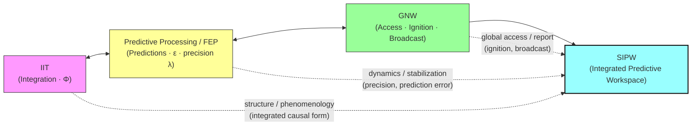

# Systems Integrated Predictive Workspace (SIPW): развернутый обзор теории сознания

**Ключевые слова:** сознание, neural correlates of consciousness, posterior hot‑zone, global neuronal workspace, integrated information theory, predictive processing, thalamus, perturbational complexity, no‑report paradigms

---

## Аннотация

Настоящий обзор предлагает синтетическую, фальсифицируемую и практически ориентированную теорию сознания — *Systems Integrated Predictive Workspace* (SIPW). SIPW интегрирует элементы трёх доминирующих направлений в современной нейронауке сознания: (1) идеи интеграции информации и количественной формализации качества опыта (IIT), (2) архитектурную и функциональную роль глобального рабочего пространства (GNW) как механизма доступа, и (3) механистику предиктивного кодирования / free‑energy / active inference как способа поддержания и стабилизации содержательного опыта. Ключевой эмпирической опорой являются современные многолабораторные сравнения теорий, данные инвазивной и неинвазивной регистрации активности, результаты исследований таламических механизмов гейтинга и метрики сложности мозговой активности (PCI и её аналоги). Обзор даёт подробную архитектурную схему, математический эскиз модели для симуляций, рекомендации по экспериментальной проверке и прикладные/клинические следствия.

---

## 1. Введение: зачем новый синтез?

За последние три десятилетия поле исследований сознания породило несколько мощных, частично конкурирующих и частично дополняющих теоретических парадигм. IIT формализует феноменологические свойства опыта и предлагает количественные метрики интеграции; GNW формулирует требования к глобальной доступности и «broadcasting» содержимого; предиктивная обработка (Free‑Energy / Active Inference) дает динамику поддержания и селекции представлений. Рост экспериментального массива, включая современную волну «no‑report» парадигм и крупные мультицентрические сравнения теорий, делает возможным синтез, который сохраняет силу объяснения каждой модели, но устраняет некоррелирующие противоречия.

SIPW — это инженерно‑биологическая архитектура: локальные, рекуррентные и интегрирующие «горячие зоны» в задней коре формируют содержательное ядро опыта; предиктивные и precision‑механизмы стабилизируют эти репрезентации; таламо‑кортикальные узлы обеспечивают динамическое гейтинговое управление и уровень бодрствования; фронто‑парие­тальная GNW обеспечивает глобальный доступ, отчётность и контроль. Такой гибрид объясняет, почему одни эксперименты указывают на заднюю кору как носитель содержания, а другие — на фронтальную активность как маркер отчёта и доступа.

---

Ниже — расширённая, аккуратно структурированная сводка по трём столпам (IIT, GNW, Predictive Processing), их формализмам, эмпирическим опорам, сильным и слабым сторонам, а также конкретным связям/переходам между ними, которые непосредственно легли в SIPW. 

---

## 2. Исторические и теоретические основания — развернуто

> Схема интеграции основных теоретических парадигм в SIPW. Двусторонние стрелки показывают взаимную вдохновляющую связь между IIT и Predictive Processing, а также между Predictive Processing и GNW. GNW затем обеспечивает механизм глобального доступа (ignition → broadcast), который вместе с интеграцией (IIT) и динамикой/precision (PP) формирует SIPW.

### 2.1 Integrated Information Theory (IIT) — формулировка, сила, ограничения

Что это даёт по сути
IIT стартует не с нейронов, а с феноменологии: она записывает аксиомы (желательно присущие любому опыту) — **информационная специфичность** (каждый опыт специфичен, «он это и есть» по отличию от альтернатив), **интеграция** (опыт единичен и не распадается на независимые части) и **исключение** (опыт имеет чёткие границы и «разрешение» во времени/пространстве). Из этих аксиом IIT выводит требование к физической подсистеме: система, которая априори имеет большую степень **интегрированной информации** Φ, — кандидат на носитель сознания. Практически IIT предлагает алгоритм (IIT 3.0 / Oizumi et al.) для расчёта Φ и структурного «ϕ-map» внутренней причинной структуры системы. ([PLOS][1], [Nature][2])

Коротко о формализме (интуитивно, без полного технического аппарата)

* Система разбивается на подсистемы; для каждой подсистемы вычисляют, насколько её причинно-следственная структура «не редуцируема» на составные части. Φ — мера того, насколько система как целое вносит причинно-реляционную структуру сверх суммы частей (цепь мини-максимизации разложений). Высокое Φ ⇨ высокая «феноменальная ёмкость». ([PLOS][1])

Сильные стороны

* Неприятно честная попытка *формализовать* феноменологию; даёт количественную постановку «сколько» сознания и, в идеале, «какое» сознание (форма причинной структуры → качественная характеристика опыта). Это мощная концептуальная рамка, дающая тестируемые предсказания в контролируемых системах. ([Nature][2])

Ограничения и критика (важно для практики)

* **Вычислительная неустранимость.** Прямой расчёт Φ экспоненциален по числу элементов, поэтому применение к больших нейронных системам — проблематично.
* **Интерпретационная спорность.** Критики указывают на теоретические и эмпирические трудности — возможно, Φ как конкретный числовой индикатор не однозначен в биологических сетях. Это привело к разработке практических proxy (PCI, LZ) и к возникновению исправлений/модификаций формализма. ([PMC][3], [academic.oup.com][4])

Что важно для SIPW

* IIT даёт строгую интуицию: сознание связано с интеграцией и структурой причинной мощности — это мотивирует наши измерения $I_i$, комбинацию MI/LZ/ACW как приближений к Φ в локальных узлах SIPW. При этом SIPW учитывает практическую невозможность прямого Φ и использует IIT-интуицию как концептуальную рамку, а не как единственную вычислительную меру. ([PLOS][1])

---

### 2.2 Global Neuronal Workspace (GNW) — архитектура, ignition, эмпирика

Основная идея и исторический контекст
GNW (популяризирован Dehaene, Changeux и соавт.) — теория архитектуры доступа: мозг содержит распределённый «рабочий простор» (фронто-париетальная сеть + long-range нейроны), который при достижении определённого порога «игнитируется» и транслирует локальную репрезентацию по всей системе, делая её доступной рабочей памяти, вербализации и исполнительным процессам. Важный инсайт GNW — различие между **содержанием** как локальной репрезентацией и **доступностью** как глобальным свойством. ([PMC][5])

Механика ignition и «порогового перехода»

* GNW формализуется через много-модульные RNN-модели: при среднем уровне входа идёт линейное/сигмоидальное подавление; если локальная активность превысит порог (интеграция + salience), срабатывают сильные рекуррентные петли workspace и возникает нелинейная, самоподдерживающаяся широкая активация — «ignition». ERP-эквивалент — поздняя P3b, широкая фронто-париетальная синхронизация. ([PMC][5])

Эмпирическая поддержка и ограничения

* GNW успешно объясняет наблюдения P3b, late-broad activation в report-парадигмах и эффект «вспышки» активации при сознательном восприятии. Однако возросшая волна no-report экспериментов показала, что глобальная P3b не всегда необходима для контент-репрезентации, что заставляет уточнить GNW (т. е. GNW — механизм доступа, не обязательно источник qualia). Современные синтезы объединяют GNW с более локалистскими репрезентациями. ([PMC][5])

Что важно для SIPW

* GNW — ключ для объяснения **доступности/отчётности**: SIPW использует GNW-идею как модуль, который запускается при удовлетворении локальных критериев (I, low ε, λ) и talamo-gating; GNW-игнит — это $y(t)$ в математическом эскизе. GNW даёт также набор конкретных предсказаний для латентных времен и ERP-сигнатур, полезных для валидации модели. ([PMC][5])

---

### 2.3 Predictive Processing / Free-Energy (Active Inference) — динамическая механика

Основная формулировка

* Predictive Processing (PP) и Free-Energy / Active Inference (FEP) рассматривают мозг как иерархическую предиктивную машину: каждый уровень генерирует предсказания (priors) о нижестоящем уровне; разница между предсказанием и входом — **предсказательная ошибка** ε — передаётся вверх; цель системы — минимизация суммарной предсказательной ошибки (или free energy). Это даёт алгоритмическую механику, как формируются устойчивые представления: как аттракторы предсказания, стабилизированные precision-взвешиванием (gain). ([Nature][6], [Wiley Online Library][7])

Ключевая роль precision (λ)

* В PP важна не только средняя ошибка, но и доверие к этой ошибке — precision. Precision (реализуемый нейромодуляторами) масштабирует влияние ошибок на обновление представлений. В SIPW это — тот самый $\lambda_i$, управляющий, попадёт ли локальная интеграция в сознательное состояние. Таким образом PP даёт динамическую «петлю» объяснения: почему внимание/фармакология изменяют вероятность ignition. ([Nature][6], [ScienceDirect][8])

Связи с IIT / GNW и критика

* PP описывает *как* репрезентации стабилизируются и почему одни модели выигрывают в конкуренции; IIT фокусируется на *какой* структуре причинности даёт феноменальную форму; GNW — на *когда* репрезентация будет глобально доступна. Эти три позиции частично комплементарны: PP даёт механизм, IIT — метрику/структуру, GNW — доступность. Однако есть критика PP: слишком гибкая интерпретация, трудности в строгой эмпирической валидации и склонность к пост-hoc объяснениям. Последние обзоры аккуратно оценивают степень эмпирической поддержки. ([ScienceDirect][8], [Wiley Online Library][7])

Что важно для SIPW

* SIPW использует PP как динамическую «нижнюю», механистическую прослойку: локальные аттрактоpы — это высоковероятные предсказания; precision-механизмы реализуют attention/neuromodulation и объясняют порядок событий: повышение λ → устойчивость аттрактора → при согласованной salience/talamus → ignition GNW. Это даёт прямую, параметризуемую связь между физиологией (холин/NA), психофизикой (attention) и макрофеноменом (conscious access). ([Nature][6], [ScienceDirect][9])

---

### 2.4 Как эти три парадигмы соединяются в SIPW — концептуальная карта

Краткая мэппинг-логика:

* **IIT (интеграция)** → обеспечивает феноменологическую «цель»: объяснить, почему некоторым состояниям приписывают качество опыта (упор на структуру причинности и Φ). ([Nature][2])
* **Predictive Processing / FEP (динамика)** → реализует механизм формирования и стабилизации локального содержимого как предсказательных аттракторов; вводит λ (precision) как управляемый параметр. ([Nature][6])
* **GNW (доступ)** → задаёт архитектурный механизм, который делает локальное содержимое доступным широкому набору когнитивных систем (ignorition/broadcast). ([PMC][5])

Adversarial testing и необходимость синтеза

* Недавняя широкомасштабная adversarial-collaboration (Nature, 2025) сравнила GNW и IIT на единых данных и показала: данные нельзя свести однозначно к одной теории — нужны гибридные объяснения, которые учитывают локальную интеграцию, динамику предсказаний и роль глобального доступа. Это — ключевое эмпирическое основание для SIPW: синтез трёх подходов даёт большую объяснительную силу. ([Nature][10])

---

## 2.5 Практические последствия для методологии и моделирования

* **Измерения.** На уровне данных нужно комбинировать: PCI / perturbational metrics (уровень интеграции), MVPA / decoding (структура содержания), time-frequency / CFC (механизмы gating) и directed connectivity (потоки feedforward/feedback). Это следует прямо из мэппинга теорий: IIT → PCI/MI, PP → ε/λ dynamics (estimate via trialwise variability / neuromod measures), GNW → ignition / P3b / directed broadcast. ([PubMed][11], [PMC][5])
* **Моделирование.** RNN/Reservoir модели + two-compartment neuron models (для apical amplification) + a slow neuromodulatory variable (λ) и talamo-oscillator дают минимальную архитектуру, способную воспроизвести феномены, которые объясняют все три теории. SIPW формализует эту архитектуру (см. математический эскиз). ([ScienceDirect][9])

---

## 2.6 Резюме

Современные теории сознания предлагают дополняющие, но частично конфликтующие перспективы. Интегрированная информация (IIT) утверждает, что феноменальное качество связано с высоко-интегрированной причинной структурой (аксиомы: существование, композиция, информация, интеграция, исключение) и предлагает метрику Φ — хотя её точный расчёт для крупных систем практически неосуществим, потому используются proxy-метрики. Глобальная нейронная рабочая область (GNW) объясняет сознательный доступ через архитектурный механизм ignition/broadcast, связанный с поздними фронтальными компонентами (P3b) и проблематикой report vs no-report. Наконец, Predictive Processing / Free-Energy (PP/FEP) даёт динамический механизм: содержимое — это предсказательные аттракторы, а precision (λ), реализуемый нейромодуляторами, регулирует их стабильность и вероятность «вспышки» в GNW. Недавняя adversarial-collaboration (Nature 2025) показала, что данные трудно свести к одной теории, что мотивирует прагматичный синтез — SIPW — который объединяет локальную интеграцию, предсказательную динамку и глобальный доступ.

[1]: https://journals.plos.org/ploscompbiol/article%3Fid%3D10.1371/journal.pcbi.1003588 "Integrated Information Theory 3.0 | PLOS Computational Biology"
[2]: https://www.nature.com/articles/nrn.2016.44 "Integrated information theory: from consciousness to its physical ..."
[3]: https://pmc.ncbi.nlm.nih.gov/articles/PMC4574706/ "The Problem with Phi: A Critique of Integrated Information Theory"
[4]: https://academic.oup.com/nc/article/2017/1/nix017/4060547 "Computing integrated information | Neuroscience of Consciousness"
[5]: https://pmc.ncbi.nlm.nih.gov/articles/PMC8770991/ "Conscious Processing and the Global Neuronal Workspace ..."
[6]: https://www.nature.com/articles/nrn2787 "The free-energy principle: a unified brain theory? - Nature"
[7]: https://onlinelibrary.wiley.com/doi/10.1111/tops.12704 "An Introduction to Predictive Processing Models of Perception and ..."
[8]: https://www.sciencedirect.com/science/article/abs/pii/S0149763423004426 "The empirical status of predictive coding and active inference"
[9]: https://www.sciencedirect.com/science/article/abs/pii/S0301008220301738 "The predictive global neuronal workspace: A formal active inference ..."
[10]: https://www.nature.com/articles/s41586-025-08888-1 "Adversarial testing of global neuronal workspace and integrated ..."
[11]: https://pubmed.ncbi.nlm.nih.gov/23946194/ "A theoretically based index of consciousness independent of ..."

---

## 3. Архитектура SIPW — подробное описание компонентов и их взаимодействий

### 3.1. Локальные аттрактоpы в *posterior hot-zones*

**Анатомия и локализация.**

* Под «posterior hot-zone» мы имеем в виду совокупность вторичных/высших сенсорных и мультимодальных областей: V1–V4/MT → LOC/IT (визуальные), STG/STS (аудио-визуальное), IPL/PPC (пространственное/сенсомоторное сочетание), а также задние участки височной коры, которые тесно связаны с перцептуальной интеграцией. Эта идея имеет сильную обзорную опору (Koch et al., 2016). ([Nature][1])

**Микросхемы и механика аттрактора.**
  
* В этих зонах доминируют плотные локальные рекуррентные петли (латерал-колоночная и ламинарная рекуррентность). Рекуррентность + специфические временные константы синапсов и NMDA-зависимая медленная входящая динамика позволяют формировать устойчивые «бассейны притяжения» (аттракторы), которые поддерживают категориальные / образные репрезентации.
* На клеточном уровне важную роль играют L2/3↔L5 петли: L5 пирамиды (особенно ET/IT подклассы) через апикальные туфты аккумулируют топ-down и контекстную информацию, а L2/3 обеспечивает локальное согласование и передачу между колонками. Механизмы апикальной амплификации / дендритной интеграции — ключевой субстракт устойчивой локальной интеграции (см. обзоры по апикальному усилению и dendritic integration). ([cell.com][3], [PMC][4])

**Электрофизиологические сигнатуры.**

* Локальные аттрактоpы обычно связаны с повышенной гамма-мощностью (≈30–100 Hz) и короткими, высококоординированными всплесками синхронной активности; фазовая синхронность гаммы внутри зон коррелирует с локальной связностью и декодируемостью содержания. Это согласуется с идеей «communication through coherence» (Fries). ([PMC][5])

**Практические метрики (что измерять).**

* Декодируемость (MVPA) из ECoG/SEEG/MEG локальных зон; локальная взаимная информация и меры мультивариантной синергии; оценка рекуррентности (autocorrelation decay / temporal autocorrelation windows). Эти метрики приближенно отражают интеграцию/дифференциацию, необходимые по IIT-критериям.&#x20;

---

### 3.2. Предиктивная иерархия и precision-модуляция (gain control)

**Функция в SIPW.**

* Каждому уровню иерархии соответствуют предиктивные представления (priors) и связанные с ними оценки неопределённости (precision). Решающее условие для перехода локального аттрактора в «сознательное» состояние — не только интеграция, но и подходящий precision: достаточно высокий gain для сенсорного входа и/или контекстной поддержки. Это — прямое следствие FEP/Active Inference (Friston) и современных работ по precision-weighting. ([PubMed][6], [PMC][7])

**Нейромодуляторы и физиология.**

* Нейромодуляторы (холинергическая, адренергическая, дофаминергическая системы) реализуют изменение λ (precision-gain) на миллисекундно-секундных временах. Холинергический подъём повышает «чувствительность» сенсорных каналов (увеличивает precision сенсорных ошибок), норадреналин — расширяет динамическую гибкость и влияет на сигма/альфа-модуляцию, дофамин — кодирует требования к привязке предсказаний к целям. (см. обзорные работы по precision / neuromodulation). ([PMC][7])

**Моделирование (практика).**

* В моделях реализовать как умножитель входного/ошибочного сигнала: $\lambda_i \in [0.01, 10]$ (параметр-масштаб условный; при $\lambda\!\ll\!1$ сигнал подавлен, при $\lambda\!\gg\!1$ — доминирует). Параметры можно подбирать так, чтобы при физиологическом холинергическом подъёме $\lambda$ возрастал на 10–100%.

---

### 3.3. Таламический шлюз — анатомия, динамика, роль в гейтинге

**Анатомическая специфика.**

* Речь прежде всего о «высоко-порядковых» и интраламининарных ядрах: центромедиальные (CM), парафасцикулярных (Pf), центральных латеральных (CL) и медиальных ядрах. Новые инвазивные человеческие данные прямо указывают на роль этих ядер как «gatekeeper» при возникновении перцептуального сознания: активность из таламуса предшествует и драйвит фронто-кортикальную реакцию во время сознательного восприятия; θ-фазовая организация таламической активности координирует thalamo-frontal coupling. ([Наука][2], [PubMed][8])

**Механистическая роль.**

* Таламо-кортикальные проекции способны: (i) синхронизировать распределённые зональные активности (фазовая «перезагрузка»), (ii) увеличивать precision-gain целевых корковых доменов (через L1/L5 апикальные входы), (iii) обеспечивать состояние бодрствования/арousal через широкие проекции и влияние на L5 apical tufts. То есть таламус — не просто «ретранслирующий» узел, а активный маршрутизатор, который переключает режимы «локальная интеграция только» ↔ «интеграция + глобальный broadcast». ([Наука][2], [Oxford Academic][9])

**Фазовая организация и частотные взаимодействия.**

* Согласно recent Science paper, direction of information flow при возникновении восприятия идёт от медиального/интраламининарного таламуса → PFC, и транзиентная θ-фазовая синхронизация и CFC (θ phase → γ amplitude) сопровождает переход в осознаваемое состояние. Это даёт конкретный частотный механизм гейтинга: медленные ритмы таламуса координируют и «включают» локальные гамма-пулы. ([Наука][2])

**Экспериментальные манипуляции.**

* Предсказание SIPW: таргетная стимуляция/ингибиция CM/CL изменит вероятность глобального ignition без полного уничтожения локального представления (локальная декодируемость может сохраниться, а отчётность/доступность упадёт). Это проверяется через DBS, оптогенетику (животные) или стимула-парадигмы у пациентов с инвазивными электродами. ([Наука][2])

---

### 3.4. Global Neuronal Workspace (GNW): фронто-париетальная инфраструктура доступа

**Функциональная формулировка (в SIPW).**

* GNW — не «генератор» qualia, а система медиатора глобальной связности: фронтальные и дорсо-медиальные PFC, латеральная PFC, а также верхняя частичная доля и островковая/мультимодальная связность формируют платформу для broadcast-оповещения о содержании локальных аттракторов. GNW реализует «доступность» — рабочую память, вербализацию, стратегическое планирование. Обширные обзорные модели GNW подробно описаны в работах Dehaene и коллег. ([Nature][10])

**Порог «ignition» и временные характеристики.**

* «Ignition» в GNW — быстрый, нелинейный переход (мс→с). В экспериментах этот переход часто наблюдается в поздней временной шкале \~200–400 ms после стимула (P3b компонента) при report-парадигмах; однако в no-report условиях сам контент может существовать без P3b. Таким образом, P3b скорее маркер глобального доступа/отчёта, а не обязательный индикатор содержания. ([PubMed][11], [PMC][12])

**Связь с posterior hot-zones и таламусом.**

* По SIPW, GNW активируется при сочетании: (i) локальной интеграции (I > θ\_I), (ii) низкой предсказательной ошибки, (iii) достаточной salience/priority и (iv) таламического «одобрения» (фазовая синхронизация). Именно комбинирование локального аттрактора + таламический gating + мотивационная/заданиев-специфическая настойка приводит к broadcast. ([Nature][1], [Наука][2])

**Манипуляции и измерения.**

* Проверить: (a) парадигмы report vs no-report — измерять MVPA/decodability в posterior и фронтальных областях; (b) временное разрешение: сравнить ранние декодируемые репрезентации (100–200 ms) в posterior и позднюю фронтальную P3b (200–400 ms). ([PMC][12])

---

### 3.5. Многомерная метрика сознания: интеграция состояния и содержания

**Практические прокси.**

* SIPW рекомендует комбинированный набор метрик:

  1. **PCI (perturbational complexity index)** — как прокси уровня интеграции и способности к интегрированному отклику после perturbation (TMS-EEG). ([Наука][13])
  2. **Декодируемость (MVPA)** — для оценки наличия содержательной репрезентации в отдельных зонах (posterior vs frontal). (использовать ECoG/SEEG/MEG/fMRI).&#x20;
  3. **Взаимная информация / multivariate synergy / temporal autocorrelation** — для аппроксимации Φ-подобных свойств и оценки рекуррентной интеграции.
  4. **Фазовая связь и CFC (θ→γ)** — для оценки таламического гейтинга и переходов в состояние broadcast. ([Наука][2], [PMC][5])
     **Комбинация метрик в диагностике.**
* Рекомендация: использовать многоизмерный профиль (PCI + posterior MVPA + thalamo-cortical θ→γ coupling + behavioral report/implicit measures). Такой профиль сильнее коррелирует с «наличием сознания» чем любая отдельная метрика.&#x20;

---

### 3.6. Практические рекомендации по экспериментальному дизайну и анализу (чтобы тестировать взаимодействия компонент)

1. **Многоуровневые записи.** Желательно сочетать инвазивную запись (SEEG/ECoG) в posterior/thal/ frontal + высокоплотную EEG/MEG/fMRI: это даёт пространственно-временную полноту. (см. мультилабораторные подходы в Nature 2025). ([Nature][10])
2. **Парадигмы report vs no-report.** Включать блоки с активным report и с косвенной оценкой (ожидание, глазные паттерны, implicit measures) для диссоциации содержания и доступа. ([PMC][12])
3. **Таламические манипуляции.** Включать условия с транзиторной стимуляцией/ингибициями (DBS/стимул поцели; у животных — оптогенетика) CM/CL, и оценивать: (i) posterior MVPA, (ii) thalamo→PFC synchrony, (iii) PCI/TMS-EEG (при возможности). ([Наука][2])
4. **Нейромодуляторы (pharm + attention).** Манипуляции холинергии/адренергии (фармакологически) для проверки влияния на λ (precision) и на стабильность локальных аттрактоpов (оценивать изменения как в PCI, так и в MVPA). ([PMC][7])
5. **Аналитические пайплайны.**

   * MVPA (скользящее окно) для временной декодируемости;
   * PCI (TMS-EEG) или LZ/algorithmic complexity для оценки интеграции;
   * Фазовая синхронизация/Granger/TE для направленных потоков;
   * CFC для оценки θ→γ coupling (таламус → posterior / frontal). ([Наука][13], [PMC][5])

---

### 3.7. Параметры для моделирования SIPW (начальная рекомендация)

(для RNN / spiking / two-compartment models)

* **Сеть:** модули-узлы (posterior patches) по 100–1000 нейронов каждый, связность: внутри-модульная высокая (0.2–0.3), между модульная низкая (0.02–0.05).
* **Временные константы:** быстрый E/I (τ≈10–20 ms), медленный NMDA-поддерживаемый компонент (τ≈100–200 ms) для устойчивых аттракторов.
* **Precision λ:** базовый = 1; attention/cholinergic up = ×2–3; suppression = ×0.2–0.5.
* **Ignition порог:** интеграция I > θ\_I (например, нормализованная measure mutual information > 0.5), var(ε) < θ\_ε (низкая ошибка) и salience > θ\_GW (контекстный порог). Эти численные пороги — стартовые, подлежат подгонке под данные.
* **Осуществление таламуса:** модель как медленный θ-генератор (4–8 Hz) с фазовой модуляцией амплитуды локальной гаммы; моделировать как глобальный осциллятор с дальними проекциями на apical dendritic compartments (L1). ([Наука][2], [PMC][5])

---

### Краткое резюме (с акцентом на testable differences)

* SIPW делает явный разрыв между (i) локальным содержательным ядром (posterior hot-zones, апикальная/ламинарная интеграция), (ii) таламическим гейтом (интраламининарные/медиальные ядра, θ-пилот) и (iii) GNW (фронтальная платформа для доступа/отчёта).
* Для доказательной поддержки SIPW важно продемонстрировать: устойчивую декодируемость содержания в posterior без фронтального P3b (no-report), роль таламуса в переключении на глобальный broadcast (DBS/SEEG записи), и то, что изменение precision приводит к предсказуемым изменениям в стабильности аттракторов и в PCI/MVPA профиле. ([PMC][12], [Наука][2])

[1]: https://www.nature.com/articles/nrn.2016.22 "Neural correlates of consciousness: progress and problems - Nature"
[2]: https://www.science.org/doi/10.1126/science.adr3675 "Human high-order thalamic nuclei gate conscious ... - Science"
[3]: https://www.cell.com/neuron/fulltext/S0896-6273%2824%2900088-6 "An integrative, multiscale view on neural theories of consciousness"
[4]: https://pmc.ncbi.nlm.nih.gov/articles/PMC9650089/ "Neocortical layer 5 subclasses: From cellular properties to roles in ..."
[5]: https://pmc.ncbi.nlm.nih.gov/articles/PMC4605134/ "Rhythms For Cognition: Communication Through Coherence - PMC"
[6]: https://pubmed.ncbi.nlm.nih.gov/19559644/ "The free-energy principle: a rough guide to the brain? - PubMed"
[7]: https://pmc.ncbi.nlm.nih.gov/articles/PMC9667420/ "Active Inference as a Tool to Guide Clinical Research and Practice"
[8]: https://pubmed.ncbi.nlm.nih.gov/40179184/ "Human high-order thalamic nuclei gate conscious perception ..."
[9]: https://academic.oup.com/nc/article/2021/2/niab045/6462039 "Representational 'touch' and modulatory 'retouch'—two necessary ..."
[10]: https://www.nature.com/articles/s41586-025-08888-1 "Adversarial testing of global neuronal workspace and integrated ..."
[11]: https://pubmed.ncbi.nlm.nih.gov/40307561/?fc=None&ff=20250517114750&utm_campaign=None&utm_content=1V_PRf-wigmvSPfOUX24LRPUd9z0ARqsOWLr2f-R0beykJ_kU&utm_medium=rss&v=2.18.0.post9+e462414 "Adversarial testing of global neuronal workspace and integrated ..."
[12]: https://pmc.ncbi.nlm.nih.gov/articles/PMC9130851/ "The No-Report Paradigm: A Revolution in Consciousness Research?"
[13]: https://www.science.org/doi/10.1126/scitranslmed.3006294 "A Theoretically Based Index of Consciousness Independent of ..."

---

## 4. Математический эскиз — развёрнуто и детально

Ниже — аккуратно сформулированная и пригодная для реализации математическая версия той части SIPW, которая отвечает за «условие сознательного содержания» и за запуск/регулирование GNW-broadcast. Даны: (A) чёткие уравнения для популяций и мониторных величин, (B) динамику precision и таламо-гейта, (C) реализацию GNW / ignition как бифуркации, (D) приближения для мер интеграции и (E) практические параметры для симуляции и анализа. После секции — карта соответствия модель ↔ эксперимент (что измерять и как интерпретировать).

---

### 4.0 Обозначения (коротко)

* $x_i(t)\in\mathbb{R}^{n_i}$ — вектор состояний (активаций) локального узла $i$ (популяция нейронов, или проекция признаков).
* $W_{ij}$ — матрица эффективных связей от узла $j$ к $i$.
* $s_i(t)$ — сенсорный вход (может быть нулём для ассоциативных узлов).
* $\varepsilon_i(t)$ — предсказательная ошибка на узле $i$.
* $\lambda_i(t)$ — precision-gain (модулятор усиления ошибок / входов) на узле $i$.
* $I_i(t)\equiv I(\{x\}_i)$ — мера локальной интеграции узла $i$ (см. §4.5).
* $\mathrm{Sal}_i(t)$, $\mathrm{Prio}(t)$ — salience и task\_priority (скалярные переменные).
* $y(t)$ — агрегированный сигнал GNW (workspace activation / «broadcast» variable).
* $T(t)$ — таламо-гейтовая переменная (фазовый/амплитудный модуль).

---

### 4.1 Модель локального узла — два-популяционная (prediction / error) схема

Чтобы связать SIPW с предиктивной обработкой, удобно представить каждый узел как минимальную «canonical microcircuit»-структуру: переменные $\mu_i$ (предположения / предикты — ожидаемые причинные факторы) и $\varepsilon_i$ (предсказательные ошибки). Тогда:

$$\begin{aligned} \dot{\mu}i &= -\frac{1}{\tau{\mu}} \mu_i + F_i!\big(\mu_i, \phi(\mu_{j\in \mathrm{child}(i)}), u_i\big) ;+; G_i ,\lambda_i ,\varepsilon_i + \eta^{\mu}_i(t),\[6pt] \varepsilon_i &= s_i - g_i(\mu_i) \quad\text{(локальная предсказательная ошибка)},\[4pt] \end{aligned}$$

где:

* $F_i$ — детерминированная рекуррентная часть (включает локальные $W_{ii}$ и обратные проекции);
* $g_i(\cdot)$ — функция предсказания наблюдаемого в узле (линейная или нелинейная).
* $G_i$ — матрица, через которую ошибка влияет на изменение предсказания;
* $\eta^{\mu}_i(t)$ — стохастический шум.

Практическая реализация (на RNN-уровне) часто сводится к:

$$ \dot{x}i = -\frac{x_i}{\tau_x} + W{ii},\phi(x_i) + \sum_{j\neq i} W_{ij},\phi(x_j) + B_i s_i - \lambda_i ,\varepsilon_i + \eta_i(t), $$

где $\phi(\cdot)$ — нелинейность (tanh/ReLU), $\tau_x$ — временная константа популяции.

**Комментарий.** Такой вариант прямолинейно реализует формулу, но делает явными предсказательные ошибки как $\varepsilon_i = s_i - g_i(x_i)$ и вводит шум/временные константы.

---

### 4.2 Динамика precision ($\lambda_i$) — нейромодуляторная реализация

Precision — динамическая величина, зависящая от attention/neuromodulatory drive и от локальной неопределённости. Её можно задать как медленно меняющуюся переменную:

$$ \tau_{\lambda}, \dot{\lambda}i(t) = -\big(\lambda_i(t) - \lambda{0}\big) + \beta, M(t) - \gamma,\mathrm{Var}_w\big(\varepsilon_i\big), $$

где:

* $\tau_{\lambda}$ — время релаксации (сотни мс — секунды),
* $\lambda_{0}$ — базовый (тонический) уровень precision,
* $M(t)$ — вход от нейромодуляторной системы (холинерг., адренерг., дофаминерг.) — скаляр/вектор; $\beta$ — чувствительность,
* $\mathrm{Var}_w(\varepsilon_i)$ — скользящая оценка волатильности/несоответствия ошибок за окно $w$; $\gamma$ — коэффициент «снижения» при высокой неопределённости.

Этот формализм даёт разумную динамику: при повышении neuromodulatory drive precision растёт; при высокой нестабильности ошибок $\lambda$ падает (система «сматывает» доверие).

---

### 4.3 Мера интеграции $I_i(t)$ — практические аппроксимации

Полный Φ вычисляется сложно; для численных симуляций и сопоставления с данными удобно использовать комбинацию аппроксимаций:

1. **Pairwise mutual information (MI) между компонентами** узла:

$$
I_{\mathrm{MI}} = \frac{1}{N(N-1)}\sum_{p\neq q} I(x_{i,p};x_{i,q}),
$$

где $x_{i,p}$ — p-ая переменная в векторе $x_i$.

2. **Multivariate synergy / O-information** (при наличии оценочных средств).

3. **Temporal autocorrelation window (ACW)** — измерение «временной глубины» интеграции (чем дольше декоррелирует сигнал, тем сильнее рекуррентная интеграция).

4. **Algorithmic complexity / Lempel-Ziv (LZ) / PCI proxy** — для бинаризованной активности вычислить LZ, нормировать и использовать как индекс интеграции.

На практике в моделях удобно комбинировать: $I_i = w_1 I_{\mathrm{MI}} + w_2 \mathrm{LZ} + w_3 \mathrm{ACW}$, с нормировкой.

**Порог интеграции:** $I_i(t)>\theta_I$ — этот порог скалируется под сеть (нормализованный критерий, например 0..1).

---

### 4.4 Условие «локального сознательного содержания»

Как в вашем эскизе, локальное содержание считается сформированным, если одновременно:

1. $I_i(t)>\theta_I$,
2. $\mathrm{Var}w(\varepsilon_i(t))<\theta\varepsilon$ (ошибки малы/устойчивы),
3. $\lambda_i(t)>\theta_\lambda$.

В практике моделирования проверку можно проводить в скользящем окне $w$ (например 50–200 ms).

---

### 4.5 Таламический gate $T(t)$ — фазовая модуляция и gating

Таламус мы моделируем как осциллятор/контролёр, который фазово модулирует gain апикальной входной проекции. Простая, но биологически правдоподобная реализация:

$$
T(t) = A_T \sin(\omega_T t + \phi_T(t)) + B_T,
$$

и модуляция входа реализуется multiplicative-фактором:

$$
s_i^{\mathrm{eff}}(t) = \big(1 + \kappa_T \, \mathcal{G}(\phi_T(t), \phi_i)\big)\; s_i(t),
$$

где $\mathcal{G}(\cdot)$ — фазовая зависимость (например $\cos(\phi_T-\phi_i)$ или узкий оконный window), $\kappa_T$ — амплитуда влияния. Параллельно таламус влияет на $\lambda_i$ (через $M(t)$ в §4.2).

**Резонансный механизм:** при фазовой согласованности $T$ усиливает амплитуду гамма-активации в posterior и снижает порог ignition в GNW (см. §4.7).

---

### 4.6 GNW (workspace) — переменные и динамика ignition

Вводим агрегированную переменную workspace $y(t)$ (скаляр или вектор для нескольких workspace-узлов). Простая популяционная модель:

$$ \tau_y \dot{y} = -y + \sum_i c_i , S\big( , \alpha_I I_i(t) - \alpha_\varepsilon \mathrm{Var}w(\varepsilon_i) + \alpha\lambda \lambda_i + \mathrm{Sal}_i + \mathrm{Prio} , \big) + \xi(t), $$

где:

* $S(\cdot)$ — сглаженная пороговая nonlinearity (например сигмоид) — даёт мягкую аппроксимацию Heaviside;
* коэффициенты $\alpha_*$ масштабируют вклад каждой детерминанты;
* $c_i$ — веса проекций от разных posterior-узлов;
* $\xi(t)$ — шум.

**Ignition** — это бифуркация: если вход в $y$ превышает некую границу, $y$ быстро растёт и остаётся высоким (самоподдержка через W^{workspace}). В простейшем случае можно добавить рекуррентную самоподдержку:

$$
\tau_y \dot{y} = -y + w_{yy}\, \sigma(y) + I_{\text{in}}(t) + \xi(t),
$$

с $w_{yy}>0$ достаточным для мультистабильности. Тогда ignition проявляется как движение из «низкой» в «высокую» фикс-точку.

**Broadcast:** при $y(t)>\theta_y$ workspace создаёт обратные сигналы $B_{i}^{\mathrm{fb}}(t)$ → усиливает соответствующие $x_i$ (фидбек), что проявится как фронто→posterior feedback в данных (см. предсказания).

---

### 4.7 Полная связанная система (суммарно)

Комбинируем всё вместе:

$$ \begin{cases} \dot{x}i &= -\dfrac{x_i}{\tau_x} + W{ii}\phi(x_i) + \sum_{j\neq i} W_{ij}\phi(x_j) + B_i s_i^{\mathrm{eff}}(t) ;-; \lambda_i ,\varepsilon_i + W_{i}^{\mathrm{fb}} ,\sigma(y) + \eta_i(t),\[6pt] \varepsilon_i &= s_i^{\mathrm{eff}} - g_i(x_i),\[6pt] \tau_{\lambda}\dot{\lambda}i &= -(\lambda_i-\lambda_0) + \beta M(t) -\gamma,\mathrm{Var}w(\varepsilon_i),\[6pt] \tau_y \dot{y} &= -y + w{yy}\sigma(y) + \sum_i c_i, S(\Phi_i) + \xi(t),\[6pt] \Phi_i &\equiv \alpha_I I_i(t) - \alpha\varepsilon\mathrm{Var}w(\varepsilon_i) + \alpha\lambda\lambda_i + \mathrm{Sal}_i + \mathrm{Prio}. \end{cases} $$

Эта система — достаточна гибкая: при подборе $w_{yy}$, $\alpha$-коэффициентов и сигналов $M(t),T(t)$ она воспроизводит поведение SIPW: локальная интеграция → стабильность → (при согласованных salience/precision/talamus) ignition → глобальный broadcast (обратная модуляция posterior и отчётность).

---

### 4.8 Пластичность и адаптация связей $W$

Learning rule, совмещающий Hebbian и error-driven компоненты:

$$ \dot{W}{ij} = \eta_H \big(\phi(x_i)\phi(x_j) - \rho_W W{ij}\big) ;-; \eta_E ,\varepsilon_i ,\phi(x_j), $$

где $\eta_H$ — скорость Hebbian пластичности, $\rho_W$ — нормализация (homeostasis), $\eta_E$ — скорость ошибочно-зависимого исправления.

Такая формула позволяет узлам обучать предикты (уменьшать ошибки) и одновременно сохранять стабильность.

---

### 4.9 Метрики и их соответствие моделируемым величинам (что вычислять в симуляции)

* **Декодируемость (MVPA):** обучаем линейный классификатор на векторах $x_i(t)$ в скользящих окнах. Высокая ранняя декодируемость в posterior при отсутствии high $y(t)$ → signature «содержание без broadcast».
* **PCI / LZ / Algorithmic complexity:** настраиваем TMS-похожее возмущение (импульс в сеть) и вычисляем LZ-комплексность ответов по каналам → proxy уровня интеграции.
* **Directed connectivity (TE / Granger):** ожидание feedforward posterior→workspace до ignition, затем feedback workspace→posterior после ignition.
* **Фазовая CFC (θ→γ):** моделировать как $T(t)$ воздействует на амплитуду γ в posterior; оценивать θ-phase → γ-amp coupling.
* **Var($\varepsilon$) и $\lambda$:** отслеживать корреляцию $\lambda_i(t)$ и изменения вероятности ignition; manipulate $M(t)$ (фармакологически) чтобы проверить влияние.

---

### 4.10 Численные/практические параметры (рекомендация для первых симуляций)

* Временной шаг $dt=0.1\!-\!1$ ms (если спайковые модели — <0.1 ms; для популяционных — 0.5–1 ms).
* $\tau_x = 10\!-\!50$ ms (E/I), $\tau_{\mu}\approx 50\!-\!150$ ms (slow NMDA component), $\tau_\lambda = 200\!-\!1000$ ms, $\tau_y = 50\!-\!200$ ms.
* Шумы: $\eta\sim\mathcal{N}(0,\sigma^2)$ с $\sigma$ 0.01–0.05 (в нормализованных единицах).
* Пороговые значения: $\theta_I, \theta_\varepsilon, \theta_\lambda$ — нормализовать так, чтобы типичная I$\in[0,1]$; стартовые $\theta_I\approx 0.5$, $\theta_\varepsilon\approx 0.1$, $\theta_\lambda\approx 1.0$ (подбор к данным).
* Параметры GNW: $w_{yy}$ выбирается так, чтобы система показывала bistability (например $w_{yy}\approx 1.2$ при $S$ = sigmoid slope 4).

---

### 4.11 Предсказания модели 

1. **Dissociation decodability vs ignition.** Модель предсказывает: существует диапазон входов/поисков, при котором $I_i>\theta_I$ и $\mathrm{Var}(\varepsilon_i)<\theta_\varepsilon$, но $y(t)<\theta_y$ (сознательное содержание присутствует локально, но нет глобального broadcast) — это наблюдаемая в данных декодируемость posterior при отсутствии P3b и отчётности.
2. **Precision modulation.** Увеличение $M(t)$ (симуляция холинергического подъёма) повышает $\lambda_i$ и увеличивает вероятность ignition (увеличение частоты $y>\theta_y$). Аналог в экспериментах — фармакология/attention.
3. **Thalamic phase gating.** Если фазовый сдвиг $T(t)$ рассинхронизирован, вероятность ignition падает даже при высоких $I_i$. Это предсказывает критическую роль таламуса для переходов.
4. **DBS/TMS в workspace.** Прямой толчок к $y(t)$ (имитация TMS/DBS) перед/после стимула может индуцировать или подавить broadcast, не разрушая posterior декодируемость — проверяется TMS-EEG/SEEG.

---

### 4.12 Как это соотносится с наблюдаемыми сигналами (EEG/MEG/ECoG/fMRI)

* $y(t)>\theta_y$ ↔ появление широких фронто-париетальных синхронизованных компонент (P3b-like), усиление beta/γ-synchrony, усиление directed connectivity фронт→пост.
* Высокая $I_i$ в posterior ↔ локальное повышение γ-power и декодируемость MVPA.
* $\lambda_i$ изменения ↔ изменения амплитуды/стандартизированных показателей чувствительности (психофизика) и уровня пробуждения (арousal).

---

### Заключение и следующие шаги

Это математическое расширение делает SIPW готовым к численным симуляциям и к прямой проверке гипотез: все ключевые механизмы — локальная интеграция, precision-dynamics, таламо-фазовый gate и GNW-ignition — описаны уравнениями, которые можно реализовать в PyTorch/Brian2/TheVirtualBrain.

---

## 5. Ключевая эмпирика и как SIPW её объясняет — подробно

Подробные сведения об основных эмпирических штрихах, методах, ключевых статьях, ограничениях и о том, как каждый блок данных **конкретно** соотносится с предсказаниями SIPW. 

---

### 5.1 Posterior *hot-zone* — что точно известно и как мы это трактуем

Краткое изложение доказательств

* Многострочные обзоры и эмпирические работы показали, что для множества перцептуальных содержаний информация более надёжно декодируется из задних сенсорных/мультимодальных регионов (темпоро-парието-окципитальная область), чем из фронтальной коры в задачах, где отчёты контролируются / исключаются. Это — центральное наблюдение, легшее в концепцию «posterior hot-zone». ([Nature][1], [PubMed][2])

Ключевые методы, которыми это установлено

* iEEG / ECoG / SEEG: высокая пространственно-временная разрешающая способность, показывают ранние (\~50–200 ms) локальные репрезентации и γ-энергетические подписи.
* MVPA (decoding) на intracranial или MEG/EEG данных: стабильная декодируемость содержания в posterior даже когда фронтальная P3b отсутствует.
* Лезионные и стимуляционные исследования (включая клинические случаи): повреждения в posterior часто приводят к потере специфического перцептуального содержания. ([ScienceDirect][3], [PubMed][4])

Как SIPW интерпретирует эти данные

* В SIPW posterior hot-zones — *первичные места конституции содержательного ядра опыта*: там формируются и поддерживаются рекуррентные аттрактоpы, обладающие высокой интеграцией (I\_i в модели). Наличие ранней декодируемости без P3b — ожидаемое явление (локальное содержание без глобального broadcast). ([Nature][1])

Ограничения и важные контрпримеры

* В некоторых задачах fronto-parietal активность коррелирует с содержанием (особенно когда требуются когнитивные операции, рабочая память, отчётность). Следовательно, нельзя сводить фронтальную активность полностью к «побочному» эффекту — у неё иная роль (доступ/контроль).
* Методологически важно контролировать report/no-report: многие ранние «фронтальные» корреляты оказались связанными с процессами подготовки отчёта и внимания. ([PubMed][5])

Рекомендации по анализу (чтобы подтвердить роль posterior в конкретном эксперименте)

1. Использовать no-report блоки параллельно report-блокам и сравнивать декодируемость в posterior vs frontal (скользящие окна, temporal generalization). ([PubMed][5])
2. Сопоставлять временные профили: ранняя (50–200 ms) posterior-декодируемость vs поздняя (200–400 ms) фронтальная P3b.
3. Выполнять контролируемые вмешательства (фокусированный TMS/стимуляция posterior) и смотреть потерю локального декодирования/восприятия. ([ScienceDirect][3])

→ Вывод: сильная эмпирическая база в поддержку идеи, что posterior поддерживает содержательное ядро — именно так SIPW формализует «qualia-носители».

---

### 5.2 GNW, P3b и отчётность — эмпирика, нюансы и интерпретация

Ключевые наблюдения

* Поздняя ERP-компонента P3b и сильная фронто-парие­тальная синхронизация часто сопутствуют условиям, где субъект делает отчёт/взаимодействует; её связь с «доступностью» давно обсуждается в рамках GNW. Однако no-report парадигмы продемонстрировали случаи, когда P3b отсутствует несмотря на явное восприятие. ([PubMed][6])

Какие методы дали эти результаты

* ERP/EEG (P3b как маркер), MEG/ECoG для источникового анализа; MVPA для раннего контент-декодирования; экспериментальные парадигмы с отчётом/без отчёта (no-report), а также манипуляции внимания и мотивации. ([Cell][7], [EurekAlert!][8])

Как SIPW читает эти факты

* GNW реализует процесс *доступа*: когда локальный аттрактоp удовлетворяет условиям интеграции, низкой ошибки и достаточной salience/precision, запускается «ignition» GNW — оно проявляется как P3b/широкая фронто-парие­тальная синхронизация и обеспечивает broadcast для рабочих и вербальных систем. Но GNW не считается источником первичного содержания — функция GNW в SIPW — *доступ/распространение и контроль*, а не порождение qualia. ([Nature][9])

Контр-факторы и тонкости

* В задачах с высокой когнитивной нагрузкой фронтальная активность участвует и в формировании содержательных репрезентаций (впрочем — как часть task-specific loop).
* P3b как маркер мощен, но ненадёжен как универсальный индикатор сознательного содержания: отсутствие P3b в no-report не доказывает отсутствие сознания; присутствие P3b не доказывает наличия содержания, если нет подтверждения декодируемости в posterior. ([PubMed][6])

Практические рекомендации для экспериментов

1. Include both report and no-report blocks; compute MVPA in posterior and monitor P3b in frontal channels. Ожидаемая картина по SIPW: posterior-декодируемость может существовать без P3b; P3b появляется при включении GNW (report). ([PubMed][5])
2. Use directed connectivity (Granger/TE/DCM) to detect feedforward posterior→front перед ignition и feedback после. Это даёт динамический отпечаток broadcast. ([Nature][10])

→ Вывод: P3b — маркер доступа/отчётности (GNW) в SIPW; отличать «содержание» (posterior) и «доступ/отчёт» (GNW) — ключ к правильной интерпретации данных.

---

### 5.3 Таламус как гейтовый регулирующий узел — новейшие данные и выводы SIPW

Что показали последние инвазивные исследования

* Недавние человеческие iEEG/SEEG-исследования (Science 2025 и сопутствующие отчёты) показали, что активность высокопорядковых интраламининарных / медиальных ядер (CM, Pf, CL) часто **предшествует** и может **вызывать** усиление PFC-активности при возникновении осознанного восприятия; транзиентная θ-фазовая синхронизация и θ→γ CFC были выдвинуты как механизм гейтинга. ([PubMed][11], [EurekAlert!][8])

Поддерживающие (животные + модельные) данные

* Оптогенетические и DBS-манипуляции у животных и моделирование показывают, что стимуляция matrix/central thalamus меняет распределение корковых состояний, увеличивает long-range интеграцию и может переводить сеть в «wake-like» динамику; обратное воздействие индуцирует низкоинтегрированные состояния. ([PubMed][12], [PLOS][13])

Механистическая интерпретация в SIPW

* Таламус реализует две важных функции: (i) фазово-временную координацию (θ phase → γ amplitude), которая синхронизирует и «включает» локальные γ-пулы posterior; (ii) modulatory gain → изменение λ\_i в коре (через апикальные/латеральные проекции). В модели это — переменная $T(t)$ и её влияние на $s_i^{\mathrm{eff}}$ и $\lambda_i$. Такие таламо-кортикальные события существенно повышают вероятность перехода локального I\_i в состояние, подходящее для broadcast (y(t)→ignition). ([PubMed][11], [ScienceDirect][14])

Клиничесные и экспериментальные проверки

* Предсказание SIPW: таргетная стимуляция CM/CL должна изменять вероятность ignition (меняя частоту/вероятность P3b и фронто→posterior feedback) без немедленного уничтожения локальной декодируемости posterior (локальные представления могут сохраняться, но стать недоступными для GNW). Провести: DBS/TMS в таламус / SEEG записи у пациентов или оптогенетика у животных. ([PubMed][11], [biorxiv.org][15])

Ограничения текущих данных

* Большая часть данных — кореляционная; инвазивные стимуляции у людей — редко и ограничены клиническими условиями; межиндивидуальная вариабельность таламических проекций большая. Требуются тщательно контролируемые causal-манипуляции. ([EurekAlert!][8])

→ Вывод: таламус — ключевой регулятор в SIPW («gatekeeper»), обеспечивающий фазовую и gain-координацию, необходимую для перехода локального содержания в глобально доступное состояние.

---

### 5.4 Метрики интеграции: PCI, LZ, MI, synergy — сильные стороны и ограничения

PCI и история успеха

* PCI (Casali et al., 2013) — подход «perturb-and-measure» (TMS → EEG → алгоритмическая сложность ответа) — хорошо зарекомендовал себя как прокси уровня сознания (способность поддерживать дифференцированные и интегрированные ответы). PCI показал высокую чувствительность к сну, анестезии и некоторым состояниям DoC. ([PubMed][16], [Наука][17])

Поддерживающие наблюдения (Massimini и др.)

* Исследования TMS-EEG показали, что в состояниях, когда сознание исчезает (NREM, анестезия), корковая реактивность становится локальной и быстро затухает; в бодрствовании реакция распространяется и остаётся комплексной — это лежит в основе PCI-подхода. ([PubMed][18], [PMC][19])

Альтернативные и дополняющие метрики

* Lempel-Ziv (LZ) и другие measures алгоритмической сложности, pairwise mutual information (MI), O-information / multivariate synergy — дают разные грани «интеграции vs дифференциации». Temporal ACW (автокорреляционные окна) указывает на «временную глубину» обработки. ([ScienceDirect][20], [PMC][21])

Ограничения и предостережения

* PCI и LZ — отличные прокси для уровня «состояния» (awake vs anesthetized vs vegetative), но менее информативны о **структуре содержимого** (что именно сознательно).
* Φ (IIT) теоретически интересна, но её практическое вычисление в больших сетях непрактично и неоднозначно интерпретируемо. SIPW поэтому предлагает комбинировать PCI-подобные метрики (уровень) с локальной декодируемостью (содержание) и CFC/phase-connectivity (механизм gating). ([Наука][17], [ScienceDirect][20])

Практические советы по применению метрик в исследованиях SIPW

1. PCI (TMS-EEG) — использовать как «уровневый» индикатор интеграции/способности к broadcast; сравнивать с вариациями y(t) в модели. ([PubMed][16])
2. MVPA локально — основная метрика содержания (posterior decoding).
3. MI / O-information / synergy — оценивать локальную интеграцию; ACW — временную глубину.
4. CFC (θ→γ) и межрегиональная PLV/TE — для проверки ролей таламуса и направления потока при ignition. ([ScienceDirect][14], [PMC][21])

→ Вывод: для практической валидации SIPW нужно не полагаться на одну метрику, а собирать мульти-мерный профиль: *PCI (уровень) + posterior MVPA (содержание) + thalamo-cortical CFC (механизм gating) + directed connectivity (динамика broadcast).*

---

### 5.5 Сводная матрица: какие наблюдения поддерживают SIPW, какие требуют осторожной интерпретации

* Подкрепляет SIPW:
  • ранняя posterior-декодируемость при отсутствии P3b (no-report). ([PubMed][5])
  • PCI и TMS-EEG показывают снижение интеграции при отключении сознания. ([PubMed][16])
  • инвазивные данные о роли высокопорядкового таламуса (CM/CL/Pf) в gating → causal вероятность ignition. ([PubMed][11], [ScienceDirect][14])
  • мульти-лабораторный adversarial-collaboration (Nature 2025) подтвердил, что simple «фронтальная=сознание» картина не выдерживает — нужен синтез. ([Nature][9])

* Требует осторожности / дальнейшей проверки:
  • однозначная причинно-следственная роль таламуса в человеческих записях пока частично подтверждена (ограниченные стимуляционные данные); нужны проспективные causal-эксперименты. ([EurekAlert!][8])
  • Φ-интерпретации остаются теоретически привлекательными, но практическая реализация и сравнение с PCI/MI требует стандартизации. ([ScienceDirect][20])

---

### 5.6 Практические, тестируемые рекомендации для экспериментаторов (чтобы прямо проверить SIPW)

1. Дизайн: include both report and no-report blocks; record SEEG/ECoG (posterior + PFC + thalamus) + high-density EEG/MEG/fMRI simultaneously когда возможно. Анализ: MVPA (posterior), ERP/P3b (frontal), CFC (thal → post), PCI (TMS-EEG blocks). ([PubMed][5])

2. Causal test 1 (таламус): у пациентов с SEEG+DBS — кратковременная стимуляция CM/CL вокруг момента стимула; смотрите изменение вероятности ignition (P3b, y(t) в модели), при этом мониторьте posteror MVPA. Предсказание: частота/вероятность ignition изменится, posteror-decoding останется более устойчивым. ([PubMed][11], [PLOS][13])

3. Causal test 2 (GNW): TMS/DBS в lateral PFC прямо перед/после стимула: индуцирует или подавляет broadcast; если posterior-decoding остаётся, а отчётность падёт — это подтвердит роль GNW как механизма доступа. ([Nature][10])

4. Precision test: pharm (холинерг./норадрен.) в двойном-слепом дизайне + EEG/MEG: предсказание — увеличение λ повышает вероятность ignition, повышает PCI и частоту P3b при прочих равных. ([ResearchGate][22])

---

### Заключение раздела

Эмпирическая база за последние 10+ лет — теперь дополненная крупным adversarial-collaboration 2025 и недавними инвазивными исследованиями таламуса — создаёт картину, в которой:

* **posterior** формирует содержательное ядро (qualia-носитель),
* **таламус** даёт фазовую и gain-координацию (gate),
* **GNW** запускается как механизм доступа/отчёта (broadcast).

SIPW интегрирует эти результаты в фальсифицируемую архитектуру: конкретные предсказания (см. выше) можно проверить с помощью комбинированных запись-/стимула-/фармакологических парадигм и мульти-мерных метрик (PCI + MVPA + CFC + directed connectivity). Ключевое практическое требование — в экспериментах всегда сопоставлять «уровень» состояния (PCI) и «структуру» содержания (posterior-MVPA), параллельно отслеживая таламо-кортикальную динамику. ([Nature][9], [PubMed][11])

[1]: https://www.nature.com/articles/nrn.2016.22 "Neural correlates of consciousness: progress and problems - Nature"
[2]: https://pubmed.ncbi.nlm.nih.gov/27094080/ "Neural correlates of consciousness: progress and problems - PubMed"
[3]: https://www.sciencedirect.com/science/article/pii/S266667582200039X "Mapping the emergence of visual consciousness in the human brain ..."
[4]: https://pubmed.ncbi.nlm.nih.gov/35519511/ "Mapping the emergence of visual consciousness in the human brain ..."
[5]: https://pubmed.ncbi.nlm.nih.gov/26585549/ "Extracting the True Neural Correlates of Consciousness - PubMed"
[6]: https://pubmed.ncbi.nlm.nih.gov/40307561/?fc=None&ff=20250517114750&utm_campaign=None&utm_content=1V_PRf-wigmvSPfOUX24LRPUd9z0ARqsOWLr2f-R0beykJ_kU&utm_medium=rss&v=2.18.0.post9+e462414 "Adversarial testing of global neuronal workspace and integrated ..."
[7]: https://www.cell.com/trends/cognitive-sciences/pdf/S1364-6613%2815%2900252-1.pdf "No-Report Paradigms: Extracting the True Neural Correlates of ..."
[8]: https://www.eurekalert.org/news-releases/1078785 "The role of high-order thalamic nuclei in human conscious perception"
[9]: https://www.nature.com/articles/s41586-025-08888-1 "Adversarial testing of global neuronal workspace and integrated ..."
[10]: https://www.nature.com/articles/nrn.2016.104 "Future directions for identifying the neural correlates of consciousness"
[11]: https://pubmed.ncbi.nlm.nih.gov/40179184/ "Human high-order thalamic nuclei gate conscious perception ..."
[12]: https://pubmed.ncbi.nlm.nih.gov/37498741/ "The non-specific matrix thalamus facilitates the cortical information ..."
[13]: https://journals.plos.org/ploscompbiol/article?id=10.1371%2Fjournal.pcbi.1010294 "Thalamic deep brain stimulation paradigm to reduce consciousness"
[14]: https://www.sciencedirect.com/science/article/pii/S0896627320300052 "Thalamus Modulates Consciousness via Layer-Specific Control of ..."
[15]: https://www.biorxiv.org/content/10.1101/776591v1 "Central thalamus modulates consciousness by controlling layer ..."
[16]: https://pubmed.ncbi.nlm.nih.gov/23946194/ "A theoretically based index of consciousness independent of ..."
[17]: https://www.science.org/doi/abs/10.1126/scitranslmed.3006294 "A Theoretically Based Index of Consciousness Independent of ..."
[18]: https://pubmed.ncbi.nlm.nih.gov/16195466/ "Breakdown of cortical effective connectivity during sleep - PubMed"
[19]: https://pmc.ncbi.nlm.nih.gov/articles/PMC2930263/ "Cortical reactivity and effective connectivity during REM sleep in ..."
[20]: https://www.sciencedirect.com/science/article/abs/pii/S1935861X19302207 "A fast and general method to empirically estimate the complexity of ..."
[21]: https://pmc.ncbi.nlm.nih.gov/articles/PMC8720201/ "Brain functional and effective connectivity based ... - PubMed Central"
[22]: https://www.researchgate.net/publication/390490568_Human_high-order_thalamic_nuclei_gate_conscious_perception_through_the_thalamofrontal_loop "Human high-order thalamic nuclei gate conscious perception ..."

---

## 6. Экспериментальные предсказания и предложенные парадигмы

Ниже — для каждой из четырёх тезисных предсказаний: (A) конкретная парадигма/манипуляция, (B) какие сигналы/метрики измерять, (C) аналитический пайплайн, (D) ожидаемые результаты (что подтвердит SIPW, что опровергнет), (E) важные контрольные условия и ограничения. В конце — краткий чеклист для пререгистрации и рекомендации по мощности/выборке и дальнейшим расширениям.

### 6.1. «Декодируемость в posterior vs frontal» (report vs no-report)

**А. Парадигма (поведенческая + нейрофизиология).**

* Двухблочный дизайн внутри-субъекта: (i) **report** блок (стандартный отчет о восприятии / двухальтернативный forced-choice), (ii) **no-report** блок (implicit probes: глазные движения/папиллометрия/оценки ожидания, «passive viewing» с occasional catch trials). Использовать стимулы с контролируемой стимульной силой (contrast / visibility) и bistable stimuli (бинокулярная конкуренция, masking).
* Регистрация: предпочтительно многомодально — intracranial (ECoG/SEEG) у пациентов **+** высокоплотный EEG/MEG у здоровых (и/или fMRI для локализации).

**B. Что измерять (primary):**

* MVPA / time-resolved decoding активности содержимого из posterior hot-zones (временные окна 50–250 ms).
* Фронтальная поздняя активность: ERP P3b (200–400 ms), broadband power, fronto-parietal synchrony.
* Доп. метрики: γ-power локально, θ→γ CFC, directed connectivity (TE / Granger / DCM).

**C. Аналитический пайплайн (примеры):**

1. Предобработка: line-noise removal, ICA/SSP, common average (для ECoG — bipolar montages), epoching.
2. MVPA: скользящее окно (например 50 ms шаг 10 ms), temporal generalization (King & Dehaene), декодер (L2-regularized logistic), cross-validation по сессиям/trials.
3. По каждой области — сравнить AUC/timecourse в report vs no-report; cluster-permutation для статистики.
4. Simultaneously: compute P3b amplitude and timing in frontal channels; compute trialwise correlation between posterior decoding confidence and P3b magnitude.
5. Directed connectivity: check feedforward posterior→frontal prior to P3b and feedback frontal→posterior after ignition threshold.

**D. Ожидаемые результаты (SIPW):**

* **Подтверждение:** в no-report блоке сохранится стабильная ранняя/средняя декодируемость содержимого в posterior (50–200 ms), но фронтальная P3b → существенно ослаблена или отсутствует; в report-блоке — последовательность: ранняя posterior-decoding → поздняя фронт-ignition (P3b) ↔ усиленный feedback. Это демонстрирует dissociation «содержание (posterior) ≠ доступ/отчёт (GNW)». (см. обзор по no-report). ([PMC][1])
* **Опровержение:** если в no-report блоке отсутствует и posterior-decoding (при достоверных indirect markers of awareness), то SIPW требует пересмотра — возможно, локальная интеграция в данных условиях не достигает \$I\_i>\theta\_I\$.

**E. Контроли и влияние confounds:**

* Убедиться, что no-report действительно исключает подготовку отчёта (контроль мотивации/внимания).
* Проверить запись eye-tracking/pupil: исключить случаи, когда «implicit» сигналы тайно отражают отчёт.
* Баланс по стимульной силе и по ожиданию.

**Рекомендации по выборке / мощности:** для EEG/MEG внутри-субъект дизайны обычно устойчивы при N=20–40; для ECoG/SEEG — небольшие когорты пациентов (N≈8–15) с репликацией эффекта across patients и внутри-subject trials. (см. практики в литературе no-report). ([PMC][1])

---

### 6.2. «Таламус и переходы» (causal gating)

**А. Парадигмы (causal tests).**

1. **Человеческие клинические условия:** пациенты с имплантированными электродами/DBS в CM/Pf/CL (например, по нейромодуляции головной боли / DoC). Выполнить кратковременные стимулы/ингибиции time-locked к перцептуальным событиям.
2. **Животные (макаки/мыши):** оптогенетическая стимуляция/inhibition of intralaminar nuclei timed to stimuli; аналогичные поведенческие paradigмы (reportable vs reflexive measures).
3. **Closed-loop:** триггерная стимуляция таламуса в определённой θ-фазе (phase-locked stimulation) vs случайная фаза.

**B. Что измерять:**

* Posterior MVPA (декодируемость) pre/post thalamic manipulation.
* Проба ignition: вероятность появления P3b-like широкого workspace activation (или \$y(t)>\theta\_y\$ в модели) на trial-level.
* Фазовая синхронизация и CFC: θ(thal) phase → γ(post) amplitude, trialwise phase-dependency of ignition.
* Behavioral report / forced-choice accuracy and reaction times.

**C. Аналитика:**

* Trial-level GLM: dependent variable — ignition (binary) / P3b amplitude; predictors: thalamic stimulation (on/off), posterior decoding strength, attention covariates. Mixed effects model (random intercept per subject).
* PAC (phase-amplitude coupling) metrics: modulation index, permutation test to assess phase-dependence.
* Compare posterior decoding before and after stimulation to test whether local representation persists when ignition is suppressed/enhanced.

**D. Ожидаемые результаты (SIPW):**

* **Подтверждение:** thalamic stimulation (в благоприятной фазе/режиме) **увеличивает вероятность ignition/P3b и частоту broadcast**, при этом posterior-decoding часто остаётся неповреждённой (локальные представления сохраняются) — то есть causal-dissociation: gating↔access без уничтожения локального содержания. ([PubMed][2], [ScienceDirect][3])
* **Опровержение:** если стимуляция полностью разрушает posterior-decoding вместе с отсутствием ignition — тогда таламус оказывает не только gating-роль, но и критичную роль в самом формировании локальной репрезентации (это потребует пересмотра распределения ролей в SIPW).

**E. Контроли и этика:**

* У пациентов: этические рамки — стимулируйте только в пределах клинических протоколов; включить sham stimulation; тщательно мониторить побочные эффекты.
* В животных: контролировать off-target эффекты, репликация в разных слоях/ядрах.

---

### 6.3. «Precision-манипуляции» (neuromodulators / attention)

**А. Парадигмы:**

* **Фармакологический, двойной-слеп, кроссовер:** холинергические агенты (ACh-esterase inhibitors / cholinergic agonists) и/или адренергические модификаторы vs плацебо; интерпретировать влияние как изменение λ (precision). См. экспериментальные фармако-EEG дизайны. ([PubMed][4], [PMC][5])
* **Нефармакологический:** attentional cueing / expectancy manipulations (valid/invalid cues) to alter trialwise precision estimates.

**B. Что измерять:**

* Trialwise stability of posterior representations: MVPA confidence/temporal generalization / autocorrelation (ACW).
* Метрики интеграции (PCI if TMS-EEG possible; LZ / algorithmic complexity).
* Behavioral thresholds (psychophysics): detection/identification sensitivity, reaction times, confidence judgments.

**C. Аналитика & modelling:**

* Fit simple hierarchical Bayesian/perceptual inference model with precision parameter λ; infer trialwise λ using behavioural + neural data (e.g., trialwise Kalman-like updates).
* Test: does experimentally increased λ predict (i) более длительную/устойчивую posterior decoding, (ii) увеличенную вероятность ignition (в report contexts), (iii) повышение PCI/LZ? Mixed models with λ as mediator.

**D. Ожидаемые результаты:**

* **Подтверждение:** повышение precision (pharmacologically/attentively) → укрепление локального аттрактора (дольше ACW, повышенная MVPA-stability), рост вероятности ignition и увеличение интеграционных прокси (PCI/LZ). Это даёт прямую физиологическую реализацию λ из PP в SIPW. ([PubMed][4], [PMC][5])
* **Опровержение:** если манипуляции precision влияют на отчётность без заметного изменения устойчивости локальных паттернов — тогда связь λ↔аттрактора в модели слабее, чем предполагалось.

**E. Контроли:**

* Разделять влияние на чувствительность (d′) и на критерий (bias). Использовать signal detection analyses + metacognitive measures (meta-d′).
* Контролировать системные эффекты лекарств (снотворные, возбуждение).

---

### 6.4. «Сравнение Φ и практических прокси (PCI, LZ, MI, synergy)»

**А. Стратегия сравнения (multi-metric protocol).**

* Комбинированная запись: TMS-EEG (для PCI), ECoG/SEEG (для local MVPA и MI/synergy), поведенческие метрики (report/no-report).
* На тех же наборах данных вычислять: PCI (Casali et al.), Lempel-Ziv, pairwise MI, O-information / synergy (если есть multichannel data), и (по возможности) приближённые оценки Φ (малые подсети).

**B. Аналитика:**

1. Нормализовать каждую метрику; для каждой trial/session вычислить корреляцию/регрессию на поведение (accuracy, subjective report, confidence).
2. Многомерная модель: предсказать поведение (или состояние сознания) через набор метрик; использовать регуляризованную регрессию и cross-validation для оценки вкладов.
3. Факторный анализ / PCA — выяснить, какие метрики группируются (уровень vs содержание vs динамика).

**C. Ожидаемые результаты (SIPW):**

* **Подтверждение:** Φ-оценки (полные) окажутся нерелевантными/чреватыми интерпретацией в больших биологических сетях, тогда как **PCI/LZ/MI/synergy** в совокупности дадут более надёжную предсказательную силу относительно уровня сознания и содержательной декодируемости. PCI — хороший прокси уровня интеграции; MVPA/MI — прокси содержания. ([PubMed][6], [Наука][7])
* **Опровержение:** если Φ-оценки (даже в малых подсетях) предсказывают поведение лучше всех прокси — тогда SIPW должна принять более центральную роль causal-структуры IIT.

**D. Практические замечания:**

* Ограничение: расчёт Φ для больших сетей технически затратен — используйте малые подмножества и контролируйте влияние разбиения.
* PCI требует TMS-EEG аппаратуры и строгого протокола; LZ и MI чувствительны к предобработке — стандартизируйте.

---

### 6.5. Аналитические и методологические детали (универсальные советы)

1. **Trial-level inference** важнее усреднённого ERPs: используйте mixed effects models, trialwise permutation testing и single-trial decoding.
2. **Directional metrics:** всегда обеспечивайте время-разрешённый анализ потоков (feedforward перед ignition, feedback после) — Granger/TE/DCM.
3. **CFC/Phase-locking:** для таламо-кортикальной гипотезы — использовать PAC и phased-triggered averaging; выполнять phase-shuffle контроллинг.
4. **Pre-registration & adversarial design:** чётко пререгистрируйте критерии ignition (например, P3b amplitude threshold, y(t) threshold из модели) и план анализа (чтобы избежать post-hoc подстройки). Это важно в свете недавнего adversarial collaboration, который показал, что прямое сравнение теорий требует прозрачных заранее заданных критериев. ([Nature][8])

---

### 6.6. Что фальсифицирует SIPW (чёткие «фальсификаторы»)

1. **Если во множественных, контролируемых no-report условиях не удаётся выявить устойчивой posterior-decoding при любом наборе стимулов/заданий,** тогда идея локального содержательного ядра под вопросом. ([PMC][1])
2. **Если манипуляции таламуса (causal DBS/optogenetics) не влияют на вероятность ignition / broadcast при статистически валидных дизайнах,** тогда роль таламуса как gatekeeper слабее, чем предполагается. ([PubMed][2])
3. **Если PCI/LZ/MI не коррелируют с поведенческой осознанностью по всем когортам, а единственный надёжный предиктор — фронтальная P3b независимо от декодируемости posterior,** то приоритет GNW как единой объясняющей механики будет усилен и SIPW потребует переработки. (см. дискуссию в adversarial collaboration). ([Nature][8], [PubMed][6])

---

### 6.7. Практические чек-пойнты для пререгистрации (короткий чеклист)

* Описать чёткую фикс-функцию ignition (P3b threshold или y(t) порог в модели).
* Состав метрик: MVPA (posterior), P3b (frontal), PCI (если TMS доступен), LZ, MI/synergy, PAC (θ→γ).
* Предписать primary / secondary hypotheses (primary: posterior-decoding persists в no-report; secondary: thalamic stim ↑ ignition).
* Указать план статистики: cluster permutation для временных рядов; mixed models для trialwise гипотез.
* Запланировать контрольные анализы: eye-tracking/pupil, reaction time confounds, arousal (HR/EDA).

---

### 6.8. Ресурсы, этика, временные рамки

* **Этика:** особенно важно для DBS/пассажирских стимуляций; согласование с клиническими комитетами и предельная осторожность.
* **Рама:** pilot EEG/MEG study — 3–6 мес, intracranial/DBS pilot (при наличии доступа к пациентам) — сроки зависят от согласований, многолабораторная adversarial-стратегия для репликации — 12–24 мес.
* **Код/пакеты:** MNE-Python / FieldTrip / SPM/Brainstorm для preprocessing; scikit-learn / PyMVPA для decoding; custom scripts для PAC/TE; TMS-EEG pipelines (Casali et al.) для PCI.

[1]: https://pmc.ncbi.nlm.nih.gov/articles/PMC9130851/ "The No-Report Paradigm: A Revolution in Consciousness Research?"
[2]: https://pubmed.ncbi.nlm.nih.gov/40179184/ "Human high-order thalamic nuclei gate conscious perception ..."
[3]: https://www.sciencedirect.com/science/article/pii/S0896627324002800 "Thalamic contributions to the state and contents of consciousness"
[4]: https://pubmed.ncbi.nlm.nih.gov/23658161/ "Free energy, precision and learning: the role of cholinergic ..."
[5]: https://pmc.ncbi.nlm.nih.gov/articles/PMC3001758/ "Attention, Uncertainty, and Free-Energy - PMC - PubMed Central"
[6]: https://pubmed.ncbi.nlm.nih.gov/23946194/ "A theoretically based index of consciousness independent of ..."
[7]: https://www.science.org/doi/abs/10.1126/scitranslmed.3006294 "A Theoretically Based Index of Consciousness Independent of ..."
[8]: https://www.nature.com/articles/s41586-025-08888-1 "Adversarial testing of global neuronal workspace and integrated ..."

---

## 7. Клинические приложения

Кратко: SIPW переводит теоретические элементы (локальные posterior-аттракторы, таламо-гейтинг, precision, GNW-ignition) в конкретные клинические проверки и вмешательства. Для клиники это означает переход от «единичной» метрики (например, только поведенческих шкал) к **мультимодальному профилю**: уровень интеграции (PCI / LZ), наличие содержательного ядра (posterior MVPA / локальная γ), и состояние гейта (таламо-кортикальная θ→γ синхронизация + привязанность к арозалу). Такой профиль даёт более надёжную диагностику, стратификацию и таргетирование вмешательств.

---

### 7.1. Диагностика и стратификация расстройств сознания (DoC)

**Цель.** Уменьшить число диагностических ошибок (например, «осознанный, но неверно классифицирован как вегетативный»), стратифицировать пациентов по вероятности сохранённого опыта и выбрать подходящие кандидаты для нейромодуляции (DBS/TMS) или реабилитации.

**Рекомендуемый клинический профиль (минимум):**

1. **PCI (TMS-EEG)** — как «уровневая» метрика интеграции/способности к сложной реактивности; ориентировочные пороги (эмпирические): PCI ≤ \~0.31 — типично для неосознающего состояния; PCI > \~0.31 — потенциально сознательные состояния (порог эмпиричный — интерпретировать в сочетании с прочими данными). ([PostLab][1], [PMC][2])
2. **Posterior MVPA / ECoG/SEEG decoding** — проверка наличия содержательных, stimulus-specific репрезентаций (не требующих моторного ответа). Сильная локальная декодируемость при низком PCI указывает на «содержание без доступа» и нуждается в оценке таламического/gating потенциала. ([PMC][3])
3. **Thalamo-cortical signatures** — наличие θ→γ PAC, фазовой синхронизации между интраламининарными ядрами и posterior cortex — как признак готовности к ignition. Отсутствие этих сигналов при сохранённой posterior-декодируемости предполагает «закрытый» доступ (candidate for stimulation). ([Nature][4], [PubMed][5])

**Практическое применение:**

* Стандартизировать TMS-EEG PCI в нейроинформатике отделения (протоколы захвата, число импульсов, позиционирование). Использовать PCI для стратификации пациентов в клинических решениях (rehabilitation intensity, candidacy for DBS). ([PostLab][1])
* Включать параллельно passive stimulus decoding (auditory oddball / speech / passive visual pipelines) — MVPA из posterior зон может выявить «скрытую» перцептуальную обработку. ([PMC][3])

**Ограничения и предупреждения:**

* PCI порог \~0.31 — эмпирический ориентир, не абсолютный диагноз; всегда интерпретировать в контексте арефлексии, медикаментов, шока, температурного и метаболического статуса. ([PMC][2])

---

### 7.2. Терапевтическая нейромодуляция: DBS / TMS / закрытый-loop стим

**Цель.** Восстановить/повысить вероятность GNW-ignition (доступности) у пациентов с частично сохранёнными локальными представлениями или при нарушении таламо-кортикального gating.

**Кандидаты и рациональность (SIPW):**

* Пациенты с **низким PCI** и **слабой talamo-cortical synchrony** → плохо интегрированное состояние; у части пациентов при targeted central thalamic DBS отмечались стойкие улучшения поведенческой отзывчивости и активации корковых сетей (экспериментальные отчёты; смешанные результаты в когортах). ([Nature][4], [PubMed][5])

**Протоколы и дизайн вмешательств:**

1. **DBS центрального таламуса (CM/CL):** длительные программы с кроссоверными периодами ON/OFF, тщательный нейрофизиологический монитор (ECoG/SEEG/EEG) — оценивать: probability of ignition (trialwise P3b/ workspace activation), posterior MVPA, PCI pre/post и behavioral responsiveness. Ранние отчёты показывают положительные случаи, но гетерогенность результатов велика — нужны проспективные RCT/реplicated single-case designs. ([Nature][4], [www-users.med.cornell.edu][6])
2. **TMS/ep-TMS (targeted to frontal/workspace nodes):** как less invasive attempt to trigger ignition (при наличии подходящей инфраструктуры TMS-EEG для мониторинга PCI/Y). Параметры: single-pulse/paired/trains timed to stimulus onset; оценка single-trial PCI и posterior decoding. ([ScienceDirect][7], [Наука][8])
3. **Closed-loop stimulation:** фазо-locked (θ-phase) thalamic or cortical stimulation to enhance natural gating windows (phase-targeted). Теоретически наиболее согласуется с SIPW: стимул усиливает thalamo→posterior coupling в ключевой фазе → повышает шанс ignition. (пока экспериментально). ([Nature][4])

**Критерии успеха (outcomes):**

* Primary: устойчивое изменение PCI и/или устойчивое появление trialwise ignition (P3b / fronto-parietal broadcast) при сохранении или улучшении posterior MVPA; поведенческие улучшения (CRS-R, oral commands, functional measures).
* Secondary: изменение уровня автономной регуляции (арousal indices), качество жизни и длительная функциональная независимость.

**Этические замечания и регуляция:**

* DBS у DoC — экспериментальный, сопровождается серьёзными этическими вопросами (consent, realistic prognosis, long-term implant risks). Принять мультидисциплинарный консилиум (neurology, neurosurgery, ethics, family) перед вмешательством; документировать проспективные критерии выхода/остановки. ([JAMA Network][9])

---

### 7.3. Анестезиология: мониторинг «precision» и интеграции для персонализованной анестезии

**Проблема.** Текущие клинические мониторы (BIS, IoC и пр.) дают обобщённые оценки глубины анестезии, но плохо дифференцируют состояние содержания/способность к сознанию при разных анестетиках и в специфических клинических ситуациях. ([NCBI][10], [PMC][11])

**SIPW-подход (практически):**

* Мониторинг должен сочетать:

  1. **PCI-подобные perturbational measures** (если технически и логистически возможно в операционной / ICU) — для оценки «способности мозга генерировать интегрированные ответы» (уровень). Даже если TMS-EEG в операционной сложно, исследовательские протоколы в ICU/анестезии для валидации полезны. ([PostLab][1])
  2. **Спонтанные proxy-метрики**: LZ-complexity, spectral entropy, shape of EEG responses, ACW, и индексы фазовой структуры (θ→γ), которые коррелируют с precision/gain. Эти метрики можно интегрировать в умные мониторы как дополнение к BIS/IoC. ([MDPI][12], [BioMed Central][13])
  3. **Behavioral + autonomic correlates**: reflex suppression, pupillometry (arousal surrogate), HRV — дополнение в реальном времени.

**Клиничес сценарии применения:**

* **Предотвращение intra-operative awareness**: использовать multi-metric alarms (BIS + entropy + sudden rise in PCI proxy) в высокорисковых пациентах / при TIVA/low-dose anesthesia. ([PMC][11], [BioMed Central][13])
* **Оптимизация дозирования в ICU (sedation titration):** контролировать precision-proxies для минимизации «избыточной» седации и ускорения пробуждения.

**Ограничения и реализм:**

* Полноценный PCI (TMS-EEG) пока мало совместим с рутинной операционной практикой — но research-to-clinic pipeline возможен для high-risk случаев. Применение proxy-метрик требует стандартизации и нормативной валидации.

---

### 7.4. Психиатрия — нарушения восприятия, галлюцинации, шизотипические состояния

**Цель.** Таргетировать патологические переработки содержимого (избыточные/патологические аттракторы) или дисбаланс precision/gain, которые приводят к слуховым/визуальным галлюцинациям и нарушенному доступу.

**Примеры вмешательств и rationale (SIPW):**

1. **rTMS / tES к posterior-узлам** (например, левый temporoparietal junction, auditory cortex) — для снижения патологической локальной стабильности аттракторов, уменьшения AVH (auditory verbal hallucinations). Мета-анализы показывают положительный, хотя варьирующийся эффект; усиление эффектов при индивидуальном таргетировании и ускоренных протоколах. ([SpringerOpen][14], [Frontiers][15])
2. **Нейромодуляторная терапия** — фармакологическое балансирование precision (холинергия/норадреналин/глутамат) в дополнение к нейромодуляции для коррекции чрезмерного доверия к априорным моделям или ошибочной чувствительности к ошибкам (ε). SIPW даёт биологическую интерпретацию, какие модуляторы целесообразно тестировать (targeting λ). ([Frontiers][15])
3. **Closed-loop cortical stimulation** для «разрыва» патологических локальных аттракторов (phase-specific high-frequency bursts to disrupt persistent γ-pools) — экспериментально перспективно, но требует клинической валидации.

**Биомаркеры отклика:**

* Клиническое улучшение (AVH severity scales) сопровождается снижением локальной MVPA-stability в target-зоне, уменьшением локальных γ-overpower и восстановлением здорового распределения PCI/proxy метрик. ([Frontiers][15])

**Ограничения:**

* Heterogeneity response; многие эффекты небольшие и требуют больших RCT и персонализированного таргетинга (функциональная локализация у пациента → таргет). ([SpringerOpen][14])

---

### 7.5. Дизайн клинических исследований / рекомендованные эндпоинты

**Фазы исследований:**

1. **Proof-of-concept single-case / small cohort** с интенсивным нейрофизиологическим мониторингом (TMS-EEG, ECoG/SEEG если есть клинические показания).
2. **Feasibility RCT / crossover** (DBS ON/OFF with blinded epochs; TMS sham-controlled) — primary neurophysiological endpoints + behavioural scales (CRS-R etc.).
3. **Multi-centre pragmatic trials** для оценки внешней валидности и долгосрочных функциональных исходов.

**Ключевые эндпоинты (нейрофизиология):**

* Change in PCI (absolute and trialwise distribution), posterior MVPA-accuracy/timecourse, thalamo→cortical PAC strength, emergence of reproducible GNW markers (P3b + directed feedback).
  **Ключевые клиничесные эндпоинты:** CRS-R, functional independence measures, adverse events, caregiver burden, QoL.

---

### 7.6. Практические рекомендации для клинических ведомств (быстрый чек-лист)

1. В отделениях нейротравмы и реабилитации внедрить протокол TMS-EEG (в исследовательских / клинических сценариях) для стратификации пациентов и мониторинга ответов на интервенции. ([PostLab][1])
2. Для анестезиологии: рассмотреть пилотную интеграцию proxy-метрик сложности/энтропии в high-risk cases; разработать алгоритмы тревоги, комбинирующие BIS + entropy + pupillometry. ([NCBI][10], [BioMed Central][13])
3. В психиатрии: продвигать индивидуализацию нейростимуляции (функциональное таргетирование posterior-зон) и совместные trials с нейрофизиологическими биомаркерами (MVPA, γ-power). ([Frontiers][15], [SpringerOpen][14])

---

### 7.7. Этические, юридические и организационные вопросы

* **Информированное согласие и прогнозирование:** при DoC — включать семьи, ясно описывать экспериментальность DBS/TMS и неопределённость исхода; проспективные критерии прекращения. ([JAMA Network][9])
* **Ресурсы и доступность:** TMS-EEG и DBS требуют специализированных команд и центров; разработка стандартизированных протоколов и мультицентровая инфраструктура необходимы для надёжной оценки.
* **Регуляция:** любые имплантируемые устройства/новые медицинские измерения должны проходить нормативную валидацию и локальные IRB/EMA/FDA процедуры.

---

### 7.8. Ограничения и дорожная карта дальнейших исследований

**Ключевые ограничения:**

* PCI и TMS-EEG пока не рутинны в клинике (логистика, обучение персонала). ([PostLab][1])
* DBS для DoC — экспериментальный с гетерогенными результатами; прозрачные проспективные протоколы и более крупные когорты необходимы. ([Nature][4])
* Метрики «precision» в ре-времени требуют валидации прежде, чем применять в операционной.

**Короткая дорожная карта (рекомендация SIPW):**

1. Скоординированные мультицентровые пилоты PCI/TMS-EEG в DoC и high-risk anesthesia (цель: стандартизировать методику). ([PostLab][1], [BioMed Central][13])
2. Прспективные, пререгистрированные DBS и TMS испытания с нейрофизиологическими primary endpoints (PCI, posterior MVPA, PAC) и прозрачными этическими рамками. ([Nature][4], [JAMA Network][9])
3. Разработка и клиническая валидация мульти-метрических bedside-мониторов (BIS + complexity proxies + pupillometry).

---

### Короткое резюме 

* SIPW переводит теорию в практику: мульти-метрический профиль (PCI + posterior MVPA + thalamo-cortical signatures) — основной рабочий инструмент для диагностики, стратификации и выбора мишеней нейромодуляции. ([PostLab][1], [PMC][3], [Nature][4])
* DBS центрального таламуса и таргетированная TMS — перспективные вмешательства, но пока экспериментальные; проспективные, пререгистрированные, этически жёстко организованные исследования нужны для клинической трансляции. ([Nature][4], [JAMA Network][9])
* В анестезиологии и психиатрии SIPW предлагает интегрировать proxy-метрики сложности и precision-индикаторы вместе с существующими клиническими мониторами для персонализованного управления состоянием сознания и лечения расстройств восприятия. ([PMC][11], [SpringerOpen][14])

[1]: https://postlab.psych.wisc.edu/wp-content/uploads/sites/2238/2024/07/Sci_Transl_Med-2013.pdf "[PDF] Casali 1..10 - University of Wisconsin–Madison"
[2]: https://pmc.ncbi.nlm.nih.gov/articles/PMC8716840/ "Consciousness as a multidimensional phenomenon: implications for ..."
[3]: https://pmc.ncbi.nlm.nih.gov/articles/PMC5132045/ "Stratification of unresponsive patients by an independently validated ..."
[4]: https://www.nature.com/articles/s41598-022-16470-2 "Clinical and neurophysiological effects of central thalamic deep ..."
[5]: https://pubmed.ncbi.nlm.nih.gov/17671503/ "Behavioural improvements with thalamic stimulation after severe ..."
[6]: https://www-users.med.cornell.edu/~jdvicto/pdfs/schi09a.pdf "[PDF] Central Thalamic Deep-Brain Stimulation in the Severely Injured Brain"
[7]: https://www.sciencedirect.com/science/article/pii/S0278584625000089 "Lower perturbational complexity index after transcranial magnetic ..."
[8]: https://www.science.org/doi/abs/10.1126/scitranslmed.3006294 "A Theoretically Based Index of Consciousness Independent of ..."
[9]: https://jamanetwork.com/journals/jamaneurology/fullarticle/797217 "Deep Brain Stimulation, Neuroethics, and the Minimally Conscious ..."
[10]: https://www.ncbi.nlm.nih.gov/books/NBK539809/ "Bispectral Index - StatPearls - NCBI Bookshelf"
[11]: https://pmc.ncbi.nlm.nih.gov/articles/PMC11325011/ "Effectiveness Assessment of Bispectral Index Monitoring Compared ..."
[12]: https://www.mdpi.com/1424-8220/10/12/10896 "Monitoring the Depth of Anaesthesia - MDPI"
[13]: https://bmcanesthesiol.biomedcentral.com/articles/10.1186/s12871-023-02300-z "Index of consciousness monitoring during general anesthesia may ..."
[14]: https://ejnpn.springeropen.com/articles/10.1186/s41983-024-00824-w "A narrative review of non-invasive brain stimulation techniques in ..."
[15]: https://www.frontiersin.org/journals/neuroscience/articles/10.3389/fnins.2021.722894/full "rTMS Induces Brain Functional and Structural Alternations ... - Frontiers"

---

## 8. Ограничения и открытые вопросы

SIPW — прагматичный синтез, но он не всесилен. Ниже мы систематически перечислим ключевые ограничения (философские, методологические, вычислительные, эмпирические), объясним, почему они важны, и дадим конкретные пути их преодоления или корректной интерпретации.

---

### 8.1. Формальная проблема «почему субъективно» (the hard problem)

**Что это за проблема.** SIPW описывает механизмы, которые коррелируют с опытом: интеграция, аттракторы, precision-dynamics, таламо-гейтинг и GNW-broadcast. Но формальный «почему субъективно» — почему именно эти физические процессы сопровождаются явным феноменальным «что-это-быть» — остаётся метафизически нерешённым.

**Почему это важно.** Любая вычислительная/нейрофизиологическая теория сознания, претендующая на полноту, должна объяснить не только корреляты и механизмы, но и направление объяснения «от третьего лица» к феноменологии. Отсутствие такого объяснения не обесценивает эмпирическую полезность SIPW, но ограничивает её философскую полноту.

**Что можем и чего не можем сделать (практический подход SIPW).**

* SIPW ставит задачу **редукции**: показать, что все наблюдаемые свойства субъективного опыта (единообразие, информативность, богатство качества) коррелируют с конкретными структурно-динамическими свойствами (I-metrics, ACW, apical amplification, φ-подобные признаки). Это уменьшает масштаб hard problem — но не «разрешает» его в философском смысле.
* Практическая рекомендация: сочетать **нейронаучные** данные с тщательно собранными **первоперсональными отчетами** (neuro-phenomenology), работать в направлении конструирования «карт» феноменологии ↔ причинной структуры (representational cause maps). Это делает проблему эмпирически исследуемой даже при сохранении философского открытого вопроса.

**Конкретные проекты для продвижения:**

1. Не-инвазивные / инвазивные протоколы, где субъекты дают подробные моментальные феноменологические отчёты (experience sampling) синхронно с ECoG/SEEG/MEG, и где проводится многомерный регресс (features of experience ⇄ features of neural causal structure).
2. Эксперименты «внутренняя валидация»: попытка предсказывать тонкую феноменологию (qualia-набор) на основе структурных мер (микроскопические паттерны, апикальная активность) и тестировать, насколько предсказания устойчивы к вмешательствам (causal perturbations).

---

### 8.2. Вычисление Φ и общая проблема вычислимости интегрированной информации

**Проблема.** Строгое вычисление Φ (IIT) экспоненциально растёт с числом элементов — практически невыполнимо для больших биологических сетей; кроме того, выбор партиции и модельных предпосылок серьёзно влияет на численные значения.

**Почему это важно.** IIT даёт мощную интуицию об интеграции как основе сознания; если Φ нельзя надёжно вычислить в мозге, то сопоставления теории с данными станут спорными. Неправильное применение Φ порождает ложную уверенность или некорректные выводы.

**Технические и методологические решения (mitigations):**

1. **Аппроксимации и прокси.** Использовать набор практических прокси (PCI, LZ, multivariate MI, ACW, O-information/synergy) — не как идеальные заменители Φ, а как измерения частичных аспектов интеграции/дифференциации. Всегда отчётливо отмечать, какая грань интеграции измеряется каждой метрикой.
2. **Малые подсети и разведочный анализ.** Вычислять Φ или местные варианты (φ-metrics) на разумно малых, функционально определённых подсетях (например: отдельные posterior patches, локальные микросхемы, слои), сопоставляя результаты между подсетями. Это даёт информацию о локальной «φ-карте» без попытки глобальной оценки для всего мозга.
3. **Интеграция моделирования:** использовать контролируемые симуляции (спайковые сети, RNN) где истинная «интеграция» известна, чтобы benchmark'ить и калибровать аппроксимации. Проводить sensitivity/robustness анализы (как изменяются метрики при шуме, downsampling, разбиении).
4. **Стандартизованные pipelines и открытые наборы данных.** Создать и использовать standard toolboxes, отчётные форматы и открытые data-benchmarks (симуляции + реальные ECoG/MEG) для сопоставления Φ-aprox методов.

**Конкретный рабочий план:**

* Пилотные симуляции: варьировать размер подсети, плотность связности, шум и проверить насколько PCI/LZ/MI отражают истинную φ в модели. Это даст эмпирическую «валидность» прокси.
* В эмпирических данных сначала применять proxy-suite, затем — для маленьких подсетей — вычислять φ-приближения; чтобы убедиться, что направления изменений согласуются.

---

### 8.3. Границы GNW vs posterior: диссоциация содержания и доступа

**Проблема.** Многочисленные данные (особенно no-report парадигмы) показали, что задние области хранят содержательное ядро, в то время как фронтальные области часто связаны с доступом и отчётом. Но граница между «носителем qualia» и «платформой доступа» остаётся размыта — особенно в задачах с высокими когнитивными требованиями.

**Почему это важно.** Нечёткая граница ведёт к конфликтным интерпретациям экспериментов (front-centric vs back-centric), усложняет трансляцию в клинику и делает модельную фальсификацию сложнее.

**Как формально прояснить границы (экспериментальные стратегии):**

1. **Report vs no-report внутри-субъект эксперимент + perturbation.** Включать блоки с и без отчёта и проводить causal perturbations (TMS/DBS) в фронтальной/таламической и posterior-зонах; наблюдать trialwise последствия на posteror-decoding и на ignition.
2. **Time-resolved directed analyses.** Определять перевалочные точки: feedforward posterior→front перед ignition и feedback front→posterior после ignition. Сравнивать их наличие/отсутствие в report/no-report.
3. **Model comparison (generative modeling).** Формализовать два (или больше) конкурирующих генеративных моделей данных: «posterior-centric» vs «GNW-centric» (каждая дает явные временные и направленные подписи); применять Bayesian model selection / cross-validated predictive likelihood на real data. Это позволяет не просто смотреть на корреляты, а тестировать какие модели лучше предсказывают данные.

**Метрики для разметки границ:**

* trialwise posterior decoding (сила содержательной репрезентации)
* P3b / workspace activation (мера access)
* directed effective connectivity (мера потока)
* влияние causal perturbation (мера функциональной необходимости)

---

## 8.4. Иные практические ограничения и потенциальные конфаунды

1. **Различия в временной/пространственной разрешающей способности измерений.** fMRI vs EEG/MEG vs ECoG дают разные картины; несогласие может быть следствием мерных ограничений, а не теоретического конфликта. *Mitigation:* multimodal, simultaneous записи и сопоставление на уровне моделей (forward modelling).
2. **Индивидуальная и межвидовая вариабельность.** Структурные различия, патологические изменения (атрофия), медикаменты и species differences делают переносимость результатов ограниченной. *Mitigation:* large N, стратификация, индивидуальная локализация таргетов.
3. **Состояние мозга и контекст (arousal, sleep, drugs).** SIPW-параметры (λ, пороги ignition) зависят от уровня бодрствования; эксперименты должны контролировать это или моделировать состояние как параметр.
4. **Идентифицируемость моделей (non-uniqueness).** Несколько разнородных моделей могут объяснить один и тот же набор данных (overfitting / reverse inference). *Mitigation:* perturbational tests, model recovery simulations, preregistration, adversarial collaboration.
5. **Шум, предобработка и выбор метрик.** LZ, MI, PCI чувствительны к preprocessing; использование «коробочных» настроек может давать несовместимые результаты. *Mitigation:* стандартизованные preprocessing pipelines, sensitivity analyses, публикация кода.

---

### 8.5. Приоритетная дорожная карта исследований (конкретные тесты, которые сузят неопределённость)

Ниже — минимальный набор исследований, который мы рекомендуем выполнить в ближайшие 3–5 лет для решения первоочередных открытых вопросов.

1. **Simultaneous SEEG/ECoG (posterior + thalamus + frontal) в report/no-report paradigm + causal perturbation (time-locked TMS/DBS).** Цель: выявить causal chain posterior → (thal) → frontal ignition и протестировать возможность «локального содержания без доступа».
2. **Precision pharmacology + neural monitoring.** Double-blind pharmaco studies (ACh / NA manipulations) с trialwise MVPA, PCI proxies и behavioral readouts, чтобы напрямую связать λ и вероятность ignition.
3. **Benchmarking Φ-proxies on simulated networks.** Масштабные симуляции RNN/spiking для оценки корректности и границ применимости PCI/LZ/MI vs φ-appr.
4. **Adversarial multicentre preregistered study.** Сравнить в одном протоколе предсказания SIPW vs чистых вариантов GNW/IIT; заранее определить критерии фальсификации и набор метрик (MVPA, PCI, PAC, directed connectivity).
5. **Model-based interventions.** Использовать generative models (active inference implementations) fitted to single-trial data и применять closed-loop stim, чтобы проверить предсказания модели в реальном времени.

---

### 8.6. Теоретические пробелы и задачи для моделирования

1. **Микро→макро мост:** требуется более точная теория, как специфические микросхемные механизмы (апикальная дендритная интеграция, NMDA-зависимость, специфические клеточные подклассы) масштабируются в макроскопические сигнатуры (PCI, ACW, φ-map).
2. **Связь representational content ↔ интеграция:** нужно формализовать, как структура причинности (IIT-style) определяет качественные аспекты содержания (qualia mapping) в вычислительных моделях.
3. **Нормативные vs дескриптивные уровни:** объединение объяснения «почему такая архитектура выгодна» (normative — predictive processing/Free-Energy) с дескриптивными механическими моделями (GNW, biophysical circuits).

---

### 8.7. Что мы считаем «реальными» выигрышами vs долгосрочными вызовами

**Короткие победы (реалистично в 1–3 года):**

* стандартизация мульти-метрик (PCI + posterior MVPA + PAC) и их внедрение в исследовательских центрах;
* доказательство causal role таламуса в переключениях via targeted stimulation in patients/animals;
* валидация precision-manipulations (pharm/attention) как модуляторов вероятности ignition.

**Долгосрочные вызовы (5+ лет):**

* практическая и общепринятая вычислительная реализация Φ для больших систем;
* полное картирование «qualia ↔ causal structure»;
* перенос DBS/TMS в стандартизированную клиническую практику для DoC (необходимы крупные RCT).

---

### 8.8. Практические рекомендации авторам/экспериментаторам (чтобы избежать классических ошибок)

1. Чётко разделять «уровень» (state) и «содержание» (content) в дизайне и интерпретации.
2. Пререгистрировать ключевые метрики и правила, по которым вы считаете гипотезу подтверждённой/опровергнутой.
3. Всегда репортировать несколько метрик интеграции/содержания (PCI + MVPA + LZ + PAC), а не одну «золотую».
4. Делать sensitivity-analyses по preprocessing / парметрам метрик и публиковать код/data для репликации.

---

### Краткое заключение по разделу 

SIPW — полезный, фальсифицируемый и практически применимый синтез; однако он ограничен как философски (hard problem), так и технически (вычислимость Φ, model identifiability, измерительные ограничения). Эти ограничения не дискредитируют SIPW, но задают дорожную карту для срочных теоретических и экспериментальных работ. Наша стратегия: сочетать прагматичные мульти-метрические профили и causal-вмешательства с тщательной моделирующей валидацией и проспективными, пререгистрированными, мультицентровыми экспериментами.

---

## 9. Заключение

SIPW предлагает прагматичный синтез: локальная интеграция в posterior hot‑zones является ядром содержательного опыта; предиктивные механизмы и precision‑взвешивание объясняют его динамическую стабильность; таламус регулирует доступ и уровень, а GNW обеспечивает глобальную доступность и отчётность. Теория фальсифицируема и даёт конкретные экспериментальные и клинические дорожные карты.

---

## Полная литература 

1. Cogitate Consortium et al. (2025). *Adversarial testing of global neuronal workspace and integrated information theories of consciousness.* Nature. DOI: 10.1038/s41586-025-08888-1.

2. Koch, C., Massimini, M., Boly, M., & Tononi, G. (2016). *Neural correlates of consciousness: progress and problems.* Nature Reviews Neuroscience, 17, 307–321. DOI: 10.1038/nrn.2016.22.

3. Tononi, G., Boly, M., Massimini, M., & Koch, C. (2016). *Integrated information theory: from consciousness to its physical substrate.* Nature Reviews Neuroscience, 17(7), 450–461. DOI: 10.1038/nrn.2016.44.

4. Oizumi, M., Albantakis, L., & Tononi, G. (2014). *From the phenomenology to the mechanisms of consciousness: Integrated Information Theory 3.0.* PLoS Computational Biology, 10(5): e1003588. DOI: 10.1371/journal.pcbi.1003588.

5. Dehaene, S., & Changeux, J.-P., et al. (2021). *Conscious Processing and the Global Neuronal Workspace Hypothesis.* Neuron (review available in PMC). DOI: (см. публикацию в Neuron/PMC версия).

6. Friston, K. (2010). *The free-energy principle: a unified brain theory?* (review & PDF). — (см. публикацию и обзорные работы Friston et al.).

7. Whyte, C. et al. (2020). *The predictive global neuronal workspace: A formal active inference model of conscious access.* (теоретическая статья / модель). DOI/публикация: ScienceDirect (2020).

8. Casali, A. G., Gosseries, O., Rosanova, M., Sarasso, S., Casali, K. R., et al. (2013). *A theoretically based index of consciousness independent of sensory processing and behavior.* Science Translational Medicine, 5(198):198ra105. DOI: 10.1126/scitranslmed.3006294.

9. Massimini, M., Ferrarelli, F., Huber, R., Esser, S. K., Singh, H., & Tononi, G. (2005). *Breakdown of cortical effective connectivity during sleep.* Science. DOI: (см. оригинальную статью Massimini et al.).

10. Rosanova, M., Casali, A., Casarotto, S., et al. (2012). *Recovery of cortical effective connectivity and consciousness after coma.* (см. публикации по PCI и TMS‑EEG).

11. Shan, L., et al. (2022). *Mapping the emergence of visual consciousness in the human brain via brain-wide intracranial electrophysiology.* Innovation (Camb). DOI: (см. публикацию).

12. Shine, J. M., et al. (2024). *Thalamic contributions to the state and contents of consciousness.* Neuron. DOI: (см. Neuron 2024 обзор).

13. (2025). *Human high‑order thalamic nuclei gate conscious perception.* Science. DOI: (см. Science 2025 публикацию о CM‑Pf и CL nuclei).

14. Phillips, I., & Block, N. (2005). *Phenomenal vs access consciousness.* Philosophical literature (классические дискуссии).

15. Pitts, M. A., et al. (2014). *Isolating neural correlates of conscious perception from neural correlates of reporting one's perception.* Frontiers in Psychology.

16. Tsuchiya, N., Wilke, M., Frässle, S., & Lamme, V. A. F. (2015). *No‑report paradigms: extracting the true neural correlates of consciousness.* Trends in Cognitive Sciences.

17. PNAS / Levinson et al. (2021). *Cortical and subcortical signatures of conscious object recognition.* Nature Communications.

18. Tononi, G., & Koch, C. (2015). *Consciousness: here, there and everywhere?* (комментарии и обзоры по IIT и границам этой теории).

19. Redinbaugh, M. J., Phillips, J. M., Kambi, N. A., Mohan, U., & Saalmann, Y. B. (2020). *Thalamic modulation of cortical dynamics.* (см. исследования по центральному таламусу и восстановлению сознания).

20. Additional methodological и обзорные работы: Larkum et al. (лами­нарные механизмы), Lamme (recurrent processing theory), Hohwy (predictive processing критика), и пр.

---

Оглавление:

- [ЭИРО framework](/README.md)

