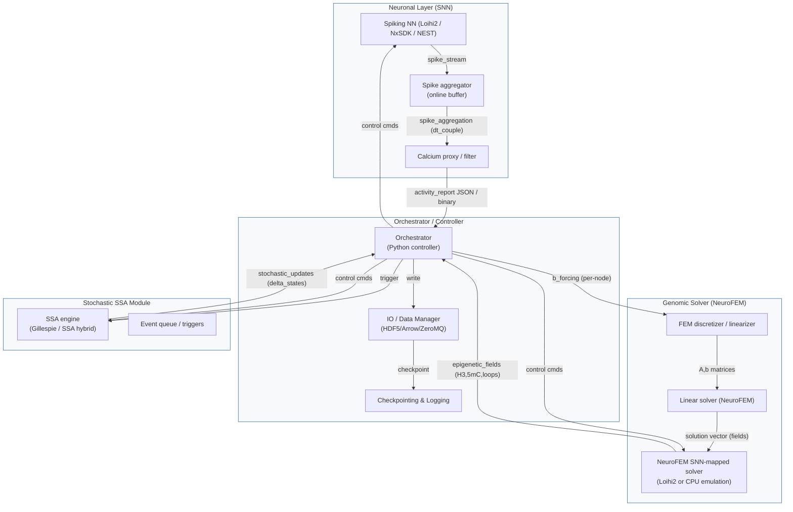

# Neuronal SNN, NeuroFEM genomic solver, stochastic SSA module

## Специализированная ДНК-модель

Базовую «специализированную ДНК-модель» (coarse-grained, физико-химическую/поле-уровневую модель процессов «от нейронной активации → транскрипция → эпигенетическая стабилизация») **технически можно реализовать** на базе идей и алгоритмов, описанных в статье Nature Machine Intelligence (NeuroFEM): там показано, как дискретизация задачи (FEM) даёт разрежённую линейную систему и как эта система напрямую отображается в спайковую SNN, исполняемую на нейроморфном железе (Loihi2). ([Nature][1])

Ниже — развёрнутый, практический разбор «возможности — ограничения — рекомендация по реализации» с конкретными шагами, закономерностями отображения уравнений биохимии/эпигенетики в NeuroFEM-структуру и списком валидационных экспериментов. В тексте привожу ключевые ссылки на основания биологии и на алгоритм NeuroFEM.

---

### 1. Почему NeuroFEM — уместная платформа для такой задачи (кратко)

* NeuroFEM показывает, что дискретизированные (FEM) задачи, сводимые к большим разрежённым линейным системам (A x = b), можно прямо «закодировать» в структуру спайковой нейронной сети и эффективно решать на нейроморфном аппаратном обеспечении (Loihi2). Алгоритм не требует тренировки: он переводит математику FEM в сеть с заданными весами/смещениями и считывает решение из усреднённой активности. Это даёт прямой путь от PDE/ODE-формализма к SNN-выполнению. ([Nature][1])

* Многие ключевые молекулярные процессы, релевантные для «уровня экспрессии генов» (диффузия/транспорт факторов, кинетика фермент-каталитических реакций, изменение плотностей модификаций на непрерывных доменах хроматина) могут быть описаны как системы PDE/ODE (reaction–diffusion, advection–reaction, либо как пространственно-разнесённые кинетические схемы). Для таких уравнений FEM — стандартный выбор численной дискретизации, потому NeuroFEM может служить вычислительным бэкендом. Существуют публикации и модели, описывающие DNAm/epigenetic dynamics и TF diffusion/interaction в терминах reaction–diffusion / continuum подходов. ([PMC][2])

---

### 2. Что именно можно моделировать — целевой «DNA-уровень» (предложение по предметной области)

Реалистичная, но управляемая модель должна быть **коarse-grained**: вместо каждой нуклеотидной позиции — узлы, соответствующие функциональным регуляторным единицам:

1. **Узлы (mesh nodes)** — промоторы/проксимальные региона, усилители (enhancers), крупные CpG-кластеры, ген-тела, участки петлевой связи (на базе Hi-C/PLAC-seq). Количество узлов — сотни → тысячи (реалистично) вместо миллионов нуклеотидов (непрактично).
2. **Переменные в узле** — непрерывные поля: локальная концентрация активированных TF, уровень Pol II (pausing vs elongation), степень общего H3K27ac (или индекс активности enhancer), доля метилированных CpG (5-mC fraction), доля 5-hmC, локальная «компактность/плотность» нуклеосом.
3. **Уравнения** — reaction–diffusion / ODE-термы:

   * Diffusion/transport TF между узлами (с учётом 3D-контактов — повышенная конективность между contact-парой в Hi-C).
   * Kinetic terms: binding/unbinding, Pol II pause release kinetics (activity → eRNA production → Pol II release), methylation/demethylation kinetics (DNMT vs TET activity modeled как реакционные скорости, возможно зависящие от локальной TF/Chromatin state).
   * Feedbacks: H3K27ac повышает доступность → увеличивает TF binding rate; DNAm снижает TF binding; loop formation (петли) увеличивает effective local concentration — всё это вводится как нелинейные коэффициенты. (Такие формализмы уже используются в моделях epigenetic dynamics и polymer-based chromatin models). ([PMC][3])

**Вывод:** предметная модель — это система нелинейных PDE/ODE с локальной реакцией и нетривиальной сетевой (3D) связностью. Она подходит для FEM-дискретизации, при условии огрубления пространственного разрешения и тщательной модели кинетических коэффициентов.

---

### 3. Как именно NeuroFEM применяется — техническая карта (mapping)

NeuroFEM карта: FEM → разрежённая линейная система → SNN конструируется так, что асимптотическая readout-активность даёт решение системы. Для нашей биологической задачи:

1. **Временное распространение:** многие биологические модели требуют time-dependent solving (reaction–diffusion PDEs). FEM + time stepping (implicit/explicit) даёт на каждом временном шаге линейную систему (особенно при implicit schemes) или систему для которой требуется линейный/линейализованный шаг — NeuroFEM подходит как эффективный линейный солвер на каждом шаге. Авторы NeuroFEM показывают работу на steady-state Poisson и обсуждают extensions — аналогичный приём можно применить к time-dependent problems через метод строк (method-of-lines) / implicit schemes. ([Nature][1])

2. **Нелинейности:** для сильно нелинейных terms (коэффициенты зависят от полей) применяется итеративная схема: на каждом итерационном шаге линейнизуется система (Newton/Richardson) → решается линейная система NeuroFEM → обновление коэффициентов → повтор. Это требует циклов «CPU ↔ neuromorphic solver» или полное размещение итератора на neuromorphic (сложно, но возможно с дополнением логики).

3. **Дискретизация 3D-контактов:** mesh может быть построен не как геометрический обычный mesh, а как граф, где вес ребра отражает Hi-C контактную частоту; FEM на граф-mesh или finite volume / graph Laplacian дискретизация сведёт задачу к разрежённой системе, пригодной для NeuroFEM-кодирования.

4. **Переменные и readout:** Для каждого узла создаётся популяция нейронов (NeuroFEM pattern) — их усреднённая спайковая readout репрезентирует искомую переменную (напр., локальную концентрацию фактора или fraction-methylation). Авторы используют по 8–16 нейронов на узел — аналогичный подход применим и здесь. ([Nature][1])

---

### 4. Сильные стороны такого решения

* **Масштабируемость и энергоэффективность** — neuromorphic hardware (Loihi2 и др.) энергоэффективен для разрежённых параллельных вычислений и может обрабатывать большой граф (тысячи узлов) быстрее и дешевле, чем CPU/GPU решения. ([Nature][1])
* **Нативная спайковая динамика** — хорошо сочетается с моделями нейронной активации (SNN) — возможно интегрировать neuron→genome loop: spiking neuronal model drives biochemical solver and solver output modulates gene-level state. Это позволяет делать замкнутую модель «activity → genome → excitability».
* **Прямая математическая трансляция** — NeuroFEM не требует ML-обучения; это deterministic mapping FEM → SNN, что упрощает верификацию и воспроизводимость.

---

### 5. Главные техничесные и концептуальные ограничения (и как их минимизировать)

1. **Нелинейность и стохастичность биологии.**

   * Реализация stochastic single-molecule events (низкие copy numbers) плохо аппроксимируется PDE. Решение: использовать hybrid scheme — continuum PDE для high-copy species (TF concentrations, histone mark density) + stochastic SSA (Gillespie) для low-copy local events; neuromorphic solver может выполнять continuum части, а SSA запускать на CPU/FPGA; затем синхронизировать. (см. сравнения SSA vs continuum в недавних моделях). ([bioRxiv][4])

2. **Мульти-временные шкалы.**

   * От миллисекунд (Ca²⁺) до дни / месяцы (epigenetic consolidation). Полный прямой симулятор будет тяжёл; решение — многомасштабная схема: «fast» module (neuronal activation, IEG induction) и «slow» module (epigenetic state update) — обновления slow module делают редко (coarse-grained time stepping). Это уменьшит вычислительную нагрузку.

3. **Разрешение сети (mesh) и биологическая интерпретация.**

   * Только с coarsening (узлы = регуляторные элементы) модель остаётся практичной. Для fine-scale (базы CpG) вычисления требуются слишком большой mesh. Рекомендация — start coarse (promoter/enhancer/loop nodes) и увеличивать разрешение по потребности. См. polymer-models for chromatin that operate на domain scale. ([Nature][5])

4. **Temporal scaling on neuromorphic hardware.**

   * Neuromorphic hardware реализует биологические time constants via spiking dynamics; но эмуляция дней/месяцев потребует либо масштабирования time constants (интерпретировать 1s wallclock как 1 hour biological), либо event-driven stepping. Оба подхода приемлемы — важно документировать масштабирование.

5. **Validation gap.**

   * Параметры kinetic rates (DNMT/TET rates, methylation half-lives, TF on/off rates) должны быть калиброваны на данных (TRAP/multiome/time series). Без хорошей калибровки модель останется качественным экспланатором, но не количественным предсказателем. ([PubMed][6])

---

### 6. Практическая дорожная карта (конкретные шаги для реализации прототипа)

**Шаг 0 — определиться с научной формулировкой:** чётко сформулировать, какие поведенческие/молекулярные феномены модель должна воспроизводить (напр., временные профили Arc/Arc-methylation в помеченных engram-нейронах после одинарного обучения и при recall).

**Шаг 1 — coarse-grained model design:**
• Выбрать набор узлов (e.g., promoter(Arc), enhancer1, enhancer2, CpG cluster A, CpG cluster B, loop anchor).
• Записать reaction–diffusion/ODEs: TF diffusion, Pol II pausing/release kinetics, eRNA production, DNMT/TET kinetics, H3K27ac dynamics, feedbacks.

**Шаг 2 — discretизация (FEM/graph Laplacian):**
• Построить mesh/graph; формализовать A x = b на каждом timestep при implicit integrator или в линерализованном итерационном шаге.

**Шаг 3 — map to NeuroFEM SNN:**
• Сгенерировать SNN по рецепту NeuroFEM (по узлу — популяция нейронов; веса — элементы матрицы A; смещения — b).
• Реализовать readout mapping (усреднённая firing → поле переменной).

**Шаг 4 — implement & test on neuromorphic hardware (Loihi2):**
• Запуск тестов для простых PDE (diffusion), сверка с CPU/FEM reference. ([Nature][1])

**Шаг 5 — add nonlinear kinetics и iterate:**
• Реализовать итеративную схему, где на каждом шаге NeuroFEM решает линеризованный подшаг; реализовать coupling с CPU-SSA для low-copy stochastic events.

**Шаг 6 — validate на данных:**
• Калибровать kinetic rates по time-series RNA / 5mC / 5hmC / ChIP-seq (TRAP/sorted engram cells) и по spatial Hi-C для весов петлевой связи; сравнить модельные профили с экспериментальными (temporal dynamics of Arc/cFos, H3K27ac dynamics, methylation changes). ([Nature][7])

---

### 7. Предлагаемые валидационные эксперименты (biological)

1. **In vitro pilot:** короткие сети узлов (3–5 loci) моделировать и сопоставить с time-course ChIP/BS-seq + nascent RNA (GRO-seq) после стимуляции нейронов.
2. **In vivo TRAP validation:** run model for hippocampal engram paradigm; compare modelled methylation/histon dynamics in TRAP-sorted engram vs non-engram neurons.
3. **Causal perturbation test:** использовать dCas9-p300 / dCas9-TET на predicted «leverage» enhancers in vivo; проверить, изменяет ли вмешательство направление/парам модельных предсказаний (поведение + molecular readouts). ([Nature][8])

---

### 8. Практическое резюме: преимущества / риски / рекомендация

**Преимущества:** NeuroFEM даёт energy-efficient, масштабируемый, нативный спайковый солвер для линеризованной части модели. Подходит для hybrid continuum/stochastic моделей, особенно когда требуется tight coupling с SNN-моделями нейронной активности.

**Риски / ограничения:** непростая реализация нелинейной / стохастической биологии (требует итеративных схем и hybrid архитектуры); необходимость coarse-graining; отсутствие прямых экспериментальных параметров для ряда kinetic rates; вопросы масштабирования времён биологии → wallclock.

**Рекомендация:** начать с прототипа «coarse-grained genomic mesh (10^2–10^3 узлов) + reaction–diffusion kinetics» и реализовать первый линейный/implicit time-step использующий NeuroFEM как линейный солвер. Параллельно подготовить pipeline для калибровки параметров на TRAP/multiome time-series. Если ресурсы есть — реализовать пилот на Loihi2 (или эмуляторе), затем перейти к валидации in vitro/in vivo.

---

### 9. Ключевые источники (для быстрой проверки и цитирования в отчёте)

* Theilman B.H., Aimone J.B., *Solving sparse finite element problems on neuromorphic hardware* (Nature Mach. Intell. — NeuroFEM: algorithm + Loihi2 demonstration). ([Nature][1])
* Miller C.A., Sweatt J.D., *Covalent modification of DNA regulates memory formation.* Neuron 2007 (DNAm role in memory; necessity evidence). ([PubMed][6])
* Rudenko A. et al., *Tet1 is critical for neuronal activity-regulated gene expression and memory extinction.* Neuron 2013 (TET and 5-hmC dynamics). ([PubMed][9])
* Coda D.M. et al., *Cell-type- and locus-specific epigenetic editing of memory expression.* Nat Genet 2025 (proof-of-principle for locus-specific epigenetic causality). ([Nature][8])
* Kim T-K. et al., *Widespread transcription at neuronal activity-regulated enhancers.* Nature 2010 (eRNA/enhancer activity). ([Nature][7])
* Schaukowitch K. et al., *Enhancer RNA facilitates NELF release from IEGs.* Mol Cell 2014 (mechanistic eRNA → Pol II). ([PubMed][10])
* Reviews / modeling papers: mathematical models of methylation dynamics and polymer/continuum chromatin models (see: models & reviews cited above on methylation dynamics and chromatin polymer models). ([PMC][3])

---

### 10. Заключение 

NeuroFEM предоставляет рабочий и практический путь для реализации вычислительного ядра «continuum/field» части модели, которая описывает, как нейронная активность переводится в пространственно-распределённые изменения транскрипционного потенциала и эпигенетики. Для реальной «DNA-модели engram-stabilization» потребуется hybrid architecture (continuum solver на NeuroFEM + stochastic SSA/agent-based части + parameter calibration на multi-omics), coarse-graining genomics до регуляторных узлов и цикл валидации с экспериментальными временными рядами; при таком подходе проект является реализуемым и перспективным. ([Nature][1])


[1]: https://www.nature.com/articles/s42256-025-01143-2 "Solving sparse finite element problems on neuromorphic hardware | Nature Machine Intelligence"
[2]: https://pmc.ncbi.nlm.nih.gov/articles/PMC4147898/ "Modeling DNA methylation dynamics with approaches from ... - NIH"
[3]: https://pmc.ncbi.nlm.nih.gov/articles/PMC7564540/ "Modeling DNA Methylation Profiles through a Dynamic Equilibrium ..."
[4]: https://www.biorxiv.org/content/10.1101/2025.11.25.690568v1.full-text "A Comparison of Computational Methods for Modeling Stochastic ..."
[5]: https://www.nature.com/articles/s41467-025-59001-z "Polymer model integrates imaging and sequencing to reveal how ..."
[6]: https://pubmed.ncbi.nlm.nih.gov/17359920/ "Covalent modification of DNA regulates memory formation - PubMed"
[7]: https://www.nature.com/articles/nature09033 "Widespread transcription at neuronal activity-regulated enhancers"
[8]: https://www.nature.com/articles/s41588-025-02368-y "Cell-type- and locus-specific epigenetic editing of memory expression"
[9]: https://pubmed.ncbi.nlm.nih.gov/24050401/ "Tet1 is critical for neuronal activity-regulated gene expression and ..."
[10]: https://pubmed.ncbi.nlm.nih.gov/25263592/ "Enhancer RNA facilitates NELF release from immediate early genes"

---


Ниже приведён готовый блок архитектуры и детальная инструкция по взаимодействию модулей **Neuronal SNN ↔ NeuroFEM genomic solver ↔ stochastic SSA module**. Содержимое включает:

* Mermaid-диаграмму;
* техническое описание протоколов обмена, схемы синхронизации, форматы сообщений и примеры схем данных (JSON / HDF5 / Arrow);
* рекомендации по оркестрации, отладке и валидации;
* практические параметры (шкалы времени, частоты синхронизации, оценка размера сообщений);
* предложения по стэку и аппаратному размещению.

Сразу после диаграммы — подробные инструкции. 

---



---

### 1. Общая идея взаимодействия (в 6 строках)

1. SNN моделирует нейронную активность в fine-grained timestep (например, dt_neuron = 0.5–1 ms) и аккумулирует сигналы в буфере.
2. Агрегатор генерирует *activity_report* каждые (T_{couple}) (например, 100–1000 ms wallclock, см. масштабирование) — это входная принудительная функция (b) для genomic solver.
3. Orchestrator переводит *activity_report* → FEM forcing terms для NeuroFEM (линеаризация/формирование матриц A,b).
4. NeuroFEM/LinearSolve решает на временном шаге genomic module (implicit step) и возвращает обновлённые поля (H3K27ac, 5mC fraction, loop_strength, local TF binding propensity).
5. Оркестратор по правилам порогов/событий запускает SSA для низкопопуляционных/дискретных событий (например, статус отдельных локусов, редкие деметилирования). SSA возвращает стохастические дельты, которые влияют на поля genomic solver и (опосредованно) на нейронную возбудимость.
6. Все компоненты логируются, чекпоинтятся и сохраняют данные в IO (HDF5 / Arrow / S3) для последующего анализа.

---

### 2. Компоненты — рекомендации по реализации и размещению (hardware/software)

#### Neuronal Layer (SNN)

* **Реализация:** Loihi2 (NxSDK) при наличии; эмуляция возможна через NEST/Brunel или SpiNNaker/CPU.
* **Выход:** spike_stream (timestamped spikes) и агрегированные метрики: spike_counts, firing_rate, burst_index, calcium_proxy.
* **Важно:** минимальная latency при отправке activity_report; иметь адаптер, который группирует spikes на node_id (узел genomic mesh соответствует одному/нескольким нейронам/популяциям).

#### Orchestrator / Controller

* **Реализация:** Python (asyncio) сервис; центральная роль — согласовывать time-stepping, линерализацию и обмен данными.
* **Интерфесы:** ZeroMQ / gRPC для real-time команд; HDF5 / Apache Arrow для bulk dumps; REST не рекомендуется для низкой задержки.
* **Функции:** build FEM matrices A,b, trigger NeuroFEM solve, merge SSA updates, logging/checkpointing.

#### NeuroFEM genomic solver

* **Реализация:** два варианта:

  * *Native neuromorphic mapping:* составить SNN по NeuroFEM recipe и запустить на Loihi2; Orchestrator передаёт только b (вектор forcing) и читает спайковый readout → поле.
  * *CPU fallback:* FEM discretizer → sparse linear solver (SciPy / PETSc) при тестировании/калибровке.
* **Предпочтение:** начать с CPU implementation (отлаживается проще), затем запустить mapping на Loihi2.

#### Stochastic SSA module

* **Реализация:** C/C++/Rust или pysb + GillesPy2; для масштабируемости — GPU-SSA библиотеки или hybrid SSA (τ-leaping) для частых событий.
* **Пороговые триггеры:** SSA включается для узлов, где копийность низкая или когда deterministic solver показывает нестабильность; также SSA может работать асинхронно и публиковать изменения в Orchestrator.

---

### 3. Протокол обмена данными — форматы и схемы

#### A. Activity report (SNN → Orchestrator)

* **Формат:** JSON metadata + binary payload (Apache Arrow / numpy array).
* **Пример JSON (small):**

```json
{
  "t_start": 12345.0,
  "t_end": 12345.5,
  "dt": 0.5,
  "granularity": "node",
  "node_ids": [1,2,3,4],
  "spike_counts": [12, 0, 5, 30],
  "calcium_proxy": [0.23, 0.01, 0.12, 0.9],
  "notes": "aggregated by 500ms window"
}
```

* **Binary payload:** Arrow table with columns (node_id:int32, spike_count:int32, mean_rate:float32, burst_index:float32, calcium:float32).

#### B. Forcing terms (Orchestrator → NeuroFEM)

* **Формат:** HDF5 dataset or binary NumPy `.npy` snapshot for vector **b**; metadata JSON with mapping node→mesh index.
* **Schema (HDF5):**

  * `/mesh/nodes` (int32 array)
  * `/mesh/edges` (sparse CSR or adjacency)
  * `/step/forcing_b` (float64 array length = N_nodes)
  * `/step/timestamp` (float64)
* **Комментарий:** при runtime отправляйте только `forcing_b` (малый объём).

#### C. NeuroFEM output (genomic fields → Orchestrator)

* **Формат:** HDF5 snapshot + JSON summary.
* **Fields per node:** `h3k27ac_level`, `h3k4me3_level`, `methylation_fraction`, `loop_strength`, `tf_binding_propensity`.
* **Пример JSON summary:**

```json
{
  "timestamp": 12346.0,
  "dt_genomic": 1.0,
  "n_nodes": 1024,
  "fields": ["h3k27ac","5mC","loop_strength"],
  "stats": {"h3k27ac_mean": 0.12, "5mC_mean": 0.45}
}
```

#### D. SSA updates (SSA → Orchestrator)

* **Формат:** event list (JSON) or binary log; each event: (node_id, event_type, delta, t_event)
* **Пример:**

```json
[{"node": 17, "event":"demethylation", "delta": -0.05, "time":12346.125},
 {"node": 512, "event":"histone_acetylation", "delta": +0.08, "time":12346.250}]
```

---

### 4. Синхронизация, time-stepping и масштабирование

#### Временные масштабы (рекомендация)

* **dt_neuron (SNN internal):** 0.5–1 ms (biological-aligned) — runs continuously.
* **T_couple (aggregation interval):** 100–1000 ms (wallclock) — каждое N neuron-steps агрегация отправляется Orchestrator-у. (Значение выбирается в зависимости от требуемой точности: для fast-response genes можно уменьшать до 100 ms.)
* **dt_genomic (NeuroFEM timestep):** 0.1–10 s (wallclock-equivalent scaling); в биологическом смысле может соответствовать минуты → часы (см. масштабирование). Implicit time-step рекомендуется для стабильности (FEM implicit Euler / backward differentiation).
* **SSA cadence:** event-driven / on-demand — либо запускается каждые `k` genomic steps, либо по порогу (когда локальное поле выходит за диапазон непрерывной аппроксимации).

#### Синхронизация (loop)

1. SNN runs continuously; aggregator accumulates spikes over T_couple.
2. At time t, aggregator sends `activity_report` to Orchestrator.
3. Orchestrator forms `forcing_b` and invokes NeuroFEM solve for dt_genomic (one implicit step or iterate until converge).
4. NeuroFEM returns `genomic_fields`.
5. Orchestrator applies policy: push genomic changes to SSA (if thresholds) or incorporate deterministically; SSA returns stochastic deltas.
6. Orchestrator maps genomic changes to neuronal modulators (e.g., TF binding → change in excitability parameter `g_exc` or channel conductance) and sends control commands back to SNN (parameters update).
7. Repeat.

#### Latency considerations

* NeuroFEM solve on CPU for N_nodes ~1k with sparse solver: ~tens to hundreds ms depending on linear system complexity. On neuromorphic (Loihi2) solve may be faster in energy terms but requires mapping overhead.
* Choose coupling interval >= max(expected SNN->Orch latency, NeuroFEM solve latency).

---

### 5. Mapping biological variables → numerical variables (suggested conventions)

| Biological quantity     |     Model variable |            Range |             Unit (model) | Node field name         |
| ----------------------- | -----------------: | ---------------: | -----------------------: | ----------------------- |
| Local TF conc. (active) |        TF_act(x,t) |           [0, ∞) |               arb. units | `tf_binding_propensity` |
| Histone acetylation     |            H3K27ac | [0,1] normalized |                 fraction | `h3k27ac_level`         |
| DNA methylation         |       5mC fraction |            [0,1] |                 fraction | `methylation_fraction`  |
| Enhancer strength       |  enhancer_activity |            [0,∞) |                arb.units | `enhancer_strength`     |
| Loop strength           | loop_contact_score |            [0,1] |               normalized | `loop_strength`         |
| Calcium proxy           |           Ca_proxy |            [0,∞) | spikes/sec or normalized | `calcium`               |

**Пример мэппинга forcing_b:**

$$b_i(t) = \alpha \cdot \mathrm{Ca}_i(t) + \beta \cdot \mathrm{spikeRate}_i(t)$$

где ( $\alpha,\beta$ ) — calibration constants; b_i используется как внешний forcing term в уравнениях reaction–diffusion для узла i.

---

### 6. Интерфейсы и обмен сообщениями — предлагаемые технологии

* **Low-latency RPC / command:** ZeroMQ (PUB/SUB for spike stream, REQ/REP for control), или gRPC for typed calls (protobuf).
* **Bulk data / archiving:** HDF5 (on-disk snapshots), Apache Arrow (in-memory fast transfer), Parquet for archival.
* **Orchestration:** Python asyncio + `asynczmq` or `grpc.aio`. Use `dill`/`pickle` for small python objects but prefer JSON for metadata.
* **Parallel compute:** MPI (for HPC cluster multi-node NeuroFEM/SSA) — PETSc for sparse solvers + MPI.

---

### 7. Data sizes — грубая оценка (пример для N=1024 nodes)

* activity_report (per 500 ms): spike_counts (1024 × int32) = ~4 KB; calcium floats = ~8 KB. With Arrow overhead ~ <64 KB.
* forcing_b (float64 length 1024) ~ 8 KB.
* genomic_fields snapshot (5 fields × 1024 × float64) ≈ 40 KB.
* SSA events: sparse; typical size per epoch < 10 KB.

(Итого—малые сообщения: сетевой трафик не ограничивающий; основная нагрузка — в вычислениях NeuroFEM / SSA.)

---

### 8. Поведение при ошибках, контроль целостности, checkpointing

* **Atomic step:** Orchestrator обеспечивает «transaction» — либо вся coupling step завершается (SNN params updated), либо rollback к предыдущему checkpoint.
* **Checkpointing:** регулярные HDF5 snapshots (каждые M genomic steps) + write-ahead logs для SSA events.
* **Validation:** на каждом шаге сравнивать residual norm из NeuroFEM solve (||Ax-b||) и если > ε — повторить лин. итерацию або снизить dt.
* **Monitoring:** health endpoints (CPU/GPU utilization, queue lengths, time per solve) — Prometheus + Grafana.

---

### 9. Тесты и валидация (рекомендуемые сценарии)

1. **Unit tests:** small 1-10 node mesh; compare NeuroFEM solve on CPU vs SNN mapping (numerical equivalence).
2. **Integration test:** closed-loop: SNN produces sinusoidal activity → genomic solver should reproduce expected oscillatory modulation of enhancer activity.
3. **Biological validation:** fit model parameters to time-series: Arc mRNA (0–6 h), H3K27ac (hours), 5mC (days) from TRAP / multiome experiment. Use parameter estimation (MCMC / adjoint optimization).
4. **Stress test:** scale nodes to 10k and measure solve time, network throughput and orchestration latency.

---

### 10. Практические примечания и roadmap (коротко)

* **Пилот:** реализовать PoC с N≈100-200 узлов на CPU-NeuroFEM flow; run in open-loop (SNN replayed from recorded spikes).
* **Калибровка:** собрать TRAP/multiome time-series для соответствующей парадигмы (например, CFC) — потребуется для parameter fitting.
* **Mapping to Loihi2:** после верификации переводить linear solve на NeuroFEM SNN mapping; готовьте инструменты автоматической трансляции A→weights (NeuroFEM pipeline).
* **Hybrid architecture:** используйте SSA для редких событий; реализуйте гибридный контроллер для балансировки workload CPU↔neuromorphic.

---

## Минимальный математический прототип для coarse-grained locus-mesh (FEM-ready)

**Цель.** Компактный набор PDE/ODE, граничных условий, схема имплиситной дискретизации и формула линейной системы ($A x = b$) для PoC и дальнейшей интеграции в NeuroFEM.

---

### 1. Предпосылки и обозначения

* **Mesh:** граф/сетка узлов ($i=1\ldots N$). Каждый узел — регуляторный локус (enhancer/promoter/CpG cluster). Рёбра имеют веса $w_{ij}$ (из Hi-C/PLAC) — задают эффективную «связность» (3D proximity).

* Для компактности работаем с непрерывными полями на узлах (полями на mesh): вектор состояния в узле $i$ в момент $t$:

$$
\mathbf{u}_i(t) = \begin{bmatrix}
T_i(t)\\[4pt]
E_i(t)\\[4pt]
H_i(t)\\[4pt]
M_i(t)\\[4pt]
L_i(t)\\[4pt]
R_i(t)
\end{bmatrix}
$$

где
- $T$ — активная (ядерная) концентрация TF (binding propensity);
- $E$ — enhancer activity (transcriptional drive / eRNA proxy);
- $H$ — histone acetylation level (H3K27ac, normalized $0\dots1$);
- $M$ — DNA methylation fraction (5-mC, $0\dots1$);
- $L$ — loop/contact strength ($0\dots1$);
- $R$ — nascent RNA / Pol II engaged (proxy для транскрипции, $\ge 0$).

* Внешняя форсирующая переменная от нейронной активности: $S_i(t)$ (calcium / spike-rate proxy, нормированная).

* Временные шкалы: минуты (можно nondimensionalize).

---

### 2. Базовые локальные реакционно-диффузионные уравнения (graph Laplacian)

Используем граф-лапласиан  

$$
(\mathcal{L}u)_i = \sum_j w_{ij}(u_j - u_i)
$$

как «diffusion» по контактной сети.

#### 2.1 TF (активный)

$$
\frac{dT_i}{dt} = D_T \sum_j w_{ij}(T_j - T_i) + \underbrace{\alpha_T S_i(t)}_{\text{activity drive}} - \gamma_T T_i.
\tag{1}
$$

#### 2.2 Enhancer activity ($E$)

Активность энхансера зависит нелинейно от $T$ и от локального состояния хроматина ($H,M$):

$$
\frac{dE_i}{dt} = D_E \sum_j w_{ij}(E_j - E_i) + k_E\, f_T(T_i)\,(1-M_i)\,(1-H_{\text{th}}+H_i) - \gamma_E E_i,
\tag{2}
$$

где $f_T(T)$ — сигмоид/пороговая функция, напр. $f_T(T)=\dfrac{T^n}{K_T^n+T^n}$; множитель $(1-M_i)$ отражает подавление метилированием.

#### 2.3 Histone acetylation ($H$)

$$
\frac{dH_i}{dt} = k_{ac}\,E_i - k_{deac}\,H_i.
\tag{3}
$$

(диффузионный член опущен — $H$ обычно локален)

#### 2.4 DNA methylation ($M$)

Простейшая модель первого порядка:

$$
\frac{dM_i}{dt} = k_{meth}\,(1-M_i)\,g_{DNMT}(\text{context}) - k_{demeth}\,M_i\,g_{TET}(E_i,T_i).
\tag{4}
$$

Практический выбор: $g_{DNMT}\equiv 1$, $g_{TET}=1+\beta_T f_T(T_i)$.

#### 2.5 Loop strength ($L$)

Медленно меняющееся поле, усиливающееся при высокой $E$ и $H$:

$$
\frac{dL_i}{dt} = k_{loop}^+\,E_i\,H_i\,(1-L_i) - k_{loop}^-\,L_i.
\tag{5}
$$

#### 2.6 Nascent RNA / Pol II ($R$)

Транскрипция промотора — функция $E_i$, $H_i$ и подавления $M_i$:

$$
\frac{dR_i}{dt} = k_{tx}\,\phi(E_i,H_i)\,(1-M_i) - \gamma_R R_i,
\tag{6}
$$

где, например, $\displaystyle \phi(E,H)=\frac{E}{E+K_E}\cdot\frac{H}{H+K_H}$.

---

### 3. Комментарии к нелинейностям и coupling terms

* Нелинейности: $f_T$, $\phi$ и произведения (например $E_i H_i$) делают систему нелинейной.
* Diffusion включён для выбранных полей ($T$, $E$); остальные — преимущественно локальны.
* Внешний forcing $S_i(t)$ подаётся из SNN.

---

### 4. Граничные и начальные условия

* На графе «граничных условий» в классическом смысле нет; при пространственном FEM на геометрическом домене используйте Neumann (zero-flux) на внешних границах.
* Начальные условия: $T_i(0)=T_0$ (низкая базальная), $E_i(0)=E_0\approx 0$, $H_i(0)=H_0$, $M_i(0)=M_0$ (например $0.4\!-\!0.8$), $L_i(0)=L_0$ low, $R_i(0)=0$.

---

### 5. Semi-discrete (spatial) форма → implicit time stepping → линейная система

Объединяем по всем узлам: $\mathbf{u}(t)\in\mathbb{R}^{N\cdot m}$ ($m=6$). Общая semi-discrete запись:

$$
M \frac{d\mathbf{u}}{dt} + K(\mathbf{u})\,\mathbf{u} = \mathbf{F}(\mathbf{u},t),
\tag{7}
$$

где $M$ — mass matrix, $K(\mathbf{u})$ — stiffness-like matrix (градиенты/диффузия, возможная зависимость от состояния), $\mathbf{F}$ — вектор реакций/forcing.

Применим backward Euler с шагом $\Delta t$:

$$
M\frac{\mathbf{u}^{n+1}-\mathbf{u}^n}{\Delta t} + K(\mathbf{u}^{n+1})\mathbf{u}^{n+1} = \mathbf{F}(\mathbf{u}^{n+1},t^{n+1}).
\tag{8}
$$

Линеаризация (Newton) даёт на итерации $k$:

$$
\Big(\frac{M}{\Delta t} + K(\mathbf{u}^{(k)}) - \frac{\partial \mathbf{F}}{\partial \mathbf{u}}(\mathbf{u}^{(k)})\Big)\,\delta\mathbf{u} = \mathbf{R},
\tag{9}
$$

где $\delta\mathbf{u}=\mathbf{u}^{(k+1)}-\mathbf{u}^{(k)}$, $\mathbf{R}$ — невязка. На каждом Newton-шаге решается разрежённая линейная система вида $A x = b$.

---

### 6. Практическая схема сборки (алгоритм)

1. Собрать глобальные $M$ и $K$ (sparse). Для graph подхода можно взять lumped mass M=\operatorname{diag}(m_i).

2. На каждом узле вычислить реакционные члены и локальный Jacobian $\partial \mathbf{F}/\partial \mathbf{u}$.

3. Сформировать $A = M/\Delta t + K - J_F$ и правую часть $b = M\mathbf{u}^n/\Delta t + \mathbf{F}(\mathbf{u}^{(k)},t^{n+1}) - J_F \mathbf{u}^{(k)}$.

4. Решить $A \,\delta\mathbf{u} = b$ (sparse solver / NeuroFEM).

5. Обновить $\mathbf{u}^{(k+1)} = \mathbf{u}^{(k)} + \delta\mathbf{u}$; повторять Newton-итерации пока residual > tol или пока не достигнут лимит итераций.

---

### 7. Ориентировочные числовые порядки параметров

(единицы: $minutes^{-1}$, нормированные — ориентиры)

* $D_T \sim 0.01 \dots 1.0$ (effective diffusion across contacts)  
* $\alpha_T \sim 0.1 \dots 1.0$  
* $\gamma_T \sim 0.1 \dots 1.0$  
* $k_E \sim 0.01 \dots 0.5,\ \gamma_E \sim 0.05 \dots 0.5$  
* $k_{ac}\sim 0.01 \dots 0.1,\ k_{deac}\sim 0.01 \dots 0.1$  
* $k_{meth}\sim 10^{-3}\dots10^{-2}$ (медленно), $k_{demeth}\sim 10^{-3}\dots10^{-2}$  
* $k_{loop}^+\sim 10^{-3}\dots10^{-2},\ k_{loop}^-\sim 10^{-3}$

Выбор $\Delta t$ (implicit): прототип $0.01\!-\!0.1$ biological minutes; затем coarse-graining.

---

### 8. Рекомендации по интеграции с NeuroFEM

* Для Hi-C / contact network — используйте graph Laplacian и sparse сборку $K$.
* NeuroFEM получает на вход разрежённую матрицу $A$ и вектор $b$ (формат: sparse CSR/COO) — это естественный mapping из Newton-итерации.
* Для узлов с малым copy-number (редкие события) — гибрид SSA ↔ PDE/ODE и синхронизация через оркестратор.

---

### 9. Заключение

Короткая система (1)–(6) даёт практичный reaction–diffusion / ODE прототип на graph-mesh. При имплиситной схеме каждый timestep редуцируется через Newton к разрежённой системе $A x = b$, готовой для передачи в NeuroFEM как solve-блок.


---

Оглавление:

- [Молекулярная архитектура памяти: от нейронной активации к геномной стабилизации энграмм](/brain-networks/Molecular-Architecture-of-Memory-From-Neural-Activation-to-Genomic-Stabilization-of-Engrams.md) 
- [Нейросети мозга](/brain-networks/README.md)
- [ЭИРО framework](/README.md)
