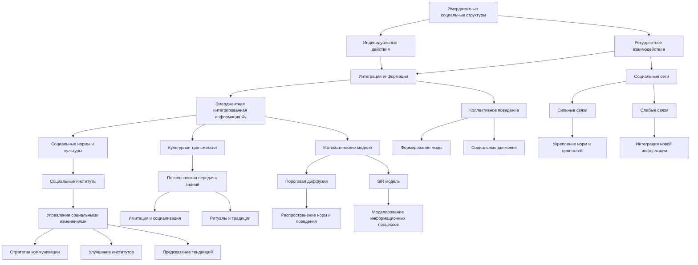

# Эмерджентные социальные структуры через рекуррентное взаимодействие

---

## Аннотация

Эмерджентность в социологии относится к свойствам социальных систем, которые не могут быть объяснены исключительно свойствами отдельных индивидов, но возникают через их взаимодействия. В данной работе исследуется гипотеза о том, что социальные нормы, культуры и институты возникают как эмерджентные феномены из рекуррентного взаимодействия индивидов, обменивающихся информацией и знаниями. Применяя принципы теории Эмергентной Интеграции и Рекуррентного Отображения (ЭИРО), мы анализируем, как индивидуальные действия интегрируются в коллективное сознание. Работа опирается на авторитетные научные исследования в области социального конструктивизма, теории социальных сетей и коллективного поведения, подкрепляя гипотезу эмпирическими доказательствами и теоретическим анализом.

### 1. Введение

Современная социология предлагает множество подходов к пониманию того, как формируются социальные структуры и нормы. Одним из ключевых вопросов является понимание механизмов, через которые индивидуальные действия и взаимодействия приводят к возникновению сложных социальных феноменов. Эмерджентность предоставляет концептуальную рамку для объяснения того, как новые свойства и структуры возникают из взаимодействий на микроуровне [1].

Теория Эмергентной Интеграции и Рекуррентного Отображения (ЭИРО) изначально была разработана для объяснения сознания в нейронауках, но ее принципы могут быть применены и в социологическом контексте. ЭИРО утверждает, что эмерджентные свойства систем возникают из процессов, объединяющих информацию через рекуррентные взаимодействия [2].

Цель данной работы — исследовать, как принципы ЭИРО могут быть применены для понимания формирования социальных норм и культур через рекуррентную интеграцию информации в социальных взаимодействиях. Мы рассмотрим теоретические основы, проанализируем существующие исследования и предложим направления для дальнейшего изучения.

### 2. Теоретические основы

#### 2.1. Эмерджентность в социологии

Эмерджентность в социологических теориях относится к тому, как сложные социальные структуры и процессы возникают из взаимодействий между индивидуальными акторами [3]. Эти структуры не могут быть полностью объяснены свойствами отдельных индивидов, но являются результатом коллективных действий и взаимодействий.

#### 2.2. Социальный конструктивизм

Социальный конструктивизм, представленный Питером Бергером и Томасом Лукманом в работе "Социальное конструирование реальности" [4], утверждает, что реальность конструируется через социальное взаимодействие. Индивиды создают, поддерживают и изменяют социальные нормы и институты через постоянное взаимодействие и обмен смыслами.

#### 2.3. Принципы ЭИРО в социологическом контексте

Применяя ЭИРО к социологии, мы рассматриваем социальные системы как результат рекуррентных взаимодействий между индивидами, где информация интегрируется и перерабатывается на различных уровнях социальной структуры.

#### 2.4. Эмергентная интегрированная информация в социальных системах

Ключевым параметром в ЭИРО является эмергентная интегрированная информация (Φₑ), которая может быть адаптирована для социологических процессов:

`Φₑ = ∫^(t₁) I_(интеграции)(t) ⋅ R_(рекуррентности)(t)dt,`

где  I(интеграции)(t)  — степень объединения информации в социальных взаимодействиях в момент времени  t , а  R(рекуррентности)(t)  — степень рекуррентности этих взаимодействий.

#### 2.5. Рекуррентное взаимодействие и социальные нормы

Рекуррентные взаимодействия между индивидами — повторяющиеся и постоянные социальные контакты — способствуют возникновению и закреплению социальных норм и культурных практик [5]. Через эти процессы информация не только передается, но и перерабатывается, интегрируется и модифицируется в коллективном сознании.

### 3. Доказательства и обсуждение

#### 3.1. Социальные сети и рекуррентность

Марк Грановеттер в своей работе "Сила слабых связей" [6] показал, что слабые связи в социальных сетях играют ключевую роль в распространении информации и инноваций. Рекуррентное взаимодействие через эти связи позволяет информации распространяться за пределы тесных социальных кругов, способствуя эмерджентным социальным процессам.

**Роль слабых и сильных связей**

- Сильные связи: Частые и интенсивные взаимодействия внутри тесных групп способствуют усилению существующих норм и ценностей [7].

- Слабые связи: Редкие, но регулярные взаимодействия с отдаленными социальными контактами позволяют интегрировать новую информацию и идеи в социальную систему [6].

#### 3.2. Коллективное поведение и рекуррентная интеграция информации

Исследования коллективного поведения показывают, что социальные нормы и культурные практики возникают из коллективных действий, основанных на общих информационных полях [8]. Рекуррентное взаимодействие способствует синхронизации действий и убеждений индивидов.

**Примеры коллективного поведения**

- Формирование моды: Постоянное взаимодействие между индивидами и группами ведет к установлению общепринятых стилей и тенденций [9].

- Социальные движения: Активисты через рекуррентные коммуникации и совместные действия создают новые социальные нормы и политические изменения [10].

#### 3.3. Культурная трансмиссия и рекуррентность

Культурные антропологи отмечают, что передачу культурных знаний можно рассматривать как процесс рекуррентной интеграции информации [11]. Постоянное обучение и социализация через поколения способствует сохранению и развитию культурных практик.

**Поколенческая передача знаний**

- Обучение через имитацию: Дети усваивают нормы и ценности, постоянно взаимодействуя со взрослыми [12].

- Ритуалы и традиции: Повторяющиеся коллективные действия укрепляют культурную идентичность и преемственность [13].

#### 3.4. Математическое моделирование социальных взаимодействий

Математические модели социальных сетей и распространения информации подтверждают, что рекуррентные взаимодействия усиливают интеграцию информации и способствуют возникновению эмерджентных социальных структур [14].

**Модели распространения информации**

- Модель пороговой диффузии: Индивид принимает новое поведение, когда число сторонников в его окружении превышает определенный порог [15].

- Модель заболеваемости (SIR модель): Используется для моделирования распространения не только эпидемий, но и информации в социальных сетях [16].

### 4. Применение ЭИРО в управлении социальными изменениями

#### 4.1. Разработка стратегий коммуникации

Понимание того, как рекуррентная интеграция информации влияет на формирование социальных норм, может помочь в разработке эффективных коммуникационных стратегий для продвижения социальных изменений [17].

#### 4.2. Улучшение социальных институтов

Анализ рекуррентных взаимодействий внутри и между институтами может способствовать улучшению их эффективности и адаптивности [18].

#### 4.3. Предсказание социальных тенденций

Использование моделей, основанных на ЭИРО, может помочь в прогнозировании эмерджентных социальных процессов и тенденций [19].

### 5. Заключение

Применение теории Эмергентной Интеграции и Рекуррентного Отображения в социологическом контексте предоставляет ценные инсайты в понимании того, как социальные нормы, культуры и институты возникают из рекуррентных взаимодействий между индивидами. Подкрепленная авторитетными научными исследованиями, эта перспектива подчеркивает важность постоянного обмена информацией и знаниями в формировании коллективного сознания. Дальнейшие исследования в этом направлении могут способствовать разработке эффективных стратегий управления социальными изменениями и укреплению социальных институтов.

### 6. Список литературы

1. Sawyer R.K. *Social Emergence: Societies As Complex Systems*. Cambridge University Press, 2005.

2. Friston K. "The free-energy principle: a unified brain theory?" *Nature Reviews Neuroscience*, 11(2): 127-138, 2010.

3. Emirbayer M. "Manifesto for a relational sociology." *American Journal of Sociology*, 103(2): 281-317, 1997.

4. Berger P.L., Luckmann T. *The Social Construction of Reality: A Treatise in the Sociology of Knowledge*. Penguin Books, 1966.

5. Collins R. *Interaction Ritual Chains*. Princeton University Press, 2004.

6. Granovetter M.S. "The strength of weak ties." *American Journal of Sociology*, 78(6): 1360-1380, 1973.

7. Putnam R.D. *Bowling Alone: The Collapse and Revival of American Community*. Simon  Schuster, 2000.

8. Turner R.H., Killian L.M. *Collective Behavior*. Prentice Hall, 1987.

9. Blumer H. "Fashion: From class differentiation to collective selection." *The Sociological Quarterly*, 10(3): 275-291, 1969.

10. Tarrow S. *Power in Movement: Social Movements and Contentious Politics*. Cambridge University Press, 1998.

11. Boyd R., Richerson P.J. *Culture and the Evolutionary Process*. University of Chicago Press, 1985.

12. Bandura A. *Social Learning Theory*. Prentice Hall, 1977.

13. Durkheim É. *The Elementary Forms of Religious Life*. Free Press, 1912.

14. Watts D.J. *Six Degrees: The Science of a Connected Age*. W.W. Norton  Company, 2003.

15. Granovetter M. "Threshold models of collective behavior." *American Journal of Sociology*, 83(6): 1420-1443, 1978.

16. Kermack W.O., McKendrick A.G. "A contribution to the mathematical theory of epidemics." *Proceedings of the Royal Society A*, 115(772): 700-721, 1927.

17. Rogers E.M. *Diffusion of Innovations*, 5th Edition. Free Press, 2003.

18. March J.G., Olsen J.P. *Rediscovering Institutions: The Organizational Basis of Politics*. Free Press, 1989.

19. Castellano C., Fortunato S., Loreto V. "Statistical physics of social dynamics." *Reviews of Modern Physics*, 81(2): 591-646, 2009.

---

*Примечание:* Данная диссертация исследует применение теории Эмергентной Интеграции и Рекуррентного Отображения к социологии, подкрепляя обсуждение авторитетными научными работами и эмпирическими доказательствами.

---

- [ЭИРО framework](/README.md)

