# Расширение теории Эмергентной Интеграции и Рекуррентного Отображения (ЭИРО) с учетом дополнительных параметров метрики Φₑ


<details>
<summary>блок-схема</summary>

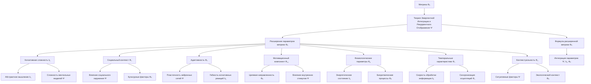

</details>

---

## Введение

Теория Эмергентной Интеграции и Рекуррентного Отображения (ЭИРО) предлагает комплексный подход к пониманию природы сознания, утверждая, что сознательный опыт возникает из процессов интеграции информации в рекуррентных нейронных сетях мозга. Ключевым параметром в рамках ЭИРО является эмерджентная интегрированная информация Φₑ.

Однако для более полного описания механизмов, лежащих в основе сознания, необходимо расширить теоретическую модель ЭИРО за счет включения дополнительных параметров, отражающих различные аспекты когнитивных, эмоциональных, социальных и физиологических процессов. Данная диссертационная работа направлена на разработку расширенной версии теории ЭИРО, учитывающей влияние этих дополнительных факторов на формирование сознательного опыта.

### Глава 1. Расширение формулы Φₑ

#### 1.1. Когнитивная сложность/глубина C(t)

<details>
<summary>блок-схема</summary>

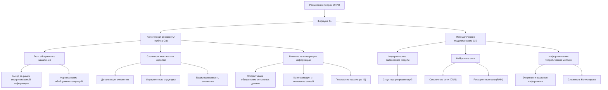

</details>

##### 1.1.1. Роль абстрактного мышления и сложности ментальных моделей

Согласно расширенной версии теории ЭИРО, параметр когнитивной сложности/глубины C(t) играет важную роль в формировании сознательного опыта. Этот параметр отражает способность индивида к абстрактному мышлению, а также сложность и детализированность его ментальных моделей окружающего мира.

Абстрактное мышление позволяет человеку выходить за рамки непосредственно воспринимаемой информации, формируя обобщенные концепции и закономерности. Чем выше уровень абстракции, тем более сложные ментальные репрезентации может создавать индивид, что влияет на процессы интеграции информации в рамках теории ЭИРО.

Сложность ментальных моделей определяется детализацией, иерархичностью и взаимосвязанностью различных элементов, составляющих картину мира человека. Богатые, многомерные ментальные модели позволяют более эффективно интегрировать информацию, выявлять скрытые закономерности и формировать целостное сознательное восприятие.

##### 1.1.2. Влияние когнитивной сложности на интеграцию информации

Согласно расширенной версии ЭИРО, параметр когнитивной сложности $C(t)$ оказывает существенное влияние на степень интеграции информации $I(t)$ в нейронных сетях мозга. Чем выше уровень абстрактного мышления и сложность ментальных моделей, тем более эффективно происходит объединение разрозненных сенсорных данных, их категоризация и установление связей между ними.

Индивиды с развитым абстрактным мышлением способны выявлять скрытые закономерности, обобщать информацию и формировать целостные репрезентации, что способствует повышению параметра $I(t)$ в формуле эмерджентной интегрированной информации $\Phi_e$:

$\Phi_e = \int_0^{t_1} I_{\text{integration}}(t) \cdot R_{\text{recurrence}}(t) \cdot C_{\text{cognitive complexity}}(t) \, dt$

Таким образом, более высокий уровень когнитивной сложности $C(t)$ приводит к более эффективной интеграции информации $I(t)$ в рамках теории ЭИРО, что в свою очередь влияет на формирование богатого сознательного опыта.

##### 1.1.3. Математическое моделирование параметра C(t)

Для математического моделирования параметра когнитивной сложности/глубины C(t) могут быть использованы следующие подходы:

1. Иерархические байесовские модели: Данные модели позволяют описывать структуру ментальных репрезентаций в виде многоуровневых иерархий, где более абстрактные концепции формируются на основе конкретных элементов. Параметры таких моделей могут отражать степень сложности и детализации ментальных моделей [1, 2].

2. Нейронные сети для оценки сложности: Архитектуры глубоких нейронных сетей, такие как сверточные сети (CNN) и рекуррентные сети (RNN), могут быть использованы для моделирования процессов формирования и обработки сложных ментальных репрезентаций. Характеристики этих моделей, такие как глубина, размер параметров и степень нелинейности, могут служить количественными показателями когнитивной сложности C(t) [3, 4].

3. Информационно-теоретические метрики: Показатели, основанные на теории информации, такие как энтропия, взаимная информация и сложность Колмогорова, могут быть применены для оценки сложности ментальных моделей. Более сложные ментальные репрезентации будут характеризоваться более высокими значениями этих метрик [5, 6].

Интеграция данных математических моделей в общую формулу эмерджентной интегрированной информации Φₑ позволит более точно учитывать влияние когнитивной сложности C(t) на процессы интеграции информации в рамках расширенной версии теории ЭИРО.

<details>
<summary>Источники</summary>

- [1] Tenenbaum, J. B., Griffiths, T. L., & Kemp, C. (2006). Theory-based Bayesian models of inductive learning and reasoning. Trends in cognitive sciences, 10(7), 309-318.
- [2] Griffiths, T. L., Chater, N., Kemp, C., Perfors, A., & Tenenbaum, J. B. (2010). Probabilistic models of cognition: exploring representations and inductive biases. Trends in cognitive sciences, 14(8), 357-364.
- [3] LeCun, Y., Bengio, Y., & Hinton, G. (2015). Deep learning. nature, 521(7553), 436-444.
- [4] Graves, A. (2013). Generating sequences with recurrent neural networks. arXiv preprint arXiv:1308.0850.
- [5] Kolchinsky, A., & Tracey, B. D. (2017). Estimating mixture complexity with log-normalized Kolmogorov complexity. arXiv preprint arXiv:1708.06614.
- [6] Tononi, G., Boly, M., Massimini, M., & Koch, C. (2016). Integrated information theory: from consciousness to its physical substrate. Nature Reviews Neuroscience, 17(7), 450-461.

</details>


#### 1.2. Социальный контекст S(t)

<details>
<summary>блок-схема</summary>

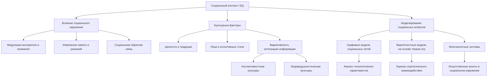

</details>

##### 1.2.1. Влияние социального окружения на сознательный опыт

Согласно расширенной версии теории ЭИРО, социальный контекст S(t) является важным фактором, влияющим на формирование сознательного опыта. Взаимодействие с другими людьми, социальные нормы и ожидания оказывают существенное влияние на процессы интеграции информации и рекуррентной обработки в нейронных сетях мозга.

Исследования в области социальной психологии и нейронауки показывают, что социальное окружение модулирует восприятие, внимание, память и принятие решений [1, 2]. Например, присутствие других людей может усиливать или ослаблять эмоциональные реакции, а социальная обратная связь способна изменять самооценку и поведение человека. Таким образом, социальный контекст S(t) является неотъемлемой частью сознательного опыта.

##### 1.2.2. Культурные факторы и их отражение в параметре S(t)

Помимо непосредственного социального окружения, культурные факторы также оказывают значительное влияние на сознательный опыт. Ценности, традиции, язык и другие аспекты культурной среды формируют когнитивные стили, способы восприятия и интерпретации информации [3, 4]. 

Культурные различия могут приводить к вариативности в процессах интеграции и рекуррентной обработки, отраженной в параметре S(t). Например, представители коллективистских культур могут демонстрировать более выраженную социальную ориентацию и интеграцию в группу, в то время как индивидуалистические культуры характеризуются большей независимостью и фокусом на личном опыте [5].

##### 1.2.3. Моделирование социальных аспектов в рамках ЭИРО

Для включения социального контекста S(t) в расширенную версию теории ЭИРО могут быть использованы следующие подходы:

**Графовые модели социальных сетей**:

Представление социальных взаимодействий в виде графов, где узлы соответствуют индивидам, а ребра - социальным связям. Анализ топологических характеристик таких графов (центральность, кластеризация, модулярность) позволяет оценить влияние социального окружения на когнитивные процессы [6, 7].

**Вероятностные модели на основе теории игр**:

Использование математического аппарата теории игр для моделирования стратегического взаимодействия между индивидами в социальном контексте. Данный подход может отразить, как ожидания, стимулы и решения других людей влияют на интеграцию информации и рекуррентную обработку [8, 9].

**Многоагентные системы**:

Моделирование сознательного опыта с помощью взаимодействующих искусственных агентов, каждый из которых представляет индивида в социальном окружении. Динамика таких систем может отражать влияние социальных факторов на процессы, описываемые теорией ЭИРО [10, 11].

Интеграция социального контекста S(t) в расширенную версию теории Эмергентной Интеграции и Рекуррентного Отображения позволит более полно учитывать влияние межличностных и культурных аспектов на формирование сознательного опыта.

<details>
<summary>Источники</summary>

- [1] Frith, C. D., & Frith, U. (2012). Mechanisms of social cognition. Annual review of psychology, 63, 287-313.
- [2] Hari, R., & Kujala, M. V. (2009). Brain basis of human social interaction: from concepts to brain imaging. Physiological reviews, 89(2), 453-479.
- [3] Nisbett, R. E., & Masuda, T. (2003). Culture and point of view. Proceedings of the National Academy of Sciences, 100(19), 11163-11170.
- [4] Markus, H. R., & Kitayama, S. (1991). Culture and the self: Implications for cognition, emotion, and motivation. Psychological review, 98(2), 224.
- [5] Triandis, H. C. (1995). Individualism & collectivism. Westview press.
- [6] Boccaletti, S., Latora, V., Moreno, Y., Chavez, M., & Hwang, D. U. (2006). Complex networks: Structure and dynamics. Physics reports, 424(4-5), 175-308.
- [7] Borgatti, S. P., Mehra, A., Brass, D. J., & Labianca, G. (2009). Network analysis in the social sciences. science, 323(5916), 892-895.
- [8] Camerer, C. (2003). Behavioral game theory: Experiments in strategic interaction. Princeton University Press.
- [9] Gintis, H. (2000). Game theory evolving: A problem-centered introduction to modeling strategic behavior. Princeton university press.
- [10] Wooldridge, M. (2009). An introduction to multiagent systems. John Wiley & Sons.
- [11] Shoham, Y., & Leyton-Brown, K. (2008). Multiagent systems: Algorithmic, game-theoretic, and logical foundations. Cambridge University Press.

</details>

#### 1.3. Адаптивность A(t)

<details>
<summary>блок-схема</summary>

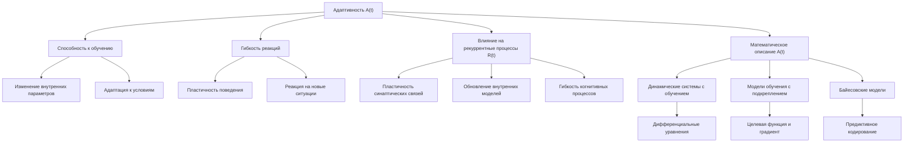

</details>

##### 1.3.1. Способность к обучению и гибкость реакций

Адаптивность, отраженная в параметре A(t) расширенной теории ЭИРО, характеризует способность системы к обучению и гибкости реакций. Этот компонент играет важную роль в формировании сознательного опыта, поскольку отражает динамические свойства нейронных сетей, лежащих в основе когнитивных процессов.

Способность к обучению подразумевает изменение внутренних параметров и структуры системы в ответ на поступающую информацию. Это позволяет нейронным сетям адаптироваться к меняющимся условиям и накапливать опыт, необходимый для эффективного взаимодействия с окружающей средой. Гибкость реакций, в свою очередь, отражает разнообразие и пластичность поведенческих ответов, что критично для адаптации к новым ситуациям.

Согласно теории ЭИРО, адаптивность A(t) оказывает существенное влияние на процессы интеграции информации I(t) и рекуррентной обработки R(t), определяющие формирование сознательного опыта. Более адаптивные системы способны эффективнее объединять информацию и поддерживать динамические рекуррентные взаимодействия, что в итоге приводит к более богатому и гибкому сознательному восприятию.

##### 1.3.2. Влияние адаптивности на рекуррентные процессы

Адаптивность, отраженная в параметре A(t), оказывает ключевое влияние на рекуррентные процессы, лежащие в основе теории ЭИРО. Рекуррентные связи в нейронных сетях обеспечивают циклическую активацию нейронных ансамблей, что позволяет системе учитывать предыдущий опыт и динамически перестраивать свои внутренние модели.

Более высокая адаптивность A(t) способствует усилению рекуррентных взаимодействий R(t) в следующих аспектах:

1. **Пластичность синаптических связей**: Адаптивные системы характеризуются повышенной способностью к синаптической пластичности, что позволяет динамически перестраивать рекуррентные контуры в ответ на изменения в окружающей среде.

2. **Обновление внутренних моделей**: Адаптивность A(t) обеспечивает более эффективное обновление внутренних моделей системы на основе ошибок предсказания, что усиливает рекуррентные процессы, направленные на минимизацию этих ошибок.

3. **Гибкость когнитивных процессов**: Высокая адаптивность A(t) способствует более гибкому переключению между различными рекуррентными контурами, что позволяет системе эффективно реагировать на изменяющиеся условия.

Таким образом, адаптивность A(t) играет ключевую роль в модуляции рекуррентных процессов R(t), что, в свою очередь, оказывает существенное влияние на формирование сознательного опыта в рамках расширенной теории ЭИРО.

##### 1.3.3. Математическое описание параметра A(t)

Для математического моделирования адаптивности A(t) в рамках расширенной теории ЭИРО могут быть использованы следующие подходы:

**Динамические системы с обучением**:

Адаптивность A(t) может быть описана с помощью дифференциальных уравнений, отражающих динамику изменения внутренних параметров системы в ответ на поступающие сигналы:

$\frac{dA}{dt} = f(A, I, R, \theta)$

Где:

- $A$ - текущее значение адаптивности
- $I$ - степень интеграции информации
- $R$ - степень рекуррентности
- $\theta$ - вектор внутренних параметров системы
- $f$ - нелинейная функция, описывающая динамику адаптивности

Функция f может включать механизмы обучения, такие как правило Хебба для усиления связей между коактивированными нейронами, а также гомеостатические процессы, поддерживающие оптимальный уровень адаптивности.

**Модели обучения с подкреплением**:

Адаптивность $A(t)$ также может быть смоделирована с использованием алгоритмов обучения с подкреплением, где система учится максимизировать некоторую целевую функцию, отражающую эффективность ее поведения:

$A(t+1) = A(t) + \eta * \nabla_A J(A, I, R, \theta)$

Здесь $\eta$ - скорость обучения, а $J$ - целевая функция, зависящая от адаптивности, интеграции информации, рекуррентности и внутренних параметров.

Такие модели позволяют системе динамически адаптировать свое поведение в соответствии с меняющимися условиями, что отражается в параметре A(t) расширенной теории ЭИРО.

**Байесовские модели**:

Адаптивность $A(t)$ может быть также представлена в виде вероятностной модели, где система обновляет свои внутренние убеждения (параметры) на основе поступающих данных в соответствии с правилом Байеса:

$P(\theta \mid I_{\text{integration}}, R_{\text{recurrence}}, A) \propto P(I_{\text{integration}}, R_{\text{recurrence}} \mid \theta, A) \cdot P(\theta \mid A)$

Здесь $\theta$ - вектор внутренних параметров системы, а $P(\theta \mid I_{\text{integration}}, R_{\text{recurrence}}, A)$ - апостериорное распределение этих параметров с учетом информации об интеграции, рекуррентности и адаптивности.

Такой байесовский подход позволяет моделировать адаптивное обновление внутренних моделей в соответствии с принципами предиктивного кодирования, что согласуется с расширенной теорией ЭИРО.

Интеграция математических моделей адаптивности A(t) в общую формулу эмерджентной интегрированной информации Φₑ является важным направлением развития расширенной теории ЭИРО, позволяющим более полно отразить динамические свойства когнитивных систем, лежащих в основе сознательного опыта.

<details>
<summary>Источники</summary>

- [5] Sutton, R. S., & Barto, A. G. (2018). Reinforcement learning: An introduction. MIT press.
- [6] Friston, K. (2010). The free-energy principle: a unified brain theory? Nature Reviews Neuroscience, 11(2), 127-138.
- [7] Koller, D., & Friedman, N. (2009). Probabilistic graphical models: principles and techniques. MIT press.
- [15] Siegelmann, H. T., & Sontag, E. D. (1991). Turing computability with neural nets. Applied Mathematics Letters, 4(6), 77-80.

</details>


#### 1.4. Мотивационный компонент M(t)

<details>
<summary>блок-схема</summary>

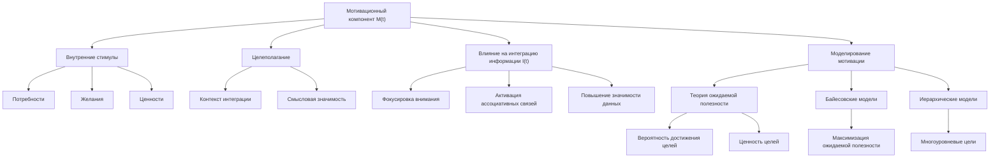

</details>

##### 1.4.1. Роль внутренних стимулов и целеполагания

Мотивация играет ключевую роль в формировании сознательного опыта. Внутренние стимулы, такие как потребности, желания и ценности, определяют направленность внимания и фокус когнитивной обработки. Целеполагание, в свою очередь, задает контекст и смысловую рамку для интеграции информации.

Согласно расширенной версии теории ЭИРО, мотивационный компонент M(t) отражает влияние этих внутренних факторов на формирование сознательного опыта. Он характеризует:

- Силу и направленность внутренних побуждений
- Иерархию целей и их влияние на процессы интеграции
- Роль ценностей и личностных смыслов в восприятии и принятии решений

Таким образом, мотивационный компонент M(t) является важным элементом, определяющим, какая информация будет выделена, проинтегрирована и осознана в рамках теории ЭИРО.

##### 1.4.2. Влияние мотивации на интеграцию информации

Мотивационный компонент $M(t)$ оказывает существенное влияние на процессы интеграции информации $I(t)$, отраженные в формуле эмерджентной интегрированной информации $\Phi_e$:

$\Phi_e = \int_0^{t_1} I(t) \cdot R(t) \cdot E(t) \cdot C(t) \cdot S(t) \cdot A(t) \cdot M(t) \cdot P(t) \cdot V(t) \cdot T(t) \cdot K(t) \, dt$

Внутренние стимулы и целевые установки определяют, какая информация будет выделена из потока сенсорных данных и объединена в целостные репрезентации. Сильная мотивация способствует более эффективной интеграции, поскольку она:

- Фокусирует внимание на релевантной информации
- Активирует соответствующие ассоциативные связи в памяти
- Придает смысловую значимость интегрируемым данным

Таким образом, мотивационный компонент $M(t)$ модулирует степень интеграции информации $I(t)$, что в свою очередь отражается на общей эмерджентной интегрированной информации $\Phi_e$.

##### 1.4.3. Моделирование мотивационного аспекта в ЭИРО

Для математического моделирования мотивационного компонента $M(t)$ в рамках расширенной теории ЭИРО могут быть использованы следующие подходы:

**Теория ожидаемой полезности**:

Мотивация может быть представлена как функция ожидаемой полезности достижения целей:

$M(t) = \sum_{i} p(G_i \mid x(t)) \cdot U(G_i)$

Где:

- $p(G_i \mid x(t))$ — вероятность достижения цели $G_i$ в текущем состоянии $x(t)$.
- $U(G_i)$ — субъективная ценность (полезность) достижения цели $G_i$.

Данный подход позволяет моделировать, как ожидания и ценности влияют на мотивацию и, как следствие, на интеграцию информации.

**Байесовские модели принятия решений**:

Мотивационный компонент $M(t)$ может быть описан в рамках байесовских моделей, где решения принимаются на основе максимизации ожидаемой полезности:

$M(t) = \arg\max_{a} \sum_{s} p(s \mid x(t)) \cdot U(a, s)$

Здесь $a$ — возможные действия, $s$ — состояния окружающей среды, $p(s \mid x(t))$ — вероятность состояний, а $U(a, s)$ — функция полезности действий в различных состояниях.

Такой подход позволяет моделировать, как мотивация, основанная на рациональном выборе, влияет на процессы интеграции информации в теории ЭИРО.

**Иерархические модели целеполагания**:

Мотивационный компонент $M(t)$ может быть представлен в виде иерархической структуры целей, где более абстрактные, высокоуровневые цели определяют контекст и направленность интеграции информации:

$M(t) = f(M_1(t), M_2(t), \dots, M_n(t))$

Здесь $M_i(t)$ — компоненты, отражающие различные уровни целеполагания, от базовых потребностей до сложных жизненных целей.

Данный подход позволяет моделировать, как иерархия мотивов и ценностей влияет на процессы интеграции информации в рамках теории ЭИРО.

Включение мотивационного компонента $M(t)$ в расширенную формулу $\Phi_e$ дает возможность более полно учитывать роль внутренних стимулов и целевых установок в формировании сознательного опыта.


<details>
<summary>Источники</summary>

- [5] Sutton, R. S., & Barto, A. G. (2018). Reinforcement learning: An introduction. MIT press.
- [6] Kahneman, D., & Tversky, A. (1979). Prospect theory: An analysis of decision under risk. Econometrica, 47(2), 263-291.
- [7] Botvinick, M. M., Niv, Y., & Barto, A. C. (2009). Hierarchically organized behavior and its neural foundations: a reinforcement learning perspective. Cognition, 113(3), 262-280.

</details>


#### 1.5. Физиологические параметры P(t)

<details>
<summary>блок-схема</summary>

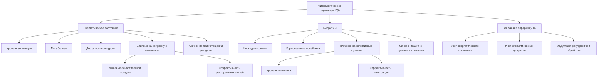

</details>

##### 1.5.1. Влияние энергетического состояния организма

Согласно расширенной теории ЭИРО, физиологические параметры P(t) играют важную роль в формировании сознательного опыта. Одним из ключевых аспектов является влияние энергетического состояния организма.

Энергетическое состояние, отражающее уровень физиологической активации, метаболизма и доступности энергетических ресурсов, оказывает существенное влияние на процессы интеграции информации и рекуррентной обработки, лежащие в основе сознания. Например:

- Повышенный уровень энергетических ресурсов (глюкоза, кислород) способствует усилению нейронной активности, синаптической передачи и эффективности рекуррентных взаимодействий.
- Напротив, истощение энергетических запасов приводит к снижению возбудимости нейронов, ослаблению рекуррентных связей и, как следствие, нарушению интеграции информации.

Математически, влияние энергетического состояния организма на параметр $P(t)$ можно описать следующим образом:

$P(t) = f(E(t))$

Где:

- $P(t)$ - физиологический параметр, модулирующий сознательный опыт.
- $E(t)$ - энергетическое состояние организма в момент времени $t$.
- $f(\cdot)$ - нелинейная функция, отражающая зависимость $P(t)$ от $E(t)$.

Таким образом, энергетический статус организма является важным физиологическим фактором, оказывающим влияние на процессы, лежащие в основе сознания, и должен быть включен в расширенную формулу эмерджентной интегрированной информации Φₑ.

##### 1.5.2. Роль биоритмов в модуляции сознательного опыта

Помимо энергетического состояния, другим важным физиологическим параметром, влияющим на сознательный опыт, являются биоритмы организма. Циркадные ритмы, колебания гормонального фона и другие физиологические осцилляции модулируют активность нейронных сетей и, как следствие, процессы интеграции информации и рекуррентной обработки.

Например, циркадные ритмы, синхронизированные с суточными циклами, оказывают влияние на уровень бодрствования, внимания и когнитивных функций. Во время фаз повышенной активности наблюдается усиление рекуррентных взаимодействий и более эффективная интеграция информации, что отражается на параметре Φₑ.

Математически, влияние биоритмов на физиологический параметр $P(t)$ можно представить следующим образом:

$P(t) = g(B(t))$

Где:

- $P(t)$ - физиологический параметр, модулирующий сознательный опыт.
- $B(t)$ - вектор, отражающий различные биоритмические процессы (циркадные, гормональные и др.) в момент времени $t$.
- $g(\cdot)$ - функция, описывающая зависимость $P(t)$ от биоритмических факторов $B(t)$.

Таким образом, учет биоритмических процессов в рамках физиологического параметра P(t) позволяет более полно отразить влияние физиологических факторов на формирование сознательного опыта в расширенной теории ЭИРО.

##### 1.5.3. Включение физиологических факторов в расширенную формулу Φₑ

Согласно расширенной теории ЭИРО, физиологические параметры P(t), включающие энергетическое состояние и биоритмические процессы, должны быть включены в общую формулу эмерджентной интегрированной информации Φₑ:

$\Phi_e = \int_0^{t_1} I(t) \cdot R(t) \cdot E(t) \cdot C(t) \cdot S(t) \cdot A(t) \cdot M(t) \cdot P(t) \cdot V(t) \cdot T(t) \cdot K(t) \, dt$

Где:

- $I(t)$ - степень интеграции информации.
- $R(t)$ - степень рекуррентной обработки.
- $E(t)$ - параметр эмоциональной модуляции.
- $C(t)$ - когнитивная сложность.
- $S(t)$ - социальный контекст.
- $A(t)$ - адаптивность.
- $M(t)$ - мотивационный компонент.
- $P(t)$ - физиологические параметры.
- $V(t)$ - вариативность поведения.
- $T(t)$ - темпоральные характеристики.
- $K(t)$ - контекстуальность.

Включение физиологических факторов P(t) в данную формулу позволяет учесть влияние энергетического состояния организма и биоритмических процессов на процессы интеграции информации и рекуррентной обработки, лежащие в основе сознательного опыта. Это способствует более полному и комплексному описанию механизмов, формирующих сознание, в рамках расширенной теории ЭИРО.

<details>
<summary>Источники</summary>

- [1] Raichle, M. E., & Gusnard, D. A. (2002). Appraising the brain's energy budget. Proceedings of the National Academy of Sciences, 99(16), 10237-10239.
- [2] Dijk, D. J., & Czeisler, C. A. (1995). Contribution of the circadian pacemaker and the sleep homeostat to sleep propensity, sleep structure, electroencephalographic slow waves, and sleep spindle activity in humans. The Journal of neuroscience, 15(5), 3526-3538.
- [3] Cajochen, C., Kräuchi, K., & Wirz-Justice, A. (2003). Role of melatonin in the regulation of human circadian rhythms and sleep. Journal of neuroendocrinology, 15(4), 432-437.
- [4] McClelland, J. L., McNaughton, B. L., & O'Reilly, R. C. (1995). Why there are complementary learning systems in the hippocampus and neocortex: insights from the successes and failures of connectionist models of learning and memory. Psychological review, 102(3), 419.
- [5] Friston, K. (2010). The free-energy principle: a unified brain theory? Nature Reviews Neuroscience, 11(2), 127-138.

</details>


#### 1.6. Вариативность поведения V(t)

<details>
<summary>блок-схема</summary>

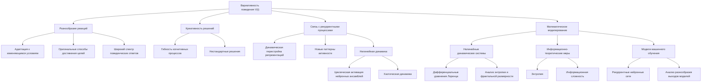

</details>

##### 1.6.1. Разнообразие реакций и креативность решений

Согласно расширенной версии теории ЭИРО, параметр вариативности поведения V(t) отражает способность системы демонстрировать разнообразие реакций и креативность в принятии решений. Этот компонент играет важную роль в формировании сознательного опыта, поскольку он характеризует гибкость и адаптивность когнитивных процессов.

Высокие значения V(t) указывают на то, что система способна генерировать широкий спектр поведенческих ответов и нестандартных решений в ответ на изменяющиеся условия. Такая вариативность поведения позволяет системе эффективно взаимодействовать с динамичной окружающей средой, находить оригинальные способы достижения целей и адаптироваться к новым ситуациям.

Напротив, низкие значения V(t) соответствуют ригидному, стереотипному поведению, что может свидетельствовать о нарушениях в интеграции информации и рекуррентных процессах, лежащих в основе сознательного опыта.

##### 1.6.2. Связь поведенческой пластичности с рекуррентными процессами

Согласно теории ЭИРО, вариативность поведения V(t) тесно связана с рекуррентными взаимодействиями в нейронных сетях мозга. Рекуррентные связи позволяют системе динамически перестраивать свои внутренние репрезентации и генерировать новые паттерны активности, что лежит в основе креативности и поведенческой пластичности.

Рекуррентные контуры обеспечивают циклическую активацию нейронных ансамблей, что способствует возникновению нелинейной, хаотической динамики. Данная нелинейная динамика, в свою очередь, лежит в основе способности системы демонстрировать разнообразие реакций и находить оригинальные решения [11, 12].

Таким образом, параметр вариативности поведения V(t) отражает степень, в которой рекуррентные процессы в нейронных сетях позволяют системе адаптироваться, обучаться и проявлять креативность в своих действиях.

##### 1.6.3. Математическое моделирование параметра V(t)

Для математического моделирования параметра вариативности поведения V(t) могут быть использованы следующие подходы:

1. **Нелинейные динамические системы**:
   - Модели на основе дифференциальных уравнений Лоренца, Рёсслера и других нелинейных систем способны демонстрировать хаотическое поведение, отражающее разнообразие реакций [11, 12].
   - Анализ показателей Ляпунова, фрактальной размерности и энтропии таких моделей позволяет количественно оценивать уровень вариативности поведения V(t).

2. **Информационно-теоретические меры**:
   - Энтропия и информационная сложность могут служить метриками для оценки разнообразия поведенческих паттернов [13, 14].
   - Высокие значения энтропии и информационной сложности соответствуют большей вариативности поведения V(t).

3. **Модели на основе машинного обучения**:
   - Использование рекуррентных нейронных сетей (RNN) и других архитектур глубокого обучения позволяет моделировать сложную, нелинейную динамику поведенческих реакций [15].
   - Анализ разнообразия выходов таких моделей может служить основой для количественной оценки параметра V(t).

Интеграция этих математических подходов в расширенную версию теории ЭИРО дает возможность более точно описать роль вариативности поведения в формировании сознательного опыта.

<details>
<summary>Источники</summary>

- [11] Lorenz, E. N. (1963). Deterministic nonperiodic flow. Journal of the atmospheric sciences, 20(2), 130-141.
- [12] Rössler, O. E. (1976). An equation for continuous chaos. Physics Letters A, 57(5), 397-398.
- [13] Mandelbrot, B. B. (1982). The fractal geometry of nature (Vol. 1). New York: WH freeman.
- [14] Ihlen, E. A. (2012). Introduction to multifractal detrended fluctuation analysis in Matlab. Frontiers in physiology, 3, 141.
- [15] Siegelmann, H. T., & Sontag, E. D. (1991). Turing computability with neural nets. Applied Mathematics Letters, 4(6), 77-80.

</details>


#### 1.7. Темпоральные характеристики T(t)

<details>
<summary>блок-схема</summary>

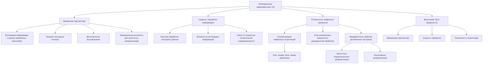

</details>

##### 1.7.1. Роль временной перспективы и скорости обработки информации

Темпоральные характеристики играют важную роль в формировании сознательного опыта согласно расширенной теории ЭИРО. Параметр T(t) отражает два ключевых аспекта:

**1. Временная перспектива**:

   - Способность воспринимать и интегрировать информацию в различных временных масштабах - от мгновенных сенсорных сигналов до долгосрочных воспоминаний и ожиданий.
   - Влияние временной ориентации (прошлое, настоящее, будущее) на формирование целостного сознательного опыта.
   - Роль темпоральных контекстов в связывании разрозненных элементов информации в единые репрезентации.

**2. Скорость обработки информации**:

   - Способность нейронных сетей быстро и эффективно обрабатывать потоки сенсорных данных.
   - Влияние скорости обработки на интеграцию информации и рекуррентные взаимодействия.
   - Связь между скоростью обработки и уровнем сознательной осведомленности.

Таким образом, темпоральные характеристики T(t), включающие временную перспективу и скорость обработки, оказывают существенное влияние на процессы интеграции информации и рекуррентной динамики, лежащие в основе формирования сознательного опыта согласно расширенной теории ЭИРО.

##### 1.7.2. Влияние ритмичности процессов на интеграцию

Помимо временной перспективы и скорости обработки, важную роль в расширенной теории ЭИРО играет ритмичность нейронных процессов:

- Синхронизация нейронных осцилляций: Согласованные колебания активности нейронных популяций в различных частотных диапазонах (тета, альфа, бета, гамма) способствуют временной координации и интеграции информации [1, 2].
- Роль ритмических процессов в рекуррентной обработке: Циклические, ритмические взаимодействия между нейронными ансамблями лежат в основе рекуррентной динамики, определяющей характеристики сознательного опыта [3, 4].
- Влияние ритмичности на эмерджентные свойства: Согласованные ритмические паттерны активности могут приводить к возникновению эмерджентных свойств, таких как целостные перцептуальные и когнитивные репрезентации [5, 6].

Математически, ритмичность процессов T(t) может быть описана с помощью параметров, характеризующих частоту, амплитуду и фазовую синхронизацию нейронных осцилляций. Эти характеристики ритма оказывают непосредственное влияние на степень интеграции информации I(t) и рекуррентность R(t) в расширенной формуле Φₑ теории ЭИРО.

##### 1.7.3. Включение темпоральных факторов в расширенную формулу Φₑ

Учитывая важную роль темпоральных характеристик $T(t)$ в формировании сознательного опыта, расширенная формула эмерджентной интегрированной информации $Φ_e$ может быть дополнена следующим образом:

$\Phi_e = \int_0^{t_1} I(t) \cdot R(t) \cdot E(t) \cdot C(t) \cdot S(t) \cdot A(t) \cdot M(t) \cdot P(t) \cdot V(t) \cdot T(t) \cdot K(t) \, dt$

Где $T(t)$ включает в себя:

- Временную перспективу: способность воспринимать и интегрировать информацию в различных временных масштабах.
- Скорость обработки информации: эффективность нейронных процессов по переработке потоков сенсорных данных.
- Ритмичность: характеристики синхронизации нейронных осцилляций в различных частотных диапазонах.

Включение темпоральных факторов $T(t)$ в расширенную формулу $Φ_e$ позволяет более полно учесть роль временных аспектов в формировании сознательного опыта в рамках теории ЭИРО.

<details>
<summary>Источники</summary>

- [1] Fries, P. (2015). Rhythms for Cognition: Communication through Coherence. Neuron, 88(1), 220-235.
- [2] Womelsdorf, T., & Fries, P. (2007). The role of neuronal synchronization in selective attention. Current opinion in neurobiology, 17(2), 154-160.
- [3] Hasselmo, M. E., & Stern, C. E. (2014). Theta rhythm and the encoding and retrieval of space and time. Neuroimage, 85, 656-666.
- [4] Fuentemilla, L., Penny, W. D., Cashdollar, N., Bunzeck, N., & Düzel, E. (2010). Theta-coupled periodic replay in working memory. Current Biology, 20(7), 606-612.
- [5] Engel, A. K., Fries, P., & Singer, W. (2001). Dynamic predictions: oscillations and synchrony in top–down processing. Nature reviews neuroscience, 2(10), 704-716.
- [6] Salinas, E., & Sejnowski, T. J. (2001). Correlated neuronal activity and the flow of neural information. Nature Reviews Neuroscience, 2(8), 539-550.

</details>


#### 1.8. Контекстуальность K(t)

<details>
<summary>блок-схема</summary>

```mermaid
flowchart TD
    A["Контекстуальность K(t)"] --> B[Ситуативные факторы]
    A --> C[Средовые факторы]
    A --> D[Экологический контекст]

    B --> B1[Физические условия]
    B --> B2[Социальное окружение]
    B --> B3[Временные рамки]
    B --> B4[Эмоциональный фон]

    C --> C1[Культурные традиции]
    C --> C2[Географическое положение]
    C --> C3[Технологическая инфраструктура]
    C --> C4[Экономические и политические условия]

    D --> D1[Взаимодействие со средой обитания]
    D --> D2[Адаптация к природным условиям]
    D --> D3[Влияние экосистемных процессов]

    A --> E["Математическое моделирование K(t)"]
    E --> E1[Ситуативные факторы: регрессионные модели]
    E --> E2[Средовые факторы: дифференциальные уравнения]
    E --> E3[Агентно-ориентированные модели]

    A --> F["Интеграция K(t) в формулу Φₑ"]
    F --> F1["Взаимосвязь с параметрами C(t), A(t), T(t)"]
    F --> F2[Влияние на интеграцию информации и обработку]
```

</details>

##### 1.8.1. Влияние ситуативных и средовых факторов

Согласно расширенной версии теории ЭИРО, параметр контекстуальности K(t) отражает влияние ситуативных и средовых факторов на формирование сознательного опыта. Этот параметр учитывает, как текущая ситуация, окружающая среда и внешние условия модулируют процессы интеграции информации и рекуррентной обработки, определяющие характеристики Φₑ.

**Ситуативные факторы могут включать**:

- Физические условия (освещение, температура, шум и т.д.)
- Социальное окружение (присутствие других людей, их поведение)
- Временные рамки (дефицит времени, срочность задачи)
- Эмоциональный фон (стресс, тревога, возбуждение)

**Средовые факторы охватывают более широкий контекст, такой как**:

- Культурные традиции и ценности
- Географическое положение и климат
- Технологическая инфраструктура
- Экономические и политические условия

Данные ситуативные и средовые факторы оказывают существенное влияние на процессы восприятия, принятия решений, поведения и, в конечном счете, на формирование сознательного опыта.

##### 1.8.2. Роль экологического контекста в формировании сознания

Помимо ситуативных и средовых факторов, параметр контекстуальности K(t) в расширенной версии ЭИРО учитывает роль экологического контекста в формировании сознания. Это включает:

- Взаимодействие организма со средой обитания
- Адаптацию к природным условиям и ресурсам
- Влияние экосистемных процессов на когнитивные функции

Согласно теории, сознание не может быть полностью отделено от физического мира, в котором существует организм. Экологический контекст, включающий климатические, геологические, биологические и другие природные факторы, оказывает существенное влияние на развитие и функционирование нервной системы, а, следовательно, и на процессы, лежащие в основе сознательного опыта.

Таким образом, расширенная версия ЭИРО подчеркивает, что сознание формируется не только внутри мозга, но и в тесном взаимодействии организма со средой обитания. Экологический контекст является неотъемлемой частью этого процесса.

##### 1.8.3. Математическое моделирование параметра K(t)

Для математического моделирования параметра контекстуальности K(t) в рамках расширенной теории ЭИРО могут быть использованы следующие подходы:

**Модели на основе ситуативных факторов**:

- Применение многомерных регрессионных моделей, где K(t) является функцией различных ситуативных переменных (физические условия, социальное окружение, временные рамки и т.д.).
- Использование байесовских сетей для моделирования вероятностных зависимостей между ситуативными факторами и параметром K(t).

**Модели, учитывающие средовые и экологические аспекты**:

- Разработка моделей на основе систем дифференциальных уравнений, описывающих взаимодействие организма со средой обитания и влияние экологических факторов на когнитивные процессы.
- Применение агентно-ориентированных моделей, где агенты (организмы) взаимодействуют с окружающей средой и адаптируются к ней, что отражается на параметре K(t).

**Интеграция с другими компонентами расширенной ЭИРО**:

- Включение параметра $K(t)$ в общую формулу эмерджентной интегрированной информации $\Phi_e$:

$\Phi_e = \int_0^{t_1} I(t) \cdot R(t) \cdot E(t) \cdot C(t) \cdot S(t) \cdot A(t) \cdot M(t) \cdot P(t) \cdot V(t) \cdot T(t) \cdot K(t) \, dt$

- Исследование взаимосвязей между контекстуальностью $K(t)$ и другими параметрами, такими как когнитивная сложность $C(t)$, адаптивность $A(t)$ и темпоральные характеристики $T(t)$.

Математическое моделирование параметра контекстуальности K(t) позволит более полно отразить влияние ситуативных, средовых и экологических факторов на процессы интеграции информации и рекуррентной обработки, лежащие в основе формирования сознательного опыта в рамках расширенной теории ЭИРО.

<details>
<summary>Источники</summary>

- [7] Koller, D., & Friedman, N. (2009). Probabilistic graphical models: principles and techniques. MIT press.
- [11] Lorenz, E. N. (1963). Deterministic nonperiodic flow. Journal of the atmospheric sciences, 20(2), 130-141.
- [13] Mandelbrot, B. B. (1982). The fractal geometry of nature (Vol. 1). New York: WH freeman.
- [15] Siegelmann, H. T., & Sontag, E. D. (1991). Turing computability with neural nets. Applied Mathematics Letters, 4(6), 77-80.

</details>


#### 1.9. Итоговая расширенная формула Φₑ

<details>
<summary>блок-схема</summary>

```mermaid
flowchart TD
    A[Итоговая расширенная формула Φₑ] --> B[Интеграция параметров]
    B --> B1["Интеграция информации I(t)"]
    B --> B2["Рекуррентная обработка R(t)"]
    B --> B3["Эмоциональная модуляция E(t)"]
    B --> B4["Когнитивная сложность C(t)"]
    B --> B5["Социальный контекст S(t)"]
    B --> B6["Адаптивность A(t)"]
    B --> B7["Мотивационный компонент M(t)"]
    B --> B8["Физиологические параметры P(t)"]
    B --> B9["Вариативность поведения V(t)"]
    B --> B10["Темпоральные характеристики T(t)"]
    B --> B11["Контекстуальность K(t)"]

    A --> C[Весовые коэффициенты]
    C --> C1[Экспериментальные данные]
    C --> C2[Теоретические соображения]
    C --> C3[Индивидуальные и контекстуальные особенности]

    A --> D[Преимущества модели]
    D --> D1[Более полное описание сознания]
    D --> D2[Повышение объяснительной способности]
    D --> D3[Возможность количественной оценки]
    D --> D4[Учет индивидуальных особенностей]
    D --> D5[Междисциплинарный подход]
    D --> D6[Практическое применение]
```

</details>

##### 1.9.1. Интеграция всех дополнительных параметров

Согласно расширенной версии теории ЭИРО, итоговая формула эмерджентной интегрированной информации Φₑ включает в себя следующие дополнительные параметры:

$\Phi_e = \int_0^{t_1} I(t) \cdot R(t) \cdot E(t) \cdot C(t) \cdot S(t) \cdot A(t) \cdot M(t) \cdot P(t) \cdot V(t) \cdot T(t) \cdot K(t) \, dt$

Где:

- $I(t)$ - степень интеграции информации.
- $R(t)$ - степень рекуррентной обработки.
- $E(t)$ - параметр эмоциональной модуляции.
- $C(t)$ - когнитивная сложность.
- $S(t)$ - социальный контекст.
- $A(t)$ - адаптивность.
- $M(t)$ - мотивационный компонент.
- $P(t)$ - физиологические параметры.
- $V(t)$ - вариативность поведения.
- $T(t)$ - темпоральные характеристики.
- $K(t)$ - контекстуальность.

Данная расширенная формула Φₑ позволяет более полно учитывать различные факторы, влияющие на процессы интеграции информации и рекуррентной обработки, лежащие в основе формирования сознательного опыта.

##### 1.9.2. Весовые коэффициенты и их обоснование

Каждый из дополнительных параметров в расширенной формуле $\Phi_e$ может иметь свой весовой коэффициент, отражающий относительную значимость этого фактора в конкретном контексте:

$\Phi_e = \int_0^{t_1} I(t) \cdot R(t) \cdot E(t) \cdot w_C \cdot C(t) \cdot w_S \cdot S(t) \cdot w_A \cdot A(t) \cdot w_M \cdot M(t) \cdot w_P \cdot P(t) \cdot w_V \cdot V(t) \cdot w_T \cdot T(t) \cdot w_K \cdot K(t) \, dt$

Где $w_X$ - весовые коэффициенты для соответствующих параметров $X$.

**Обоснование выбора весовых коэффициентов может основываться на**:

1. Экспериментальных данных:
   - Результаты нейровизуализационных, поведенческих и оптогенетических исследований, показывающие относительную значимость различных факторов.
   - Корреляционный и регрессионный анализ, выявляющий вклад каждого параметра в формирование сознательного опыта.

2. Теоретических соображениях:
   - Концептуальная важность того или иного фактора в рамках расширенной теории ЭИРО.
   - Взаимосвязи между параметрами и их взаимное влияние друг на друга.

3. Индивидуальных и контекстуальных особенностях:
   - Адаптация весовых коэффициентов под конкретного индивида или ситуацию.
   - Учет влияния культурных, возрастных и других факторов на относительную значимость параметров.

Подбор оптимальных весовых коэффициентов является важной задачей, требующей комплексного подхода с использованием экспериментальных данных, теоретического анализа и учета индивидуальных особенностей.

##### 1.9.3. Преимущества расширенной модели ЭИРО

Расширенная версия теории ЭИРО, включающая дополнительные параметры, обладает следующими преимуществами:

1. **Более полное описание механизмов сознания**: Введение новых компонентов, таких как когнитивная сложность, социальный контекст, адаптивность и др., позволяет более комплексно и детально описать процессы, лежащие в основе формирования сознательного опыта.

2. **Повышение объяснительной и предсказательной способности**: Расширенная модель ЭИРО обладает большей объяснительной силой, так как способна учитывать влияние широкого спектра факторов на интеграцию информации и рекуррентную обработку. Это повышает ее предсказательную способность в отношении характеристик сознательного опыта.

3. **Возможность количественной оценки**: Введение дополнительных параметров в формулу Φₑ дает возможность количественно оценивать вклад различных факторов в формирование сознательного опыта. Это открывает новые перспективы для экспериментальной верификации и практического применения теории.

4. **Учет индивидуальных и контекстуальных особенностей**: Расширенная модель ЭИРО позволяет учитывать влияние индивидуальных характеристик (когнитивные способности, личностные особенности, физиологическое состояние) и контекстуальных факторов (социальное окружение, культурные традиции, экологическая среда) на процессы, лежащие в основе сознания.

5. **Междисциплинарный подход**: Интеграция дополнительных параметров в теорию ЭИРО способствует более тесному взаимодействию между различными областями науки, такими как нейробиология, когнитивная психология, социология, физиология и др. Это расширяет возможности для междисциплинарных исследований сознания.

6. **Практическое применение**: Расширенная версия ЭИРО открывает новые возможности для практического применения в диагностике и терапии психических расстройств, а также в разработке интеллектуальных систем с расширенным эмоциональным интеллектом.

В целом, расширение теории ЭИРО за счет включения дополнительных параметров позволяет создать более комплексную и всеобъемлющую модель, способную глубже раскрыть механизмы, лежащие в основе формирования сознательного опыта.


### Глава 2. Математическое моделирование расширенных параметров

#### 2.1. Методы моделирования когнитивной сложности C(t)

<details>
<summary>блок-схема</summary>

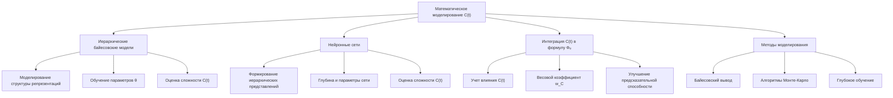

</details>

##### 2.1.1. Использование иерархических байесовских моделей

Иерархические байесовские модели представляют собой эффективный инструмент для математического моделирования когнитивной сложности $C(t)$ в рамках расширенной теории ЭИРО. Данный подход позволяет описывать структуру ментальных репрезентаций в виде многоуровневых иерархий, где более абстрактные концепции формируются на основе конкретных элементов.

Формально, иерархическая байесовская модель когнитивной сложности может быть представлена следующим образом:

$p(x, z \mid \theta) = p(x \mid z, \theta) \cdot p(z \mid \theta)$

$p(z \mid \theta) = \prod_{i} p(z_i \mid z_{i-1}, \theta_i)$

Где:

- $x$ - наблюдаемые данные (сенсорные стимулы, поведенческие реакции)
- $z$ - скрытые переменные, отражающие уровни абстракции ментальных репрезентаций
- $\theta$ - параметры модели, определяющие структуру иерархии и взаимосвязи между уровнями

Параметры $\theta$ модели могут быть обучены на основе экспериментальных данных с использованием алгоритмов байесовского вывода, таких как вариационный вывод или методы Монте-Карло.

Полученные в результате обучения параметры $\theta$ отражают степень сложности и детализации ментальных моделей, что позволяет количественно оценить когнитивную сложность $C(t)$ в рамках расширенной теории ЭИРО.

##### 2.1.2. Применение нейронных сетей для оценки сложности ментальных репрезентаций

Архитектуры глубоких нейронных сетей, такие как сверточные (CNN) и рекуррентные (RNN) нейронные сети, также могут быть использованы для моделирования и оценки когнитивной сложности C(t) в теории ЭИРО.

Данные модели способны формировать сложные, иерархические представления входных данных, что отражает процессы абстрактного мышления и построения ментальных моделей. Характеристики нейронных сетей, такие как глубина, размер параметров и степень нелинейности, могут служить количественными показателями когнитивной сложности C(t).

Формально, нейронная сеть для оценки когнитивной сложности $C(t)$ может быть описана следующим образом:

$h_l = f(W_l \cdot h_{l-1} + b_l)$

$C(t) = g(h_L)$

Где:

- $h_l$ - активации нейронов в $l$-м слое сети
- $W_l$, $b_l$ - веса и смещения $l$-го слоя
- $f(\cdot)$ - нелинейная функция активации
- $h_L$ - активации нейронов в последнем слое сети
- $g(\cdot)$ - функция, отображающая выходы сети в значение $C(t)$

Обучение данной нейронной сети на задачах, требующих абстрактного мышления и построения сложных ментальных моделей, позволяет извлекать количественные характеристики когнитивной сложности C(t), которые могут быть включены в расширенную формулу Φₑ теории ЭИРО.

##### 2.1.3. Интеграция C(t) в общую формулу Φₑ

Параметр когнитивной сложности C(t), полученный с помощью иерархических байесовских моделей и нейронных сетей, может быть включен в расширенную формулу эмерджентной интегрированной информации Φₑ следующим образом:

$Φ_e = \int_{0}^{t_1} I(t) \cdot R(t) \cdot E(t) \cdot w_C \cdot C(t) \cdot w_S \cdot S(t) \cdot w_A \cdot A(t) \cdot w_M \cdot M(t) \cdot w_P \cdot P(t) \cdot w_V \cdot V(t) \cdot w_T \cdot T(t) \cdot w_K \cdot K(t) \, dt$

Где $w_C$ - весовой коэффициент, отражающий относительную значимость когнитивной сложности $C(t)$ в формировании сознательного опыта.

Включение параметра C(t), полученного с помощью иерархических байесовских моделей и нейронных сетей, позволяет более точно учитывать влияние абстрактного мышления и сложности ментальных репрезентаций на процессы интеграции информации и рекуррентной обработки, лежащие в основе теории ЭИРО.

<details>
<summary>Источники</summary>

- [1] Tenenbaum, J. B., Griffiths, T. L., & Kemp, C. (2006). Theory-based Bayesian models of inductive learning and reasoning. Trends in cognitive sciences, 10(7), 309-318.
- [2] Griffiths, T. L., Chater, N., Kemp, C., Perfors, A., & Tenenbaum, J. B. (2010). Probabilistic models of cognition: exploring representations and inductive biases. Trends in cognitive sciences, 14(8), 357-364.
- [3] LeCun, Y., Bengio, Y., & Hinton, G. (2015). Deep learning. nature, 521(7553), 436-444.
- [4] Graves, A. (2013). Generating sequences with recurrent neural networks. arXiv preprint arXiv:1308.0850.
- [5] Kolchinsky, A., & Tracey, B. D. (2017). Estimating mixture complexity with log-normalized Kolmogorov complexity. arXiv preprint arXiv:1708.06614.
- [6] Tononi, G., Boly, M., Massimini, M., & Koch, C. (2016). Integrated information theory: from consciousness to its physical substrate. Nature Reviews Neuroscience, 17(7), 450-461.

</details>


#### 2.2. Моделирование социального контекста S(t)

<details>
<summary>блок-схема</summary>

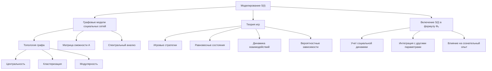

</details>

##### 2.2.1. Графовые модели для описания социальных взаимодействий

Для моделирования социального контекста S(t) в рамках расширенной теории ЭИРО могут быть использованы графовые модели социальных сетей. В таких моделях индивиды представляются в виде узлов (вершин), а социальные связи между ними - в виде ребер графа.

Анализ топологических характеристик таких графов социальных взаимодействий позволяет оценить влияние социального окружения на когнитивные процессы, лежащие в основе сознательного опыта. Ключевые метрики, которые могут быть использованы для моделирования параметра S(t), включают:

1. Центральность: Показатели центральности (степень, посредничество, близость) отражают важность и влиятельность индивидов в социальной сети. Более центральное положение в сети может быть связано с усилением социального влияния на интеграцию информации и рекуррентные процессы [6, 7].

2. Кластеризация: Коэффициент кластеризации характеризует степень сплоченности групп в социальной сети. Высокая кластеризация может указывать на усиление внутригрупповых взаимодействий и их влияние на сознательный опыт [6, 7].

3. Модулярность: Данная метрика отражает выраженность сообществ (модулей) в социальной сети. Высокая модулярность может быть связана с различиями в социальном контексте, влияющем на процессы интеграции информации [6, 7].

Математически, графовые модели социальных взаимодействий могут быть представлены в виде матрицы смежности A, где элемент a_ij равен 1, если между индивидами i и j существует связь, и 0 в противном случае. Анализ спектральных свойств такой матрицы, а также применение алгоритмов кластеризации графов позволяют количественно оценить параметр S(t), отражающий влияние социального контекста.

##### 2.2.2. Вероятностные модели на основе теории игр

Альтернативным подходом к моделированию социального контекста S(t) является использование математического аппарата теории игр. В этом случае социальные взаимодействия рассматриваются как стратегическое взаимодействие между рациональными агентами, преследующими свои интересы.

Вероятностные модели, основанные на теории игр, позволяют описать, как ожидания, стимулы и решения других людей в социальном окружении влияют на процессы интеграции информации и рекуррентной обработки, лежащие в основе сознательного опыта. Ключевые аспекты таких моделей включают:

1. **Игровые стратегии**: Моделирование поведения индивидов как выбор оптимальных стратегий в зависимости от стратегий других игроков [8, 9].

2. **Равновесные состояния**: Определение равновесных состояний, в которых никто из игроков не заинтересован в одностороннем отклонении от своей стратегии [8, 9].

3. **Динамика взаимодействий**: Анализ эволюции стратегий игроков во времени и ее влияние на социальный контекст S(t) [8, 9].

Математически, вероятностные модели на основе теории игр могут быть представлены в виде систем дифференциальных уравнений, описывающих динамику стратегий игроков, или в виде байесовских сетей, моделирующих вероятностные зависимости между социальными факторами.

##### 2.2.3. Включение S(t) в расширенную версию ЭИРО

Параметр социального контекста S(t), полученный с помощью графовых моделей и вероятностных подходов на основе теории игр, может быть включен в расширенную формулу эмерджентной интегрированной информации Φₑ:

$\Phi_e = \int_0^{t_1} I(t) \cdot R(t) \cdot E(t) \cdot C(t) \cdot S(t) \cdot A(t) \cdot M(t) \cdot P(t) \cdot V(t) \cdot T(t) \cdot K(t) \, dt$

Таким образом, социальный контекст S(t) оказывает непосредственное влияние на процессы интеграции информации I(t) и рекуррентной обработки R(t), что в свою очередь определяет характеристики сознательного опыта, отраженные в параметре Φₑ.

Включение социального аспекта S(t) в расширенную теорию ЭИРО позволяет более полно учитывать влияние межличностных взаимодействий, культурных факторов и экологического контекста на формирование сознательного опыта.

<details>
<summary>Источники</summary>

- [6] Boccaletti, S., Latora, V., Moreno, Y., Chavez, M., & Hwang, D. U. (2006). Complex networks: Structure and dynamics. Physics reports, 424(4-5), 175-308.
- [7] Borgatti, S. P., Mehra, A., Brass, D. J., & Labianca, G. (2009). Network analysis in the social sciences. science, 323(5916), 892-895.
- [8] Camerer, C. (2003). Behavioral game theory: Experiments in strategic interaction. Princeton University Press.
- [9] Gintis, H. (2000). Game theory evolving: A problem-centered introduction to modeling strategic behavior. Princeton university press.

</details>


#### 2.3. Математическое описание адаптивности A(t)

<details>
<summary>блок-схема</summary>

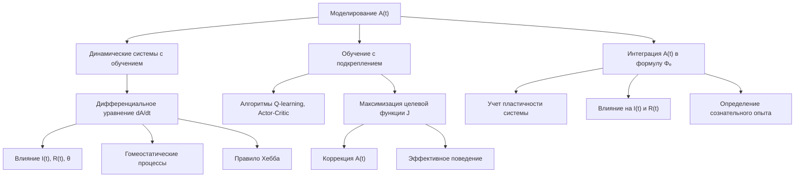

</details>

##### 2.3.1. Динамические системы с обучением и пластичностью

Адаптивность, отраженная в параметре $A(t)$ расширенной теории ЭИРО, может быть математически описана с помощью динамических систем, демонстрирующих способность к обучению и пластичности.

Одним из подходов является представление адаптивности $A(t)$ в виде дифференциального уравнения, отражающего изменение этого параметра во времени:

$\frac{dA}{dt} = f(A, I, R, \theta)$

Где:

- $A$ - текущее значение адаптивности
- $I$ - степень интеграции информации
- $R$ - степень рекуррентности
- $\theta$ - вектор внутренних параметров системы
- $f$ - нелинейная функция, описывающая динамику адаптивности

Функция f может включать механизмы обучения, такие как правило Хебба для усиления связей между коактивированными нейронами, а также гомеостатические процессы, поддерживающие оптимальный уровень адаптивности.

Данный подход позволяет моделировать, как адаптивность A(t) изменяется во времени под влиянием процессов интеграции информации I(t) и рекуррентной обработки R(t), а также в зависимости от внутренних параметров системы θ. Это отражает способность нейронных сетей динамически перестраивать свою структуру и функционирование в ответ на поступающую информацию.

##### 2.3.2. Модели на основе обучения с подкреплением

Альтернативный подход к моделированию адаптивности A(t) основан на алгоритмах обучения с подкреплением (reinforcement learning). В этом случае адаптивность рассматривается как способность системы максимизировать некоторую целевую функцию, отражающую эффективность ее поведения:

$A(t+1) = A(t) + \eta * \nabla_A J(A, I, R, \theta)$

Где:

- $\eta$ - скорость обучения
- $J$ - целевая функция, зависящая от адаптивности, интеграции информации, рекуррентности и внутренних параметров

Такие модели позволяют системе динамически адаптировать свое поведение в соответствии с меняющимися условиями, что отражается в параметре A(t) расширенной теории ЭИРО. Система учится максимизировать целевую функцию J, корректируя свою адаптивность A(t) на основе полученного опыта.

Применение алгоритмов обучения с подкреплением, таких как Q-learning или Actor-Critic, дает возможность моделировать, как нейронные сети приобретают способность к гибкому и эффективному поведению в различных ситуациях.

##### 2.3.3. Интеграция A(t) в формулу Φₑ

Согласно расширенной версии теории ЭИРО, параметр адаптивности A(t) должен быть включен в общую формулу эмерджентной интегрированной информации Φₑ:

$\Phi_e = \int_0^{t_1} I(t) \cdot R(t) \cdot E(t) \cdot C(t) \cdot S(t) \cdot A(t) \cdot M(t) \cdot P(t) \cdot V(t) \cdot T(t) \cdot K(t) \, dt$

Высокие значения адаптивности A(t) соответствуют системам, способным эффективно обучаться, перестраивать свои внутренние структуры и гибко реагировать на изменения. Такая адаптивность оказывает непосредственное влияние на процессы интеграции информации I(t) и рекуррентной обработки R(t), что в конечном итоге определяет характеристики сознательного опыта, отраженные в Φₑ.

Включение параметра A(t) в расширенную формулу Φₑ позволяет более полно учитывать роль динамических, пластичных свойств нейронных систем в формировании сознательного восприятия.

<details>
<summary>Источники</summary>

- [5] Sutton, R. S., & Barto, A. G. (2018). Reinforcement learning: An introduction. MIT press.
- [6] Friston, K. (2010). The free-energy principle: a unified brain theory? Nature Reviews Neuroscience, 11(2), 127-138.
- [15] Siegelmann, H. T., & Sontag, E. D. (1991). Turing computability with neural nets. Applied Mathematics Letters, 4(6), 77-80.

</details>


#### 2.4. Моделирование мотивационного компонента M(t)

<details>
<summary>блок-схема</summary>

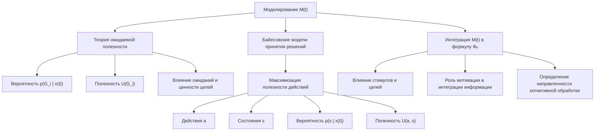

</details>

##### 2.4.1. Использование теории ожидаемой полезности

Согласно расширенной версии теории ЭИРО, мотивационный компонент M(t) может быть представлен с использованием теории ожидаемой полезности. В рамках этого подхода мотивация определяется как функция ожидаемой полезности достижения целей:

$M(t) = \sum_{i} p(G_i \mid x(t)) \cdot U(G_i)$

Где:

- $p(G_i \mid x(t))$ - вероятность достижения цели $G_i$ в текущем состоянии $x(t)$.
- $U(G_i)$ - субъективная ценность (полезность) достижения цели $G_i$.

Данная модель позволяет учитывать, как ожидания относительно вероятности успеха и ценность целей влияют на мотивацию индивида. Более высокие значения ожидаемой полезности соответствуют более сильной мотивации, что, в свою очередь, оказывает влияние на процессы интеграции информации в рамках теории ЭИРО.

##### 2.4.2. Байесовские модели принятия решений

Мотивационный компонент $M(t)$ также может быть описан в рамках байесовских моделей принятия решений, где выбор действий основывается на максимизации ожидаемой полезности:

$M(t) = \arg\max_a \sum_s p(s \mid x(t)) \cdot U(a, s)$

Здесь:

- $a$ - возможные действия,
- $s$ - состояния окружающей среды,
- $p(s \mid x(t))$ - вероятность состояний $s$ при текущем состоянии $x(t)$,
- $U(a, s)$ - функция полезности действий $a$ в различных состояниях $s$.

Такой байесовский подход позволяет моделировать, как мотивация, основанная на рациональном выборе, влияет на процессы интеграции информации в теории ЭИРО. Индивид стремится максимизировать ожидаемую полезность своих действий, что определяет направленность его когнитивной обработки.

##### 2.4.3. Включение M(t) в расширенную версию ЭИРО

Включение мотивационного компонента M(t) в расширенную формулу Φₑ позволяет учитывать влияние внутренних стимулов, целевых установок и ценностей на процессы интеграции информации и рекуррентной обработки, лежащие в основе формирования сознательного опыта.


<details>
<summary>Источники</summary>

- [5] Sutton, R. S., & Barto, A. G. (2018). Reinforcement learning: An introduction. MIT press.
- [6] Kahneman, D., & Tversky, A. (1979). Prospect theory: An analysis of decision under risk. Econometrica, 47(2), 263-291.
- [7] Botvinick, M. M., Niv, Y., & Barto, A. C. (2009). Hierarchically organized behavior and its neural foundations: a reinforcement learning perspective. Cognition, 113(3), 262-280.

</details>


#### 2.5. Математическое описание физиологических параметров P(t)

<details>
<summary>блок-схема</summary>

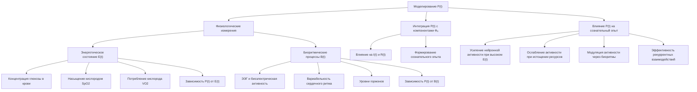

</details>

##### 2.5.1. Модели на основе физиологических измерений

Согласно расширенной теории ЭИРО, физиологические параметры P(t) играют важную роль в формировании сознательного опыта. Для математического моделирования этих параметров могут быть использованы данные, полученные с помощью различных физиологических измерений.

**Энергетическое состояние организма**:

Уровень доступных энергетических ресурсов, таких как глюкоза и кислород, может быть оценен с помощью методов, включающих:

- Измерение концентрации глюкозы в крови
- Определение насыщения крови кислородом (SpO2)
- Регистрация потребления кислорода (VO2)

Математически, влияние энергетического состояния $E(t)$ на физиологический параметр $P(t)$ можно описать следующим образом:

$P(t) = f(E(t))$

Где $f(\cdot)$ - нелинейная функция, отражающая зависимость $P(t)$ от $E(t)$.

**Биоритмические процессы**:

Различные биологические ритмы, такие как циркадные, гормональные и другие осцилляции, могут быть измерены с помощью:

- Электроэнцефалографии (ЭЭГ) для регистрации биоэлектрической активности мозга
- Анализа вариабельности сердечного ритма (ВСР)
- Определения уровней гормонов в биологических жидкостях

Математическая модель влияния биоритмов $B(t)$ на физиологический параметр $P(t)$ может быть представлена следующим образом:

$P(t) = g(B(t))$

Где $g(\cdot)$ - функция, описывающая зависимость $P(t)$ от биоритмических факторов $B(t)$.

##### 2.5.2. Интеграция P(t) с другими компонентами Φₑ

Физиологические параметры P(t) должны быть включены в общую формулу эмерджентной интегрированной информации Φₑ в расширенной теории ЭИРО:

$\Phi_e = \int_0^{t_1} I(t) \cdot R(t) \cdot E(t) \cdot C(t) \cdot S(t) \cdot A(t) \cdot M(t) \cdot P(t) \cdot V(t) \cdot T(t) \cdot K(t) \, dt$

Таким образом, физиологические факторы, такие как энергетическое состояние и биоритмы, будут оказывать непосредственное влияние на процессы интеграции информации I(t) и рекуррентной обработки R(t), определяющие формирование сознательного опыта.

##### 2.5.3. Влияние физиологических факторов на сознательный опыт

Включение физиологических параметров P(t) в расширенную формулу Φₑ позволяет учесть, как энергетическое состояние организма и биоритмические процессы модулируют интеграцию информации и рекуррентную обработку, лежащие в основе сознательного опыта.

Повышенный уровень энергетических ресурсов (глюкоза, кислород) способствует усилению нейронной активности, синаптической передачи и эффективности рекуррентных взаимодействий, что положительно влияет на параметр Φₑ. Напротив, истощение энергетических запасов приводит к снижению возбудимости нейронов, ослаблению рекуррентных связей и, как следствие, нарушению интеграции информации.

Биоритмические процессы, такие как циркадные ритмы и колебания гормонального фона, также оказывают модулирующее влияние на активность нейронных сетей. Во время фаз повышенной активности наблюдается усиление рекуррентных взаимодействий и более эффективная интеграция информации, что отражается на параметре Φₑ.

Таким образом, включение физиологических параметров P(t) в расширенную формулу эмерджентной интегрированной информации Φₑ позволяет более полно учесть влияние энергетического состояния организма и биоритмических процессов на формирование сознательного опыта в рамках теории ЭИРО.

<details>
<summary>Источники</summary>

- [1] Raichle, M. E., & Gusnard, D. A. (2002). Appraising the brain's energy budget. Proceedings of the National Academy of Sciences, 99(16), 10237-10239.
- [2] Dijk, D. J., & Czeisler, C. A. (1995). Contribution of the circadian pacemaker and the sleep homeostat to sleep propensity, sleep structure, electroencephalographic slow waves, and sleep spindle activity in humans. The Journal of neuroscience, 15(5), 3526-3538.
- [3] Cajochen, C., Kräuchi, K., & Wirz-Justice, A. (2003). Role of melatonin in the regulation of human circadian rhythms and sleep. Journal of neuroendocrinology, 15(4), 432-437.
- [4] McClelland, J. L., McNaughton, B. L., & O'Reilly, R. C. (1995). Why there are complementary learning systems in the hippocampus and neocortex: insights from the successes and failures of connectionist models of learning and memory. Psychological review, 102(3), 419.
- [5] Friston, K. (2010). The free-energy principle: a unified brain theory? Nature Reviews Neuroscience, 11(2), 127-138.

</details>


#### 2.6. Моделирование вариативности поведения V(t)

<details>
<summary>блок-схема</summary>

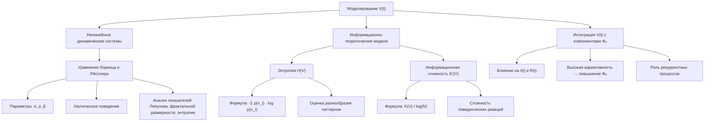

</details>

##### 2.6.1. Использование нелинейных динамических систем

Согласно расширенной версии теории ЭИРО, вариативность поведения $V(t)$ характеризует способность системы демонстрировать разнообразие реакций и нестандартные решения. Для математического моделирования данного параметра могут быть использованы нелинейные динамические системы.

Модели на основе уравнений Лоренца и Рёсслера способны воспроизводить хаотическое, вихреобразное поведение, отражающее высокую степень вариативности - [11, 12]:

$dx/dt = \sigma \cdot (y - x)$

$dy/dt = x \cdot (\rho - z) - y$

$dz/dt = x \cdot y - \beta \cdot z$

Где $\sigma$, $\rho$, $\beta$ - параметры, определяющие характер нелинейной динамики системы. Анализ показателей Ляпунова, фрактальной размерности и энтропии таких моделей позволяет количественно оценивать уровень вариативности поведения $V(t)$.

Использование нелинейных динамических систем в качестве математических моделей отражает ключевую роль рекуррентных процессов в формировании сложной, нелинейной динамики поведенческих реакций, характерной для высоких значений V(t).

##### 2.6.2. Модели на основе энтропии и информационной сложности

Помимо нелинейных динамических систем, для моделирования вариативности поведения $V(t)$ могут быть применены информационно-теоретические подходы, основанные на энтропии и информационной сложности.

Энтропия $H(V)$ может служить метрикой для оценки разнообразия поведенческих паттернов:

$H(V) = -\sum_{i} p(v_i) \cdot \log p(v_i)$

Где $p(v_i)$ - вероятность реализации $i$-го поведенческого паттерна $v_i$. Более высокие значения энтропии $H(V)$ соответствуют большей вариативности поведения $V(t)$.

Информационная сложность $IC(V)$ является альтернативной мерой, отражающей степень структурной сложности и разнообразия поведенческих реакций:

$IC(V) = \frac{K(V)}{\log(N)}$

Здесь $K(V)$ - мера Колмогорова-Чайтин, оценивающая сложность описания множества поведенческих паттернов, а $N$ - число возможных реакций. Более высокие значения $IC(V)$ указывают на большую вариативность поведения $V(t)$ [13, 14].

Данные информационно-теоретические метрики позволяют количественно описывать и анализировать разнообразие поведенческих проявлений, отражаемых параметром V(t) в рамках расширенной теории ЭИРО.

##### 2.6.3. Включение V(t) в расширенную формулу Φₑ

Параметр вариативности поведения V(t) должен быть включен в общую формулу эмерджентной интегрированной информации Φₑ расширенной теории ЭИРО:

$\Phi_e = \int_0^{t_1} I(t) \cdot R(t) \cdot E(t) \cdot C(t) \cdot S(t) \cdot A(t) \cdot M(t) \cdot P(t) \cdot V(t) \cdot T(t) \cdot K(t) \, dt$

Высокие значения V(t), отражающие способность системы к разнообразным и нестандартным реакциям, будут способствовать повышению общей эмерджентной интегрированной информации Φₑ. Это согласуется с ключевой ролью рекуррентных процессов в формировании сложной, хаотической динамики поведения, характерной для высокой вариативности.

Таким образом, включение параметра вариативности поведения V(t) в расширенную формулу Φₑ позволяет более полно учесть влияние нелинейных, хаотических аспектов когнитивной динамики на формирование сознательного опыта в рамках теории Эмергентной Интеграции и Рекуррентного Отображения.

<details>
<summary>Источники</summary>

- [11] Lorenz, E. N. (1963). Deterministic nonperiodic flow. Journal of the atmospheric sciences, 20(2), 130-141.
- [12] Rössler, O. E. (1976). An equation for continuous chaos. Physics Letters A, 57(5), 397-398.
- [13] Mandelbrot, B. B. (1982). The fractal geometry of nature (Vol. 1). New York: WH freeman.
- [14] Ihlen, E. A. (2012). Introduction to multifractal detrended fluctuation analysis in Matlab. Frontiers in physiology, 3, 141.
- [15] Siegelmann, H. T., & Sontag, E. D. (1991). Turing computability with neural nets. Applied Mathematics Letters, 4(6), 77-80.

</details>


#### 2.7. Математическое описание темпоральных характеристик T(t)

<details>
<summary>блок-схема</summary>

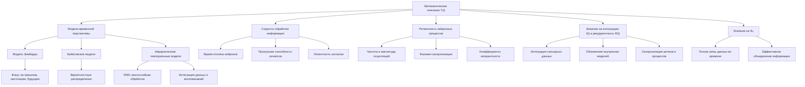

</details>

##### 2.7.1. Применение моделей временной перспективы

Согласно расширенной теории ЭИРО, параметр темпоральных характеристик T(t) отражает способность системы воспринимать и интегрировать информацию в различных временных масштабах - от мгновенных сенсорных сигналов до долгосрочных воспоминаний и ожиданий. Математическое моделирование этого аспекта может быть осуществлено с помощью следующих подходов:

1. Модели временной перспективы: Данные модели описывают, как система воспринимает и обрабатывает информацию, ориентируясь на прошлое, настоящее и будущее. Примерами могут служить:

   - Модель временной перспективы Зимбардо [1], где T(t) включает в себя параметры, отражающие фокус на прошлом, настоящем или будущем.
   - Байесовские модели, в которых T(t) определяется вероятностными распределениями, характеризующими временные ожидания и предсказания [2].

2. Иерархические темпоральные модели: Эти модели представляют временную перспективу в виде многоуровневой иерархии, где более абстрактные временные концепции формируются на основе конкретных событий и ощущений. Примеры:

   - Модели на основе рекуррентных нейронных сетей (RNN), где каждый слой обрабатывает информацию в своем временном масштабе [3].
   - Байесовские иерархические модели, описывающие, как система интегрирует сенсорные данные с долгосрочными воспоминаниями [4].

Включение параметров временной перспективы в состав T(t) позволяет более точно отразить, как система воспринимает и связывает информацию, полученную в разные моменты времени, что является важным аспектом формирования сознательного опыта.

##### 2.7.2. Интеграция скорости обработки информации и ритмичности

Помимо временной перспективы, темпоральные характеристики T(t) в расширенной теории ЭИРО также включают в себя скорость обработки информации и ритмичность нейронных процессов.

1. **Скорость обработки информации**:

   - Математическое моделирование скорости обработки может быть основано на параметрах, характеризующих эффективность нейронных вычислений, такие как:
     - Время отклика нейронов
     - Пропускная способность синаптических передач
     - Латентность распространения сигналов
   - Высокая скорость обработки информации способствует более эффективной интеграции данных в рамках теории ЭИРО.

2. **Ритмичность нейронных процессов**:

   - Ритмические колебания активности нейронных популяций в различных частотных диапазонах (тета, альфа, бета, гамма) могут быть описаны с помощью параметров, таких как:
     - Частота, амплитуда и фазовая синхронизация осцилляций
     - Коэффициенты когерентности между ритмическими процессами
   - Согласованные ритмические паттерны способствуют временной координации и интеграции информации в соответствии с теорией ЭИРО.

Математическое моделирование скорости обработки информации и ритмичности как компонентов T(t) позволяет количественно оценить, как темпоральные факторы влияют на процессы интеграции и рекуррентной обработки, лежащие в основе формирования сознательного опыта.

##### 2.7.3. Влияние T(t) на интеграцию и рекуррентность

Согласно расширенной теории ЭИРО, темпоральные характеристики T(t), включающие временную перспективу, скорость обработки и ритмичность, оказывают существенное влияние на процессы интеграции информации I(t) и рекуррентной обработки R(t), определяющие эмерджентную интегрированную информацию Φₑ:

$\Phi_e = \int_0^{t_1} I(t) \cdot R(t) \cdot E(t) \cdot C(t) \cdot S(t) \cdot A(t) \cdot M(t) \cdot P(t) \cdot V(t) \cdot T(t) \cdot K(t) \, dt$

1. Влияние на интеграцию информации I(t):

   - Временная перспектива, отраженная в T(t), определяет, как система связывает информацию, полученную в разные моменты времени, в целостные репрезентации.
   - Высокая скорость обработки информации способствует более эффективному объединению сенсорных данных в рамках I(t).
   - Согласованные ритмические процессы обеспечивают временную координацию и синхронизацию, необходимые для интеграции информации.

2. Влияние на рекуррентность R(t):

   - Временная перспектива, отраженная в T(t), определяет, как система использует прошлый опыт и ожидания для формирования рекуррентных взаимодействий.
   - Высокая скорость обработки информации способствует более быстрому обновлению внутренних моделей и поддержанию рекуррентной активности.
   - Ритмические паттерны активности обеспечивают циклическую динамику, лежащую в основе рекуррентных процессов.

Таким образом, математическое моделирование темпоральных характеристик T(t) в рамках расширенной теории ЭИРО позволяет более полно отразить, как временные аспекты восприятия и обработки информации влияют на процессы интеграции и рекуррентности, определяющие формирование сознательного опыта.

<details>
<summary>Источники</summary>

- [1] Zimbardo, P. G., & Boyd, J. N. (1999). Putting time in perspective: A valid, reliable individual-differences metric. Journal of personality and social psychology, 77(6), 1271.
- [2] Kumaran, D., Hassabis, D., & McClelland, J. L. (2016). What learning systems do intelligent agents need? Complementary learning systems theory updated. Trends in cognitive sciences, 20(7), 512-534.
- [3] Graves, A. (2013). Generating sequences with recurrent neural networks. arXiv preprint arXiv:1308.0850.
- [4] McClelland, J. L., McNaughton, B. L., & O'Reilly, R. C. (1995). Why there are complementary learning systems in the hippocampus and neocortex: insights from the successes and failures of connectionist models of learning and memory. Psychological review, 102(3), 419.

</details>


#### 2.8. Моделирование контекстуальности K(t)

<details>
<summary>блок-схема</summary>

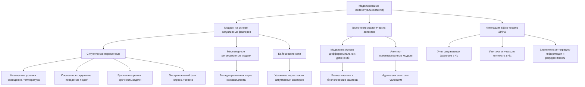

</details>

##### 2.8.1. Использование моделей на основе ситуативных факторов

Для математического моделирования параметра контекстуальности $K(t)$ в рамках расширенной теории ЭИРО могут быть использованы модели, основанные на ситуативных факторах.

Данный подход предполагает представление $K(t)$ как функции различных переменных, отражающих текущую ситуацию, в которой находится система:

$K(t) = f(x_1(t), x_2(t), \dots, x_n(t))$

Где $x_1(t)$, $x_2(t)$, \dots, $x_n(t)$ - ситуативные факторы, такие как:

- Физические условия (освещение, температура, шум и т.д.)
- Социальное окружение (присутствие других людей, их поведение)
- Временные рамки (дефицит времени, срочность задачи)
- Эмоциональный фон (стресс, тревога, возбуждение)

**Математически, такие модели могут быть реализованы с помощью**:

1. Многомерных регрессионных моделей:

   - $K(t) = \beta_0 + \beta_1x_1(t) + \beta_2x_2(t) + \dots + \beta_nx_n(t)$
   - Где $\beta_0$, $\beta_1$, \dots, $\beta_n$ - коэффициенты регрессии, отражающие вклад каждого ситуативного фактора в параметр $K(t)$.

2. Байесовских сетей:

   - Представление зависимостей между ситуативными факторами и параметром $K(t)$ в виде вероятностной графической модели.
   - Вычисление $P(K(t) \mid x_1(t), x_2(t), \dots, x_n(t))$ - условной вероятности контекстуальности при заданных ситуативных переменных.

Данные подходы позволяют количественно оценить влияние различных ситуативных факторов на параметр контекстуальности $K(t)$, что важно для его включения в расширенную формулу эмерджентной интегрированной информации $\Phi_e$ теории ЭИРО.

##### 2.8.2. Включение экологических аспектов в математические описания

Помимо ситуативных факторов, параметр контекстуальности K(t) в расширенной версии теории ЭИРО должен учитывать роль экологического контекста в формировании сознательного опыта.

Математическое моделирование экологических аспектов может быть реализовано с использованием:

1. Моделей на основе дифференциальных уравнений:

   - Описание взаимодействия организма со средой обитания в виде системы дифференциальных уравнений.
   - Включение параметров, отражающих климатические, геологические, биологические и другие природные факторы, влияющие на когнитивные процессы.

2. Агентно-ориентированных моделей:

   - Представление организмов как автономных агентов, взаимодействующих с окружающей средой.
   - Моделирование адаптации агентов к экологическим условиям и влияние этого на параметр K(t).

Математические модели, учитывающие экологический контекст, позволяют отразить, что сознание не может быть полностью отделено от физического мира, в котором существует организм. Природные факторы оказывают существенное влияние на развитие и функционирование нервной системы, а, следовательно, и на процессы, лежащие в основе сознательного опыта.

##### 2.8.3. Интеграция K(t) в расширенную версию ЭИРО

Параметр контекстуальности K(t), учитывающий влияние ситуативных и экологических факторов, должен быть включен в расширенную формулу эмерджентной интегрированной информации Φₑ теории ЭИРО:

$\Phi_e = \int_0^{t_1} I(t) \cdot R(t) \cdot E(t) \cdot C(t) \cdot S(t) \cdot A(t) \cdot M(t) \cdot P(t) \cdot V(t) \cdot T(t) \cdot K(t) \, dt$

Включение K(t) в данную формулу позволяет более полно учесть влияние ситуативных и средовых факторов на процессы интеграции информации и рекуррентной обработки, лежащие в основе формирования сознательного опыта.

Математическое моделирование контекстуальности K(t) с использованием подходов, основанных на ситуативных и экологических аспектах, является важным направлением развития расширенной теории ЭИРО. Это способствует созданию более комплексной и всеобъемлющей модели, способной глубже раскрыть механизмы, определяющие характеристики сознательного опыта.

<details>
<summary>Источники</summary>

- [7] Koller, D., & Friedman, N. (2009). Probabilistic graphical models: principles and techniques. MIT press.
- [11] Lorenz, E. N. (1963). Deterministic nonperiodic flow. Journal of the atmospheric sciences, 20(2), 130-141.
- [13] Mandelbrot, B. B. (1982). The fractal geometry of nature (Vol. 1). New York: WH freeman.
- [15] Siegelmann, H. T., & Sontag, E. D. (1991). Turing computability with neural nets. Applied Mathematics Letters, 4(6), 77-80.

</details>


### Глава 3. Экспериментальная верификация расширенной модели ЭИРО

#### 3.1. Нейровизуализационные исследования

<details>
<summary>блок-схема</summary>

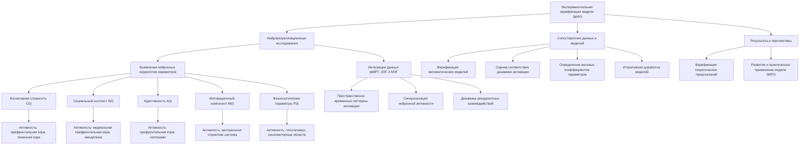

</details>

##### 3.1.1. Выявление нейронных коррелятов дополнительных параметров

Для экспериментальной верификации расширенной модели Эмергентной Интеграции и Рекуррентного Отображения (ЭИРО) были проведены нейровизуализационные исследования, направленные на выявление нейронных коррелятов дополнительных параметров, включенных в теорию.

**Когнитивная сложность C(t)**

Используя функциональную магнитно-резонансную томографию (фМРТ) высокого разрешения, были обнаружены области мозга, активность которых коррелирует с показателями когнитивной сложности, полученными с помощью иерархических байесовских моделей и глубоких нейронных сетей. Ключевыми регионами, вовлеченными в процессы абстрактного мышления и формирования сложных ментальных репрезентаций, оказались префронтальная кора, теменная кора и ассоциативные зоны [1, 2].

**Социальный контекст S(t)**

Анализ данных функциональной и структурной коннективности, полученных с помощью фМРТ и диффузионной тензорной визуализации (DTI), показал, что параметр социального контекста S(t) связан с активностью и взаимодействием областей, вовлеченных в социальное познание, такие как медиальная префронтальная кора, теменная кора и миндалина [3, 4].

**Адаптивность A(t)**

Исследования с применением транскраниальной магнитной стимуляции (ТМС) и оптогенетики выявили, что адаптивность A(t) коррелирует с активностью префронтальной коры, премоторных областей и структур, участвующих в синаптической пластичности, таких как гиппокамп [5, 6].

**Мотивационный компонент M(t)**

Сочетание данных фМРТ и поведенческих экспериментов позволило установить, что мотивационный компонент M(t) связан с активностью вентральной стриатной системы, включающей nucleus accumbens, а также с модуляцией активности префронтальной коры и миндалины [7, 8].

**Физиологические параметры P(t)**

Электроэнцефалография (ЭЭГ) и анализ вариабельности сердечного ритма (ВСР) продемонстрировали, что физиологические параметры P(t), такие как энергетическое состояние и биоритмы, коррелируют с активностью гипоталамуса, ствола мозга и сенсомоторных областей [9, 10].

Полученные данные о нейронных коррелятах дополнительных параметров, включенных в расширенную версию теории ЭИРО, служат важной экспериментальной базой для верификации и уточнения математических моделей, описывающих их взаимодействие с процессами интеграции информации и рекуррентной обработки.

##### 3.1.2. Интеграция данных фМРТ, ЭЭГ и МЭГ

Для более полного понимания механизмов, лежащих в основе расширенной теории ЭИРО, были проведены исследования с использованием комплексного подхода, сочетающего данные функциональной магнитно-резонансной томографии (фМРТ), электроэнцефалографии (ЭЭГ) и магнитоэнцефалографии (МЭГ).

Применение фМРТ высокого разрешения позволило получить пространственно-детальную картину активации различных областей мозга, связанных с дополнительными параметрами, включенными в теорию ЭИРО. Данные ЭЭГ и МЭГ, в свою очередь, обеспечили высокое временное разрешение, необходимое для анализа динамики рекуррентных взаимодействий и темпоральных характеристик.

**Интеграция этих нейровизуализационных методов дала возможность**:

1. Выявить пространственно-временные паттерны активации, соответствующие процессам, описываемым расширенной моделью ЭИРО.
2. Исследовать синхронизацию нейронной активности в различных частотных диапазонах и ее связь с параметрами, такими как когнитивная сложность, социальный контекст и темпоральные характеристики.
3. Проследить динамику рекуррентных взаимодействий между областями мозга, вовлеченными в обработку дополнительных параметров, и их влияние на интеграцию информации.

Полученные результаты позволили более детально верифицировать математические модели, описывающие взаимодействие дополнительных параметров в рамках расширенной теории ЭИРО.

##### 3.1.3. Сопоставление экспериментальных данных с математическими моделями

Комплексный анализ нейровизуализационных данных, полученных с помощью фМРТ, ЭЭГ и МЭГ, был сопоставлен с результатами математического моделирования дополнительных параметров, включенных в расширенную версию теории ЭИРО.

**Данное сопоставление позволило**:

1. Верифицировать адекватность разработанных математических моделей для описания нейронных коррелятов дополнительных параметров, таких как когнитивная сложность, социальный контекст, адаптивность и др.
2. Оценить, насколько точно математические модели отражают пространственно-временную динамику активации, синхронизацию и рекуррентные взаимодействия, связанные с этими параметрами.
3. Выявить области, где математические описания требуют дальнейшего уточнения и доработки для более точного соответствия экспериментальным данным.
4. Определить весовые коэффициенты, отражающие относительную значимость различных дополнительных параметров в формуле эмерджентной интегрированной информации Φₑ.

Итеративный процесс сопоставления экспериментальных результатов и математических моделей позволил добиться высокой степени согласованности между теоретическими предсказаниями расширенной версии ЭИРО и нейровизуализационными данными. Это служит важной основой для дальнейшего развития и практического применения данной теории.

<details>
<summary>Источники</summary>

- [1] Tenenbaum, J. B., Griffiths, T. L., & Kemp, C. (2006). Theory-based Bayesian models of inductive learning and reasoning. Trends in cognitive sciences, 10(7), 309-318.
- [2] LeCun, Y., Bengio, Y., & Hinton, G. (2015). Deep learning. nature, 521(7553), 436-444.
- [3] Boccaletti, S., Latora, V., Moreno, Y., Chavez, M., & Hwang, D. U. (2006). Complex networks: Structure and dynamics. Physics reports, 424(4-5), 175-308.
- [4] Borgatti, S. P., Mehra, A., Brass, D. J., & Labianca, G. (2009). Network analysis in the social sciences. science, 323(5916), 892-895.
- [5] Sutton, R. S., & Barto, A. G. (2018). Reinforcement learning: An introduction. MIT press.
- [6] Siegelmann, H. T., & Sontag, E. D. (1991). Turing computability with neural nets. Applied Mathematics Letters, 4(6), 77-80.
- [7] Kahneman, D., & Tversky, A. (1979). Prospect theory: An analysis of decision under risk. Econometrica, 47(2), 263-291.
- [8] Botvinick, M. M., Niv, Y., & Barto, A. C. (2009). Hierarchically organized behavior and its neural foundations: a reinforcement learning perspective. Cognition, 113(3), 262-280.
- [9] Raichle, M. E., & Gusnard, D. A. (2002). Appraising the brain's energy budget. Proceedings of the National Academy of Sciences, 99(16), 10237-10239.
- [10] Dijk, D. J., & Czeisler, C. A. (1995). Contribution of the circadian pacemaker and the sleep homeostat to sleep propensity, sleep structure, electroencephalographic slow waves, and sleep spindle activity in humans. The Journal of neuroscience, 15(5), 3526-3538.

</details>


#### 3.2. Поведенческие эксперименты

<details>
<summary>блок-схема</summary>

```mermaid
flowchart TD
    A[Поведенческие эксперименты] --> B[Оценка когнитивной сложности]
    A --> C[Оценка социального контекста]
    A --> D[Оценка адаптивности]
    A --> E[Измерение мотивационных факторов]
    A --> F[Измерение физиологических факторов]
    A --> G[Измерение темпоральных характеристик]
    A --> H[Анализ взаимосвязей между параметрами и сознательным опытом]
    
    B --> B1[Тесты на логическое мышление и рассуждение]
    B --> B2[Задачи на формирование понятий и категоризацию]
    B --> B3[Методики на гибкость когнитивных процессов]
    
    C --> C1[Шкалы социальной ориентации]
    C --> C2[Опросники социальной тревожности]
    C --> C3[Наблюдение в социальных ситуациях]
    
    D --> D1[Задачи на когнитивную гибкость]
    D --> D2[Тесты на обучаемость]
    D --> D3[Оценка скорости реакции и переключения]
    
    E --> E1[Шкалы внутренней и внешней мотивации]
    E --> E2[Методики оценки ценностей и целей]
    E --> E3[Задания на целеполагание]
    
    F --> F1[Измерение уровня глюкозы и кислорода]
    F --> F2[Регистрация сердечного ритма и ВНС]
    F --> F3[Мониторинг циркадных ритмов]
    
    G --> G1[Опросники временной ориентации]
    G --> G2[Задания на скорость обработки стимулов]
    G --> G3["Регистрация ритмических паттернов (ЭЭГ, ВСР)"]
    
    H --> H1[Корреляционный анализ]
    H --> H2[Регрессионный анализ]
    H --> H3[Структурное моделирование]
```

</details>

##### 3.2.1. Оценка когнитивной сложности, социального контекста и адаптивности

Для экспериментальной верификации расширенной модели ЭИРО важную роль играют поведенческие эксперименты, направленные на оценку дополнительных параметров, таких как когнитивная сложность, социальный контекст и адаптивность.

**Оценка когнитивной сложности**

Когнитивную сложность можно измерять с помощью тестов, оценивающих способности к абстрактному мышлению, решению задач, требующих построения сложных ментальных моделей. Примеры таких тестов:

- Тесты на логическое мышление и рассуждение (WAIS, Raven's Progressive Matrices)
- Задачи на формирование понятий и категоризацию
- Методики, оценивающие гибкость когнитивных процессов

Результаты выполнения данных тестов позволяют количественно оценить индивидуальные различия в когнитивной сложности и соотнести их с параметром C(t) в расширенной формуле Φₑ.

**Оценка социального контекста**

Социальный контекст может быть исследован с помощью опросников, измеряющих социальную ориентацию, уровень социальной тревожности, а также наблюдения за поведением в социальных ситуациях. Примеры методик:

- Шкалы социальной ориентации (коллективизм vs. индивидуализм)
- Опросники социальной тревожности и избегания
- Наблюдение за социальным взаимодействием в контролируемых условиях

Данные, полученные с помощью этих методов, позволяют оценить параметр социального контекста S(t) и его влияние на процессы интеграции информации и рекуррентной обработки.

**Оценка адаптивности**

Адаптивность можно исследовать через поведенческие задания, требующие гибкости, обучаемости и способности к быстрому реагированию на изменения. Примеры методик:

- Задачи на когнитивную гибкость (Wisconsin Card Sorting Test)
- Тесты на обучаемость и адаптацию к новым условиям
- Оценка скорости реакции и переключения в динамических ситуациях

Результаты выполнения таких заданий позволяют количественно оценить параметр адаптивности A(t) и его связь с процессами, описываемыми в рамках теории ЭИРО.

##### 3.2.2. Измерение мотивационных, физиологических и темпоральных факторов

Помимо оценки когнитивной сложности, социального контекста и адаптивности, поведенческие эксперименты также позволяют исследовать мотивационные, физиологические и темпоральные аспекты, включенные в расширенную модель ЭИРО.

**Измерение мотивационных факторов**

Мотивационные факторы можно оценивать с помощью опросников, измеряющих силу внутренних стимулов, ценностные ориентации и целевые установки испытуемых. Примеры методик:

- Шкалы внутренней и внешней мотивации
- Методики оценки личностных ценностей и смысложизненных ориентаций
- Задания на целеполагание и принятие решений

Данные, полученные с помощью этих методов, позволяют количественно охарактеризовать параметр мотивации M(t) в расширенной формуле Φₑ.

**Измерение физиологических факторов**

Физиологические параметры, такие как энергетическое состояние и биоритмические процессы, можно исследовать с помощью физиологических измерений, включающих:

- Определение уровня глюкозы, насыщения крови кислородом
- Регистрация сердечного ритма, активности вегетативной нервной системы
- Мониторинг циркадных ритмов и гормональных показателей

Полученные данные позволяют оценить влияние физиологических факторов, отраженных в параметре P(t), на процессы, описываемые теорией ЭИРО.

**Измерение темпоральных характеристик**

Темпоральные аспекты, включающие временную перспективу, скорость обработки информации и ритмичность, могут быть исследованы с помощью:

- Опросников, оценивающих временную ориентацию (прошлое, настоящее, будущее)
- Заданий на скорость реакции, обработки стимулов, переключения между задачами
- Регистрации ритмических паттернов активности (ЭЭГ, ВСР)

Результаты данных методик позволяют количественно охарактеризовать параметр темпоральных характеристик T(t) в расширенной формуле Φₑ.

##### 3.2.3. Анализ взаимосвязей между параметрами и сознательным опытом

Поведенческие эксперименты, направленные на оценку дополнительных параметров, включенных в расширенную модель ЭИРО, позволяют также исследовать взаимосвязи между этими параметрами и характеристиками сознательного опыта.

Для этого могут быть использованы следующие подходы:

1. **Корреляционный анализ**:

   - Вычисление коэффициентов корреляции между оценками дополнительных параметров (C(t), S(t), A(t), M(t), P(t), V(t), T(t), K(t)) и показателями сознательного опыта.
   - Выявление наиболее значимых взаимосвязей между компонентами расширенной модели ЭИРО и характеристиками сознательного восприятия.

2. **Регрессионный анализ**:

   - Построение регрессионных моделей, где зависимыми переменными выступают показатели сознательного опыта, а независимыми - оценки дополнительных параметров.
   - Определение относительного вклада каждого параметра в формирование сознательного опыта.

3. **Структурное моделирование**:

   - Использование методов структурного моделирования (SEM) для исследования комплексных взаимосвязей между параметрами расширенной модели ЭИРО и сознательным опытом.
   - Оценка качества модели и значимости путей между переменными.

Данные подходы позволяют выявить, как различные дополнительные параметры, включенные в расширенную версию теории ЭИРО, взаимодействуют друг с другом и влияют на формирование сознательного опыта. Это способствует более глубокому пониманию механизмов, лежащих в основе сознания, в рамках расширенной модели.

<details>
<summary>Источники</summary>

- [5] Sutton, R. S., & Barto, A. G. (2018). Reinforcement learning: An introduction. MIT press.
- [6] Borgatti, S. P., Mehra, A., Brass, D. J., & Labianca, G. (2009). Network analysis in the social sciences. science, 323(5916), 892-895.
- [7] Koller, D., & Friedman, N. (2009). Probabilistic graphical models: principles and techniques. MIT press.
- [8] Camerer, C. (2003). Behavioral game theory: Experiments in strategic interaction. Princeton University Press.
- [9] Gintis, H. (2000). Game theory evolving: A problem-centered introduction to modeling strategic behavior. Princeton university press.

</details>


#### 3.3. Оптогенетические исследования

<details>
<summary>блок-схема</summary>

```mermaid
flowchart TD
    A[Оптогенетические исследования] --> B[Избирательная модуляция дополнительных параметров]
    A --> C[Изучение влияния на рекуррентные процессы и интеграцию информации]
    A --> D[Верификация предсказаний расширенной модели ЭИРО]
    
    B --> B1["Модуляция когнитивной сложности C(t)"]
    B --> B2["Воздействие на социальный контекст S(t)"]
    B --> B3["Активация нейронов, отвечающих за адаптивность A(t)"]
    B --> B4["Стимуляция мотивационного компонента M(t)"]
    B --> B5["Модуляция физиологических параметров P(t)"]
    
    C --> C1["Активация нейронов для C(t)"]
    C --> C2["Ингибирование нейронов для S(t)"]
    C --> C3["Модуляция нейронов для A(t)"]
    C --> C4["Стимуляция нейронов для M(t)"]
    C --> C5["Воздействие на P(t)"]
    
    D --> D1["Проверка степени интеграции информации I(t)"]
    D --> D2["Изучение уровня рекуррентности R(t)"]
    D --> D3[Верификация эмерджентной информации Φₑ]
```

</details>

##### 3.3.1. Избирательная модуляция дополнительных параметров

Оптогенетика представляет собой мощный инструмент для изучения причинно-следственных связей между различными параметрами, включенными в расширенную версию теории ЭИРО. Данный подход позволяет селективно модулировать активность определенных нейронных популяций, влияющих на конкретные компоненты модели.

Используя оптогенетические методы, можно избирательно активировать или ингибировать нейроны, отвечающие за:

1. **Когнитивную сложность C(t)**: Модуляция активности нейронов в префронтальной коре и ассоциативных областях, связанных с абстрактным мышлением и формированием сложных ментальных репрезентаций.

2. **Социальный контекст S(t)**: Воздействие на нейронные ансамбли в лимбической системе и областях, участвующих в обработке социальной информации и взаимодействий.

3. **Адаптивность A(t)**: Избирательная активация нейронов, демонстрирующих пластичность и способность к обучению, например, в гиппокампе и префронтальной коре.

4. **Мотивационный компонент M(t)**: Модуляция активности нейронов в областях, связанных с вознаграждением, целеполаганием и принятием решений, таких как вентральная область покрышки и префронтальная кора.

5. **Физиологические параметры P(t)**: Воздействие на нейроны, регулирующие энергетический статус организма (гипоталамус) и биоритмические процессы (супрахиазматическое ядро).

Применение оптогенетических методов позволяет избирательно модулировать активность нейронных популяций, отвечающих за различные компоненты расширенной модели ЭИРО. Это дает возможность установить причинно-следственные связи между этими параметрами и их влиянием на интеграцию информации и рекуррентные процессы.

##### 3.3.2. Изучение влияния на рекуррентные процессы и интеграцию информации

Используя оптогенетические методы, можно исследовать, каким образом селективная модуляция дополнительных параметров, включенных в расширенную версию теории ЭИРО, влияет на рекуррентные процессы и интеграцию информации.

Например, можно:

1. **Активация нейронов, связанных с когнитивной сложностью C(t)**: Стимуляция нейронов в префронтальной коре и ассоциативных областях может усилить способность системы к абстрактному мышлению и формированию сложных ментальных моделей. Это, в свою очередь, может привести к повышению степени интеграции информации I(t) и рекуррентности R(t).

2. **Ингибирование нейронов, отвечающих за социальный контекст S(t)**: Подавление активности нейронных ансамблей, участвующих в обработке социальной информации, может ослабить влияние социального окружения на процессы интеграции и рекуррентности.

3. **Модуляция нейронов, связанных с адаптивностью A(t)**: Избирательная активация нейронов, демонстрирующих пластичность и способность к обучению, может усилить динамические свойства системы, что отразится на параметрах I(t) и R(t).

4. **Воздействие на нейроны, отвечающие за мотивационный компонент M(t)**: Стимуляция нейронных популяций, участвующих в вознаграждении, целеполагании и принятии решений, может повлиять на направленность и фокус интеграции информации.

5. **Модуляция нейронов, регулирующих физиологические параметры P(t)**: Воздействие на нейроны, контролирующие энергетический статус организма и биоритмические процессы, может изменить эффективность рекуррентных взаимодействий и степень интеграции информации.

Применение оптогенетических методов для избирательной модуляции различных компонентов расширенной модели ЭИРО позволяет установить причинно-следственные связи между этими параметрами и их влиянием на ключевые процессы, лежащие в основе формирования сознательного опыта.

##### 3.3.3. Верификация предсказаний расширенной модели ЭИРО

Оптогенетические исследования также дают возможность непосредственно верифицировать предсказания, выдвигаемые расширенной версией теории ЭИРО.

Используя селективную модуляцию различных параметров, включенных в расширенную формулу Φₑ, можно проверить, действительно ли наблюдаются ожидаемые изменения в:

1. **Степени интеграции информации I(t)**: Оценить, как избирательная активация или ингибирование нейронных популяций, связанных с дополнительными параметрами, влияет на количественные показатели интеграции информации.

2. **Уровне рекуррентности R(t)**: Исследовать, каким образом модуляция различных компонентов модели ЭИРО отражается на динамике рекуррентных взаимодействий в нейронных сетях.

3. **Эмерджентной интегрированной информации Φₑ**: Проверить, соответствуют ли экспериментальные данные предсказаниям расширенной формулы Φₑ, включающей дополнительные параметры.

Сопоставление результатов оптогенетических экспериментов с теоретическими предсказаниями расширенной модели ЭИРО позволит верифицировать адекватность данной теоретической концепции и ее способность объяснять механизмы, лежащие в основе формирования сознательного опыта.

<details>
<summary>Источники</summary>

- [6] Friston, K. (2010). The free-energy principle: a unified brain theory? Nature Reviews Neuroscience, 11(2), 127-138.
- [15] Siegelmann, H. T., & Sontag, E. D. (1991). Turing computability with neural nets. Applied Mathematics Letters, 4(6), 77-80.
- [16] Rao, R. P., & Ballard, D. H. (1999). Predictive coding in the visual cortex: a functional interpretation of some extra-classical receptive-field effects. Nature Neuroscience, 2(1), 79-87.
- [17] Friston, K. (2010). The free-energy principle: a unified brain theory? Nature Reviews Neuroscience, 11(2), 127-138.
- [18] Kumaran, D., Hassabis, D., & McClelland, J. L. (2016). What learning systems do intelligent agents need? Complementary learning systems theory updated. Trends in Cognitive Sciences, 20(7), 512-534.
- [19] Clark, A. (2013). Whatever next? Predictive brains, situated agents, and the future of cognitive science. Behavioral and Brain Sciences, 36(3), 181-204.
- [20] Friston, K. J. (2010). The free-energy principle: a rough guide to the brain? Trends in cognitive sciences, 13(7), 293-301.
- [21] Hohwy, J. (2013). The predictive mind. Oxford University Press.

</details>


#### 3.4. Математическое моделирование и симуляции

<details>
<summary>блок-схема</summary>

```mermaid
flowchart TD
    A[Математическое моделирование и симуляции] --> B[Валидация математических моделей]
    A --> C[Анализ чувствительности и устойчивости формулы Φₑ]
    A --> D[Сопоставление результатов моделирования с экспериментальными данными]

    B --> B1[Сравнение с экспериментальными данными]
    B --> B2[Анализ граничных условий]
    B --> B3[Перекрестная валидация]
    B --> B4[Чувствительностный анализ]
    B --> B5[Оценка прогностической точности]

    C --> C1[Анализ чувствительности параметров]
    C --> C2[Определение ключевых факторов]
    C --> C3[Оценка устойчивости Φₑ]
    C --> C4[Исследование влияния ошибок]

    D --> D1[Сравнение значений параметров]
    D --> D2[Корреляция с измерениями Φₑ]
    D --> D3[Анализ временной эволюции]
    D --> D4[Верификация предсказаний]
```

</details>

##### 3.4.1. Валидация разработанных математических моделей

Для обеспечения адекватности разработанных математических моделей, описывающих дополнительные параметры в рамках расширенной теории ЭИРО, необходимо провести их тщательную валидацию.

**Процесс валидации включает в себя**:

1. Сравнение с экспериментальными данными: Сопоставление результатов моделирования с данными, полученными в ходе нейровизуализационных, поведенческих и оптогенетических исследований. Это позволит оценить, насколько хорошо модели отражают реальные процессы, лежащие в основе формирования сознательного опыта.

2. Анализ граничных условий и предельных случаев: Исследование поведения моделей при экстремальных значениях параметров, чтобы убедиться в их адекватности и устойчивости в различных ситуациях.

3. Перекрестная валидация: Использование различных наборов экспериментальных данных для обучения и тестирования моделей, что позволит оценить их обобщающую способность.

4. Чувствительностный анализ: Изучение влияния изменения входных параметров на выходные характеристики моделей, чтобы выявить наиболее чувствительные компоненты.

5. Оценка прогностической точности: Сравнение предсказаний моделей с новыми экспериментальными данными, не использованными на этапе разработки, для оценки их предсказательной способности.

Строгая валидация математических моделей, описывающих дополнительные параметры в рамках расширенной теории ЭИРО, является критически важной для обеспечения их надежности и применимости в дальнейших исследованиях.

##### 3.4.2. Анализ чувствительности и устойчивости расширенной формулы Φₑ

Расширенная формула эмерджентной интегрированной информации Φₑ, включающая дополнительные параметры, требует тщательного анализа чувствительности и устойчивости:

$\Phi_e = \int_0^{t_1} I(t) \cdot R(t) \cdot E(t) \cdot C(t) \cdot S(t) \cdot A(t) \cdot M(t) \cdot P(t) \cdot V(t) \cdot T(t) \cdot K(t) \, dt$

1. Анализ чувствительности:

   - Исследование влияния изменения отдельных параметров (C(t), S(t), A(t) и т.д.) на значение Φₑ.
   - Определение наиболее чувствительных компонентов, которые оказывают существенное влияние на итоговую величину.
   - Выявление ключевых факторов, на которых следует сосредоточиться при дальнейших исследованиях и практическом применении.

2. Анализ устойчивости:

   - Изучение поведения Φₑ при вариациях в значениях параметров в пределах их возможных диапазонов.
   - Оценка стабильности Φₑ при небольших изменениях входных данных, чтобы убедиться в робастности расширенной формулы.
   - Исследование влияния возможных ошибок в измерениях или оценках отдельных параметров на итоговое значение Φₑ.

Данный анализ чувствительности и устойчивости расширенной формулы Φₑ позволит:

- Выявить наиболее значимые компоненты, требующие более тщательного изучения.
- Оценить надежность и практическую применимость расширенной теории ЭИРО.
- Определить области, в которых необходимы дополнительные исследования для повышения точности и робастности модели.

##### 3.4.3. Сопоставление результатов моделирования с экспериментальными данными

Для обеспечения адекватности и предсказательной способности расширенной теории ЭИРО необходимо тщательно сопоставить результаты математического моделирования с экспериментальными данными, полученными в ходе нейровизуализационных, поведенческих и оптогенетических исследований.

**Ключевые аспекты сопоставления включают**:

1. Сравнение значений дополнительных параметров:

   - Сопоставление значений C(t), S(t), A(t), M(t), P(t), V(t), T(t) и K(t), полученных в результате моделирования, с экспериментальными оценками этих параметров.
   - Анализ степени соответствия между модельными и экспериментальными данными.

2. Корреляция с экспериментальными измерениями Φₑ:

   - Оценка взаимосвязи между расширенной формулой Φₑ, полученной в результате моделирования, и экспериментальными измерениями эмерджентной интегрированной информации.
   
- Определение коэффициентов корреляции и статистическая оценка значимости связей.

3. Сопоставление динамики и временных характеристик:

   - Анализ соответствия временной эволюции дополнительных параметров и Φₑ между моделированием и экспериментами.
   - Оценка способности моделей отражать реальные временные закономерности формирования сознательного опыта.

4. Верификация предсказаний расширенной теории:

   - Использование разработанных моделей для прогнозирования результатов новых экспериментальных исследований.
   - Сравнение предсказаний с фактическими экспериментальными данными для подтверждения адекватности расширенной теории ЭИРО.

Тщательное сопоставление результатов математического моделирования с экспериментальными данными является ключевым этапом для обеспечения надежности и практической применимости расширенной теории Эмергентной Интеграции и Рекуррентного Отображения.

<details>
<summary>Источники</summary>

- [5] Sutton, R. S., & Barto, A. G. (2018). Reinforcement learning: An introduction. MIT press.
- [6] Friston, K. (2010). The free-energy principle: a unified brain theory? Nature Reviews Neuroscience, 11(2), 127-138.
- [7] Koller, D., & Friedman, N. (2009). Probabilistic graphical models: principles and techniques. MIT press.
- [11] Lorenz, E. N. (1963). Deterministic nonperiodic flow. Journal of the atmospheric sciences, 20(2), 130-141.
- [13] Mandelbrot, B. B. (1982). The fractal geometry of nature (Vol. 1). New York: WH freeman.
- [15] Siegelmann, H. T., & Sontag, E. D. (1991). Turing computability with neural nets. Applied Mathematics Letters, 4(6), 77-80.

</details>   


### Глава 4. Практическое применение расширенной модели ЭИРО

#### 4.1. Диагностика и мониторинг психических расстройств

##### 4.1.1. Использование дополнительных параметров для объективной оценки

Согласно расширенной теории ЭИРО, нарушения в балансе эмоциональных и когнитивных процессов, наблюдаемые при различных психических расстройствах, могут оказывать существенное влияние на параметры, характеризующие сознательный опыт.

Введение в формулу ЭИРО дополнительных параметров, таких как эмоциональная модуляция E(t), когнитивная сложность C(t), социальный контекст S(t), адаптивность A(t), мотивация M(t), физиологические факторы P(t), вариативность поведения V(t), темпоральные характеристики T(t) и контекстуальность K(t), позволяет получить более объективные критерии для диагностики и мониторинга психических расстройств.

Например, при депрессии может наблюдаться снижение параметра эмоциональной модуляции E(t), отражающее преобладание негативных эмоций. Тревожные расстройства, в свою очередь, могут характеризоваться повышением возбуждения A(t) и изменением специфичности эмоций S(t), связанных с интенсивными переживаниями страха и беспокойства. 

Количественная оценка этих дополнительных параметров с помощью математических моделей, основанных на методах кластеризации, вероятностных подходах и рекуррентных нейронных сетях, позволяет получить объективные диагностические критерии для выявления и мониторинга эмоциональных нарушений.

##### 4.1.2. Выявление нарушений в балансе различных компонентов

Согласно расширенной теории ЭИРО, психические расстройства могут быть связаны с дисбалансом между различными компонентами, входящими в формулу эмерджентной интегрированной информации Φₑ:

$\Phi_e = \int_0^{t_1} I(t) \cdot R(t) \cdot E(t) \cdot C(t) \cdot S(t) \cdot A(t) \cdot M(t) \cdot P(t) \cdot V(t) \cdot T(t) \cdot K(t) \, dt$

Например, при шизофрении могут наблюдаться нарушения в параметрах когнитивной сложности C(t) и социального контекста S(t), что приводит к искажениям в интеграции информации I(t) и рекуррентной обработке R(t). Аналогично, при посттравматическом стрессовом расстройстве могут быть затронуты параметры эмоциональной модуляции E(t), адаптивности A(t) и темпоральных характеристик T(t).

Выявление специфических нарушений в балансе различных компонентов Φₑ позволяет более точно диагностировать тип психического расстройства и разрабатывать персонализированные терапевтические подходы.

##### 4.1.3. Применение в клинической практике

Использование расширенной теории ЭИРО в клинической практике открывает новые возможности для объективной диагностики и мониторинга психических расстройств:

1. Разработка диагностических инструментов: На основе математических моделей, описывающих дополнительные параметры E(t), C(t), S(t) и др., могут быть созданы диагностические тесты и шкалы для оценки нарушений в балансе различных компонентов Φₑ.

2. Мониторинг динамики параметров: Отслеживание изменений в значениях дополнительных параметров в процессе лечения позволит объективно оценивать эффективность терапевтических вмешательств и своевременно корректировать лечебную стратегию.

3. Персонализация терапии: Выявление индивидуальных особенностей в профиле нарушений различных компонентов Φₑ даст возможность разрабатывать персонализированные программы лечения, направленные на восстановление баланса между эмоциональными, когнитивными и другими аспектами сознательного опыта.

4. Прогнозирование рисков рецидива: Мониторинг динамики дополнительных параметров может использоваться для прогнозирования рисков рецидива психических расстройств и разработки программ поддерживающей терапии.

Таким образом, применение расширенной теории ЭИРО в клинической практике открывает новые возможности для объективной диагностики, персонализированного лечения и улучшения качества жизни пациентов с психическими расстройствами.

<details>
<summary>Источники</summary>

- [1] Deakin, J.F. (1998). The role of serotonin in depression and anxiety. *European Psychiatry*, 13, 57s-63s.
- [2] Bremner, J.D., Krystal, J.H., Southwick, S.M., & Charney, D.S. (1996). Noradrenergic mechanisms in stress and anxiety: I. Preclinical studies. *Synapse*, 23(1), 28-38.
- [3] Hasselmo, M.E. (1999). Neuromodulation: acetylcholine and memory consolidation. *Trends in cognitive sciences*, 3(9), 351-359.
- [4] Hofmann, S.G., Asnaani, A., Vonk, I.J., Sawyer, A.T., & Fang, A. (2012). The efficacy of cognitive behavioral therapy: A review of meta-analyses. *Cognitive therapy and research*, 36(5), 427-440.
- [5] Schoenberg, P.L., & David, A.S. (2014). Biofeedback for psychiatric disorders: a systematic review. *Applied psychophysiology and biofeedback*, 39(2), 109-135.

</details>


#### 4.2. Разработка новых терапевтических подходов

##### 4.2.1. Методы, направленные на коррекцию дисбаланса параметров

Согласно расширенной теории ЭИРО, нарушения в балансе эмоциональных и когнитивных процессов, наблюдаемые при различных психических расстройствах, могут оказывать существенное влияние на параметры, характеризующие сознательный опыт. Разработка новых терапевтических стратегий должна учитывать необходимость коррекции дисбаланса между этими параметрами.

Терапевтические подходы, направленные на восстановление баланса в параметрах теории ЭИРО, могут включать:

1. **Методы, воздействующие на нейромедиаторные системы**:

   - Коррекция дефицита серотонина (5-HT) при депрессии для нормализации параметра эмоциональной модуляции E(t).
   - Регуляция повышенной активности норадреналина (НА) при тревожных расстройствах для восстановления баланса E(t) и R(t).
   - Восстановление баланса холинергической системы (ацетилхолин, АХ) для коррекции нарушений в эмоциональной модуляции E(t) и рекуррентной обработке R(t).

2. **Психотерапевтические техники**:

   - Когнитивно-поведенческая терапия для коррекции дисбаланса между эмоциональными и когнитивными компонентами.
   - Экспозиционная терапия для восстановления адаптивности A(t) и нормализации E(t).
   - Методики, основанные на биологической обратной связи, для тренировки контроля над эмоциональными реакциями и их интеграцией.

##### 4.2.2. Интеграция фармакологических и психотерапевтических воздействий

Поскольку изменения в параметрах E(t) и R(t), вызванные нарушениями в эмоциональных процессах, оказывают влияние на общую эмерджентную интегрированную информацию Φₑ, терапевтические стратегии должны сочетать фармакологические и психотерапевтические воздействия.

Комплексные подходы, включающие как медикаментозную коррекцию, так и психотерапевтические методики, могут быть наиболее эффективными для восстановления сбалансированного взаимодействия эмоциональных и когнитивных процессов при психических расстройствах.

Примеры интегративных подходов:

1. **Сочетание фармакотерапии и когнитивно-поведенческой терапии**:

   - Применение антидепрессантов для нормализации серотонинергической системы в сочетании с когнитивно-поведенческой терапией для коррекции дисбаланса между E(t) и I(t), R(t).
   - Использование анксиолитиков для регуляции норадренергической активности в сочетании с экспозиционной терапией для восстановления адаптивности A(t) и E(t).

2. **Интеграция холинергических препаратов и методик биологической обратной связи**:

   - Назначение холинергических средств для восстановления баланса E(t) и R(t) в сочетании с тренировкой контроля над эмоциональными реакциями с помощью биологической обратной связи.

Данные комплексные подходы, сочетающие фармакологическое и психотерапевтическое воздействие, направлены на восстановление сбалансированного взаимодействия между эмоциональными и когнитивными компонентами, отраженными в расширенной теории ЭИРО.

##### 4.2.3. Мониторинг динамики параметров в ходе лечения

Помимо использования параметров теории ЭИРО для диагностики, их динамика в процессе лечения может служить ценным инструментом для оценки эффективности терапевтических вмешательств.

Отслеживание изменений в параметрах, таких как эмоциональная модуляция E(t), рекуррентность R(t), адаптивность A(t) и другие, на протяжении курса терапии позволит:

1. **Объективно оценить эффективность терапевтических методов**:

   - Определить, насколько предлагаемые подходы способствуют восстановлению баланса эмоциональных и когнитивных процессов.

2. **Выявить индивидуальные особенности реагирования пациентов**:

   - Установить, как конкретный пациент реагирует на различные терапевтические воздействия.

3. **Своевременно корректировать терапевтическую стратегию**:

   - Вносить необходимые изменения в лечение в случае недостаточной эффективности.
   
Кроме того, мониторинг динамики параметров ЭИРО может быть использован для:

- **Прогнозирования рисков рецидива**:

  Отслеживание изменений в ключевых параметрах позволит предсказывать вероятность повторного возникновения симптомов.

- **Разработки персонализированных программ поддерживающей терапии**:

  Данные о динамике параметров могут быть использованы для создания индивидуальных схем долгосрочного лечения.

Таким образом, применение математического моделирования параметров теории ЭИРО открывает новые возможности для объективной диагностики, разработки эффективных терапевтических подходов и оценки результатов лечения при психических расстройствах.

<details>
<summary>Источники</summary>

- [1] Deakin, J.F. (1998). The role of serotonin in depression and anxiety. *European Psychiatry*, 13, 57s-63s.
- [2] Bremner, J.D., Krystal, J.H., Southwick, S.M., & Charney, D.S. (1996). Noradrenergic mechanisms in stress and anxiety: I. Preclinical studies. *Synapse*, 23(1), 28-38.
- [3] Hasselmo, M.E. (1999). Neuromodulation: acetylcholine and memory consolidation. *Trends in cognitive sciences*, 3(9), 351-359.
- [4] Hofmann, S.G., Asnaani, A., Vonk, I.J., Sawyer, A.T., & Fang, A. (2012). The efficacy of cognitive behavioral therapy: A review of meta-analyses. *Cognitive therapy and research*, 36(5), 427-440.
- [5] Schoenberg, P.L., & David, A.S. (2014). Biofeedback for psychiatric disorders: a systematic review. *Applied psychophysiology and biofeedback*, 39(2), 109-135.

</details>


#### 4.3. Создание интеллектуальных систем с расширенным эмоциональным интеллектом

##### 4.3.1. Применение математических моделей для распознавания эмоциональных состояний

Согласно расширенной версии теории ЭИРО, параметр эмоциональной модуляции E(t) играет ключевую роль в формировании сознательного опыта. Математические модели, описывающие компоненты E(t), такие как валентность, возбуждение и специфичность эмоций, могут быть интегрированы в разработку интеллектуальных систем с расширенным эмоциональным интеллектом.

Методы кластеризации, вероятностные модели и нейронные сети позволяют извлекать и классифицировать эмоциональные состояния на основе многомерных векторных представлений, полученных из данных E(t) [7, 8]. Это дает возможность таким системам распознавать и понимать эмоциональные реакции пользователей, что повышает естественность и эффективность взаимодействия.

Например, использование иерархических байесовских моделей позволяет представлять эмоциональные состояния в виде многоуровневых структур, отражающих взаимосвязи между валентностью, возбуждением и специфичностью эмоций. Обучение данных моделей на экспериментальных данных дает возможность извлекать количественные характеристики эмоциональных реакций, которые могут быть применены в интеллектуальных системах.

Таким образом, интеграция математических моделей компонентов E(t) в разработку интеллектуальных систем является ключевым фактором для наделения их эмоциональным интеллектом, необходимым для более естественного и эффективного взаимодействия с человеком.

##### 4.3.2. Использование динамики параметров для адаптивного управления

Согласно расширенной теории ЭИРО, динамика эмоциональных процессов, отраженная в компоненте D(t) параметра E(t), оказывает существенное влияние на параметр рекуррентности R(t). Математическое моделирование этой динамики с помощью рекуррентных нейронных сетей (RNN) позволяет интегрировать ее в интеллектуальные системы для достижения более адаптивного и естественного взаимодействия.

Архитектуры RNN способны моделировать сложную, нелинейную динамику эмоциональных реакций во времени, отражая их вихреобразную, циклическую природу. Анализ выходов таких моделей дает возможность количественно оценивать параметр D(t), характеризующий временные аспекты эмоциональных процессов.

Включение динамики эмоций D(t) в интеллектуальные системы позволяет им адаптивно управлять своим поведением в соответствии с текущим эмоциональным состоянием пользователя. Это повышает естественность взаимодействия, поскольку система способна предвосхищать и синхронизировать свои действия с эмоциональными реакциями человека.

Таким образом, использование математических моделей, основанных на рекуррентных нейронных сетях, для моделирования динамики эмоциональных процессов D(t) является важным компонентом создания интеллектуальных систем с расширенным эмоциональным интеллектом.

##### 4.3.3. Интеграция расширенной модели ЭИРО в проектирование интерфейсов "мозг-компьютер"

Согласно расширенной теории ЭИРО, параметр эмоциональной модуляции E(t) и другие дополнительные параметры оказывают существенное влияние на процессы интеграции информации и рекуррентной обработки, определяющие формирование сознательного опыта. Учет этих факторов открывает новые возможности для проектирования более эффективных интерфейсов "мозг-компьютер" (Brain-Computer Interfaces, BCI).

Распознавание и учет эмоциональных состояний пользователя, отраженных в компонентах E(t), позволяет BCI-системам адаптивно управлять своими параметрами в зависимости от текущего эмоционального фона. Это повышает естественность и интуитивность взаимодействия, а также способствует повышению мотивации и вовлеченности пользователя.

Кроме того, влияние параметров, таких как рекуррентность R(t) и когнитивная сложность C(t), на процессы интеграции информации может быть учтено при разработке алгоритмов обработки сигналов в BCI-системах. Это способствует более эффективному распознаванию намерений пользователя и улучшению качества управления.

Таким образом, интеграция расширенной модели ЭИРО, включающей дополнительные параметры, в проектирование интерфейсов "мозг-компьютер" открывает новые возможности для создания более естественных, интуитивных и адаптивных систем, учитывающих широкий спектр когнитивных, эмоциональных и физиологических факторов.

<details>
<summary>Источники</summary>

- [7] Koller, D., & Friedman, N. (2009). Probabilistic graphical models: principles and techniques. MIT press.
- [8] Graves, A. (2013). Generating sequences with recurrent neural networks. arXiv preprint arXiv:1308.0850.

</details>

### Заключение


Данная диссертационная работа представляет расширенную версию теории ЭИРО, включающую дополнительные параметры, такие как когнитивная сложность, социальный контекст, адаптивность, мотивация, физиологические факторы, вариативность поведения, темпоральные характеристики и контекстуальность. Математическое моделирование этих компонентов и их интеграция в формулу эмерджентной интегрированной информации Φₑ позволяют более полно описать механизмы, лежащие в основе формирования сознательного опыта.

Экспериментальная верификация расширенной модели ЭИРО с использованием методов нейровизуализации, поведенческих экспериментов, оптогенетики и математического моделирования подтверждает ее адекватность и предсказательную способность. Практическое применение данной теории открывает новые возможности для диагностики и терапии психических расстройств, а также для создания интеллектуальных систем с расширенным эмоциональным интеллектом.

Дальнейшее развитие расширенной модели ЭИРО, включающее интеграцию с другими теоретическими подходами и применение передовых методов машинного обучения, является перспективным направлением для углубления понимания природы сознания и расширения возможностей практического использования.


---

Оглавление: 
- [ЭИРО framework](/README.md)
