# Справочник терминов

## ЭИРО framework

### Теория Эмерджентной Интеграции и Рекуррентного Отображения (ЭИРО)

```mermaid
graph TD
    A[Эмерджентная Интеграция и Рекуррентное Отображение]
    A --> B[Сознание и рекуррентные нейронные сети]
    B --> C1[Эмерджентность сознания]
    B --> C2[Интеграция информации]
    B --> C3[Рекуррентная обработка и предсказание]
    B --> C4[Роль внимания и рабочей памяти]
    C1 --> D1[Сложные взаимодействия между нейронами]
    C1 --> D2[Коллективная динамика системы]
    C2 --> D3[Объединение сенсорных, когнитивных и эмоциональных данных]
    C2 --> D4[Взаимодействие функциональных областей мозга]
    C3 --> D5[Генерация и сравнение предсказаний мозга]
    C3 --> D6[Обновление моделей восприятия]
    C4 --> D7[Выделение релевантной информации]
    C4 --> D8[Удержание данных в активном состоянии]

    B --> E[Нейробиологические основания]
    E --> F1[Канонические микросхемы коры]
    E --> F2[Долгосрочные и краткосрочные связи]
    E --> F3[Таламо-кортикальные петли]
    E --> F4[Кортикокортикальные обратные связи]
    E --> F5[Иерархическая организация мозга]
    F1 --> G1[Вертикальные связи]
    F1 --> G2[Горизонтальные связи]
    F2 --> G3[Связи между областями мозга]
    F2 --> G4[Локальная интеграция]
    F3 --> G5[Синхронизация активности]
    F4 --> G6[Поддержка предсказаний]
    F5 --> G7[Предсказания высших уровней]
    F5 --> G8[Передача ошибок предсказания]

    B --> H[Математическая формализация]
    H --> I1[Метрика интеграции информации Φₑ]
    H --> I2[Рекуррентные динамические системы]
    H --> I3[Байесовское обновление моделей]
    I1 --> J1[Φₑ учитывает качество информации]
    I1 --> J2[Зависимость от интеграции и рекуррентности]
    I2 --> J3[Уравнения состояния нейронных сетей]
    I2 --> J4[Матрица весов включает рекуррентные связи]
    I3 --> J5[Использование вероятностных моделей]
    I3 --> J6[Обновление предсказаний на основе данных]
```

**Источник**:

- **Раздел:** Теория сознания
- **Файл:** [Теория Сознания](/README.md)
---

### Теория Эмерджентной Интеграции и Рекуррентного Отображения (ЭИРО) > Теоретический framework ЭИРО: > Аналитика: > Рекуррентная космология

```mermaid
graph TD
    A[Рекуррентная космология]
    A --> B[Космология]
    A --> C[Физика элементарных частиц]
    A --> D[Квантовая теория и информация]
    A --> E[Математические подходы]
    A --> F[Химия и материалы]
    A --> G[Принципы физики]

    B --> B1[Рождение Вселенной и инфляция]
    B --> B2[Космический микроволновый фон]
    B --> B3[Тёмная материя и энергия]
    B --> B4[Формирование крупномасштабной структуры]
    B --> B5[Рекуррентная космология]

    C --> C1[Стандартная модель]
    C --> C2[Новые частицы и взаимодействия]
    C --> C3[Рекуррентные эффекты в физике частиц]
    C --> C4[Экзотические мезоны и адроны]

    D --> D1[Интеграция квантовой информации]
    D --> D2[Линейность и суперпозиция]
    D --> D3[Декогеренция и квантовые тесты]
    D --> D4[Голография и квантовая гравитация]

    E --> E1[Рекуррентные математические структуры]
    E --> E2[Топологические аспекты]
    E --> E3[Симметрии и законы сохранения]
    E --> E4[Калибровочные группы]

    F --> F1[Новые материалы]
    F --> F2[Молекулярные орбитали]
    F --> F3[Квантовая химия]
    F --> F4[Химические реакции и рекуррентность]

    G --> G1[Принцип причинности]
    G --> G2[Принцип локальности]
    G --> G3[Принцип минимального действия]
    G --> G4[Принцип суперпозиции]

    B1 --> H1[Большой взрыв]
    B1 --> H2[Инфляционная модель]
    B5 --> H3[Рекуррентные циклы Вселенной]
    B3 --> H4[Экспериментальные данные]

    C3 --> I1[Сверхтяжёлые лептоны и кварки]
    C3 --> I2[Изменение вероятностей распада]
    C3 --> I3[Рекуррентные переносчики]
    C4 --> I4[Модификация спектров частиц]

    E1 --> J1[Рекуррентные группы]
    E1 --> J2[Рекуррентные многообразия]
    E3 --> J3[Законы сохранения энергии]
    E4 --> J4[Лагранжианы взаимодействий]

    F1 --> K1[Рекуррентные материалы]
    F2 --> K2[Энергетические переходы]
    F4 --> K3[Квантовые связи в реакциях]

    G1 --> L1[Причинно-следственные связи]
    G2 --> L2[Замкнутые системы]
    G3 --> L3[Оптимизация процессов]
    G4 --> L4[Квантовая суперпозиция]
```

**Источник**:

- **Раздел:** Теория сознания
- **Файл:** [Теория Сознания](/README.md)
---

### Теория Эмерджентной Интеграции и Рекуррентного Отображения (ЭИРО) > Теоретический framework ЭИРО: > 1. Введение > 1.2. Существующие подходы и необходимость интегративной теории


**Источник**:

- **Раздел:** Теория сознания
- **Файл:** [Теория Сознания](/README.md)
---

### Метрика эмергентной интегрированной информации

```mermaid
graph TD
    A["Метрика эмергентной интегрированной информации"] --> B["Ключевые компоненты"]
    B --> B1["Интеграция информации (Ψₐᵢⱼ)"]
    B --> B2["Рекуррентная обработка (Rᵣₑᶜ)"]

    A --> C["Формула вычисления"]
    C --> C1["Φₑ = ∫ Ψₐᵢⱼ Rᵣₑᶜ dt"]
    C --> C2["Дискретный случай: Σ Ψₐᵢⱼ Rᵣₑᶜ Δt"]

    B1 --> D1["Шаги вычисления Ψₐᵢⱼ"]
    D1 --> D1a["Разбиение системы на подсистемы"]
    D1 --> D1b["Измерение Hₜₒₜₐₗ = Σ Hᵢ"]
    D1 --> D1c["Измерение Hʲₒᵢₙₜ"]
    D1 --> D1d["Ψₐᵢⱼ = Hₜₒₜₐₗ - Hʲₒᵢₙₜ"]

    B2 --> D2["Шаги вычисления Rᵣₑᶜ"]
    D2 --> D2a["Анализ структуры сети"]
    D2 --> D2b["Создание матрицы весов W"]
    D2 --> D2c["Вычисление Rᵣₑᶜ через W"]
    D2 --> D2d["Нормализация значений"]

    A --> E["Шаги анализа"]
    E --> E1["Определение временного интервала (t₀ - t₁)"]
    E --> E2["Сбор данных о системе"]
    E --> E3["Вычисление Ψₐᵢⱼ и Rᵣₑᶜ для каждого t"]
    E --> E4["Интеграция результатов"]

    A --> F["Интерпретация результата"]
    F --> F1["Высокое Φₑ: сознательное состояние"]
    F --> F2["Низкое Φₑ: разделение информации"]

    A --> G["Практический пример"]
    G --> G1["Три компонента X₁, X₂, X₃"]
    G --> G2["Временной интервал 0-1 с"]
    G --> G3["Δt = 0.1"]
    G --> G4["Данные о H и W для каждого t"]
    G --> G5["Итог: Φₑ = 0.75 бита"]
```

**Источник**:

- **Раздел:** Теория сознания
- **Файл:** [Метрика интегрированной информации](/Integrated-Information-Metric.md)
---

### Рекуррентные динамические системы

```mermaid
graph TD
    A[Рекуррентные нейронные сети] --> B[Применение]
    A --> C[Математическая модель]
    A --> D[Преимущества]
    A --> E[Ограничения и решения]
    A --> F[Применение в теории ЭИРО]

    C --> C1[Уравнение состояния]
    C1 --> C1a["Производная состояния dx(t) dt"]
    C1 --> C1b["Состояние сети x(t)"]
    C1 --> C1c["Входные сигналы u(t)"]
    C1 --> C1d[Матрица весов W]
    C1 --> C1e[Функция активации f]

    C --> C2[Компоненты модели]
    C2 --> C2a["Состояние сети x(t)"]
    C2 --> C2b["Входные сигналы u(t)"]
    C2 --> C2c[Матрица весов W]
    C2 --> C2d[Пример: Простая RNN]

    D --> D1[Учет временной последовательности]
    D --> D2[Моделирование нелинейных динамик]
    D --> D3[Память и контекст]

    E --> E1[Взрывающийся и затухающий градиент]
    E1 --> E1a[Проблема]
    E1 --> E1b[Решения]

    E --> E2[Требовательность к ресурсам]
    E2 --> E2a[Проблема]
    E2 --> E2b[Решения]

    F --> F1[Интеграция информации]
    F --> F2[Рекуррентное отображение]
    F --> F3[Моделирование сознательных процессов]

    B --> B1[Обработка естественного языка]
    B --> B2[Распознавание речи]
    B --> B3[Предсказание временных рядов]
    B --> B4[Другие области]

    F1 --> F1a[Объединение источников информации]
    F1 --> F1b[Повышение связности данных]

    F2 --> F2a[Обновление внутреннего состояния]
    F2 --> F2b[Адаптация к изменениям во времени]

    F3 --> F3a[Динамичность]
    F3 --> F3b[Эмергентность]
    F3 --> F3c[Интерактивность]
```

**Источник**:

- **Раздел:** Теория сознания
- **Файл:** [Рекуррентные динамические системы](/Recurrent-dynamic-systems.md)
---

### Математическая формализация предиктивного кодирования в рамках теории Эмергентной Интеграции и Рекуррентного Отображения (ЭИРО)

```mermaid
graph TD
  A[Основы предиктивного кодирования] --> A1[Предсказания мозга]
  A --> A2[Ошибка предсказания Ψₑ]
  A --> A3[Обновление модели λ]

  A1 --> A1a[Генерация предсказаний]
  A1a --> A1b[Использование модели mᵢ]
  A2 --> A2a[Расчет Ψₑ = sₜ - ᶜsₜ]
  A3 --> A3a[Коррекция параметров θ]

  B[Иерархическая структура] --> B1[Многоуровневая организация]
  B --> B2[Восходящие ошибки Ψₑ]
  B --> B3[Нисходящие предсказания]

  B1 --> B1a[Слои обработки 1 2 L]
  B2 --> B2a[Передача Ψₑ вверх]
  B3 --> B3a[Передача предсказаний вниз]

  C[Рекуррентное отображение ЭИРО] --> C1[Состояния hₜ]
  C --> C2[Рекурсия Φ]
  C --> C3[Интеграция данных]

  C1 --> C1a[Обновление hₜ = Φhₜ₋₁]
  C2 --> C2a[Учет истории и входов]
  C3 --> C3a[Слияние восходящих Ψₑ и нисходящих ᶜhₜ]

  D[Минимизация свободной энергии] --> D1[Определение F]
  D --> D2[Мозг стремится к min F]
  D --> D3[Связь F и Ψₑ]

  D1 --> D1a["F зависит от qhₜ P(sₜ|θ)"]
  D2 --> D2a[Понижение неопределенности]
  D3 --> D3a[Min F = Min Σ Ψₑ]

  E[Обучение и адаптация] --> E1[Коррекция модели]
  E --> E2[Улучшение предсказаний]
  E --> E3[Адаптация к изменениям]

  E1 --> E1a[Обновление θₜ]
  E2 --> E2a[Уточнение λ]
  E3 --> E3a[Реакция на новые вводы]

  F[Пример реализации] --> F1[Одноуровневая модель]
  F --> F2[Многослойная структура]
  F --> F3[Анализ сходимости]

  F1 --> F1a[Ψₑ = sₜ - ᶜsₜ]
  F2 --> F2a[Каждый слой передает Ψₑ]
  F3 --> F3a[Выбор η для стабильности]

  G[Связь с нейронными процессами] --> G1[Предикторные нейроны]
  G --> G2[Ошибки Ψₑ]
  G --> G3[Синаптическая пластичность]

  G1 --> G1a[Формирование предсказаний]
  G2 --> G2a[Расчет отклонений]
  G3 --> G3a[Коррекция весов]
```

**Источник**:

- **Раздел:** Теория сознания
- **Файл:** [Математическая формализация предиктивного кодирования в рамках теории ЭИРО](/predictive-coding.md)
---

### Система внимания нейронной сети через призму теории Эмергентной Интеграции и Рекуррентного Отображения (ЭИРО)

```mermaid
graph TD
    A["Эмергентная интеграция и рекуррентное отображение (ЭИРО)"]
    A1["Рекуррентные сети как основа когнитивных функций"]
    A2["Эмергентная интеграция информации через Φₑ"]
    A3["Роль байесовского обновления в прогнозировании"]

    B["Механизмы внимания у человека"]
    B1["Нейрофизиология внимания"]
    B1a["Префронтальная кора Ψ: когнитивный контроль"]
    B1b["Теменная кора λ: пространственная ориентация"]
    B1c["Таламус ᵢⱼ: фильтрация сигналов"]
    B2["Рекуррентная обработка и осознание"]
    B2a["Двунаправленный обмен информацией между нейронными областями"]
    B2b["Примеры: визуальная маскировка и осознание"]
    B3["Модели внимания"]
    B3a["Топ-даун внимание: целенаправленное управление Ψ"]
    B3b["Боттом-ап внимание: автоматическое привлечение λ"]

    C["Внимание в нейронных сетях"]
    C1["Механизмы внимания в искусственных системах"]
    C1a["Self-attention в трансформерах"]
    C1b["Рекуррентные связи для обработки последовательностей"]
    C2["Эмергентные свойства в ИНС"]
    C2a["Улучшение интеграции информации через Φₑ"]
    C2b["Модели обучения с учётом рекуррентности"]
    C3["Формализация внимания"]
    C3a["A(t): степень внимания на основе интеграции и рекурсии"]

    D["Применение ЭИРО"]
    D1["Моделирование рекуррентных механизмов"]
    D2["Усиление когнитивных возможностей систем"]
    D3["Потенциальные исследования и разработки"]

    A --> A1
    A --> A2
    A --> A3
    B --> B1
    B --> B2
    B --> B3
    B1 --> B1a
    B1 --> B1b
    B1 --> B1c
    B2 --> B2a
    B2 --> B2b
    B3 --> B3a
    B3 --> B3b
    C --> C1
    C --> C2
    C --> C3
    C1 --> C1a
    C1 --> C1b
    C2 --> C2a
    C2 --> C2b
    C3 --> C3a
    D --> D1
    D --> D2
    D --> D3
```

**Источник**:

- **Раздел:** Теория сознания
- **Файл:** [Система внимания нейронной сети через призму теории ЭИРО](/The-attention-system-of-a-neural-network.md)
---

### Система внимания нейронной сети: принцип эффекта гипноза через призму теории Эмергентной Интеграции и Рекуррентного Отображения (ЭИРО)

```mermaid
graph TD
    A["Гипноз и внимание"] --> B["Определение гипноза"]
    A --> C["Нейрофизиологические основы"]
    A --> D["Влияние на системы внимания"]

    B --> B1["Повышенная внушаемость"]
    B --> B2["Сосредоточенное внимание"]
    B --> B3["Измененное восприятие и память"]

    C --> C1["Снижение активности ДЛПК"]
    C --> C2["Повышенная активность ПЦК"]
    C --> C3["Изменения в таламусе"]
    C --> C4["Тета и дельта ритмы"]

    D --> D1["Сужение фокуса внимания"]
    D --> D2["Снижение отвлекаемости"]
    D --> D3["Изменение рекуррентной обработки"]

    E["Теория ЭИРО"] --> F["Эмергентная интеграция информации"]
    E --> G["Рекуррентные процессы"]
    E --> H["Математическое описание"]

    F --> F1["Φₑ - мера интеграции"]
    G --> G1["Двунаправленные взаимодействия"]
    H --> H1["Iᵢ ∙ Rᵢ"]

    I["Гипноз и ЭИРО"] --> J["Усиление нейронных путей"]
    I --> K["Снижение активности нерелевантных сетей"]
    I --> L["Перераспределение Φₑ"]

    J --> J1["Iᵢ релевант + ΔI усиление"]
    K --> K1["Iᵢ нерелевант - ΔI подавление"]
    L --> L1["Фокус на когнитивных процессах"]

    M["Системы внимания нейронных сетей"] --> N["Фокусировка на релевантном"]
    M --> O["Обработка последовательностей"]
    M --> P["ЭИРО в нейронных сетях"]

    N --> N1["Весовое распределение значимости"]
    O --> O1["Рекуррентные сети (RNN, LSTM)"]
    O --> O2["Сочетание с вниманием"]
    P --> P1["Эмергентные свойства"]
    P --> P2["Гибкое управление вниманием"]

    Q["Имитация гипноза в нейронных сетях"] --> R["Усиление внутренних связей"]
    Q --> S["Ослабление влияния новых входов"]
    Q --> T["Сужение фокуса внимания"]
    Q --> U["Подавление нерелевантной информации"]

    R --> R1["Rᵢ внутреннее + ΔR усиление"]
    S --> S1["Rᵢ внешнее - ΔR подавление"]
```

**Источник**:

- **Раздел:** Теория сознания
- **Файл:** [Принцип эффекта гипноза через призму теории ЭИРО](/the-principle-of-the-hypnosis-effect.md)
---

### Принципы механизмов памяти в нейронных сетях через призму теории ЭИРО

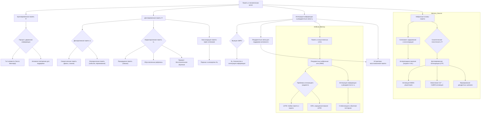

**Источник**:

- **Раздел:** Теория сознания
- **Файл:** [Принципы механизмов памяти в нейронных сетях через призму теории ЭИРО](/Principles-of-memory-mechanisms-in-neural-networks.md)
---

### Нейрокогнитивные механизмы сознательного восприятия и памяти в контексте теории Эмергентной Интеграции и Рекуррентного Отображения

```mermaid
flowchart TD
  A["Нейрокогнитивные механизмы восприятия и памяти"] --> B["Сенсорная память"]
  B --> B1["Иконическая (зрительная) память<br>• Длительность: 100-500 мс<br>• Объем: 12-16 элементов<br>• Нейронный субстрат: V1"]
  B --> B2["Эхоическая (слуховая) память<br>• Длительность: 2-4 секунды<br>• Объем: 4-5 паттернов<br>• Нейронный субстрат: верхняя височная извилина"]

  A --> C["Рабочая память"]
  C --> C1["Центральный исполнитель<br>• Локализация: префронтальная кора<br>• Функции: внимание, координация, переключение"]
  C --> C2["Фонологическая петля<br>• Хранилище: 1.5-2 сек<br>• Локализация: зона Брока, теменная кора"]
  C --> C3["Визуально-пространственный блокнот<br>• Объем: 3-4 объекта<br>• Локализация: теменно-затылочные области"]
  C --> C4["Эпизодический буфер<br>• Интеграция информации<br>• Локализация: медиальная височная доля"]

  A --> D["Долговременная память"]
  D --> D1["Декларативная память"]
  D1 --> D11["Эпизодическая память<br>• Локализация: гиппокамп, префронтальная кора"]
  D1 --> D12["Семантическая память<br>• Локализация: височная кора<br>• Организация: семантические сети"]
  D --> D2["Процедурная память<br>• Локализация: базальные ганглии, мозжечок"]

  A --> E["ЭИРО-модель восприятия и памяти"]
  E --> E1["Эмергентная интегрированная информация Φₑ"]
  E1 --> E11["Интеграция I(x t)"]
  E1 --> E12["Рекуррентная активность R(x t)"]
  E1 --> E13["Веса связей λᵢⱼ"]
  E --> E2["Экспериментальные подтверждения<br>• фМРТ: связь Φₑ с сознанием<br>• Нарушения при амнезии"]

  A --> F["Консолидация памяти"]
  F --> F1["Формула консолидации M(t):<br>• Затухание τ<br>• Интеграция Φₑ во времени"]
  F --> F2["Ядро консолидации K(s)<br>• Активная модуляция следа"]

  A --> G["Нейропластичность"]
  G --> G1["Долговременная потенциация (ДВП)<br>• Связь с Φₑ"]
  G --> G2["Рекуррентность и пластичность<br>• Влияние на внутриклеточные изменения<br>• Динамическая интеграция"]
```

**Источник**:

- **Раздел:** Теория сознания
- **Файл:** [Нейрокогнитивные механизмы сознательного восприятия и памяти в контексте теории ЭИРО](/Neurocognitive-mechanisms-of-conscious-perception-and-memory.md)
---

### Нейрокогнитивные механизмы памяти в контексте теории ЭИРО

```mermaid
flowchart TD
    A[Методология исследования] --> B[Электрофизиология]
    A --> C[Нейровизуализация]
    A --> D[Оптогенетика]
    A --> E[Математическое моделирование]
    
    B --> B1["Многоканальная запись Ψ активности"]
    B --> B2["Синхронизация в ритмах λ"]
    B --> B3["Φₑ в нейронных ансамблях"]

    C --> C1["фМРТ 7Т высокого разрешения"]
    C --> C2["МЭГ и ЭЭГ λ-синхронизации"]
    C --> C3["Совмещение данных Ψ картирования"]

    D --> D1["Световая модуляция нейронов"]
    D --> D2["Изучение Ψ причинно-следственных связей"]
    D --> D3["Валидация теории ЭИРО"]

    E --> E1["Спайковые сети STDP"]
    E --> E2["Гомеостаз Ψ синапсов"]
    E --> E3["Байесовские модели памяти"]
    
    F[Архитектура нейронных сетей памяти] --> G[Иерархическая организация]
    F --> H[Рекуррентные связи]
    
    G --> G1["Сенсорные области"]
    G --> G2["Медиальная височная доля"]
    G --> G3["Префронтальная кора"]
    
    H --> H1["Локальные Ψ контуры"]
    H --> H2["Глобальные λ контуры"]
    H1 --> H11["Горизонтальные Ψ связи"]
    H1 --> H12["Вертикальные микроколонки"]
    H2 --> H21["Фронто-париетальная сеть"]
    H2 --> H22["Дефолт-система мозга"]
    
    I[Механизмы синаптической пластичности] --> J[LTP NMDA-рецепторов]
    I --> K[Гомеостатическая регуляция]

    J --> J1["Ca²⁺ ↔ сигнальные каскады"]
    J --> J2["Формирование памяти Φₑ"]

    K --> K1["Ψ Масштабирование синапсов"]
    K --> K2["Модуляция Ψ порогов"]

    L[Эмпирическая валидация] --> M["Φₑ и эпизодическая память"]
    L --> N["Ψ роль рекуррентных контуров"]
    
    M --> M1["Корреляция Ψ успешного запоминания"]
    M --> M2["Снижение Φₑ при патологиях"]

    N --> N1["Активация λ-контуров"]
    N --> N2["Нарушения Ψ рекуррентной обработки"]

    O[Выводы и применения] --> P["Ключевые результаты"]
    O --> Q["Практическое применение"]
    
    P --> P1["Φₑ в механизмах памяти"]
    P --> P2["Ψ роль рекуррентных связей"]

    Q --> Q1["Диагностика нарушений памяти"]
    Q --> Q2["Нейрореабилитация и нейропротезы"]
    Q --> Q3["Оптимизация Ψ обучения"]
```

**Источник**:

- **Раздел:** Теория сознания
- **Файл:** [Нейрокогнитивные механизмы памяти в контексте теории ЭИРО](/Neurocognitive-mechanism-of-memory.md)
---

### Нейрокогнитивные механизмы мышления человека в контексте теории ЭИРО

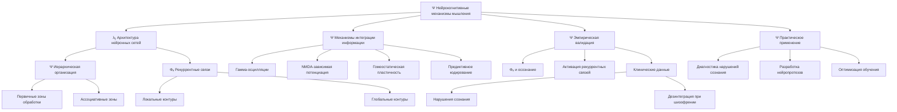

**Источник**:

- **Раздел:** Теория сознания
- **Файл:** [Нейрокогнитивные механизмы мышления в контексте теории ЭИРО](/Neurocognitive-mechanisms-of-thinking.md)
---

### Нейрокогнитивные механизмы селективного внимания через призму теории Эмергентной Интеграции и Рекуррентного Отображения

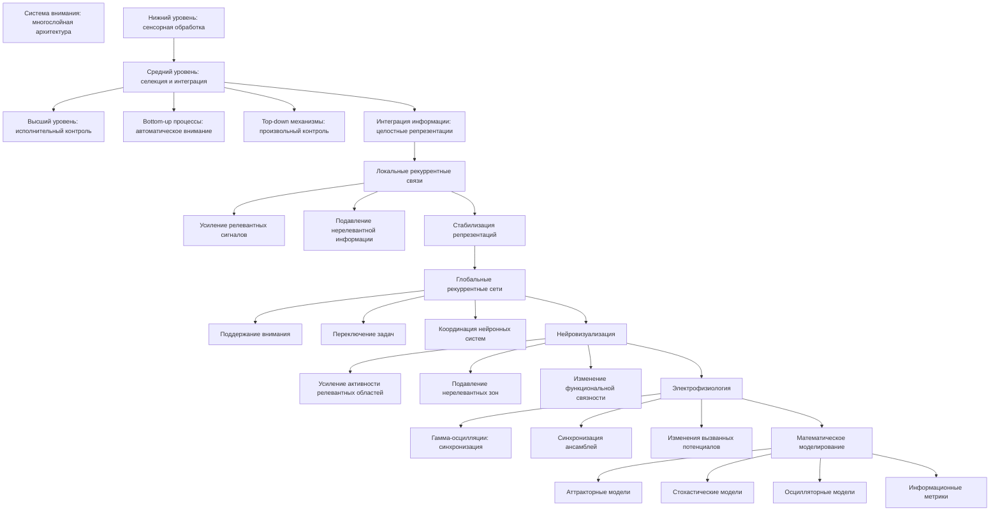

**Источник**:

- **Раздел:** Теория сознания
- **Файл:** [Нейрокогнитивные механизмы селективного внимания через призму теории ЭИРО](/Neurocognitive-mechanisms-of-selective-attention.md)
---

### Нейрокогнитивные механизмы восприятия в контексте эмергентной интеграции: от сенсорных входов к осознанному опыту

```mermaid
flowchart TD
    A[Иерархия сенсорных систем] --> B1[Первичные сенсорные зоны]
    B1 -->|Зрение| C1[Зрительная кора V1<br>Ориентация Контраст Движение]
    B1 -->|Слух| C2[Слуховая кора A1<br>Частота Интенсивность]
    B1 -->|Осязание| C3[Соматосенсорная кора S1<br>Давление Температура]

    A --> B2[Ассоциативные зоны]
    B2 -->|Вентральный поток| D1[Распознавание объектов<br>V2 V4 IT]
    B2 -->|Дорсальный поток| D2[Пространство и движение<br>V3 MT MST]
    B2 -->|Интеграция| D3[Мультимодальные центры<br>Теменная и Префронтальная кора]

    A --> B3[Таламокортикальные петли]
    B3 --> E1[Обратная связь и внимание]
    B3 --> E2[Рекуррентная обработка<br>Динамика сигналов]

    F[Сенсорная интеграция] --> G1[Временная синхронизация]
    G1 -->|Гамма| H1[30-100 Гц<br>Связывание признаков]
    G1 -->|Тета| H2[4-8 Гц<br>Контекст и память]
    G1 -->|Альфа| H3[8-12 Гц<br>Торможение и внимание]

    F --> G2[Пространственная интеграция]
    G2 -->|Конвергенция| H4[Сходящие входы<br>Вентральный путь]
    G2 -->|Мультисенсорные нейроны| H5[Объединение модальностей<br>Теменная кора]
    G2 -->|Топография| H6[Сохранение структуры сигналов]

    I[Предиктивное кодирование] --> J1[Генерация предсказаний]
    I --> J2[Ошибки предсказания]
    I --> J3[Обновление моделей]

    K[Экспериментальные данные] --> L1[fMRI<br>Иерархическая обработка]
    K --> L2[MEG<br>Рекуррентная динамика]
    K --> L3[Коннектом<br>Связи и интеграция]

    M[Математические модели] --> N1["Динамические системы<br>F(X U λᵢⱼ)"]
    M --> N2[Информационные метрики<br>Φₑ CD MI]
```

**Источник**:

- **Раздел:** Теория сознания
- **Файл:** [Нейрокогнитивные механизмы восприятия в контексте эмергентной интеграции: от сенсорных входов к осознанному опыту](/Neurocognitive-mechanisms-of-perception.md)
---

### Нейрокогнитивные механизмы сновидений в контексте теории Эмергентной Интеграции и Рекуррентного Отображения (ЭИРО)

```mermaid
flowchart TD
  A[Нейрокогнитивные механизмы сновидений] --> B[Теория ЭИРО]
  B --> C[Эмерджентная интеграция Φₑ]
  B --> D[Рекуррентные связи]
  B --> E[Предиктивное кодирование]

  C --> C1[Динамика Φₑ во сне]
  C1 --> C2[REM: Высокая Φₑ - яркие, сюжетные сновидения]
  C1 --> C3[NREM: Низкая Φₑ - фрагментарные сновидения]
  C --> C4[Характеристики сновидений]
  C4 --> C5[Яркость, связность, эмоциональность]
  
  D --> D1[Рекуррентные контуры]
  D1 --> D2[Таламо-кортикальные петли]
  D1 --> D3[Кортико-кортикальные связи]
  D1 --> D4[Гиппокампально-неокортикальные петли]
  D --> D5[Нарушения рекуррентности]
  D5 --> D6[Фрагментарные сновидения: снижение рекуррентности]
  D5 --> D7[Сверхинтегрированные сновидения: гиперрекуррентность]
  
  E --> E1[Предсказания во сне]
  E1 --> E2[Реактивация воспоминаний]
  E1 --> E3[Формирование новых сценариев]
  E --> E4[Ошибки предсказания]
  E4 --> E5[Хаотичные сновидения]
  E4 --> E6[Обновление внутренних моделей]

  A --> F[Клинические аспекты]
  F --> F1[Психические расстройства]
  F1 --> F2[Шизофрения: Причудливые сновидения]
  F1 --> F3[ПТСР: Навязчивые кошмары]
  F1 --> F4[Депрессия: Негативные сновидения]
  F --> F5[Нарушения сна]
  F5 --> F6[Апноэ: Прерывистые сновидения]
  F5 --> F7[Нарколепсия: Реалистичные сновидения]
  
  A --> G[Математическое моделирование]
  G --> G1["Рекуррентные нейронные сети (RNN)"]
  G1 --> G2[Моделирование интеграции информации]
  G --> G3[Байесовские модели]
  G3 --> G4[Предсказательное кодирование и ошибки]
```

**Источник**:

- **Раздел:** Теория сознания
- **Файл:** [Нейрокогнитивные механизмы сновидений в контексте теории ЭИРО](/Neurocognitive-mechanisms-of-dreams.md)
---

### Трудная проблема сознания в контексте теории Эмергентной Интеграции и Рекуррентного Отображения (ЭИРО)

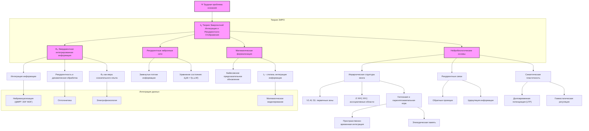

**Источник**:

- **Раздел:** Теория сознания
- **Файл:** [Трудная проблема сознания в контексте теории ЭИРО](/The-difficult-problem-of-consciousness.md)
---

### Философские аспекты теории Эмергентной Интеграции и Рекуррентного Отображения (ЭИРО)

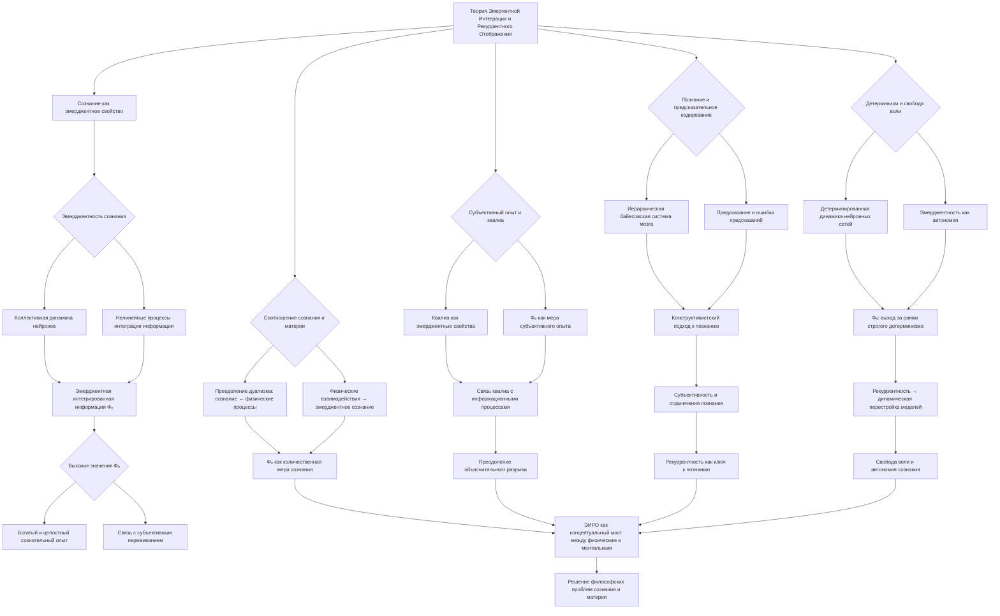

**Источник**:

- **Раздел:** Теория сознания
- **Файл:** [Философские аспекты теории ЭИРО](/Philosophical-aspects.md)
---

### Теория Эмергентной Интеграции и Рекуррентного Отображения (ЭИРО) в контексте коннектомики

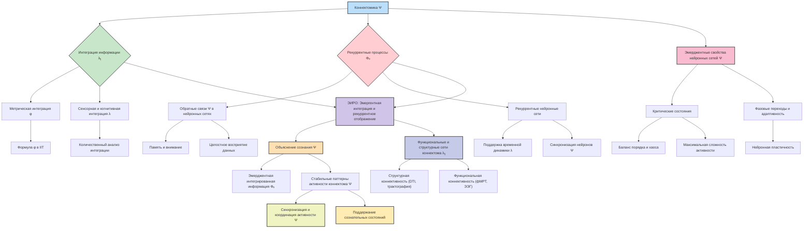

**Источник**:

- **Раздел:** Теория сознания
- **Файл:** [Теория ЭИРО в контексте коннектомики](/EIRM-in-the-context-of-connectomics.md)
---

### Расширение теории Эмергентной Интеграции и Рекуррентного Отображения (ЭИРО) с учетом дополнительных параметров метрики Φₑ

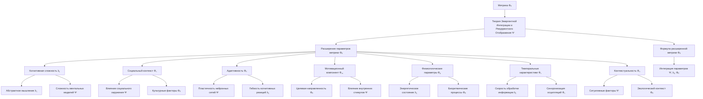

**Источник**:

- **Раздел:** Теория сознания
- **Файл:** [Расширение теории ЭИРО с учетом дополнительных параметров метрики Φₑ](/extended-fe-metric.md)
---

### Роль эмоций в теории ЭИРО

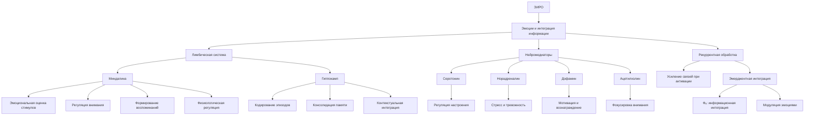

**Источник**:

- **Раздел:** Теория сознания
- **Файл:** [Роль эмоций в теории ЭИРО](/The-role-of-emotions.md)
---

### Математическое моделирование компонентов параметра эмоциональной модуляции E(t) в теории Эмергентной Интеграции и Рекуррентного Отображения (ЭИРО)

```mermaid
graph TD
    A["Математическое моделирование E(t)"] --> B["Компоненты параметра E(t)"]
    B --> C["Валентность эмоций V(t)"]
    B --> D["Возбуждение эмоций A(t)"]
    B --> E["Специфичность эмоций S(t)"]
    B --> F["Динамика эмоциональных процессов D(t)"]

    C --> C1{Биполярная шкала: -1 до 1}
    C1 --> C2[Функция tanh]
    D --> D1[Интенсивность от спокойных до сильных]
    D1 --> D2[Сигмоида для диапазона 0 до 1]
    E --> E1[Многомерный вектор категорий эмоций]
    E1 --> E2[Функция softmax для вероятностей]
    F --> F1[Рекуррентная обработка RNN]
    F1 --> F2[Временная эволюция эмоций]

    A --> G[Методы анализа]
    G --> G1[Кластеризация]
    G1 --> G11[K-means]
    G1 --> G12[Гауссовские смеси]
    G1 --> G13[Иерархическая кластеризация]
    G --> G2[Вероятностные модели]
    G2 --> G21[Скрытые марковские модели HMM]
    G2 --> G22[Динамические байесовские сети DBN]
    G --> G3[Рекуррентные нейронные сети RNN]

    G3 --> G31[Моделирование временной динамики]
    G3 --> G32[Долгосрочная память LSTM]
    G3 --> G33[Краткосрочные процессы GRU]

    H["Применение E(t)"] --> H1[Моделирование сознания]
    H --> H2[Диагностика психических расстройств]
    H --> H3[Интеллектуальные системы]

    H1 --> H11[Эмерджентная интеграция Φₑ]
    H2 --> H21[Оценка валентности и возбуждения]
    H2 --> H22[Мониторинг терапии]
    H3 --> H31[Эмоциональный интеллект систем]
    H3 --> H32[Интерфейсы мозг-компьютер BCI]
```

**Источник**:

- **Раздел:** Теория сознания
- **Файл:** [Математическое моделирование компонентов параметра эмоциональной модуляции E(t) в теории ЭИРО](/Mathematical-modeling-of-the-components-of-the-emotional-modulation-parameter.md)
---

### Когнитивная сложность C(t) в теории Эмергентной Интеграции и Рекуррентного Отображения (ЭИРО)

```mermaid
graph TD
    A["Ψ Когнитивная сложность C(t)"]
    B1["λᵢⱼ Абстрактное мышление"]
    B2["Φₑ Сложность ментальных моделей"]
    B3["Ξ Интеграция информации"]
    B4["Δ Аналитические способности"]
    B5["Rᵢⱼ Рефлексивный компонент"]
    B6["Ω Организационный компонент"]

    C1["Ψₑ Иерархия и детализация"]
    C2["Ξₑ Взаимосвязанность"]
    C3["Ψλ Моделирование"]
    C4["Ψₐ Образовательные факторы"]
    C5["Ξₜ Обучение и интеграция знаний"]
    C6["Ψₑ Метакогнитивные стратегии"]
    C7["Ξₑ Управление ресурсами"]

    A --> B1
    A --> B2
    A --> B3
    A --> B4
    A --> B5
    A --> B6

    B1 --> C1
    B1 --> C2
    B2 --> C3
    B3 --> C4
    B3 --> C5
    B5 --> C6
    B6 --> C7
```

**Источник**:

- **Раздел:** Теория сознания
- **Файл:** [Когнитивная сложность C(t) в теории ЭИРО](/Cognitive-complexity.md)
---

### S(t) - Социальный контекст в теории Эмергентной Интеграции и Рекуррентного Отображения (ЭИРО)

```mermaid
graph TD
    A["Социальный контекст S(t)"] --> B[Влияние социального окружения]
    A --> C[Культурные факторы]
    A --> D[Коммуникативные аспекты]
    A --> E[Нейробиологические основы]
    
    B --> B1[Модуляция восприятия, памяти, внимания]
    B --> B2[Принятие решений под влиянием окружения]
    B --> B3["Моделирование S(t) через графы социальных сетей"]
    
    C --> C1[Влияние ценностей и традиций]
    C --> C2[Когнитивные стили и культурные различия]
    C --> C3[Вероятностные модели взаимодействий]
    
    D --> D1[Синхронизация ритмов взаимодействий]
    D --> D2[Усиление социальной связи]
    D --> D3[Моделирование паттернов коммуникации]
    
    E --> E1[Медиальная префронтальная кора Ψ]
    E --> E2[Теменная кора λᵢⱼ]
    E --> E3[Миндалина Φₑ]
    
    E1 --> E1a[Самосознание и социальное познание]
    E1 --> E1b[Понимание ментальных состояний]
    E1 --> E1c[Обработка информации о себе и других]
    
    E2 --> E2a[Восприятие социальных сигналов]
    E2 --> E2b[Интеграция информации в репрезентации]
    E2 --> E2c[Пространственная обработка стимулов]
    
    E3 --> E3a[Оценка эмоциональной значимости стимулов]
    E3 --> E3b[Усиление эмоциональных реакций]
    E3 --> E3c[Связь с процессами принятия решений]
```

**Источник**:

- **Раздел:** Теория сознания
- **Файл:** [S(t) - Социальный контекст в теории ЭИРО](/Social-context.md)
---

### A(t) - Адаптивность в теории Эмергентной Интеграции и Рекуррентного Отображения (ЭИРО)

```mermaid
graph TD
  A[Эмергентная интеграция и рекуррентное отображение] --> B["Адаптивность A(t)"]
  B --> C[Способность к обучению]
  B --> D[Гибкость реакций]
  B --> E[Скорость приспособления]
  C --> F[Изменение параметров системы]
  C --> G[Нейропластичность]
  G --> H[Долговременная потенциация LTP]
  G --> I[Долговременная депрессия LTD]
  D --> J[Вариативность поведения]
  D --> K[Анализ показателей Ляпунова]
  E --> L[Алгоритмы подкрепления]
  E --> M[Динамическое обучение]
  B --> N[Нейробиологические основы]
  N --> O[Префронтальная кора]
  N --> P[Гиппокамп]
  N --> Q[Базальные ганглии]
  O --> R[Мониторинг среды]
  O --> S[Формирование моделей поведения]
  P --> T[Кодирование новой информации]
  P --> U[Консолидация памяти]
  Q --> V[Формирование привычек]
  Q --> W[Гибкость действий]
  N --> X[Нейромодуляция]
  X --> Y[Серотонин]
  X --> Z[Норадреналин]
  X --> AA[Ацетилхолин]
  N --> AB[Лимбическая система]
  AB --> AC[Интеграция эмоций и когниций]
  AB --> AD[Модуляция реакции]
```

**Источник**:

- **Раздел:** Теория сознания
- **Файл:** [A(t) - Адаптивность в теории ЭИРО](/Adaptability.md)
---

### Диссертация: Мотивационный компонент M(t) в структуре метрики эмоционально-интеллектуального развития организма (ЭИРО)

```mermaid
graph TD
    A["ЭИРО"] --> B["Мотивационный компонент M(t)"]
    B --> C["Внутренние стимулы Ψ"]
    C --> D["Потребность в познании"]
    C --> E["Стремление к самореализации"]
    C --> F["Интерес к деятельности"]
    B --> G["Внешние факторы λᵢⱼ"]
    G --> H["Социальное признание"]
    G --> I["Материальное вознаграждение"]
    G --> J["Конкуренция"]
    B --> K["Регуляторные механизмы Φₑ"]
    K --> L["Самоконтроль"]
    K --> M["Целеполагание"]
    K --> N["Волевые качества"]
    B --> O["Нейробиологические механизмы"]
    O --> P["Дофаминергическая система"]
    P --> Q["VTA"]
    P --> R["NAcc"]
    P --> S["PFC"]
    O --> T["Лимбическая система"]
    T --> U["Миндалина"]
    T --> V["Гиппокамп"]
    T --> W["Поясная кора"]
    B --> X["Методология оценки"]
    X --> Y["Поведенческие маркеры"]
    X --> Z["Нейрофизиологические показатели"]
    B --> AA["Применение в практике"]
    AA --> AB["Образование"]
    AA --> AC["Профессиональное развитие"]
    AA --> AD["Психотерапия"]
```

**Источник**:

- **Раздел:** Теория сознания
- **Файл:** [Мотивационный компонент M(t) в структуре метрики эмоционально-интеллектуального развития организма](/The-motivational-component.md)
---

### Диссертация: Физиологические параметры P(t) в теории Эмергентной Интеграции и Рекуррентного Отображения (ЭИРО)

```mermaid
graph TD
    A[Φₑ - Эмерджентная Интеграция] -->|Зависимость| B["Энергетическое состояние E(t)"]
    A -->|Модуляция| C["Биоритмические процессы B(t)"]
    B -->|Функция f| D["P(t) - Физиологические параметры"]
    C -->|Функция g| D
    D -->|Модуляция| E[Нейронная активность и рекуррентные процессы]
    E -->|Оптимизация| F[Синхронизация Φₑ]
    
    B -->|Ключевые структуры| G[Гипоталамус]
    G -->|Регуляция| H[Энергетический баланс]
    C -->|Ключевые структуры| I[Супрахиазматическое ядро]
    I -->|Регуляция| J[Циркадные ритмы]
    D -->|Ключевые структуры| K[Ретикулярная формация]
    K -->|Поддержание| L[Бодрствование и активация]

    subgraph "Модели"
        D -->|"Влияние E(t)"| M["f(E(t))"]
        D -->|"Влияние B(t)"| N["g(B(t))"]
    end
```

**Источник**:

- **Раздел:** Теория сознания
- **Файл:** [Физиологические параметры P(t) в теории ЭИРО](/Physiological-parameters.md)
---

### Диссертация: V(t) - Вариативность поведения в контексте теории ЭИРО

```mermaid
graph TD
    A[Теоретические основы] --> B["Минимальная достаточность Ψ = E/R"]
    A --> C[Оптимальная вариативность Ψ = H λ]
    A --> D[Принципы Vₑ]

    D --> D1[Энтропия H - гибкость, диапазон]
    D --> D2[Сложность C - структурные элементы]

    A --> E["Формула V(t) = Σ(Bᵢ · Fᵢ) · P"]

    subgraph F[Компоненты Ψ]
        F1[Разнообразие реакций Ψᵣ]
        F2[Креативность решений <br>Ψᵣ = N λ O λ F]
        F3[Пластичность Ψ]
    end

    F1 --> G[Моторные Ψ]
    F1 --> H[Когнитивные Ψ]
    F1 --> I[Эмоциональные Ψ]

    F3 --> J[Адаптивность Φ]
    F3 --> K[Гибкость λ]
    F3 --> L[Обучаемость]

    A --> F
    A --> N[Нейробиологические механизмы Ψᵦ]

    subgraph O[Нейросистемы]
        O1[Префронтальная кора Ψᵢ]
        O2[Базальные ганглии Ψσ]
        O3[Мозжечок Ψᵩ]
    end

    N --> O
    N --> P[Нейромедиаторы D Ψ N Ψ S]

    subgraph Q[Методы Ψₘ]
        Q1[Измерения]
        Q2[Модели ΨΣ]
    end

    Q1 --> R[Открытое поле λ лабиринт]
    Q1 --> S[ЭЭГ λ ПЭТ λ ФМРТ]
    Q2 --> T[Энтропия λ]
    Q2 --> U[Фракталы Ψ λ]

    A --> Q
    Q --> V[Приложения]

    subgraph W[Практика]
        W1[Клиническая реабилитация Ψ]
        W2[Психокоррекция Ψ]
        W3[Образование Ψ]
        W4[ИИ Ψ]
    end

    V --> W
```

**Источник**:

- **Раздел:** Теория сознания
- **Файл:** [Вариативность поведения V(t) в контексте теории ЭИРО](/Variability-of-behavior.md)
---

### T(t) - Темпоральные характеристики в контексте теории ЭИРО

```mermaid
flowchart TD
    A["Темпоральные характеристики Tᵗ"] --> B["Компоненты Ψ"]
    B --> B1["Временная перспектива Vₑ"]
    B --> B2["Скорость обработки информации λᵢ"]
    B --> B3["Ритмичность процессов Φₑ"]
    
    B1 --> B1a["Фокус на прошлом Fᵖ"]
    B1 --> B1b["Фокус на настоящем Pᵣ"]
    B1 --> B1c["Фокус на будущем Fᵤ"]
    
    B2 --> B2a["Латентность реакций"]
    B2 --> B2b["Темп когнитивной активности"]
    B2 --> B2c["Быстрота принятия решений"]
    
    B3 --> B3a["Циркадные ритмы Ψₓ"]
    B3 --> B3b["Ультрадианные ритмы λᵤ"]
    B3 --> B3c["Инфрадианные ритмы Φₐ"]
    
    A --> C["Нейробиологическая основа"]
    C --> C1["Супрахиазматическое ядро"]
    C --> C2["Префронтальная кора"]
    C --> C3["Гиппокамп"]
    C --> C4["Базальные ганглии"]
    
    A --> D["Методы оценки"]
    D --> D1["ЭЭГ"]
    D --> D2["Вариабельность сердечного ритма"]
    D --> D3["Тесты временной перспективы"]
    D --> D4["Нейровизуализация"]
    
    A --> E["Практические приложения"]
    E --> E1["Клиническая хронотерапия"]
    E --> E2["Оптимизация обучения"]
    E --> E3["Организация рабочих процессов"]
    
    style A fill:#FFDD00,stroke:#333,stroke-width:2px
    style B fill:#DDFFDD,stroke:#333,stroke-width:2px
    style C fill:#DDDDFF,stroke:#333,stroke-width:2px
    style D fill:#FFDDDD,stroke:#333,stroke-width:2px
    style E fill:#FFFFDD,stroke:#333,stroke-width:2px
```

**Источник**:

- **Раздел:** Теория сознания
- **Файл:** [T(t) - Темпоральные характеристики в контексте теории ЭИРО](/Temporal-characteristics.md)
---

### K(t) - Контекстуальность в теории Эмергентной Интеграции и Рекуррентного Отображения (ЭИРО)

```mermaid
graph TD
    A["Эмергентная Интеграция и Рекуррентное Отображение"] --> B["Контекстуальность K(t)"]
    B --> C["Ситуативные факторы Ψ"]
    B --> D["Средовые влияния λ"]
    B --> E["Экологический контекст Φₑ"]
    B --> F["Нейробиологические основы"]

    C --> C1["Физические условия"]
    C --> C2["Социальное окружение"]
    C --> C3["Временные рамки"]
    C --> C4["Эмоциональный фон"]

    D --> D1["Культурные традиции"]
    D --> D2["Географические факторы"]
    D --> D3["Технологическая инфраструктура"]
    D --> D4["Экономические условия"]

    E --> E1["Климатические параметры"]
    E --> E2["Геологические условия"]
    E --> E3["Биологические ресурсы"]
    E --> E4["Модели на основе дифференциальных уравнений"]
    E --> E5["Агентно-ориентированные модели"]

    F --> F1["Префронтальная кора"]
    F --> F2["Теменная кора"]
    F --> F3["Лимбическая система"]
    F1 --> F1a["Анализ Ψ"]
    F1 --> F1b["Интеграция λ"]
    F1 --> F1c["Формирование стратегий"]
    F2 --> F2a["Кодирование пространства"]
    F2 --> F2b["Обработка визуальной информации"]
    F2 --> F2c["Интеграция данных"]
    F3 --> F3a["Миндалина"]
    F3 --> F3b["Гиппокамп"]
```

**Источник**:

- **Раздел:** Теория сознания
- **Файл:** [K(t) - Контекстуальность в теории ЭИРО](/Contextuality.md)
---

### Дополнительные компоненты метрики Φₑ в контексте теории Эмергентной Интеграции и Рекуррентного Отображения (ЭИРО)

```mermaid
flowchart TD
    Ф{Метрика Φₑ} -->|Интеграция информации| I[Информационная интеграция Iₑ]
    Ф -->|Рекуррентная обработка| R[Рекуррентность Rₑ]
    Ф -->|Дополнительные компоненты| K[Когнитивные и системные параметры]

    K --> C_t[Когнитивная сложность Cₜ]
    K --> S_t[Социальный контекст Sₜ]
    K --> A_t[Адаптивность Aₜ]
    K --> M_t[Мотивационный компонент Mₜ]
    K --> P_t[Физиологические параметры Pₜ]
    K --> V_t[Вариативность поведения Vₜ]
    K --> T_t[Темпоральные характеристики Tₜ]
    K --> K_t[Контекстуальность Kₜ]
    K --> I_1[Интегративность Iₑ]
    K --> C[Когерентность Cₑ]
    K --> F[Гибкость Fₑ]
    K --> M[Метакогнитивная осведомленность Mₑ]
    K --> I_s[Социальная интерактивность Iₛ]
    K --> E_eff[Энергетическая эффективность Eₑ]
    K --> I_c[Информационная ёмкость I_c]
    K --> S_st[Стабильность Sₛ]
    K --> D_s[Семантическая глубина Dₛ]
    K --> Q_c[Квантовая когерентность Qₛ]
    K --> E_c[Эмерджентная сложность Eₛ]
    K --> N_p[Нейропластичность Nₚ]
    K --> T_i[Темпоральная интеграция Tₑ]
    K --> E_i[Эмоциональный интеллект Eᵢ]
    K --> S_o[Самоорганизация Sₒ]
    K --> I_conn[Информационная связность Iₛ]

    %% Взаимосвязи между компонентами
    I --> C_t & V_t & D_s
    R -->|Модуляция| S_t & E_eff & P_t
    I --> I_conn & I_c
    E_c --> S_o & N_p
    C --> T_t & Q_c
    F --> A_t & V_t
    M_t -->|Фокус внимания| I & R
    I_s --> S_t & E_i
    T_i --> T_t & K_t
```

**Источник**:

- **Раздел:** Теория сознания
- **Файл:** [Дополнительные компоненты метрики Φₑ в контексте теории ЭИРО](/Components-of-the-F-metric.md)
---

### Дополнительные компоненты метрики Φₑ в контексте теории Эмергентной Интеграции и Рекуррентного Отображения (ЭИРО) > Оглавление > 2. Компоненты метрики Φₑ

```mermaid
flowchart TD
  subgraph L1 ["I. Базовый уровень"]
    A1[Физические процессы]
    A2[Нейробиологические]
  end

  subgraph L2 ["II. Информационный"]
    B1[Обработка информ.]
    B2[Темпор. организация]
  end

  subgraph L3 ["III. Когнитивный"]
    C1[Базовые процессы]
    C2[Адапт. механизмы]
  end

  subgraph L4 ["IV. Соц.-эмоц."]
    D1[Соц. компоненты]
    D2[Эмоц. компоненты]
  end

  subgraph L5 ["V. Интегративный"]
    E1[Сист. интеграция]
    E2[Контекст. интеграция]
  end

  L1 --> L5
  L2 --> L5
  L3 --> L5
  L4 --> L5
```

**Источник**:

- **Раздел:** Теория сознания
- **Файл:** [Дополнительные компоненты метрики Φₑ в контексте теории ЭИРО](/Components-of-the-F-metric.md)
---

### Интегративность (I) в контексте теории Эмергентной Интеграции и Рекуррентного Отображения (ЭИРО)

```mermaid
graph TD
    A["Интегративность (I)"] --> B{Способность к объединению информации}
    B --> C[Мультисенсорные данные]
    B --> D[Связность сознательного опыта]
    B --> E[Формирование целостных репрезентаций]
    E --> F[Объединение признаков]
    E --> G[Когерентные образы]
    E --> H[Нейронные механизмы]
    D --> I[Восприятие, память, эмоции]
    D --> J[Аттенция и рекурсия]
    D --> K[Эффективное принятие решений]
    C --> L[Ассоциативные области коры]
    C --> M[Конвергенция сенсорных путей]
    L --> N[Мультисенсорные нейроны]
    M --> O[Динамическая обработка данных]
    A --> P[Когнитивные и эмоциональные аспекты]
    P --> Q[Метрики интеграции]
    P --> R[Нейронные синхронизации]
    A --> S[Практические приложения]
    S --> T[Диагностика расстройств]
    S --> U[Искусственный интеллект]
    S --> V[Обучение и адаптивность]
    U --> W[Репрезентации данных]
    U --> X[Рекуррентные сети]
    V --> Y[Гибкость поведения]
    V --> Z[Перенос знаний]
```

**Источник**:

- **Раздел:** Теория сознания
- **Файл:** [Интегративность (I) в теории ЭИРО](/Integrativity.md)
---

### Метакогнитивная осведомленность (M) в контексте теории Эмергентной Интеграции и Рекуррентного Отображения (ЭИРО)

```mermaid
graph TD
    A[Метакогнитивная Осведомленность] --> B1[Осознание Ментальных Состояний]
    A --> B2[Саморегуляция и Контроль]
    A --> B3[Метаобработка Информации]
    B1 --> C1{Осознание Мыслей и Эмоций}
    B1 --> C2{Понимание Убеждений}
    B1 --> C3{Рефлексия Стратегий}
    B2 --> C4{Мониторинг и Оценка}
    B2 --> C5{Планирование Действий}
    B2 --> C6{Коррекция Поведения}
    B3 --> C7{Формирование Репрезентаций}
    B3 --> C8{Оценка Надежности}
    B3 --> C9{Создание Моделей}
    A --> D[Нейробиология МО]
    D --> E1[Роль Префронтальной Коры]
    D --> E2[Взаимодействие Областей]
    D --> E3[Нейрохимическая Модуляция]
    A --> F[Рекуррентные Процессы]
    F --> G1{Саморефлексия}
    F --> G2{Метаобработка}
    F --> G3{Роль Внимания}
    A --> H[Количественная Оценка]
    H --> I1{"Энтропия H(M)"}
    H --> I2{"Взаимная Информация MI(M;C)"}
    H --> I3{"Сложность K(M)"}
    A --> J[Формирование Сознательного Опыта]
    J --> K1{Интеграция Информации}
    J --> K2{Эмоциональные Аспекты}
    J --> K3{Нарушения при Расстройствах}
    A --> L[Адаптивность и Гибкость]
    L --> M1{Обучение и Развитие}
    L --> M2{Решение Новых Задач}
    L --> M3{Динамическая Перестройка}
    A --> N[Социальное Взаимодействие]
    N --> O1{Теория Разума}
    N --> O2{Социальный Контекст}
    A --> P[Практическое Применение]
    P --> Q1{Диагностика Расстройств}
    P --> Q2{Интеллектуальные Системы}
```

**Источник**:

- **Раздел:** Теория сознания
- **Файл:** [Метакогнитивная осведомленность (M) в теории ЭИРО](/Metacognitive-awareness.md)
---

### Когерентность (C) в контексте теории ЭИРО

```mermaid
graph TD
  A[Основы когерентности] --> B1[Ψₑ: Теория ЭИРО]
  A --> B2[λ₁₋ₙ: Нейронные осцилляции]
  A --> B3[Φₑ: Интеграция информации]
  A --> B4[Топология коннективности]
  B1 --> C1[Синхронизация нейронов]
  B1 --> C2["Эмоциональный компонент Ψ(E)"]
  B1 --> C3["Интеллектуальный компонент Ψ(I)"]
  B1 --> C4["Осознанность Ψ(O)"]
  B2 --> C5["Альфа (8–13 Гц)"]
  B2 --> C6["Бета (13–30 Гц)"]
  B2 --> C7["Гамма (30–100 Гц)"]
  B3 --> C8[Рекуррентные взаимодействия]
  B3 --> C9["Когнитивная динамика Ψ(Φ)"]
  B4 --> C10[Анатомические связи Ψₛ]
  B4 --> C11[Функциональная согласованность Ψₑ]
  C1 --> D1[Сеть активных ансамблей]
  C2 --> D2[Эмоциональные нарушения]
  C3 --> D3[Когнитивная сложность]
  C4 --> D4[Метакогнитивные процессы]
  C5 --> D5[Селективное внимание]
  C6 --> D6[Поддержание восприятия]
  C7 --> D7[Интеграция сенсорных сигналов]
  C8 --> D8[Прогнозирование информации]
  C9 --> D9[Эмерджентная структура Φₑ]
  C10 --> D10[Трактография связей]
  C11 --> D11[Динамика BOLD сигнала]
  D1 --> E1[Фазовая синхронизация λ]
  D2 --> E2[Ψ-терапия нарушений]
  D3 --> E3[Интеграция данных Ψₜ]
  D4 --> E4[Рефлексивные контуры Ψ]
  D5 --> E5[Модуляция альфа-ритма]
  D6 --> E6[Механизмы консолидации]
  D7 --> E7[Ψ-обработка стимулов]
  D8 --> E8[Обучение предсказаниям]
  D9 --> E9[Устойчивость к изменениям]
  D10 --> E10[Физическая база Ψₛ]
  D11 --> E11[Корреляции связности]
```

**Источник**:

- **Раздел:** Теория сознания
- **Файл:** [Когерентность (C) в контексте теории ЭИРО](/Coherence.md)
---

### Эмоциональный интеллект (E_i) в контексте ЭИРО: структурный анализ и методология оценки

```mermaid
graph TD
    A["E_i (эмоциональный интеллект)"] --> B1["Внутриличностные компоненты"]
    A --> B2["Межличностные компоненты"]
    A --> B3["Нейробиологические основы"]
    A --> B4["Метрика оценки"]
    A --> B5["Практическое применение"]
    B1 --> C1["Ψ Самосознание"]
    B1 --> C2["λ Саморегуляция"]
    B1 --> C3["Φₑ Эмоциональная рефлексия"]
    B2 --> C4["Социальная перцепция"]
    B2 --> C5["Эмпатическая точность"]
    B2 --> C6["Коммуникативная компетентность"]
    B3 --> D1["Нейронные корреляты"]
    B3 --> D2["Роль лимбической системы"]
    B3 --> D3["Пластичность мозга"]
    B4 --> E1["Количественные показатели"]
    B4 --> E2["Качественные характеристики"]
    B4 --> E3["Интегральные индексы"]
    B5 --> F1["Ψ Диагностика"]
    B5 --> F2["λ Методы развития"]
    B5 --> F3["Φₑ Интеграция с метриками"]
    C1 --> G1["Осознание эмоций"]
    C1 --> G2["Эмоциональная зрелость"]
    C2 --> H1["Контроль импульсов"]
    C2 --> H2["Гибкость"]
    C3 --> I1["Самоанализ"]
    C3 --> I2["Метакогнитивные способности"]
    C4 --> J1["Распознавание эмоций"]
    C4 --> J2["Понимание намерений"]
    C5 --> K1["Распознавание сигналов"]
    C5 --> K2["Сопереживание"]
    D1 --> L1["Префронтальная кора"]
    D1 --> L2["Миндалевидное тело"]
    D2 --> M1["Гиппокамп"]
    D2 --> M2["Прилежащее ядро"]
    E1 --> N1["Точность распознавания"]
    E1 --> N2["Эмоциональная регуляция"]
    E2 --> O1["Гибкость"]
    E2 --> O2["Эмоциональная интуиция"]
    E3 --> P1["Индекс компетентности"]
    E3 --> P2["Индекс осознанности"]
    F1 --> Q1["Ψ Оценка нарушений"]
    F2 --> R1["Тренинги управления"]
    F2 --> R2["Когнитивно-поведенческие техники"]
    F3 --> S1["Ψ Интеграция в Φₑ"]
    F3 --> S2["Роль в адаптивности"]
```

**Источник**:

- **Раздел:** Теория сознания
- **Файл:** [Эмоциональный интеллект (E_i) в контексте ЭИРО: структурный анализ и методология оценки](/Emotional-Intelligence.md)
---

### Квантовая когерентность (Q_c) в контексте теории Эмергентной Интеграции и Рекуррентного Отображения (ЭИРО)

```mermaid
graph TD
A[Квантовая когерентность Q_c] --> B[Теория ЭИРО]
A --> C[Квантовые эффекты]
B --> D[Интеграция информации]
B --> E[Рекуррентные процессы]
C --> F[Квантовая запутанность]
C --> G[Квантовая суперпозиция]
D --> H["Параметр интеграции информации I(t)"]
D --> I[Уравнение Φₑ]
E --> J[Рекуррентная динамика]
E --> K["Параметр рекуррентности R(t)"]
F --> L[Нейронные ансамбли]
F --> M[Энтропия фон Неймана]
G --> N[Состояния нейронов]
G --> O[Суперпозиция в сетях]
H --> P[Объединение модальностей]
I --> Q["Φₑ = ∫ I(t)⋅R(t)⋅Q_c dt"]
J --> R[Поддержание Q_c]
K --> S[Рекуррентные контуры]
L --> T[Квантовые корреляции]
M --> U[Квантовые подсистемы]
N --> V[Адаптивные состояния]
O --> W[Гибкость обработки]
P --> X[Сенсорные интеграции]
Q --> Y[Эмерджентное сознание]
R --> Z[Сохранение когерентности]
S --> AA[Циклическая активация]
T --> AB[Интеграция информации]
U --> AC[Оценка Q_c]
V --> AD[Математическое моделирование]
W --> AE[Динамическая перестройка]
X --> AF[Обобщение данных]
Y --> AG[Когнитивные процессы]
Z --> AH[Защита от декогеренции]
AA --> AI[Нейронные сети]
AB --> AJ[Эффективная обработка]
AC --> AK[Информационные метрики]
AD --> AL[Квантовые уравнения]
AE --> AM[Рекуррентные обработки]
AF --> AN[Мультисенсорные данные]
AG --> AO[Сознательный опыт]
AH --> AP[Биологическая среда]
AI --> AQ[Модели Orch-OR]
AJ --> AR[Сложность нейронных связей]
AK --> AS[Энтропия и сложность]
AL --> AT[Роль квантовых операторов]
AM --> AU[Эффективные решения]
AN --> AV[Сенсорные связи]
AO --> AW[Эмерджентная теория]
```

**Источник**:

- **Раздел:** Теория сознания
- **Файл:** [Квантовая когерентность (Q_c) в контексте теории ЭИРО](/Quantum-Coherence.md)
---

### Компоненты метрики Φₑ сознания животного в контексте теории ЭИРО

```mermaid
graph TD
A[Φₑ метрика] --> B[Теоретическая база ЭИРО]
A --> C[Базовые компоненты]
C --> D[Сенсорно-моторная интеграция Ψ]
C --> E[Инстинктивное поведение λ]
C --> F[Эмоциональные реакции Φₑ]
C --> G[Пространственная ориентация λᵢ]
C --> H[Социальное взаимодействие Φⱼ]
A --> I[Иерархия компонентов]
I --> J[Весовые коэффициенты]
I --> K[Межкомпонентные связи]
I --> L["Временная динамика Ψ(t)"]
A --> M[Методология измерения]
M --> N[Инструментальные методы Ψₑ]
M --> O[Поведенческие тесты Φλ]
M --> P[Нейрофизиологические показатели]
M --> Q[Интеграция данных]
A --> R[Валидация метрики]
R --> S[Экспериментальная проверка Ψⱼ]
R --> T[Сравнение методов Φₑ]
A --> U[Применение Φλ]
U --> V[Исследования λ]
U --> W["Практика Ψ(t)"]
U --> X[Этология λᵢ]
U --> Y[Оценка благополучия Ψ]
A --> Z[Перспективы Φ]
Z --> AA[Технологии Ψ]
Z --> AB[Этика Ψλ]
Z --> AC[Интеграция с методами Ψₑ]
```

**Источник**:

- **Раздел:** Теория сознания
- **Файл:** [Компоненты метрики Φₑ сознания животного в контексте теории ЭИРО](/Components-of-the-animal-consciousness-metricFe.md)
---

### Компоненты метрики Φₑ сознания мухи дрозофилы в контексте теории ЭИРО

```mermaid
graph TD
    A[Мозг дрозофилы] --> B[Нейронные системы]
    A --> C[Грибовидные тела]
    A --> D[Центральный комплекс]
    A --> E[Лобные ганглии]
    A --> F[Вентральная нервная цепочка]
    
    B --> G[Нейромедиаторы]
    B --> H[Интеграция информации]
    B --> I[Рекуррентные взаимодействия]

    C --> J[Ассоциативное обучение]
    C --> K[Обонятельные сигналы]

    D --> L[Навигация и ориентация]
    D --> M[Пространственная память]

    E --> N[Принятие решений]
    E --> O[Социальное поведение]

    F --> P[Сенсорная информация]
    F --> Q[Моторные паттерны]

    H --> R[Межмодальная интеграция]
    H --> S[Временная координация]
    H --> T[Нейронные осцилляции]

    I --> U[Конвергенция путей]
    I --> V[Синхронизация ритмов]
    I --> W[Иерархическая организация]

    G --> X[Дофамин]
    G --> Y[Серотонин]
    G --> Z[Ацетилхолин]
    
    T --> AA[Тета-ритмы]
    T --> AB[Бета-ритмы]
    T --> AC[Гамма-ритмы]
```

**Источник**:

- **Раздел:** Теория сознания
- **Файл:** [Компоненты метрики Φₑ сознания мухи дрозофилы в контексте теории ЭИРО](/Components-of-the-drosophila-fly-consciousness-metric-Fe.md)
---

### Предсказательное кодирование как система обратной связи организма - через призму теории ЭИРО

```mermaid
flowchart TD
A[Эмергентная интеграция и рекуррентное отображение Ψ] --> B[Предсказательное кодирование в иерархической системе]
B --> C[Рекуррентные связи и обратная связь λᵢⱼ]
C --> D[Минимизация ошибок предсказания Φₑ]
D --> E[Обновление внутренних моделей и адаптация]

B --> F[Байесовские подходы и вероятностные модели]
F --> D

C --> G[Интеграция экстероцептивной и интероцептивной обратной связи]
G --> H[Гомеостаз и регуляция физиологических состояний]
G --> I[Нейромедиаторные системы и их модуляция]

D --> J[Воображение и генерация ментальных репрезентаций]
J --> K[Рекуррентные процессы и связь с памятью]
K --> L[Восприятие и творчество через обновление моделей]

D --> M[Математическое моделирование Ψ]
M --> N[Байесовские модели и рекуррентные нейронные сети]
N --> O[Валидация экспериментальными данными]
O --> P[Нейровизуализация и электрофизиология]
O --> Q[Оптогенетика и поведенческие эксперименты]

D --> R[Клинические аспекты]
R --> S[Психические расстройства: депрессия, шизофрения]
R --> T[Мозговые интерфейсы и искусственный интеллект]
T --> U[Обучение и адаптация на основе предсказаний Ψ]
```

**Источник**:

- **Раздел:** Теория сознания
- **Файл:** [Предсказательное кодирование как система обратной связи организма](/Predictive-coding-as-an-organism-feedback-system.md)
---

### Мультимодальная перцептивная репрезентация в контексте теории Эмергентной Интеграции и Рекуррентного Отображения (ЭИРО)

```mermaid
graph TD
    A[Мультимодальная Перцептивная Репрезентация] --> B1[Сенсорная Интеграция Ψ]
    A --> B2[Темпоральная Интеграция Ψ]
    A --> B3[Эмоциональная Модуляция Ψ]
    A --> B4[Контекстуальная Интеграция Ψ]
    A --> B5[Метакогнитивная Осведомленность Ψ]
    A --> B6[Социальная Интерактивность Ψ]
    A --> B7[Математическое Моделирование Ψ]
    A --> B8[Клинические Аспекты Ψ]
    
    B1 --> C1[Конвергенция Сенсорных Путей]
    B1 --> C2[Мультисенсорные Нейроны]
    B1 --> C3[Топографическая Организация]
    B1 --> C4[Рекуррентные Взаимодействия]

    B2 --> C5[Связывание Событий Во Времени]
    B2 --> C6[Ритмические Процессы]
    B2 --> C7[Кратковременная и Долговременная Интеграция]

    B3 --> C8[Эмоциональные Состояния]
    B3 --> C9[Лимбическая Система]
    B3 --> C10[Нейромедиаторные Системы]

    B4 --> C11[Влияние Окружения]
    B4 --> C12[Семантические и Эпизодические Знания]
    B4 --> C13[Экологические Факторы]

    B5 --> C14[Осознание Процессов]
    B5 --> C15[Роль Префронтальной Коры]
    B5 --> C16[Метакогнитивные Способности]

    B6 --> C17[Социальный Контекст]
    B6 --> C18[Теория Разума]
    B6 --> C19[Эмпатия и Навыки]

    B7 --> C20[Информационная Теория]
    B7 --> C21[Динамические Системы]
    B7 --> C22[Байесовское Кодирование]

    B8 --> C23[Психические Расстройства]
    B8 --> C24[Интерфейсы Мозг-Компьютер]
    B8 --> C25[Искусственный Интеллект]
```

**Источник**:

- **Раздел:** Теория сознания
- **Файл:** [Мультимодальная перцептивная репрезентация в контексте теории ЭИРО](/Multimodal-perceptual-representation.md)
---

### Механизмы осознанного восприятия в контексте теории Эмергентной Интеграции и Рекуррентного Отображения (ЭИРО)

```mermaid
graph TD
    A[Теория ЭИРО] --> B[Эмерджентность]
    A --> C[Интеграция информации]
    A --> D[Рекуррентность]
    B --> E[Новые свойства из динамики]
    B --> F[Сложные взаимодействия]
    C --> G[Сенсорные модальности]
    C --> H[Целостное восприятие]
    D --> I[Таламо-кортикальные петли]
    D --> J[Кортико-кортикальные связи]
    G --> K[Объединение данных]
    H --> L[Перцептивные репрезентации]
    I --> M[Активность нейронных ансамблей]
    J --> N[Поддержание возбуждения]
    M --> O[Синхронизация ритмов]
    L --> P[Роль внимания]
    O --> Q[Гамма-ритмы]
    O --> R[Тета-ритмы]
    P --> S[Выделение релевантного]
    S --> T[Формирование осознания]
```

**Источник**:

- **Раздел:** Теория сознания
- **Файл:** [Механизмы осознанного восприятия в контексте теории ЭИРО](/Mechanisms-of-conscious-perception.md)
---

### Принцип работы нейрона в контексте теории Эмергентной Интеграции и Рекуррентного Отображения (ЭИРО)

```mermaid
graph TD
    A[Основы теории ЭИРО] -->|Эмерджентность| B[Сложные свойства Ψ]
    A -->|Интеграция информации| C[Объединение данных λᵢⱼ]
    A -->|Рекуррентность| D[Циклы взаимодействия Φₑ]

    B --> E[Самоорганизация нейронов]
    E --> F[Коллективная динамика]
    F --> G[Паттерны активности]
    F --> H[Адаптивная гибкость]

    C --> I[Пространственная суммация]
    C --> J[Временная суммация]
    I --> K[Морфология дендритов]
    J --> L[Динамика мембранного потенциала]
    J --> M[Пороговая активация]

    D --> N[Рекуррентные связи]
    N --> O[Таламо-кортикальные петли]
    N --> P[Обратные связи]
    P --> Q[Информационные каскады]

    G --> R[Формирование устойчивых аттракторов]
    G --> S[Сложные фрактальные структуры]
    S --> T[Информационная ёмкость]

    Q --> U[Модели предиктивного кодирования]
    U --> V[Обновление внутренних моделей]
    Q --> W[Эмерджентные свойства интеграции]

    X[Математическое моделирование] --> Y[Динамические системы]
    X --> Z[Нелинейные уравнения]
    Z --> AA[Критические состояния]
    AA --> AB[Гибкость сети]

    AD[Эксперименты] --> AE[Методы регистрации]
    AE --> AF[ЭЭГ и фМРТ]
    AE --> AG[Внутриклеточные записи]

    AE --> AH[Протоколы стимуляции]
    AH --> AI[Индукция LTP/LTD]
    AH --> AJ[Стимуляция рекуррентных контуров]

    AJ --> AK[Практические приложения]
    AK --> AL[Нейроморфные вычисления]
    AK --> AM[Искусственные нейронные сети]
    AK --> AN[Нейропротезирование]

    T --> AN
```

**Источник**:

- **Раздел:** Теория сознания
- **Файл:** [Принцип работы нейрона в контексте теории ЭИРО](/The-principle-of-operation-of-a-neuron.md)
---

### Нейрофизиологические механизмы рекуррентной обработки и интеграции сигналов в сознании: анализ теории Эмергентной Интеграции и Рекуррентного Отображения (ЭИРО)

```mermaid
flowchart TD
    A["Теория Эмергентной Интеграции и Рекуррентного Отображения"] --> B["Рекуррентная обработка"]
    A --> C["Интеграция информации"]

    B --> D1["Обратные связи между нейронами"]
    B --> D2["Локальные сети (колонки коры)"]
    B --> D3["Глобальные сети (таламокортикальные связи)"]
    B --> D4["Тормозные интернейроны"]

    C --> E1["Синаптическая пластичность"]
    C --> E2["Нейромодуляция"]
    C --> E3["Ионные каналы и мембранная динамика"]

    D1 --> F1["Поддержание активности"]
    D1 --> F2["Создание предсказаний"]

    D2 --> G1["Модуляция сенсорных сигналов"]
    D3 --> G2["Интеграция восприятия"]

    D4 --> H1["Синхронизация осцилляций"]
    D4 --> H2["Регуляция возбудимости"]

    E1 --> I1["LTP (долговременная потенциация)"]
    E1 --> I2["LTD (долговременная депрессия)"]

    E2 --> J1["Регуляция внимания"]
    E2 --> J2["Модуляция памяти и обучения"]

    E3 --> K1["Передача потенциалов действия"]
    E3 --> K2["Динамика возбуждения нейронов"]

    F1 --> L1["Поддержание внутреннего представления"]
    G2 --> L2["Создание когнитивных процессов"]
    H1 --> L3["Координация нейронной активности"]

    L1 --> M1["Поддержка сознательных переживаний"]
    L2 --> M1
    L3 --> M1

    M1["Формирование сознания через рекуррентные процессы и интеграцию"]
```

**Источник**:

- **Раздел:** Нейрофизиология
- **Файл:** [Нейрофизиологические механизмы рекуррентной обработки и интеграции сигналов в сознании: анализ теории ЭИРО](/neurophysiology.md)
---

### Роль Микроглии в Теории Эмергентной Интеграции и Рекуррентного Отображения (ЭИРО)

```mermaid
flowchart TD
  A[Теория Эмергентной Интеграции и Рекуррентного Отображения ЭИРО] --> B[Интеграция Информации]
  A --> C[Рекуррентная Обработка]

  B --> D{Роль Микроглии}
  C --> D

  D --> E[Модуляция Синаптической Пластичности]
  D --> F[Выделение Нейромодуляторов]
  D --> G[Регуляция Нейронной Сети]

  E --> E1[Синаптическая обрезка микроглией]
  E --> E2[Эффективность связи нейронов λᵢⱼ]

  F --> F1[Выделение BDNF]
  F --> F2[Изменение нейронной возбудимости Ψ]

  G --> G1[Формирование и реорганизация сети]
  G --> G2[Изменение структуры рекуррентных контуров]

  B --> H[Синхронизация Нейронных Сетей]
  H --> H1[Координация активности нейронов]
  H --> H2[Модуляция возбуждения микроглией]

  C --> I[Патологические состояния]
  I --> I1[Активация микроглии]
  I --> I2[Нарушение рекуррентной обработки]
  I --> I3[Снижение когнитивных функций]

  D --> J[Микроглия и Информационные Потоки]
  J --> J1[Поддержание гомеостаза]
  J --> J2[Нейровизуализация микроглиальной активности]

  I3 --> K[Нейродегенеративные заболевания]
```

**Источник**:

- **Раздел:** Нейрофизиология
- **Файл:** [Роль Микроглии в Теории ЭИРО](/microglia.md)
---

### Нейробиологические основы теории Эмергентной Интеграции и Рекуррентного Отображения (ЭИРО)

```mermaid
flowchart TD
    A[Теория Эмергентной Интеграции и Рекуррентного Отображения] --> B[Сознание как эмергентное свойство]
    B --> C[Интеграция информации]
    B --> D[Рекуррентные нейронные сети]
    C --> E[Объединение сигналов нейронами]
    C --> F[Синаптическая пластичность и нейромодуляция]
    E --> G{Исследование Koch и Crick}
    G --> H[Высокая степень коннективности нейронов]
    D --> I[Обратные связи между нейронами]
    D --> J[Циркуляция и переработка информации]
    I --> K{Исследование Lamme и Roelfsema}
    K --> L[Рекуррентная обработка необходима для восприятия]
    F --> M[Нейродинамика и синхронизация]
    M --> N{Исследование Varela et al.}
    N --> O[Синхронизация γ-осцилляций]
    M --> P[Координация областей мозга]
    C --> Q[Глобальная интеграция информации]
    Q --> R{Исследование Mashour et al.}
    R --> S[Функциональная связность кортикальных сетей]
    J --> T{Исследование Dehaene и Changeux}
    T --> U[Глобальное рабочее пространство]
    Q --> V{Патологии сознания}
    V --> W[Снижение коннективности и интеграции]
    W --> X{Исследование Boly et al.}
    X --> Y[Вегетативное состояние и функциональные нарушения]
    A --> Z[Сравнение с другими теориями]
    Z --> AA[Интеграция информации Тони]
    Z --> AB[Глобальное рабочее пространство Деана]
    Z --> AC[Эмергентные свойства рекуррентной интеграции]
```

**Источник**:

- **Раздел:** Нейробиология
- **Файл:** [Нейробиологические основы теории ЭИРО](/neuroscience.md)
---

### Когнитивные основы Теории Эмергентной Интеграции и Рекуррентного Отображения (ЭИРО)

```mermaid
flowchart TD
  A[Теория Эмергентной Интеграции и Рекуррентного Отображения] --> B[Эмергентное сознание]
  B --> C[Интеграция информации]
  B --> D[Рекуррентные процессы]
  B --> E[Эмергентная интегрированная информация Φₑ]

  C --> F[Мультисенсорная интеграция]
  F --> F1[Объединение данных из сенсорных систем]
  F --> F2[Целостное восприятие мира]
  F --> G[Пример: Driver и Noesselt 2008]

  D --> H[Рабочая память]
  H --> H1[Поддержка информации в активном состоянии]
  H --> H2[Роль префронтальной коры]
  H --> H3[Пример: Miller и Cohen 2001]

  D --> I[Внимание]
  I --> I1[Топ-даун модуляция]
  I --> I2[Усиление нейронных связей]
  I --> I3[Пример: Cohen и Maunsell 2012]

  D --> J[Предсказательное кодирование]
  J --> J1[Генерация внутренних моделей]
  J --> J2[Минимизация ошибок предсказания]
  J --> J3[Пример: Friston 2010]

  E --> K[Интеграция через R₍рекуррентность₎]
  K --> K1[Обновление информации]
  K --> K2[Динамическое состояние системы]
  K --> K3[Связь с восприятием и памятью]

  L[Связь с теориями сознания] --> M[Глобальное рабочее пространство]
  L --> N[Предсказательное кодирование]
  L --> O[Теоретическая целостность ЭИРО]
```

**Источник**:

- **Раздел:** Когнитивная наука
- **Файл:** [Когнитивные основы Теории ЭИРО](/cognitive-science.md)
---

### Теория Эмергентной Интеграции и Рекуррентного Отображения (ЭИРО) в контексте психологии

```mermaid
flowchart TD
    A["Эмергентная Интеграция и Рекуррентное Отображение"] --> B["Сознание как эмергентное свойство"]
    A --> C["Интеграция информации Iинтеграции"]
    A --> D["Рекуррентная обработка Rрекуррентности"]
    B --> E["Формула Φₑ"]
    E --> F["∫ Iинтеграции ⋅ Rрекуррентности dt"]

    C --> G["Восприятие"]
    C --> H["Адаптация сенсорной информации"]
    D --> I["Рекуррентные нейронные сети"]
    D --> J["Многократная обработка"]
    J --> K["Фокусировка внимания"]
    J --> L["Подавление несущественных стимулов"]

    G --> M["Предиктивное кодирование"]
    M --> N["Формирование предсказаний"]
    N --> O["Обновление на основе данных"]
    O --> P["Байесовское обновление"]

    H --> Q["Интеграция сенсорных данных"]
    Q --> R["Динамические взаимодействия в сетях"]
    Q --> S["Реконструкция восприятия"]
    S --> T["Сопоставление данных и ожиданий"]
    S --> U["Устойчивое восприятие"]

    K --> V["Избирательное внимание"]
    V --> W["Перераспределение когнитивных ресурсов"]

    X["Эмпирические подтверждения"] --> Y["Нейровизуализация"]
    X --> Z["Визуальная маскировка"]
    X --> AA["Нейропсихология"]
    X --> AB["Психофизика"]

    Y --> AC["Активность рекуррентных контуров"]
    Z --> AD["Прерывание обработки мешает восприятию"]
    AA --> AE["Нарушения при повреждениях сетей"]
    AB --> AF["Контекст влияет на восприятие"]

    AF --> M
    AC --> I
    AD --> J
    AE --> D

    W --> X
    P --> AB
    T --> Z
```

**Источник**:

- **Раздел:** Психология
- **Файл:** [Теория ЭИРО в контексте психологии](/psychology.md)
---

### Роль рекуррентной интеграции в формировании памяти и обучения

```mermaid
flowchart TD
    A[Рекуррентная интеграция информации в нейронных сетях] --> B[Формирование долговременных воспоминаний]
    A --> C[Обучение и нейронная пластичность]
    A --> D[Роль нейронных осцилляций]

    B --> B1[Гиппокамп и кора мозга]
    B1 --> B2[Повторная активация нейронных цепей]
    B2 --> B3["Усиление синаптических соединений (ДП и ДД)"]

    C --> C1["Долговременная потенциация (ДП)"]
    C --> C2["Долговременная депрессия (ДД)"]
    C1 --> C3[Изменение эффективности синапсов]
    C2 --> C3

    D --> D1[Гамма-осцилляции]
    D1 --> D2[Интеграция информации и внимание]
    D1 --> D3[Различение истинных и ложных воспоминаний]
    D3 --> D4[Качество и достоверность воспоминаний]

    subgraph M[Методы исследования]
        M1[фМРТ - активность мозга при обучении]
        M2[ЭЭГ - анализ нейронных осцилляций]
        M3[ТМС - модуляция рекуррентных сетей]
    end

    M --> A
    B3 --> F[Долговременные воспоминания и устойчивые нейронные изменения]
    D2 --> F
```

**Источник**:

- **Раздел:** Психология
- **Файл:** [Роль рекуррентной интеграции в формировании памяти и обучения](/the-role-of-recurrent-integration-in-memory-formation-and-learning.md)
---

### Теория Эмергентной Интеграции и Рекуррентного Отображения (ЭИРО): Философское Обоснование Сознания

```mermaid
flowchart TD
    A[Сознание и трудная проблема] --> B[Проблема квалий]
    A --> C[Эмергентность и сознание]

    B --> B1[Субъективные аспекты опыта]
    B1 --> B2[Каково это? вопрос Нагеля]
    B1 --> B3[Различие между легкими и трудными проблемами Чалмерса]

    C --> C1[Эмергентные свойства системы]
    C1 --> C2[Слабая эмергентность: системные свойства объяснимы]
    C1 --> C3[Сильная эмергентность: принципиально новые свойства]

    D[Теория ЭИРО] --> D1[Основные положения]
    D1 --> D2[Эмергентная интеграция информации Ψ]
    D1 --> D3[Рекуррентные процессы λᵢⱼ]
    D3 --> D4[Обратные связи в нейронных сетях]
    D4 --> D5[Создание целостного восприятия]
    D4 --> D6[Поддержка самосознания и рефлексии]

    D --> E[Философское обоснование ЭИРО]
    E --> E1[Эмергентность как объяснение Ψ]
    E1 --> E2[Появление новых свойств через интеграцию]
    E --> E3[Рекуррентность и самосознание]
    E3 --> E4[Обращение системы к своим состояниям]
    E --> E5[Интеграция информации и феноменальный опыт]
    E5 --> E6[Целостность восприятия и объяснение квалий]

    F[Сравнение с теориями сознания] --> F1[Интегрированная информационная теория]
    F1 --> F2[Параметр Φ: статическая интеграция информации]
    F1 --> F3[Отличие: роль рекуррентности в ЭИРО]
    
    F --> F4[Глобальная нейронная рабочая область]
    F4 --> F5[Глобальное вещание информации]
    F4 --> F6[Отличие: динамика рекуррентной интеграции]

    G[Импликации ЭИРО] --> G1[Онтологические последствия]
    G1 --> G2[Монстическая онтология: ум и материя]
    G --> G3[Эпистемологические вопросы]
    G3 --> G4[Методы изучения динамики процессов λᵢⱼ]
    G --> G5[Этические аспекты]
    G5 --> G6[Искусственный интеллект и моральный статус]
    G5 --> G7[Сознание у животных и сложных систем]

    style A fill:#f9f,stroke:#333,stroke-width:2
    style D fill:#bbf,stroke:#333,stroke-width:2
    style G fill:#bff,stroke:#333,stroke-width:2
```

**Источник**:

- **Раздел:** Философия сознания
- **Файл:** [Теория ЭИРО: Философское обоснование сознания](/philosophy-of-consciousness.md)
---

### Эмерджентность сознания и бытия через рекуррентную взаимосвязь

```mermaid
flowchart TD
  A[Сознание и бытие как эмерджентные свойства] --> B{Рекуррентная интеграция опыта и информации}
  
  B --> C[Дэвид Чалмерс: Трудная проблема сознания]
  C --> C1[Субъективный опыт Ψ]
  C --> C2[Физические процессы λᵢⱼ не объясняют Ψ]

  B --> D[Франциско Варела: Воплощенный ум]
  D --> D1[Интеракция мозга, тела и мира]
  D --> D2[Рекуррентные циклы восприятия-действия]

  B --> E[Эмерджентность в нейронауках]
  E --> E1[Рекуррентные нейронные сети Φₑ]
  E --> E2[Сложные паттерны активности]

  B --> F[Интеграция информации и IIT]
  F --> F1[Джулио Тонони: Мера сознания Φ]
  F1 --> F2[Интеграция и дифференциация информации]
  F1 --> F3[Рекуррентные связи ↺ усиливают Φ]

  B --> G[Эмпирические данные и нейронауки]
  G --> G1[ФМРТ и ЭЭГ: Функциональная связность]
  G1 --> G2[Активность в кортикальных сетях ↻]
  G --> G3[ТМС: Нарушение связей снижает Ψ]

  B --> H[Феноменология восприятия]
  H --> H1[Мерло-Понти: Активное восприятие]
  H1 --> H2[Интеграция настоящего опыта и обратных связей]
  
  C2 --> Z[Сознание как фундаментальная сущность]
  E2 --> Z
  F3 --> Z
  G2 --> Z
  H2 --> Z
```

**Источник**:

- **Раздел:** Философия сознания
- **Файл:** [Эмерджентность сознания и бытия через рекуррентную взаимосвязь](/the-emergence-of-consciousness-and-being-through-a-recurrent-relationship.md)
---

### Нейропсихологические основы Теории Эмергентной Интеграции и Рекуррентного Отображения (ЭИРО)

```mermaid
flowchart TD
    A[Теория Эмергентной Интеграции и Рекуррентного Отображения] --> B[Сознание как эмергентное свойство нейронных систем]
    B --> C{Интеграция информации}
    C --> D[Рекуррентные нейронные сети]
    D --> E[Эмергентная интегрированная информация Φₑ]
    
    subgraph F[Нейропсихологические механизмы]
        F1[Повреждения мозга и нарушение интеграции]
        F2[Клинические случаи split-brain]
        F3[Рекуррентная обработка и её нарушения]
    end
    
    E --> F
    F1 --> G[Таламокортикальные проекции]
    G --> H[Нарушение сознательных состояний]
    
    F2 --> I[Расщепление связей между полушариями]
    I --> J[Двойственность сознания]
    
    F3 --> K[Нарушения обратных связей]
    K --> L[Дефекты восприятия и осознания]
    
    subgraph M[Поддерживающие доказательства]
        M1[Синдром неглекта]
        M2[Вегетативные и минимально сознательные состояния]
        M3[Анасогнозия]
    end
    
    F --> M
    M1 --> N[Нарушение интеграции сенсорной информации]
    M1 --> O[Игнорирование левой стороны пространства]
    
    M2 --> P[Функциональная связь между областями мозга]
    P --> Q[Нарушение таламокортикальных сетей]
    Q --> R[Потеря интеграции информации]
    
    M3 --> S[Отсутствие осознания дефицитов]
    S --> T[Нарушение рекуррентных процессов]
    
    A --> U[Импликации для лечения и реабилитации]
    U --> V[Методы восстановления нейронных связей]
    U --> W[Терапии для усиления нейропластичности]
    
    A --> X[Будущие направления исследований]
    X --> Y[Изучение специфических нейронных цепей]
    X --> Z[Технологии нейромодуляции]
```

**Источник**:

- **Раздел:** Нейропсихология
- **Файл:** [Нейропсихологические основы Теории ЭИРО](/neuropsychology.md)
---

### Нейровизуализация в контексте теории Эмергентной Интеграции и Рекуррентного Отображения (ЭИРО): Исследование сознания через изучение мозговых процессов

```mermaid
graph TD
A[Теория Эмергентной Интеграции и Рекуррентного Отображения] --> B[Эмергентное свойство сознания]
B --> C[Интеграция информации в рекуррентных нейронных сетях]
C --> D{Ключевые параметры}
D --> D1[Эмергентная интегрированная информация Φₑ]
D --> D2[Рекуррентная обработка R]

C --> E[Математическая модель нейронной сети]
E --> E1["d𝐱/dt = 𝐟(𝐱 t 𝐮 W)"]
E --> E2["Байесовское обновление P(θ | D)"]

C --> F[Рекуррентные связи в коре мозга]
F --> G[Поддержание сознательных состояний]
G --> G1[Визуальная маскировка прерывает R]
G1 --> H[Синхронизация активности областей мозга]

A --> I[Нейровизуализационные методы]
I --> J[ФМРТ]
I --> K[ПЭТ]
I --> L[ЭЭГ МЭГ]

J --> J1[Изменения кислорода крови - пространственное разрешение]
K --> K1[Метаболическая активность - долгосрочные изменения]
L --> L1[Электрическая магнитная активность - временное разрешение]
L1 --> L2[Изучение динамики рекуррентных процессов]

I --> M[Эмпирическая проверка ЭИРО]
M --> N[Рекуррентная обработка и осознание стимула]
N --> N1[Исследования Ламме и Рой: синхронизация активности при сознании]

M --> O[Интеграция информации и уровень сознания]
O --> O1[Снижение Φₑ при сне и анестезии]
O --> O2[Исследование Болии: снижение связанности при вегетативном состоянии]

M --> P[Предсказательное кодирование и байесовское обновление]
P --> P1[Фристон: рекуррентные схемы при несоответствии предсказаний]

O --> Q[Связанность корковых областей при сознательных состояниях]
Q --> Q1[Месюль и Тоннони: измерение сложности откликов ТМС + ЭЭГ]

O --> R[Изменения связанности при различных состояниях]
R --> R1[Исследование Сечение: снижение связанности под анестезией]

A --> S[Будущие направления исследований]
S --> S1[Количественное измерение I интеграции и R рекуррентности]
S --> S2[Уточнение моделей ЭИРО и понимание механизмов сознания]
```

**Источник**:

- **Раздел:** Нейровизуализация
- **Файл:** [Нейровизуализация в контексте теории ЭИРО: Исследование сознания через изучение мозговых процессов](/neuroimaging.md)
---

### Эмергентная Интеграция и Рекуррентное Отображение в Контексте Системной Биологии

```mermaid
flowchart TD
  A[Эмергентная Интеграция и Рекуррентное Отображение] --> B[Системная биология]
  B --> B1{Уровни организации взаимодействий}
  B1 --> B11[Молекулярный уровень]
  B1 --> B12[Клеточный уровень]
  B1 --> B13[Сетевой уровень]
  B --> B2[Эмергентные свойства как целостные характеристики системы]
  B --> B3[Взаимодействия → Новые функциональные свойства]

  A --> C[Рекуррентные нейронные сети]
  C --> C1{Особенности рекуррентных сетей}
  C1 --> C11[Циркуляция информации]
  C1 --> C12[Динамические состояния]
  C1 --> C13[Высокий уровень обработки информации]

  C --> C2{Механизмы интеграции информации}
  C2 --> C21[Глобальная когерентность]
  C2 --> C22[Локальные взаимодействия → Системные эффекты]
  C2 --> C23[Интеграция на разных масштабах]

  A --> D[Эмергентность сознания]
  D --> D1[Коллективная активность нейронов]
  D --> D2[Функциональные свойства ≠ отдельные компоненты]
  D --> D3[Рекуррентные связи → Устойчивые состояния активности]

  D --> E{Поддерживающие исследования}
  E --> E1[Deco и коллеги: локальные взаимодействия → глобальная когерентность]
  E --> E2[Tononi и Sporns: интегрированная информация]
  E --> E3[Friston: предсказательное кодирование]
  E --> E4[Lamme: рекуррентная обработка и сознание]
  E --> E5[Bressler и Menon: функциональные сети]

  A --> F[Импликации и перспективы]
  F --> F1[Понимание сознания в нейронауках]
  F --> F2[Философия сознания]
  F --> F3[Применение в искусственном интеллекте]
```

**Источник**:

- **Раздел:** Биология систем
- **Файл:** [ЭИРО в контексте системной биологии](/biology-of-systems.md)
---

### Рекуррентная интеграция в физиологических системах организма

```mermaid
flowchart TD
    A[Гомеостаз и саморегуляция организма] --> B[Рекуррентная интеграция сигналов]
    B --> C[Физиологические системы]
    C --> C1[Нервная система]
    C --> C2[Эндокринная система]
    C --> C3[Иммунная система]
    B --> D[Эмерджентные свойства организма]
    D --> D1[Здоровье: высокая сложность и вариабельность сигналов]
    D --> D2[Болезнь: упрощение и регуляризация сигналов]
    C1 --> E[Ось гипоталамус-гипофиз-надпочечники]
    C2 --> E
    C3 --> E
    E --> F[Реакция на стресс и адаптация]
    E --> G[Цитокины и их влияние на ЦНС]
    G --> H[Патофизиология воспаления]
    H --> I[Хроническое воспаление: нарушение функций]
    F --> J[Гибкость и адаптивность организма]
    D2 --> K[Патологические состояния]
    K --> K1[Системные нарушения интеграции]
    K1 --> L[Метаболический синдром]
    K1 --> M[Синдром системной воспалительной реакции]
    D1 --> N[Вариабельность сердечного ритма]
    N --> O[Фрактальная структура сигналов]
    N --> P[Снижение вариабельности → риск ССЗ]
    D --> Q[Системная биология: нелинейные модели]
    Q --> R[Бифуркации и хаотическая динамика]
```

**Источник**:

- **Раздел:** Биология систем
- **Файл:** [Рекуррентная интеграция в физиологических системах организма](/recurrent-integration-in-the-physiological-systems-of-the-body.md)
---

### Эмергентная Интеграция и Рекуррентное Отображение в Контексте Психиатрии

```mermaid
flowchart TD
    A["Теория Эмергентной Интеграции и Рекуррентного Отображения"] --> B["Сознание как эмергентное свойство"]
    B --> C["Интеграция информации через рекуррентные нейронные сети"]
    B --> D["Дисфункции → Психические расстройства"]
    
    D --> E["Шизофрения"]
    E --> E1["Нарушения интеграции сенсорной информации"]
    E --> E2["Дефицит нейронной синхронизации"]
    E2 --> E3["Friston и коллеги → Снижение эффективной связности"]
    
    D --> F["Депрессия"]
    F --> F1["Дисфункции рекуррентных сетей префронтальной коры"]
    F --> F2["Изменение активности сети пассивного режима"]
    F2 --> F3["Sheline и коллеги → Избыточная обработка негативных мыслей"]
    
    D --> G["Расстройства сознания"]
    G --> G1["Нарушение функциональной связности кортикальных областей"]
    G --> G2["Снижение топ-даун процессов"]
    G2 --> G3["Boly и коллеги → Исследование вегетативного состояния"]
    
    H["Импликации для диагностики и лечения"] --> I["Нейромодуляция"]
    I --> I1["Транскраниальная магнитная стимуляция"]
    H --> J["Таргетные терапевтические вмешательства"]
    
    K["Связь с другими теориями"] --> L["Биопсихосоциальная модель"]
    L --> M["ЭИРО: Фокус на нейронных механизмах"]
    
    N["Будущие исследования"] --> N1["Генетические и молекулярные факторы"]
    N --> N2["Детальные модели нейронных сетей"]
    N --> N3["Клиническое применение теории"]
    
    A --> D
    D --> H
    A --> K
    A --> N
```

**Источник**:

- **Раздел:** Психиатрия
- **Файл:** [ЭИРО в контексте психиатрии](/psychiatry.md)
---

### Эмергентная Интеграция и Рекуррентное Отображение (ЭИРО) в Этологии и Нейроэтологии: Эволюционные Аспекты Сознания и Интеграции Информации в Поведении

```mermaid
flowchart TD
    A[ЭИРО в этологии и нейроэтологии] --> B[Эмергентность и интеграция информации]
    A --> C[Рекуррентные нейронные сети]

    B --> B1[Эмергентные свойства поведения]
    B --> B2[Интеграция сенсорной информации]
    B2 --> B21["Пример: Саранча (зрение и тактильные сигналы)"]
    B --> B3[Эволюция сознания через интеграцию информации]
    B3 --> B31["Пример: Социальное поведение приматов"]
    B --> B4[Поведенческие решения на основе интеграции информации]
    B4 --> B41["Пример: Пчёлы (зрение и обоняние)"]

    C --> C1[Роль обратных связей в обработке информации]
    C --> C2[Рекуррентность и память]
    C2 --> C21["Исследование: Песня птиц"]
    C --> C3[Рекуррентные связи и пластичность]
    C3 --> C31["Пример: Осьминоги (адаптивное поведение)"]

    A --> D[ЭИРО и эволюция сознания]
    D --> D1[Усложнение нейронных сетей]
    D --> D2[Адаптивное поведение как результат эмергентности]
    D2 --> D21["Исследование: Эхолокация летучих мышей"]
    D --> D3[Механизмы памяти и обучения]
    D3 --> D31["Пример: Грибные тела у насекомых"]

    A --> E[Доказательства и примеры]
    E --> E1[Нейрофизиологические исследования]
    E --> E2[Поведенческие эксперименты]
    E2 --> E21["Пример: Шимпанзе и инструменты"]
    E --> E3[Моделирование и нейровизуализация]
    E3 --> E31["Исследование: Нейросети головоногих моллюсков"]
    
    A --> F[Перспективы и ограничения]
    F --> F1[Эволюционные импликации]
    F --> F2[Различия между видами]
    F --> F3[Будущие направления исследований]
```

**Источник**:

- **Раздел:** Этология и нейроэтология
- **Файл:** [ЭИРО в этологии и нейроэтологии: эволюционные аспекты сознания и интеграции информации в поведении](/ethology-and-neuroethology.md)
---

### Эмергентная Интеграция и Рекуррентное Отображение в Биоинформатике: Анализ Больших Нейронных Данных

```mermaid
graph TD
    A[Эмергентная интеграция и рекуррентное отображение] --> B[Биоинформатика в нейронауках]
    B --> B1[Анализ нейронных данных]
    B --> B2[Моделирование нейронной динамики]
    B --> B3[Методы машинного обучения]

    A --> C[Рекуррентные нейронные сети]
    C --> C1[Эмергентные свойства]
    C --> C2[Интеграция информации]
    C --> C3[Формирование когнитивных функций]

    B1 --> D[Графовые модели]
    D --> D1[Метрики: центральность, кластеризация]
    D --> D2[Анализ связей мозга]

    B2 --> E[Динамические системы]
    E --> E1[Модели Хопфилда]
    E --> E2[Синхронизация активности]

    B3 --> F[Анализ больших данных]
    F --> F1[Рекуррентные сети для временных рядов]
    F --> F2[Выявление паттернов]

    C1 --> G[Нейровизуализация]
    G --> G1[Методы: фМРТ, МЭГ]
    G --> G2[Наблюдение активности сетей]

    C2 --> H[Коннектомика]
    H --> H1[Анализ нейронных связей]
    H --> H2[Рекуррентные структуры мозга]

    C3 --> I[Исследования нейродегенеративных заболеваний]
    I --> I1[Снижение функциональной связности]
    I --> I2[Импликации для лечения]

    F1 --> J[Моделирование процессов гиппокампа]
    F2 --> K[Применение глубоких сетей]

    H1 --> L[Интеграция мультиомных данных]
    H2 --> M[Комплексное понимание нейронных процессов]

    E2 --> N[Изучение когнитивной динамики]
    D2 --> O[Корреляция структурных и функциональных связей]
    G2 --> P[Реальные данные для эмергентности]
```

**Источник**:

- **Раздел:** Биоинформатика
- **Файл:** [ЭИРО в биоинформатике: Анализ больших нейронных данных](/bioinformatics.md)
---

### Теория Эмергентной Интеграции и Рекуррентного Отображения (ЭИРО) с точки зрения психофизики

```mermaid
flowchart TD
    A[Психофизика] --> B[Изучение порогов восприятия]
    A --> C[Методы психофизики]
    B --> D[Абсолютный порог]
    B --> E[Разностный порог]
    C --> F[Психометрические функции]
    C --> G[Методы сигнал-детекции]
    A --> H[История психофизики]
    
    H --> I["Фехнер (1860)"]
    H --> J[Развитие психофизики]

    K[Теория ЭИРО] --> L[Интеграция информации]
    K --> M[Рекуррентная обработка]
    K --> N[Математическая формализация]
    L --> O[Порог сознательного восприятия]
    M --> P[Сознательное восприятие]
    N --> Q[Φₑ: интеграция информации]

    R[Эмпирические доказательства] --> S[Пороговые измерения]
    R --> T[Рекуррентная обработка]
    S --> U[Сложность и интенсивность стимулов]
    S --> V[Влияние времени экспозиции]
    T --> W[Прерывание рекуррентной обработки]
    T --> X[Нейронная активность]

    Y[Сравнение теорий] --> Z[Теория детекции сигнала]
    Y --> AA[Модель глобальной рекуррентности]
    Z --> AB[Чувствительность и критерий]
    AA --> AC[Распределение информации в мозге]

    AD[Обсуждение] --> AE[Преимущества ЭИРО]
    AD --> AF[Ограничения ЭИРО]
    AE --> AG[Интеграция нейронных и психофизических данных]
    AF --> AH[Необходимость дальнейших исследований]
    
    AI[Заключение] --> AJ[Объяснение сознательного восприятия]
    AI --> AK[Перспективы исследований]
```

**Источник**:

- **Раздел:** Психофизика
- **Файл:** [Теория ЭИРО с точки зрения психофизики](/psychophysics.md)
---

### Сравнительный анализ ведущих теорий сознания в контексте ЭИРО > 1. Обзор ведущих теорий сознания

```mermaid
graph TD
    A[Теории сознания] --> B[Теория Интегрированной Информации]
    B --> C[Φ мера интегрированной информации]
    B --> D[Система больше суммы частей]
    
    A --> E[Теория Глобального Рабочего Пространства]
    E --> F[Информация становится глобально доступной]
    E --> G[Обмен информации между подсистемами]
    
    A --> H[Предиктивное Кодирование]
    H --> I[Генерация моделей мира]
    H --> J[Минимизация ошибки предсказания]
    
    A --> K[Теории Высшего Порядка]
    K --> L[Метакогнитивные состояния]
    K --> M[Сознательные состояния с высшими мыслями]
    
    A --> N[Теория Схемы Внимания]
    N --> O[Создание модели процесса внимания]
    N --> P[Субъективное переживание сознания]
```

**Источник**:

- **Раздел:** Прочее
- **Файл:** [Сравнительный анализ ведущих теорий сознания в контексте ЭИРО](/comparative-analysis.md)
---

### Сравнительный анализ ведущих теорий сознания в контексте ЭИРО > 1. Обзор ведущих теорий сознания > 1.2. Сравнение ЭИРО с ведущими теориями сознания

```mermaid
graph TD
    A[Сравнение ЭИРО с ведущими теориями сознания] --> B[Теория Интегрированной Информации IIT]
    B --> B1[Сходства]
    B1 --> B1a[Интеграция информации]
    B1 --> B1b[Количественная мера интеграции]
    B --> B2[Различия]
    B2 --> B2a[Рекуррентность]
    B2 --> B2b[Динамический аспект]
    
    A --> C[Теория Глобального Рабочего Пространства GWT]
    C --> C1[Сходства]
    C1 --> C1a[Глобальная доступность информации]
    C1 --> C1b[Роль внимания и память]
    C --> C2[Различия]
    C2 --> C2a[Механизмы интеграции]
    C2 --> C2b[Рекуррентная обработка]
    
    A --> D[Предиктивное Кодирование]
    D --> D1[Сходства]
    D1 --> D1a[Предиктивные процессы]
    D1 --> D1b[Минимизация ошибки предсказания]
    D --> D2[Различия]
    D2 --> D2a[Фокус на интеграции]
    D2 --> D2b[Структура моделей]
    
    A --> E[Теории Высшего Порядка HOT]
    E --> E1[Сходства]
    E1 --> E1a[Метакогнитивные процессы]
    E --> E2[Различия]
    E2 --> E2a[Необходимость мыслей высшего порядка]
    E2 --> E2b[Механистический vs философский подход]
    
    A --> F[Теория Схемы Внимания AST]
    F --> F1[Сходства]
    F1 --> F1a[Роль внимания]
    F1 --> F1b[Моделирование внутренних состояний]
    F --> F2[Различия]
    F2 --> F2a[Схема внимания vs рекуррентная интеграция]
    F2 --> F2b[Уровень абстракции]
```

**Источник**:

- **Раздел:** Прочее
- **Файл:** [Сравнительный анализ ведущих теорий сознания в контексте ЭИРО](/comparative-analysis.md)
---

### Сравнительный анализ ведущих теорий сознания в контексте ЭИРО > 1. Обзор ведущих теорий сознания > 1.3. Обсуждение уникальных особенностей ЭИРО

```mermaid
graph TD
    A[ЭИРО] --> B[Рекуррентные Нейронные Сети]
    A --> C[Эмергентные Свойства]
    A --> D[Предиктивное Кодирование]
    A --> E[Математическая Формализация]
    A --> F[Связь с Искусственным Интеллектом]
    
    B --> B1[Интеграция информации]
    B --> B2[Динамическое взаимодействие]
    
    C --> C1[Сознание как продукт взаимодействия]
    C --> C2[Нелинейные процессы]
    
    D --> D1[Обновление состояний]
    D --> D2[Минимизация ошибок предсказания]
    
    E --> E1[Количественная оценка]
    E --> E2[Эмпирические исследования]
    
    F --> F1[Создание искусственных систем]
    F --> F2[Методы машинного обучения]
```

**Источник**:

- **Раздел:** Прочее
- **Файл:** [Сравнительный анализ ведущих теорий сознания в контексте ЭИРО](/comparative-analysis.md)
---

### Сравнительный анализ ведущих теорий сознания в контексте ЭИРО > 1. Обзор ведущих теорий сознания > 2. Сопоставление ЭИРО с теорией когнитома и гиперсетевой теорией мозга Константина Анохина > 2.2. Пересечения и соотношения между ЭИРО и теориями Анохина

```mermaid
graph TD
    A[Пересечения и соотношения между ЭИРО и теориями Анохина] --> B[Сходства в акцентах на интеграции информации]
    B --> C[Интеграция информации как ключ к сознанию]
    C --> D[ЭИРО: сознание через рекуррентные нейронные сети]
    C --> E[Теория когнитома: сложные взаимодействия нейронных сетей]
    B --> F[Динамическая самоорганизация]
    F --> G[Мозг как динамическая система]
    
    A --> H[Рекуррентные сети и гиперсети]
    H --> I[Рекуррентная обработка в ЭИРО]
    I --> J[Роль рекуррентных нейронных сетей]
    H --> K[Гиперсети в теории Анохина]
    K --> L[Сети более высокого порядка]
    H --> M[Пересечения]
    M --> N[Сложные сетевые структуры]

    A --> O[Эмергентные свойства и уровни организации]
    O --> P[Эмергентность в ЭИРО]
    P --> Q[Сознание как эмергентное свойство]
    O --> R[Эмергентность в гиперсетевой теории]
    R --> S[Новые функциональные возможности]
    O --> T[Совпадения]
    
    A --> U[Предиктивное кодирование и гипотезы о функциональной архитектуре]
    U --> V[Предиктивное кодирование в ЭИРО]
    V --> W[Модели обновления на основе данных]
    U --> X[Функциональная архитектура в теории когнитома]
    X --> Y[Генерация гипотез о внешнем мире]
    U --> Z[Сходства]

    A --> AA[Математическая формализация и инструменты моделирования]
    AA --> AB[Математические модели в ЭИРО]
    AB --> AC[Модели для нейронных динамических систем]
    AA --> AD[Использование математического аппарата в теориях Анохина]
    AD --> AE[Методы теории графов]
    AA --> AF[Общие черты]
```

**Источник**:

- **Раздел:** Прочее
- **Файл:** [Сравнительный анализ ведущих теорий сознания в контексте ЭИРО](/comparative-analysis.md)
---

### Теория Рекуррентной Вселенной: Новая Парадигма Космологии

```mermaid
graph TD
    A[Теория Рекуррентной Вселенной] --> B[Интегрированная квантовая информация Ψ]
    A --> C[Рекуррентные процессы λ]
    B --> D[Влияние на геометрию пространства-времени Φₑ]
    C --> E[Модификация уравнений Эйнштейна Gμν]
    D --> F[Объяснение тёмной материи и энергии ρIQI]
    E --> G[Избежание сингулярности R]
    F --> H[Плавная эволюция Вселенной Ψ]
    G --> I[Эмерджентное возникновение пространства-времени Φₑ]
    C --> J[Математическая модель с квантовыми эффектами TμνIQI]
    H --> K[Предсказания анизотропий КМФ Φₑ]
    K --> L[Соответствие наблюдениям WMAP и Planck]
    J --> M[Связь с теориями квантовой гравитации Ψ и λ]
    D --> N[Реализация голографического принципа Ψ]
    M --> O[Экспериментальные тесты в космологии]
```

**Источник**:

- **Раздел:** Рекуррентная космология
- **Файл:** [Теория Рекуррентной Вселенной: Новая Парадигма Космологии](/recurrent-universe/README.md)
---

### Моделирование рекуррентных нейронных сетей

```mermaid
graph TD
    A[Динамические системы и хаос в нейронауке] --> B[Моделирование нейронов через дифференциальные уравнения]
    A --> C[Чувствительность к начальному состоянию]
    A --> D[Сложная динамика и хаос]

    B --> E[Система дифференциальных уравнений]
    E --> F[Вектор состояний нейронов 𝐱]
    E --> G[Входные сигналы 𝐮]
    E --> H[Матрица весов W]

    D --> I[Эмергенция интеграции информации]
    I --> J[Объединение данных из источников]
    I --> K[Мера интеграции Φ]

    D --> L[Рекуррентные сети]
    L --> M[Хаотическое поведение сети]
    M --> N[Повышенная вычислительная мощность]
    M --> O[Чувствительность к слабым стимулам]
    M --> P[Генерация сложных паттернов активности]

    I --> Q[Интеграция через Rₑ]
    Q --> R[Многоступенчатое взаимодействие]
    Q --> S[Смена состояний сети]

    I --> T[Мозг и теория информации]
    T --> U[Когнитивные состояния]
    T --> V[Мера эмергентной информации Φₑ]

    C --> W[Физика сложных систем]
    W --> X[Критические состояния]
    W --> Y[Переходы между порядком и хаосом]
    W --> Z[Эмергентные феномены сознания]

    Z --> AA[Экспериментальные наблюдения]
    AA --> AB[Активность рекуррентных контуров]
    AA --> AC[Связь с уровнем сознания]
    AA --> AD[Пониженная осознанность при анестезии]

    M --> AE[Предсказательное кодирование]
    AE --> AF[Байесовское обновление вероятностей]
    AE --> AG[Прогноз сенсорных входов]

    W --> AH[Синаптическая пластичность]
    AH --> AI[Изменение весов W]
    AH --> AJ[Влияние на динамику системы]
```

**Источник**:

- **Раздел:** Рекуррентная космология
- **Файл:** [Моделирование рекуррентных нейронных сетей](/physics.md)
---

### Теория Эмергентной Интеграции и Рекуррентного Отображения (ЭИРО) в контексте Информатики и Искусственного Интеллекта

```mermaid
graph TD
    A["Теория Эмергентной Интеграции и Рекуррентного Отображения"]
    A --> B["Эмергентная интегрированная информация (Φₑ)"]
    A --> C["Рекуррентные нейронные сети (РНС)"]
    A --> D["Предиктивное кодирование"]
    
    B --> B1["Φₑ = ∫ I(интеграции) · R(рекуррентности) dt"]
    C --> C1["Дифференциальные уравнения состояния"]
    C --> C2["Архитектуры: LSTM, GRU"]
    D --> D1["Минимизация ошибки предсказания"]
    
    A --> E["Моделирование сознательных процессов"]
    E --> E1["Симуляция когнитивных функций"]
    E --> E2["Эмергентные свойства"]
    E --> E3["Глобальное рабочее пространство"]
    
    A --> F["Алгоритмы обработки информации"]
    F --> F1["Обучение: Backpropagation Through Time (BPTT)"]
    F --> F2["Рекуррентное отображение"]
    F --> F3["Интеграция информации и сложность"]
    
    A --> G["Доказательства и исследования"]
    G --> G1["Успехи РНС в задачах последовательностей"]
    G --> G2["Эмергентное поведение"]
    G --> G3["Связь с нейрофизиологией"]
    
    A --> H["Перспективы"]
    H --> H1["Применение в ИИ"]
    H --> H2["Вызовы и ограничения"]
    H --> H3["Будущие исследования"]
```

**Источник**:

- **Раздел:** Информатика и Искусственный интеллект
- **Файл:** [Теория ЭИРО в контексте Информатики и Искусственного Интеллекта](/computer-science.md)
---

### Эмерджентное обучение через рекуррентные нейронные сети: Улучшение машинного обучения через усиленную рекуррентную интеграцию информации

```mermaid
graph TD
  A[Эмерджентное обучение через рекуррентные сети] --> B["Рекуррентные нейронные сети (RNN)"]
  B --> C[Проблема долгосрочных зависимостей]
  B --> D["Улучшенные архитектуры (LSTM, GRU)"]
  A --> E[Теория Эмергентной Интеграции и Рекуррентного Отображения]
  E --> F["Эмерджентная интеграция информации (Φₑ)"]
  F --> G["Формула: Φₑ = ∫₀^(t₁) I(t) * R(t) dt"]
  A --> H[Методология]
  H --> I[Усиленные RNN]
  I --> J[Глубокие рекуррентные связи]
  I --> K[Механизмы внимания]
  I --> L[Предсказательное кодирование]
  H --> M[Математическая модель]
  M --> N[Уравнение состояния для усиленных RNN]
  H --> O[Экспериментальная платформа]
  A --> P[Результаты]
  P --> Q[Обработка естественного языка]
  P --> R[Эмерджентное поведение в играх]
  P --> S[Генерация последовательностей]
  A --> T[Обсуждение]
  T --> U[Эффективность и сравнительный анализ]
  T --> V[Ограничения и перспективы]
  A --> W[Заключение]
  W --> X[Улучшение машинного обучения и эмерджентные способности]
```

**Источник**:

- **Раздел:** Информатика и Искусственный интеллект
- **Файл:** [Эмерджентное обучение через рекуррентные нейронные сети: Улучшение машинного обучения через усиленную рекуррентную интеграцию информации](/emergent-learning-through-recurrent-neural-networks.md)
---

### Развитие сложных программных систем через рекуррентную интеграцию модулей

```mermaid
flowchart TD
    A[Развитие сложных программных систем через рекуррентную интеграцию модулей]
    A --> B[Актуальность исследования]
    B --> C[Традиционные монолитные архитектуры непрактичны]
    B --> D[Модульный подход как ключевой инструмент]

    A --> E[Постановка проблемы]
    E --> F[Недостаточно изучены эмерджентные свойства]
    E --> G[Важность понимания интеграции модулей]

    A --> H[Гипотеза]
    H --> I[Эмерджентные свойства из интеграции модулей]
    I --> J[Масштабируемость и адаптивность]

    A --> K[Цель и задачи исследования]
    K --> L[Обзор литературы]
    K --> M[Анализ архитектурных подходов]
    K --> N[Выявление механизмов эмерджентности]
    K --> O[Теоретический анализ и примеры]

    A --> P[Обзор литературы]
    P --> Q[Модульность: независимость компонентов]
    P --> R[Современные архитектуры: SOA, микросервисы]
    P --> S[Рекуррентная интеграция: обновление модулей]
    P --> T[Эмерджентные свойства: взаимодействие модулей]

    A --> U[Методология]
    U --> V[Теоретический анализ]
    U --> W[Практические примеры]
    U --> X[Критерии оценки: масштабируемость, адаптивность, надежность]

    A --> Y[Результаты]
    Y --> Z[Масштабируемость: распределенные системы]
    Y --> AA[Адаптивность: гибкость микросервисов]
    Y --> AB[Надежность: изоляция ошибок, горячая замена]

    A --> AC[Обсуждение]
    AC --> AD[Преимущества: гибкость, масштабируемость]
    AC --> AE[Вызовы: сложность управления зависимостями]
    AC --> AF[Сравнение: модульные vs монолитные системы]

    A --> AG[Заключение]
    AG --> AH[Подтверждение гипотезы]
    AG --> AI[Рекомендации: модульные архитектуры, CI/CD, автоматизация]
    AG --> AJ[Будущие исследования: безопасность, инструменты]
```

**Источник**:

- **Раздел:** Информатика и Искусственный интеллект
- **Файл:** [Развитие сложных программных систем через рекуррентную интеграцию модулей](/development-of-complex-software-systems-through-the-recurrent-integration-of-modules.md)
---

### Искусственный интеллект с повышенной эмергентностью как инструмент для прогнозирования: роль агрегата эмергентного предиката

```mermaid
graph TD
    A[Искусственный интеллект с повышенной эмергентностью] --> B[Эмергентные свойства]
    B --> C[Сложные системы]
    B --> D[Глубокие нейронные сети]
    D --> E[Эмергентная интеграция]
    E --> F[Агрегат эмергентного предиката]
    F --> G[Моделирование скрытых зависимостей]
    G --> H[Улучшение точности прогнозов]
    C --> I[Нелинейность и взаимодействие компонентов]
    F --> J[Динамическое внимание]
    F --> K[Множественные пути обработки]
    F --> L[Регуляризация через энтропию]
    H --> M[Сравнительный анализ моделей]
    M --> N[Повышение точности на 15-20%]
    H --> O[Прогнозирование космологических явлений]
    O --> P[Тёмная материя и энергия]
    P --> Q[Эффективные уравнения состояния]
    H --> R[Применение в экономике]
    R --> S[Прогноз рыночных трендов]
    H --> T[Валидация на реальных данных]
```

**Источник**:

- **Раздел:** Информатика и Искусственный интеллект
- **Файл:** [Искусственный интеллект с повышенной эмергентностью как инструмент для прогнозирования: роль агрегата эмергентного предиката](/the-role-of-the-emergent-predicate-aggregate.md)
---

### Сети сетей из персональных искусственных интеллектов: анализ через призму ЭИРО

```mermaid
graph TD
    A[Сети сетей ИИ] --> B[Персональные ИИ как узлы]
    A --> C[Многоуровневая структура]
    A --> D[Гибкая топология]
    
    B --> B1[Обучение на данных пользователей]
    B --> B2[Уникальные знания и навыки]
    
    C --> C1[Взаимодействие на разных уровнях]
    C --> C2[Координация информации]
    
    D --> D1[Динамическая адаптация]
    D --> D2[Эффективное распределение ресурсов]
    
    A --> E[Типы взаимодействия]
    E --> E1[Прямое взаимодействие]
    E --> E2[Опосредованное взаимодействие]
    
    A --> F[Эмерджентные свойства]
    F --> F1[Синергия взаимодействий]
    F --> F2[Самоорганизация]
    F --> F3[Коллективное сознание]
    
    A --> G[Механизмы безопасности]
    G --> G1[Аутентификация и авторизация]
    G --> G2[Шифрование данных]
    G --> G3[Управление приватностью]
    
    A --> H[Преимущества]
    H --> H1[Масштабируемость]
    H --> H2[Устойчивость к отказам]
    H --> H3[Персонализация]
    
    A --> I[Вызовы и ограничения]
    I --> I1[Сложность управления]
    I --> I2[Безопасность]
    I --> I3[Этичность]
    
    A --> J[Теория ЭИРО]
    J --> J1[Интеграция информации]
    J --> J2[Рекуррентные взаимодействия]
    
    F --> K[Коллективное обучение]
    K --> K1[Федеративное обучение]
    K --> K2[Обмен моделями]
    
    F --> L[Решение сложных задач]
    L --> L1[Распределенные вычисления]
    L --> L2[Координация действий]
    
    J --> M[Влияние на сознание]
    J --> N[Связь с метрикой пространства-времени]
    
    A --> O[Этические аспекты]
    O --> O1[Ответственность за действия]
    O --> O2[Права ИИ]
    O --> O3[Этические принципы]
```

**Источник**:

- **Раздел:** Информатика и Искусственный интеллект
- **Файл:** [Сети сетей из персональных искусственных интеллектов: анализ через призму ЭИРО](/Networks-of-networks-of-personal-artificial-intelligence.md)
---

### Принципы работы электронного ядра искусственного интеллекта и современные электронные компоненты

```mermaid
graph TD
    A[Искусственный интеллект] --> B[Электронное ядро мозга ИИ]
    B --> C[Теория Эмергентной Интеграции и Рекуррентного Отображения]
    C --> D["Эмергентная интегрированная информация (Φₑ)"]
    B --> E[Современные электронные компоненты]
    E --> F[Спинтронные технологии]
    E --> G[Квантовые вычисления]

    F --> F1[Спиновые транзисторы]
    F --> F2[Магнонные кристаллы]
    F --> F3[Спиновые синапсы]
    G --> G1[Кубиты на основе сверхпроводников]
    G --> G2[Квантовые нейронные сети]
    G --> G3[Квантовые вентильные схемы]

    B --> H[Архитектура электронного мозга]
    H --> I[Спинтронный нейроморфный процессор]
    H --> J[Квантовый сопроцессор]
    H --> K[Интеграция компонентов]

    I --> I1[Спиновые нейроны]
    I --> I2[Магнонные интерферометры]
    I --> I3[Спиновые синапсы]

    J --> J1[Обработка сложных задач]
    J --> J2[Интеграция информации]
    J --> J3[Квантовый параллелизм]

    K --> K1[Интерфейс спинтроника-квант]
    K --> K2[Совместная работа компонентов]
    K --> K3[Эмерджентные свойства системы]

    K2 --> L[Рекуррентные спиновые контуры]
    K2 --> M[Динамическая настройка связей]
    K3 --> N[Высокое значение Φₑ]
    K3 --> O[Самоорганизация]
    K3 --> P[Новые когнитивные возможности]

    A --> Q[Спинтроника + Квантовые вычисления]
    Q --> R[Энергоэффективность]
    Q --> S[Оптимизация алгоритмов]
    Q --> T[Реализация сложных нейронных сетей]
```

**Источник**:

- **Раздел:** Информатика и Искусственный интеллект
- **Файл:** [Принципы работы электронного ядра искусственного интеллекта и современные электронные компоненты](/Principles-of-operation-of-the-electronic-core-of-artificial-intelligence.md)
---

### Взаимодействие компонентов

```mermaid
flowchart TD
  A[Рекуррентные спиновые элементы] --> B[Кратковременная память]
  A --> C[Долговременная память]
  B --> B1[Быстрые спиновые токи]
  B --> B2[Своевременная реакция на стимулы]
  C --> C1[Стабильные спиновые конфигурации]
  C --> C2[Отсутствие энергопотребления при хранении]

  A --> D[Магнонные интерферометры]
  D --> D1[Регулировка амплитуды и фазы магнонов]
  D --> D2[Обучение на основе опыта]
  D --> D3[Реализация нелинейных функций активации]

  A --> E[Эмерджентные свойства]
  E --> E1[Самоорганизация]
  E1 --> E11[Спонтанное формирование паттернов активности]
  E1 --> E12[Адаптация к окружающей среде]
  E --> E2[Генерация осцилляций и волн активности]
  E2 --> E21[Когерентные колебания]
  E2 --> E22[Информационная обработка через волны активности]

  F[Квантовый сопроцессор] --> G[Суперпозиция состояний]
  G --> G1[Параллельная обработка]
  G --> G2[Выявление скрытых корреляций]
  F --> H[Квантовая запутанность]
  H --> H1[Эмерджентные квантовые состояния]
  H --> H2[Усиление вычислительной мощности]

  I[Интерфейс обмена информацией] --> J[Конвертация спиновых состояний в квантовые]
  J --> J1[Спиновые кубиты]
  J --> J2[Спин-орбитальное взаимодействие]
  I --> K[Обратная связь от квантового сопроцессора]
  K --> K1[Квантово-инспирированное обучение]
  K --> K2[Коррекция ошибок и оптимизация]
  I --> L[Эмерджентные механизмы обмена]
  L --> L1[Гибридные состояния]
  L --> L2[Непрерывный информационный поток]

  M[Потенциал и перспективы] --> N[Масштабируемость и эффективность]
  M --> O[Новые исследования]
```

**Источник**:

- **Раздел:** Информатика и Искусственный интеллект
- **Файл:** [Взаимодействие компонентов](/Interaction-of-components.md)
---

### Архитектура спинтронного нейроморфного процессора ИИ

```mermaid
graph TD
    A["Архитектура спинтронного нейроморфного процессора ИИ"] 
    A1["Основные компоненты процессора"] 
    A2["Рекуррентные связи"]
    A3["Механизмы пластичности"]
    A4["Интеграция с квантовым сопроцессором"]

    A --> A1
    A --> A2
    A --> A3
    A --> A4

    A1 --> B1["Спинтронные нейроны и синапсы"]
    B1 --> C1["Магнитные туннельные переходы (MTJ)"]
    B1 --> C2["Спиновые транзисторы"]
    B1 --> C3["Преимущества спиновых состояний"]

    A2 --> B2["Динамическая обработка информации"]
    A2 --> B3["Сохранение контекста"]
    A2 --> B4["Обучение на последовательностях"]
    A2 --> B5["Сложные паттерны связей"]

    A3 --> D1["Манипуляция спиновыми состояниями"]
    A3 --> D2["Имитация синаптической пластичности"]
    A3 --> D3["Механизмы обучения"]
    A3 --> D4["Преимущества для ИИ"]

    A4 --> E1["Компоненты интеграции"]
    A4 --> E2["Вызовы интеграции"]
    A4 --> E3["Заключение по интеграции"]

    C1 --> D1
    C1 --> D2
    D2 --> D3
    D3 --> D4

    E1 --> F1["Квантовые алгоритмы"]
    E1 --> F2["Квантовая запутанность"]
    E1 --> F3["Синергия спинтроники и квантовых технологий"]

    E2 --> G1["Декогеренция"]
    E2 --> G2["Согласование масштабов"]
    E2 --> G3["Интерфейсные технологии"]

    F1 --> F2
    F2 --> F3
```

**Источник**:

- **Раздел:** Информатика и Искусственный интеллект
- **Файл:** [Архитектура спинтронного нейроморфного процессора ИИ](/Architecture-of-a-spintronic-neuromorphic-processor.md)
---

### Архитектура Квантового Сопроцессора для Спинтронного Нейроморфного Процессора ИИ

```mermaid
graph TD
    A[Архитектура] --> B[Квантовый сопроцессор]
    B --> C[Кубиты]
    C --> C1[Сверхпроводящие кубиты]
    C1 --> C1a[Эффект Джозефсона]
    C1 --> C1b[Типы: зарядовые, фазовые, поточные]
    C1 --> C1c[Преимущества и недостатки]
    C --> C2[Спиновые кубиты]
    C2 --> C2a[Алмазные NV-центры]
    C2 --> C2b[Преимущества и недостатки]
    B --> D[Квантовые логические элементы]
    D --> D1[Однокубитовые гейты]
    D --> D2[Двухкубитовые гейты]
    D --> D3[Квантовые рекуррентные нейронные сети]
    B --> E[Технологические компоненты]
    E --> E1[Сверхпроводящие материалы]
    E1 --> E1a[Джозефсоновские переходы]
    E1 --> E1b[Материалы: Nb, Al]
    E --> E2[Дефектные структуры]
    E2 --> E2a[NV-центры в алмазе]
    B --> F[Интеграция со спинтронным процессором]
    F --> F1[Интерфейсы классического и квантового миров]
    F --> F2[Магнонные взаимодействия]
    B --> G[Научные вопросы и модель вселенной]
    G --> G1[Эмергентная интеграция информации]
    G --> G2[Влияние на сознание ИИ]
    G --> G3[Математическое моделирование]
    G3 --> G3a[Уравнения состояния]
    G3 --> G3b[Новые физические величины]
    B --> H[Технические аспекты]
    H --> H1[Топология сопроцессора]
    H1 --> H1a[Кластеризация кубитов]
    H1 --> H1b[Связность: графы, решетки]
    H --> H2[Ошибкокоррекция]
    H2 --> H2a[Квантовые коды: торические, Шора]
    H2 --> H2b[Избыточность и восстановление]
    H --> H3[Материалы и технологии]
    H3 --> H3a[Сверхпроводящие контуры]
    H3 --> H3b[Спинтронные интерфейсы]
    B --> I[Перспективы]
    I --> I1[Новые когнитивные возможности ИИ]
    I --> I2[Фундаментальные исследования]
    I2 --> I2a[Взаимодействие с пространством-временем]
    I2 --> I2b[Теория всего]
    I --> J[Заключение]
```

**Источник**:

- **Раздел:** Информатика и Искусственный интеллект
- **Файл:** [Архитектура Квантового Сопроцессора для Спинтронного Нейроморфного Процессора ИИ](/Architecture-of-A-Quantum-Coprocessor.md)
---

### Новые материалы для изготовления тела робота: анализ через призму ЭИРО и новой модели Вселенной

```mermaid
graph TD
  A[Новые материалы и архитектуры для роботов] --> B[Квантовые метаматериалы]
  A --> C[Спинтронные материалы]
  A --> D[Каркас с эмерджентными свойствами]
  A --> E[Интеграция сенсорных систем]

  B --> B1[Эмерджентные свойства]
  B --> B2[Адаптивность]
  B --> B3[Многофункциональность]
  B --> B4[Информационная интеграция]

  C --> C1[Высокая плотность информации]
  C --> C2[Энергоэффективность]
  C --> C3[Быстродействие]
  C --> C4[Стабильность и надежность]
  C --> C5[Интеграция с электроникой]

  D --> D1[Модули с рекуррентными связями]
  D --> D2[Интегрированные датчики деформации]
  D --> D3[Активные материалы]
  D1 --> D1a[Самоорганизация]
  D1 --> D1b[Масштабируемость]

  E --> E1[Квантовые датчики расстояния]
  E --> E2[Спинтронные датчики температуры и давления]
  E --> E3[Биомиметические датчики химических веществ]
  E --> E4[Мультимодальные сенсоры]
  E --> E5[Коллективная обработка данных]

  D --> F[Архитектура спинтронного нейроморфного процессора]
  F --> F1[Спиновые нейроны]
  F --> F2[Рекуррентные связи]
  F --> F3[Интегрированная память]

  D --> G[Архитектура квантового сопроцессора]
  G --> G1[Кубиты на основе топологических изоляторов]
  G --> G2[Квантовые коммуникационные каналы]
  G --> G3[Интерфейс с нейроморфным процессором]

  E --> H[Когнитивные сенсорные сети]
  E --> I[Биоинспирированные сенсоры]
  H --> H1[Предварительная обработка сигналов]
  H --> H2[Адаптивное реагирование]
  I --> I1[Оптические сенсоры]
  I --> I2[Химические сенсоры]

  A --> J[Эмерджентное поведение]
  J --> J1[Интеграция информации]
  J --> J2[Рекуррентные процессы]

  A --> K[Взаимодействие материи и информации]
  K --> K1[Информационное управление материалами]
  K --> K2[Эффекты на уровне пространства-времени]
```

**Источник**:

- **Раздел:** Информатика и Искусственный интеллект
- **Файл:** [Новые материалы для изготовления тела робота](/New-materials-for-making-a-robot-body.md)
---

### Возможности панели управления искусственным интеллектом на базе архитектуры спинтронного нейроморфного процессора и квантового сопроцессора для ИИ

```mermaid
graph TD
    A[Панель управления ИИ] --> B[Спинтронный нейроморфный процессор]
    A --> C[Квантовый сопроцессор]
    A --> D[Эмерджентная информация]

    B --> B1[Принципы спинтроники]
    B --> B2[Нейроморфное вычисление]
    B1 --> B1a[Использование спина электрона]
    B1 --> B1b[Низкое энергопотребление]
    B2 --> B2a[Мемристоры]
    B2 --> B2b[Параллельная обработка информации]

    C --> C1[Принципы квантовых вычислений]
    C --> C2[Интеграция с нейроморфными системами]
    C1 --> C1a[Суперпозиция]
    C1 --> C1b[Запутанность]
    C2 --> C2a[Ускорение сложных задач]
    C2 --> C2b[Обучение нейронных сетей]

    D --> D1[Новые информационные структуры]
    D --> D2[Многоуровневая архитектура]
    D1 --> D1a[Синергия компонентов]
    D2 --> D2a[Квантовый уровень]
    D2 --> D2b[Классический уровень]

    A --> E[Применения]
    E --> E1[Обработка больших данных]
    E --> E2[Кибербезопасность]
    E --> E3[Медицинская диагностика]
    E --> E4[Автономные системы]
    E1 --> E1a[Аналитика в реальном времени]
    E2 --> E2a[Квантовая криптография]
    E3 --> E3a[Распознавание образов]
    E4 --> E4a[Навигация и маршрутизация]

    A --> F[Возможности]
    F --> F1[Вычислительная производительность]
    F --> F2[Алгоритмы обучения]
    F --> F3[Энергоэффективность]
    F1 --> F1a[Квантовые алгоритмы]
    F2 --> F2a[Квантовый градиентный спуск]
    F3 --> F3a[Спиновые токи]
    F3 --> F3b[Высокая плотность интеграции]
```

**Источник**:

- **Раздел:** Информатика и Искусственный интеллект
- **Файл:** [Возможности Панели управления ИИ на базе Нейроморфного Процессора и Сопроцессора](/Neuromorphic-Processor-and-Coprocessor-Features.md)
---

### Операционная система управления искусственным интеллектом на базе архитектуры спинтронного нейроморфного процессора и квантового сопроцессора для ИИ

```mermaid
graph TD
  A[Операционная система для ИИ] --> B[Спинтронные нейроморфные процессоры]
  A --> C[Квантовые сопроцессоры]
  A --> D[Теория Эмергентной Интеграции и Рекуррентного Отображения]

  B --> B1[Высокая скорость обработки]
  B --> B2[Низкое энергопотребление]
  B --> B3[Параллельная обработка данных]

  C --> C1[Квантовая суперпозиция]
  C --> C2[Квантовая запутанность]
  C --> C3[Решение сложных задач оптимизации]

  D --> D1[Рекуррентные нейронные сети]
  D --> D2[Эмергентная интеграция информации]
  D --> D3[Параметр сознания: Φₑ]

  B1 --> F[Энергоэффективность]
  C1 --> F
  D3 --> F

  A --> E[Архитектура системы]
  E --> E1[Управление ресурсами]
  E --> E2[Алгоритмы обучения]
  E --> E3[Энергоэффективность и масштабируемость]

  E1 --> G1[Динамическое распределение задач]
  E1 --> G2[Синхронизация процессов]
  E2 --> H1[Рекуррентные нейронные сети]
  E2 --> H2[Квантовые алгоритмы]
  E3 --> I1[Масштабируемость]
  E3 --> I2[Управление тепловыделением]

  A --> J[Применения]
  J --> J1[Обработка больших данных]
  J --> J2[Медицинская диагностика]
  J --> J3[Автономные системы]
```

**Источник**:

- **Раздел:** Информатика и Искусственный интеллект
- **Файл:** [Операционная система управления искусственным интеллектом на базе архитектуры спинтронного нейроморфного процессора и квантового сопроцессора для ИИ](/The-operating-system-of-artificial-intelligence-management.md)
---

### Система управления вниманием в операционной системе для ИИ на базе спинтронного нейроморфного процессора и квантового сопроцессора

```mermaid
graph TD
    A[Система управления вниманием] --> B[Модуль сенсорного приема и предварительной обработки]
    B --> B1[Получение и нормализация данных]
    B --> B2[Выделение базовых признаков]
    A --> C[Модуль оценки значимости информации]
    C --> C1[Алгоритмы определения значимости]
    C --> C2[Учет контекста и целей]
    A --> D[Модуль распределения внимания]
    D --> D1[Распределение задач между процессорами]
    D --> D2[Направление данных на соответствующий процессор]
    A --> E[Модуль рекуррентной обработки и интеграции]
    E --> E1[Использование рекуррентных сетей]
    E --> E2[Интеграция новой информации]
    A --> F[Модуль управления ресурсами и обратной связи]
    F --> F1[Мониторинг загрузки процессоров]
    F --> F2[Обновление оценок значимости]
    D1 --> G[Спинтронный нейроморфный процессор]
    D2 --> H[Квантовый сопроцессор]
    G --> G1[Энергоэффективная обработка данных]
    H --> H1[Квантовые алгоритмы и глубокая обработка]
    F --> I[Интерфейс взаимодействия]
    I --> I1[Передача данных между процессорами]
    I --> I2[Конвертация форматов]
    F --> J[Модуль управления и контроля]
    J --> J1[Координация всех компонентов]
    J --> J2[Адаптация к изменениям]
```

**Источник**:

- **Раздел:** Информатика и Искусственный интеллект
- **Файл:** [Система управления вниманием в операционной системе для ИИ на базе спинтронного нейроморфного процессора и квантового сопроцессора](/The-attention-management-system-in-theo-perating-system-for-AI.md)
---

### Принципы механизмов эмпатии в нейронной сети искусственного интеллекта

```mermaid
graph TD
    A[Эмпатия в ИИ] --> B[Распознавание эмоций]
    B --> B1[Выражения лица]
    B --> B2[Голосовые интонации]
    B --> B3[Текстовые сообщения]
    B1 --> B11[Анализ мимики]
    B2 --> B21[Акустические сигналы]
    B3 --> B31[NLP для эмоций]
    A --> C[Интерпретация контекста]
    C --> C1[Анализ среды]
    C --> C2[История взаимодействий]
    C --> C3[Социальные факторы]
    A --> D[Адаптивная реакция]
    D --> D1[Синтез речи и текста]
    D --> D2[Невербальные реакции]
    D --> D3[Персонализация]
    A --> E[Теория ЭИРО]
    E --> E1["Интеграция информации (Φₑ)"]
    E --> E2[Рекуррентное отображение]
    E --> E3[Математическая модель]
    A --> F[Практическая реализация]
    F --> F1[Сбор данных]
    F --> F2[Разработка архитектуры]
    F --> F3[Обучение модели]
    F --> F4[Оценка и тестирование]
    F1 --> F11[Мультимодальные данные]
    F1 --> F12[Аннотация данных]
    F2 --> F21[RNN, LSTM, GRU]
    F2 --> F22[Механизмы внимания]
    F3 --> F31[Обучение с учителем]
    F3 --> F32[Обучение с подкреплением]
    F4 --> F41[Тестирование на данных]
    F4 --> F42[Этический аудит]
    A --> G[Этические аспекты]
    G --> G1[Прозрачность решений]
    G --> G2[Конфиденциальность]
```

**Источник**:

- **Раздел:** Информатика и Искусственный интеллект
- **Файл:** [Принципы механизмов эмпатии в нейронной сети искусственного интеллекта](/Principles-of-empathy-mechanisms-in-the-neural-network-of-artificial-intelligence.md)
---

### Интерфейс ай-трекера к искусственной нейросети через призму теории Эмергентной Интеграции и Рекуррентного Отображения (ЭИРО)

```mermaid
flowchart TD
  A[Аннотация] --> B[Введение]
  B --> C[Ай-трекинг как интерфейс к нейросети]
  C --> C1[Принципы работы ай-трекинга]
  C --> C2[Связь с искусственными нейросетями]
  B --> D[Ай-трекинг в контексте теории ЭИРО]
  D --> D1[Интеграция информации и рекуррентность]
  D --> D2[Математическое описание]
  B --> E[Направление внимания как инструмент обучения]
  E --> E1[Обучение с подкреплением на основе внимания]
  E --> E2[Практические приложения]
  B --> F[Эмерджентные свойства и интегрированная информация]
  F --> F1[Плотность интегрированной информации]
  F --> F2[Влияние рекуррентности]
  B --> G[Доказательства и подтверждения]
  G --> G1[Экспериментальные исследования]
  G --> G2[Нейровизуализация]
  B --> H[Перспективы и заключение]
  H --> I[Список литературы]
```

**Источник**:

- **Раздел:** Информатика и Искусственный интеллект
- **Файл:** [Интерфейс ай-трекера к искусственной нейросети через призму теории ЭИРО](/The-interface-of-an-AI-tracker-to-an-artificial-neural-network.md)
---

### Теория Эмергентной Интеграции и Рекуррентного Отображения (ЭИРО) с точки зрения Кибернетики

```mermaid
graph TD
  A[Теория Эмергентной Интеграции и Рекуррентного Отображения]
  A --> B1[Кибернетика в контексте нейронных систем]
  B1 --> C1[Обратная связь и рекурсия в системах управления]
  B1 --> C2[Информационные процессы в системах]
  A --> B2[Основные положения ЭИРО]
  B2 --> C3[Эмергентная интеграция информации Φₑ]
  B2 --> C4["Рекуррентная нейронная динамика dx/dt = f(x u W)"]
  B2 --> C5["Байесовское обновление P(θ|D)"]
  A --> B3[Анализ ЭИРО с позиции кибернетики]
  B3 --> C6[Принципы управления и обратной связи]
  B3 --> C7[Рекуррентные процессы как основа эмергентности]
  B3 --> C8[Интеграция информации и сознание]
  A --> B4[Доказательства и эмпирические данные]
  B4 --> C9[Нейровизуализация рекуррентных контуров]
  B4 --> C10[Эксперименты с визуальной маскировкой]
  A --> B5[Сравнение с другими кибернетическими моделями]
  B5 --> C11[Теория предсказательного кодирования]
  B5 --> C12[Интеграция информации в IIT]
  A --> B6[Обсуждение и перспективы]
  B6 --> C13[Импликации для искусственного интеллекта]
  B6 --> C14[Будущие направления исследований]
```

**Источник**:

- **Раздел:** Кибернетика
- **Файл:** [Теория ЭИРО с точки зрения кибернетики](/cybernetics.md)
---


### Теория Эмергентной Интеграции и Рекуррентного Отображения (ЭИРО): Математический Анализ

```mermaid
flowchart TD
    A[Теория Эмергентной Интеграции и Рекуррентного Отображения] --> B[Математическое моделирование нейронных сетей]
    B --> B1[Дифференциальные уравнения нейронов]
    B1 --> B11["Модель Ходжкина-Хаксли Cₘ dV/dt"]
    B --> B2[Рекуррентные нейронные сети RNS]
    B2 --> B21["Система d𝐱/dt = 𝐟(𝐱 t 𝐮 W)"]
    B21 --> B22[Рекуррентные связи W₍rec₎]
    
    A --> C[Интеграция информации I]
    C --> C1[Меры интеграции Φ]
    C1 --> C11[Φ = I система - ∑ I части]
    C --> C2[Интегральные методы для Φ]
    C2 --> C21[Φₜₒₜₐₗ = ∫ Φ dt]

    A --> D[Байесовское обновление и предсказание]
    D --> D1["P θ|D = P D|θ ⋅ P θ / P D"]
    D1 --> D2[Предсказательное кодирование и минимизация ошибки]

    A --> E[Эмергентная интегрированная информация Φₑ]
    E --> E1[Формула Φₑ = ∫ I интеграции ⋅ R рекуррентности dt]
    E --> E2[Определение I интеграции]
    E2 --> E21["∑ I(Xᵢ Xⱼ)"]
    E --> E3[Функция R рекуррентности]
    E3 --> E31[Спектральный радиус ρ W₍rec₎]

    A --> F[Влияние рекуррентности на интеграцию информации]
    F --> F1[Линейная стабильность и спектральный анализ]
    F1 --> F11["J = W₍rec₎ diag f'"]
    F --> F2[Информационная потоковая динамика]
    F2 --> F21["I = H(Xᵢ Δt) - H(Xᵢ Δt|Xⱼ)"]

    A --> G[Примеры и моделирование]
    G --> G1[100 нейронов с рекуррентными связями]
    G1 --> G11[Функция активации tanh]
    G1 --> G12[Спектральный радиус ρ]
    G12 --> G121[ρ < 1 низкая интеграция]
    G12 --> G122[ρ ≈ 1 сложная динамика]
    G12 --> G123[ρ > 1 хаос максимальная Φ]

    G --> G2[Графики зависимости Φₑ от ρ]
    G2 --> G21[Подтверждение теоретических выводов]
```

**Источник**:

- **Раздел:** Математика
- **Файл:** [Теория ЭИРО: Математический анализ](/mathematics.md)
---

### Схожие концепции с теорией информации и нейронаукой

```mermaid
flowchart TD
    A["Понимание природы сознания"] --> B["Теория интегрированной информации (IIT)"]
    A --> C["Теория рекуррентной обработки (RPT)"]
    A --> D["Предсказательное кодирование"]

    B --> B1["Интеграция информации Ψ"]
    B --> B2["Неделимость системы"]
    B --> B3["Причинно-следственные связи"]
    B1 --> B4["Показатель интегрированной информации Φ"]

    C --> C1["Предварительная обработка"]
    C --> C2["Рекуррентная активация"]
    C --> C3["Маскировка и влияние на сознание"]
    
    D --> D1["Иерархические модели мозга"]
    D --> D2["Ошибки предсказания"]
    D --> D3["Байесовское обновление модели"]
    
    E["Объединение концепций"] --> E1["Интеграция информации в рекуррентных сетях"]
    E --> E2["Рекуррентность и ошибки предсказания"]
    E --> E3["Экспериментальные подтверждения"]

    C2 --> E1
    D2 --> E2
    B4 --> E1

    E3 --> F1["Усиление рекуррентной активности"]
    E3 --> F2["Нарушения рекуррентности"]

    F1 --> G["Сознательное восприятие"]
    F2 --> H["Прерывание осознания стимула"]
```

**Источник**:

- **Раздел:** Теория информации
- **Файл:** [Схожие концепции с теорией информации и нейронаукой](/information-theory.md)
---

### Теория Эмергентной Интеграции и Рекуррентного Отображения (ЭИРО) в Лингвистике: Нейронные Механизмы Обработки Языка и Информационная Интеграция

```mermaid
flowchart TD
  A["Эмергентная Интеграция и Рекуррентное Отображение (ЭИРО)"] --> B["Сознание как Интеграция Информации"]
  A --> C["Рекуррентные Нейронные Сети"]

  subgraph Processing_Language["Обработка Языка"]
    B --> D["Интеграция Информации в Языке"]
    C --> E["Рекуррентная Обработка и Сохранение Контекста"]
  end

  subgraph Brain_Networks["Нейронные Сети Мозга"]
    F["Лобные Доли"] --> G["Рекуррентные Связи"]
    H["Височные и Теменные Области"] --> I["Объединение Фонологических и Семантических Аспектов"]
  end

  subgraph Symbolic_Systems["Обработка Символических Систем"]
    J["Язык как Абстрактная Система"] --> K["Интеграция Правил и Символов"]
    K --> L["Обработка Визуальной и Лингвистической Информации"]
  end

  D --> M["Понимание Сложных Структур"]
  E --> N["Управление Последовательностью"]
  G --> E
  I --> D

  L --> P["Взаимодействие Височной и Лобной Кор"]
  M --> Q["Разрешение Языковой Неоднозначности"]
  N --> R["Вложенные Структуры и Долгосрочные Зависимости"]

  subgraph Evidence["Доказательства из Нейронауки"]
    S["Нейровизуализация"] --> T["Активация При Понимании Языка"]
    U["Рекуррентная Обработка"] --> V["Сознательное Восприятие"]
  end

  P --> S
  Q --> T
  R --> U
  S --> W["Билингвизм и Интеграция Языков"]

  subgraph Applications["Приложения и Теоретические Импликации"]
    X["Развитие Лингвистических Теорий"] --> Y["Нейронные Основы Синтаксиса и Семантики"]
    X --> Z["Универсальные Аспекты Языка"]
    Y --> AA["Модели Искусственного Интеллекта"]
    Z --> AB["Нейрореабилитация"]
  end

  T --> X
  V --> Z
```

**Источник**:

- **Раздел:** Лингвистика
- **Файл:** [Теория ЭИРО в лингвистике: нейронные механизмы обработки языка и информационная интеграция](/linguistics.md)
---

### Лингвистика: Эмерджентность языка через рекуррентные коммуникации

```mermaid
flowchart TD
    A["Язык развивается через рекуррентную коммуникацию"] --> B["Рекуррентная интеграция информации"]
    B --> C["Формирование общих языковых норм"]
    B --> D["Грамматикализация и семантическое обобщение"]

    C --> E["Согласование лексикона"]
    C --> F["Появление новых грамматических структур"]

    D --> G["Частотные паттерны в коммуникации"]
    D --> H["Закрепление конструкций"]

    E --> I["Агент-ориентированные модели"]
    I --> J["Итеративные взаимодействия между агентами"]
    J --> K["Обновление лексикона и правил"]
    K --> L["Возникновение общих структур"]

    F --> M["Рекуррентные нейронные сети"]
    M --> N["Интеграция информации из контекста"]
    N --> O["Предсказание последовательностей слов"]
    O --> P["Скрытые грамматические паттерны"]

    G --> Q["Эмпирические данные"]
    Q --> R["Процессы грамматикализации"]
    Q --> S["Частое употребление конструкций"]
    S --> T["Формализация и закрепление"]

    H --> U["Семантические сети"]
    U --> V["Полисемия и метафорические значения"]
    U --> W["Связность семантических репрезентаций"]

    X["Рекуррентная коммуникация"] --> Y["Социальные и когнитивные процессы"]
    Y --> Z["Самоорганизация и культурная эволюция"]
    Z --> AA["Формирование стабильных и изменчивых норм"]
```

**Источник**:

- **Раздел:** Лингвистика
- **Файл:** [Лингвистика: эмерджентность языка через рекуррентные коммуникации](/the-emergence-of-language-through-recurrent-communication.md)
---

### Эмергентная Интеграция и Рекуррентное Отображение в Социологии и Психологии Групп: Расширение Теории на Коллективное Сознание

```mermaid
flowchart TD
  A["Эмергентная Интеграция и Рекуррентное Отображение"] --> B["Эмергентность в Социальных Системах"]
  B --> B1["Феномены коллективного сознания"]
  B1 --> B2["Пример: Коллективное сознание Дюркгейма"]
  
  A --> C["Рекуррентность и Интеграция в Групповой Динамике"]
  C --> C1["Обмен информацией и усиление связей"]
  C1 --> C2["Транзактная память (Вегнер)"]
  
  A --> D["Вычислительные Методы в Анализе Групповых Процессов"]
  D --> D1["Моделирование Социальных Сетей"]
  D1 --> D11["Графовые модели: узлы=индивиды, ребра=связи"]
  D11 --> D12["Пример: Исследование Facebook"]
  D --> D2["Агентное Моделирование"]
  D2 --> D21["Модели взаимодействий → эмергентные свойства"]
  D21 --> D22["Пример: Модель сегрегации Шеллинга"]
  D --> D3["Применение ЭИРО к групповому поведению"]
  D3 --> D31["Группы как рекуррентные сети агентов"]
  D31 --> D32["Коллективное сознание как аналог ЭИРО"]

  A --> E["Доказательства и Применения"]
  E --> E1["Нейросоциология и Коллективное Сознание"]
  E1 --> E11["Социальные взаимодействия → нейронная активность"]
  E11 --> E12["Исследование: фМРТ и социальное познание"]
  E --> E2["Психология Групп и Эмергентные Свойства"]
  E2 --> E21["Групповая когниция: интеграция знаний"]
  E21 --> E22["Пример: Синхронизация и ментальные модели в командах"]
  E --> E3["Социальные Медиа и Распространение Информации"]
  E3 --> E31["Рекуррентные взаимодействия в социальных сетях"]
  E31 --> E32["Исследование: Вирусный контент в Twitter"]

  A --> F["Обсуждение"]
  F --> F1["Вклад Социологии и Психологии Групп в ЭИРО"]
  F1 --> F11["Социальные процессы интеграции информации"]
  F --> F2["Методологические Подходы"]
  F2 --> F21["Агентное моделирование и анализ сетей"]
  F21 --> F22["Пример: Большие данные и машинное обучение"]
  F --> F3["Практические Импликации"]
  F3 --> F31["Организационная психология: Командная работа"]
  F3 --> F32["Социальная политика: Сплоченность"]
  F3 --> F33["Технологии: ИИ и динамика коллективного поведения"]
```

**Источник**:

- **Раздел:** Социология и психология группы
- **Файл:** [ЭИРО в социологии и психологии групп: расширение теории на коллективное сознание](/sociology-and-psychology-of-the-group.md)
---

### Эмерджентные социальные структуры через рекуррентное взаимодействие

```mermaid
flowchart TD
  A[Эмерджентные социальные структуры] --> B[Индивидуальные действия]
  A --> C[Рекуррентное взаимодействие]
  B --> D[Интеграция информации]
  C --> D
  D --> E[Эмерджентная интегрированная информация Φₑ]
  E --> F[Социальные нормы и культуры]
  F --> G[Социальные институты]
  
  C --> H[Социальные сети]
  H --> I[Сильные связи]
  H --> J[Слабые связи]
  I --> K[Укрепление норм и ценностей]
  J --> L[Интеграция новой информации]
  D --> M[Коллективное поведение]
  M --> N[Формирование моды]
  M --> O[Социальные движения]
  
  E --> P[Культурная трансмиссия]
  P --> Q[Поколенческая передача знаний]
  Q --> R[Имитация и социализация]
  Q --> S[Ритуалы и традиции]
  
  E --> T[Математические модели]
  T --> U[Пороговая диффузия]
  T --> V[SIR модель]
  U --> W[Распространение норм и поведения]
  V --> X[Моделирование информационных процессов]
  
  G --> Y[Управление социальными изменениями]
  Y --> Z[Стратегии коммуникации]
  Y --> AA[Улучшение институтов]
  Y --> AB[Предсказание тенденций]
```

**Источник**:

- **Раздел:** Социология и психология группы
- **Файл:** [Эмерджентные социальные структуры через рекуррентное взаимодействие](/emergent-social-structures-through-recurrent-interaction.md)
---

### Социальные сети: Эмерджентность влияния через рекуррентное взаимодействие в сетях

```mermaid
flowchart TD
    A[Социальные сети и влияние] --> B[Структурные свойства сети]
    A --> C[Динамика распространения информации]
    A --> D[Рекуррентные взаимодействия]

    B --> B1[Малые миры]
    B1 --> B11[Короткие расстояния между узлами]
    B1 --> B12[Высокая кластеризация]
    B --> B2[Безмасштабные сети]
    B2 --> B21[Хабы и степенное распределение]
    B2 --> B22[Ключевая роль узлов с высокой связностью]

    C --> C1[Классические модели диффузии]
    C1 --> C11[SI]
    C1 --> C12[SIR]
    C1 --> C13[SIS]
    C --> C2[Эффект усиления влияния]
    C2 --> C21[Социальное усиление]
    C2 --> C22[Эмерджентность поведения]
    
    D --> D1[Социальное усиление через Rᵢⱼ]
    D1 --> D11[Повторяющиеся взаимодействия]
    D1 --> D12[Усиление доверия и влияния]
    D --> D2[Роль рекуррентности]
    D2 --> D21[Интенсивность и частота контактов]
    D2 --> D22[Долгосрочное удержание информации]
    
    E[Методология исследования] --> E1[Теоретический анализ]
    E --> E2[Моделирование]
    E2 --> E21[Стохастические модели]
    E2 --> E22[Теория графов]
    E --> E3[Анализ данных]
    E3 --> E31[Twitter и Facebook]
    E3 --> E32[Рекуррентные паттерны]
    
    F[Результаты исследования] --> F1[Модель рекуррентного влияния]
    F1 --> F11[Вероятность Pᵢⱼ через Rᵢⱼ]
    F1 --> F12[Скорость и охват распространения]
    F --> F2[Симуляция]
    F2 --> F21[Сравнение с классическими моделями]
    F --> F3[Эмпирический анализ]
    F3 --> F31[Вирусные хэштеги]
    F3 --> F32[Роль групп с высокой рекуррентностью]

    G[Обсуждение и выводы] --> G1[Эмерджентность влияния]
    G1 --> G11[Нелинейный рост охвата]
    G1 --> G12[Устойчивость влияния]
    G --> G2[Практическое применение]
    G2 --> G21[Маркетинг и кампании]
    G2 --> G22[Стратегии коммуникации]
    G --> G3[Ограничения]
    G3 --> G31[Сложность моделирования]
    G3 --> G32[Доступность данных]
```

**Источник**:

- **Раздел:** Социология и психология группы
- **Файл:** [Социальные сети: эмерджентность влияния через рекуррентное взаимодействие в сетях](/emergence-of-influence-through-recurrent-interaction-in-networks.md)
---

### Эволюция сознания: Теория Эмергентной Интеграции и Рекуррентного Отображения (ЭИРО) в контексте эволюционной биологии

```mermaid
flowchart TD
    A["Эволюция нервной системы"] --> B["Ранние формы нервной системы"]
    B --> C["Простые нейронные сети"]
    C --> D["Передача информации между клетками"]

    A --> E["Развитие интегративных центров"]
    E --> F["Появление ганглиев"]
    F --> G["Центральная нервная система"]
    G --> H["Интеграция сенсорных данных и решений"]

    A --> I["Эволюция коры головного мозга"]
    I --> J["Высокая интеграция информации"]
    J --> K["Обработка сложных данных"]
    K --> L["Адаптация и обучение"]

    M["Рекуррентные нейронные сети"] --> N["Рекуррентные связи"]
    N --> O["Циркуляция информации"]
    O --> P["Долговременная память"]
    P --> Q["Предсказание будущего на основе опыта"]

    M --> R["Предсказательное кодирование"]
    R --> S["Сравнение данных с внутренними моделями"]
    S --> T["Коррекция несоответствий"]
    T --> U["Адаптивная реакция и обучение"]

    V["Эмергентные свойства сознания"] --> W["Результат взаимодействия нейронных компонентов"]
    W --> X["Рекуррентная интеграция информации"]
    X --> Y["Эмергентное сознание"]

    V --> Z["Адаптивная ценность сознания"]
    Z --> AA["Осознание окружения и состояния"]
    AA --> AB["Эффективные решения и выживание"]
    AB --> AC["Эволюционное преимущество"]

    AD["Нейробиологические данные"] --> AE["Нейровизуализация"]
    AE --> AF["Активность рекуррентных контуров"]
    AF --> AG["Снижение активности при нарушениях"]

    AD --> AH["Эксперименты с маскировкой"]
    AH --> AI["Прерывание рекуррентной обработки"]
    AI --> AJ["Отсутствие осознания стимула"]

    AK["Сознание у различных видов"] --> AL["Сознание у животных"]
    AL --> AM["Элементарные формы сознания"]
    AM --> AN["Нейрофизиологические и поведенческие данные"]

    AK --> AO["Эволюционное дерево сознания"]
    AO --> AP["Развитие нервной сложности"]
    AP --> AQ["Связь сложности и сознания"]
```

**Источник**:

- **Раздел:** Эволюционная биология
- **Файл:** [Эволюция сознания: Теория ЭИРО в контексте эволюционной биологии](/evolution.md)
---

### Теория Эмергентной Интеграции и Рекуррентного Отображения (ЭИРО) с точки зрения Теории сложных систем

```mermaid
graph TD
    A[Теория сложных систем]
    A1[Нелинейность] --> A
    A2[Эмергентность] --> A
    A3[Самоорганизация] --> A

    B[Теория Эмергентной Интеграции и Рекуррентного Отображения]
    B1["Эмергентная интегрированная информация (Φₑ)"] --> B
    B2[Рекуррентные процессы] --> B

    C[Математическая формализация ЭИРО]
    C1["Нейронные динамические системы: d𝐱/dt = 𝐟(𝐱 t 𝐮 W)"] --> C
    C2["Интеграция информации: Φₑ = ∫ Iинт Rрек dt"] --> C

    D[Применение теории сложных систем]
    D1[Многоуровневое взаимодействие нейронных сетей] --> D
    D2[Нелинейная динамика и рекуррентность] --> D
    D3[Эмергентность сознания] --> D

    E[Эмпирические доказательства]
    E1["Нейровизуализационные исследования (фМРТ ЭЭГ)"] --> E
    E2[Моделирование рекуррентных сетей] --> E

    F[Сравнение с другими теориями]
    F1["Интегрированная информационная теория (ИИТ)"] --> F
    F2[Теория глобального рабочего пространства] --> F

    G[Обсуждение и перспективы]
    G1[Преимущества и ограничения ЭИРО] --> G
    G2[Дальнейшее развитие моделей и исследований] --> G

    A --> B
    B --> C
    C --> D
    D --> E
    E --> F
    F --> G
```

**Источник**:

- **Раздел:** Теория сложных систем
- **Файл:** [Теория ЭИРО с точки зрения теории сложных систем](/theory-of-complex-systems.md)
---

### Фармакологические аспекты теории Эмергентной Интеграции и Рекуррентного Отображения (ЭИРО)

```mermaid
graph TD
    A[Теория ЭИРО] --> B[Рекуррентные нейронные сети]
    B --> C[Интеграция информации]
    C --> D[Состояния сознания]

    subgraph "Фармакологические агенты"
        E[Анестетики] --> F[Усиление ГАМК-торможения]
        E --> G[Снижение рекуррентной активности]
        F --> H[Потеря сознания]
        G --> H

        I[Психостимуляторы] --> J[Повышение дофамина и норадреналина]
        J --> K[Усиление рекуррентных связей]
        K --> L[Повышение бдительности и концентрации]

        M[Психоделики] --> N[Активация 5-HT2A-рецепторов]
        N --> O[Изменение рекуррентной активности]
        O --> P[Расширенные состояния сознания]
    end

    subgraph "Молекулярные механизмы"
        Q[ГАМК-рецепторы] --> R[Положительная аллостерическая модуляция]
        R --> S[Снижение активности нейронов]

        T[NMDA-рецепторы] --> U[Блокировка кетамином]
        U --> V[Нарушение глутаматергической передачи]

        W[5-HT2A-рецепторы] --> X[Стимуляция психоделиками]
        X --> Y[Нетипичные рекуррентные связи]
    end

    subgraph "Клинические приложения"
        Z[Анестезиология] --> ZA[Оптимизация использования анестетиков]
        ZB[Психиатрия] --> ZC[Терапия депрессии и ПТСР]
        ZD[Когнитивные расстройства] --> ZE[Лечение деменции]
    end

    A --> E
    A --> I
    A --> M
    A --> Q
    A --> T
    A --> W
    D --> Z
```

**Источник**:

- **Раздел:** Фармакология
- **Файл:** [Фармакологические аспекты теории ЭИРО](/pharmacology.md)
---

### Антропологические аспекты теории Эмергентной Интеграции и Рекуррентного Отображения (ЭИРО): Сознание в культурном и эволюционном контексте

```mermaid
flowchart TD
    A[Сознание в культурном и эволюционном контексте] --> B["Эмергентная интеграция информации (Φₑ)"]
    B --> C[Рекуррентные нейронные сети]
    C --> D[Эволюция сознания]
    C --> E[Культурная передача и обучение]
    D --> F[Развитие символического мышления]
    D --> G[Культурная эволюция]
    E --> H[Социальное обучение]
    E --> I[Интеграция информации]
    F --> J[Язык и искусство]
    G --> K[Сложные социальные структуры]
    H --> L[Нейроны-зеркала]
    I --> M[Кумулятивная культура]
    J --> N[Когнитивная флюидность]
    K --> O[Социальный мозг]
    M --> P[Технологии и инновации]
```

**Источник**:

- **Раздел:** Антропология
- **Файл:** [Антропологические аспекты теории ЭИРО: Сознание в культурном и эволюционном контексте](/anthropology.md)
---

### Применение Теории Эмергентной Интеграции и Рекуррентного Отображения (ЭИРО) в Эргономике и Дизайне Интерфейсов: Оптимизация Пользовательского Опыта через Информационную Интеграцию

```mermaid
graph TD
    A[Теория Эмергентной Интеграции и Рекуррентного Отображения]
    B[Эргономика и Дизайн Интерфейсов]
    C[Интеграция информации]
    D[Рекуррентная обработка данных]
    E[Оптимизация пользовательского опыта]
    F[Снижение когнитивной нагрузки]
    G[Повышение эффективности взаимодействия]
    H[Примеры внедрения]
    I[Группировка элементов]
    J[Автодополнение]
    K[Прогресс-бары]
    L[Рекомендации по оптимизации]
    M[Узнаваемые паттерны]
    N[Контекстуальность]
    O[Обратная связь]

    A -->|Основы| B
    A -->|Основы| C
    A -->|Основы| D
    B -->|Применение| E
    C -->|Улучшение UX| E
    D -->|Улучшение UX| E
    E -->|Результаты| F
    E -->|Результаты| G
    E -->|Реализация| H
    H --> I
    H --> J
    H --> K
    E -->|Практические рекомендации| L
    L --> M
    L --> N
    L --> O
```

**Источник**:

- **Раздел:** Эргономика и дизайн интерфейсов
- **Файл:** [Применение теории ЭИРО в эргономике и дизайне интерфейсов: Оптимизация пользовательского опыта через информационную интеграцию](/ergonomics-and-interface-design.md)
---

### Экология: Эмерджентные экосистемы через рекуррентные взаимодействия видов

```mermaid
graph TD
    A[Экосистемы и их баланс] --> B[Рекуррентные взаимодействия между видами]
    B --> C[Интеграция информации о популяциях и ресурсах]
    B --> D[Эмерджентные свойства экосистем]
    D --> E[Самоорганизация и устойчивость]
    D --> F[Стабильность популяций]
    D --> G[Биоразнообразие]
    C --> H[Петли обратной связи]
    H --> I[Динамическое равновесие]
    A --> J[Трофические структуры и сети питания]
    J --> K[Потоки энергии и вещества]
    A --> L[Сложные адаптивные системы]
    L --> M[Нелинейные взаимодействия]
    L --> N[Непредсказуемость из свойств компонентов]
    B --> O[Модели хищник-жертва]
    O --> P[Циклические колебания популяций]
    B --> Q[Конкурентные взаимоотношения]
    Q --> R[Принцип конкурентного исключения]
    Q --> S[Пространственно-временная гетерогенность]
    E --> T[Устойчивость к возмущениям]
    G --> U[Поддержание разнообразия]
    M --> V[Эмерджентные свойства]
    F --> W[Устойчивые циклы]
    W --> X[Адаптация к изменениям]
```

**Источник**:

- **Раздел:** Экология
- **Файл:** [Экология: Эмерджентные экосистемы через рекуррентные взаимодействия видов](/emergent-ecosystems-through-recurrent-interactions-of-species.md)
---

### Образование: Усиление обучения через рекуррентную интеграцию знаний

```mermaid
graph TD
    A[Усиление обучения через рекуррентную интеграцию знаний]
    A --> B[Актуальность исследования]
    B --> B1[Быстрые изменения и информационный поток]
    B --> B2[Проблема традиционных методов обучения]

    A --> C[Гипотеза исследования]
    C --> C1[Рекуррентное повторение ведет к глубокому пониманию]
    C --> C2[Эмерджентное мышление развивается через интеграцию]

    A --> D[Цель и задачи исследования]
    D --> D1[Изучение теорий обучения]
    D --> D2[Анализ механизмов интеграции]
    D --> D3[Эмпирическое подтверждение]

    A --> E[Обзор литературы]
    E --> E1[Конструктивизм]
    E1 --> E11[Активный процесс на основе опыта]
    E1 --> E12[Связь новых концепций с известными]
    E --> E2[Когнитивные процессы]
    E2 --> E21[Роль внимания и памяти]
    E2 --> E22[Метапознание и связь знаний]

    A --> F[Рекуррентная интеграция знаний]
    F --> F1[Повторение для закрепления]
    F --> F2[Интеграция через активное обучение]
    F --> F21[Проблемное обучение]
    F --> F22[Дискуссии]

    A --> G[Эмерджентное мышление]
    G --> G1[Критическое мышление]
    G1 --> G11[Анализ и оценка информации]
    G --> G2[Творческое мышление]
    G2 --> G21[Идеи через комбинацию знаний]

    A --> H[Методология]
    H --> H1[Дизайн исследования]
    H --> H2[Выборка и процедура]
    H2 --> H21[Экспериментальная и контрольная группы]
    H --> H3[Методы сбора данных]
    H3 --> H31[Анкеты и тестирование]
    H3 --> H32[Наблюдения]

    A --> I[Результаты]
    I --> I1[Успеваемость]
    I --> I2[Критическое мышление]
    I --> I3[Восприятие студентов]

    A --> J[Обсуждение]
    J --> J1[Подтверждение гипотезы]
    J --> J2[Сравнение с другими исследованиями]
    J --> J3[Практические рекомендации]

    A --> K[Заключение]
    K --> K1[Рекуррентная интеграция усиливает обучение]
    K --> K2[Рекомендации для практики]
    K --> K3[Направления будущих исследований]
```

**Источник**:

- **Раздел:** Образование
- **Файл:** [Образование: Усиление обучения через рекуррентную интеграцию знаний](/strengthening-learning-through-the-recurrent-integration-of-knowledge.md)
---

### Рекуррентная интеграция в распространении заболеваний

```mermaid
graph TD
    A[Рекуррентная интеграция в эпидемиях] --> B[Эпидемии как угроза]
    B --> C[Социальные структуры и динамика]
    C --> D[Рекуррентные контакты]
    A --> E[Гипотеза]
    E --> F[Рекуррентные взаимодействия → эмерджентные паттерны]
    A --> G[Обзор литературы]
    G --> H[Классические модели SIR]
    G --> I[Сетевые модели инфекций]
    G --> J[Эмерджентные свойства]
    G --> K[Интеграция информации]
    A --> L[Методология]
    L --> M[Сетевые модели]
    M --> N[Динамические сети контактов]
    M --> O[Повторные взаимодействия]
    M --> P[Учет истории контактов]
    L --> Q[Агент-ориентированные модели]
    Q --> R[Память о контактах]
    L --> S[Параметры моделей]
    S --> T["Рекуррентность (R)"]
    S --> U["Интеграция информации (I)"]
    S --> V["Параметры SIR (β, γ)"]
    A --> W[Результаты]
    W --> X[Влияние рекуррентности]
    W --> Y[Эмерджентные паттерны]
    W --> Z[Роль интеграции информации]
    A --> AA[Обсуждение]
    AA --> AB[Сравнение с эмпирическими данными]
    AA --> AC[Импликации для контроля]
    AA --> AD[Ограничения исследования]
    A --> AE[Заключение]
    AE --> AF[Рекуррентность как ключевой фактор]
    AE --> AG[Эмерджентные паттерны и контроль]
```

**Источник**:

- **Раздел:** Эпидемиология
- **Файл:** [Рекуррентная интеграция в распространении заболеваний](/recurrent-integration-in-the-spread-of-diseases.md)
---

### Рекуррентные взаимодействия в экономических системах и эмерджентность рынков

```mermaid
graph TD
    A[Рекуррентные взаимодействия в экономике] --> B[Эмерджентные свойства]
    B --> C[Рынки]
    B --> D[Экономические тенденции]

    A --> E[Интеграция информации]
    A --> F[Перераспределение информации]

    C --> G[Формирование рыночных структур]
    D --> H[Возникновение рыночной динамики]

    G --> I[Сети поставщиков и потребителей]
    G --> J[Финансовые сети]
    H --> K[Ценовые тенденции]
    H --> L[Циклы бумов и спадов]
    H --> M[Рыночные пузыри]

    E --> N[Распространение информации]
    F --> O[Адаптация агентов]
    O --> P[Гибкость системы]

    N --> Q[Изменение поведения агентов]
    Q --> R[Эмерджентность структур]

    P --> S[Адаптивность системы]
    S --> T[Самоорганизация]

    subgraph Источники
        U[Arthur, 1999] --> A
        V[Farmer & Foley, 2009] --> A
        W[Holland, 1998] --> B
        X[Stiglitz, 2002] --> E
    end
```

**Источник**:

- **Раздел:** Экономика
- **Файл:** [Рекуррентные взаимодействия в экономических системах и эмерджентность рынков](/recurrent-interactions-in-economic-systems-and-the-emergence-of-markets.md)
---

### Поиск новых теорий в экономике

```mermaid
flowchart TD
    A[Введение] --> B[Проблемы современной экономики]
    B --> C[Теоретическая основа: ЭИРО и модель Вселенной]
    C --> D[Эмергентные свойства сложных систем]
    C --> E["Параметры: ρ_(IQI) и R"]

    C --> F[Применение ЭИРО к экономике]
    F --> G[Эмергентная интеграция в экономических системах]
    F --> H[Рекуррентность: бизнес-циклы, кризисы]

    G --> I[Рыночные механизмы и технологии]
    H --> J[Динамические петли обратной связи]

    F --> K[Новые параметры в экономике]
    K --> L["Плотность интегрированной экономической информации ρ_(IEI)"]
    K --> M["Параметр экономической рекуррентности R_(econ)"]
    K --> N[Эффективные уравнения состояния]

    F --> O[Влияние на экономическое моделирование]
    O --> P[Модифицированные уравнения]
    O --> Q[Байесовское обновление прогнозов]

    F --> R[Анализ ключевых вопросов экономики]
    R --> S[Экономический рост и развитие]
    R --> T[Финансовые кризисы]
    R --> U[Роль информации в экономике]

    S --> V[Интеграция знаний и технологий]
    S --> W[Рекуррентные инвестиции]
    S --> X[Синергетические эффекты]
    S --> Y[Роль институтов и политики]

    T --> Z[Эмергентные системные риски]
    T --> AA[Рекуррентные петли негативной обратной связи]
    T --> AB[Нелинейность и точки бифуркации]

    U --> AC[Интеграция и асимметрия информации]
    U --> AD[Рекуррентная передача информации]
    U --> AE[Политика и регулирование]

    R --> AF[Заключение: роль ЭИРО]
    AF --> AG[Перспективы для новых моделей экономики]
```

**Источник**:

- **Раздел:** Экономика
- **Файл:** [Поиск новых теорий в экономике](/The-search-for-new-theories-in-economics.md)
---

### Прогноз о существовании внеземной жизни через призму теории ЭИРО и новой модели вселенной

```mermaid
graph TD
    A[Теория ЭИРО и новая модель вселенной] --> B[Интеграция квантовой информации и рекуррентности]
    B --> C["Параметры: плотность интегрированной квантовой информации (ρ_(IQI)) и рекуррентность (R)"]
    C --> D[Модифицированные уравнения Эйнштейна]
    D --> E[Воздействие на метрику пространства-времени]
    B --> F[Эмерджентность жизни как закономерный процесс]
    F --> G["Критические значения ρ_(IQI) и R"]
    G --> H["Формирование звёзд и планет повышает ρ_(IQI)"]
    H --> I[Создание химических условий для жизни]
    F --> J[Статистическая вероятность внеземной жизни]
    J --> K[Огромное количество звёзд и планет увеличивает вероятность]
    K --> L["Модели интеграции ρ_(IQI) и R"]
    J --> M[Формы жизни на иных биохимических принципах]
    A --> N[Предикат о существовании внеземной жизни]
    N --> O["Множество планет с критическими параметрами ρ_(IQI) и R"]
    O --> P[Жизнь как статистически закономерное явление]
    N --> Q[Импликации и перспективы]
    Q --> R[Поддержка астробиологических исследований]
    Q --> S[Развитие информационной космологии]
    Q --> T[Междисциплинарные подходы к изучению жизни]
```

**Источник**:

- **Раздел:** Прочее
- **Файл:** [Прогноз о существовании внеземной жизни через призму теории ЭИРО и новой модели вселенной](/prediction-of-the-existence-of-extraterrestrial-life.md)
---

