# Справочник терминов

## ЭИРО framework

---

### Теория Эмерджентной Интеграции и Рекуррентного Отображения (ЭИРО)

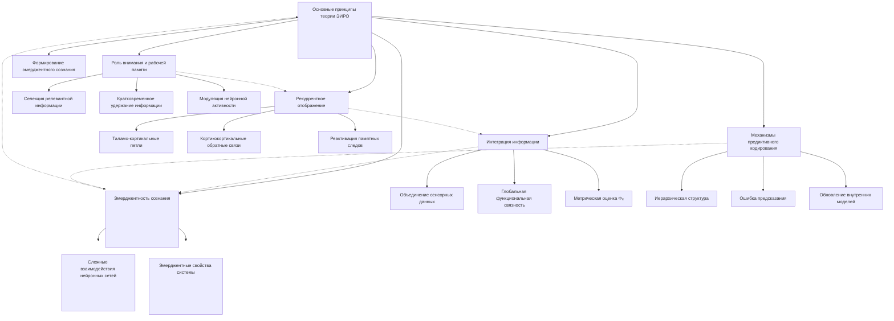

**Источник**:

- **Раздел:** Теория сознания
- **Файл:** [Теория Сознания](/README.md)
---

### Теория Эмерджентной Интеграции и Рекуррентного Отображения (ЭИРО) > Теоретический framework ЭИРО: > Аналитика: > Рекуррентная космология

```mermaid
graph TD
    A[Рекуррентная космология]
    A --> B[Космология]
    A --> C[Физика элементарных частиц]
    A --> D[Квантовая теория и информация]
    A --> E[Математические подходы]
    A --> F[Химия и материалы]
    A --> G[Принципы физики]

    B --> B1[Рождение Вселенной и инфляция]
    B --> B2[Космический микроволновый фон]
    B --> B3[Тёмная материя и энергия]
    B --> B4[Формирование крупномасштабной структуры]
    B --> B5[Рекуррентная космология]

    C --> C1[Стандартная модель]
    C --> C2[Новые частицы и взаимодействия]
    C --> C3[Рекуррентные эффекты в физике частиц]
    C --> C4[Экзотические мезоны и адроны]

    D --> D1[Интеграция квантовой информации]
    D --> D2[Линейность и суперпозиция]
    D --> D3[Декогеренция и квантовые тесты]
    D --> D4[Голография и квантовая гравитация]

    E --> E1[Рекуррентные математические структуры]
    E --> E2[Топологические аспекты]
    E --> E3[Симметрии и законы сохранения]
    E --> E4[Калибровочные группы]

    F --> F1[Новые материалы]
    F --> F2[Молекулярные орбитали]
    F --> F3[Квантовая химия]
    F --> F4[Химические реакции и рекуррентность]

    G --> G1[Принцип причинности]
    G --> G2[Принцип локальности]
    G --> G3[Принцип минимального действия]
    G --> G4[Принцип суперпозиции]

    B1 --> H1[Большой взрыв]
    B1 --> H2[Инфляционная модель]
    B5 --> H3[Рекуррентные циклы Вселенной]
    B3 --> H4[Экспериментальные данные]

    C3 --> I1[Сверхтяжёлые лептоны и кварки]
    C3 --> I2[Изменение вероятностей распада]
    C3 --> I3[Рекуррентные переносчики]
    C4 --> I4[Модификация спектров частиц]

    E1 --> J1[Рекуррентные группы]
    E1 --> J2[Рекуррентные многообразия]
    E3 --> J3[Законы сохранения энергии]
    E4 --> J4[Лагранжианы взаимодействий]

    F1 --> K1[Рекуррентные материалы]
    F2 --> K2[Энергетические переходы]
    F4 --> K3[Квантовые связи в реакциях]

    G1 --> L1[Причинно-следственные связи]
    G2 --> L2[Замкнутые системы]
    G3 --> L3[Оптимизация процессов]
    G4 --> L4[Квантовая суперпозиция]
```

**Источник**:

- **Раздел:** Теория сознания
- **Файл:** [Теория Сознания](/README.md)
---

### Теория Эмерджентной Интеграции и Рекуррентного Отображения (ЭИРО) > Теоретический framework ЭИРО: > Аннотация

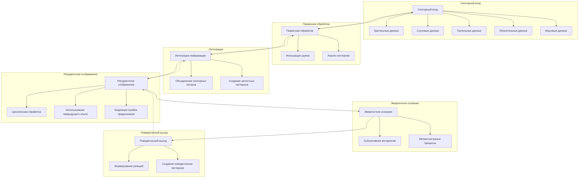

**Источник**:

- **Раздел:** Теория сознания
- **Файл:** [Теория Сознания](/README.md)
---

### Теория Эмерджентной Интеграции и Рекуррентного Отображения (ЭИРО) > Теоретический framework ЭИРО: > 1. Введение > 1.2. Существующие подходы и необходимость интегративной теории

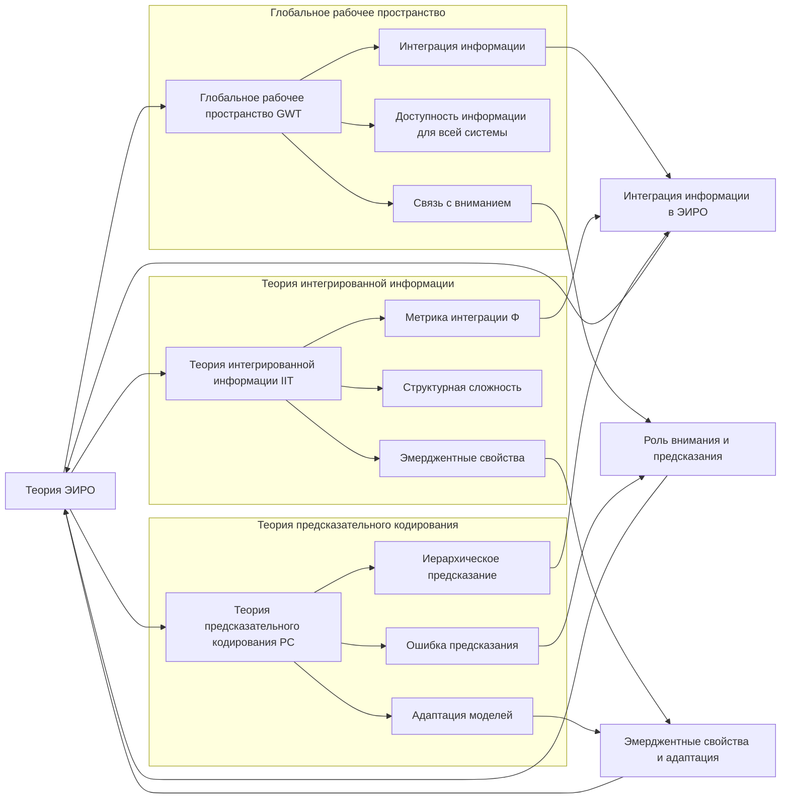

**Источник**:

- **Раздел:** Теория сознания
- **Файл:** [Теория Сознания](/README.md)
---

### Теория Эмерджентной Интеграции и Рекуррентного Отображения (ЭИРО) > Теоретический framework ЭИРО: > 2. Основные положения теории ЭИРО > 2.1. Эмерджентность сознания

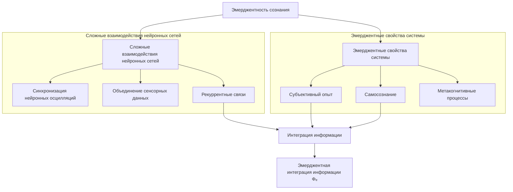

**Источник**:

- **Раздел:** Теория сознания
- **Файл:** [Теория Сознания](/README.md)
---

### Теория Эмерджентной Интеграции и Рекуррентного Отображения (ЭИРО) > Теоретический framework ЭИРО: > 2. Основные положения теории ЭИРО > 2.2. Интеграция информации

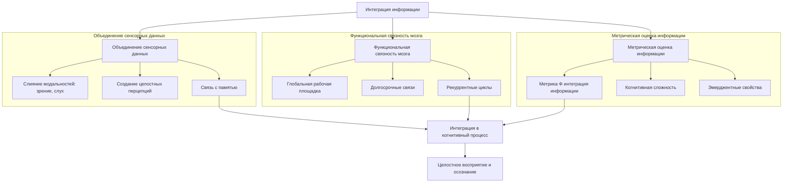

**Источник**:

- **Раздел:** Теория сознания
- **Файл:** [Теория Сознания](/README.md)
---

### Теория Эмерджентной Интеграции и Рекуррентного Отображения (ЭИРО) > Теоретический framework ЭИРО: > 2. Основные положения теории ЭИРО > 2.4. Механизмы предиктивного кодирования

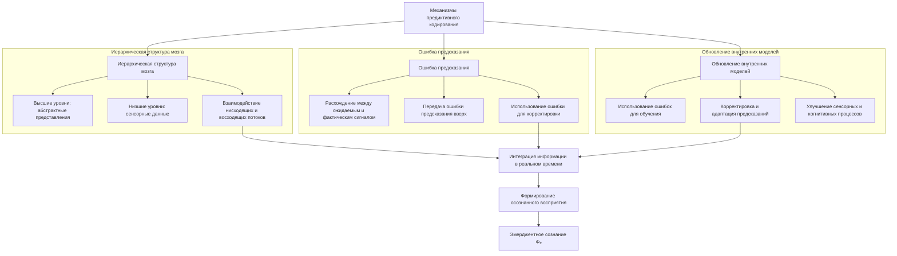

**Источник**:

- **Раздел:** Теория сознания
- **Файл:** [Теория Сознания](/README.md)
---

### Теория Эмерджентной Интеграции и Рекуррентного Отображения (ЭИРО) > Теоретический framework ЭИРО: > 3. Нейробиологические основания теории > 3.1. Интегративные нейронные сети

```mermaid
graph TD
    A[Интегративные нейронные сети]
    A --> B[Сенсорная интеграция]
    B --> B1[Обработка зрительных данных]
    B --> B2[Обработка слуховых данных]
    B --> B3[Обработка тактильных данных]

    A --> C[Когнитивная интеграция]
    C --> C1[Пространственное восприятие]
    C --> C2[Объединение сенсорной информации]
    C --> C3[Принятие решений]

    A --> D[Моторная интеграция]
    D --> D1[Планирование движений]
    D --> D2[Обратная связь моторной системы]
    D --> D3[Исполнение движений]

    A --> E[Рекуррентные связи]
    E --> E1[Обратные сигналы к сенсорным системам]
    E --> E2[Модуляция когнитивных процессов]
    E --> E3[Обучение на основе опыта]

    A --> F[Эмерджентные свойства системы]
    F --> F1[Сложные взаимодействия нейронных сетей]
    F --> F2[Глобальная функциональная связность]
    F --> F3[Генерация осознанных переживаний]
```

**Источник**:

- **Раздел:** Теория сознания
- **Файл:** [Теория Сознания](/README.md)
---

### Теория Эмерджентной Интеграции и Рекуррентного Отображения (ЭИРО) > Теоретический framework ЭИРО: > 3. Нейробиологические основания теории > 3.2. Рекуррентные связи и петли

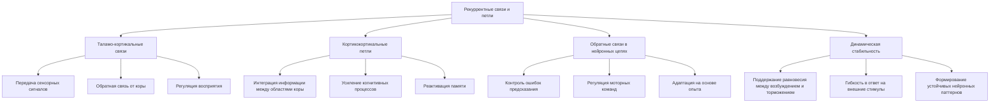

**Источник**:

- **Раздел:** Теория сознания
- **Файл:** [Теория Сознания](/README.md)
---

### Теория Эмерджентной Интеграции и Рекуррентного Отображения (ЭИРО) > Теоретический framework ЭИРО: > 3. Нейробиологические основания теории > 3.3. Предсказательное кодирование

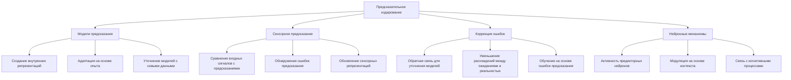

**Источник**:

- **Раздел:** Теория сознания
- **Файл:** [Теория Сознания](/README.md)
---

### Теория Эмерджентной Интеграции и Рекуррентного Отображения (ЭИРО) > Теоретический framework ЭИРО: > 3. Нейробиологические основания теории > 3.4. Роль нейромедиаторных систем в рекуррентных процессах и интеграции информации

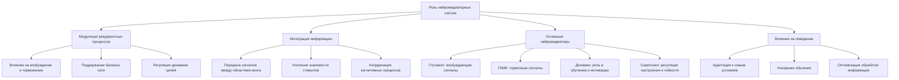

**Источник**:

- **Раздел:** Теория сознания
- **Файл:** [Теория Сознания](/README.md)
---

### Теория Эмерджентной Интеграции и Рекуррентного Отображения (ЭИРО) > Теоретический framework ЭИРО: > 3. Нейробиологические основания теории > 3.5. Структурная и функциональная коннективность между областями мозга

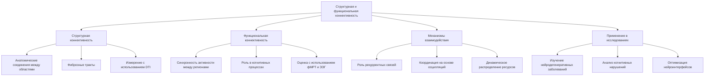

**Источник**:

- **Раздел:** Теория сознания
- **Файл:** [Теория Сознания](/README.md)
---

### Дополнительные компоненты метрики Φₑ в контексте теории Эмергентной Интеграции и Рекуррентного Отображения (ЭИРО) > Оглавление > 2. Компоненты метрики Φₑ

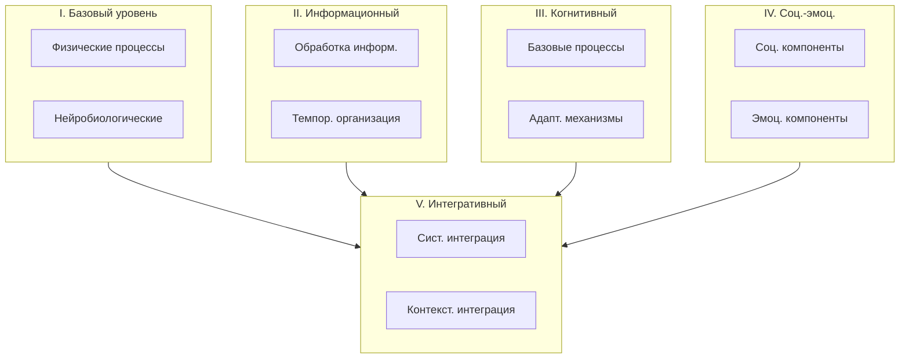

**Источник**:

- **Раздел:** Теория сознания
- **Файл:** [Дополнительные компоненты метрики Φₑ в контексте теории ЭИРО](/Components-of-the-F-metric.md)
---

### Мультимодальная перцептивная репрезентация в контексте теории Эмергентной Интеграции и Рекуррентного Отображения (ЭИРО) > Аннотация

```mermaid
graph TD
    A[Мультимодальная Перцептивная Репрезентация] --> B1[Сенсорная Интеграция]
    A --> B2[Темпоральная Интеграция]
    A --> B3[Эмоциональная Модуляция]
    A --> B4[Контекстуальная Интеграция]
    A --> B5[Метакогнитивная Осведомленность]
    A --> B6[Социальная Интерактивность]

    B1 --> C1[Конвергенция сенсорных путей]
    B1 --> C2[Мультисенсорные нейроны]
    B1 --> C3[Топографическая организация связей]
    B1 --> C4[Рекуррентные взаимодействия]

    B2 --> C5[Связывание событий во времени]
    B2 --> C6[Ритмические процессы: тета, гамма]
    B2 --> C7[Интеграция кратковременной и долговременной информации]

    B3 --> C8[Влияние эмоциональных состояний]
    B3 --> C9[Лимбическая система]
    B3 --> C10[Нейромедиаторные системы]

    B4 --> C11[Окружающая среда и ситуативные условия]
    B4 --> C12[Интеграция с семантическими и эпизодическими знаниями]
    B4 --> C13[Экологические факторы]

    B5 --> C14[Осознание ментальных процессов]
    B5 --> C15[Роль префронтальной коры]
    B5 --> C16[Влияние метакогнитивных способностей]

    B6 --> C17[Социальный контекст]
    B6 --> C18[Теория разума]
    B6 --> C19[Эмпатия и социальные навыки]

    style A fill:#f9f,stroke:#333,stroke-width:4px
    style B1 fill:#bbf,stroke:#333,stroke-width:2px
    style B2 fill:#bbf,stroke:#333,stroke-width:2px
    style B3 fill:#bbf,stroke:#333,stroke-width:2px
    style B4 fill:#bbf,stroke:#333,stroke-width:2px
    style B5 fill:#bbf,stroke:#333,stroke-width:2px
    style B6 fill:#bbf,stroke:#333,stroke-width:2px
```

**Источник**:

- **Раздел:** Теория сознания
- **Файл:** [Мультимодальная перцептивная репрезентация в контексте теории ЭИРО](/Multimodal-perceptual-representation.md)
---

### Мультимодальная перцептивная репрезентация в контексте теории Эмергентной Интеграции и Рекуррентного Отображения (ЭИРО) > Аннотация > 2. Механизмы сенсорной интеграции

```mermaid
graph TD
    A[Механизмы Сенсорной Интеграции] --> B1[Конвергенция Сенсорных Путей]
    A --> B2[Роль Мультисенсорных Нейронов]
    A --> B3[Топографическая Организация]
    A --> B4[Рекуррентные Взаимодействия]

    B1 --> C1[Сходящиеся входы на высоких уровнях]
    B1 --> C2[Интеграция информации из разных модальностей]

    B2 --> C3[Локализация в ассоциативных областях]
    B2 --> C4[Суперадаптивные ответы на мультисенсорные стимулы]
    B2 --> C5[Пространственно-временная конвергенция]

    B3 --> C6[Сохранение топографической структуры сигналов]
    B3 --> C7[Ретинотопическая организация в зрительной системе]
    B3 --> C8[Пространственное соответствие между модальностями]

    B4 --> C9[Обратные проекции от высших к низшим областям]
    B4 --> C10[Циклическое взаимодействие между уровнями]
    B4 --> C11[Поддержание активности нейронных ансамблей]

    style A fill:#f9f,stroke:#333,stroke-width:4px
    style B1 fill:#bbf,stroke:#333,stroke-width:2px
    style B2 fill:#bbf,stroke:#333,stroke-width:2px
    style B3 fill:#bbf,stroke:#333,stroke-width:2px
    style B4 fill:#bbf,stroke:#333,stroke-width:2px
```

**Источник**:

- **Раздел:** Теория сознания
- **Файл:** [Мультимодальная перцептивная репрезентация в контексте теории ЭИРО](/Multimodal-perceptual-representation.md)
---

### Мультимодальная перцептивная репрезентация в контексте теории Эмергентной Интеграции и Рекуррентного Отображения (ЭИРО) > Аннотация > 2. Механизмы сенсорной интеграции > 2.1. Конвергенция сенсорных путей

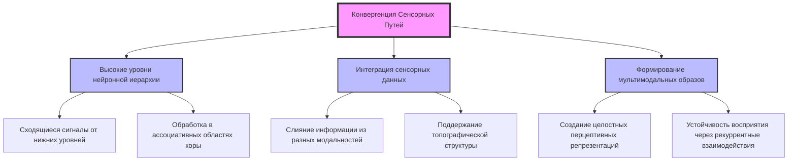

**Источник**:

- **Раздел:** Теория сознания
- **Файл:** [Мультимодальная перцептивная репрезентация в контексте теории ЭИРО](/Multimodal-perceptual-representation.md)
---

### Мультимодальная перцептивная репрезентация в контексте теории Эмергентной Интеграции и Рекуррентного Отображения (ЭИРО) > Аннотация > 2. Механизмы сенсорной интеграции > 2.2. Роль мультисенсорных нейронов

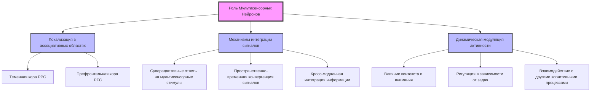

**Источник**:

- **Раздел:** Теория сознания
- **Файл:** [Мультимодальная перцептивная репрезентация в контексте теории ЭИРО](/Multimodal-perceptual-representation.md)
---

### Мультимодальная перцептивная репрезентация в контексте теории Эмергентной Интеграции и Рекуррентного Отображения (ЭИРО) > Аннотация > 2. Механизмы сенсорной интеграции > 2.3. Топографическая организация сенсорных связей

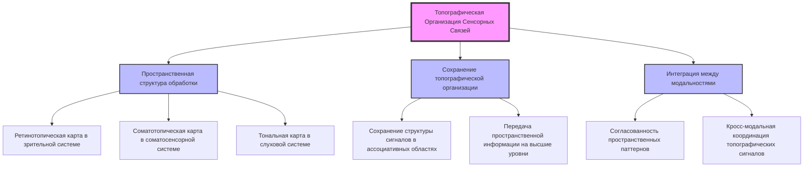

**Источник**:

- **Раздел:** Теория сознания
- **Файл:** [Мультимодальная перцептивная репрезентация в контексте теории ЭИРО](/Multimodal-perceptual-representation.md)
---

### Мультимодальная перцептивная репрезентация в контексте теории Эмергентной Интеграции и Рекуррентного Отображения (ЭИРО) > Аннотация > 2. Механизмы сенсорной интеграции > 2.4. Рекуррентные взаимодействия в сенсорной интеграции

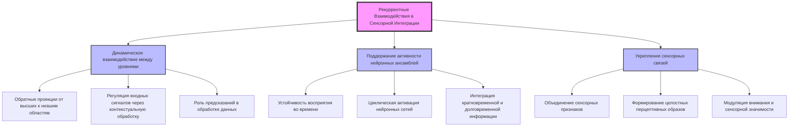

**Источник**:

- **Раздел:** Теория сознания
- **Файл:** [Мультимодальная перцептивная репрезентация в контексте теории ЭИРО](/Multimodal-perceptual-representation.md)
---

### Мультимодальная перцептивная репрезентация в контексте теории Эмергентной Интеграции и Рекуррентного Отображения (ЭИРО) > Аннотация > 3. Темпоральная интеграция и синхронизация

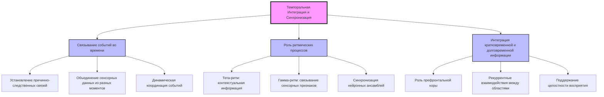

**Источник**:

- **Раздел:** Теория сознания
- **Файл:** [Мультимодальная перцептивная репрезентация в контексте теории ЭИРО](/Multimodal-perceptual-representation.md)
---

### Мультимодальная перцептивная репрезентация в контексте теории Эмергентной Интеграции и Рекуррентного Отображения (ЭИРО) > Аннотация > 3. Темпоральная интеграция и синхронизация > 3.1. Связывание событий во времени

```mermaid
graph TD
    A[Связывание событий во времени] --> B1[Интеграция временной информации]
    A --> B2[Установление причинно-следственных связей]
    A --> B3[Роль рекуррентных взаимодействий]

    B1 --> C1[Объединение событий из разных моментов]
    B1 --> C2[Создание когерентной временной последовательности]

    B2 --> C3[Выявление зависимостей между событиями]
    B2 --> C4[Предсказание будущих состояний]

    B3 --> C5[Обратные проекции между нейронными уровнями]
    B3 --> C6[Динамическая координация сенсорных и когнитивных данных]

    style A fill:#f9f,stroke:#333,stroke-width:4px
    style B1 fill:#bbf,stroke:#333,stroke-width:2px
    style B2 fill:#bbf,stroke:#333,stroke-width:2px
    style B3 fill:#bbf,stroke:#333,stroke-width:2px
```

**Источник**:

- **Раздел:** Теория сознания
- **Файл:** [Мультимодальная перцептивная репрезентация в контексте теории ЭИРО](/Multimodal-perceptual-representation.md)
---

### Мультимодальная перцептивная репрезентация в контексте теории Эмергентной Интеграции и Рекуррентного Отображения (ЭИРО) > Аннотация > 3. Темпоральная интеграция и синхронизация > 3.2. Роль ритмических процессов (тета, гамма)

```mermaid
graph TD
    A[Роль ритмических процессов тета, гамма] --> B1[Тета-ритм 4-8 Гц]
    A --> B2[Гамма-ритм 30-100 Гц]
    A --> B3[Синхронизация нейронной активности]

    B1 --> C1[Кодирование контекстуальной информации]
    B1 --> C2[Связывание текущих данных с памятью]
    B1 --> C3[Регуляция долгосрочных процессов]

    B2 --> C4[Слияние сенсорных признаков]
    B2 --> C5[Создание целостных перцептивных образов]
    B2 --> C6[Обеспечение временной координации]

    B3 --> C7[Согласование активности нейронных ансамблей]
    B3 --> C8[Поддержание когерентности сигналов]
    B3 --> C9[Обеспечение кросс-модальной интеграции]

    style A fill:#f9f,stroke:#333,stroke-width:4px
    style B1 fill:#bbf,stroke:#333,stroke-width:2px
    style B2 fill:#bbf,stroke:#333,stroke-width:2px
    style B3 fill:#bbf,stroke:#333,stroke-width:2px
```

**Источник**:

- **Раздел:** Теория сознания
- **Файл:** [Мультимодальная перцептивная репрезентация в контексте теории ЭИРО](/Multimodal-perceptual-representation.md)
---

### Мультимодальная перцептивная репрезентация в контексте теории Эмергентной Интеграции и Рекуррентного Отображения (ЭИРО) > Аннотация > 3. Темпоральная интеграция и синхронизация > 3.3. Интеграция кратковременной и долговременной информации

```mermaid
graph TD
    A[Интеграция кратковременной и долговременной информации] --> B1[Роль префронтальной коры]
    A --> B2[Рекуррентные взаимодействия]
    A --> B3[Сохранение целостности информации]

    B1 --> C1[Управление когнитивными процессами]
    B1 --> C2[Связывание текущих данных с долговременной памятью]
    B1 --> C3[Обеспечение когнитивной гибкости]

    B2 --> C4[Обратные проекции между префронтальной корой и гиппокампом]
    B2 --> C5[Поддержание активации нейронных ансамблей]
    B2 --> C6[Динамическое обновление внутренних моделей]

    B3 --> C7[Непрерывность сознательного восприятия]
    B3 --> C8[Интеграция сенсорной и контекстуальной информации]
    B3 --> C9[Устойчивость перцептивных репрезентаций]

    style A fill:#f9f,stroke:#333,stroke-width:4px
    style B1 fill:#bbf,stroke:#333,stroke-width:2px
    style B2 fill:#bbf,stroke:#333,stroke-width:2px
    style B3 fill:#bbf,stroke:#333,stroke-width:2px
```

**Источник**:

- **Раздел:** Теория сознания
- **Файл:** [Мультимодальная перцептивная репрезентация в контексте теории ЭИРО](/Multimodal-perceptual-representation.md)
---

### Мультимодальная перцептивная репрезентация в контексте теории Эмергентной Интеграции и Рекуррентного Отображения (ЭИРО) > Аннотация > 4. Эмоциональная модуляция перцептивных репрезентаций

```mermaid
graph TD
    A[Эмоциональная модуляция перцептивных репрезентаций] --> B1[Влияние эмоциональных состояний]
    A --> B2[Участие лимбической системы]
    A --> B3[Роль нейромедиаторных систем]

    B1 --> C1[Изменение восприятия в зависимости от эмоций]
    B1 --> C2[Динамическая модуляция сенсорной обработки]
    B1 --> C3[Создание эмоциональной окраски образов]

    B2 --> C4[Роль миндалины в обработке эмоций]
    B2 --> C5[Гиппокамп и формирование эмоциональных воспоминаний]
    B2 --> C6[Рекуррентные взаимодействия между лимбической системой и корой]

    B3 --> C7[Влияние серотонинергической системы]
    B3 --> C8[Роль норадреналина в стрессовых ситуациях]
    B3 --> C9[Модуляция внимания через ацетилхолин]

    style A fill:#f9f,stroke:#333,stroke-width:4px
    style B1 fill:#bbf,stroke:#333,stroke-width:2px
    style B2 fill:#bbf,stroke:#333,stroke-width:2px
    style B3 fill:#bbf,stroke:#333,stroke-width:2px
```

**Источник**:

- **Раздел:** Теория сознания
- **Файл:** [Мультимодальная перцептивная репрезентация в контексте теории ЭИРО](/Multimodal-perceptual-representation.md)
---

### Теория Рекуррентной Вселенной: Новая Парадигма Космологии

```mermaid
graph TD
    A[Теория Рекуррентной Вселенной]
    A --> B[Введение]
    A --> C[Основы теории]
    A --> D[Математические основы]
    A --> E[Экспериментальные предсказания]

    B --> B1[Современные вызовы космологии]
    B --> B2[Роль информации и квантовых эффектов]

    C --> C1[Квантовая механика]
    C --> C2[Общая теория относительности]
    C --> C3[Интеграция информации]
    C --> C4[Рекуррентные процессы]

    D --> D1[Информационное поле]
    D --> D2[Рекуррентные взаимодействия]
    D --> D3[Уравнения движения]

    E --> E1[Наблюдения космического микроволнового фона]
    E --> E2[Аномалии в движении галактик]
    E --> E3[Поиск новых частиц]

    B1 --> F1[Темная материя и энергия]
    B2 --> F2[Происхождение пространства-времени]

    C1 --> G1[Суперпозиция и запутанность]
    C2 --> G2[Искривление пространства-времени]
    C3 --> G3[Квантовые эффекты на космологических масштабах]
    C4 --> G4[Циклические процессы]

    D1 --> H1[Математическое описание]
    D2 --> H2[Примеры взаимодействий]
    D3 --> H3[Прогнозы моделей]

    E1 --> I1[Анизотропии и поляризация]
    E2 --> I2[Изменения параметров кривизны]
    E3 --> I3[Эксперименты на коллайдерах]
```

**Источник**:

- **Раздел:** Рекуррентная космология
- **Файл:** [Теория Рекуррентной Вселенной: Новая Парадигма Космологии](/recurrent-universe/README.md)
---

### Принцип суперпозиции через призму теории рекуррентной Вселенной

```mermaid
graph TD
    A[Принцип суперпозиции через призму теории рекуррентной Вселенной]
    A --> B[Введение]
    A --> C[Принцип суперпозиции в квантовой механике]
    A --> D[Эмергентная Интеграция и Рекуррентное Отображение ЭИРО]
    A --> E[Влияние ЭИРО на принцип суперпозиции]
    A --> F[Заключение]

    B --> B1[Краеугольный камень квантовой механики]
    B --> B2[Роль информации в квантовых системах]

    C --> C1[Уравнение Шрёдингера]
    C --> C2[Линейность и интерференционные явления]

    D --> D1[Интегрированная информация]
    D --> D2[Рекуррентные взаимодействия]
    D --> D3[Математическая формализация]

    E --> E1[Нарушение линейности]
    E --> E2[Новые квантовые эффекты]
    E --> E3[Прогнозы для экспериментов]

    F --> F1[Необходимость пересмотра традиционных представлений]
    F --> F2[Направления дальнейших исследований]
```

**Источник**:

- **Раздел:** Рекуррентная космология
- **Файл:** [Принцип суперпозиции через призму ЭИРО и новой модели Вселенной](/The-principle-of-superposition.md)
---

### Принцип локальности через призму теории рекуррентной Вселенной

```mermaid
graph TD
    A[Принцип локальности через призму теории рекуррентной Вселенной]
    A --> B[Классическая локальность]
    A --> C[Квантовая нелокальность]
    A --> D[Эмерджентная интеграция и рекуррентные отображения]
    A --> E[Математическое описание]
    A --> F[Экспериментальные перспективы]

    B --> B1[Световой конус и пределы влияния]
    B --> B2[Локальные взаимодействия]

    C --> C1[Квантовая запутанность]
    C --> C2[Теоремы Белла]
    C --> C3[Экспериментальные подтверждения]

    D --> D1[Интеграция информации Φ]
    D --> D2[Рекуррентные сети]
    D --> D3[Новые принципы нелокальности]

    E --> E1[Плотность интегрированной квантовой информации ρ_IQI]
    E --> E2[Параметр рекуррентности R]
    E --> E3[Новые физические величины]

    F --> F1[Анализ квантовой запутанности]
    F --> F2[Космологические наблюдения]
    F --> F3[Экспериментальная проверка ЭИРО]

    D1 --> G1[Количественная оценка информации]
    D2 --> G2[Циркуляция информации в системах]
    D3 --> G3[Влияние на фундаментальные законы]
```

**Источник**:

- **Раздел:** Рекуррентная космология
- **Файл:** [Принцип локальности через призму ЭИРО и новой модели Вселенной](/The-principle-of-locality.md)
---

### Закон сохранения энергии и импульса через призму теории рекуррентной Вселенной

```mermaid
graph TD
    A[Закон сохранения энергии и импульса через призму теории рекуррентной Вселенной]
    A --> B[Классическое и релятивистское понимание]
    A --> C[Интегрированная квантовая информация и рекуррентные процессы]
    A --> D[Модификация тензора энергии-импульса]
    A --> E[Космологические последствия]
    A --> F[Обсуждение и перспективы]

    B --> B1[Классические законы Ньютона]
    B --> B2[Теорема Нётер]
    B --> B3[Ковариантное сохранение в ОТО]

    C --> C1[Интегрированная квантовая информация ρ_IQI]
    C --> C2[Рекуррентные взаимодействия R]
    C --> C3[Эмерджентные свойства гравитации]

    D --> D1[Добавление нового члена в тензор]
    D --> D2[Ковариантное сохранение полного тензора]
    D --> D3[Математическое доказательство согласованности]

    E --> E1[Влияние на ускорение расширения Вселенной]
    E --> E2[Соответствие наблюдаемым данным]
    E --> E3[Эффект, подобный тёмной энергии]

    F --> F1[Теоретическая консистентность]
    F --> F2[Необходимость экспериментальной проверки]
    F --> F3[Связь с квантовой гравитацией и голографией]
```

**Источник**:

- **Раздел:** Рекуррентная космология
- **Файл:** [Закон сохранения энергии и импульса через призму ЭИРО и новой модели Вселенной](/The-law-of-conservation-of-energy-and-momentum.md)
---

### Эйнштейнова теория гравитации через призму теории интегрированной информации и рекуррентной Вселенной

```mermaid
graph TD
    A[Эйнштейнова теория гравитации через призму интегрированной информации]
    A --> B[Основы общей теории относительности ОТО]
    A --> C[Интегрированная квантовая информация ρ_IQI]
    A --> D[Рекуррентные эффекты R]
    A --> E[Космологические и физические последствия]

    B --> B1[Уравнения Эйнштейна]
    B --> B2[Кривизна пространства-времени]
    B --> B3[Связь материи и энергии с геометрией]

    C --> C1[Интеграция информации в уравнения]
    C --> C2[Влияние ρ_IQI на метрику]
    C --> C3[Энтропийные свойства гравитации]

    D --> D1[Циклические процессы в космологии]
    D --> D2[Дополнительные члены в уравнениях]
    D --> D3[Модификация структуры взаимодействий]

    E --> E1[Альтернативное объяснение тёмной энергии]
    E --> E2[Изменение космологических параметров]
    E --> E3[Связь с квантовой гравитацией]

    E3 --> F[Поддержка голографического принципа]
    E3 --> G[Совместимость с теорией струн]
    E3 --> H[Возможности для новых наблюдений]
```

**Источник**:

- **Раздел:** Рекуррентная космология
- **Файл:** [Эйнштейнова теория гравитации через призму теории интегрированной информации и новые модели Вселенной](/Einsteins-theory-of-gravity.md)
---

### Копенгагенская интерпретация квантовой механики через призму теории рекуррентной Вселенной

```mermaid
graph TD
    A[Копенгагенская интерпретация квантовой механики]
    A --> B[Коллапс волновой функции]
    A --> C[Роль наблюдателя]
    A --> D[Эмергентная интеграция и рекуррентные процессы]

    B --> B1[Традиционное понимание: мгновенный переход]
    B --> B2[Переосмысление с учетом ЭИРО]
    B --> B3[Влияние рекуррентных эффектов]

    C --> C1[Классическая роль наблюдателя]
    C --> C2[Замена наблюдателя внутренними процессами]
    C --> C3[Интеграция квантовой информации]

    D --> D1[Рекуррентные структуры в квантовых системах]
    D --> D2[Влияние на состояние системы]
    D --> D3[Эмерджентные свойства квантовых систем]

    D1 --> E1[Ключевая роль информации]
    D2 --> E2[Модификация динамики измерения]
    D3 --> E3[Переосмысление нелокальности]

    E1 --> F1[Интеграция с нейронауками]
    E1 --> F2[Связь с теорией информации]
    E3 --> F3[Перспективы для квантовой гравитации]
```

**Источник**:

- **Раздел:** Рекуррентная космология
- **Файл:** [Копенгагенская интерпретация квантовой механики через призму теории ЭИРО](/The-Copenhagen-Interpretation-of-Quantum-Mechanics.md)
---

### Принцип причинности через призму эмергентных явлений и теории рекуррентной Вселенной

```mermaid
graph TD
    A[Принцип причинности через призму рекуррентной Вселенной]
    A --> B[Классическое понимание причинности]
    A --> C[Эмергентные явления]
    A --> D[Нелокальность и квантовая запутанность]
    A --> E[Рекуррентные взаимодействия]

    B --> B1[Причина предшествует следствию]
    B --> B2[Ограничение скоростью света]
    B --> B3[Теория относительности]

    C --> C1[Коллективное поведение частиц]
    C --> C2[Интеграция информации]
    C --> C3[Появление новых системных свойств]

    D --> D1[Квантовая запутанность]
    D --> D2[Теоремы Белла]
    D --> D3[Нарушение локального реализма]

    E --> E1[Рекуррентные процессы]
    E --> E2[Интеграция информации и прошлые состояния]
    E --> E3[Модификация уравнений движения]

    E3 --> F1[Новые взаимодействия]
    E3 --> F2[Изменение структуры причинности]
    E3 --> F3[Космологические и физические последствия]
```

**Источник**:

- **Раздел:** Рекуррентная космология
- **Файл:** [Принцип причинности через призму теории ЭИРО](/The-principle-of-causality.md)
---

### Коммутационные соотношения

```mermaid
graph TD
    A[Коммутационные соотношения]
    A --> B[Принцип неопределенности]
    A --> C[Модификация уравнений]
    A --> D[Эмергентная интеграция информации]
    A --> E[Рекуррентные взаимодействия]

    B --> B1[Традиционные соотношения: x, p = iℏ]
    B --> B2[Модифицированные соотношения с учетом Φₑ]
    B2 --> B2a[Добавление члена f Φₑ]
    B2 --> B2b[Влияние на спектры энергий]

    C --> C1[Дополнительные члены в уравнениях движения]
    C1 --> C1a[Связь с параметрами ρ_IQI и R]
    C1 --> C1b[Новые типы взаимодействий]

    D --> D1[Φₑ — интегрированная квантовая информация]
    D1 --> D1a[Влияние на корреляции]
    D1 --> D1b[Снижение неопределенности]

    E --> E1[Рекуррентные поправки в уравнениях]
    E --> E2[Изменения в спектре частиц]
    E --> E3[Квантовые нелокальные эффекты]
```

**Источник**:

- **Раздел:** Рекуррентная космология
- **Файл:** [Коммутационные соотношения через призму теории ЭИРО](/Switching-relations.md)
---

### Полный цикл рекуррентной вселенной: интеграция теории эмергентной интеграции и рекуррентного отображения (ЭИРО) в космологию

```mermaid
graph TD
    A[Полный цикл рекуррентной вселенной]
    A --> B[Возникновение вселенной]
    A --> C[Эволюция вселенной]
    A --> D[Конец цикла]
    A --> E[Многомерные структуры]
    A --> F[Экспериментальные подтверждения]

    B --> B1[Интеграция квантовой информации IQI]
    B --> B2[Рекуррентные процессы]
    B --> B3[Минимизация космологического действия]

    C --> C1[Уравнения Фридмана с модификацией]
    C --> C2[Роль темной материи и энергии]
    C --> C3[Влияние IQI на расширение]

    D --> D1[Коллапс или новое рождение]
    D --> D2[Рекуррентные явления на масштабах]
    D --> D3[Потенциал многократных циклов]

    E --> E1[Дополнительные измерения]
    E --> E2[Многомерная топология]
    E --> E3[Связь с нашей вселенной]

    F --> F1[Космический микроволновый фон]
    F --> F2[Анизотропии и флуктуации]
    F --> F3[Теоретические предсказания]

    B1 --> G1[Информационные флуктуации]
    B2 --> G2[Квантовые и рекуррентные эффекты]
    B3 --> G3[Динамика потенциала V_IQI]

    C1 --> H1[Кривизна и геометрия пространства]
    C2 --> H2[Эмерджентные процессы]
    C3 --> H3[Ускоренное расширение]

    D1 --> I1[Энергетические трансформации]
    D2 --> I2[Рекуррентные взаимодействия]
    D3 --> I3[Долговременная устойчивость]

    E1 --> J1[Рекуррентные измерения]
    E2 --> J2[Математическая связь]
    E3 --> J3[Модели многомерных систем]
```

**Источник**:

- **Раздел:** Рекуррентная космология
- **Файл:** [Полный цикл рекуррентной вселенной: интеграция теории ЭИРО в космологию](/the-complete-cycle-of-the-recurrent-universe.md)
---

### Первичное информационное поле

```mermaid
graph TD
    A[Первичное информационное поле]
    A --> B[Концепция и обоснование]
    A --> C[Математическое описание]
    A --> D[Физические интерпретации]
    A --> E[Экспериментальные перспективы]

    B --> B1[Квантовая нелокальность]
    B --> B2[Принцип It from Bit]
    B --> B3[Эмерджентность пространства-времени]

    C --> C1[Информационные кванты]
    C --> C2[Операторы интеграции и рекуррентности]
    C --> C3[Уравнение состояния вселенной]

    D --> D1[Потенциальные вселенные]
    D --> D2[Единое информационное единство]
    D --> D3[Явления квантовой запутанности]

    E --> E1[Анализ квантовых эффектов]
    E --> E2[Теоретические предсказания]
    E --> E3[Технические аспекты исследований]
```

**Источник**:

- **Раздел:** Рекуррентная космология
- **Файл:** [Первичное информационное поле](/The-primary-information-field.md)
---

### Новая модель вселенной в современной физике

```mermaid
graph TD
    A[Новая модель вселенной в современной физике]
    A --> B[Основы теории ЭИРО]
    A --> C[Математический аппарат]
    A --> D[Влияние на фундаментальные науки]
    A --> E[Экспериментальные подтверждения]

    B --> B1[Основные положения ЭИРО]
    B --> B2[Эмергентная интегрированная информация]
    B --> B3[Рекуррентные взаимодействия]

    C --> C1[Анализ интеграционной функции]
    C --> C2[Связь с квантовой механикой]
    C --> C3[Уравнения движения для рекуррентных процессов]

    D --> D1[Вклад в физику]
    D --> D2[Влияние на химию]
    D --> D3[Модификация космологических моделей]

    E --> E1[Модели проверки предсказаний]
    E --> E2[Возможные экспериментальные установки]
    E --> E3[Сравнение с данными наблюдений]

    B1 --> F1[Принципы эмерджентности]
    B2 --> F2[Математическое выражение]
    B3 --> F3[Роль рекуррентности]

    C1 --> G1[Интеграция информации]
    C2 --> G2[Рекуррентные уравнения движения]
    C3 --> G3[Экспериментальные подходы]

    D1 --> H1[Новые модели гравитации]
    D2 --> H2[Применение в квантовой химии]
    D3 --> H3[Рассмотрение темной материи и энергии]

    E1 --> I1[Обзор экспериментов]
    E2 --> I2[Технические требования]
    E3 --> I3[Интерпретация данных]
```

**Источник**:

- **Раздел:** Рекуррентная космология
- **Файл:** [Новая модель вселенной в современной физике](/A-new-model-of-the-universe-in-modern-physics.md)
---

### Молекулярные орбитали и энергетические уровни: анализ через призму теории ЭИРО и ее влияние на современную модель Вселенной

```mermaid
graph TD
    A[Молекулярные орбитали и энергетические уровни]
    A --> B[Основы квантовой химии]
    A --> C[Корректировка модели с учётом ЭИРО]
    A --> D[Влияние на физические свойства]
    A --> E[Применение в материаловедении]

    B --> B1[Стандартная модель: метод Хартри-Фока]
    B --> B2[Ограничения стандартной модели]
    B --> B3[Роль молекулярных орбиталей]

    C --> C1[Интеграция информации между электронами]
    C --> C2[Рекуррентные взаимодействия]
    C --> C3[Скорректированный гамильтониан]
    C1 --> C1a[Дополнительные энергетические уровни]
    C2 --> C2a[Изменения в волновых функциях]

    D --> D1[Модификация энергетических спектров]
    D --> D2[Новые электронные состояния]
    D --> D3[Устойчивость молекулярных структур]

    E --> E1[Разработка новых катализаторов]
    E --> E2[Материалы с заданными свойствами]
    E --> E3[Улучшение точности расчётов]
```

**Источник**:

- **Раздел:** Рекуррентная космология
- **Файл:** [Молекулярные орбитали и энергетические уровни: анализ через призму теории ЭИРО и ее влияние на современную модель Вселенной](/Molecular-orbitals-and-energy-levels.md)
---

### Влияние рекуррентности на физику частиц

```mermaid
graph TD
  A[Рекуррентная космология]
  A --> B[Модификация уравнений квантовой теории поля]
  A --> C[Предсказание новых элементарных частиц]
  A --> D[Влияние на процессы рождения и распада частиц]
  A --> E[Связь с проблемой массы]
  A --> F[Применение в теориях объединения]

  B --> B1[Дополнительные члены в уравнениях движения]
  B --> B2[Модификация коммутационных соотношений]
  B --> B3[Новые типы взаимодействий]

  C --> C1[Экзотические адроны и мезоны]
  C --> C2[Гипотетические частицы-переносчики]
  C --> C3[Сверхтяжелые лептоны и кварки]

  D --> D1[Изменение сечений рассеяния]
  D --> D2[Появление новых каналов распада]
  D --> D3[Стабилизация определенных состояний]

  E --> E1[Влияние на спонтанное нарушение симметрии]
  E --> E2[Новые механизмы генерации масс]
  E --> E3[Связь масс с геометрией пространства-времени]

  F --> F1[Унификация квантовой теории поля и ОТО]
  F --> F2[Новые типы частиц и взаимодействий]
  F --> F3[Применение математического аппарата]
```

**Источник**:

- **Раздел:** Рекуррентная космология
- **Файл:** [Влияние рекуррентности на физику частиц](/The-effect-of-recurrence-on-particle-physics.md)
---

### Новые типы частиц и взаимодействий, предсказываемые моделью рекуррентной космологии

```mermaid
graph TD
    A[Новые типы частиц и взаимодействий]
    A --> B[Рекурроны ρ-частицы]
    A --> C[Инфо-бозоны ι-частицы]
    A --> D[Новые типы взаимодействий]
    A --> E[Феноменологические следствия]

    B --> B1[Свойства рекурронов]
    B1 --> B1a[Масса: ~10^19 GeV]
    B1 --> B1b[Спин: 3/2]
    B1 --> B1c[Квантовые числа: R=1]
    B --> B2[Роль в физике частиц]

    C --> C1[Свойства инфо-бозонов]
    C1 --> C1a[Безмассовые]
    C1 --> C1b[Спин: 1]
    C1 --> C1c[Информационный заряд I]
    C --> C2[Роль в информационных взаимодействиях]

    D --> D1[Рекуррентные взаимодействия]
    D1 --> D1a[Тензор рекуррентности Rμν]
    D1 --> D1b[Константа связи gR]
    D --> D2[Информационные взаимодействия]
    D2 --> D2a[Информационный лагранжиан]

    E --> E1[Модификация масс частиц]
    E --> E2[Новые каналы распада]
    E --> E3[Аномалии в взаимодействиях]
```

**Источник**:

- **Раздел:** Рекуррентная космология
- **Файл:** [Новые типы частиц и взаимодействий предсказываемые моделью рекуррентной космологии](/New-types-of-particles-and-interactions-predicted-by-the-recurrent-cosmology-model.md)
---

### Математический аппарат развиваемый в рамках теории рекуррентной космологии

```mermaid
graph TD
    A[Математический аппарат теории рекуррентной космологии]
    A --> B[Рекуррентные группы симметрий]
    A --> C[Рекуррентные многообразия]
    A --> D[Унификация взаимодействий]
    A --> E[Квантование и симметрии]
    A --> F[Топологические аспекты]

    B --> B1[Структура групп]
    B --> B2[Генераторы рекуррентных преобразований]
    B --> B3[Коммутационные соотношения]

    C --> C1[Геометрия и топология]
    C --> C2[Рекуррентная связность]
    C --> C3[Форма кручения]

    D --> D1[Объединенный лагранжиан]
    D --> D2[Рекуррентные пропагаторы]

    E --> E1[Рекуррентное квантование]
    E --> E2[Рекуррентный путевой интеграл]

    F --> F1[Рекуррентные инварианты]
    F --> F2[Рекуррентные солитоны]
```

**Источник**:

- **Раздел:** Рекуррентная космология
- **Файл:** [Математический аппарат развиваемый в рамках теории рекуррентной космологии](/Mathematical-apparatus-developed-within-the-framework-of-the-theory-of-recurrent-cosmology.md)
---

### Приложение А: Архитектурная реализация нейронной сети ЭИРО для анализа ДНК > Описание > 1. Общая архитектура системы > 1.1 Многоуровневая структура

```mermaid
graph TD
    A[Входной слой: ДНК последовательность] --> B[Уровень предобработки]
    B --> C[Эмергентный слой]
    C --> D[Рекуррентный слой]
    D --> E[Выходной слой: Предсказание]
```

**Источник**:

- **Раздел:** Генетика и молекулярная биология
- **Файл:** [Архитектурная реализация нейронной сети ЭИРО для анализа ДНК](/Decoding-DNA-Architectural-implementation.md)
---

### Приложение А: Архитектурная реализация нейронной сети ЭИРО для анализа ДНК > Описание > 6. Специальные особенности > 6.2 Масштабируемость > Параллельная обработка последовательностей

```mermaid
graph LR
    A[Входные данные] --> B1[Воркер 1]
    A --> B2[Воркер 2]
    A --> B3[Воркер N]
    B1 --> C[Агрегатор]
    B2 --> C
    B3 --> C
    C --> D[Результат]
```

**Источник**:

- **Раздел:** Генетика и молекулярная биология
- **Файл:** [Архитектурная реализация нейронной сети ЭИРО для анализа ДНК](/Decoding-DNA-Architectural-implementation.md)
---

### Приложение А: Архитектурная реализация нейронной сети ЭИРО для анализа ДНК > Описание > 6. Специальные особенности > 6.2 Масштабируемость > Инкрементальное обучение

```mermaid
graph TD
    A[Начальная модель] --> B[Новые данные]
    B --> C{Обновление модели}
    C --> D[Валидация]
    D --> E[Интеграция]
    E --> F[Обновленная модель]
```

**Источник**:

- **Раздел:** Генетика и молекулярная биология
- **Файл:** [Архитектурная реализация нейронной сети ЭИРО для анализа ДНК](/Decoding-DNA-Architectural-implementation.md)
---

