# Справочник терминов

## ЭИРО framework

### Теория Эмерджентной Интеграции и Рекуррентного Отображения (ЭИРО)

```mermaid
graph TD
    A[Эмерджентная Интеграция и Рекуррентное Отображение]
    A --> B[Сознание и рекуррентные нейронные сети]
    B --> C1[Эмерджентность сознания]
    B --> C2[Интеграция информации]
    B --> C3[Рекуррентная обработка и предсказание]
    B --> C4[Роль внимания и рабочей памяти]
    C1 --> D1[Сложные взаимодействия между нейронами]
    C1 --> D2[Коллективная динамика системы]
    C2 --> D3[Объединение сенсорных, когнитивных и эмоциональных данных]
    C2 --> D4[Взаимодействие функциональных областей мозга]
    C3 --> D5[Генерация и сравнение предсказаний мозга]
    C3 --> D6[Обновление моделей восприятия]
    C4 --> D7[Выделение релевантной информации]
    C4 --> D8[Удержание данных в активном состоянии]

    B --> E[Нейробиологические основания]
    E --> F1[Канонические микросхемы коры]
    E --> F2[Долгосрочные и краткосрочные связи]
    E --> F3[Таламо-кортикальные петли]
    E --> F4[Кортикокортикальные обратные связи]
    E --> F5[Иерархическая организация мозга]
    F1 --> G1[Вертикальные связи]
    F1 --> G2[Горизонтальные связи]
    F2 --> G3[Связи между областями мозга]
    F2 --> G4[Локальная интеграция]
    F3 --> G5[Синхронизация активности]
    F4 --> G6[Поддержка предсказаний]
    F5 --> G7[Предсказания высших уровней]
    F5 --> G8[Передача ошибок предсказания]

    B --> H[Математическая формализация]
    H --> I1[Метрика интеграции информации Φₑ]
    H --> I2[Рекуррентные динамические системы]
    H --> I3[Байесовское обновление моделей]
    I1 --> J1[Φₑ учитывает качество информации]
    I1 --> J2[Зависимость от интеграции и рекуррентности]
    I2 --> J3[Уравнения состояния нейронных сетей]
    I2 --> J4[Матрица весов включает рекуррентные связи]
    I3 --> J5[Использование вероятностных моделей]
    I3 --> J6[Обновление предсказаний на основе данных]
```

**Источник**:

- **Раздел:** Теория сознания
- **Файл:** [Теория Сознания](/README.md)
---

### Теория Эмерджентной Интеграции и Рекуррентного Отображения (ЭИРО) > Теоретический framework ЭИРО: > Аналитика: > Рекуррентная космология

```mermaid
graph TD
    A[Рекуррентная космология]
    A --> B[Космология]
    A --> C[Физика элементарных частиц]
    A --> D[Квантовая теория и информация]
    A --> E[Математические подходы]
    A --> F[Химия и материалы]
    A --> G[Принципы физики]

    B --> B1[Рождение Вселенной и инфляция]
    B --> B2[Космический микроволновый фон]
    B --> B3[Тёмная материя и энергия]
    B --> B4[Формирование крупномасштабной структуры]
    B --> B5[Рекуррентная космология]

    C --> C1[Стандартная модель]
    C --> C2[Новые частицы и взаимодействия]
    C --> C3[Рекуррентные эффекты в физике частиц]
    C --> C4[Экзотические мезоны и адроны]

    D --> D1[Интеграция квантовой информации]
    D --> D2[Линейность и суперпозиция]
    D --> D3[Декогеренция и квантовые тесты]
    D --> D4[Голография и квантовая гравитация]

    E --> E1[Рекуррентные математические структуры]
    E --> E2[Топологические аспекты]
    E --> E3[Симметрии и законы сохранения]
    E --> E4[Калибровочные группы]

    F --> F1[Новые материалы]
    F --> F2[Молекулярные орбитали]
    F --> F3[Квантовая химия]
    F --> F4[Химические реакции и рекуррентность]

    G --> G1[Принцип причинности]
    G --> G2[Принцип локальности]
    G --> G3[Принцип минимального действия]
    G --> G4[Принцип суперпозиции]

    B1 --> H1[Большой взрыв]
    B1 --> H2[Инфляционная модель]
    B5 --> H3[Рекуррентные циклы Вселенной]
    B3 --> H4[Экспериментальные данные]

    C3 --> I1[Сверхтяжёлые лептоны и кварки]
    C3 --> I2[Изменение вероятностей распада]
    C3 --> I3[Рекуррентные переносчики]
    C4 --> I4[Модификация спектров частиц]

    E1 --> J1[Рекуррентные группы]
    E1 --> J2[Рекуррентные многообразия]
    E3 --> J3[Законы сохранения энергии]
    E4 --> J4[Лагранжианы взаимодействий]

    F1 --> K1[Рекуррентные материалы]
    F2 --> K2[Энергетические переходы]
    F4 --> K3[Квантовые связи в реакциях]

    G1 --> L1[Причинно-следственные связи]
    G2 --> L2[Замкнутые системы]
    G3 --> L3[Оптимизация процессов]
    G4 --> L4[Квантовая суперпозиция]
```

**Источник**:

- **Раздел:** Теория сознания
- **Файл:** [Теория Сознания](/README.md)
---

### Теория Эмерджентной Интеграции и Рекуррентного Отображения (ЭИРО) > Теоретический framework ЭИРО: > 1. Введение > 1.2. Существующие подходы и необходимость интегративной теории

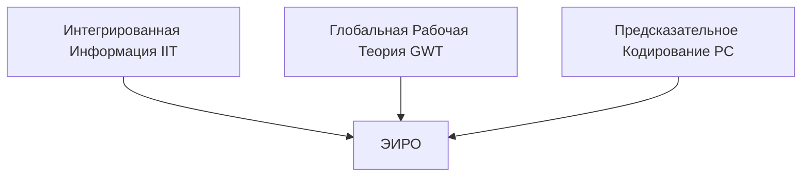

**Источник**:

- **Раздел:** Теория сознания
- **Файл:** [Теория Сознания](/README.md)
---

### Метрика эмергентной интегрированной информации

```mermaid
graph TD
    A["Метрика эмергентной интегрированной информации"] --> B["Ключевые компоненты"]
    B --> B1["Интеграция информации (Ψₐᵢⱼ)"]
    B --> B2["Рекуррентная обработка (Rᵣₑᶜ)"]

    A --> C["Формула вычисления"]
    C --> C1["Φₑ = ∫ Ψₐᵢⱼ Rᵣₑᶜ dt"]
    C --> C2["Дискретный случай: Σ Ψₐᵢⱼ Rᵣₑᶜ Δt"]

    B1 --> D1["Шаги вычисления Ψₐᵢⱼ"]
    D1 --> D1a["Разбиение системы на подсистемы"]
    D1 --> D1b["Измерение Hₜₒₜₐₗ = Σ Hᵢ"]
    D1 --> D1c["Измерение Hʲₒᵢₙₜ"]
    D1 --> D1d["Ψₐᵢⱼ = Hₜₒₜₐₗ - Hʲₒᵢₙₜ"]

    B2 --> D2["Шаги вычисления Rᵣₑᶜ"]
    D2 --> D2a["Анализ структуры сети"]
    D2 --> D2b["Создание матрицы весов W"]
    D2 --> D2c["Вычисление Rᵣₑᶜ через W"]
    D2 --> D2d["Нормализация значений"]

    A --> E["Шаги анализа"]
    E --> E1["Определение временного интервала (t₀ - t₁)"]
    E --> E2["Сбор данных о системе"]
    E --> E3["Вычисление Ψₐᵢⱼ и Rᵣₑᶜ для каждого t"]
    E --> E4["Интеграция результатов"]

    A --> F["Интерпретация результата"]
    F --> F1["Высокое Φₑ: сознательное состояние"]
    F --> F2["Низкое Φₑ: разделение информации"]

    A --> G["Практический пример"]
    G --> G1["Три компонента X₁, X₂, X₃"]
    G --> G2["Временной интервал 0-1 с"]
    G --> G3["Δt = 0.1"]
    G --> G4["Данные о H и W для каждого t"]
    G --> G5["Итог: Φₑ = 0.75 бита"]
```

**Источник**:

- **Раздел:** Теория сознания
- **Файл:** [Метрика интегрированной информации](/Integrated-Information-Metric.md)
---

### Математическая формализация предиктивного кодирования в рамках теории Эмергентной Интеграции и Рекуррентного Отображения (ЭИРО)

```mermaid
graph TD
  A[Основы предиктивного кодирования] --> A1[Предсказания мозга]
  A --> A2[Ошибка предсказания Ψₑ]
  A --> A3[Обновление модели λ]

  A1 --> A1a[Генерация предсказаний]
  A1a --> A1b[Использование модели mᵢ]
  A2 --> A2a[Расчет Ψₑ = sₜ - ᶜsₜ]
  A3 --> A3a[Коррекция параметров θ]

  B[Иерархическая структура] --> B1[Многоуровневая организация]
  B --> B2[Восходящие ошибки Ψₑ]
  B --> B3[Нисходящие предсказания]

  B1 --> B1a[Слои обработки 1 2 L]
  B2 --> B2a[Передача Ψₑ вверх]
  B3 --> B3a[Передача предсказаний вниз]

  C[Рекуррентное отображение ЭИРО] --> C1[Состояния hₜ]
  C --> C2[Рекурсия Φ]
  C --> C3[Интеграция данных]

  C1 --> C1a[Обновление hₜ = Φhₜ₋₁]
  C2 --> C2a[Учет истории и входов]
  C3 --> C3a[Слияние восходящих Ψₑ и нисходящих ᶜhₜ]

  D[Минимизация свободной энергии] --> D1[Определение F]
  D --> D2[Мозг стремится к min F]
  D --> D3[Связь F и Ψₑ]

  D1 --> D1a["F зависит от qhₜ P(sₜ|θ)"]
  D2 --> D2a[Понижение неопределенности]
  D3 --> D3a[Min F = Min Σ Ψₑ]

  E[Обучение и адаптация] --> E1[Коррекция модели]
  E --> E2[Улучшение предсказаний]
  E --> E3[Адаптация к изменениям]

  E1 --> E1a[Обновление θₜ]
  E2 --> E2a[Уточнение λ]
  E3 --> E3a[Реакция на новые вводы]

  F[Пример реализации] --> F1[Одноуровневая модель]
  F --> F2[Многослойная структура]
  F --> F3[Анализ сходимости]

  F1 --> F1a[Ψₑ = sₜ - ᶜsₜ]
  F2 --> F2a[Каждый слой передает Ψₑ]
  F3 --> F3a[Выбор η для стабильности]

  G[Связь с нейронными процессами] --> G1[Предикторные нейроны]
  G --> G2[Ошибки Ψₑ]
  G --> G3[Синаптическая пластичность]

  G1 --> G1a[Формирование предсказаний]
  G2 --> G2a[Расчет отклонений]
  G3 --> G3a[Коррекция весов]
```

**Источник**:

- **Раздел:** Теория сознания
- **Файл:** [Математическая формализация предиктивного кодирования в рамках теории ЭИРО](/predictive-coding.md)
---

### Система внимания нейронной сети через призму теории Эмергентной Интеграции и Рекуррентного Отображения (ЭИРО)

```mermaid
graph TD
    A["Эмергентная интеграция и рекуррентное отображение (ЭИРО)"]
    A1["Рекуррентные сети как основа когнитивных функций"]
    A2["Эмергентная интеграция информации через Φₑ"]
    A3["Роль байесовского обновления в прогнозировании"]

    B["Механизмы внимания у человека"]
    B1["Нейрофизиология внимания"]
    B1a["Префронтальная кора Ψ: когнитивный контроль"]
    B1b["Теменная кора λ: пространственная ориентация"]
    B1c["Таламус ᵢⱼ: фильтрация сигналов"]
    B2["Рекуррентная обработка и осознание"]
    B2a["Двунаправленный обмен информацией между нейронными областями"]
    B2b["Примеры: визуальная маскировка и осознание"]
    B3["Модели внимания"]
    B3a["Топ-даун внимание: целенаправленное управление Ψ"]
    B3b["Боттом-ап внимание: автоматическое привлечение λ"]

    C["Внимание в нейронных сетях"]
    C1["Механизмы внимания в искусственных системах"]
    C1a["Self-attention в трансформерах"]
    C1b["Рекуррентные связи для обработки последовательностей"]
    C2["Эмергентные свойства в ИНС"]
    C2a["Улучшение интеграции информации через Φₑ"]
    C2b["Модели обучения с учётом рекуррентности"]
    C3["Формализация внимания"]
    C3a["A(t): степень внимания на основе интеграции и рекурсии"]

    D["Применение ЭИРО"]
    D1["Моделирование рекуррентных механизмов"]
    D2["Усиление когнитивных возможностей систем"]
    D3["Потенциальные исследования и разработки"]

    A --> A1
    A --> A2
    A --> A3
    B --> B1
    B --> B2
    B --> B3
    B1 --> B1a
    B1 --> B1b
    B1 --> B1c
    B2 --> B2a
    B2 --> B2b
    B3 --> B3a
    B3 --> B3b
    C --> C1
    C --> C2
    C --> C3
    C1 --> C1a
    C1 --> C1b
    C2 --> C2a
    C2 --> C2b
    C3 --> C3a
    D --> D1
    D --> D2
    D --> D3
```

**Источник**:

- **Раздел:** Теория сознания
- **Файл:** [Система внимания нейронной сети через призму теории ЭИРО](/The-attention-system-of-a-neural-network.md)
---

### Система внимания нейронной сети: принцип эффекта гипноза через призму теории Эмергентной Интеграции и Рекуррентного Отображения (ЭИРО)

```mermaid
graph TD
    A["Гипноз и внимание"] --> B["Определение гипноза"]
    A --> C["Нейрофизиологические основы"]
    A --> D["Влияние на системы внимания"]

    B --> B1["Повышенная внушаемость"]
    B --> B2["Сосредоточенное внимание"]
    B --> B3["Измененное восприятие и память"]

    C --> C1["Снижение активности ДЛПК"]
    C --> C2["Повышенная активность ПЦК"]
    C --> C3["Изменения в таламусе"]
    C --> C4["Тета и дельта ритмы"]

    D --> D1["Сужение фокуса внимания"]
    D --> D2["Снижение отвлекаемости"]
    D --> D3["Изменение рекуррентной обработки"]

    E["Теория ЭИРО"] --> F["Эмергентная интеграция информации"]
    E --> G["Рекуррентные процессы"]
    E --> H["Математическое описание"]

    F --> F1["Φₑ - мера интеграции"]
    G --> G1["Двунаправленные взаимодействия"]
    H --> H1["Iᵢ ∙ Rᵢ"]

    I["Гипноз и ЭИРО"] --> J["Усиление нейронных путей"]
    I --> K["Снижение активности нерелевантных сетей"]
    I --> L["Перераспределение Φₑ"]

    J --> J1["Iᵢ релевант + ΔI усиление"]
    K --> K1["Iᵢ нерелевант - ΔI подавление"]
    L --> L1["Фокус на когнитивных процессах"]

    M["Системы внимания нейронных сетей"] --> N["Фокусировка на релевантном"]
    M --> O["Обработка последовательностей"]
    M --> P["ЭИРО в нейронных сетях"]

    N --> N1["Весовое распределение значимости"]
    O --> O1["Рекуррентные сети (RNN, LSTM)"]
    O --> O2["Сочетание с вниманием"]
    P --> P1["Эмергентные свойства"]
    P --> P2["Гибкое управление вниманием"]

    Q["Имитация гипноза в нейронных сетях"] --> R["Усиление внутренних связей"]
    Q --> S["Ослабление влияния новых входов"]
    Q --> T["Сужение фокуса внимания"]
    Q --> U["Подавление нерелевантной информации"]

    R --> R1["Rᵢ внутреннее + ΔR усиление"]
    S --> S1["Rᵢ внешнее - ΔR подавление"]
```

**Источник**:

- **Раздел:** Теория сознания
- **Файл:** [Принцип эффекта гипноза через призму теории ЭИРО](/the-principle-of-the-hypnosis-effect.md)
---

### Принципы механизмов памяти в нейронных сетях через призму теории ЭИРО

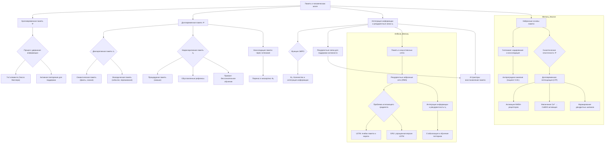

**Источник**:

- **Раздел:** Теория сознания
- **Файл:** [Принципы механизмов памяти в нейронных сетях через призму теории ЭИРО](/Principles-of-memory-mechanisms-in-neural-networks.md)
---

### Нейрокогнитивные механизмы сознательного восприятия и памяти в контексте теории Эмергентной Интеграции и Рекуррентного Отображения

```mermaid
flowchart TD
  A["Нейрокогнитивные механизмы восприятия и памяти"] --> B["Сенсорная память"]
  B --> B1["Иконическая (зрительная) память<br>• Длительность: 100-500 мс<br>• Объем: 12-16 элементов<br>• Нейронный субстрат: V1"]
  B --> B2["Эхоическая (слуховая) память<br>• Длительность: 2-4 секунды<br>• Объем: 4-5 паттернов<br>• Нейронный субстрат: верхняя височная извилина"]

  A --> C["Рабочая память"]
  C --> C1["Центральный исполнитель<br>• Локализация: префронтальная кора<br>• Функции: внимание, координация, переключение"]
  C --> C2["Фонологическая петля<br>• Хранилище: 1.5-2 сек<br>• Локализация: зона Брока, теменная кора"]
  C --> C3["Визуально-пространственный блокнот<br>• Объем: 3-4 объекта<br>• Локализация: теменно-затылочные области"]
  C --> C4["Эпизодический буфер<br>• Интеграция информации<br>• Локализация: медиальная височная доля"]

  A --> D["Долговременная память"]
  D --> D1["Декларативная память"]
  D1 --> D11["Эпизодическая память<br>• Локализация: гиппокамп, префронтальная кора"]
  D1 --> D12["Семантическая память<br>• Локализация: височная кора<br>• Организация: семантические сети"]
  D --> D2["Процедурная память<br>• Локализация: базальные ганглии, мозжечок"]

  A --> E["ЭИРО-модель восприятия и памяти"]
  E --> E1["Эмергентная интегрированная информация Φₑ"]
  E1 --> E11["Интеграция I(x t)"]
  E1 --> E12["Рекуррентная активность R(x t)"]
  E1 --> E13["Веса связей λᵢⱼ"]
  E --> E2["Экспериментальные подтверждения<br>• фМРТ: связь Φₑ с сознанием<br>• Нарушения при амнезии"]

  A --> F["Консолидация памяти"]
  F --> F1["Формула консолидации M(t):<br>• Затухание τ<br>• Интеграция Φₑ во времени"]
  F --> F2["Ядро консолидации K(s)<br>• Активная модуляция следа"]

  A --> G["Нейропластичность"]
  G --> G1["Долговременная потенциация (ДВП)<br>• Связь с Φₑ"]
  G --> G2["Рекуррентность и пластичность<br>• Влияние на внутриклеточные изменения<br>• Динамическая интеграция"]
```

**Источник**:

- **Раздел:** Теория сознания
- **Файл:** [Нейрокогнитивные механизмы сознательного восприятия и памяти в контексте теории ЭИРО](/Neurocognitive-mechanisms-of-conscious-perception-and-memory.md)
---

### Нейрокогнитивные механизмы памяти в контексте теории ЭИРО

```mermaid
flowchart TD
    A[Методология исследования] --> B[Электрофизиология]
    A --> C[Нейровизуализация]
    A --> D[Оптогенетика]
    A --> E[Математическое моделирование]
    
    B --> B1["Многоканальная запись Ψ активности"]
    B --> B2["Синхронизация в ритмах λ"]
    B --> B3["Φₑ в нейронных ансамблях"]

    C --> C1["фМРТ 7Т высокого разрешения"]
    C --> C2["МЭГ и ЭЭГ λ-синхронизации"]
    C --> C3["Совмещение данных Ψ картирования"]

    D --> D1["Световая модуляция нейронов"]
    D --> D2["Изучение Ψ причинно-следственных связей"]
    D --> D3["Валидация теории ЭИРО"]

    E --> E1["Спайковые сети STDP"]
    E --> E2["Гомеостаз Ψ синапсов"]
    E --> E3["Байесовские модели памяти"]
    
    F[Архитектура нейронных сетей памяти] --> G[Иерархическая организация]
    F --> H[Рекуррентные связи]
    
    G --> G1["Сенсорные области"]
    G --> G2["Медиальная височная доля"]
    G --> G3["Префронтальная кора"]
    
    H --> H1["Локальные Ψ контуры"]
    H --> H2["Глобальные λ контуры"]
    H1 --> H11["Горизонтальные Ψ связи"]
    H1 --> H12["Вертикальные микроколонки"]
    H2 --> H21["Фронто-париетальная сеть"]
    H2 --> H22["Дефолт-система мозга"]
    
    I[Механизмы синаптической пластичности] --> J[LTP NMDA-рецепторов]
    I --> K[Гомеостатическая регуляция]

    J --> J1["Ca²⁺ ↔ сигнальные каскады"]
    J --> J2["Формирование памяти Φₑ"]

    K --> K1["Ψ Масштабирование синапсов"]
    K --> K2["Модуляция Ψ порогов"]

    L[Эмпирическая валидация] --> M["Φₑ и эпизодическая память"]
    L --> N["Ψ роль рекуррентных контуров"]
    
    M --> M1["Корреляция Ψ успешного запоминания"]
    M --> M2["Снижение Φₑ при патологиях"]

    N --> N1["Активация λ-контуров"]
    N --> N2["Нарушения Ψ рекуррентной обработки"]

    O[Выводы и применения] --> P["Ключевые результаты"]
    O --> Q["Практическое применение"]
    
    P --> P1["Φₑ в механизмах памяти"]
    P --> P2["Ψ роль рекуррентных связей"]

    Q --> Q1["Диагностика нарушений памяти"]
    Q --> Q2["Нейрореабилитация и нейропротезы"]
    Q --> Q3["Оптимизация Ψ обучения"]
```

**Источник**:

- **Раздел:** Теория сознания
- **Файл:** [Нейрокогнитивные механизмы памяти в контексте теории ЭИРО](/Neurocognitive-mechanism-of-memory.md)
---

### Нейрокогнитивные механизмы мышления человека в контексте теории ЭИРО

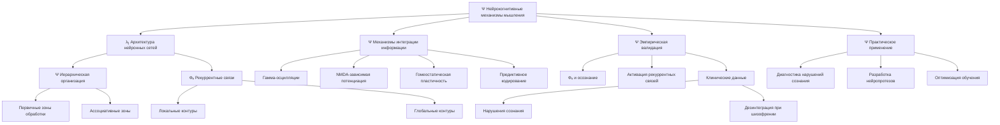

**Источник**:

- **Раздел:** Теория сознания
- **Файл:** [Нейрокогнитивные механизмы мышления в контексте теории ЭИРО](/Neurocognitive-mechanisms-of-thinking.md)
---

### Нейрокогнитивные механизмы селективного внимания через призму теории Эмергентной Интеграции и Рекуррентного Отображения

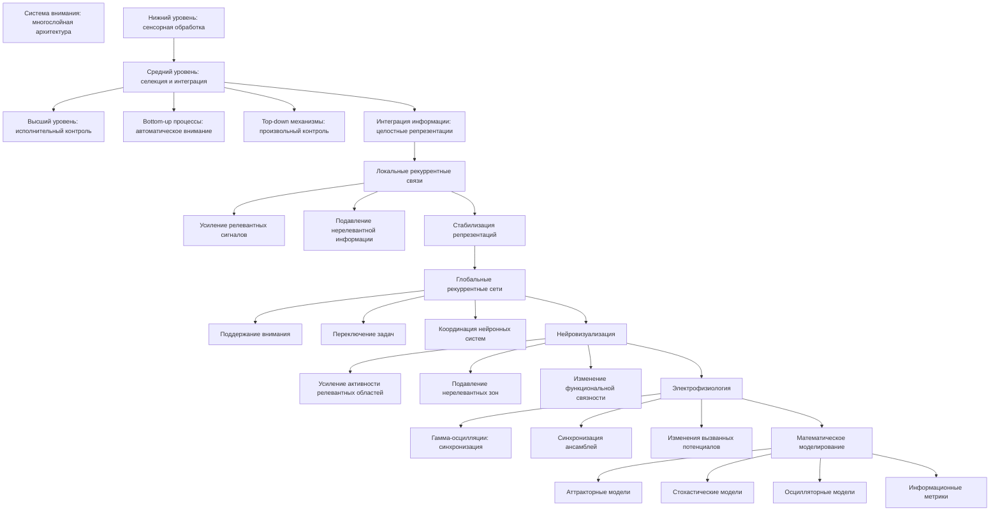

**Источник**:

- **Раздел:** Теория сознания
- **Файл:** [Нейрокогнитивные механизмы селективного внимания через призму теории ЭИРО](/Neurocognitive-mechanisms-of-selective-attention.md)
---

### Нейрокогнитивные механизмы восприятия в контексте эмергентной интеграции: от сенсорных входов к осознанному опыту

```mermaid
flowchart TD
    A[Иерархия сенсорных систем] --> B1[Первичные сенсорные зоны]
    B1 -->|Зрение| C1[Зрительная кора V1<br>Ориентация Контраст Движение]
    B1 -->|Слух| C2[Слуховая кора A1<br>Частота Интенсивность]
    B1 -->|Осязание| C3[Соматосенсорная кора S1<br>Давление Температура]

    A --> B2[Ассоциативные зоны]
    B2 -->|Вентральный поток| D1[Распознавание объектов<br>V2 V4 IT]
    B2 -->|Дорсальный поток| D2[Пространство и движение<br>V3 MT MST]
    B2 -->|Интеграция| D3[Мультимодальные центры<br>Теменная и Префронтальная кора]

    A --> B3[Таламокортикальные петли]
    B3 --> E1[Обратная связь и внимание]
    B3 --> E2[Рекуррентная обработка<br>Динамика сигналов]

    F[Сенсорная интеграция] --> G1[Временная синхронизация]
    G1 -->|Гамма| H1[30-100 Гц<br>Связывание признаков]
    G1 -->|Тета| H2[4-8 Гц<br>Контекст и память]
    G1 -->|Альфа| H3[8-12 Гц<br>Торможение и внимание]

    F --> G2[Пространственная интеграция]
    G2 -->|Конвергенция| H4[Сходящие входы<br>Вентральный путь]
    G2 -->|Мультисенсорные нейроны| H5[Объединение модальностей<br>Теменная кора]
    G2 -->|Топография| H6[Сохранение структуры сигналов]

    I[Предиктивное кодирование] --> J1[Генерация предсказаний]
    I --> J2[Ошибки предсказания]
    I --> J3[Обновление моделей]

    K[Экспериментальные данные] --> L1[fMRI<br>Иерархическая обработка]
    K --> L2[MEG<br>Рекуррентная динамика]
    K --> L3[Коннектом<br>Связи и интеграция]

    M[Математические модели] --> N1["Динамические системы<br>F(X U λᵢⱼ)"]
    M --> N2[Информационные метрики<br>Φₑ CD MI]
```

**Источник**:

- **Раздел:** Теория сознания
- **Файл:** [Нейрокогнитивные механизмы восприятия в контексте эмергентной интеграции: от сенсорных входов к осознанному опыту](/Neurocognitive-mechanisms-of-perception.md)
---

### Нейрокогнитивные механизмы сновидений в контексте теории Эмергентной Интеграции и Рекуррентного Отображения (ЭИРО)

```mermaid
flowchart TD
  A[Нейрокогнитивные механизмы сновидений] --> B[Теория ЭИРО]
  B --> C[Эмерджентная интеграция Φₑ]
  B --> D[Рекуррентные связи]
  B --> E[Предиктивное кодирование]

  C --> C1[Динамика Φₑ во сне]
  C1 --> C2[REM: Высокая Φₑ - яркие, сюжетные сновидения]
  C1 --> C3[NREM: Низкая Φₑ - фрагментарные сновидения]
  C --> C4[Характеристики сновидений]
  C4 --> C5[Яркость, связность, эмоциональность]
  
  D --> D1[Рекуррентные контуры]
  D1 --> D2[Таламо-кортикальные петли]
  D1 --> D3[Кортико-кортикальные связи]
  D1 --> D4[Гиппокампально-неокортикальные петли]
  D --> D5[Нарушения рекуррентности]
  D5 --> D6[Фрагментарные сновидения: снижение рекуррентности]
  D5 --> D7[Сверхинтегрированные сновидения: гиперрекуррентность]
  
  E --> E1[Предсказания во сне]
  E1 --> E2[Реактивация воспоминаний]
  E1 --> E3[Формирование новых сценариев]
  E --> E4[Ошибки предсказания]
  E4 --> E5[Хаотичные сновидения]
  E4 --> E6[Обновление внутренних моделей]

  A --> F[Клинические аспекты]
  F --> F1[Психические расстройства]
  F1 --> F2[Шизофрения: Причудливые сновидения]
  F1 --> F3[ПТСР: Навязчивые кошмары]
  F1 --> F4[Депрессия: Негативные сновидения]
  F --> F5[Нарушения сна]
  F5 --> F6[Апноэ: Прерывистые сновидения]
  F5 --> F7[Нарколепсия: Реалистичные сновидения]
  
  A --> G[Математическое моделирование]
  G --> G1["Рекуррентные нейронные сети (RNN)"]
  G1 --> G2[Моделирование интеграции информации]
  G --> G3[Байесовские модели]
  G3 --> G4[Предсказательное кодирование и ошибки]
```

**Источник**:

- **Раздел:** Теория сознания
- **Файл:** [Нейрокогнитивные механизмы сновидений в контексте теории ЭИРО](/Neurocognitive-mechanisms-of-dreams.md)
---

### Трудная проблема сознания в контексте теории Эмергентной Интеграции и Рекуррентного Отображения (ЭИРО)

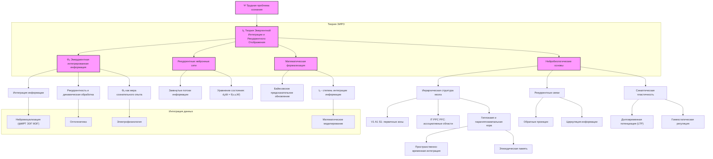

**Источник**:

- **Раздел:** Теория сознания
- **Файл:** [Трудная проблема сознания в контексте теории ЭИРО](/The-difficult-problem-of-consciousness.md)
---

### Философские аспекты теории Эмергентной Интеграции и Рекуррентного Отображения (ЭИРО)

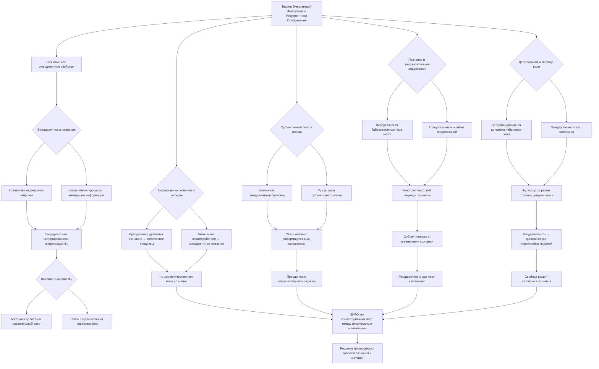

**Источник**:

- **Раздел:** Теория сознания
- **Файл:** [Философские аспекты теории ЭИРО](/Philosophical-aspects.md)
---

### Теория Эмергентной Интеграции и Рекуррентного Отображения (ЭИРО) в контексте коннектомики

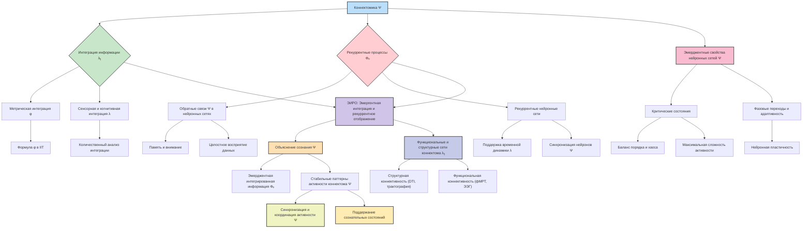

**Источник**:

- **Раздел:** Теория сознания
- **Файл:** [Теория ЭИРО в контексте коннектомики](/EIRM-in-the-context-of-connectomics.md)
---

### Дополнительные компоненты метрики Φₑ в контексте теории Эмергентной Интеграции и Рекуррентного Отображения (ЭИРО) > Оглавление > 2. Компоненты метрики Φₑ

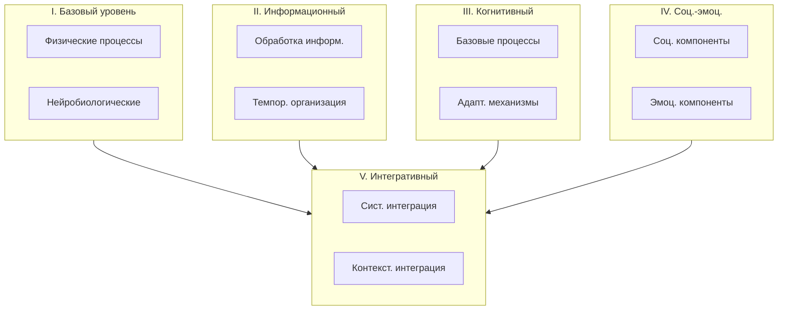

**Источник**:

- **Раздел:** Теория сознания
- **Файл:** [Дополнительные компоненты метрики Φₑ в контексте теории ЭИРО](/Components-of-the-F-metric.md)
---

### Предсказательное кодирование как система обратной связи организма - через призму теории ЭИРО

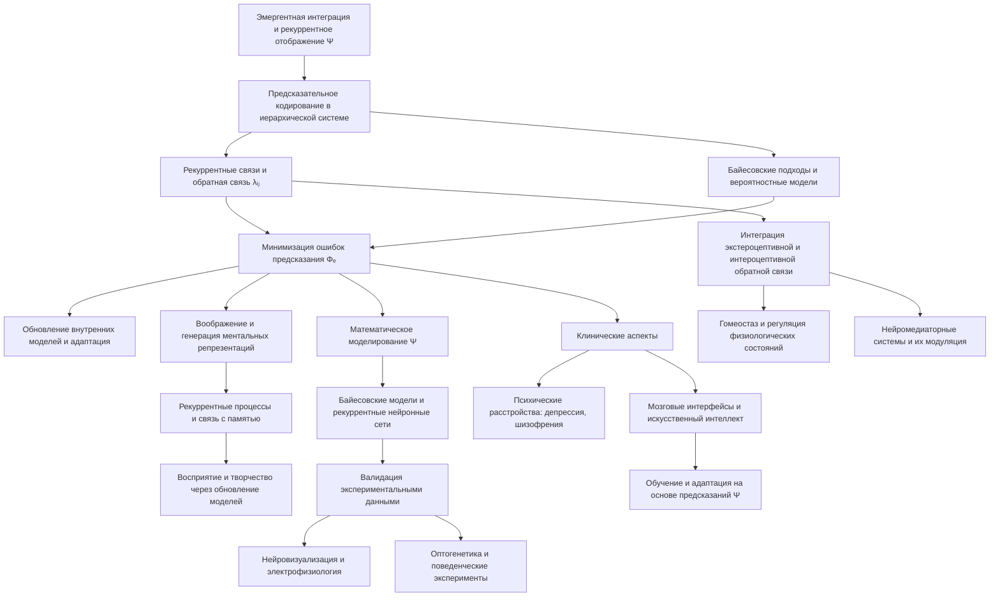

**Источник**:

- **Раздел:** Теория сознания
- **Файл:** [Предсказательное кодирование как система обратной связи организма](/Predictive-coding-as-an-organism-feedback-system.md)
---

### Нейрофизиологические механизмы рекуррентной обработки и интеграции сигналов в сознании: анализ теории Эмергентной Интеграции и Рекуррентного Отображения (ЭИРО)

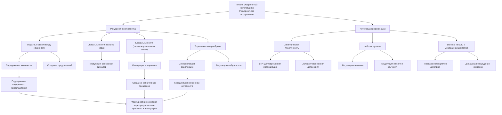

**Источник**:

- **Раздел:** Нейрофизиология
- **Файл:** [Нейрофизиологические механизмы рекуррентной обработки и интеграции сигналов в сознании: анализ теории ЭИРО](/neurophysiology.md)
---

### Роль Микроглии в Теории Эмергентной Интеграции и Рекуррентного Отображения (ЭИРО)

```mermaid
flowchart TD
  A[Теория Эмергентной Интеграции и Рекуррентного Отображения ЭИРО] --> B[Интеграция Информации]
  A --> C[Рекуррентная Обработка]

  B --> D{Роль Микроглии}
  C --> D

  D --> E[Модуляция Синаптической Пластичности]
  D --> F[Выделение Нейромодуляторов]
  D --> G[Регуляция Нейронной Сети]

  E --> E1[Синаптическая обрезка микроглией]
  E --> E2[Эффективность связи нейронов λᵢⱼ]

  F --> F1[Выделение BDNF]
  F --> F2[Изменение нейронной возбудимости Ψ]

  G --> G1[Формирование и реорганизация сети]
  G --> G2[Изменение структуры рекуррентных контуров]

  B --> H[Синхронизация Нейронных Сетей]
  H --> H1[Координация активности нейронов]
  H --> H2[Модуляция возбуждения микроглией]

  C --> I[Патологические состояния]
  I --> I1[Активация микроглии]
  I --> I2[Нарушение рекуррентной обработки]
  I --> I3[Снижение когнитивных функций]

  D --> J[Микроглия и Информационные Потоки]
  J --> J1[Поддержание гомеостаза]
  J --> J2[Нейровизуализация микроглиальной активности]

  I3 --> K[Нейродегенеративные заболевания]
```

**Источник**:

- **Раздел:** Нейрофизиология
- **Файл:** [Роль Микроглии в Теории ЭИРО](/microglia.md)
---

### Нейробиологические основы теории Эмергентной Интеграции и Рекуррентного Отображения (ЭИРО)

```mermaid
flowchart TD
    A[Теория Эмергентной Интеграции и Рекуррентного Отображения] --> B[Сознание как эмергентное свойство]
    B --> C[Интеграция информации]
    B --> D[Рекуррентные нейронные сети]
    C --> E[Объединение сигналов нейронами]
    C --> F[Синаптическая пластичность и нейромодуляция]
    E --> G{Исследование Koch и Crick}
    G --> H[Высокая степень коннективности нейронов]
    D --> I[Обратные связи между нейронами]
    D --> J[Циркуляция и переработка информации]
    I --> K{Исследование Lamme и Roelfsema}
    K --> L[Рекуррентная обработка необходима для восприятия]
    F --> M[Нейродинамика и синхронизация]
    M --> N{Исследование Varela et al.}
    N --> O[Синхронизация γ-осцилляций]
    M --> P[Координация областей мозга]
    C --> Q[Глобальная интеграция информации]
    Q --> R{Исследование Mashour et al.}
    R --> S[Функциональная связность кортикальных сетей]
    J --> T{Исследование Dehaene и Changeux}
    T --> U[Глобальное рабочее пространство]
    Q --> V{Патологии сознания}
    V --> W[Снижение коннективности и интеграции]
    W --> X{Исследование Boly et al.}
    X --> Y[Вегетативное состояние и функциональные нарушения]
    A --> Z[Сравнение с другими теориями]
    Z --> AA[Интеграция информации Тони]
    Z --> AB[Глобальное рабочее пространство Деана]
    Z --> AC[Эмергентные свойства рекуррентной интеграции]
```

**Источник**:

- **Раздел:** Нейробиология
- **Файл:** [Нейробиологические основы теории ЭИРО](/neuroscience.md)
---

### Когнитивные основы Теории Эмергентной Интеграции и Рекуррентного Отображения (ЭИРО)

```mermaid
flowchart TD
  A[Теория Эмергентной Интеграции и Рекуррентного Отображения] --> B[Эмергентное сознание]
  B --> C[Интеграция информации]
  B --> D[Рекуррентные процессы]
  B --> E[Эмергентная интегрированная информация Φₑ]

  C --> F[Мультисенсорная интеграция]
  F --> F1[Объединение данных из сенсорных систем]
  F --> F2[Целостное восприятие мира]
  F --> G[Пример: Driver и Noesselt 2008]

  D --> H[Рабочая память]
  H --> H1[Поддержка информации в активном состоянии]
  H --> H2[Роль префронтальной коры]
  H --> H3[Пример: Miller и Cohen 2001]

  D --> I[Внимание]
  I --> I1[Топ-даун модуляция]
  I --> I2[Усиление нейронных связей]
  I --> I3[Пример: Cohen и Maunsell 2012]

  D --> J[Предсказательное кодирование]
  J --> J1[Генерация внутренних моделей]
  J --> J2[Минимизация ошибок предсказания]
  J --> J3[Пример: Friston 2010]

  E --> K[Интеграция через R₍рекуррентность₎]
  K --> K1[Обновление информации]
  K --> K2[Динамическое состояние системы]
  K --> K3[Связь с восприятием и памятью]

  L[Связь с теориями сознания] --> M[Глобальное рабочее пространство]
  L --> N[Предсказательное кодирование]
  L --> O[Теоретическая целостность ЭИРО]
```

**Источник**:

- **Раздел:** Когнитивная наука
- **Файл:** [Когнитивные основы Теории ЭИРО](/cognitive-science.md)
---

### Теория Эмергентной Интеграции и Рекуррентного Отображения (ЭИРО) в контексте психологии

```mermaid
flowchart TD
    A["Эмергентная Интеграция и Рекуррентное Отображение"] --> B["Сознание как эмергентное свойство"]
    A --> C["Интеграция информации Iинтеграции"]
    A --> D["Рекуррентная обработка Rрекуррентности"]
    B --> E["Формула Φₑ"]
    E --> F["∫ Iинтеграции ⋅ Rрекуррентности dt"]

    C --> G["Восприятие"]
    C --> H["Адаптация сенсорной информации"]
    D --> I["Рекуррентные нейронные сети"]
    D --> J["Многократная обработка"]
    J --> K["Фокусировка внимания"]
    J --> L["Подавление несущественных стимулов"]

    G --> M["Предиктивное кодирование"]
    M --> N["Формирование предсказаний"]
    N --> O["Обновление на основе данных"]
    O --> P["Байесовское обновление"]

    H --> Q["Интеграция сенсорных данных"]
    Q --> R["Динамические взаимодействия в сетях"]
    Q --> S["Реконструкция восприятия"]
    S --> T["Сопоставление данных и ожиданий"]
    S --> U["Устойчивое восприятие"]

    K --> V["Избирательное внимание"]
    V --> W["Перераспределение когнитивных ресурсов"]

    X["Эмпирические подтверждения"] --> Y["Нейровизуализация"]
    X --> Z["Визуальная маскировка"]
    X --> AA["Нейропсихология"]
    X --> AB["Психофизика"]

    Y --> AC["Активность рекуррентных контуров"]
    Z --> AD["Прерывание обработки мешает восприятию"]
    AA --> AE["Нарушения при повреждениях сетей"]
    AB --> AF["Контекст влияет на восприятие"]

    AF --> M
    AC --> I
    AD --> J
    AE --> D

    W --> X
    P --> AB
    T --> Z
```

**Источник**:

- **Раздел:** Психология
- **Файл:** [Теория ЭИРО в контексте психологии](/psychology.md)
---

### Роль рекуррентной интеграции в формировании памяти и обучения

```mermaid
flowchart TD
    A[Рекуррентная интеграция информации в нейронных сетях] --> B[Формирование долговременных воспоминаний]
    A --> C[Обучение и нейронная пластичность]
    A --> D[Роль нейронных осцилляций]

    B --> B1[Гиппокамп и кора мозга]
    B1 --> B2[Повторная активация нейронных цепей]
    B2 --> B3["Усиление синаптических соединений (ДП и ДД)"]

    C --> C1["Долговременная потенциация (ДП)"]
    C --> C2["Долговременная депрессия (ДД)"]
    C1 --> C3[Изменение эффективности синапсов]
    C2 --> C3

    D --> D1[Гамма-осцилляции]
    D1 --> D2[Интеграция информации и внимание]
    D1 --> D3[Различение истинных и ложных воспоминаний]
    D3 --> D4[Качество и достоверность воспоминаний]

    subgraph M[Методы исследования]
        M1[фМРТ - активность мозга при обучении]
        M2[ЭЭГ - анализ нейронных осцилляций]
        M3[ТМС - модуляция рекуррентных сетей]
    end

    M --> A
    B3 --> F[Долговременные воспоминания и устойчивые нейронные изменения]
    D2 --> F
```

**Источник**:

- **Раздел:** Психология
- **Файл:** [Роль рекуррентной интеграции в формировании памяти и обучения](/the-role-of-recurrent-integration-in-memory-formation-and-learning.md)
---

### Теория Эмергентной Интеграции и Рекуррентного Отображения (ЭИРО): Философское Обоснование Сознания

```mermaid
flowchart TD
    A[Сознание и трудная проблема] --> B[Проблема квалий]
    A --> C[Эмергентность и сознание]

    B --> B1[Субъективные аспекты опыта]
    B1 --> B2[Каково это? вопрос Нагеля]
    B1 --> B3[Различие между легкими и трудными проблемами Чалмерса]

    C --> C1[Эмергентные свойства системы]
    C1 --> C2[Слабая эмергентность: системные свойства объяснимы]
    C1 --> C3[Сильная эмергентность: принципиально новые свойства]

    D[Теория ЭИРО] --> D1[Основные положения]
    D1 --> D2[Эмергентная интеграция информации Ψ]
    D1 --> D3[Рекуррентные процессы λᵢⱼ]
    D3 --> D4[Обратные связи в нейронных сетях]
    D4 --> D5[Создание целостного восприятия]
    D4 --> D6[Поддержка самосознания и рефлексии]

    D --> E[Философское обоснование ЭИРО]
    E --> E1[Эмергентность как объяснение Ψ]
    E1 --> E2[Появление новых свойств через интеграцию]
    E --> E3[Рекуррентность и самосознание]
    E3 --> E4[Обращение системы к своим состояниям]
    E --> E5[Интеграция информации и феноменальный опыт]
    E5 --> E6[Целостность восприятия и объяснение квалий]

    F[Сравнение с теориями сознания] --> F1[Интегрированная информационная теория]
    F1 --> F2[Параметр Φ: статическая интеграция информации]
    F1 --> F3[Отличие: роль рекуррентности в ЭИРО]
    
    F --> F4[Глобальная нейронная рабочая область]
    F4 --> F5[Глобальное вещание информации]
    F4 --> F6[Отличие: динамика рекуррентной интеграции]

    G[Импликации ЭИРО] --> G1[Онтологические последствия]
    G1 --> G2[Монстическая онтология: ум и материя]
    G --> G3[Эпистемологические вопросы]
    G3 --> G4[Методы изучения динамики процессов λᵢⱼ]
    G --> G5[Этические аспекты]
    G5 --> G6[Искусственный интеллект и моральный статус]
    G5 --> G7[Сознание у животных и сложных систем]

    style A fill:#f9f,stroke:#333,stroke-width:2
    style D fill:#bbf,stroke:#333,stroke-width:2
    style G fill:#bff,stroke:#333,stroke-width:2
```

**Источник**:

- **Раздел:** Философия сознания
- **Файл:** [Теория ЭИРО: Философское обоснование сознания](/philosophy-of-consciousness.md)
---

### Эмерджентность сознания и бытия через рекуррентную взаимосвязь

```mermaid
flowchart TD
  A[Сознание и бытие как эмерджентные свойства] --> B{Рекуррентная интеграция опыта и информации}
  
  B --> C[Дэвид Чалмерс: Трудная проблема сознания]
  C --> C1[Субъективный опыт Ψ]
  C --> C2[Физические процессы λᵢⱼ не объясняют Ψ]

  B --> D[Франциско Варела: Воплощенный ум]
  D --> D1[Интеракция мозга, тела и мира]
  D --> D2[Рекуррентные циклы восприятия-действия]

  B --> E[Эмерджентность в нейронауках]
  E --> E1[Рекуррентные нейронные сети Φₑ]
  E --> E2[Сложные паттерны активности]

  B --> F[Интеграция информации и IIT]
  F --> F1[Джулио Тонони: Мера сознания Φ]
  F1 --> F2[Интеграция и дифференциация информации]
  F1 --> F3[Рекуррентные связи ↺ усиливают Φ]

  B --> G[Эмпирические данные и нейронауки]
  G --> G1[ФМРТ и ЭЭГ: Функциональная связность]
  G1 --> G2[Активность в кортикальных сетях ↻]
  G --> G3[ТМС: Нарушение связей снижает Ψ]

  B --> H[Феноменология восприятия]
  H --> H1[Мерло-Понти: Активное восприятие]
  H1 --> H2[Интеграция настоящего опыта и обратных связей]
  
  C2 --> Z[Сознание как фундаментальная сущность]
  E2 --> Z
  F3 --> Z
  G2 --> Z
  H2 --> Z
```

**Источник**:

- **Раздел:** Философия сознания
- **Файл:** [Эмерджентность сознания и бытия через рекуррентную взаимосвязь](/the-emergence-of-consciousness-and-being-through-a-recurrent-relationship.md)
---

### Нейропсихологические основы Теории Эмергентной Интеграции и Рекуррентного Отображения (ЭИРО)

```mermaid
flowchart TD
    A[Теория Эмергентной Интеграции и Рекуррентного Отображения] --> B[Сознание как эмергентное свойство нейронных систем]
    B --> C{Интеграция информации}
    C --> D[Рекуррентные нейронные сети]
    D --> E[Эмергентная интегрированная информация Φₑ]
    
    subgraph F[Нейропсихологические механизмы]
        F1[Повреждения мозга и нарушение интеграции]
        F2[Клинические случаи split-brain]
        F3[Рекуррентная обработка и её нарушения]
    end
    
    E --> F
    F1 --> G[Таламокортикальные проекции]
    G --> H[Нарушение сознательных состояний]
    
    F2 --> I[Расщепление связей между полушариями]
    I --> J[Двойственность сознания]
    
    F3 --> K[Нарушения обратных связей]
    K --> L[Дефекты восприятия и осознания]
    
    subgraph M[Поддерживающие доказательства]
        M1[Синдром неглекта]
        M2[Вегетативные и минимально сознательные состояния]
        M3[Анасогнозия]
    end
    
    F --> M
    M1 --> N[Нарушение интеграции сенсорной информации]
    M1 --> O[Игнорирование левой стороны пространства]
    
    M2 --> P[Функциональная связь между областями мозга]
    P --> Q[Нарушение таламокортикальных сетей]
    Q --> R[Потеря интеграции информации]
    
    M3 --> S[Отсутствие осознания дефицитов]
    S --> T[Нарушение рекуррентных процессов]
    
    A --> U[Импликации для лечения и реабилитации]
    U --> V[Методы восстановления нейронных связей]
    U --> W[Терапии для усиления нейропластичности]
    
    A --> X[Будущие направления исследований]
    X --> Y[Изучение специфических нейронных цепей]
    X --> Z[Технологии нейромодуляции]
```

**Источник**:

- **Раздел:** Нейропсихология
- **Файл:** [Нейропсихологические основы Теории ЭИРО](/neuropsychology.md)
---

### Нейровизуализация в контексте теории Эмергентной Интеграции и Рекуррентного Отображения (ЭИРО): Исследование сознания через изучение мозговых процессов

```mermaid
graph TD
A[Теория Эмергентной Интеграции и Рекуррентного Отображения] --> B[Эмергентное свойство сознания]
B --> C[Интеграция информации в рекуррентных нейронных сетях]
C --> D{Ключевые параметры}
D --> D1[Эмергентная интегрированная информация Φₑ]
D --> D2[Рекуррентная обработка R]

C --> E[Математическая модель нейронной сети]
E --> E1["d𝐱/dt = 𝐟(𝐱 t 𝐮 W)"]
E --> E2["Байесовское обновление P(θ | D)"]

C --> F[Рекуррентные связи в коре мозга]
F --> G[Поддержание сознательных состояний]
G --> G1[Визуальная маскировка прерывает R]
G1 --> H[Синхронизация активности областей мозга]

A --> I[Нейровизуализационные методы]
I --> J[ФМРТ]
I --> K[ПЭТ]
I --> L[ЭЭГ МЭГ]

J --> J1[Изменения кислорода крови - пространственное разрешение]
K --> K1[Метаболическая активность - долгосрочные изменения]
L --> L1[Электрическая магнитная активность - временное разрешение]
L1 --> L2[Изучение динамики рекуррентных процессов]

I --> M[Эмпирическая проверка ЭИРО]
M --> N[Рекуррентная обработка и осознание стимула]
N --> N1[Исследования Ламме и Рой: синхронизация активности при сознании]

M --> O[Интеграция информации и уровень сознания]
O --> O1[Снижение Φₑ при сне и анестезии]
O --> O2[Исследование Болии: снижение связанности при вегетативном состоянии]

M --> P[Предсказательное кодирование и байесовское обновление]
P --> P1[Фристон: рекуррентные схемы при несоответствии предсказаний]

O --> Q[Связанность корковых областей при сознательных состояниях]
Q --> Q1[Месюль и Тоннони: измерение сложности откликов ТМС + ЭЭГ]

O --> R[Изменения связанности при различных состояниях]
R --> R1[Исследование Сечение: снижение связанности под анестезией]

A --> S[Будущие направления исследований]
S --> S1[Количественное измерение I интеграции и R рекуррентности]
S --> S2[Уточнение моделей ЭИРО и понимание механизмов сознания]
```

**Источник**:

- **Раздел:** Нейровизуализация
- **Файл:** [Нейровизуализация в контексте теории ЭИРО: Исследование сознания через изучение мозговых процессов](/neuroimaging.md)
---

### Эмергентная Интеграция и Рекуррентное Отображение в Контексте Системной Биологии

```mermaid
flowchart TD
  A[Эмергентная Интеграция и Рекуррентное Отображение] --> B[Системная биология]
  B --> B1{Уровни организации взаимодействий}
  B1 --> B11[Молекулярный уровень]
  B1 --> B12[Клеточный уровень]
  B1 --> B13[Сетевой уровень]
  B --> B2[Эмергентные свойства как целостные характеристики системы]
  B --> B3[Взаимодействия → Новые функциональные свойства]

  A --> C[Рекуррентные нейронные сети]
  C --> C1{Особенности рекуррентных сетей}
  C1 --> C11[Циркуляция информации]
  C1 --> C12[Динамические состояния]
  C1 --> C13[Высокий уровень обработки информации]

  C --> C2{Механизмы интеграции информации}
  C2 --> C21[Глобальная когерентность]
  C2 --> C22[Локальные взаимодействия → Системные эффекты]
  C2 --> C23[Интеграция на разных масштабах]

  A --> D[Эмергентность сознания]
  D --> D1[Коллективная активность нейронов]
  D --> D2[Функциональные свойства ≠ отдельные компоненты]
  D --> D3[Рекуррентные связи → Устойчивые состояния активности]

  D --> E{Поддерживающие исследования}
  E --> E1[Deco и коллеги: локальные взаимодействия → глобальная когерентность]
  E --> E2[Tononi и Sporns: интегрированная информация]
  E --> E3[Friston: предсказательное кодирование]
  E --> E4[Lamme: рекуррентная обработка и сознание]
  E --> E5[Bressler и Menon: функциональные сети]

  A --> F[Импликации и перспективы]
  F --> F1[Понимание сознания в нейронауках]
  F --> F2[Философия сознания]
  F --> F3[Применение в искусственном интеллекте]
```

**Источник**:

- **Раздел:** Биология систем
- **Файл:** [ЭИРО в контексте системной биологии](/biology-of-systems.md)
---

### Рекуррентная интеграция в физиологических системах организма

```mermaid
flowchart TD
    A[Гомеостаз и саморегуляция организма] --> B[Рекуррентная интеграция сигналов]
    B --> C[Физиологические системы]
    C --> C1[Нервная система]
    C --> C2[Эндокринная система]
    C --> C3[Иммунная система]
    B --> D[Эмерджентные свойства организма]
    D --> D1[Здоровье: высокая сложность и вариабельность сигналов]
    D --> D2[Болезнь: упрощение и регуляризация сигналов]
    C1 --> E[Ось гипоталамус-гипофиз-надпочечники]
    C2 --> E
    C3 --> E
    E --> F[Реакция на стресс и адаптация]
    E --> G[Цитокины и их влияние на ЦНС]
    G --> H[Патофизиология воспаления]
    H --> I[Хроническое воспаление: нарушение функций]
    F --> J[Гибкость и адаптивность организма]
    D2 --> K[Патологические состояния]
    K --> K1[Системные нарушения интеграции]
    K1 --> L[Метаболический синдром]
    K1 --> M[Синдром системной воспалительной реакции]
    D1 --> N[Вариабельность сердечного ритма]
    N --> O[Фрактальная структура сигналов]
    N --> P[Снижение вариабельности → риск ССЗ]
    D --> Q[Системная биология: нелинейные модели]
    Q --> R[Бифуркации и хаотическая динамика]
```

**Источник**:

- **Раздел:** Биология систем
- **Файл:** [Рекуррентная интеграция в физиологических системах организма](/recurrent-integration-in-the-physiological-systems-of-the-body.md)
---

### Эмергентная Интеграция и Рекуррентное Отображение в Контексте Психиатрии

```mermaid
flowchart TD
    A["Теория Эмергентной Интеграции и Рекуррентного Отображения"] --> B["Сознание как эмергентное свойство"]
    B --> C["Интеграция информации через рекуррентные нейронные сети"]
    B --> D["Дисфункции → Психические расстройства"]
    
    D --> E["Шизофрения"]
    E --> E1["Нарушения интеграции сенсорной информации"]
    E --> E2["Дефицит нейронной синхронизации"]
    E2 --> E3["Friston и коллеги → Снижение эффективной связности"]
    
    D --> F["Депрессия"]
    F --> F1["Дисфункции рекуррентных сетей префронтальной коры"]
    F --> F2["Изменение активности сети пассивного режима"]
    F2 --> F3["Sheline и коллеги → Избыточная обработка негативных мыслей"]
    
    D --> G["Расстройства сознания"]
    G --> G1["Нарушение функциональной связности кортикальных областей"]
    G --> G2["Снижение топ-даун процессов"]
    G2 --> G3["Boly и коллеги → Исследование вегетативного состояния"]
    
    H["Импликации для диагностики и лечения"] --> I["Нейромодуляция"]
    I --> I1["Транскраниальная магнитная стимуляция"]
    H --> J["Таргетные терапевтические вмешательства"]
    
    K["Связь с другими теориями"] --> L["Биопсихосоциальная модель"]
    L --> M["ЭИРО: Фокус на нейронных механизмах"]
    
    N["Будущие исследования"] --> N1["Генетические и молекулярные факторы"]
    N --> N2["Детальные модели нейронных сетей"]
    N --> N3["Клиническое применение теории"]
    
    A --> D
    D --> H
    A --> K
    A --> N
```

**Источник**:

- **Раздел:** Психиатрия
- **Файл:** [ЭИРО в контексте психиатрии](/psychiatry.md)
---

### Эмергентная Интеграция и Рекуррентное Отображение (ЭИРО) в Этологии и Нейроэтологии: Эволюционные Аспекты Сознания и Интеграции Информации в Поведении

```mermaid
flowchart TD
    A[ЭИРО в этологии и нейроэтологии] --> B[Эмергентность и интеграция информации]
    A --> C[Рекуррентные нейронные сети]

    B --> B1[Эмергентные свойства поведения]
    B --> B2[Интеграция сенсорной информации]
    B2 --> B21["Пример: Саранча (зрение и тактильные сигналы)"]
    B --> B3[Эволюция сознания через интеграцию информации]
    B3 --> B31["Пример: Социальное поведение приматов"]
    B --> B4[Поведенческие решения на основе интеграции информации]
    B4 --> B41["Пример: Пчёлы (зрение и обоняние)"]

    C --> C1[Роль обратных связей в обработке информации]
    C --> C2[Рекуррентность и память]
    C2 --> C21["Исследование: Песня птиц"]
    C --> C3[Рекуррентные связи и пластичность]
    C3 --> C31["Пример: Осьминоги (адаптивное поведение)"]

    A --> D[ЭИРО и эволюция сознания]
    D --> D1[Усложнение нейронных сетей]
    D --> D2[Адаптивное поведение как результат эмергентности]
    D2 --> D21["Исследование: Эхолокация летучих мышей"]
    D --> D3[Механизмы памяти и обучения]
    D3 --> D31["Пример: Грибные тела у насекомых"]

    A --> E[Доказательства и примеры]
    E --> E1[Нейрофизиологические исследования]
    E --> E2[Поведенческие эксперименты]
    E2 --> E21["Пример: Шимпанзе и инструменты"]
    E --> E3[Моделирование и нейровизуализация]
    E3 --> E31["Исследование: Нейросети головоногих моллюсков"]
    
    A --> F[Перспективы и ограничения]
    F --> F1[Эволюционные импликации]
    F --> F2[Различия между видами]
    F --> F3[Будущие направления исследований]
```

**Источник**:

- **Раздел:** Этология и нейроэтология
- **Файл:** [ЭИРО в этологии и нейроэтологии: эволюционные аспекты сознания и интеграции информации в поведении](/ethology-and-neuroethology.md)
---

### Сравнительный анализ ведущих теорий сознания в контексте ЭИРО > 1. Обзор ведущих теорий сознания

```mermaid
graph TD
    A[Теории сознания] --> B[Теория Интегрированной Информации]
    B --> C[Φ мера интегрированной информации]
    B --> D[Система больше суммы частей]
    
    A --> E[Теория Глобального Рабочего Пространства]
    E --> F[Информация становится глобально доступной]
    E --> G[Обмен информации между подсистемами]
    
    A --> H[Предиктивное Кодирование]
    H --> I[Генерация моделей мира]
    H --> J[Минимизация ошибки предсказания]
    
    A --> K[Теории Высшего Порядка]
    K --> L[Метакогнитивные состояния]
    K --> M[Сознательные состояния с высшими мыслями]
    
    A --> N[Теория Схемы Внимания]
    N --> O[Создание модели процесса внимания]
    N --> P[Субъективное переживание сознания]
```

**Источник**:

- **Раздел:** Прочее
- **Файл:** [Сравнительный анализ ведущих теорий сознания в контексте ЭИРО](/comparative-analysis.md)
---

### Сравнительный анализ ведущих теорий сознания в контексте ЭИРО > 1. Обзор ведущих теорий сознания > 1.2. Сравнение ЭИРО с ведущими теориями сознания

```mermaid
graph TD
    A[Сравнение ЭИРО с ведущими теориями сознания] --> B[Теория Интегрированной Информации IIT]
    B --> B1[Сходства]
    B1 --> B1a[Интеграция информации]
    B1 --> B1b[Количественная мера интеграции]
    B --> B2[Различия]
    B2 --> B2a[Рекуррентность]
    B2 --> B2b[Динамический аспект]
    
    A --> C[Теория Глобального Рабочего Пространства GWT]
    C --> C1[Сходства]
    C1 --> C1a[Глобальная доступность информации]
    C1 --> C1b[Роль внимания и память]
    C --> C2[Различия]
    C2 --> C2a[Механизмы интеграции]
    C2 --> C2b[Рекуррентная обработка]
    
    A --> D[Предиктивное Кодирование]
    D --> D1[Сходства]
    D1 --> D1a[Предиктивные процессы]
    D1 --> D1b[Минимизация ошибки предсказания]
    D --> D2[Различия]
    D2 --> D2a[Фокус на интеграции]
    D2 --> D2b[Структура моделей]
    
    A --> E[Теории Высшего Порядка HOT]
    E --> E1[Сходства]
    E1 --> E1a[Метакогнитивные процессы]
    E --> E2[Различия]
    E2 --> E2a[Необходимость мыслей высшего порядка]
    E2 --> E2b[Механистический vs философский подход]
    
    A --> F[Теория Схемы Внимания AST]
    F --> F1[Сходства]
    F1 --> F1a[Роль внимания]
    F1 --> F1b[Моделирование внутренних состояний]
    F --> F2[Различия]
    F2 --> F2a[Схема внимания vs рекуррентная интеграция]
    F2 --> F2b[Уровень абстракции]
```

**Источник**:

- **Раздел:** Прочее
- **Файл:** [Сравнительный анализ ведущих теорий сознания в контексте ЭИРО](/comparative-analysis.md)
---

### Сравнительный анализ ведущих теорий сознания в контексте ЭИРО > 1. Обзор ведущих теорий сознания > 1.3. Обсуждение уникальных особенностей ЭИРО

```mermaid
graph TD
    A[ЭИРО] --> B[Рекуррентные Нейронные Сети]
    A --> C[Эмергентные Свойства]
    A --> D[Предиктивное Кодирование]
    A --> E[Математическая Формализация]
    A --> F[Связь с Искусственным Интеллектом]
    
    B --> B1[Интеграция информации]
    B --> B2[Динамическое взаимодействие]
    
    C --> C1[Сознание как продукт взаимодействия]
    C --> C2[Нелинейные процессы]
    
    D --> D1[Обновление состояний]
    D --> D2[Минимизация ошибок предсказания]
    
    E --> E1[Количественная оценка]
    E --> E2[Эмпирические исследования]
    
    F --> F1[Создание искусственных систем]
    F --> F2[Методы машинного обучения]
```

**Источник**:

- **Раздел:** Прочее
- **Файл:** [Сравнительный анализ ведущих теорий сознания в контексте ЭИРО](/comparative-analysis.md)
---

### Сравнительный анализ ведущих теорий сознания в контексте ЭИРО > 1. Обзор ведущих теорий сознания > 2. Сопоставление ЭИРО с теорией когнитома и гиперсетевой теорией мозга Константина Анохина > 2.2. Пересечения и соотношения между ЭИРО и теориями Анохина

```mermaid
graph TD
    A[Пересечения и соотношения между ЭИРО и теориями Анохина] --> B[Сходства в акцентах на интеграции информации]
    B --> C[Интеграция информации как ключ к сознанию]
    C --> D[ЭИРО: сознание через рекуррентные нейронные сети]
    C --> E[Теория когнитома: сложные взаимодействия нейронных сетей]
    B --> F[Динамическая самоорганизация]
    F --> G[Мозг как динамическая система]
    
    A --> H[Рекуррентные сети и гиперсети]
    H --> I[Рекуррентная обработка в ЭИРО]
    I --> J[Роль рекуррентных нейронных сетей]
    H --> K[Гиперсети в теории Анохина]
    K --> L[Сети более высокого порядка]
    H --> M[Пересечения]
    M --> N[Сложные сетевые структуры]

    A --> O[Эмергентные свойства и уровни организации]
    O --> P[Эмергентность в ЭИРО]
    P --> Q[Сознание как эмергентное свойство]
    O --> R[Эмергентность в гиперсетевой теории]
    R --> S[Новые функциональные возможности]
    O --> T[Совпадения]
    
    A --> U[Предиктивное кодирование и гипотезы о функциональной архитектуре]
    U --> V[Предиктивное кодирование в ЭИРО]
    V --> W[Модели обновления на основе данных]
    U --> X[Функциональная архитектура в теории когнитома]
    X --> Y[Генерация гипотез о внешнем мире]
    U --> Z[Сходства]

    A --> AA[Математическая формализация и инструменты моделирования]
    AA --> AB[Математические модели в ЭИРО]
    AB --> AC[Модели для нейронных динамических систем]
    AA --> AD[Использование математического аппарата в теориях Анохина]
    AD --> AE[Методы теории графов]
    AA --> AF[Общие черты]
```

**Источник**:

- **Раздел:** Прочее
- **Файл:** [Сравнительный анализ ведущих теорий сознания в контексте ЭИРО](/comparative-analysis.md)
---

### Теория Рекуррентной Вселенной: Новая Парадигма Космологии

```mermaid
graph TD
    A[Теория Рекуррентной Вселенной] --> B[Интегрированная квантовая информация Ψ]
    A --> C[Рекуррентные процессы λ]
    B --> D[Влияние на геометрию пространства-времени Φₑ]
    C --> E[Модификация уравнений Эйнштейна Gμν]
    D --> F[Объяснение тёмной материи и энергии ρIQI]
    E --> G[Избежание сингулярности R]
    F --> H[Плавная эволюция Вселенной Ψ]
    G --> I[Эмерджентное возникновение пространства-времени Φₑ]
    C --> J[Математическая модель с квантовыми эффектами TμνIQI]
    H --> K[Предсказания анизотропий КМФ Φₑ]
    K --> L[Соответствие наблюдениям WMAP и Planck]
    J --> M[Связь с теориями квантовой гравитации Ψ и λ]
    D --> N[Реализация голографического принципа Ψ]
    M --> O[Экспериментальные тесты в космологии]
```

**Источник**:

- **Раздел:** Рекуррентная космология
- **Файл:** [Теория Рекуррентной Вселенной: Новая Парадигма Космологии](/recurrent-universe/README.md)
---

### Моделирование рекуррентных нейронных сетей

```mermaid
graph TD
    A[Динамические системы и хаос в нейронауке] --> B[Моделирование нейронов через дифференциальные уравнения]
    A --> C[Чувствительность к начальному состоянию]
    A --> D[Сложная динамика и хаос]

    B --> E[Система дифференциальных уравнений]
    E --> F[Вектор состояний нейронов 𝐱]
    E --> G[Входные сигналы 𝐮]
    E --> H[Матрица весов W]

    D --> I[Эмергенция интеграции информации]
    I --> J[Объединение данных из источников]
    I --> K[Мера интеграции Φ]

    D --> L[Рекуррентные сети]
    L --> M[Хаотическое поведение сети]
    M --> N[Повышенная вычислительная мощность]
    M --> O[Чувствительность к слабым стимулам]
    M --> P[Генерация сложных паттернов активности]

    I --> Q[Интеграция через Rₑ]
    Q --> R[Многоступенчатое взаимодействие]
    Q --> S[Смена состояний сети]

    I --> T[Мозг и теория информации]
    T --> U[Когнитивные состояния]
    T --> V[Мера эмергентной информации Φₑ]

    C --> W[Физика сложных систем]
    W --> X[Критические состояния]
    W --> Y[Переходы между порядком и хаосом]
    W --> Z[Эмергентные феномены сознания]

    Z --> AA[Экспериментальные наблюдения]
    AA --> AB[Активность рекуррентных контуров]
    AA --> AC[Связь с уровнем сознания]
    AA --> AD[Пониженная осознанность при анестезии]

    M --> AE[Предсказательное кодирование]
    AE --> AF[Байесовское обновление вероятностей]
    AE --> AG[Прогноз сенсорных входов]

    W --> AH[Синаптическая пластичность]
    AH --> AI[Изменение весов W]
    AH --> AJ[Влияние на динамику системы]
```

**Источник**:

- **Раздел:** Рекуррентная космология
- **Файл:** [Моделирование рекуррентных нейронных сетей](/physics.md)
---

### Теория Эмергентной Интеграции и Рекуррентного Отображения (ЭИРО) в Контексте Квантовой Физики

```mermaid
graph TD
    A["Теория Эмергентной Интеграции и Рекуррентного Отображения"] --> B["Эмергентная интеграция информации (Φₑ)"]
    A --> C["Рекуррентная обработка информации"]
    A --> D["Связь с квантовыми процессами"]
    
    B --> B1["Параметры: интеграция и рекуррентность"]
    B1 --> B2["Φₑ = ∫ Iинтеграции * Rрекуррентности dt"]

    C --> C1["Рекуррентные нейронные сети"]
    C1 --> C2["Рекуррентные квантовые сети (КРНС)"]
    C2 --> C3["Суперпозиция и запутанность"]
    
    D --> D1["Квантовая когерентность"]
    D --> D2["Запутанность для интеграции информации"]
    D2 --> D3["Влияние на нелокальную корреляцию"]
    D1 --> D4["Декогеренция и ее преодоление"]
    
    C3 --> D4
    
    subgraph "Теоретическая основа"
        E1["Orch-OR теория Пенроуза-Хамерофа"]
        E2["Квантовая механика и биологические системы"]
        D --> E1
        E1 --> E2
    end
    
    subgraph "Экспериментальные данные"
        F1["Квантовые эффекты в биологии"]
        F1 --> F2["Фотосинтез и обоняние"]
        F1 --> F3["Микротрубочки в нейронах"]
        F3 --> F4["Поддержка когерентности"]
        F4 --> D1
    end
    
    subgraph "Математическое описание"
        G1["Уравнение Шредингера"]
        G1 --> G2["Ψ = волновая функция"]
        G1 --> G3["Гамильтониан H"]
        G2 --> H1["Энтропия фон Ноймана: S"]
    end
    
    subgraph "Будущие исследования"
        I1["Эксперименты на квантовых эффектах"]
        I2["Модели объединения нейродинамики и квантовой физики"]
        I1 --> I2
    end
```

**Источник**:

- **Раздел:** Рекуррентная космология
- **Файл:** [Теория ЭИРО в контексте квантовой физики](/quantum-physics.md)
---

### Линейность квантовой механики через призму теории рекуррентной Вселенной

```mermaid
flowchart TD
    A[Квантовая механика] --> B[Принципы]
    B --> C[Линейность уравнения Шрёдингера]
    B --> D[Принцип суперпозиции]
    A --> E[Введение ЭИРО]
    E --> F[Интегрированная информация Φ]
    E --> G[Рекуррентные взаимодействия]
    E --> H[Формализация: Φₑ]
    H --> I[Φₑ интеграция информации R рекуррентность]
    A --> J[Влияние на квантовую механику]
    J --> K[Нелинейность уравнения Шрёдингера]
    K --> L[Ψ эволюция зависит от истории]
    J --> M[Нарушение суперпозиции]
    M --> N[Линейные комбинации решений не выполняются]
    J --> O[Эмпирические подтверждения]
    O --> P[Наблюдения нелинейности]
    A --> Q[Последствия]
    Q --> R[Пересмотр основ]
    R --> S[Изменение операторов и состояний]
    Q --> T[Космология]
    T --> U[Объяснение темной энергии и материи]
    Q --> V[Теория информации]
    V --> W[Улучшение квантовых вычислений]
    A --> X[Новая модель Вселенной]
    X --> Y[Плотность информации ρ_IQI]
    X --> Z[Модификация уравнений Эйнштейна]
    Z --> AA[Включение ρ_IQI и R]
    X --> AB[Космологические эффекты]
    AB --> AC[Ускоренное расширение]
    AB --> AD[Аномалии космического фона]
```

**Источник**:

- **Раздел:** Рекуррентная космология
- **Файл:** [Линейность квантовой механики через призму ЭИРО и новой модели Вселенной](/The-linearity-of-quantum-mechanics.md)
---

### Принцип суперпозиции через призму теории рекуррентной Вселенной

```mermaid
graph TD
    A[Принцип суперпозиции] --> B[Квантовая суперпозиция]
    A --> C[Эмерджентная интеграция и рекуррентные отображения]
    B --> D[Состояние системы Ψ]
    B --> E[Линейность уравнения Шрёдингера]
    E --> F[Интерференция и предсказуемость]
    C --> G[Интегрированная информация Φ]
    C --> H[Рекуррентные отображения]
    G --> I[Φ характеризует интеграцию системы]
    H --> J[Рекуррентные связи]
    J --> K[Динамические паттерны активности]
    G --> L[Φₑ: интеграция и рекурсия]
    L --> M[Интеграция квантовой взаимной информации]
    L --> N[Рекурсивная зависимость состояний]
    A --> O[Нелинейность]
    O --> P[Нарушение линейности Ψ эволюции]
    O --> Q[Корреляции между состояниями]
    Q --> R[Зависимость от структуры информации]
    O --> S[Нелинейные эффекты в системах]
    S --> T[Сильные взаимодействия]
    S --> U[Открытые квантовые системы]
    A --> V[Новые физические величины]
    V --> W[ρᵢ: плотность интегрированной информации]
    V --> X[Параметр рекуррентности R]
    V --> Y[Влияние на метрику пространства-времени]
    Y --> Z[Тензор энергии-импульса Tᵢ]
    A --> AA[Экспериментальные подтверждения]
    AA --> AB[Квантовая оптика]
    AB --> AC[Нелинейные кристаллы]
    AA --> AD[Нейрофизиология]
    AD --> AE[Связь с сознательными состояниями]
    A --> AF[Фундаментальные последствия]
    AF --> AG[Пересмотр квантовой механики]
    AF --> AH[Эффекты в космологии]
    AH --> AI[Темная энергия и эволюция Вселенной]
    AF --> AJ[Связь с теорией информации]
```

**Источник**:

- **Раздел:** Рекуррентная космология
- **Файл:** [Принцип суперпозиции через призму ЭИРО и новой модели Вселенной](/The-principle-of-superposition.md)
---

### Принцип локальности через призму теории рекуррентной Вселенной

```mermaid
graph TD
    A[Принцип локальности через ЭИРО] --> B1[Классическая локальность]
    A --> B2[Квантовая нелокальность]
    A --> B3[Эмерджентная интеграция и рекуррентные отображения]
    A --> B4[Влияние на метрику пространства-времени]
    A --> B5[Экспериментальные подтверждения]

    B1 --> C1[Объекты влияют только в световом конусе]
    B1 --> C2[Взаимодействия распространяются с λ = c]

    B2 --> C3[Квантовая запутанность]
    B2 --> C4[Теоремы Белла и эксперименты]
    C4 --> D1[Отсутствие локальных скрытых переменных]

    B3 --> C5[Интегрированная информация Ψ]
    B3 --> C6[Рекуррентные сети и Φₑ]
    C5 --> D2[Целое больше суммы частей]
    C6 --> D3[Обратные связи в системах]
    C6 --> D4[Модель: Φₑ = ∫ Ψ λᵢⱼ dt]

    B4 --> C7[Модифицированные уравнения Эйнштейна]
    C7 --> D5[Gμν + Λgμν = 8πG Tμν + TμνΨ]
    B4 --> C8[Космологические последствия]
    C8 --> D6[Объяснение ускорения расширения без тёмной энергии]

    B5 --> C9[Квантовая оптика]
    C9 --> D7[Нелокальные корреляции через ЭИРО]
    B5 --> C10[Нейровизуализация]
    C10 --> D8[Связь рекуррентности с сознанием]
    B5 --> C11[Космологические наблюдения]
    C11 --> D9[Распределение галактик и структура Вселенной]
```

**Источник**:

- **Раздел:** Рекуррентная космология
- **Файл:** [Принцип локальности через призму ЭИРО и новой модели Вселенной](/The-principle-of-locality.md)
---

### Закон сохранения энергии и импульса через призму теории рекуррентной Вселенной

```mermaid
graph TD
    A[Закон сохранения энергии и импульса] --> B[Теорема Нётер]
    B --> B1[Однородность времени -> сохранение энергии]
    B --> B2[Однородность пространства -> сохранение импульса]
    A --> C[Общая теория относительности]
    C --> C1[Ковариантное сохранение тензора Tᵢⱼ]
    C1 --> C2[∇ₘ Tᵢⱼ = 0]
    A --> D[Эмерджентная интеграция и рекуррентные отображения]
    D --> D1[Интегрированная квантовая информация IQI]
    D1 --> D2[Характеризуется взаимной информацией и энтропией]
    D --> D3[Рекуррентные процессы]
    D3 --> D4[Обратные связи и новые структуры]
    D --> D5[Квантовая гравитация как эмерджентное явление]
    A --> E[Модификация тензора Tᵢⱼ]
    E --> E1[Добавление члена Tᵢⱼ IQI]
    E1 --> E2[Формула: Tᵢⱼ -> Tᵢⱼ + Tᵢⱼ IQI]
    E1 --> E3[Плотность ρᵢᵠᵢ и давление pᵢᵠᵢ]
    E3 --> E4[Формула: Tᵢⱼ IQI = ρᵢᵠᵢ uᵢ uⱼ + pᵢᵠᵢ hᵢⱼ]
    E --> E5[Ковариантное сохранение модифицированного тензора]
    E5 --> E6[∇ₘ Tᵢⱼ + Tᵢⱼ IQI = 0]
    A --> F[Космологические последствия]
    F --> F1[Эффект, подобный тёмной энергии]
    F --> F2[Ускорение расширения Вселенной]
    F --> F3[Соответствие данным о сверхновых и реликтовом излучении]
    A --> G[Теоретическая консистентность и экспериментальная проверка]
    G --> G1[Соответствие ОТО и теореме Нётер]
    G --> G2[Необходимость высокоточных измерений]
    G --> G3[Связь с голографическим принципом]
```

**Источник**:

- **Раздел:** Рекуррентная космология
- **Файл:** [Закон сохранения энергии и импульса через призму ЭИРО и новой модели Вселенной](/The-law-of-conservation-of-energy-and-momentum.md)
---

### Эйнштейнова теория гравитации через призму теории интегрированной информации и рекуррентной Вселенной

```mermaid
graph TD
    A[Эйнштейнова теория гравитации] --> B[Интегрированная информация IIT]
    B --> C[Сознание как интеграция информации]
    B --> D[Информация как физическая сущность Ландауэр]
    A --> E[Модификация уравнений Эйнштейна]
    E --> F[Информационный тензор энергии-импульса Tᵢₙₓ]
    F --> G[Определение через градиент плотности ρᵢ]
    G --> H[Формула Tᵢₙₓ через ∇ρᵢ]
    E --> I[Плотность интегрированной информации ρᵢ]
    I --> J[ΔΦ/ΔV при ΔV → 0]
    E --> K[Эффективное уравнение состояния wₑₓₓ]
    K --> L[Изменение тёмной энергии через ρᵢ]
    A --> M[Космологическая динамика]
    M --> N[Новые космологические решения]
    N --> O[Объяснение ускоренного расширения]
    O --> P[Без тёмной энергии]
    M --> Q[Экспериментальная проверка]
    Q --> R[Крупномасштабная структура Вселенной]
    Q --> S[Аномалии реликтового излучения]
    A --> T[Квантовая гравитация]
    T --> U[Связь информации и квантовой механики]
    T --> V[Путь к объединённой теории]
```

**Источник**:

- **Раздел:** Рекуррентная космология
- **Файл:** [Эйнштейнова теория гравитации через призму теории интегрированной информации и новые модели Вселенной](/Einsteins-theory-of-gravity.md)
---

### Копенгагенская интерпретация квантовой механики через призму теории рекуррентной Вселенной

```mermaid
graph TD
    A[Копенгагенская интерпретация квантовой механики] --> B[Волновая функция]
    A --> C[Коллапс в собственное состояние при измерении]
    A --> D[Роль наблюдателя]

    E[ЭИРО framework] --> F[Интеграция информации]
    E --> G[Рекуррентные структуры]
    F --> H[Эмергентные свойства]
    G --> I[Влияние на квантовые системы]
    G --> J[Рекуррентные эффекты]

    B --> K[Изменения через интегрированную квантовую информацию ρ]
    B --> L[Влияние рекуррентности R]
    K --> M[Изменение уравнений Шрёдингера]
    L --> M
    M --> N[Оператор для информации Ψ]

    D --> O[Сознание как интеграция информации]
    D --> P[Роль рекуррентных процессов в наблюдении]

    Q[Космологические последствия] --> R[Темная энергия]
    Q --> S[Ускоренное расширение вселенной]
    R --> T[Уравнение состояния w_eff]
    S --> U[Модификация уравнений Эйнштейна]
    T --> V[Функция от ρ и R]
    U --> W[Новая тензорная компонента]

    X[Экспериментальные подтверждения] --> Y[Квантовая информация и декогеренция]
    X --> Z[Рекуррентная активность мозга]
    Y --> AA[Устойчивость квантовых систем]
    Z --> AB[Связь с сознанием]

    AC[Теоретические разработки] --> AD[Квантовая гравитация]
    AC --> AE[Голографические принципы]
    AD --> AF[Роль информации]
    AE --> AG[Черные дыры и информация]

    A --> E
    A --> Q
    E --> Q
    E --> X
    E --> AC
    Q --> X
    Q --> AC
```

**Источник**:

- **Раздел:** Рекуррентная космология
- **Файл:** [Копенгагенская интерпретация квантовой механики через призму теории ЭИРО](/The-Copenhagen-Interpretation-of-Quantum-Mechanics.md)
---

### Принцип причинности через призму эмергентных явлений и теории рекуррентной Вселенной

```mermaid
graph TD
    A[Принцип причинности] --> B[Эмергентные явления]
    A --> C[Квантовая механика]
    B --> D[Интеграция информации]
    B --> E[Квантовая запутанность]
    C --> F[Нелокальные взаимодействия]
    C --> G[Теоремы Белла]
    F --> H[Эксперименты Аспе]
    G --> I[Нарушение локального реализма]
    C --> J[Временная симметрия]
    J --> K[Влияние на прошлое]
    K --> L[Теория Уилера-Фейнмана]
    K --> M[Подход Ахаронова]
    J --> N[Рекуррентные взаимодействия]
    N --> O[Петли причинности]
    O --> P[Замкнутые временные кривые]
    K --> Q[Информация и прошлые состояния]
    Q --> R[Квантовые компьютеры]
    R --> S[Обратное вычисление]
    A --> T[Пересмотр причинности]
    T --> U[Квантовая теория информации]
    U --> V[Передача информации]
    U --> W[Новая модель Вселенной]
    W --> X[Роль информации в структуре пространства-времени]
```

**Источник**:

- **Раздел:** Рекуррентная космология
- **Файл:** [Принцип причинности через призму теории ЭИРО](/The-principle-of-causality.md)
---

### Коммутационные соотношения

```mermaid
graph TD
    A[Квантовая механика] --> B[Коммутационные соотношения]
    A --> C[Принцип неопределенности]
    A --> D[Эмергентная интеграция информации Φₑ]

    B --> E[Операторы положения и импульса]
    E --> F["Ψx Ψp = iℏ"]
    B --> G[Модификация соотношений]
    G --> H["Ψx Ψp = iℏ 1 fΦₑ"]

    C --> I[Ограничение точности Δx Δp ≥ ℏ 2]
    I --> J[Роль интеграции Φₑ]
    J --> K[Снижение неопределенности]
    K --> L[Повышение корреляций]

    D --> M[Рекуррентные взаимодействия]
    D --> N[Сложные информационные процессы]
    M --> O[Рекуррентные нейронные сети]
    M --> P[Эффекты в квантовых системах]
    N --> Q[Интеграция информации]
    N --> R[Системы с высокой интеграцией]

    H --> S[Корректирующий член Ψx Ψp = iℏ λ Φₑ]
    S --> T[Влияние на спектр операторов]

    P --> U[Изменения в уравнениях движения]
    P --> V[Космологические последствия]
    U --> W[Потенциальные ямы]
    U --> X[Квантовые осцилляторы]
    V --> Y[Метрика пространства-времени]
    V --> Z[Дополнительный тензор энергии-импульса Gμν Λ gμν = 8πG Tμν Φₑ]
```

**Источник**:

- **Раздел:** Рекуррентная космология
- **Файл:** [Коммутационные соотношения через призму теории ЭИРО](/Switching-relations.md)
---

### Статистическая интерпретация термодинамики

```mermaid
graph TD
    A[ЭИРО framework] --> B[Интеграция информации и рекуррентные процессы]
    B --> C[Эмерджентная информация Ψ]
    B --> D[Рекуррентность и циклические взаимодействия]
    C --> E[Формула: Φₑ = ∫ I⋅Rdt]
    D --> F[Параметр рекуррентности R]
    A --> G[Термодинамика и статистическая механика]
    G --> H[Энтропия: S = k_B ln W]
    G --> I[Энтропия Шеннона: H = Σᵢ pᵢ ln pᵢ]
    G --> J[Связь физической и информационной энтропии]
    A --> K[Информационные параметры в термодинамике]
    K --> L[Плотность информации ρIQI]
    K --> M[Модифицированная энтропия Sэфф = k_B ln W - λΦₑ]
    A --> N[Статистическая механика через ЭИРО]
    N --> O["Распределение вероятностей pᵢ = e^(-βEᵢ γΦₑ)/Z"]
    N --> P["Модифицированная статистическая сумма Z = Σ e^(-βEᵢ γΦₑ)"]
    A --> Q[Применение к космологии]
    Q --> R[Термодинамика вселенной]
    R --> S[Энтропия и эмерджентная информация]
    Q --> T[Тёмная энергия и ρIQI]
    Q --> U[Модифицированные уравнения Эйнштейна]
    U --> V["Дополнительный вклад Tμν(Φₑ)"]
    A --> W[Экспериментальные подтверждения]
    W --> X[Исследования квантовых систем]
    W --> Y[Космологические наблюдения]
    W --> Z[Термодинамика черных дыр]
```

**Источник**:

- **Раздел:** Рекуррентная космология
- **Файл:** [Статистическая интерпретация термодинамики через призму ЭИРО и новой модели вселенной](/Statistical-interpretation-of-thermodynamics.md)
---

### Стандартная модель физики элементарных частиц через призму теории ЭИРО и новой модели Вселенной

```mermaid
graph TD
    A[Стандартная модель физики элементарных частиц] --> B[Ограничения]
    B --> C[Отсутствие гравитации]
    B --> D[Необъясненная природа темной материи и энергии]
    B --> E[Происхождение массы и заряда остается нерешенным]
    
    A --> F[Калибровочные симметрии и предсказания экспериментов]
    
    A --> G[Эмергентные явления]
    G --> H[Пространство-время как эмергентная структура]
    G --> I[Термодинамические аспекты в физике]

    H --> J[Теория эмергентной интеграции и рекуррентного отображения]
    J --> K[Эмергентная интегрированная информация Ψ]
    K --> L[Интеграция квантовой информации]
    K --> M[Рекуррентные взаимодействия R]
    
    J --> N[Плотность квантовой информации ρ₍IQI₎]
    J --> O[Параметр рекуррентности]

    N --> P[Изменения уравнений физики]
    O --> P
    
    P --> Q[Расширение Стандартной модели]
    Q --> R[Добавление новых полей и частиц]
    Q --> S[Модификация лагранжианов]
    Q --> T[Изменение калибровочных симметрий]

    Q --> U[Влияние на космологию]
    U --> V[Модифицированные уравнения Эйнштейна]
    V --> W[Добавление тензора информации Tμν₍IQI₎]
    U --> X[Эффективное уравнение состояния w₍eff₎]
```

**Источник**:

- **Раздел:** Рекуррентная космология
- **Файл:** [Стандартная модель физики элементарных частиц через призму теории ЭИРО и новой модели Вселенной](/The-Standard-Model-of-particle-physics.md)
---

### Принцип минимального действия через призму теории ЭИРО и новой модели Вселенной

```mermaid
graph TD
    A["Принцип минимального действия"] --> B["ЭИРО framework"]
    B --> B1["Ключевые параметры: Φₑ, R"]
    B --> B2["Φₑ = ∫ Iᵢ · R dt"]
    B1 --> C["Применение к нейронным системам"]
    C --> C1["Уравнение состояния: dx/dt = f(x, u, W)"]
    C --> C2["Байесовское обновление: P(θ | D)"]
    C --> C3["Экспериментальные данные подтверждают роль рекуррентности"]
    
    A --> D["Информационные факторы в космологии"]
    D --> D1["Плотность интегрированной информации: ρᵢ"]
    D --> D2["Параметр рекуррентности: R"]
    D --> D3["Связь с пространственно-временной метрикой"]

    A --> E["Модифицированный принцип минимального действия"]
    E --> E1["Классическая формулировка S = ∫ L dt"]
    E --> E2["Расширение: S' = ∫ L' dt"]
    E2 --> E3["L' = L + αρᵢ + βR + γρᵢR"]
    E --> E4["Новые уравнения движения с учетом информационных факторов"]

    D --> F["Космологическая динамика"]
    F --> F1["Эффективное уравнение состояния: w_eff = w₀ + w₁f(ρᵢ, R)"]
    F --> F2["Модификация уравнений Эйнштейна"]
    F2 --> F3["Gᵢⱼ + Λgᵢⱼ = 8πG(Tᵢⱼ + Tᵢⱼ(ρᵢ, R))"]
    F --> F4["Новые космологические решения: ускоренное расширение Вселенной"]
    
    E4 --> G["Связь с квантовой гравитацией"]
    G --> G1["Петлевая квантовая гравитация"]
    G --> G2["Теория струн"]
    
    F --> H["Экспериментальная проверка"]
    H --> H1["Наблюдения космологических структур"]
    H --> H2["Эксперименты по квантовой информации"]
```

**Источник**:

- **Раздел:** Рекуррентная космология
- **Файл:** [Принцип минимального действия через призму теории ЭИРО и новой модели Вселенной](/The-principle-of-minimum-action.md)
---

### Концепция времени и пространства через призму ЭИРО и новой модели Вселенной

```mermaid
graph TD
    A[Концепция времени и пространства через ЭИРО] --> B[Теоретические основы ЭИРО]
    B --> B1[Эмергентная интеграция информации Φₑ]
    B1 --> B2[Формула: Φₑ = ∫ Iᵢ⋅Rᵢ dt]
    B --> B3[Рекуррентность в нейронных системах]
    B3 --> B4["Уравнение: d𝐱 / dt = f(𝐱, 𝐮, W)"]
    B3 --> B5[Роль сознания и интеграции]
    
    A --> C[Квантовая информация и пространство-время]
    C --> C1[Интеграция информации: плотность ρᵢ]
    C1 --> C2[Формула: ρᵢ = ΔI / ΔV]
    C --> C3[Влияние на метрику пространства-времени]
    C3 --> C4[Модификация уравнений Эйнштейна]
    C4 --> C5[Учет тензора Tᵢ]
    
    A --> D[Новая модель Вселенной]
    D --> D1[Дискретность пространства-времени]
    D1 --> D2[Узлы как элементы обработки информации]
    D1 --> D3[Связи узлов обеспечивают эмергенцию]
    D --> D4[Дополнительные измерения]
    D --> D5[Модифицированные уравнения состояния]
    D5 --> D6[Эффективное уравнение состояния wₑff]

    A --> E[Космологические следствия]
    E --> E1[Объяснение ускоренного расширения]
    E --> E2[Объяснение аномалий структуры Вселенной]

    A --> F[Обсуждение и выводы]
    F --> F1[Объединение квантовой гравитации и ОТО]
    F --> F2[Решение проблем сингулярностей]
    F --> F3[Новые перспективы в космологии]
```

**Источник**:

- **Раздел:** Рекуррентная космология
- **Файл:** [Концепция времени и пространства через призму ЭИРО и новой модели Вселенной](/The-concept-of-time-and-space.md)
---

### Новая теория рекуррентной космологии: связь квантовых процессов, тёмной энергии, тёмной материи и теории ЭИРО

```mermaid
graph TD
    A[Квантовая физика] --> B[Принципы: суперпозиция, запутанность, неопределённость]
    A --> C[Квантовые поля и вероятностный характер]
    A --> D[Эмерджентные явления: запутанность, коллективные состояния]
    
    E[Тёмная материя] --> F[Гравитационное воздействие]
    E --> G[Подтверждения: вращение галактик, линзирование]
    E --> H[Гипотетическая природа]

    I[Тёмная энергия] --> J[Ускоренное расширение Вселенной]
    I --> K[Космологическая постоянная и квинтэссенция]
    I --> L[Неизвестная природа]

    M[Теория ЭИРО] --> N[Интеграция информации: Φₑ]
    M --> O[Рекуррентная обработка]
    M --> P[Эмерджентность сознания]

    Q[Рекуррентная космология] --> R[Рекуррентность пространства-времени]
    Q --> S[Интеграция квантовой информации]
    Q --> T[Эмерджентная космологическая информация: Φ_ec]

    R --> U[Петлевые взаимодействия]
    R --> V[Квантовые флуктуации]
    R --> W[Нелокальность]

    S --> X[Тёмная материя как интегрированная информация]
    S --> Y[Тёмная энергия как эмерджентный феномен]

    Z[Математическая формулировка] --> AA[Уравнения квантовой теории поля]
    Z --> AB[Рекуррентные взаимодействия: ядро K]
    Z --> AC[Эффекты в гравитации: Λₑфф, Tμν]
    Z --> AD[Флуктуации микроволнового фона]

    AE[Проверка предсказаний] --> AF[Модификации гравитации]
    AE --> AG[Распределение анизотропий]
    AE --> AH[Эксперименты с тёмной материей]
```

**Источник**:

- **Раздел:** Рекуррентная космология
- **Файл:** [Новая теория рекуррентной космологии: связь квантовых процессов, тёмной энергии, тёмной материи и теории ЭИРО](/recurrent-cosmology.md)
---

### Краткая история Вселенной: Эмергентность, интеграция и рекуррентность

```mermaid
graph TD
    A["Рождение Вселенной"] -->|Квантовые флуктуации| B["Инфляция"]
    A --> C["Эмерджентность"]
    B --> D["Появление структур"]
    C --> E["Интеграция информации"]
    D --> F["Рекуррентность"]
    F --> G["Крупномасштабная структура"]
    E --> G
    G --> H["Звёздная эволюция"]
    H --> I["Термоядерный синтез"]
    H --> J["Сверхновые"]
    J --> K["Тяжёлые элементы"]
    I --> L["Формирование планет"]
    K --> L
    L --> M["Появление жизни"]
    M --> N["Химическая эволюция"]
    M --> O["Интеграция информации"]
    O --> P["Развитие многоклеточных"]
    P --> Q["Эмерджентность сознания"]
    Q --> R["Нейронные сети"]
    R --> S["Рекуррентные процессы"]
    S --> T["Развитие разума"]
```

**Источник**:

- **Раздел:** Рекуррентная космология
- **Файл:** [Краткая история Вселенной: Эмергентность, интеграция и рекуррентность](/A-Brief-History-of-the-Universe-Emergence-Integration-and-Recurrence.md)
---

### Полный цикл рекуррентной вселенной: интеграция теории эмергентной интеграции и рекуррентного отображения (ЭИРО) в космологию

```mermaid
graph TD
    A[Теория ЭИРО] --> B[Интеграция квантовой информации]
    A --> C[Рекуррентные процессы в пространстве-времени]
    B --> D["Плотность интегрированной квантовой информации (ρIQI)"]
    C --> E["Параметр рекуррентности (R)"]
    D --> F[Происхождение вселенной]
    E --> F
    F --> G[Резкое увеличение ρIQI при Большом Взрыве]
    F --> H["Тепловая смерть вселенной при максимальной ρIQI"]
    A --> I[Модифицированные уравнения Эйнштейна]
    I --> J["Тензор энергии-импульса для информации (T IQI)"]
    J --> K[Учет информационных процессов в динамике вселенной]
    K --> L[Объяснение темной энергии и материи]
    A --> M[Пространства за пределами пространства-времени]
    M --> N["Первичное информационное поле (𝓘)"]
    N --> O["Операторы интеграции (^I) и рекуррентности (^R)"]
    O --> P[Множество возможных вселенных]
    M --> Q[Голографический принцип и квантовая запутанность]
    A --> R[Многомерная вселенная]
    R --> S["Дополнительные измерения: метрика hₐᵦ(y)"]
    S --> T[Зависимость hₐᵦ от ρIQI и R]
    T --> U[Компактные топологии: Калаби–Яу]
    T --> V[Влияние на физические свойства: спектр частиц, константы]
    R --> W[Информационные процессы и темная энергия]
    W --> X[Модификация динамики расширения вселенной]
    A --> Y[Связь сознания и космоса]
    Y --> Z[Эмергентные свойства на разных уровнях]
    Z --> AA[Параллели между мозгом и вселенной]
    AA --> AB[Философские аспекты: панпсихизм, антропный принцип]
    AA --> AC[Экспериментальные исследования: квантовые процессы в мозге и космологии]
```

**Источник**:

- **Раздел:** Рекуррентная космология
- **Файл:** [Полный цикл рекуррентной вселенной: интеграция теории ЭИРО в космологию](/the-complete-cycle-of-the-recurrent-universe.md)
---

### Первичное информационное поле

```mermaid
graph TD
    A["Теория Эмергентной Интеграции и Рекуррентного Отображения (ЭИРО)"] --> B["Ключевая концепция: интеграция информации и рекуррентность"]
    B --> C["Φₑ = I интеграция(t) · R рекуррентность(t)"]
    C --> D["Расширение ЭИРО на космологию"]
    D --> E["Вселенная как глобальная информационная система"]
    D --> F["Плотность интегрированной квантовой информации ρ(IQI)"]
    D --> G["Параметр рекуррентности R"]

    F --> H["ρ(IQI) = ΔI / ΔV"]
    G --> I["Характеризует интенсивность рекуррентных взаимодействий"]

    E --> J["Эмерджентность пространства и времени"]
    J --> K["Интеграция информации формирует структуры"]
    J --> L["Рекуррентные взаимодействия создают устойчивость"]

    D --> M["Первичное информационное поле (𝓘)"]
    M --> N["Множество qᵢ — элементарные квантовые состояния"]
    M --> O["Операторы ^I и ^R описывают информационные взаимодействия"]

    M --> P["Процессы за пределами пространства-времени"]
    P --> Q["Единое информационное единство"]
    P --> R["Потенциальные вселенные и уникальные законы"]

    D --> S["Темная материя и энергия как информационные процессы"]
    S --> T["Модифицированные уравнения Эйнштейна"]
    T --> U["T^(IQI) = ρ(IQI) uμ uν + P(IQI) hμν"]
    S --> V["Объяснение ускоренного расширения"]

    D --> W["Сознание и космос"]
    W --> X["Сознание как локальная интеграция информации"]
    W --> Y["Вселенная как глобальная информационная сеть"]
    X --> Z["Формула: Φ мозг = I нейрон(t) · R нейрон(t)"]
    Y --> AA["Φ вселенная = I космос(t) · R космос(t)"]

    D --> AB["Геометрия многомерной вселенной"]
    AB --> AC["Метрика: g(μν)(x) + h(αβ)(y)"]
    AC --> AD["Зависимость от ρ(IQI) и R"]
    AB --> AE["Дополнительные измерения как функция информации"]
```

**Источник**:

- **Раздел:** Рекуррентная космология
- **Файл:** [Первичное информационное поле](/The-primary-information-field.md)
---

### Великое объединение теоретических моделей в физике элементарных частиц

```mermaid
graph TD
    A[Тёмная материя и энергия] --> B[Эмерджентные явления]
    B --> C[Интегрированная квантовая информация Φₑ]
    C --> D[Рекуррентное пространство-время Ψ]
    D --> E[Плотность информации ρᵢⱼ и рекуррентность R]
    E --> F[Модификация уравнений гравитации]
    F --> G[Эффективное уравнение состояния wₑ]
    F --> H[Тензор энергии-импульса Tₑ]
    G --> I[Ускоренное расширение Вселенной]
    H --> J[Объяснение тёмной материи и энергии]
    J --> K[Вариации плотности Φₑ и влияния R]
    K --> L[Экспериментальные предсказания]
    L --> M[Гравитационные аномалии]
    L --> N[Крупномасштабные структуры]
    D --> O[Квантовая запутанность и геометрия]
    O --> P[Реконструкция топологии]
    P --> Q[Голографический принцип]
    Q --> R[Формирование связного пространства-времени]
    R --> S[Устранение расходимостей в теориях]
    B --> T[Единая модель взаимодействий]
    T --> U[Объединение гравитации и квантовых полей]
    U --> V[Роль струнной теории]
    U --> W[Квантовая гравитация петлей]
    U --> X[Теория твисторов]
    X --> Y[Математическая формализация]
    W --> Z[Дискретность пространства-времени]
```

**Источник**:

- **Раздел:** Рекуррентная космология
- **Файл:** [Великое объединение теоретических моделей в физике элементарных частиц](/The-Great-Union.md)
---

### Разработка модели, связывающей плотность интегрированной квантовой информации с геометрией пространства-времени

```mermaid
graph TD
    A[Плотность интегрированной квантовой информации ρᵢⱼ] --> B[Тензор энергии-импульса Tₑ]
    B --> C[Вклад в уравнения Эйнштейна]
    C --> D[Изменение метрики пространства-времени]
    A --> E[Динамика через уравнение поля]
    E --> F[Влияние кривизны через R]
    F --> G[Потенциальная энергия V]
    G --> H[Модификация структуры пространства-времени]
    H --> I[Космологические приложения]
    I --> J[Ускоренное расширение Вселенной]
    H --> K[Гравитационные аномалии]
    K --> L[Изменение свойств черных дыр]
    F --> M[Регуляризация сингулярностей]
    A --> N[Связь с квантовой запутанностью]
    N --> O[Квантовая гравитация]
    O --> P[Петлевая структура Ψ]
    O --> Q[Голографический принцип]
    Q --> R[Информационная природа пространства]
```

**Источник**:

- **Раздел:** Рекуррентная космология
- **Файл:** [Разработка модели, связывающей плотность интегрированной квантовой информации с геометрией пространства-времени](/the-density-of-integrated-quantum-information-with-the-geometry-of-space-time.md)
---

### Тёмная материя и тёмная энергия как эмерджентные явления: проявления интегрированной квантовой информации в рекуррентном пространстве-времени

```mermaid
graph TD
  A[Квантовая информация] --> B[Рекуррентное пространство-время]
  B --> C[Интеграция квантовой информации]
  C --> D[Тёмная материя]
  C --> E[Тёмная энергия]
  D --> F[Эффекты на вращение галактик]
  D --> G[Формирование крупных структур]
  E --> H[Ускоренное расширение Вселенной]
  E --> I[Эффективная плотность энергии]
  A --> J[Энтропия запутанности]
  J --> C
  B --> K[Модифицированная метрика пространства-времени]
  K --> L[Модифицированные уравнения Эйнштейна]
  L --> M[Дополнительные гравитационные эффекты]
  M --> D
  M --> E
  G --> N[Крупномасштабная структура Вселенной]
  H --> O[Диаграмма Хаббла]
  O --> P[Сравнение с наблюдениями]
  N --> P
  P --> Q[Подтверждение модели]
  I --> Q
```

**Источник**:

- **Раздел:** Рекуррентная космология
- **Файл:** [Тёмная материя и тёмная энергия как эмерджентные явления: проявления интегрированной квантовой информации в рекуррентном пространстве-времени](/dark-matter-and-dark-energy-as-emergent-phenomena.md)
---

### Разработка микроскопической теории

```mermaid
graph TD
  A[Микроскопическая теория] --> B[Рекуррентное пространство-время]
  A --> C[Квантовая информация]
  B --> D[Математическая формализация]
  D --> E[Теория категорий]
  D --> F[Топология и геометрия]
  D --> G[Фрактальные структуры]
  B --> H[Связь с квантовой гравитацией]
  H --> I[Петлевая квантовая гравитация]
  H --> J[Теория струн]
  C --> K[Плотность квантовой информации Ψₑ]
  C --> L[Параметр рекуррентности λᵢⱼ]
  K --> M[Влияние на гравитацию Φₑ]
  L --> N[Замкнутые топологические структуры]
  M --> O[Тёмная материя Ψ]
  M --> P[Тёмная энергия λ]
  O --> Q[Эффекты на вращение галактик]
  P --> R[Ускоренное расширение]
  R --> S[Эффективное уравнение состояния wₑ]
  S --> T[Изменение структуры Вселенной]
  T --> U[Сравнение с наблюдениями]
  U --> V[Подтверждение модели]
```

**Источник**:

- **Раздел:** Рекуррентная космология
- **Файл:** [Разработка микроскопической теории](/development-of-microscopic-theory.md)
---

### Роль эмергентной интеграции в Большом взрыве

```mermaid
graph TD
    A[Эмергентная интеграция в физике] --> B[Интеграция квантовой информации]
    B --> C[Рекуррентное пространство-время]
    C --> D[Тёмная материя и энергия как эмергентные явления]
    D --> E[Модифицированные космологические модели]
    E --> F[Переосмысление Большого взрыва]
    B --> G[Плотность информации Ψ и параметр рекуррентности λ]
    G --> H[Связь с топологией пространства]
    H --> I[Эффекты на крупномасштабные структуры]
    I --> J[Проблема сингулярности и её решение]
    F --> K[Избежание сингулярности через отскок]
    K --> L[Экспериментальные проверки и предсказания]
    J --> M[Квантовые поправки и лагранжиан Φₑ]
    M --> N[Влияние на эволюцию Вселенной]
```

**Источник**:

- **Раздел:** Рекуррентная космология
- **Файл:** [Роль эмергентной интеграции в Большом взрыве](/the-role-of-emergent-integration-in-the-Big-Bang.md)
---

### Разработка конкретных моделей потенциала  V(φ) , согласующихся с наблюдательными данными

```mermaid
graph TD
    A["Разработка потенциалов V(φ)"] --> B["Критерии выбора"]
    B --> B1["Теоретическая обоснованность"]
    B1 --> B1a["Стабильность модели"]
    B1 --> B1b["Отсутствие патологий"]
    B1 --> B1c["Связь с фундаментальными теориями"]
    B --> B2["Согласие с наблюдениями"]
    B2 --> B2a["Космический микроволновый фон"]
    B2 --> B2b["Эволюция параметра Хаббла"]
    B2 --> B2c["Параметр уравнения состояния w"]

    A --> C["Возможные модели потенциала"]
    C --> C1["Экспоненциальные потенциалы"]
    C1 --> C1a["Форма: V₀ e^λ φ"]
    C1 --> C1b["Модели квинтэссенции"]
    C1 --> C1c["Масштабная инвариантность"]
    C --> C2["Полиномиальные потенциалы"]
    C2 --> C2a["Форма: V₀ φⁿ"]
    C2 --> C2b["n=2: Квадратичная инфляция"]
    C2 --> C2c["Ограничения данных КМФ"]
    C --> C3["Потенциалы Альфа-аттракторов"]
    C3 --> C3a["Форма: V₀ (1-exp(√α φ))²"]
    C3 --> C3b["Универсальные спектральные индексы"]
    C --> C4["Потенциалы ЭИРО"]
    C4 --> C4a["Форма: V₀ e^λ φ f(ρᵢ R)"]
    C4 --> C4b["Учет квантовой информации"]
    C4 --> C4c["Рекуррентные взаимодействия"]

    A --> D["Выбор потенциала с учетом ЭИРО"]
    D --> D1["Функциональная форма f"]
    D1 --> D1a["Линейная зависимость"]
    D1 --> D1b["Экспоненциальная зависимость"]
    D1 --> D1c["Произведение степенных функций"]
    D --> D2["Динамика ρᵢ и R"]
    D --> D3["Модификация уравнений движения"]
    D3 --> D3a["Эффективный потенциал"]
    D3 --> D3b["Эволюция φ"]
    D --> D4["Космологические последствия"]
    D4 --> D4a["Параметр w"]
    D4 --> D4b["Ускоренное расширение"]
    D4 --> D4c["Формирование структуры"]

    A --> E["Согласование с наблюдениями"]
    E --> E1["Оптимизация параметров"]
    E1 --> E1a["Численное моделирование"]
    E1 --> E1b["Методы оптимизации"]
    E --> E2["Байесовский анализ"]
    E2 --> E2a["Функция правдоподобия"]
    E2 --> E2b["Распределения параметров"]
    E --> E3["Проверка предсказаний"]
    E3 --> E3a["Спектральный индекс nₛ"]
    E3 --> E3b["Эволюция H(z)"]

    A --> F["Пример реализации"]
    F --> F1["Форма: V₀ e^(λ φ κ ρᵢ R)"]
    F --> F2["Уравнения движения"]
    F --> F3["Эволюция ρᵢ и R"]
    F --> F4["Физический смысл"]
    F4 --> F4a["Параметр ρᵢ: квантовые корреляции"]
    F4 --> F4b["Параметр R: топология"]
```

**Источник**:

- **Раздел:** Рекуррентная космология
- **Файл:** [Разработка конкретных моделей потенциала V(φ) согласующихся с наблюдательными данными](/models-of-potential-v-f.md)
---

### Новая модель вселенной в современной физике

```mermaid
graph TD
    A[Эмергентная интеграция и рекуррентное отображение] --> B[Интегрированная информация Φₑ]
    A --> C[Рекуррентная обработка R]
    B --> D["Уравнения состояния: d𝐱/dt = 𝐟(𝐱, 𝐮, W)"]
    C --> E[Модифицированные законы физики]
    E --> F[Тёмная энергия: wₑ = w₀ + w₁ΦₑR]
    E --> G[Модифицированные уравнения Эйнштейна]
    G --> H[Решение для тёмной материи и энергии]
    B --> I[Экспериментальные подтверждения]
    I --> J[Нейровизуализация рекуррентных контуров]
    I --> K[Квантовые эксперименты на декогеренцию]
    A --> L[Космологическая динамика]
    L --> M[Интеграция квантовой информации ρₑ]
    M --> N[Измерения аномалий движения галактик]
    L --> O[Космический микроволновый фон: поляризация]
    B --> P[Квантовая механика: модификация неопределённости]
    P --> Q[Энтропия Реньи: Sₓ = Σᵢpᵢ^q]
    C --> R[Рекуррентные процессы в химии]
    R --> S[Каталитическая активность]
    R --> T[Новые химические структуры]
    A --> U[Математическая топология]
    U --> V["Фрактальные структуры: Dᵅf(x)"]
    U --> W[Топология квантовых полей]
    W --> X[Топологические инварианты: числа Черна]
    U --> Y[Категории и функторы]
    Y --> Z[Объединение теорий квантовой и макроскопической физики]
```

**Источник**:

- **Раздел:** Рекуррентная космология
- **Файл:** [Новая модель вселенной в современной физике](/A-new-model-of-the-universe-in-modern-physics.md)
---

### Переосмысление принципа неопределённости в рамках теории ЭИРО

```mermaid
graph TD
    A[Переосмысление принципа неопределённости в рамках ЭИРО] --> B[Интеграция информации в квантовых системах]
    A --> C[Рекуррентные процессы и их влияние]
    B --> D[Коррекция неопределённости: Δx Δp ≥ ℏₑₓ]
    C --> E[Параметры коррекции: ρₑ R]
    D --> F[Эффекты на малых масштабах]
    F --> G[Планковские масштабы: влияние гравитации]
    F --> H[Отклонения от стандартных соотношений]
    G --> I[Модификация минимальных масштабов длины]
    H --> J[Новые предсказания для квантовых систем]
    A --> K[Последствия для измеримости]
    K --> L[Улучшение точности измерений]
    K --> M[Согласование с причинностью]
    A --> N[Вклад в теории квантовой гравитации]
    N --> O[Интеграция информации в петлевой гравитации]
    N --> P[Рекуррентность в структуре пространства]
    A --> Q[Голографический принцип в рамках ЭИРО]
    Q --> R[Динамика информации на границе]
    Q --> S[Рекуррентные процессы в голографии]
    Q --> T[Применение к квантовой гравитации]
    A --> U[Основные научные вопросы]
    U --> V[Определение функции коррекции ℏₑₓ]
    U --> W[Влияние интеграции на квантовые системы]
    U --> X[Рекуррентные процессы в микрофизике]
    A --> Y[Экспериментальные проверки]
    Y --> Z[Высокоэнергетические эксперименты]
    Y --> AA[Космологические наблюдения]
    Y --> AB[Квантовая оптика и симуляторы]
```

**Источник**:

- **Раздел:** Рекуррентная космология
- **Файл:** [Переосмысление принципа неопределённости в рамках теории ЭИРО](/Rethinking-the-uncertainty-principle-within-the-framework-of-the-theory.md)
---

### Энтропия и когерентность в контексте теории ЭИРО: новые перспективы квантовой физики

```mermaid
graph TD
    A[Энтропия и когерентность в теории ЭИРО] --> B["Энтропия фон Неймана: S = -Tr(ρ ln ρ)"]
    A --> C[Когерентность и суперпозиция квантовых состояний]
    A --> D[Декогеренция и потеря когерентности]
    D --> E[Влияние окружения на квантовые состояния]
    A --> F[Интеграция информации: ρₑ = ΔI / ΔV]
    F --> G[Стабилизация квантовых состояний]
    G --> H[Роль рекуррентности: сохранение когерентности]
    H --> I["Энтропийные потоки: dS/dt = -γIₑ(t)"]
    I --> J[Снижение энтропии и устойчивость системы]
    G --> K[Применение в квантовых вычислениях]
    K --> L[Увеличение времени когерентности]
    K --> M[Улучшение квантовой криптографии]
    A --> N[Квантовая информация и взаимодействия]
    N --> O[Интеграция информации в физические взаимодействия]
    N --> P[Связь пространства-времени с ρₑ и R]
    P --> Q["Модифицированная метрика: Gμν + Λgμν = 8πG(Tμν + Tμνₑ)"]
    Q --> R[Объединение квантовой механики и гравитации]
    R --> S[Квантовая структура пространства-времени]
    R --> T[Новые подходы к чёрным дырам]
    P --> U[Влияние ρₑ на крупномасштабные структуры]
    N --> V[Рекуррентность и квантовая динамика]
    V --> W[Циклические процессы и устойчивость систем]
```

**Источник**:

- **Раздел:** Рекуррентная космология
- **Файл:** [Энтропия и когерентность в контексте теории ЭИРО: новые перспективы квантовой физики](/Entropy-and-coherence.md)
---

### Рекуррентные процессы в химических реакциях: анализ через призму теории эмергентной интеграции и рекуррентного отображения

```mermaid
graph TD
    A[Рекуррентные процессы в химических реакциях] --> B[Электронные взаимодействия и рекуррентность]
    B --> C[Формирование устойчивых электронных конфигураций]
    B --> D[Стабильность молекулярных структур]
    A --> E[Каталитические эффекты]
    E --> F[Рекуррентные взаимодействия в ферментативных реакциях]
    E --> G[Ускорение переходов и снижение активационного барьера]
    A --> H[Математическое описание]
    H --> I[Модифицированные потенциальные поверхности]
    I --> J[Vэфф = V₀ + Vрекуррент]
    A --> K[Практические последствия]
    K --> L[Управление химическими реакциями]
    K --> M[Разработка катализаторов с рекуррентными свойствами]
    A --> N[Научные вопросы]
    N --> O[Эмерджентные свойства химических систем]
    O --> P[Новые механизмы самоорганизации]
    N --> Q[Рекуррентные взаимодействия и коллективное поведение]
    Q --> R[Автокатализ и химические осцилляции]
    Q --> S[Энергетические ландшафты и выгодные состояния]
    N --> T[Квантовая информация в химии]
    T --> U[Квантовая когерентность и реакционная динамика]
    T --> V[Запутанность и информационные потоки]
    T --> W[Квантовая динамика реакций и новые модели]
```

**Источник**:

- **Раздел:** Рекуррентная космология
- **Файл:** [Рекуррентные процессы в химических реакциях: анализ через призму теории ЭИРО](/Recurrence-in-chemical-reactions.md)
---

### Молекулярные орбитали и энергетические уровни: анализ через призму теории ЭИРО и ее влияние на современную модель Вселенной

```mermaid
graph TD
    A[Молекулярные орбитали и энергетические уровни] --> B[Интеграция информации между электронами]
    A --> C[Рекуррентные взаимодействия]
    B --> D[Корректировка гамильтониана]
    D --> E["^H(эфф) = ^H₀ + ^H(интегр) + ^H(рекуррент)"]
    B --> F[Эмергентная интеграция информации: Φₑ]
    F --> G[Изменение волновых функций]
    C --> H[Стабилизация энергетических состояний]
    C --> I[Появление новых энергетических уровней]
    I --> J[Дополнительные разрешённые состояния]
    I --> K[Запрещённые переходы]
    A --> L[Влияние на квантово-химические расчёты]
    L --> M[Методы конфигурационного взаимодействия]
    L --> N[Вариационные методы]
    A --> O[Применения в разработке материалов]
    O --> P[Наноматериалы и квантовые технологии]
    P --> Q[Настройка квантовых свойств материалов]
    P --> R[Создание высокоточных катализаторов]
    A --> S[Влияние на фундаментальные теории]
    S --> T[Связь квантовой механики и космологии]
    S --> U[Единая теория информации и материи]
```

**Источник**:

- **Раздел:** Рекуррентная космология
- **Файл:** [Молекулярные орбитали и энергетические уровни: анализ через призму теории ЭИРО и ее влияние на современную модель Вселенной](/Molecular-orbitals-and-energy-levels.md)
---

### Топологическая квантовая теория поля и её связь с теорией Эмергентной Интеграции и Рекуррентного Отображения

```mermaid
graph TD
    A[Топологическая квантовая теория поля и ЭИРО] --> B[Топологические инварианты]
    B --> C[Числа Черна и узлы]
    B --> D[Метрическая независимость]
    A --> E[Эмерджентная интеграция информации]
    E --> F[Φₑ: интеграция информации и рекуррентности]
    F --> G[Изменение фазового состояния]
    G --> H[Эмерджентные топологические свойства]
    A --> I[Топологические материалы]
    I --> J[Топологические изоляторы]
    J --> K[Спинтронные свойства и стабильность]
    I --> L[Квантовые спиновые жидкости]
    L --> M[Фрустрация и флуктуации]
    L --> N[Эмергентные квазичастицы: спиноны]
    A --> O[Квантовый эффект Холла]
    O --> P[Интегральный эффект: топология и проводимость]
    O --> Q[Дробный эффект: анионы]
    Q --> R[Применение в квантовых вычислениях]
    A --> S[Математические инструменты]
    S --> T[Калибровочные группы и расслоения]
    S --> U[Теория пучков и связности]
    U --> V[Моделирование процессов рекуррентности]
    A --> W[Влияние на квантовую гравитацию]
    W --> X[Интеграция информации в структуру пространства-времени]
    W --> Y[Эмерджентная гравитация из рекуррентных взаимодействий]
    A --> Z[Приложения и перспективы]
    Z --> AA[Квантовые технологии и вычисления]
    Z --> AB[Новые материалы для спинтроники]
    Z --> AC[Прецизионные измерения и стандарты]
```

**Источник**:

- **Раздел:** Рекуррентная космология
- **Файл:** [Топологическая квантовая теория поля и её связь с теорией ЭИРО](/Topological-quantum-field-theory.md)
---

### Фрактальные и бесконечно-дробные структуры: роль в физике и математических моделях

```mermaid
graph TD
    A[Фрактальные и бесконечно-дробные структуры в физике и математике] --> B[Фрактальные свойства]
    B --> C[Самоподобие]
    B --> D[Дробная размерность]
    B --> E[Инвариантность масштаба]
    A --> F[Рекуррентные процессы]
    F --> G[Фрактальные аттракторы]
    F --> H[Дробные дифференциальные уравнения]
    A --> I[Математические методы]
    I --> J[Фрактальные производные: Dᵅ]
    I --> K[Дробные интегралы]
    I --> L[Модели рекуррентности и масштаба]
    A --> M[Применение в физике]
    M --> N[Турбулентность и потоки]
    M --> O[Критические явления]
    M --> P[Переходы между масштабами]
    A --> Q[Космология и гравитация]
    Q --> R[Фрактальная структура Вселенной]
    Q --> S[Модификация гравитации дробными уравнениями]
    Q --> T[Планковские масштабы и квантовая пеноподобная структура]
    A --> U[Эмерджентные свойства]
    U --> V[Многомасштабная организация]
    U --> W[Нейронные и биологические сети]
    U --> X[Коллективное поведение систем]
    A --> Y[Теоретические подходы]
    Y --> Z[Квантовая гравитация через фракталы]
    Y --> AA[Энтропия и фазовые переходы]
    Y --> AB[Новые математические концепции]
```

**Источник**:

- **Раздел:** Рекуррентная космология
- **Файл:** [Фрактальные и бесконечно-дробные структуры: роль в физике и математических моделях](/Fractal-and-infinitesimal-structures.md)
---

### Теория категорий и функторы в контексте ЭИРО и новой модели Вселенной

```mermaid
graph TD
    A[Теория категорий в контексте ЭИРО] --> B[Объекты: 𝓞 - состояния систем]
    A --> C[Морфизмы: 𝓜 - процессы интеграции информации]
    A --> D[Функторы: F - отображения между уровнями сложности]
    A --> E[Естественные преобразования: динамика систем]
    A --> F[Применение в ЭИРО]
    F --> G[Категории информационных структур]
    G --> H[Интеграция информации и рекуррентность]
    F --> I[Коммутативные диаграммы для взаимодействий]
    F --> J[Рекуррентные процессы в пространстве-времени]
    J --> K[Эмерджентность метрики пространства]
    J --> L[Квантовые взаимодействия и топология]
    A --> M[Связь с новой моделью Вселенной]
    M --> N[Эмерджентное пространство-время]
    M --> O[Плотность интегрированной информации: ρₑ]
    M --> P[Рекуррентные структуры в вакууме]
    M --> Q[Модификация уравнений Эйнштейна]
    Q --> R[Тензор энергии-импульса и информация]
    Q --> S[Ускоренное расширение Вселенной]
    A --> T[Математическая интеграция ЭИРО]
    T --> U[Топология: числа Черна, фрактальные структуры]
    T --> V[Новые меры: энтропия Реньи, Φₑ]
    T --> W[Фрактальные производные и динамика]
    A --> X[Квантовая информация в ЭИРО]
    X --> Y[Квантовые операции как морфизмы]
    X --> Z[Рекуррентность и декогеренция]
    X --> AA[Эффективная модификация неопределённости]
    A --> AB[Влияние на сознание и когнитивные модели]
    AB --> AC[Интеграция информации в нейронных сетях]
    AB --> AD[Синаптические процессы как морфизмы]
    AB --> AE[Функции мозга через функторы]
    A --> AF[Космологические приложения]
    AF --> AG[Темная энергия через интеграцию информации]
    AF --> AH[Тёмная материя как рекуррентные эффекты]
    AF --> AI[Космологические микросостояния]
```

**Источник**:

- **Раздел:** Рекуррентная космология
- **Файл:** [Теория категорий и функторы в контексте ЭИРО и новой модели Вселенной](/Category-theory-and-functors.md)
---

### Информационно-теоретические меры в новой модели Вселенной для современной физики

```mermaid
graph TD
    A[Основные идеи работы] --> B[Теория Эмергентной Интеграции и Рекуррентного Отображения]
    A --> C[Новая модель Вселенной]
    B --> D[Необходимость новых мер информации]
    B --> E[Эмерджентные свойства и рекуррентные взаимодействия]
    C --> F[Переосмысление ключевых явлений]
    D --> G[Ограничения энтропии Шеннона]
    D --> H[Обобщенные меры: энтропия Реньи и Цаллиса]
    H --> I[Учет сложных взаимодействий и структур]
    E --> J[Интеграция информации: Φ]
    E --> K[Рекуррентность: параметр R]
    F --> L[Пространство-время как информационный процесс]
    F --> M[Квантовая запутанность и нелокальность]
    F --> N[Происхождение сознания через интеграцию информации]
    F --> O[Связь тёмной энергии с информационными процессами]
    L --> P[Плотность интегрированной информации: ρᵢ]
    L --> Q[Модифицированные уравнения Эйнштейна]
    M --> R[Меры запутанности: Φ]
    N --> S[Мера сознания: Φₑ]
    O --> T[Эффективное уравнение состояния]
    O --> U[Динамика расширения Вселенной]
    J --> V[Корреляции между частями системы]
    J --> W[Потеря информации при разбиении]
    K --> X[Повторяющиеся квантовые взаимодействия]
    K --> Y[Топологические особенности]
    Q --> Z[Интеграция квантовой механики и гравитации]
    Z --> AA[Единая теория поля]
    Z --> AB[Новые подходы к космологическим структурам]
    S --> AC[Квантитативная оценка сознания]
    S --> AD[Применение в нейрофизиологии]
    T --> AE[Функция ρᵢ и R]
    U --> AF[Прогнозы космологической динамики]
```

**Источник**:

- **Раздел:** Рекуррентная космология
- **Файл:** [Информационно-теоретические меры в новой модели Вселенной для современной физики](/Information-and-theoretical-measures.md)
---

### Измерение аномалий в движении галактик через призму ЭИРО и новой модели Вселенной

```mermaid
flowchart TD
    A[Аномалии в движении галактик] --> B[Проблема кривых вращения галактик]
    A --> C[Гравитационное линзирование]
    
    B --> D[Скорости вращения превышают предсказания моделей]
    B --> E[Проблема объясняется тёмной материей]
    E --> F[Неизвестная природа тёмной материи]
    
    C --> G[Наблюдаемые отклонения от стандартной гравитации]
    C --> H[Альтернативные объяснения эффекта]
    
    A --> I[Альтернативные подходы]
    I --> J[Модифицированная ньютоновская динамика]
    I --> K[Теории скалярных полей]
    I --> L[ЭИРО framework]
    
    L --> M[Интеграция квантовой информации в космологии]
    M --> N[Влияние плотности интегрированной информации]
    L --> O[Рекуррентные эффекты в пространстве-времени]
    O --> P[Модификация метрики пространства-времени]
    
    P --> Q[Дополнительный источник энергии и импульса]
    Q --> R[Модифицированные уравнения Эйнштейна]
    R --> S[Появление дополнительной эффективной массы]
    R --> T[Объяснение плоских кривых вращения]
    
    M --> U[Изменение гравитационного потенциала]
    U --> V[Медленное ослабление гравитации на больших расстояниях]
    U --> W[Формирование крупных космических структур]
    
    P --> X[Влияние на крупномасштабную динамику]
    X --> Y[Ускоренное расширение Вселенной]
    X --> Z[Изменение реликтового излучения]
    
    A --> AA[Экспериментальные тесты]
    AA --> AB[Измерение кривых вращения галактик]
    AA --> AC[Изучение гравитационного линзирования]
    
    AB --> AD[Спектроскопические наблюдения]
    AB --> AE[Моделирование кривых вращения]
    AC --> AF[Наблюдение сильного и слабого линзирования]
    AC --> AG[Сравнение с модифицированными метриками]
    
    AA --> AH[Проверка параметров модели]
    AH --> AI[Оценка влияния интегрированной информации]
    AH --> AJ[Анализ рекуррентных эффектов]
    
    A --> AK[Выводы и дальнейшие исследования]
    AK --> AL[Адекватность модели]
    AK --> AM[Влияние на космологические теории]
    AK --> AN[Необходимость дальнейших тестов]
```

**Источник**:

- **Раздел:** Рекуррентная космология
- **Файл:** [Измерение аномалий в движении галактик через призму ЭИРО и новой модели Вселенной](/Measurement-of-anomalies-in-the-motion-of-galaxies.md)
---

### Космический микроволновый фон через призму ЭИРО и новой модели Вселенной

```mermaid
graph TD
    A["Космический микроволновый фон"] --> B["Информация о ранней Вселенной"]
    B --> B1["Флуктуации температуры"]
    B --> B2["Поляризация"]
    A --> C["ЭИРО framework"]
    C --> C1["Рекуррентная интеграция информации"]
    C1 --> C2["Эмерджентные свойства"]
    C --> C3["Параметр рекуррентности R"]
    C --> C4["Плотность квантовой информации ρIQI"]
    C --> C5["Модификация стандартных моделей"]
    C5 --> C6["Уравнения Эйнштейна"]
    C5 --> C7["Уравнения состояния"]
    A --> D["Аномалии КМФ"]
    D --> D1["Ось зла"]
    D --> D2["Холодное пятно"]
    D --> D3["Нарушение изотропности"]
    D --> D4["Связь с ЭИРО"]
    A --> E["Методы проверки"]
    E --> E1["Анализ существующих данных"]
    E --> E2["Будущие миссии"]
    E --> E3["Гравитационные волны"]
    E --> E4["Байесовский анализ"]
    E1 --> F["Спутниковые миссии Planck и WMAP"]
    E2 --> F1["Миссия LiteBIRD"]
    E2 --> F2["CMB-S4"]
    E3 --> F3["LISA"]
    E4 --> F4["Сравнение моделей"]
    C --> G["Квантовая механика"]
    G --> G1["Принцип неопределённости"]
    G1 --> G2["Динамическая неопределённость"]
    G --> G3["Энтропия"]
    G3 --> G4["Устойчивость когерентных состояний"]
    G --> G5["Квантовая гравитация"]
    G5 --> G6["Модифицированные соотношения"]
    C --> H["Химические реакции"]
    H --> H1["Рекуррентность в реакциях"]
    H --> H2["Каталитические эффекты"]
    C --> I["Математическая модель"]
    I --> I1["Топология рекуррентных структур"]
    I --> I2["Информационные меры"]
    I1 --> I3["Фракталы"]
    I1 --> I4["Топологическая квантовая теория"]
    I2 --> I5["Энтропия Реньи"]
    I2 --> I6["Меры интеграции информации"]
    C --> J["Космология"]
    J --> J1["Тёмная энергия"]
    J --> J2["Тёмная материя"]
    J --> J3["Ускоренное расширение"]
```

**Источник**:

- **Раздел:** Рекуррентная космология
- **Файл:** [Космический микроволновый фон через призму ЭИРО и новой модели Вселенной](/Cosmic-microwave-background.md)
---

### Квантовые эксперименты: тесты на декогеренцию через призму ЭИРО и новой модели Вселенной

```mermaid
graph TD
    A[ЭИРО Framework] --> B[Фундаментальные принципы]
    B --> C[Эмергентная интегрированная информация Φₑ]
    B --> D[Рекуррентная обработка информации]
    C --> E["Φₑ = ∫ I_(интеграции) R_(рекуррентности) dt"]
    D --> F[Поддержание когерентности]
    F --> G[Замедление декогеренции]
    F --> H[Управление квантовыми состояниями]

    A --> I[Новая модель вселенной]
    I --> J[Интеграция информации в космологии]
    J --> K["Плотность квантовой информации ρ_(IQI)"]
    J --> L[Параметр рекуррентности R]
    I --> M[Модификация уравнений физики]
    M --> N[Модифицированные уравнения Эйнштейна]
    M --> O[Эффективное уравнение тёмной энергии]
    N --> P["T_(μν)^(IQI) в уравнениях поля"]
    O --> Q["w_(eff) = w₀ + w₁ f(ρ_(IQI), R)"]

    A --> R[Влияние на квантовую механику]
    R --> S[Модификация принципа неопределённости]
    S --> T["Δ x ⋅ Δ p ≥ ℏ(eff)"]
    R --> U[Квантовая информация и энтропия]
    U --> V["Энтропия фон Неймана S = -Tr(ρ ln ρ)"]
    U --> W["Рекуррентные потоки: dS/dt = -γ I_(интеграции)"]

    A --> X[Влияние на химию]
    X --> Y[Рекуррентность в реакциях]
    Y --> Z["Модифицированные потенциалы V(эфф)"]
    X --> AA[Энергетические уровни молекул]
    AA --> AB["H(эфф) = H₀ + H(интегр) + H(рекуррент)"]

    A --> AC[Математические аспекты]
    AC --> AD[Топология рекуррентных структур]
    AD --> AE[Фракталы и дробная размерность]
    AD --> AF[Топологическая квантовая теория поля]
    AC --> AG[Информационные меры]
    AG --> AH[Энтропия Реньи и Цаллиса]
    AG --> AI["Интеграция информации Φ(ρ) = S(разд) - S(ρ)"]

    A --> AJ[Экспериментальные проверки]
    AJ --> AK[Космологические наблюдения]
    AK --> AL[Аномалии движения галактик]
    AK --> AM[Флуктуации КМФ]
    AJ --> AN[Квантовые эксперименты]
    AN --> AO[Тесты на декогеренцию]
    AN --> AP[Измерение отклонений от стандартной квантовой механики]
```

**Источник**:

- **Раздел:** Рекуррентная космология
- **Файл:** [Квантовые эксперименты: тесты на декогеренцию через призму ЭИРО и новой модели Вселенной](/Decoherence-tests.md)
---

### Квантовые эксперименты: Измерение отклонений от стандартной квантовой механики через призму ЭИРО и новой модели Вселенной

```mermaid
graph TD
    A[ЭИРО и квантовая механика] --> B[Необходимость тестирования]
    A --> C[Ограничения стандартной квантовой механики]
    A --> D[Экспериментальные установки]
    B --> B1[Фундаментальные проблемы]
    B1 --> B11[Проблема измерения: природа коллапса]
    B1 --> B12[Нелокальность: сверхсветовые корреляции]
    B1 --> B13[Гравитация: интеграция с СКМ]
    C --> C1[Новая модель вселенной]
    C --> C2[Эмергентные принципы ЭИРО]
    C1 --> C11[Интеграция информации ρᵢⱼ]
    C1 --> C12[Рекуррентные процессы R]
    C2 --> C21[Модификация амплитуд вероятностей]
    C2 --> C22[Новые нелокальные эффекты]
    C21 --> C211[Интерференция: изменения в картинах]
    C21 --> C212[Спектроскопические сдвиги]
    C22 --> C221[Усиленные корреляции]
    C22 --> C222[ЭПР-анализ и неравенства Белла]
    D --> D1[Спектроскопия]
    D --> D2[Квантовая оптика]
    D1 --> D11[Точные измерения: энергетические сдвиги]
    D1 --> D12[Криогенные условия: минимизация шумов]
    D2 --> D21[Запутанные фотоны]
    D2 --> D22[Многочастичные состояния GHZ]
    D2 --> D23[Тесты Леггетта-Гарга: когерентность]
    A --> E[Теоретические разработки]
    E --> E1[Модифицированные уравнения Шрёдингера]
    E --> E2[Новые квантовые фазы материи]
    E --> E3[Информационные солитоны]
    E1 --> E11[Влияние ρᵢⱼ и R]
    E1 --> E12[Дополнительные операторы Ψ, Vₑ]
    E2 --> E21[Высокая интеграция информации]
    E2 --> E22[Рекуррентные состояния]
    E3 --> E31[Стабильные волновые структуры]
    E3 --> E32[Применение в оптике и конденсатах]
```

**Источник**:

- **Раздел:** Рекуррентная космология
- **Файл:** [Квантовые эксперименты: Измерение отклонений от стандартной квантовой механики через призму ЭИРО и новой модели Вселенной](/Measuring-deviations-from-standard-quantum-mechanics.md)
---

### Научная диссертация: Новые Виды Двигателей через Призму ЭИРО и Новой Модели Вселенной

```mermaid
graph TD
    %% Основные теоретические основы
    A[Теория ЭИРО] --> B[Эмергентная интеграция информации Φₑ]
    A --> C[Рекуррентные процессы]
    A --> D[Квантовая информация и её свойства]
    D --> E[Плотность интегрированной квантовой информации ρᵢ]
    C --> F[Параметр рекуррентности Ψ]
    D --> G[Влияние на пространство-время]

    %% Новые виды двигателей
    H[Новые виды двигателей] --> I[Двигатели на квантовой информации]
    H --> J[Двигатели на рекуррентных процессах]
    I --> K[Когерентные квантовые состояния]
    I --> L[Рекуррентная обработка информации]
    I --> M[Эмергентные свойства для генерации энергии]
    J --> N[Рекуррентные циклы]
    J --> O[Эффект усиления свойств системы]
    J --> P[Экстракция энергии через Ψ]

    %% Научные вопросы и вызовы
    Q[Основные научные вопросы] --> R[Контроль квантовой информации ρᵢ]
    Q --> S[Связь Ψ с энергетическими процессами]
    Q --> T[Влияние ρᵢ и Ψ на пространство-время]
    Q --> U[Эффективность преобразования информации в энергию]

    %% Теоретические подходы
    V[Теоретические подходы] --> W[Математическое моделирование ρᵢ и Ψ]
    V --> X[Квантовые симуляции]
    V --> Y[Экспериментальные установки для анализа ρᵢ и Ψ]

    %% Перспективные направления
    Z[Перспективы исследований] --> AA[Создание высокоэффективных двигателей]
    Z --> AB[Глубокое понимание природы информации и энергии]
    Z --> AC[Интеграция квантовой физики и технологий]
```

**Источник**:

- **Раздел:** Рекуррентная космология
- **Файл:** [Новые Виды Двигателей через Призму ЭИРО и Новой Модели Вселенной](/New-Types-Of-Engines.md)
---

### Новые виды энергии: анализ через призму ЭИРО и новой модели Вселенной

```mermaid
graph TD
  A[Новые виды энергии] --> B[ЭИРО framework]
  A --> C[Новая модель вселенной]
  B --> D[Интегрированная информация Φₑ]
  B --> E[Рекуррентные процессы R]
  C --> F[Изменения метрики пространства-времени]
  C --> G[Модификация уравнений Эйнштейна]
  D --> H[Влияние на квантовые состояния]
  D --> I["Высокая плотность ρ₍IQI₎"]
  E --> J[Когерентные состояния]
  E --> K[Коллективные квантовые эффекты]
  F --> L[Тёмная материя как рекуррентные эффекты]
  F --> M[Тёмная энергия и ускоренное расширение]
  G --> N["Тензор T₍μν₎^(IQI)"]
  G --> O[Новые уравнения состояния]
  H --> P[Генерация энергии]
  I --> Q[Экспериментальные исследования]
  J --> R[Передача энергии без потерь]
  K --> S[Квантовые энергетические устройства]
  L --> T[Динамика галактик]
  M --> U[Космологические наблюдения]
  N --> V[Изменения гравитационных полей]
  O --> W[Эффективное состояние тёмной энергии]
  Q --> X[Эксперименты с когерентностью]
  R --> Y[Квантовые сети]
  S --> Z[Квантовые генераторы]
```

**Источник**:

- **Раздел:** Рекуррентная космология
- **Файл:** [Новые виды энергии: анализ через призму ЭИРО и новой модели Вселенной](/New-types-of-energy.md)
---

### Новые материалы, предсказанные моделью рекуррентной космологии

```mermaid
graph TD
    A[Теория рекуррентной космологии] --> B["Высокая плотность интегрированной квантовой информации (ρᵢqᵢ)"]
    A --> C["Рекуррентные процессы (R)"]
    B --> D[Стабилизация химических связей]
    C --> D
    D --> E[Многоцентровые связи]
    D --> F[Связи с экзотическими элементами]
    D --> G[Квантово опосредованные связи]
    E --> H[Использование методов DFT и Ĥ с учетом ρᵢqᵢ и R]
    F --> I[Учет релятивистских эффектов и квантовой корреляции]
    G --> J[Моделирование резонансного туннелирования и сверхобмена]
    B --> K[Экзотические молекулярные структуры]
    C --> K
    K --> L[Гиперразветвленные молекулы с фрактальными свойствами]
    K --> M[Молекулы с топологической сложностью]
    K --> N[Ансамбли с коллективными квантовыми эффектами]
    B --> O[Материалы с уникальными физическими свойствами]
    C --> O
    O --> P[Высокотемпературная сверхпроводимость]
    O --> Q[Экстремальная твердость и прочность]
    O --> R[Необычные оптические и магнитные свойства]
    O --> S[Термическая и химическая стабильность]
    T[Экспериментальная проверка] --> U[Создание условий высокой ρᵢqᵢ и R]
    U --> V[Экстремальные давления, температуры, поля]
    U --> W[Синтез через плазменные реакции, лазерные методы]
    T --> X[Сравнение экспериментов с теорией]
    X --> Y[Использование методов DFT и квантовых вычислений]
    X --> Z[Анализ экспериментальных данных]
    T --> AA[Применение аналитических методов]
    AA --> AB[Рентгенодифракция, электронная микроскопия]
    AA --> AC[Спектроскопия, ЯМР]
    AA --> AD[Теоретические расчеты для подтверждения данных]
```

**Источник**:

- **Раздел:** Рекуррентная космология
- **Файл:** [Новые материалы, предсказанные моделью рекуррентной космологии](/New-materials-predicted-by-the-recurrent-cosmology-model.md)
---

### Экзотические космические объекты и явления, предсказанные теорией рекуррентной космологии

```mermaid
graph TD
    A[Теория Рекуррентной Космологии] --> B{Новые типы объектов}
    A --> C{Нетривиальные космологические явления}
    A --> D{Новые формы материи и энергии}
    A --> E{Связь с фундаментальными теориями}
    
    B --> B1[Сверхплотные звезды, стабилизированные Ψᵢⱼ]
    B --> B2[Экзотические нейтронные и кварковые звезды]
    B --> B3[Сверхмассивные черные дыры, стабилизированные ρₑ]
    B --> B4[Галактики и скопления с фрактальной морфологией]
    B --> B5[Топологически сложные структуры]

    C --> C1[Анизотропии и поляризация КМФ из-за Ψᵢⱼ]
    C --> C2["Аномалии темной материи и энергии (эмерджентная природа)"]
    C --> C3[Нестандартное гравитационное линзирование, влияющее на Φₑ]

    D --> D1[Конденсаты Бозе-Эйнштейна, стабилизированные Ψᵢⱼ]
    D --> D2[Эмерджентная темная материя и энергия]
    D --> D3[Сверхплотные кварк-глюонные плазмы]
    D --> D4[Конденсаты Мотта]

    E --> E1[Объединение квантовой механики и ОТО через ρₑ]
    E --> E2[Новые подходы к квантовой гравитации]
    E --> E3[Связь с голографическим принципом]

    B1 --> F1[Наблюдение через рентгеновские и гамма-лучи]
    B2 --> F2[Анализ гравитационно-волновых данных]
    B3 --> F3[Исследование аккреционных дисков]
    B4 --> F4[Моделирование рекуррентных процессов]
    C1 --> G1[Изучение спектров температуры и поляризации]
    C2 --> G2[Анализ распределения галактик]
    D1 --> H1[Экспериментальная проверка аномальных свойств]
    E2 --> I1[Разработка новых уравнений Ψᵢⱼ и Φₑ]
```

**Источник**:

- **Раздел:** Рекуррентная космология
- **Файл:** [Экзотические космические объекты и явления предсказанные теорией рекуррентной космологии](/Exotic-space-objects-and-phenomena-predicted-by-the-theory-of-recurrent-cosmology.md)
---

### Влияние рекуррентности на физику частиц

```mermaid
flowchart TD
    A[Рекуррентная космология] --> B[Модификация уравнений движения]
    B --> B1[Введение дополнительных членов]
    B1 --> B1a[Зависимость от ρIQI и R]
    B1 --> B1b[Модификация спектра частиц]
    B --> B2[Изменение коммутационных соотношений]
    B2 --> B2a[Дополнительные функции влияния Φₑ]
    B --> B3[Новые типы взаимодействий]
    B3 --> B3a[Нелокальные корреляции]
    B3 --> B3b[Частицы-переносчики взаимодействий]

    A --> C[Новые элементарные частицы]
    C --> C1[Экзотические адроны]
    C1 --> C1a[Новые конфигурации кварков]
    C --> C2[Гипотетические переносчики]
    C --> C3[Стабилизация сверхтяжелых кварков]
    C3 --> C3a[Влияние квантовых корреляций]

    A --> D[Процессы рождения и распада]
    D --> D1[Изменение сечений рассеяния]
    D --> D2[Новые каналы распада]
    D --> D3[Стабилизация определенных состояний]

    A --> E[Проблема массы]
    E --> E1[Модификация механизма Хиггса]
    E --> E2[Новые механизмы генерации]
    E --> E3[Связь с геометрией пространства]

    A --> F[Теории объединения]
    F --> F1[Супергравитация и суперструны]
    F --> F2[Единая теория взаимодействий]
    F2 --> F2a[Рекуррентные многообразия]
    F2 --> F2b[Рекуррентные симметрии]
    F2 --> F2c[Квантование процессов]
```

**Источник**:

- **Раздел:** Рекуррентная космология
- **Файл:** [Влияние рекуррентности на физику частиц](/The-effect-of-recurrence-on-particle-physics.md)
---

### Новые типы частиц и взаимодействий, предсказываемые моделью рекуррентной космологии

```mermaid
graph TD
    A[Новые типы частиц и взаимодействий]
    A1[Рекурроны ρ-частицы]
    A2[Инфо-бозоны ι-частицы]
    A3[Рекуррентное взаимодействие]
    A4[Информационное взаимодействие]
    A5[Включение новых частиц в существующие теории]
    A6[Экспериментальные подходы к проверке предсказаний]

    A --> A1
    A --> A2
    A --> A3
    A --> A4
    A --> A5
    A --> A6
    A --> A7
    A --> A8


    A1 --> A1_1[Масса]
    A1 --> A1_2[Спин]
    A1 --> A1_3[Время жизни]
    A1 --> A1_4[Квантовые числа]

    A2 --> A2_1[Переносчики информационного взаимодействия]
    A2 --> A2_2[Безмассовые]
    A2 --> A2_3[Спин]
    A2 --> A2_4[Информационный заряд]

    A3 --> A3_1[Лагранжиан]
    A3 --> A3_2[Новый тип взаимодействия]
    A3 --> A3_3[Роль рекуррентности]
    A3 --> A3_4[Модификация динамики частиц]

    A4 --> A4_1[Гамильтониан]
    A4 --> A4_2[Переносчики взаимодействия]
    A4 --> A4_3[Безмассовость]
    A4 --> A4_4[Спин]
    A4 --> A4_5[Информационный заряд]

    A5 --> A5_1[Супергравитация]
    A5 --> A5_2[Теория струн]

    A6 --> A6_1[Прямой поиск]
    A6 --> A6_2[Космические лучи]
    A6 --> A6_3[Гравитационно-волновые детекторы]
    A6 --> A6_4[Косвенные признаки]
    A6 --> A6_5[Аномалии в распадах]
    A6 --> A6_6[Нарушение CPT-симметрии]
    A6 --> A6_7[Квантовые эффекты в макросистемах]

    A7[Теоретические предсказания]
    A7 --> A7_1[Массовый спектр]
    A7 --> A7_2[Сечения взаимодействий]

    A8[Открытые вопросы]
    A8 --> A8_1[Проблема иерархии масс]
    A8 --> A8_2[Механизм нарушения рекуррентной симметрии]
    A8 --> A8_3[Квантование информационного поля]
    A8 --> A8_4[Топологические аспекты новых взаимодействий]
```

**Источник**:

- **Раздел:** Рекуррентная космология
- **Файл:** [Новые типы частиц и взаимодействий предсказываемые моделью рекуррентной космологии](/New-types-of-particles-and-interactions-predicted-by-the-recurrent-cosmology-model.md)
---

### Математический аппарат развиваемый в рамках теории рекуррентной космологии

```mermaid
graph TD
    A[Математический аппарат] --> B[Основные структуры]
    B --> B1["Рекуррентные группы: SU(N) ⊗ R(M)"]
    B --> B2[Рекуррентные многообразия: M₀ × MR]
    B2 --> B21[Размерность > 4]
    B2 --> B22[Топология: Компактные измерения, узлы]
    B2 --> B23[Метрика MR и связность ΓR]

    A --> C[Унификация взаимодействий]
    C --> C1[Объединённый лагранжиан]
    C1 --> C11[Слагаемые: Fμν, Rμν, ψ̄, LR]
    C --> C2[Рекуррентная связность ∇R]
    C2 --> C21[Γ₀ + δΓ, δΓ ~ ρIQI]
    C2 --> C22[Форма кручения ΩR]

    A --> D[Квантование]
    D --> D1["Рекуррентное квантование: δR(x-y)"]
    D --> D2[Путевой интеграл: AR]

    A --> E[Симметрии]
    E --> E1[Рекуррентные преобразования: GR = G₀ ⊗ GR]
    E1 --> E11[Генераторы: T_a, R_a, S_c]
    E --> E2[Законы сохранения: ∂μJμR = 0]

    A --> F[Объединение сил]
    F --> F1[Гравитация: ΛR, влияние ρIQI]
    F --> F2["Электрослабое взаимодействие: SU(2)L × U(1)Y × R(2)"]
    F --> F3["Сильное взаимодействие: SU(3)C × R(3)"]

    A --> G[Феноменология]
    G --> G1["Массовые соотношения: m₀ exp(n αR)"]
    G --> G2["Константы связи: αi(μ) + γiR(μ)"]

    A --> H[Топологические аспекты]
    H --> H1["Инварианты: ∫M Tr(F∧F∧R)"]
    H --> H2["Солитоны: φ₀ tanh(x/√λR)"]

    A --> I[Математические методы]
    I --> I1[Дифференциальная геометрия: связность, кручение]
    I --> I2[Алгебраические структуры: рекуррентные группы, квантовые алгебры]
    I --> I3[Функциональный анализ: операторы, спектральные методы]

    A --> J[Перспективы развития]
    J --> J1[Квантовая теория информации: роль ρIQI]
    J --> J2[Нелокальные теории поля: модифицированные пропагаторы]
    J --> J3[Космология: модификация уравнений Эйнштейна]
```

**Источник**:

- **Раздел:** Рекуррентная космология
- **Файл:** [Математический аппарат развиваемый в рамках теории рекуррентной космологии](/Mathematical-apparatus-developed-within-the-framework-of-the-theory-of-recurrent-cosmology.md)
---

### Поиск новых теорий в химии.

```mermaid
graph TD
    A[ЭИРО framework] --> B[Интеграция квантовой информации]
    A --> C[Рекуррентность в химических процессах]
    A --> D[Эмерджентность и новые модели Вселенной]

    B --> B1[Плотность интегрированной квантовой информации ρIQI]
    B1 --> B1a[Мера делокализации электронного облака]
    B1 --> B1b[Корреляции между электронами]
    B --> B2[Применение в гибридизации орбиталей и делокализации]

    C --> C1[Рекуррентные циклические процессы]
    C --> C2[Обратимые реакции и каталитические циклы]
    C1 --> C1a[Параметр рекуррентности R]
    C1a --> C1b[Вероятность возврата системы]
    C2 --> C2a[Оптимизация катализаторов]

    D --> D1[Молекулярные свойства и квантовая информация]
    D1 --> D1a[Эффективное уравнение состояния w_eff]
    D1 --> D1b[Влияние ρIQI и R на энергию систем]
    D --> D2[Метрические свойства пространства-времени]
    D2 --> D2a[Модифицированные уравнения Эйнштейна]

    E[Применение ЭИРО framework]
    E --> E1[Происхождение хиральности]
    E1 --> E1a[Автокаталитические циклы]
    E1a --> E1b[Эмерджентное усиление энантиомеров]
    E1 --> E1c[Квантовые различия ρIQI]
    E1c --> E1d[Стабилизация одного энантиомера]

    E --> E2[Передача информации в биохимических системах]
    E2 --> E2a[Интеграция информации в биомолекулах]
    E2a --> E2b[Связь ρIQI с функциональной активностью]
    E2 --> E2c[Рекуррентность в сигнальных путях]
    E2c --> E2d[Циклические ферментативные процессы]

    E --> E3[Применение в медицине и биотехнологии]
    E3 --> E3a[Разработка таргетных лекарств]
    E3 --> E3b[Создание биосенсоров]
    E3 --> E3c[Инженерия ферментов с заданным ρIQI]
```

**Источник**:

- **Раздел:** Химия
- **Файл:** [Поиск новых теорий в химии](/new-theories-in-chemistry.md)
---

### Происхождение хиральности в биологических системах

```mermaid
graph TD
    A[Происхождение хиральности в биологических системах] --> B[Хиральность: фундаментальное свойство]
    B --> B1[Энантиомеры: зеркальные несоответствия]
    B --> B2[Гомохиральность в природе]
    B2 --> B2a[L-аминокислоты и D-сахара]
    B2 --> B2b[Загадка рацемических смесей]

    A --> C[Автокаталитические процессы]
    C --> C1[Автокатализ: положительная обратная связь]
    C1 --> C1a[Рекуррентные автокаталитические циклы]
    C1a --> C1b[Преобладание энантиомера]
    C1b --> C1c[Доминирование одного энантиомера]
    C1 --> C2[Пример: реакция Сойя]

    A --> D[Квантовые аспекты хиральности]
    D --> D1[Квантово-механическая стабилизация]
    D1 --> D1a[Энергетические различия энантиомеров]
    D1 --> D1b[Влияние асимметричных полей]
    D --> D2[Внешние воздействия]
    D2 --> D2a[Круговой поляризованный свет]
    D2 --> D2b[Хиральные поверхности минералов]

    A --> E[Эмерджентное возникновение гомохиральности]
    E --> E1[Начальная асимметрия]
    E1 --> E1a[Случайные флуктуации]
    E1 --> E1b[Влияние планетарных факторов]
    E --> E2[Усиление через автокатализ]
    E2 --> E2a[Параметр рекуррентности R]
    E2 --> E2b[Цикличность реакций]
    E --> E3[Стабилизация энантиомеров]
    E3 --> E3a[Роль ρIQI в стабильности]
    E3 --> E3b[Селективность реакций]
    E --> E4[Переход к гомохиральности]
    E4 --> E4a[Доминантное состояние]
    E4 --> E4b[Устойчивость системы]

    A --> F[Применение в науке и технологиях]
    F --> F1[Пребиотические процессы]
    F1 --> F1a[Накопление L-аминокислот и D-сахаров]
    F --> F2[Разработка лекарств]
    F --> F3[Астрохимия и поиск жизни]
```

**Источник**:

- **Раздел:** Химия
- **Файл:** [Происхождение хиральности в биологических системах](/The-origin-of-chirality-in-biological-systems.md)
---

### Механизмы передачи информации в биохимических системах

```mermaid
graph TD
    A[Передача информации в биохимических системах] --> B[Сигнальные пути]
    B --> B1[Рецепторные системы]
    B --> B2[Каскады передачи сигнала]
    B --> B3[Регуляция генной экспрессии]

    A --> C[Генетическая экспрессия]
    C --> C1[Транскрипционные регуляторы]
    C --> C2[Эпигенетические модификации]
    C --> C3[РНК-интерференция]

    A --> D[Ферментативные реакции]
    D --> D1[Аллостерическая регуляция]
    D --> D2[Кооперативность]
    D --> D3[Обратимые модификации]

    A --> E[Интеграция квантовой информации]
    E --> E1[Электронные состояния]
    E1 --> E1a[Когерентность электронов]
    E --> E2[Конформационные изменения]
    E2 --> E2a[Квантовые переходы между состояниями]
    E --> E3[Колебательные режимы]
    E3 --> E3a[Фононы и вибрации]

    A --> F[Рекуррентность в системах]
    F --> F1[Ферментативные циклы]
    F --> F2[Обратимые связывания]
    F --> F3[Генетические регуляторные петли]

    A --> G[Эмерджентные свойства]
    G --> G1[Повышение чувствительности]
    G --> G2[Точность сигнала]
    G --> G3[Регуляция и адаптация]

    A --> H[Применение в медицине и биотехнологии]
    H --> H1[Разработка лекарств]
    H --> H2[Биосенсоры]
    H --> H3[Синтетическая биология]
    H --> H4[Генная терапия]
```

**Источник**:

- **Раздел:** Химия
- **Файл:** [Механизмы передачи информации в биохимических системах](/Mechanisms-of-information-transfer-in-biochemical-systems.md)
---

### Великое Объединение Физики и Химии: Новая Парадигма Рекуррентной Космологии

```mermaid
graph TD
  A[Великое объединение физики и химии] --> B[Рекуррентная космология]
  B --> C[Рекуррентность пространства-времени]
  B --> D[Интеграция квантовой информации]
  B --> E[Эмерджентность физических явлений]
  B --> F[Модификация уравнений Эйнштейна]
  
  A --> G[Интеграция физики и химии]
  G --> H[Ключевые концепции]
  G --> I[Роль квантовой информации в химии]
  G --> J[Эмерджентные химические процессы]

  A --> K[Ранняя Вселенная]
  K --> L[Нуклеосинтез]
  K --> M[Роль квантовой информации]
  K --> N[Распределение химических элементов]

  A --> O[Химическая эволюция и жизнь]
  O --> P[Пребиотическая химия]
  O --> Q[Самоорганизация молекул]
  O --> R[Возникновение биологических систем]

  A --> S[Химия современной Вселенной]
  S --> T[Формирование галактик и звёзд]
  S --> U[Эволюция межзвёздной среды]
  S --> V[Влияние на космологические феномены]

  C --> C1[Квантовые состояния и информационные процессы]
  D --> D1[Плотность квантовой информации]
  D --> D2[Параметр рекуррентности]
  E --> E1[Гравитация и структуры]
  E --> E2[Химические элементы]
  F --> F1[Новые члены уравнений]

  H --> H1[Интеграция знаний]
  H --> H2[Междисциплинарный подход]
  I --> I1[Квантовая запутанность]
  I --> I2[Энергетические профили]
  J --> J1[Устойчивость молекул]
  J --> J2[Новые свойства соединений]

  L --> L1[Лёгкие элементы]
  L --> L2[Ранний нуклеосинтез]
  M --> M1[Модификация скоростей реакций]
  N --> N1[Тяжёлые элементы]

  P --> P1[Источники энергии]
  P --> P2[Синтез органики]
  Q --> Q1[Репликация РНК]
  Q --> Q2[Протоклетки]
  R --> R1[Интеграция клеток]
  R --> R2[Нервная система]

  T --> T1[Флуктуации плотности]
  T --> T2[Газопылевые облака]
  U --> U1[Сложные молекулы]
  U --> U2[Распределение элементов]
  V --> V1[Микроволновой фон]
  V --> V2[Линзирование]
```

**Источник**:

- **Раздел:** Химия
- **Файл:** [Великое Объединение Физики и Химии: Новая Парадигма Рекуррентной Космологии](/The-Great-Union-of-Physics-and-Chemistry.md)
---

### Новые теории в квантовой химии на основе рекуррентной космологии

```mermaid
graph TD
  A[Теория рекуррентной космологии]
  A --> B["Плотность интегрированной квантовой информации (ρₑ)"]
  A --> C["Параметр рекуррентности (R)"]
  B --> D[Влияние на метрику пространства-времени]
  C --> D
  D --> E[Модификация уравнений Эйнштейна]
  D --> F[Новые типы химических связей]

  F --> G[Многоцентровые связи]
  F --> H[Связи с экзотическими элементами]
  F --> I[Связи, опосредованные квантовыми эффектами]

  G --> J[Расширенные методы квантовой химии]
  H --> K[Нетипичная валентность]
  H --> L[Релятивистские эффекты]
  I --> M[Сверхобменные взаимодействия]
  I --> N[Резонансные туннельные процессы]

  A --> O[Экзотические молекулярные структуры]
  O --> P[Гиперразветвленные молекулы]
  O --> Q[Топологически нетривиальные формы]
  O --> R[Коллективные квантовые эффекты]

  P --> S[Многочастичные волновые функции]
  Q --> T[Теория узлов и топологии]
  R --> U[Квантовая запутанность]
  R --> V[Сверхтекучесть]

  A --> W[Материалы с уникальными свойствами]
  W --> X[Сверхпроводимость при высоких температурах]
  W --> Y[Экстремальная твердость и прочность]
  W --> Z[Необычные оптические свойства]

  X --> AA[Модификация электронных взаимодействий]
  Y --> AB[Стабилизация структур]
  Z --> AC[Аномальное преломление света]

  A --> AD[Экспериментальная проверка]
  AD --> AE[Методы синтеза]
  AD --> AF[Методы стабилизации]
  AD --> AG[Аналитические исследования]

  AD --> AH[Сравнение с теорией]
  AE --> AI[Сверхвысокие давления]
  AE --> AJ[Лазерная абляция]
  AF --> AK[Криогенные технологии]
  AG --> AL[Рентгеновская дифракция]
  AG --> AM[Спектроскопия]

  A --> AN[Практическое применение]
  AN --> AO[Энергетика]
  AN --> AP[Электроника]
  AN --> AQ[Космические технологии]
```

**Источник**:

- **Раздел:** Химия
- **Файл:** [Новые теории в квантовой химии на основе рекуррентной космологии](/New-theories-in-quantum-chemistry-based-on-recurrent-cosmology.md)
---

### Теория Эмергентной Интеграции и Рекуррентного Отображения (ЭИРО) с точки зрения Кибернетики

```mermaid
graph TD
  A[Теория Эмергентной Интеграции и Рекуррентного Отображения]
  A --> B1[Кибернетика в контексте нейронных систем]
  B1 --> C1[Обратная связь и рекурсия в системах управления]
  B1 --> C2[Информационные процессы в системах]
  A --> B2[Основные положения ЭИРО]
  B2 --> C3[Эмергентная интеграция информации Φₑ]
  B2 --> C4["Рекуррентная нейронная динамика dx/dt = f(x u W)"]
  B2 --> C5["Байесовское обновление P(θ|D)"]
  A --> B3[Анализ ЭИРО с позиции кибернетики]
  B3 --> C6[Принципы управления и обратной связи]
  B3 --> C7[Рекуррентные процессы как основа эмергентности]
  B3 --> C8[Интеграция информации и сознание]
  A --> B4[Доказательства и эмпирические данные]
  B4 --> C9[Нейровизуализация рекуррентных контуров]
  B4 --> C10[Эксперименты с визуальной маскировкой]
  A --> B5[Сравнение с другими кибернетическими моделями]
  B5 --> C11[Теория предсказательного кодирования]
  B5 --> C12[Интеграция информации в IIT]
  A --> B6[Обсуждение и перспективы]
  B6 --> C13[Импликации для искусственного интеллекта]
  B6 --> C14[Будущие направления исследований]
```

**Источник**:

- **Раздел:** Кибернетика
- **Файл:** [Теория ЭИРО с точки зрения кибернетики](/cybernetics.md)
---

### Приложение А: Архитектурная реализация нейронной сети ЭИРО для анализа ДНК > Описание > 1. Общая архитектура системы > 1.1 Многоуровневая структура

```mermaid
graph TD
    A[Входной слой: ДНК последовательность] --> B[Уровень предобработки]
    B --> C[Эмергентный слой]
    C --> D[Рекуррентный слой]
    D --> E[Выходной слой: Предсказание]
```

**Источник**:

- **Раздел:** Генетика и молекулярная биология
- **Файл:** [Архитектурная реализация нейронной сети ЭИРО для анализа ДНК](/Decoding-DNA-Architectural-implementation.md)
---

### Приложение А: Архитектурная реализация нейронной сети ЭИРО для анализа ДНК > Описание > 6. Специальные особенности > 6.2 Масштабируемость > Параллельная обработка последовательностей

```mermaid
graph LR
    A[Входные данные] --> B1[Воркер 1]
    A --> B2[Воркер 2]
    A --> B3[Воркер N]
    B1 --> C[Агрегатор]
    B2 --> C
    B3 --> C
    C --> D[Результат]
```

**Источник**:

- **Раздел:** Генетика и молекулярная биология
- **Файл:** [Архитектурная реализация нейронной сети ЭИРО для анализа ДНК](/Decoding-DNA-Architectural-implementation.md)
---

### Приложение А: Архитектурная реализация нейронной сети ЭИРО для анализа ДНК > Описание > 6. Специальные особенности > 6.2 Масштабируемость > Инкрементальное обучение

```mermaid
graph TD
    A[Начальная модель] --> B[Новые данные]
    B --> C{Обновление модели}
    C --> D[Валидация]
    D --> E[Интеграция]
    E --> F[Обновленная модель]
```

**Источник**:

- **Раздел:** Генетика и молекулярная биология
- **Файл:** [Архитектурная реализация нейронной сети ЭИРО для анализа ДНК](/Decoding-DNA-Architectural-implementation.md)
---

### Теория Эмергентной Интеграции и Рекуррентного Отображения (ЭИРО): Математический Анализ

```mermaid
flowchart TD
    A[Теория Эмергентной Интеграции и Рекуррентного Отображения] --> B[Математическое моделирование нейронных сетей]
    B --> B1[Дифференциальные уравнения нейронов]
    B1 --> B11["Модель Ходжкина-Хаксли Cₘ dV/dt"]
    B --> B2[Рекуррентные нейронные сети RNS]
    B2 --> B21["Система d𝐱/dt = 𝐟(𝐱 t 𝐮 W)"]
    B21 --> B22[Рекуррентные связи W₍rec₎]
    
    A --> C[Интеграция информации I]
    C --> C1[Меры интеграции Φ]
    C1 --> C11[Φ = I система - ∑ I части]
    C --> C2[Интегральные методы для Φ]
    C2 --> C21[Φₜₒₜₐₗ = ∫ Φ dt]

    A --> D[Байесовское обновление и предсказание]
    D --> D1["P θ|D = P D|θ ⋅ P θ / P D"]
    D1 --> D2[Предсказательное кодирование и минимизация ошибки]

    A --> E[Эмергентная интегрированная информация Φₑ]
    E --> E1[Формула Φₑ = ∫ I интеграции ⋅ R рекуррентности dt]
    E --> E2[Определение I интеграции]
    E2 --> E21["∑ I(Xᵢ Xⱼ)"]
    E --> E3[Функция R рекуррентности]
    E3 --> E31[Спектральный радиус ρ W₍rec₎]

    A --> F[Влияние рекуррентности на интеграцию информации]
    F --> F1[Линейная стабильность и спектральный анализ]
    F1 --> F11["J = W₍rec₎ diag f'"]
    F --> F2[Информационная потоковая динамика]
    F2 --> F21["I = H(Xᵢ Δt) - H(Xᵢ Δt|Xⱼ)"]

    A --> G[Примеры и моделирование]
    G --> G1[100 нейронов с рекуррентными связями]
    G1 --> G11[Функция активации tanh]
    G1 --> G12[Спектральный радиус ρ]
    G12 --> G121[ρ < 1 низкая интеграция]
    G12 --> G122[ρ ≈ 1 сложная динамика]
    G12 --> G123[ρ > 1 хаос максимальная Φ]

    G --> G2[Графики зависимости Φₑ от ρ]
    G2 --> G21[Подтверждение теоретических выводов]
```

**Источник**:

- **Раздел:** Математика
- **Файл:** [Теория ЭИРО: Математический анализ](/mathematics.md)
---

### Схожие концепции с теорией информации и нейронаукой

```mermaid
flowchart TD
    A["Понимание природы сознания"] --> B["Теория интегрированной информации (IIT)"]
    A --> C["Теория рекуррентной обработки (RPT)"]
    A --> D["Предсказательное кодирование"]

    B --> B1["Интеграция информации Ψ"]
    B --> B2["Неделимость системы"]
    B --> B3["Причинно-следственные связи"]
    B1 --> B4["Показатель интегрированной информации Φ"]

    C --> C1["Предварительная обработка"]
    C --> C2["Рекуррентная активация"]
    C --> C3["Маскировка и влияние на сознание"]
    
    D --> D1["Иерархические модели мозга"]
    D --> D2["Ошибки предсказания"]
    D --> D3["Байесовское обновление модели"]
    
    E["Объединение концепций"] --> E1["Интеграция информации в рекуррентных сетях"]
    E --> E2["Рекуррентность и ошибки предсказания"]
    E --> E3["Экспериментальные подтверждения"]

    C2 --> E1
    D2 --> E2
    B4 --> E1

    E3 --> F1["Усиление рекуррентной активности"]
    E3 --> F2["Нарушения рекуррентности"]

    F1 --> G["Сознательное восприятие"]
    F2 --> H["Прерывание осознания стимула"]
```

**Источник**:

- **Раздел:** Теория информации
- **Файл:** [Схожие концепции с теорией информации и нейронаукой](/information-theory.md)
---

### Теория Эмергентной Интеграции и Рекуррентного Отображения (ЭИРО) в Лингвистике: Нейронные Механизмы Обработки Языка и Информационная Интеграция

```mermaid
flowchart TD
  A["Эмергентная Интеграция и Рекуррентное Отображение (ЭИРО)"] --> B["Сознание как Интеграция Информации"]
  A --> C["Рекуррентные Нейронные Сети"]

  subgraph Processing_Language["Обработка Языка"]
    B --> D["Интеграция Информации в Языке"]
    C --> E["Рекуррентная Обработка и Сохранение Контекста"]
  end

  subgraph Brain_Networks["Нейронные Сети Мозга"]
    F["Лобные Доли"] --> G["Рекуррентные Связи"]
    H["Височные и Теменные Области"] --> I["Объединение Фонологических и Семантических Аспектов"]
  end

  subgraph Symbolic_Systems["Обработка Символических Систем"]
    J["Язык как Абстрактная Система"] --> K["Интеграция Правил и Символов"]
    K --> L["Обработка Визуальной и Лингвистической Информации"]
  end

  D --> M["Понимание Сложных Структур"]
  E --> N["Управление Последовательностью"]
  G --> E
  I --> D

  L --> P["Взаимодействие Височной и Лобной Кор"]
  M --> Q["Разрешение Языковой Неоднозначности"]
  N --> R["Вложенные Структуры и Долгосрочные Зависимости"]

  subgraph Evidence["Доказательства из Нейронауки"]
    S["Нейровизуализация"] --> T["Активация При Понимании Языка"]
    U["Рекуррентная Обработка"] --> V["Сознательное Восприятие"]
  end

  P --> S
  Q --> T
  R --> U
  S --> W["Билингвизм и Интеграция Языков"]

  subgraph Applications["Приложения и Теоретические Импликации"]
    X["Развитие Лингвистических Теорий"] --> Y["Нейронные Основы Синтаксиса и Семантики"]
    X --> Z["Универсальные Аспекты Языка"]
    Y --> AA["Модели Искусственного Интеллекта"]
    Z --> AB["Нейрореабилитация"]
  end

  T --> X
  V --> Z
```

**Источник**:

- **Раздел:** Лингвистика
- **Файл:** [Теория ЭИРО в лингвистике: нейронные механизмы обработки языка и информационная интеграция](/linguistics.md)
---

### Лингвистика: Эмерджентность языка через рекуррентные коммуникации

```mermaid
flowchart TD
    A["Язык развивается через рекуррентную коммуникацию"] --> B["Рекуррентная интеграция информации"]
    B --> C["Формирование общих языковых норм"]
    B --> D["Грамматикализация и семантическое обобщение"]

    C --> E["Согласование лексикона"]
    C --> F["Появление новых грамматических структур"]

    D --> G["Частотные паттерны в коммуникации"]
    D --> H["Закрепление конструкций"]

    E --> I["Агент-ориентированные модели"]
    I --> J["Итеративные взаимодействия между агентами"]
    J --> K["Обновление лексикона и правил"]
    K --> L["Возникновение общих структур"]

    F --> M["Рекуррентные нейронные сети"]
    M --> N["Интеграция информации из контекста"]
    N --> O["Предсказание последовательностей слов"]
    O --> P["Скрытые грамматические паттерны"]

    G --> Q["Эмпирические данные"]
    Q --> R["Процессы грамматикализации"]
    Q --> S["Частое употребление конструкций"]
    S --> T["Формализация и закрепление"]

    H --> U["Семантические сети"]
    U --> V["Полисемия и метафорические значения"]
    U --> W["Связность семантических репрезентаций"]

    X["Рекуррентная коммуникация"] --> Y["Социальные и когнитивные процессы"]
    Y --> Z["Самоорганизация и культурная эволюция"]
    Z --> AA["Формирование стабильных и изменчивых норм"]
```

**Источник**:

- **Раздел:** Лингвистика
- **Файл:** [Лингвистика: эмерджентность языка через рекуррентные коммуникации](/the-emergence-of-language-through-recurrent-communication.md)
---

### Эмергентная Интеграция и Рекуррентное Отображение в Социологии и Психологии Групп: Расширение Теории на Коллективное Сознание

```mermaid
flowchart TD
  A["Эмергентная Интеграция и Рекуррентное Отображение"] --> B["Эмергентность в Социальных Системах"]
  B --> B1["Феномены коллективного сознания"]
  B1 --> B2["Пример: Коллективное сознание Дюркгейма"]
  
  A --> C["Рекуррентность и Интеграция в Групповой Динамике"]
  C --> C1["Обмен информацией и усиление связей"]
  C1 --> C2["Транзактная память (Вегнер)"]
  
  A --> D["Вычислительные Методы в Анализе Групповых Процессов"]
  D --> D1["Моделирование Социальных Сетей"]
  D1 --> D11["Графовые модели: узлы=индивиды, ребра=связи"]
  D11 --> D12["Пример: Исследование Facebook"]
  D --> D2["Агентное Моделирование"]
  D2 --> D21["Модели взаимодействий → эмергентные свойства"]
  D21 --> D22["Пример: Модель сегрегации Шеллинга"]
  D --> D3["Применение ЭИРО к групповому поведению"]
  D3 --> D31["Группы как рекуррентные сети агентов"]
  D31 --> D32["Коллективное сознание как аналог ЭИРО"]

  A --> E["Доказательства и Применения"]
  E --> E1["Нейросоциология и Коллективное Сознание"]
  E1 --> E11["Социальные взаимодействия → нейронная активность"]
  E11 --> E12["Исследование: фМРТ и социальное познание"]
  E --> E2["Психология Групп и Эмергентные Свойства"]
  E2 --> E21["Групповая когниция: интеграция знаний"]
  E21 --> E22["Пример: Синхронизация и ментальные модели в командах"]
  E --> E3["Социальные Медиа и Распространение Информации"]
  E3 --> E31["Рекуррентные взаимодействия в социальных сетях"]
  E31 --> E32["Исследование: Вирусный контент в Twitter"]

  A --> F["Обсуждение"]
  F --> F1["Вклад Социологии и Психологии Групп в ЭИРО"]
  F1 --> F11["Социальные процессы интеграции информации"]
  F --> F2["Методологические Подходы"]
  F2 --> F21["Агентное моделирование и анализ сетей"]
  F21 --> F22["Пример: Большие данные и машинное обучение"]
  F --> F3["Практические Импликации"]
  F3 --> F31["Организационная психология: Командная работа"]
  F3 --> F32["Социальная политика: Сплоченность"]
  F3 --> F33["Технологии: ИИ и динамика коллективного поведения"]
```

**Источник**:

- **Раздел:** Социология и психология группы
- **Файл:** [ЭИРО в социологии и психологии групп: расширение теории на коллективное сознание](/sociology-and-psychology-of-the-group.md)
---

### Эмерджентные социальные структуры через рекуррентное взаимодействие

```mermaid
flowchart TD
  A[Эмерджентные социальные структуры] --> B[Индивидуальные действия]
  A --> C[Рекуррентное взаимодействие]
  B --> D[Интеграция информации]
  C --> D
  D --> E[Эмерджентная интегрированная информация Φₑ]
  E --> F[Социальные нормы и культуры]
  F --> G[Социальные институты]
  
  C --> H[Социальные сети]
  H --> I[Сильные связи]
  H --> J[Слабые связи]
  I --> K[Укрепление норм и ценностей]
  J --> L[Интеграция новой информации]
  D --> M[Коллективное поведение]
  M --> N[Формирование моды]
  M --> O[Социальные движения]
  
  E --> P[Культурная трансмиссия]
  P --> Q[Поколенческая передача знаний]
  Q --> R[Имитация и социализация]
  Q --> S[Ритуалы и традиции]
  
  E --> T[Математические модели]
  T --> U[Пороговая диффузия]
  T --> V[SIR модель]
  U --> W[Распространение норм и поведения]
  V --> X[Моделирование информационных процессов]
  
  G --> Y[Управление социальными изменениями]
  Y --> Z[Стратегии коммуникации]
  Y --> AA[Улучшение институтов]
  Y --> AB[Предсказание тенденций]
```

**Источник**:

- **Раздел:** Социология и психология группы
- **Файл:** [Эмерджентные социальные структуры через рекуррентное взаимодействие](/emergent-social-structures-through-recurrent-interaction.md)
---

### Социальные сети: Эмерджентность влияния через рекуррентное взаимодействие в сетях

```mermaid
flowchart TD
    A[Социальные сети и влияние] --> B[Структурные свойства сети]
    A --> C[Динамика распространения информации]
    A --> D[Рекуррентные взаимодействия]

    B --> B1[Малые миры]
    B1 --> B11[Короткие расстояния между узлами]
    B1 --> B12[Высокая кластеризация]
    B --> B2[Безмасштабные сети]
    B2 --> B21[Хабы и степенное распределение]
    B2 --> B22[Ключевая роль узлов с высокой связностью]

    C --> C1[Классические модели диффузии]
    C1 --> C11[SI]
    C1 --> C12[SIR]
    C1 --> C13[SIS]
    C --> C2[Эффект усиления влияния]
    C2 --> C21[Социальное усиление]
    C2 --> C22[Эмерджентность поведения]
    
    D --> D1[Социальное усиление через Rᵢⱼ]
    D1 --> D11[Повторяющиеся взаимодействия]
    D1 --> D12[Усиление доверия и влияния]
    D --> D2[Роль рекуррентности]
    D2 --> D21[Интенсивность и частота контактов]
    D2 --> D22[Долгосрочное удержание информации]
    
    E[Методология исследования] --> E1[Теоретический анализ]
    E --> E2[Моделирование]
    E2 --> E21[Стохастические модели]
    E2 --> E22[Теория графов]
    E --> E3[Анализ данных]
    E3 --> E31[Twitter и Facebook]
    E3 --> E32[Рекуррентные паттерны]
    
    F[Результаты исследования] --> F1[Модель рекуррентного влияния]
    F1 --> F11[Вероятность Pᵢⱼ через Rᵢⱼ]
    F1 --> F12[Скорость и охват распространения]
    F --> F2[Симуляция]
    F2 --> F21[Сравнение с классическими моделями]
    F --> F3[Эмпирический анализ]
    F3 --> F31[Вирусные хэштеги]
    F3 --> F32[Роль групп с высокой рекуррентностью]

    G[Обсуждение и выводы] --> G1[Эмерджентность влияния]
    G1 --> G11[Нелинейный рост охвата]
    G1 --> G12[Устойчивость влияния]
    G --> G2[Практическое применение]
    G2 --> G21[Маркетинг и кампании]
    G2 --> G22[Стратегии коммуникации]
    G --> G3[Ограничения]
    G3 --> G31[Сложность моделирования]
    G3 --> G32[Доступность данных]
```

**Источник**:

- **Раздел:** Социология и психология группы
- **Файл:** [Социальные сети: эмерджентность влияния через рекуррентное взаимодействие в сетях](/emergence-of-influence-through-recurrent-interaction-in-networks.md)
---

### Эволюция сознания: Теория Эмергентной Интеграции и Рекуррентного Отображения (ЭИРО) в контексте эволюционной биологии

```mermaid
flowchart TD
    A["Эволюция нервной системы"] --> B["Ранние формы нервной системы"]
    B --> C["Простые нейронные сети"]
    C --> D["Передача информации между клетками"]

    A --> E["Развитие интегративных центров"]
    E --> F["Появление ганглиев"]
    F --> G["Центральная нервная система"]
    G --> H["Интеграция сенсорных данных и решений"]

    A --> I["Эволюция коры головного мозга"]
    I --> J["Высокая интеграция информации"]
    J --> K["Обработка сложных данных"]
    K --> L["Адаптация и обучение"]

    M["Рекуррентные нейронные сети"] --> N["Рекуррентные связи"]
    N --> O["Циркуляция информации"]
    O --> P["Долговременная память"]
    P --> Q["Предсказание будущего на основе опыта"]

    M --> R["Предсказательное кодирование"]
    R --> S["Сравнение данных с внутренними моделями"]
    S --> T["Коррекция несоответствий"]
    T --> U["Адаптивная реакция и обучение"]

    V["Эмергентные свойства сознания"] --> W["Результат взаимодействия нейронных компонентов"]
    W --> X["Рекуррентная интеграция информации"]
    X --> Y["Эмергентное сознание"]

    V --> Z["Адаптивная ценность сознания"]
    Z --> AA["Осознание окружения и состояния"]
    AA --> AB["Эффективные решения и выживание"]
    AB --> AC["Эволюционное преимущество"]

    AD["Нейробиологические данные"] --> AE["Нейровизуализация"]
    AE --> AF["Активность рекуррентных контуров"]
    AF --> AG["Снижение активности при нарушениях"]

    AD --> AH["Эксперименты с маскировкой"]
    AH --> AI["Прерывание рекуррентной обработки"]
    AI --> AJ["Отсутствие осознания стимула"]

    AK["Сознание у различных видов"] --> AL["Сознание у животных"]
    AL --> AM["Элементарные формы сознания"]
    AM --> AN["Нейрофизиологические и поведенческие данные"]

    AK --> AO["Эволюционное дерево сознания"]
    AO --> AP["Развитие нервной сложности"]
    AP --> AQ["Связь сложности и сознания"]
```

**Источник**:

- **Раздел:** Эволюционная биология
- **Файл:** [Эволюция сознания: Теория ЭИРО в контексте эволюционной биологии](/evolution.md)
---

### Теория Эмергентной Интеграции и Рекуррентного Отображения (ЭИРО) с точки зрения Теории сложных систем

```mermaid
graph TD
    A[Теория сложных систем]
    A1[Нелинейность] --> A
    A2[Эмергентность] --> A
    A3[Самоорганизация] --> A

    B[Теория Эмергентной Интеграции и Рекуррентного Отображения]
    B1["Эмергентная интегрированная информация (Φₑ)"] --> B
    B2[Рекуррентные процессы] --> B

    C[Математическая формализация ЭИРО]
    C1["Нейронные динамические системы: d𝐱/dt = 𝐟(𝐱 t 𝐮 W)"] --> C
    C2["Интеграция информации: Φₑ = ∫ Iинт Rрек dt"] --> C

    D[Применение теории сложных систем]
    D1[Многоуровневое взаимодействие нейронных сетей] --> D
    D2[Нелинейная динамика и рекуррентность] --> D
    D3[Эмергентность сознания] --> D

    E[Эмпирические доказательства]
    E1["Нейровизуализационные исследования (фМРТ ЭЭГ)"] --> E
    E2[Моделирование рекуррентных сетей] --> E

    F[Сравнение с другими теориями]
    F1["Интегрированная информационная теория (ИИТ)"] --> F
    F2[Теория глобального рабочего пространства] --> F

    G[Обсуждение и перспективы]
    G1[Преимущества и ограничения ЭИРО] --> G
    G2[Дальнейшее развитие моделей и исследований] --> G

    A --> B
    B --> C
    C --> D
    D --> E
    E --> F
    F --> G
```

**Источник**:

- **Раздел:** Теория сложных систем
- **Файл:** [Теория ЭИРО с точки зрения теории сложных систем](/theory-of-complex-systems.md)
---

