# Разработка конкретных моделей потенциала  V(φ) , согласующихся с наблюдательными данными

```mermaid
graph TD
    A["Разработка потенциалов V(φ)"] --> B["Критерии выбора"]
    B --> B1["Теоретическая обоснованность"]
    B1 --> B1a["Стабильность модели"]
    B1 --> B1b["Отсутствие патологий"]
    B1 --> B1c["Связь с фундаментальными теориями"]
    B --> B2["Согласие с наблюдениями"]
    B2 --> B2a["Космический микроволновый фон"]
    B2 --> B2b["Эволюция параметра Хаббла"]
    B2 --> B2c["Параметр уравнения состояния w"]

    A --> C["Возможные модели потенциала"]
    C --> C1["Экспоненциальные потенциалы"]
    C1 --> C1a["Форма: V₀ e^λ φ"]
    C1 --> C1b["Модели квинтэссенции"]
    C1 --> C1c["Масштабная инвариантность"]
    C --> C2["Полиномиальные потенциалы"]
    C2 --> C2a["Форма: V₀ φⁿ"]
    C2 --> C2b["n=2: Квадратичная инфляция"]
    C2 --> C2c["Ограничения данных КМФ"]
    C --> C3["Потенциалы Альфа-аттракторов"]
    C3 --> C3a["Форма: V₀ (1-exp(√α φ))²"]
    C3 --> C3b["Универсальные спектральные индексы"]
    C --> C4["Потенциалы ЭИРО"]
    C4 --> C4a["Форма: V₀ e^λ φ f(ρᵢ R)"]
    C4 --> C4b["Учет квантовой информации"]
    C4 --> C4c["Рекуррентные взаимодействия"]

    A --> D["Выбор потенциала с учетом ЭИРО"]
    D --> D1["Функциональная форма f"]
    D1 --> D1a["Линейная зависимость"]
    D1 --> D1b["Экспоненциальная зависимость"]
    D1 --> D1c["Произведение степенных функций"]
    D --> D2["Динамика ρᵢ и R"]
    D --> D3["Модификация уравнений движения"]
    D3 --> D3a["Эффективный потенциал"]
    D3 --> D3b["Эволюция φ"]
    D --> D4["Космологические последствия"]
    D4 --> D4a["Параметр w"]
    D4 --> D4b["Ускоренное расширение"]
    D4 --> D4c["Формирование структуры"]

    A --> E["Согласование с наблюдениями"]
    E --> E1["Оптимизация параметров"]
    E1 --> E1a["Численное моделирование"]
    E1 --> E1b["Методы оптимизации"]
    E --> E2["Байесовский анализ"]
    E2 --> E2a["Функция правдоподобия"]
    E2 --> E2b["Распределения параметров"]
    E --> E3["Проверка предсказаний"]
    E3 --> E3a["Спектральный индекс nₛ"]
    E3 --> E3b["Эволюция H(z)"]

    A --> F["Пример реализации"]
    F --> F1["Форма: V₀ e^(λ φ κ ρᵢ R)"]
    F --> F2["Уравнения движения"]
    F --> F3["Эволюция ρᵢ и R"]
    F --> F4["Физический смысл"]
    F4 --> F4a["Параметр ρᵢ: квантовые корреляции"]
    F4 --> F4b["Параметр R: топология"]
```

---

## 1. Введение

В теориях, где скалярное поле  φ  играет существенную роль в космологической динамике, выбор потенциала  V(φ)  является критическим аспектом. Потенциал определяет, как поле эволюционирует во времени и как оно влияет на расширение Вселенной. При разработке конкретных моделей потенциала необходимо учитывать как теоретические требования, так и согласие с наблюдательными данными.

### 2. Критерии выбора потенциала  V(φ):

#### 2.1. Теоретическая обоснованность:

- **Стабильность модели**: Потенциал должен приводить к устойчивым решениям уравнений движения.

- **Отсутствие патологий**: Избежание призрачных степеней свободы (ghosts) и тахионов, которые могут привести к физически неприемлемым последствиям.

- **Сопряжённость с фундаментальными теориями**: Потенциал должен быть мотивирован или совместим с теорией струн, супергравитацией или другими фундаментальными теориями.

#### 2.2. Согласие с наблюдениями:

- **Космический микроволновый фон (КМФ)**: Совместимость спектра скалярных возмущений и тензорных мод с данными, полученными спутниками WMAP и Planck.

- **Эволюция параметра Хаббла  H(z)**: Совпадение с наблюдаемой историей расширения Вселенной.

- **Параметр уравнения состояния тёмной энергии  w**: Соответствие измеренным значениям, близким к  w ≈ -1 .

### 3. Возможные модели потенциала  V(φ):

#### 3.1. Экспоненциальные потенциалы:

`V(φ) = V₀ e^(-λ φ),`

где  V₀ > 0  и  λ  — положительные константы.

**Особенности**:

- Часто используются в моделях квинтэссенции и ранней космологии.

- При определённых значениях  λ  могут приводить к масштабно-инвариантным решениям.

- Позволяют избежать космологической сингулярности через механизмы отскока.

**Согласование с наблюдениями**:

- Необходимо подобрать  λ  так, чтобы получить текущий  w ≈ -1 .

- Слишком большое  λ  ведёт к быстрой эволюции  φ  и отклонениям от наблюдений.

#### 3.2. Полиномиальные потенциалы:

`V(φ) = V₀ φⁿ,`

где  n  — целое число.

**Особенности**:

- Простая форма позволяет аналитическое изучение.

- При  n = 2  соответствует модели квадратичной инфляции.

**Согласование с наблюдениями**:

- Модели с  n > 2  обычно исключаются данными КМФ из-за слишком большого уровня тензорных возмущений.

- Квадратичный потенциал ( n = 2 ) находится на грани допустимых значений.

#### 3.3. Потенциалы Альфа-аттракторов:

`V(φ) = V₀ ([1 - exp((- √()3α} φ)))]²,`

где  α  — положительный параметр.

**Особенности**:

- Предсказывают универсальные значения спектральных индексов независимо от деталей потенциала при малых  α .

- Связаны с суперсимметричными и супергравитационными моделями.

**Согласование с наблюдениями**:

- Хорошо согласуются с данными Планка по спектральному индексу и соотношению тензорных и скалярных возмущений.

- Параметр  α  регулирует степень отклонения от точного  w = -1 .

#### 3.4. Потенциалы элементов ЭИРО:

Принимая во внимание концепции Эмергентной Интеграции и Рекуррентного Отображения (ЭИРО), можно предположить потенциал, зависящий от интегрированной квантовой информации  ρ_(IQI)  и параметра рекуррентности  R :

`V(φ) = V₀ e^(-λ φ) ⋅ f(ρ_(IQI), R),`

где функция  f(ρ_(IQI), R)  отражает вклад квантовой информации и рекуррентности.

**Особенности**:

- Такая форма учитывает влияние интегрированных информационных эффектов на космологическую динамику.

- Функция  f  может быть выбрана так, чтобы обеспечивать требуемое поведение потенциала на разных стадиях эволюции Вселенной.

### 4. Детализация выбора потенциала с учётом ЭИРО:

Чтобы построить потенциал, учитывающий влияния  ρ_(IQI)  и  R , необходимо:

#### 4.1. Определить функциональную форму  f(ρ_(IQI), R) :

**Линейная зависимость**:

`f(ρ_(IQI), R) = 1 + β ρ_(IQI) + γ R,`

где  β  и  γ  — малые коэффициенты.

**Экспоненциальная зависимость**:

`f(ρ_(IQI), R) = exp((β ρ_(IQI) + γ R)).`

**Произведение степенных функций**:

`f(ρ_(IQI), R) = (ρ_(IQI))ᵐ ⋅ Rⁿ,`

где  m  и  n  — параметры.

#### 4.2. Учесть динамику  ρ_(IQI)  и  R :

- Предположить эволюцию этих величин во времени или зависимости от  φ .

- Возможно, связать их с плотностью энергии и давлением поля  φ .

#### 4.3. Модифицировать уравнения движения:

**Уравнение для поля  φ  станет**:

`φ̈ + 3 H φ̇ + dV₍eff) / dφ = 0,`

где эффективный потенциал:

`V_(eff)(φ) = V(φ) ⋅ f(ρ_(IQI), R).`

#### 4.4. Исследовать космологические последствия:

- Вывести выражения для параметра уравнения состояния  w  и его эволюции.

- Оценить влияние на ускоренное расширение Вселенной и формирование структуры.

### 5. Согласование с наблюдательными данными:

#### 5.1. Оптимизация параметров модели:

- Провести численное моделирование для различных значений параметров  λ ,  β ,  γ ,  m ,  n .

- Использовать методы оптимизации для минимизации расхождения между предсказаниями модели и наблюдениями.

#### 5.2. Байесовский статистический анализ:

- Составить функцию правдоподобия на основе наблюдательных данных (КМФ, BAO, сверхновые типа Ia).

- Оценить апостериорные распределения параметров модели.

#### 5.3. Проверка предсказаний:

- Сравнить предсказанный спектральный индекс  nₛ  и отношение тензорных к скалярным возмущениям  r  с данными Планка.

- Оценить эволюцию функции Хаббла  H(z)  и параметра замедления  q(z) .

### 6. Пример конкретной реализации:

#### 6.1. Допустим, выбрана функция:

`f(ρ_(IQI), R) = e^(-κ (ρ_(IQI) + R)),`

где  κ  — новый параметр.

**Эффективный потенциал**:

`V_(eff)(φ) = V₀ e^(-λ φ) e^(-κ (ρ_(IQI) + R)) = V₀ e^(-λ φ - κ (ρ_(IQI) + R)).`

**Уравнения движения станут**:

`φ̈ + 3 H φ̇ + (( λ + κ d / dφ (ρ_(IQI) + R) )) V_(eff) = 0.`

**Дополнительные уравнения**:

Необходимо добавить уравнения для эволюции  ρ_(IQI)  и  R , которые могут зависеть от  φ  и  φ̇ .

#### 6.2. Обсуждение физического смысла:

**Параметр  ρ_(IQI)**:

- Может связать количество квантовых корреляций в ранней Вселенной.

- Эволюция  ρ_(IQI)  может быть связана с фазовыми переходами или изменениями симметрии.

**Параметр R**:

- Отражает степень рекуррентных взаимодействий, возможно связанных с топологическими особенностями пространства-времени.

- Могут влиять на процессы планковских масштабов.

#### 6.3. Преимущества такого подхода:

- Учитывает новые физические эффекты, потенциально важные на ранних стадиях Вселенной.

- Предоставляет дополнительную свободу для согласования теории с наблюдениями без необходимости ввода произвольных элементов.

### 7. Заключение:

Разработка конкретных моделей потенциала  V(φ) , учитывающих интегрированную квантовую информацию и рекуррентность, представляет собой перспективное направление в космологии. Эти модели могут предложить новые механизмы для объяснения ускоренного расширения Вселенной, избегания сингулярности и формирования структуры. Тщательное сравнение предсказаний таких моделей с наблюдательными данными позволит проверить их состоятельность и, возможно, открыть новые аспекты фундаментальной физики.

**Дальнейшие шаги**:

- **Нумерическое моделирование**: Провести подробные численные расчёты эволюции поля  φ  и связанных величин для выбранных потенциалов.

- Анализ устойчивости**: Изучить устойчивость решений и возможность возникновения неустойчивостей или бифуркаций.

- **Экспериментальная проверка**: Инициировать проекты по сбору и анализу данных, которые могут подтвердить или опровергнуть предсказания модели.

**Перспективы**:

Включение интегрированной квантовой информации и рекуррентных эффектов в космологические модели открывает новые горизонты в понимании структуры и эволюции Вселенной. Разработка конкретных и наблюдательно обоснованных потенциалов  V(φ)  является ключевым шагом на этом пути.

---

- [ЭИРО framework](/README.md)

