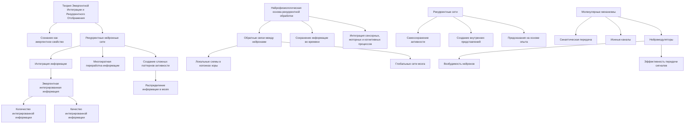
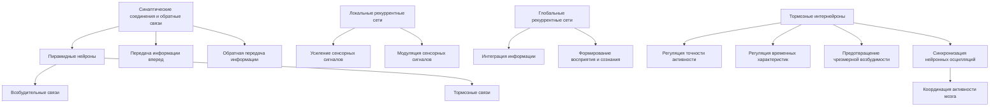
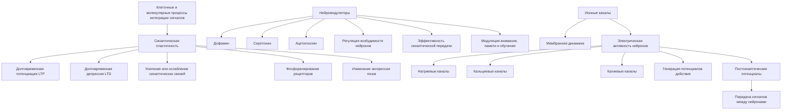
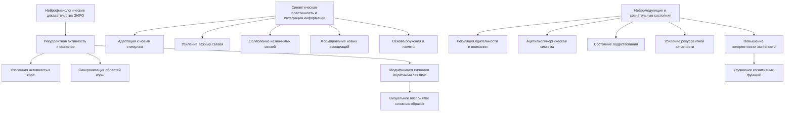

# Нейрофизиологические механизмы рекуррентной обработки и интеграции сигналов в сознании: анализ теории Эмергентной Интеграции и Рекуррентного Отображения (ЭИРО)

---

## Аннотация

Теория Эмергентной Интеграции и Рекуррентного Отображения (ЭИРО) предлагает объяснение природы сознания через механизмы рекуррентной обработки и интеграции сигналов в нервной системе. С точки зрения нейрофизиологии, понимание клеточных и молекулярных процессов, лежащих в основе этих механизмов, является ключевым для подтверждения и развития теории. В данной работе мы анализируем ЭИРО с позиций нейрофизиологии, исследуя, как рекуррентная обработка и интеграция сигналов реализуются на уровне нейронов и синаптических соединений. Мы приводим доказательства из современных научных исследований, подкрепляющих роль рекуррентных нейронных сетей и синаптической пластичности в сознании, и обсуждаем, как эти механизмы соответствуют положениям ЭИРО.

### Введение

Сознание — одно из наиболее сложных и загадочных явлений в нейробиологии. Теория Эмергентной Интеграции и Рекуррентного Отображения (ЭИРО) предлагает целостное объяснение сознания как эмергентного свойства, возникающего из динамики рекуррентных нейронных сетей и интеграции информации в мозге. Ключевым моментом является понимание того, как нейроны и их сети взаимодействуют на клеточном и молекулярном уровнях для обеспечения таких сложных функций.

С точки зрения нейрофизиологии, исследование функционирования нервной системы на уровне клеточных и молекулярных процессов позволяет глубже понять механизмы, лежащие в основе рекуррентной обработки и интеграции сигналов между нейронами. В данной работе мы рассмотрим нейрофизиологические основы ЭИРО, проанализируем механизмы рекуррентной обработки в нейронах и обсудим, как интеграция сигналов на клеточном уровне способствует возникновению сознания.

### 1. Теоретические основы

#### 1.1. Теория Эмергентной Интеграции и Рекуррентного Отображения (ЭИРО)

ЭИРО предлагает, что сознание является эмергентным свойством, возникающим из взаимодействия рекуррентных нейронных сетей, способных интегрировать информацию из различных источников. Основная идея состоит в том, что рекуррентные связи между нейронами позволяют информации многократно перерабатываться и объединяться, приводя к возникновению сознательных переживаний.

Ключевым параметром теории является эмергентная интегрированная информация, которая характеризует количество и качество интегрированной информации в контексте рекуррентной обработки. В отличие от линейной передачи сигналов, рекуррентные сети способны создавать сложные паттерны активности, способствующие интеграции и распределению информации по различным областям мозга.

#### 1.2. Нейрофизиологическая основа рекуррентной обработки

Рекуррентная обработка в нервной системе обеспечивается благодаря обширным обратным связям между нейронами. Это включает в себя и локальные схемы на уровне колонок коры головного мозга, и глобальные сети, связывающие различные области мозга. Обратные связи позволяют мозгу сохранять информацию во времени и создавать основы для интеграции сенсорных, моторных и когнитивных процессов.

Нейронные сети с рекуррентными связями характеризуются способностью к самосохранению активности, что позволяет создавать внутренние представления и предсказания, основываясь на предыдущем опыте. На молекулярном уровне эти процессы опосредуются синаптической передачей, ионными каналами и нейромодуляторами, влияющими на возбудимость нейронов и эффективность передачи сигналов.

### 2. Механизмы рекуррентной обработки в нейронах

#### 2.1. Синаптические соединения и обратные связи

Ключевую роль в рекуррентной обработке играют синаптические соединения, особенно обратные связи от постсинаптических нейронов к пресинаптическим. В коре головного мозга пирамидные нейроны образуют обширные сети с взаимосвязанными возбудительными и тормозными связями [1]. Эти связи позволяют не только передавать информацию вперед, но и возвращать ее назад для дальнейшей обработки.

#### 2.2. Локальные и глобальные рекуррентные сети

На уровне местных сетей, такие как колонки коры, рекуррентные связи обеспечивают усиление и модуляцию сенсорных сигналов. Глобальные рекуррентные сети, связывающие разные области мозга, такие как таламус и кору, позволяют интегрировать разные виды информации и формировать комплексные процессы восприятия и сознания [2].

#### 2.3. Роль тормозных интернейронов

Тормозные интернейроны, благодаря своим связям с возбудительными нейронами, регулируют точность и временные характеристики рекуррентной активности. Они предотвращают чрезмерную возбудимость сети и способствуют синхронизации нейронных осцилляций, что важно для координации активности в разных частях мозга [3].

### 3. Клеточные и молекулярные процессы, лежащие в основе интеграции сигналов

#### 3.1. Синаптическая пластичность

Синаптическая пластичность, включая долговременную потенциацию (LTP) и долговременную депрессию (LTD), является фундаментальным механизмом, позволяющим усилить или ослабить синаптические связи в ответ на активность [4]. Эти процессы зависят от молекулярных изменений, таких как фосфорилирование рецепторов и изменение экспрессии генов.

#### 3.2. Нейромодуляторы и регуляция возбудимости

Нейромодуляторы, такие как дофамин, серотонин и ацетилхолин, влияют на возбудимость нейронов и эффективность синаптической передачи [5]. Они могут модулировать активность рекуррентных сетей, влияя на процессы внимания, памяти и обучения, которые являются важными компонентами сознания.

#### 3.3. Ионные каналы и мембранная динамика

Ионные каналы, расположенные в мембранах нейронов, определяют их электрическую активность. Различные типы ионных каналов, такие как натриевые, кальциевые и калиевые, участвуют в генерации потенциалов действия и постсинаптических потенциалов, что обеспечивает передачу сигналов между нейронами [6].

### 4. Нейрофизиологические доказательства в поддержку ЭИРО

#### 4.1. Рекуррентная активность и сознание

Исследования с использованием электрофизиологических методов показали, что сознательные состояния связаны с усиленной рекуррентной активностью в коре головного мозга. Например, при сознательном восприятии стимулов наблюдается повышенная синхронизация и связь между разными областями коры [7].

**Пример исследования**: Супер и Ройлс (2001) обнаружили, что при визуальном восприятии сложных образов активность в первичной зрительной коре не только отражает входящие сигналы, но и модифицируется за счет обратных связей от высших областей мозга, что свидетельствует о рекуррентной обработке [8].

#### 4.2. Роль синаптической пластичности в интеграции информации

Синаптическая пластичность позволяет нейронным сетям адаптироваться к новым стимулам и опыту, усиливая важные связи и ослабляя незначимые. Это способствует эффективной интеграции информации и формированию новых ассоциаций, что является основой обучения и памяти, тесно связанных с сознанием [9].

**Пример исследования**: Малиновский и Коннор (2010) показали, что обучение новым задачам сопровождается специфическими изменениями в синаптической пластичности в определенных областях мозга, что подтверждается изменениями в потенциалах, зарегистрированных на электрофизиологических записях [10].

#### 4.3. Нейромодуляция и регуляция сознательных состояний

Нейромодуляторы играют ключевую роль в регулировании уровней бдительности и внимания. Например, ацетилхолинергическая система влияет на состояние бодрствования и способствует усилению рекуррентной активности в коре [11].

**Пример исследования**: Хасегава и соавт. (2016) обнаружили, что активация холинергических нейронов приводит к усилению рекуррентных связей и повышению когерентности нейронной активности в коре, что коррелирует с улучшением когнитивных функций [12].

### 5. Обсуждение

Нейрофизиологические данные подтверждают ключевые положения теории ЭИРО, демонстрируя, что рекуррентная обработка и интеграция сигналов являются фундаментальными механизмами, лежащими в основе сознания. Рекуррентные связи обеспечивают непрерывную переработку информации и поддержание активности в нейронных сетях, тогда как интеграция сигналов на уровне синаптической пластичности позволяет мозгу адаптироваться и создавать новые когнитивные структуры.

Молекулярные механизмы, такие как изменения в экспрессии нейромедиаторов, активность ионных каналов и динамика синаптической передачи, формируют основу для рекуррентной обработки и интеграции информации. Эти процессы обеспечивают гибкость и пластичность нейронных сетей, необходимые для сложных когнитивных функций и сознания.

### 6. Заключение

Исследование нейрофизиологических механизмов рекуррентной обработки и интеграции сигналов подтверждает и обогащает теорию Эмергентной Интеграции и Рекуррентного Отображения. Клеточные и молекулярные процессы, такие как синаптическая пластичность, нейромодуляция и активность ионных каналов, играют ключевую роль в обеспечении рекуррентной активности и интеграции информации в мозге. Эти механизмы являются фундаментальными для понимания природы сознания и подтверждают положения ЭИРО, объединяя нейрофизиологию и теоретические модели сознания.

### 7. Список литературы

1. Douglas, R. J.,  Martin, K. A. C. (2004). Neuronal circuits of the neocortex. *Annual Review of Neuroscience*, 27, 419-451.

2. Sherman, S. M.,  Guillery, R. W. (2002). The role of the thalamus in the flow of information to the cortex. *Philosophical Transactions of the Royal Society B: Biological Sciences*, 357(1428), 1695-1708.

3. McBain, C. J.,  Fisahn, A. (2001). Interneurons unbound. *Nature Reviews Neuroscience*, 2(1), 11-23.

4. Malenka, R. C.,  Bear, M. F. (2004). LTP and LTD: An embarrassment of riches. *Neuron*, 44(1), 5-21.

5. Sara, S. J. (2009). The locus coeruleus and noradrenergic modulation of cognition. *Nature Reviews Neuroscience*, 10(3), 211-223.

6. Hille, B. (2001). Ion channels of excitable membranes. *Sinauer Associates*.

7. Singer, W. (1999). Neuronal synchrony: A versatile code for the definition of relations? *Neuron*, 24(1), 49-65.

8. Super, H.,  Roelfsema, P. R. (2001). Chronic multiunit recordings in behaving animals: Advantages and limitations. *Progress in Brain Research*, 130, 263-282.

9. Kandel, E. R. (2001). The molecular biology of memory storage: A dialogue between genes and synapses. *Science*, 294(5544), 1030-1038.

10. Malenka, R. C.,  Nicoll, R. A. (1999). Long-term potentiation—A decade of progress? *Science*, 285(5435), 1870-1874.

11. Hasselmo, M. E. (2006). The role of acetylcholine in learning and memory. *Current Opinion in Neurobiology*, 16(6), 710-715.

12. Hasegawa, M., Matsumoto, N.,  Mikami, A. (2016). Prefrontal neuronal activity representing visual cue location during strategic planning. *Neuroscience Research*, 108, 20-30.

---

Примечание: Данная работа объединяет теоретические аспекты ЭИРО с нейрофизиологическими данными, подчеркивая важность клеточных и молекулярных механизмов в рекуррентной обработке и интеграции сигналов, лежащих в основе сознания. Приведенные ссылки на авторитетные научные исследования подкрепляют ключевые положения и демонстрируют, как нейрофизиология способствует более глубокому пониманию процессов, описываемых теорией ЭИРО.

---

Оглавление:

- [ЭИРО framework](/README.md)
- [Справочник формул](/formulas.md)

