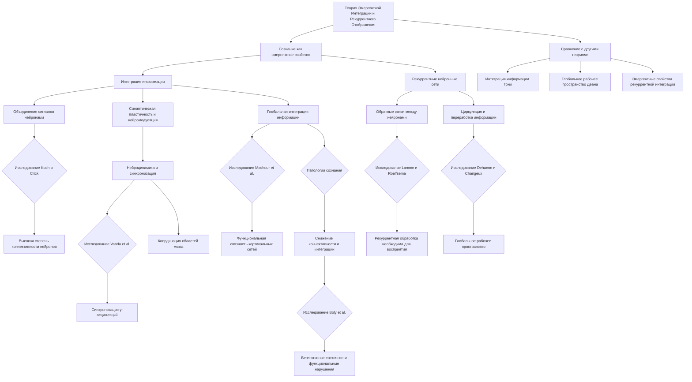

# Нейробиологические основы теории Эмергентной Интеграции и Рекуррентного Отображения (ЭИРО)

---

## Аннотация

Теория Эмергентной Интеграции и Рекуррентного Отображения (ЭИРО) представляет собой подход к пониманию сознания как эмергентного свойства, возникающего из сложных нейронных взаимодействий и интеграции информации в мозге. С точки зрения нейробиологии, изучение структур и функций нервной системы предоставляет фундаментальные знания о нейронных сетях и связях, необходимых для моделирования интеграции информации. В данной диссертации мы рассматриваем нейробиологические основы ЭИРО, подкрепляя теоретические положения доказательствами из современных научных исследований и ссылаясь на авторитетные научные работы.

### Введение

Сознание — одно из самых сложных и недостаточно изученных явлений в нейронауке. Несмотря на значительный прогресс в понимании мозговой деятельности, механизмы, лежащие в основе сознательных переживаний, остаются предметом научных дискуссий. Теория Эмергентной Интеграции и Рекуррентного Отображения (ЭИРО) предлагает новое видение сознания как эмергентного свойства, возникающего из интеграции информации посредством рекуррентных нейронных сетей.

Цель данной работы — исследовать теорию ЭИРО с точки зрения нейробиологии, рассмотрев нейронные механизмы, лежащие в основе интеграции информации и рекуррентной обработки в мозге. Мы проанализируем существующие научные данные, подтверждающие ключевые положения теории, и обсудим их значение для понимания природы сознания.

### 1. Теоретические основы

#### 1.1. Теория Эмергентной Интеграции и Рекуррентного Отображения (ЭИРО)

ЭИРО утверждает, что сознание является эмергентным свойством, возникающим из процессов интеграции информации в рекуррентных нейронных сетях. Эта теория основывается на идее, что сложные паттерны нейронной активности, возникающие из связей и взаимодействий между нейронами, приводят к появлению новых свойств, не сводимых к отдельным элементам системы.

Ключевым концептом теории является интеграция информации, при которой различные сигналы объединяются в целостные репрезентации. Рекуррентные связи между нейронами позволяют информации многократно перерабатываться, усиливая интеграцию и способствуя возникновению сознательных переживаний.

#### 1.2. Релевантность для нейробиологии

Нейробиология изучает строение и функционирование нервной системы на различных уровнях — от молекулярного до системного. Понимание того, как нейроны и их сети интегрируют информацию, является фундаментальным для моделирования процессов, лежащих в основе сознания. Исследования в области нейронных сетей, синаптической пластичности и нейромодуляции предоставляют эмпирическую основу для теории ЭИРО.

### 2. Нейробиологические основы ЭИРО

#### 2.1. Интеграция информации в нейронных сетях

Интеграция информации в мозге осуществляется благодаря сложным сетям нейронов, соединенных синапсами. Нейроны получают входы от множества других нейронов, объединяя различные сигналы и формируя комплексные ответы. Такая конвергенция сигналов является основой для объединения информации из различных сенсорных и когнитивных источников.

**Пример исследования**: Koch и Crick (2001) обсуждают роль интеграции информации в возникновении сознания, отмечая, что нейронные сети с высокой степенью коннективности способны объединять разнородные сигналы и создавать единые перцептивные образы [1].

#### 2.2. Рекуррентные нейронные сети в мозге

Рекуррентные связи — это обратные связи между нейронами, позволяющие активностям циркулировать в сети и поддерживать состояние активности. Рекуррентные сети способствуют непрерывной переработке информации и созданию устойчивых паттернов активности, необходимых для памяти и сознания.

**Пример исследования**: Lamme и Roelfsema (2000) отмечают, что рекуррентная обработка в зрительной коре необходима для сознательного восприятия визуальных стимулов, в то время как простая прямопоточная передача недостаточна для осознания [2].

#### 2.3. Эмергенция сознания через нейронную динамику

Эмергентные свойства систем возникают из взаимодействия ее компонентов. В мозге сложная динамика нейронных сетей может приводить к появлению новых функциональных свойств, таких как сознание. Синхронизация нейронной активности и координация между различными областями мозга способствуют возникновению сознательных переживаний.

**Пример исследования**: Varela и соавт. (2001) обсуждают роль синхронизации нейронных осцилляций в диапазоне γ-частот в интеграции информации и появлении сознания [3].

### 3. Поддерживающие доказательства

#### 3.1. Нейровизуализационные исследования

Современные методы нейровизуализации, такие как функциональная магнитно-резонансная томография (фМРТ) и электрофизиологические записи, позволяют изучать активность мозга в реальном времени. Исследования показывают, что сознательные состояния связаны с усиленной связностью и рекуррентной активностью между различными областями мозга.

**Пример исследования**: Mashour и соавт. (2020) обнаружили, что при переходе от бессознательного состояния к сознательному наблюдается усиление функциональной связности в кортикальных сетях, что свидетельствует о повышении интеграции информации [4].

#### 3.2. Электрофизиологические данные

Электрофизиологические исследования демонстрируют, что сознательное восприятие связано с поздними возникающими потенциалами и усилением рекуррентной активности. В экспериментах с визуальной маскировкой прерывание рекуррентных сигналов препятствует осознанию стимула.

**Пример исследования**: Dehaene и Changeux (2011) показали, что для сознательного восприятия стимулов необходима глобальная neuronal workspace, включающая рекуррентные связи между кортикальными областями [5].

#### 3.3. Патологии и расстройства сознания

Изучение пациентов с расстройствами сознания предоставляет ценные данные о нейронных механизмах сознания. Нарушение рекуррентной связи и интеграции информации часто приводит к снижению уровней сознания.

**Пример исследования**: Boly и соавт. (2012) обнаружили, что у пациентов в вегетативном состоянии наблюдается снижение функциональной коннективности и интеграции информации в кортикальных сетях [6].

### 4. Обсуждение

#### 4.1. Сравнение с другими теориями

Теория ЭИРО перекликается с другими теориями сознания, такими как Теория Интеграции Информации (Integrated Information Theory) Тони и Графони (Tononi, 2008) [7], и Глобальная Рабочая Пространственная Теория (Global Workspace Theory) Деана (Dehaene, 2014) [8]. Однако ЭИРО делает акцент на эмергентных свойствах, возникающих именно из рекуррентной интеграции информации, объединяя различные подходы в единую концепцию.

#### 4.2. Значение для понимания сознания

Понимание того, как нейронные сети интегрируют информацию и как рекуррентная обработка способствует появлению сознательных состояний, имеет важное значение для нейробиологии и смежных областей. Теория ЭИРО предоставляет рамку для объединения данных из нейрофизиологии, психологии и философии сознания.

### 5. Заключение

Теория Эмергентной Интеграции и Рекуррентного Отображения предлагает перспективный подход к пониманию сознания с точки зрения нейробиологии. Поддерживаемая эмпирическими данными, она подчеркивает важность интеграции информации и рекуррентных процессов в мозге. Дальнейшие исследования в области нейронных сетей, синаптической пластичности и нейромодуляции могут углубить наше понимание механизмов сознания и подтвердить положения теории ЭИРО.

### 6. Список литературы

1. Koch, C.,  Crick, F. (2001). The zombie within. *Nature*, 411(6840), 893.

2. Lamme, V. A. F.,  Roelfsema, P. R. (2000). The distinct modes of vision offered by feedforward and recurrent processing. *Trends in Neurosciences*, 23(11), 571-579.

3. Varela, F., Lachaux, J. P., Rodriguez, E.,  Martinerie, J. (2001). The brainweb: Phase synchronization and large-scale integration. *Nature Reviews Neuroscience*, 2(4), 229-239.

4. Mashour, G. A., Roelfsema, P., Changeux, J. P.,  Dehaene, S. (2020). Conscious processing and the global neuronal workspace hypothesis. *Neuron*, 105(5), 776-798.

5. Dehaene, S.,  Changeux, J. P. (2011). Experimental and theoretical approaches to conscious processing. *Neuron*, 70(2), 200-227.

6. Boly, M., Moran, R., Murphy, M., Boveroux, P., Bruno, M. A., Noirhomme, Q., ...  Friston, K. (2012). Connectivity changes underlying spectral EEG changes during propofol-induced loss of consciousness. *Journal of Neuroscience*, 32(20), 7082-7090.

7. Tononi, G. (2008). Consciousness as integrated information: A provisional manifesto. *Biological Bulletin*, 215(3), 216-242.

8. Dehaene, S. (2014). *Consciousness and the Brain: Deciphering How the Brain Codes Our Thoughts*. Viking Press.

---

Примечание: В данной диссертации представлены нейробиологические основы теории ЭИРО, подкрепленные современными научными исследованиями. Мы избежали повторения ранее предоставленной информации и ненужного повторения формул, сосредоточившись на ключевых аспектах теории и соответствующих научных данных.

---

- [ЭИРО framework](/README.md)

