# Поиск новых теорий в химии.

```mermaid
graph TD
    A[ЭИРО framework] --> B[Интеграция квантовой информации]
    A --> C[Рекуррентность в химических процессах]
    A --> D[Эмерджентность и новые модели Вселенной]

    B --> B1[Плотность интегрированной квантовой информации ρIQI]
    B1 --> B1a[Мера делокализации электронного облака]
    B1 --> B1b[Корреляции между электронами]
    B --> B2[Применение в гибридизации орбиталей и делокализации]

    C --> C1[Рекуррентные циклические процессы]
    C --> C2[Обратимые реакции и каталитические циклы]
    C1 --> C1a[Параметр рекуррентности R]
    C1a --> C1b[Вероятность возврата системы]
    C2 --> C2a[Оптимизация катализаторов]

    D --> D1[Молекулярные свойства и квантовая информация]
    D1 --> D1a[Эффективное уравнение состояния w_eff]
    D1 --> D1b[Влияние ρIQI и R на энергию систем]
    D --> D2[Метрические свойства пространства-времени]
    D2 --> D2a[Модифицированные уравнения Эйнштейна]

    E[Применение ЭИРО framework]
    E --> E1[Происхождение хиральности]
    E1 --> E1a[Автокаталитические циклы]
    E1a --> E1b[Эмерджентное усиление энантиомеров]
    E1 --> E1c[Квантовые различия ρIQI]
    E1c --> E1d[Стабилизация одного энантиомера]

    E --> E2[Передача информации в биохимических системах]
    E2 --> E2a[Интеграция информации в биомолекулах]
    E2a --> E2b[Связь ρIQI с функциональной активностью]
    E2 --> E2c[Рекуррентность в сигнальных путях]
    E2c --> E2d[Циклические ферментативные процессы]

    E --> E3[Применение в медицине и биотехнологии]
    E3 --> E3a[Разработка таргетных лекарств]
    E3 --> E3b[Создание биосенсоров]
    E3 --> E3c[Инженерия ферментов с заданным ρIQI]
```

---

## Аннотация

В данной работе предлагается новое представление химических процессов, основанное на теории Эмергентной Интеграции и Рекуррентного Отображения (ЭИРО) и расширенной модели Вселенной. Мы исследуем возможности применения принципов эмерджентности и рекуррентных взаимодействий к фундаментальным химическим явлениям, с целью разработки новых теорий, объясняющих сложное поведение химических систем. Особое внимание уделяется интеграции квантовой информации и влиянию рекуррентности на динамику молекулярных систем.

### 1. Введение

Современная химия сталкивается с множеством вопросов, требующих пересмотра традиционных подходов и разработки новых теоретических основ. Классические модели не всегда способны удовлетворительно описать сложные системы, особенно на квантовом уровне. В то же время, развитие физики и информатики привело к появлению новых концепций, которые могут предоставить свежий взгляд на химические процессы.

Теория Эмергентной Интеграции и Рекуррентного Отображения (ЭИРО) предлагает рамки для понимания того, как сложные структуры и свойства возникают из взаимодействия более простых компонентов через процессы интеграции информации и рекуррентности. Применение этой теории к химии может открыть новые пути для объяснения и предсказания поведения молекул и реакций.

### 2. ЭИРО в контексте химии

#### 2.1. Интеграция квантовой информации в химических системах

Квантовая химия изучает поведение электронов в молекулярных системах, где квантовые эффекты играют ключевую роль. Интеграция квантовой информации может позволить более точно описать процессы, такие как гибридизация орбиталей, резонансные структуры и делокализация электронов.

Плотность интегрированной квантовой информации (ρIQI) в химической системе может быть определена как мера степени делокализации электронного облака и корреляции между электронами:

`ρ_(IQI) = lim(Δ V → 0) Δ I / Δ V,`

где ΔI — изменение интегрированной информации в объёме ΔV.

Высокая плотность ρIQI может указывать на сильные корреляции и коммуникацию между различными частями молекулы, что является характерным для конъюгированных систем и ароматических соединений.

#### 2.2. Рекуррентность в химических реакциях

Рекуррентность в химии может быть связана с циклическими процессами и обратимыми реакциями, где системы возвращаются к предыдущим состояниям или проходят через аналогичные промежуточные стадии.

Параметр рекуррентности (R) в химической реакции может быть количественно определён через вероятность возвращения системы в исходное состояние или через частоту циклических процессов.

Применяя рекуррентность к каталитическим циклам, можно лучше понять механизмы катализа и разработать эффективные катализаторы, оптимизируя R для повышения выходов и селективности реакций.

### 3. Новая модель Вселенной и её связь с химией

Расширенные модели Вселенной, учитывающие интегрированную квантовую информацию и рекуррентные эффекты, позволяют переосмыслить фундаментальные взаимодействия на всех уровнях масштаба.

#### 3.1. Эффективные уравнения состояния в химических системах

Аналогично космологическим моделям, можно ввести эффективное уравнение состояния для описания энергетических характеристик химических систем:

`w_(eff) = w₀ + w₁ f(ρ_(IQI), R),`

где w₀ и w₁ — константы, а f — функция, описывающая влияние ρIQI и R на энергию системы.

Это уравнение может помочь в предсказании стабильности молекул, реакционной способности и энергии активации, учитывая эмергентные свойства системы.

#### 3.2. Влияние на метрику пространства-времени в молекулярных масштабах

Включение новых параметров в модифицированные уравнения, подобные уравнениям Эйнштейна, позволяет учитывать влияние интегрированной квантовой информации на локальные взаимодействия:

`G_(μν) + Λ g_(μν) = 8π G (( T_(μν) + T_(μν)^(IQI) )),`

где TμνIQI — тензор энергии-импульса, связанный с ρIQI и R в молекулярной системе.

Хотя гравитационные эффекты незначительны на молекулярном уровне, такое представление подчёркивает связь между информацией и физическими свойствами, открывая путь к новым интерпретациям квантовой гравитации в химии.

### 4. Применение ЭИРО к решению основных научных вопросов в химии

#### 4.1. Происхождение хиральности в биологических системах

[Происхождение хиральности в биологических системах](The-origin-of-chirality-in-biological-systems.md)

Хиральность — это свойство объектов, не совпадающих со своим зеркальным отражением. В биологическом мире хиральность проявляется повсеместно: аминокислоты в белках обычно имеют L-конфигурацию, а сахара — D-конфигурацию. Это явление, известное как гомохиральность, представляет одну из загадок происхождения жизни, поскольку химические реакции в неживой природе обычно производят рацемические смеси — равное количество обоих энантиомеров.

Применение теории Эмергентной Интеграции и Рекуррентного Отображения (ЭИРО) позволяет предложить новое объяснение преобладания одной хиральной формы в биологических системах через процессы эмерджентности и рекуррентности.

##### 4.1.1. Рекуррентные автокаталитические циклы

В основе возникновения гомохиральности может лежать механизм рекуррентных автокаталитических циклов. В таких системах продукт реакции служит катализатором для своего собственного образования, создавая положительную обратную связь. Если один из энантиомеров слегка преобладает из-за случайных флуктуаций, автокаталитический процесс может усиливать это преобладание, ведя систему к доминированию одного энантиомера.

Параметр рекуррентности (R) в этом контексте описывает степень возврата системы к предыдущим состояниям через циклические реакции:

`R = Количество рекуррентных циклов / Общее количество реакци}`

Высокое значение  R  указывает на интенсивные рекуррентные процессы, способные усилить небольшую асимметрию в системе.

##### 4.1.2. Интеграция квантовой информации и хиральность

Плотность интегрированной квантовой информации ( ρ_(IQI) ) может влиять на стабильность и реакционную способность хиральных молекул. Энантиомеры могут иметь различия в распределении электронной плотности и энергии, особенно в присутствии внешних факторов, таких как поляризованный свет или магнитные поля.

Функция  ρ_(IQI)  для хиральной системы может быть выражена как:

`ρ_(IQI) = ∫[V] ψ^* ^H \psidV,`

где  ψ  — волновая функция молекулы, ^H  — гамильтониан системы,  V  — объём, занимаемый молекулой. Различия в  ρ_(IQI)  между энантиомерами могут приводить к энергетическому предпочтению одного из них.

##### 4.1.3. Эмерджентное возникновение гомохиральности

Совместное влияние высоких значений R и ρ_(IQI) может привести к эмерджентному возникновению гомохиральности:

- **Начальная асимметрия**: Небольшие флуктуации или внешние факторы создают начальное преобладание одного энантиомера.

- **Усиление через рекуррентность**: Высокий параметр  R  в автокаталитических циклах усиливает преобладание этого энантиомера.

- **Интеграция квантовой информации**: Различия в  ρ_(IQI)  стабилизируют преобладающий энантиомер, снижая вероятность обратного перехода.

- **Эмерджентное свойство**: В результате система переходит в состояние гомохиральности, которая сохраняется и передаётся в биологические системы.

Таким образом, теория ЭИРО предоставляет механистическое объяснение происхождения хиральности в биологических системах, объединяя рекуррентные химические процессы и квантовые эффекты интеграции информации.

#### 4.2. Механизмы передачи информации в биохимических системах

[Механизмы передачи информации в биохимических системах](Mechanisms-of-information-transfer-in-biochemical-systems.md)

Биохимические системы обладают сложными механизмами передачи информации, которые обеспечивают координацию и регулирование биологических процессов. Сигнальные пути, генетическая экспрессия и ферментативные реакции являются примерами таких механизмов.

##### 4.2.1. Интегрированная квантовая информация в биомолекулах

Плотность интегрированной квантовой информации ( ρ_(IQI) ) в биомолекулах отражает степень их способности хранить и передавать информацию на квантовом уровне. Электронные состояния, конформационные изменения и колебательные режимы молекул играют важную роль в этих процессах.

Для белков и нуклеиновых кислот  ρ_(IQI)  может быть связана с их функциональной активностью:

`ρ_(IQI) = ∑ᵢ pᵢ log (( 1 / pᵢ )),`

где  pᵢ  — вероятность нахождения системы в состоянии  i . Высокое значение  ρ_(IQI)  указывает на большую энтропию и разнообразие состояний, способствуя эффективной передаче информации.

##### 4.2.2. Рекуррентность в сигнальных путях

Параметр рекуррентности (R) в биохимических системах может описывать циклические или обратимые процессы, критически важные для передачи сигнала:

- **Ферментативные циклы**: Фосфорилирование и дефосфорилирование белков в циклических каскадах.

- **Обратимые связывания**: Лиганд-рецепторные взаимодействия с возможностью диссоциации и повторного связывания.

- **Генетические регуляторные петли**: Обратная связь в экспрессии генов.

Высокий параметр  R  обеспечивает устойчивость и точность передачи сигнала:

`R = Частота обратных процессов / Общая частота реакци}`

##### 4.2.3. Эмерджентные свойства передачи информации

Совместное действие  ρ_(IQI)  и  R  приводит к эмерджентным свойствам в биохимических системах:

- **Повышение чувствительности**: Высокое  ρ_(IQI)  позволяет молекулам реагировать на слабые сигналы за счёт множества доступных состояний.

- **Точность сигнала**: Высокий  R  обеспечивает повторяющееся подтверждение сигнала, уменьшая вероятность ошибок.

- **Регуляция и адаптация**: Эмерджентные свойства системы позволяют адаптироваться к изменениям среды через динамическое изменение  ρ_(IQI)  и  R .

#### 4.3. Применение в медицине и биотехнологии

Понимание механизмов передачи информации через призму ЭИРО открывает новые возможности:

- **Разработка лекарственных препаратов**: Таргетирование молекул с определённым  ρ_(IQI)  и модификация  R  в сигнальных путях для управления биологическими ответами.

- **Биосенсоры**: Создание молекулярных устройств с высоким  ρ_(IQI)  для детекции химических и физических сигналов.

- **Синтетическая биология**: Дизайн биологических систем с заданными эмерджентными свойствами для выполнения специфических функций.

Например, инженерия ферментов с изменённым  ρ_(IQI)  может повысить их катализаторную активность или изменить специфичность. Модуляция рекуррентности в генетических сетях может привести к созданию организмов с улучшенной устойчивостью к стрессовым факторам.

> Таким образом, детальное рассмотрение происхождения хиральности и механизмов передачи информации в биохимических системах через призму ЭИРО предоставляет глубокое понимание фундаментальных процессов в химии и биологии. Это не только обогащает теоретическую базу, но и открывает практические пути для инноваций в науке и технологии.

---

### 5. Заключение

Применение теории ЭИРО и расширенной модели Вселенной к химии предлагает новые перспективы для понимания и предсказания сложного поведения химических систем. Интеграция квантовой информации и рекуррентность являются ключевыми элементами, позволяющими объяснить эмергентные свойства молекул и реакций.

Дальнейшие исследования в этом направлении могут привести к разработке новых теорий и моделей, способствующих прогрессу в химии и смежных науках.

### 6. Список литературы

- Tegmark, M. (2014). Consciousness as a State of Matter. *Chaos, Solitons  Fractals*, 76, 238-270.

- Friston, K. (2010). The Free-Energy Principle: A Unified Brain Theory? *Nature Reviews Neuroscience*, 11(2), 127-138.

- Laughlin, R. B. (2005). *A Different Universe: Reinventing Physics from the Bottom Down*. Basic Books.

---

- [ЭИРО framework](/README.md)

