# Теория Эмергентной Интеграции и Рекуррентного Отображения (ЭИРО): Философское Обоснование Сознания

```mermaid
flowchart TD
    A[Сознание и трудная проблема] --> B[Проблема квалий]
    A --> C[Эмергентность и сознание]

    B --> B1[Субъективные аспекты опыта]
    B1 --> B2[Каково это? вопрос Нагеля]
    B1 --> B3[Различие между легкими и трудными проблемами Чалмерса]

    C --> C1[Эмергентные свойства системы]
    C1 --> C2[Слабая эмергентность: системные свойства объяснимы]
    C1 --> C3[Сильная эмергентность: принципиально новые свойства]

    D[Теория ЭИРО] --> D1[Основные положения]
    D1 --> D2[Эмергентная интеграция информации Ψ]
    D1 --> D3[Рекуррентные процессы λᵢⱼ]
    D3 --> D4[Обратные связи в нейронных сетях]
    D4 --> D5[Создание целостного восприятия]
    D4 --> D6[Поддержка самосознания и рефлексии]

    D --> E[Философское обоснование ЭИРО]
    E --> E1[Эмергентность как объяснение Ψ]
    E1 --> E2[Появление новых свойств через интеграцию]
    E --> E3[Рекуррентность и самосознание]
    E3 --> E4[Обращение системы к своим состояниям]
    E --> E5[Интеграция информации и феноменальный опыт]
    E5 --> E6[Целостность восприятия и объяснение квалий]

    F[Сравнение с теориями сознания] --> F1[Интегрированная информационная теория]
    F1 --> F2[Параметр Φ: статическая интеграция информации]
    F1 --> F3[Отличие: роль рекуррентности в ЭИРО]
    
    F --> F4[Глобальная нейронная рабочая область]
    F4 --> F5[Глобальное вещание информации]
    F4 --> F6[Отличие: динамика рекуррентной интеграции]

    G[Импликации ЭИРО] --> G1[Онтологические последствия]
    G1 --> G2[Монстическая онтология: ум и материя]
    G --> G3[Эпистемологические вопросы]
    G3 --> G4[Методы изучения динамики процессов λᵢⱼ]
    G --> G5[Этические аспекты]
    G5 --> G6[Искусственный интеллект и моральный статус]
    G5 --> G7[Сознание у животных и сложных систем]

    style A fill:#f9f,stroke:#333,stroke-width:2
    style D fill:#bbf,stroke:#333,stroke-width:2
    style G fill:#bff,stroke:#333,stroke-width:2
```

---

## Аннотация

Сознание является одной из наиболее сложных и противоречивых тем в современной философии и науке. Многие подходы пытаются объяснить, как субъективный опыт возникает из объективных физических процессов. Теория Эмергентной Интеграции и Рекуррентного Отображения (ЭИРО) предлагает перспективу, в которой сознание рассматривается как эмергентное свойство, возникающее из интеграции информации в рекуррентных нейронных сетях мозга. В данной диссертации исследуется философское обоснование ЭИРО, обсуждаются проблемы природы сознания, "квалии" и эмергентности. Анализируются философские концепции, позволяющие сформулировать фундаментальные вопросы, на которые отвечает ЭИРО. Работа подкреплена обсуждением современных исследований и ссылками на авторитетные научные труды в области философии сознания.

### Содержание

1. Введение

2. Природа сознания и трудная проблема

   - 2.1. Проблема "квалии"

   - 2.2. Эмергентность и сознание

3. Теория Эмергентной Интеграции и Рекуррентного Отображения (ЭИРО)

   - 3.1. Основные положения теории

   - 3.2. Роль рекуррентных процессов в сознании

4. Философское обоснование ЭИРО

   - 4.1. Эмергентность как объяснительный принцип

   - 4.2. Рекуррентность и самосознание

   - 4.3. Интеграция информации и феноменальный опыт

5. Сравнение ЭИРО с другими теориями сознания

   - 5.1. Интегрированная информационная теория (IIT)

   - 5.2. Глобальная нейронная рабочая область (GNWT)

6. Импликации ЭИРО для философии сознания

   - 6.1. Онтологические последствия

   - 6.2. Эпистемологические вопросы

   - 6.3. Этические аспекты

7. Заключение

8. Список литературы

---

### 1. Введение

Понимание природы сознания остается одной из главных задач философии и нейронауки. Несмотря на значительный прогресс в изучении мозговых процессов, объяснение того, как физические процессы порождают субъективный опыт, остается неуловимым. Эта проблема известна как "трудная проблема сознания" (Chalmers, 1995).

Теория Эмергентной Интеграции и Рекуррентного Отображения (ЭИРО) стремится предоставить объяснение сознания на основе концепций эмергентности и рекуррентных процессов в мозге. Целью данной работы является философский анализ ЭИРО, рассмотрение ее вклада в решение трудной проблемы сознания и обсуждение ее места среди других теорий сознания.

### 2. Природа сознания и трудная проблема

#### 2.1. Проблема "квалии"

"Квалиа" — термин, используемый для обозначения субъективных качественных аспектов опыта (Lewis, 1929). Это "как это" аспект ощущений и восприятий: ощущение красного цвета, вкус шоколада, боль от ожога. Проблема квалий заключается в объяснении того, как физические процессы в мозге приводят к этим субъективным переживаниям.

Философы, такие как Томас Нагель, подчеркнули трудность объяснения сознания через физикалистские модели, задавая вопрос "Каково это — быть летучей мышью?" (Nagel, 1974). Дэвид Чалмерс обозначил различие между "легкими" проблемами сознания (объяснение функций и поведения) и "трудной" проблемой (объяснение субъективного опыта) (Chalmers, 1995).

**Ссылки**:

- Nagel, T. (1974). What is it like to be a bat? *The Philosophical Review*, 83(4), 435–450.

- Chalmers, D. J. (1995). Facing up to the problem of consciousness. *Journal of Consciousness Studies*, 2(3), 200–219.

#### 2.2. Эмергентность и сознание

Эмергентность — это концепция, согласно которой целое обладает свойствами, не сводимыми к свойствам его частей (Broad, 1925). В контексте сознания это означает, что мозг как сложная система может обладать свойством сознания, которое не может быть полностью объяснено на уровне отдельных нейронов.

Различают слабую и сильную эмергентность. Слабая эмергентность предполагает, что системные свойства могут быть объяснены на основе взаимодействия компонентов, в то время как сильная эмергентность утверждает, что некоторые свойства принципиально не могут быть сведены к базовым элементам (Clayton  Davies, 2006).

**Ссылки**:

- Broad, C. D. (1925). The mind and its place in nature. Kegan Paul, Trench, Trubner  Co.

- Clayton, P.,  Davies, P. (Eds.). (2006). The re-emergence of emergence. Oxford University Press.

### 3. Теория ЭИРО

#### 3.1. Основные положения теории

ЭИРО утверждает, что сознание является эмергентным свойством, возникающим из интеграции информации в рекуррентных нейронных сетях. Ключевым параметром является эмергентная интегрированная информация (Φₑ), которая учитывает количество и качество интегрированной информации в контексте рекуррентной обработки:

`Φₑ = ∫₀^(t₁) I_(интеграции)(t) ⋅ R_(рекуррентности)(t)dt,`

где:

- I_(интеграции)(t) — степень объединения информации в момент времени t,

- R_(рекуррентности)(t) — степень рекуррентной обработки в момент времени t.

#### 3.2. Роль рекуррентных процессов в сознании

Рекуррентные нейронные сети характеризуются наличием обратных связей, что позволяет им сохранять и перерабатывать информацию во времени. Такие сети способны к более сложной динамике, включая обучение последовательностям и распознавание зависимостей во времени (Elman, 1990).

В контексте сознания, рекуррентные процессы могут способствовать интеграции различных аспектов опыта, создавая целостное восприятие. Они также могут объяснить феномены самосознания и рефлексии, поскольку обратные связи позволяют системе "обращаться на себя".

**Ссылка**:

- Elman, J. L. (1990). Finding structure in time. *Cognitive Science*, 14(2), 179–211.

### 4. Философское обоснование ЭИРО

#### 4.1. Эмергентность как объяснительный принцип

Эмергентность в ЭИРО служит ключевым концептуальным основанием для объяснения того, как сознание может возникать из физических процессов. Согласно этой теории, интеграция информации в сложных системах приводит к появлению новых свойств, которые не предсказуемы из свойств отдельных элементов (Kauffman, 1995).

Это согласуется с идеей слабой эмергентности, где новые свойства возникают из взаимодействий, но могут быть объяснены при достаточном понимании системы.

**Ссылка**:

- Kauffman, S. A. (1995). At home in the universe: The search for laws of self-organization and complexity. Oxford University Press.

#### 4.2. Рекуррентность и самосознание

Самосознание и рефлексия являются важными компонентами сознательного опыта. Рекуррентные процессы позволяют системе обращаться к своим собственным состояниям, что может быть основой для самосознания (Minsky, 1986).

Рекуррентность обеспечивает механизм, через который система может поддерживать информацию о своих предыдущих состояниях и использовать эту информацию для текущей обработки.

**Ссылка**:

- Minsky, M. (1986). The society of mind. Simon  Schuster.

#### 4.3. Интеграция информации и феноменальный опыт

Интеграция информации означает, что различные аспекты опыта объединяются в единое целое. Это может объяснить, почему мы воспринимаем мир как цельный и непрерывный, а не как набор разрозненных ощущений (Tononi  Edelman, 1998).

Эмергентная интеграция информации в ЭИРО может служить основой для понимания феноменального опыта и объяснения квалий как результирующих из высоко интегрированных информационных процессов.

**Ссылка**:

- Tononi, G.,  Edelman, G. M. (1998). Consciousness and complexity. *Science*, 282(5395), 1846–1851.

### 5. Сравнение ЭИРО с другими теориями сознания

#### 5.1. Интегрированная информационная теория (IIT)

IIT, предложенная Джулио Тонони, утверждает, что сознание соответствует способности системы интегрировать информацию, и вводит параметр Φ для количественной оценки этой способности (Tononi, 2004). Как и ЭИРО, IIT подчеркивает важность интеграции информации.
Однако ЭИРО выделяет роль рекуррентных процессов и динамики системы, тогда как IIT в большей степени фокусируется на математическом измерении интеграции в статической сети.

**Ссылка**:

- Tononi, G. (2004). An information integration theory of consciousness. *BMC Neuroscience*, 5(1), 42.

#### 5.2. Глобальная нейронная рабочая область (GNWT)

GNWT, разработанная Бернардом Баарсом и поддержанная Станисласом Деханом, предполагает, что сознание возникает, когда информация становится глобально доступной в мозге через механизм глобального вещания (Baars, 1988; Dehaene  Naccache, 2001).

ЭИРО и GNWT оба подчеркивают важность широкого распространения информации, но ЭИРО акцентирует внимание на рекуррентной интеграции как механизме эмергентности сознания.

**Ссылки**:

- Baars, B. J. (1988). A cognitive theory of consciousness. Cambridge University Press.

- Dehaene, S.,  Naccache, L. (2001). Towards a cognitive neuroscience of consciousness: basic evidence and a workspace framework. *Cognition*, 79(1-2), 1–37.

### 6. Импликации ЭИРО для философии сознания

#### 6.1. Онтологические последствия

Если сознание является эмергентным свойством, возникающим из интегрированных рекуррентных процессов, это поддерживает монстическую онтологию, где ум и материя являются разными аспектами одной реальности (Kim, 2006). Это может способствовать преодолению дихотомии между дуализмом и физикализмом.

**Ссылка**:

- Kim, J. (2006). Emergence: Core ideas and issues. *Synthese*, 151(3), 547–559.

#### 6.2. Эпистемологические вопросы

ЭИРО поднимает вопросы о том, как мы можем познать и измерить сознание. Если сознание связано с интеграцией информации в рекуррентных сетях, то его изучение требует новых методов исследования динамических процессов в мозге (Seth et al., 2006).

**Ссылка**:

- Seth, A. K., Izhikevich, E., Reeke, G. N.,  Edelman, G. M. (2006). Theories and measures of consciousness: an extended framework. *Proceedings of the National Academy of Sciences*, 103(28), 10799–10804.

#### 6.3. Этические аспекты

Понимание сознания как эмергентного свойства может иметь последствия для этики, особенно в отношении искусственного интеллекта и животных. Если сознание зависит от определенной структуры информации, то системы или существа с подобной структурой могут обладать моральным статусом (Bostrom  Yudkowsky, 2014).

**Ссылка**:

- Bostrom, N.,  Yudkowsky, E. (2014). The ethics of artificial intelligence. In K. Frankish  W. M. Ramsey (Eds.), *The Cambridge handbook of artificial intelligence* (pp. 316–334). Cambridge University Press.

### 7. Заключение

Теория Эмергентной Интеграции и Рекуррентного Отображения предлагает философски основанный подход к пониманию сознания, связывая его с эмергентными свойствами интегрированных рекуррентных процессов. Она способствует развитию диалога между философией и наукой, предлагая концептуальные инструменты для решения трудной проблемы сознания.

ЭИРО предоставляет перспективу, в которой субъективный опыт может быть объяснен через физические процессы, не отрицая сложности и уникальности сознания. Это открывает новые горизонты для исследований и стимулирует пересмотр некоторых фундаментальных предположений в философии сознания.

### 8. Список литературы

1. Baars, B. J. (1988). A cognitive theory of consciousness. Cambridge University Press.

2. Bostrom, N.,  Yudkowsky, E. (2014). The ethics of artificial intelligence. In K. Frankish  W. M. Ramsey (Eds.), *The Cambridge handbook of artificial intelligence* (pp. 316–334). Cambridge University Press.

3. Broad, C. D. (1925). The mind and its place in nature. Kegan Paul, Trench, Trubner  Co.

4. Chalmers, D. J. (1995). Facing up to the problem of consciousness. *Journal of Consciousness Studies*, 2(3), 200–219.

5. Clayton, P.,  Davies, P. (Eds.). (2006). The re-emergence of emergence. Oxford University Press.
6. Dehaene, S.,  Naccache, L. (2001). Towards a cognitive neuroscience of consciousness: basic evidence and a workspace framework. *Cognition*, 79(1-2), 1–37.

7. Elman, J. L. (1990). Finding structure in time. *Cognitive Science*, 14(2), 179–211.

8. Kauffman, S. A. (1995). At home in the universe: The search for laws of self-organization and complexity. Oxford University Press.

9. Kim, J. (2006). Emergence: Core ideas and issues. *Synthese*, 151(3), 547–559.

10. Lewis, C. I. (1929). Mind and the world-order: Outline of a theory of knowledge. Charles Scribner's Sons.

11. Minsky, M. (1986). The society of mind. Simon  Schuster.

12. Nagel, T. (1974). What is it like to be a bat? *The Philosophical Review*, 83(4), 435–450.

13. Seth, A. K., Izhikevich, E., Reeke, G. N.,  Edelman, G. M. (2006). Theories and measures of consciousness: an extended framework. *Proceedings of the National Academy of Sciences*, 103(28), 10799–10804.

14. Tononi, G. (2004). An information integration theory of consciousness. *BMC Neuroscience*, 5(1), 42.

15. Tononi, G.,  Edelman, G. M. (1998). Consciousness and complexity. *Science*, 282(5395), 1846–1851.

---

- [ЭИРО framework](/README.md)

