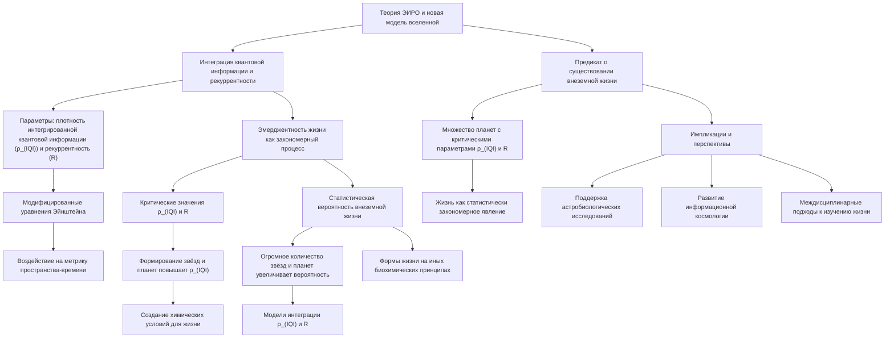

# Прогноз о существовании внеземной жизни через призму теории ЭИРО и новой модели вселенной



---

## 1. Введение

Теория Эмергентной Интеграции и Рекуррентного Отображения (ЭИРО) предоставляет уникальную концептуальную рамку для понимания процессов, ведущих к возникновению сложных структур и явлений, включая жизнь и сознание. В сочетании с новой моделью вселенной, учитывающей интеграцию квантовой информации и рекуррентные эффекты в пространственно-временном континууме, мы можем сформулировать научно обоснованный прогноз о существовании внеземной жизни.

### 2. Интеграция квантовой информации и рекуррентность в космологическом масштабе

Введённые физические величины, такие как плотность интегрированной квантовой информации ( ρ_(IQI) ) и параметр рекуррентности ( R ), позволяют описать степень интеграции информации и рекуррентных взаимодействий в масштабах вселенной. Эти параметры влияют на динамику космологических процессов и могут быть включены в модифицированные уравнения Эйнштейна:

`G_(μν) + Λ g_(μν) = 8π G (( T_(μν) + T_(μν)^(IQI) )),`

где T_(μν)^(IQI) — тензор энергии-импульса, связанный с интегрированной квантовой информацией и рекуррентными эффектами.

### 3. Эмерджентность жизни как закономерный космологический процесс

Согласно теории ЭИРО, жизнь является эмерджентным свойством систем с высокой степенью интеграции информации и рекуррентных взаимодействий. Если рассматривать вселенную как систему, в которой плотность интегрированной квантовой информации ρ_(IQI) и параметр рекуррентности R достигают определённых критических значений, то возникновение жизни становится вероятным исходом эволюции таких систем.

Формирование звёзд, планетарных систем и сложных молекулярных структур способствует увеличению ρ_(IQI) в локальных регионах вселенной. Рекуррентные процессы, такие как циклы звёздной эволюции и перераспределение элементов через сверхновые, создают условия для возникновения разнообразных химических сред, потенциально пригодных для жизни.

### 4. Статистическая вероятность существования внеземной жизни

Учитывая огромный размер и возраст вселенной, а также количество галактик, звёзд и планет, статистическая вероятность существования планет с условиями, аналогичными земным, крайне высока. Если применить параметры ρ_(IQI) и R к моделям формирования планет, можно предположить, что множество планет во вселенной достигли или превышают критические значения, необходимые для эмерджентности жизни.

Более того, эффективность процессов интеграции информации и рекуррентности может быть даже выше в других частях вселенной, где физические условия отличаются от земных. Это допускает возможность существования разнообразных форм жизни, основанных на иных биохимических принципах.

### 5. Предикат о существовании внеземной жизни

Опираясь на теорию Эмергентной Интеграции и Рекуррентного Отображения (ЭИРО) и новую модель вселенной, мы можем детализировать прогноз о существовании внеземной жизни, интегрируя концепции интегрированной квантовой информации и рекуррентности в космологический контекст.

#### 5.1. Критические значения интегрированной квантовой информации и рекуррентности

В рамках теории ЭИРО эмерджентность сложных систем, включая жизнь и сознание, напрямую связана с достижением определённых критических значений плотности интегрированной квантовой информации (ρ_(IQI)) и параметра рекуррентности (R) в локальных областях пространства-времени. Эти параметры характеризуют способность системы к объединению информации и поддержанию рекуррентных взаимодействий, необходимых для возникновения и поддержания сложных структур.

Пусть существуют критические пороговые значения ρ_(IQI)ᶜʳⁱᵗ и Rᶜʳⁱᵗ, при превышении которых в системе становятся возможными процессы, ведущие к появлению жизни:

```
ρ₍IQI) ≥ ρ₍IQI)ᶜʳⁱᵗ,
R ≥ Rᶜʳⁱᵗ.
```

#### 5.2. Структурная эволюция вселенной и распределение параметров

Формирование галактик, звёзд и планет приводит к неоднородному распределению ρ_(IQI) и R в космических масштабах. Процессы звёздной нуклеосинтезы, сверхновые взрывы и образование планетарных систем создают условия для локального увеличения плотности интегрированной квантовой информации и усиления рекуррентных взаимодействий.

Модифицированные уравнения Эйнштейна, учитывающие вклад интегрированной квантовой информации и рекуррентности, описывают влияние этих параметров на метрику пространства-времени:

`G_(μν) + Λ g_(μν) = 8π G (( T_(μν) + T_(μν)^(IQI) )),`

где T(μν)^(IQI) представляет тензор энергии-импульса, связанный с ρ(IQI) и R.

#### 5.3. Статистическая оценка вероятности возникновения жизни

С учётом огромного числа галактик (N(gal)), звёзд (Nₛₜₐᵣ) и планет (Nₚₗₐₙₑₜ) во вселенной, вероятность того, что в некоторой части космоса параметры ρ(IQI) и R достигают критических значений, крайне высока.

Предположим, что вероятность того, что произвольная планета имеет условия для жизни, определяется как:

`P_(life) = P(ρ_(IQI) ≥ ρ_(IQI)ᶜʳⁱᵗ) × P(R ≥ Rᶜʳⁱᵗ) × P_(chem),`

где P_(chem) — вероятность наличия необходимой химической среды.

Принимая во внимание статистическое распределение этих параметров и используя принципы статистической механики, можно утверждать, что:

`P_(life) ≈ 1 - e^(- λ Nₚₗₐₙₑₜ),`

где λ — средняя плотность планет с подходящими условиями.

#### 5.4. Эмерджентность жизни как закономерность

Если процессы интеграции квантовой информации и рекуррентности являются фундаментальными свойствами пространства-времени, то возникновение жизни становится не случайностью, а закономерным результатом эволюции космических структур. В рамках теории ЭИРО эмерджентность жизни обусловлена общими принципами организации информации, действующими на всех уровнях масштабов.

Это означает, что в разнообразных условиях вселенной могут возникать формы жизни, основанные на различных биохимических и физических принципах, но объединённых общими закономерностями интеграции информации и рекуррентности.

#### 5.5. Предикат

С учётом теории ЭИРО и новой модели вселенной, интегрирующей параметры плотности интегрированной квантовой информации (ρ_(IQI)) и рекуррентности (R), мы предсказываем, что во вселенной существует множество планетарных систем, где эти параметры достигают критических значений, необходимых для эмерджентности жизни. Таким образом, возникновение жизни следует рассматривать как статистически закономерное явление, обусловленное фундаментальными свойствами пространства-времени и информационной интеграции, а не как уникальное событие, присущее только Земле.

#### 5.6. Импликации и перспективы

Этот предикат имеет значительные научные и философские последствия:

- **Астробиологические исследования**: Поддержка усилий по поиску внеземной жизни, включая экстремофильные организмы и потенциально разумные формы жизни в различных уголках вселенной.

- **Информационная космология**: Развитие моделей, связывающих космологические процессы с информационными параметрами, может привести к новому пониманию эволюции вселенной.

- **Междисциплинарные подходы**: Объединение физики, биологии, информатики и философии для изучения природы жизни и сознания в космическом контексте.


### 6. Заключение

Детализированный анализ на основе теории ЭИРО и новой модели вселенной позволяет обоснованно утверждать о высокой вероятности существования внеземной жизни. Параметры интегрированной квантовой информации и рекуррентности служат ключевыми факторами в этом прогнозе, демонстрируя, что жизнь является естественным и распространённым феноменом в космосе. Это открывает новые горизонты для научных исследований и расширяет наше понимание места человечества во вселенной.


---

- [ЭИРО framework](/README.md)

