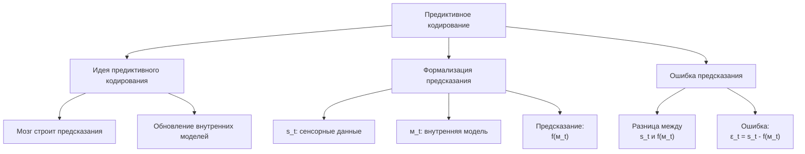
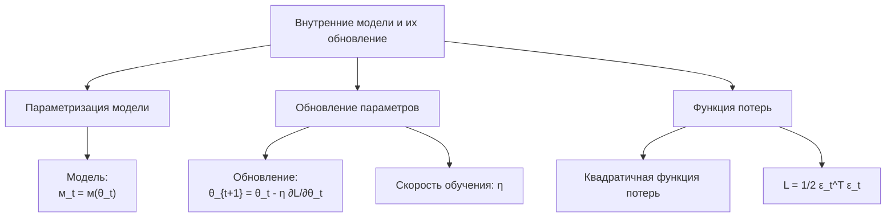
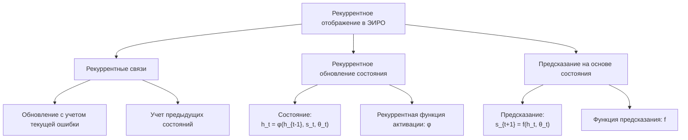
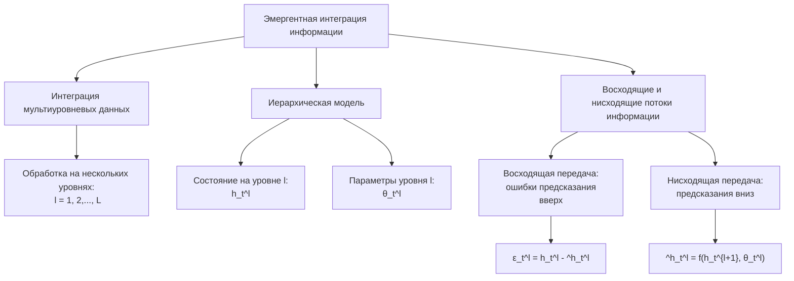
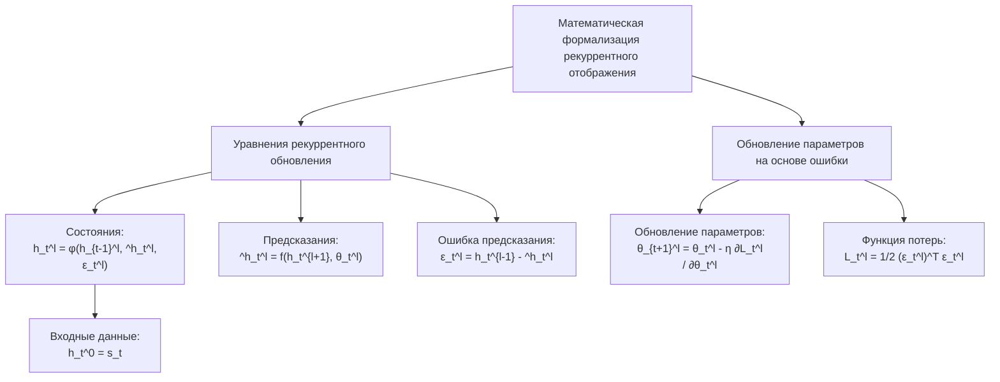
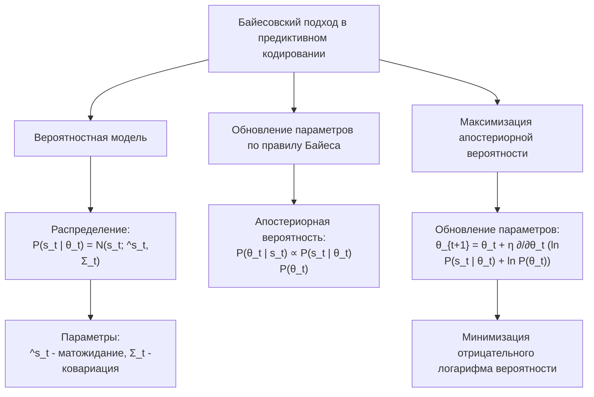
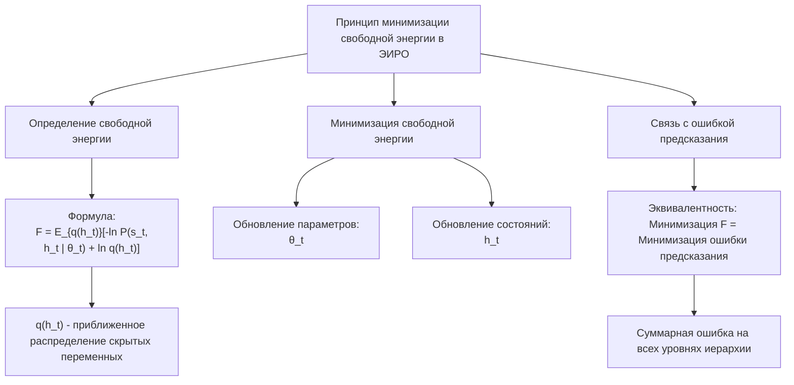
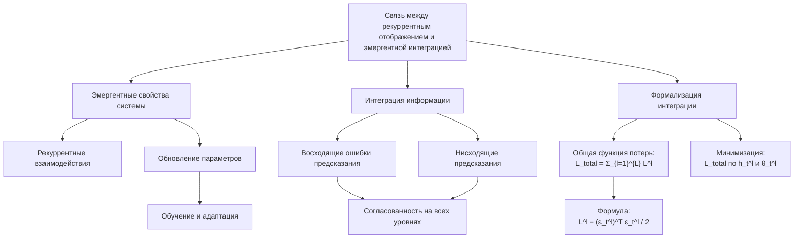

# Математическая формализация предиктивного кодирования в рамках теории Эмергентной Интеграции и Рекуррентного Отображения (ЭИРО)

```mermaid
graph TD
  A[Основы предиктивного кодирования] --> A1[Предсказания мозга]
  A --> A2[Ошибка предсказания Ψₑ]
  A --> A3[Обновление модели λ]

  A1 --> A1a[Генерация предсказаний]
  A1a --> A1b[Использование модели mᵢ]
  A2 --> A2a[Расчет Ψₑ = sₜ - ᶜsₜ]
  A3 --> A3a[Коррекция параметров θ]

  B[Иерархическая структура] --> B1[Многоуровневая организация]
  B --> B2[Восходящие ошибки Ψₑ]
  B --> B3[Нисходящие предсказания]

  B1 --> B1a[Слои обработки 1 2 L]
  B2 --> B2a[Передача Ψₑ вверх]
  B3 --> B3a[Передача предсказаний вниз]

  C[Рекуррентное отображение ЭИРО] --> C1[Состояния hₜ]
  C --> C2[Рекурсия Φ]
  C --> C3[Интеграция данных]

  C1 --> C1a[Обновление hₜ = Φhₜ₋₁]
  C2 --> C2a[Учет истории и входов]
  C3 --> C3a[Слияние восходящих Ψₑ и нисходящих ᶜhₜ]

  D[Минимизация свободной энергии] --> D1[Определение F]
  D --> D2[Мозг стремится к min F]
  D --> D3[Связь F и Ψₑ]

  D1 --> D1a["F зависит от qhₜ P(sₜ|θ)"]
  D2 --> D2a[Понижение неопределенности]
  D3 --> D3a[Min F = Min Σ Ψₑ]

  E[Обучение и адаптация] --> E1[Коррекция модели]
  E --> E2[Улучшение предсказаний]
  E --> E3[Адаптация к изменениям]

  E1 --> E1a[Обновление θₜ]
  E2 --> E2a[Уточнение λ]
  E3 --> E3a[Реакция на новые вводы]

  F[Пример реализации] --> F1[Одноуровневая модель]
  F --> F2[Многослойная структура]
  F --> F3[Анализ сходимости]

  F1 --> F1a[Ψₑ = sₜ - ᶜsₜ]
  F2 --> F2a[Каждый слой передает Ψₑ]
  F3 --> F3a[Выбор η для стабильности]

  G[Связь с нейронными процессами] --> G1[Предикторные нейроны]
  G --> G2[Ошибки Ψₑ]
  G --> G3[Синаптическая пластичность]

  G1 --> G1a[Формирование предсказаний]
  G2 --> G2a[Расчет отклонений]
  G3 --> G3a[Коррекция весов]
```

---

## Введение

```mermaid
flowchart TD
    A[Предиктивное кодирование] --> B[Предиктивность мозга]
    A --> C[Ошибка предсказания]
    A --> D[Обновление моделей]
    A --> E[Иерархическая структура мозга]
    A --> F[Принцип свободной энергии]
    A --> G[Нейронные реализации]
    A --> H[Пример процесса]
    A --> I[Роль в обучении и адаптации]
    A --> J[Связь с восприятием и сознанием]

    B --> B1[Мозг генерирует предсказания]
    B --> B2[Минимизация неопределенности]

    C --> C1[Разница между ожиданиями и реальностью]
    C --> C2[Сигнал для обновления моделей]

    D --> D1[Использование ошибок предсказания]
    D --> D2[Повышение точности предсказаний]

    E --> E1[Многоуровневая организация]
    E --> E2[Нисходящие потоки]
    E --> E3[Восходящие потоки]
    E --> E4[Рекуррентность]

    F --> F1[Свободная энергия как мера расхождения]
    F --> F2[Минимизация ошибки предсказания]
    F --> F3[Снижение энтропии]

    G --> G1[Предикторные нейроны]
    G --> G2[Нейроны ошибки предсказания]
    G --> G3[Синаптическая пластичность]
    G --> G4[Коммуникация между уровнями]

    H --> H1[Предикция звука]
    H --> H2[Сенсорные данные]
    H --> H3[Вычисление ошибки]
    H --> H4[Обновление модели]

    I --> I1[Обучение через опыт]
    I --> I2[Адаптация к изменениям]
    I --> I3[Усложнение моделей]

    J --> J1[Сознательное восприятие]
    J --> J2[Иллюзии и галлюцинации]
    J --> J3[Роль внимания]
```

**Предиктивное кодирование** — это современный подход в нейронауках, который предлагает понимание того, как мозг обрабатывает информацию и формирует сознательное восприятие. Согласно этой теории, мозг постоянно выдвигает предсказания о поступающих сенсорных данных и обновляет свои внутренние модели на основе расхождений между ожиданиями и реальностью.

В контексте Эмергентных Интегрированных Рекуррентных Операций (ЭИРО) предиктивное кодирование является одним из ключевых компонентов, объединяя интеграцию информации с рекуррентной обработкой для формирования осознанного опыта.

**Основные принципы предиктивного кодирования**

- **Предиктивность мозга**: Мозг считается предиктивной машиной, которая стремится минимизировать неопределенность путем постоянного генерирования предсказаний о сенсорных вводах на основе предыдущего опыта и внутренних моделей.

- **Ошибка предсказания**: Разница между ожидаемыми (предсказанными) сенсорными ввода и фактическими сенсорными данными называется ошибкой предсказания. Эта ошибка служит сигналом для обновления внутренних моделей.

- **Обновление моделей**: Ошибки предсказания используются для корректировки и улучшения внутренних моделей мира, что позволяет мозгу более точно предсказывать будущие сенсорные события.

**Иерархическая структура мозга**

1. **Многоуровневая организация**: Мозг организован иерархически, с множеством уровней обработки информации от низших (сенсорных) к высшим (абстрактным).

2. **Нисходящие и восходящие потоки информации**:

   - **Нисходящие потоки**: Высшие уровни отправляют предсказания в низшие уровни.

   - **Восходящие потоки**: Низшие уровни передают ошибки предсказания вверх по иерархии.

3. **Рекуррентность**: Постоянный обмен информацией между уровнями позволяет мозгу быстро и эффективно обновлять предсказания.

**Принцип свободной энергии**

1. **Свободная энергия**:

   - Введенный Карлом Фристоном, принцип свободной энергии связывает байесовское обновление с термодинамической концепцией свободной энергии.

   - Свободная энергия является мерой расхождения между моделью и окружающей средой.

2. **Минимизация свободной энергии**:

   - Мозг стремится минимизировать свободную энергию, что эквивалентно минимизации ошибки предсказания и обновлению внутренних моделей.

3. **Связь с энтропией**:

   - Минимизация свободной энергии также ведет к снижению энтропии, то есть неопределенности в системе.

**Нейронные реализации**

1. **Предикторные нейроны**:

   - Нейроны, отвечающие за генерацию предсказаний на основании внутренних моделей.

2. **Нейроны ошибки предсказания**:

   - Нейроны, которые обнаруживают и передают информацию об ошибках предсказания.

3. **Синаптическая пластичность**:

   - Изменение синаптических весов является механизмом обновления внутренних моделей на основе ошибок предсказания.

4. **Коммуникация между уровнями**:

   - Восходящие связи передают ошибки предсказания вверх по иерархии.

   - Нисходящие связи передают предсказания вниз по иерархии.

**Пример процесса предиктивного кодирования**

Сенсорное восприятие звука:

1. **Предикция**:

   - На основании контекста и предыдущего опыта мозг предсказывает, какой звук он ожидает услышать (например, звук шагов).

2. **Получение сенсорных данных**:

   - Уши улавливают звуковые волны, преобразуют их в электрические сигналы и передают в мозг.

3. **Сравнение и вычисление ошибки предсказания**:

   - Мозг сравнивает предсказанный звук с фактическим.

   - Если звучит неожиданный шум (например, сигнал автомобиля), возникает большая ошибка предсказания.

4. **Обновление модели**:

   - Ошибка предсказания используется для корректировки внутренних моделей, возможно, повышая ожидание непредвиденных звуков в данной среде.

**Роль в обучении и адаптации**

1. **Обучение через опыт**:

   - Постоянное обновление моделей на основе ошибок предсказания ведет к обучению.

2. **Адаптация к изменениям**:

   - Мозг может быстро адаптироваться к новым ситуациям, минимизируя ошибки предсказания в изменяющихся условиях.

3. **Усложнение моделей**:

   - С течением времени внутренние модели становятся более сложными и точными, позволяя предсказывать более широкий спектр событий.

**Связь с восприятием и сознанием**

1. **Сознательное восприятие**:

   - Согласно некоторым теориям, сознание возникает, когда ошибки предсказания достигают определенного порога, требуя обновления высокоуровневых моделей.

2. **Иллюзии и галлюцинации**:

   - Могут быть объяснены как неправильные предсказания мозга, которые не корректируются из-за отсутствия соответствующих сенсорных данных.

3. **Внимание**:

   - Может быть направлено на области с высокой ошибкой предсказания, чтобы улучшить точность моделей.

---

### 1. Основы предиктивного кодирования

#### 1.1. Идея предиктивного кодирования

Предиктивное кодирование предполагает, что мозг постоянно строит предсказания о входящих сенсорных сигналах и обновляет свои внутренние модели на основе ошибок предсказания.

#### 1.2. Формализация предсказания

Пусть $s_t$ — вектор сенсорных данных в момент времени $t$. Мозг строит предсказание $\hat{s}_t$ на основе внутренней модели $m_t$:

$\hat{s}_t = f(m_t)$

где $f$ — функция предсказания, определяемая внутренней моделью.

#### 1.3. Ошибка предсказания

Ошибка предсказания $\epsilon_t$ определяется как разница между фактическим сенсорным вводом и предсказанием:

$\epsilon_t = s_t - \hat{s}_t$

### 2. Внутренние модели и их обновление

#### 2.1. Параметризация внутренней модели

Внутреннюю модель можно представить как набор параметров $\theta_t$:

$m_t = m(\theta_t)$

#### 2.2. Обновление параметров модели

Обновление параметров производится с учетом ошибки предсказания, с целью минимизации функции потерь $L$:

$\theta_{t+1} = \theta_t - \eta \frac{\partial L}{\partial \theta_t}$

где $\eta$ — скорость обучения.

#### 2.3. Функция потерь

Обычно используется квадратичная функция потерь:

$L = \frac{1}{2} \epsilon_t^\top \epsilon_t$

### 3. Рекуррентное отображение в ЭИРО

#### 3.1. Рекуррентные связи

В теории ЭИРО особое внимание уделяется рекуррентным процессам. Модель обновляется не только на основе текущей ошибки, но и с учетом предыдущих состояний.

#### 3.2. Рекуррентное обновление состояния

Состояние модели $h_t$ определяется рекуррентно:

$h_t = \phi(h_{t-1}, s_t, \theta_t)$

где $\phi$ — рекуррентная функция активации.

#### 3.3. Предсказание на основе состояния

Предсказание теперь зависит от рекуррентного состояния:

$\hat{s}_{t+1} = f(h_t, \theta_t)$

### 4. Эмергентная интеграция информации

#### 4.1. Интеграция мультиуровневых данных

ЭИРО предполагает интеграцию информации с разных уровней обработки. Пусть имеются несколько слоев обработки $l = 1, 2, \ldots, L$.

#### 4.2. Иерархическая модель

На каждом уровне $l$ имеется свое состояние $h_t^l$ и свои параметры $\theta_t^l$.

#### 4.3. Восходящие и нисходящие потоки информации

- Восходящая передача (bottom-up):

  Ошибки предсказания передаются вверх по иерархии:

  $\epsilon_t^l = h_t^l - \hat{h}_t^l$

- Нисходящая передача (top-down):

  Предсказания передаются вниз:

  $\hat{h}_t^l = f(h_t^{l+1}, \theta_t^l)$

### 5. Математическая формализация рекуррентного отображения

#### 5.1. Уравнения рекуррентного обновления

Рекуррентное обновление состояний и предсказаний можно описать системой уравнений:

$h_t^l = \phi(h_{t-1}^l, \hat{h}_t^l, \epsilon_t^l)$
$\hat{h}_t^l = f(h_t^{l+1}, \theta_t^l)$
$\epsilon_t^l = h_t^{l-1} - \hat{h}_t^l$

где $h_t^0 = s_t$ — входные сенсорные данные.

#### 5.2. Обновление параметров на основе ошибки

Параметры обновляются с учетом ошибки предсказания на соответствующем уровне:

$\theta_{t+1}^l = \theta_t^l - \eta \frac{\partial L_t^l}{\partial \theta_t^l}$

где $L_t^l = \frac{1}{2} (\epsilon_t^l)^\top \epsilon_t^l$.

### 6. Байесовский подход в предиктивном кодировании

#### 6.1. Вероятностная модель

Рассмотрим вероятностную модель, где предсказание и ошибки трактуются в терминах вероятностей:

$P(s_t | \theta_t) = N(s_t; \hat{s}_t, \Sigma_t)$

где $N$ — нормальное распределение с математическим ожиданием $\hat{s}_t$ и ковариацией $\Sigma_t$.

#### 6.2. Обновление параметров по правилу Байеса

Апостериорная вероятность:

$P(\theta_t | s_t) \propto P(s_t | \theta_t) P(\theta_t)$

#### 6.3. Максимизация апостериорной вероятности

Обновление параметров направлено на максимизацию $P(\theta_t | s_t)$, что эквивалентно минимизации отрицательного логарифма вероятности:

$\theta_{t+1} = \theta_t + \eta \frac{\partial}{\partial \theta_t} \left( \ln P(s_t | \theta_t) + \ln P(\theta_t) \right)$

### 7. Принцип минимизации свободной энергии в ЭИРО

#### 7.1. Определение свободной энергии

Свободная энергия $F$ связывает апостериорное и априорное распределения:

$F = \mathbb{E}_{q(h_t)} \left[ -\ln P(s_t, h_t | \theta_t) + \ln q(h_t) \right]$

где $q(h_t)$ — приближенное распределение скрытых переменных.

#### 7.2. Минимизация свободной энергии

Мозг стремится минимизировать $F$, что приводит к обновлению как параметров модели $\theta_t$, так и состояний $h_t$.

#### 7.3. Связь с ошибкой предсказания

Минимизация свободной энергии эквивалентна минимизации суммарной ошибки предсказания на всех уровнях иерархии.

### 8. Связь между рекуррентным отображением и эмергентной интеграцией

#### 8.1. Эмергентные свойства системы

Благодаря рекуррентным взаимодействиям и обновлениям параметров, система демонстрирует эмергентные свойства, такие как способность к обучению и адаптации.

#### 8.2. Интеграция информации

Интеграция информации происходит за счет совмещения восходящих ошибок предсказания и нисходящих предсказаний, обеспечивая согласованность на всех уровнях.

#### 8.3. Формализация интеграции

Общая функция потерь для всей системы:

$L_{\text{total}} = \sum_{l=1}^{L} L^l = \frac{1}{2} \sum_{l=1}^{L} (\epsilon_t^l)^\top \epsilon_t^l$

Цель — минимизировать $L_{\text{total}}$ по всем $h_t^l$ и $\theta_t^l$.

### 9. Применение градиентных методов к обновлению параметров

#### 9.1. Градиентные методы

Используя градиентный спуск, мы обновляем параметры:

$\theta_{t+1}^l = \theta_t^l - \eta \frac{\partial L_{\text{total}}}{\partial \theta_t^l}$

#### 9.2. Вычисление градиентов

Градиент функции потерь по параметрам:

$\frac{\partial L_{\text{total}}}{\partial \theta_t^l} = - (\epsilon_t^l)^\top \frac{\partial h_t^l}{\partial \theta_t^l}$

#### 9.3. Обновление состояний

Аналогично, состояния обновляются с учетом градиентов по состояниям:

$h_t^l = h_t^l - \eta \frac{\partial L_{\text{total}}}{\partial h_t^l}$

### 10. Взаимодействие между уровнями в контексте ЭИРО

#### 10.1. Обратное распространение ошибок

Процесс минимизации ошибки предсказания схож с алгоритмом обратного распространения ошибок в нейронных сетях.

#### 10.2. Рекуррентные нейронные сети

Рекуррентные связи позволяют учитывать временной контекст и исторические данные, что важно для динамических предсказаний.

#### 10.3. Эмергентная динамика

Сочетание рекуррентных процессов и иерархической структуры приводит к сложной динамике системы, способствуя эмергентному поведению.

### 11. Пример математической реализации

#### 11.1. Одноуровневая модель

Рассмотрим простую модель с одним уровнем:

$s_t = W_t h_{t-1}$  

$\epsilon_t = s_t - \hat{s}_t$  

$h_t = h_{t-1} + \eta W_t^\top \epsilon_t$  

$W_{t+1} = W_t + \eta \epsilon_t h_{t-1}^\top$

где $W_t$ — матрица весов.

#### 11.2. Расширение на многослойную модель

Для нескольких уровней:

$\hat{h}_t^l = W_t^l h_t^{l+1}$  

$\epsilon_t^l = h_t^l - \hat{h}_t^l$  

$h_t^l = h_t^l + \eta \left( \epsilon_t^l - (W_t^{l-1})^\top \epsilon_t^{l-1} \right)$  

$W_{t+1}^l = W_t^l + \eta \epsilon_t^l (h_t^{l+1})^\top$

### 12. Анализ стабильности и сходимости

#### 12.1. Условия сходимости

Для обеспечения сходимости алгоритма необходимо выбрать подходящую скорость обучения  η  и убедиться, что функции активации  φ  и  f  удовлетворяют определенным свойствам (например, липшицевы функции).

#### 12.2. Анализ стабильности

Проведение линейного анализа системы позволяет определить условия устойчивости рекуррентных процессов.

### 13. Заключение

Математическая формализация предиктивного кодирования в рамках теории Эмергентной Интеграции и Рекуррентного Отображения объединяет в себе вероятностный (Байесовский) подход, вычислительные методы (градиентный спуск) и нейрофизиологические принципы (рекуррентные связи и эмергентность). Эта модель помогает объяснить, как мозг эффективно обрабатывает информацию, предсказывает будущие события и адаптируется к изменениям окружающей среды.

Понимание математических основ предиктивного кодирования в контексте теории Эмергентной Интеграции и Рекуррентного Отображения открывает новые возможности для исследований в областях нейронаук, искусственного интеллекта и когнитивных наук. Глубокое изучение этих концепций способствует развитию эффективных алгоритмов обучения и более точных моделей функционирования мозга.

---

- Статьи:
- Rao, R. P.,  Ballard, D. H. (1999). "Predictive coding in the visual cortex: a functional interpretation of some extra-classical receptive-field effects." *Nature Neuroscience*, 2(1), 79-87.

  - Friston, K. (2005). "A theory of cortical responses." *Philosophical Transactions of the Royal Society B: Biological Sciences*, 360(1456), 815-836.
  - Friston, K. (2010). "The free-energy principle: a unified brain theory?" *Nature Reviews Neuroscience*, 11(2), 127-138.
  - Clark, A. (2013). "Whatever next? Predictive brains, situated agents, and the future of cognitive science." *Behavioral and Brain Sciences*, 36(3), 181-204.

- Книги:

  - *Principles of Neural Science* (Kandel et al.) — главы, посвященные теории предиктивного кодирования и рекуррентных нейронных сетей.

- Онлайн-ресурсы:

  - Курсы по машинному обучению, посвященные рекуррентным нейронным сетям и теории предсказания.

---

Оглавление: 
- [ЭИРО framework](/README.md)
- [Справочник формул](/formulas.md)

