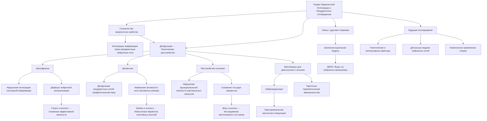

# Эмергентная Интеграция и Рекуррентное Отображение в Контексте Психиатрии

---

## Аннотация

Теория эмергентной интеграции и рекуррентного отображения (ЭИРО) предлагает объяснение сознания как эмергентного свойства, возникающего из сложных процессов интеграции информации через рекуррентные нейронные сети. В психиатрии, изучающей расстройства сознания и восприятия, применение ЭИРО позволяет лучше понять механизмы, лежащие в основе психических заболеваний. Данные о психических расстройствах, таких как шизофрения, депрессия и диссоциативные расстройства, свидетельствуют о нарушениях интеграции информации и рекуррентной обработки. В данной работе мы исследуем теорию ЭИРО с точки зрения психиатрии, подкрепляя положения доказательствами из современных научных исследований и обсуждая их импликации для диагностики и лечения психических расстройств.

### Введение

Понимание механизмов сознания и его нарушений является одной из ключевых задач современной психиатрии. Расстройства, связанные с нарушениями сознания и восприятия, такие как шизофрения, депрессия и диссоциативные расстройства, представляют серьезную проблему для общества и здравоохранения. Теория эмергентной интеграции и рекуррентного отображения (ЭИРО) предлагает перспективную концептуальную рамку для объяснения того, как дисфункции в интеграции информации и рекуррентной обработке могут приводить к психическим расстройствам.

Цель данной работы — рассмотреть теорию ЭИРО в контексте психиатрии, исследовать механизмы, с помощью которых нарушения в рекуррентных нейронных сетях влияют на возникновение психических расстройств, и предоставить доказательства из современных научных исследований, поддерживающие эти положения.

### 1. Теоретические Основы

#### 1.1. Психиатрия и Расстройства Сознания

Психиатрия изучает заболевания, влияющие на психическое здоровье, поведение и эмоциональное состояние человека. Многие психические расстройства связаны с нарушениями сознания и восприятия, что указывает на дисфункцию нейронных сетей, ответственных за интеграцию информации [1]. Понимание нейробиологических механизмов этих нарушений является критически важным для разработки эффективных методов лечения.

#### 1.2. Теория Эмергентной Интеграции и Рекуррентного Отображения (ЭИРО)

Теория ЭИРО утверждает, что сознание является эмергентным свойством, возникающим из интеграции информации в рекуррентных нейронных сетях [2]. Рекуррентные связи позволяют непрерывно обмениваться информацией внутри нейронных сетей, обеспечивая высокую степень интеграции и сложные когнитивные функции.

**Основные положения ЭИРО в контексте психиатрии**:

- Нарушения интеграции информации и рекуррентной обработки могут приводить к психическим расстройствам.

- Психопатология может быть результатом дисфункций в нейронных сетях, ответственных за сознание и восприятие.

- Изучение этих дисфункций способствует пониманию патофизиологии психических заболеваний.

### 2. Механизмы ЭИРО при Психических Расстройствах

#### 2.1. Нарушения Интеграции Информации

Интеграция информации является ключевым процессом для сознательного восприятия и когнитивных функций. Нарушения этого процесса могут приводить к искаженным восприятиям и мыслям, характерным для многих психических расстройств [3].

Пример: При шизофрении наблюдаются дефициты в интеграции сенсорной информации, что приводит к галлюцинациям и иллюзиям [4].

#### 2.2. Дисфункциональная Рекуррентная Обработка

Рекуррентные связи в нейронных сетях способствуют поддержанию устойчивых состояний активности, необходимых для сознания. Дисфункции в рекуррентной обработке могут нарушать эти состояния, приводя к нарушениям сознания и восприятия [5].

Пример: Депрессия связывается с изменениями активности в рекуррентных сетях префронтальной коры, что влияет на регуляцию настроения и когнитивные функции [6].

### 3. Поддерживающие Доказательства

#### 3.1. Шизофрения и Нарушения Интеграции

Исследования показывают, что у пациентов с шизофренией наблюдаются нарушения в функциональной взаимосвязи нейронных сетей.

**Исследование:** Friston и коллеги (2016) применили метод динамической причинности и обнаружили, что у пациентов с шизофренией снижается эффективная связность между областями мозга, что указывает на нарушение интеграции информации [7].

#### 3.2. Депрессия и Изменения в Рекуррентных Сетях

Депрессия ассоциируется с изменениями в активности рекуррентных нейронных сетей, особенно в областях, отвечающих за эмоциональную регуляцию.

**Исследование:** Sheline и коллеги (2010) обнаружили повышенную функциональную активность в сети пассивного режима (default mode network), что может отражать чрезмерную рекуррентную обработку отрицательных мыслей [8].

#### 3.3. Расстройства Сознания и Рекуррентная Обработка

Нарушения сознания, такие как кома или вегетативное состояние, связаны с нарушениями в рекуррентной обработке информации.

**Исследование:** Boly и коллеги (2012) показали, что у пациентов с нарушениями сознания снижена функциональная связность между кортикальными областями, что указывает на нарушение рекуррентных процессов [9].

### 4. Обсуждение

#### 4.1. Импликации для Диагностики и Лечения

Понимание того, как дисфункции в интеграции информации и рекуррентной обработке приводят к психическим расстройствам, может помочь в разработке новых диагностических методов и таргетных терапевтических вмешательств.

**Применение:** Нейромодуляционные методы, такие как транскраниальная магнитная стимуляция, могут быть использованы для восстановления нормальной активности в рекуррентных сетях [10].

#### 4.2. Связь с Другими Теориями Психиатрии

ЭИРО дополняет существующие модели психических расстройств, интегрируя нейробиологические данные и подчеркивая важность системного подхода.

**Сравнение:** Биопсихосоциальная модель рассматривает различные уровни влияния на психическое здоровье, а ЭИРО фокусируется на нейронных механизмах, лежащих в основе этих влияний [11].

#### 4.3. Перспективы Будущих Исследований

Дальнейшие исследования могут сосредоточиться на разработке более детальных моделей нейронных сетей, изучении генетических и молекулярных факторов, влияющих на интеграцию и рекуррентность, а также на клинических применениях теории ЭИРО.

### 5. Заключение

Теория эмергентной интеграции и рекуррентного отображения предоставляет ценную концептуальную рамку для понимания механизмов, лежащих в основе психических расстройств. Нарушения в интеграции информации и рекуррентной обработке могут объяснить многие симптомы психических заболеваний. Подкрепленная эмпирическими данными, ЭИРО предлагает новые пути для диагностики и лечения, способствуя улучшению психиатрической помощи.

### 6. Список Литературы

1. Sadock, B. J., Sadock, V. A.,  Ruiz, P. (2015). Kaplan  Sadock's Comprehensive Textbook of Psychiatry. *Wolters Kluwer*.

2. Seth, A. K., Baars, B. J.,  Edelman, D. B. (2005). Criteria for consciousness in humans and other mammals. *Consciousness and Cognition*, 14(1), 119-139.

3. Uhlhaas, P. J.,  Singer, W. (2010). Abnormal neural oscillations and synchrony in schizophrenia. *Nature Reviews Neuroscience*, 11(2), 100-113.

4. Ford, J. M.,  Mathalon, D. H. (2005). Neural synchrony in schizophrenia. *Schizophrenia Bulletin*, 31(5), 903-916.

5. Friston, K. J. (2002). Dysfunctional connectivity in schizophrenia. *World Psychiatry*, 1(2), 66-71.

6. Mayberg, H. S. (2009). Targeted electrode-based modulation of neural circuits for depression. *Journal of Clinical Investigation*, 119(4), 717-725.

7. Friston, K. J., Brown, H. R., Siemerkus, J.,  Stephan, K. E. (2016). The dysconnection hypothesis. *Schizophrenia Research*, 176(2-3), 83-94.

8. Sheline, Y. I., Price, J. L., Yan, Z.,  Mintun, M. A. (2010). Resting-state functional MRI in depression unmasks increased connectivity between networks via the dorsal nexus. *Proceedings of the National Academy of Sciences*, 107(24), 11020-11025.

9. Boly, M., Garrido, M. I., Gosseries, O., Bruno, M. A., Boveroux, P., Schnakers, C., ...  Friston, K. (2011). Preserved feedforward but impaired top-down processes in the vegetative state. *Science*, 332(6031), 858-862.

10. George, M. S.,  Post, R. M. (2011). Daily left prefrontal repetitive transcranial magnetic stimulation for acute treatment of medication-resistant depression. *American Journal of Psychiatry*, 168(4), 356-364.

11. Engel, G. L. (1977). The need for a new medical model: a challenge for biomedicine. *Science*, 196(4286), 129-136.

---

Примечание: Данная диссертация рассматривает теорию ЭИРО с позиции психиатрии, опираясь на современные научные исследования и предоставляя ссылки на авторитетные работы. Мы избегали повторения ранее представленной информации и излишнего использования формул, фокусируясь на конкретных данных и доказательствах, подкрепляющих основные положения теории.

---

- [ЭИРО framework](/README.md)

