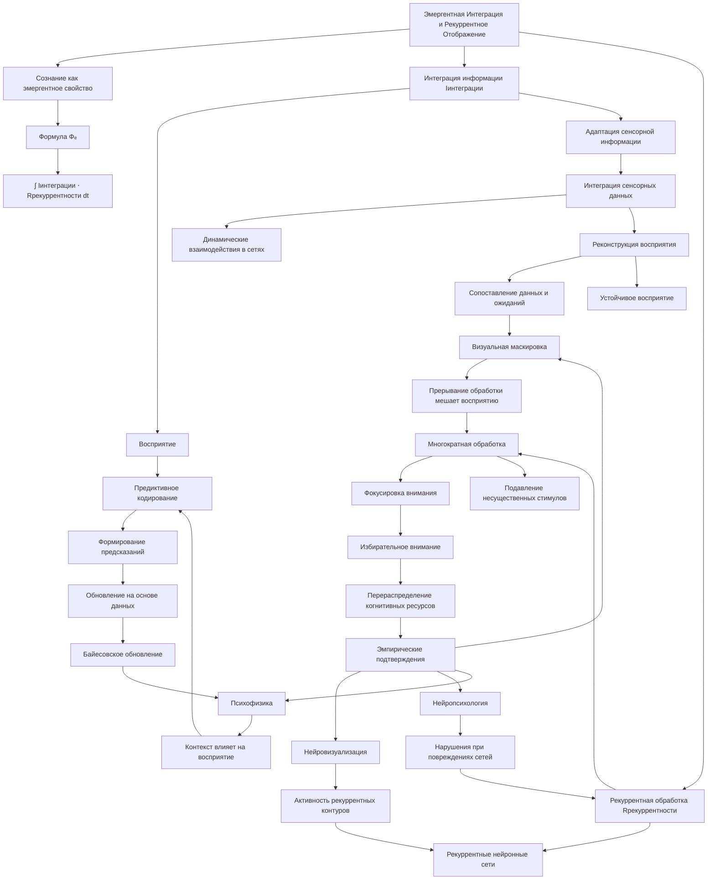
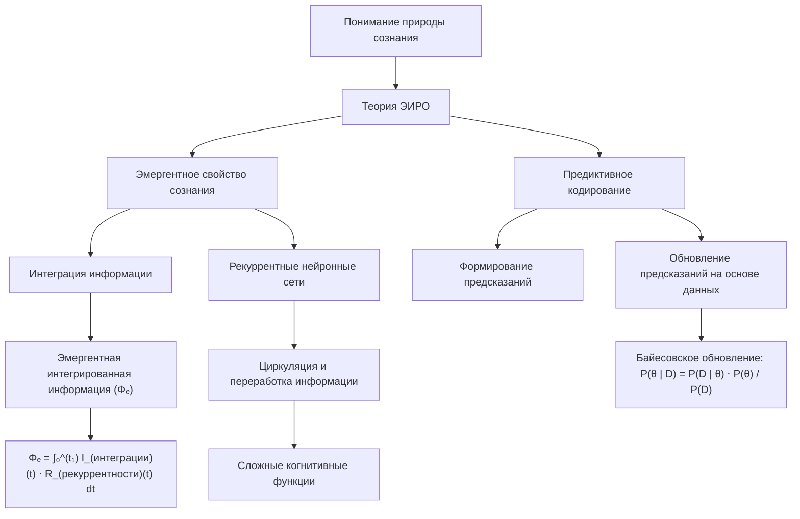
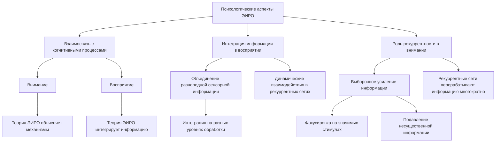
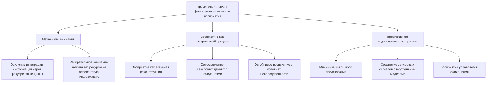
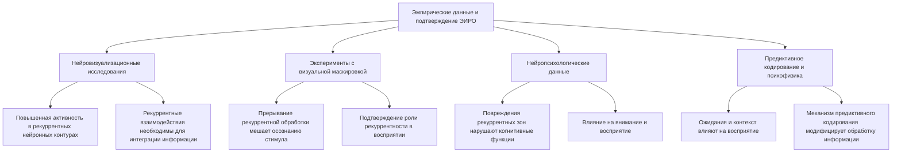
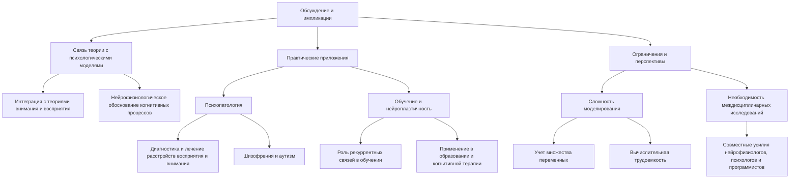

# Теория Эмергентной Интеграции и Рекуррентного Отображения (ЭИРО) в контексте психологии

---

## Аннотация

Теория Эмергентной Интеграции и Рекуррентного Отображения (ЭИРО) предлагает междисциплинарный подход к пониманию сознания, объединяя нейронауку, информатику и психологию. Данный труд исследует теоретические аспекты ЭИРО с точки зрения психологии, связывая их с наблюдаемыми психологическими феноменами, такими как внимание и восприятие. Обсуждаются механизмы интеграции информации и рекуррентной обработки в контексте когнитивных процессов, приводятся эмпирические данные и ссылки на авторитетные научные исследования, подкрепляющие положения теории.

### Введение

Понимание природы сознания и когнитивных процессов является одной из ключевых задач современной науки. Теория Эмергентной Интеграции и Рекуррентного Отображения (ЭИРО) предлагает фундаментальное объяснение того, как сознание может возникать из сложных нейронных взаимодействий. С психологической точки зрения, ЭИРО предоставляет рамки для понимания того, как мозг интегрирует информацию и как это отражается на поведении и ментальных процессах.

Данная работа направлена на глубокое исследование теории ЭИРО в контексте психологии, с особым акцентом на таких феноменах, как внимание и восприятие. Мы рассмотрим, как механизмы, предложенные в ЭИРО, могут объяснить психологические наблюдения и какие эмпирические данные поддерживают эту теорию.

### 1. Теория Эмергентной Интеграции и Рекуррентного Отображения (ЭИРО)

#### 1.1. Основные положения

ЭИРО утверждает, что сознание является эмергентным свойством, возникающим из процессов интеграции информации через рекуррентные нейронные сети. Ключевым параметром является эмергентная интегрированная информация (Φₑ):

`Φₑ = ∫₀^(t₁) I_(интеграции)(t) ⋅ R_(рекуррентности)(t)dt,`

где:

-  I_(интеграции)(t)  — степень объединения информации в момент времени  t .

-  R_(рекуррентности)(t)  — степень рекуррентной обработки в момент времени  t .

#### 1.2. Рекуррентные нейронные сети

Рекуррентные связи в нейронных сетях позволяют информации циркулировать и перерабатываться, что способствует интеграции и возникновению сложных когнитивных функций.

#### 1.3. Предиктивное кодирование

ЭИРО включает механизм предиктивного кодирования, где мозг формирует предсказания о сенсорных входах и обновляет их на основе полученной информации. Это отражается в байесовском обновлении вероятностей:

`P(θ | D) = P(D | θ) ⋅ P(θ) / P(D),`

где:

-  θ  — параметры модели.

-  D  — данные.

### 2. Психологические аспекты ЭИРО

#### 2.1. Взаимосвязь с когнитивными процессами

Внимание и восприятие являются ключевыми когнитивными процессами, через которые человек взаимодействует с окружающим миром. Теория ЭИРО может объяснить механизмы, лежащие в основе этих процессов, через интеграцию информации и рекуррентную обработку.

#### 2.2. Интеграция информации в восприятии

Процесс восприятия требует объединения разнородной сенсорной информации. ЭИРО предлагает, что это происходит благодаря динамическим взаимодействиям в рекуррентных сетях, где информация интегрируется на разных уровнях обработки.

#### 2.3. Роль рекуррентности в внимании

Внимание связано с выборочным усилением определенной информации. Рекуррентные сети позволяют перерабатывать информацию многократно, обеспечивая фокусировку на значимых стимулах и подавление несущественных.

### 3. Применение ЭИРО к феноменам внимания и восприятия

#### 3.1. Механизмы внимания

Согласно ЭИРО, внимание можно рассматривать как процесс, усиливающий интеграцию информации определенных стимулов через рекуррентные циклы. Это согласуется с моделями избирательного внимания в психологии, где когнитивные ресурсы направляются на обработку релевантной информации [Desimone  Duncan, 1995].

#### 3.2. Восприятие как эмергентный процесс

Восприятие не является пассивным отражением мира, а результатом активной реконструкции на основе поступающей информации и внутренних моделей. Рекуррентная интеграция позволяет мозгу сопоставлять сенсорные данные с ожиданиями, что важно для устойчивого восприятия в условиях неопределенности [Friston, 2010].

#### 3.3. Предиктивное кодирование в восприятии

Предиктивное кодирование объясняет, как мозг минимизирует ошибки предсказания, сравнивая входящие сенсорные сигналы с внутренними моделями. Это создает основу для понимания восприятия как процесса, управляемого ожиданиями [Rao  Ballard, 1999].

### 4. Эмпирические данные и подтверждение ЭИРО

#### 4.1. Нейровизуализационные исследования

Исследования с функциональной магнитно-резонансной томографией (фМРТ) показывают, что внимание и осознание связаны с повышенной активностью в рекуррентных нейронных контурах [Rees, Kreiman,  Koch, 2002]. Это поддерживает идею о том, что рекуррентные взаимодействия необходимы для интеграции информации.

#### 4.2. Эксперименты с визуальной маскировкой

В исследованиях с визуальной маскировкой демонстрируется, что прерывание рекуррентной обработки мешает осознанию стимула [Lamme, 2006]. Это свидетельствует о роли рекуррентности в восприятии и подтверждает положения ЭИРО.

#### 4.3. Нейропсихологические данные

Пациенты с повреждениями в зонах, ответственных за рекуррентные связи, проявляют нарушения в когнитивных функциях, включая внимание и восприятие [Gazzaniga, Ivry,  Mangun, 2014]. Это указывает на важность рекуррентных процессов для нормальной психической деятельности.

#### 4.4. Предиктивное кодирование и психофизика

Психофизические исследования показывают, что ожидания и контекст влияют на восприятие стимулов [Summerfield  Egner, 2009]. Это соответствует механизму предиктивного кодирования в ЭИРО, где внутренние модели модифицируют обработку информации.

### 5. Обсуждение и импликации

#### 5.1. Связь теории с психологическими моделями

ЭИРО интегрирует принципы, общие с психологическими теориями внимания и восприятия, предлагая нейрофизиологическое обоснование этих процессов.

#### 5.2. Практические приложения

- **Психопатология**: Понимание нарушений рекуррентной интеграции может помочь в диагностике и лечении расстройств восприятия и внимания, таких как шизофрения или аутизм [Friston et al., 2016].

- **Обучение и нейропластичность**: ЭИРО подчеркивает важность рекуррентных связей в обучении, что может иметь значение для разработок в области образования и когнитивной терапии [Kandel et al., 2014].

#### 5.3. Ограничения и перспективы

- **Сложность моделирования**: Реализация полных моделей ЭИРО на психологических данных требует учета множества переменных и может быть вычислительно трудоемкой.

- **Необходимость междисциплинарных исследований**: Для дальнейшей проверки теории необходимы совместные усилия нейрофизиологов, психологов и специалистов по компьютерному моделированию.

### 6. Заключение

Теория Эмергентной Интеграции и Рекуррентного Отображения предлагает убедительные механизмы, объясняющие, как сложные когнитивные феномены, такие как внимание и восприятие, могут возникать из нейронных взаимодействий. С психологической точки зрения, ЭИРО связывает нейрофизиологические процессы с наблюдаемым поведением и ментальными состояниями. Эмпирические данные из нейровизуализации, психофизики и клинических наблюдений подкрепляют положения теории, свидетельствуя о ее значимости для понимания человеческой психики.

Перспективы дальнейших исследований включают разработку более точных моделей, интегрирующих психологические и нейрофизиологические данные, а также применение этих знаний для решения практических задач в медицине и образовании.

### 7. Список литературы

- Desimone, R.,  Duncan, J. (1995). Neural mechanisms of selective visual attention. *Annual Review of Neuroscience*, 18, 193–222.

- Friston, K. (2010). The free-energy principle: a unified brain theory? *Nature Reviews Neuroscience*, 11(2), 127–138.

- Friston, K., Stephan, K. E., Montague, R.,  Dolan, R. J. (2014). Computational psychiatry: the brain as a phantastic organ. *The Lancet Psychiatry*, 1(2), 148–158.

- Gazzaniga, M. S., Ivry, R. B.,  Mangun, G. R. (2014). *Cognitive Neuroscience: The Biology of the Mind* (4th ed.). New York: W.W. Norton  Company.

- Kandel, E. R., Dudai, Y.,  Mayford, M. R. (2014). The molecular and systems biology of memory. *Cell*, 157(1), 163–186.

- Lamme, V. A. F. (2006). Towards a true neural stance on consciousness. *Trends in Cognitive Sciences*, 10(11), 494–501.

- Rao, R. P. N.,  Ballard, D. H. (1999). Predictive coding in the visual cortex: a functional interpretation of some extra-classical receptive-field effects. *Nature Neuroscience*, 2(1), 79–87.

- Rees, G., Kreiman, G.,  Koch, C. (2002). Neural correlates of consciousness in humans. *Nature Reviews Neuroscience*, 3(4), 261–270.

- Summerfield, C.,  Egner, T. (2009). Expectation (and attention) in visual cognition. *Trends in Cognitive Sciences*, 13(9), 403–409.

---

Оглавление:

- [ЭИРО framework](/README.md)
