# Теория Эмергентной Интеграции и Рекуррентного Отображения (ЭИРО) с точки зрения психофизики

```mermaid
flowchart TD
    A[Психофизика] --> B[Изучение порогов восприятия]
    A --> C[Методы психофизики]
    B --> D[Абсолютный порог]
    B --> E[Разностный порог]
    C --> F[Психометрические функции]
    C --> G[Методы сигнал-детекции]
    A --> H[История психофизики]
    
    H --> I["Фехнер (1860)"]
    H --> J[Развитие психофизики]

    K[Теория ЭИРО] --> L[Интеграция информации]
    K --> M[Рекуррентная обработка]
    K --> N[Математическая формализация]
    L --> O[Порог сознательного восприятия]
    M --> P[Сознательное восприятие]
    N --> Q[Φₑ: интеграция информации]

    R[Эмпирические доказательства] --> S[Пороговые измерения]
    R --> T[Рекуррентная обработка]
    S --> U[Сложность и интенсивность стимулов]
    S --> V[Влияние времени экспозиции]
    T --> W[Прерывание рекуррентной обработки]
    T --> X[Нейронная активность]

    Y[Сравнение теорий] --> Z[Теория детекции сигнала]
    Y --> AA[Модель глобальной рекуррентности]
    Z --> AB[Чувствительность и критерий]
    AA --> AC[Распределение информации в мозге]

    AD[Обсуждение] --> AE[Преимущества ЭИРО]
    AD --> AF[Ограничения ЭИРО]
    AE --> AG[Интеграция нейронных и психофизических данных]
    AF --> AH[Необходимость дальнейших исследований]
    
    AI[Заключение] --> AJ[Объяснение сознательного восприятия]
    AI --> AK[Перспективы исследований]
```

---

## Аннотация

В данной диссертации рассматривается Теория Эмергентной Интеграции и Рекуррентного Отображения (ЭИРО) в контексте психофизики — науки, исследующей связь между физическими стимулами и их восприятием. ЭИРО предлагает механизм, посредством которого сознательное восприятие возникает из интеграции информации в рекуррентных нейронных сетях. С позиций психофизики, теория объясняет пороги сознательного восприятия и феномены, такие как маскировка и адаптация. В работе приводятся доказательства из экспериментальных исследований, подкрепленные ссылками на авторитетные научные источники в области психофизики, нейронаук и когнитивной психологии.

---

### Содержание

1. Введение

2. Психофизика: основы и методы

   - 2.1. История и развитие психофизики

   - 2.2. Пороговые явления в восприятии

3. Теория ЭИРО в контексте психофизики

   - 3.1. Основные положения ЭИРО

   - 3.2. Математическая формализация и психофизические корреляты

4. Эмпирические доказательства

   - 4.1. Пороговые измерения и интеграция информации

   - 4.2. Рекуррентная обработка и сознательное восприятие

5. Сравнение с другими теориями восприятия

   - 5.1. Теория детекции сигнала

   - 5.2. Модель глобальной рекуррентности

6. Обсуждение

   - 6.1. Преимущества ЭИРО в психофизическом контексте

   - 6.2. Ограничения и перспективы исследований

7. Заключение

8. Список литературы

---

### 1. Введение

Психофизика — это наука, изучающая количественные отношения между физическими стимулами и их субъективным восприятием (Fechner, 1860; Gescheider, 1997). Она предоставляет методы и теоретические основы для понимания того, как внешние стимулы преобразуются в сенсорное и перцептивное переживание. Одним из центральных вопросов психофизики является определение порогов сознательного восприятия и факторов, влияющих на них.

Теория Эмергентной Интеграции и Рекуррентного Отображения (ЭИРО) предлагает новый взгляд на механизмы возникновения сознательного восприятия через процессы интеграции информации в рекуррентных нейронных сетях. С точки зрения психофизики, ЭИРО может объяснить, как физические характеристики стимула и свойства нервной системы взаимодействуют, приводя к осознанию стимула или его отсутствию.

Цель данной работы — проанализировать теорию ЭИРО в контексте психофизики, представить эмпирические доказательства, подтверждающие ее положения, и сравнить ее с другими теориями восприятия.

### 2. Психофизика: основы и методы

#### 2.1. История и развитие психофизики

Психофизика была основана Густавом Теодором Фехнером в середине XIX века (Fechner, 1860). Его работа положила начало количественному изучению связи между физическими стимулами и их восприятием. Основные методы психофизики включают измерение абсолютных и разностных порогов, психометрические функции и методы сигнал-детекции.

#### 2.2. Пороговые явления в восприятии

Пороги восприятия разделяются на абсолютный порог (минимальный интенсивность стимула, необходимая для его обнаружения) и разностный порог (минимальное различие между стимулами, которое может быть обнаружено) (Gescheider, 1997). Исследования показали, что пороги восприятия зависят не только от физических характеристик стимула, но и от состояний нервной системы и контекстуальных факторов (Levitt, 1971).

### 3. Теория ЭИРО в контексте психофизики

#### 3.1. Основные положения ЭИРО

ЭИРО утверждает, что сознательное восприятие возникает из процессов интеграции информации в рекуррентных нейронных сетях. Ключевым параметром является эмергентная интегрированная информация (Φₑ), отражающая степень интеграции информации в контексте рекуррентной обработки:

`Φₑ = ∫₀^(t₁) I_(инт)(t) ⋅ R_(рек)(t)dt,`

где:

- I_(инт)(t) — степень информационной интеграции в момент времени t,

- R_(рек)(t) — степень рекуррентной обработки в момент времени t.

#### 3.2. Математическая формализация и психофизические корреляты

В психофизике часто используются психометрические функции для описания вероятности обнаружения стимула в зависимости от его интенсивности (Kingdom  Prins, 2010). ЭИРО предлагает, что вероятность сознательного восприятия стимула связана с Φₑ:

`P(сознательное восприятие) = f(Φₑ),`

где f — некоторая монотонно возрастающая функция.

Рекуррентные нейронные сети описываются уравнениями состояния:

`d𝐱 / dt = 𝐟(𝐱(t), 𝐮(t), W),`

где:

- 𝐱(t) — вектор состояний нейронов,

- 𝐮(t) — внешние стимулы,

- W — матрица весов, отражающая рекуррентные связи.

В рамках ЭИРО изменение состояния нейронной сети под воздействием стимула и последующей рекуррентной обработки определяет, достигнет ли интеграция информации уровня, необходимого для сознательного восприятия.

### 4. Эмпирические доказательства

#### 4.1. Пороговые измерения и интеграция информации

Исследования показали, что при увеличении сложности или интенсивности стимула возрастает вероятность его сознательного восприятия (Del Cul et al., 2007). Это соответствует увеличению I_(инт)(t) в ЭИРО. Кроме того, время экспонирования стимула влияет на его восприятие: более длительные стимулы чаще осознаются, что может быть связано с увеличением интеграции информации во времени (Bachmann, 2000).

#### 4.2. Рекуррентная обработка и сознательное восприятие

Эксперименты с визуальной маскировкой показывают, что прерывание рекуррентной обработки между сенсорными областями и высшими кортикальными регионами препятствует сознательному восприятию стимула (Lamme  Roelfsema, 2000). Нейрофизиологические исследования демонстрируют, что сознательное восприятие связано с усиленной рекуррентной активностью в мозге (Dehaene  Changeux, 2011).

**Примеры исследований**:

- Маррийен и др. (Maruya et al., 2008): Показали, что рекуррентная обработка важна для восприятия движения на примере методов адаптации к движению.

- Фэхри и др. (Fahrenfort et al., 2007): Используя ЭЭГ, обнаружили, что сознательное восприятие коррелирует с поздними рекуррентными компонентами нейронной активности.

### 5. Сравнение с другими теориями восприятия

#### 5.1. Теория детекции сигнала

Теория детекции сигнала (Signal Detection Theory) рассматривает обнаружение стимула как процесс принятия решения в условиях неопределенности, зависящий от чувствительности системы и критерия решения (Green  Swets, 1966). ЭИРО дополняет эту теорию, предлагая нейронный механизм, посредством которого чувствительность и критерий могут изменяться за счет интеграции информации и рекуррентной обработки.

#### 5.2. Модель глобальной рекуррентности

Модель глобальной рекуррентности (Global Recurrence Model) утверждает, что сознательное восприятие возникает, когда информация распространяется через рекуррентные связи по всему мозгу (Lamme, 2006). ЭИРО согласуется с этой моделью, но акцентирует внимание на количественной оценке интеграции информации (Φₑ) и ее роли в достижении порога сознательного восприятия.

### 6. Обсуждение

#### 6.1. Преимущества ЭИРО в психофизическом контексте

Теория ЭИРО предоставляет интегрированный подход к пониманию порогов сознательного восприятия, объединяя нейронные механизмы и психофизические данные. Она объясняет, как физические характеристики стимула и внутренние нейронные процессы взаимодействуют, приводя к осознанию. ЭИРО также позволяет предсказать влияние различных факторов (например, времени экспозиции, шумов) на пороги восприятия.

#### 6.2. Ограничения и перспективы исследований

Хотя ЭИРО хорошо объясняет ряд психофизических феноменов, требуется дальнейшее эмпирическое подтверждение ее положений. Будущие исследования могут быть направлены на:

- Изучение корреляций между Φₑ и порогами восприятия в различных сенсорных модальностях.
- Разработку экспериментальных парадигм, позволяющих напрямую измерять интеграцию информации и рекуррентную активность.
- Применение ЭИРО для объяснения патологических состояний, связанных с нарушениями сознательного восприятия (например, при зрительной агнозии).

### 7. Заключение

Теория Эмергентной Интеграции и Рекуррентного Отображения предоставляет новый взгляд на природу сознательного восприятия с позиций психофизики. Объединяя количественные методы психофизики с нейронными механизмами интеграции информации и рекуррентной обработки, ЭИРО объясняет, как физические стимулы трансформируются в сознательное переживание. Теория подкреплена эмпирическими данными и открывает перспективы для дальнейших исследований в области восприятия и сознания.

### 8. Список литературы

1. Bachmann, T. (2000). Microgenetic approach to the conscious mind. *John Benjamins Publishing*.

2. Del Cul, A., Baillet, S.,  Dehaene, S. (2007). Brain dynamics underlying the nonlinear threshold for access to consciousness. *PLoS Biology*, 5(10), e260.

3. Dehaene, S.,  Changeux, J.-P. (2011). Experimental and theoretical approaches to conscious processing. *Neuron*, 70(2), 200–227.

4. Fahrenfort, J. J., Scholte, H. S.,  Lamme, V. A. F. (2007). Masking disrupts reentrant processing in human visual cortex. *Journal of Cognitive Neuroscience*, 19(9), 1488–1497.

5. Fechner, G. T. (1860). *Elemente der Psychophysik*. Leipzig: Breitkopf und Härtel.

6. Gescheider, G. A. (1997). *Psychophysics: The Fundamentals* (3rd ed.). Lawrence Erlbaum Associates.

7. Green, D. M.,  Swets, J. A. (1966). *Signal Detection Theory and Psychophysics*. Wiley.

8. Kingdom, F. A. A.,  Prins, N. (2010). *Psychophysics: A Practical Introduction*. Academic Press.

9. Lamme, V. A. F. (2006). Towards a true neural stance on consciousness. *Trends in Cognitive Sciences*, 10(11), 494–501.

10. Lamme, V. A. F.,  Roelfsema, P. R. (2000). The distinct modes of vision offered by feedforward and recurrent processing. *Trends in Neurosciences*, 23(11), 571–579.

11. Levitt, H. (1971). Transformed up‐down methods in psychoacoustics. *The Journal of the Acoustical Society of America*, 49(2B), 467–477.

12. Maruya, K., Watanabe, H.,  Watanabe, M. (2008). Adaptation to invisible motion results in low-level but not high-level aftereffects. *Journal of Vision*, 8(11), 7.

---

- [ЭИРО framework](/README.md)

