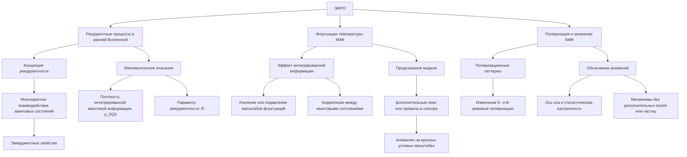
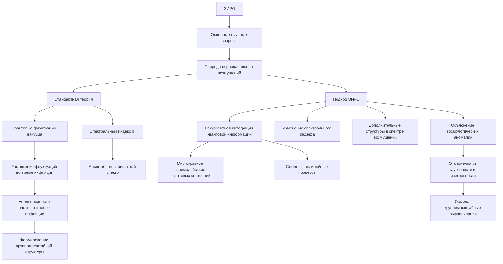
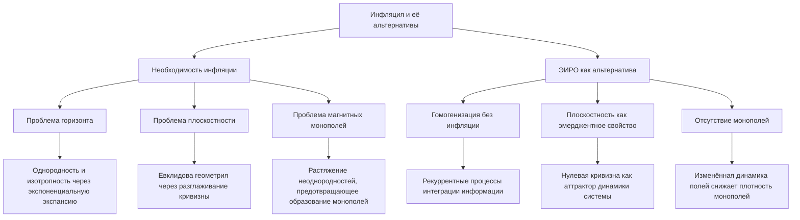
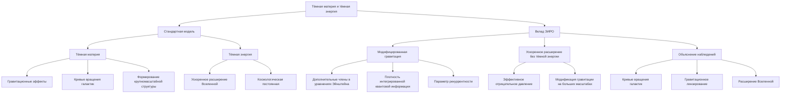
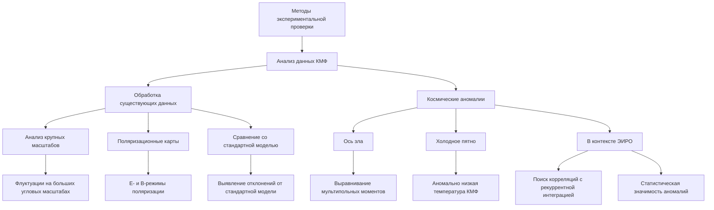
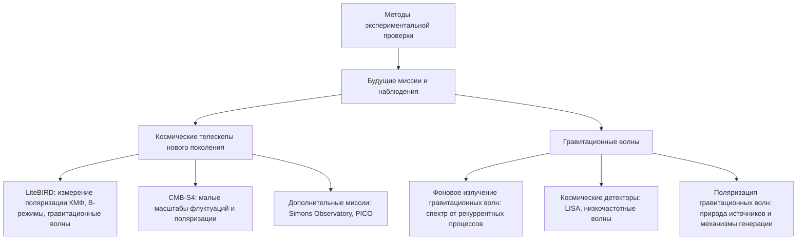
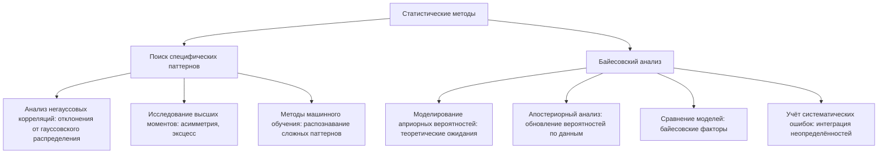
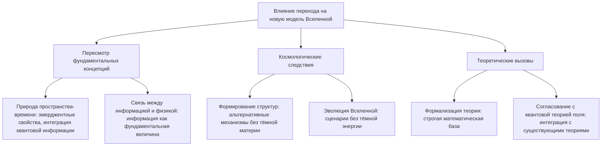

# Космический микроволновый фон через призму ЭИРО и новой модели Вселенной

```mermaid
graph TD
    A["Космический микроволновый фон"] --> B["Информация о ранней Вселенной"]
    B --> B1["Флуктуации температуры"]
    B --> B2["Поляризация"]
    A --> C["ЭИРО framework"]
    C --> C1["Рекуррентная интеграция информации"]
    C1 --> C2["Эмерджентные свойства"]
    C --> C3["Параметр рекуррентности R"]
    C --> C4["Плотность квантовой информации ρIQI"]
    C --> C5["Модификация стандартных моделей"]
    C5 --> C6["Уравнения Эйнштейна"]
    C5 --> C7["Уравнения состояния"]
    A --> D["Аномалии КМФ"]
    D --> D1["Ось зла"]
    D --> D2["Холодное пятно"]
    D --> D3["Нарушение изотропности"]
    D --> D4["Связь с ЭИРО"]
    A --> E["Методы проверки"]
    E --> E1["Анализ существующих данных"]
    E --> E2["Будущие миссии"]
    E --> E3["Гравитационные волны"]
    E --> E4["Байесовский анализ"]
    E1 --> F["Спутниковые миссии Planck и WMAP"]
    E2 --> F1["Миссия LiteBIRD"]
    E2 --> F2["CMB-S4"]
    E3 --> F3["LISA"]
    E4 --> F4["Сравнение моделей"]
    C --> G["Квантовая механика"]
    G --> G1["Принцип неопределённости"]
    G1 --> G2["Динамическая неопределённость"]
    G --> G3["Энтропия"]
    G3 --> G4["Устойчивость когерентных состояний"]
    G --> G5["Квантовая гравитация"]
    G5 --> G6["Модифицированные соотношения"]
    C --> H["Химические реакции"]
    H --> H1["Рекуррентность в реакциях"]
    H --> H2["Каталитические эффекты"]
    C --> I["Математическая модель"]
    I --> I1["Топология рекуррентных структур"]
    I --> I2["Информационные меры"]
    I1 --> I3["Фракталы"]
    I1 --> I4["Топологическая квантовая теория"]
    I2 --> I5["Энтропия Реньи"]
    I2 --> I6["Меры интеграции информации"]
    C --> J["Космология"]
    J --> J1["Тёмная энергия"]
    J --> J2["Тёмная материя"]
    J --> J3["Ускоренное расширение"]
```

---

## Аннотация

Космический микроволновый фон (КМФ) является одним из ключевых источников информации о ранней Вселенной. В данной работе рассматривается интерпретация КМФ через теорию Эмергентной Интеграции и Рекуррентного Отображения (ЭИРО) в контексте новой модели Вселенной. Предлагается, что рекуррентные процессы и интеграция квантовой информации в ранней Вселенной могли оставить характерные следы в флуктуациях температуры и поляризации КМФ. Анализируются основные научные вопросы, связанные с данной гипотезой, и предлагаются методы экспериментальной проверки предсказаний модели.

### Введение

Космический микроволновый фон представляет собой реликтовое излучение, сохранившееся с момента рекомбинации во Вселенной. Его изучение позволяет получить ценную информацию о начальных условиях и эволюции космологических структур. Традиционно флуктуации КМФ объясняются квантовыми флуктуациями в инфляционной фазе. Однако некоторые наблюдаемые аномалии остаются неполностью объясненными в рамках стандартной модели.

Теория ЭИРО, объединяющая концепции интегрированной квантовой информации и рекуррентных процессов, предлагает альтернативный взгляд на динамику ранней Вселенной. В данной работе мы исследуем, как принципы ЭИРО могут объяснить особенности КМФ и какие новые предсказания вытекают из этой теории.

### 1. Значение космического микроволнового фона

#### 1.1. Фундаментальные аспекты КМФ

КМФ является изотропным излучением с температурой около 2.7 К, обнаруженным в 1965 году Пензиасом и Вильсоном. Флуктуации температуры КМФ на уровне 10⁻⁵ отражают неоднородности плотности в ранней Вселенной, ставшие зародышами галактик и крупных космических структур.

#### 1.2. Информация о ранней Вселенной

Анализ углового спектра флуктуаций КМФ позволяет определить основные космологические параметры:

- Возраст Вселенной

- Общую и барионную плотность материи

- Параметры инфляционной модели

- Спектр первичных возмущений

### 2. Влияние ЭИРО на интерпретацию КМФ

#### 2.1. Рекуррентные процессы в ранней Вселенной

##### 2.1.1. Концепция рекуррентности

В рамках ЭИРО предполагается, что в ранней Вселенной происходили процессы рекуррентной интеграции квантовой информации. Это означает, что квантовые состояния многократно взаимодействовали и обменивались информацией, приводя к новым эмерджентным свойствам.

##### 2.1.2. Математическое описание

Плотность интегрированной квантовой информации может быть определена как:

`ρ_(IQI) = lim(Δ V → 0) Δ I / Δ V,`

где Δ I — изменение интегрированной информации в объёме Δ V.

Параметр рекуррентности R характеризует степень повторных взаимодействий квантовых состояний:

`R = ∫_(t₀)ᵗ Γ(t') dt',`

где Γ(t') — частота рекуррентных взаимодействий.

#### 2.2. Флуктуации температуры КМФ

##### 2.2.1. Эффект интегрированной информации

Рекуррентные процессы могли привести к усилению или подавлению определённых масштабов флуктуаций температуры КМФ. Это связано с тем, что интеграция информации влияет на корреляции между квантовыми состояниями в разных областях пространства.

##### 2.2.2. Предсказания модели

Модель ЭИРО прогнозирует наличие дополнительных пиков или провалов в спектре флуктуаций КМФ, обусловленных рекуррентными эффектами. Эти особенности могут проявляться на крупных угловых масштабах, где наблюдаются некоторые аномалии.

#### 2.3. Поляризация и аномалии КМФ

##### 2.3.1. Поляризационные паттерны

Рекуррентная интеграция информации может привести к специфическим паттернам поляризации КМФ, отличным от предсказаний стандартной модели. Это включает изменение Е- и В-режимов поляризации.

##### 2.3.2. Объяснение аномалий

Наблюдаемые аномалии, такие как ось зла (axis of evil) или отклонения от статистической изотропности, могут быть интерпретированы как следствие рекуррентных процессов. ЭИРО предлагает механизмы, позволяющие объяснить эти отклонения без введения дополнительных полей или частиц.

### 3. Основные научные вопросы через призму ЭИРО

В этом разделе мы исследуем ключевые космологические вопросы, рассматривая их сквозь призму теории Эмергентной Интеграции и Рекуррентного Отображения (ЭИРО). Эта теория предлагает новые перспективы на природу первоначальных возмущений, необходимость инфляции и существование тёмной материи и тёмной энергии.

#### 3.1. Природа первоначальных возмущений

##### 3.1.1. Стандартная теория

В стандартной космологической модели начальные возмущения плотности материи и энергии в ранней Вселенной объясняются квантовыми флуктуациями вакуума, которые были растянуты до космологических масштабов в период инфляции.

Квантовые флуктуации вакуума являются неизбежным следствием принципа неопределённости Гейзенберга. В пустом пространстве постоянно возникают и аннигилируют пары виртуальных частиц и античастиц. Во время инфляции, которая характеризуется экспоненциально быстрым расширением Вселенной, эти флуктуации растягиваются, превращаясь в макроскопические возмущения плотности.

Это приводит к тому, что после окончания инфляции в различных частях Вселенной существуют небольшие неоднородности плотности. Эти неоднородности служат зародышами для формирования крупномасштабной структуры Вселенной, включая галактики и скопления галактик.

Спектральный индекс  nₛ  описывает зависимость амплитуды возмущений от их масштаба. В стандартной модели инфляции спектральный индекс близок к единице, что означает почти равные амплитуды для всех масштабов (масштабо-инвариантный спектр).

##### 3.1.2. Подход ЭИРО

Теория ЭИРО предлагает расширение стандартного подхода, вводя понятие рекуррентной интеграции квантовой информации как дополнительного механизма формирования первоначальных возмущений.

Рекуррентная интеграция информации предполагает, что квантовые состояния в ранней Вселенной не просто флуктуируют независимо, но и активно взаимодействуют друг с другом многократно. Это ведёт к сложным нелинейным процессам, в результате которых информация интегрируется и рекурсивно влияет на состояние системы.

**В результате**:

- **Изменение спектрального индекса**: Дополнительные процессы могут изменить наклон спектрального индекса  nₛ , приводя к отличиям от предсказаний стандартной инфляционной модели.
  
- **Форма спектра возмущений**: Возможны появления дополнительных структур в спектре возмущений, таких как дополнительные пики или провалы, связанные с характерными масштабами рекуррентных процессов.

- **Космологические аномалии**: Рекуррентная интеграция может объяснить наблюдаемые отклонения от идеальной гауссовости и изотропности в данных КМФ, такие как "ось зла" или крупномасштабные выравнивания.

Таким образом, ЭИРО предлагает новый взгляд на природу первоначальных возмущений, объединяя квантовые флуктуации с процессами интеграции квантовой информации.

#### 3.2. Инфляция и её альтернативы

##### 3.2.1. Необходимость инфляции

Инфляционная теория была предложена для решения ряда фундаментальных проблем стандартной космологии:

- **Проблема горизонта**: Почему наблюдаемая Вселенная выглядит однородной и изотропной на масштабах, где причинная связь невозможна без инфляции?
  
- **Проблема плоскостности**: Почему геометрия Вселенной близка к евклидовой (нулевая кривизна), несмотря на то, что это неустойчивое состояние?
  
- **Проблема магнитных монополей**: Почему не наблюдаются монополи, предсказанные некоторыми теориями великого объединения?

Инфляция решает эти проблемы посредством быстрой экспоненциальной экспансии, которая "разглаживает" кривизну пространства и растягивает любые неоднородности до очень больших масштабов.

##### 3.2.2. ЭИРО как альтернатива

Подход ЭИРО предлагает альтернативное решение перечисленных проблем без необходимости введения инфляционной фазы:

- **Гомогенизация без инфляции**: Рекуррентные процессы интеграции информации могут приводить к установлению корреляций между удалёнными областями Вселенной. Такие процессы способствуют гомогенизации и изотропизации без сверхбыстрого расширения.

- **Плоскостность как эмерджентное свойство**: Из-за рекуррентной интеграции квантовой информации метрика пространства-времени может эволюционировать к состоянию нулевой кривизны, поскольку это состояние является аттрактором в динамике системы.
  
- **Отсутствие монополей**: ЭИРО может предусматривать механизмы, предотвращающие образование магнитных монополей или уменьшающие их плотность до незначительных величин, благодаря изменённой динамике полей в ранней Вселенной.

Таким образом, в рамках ЭИРО эффект инфляции достигается за счёт внутренних свойств системы и взаимодействий информации, что устраняет необходимость в гипотетической инфляционной фазе.

#### 3.3. Тёмная материя и тёмная энергия

##### 3.3.1. Стандартная модель

В стандартной космологической модели тёмная материя и тёмная энергия играют ключевые роли:

- **Тёмная материя**: Неизвестная форма материи, которая не излучает и не поглощает электромагнитное излучение, но проявляется через гравитационные эффекты. Она необходима для объяснения кривых вращения галактик, динамики скоплений галактик и формирования крупномасштабной структуры Вселенной.

- **Тёмная энергия**: Таинственная форма энергии, ответственная за ускоренное расширение Вселенной, наблюдаемое через суперновые типа Ia и другие космологические наблюдения. В стандартной модели представлена космологической постоянной  Λ .

##### 3.3.2. Вклад ЭИРО

Теория ЭИРО предлагает пересмотреть необходимость введения тёмной материи и тёмной энергии, вводя новые механизмы на основе рекуррентной интеграции квантовой информации:

- **Модифицированная гравитация**: В уравнения Эйнштейна вводятся дополнительные члены, связанные с плотностью интегрированной квантовой информации  ρ_(IQI)  и параметром рекуррентности  R . Эти дополнительные компоненты могут создавать эффект, аналогичный присутствию тёмной материи, влияя на динамику объектов без необходимости ввода новой формы материи.
  
- **Ускоренное расширение**: Эмерджентные свойства квантовой информации могут влиять на глобальную динамику Вселенной, приводя к ускоренному расширению без введения тёмной энергии. Рекуррентные процессы могут приводить к появлению эффективного отрицательного давления или модифицировать гравитацию на больших масштабах.

- **Объяснение наблюдений**: Если учесть вклад  ρ_(IQI)  и  R  в космологические уравнения, можно получить модели, согласующиеся с наблюдаемыми данными по кривым вращения галактик, гравитационному линзированию и расширению Вселенной.

Таким образом, ЭИРО предлагает фундаментально новый подход к пониманию космологических явлений, традиционно объясняемых тёмной материей и тёмной энергией.

### 4. Методы экспериментальной проверки

Для подтверждения или опровержения предсказаний теории ЭИРО необходимо провести ряд экспериментальных и наблюдательных исследований.

#### 4.1. Анализ данных КМФ

##### 4.1.1. Обработка существующих данных

**Использование данных сателлитных миссий, таких как Planck и WMAP, позволяет провести глубокий анализ космического микроволнового фона**:

- **Анализ крупных масштабов**: Изучение флуктуаций КМФ на больших угловых масштабах, где могут проявляться последствия рекуррентной интеграции информации. Это может помочь выявить отклонения от стандартной модели, предсказываемые ЭИРО.
  
- **Поляризационные карты**: Данные по Е- и В-режимам поляризации могут содержать сигнатуры рекуррентных процессов. Анализ поляризации позволяет проверить предсказания о специфических паттернах, ожидаемых в рамках ЭИРО.

- **Сравнение со стандартной моделью**: Сопоставление результатов с предсказаниями стандартной космологической модели для выявления статистически значимых отклонений.

##### 4.1.2. Космические аномалии

**Некоторые наблюдения КМФ показывают аномалии, которые трудно объяснить в рамках стандартной модели**:

- **"Ось зла"**: Выявленное выравнивание мультипольных моментов на больших масштабах, что может указывать на анизотропию или нестандартные процессы в ранней Вселенной.

- **Холодное пятно**: Область на небе с аномально низкой температурой КМФ, происхождение которой остаётся предметом дискуссий.

**В контексте ЭИРО**:

- **Поиск корреляций**: Исследование связи между этими аномалиями и процессами рекуррентной интеграции. Если такие корреляции обнаружены, это может служить подтверждением теории.

- **Статистическая значимость**: Проводится тщательный статистический анализ для определения, являются ли обнаруженные аномалии результатом случайных флуктуаций или имеют физическую природу, связанную с предсказаниями ЭИРО.

#### 4.2. Будущие миссии и наблюдения

##### 4.2.1. Космические телескопы нового поколения

**Для более точной проверки предсказаний ЭИРО необходимы данные с повышенной чувствительностью и разрешающей способностью**:

- **LiteBIRD**: Планируемая миссия Японского агентства аэрокосмических исследований (JAXA), нацеленная на измерение поляризации КМФ с высокой точностью. Это позволит выявить возможные В-режимы, связанные с гравитационными волнами и рекуррентными процессами.

- **CMB-S4**: Будущая наземная обсерватория для исследования КМФ, которая обеспечит беспрецедентную чувствительность к малым масштабам флуктуаций и поляризации.

- **Дополнительные миссии**: Множество других проектов, таких как Simons Observatory и PICO, также будут способствовать сбору высокоточных данных, необходимых для проверки теории ЭИРО.

##### 4.2.2. Гравитационные волны

**Гравитационные волны, которые впервые были непосредственно обнаружены обсерваториями LIGO и Virgo**, открывают новое окно в изучение ранней Вселенной:

- **Фоновое излучение гравитационных волн**: ЭИРО может предсказывать специфический спектр гравитационных волн, возникающий из-за рекуррентных процессов. Обнаружение таких волн поддержало бы теорию.

- **Космические детекторы**: Будущие космические обсерватории гравитационных волн, такие как LISA, смогут обнаруживать гравитационные волны с низкими частотами, которые могут быть связаны с процессами в ранней Вселенной.

- **Поляризация гравитационных волн**: Анализ поляризационных свойств гравитационных волн может предоставить дополнительную информацию о природе источников и механизмах их генерации.

#### 4.3. Статистические методы

##### 4.3.1. Поиск специфических паттернов

**Для выявления предсказаний ЭИРО** в данных необходимы продвинутые статистические методы:

- **Анализ негауссовых корреляций**: Проверка данных КМФ на наличие отклонений от гауссовского распределения, что может свидетельствовать о нетривиальных процессах в ранней Вселенной.

- **Исследование высших моментов**: Поскольку рекуррентные процессы могут влиять на высшие статистические моменты (асимметрия, эксцесс), их анализ может помочь обнаружить сигнатуры ЭИРО.

- **Методы машинного обучения**: Применение алгоритмов распознавания образов и классификации для идентификации сложных паттернов в данных.

##### 4.3.2. Байесовский анализ

Байесовский подход позволяет сравнительно оценить вероятность различных моделей:

- **Моделирование априорных вероятностей**: Установка начальных предположений о параметрах моделей, основываясь на теоретических ожиданиях.

- **Апостериорный анализ**: Использование наблюдательных данных для обновления вероятностей и оценки параметров моделей.

- **Сравнение моделей**: Расчет байесовских факторов для количественной оценки предпочтительности одной модели над другой (например, ЭИРО против стандартной модели).

- **Учёт систематических ошибок**: Байесовский подход позволяет естественным образом интегрировать неопределённости и систематические ошибки в анализ.

### 5. Влияние перехода на новую модель Вселенной

#### 5.1. Пересмотр фундаментальных концепций

##### 5.1.1. Природа пространства-времени

ЭИРО предполагает, что пространство-время обладает эмерджентными свойствами, возникающими из интеграции квантовой информации. Это может привести к пересмотру представлений о гравитации и квантовой механике.

##### 5.1.2. Связь между информацией и физикой

Информация становится фундаментальной физической величиной, влияющей на динамику Вселенной. Это открывает новые перспективы для объединения теории информации и физики.

#### 5.2. Космологические следствия

##### 5.2.1. Формирование структур

Рекуррентные процессы могут влиять на процесс образования галактик и крупных структур, предлагая альтернативные механизмы без привлечения тёмной материи.

##### 5.2.2. Эволюция Вселенной

Новая модель предлагает иные сценарии расширения Вселенной, включая возможность объяснения ускоренного расширения без тёмной энергии.

#### 5.3. Теоретические вызовы

##### 5.3.1. Формализация теории

Необходима разработка строгой математической базы для описания рекуррентной интеграции информации в космологических масштабах.

##### 5.3.2. Согласование с квантовой теорией поля

Интеграция ЭИРО с существующими теориями квантовой поля и общей теорией относительности требует преодоления концептуальных и технических препятствий.

### 6. Заключение

Исследование космического микроволнового фона через призму ЭИРО и новой модели Вселенной открывает перспективы для объяснения наблюдаемых аномалий и углубления понимания фундаментальных законов природы. Рекуррентная интеграция квантовой информации может играть ключевую роль в динамике ранней Вселенной, влияя на формирование структур и эволюцию космологических параметров. Дальнейшие теоретические исследования и экспериментальные проверки необходимы для оценки жизнеспособности данной модели и её вклада в современную космологию.

---

Оглавление: 
- [Новая модель вселенной в современной физике](/A-new-model-of-the-universe-in-modern-physics.md)
- [ЭИРО framework](/README.md)
- [Справочник формул](/formulas.md)

