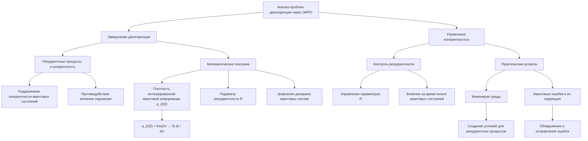
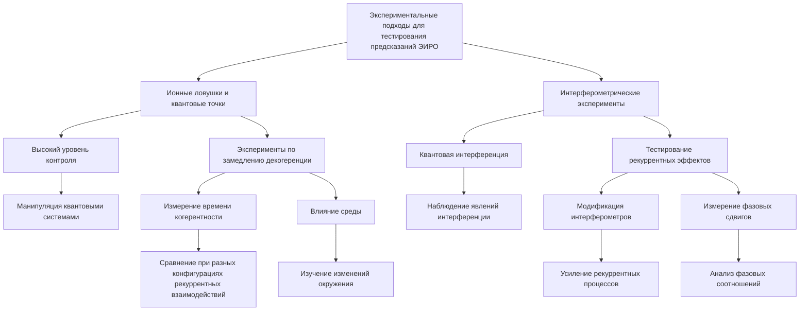
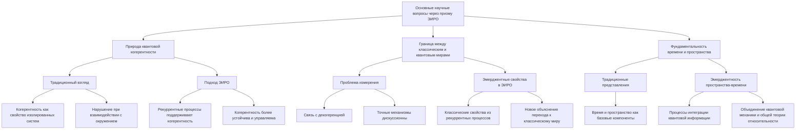
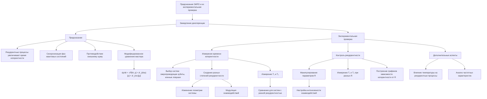
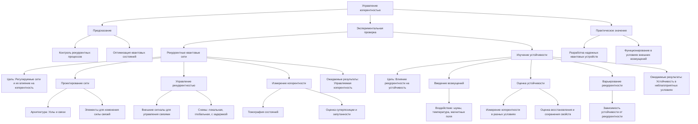
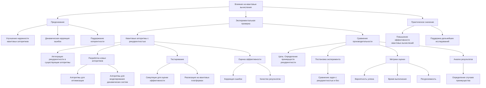
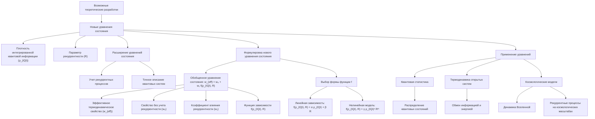
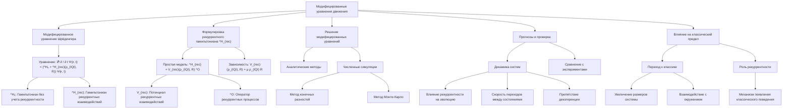

# Квантовые эксперименты: тесты на декогеренцию через призму ЭИРО и новой модели Вселенной

```mermaid
graph TD
    A[ЭИРО Framework] --> B[Фундаментальные принципы]
    B --> C[Эмергентная интегрированная информация Φₑ]
    B --> D[Рекуррентная обработка информации]
    C --> E["Φₑ = ∫ I_(интеграции) R_(рекуррентности) dt"]
    D --> F[Поддержание когерентности]
    F --> G[Замедление декогеренции]
    F --> H[Управление квантовыми состояниями]

    A --> I[Новая модель вселенной]
    I --> J[Интеграция информации в космологии]
    J --> K["Плотность квантовой информации ρ_(IQI)"]
    J --> L[Параметр рекуррентности R]
    I --> M[Модификация уравнений физики]
    M --> N[Модифицированные уравнения Эйнштейна]
    M --> O[Эффективное уравнение тёмной энергии]
    N --> P["T_(μν)^(IQI) в уравнениях поля"]
    O --> Q["w_(eff) = w₀ + w₁ f(ρ_(IQI), R)"]

    A --> R[Влияние на квантовую механику]
    R --> S[Модификация принципа неопределённости]
    S --> T["Δ x ⋅ Δ p ≥ ℏ(eff)"]
    R --> U[Квантовая информация и энтропия]
    U --> V["Энтропия фон Неймана S = -Tr(ρ ln ρ)"]
    U --> W["Рекуррентные потоки: dS/dt = -γ I_(интеграции)"]

    A --> X[Влияние на химию]
    X --> Y[Рекуррентность в реакциях]
    Y --> Z["Модифицированные потенциалы V(эфф)"]
    X --> AA[Энергетические уровни молекул]
    AA --> AB["H(эфф) = H₀ + H(интегр) + H(рекуррент)"]

    A --> AC[Математические аспекты]
    AC --> AD[Топология рекуррентных структур]
    AD --> AE[Фракталы и дробная размерность]
    AD --> AF[Топологическая квантовая теория поля]
    AC --> AG[Информационные меры]
    AG --> AH[Энтропия Реньи и Цаллиса]
    AG --> AI["Интеграция информации Φ(ρ) = S(разд) - S(ρ)"]

    A --> AJ[Экспериментальные проверки]
    AJ --> AK[Космологические наблюдения]
    AK --> AL[Аномалии движения галактик]
    AK --> AM[Флуктуации КМФ]
    AJ --> AN[Квантовые эксперименты]
    AN --> AO[Тесты на декогеренцию]
    AN --> AP[Измерение отклонений от стандартной квантовой механики]
```

---

## Введение

Декогеренция представляет одну из ключевых проблем в квантовой механике, особенно в контексте разработки квантовых компьютеров и передачи квантовой информации. Понимание и контроль процессов декогеренции являются критическими для прогресса в квантовых технологиях. Теория Эмергентной Интеграции и Рекуррентного Отображения (ЭИРО) предлагает новый взгляд на эту проблему, вводя концепции, которые могут переосмыслить наше понимание квантовой декогеренции в рамках новой модели Вселенной.

В данной работе мы анализируем основные научные вопросы, связанные с декогеренцией, через призму ЭИРО и предлагаем возможные экспериментальные подходы для тестирования предсказаний этой теории.

### 1. Проблема декогеренции в квантовой механике

#### 1.1. Сущность декогеренции

Декогеренция описывает процесс потерии квантовой когерентности системы при взаимодействии с окружением. В результате система переходит из суперпозиционного состояния в классическое статистическое смешение, что препятствует наблюдению квантовых эффектов на макроскопическом уровне.

#### 1.2. Влияние декогеренции на квантовые технологии

Декогеренция является основной проблемой для реализации квантовых компьютеров и систем передачи квантовой информации. Она ограничивает время жизни квантовых состояний и снижает надежность квантовых вычислений, требуя разработки методов коррекции ошибок и защиты квантовых состояний.

### 2. Теория ЭИРО и новая модель Вселенной

#### 2.1. Основные положения ЭИРО

Теория ЭИРО предполагает, что фундаментальные свойства систем определяются не только локальными взаимодействиями, но и процессами интеграции информации через рекуррентные связи. В контексте квантовой механики это означает, что квантовые состояния могут поддерживать когерентность благодаря рекуррентным процессам интеграции информации.

#### 2.2. Новая модель Вселенной

В новой модели Вселенной, основанной на ЭИРО, предполагается, что пространство-время и его свойства эмерджентны и возникают из рекуррентных процессов интеграции квантовой информации на фундаментальном уровне. Это приводит к пересмотру некоторых физических величин и уравнений, описывающих динамику Вселенной.

### 3. Анализ проблем декогеренции через призму ЭИРО

#### 3.1. Замедление декогеренции

##### 3.1.1. Рекуррентные процессы и когерентность

Согласно ЭИРО, рекуррентные процессы интеграции информации могут способствовать поддержанию когерентности квантовых состояний. Рекуррентные связи позволяют системе "обновлять" информацию о своем состоянии, противодействуя влиянию окружения и замедляя процесс декогеренции.

##### 3.1.2. Математическое описание

Степень интеграции квантовой информации и рекуррентности может быть количественно описана с использованием новых физических величин:

**Плотность интегрированной квантовой информации  ρ_(IQI)**:

`ρ_(IQI) = lim(Δ V → 0) Δ I / Δ V,`

где  Δ I  — изменение интегрированной информации в объёме  Δ V .

Параметр рекуррентности  R , связанный с вероятностью повторных квантовых взаимодействий.

Эти величины можно включить в уравнения, описывающие динамику квантовых систем, что позволит учитывать влияние рекуррентных процессов на когерентность.

#### 3.2. Управление когерентностью

##### 3.2.1. Контроль рекуррентности

ЭИРО предполагает возможность управления параметром рекуррентности  R  для стабилизации квантовых систем. Изменяя степень рекуррентных взаимодействий, можно влиять на время жизни квантовых состояний и эффективность квантовых операций.

##### 3.2.2. Практические аспекты

- **Инженерия среды**: Создание специфических условий, способствующих усилению рекуррентных процессов, например, путем конфигурации квантовых точек или ионных ловушек.

- **Квантовые ошибки и их коррекция**: Использование рекуррентных схем для обнаружения и исправления ошибок, возникающих из-за декогеренции.

### 4. Экспериментальные подходы для тестирования предсказаний ЭИРО

#### 4.1. Ионные ловушки и квантовые точки

##### 4.1.1. Высокий уровень контроля

Ионные ловушки и квантовые точки позволяют манипулировать отдельными квантовыми системами с высокой точностью, что делает их идеальными платформами для исследования декогеренции и влияния рекуррентных процессов.

##### 4.1.2. Эксперименты по замедлению декогеренции

- **Измерение времени когерентности**: Сравнение времени жизни квантовых состояний при различных конфигурациях рекуррентных взаимодействий.

- **Влияние среды**: Исследование того, как изменение окружения влияет на рекуррентность и, следовательно, на декогеренцию.

#### 4.2. Интерферометрические эксперименты

##### 4.2.1. Квантовая интерференция

Интерферометрические экспериментальные установки позволяют наблюдать явления квантовой интерференции, которые чувствительны к процессам декогеренции.

##### 4.2.2. Тестирование рекуррентных эффектов

- **Модификация интерферометров**: Введение элементов, усиливающих рекуррентные процессы, и наблюдение влияния на интерференционные картины.

- **Измерение фазовых сдвигов**: Анализ изменений фазовых соотношений, обусловленных рекуррентной интеграцией информации.

### 5. Основные научные вопросы и их анализ через призму ЭИРО

#### 5.1. Природа квантовой когерентности

##### 5.1.1. Традиционный взгляд

В стандартной квантовой механике когерентность рассматривается как свойство изолированных квантовых систем, которое легко нарушается при взаимодействии с окружением.

##### 5.1.2. Подход ЭИРО

ЭИРО предлагает, что рекуррентные процессы могут быть фундаментальным механизмом поддержания когерентности, даже в присутствии окружения. Это меняет наше понимание природы когерентности, делая ее более устойчивой и управляемой.

#### 5.2. Граница между классическим и квантовым мирами

##### 5.2.1. Проблема измерения

Классическая граница обычно связывается с процессом измерения и декогеренцией, но точный механизм остается предметом дискуссий.

##### 5.2.2. Эмерджентные свойства в ЭИРО

Согласно ЭИРО, классические свойства систем могут эмерджентно возникать из рекуррентных процессов интеграции квантовой информации. Это может предоставлять новое объяснение перехода от квантового к классическому миру, уточняя роль декогеренции в этом процессе.

#### 5.3. Фундаментальность времени и пространства

##### 5.3.1. Традиционные представления

В стандартной физике пространство и время считаются базовыми компонентами реальности.

##### 5.3.2. Эмерджентность пространства-времени

ЭИРО предполагает, что пространство-время является эмерджентным явлением, возникающим из фундаментальных процессов интеграции квантовой информации. Это открывает новые перспективы в понимании природы Вселенной и может привести к объединению квантовой механики и общей теории относительности.

### 6. Предсказания ЭИРО и их экспериментальная проверка

#### 6.1. Замедление декогеренции

##### 6.1.1. Предсказание

В рамках теории ЭИРО предполагается, что рекуррентные процессы интеграции информации способны значительно увеличить время когерентности квантовых систем, тем самым замедляя декогеренцию. Рекуррентность обеспечивает обратную связь в системе, позволяя квантовым состояниям "освежать" свое когерентное состояние посредством непрерывного обмена информацией внутри системы.

Основная идея заключается в том, что рекуррентные взаимодействия создают условия, при которых фазы квантовых состояний синхронизируются или поддерживаются в согласованном состоянии, несмотря на воздействие окружающей среды. Это позволяет системе противодействовать декогерирующему влиянию внешнего шума и взаимодействий с окружением.

Математически это может быть выражено через модифицированный член в уравнении мастера, описывающем эволюцию плотностной матрицы  ρ :

`dρ / dt = -i / ℏ[H, ρ] + 𝓛_(diss)[ρ] + 𝓛_(rec)[ρ],`

где:

-  H  — гамильтониан системы,

-  𝓛_(diss)[ρ]  — супероператор, описывающий диссипативные эффекты (декогеренция),

-  𝓛_(rec)[ρ]  — дополнительный супероператор, учитывающий рекуррентные процессы интеграции информации.

Добавление члена  𝓛_(rec)[ρ]  моделирует влияние рекуррентности на динамику системы, приводя к замедлению темпов декогеренции.

##### 6.1.2. Экспериментальная проверка

**1. Измерение времени когерентности**

**Цель**: Подтвердить, что рекуррентные процессы увеличивают время когерентности квантовых систем.

**Методика**:

- **Выбор систем**: Использовать квантовые системы, в которых можно точно контролировать параметры и архитектуру, например, сверхпроводящие кубиты, ионные ловушки или квантовые точки.

- **Создание различных степеней рекуррентности**: Подготовить наборы систем с разной степенью рекуррентных взаимодействий. Это может быть достигнуто путем:

  - Изменения геометрии системы, добавляя или удаляя определенные связи между элементами.

  - Модуляции взаимодействий посредством внешних полей или управляемых параметров системы.

- **Измерение времени когерентности**:

  - **Когерентное время релаксации T₁**: Измеряет время, в течение которого квантовая система остается в возбужденном состоянии.
  
  - **Время декогеренции T₂**: Характеризует, как быстро фаза квантового состояния рассеивается из-за взаимодействия с окружением.

- **Сравнение результатов**: Сопоставить полученные значения  T₁  и  T₂  для систем с различными степенями рекуррентности.

**Ожидаемые результаты**:

- Системы с повышенной рекуррентностью должны демонстрировать увеличенные значения  T₁  и  T₂ , указывая на замедление декогеренции.

**2. Контроль рекуррентности**

**Цель**: Определить зависимость когерентности от параметра рекуррентности  R.

**Методика**:

- **Манипулирование параметром  R**:

  - Использовать контролируемые параметры системы для точного изменения  R.

  - Это может быть достигнуто путем настройки интенсивности взаимодействий или частот приложенных полей.

- **Влияние на когерентность**:

  - Проводить последовательные измерения  T₁  и  T₂  при различных значениях  R .

  - Построить графики зависимости времени когерентности от параметра рекуррентности.

**Ожидаемые результаты**:

- Наличие четкой корреляции между увеличением  R  и увеличением времени когерентности подтвердит предсказания теории ЭИРО.

**Дополнительные аспекты**:

- **Изучение влияния температуры**: Проверить, как термические флуктуации воздействуют на рекуррентные процессы и когерентность.

- **Анализ частотных характеристик**: Изучить спектральные свойства систем с различной рекуррентностью для выявления возможных резонансных эффектов.

#### 6.2. Управление когерентностью

##### 6.2.1. Предсказание

Теория ЭИРО предполагает, что посредством управления рекуррентными процессами можно не только замедлять декогеренцию, но и активно контролировать степень когерентности квантовых систем. Это дает возможность адаптивного регулирования квантовых состояний для оптимизации их свойств в зависимости от конкретных задач.

##### 6.2.2. Экспериментальная проверка

**1. Рекуррентные квантовые сети**

**Цель**: Создать квантовые системы с регулируемыми рекуррентными связями и исследовать влияние этих связей на когерентность.

**Методика**:

- **Проектирование сети**:

  - **Архитектура**: Разработать квантовую сеть, состоящую из узлов (кубитов), соединенных контролируемыми рекуррентными связями.

  - **Регулируемые связи**: Включить в сеть элементы, позволяющие динамически изменять силу и направление связей, например, посредством управления Джозефсоновскими переходами в сверхпроводящих схемах.

- **Управление рекуррентностью**:

  - Использовать внешние сигналы для изменения параметров связей в реальном времени.
  
  - Вводить различные схемы рекуррентности: локальная, глобальная, с задержкой и т.д.

- **Измерение когерентности**:

  - Проводить томографию квантовых состояний для оценки степени когерентности сети.

  - Измерять базовые показатели, такие как вероятность суперпозиции и запутанности.

**Ожидаемые результаты**:

- Регулируя рекуррентные связи, можно будет управлять когерентностью сети, улучшая или снижая ее в зависимости от настройки.

**2. Изучение устойчивости**

**Цель**: Исследовать, как изменение рекуррентности влияет на устойчивость квантовых состояний в присутствии внешних возмущений.

**Методика**:

- **Введение возмущений**:

  - Подвергать систему контролируемым внешним воздействиям, таким как шумы, изменения температуры или магнитные поля.

  - Изменять параметры возмущений и наблюдать реакцию системы.

- **Оценка устойчивости**:

  - Измерять параметры когерентности до, во время и после воздействия.

  - Оценивать время восстановления системы и степень сохранения квантовых свойств.

- **Варьирование рекуррентности**:

  - Проводить эксперимент при разных уровнях рекуррентности для определения зависимости устойчивости от этого параметра.

**Ожидаемые результаты**:

- Системы с высокой рекуррентностью должны проявлять большую устойчивость к внешним воздействиям, демонстрируя способность сохранять когерентность в более неблагоприятных условиях.

**Практическое значение**:

- Такие исследования могут способствовать разработке более надежных квантовых устройств, способных функционировать в реальных условиях, где внешние возмущения неизбежны.

#### 6.3. Влияние на квантовые вычисления

##### 6.3.1. Предсказание

Использование рекуррентных процессов в квантовых вычислениях может улучшить надежность и эффективность квантовых алгоритмов. Рекуррентность может сыграть роль в динамической коррекции ошибок и поддержании когерентности во время выполнения вычислений, что особенно важно для реализации полноценных квантовых компьютеров.

##### 6.3.2. Экспериментальная проверка

**1. Квантовые алгоритмы с рекуррентностью**

**Разработка алгоритмов**:

- **Интеграция рекуррентности**: Включить рекуррентные процессы в существующие квантовые алгоритмы, такие как алгоритм Шора или Гровера.

- **Новые алгоритмы**: Разработать новые алгоритмы, специально спроектированные с использованием рекуррентных структур, например, для решения задач оптимизации или моделирования динамических систем.

**Тестирование**:

- **Симуляции**: Провести численное моделирование работы алгоритмов с и без рекуррентности для оценки теоретической эффективности.

- **Экспериментальная реализация**:

  - Использовать доступные квантовые вычислительные платформы (IBM Quantum, Rigetti, и др.) для реализации алгоритмов.

  - Сравнить результаты с теоретическими прогнозами.

**Оценка эффективности**:

- **Коррекция ошибок**: Проверить, как рекуррентность влияет на способность алгоритма обнаруживать и исправлять ошибки в процессе вычислений.

- **Качество результатов**: Измерить точность вычислений и вероятность получения правильного ответа.

**2. Сравнение производительности**

**Цель**: Сравнить производительность квантовых компьютеров с рекуррентными механизмами и без них.

**Методика**:

- **Постановка эксперимента**:

  - Выбрать набор задач для выполнения на квантовом компьютере.

  - Варианты с рекуррентностью и без неё должны быть максимально схожи по другим параметрам для чистоты эксперимента.

- **Метрики оценки**:

  - **Вероятность успеха**: Частота получения правильного результата.

  - **Время выполнения**: Общее время, необходимое для выполнения алгоритма.

  - **Ресурсоемкость**: Количество необходимых кубитов и гейтов.

- **Анализ результатов**:

  - Сопоставить показатели и определить, в каких случаях рекуррентность дает преимущество.

**Практическое значение**:

- Результаты могут показать, что рекуррентность является перспективным направлением для повышения эффективности квантовых вычислений и оправдывает дальнейшие исследования в этой области.

---

### 7. Возможные теоретические разработки

#### 7.1. Новые уравнения состояния

Введение величин плотности интегрированной квантовой информации  ρ_(IQI)  и параметра рекуррентности  R  позволяет расширить существующие уравнения состояния для квантовых систем, учитывая влияние рекуррентных процессов. Это может привести к более точному описанию поведения квантовых систем, особенно в условиях, где рекуррентность играет значительную роль.

#### 7.1.1. Формулировка нового уравнения состояния

Обобщенное уравнение состояния может быть записано в виде:

`w_(eff) = w₀ + w₁ f(ρ_(IQI), R),`

где:

-  w_(eff)  — эффективное термодинамическое свойство системы (например, давление, энергия, энтропия).

-  w₀  — значение свойства без учета рекуррентных эффектов.

-  w₁  — коэффициент, определяющий влияние рекуррентности.

-  f(ρ(IQI), R)  — функция, описывающая зависимость свойства от  ρ(IQI)  и  R .

#### 7.1.2. Выбор формы функции  f

**Линейная зависимость**:

`f(ρ_(IQI), R) = α ρ_(IQI) + β R,`

где  α  и  β  — константы.

**Нелинейные модели**: 

В случае более сложных систем может потребоваться использовать нелинейные функции, такие как:

`f(ρ_(IQI), R) = γ ρ_(IQI)ⁿ Rᵐ,`

где  n  и  m  — степени, зависящие от природы взаимодействий.

#### 7.1.3. Применение уравнений

- **Квантовая статистика**: Новые уравнения могут быть использованы для описания распределения квантовых состояний в системах с рекуррентностью.

- **Термодинамика открытых систем**: Позволяют учитывать обмен информацией и энергией с окружением в присутствии рекуррентных процессов.

- **Космологические модели**: Могут применяться для описания динамики Вселенной, если рекуррентные процессы считаются фундаментальным механизмом на космологических масштабах.

#### 7.2. Модифицированные уравнения движения

Учет рекуррентных эффектов в уравнениях движения квантовых систем позволит более точно описывать динамику таких систем, особенно при взаимодействии с окружением.

##### 7.2.1. Модифицированное уравнение Шрёдингера

В традиционном уравнении Шрёдингера можно ввести дополнительный член, учитывающий рекуррентные процессы:

`iℏ ∂ / ∂ t Ψ(𝐫, t) = ([ ^H₀ + ^H_(rec)(ρ_(IQI), R) )] Ψ(𝐫, t),`

где:

-  ^H₀  — гамильтониан системы без учета рекуррентности.

-  ^H_(rec)  — гамильтониан, описывающий рекуррентные взаимодействия.

##### 7.2.2. Формулировка рекуррентного гамильтониана  ^H_(rec)

**Простая модель**:

^H_(rec) = V_(rec)(ρ_(IQI), R) ^O,

где:

  -  V_(rec)  — потенциал рекуррентных взаимодействий.

  -  ^O  — оператор, соответствующий рекуррентным процессам (например, обмену информацией между состояниями).

**Зависимость от интегрированной информации**:

`V_(rec)(ρ_(IQI), R) = μ ρ_(IQI) R,`

где  μ  — коэффициент пропорциональности.

##### 7.2.3. Решение модифицированных уравнений

- **Аналитические методы**: В простых случаях может быть найдено аналитическое решение, позволяющее понять основные эффекты рекуррентности.

- **Численные симуляции**: Для более сложных систем потребуется использовать численные методы, такие как метод конечных разностей или метод Монте-Карло.

##### 7.2.4. Прогнозы и проверка

- **Динамика систем**: Исследовать, как рекуррентность влияет на эволюцию квантовой системы, например, на скорость переходов между состояниями или на препятствие декогеренции.

- **Сравнение с экспериментами**: Сопоставить результаты расчетов с экспериментальными данными для проверки адекватности модели.

##### 7.2.5. Влияние на классический предел

- **Переход к классике**: Изучить, как рекуррентные эффекты влияют на переход от квантового поведения к классическому при увеличении размеров системы или при взаимодействии с окружением.

- **Роль рекуррентности**: Понять, может ли рекуррентность стать механизмом, объясняющим появление классического поведения в квантовых системах.

### 8. Заключение

Анализ проблемы декогеренции через призму ЭИРО и новой модели Вселенной раскрывает новые возможности для понимания и контроля квантовых систем. Предложенные экспериментальные подходы и теоретические разработки могут стать основой для значительного прогресса в квантовых технологиях и фундаментальной физике. Тестирование предсказаний ЭИРО позволит не только решить практические проблемы декогеренции, но и углубить наше понимание природы квантовой когерентности, пространства-времени и эмерджентных свойств Вселенной.

Предложенные детальные разработки в рамках теории ЭИРО открывают новые пути для понимания и управления когерентностью в квантовых системах. Экспериментальные проверки этих предсказаний не только подтвердят или опровергнут теоретические предположения, но и могут привести к практическим достижениям в области квантовых технологий. Введение новых уравнений состояния и модифицированных уравнений движения закладывает фундамент для дальнейших теоретических исследований, которые могут углубить наше понимание квантовой механики и ее связи с информацией и рекуррентными процессами.

---

Оглавление: 
- [ЭИРО framework](/README.md)
- [Новая модель вселенной в современной физике](/A-new-model-of-the-universe-in-modern-physics.md)

