# Экзотические космические объекты и явления, предсказанные теорией рекуррентной космологии

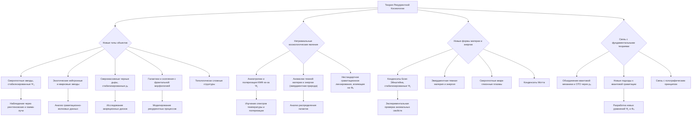

---

## Аннотация

В данной работе рассматриваются дополнительные предсказания теории рекуррентной космологии, выходящие за рамки материалов с необычными свойствами. Модель предсказывает существование сверхплотных звезд и компактных объектов, стабилизированных высокой интегрированной квантовой информацией, а также галактик и скоплений с нетривиальной морфологией, обусловленной рекуррентными процессами. Кроме того, теория предсказывает возникновение экзотических черных дыр и нейтронных звезд, демонстрирующих аномальные свойства из-за влияния квантовой информации. Также обсуждаются предсказания модели относительно специфических космологических явлений, таких как анизотропии и поляризация космического микроволнового фона, а также новые формы существования материи и энергии. Рассматриваются возможные экспериментальные подтверждения этих предсказаний и их связь с фундаментальными теориями физики. Успешная проверка этих предсказаний может привести к значительному прогрессу в нашем понимании Вселенной.

### Введение

Теория рекуррентной космологии, основанная на концепции интегрированной квантовой информации и рекуррентных процессов в пространстве-времени, открывает новые возможности для предсказания ранее неизвестных объектов и явлений во Вселенной. Помимо материалов с уникальными химическими и физическими свойствами, модель также предсказывает существование экзотических космических объектов и нетривиальных космологических феноменов. Исследование этих предсказаний может привести к фундаментальным открытиям в астрофизике, гравитационной физике и нашем понимании природы Вселенной.

### 1. Новые типы космических объектов:

#### 1.1. Сверхплотные звезды и объекты с экстремальными гравитационными полями, стабилизированные высокой интегрированной квантовой информацией.

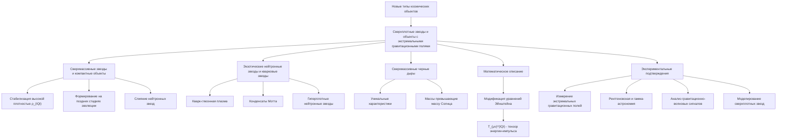

Согласно теории рекуррентной космологии, высокая плотность интегрированной квантовой информации (ρ_(IQI)) может приводить к стабилизации сверхплотных звездных объектов и других космических тел с экстремальными гравитационными полями.

##### 1.1.1. Особенности сверхплотных объектов

**Сверхмассивные звезды и компактные объекты**

   - Модель предсказывает возможность существования звезд с массами, значительно превышающими массу Солнца, стабилизированных высокой ρ_(IQI).
   - Такие сверхплотные объекты могут формироваться на поздних стадиях эволюции массивных звезд или в результате слияния нейтронных звезд.

**Экзотические нейтронные звезды и кварковые звезды**

   - Высокая ρ_(IQI) может способствовать стабилизации необычных состояний вещества внутри нейтронных звезд, таких как кварк-глюонная плазма или конденсаты Мотта.
   - Это может приводить к формированию экзотических объектов, таких как гиперплотные нейтронные звезды или кварковые звезды, с аномальными физическими свойствами.

**Сверхмассивные черные дыры**

   - Модель предсказывает возможность существования сверхмассивных черных дыр, стабилизированных высокой плотностью интегрированной квантовой информации.
   - Такие черные дыры могут достигать масс, значительно превышающих массу Солнца, и обладать уникальными характеристиками, связанными с квантовыми информационными процессами.

##### 1.1.2. Математическое описание

Для моделирования сверхплотных объектов, стабилизированных высокой ρ_(IQI), требуется модификация уравнений Эйнштейна общей теории относительности:

`G_(μν) + Λ g_(μν) = 8π G / c⁴ (( T_(μν) + T_(μν)^(IQI) ))`

где T_(μν)^(IQI) - тензор энергии-импульса, связанный с интегрированной квантовой информацией. Этот дополнительный член может приводить к стабилизации сверхплотных конфигураций материи.

##### 1.1.3. Экспериментальные подтверждения

Экспериментальное подтверждение существования сверхплотных объектов, стабилизированных высокой ρ_(IQI), потребует:

1. Разработки методов наблюдения и измерения экстремальных гравитационных полей в космосе.
2. Применения передовых методов рентгеновской и гамма-астрономии для изучения спектральных и временных характеристик сверхплотных объектов.
3. Анализа данных о гравитационно-волновых сигналах от слияния компактных объектов в поисках отклонений от предсказаний общей теории относительности.
4. Моделирования структуры и эволюции сверхплотных звезд и черных дыр с учетом влияния интегрированной квантовой информации.

Успешное экспериментальное подтверждение существования таких экзотических объектов, предсказанных теорией рекуррентной космологии, станет важным шагом в развитии фундаментальной астрофизики и понимании природы гравитации на экстремальных масштабах.

#### 1.2. Галактики и скопления с необычной морфологией, обусловленной рекуррентными процессами в их формировании.

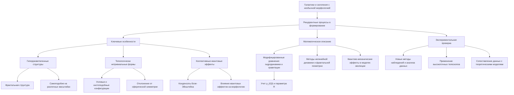

Согласно теории рекуррентной космологии, рекуррентные процессы, происходящие на ранних этапах формирования крупномасштабных структур Вселенной, могут приводить к возникновению галактик и скоплений с нетривиальной морфологией и топологией.

##### 1.2.1. Ключевые особенности

**Гиперразветвленные структуры**

- Высокая степень рекуррентности в динамике газопылевых облаков может способствовать образованию галактик с многократно разветвленной, фрактальной структурой.
- Такие гиперразветвленные галактики будут демонстрировать самоподобие на различных масштабах, отличаясь от обычных спиральных или эллиптических морфологий.

**Топологически нетривиальные формы**

- Рекуррентные гравитационные взаимодействия могут стабилизировать галактики и скопления с узловыми, кнотоподобными или другими топологически сложными конфигурациями.
- Эти нетривиальные топологические структуры будут отличаться от стандартных моделей, основанных на сферической или эллиптической симметрии.

**Коллективные квантовые эффекты**

- Высокая интегрированная квантовая информация и рекуррентность в крупномасштабных структурах могут приводить к возникновению коллективных квантовых состояний, аналогичных конденсатам Бозе-Эйнштейна.
- Такие квантовые эффекты на макроскопическом уровне могут влиять на динамику и морфологию галактик и скоплений.

##### 1.2.2. Математическое описание

Моделирование рекуррентных процессов в формировании крупномасштабных структур потребует использования расширенных методов:

- Модифицированные уравнения гидродинамики и гравитации, учитывающие влияние интегрированной квантовой информации (ρ_(IQI)) и параметра рекуррентности (R).
- Применение методов нелинейной динамики, теории графов и фрактальной геометрии для описания гиперразветвленных и топологически нетривиальных структур.
- Включение квантово-механических эффектов, таких как квантовая запутанность и когерентность, в модели эволюции галактик и скоплений.

##### 1.2.3. Экспериментальная проверка

Экспериментальное подтверждение существования галактик и скоплений с необычной морфологией, предсказанных теорией рекуррентной космологии, потребует:

1. Разработки новых методов наблюдений и анализа данных, способных выявлять тонкие топологические и фрактальные особенности крупномасштабных структур.
2. Применения передовых космических телескопов и наземных обзоров, обладающих высоким пространственным разрешением и чувствительностью.
3. Сопоставления наблюдательных данных с расширенными теоретическими моделями, учитывающими влияние интегрированной квантовой информации и рекуррентности.

Успешное обнаружение и характеризация таких нетривиальных галактических и кластерных структур станет важным экспериментальным подтверждением теории рекуррентной космологии.

#### 1.3. Экзотические черные дыры и нейтронные звезды, демонстрирующие нетипичные свойства из-за влияния квантовой информации.

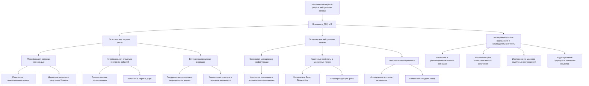

**Влияние интегрированной квантовой информации на свойства компактных объектов**

Согласно теории рекуррентной космологии, высокая плотность интегрированной квантовой информации (ρ_(IQI)) и усиленная рекуррентность (R) в пространстве-времени могут приводить к возникновению экзотических черных дыр и нейтронных звезд с нетипичными характеристиками.

##### 1.3.1. Особенности экзотических черных дыр

**Модификация метрики черных дыр**

- Включение ρ_(IQI) и R в уравнения Эйнштейна может приводить к изменениям в метрике пространства-времени вблизи горизонта событий черных дыр.
- Это может влиять на свойства гравитационного поля, динамику аккреции вещества и излучение Хокинга.

**Нетривиальная структура горизонта событий**

- Высокая интегрированная квантовая информация может стабилизировать необычные топологические конфигурации горизонта событий черных дыр.
- Возможно возникновение "волосатых" черных дыр с дополнительными квантовыми степенями свободы на горизонте.

**Влияние на процессы аккреции**

- Рекуррентные процессы в аккреционных дисках могут модифицировать динамику и термодинамику аккреции вещества на черные дыры.
- Это может приводить к нетипичным наблюдаемым проявлениям, таким как аномальные спектры излучения или всплески активности.

##### 1.3.2. Особенности экзотических нейтронных звезд

**Сверхплотные ядерные конфигурации**

- Высокая ρ_(IQI) и R могут стабилизировать сверхплотные ядерные структуры в недрах нейтронных звезд.
- Это может приводить к необычным уравнениям состояния вещества и аномальным массово-радиусным соотношениям.

**Квантовые эффекты в магнитных полях**

- Интегрированная квантовая информация может усиливать квантовые эффекты в сильных магнитных полях нейтронных звезд.
- Возможно возникновение экзотических состояний вещества, таких как конденсаты Бозе-Эйнштейна или сверхпроводящие фазы.

**Нетривиальная динамика**

- Рекуррентные процессы в недрах нейтронных звезд могут приводить к нестационарным явлениям, включая аномальные всплески активности или колебания.

##### 1.3.3. Экспериментальные проявления и наблюдательные тесты

- Поиск аномалий в гравитационно-волновых сигналах от слияния компактных объектов.
- Анализ спектров электромагнитного излучения от аккреционных дисков вокруг черных дыр.
- Исследование массово-радиусных соотношений и магнитных полей нейтронных звезд.
- Разработка новых методов моделирования структуры и динамики компактных объектов с учетом ρ_(IQI) и R.

##### 1.3.4. Заключение

Теория рекуррентной космологии открывает возможность существования экзотических черных дыр и нейтронных звезд, свойства которых значительно отличаются от стандартных моделей. Экспериментальное подтверждение таких объектов может привести к фундаментальным открытиям в астрофизике и гравитационной физике.

### 2. Нетривиальные космологические явления:

#### 2.1. Специфические анизотропии и поляризационные эффекты в космическом микроволновом фоне, связанные с интегрированной квантовой информацией.

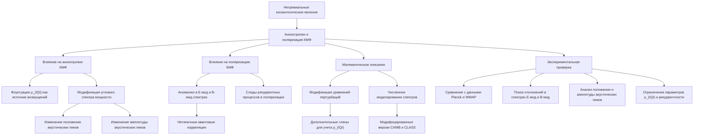

Согласно теории рекуррентной космологии, высокая плотность интегрированной квантовой информации (ρ_(IQI)) и рекуррентные процессы в ранней Вселенной могли оказывать влияние на формирование анизотропий и поляризации космического микроволнового фонового излучения (КМФ). В данном разделе рассматриваются предсказания модели относительно специфических особенностей в спектре и поляризации КМФ, а также возможные пути их экспериментальной проверки.

##### 2.1.1. Влияние интегрированной квантовой информации на анизотропии КМФ

- Согласно теории рекуррентной космологии, флуктуации ρ_(IQI) в ранней Вселенной могли служить дополнительным источником первичных возмущений плотности, которые затем привели к формированию наблюдаемых анизотропий в КМФ.
- Модифицированные уравнения пертурбаций, учитывающие влияние ρ_(IQI) и рекуррентности, могут предсказывать специфические особенности в угловом спектре мощности температурных флуктуаций КМФ.
- Эти особенности, такие как изменение положения и амплитуды акустических пиков, могут отличаться от предсказаний стандартной ΛCDM модели.

##### 2.1.2. Влияние на поляризацию КМФ

- Рекуррентные процессы в ранней Вселенной, связанные с высокой ρ_(IQI), могут оставлять специфические отпечатки в поляризации КМФ.
- Модель предсказывает возможность появления аномалий в спектрах поляризации E-мод и B-мод, которые не объясняются стандартными космологическими механизмами.
- Эти особенности в поляризационных спектрах могут быть связаны с нетривиальными квантовыми корреляциями, индуцированными интегрированной квантовой информацией.

##### 2.1.3. Математическое описание

- Для моделирования влияния ρ_(IQI) и рекуррентности на анизотропии и поляризацию КМФ требуется модификация стандартных уравнений пертурбаций в космологии.
- Это может быть реализовано путем включения дополнительных членов, связанных с интегрированной квантовой информацией, в уравнения Больцмана для фотонов и других компонент.
- Численное моделирование с использованием модифицированных версий кодов, таких как CAMB и CLASS, позволит получить предсказания для угловых спектров температуры и поляризации КМФ.

##### 2.1.4. Экспериментальная проверка

- Сопоставление предсказаний модели с высокоточными данными по анизотропиям и поляризации КМФ, полученными космическими миссиями Planck, WMAP и будущими проектами.
- Поиск специфических отклонений в положении и амплитуде акустических пиков, а также в спектрах E-мод и B-мод поляризации по сравнению со стандартной ΛCDM моделью.
- Разработка методов анализа данных, чувствительных к тонким особенностям в угловых спектрах, которые могут указывать на влияние интегрированной квантовой информации.
- Использование данных по поляризации КМФ для ограничения параметров, связанных с ρ_(IQI) и рекуррентностью, в рамках теории рекуррентной космологии.

##### 2.1.5. Заключение

Исследование специфических анизотропий и поляризационных эффектов в космическом микроволновом фоне, предсказанных теорией рекуррентной космологии, является важным направлением для экспериментальной проверки этой модели. Успешное обнаружение таких особенностей в данных по КМФ может стать ключевым свидетельством в пользу влияния интегрированной квантовой информации на формирование крупномасштабной структуры Вселенной.

#### 2.2. Аномалии в распределении темной материи и темной энергии, обусловленные их эмерджентной природой.

```mermaid
flowchart TD
    A[Аномалии в распределении темной материи и энергии] --> B[Ключевые особенности]

    B --> C[Неоднородное распределение темной материи]
    C --> C1["Влияние неоднородностей ρ_(IQI)"]
    C --> C2[Аномалии в движении галактик]
    C --> C3[Структура скоплений]

    B --> D[Динамика темной энергии]
    D --> D1[Эмерджентная природа]
    D --> D2[Временная/пространственная зависимость]
    D --> D3[Аномалии ускоренного расширения]

    B --> E[Связь с крупномасштабной структурой]
    E --> E1[Особенности анизотропий КМФ]
    E --> E2[Распределение галактик]
    E --> E3[Нетипичная топология пространства]

    A --> F[Математическое описание]
    F --> F1[Модификация уравнений Эйнштейна]
    F1 --> F1_1["Включение тензора T_(μν)^(IQI)"]
    F --> F2[Модифицированные уравнения Фридмана]

    A --> G[Экспериментальные проявления]
    G --> G1["Анализ неоднородностей ρ_(IQI)"]
    G --> G2[Исследование динамики темной энергии]
    G --> G3[Поиск особенностей в КМФ]
    G --> G4["Модели с учетом ρ_(IQI)"]

    A --> H[Заключение]
    H --> H1[Темная материя и энергия как эмерджентные явления]
    H --> H2[Необходимость теоретических и экспериментальных исследований]
```

Согласно теории рекуррентной космологии, темная материя и темная энергия рассматриваются как эмерджентные явления, возникающие из процессов интеграции квантовой информации и рекуррентных взаимодействий в пространстве-времени. Данный подход предсказывает ряд аномалий в распределении этих компонент, отличающихся от стандартной космологической модели ΛCDM.

##### 2.2.1. Ключевые особенности

**Неоднородное распределение темной материи**

- Теория рекуррентной космологии предсказывает, что плотность интегрированной квантовой информации (ρ_(IQI)) может неоднородно распределяться в пространстве.
- Это приводит к неравномерному распределению темной материи, отличающемуся от гладкого профиля, предсказываемого ΛCDM моделью.
- Наблюдаемые аномалии в движении галактик и структуре скоплений могут быть следствием этого эффекта.

**Динамика темной энергии**

- В рамках теории рекуррентной космологии, темная энергия рассматривается как эмерджентное явление, связанное с интегрированной квантовой информацией.
- Модель предсказывает, что динамика темной энергии может отличаться от стандартной космологической постоянной, демонстрируя временную или пространственную зависимость.
- Это может объяснять наблюдаемые аномалии в ускоренном расширении Вселенной и противоречия в измерениях постоянной Хаббла.

**Связь с крупномасштабной структурой**

- Распределение темной материи и темной энергии, обусловленное их эмерджентной природой, может влиять на формирование крупномасштабной структуры Вселенной.
- Модель предсказывает специфические особенности в анизотропиях космического микроволнового фона и распределении галактик, отличающиеся от стандартной ΛCDM модели.
- Эти аномалии могут быть связаны с нетривиальными топологическими и рекуррентными свойствами пространства-времени.

##### 2.2.2. Математическое описание

Теория рекуррентной космологии модифицирует уравнения Эйнштейна общей теории относительности за счет включения дополнительного тензора энергии-импульса, связанного с интегрированной квантовой информацией:

`G_(μν) + Λ g_(μν) = 8π G (( T_(μν) + T_(μν)^(IQI) ))`

Здесь T_(μν)^(IQI) - тензор, отвечающий за вклад интегрированной квантовой информации (ρ_(IQI)) и рекуррентности (R) в динамику пространства-времени. Этот член приводит к модификации уравнений Фридмана и может объяснять наблюдаемые аномалии в распределении темной материи и темной энергии.

##### 2.2.3. Экспериментальные проявления и наблюдательные тесты

- Анализ аномалий в распределении галактик и скоплений, выявляющих неоднородности, связанные с ρ_(IQI).
- Исследование временной и пространственной зависимости параметров темной энергии, отличающихся от стандартной космологической постоянной.
- Поиск специфических особенностей в анизотропиях и поляризации космического микроволнового фона, обусловленных рекуррентными свойствами пространства-времени.
- Разработка расширенных космологических моделей, учитывающих влияние интегрированной квантовой информации и рекуррентности, для сопоставления с наблюдательными данными.

##### 2.2.4. Заключение

Теория рекуррентной космологии предлагает новый взгляд на природу темной материи и темной энергии, рассматривая их как эмерджентные явления, возникающие из фундаментальных квантовых информационных процессов. Это открывает возможность объяснения ряда аномалий, наблюдаемых в космологических данных, и требует дальнейших теоретических и экспериментальных исследований для подтверждения данной концепции.

#### 2.3. Нестандартные эффекты в гравитационном линзировании, отражающие влияние рекуррентных процессов.

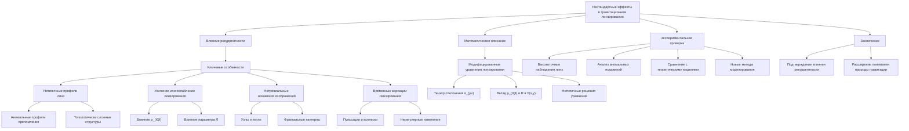

##### 2.3.1. Влияние рекуррентности на гравитационное линзирование

Согласно теории рекуррентной космологии, рекуррентные процессы, происходящие в пространстве-времени, могут оказывать существенное влияние на эффекты гравитационного линзирования. Это связано с тем, что рекуррентность способна модифицировать геометрию и динамику пространства-времени, что, в свою очередь, приводит к нетривиальным проявлениям в гравитационном линзировании.

##### 2.3.2. Ключевые особенности

**Нетипичные профили линз**

- Высокая степень рекуррентности в распределении массы и интегрированной квантовой информации (ρ_(IQI)) может приводить к формированию линз с аномальными профилями преломления.
- Вместо стандартных сферических или эллиптических распределений, рекуррентные процессы могут стабилизировать линзы с более сложной, гиперразветвленной или топологически нетривиальной структурой.

**Усиление или ослабление линзирования**

- Локальные вариации ρ_(IQI) и параметра рекуррентности (R) способны модифицировать силу гравитационного линзирования.
- Области с повышенной интегрированной квантовой информацией и рекуррентностью могут демонстрировать аномально сильное или, наоборот, аномально слабое линзирование по сравнению с ожидаемым.

**Нетривиальные искажения изображений**

- Рекуррентные взаимодействия в пространстве-времени могут приводить к возникновению необычных искажений и деформаций изображений фоновых источников.
- Вместо стандартных кольцевых или дуговых структур, могут наблюдаться более сложные топологические конфигурации, такие как узлы, петли или фрактальные паттерны.

**Временные вариации линзирования**

- Рекуррентные процессы, протекающие в линзирующих объектах, могут вызывать временные изменения в характеристиках гравитационного линзирования.
- Наблюдаемые эффекты могут включать в себя пульсации, всплески активности или нерегулярные вариации в свойствах линз.

##### 2.3.3. Математическое описание

Для моделирования влияния рекуррентности на гравитационное линзирование необходимо модифицировать стандартные уравнения линзирования:

`α_(μν) = (4 G / c²) ∫ Σ(x,y) (x-x₀,y-y₀) / |x-x₀|² dx dy`

где α_(μν) - тензор отклонения лучей света, Σ(x,y) - поверхностная плотность массы линзы.

В рамках теории рекуррентной космологии, Σ(x,y) должна учитывать вклад интегрированной квантовой информации (ρ_(IQI)) и параметра рекуррентности (R):

`Σ(x,y) = Σ₀(x,y) + Σ_(IQI)(x,y)`

где Σ₀ - стандартное распределение массы, а Σ_(IQI) - дополнительный вклад, связанный с ρ_(IQI) и R.

Решение модифицированных уравнений линзирования позволит получить предсказания для нетривиальных эффектов, вызванных рекуррентными процессами.

##### 2.3.4. Экспериментальная проверка

Экспериментальное подтверждение влияния рекуррентности на гравитационное линзирование потребует:

- Высокоточных наблюдений гравитационных линз с использованием современных телескопов и интерферометров.
- Анализа аномальных искажений и временных вариаций в изображениях фоновых источников, линзируемых галактиками и скоплениями.
- Сопоставления наблюдательных данных с расширенными теоретическими моделями, учитывающими влияние ρ_(IQI) и R на геометрию пространства-времени.
- Разработки новых методов моделирования гравитационного линзирования, способных выявлять отклонения от стандартных предсказаний.

Успешное экспериментальное подтверждение нестандартных эффектов в гравитационном линзировании, связанных с рекуррентными процессами, станет важным шагом в проверке теории рекуррентной космологии и расширит наше понимание природы гравитации.

### 3. Новые формы существования материи и энергии:

#### 3.1. Конденсаты Бозе-Эйнштейна, стабилизированные высокой интегрированной квантовой информацией.

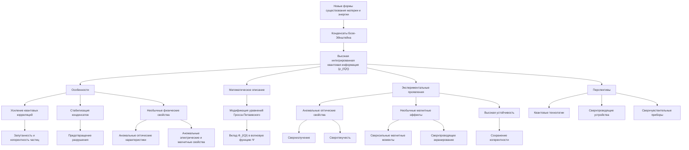

Согласно теории рекуррентной космологии, высокая плотность интегрированной квантовой информации (ρ_(IQI)) может способствовать стабилизации конденсатов Бозе-Эйнштейна - макроскопических квантовых состояний, в которых частицы находятся в одном и том же квантовом состоянии.

**Особенности**

1. **Усиление квантовых корреляций**: Высокая ρ_(IQI) приводит к усилению квантовой запутанности и когерентности между частицами, что способствует формированию конденсатов Бозе-Эйнштейна.

2. **Стабилизация конденсатов**: Интегрированная квантовая информация может стабилизировать конденсаты Бозе-Эйнштейна, предотвращая их разрушение из-за тепловых флуктуаций или других возмущений.

3. **Необычные физические свойства**: Бозе-конденсаты, стабилизированные высокой ρ_(IQI), могут демонстрировать аномальные оптические, электрические, магнитные и другие физические характеристики.

**Математическое описание**

Для моделирования таких конденсатов потребуется модификация уравнений Гросса-Питаевского, учитывающая влияние интегрированной квантовой информации:

`i ℏ ∂Ψ/∂t = (-ℏ²/2m ∇² + V(r) + g|Ψ|² + Φ_(IQI)) Ψ`

где Ψ - волновая функция конденсата, V(r) - внешний потенциал, g - константа взаимодействия, Φ_(IQI) - вклад интегрированной квантовой информации.

**Экспериментальные проявления**

- Аномальные оптические свойства, такие как сверхизлучение, сверхпроводимость и сверхтекучесть.
- Необычные магнитные эффекты, включая сверхсильные магнитные моменты и сверхпроводящее экранирование.
- Высокая устойчивость к внешним воздействиям и способность сохранять когерентность при экстремальных условиях.

**Перспективы**

Экспериментальное обнаружение и исследование Бозе-конденсатов, стабилизированных высокой интегрированной квантовой информацией, может открыть новые возможности для создания инновационных квантовых технологий, сверхпроводящих и сверхчувствительных устройств.

#### 3.2. Новые формы темной материи и темной энергии, связанные с квантовыми информационными процессами.

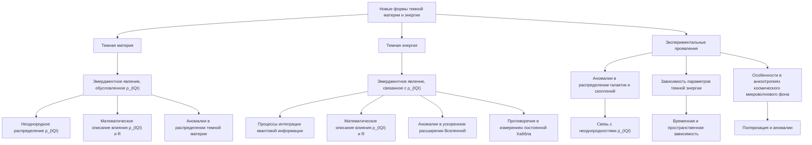

##### 3.2.1. Темная материя как эмерджентное явление, обусловленное интегрированной квантовой информацией

- Согласно теории рекуррентной космологии, неоднородное распределение плотности интегрированной квантовой информации (ρ_(IQI)) может приводить к эмерджентному появлению темной материи
- Математическое описание влияния ρ_(IQI) и рекуррентности (R) на динамику темной материи
- Предсказания модели относительно аномалий в распределении темной материи, отличающихся от стандартной ΛCDM модели

##### 3.2.2. Темная энергия как эмерджентное явление, связанное с интегрированной квантовой информацией

- Теория рекуррентной космологии рассматривает темную энергию как эмерджентное следствие процессов интеграции квантовой информации
- Математическое описание влияния ρ_(IQI) и R на динамику темной энергии, отличающуюся от стандартной космологической постоянной
- Предсказания модели относительно аномалий в ускоренном расширении Вселенной и противоречий в измерениях постоянной Хаббла

##### 3.2.3. Экспериментальные проявления и наблюдательные тесты

- Анализ аномалий в распределении галактик и скоплений, связанных с неоднородностями ρ_(IQI)
- Исследование временной и пространственной зависимости параметров темной энергии
- Поиск специфических особенностей в анизотропиях и поляризации космического микроволнового фона

#### 3.3. Экзотические состояния вещества, такие как сверхплотные кварк-глюонные плазмы или конденсаты Мотта.

##### 3.3.1. Сверхплотные кварк-глюонные плазмы

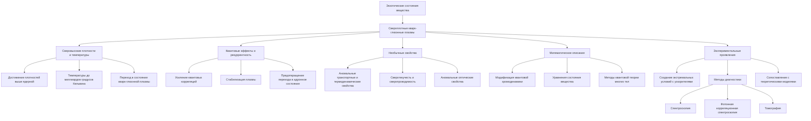

Согласно теории рекуррентной космологии, высокая плотность интегрированной квантовой информации (ρ_(IQI)) и усиленная рекуррентность (R) в экстремальных условиях могут приводить к стабилизации сверхплотных состояний вещества, таких как кварк-глюонная плазма.

###### Особенности сверхплотных кварк-глюонных плазм

**Сверхвысокие плотности и температуры**
   - Теория предсказывает возможность достижения плотностей, значительно превышающих ядерную плотность, и температур до миллиардов градусов Кельвина.
   - Такие экстремальные условия могут приводить к "расплавлению" адронов и переходу вещества в состояние кварк-глюонной плазмы.

**Квантовые эффекты и рекуррентность**
   - Высокая ρ_(IQI) и R могут усиливать квантовые корреляции и когерентные процессы в кварк-глюонной плазме.
   - Это может стабилизировать плазму, предотвращая ее быструю фрагментацию и переход в адронное состояние.

**Необычные свойства**
   - Сверхплотные кварк-глюонные плазмы, стабилизированные интегрированной квантовой информацией, могут демонстрировать аномальные транспортные, термодинамические и оптические свойства.
   - Возможно возникновение коллективных квантовых эффектов, таких как сверхтекучесть или сверхпроводимость.

###### Математическое описание

Моделирование сверхплотных кварк-глюонных плазм потребует модификации квантовой хромодинамики с учетом влияния ρ_(IQI) и R:

- Включение дополнительных членов в лагранжиан, связанных с интегрированной квантовой информацией.
- Применение методов квантовой теории многих тел для корректного описания сложных квантовых корреляций.
- Разработка новых уравнений состояния вещества, способных учитывать стабилизирующее влияние рекуррентности.

###### Экспериментальные проявления

Экспериментальное обнаружение и исследование сверхплотных кварк-глюонных плазм, предсказанных теорией рекуррентной космологии, потребует:

- Создания экстремальных физических условий с помощью мощных ускорителей заряженных частиц.
- Применения передовых методов диагностики, включая спектроскопию, фотонную корреляционную спектроскопию и томографию.
- Сопоставления экспериментальных данных с расширенными теоретическими моделями, учитывающими влияние интегрированной квантовой информации.

Успешное обнаружение и характеризация таких экзотических состояний вещества станет важным подтверждением предсказаний теории рекуррентной космологии.

##### 3.3.2 Конденсаты Мотта

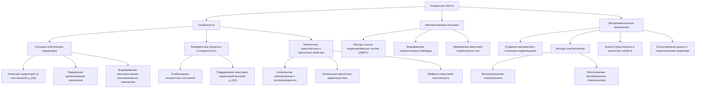

Теория рекуррентной космологии также предсказывает возможность стабилизации конденсатов Мотта в условиях высокой ρ_(IQI) и R.

###### Особенности конденсатов Мотта

**Сильные электронные корреляции**
   - Высокая плотность интегрированной квантовой информации может приводить к усилению электронных корреляций, подавляя делокализацию электронов.
   - Это может способствовать формированию конденсатов Мотта - состояний с пространственно-локализованными электронами.

**Рекуррентные процессы и квантовая когерентность**
   - Рекуррентные взаимодействия между электронами могут стабилизировать когерентные квантовые состояния конденсатов Мотта.
   - Интегрированная квантовая информация может играть ключевую роль в поддержании долгоживущих квантовых корреляций.

**Необычные транспортные и магнитные свойства**
   - Конденсаты Мотта, стабилизированные высокой ρ_(IQI) и R, могут демонстрировать аномальную электрическую и теплопроводность, а также необычные магнитные характеристики.
   - Возможно возникновение эффектов, связанных с квантовой запутанностью и коллективными квантовыми явлениями.

###### Математическое описание

Моделирование конденсатов Мотта в условиях высокой интегрированной квантовой информации потребует:

- Использования методов сильно коррелированных квантовых систем, таких как динамическое среднее поле (DMFT) и методы квантового кластера.

- Включения дополнительных членов в гамильтониан Хаббарда, учитывающих влияние ρ_(IQI) и R на электронные корреляции.
- Применение методов квантовой теории многих тел для корректного описания коллективных квантовых эффектов.

###### Экспериментальные проявления

Экспериментальное обнаружение и исследование конденсатов Мотта, стабилизированных высокой интегрированной квантовой информацией, потребует:

- Создания материалов с сильными электронными корреляциями в условиях экстремальных физических воздействий.
- Использования передовых методов спектроскопии, включая фотоэлектронную спектроскопию и рентгеновскую абсорбционную спектроскопию.
- Анализа транспортных, магнитных и термодинамических свойств материалов в поисках аномалий, связанных с квантовыми информационными эффектами.
- Сопоставления экспериментальных данных с расширенными теоретическими моделями, учитывающими влияние ρ_(IQI) и R.

Успешное экспериментальное обнаружение и характеризация конденсатов Мотта, стабилизированных интегрированной квантовой информацией, станет важным подтверждением предсказаний теории рекуррентной космологии.

### 4. Связь с фундаментальными теориями физики:

#### 4.1. Возможность объединения квантовой механики и общей теории относительности на основе концепции интегрированной квантовой информации.

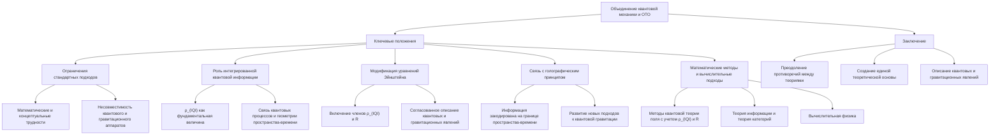

Теория рекуррентной космологии предлагает новый подход к объединению квантовой механики и общей теории относительности, используя концепцию интегрированной квантовой информации. Данный раздел рассматривает, как введение интегрированной квантовой информации и рекуррентных процессов в пространственно-временную структуру может способствовать разработке единой теоретической основы, преодолевающей противоречия между двумя фундаментальными теориями физики.

**Ключевые положения**

1. **Ограничения стандартных подходов**
   - Традиционные попытки объединения квантовой механики и общей теории относительности сталкиваются с серьезными математическими и концептуальными трудностями.
   - Несовместимость математического аппарата, описывающего квантовые явления и гравитацию, является одним из ключевых препятствий.

2. **Роль интегрированной квантовой информации**
   - Теория рекуррентной космологии предлагает рассматривать интегрированную квантовую информацию (ρ_(IQI)) как фундаментальную величину, связывающую квантовые процессы и геометрию пространства-времени.
   - Влияние ρ_(IQI) и рекуррентных взаимодействий на метрику пространства-времени может служить основой для объединения квантовой механики и общей теории относительности.

3. **Модификация уравнений Эйнштейна**
   - Включение дополнительных членов, связанных с ρ_(IQI) и параметром рекуррентности (R), в уравнения Эйнштейна позволяет учесть влияние квантовой информации на гравитационное поле.
   - Модифицированные уравнения Эйнштейна могут обеспечить согласованное описание квантовых и гравитационных явлений.

4. **Связь с голографическим принципом**
   - Идеи о том, что информация, содержащаяся в объеме пространства-времени, может быть закодирована на его границе (голографический принцип), согласуются с концепцией интегрированной квантовой информации.
   - Это открывает возможности для развития новых подходов к квантовой гравитации, основанных на информационных принципах.

5. **Математические методы и вычислительные подходы**
   - Разработка расширенных методов квантовой теории поля, учитывающих влияние ρ_(IQI) и R, является необходимым шагом для построения единой теории.
   - Применение методов теории информации, теории категорий и вычислительной физики может способствовать прогрессу в этом направлении.

**Заключение**

Теория рекуррентной космологии предлагает новый подход к объединению квантовой механики и общей теории относительности, основанный на концепции интегрированной квантовой информации. Введение ρ_(IQI) и рекуррентных процессов в описание пространства-времени открывает перспективы для преодоления существующих противоречий между двумя фундаментальными теориями физики. Дальнейшее развитие этого направления может привести к созданию единой теоретической основы, способной описывать как квантовые, так и гравитационные явления.

#### 4.2. Новые подходы к квантовой гравитации, учитывающие рекуррентные взаимодействия в пространстве-времени.

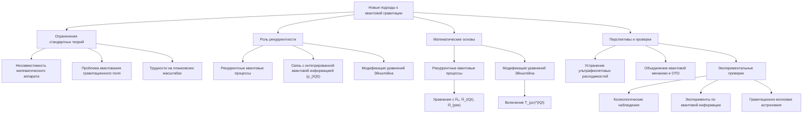

Теория рекуррентной космологии, основанная на концепции интегрированной квантовой информации, предлагает новые пути к разработке теорий квантовой гравитации. В рамках этого подхода рекуррентные процессы в пространстве-времени играют ключевую роль, что требует пересмотра традиционных методов квантования гравитационного поля. В данном разделе рассматриваются математические основы и перспективы новых подходов к квантовой гравитации, учитывающих влияние рекуррентности.

##### 4.2.1 Ограничения стандартных теорий квантовой гравитации

Существующие подходы к квантовой гравитации, такие как струнная теория и петлевая квантовая гравитация, сталкиваются со следующими проблемами:

1. **Несовместимость математического аппарата**: Общая теория относительности описывает гравитацию в терминах гладких многообразий, в то время как квантовая механика оперирует с полями, определёнными на фиксированном пространственно-временном фоне.

2. **Проблема квантования гравитационного поля**: Прямое квантование гравитационного поля приводит к неренормируемым теориям с ультрафиолетовыми расходимостями, которые не могут быть устранены стандартными методами.

3. **Трудности на планковских масштабах**: На масштабах порядка планковской длины (10^-33 см) квантовые эффекты гравитации становятся доминирующими, требуя новых теоретических подходов.

##### 4.2.2. Роль рекуррентности в квантовой гравитации

Теория рекуррентной космологии предлагает рассматривать пространство-время как рекуррентную систему, где квантовые состояния и информационные процессы непрерывно взаимодействуют и перераспределяются. Этот подход открывает новые возможности для разработки теорий квантовой гравитации:

1. **Рекуррентные квантовые процессы**: Включение рекуррентных взаимодействий между квантовыми состояниями может приводить к новым эффектам, выходящим за рамки стандартной квантовой механики.

2. **Связь с интегрированной квантовой информацией**: Согласно теории рекуррентной космологии, интегрированная квантовая информация (ρ_(IQI)) является ключевым параметром, определяющим структуру пространства-времени на фундаментальном уровне.

3. **Модификация уравнений Эйнштейна**: Для учета влияния ρ_(IQI) и рекуррентности требуется модификация уравнений Эйнштейна общей теории относительности, что может привести к новым космологическим решениям.

##### 4.2.3. Математические основы новых подходов

**Рекуррентные квантовые процессы**

Для описания рекуррентных квантовых процессов в пространстве-времени можно использовать расширенные уравнения квантовой механики:

`i ℏ ∂ |Ψ⟩/∂t = (Ĥ₀ + Ĥ_(IQI) + Ĥ_(рек)) |Ψ⟩`

где:

- Ĥ₀ - стандартный гамильтониан квантовой системы
- Ĥ_(IQI) - оператор, связанный с интегрированной квантовой информацией
- Ĥ_(рек) - оператор, описывающий рекуррентные взаимодействия

Решение этого уравнения позволит учесть влияние рекуррентности на квантовую динамику.

**Модификация уравнений Эйнштейна**

Для включения эффектов интегрированной квантовой информации и рекуррентности в теорию гравитации, уравнения Эйнштейна могут быть модифицированы следующим образом:

`G_(μν) + Λ g_(μν) = 8π G / c⁴ (( T_(μν) + T_(μν)^(IQI) ))`

где:

- G_(μν) - тензор Эйнштейна
- Λ - космологическая постоянная
- T_(μν) - тензор энергии-импульса обычной материи
- T_(μν)^(IQI) - дополнительный тензор, связанный с ρ_(IQI) и рекуррентностью

Решение этих модифицированных уравнений может приводить к новым космологическим решениям и объяснению таких явлений, как тёмная материя и тёмная энергия.

##### 4.2.4. Перспективы и экспериментальные проверки

Новые подходы к квантовой гравитации, основанные на теории рекуррентной космологии, открывают следующие перспективы:

1. **Устранение ультрафиолетовых расходимостей**: Если гравитация является эмерджентным явлением, связанным с квантовой информацией и рекуррентностью, то прямое квантование гравитационного поля может быть не требуется, что позволит избежать неренормируемых расходимостей.

2. **Объединение квантовой механики и общей теории относительности**: Включение информационных параметров и рекуррентных процессов может способствовать разработке единой теоретической основы, объединяющей квантовую механику и гравитацию.

3. **Экспериментальные проверки**: Новые предсказания, связанные с влиянием ρ_(IQI) и рекуррентности, могут быть проверены с помощью космологических наблюдений, экспериментов по квантовой информации и исследований в области гравитационно-волновой астрономии.

Успешная реализация этих подходов к квантовой гравитации может привести к революционным открытиям в фундаментальной физике и космологии.

#### 4.3. Связь с теорией струн и голографическим принципом, где информация играет ключевую роль.

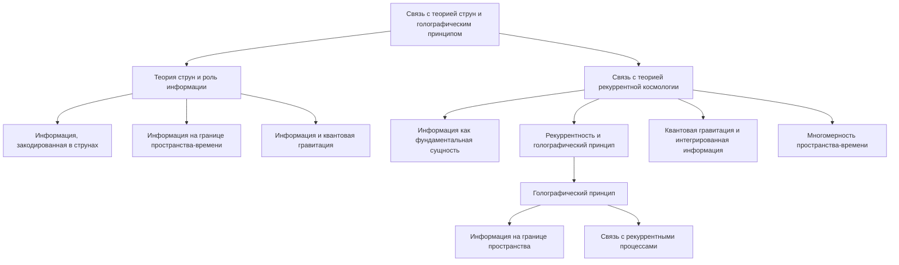

##### 4.3.1. Теория струн и роль информации

Теория струн является одной из наиболее перспективных кандидатов на роль единой теории, объединяющей квантовую механику и общую теорию относительности. В рамках теории струн информация играет ключевую роль:

- **Информация, закодированная в струнах**: Согласно теории струн, фундаментальными объектами являются одномерные струны, вибрации которых соответствуют различным частицам и взаимодействиям. Эти вибрационные состояния струн можно рассматривать как форму кодирования информации.

- **Информация на границе пространства-времени**: Голографический принцип, развитый в рамках теории струн, утверждает, что вся информация, содержащаяся в объёме пространства-времени, может быть полностью закодирована на его границе. Это тесно связано с ролью информации в структуре пространства-времени.

- **Информация и квантовая гравитация**: Теория струн предлагает подход к квантованию гравитации, где информационные аспекты играют ключевую роль. Это открывает возможности для объединения квантовой механики и общей теории относительности.

##### 4.3.2. Связь с теорией рекуррентной космологии

Теория рекуррентной космологии, основанная на концепции интегрированной квантовой информации, имеет тесные связи с идеями, развиваемыми в рамках теории струн и голографического принципа:

1. **Информация как фундаментальная сущность**: Подобно теории струн, теория рекуррентной космологии рассматривает информацию как базовый компонент физической реальности, лежащий в основе структуры пространства-времени и эволюции Вселенной.

2. **Рекуррентность и голографический принцип**: Идея о том, что информация, содержащаяся в объёме, может быть закодирована на границе, перекликается с концепцией рекуррентности, предложенной в теории рекуррентной космологии. Рекуррентные процессы могут играть ключевую роль в реализации голографического принципа.

3. **Квантовая гравитация и интегрированная информация**: Теория рекуррентной космологии предлагает подход к объединению квантовой механики и общей теории относительности, основанный на концепции интегрированной квантовой информации. Это перекликается с усилиями теории струн в данном направлении.

4. **Многомерность пространства-времени**: Как и теория струн, теория рекуррентной космологии допускает существование дополнительных пространственных измерений, связанных с интеграцией квантовой информации и рекуррентными процессами.

Таким образом, теория рекуррентной космологии находится в тесной концептуальной связи с идеями, развиваемыми в рамках теории струн и голографического принципа. Дальнейшее развитие и сближение этих подходов может привести к прорывным открытиям в области объединения квантовой механики и гравитации.

### Заключение

Таким образом, модель рекуррентной космологии открывает широкие возможности для предсказания новых классов объектов и явлений во Вселенной, выходящих за рамки стандартных космологических моделей. Экспериментальная проверка этих предсказаний может привести к фундаментальным открытиям в физике и астрономии.

---

Оглавление: 
- [ЭИРО framework](/README.md)
- [Справочник формул](/formulas.md)
