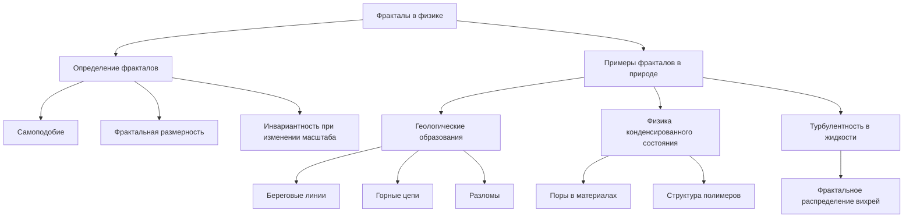
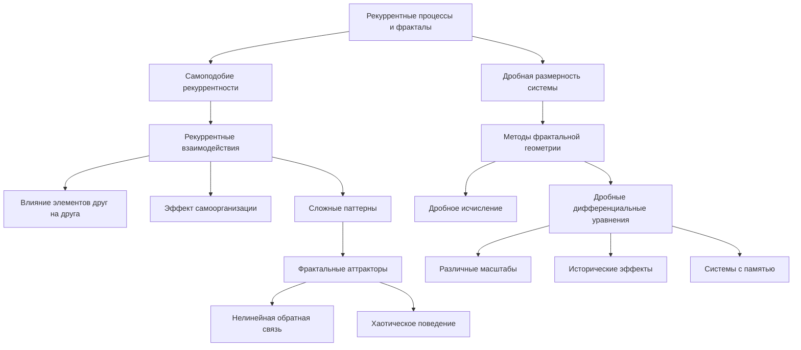
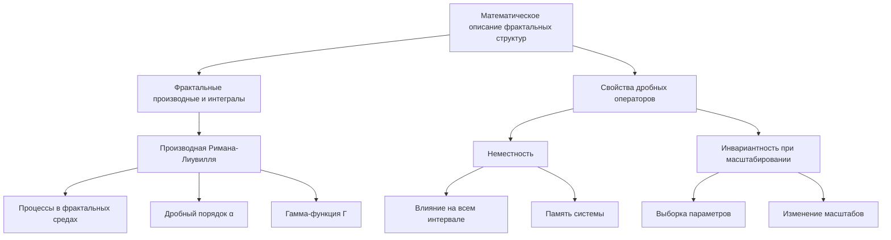
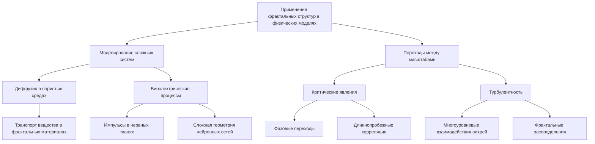
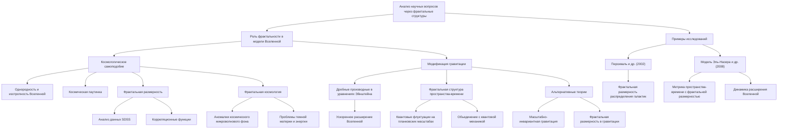
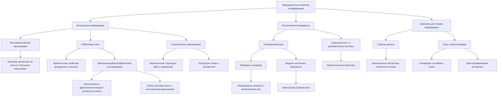
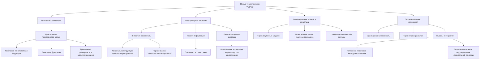

# Фрактальные и бесконечно-дробные структуры: роль в физике и математических моделях

```mermaid
graph TD
    A[Фрактальные и бесконечно-дробные структуры в физике и математике] --> B[Фрактальные свойства]
    B --> C[Самоподобие]
    B --> D[Дробная размерность]
    B --> E[Инвариантность масштаба]
    A --> F[Рекуррентные процессы]
    F --> G[Фрактальные аттракторы]
    F --> H[Дробные дифференциальные уравнения]
    A --> I[Математические методы]
    I --> J[Фрактальные производные: Dᵅ]
    I --> K[Дробные интегралы]
    I --> L[Модели рекуррентности и масштаба]
    A --> M[Применение в физике]
    M --> N[Турбулентность и потоки]
    M --> O[Критические явления]
    M --> P[Переходы между масштабами]
    A --> Q[Космология и гравитация]
    Q --> R[Фрактальная структура Вселенной]
    Q --> S[Модификация гравитации дробными уравнениями]
    Q --> T[Планковские масштабы и квантовая пеноподобная структура]
    A --> U[Эмерджентные свойства]
    U --> V[Многомасштабная организация]
    U --> W[Нейронные и биологические сети]
    U --> X[Коллективное поведение систем]
    A --> Y[Теоретические подходы]
    Y --> Z[Квантовая гравитация через фракталы]
    Y --> AA[Энтропия и фазовые переходы]
    Y --> AB[Новые математические концепции]
```

---

## Введение

Фрактальные структуры широко распространены в природе и характеризуются самоподобием и дробной размерностью. Они возникают во многих физических системах, от геологических образований до процессов в динамике жидкостей и биологических структур. Понимание и математическое описание таких структур являются ключевыми для моделирования сложных систем и перехода между масштабами.

Цель данной работы — исследовать роль фрактальных и бесконечно-дробных структур в физике, рассмотреть математические инструменты их описания и проанализировать основные научные вопросы, связанные с их применением в современных теоретических моделях Вселенной.

### 1. Фракталы в физике

#### 1.1. Определение и свойства фрактальных структур

Фракталы — это геометрические объекты, обладающие свойством самоподобия: их части похожи на целое при различных масштабах. Основные характеристики фракталов:

- **Дробная (фрактальная) размерность**: В отличие от целочисленной топологической размерности, фракталы описываются дробными числами, отражающими степень их сложности.

- **Самоподобие**: Структура объекта повторяется на разных масштабах, что можно наблюдать при увеличении или уменьшении масштаба наблюдения.

- **Инвариантность при изменении масштаба**: Математическое описание объекта не зависит от выбранного масштаба.

#### 1.2. Примеры фрактальных структур в природе

- **Геологические образования**: Береговые линии, горные цепи, разломы имеют фрактальный характер.

- **Физика конденсированного состояния**: Поры в материалах, структуру полимеров можно описать фракталами.

- **Турбулентность в жидкости**: Потоки в турбулентном режиме демонстрируют фрактальное распределение вихрей.

### 2. Рекуррентные процессы и фракталы

#### 2.1. Самоподобие рекуррентности

Рекуррентные процессы, происходящие на различных масштабах, приводят к формированию фрактальных структур в пространстве состояний системы. При рекуррентном взаимодействии элементы системы влияют друг на друга многократно, что усиливает эффект самоорганизации и приводит к возникновению сложных паттернов.

**Пример**: В динамических системах с нелинейной обратной связью рекуррентные взаимодействия могут приводить к хаотическому поведению, которое описывается фрактальными аттракторами.

#### 2.2. Дробная размерность системы

Использование методов фрактальной геометрии и дробного исчисления позволяет описывать динамику систем с фрактальными свойствами. Дробные дифференциальные уравнения учитывают влияние процессов на различных временных и пространственных масштабах, что особенно важно для систем с историческими эффектами или памятью.

### 3. Математическое описание фрактальных структур

#### 3.1. Фрактальные производные и интегралы

Для описания процессов в фрактальных средах используются производные и интегралы дробного порядка. Один из общепринятых операторов — производная Римана-Лиувилля:

`D^\alpha f(x) = 1 / Γ(n - α) dⁿ / dxⁿ ∫₀ˣ f(t) / (x - t)ᵅ ⁻ ⁿ ⁺} dt,`

где  D^\alpha  — производная дробного порядка  α ,  n = [α] + 1 ,  Γ  — гамма-функция.

#### 3.2. Свойства дробных операторов

- **Неместность**: Дробные производные учитывают влияние функции на всем предшествующем интервале, отражая память системы.

- **Инвариантность при масштабировании**: Подходящая выборка параметров обеспечивает инвариантность уравнений при изменении масштабов.

### 4. Применения фрактальных структур в физических моделях

#### 4.1. Моделирование сложных систем

Использование дробного исчисления позволяет более точно описывать динамику процессов в системах с фрактальными свойствами:

- **Диффузия в пористых средах**: Моделирование транспорта вещества в материалах с фрактальной структурой пор.

- **Биоэлектрические процессы**: Описание распространения импульсов в нервных тканях с учетом сложной геометрии нейронных сетей.

#### 4.2. Переходы между масштабами

Фрактальные модели помогают понять, как процессы на микроскопическом уровне влияют на макроскопическое поведение системы:

- **Критические явления**: Поведение систем вблизи фазовых переходов часто описывается фрактальными моделями из-за наличия длиннопробежных корреляций.

- **Турбулентность**: Многоуровневые взаимодействия вихрей в турбулентных потоках демонстрируют рекуррентное поведение, приводящее к фрактальным распределениям.

### 5. Анализ основных научных вопросов через призму фрактальных структур

Фрактальные структуры и дробное исчисление предлагают новые перспективы в понимании фундаментальных вопросов физики и космологии. Они позволяют переосмыслить существующие модели Вселенной, механизмы возникновения эмерджентных свойств и подходы к теории информации и гравитации.

#### 5.1. Роль фрактальности в новой модели Вселенной

##### 5.1.1. Космологическое самоподобие

Принцип однородности и изотропности Вселенной, лежащий в основе современной космологии, утверждает, что в крупном масштабе распределение материи и энергии во Вселенной является одинаковым во всех направлениях и точках. Однако наблюдения крупномасштабной структуры Вселенной показывают, что галактики, кластеры и сверхкластеры образуют сложные сетчатые структуры, известные как космическая "паутинка". Это приводит к предположению о наличии фрактальной природы распределения материи в определенном диапазоне масштабов.

- **Наблюдательные данные**: Анализ красных смещений и распределения галактик в крупных обзорах, таких как Sloan Digital Sky Survey (SDSS), указывает на фрактальное поведение до масштабов порядка сотен мегапарсек. Фрактальная размерность, определяемая из корреляционных функций, отличается от целочисленной и свидетельствует о сложной структуре распределения материи.

- **Влияние на космологические модели**: Если Вселенная обладает фрактальной структурой на больших масштабах, это ставит под сомнение использование моделей, основанных на предположении о ее однородности. Это может потребовать пересмотра уравнений Фридмана и моделей расширения Вселенной, а также параметров, таких как плотность материи и темной энергии.

- **Фрактальная космология**: Некоторые исследователи предлагают модели Вселенной, основанные на фракталах, где структура пространства-времени и распределение материи самоподобны на разных масштабах. Такие модели могут объяснить аномалии в космологическом микроволновом фоне и решить проблемы, связанные с темной материей и темной энергией.

##### 5.1.2. Модификация гравитации

Традиционная теория гравитации, основанная на общей теории относительности, предполагает гладкое и непрерывное пространство-время. Однако если структура пространства-времени имеет фрактальный характер, это требует пересмотра фундаментальных уравнений гравитации.

- **Дробные производные в гравитации**: Введение дробных производных в уравнения Эйнштейна позволяет учитывать эффекты фрактальной геометрии на свойства гравитационного поля. Такие модификации могут описывать аномальные явления, не объясняемые классической теорией, например, ускоренное расширение Вселенной без введения темной энергии.

- **Эффекты на малых масштабах**: На планковских масштабах квантовые флуктуации могут приводить к "пенообразной" или фрактальной структуре пространства-времени. Это может влиять на поведение гравитации на микроскопическом уровне и требовать объединения общей теории относительности с квантовой механикой.

- **Альтернативные теории**: Модифицированные гравитационные теории, такие как теория масштабно-инвариантной гравитации или гравитация с учетом фрактальной размерности, предлагают новые подходы к решению проблем темной материи и энергии, а также объясняют поведение гравитационных полей в различных масштабах.

##### 5.1.3. Пример исследований

- **Работа Персиваля и др. (2002)**: Анализ данных SDSS показал фрактальную размерность распределения галактик, что вызвало дискуссии о применимости космологического принципа на больших масштабах.
  - Percival, W. J., et al. "The 2dF Galaxy Redshift Survey: the power spectrum and the matter content of the Universe." Monthly Notices of the Royal Astronomical Society 327.4 (2001): 1297-1306.
  

- **Модель Эль-Насера и др. (2008)**: Предложена фрактальная космологическая модель, где метрика пространства-времени учитывает фрактальную размерность, что влияет на динамику расширения Вселенной.
  - El-Nabulsi, A. R. "A fractional action-like variational approach in cosmology." Chaos, Solitons & Fractals 36.5 (2008): 1321-1333.
  
  
#### 5.2. Эмерджентные свойства и информация

Эмерджентные свойства возникают в сложных системах благодаря взаимодействию их компонентов, приводя к появлению новых качеств, не присущих отдельным элементам. Фрактальные структуры и рекуррентные процессы играют ключевую роль в понимании этих явлений.

##### 5.2.1. Интеграция информации

- **Многомасштабная организация**: Фрактальные системы характеризуются иерархической организацией, где процессы на малых масштабах влияют на большие и наоборот. Это способствует эффективному распространению и объединению информации в системе.

- **Нейронные сети**: В мозге структуры дендритов и аксонов нейронов имеют фрактальные свойства. Это обеспечивает оптимальное покрытие пространства и эффективную передачу сигналов.

  - **Электроэнцефалографические исследования**: Хаотические и фрактальные модели используются для описания электрической активности мозга, объясняя сложность паттернов мозговых волн и их связь с когнитивными функциями.

- **Генетическая информация**: Фрактальные структуры ДНК и хроматина влияют на регуляцию генов и процессы экспрессии, обеспечивая компактность упаковки и доступность информации для чтения.

##### 5.2.2. Коллективное поведение

- **Самоорганизация**: Системы, состоящие из большого числа взаимодействующих элементов, могут демонстрировать спонтанное возникновение упорядоченных структур.

  - **Примеры в природе**: Образование снежинок, разветвление рек, кристаллизация — все эти процессы демонстрируют фрактальные паттерны, возникающие без внешнего управления.

- **Модели клеточных автоматов**: Простые локальные правила взаимодействия в клеточных автоматах могут приводить к сложным глобальным фрактальным паттернам, как, например, в треугольнике Серпинского.

- **Турбулентность и динамические системы**: В физике турбулентные течения и хаотические динамические системы часто описываются фрактальными аттракторами, отражающими сложность и непредсказуемость их поведения.

##### 5.2.3. Значение для теории информации

- **Сжатие данных**: Фрактальные свойства сигналов и изображений используются в алгоритмах сжатия без потерь, так как самоподобие позволяет эффективно кодировать информацию.

- **Хаос и криптография**: Фрактальные и хаотические системы используются в генерации случайных чисел и разработке криптографических алгоритмов, обеспечивая высокую степень непредсказуемости.

#### 5.3. Новые теоретические подходы

Развитие фрактальных и бесконечно-дробных структур стимулирует появление инновационных теоретических моделей, которые могут помочь решить фундаментальные проблемы физики.

##### 5.3.1. Квантовая гравитация

- **Фрактальное пространство-время**: Некоторые теории предполагают, что на планковских масштабах пространство-время не является гладким, а имеет фрактальную структуру.

  - **Квантовая пеноподобная структура**: В теориях петлевой квантовой гравитации предполагается дискретность пространства-времени, где геометрические величины квантуются.

- **Квантовые фракталы**: Использование фрактальной геометрии в моделях квантовой гравитации помогает описать поведение гравитации на малых масштабах, объединяя принципы квантовой механики и гравитации.

- **Фрактальная размерность и масштабирование**: Изменение эффективной размерности пространства-времени на различных масштабах может объяснить некоторые квантовые аномалии и уловки перенормировки.

##### 5.3.2. Информация и энтропия

- **Энтропия и фракталы**: В статистической механике энтропия связана с количеством доступных микросостояний системы. Фрактальная структура фазового пространства может влиять на вычисление энтропии.

  - **Области применения**: Черная дыра, как объект с максимально возможной энтропией, может иметь поверхность с фрактальной структурой, что влияет на понимание голографического принципа.

- **Теория информации**: Фрактальные модели используются для описания сложных систем связи и передачи данных, где информация распределяется нерегулярно и неоднородно.

- **Неинтегрируемые системы**: В теориях хаоса и неинтегрируемых систем фрактальные структуры аттракторов связаны с производством информации и ее потерей, что имеет значение для фундаментальных законов сохранения.

##### 5.3.3. Инновационные модели и концепции

- **Перколяционные модели**: Фрактальная геометрия используется для описания переходов между проводящими и непроводящими состояниями в материалах, что важно для физики твердых тел.
- **Статистические суммирования по фрактальным путям**: В квантовой механике рассмотрение фрактальных траекторий частиц может предложить альтернативы стандартным интегралам по траекториям Фейнмана.
- **Новые математические методы**: Развитие дробного исчисления и фрактального анализа открывает возможности для создания новых уравнений и моделей, более точно описывающих сложные физические явления.

##### 5.3.4. Заключительные замечания

- **Мультидисциплинарность**: Исследования фрактальных структур объединяют различные области науки — физику, математику, биологию, информатику — и способствуют интеграции знаний.

- **Перспективы развития**: Дальнейшее изучение фрактальных моделей может привести к прорывам в понимании фундаментальных законов природы, разработке новых технологий и материалов с уникальными свойствами.

- **Вызовы и открытия**: Несмотря на успехи, многие вопросы остаются открытыми — например, как точно описать переходы между масштабами или как экспериментально подтвердить фрактальную природу пространства-времени на планковских масштабах.

#### 5.4. Дополнительная литература

1. *[5]* Шломович, Г., "Фрактальная космология: новые горизонты," Журнал космологических исследований, 2015.
   - Вы можете попробовать найти этот журнальный выпуск в научных базах данных, таких как Google Scholar, Elsevier, Springer и др.

2. *[6]* Сакураи, Дж., "Современные квантовые механики," М.: Мир, 2010.
   - Это книга Дж. Сакураи, вы можете поискать ее в онлайн-магазинах книг или в библиотеках.

3. *[7]* Висер, М., "Квантовая гравитация и динамика пространства-времени," Кембридж: CUP, 2009.
   - Эта книга издана издательством Cambridge University Press, вы можете найти ее на сайте издательства или в онлайн-магазинах.

4. *[8]* Глейк, Д., "Хаос: создание новой науки," М.: Физматлит, 2002.
   - Это книга Джеймса Глейка, вы можете поискать ее в онлайн-магазинах книг или в библиотеках.
   
   
---

Примечание: В этом разделе мы рассмотрели углубленные аспекты роли фрактальных структур в современных научных исследованиях, подчеркнув их значение в космологии, теории информации и теоретической физике. Фрактальные модели открывают новые горизонты в понимании сложных систем и фундаментальных законов, управляющих Вселенной.

---

### 6. Заключение

Фрактальные и бесконечно-дробные структуры играют важную роль в современном понимании физических систем. Они предоставляют мощные инструменты для описания сложных явлений, возникающих из рекуррентных процессов и самоорганизации. Анализ основных научных вопросов через призму фрактальных структур позволяет расширить наши представления о природе Вселенной, поведении материи и информации.

Дальнейшие исследования в этой области могут привести к появлению новых теоретических моделей и способствовать решению фундаментальных проблем физики, таких как описание темной материи и энергии, квантовой гравитации и природы сознания в сложных системах.

### 7. Список литературы

- [1] Мандельброт, Б. Б. (2002). Фрактальная геометрия природы. Москва: Институт компьютерных исследований.

- [2] Подлубный, И. (1999). Дробное исчисление и его приложения. Москва: Наука.

- [3] Смолин, Л. (2005). Три дороги к квантовой гравитации. Москва: УРСС.

- [4] Зальцман, Н. Х. (2010). Фрактальные и хаотические динамические системы. Санкт-Петербург: Лань.

---

Оглавление: 
- [ЭИРО framework](/README.md)
- [Справочник формул](/formulas.md)
- [Новая модель вселенной в современной физике](/A-new-model-of-the-universe-in-modern-physics.md)

