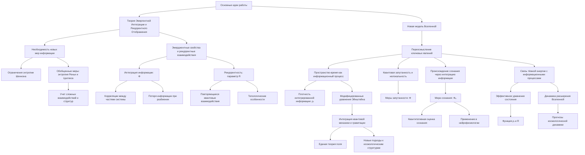
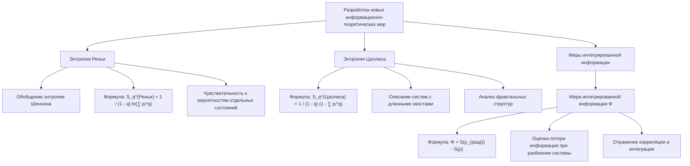
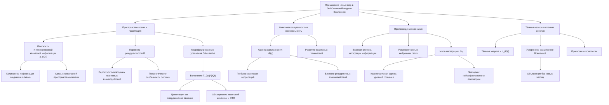
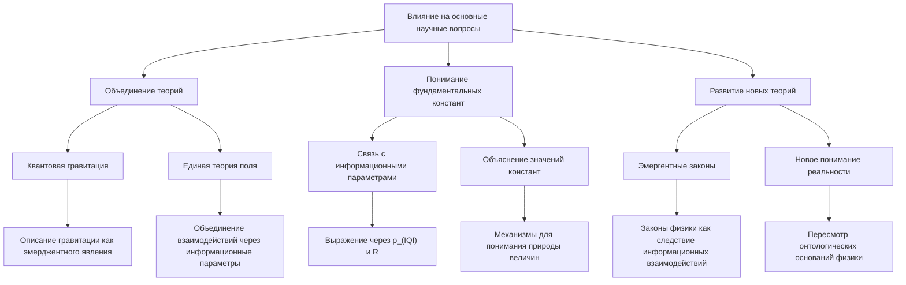
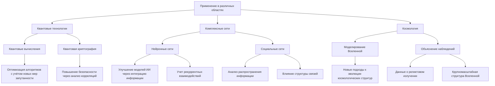

# Информационно-теоретические меры в новой модели Вселенной для современной физики

---

## Аннотация

В современной физике возрастающая сложность изучаемых систем требует развития новых теоретических подходов. Традиционные меры энтропии и информации оказываются недостаточными для описания процессов интеграции информации и рекуррентности, особенно в контексте квантовых и космологических явлений. В этой работе предлагается анализ основных научных вопросов через призму Теории Эмергентной Интеграции и Рекуррентного Отображения (ЭИРО) и новой модели Вселенной. Разработаны новые информационно-теоретические меры, позволяющие более точно описывать сложные системы и взаимодействия. Рассматривается влияние этих мер на понимание природы пространства-времени, квантовой запутанности, происхождения сознания и тёмной материи.

### Введение

Современная наука сталкивается с множеством фундаментальных вопросов, требующих новых подходов и теорий. Традиционные информационно-теоретические меры, основанные на энтропии Шеннона, не всегда способны отразить сложность процессов в квантовых и космологических масштабах. Необходимость учёта эмергентных свойств и рекуррентных взаимодействий приводит к разработке новых теоретических инструментов.

Теория Эмергентной Интеграции и Рекуррентного Отображения (ЭИРО) предлагает рассматривать многие фундаментальные явления как результат процессов интеграции информации и рекуррентности. Это открывает новые горизонты в понимании природы Вселенной и позволяет переосмыслить ключевые научные вопросы.

### 1. Теоретические основы

#### 1.1. Ограничения традиционных мер энтропии

**Классическая энтропия Шеннона**:

`S = -∑ᵢ pᵢ ln pᵢ`

хорошо описывает системы с простыми вероятностными распределениями. Однако в сложных системах, где присутствуют корреляции высокого порядка, эта мера не отражает всю информацию о взаимодействиях и структуре системы.

#### 1.2. Необходимость новых мер

Сложные процессы интеграции информации и рекуррентности требуют более гибких мер, способных учитывать:

- Нелинейные взаимодействия.

- Многоуровневые структуры.

- Эмерджентные свойства системы.

### 2. Разработка новых информационно-теоретических мер

#### 2.1. Энтропия Реньи и Цаллиса

**Энтропия Реньи обобщает энтропию Шеннона и вводится как**:

`S_q^(Реньи) = 1 / 1 - q ln (( ∑ᵢ pᵢ^q ))`

**Энтропия Цаллиса определяется как**:

`S_q^(Цаллиса) = 1 / 1 - q (( 1 - ∑ᵢ pᵢ^q ))`

Где  q  — параметр порядка, регулирующий чувствительность к вероятностям отдельных состояний. При  q → 1  обе меры сводятся к энтропии Шеннона.

**Преимущества**:

- Учитывают различные масштабы вероятностей.

- Позволяют описывать системы с длинными хвостами распределений.

- Подходят для систем с фрактальными структурами.

#### 2.2. Меры интегрированной информации

**Мера интегрированной информации Φ**:

`Φ = S(ρ_(разд)) - S(ρ)`

Где:

-  S(ρ)  — энтропия системы в целом.

-  ρ_(разд)  — матрица плотности системы без интеграции (когда части системы независимы).

**Особенности**:

- Оценивает, сколько информации теряется при разбиении системы на независимые части.

- Отражает степень интеграции и корреляции между частями системы.

- Учитывает влияния рекуррентных взаимодействий.

### 3. Применение новых мер в ЭИРО и новой модели Вселенной

#### 3.1. Пространство-время и гравитация

##### 3.1.1. Плотность интегрированной квантовой информации

Вводится величина плотность интегрированной квантовой информации  ρ_(IQI) :

`ρ_(IQI) = lim(Δ V → 0) Δ I / Δ V`

Где  Δ I  — изменение интегрированной информации в объёме  Δ V .

**Интерпретация**:

- Отражает количество интегрированной квантовой информации в единице объёма.

- Связывает информационные процессы с геометрией пространства-времени.

##### 3.1.2. Параметр рекуррентности R

Параметр рекуррентности  R  характеризует степень повторяющихся взаимодействий в системе.

**Определение**:

- Может быть связан с вероятностью повторных квантовых взаимодействий.

- Отражает топологические особенности системы.

##### 3.1.3. Модифицированные уравнения Эйнштейна

Включение новых параметров в гравитационные уравнения:

`G_(μν) + Λ g_(μν) = 8π G (( T_(μν) + T_(μν)^(IQI) ))`

Где  T_(μν)^(IQI)  — тензор энергии-импульса, связанный с интегрированной квантовой информацией.

**Последствия**:

- Гравитация рассматривается как эмерджентное явление информационных процессов.

- Возможность объединения квантовой механики и общей теории относительности.

#### 3.2. Квантовая запутанность и нелокальность

Новые меры позволяют количественно оценить степень запутанности:

`Φ(ρ) = S(ρ_(разд)) - S(ρ)`

**Применение**:

- Оценка глубины квантовых корреляций.

- Изучение влияния рекуррентных взаимодействий на запутанность.

- Развитие квантовых технологий.

#### 3.3. Происхождение сознания

В рамках ЭИРО сознание рассматривается как результат высокой степени интеграции информации и рекуррентности в нейронных сетях.

**Мера эмергентной интегрированной информации**:

`Φₑ = ∫₀^(t₁) I_(инт)(t) ⋅ R(t)dt`

Где:

-  I_(инт)(t)  — степень интеграции информации во времени.

-  R(t)  — степень рекуррентности.

**Применение**:

- Квантитативная оценка уровней сознания.

- Новые подходы к нейрофизиологии и психиатрии.

#### 3.4. Тёмная материя и тёмная энергия

Предполагается, что тёмная энергия связана с интегрированной квантовой информацией на космологических масштабах.

**Эффективное уравнение состояния**:

`w_(eff) = w₀ + w₁ f(ρ_(IQI), R)`

Где:

-  w₀  и  w₁  — константы.

-  f  — функция влияния  ρ_(IQI)  и  R  на динамику Вселенной.

**Последствия**:

- Объяснение ускоренного расширения Вселенной без введения неизвестных частиц.

- Новые прогнозы в космологии.

### 4. Влияние на основные научные вопросы

#### 4.1. Объединение теорий

- Квантовая гравитация: Новые меры позволяют описать гравитацию как эмерджентное явление информационных процессов.

- Единая теория поля: Возможность объединения различных взаимодействий через информационные параметры.

#### 4.2. Понимание фундаментальных констант

- Связь с информационными параметрами: Фундаментальные константы могут быть выражены через  ρ_(IQI)  и  R .

- Объяснение значений констант: Новая модель предоставляет механизмы для понимания природы этих величин.

#### 4.3. Развитие новых теорий, неизвестных науке

- Эмергентные законы: Предложение, что законы физики возникают из базовых информационных взаимодействий.

- Новое понимание реальности: Пересмотр онтологических оснований физики в свете информационных процессов.

### 5. Применение в различных областях

#### 5.1. Квантовые технологии

- Квантовые вычисления: Оптимизация алгоритмов с учётом новых мер запутанности.

- Квантовая криптография: Повышение безопасности через глубокое понимание информационных корреляций.

#### 5.2. Комплексные сети

- Нейронные сети: Улучшение моделей искусственного интеллекта с учётом интеграции информации и рекуррентности.

- Социальные сети: Анализ распространения информации и влияние структуры связей.

#### 5.3. Космология

- Моделирование Вселенной: Новые подходы к моделированию эволюции космологических структур.

- Объяснение наблюдений: Интерпретация данных о реликтовом излучении и крупномасштабной структуре Вселенной.

### 6. Обсуждение и перспективы

#### 6.1. Преодоление текущих ограничений

- Комплексность систем: Новые меры позволяют более точно описывать сложные системы.

- Интеграция различных областей: Объединение знаний из физики, информатики и биологии.

#### 6.2. Возможности для будущих исследований

- Экспериментальная проверка: Разработка экспериментальных тестов для новых предсказаний.

- Интердисциплинарность: Сотрудничество между разными областями науки для развития теории.

#### 6.3. Вызовы

- Математическая сложность: Необходимость развития новых математических методов.

- Интерпретация результатов: Понимание физического смысла новых величин и их измерение.

### Заключение

Переход к новой модели Вселенной через призму ЭИРО и разработка новых информационно-теоретических мер открывают широкие возможности для понимания фундаментальных явлений. Предложенные меры позволяют глубже изучить процессы интеграции информации и рекуррентности, что имеет значение для различных областей физики и смежных наук. Несмотря на существующие вызовы, этот подход способствует развитию теорий, ещё неизвестных науке, и, возможно, приведёт к значительным открытиям в будущем.

---

*Пожалуйста, обратите внимание, что представленная работа является концептуальной и предназначена для иллюстрации возможностей новой модели. Некоторые положения могут требовать дополнительной проработки и экспериментальной верификации.*

---

Оглавление: 
- [ЭИРО framework](/README.md)
- [Новая модель вселенной в современной физике](/A-new-model-of-the-universe-in-modern-physics.md)

