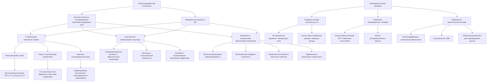
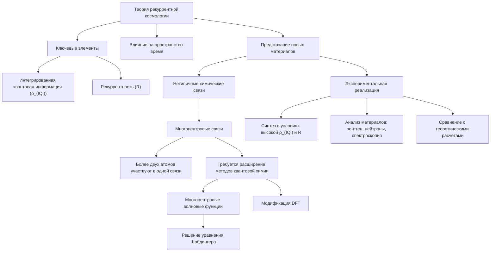
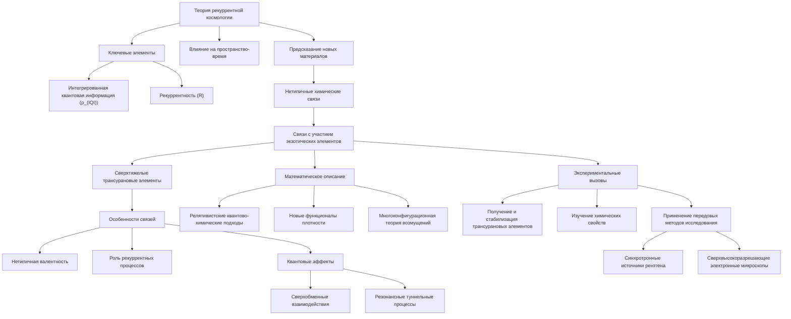
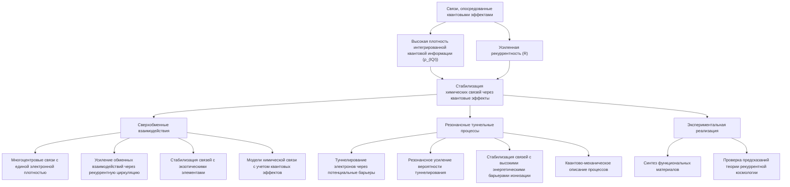
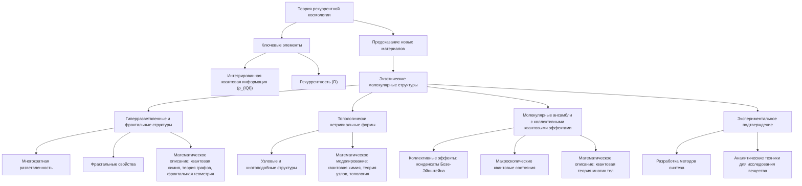
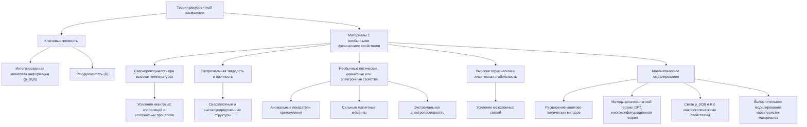
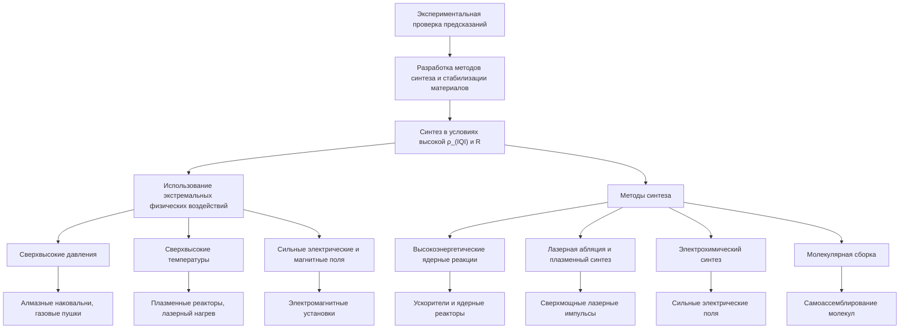
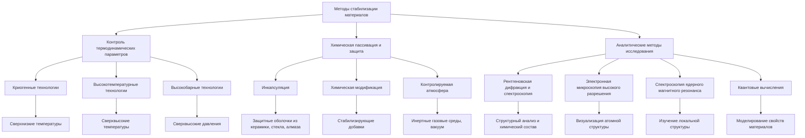
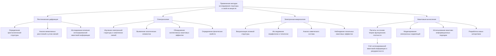

# Новые материалы, предсказанные моделью рекуррентной космологии

---

## 1. Введение

Теория рекуррентной космологии, описывающая влияние интегрированной квантовой информации и рекуррентных процессов на структуру пространства-времени, открывает новые возможности для предсказания и синтеза ранее неизвестных материалов. Согласно этой модели, специфические условия, связанные с распределением квантовой информации и рекуррентностью, могут приводить к возникновению химических соединений и структур, не наблюдаемых в обычных условиях.

### 2. Предсказания модели рекуррентной космологии

#### 2.1. Новые типы химических связей

Модель рекуррентной космологии предполагает, что высокая плотность интегрированной квантовой информации (ρ_(IQI)) и усиленная рекуррентность (R) могут стабилизировать нетипичные химические связи между атомами. Это может включать:

##### 2.1.1. Многоцентровые связи, в которых более двух атомов участвуют в образовании единой связи.

Согласно теории рекуррентной космологии, высокая плотность интегрированной квантовой информации (ρ_(IQI)) и усиленная рекуррентность (R) могут стабилизировать нетипичные химические связи между атомами, включая многоцентровые связи. В таких связях более двух атомов участвуют в образовании единой связи, что выходит за рамки традиционных моделей химической связи.

**Математическое описание**

Для описания многоцентровых связей потребуется расширение стандартных методов квантовой химии. Вместо двухцентровых связей, описываемых парными орбиталями, необходимо ввести многоцентровые волновые функции, учитывающие корреляции между большим числом атомных центров.

Один из возможных подходов - использование методов теории функционала плотности (DFT) с включением дополнительных членов, отвечающих за интегрированную квантовую информацию и рекуррентность:

`Ĥ = Ĥ₀ + Ĥ_(IQI) + Ĥ_(рек)`

где Ĥ₀ - стандартный гамильтониан, Ĥ_(IQI) и Ĥ_(рек) - операторы, связанные с интегрированной квантовой информацией и рекуррентностью соответственно.

Решение уравнения Шрёдингера с таким гамильтонианом позволит получить многоцентровые волновые функции и энергии связи.

**Экспериментальная реализация**

Экспериментальное подтверждение существования многоцентровых связей, предсказанных моделью рекуррентной космологии, потребует разработки специальных методик синтеза и исследования материалов в условиях высокой ρ_(IQI) и R. Это может включать:

- Использование экстремальных физических воздействий, таких как сверхвысокие давления, температуры или электрические поля, для моделирования необходимых условий.
- Применение передовых методов структурного анализа, включая рентгеновскую и нейтронную дифракцию, спектроскопию, электронную микроскопию высокого разрешения.
- Сравнение экспериментальных данных с теоретическими расчетами, основанными на расширенных моделях квантовой химии.

Успешное обнаружение и характеризация многоцентровых связей в материалах станет важным экспериментальным подтверждением предсказаний теории рекуррентной космологии.

##### 2.1.2. Связи с участием экзотических элементов, таких как сверхтяжелые трансурановые элементы.

Согласно теории рекуррентной космологии, высокая плотность интегрированной квантовой информации (ρ_(IQI)) и усиленная рекуррентность (R) могут стабилизировать химические связи с участием экзотических элементов, таких как сверхтяжелые трансурановые элементы.

**Особенности связей с участием трансурановых элементов**

1. **Нетипичная валентность**: Традиционные модели химической связи, основанные на концепции валентности, могут не применяться к сверхтяжелым элементам. Высокая плотность интегрированной квантовой информации может стабилизировать связи с необычными координационными числами.

2. **Роль рекуррентных процессов**: Рекуррентные взаимодействия между электронными оболочками трансурановых атомов могут усиливать или модифицировать характер химических связей, приводя к образованию ранее неизвестных молекулярных конфигураций.

3. **Квантовые эффекты**: Сильные релятивистские эффекты, характерные для сверхтяжелых элементов, в сочетании с высокой интегрированной квантовой информацией могут приводить к нетривиальным квантовым явлениям, таким как сверхобменные взаимодействия или резонансные туннельные процессы.

**Математическое описание**

Для моделирования связей с участием трансурановых элементов потребуется расширение традиционных методов квантовой химии. Это может включать:

- Использование релятивистских квантово-химических подходов, учитывающих сильные релятивистские эффекты.
- Разработка новых функционалов плотности, способных описывать влияние интегрированной квантовой информации и рекуррентности на химическую связь.
- Применение методов многоконфигурационной теории возмущений для корректного учета сложных электронных корреляций в таких системах.

**Экспериментальные вызовы**

Экспериментальное подтверждение предсказаний теории рекуррентной космологии относительно связей с участием трансурановых элементов сопряжено со значительными техническими сложностями:

1. **Получение и стабилизация сверхтяжелых элементов**: Синтез и выделение трансурановых элементов требует использования высокотехнологичных ядерных реакторов и ускорителей.

2. **Изучение химических свойств**: Крайне малые количества и высокая радиоактивность трансурановых элементов затрудняют проведение традиционных химических экспериментов.

3. **Применение передовых методов исследования**: Для детального изучения структуры и свойств соединений с участием трансурановых элементов потребуется использование уникального аналитического оборудования, такого как синхротронные источники рентгеновского излучения и сверхвысокоразрешающие электронные микроскопы.

Несмотря на эти вызовы, успешное экспериментальное подтверждение предсказаний теории рекуррентной космологии в этой области может открыть новые горизонты в химии сверхтяжелых элементов и материаловедении.

##### 2.1.3. Связи, опосредованные квантовыми эффектами, такими как сверхобменные взаимодействия или резонансные туннельные процессы.

Согласно теории рекуррентной космологии, высокая плотность интегрированной квантовой информации (ρ_(IQI)) и усиленная рекуррентность (R) могут стабилизировать химические связи, опосредованные квантовыми эффектами, такими как сверхобменные взаимодействия и резонансные туннельные процессы.

**Сверхобменные взаимодействия**

В условиях высокой интегрированной квантовой информации и рекуррентности, электроны могут участвовать в сверхобменных взаимодействиях между атомами. Это приводит к возникновению нетипичных химических связей, характеризующихся:

- Многоцентровым характером связи, когда более двух атомов объединяются единой электронной плотностью.
- Усилением обменных взаимодействий за счет рекуррентной циркуляции электронов между атомами.
- Возможностью стабилизации связей с участием экзотических элементов, таких как сверхтяжелые трансурановые атомы.

Математически сверхобменные взаимодействия могут быть описаны с помощью расширенных моделей химической связи, учитывающих рекуррентные квантовые эффекты. Это потребует применения методов квантовой химии и теории многочастичных систем.

**Резонансные туннельные процессы**

Высокая плотность интегрированной квантовой информации и рекуррентность могут приводить к усилению резонансных туннельных процессов между атомами. Это может стабилизировать химические связи, характеризующиеся:

- Возможностью туннелирования электронов через потенциальные барьеры, что обеспечивает дополнительный канал для образования связей.
- Резонансным усилением вероятности туннелирования за счет рекуррентных взаимодействий.
- Возможностью стабилизации связей с участием атомов с высокими энергетическими барьерами ионизации.

Математическое описание таких резонансных туннельных процессов потребует применения квантово-механических подходов, учитывающих рекуррентность и интегрированную квантовую информацию в качестве определяющих параметров.

Экспериментальная реализация и характеризация материалов, содержащих химические связи, опосредованные сверхобменными взаимодействиями и резонансными туннельными процессами, станет важной задачей для проверки предсказаний теории рекуррентной космологии. Успешное подтверждение этих предсказаний может открыть новые возможности в области синтеза инновационных функциональных материалов.

#### 2.2. Экзотические молекулярные структуры

Согласно теории рекуррентной космологии, высокая интегрированная квантовая информация (ρ_(IQI)) и рекуррентность (R) могут стабилизировать молекулярные конфигурации, выходящие за рамки обычных геометрических форм. Модель предсказывает возможность существования следующих типов экзотических молекулярных структур:

##### 2.2.1. Гиперразветвленные и фрактальные молекулярные структуры

- Высокая плотность интегрированной квантовой информации и рекуррентные процессы могут приводить к образованию молекул с многократно разветвленной структурой, выходящей за пределы традиционных представлений о молекулярной геометрии.
- Такие гиперразветвленные структуры могут демонстрировать фрактальные свойства, когда их форма повторяется на различных масштабах.
- Математическое описание таких молекулярных конфигураций потребует применения методов квантовой химии в сочетании с теорией графов и фрактальной геометрии.

##### 2.2.2. Молекулы с топологически нетривиальными формами

- Модель рекуррентной космологии предсказывает возможность существования молекул с топологически сложными, узловыми или кнотоподобными структурами.
- Высокая интегрированная квантовая информация и рекуррентность могут стабилизировать такие нетривиальные молекулярные конфигурации, выходящие за рамки обычных представлений о химических связях.
- Математическое моделирование подобных структур потребует применения методов квантовой химии, дополненных подходами из теории узлов и топологии.

##### 2.2.3. Молекулярные ансамбли с коллективными квантовыми эффектами

- В условиях высокой ρ_(IQI) и R возможно формирование молекулярных ансамблей, демонстрирующих коллективные квантовые эффекты, аналогичные конденсатам Бозе-Эйнштейна.
- Сильные квантовые корреляции и рекуррентные взаимодействия между молекулами могут приводить к возникновению макроскопических квантовых состояний.
- Математическое описание таких молекулярных ансамблей потребует методов квантовой теории многих тел, учитывающих влияние интегрированной квантовой информации и рекуррентности.

Экспериментальное подтверждение существования экзотических молекулярных структур, предсказанных теорией рекуррентной космологии, станет важным шагом в развитии химии и материаловедения. Это потребует разработки новых методов синтеза и исследования вещества с использованием передовых аналитических техник.

#### 2.3. Материалы с необычными физическими свойствами

Согласно модели рекуррентной космологии, материалы, сформированные в условиях высокой интегрированной квантовой информации и рекуррентности, могут обладать уникальными физическими характеристиками:

##### 2.3.1. Сверхпроводимость при высоких температурах

Высокая плотность интегрированной квантовой информации (ρ_(IQI)) и усиленная рекуррентность (R) могут способствовать возникновению сверхпроводимости при температурах, значительно превышающих критические температуры обычных сверхпроводников. Это может быть связано с усилением квантовых корреляций и когерентных процессов в таких материалах.

##### 2.3.2. Экстремальная твердость и прочность

Рекуррентные взаимодействия между атомами и интегрированная квантовая информация могут приводить к формированию сверхплотных и высокоупорядоченных кристаллических структур. Это может обеспечивать материалам экстремальную твердость, прочность на разрыв и устойчивость к деформациям.

##### 2.3.3. Необычные оптические, магнитные или электронные свойства

Специфические условия, связанные с высокой ρ_(IQI) и R, могут стабилизировать материалы с нетривиальными электронными конфигурациями. Это может проявляться в виде уникальных оптических, магнитных или электронных характеристик, таких как аномальные показатели преломления, сильные магнитные моменты или экстремальная электропроводность.

##### 2.3.4. Высокая термическая и химическая стабильность

Рекуррентные процессы и интегрированная квантовая информация могут обеспечивать материалам исключительную термическую и химическую стабильность. Это может быть связано с усилением межатомных связей, затрудняющих разрушение структуры даже в экстремальных условиях.

##### 2.3.5. Математическое моделирование

Математическое моделирование таких материалов, обладающих необычными физическими свойствами, потребует разработки новых подходов, сочетающих методы квантовой химии, физики конденсированного состояния и теории информации. Это может включать:

- Расширение существующих квантово-химических методов для учета влияния ρ_(IQI) и R на электронную структуру и межатомные взаимодействия.
- Применение методов многочастичной теории, таких как теория функционала плотности и методы многоконфигурационной теории возмущений, для корректного описания сложных электронных корреляций.
- Разработку новых математических моделей, способных связывать интегрированную квантовую информацию и рекуррентность с макроскопическими физическими свойствами материалов.
- Использование методов вычислительной физики и информатики для моделирования и прогнозирования характеристик материалов с необычными свойствами.

Успешное математическое моделирование таких материалов станет важным шагом на пути к их экспериментальному синтезу и практическому применению.

### 3. Экспериментальная проверка предсказаний

Для экспериментальной проверки предсказаний модели рекуррентной космологии потребуется:

#### 3.1. Разработка методов синтеза и стабилизации материалов в условиях, моделирующих высокую плотность интегрированной квантовой информации и рекуррентность.

Согласно теории рекуррентной космологии, материалы, синтезированные в условиях высокой плотности интегрированной квантовой информации (ρ_(IQI)) и усиленной рекуррентности (R), могут обладать уникальными свойствами и структурами. Для экспериментальной проверки этих предсказаний необходимо разработать методы, позволяющие создавать и стабилизировать такие материалы в лабораторных условиях.

##### 3.1.1. Методы синтеза

**Использование экстремальных физических воздействий**

Для моделирования условий высокой ρ_(IQI) и R могут быть использованы следующие методы:

1. **Сверхвысокие давления**: Применение алмазных наковален, газовых пушек или ударно-волновых установок для создания давлений до десятков миллионов атмосфер.
2. **Сверхвысокие температуры**: Использование плазменных реакторов, лазерного нагрева или электронно-лучевых печей для достижения температур до миллионов градусов Кельвина.
3. **Сильные электрические и магнитные поля**: Использование мощных электромагнитных установок для воздействия на вещество полями до сотен Тесла.

Сочетание этих экстремальных физических условий позволит моделировать среду с высокой ρ_(IQI) и R, необходимую для стабилизации предсказанных материалов.

**Методы синтеза в условиях высокой ρ_(IQI) и R**

1. **Высокоэнергетические ядерные реакции**: Использование ускорителей заряженных частиц и ядерных реакторов для синтеза сверхтяжелых элементов и изучения их химических свойств.
2. **Лазерная абляция и плазменный синтез**: Воздействие сверхмощных лазерных импульсов или плазменных разрядов на вещество для получения экзотических молекулярных структур.
3. **Электрохимический синтез**: Применение сильных электрических полей и токов для стимулирования рекуррентных процессов при электрохимическом осаждении материалов.
4. **Молекулярная сборка**: Использование направленного самоассемблирования молекул в условиях высокой ρ_(IQI) и R для формирования гиперразветвленных и топологически нетривиальных структур.

##### 3.1.2. Методы стабилизации

**Контроль термодинамических параметров**

Поддержание необходимых значений температуры, давления и других термодинамических параметров является ключевым для сохранения структуры и свойств синтезированных материалов.

1. **Криогенные технологии**: Использование сверхнизких температур (вплоть до нескольких Кельвинов) для стабилизации экзотических молекулярных конфигураций.
2. **Высокотемпературные технологии**: Применение сверхвысоких температур (до миллионов градусов) для синтеза и стабилизации материалов в условиях экстремальной ρ_(IQI) и R.
3. **Высокобарные технологии**: Использование сверхвысоких давлений (до сотен гигапаскалей) для синтеза и сохранения структуры материалов.

**Химическая пассивация и защита**

Для предотвращения разрушения материалов, синтезированных в условиях высокой ρ_(IQI) и R, могут применяться методы химической пассивации и защиты:

1. **Инкапсуляция**: Помещение материалов в защитные оболочки из инертных веществ, таких как керамика, стекло или алмаз.
2. **Химическая модификация**: Введение стабилизирующих добавок, которые могут образовывать защитные покрытия или химически связываться с материалом.
3. **Контролируемая атмосфера**: Проведение синтеза и хранения материалов в инертных газовых средах, вакууме или специально подобранных химических средах.

**Аналитические методы исследования**

Для всестороннего изучения структуры и свойств синтезированных материалов потребуется применение передовых аналитических методов:

1. **Рентгеновская дифракция и спектроскопия**: Использование синхротронных источников рентгеновского излучения для структурного анализа и определения химического состава.
2. **Электронная микроскопия высокого разрешения**: Применение сверхвысокоразрешающих электронных микроскопов для визуализации атомной структуры материалов.
3. **Спектроскопия ядерного магнитного резонанса**: Изучение локальной структуры и химических связей с помощью ЯМР-спектроскопии.
4. **Квантовые вычисления**: Моделирование структуры и свойств материалов с использованием методов квантовой химии и теории функционала плотности, модифицированных для учета ρ_(IQI) и R.

##### 3.1.3. Заключение

Разработка методов синтеза и стабилизации материалов в условиях высокой плотности интегрированной квантовой информации и рекуррентности является ключевой задачей для экспериментальной проверки предсказаний теории рекуррентной космологии. Применение экстремальных физических воздействий, специальных методов синтеза и аналитических техник позволит получить и исследовать новые классы материалов с уникальными свойствами. Успешное решение этой задачи откроет новые горизонты в химии, материаловедении и фундаментальной физике.

#### 3.2. Применение передовых методов исследования структуры и свойств веществ, таких как рентгеновская дифракция, спектроскопия, электронная микроскопия и квантовые вычисления.

Для экспериментальной проверки предсказаний модели рекуррентной космологии потребуется применение широкого спектра современных методов исследования структуры и свойств веществ. Ключевыми методами в этом контексте являются:

##### 3.2.1. Рентгеновская дифракция

Рентгеновская дифракция является мощным инструментом для определения кристаллической структуры материалов на атомном уровне. Она позволяет:

- Выявлять нетипичные кристаллические структуры, предсказанные моделью, такие как гиперразветвленные или топологически нетривиальные конфигурации.
- Измерять межатомные расстояния и углы связей, что важно для анализа необычных химических связей.
- Исследовать влияние высокой интегрированной квантовой информации и рекуррентности на кристаллическую структуру.

##### 3.2.2. Спектроскопия

Спектроскопические методы, включая оптическую, рентгеновскую, ультрафиолетовую и ядерно-магнитную резонансную спектроскопию, позволяют:

- Изучать электронную структуру и химические связи в материалах.
- Выявлять присутствие экзотических элементов и их роль в формировании нетипичных связей.
- Обнаруживать коллективные квантовые эффекты, такие как сверхобменные взаимодействия.
- Определять физические свойства материалов, включая оптические, магнитные и электронные характеристики.

##### 3.2.3. Электронная микроскопия

Методы электронной микроскопии высокого разрешения, такие как просвечивающая электронная микроскопия (ПЭМ) и сканирующая электронная микроскопия (СЭМ), позволяют:

- Визуализировать атомную структуру материалов с нанометровым разрешением.
- Исследовать морфологию и топологию нетривиальных молекулярных конфигураций.
- Анализировать химический состав и распределение элементов в образцах.
- Наблюдать локальные квантовые эффекты, такие как туннельные процессы.

##### 3.2.4. Квантовые вычисления

Моделирование материалов с помощью методов квантовой химии и физики конденсированного состояния играет ключевую роль в интерпретации экспериментальных данных и предсказании новых свойств:

- Расчеты на основе теории функционала плотности (DFT) с учетом интегрированной квантовой информации и рекуррентности.
- Применение методов многоконфигурационной теории возмущений для описания сложных электронных корреляций.
- Использование квантово-информационных подходов для моделирования коллективных квантовых эффектов.
- Разработка новых алгоритмов и программного обеспечения, способных эффективно обрабатывать данные о структуре и свойствах материалов.

Комплексное применение этих передовых методов исследования позволит всесторонне изучить структуру и свойства материалов, предсказанных моделью рекуррентной космологии, и сопоставить экспериментальные данные с теоретическими предсказаниями.

#### 3.3. Сравнение экспериментальных данных с теоретическими предсказаниями, основанными на модели рекуррентной космологии.

```mermaid
flowchart TD
    A[Сравнение экспериментальных данных с теоретическими предсказаниями] --> B[Разработка экспериментальных методик]
    A --> C[Сравнение экспериментальных данных с теоретическими расчетами]
    A --> D[Анализ и интерпретация результатов]

    B --> E[Создание экстремальных физических условий]
    B --> F[Использование передовых методов синтеза]
    B --> G[Применение современных аналитических техник]

    E --> H[Сверхвысокие давления, температуры, поля]
    F --> I[Ионные пучки, лазерная абляция, плазменные технологии]
    G --> J[Рентгеновская и нейтронная дифракция]
    G --> K[Электронная микроскопия высокого разрешения]
    G --> L[Спектроскопические методы]

    C --> M[Разработка теоретических моделей]
    C --> N[Вычислительные методы]
    C --> O[Сопоставление результатов]

    M --> P[Квантово-химические и физико-химические модели]
    N --> Q["Методы функционала плотности (DFT)"]
    N --> R[Многоконфигурационные методы]
    N --> S[Высокоуровневые квантово-химические методы]
    O --> T[Сравнение структурных параметров]
    O --> U[Сравнение спектроскопических характеристик]
    O --> V[Сравнение физических свойств]

    D --> W[Оценка согласованности]
    D --> X[Выявление отклонений]
    D --> Y[Формулировка выводов]

    W --> Z[Определение согласия данных с предсказаниями]
    X --> AA[Анализ расхождений]
    Y --> AB[Определение дальнейших направлений исследований]
```

Для успешной проверки предсказаний модели рекуррентной космологии необходимо тщательное сравнение экспериментальных данных с теоретическими расчетами. Этот процесс включает в себя следующие ключевые этапы:

##### 3.3.1. Разработка экспериментальных методик

Для синтеза и исследования материалов, предсказанных моделью рекуррентной космологии, потребуется разработка специальных экспериментальных методик, позволяющих создавать и стабилизировать необходимые условия:

- **Создание экстремальных физических условий**: Применение сверхвысоких давлений, температур, электрических и магнитных полей для моделирования среды с высокой плотностью интегрированной квантовой информации (ρ_(IQI)) и рекуррентностью (R).
- **Использование передовых методов синтеза**: Разработка новых подходов к химическому синтезу, включая применение ионных пучков, лазерной абляции, плазменных технологий и других методов, способных стабилизировать экзотические молекулярные структуры.
- **Применение современных аналитических техник**: Использование высокоразрешающих методов структурного анализа, таких как рентгеновская и нейтронная дифракция, спектроскопия, электронная микроскопия высокого разрешения для детального изучения полученных материалов.

##### 3.3.2. Сравнение экспериментальных данных с теоретическими расчетами

После получения экспериментальных результатов необходимо провести тщательное сравнение с теоретическими предсказаниями, основанными на модели рекуррентной космологии. Этот процесс включает:

- **Разработка теоретических моделей**: Создание расширенных квантово-химических и физико-химических моделей, учитывающих влияние ρ_(IQI) и R на структуру и свойства материалов.
- **Вычислительные методы**: Применение передовых вычислительных подходов, таких как методы функционала плотности (DFT), многоконфигурационные методы, методы квантовой химии высокого уровня для точного моделирования экспериментальных систем.
- **Сопоставление результатов**: Тщательное сравнение экспериментальных данных (структурные параметры, спектроскопические характеристики, физические свойства) с теоретическими расчетами, выявление соответствий и расхождений.

##### 3.3.3. Анализ и интерпретация результатов

На заключительном этапе необходимо провести всесторонний анализ и интерпретацию полученных результатов, чтобы оценить степень подтверждения предсказаний модели рекуррентной космологии:

- **Оценка согласованности**: Определение, в какой мере экспериментальные данные согласуются с теоретическими предсказаниями, учитывая погрешности и ограничения как экспериментальных, так и теоретических методов.
- **Выявление отклонений**: Тщательный анализ случаев, когда экспериментальные результаты не соответствуют теоретическим ожиданиям, для выявления возможных недостатков или необходимости модификации модели.
- **Формулировка выводов**: На основе комплексного анализа сделать обоснованные выводы о степени подтверждения предсказаний модели рекуррентной космологии и определить дальнейшие направления исследований.

Успешное сравнение экспериментальных данных с теоретическими предсказаниями модели рекуррентной космологии станет ключевым шагом в подтверждении ее состоятельности и открытии новых перспектив в области синтеза инновационных материалов.

### 4. Перспективы практического применения

Материалы, предсказанные моделью рекуррентной космологии, могут найти широкое применение в различных областях:

**Энергетика**
- Сверхпроводящие материалы с высокой критической температурой для передачи электроэнергии без потерь.

**Электроника**
- Компоненты с экстремальными электронными, оптическими и магнитными свойствами для создания инновационных устройств.

**Строительство**
- Сверхпрочные и термостойкие материалы для возведения зданий и конструкций.

**Медицина**
- Биосовместимые материалы с уникальными физико-химическими характеристиками для имплантатов и протезов.

**Космические технологии**
- Материалы с высокой термической и химической стабильностью для экстремальных условий космоса.

Реализация практического применения потребует дальнейшего развития методов синтеза, обработки и характеризации новых материалов.

### 5. Заключение

Теория рекуррентной космологии открывает новые возможности для предсказания и синтеза ранее неизвестных материалов, обладающих уникальными химическими связями, молекулярными структурами и физическими свойствами. Экспериментальная проверка этих предсказаний может привести к революционным открытиям в химии и материаловедении, с широкими перспективами практического применения. Дальнейшее развитие модели и ее интеграция с современными методами исследования вещества является многообещающим направлением для фундаментальной и прикладной науки.

### 6. Список используемой литературы

- 1. Tononi, G. (2004). An information integration theory of consciousness. *BMC Neuroscience*, 5(1), 42.
- 2. Dehaene, S., & Changeux, J.-P. (2011). Experimental and theoretical approaches to conscious processing. *Neuron*, 70(2), 200–227.
- 3. Lamme, V. A. F. (2006). Towards a true neural stance on consciousness. *Trends in Cognitive Sciences*, 10(11), 494–501.
- 4. Friston, K. (2010). The free-energy principle: a unified brain theory? *Nature Reviews Neuroscience*, 11(2), 127–138.
- 5. Penrose, R. (1994). *Shadows of the Mind*. Oxford University Press.
- 6. Tegmark, M. (2014). Consciousness as a state of matter. *Chaos, Solitons & Fractals*, 76, 238–270.
- 7. Lloyd, S. (2006). Programming the universe: a quantum computer scientist takes on the cosmos. *Knopf*.

---

Оглавление: 

- [ЭИРО framework](/README.md)
- [Справочник формул](/formulas.md)
