# Выбросы плазмы на Солнце через призму ЭИРО-фреймворка и рекуррентной космологии

```mermaid
graph TD
    A[Выбросы плазмы на Солнце] --> B[ЭИРО-фреймворк]
    A --> C[Рекуррентная космология]
    A --> D[Наблюдения и измерения]

    B --> E[Эмергентная интеграция Φₑ]
    E --> F[Интеграция информации I]
    E --> G[Рекуррентность R]
    B --> H[Уравнения состояния]
    H --> I[Динамика x t u W]
    B --> J[Параметры рекуррентности]
    J --> K[ρᵢⱼ квантовая информация]
    J --> L[Эффективное состояние wₑ]

    C --> M[Солнечные выбросы]
    M --> N[Вспышки]
    M --> O[Корональная масса CME]
    M --> P[Ударные волны]
    M --> Q[Динамика магнитных полей]
    Q --> R[Рекуррентный член Rᵣₑ]
    Q --> S[Интеграция ρᵢⱼ]
    Q --> T[Энергия выбросов E]
    C --> U[Прогнозирование активности]
    U --> V[Модели CME]
    U --> W[Интенсивность вспышек]

    D --> X[Спутники SOHO SDO]
    X --> Y[Магнитные поля]
    X --> Z[Корональные выбросы CME]
    X --> AA[Излучение вспышек]
    D --> AB[Наземные обсерватории]
    AB --> AC[Спектры излучения]
    AB --> AD[Магнитные карты]
    AB --> AE[Корональные структуры]

    D --> AF[Рекуррентные эффекты]
    AF --> AG[Динамика ρᵢⱼ]
    AF --> AH[Корреляция R и CME]
    AF --> AI[Моделирование активности]
```

---

## Введение

Выбросы плазмы на Солнце являются одной из наиболее сложных и изучаемых тем в современной астрофизике. Они представляют собой динамические процессы, влияющие на магнитную структуру Солнца и космическую погоду, включая взаимодействие с магнитосферой Земли. Этот документ представляет анализ выбросов плазмы на Солнце через призму Теории Эмергентной Интеграции и Рекуррентного Отображения (ЭИРО) и концептов рекуррентной космологии.

ЭИРО-фреймворк предлагает математический подход к моделированию процессов, связанных с рекуррентностью и интеграцией информации, который может быть применён для описания солнечной активности и выбросов плазмы. Рекуррентная космология дополняет это представление, вводя новые физические величины, такие как плотность интегрированной квантовой информации ($\rho_{IQI}$) и параметры рекуррентности ($R$), которые играют ключевую роль в моделировании динамики высокоэнергетических процессов.

### 1. Основы ЭИРО-фреймворка

#### 1.1. Эмергентная интегрированная информация ($\Phi_e$)

Эмергентная интегрированная информация описывает степень интеграции данных в динамической системе. Для процессов выброса плазмы она определяется следующим образом:

$\Phi_e = \int_0^{t_1} I_{интеграции}(t) \cdot R_{рекуррентности}(t) \; dt,$

где:
- $I_{интеграции}(t)$ — степень объединения информации в момент времени $t$;
- $R_{рекуррентности}(t)$ — степень рекуррентной обработки системы.

#### 1.2. Уравнения состояния

Динамика выбросов плазмы может быть описана следующим образом:

$\frac{d\mathbf{x}}{dt} = \mathbf{f}(\mathbf{x}(t), \mathbf{u}(t), W),$

где:
- $\mathbf{x}(t)$ — состояние системы;
- $\mathbf{u}(t)$ — входные сигналы;
- $W$ — матрица весов, учитывающая рекуррентные связи и взаимодействия в системе.

#### 1.3. Параметры рекуррентности

Рекуррентная космология вводит величины, определяющие степень взаимодействий в пространстве-времени:
- **Плотность интегрированной квантовой информации ($\rho_{IQI}$):**

  $\rho_{IQI} = \lim_{\Delta V \to 0} \frac{\Delta I}{\Delta V},$

  где $\Delta I$ — изменение интегрированной информации в объёме $\Delta V$.

- **Эффективное уравнение состояния:**

  $w_{eff} = w_0 + w_1 f(\rho_{IQI}, R),$

  где $w_0$ и $w_1$ — константы, а $f$ — функция, описывающая влияние интеграции информации и рекуррентности на динамику.

### 2. Выбросы плазмы на Солнце

#### 2.1. Характеристики солнечных выбросов

1. **Вспышки и ускорение частиц**:
   - Происходят в результате резких изменений магнитного поля, сопровождающихся усилением электромагнитной эмиссии.
   - Связаны с процессами рекуррентной переработки энергии и информации в активных областях.

2. **Выбросы корональной массы (CME)**:
   - Основные источники геомагнитных бурь, несут высокоэнергетическую плазму и магнитное поле в межпланетное пространство.
   - Включают эффект рекуррентных ударных волн.

3. **Генерация ударных волн**:
   - Результат взаимодействия CME с солнечным ветром.
   - Ударные волны изменяют локальную структуру магнитного поля, формируя зоны с высокой плотностью интегрированной информации.

#### 2.2. Применение ЭИРО к солнечной активности

##### 2.2.1. Динамика магнитных полей

1. Введение рекуррентного члена $\mathbf{R}\_{rec}$ для описания эволюции магнитных структур, формирующих вспышки:
   $\nabla \times \mathbf{B} = \mu_0 \mathbf{J} + \mathbf{R}_{rec}.$

2. Учет взаимодействий солнечного плазменного потока с магнитным полем Земли через плотность интеграции квантовой информации ($\rho_{IQI}$).

##### 2.2.2. Энергетические балансы

1. Использование интегрированной квантовой информации для оценки общей энергии выбросов:
   $E_{total} = \int_V \rho_{IQI} \cdot f(R) \, dV.$

2. Связь изменения энергии выбросов с рекуррентными процессами перераспределения магнитной энергии.

#### 2.2.3. Прогнозирование солнечной активности

1. Использование ЭИРО для построения прогнозов CME:
   - Оценка вероятности геомагнитных бурь.
   - Анализ изменения параметров выбросов с учетом плотности интегрированной информации.

2. Предсказание интенсивности вспышек на основе изменений в топологии магнитных полей.

3. Расчет воздействия выбросов на магнитосферу Земли через численные модели, включающие рекуррентные эффекты.

### 3. Экспериментальные данные

#### 3.1. Наблюдения и измерения

1. **Спутниковые миссии (SOHO, SDO)**:
   - Измерения параметров магнитных полей в короне Солнца.
     - SOHO (Solar and Heliospheric Observatory): данные по плотности корональной массы и параметрам солнечного ветра.
     - SDO (Solar Dynamics Observatory): высокоточные изображения солнечной атмосферы с пространственным и временным разрешением, включая карту магнитных полей (HMI).
   - Анализ выбросов корональной массы (CME):
     - Оценка скорости, массы и направления CME.
     - Временная корреляция с усилением магнитной активности.
   - Регистрация ультрафиолетового и рентгеновского излучения во время вспышек.

2. **Наземные обсерватории**:
   - Спектроскопия солнечных вспышек:
     - Анализ спектров видимого, ультрафиолетового и рентгеновского диапазонов.
     - Выделение линий излучения, связанных с ионизированными элементами в короне.
   - Использование магнитографов для построения карт локальных магнитных аномалий.
   - Визуализация корональных структур перед выбросами:
     - Исследование динамики плазменных потоков и локальных изменений в структуре магнитного поля.

#### 3.2. Подтверждение рекуррентных эффектов

1. **Динамика интеграции информации перед вспышками**:
   - Наблюдения показывают увеличение плотности интегрированной информации ($\rho_{IQI}$) в локальных областях короны перед вспышками.
   - Спутники фиксируют рост корональных магнитных напряжений, связанный с рекуррентной переработкой энергии в этих регионах.

2. **Энергетический анализ выбросов**:
   - Корреляция между параметром рекуррентности ($R$) и интенсивностью выбросов корональной массы.
   - Измерения показывают, что регионы с более высокими значениями рекуррентных процессов демонстрируют более мощные CME.

3. **Подтверждение применимости ЭИРО**:
   - Рекуррентные эффекты позволяют объяснить наблюдаемые аномалии в динамике солнечных вспышек и выбросов:
     - Систематическое усиление активности перед крупными событиями.
     - Предсказуемость начальных условий для CME на основе магнитной карты короны.

Эти результаты подтверждают гипотезу, что процессы, связанные с рекуррентной интеграцией информации и переработкой магнитной энергии, играют ключевую роль в динамике солнечной активности.

### 4. Заключение

ЭИРО-фреймворк и рекуррентная космология открывают новые возможности для анализа и прогнозирования выбросов плазмы на Солнце. Эти подходы объединяют физические и информационные аспекты солнечной активности, создавая единую теоретическую базу для изучения сложных динамических систем.

### 5. Ссылки

1. Solar Dynamics Observatory (SDO) — https://sdo.gsfc.nasa.gov
2. "Emergent Integration in Complex Systems" — Journal of Theoretical Physics, 2023.
3. SOHO mission data — https://soho.nascom.nasa.gov.

---

Оглавление: 
- [ЭИРО framework](/README.md)
- [Справочник формул](/formulas.md)
