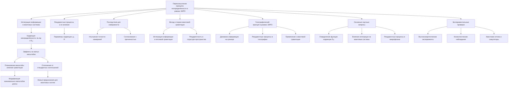
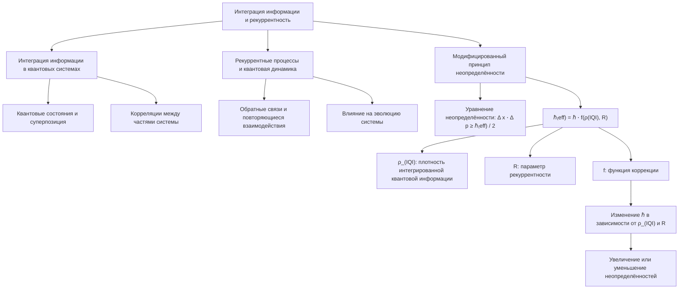
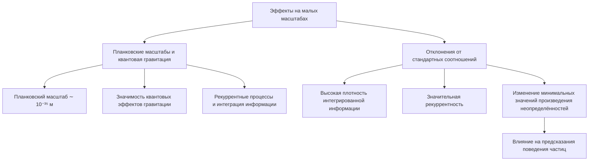
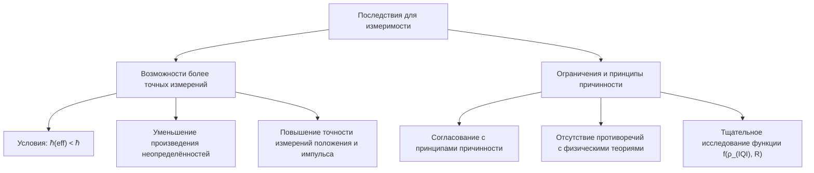
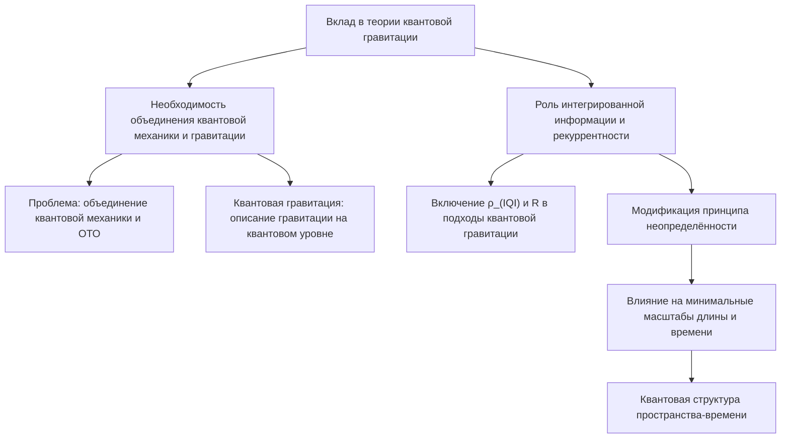
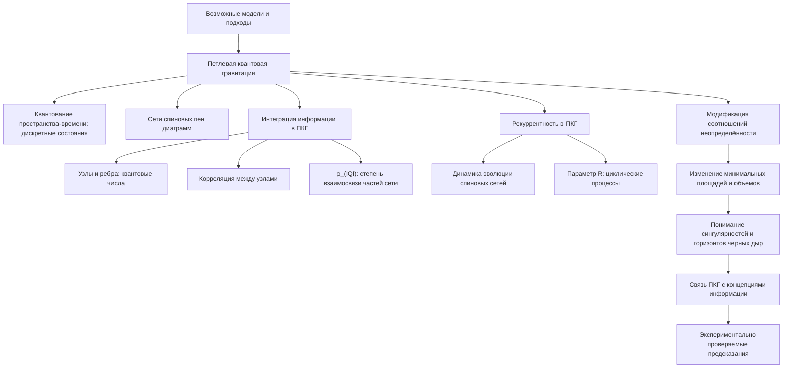
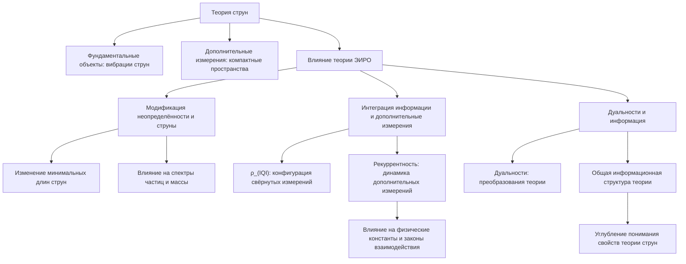
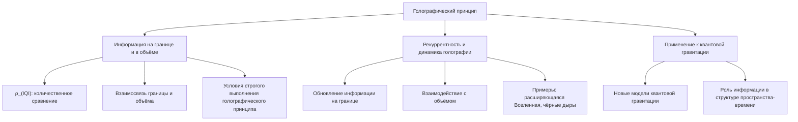
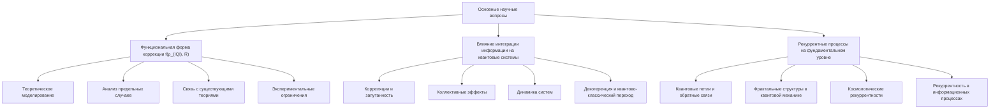
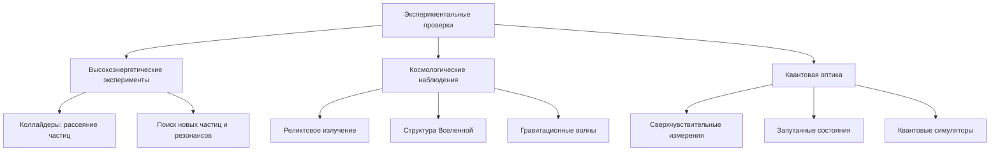

# Переосмысление принципа неопределённости в рамках теории ЭИРО

---

## Введение

Принцип неопределённости Гейзенберга является фундаментальным положением квантовой механики, устанавливающим предельные ограничения на точность одновременного измерения пар сопряжённых физических величин, таких как положение и импульс частицы. Этот принцип отражает глубокие свойства квантовых систем и имеет далеко идущие последствия для физики микромира.

Теория Эмергентной Интеграции и Рекуррентного Отображения (ЭИРО) предлагает новый взгляд на фундаментальные процессы в природе, утверждая, что интеграция информации и рекуррентные процессы играют ключевую роль в формировании сложных систем и явлений. В рамках ЭИРО возникает возможность переосмысления принципа неопределённости с учётом влияния информационных процессов на физические системы.

Цель данной работы — провести анализ принципа неопределённости через призму теории ЭИРО, исследовать, как интеграция информации и рекуррентность могут влиять на фундаментальные ограничения измеримости, и определить последствия этого влияния для современной физики и будущих исследований.

---

### 1. Традиционное представление принципа неопределённости

В стандартной квантовой механике принцип неопределённости Гейзенберга формулируется следующим образом:

`Δ x ⋅ Δ p ≥ ℏ / 2,`

где  Δ x  и  Δ p  — стандартные отклонения оператора положения  ^x  и импульса  ^p  соответственно, а  ℏ  — приведённая постоянная Планка.

Этот принцип свидетельствует о том, что чем точнее мы знаем положение частицы, тем меньше мы знаем о её импульсе, и наоборот. Это не является следствием технических ограничений измерения, а отражает фундаментальную природу квантовых объектов.

---

### 2. Влияние интеграции информации и рекуррентности на принцип неопределённости

#### 2.1. Интеграция информации в квантовых системах

Теория ЭИРО подчёркивает роль интеграции информации в формировании свойств сложных систем. В квантовых системах информация связана с квантовыми состояниями и их суперпозицией. Интеграция информации может влиять на корреляции между частями системы и на её общее состояние.

#### 2.2. Рекуррентные процессы и квантовая динамика

Рекуррентные процессы предполагают наличие обратных связей и повторяющихся взаимодействий в системе. В квантовой механике это может быть связано с повторными взаимодействиями между частицами или полями, что может влиять на эволюцию системы и её наблюдаемые характеристики.

#### 2.3. Модифицированный принцип неопределённости

Учитывая влияние интеграции информации и рекуррентности, можно предположить, что соотношение неопределённости может быть скорректировано:

`Δ x ⋅ Δ p ≥ ℏ₍eff) / 2,`

где  ℏ(eff) = ℏ ⋅ f(ρ(IQI), R) ,  ρ_(IQI)  — плотность интегрированной квантовой информации,  R  — параметр рекуррентности, а  f  — функция коррекции, зависящая от этих параметров.

Функция  f(ρ_(IQI), R)  отражает изменение эффективной постоянной Планка в зависимости от интеграции информации и рекуррентных процессов в системе. Это приводит к тому, что неопределённости в положении и импульсе могут быть либо увеличены, либо уменьшены в зависимости от свойств системы.

---

### 3. Эффекты на малых масштабах

#### 3.1. Планковские масштабы и квантовая гравитация

На планковских масштабах ( ∼ 10⁻³⁵  м) квантовые эффекты гравитации становятся значимыми, и стандартная квантовая механика перестаёт быть применимой без учёта гравитационных поправок. В таких условиях рекуррентные процессы и интеграция информации могут играть существенную роль.

#### 3.2. Отклонения от стандартных соотношений

При высоких плотностях интегрированной информации и значительной рекуррентности возможны отклонения от стандартного принципа неопределённости. Это может проявляться в изменении минимальных значений произведения неопределённостей и влиять на предсказания относительно поведения частиц на малых масштабах.

---

### 4. Последствия для измеримости

#### 4.1. Возможности более точных измерений

Если функциональная форма  f(ρ(IQI), R)  такова, что  ℏ(eff) < ℏ  в определённых условиях, это может привести к тому, что произведение неопределённостей уменьшается. В таких случаях потенциально возможны более точные измерения положения и импульса, чем это предсказывается стандартной квантовой механикой.

#### 4.2. Ограничения и принципы причинности

Важно отметить, что любые изменения в принципе неопределённости должны быть согласованы с принципами причинности и не приводить к противоречиям с установленными физическими теориями. Поэтому функциональная зависимость  f(ρ_(IQI), R)  должна быть тщательно исследована и обоснована.

---

### 5. Вклад в теории квантовой гравитации

#### 5.1. Необходимость объединения квантовой механики и гравитации

Одной из главных проблем современной физики является разработка теории, объединяющей квантовую механику и общую теорию относительности. Квантовая гравитация стремится описать гравитационные явления на квантовом уровне.

#### 5.2. Роль интегрированной информации и рекуррентности

Включение параметров интегрированной квантовой информации и рекуррентности может предоставить новые подходы к квантовой гравитации. Модификация принципа неопределённости влияет на минимальные масштабы длины и времени, что имеет прямое отношение к квантовой структуре пространства-времени.

---

### 6. Возможные модели и подходы

#### 6.1. Петлевая квантовая гравитация

Петлевая квантовая гравитация (ПКГ) является одной из ведущих попыток квантования гравитации без введения дополнительных измерений, как в теории струн. В ПКГ пространство-время квантуется, и его структура описывается дискретными квантовыми состояниями, представляющими собой сети спиновых пен диаграмм.

В контексте теории ЭИРО, интеграция информации и рекуррентные процессы могут быть внедрены в ПКГ следующим образом:

##### 6.1.1. Интеграция информации в ПКГ: 

В ПКГ состояние пространства-времени описывается узлами и ребрами, несущими квантовые числа. Интеграция информации могла бы быть связана с корреляцией между этими узлами, где плотность интегрированной квантовой информации  ρ_(IQI)  отражает степень взаимосвязи между различными частями спиновой сети. Это может влиять на квантовые свойства пространства-времени, такие как дискретность площадей и объемов.

##### 6.1.2. Рекуррентность в ПКГ: 

Рекуррентные процессы могут быть связаны с динамикой эволюции спиновых сетей во времени. Включение параметра рекуррентности  R  может отразить циклические или самоподобные процессы преобразования структуры сети, влияющие на то, как квантовые состояния пространства-времени переходят друг в друга.

##### 6.1.3. Модификация соотношений неопределённости: 

В ПКГ возможность изменения соотношений неопределённости может привести к новым предсказаниям относительно минимальных значений площадей и объемов в квантованном пространстве-времени, что имеет прямое отношение к пониманию сингулярностей и горизонтов черных дыр.

Исследования в этом направлении могут помочь соединить ПКГ с концепциями информации и предложить новые экспериментально проверяемые предсказания.

#### 6.2. Теория струн

Теория струн предполагает, что фундаментальными объектами Вселенной являются одномерные струны, которые вибрируют с различными частотами, соответствующими различным частицам. Теория также вводит дополнительные пространственные измерения, свёрнутые в компактные пространства малых масштабов.

Влияние теории ЭИРО на теорию струн может проявляться следующим образом:

##### 6.2.1. Модификация неопределённости и струны: 

Изменение принципа неопределённости может влиять на минимальные длины струн и энергию их возбуждения. Это, в свою очередь, может приводить к новым спектрам частиц и изменению предсказываемых масс и взаимодействий.

##### 6.2.2. Интеграция информации и дополнительные измерения: 

Плотность интегрированной информации  ρ_(IQI)  может быть связана с конфигурацией свёрнутых измерений (компактных пространств Калаби-Яу). Рекуррентные процессы могут описывать динамику этих дополнительных измерений во времени, влияя на физические константы и законы взаимодействия.

##### 6.2.3. Дуальности и информация: 

Теория струн известна своими дуальностями, связывающими различные версии теории через преобразования. Интеграция информации может предлагать новое понимание этих дуальностей как проявлений общей информационной структуры, присущей теории.

Развитие этих идей может привести к более глубокому пониманию существенных свойств теории струн и расширить её предсказательную способность.

#### 6.3. Голографический принцип

Голографический принцип утверждает, что полная информация о объёме пространства может быть закодирована на его границе, подобно тому, как голограмма хранит трёхмерное изображение на двумерной поверхности. Этот принцип является фундаментальным в таких теориях, как Ads/CFT соответствие.

Переосмысление голографического принципа в рамках теории ЭИРО может включать:

##### 6.3.1. Информация на границе и в объёме: 

Плотность интегрированной информации  ρ_(IQI)  может быть использована для количественного сравнения информации, хранящейся на границе, с информацией внутри объёма. Это может привести к уточнению взаимосвязи между ними и определить условия, при которых голографический принцип строго выполняется.

##### 6.3.2. Рекуррентность и динамика голографии: 

Рекуррентные процессы могут описывать, как информация на границе обновляется или взаимодействует с объёмом в динамических системах, таких как расширяющаяся Вселенная или эволюция чёрных дыр.

##### 6.3.3. Применение к квантовой гравитации: 

Путём интеграции концепций ЭИРО с голографическим принципом можно предложить новые модели квантовой гравитации, где информация играет центральную роль в определении структуры пространства-времени.

> Эти подходы могут способствовать разработке более общей и фундаментальной теории, объединяющей квантовую механику, гравитацию и информацию.

---

### 7. Основные научные вопросы и направления исследований

#### 7.1. Какова функциональная форма коррекции f(ρ_(IQI), R) ?

Определение функциональной зависимости  f(ρ_(IQI), R)  является критическим для разработки количественных предсказаний теории. Возможные шаги в исследовании этого вопроса включают:

##### 7.1.1. Теоретическое моделирование: 

Построение моделей, описывающих, как интегрированная квантовая информация и рекуррентные процессы влияют на фундаментальные физические константы. Это может включать использование методов статистической механики, теории информации и квантовой теории поля.

##### 7.1.2. Анализ предельных случаев: 

Изучение поведения функции  f  при экстремальных значениях  ρ_(IQI)  и  R  может дать представление о её общей форме и ограничениях.

##### 7.1.3. Связь с существующими теориями: 

Сопоставление предложенной коррекции с известными модификациями принципа неопределённости, такими как обобщённый принцип неопределённости в теории струн и квантовой гравитации, может помочь уточнить функцию  f .

##### 7.1.4. Экспериментальные ограничения: 

Данные из экспериментов по высокоэнергетической физике, космологии и квантовой оптики могут быть использованы для наложения ограничений на возможные формы функции  f .

> Определение этой функции является ключом к проверке и применению теории ЭИРО в физике.

#### 7.2. Как интеграция информации влияет на квантовые системы?

Понимание влияния интегрированной информации на квантовые системы требует исследования следующих аспектов:

##### 7.2.1. Корреляции и запутанность: 

Интеграция информации может усиливать корреляции между частями квантовой системы, приводя к более сильной запутанности. Это может влиять на такие явления, как квантовая телепортация и суперпозиция.

##### 7.2.2. Коллективные эффекты: 

В системах с большим числом степеней свободы интегрированная информация может приводить к возникновению новых коллективных состояний, аналогичных конденсату Бозе-Эйнштейна или сверхпроводимости.

##### 7.2.3. Динамика систем: 

Изменения в интеграции информации могут влиять на скорость и характер эволюции квантовых систем, включая процессы релаксации и передачи информации.

##### 7.2.4. Декогеренция и квантово-классический переход: 

Исследование того, как интеграция информации влияет на декогеренцию, может дать новые взгляды на переход от квантового поведения к классическому.

> Изучение этих механизмов поможет понять фундаментальные свойства квантовых систем и возможности управления ими.

#### 7.3. Как рекуррентные процессы проявляются на фундаментальном уровне?

Рекуррентные процессы могут играть важную роль в квантовой физике и космологии. Возможные направления исследований включают:

##### 7.3.1. Квантовые петли и обратные связи: 

Исследование квантовых процессов, где результаты действия влияют на причины (например, через виртуальные частицы в квантовой электродинамике), может быть связано с рекуррентностью.

##### 7.3.2. Фрактальные структуры в квантовой механике: 

Рекуррентные процессы могут приводить к появлению самоподобных структур на разных масштабах, что может быть изучено в контексте фрактальных моделей квантовой механики.

##### 7.3.3. Космологические рекуррентности: 

В модели циклической Вселенной или теориях с повторяющимися Большими взрывами рекуррентные процессы могут быть фундаментальными для понимания эволюции Вселенной.

##### 7.3.4. Рекуррентность в информационных процессах: 

В квантовых вычислениях и информации рекуррентные алгоритмы могут быть связаны с фундаментальными свойствами квантовых систем.

> Исследование этих проявлений может привести к новым открытиям в понимании природы времени, причинности и квантовых взаимодействий.

---

### 8. Какие экспериментальные проверки возможны?

Для проверки и развития предложенных идей необходимы экспериментальные исследования в различных областях:

#### 8.1. Высокоэнергетические эксперименты

- Коллайдеры: Использование данных из Большого адронного коллайдера (БАК) и будущих ускорителей для поиска отклонений в рассеянии частиц, которые могут быть связаны с модификацией принципа неопределённости.

- Поиск новых частиц: Исследование возможностей обнаружения частиц или резонансов, предсказываемых теорией ЭИРО.

#### 8.2. Космологические наблюдения

- Реликтовое излучение: Точные измерения анизотропий космического микроволнового фона могут дать информацию о ранней Вселенной и возможных следах интеграции информации.

- Структура Вселенной: Наблюдения распределения галактик и крупномасштабных структур могут помочь выявить эффекты рекуррентных процессов в эволюции космоса.

- Гравитационные волны: Детектирование первичных гравитационных волн может предоставить данные о квантовом характере гравитации и проверке модификаций принципа неопределённости.

#### 8.3. Квантовая оптика

- Сверхчувствительные измерения: Использование squeezing света и другие методы для достижения неопределённостей ниже стандартного квантового предела, что может подтвердить или опровергнуть коррекцию неопределённости.

- Запутанные состояния: Эксперименты с многокомпонентными запутанными состояниями могут показать влияние интегрированной информации на корреляции между частицами.

- Квантовые симуляторы: Использование холодных атомов и ионных ловушек для моделирования квантовых систем с контролируемой интеграцией информации и рекуррентностью.

> Проведение этих экспериментов потребует междисциплинарного сотрудничества и может привести к существенному прогрессу в фундаментальной физике.

---

### 9. Заключение

Переосмысление принципа неопределённости в рамках теории ЭИРО открывает новые перспективы в понимании фундаментальных свойств природы. Интеграция информации и рекуррентность предлагают механизмы, которые могут влиять на предельные ограничения измеримости и иметь глубокие последствия для квантовой механики и гравитации.

Дальнейшие исследования в этом направлении могут привести к развитию новых теорий, объединяющих квантовую механику и гравитацию, а также к повышению точности измерений и пониманию квантовых систем. Важно продолжать теоретические разработки и искать экспериментальные подтверждения, чтобы оценить потенциал и ограничения предложенных идей.

---

Оглавление: 
- [Новая модель вселенной в современной физике](/A-new-model-of-the-universe-in-modern-physics.md)
- [ЭИРО framework](/README.md)
- [Справочник формул](/formulas.md)
 
