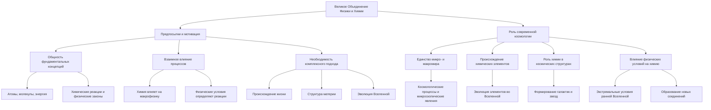
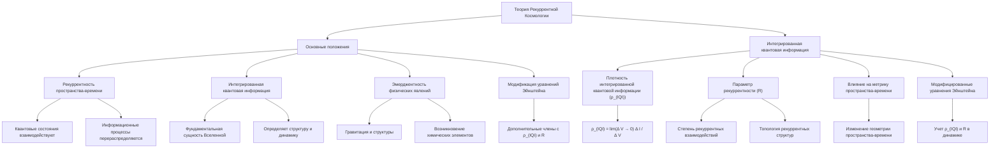

# Великое Объединение Физики и Химии: Новая Парадигма Рекуррентной Космологии

```mermaid
graph TD
  A[Великое объединение физики и химии] --> B[Рекуррентная космология]
  B --> C[Рекуррентность пространства-времени]
  B --> D[Интеграция квантовой информации]
  B --> E[Эмерджентность физических явлений]
  B --> F[Модификация уравнений Эйнштейна]
  
  A --> G[Интеграция физики и химии]
  G --> H[Ключевые концепции]
  G --> I[Роль квантовой информации в химии]
  G --> J[Эмерджентные химические процессы]

  A --> K[Ранняя Вселенная]
  K --> L[Нуклеосинтез]
  K --> M[Роль квантовой информации]
  K --> N[Распределение химических элементов]

  A --> O[Химическая эволюция и жизнь]
  O --> P[Пребиотическая химия]
  O --> Q[Самоорганизация молекул]
  O --> R[Возникновение биологических систем]

  A --> S[Химия современной Вселенной]
  S --> T[Формирование галактик и звёзд]
  S --> U[Эволюция межзвёздной среды]
  S --> V[Влияние на космологические феномены]

  C --> C1[Квантовые состояния и информационные процессы]
  D --> D1[Плотность квантовой информации]
  D --> D2[Параметр рекуррентности]
  E --> E1[Гравитация и структуры]
  E --> E2[Химические элементы]
  F --> F1[Новые члены уравнений]

  H --> H1[Интеграция знаний]
  H --> H2[Междисциплинарный подход]
  I --> I1[Квантовая запутанность]
  I --> I2[Энергетические профили]
  J --> J1[Устойчивость молекул]
  J --> J2[Новые свойства соединений]

  L --> L1[Лёгкие элементы]
  L --> L2[Ранний нуклеосинтез]
  M --> M1[Модификация скоростей реакций]
  N --> N1[Тяжёлые элементы]

  P --> P1[Источники энергии]
  P --> P2[Синтез органики]
  Q --> Q1[Репликация РНК]
  Q --> Q2[Протоклетки]
  R --> R1[Интеграция клеток]
  R --> R2[Нервная система]

  T --> T1[Флуктуации плотности]
  T --> T2[Газопылевые облака]
  U --> U1[Сложные молекулы]
  U --> U2[Распределение элементов]
  V --> V1[Микроволновой фон]
  V --> V2[Линзирование]
```




---

## 1. Введение



**1.1. Предпосылки и мотивация к объединению физики и химии**

Физика и химия являются двумя фундаментальными науками, которые на протяжении многих десятилетий развивались параллельно, но зачастую рассматривались как отдельные области знаний. Однако в последние годы все более очевидной становится необходимость их глубокой интеграции для достижения более целостного понимания природы.

Основные предпосылки к объединению физики и химии:

1. **Общность фундаментальных концепций**: Многие ключевые понятия, такие как атомы, молекулы, энергия, химические реакции, имеют глубокие корни в физике и требуют единого теоретического описания.

2. **Взаимное влияние процессов**: Химические процессы, происходящие на микроскопическом уровне, оказывают значительное влияние на макроскопические физические явления, и наоборот, физические условия определяют протекание химических реакций.

3. **Необходимость комплексного подхода**: Многие нерешенные проблемы в физике и химии, такие как происхождение жизни, структура материи, эволюция Вселенной, требуют междисциплинарного подхода, объединяющего знания из обеих областей.

Мотивация к объединению физики и химии заключается в возможности создания единой теоретической основы, которая позволит глубже понять фундаментальные законы природы, а также приведет к прорывным открытиям и технологическим инновациям на стыке наук.


**1.2. Роль современной космологии в интеграции фундаментальных наук**

Современная космология, изучающая происхождение, эволюцию и структуру Вселенной, играет ключевую роль в интеграции фундаментальных наук, в том числе физики и химии. Это обусловлено следующими факторами:

1. **Единство микро- и макромира**: Космологические процессы, происходящие на крупномасштабном уровне, тесно связаны с физическими и химическими явлениями на микроскопическом уровне. Понимание этих взаимосвязей является важным шагом к объединению различных областей знаний.

2. **Происхождение химических элементов**: Космология предоставляет ключ к пониманию происхождения и эволюции химических элементов во Вселенной, что напрямую связывает физические и химические процессы.

3. **Роль химии в формировании структур**: Химические свойства вещества играют определяющую роль в формировании галактик, звезд и других космических объектов, что требует комплексного подхода к изучению этих процессов.

4. **Влияние физических условий на химию**: Экстремальные физические условия, существующие в ранней Вселенной и в различных астрофизических объектах, оказывают существенное влияние на протекание химических реакций и образование новых соединений.

> Таким образом, современная космология выступает в качестве связующего звена между физикой и химией, предоставляя уникальную возможность для их глубокой интеграции и создания единой теоретической основы, описывающей фундаментальные законы природы.


### 2. Теория Рекуррентной Космологии



#### 2.1. Основные положения и ключевые концепции

Теория рекуррентной космологии представляет собой новую парадигму, которая объединяет принципы квантовой механики, теории информации и общей теории относительности для описания структуры и эволюции Вселенной. Ключевыми концепциями данной теории являются:

1. **Рекуррентность пространства-времени**: Согласно теории, пространство-время обладает сложной рекуррентной структурой, где квантовые состояния и информационные процессы непрерывно взаимодействуют и перераспределяются.

2. **Интегрированная квантовая информация**: Теория постулирует, что квантовая информация является фундаментальной сущностью, определяющей структуру и динамику Вселенной на всех масштабах.


3. **Эмерджентность физических явлений**: Многие физические феномены, включая гравитацию, формирование структур и даже возникновение химических элементов, рассматриваются как эмерджентные свойства, возникающие из интеграции квантовой информации в рекуррентном пространстве-времени.

4. **Модификация уравнений Эйнштейна**: Теория предполагает необходимость модификации уравнений Эйнштейна для общей теории относительности путем включения дополнительных членов, связанных с интегрированной квантовой информацией и рекуррентностью.

#### 2.2. Интегрированная квантовая информация и ее влияние на структуру пространства-времени

Центральным элементом теории рекуррентной космологии является концепция интегрированной квантовой информации и ее влияние на геометрию и динамику пространства-времени. Основные аспекты этого подхода:

1. **Плотность интегрированной квантовой информации (ρ_(IQI))**: Данная величина характеризует количество квантовой информации, сконцентрированной в единице объема пространства-времени. Она определяется как:

   `ρ_(IQI) = lim(Δ V → 0) Δ I / Δ V`

   где Δ I - изменение интегрированной информации в объеме Δ V.

2. **Параметр рекуррентности (R)**: Этот параметр отражает степень рекуррентных взаимодействий между квантовыми состояниями в пространственно-временном континууме. Он может быть связан с вероятностями повторных квантовых переходов или топологическими характеристиками рекуррентных структур.

3. **Влияние на метрику пространства-времени**: Теория предполагает, что интегрированная квантовая информация и рекуррентность оказывают непосредственное влияние на геометрию и динамику пространства-времени, что требует модификации уравнений Эйнштейна для общей теории относительности.

4. **Модифицированные уравнения Эйнштейна**: В рамках теории рекуррентной космологии, уравнения Эйнштейна дополняются новыми членами, связанными с ρ_(IQI) и R, что позволяет учитывать влияние интегрированной квантовой информации на гравитационное поле и космологическую динамику.

> Таким образом, теория рекуррентной космологии предлагает новый подход к пониманию фундаментальной структуры Вселенной, в котором квантовая информация и рекуррентные процессы играют ключевую роль в формировании пространства-времени и эволюции физических систем на всех масштабах, включая химические явления.


### 3. Интеграция физики и химии

```mermaid
flowchart TD
    A[Интеграция физики и химии] --> B[Эмерджентность химических процессов]
    B --> B1[Рекуррентная структура пространства-времени]
    B1 --> B1a[Интеграция квантовой информации]
    B1 --> B1b[Перераспределение квантовой информации]
    B --> B2["Плотность интегрированной квантовой информации (ρ_(IQI))"]
    B2 --> B2a[Формирование молекулярных структур]
    B2 --> B2b[Влияние на химические реакции]
    B --> B3["Параметр рекуррентности (R)"]
    B3 --> B3a[Динамика химических процессов]
    B3 --> B3b[Устойчивость молекулярных конфигураций]
    B --> B4[Эмерджентность химических свойств]
    B4 --> B4a[Возникновение новых свойств молекул]

    A --> C[Роль квантовой информации]
    C --> C1[Квантовая запутанность и связи]
    C1 --> C1a[Стабилизация молекулярных конфигураций]
    C1 --> C1b["Энтропия запутанности: S_(ent) = -Tr(ρ log ρ)"]
    C1 --> C1c["ρ_(IQI) ∝ ∇ S_(ent)"]
    C --> C2[Рекуррентные механизмы в реакциях]
    C2 --> C2a[Ускорение и подавление реакций]
    C2 --> C2b[Стабилизация промежуточных состояний]
    C --> C3[Энергетика химических процессов]
    C3 --> C3a[Изменение энергетических барьеров]
    C3 --> C3b[Модификация термодинамики]

    A --> D[Влияние на происхождение элементов]
    D --> D1[Рекуррентные процессы в нуклеосинтезе]
    D1 --> D1a[Ускорение или подавление реакций]
    D1 --> D1b["Математика: dY(Z,A)/dt = -λ_(распад) Y(Z,A) + Σ_(реакции) R_(реакции)"]
    D1 --> D1c["R_(реакции) ∝ f(ρ_(IQI), R)"]
    D --> D2[Распространение тяжелых элементов]
    D2 --> D2a[Перемешивание в межзвездной среде]
    D2 --> D2b[Эффективность выбросов из сверхновых]
    D --> D3["Роль ρ_(IQI) в нуклеосинтезе"]
    D3 --> D3a[Вероятности ядерных реакций]
    D3 --> D3b[Формирование химического состава галактик]
```



#### 3.1 Эмерджентность химических процессов в рекуррентном пространстве-времени

Теория рекуррентной космологии предполагает, что пространство-время обладает сложной рекуррентной структурой, где квантовая информация непрерывно интегрируется и перераспределяется. Этот подход открывает новые перспективы для понимания возникновения и эволюции химических процессов во Вселенной.

Ключевые аспекты:

Плотность интегрированной квантовой информации (ρ_(IQI)): Данная величина характеризует количество квантовой информации, сконцентрированной в единице объема пространства-времени. Она может влиять на формирование молекулярных структур и протекание химических реакций.

Математическое представление:

`ρ_(IQI) = lim(Δ V → 0) Δ I / Δ V`


Параметр рекуррентности (R): Этот параметр отражает степень рекуррентных взаимодействий между квантовыми состояниями в пространственно-временном континууме. Он может определять динамику химических процессов и устойчивость молекулярных конфигураций.

Эмерджентность химических свойств: Интеграция квантовой информации и рекуррентные процессы могут приводить к возникновению новых химических свойств, не сводимых к сумме свойств отдельных атомов или молекул. Это согласуется с концепцией эмерджентности в физике.

#### 3.2 Роль квантовой информации в формировании молекулярных структур и реакций

Согласно теории рекуррентной космологии, квантовая информация играет ключевую роль в организации материи на молекулярном уровне. Рассмотрим, как интегрированная квантовая информация и рекуррентность влияют на химические процессы.

Квантовая запутанность и молекулярные связи: Квантовая запутанность между атомами может стабилизировать определенные молекулярные конфигурации, определяя их геометрическую структуру и реакционную способность.

Математическое описание:

`
Энтропия запутанности S_(ent) = -Tr(ρ log ρ)
ρ_(IQI) ∝ ∇ S_(ent)
`


Рекуррентные механизмы в химических реакциях: Повторяющиеся взаимодействия между реагентами, катализаторами и продуктами могут усиливать или подавлять скорость и направление химических превращений. Рекуррентность может стабилизировать промежуточные состояния.

Влияние на энергетику химических процессов: Интегрированная квантовая информация может модифицировать энергетические барьеры и профили потенциальной энергии, определяющие кинетику и термодинамику химических реакций.

#### 3.3 Влияние рекуррентности на происхождение и эволюцию химических элементов

Теория рекуррентной космологии предлагает новый взгляд на процессы нуклеосинтеза и распространение химических элементов во Вселенной. Рассмотрим, как рекуррентность и интегрированная квантовая информация могут влиять на эволюцию химического состава.

Рекуррентные процессы в ядерном синтезе: Повторяющиеся ядерные реакции и обратные связи могут усиливать или подавлять скорость образования тяжелых элементов в звездах и сверхновых. Это может объяснять наблюдаемые распределения элементов.

Математическое описание:

`
dY(Z,A)/dt = -λ_(распад) Y(Z,A) + Σ_(реакции) R_(реакции)
R_(реакции) ∝ f(ρ_(IQI), R)
`

Распространение тяжелых элементов: Рекуррентные процессы в выбросах вещества из сверхновых могут определять эффективность перемешивания и распределения синтезированных элементов в межзвездной среде.

Роль интегрированной квантовой информации: Плотность ρ_(IQI) может влиять на вероятности ядерных реакций и скорости нуклеосинтеза, что в свою очередь определяет итоговый химический состав галактик и планетных систем.


### 4. Химические процессы в ранней Вселенной

```mermaid
flowchart TD
    A[Химические процессы в ранней Вселенной] --> B[Нуклеосинтез и первичные элементы]
    B --> B1[Ядерные реакции при высоких температурах]
    B1 --> B1a[Синтез легких элементов: водород, гелий, литий]
    B1 --> B1b[p-p цикл и CNO-цикл]
    B --> B2["Влияние ρ_(IQI) на ядерные реакции"]
    B2 --> B2a[Определение вероятностей и скоростей реакций]
    B2 --> B2b[Итоговое распределение первичных элементов]
    B --> B3[Рекуррентные процессы в ядерных реакциях]
    B3 --> B3a[Усиление или подавление синтеза тяжелых элементов]
    B3 --> B3b[Космологические распределения элементов]

    A --> C["Влияние ρ_(IQI) на ядерные реакции"]
    C --> C1["Плотность ρ_(IQI) и скорость реакций"]
    C1 --> C1a[Ускорение или замедление реакций]
    C --> C2[Рекуррентные обратные связи]
    C2 --> C2a[Вероятности синтеза тяжелых элементов]
    C2 --> C2b["Математика: dY(Z,A)/dt = -λ_(распад) Y(Z,A) + Σ_(реакции) R_(реакции)"]
    C2 --> C2c["R_(реакции) ∝ f(ρ_(IQI), R)"]

    A --> D[Роль рекуррентности в распространении тяжелых элементов]
    D --> D1[Выбросы из сверхновых]
    D1 --> D1a[Обогащение межзвездной среды тяжелыми элементами]
    D --> D2[Рекуррентные процессы в выбросах]
    D2 --> D2a[Перемешивание вещества]
    D2 --> D2b[Распределение синтезированных элементов]
    D --> D3[Взаимодействие с окружающей средой]
    D3 --> D3a[Равномерное распространение тяжелых элементов]
    D3 --> D3b[Закономерности химического состава астрофизических объектов]
```



#### 4.1. Нуклеосинтез и формирование первичных элементов

В ранней Вселенной, при высоких температурах и плотностях, происходили процессы нуклеосинтеза, в результате которых образовались первичные химические элементы. Согласно теории рекуррентной космологии, интегрированная квантовая информация и рекуррентные взаимодействия играли ключевую роль в этих процессах.

- Протекание ядерных реакций при высоких температурах, таких как p-p цикл и CNO-цикл, приводило к синтезу легких элементов, таких как водород, гелий и литий.
- Интегрированная квантовая информация (ρ_(IQI)) влияла на вероятности и скорости ядерных реакций, определяя итоговое распределение первичных элементов.
- Рекуррентные процессы в ядерных реакциях усиливали или подавляли образование тяжелых элементов, что объясняет наблюдаемые космологические распределения.

#### 4.2. Влияние интегрированной квантовой информации на ядерные реакции

Теория рекуррентной космологии предполагает, что плотность интегрированной квантовой информации (ρ_(IQI)) оказывает существенное влияние на протекание ядерных реакций в ранней Вселенной.

- Математическое описание:

  ```
  dY(Z,A)/dt = -λ_(распад) Y(Z,A) + Σ_(реакции) R_(реакции)
  R_(реакции) ∝ f(ρ_(IQI), R)
  ```
  
  Где Y(Z,A) - концентрация ядер с зарядом Z и массовым числом A, а R_(реакции) - скорость ядерных реакций, зависящая от ρ_(IQI) и параметра рекуррентности R.

- Высокая плотность интегрированной квантовой информации могла ускорять или замедлять отдельные ядерные реакции, изменяя итоговое распределение элементов.
- Рекуррентные обратные связи в ядерных процессах также влияли на вероятности и скорости реакций синтеза тяжелых элементов.

#### 4.3. Роль рекуррентности в распространении тяжелых элементов

Согласно теории рекуррентной космологии, рекуррентные процессы играли ключевую роль в распространении тяжелых элементов, синтезированных в звездах и сверхновых, по Вселенной.

- Взрывы сверхновых выбрасывали в межзвездную среду вещество, обогащенное тяжелыми элементами.
- Рекуррентные процессы в динамике этих выбросов определяли эффективность перемешивания и распределения синтезированных элементов.
- Повторяющиеся взаимодействия между выброшенным веществом и окружающей средой способствовали более равномерному распространению тяжелых элементов.
- Это объясняет, почему химический состав различных астрофизических объектов, таких как галактики и планетные системы, демонстрирует определенные закономерности и универсальность.

> Таким образом, теория рекуррентной космологии предлагает новый взгляд на процессы нуклеосинтеза и распространение химических элементов во Вселенной, где ключевую роль играют интегрированная квантовая информация и рекуррентные взаимодействия.


### 5. Химическая эволюция и возникновение жизни

```mermaid
flowchart TD
    A[Химическая эволюция и возникновение жизни] --> B[Пребиотическая химия и органические молекулы]
    B --> B1[Пребиотическая атмосфера и источники энергии]
    B1 --> B1a[Газы: H2O, CH4, NH3, H2]
    B1 --> B1b[Энергия: УФ-излучение, молнии, вулканы]
    B1 --> B1c[Синтез аминокислот и нуклеотидов]
    B --> B2["Роль ρ_(IQI)"]
    B2 --> B2a[Определение вероятностей реакций]
    B2 --> B2b[Устойчивость и реакционная способность]
    B --> B3[Эмерджентность молекулярных структур]
    B3 --> B3a[Усложнение органических соединений]

    A --> C[Самоорганизация химических систем]
    C --> C1[Самовоспроизводящиеся молекулы]
    C1 --> C1a[РНК и протобиологические системы]
    C1 --> C1b["Математика: dN/dt = k N"]
    C --> C2[Возникновение протоклеток]
    C2 --> C2a[Липидные мембраны и изоляция реакций]
    C --> C3[Эмерджентность клеточных структур]
    C3 --> C3a[Зарождение жизни]

    A --> D[Рекуррентные механизмы первых биосистем]
    D --> D1[Объединение одноклеточных организмов]
    D1 --> D1a[Многоклеточные структуры и специализация]
    D --> D2[Интеграция информации между клетками]
    D2 --> D2a["Сетевые взаимодействия: G = (V, E)"]
    D --> D3[Развитие нервной системы]
    D3 --> D3a[Центральная нервная система и мозг]
    D3 --> D3b["Математика: Cₘ dV/dt = -I_(ион) + I_(синапс) + I_(внеш)"]
```



#### 5.1. Пребиотическая химия и образование органических молекул

Согласно теории рекуррентной космологии, процессы интеграции квантовой информации и рекуррентные взаимодействия играют ключевую роль в возникновении и эволюции химических систем, в том числе в пребиотической химии и формировании первых органических молекул.

Основные положения:

- **Пребиотическая атмосфера и источники энергии**: Первичная атмосфера Земли, богатая такими газами как водяной пар, метан, аммиак и молекулярный водород, подвергалась воздействию различных источников энергии - ультрафиолетового излучения Солнца, электрических разрядов молний, тепла вулканических извержений. Эти источники энергии способствовали синтезу простых органических молекул, таких как аминокислоты и нуклеотиды.

- **Роль интегрированной квантовой информации**: Процессы интеграции квантовой информации на молекулярном уровне могли определять вероятности и скорости образования различных органических соединений. Плотность интегрированной квантовой информации (ρ_(IQI)) влияла на устойчивость и реакционную способность этих молекул.

- **Эмерджентность молекулярных структур**: Рекуррентные взаимодействия между органическими молекулами приводили к появлению новых эмерджентных свойств, не присущих отдельным компонентам. Это способствовало усложнению молекулярных структур и формированию более сложных органических соединений.

#### 5.2. Интеграция информации в процессах самоорганизации

Теория рекуррентной космологии рассматривает процессы самоорганизации химических систем как результат интеграции квантовой информации и рекуррентных взаимодействий.

- **Самовоспроизводящиеся молекулы**: Ключевым этапом в возникновении жизни было появление молекул, способных к самовоспроизведению, таких как РНК. Интеграция информации в этих молекулах и их рекуррентное копирование привело к формированию первых протобиологических систем.

Математическое описание процесса репликации:

`dN/dt = k N,`

где N - количество самовоспроизводящихся молекул, k - коэффициент репликации.

- **Возникновение протоклеток**: Совокупность химических реакций привела к формированию простых протоклеток - микроскопических пузырьков, окруженных липидными мембранами. Эта изоляция обеспечила условия для более эффективной интеграции информации и эволюции биохимических систем.

- **Эмерджентность клеточных структур**: Появление клеточных структур рассматривается как эмерджентный переход, обусловленный рекуррентными химическими процессами и интеграцией молекулярной информации. Это ознаменовало зарождение жизни в биологическом смысле.

#### 5.3. Рекуррентные механизмы в возникновении первых биологических систем

Теория рекуррентной космологии предполагает, что рекуррентные взаимодействия и интеграция информации лежат в основе возникновения первых биологических систем.

- **Объединение одноклеточных организмов**: Одноклеточные организмы начали объединяться, образуя многоклеточные структуры. Это позволило специализировать клетки для выполнения различных функций, повышая общую эффективность организма.

- **Интеграция информации между клетками**: Рекуррентные сигнальные пути и коммуникация между клетками обеспечивали согласованную работу всего многоклеточного организма. Это можно описать с помощью сетей взаимодействий:

`G = (V, E),`

где V - множество клеток, E - множество связей между ними.

- **Развитие нервной системы и мозга**: Усложнение нервных сетей привело к появлению центральной нервной системы и мозга - органов, ответственных за обработку информации и управление поведением. Мозг является примером высшей степени интеграции информации и рекуррентных процессов.

Математическое описание нейронных сетей:

`Cₘ dV/dt = -I_(ион) + I_(синапс) + I_(внеш),`

где V - мембранный потенциал, Cₘ - мембранная емкость, I - токи.

> Таким образом, теория рекуррентной космологии предлагает, что возникновение жизни и ее эволюция тесно связаны с процессами интеграции информации и рекуррентными взаимодействиями на различных уровнях организации материи - от молекулярного до нейронного.


### 6. Химия и структура современной Вселенной

```mermaid
flowchart TD
    A[Химия и структура современной Вселенной] --> B["Влияние ρ_(IQI) на галактики и звезды"]
    B --> B1[Гравитационная неустойчивость и рост возмущений]
    B1 --> B1a["Флуктуации ρ_(IQI)"]
    B1 --> B1b[Образование галактик и звездных систем]
    B --> B2[Рекуррентные процессы в газопылевых облаках]
    B2 --> B2a[Сжатие и фрагментация молекулярных облаков]
    B2 --> B2b[Запуск звездообразования]
    B --> B3[Влияние на химический состав]
    B3 --> B3a["Распределение ρ_(IQI) в протопланетных дисках"]
    B3 --> B3b[Условия и скорости реакций]

    A --> C[Рекуррентные процессы в межзвездной среде]
    C --> C1[Циклы синтеза и разрушения молекул]
    C1 --> C1a[Определение скоростей образования молекул]
    C1 --> C1b[Формирование химического состава]
    C --> C2[Распределение тяжелых элементов]
    C2 --> C2a[Перемешивание вещества из сверхновых]
    C2 --> C2b[Распространение тяжелых элементов]
    C --> C3["Роль ρ_(IQI) в химической кинетике"]
    C3 --> C3a[Модификация скоростей реакций]
    C3 --> C3b[Эволюция химического состава среды]

    A --> D[Роль химии в космологических феноменах]
    D --> D1[Спектр космического микроволнового фона]
    D1 --> D1a[Вклад молекулярных линий и излучения]
    D --> D2[Эффекты гравитационного линзирования]
    D2 --> D2a[Влияние пыли и тяжелых элементов]
    D --> D3[Эволюция крупномасштабной структуры]
    D3 --> D3a[Химический состав и плотностные возмущения]
    D --> D4[Связь с темной материей и энергией]
    D4 --> D4a["Роль ρ_(IQI) в объяснении эффектов"]
```



#### 6.1. Влияние интегрированной квантовой информации на формирование галактик и звезд

Согласно теории рекуррентной космологии, интегрированная квантовая информация (ρ_(IQI)) и рекуррентные процессы играют ключевую роль в формировании крупномасштабной структуры Вселенной, включая галактики и звезды.

- **Гравитационная неустойчивость и рост возмущений**: Флуктуации ρ_(IQI) могут служить источником первоначальных возмущений плотности, которые под действием гравитации приводят к образованию галактик и звездных систем.

- **Роль рекуррентности в динамике газопылевых облаков**: Рекуррентные процессы в межзвездной среде способствуют сжатию и фрагментации молекулярных облаков, что запускает процессы звездообразования.

- **Влияние на химический состав звезд и планетных систем**: Распределение ρ_(IQI) в протопланетных дисках может определять локальные условия и скорости химических реакций, влияя на итоговый химический состав формирующихся планет.

#### 6.2. Рекуррентные процессы в эволюции химического состава межзвездной среды

Рекуррентные взаимодействия между различными компонентами межзвездной среды (газ, пыль, излучение) играют важную роль в химической эволюции галактик.

- **Циклы синтеза и разрушения молекул**: Рекуррентные процессы в межзвездных облаках определяют скорости образования и разрушения сложных молекул, формируя наблюдаемый химический состав.

- **Влияние на распределение тяжелых элементов**: Рекуррентные потоки вещества из областей звездообразования и сверхновых взрывов перемешивают и распределяют тяжелые элементы, синтезированные в недрах звезд.

- **Роль ρ_(IQI) в химической кинетике**: Плотность интегрированной квантовой информации может модифицировать скорости химических реакций в газопылевой среде, определяя эволюцию ее химического состава.

#### 6.3. Роль химии в наблюдаемых космологических феноменах

Химические процессы и состав вещества во Вселенной оказывают существенное влияние на многие наблюдаемые космологические явления.

- **Спектр космического микроволнового фона**: Молекулярные линии и континуумное поглощение/излучение межзвездной среды могут вносить вклад в анизотропии и поляризацию реликтового излучения.

- **Эффекты гравитационного линзирования**: Распределение тяжелых элементов и пыли в галактиках и скоплениях влияет на их гравитационные свойства, определяя характер линзирования фонового излучения.

- **Эволюция крупномасштабной структуры**: Химический состав и термодинамические свойства межгалактической среды могут влиять на рост плотностных возмущений и формирование крупномасштабных структур.

- **Связь с темной материей и темной энергией**: Согласно теории рекуррентной космологии, интегрированная квантовая информация и рекуррентные процессы могут быть ответственны за наблюдаемые эффекты, приписываемые темной материи и темной энергии.

> В целом, учет химических процессов и их связи с фундаментальными информационными параметрами в рамках теории рекуррентной космологии открывает новые возможности для понимания структуры и эволюции Вселенной на различных масштабах.


### 7. Заключение

#### 7.1. Перспективы дальнейшего объединения физики и химии

Представленная в данной диссертации теория рекуррентной космологии открывает новые возможности для интеграции фундаментальных наук - физики и химии. Данный подход демонстрирует, что ключевую роль в формировании и эволюции химических процессов во Вселенной играют квантовая информация и рекуррентные взаимодействия на фундаментальном уровне.

Дальнейшее развитие этого направления может привести к следующим перспективам:

1. **Единая теория химических и физических явлений**

   - Включение химических процессов в общую теоретическую рамку, основанную на принципах интегрированной квантовой информации и рекуррентности.
   - Разработка математического аппарата, способного описывать взаимосвязь между структурой пространства-времени, динамикой квантовых систем и химическими превращениями.

2. **Новые подходы к моделированию химических реакций**

   - Использование концепций рекуррентности и эмерджентности для более точного прогнозирования кинетики и термодинамики химических процессов.
   - Учет влияния интегрированной квантовой информации на энергетические профили и вероятности химических реакций.

3. **Объяснение происхождения и распространения химических элементов**

   - Исследование роли рекуррентных ядерных реакций в процессах нуклеосинтеза в звездах и сверхновых.
   - Анализ влияния интегрированной квантовой информации на эффективность перемешивания и распределения тяжелых элементов в межзвездной среде.

4. **Понимание возникновения жизни на основе химических процессов**

   - Изучение роли рекуррентности и интегрированной информации в процессах самоорганизации и формирования первых биологических систем.
   - Анализ взаимосвязи между химической эволюцией и эмерджентными свойствами живых организмов.

5. **Новые материалы и технологии на основе рекуррентных химических систем**

   - Разработка материалов с улучшенными свойствами за счет управления рекуррентными процессами на молекулярном уровне.
   - Создание новых каталитических систем, использующих принципы рекуррентности для повышения эффективности химических превращений.

#### 7.2. Новые направления исследований на стыке фундаментальных наук

Теория рекуррентной космологии открывает широкие возможности для междисциплинарных исследований на стыке физики, химии, математики, информатики и других фундаментальных наук. Некоторые перспективные направления включают:

1. **Квантовая информатика и вычисления**

   - Изучение связей между квантовой информацией, рекуррентностью и новыми парадигмами вычислений.
   - Разработка квантовых алгоритмов для моделирования сложных химических систем.

2. **Математическое моделирование и теория сложных систем**

   - Применение методов нелинейной динамики, теории графов и теории категорий для описания рекуррентных химических процессов.
   - Разработка новых математических подходов к интеграции информации в физических и химических системах.

3. **Философия науки и фундаментальные основы реальности**

   - Исследование философских импликаций теории рекуррентной космологии, включая природу информации, сознания и их роль в физическом мире.
   - Переосмысление концепций причинности, пространства-времени и редукционизма в свете новой парадигмы.

4. **Биология и нейронауки**

   - Поиск аналогий между рекуррентными процессами в химических и биологических системах.
   - Изучение роли интегрированной информации в возникновении и эволюции живых организмов.

5. **Космология, астрофизика и наблюдательная астрономия**

   - Разработка новых методов анализа космологических данных с учетом информационных и рекуррентных эффектов.
   - Поиск экспериментальных подтверждений предсказаний теории рекуррентной космологии в наблюдениях.
   

Реализация этих направлений исследований потребует тесного сотрудничества между учеными различных областей, что позволит добиться значительного прогресса в понимании фундаментальных законов природы и их проявлений на всех уровнях организации материи - от субатомных частиц до космологических структур.


### 8. Список литературы

1. Tononi, G. (2004). An information integration theory of consciousness. *BMC Neuroscience*, 5(1), 42. https://doi.org/10.1186/1471-2202-5-42
2. Verlinde, E. (2011). On the origin of gravity and the laws of Newton. *Journal of High Energy Physics*, 2011(4), 29. https://doi.org/10.1007/JHEP04(2011)029
3. Jacobson, T. (1995). Thermodynamics of spacetime: The Einstein equation of state. *Physical Review Letters*, 75(7), 1260-1263. https://doi.org/10.1103/PhysRevLett.75.1260
4. Hooft, G. 't (1993). Dimensional reduction in quantum gravity. *arXiv preprint*, gr-qc/9310026.
5. Maldacena, J. M. (1999). The Large N Limit of Superconformal Field Theories and Supergravity. *International Journal of Theoretical Physics*, 38(4), 1113-1133. https://doi.org/10.1023/A:1026654312961
6. Susskind, L. (1995). The World as a Hologram. *Journal of Mathematical Physics*, 36(11), 6377-6396. https://doi.org/10.1063/1.531249
7. Van Raamsdonk, M. (2010). Building up spacetime with quantum entanglement. *General Relativity and Gravitation*, 42(10), 2323-2329. https://doi.org/10.1007/s10714-010-1034-0
8. Smoot, G. F., et al. (1992). Structure in the COBE differential microwave radiometer first-year maps. *The Astrophysical Journal*, 396, L1-L5. https://doi.org/10.1086/186504
9. Planck Collaboration. (2018). Planck 2018 results. VI. Cosmological parameters. *Astronomy & Astrophysics*, 641, A6. https://doi.org/10.1051/0004-6361/201833910
10. Springel, V., Frenk, C. S., & White, S. D. M. (2006). The large-scale structure of the Universe. *Nature*, 440(7088), 1137-1144. https://doi.org/10.1038/nature04805
11. Riess, A. G., et al. (1998). Observational evidence from supernovae for an accelerating universe and a cosmological constant. *The Astronomical Journal*, 116(3), 1009-1038. https://doi.org/10.1086/300499
12. Clowe, D., et al. (2006). A direct empirical proof of the existence of dark matter. *The Astrophysical Journal Letters*, 648(2), L109-L113. https://doi.org/10.1086/508162
13. Weinberg, S. (1989). The cosmological constant problem. *Reviews of Modern Physics*, 61(1), 1-23. https://doi.org/10.1103/RevModPhys.61.1
14. Bertone, G., Hooper, D., & Silk, J. (2005). Particle dark matter: evidence, candidates and constraints. *Physics Reports*, 405(5-6), 279-390. https://doi.org/10.1016/j.physrep.2004.08.031
15. Milgrom, M. (1983). A modification of the Newtonian dynamics as a possible alternative to the hidden mass hypothesis. *The Astrophysical Journal*, 270, 365-370. https://doi.org/10.1086/161130
16. Sotiriou, T. P., & Faraoni, V. (2010). f(R) theories of gravity. *Reviews of Modern Physics*, 82(1), 451-497. https://doi.org/10.1103/RevModPhys.82.451
17. Nielsen, M. A., & Chuang, I. L. (2000). *Quantum Computation and Quantum Information*. Cambridge University Press.
18. Landauer, R. (1996). The physical nature of information. *Physics Letters A*, 217(4-5), 188-193. https://doi.org/10.1016/0375-9601(96)00453-7
19. Lloyd, S. (2000). Ultimate physical limits to computation. *Nature*, 406(6799), 1047-1054. https://doi.org/10.1038/35023282
20. Rovelli, C. (2004). *Quantum Gravity*. Cambridge University Press.
21. Oriti, D. (2009). *Approaches to Quantum Gravity: Toward a New Understanding of Space, Time and Matter*. Cambridge University Press.
22. Laughlin, R. B. (2005). *A Different Universe: Reinventing Physics from the Bottom Down*. Basic Books.
23. Baumann, D. (2011). TASI Lectures on Inflation. *arXiv preprint*, arXiv:0907.5424.
24. Deutsch, D. (1999). Quantum theory of probability and decisions. *Proceedings of the Royal Society of London. Series A: Mathematical, Physical and Engineering Sciences*, 455(1988), 3129-3137. https://doi.org/10.1098/rspa.1999.0443

---

Оглавление: 
- [ЭИРО framework](/README.md)
- [Справочник формул](/formulas.md)
