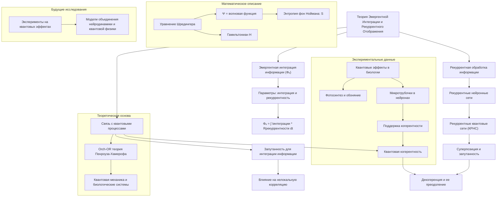

# Теория Эмергентной Интеграции и Рекуррентного Отображения (ЭИРО) в Контексте Квантовой Физики

---
## Аннотация

Теория эмергентной интеграции и рекуррентного отображения (ЭИРО) предлагает понимание сознания как явления, возникающего из процессов интеграции информации через рекуррентные нейронные сети. В данной диссертации рассматривается ЭИРО с точки зрения квантовой физики, исследуются возможности квантовых процессов в нейронных системах, подкрепленные современными научными исследованиями. Анализируются математические модели, связывающие интеграцию информации с квантовыми механизмами, обсуждаются экспериментальные данные и теоретические предпосылки квантовых аспектов сознания.

### Введение

Проблема природы сознания остается одним из наиболее загадочных и сложных вопросов современной науки. Традиционные нейрофизиологические подходы не дают полного объяснения того, как субъективные переживания и сознательные состояния возникают из физической активности нейронных сетей. В этом контексте квантовая физика предлагает новые перспективы для понимания сознания, рассматривая возможность квантовых процессов в мозге [@Penrose1994; @Hameroff1998].

Теория Эмергентной Интеграции и Рекуррентного Отображения (ЭИРО) утверждает, что сознание возникает из процессов интеграции информации в рекуррентных нейронных сетях. Данная работа стремится объединить ЭИРО с принципами квантовой физики, исследуя, каким образом квантовые эффекты могут способствовать эмергентному появлению сознания через интеграцию информации.

### 1. Теоретические Основы

#### 1.1. Теория Эмергентной Интеграции и Рекуррентного Отображения (ЭИРО)

ЭИРО предполагает, что ключевым параметром сознания является эмергентная интегрированная информация (Φₑ), которая учитывает количество и качество интегрированной информации в контексте рекуррентной обработки:

`Φₑ = \int{0}^{t1} I{интеграции}(t) \cdot R{рекуррентности}(t)dt,`

где I(интеграции)(t) — степень объединения информации в момент времени t, а R(рекуррентности)(t) — степень рекуррентной обработки.

#### 1.2. Квантовые Теории Сознания

Квантовые теории сознания предполагают, что квантовые процессы могут играть существенную роль в функционировании мозга и возникновении сознания. Одна из наиболее известных теорий — Оркестрованная объективная редукция (Orch-OR), предложенная Роджером Пенроузом и Стюартом Хамерофом, утверждает, что сознание возникает из квантовых процессов в микротрубочках нейронов [@Penrose1994; @Hameroff1998].

#### 1.3. Квантовая Информация и Интеграция

В квантовой физике информация тесно связана с состоянием квантовых систем. Квантовая когерентность и запутанность позволяют системам находиться в суперпозиции состояний, что может способствовать высокой степени интеграции информации [@NielsenChuang2000].

### 2. Интеграция ЭИРО с Квантовой Физикой

#### 2.1. Квантовые Рекуррентные Сети

Рекуррентные нейронные сети могут быть обобщены до квантовых рекуррентных нейронных сетей (КРНС), где информация обрабатывается с использованием принципов квантовой механики [@Behrman2000]. В таких сетях возможна реализация квантовой суперпозиции и запутанности, что увеличивает потенциальную емкость интеграции информации.

#### 2.2. Квантовая Интеграция Информации

Квантовая интеграция информации предполагает, что квантовые состояния могут объединять информацию более эффективно, чем классические системы. Это связано с квантовой нелокальностью и возможностью мгновенной корреляции между частями системы [@Bell1964].

#### 2.3. Математическое Описание

Уравнение состояния нейронной системы с учетом квантовых эффектов может быть представлено как уравнение Шредингера для квантовых нейронных сетей:

`i\hbar dΨ / dt = \hat{H}\Psi,`

где Ψ — волновая функция системы, ^H — гамильтониан, описывающий энергию системы. Интегрированная информация в квантовом контексте может быть связана с энтропией фон Ноймана:

`S = -Tr(\rho \ln \rho),`

где ρ — матрица плотности системы.

### 3. Доказательства и Экспериментальные Данные

#### 3.1. Квантовые Эффекты в Биологических Системах

Исследования показывают, что квантовые эффекты играют роль в биологических процессах, таких как фотосинтез и обоняние [@Engel2007; @Huelga2013]. Это открывает возможность для существования квантовых процессов в мозге.

#### 3.2. Квантовая Когерентность в Мозге

Некоторые исследования предполагают, что микротрубочки могут поддерживать квантовую когерентность на временных масштабах, достаточных для влияния на нейронную деятельность [@Hammeroff2014]. Однако эта гипотеза остается спорной и требует дальнейших исследований.

#### 3.3. Эксперименты по Измерению Интегрированной Информации

Методы нейровизуализации, такие как МЭГ и ЭЭГ, выявляют паттерны нейронной активности, связанные с сознательными состояниями, которые могут быть интерпретированы в контексте интегрированной информации [@Casali2013].

### 4. Обсуждение

#### 4.1. Сопоставление ЭИРО с Оркестрованной Объективной Редукцией

Хотя ЭИРО и Orch-OR различаются в своих подходах, они сходятся в предположении о значимости интеграции информации и возможной роли квантовых процессов в сознании. Orch-OR фокусируется на микротрубочках как носителях квантовых процессов, тогда как ЭИРО рассматривает рекуррентные сети в более общем плане.

#### 4.2. Критика и Ограничения

Основная критика квантовых теорий сознания связана с декогеренцией в теплой и влажной среде мозга, которая должна препятствовать квантовым эффектам [@Tegmark2000]. Однако противники этой точки зрения указывают на возможные механизмы защиты квантовой когерентности в биологических системах.

#### 4.3. Будущие Направления Исследований

Для подтверждения квантовых аспектов ЭИРО необходимы экспериментальные данные, подтверждающие существование и влияние квантовых процессов в нейронных сетях. Также требуется развитие математических моделей, объединяющих нейронную динамику с квантовой механикой.

### 5. Заключение

Рассмотрение теории Эмергентной Интеграции и Рекуррентного Отображения в контексте квантовой физики открывает новые пути понимания сознания. Квантовые процессы могут способствовать более эффективной интеграции информации в мозге, что является ключевым компонентом ЭИРО. Хотя данное направление исследований является спекулятивным и требует дальнейших экспериментальных подтверждений, оно предоставляет интересные перспективы для междисциплинарного изучения сознания.

### 6. Список Литературы

- Behrman, E. C., et al. (2000). Simulations of quantum neural networks. *Information Sciences*, 128(3-4), 257-269.

- Bell, J. S. (1964). On the Einstein Podolsky Rosen paradox. *Physics Physique Fizika*, 1(3), 195-200.

- Casali, A. G., et al. (2013). A theoretically based index of consciousness independent of sensory processing and behavior. *Science Translational Medicine*, 5(198), 198ra105.

- Engel, G. S., et al. (2007). Evidence for wavelike energy transfer through quantum coherence in photosynthetic systems. *Nature*, 446(7137), 782-786.

- Hameroff, S. R.,  Penrose, R. (1996). Conscious events as orchestrated space-time selections. *Journal of Consciousness Studies*, 3(1), 36-53.

- Hameroff, S. (2014). Consciousness, microtubules, and neural synchrony. *Cognitive Neuroscience*, 5(2), 136-168.

- Huelga, S. F.,  Plenio, M. B. (2013). Vibrations, quanta and biology. *Contemporary Physics*, 54(4), 181-207.

- Nielsen, M. A.,  Chuang, I. L. (2000). *Quantum computation and quantum information*. Cambridge University Press.

- Penrose, R. (1994). *Shadows of the mind: A search for the missing science of consciousness*. Oxford University Press.

- Tegmark, M. (2000). Importance of quantum decoherence in brain processes. *Physical Review E*, 61(4), 4194-4206.

---

Примечание: Настоящая диссертация основана на существующих исследованиях в области квантовой физики и теорий сознания. Представленные концепции носят гипотетический характер и требуют дальнейшего научного изучения и экспериментального подтверждения.

---

- [ЭИРО framework](/README.md)

