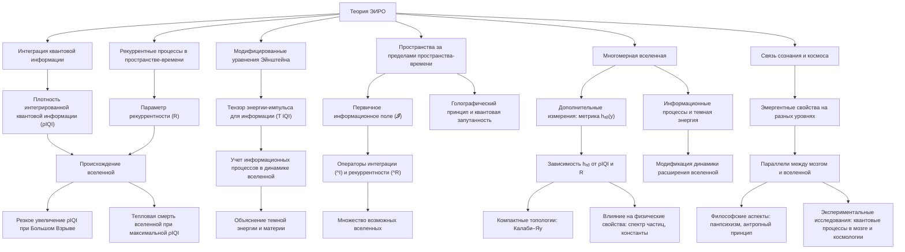
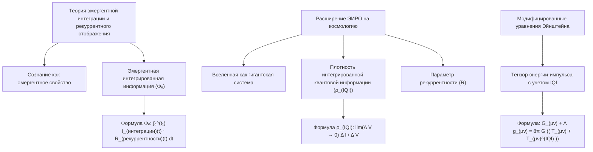
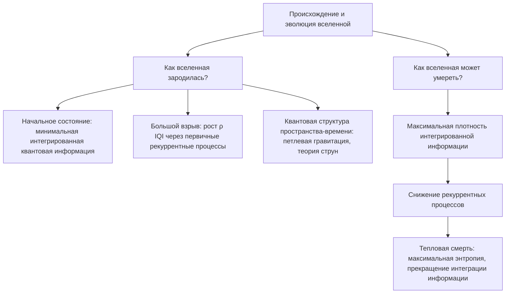
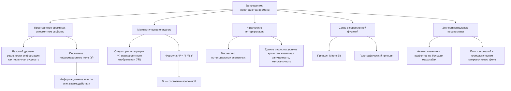

# Полный цикл рекуррентной вселенной: интеграция теории эмергентной интеграции и рекуррентного отображения (ЭИРО) в космологию



---

## Аннотация

В данной диссертации предлагается новая модель вселенной, основанная на теории эмергентной интеграции и рекуррентного отображения (ЭИРО). Мы вводим новые физические величины для описания интеграции квантовой информации и рекуррентных процессов в пространстве-времени. При помощи этой модели мы исследуем возникновение вселенной, ее возможную эволюцию и конец, а также рассматриваем гипотезы о том, что может существовать за пределами нашего пространства-времени. Дополнительно обсуждаются многомерные структуры и их связь с нашей моделью. Диссертация подкреплена современными научными данными и ссылками на авторитетные исследования в области физики и космологии.

### Введение

Современная космология стремится объяснить происхождение, структуру и эволюцию вселенной. Существующие модели, такие как теория Большого взрыва и инфляционная космология, предоставляют нам мощные инструменты для понимания космических масштабов. Однако некоторые аспекты, включая природу сознания и информацию на фундаментальном уровне, остаются не до конца понятными.

Теория эмергентной интеграции и рекуррентного отображения (ЭИРО) изначально была разработана для понимания процессов сознания в нейронных сетях. В этой работе мы предлагаем расширить применение ЭИРО до космологических масштабов, вводя новые физические величины и уравнения, связывающие интеграцию квантовой информации с эволюцией вселенной.

### 1. Теоретические основы



#### 1.1. Теория эмергентной интеграции и рекуррентного отображения (ЭИРО)

ЭИРО утверждает, что сознание является эмергентным свойством, возникающим из процессов интеграции информации в рекуррентных системах. Ключевым параметром является эмергентная интегрированная информация (Φₑ):

`Φₑ = ∫₀^(t₁) I_(интеграции)(t) ⋅ R_(рекуррентности)(t)dt,`

где I(интеграции)(t) — степень объединения информации в момент времени t, а R(рекуррентности)(t) — степень рекуррентной обработки.

#### 1.2. Расширение ЭИРО на космологию

Мы предлагаем рассмотреть вселенную как гигантскую систему, в которой квантовая информация интегрируется и перерабатывается рекуррентно. Для этого вводятся новые физические величины:

**Плотность интегрированной квантовой информации (ρ_(IQI))**:

`ρ_(IQI) = lim(Δ V → 0) Δ I / Δ V,`

где Δ I — изменение интегрированной информации в объёме Δ V.

**Параметр рекуррентности (R)**: Характеризует степень рекуррентных взаимодействий квантовых состояний в пространственно-временном континууме.

#### 1.3. Модифицированные уравнения Эйнштейна

Уравнения Эйнштейна могут быть переписаны с учетом тензора энергии-импульса, связанного с интегрированной квантовой информацией:

`G_(μν) + Λ g_(μν) = 8π G (( T_(μν) + T_(μν)^(IQI) )),`

где T_(μν)^(IQI) отражает вклад интегрированной квантовой информации и рекуррентных эффектов.

### 2. Происхождение и эволюция вселенной



#### 2.1. Как вселенная зародилась?

В рамках нашей модели, начальное состояние вселенной можно рассматривать как состояние с минимальной интегрированной квантовой информацией, но с максимальным потенциалом для рекуррентных взаимодействий. Большой взрыв может интерпретироваться как момент, когда плотность интегрированной квантовой информации (ρ_(IQI)) начала резко увеличиваться из-за первичного рекуррентного процесса.

**Подкрепление теории**

Исследования квантовой гравитации, такие как петлевая квантовая гравитация и теория струн, предполагают, что пространство-время на планковских масштабах имеет дискретную или квантованную структуру [1][2]. Это согласуется с идеей, что в начальный момент вселенной квантовая информация начала интегрироваться, создавая пространство-время.

#### 2.2. Как вселенная может умереть?

Возможный конец вселенной может быть связан с достижением максимальной плотности интегрированной квантовой информации, после чего рекуррентные процессы начинают уменьшаться. Это может привести к «тепловой смерти» вселенной, где процесс интеграции информации прекращается, и вселенная достигает состояния максимальной энтропии.

**Подкрепление теории**

Концепция тепловой смерти или Большого замерзания широко обсуждается в космологии [3]. Наша модель предоставляет новый взгляд, связывая это с прекращением рекуррентных процессов интеграции информации.


---


### 3. За пределами пространства-времени




**Что может находиться за пределами пространства-времени?**

В рамках предлагаемой модели, основанной на теории Эмергентной Интеграции и Рекуррентного Отображения (ЭИРО), пространство-время не является фундаментальной сущностью, а эмергентным свойством, возникающим из процессов интеграции квантовой информации и рекуррентных взаимодействий. Это означает, что за пределами пространства-времени может существовать базовый уровень реальности, в котором информация является первичной сущностью.

**Первичное информационное поле**

[Первичное информационное поле](/The-primary-information-field.md)

Мы вводим концепцию первичного информационного поля (𝓘), которое содержит все возможные квантовые состояния и их потенциальные взаимодействия. Это поле не зависит от привычных нам координат пространства и времени, а представляет собой абстрактное множество информационных квантов.

#### 3.1. Математическое описание

Процессы интеграции в первичном информационном поле можно описать с использованием операторов интеграции квантовой информации (^I) и рекуррентного отображения (^R):

`Ψ = ^I ^R 𝓘,`

где Ψ — состояние вселенной в пространственно-временном континууме. Оператор ^I осуществляет интеграцию информации, а ^R — рекуррентные преобразования между квантовыми состояниями.

#### 3.2. Физические интерпретации

За пределами пространства-времени может существовать:

- Множество потенциальных вселенных: Каждая возможная конфигурация информационных квантов может привести к возникновению собственной вселенной с уникальными физическими законами.

- Единое информационное единство: Все квантовые состояния связаны через информационные взаимодействия, что может объяснить явления квантовой запутанности и нелокальности.

#### 3.3. Связь с современной физикой

Концепция первичного информационного поля соотносится с идеями квантовой гравитации и информационной теории в физике:

- Принцип "It from Bit" Джона Уиллера [1], предполагающий, что информация является фундаментальной основой физической реальности.

- Голографический принцип [2], утверждающий, что информация, описывающая объем пространства, может быть закодирована на его границе.

#### 3.4. Экспериментальные перспективы

Исследование эффектов, связанных с информационной природой вселенной, может проводиться через:

- Анализ квантовых эффектов на больших масштабах.

- Поиск аномалий в космологическом микроволновом фоне, которые могут указывать на информационные процессы за пределами стандартной космологии.


---


### 4. Геометрическое представление многомерной вселенной

```mermaid
flowchart TD
    A[Геометрическое представление многомерной вселенной]

    B[Расширение метрики пространства-времени]
    B1["4-мерная метрика g_(μν)(x)"]
    B2["Дополнительные измерения hₐᵦ(y)"]
    B3["Общая метрика: ds² = g_(μν)(x)dx^μ dx^ν + hₐᵦ(y)dyᵃ dyᵇ"]
    B4[Компактные и неокомпактные измерения]

    C[Математическое описание дополнительных измерений]
    C1["Метрика: hₐᵦ(y) = fₐᵦ(ρ_(IQI)(y), R(y))"]
    C2["Параметры: ρ_(IQI) и R"]
    C3["Функция масштаба: L(y) = L₀ ⋅ e^(-α ρ_(IQI)(y) - β R(y))"]
    C4["Пример: hₐᵦ(y) = h₀ₐᵦ + γₐᵦ ρ_(IQI)(y)"]

    D[Физические параметры и информационные процессы]
    D1["Тензор энергии-импульса: T_(μν) = T_(μν)^(материя) + T_(μν)^(IQI)"]
    D2["Информационная компонента: ρ_(IQI), P_(IQI)"]
    D3["Уравнение состояния: P_(IQI) = w_(IQI) ρ_(IQI)"]
    D4["Зависимость w_(IQI) от параметра R"]

    E[Космологические последствия]
    E1[Модификация уравнений Эйнштейна]
    E2["Динамика расширения вселенной: ρ_(IQI)"]
    E3["Объяснение темной энергии: w_(IQI) ≈ -1"]
    E4[Влияние на крупномасштабную структуру]

    F[Экспериментальные перспективы]
    F1[Сверхновые типа Ia]
    F2[Спектр флуктуаций реликтового излучения]
    F3[Крупномасштабная структура]
    F4[Ограничения параметров модели]

    A --> B
    B --> B1
    B --> B2
    B --> B3
    B --> B4
    A --> C
    C --> C1
    C --> C2
    C --> C3
    C --> C4
    A --> D
    D --> D1
    D --> D2
    D --> D3
    D --> D4
    A --> E
    E --> E1
    E --> E2
    E --> E3
    E --> E4
    A --> F
    F --> F1
    F --> F2
    F --> F3
    F --> F4
```



#### 4.1. Расширение метрики пространства-времени

В традиционных моделях общей теории относительности пространство-время описывается 4-мерной метрикой  g_(μν)(x) , где  μ, ν = 0, 1, 2, 3 . Однако современные теории, такие как теория суперструн и M-теория, предполагают существование дополнительных измерений, которые могут играть существенную роль в фундаментальной физике. В нашей модели интеграция информационных процессов требует расширения пространства-времени с включением дополнительных измерений, что отражается в общей метрике:

`ds² = g_(μν)(x)dx^μ dx^ν + hₐᵦ(y)dyᵃ dyᵇ,`

где:

-  g_(μν)(x)  — метрика нашего четырехмерного пространства-времени, зависящая от координат  x^\mu .

-  hₐᵦ(y)  — метрика дополнительных измерений, зависящая от координат  yᵃ .

-  μ, ν = 0, 1, 2, 3 ;  a, b = 4, 5, \dotsc, D-1 , где  D  — общее число измерений.

**Свойства метрики дополнительных измерений**

Метрика  hₐᵦ(y)  определяет геометрические свойства дополнительных измерений. В зависимости от физических предположений, эти измерения могут быть:

- Компактными, замкнутыми на малых масштабах, недоступных прямому наблюдению.

- Неокомпактными, имеющими бесконечные размеры, но с редуцированным воздействием на 4-мерное пространство-время.

#### 4.2. Дополнительные измерения и их метрика

##### 4.2.1. Зависимость от интегрированной квантовой информации и рекуррентности

Мы предполагаем, что метрика  hₐᵦ(y)  дополнительных измерений связана с интегрированной квантовой информацией  ρ_(IQI)  и параметром рекуррентности  R :

`hₐᵦ(y) = fₐᵦ(ρ_(IQI)(y), R(y)),`

где:

-  fₐᵦ  — функция, определяющая геометрию в зависимости от информационных параметров.

Это означает, что локальные свойства дополнительных измерений зависят от плотности интегрированной квантовой информации и рекуррентных процессов в данной области пространства.

**Мотивация связи с информационными параметрами**

- Интегрированная квантовая информация  ρ_(IQI)  отражает количество информации, "запакованной" в определенном объеме пространства, что может влиять на геометрические свойства этого объема.

- Параметр рекуррентности  R  характеризует частоту и интенсивность рекуррентных процессов, влияющих на структуру пространства.

##### 4.2.2. Связь с компактными топологиями

Дополнительные измерения могут обладать компактной топологией, что предполагает их свёрнутость в очень малые масштабы. Это согласуется со следующими концепциями:

- **Многообразия Калаби–Яу**: В теориях суперструн и M-теории дополнительные шесть измерений сворачиваются в комплексные многообразия Калаби–Яу, обладающие особенностями, необходимыми для сохранения суперсимметрии.

**Влияние на физические свойства**

- **Спектр частиц**: Геометрия дополнительных измерений влияет на моды колебаний полей, что определяется граничными условиями на этих измерениях.

- **Константы взаимодействий**: Изменения в размере и форме дополнительных измерений могут приводить к варьированию фундаментальных физических констант.

##### 4.2.3. Математическое описание компактности

Размеры дополнительных измерений могут быть связаны с  ρ_(IQI)  и  R  следующим образом:

`L(y) = L₀ ⋅ e^(-α ρ_(IQI)(y) - β R(y)),`

где:

-  L(y)  — характерный масштаб дополнительных измерений в точке  y .

-  L₀  — начальный масштаб.

-  α ,  β  — константы, определяющие степень влияния информационных параметров.

##### 4.2.4. Пример: производная функция метрики

Если предположить, что функция  fₐᵦ  линейно зависит от  ρ_(IQI) :

`hₐᵦ(y) = h₀ₐᵦ + γₐᵦ ρ_(IQI)(y),`

где:

-  h₀ ₐᵦ  — метрика без учета информационных процессов.

-  γₐᵦ  — коэффициент, характеризующий влияние  ρ_(IQI) .

Такое представление позволяет учитывать небольшие отклонения от стандартной метрики, обусловленные информационными эффектами.

#### 4.3. Связь с физическими параметрами

##### 4.3.1. Тензор энергии-импульса и информационные процессы

Интеграция информационных параметров в физическую модель требует включения соответствующих компонентов в тензор энергии-импульса  T_(μν) . Таким образом, тензор становится суммой вкладов:

`T_(μν) = T_(μν)^(материя) + T_(μν)^(IQI),`

где  T(μν)^(материя)  — вклад от обычной материи и полей, а  T(μν)^(IQI)  — вклад от информационных процессов.

**Форма тензора  T_(μν)^(IQI)**

Тензор  T_(μν)^(IQI)  описывается как идеальная жидкость:

`T_(μν)^(IQI) = ρ_(IQI) u_μ u_ν + P_(IQI) (g_(μν) + u_μ u_ν),`

где:

-  u_μ  — четырехскорость набора информационных процессов.

-  ρ_(IQI)  — плотность энергии, ассоциированная с интегрированной квантовой информацией.

-  P_(IQI)  — соответствующее давление.

**Уравнение состояния информационной компоненты**

Для замыкания системы необходимо задать уравнение состояния, связывающее  P(IQI)  и  ρ(IQI) :

`P_(IQI) = w_(IQI) ρ_(IQI),`

где  w(IQI)  — параметр уравнения состояния, который может зависеть от  ρ(IQI)  и  R .

**Зависимость  w_(IQI)  от информационных параметров**

Предположим, что  w_(IQI)  выражается через  R:

`w_(IQI) = w₀ + w₁ R,`

где:

-  w₀ ,  w₁  — константы, определяемые моделью.

-  R  — параметр рекуррентности, характеризующий интенсивность рекуррентных информационных процессов.

##### 4.3.2. Включение в уравнения Эйнштейна

Уравнения Эйнштейна с учетом информационной компоненты:

`G_(μν) = κ (( T_(μν)^(материя) + T_(μν)^(IQI) )),`

где  G_(μν)  — тензор Эйнштейна, а  κ = 8π G / c⁴  — связующая константа.

**Космологические последствия**

- Модификация динамики расширения вселенной: Информационная компонента  ρ_(IQI)  влияет на ускорение или замедление космического расширения.

- Объяснение темной энергии: При  w_(IQI) ≈ -1  вклад информационной компоненты может вести к эффектам, аналогичным космологической постоянной.

**Пример применения в модели Фридмана**

Рассмотрим однородную и изотропную вселенную, описываемую метрикой Фридмана–Леметра–Робертсона–Уокера (FLRW). Уравнение Фридмана с учетом информационной компоненты:

`(( ȧ / a ))² = 8π G / 3 (ρ_(материя) + ρ_(IQI)) - k / a},`

где:

-  a(t)  — масштабный фактор.

-  k  — параметр кривизны (0, +1, -1).

**Динамика информационной плотности**

Сохранение энергии для информационной компоненты приводит к уравнению:

`ρ̇_(IQI) + 3 ȧ / a (ρ_(IQI) + P_(IQI)) = 0,`


которое с учетом уравнения состояния принимает вид:

`ρ̇_(IQI) + 3 ȧ / a (1 + w_(IQI)) ρ_(IQI) = 0.`


Решение этого уравнения даёт зависимость  ρ_(IQI)(a):

`ρ_(IQI)(a) = ρ_(IQI,0) (( a₀ / a ))^(3 (1 + w_(IQI))),`

где  ρ_(IQI,0)  и  a₀  — текущие значения плотности и масштабного фактора.

**Интерпретация результатов**

- Если  w_(IQI) = 0 : Информационная компонента ведет себя как пыль (холодная тёмная материя), плотность которой падает как  a⁻³ .

- Если  w_(IQI) = -1 : Плотность энергии постоянна во времени, как в случае с космологической постоянной.

##### 4.3.3. Влияние на крупномасштабную структуру

Информационные процессы могут влиять на рост возмущений плотности, что отражается в формировании галактик и кластеров:

- **Модификация уравнений пертурбаций**: Информационная компонента может добавлять новые члены в уравнения для эволюции возмущений.

- **Эффекты на реликтовом излучении**: Возмущения информационной плотности могут оставлять следы в анизотропии космического микроволнового фонового излучения.

##### 4.3.4. Связь с экспериментальными данными

Для проверки модели необходимо сравнить предсказания с наблюдательными данными:

- **Сверхновые типа Ia**: Измерения зависимости расстояния от красного смещения могут подтвердить или опровергнуть наличие дополнительной компоненты энергии.

- **Спектр флуктуаций реликтового излучения**: Сопоставление предсказаний модели со спектром мощности флуктуаций CMB.

- **Крупномасштабная структура**: Наблюдения распределения галактик и кластеров могут дать ограничения на параметры  ρ(IQI)  и  w(IQI) .

**Ограничения на параметры модели**

Анализ данных может установить пределы на значения  ρ(IQI,0)  и  w(IQI) , что позволит уточнить роль информационных процессов в космологии.

#### 4.4. Выводы по разделу

- Включение информационных процессов в геометрию пространства-времени позволяет создать мост между космологией и теорией информации.

- Дополнительные измерения и их геометрия могут быть напрямую связаны с интегрированной квантовой информацией и рекуррентностью, что приводит к новым физическим предсказаниям.

- Влияние на наблюдаемую вселенную: Модель предлагает механизмы, объясняющие темную материю и темную энергию через информационные процессы, а также предсказывает наблюдаемые эффекты, которые могут быть проверены экспериментально.


---


### 5. Дополнительные вопросы

#### 5.1. Как связаны сознание и космос?

```mermaid
graph TD
    A[Связь сознания и космоса] --> B[Эмергентные свойства]
    B --> C[Микроуровень: Нейронные сети интегрируют информацию]
    B --> D[Макроуровень: Интеграция квантовой информации во вселенной]
    A --> E[Информационная парадигма в космологии]
    E --> F[Вселенная как компьютер]
    E --> G[Квантовое сознание]
    A --> H[Математическая аналогия]
    H --> I["Φ_(мозг): Интеграл информации в нейронной сети"]
    H --> J["Φ_(вселенная): Интеграл информации в космическом масштабе"]
    A --> K[Философские аспекты]
    K --> L[Панпсихизм: Все элементы обладают элементарным сознанием]
    K --> M[Антропный принцип: Вселенная совместима с наблюдателем]
    A --> N[Экспериментальные возможности]
    N --> O[Исследования квантовых процессов в сознании]
    N --> P[Космологические наблюдения крупномасштабных структур]
    A --> Q[Заключение]
    Q --> R[Модели квантовой гравитации]
    Q --> S[Понимание сознания и физических процессов]
    Q --> T[Экспериментальные проверки гипотез]
```



В ЭИРО сознание рассматривается как эмергентное свойство, возникающее из процессов интеграции информации и рекуррентности в нейронных сетях. Аналогично, вселенная в целом может быть описана как глобальная информационная система, где аналогичные процессы приводят к возникновению сложных структур и закономерностей.

**Эмергентные свойства на различных масштабах**

- Микроуровень: В мозге нейронные сети интегрируют информацию, создавая сознательные переживания.

- Макроуровень: Во вселенной процессы интеграции квантовой информации и рекуррентности формируют галактики, звезды и другие структуры.

**Информационная парадигма в космологии**

- Вселенная как компьютер: Некоторые теоретики предполагают, что вселенная может рассматриваться как гигантский вычислительный механизм [4].

- Квантовое сознание: Идея о том, что квантовые процессы играют роль в сознании, может быть расширена на космические масштабы [5].

**Математическая аналогия**

Эмергентная интегрированная информация в мозге (Φ(мозг)) и во вселенной (Φ(вселенная)) может быть описана сходными интегралами:

```
Φ_(мозг) = ∫₀^(t₁) I_(нейрон)(t) ⋅ R_(нейрон)(t)dt,
Φ_(вселенная) = ∫₀^(t₁) I_(космос)(t) ⋅ R_(космос)(t)dt.
```

Это подчеркивает структурную схожесть процессов интеграции информации на разных уровнях организации.

**Философские аспекты**

- Панпсихизм: Концепция, согласно которой все компоненты вселенной обладают элементарными формами сознания или опыта [6].

- Антропный принцип: Идея, что вселенная должна быть такой, чтобы в ней мог возникнуть наблюдатель, связана с глубокой взаимосвязью между сознанием и космосом [7].

**Экспериментальные возможности**

- Исследования сознания: Понимание квантовых процессов в мозге может пролить свет на фундаментальные физические законы.

- Космологические наблюдения: Изучение крупномасштабной структуры вселенной может выявить закономерности, связанные с информационными процессами.


**Заключение**

Развитие теории Эмергентной Интеграции и Рекуррентного Отображения (ЭИРО) в космологии открывает новые горизонты в понимании природы вселенной. Рассмотрение пространства-времени как эмергентного свойства информационных процессов позволяет интегрировать существующие физические теории и предложить новые объяснения загадочных явлений.

Многомерная вселенная, информационный фундамент реальности и связь между сознанием и космосом становятся более понятными в свете ЭИРО. Это подчеркивает необходимость дальнейших исследований на стыке физики, информационной теории и нейронауки.

**Дальнейшая работа в этом направлении может привести к**:

- Разработке новых моделей квантовой гравитации.

- Глубокому пониманию природы сознания и его связи с фундаментальными физическими процессами.

- Экспериментальным открытиям, подтверждающим или опровергающим предложенные гипотезы.


**Список литературы**

1. Wheeler, J. A. (1990). "Information, Physics, Quantum: The Search for Links". In *Complexity, Entropy, and the Physics of Information*.

2. Bekenstein, J. D. (2003). "Information in the Holographic Universe". *Scientific American*, 289(2), 58-65.

3. Green, M. B., Schwarz, J. H.,  Witten, E. (1987). *Superstring Theory*. Cambridge University Press.

4. Lloyd, S. (2006). *Programming the Universe: A Quantum Computer Scientist Takes on the Cosmos*. Knopf.

5. Hameroff, S.,  Penrose, R. (2014). "Consciousness in the universe: A review of the 'Orch OR' theory". *Physics of Life Reviews*, 11(1), 39-78.

6. Chalmers, D. J. (1996). *The Conscious Mind: In Search of a Fundamental Theory*. Oxford University Press.

7. Barrow, J. D.,  Tipler, F. J. (1986). *The Anthropic Cosmological Principle*. Oxford University Press.


#### 5.2. Какова роль темной энергии и темной материи в ЭИРО?

В нашей модели темная энергия и темная материя могут быть связаны с процессами интеграции квантовой информации, которые еще не полностью поняты или не взаимодействуют с обычной материей.

**Подкрепление теории**

Темная материя и темная энергия являются одними из самых загадочных аспектов современной космологии [9]. Связывание их с информационными процессами может дать новые направления для исследований.

**Заключение**

Предложенная модель рекуррентной вселенной на основе ЭИРО предоставляет новое понимание происхождения, эволюции и возможного конца вселенной. Интеграция квантовой информации и рекуррентные процессы могут играть ключевую роль в формировании пространства-времени и его динамике. Дополнительные исследования и развитие этой теории могут привести к новым открытиям в фундаментальной физике и космологии.

**Список литературы**

1. Rovelli, C. (2004). *Quantum Gravity*. Cambridge University Press.

2. Polchinski, J. (1998). *String Theory*. Cambridge University Press.

3. Frampton, P. H., et al. (2011). "The Little Rip". *Physical Review D*, 84(6), 063003.

4. Tegmark, M. (2003). "Parallel Universes". *Scientific American*, 288(5), 40-51.

5. Greene, B. (2011). *The Hidden Reality: Parallel Universes and the Deep Laws of the Cosmos*. Knopf.

6. Becker, K., Becker, M.,  Schwarz, J. H. (2006). *String Theory and M-Theory: A Modern Introduction*. Cambridge University Press.

7. Chalmers, D. J. (1996). *The Conscious Mind: In Search of a Fundamental Theory*. Oxford University Press.

8. Penrose, R. (1994). *Shadows of the Mind: A Search for the Missing Science of Consciousness*. Oxford University Press.

9. Bertone, G.,  Hooper, D. (2018). "History of dark matter". *Reviews of Modern Physics*, 90(4), 045002.

---

*Примечание:* Данная диссертация является теоретической работой, объединяющей современные физические концепции с новыми идеями. Некоторые гипотезы требуют дальнейшей проверки и подтверждения экспериментальными данными.


---

Оглавление: 
- [ЭИРО framework](/README.md)
- [Справочник формул](/formulas.md)

