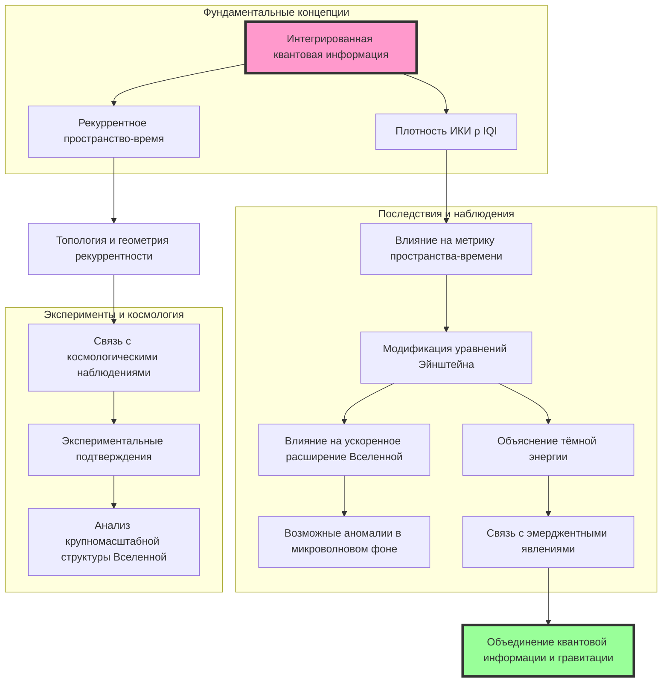

# Разработка модели, связывающей плотность интегрированной квантовой информации с геометрией пространства-времени

---

## Введение

Чтобы связать плотность интегрированной квантовой информации  ρ(ИКИ)  с геометрическими свойствами пространства-времени, необходимо предложить механизм, посредством которого квантово-информационные процессы влияют на метрику пространства-времени и соответствующим образом на тензор энергии-импульса  T(μν)^((ИКИ)) .

### 1. Определение плотности интегрированной квантовой информации

Интегрированная квантовая информация (ИКИ) может быть определена как мера квантовых корреляций (например, квантовой запутанности) между частями квантовой системы в пространстве-времени. Плотность ИКИ  ρ_(ИКИ)  характеризует распределение этих корреляций в различных областях пространства.

### 2. Вклад ИКИ в тензор энергии-импульса

Предположим, что плотность ИКИ вносит дополнительный вклад в тензор энергии-импульса, который можно выразить через  ρ_(ИКИ)  и ее производные. Тогда общий тензор энергии-импульса можно записать как:

`T(μν)^((общий)) = T(μν)^((материя)) + T_(μν)^((ИКИ)).`

### 3. Предложение формы T_(μν)^((ИКИ))

В качестве модели предположим, что вклад  T(μν)^((ИКИ))  зависит от градиентов  ρ(ИКИ)  и может быть записан в следующем виде:

`T(μν)^((ИКИ)) = κ (( ∇\mu ρ(ИКИ) ∇\nu ρ(ИКИ) - ½ g(μν) (∇^\lambda ρ(ИКИ) ∇\lambda ρ(ИКИ)) )) - g(μν) V(ρ_(ИКИ)),`

где:

-  κ  — постоянная, характеризующая "жесткость" квантово-информационного поля;

-  V(ρ_(ИКИ))  — потенциальная энергия, связанная с плотностью ИКИ;

-  ∇_\mu  — ковариантная производная;

-  g_(μν)  — метрика пространства-времени.

### 4. Мотивация выбранной формы

- **Кинетический член**: Первый член похож на кинетическую часть тензора энергии-импульса скалярного поля, что соответствует распространению и изменению плотности ИКИ в пространстве-времени.

- **Потенциальный член**: Второй член представляет собой энергетический вклад, связанный с самим значением  ρ_(ИКИ) , аналогично потенциалу в теориях скалярных полей.

- Такая форма тензора энергии-импульса позволяет учитывать как локальные изменения плотности ИКИ, так и ее влияние на глобальную структуру пространства-времени.

### 5. Уравнения поля и взаимодействие с геометрией

Модифицированные уравнения Эйнштейна с учетом вклада ИКИ имеют вид:

`G(μν) + Λ g(μν) = 8π G (( T(μν)^((материя)) + T(μν)^((ИКИ)) )).`

Эти уравнения связывают геометрию пространства-времени (через тензор Эйнштейна  G_(μν) ) с суммарным тензором энергии-импульса, включающим вклад ИКИ.

### 6. Динамика плотности ИКИ

Чтобы замкнуть систему уравнений, необходимо также определить уравнение движения для  ρ(ИКИ) . Это можно сделать, варьируя действие по  ρ(ИКИ) :

`S = ∫(( ½ κ (∇^\mu ρ(ИКИ))(∇\mu ρ(ИКИ)) - V(ρ(ИКИ)) )) √(-g) d⁴x.`

Варьируя это действие, получаем уравнение Клейна-Гордона для  ρ_(ИКИ) :

`κ □ ρ(ИКИ) - dV/(dρ(ИКИ)) = 0,`

где  □ = ∇^\mu ∇_\mu  — оператор Д'Аламбера в изогнутом пространстве-времени.

### 7. Связь с геометрическими свойствами

Предположим, что потенциальная энергия  V(ρ_(ИКИ))  зависит от инвариантов кривизны пространства-времени, таких как скаляр Риччи  R :

`V(ρ(ИКИ)) = ½ m² ρ(ИКИ)² + ξ R ρ_(ИКИ)²,`

где:

-  m  — "масса" квантово-информационного поля;

-  ξ  — параметр связи между  ρ_(ИКИ)  и кривизной.

**Тогда уравнение для  ρ_(ИКИ)  становится**:

`κ □ ρ(ИКИ) - m² ρ(ИКИ) - ξ R ρ_(ИКИ) = 0.`

### 8. Взаимовлияние ИКИ и геометрии

Полученная система уравнений показывает, что:

- **ИКИ влияет на геометрию**: Через вклад  T_(μν)^((ИКИ))  в уравнения Эйнштейна.

- **Геометрия влияет на ИКИ**: Через наличие кривизны  R  в уравнении для  ρ_(ИКИ) .

Таким образом, возникает взаимосвязанная система, описывающая динамику пространства-времени и плотности ИКИ.

### 9. Специфические решения и последствия

**Космологическое применение**:

- **Однородная и изотропная Вселенная**: В метрике Фридмана-Робертсона-Уокера можно искать решения для  ρ_(ИКИ)(t) , которые могут влиять на скорость расширения Вселенной.

- **Инфляция и темная энергия**: Квантово-информационное поле может играть роль инфлатона или темной энергии, объясняя ускоренное расширение.

**Чёрные дыры и сильные гравитационные поля**:

- **Изменение структуры горизонта событий**: Накопление ИКИ вблизи черной дыры может влиять на ее свойства и излучение Хокинга.

- **Регуляризация сингулярностей**: Возможность устранения сингулярностей за счет вклада  ρ_(ИКИ)  в экстремальных условиях.

### 10. Пример численной оценки

Для оценки влияния ИКИ можно выбрать параметры и рассмотреть упрощенную модель. Пусть:

-  κ = 1 ,

-  m = 0  (масса поля пренебрежимо мала),

-  ξ ≠ 0 .

**Тогда уравнение для  ρ_(ИКИ) упрощается до**:

`□ ρ(ИКИ) - ξ R ρ(ИКИ) = 0.`

В пустом пространстве ( T(μν)^((материя)) = 0 ) уравнения Эйнштейна дают  R = 0 , и поле  ρ(ИКИ)  свободно распространяется. В присутствии материи  R ≠ 0 , и возникает взаимодействие.

### 11. Вызовы и дальнейшие направления

- **Экспериментальная проверка**: Поиск эффектов, которые можно наблюдать, например, отклонения в движении небесных тел или аномалии в космическом микроволновом фоне.

- **Квантовая гравитация**: Интеграция данной модели в более общие теории квантовой гравитации, такие как петлевая квантовая гравитация или теория струн.

- **Математическая строгость**: Детальная разработка математического аппарата и проверка на согласованность и отсутствие противоречий.

Разработка модели, связывающей плотность интегрированной квантовой информации (ИКИ) с геометрией пространства-времени, является новаторской и потенциально революционной идеей. Однако, как и любая новая теория, она сталкивается с рядом вызовов и требует дальнейшего развития в нескольких направлениях:

#### 11.1. Экспериментальная проверка

**Поиск наблюдаемых эффектов**:

- **Отклонения в движении небесных тел**:

  - **Орбитальные аномалии**: Модель может предсказать небольшие отклонения в орбитах планет, спутников или астероидов, обусловленные вкладом ИКИ в метрику пространства-времени. Это требует высокоточных астрометрических наблюдений и анализа движения небесных тел.

  - **Прецессия перигелия**: Измерения прецессии перигелия планет, подобных эффекту, обнаруженному у Меркурия, могут выявить дополнительные эффекты, связанные с ИКИ.

  - **Гравитационные линзы**: Изучение отклонения света при прохождении рядом с массивными объектами может дать информацию о влиянии ИКИ на кривизну пространства-времени.

- **Аномалии в космическом микроволновом фоне (КМФ)**:

  - **Температурные флуктуации**: Модель может предсказать специфические особенности в спектре температурных анизотропий КМФ, связанные с флуктуациями плотности ИКИ в ранней Вселенной.

  - **Поляризация КМФ**: Изучение B-модов поляризации может предоставить информацию о гравитационных волнах и возможном влиянии ИКИ на их спектр.

  - **Нестационарные эффекты**: Возможность обнаружения временных изменений в КМФ, связанных с динамикой ИКИ.

**Технические и методологические сложности**:

- **Чувствительность инструментов**: Необходимы высокоточные измерительные приборы и телескопы, способные обнаружить минимальные отклонения от предсказаний общей теории относительности (ОТО).

- **Отделение сигналов**: Требуется разработка методов для отличения эффектов, связанных с ИКИ, от шумов и известных астрофизических процессов.

- **Космологические наблюдения**: Включение данных от различных космологических наблюдательных программ, таких как Planck, WMAP, LISA и др.

**Потенциальные экспериментальные площадки**:

- **Гравитационно-волновые детекторы**: LIGO, Virgo и будущие проекты могут обнаружить сигналы, указывающие на влияние ИКИ на гравитационные волны.

- **Космические миссии**: Спутниковые проекты, измеряющие гравитационные поля Земли и планет, такие как GRACE и GOCE.

#### 11.2. Квантовая гравитация

**Интеграция с существующими теориями**:

- **Петлевая квантовая гравитация (ПКГ)**:

  - **Квантование пространства-времени**: В ПКГ пространство-время дискретно на планковских масштабах. Включение ИКИ может дать новую перспективу на кванты пространства-времени как носители квантовой информации.

  - **Спин-структуры**: ИКИ может быть связана с сетями спиновых структур в ПКГ, где информация хранится в узлах и ребрах спиновой сети.

  - **Динамика объема и площади**: Связь плотности ИКИ с операторами объема и площади может помочь в понимании микроскопической структуры пространства-времени.

- **Теория струн**:

  - **Информационные состояния струн**: Рассмотрение струн как носителей квантовой информации и исследование влияния ИКИ на динамику струн.

  - **D-браны и запутанность**: Изучение взаимодействия между D-бранами через призму ИКИ и ее роли в запутывании состояний.

  - **Голографический принцип**: Применение идеи, что вся информация внутри объема может быть описана на его границе, соответствует представлениям о ИКИ и может быть расширено для включения плотности ИКИ.

**Разработка новых теоретических рамок**:

- **Обобщенные алгоритмы квантовых полей**: Создание моделей, где поля оказываются не только энергией и импульсом, но и информационными носителями.

- **Квантовый информации и гравитационная энтропия**: Исследование связи между ИКИ и термодинамическими свойствами гравитационных систем, включая черные дыры и космологические горизонты.

**Вызовы интеграции**:

- **Согласованность с экспериментами**: Любая теория квантовой гравитации должна вести к предсказаниям, согласующимся с известными экспериментальными данными на более низких энергиях.
  
- **Математическая сложность**: Объединение моделей ИКИ с квантовой гравитацией требует преодоления значительных математических трудностей, связанных с нелинейностью и сложностью уравнений.

#### 11.3. Математическая строгость

**Разработка математического аппарата**:

- **Анализ уравнений поля**:

  - **Существование и единственность решений**: Исследование условий, при которых уравнения для  ρ_(ИКИ)  и метрики имеют физически приемлемые решения.

  - **Стабильность решений**: Анализ устойчивости полученных решений относительно малых возмущений, что важно для физической реалистичности модели.

  - **Симметрии и сохранения**: Изучение симметрий системы и связанных с ними законов сохранения, таких как энергия, импульс и информация.

- **Варьационные принципы**:

  - **Действие теории**: Точное определение действия, включающего вклад ИКИ, и проверка его инвариантности относительно диффеоморфизмов и других преобразований.

  - **Теоремы Нётер**: Применение теорем Нётер для выявления законов сохранения и понимания фундаментальных свойств системы.

**Проверка на согласованность**:

- **Сопоставление с ОТО и квантовой теорией поля**:

  - **Классический предел**: Убедиться, что при малых плотностях ИКИ модель переходит в ОТО и стандартную квантовую теорию поля.

  - **Квантовые поправки**: Анализ квантовых поправок к классическим уравнениям и их влияние на предсказания модели.

- **Отсутствие внутренних противоречий**:

  - **Кausalность и унитарность**: Проверка того, что теория не нарушает причинности и сохраняет унитарность квантовых процессов.

  - **Избежание сингулярностей**: Исследование того, как наличие ИКИ влияет на появление или устранение гравитационных сингулярностей, таких как те, которые возникают в центрах черных дыр или в начале Вселенной.

**Математические методы и инструменты**:

- **Дифференциальная геометрия и топология**: Применение современных методов в этих областях для описания сложных структур пространства-времени с учетом ИКИ.

- **Функциональный анализ и теория операторов**: Использование этих областей для изучения свойств операторов, связанных с ИКИ, и их спектральных характеристик.

- **Численные методы**: Разработка алгоритмов и компьютерных моделей для решения уравнений и проверки предсказаний теории в сложных сценариях.

**Публикация и рецензирование**:

- **Научное сообщество**: Представление результатов в научных журналах и на конференциях для критической оценки и получения обратной связи от экспертов в области гравитации и квантовой информации.

- **Сотрудничество между дисциплинами**: Поощрение взаимодействия между физиками-теоретиками, математиками и специалистами по квантовой информации для совместного решения возникающих проблем.

**Потенциальное влияние и перспектива**

Разработка модели, объединяющей квантовую информацию и гравитацию, может привести к фундаментальным изменениям в нашем понимании природы. Успешное преодоление описанных вызовов может:

- **Открыть путь к единой теории**: Содействовать созданию единой теории, объединяющей квантовую механику и гравитацию.

- **Развить новые технологии**: Стимулировать развитие технологий, основанных на квантовой информации и гравитации, таких как квантовые компьютеры или гравитационные сенсоры нового поколения.

- **Углубить философские аспекты**: Повлиять на философские вопросы о природе информации, реальности и фундаментальных законов физики.

Вызовы, стоящие перед данной моделью, являются значительными, но преодолимые усилиями научного сообщества. Комплексный подход, включающий экспериментальные исследования, теоретическое развитие и математическую строгость, необходим для полноценного понимания и развития теории. Успех в этом направлении может привести к глубоким открытиям и революции в фундаментальной физике.

### 12. Заключение

Предложенная модель связывает плотность интегрированной квантовой информации с геометрическими свойствами пространства-времени через дополнительный вклад в тензор энергии-импульса. Это позволяет рассматривать гравитацию как эмерджентное явление, возникающее из квантово-информационных процессов. Такая перспектива открывает новые пути для объединения квантовой теории поля с общей теорией относительности и требует дальнейших исследований для полноценного понимания и экспериментальной проверки.

---

Примечание: Данная модель является теоретической и требует дальнейшей разработки и проверки. Представленные уравнения и предположения служат для иллюстрации возможного подхода к интеграции квантовой информации в гравитационную теорию.

---

Оглавление: 
- [Великое объединение теоретических моделей в физике элементарных частиц](/The-Great-Union.md)
- [ЭИРО framework](/README.md)

