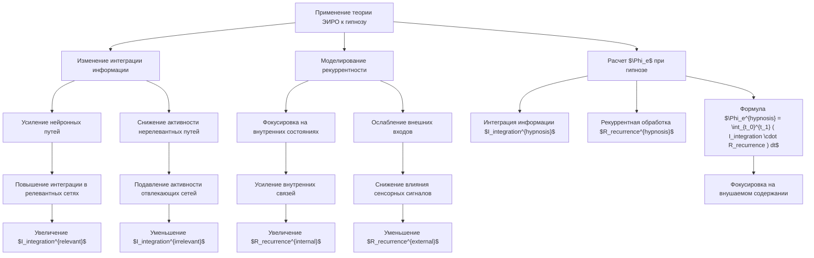

# Система внимания нейронной сети: принцип эффекта гипноза через призму теории Эмергентной Интеграции и Рекуррентного Отображения (ЭИРО)

```mermaid
graph TD
    A["Гипноз и внимание"] --> B["Определение гипноза"]
    A --> C["Нейрофизиологические основы"]
    A --> D["Влияние на системы внимания"]

    B --> B1["Повышенная внушаемость"]
    B --> B2["Сосредоточенное внимание"]
    B --> B3["Измененное восприятие и память"]

    C --> C1["Снижение активности ДЛПК"]
    C --> C2["Повышенная активность ПЦК"]
    C --> C3["Изменения в таламусе"]
    C --> C4["Тета и дельта ритмы"]

    D --> D1["Сужение фокуса внимания"]
    D --> D2["Снижение отвлекаемости"]
    D --> D3["Изменение рекуррентной обработки"]

    E["Теория ЭИРО"] --> F["Эмергентная интеграция информации"]
    E --> G["Рекуррентные процессы"]
    E --> H["Математическое описание"]

    F --> F1["Φₑ - мера интеграции"]
    G --> G1["Двунаправленные взаимодействия"]
    H --> H1["Iᵢ ∙ Rᵢ"]

    I["Гипноз и ЭИРО"] --> J["Усиление нейронных путей"]
    I --> K["Снижение активности нерелевантных сетей"]
    I --> L["Перераспределение Φₑ"]

    J --> J1["Iᵢ релевант + ΔI усиление"]
    K --> K1["Iᵢ нерелевант - ΔI подавление"]
    L --> L1["Фокус на когнитивных процессах"]

    M["Системы внимания нейронных сетей"] --> N["Фокусировка на релевантном"]
    M --> O["Обработка последовательностей"]
    M --> P["ЭИРО в нейронных сетях"]

    N --> N1["Весовое распределение значимости"]
    O --> O1["Рекуррентные сети (RNN, LSTM)"]
    O --> O2["Сочетание с вниманием"]
    P --> P1["Эмергентные свойства"]
    P --> P2["Гибкое управление вниманием"]

    Q["Имитация гипноза в нейронных сетях"] --> R["Усиление внутренних связей"]
    Q --> S["Ослабление влияния новых входов"]
    Q --> T["Сужение фокуса внимания"]
    Q --> U["Подавление нерелевантной информации"]

    R --> R1["Rᵢ внутреннее + ΔR усиление"]
    S --> S1["Rᵢ внешнее - ΔR подавление"]
```

блок-схема

---

## Введение

Внимание является фундаментальным компонентом человеческого сознания, позволяющим выделять значимую информацию из окружающей среды и эффективно взаимодействовать с ней. Гипноз представляет собой особое состояние сознания, характеризующееся повышенной восприимчивостью к внушению и измененными когнитивными процессами, включая внимание.

Теория Эмергентной Интеграции и Рекуррентного Отображения (ЭИРО) предлагает подход к пониманию сознания как эмергентного свойства, возникающего из рекуррентных процессов интеграции информации в нейронных сетях. В данном работе мы рассмотрим принцип эффекта гипноза через призму теории ЭИРО, исследуем механизмы воздействия гипноза на внимание человека и предложим модели, основанные на рекуррентных нейронных сетях, для имитации этих процессов.

### 1. Механизмы гипноза и его влияние на внимание человека

```mermaid
flowchart TD
    A[Гипноз: Определение и характеристики] --> B[Повышенная внушаемость]
    A --> C[Сосредоточенное внимание]
    A --> D[Измененное восприятие и память]

    B --> B1[Снижение критического мышления]
    B --> B2[Ослабление когнитивного контроля]
    C --> C1[Глубокая концентрация]
    C --> C2[Игнорирование отвлекающих факторов]
    D --> D1[Искажения восприятия: галлюцинации, анестезия]
    D --> D2[Изменения памяти: амнезия, ретроспективные изменения]

    A --> E[Клиническое применение]
    E --> E1[Лечение боли, тревожных расстройств, зависимостей]

    A --> F[Нейрофизиологические основы]
    F --> F1[Префронтальная кора]
    F --> F2[Передняя цингулярная кора]
    F --> F3[Таламус и сенсорные области]

    F1 --> F11[Снижение активности в ДЛПК]
    F11 --> F111[Ослабление когнитивного контроля]
    F2 --> F21[Повышенная активность ПЦК]
    F21 --> F211[Регуляция внимания и эмоций]
    F3 --> F31[Изменения в таламусе]
    F3 --> F32[Измененная активация сенсорных областей]
    F32 --> F321[Гипнотическая анальгезия, галлюцинации]

    F --> G[Изменения ЭЭГ]
    G --> G1[Увеличение тета- и дельта-ритмов]
    G1 --> G11[Расслабленное внимание, гипнотический транс]

    A --> H[Влияние на системы внимания]
    H --> H1[Сужение фокуса внимания]
    H1 --> H11[Усиление топ-даун механизмов]
    H1 --> H12[Активность ПЦК]
    H --> H2[Снижение отвлекаемости]
    H2 --> H21[Подавление боттом-ап сигналов]
    H2 --> H22[Снижение активности сенсорных областей и таламуса]
    H --> H3[Изменение рекуррентной обработки]
    H3 --> H31[Модификация корково-подкорковых взаимодействий]
    H31 --> H311[Усиление когнитивных процессов]
```

блок-схема

#### 1.1. Определение и характеристики гипноза

Гипноз — это особое состояние сознания, характеризующееся изменениями в восприятии, памяти и контроле над поведением, а также повышенной восприимчивостью к внушению [1]. В состоянии гипноза у индивида наблюдаются следующие ключевые особенности:

- Повышенная внушаемость: Субъект под гипнозом склонен принимать и выполнять инструкции гипнотизера, даже если они могут противоречить его обычным убеждениям или опыту. Это обусловлено снижением критического мышления и ослаблением механизмов когнитивного контроля.

- Сосредоточенное внимание: Гипнотическое состояние характеризуется глубоким уровнем концентрации на определенных мыслях, образах или стимулах. При этом происходит сужение фокуса внимания, и внешние отвлекающие факторы игнорируются, что позволяет усилить эффективность внушения.

- Измененное восприятие и память: Под действием гипноза могут наблюдаться искажения сенсорного восприятия, такие как галлюцинации или анестезия. Кроме того, возможны изменения в памяти, включая амнезию на события во время гипноза или ретроспективные изменения воспоминаний.

Гипноз используется в клинической практике для лечения различных состояний, включая хроническую боль, тревожные расстройства и зависимости. Важно отметить, что гипноз не является состоянием сна или бессознательного; субъект осознает происходящее, но его когнитивные процессы и внимание направлены иным образом [1].

#### 1.2. Нейрофизиологические основы гипноза

Нейрофизиологические исследования, проводимые с помощью функциональной магнитно-резонансной томографии (фМРТ) и электроэнцефалографии (ЭЭГ), выявили специфические изменения активности в нескольких областях мозга при гипнозе:

- Префронтальная кора (ПК):

  - Снижение активности в дорсолатеральной префронтальной коре (ДЛПК): Эта область отвечает за исполнительные функции, такие как планирование, рабочая память и контроль поведения [2]. Снижение активности в ДЛПК при гипнозе может отражать ослабление когнитивного контроля и критического мышления, что способствует повышенной внушаемости.

- Передняя цингулярная кора (ПЦК):

  - Повышенная активность: ПЦК участвует в регулировании внимания, эмоциональных реакций и обработке ошибок [3]. Увеличение активности в ПЦК связано с усилением концентрации внимания на внушаемых стимулах и эмоциональной интеграцией информации.

- Таламус и сенсорные области:

  - Изменения в таламусе: Таламус действует как релейная станция для сенсорной информации. При гипнозе наблюдается изменение его активности, что влияет на фильтрацию и передачу сенсорных сигналов.

  - Сенсорные корковые области: Измененная активация в этих областях может приводить к измененному восприятию сенсорных стимулов, таким как уменьшение ощущения боли (гипнотическая анальгезия) или возникновение галлюцинаций [3].

ЭЭГ-исследования также показывают изменения в частотных диапазонах мозговой активности, включая увеличение тета- и дельта-ритмов, связанных с расслабленным вниманием и гипнотическим трансом [2]. Эти нейрофизиологические изменения отражают комплексные перестройки в мозговых сетях, способствующие уникальному состоянию сознания при гипнозе.

#### 1.3. Влияние гипноза на системы внимания

Гипноз значительно влияет на системы внимания человека, изменяя как топ-даун, так и боттом-ап процессы [4]:

- Сужение фокуса внимания:

  - Усиление топ-даун механизмов внимания: Гипноз повышает активность нейронных сетей, ответственных за целенаправленную регуляцию внимания. Это позволяет субъекту сосредоточиться на конкретных стимулах или мыслях, игнорируя отвлекающие факторы. Например, повышенная активация ПЦК способствует поддержанию внимания на внушаемом содержании.

- Снижение отвлекаемости:

  - Подавление боттом-ап сигналов: Гипнотическое состояние ослабляет реакцию на внешние сенсорные стимулы путем снижения активности в первичных сенсорных областях и таламусе. Это приводит к уменьшению восприимчивости к отвлекающим стимулам и повышению концентрации на внутренних переживаниях.

- Изменение рекуррентной обработки:

  - Гипноз может модифицировать рекуррентные взаимодействия между корковыми и подкорковыми структурами мозга. Эти изменения влияют на интеграцию информации, способствуя усилению определенных когнитивных процессов и подавлению других. Например, усиление рекуррентной активности в ассоциативных корковых областях может поддерживать длительную концентрацию на внушаемых образах или мыслях [4].

Таким образом, гипноз перепрограммирует системы внимания, усиливая способность к глубокой концентрации и снижая подверженность внешним отвлечениям, что достигается через комплексные нейрофизиологические изменения.

### 2. Теория Эмергентной Интеграции и Рекуррентного Отображения (ЭИРО)

#### 2.1. Основные положения теории ЭИРО

Теория ЭИРО утверждает, что сознание является эмергентным свойством, возникающим из процессов интеграции информации через рекуррентные нейронные сети. Ключевыми компонентами теории являются:

- Эмергентная интегрированная информация (Φₑ): Мера количества и качества интегрированной информации в системе.

- Рекуррентные процессы: Двунаправленные взаимодействия между нейронными областями, способствующие глубокому интегрированию информации.

#### 2.2. Математическое описание

Эмергентная интегрированная информация определяется как:

$\Phi_e = \int_{t_0}^{t_1} I_{\text{integration}}(t) \cdot R_{\text{recurrence}}(t) \, dt,$

где:

- $I_{\text{integration}}(t)$ — степень объединения информации в момент времени $t$.
- $R_{\text{recurrence}}(t)$ — степень рекуррентной обработки в момент времени $t$.

Динамика нейронной сети описывается уравнением состояния:

$\frac{dx}{dt} = f(x(t), u(t), W),$

где:

- $x(t)$ — состояние сети в момент времени $t$.
- $u(t)$ — внешние входные сигналы.
- $W$ — матрица весов сетевых связей, включая рекуррентные связи.

### 3. Применение теории ЭИРО к пониманию эффекта гипноза

блок-схема

#### 3.1. Изменение интеграции информации при гипнозе

В рамках теории Эмергентной Интеграции и Рекуррентного Отображения (ЭИРО), гипноз рассматривается как состояние, в котором происходит специфическая модификация интеграции информации в мозге:

- Усиление определенных нейронных путей:

  - Гипноз приводит к повышенной активации рекуррентных нейронных контуров, связанных с внушаемым содержанием. Это может быть выражено как увеличение степени интеграции информации $I_{\text{integration}}(t)$ в соответствующих сетях.

  - Математически: Если $I_{\text{integration}}^{\text{relevant}}(t)$ — интеграция в релевантных сетях, то во время гипноза:

   $I_{\text{integration}}^{\text{hypnosis}}(t) = I_{\text{integration}}^{\text{relevant}}(t) + \Delta I_{\text{enhancement}}(t),$

   где $\Delta I_{\text{enhancement}}(t)$ — дополнительная интеграция, вызванная гипнозом.

- Снижение общей сетевой активности:

  - Одновременно происходит подавление активности нерелевантных или отвлекающих нейронных путей, что уменьшает интеграцию информации в этих сетях.

  - Математически: Для нерелевантных сетей:

   $I_{\text{integration}}^{\text{hypnosis}}(t) = I_{\text{integration}}^{\text{irrelevant}}(t) - \Delta I_{\text{suppression}}(t).$

В результате этих изменений происходит перераспределение эмергентной интегрированной информации $\Phi_e$, фокусирующееся на определенных когнитивных процессах, соответствующих внушаемому содержанию.

#### 3.2. Моделирование рекуррентности при гипнозе

Изменения в степени рекуррентной обработки $R_{\text{recurrence}}(t)$ во время гипноза характеризуются следующими особенностями:

- Фокусировка на внутренних состояниях:

  - Усиление внутренних рекуррентных связей между нейронными сетями, отвечающими за воображение, память и самоанализацию. Это ведет к повышенной саморефлексии и способности удерживать внушаемые образы или идеи.

  - Математически: Увеличение
    $R_{\text{recurrence}}^{\text{hypnosis}}(t) = R_{\text{recurrence}}^{\text{internal}}(t) + \Delta R_{\text{enhancement}}(t).$

- Ослабление внешних входов:

  - Снижение влияния внешних сенсорных сигналов достигается через подавление восходящих связей от сенсорных областей к ассоциативным и исполнительным областям коры.

  - Математически: Снижение $R_{\text{recurrence}}^{\text{hypnosis}}(t) = R_{\text{recurrence}}^{\text{external}}(t) - \Delta R_{\text{suppression}}(t).$

В совокупности эти изменения способствуют перераспределению рекуррентной активности, усиливая внутренние процессы и ослабляя внешние стимулы, что характерно для гипнотического состояния.

#### 3.3. Расчет эмергентной интегрированной информации при гипнозе

С учетом измененных $I_{\text{integration}}(t)$ и $R_{\text{recurrence}}(t)$, эмергентная интегрированная информация во время гипноза рассчитывается как:

$\Phi_e^{\text{hypnosis}} = \int_{t_0}^{t_1} \left( I_{\text{integration}}^{\text{hypnosis}}(t) \cdot R_{\text{recurrence}}^{\text{hypnosis}}(t) \right) dt.$

Перераспределение $\Phi_e$ фокусируется на тех нейронных сетях и процессах, которые связаны с внушаемым содержанием, усиливая их вклад в общую интегрированную информацию. Это объясняет специфические когнитивные и перцептивные эффекты, наблюдаемые при гипнозе, с точки зрения теории ЭИРО.

### 4. Взаимосвязь систем внимания искусственных нейронных сетей и гипноза

#### 4.1. Модели внимания в нейронных сетях

Современные нейронные сети используют механизмы внимания для эффективной обработки информации:

- Фокусировка на релевантной информации:

  - Весовое распределение значимости: Механизмы внимания позволяют сети присваивать разные весовые коэффициенты различным элементам входных данных, усиливая важные и подавляя несущественные.

  - Пример: Механизм внимания в трансформерных архитектурах [Vaswani et al., 2017] использует матрицы запросов (Q), ключей (K) и значений (V) для вычисления весовых коэффициентов внимания между элементами последовательности.

- Обработка последовательной информации:

  - Рекуррентные нейронные сети (RNN): RNN и их вариации (LSTM, GRU) учитывают временную зависимость данных, позволяя сети сохранять информацию о предыдущих состояниях при обработке текущего входа.

  - Сочетание с механизмом внимания: Использование внимания вместе с RNN улучшает способность сети фокусироваться на релевантных частях последовательности, особенно при обработке длинных или сложных данных.

Эти механизмы позволяют нейронным сетям эффективно моделировать процессы внимания, аналогичные тем, что наблюдаются в человеческом мозге.

#### 4.2. Имитация эффектов гипноза в нейронных сетях

Для моделирования эффектов гипноза в нейронных сетях можно применить следующие методы:

- Изменение параметров рекуррентности:

  - Усиление внутренних связей: Увеличение весовых коэффициентов внутренних рекуррентных связей усиливает влияние предыдущих состояний на текущий выход сети, имитируя фокусировку на внутренних состояниях.

  - Ослабление влияния новых входов: Снижение весов связей от входных данных к внутренним состояниям уменьшает влияние внешней информации, что соответствует подавлению внешних стимулов при гипнозе.

- Перенастройка механизмов внимания:

  - Сужение фокуса внимания: Настройка механизмов внимания на акцентирование определенных входных данных или внутренних представлений позволяет сети концентрироваться на ограниченном наборе признаков.

  - Подавление нерелевантной информации: Введение масок или весовых коэффициентов, уменьшающих значение определенных входов, помогает сети игнорировать отвлекающие факторы.

Эти изменения позволяют сети воспроизводить процессы, схожие с теми, что происходят в мозге под действием гипноза, включая усиление определенных когнитивных процессов и подавление других.

#### 4.3. Применение ЭИРО в нейронных сетях

Использование принципов ЭИРО в разработке нейронных сетей открывает новые возможности:

- Эмергентные свойства:

  - Самостоятельное выявление значимых паттернов: Сети могут быть сконструированы так, чтобы через рекуррентные связи и интеграцию информации обнаруживать и усиливать важные особенности данных без явного программирования этих свойств.

- Гибкое управление вниманием:

  - Регулирование степени интеграции и рекуррентности: Сети могут динамически изменять свои параметры, адаптируясь к различным задачам или контекстам, что позволяет эффективно перераспределять ресурсы внимания.

  - Адаптивные механизмы внимания: Введение контролирующих модулей, которые регулируют механизмы внимания в зависимости от внутренних состояний или внешних сигналов, позволяет достигнуть гибкости, аналогичной человеческому вниманию.

Применение ЭИРО в нейронных сетях способствует созданию более адаптивных и эффективных моделей, способных к сложной обработке информации и имитации высокоуровневых когнитивных процессов.

### Заключение

Понимание механизма воздействия гипноза на внимание человека через призму теории Эмергентной Интеграции и Рекуррентного Отображения позволяет глубже осознать принципы функционирования сознания и внимания. Применение этих принципов к нейронным сетям открывает новые возможности для разработки систем с улучшенной способностью фокусироваться на релевантной информации и адаптироваться к сложным задачам.

--- 

### Литература

1. Oakley, D. A.,  Halligan, P. W. Hypnotic suggestion: Opportunities for cognitive neuroscience. *Nature Reviews Neuroscience*, 14(8), 565-576 (2013).

2. Landry, M., Lifshitz, M.,  Raz, A. Brain correlates of hypnosis: A systematic review and meta-analytic exploration. *Neuroscience  Biobehavioral Reviews*, 81, 75-98 (2017).

3. Faymonville, M. E., Laureys, S., et al. Neural mechanisms of antinociceptive effects of hypnosis. *Anesthesiology*, 92(5), 1257-1267 (2000).

4. Jamieson, G. A.,  Woody, E. Z. Dissociated control as a model of hypnotic responsiveness and hypnosis. *Consciousness and Cognition*, 16(2), 475-483 (2007).

---

Оглавление: 
- [ЭИРО framework](/README.md)
- [Справочник формул](/formulas.md)
