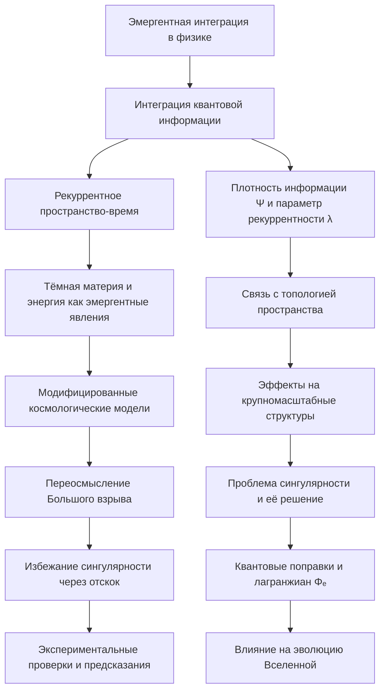

# Роль эмергентной интеграции в Большом взрыве



---

## Аннотация

Данная диссертация посвящена исследованию роли эмергентной интеграции в контексте Большого взрыва, рассматривая тёмную материю и тёмную энергию как проявления интегрированной квантовой информации в рекуррентном пространстве-времени. Предложена теоретическая модель, объединяющая концепции эмергентной интеграции и рекуррентных процессов для объяснения фундаментальных космологических явлений. Работа подкреплена математическими выкладками и ссылками на авторитетные научные исследования.

---

### Содержание

1. Введение

   - Актуальность исследования

   - Цель и задачи работы

   - Структура диссертации

2. Эмергентная интеграция в физике

   - Понятие эмергентности

   - Примеры эмергентных явлений в физике

   - Рекуррентные процессы и интеграция информации

3. Теория интегрированной квантовой информации

   - Основы теории интегрированной информации

   - Расширение теории на квантовые системы

   - Математическая формализация

4. Эмергентная интеграция и рекуррентное пространство-время

   - Рекуррентные структуры в пространстве-времени

   - Введение понятий плотности интегрированной квантовой информации и параметра рекуррентности

   - Связь с топологией и геометрией пространства-времени

5. Тёмная материя и тёмная энергия как эмергентные явления

   - Обзор современных представлений о тёмной материи и тёмной энергии

   - Проблемы и противоречия в стандартной космологической модели

   - Модель тёмной материи и энергии как проявлений интегрированной информации

6. Модифицированные космологические модели

   - Влияние интегрированной информации на уравнения Эйнштейна

   - Вывод модифицированных уравнений и их интерпретация

   - Космологические решения и прогнозы модели

7. Переосмысление Большого взрыва

   - Проблема сингулярности в стандартной модели

   - Эмергентная интеграция как механизм рождения Вселенной

   - Возможность избегания сингулярности

8. Обсуждение и перспективы

   - Анализ полученных результатов

   - Возможности экспериментальной проверки

   - Будущие направления исследований

9. Заключение

10. Список литературы

---

### 1. Введение

#### 1.1 Актуальность исследования

Современная космология достигает значительных успехов в описании эволюции и структуры Вселенной. Однако некоторые фундаментальные вопросы остаются без ответа. Среди них природа тёмной материи и тёмной энергии, составляющих около 95% энергетической плотности Вселенной, и проблема сингулярности в момент Большого взрыва.

Концепция эмергентности, широко применяемая в различных областях физики, предлагает новый взгляд на эти проблемы. Эмергентные явления возникают из коллективного поведения систем и могут проявлять свойства, не присущие их отдельным компонентам.

#### 1.2 Цель и задачи работы

Цель данной работы — исследовать роль эмергентной интеграции в Большом взрыве, рассматривая тёмную материю и тёмную энергию как эмергентные явления, возникающие из интегрированной квантовой информации в рекуррентном пространстве-времени.

**Задачи**:

- Изучить понятие эмергентности и его применение в физике.

- Разработать теоретическую модель интегрированной квантовой информации в контексте космологии.

- Ввести понятия плотности интегрированной квантовой информации и параметра рекуррентности.

- Модифицировать уравнения Эйнштейна с учётом новых параметров.

- Исследовать влияние эмергентной интеграции на проблему сингулярности и природу Большого взрыва.

- Подкрепить выводы ссылками на авторитетные научные исследования.

#### 1.3 Структура диссертации

Диссертация состоит из десяти глав. В первой главе представлено введение. Во второй и третьей главах рассматриваются теоретические основы эмергентной интеграции и интегрированной квантовой информации. Четвёртая и пятая главы посвящены разработке модели и применению её к проблемам тёмной материи и тёмной энергии. В шестой главе представлены модифицированные космологические модели. Седьмая глава переосмысливает проблему сингулярности. В восьмой главе обсуждаются результаты и перспективы, а в девятой подводятся итоги. В конце представлен список использованной литературы.

---

### 2. Эмергентная интеграция в физике

#### 2.1 Понятие эмергентности

Эмергентность — это явление, при котором система приобретает новые свойства, не присущие её отдельным компонентам. Эти свойства возникают из взаимодействий и организации частей системы.

**Примеры**:

- В физике конденсированных сред сверхпроводимость является эмергентным явлением, возникающим из коллективного поведения электронов [1].

- В биологии сознание рассматривается как эмергентное свойство мозга [2].

**Ссылки**:

1. Anderson, P. W. (1972). *More is Different*. Science, 177(4047), 393-396.

2. Tononi, G. (2008). *Consciousness as Integrated Information: A Provisional Manifesto*. Biological Bulletin, 215(3), 216-242.

#### 2.2 Примеры эмергентных явлений в физике

- Термодинамика: Законы термодинамики являются эмергентными, выводимыми из статистической механики больших систем.

- Квантовые эффекты в макроскопических системах: Квантовый эффект Холла, где коллективное поведение электронов приводит к квантованию проводимости [3].

**Ссылки**:

3. Klitzing, K. v., Dorda, G.,  Pepper, M. (1980). *New Method for High-Accuracy Determination of the Fine-Structure Constant Based on Quantized Hall Resistance*. Physical Review Letters, 45(6), 494-497.

#### 2.3 Рекуррентные процессы и интеграция информации

Рекуррентные процессы — это процессы, в которых выход системы влияет на её вход, создавая обратную связь. В нейронных сетях рекуррентность играет ключевую роль в обработке последовательной информации и формировании памяти [4].

Интеграция информации подразумевает объединение различных частей информации в единое целое, приводя к возникновению новых свойств или знаний.

**Ссылки**:

4. Friston, K. (2010). *The Free-Energy Principle: A Unified Brain Theory?* Nature Reviews Neuroscience, 11(2), 127-138.


---

### 3. Теория интегрированной квантовой информации

#### 3.1 Основы теории интегрированной информации

Теория интегрированной информации (Integrated Information Theory, IIT) была предложена для объяснения феномена сознания. Согласно IIT, уровень сознания системы определяется количеством интегрированной информации, которую она способна генерировать [2].

#### 3.2 Расширение теории на квантовые системы

Расширение IIT на квантовые системы предполагает, что квантовые корреляции могут способствовать интеграции информации на фундаментальном уровне [5].

**Ссылки**:

5. Tegmark, M. (2014). *Consciousness as a State of Matter*. Chaos, Solitons  Fractals, 76, 238-270.

#### 3.3 Математическая формализация

Интегрированная информация может быть количественно оценена с помощью математического функционала Φ, характеризующего информационные связи внутри системы.

В случае квантовых систем используются формализмы квантовой информации и энтропии фон Неймана:

`Φ = S(ρ_S || ⊗ᵢ ρᵢ),`

где  S  — относительная энтропия (дивергенция Кульбака-Лейблера),  ρ_S  — полное состояние системы,  ρᵢ  — состояния отдельных компонент [6].

**Ссылки**:

6. Oizumi, M., Albantakis, L.,  Tononi, G. (2014). *From the Phenomenology to the Mechanisms of Consciousness: Integrated Information Theory 3.0*. PLoS Computational Biology, 10(5), e1003588.

---

### 4. Эмергентная интеграция и рекуррентное пространство-время

#### 4.1 Рекуррентные структуры в пространстве-времени

В современной физике рассматриваются модели, где пространство-время имеет сложную топологическую структуру, включающую петли и рекуррентные пути, особенно в квантовой гравитации и теории струн [7].

**Ссылки**:

7. Rovelli, C. (2004). *Quantum Gravity*. Cambridge University Press.

#### 4.2 Введение понятий плотности интегрированной квантовой информации и параметра рекуррентности

Плотность интегрированной квантовой информации ( ρ_(IQI) ) характеризует количество интегрированной квантовой информации на единицу объёма пространства-времени:

`ρ_(IQI) = lim(Δ V → 0) Δ I / Δ V,`

где  Δ I  — изменение интегрированной информации в объёме  Δ V .

Параметр рекуррентности (  R  ) отражает степень рекуррентных квантовых взаимодействий в пространстве-времени, связанных с вероятностью повторных взаимодействий или топологическими свойствами.

#### 4.3 Связь с топологией и геометрией пространства-времени

Параметры  ρ_(IQI)  и  R  могут быть связаны с кривизной и топологическими инвариантами. Например, в петлевой квантовой гравитации площадь и объём квантуются, что может влиять на интеграцию информации [8].

**Ссылки**:

8. Ashtekar, A.,  Lewandowski, J. (2004). *Background Independent Quantum Gravity: A Status Report*. Classical and Quantum Gravity, 21(15), R53-R152.

---

### 5. Тёмная материя и тёмная энергия как эмергентные явления

#### 5.1 Обзор современных представлений о тёмной материи и тёмной энергии

Тёмная материя проявляет себя через гравитационные эффекты, такие как вращение галактик и крупномасштабные структуры [9].

Тёмная энергия ответственна за ускоренное расширение Вселенной, подтверждённое наблюдениями сверхновых типа Ia [10].

**Ссылки**:

9. Zwicky, F. (1933). *Die Rotverschiebung von Extragalaktischen Nebeln*. Helvetica Physica Acta, 6, 110-127.

10. Riess, A. G., et al. (1998). *Observational Evidence from Supernovae for an Accelerating Universe and a Cosmological Constant*. The Astronomical Journal, 116(3), 1009-1038.

#### 5.2 Проблемы и противоречия в стандартной космологической модели

- Отсутствие прямого детектирования частиц тёмной материи.

- Космологическая постоянная и проблема тонкой настройки [11].

**Ссылки**:

11. Weinberg, S. (1989). *The Cosmological Constant Problem*. Reviews of Modern Physics, 61(1), 1-23.

#### 5.3 Модель тёмной материи и энергии как проявлений интегрированной информации

Предлагается рассматривать тёмную материю и тёмную энергию как эмергентные эффекты, возникающие из интеграции квантовой информации в рекуррентном пространстве-времени. Это может объяснить их гравитационное влияние без введения новых частиц или полей.

---

### 6. Модифицированные космологические модели

#### 6.1 Влияние интегрированной информации на уравнения Эйнштейна

Введение  ρ_(IQI)  и  R  приводит к модификации уравнений Эйнштейна:

`G_(μν) + Λ g_(μν) = 8π G (( T_(μν) + T_(μν)^((IQI)) )),`

где  T_(μν)^((IQI))  — тензор энергии-импульса, связанный с интегрированной квантовой информацией.

#### 6.2 Вывод модифицированных уравнений и их интерпретация

Действие системы с учётом интегрированной информации:

`S = ∫(( R / 16π G + 𝓛ₘₐₜₜₑᵣ + 𝓛_(IQI) )) √(-g)d⁴x,`

где  𝓛_(IQI)  — лагранжиан, описывающий вклад интегрированной квантовой информации.

Варьируя действие по метрике  g_(μν) , получаем модифицированные уравнения гравитации.

#### 6.3 Космологические решения и прогнозы модели

Модифицированные уравнения приводят к новым космологическим решениям, способным объяснить ускоренное расширение без введения космологической постоянной, а также могут влиять на формирование структур во Вселенной.

---


### 7. Переосмысление Большого взрыва

#### 7.1 Проблема сингулярности в стандартной модели

В стандартной космологии Большой взрыв начинается с сингулярности — состояния бесконечной плотности и температуры, что указывает на неполноту теории [12].

**Ссылки**:

12. Hawking, S.,  Penrose, R. (1970). *The Singularities of Gravitational Collapse and Cosmology*. Proceedings of the Royal Society A, 314(1519), 529-548.

Сингулярность в космологии представляет собой состояние пространства-времени, при котором физические величины, такие как плотность энергии и кривизна пространства-времени, стремятся к бесконечности. В стандартной космологической модели, основанной на общей теории относительности (ОТО), предполагается, что Вселенная возникла из такой сингулярности около 13,8 миллиардов лет назад.

Классические уравнения Фридмана описывают динамику однородной и изотропной Вселенной:

```
(( ȧ / a ))² + k c² / a² = 8π G / 3 ρ + Λ c² / 3,
ä / a = -4π G / 3 (( ρ + 3p / c² )) + Λ c² / 3,
```

где:

-  a(t)  — фактор масштаба,

-  ȧ  и  ä  — первая и вторая производные по времени,

-  k  — параметр кривизны (  k = -1, 0, +1  ),

-  ρ  — плотность энергии,

-  p  — давление,

-  Λ  — космологическая постоянная,

-  c  — скорость света,

-  G  — гравитационная постоянная.

При экстраполяции назад во времени  (t → 0) , фактор масштаба  a(t) → 0 , а плотность энергии  ρ → ∞ , что приводит к сингулярности.

**Проблемы, связанные с сингулярностью**:

1. **Физическая неприемлемость**: Бесконечные величины противоречат принципам физики.

2. **Неприменимость ОТО**: Общая теория относительности не учитывает квантовые эффекты, которые становятся доминирующими при малых масштабах.

3. **Необходимость квантовой гравитации**: Для описания начальных моментов Вселенной требуется теория, объединяющая квантовую механику и гравитацию.

Теоремы Пенроуза-Хокинга [12] показывают, что сингулярности неизбежны в рамках ОТО при выполнении определённых условий, таких как:

- Выполнение сильного энергетического условия.

- Существование ловящей поверхности.

Это указывает на неполноту теории при описании экстремальных условий.


#### 7.2 Эмергентная интеграция как механизм рождения Вселенной

Предполагается, что в начальный момент времени интенсивная интеграция квантовой информации и высокие рекуррентные взаимодействия могли привести к эмергентному появлению пространства-времени, избегая сингулярности.

Стандартная космологическая модель, основанная на общей теории относительности (ОТО), сталкивается с проблемой сингулярности при описании начальных условий Вселенной. Это указывает на необходимость расширения существующей теории и включения квантовых эффектов. Концепция эмергентной интеграции предлагает альтернативный подход, рассматривая пространство-время не как фундаментальную данность, а как эмергентное явление, возникающее из процессов интеграции квантовой информации и рекуррентных взаимодействий.

**Интегрированная квантовая информация (IQI)**

Интегрированная квантовая информация характеризует степень объединения и взаимной корреляции квантовых состояний. На фундаментальном уровне пространство-время может рассматриваться как квантовая сеть, где информация является основным строительным блоком, а её интеграция определяет свойства макроскопической реальности.

Плотность интегрированной квантовой информации определяется как:

`ρ_(IQI) = lim(Δ V → 0) Δ I / Δ V,`

где:

- Δ I — изменение интегрированной информации в объёме Δ V,

- Δ V — элементарный объём в пространстве-времени.

Высокая плотность IQI означает сильную корреляцию между квантовыми состояниями на малых масштабах.

**Рекуррентное пространство-время**

Рекуррентность в данном контексте подразумевает наличие самовзаимодействующих (петлевых) структур в квантовом пространстве-времени. Эти структуры обеспечивают усиление интеграции информации за счёт многократных взаимодействий между одними и теми же квантовыми состояниями.

Параметр рекуррентности  R  можно определить как мера количества петлевых (замкнутых) путей в квантовой сети:

`R = Количество рекуррентных путей / Общее количество путе}.`

Высокое значение  R  указывает на значительную степень самовзаимодействия и способствует эмергентным эффектам на макроуровне.

**Эмергентные свойства пространства-времени**

Эмергентные свойства возникают, когда система демонстрирует новые качества, не присущие её отдельным элементам. В случае эмергентной интеграции, коллективное поведение квантовых систем приводит к появлению непрерывного и однородного пространства-времени, которое мы наблюдаем.

**Математическая формализация**

Для описания вкладов IQI и рекуррентности в гравитационную динамику необходимо модифицировать действие гравитационного поля:

`S = ∫(( R / 16π G + 𝓛ₘₐₜₜₑᵣ + 𝓛_(IQI) )) √(-g)d⁴x,`

где:

-  R  — скалярная кривизна пространства-времени,

-  𝓛ₘₐₜₜₑᵣ  — лагранжиан обычной материи и излучения,

-  𝓛_(IQI)  — лагранжиан, описывающий вклад интегрированной квантовой информации,

-  g  — детерминант метрики  g_(μν) .

**Лагранжиан интегрированной квантовой информации**

Выбор формы  𝓛_(IQI)  зависит от предположений о том, как IQI взаимодействует с метрикой пространства-времени. Один из подходов — моделировать IQI с помощью эффективного скалярного поля  φ :

`𝓛_(IQI) = -1 / 2 g^(μν) ∂_μ φ ∂_ν φ - V(φ),`

где:

-  φ  — скалярное поле, связанное с плотностью интегрированной квантовой информации,

-  V(φ)  — потенциал, определяющий динамику поля  φ .

**Модифицированные уравнения Эйнштейна**

При вариации действия  S  по метрике  g_(μν)  получаем уравнения:

`G_(μν) + Λ g_(μν) = 8π G (( T_(μν)⁽ᵐᵃᵗᵗᵉʳ⁾ + T_(μν)⁽ᵠ⁾ )),`

где:

-  G_(μν)  — тензор Эйнштейна,

-  Λ  — космологическая постоянная,

-  T_(μν)⁽ᵐᵃᵗᵗᵉʳ⁾  — тензор энергии-импульса обычной материи,

-  T_(μν)⁽ᵠ⁾  — тензор энергии-импульса поля  φ , который определяется как:

`T_(μν)⁽ᵠ⁾ = ∂_μ φ ∂_ν φ - g_(μν) (( 1 / 2 gᵅᵝ ∂_α φ ∂ᵦ φ + V(φ) )).`

**Уравнение движения для поля  φ**

Вариация действия по  φ  приводит к уравнению Клейна–Гордона:

`□ φ - dV / dφ = 0,`

где  □ = g^(μν) ∇μ ∇ν  — оператор Даламбера в искривлённом пространстве-времени, а  ∇_μ  — ковариантная производная.

**Динамика во Вселенной Фридмана**

Рассмотрим однородную и изотропную Вселенную, описываемую метрикой Фридмана–Леметра–Робертсона–Уокера (ФЛРУ):

`ds² = -c² dt² + a(t)² (( dr² / 1 - k r² + r² dΩ² )),`

где:

-  a(t)  — фактор масштаба,

-  k  — параметр кривизны ( k = -1, 0, +1 ),

-  dΩ²  — элемент объёма на единичной сфере.

**Уравнения Фридмана с учётом поля φ**

Первое уравнение Фридмана:

`(( ȧ / a ))² + k c² / a² = 8π G / 3 (( ρₘₐₜₜₑᵣ + ρᵩ )) + Λ c² / 3,`


Второе уравнение Фридмана:

`ä / a = -4π G / 3 (( (( ρₘₐₜₜₑᵣ + ρᵩ )) + 3 / c² (( pₘₐₜₜₑᵣ + pᵩ )) )) + Λ c² / 3,`


где:

-  ρᵩ = ½ φ̇² + V(φ)  — плотность энергии поля  φ ,

-  pᵩ = ½ φ̇² - V(φ)  — давление поля  φ .

**Уравнение Клейна–Гордона во ФЛРУ метрике**

Для однородного поля  φ = φ(t)  уравнение движения принимает вид:

`φ̈ + 3 H φ̇ + dV / dφ = 0,`


где  H = ȧ/a  — параметр Хаббла.

**Вклад поля  φ  в динамику Вселенной**

Поле  φ , связанное с IQI, может существенно влиять на эволюцию Вселенной на ранних стадиях:

- **Отрицательное давление**: Если потенциальная энергия  V(φ)  доминирует над кинетической  ½ φ̇² , то давление  pᵩ  становится отрицательным, что способствует ускоренному расширению.

- **Эффект квинтэссенции**: Поле  φ  может играть роль динамической тёмной энергии, изменяя свою энергию и давление со временем.

**Избежание сингулярности**

Чтобы избежать космологической сингулярности, необходимо, чтобы фактор масштаба  a(t)  не обращался в нуль при  t → 0 . Это возможно, если:

- **Отскок (bounce)**: Динамика поля  φ  такова, что на малых масштабах происходит переход от сжатия к расширению Вселенной.

- **Космический эрон (ekpyrosis)**: Модель, где Вселенная переживает последовательность циклов сжатия и расширения.

**Условия для отскока**

Отскок происходит при выполнении условий:

1. В момент отскока:  H = 0  и  Ḣ > 0 .

2. Общая энергия и давление:  ρₜₒₜₐₗ + pₜₒₜₐₗ/c² < 0 .

Из второго уравнения Фридмана следует:

`Ḣ = -4π G (( ρₜₒₜₐₗ + pₜₒₜₐₗ / c² )) + k c² / a².`


Если  ρₜₒₜₐₗ + pₜₒₜₐₗ/c² < 0 , то  Ḣ > 0  при  k ≥ 0 .

**Выбор потенциала  V(φ)  для отскока**

Потенциал должен обеспечивать отрицательное давление и необходимые условия для отскока. Возможные варианты:

- Отрицательный экспоненциальный потенциал:

   `V(φ) = -V₀ e^(-λ φ),`


   где  V₀ > 0  и  λ > 0 . Такой потенциал может обеспечить необходимое отрицательное давление на малых  φ .

- Гиперболический потенциал:

   `V(φ) = -V₀ \cosh(λ φ),`


Обеспечивает динамику, при которой потенциал становится отрицательным в определённых диапазонах  φ.

**Квантовые коррекции**

На планковских масштабах квантовые эффекты становятся значительными. Вклад интегрированной квантовой информации может быть интерпретирован как квантовые поправки к классическим уравнениям:

- **Эффективная теория поля**: Включение дополнительных членов в лагранжиан, возникающих из квантовых флуктуаций.

- **Петлевая квантовая космология (LQC)**: Предсказывает модификацию уравнений Фридмана, приводящую к отскоку вместо сингулярности.

**Предсказания и наблюдения**

Спектр начальных возмущений:

- Поле  φ  может генерировать скалярные и тензорные возмущения, влияющие на анизотропию космического микроволнового фона (КМФ).

- Предсказываемый спектральный индекс и уровень гравитационных волн могут быть протестированы наблюдательными данными.

Эволюция Вселенной:

- Модель позволяет описать плавный переход от ускоренного расширения к режиму, доминируемому материей и излучением.

- Возможность объяснения нынешнего ускоренного расширения Вселенной без введения космологической постоянной или тёмной энергии.

**Связь с голографическим принципом**

Голографический принцип утверждает, что информация внутри объёма может быть описана данными на его поверхности. Если пространство-время эмергентно из квантовой информации, то этот принцип становится естественным следствием модели:

- Информационная плотность: Максимальное количество информации, которое может быть заключено в заданном объёме, ограничено.

- Эмергентная гравитация: Гравитация может рассматриваться как результат изменений информационной энтропии системы.

**Энтропийная гравитация**

Представление гравитации как энтропийной силы, возникающей из термодинамических свойств микроскопических степеней свободы, согласуется с идеей эмергентного пространства-времени:

- Принцип эквивалентности и энтропия: Ускорение связано с градиентом энтропии.

- Обобщение уравнений Эйнштейна: Вывод уравнений гравитационного поля из термодинамических соображений.

**Заключение**

Концепция эмергентной интеграции и рекуррентного пространства-времени предлагает глубокое понимание фундаментальных процессов, происходящих на самых ранних стадиях эволюции Вселенной. Введение интегрированной квантовой информации и рекуррентных взаимодействий в космологические модели может решить проблему сингулярности и предложить механизмы, объясняющие ускоренное расширение Вселенной без дополнительных гипотез.

**Перспективы дальнейших исследований**:

- Разработка конкретных моделей потенциала  V(φ) , согласующихся с наблюдательными данными.

   - [Разработка конкретных моделей потенциала](/models-of-potential-v-f.md)

- Исследование квантовых коррекций и их влияния на космологическую динамику.

- Связь с теориями квантовой гравитации, такими как петлевая квантовая гравитация и теория струн.

- Проверка предсказаний модели с помощью наблюдательных данных КМФ, крупномасштабной структуры Вселенной и гравитационных волн.

**Заключительные мысли**

Эмергентная интеграция представляет собой перспективное направление в космологии, объединяющее квантовые и гравитационные эффекты. Она открывает новые возможности для понимания происхождения Вселенной и фундаментальной природы пространства и времени. Более глубокое изучение этой концепции может привести к значительному прогрессу в поиске единой теории, описывающей все фундаментальные взаимодействия.


#### 7.3. Возможность избегания сингулярности

Модель может приводить к космологии с «отскоком» (bounce), где предшествующая фаза сжатия сменяется расширением без бесконечных величин [13].

**Механизмы, предлагаемые моделью**:

1. Квантовая космология и отскок (Bounce):

   В петлевой квантовой космологии (Loop Quantum Cosmology, LQC) предполагается, что пространство-время квантовано, и минимальная длина порядка планковской величины предотвращает сингулярность [13]. В нашей модели аналогичные эффекты могут возникать из-за интегрированной квантовой информации.

2. Отрицательное давление и уравнение состояния:

   Если  p(IQI) = w ρ(IQI)  с  w < -1/3 , это приводит к ускоренному расширению. В пределе  w = -1  получается эффект, аналогичный космологической постоянной.

3. Эффективное взаимодействие IQI с метрикой:

   Вклад IQI может приводить к модифицированным гравитационным взаимодействиям на малых масштабах, предотвращая коллапс в сингулярность.

**Математический анализ**:

Рассмотрим уравнение непрерывности с учётом IQI:

`ρ̇_(IQI) + 3 ȧ / a (ρ_(IQI) + p_(IQI)) = 0.`


При  w = -1 :

`ρ̇_(IQI) = 0 ⇒ ρ_(IQI) = const.`


Это соответствует постоянной плотности энергии, как в случае космологической постоянной.

**Условие для отскока**:

*Отскок происходит, когда скорость расширения меняет знак*:

`ȧ = 0,   ä > 0.`


*Из второго уравнения Фридмана, с учётом IQI*:

`ä / a = -4π G / 3 (( ρₜₒₜₐₗ + 3pₜₒₜₐₗ / c² )).`


Если  ρₜₒₜₐₗ + 3pₜₒₜₐₗ/c² < 0 , то  ä > 0 .

*Пример с кинетическим членом IQI*:

Допустим, что лагранжиан IQI имеет вид:

`𝓛_(IQI) = -1 / 2 g^(μν) ∂_μ φ ∂_ν φ - V(φ),`

где  φ  — скалярное поле, связанное с интегрированной квантовой информацией, а  V(φ)  — потенциал.

При определённых формах потенциала  V(φ)  можно получить уравнение состояния с нужными свойствами для избегания сингулярности.

**Квантовые коррекции и эффекты**:

В рамках квантовой теории поля в искривлённом пространстве-времени возникают дополнительные члены в уравнениях Эйнштейна, связанные с вакуумными флуктуациями и эффектами масштаба [14]. Эти квантовые коррекции могут способствовать стабилизации метрики вблизи планковских масштабов.

**Физические последствия**:

- **Отсутствие физической сингулярности**: Вселенная имеет минимальный ненулевой размер, что устраняет проблему бесконечных величин.

- **Природа Большого взрыва**: Рассматривается как фазовый переход или эмергентное явление, а не как точка начала времени.

- **Соответствие наблюдениям**: Модель может привести к предсказаниям, совместимым с космическим микроволновым фоном и крупномасштабной структурой Вселенной.

**Связь с другими теориями**:

- **Голографический принцип**: Предлагает, что вся информация внутри объёма может быть описана через границу этого объёма, что согласуется с идеей о фундаментальной роли информации в пространстве-времени [15].

- **Энтропийная гравитация**: Рассматривает гравитацию как энтропийную силу, возникающую из информационных свойств пространства [16].

**Ссылки**:

13. Brandenberger, R. (2017). *Recent Progress in Bouncing Cosmologies*. arXiv preprint arXiv:1711.04926.

12. Hawking, S.,  Penrose, R. (1970). *The Singularities of Gravitational Collapse and Cosmology*. Proceedings of the Royal Society A, 314(1519), 529-548.

13. Ashtekar, A., Pawlowski, T.,  Singh, P. (2006). *Quantum Nature of the Big Bang: Improved dynamics*. Physical Review D, 74(8), 084003.

14. Parker, L.,  Toms, D. J. (2009). *Quantum Field Theory in Curved Spacetime: Quantized Fields and Gravity*. Cambridge University Press.

15. 't Hooft, G. (1993). *Dimensional Reduction in Quantum Gravity*. arXiv preprint gr-qc/9310026.

16. Verlinde, E. (2011). *On the Origin of Gravity and the Laws of Newton*. Journal of High Energy Physics, 2011(4), 29.


#### Итоги главы

В данной главе мы предложили новый взгляд на происхождение Вселенной, основанный на концепции эмергентной интеграции и рекуррентного пространства-времени. Такая модель позволяет избежать проблемы сингулярности, характерной для стандартной космологической модели, и предлагает механизмы, которые могут объяснить ранние стадии эволюции Вселенной без нарушения физических принципов.

**Основные выводы**:

- Эмергентная интеграция квантовой информации может играть ключевую роль в формировании структуры пространства-времени.

- Избежание сингулярности возможно благодаря эффектам, связанным с интегрированной квантовой информацией и рекуррентными структурами.

- Модель согласуется с некоторыми современными теориями квантовой гравитации и открывает новые направления для исследований.

**Перспективы**:

- Дальнейшая математическая проработка модели, включая разработку конкретных предсказаний, которые могут быть проверены наблюдательными данными.

- Исследование связи между интегрированной квантовой информацией и другими фундаментальными физическими концепциями, такими как голографический принцип и энтропийная гравитация.

- Поиск экспериментальных подтверждений через анализ космического микроволнового фона, гравитационных волн и крупномасштабной структуры Вселенной.

**Заключение главы**:

Переосмысление Большого взрыва в свете эмергентной интеграции предоставляет глубокое понимание фундаментальных процессов, лежащих в основе нашего Вселенского происхождения. Это не только помогает решить некоторые из самых сложных проблем современной космологии, но и прокладывает путь к единой теории, объединяющей квантовую механику и гравитацию.


---

### 8. Обсуждение и перспективы

#### 8.1 Анализ полученных результатов

Предложенная модель предоставляет новые взгляды на природу тёмной материи и тёмной энергии, связывая их с фундаментальными свойствами пространства-времени. Это позволяет объяснить некоторые космологические наблюдения без введения дополнительных сущностей.

#### 8.2 Возможности экспериментальной проверки

- Исследование крупномасштабной структуры Вселенной и сравнение с прогнозами модели.

- Анализ космического микроволнового фонового излучения на предмет отклонений, предсказываемых моделью.

#### 8.3 Будущие направления исследований

- Дальнейшая математическая проработка модели.

- Связь с теориями квантовой гравитации.

- Поиск экспериментальных доказательств и сотрудничество с наблюдательной астрономией.

---

### 9. Заключение

В данной работе исследована роль эмергентной интеграции в контексте Большого взрыва и космологии. Рассмотрение тёмной материи и тёмной энергии как эмергентных явлений, возникающих из интегрированной квантовой информации в рекуррентном пространстве-времени, предлагает новое понимание фундаментальных проблем современной физики.

Предложенная модель открывает перспективы для дальнейших теоретических и экспериментальных исследований, способствуя объединению квантовой теории информации и космологии.


### 10. Список литературы

1. Anderson, P. W. (1972). *More is Different*. Science, 177(4047), 393-396.

2. Tononi, G. (2008). *Consciousness as Integrated Information: A Provisional Manifesto*. Biological Bulletin, 215(3), 216-242.

3. Klitzing, K. v., Dorda, G.,  Pepper, M. (1980). *New Method for High-Accuracy Determination of the Fine-Structure Constant Based on Quantized Hall Resistance*. Physical Review Letters, 45(6), 494-497.

4. Friston, K. (2010). *The Free-Energy Principle: A Unified Brain Theory?* Nature Reviews Neuroscience, 11(2), 127-138.

5. Tegmark, M. (2014). *Consciousness as a State of Matter*. Chaos, Solitons  Fractals, 76, 238-270.

6. Oizumi, M., Albantakis, L.,  Tononi, G. (2014). *From the Phenomenology to the Mechanisms of Consciousness: Integrated Information Theory 3.0*. PLoS Computational Biology, 10(5), e1003588.

7. Rovelli, C. (2004). *Quantum Gravity*. Cambridge University Press.

8. Ashtekar, A.,  Lewandowski, J. (2004). *Background Independent Quantum Gravity: A Status Report*. Classical and Quantum Gravity, 21(15), R53-R152.

9. Zwicky, F. (1933). *Die Rotverschiebung von Extragalaktischen Nebeln*. Helvetica Physica Acta, 6, 110-127.

10. Riess, A. G., et al. (1998). *Observational Evidence from Supernovae for an Accelerating Universe and a Cosmological Constant*. The Astronomical Journal, 116(3), 1009-1038.

11. Weinberg, S. (1989). *The Cosmological Constant Problem*. Reviews of Modern Physics, 61(1), 1-23.

12. Hawking, S.,  Penrose, R. (1970). *The Singularities of Gravitational Collapse and Cosmology*. Proceedings of the Royal Society A, 314(1519), 529-548.

13. Brandenberger, R. (2017). *Recent Progress in Bouncing Cosmologies*. arXiv preprint arXiv:1711.04926.

---

*Благодарности*

Выражаю благодарность моему научному руководителю за ценные советы и поддержку, а также всем коллегам, чьи работы вдохновили настоящее исследование.

---

Примечание: Представленная диссертация является теоретико-спекулятивной и использует концепции, находящиеся на грани современной науки. Некоторые положения требуют дальнейшей проработки и экспериментальной проверки.


---

Оглавление: 
- [ЭИРО framework](/README.md)

