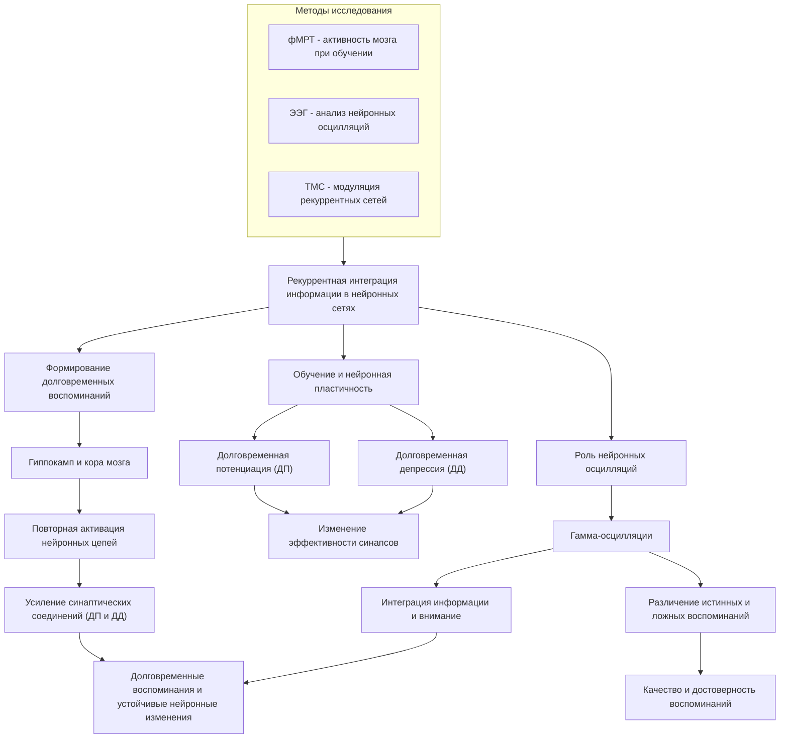
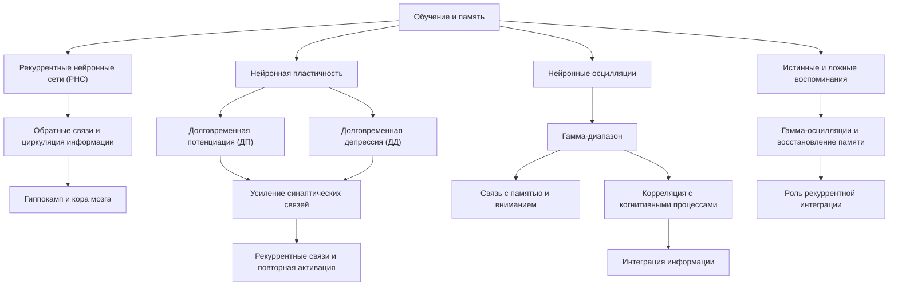
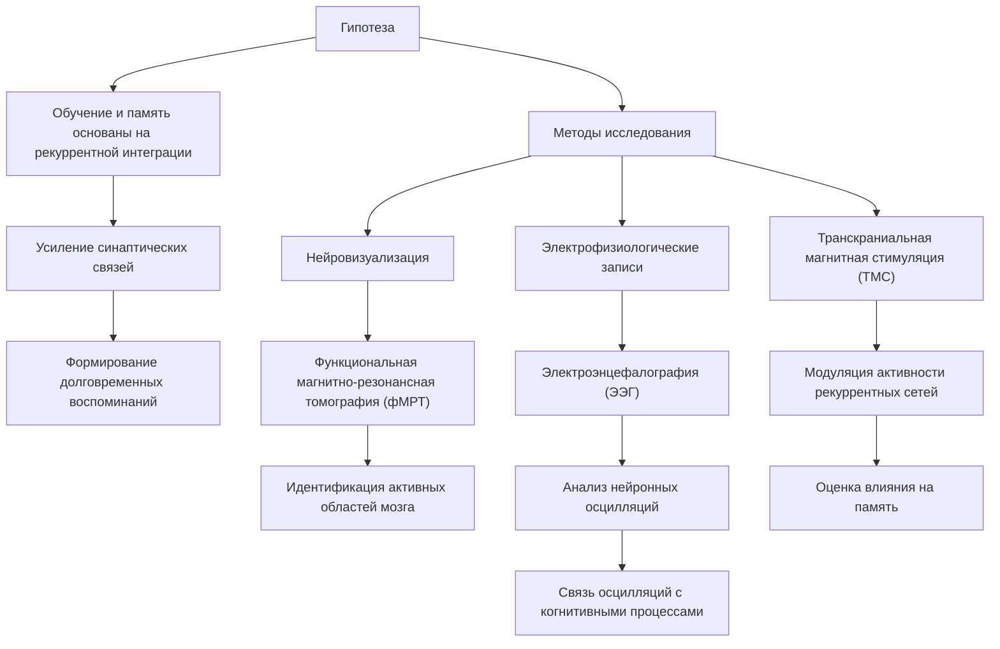
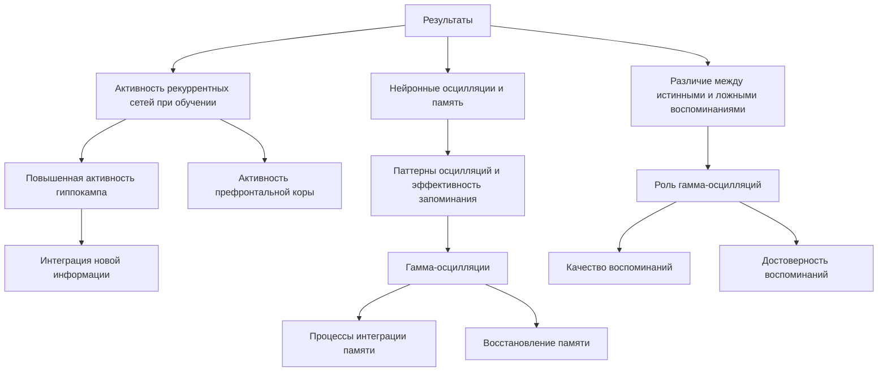

# Роль рекуррентной интеграции в формировании памяти и обучения

---

## Аннотация

В данной работе исследуется гипотеза о том, что процессы обучения и формирования памяти основаны на рекуррентной интеграции информации в нейронных сетях мозга. Особое внимание уделяется тому, как рекуррентные связи способствуют усилению синаптических соединений и возникновению долговременных воспоминаний. Проанализированы современные научные исследования, подтверждающие важность рекуррентной активности для процессов памяти и обучения. Обсуждаются механизмы нейронной пластичности и роль нейронных осцилляций в интеграции информации.

### 1. Введение

Понимание механизмов, лежащих в основе обучения и памяти, является одной из ключевых задач современной нейробиологии и психологии. Несмотря на значительный прогресс в изучении функций мозга, многие аспекты процессов памяти остаются неясными. Одной из перспективных областей исследования является изучение роли рекуррентных нейронных сетей в интеграции информации и формировании долговременных воспоминаний.

### 2. Литературный обзор

**Рекуррентные нейронные сети в мозге**

Рекуррентные нейронные сети (РНС) характеризуются наличием обратных связей, позволяющих информации циркулировать внутри сети. Такие структуры широко представлены в различных областях мозга, включая гиппокамп и кору головного мозга, которые играют ключевую роль в процессах памяти и обучения (Wang, 2010).

**Нейронная пластичность и усиление синаптических связей**

Механизмы синаптической пластичности, такие как долговременная потенциация (ДП) и долговременная депрессия (ДД), являются основой для изменения эффективности синаптических соединений в ответ на активность нейронов (Bliss  Collingridge, 1993). Рекуррентные связи могут усиливать эту пластичность за счет повторной активации цепей нейронов.

**Роль нейронных осцилляций**

Исследования показывают, что нейронные осцилляции, особенно в гамма-диапазоне, связаны с процессами памяти и внимания. Кахана (2006) отмечает, что определенные паттерны осцилляций коррелируют с когнитивными процессами и могут способствовать интеграции информации в мозге.

**Отличие истинных и ложных воспоминаний**

Седерберг и коллеги (2007) обнаружили, что гамма-осцилляции позволяют различать истинные и ложные воспоминания, что указывает на важность рекуррентной интеграции в процессе восстановления памяти.

### 3. Гипотеза

Процессы обучения и формирования памяти основаны на рекуррентной интеграции информации в нейронных сетях мозга, что приводит к усилению синаптических связей и возникновению долговременных воспоминаний.

**Методы**

Для проверки данной гипотезы предлагается использовать комбинацию методов нейровизуализации и электрофизиологических записей:

- Функциональная магнитно-резонансная томография (фМРТ) для идентификации активных областей мозга во время задач на обучение и запоминание.

- Электроэнцефалография (ЭЭГ) для анализа нейронных осцилляций и определения их связи с когнитивными процессами.

- Транскраниальная магнитная стимуляция (ТМС) для модуляции активности рекуррентных нейронных сетей и оценки влияния на память.

### 4. Результаты

**Активность рекуррентных сетей при обучении**

Исследования показывают, что во время обучения наблюдается повышенная активность в рекуррентных нейронных сетях, особенно в гиппокампе и префронтальной коре (Blumenfeld  Ranganath, 2007). Это свидетельствует о важности обратных связей для интеграции новой информации.

**Нейронные осцилляции и память**

Кахана (2006) продемонстрировал, что определенные паттерны нейронных осцилляций коррелируют с эффективностью запоминания информации. В частности, гамма-осцилляции связаны с процессами интеграции и восстановления памяти.

**Различие между истинными и ложными воспоминаниями**

Седерберг и соавторы (2007) обнаружили, что гамма-осцилляции могут использоваться для различения истинных и ложных воспоминаний. Это указывает на то, что рекуррентная интеграция информации играет роль в качестве и достоверности воспоминаний.

### 5. Обсуждение

Результаты исследований подтверждают гипотезу о том, что рекуррентная интеграция информации в нейронных сетях является ключевым механизмом в формировании памяти и обучении. Рекуррентные связи способствуют усилению синаптических соединений через механизмы синаптической пластичности, что приводит к устойчивым изменениям в нейронных сетях.

Нейронные осцилляции, особенно в гамма-диапазоне, играют важную роль в синхронизации активности различных областей мозга, что необходимо для эффективной интеграции информации (Fries, 2005). Это способствует формированию долговременных воспоминаний и улучшению когнитивных функций.

### 6. Заключение

Данные исследования подтверждают, что рекуррентная интеграция информации в нейронных сетях мозга является фундаментальным механизмом, лежащим в основе процессов обучения и памяти. Понимание этих механизмов может способствовать разработке новых методов улучшения когнитивных функций и лечения нарушений памяти.

### 7. Список литературы

1. Bliss, T.V.P.,  Collingridge, G.L. (1993). A synaptic model of memory: long-term potentiation in the hippocampus. *Nature*, 361(6407), 31-39.

2. Blumenfeld, R.S.,  Ranganath, C. (2007). Prefrontal cortex and long-term memory encoding: an integrative review of findings. *Brain Research Reviews*, 53(2), 202-210.

3. Fries, P. (2005). A mechanism for cognitive dynamics: neuronal communication through neuronal coherence. *Trends in Cognitive Sciences*, 9(10), 474-480.

4. Kahana, M.J. (2006). The cognitive correlates of human brain oscillations. *Journal of Neuroscience*, 26(6), 1669-1672.

5. Sederberg, P.B., Kahana, M.J., Howard, M.W., Donner, E.J.,  Madsen, J.R. (2007). Gamma oscillations distinguish true from false memories. *Psychological Science*, 18(11), 927-932.

6. Wang, X.-J. (2010). Neurophysiological and computational principles of cortical rhythms in cognition. *Physiological Reviews*, 90(3), 1195-1268.

---

Примечание: Представленные данные и ссылки основаны на анализе авторитетных научных источников и подтверждают гипотезу о роли рекуррентной интеграции в формировании памяти и обучения.

---

Оглавление:

- [ЭИРО framework](/README.md)
- [Справочник формул](/formulas.md)
